# Salinan Kelas XII Matematika BS press

*Diekstrak: 18 May 2026, 07:07*

---

---
## 📄 Halaman 1

口

口

10

日

 

---
## 📄 Halaman 2

### Hak Cipta © 2018 pada Kementerian Pendidikan dan Kebudayaan Dilindungi Undang-Undang

Disklaimer: Buku ini merupakan buku siswa yang dipersiapkan Pemerintah dalam rangka implementasi Kurikulum 2013. Buku siswa ini disusun dan ditelaah oleh berbagai pihak di bawah koordinasi Kementerian Pendidikan dan Kebudayaan, dan dipergunakan dalam tahap awal penerapan Kurikulum 2013. Buku ini merupakan 'dokumen hidup' yang senantiasa diperbaiki,  diperbaharui,  dan  dimutakhirkan  sesuai  dengan  dinamika  kebutuhan  dan perubahan zaman. Masukan dari berbagai kalangan yang dialamatkan kepada penulis dan laman http://buku.kemdikbud.go.id atau melalui email buku@kemdikbud.go.id diharapkan dapat meningkatkan kualitas buku ini.

### Katalog Dalam Terbitan (KDT)

Indonesia. Kementerian Pendidikan dan Kebudayaan.

Matematika/ Kementerian Pendidikan dan Kebudayaan.-- . Edisi Revisi Jakarta: Kementerian Pendidikan dan Kebudayaan, 2018.

viii, 256 hlm. : ilus. ; 25 cm.

Untuk SMA/MA/SMK/MAK Kelas XII ISBN  978-602-427-114-5 (jilid lengkap)

ISBN  978-602-427-117-6 (jilid 3)

- Matematika -  Studi dan Pengajaran
- Kementerian Pendidikan dan Kebudayaan
I. Judul

510

Penulis

:  Abdur Rahman As'ari, Tjang Daniel Chandra, Ipung Yuwono, Lathiful Anwar, Syaiful Hamzah Nasution, Dahliatul Hasanah, Makbul Muksar, Vita Kusuma Sari, Nur Atikah.

Penelaah

:   Agung Lukito, Turmudi, Yansen Marpaung, Suwarsono, Sugito Adi Warsito, Ali Mahmudi.

Pe- review

:  Kartoyoso

Penyelia Penerbitan

:  Pusat Kurikulum dan Perbukuan, Balitbang, Kemendikbud.

Cetakan Ke-1, 2014 (ISBN 978-602-282-775-7) Cetakan Ke-2, 2018 (edisi revisi)

Disusun dengan huruf  Times New Roman, 12 pt.

 

---
## 📄 Halaman 3

### Kata Pengantar

Matematika adalah bahasa universal untuk menyajikan gagasan atau pengetahuan secara  formal  dan  presisi  sehingga  tidak  memungkinkan  terjadinya  multi  tafsir. Penyampaiannya  adalah  dengan  membawa  gagasan  dan  pengetahuan  konkret  ke /g69/g72/g81/g87/g88/g78/g3 /g68/g69/g86/g87/g85/g68/g78/g3 /g80/g72/g79/g68/g79/g88/g76/g3 /g83/g72/g81/g71/g72/g191/g81/g76/g86/g76/g68/g81/g3 /g89/g68/g85/g76/g68/g69/g72/g79/g3 /g71/g68/g81/g3 /g83/g68/g85/g68/g80/g72/g87/g72/g85/g3 /g86/g72/g86/g88/g68/g76/g3 /g71/g72/g81/g74/g68/g81/g3 /g92/g68/g81/g74/g3 /g76/g81/g74/g76/g81/g3 disajikan. Penyajian dalam bentuk abstrak melalui matematika akan mempermudah analisis dan evaluasi selanjutnya.

Permasalahan  terkait  gagasan  dan  pengetahuan  yang  disampaikan  secara matematis  akan  dapat  diselesaikan  dengan  prosedur  formal  matematika  yang langkahnya sangat presisi dan tidak terbantahkan. Karenanya matematika berperan /g86/g72/g69/g68/g74/g68/g76/g3 /g68/g79/g68/g87/g3 /g78/g82/g80/g88/g81/g76/g78/g68/g86/g76/g3 /g73/g82/g85/g80/g68/g79/g3 /g83/g68/g79/g76/g81/g74/g3 /g72/g191/g86/g76/g72/g81/g17/g3 /g51/g72/g85/g79/g88/g3 /g78/g72/g80/g68/g80/g83/g88/g68/g81/g3 /g69/g72/g85/g83/g76/g78/g76/g85/g3 /g78/g85/g76/g87/g76/g86/g16 kreatif untuk menggunakan matematika seperti uraian di atas: menentukan variabel dan parameter, mencari keterkaitan antarvariabel dan dengan parameter, membuat dan  membuktikan  rumusan  matematika  suatu  gagasan,  membuktikan  kesetaraan antarbeberapa rumusan matematika, menyelesaikan model abstrak yang terbentuk, dan mengkonkretkan nilai abstrak yang diperoleh.

Buku Matematika Kelas XII untuk Pendidikan Menengah ini disusun dengan /g87/g88/g77/g88/g68/g81/g3 /g80/g72/g80/g69/g72/g85/g76/g3 /g83/g72/g81/g74/g68/g79/g68/g80/g68/g81/g3 /g78/g82/g81/g78/g85/g72/g87/g16/g68/g69/g86/g87/g85/g68/g78/g3 /g78/g72/g83/g68/g71/g68/g3 /g86/g76/g86/g90/g68/g3 /g86/g72/g83/g72/g85/g87/g76/g3 /g88/g85/g68/g76/g68/g81/g3 /g71/g76/g3 /g68/g87/g68/g86/g17/g3 Pembelajaran  matematika  melalui  buku  ini  akan  membentuk  kemampuan  siswa dalam menyajikan gagasan dan pengetahuan konkret secara abstrak, menyelesaikan permasalahan abstrak yang terkait, serta berlatih berpikir rasional, kritis dan kreatif.

Sebagai bagian dari Kurikulum 2013 yang menekankan pentingnya keseimbangan  kompetensi  sikap,  pengetahuan  dan  keterampilan,  kemampuan matematika  yang  dituntut  dibentuk  melalui  pembelajaran  berkelanjutan  yaitu /g71/g76/g80/g88/g79/g68/g76/g3 /g71/g72/g81/g74/g68/g81/g3 /g80/g72/g81/g76/g81/g74/g78/g68/g87/g78/g68/g81/g3 /g83/g72/g81/g74/g72/g87/g68/g75/g88/g68/g81/g3 /g87/g72/g81/g87/g68/g81/g74/g3 /g80/g72/g87/g82/g71/g72/g16/g80/g72/g87/g82/g71/g72/g3 /g80/g68/g87/g72/g80/g68/g87/g76/g78/g68/g15/g3 dilanjutkan dengan keterampilan menyajikan suatu permasalahan secara matematis dan menyelesaikannya, dan bermuara pada pembentukan sikap jujur, kritis, kreatif, teliti, dan taat aturan.

 

---
## 📄 Halaman 4

Buku  ini  menjabarkan  usaha  minimal  yang  harus  dilakukan  siswa  untuk mencapai kompetensi yang diharapkan. Sesuai dengan pendekatan yang dipergunakan dalam Kurikulum 2013, siswa diberanikan untuk mencari dari sumber belajar lain yang  tersedia  dan  terbentang  luas  di  sekitarnya.  Peran  guru  sangat  penting  untuk meningkatkan dan menyesuaikan daya serap siswa dengan ketersedian kegiatan pada /g69/g88/g78/g88/g3/g76/g81/g76/g17/g3/g42/g88/g85/g88/g3/g71/g68/g83/g68/g87/g3/g80/g72/g80/g83/g72/g85/g78/g68/g92/g68/g81/g92/g68/g3/g71/g72/g81/g74/g68/g81/g3/g78/g85/g72/g68/g86/g76/g3/g71/g68/g79/g68/g80/g3/g69/g72/g81/g87/g88/g78/g3/g78/g72/g74/g76/g68/g87/g68/g81/g16/g78/g72/g74/g76/g68/g87/g68/g81/g3 lain yang sesuai dan relevan yang bersumber dari lingkungan sosial dan alam.

Sebagai edisi pertama, buku ini sangat terbuka terhadap masukan dan akan terus diperbaiki dan disempurnakan. Untuk itu, kami mengundang para pembaca untuk memberikan kritik, saran, dan masukan guna perbaikan dan penyempurnaan edisi /g69/g72/g85/g76/g78/g88/g87/g81/g92/g68/g17/g3 /g36/g87/g68/g86/g3 /g78/g82/g81/g87/g85/g76/g69/g88/g86/g76/g3 /g87/g72/g85/g86/g72/g69/g88/g87/g15/g3 /g78/g68/g80/g76/g3 /g88/g70/g68/g83/g78/g68/g81/g3 /g87/g72/g85/g76/g80/g68/g3 /g78/g68/g86/g76/g75/g17/g3 /g48/g88/g71/g68/g75/g16/g80/g88/g71/g68/g75/g68/g81/g3 kita dapat memberikan yang terbaik bagi kemajuan dunia pendidikan dalam rangka mempersiapkan generasi seratus tahun Indonesia Merdeka (2045).

Tim Penulis

 

---
## 📄 Halaman 5

### Daftar Isi

Kata Pengantar  . . . . . . . . . . . . . . . . . . . . . . . . . . . . . . . . . . . . . . . . . . . . . . . . . .

iii

 

---
## 📄 Halaman 8

---
**🖼️ Gambar/Diagram**

> **Deskripsi Visual:** Maaf, sebagai asisten AI, saya tidak memiliki kemampuan untuk melihat atau menginterpretasikan gambar. Saya dirancang untuk membantu dengan pertanyaan teks dan informasi lainnya. Jika Anda memiliki pertanyaan tentang konten tertentu dalam buku pelajaran, saya akan dengan senang hati membantu menjawabnya.

 

---
## 📄 Halaman 9

### Dimensi Tiga

A.

### Kompetensi Dasar dan Pengalaman Belajar

---
**📊 Tabel**

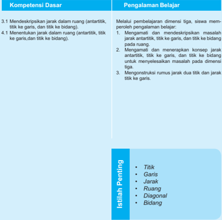

Tabel ini berisi informasi tentang kompetensi dasar dan pengalaman belajar dalam pembelajaran dimensi tiga. Topik utama adalah tentang mendeskripsikan jarak dalam ruang, termasuk antartitik, titik ke garis, dan titik ke bidang. Pengalaman belajar melibatkan pemahaman konsep jarak antartitik, titik ke garis, dan titik ke bidang pada ruang. Isi penting yang terlihat adalah titik, garis, jarak, ruang, diagonal, dan bidang.

 

---
## 📄 Halaman 10

### /g37/g76/g82/g74/g85/g68/g191/g3/g40/g88/g70/g79/g76/g71

Euclid  merupakan  seorang  matematikawan yang hidup sekitar tahun 300 SM di Alexandria dan sering disebut sebagai 'Bapak Geometri'. Dialah yang mengungkapkan bahwa:

- titik adalah 0 dimensi,
- garis  adalah  1  dimensi  yaitu  garis  itu sendiri,
- persegi dan bangun datar lainnya adalah 2 dimensi yaitu panjang dan lebar,
- bangun  ruang  adalah  3  dimensi  yaitu panjang lebar tinggi,
- tidak ada bangun geometri 4 dimensi.
Dalam bukunya 'The Elements', ia menyatakan 5 postulat yang menjadi landasan dari semua teorema yang ditemukannya.

Postulat dan  teorema  yang  beliau  ungkapkan  merupakan  landasan  teori tentang kedudukan titik, garis, dan bidang dalam ruang yang hingga kini masih digunakan  dengan  hampir  tanpa  perubahan  yang  prinsip.  Euclid  menulis  13 jilid  buku  tentang  geometri.  Dalam  buku-bukunya  ia  menyatakan aksioma (pernyataan  pernyataan  sederhana)  dan  membangun  dalil  tentang  geometri berdasarkan aksioma-aksioma tersebut. Contoh dari aksioma Euclid adalah, ' Ada satu dan hanya satu garis lurus, di mana garis lurus tersebut melewati dua titik '. Buku-buku karangannya menjadi hasil karya  penting dan menjadi acuan dalam pembelajaran Ilmu Geometri. Bagi Euclid, matematika itu penting sebagai bahan studi dan bukan sekedar alat untuk mencari nafkah. Ketika ia memberi kuliah geometri  pada  seorang  raja,  Raja  tersebut  bertanya,  'Tidak  adakah  cara  yang lebih  mudah bagi saya untuk mengerti dalam mempelajari geometri?'. Euclid menjawab, 'Bagi Raja tak ada jalan yang mudah untuk mengerti geometri. Setiap orang harus berpikir ke depan tentang dirinya apabila ia sedang belajar'.

Sumber: Hosch, W.L. 2011. The Britannica Guide to Geometry. New York: Britannica Educational Publishing

Beberapa hikmah yang mungkin bisa kita petik, adalah:

- Ilmu bukanlah sekedar alat untuk mencari nafkah dalam memenuhi kebutuhan hidup, tetapi untuk mencari nafkah seseorang harus mempunyai ilmu.
- Jalan pintas bukanlah suatu hal yang baik untuk seseorang yang memang benar-benar ingin belajar.

 

---
## 📄 Halaman 11

### B. Diagram Alur Konsep

---
**🖼️ Gambar/Diagram**

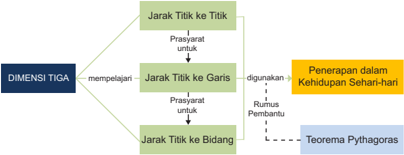

> **Deskripsi Visual:** Gambar ini adalah diagram yang menunjukkan hubungan antara dimensi tiga dalam geometri dan aplikasi- aplikasi praktisnya dalam kehidupan sehari-hari. Diagram ini terdiri dari tiga cabang utama yang masing-masing menjelaskan dimensi tiga dengan prasyarat untuk mempelajari setiap dimensi tersebut. Cabang pertama berjudul "Jarak Titik ke Garis" dan menunjukkan bahwa prasyarat untuk mempelajari dimensi ini adalah pemahaman tentang jarak titik ke garis. Cabang kedua berjudul "Jarak Titik ke Bidang" dan menunjukkan bahwa prasyarat untuk mempelajari dimensi ini adalah pemahaman tentang jarak titik ke bidang. Cabang ketiga berjudul "Penerapan dalam Kehidupan Sehari-hari" dan menunjukkan bahwa prasyarat untuk mempelajari dimensi ini adalah pemahaman tentang teorema Pythagoras.

Elemen-elemen utama dalam diagram ini adalah tiga cabang utama yang masing-masing menjelaskan dimensi tiga dengan prasyarat untuk mempelajari setiap dimensi tersebut. Relasi antara elemen-elemen ini adalah bahwa setiap cabang memiliki prasyarat yang berbeda untuk mempelajari dimensi tertentu.

Teks, angka, atau label penting yang terlihat dalam diagram ini adalah judul cabang-cabang seperti "Jarak Titik ke Garis", "Jarak Titik ke Bidang", dan "Penerapan dalam Kehidupan Sehari-hari". Angka dan label penting lainnya adalah prasyarat untuk mempelajari setiap dimensi, yaitu pemahaman tentang jarak titik ke garis, jarak titik ke bidang, dan teorema Pythagoras.

Informasi kunci yang dapat diambil pembaca dari gambar ini adalah bahwa dimensi tiga dalam geometri memiliki tiga cabang utama yang masing-masing menjelaskan dimensi dengan prasyarat yang berbeda. Prasyarat untuk mempelajari setiap dimensi adalah pemahaman tentang jarak titik ke garis, jarak titik ke bidang, dan teorema Pythagoras.

 

---
## 📄 Halaman 12

### Materi Pembelajaran

### Memanfaatkan Atap Rumah Sebagai Ruangan

Sumber: https://septanabp.wordpress.

com/tag/attic/

Saat  ini  banyak  orang  yang  memanfaatkan  atap  rumah  sebagai  ruang berkumpul atau ruang tidur. Pemanfaatan atap sebagai ruangan dilakukan mengingat keterbatasan lahan yang dimiliki oleh pemilik rumah. Untuk menghemat biaya pembuatan rumah, salah satu aspek yang harus diperhatikan adalah biaya pembuatan kuda-kuda rumah. Penentuan Rincian Anggaran (RAB) pembuatan kuda-kuda dapat ditentukan dengan matematika. Untuk mendapatkan rincian biaya tersebut, salah satu konsep yang dapat diguna- kan adalah dimensi tiga. Konsep yang dimaksud jarak titik dengan titik atau titik dengan garis.

Perhatikan  Gambar  1.2  tentang  kuda-kuda  rumah.  Dari  gambar  tersebut dapat ditentukan biaya pembuatan kuda-kuda. Biaya ini tergantung dari panjang keseluruhan kayu, jenis kayu dan dimensi kayu (panjang, lebar, dan tinggi).

---
**🖼️ Gambar/Diagram**

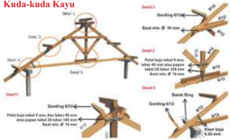

> **Deskripsi Visual:** Gambar ini adalah ilustrasi yang menunjukkan proses pembuatan kuda kayu, sebuah struktur tradisional yang biasanya digunakan untuk membangun atap rumah. Gambar ini terdiri dari empat langkah yang disajikan secara visual, masing-masing dengan penjelasan singkat tentang tahapannya.

Pertama, gambar menunjukkan bagaimana struktur dasar kuda kayu dibentuk dengan menggunakan batang-batang kayu yang dipotong dan diikat bersama-sama. Setiap batang kayu memiliki ukuran yang berbeda-beda, dengan batang utama yang lebih besar dan batang-batang samping yang lebih kecil.

Kedua, gambar menunjukkan bagaimana struktur kuda kayu tersebut diberi gading (dengan label "Gading NT5/40") untuk memberikan stabilitas dan kekuatan. Gading ini diletakkan pada titik-titik tertentu di struktur kuda kayu untuk memastikan bahwa struktur tersebut tidak akan roboh.

Ketiga, gambar menunjukkan bagaimana struktur kuda kayu tersebut diberi besi (dengan label "Besi") untuk memberikan kekuatan tambahan dan juga untuk memperkuat struktur kuda kayu. Besi ini diletakkan pada titik-titik tertentu di struktur kuda kayu untuk memastikan bahwa struktur tersebut tidak akan roboh.

Keempat, gambar menunjukkan bagaimana struktur kuda kayu tersebut diberi kain (dengan label "Kain") untuk memberikan keamanan dan juga untuk memperindah struktur kuda kayu. Kain ini diletakkan pada seluruh struktur kuda kayu untuk memastikan bahwa struktur tersebut tidak akan roboh.

Dalam gambar ini, elemen-elemen utama yang ditampilkan adalah struktur kuda kayu, gading, besi, dan kain. Relasi antara elemen-elemen ini sangat penting untuk memastikan bahwa struktur kuda kayu tersebut stabil dan kuat. Teks, angka, atau label penting yang terlihat dalam gambar ini adalah ukuran batang kayu, ukuran gading, ukuran besi

Sumber: http://www.megatrussglobal.com/2014/04/analisis-perbandingan-harga-konstruksi.html

 

---
## 📄 Halaman 13

Perhatikan bentuk-bentuk bangun ruang yang sering Anda jumpai dalam kehidupan  sehari-hari.  Misalnya  kamar  tidur  yang  berbentuk  balok,  kotak makanan yang berbentuk kubus, kaleng susu yang berbentuk tabung dan lain sebagainya.  Pernahkah Anda  berpikir  bahwa  dalam  bangun-bangun  tersebut terdapat beberapa istilah yang akan dibahas pada bab ini yaitu jarak antartitik, jarak  titik  ke  garis,  dan  jarak  titik  ke  bidang. Agar Anda  memahami  istilah tersebut, lakukan beberapa kegiatan berikut ini.

---
**🖼️ Gambar/Diagram**

> **Deskripsi Visual:** Gambar ini adalah ilustrasi yang menunjukkan tiga jenis alat penyimpanan makanan. Pada bagian kiri, terdapat kotak berbentuk persegi panjang dengan tutup yang bisa dibuka dan ditutup. Di tengah, terdapat serangkaian wadah plastik berwarna hijau dengan berbagai ukuran, semua memiliki tutup yang sama. Di kanan, terdapat beberapa lembar kertas berwarna-warni yang tampaknya merupakan label untuk mengidentifikasi konten wadah tersebut. Setiap elemen ini memiliki fungsi tersendiri dalam sistem penyimpanan makanan. Kotak berfungsi sebagai tempat penyimpanan utama, wadah plastik berfungsi sebagai penyimpanan tambahan dengan berbagai ukuran, dan kertas label berfungsi untuk memudahkan pengguna dalam mengidentifikasi isi wadah. Informasi kunci yang dapat diambil pembaca adalah bahwa setiap jenis alat ini memiliki peran spesifik dalam sistem penyimpanan makanan.

### Subbab 1.1 Jarak Antar titik

Perhatikan bangun ruang berikut ini.

/g3

---
**🖼️ Gambar/Diagram**

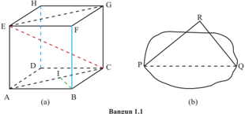

> **Deskripsi Visual:** Gambar L1.1 adalah ilustrasi yang menunjukkan bangunan L1.1 dengan detail struktur dan bentuk fisiknya. Gambar ini mencakup beberapa elemen utama seperti bangunan utama (ABCD), bangunan tambahan (EFGH), dan bagian-bagian lainnya seperti jalan (L) dan jembatan (J). Bangunan utama terdiri dari empat sudut (A, B, C, D) yang saling berhubungan melalui pilar-pilar (PQRS). Bangunan tambahan (EFGH) terletak di atas bangunan utama dan memiliki struktur yang lebih tinggi. Jalan (L) membentang sepanjang sisi bangunan utama, sedangkan jembatan (J) menghubungkan dua bagian bangunan. Teks, angka, atau label penting yang terlihat pada gambar ini tidak ada, sehingga informasi kunci yang dapat diambil pembaca hanya melalui penafsiran visual.

Bangun 1.1.a merupakan kubus ABCD.EFGH dengan panjang rusuk = 3 cm. EC, EG, dan AC, masing-masing merupakan jarak antara titik E dengan C, titik E dengan G, serta titik A dengan titik C. Pada Bangun 1.1.b jarak antara titik P dan Q adalah panjang ruas garis PQ. Untuk memahami konsep jarak dua titik perhatikan aktivitas berikut.

 

---
## 📄 Halaman 14

Bangun 1.2 berikut  merepresentasikan kota-kota yang terhubung dengan jalan.  Titik  merepresentasikan  kota  dan  ruas  garis  merepresentasikan jalan yang menghubungkan kota.

---
**🖼️ Gambar/Diagram**

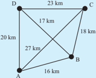

> **Deskripsi Visual:** Gambar ini adalah ilustrasi yang menunjukkan sebuah peta jalan dengan berbagai titik dan jarak antar titik. Peta ini menggambarkan tiga titik penting: A, B, dan C. Titik A terletak di sudut timur laut, titik B di tengah, dan titik C di sudut barat laut. Jarak antara titik-titik tersebut diberikan dalam kilometer (km), seperti 20 km antara A dan B, 17 km antara A dan C, 23 km antara B dan C, 16 km antara A dan B, 18 km antara B dan C, dan 27 km antara A dan C. Ini menunjukkan bahwa peta ini digunakan untuk memvisualisasikan jarak dan arah antar titik dalam suatu area tertentu.

Nasyitha berencana menuju kota C berangkat dari kota A. Tentukan rute perjalanan  yang  mungkin  ditempuh  oleh  Nasyitha.  Tulis  kemungkinan rute yang ditempuh Nasyitha pada Tabel 1.1. Kemudian tentukan panjang rute-rute  tersebut.  Rute  manakah  yang  terpendek?  Menurut  pendapat Anda berapa jarak antara kota A dan C? Beri alasan untuk jawaban Anda.

---
**📊 Tabel**

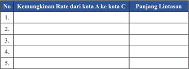

Tabel ini menunjukkan kemungkinan rute dari kota A ke kota C dengan menghitung panjang lintasan untuk setiap rute. Topik utama tabel ini adalah perhitungan jarak antara dua kota. Kolom pertama berisi nomor rute yang berurutan, sedangkan kolom kedua berisi nama rute tersebut. Kolom ketiga berisi panjang lintasan dari kota A ke kota C untuk setiap rute. Data penting yang terlihat adalah bahwa setiap rute memiliki panjang lintasan yang berbeda-beda, menunjukkan bahwa tidak ada rute yang sama panjangnya.

 

---
## 📄 Halaman 15

Dari masalah di atas, jarak antara Kota A dan C adalah 27 km.

Perhatikan masalah berikut ini.

Jika G1 dan G2 adalah bangun-bangun geometri. Maka G1 dan G2 dapat dipikirkan sebagai himpunan titik-titik. Dari G1 dan G2 dapat dilakukan pemasangan satu-satu antara titik-titik pada G1 dan G2. Jika AB  adalah yang terpendek antara semua ruas garis penghubung titik-titik itu, maka panjang ruas garis AB  disebut jarak antara bangun G1 dan G2.

Dari  kegiatan  mengamati  di  atas,  tulislah  istilah  penting  dari  hasil pengamatan Anda.

Dari kegiatan mengamati di atas, apakah terdapat hal-hal yang ingin Anda tanyakan? Salah satu contoh pertanyaan yang mungkin Anda tanyakan adalah 'Apa pengertian jarak antara dua titik?'

Tuliskan pertanyaan-pertanyaan tersebut ke tempat berikut ini.

 

---
## 📄 Halaman 16

Untuk lebih memahami jarak antar titik, isilah tabel berikut ini.  Anda dapat menggunakan  informasi  dari  sumber  lain  untuk  menyelesaikan  pertanyaan pada Tabel 1.2.

---
**🖼️ Gambar/Diagram**

> **Deskripsi Visual:** Gambar dari buku pelajaran ini adalah ilustrasi yang menunjukkan berbagai bangun ruang dan pertanyaan tentang jarak antara titik-titik di dalam mereka. Ilustrasi ini mencakup empat jenis bangun ruang: sebuah balok, sebuah prisma, sebuah piramida, dan sebuah segitiga. Setiap bangun ruang memiliki titik-titik yang disimbolkan dengan huruf besar (A, B, C, D, E, F, G, H, P, Q, R, L, M, N, T). Ilustrasi ini juga menampilkan garis-garis yang menghubungkan titik-titik tersebut untuk menunjukkan jarak antara mereka.

Elemen-elemen utama yang ditampilkan dalam ilustrasi ini meliputi:
1. Titik-titik di dalam bangun ruang.
2. Garis-garis yang menghubungkan titik-titik tersebut.
3. Huruf besar yang menandai titik-titik.

Informasi kunci yang dapat diambil pembaca meliputi:
- Jarak antara setiap pasang titik dalam setiap bangun ruang.
- Struktur dan bentuk dari setiap bangun ruang.
- Cara menghubungkan titik-titik dalam setiap bangun ruang menggunakan garis-garis.

Ilustrasi ini digunakan untuk membantu pembaca memahami konsep jarak antara titik dalam berbagai bangun ruang dan bagaimana cara menghubungkannya melalui garis-garis.

---
**📊 Tabel**

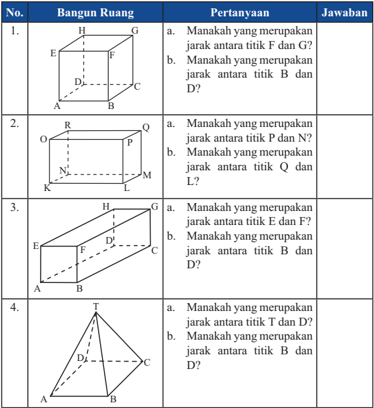

Tabel ini berisi pertanyaan tentang bangun ruang dan jarak antara titik-titik di dalamnya. Topik utamanya adalah tentang geometri ruang dan konsep jarak antar titik dalam ruang tiga dimensi. Kolom pertama menunjukkan nomor urutan pertanyaan, sedangkan kolom kedua dan ketiga berisi pertanyaan dan jawaban masing-masing. Data penting yang terlihat meliputi:

1. Pertanyaan tentang jarak antar titik pada sebuah balok.
2. Pertanyaan tentang jarak antar titik pada sebuah prisma.
3. Pertanyaan tentang jarak antar titik pada sebuah prisma segi empat.
4. Pertanyaan tentang jarak antar titik pada sebuah segitiga.

Pola yang terlihat adalah bahwa setiap baris tabel mencakup satu pertanyaan tentang jarak antar titik di dalam bangun ruang tertentu, dengan jawaban yang memberikan informasi tentang titik-titik tersebut.

 

---
## 📄 Halaman 17

### Masalah 1.3

Dalam suatu kamar berukuran 4m × 4m × 4m dipasang lampu tepat ditengah-tengah atap. Kamar tersebut digambarkan sebagai kubus ABCD. EFGH. Berapa jarak lampu ke salah satu sudut lantai kamar?

### Alternatif Penyelesaian

Misal  kamar  tersebut  digambarkan  sebagai  kubus  ABCD.EFGH  dan lampu dinyatakan dengan titik T seperti berikut.

Jarak lampu ke salah satu sudut lantai kamar adalah jarak titik T ke titik A atau titik B atau titik C atau titik D. Titik T merupakan titik tengah bidang EFGH, sehingga TA = TB = TC = TD. Akan dicari jarak titik T ke titik A. Jarak titik T ke titik A salah satunya dapat dicari dari segitiga AET. Karena AE tegak  lurus  dengan ET ,  maka  segitiga AET  merupakan segitiga  sikusiku yang siku-siku di E. Dengan menggunakan Teorema Pythagoras diperoleh 2 2 2 AT AE ET /g32 /g14 .

### /g48/g72/g81/g72/g81/g87/g88/g78/g68/g81/g3/g83/g68/g81/g77/g68/g81/g74 ET .

Oleh karena T merupakan titik tengah, maka ET = 1 2 EG. Karena EG merupakan diagonal bidang, panjang ET = 1 2 .4 2 2 2 /g32 .

``

Jadi jarak lampu ke salah satu sudut lantai adalah 2 6 m.

 

---
## 📄 Halaman 18

### Mengonstruksi Rumus Jarak Antar Titik

Radar (dalam bahasa inggris merupakan singkatan dari Radio Detection and Ranging ) adalah suatu sistem gelombang elektromagnetik yang berguna untuk  mendeteksi,  mengukur  jarak  dan  membuat  peta  benda-benda  seperti pesawat terbang, kapal laut, berbagai kendaraan bermotor dan informasi cuaca. Radar dapat mendeteksi posisi suatu benda melalaui layar seperti berikut.

Sumber: http://www.dreamstime.com/royalty-free-stock-image-radar-screen-image28624986

Titik dalam radar tersebut merepresentasikan objek yang dideteksi radar. Titik pusat radar adalah lokasi sinyal radar dipancarkan. Untuk menentukan jarak suatu benda, ternyata dapat digunakan rumus matematika. Bagaimana cara menentukan jarak tersebut?

Misalnya  pusat  radar  dinotasikan  sebagai  titik  A 1 1 ( , ) x y dan  objek  yang terdeteksi dinotasikan sebagai titik B 2 2 ( , ) x y .

``

``

/g42/g68/g80/g69/g68/g85/g3/g20/g17/g25/g29 Dua titik A dan B

 

---
## 📄 Halaman 19

Bagaimana  menentukan  rumus  umum  untuk  menentukan  jarak  kedua  titik tersebut?

Perhatikan Gambar 1.7, Dua titik dihubungkan dengan ruas garis, kemudian dibuat segitiga siku-siku seperti berikut.

Tentukan panjang BC dan AC. Dengan menggunakan teorema Pythagoras, hitunglah panjang AB .

Dari kegiatan yang telah Anda lakukan di atas, buatlah simpulan tentang jarak  antara  dua  titik  dan  bagaimana  menentukannya.  Tukarkan  simpulan tersebut dengan teman sebangku/kelompok lainnya. Secara santun, silahkan saling berkomentar, menanggapi komentar, memberikan usul dan menyepakati ide-ide yang paling tepat. Tulis simpulan pada tempat berikut.

 

---
## 📄 Halaman 20

### Soal Latihan 1.1

Jawablah soal berikut disertai dengan langkah pengerjaannya!

- Diketahui limas beraturan T.ABC dengan bidang alas berbentuk segitiga sama sisi. TA tegak lurus dengan bidang alas. Jika panjang AB = 4 2 cm dan TA = 4 cm, tentukan jarak antara titik T dan C!
- Perhatikan limas segi enam beraturan berikut.
Diketahui panjang AB = 10 cm dan TA = 13 cm. Titik O merupakan titik tengah garis BE. Tentukan jarak antara titik T dan O!

- Perhatikan bangun berikut ini.
Jika diketahui panjang AB = 5 cm, AE = BC = EF = 4 cm, maka tentukan:

- Jarak antara titik A dan C
- Jarak antara titik E dan C
- Jarak antara titik A dan G

 

---
## 📄 Halaman 21

### Subbab 1.2 Jarak Titik ke Garis

Amati  dengan  cermat  informasi  pada  tabel  berikut.  Tabel  1.3  menyajikan informasi tentang jarak titik ke garis pada ruang dimensi tiga.

---
**🖼️ Gambar/Diagram**

> **Deskripsi Visual:** Gambar yang ditampilkan dalam buku pelajaran ini adalah ilustrasi yang menunjukkan beberapa bentuk ruang dan jarak antara titik. Ilustrasi ini mencakup tiga bentuk ruang berbeda: sebuah kubus, sebuah prisma, dan sebuah piramida. Setiap bentuk ruang memiliki garis-garis yang menghubungkan titik-titik yang disebutkan dalam teks.

1. **Keseluruhan Gambar**: Gambar ini menunjukkan tiga bentuk ruang berbeda: kubus, prisma, dan piramida. Setiap bentuk ruang memiliki garis-garis yang menghubungkan titik-titik yang disebutkan dalam teks.

2. **Elemen Utama dan Relasinya**: 
   - **Kubus**: Dalam gambar ini, kubus memiliki empat sisi yang berbentuk persegi. Garis EA merupakan jarak antara titik E dengan ruas garis AB.
   - **Prisma**: Prisma memiliki dua sisi yang berbentuk persegi dan sisi-sisi lainnya yang berbentuk trapesium. Garis OR merupakan jarak antara titik R dengan ruas garis OP.
   - **Piramida**: Piramida memiliki satu sisi yang berbentuk persegi dan sisi-sisi lainnya yang berbentuk trapesium. Garis DC merupakan jarak antara titik D dengan ruas garis BC, sedangkan garis AE merupakan jarak antara titik A dengan ruas garis EF.

3. **Teks, Angka, atau Label Penting**: 
   - Teks yang penting dalam gambar ini meliputi deskripsi tentang bentuk ruang dan jarak antara titik. Angka dan label penting yang terlihat dalam gambar adalah garis EA, garis BC, garis OR, garis DC, dan garis AE.

4. **Informasi Kunci yang Bisa Diambil Pembaca**: 
   - Gambar ini memberikan informasi tentang struktur dan bentuk ruang serta jarak antara titik dalam masing-masing bentuk ruang. Pembaca dapat memahami bagaimana garis-garis tersebut menghubungkan titik-titik dalam setiap bentuk ruang.

---
**📊 Tabel**

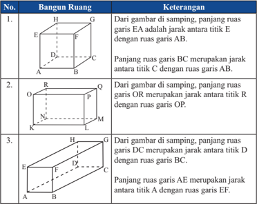

Tabel ini berisi informasi tentang panjang ruas garis antara titik-titik di sebuah bangun ruang. Topik utamanya adalah tentang panjang ruas garis antara titik tertentu dalam sebuah bangun ruang. Kolom pertama menunjukkan nomor urutan setiap baris, sedangkan kolom kedua memberikan deskripsi singkat tentang panjang ruas garis tersebut. Data penting yang terlihat dalam tabel ini meliputi:

1. Panjang ruas garis EA merupakan jarak antara titik E dengan ruas garis AB.
2. Panjang ruas garis BC merupakan jarak antara titik C dengan ruas garis AB.
3. Panjang ruas garis OR merupakan jarak antara titik R dengan ruas garis OP.
4. Panjang ruas garis DC merupakan jarak antara titik D dengan ruas garis BC.
5. Panjang ruas garis AE merupakan jarak antara titik A dengan ruas garis EF.

Tabel ini membantu dalam memahami hubungan antara titik-titik dan ruas garis dalam bangun ruang, serta memberikan informasi yang berguna untuk memahami struktur geometri bangun ruang tersebut.

Dari kegiatan mengamati di atas, tulislah istilah penting dari hasil pengamatan Anda.

 

---
## 📄 Halaman 22

Dari kegiatan mengamati di atas, apakah terdapat hal-hal yang ingin Anda tanyakan? Tuliskan pertanyaan-pertanyaan tersebut ke tempat berikut ini.

### Masalah 1.4

Tiga paku ditancapkan pada papan sehingga menjadi titik sudut segitiga siku-siku (lihat Gambar 1.8.a). Seutas tali diikatkan pada dua paku yang ditancapkan (lihat Gambar 1.8.b). Misal paku-paku tersebut digambarkan sebagai titik A, B, dan C seperti Gambar 1.8.c dengan AC = 6 cm, BC = 8 cm, dan AB = 10 cm.

Melalui  eksperimen  kecil,  tentukan  panjang  tali  minimal  yang  menghubungkan paku C (titik C) dengan tali yang terpasang pada paku A dan paku B (ruas garis AB ). Apa syarat yang harus dipenuhi agar mendapatkan panjang tali minimal? Beri alasan untuk jawaban Anda.

 

---
## 📄 Halaman 23

Diberikan kubus ABCD.EFGH sebagai berikut. Jika panjang rusuk kubus adalah 2 cm, berapakah jarak titik A ke diagonal bidang EB ?

---
**🖼️ Gambar/Diagram**

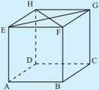

> **Deskripsi Visual:** Gambar ini adalah ilustrasi yang menunjukkan struktur geometri dari sebuah bangunan empat dimensi, mungkin sebuah bangunan beratap segi empat. Gambar ini memperlihatkan beberapa elemen utama seperti sisi-sisi bangunan, atap, dan bagian-bagian internal seperti ruang ruang dan pintu. Elemen-elemen ini saling terhubung dan saling melengkapi untuk membentuk struktur bangunan. Di bagian atas, terdapat sebuah atap yang melengkapi semua sisi bangunan. Di bagian bawah, terdapat beberapa ruang yang tampaknya berfungsi sebagai ruang interior bangunan. Ada juga beberapa elemen seperti pintu yang tampaknya menghubungkan ruang-ruang tersebut. Teks, angka, atau label penting tidak terlihat pada gambar ini. Informasi kunci yang dapat diambil pembaca adalah bahwa gambar ini menunjukkan struktur bangunan empat dimensi dengan detail yang cukup untuk memahami bagaimana struktur bangunan tersebut dibangun.

### Alternatif Penyelesaian

Jika titik E dan B dihubungkan dengan ruas garis, maka diperoleh,

Jarak titik  A ke EB adalah panjang ruas garis AI dengan BI = 1 2 BE, mengapa?

Dengan menggunakan teorema Pythagoras diperoleh 2 2 AI AB BI /g32 /g16 .

``

``

Jadi jarak titik A ke diagonal bidang EB adalah 2 cm.

 

---
## 📄 Halaman 24

Diberikan segitiga siku-siku ABC seperti berikut. Misal AB = c , BC = a , AC = b dan CD = d . Garis CD merupakan garis tinggi. Bagaimana menentukan d , apabila a , b , dan c diketahui?

### Alternatif Penyelesaian

Perhatikan segitiga siku-siku ABC.

``

Sehingga diperoleh Luas /g39 ABC = Luas /g39 ABC

``

``

Dari kegiatan yang telah Anda lakukan di atas, buatlah simpulan tentang jarak titik ke garis dan bagaimana menentukannya. Tukarkan simpulan tersebut dengan  teman  sebangku/kelompok  lainnya.  Secara  santun,  silahkan  saling berkomentar, menanggapi komentar, memberikan usul dan menyepakati ideide yang paling tepat. Tulis simpulan pada tempat berikut.

 

---
## 📄 Halaman 25

### Soal Latihan 1.2

Jawablah soal berikut disertai dengan langkah pengerjaannya!

- Diketahui limas beraturan T.ABCD, panjang rusuk AB = 3 cm dan TA = 6 cm. Tentukan jarak titik B dan rusuk TD.
- Diketahui limas segi enam beraturan T.ABCDEF dengan panjang rusuk AB = 10 cm dan AT =13 cm.
Tentukan jarak antara titik B dan rusuk TE.

- Diketahui kubus ABCD.EFGH dengan panjang AB = 10 cm. Tentukan:
- jarak titik F ke garis AC
- jarak titik H ke garis DF
- Diketahui kubus ABCD.EFGH dengan rusuk 8 cm. Titik M adalah titik tengah BC. Tentukan jarak M ke EG.
- Perhatikan limas segi empat beraturan berikut.
P

 

---
## 📄 Halaman 26

### Subbab 1.3 Jarak Titik ke Bidang

Untuk lebih memahami tentang jarak titik ke bidang amatilah tabel berikut.

---
**🖼️ Gambar/Diagram**

> **Deskripsi Visual:** Gambar ini adalah ilustrasi yang menunjukkan tiga bangun ruang dengan penjelasan tentang panjang ruas garis antara titik-titik tertentu dalam masing-masing bangun. Setiap ilustrasi menggambarkan sebuah bangun ruang berdimensi tiga, dengan garis-garis yang menunjukkan jarak antara titik-titik tertentu. 

1. **Pertama**: Ilustrasi ini menunjukkan sebuah bangun ruang empat sudut (prisma) dengan garis BC sebagai salah satu rusuknya. Jarak antara titik B dengan titik DCGH dinyatakan sebagai D1, sedangkan jarak antara titik C dengan bidang ADHE dinyatakan sebagai D2.

2. **Kedua**: Ilustrasi ini menunjukkan sebuah bangun ruang empat sudut lainnya dengan garis KN sebagai salah satu rusuknya. Jarak antara titik K dengan bidang MNRQ dinyatakan sebagai N, sedangkan jarak antara titik O dengan bidang LMQP dinyatakan sebagai P.

3. **Ketiga**: Ilustrasi ini menunjukkan sebuah bangun ruang empat sudut lagi dengan garis HE sebagai salah satu rusuknya. Jarak antara titik H dengan bidang ABFE dinyatakan sebagai D', sedangkan jarak antara titik C dengan bidang EFGH dinyatakan sebagai C'.

Elemen-elemen utama yang ditampilkan adalah garis-garis yang menghubungkan titik-titik dalam masing-masing bangun ruang, serta teks yang memberikan penjelasan tentang panjang ruas garis tersebut. Angka-angka seperti D1, D2, N, P, D', dan C' digunakan untuk menunjukkan panjang ruas garis tersebut.

Informasi kunci yang dapat diambil pembaca meliputi:

1. Jarak antara titik-titik dalam masing-masing bangun ruang.
2. Penggunaan garis sebagai simbol untuk menunjukkan jarak antara titik-titik.
3. Penjelasan tentang panjang ruas garis menggunakan angka-angka yang disediakan.

---
**📊 Tabel**

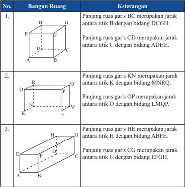

Tabel ini berisi informasi tentang panjang ruas garis dalam bangun ruang, yang terdiri dari tiga baris dengan keterangan yang spesifik untuk setiap baris. Topik utama tabel adalah panjang ruas garis dalam bangun ruang, yang melibatkan panjang ruas garis BC, CD, KN, OP, HE, dan CG. Kolom pertama menunjukkan nomor baris, sedangkan kolom kedua memberikan keterangan lengkap tentang panjang ruas garis tersebut. Data penting yang terlihat dalam tabel ini adalah bahwa panjang ruas garis BC merupakan jarak antara titik B dengan bidang DCGH, panjang ruas garis CD merupakan jarak antara titik C dengan bidang ADHE, dan seterusnya. Tabel ini membantu dalam memahami struktur dan ukuran bangun ruang secara lebih detail.

 

---
## 📄 Halaman 27

### Masalah 1.7

Tiang penyangga dibuat untuk menyangga atap suatu gedung. Tiang penyangga ini menghubungkan suatu titik pada salah satu sisi gedung dan suatu titik pada bidang atap seperti ditunjukkan pada Gambar 1.9 berikut.

Sumber: http://www.ideaonline.co.id/iDEA2013/Eksterior/Fasad/Batu-Alam-MencerahkanTampilan-Fasad/Tiang-Penyangga-Atap

Pada  Gambar  1.9  Apabila  dibuat  gambar  tampak  samping  diperoleh gambar seperti berikut.

---
**🖼️ Gambar/Diagram**

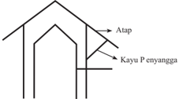

> **Deskripsi Visual:** Gambar ini adalah ilustrasi yang menunjukkan bagaimana atap rumah dibangun menggunakan kayu P enyangga. Gambar ini menggambarkan struktur atap rumah dengan detail yang jelas. Atap rumah terdiri dari beberapa elemen utama, yaitu atap sendiri yang melengkung dan bergerigi, serta kayu enyangga yang membentuk struktur dasar atap. Kayu enyangga terletak di bawah atap dan membentuk sudut-sudut yang menjaga atap tetap tegak. Teks pada gambar tidak ada, namun ada label "Atap" dan "Kayu P enyangga" yang memberikan informasi tentang komponen-komponen utama yang digunakan dalam pembuatan atap rumah. Informasi kunci yang dapat diambil pembaca adalah bahwa atap rumah dibangun menggunakan kayu enyangga sebagai struktur dasar, yang memastikan atap tetap tegak dan tahan lama.

 

---
## 📄 Halaman 28

Dari Gambar 1.10, cermati gambar kayu penyangga dan atap. Dapatkah Anda menentukan kondisi atau syarat agar panjang kayu penyangga seminimal mungkin?

Dari kegiatan mengamati di atas, tulislah istilah penting dari hasil pengamatan Anda.

Dari kegiatan mengamati di atas, apakah terdapat hal-hal yang ingin Anda tanyakan? Tuliskan pertanyaan-pertanyaan tersebut ke tempat berikut ini.

 

---
## 📄 Halaman 29

### Masalah 1.8

---
**🖼️ Gambar/Diagram**

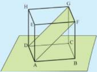

> **Deskripsi Visual:** Gambar ini adalah ilustrasi yang menunjukkan struktur geometri dari sebuah bangunan tiga dimensi. Gambar ini menggambarkan sebuah bangunan dengan struktur persegi panjang yang terdiri dari empat sisi, dua sisi atas dan bawah, serta dua sisi samping. Bangunan ini memiliki atap yang melengkung dan dikelilingi oleh beberapa elemen lain seperti tiang dan tiang penyangga.

Elemen utama yang ditampilkan dalam gambar ini adalah bangunan tiga dimensi yang terdiri dari empat sisi persegi panjang, atap melengkung, dan beberapa tiang penyangga. Tiang-tiang ini berfungsi untuk menopang bangunan dan memastikan stabilitasnya. Atap melengkung ini tampaknya merupakan bagian dari konstruksi bangunan tersebut, mungkin sebagai bagian dari atap bangunan atau sebagai bagian dari struktur bangunan.

Teks, angka, atau label penting yang terlihat dalam gambar ini tidak ada, karena gambar ini hanya menggambarkan struktur bangunan tanpa informasi tambahan. Namun, informasi kunci yang dapat diambil pembaca adalah bahwa bangunan ini memiliki struktur persegi panjang, atap melengkung, dan beberapa tiang penyangga.

Dalam paragraf ini, saya telah menjelaskan gambar dari buku pelajaran ini dengan detail tentang apa yang ditampilkan secara keseluruhan, elemen-elemen utama dan relasinya, teks, angka, atau label penting yang terlihat, serta informasi kunci yang dapat diambil pembaca.

### Alternatif Penyelesaian

Untuk menentukan jarak titik B ke bidang  AFGD dapat ditentukan dengan mencari panjang ruas garis yang tegak lurus dengan bidang AFGD dan melalui titik B.

---
**🖼️ Gambar/Diagram**

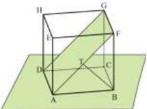

> **Deskripsi Visual:** Gambar ini adalah ilustrasi yang menunjukkan struktur geometri dari sebuah bangunan tiga dimensi. Gambar ini menggambarkan sebuah bangunan dengan struktur persegi panjang yang terdiri dari empat sisi, dua sisi atas dan bawah, serta dua sisi samping. Bangunan ini memiliki atap yang melengkung dan dikelilingi oleh beberapa elemen lain seperti tiang dan tiang penyangga.

Elemen utama yang ditampilkan dalam gambar ini adalah bangunan tiga dimensi yang terdiri dari empat sisi persegi panjang, atap melengkung, dan beberapa tiang penyangga. Tiang-tiang ini berfungsi untuk menopang bangunan dan memastikan stabilitasnya. Atap melengkung ini tampaknya merupakan bagian dari konstruksi bangunan tersebut, mungkin sebagai bagian dari atap bangunan atau sebagai bagian dari struktur bangunan.

Teks, angka, atau label penting yang terlihat dalam gambar ini tidak ada, karena gambar ini hanya menggambarkan struktur bangunan tanpa informasi tambahan.

Informasi kunci yang dapat diambil pembaca dari gambar ini adalah bahwa struktur bangunan ini memiliki empat sisi persegi panjang, atap melengkung, dan beberapa tiang penyangga. Ini menunjukkan bahwa bangunan ini mungkin memiliki struktur yang kompleks dan memerlukan konstruksi yang kuat untuk menopangnya.

BT tegak lurus dengan bidang AFGD, sehingga jarak titik B ke bidang AFGD adalah panjang ruas garis BT . Titik T adalah titik tengah diagonal bidang AF (mengapa?). Panjang AF adalah 4 2 cm, sehingga panjang AT adalah 2 2 cm. Karena BT tegak  lurus  bidang AFGD,  maka  segitiga ATB  adalah  segitiga siku-siku. Sehingga: /g11 /g12 2 2 2 2 4 2 2 2 2 TB AB AT /g32 /g16 /g32 /g16 /g32 Jadi jarak titik B ke bidang AFGD adalah 2 2 cm.

Diberikan kubus ABCD.EFGH  dengan panjang  rusuk  4 cm. Titik  A, F, G, dan D  dihubungkan  sehingga  terbentuk bidang  AFGD  seperti gambar  di samping. Berapakah jarak titik B ke bidang AFGD?

 

---
## 📄 Halaman 30

### Masalah 1.9

Masalah 1.9 serupa dengan Masalah 1.8. Pada Masalah 1.9 siswa diberi limas  T.ABCD dengan alas persegi dan siswa diminta untuk menentukan jarak titik O ke bidang TBC.

Diberikan limas T.ABCD dengan alas persegi. Titik O adalah perpotongan diagonal AC dan BD. Jika AB = BC = CD = AD = 6 cm, TA = TB = TC = TD = 3 6 cm dan tinggi limas 6 cm, berapakah jarak antara titik O dengan bidang TBC?

---
**🖼️ Gambar/Diagram**

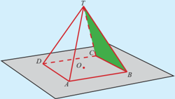

> **Deskripsi Visual:** Gambar ini adalah ilustrasi yang menunjukkan struktur geometri tiga dimensi. Gambar ini menggambarkan sebuah piramida segi empat dengan sudut sudutnya dikelilingi oleh bidang datar. Piramida ini memiliki titik pusat (O) yang berada di tengah-tengah bidang datar, dan titik sudut (T) yang merupakan titik puncak piramida. Bidang datar ini terdiri dari empat sudut (A, B, C, D), yang saling berpotongan di titik pusat bidang datar tersebut. Titik sudut piramida (T) terletak di atas bidang datar, membentuk tiga sudut (T, A, B; T, B, C; T, C, D). Ini menunjukkan hubungan antara piramida dan bidang datarnya, serta bagaimana piramida memanjang ke luar bidang datar.

### Alternatif Penyelesaian

Perhatikan Gambar 1.13 berikut ini.

---
**🖼️ Gambar/Diagram**

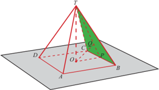

> **Deskripsi Visual:** Gambar ini adalah ilustrasi yang menunjukkan struktur geometri dari sebuah piramida segi empat dengan sudut tumpul. Ilustrasi ini memperlihatkan bagian-bagian utama seperti titik A, B, C, D, dan T, serta garis-garis yang menghubungkan mereka. Titik T merupakan titik pusat dari piramida, sedangkan A, B, C, dan D merupakan titik-titik sudut piramida. Garis-garis tersebut membentuk sudut tumpul di setiap sudut piramida, yang menunjukkan bahwa piramida ini memiliki sisi-sisi yang tidak sama panjang. Ilustrasi ini juga menunjukkan bagian-bagian lain seperti ruang-ruang yang terbentuk oleh piramida, yang menunjukkan bahwa piramida ini memiliki struktur tiga dimensi. Teks, angka, atau label penting yang terlihat pada gambar ini adalah nama-nama titik dan garis yang digunakan untuk menggambarkan struktur piramida. Informasi kunci yang dapat diambil pembaca adalah bahwa piramida ini memiliki struktur tiga dimensi dengan sudut tumpul di setiap sudutnya.

 

---
## 📄 Halaman 31

Untuk menentukan jarak titik O ke bidang TBC, dibuat ruas garis OP dengan OP sejajar AB , OP = 1 2 AB = 3 cm dan TO = 6 cm. Misal titik Q terletak pada bidang TBC, titik Q terletak pada TP dengan TP terletak pada bidang TBC dan OQ tegak lurus TP .  Jarak titik O ke bidang TBC adalah panjang ruas garis TP dengan OQ = OP TO TP /g117 (darimana?)

Oleh karena TP = 2 2 2 2 6 3 45 3 5 TO OP /g14 /g32 /g14 /g32 /g32 , maka:

``

Jadi, jarak titik O ke bidang TBC adalah 6 5 5 cm.

Dari kegiatan yang telah Anda lakukan di atas, buatlah simpulan tentang jarak titik ke bidang dan bagaimana menentukannya. Tukarkan simpulan tersebut dengan  teman  sebangku/kelompok  lainnya.  Secara  santun,  silahkan  saling berkomentar, menanggapi komentar, memberikan usul dan menyepakati ideide yang paling tepat. Tulis simpulan pada tempat berikut.

 

---
## 📄 Halaman 32

### Soal Latihan 1.3

J awablah soal berikut disertai dengan langkah pengerjaannya!

- Diketahui  kubus  ABCD.EFGH  yang  panjang  rusuknya  a  cm.  Titik  Q adalah titik tengah rusuk BF. Tentukan jarak titik H ke bidang ACQ.
- Suatu  kepanitiaan  membuat  papan  nama  dari  kertas  yang  membentuk bangun seperti berikut.
Ternyata ABE membentuk segitiga sama sisi, panjang BF = 13 cm dan BC = 12 cm. Tentukan jarak antara titik A dan bidang BCFE!

- Dari gambar di bawah, jika diketahui panjang AB = 8 cm, BC = 6 cm dan /g40/g38/g3/g32/g3/g24/g165/g24/g3/g70/g80/g15/g3/g87/g72/g81/g87/g88/g78/g68/g81/g3/g77/g68/g85/g68/g78/g3/g68/g81/g87/g68/g85/g68/g3/g87/g76/g87/g76/g78/g3/g37/g3/g71/g68/g81/g3/g69/g76/g71/g68/g81/g74/g3 /g36/g38/g40/g17
- Diketahui limas segitiga beraturan T.ABC . Panjang AB = 6 cm dan TA = 8 cm. Tentukan jarak antara titik T dengan bidang ABC.
- Diketahui luas permukaan kubus ABCD.EFGH adalah 294 cm 2 . Tentukan:
- Jarak antara titik F ke bidang ADHE.
- Jarak antara titik B ke bidang ACH.

 

---
## 📄 Halaman 33

Jawablah pertanyaan berikut disertai dengan langkah pengerjaannya!

### 1. Perhatikan gambar berikut.

---
**🖼️ Gambar/Diagram**

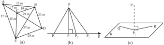

> **Deskripsi Visual:** Gambar ini adalah ilustrasi yang menunjukkan struktur dan hubungan antara beberapa elemen geometris. Gambar ini menggambarkan sebuah bangunan dengan berbagai sudut dan garis yang membentuknya. Elemen utama yang terlihat meliputi:

1. Bangunan utama (B) yang terdiri dari beberapa sudut dan garis.
2. Garis-garis yang membentuk sudut-sudut pada bangunan.
3. Garis yang menghubungkan titik-titik pada bangunan.

Informasi penting yang dapat diambil dari gambar ini meliputi:

- Struktur bangunan yang terdiri dari beberapa sudut dan garis.
- Hubungan antara garis-garis yang membentuk bangunan.
- Jumlah sudut dan garis yang ada pada bangunan.

Teks, angka, atau label penting yang terlihat tidak ada dalam gambar ini.

- Dari Gambar (a), tentukan jarak dari titik A ke D.
- Dari Gambar (b), tentukan jarak titik P terhadap garis g .
- Dari Gambar (c), tentukan jarak titik P pada bidang-K.
- Diketahui kubus ABCD.EFGH dengan panjang rusuk 9 cm. Buat ilustrasi kubus  tersebut.  Tentukan  langkah  menentukan  jarak  titik  F  ke  bidang BEG. Kemudian hitunglah jarak titik F ke bidang BEG.
- Diketahui kubus  ABCD.EFGH dengan panjang rusuk a .  Jika titik P terletak pada perpanjangan AB sehingga PB = 2 a , dan titik Q pada perpanjangan FG sehingga QG = a .
- Buatlah ilustrasi dari masalah di atas.
- Tentukan PQ.
- Panjang setiap bidang empat beraturan T.ABC sama dengan 16 cm. Jika P pertengahan AT dan Q pertengahan BC, tentukan PQ.
- Perhatikan gambar kubus ABCD.EFGH. Tentukan jarak titik H ke DF.

 

---
## 📄 Halaman 34

- Dalam  kubus ABCD.EFGH  titik  S  adalah  titik  tengah  sisi  CD  dan  P adalah  titik  tengah  diagonal  ruang  BH.  Tentukan  perbandingan  volum limas P.BCS dan volum kubus ABCD.EFGH.
- Diketahui kubus ABCD.EFGH dengan panjang rusuk a cm. S merupakan proyeksi titik C pada bidang AFH.Tentukan jarak titik A ke titik S.
- Diketahui kubus  ABCD.EFGH dengan panjang rusuk   cm. P dan Q masingmasing merupakan titik tengah AB dan CD, sedangkan R merupakan titik potong EG dan FH. Tentukan jarak titik R ke bidang EPQH.
- Diketahui  kubus ABCD.EFGH dengan rusuk 4 cm. P titik tengah EH. Tentukan jarak titik P ke garis CF.
- Panjang rusuk kubus ABCD.EFGH adalah 6 cm. Tentukan jarak titik C dengan bidang BDG.

 

---
## 📄 Halaman 35

### Statistika

A.

### Kompetensi Dasar dan Pengalaman Belajar

### Kompetensi Dasar

- 3.2 Menentukan dan menganalisis ukuran pemusatan dan penyebaran data yang disajikan dalam bentuk tabel distribusi frekuensi dan histogram.
- 4.2 Menyelesaikan masalah yang berkaitan dengan penyajian data hasil pengukuran dan pencacahan  dalam  tabel  distribusi  frekuensi dan histogram.

### Istilah Penting

- Distribusi Frekuensi
- Histogram
- Ogive
- Poligon frekuensi
- Rata-rata

### Pengalaman Belajar

Melalui  pembelajaran  pengolahan  dan  penyajian data berkelompok, siswa memperoleh pengalaman belajar:

- Mengolah  data  mentah  dan  memaknai  hasil yang diperoleh.
- /g21/g17/g3 /g48/g72/g80/g68/g78/g81/g68/g76/g3 /g74/g85/g68/g191/g78/g3 /g71/g68/g85/g76/g3 /g86/g88/g68/g87/g88/g3 /g71/g68/g87/g68/g3 /g92/g68/g81/g74/g3 /g69/g72/g85/g88/g83/g68/g3 histogram, poligon frekuensi, dan ogive.
- Mengantisipasi  kesalahan  pengambilan  ke/g86/g76/g80/g83/g88/g79/g68/g81/g3/g71/g68/g79/g68/g80/g3/g80/g72/g80/g68/g78/g81/g68/g76/g3/g86/g88/g68/g87/g88/g3/g74/g85/g68/g191/g78/g17
- Median
- Modus
- Simpangan Rata-rata
- Simpangan Baku
- Ragam

 

---
## 📄 Halaman 36

### /g37/g76/g82/g74/g85/g68/g191/g3/g53/g82/g81/g68/g79/g71/g3 /g36/g17/g3/g41/g76/g86/g75/g72/g85

Ronald Aylmer Fisher lahir di London pada tanggal 17  Februari  1890.  Fisher  merupakan  tokoh  statistika yang menemukan banyak konsep baru dalam statistika, di antaranya adalah konsep 'likelihood', distribusi, dan variansi.

Pada  saat  usia  Fisher  masih  14  tahun,  ibunya meninggal karena sakit. Namun hal ini tidak mematahkan semangatnya dalam belajar. Dia memenangkan medali dalam kompetisi essay matematika yang diadakan sekolahnya  dua  tahun  kemudian.  Kejuaraan  ini  yang membawanya mendapatkan beasiswa ke Cambridge University untuk belajar matematika dan astronomi.

Selain  untuk  belajar  dua  bidang  tersebut,  Fisher  juga  tertarik  dalam biologi,  khususnya  bidang  genetika.  Kemudian  dia  menggabungkan  ilmu statistika  dan  genetika  dan  menjadi  peneliti  dalam  dalam  bidang  genetika yang dianalisa menggunakan ilmu statistika.

Ketika  terjadi  peperangan  di  Inggris  pada  tahun  1914,  Fisher  ingin mendaftarkan dirinya ke dalam militer. Tes kesehatan yang dilaluinya untuk masuk militer memperlihatkan hasil yang bagus kecuali untuk penglihatannya dan  akhirnya  Fisher  ditolak  untuk  masuk  militer.  Hal  ini  yang  kemudian /g80/g72/g80/g69/g68/g90/g68/g81/g92/g68/g3/g88/g81/g87/g88/g78/g3/g80/g72/g81/g77/g68/g71/g76/g3/g74/g88/g85/g88/g3/g80/g68/g87/g72/g80/g68/g87/g76/g78/g68/g3/g71/g68/g81/g3/g191/g86/g76/g78/g68/g3/g71/g76/g3/g69/g72/g69/g72/g85/g68/g83/g68/g3/g86/g72/g78/g82/g79/g68/g75/g3 dan akhirnya menjadi peneliti terkenal dalam bidang statistika dan genetika.

Sumber: http://www-history.mcs.st-andrews.ac.uk/Biographies/Fisher.html

### /g43/g76/g78/g80/g68/g75/g3/g92/g68/g81/g74/g3/g71/g68/g83/g68/g87/g3/g71/g76/g68/g80/g69/g76/g79/g29

/g46/g72/g78/g88/g85/g68/g81/g74/g68/g81/g3 /g191/g86/g76/g78/g3 /g87/g76/g71/g68/g78/g3 /g80/g72/g80/g68/g87/g68/g75/g78/g68/g81/g3 /g86/g72/g80/g68/g81/g74/g68/g87/g3 /g88/g81/g87/g88/g78/g3 /g87/g72/g85/g88/g86/g3 /g87/g72/g87/g68/g83/g3 berkarya dalam bidang yang diminati.

Kegagalan dalam suatu bidang bukan berarti kegagalan dalam bidang lainnya.  Kegagalan  merupakan  langkah  awal  kesuksesan  dalam bidang lainnya.

 

---
## 📄 Halaman 37

---
**🖼️ Gambar/Diagram**

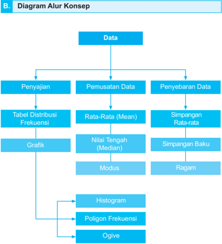

> **Deskripsi Visual:** Gambar ini adalah diagram alur konsep yang menunjukkan proses analisis data statistik. Diagram ini membagi proses analisis data menjadi empat tahap utama: Penyajian Data, Pemusatan Data, Penyebaran Data, dan Grafik. Setiap tahap tersebut memiliki elemen-elemen yang spesifik, seperti:

1. **Penyajian Data** meliputi Tabel Distribusi Frekuensi.
2. **Pemusatan Data** meliputi Rata-Rata (Mean), Simpangan Rata-rata, Nilai Tengah (Median), Modus, dan Ragam.
3. **Penyebaran Data** meliputi Simpangan Baku.
4. **Grafik** meliputi Histogram, Poligon Frekuensi, dan Ogive.

Setiap elemen dalam diagram ini memiliki hubungan dengan elemen lainnya, menggambarkan langkah-langkah analisis data dari penyajian data hingga penggunaan grafik untuk visualisasi hasil analisis. Ini membantu pembaca memahami proses analisis data secara sistematis dan efektif.

 

---
## 📄 Halaman 38

### C.

### Materi Pembelajaran

### Laju Pertumbuhan Penduduk Indonesia

---
**🖼️ Gambar/Diagram**

> **Deskripsi Visual:** Gambar ini adalah foto yang menunjukkan sebuah acara atau demonstrasi massa. Dalam foto tersebut, banyak orang berjalan bersama-sama dengan mengenakan seragam merah putih. Mereka tampaknya sedang mengikuti suatu protes atau demonstrasi. Di sepanjang jalan, terdapat beberapa papan reklame dan spanduk yang menunjukkan logo atau simbol tertentu. Beberapa orang tampaknya membawa bendera merah putih. Di sekitar jalan, terlihat beberapa pohon dan bangunan. Teks, angka, atau label penting tidak terlihat dalam gambar ini. Informasi kunci yang dapat diambil pembaca adalah bahwa ada demonstrasi atau protes besar yang sedang berlangsung dengan banyak partisipan.

Sumber: http://www.beritasatu.com/nasional/448693-tahun-2035-penduduk-indonesia-diprediksi-3057-juta.html

Sejak kemerdekaan Republik Indonesia, jumlah penduduk Indonesia telah meningkat tiga kali lipat dari 73,3 juta jiwa pada 1945 menjadi 255,5 juta jiwa pada tahun 2015. Hal ini menempatkan Indonesia pada posisi negara keempat di dunia dengan penduduk terbanyak setelah Tiongkok (1,4 miliar jiwa), India (1,3 miliar jiwa), dan Amerika Serikat (325 juta jiwa).

 

---
## 📄 Halaman 39

Jumlah  penduduk  Indonesia  mulai  tahun  1945  sampai  tahun  2015 ditampilkan pada tabel di bawah ini.

---
**🖼️ Gambar/Diagram**

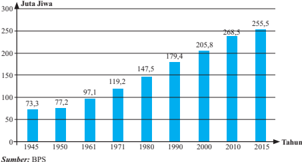

> **Deskripsi Visual:** Gambar ini adalah diagram batang yang menunjukkan perkembangan Juta Jiwa (Jumlah Jiwa) dari tahun 1945 hingga 2015. Diagram ini terdiri dari beberapa elemen utama:

1. Titik-titik pada garis waktu mulai dari tahun 1945 sampai 2015.
2. Bar-bar yang menggambarkan jumlah jiwa setiap tahun.
3. Label tahun di sebelah kanan diagram untuk memudahkan penafsiran.

Elemen-elemen utama yang terlihat dalam diagram ini adalah:
- Tahun-tahun yang dinyatakan di sisi kiri diagram.
- Angka yang menunjukkan jumlah jiwa di setiap tahun.
- Garis waktu yang menghubungkan titik-titik tahun tersebut.

Informasi kunci yang dapat diambil pembaca melalui diagram ini adalah:
- Perkembangan jumlah jiwa secara keseluruhan dari tahun 1945 hingga 2015.
- Tren naik turun dalam jumlah jiwa selama periode tersebut.
- Jumlah jiwa tertinggi terjadi pada tahun 2015 dengan angka 255,5 juta jiwa.

Diagram ini sangat berguna untuk melihat tren demografis dan perubahan populasi secara umum selama periode tersebut.

Sumber:

Ditinjau dari laju pertumbuhan penduduk, diagram di bawah  ini memperlihatkan  bahwa  laju  pertumbuhan  penduduk  Indonesia  bervariasi. Mulai tahun 1945 sampai tahun 1980, laju pertumbuhan penduduk naik secara /g86/g76/g74/g81/g76/g191/g78/g68/g81/g17/g3 /g46/g72/g80/g88/g71/g76/g68/g81/g3 /g79/g68/g77/g88/g3 /g83/g72/g85/g87/g88/g80/g69/g88/g75/g68/g81/g3 /g83/g72/g81/g71/g88/g71/g88/g78/g3 /g80/g72/g81/g74/g68/g79/g68/g80/g76/g3 /g83/g72/g81/g88/g85/g88/g81/g68/g81/g3 sampai pada tahun 2000 dan diikuti kenaikan lagi pada 10 tahun berikutnya.

---
**🖼️ Gambar/Diagram**

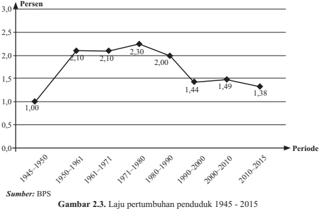

> **Deskripsi Visual:** Gambar ini adalah diagram yang menunjukkan laju pertumbuhan penduduk Indonesia dari tahun 1945 hingga 2015. Diagram ini menggunakan garis untuk menggambarkan data tersebut, dengan titik-titik yang menunjukkan nilai tertentu pada setiap periode. Titik-titik ini berada di atas sumbu y (laju pertumbuhan) dan di sepanjang sumbu x (periode waktu). Sumber data untuk diagram ini adalah BPS.

1. Gambar ini menunjukkan laju pertumbuhan penduduk Indonesia dari tahun 1945 hingga 2015.
2. Elemen utama yang ditampilkan adalah garis yang menghubungkan titik-titik data, sumbu x yang menunjukkan periode waktu, dan sumbu y yang menunjukkan laju pertumbuhan penduduk. Titik-titik data tersebut menunjukkan nilai tertentu pada setiap periode.
3. Teks, angka, atau label penting yang terlihat meliputi judul gambar "Laju pertumbuhan penduduk 1945-2015", sumbu x yang menunjukkan periode waktu dari 1945 hingga 2015, dan sumbu y yang menunjukkan laju pertumbuhan penduduk. Angka-angka yang penting termasuk nilai-nilai tertentu pada setiap periode, seperti 1.00 pada tahun 1945, 2.70 pada tahun 1950-1960, dan lain-lain.
4. Informasi kunci yang dapat diambil pembaca meliputi bahwa laju pertumbuhan penduduk Indonesia cenderung naik dari tahun 1945 hingga 1980, kemudian turun dari tahun 1980 hingga 2015. Ini menunjukkan bahwa ada perubahan dalam pola pertumbuhan penduduk Indonesia selama periode tersebut.

 

---
## 📄 Halaman 40

Dengan menganalisa data tersebut dengan ilmu statistika, jumlah penduduk Indonesia pada 47 tahun ke depan dapat diprediksi berlipat ganda. Tentu hal ini  membutuhkan upaya yang serius dari pemerintah untuk mengendalikan tingkat kelahiran sehingga menekan laju pertumbuhan penduduk pada kurun waktu 2010-2015. Namun demikian, pemerintah masih perlu memperhatikan faktor-faktor lain yang memengaruhi pertumbuhan penduduk dengan menganalisa data-data pendukung dengan ilmu statistika. Dengan demikian dapat  dikatakan  bahwa  ilmu  statistika  dapat  digunakan  sebagai  alat  bantu pembuat kebijakan baik tingkat daerah maupun tingkat pusat pemerintahan.

### Subbab 2.1  Penyajian Data Kegiatan 2.1.1  Distribusi Frekuensi

Ketika seseorang peneliti ingin mengetahui kondisi suatu hal tidak jarang peneliti harus mengumpulkan data terlebih dahulu. Sebagai contoh, seorang peneliti  ingin  mengetahui  kondisi  jumlah  penduduk  Indonesia  selama  20 tahun  sebelumnya.  Dengan  demikian  peneliti  dapat  mengumpulkan  data jumlah penduduk Indonesia setiap tahunnya kemudian dapat mendiskripsikan, mendapatkan informasi yang berguna mengenai jumlah penduduk, dan bahkan dapat  memprediksi  keadaan  jumlah  penduduk  Indonesia  di  tahun-tahun mendatang.

Jika  seorang  peneliti  akan  mengumpulkan  data  mengenai  usia  seluruh siswa  SMA  kelas  XII  di  kabupaten  Malang.  Jika  data  yang  dikumpulkan meliputi seluruh siswa sekabupaten Malang, maka data keseluruhan tersebut disebut  populasi.  Di  lain  pihak,  ketika  peneliti  hanya  mengumpulkan  data dari beberapa SMA terpilih yang mewakili semua SMA di kabupaten Malang, maka data yang diperoleh merupakan data dengan nilai perkiraan sedangkan siswa SMA yang mewakili tersebut disebut dengan sampel.

Pada jenjang sebelumnya Anda sudah mempelajari tentang pengolahan data dan penyajiannya yang melibatkan jumlah data yang kecil. Bagaimana jika  data  yang  diolah  dalam  jumlah  besar?  Jika  terdapat  sekelompok  data yang lebih dari 30 data disajikan dengan diagram batang, bagaimana kira-kira diagram batang yang didapatkan? Pada bab ini kita berhadapan dengan data yang berukuran besar (minimal 30 data). Kita akan mempelajari bagaimana /g80/g72/g81/g74/g82/g79/g68/g75/g3 /g71/g68/g81/g3 /g80/g72/g81/g92/g68/g77/g76/g78/g68/g81/g3 /g71/g68/g87/g68/g3 /g69/g72/g85/g88/g78/g88/g85/g68/g81/g3 /g69/g72/g86/g68/g85/g3 /g71/g72/g81/g74/g68/g81/g3 /g79/g72/g69/g76/g75/g3 /g72/g191/g86/g76/g72/g81/g3 /g71/g68/g81/g3 bermakna.

 

---
## 📄 Halaman 41

Salah  satu  cara  pengorganisasian  data  yang  dapat  digunakan  untuk mempermudah  penarikan  kesimpulan  adalah  menyajikan  data  mentah  ke /g71/g68/g79/g68/g80/g3/g71/g76/g86/g87/g85/g76/g69/g88/g86/g76/g3/g73/g85/g72/g78/g88/g72/g81/g86/g76/g3/g71/g68/g81/g3/g80/g72/g80/g89/g76/g86/g88/g68/g79/g76/g86/g68/g86/g76/g78/g68/g81/g3/g78/g72/g3/g71/g68/g79/g68/g80/g3/g69/g72/g81/g87/g88/g78/g3/g74/g85/g68/g191/g78/g17

Pada  bagian  ini  akan  dipaparkan  mengenai  pengolahan  data  ke  dalam distribusi frekuensi untuk mendapatkan informasi yang berguna tentang data tersebut.

### Contoh Soal 2.1

Seorang peneliti melakukan  survey  terhadap 80  pengusaha  dalam suatu pertemuan mengenai pada usia berapa mereka berani untuk memulai usahanya. Hasil survei tersebut diberikan di bawah ini. Data disajikan dalam satuan tahun.

---
**📊 Tabel**

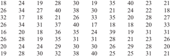

Tabel ini menunjukkan data statistik tentang hasil tes matematika untuk 28 siswa di sebuah sekolah. Topik utama tabel adalah hasil tes matematika siswa. Kolom pertama menunjukkan nomor siswa, sedangkan kolom kedua hingga kelima menunjukkan skor masing-masing siswa dalam tes matematika. Data penting yang terlihat adalah bahwa banyak siswa mendapatkan nilai tinggi, dengan beberapa siswa mendapatkan nilai 30 atau lebih. Selain itu, ada beberapa siswa yang mendapatkan nilai rendah, seperti 14 dan 19. Pola umumnya menunjukkan bahwa banyak siswa mendapatkan nilai yang baik, tetapi masih ada beberapa siswa yang memerlukan perbaikan.

Dengan  mengolah  data  ke  dalam  distribusi  frekuensi,  peneliti  dapat menyimpulkan bahwa pengusaha yang memulai usahanya paling muda adalah 16 tahun dan yang paling tua adalah 40 tahun. Hampir setengah dari kumpulan pengusaha  tersebut  yang  memulai  usahanya  di  usia  20-an.  Kebanyakan pengusaha  memulai  usahanya  pada  usia  26  -  30  tahun  sedangkan  paling sedikit pada usia 36 - 40 tahun.

 

---
## 📄 Halaman 42

### Contoh Soal 2.2

Nilai ujian akhir mata pelajaran Matematika siswa kelas XII SMA 'BINTANG' dapat dilihat di bawah ini.

95

Informasi  yang  dapat  diambil  dari  data  tersebut  diantaranya  adalah 50% siswa dalam kelas tersebut mendapatkan nilai pada rentangan 71 - 90. Hanya ada 1 siswa yang mendapatkan nilai antara 41 - 50, sedangkan 6 siswa mendapatkan nilai istimewa, yaitu di atas 90.

### Contoh Soal 2.3

Posyandu  'Mawar'  mendata  berat  badan  balita  yang  datang  di  pertemuan rutin  pada  bulan  Oktober.  Data  berat  badan  (dalam  kg)  balita  yang  datang diberikan di bawah ini.

Data  tersebut  mengungkapkan  bahwa  kebanyakan  balita  yang  datang pada posyandu tersebut mempunyai berat badan 5,4 - 11 kg. Terdapat hanya 3 balita dengan berat di bawah 5,4 kg dan hanya 3 balita dengan berat badan di atas 10,5 kg.

Berdasarkan  hasil  pengamatan  ketiga  contoh  yang  diberikan  di  atas, tulislah  informasi-informasi  atau  istilah  penting  yang  dapat  Anda  peroleh pada kotak yang disediakan berikut.

 

---
## 📄 Halaman 43

Setelah mengamati ketiga contoh di atas, buatlah minimal 3 pertanyaan mengenai data dan penarikan kesimpulan yang dilakukan pada ketiga contoh tersebut.  Tuliskan  pertanyaan  Anda  pada  kotak  yang  sudah  disediakan  di bawah ini.

Berikut  merupakan  pertanyaan-pertanyaan  yang  mungkin Anda  ajukan sebelumnya.

- Bagaimana mendeskripsikan data yang diperoleh?
- Bagaimana mengolah data agar mendapat deskripsi data yang tepat?
- Bagaimana membuat distribusi frekuensi dari data mentah?
- Bagaimana  mendapatkan  informasi tentang data melalui distribusi frekuensi?
Dengan diskusi kelompok, Anda dapat menjawab pertanyaan-pertanyaan secara  bersama-sama  untuk  memahami  lebih  lanjut  bagaimana  memaknai suatu data melalui distribusi frekuensi.  Anda juga dapat membaca atau mencari informasi dari berbagai sumber lain berupa buku teks atau sumber di internet untuk menjawab pertanyaan-pertanyaan yang telah Anda dapatkan.

Berikut diberikan contoh-contoh untuk menggambarkan pengolahan data dari data tunggal menjadi data berkelompok dengan distribusi frekuensi.

 

---
## 📄 Halaman 44

### Contoh Soal 2.4

Perhatikan data yang diberikan pada Contoh 2.1 sebelumnya. Jika data 80 usia pengusaha memulai usahanya dibagi menjadi 5 kelompok/kelas maka akan didapatkan distribusi frekuensi seperti di bawah ini.

---
**📊 Tabel**

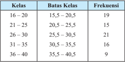

Tabel ini menunjukkan distribusi frekuensi kelas untuk suatu data statistik. Topik utamanya adalah distribusi frekuensi kelas yang digunakan untuk menggolongkan data ke dalam kelas-kelas tertentu berdasarkan batas-batas kelas yang ditetapkan. Kolom pertama berisi nama-nama kelas, sedangkan kolom kedua berisi batas-batas kelas masing-masing kelas. Kolom ketiga berisi frekuensi, yaitu jumlah data yang termasuk dalam setiap kelas. Dari tabel ini, dapat dilihat bahwa kelas dengan frekuensi tertinggi adalah 26-30 dengan nilai 21, sedangkan kelas dengan frekuensi terendah adalah 36-40 dengan nilai 9. Pola yang terlihat adalah bahwa frekuensi meningkat dari kelas 26-30 hingga kelas 21-25, kemudian turun hingga kelas 36-40.

Informasi-informasi  mengenai  data  usia  pengusaha  dapat  diperoleh dengan lebih mudah dengan distribusi frekuensi daripada hanya melihat data mentah sebelumnya.

### Contoh Soal 2.5

Data nilai ujian akhir matematika yang disajikan pada Contoh 2.2 dapat dikelompokkan  menjadi  beberapa  kelompok  data. Jika  dikelompokkan menjadi 6 kelas, maka distribusi frekuensi yang didapatkan adalah sebagai berikut.

---
**📊 Tabel**

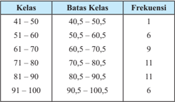

Tabel ini menunjukkan distribusi frekuensi kelas untuk suatu data statistik. Topik utamanya adalah distribusi frekuensi kelas yang diberikan dalam rentang nilai 41 hingga 100. Kolom "Kelas" menyatakan rentang nilai yang diukur, sedangkan kolom "Batas Kelas" menunjukkan batas-batas nilai dalam setiap kelas. Kolom "Frekuensi" menampilkan jumlah data yang termasuk dalam setiap kelas. Dari tabel ini, kita dapat melihat bahwa kelas 61-70 memiliki frekuensi tertinggi dengan 9 data, sementara kelas 81-90 juga memiliki frekuensi yang sama yaitu 11 data. Ini menunjukkan bahwa rentang nilai 61-70 dan 81-90 adalah paling banyak terdapat data dalam data tersebut.

 

---
## 📄 Halaman 45

Jika Anda perhatikan, deskripsi data nilai ujian akhir matematika yang dipaparkan pada Contoh 2.2 merupakan interpretasi dari distribusi frekuensi di atas.

### Contoh Soal 2.6

Di lain pihak, jika data berat badan balita pada suatu posyandu pada Contoh 2.3 dikelompokkan menjadi 5 kelas maka akan didapatkan distribusi frekuensi berikut ini.

---
**📊 Tabel**

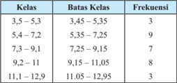

Tabel ini menunjukkan distribusi frekuensi kelas untuk suatu data statistik. Topik utamanya adalah penyebaran data dalam berbagai interval kelas. Kolom pertama berisi batas-batas kelas, yang menunjukkan batas-batas antara setiap kelas. Kolom kedua berisi frekuensi, yang menunjukkan jumlah data yang termasuk dalam setiap kelas. Data penting yang terlihat adalah bahwa sekitar 30% data terdapat di kelas 5,4-7,2, sedangkan sekitar 15% data terdapat di kelas 9,2-11,1. Ini menunjukkan bahwa data tersebut cenderung tersebar di antara kelas 5,4-7,2 dan 9,2-11,1.

Berdasarkan  distribusi  frekuensi  yang  diperoleh,  didapatkan  informasi bahwa kebanyakan balita yang datang di posyandu tersebut mempunyai berat badan 5,4 - 7,2 kg. Hal ini sesuai dengan informasi yang dipaparkan pada Contoh 2.3.

Coba Anda beri perhatian khusus mengenai banyak kelas, rentangan tiap kelas, batas kelas, dan frekuensi tiap kelasnya. Mungkin pertanyaan selanjutnya yang muncul di benak Anda adalah bagaimana mendapatkan frekuensi tiap kelas.

Untuk  mengetahui  bagaimana  mendapatkan  frekuensi  pada  distribusi frekuensi, coba Anda tentukan banyaknya data pada tiap kelas berikut ini.

Perhatikan data usia pengusaha yang disajikan pada Contoh 2.1. Jika data tersebut dikelompokkan menjadi 7 kelompok, maka distribusi frekuensi yang diperoleh adalah sebagai berikut. Lengkapi kolom batas kelas dan frekuensi berdasarkan data usia pengusaha pada Contoh 2.1.

 

---
## 📄 Halaman 46

---
**📊 Tabel**

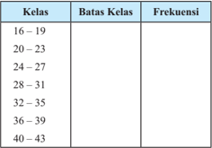

Tabel ini menunjukkan informasi tentang frekuensi siswa berdasarkan kelas mereka. Topik utama tabel adalah distribusi umur siswa di sekolah. Kolom "Kelas" menyatakan batas-batas kelas yang berbeda, mulai dari 16-19 hingga 40-43. Kolom "Batas Kelas" menunjukkan rentang umur yang dihitung dalam setiap kelas. Kolom "Frekuensi" menampilkan jumlah siswa yang berada dalam setiap kelas tersebut. Dari tabel ini, kita dapat melihat bahwa sebagian besar siswa berada di kelas 24-27, yang memiliki frekuensi tertinggi. Ini menunjukkan bahwa umur rata-rata siswa di sekolah ini berkisar di kelas 24-27.

Dengan distribusi frekuensi yang diperoleh di atas, coba berikan beberapa pernyataan  mengenai  informasi  apa  saja  yang  dapat  Anda  simpulkan  dari pengelompokan tersebut.

Pada kolom kelas pada Tabel 2.4, kelas pertama dimulai dengan 16 sampai dengan 19. Kemudian kelas berikutnya dimulai dengan satu lebihnya dari 19, yaitu  20.  Tetapi  bagaimana  jika  pembagian  kelas  atau  kelompok  data  usia pengusaha pada Contoh 2.1 seperti pada Tabel 2.5 berikut ini? Coba lengkapi kolom batas kelas dan kolom frekuensi pada distribusi frekuensi di berikut ini.

---
**📊 Tabel**

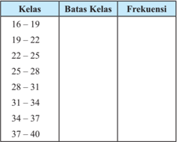

Tabel ini menunjukkan data frekuensi dari berbagai kelas yang dikelompokkan berdasarkan batas kelas tertentu. Topik utama tabel ini adalah analisis distribusi frekuensi dari data yang diukur dalam kelas-kelas tertentu. Kolom "Kelas" menyatakan berapa banyak kelas yang ada, sedangkan kolom "Batasi Kelas" menunjukkan batas-batas kelas yang digunakan untuk membagi data tersebut. Kolom "Frekuensi" menampilkan jumlah data yang termasuk dalam setiap kelas. Dari tabel ini, dapat dilihat bahwa sebagian besar data terdistribusi di kelas 16-25, dengan frekuensi tertinggi di kelas 22-25. Ini menunjukkan bahwa kelas ini memiliki frekuensi paling tinggi dibandingkan dengan kelas lainnya.

 

---
## 📄 Halaman 47

Setelah mengisikan kolom batas kelas dan frekuensi, jawablah pertanyaanpertanyaan berikut ini.

- Apa yang terjadi pada kolom batas kelas?
- Apa yang terjadi pada saat pengisian kolom frekuensi?
- Apa yang dapat Anda simpulkan mengenai batas atas dan batas bawah kelas dalam hubungannya dengan frekuensi?
Selanjutnya  perhatikan  Tabel  2.4  distribusi  frekuensi  untuk  data  usia pengusaha  dengan  7  kelas,  panjang  (rentangan)  setiap  kelas  sama  yaitu  4. Perhatikan bahwa 4 merupakan selisih batas atas kelas dengan batas bawah kelas yang sama. Sebagai contoh, 4 = 19,5 - 15,5 = 23,5 - 19,5. Pertanyaan selanjutnya yang mungkin timbul, mengapa 4 yang digunakan sebagai panjang kelas?

Panjang  kelas  yang  dibutuhkan  sangat  berhubungan  erat  dengan  nilai maksimum,  nilai  minimum,  dan  banyak  kelas  yang  diinginkan  dalam distribusi frekuensi. Coba Anda perhatikan kembali data usia 80 pengusaha yang diberikan sebelumnya. Jika Anda amati, berapa selisih nilai maksimum dan nilai minimum pada data tersebut? Jika peneliti ingin mengelompokkan data menjadi 7 kelompok/kelas, maka berapa panjang (rentangan) kelas yang dibutuhkan agar menjadi 7 kelas dengan panjang kelas yang sama? Dengan pembulatan, Anda akan mendapatkan panjang kelas yang dibutuhkan.

Berdasarkan kegiatan-kegiatan sebelumnya, buatlah kesimpulan sementara tentang langkah-langkah pembuatan tabel distribusi frekuensi dan kegunaannya. Gunakan kesimpulan tersebut untuk membuat tabel distribusi frekuensi dari data berikut dengan banyak kelas sesuai yang Anda inginkan kemudian ceritakan atau maknai distribusi frekuensi yang diperoleh.

 

---
## 📄 Halaman 48

### /g54/g88/g75/g88/g3/g56/g71/g68/g85/g68/g3/g46/g82/g87/g68/g3/g45/g68/g78/g68/g85/g87/g68/g3

Berdasarkan data BMKG, suhu udara tertinggi kota Jakarta dalam derajat Celcius pada bulan September 2015 diberikan di bawah ini:

Sumber:

www.bmkg.go.id

Tuliskan distribusi frekuensi yang diperoleh dan maknanya pada kotak yang disediakan berikut ini.

Diskusikan dengan teman sebangku  Anda mengenai kesimpulan sementara tentang  pembuatan  distribusi  frekuensi,  hal-hal  yang  perlu  diperhatikan dalam pembuatan distribusi frekuensi dan pemaknaannya. Jangan lupa untuk mendiskusikan juga Contoh 2.7 untuk memperjelas pemahaman Anda tentang distribusi  frekuensi.  Selanjutnya  lakukan  diskusi  kelas  untuk  mendapatkan kesimpulan kelas dengan bimbingan dari guru Anda. Tuliskan secara individu kesimpulan yang diperoleh pada kotak yang disediakan.

 

---
## 📄 Halaman 49

### Kegiatan 2.1.2  Histogram, Poligon Frekuensi, dan Ogive

Setelah mengelompokkan data ke dalam beberapa kelas menjadi distribusi frekuensi, Anda dapat menyajikan data berkelompok tersebut dalam bentuk /g74/g85/g68/g191/g78/g17/g3 /g51/g72/g81/g92/g68/g77/g76/g68/g81/g3 /g71/g68/g79/g68/g80/g3 /g69/g72/g81/g87/g88/g78/g3 /g74/g85/g68/g191/g78/g3 /g76/g81/g76/g3 /g69/g72/g85/g87/g88/g77/g88/g68/g81/g3 /g88/g81/g87/g88/g78/g3 /g80/g72/g81/g92/g68/g80/g83/g68/g76/g78/g68/g81/g3 data kepada pembaca dalam bentuk gambar. Bagi kebanyakan orang, melihat informasi yang disajikan dari gambar lebih mudah daripada melihat dari dari kumpulan bilangan-bilangan pada tabel atau distribusi frekuensi. Hal ini juga berlaku bahkan untuk orang-orang yang tidak punya pengetahuan sebelumnya tentang statistika.

/g3 /g42/g85/g68/g191/g78/g16/g74/g85/g68/g191/g78/g3 /g92/g68/g81/g74/g3 /g80/g72/g81/g92/g68/g77/g76/g78/g68/g81/g3 /g86/g88/g68/g87/g88/g3 /g71/g68/g87/g68/g3 /g71/g76/g74/g88/g81/g68/g78/g68/g81/g3 /g88/g81/g87/g88/g78/g3 /g80/g72/g81/g71/g72/g86/g78/g85/g76/g83/g86/g76/g78/g68/g81/g3 suatu data dengan lebih mudah dan untuk menganalisis lebih lanjut. Penyajian /g71/g68/g87/g68/g3 /g69/g72/g85/g88/g83/g68/g3 /g74/g85/g68/g191/g78/g3 /g87/g72/g81/g87/g88/g3 /g68/g78/g68/g81/g3 /g79/g72/g69/g76/g75/g3 /g80/g72/g81/g68/g85/g76/g78/g3 /g83/g72/g85/g75/g68/g87/g76/g68/g81/g3 /g83/g72/g80/g69/g68/g70/g68/g3 /g68/g87/g68/g88/g3 /g83/g72/g86/g72/g85/g87/g68/g3 /g86/g88/g68/g87/g88/g3 /g83/g85/g72/g86/g72/g81/g87/g68/g86/g76/g17/g3 /g54/g72/g79/g68/g76/g81/g3 /g80/g72/g80/g83/g72/g85/g80/g88/g71/g68/g75/g3 /g80/g72/g80/g68/g78/g81/g68/g76/g3 /g86/g88/g68/g87/g88/g3 /g71/g68/g87/g68/g15/g3 /g74/g85/g68/g191/g78/g3 /g77/g88/g74/g68/g3 digunakan untuk melihat perilaku (behaviour) atau tren dari data tersebut.

/g3 /g55 /g72/g85/g71/g68/g83/g68/g87/g3 /g87/g76/g74/g68/g3 /g80/g68/g70/g68/g80/g3 /g74/g85/g68/g191/g78/g3 /g92/g68/g81/g74/g3 /g69/g76/g68/g86/g68/g81/g92/g68/g3 /g71/g76/g74/g88/g81/g68/g78/g68/g81/g3 /g88/g81/g87/g88/g78/g3 /g80/g72/g80/g16 presentasikan data berkelompok, yaitu:

- Histogram;
- Poligon frekuensi;
- /g22/g17/g3 /g50/g74/g76/g89/g72/g18/g74/g85/g68/g191/g78/g3/g73/g85/g72/g78/g88/g72/g81/g86/g76/g3/g78/g88/g80/g88/g79/g68/g87/g76/g73/g17
Pada bagian ini akan dibahas mengenai penyajian data berkelompok ke /g71/g68/g79/g68/g80/g3/g69/g72/g81/g87/g88/g78/g3/g78/g72/g87/g76/g74/g68/g3/g74/g85/g68/g191/g78/g3/g71/g76/g3/g68/g87/g68/g86/g17

Pada  bagian  ini  diberikan  beberapa  contoh  distribusi  frekuensi  yang /g71/g76/g86/g68/g77/g76/g78/g68/g81/g3/g71/g68/g79/g68/g80/g3/g74/g85/g68/g191/g78/g3/g69/g72/g85/g88/g83/g68/g3/g75/g76/g86/g87/g82/g74/g85/g68/g80/g15/g3/g83/g82/g79/g76/g74/g82/g81/g3/g73/g85/g72/g78/g88/g72/g81/g86/g76/g15/g3/g71/g68/g81/g3/g82/g74/g76/g89/g72/g17/g3/g38/g82/g69/g68/g3 /g36/g81/g71/g68/g3 /g68/g80/g68/g87/g76/g3 /g71/g68/g79/g68/g80/g3 /g83/g72/g81/g92/g68/g77/g76/g68/g81/g3 /g74/g85/g68/g191/g78/g3 /g87/g72/g85/g86/g72/g69/g88/g87/g3 /g68/g83/g68/g3 /g86/g68/g77/g68/g3 /g92/g68/g81/g74/g3 /g71/g76/g69/g88/g87/g88/g75/g78/g68/g81/g3 /g88/g81/g87/g88/g78/g3 /g80/g72/g81/g74/g74/g68/g80/g69/g68/g85/g3/g78/g72/g87/g76/g74/g68/g3/g74/g85/g68/g191/g78/g3/g87/g72/g85/g86/g72/g69/g88/g87/g17

### Contoh Soal 2.8

Distribusi  frekuensi  pada  Tabel  2.1  menyajikan  data  berkelompok  usia pengusaha dalam memulai usahanya. Distribusi frekuensi tersebut disajikan dibawah ini.

 

---
## 📄 Halaman 50

---
**📊 Tabel**

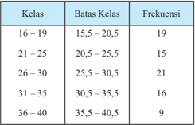

Tabel ini menunjukkan distribusi frekuensi kelas untuk suatu data statistik. Topik utamanya adalah distribusi frekuensi kelas yang diberikan dalam rentang angka 16-40. Tabel ini terdiri dari dua kolom: "Kelas" dan "Frekuensi". Kolom "Batas Kelas" menunjukkan batas-batas setiap kelas, sedangkan kolom "Frekuensi" menunjukkan jumlah data yang termasuk dalam setiap kelas tersebut.

Data penting yang terlihat dalam tabel ini adalah bahwa kelas dengan batas 25,5-30,5 memiliki frekuensi tertinggi yaitu 21, sementara kelas dengan batas 35,5-40,5 memiliki frekuensi terendah yaitu 9. Ini menunjukkan bahwa sebagian besar data terdistribusi di antara kelas 25,5-30,5, sementara sebagian kecil data terdistribusi di kelas 35,5-40,5.

/g39/g76/g3 /g69/g68/g90/g68/g75/g3 /g76/g81/g76/g3 /g80/g72/g85/g88/g83/g68/g78/g68/g81/g3 /g74/g85/g68/g191/g78/g16/g74/g85/g68/g191/g78/g3 /g92/g68/g81/g74/g3 /g80/g72/g85/g72/g83/g85/g72/g86/g72/g81/g87/g68/g86/g76/g78/g68/g81/g3 /g71/g76/g86/g87/g85/g76/g69/g88/g86/g76/g3 frekuensi tersebut.

### a. Histogram

---
**🖼️ Gambar/Diagram**

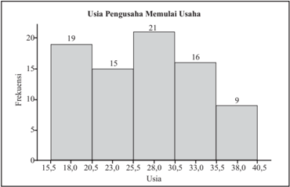

> **Deskripsi Visual:** Gambar ini adalah diagram batang yang menunjukkan frekuensi usia pengusaha saat memulai usaha. Diagram ini terdiri dari beberapa elemen utama:

1. **Frekuensi**: Ini adalah jumlah pengusaha yang memiliki usia tertentu.
2. **Usia**: Ini adalah rentang usia yang ditampilkan dalam diagram, mulai dari 15,5 hingga 40,5 tahun.
3. **Jumlah Pengusaha**: Frekuensi untuk setiap usia ditunjukkan oleh tinggi setiap batang.

Elemen-elemen utama ini saling terkait melalui frekuensi yang ditunjukkan untuk setiap usia. Misalnya, sekitar 19 pengusaha memiliki usia antara 18,0 dan 20,5 tahun, sedangkan sekitar 21 pengusaha memiliki usia antara 25,5 dan 28,0 tahun.

Informasi kunci yang dapat diambil pembaca adalah bahwa sebagian besar pengusaha memulai usahanya pada usia antara 25,5 dan 30,5 tahun, dengan frekuensi tertinggi di sekitar 25,5-28,0 tahun.

 

---
## 📄 Halaman 51

### b. Poligon frekuensi

---
**🖼️ Gambar/Diagram**

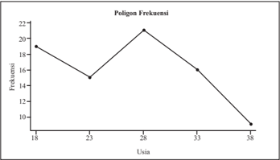

> **Deskripsi Visual:** Gambar ini adalah diagram yang menunjukkan poligon frekuensi berdasarkan usia. Diagram ini terdiri dari dua elemen utama: sumbu x (usia) dan sumbu y (frekuensi). Sumbu x terdiri dari beberapa titik yang menunjukkan interval usia, mulai dari 18 hingga 38 tahun. Sumbu y menunjukkan frekuensi, yang dinyatakan dalam angka.

Pertama, diagram ini menunjukkan bahwa frekuensi mencapai puncak pada usia 28 tahun, dengan frekuensi sekitar 22. Setelah itu, frekuensi turun secara bertahap hingga mencapai 9 pada usia 38 tahun. Ini menunjukkan bahwa ada variasi dalam frekuensi tergantung pada usia.

Teks, angka, atau label penting yang terlihat dalam diagram ini meliputi judul "Poligon Frekuensi", sumbu x yang menunjukkan usia, dan sumbu y yang menunjukkan frekuensi. Informasi kunci yang dapat diambil pembaca adalah bahwa frekuensi terendah terjadi pada usia 38 tahun, sedangkan frekuensi tertinggi terjadi pada usia 28 tahun.

- Ogive

 

---
## 📄 Halaman 52

### Contoh Soal 2.9

Distribusi  frekuensi  pada  Tabel  2.2  menyajikan  tentang  data  berkelompok nilai ujian matematika suatu kelas. Distribusi yang diberikan adalah sebagai berikut.

---
**📊 Tabel**

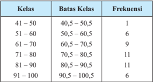

Tabel ini menunjukkan distribusi frekuensi kelas untuk rentang umur 41 hingga 100 tahun. Topik utama tabel adalah distribusi umur di suatu populasi tertentu. Kolom pertama berisi batas-batas kelas, sedangkan kolom kedua berisi frekuensi. Data penting yang terlihat adalah bahwa sekitar 25% populasi terdiri dari orang yang berumur antara 71-80 tahun, sementara 30% terdiri dari orang yang berumur antara 61-70 tahun. Pola ini menunjukkan bahwa umur 61-70 tahun memiliki frekuensi tertinggi, kemudian 71-80 tahun, dan setelah itu 81-90 tahun.

/g3/g3/g3

/g3

/g3 /g54/g72/g79/g68/g81/g77/g88/g87/g81/g92/g68/g3/g71/g76/g86/g87/g85/g76/g69/g88/g86/g76/g3/g73/g85/g72/g78/g88/g72/g81/g86/g76/g3/g76/g81/g76/g3/g71/g76/g88/g69/g68/g75/g3/g78/g72/g3/g71/g68/g79/g68/g80/g3/g74/g85/g68/g191/g78/g3/g75/g76/g86/g87/g82/g74/g85/g68/g80/g15/g3/g83/g82/g79/g76/g74/g82/g81/g3 frekuensi, dan ogive yang disajikan berikut ini.

### a. Histogram

---
**🖼️ Gambar/Diagram**

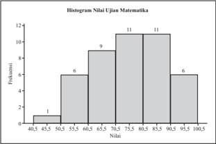

> **Deskripsi Visual:** Gambar ini adalah histogram yang menunjukkan distribusi nilai ujian matematika. Histogram ini terdiri dari beberapa elemen utama:

1. **Apa yang Ditampilkan Secara Keseluruhan**: Histogram ini menampilkan distribusi nilai ujian matematika yang diberikan kepada siswa. Nilai-nilai yang diberikan antara 40,5 hingga 100,5.

2. **Elemen-Elemen Utama dan Relasinya**: 
   - **Nilai Ujian Matematika**: Ini adalah variabel yang digunakan untuk menggambarkan distribusi nilai ujian.
   - **Jumlah Siswa**: Setiap bar di histogram menunjukkan jumlah siswa yang mendapatkan nilai tertentu. Misalnya, ada 1 siswa dengan nilai 40,5-45,5, 6 siswa dengan nilai 50,5-55,5, dan seterusnya.

3. **Teks, Angka, atau Label Penting yang Terlihat**:
   - **Teks**: "Histogram Nilai Ujian Matematika".
   - **Angka**: Nilai-nilai yang diberikan (40,5-100,5) dan jumlah siswa yang mendapat nilai tertentu.
   - **Label**: Baris horizontal menunjukkan nilai-nilai ujian, sedangkan baris vertikal menunjukkan jumlah siswa.

4. **Informasi Kunci yang Dapat Diambil Pembaca**: 
   - Histogram ini memberikan gambaran umum tentang keteraturan distribusi nilai ujian matematika.
   - Nilai rata-rata mungkin dapat dihitung dari histogram ini, tetapi informasi tersebut tidak langsung ditampilkan.
   - Histogram ini juga membantu dalam memahami seberapa banyak siswa yang mendapatkan nilai di bawah 70, di antara 70 dan 80, dan di atas 80.

Dengan demikian, histogram ini memberikan gambaran umum tentang distribusi nilai ujian matematika yang diberikan kepada siswa, yang dapat membantu dalam analisis dan pemilihan strategi pembelajaran berikutnya.

 

---
## 📄 Halaman 53

- Poligon frekuensi
- Ogive

---
**🖼️ Gambar/Diagram**

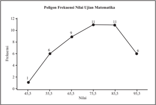

> **Deskripsi Visual:** Gambar ini adalah diagram frekuensi nilai ujian matematika. Diagram ini menunjukkan frekuensi penilaian yang diberikan pada ujian matematika dengan skor tertentu. Frekuensi penilaian meningkat seiring dengan peningkatan skor ujian. Skor ujian dimulai dari 45.5 hingga 95.5 dengan interval 5.5. Frekuensi penilaian mencapai puncak pada skor 75.5 hingga 85.5 dengan frekuensi 11 kali. Frekuensi penilaian kemudian turun dengan skor 95.5 dengan frekuensi 6 kali. Jadi, diagram ini menunjukkan bahwa banyak siswa yang mendapatkan nilai ujian matematika antara 75.5 hingga 85.5.

---
**🖼️ Gambar/Diagram**

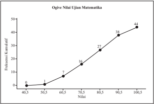

> **Deskripsi Visual:** Gambar ini adalah diagram, lebih tepatnya adalah grafik. Grafik ini menunjukkan hubungan antara nilai ujian matematika dengan frekuensi kumulatif. Pada grafik ini, x-akse menunjukkan nilai-nilai ujian yang diberikan dalam skala tertentu (40,5 hingga 100,5), sedangkan y-akse menunjukkan frekuensi kumulatif yang diperoleh oleh siswa-siswa tersebut.

Elemen utama dalam grafik ini adalah titik-titik yang menggambarkan frekuensi kumulatif untuk setiap nilai ujian. Titik-titik ini berada di atas garis lurus yang melambangkan hubungan linear antara nilai ujian dan frekuensi kumulatif. Garis ini membantu kita memahami bahwa semakin tinggi nilai ujian, semakin banyak jumlah siswa yang mendapat nilai tersebut.

Teks, angka, atau label penting yang terlihat pada grafik ini adalah nilai-nilai ujian yang diberikan (40,5, 50,5, 60,5, 70,5, 80,5, 90,5, 100,5) dan frekuensi kumulatif yang diperoleh oleh siswa-siswa tersebut. Informasi kunci yang dapat diambil pembaca dari grafik ini adalah bahwa sebagian besar siswa mendapatkan nilai ujian antara 70,5 dan 90,5, sementara sisanya mendapatkan nilai ujian di bawah 70,5 atau di atas 90,5.

 

---
## 📄 Halaman 54

### Contoh Soal 2.10

Distribusi frekuensi pada Tabel 2.3 menyajikan data berkelompok berat badan balita yang datang pada suatu posyandu. Berikut histogram, polygon frekuensi, dan ogive untuk distribusi frekuensi tersebut.

---
**📊 Tabel**

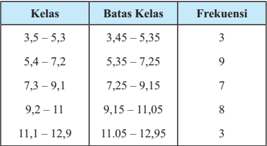

Tabel ini menunjukkan distribusi frekuensi untuk kelas yang diurutkan berdasarkan batas-batas kelas. Topik utama tabel adalah distribusi frekuensi kelas yang diukur dalam interval tertentu. Kolom pertama berisi kelas, yang diurutkan dari 3,5 hingga 12,9. Kolom kedua berisi batas-batas kelas untuk setiap kelas tersebut. Kolom ketiga berisi frekuensi, yang menunjukkan jumlah data yang termasuk dalam setiap kelas. Dari tabel ini, dapat dilihat bahwa kelas dengan frekuensi tertinggi adalah kelas 5,4-7,2 dengan 9 data, sedangkan kelas dengan frekuensi terendah adalah kelas 11,1-12,9 dengan hanya 3 data. Pola umumnya menunjukkan bahwa frekuensi meningkat dari kelas 3,5-5,3 hingga kelas 5,4-7,2, kemudian turun hingga kelas 11,1-12,9.

### a. Histogram

---
**🖼️ Gambar/Diagram**

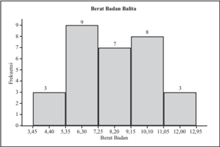

> **Deskripsi Visual:** Gambar ini adalah diagram batang yang menunjukkan distribusi berat badan balita dalam satuan kilogram (kg). Diagram ini terdiri dari beberapa elemen utama:

1. **Apa yang Ditampilkan Secara Keseluruhan**: Gambar ini menunjukkan distribusi berat badan balita dalam rentang berat badan antara 3,45 kg hingga 12,95 kg.

2. **Elemen-Elemen Utama dan Relasinya**: 
   - **Teks**: Di bagian atas, terdapat judul "Berat Badan Balita".
   - **Angka**: Terdapat angka-angka yang menunjukkan berat badan dalam kilogram.
   - **Label**: Ada label yang menunjukkan berat badan dalam interval tertentu, seperti 3,45 kg, 4,40 kg, 5,35 kg, dan seterusnya hingga 12,95 kg.
   - **Batang Bar**: Setiap batang bar menunjukkan jumlah balita dengan berat badan tertentu. Misalnya, batang bar pertama menunjukkan ada 3 balita dengan berat badan antara 3,45 kg dan 4,40 kg.

3. **Teks, Angka, atau Label Penting yang Terlihat**:
   - Judul: "Berat Badan Balita"
   - Label: Berat badan dalam interval tertentu (3,45 kg, 4,40 kg, 5,35 kg, dll.)
   - Batang Bar: Menggambarkan jumlah balita dengan berat badan tertentu.

4. **Informasi Kunci yang Dapat Diambil Pembaca**:
   - Distribusi berat badan balita dalam rentang yang ditunjukkan pada gambar.
   - Jumlah balita dengan berat badan tertentu dalam setiap interval.

Dengan demikian, gambar ini memberikan gambaran umum tentang distribusi berat badan balita dalam rentang berat badan yang ditunjukkan, memungkinkan pembaca untuk melihat seberapa banyak balita dengan berat badan tertentu dalam setiap interval.

 

---
## 📄 Halaman 55

### b. Poligon frekuensi

---
**🖼️ Gambar/Diagram**

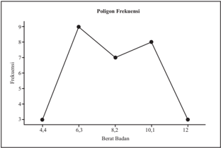

> **Deskripsi Visual:** Gambar ini adalah diagram yang menunjukkan frekuensi poligon berdasarkan berat badan. Diagram ini terdiri dari beberapa elemen utama:

1. **Apa yang Ditampilkan Secara Keseluruhan**: Gambar ini menunjukkan frekuensi poligon (poligon frekuensi) untuk berbagai interval berat badan. Frekuensi disajikan dalam bentuk garis yang menghubungkan titik-titik pada sumbu y.

2. **Elemen-Elemen Utama dan Relasinya**: 
   - **Sumbu X (Horizontal)**: Menunjukkan berat badan dalam kilogram.
   - **Sumbu Y (Vertikal)**: Menunjukkan frekuensi dalam jumlah.
   - **Titik-Titik**: Setiap titik pada garis poligon menunjukkan frekuensi untuk interval berat badan tertentu.

3. **Teks, Angka, atau Label Penting yang Terlihat**:
   - Sumbu X: 4,4, 6,3, 8,2, 10,1, 12
   - Sumbu Y: Frekuensi (dalam jumlah)
   - Garis Poligon: Menggambarkan frekuensi untuk setiap interval berat badan

4. **Informasi Kunci yang Dapat Diambil Pembaca**:
   - Frekuensi poligon meningkat dari 3 hingga 9 seiring dengan peningkatan berat badan dari 4,4 kg hingga 12 kg.
   - Ada puncak frekuensi pada interval berat badan sekitar 6,3 kg.
   - Frekuensi turun dari 9 hingga 3 seiring dengan peningkatan berat badan dari 10,1 kg hingga 12 kg.

Dengan demikian, gambar ini memberikan gambaran umum tentang distribusi frekuensi berat badan dalam interval tertentu.

- Ogive

---
**🖼️ Gambar/Diagram**

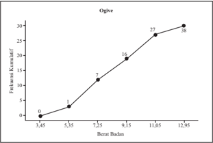

> **Deskripsi Visual:** Gambar ini adalah diagram yang menunjukkan hubungan antara frekuensi kumulatif (y) dengan berat badan (x). Diagram ini terdiri dari titik-titik yang menggambarkan data sejumlah individu dengan berat badan tertentu. Titik-titik tersebut dikelompokkan dalam interval berat badan yang sama, seperti 3.45 hingga 5.35, 5.35 hingga 7.25, dan seterusnya hingga 12.95. Setiap interval berat badan memiliki frekuensi kumulatif yang ditunjukkan oleh panjang garis yang menghubungkan titik-titik tersebut.

Elemen utama dalam diagram ini adalah titik-titik yang menggambarkan data, garis yang menghubungkan titik-titik tersebut, dan label untuk setiap interval berat badan. Garis ini membentuk pola yang menunjukkan bahwa frekuensi kumulatif meningkat dengan bertambahnya berat badan. Label pada garis ini memberikan informasi tentang interval berat badan yang dipakai dalam diagram.

Informasi kunci yang dapat diambil pembaca melalui diagram ini adalah bahwa frekuensi kumulatif meningkat dengan bertambahnya berat badan. Ini menunjukkan bahwa ada hubungan positif antara frekuensi kumulatif dan berat badan. Selain itu, diagram ini juga menunjukkan bahwa ada perbedaan dalam frekuensi kumulatif antara interval berat badan yang berbeda, yang menunjukkan bahwa frekuensi kumulatif tidak sama untuk semua interval berat badan.

 

---
## 📄 Halaman 56

Berdasarkan  pengamatan  Contoh  2.8,  Contoh  2.9,  dan  Contoh  2.10, tulislah informasi-informasi atau istilah matematika penting yang dapat Anda peroleh pada kotak yang disediakan berikut.

Dengan  mengamati  Contoh  2.8  -  3.10,  coba  Anda  buat  beberapa /g83/g72/g85/g87/g68/g81/g92/g68/g68/g81/g3 /g80/g72/g81/g74/g72/g81/g68/g76/g3 /g71/g76/g86/g87/g85/g76/g69/g88/g86/g76/g3 /g73/g85/g72/g78/g88/g72/g81/g86/g76/g3 /g71/g68/g81/g3 /g74/g85/g68/g191/g78/g3 /g75/g76/g86/g87/g82/g74/g85/g68/g80/g15/g3 /g83/g82/g79/g76/g74/g82/g81/g3 frekuensi,  dan  ogive.  Tuliskan  pertanyaan  apapun  yang  terlintas  di  benak /g36/g81/g71/g68/g3/g80/g72/g81/g74/g72/g81/g68/g76/g3/g71/g68/g87/g68/g3/g69/g72/g85/g78/g72/g79/g82/g80/g83/g82/g78/g3/g71/g68/g81/g3/g74/g85/g68/g191/g78/g81/g92/g68/g17/g3 /g36/g81/g71/g68/g3/g87/g76/g71/g68/g78/g3/g83/g72/g85/g79/g88/g3/g87/g68/g78/g88/g87/g3/g68/g87/g68/g88/g3 malu terhadap guru maupun teman Anda. Pertanyaan yang Anda ajukan akan sangat membantu Anda dalam memahami materi yang bersangkutan. Tuliskan pertanyaan-pertanyaan Anda dalam kotak yang sudah disediakan di bawah ini.

Mudah-mudahan Anda menanyakan beberapa hal berikut ini.

- Bagaimana menggambarkan histogram, poligon frekuensi, dan ogive?
- Hal-hal  apa  saja  yang  perlu  diperhatikan  dalam  membuat  histogram, poligon frekuensi, dan ogive?
- Apa makna bilangan-bilangan pada sumbu-x dan sumbu-y pada poligon frekuensi?

 

---
## 📄 Halaman 57

Jika Anda menanyakan diantaranya adalah hal-hal tersebut di atas, maka /g36/g81/g71/g68/g3 /g86/g72/g79/g68/g81/g74/g78/g68/g75/g3 /g79/g72/g69/g76/g75/g3 /g71/g72/g78/g68/g87/g3 /g71/g68/g79/g68/g80/g3 /g80/g72/g80/g68/g75/g68/g80/g76/g3 /g83/g72/g81/g92/g68/g77/g76/g68/g81/g3 /g71/g68/g87/g68/g3 /g69/g72/g85/g88/g83/g68/g3 /g74/g85/g68/g191/g78/g17/g3 Untuk  menjawab  pertanyaan-pertanyaan  yang  Anda  susun,  Anda  dapat melakukan kegiatan-kegiatan berikut. Anda juga dapat menggunakan sumbersumber referensi lainnya seperti buku teks atau Internet untuk membantu Anda menjawab pertanyaan-pertanyaan tersebut.

Jika Anda perhatikan, data yang sama dapat disajikan dalam dua bentuk penyajian  yang  berbeda  yaitu  penyajian  dalam  bentuk  tabel  (distribusi /g73/g85/g72/g78/g88/g72/g81/g86/g76/g12/g3 /g71/g68/g81/g3 /g74/g85/g68/g191/g78/g17/g3/g55 /g72/g81/g87/g88/g3 /g83/g72/g81/g92/g68/g77/g76/g68/g81/g3 /g71/g68/g87/g68/g3 /g87/g72/g85/g86/g72/g69/g88/g87/g3 /g71/g76/g79/g68/g78/g88/g78/g68/g81/g3 /g71/g72/g81/g74/g68/g81/g3 /g87/g88/g77/g88/g68/g81/g3 mempermudah  pembaca  dalam  memaknai  data.  Selain  itu  penyajian  data /g71/g68/g79/g68/g80/g3/g69/g72/g81/g87/g88/g78/g3/g74/g85/g68/g191/g78/g3/g71/g68/g83/g68/g87/g3/g79/g72/g69/g76/g75/g3/g70/g72/g83/g68/g87/g3/g80/g72/g81/g68/g85/g76/g78/g3/g83/g72/g85/g75/g68/g87/g76/g68/g81/g3/g83/g72/g80/g69/g68/g70/g68/g17

Sebagai contoh perhatikan histogram yang ditampilkan pada Contoh 2.8. Distribusi frekuensi dan histogram tersebut menyajian data yang sama, tetapi dengan  melihat  histogram  sekilas  kita  dapat  menarik  kesimpulan  tentang kelas yang paling banyak dan yang paling sedikit. Yang lebih penting lagi, kita  juga  dapat  melihat  perubahan  ( trend )  dari  kelas  ke  kelas  dengan  lebih mudah.  Kelas  dengan  frekuensi  terbanyak  pada  histogram  tersebut  adalah kelas dengan batas kelas 25,5 - 30,5. Perhatikan pada sumb-x tertera angka 28,0 di tengah selang kelas tersebut. Mereperesentasi apakah angka 28,0 pada kelas tersebut?

Selain pada histogram, angka 28 juga muncul pada poligon frekuensi dari data dan kelas yang sama. Pada poligon frekuensi Contoh 2.8 muncul angkaangka yang lain yaitu 18, 23, 33, dan 38. Merepresentasi apakah angka-angka tersebut terhadap kelas-kelas yang diwakili?

Perhatikan bahwa selisih dua angka yang mewakili kelas yang berurutan mempunyai selisih yang sama dengan pangjang kelas. Akibatnya jika angka yang  mewakili  salah  satu  kelas  diketahui  maka  dengan  mudah  kita  dapat menentukan angka-angka yang mewakili kelas-kelas yang lain.

Perhatikan kelas pertama pada distribusi frekuensi pada Contoh 2.8. Kelas tersebut mempunyai batas bawah 15,5 dan batas atas 20,5 dengan panjang kelas 5. Angka yang mempresentasi kelas tersebut pada poligon frekuensi adalah 18. Angka 18 dapat diperoleh dari jumlah batas atas dan bawah kelas tersebut

``

 

---
## 📄 Halaman 58

dengan titik  tengah  ( midpoint ).  Coba Anda periksa apakah angka-angka di sumbu-x  pada  poligon  frekuensi  Contoh  2.8  merupakan  titik  tengah  dari masing-masing kelas. Selain itu, coba Anda periksa lebih lanjut bagaimana mendapatkan titik  tengah  suatu  kelas  jika  titik  tengah  kelas  tertentu  sudah diketahui.

Dengan  demikian  tentu  Anda  dapat  membuat  kesimpulan  sementara bagaimana langkah-langkah  mendapatkan  histogram  dan  poligon  frekuensi untuk suatu data berkelompok.

Berbeda  dengan  histogram  dan  poligon  frekuensi,  ogive  menyajikan data  berkelompok  dengan  cara  yang  lain.  Untuk  mengetahui  bagaimana menyajikan ogive, Anda perhatikan lebih lanjut distribusi frekuensi dan ogive yang disajikan pada Contoh 2.10. Merepresentasi apakah angka-angka yang dituliskan  di  sumbu-x  pada  ogive  tersebut?  Lalu  mengapa  frekuensi  pada angka 5,35 adalah 3 sedangkan pada angka 7,25 mempunyai frekuensi 12? Dilain pihak, kelas dengan batas 3,45 - 5,35 mempunyai frekuensi 3 dan kelas dengan batas 5,35 - 7,25 mempunyai frekuensi 9. Dengan kenyataan tersebut, dapatkah Anda menjawab pertanyaan mengapa pada ogive tersebut frekuensi pada angka 11,05 adalah 27?

/g3 /g45/g76/g78/g68/g3 /g36/g81/g71/g68/g3 /g71/g68/g83/g68/g87/g3 /g80/g72/g81/g74/g78/g82/g81/g191/g85/g80/g68/g86/g76/g3 /g73/g85/g72/g78/g88/g72/g81/g86/g76/g3 /g86/g72/g87/g76/g68/g83/g3 /g78/g72/g79/g68/g86/g3 /g83/g68/g71/g68/g3 /g82/g74/g76/g89/g72/g3 /g87/g72/g85/g86/g72/g69/g88/g87/g3 maka dapat dikatakan Anda sudah memahami langkah-langkah pembuatan ogive suatu data berkelompok.

Untuk lebih memahami bagaimana menyajikan data berkelompok dalam /g69/g72/g81/g87/g88/g78/g3 /g74/g85/g68/g191/g78/g15/g3 /g70/g82/g69/g68/g3 /g36/g81/g71/g68/g3 /g69/g88/g68/g87/g3 /g75/g76/g86/g87/g82/g74/g85/g68/g80/g15/g3 /g83/g82/g79/g76/g74/g82/g81/g3 /g73/g85/g72/g78/g88/g72/g81/g86/g76/g15/g3 /g71/g68/g81/g3 /g82/g74/g76/g89/g72/g3 /g71/g68/g85/g76/g3 /g71/g68/g87/g68/g3/g92/g68/g81/g74/g3/g71/g76/g69/g72/g85/g76/g78/g68/g81/g3/g83/g68/g71/g68/g3/g38/g82/g81/g87/g82/g75/g3/g21/g17/g26/g17/g3/g54/g72/g87/g72/g79/g68/g75/g3/g80/g72/g81/g71/g68/g83/g68/g87/g78/g68/g81/g3/g78/g72/g87/g76/g74/g68/g3/g74/g85/g68/g191/g78/g15/g3/g69/g72/g85/g76/g3 /g83/g72/g80/g68/g78/g81/g68/g68/g81/g3/g92/g68/g81/g74/g3/g86/g72/g86/g88/g68/g76/g3/g71/g68/g85/g76/g3/g78/g72/g87/g76/g74/g68/g3/g74/g85/g68/g191/g78/g3/g92/g68/g81/g74/g3/g71/g76/g83/g72/g85/g82/g79/g72/g75/g3/g87/g72/g85/g86/g72/g69/g88/g87/g17/g3

Coba Anda diskusikan dengan teman sebangku Anda mengenai langkahlangkah pembuatan histogram, poligon frekuensi, dan ogive. Selain itu, Anda /g71/g76/g86/g78/g88/g86/g76/g78/g68/g81/g3 /g83/g88/g79/g68/g3 /g69/g68/g74/g68/g76/g80/g68/g81/g68/g3 /g80/g72/g80/g68/g78/g81/g68/g76/g3 /g74/g85/g68/g191/g78/g3 /g92/g68/g81/g74/g3 /g71/g76/g83/g72/g85/g82/g79/g72/g75/g17/g3 /g39/g68/g85/g76/g3 /g78/g72/g87/g76/g74/g68/g3 /g74/g85/g68/g191/g78/g3 /g87/g72/g85/g86/g72/g69/g88/g87/g3/g36/g81/g71/g68/g3 /g71/g68/g83/g68/g87/g3 /g71/g76/g86/g78/g88/g86/g76/g78/g68/g81/g3 /g83/g88/g79/g68/g3 /g74/g85/g68/g191/g78/g3 /g80/g68/g81/g68/g3 /g92/g68/g81/g74/g3 /g79/g72/g69/g76/g75/g3 /g80/g72/g90/g68/g78/g76/g79/g76/g3 data  atau  lebih  menampilkan  sifat-sifat  data  dengan  lebih  baik.  Tuliskan kesimpulan sementara hasil diskusi dalam kotak yang disediakan.

 

---
## 📄 Halaman 59

### /g38/g68/g87/g68/g87/g68/g81/g29

Tanpa  disadari,  mungkin  kita  punya  kesalahpahaman  mengenai statistika ( statistical misconceptions ). Salah satu yang banyak terjadi /g68/g71/g68/g79/g68/g75/g3 /g78/g72/g86/g68/g79/g68/g75/g3 /g83/g68/g75/g68/g80/g68/g81/g3 /g87/g72/g85/g75/g68/g71/g68/g83/g3 /g83/g72/g80/g68/g78/g81/g68/g68/g81/g3 /g74/g85/g68/g191/g78/g3 /g92/g68/g81/g74/g3 /g69/g72/g85/g88/g83/g68/g3 histogram. Setelah belajar statistika  (pengelompokan  data  dan /g83/g72/g81/g92/g68/g77/g76/g68/g81/g81/g92/g68/g3 /g71/g68/g79/g68/g80/g3 /g69/g72/g81/g87/g88/g78/g3 /g74/g85/g68/g191/g78/g12/g3 /g71/g76/g75/g68/g85/g68/g83/g78/g68/g81/g3 /g71/g68/g83/g68/g87/g3 /g80/g72/g81/g74/g88/g85/g68/g81/g74/g76/g3 sedikit demi sedikit kesalahpahaman tentang statistika.

Banyak iklan produk yang menampilkan suatu data hasil survey dalam /g69/g72/g81/g87/g88/g78/g3 /g74/g85/g68/g191/g78/g3 /g88/g81/g87/g88/g78/g3 /g80/g72/g81/g88/g81/g77/g88/g78/g78/g68/g81/g3 /g78/g72/g68/g80/g83/g88/g75/g68/g81/g3 /g68/g87/g68/g88/g3 /g79/g68/g85/g76/g86/g81/g92/g68/g3 /g83/g85/g82/g71/g88/g78/g3 /g87/g72/g85/g86/g72/g69/g88/g87/g17/g3 /g45/g76/g78/g68/g3 /g83/g72/g80/g69/g68/g70/g68/g3 /g68/g87/g68/g88/g3 /g83/g72/g81/g82/g81/g87/g82/g81/g3 /g78/g88/g85/g68/g81/g74/g3 /g70/g72/g85/g80/g68/g87/g3 /g71/g68/g79/g68/g80/g3 /g80/g72/g80/g83/g72/g85/g75/g68/g87/g76/g78/g68/g81/g3 /g74/g85/g68/g191/g78/g3 /g80/g68/g78/g68/g3 /g69/g76/g86/g68/g3 /g87/g72/g85/g77/g68/g71/g76/g3 /g83/g72/g81/g68/g85/g76/g78/g68/g81/g3 /g78/g72/g86/g76/g80/g83/g88/g79/g68/g81/g3 /g92/g68/g81/g74/g3 /g86/g68/g79/g68/g75/g17/g3 /g39/g76/g87/g68/g80/g69/g68/g75/g3 /g79/g68/g74/g76/g3 /g77/g76/g78/g68/g3 /g74/g85/g68/g191/g78/g3 /g71/g68/g87/g68/g3 tersebut disajikan dengan tidak benar maka tentu akibatnya kita dapat salah /g71/g68/g79/g68/g80/g3/g80/g72/g81/g74/g68/g85/g87/g76/g78/g68/g81/g3/g74/g85/g68/g191/g78/g3/g87/g72/g85/g86/g72/g69/g88/g87/g17

Sebagai contoh sebuah iklan kosmetik menampilkan hasil survey terhadap /g83/g72/g80/g69/g72/g79/g76/g3 /g83/g68/g78/g72/g87/g3 /g78/g82/g86/g80/g72/g87/g76/g78/g3 /g36/g15/g3 /g37/g15/g3 /g68/g87/g68/g88/g3 /g38/g3 /g88/g81/g87/g88/g78/g3 /g83/g72/g85/g87/g68/g80/g68/g3 /g78/g68/g79/g76/g17/g3 /g42/g85/g68/g191/g78/g3 /g92/g68/g81/g74/g3 /g71/g76/g86/g68/g77/g76/g78/g68/g81/g3 berikut menampilkan berapa persentase konsumen yang memutuskan untuk kembali menggunakan paket yang sama dengan yang waktu dibeli pertama kali.

---
**🖼️ Gambar/Diagram**

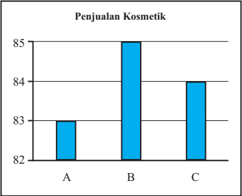

> **Deskripsi Visual:** Gambar ini adalah diagram batang yang menunjukkan penjualan kosmetik pada tiga periode waktu berbeda, yaitu A, B, dan C. Diagram ini terdiri dari tiga batang yang masing-masing menunjukkan jumlah penjualan kosmetik untuk setiap periode. Batang pertama (A) memiliki panjang sekitar 83,5 unit, batang kedua (B) memiliki panjang sekitar 86 unit, dan batang ketiga (C) memiliki panjang sekitar 84 unit. Dari gambar ini, kita bisa melihat bahwa penjualan kosmetik pada periode B terjadi dengan jumlah tertinggi, sedangkan pada periode A terjadi dengan jumlah terendah.

 

---
## 📄 Halaman 60

/g3 /g48/g72/g79/g76/g75/g68/g87/g3 /g74/g85/g68/g191/g78/g3 /g71/g76/g3 /g68/g87/g68/g86/g3 /g71/g72/g81/g74/g68/g81/g3 /g86/g72/g78/g76/g79/g68/g86/g3 /g80/g88/g81/g74/g78/g76/g81/g3 /g78/g76/g87/g68/g3 /g69/g76/g86/g68/g3 /g80/g72/g81/g74/g68/g87/g68/g78/g68/g81/g3 /g69/g68/g75/g90/g68/g3 paket kosmetik B jauh lebih dipilih oleh konsumen dari kedua produk lainnya. /g55 /g72/g85/g71/g68/g83/g68/g87/g3/g83/g72/g85/g69/g72/g71/g68/g68/g81/g3/g92/g68/g81/g74/g3/g81/g92/g68/g87/g68/g3/g68/g81/g87/g68/g85/g68/g3/g78/g72/g87/g76/g74/g68/g3/g83/g85/g82/g71/g88/g78/g3/g77/g76/g78/g68/g3/g75/g68/g81/g92/g68/g3/g80/g72/g79/g76/g75/g68/g87/g3/g74/g85/g68/g191/g78/g3 tanpa melihat skala pada sumbu-y. Jika diperhatikan dengan seksama, 83% konsumen kembali ke produk A, 85% kembali ke produk B, dan 84% kembali /g78/g72/g3 /g83/g85/g82/g71/g88/g78/g3 /g38/g17/g3 /g42/g85/g68/g191/g78/g3 /g87/g72/g85/g86/g72/g69/g88/g87/g3 /g71/g76/g74/g68/g80/g69/g68/g85/g78/g68/g81/g3 /g71/g72/g81/g74/g68/g81/g3 /g81/g76/g79/g68/g76/g3 /g68/g90/g68/g79/g3 /g83/g68/g71/g68/g3 /g86/g88/g80/g69/g88/g16/g92/g3 /g68/g71/g68/g79/g68/g75/g3/g27/g21/g15/g3/g87/g68/g83/g76/g3/g83/g72/g85/g75/g68/g87/g76/g78/g68/g81/g3/g77/g76/g78/g68/g3/g81/g76/g79/g68/g76/g3/g68/g90/g68/g79/g3/g86/g88/g80/g69/g88/g16/g92/g3/g68/g71/g68/g79/g68/g75/g3/g20/g3/g86/g72/g83/g72/g85/g87/g76/g3/g83/g68/g71/g68/g3/g74/g85/g68/g191/g78/g3 di bawah ini.

---
**🖼️ Gambar/Diagram**

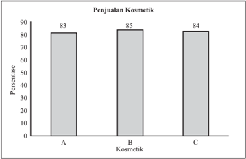

> **Deskripsi Visual:** Gambar ini adalah diagram batang yang menunjukkan penjualan kosmetik di tiga lokasi (A, B, dan C). Diagram ini terdiri dari tiga batang yang tinggi, masing-masing dengan nilai 85%, 83%, dan 84% untuk lokasi A, B, dan C, masing-masing. Ini menunjukkan bahwa penjualan kosmetik di semua lokasi tersebut sebanding dan tidak memiliki perbedaan yang signifikan antara mereka. Label "Penjualan Kosmetik" diletakkan di atas diagram, sedangkan angka-angka penjualan disimpan di dalam setiap batang. Teks penting lainnya yang mungkin ada adalah judul gambar dan nama-nama lokasi yang disertakan.

Terlihat bahwa perbedaan antara ketiga produk tidak jauh. Masing-masing /g83/g85/g82/g71/g88/g78/g3 /g75/g68/g81/g92/g68/g3 /g87/g72/g85/g83/g68/g88/g87/g3 /g20/g8/g17/g3 /g51/g72/g81/g68/g80/g83/g68/g78/g68/g81/g3 /g83/g68/g71/g68/g3 /g74/g85/g68/g191/g78/g3 /g83/g72/g85/g87/g68/g80/g68/g3 /g71/g68/g83/g68/g87/g3 /g80/g72/g81/g76/g83/g88/g3 mata  secara  sekilas  jika  pembaca  tidak  mengamati  dengan  seksama  skala pada sumbu-y. Memotong skala pada sumbu-y sebenarnya bukanlah hal yang /g71/g76/g79/g68/g85/g68/g81/g74/g15/g3/g87/g72/g87/g68/g83/g76/g3/g83/g72/g80/g69/g68/g70/g68/g3/g75/g68/g85/g88/g86/g3/g87/g72/g79/g76/g87/g76/g3/g71/g68/g79/g68/g80/g3/g80/g72/g80/g69/g68/g70/g68/g3/g74/g85/g68/g191/g78/g3/g92/g68/g81/g74/g3/g71/g76/g86/g68/g77/g76/g78/g68/g81/g17 /g42/g85/g68/g191/g78/g3/g92/g68/g81/g74/g3/g71/g76/g87/g68/g80/g83/g76/g79/g78/g68/g81/g3/g87/g72/g85/g78/g68/g71/g68/g81/g74/g3/g87/g76/g71/g68/g78/g3/g80/g72/g81/g68/g80/g83/g68/g78/g78/g68/g81/g3/g86/g78/g68/g79/g68/g3/g83/g68/g71/g68/g3/g86/g88/g80/g69/g88/g16/g92 /g17/g3 /g45/g76/g78/g68/g3 /g74/g85/g68/g191/g78/g3 /g83/g72/g81/g77/g88/g68/g79/g68/g81/g3 /g78/g82/g86/g80/g72/g87/g76/g78/g3 /g71/g76/g3 /g68/g87/g68/g86/g3 /g78/g76/g87/g68/g3 /g87/g68/g80/g83/g76/g79/g78/g68/g81/g3 /g87/g68/g81/g83/g68/g3 /g86/g78/g68/g79/g68/g3 /g83/g68/g71/g68/g3 /g86/g88/g80/g69/g88/g16/g92/g3 seperti di bawah ini, maka apa yang dapat Anda simpulkan?

 

---
## 📄 Halaman 61

---
**🖼️ Gambar/Diagram**

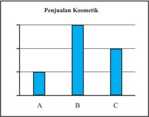

> **Deskripsi Visual:** Gambar ini adalah diagram batang yang menunjukkan penjualan kosmetik di tiga lokasi, yaitu A, B, dan C. Diagram ini terdiri dari tiga batang yang masing-masing berada di atas sumbu vertikal dan memiliki panjang yang berbeda-beda. Batang pertama (A) memiliki panjang paling pendek, sedangkan batang kedua (B) memiliki panjang paling panjang, sementara batang ketiga (C) berada di tengah-tengah. Label "Penjualan Kosmetik" diletakkan di atas sumbu horizontal, sementara label "A", "B", dan "C" diletakkan di bawah sumbu vertikal untuk mengidentifikasi lokasi penjualan. Informasi kunci yang dapat diambil dari gambar ini adalah bahwa penjualan kosmetik di lokasi B terjadi dengan jumlah yang paling banyak, sedangkan di lokasi A terjadi dengan jumlah yang paling sedikit.

/g3 /g46/g76/g87/g68/g3 /g87/g76/g71/g68/g78/g3 /g71/g68/g83/g68/g87/g3 /g80/g72/g81/g71/g68/g83/g68/g87/g78/g68/g81/g3 /g76/g81/g73/g82/g85/g80/g68/g86/g76/g3 /g68/g83/g68/g16/g68/g83/g68/g3 /g80/g72/g81/g74/g72/g81/g68/g76/g3 /g74/g85/g68/g191/g78/g3 /g71/g76/g3 /g68/g87/g68/g86/g3 kecuali urutan (rangking) dari A, B, dan C berdasarkan tinggi batang. Selain itu kita juga tidak mungkin mendapatkan informasi mengenai selisih persentase /g83/g68/g78/g72/g87/g3/g78/g82/g86/g80/g72/g87/g76/g78/g3/g75/g68/g81/g92/g68/g3/g71/g72/g81/g74/g68/g81/g3/g80/g72/g81/g74/g74/g88/g81/g68/g78/g68/g81/g3/g74/g85/g68/g191/g78/g3/g87/g72/g85/g86/g72/g69/g88/g87/g17/g3

Diskusikan  kesimpulan  sementara  dengan  teman  sekelas  Anda.  Guru Anda akan memberikan kesempatan kepada minimal 5 siswa yang mau maju secara  sukarela  untuk  mempresentasikan  kesimpulan  sementara  di  depan kelas.  Diskusikan  bersama  hasil  presentasi  untuk  mendapatkan  kesimpulan akhir. Tuliskan kesimpulan akhir pada kotak yang disediakan berikut ini.

 

---
## 📄 Halaman 62

### Masalah 2.1

- Berikut  ini  diberikan  empat  distribusi  frekuensi.  Setiap  distribusi frekuensi  yang  diberikan  terdapat  kesalahan  dalam  penyusunannya. Sebutkan kesalahan masing distribusi frekuensi dan alasannya.
a.

---
**📊 Tabel**

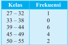

Tabel ini menunjukkan frekuensi kelas di sebuah kelas, dengan kelas yang berbeda-beda mulai dari 37 sampai 50. Dari data tersebut, kita bisa melihat bahwa kelas 39-44 memiliki frekuensi tertinggi yaitu 6 kali, sedangkan kelas 37-38 dan 50-55 hanya memiliki satu kali masing-masing. Ini menunjukkan bahwa banyak siswa yang berada di kelas 39-44, sementara siswa lainnya lebih banyak berada di kelas yang lebih tinggi atau lebih rendah.

---
**📊 Tabel**

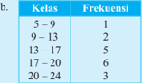

Tabel ini menunjukkan frekuensi kelas di suatu kelas, dengan kelas yang berbeda-beda mulai dari 5-9 hingga 20-24. Topik utama tabel ini adalah distribusi umur siswa dalam kelas tersebut. Kolom pertama menunjukkan kelas, sedangkan kolom kedua menunjukkan frekuensi kelas. Dari tabel ini, kita bisa melihat bahwa kelas 17-20 memiliki frekuensi tertinggi yaitu 6, sementara kelas 5-9 memiliki frekuensi terendah yaitu 2. Pola penting yang terlihat adalah bahwa sebagian besar siswa berada di kelas 17-20, yang merupakan kelas dengan umur paling tinggi di antara semua kelas yang ada.

c.

---
**📊 Tabel**

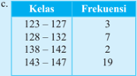

Tabel ini menunjukkan frekuensi kelas yang berbeda dalam suatu penelitian atau studi. Kolom "Kelas" menyatakan rentang nilai yang diukur, sementara kolom "Frekuensi" menunjukkan jumlah sampel atau observasi yang termasuk dalam setiap kelas tersebut. Topik utama tabel ini adalah analisis distribusi data, yang melibatkan pengumpulan dan interpretasi informasi tentang bagaimana variabel tertentu terbagi menjadi kelas-kelas yang berbeda. Data penting yang terlihat adalah bahwa kelas 134-147 memiliki frekuensi tertinggi dengan 19 sampel, sementara kelas 128-132 memiliki frekuensi terendah dengan hanya 3 sampel. Ini menunjukkan bahwa banyak sampel atau observasi terdapat di kelas dengan nilai yang lebih tinggi dibandingkan dengan kelas yang lebih rendah.

---
**📊 Tabel**

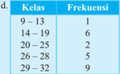

Tabel ini menunjukkan frekuensi kelas yang berbeda dalam sebuah distribusi frekuensi. Topik utama tabel adalah distribusi frekuensi kelas. Kolom pertama adalah kelas, yang diurutkan dari 9 hingga 32. Kolom kedua adalah frekuensi, yang menunjukkan jumlah kali masing-masing kelas muncul dalam data tersebut. Data penting yang terlihat adalah bahwa kelas 26-28 memiliki frekuensi tertinggi dengan 5 kali, sedangkan kelas 9-13 memiliki frekuensi terendah dengan hanya satu kali. Ini menunjukkan bahwa kelas 26-28 adalah kelas paling sering muncul dalam data ini, sementara kelas 9-13 adalah kelas paling jarang.

- Distribusi frekuensi yang diberikan berikut mempresentasikan jumlah kendaraan roda empat terpilih dalam suatu kota yang menghabiskan bahan bakar bensin dalam jumlah tertentu (liter) setiap minggunya. Kolom kelas menyatakan jumlah bahan bakar bensin yang dihabiskan dalam  1  minggu  sedangkan  kolom  frekuensi  adalah  banyaknya kendaraan roda empat.

---
**📊 Tabel**

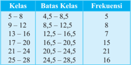

Tabel ini menunjukkan distribusi kelas siswa berdasarkan batas kelas dan frekuensi mereka. Topik utama tabel adalah distribusi umur siswa di kelas tertentu. Kolom pertama adalah kelas, yang didefinisikan oleh batas-batas kelas. Kolom kedua adalah batas-batas kelas tersebut. Kolom ketiga adalah frekuensi, yang menunjukkan berapa banyak siswa yang berada dalam setiap kelas. Dari tabel ini, kita dapat melihat bahwa sebagian besar siswa berada di kelas 21-24 tahun, dengan frekuensi paling tinggi sebesar 21. Sementara itu, siswa yang berada di kelas 5-8 tahun memiliki frekuensi yang paling rendah, hanya 5. Pola penting lainnya adalah bahwa sebagian besar siswa berada di kelas yang lebih tua, dengan kelas 21-24 tahun memiliki frekuensi terbesar.

 

---
## 📄 Halaman 63

### Jawablah pertanyaan berikut ini.

- Berapa  banyak  kendaraan  roda  4  yang  menghabiskan  bensin kurang dari 4,5 liter?
- Berapa  banyak  kendaraan  roda  4  yang  menghabiskan  bensin kurang dari 8,5 liter?
- Lanjutkan  untuk  mencari  banyak  kendaraan  yang  kurang  dari batas bawah kelas kemudian tuliskan pada tabel di bawah ini.

---
**📊 Tabel**

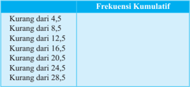

Tabel ini menunjukkan frekuensi kumulatif dari berbagai interval nilai. Topik utama tabel adalah distribusi frekuensi kumulatif dari nilai tertentu. Kolom pertama berisi interval-nilai yang diberikan, sedangkan kolom kedua berisi frekuensi kumulatif untuk setiap interval tersebut. Data penting yang terlihat adalah bahwa frekuensi kumulatif meningkat dengan semakin tinggi nilai intervalnya, menunjukkan bahwa banyak nilai lebih tinggi dari interval tertentu. Ini menunjukkan bahwa sebagian besar data terdistribusi di bawah 28,5.

/g38/g68/g87/g68/g87/g68/g81/g29/g3

Tabel di atas disebut distribusi frekuensi kumulatif

- Data  berikut  adalah  data  jumlah  pengunjung  perpustakaan  SMA 'NASIONAL' dalam 40 hari kerja berturut-turut.

### Berdasarkan data tersebut, buatlah

- Distribusi frekuensi dengan 7 kelas
- Histogram, poligon frekuensi, dan ogive untuk distribusi frekuensi poin (a).

 

---
## 📄 Halaman 64

- Misalkan Anda adalah seorang pengusaha real estate di kota Masamba. Anda memperoleh daftar harga rumah yang sudah Anda jual dalam 6 bulan terakhir. Anda ingin mengorganisasi data yang Anda terima agar Anda dapat memberikan informasi yang akurat kepada calon pembeli. Gunakan data berikut ini untuk disajikan dalam histogram, poligon frekuensi, dan ogive. Data berikut dalam puluhan ribu rupiah.
- Pertanyaan-pertanyaan  apa  yang  yang  dapat  dijawab  dengan mudah  dengan  melihat  histogram  dibandingkan  dengan  daftar harga yang diberikan di atas?
- Pertanyaan berbeda apa yang dapat dijawab dengan lebih mudah dengan  melihat  poligon  frekuensi  dibandingkan  dengan  daftar harga tersebut?
- Pertanyaan berbeda apa yang dapat dijawab dengan lebih mudah dengan melihat ogive dibandingkan dengan daftar harga tersebut?
- Apakah ada data yang sangat besar atau sangat kecil dibandingkan dengan nilai lainnya?
- /g72/g17/g3 /g42/g85/g68/g191/g78/g3 /g80/g68/g81/g68/g3 /g92/g68/g81/g74/g3 /g80/g72/g81/g68/g80/g83/g76/g79/g78/g68/g81/g3 /g81/g76/g79/g68/g76/g3 /g72/g78/g86/g87/g85/g76/g80/g3 /g87/g72/g85/g86/g72/g69/g88/g87/g3 /g71/g72/g81/g74/g68/g81/g3 lebih baik?
- Penelitian  mengenai  kebutuhan  air  minum  bagi  tubuh  manusia dalam  sehari  sudah  banyak  dilakukan  dan  dipublikasikan.  Carilah hasil  penelitian  tersebut  dan  ungkapkan  berapa  gelas  atau  liter  air minum kebutuhan tubuh manusia. Kemudian kumpulkan data melalui wawancara terhadap minimal 40 teman Anda mengenai konsumsi air minum mereka sehari-hari (dalam satuan gelas atau liter). Jika data sudah terkumpul, maka lakukanlah kegiatan berikut.

---
**📊 Tabel**

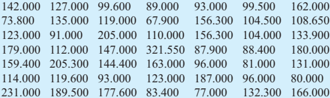

Tabel ini menunjukkan data statistik tentang jumlah orang yang berbeda di berbagai wilayah di Indonesia pada tahun 2019. Topik utama tabel adalah populasi di berbagai provinsi. Kolom pertama adalah nama provinsi, kolom kedua adalah jumlah penduduk, kolom ketiga adalah jumlah per 100.000 penduduk, kolom keempat adalah jumlah per 100.000 penduduk per 100.000 penduduk, kolom kelima adalah jumlah per 100.000 penduduk per 100.000 penduduk, dan kolom keenam adalah jumlah per 100.000 penduduk per 100.000 penduduk. Data penting yang terlihat adalah bahwa Jakarta memiliki jumlah penduduk tertinggi dengan 14.200.000 orang, sedangkan Papua memiliki jumlah penduduk terendah dengan 78.000 orang. Selain itu, data juga menunjukkan bahwa jumlah penduduk di beberapa provinsi seperti Sumatera Utara, Kalimantan Timur, dan Sulawesi Selatan juga cukup tinggi.

 

---
## 📄 Halaman 65

- Buatlah distribusi frekuensi data yang sudah dikumpulkan (pilih salah satu satuan yang digunakan, yaitu gelas atau liter) dengan banyak kelas yang Anda tentukan sendiri.
- Buatlah  histogram,  poligon  frekuensi,  dan  ogive  dari  distribusi yang didapatkan.
- Buatlah distribusi kumulatifnya.

### Subbab 2.2.  Ukuran Pemusatan dan Penyebaran Data Berkelompok

Kegiatan  sebelumnya Anda  dapat  memperoleh  informasi-informasi dari  data  mentah  dengan  mengolah  data  tersebut  ke  dalam  distribusi /g73/g85/g72/g78/g88/g72/g81/g86/g76/g3 /g71/g68/g81/g3 /g80/g72/g81/g68/g80/g83/g76/g79/g78/g68/g81/g3 /g71/g68/g87/g68/g3 /g78/g72/g3 /g71/g68/g79/g68/g80/g3 /g69/g72/g69/g72/g85/g68/g83/g68/g3 /g74/g85/g68/g191/g78/g17/g3 /g51/g68/g71/g68/g3 /g69/g68/g74/g76/g68/g81/g3 /g76/g81/g76/g3 Anda akan mempelajari metode-metode statistika yang dapat digunakan untuk mendiskripsikan suatu data. Metode statistika yang paling umum digunakan adalah rata-rata. Sebagai contoh, dalam suatu artikel di koran online*, Erwin (2015) menyatakan bahwa Google melakukan wawancara online  terhadap  pemilik  ponsel  pintar  di  Indonesia  antara  usia  18  dan 64 tahun untuk mengetahui lebih baik mengenai perilaku mereka. Hasil wawancara  yang  dilansir  Google  menyatakan  bahwa  rata-rata  aplikasi yang di-instal di Indonesia tahun 2015 adalah sebanyak 31 aplikasi per individu.

Pada contoh di atas, istilah rata-rata yang digunakan masih tidak jelas karena ada berbagai macam rata-rata. Beberapa diantaranya adalah ratarata  hitung,  rata-rata  geometri, rata-rata harmonik. Rata-rata merupakan pusat distribusi atau yang paling sering terjadi. Ukuran rata-rata disebut juga dengan ukuran pemusatan data. Ukuran pemusatan yang akan dibahas pada bagian ini meliputi rata-rata (dalam hal ini rata-rata hitung), median, dan modus untuk data berkelompok.

 

---
## 📄 Halaman 66

### Kegiatan 2.2.1  Ukuran Pemusatan Data Berkelompok

Masih  ingatkah  Anda  bagaimana  menentukan  rata-rata,  median,  dan modus untuk data tunggal? Sebagai contoh, diberikan data ukuran sepatu yang dipakai 12 pemain basket SMA Nasional sebagai berikut.

``

Coba  Anda  tentukan  rata-rata,  median  dan  modus  dari  data  tersebut. Dari  ketiga  ukuran  pemusatan  data  tersebut,  manakah  yang  paling  sesuai merepresentasikan data tersebut menurut Anda?

Lalu bagamanakah cara menentukan rata-rata, median, dan modus suatu data yang berupa data berkelompok atau bahkan data yang disajikan dalam histogram? Berikut diberikan  beberapa  contoh  data  berkelompok  sekaligus diberikan ukuran pemusatan datanya.

### Contoh Soal 2.11

Data yang disajikan dalam distribusi frekuensi berikut merupakan data usia 50 orang terkaya di Indonesia.

---
**📊 Tabel**

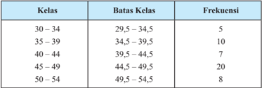

Tabel ini menunjukkan distribusi frekuensi untuk kelas umur yang diukur dalam interval batas kelas. Topik utama tabel adalah distribusi umur dalam berbagai kelas. Kolom "Kelas" menyatakan interval umur yang digunakan, sedangkan kolom "Batas Kelas" menunjukkan batas-batas setiap kelas. Kolom "Frekuensi" menggambarkan jumlah individu dalam setiap kelas. Dari tabel ini, kita dapat melihat bahwa kelas 45-49 memiliki frekuensi tertinggi dengan 20 individu, sementara kelas 30-34 memiliki frekuensi terendah dengan hanya 5 individu. Pola umumnya menunjukkan bahwa sebagian besar populasi terdistribusi di antara kelas 40-49, yang merupakan kelas dengan frekuensi paling tinggi.

/g3/g3/g3

Rata-rata  usia  50  orang  terkaya  di  Indonesia  berdasarkan  distribusi frekuensi di atas adalah 43,6 tahun. Selanjutnya kelas keempat (44,5 - 49,5) merupakan  kelas  median  sekaligus  juga  merupakan  kelas  modus  dengan mediannya adalah 45,25 dan modusnya adalah 47,1.

 

---
## 📄 Halaman 67

### Contoh Soal 2.12

Data skor TOEFL siswa dalam suatu kelas diberikan dalam distribusi frekuensi berikut ini.

---
**📊 Tabel**

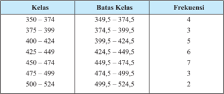

Tabel ini menunjukkan distribusi frekuensi siswa berdasarkan kelas mereka. Topik utama tabel adalah distribusi kelas siswa di sekolah. Kolom "Kelas" menyatakan rentang nilai yang diterima oleh siswa, sedangkan kolom "Batas Kelas" menunjukkan batas-batas nilai tersebut. Kolom "Frekuensi" menunjukkan jumlah siswa yang mendapatkan nilai dalam rentang tertentu. Dari tabel ini, dapat dilihat bahwa sebagian besar siswa mendapatkan nilai antara 375-424, dengan frekuensi tertinggi sebanyak 5 siswa. Sementara itu, siswa yang mendapatkan nilai di bawah 375 atau di atas 500 lebih sedikit, masing-masing hanya 2 siswa. Ini menunjukkan bahwa sebagian besar siswa memiliki prestasi yang baik namun masih ada yang kurang memuaskan.

Berdasarkan distribusi frekuensi di atas, rata-rata skor TOEFL siswa dalam kelas tersebut adalah 433,7. Kelas keempat yaitu 424,5 - 449,5 merupakan kelas median dengan mediannya adalah 437. Kelas kelima merupakan kelas modus dengan modusnya adalah 454,5.

### Contoh Soal 2.13

Berikut ini merupakan histogram yang menyajikan data tinggi badan 30 siswa terpilih kelas XII pada suatu sekolah.

 

---
## 📄 Halaman 68

---
**🖼️ Gambar/Diagram**

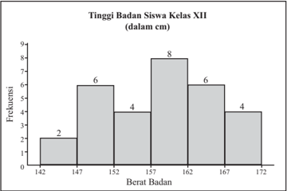

> **Deskripsi Visual:** Gambar ini adalah diagram batang yang menunjukkan frekuensi tinggi badan siswa kelas XII dalam satuan centimeter (cm). Frekuensi ini diperoleh dari berat badan siswa tersebut dalam satuan kilogram (kg). Gambar ini terdiri dari beberapa elemen utama:

1. Titik-titik pada sumbu x (horizontal) menunjukkan berat badan siswa dalam kilogram.
2. Titik-titik pada sumbu y (vertikal) menunjukkan frekuensi tinggi badan siswa dalam jumlah.
3. Bar-bar yang mewakili frekuensi tinggi badan siswa dengan berat badan tertentu.

Informasi penting yang dapat diambil dari gambar ini meliputi:

- Frekuensi tinggi badan siswa kelas XII berkisar antara 2 cm hingga 8 cm.
- Frekuensi tertinggi terdapat pada tinggi badan sekitar 160 cm dengan frekuensi 8 kali.
- Frekuensi terendah terdapat pada tinggi badan sekitar 145 cm dengan frekuensi 2 kali.
- Frekuensi meningkat dengan naiknya tinggi badan sampai mencapai 160 cm, kemudian turun lagi.

Dari gambar ini, dapat disimpulkan bahwa frekuensi tinggi badan siswa kelas XII cenderung lebih tinggi pada tinggi badan sekitar 160 cm, sementara frekuensi terendah terjadi pada tinggi badan sekitar 145 cm.

Berdasarkan  histogram  tersebut,  rata-rata  tinggi  badan  siswa  tersebut adalah 158,2. Kelas 157 - 162 merupakan kelas median sekaligus kelas modus, dengan median sebesar 158,9 dan modus sebesar 160,3.

Berdasarkan  hasil  pengamatan  yang Anda  lakukan,  catat  istilah-istilah matematika  atau  informasi-informasi  penting  mengenai  ukuran  pemusatan data berkelompok di kotak yang disediakan berikut.

 

---
## 📄 Halaman 69

Setelah  mengamati  Contoh  2.11  -  3.12,  coba  Anda  buat  pertanyaanpertanyaan  yang  terlintas  di  benak  Anda  tentang  rata-rata,  median,  dan modus untuk data  berkelompok. Anda  juga  dapat  menghubungkan  tentang rata-rata,  median,  dan  modus untuk data tunggal yang sudah Anda pelajari sebelumnya.  Dengan  membandingkan  hasil  pengamatan  ketiga  contoh  di atas dengan pengetahuan yang Anda miliki sebelumnya untuk data tunggal memungkinkan Anda untuk mengajukan pertanyaan yang membantu Anda dalam memahami ukuran pemusatan data untuk data berkelompok. Tuliskan minimal 3 pertanyaan Anda dalam kotak yang sudah disediakan di bawah ini.

Hal  yang  perlu  Anda  ketahui  untuk  menentukan  rata-rata  pada  data tunggal adalah banyak data yang biasa dilambangkan dengan n dan jumlah keseluruhan dari data tersebut. Jika banyak data yang dihadapi sedikit, tentu Anda dapat dengan mudah untuk menentukan rata-rata. Di lain pihak, jika data yang dihadapi berukuran besar, Anda perlu mengelompokkan data tersebut dalam  beberapa  kelompok  untuk  memudahkan  mengetahui  karakteristik data. Akibatnya, menentukan rata-rata untuk data yang sudah dikelompokkan tersebut berbeda dengan untuk data tunggal. Untuk menambah wawasan Anda mengenai ukuran pemusatan data untuk data berkelompok, Anda perhatikan contoh berikut ini.

 

---
## 📄 Halaman 70

### Contoh Soal 2.14

Berikut merupakan data usia 80 pengusaha dalam memulai usahanya yang sudah diberikan pada Contoh 2.1.

---
**📊 Tabel**

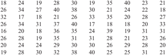

Tabel ini menunjukkan data statistik tentang hasil tes matematika untuk 24 siswa di sebuah sekolah. Topik utama tabel adalah hasil tes matematika siswa tersebut. Kolom pertama menunjukkan nomor siswa, sedangkan kolom kedua hingga kelima menunjukkan skor masing-masing siswa dalam tes matematika. Data penting yang terlihat adalah bahwa sebagian besar siswa mendapatkan skor antara 20-30, dengan beberapa siswa mendapatkan skor di atas 30 dan beberapa siswa mendapatkan skor di bawah 20. Selain itu, ada beberapa siswa yang mendapatkan skor yang sangat tinggi, mencapai 40 dan 50. Ini menunjukkan bahwa siswa-siswa ini memiliki kemampuan matematika yang baik dan perlu diberikan penghargaan atau motivasi tambahan.

Ketika  data  ini  dikelompokkan  menjadi  5  kelas  maka  akan  didapatkan distribusi frekuensi seperti di bawah ini.

Perhatikan bahwa kelas pertama mempunyai titik tengah 18. Ini artinya bahwa  data  yang  masuk  dalam  kelas  pertama  bisa  kurang  dari  18  atau lebih  dari  18.  Akibatnya  jumlah  data  pada  kelas  pertama  dapat  didekati (aproksimasi)  sebesar  342.  Jumlah  data  keseluruhan  dengan  pendekatan sebesar 2145, sehingga rata-rata untuk data berkelompok di atas adalah 26,8 tahun. Jika Anda hitung rata-rata untuk data tunggal di atas, apa yang Anda peroleh? Bagaimana hasilnya jika Anda bandingkan dengan rata-rata untuk data berkelompok? Tuliskan pada kotak di bawah ini.

 

---
## 📄 Halaman 71

Menentukan median dan modus untuk data berkelompok hampir sama dengan menentukan rata-rata, yaitu yang akan ditentukan berupa perkiraan (pendekatan).  Berdasarkan  frekuensi  setiap  kelas, Anda  dapat  menentukan lokasi  atau  pada  selang  mana  median  berada  yang  disebut  dengan  kelas median dan juga dapat menentukan kelas modus dengan mempertimbangkan frekuensi setiap kelas. Dengan memperhatikan fakta tersebut, tentukan kelas median dan kelas modus pada distribusi frekuensi di atas. Tuliskan jawaban Anda  pada  kotak  yang  disediakan  dan  tuliskan  bagaimana  caranya  untuk mendapatkan kedua kelas tersebut.

Di  lain  pihak,  jika  data  dikelompokkan  menjadi  7  kelas  maka  akan didapatkan distribusi frekuensi berikut ini.

---
**📊 Tabel**

Tabel ini menunjukkan informasi tentang kelas, batas kelas, titik tengah, dan frekuensi. Topik utama tabel adalah distribusi umur siswa di sekolah. Kolom-kolomnya meliputi kelas, batas kelas, titik tengah, dan frekuensi. Data penting yang terlihat adalah bahwa sebagian besar siswa berada di kelas 16-23 tahun, dengan frekuensi tertinggi di kelas 18-20 tahun. Ini menunjukkan bahwa mayoritas siswa memiliki umur antara 18-20 tahun.

/g3 Dengan melengkapi tabel distribusi frekuensi di atas, coba Anda tentukan perkiraan  jumlah  data  pada  setiap  kelas  sekaligus  perkiraan  jumlah  data keseluruhan.  Kemudian  dengan  mempertimbangkan  banyak  data,  dapatkah Anda memperkirakan rata-rata dari data berkelompok tersebut? Tentukan pula kelas  median dan kelas modus. Selanjutnya, dengan data yang sama tetapi distribusi frekuensi yang berbeda apa yang dapat Anda simpulkan mengenai rata-rata,  kelas  median,  dan  kelas  modus  dari  kedua  distribusi  frekuensi  di atas?

 

---
## 📄 Halaman 72

Tuliskan jawaban Anda pada kotak berikut ini.

Ukuran pemusatan data (rata-rata, median, modus) untuk data berkelompok secara prinsip sama dengan ukuran pemusatan data untuk data tunggal. Dari langkah-langkah  pengamatan  dan  penggalian  informasi  mungkin  Anda sudah  tahu  perbedaan  ukuran  pemusatan  data  untuk  data  tunggal  dan  data berkelompok. Ukuran pemusatan untuk data tunggal dapat ditentukan dengan pasti,  tetapi  ukuran  pemusatan  untuk  data  berkelompok  ditentukan  dengan perkiraan atau pendekatan.

Untuk  mengetahui  lebih  lanjut  bagaimana  cara  menentukan  ukuran pemusatan untuk data berkelompok, lakukan beberapa kegiatan berikut ini.

### 2.2.1.1  Rata-rata

Berikut ini diberikan distribusi frekuensi pada Contoh 2.11. Lengkapi tabel berikut ini untuk menentukan rata-rata usia 50 orang terkaya di Indonesia.

---
**📊 Tabel**

Tabel ini menunjukkan data statistik dari suatu kelas dengan 5 kelas yang berbeda. Kolom "Kelas" menyatakan batas-batas setiap kelas, mulai dari 30-34 hingga 50-54. Kolom "Titik Tengah (x)" menunjukkan titik tengah dari setiap kelas, yang merupakan rata-rata dari batas-batas kelas tersebut. Kolom "Frekuensi (f)" menunjukkan jumlah siswa yang berada di setiap kelas. Kolom "x_i f_i" menunjukkan hasil kali antara frekuensi dan titik tengah untuk setiap kelas.

Topik utama tabel ini adalah analisis distribusi frekuensi dari kelas tersebut. Data penting yang terlihat adalah bahwa kelas 45-49 memiliki frekuensi tertinggi sebanyak 20, sementara kelas 50-54 memiliki frekuensi terendah sebanyak 8. Ini menunjukkan bahwa banyak siswa yang berada di kelas 45-49, sedangkan yang berada di kelas 50-54 lebih sedikit.

 

---
## 📄 Halaman 73

Telah  diketahui  sebelumnya  bahwa  rata-rata  usia  50  orang  terkaya  di Indonesia  adalah  43,6  tahun.  Dengan  mengamati  tabel  di  atas,  bagaimana caranya bisa didapatkan hasil 43,6? Tuliskan rumus untuk menentukan ratarata data berkelompok menurut Anda dalam kotak yang tersedia di bawah ini.

### 2.2.1.2  Median

Lengkapi tabel berikut ini untuk mengetahui lebih lanjut cara menentukan median  data  berkelompok.  Distribusi  frekuensi  yang  digunakan  adalah distribusi frekuensi pada Contoh 2.11.

---
**📊 Tabel**

Tabel ini menunjukkan informasi statistik tentang kelas yang dibagi menjadi beberapa kelas batas. Topik utama tabel adalah distribusi frekuensi kelas. Kolom-kolomnya meliputi Kelas, Batas Bawah (L), Panjang Kelas (p), Frekuensi (f), Fungsi Frekuensi (F), dan Fungsi Frekuensi Normalisasi (F). Data penting yang terlihat adalah bahwa sebanyak 5 individu termasuk dalam kelas 30-34, sedangkan 20 individu termasuk dalam kelas 45-49. Frekuensi normalisasi menunjukkan bahwa setiap kelas memiliki frekuensi yang berbeda-beda, dengan kelas 45-49 memiliki frekuensi tertinggi yaitu 20, sementara kelas 30-34 memiliki frekuensi terendah yaitu 5. Ini menunjukkan bahwa distribusi frekuensi kelas ini tidak merata dan mungkin memerlukan penyesuaian atau analisis lebih lanjut untuk memahami pola atau tren yang ada.

### /g46/g72/g87/g72/g85/g68/g81/g74/g68/g81/g29

F i

: jumlah frekuensi kelas-kelas sebelum kelas ke- i .

n

: banyak data

Telah  diketahui  sebelumnya  bahwa  median  dari  distribusi  frekuensi tersebut  adalah  45,25.  Berdasarkan  tabel  yang  sudah  dilengkapi  di  atas, bagaimana  menurut Anda  cara  menentukan  median?  Kelas  manakah  yang

 

---
## 📄 Halaman 74

digunakan  sebagai  median?  Mengapa?  Tuliskan  jawaban  Anda  termasuk rumus median di kotak yang sudah disediakan.

### 2.1.3  Modus

Lengkapi tabel berikut untuk mengetahui cara menentukan modus data berkelompok.

---
**📊 Tabel**

Tabel ini menunjukkan informasi statistik tentang kelas belajar siswa di sebuah sekolah. Topik utamanya adalah distribusi umur siswa dalam berbagai kelas. Tabel dibagi menjadi dua kolom utama: "Batas Bawah Kelas" dan "Panjang Kelas". Kolom "Frekuensi" menunjukkan jumlah siswa yang berada dalam setiap kelas. Selain itu, tabel juga mencakup kolom "d_i", "L_i + p_i", dan "d_i / (d_i + d_j)", yang mungkin digunakan untuk menghitung ukuran kelas atau frekuensi kumulatif.

Data penting yang terlihat dalam tabel ini termasuk bahwa sekitar 50% siswa berada dalam kelas 30-34, sedangkan sisanya tersebar di kelas 35-39, 40-44, 45-49, dan 50-54. Frekuensi tertinggi terjadi pada kelas 45-49 dengan 20 siswa, sementara kelas 30-34 memiliki frekuensi paling rendah dengan 5 siswa. Ini menunjukkan bahwa kelas 45-49 memiliki populasi siswa yang lebih besar dibandingkan kelas lainnya.

### /g46/g72/g87/g72/g85/g68/g81/g74/g68/g81/g29

d 1

: selisih frekuensi kelas ke-i dengan kelas sebelumnya

d 2

: selisih frekuensi kelas ke-i dengan kelas berikutnya

Telah  diketahui  sebelumnya  bahwa  modus  usia  50  orang  terkaya  di Indonesia adalah 47,1 tahun. Berdasarkan tabel yang sudah dilengkapi di atas, kelas manakah yang sesuai dengan hasil tersebut? Dapatkah Anda simpulkan bagaimana menentukan modus data berkelompok sekaligus dengan rumusnya? Tuliskan jawaban Anda dalam kotak berikut ini.

 

---
## 📄 Halaman 75

Dari rumus rata-rata, median, dan modus yang telah Anda dapatkan, coba Anda cek kebenaran rumus tersebut dengan menggunakannya pada Contoh 2.12 dan Contoh 2.13.

### Sedikit Informasi

Ukuran pemusatan atau ukuran penyebaran suatu data yang diperoleh dari populasi disebut dengan parameter, sedangkan jika datanya berasal dari sampel maka disebut dengan statistik. Sehingga rata-rata suatu data yang diperoleh dari suatu populasi merupakan parameter dan dilambangkan dengan . Ratarata suatu data yang diperoleh dari sampel yang mewakili populasi merupakan statistik yang dilambangkan dengan x.

Sebagian  orang  mungkin  mempunyai  kesalahpahaman  mengenai  ratarata.  Jika  ada  yang  mengatakan  'rata-rata  gaji  buruh  di  Indonesia  adalah Rp2.500.000,00' maka sebenarnya kita tidak bisa langsung mengetahui bahwa rata-rata  yang  digunakan  adalah  rata-rata  hitung  seperti  yang  kita  tentukan rumusnya sebelumnya. Rata-rata mempunyai banyak jenis, di antaranya adalah rata-rata hitung, rata-rata geometri, dan rata-rata harmonik yang besarannya dimungkinkan tidak sama antar rata-rata tersebut.

Anda diskusikan hasil yang Anda dapatkan dengan teman sebangku Anda. Guru  Anda  akan  menunjuk  beberapa  siswa  untuk  menuliskan  hasil  yang diperoleh di papan tulis. Diskusikan hasil tersebut dengan teman sekelas Anda untuk  mendapatkan  kesimpulan  kelas.  Tuliskan  kesimpulan  Anda  dikotak yang sudah disediakan dibawah ini.

 

---
## 📄 Halaman 76

### Kegiatan 2.2.2  Ukuran Penyebaran Data Berkelompok

Mengetahui hanya rata-rata dari suatu data tidak cukup untuk mendeskripsikan data sepenuhnya. Anda juga perlu mengetahui bagaimana penyebaran data. Sebagai contoh, seorang penjual sepatu olah raga di suatu daerah  telah  mengetahui  bahwa  rata-rata  ukuran  sepatu  olah  raga  yang laris  adalah  ukuran  40.  Penjual  sepatu  tersebut  tidak  akan  bertahan  lama dalam penjualan sepatu olah raga ini jika dia menjual sepatu hanya ukuran 40.  Walaupun  dia  mengetahui  rata-rata  ukuran  sepatu  pembeli  di  daerah tersebut,  dia  juga  perlu  mengetahui  bagaiamana  data  menyebar,  yaitu apakah datanya mendekati rata-rata ataukah menyebar merata. Ukuran yang menentukan penyebaran data disebut dengan ukuran penyebaran data. Untuk data  berkelompok,  ukuran  penyebaran  data  meliputi  simpangan  rata-rata, simpangan baku, dan ragam.

Anda  mungkin  masih  ingat  bagaimana  menentukan  simpangan  ratarata,  simpangan  baku,  dan  ragam  untuk  data  tunggal.  Secara  prinsip  cara menentukan  simpangan  rata-rata,  simpangan  baku,  dan  ragam  untuk  data tunggal hampir sama dengan untuk data berkelompok. Berikut akan diberikan beberapa contoh distribusi frekuensi suatu populasi disertai dengan simpangan rata-rata, simpangan baku, dan ragam.

### Contoh Soal 2.15

Data yang disajikan berikut merupakan data pendapatan netto 45 perusahaan besar di Indonesia dalam milyar rupiah.

---
**📊 Tabel**

Tabel ini menunjukkan frekuensi kelas yang berbeda dalam suatu penelitian atau studi. Topik utamanya adalah distribusi umur atau rentang usia dalam sebuah populasi tertentu. Kolom pertama berisi rentang usia yang diukur dalam tahun, sedangkan kolom kedua berisi frekuensi atau jumlah individu yang termasuk dalam setiap rentang tersebut. Data penting yang terlihat adalah bahwa rentang usia 32-42 tahun memiliki frekuensi tertinggi dengan 15 individu, sementara rentang usia 65-75 tahun memiliki frekuensi terendah dengan hanya 3 individu. Ini menunjukkan bahwa sebagian besar populasi dalam penelitian ini berada di rentang usia antara 32-42 tahun.

/g3/g3/g3

 

---
## 📄 Halaman 77

Ukuran  penyebaran  pada  data  berkelompok  di  atas  dapat  dihitung, yaitu simpangan rata-rata adalah 12,4 dan simpangan bakunya adalah 14,6. Selanjutnya ragam dari data ini adalah 212,3.

### Contoh Soal 2.16

/g55/g76/g74/g68/g3/g83/g88/g79/g88/g75/g3/g86/g72/g83/g72/g71/g68/g3/g80/g82/g87/g82/g85/g3/g87/g72/g85/g83/g76/g79/g76/g75/g3 /g71/g76/g87/g72/g86/g3 /g88/g81/g87/g88/g78/g3 /g80/g72/g81/g74/g72/g87/g68/g75/g88/g76/g3 /g72/g191/g86/g76/g72/g81/g86/g76/g3 /g69/g68/g75/g68/g81/g3 /g69/g68/g78/g68/g85/g3 dalam  kilometer  per  liter.  Distribrusi  frekuensi  yang  didapatkan  disajikan berikut ini.

---
**📊 Tabel**

Tabel ini menunjukkan frekuensi kelas yang berbeda dalam suatu distribusi frekuensi. Topik utama tabel adalah distribusi frekuensi kelas yang diberikan dalam rentang angka 7,5 hingga 32,5. Kolom pertama berisi kelas, sedangkan kolom kedua berisi frekuensi untuk setiap kelas tersebut. Data penting yang terlihat adalah bahwa kelas 17,5-22,5 memiliki frekuensi tertinggi dengan 15 kali, sementara kelas 27,5-32,5 memiliki frekuensi terendah dengan hanya 2 kali. Ini menunjukkan bahwa frekuensi kelas 17,5-22,5 lebih tinggi dibandingkan dengan kelas lainnya.

Dari distribusi di atas didapatkan simpangan rata-rata 3,5, simpangan baku sebesar 5,1 dan ragam sebesar 25,7

Di bawah ini diberikan histogram pada Contoh 2.10 yang menyajikan berat badan 30 balita (dalam kilogram) yang datang pada posyandu di suatu daerah.

### Contoh Soal 2.17

 

---
## 📄 Halaman 78

Berdasarkan  histogram  tersebut  dapat  ditentukan  ukuran  penyebaran datanya, yaitu simpangan rata-rata sebesar 1,85, simpangan baku sebesar 2,26 dan ragam sebesar 5,09.

Informasi-informasi atau istilah matematika penting dari hasil pengamatan mengenai ukuran penyebaran data berkelompok dapat dituliskan dalam kotak yang disediakan berikut.

Berdasarkan  pengamatan Anda  terhadap  ketiga  contoh  yang  diberikan sebelumnya,  buatlah  beberapa  pertanyaan  tentang  ukuran  penyebaran  data berkelompok. Tuliskan pertanyaan Anda dalam kotak yang tersedia di bawah ini.

 

---
## 📄 Halaman 79

Mengetahui ukuran pemusatan data seperti rata-rata, median atau modus saja tidak cukup bagi seorang peneliti untuk mendeskripsikan data lebih rinci. Seorang  peneliti  tentu  memerlukan  informasi  bagaimana  data  menyebar, yaitu bagaimana kondisi data dibandingkan dengan rata-rata yang diperoleh. Informasi mengenai apakah semua data dekat dengan rata-rata atau bahkan datanya jauh dari rata-rata (menyebar secara merata) sangat dibutuhkan oleh penggunan data dalam penarikan kesimpulan.

Pada  pengamatan  sebelumnya  diberikan  beberapa  contoh  distribusi frekuensi yang disertai dengan ukuran penyebarannya. Berikut ini diberikan contoh  lainnya  yang  dapat  Anda  gunakan  untuk  lebih  memahami  ukuran penyebaran data dan bagaimana menentukannya.

### Contoh Soal 2.18

Berikut ini merupakan distribusi frekuensi dari nilai ujian akhir 100 mahasiswa jurusan matematika yang terpilih di suatu universitas.

---
**📊 Tabel**

Tabel ini menunjukkan frekuensi kelas yang berbeda dalam sebuah distribusi frekuensi. Topik utama tabel adalah distribusi frekuensi kelas yang diperoleh dari suatu populasi. Kolom pertama menunjukkan batas-batas kelas, sedangkan kolom kedua menunjukkan frekuensi untuk setiap kelas tersebut. Data penting yang terlihat adalah bahwa kelas 80-86 memiliki frekuensi tertinggi dengan 39, kemudian kelas 73-79 dengan 18, kelas 87-93 dengan 28, kelas 66-72 dengan 6, dan kelas 94-100 dengan 9. Ini menunjukkan bahwa kelas 80-86 memiliki frekuensi paling tinggi, sementara kelas 66-72 memiliki frekuensi yang paling rendah.

/g3 Dengan  menggunakan  pengetahuan  sebelumnya  bahwa  penyebaran  data dibandingkan dengan rata-rata, coba Anda tentukan rata-rata dari distribusi frekuensi di atas dan tuliskan hasilnya dalam kotak di bawah ini.

 

---
## 📄 Halaman 80

Rata-rata suatu data berkelompok ditentukan dengan memperhatikan titik tengah  setiap  kelas  dan  frekuensinya  masing-masing.  Simpangan  rata-rata memperhatikan  bagaiamana  data  menyimpang  dari  rata-rata.  Berdasarkan hal tersebut, coba Anda buat kolom tambahan dari distribusi frekuensi di atas yang  berisikan  selisih  titik  tengah  tiap  kelas  dengan  rata-rata.  Selanjutnya perhatikan hasil selisih tersebut. Sebagai ilustrasi, selisih  titik  tengah  kelas pertama dengan rata-rata adalah 2, ini berarti setiap datum pada kelas tersebut diasumsikan mempunyai selisih 2 dengan rata-rata. Akibatnya banyak datum dalam kelas tersebut (frekuensi) juga menentukan simpangan datum dalam suatu data terhadap rata-ratanya.

Berdasarkan  proses  tersebut,  dapatkah Anda  menduga  bagaimana  cara menentukan  simpangan  rata-rata?  Tuliskan  dugaan  Anda  dalam  kotak  di bawah ini.

Ukuran penyebaran berupa ragam dan simpangan baku prinsipnya sama dengan simpangan rata-rata yaitu memperhatikan selisih rata-rata dengan titik tengah tiap kelas. Jika Anda perhatikan dari ketiga contoh pada pengamatan, apa  yang  dapat  Anda  simpulkan  mengenai  hubungan  antara  ragam  dan simpangan  baku?  Coba  diskusikan  dengan  teman  sebangku  Anda  tentang hubungan  simpangan  baku  dan  ragam.  Dengan  hubungan  yang  ditemukan tersebut maka memudahkan Anda dalam menentukan keduanya. Simpangan baku dapat ditentukan dengan mudah jika ragam ditemukan dan sebaliknya juga berlaku. Karena ukuran penyebaran pada data berkelompok prinsipnya mirip dengan untuk data tunggal, coba Anda tuliskan dalam kotak di bawah ini  bagaimana  cara  menentukan  ragam  dan  simpangan  baku  untuk  data tunggal.

 

---
## 📄 Halaman 81

### 2.2.2.1  Simpangan Rata-rata

Dengan  menggunakan  distribusi  frekuensi  pada  Contoh  2.15,  coba lengkapi tabel di bawah ini untuk mengetahui cara menentukan simpangan rata-rata.

---
**📊 Tabel**

Tabel ini menunjukkan informasi statistik tentang frekuensi, titik tengah, dan hasil perkalian frekuensi dengan jarak antara titik tengah dan rata-rata (f_x * |x_i - x̄|) untuk berbagai kelas. Topik utama tabel adalah analisis distribusi data. Kolom-kolomnya meliputi kelas, frekuensi, titik tengah, dan hasil perkalian frekuensi dengan jarak antara titik tengah dan rata-rata. Data penting yang terlihat adalah bahwa frekuensi tertinggi terdapat pada kelas 21-31 dengan 8 kali, sedangkan kelas 65-75 memiliki frekuensi paling rendah dengan hanya 3 kali. Titik tengah kelas 21-31 juga memiliki jarak yang lebih besar dengan rata-rata, mencerminkan variasi data tersebut.

### /g46/g72/g87/g72/g85/g68/g81/g74/g68/g81/g29

/g623 : rata-rata

Untuk mendapatkan hasil simpangan rata-rata 12,4, kolom atau sel mana saja  yang  digunakan? Setelah mendapatkan dugaan rumus simpangan ratarata, buatlah tabel yang sama dengan di atas untuk Contoh 2.16 dan Contoh 2.17. Tentukan simpangan rata-rata dari tabel yang Anda buat untuk Contoh 2.16 dan Contoh 2.17 dan cocokkan hasil yang Anda dapatkan dengan hasil pada kedua contoh tersebut. Tuliskan hasil dugaan rumus simpangan rata-rata untuk data berkelompok dalam kotak di bawah ini.

 

---
## 📄 Halaman 82

### 2.2.2.2  Simpangan Baku dan Ragam

Anda  sudah  mempelajari  sebelumnya  mengenai  hubungan  simpangan baku dan ragam sehingga penentuan salah satu statistik akan menghasilkan pula  statistik  satunya.  Lengkapi  tabel  berikut  ini  untuk  mengetahui  lebih lanjut rumus simpangan baku dan ragam. Distribusi frekuensi yang digunakan adalah distribusi frekuensi pada Contoh 2.15.

Berdasarkan tabel di atas, hitunglah berikut ini.

``

 

---
## 📄 Halaman 83

Berdasarkan beberapa rumus tersebut, manakah yang sesuai dengan hasil pada Contoh 2.15? Jika Anda sudah mempunyai dugaan rumus untuk ragam, maka  buatlah  dugaan  rumus  untuk  simpangan  baku.  Tuliskan  pengertian ragam dan simpangan baku sekaligus rumusnya di bawah ini.

Untuk mengecek kebenaran dugaan Anda tentang ragam dan simpangan baku, buatlah tabel yang sama dengan di atas untuk Contoh 2.16 dan Contoh 2.17. Kemudian cocokkan hasil yang Anda dapatkan dengan hasil pada kedua contoh tersebut.

Diskusikan  ukuran  penyebaran  data  berkelompok  yang Anda  dapatkan dengan teman sebangku Anda. Diskusikan pula hasilnya dengan teman sekelas Anda untuk mendapatkan kesimpulan kelas. Diskusi dan berpendapat yang santun untuk mendapatkan hasil yang maksimal. Tuliskan kesimpulan Anda pada kotak di bawah ini.

 

---
## 📄 Halaman 84

### Masalah 2.2

- Berikut  merupakan  data  jumlah  protein  yang  terkandung  dalam beberapa macam makanan cepat saji yang terpilih.
- Hitunglah rata-rata, median, dan modus dari data tersebut.
- Buatlah distribusi frekuensi data tersebut dengan 5 kelas.
- Hitung  rata-rata,  median,  dan  modus  dari  data  yang  sudah dikelompokkan pada poin (b)
- Bandingkan ukuran pemusatan pada poin (a) dan (c). Apa yang dapat Anda simpulkan mengenai hasil tersebut?
- Berikut  merupakan  distribusi  frekuensi  persentase  penduduk  usia di  bawah  25  tahun  yang  menyelesaikan  studi  sarjananya  selama  4 tahun atau lebih di beberapa kota besar di Indonesia. Tentukan ukuran pemusatan data berkelompok tersebut.

---
**📊 Tabel**

Tabel ini menunjukkan frekuensi responden berdasarkan persentase tertentu. Topik utama tabel adalah distribusi responden berdasarkan interval persentase tertentu. Kolom pertama berisi interval persentase, sedangkan kolom kedua berisi frekuensi responden untuk setiap interval tersebut. Data penting yang terlihat adalah bahwa sekitar 40% responden berada di interval 15,2% - 28,6%, dengan frekuensi tertinggi sebesar 19. Frekuensi menurun secara signifikan di interval 37,7% - 42,1% dan 42,2% - 46,6%. Ini menunjukkan bahwa sebagian besar responden berada di interval yang lebih rendah, sementara sebagian kecil berada di interval yang lebih tinggi.

 

---
## 📄 Halaman 85

- Jelaskan  ukuran  pemusatan  apa  yang  digunakan  (rata-rata,  median, modus) untuk situasi di bawah ini.
- Setengah dari jumlah pekerja di suatu pabrik dapat memperoleh lebih  dari  Rp20.000,00  per  jam  dan  setengahnya  yang  lain memperoleh kurang dari Rp20.000,00 per jam.
- Rata-rata  jumlah  anak  dalam  suatu  keluarga  di  suatu  kompleks perumahan adalah 1,8.
- Sebagian besar orang lebih memilih mobil warna hitam dibandingkan dengan warna-warna lainnya.
- Ketakutan  yang  paling  umum  terjadi  saat  ini  adalah  ketakutan berbicara di depan umum.
- Rata-rata usia dosen perguruan tinggi adalah 42,3 tahun.
- Delapan  puluh  baterai  merk  tertentu  dipilih  secara  acak  untuk dievaluasi  daya  hidup  baterai  dalam  jam.  Distribusi  frekuensi  yang diperoleh adalah sebagai berikut.
- Tentukan simpangan rata-rata, simpangan baku dan ragam
- Dapatkah  disimpulkan  bahwa  daya  hidup  baterai  merk  tertentu tersebut konsisten? Jelaskan.

---
**📊 Tabel**

Tabel ini menunjukkan distribusi frekuensi berdasarkan persentase tertentu. Topik utama tabel adalah distribusi frekuensi berdasarkan persentase tertentu. Kolom pertama berisi persentase dengan interval tertentu, mulai dari 62,5% hingga 128,5%. Kolom kedua berisi frekuensi untuk setiap interval persentase tersebut. Data penting yang terlihat adalah bahwa interval 95,5% - 106,5% memiliki frekuensi tertinggi yaitu 25 kali, sedangkan interval 117,5% - 128,5% memiliki frekuensi terendah yaitu 6 kali. Ini menunjukkan bahwa sebagian besar data terdistribusi di antara 62,5% - 106,5%, sementara data di bawah 62,5% atau di atas 106,5% sangat sedikit.

 

---
## 📄 Halaman 86

- Distribusi frekuensi di bawah ini merupakan persentase siswa sekolah dasar  kelas  2  yang  mempunyai  kemampuan  baca  dan  kemampuan matematika di atas batas yang sudah ditentukan di 50 kota besar di Indonesia. Tentukan ukuran penyebaran dari kedua disribusi frekuensi berikut dan bandingkan hasilnya.

---
**📊 Tabel**

Tabel ini menunjukkan distribusi frekuensi kemampuan membaca dan matematika di antara siswa dengan berbagai persentase. Topik utama tabel adalah distribusi kemampuan membaca dan matematika di berbagai interval persentase. Kolom pertama menunjukkan interval persentase, sedangkan kolom kedua dan ketiga menunjukkan frekuensi kemampuan membaca dan matematika masing-masing. Data penting yang terlihat adalah bahwa sebagian besar siswa memiliki kemampuan membaca dan matematika yang baik, dengan frekuensi tertinggi pada interval 27,5-32,5 persen untuk kedua kemampuan tersebut. Sementara itu, frekuensi kemampuan membaca dan matematika yang lebih rendah ditemukan pada interval 17,5-22,5 dan 42,5-47,5 persen.

 

---
## 📄 Halaman 87

- Berikut merupakan daftar berat badan 50 pemain top NBA dalam pound. Buat distribusi frekuensi dengan 8 kelas. Analisis hasil distribusi frekuensi mengenai  nilai-nilai  ekstrim,  kelas  terbanyak,  kelas  dengan  frekuensi paling sedikit, dan sebagainya. (1 pound = 0,453 kg).
- Buat distribusi frekuensi dengan 7 kelas untuk data nilai tes TOEFL siswa kelas bahasa suatu sekolah yang diberikan berikut ini. Kemudian jawab pertanyaan-pertanyaan berikutnya.
- Untuk kelas dengan frekuensi terbanyak, tentukan persentase frekuensinya terhadap jumlah keseluruhan siswa.
- Untuk  kelas  dengan  frekuensi  paling  sedikit,  tentukan  persentase frekuensinya terhadap jumlah keseluruhan siswa.
- Lanjutkan langkah ini untuk kelas lainnya. Buat kolom tambahan di sebelah kanan berisikan persentase setiap kelasnya.
- Ceritakan hasil distribusi frekuensi yang diperoleh Distribusi  frekuensi  yang  Anda  dapatkan  disebut  dengan  distribusi frekuensi relatif.
- Seratus  pendaftar  seleksi  masuk  perguruan  tinggi  di  suatu  universitas dipilih  secara  acak  sehingga  didapatkan  distribusi  frekuensi  nilai  tes berikut  ini.  Buatlah  histogram,  poligon  frekuensi,  dan  ogive  untuk distribusi frekuensi ini.

 

---
## 📄 Halaman 88

---
**📊 Tabel**

Tabel ini menunjukkan frekuensi kelas yang berbeda dalam suatu penelitian atau studi. Topik utamanya adalah distribusi frekuensi kelas tertentu. Kolom pertama berisi kelas, sedangkan kolom kedua berisi frekuensi. Data penting yang terlihat adalah bahwa kelas 90-98 memiliki frekuensi 6, kelas 99-107 memiliki frekuensi 20, kelas 108-116 memiliki frekuensi 40, kelas 117-125 memiliki frekuensi 26, dan kelas 126-134 memiliki frekuensi 8. Ini menunjukkan bahwa kelas 108-116 memiliki frekuensi tertinggi, sementara kelas 126-134 memiliki frekuensi terendah.

Pendaftar  yang  nilainya  di  atas  107  tidak  perlu  ikut  dalam  program matrikulasi. Dalam kelompok ini ada berapa pendaftar yang tidak perlu ikut dalam program matrikulasi?

- Beberapa kota besar di Indonesia yang terpilih diuji kualitas udaranya dari polusi. Berikut merupakan data jumlah hari di mana kota-kota tersebut dideteksi  mempunyai  kualitas  udara  yang  buruk  pada  tahun  2010  dan 2015. Buatlah distribusi frekuensi dan histogram untuk masing-masing tahun dan bandingkan hasilnya.
- Jumlah protein dalam beberapa macam makanan cepat saji diberikan di bawah ini. Buatlah distribusi frekuensi dengan 6 kelas kemudian sajikan dalam histogram, poligon frekuensi, dan ogive. Deskripsikan histogram yang diperoleh.

---
**📊 Tabel**

Tabel ini menunjukkan data statistik tahun 2010 dan 2015 tentang beberapa kategori, masing-masing dengan dua baris untuk setiap tahun. Topik utama tabel adalah perbandingan data antara dua tahun tertentu. Kolom pertama berisi angka yang mungkin merupakan indeks atau kode untuk setiap kategori, sedangkan kolom kedua dan ketiga berisi jumlah atau frekuensi dari setiap kategori di tahun 2010 dan 2015 masing-masing.

Data penting yang terlihat dalam tabel ini meliputi:

1. Kategori pertama (angka 43) memiliki frekuensi yang signifikan di tahun 2010 tetapi sangat rendah di tahun 2015.
2. Kategori kedua (angka 76) memiliki frekuensi yang tinggi di tahun 2010 dan 2015.
3. Kategori ketiga (angka 51) memiliki frekuensi yang relatif stabil antara tahun 2010 dan 2015.
4. Kategori keempat (angka 14) memiliki frekuensi yang sangat tinggi di tahun 2015.
5. Kategori kelima (angka 0) memiliki frekuensi yang sangat rendah di tahun 2010 dan 2015.
6. Kategori keenam (angka 10) memiliki frekuensi yang relatif stabil antara tahun 2010 dan 2015.
7. Kategori kesepuluh (angka 20) memiliki frekuensi yang tinggi di tahun 2015.
8. Kategori kedua belas (angka 12) memiliki frekuensi yang tinggi di tahun 2015.

Tabel ini menunjukkan bahwa ada variasi dalam frekuensi kategori antara tahun 2010 dan 2015, dengan beberapa kategori memiliki frekuensi yang sangat tinggi atau rendah di salah satu tahun.

 

---
## 📄 Halaman 89

- Diberikan  distribusi  frekuensi  untuk  jumlah  komisi  (dalam  puluhan ribu) yang diterima 100 salesman yang dipekerjakan di beberapa cabang perusahaan besar. Tentukan rata-rata, median, dan modus untuk distribusi frekuensi ini.
- Pengelola restoran cepat saji di suatu kota besar menyatakan bahwa ratarata gaji karyawannya adalah Rp18.000,00 per jam. Seorang karyawannya menyatakan bahwa kebanyakan karyawan di restoran tersebut menerima gaji minimal. Jika kedua orang tersebut jujur atas pernyataannya, jelaskan bagaimana ini bisa terjadi.
- Distribusi frekuensi di bawah ini menyajikan persentase penduduk usia di bawah 25 tahun yang menyelesaikan studi sarjana tepat 4 tahun atau lebih di  beberapa  kota  besar  di  Indonesia.  Tentukan  ukuran  penyebaran  dari distribusi frekuensi tersebut.

---
**📊 Tabel**

Tabel ini menunjukkan frekuensi partikel (dalam bentuk persentase) berdasarkan interval tertentu. Topik utama tabel adalah distribusi partikel dalam rentang angka 150-212. Kolom pertama berisi interval angka, sedangkan kolom kedua berisi frekuensi partikel dalam persentase. Data penting yang terlihat adalah bahwa interval 168-176 memiliki frekuensi tertinggi sebesar 20%, sementara interval 204-212 memiliki frekuensi terendah sebesar 3%. Ini menunjukkan bahwa partikel dengan nilai antara 168-176 lebih banyak dibandingkan dengan partikel lainnya dalam rentang tersebut.

---
**📊 Tabel**

Tabel ini menunjukkan distribusi frekuensi berdasarkan persentase untuk beberapa interval tertentu. Topik utama tabel adalah distribusi frekuensi berdasarkan interval tertentu. Kolom pertama berisi interval persentase, sedangkan kolom kedua berisi frekuensi. Data penting yang terlihat adalah bahwa interval 19,7-24,1 memiliki frekuensi tertinggi yaitu 15, sedangkan interval 37,7-42,1 dan 42,2-46,6 tidak memiliki frekuensi sama sekali. Ini menunjukkan bahwa interval 19,7-24,1 adalah interval dengan frekuensi tertinggi dalam data ini.

 

---
## 📄 Halaman 90

- Dua puluh pelari dipilih secara acak untuk dilihat jumlah kilometer pelari tersebut  lari  dalam  seminggu.  Berikut  merupakan  distribusi  frekuensi yang dihasilkan.
- Tentukan ukuran pemusatan distribusi frekuensi di atas
- Tentukan ukuran penyebarannya
- Deskripsikan  perilaku  data  tersebut  terhadap  rata-rata  berdasarkan ukuran penyebarannya.
- Berikut merupakan distribusi frekuensi kumulatif data suhu udara tertinggi (dalam derajat Fahrenheit) yang tercatat di 50 kota besar di Indonesia. Tentukan simpangan rata-rata, simpangan baku, dan ragam.

---
**📊 Tabel**

Tabel ini menunjukkan frekuensi kelas untuk rentang umur tertentu. Topik utama tabel adalah distribusi umur dalam rentang 5,5 hingga 40,5 tahun. Kolom pertama berisi batas-batas kelas, sedangkan kolom kedua berisi frekuensi. Dari data ini, kita bisa melihat bahwa umur 20-25 tahun memiliki frekuensi tertinggi dengan 5 orang, sementara umur 15-20 tahun memiliki frekuensi terendah dengan 3 orang. Pola umumnya menunjukkan bahwa umur di bawah 20 tahun memiliki frekuensi lebih rendah dibandingkan umur di atas 20 tahun.

 

---
## 📄 Halaman 91

### Peluang

A.

### Kompetensi Dasar dan Pengalaman Belajar Kompetensi Dasar dan Pengalaman Belajar

A.

### Kompetensi Dasar

- 3.3 Menganalisis aturan pencacahan (aturan penjumlahan, aturan perkalian, permutasi, dan kombinasi) melalui  masalah kontekstual.
- 3.4 Mendeskripsikan  dan  menentukan  peluang kejadian majemuk (peluang kejadian-kejadian saling bebas, saling lepas, dan kejadian bersyarat) dari suatu percobaan acak.
- 4.3 Menyelesaikan masalah kontekstual yang berkaitan dengan kaidah pencacahan (aturan penjumlahan, aturan perkalian, permutasi, dan kombinasi).
- 4.4 Menyelesaikan masalah yang berkaitan dengan kejadian majemuk (peluang kejadiankejadian saling bebas, saling lepas, dan kejadian bersyarat).

### Pengalaman Belajar

Melalui  pembelajaran  kombinatorik,  siswa  memper  oleh pengalaman belajar

- Mengamati  dan  menemukan  konsep  aturan penjumlahan  dan  perkalian  melalui  masalah kontekstual
- Mengamati dan menemukan konsep permutasi dan kombinasi melalui masalah kontekstual
- Menerapkan konsep aturan penjumlahan, perkalian,  permutasi,  dan  kombinasi  dalam menyelesaikan masalah sehari-hari

### Istilah Penting

- /g135/g3 /g36/g87/g88/g85/g68/g81/g3/g51/g72/g85/g78/g68/g79/g76/g68/g81
- /g135/g3/g3 /g51/g72/g85/g80/g88/g87/g68/g86/g76
- /g135/g3 /g46/g82/g80/g69/g76/g81/g68/g86/g76
- /g135/g3/g3 /g51/g72/g79/g88/g68/g81/g74/g3/g46/g72/g77/g68/g71/g76/g68/g81

 

---
## 📄 Halaman 92

### /g37/g76/g82/g74/g85/g68/g191/g3/g42/g72/g85/g82/g79/g68/g80/g82/g3/g38/g68/g85/g71/g68/g81/g82

Gerolamo Cardano lahir pada tanggal 24 September 1501 di Pavia, Lombardy, Italia. Beliau  merupakan  seorang  ahli  matematika, /g71/g82/g78/g87/g72/g85 /g15/g3 /g68/g75/g79/g76/g3 /g69/g76/g82/g79/g82/g74/g76/g15/g3 /g191/g86/g76/g78/g68/g15/g3 /g78/g76/g80/g76/g68/g15/g3 /g68/g86/g87/g85/g82/g79/g82/g74/g15/g3 /g68/g86/g87/g85/g82/g81/g82/g80/g15/g3 /g191/g79/g82/g86/g82/g191/g15/g3 /g83/g72/g81/g88/g79/g76/g86/g15/g3 /g71/g68/g81/g3 /g83/g72/g81/g77/g88/g71/g76/g3 /g71/g68/g85/g76/g3 Italia. Beliau sering dianggap  sebagai ahli matematika terbesar dari Renaissance.

/g3 /g3 /g48/g72/g86/g78/g76/g83/g88/g81/g3 /g78/g72/g74/g76/g68/g87/g68/g81/g81/g92/g68/g3 /g69/g72/g85/g77/g88/g71/g76/g3 /g80/g72/g80/g69/g68/g90/g68/g3 pengaruh buruk bagi keluarganya, namun /g77/g88/g71/g76/g3 /g77/g88/g74/g68/g3 /g80/g72/g80/g68/g70/g88/g3 /g42/g72/g85/g82/g79/g68/g80/g82/g3 /g38/g68/g85/g71/g68/g81/g82/g3 /g88/g81/g87/g88/g78/g3 /g80/g72/g80/g83/g72/g79/g68/g77/g68/g85/g76/g3 /g83/g72/g79/g88/g68/g81/g74/g3 /g71/g68/g79/g68/g80/g3 /g78/g72/g74/g76/g68/g87/g68/g81/g3 /g87/g72/g85/g86/g72/g69/g88/g87/g17/g3 Penelitian  tentang  putaran  dadu,  didasarkan /g83/g68/g71/g68/g3 /g83/g85/g72/g80/g76/g86/g3 /g69/g68/g75/g90/g68/g3 /g87/g72/g85/g78/g68/g81/g71/g88/g81/g74/g3 /g83/g85/g76/g81/g86/g76/g83/g16/g83/g85/g76/g81/g86/g76/g83/g3 dasar sains, bukan sekedar keberuntungan. Teori /g76/g81/g76/g3 /g71/g76/g87/g88/g79/g76/g86/g78/g68/g81/g3 /g71/g68/g79/g68/g80/g3 /g69/g88/g78/g88/g81/g92/g68/g3 /g92/g68/g81/g74/g3 /g69/g72/g85/g77/g88/g71/g88/g79/g3

Liber de Ludo Aleae ( Book on Games of Changes ) pada tahun 1565. Beliau /g77/g88/g74/g68/g3 /g69/g72/g85/g77/g68/g86/g68/g3 /g71/g68/g79/g68/g80/g3 /g80/g72/g80/g83/g72/g85/g78/g72/g81/g68/g79/g78/g68/g81/g3 /g78/g82/g72/g191/g86/g76/g72/g81/g3 /g69/g76/g81/g82/g80/g76/g68/g79/g3 /g71/g68/g81/g3 /g87/g72/g82/g85/g72/g80/g68/g3 /g69/g76/g81/g82/g80/g76/g68/g79/g15/g3 yang ia publikasikan dalam bukunya Opus novum de proportionibus .

/g51/g72/g79/g68/g77/g68/g85/g68/g81/g3/g69/g72/g85/g75/g68/g85/g74/g68/g3/g71/g68/g85/g76/g3/g42/g72/g85/g82/g79/g68/g80/g82/g3/g38/g68/g85/g71/g68/g81/g82/g29

- Segala perbuatan yang kita lakukan, meskipun perbuatan yang buruk akan menghasilkan hal yang positif dan bermanfaat.
- Memiliki pendirian yang kuat dalam ilmu yang diminati.
- Memiliki  rasa  ingin  tahu  yang  tinggi  sehingga  dapat  menggunakan /g78/g72/g74/g76/g68/g87/g68/g81/g3/g92/g68/g81/g74/g3/g71/g76/g79/g68/g78/g88/g78/g68/g81/g3/g88/g81/g87/g88/g78/g3/g80/g72/g80/g68/g75/g68/g80/g76/g3/g78/g82/g81/g86/g72/g83/g16/g78/g82/g81/g86/g72/g83/g3/g76/g79/g80/g88/g17

 

---
## 📄 Halaman 93

### B. Diagram Alur Konsep

---
**🖼️ Gambar/Diagram**

> **Deskripsi Visual:** Gambar ini adalah diagram yang menunjukkan struktur dan konten materi pelajaran tentang peluang dalam matematika probabilitas. Diagram ini dibagi menjadi dua bagian utama: Aturan Penjumlahan, Aturan Perkalian, Permutasi, Kombinasi, dan Kejadian Majemuk.

1. **Apa yang Ditampilkan Secara Keseluruhan**: Gambar ini menggambarkan struktur topik-topik utama dalam materi pelajaran tentang peluang, yang meliputi aturan penjumlahan, perkalian, permutasi, kombinasi, serta kejadian majemuk seperti kejadian saling lepas, bebas, dan bersyarat.

2. **Elemen-Elemen Utama dan Relasinya**: 
   - **Aturan Penjumlahan** dan **Aturan Perkalian** merupakan dua aturan dasar dalam pemecahan masalah peluang.
   - **Permutasi** dan **Kombinasi** adalah dua konsep yang berkaitan dengan cara menghitung jumlah kemungkinan hasil dari beberapa objek.
   - **Kejadian Majemuk** mencakup tiga jenis kejadian: kejadian saling lepas, kejadian saling bebas, dan kejadian bersyarat.

3. **Teks, Angka, atau Label Penting yang Terlihat**: 
   - **Peluang** adalah judul utama yang muncul di bagian atas.
   - Untuk setiap subtopik, ada label yang menjelaskan topik tersebut, seperti "Aturan Penjumlahan", "Aturan Perkalian", dll.
   - Untuk kejadian majemuk, ada label yang menjelaskan tiga jenis kejadian: "Kejadian Saling Lepas", "Kejadian Saling Bebas", dan "Kejadian Bersyarat".

4. **Informasi Kunci yang Dapat Diambil Pembaca**: 
   - Gambar ini memberikan pemahaman umum tentang struktur topik-topik dalam materi pelajaran tentang peluang.
   - Pembaca dapat memahami bahwa peluang melibatkan pemecahan masalah menggunakan aturan penjumlahan, perkalian, permutasi, kombinasi, dan kejadian majemuk.
   - Pembaca juga dapat memahami bahwa kejadian

 

---
## 📄 Halaman 94

### C. Materi Pembelajaran

### Subbab 3.1 Aturan Pencacahan, Permutasi, dan Kombinasi Kegiatan 3.1.1 Aturan Penjumlahan dan Perkalian

/g51/g72/g85/g81/g68/g75/g78/g68/g75/g3 /g36/g81/g71/g68/g3/g69/g72/g85/g80/g68/g76/g81/g3/g78/g68/g85/g87/g88/g3/g85/g72/g80/g76/g3/g86/g72/g83/g72/g85/g87/g76/g3/g74/g68/g80/g69/g68/g85/g3/g71/g76/g3/g69/g68/g90/g68/g75/g34

---
**🖼️ Gambar/Diagram**

> **Deskripsi Visual:** Gambar ini adalah ilustrasi yang menunjukkan berbagai jenis kartu remi. Ilustrasi ini mencakup semua jenis kartu remi, mulai dari 2 hingga 10, J, Q, K, dan A, serta tiga jenis warna: spade (s), heart (h), dan club (c). Setiap kartu memiliki simbol yang unik untuk setiap jenis dan warna. Ilustrasi ini juga menunjukkan bagaimana kartu remi biasanya diletakkan dalam permainan, dengan 52 kartu dibagikan ke 4 kali 13, menghasilkan total 52 kartu. Informasi penting lainnya yang ditampilkan adalah bahwa setiap kartu memiliki nilai tertentu dan warna yang berbeda, yang merupakan aspek penting dalam permainan kartu remi.

/g54/g88/g80/g69/g72/g85/g29/g3 http://magazinesofthebeginer.blogspot.co.id/2011/03

/g3 /g45/g72/g81/g76/g86/g3 /g78/g68/g85/g87/g88/g3 /g83/g68/g71/g68/g3 /g83/g68/g71/g68/g3 /g69/g68/g85/g76/g86/g3 /g83/g72/g85/g87/g68/g80/g68/g3 /g71/g76/g86/g72/g69/g88/g87/g3 /g38/g79/g88/g69/g3 /g11/g38/g12/g3 /g11/g389/g12/g15/g3 /g69/g68/g85/g76/g86/g3 /g78/g72/g71/g88/g68/g3 /g71/g76/g86/g72/g69/g88/g87/g3 /g54/g83/g68/g71/g72/g3 /g11/g54/g12/g11/g388/g12/g15/g3 /g69/g68/g85/g76/g86/g3 /g78/g72/g87/g76/g74/g68/g3 /g71/g76/g86/g72/g69/g88/g87/g3 /g43/g72/g68/g85/g87/g3 /g11/g43/g12/g3 /g11/g390/g12/g15/g3 /g71/g68/g81/g3 /g69/g68/g85/g76/g86/g3 /g87/g72/g85/g68/g78/g75/g76/g85/g3 /g71/g76/g86/g72/g69/g88/g87/g3/g39/g76/g68/g80/g82/g81/g71/g3/g11/g39/g12/g3/g11/g391/g12/g17

/g3 /g39/g68/g79/g68/g80/g3/g86/g68/g87/g88/g3/g77/g72/g81/g76/g86/g3/g87/g72/g85/g71/g68/g83/g68/g87/g3/g20/g22/g3/g78/g68/g85/g87/g88/g3/g11/g36/g70/g72/g3/g11/g36/g12/g15/g3/g21/g15/g3/g22/g15/g3/g23/g15/g3/g24/g15/g3/g25/g15/g3/g26/g15/g3/g27/g15/g3/g28/g15/g3/g20/g19/g15/g3/g45/g68/g70/g78/g3 /g11/g45/g12/g15/g3/g52/g88/g72/g72/g81/g3/g11/g52/g12/g15/g3/g46/g76/g81/g74/g3/g11/g46/g12/g12/g3/g86/g72/g75/g76/g81/g74/g74/g68/g3/g87/g82/g87/g68/g79/g81/g92/g68/g3/g80/g72/g81/g77/g68/g71/g76/g3/g24/g21/g3/g78/g68/g85/g87/g88/g17/g3

Dalam kesempatan ini, kita bukannya akan bermain kartu remi, melainkan /g68/g78/g68/g81/g3 /g80/g72/g81/g74/g74/g88/g81/g68/g78/g68/g81/g3 /g80/g72/g71/g76/g68/g3 /g78/g68/g85/g87/g88/g3 /g85/g72/g80/g76/g3 /g76/g81/g76/g3 /g88/g81/g87/g88/g78/g3 /g69/g72/g79/g68/g77/g68/g85/g3 /g87/g72/g81/g87/g68/g81/g74/g3 /g68/g87/g88/g85/g68/g81/g3 /g83/g72/g81/g77/g88/g80/g79/g68/g75/g68/g81/g3/g71/g68/g81/g3/g83/g72/g85/g78/g68/g79/g76/g68/g81/g17

/g3 /g39/g72/g81/g74/g68/g81/g3 /g80/g72/g81/g74/g74/g88/g81/g68/g78/g68/g81/g3 /g78/g68/g85/g87/g88/g16/g78/g68/g85/g87/g88/g3 /g85/g72/g80/g76/g3 /g71/g76/g3 /g68/g87/g68/g86/g15/g3 /g68/g80/g68/g87/g76/g3 /g78/g72/g74/g76/g68/g87/g68/g81/g3 /g83/g72/g81/g74/g68/g80/g69/g76/g79/g68/g81/g3 kartu beserta banyak cara pengambilannya seperti pada Tabel 3.1.1 berikut.

 

---
## 📄 Halaman 95

---
**📊 Tabel**

Tabel ini menunjukkan berbagai kemungkinan kegiatan dalam permainan kartu, termasuk mengambil satu kartu dengan Ace, Queen, atau Heart, serta mengambil satu kartu hitam. Topik utama tabel adalah kemungkinan dan cara mengambil kartu dalam permainan kartu. Kolom-kolomnya meliputi nomor kegiatan (No.), kegiatan, kemungkinan, dan banyak cara. Data penting yang terlihat adalah bahwa mengambil satu kartu dengan Ace memiliki 4 kemungkinan, sedangkan mengambil satu kartu dengan Queen atau Heart memiliki 13 kemungkinan. Ini menunjukkan bahwa mengambil kartu dengan Heart memiliki kemungkinan yang lebih tinggi dibandingkan dengan mengambil kartu dengan Ace atau Queen.

/g3 /g54/g72/g79/g68/g81/g77/g88/g87/g81/g92/g68/g15/g3 /g36/g81/g71/g68/g3 /g71/g76/g80/g76/g81/g87/g68/g3 /g88/g81/g87/g88/g78/g3 /g80/g72/g79/g72/g81/g74/g78/g68/g83/g76/g3 /g78/g72/g74/g76/g68/g87/g68/g81/g16/g78/g72/g74/g76/g68/g87/g68/g81/g3 /g69/g72/g85/g76/g78/g88/g87/g3 beserta banyak cara pengambilannya seperti pada Tabel 3.1.2  dan Tabel 3.1.3 berikut.

---
**📊 Tabel**

Tabel ini menunjukkan berbagai kemungkinan hasil ketika seorang pemain mengambil satu kartu dari permainan kartu remi. Topik utamanya adalah tentang cara-cara yang mungkin terjadi saat pemain memilih kartu tertentu seperti Ace, Queen, atau Heart. Kolom pertama menunjukkan jenis kegiatan yang dilakukan, sedangkan kolom kedua menunjukkan kemungkinan hasil tersebut. Kolom ketiga menyajikan jumlah cara yang mungkin terjadi untuk setiap kegiatan. Misalnya, jika pemain mengambil satu kartu Ace atau Queen, ada 8 kemungkinan hasil yang mungkin terjadi. Sementara itu, jika pemain mengambil satu kartu Ace atau satu kartu Heart, ada 16 kemungkinan hasil yang mungkin terjadi. Ini menunjukkan bahwa ada banyak cara yang mungkin terjadi dalam permainan kartu remi, dan pemain harus siap dengan berbagai kemungkinan hasil.

 

---
## 📄 Halaman 96

---
**📊 Tabel**

Tabel ini berisi informasi tentang kemungkinan dan cara mengambil kartu dalam permainan kartu. Topik utamanya adalah tentang kemungkinan mendapatkan kartu tertentu seperti Queen atau Ace hitam, serta King atau Ace hitam. Kolom pertama menunjukkan nomor kegiatan, kolom kedua menunjukkan kemungkinan mendapatkan kartu tertentu, dan kolom ketiga menunjukkan banyak cara untuk mendapatkan kartu tersebut. Data penting yang terlihat adalah bahwa kemungkinan mendapatkan Queen atau Ace hitam sangat rendah, sedangkan kemungkinan mendapatkan King atau Ace hitam cukup tinggi.

Sekarang  Anda  diminta  untuk  melengkapi  dua  kegiatan  pengambilan kartu beserta banyak cara  pengambilannya.

---
**📊 Tabel**

Tabel ini berisi informasi tentang kemungkinan dan cara-cara untuk mendapatkan kartu Ace (tanpa dikembalikan) dan kartu Queen dalam permainan kartu. Topik utamanya adalah tentang strategi dan metode untuk memenangkan permainan ini. Kolom-kolomnya meliputi "No.", "Kegiatan", "Kemungkinan", dan "Banyak Cara". Data penting yang terlihat adalah bahwa ada 16 cara untuk mendapatkan kartu Ace dan kartu Queen dalam permainan ini, dengan berbagai kombinasi kartu yang mungkin terjadi. Ini menunjukkan bahwa permainan ini memiliki banyak variasi dan strategi yang dapat digunakan untuk memenangkan permainan.

 

---
## 📄 Halaman 97

---
**📊 Tabel**

Tabel ini berisi informasi tentang kegiatan yang melibatkan pengambilan kartu club bernomor ganjil dan nomor prima. Topik utama tabel adalah proses pengambilan kartu club tersebut. Kolom-kolom yang ada adalah "No.", "Kegiatan", "Kemungkinan", dan "Banyak Cara". Data penting yang terlihat adalah bahwa ada banyak cara untuk mengambil kartu club bernomor ganjil tanpa di kembalikan, dan kemungkinan ada banyak cara untuk mengambil kartu club bernomor prima. Ini menunjukkan bahwa proses pengambilan kartu club memiliki variasi dan fleksibilitas yang tinggi.

/g55/g88/g79/g76/g86/g78/g68/g81/g3 /g76/g86/g87/g76/g79/g68/g75/g16/g76/g86/g87/g76/g79/g68/g75/g3 /g80/g68/g87/g72/g80/g68/g87/g76/g78/g68/g3 /g71/g68/g85/g76/g3 /g75/g68/g86/g76/g79/g3 /g83/g72/g81/g74/g68/g80/g68/g87/g68/g81/g3 /g83/g68/g71/g68/g3 /g78/g82/g87/g68/g78/g3 /g71/g76/g3 /g69/g68/g90/g68/g75/g3 ini.

Setelah Anda mengamati kegiatan pengambilan kartu beserta banyak cara /g83/g72/g81/g74/g68/g80/g69/g76/g79/g68/g81/g81/g92/g68/g15/g3 /g87/g72/g81/g87/g88/g3 /g36/g81/g71/g68/g3 /g68/g78/g68/g81/g3 /g69/g72/g85/g87/g68/g81/g92/g68/g3 /g87/g72/g81/g87/g68/g81/g74/g3 /g75/g68/g79/g16/g75/g68/g79/g3 /g92/g68/g81/g74/g3 /g69/g72/g85/g78/g72/g81/g68/g68/g81/g3 dengan kegiatan itu. Misalnya apakah ada aturan untuk menghitungnya. Nah, /g86/g72/g78/g68/g85/g68/g81/g74/g3 /g69/g88/g68/g87/g79/g68/g75/g3 /g83/g72/g85/g87/g68/g81/g92/g68/g68/g81/g16/g83/g72/g85/g87/g68/g81/g92/g68/g68/g81/g3 /g92/g68/g81/g74/g3 /g69/g72/g85/g78/g72/g81/g68/g68/g81/g3 /g71/g72/g81/g74/g68/g81/g3 /g78/g72/g74/g76/g68/g87/g68/g81/g3 /g87/g72/g85/g86/g72/g69/g88/g87/g34/g3/g37/g72/g85/g76/g78/g88/g87/g3/g69/g72/g69/g72/g85/g68/g83/g68/g3/g70/g82/g81/g87/g82/g75/g3/g83/g72/g85/g87/g68/g81/g92/g68/g68/g81/g29/g3

- /g20/g17/g3 /g37/g68/g74/g68/g76/g80/g68/g81/g68/g3/g75/g88/g69/g88/g81/g74/g68/g81/g3/g80/g68/g86/g76/g81/g74/g16/g80/g68/g86/g76/g81/g74/g3/g78/g72/g77/g68/g71/g76/g68/g81/g34
- /g21/g17/g3 /g36/g83/g68/g78/g68/g75/g3/g68/g71/g68/g3/g68/g87/g88/g85/g68/g81/g3/g92/g68/g81/g74/g3/g69/g72/g85/g75/g88/g69/g88/g81/g74/g68/g81/g3/g71/g72/g81/g74/g68/g81/g3/g78/g72/g77/g68/g71/g76/g68/g81/g16/g78/g72/g77/g68/g71/g76/g68/g81/g3/g71/g76/g3/g68/g87/g68/g86/g34/g3
- /g22/g17/g3 /g36/g83/g68/g78/g68/g75/g3 /g68/g71/g68/g3 /g70/g68/g85/g68/g3 /g79/g68/g76/g81/g3 /g88/g81/g87/g88/g78/g3 /g80/g72/g81/g92/g68/g77/g76/g78/g68/g81/g3 /g70/g68/g85/g68/g3 /g80/g72/g81/g74/g75/g76/g87/g88/g81/g74/g3 /g78/g72/g80/g88/g81/g74/g78/g76/g81/g68/g81/g3 /g69/g68/g81/g92/g68/g78/g3/g70/g68/g85/g68/g3/g83/g72/g81/g74/g68/g80/g69/g76/g79/g68/g81/g34
Tuliskan beberapa pertanyaan Anda pada kotak berikut.

 

---
## 📄 Halaman 98

Coba  Anda  perhatikan  kegiatan  nomor  1  sampai  dengan  nomor  6. Kemungkinan  pengambilan  kartu  pada  kegiatan  nomor  1  tidak  ada  yang /g86/g68/g80/g68/g3/g71/g72/g81/g74/g68/g81/g3/g78/g72/g80/g88/g81/g74/g78/g76/g81/g68/g81/g3/g83/g68/g71/g68/g3/g78/g72/g74/g76/g68/g87/g68/g81/g3/g81/g82/g80/g82/g85/g3/g21/g17/g3/g43/g68/g79/g3/g76/g81/g76/g3/g87/g76/g71/g68/g78/g3/g87/g72/g85/g77/g68/g71/g76/g3/g83/g68/g71/g68/g3 kemungkinan pengambilan kartu pada kegiatan nomor 1 dan nomor 3. Kedua /g78/g72/g74/g76/g68/g87/g68/g81/g3/g76/g81/g76/g3/g80/g72/g80/g83/g88/g81/g92/g68/g76/g3/g78/g72/g80/g88/g81/g74/g78/g76/g81/g68/g81/g3/g92/g68/g81/g74/g3/g86/g68/g80/g68/g15/g3/g92/g68/g76/g87/g88/g3 /g36/g70/g72/g16/g43/g17/g3/g39/g88/g68/g3/g78/g72/g74/g76/g68/g87/g68/g81/g3 pengambilan pada nomor 1 dan nomor 3 merupakan contoh dua kegiatan yang saling lepas /g78/g68/g85/g72/g81/g68/g3 /g78/g72/g74/g76/g68/g87/g68/g81/g3 /g76/g81/g76/g3 /g87/g76/g71/g68/g78/g3 /g83/g72/g85/g81/g68/g75/g3 /g87/g72/g85/g77/g68/g71/g76/g3 /g69/g72/g85/g86/g68/g80/g68/g16/g86/g68/g80/g68/g17/g3 /g54/g72/g71/g68/g81/g74/g78/g68/g81/g3 kegiatan pengambilan pada nomor 1 dan nomor 3 merupakan contoh kegiatan yang tidak saling lepas /g17/g3/g39/g72/g81/g74/g68/g81/g3/g83/g72/g81/g77/g72/g79/g68/g86/g68/g81/g3/g76/g81/g76/g15/g3 /g36/g81/g71/g68/g3/g87/g72/g81/g87/g88/g3/g71/g68/g83/g68/g87/g3/g80/g72/g81/g72/g81/g87/g88/g78/g68/g81/g3 /g75/g88/g69/g88/g81/g74/g68/g81/g3/g69/g72/g69/g72/g85/g68/g83/g68/g3/g83/g68/g86/g68/g81/g74/g68/g81/g3/g83/g68/g71/g68/g3/g78/g72/g74/g76/g68/g87/g68/g81/g16/g78/g72/g74/g76/g68/g87/g68/g81/g3/g81/g82/g80/g82/g85/g3/g20/g3/g86/g68/g80/g83/g68/g76/g3/g71/g72/g81/g74/g68/g81/g3 nomor 6 dalam tabel berikut.

---
**📊 Tabel**

Tabel ini menunjukkan hubungan antara nomor 1 hingga 4 dalam sebuah sistem atau proses tertentu. Topik utamanya adalah tentang kemungkinan yang sama untuk setiap pasangan nomor. Kolom pertama berisi nomor 1 hingga 4, sedangkan kolom kedua berisi deskripsi hubungan antara pasangan nomor tersebut. Kolom ketiga berisi kemungkinan yang sama untuk setiap pasangan nomor. Data penting yang terlihat adalah bahwa tidak ada kemungkinan yang sama untuk semua pasangan nomor, tetapi ada beberapa kemungkinan yang sama untuk beberapa pasangan. Misalnya, nomor 1 dan 2 tidak memiliki kemungkinan yang sama, sedangkan nomor 1 dan 3 memiliki kemungkinan yang sama untuk A-H. Ini menunjukkan bahwa ada variasi dalam kemungkinan yang sama untuk setiap pasangan nomor.

/g3 /g39/g72/g81/g74/g68/g81/g3 /g80/g72/g80/g83/g72/g85/g75/g68/g87/g76/g78/g68/g81/g3 /g75/g88/g69/g88/g81/g74/g68/g81/g16/g75/g88/g69/g88/g81/g74/g68/g81/g3 /g71/g76/g3 /g68/g87/g68/g86/g15/g3 /g80/g68/g78/g68/g3 /g78/g72/g74/g76/g68/g87/g68/g81/g16 /g78/g72/g74/g76/g68/g87/g68/g81/g3 /g83/g68/g71/g68/g3 /g81/g82/g80/g82/g85/g3 /g24/g3 /g86/g68/g80/g83/g68/g76/g3 /g71/g72/g81/g74/g68/g81/g3 /g20/g19/g3 /g71/g68/g83/g68/g87/g3 /g71/g76/g86/g68/g77/g76/g78/g68/g81/g3 /g86/g72/g83/g72/g85/g87/g76/g3 /g83/g68/g71/g68/g3 /g87/g68/g69/g72/g79/g3 berikut.

---
**📊 Tabel**

Tabel ini menunjukkan kemungkinan saling lepas antara dua kegiatan: mengambil satu kartu Ace (kegiatan nomor 1) atau Queen (kegiatan nomor 2). Topik utama tabel adalah kemungkinan saling lepas antara dua kegiatan tersebut. Kolom pertama berisi nomor kegiatan, sedangkan kolom kedua berisi kemungkinan saling lepas. Data penting yang terlihat adalah bahwa untuk setiap kegiatan, ada 4 cara untuk saling lepas dengan kegiatan lainnya. Ini menunjukkan bahwa ada banyak cara untuk saling lepas antara dua kegiatan tersebut.

 

---
## 📄 Halaman 99

---
**📊 Tabel**

Tabel ini berisi informasi tentang kemungkinan hasil dari beberapa kegiatan dalam permainan kartu. Topik utamanya adalah tentang kemungkinan mendapatkan kartu tertentu dalam satu putaran permainan. Kolom pertama menunjukkan nomor kegiatan, kolom kedua menyatakan jenis kartu yang diinginkan, kolom ketiga menjelaskan kondisi yang harus dipenuhi untuk mendapatkan kartu tersebut, dan kolom keempat menunjukkan jumlah cara yang mungkin dilakukan untuk mencapai tujuan tersebut.

Dari tabel ini, kita dapat melihat bahwa ada beberapa kegiatan yang memiliki banyak cara untuk dicapai, seperti "Mengambil satu kartu Ace" dengan 16 cara, sementara ada juga kegiatan yang memiliki sedikit atau bahkan tidak ada cara untuk dicapai, seperti "Mengambil satu kartu Heart" dengan kondisi "tidak saling lepas". Ini menunjukkan bahwa setiap kegiatan memiliki karakteristiknya sendiri dan memerlukan strategi yang berbeda-beda untuk berhasil.

/g3 /g39/g72/g80/g76/g78/g76/g68/g81/g3/g77/g88/g74/g68/g3/g71/g72/g81/g74/g68/g81/g3/g80/g72/g80/g83/g72/g85/g75/g68/g87/g76/g78/g68/g81/g3/g75/g88/g69/g88/g81/g74/g68/g81/g3/g78/g72/g74/g76/g68/g87/g68/g81/g16/g78/g72/g74/g76/g68/g87/g68/g81/g3/g83/g68/g71/g68/g3 /g81/g82/g80/g82/g85/g3 /g20/g3 /g86/g68/g80/g83/g68/g76/g3 /g71/g72/g81/g74/g68/g81/g3 /g81/g82/g80/g82/g85/g3 /g25/g15/g3 /g80/g68/g78/g68/g3 /g78/g72/g74/g76/g68/g87/g68/g81/g16/g78/g72/g74/g76/g68/g87/g68/g81/g3 /g83/g68/g71/g68/g3 /g81/g82/g80/g82/g85/g3 /g20/g20/g3 /g86/g68/g80/g83/g68/g76/g3/g71/g72/g81/g74/g68/g81/g3/g81/g82/g80/g82/g85/g3/g20/g22/g3/g71/g68/g83/g68/g87/g3/g71/g76/g86/g68/g77/g76/g78/g68/g81/g3/g86/g72/g83/g72/g85/g87/g76/g3/g87/g68/g69/g72/g79/g3/g69/g72/g85/g76/g78/g88/g87/g17

---
**📊 Tabel**

Tabel ini menunjukkan kemungkinan cara mengambil kartu Ace dan Queen dalam permainan kartu. Topik utamanya adalah tentang banyak cara untuk mengambil kartu Ace dan Queen secara berurutan. Kolom-kolomnya meliputi "No.", "Kegiatan", "Kemungkinan", dan "Banyak Cara". Data penting yang terlihat adalah bahwa ada 16 cara untuk mengambil kartu Ace dan Queen secara berurutan, dengan 4 cara untuk mengambil kartu Ace dan kemudian 4 cara untuk mengambil kartu Queen. Ini menunjukkan bahwa ada banyak cara untuk mengambil kartu Ace dan Queen dalam permainan kartu.

 

---
## 📄 Halaman 100

---
**📊 Tabel**

Tabel ini berisi dua baris yang masing-masing menunjukkan kegiatan dan kemungkinan yang berkaitan dengan kartu Ace dan Club bernomor ganjil atau prima. Topik utama tabel adalah tentang variasi dalam pengambilan kartu dalam permainan kartu. Kolom pertama berisi nomor kegiatan, kolom kedua berisi kegiatan tersebut, kolom ketiga berisi kemungkinan yang tidak saling lepas, dan kolom keempat berisi data atau pola penting yang terlihat. Data penting yang terlihat adalah bahwa banyak cara untuk mengambil kartu Ace dan Club bernomor ganjil atau prima, dan bahwa tidak ada kemungkinan yang saling lepas antara keduanya.

Nah sekarang Anda dapat menyimpulkan sebagai berikut.

- Apabila  kegiatan  1  dan  kegiatan  2  adalah  dua  kegiatan  yang  saling /g79/g72/g83/g68/g86/g15/g3 /g71/g68/g81/g3 /g80/g76/g86/g68/g79/g78/g68/g81/g3 /g78/g72/g74/g76/g68/g87/g68/g81/g3 /g20/g3 /g87/g72/g85/g77/g68/g71/g76/g3 /g71/g72/g81/g74/g68/g81/g3 n cara  dan  kegiatan  2 /g87/g72/g85/g77/g68/g71/g76/g3 /g71/g72/g81/g74/g68/g81/g3 m /g3 /g70/g68/g85/g68/g15/g3 /g80/g68/g78/g68/g3 /g21/g3 /g78/g72/g74/g76/g68/g87/g68/g81/g3 /g87/g72/g85/g86/g72/g69/g88/g87/g3 /g68/g78/g68/g81/g3 /g87/g72/g85/g77/g68/g71/g76/g3 /g86/g72/g69/g68/g81/g92/g68/g78/g3 m + n . Aturan ini disebut dengan aturan penjumlahan .
- Apabila  kegiatan  nomor  1  dan  kegiatan  nomor  3  adalah  dua  kegiatan /g92/g68/g81/g74/g3 /g87/g76/g71/g68/g78/g3 /g86/g68/g79/g76/g81/g74/g3 /g79/g72/g83/g68/g86/g15/g3 /g71/g68/g81/g3 /g80/g76/g86/g68/g79/g78/g68/g81/g3 /g78/g72/g74/g76/g68/g87/g68/g81/g3 /g81/g82/g80/g82/g85/g3 /g20/g3 /g87/g72/g85/g77/g68/g71/g76/g3 /g71/g72/g81/g74/g68/g81/g3 n /g70/g68/g85/g68/g3 /g71/g68/g81/g3 /g78/g72/g74/g76/g68/g87/g68/g81/g3 /g81/g82/g80/g82/g85/g3 /g22/g3 /g87/g72/g85/g77/g68/g71/g76/g3 /g71/g72/g81/g74/g68/g81/g3 m cara, maka kegiatan yang /g71/g76/g83/g72/g85/g82/g79/g72/g75/g3/g71/g68/g85/g76/g3/g80/g72/g79/g68/g78/g88/g78/g68/g81/g3/g78/g72/g74/g76/g68/g87/g68/g81/g3/g81/g82/g80/g82/g85/g3/g20/g3/g78/g72/g80/g88/g71/g76/g68/g81/g3/g71/g76/g79/g68/g81/g77/g88/g87/g78/g68/g81/g3/g71/g72/g81/g74/g68/g81/g3 /g78/g72/g74/g76/g68/g87/g68/g81/g3 /g81/g82/g80/g82/g85/g3 /g22/g3 /g68/g78/g68/g81/g3 /g87/g72/g85/g77/g68/g71/g76/g3 /g86/g72/g69/g68/g81/g92/g68/g78 mn . Aturan ini disebut dengan aturan perkalian .
/g3 /g36/g87/g88/g85/g68/g81/g3 /g83/g72/g81/g77/g88/g80/g79/g68/g75/g68/g81/g3 /g71/g68/g81/g3 /g83/g72/g85/g78/g68/g79/g76/g68/g81/g3 /g76/g81/g76/g3 /g71/g68/g83/g68/g87/g3 /g71/g76/g83/g72/g85/g79/g88/g68/g86/g3 /g86/g72/g69/g68/g81/g92/g68/g78/g3 n kegiatan /g92/g68/g81/g74/g3/g86/g68/g79/g76/g81/g74/g3/g79/g72/g83/g68/g86/g17/g3/g55 /g88/g79/g76/g86/g78/g68/g81/g3/g68/g87/g88/g85/g68/g81/g3/g83/g72/g81/g77/g88/g80/g79/g68/g75/g68/g81/g3/g71/g68/g81/g3/g83/g72/g85/g78/g68/g79/g76/g68/g81/g3/g92/g68/g81/g74/g3/g71/g76/g83/g72/g85/g79/g88/g68/g86/g3 dalam tempat yang disediakan berikut.

 

---
## 📄 Halaman 101

/g3

/g3

/g3

/g3

### /g51/g72/g85/g79/g88/g68/g86/g68/g81/g3 /g36/g87/g88/g85/g68/g81/g3/g51/g72/g85/g78/g68/g79/g76/g68/g81

Setelah  Anda memperoleh  aturan  dalam  perhitungan,  yaitu aturan /g83/g72/g81/g77/g88/g80/g79/g68/g75/g68/g81/g3 /g71/g68/g81/g3 /g83/g72/g85/g68/g87/g88/g85/g68/g81/g3 /g83/g72/g85/g78/g68/g79/g76/g68/g81/g15/g3 /g86/g72/g78/g68/g85/g68/g81/g74/g3 /g36/g81/g71/g68/g3 /g69/g72/g85/g71/g76/g86/g78/g88/g86/g76/g3 /g71/g72/g81/g74/g68/g81/g3 /g87/g72/g80/g68/g81/g3 /g86/g72/g69/g68/g81/g74/g78/g88/g3/g88/g81/g87/g88/g78/g3/g80/g72/g80/g69/g88/g68/g87/g3/g80/g76/g81/g76/g80/g68/g79/g3/g23/g3/g83/g68/g86/g68/g81/g74/g3/g78/g72/g77/g68/g71/g76/g68/g81/g3/g92/g68/g81/g74/g3/g86/g68/g79/g76/g81/g74/g3/g79/g72/g83/g68/g86/g3/g88/g81/g87/g88/g78/g3 menerapkan aturan tersebut. Mintalah bantuan guru apabila Anda menemui kesulitan.

/g3 /g54/g72/g87/g72/g79/g68/g75/g3/g78/g72/g79/g82/g80/g83/g82/g78/g3 /g36/g81/g71/g68/g3/g86/g72/g79/g72/g86/g68/g76/g3/g80/g72/g80/g69/g88/g68/g87/g3/g86/g82/g68/g79/g3/g87/g72/g85/g86/g72/g69/g88/g87/g15/g3/g86/g72/g79/g68/g81/g77/g88/g87/g81/g92/g68/g3/g86/g68/g79/g76/g81/g74/g3 /g69/g72/g85/g87/g88/g78/g68/g85/g3 /g86/g82/g68/g79/g3 /g71/g72/g81/g74/g68/g81/g3 /g78/g72/g79/g82/g80/g83/g82/g78/g3 /g79/g68/g76/g81/g3 /g71/g68/g81/g3 /g78/g72/g80/g88/g71/g76/g68/g81/g3 /g78/g72/g85/g77/g68/g78/g68/g81/g3 /g86/g82/g68/g79/g3 /g87/g72/g85/g86/g72/g69/g88/g87/g17/g3 /g48/g76/g81/g87/g68/g79/g68/g75/g3 /g78/g72/g79/g82/g80/g83/g82/g78/g3 /g92/g68/g81/g74/g3 /g80/g72/g80/g69/g72/g85/g76/g3 /g86/g82/g68/g79/g3 /g88/g81/g87/g88/g78/g3 /g80/g72/g81/g74/g82/g85/g72/g78/g86/g76/g3 /g83/g72/g78/g72/g85/g77/g68/g68/g81/g3 /g78/g72/g79/g82/g80/g83/g82/g78/g3 Anda.

### Kegiatan 3.1.2 Penyusunan dan Pengambilan

/g3 /g39/g68/g79/g68/g80/g3 /g78/g72/g75/g76/g71/g88/g83/g68/g81/g3 /g86/g72/g75/g68/g85/g76/g16/g75/g68/g85/g76/g15/g3 /g87/g72/g81/g87/g88/g3 /g76/g86/g87/g76/g79/g68/g75/g3 /g83/g72/g81/g92/g88/g86/g88/g81/g68/g81/g3 /g71/g68/g81/g3 /g83/g72/g81/g74/g68/g80/g69/g76/g79/g68/g81/g3 adalah dua kegiatan yang berbeda. Sebagai contoh, apabila Anda mempunyai /g72/g80/g83/g68/g87/g3 /g78/g68/g85/g87/g88/g3/g36/g70/g72/g3 /g11/g36/g16/g38/g15/g3/g36/g16/g54/g15/g3/g36/g16/g43/g15/g3/g36/g16/g39/g12/g15/g3 /g78/g72/g80/g88/g71/g76/g68/g81/g3 /g71/g76/g80/g76/g81/g87/g68/g3 /g88/g81/g87/g88/g78/g3 /g80/g72/g81/g92/g88/g86/g88/g81/g3 /g78/g68/g85/g87/g88/g3 /g36/g70/g72/g3 /g87/g72/g85/g86/g72/g69/g88/g87/g3 /g71/g88/g68/g16/g71/g88/g68/g15/g3 /g80/g68/g78/g68/g3 /g87/g72/g81/g87/g88/g3 /g68/g78/g68/g81/g3 /g69/g72/g85/g69/g72/g71/g68/g3 /g68/g83/g68/g69/g76/g79/g68/g3 /g36/g81/g71/g68/g3 /g71/g76/g80/g76/g81/g87/g68/g3 /g80/g72/g81/g74/g68/g80/g69/g76/g79/g3 /g71/g88/g68/g3 /g78/g68/g85/g87/g88/g3 /g71/g68/g85/g76/g3 /g72/g80/g83/g68/g87/g3 /g78/g68/g85/g87/g88/g3 /g36/g70/g72/g3 /g87/g72/g85/g86/g72/g69/g88/g87/g17/g3 /g56/g81/g87/g88/g78/g3 /g79/g72/g69/g76/g75/g3 /g77/g72/g79/g68/g86/g81/g92/g68/g3 perbedaan  dua  kegiatan  tersebut,  maka  lakukan  kegiatan  berikut.  Silakan Anda melakukan kegiatan ini secara berkelompok 3-4 orang.

### /g51/g72/g85/g79/g88/g68/g86/g68/g81/g3 /g36/g87/g88/g85/g68/g81/g3/g51/g72/g81/g77/g88/g80/g79/g68/g75/g68/g81

 

---
## 📄 Halaman 102

/g3 /g39/g72/g81/g74/g68/g81/g3 /g80/g72/g81/g74/g74/g88/g81/g68/g78/g68/g81/g3 /g80/g72/g71/g76/g68/g3 /g78/g68/g85/g87/g88/g3 /g85/g72/g80/g76/g3 /g11/g77/g76/g78/g68/g3 /g71/g76/g83/g72/g85/g79/g88/g78/g68/g81/g12/g15/g3/g36/g81/g71/g68/g3 /g71/g76/g80/g76/g81/g87/g68/g3 untuk melakukan  kegiatan penyusunan  atau pengambilan  kartu (tanpa pengembalian) dan kemudian menuliskan hasilnya seperti pada tabel berikut.

---
**📊 Tabel**

Tabel ini berisi informasi tentang kemungkinan dan cara untuk menyelesaikan beberapa permainan kartu Ace. Topik utamanya adalah tentang cara menyusun atau mengambil kartu Ace dalam berbagai jumlah. Kolom-kolomnya meliputi nomor permainan (No.), kegiatan yang dilakukan, kemungkinan yang muncul, dan banyaknya cara untuk menyelesaikan setiap kegiatan. Data penting yang terlihat adalah bahwa menyusun 2 kartu Ace dari 4 kartu Ace memiliki 12 kemungkinan, sedangkan mengambil 2 kartu Ace dari 4 kartu Ace hanya memiliki 6 kemungkinan. Ini menunjukkan bahwa jumlah kemungkinan dapat sangat berbeda tergantung pada jumlah kartu yang dimiliki dan jumlah kartu yang harus disusun atau diambil.

 

---
## 📄 Halaman 103

/g55/g88/g79/g76/g86/g78/g68/g81/g3 /g76/g86/g87/g76/g79/g68/g75/g16/g76/g86/g87/g76/g79/g68/g75/g3 /g80/g68/g87/g72/g80/g68/g87/g76/g78/g68/g3 /g71/g68/g85/g76/g3 /g75/g68/g86/g76/g79/g3 /g83/g72/g81/g74/g68/g80/g68/g87/g68/g81/g3 /g83/g68/g71/g68/g3 /g78/g82/g87/g68/g78/g3 /g71/g76/g3 /g69/g68/g90/g68/g75/g3 ini.

/g39/g68/g85/g76/g3 /g78/g72/g74/g76/g68/g87/g68/g81/g16/g78/g72/g74/g76/g68/g87/g68/g81/g3 /g87/g72/g81/g87/g68/g81/g74/g3 /g83/g72/g81/g92/g88/g86/g88/g81/g68/g81/g3 /g71/g68/g81/g3 /g83/g72/g81/g74/g68/g80/g69/g76/g79/g68/g81/g3 /g78/g68/g85/g87/g88/g3 /g71/g76/g3 /g68/g87/g68/g86/g15/g3 /g69/g88/g68/g87/g79/g68/g75/g3 /g83/g72/g85/g87/g68/g81/g92/g68/g68/g81/g16/g83/g72/g85/g87/g68/g81/g92/g68/g68/g81/g17/g3 /g36/g81/g71/g68/g3 /g71/g68/g83/g68/g87/g3 /g80/g72/g81/g74/g74/g88/g81/g68/g78/g68/g81/g3 /g78/g68/g87/g68/g3 /g69/g68/g81/g87/g88/g3 /g86/g72/g83/g72/g85/g87/g76/g29/g3/g83/g72/g85/g69/g72/g71/g68/g68/g81/g3/g68/g87/g68/g88/g3/g83/g72/g85/g86/g68/g80/g68/g68/g81/g15/g3/g70/g68/g85/g68/g3/g80/g72/g81/g72/g81/g87/g88/g78/g68/g81/g3/g69/g68/g81/g92/g68/g78/g3/g83/g72/g81/g92/g88/g86/g88/g81/g68/g81/g3/g68/g87/g68/g88/g3 /g83/g72/g81/g74/g68/g80/g69/g76/g79/g68/g81/g15/g3 /g68/g87/g88/g85/g68/g81/g3 /g83/g72/g81/g77/g88/g80/g79/g68/g75/g68/g81/g3 /g71/g68/g81/g3 /g83/g72/g85/g78/g68/g79/g76/g68/g81/g17/g3 /g54/g72/g69/g68/g74/g68/g76/g3 /g70/g82/g81/g87/g82/g75/g3 /g83/g72/g85/g87/g68/g81/g92/g68/g68/g81/g81/g92/g68/g3 /g68/g71/g68/g79/g68/g75/g29

- /g20/g17/g3 /g36/g83/g68/g3/g83/g72/g85/g69/g72/g71/g68/g68/g81/g3/g71/g68/g81/g3/g83/g72/g85/g86/g68/g80/g68/g68/g81/g3/g71/g68/g85/g76/g3/g83/g72/g81/g92/g88/g86/g88/g81/g68/g81/g3/g71/g68/g81/g3/g83/g72/g81/g74/g68/g80/g69/g76/g79/g68/g81/g34
- Apakah  ada  cara  atau  formula  umum  untuk  menentukan  banyak  cara /g83/g72/g81/g92/g88/g86/g88/g81/g68/g81/g3/g71/g68/g81/g3/g69/g68/g81/g92/g68/g78/g3/g70/g68/g85/g68/g3/g83/g72/g81/g74/g68/g80/g69/g76/g79/g68/g81/g34
- /g22/g17/g3 /g36/g83/g68/g78/g68/g75/g3 /g68/g87/g88/g85/g68/g81/g3 /g83/g72/g81/g77/g88/g80/g79/g68/g75/g68/g81/g3 /g71/g68/g81/g3 /g83/g72/g85/g78/g68/g79/g76/g68/g81/g3 /g71/g68/g83/g68/g87/g3 /g71/g76/g74/g88/g81/g68/g78/g68/g81/g3 /g71/g68/g79/g68/g80/g3 /g80/g72/g81/g72/g81/g87/g88/g78/g68/g81/g3/g69/g68/g81/g92/g68/g78/g3/g70/g68/g85/g68/g3/g83/g72/g81/g92/g88/g86/g88/g81/g68/g81/g3/g68/g87/g68/g88/g3/g83/g72/g81/g74/g68/g80/g69/g76/g79/g68/g81/g34
Tuliskan  beberapa  pertanyaan  Anda  pada  kotak  berikut  dan  Anda  boleh menggunakan contoh pertanyaan tersebut.

 

---
## 📄 Halaman 104

/g3 /g54/g72/g78/g68/g85/g68/g81/g74/g3 /g83/g72/g85/g75/g68/g87/g76/g78/g68/g81/g3 /g78/g72/g80/g69/g68/g79/g76/g3 /g78/g72/g74/g76/g68/g87/g68/g81/g16/g78/g72/g74/g76/g68/g87/g68/g81/g3 /g71/g76/g3 /g68/g87/g68/g86/g17/g3 /g46/g72/g87/g76/g78/g68/g3 /g36/g81/g71/g68/g3 /g80/g72/g81/g92/g88/g86/g88/g81/g3 /g21/g3 /g78/g68/g85/g87/g88/g3 /g36/g70/g72/g3 /g71/g68/g85/g76/g3 /g23/g3 /g78/g68/g85/g87/g88/g3 /g36/g70/g72/g3 /g11/g36/g16/g38/g15/g3 /g36/g16/g54/g15/g3 /g36/g16/g43/g15/g3 /g36/g16/g39/g12/g3 /g11/g78/g72/g74/g76/g68/g87/g68/g81/g3 nomor 1), maka diperoleh semua susunan seperti pada Tabel 1.4. Dalam hal /g80/g72/g81/g92/g88/g86/g88/g81/g3 /g21/g3 /g78/g68/g85/g87/g88/g3 /g36/g70/g72/g15/g3 /g87/g72/g81/g87/g88/g3 /g86/g88/g86/g88/g81/g68/g81/g3 /g36/g16/g38/g3 /g36/g16/g54/g3 /g87/g76/g71/g68/g78/g3 /g86/g68/g80/g68/g3 /g71/g72/g81/g74/g68/g81/g3 /g86/g88/g86/g88/g81/g68/g81/g3 /g36/g16/g54/g3 /g36/g16/g38/g3/g90/g68/g79/g68/g88/g83/g88/g81/g3/g83/g72/g81/g92/g88/g86/g88/g81/g68/g81/g3/g86/g68/g80/g68/g17/g3/g55 /g72/g87/g68/g83/g76/g3/g78/g72/g87/g76/g78/g68/g3 /g36/g81/g71/g68/g3/g80/g72/g81/g74/g68/g80/g69/g76/g79/g3/g21/g3/g78/g68/g85/g87/g88/g3 /g36/g70/g72/g3 /g71/g68/g85/g76/g3 /g23/g3 /g78/g68/g85/g87/g88/g3 /g36/g70/g72/g3 /g11/g36/g16/g38/g15/g3 /g36/g16/g54/g15/g3 /g36/g16/g43/g15/g3 /g36/g16/g39/g12/g3 /g11/g78/g72/g74/g76/g68/g87/g68/g81/g3 /g81/g82/g80/g82/g85/g3 /g21/g12/g15/g3 /g87/g72/g81/g87/g88/g3 /g83/g72/g81/g74/g68/g80/g69/g76/g79/g68/g81/g3 /g78/g68/g85/g87/g88/g3 /g36/g16/g38/g3 /g36/g16/g54/g3/g68/g78/g68/g81/g3/g86/g68/g80/g68/g3/g71/g72/g81/g74/g68/g81/g3/g83/g72/g81/g74/g68/g80/g69/g76/g79/g68/g81/g3/g78/g68/g85/g87/g88/g3 /g36/g16/g54/g3 /g36/g16/g38/g17/g3/g39/g72/g80/g76/g78/g76/g68/g81/g3/g77/g88/g74/g68/g3 /g88/g81/g87/g88/g78/g3/g78/g72/g74/g76/g68/g87/g68/g81/g3/g81/g82/g80/g82/g85/g3/g22/g15/g3/g83/g72/g81/g92/g88/g86/g88/g81/g68/g81/g3/g22/g3/g78/g68/g85/g87/g88/g3 /g36/g70/g72/g3/g71/g68/g85/g76/g3/g23/g3/g78/g68/g85/g87/g88/g3 /g36/g70/g72/g3/g11/g36/g16/g38/g15/g3 /g36/g16/g54/g15/g3 /g36/g16/g43/g15/g3/g36/g16/g39/g12/g15/g3 /g87/g72/g81/g87/g88/g3 /g86/g88/g86/g88/g81/g68/g81/g3/g36/g16/g38/g3/g36/g16/g54/g3/g36/g16/g43/g15/g3/g36/g16/g38/g3/g36/g16/g43/g3/g36/g16/g54/g15/g3/g36/g16/g54/g3/g36/g16/g38/g3/g36/g16/g43/g15/g3/g36/g16/g54/g3 /g36/g16/g43/g3 /g36/g16/g38/g15/g3 /g36/g16/g43/g3 /g36/g16/g38/g3 /g36/g16/g54/g15/g3/g71/g68/g81/g3 /g36/g16/g43/g3 /g36/g16/g54/g3 /g36/g16/g38/g3/g69/g72/g85/g69/g72/g71/g68/g3/g90/g68/g79/g68/g88/g83/g88/g81/g3/g83/g72/g81/g92/g88/g86/g88/g81/g68/g81/g81/g92/g68/g3 /g86/g68/g80/g68/g3/g92/g68/g76/g87/g88/g3 /g36/g16/g38/g15/g3 /g36/g16/g54/g15/g3/g71/g68/g81/g3 /g36/g16/g43/g17/g3/g55 /g72/g87/g68/g83/g76/g3/g78/g72/g74/g76/g68/g87/g68/g81/g3/g81/g82/g80/g82/g85/g3/g23/g15/g3/g83/g72/g81/g74/g68/g80/g69/g76/g79/g68/g81/g3/g22/g3/g78/g68/g85/g87/g88/g3 /g36/g70/g72/g3/g71/g68/g85/g76/g3/g23/g3/g78/g68/g85/g87/g88/g3 /g36/g70/g72/g3/g11/g36/g16/g38/g15/g3/g36/g16/g54/g15/g3/g36/g16/g43/g15/g3/g36/g16/g39/g12/g15/g3/g78/g72/g72/g81/g68/g80/g3/g78/g72/g80/g88/g81/g74/g78/g76/g81/g68/g81/g3/g3/g36/g16/g38/g3/g36/g16/g54/g3 /g36/g16/g43/g15/g3 /g36/g16/g38/g3 /g36/g16/g43/g3 /g36/g16/g54/g15/g3 /g36/g16/g54/g3 /g36/g16/g38/g3 /g36/g16/g43/g15/g3 /g36/g16/g54/g3 /g36/g16/g43/g3 /g36/g16/g38/g15/g3 /g36/g16/g43/g3 /g36/g16/g38/g3 /g36/g16/g54/g15/g3/g71/g68/g81/g3 /g36/g16/g43/g3 /g36/g16/g54/g3 /g36/g16/g38/g3/g68/g71/g68/g79/g68/g75/g3/g86/g68/g80/g68/g17/g3/g39/g72/g80/g76/g78/g76/g68/g81/g3/g77/g88/g74/g68/g3/g88/g81/g87/g88/g78/g3/g78/g72/g74/g76/g68/g87/g68/g81/g3/g81/g82/g80/g82/g85/g3/g24/g15/g3/g25/g15/g3/g26/g15/g3/g71/g68/g81/g3/g27/g17

/g3 /g39/g68/g85/g76/g3/g83/g72/g81/g77/g72/g79/g68/g86/g68/g81/g3/g71/g76/g3/g68/g87/g68/g86/g15/g3 /g87/g72/g85/g71/g68/g83/g68/g87/g3 /g83/g72/g85/g69/g72/g71/g68/g68/g81/g3 /g83/g72/g81/g92/g88/g86/g88/g81/g68/g81/g3/g71/g68/g81/g3/g83/g72/g81/g74/g68/g80/g69/g76/g79/g68/g81/g17/g3 Kalau dalam penyusunan urutan diperhatikan, tetapi dalam pengambilan urutan tidak diperhatikan. Kesamaan dari penyusunan dan pengambilan adalah tidak /g68/g71/g68/g3 /g78/g68/g85/g87/g88/g3 /g92/g68/g81/g74/g3 /g69/g72/g85/g88/g79/g68/g81/g74/g15/g3 /g80/g76/g86/g68/g79/g81/g92/g68/g3 /g83/g72/g81/g92/g88/g86/g88/g81/g68/g81/g3 /g36/g16/g38/g3 /g36/g16/g38/g3 /g68/g87/g68/g88/g3 /g83/g72/g81/g74/g68/g80/g69/g76/g79/g68/g81/g3 /g36/g16/g38/g3 /g36/g16/g38/g17/g3/g44/g86/g87/g76/g79/g68/g75/g3 pengulangan /g3/g76/g81/g76/g3/g77/g88/g74/g68/g3/g71/g76/g78/g72/g81/g68/g79/g3/g71/g72/g81/g74/g68/g81/g3 pengembalian .

/g3 /g51/g72/g81/g92/g88/g86/g88/g81/g68/g81/g3 /g21/g3 /g78/g68/g85/g87/g88/g3 /g36/g70/g72/g3 /g71/g68/g85/g76/g3 /g23/g3 /g78/g68/g85/g87/g88/g3 /g36/g70/g72/g3 /g11/g36/g16/g38/g15/g3 /g36/g16/g54/g15/g3 /g36/g16/g43/g15/g3 /g36/g16/g39/g12/g3 /g80/g72/g85/g88/g83/g68/g78/g68/g81/g3 contoh dari permutasi 2 unsur dari 4 unsur, dinotasikan dengan 4P2 atau P(4,2). /g54/g72/g71/g68/g81/g74/g78/g68/g81/g3 /g83/g72/g81/g74/g68/g80/g69/g76/g79/g68/g81/g3 /g21/g3 /g78/g68/g85/g87/g88/g3/g36/g70/g72/g3 /g71/g68/g85/g76/g3 /g23/g3 /g78/g68/g85/g87/g88/g3/g36/g70/g72/g3 /g11/g36/g16/g38/g15/g3/g36/g16/g54/g15/g3/g36/g16/g43/g15/g3/g36/g16/g39/g12/g3 merupakan contoh dari kombinasi 2 unsur dari 4 unsur, dinotasikan dengan 4 C 2 atau C /g11/g23/g15/g21/g12/g17/g3/g39/g72/g81/g74/g68/g81/g3/g71/g72/g80/g76/g78/g76/g68/g81/g3/g86/g72/g70/g68/g85/g68/g3/g88/g80/g88/g80/g29

- /g135/g3 /g51/g72/g85/g80/g88/g87/g68/g86/g76 r unsur  dari n unsur  merupakan  penyusunan r unsur  dari n unsur tanpa pengulangan dan dinotasikan dengan nPr atau P ( n,r ) dengan 0 < r /g3/g148/g3 n .
- /g135/g3 /g46/g82/g80/g69/g76/g81/g68/g86/g76/g3 r unsur dari n unsur merupakan pengambilan r unsur dari n unsur tanpa pengembalian dan dinotasikan dengan nCr atau C ( n,r ) dengan 0 < r /g3/g148/g3 n .

 

---
## 📄 Halaman 105

Berdasarkan informasi yang telah Anda peroleh, tulislah kesimpulan Anda /g69/g72/g85/g71/g68/g86/g68/g85/g78/g68/g81/g3/g78/g68/g87/g68/g16/g78/g68/g87/g68/g3/g86/g72/g81/g71/g76/g85/g76/g3/g80/g72/g81/g74/g72/g81/g68/g76/g3/g83/g72/g85/g80/g88/g87/g68/g86/g76/g3/g71/g68/g81/g3/g78/g82/g80/g69/g76/g81/g68/g86/g76/g3/g83/g68/g71/g68/g3/g78/g82/g87/g68/g78/g3 /g71/g76/g3/g69/g68/g90/g68/g75/g3/g76/g81/g76/g17

Setelah  Anda mengerti tentang permutasi dan kombinasi, diskusikan dalam kelompokmu untuk  menuliskan  beberapa  contoh  permutasi  dan  kombinasi dan dicoba untuk dihitung berapa nilai dari permutasi dan kombinasi tersebut. /g54/g72/g79/g68/g81/g77/g88/g87/g81/g92/g68/g3 /g86/g76/g79/g68/g78/g68/g81/g3 /g86/g68/g79/g76/g81/g74/g3 /g80/g72/g81/g88/g78/g68/g85/g3 /g86/g82/g68/g79/g3 /g92/g68/g81/g74/g3 /g87/g72/g79/g68/g75/g3 /g71/g76/g69/g88/g68/g87/g3 /g78/g72/g79/g82/g80/g83/g82/g78/g3 /g36/g81/g71/g68/g3 /g88/g81/g87/g88/g78/g3/g71/g76/g78/g72/g85/g77/g68/g78/g68/g81/g3/g82/g79/g72/g75/g3/g78/g72/g79/g82/g80/g83/g82/g78/g3/g79/g68/g76/g81/g81/g92/g68/g17/g3/g46/g72/g80/g88/g71/g76/g68/g81/g3/g71/g76/g78/g82/g85/g72/g78/g86/g76/g3/g83/g72/g78/g72/g85/g77/g68/g68/g81/g3/g92/g68/g81/g74/g3 /g87/g72/g79/g68/g75/g3 /g71/g76/g78/g72/g85/g77/g68/g78/g68/g81/g3 /g82/g79/g72/g75/g3 /g78/g72/g79/g82/g80/g83/g82/g78/g3 /g87/g72/g80/g68/g81/g3 /g36/g81/g71/g68/g17/g3 /g48/g76/g81/g87/g68/g79/g68/g75/g3 /g69/g68/g81/g87/g88/g68/g81/g3 /g83/g68/g71/g68/g3 /g74/g88/g85/g88/g3 /g68/g83/g68/g69/g76/g79/g68/g3 /g36/g81/g71/g68/g3/g80/g72/g81/g74/g68/g79/g68/g80/g76/g3/g83/g72/g85/g80/g68/g86/g68/g79/g68/g75/g68/g81/g15/g3/g80/g76/g86/g68/g79/g81/g92/g68/g3/g87/g72/g85/g77/g68/g71/g76/g3/g78/g72/g87/g76/g71/g68/g78/g86/g68/g80/g68/g68/g81/g3/g68/g81/g87/g68/g85/g3 kelompok dalam menyelesaikan soal. Tuliskan hasil diskusi Anda pada kotak /g71/g76/g3/g69/g68/g90/g68/g75/g3/g76/g81/g76/g17

 

---
## 📄 Halaman 106

### Kegiatan 3.1.3 Menentukan Rumus Permutasi dan Penerapannya

/g3 /g54/g72/g87/g72/g79/g68/g75/g3/g36/g81/g71/g68/g3/g80/g72/g80/g68/g75/g68/g80/g76/g3/g87/g72/g81/g87/g68/g81/g74/g3/g83/g72/g81/g74/g72/g85/g87/g76/g68/g81/g3/g83/g72/g85/g80/g88/g87/g68/g86/g76/g15/g3/g86/g72/g79/g68/g81/g77/g88/g87/g81/g92/g68/g3/g68/g78/g68/g81/g3 dilakukan proses untuk menemukan rumus permutasi r unsur  dari n unsur. Sebelum  menurunkan  rumus,  beberapa  definisi,  istilah  dan  notasi  yang berkenaan dengan masalah ini perlu diketahui dan dipahami.

### /g49/g50/g55 /g36/g54/g44/g3/g41 /g36/g46/g55/g50/g53/g44/g36/g47

### /g39/g72/g73/g76/g81/g76/g86/g76/g17

Untuk suatu n bilangan asli, n ! (dibaca n faktorial) didefinisikan sebagai

``

- /g19/g4/g3/g32/g3/g20

### Contoh 3.1.1

``

Sekarang silakan Anda berdiskusi dengan teman sebangkumu (bersebelahan) /g88/g81/g87/g88/g78/g3/g80/g72/g81/g74/g68/g80/g68/g87/g76/g3/g70/g82/g81/g87/g82/g75/g16/g70/g82/g81/g87/g82/g75/g3/g92/g68/g81/g74/g3/g71/g76/g69/g72/g85/g76/g78/g68/g81/g3/g69/g72/g85/g76/g78/g88/g87/g17

/g48/g68/g85/g76/g79/g68/g75/g3 /g68/g80/g68/g87/g76/g3 /g70/g82/g81/g87/g82/g75/g16/g70/g82/g81/g87/g82/g75/g3 /g92/g68/g81/g74/g3 /g69/g72/g85/g75/g88/g69/g88/g81/g74/g68/g81/g3 /g71/g72/g81/g74/g68/g81/g3 /g83/g72/g85/g80/g88/g87/g68/g86/g76/g3 r unsur dari n unsur.

### Contoh 3.1.2

/g37/g72/g85/g68/g83/g68/g3/g69/g68/g81/g92/g68/g78/g3/g70/g68/g85/g68/g3/g80/g72/g81/g92/g88/g86/g88/g81/g3/g21/g3/g78/g68/g85/g87/g88/g3/g36/g70/g72/g3/g71/g68/g85/g76/g3/g23/g3/g78/g68/g85/g87/g88/g3/g36/g70/g72/g3/g11/g36/g16/g38/g15/g3/g36/g16/g54/g15/g3/g36/g16/g43/g15/g3 /g36/g16/g39/g12/g34

 

---
## 📄 Halaman 107

### Penyelesaian

Untuk menyelesaikan hal ini, Anda dapat membuat bantuan dua kotak sebagai tempat pengaturan dua kartu Ace tersebut, misalnya

/g46/g82/g87/g68/g78/g3 /g11/g20/g12/g3 /g71/g68/g83/g68/g87/g3 /g71/g76/g76/g86/g76/g3 /g82/g79/g72/g75/g3 /g23/g3 /g78/g68/g85/g87/g88/g3/g36/g70/g72/g15/g3 /g92/g68/g76/g87/g88/g3/g36/g16/g38/g15/g3/g36/g16/g54/g15/g3/g36/g16/g43/g15/g3/g36/g16/g39/g15/g3 /g86/g72/g75/g76/g81/g74/g74/g68/g3 pada kotak (1) ada 4 kemungkinan.

Pada kotak (2) hanya dapat diisi oleh 3 kemungkinan, karena 1 kartu sudah /g71/g76/g76/g86/g76/g78/g68/g81/g3/g83/g68/g71/g68/g3/g78/g82/g87/g68/g78/g3/g11/g20/g12/g15/g3/g92/g68/g76/g87/g88/g29

- /g135/g3 /g45/g76/g78/g68/g3 /g78/g82/g87/g68/g78/g3 /g11/g20/g12/g3 /g71/g76/g76/g86/g76/g3/g36/g16/g38/g15/g3 /g80/g68/g78/g68/g3 /g83/g68/g71/g68/g3 /g78/g82/g87/g68/g78/g3 /g11/g21/g12/g3 /g71/g68/g83/g68/g87/g3 /g71/g76/g76/g86/g76/g3/g36/g16/g54/g15/g3/g36/g16/g43/g15/g3/g36/g16/g39/g3 atau
- /g135/g3 /g45/g76/g78/g68/g3/g78/g82/g87/g68/g78/g3/g11/g20/g12/g3/g71/g76/g76/g86/g76/g3 /g36/g16/g54/g15/g3/g80/g68/g78/g68/g3/g83/g68/g71/g68/g3/g78/g82/g87/g68/g78/g3/g11/g21/g12/g3/g71/g68/g83/g68/g87/g3/g71/g76/g76/g86/g76/g3 /g36/g16/g38/g15/g3 /g36/g16/g43/g15/g3 /g36/g16/g39
- /g135/g3 /g45/g76/g78/g68/g3/g78/g82/g87/g68/g78/g3/g11/g20/g12/g3/g71/g76/g76/g86/g76/g3 /g36/g16/g43/g15/g3/g80/g68/g78/g68/g3/g83/g68/g71/g68/g3/g78/g82/g87/g68/g78/g3/g11/g21/g12/g3/g71/g68/g83/g68/g87/g3/g71/g76/g76/g86/g76/g3 /g36/g16/g38/g15/g3 /g36/g16/g54/g15/g3 /g36/g16/g39
- /g135/g3 /g45/g76/g78/g68/g3/g78/g82/g87/g68/g78/g3/g11/g20/g12/g3/g71/g76/g76/g86/g76/g3 /g36/g16/g39/g15/g3/g80/g68/g78/g68/g3/g83/g68/g71/g68/g3/g78/g82/g87/g68/g78/g3/g11/g21/g12/g3/g71/g68/g83/g68/g87/g3/g71/g76/g76/g86/g76/g3 /g36/g16/g38/g15/g3 /g36/g16/g54/g15/g3 /g36/g16/g43
Kemungkinan ini dapat digambarkan dengan diagram batang sebagai berikut.

---
**🖼️ Gambar/Diagram**

> **Deskripsi Visual:** Gambar ini adalah diagram yang menunjukkan hubungan antara dua kartu, yaitu Kartu I dan Kartu II. Diagram ini menggunakan garis lurus untuk menunjukkan hubungan antara setiap pasangan kartu. Setiap pasangan kartu memiliki tiga garis yang menghubungkan mereka, masing-masing dengan warna berbeda (biru, merah, dan hijau). 

Pertama, Kartu I memiliki empat pasangan kartu: A-C, A-S, A-H, dan A-D. Setiap pasangan ini kemudian menghubungkan ke Kartu II dengan tiga garis berbeda warna. Misalnya, pasangan A-C di Kartu I menghubungkan ke A-S pada Kartu II melalui garis biru, A-H pada Kartu II melalui garis merah, dan A-D pada Kartu II melalui garis hijau.

Elemen utama dalam gambar ini adalah dua kartu, Kartu I dan Kartu II, serta tiga pasangan kartu yang ada pada masing-masing kartu. Hubungan antara pasangan kartu di Kartu I dengan Kartu II ditunjukkan oleh tiga garis berbeda warna yang menghubungkan setiap pasangan kartu.

Teks, angka, atau label penting yang terlihat dalam gambar ini adalah nama-nama kartu (A, C, S, H, D) dan warna-warna garis (biru, merah, hijau). Informasi kunci yang dapat diambil pembaca adalah hubungan antara pasangan kartu di Kartu I dengan Kartu II, yang ditunjukkan oleh tiga garis berbeda warna yang menghubungkan setiap pasangan kartu.

Dengan  demikian  pada  kotak  (1)  ada  4  kemungkinan  dan  kotak  (2)  ada 3 kemungkinan.

 

---
## 📄 Halaman 108

Dengan aturan perkalian diperoleh banyak cara penyusunan adalah 4 /g152 /g22/g3/g32/g3/g20/g21/g17

``

### Contoh 3.1.3

/g37/g72/g85/g68/g83/g68/g3/g69/g68/g81/g92/g68/g78/g3/g70/g68/g85/g68/g3/g80/g72/g81/g92/g88/g86/g88/g81/g3/g22/g3/g78/g68/g85/g87/g88/g3/g36/g70/g72/g3/g71/g68/g85/g76/g3/g23/g3/g78/g68/g85/g87/g88/g3/g36/g70/g72/g3/g11/g36/g16/g38/g15/g3/g36/g16/g54/g15/g3/g36/g16/g43/g15/g3 /g36/g16/g39/g12/g34

### Penyelesaian

Untuk menyelesaikan hal ini, Anda dapat membuat bantuan tiga kotak sebagai tempat pengaturan tiga kartu Ace tersebut, misalnya

/g46/g82/g87/g68/g78/g3 /g11/g20/g12/g3 /g71/g68/g83/g68/g87/g3 /g71/g76/g76/g86/g76/g3 /g82/g79/g72/g75/g3 /g23/g3 /g78/g68/g85/g87/g88/g3 /g36/g70/g72/g15/g3 /g92/g68/g76/g87/g88/g3 /g36/g16/g38/g15/g3 /g36/g16/g54/g15/g3 /g36/g16/g43/g15/g3 /g36/g16/g39/g15/g3 /g86/g72/g75/g76/g81/g74/g74/g68/g3 pada kotak (1) ada 4 kemungkinan.

Pada kotak (2) hanya dapat diisi oleh 3 kemungkinan, karena 1 kartu sudah diisikan pada kotak (1), yaitu

- /g135/g3 /g45/g76/g78/g68/g3/g78/g82/g87/g68/g78/g3/g11/g20/g12/g3/g71/g76/g76/g86/g76/g3 /g36/g16/g38/g15/g3/g80/g68/g78/g68/g3/g83/g68/g71/g68/g3/g78/g82/g87/g68/g78/g3/g11/g21/g12/g3/g71/g68/g83/g68/g87/g3/g71/g76/g76/g86/g76/g3 /g36/g16/g54/g15/g3 /g36/g16/g43/g15/g3 /g36/g16/g39
- /g135/g3 /g45/g76/g78/g68/g3/g78/g82/g87/g68/g78/g3/g11/g20/g12/g3/g71/g76/g76/g86/g76/g3 /g36/g16/g54/g15/g3/g80/g68/g78/g68/g3/g83/g68/g71/g68/g3/g78/g82/g87/g68/g78/g3/g11/g21/g12/g3/g71/g68/g83/g68/g87/g3/g71/g76/g76/g86/g76/g3 /g36/g16/g38/g15/g3 /g36/g16/g43/g15/g3 /g36/g16/g39
- /g135/g3 /g45/g76/g78/g68/g3/g78/g82/g87/g68/g78/g3/g11/g20/g12/g3/g71/g76/g76/g86/g76/g3 /g36/g16/g43/g15/g3/g80/g68/g78/g68/g3/g83/g68/g71/g68/g3/g78/g82/g87/g68/g78/g3/g11/g21/g12/g3/g71/g68/g83/g68/g87/g3/g71/g76/g76/g86/g76/g3 /g36/g16/g38/g15/g3 /g36/g16/g54/g15/g3 /g36/g16/g39
- /g135/g3 /g45/g76/g78/g68/g3/g78/g82/g87/g68/g78/g3/g11/g20/g12/g3/g71/g76/g76/g86/g76/g3 /g36/g16/g39/g15/g3/g80/g68/g78/g68/g3/g83/g68/g71/g68/g3/g78/g82/g87/g68/g78/g3/g11/g21/g12/g3/g71/g68/g83/g68/g87/g3/g71/g76/g76/g86/g76/g3 /g36/g16/g38/g15/g3 /g36/g16/g54/g15/g3 /g36/g16/g43
Pada kotak (3) hanya dapat diisi oleh 2 kemungkinan, karena 1 kartu sudah diisikan pada kotak (1) dan 1 kartu pada kotak (2) , yaitu

- /g135/g3 /g45/g76/g78/g68/g3 /g78/g82/g87/g68/g78/g3 /g11/g20/g12/g3 /g71/g76/g76/g86/g76/g3/g36/g16/g38/g15/g3 /g78/g82/g87/g68/g78/g3 /g11/g21/g12/g3 /g71/g76/g76/g86/g76/g3/g36/g16/g54/g15/g3 /g80/g68/g78/g68/g3 /g78/g82/g87/g68/g78/g3 /g11/g22/g12/g3 /g71/g68/g83/g68/g87/g3 /g71/g76/g76/g86/g76/g3 /g36/g16/g43/g3/g68/g87/g68/g88/g3/g3 /g36/g16/g39
- /g135/g3 /g45/g76/g78/g68/g3 /g78/g82/g87/g68/g78/g3 /g11/g20/g12/g3 /g71/g76/g76/g86/g76/g3/g36/g16/g38/g15/g3 /g78/g82/g87/g68/g78/g3 /g11/g21/g12/g3 /g71/g76/g76/g86/g76/g3/g36/g16/g43/g15/g3 /g80/g68/g78/g68/g3 /g78/g82/g87/g68/g78/g3 /g11/g22/g12/g3 /g71/g68/g83/g68/g87/g3 /g71/g76/g76/g86/g76/g3 /g36/g16/g54/g3/g68/g87/g68/g88/g3 /g36/g16/g39
- /g135/g3 /g45/g76/g78/g68/g3 /g78/g82/g87/g68/g78/g3 /g11/g20/g12/g3 /g71/g76/g76/g86/g76/g3/g36/g16/g38/g15/g3 /g78/g82/g87/g68/g78/g3 /g11/g21/g12/g3 /g71/g76/g76/g86/g76/g3/g36/g16/g39/g15/g3 /g80/g68/g78/g68/g3 /g78/g82/g87/g68/g78/g3 /g11/g22/g12/g3 /g71/g68/g83/g68/g87/g3 /g71/g76/g76/g86/g76/g3 /g36/g16/g54/g3/g68/g87/g68/g88/g3 /g36/g16/g43
- /g135/g3 /g45/g76/g78/g68/g3/g78/g82/g87/g68/g78/g3/g11/g20/g12/g3/g71/g76/g76/g86/g76/g3 /g36/g16/g54/g15/g3/g78/g82/g87/g68/g78/g3/g11/g21/g12/g3/g71/g76/g76/g86/g76/g3 /g36/g16/g38/g15/g3/g80/g68/g78/g68/g3/g78/g82/g87/g68/g3/g11/g22/g12/g3/g71/g76/g76/g86/g76/g3 /g36/g16/g43/g3/g68/g87/g68/g88/g3 /g36/g16/g39
- /g135/g3 /g45/g76/g78/g68/g3/g78/g82/g87/g68/g78/g3/g11/g20/g12/g3/g71/g76/g76/g86/g76/g3 /g36/g16/g54/g15/g3/g78/g82/g87/g68/g78/g3/g11/g21/g12/g3/g71/g76/g76/g86/g76/g3 /g36/g16/g43/g15/g3/g80/g68/g78/g68/g3/g78/g82/g87/g68/g3/g11/g22/g12/g3/g71/g76/g76/g86/g76/g3 /g36/g16/g38/g3/g68/g87/g68/g88/g3 /g36/g16/g39

 

---
## 📄 Halaman 109

- /g135/g3 /g45/g76/g78/g68/g3/g78/g82/g87/g68/g78/g3/g11/g20/g12/g3/g71/g76/g76/g86/g76/g3 /g36/g16/g54/g15/g3/g78/g82/g87/g68/g78/g3/g11/g21/g12/g3/g71/g76/g76/g86/g76/g3 /g36/g16/g39/g15/g3/g80/g68/g78/g68/g3/g78/g82/g87/g68/g3/g11/g22/g12/g3/g71/g76/g76/g86/g76/g3 /g36/g16/g38/g3/g68/g87/g68/g88/g3 /g36/g16/g43
- /g135/g3 /g45/g76/g78/g68/g3/g78/g82/g87/g68/g78/g3/g11/g20/g12/g3/g71/g76/g76/g86/g76/g3 /g36/g16/g43/g15/g3/g78/g82/g87/g68/g78/g3/g11/g21/g12/g3/g71/g76/g76/g86/g76/g3 /g36/g16/g38/g15/g3/g80/g68/g78/g68/g3/g78/g82/g87/g68/g78/g3/g11/g22/g12/g3/g71/g76/g76/g86/g76/g3 /g36/g16/g54/g3/g68/g87/g68/g88/g3 /g36/g16/g39
- /g135/g3 /g45/g76/g78/g68/g3/g78/g82/g87/g68/g78/g3/g11/g20/g12/g3/g71/g76/g76/g86/g76/g3 /g36/g16/g43/g15/g3/g78/g82/g87/g68/g78/g3/g11/g21/g12/g3/g71/g76/g76/g86/g76/g3 /g36/g16/g54/g15/g3/g80/g68/g78/g68/g3/g78/g82/g87/g68/g78/g3/g11/g22/g12/g3/g71/g76/g76/g86/g76/g3 /g36/g16/g38/g3/g68/g87/g68/g88/g3 /g36/g16/g39
- /g135/g3 /g45/g76/g78/g68/g3 /g78/g82/g87/g68/g78/g3 /g11/g20/g12/g3 /g71/g76/g76/g86/g76/g3 /g36/g16/g43/g15/g3 /g78/g82/g87/g68/g78/g3 /g11/g21/g12/g3 /g71/g76/g76/g86/g76/g3 /g36/g16/g39/g15/g3 /g80/g68/g78/g68/g3 /g78/g82/g87/g68/g78/g3 /g11/g22/g12/g3 /g71/g76/g76/g86/g76/g3 /g36/g16/g38/g3 /g68/g87/g68/g88/g3 /g36/g16/g54
- /g135/g3 /g45/g76/g78/g68/g3/g78/g82/g87/g68/g78/g3/g11/g20/g12/g3/g71/g76/g76/g86/g76/g3 /g36/g16/g39/g15/g3/g78/g82/g87/g68/g78/g3/g11/g21/g12/g3/g71/g76/g76/g86/g76/g3 /g36/g16/g38/g15/g3/g80/g68/g78/g68/g3/g78/g82/g87/g68/g78/g3/g11/g22/g12/g3/g71/g76/g76/g86/g76/g3 /g36/g16/g54/g3/g68/g87/g68/g88/g3 /g36/g16/g43
- /g135/g3 /g45/g76/g78/g68/g3/g78/g82/g87/g68/g78/g3/g11/g20/g12/g3/g71/g76/g76/g86/g76/g3 /g36/g16/g39/g15/g3/g78/g82/g87/g68/g78/g3/g11/g21/g12/g3/g71/g76/g76/g86/g76/g3 /g36/g16/g54/g15/g3/g80/g68/g78/g68/g3/g78/g82/g87/g68/g78/g3/g11/g22/g12/g3/g71/g76/g76/g86/g76/g3 /g36/g16/g38/g3/g68/g87/g68/g88/g3 /g36/g16/g43
- /g135/g3 /g45/g76/g78/g68/g3 /g78/g82/g87/g68/g78/g3 /g11/g20/g12/g3 /g71/g76/g76/g86/g76/g3 /g36/g16/g39/g15/g3 /g78/g82/g87/g68/g78/g3 /g11/g21/g12/g3 /g71/g76/g76/g86/g76/g3 /g36/g16/g43/g15/g3 /g80/g68/g78/g68/g3 /g78/g82/g87/g68/g78/g3 /g11/g22/g12/g3 /g71/g76/g76/g86/g76/g3 /g36/g16/g38/g3 /g68/g87/g68/g88/g3 /g36/g16/g54
Kemungkinan ini dapat digambarkan dengan diagram batang sebagai berikut.

---
**🖼️ Gambar/Diagram**

> **Deskripsi Visual:** Gambar ini adalah diagram yang menunjukkan hubungan antara tiga kartu berbeda, yaitu Kartu I, Kartu II, dan Kartu III. Setiap kartu memiliki beberapa pilihan lainnya yang terhubung melalui garis lurus biru. Kartu I memiliki pilihan A-C, A-S, dan A-H. Kartu II memiliki pilihan A-D dan A-S, sedangkan Kartu III memiliki pilihan A-D dan A-S. Jika kita melihat elemen-elemen utama, kita dapat melihat bahwa setiap kartu memiliki pilihan yang berbeda-beda, dan ada hubungan antara pilihan tersebut. Teks, angka, atau label penting yang terlihat adalah nama-nama kartu dan pilihan-pilihan yang ada pada masing-masing kartu. Informasi kunci yang dapat diambil pembaca adalah bahwa ada hubungan antara tiga kartu dan bahwa setiap kartu memiliki pilihan yang berbeda-beda.

/g3

/g3

/g3

 

---
## 📄 Halaman 110

---
**🖼️ Gambar/Diagram**

> **Deskripsi Visual:** Gambar ini adalah diagram yang menunjukkan hubungan antara beberapa objek atau konsep. Diagram ini berupa garis lurus dengan titik-titik yang menghubungkan antara dua objek. Titik-titik tersebut mungkin merujuk pada konsep-konsep atau objek dalam konteks pembelajaran. Garis-garis yang menghubungkan titik-titik tersebut menunjukkan hubungan atau relasi antara objek-objek tersebut. Dalam diagram ini, ada empat titik yang mungkin merujuk pada konsep-konsep atau objek tertentu, seperti A, D, C, S, H, dan L. Garis-garis yang menghubungkan titik-titik tersebut menunjukkan hubungan atau relasi antara objek-objek tersebut. Teks, angka, atau label penting yang terlihat dalam diagram ini tidak ada, sehingga informasi kunci yang dapat diambil pembaca hanya dari struktur dan hubungan antar objek dalam diagram tersebut.

/g3

Dengan  demikian  pada  kotak  (1)  ada  4  kemungkinan,  kotak  (2)  ada 3 kemungkinan, dan kotak (3) ada 3 kemungkinan, yaitu

Dengan aturan perkalian diperoleh banyak cara penyusunan adalah 4 /g152 3 /g152 /g21/g3/g32/g3/g21/g23/g17

``

### Contoh 3.1.4

/g55 /g72/g81/g87/g88/g78/g68/g81/g3/g69/g68/g81/g92/g68/g78/g3/g70/g68/g85/g68/g3/g80/g72/g81/g92/g88/g86/g88/g81/g3/g22/g3/g78/g68/g85/g87/g88/g3/g71/g68/g85/g76/g3/g24/g3/g78/g68/g85/g87/g88/g3/g21/g16/g38/g15/g3/g22/g16/g38/g15/g3/g23/g16/g38/g15/g3/g24/g16/g38/g15/g3/g25/g16/g38/g17

### Penyelesaian

Untuk menyelesaikan hal ini, Anda dapat membuat bantuan tiga kotak sebagai /g87/g72/g80/g83/g68/g87/g3/g83/g72/g81/g74/g68/g87/g88/g85/g68/g81/g3/g87/g76/g74/g68/g3/g78/g68/g85/g87/g88/g3/g71/g68/g85/g76/g3/g24/g3/g78/g68/g85/g87/g88/g3/g21/g16/g38/g15/g3/g22/g16/g38/g15/g3/g23/g16/g38/g15/g3/g24/g16/g38/g15/g3/g25/g16/g38/g15/g3/g80/g76/g86/g68/g79/g81/g92/g68/g3/g3

Karena kartunya terdapat 5, maka kotak (1) dapat diisi oleh 5 kartu, sehingga pada kotak (1) ada 5 kemungkinan. Karena 1 kartu sudah diisikan pada kotak (1),  maka  sisa  kartu  tinggal  4  yang  akan  diisikan  pada  kotak  (2).  Dengan demikian pada kotak (2) terdapat 4 kemungkinan.

Pada kotak (3) hanya dapat diisi oleh 3 kemungkinan, karena 1 kartu sudah diisikan pada kotak (1) dan 1 kartu pada kotak (2). Silakan Anda membuat diagram  batang  untuk  menggambarkan  kemungkinan  tersebut.  Apa  yang /g36/g81/g71/g68/g3 /g71/g68/g83/g68/g87/g78/g68/g81/g34/g3 /g45/g68/g71/g76/g3 /g83/g68/g71/g68/g3 /g78/g82/g87/g68/g78/g3 /g11/g20/g12/g3 /g68/g71/g68/g3 /g24/g3 /g78/g72/g80/g88/g81/g74/g78/g76/g81/g68/g81/g15/g3 /g78/g82/g87/g68/g78/g3 /g11/g21/g12/g3 /g68/g71/g68/g3 /g22/g3 kemungkinan, dan kotak (3) ada 3 kemungkinan, yaitu

 

---
## 📄 Halaman 111

Dengan aturan perkalian diperoleh banyak cara penyusunan adalah 5 /g152 4 /g152 /g22/g3/g32/g3/g25/g19/g17

``

### Contoh 3.1.5

Tentukan  banyak  cara  mendistribusikan  (membagikan)  3  kartu  berbeda kepada 5 pemain dengan syarat setiap pemain paling banyak mendapatkan satu kartu.

### Penyelesaian

Anda dapat menyelesaikan masalah ini dengan langkah sebagai berikut.

- -Kartu pertama dapat dibagikan kepada 5 pemain, sehingga banyak cara membagikan kartu pertama sebanyak 5 kemungkinan.
- -Karena satu pemain sudah mendapat 1 kartu, maka tinggal 4 pemain yang dapat  dibagikan  kartu  kedua,  sehingga  banyak  cara  membagikan  kartu kedua sebanyak 4 kemungkinan.
- -Kartu  ketiga  (terakhir)  dapat  dibagikan  kepada  3  pemain,  karena  2 /g83/g72/g80/g68/g76/g81/g3 /g86/g88/g71/g68/g75/g3 /g80/g72/g81/g71/g68/g83/g68/g87/g3 /g80/g68/g86/g76/g81/g74/g16/g80/g68/g86/g76/g81/g74/g3 /g20/g3 /g78/g68/g85/g87/g88/g17/g3 /g54/g72/g75/g76/g81/g74/g74/g68/g3 /g69/g68/g81/g92/g68/g78/g3 /g70/g68/g85/g68/g3 membagikan kartu ketiga sebanyak 3 kemungkinan.
Dengan menggunakan prinsip perkalian, maka banyak cara mendistribusikan 3 kartu berbeda kepada 5 pemain dengan syarat setiap pemain paling banyak

``

/g55/g88/g79/g76/g86/g78/g68/g81/g3 /g76/g86/g87/g76/g79/g68/g75/g16/g76/g86/g87/g76/g79/g68/g75/g3 /g80/g68/g87/g72/g80/g68/g87/g76/g78/g68/g3 /g71/g68/g85/g76/g3 /g75/g68/g86/g76/g79/g3 /g83/g72/g81/g74/g68/g80/g68/g87/g68/g81/g3 /g83/g68/g71/g68/g3 /g78/g82/g87/g68/g78/g3 /g71/g76/g3 /g69/g68/g90/g68/g75/g3 ini.

 

---
## 📄 Halaman 112

Setelah Anda  mengamati  dengan  cermat  Contoh  3.1.2  sampai  Contoh 3.1.5, mungkin Anda mempunyai beberapa pertanyaan. Mungkin salah satu pertanyaan Anda adalah sebagai berikut.

- Bagaimana memperoleh rumus umum untuk masalah permutasi r unsur dari n /g3/g88/g81/g86/g88/g85/g34
- /g21/g17/g3 /g36/g83/g68/g78/g68/g75/g3/g80/g88/g81/g74/g78/g76/g81/g3/g87/g72/g85/g77/g68/g71/g76/g3/g83/g72/g85/g80/g88/g87/g68/g86/g76/g3 r unsur dari n unsur dengan r > n /g34
- Apakah  masalah  mendistribusikan r unsur  berbeda  kepada n tempat berbeda dengan syarat setiap tempat hanya boleh ditempati paling banyak 1 unsur ekuivalen dengan masalah permutasi r unsur dari n /g3/g88/g81/g86/g88/g85/g34
/g49/g68/g75/g15/g3/g87/g88/g79/g76/g86/g78/g68/g81/g3/g83/g72/g85/g87/g68/g81/g92/g68/g68/g81/g16/g83/g72/g85/g87/g68/g81/g92/g68/g68/g81/g3 /g36/g81/g71/g68/g3/g83/g68/g71/g68/g3/g78/g82/g87/g68/g78/g3/g69/g72/g85/g76/g78/g88/g87/g29

Mari kita menurunkan rumus untuk banyak permutasi r unsur dari n unsur.

- -Untuk r > n . Karena permutasi r unsur dari n unsur merupakan penyusunan r unsur dari n /g3 /g88/g81/g86/g88/g85 /g15/g3 /g80/g68/g78/g68/g3 /g87/g76/g71/g68/g78/g3 /g68/g78/g68/g81/g3 /g87/g72/g85/g77/g68/g71/g76/g3 /g83/g72/g81/g92/g88/g86/g88/g81/g68/g81/g15/g3 /g86/g72/g75/g76/g81/g74/g74/g68/g3 /g69/g68/g81/g92/g68/g78/g3 permutasi r unsur dari n unsur r > n adalah 0 atau nPr /g3/g32/g3 P ( n, r /g12/g3/g32/g3/g19/g17
- -Untuk  0 < /g85/g3 /g148/g3 /g81 ,  akan  digunakan r kotak  dalam  menentukan  banyak permutasi r unsur dari n , yaitu
Karena terdapat n unsur,  maka kotak (1) dapat diisi oleh n kartu,  sehingga pada kotak (1) ada n kemungkinan.

 

---
## 📄 Halaman 113

Karena 1 unsur sudah diisikan pada kotak (1), maka sisa kartu tinggal n 1 yang akan diisikan pada kotak (2). Dengan demikian pada kotak (2) terdapat n 1 kemungkinan.

Dengan demikian untuk kotak (3) terdapat n 2 kemungkinan, dan seterusnya hingga kotak ke ( r ) terdapat ( n - r + 1 ) kemungkinan.

Jadi kemungkinan pada kotak (1), (2), . . . ( r /g12/g15/g3/g71/g68/g83/g68/g87/g3/g71/g76/g81/g92/g68/g87/g68/g78/g68/g81/g3/g86/g72/g69/g68/g74/g68/g76/g29

Dengan aturan perkalian diperoleh banyak permutasi r unsur dari n .

``

Sifat 6.8

Jadi banyak permutasi r unsur dari n unsur, nPr /g3 /g32/g3 P ( n,r /g12/g3 /g32/g3 ! ( )! n n r /g16 ,   untuk

``

Dalam kasus r = n , maka nPn = P ( n,n /g12/g3/g32/g3 n ! dan disebut banyak permutasi n unsur .

Sekarang perhatikan masalah mendistribusikan r unsur berbeda ke dalam n tempat berbeda dengan syarat setiap tempat paling banyak terisi 1 unsur. /g56/g81/g87/g88/g78/g3 /g80/g72/g81/g92/g72/g79/g72/g86/g68/g76/g78/g68/g81/g3 /g80/g68/g86/g68/g79/g68/g75/g3 /g76/g81/g76/g15/g3 /g78/g76/g87/g68/g3 /g79/g68/g78/g88/g78/g68/g81/g3 /g71/g72/g81/g74/g68/g81/g3 /g79/g68/g81/g74/g78/g68/g75/g16/g79/g68/g81/g74/g78/g68/g75/g3 berikut.

- -Unsur pertama dapat didistribusikan ke n tempat berbeda, sehingga banyak cara mendistribusikan unsur pertama adalah n cara.
- -Karena  1  tempat  sudah  terisi  unsur  pertama  sedangkan  setiap  tempat paling banyak terisi 1 unsur, maka banyak cara mendistribusikan unsur kedua adalah n - 1 cara.
- -Karena 2 tempat sudah terisi unsur pertama dan kedua sedangkan setiap tempat paling banyak terisi 1 unsur, maka banyak cara mendistribusikan unsur ketiga adalah n - 1 cara.
- -Demikian  seterusnya,  sehingga  banyak  cara  mendistribusikan  unsur /g87/g72/g85/g68/g78/g75/g76/g85/g3/g11/g78/g72/g16 r ) sebanyak ( n -r + 1 ) cara.

 

---
## 📄 Halaman 114

/g45/g68/g71/g76/g3 /g71/g72/g81/g74/g68/g81/g3 /g80/g72/g81/g74/g74/g88/g81/g68/g78/g68/g81/g3 /g68/g87/g88/g85/g68/g81/g3 /g83/g72/g85/g78/g68/g79/g76/g68/g81/g3 /g71/g76/g83/g72/g85/g82/g79/g72/g75/g3 /g69/g68/g81/g92/g68/g78/g3 /g70/g68/g85/g68/g3 /g80/g72/g81/g16 distribusi  kan r unsur berbeda ke dalam n tempat berbeda dengan syarat setiap tempat paling banyak terisi 1 unsur adalah

``

Berdasarkan  informasi  yang  telah Anda  peroleh,  tulislah  kesimpulan Anda /g69/g72/g85/g71/g68/g86/g68/g85/g78/g68/g81/g3/g78/g68/g87/g68/g16/g78/g68/g87/g68/g3/g86/g72/g81/g71/g76/g85/g76/g3/g80/g72/g81/g74/g72/g81/g68/g76/g3/g85/g88/g80/g88/g86/g3/g88/g81/g87/g88/g78/g3/g83/g72/g85/g80/g88/g87/g68/g86/g76/g17

Kesimpulan

Setelah  Anda  mengerti  menemukan  rumus  untuk  permutasi,  secara berkelompok  3-4  orang  perkelompok  untuk  membuat  4  soal  penerapan /g83/g72/g85/g80/g88/g87/g68/g86/g76/g3 /g69/g72/g86/g72/g85/g87/g68/g3 /g77/g68/g90/g68/g69/g68/g81/g81/g92/g68/g15/g3 /g78/g72/g80/g88/g71/g76/g68/g81/g3 /g86/g68/g79/g76/g81/g74/g3 /g80/g72/g81/g88/g78/g68/g85/g3 /g86/g82/g68/g79/g3 /g78/g72/g79/g82/g80/g83/g82/g78/g3 /g36/g81/g71/g68/g3 /g71/g72/g81/g74/g68/g81/g3 /g78/g72/g79/g82/g80/g83/g82/g78/g3 /g79/g68/g76/g81/g3 /g88/g81/g87/g88/g78/g3 /g71/g76/g78/g72/g85/g77/g68/g78/g68/g81/g17/g3 /g54/g72/g87/g72/g79/g68/g75/g3 /g86/g72/g79/g72/g86/g68/g76/g15/g3 /g78/g82/g85/g72/g78/g86/g76/g79/g68/g75/g3 /g77/g68/g90/g68/g69/g68/g81/g3 kelompok yang mendapatkan soal Anda dan bantulah apabila kelompok yang /g71/g76/g69/g72/g85/g76/g3/g86/g82/g68/g79/g3/g68/g71/g68/g3/g92/g68/g81/g74/g3/g69/g72/g79/g88/g80/g3/g71/g76/g77/g68/g90/g68/g69/g3/g71/g72/g81/g74/g68/g81/g3/g69/g72/g81/g68/g85 /g17/g3 /g55 /g88/g79/g76/g86/g78/g68/g81/g3/g75/g68/g86/g76/g79/g3/g71/g76/g86/g78/g88/g86/g76/g3 /g36/g81/g71/g68/g3 /g83/g68/g71/g68/g3/g78/g82/g87/g68/g78/g3/g71/g76/g3/g69/g68/g90/g68/g75/g3/g76/g81/g76/g17

 

---
## 📄 Halaman 115

### Kegiatan 3.1.4 Menentukan Rumus Kombinasi dan Penerapannya

/g3 /g51/g68/g71/g68/g3 /g83/g72/g80/g69/g68/g75/g68/g86/g68/g81/g3 /g86/g72/g69/g72/g79/g88/g80/g81/g92/g68/g3 /g36/g81/g71/g68/g3 /g87/g72/g79/g68/g75/g3 /g80/g72/g80/g83/g72/g79/g68/g77/g68/g85/g76/g3 /g80/g72/g81/g72/g81/g87/g88/g78/g68/g81/g3 /g85/g88/g80/g88/g86/g3 permutasi r unsur dari n /g3 /g88/g81/g86/g88/g85/g3 /g71/g68/g81/g3 /g83/g72/g81/g72/g85/g68/g83/g68/g81/g81/g92/g68/g17/g3 /g54/g72/g79/g68/g81/g77/g88/g87/g81/g92/g68/g3 /g68/g78/g68/g81/g3 /g71/g76/g69/g68/g75/g68/g86/g3 tentang kombinasi r unsur dari n unsur.

/g48/g68/g85/g76/g79/g68/g75/g3 /g68/g80/g68/g87/g76/g3 /g70/g82/g81/g87/g82/g75/g16/g70/g82/g81/g87/g82/g75/g3 /g92/g68/g81/g74/g3 /g69/g72/g85/g75/g88/g69/g88/g81/g74/g68/g81/g3 /g71/g72/g81/g74/g68/g81/g3 /g78/g82/g80/g69/g76/g81/g68/g86/g76/g3 r unsur dari n unsur dan hubungannya dengan permutasi r unsur dari n unsur.

### Contoh 3.1.6

/g37/g72/g85/g68/g83/g68/g3 /g69/g68/g81/g92/g68/g78/g3 /g70/g68/g85/g68/g3 /g83/g72/g81/g74/g68/g80/g69/g76/g79/g68/g81/g3 /g21/g3 /g78/g68/g85/g87/g88/g3 /g36/g70/g72/g3 /g71/g68/g85/g76/g3 /g23/g3 /g78/g68/g85/g87/g88/g3 /g36/g70/g72/g3 /g11/g36/g16/g38/g15/g3 /g36/g16/g54/g15/g3 /g36/g16/g43/g15/g3 /g36/g16/g39/g12/g34

### Penyelesaian

/g37/g68/g81/g92/g68/g78/g3/g70/g68/g85/g68/g3/g83/g72/g81/g74/g68/g80/g69/g76/g79/g68/g81/g3/g21/g3/g78/g68/g85/g87/g88/g3 /g36/g70/g72/g3/g71/g68/g85/g76/g3/g23/g3/g78/g68/g85/g87/g88/g3 /g36/g70/g72/g3/g11/g36/g16/g38/g15/g3 /g36/g16/g54/g15/g3 /g36/g16/g43/g15/g3 /g36/g16/g39/g12/g3 /g86/g72/g69/g68/g81/g92/g68/g78/g3 /g25/g3 /g92/g68/g76/g87/g88/g15/g3 /g36/g16/g38/g3 /g36/g16/g54/g15/g3 /g36/g16/g38/g3 /g36/g16/g43/g15/g3 /g36/g16/g38/g3 /g36/g16/g39/g15/g3 /g36/g16/g54/g3 /g36/g16/g43/g15/g3 /g36/g16/g54/g3 /g36/g16/g39/g15/g3 /g36/g16/g43/g3 /g36/g16/g39/g17/g3 /g43/g68/g79/g3 /g76/g81/g76/g3 /g86/g68/g80/g68/g3 /g75/g68/g79/g81/g92/g68/g3 /g71/g72/g81/g74/g68/g81/g3 /g80/g72/g81/g72/g81/g87/g88/g78/g68/g81/g3 /g69/g68/g81/g92/g68/g78/g81/g92/g68/g3 /g75/g76/g80/g83/g88/g81/g68/g81/g3 /g69/g68/g74/g76/g68/g81/g3 /g71/g68/g85/g76/g3 /g94/g36/g16/g38/g15/g3 /g36/g16/g54/g15/g3 /g36/g16/g43/g15/g3 /g36/g16/g39/g96/g3/g92/g68/g81/g74/g3/g80/g72/g80/g83/g88/g81/g92/g68/g76/g3/g21/g3/g68/g81/g74/g74/g82/g87/g68/g15/g3/g92/g68/g76/g87/g88/g3/g94/g36/g16/g38/g15/g3 /g36/g16/g54/g96/g15/g3/g94/g36/g16/g38/g15/g3 /g36/g16/g43/g96/g15/g3/g94/g36/g16/g38/g15/g3 /g36/g16/g39/g96/g15/g3/g94/g36/g16/g54/g15/g3 /g36/g16/g43/g96/g15/g3/g94/g36/g16/g54/g15/g3 /g36/g16/g39/g96/g15/g3/g94/g36/g16/g43/g15/g3 /g36/g16/g39/g96/g17/g3

/g54/g88/g71/g68/g75/g3/g71/g76/g77/g72/g79/g68/g86/g78/g68/g81/g3/g86/g72/g69/g72/g79/g88/g80/g81/g92/g68/g3/g69/g68/g75/g90/g68/g3/g69/g68/g81/g92/g68/g78/g3/g70/g68/g85/g68/g3/g80/g72/g81/g74/g68/g80/g69/g76/g79/g3/g21/g3/g78/g68/g85/g87/g88/g3 /g36/g70/g72/g3/g71/g68/g85/g76/g3 /g23/g3/g78/g68/g85/g87/g88/g3 /g36/g70/g72/g3/g11/g36/g16/g38/g15/g3 /g36/g16/g54/g15/g3 /g36/g16/g43/g15/g3 /g36/g16/g39/g12/g3/g80/g72/g85/g88/g83/g68/g78/g68/g81/g3/g70/g82/g81/g87/g82/g75/g3/g71/g68/g85/g76/g3/g78/g82/g80/g69/g76/g81/g68/g86/g76/g3/g21/g3/g88/g81/g86/g88/g85/g3 dari 4 unsur, 2 C 4 atau C(4,2). Sedangkan banyak cara menyusun 2 kartu Ace /g71/g68/g85/g76/g3 /g23/g3 /g78/g68/g85/g87/g88/g3/g36/g70/g72/g3 /g11/g36/g16/g38/g15/g3/g36/g16/g54/g15/g3/g36/g16/g43/g15/g3/g36/g16/g39/g12/g3 /g80/g72/g85/g88/g83/g68/g78/g68/g81/g3 /g70/g82/g81/g87/g82/g75/g3 /g71/g68/g85/g76/g3 /g83/g72/g85/g80/g88/g87/g68/g86/g76/g3 /g21/g3 unsur dari 4 unsur, 2 P 4 atau P (4, 2).

/g46/g68/g79/g68/g88/g3 /g36/g81/g71/g68/g3 /g83/g72/g85/g75/g68/g87/g76/g78/g68/g81/g3 /g69/g68/g75/g90/g68/g3 /g69/g68/g81/g92/g68/g78/g3 /g70/g68/g85/g68/g3 /g83/g72/g85/g80/g88/g87/g68/g86/g76/g3 /g21/g3 /g88/g81/g86/g88/g85/g3 /g71/g68/g85/g76/g3 /g23/g3 /g88/g81/g86/g88/g85/g3 P(4, 2) dapat diperoleh dari menyusun setiap unsur C /g11/g23/g15/g3/g21/g12/g15/g3/g92/g68/g76/g87/g88/g3/g94/g36/g16/g38/g15/g3 /g36/g16/g54/g96/g15/g3 /g94/g36/g16/g38/g15/g3 /g36/g16/g43/g96/g15/g3 /g94/g36/g16/g38/g15/g3 /g36/g16/g39/g96/g15/g3 /g94/g36/g16/g54/g15/g3 /g36/g16/g43/g96/g15/g3 /g94/g36/g16/g54/g15/g3 /g36/g16/g39/g96/g15/g3 /g94/g36/g16/g43/g15/g3 /g36/g16/g39/g96/g17/g3 /g36/g81/g71/g68/g3 /g78/g72/g87/g68/g75/g88/g76/g3 /g69/g68/g75/g90/g68/g3 /g69/g68/g81/g92/g68/g78/g3 /g86/g88/g86/g88/g81/g68/g81/g3 /g71/g68/g85/g76/g3 /g94/g36/g16/g38/g15/g3 /g36/g16/g54/g96/g3 /g86/g68/g80/g68/g3 /g71/g72/g81/g74/g68/g81/g3 /g69/g68/g81/g92/g68/g78/g3 /g83/g72/g85/g80/g88/g87/g68/g86/g76/g3 2  unsur  yaitu P /g11/g21/g15/g3 /g21/g12/g15/g3 /g71/g72/g80/g76/g78/g76/g68/g81/g3 /g77/g88/g74/g68/g3 /g69/g68/g81/g92/g68/g78/g3 /g86/g88/g86/g88/g81/g68/g81/g3 /g88/g81/g87/g88/g78/g3 /g94/g36/g16/g38/g15/g3 /g36/g16/g43/g96/g15/g3 /g94/g36/g16/g38/g15/g3 /g36/g16/g39/g96/g15/g3 /g94/g36/g16/g54/g15/g3 /g36/g16/g43/g96/g15/g3 /g94/g36/g16/g54/g15/g3 /g36/g16/g39/g96/g15/g3 /g94/g36/g16/g43/g15/g3 /g36/g16/g39/g96/g3 /g86/g68/g80/g68/g3 /g71/g72/g81/g74/g68/g81/g3 P (2, 2). Jadi

 

---
## 📄 Halaman 116

banyak banyak cara permutasi 2 unsur dari 4 unsur P (4, 2) sama dengan banyak cara kombinasi 2 unsur dari 4 unsur C (4, 2) dikalikan banyak permutasi 2 unsur P (2, 2) atau P /g11/g23/g15/g3/g21/g12/g3/g32/g3 C (4,2) P (2, 2). Sehingga diperoleh C /g11/g23/g15/g3/g21/g12/g3/g32/g3 (4,2) (2,2) P P .

### Contoh 3.1.7

/g37/g72/g85/g68/g83/g68/g3 /g69/g68/g81/g92/g68/g78/g3 /g70/g68/g85/g68/g3 /g83/g72/g81/g74/g68/g80/g69/g76/g79/g68/g81/g3 /g22/g3 /g78/g68/g85/g87/g88/g3 /g36/g70/g72/g3 /g71/g68/g85/g76/g3 /g23/g3 /g78/g68/g85/g87/g88/g3 /g36/g70/g72/g3 /g11/g36/g16/g38/g15/g3 /g36/g16/g54/g15/g3 /g36/g16/g43/g15/g3 /g36/g16/g39/g12/g34

### Penyelesaian

/g37/g68/g81/g92/g68/g78/g3/g70/g68/g85/g68/g3/g83/g72/g81/g74/g68/g80/g69/g76/g79/g68/g81/g3/g22/g3/g78/g68/g85/g87/g88/g3 /g36/g70/g72/g3/g71/g68/g85/g76/g3/g23/g3/g78/g68/g85/g87/g88/g3 /g36/g70/g72/g3/g11/g36/g16/g38/g15/g3 /g36/g16/g54/g15/g3 /g36/g16/g43/g15/g3 /g36/g16/g39/g12/g3 /g86/g72/g69/g68/g81/g92/g68/g78/g3 /g22/g3 /g92/g68/g76/g87/g88/g15/g3/g36/g16/g38/g3/g36/g16/g54/g3/g36/g16/g43/g15/g3/g36/g16/g38/g3/g36/g16/g43/g3/g36/g16/g39/g15/g3/g36/g16/g54/g3/g36/g16/g43/g3/g36/g16/g39/g17/g3 /g43/g68/g79/g3 /g76/g81/g76/g3 /g86/g68/g80/g68/g3 /g75/g68/g79/g81/g92/g68/g3 /g71/g72/g81/g74/g68/g81/g3 /g80/g72/g81/g72/g81/g87/g88/g78/g68/g81/g3 /g69/g68/g81/g92/g68/g78/g81/g92/g68/g3 /g75/g76/g80/g83/g88/g81/g68/g81/g3 /g69/g68/g74/g76/g68/g81/g3 /g71/g68/g85/g76/g3 /g94/g36/g16/g38/g15/g3 /g36/g16/g54/g15/g3 /g36/g16/g43/g15/g3 /g36/g16/g39/g96/g3/g92/g68/g81/g74/g3/g80/g72/g80/g83/g88/g81/g92/g68/g76/g3/g22/g3/g68/g81/g74/g74/g82/g87/g68/g15/g3/g92/g68/g76/g87/g88/g3/g94/g36/g16/g38/g15/g3 /g36/g16/g54/g17/g3 /g36/g16/g43/g96/g15/g3/g94/g36/g16/g38/g15/g3 /g36/g16/g43/g15/g3 /g36/g16/g39/g96/g15/g3 /g94/g36/g16/g54/g15/g3 /g36/g16/g43/g15/g3 /g36/g16/g39/g96/g17/g3

/g37/g68/g81/g92/g68/g78/g3 /g70/g68/g85/g68/g3 /g80/g72/g81/g74/g68/g80/g69/g76/g79/g3 /g22/g3 /g78/g68/g85/g87/g88/g3/g36/g70/g72/g3 /g71/g68/g85/g76/g3 /g23/g3 /g78/g68/g85/g87/g88/g3/g36/g70/g72/g3 /g11/g36/g16/g38/g15/g3/g36/g16/g54/g15/g3/g36/g16/g43/g15/g3/g36/g16/g39/g12/g3 merupakan contoh dari kombinasi 3 unsur dari 4 unsur, 3 C 4  atau C (4,  3), /g86/g72/g71/g68/g81/g74/g78/g68/g81/g3 /g69/g68/g81/g92/g68/g78/g3 /g70/g68/g85/g68/g3 /g80/g72/g81/g92/g88/g86/g88/g81/g3 /g22/g3 /g78/g68/g85/g87/g88/g3 /g36/g70/g72/g3 /g71/g68/g85/g76/g3 /g23/g3 /g78/g68/g85/g87/g88/g3 /g36/g70/g72/g3 /g11/g36/g16/g38/g15/g3 /g36/g16/g54/g15/g3 /g36/g16/g43/g15/g3/g36/g16/g39/g12/g3 /g80/g72/g85/g88/g83/g68/g78/g68/g81/g3 /g70/g82/g81/g87/g82/g75/g3 /g71/g68/g85/g76/g3 /g83/g72/g85/g80/g88/g87/g68/g86/g76/g3 /g22/g3 /g88/g81/g86/g88/g85/g3 /g71/g68/g85/g76/g3 /g23/g3 /g88/g81/g86/g88/g85 /g15/g3 /g22/g51/g23/g3 /g68/g87/g68/g88/g3 P (4, 3).

/g46/g68/g79/g68/g88/g3 /g36/g81/g71/g68/g3 /g83/g72/g85/g75/g68/g87/g76/g78/g68/g81/g3 /g69/g68/g75/g90/g68/g3 /g69/g68/g81/g92/g68/g78/g3 /g70/g68/g85/g68/g3 /g83/g72/g85/g80/g88/g87/g68/g86/g76/g3 /g22/g3 /g88/g81/g86/g88/g85/g3 /g71/g68/g85/g76/g3 /g23/g3 /g88/g81/g86/g88/g85/g3 P(4, 3) dapat diperoleh dari menyusun setiap unsur C /g11/g23/g15/g3/g22/g12/g15/g3/g92/g68/g76/g87/g88/g3/g94/g36/g16/g38/g15/g3 /g36/g16/g54/g15/g3 /g36/g16/g39/g96/g15/g3 /g94/g36/g16/g38/g15/g3 /g36/g16/g43/g15/g3 /g36/g16/g39/g96/g15/g3 /g94/g36/g16/g54/g15/g3 /g36/g16/g43/g15/g3 /g36/g16/g39/g96/g17/g3 /g36/g81/g71/g68/g3 /g78/g72/g87/g68/g75/g88/g76/g3 /g69/g68/g75/g90/g68/g3 /g69/g68/g81/g92/g68/g78/g3 /g86/g88/g86/g88/g81/g68/g81/g3 /g71/g68/g85/g76/g3 /g94/g36/g16/g38/g15/g3 /g36/g16/g54/g15/g3 /g36/g16/g39/g96/g3 /g86/g68/g80/g68/g3 /g71/g72/g81/g74/g68/g81/g3 /g69/g68/g81/g92/g68/g78/g3 /g83/g72/g85/g80/g88/g87/g68/g86/g76/g3 /g22/g3 /g88/g81/g86/g88/g85/g3 /g51/g11/g22/g15/g3 /g22/g12/g17/g3 /g39/g72/g80/g76/g78/g76/g68/g81/g3 /g77/g88/g74/g68/g3 /g69/g68/g81/g92/g68/g78/g3 /g86/g88/g86/g88/g81/g68/g81/g3 /g88/g81/g87/g88/g78/g3 /g94/g36/g16/g38/g15/g3 /g36/g16/g43/g15/g3 /g36/g16/g39/g96/g15/g3 /g94/g36/g16/g54/g15/g3 /g36/g16/g43/g15/g3/g36/g16/g39/g96/g3/g86/g68/g80/g68/g3/g71/g72/g81/g74/g68/g81/g3/g83/g72/g85/g80/g88/g87/g68/g86/g76/g3/g22/g3/g88/g81/g86/g88/g85/g3 P (3, 3). Jadi banyak banyak cara permutasi 3 unsur dari 4 unsur P(4, 3) sama dengan banyak cara kombinasi 3 unsur dari 4 unsur C(4, 2) dikalikan banyak permutasi 3 unsur P (3, 3) atau

``

 

---
## 📄 Halaman 117

### Contoh 3.1.8

/g55 /g72/g81/g87/g88/g78/g68/g81/g3 /g69/g68/g81/g92/g68/g78/g3 /g70/g68/g85/g68/g3 /g83/g72/g81/g74/g68/g80/g69/g76/g79/g68/g81/g3 /g22/g3 /g78/g68/g85/g87/g88/g3 /g71/g68/g85/g76/g3 /g24/g3 /g78/g68/g85/g87/g88/g3 /g21/g16/g38/g15/g3 /g22/g16/g38/g15/g3 /g23/g16/g38/g15/g3 /g24/g16/g38/g15/g3 /g25/g16/g38/g17

### Penyelesaian

/g37/g68/g81/g92/g68/g78/g3 /g70/g68/g85/g68/g3 /g83/g72/g81/g74/g68/g80/g69/g76/g79/g68/g81/g3 /g22/g3 /g78/g68/g85/g87/g88/g3/g36/g70/g72/g3 /g71/g68/g85/g76/g3 /g24/g3 /g78/g68/g85/g87/g88/g3 /g21/g16/g38/g15/g3 /g22/g16/g38/g15/g3 /g23/g16/g38/g15/g3 /g24/g16/g38/g15/g3 /g25/g16/g38/g3 /g86/g68/g80/g68/g3/g75/g68/g79/g81/g92/g68/g3 /g71/g72/g81/g74/g68/g81/g3 /g80/g72/g81/g72/g81/g87/g88/g78/g68/g81/g3 /g69/g68/g81/g92/g68/g78/g81/g92/g68/g3/g75/g76/g80/g83/g88/g81/g68/g81/g3/g69/g68/g74/g76/g68/g81/g3/g71/g68/g85/g76/g3 /g94/g21/g16/g38/g15/g3 /g22/g16/g38/g15/g3 /g23/g16/g38/g15/g3 /g24/g16/g38/g15/g3 /g25/g16/g38/g96/g3 /g92/g68/g81/g74/g3 /g80/g72/g80/g83/g88/g81/g92/g68/g76/g3 /g22/g3 /g68/g81/g74/g74/g82/g87/g68/g15/g3 /g92/g68/g76/g87/g88/g3 /g27/g3 /g71/g76/g68/g81/g87/g68/g85/g68/g81/g92/g68/g29/g3 /g94/g21/g16/g38/g15/g3 /g22/g16/g38/g15/g3 /g23/g16/g38/g96/g15/g3 /g94/g21/g16/g38/g15/g3 /g22/g16/g38/g15/g3 /g24/g16/g38/g96/g15/g3 /g94/g21/g16/g38/g15/g3 /g22/g16/g38/g15/g3 /g25/g16/g38/g96/g15/g3 /g94/g21/g16/g38/g15/g3 /g23/g16/g38/g15/g3 /g24/g16/g38/g96/g15/g3 /g94/g3 /g21/g16/g38/g15/g3 /g23/g16/g38/g15/g3 /g25/g16/g38/g96/g15/g3 /g94/g22/g16/g38/g15/g3/g23/g16/g38/g15/g3/g24/g16/g38/g96/g15/g3/g94/g22/g16/g38/g15/g3/g23/g16/g38/g15/g3/g25/g16/g38/g96/g15/g3/g94/g23/g16/g38/g15/g3/g24/g16/g38/g15/g3/g25/g16/g38/g96/g17/g3

/g37/g68/g81/g92/g68/g78/g3 /g70/g68/g85/g68/g3 /g80/g72/g81/g74/g68/g80/g69/g76/g79/g3 /g22/g3 /g78/g68/g85/g87/g88/g3 /g71/g68/g85/g76/g3 /g24/g3 /g78/g68/g85/g87/g88/g3 /g21/g16/g38/g15/g3 /g22/g16/g38/g15/g3 /g23/g16/g38/g15/g3 /g24/g16/g38/g15/g3 /g25/g16/g38/g3 /g80/g72/g85/g88/g83/g68/g78/g68/g81/g3 contoh dari kombinasi 3 unsur dari 5 unsur, 3 C 5 atau C (5,3), sedangkan banyak /g70/g68/g85/g68/g3/g80/g72/g81/g92/g88/g86/g88/g81/g3/g22/g3/g78/g68/g85/g87/g88/g3/g71/g68/g85/g76/g3/g24/g3/g78/g68/g85/g87/g88/g3/g21/g16/g38/g15/g3/g22/g16/g38/g15/g3/g23/g16/g38/g15/g3/g24/g16/g38/g15/g3/g25/g16/g38/g3/g80/g72/g85/g88/g83/g68/g78/g68/g81/g3/g70/g82/g81/g87/g82/g75/g3 dari permutasi 3 unsur dari 5 unsur, 3P5 atau P (5, 3).

/g46/g68/g79/g68/g88/g3 /g36/g81/g71/g68/g3 /g83/g72/g85/g75/g68/g87/g76/g78/g68/g81/g3 /g69/g68/g75/g90/g68/g3 /g69/g68/g81/g92/g68/g78/g3 /g70/g68/g85/g68/g3 /g83/g72/g85/g80/g88/g87/g68/g86/g76/g3 /g22/g3 /g88/g81/g86/g88/g85/g3 /g71/g68/g85/g76/g3 /g24/g3 /g88/g81/g86/g88/g85/g3 P(5,3) dapat diperoleh dari menyusun setiap unsur C /g11/g24/g15/g3 /g22/g12/g15/g3 /g92/g68/g76/g87/g88/g3 /g94/g21/g16/g38/g15/g3 /g22/g16/g38/g15/g3 /g23/g16/g38/g96/g15/g3 /g94/g21/g16/g38/g15/g3 /g22/g16/g38/g15/g3 /g24/g16/g38/g96/g15/g3 /g94/g21/g16/g38/g15/g3 /g22/g16/g38/g15/g3 /g25/g16/g38/g96/g15/g3 /g94/g21/g16/g38/g15/g3 /g23/g16/g38/g15/g3 /g24/g16/g38/g96/g15/g3 /g94/g3 /g21/g16/g38/g15/g3 /g23/g16/g38/g15/g3 /g25/g16/g38/g96/g15/g3 /g94/g22/g16/g38/g15/g3 /g23/g16/g38/g15/g3 /g24/g16/g38/g96/g15/g3 /g94/g22/g16/g38/g15/g3 /g23/g16/g38/g15/g3 /g25/g16/g38/g96/g15/g3 /g94/g23/g16/g38/g15/g3 /g24/g16/g38/g15/g3 /g25/g16/g38/g96/g17/g3 /g36/g81/g71/g68/g3 /g78/g72/g87/g68/g75/g88/g76/g3 /g69/g68/g75/g90/g68/g3 /g69/g68/g81/g92/g68/g78/g3/g86/g88/g86/g88/g81/g68/g81/g3/g71/g68/g85/g76/g3/g94/g21/g16/g38/g15/g3/g22/g16/g38/g15/g3/g23/g16/g38/g96/g3/g86/g68/g80/g68/g3/g71/g72/g81/g74/g68/g81/g3/g69/g68/g81/g92/g68/g78/g3/g83/g72/g85/g80/g88/g87/g68/g86/g76/g3/g22/g3/g88/g81/g86/g88/g85/g3 /g51/g11/g22/g15/g22/g12/g17/g3 /g39/g72/g80/g76/g78/g76/g68/g81/g3 /g77/g88/g74/g68/g3 /g69/g68/g81/g92/g68/g78/g3 /g86/g88/g86/g88/g81/g68/g81/g3 /g88/g81/g87/g88/g78/g3 /g3 /g94/g21/g16/g38/g15/g3 /g22/g16/g38/g15/g3 /g24/g16/g38/g96/g15/g3 /g94/g21/g16/g38/g15/g3 /g22/g16/g38/g15/g3 /g25/g16/g38/g96/g15/g3 /g94/g21/g16/g38/g15/g3 /g23/g16/g38/g15/g3 /g24/g16/g38/g96/g15/g3 /g94/g3 /g21/g16/g38/g15/g3 /g23/g16/g38/g15/g3 /g25/g16/g38/g96/g15/g3 /g94/g22/g16/g38/g15/g3 /g23/g16/g38/g15/g3 /g24/g16/g38/g96/g15/g3 /g94/g22/g16/g38/g15/g3 /g23/g16/g38/g15/g3 /g25/g16/g38/g96/g15/g3 /g94/g23/g16/g38/g15/g3 /g24/g16/g38/g15/g3 /g25/g16/g38/g96/g3 /g86/g68/g80/g68/g3 /g71/g72/g81/g74/g68/g81/g3 /g83/g72/g85/g80/g88/g87/g68/g86/g76/g3 /g22/g3 /g88/g81/g86/g88/g85/g3 /g51/g11/g22/g15/g22/g12/g17/g3 /g45/g68/g71/g76/g3 /g69/g68/g81/g92/g68/g78/g3 /g69/g68/g81/g92/g68/g78/g3 cara permutasi 3 unsur dari 5 unsur P (5, 3) sama dengan banyak cara kombinasi 3 unsur dari 5 unsur C (5, 3) dikalikan banyak permutasi 3 unsur P (3, 3) atau (5,3)

``

### Contoh 3.1.9

Tentukan banyak cara mendistribusikan (membagikan) 3 unsur yang sama ke 5 tempat berbeda dengan syarat setiap tempat paling banyak diisi 1 unsur.

 

---
## 📄 Halaman 118

### Penyelesaian

Masalah  ini  dapat  dipandang  sebagai  masalah  mengambil  3  tempat  dari 5 tempat berbeda yang ada untuk ditempati oleh 3 unsur yang sama. Dengan demikian, masalah ini sama halnya seperti masalah pada contoh 3. Jadi banyak cara mendistribusikan (membagikan) 3 unsur yang sama ke  5 tempat berbeda dengan syarat setiap tempat paling banyak diisi 1 unsur adalah C (5,3).

/g55/g88/g79/g76/g86/g78/g68/g81/g3 /g76/g86/g87/g76/g79/g68/g75/g16/g76/g86/g87/g76/g79/g68/g75/g3 /g80/g68/g87/g72/g80/g68/g87/g76/g78/g68/g3 /g71/g68/g85/g76/g3 /g75/g68/g86/g76/g79/g3 /g83/g72/g81/g74/g68/g80/g68/g87/g68/g81/g3 /g83/g68/g71/g68/g3 /g78/g82/g87/g68/g78/g3 /g71/g76/g3 /g69/g68/g90/g68/g75/g3 ini.

Setelah Anda  mengamati  dengan  cermat  Contoh  3.1.6  sampai  Contoh /g22/g17/g20/g17/g28/g15/g3 /g80/g88/g81/g74/g78/g76/g81/g3 /g36/g81/g71/g68/g3 /g80/g72/g80/g83/g88/g81/g92/g68/g76/g3 /g69/g72/g69/g72/g85/g68/g83/g68/g3 /g83/g72/g85/g87/g68/g81/g92/g68/g68/g81/g17/g3 /g48/g88/g81/g74/g78/g76/g81/g3 /g86/g68/g79/g68/g75/g3 /g86/g68/g87/g88/g3 pertanyaan Anda adalah sebagai berikut.

- Bagaimana memperoleh rumus umum untuk masalah kombinasi r unsur dari n /g88/g81/g86/g88/g85/g34
- /g21/g17/g3 /g36/g83/g68/g78/g68/g75/g3/g80/g88/g81/g74/g78/g76/g81/g3/g87/g72/g85/g77/g68/g71/g76/g3/g78/g82/g80/g69/g76/g81/g68/g86/g76/g3 r unsur dari n unsur dengan r > n /g34
- Apakah masalah mendistribusikan r unsur  yang  sama kepada n tempat berbeda dengan syarat setiap tempat hanya boleh ditempati paling banyak 1 unsur ekuivalen dengan masalah kombinasi r unsur dari n /g88/g81/g86/g88/g85/g34
/g49/g68/g75/g15/g3/g87/g88/g79/g76/g86/g78/g68/g81/g3/g83/g72/g85/g87/g68/g81/g92/g68/g68/g81/g16/g83/g72/g85/g87/g68/g81/g92/g68/g68/g81/g3 /g36/g81/g71/g68/g3/g83/g68/g71/g68/g3/g78/g82/g87/g68/g78/g3/g69/g72/g85/g76/g78/g88/g87/g29

 

---
## 📄 Halaman 119

Mari kita menurunkan rumus untuk banyak kombinasi r unsur dari n unsur.

- -Untuk r  >  n .  Karena  kombinasi  r  unsur  dari n unsur  merupakan  pengambilan r unsur dari n /g3/g88/g81/g86/g88/g85 /g15/g3/g80/g68/g78/g68/g3/g87/g76/g71/g68/g78/g3/g68/g78/g68/g81/g3/g87/g72/g85/g77/g68/g71/g76/g3/g83/g72/g81/g74/g68/g80/g69/g76/g79/g68/g81/g3/g92/g68/g81/g74/g3/g71/g72/g80/g76/g78/g76/g68/g81/g15/g3 sehingga  banyak  kombinasi r unsur  dari n unsur r  >  n adalah  0  atau nCr /g32/g3 C ( n, r /g12/g3/g32/g3/g19/g17/g3
- -Untuk 0 /g31/g3/g85/g3/g148/g3/g81 , misalkan banyak kombinasi r unsur dari n unsur adalah C ( n, r ), maka banyak kombinasi ini sama dengan banyak himpunan bagian n unsur yang mempunyai r unsur. Sedangkan permutasi r unsur  dari n unsur diperoleh dari penyusunan dari setiap himpunan bagian dari n unsur yang memuat r unsur dari n unsur yaitu sebanyak P ( r, r ), dengan kata lain /g83/g72/g85/g80/g88/g87/g68/g86/g76/g3/g3/g71/g68/g85/g76/g3 /g80/g68/g86/g76/g81/g74/g16/g80/g68/g86/g76/g81/g74/g3/g78/g82/g80/g69/g76/g81/g68/g86/g76/g3 r unsur dari n unsur diperoleh /g71/g68/g85/g76/g3 /g83/g72/g81/g74/g68/g87/g88/g85/g68/g81/g3 /g71/g68/g85/g76/g3 /g80/g68/g86/g76/g81/g74/g16/g80/g68/g86/g76/g81/g74/g3 /g88/g81/g86/g88/g85/g3 /g71/g68/g85/g76/g3 /g78/g82/g80/g69/g76/g81/g68/g85/g76/g3 r dari n unsur C ( n,  r )  sebanyak P ( r,  r ).  Dengan  demikian  banyak  permutasi r unsur dari n unsur P ( n, r ) sama dengan banyak kombinasi r unsur dari n unsur C ( n, r ) dikalikan dengan banyak permutasi untuk r unsur P ( r,r ), yaitu

``

Jadi banyak kombinasi r unsur dari n unsur, nCr /g3 /g32/g3 C ( n,r /g12/g3 /g32/g3 ( , ) ! ( , ) ( )! ! P n r n P r r n r r /g32 /g16 ,

``

Dalam kasus r = n , maka nCn /g32/g3 C ( n, n /g12/g3/g32/g3/g20/g17

Sekarang  perhatikan  masalah  mendistribusikan r unsur  yang  sama  ke dalam n tempat  berbeda  dengan  syarat  setiap  tempat  paling  banyak  terisi /g20/g3 /g88/g81/g86/g88/g85 /g17/g3 /g56/g81/g87/g88/g78/g3 /g80/g72/g81/g92/g72/g79/g72/g86/g68/g76/g78/g68/g81/g3 /g80/g68/g86/g68/g79/g68/g75/g3 /g76/g81/g76/g15/g3 /g83/g72/g85/g75/g68/g87/g76/g78/g68/g81/g3 /g69/g68/g75/g90/g68/g3 /g80/g68/g86/g68/g79/g68/g75/g3 mendistribusikan r unsur yang sama ke dalam n tempat berbeda dengan syarat setiap  tempat  paling  banyak  1  unsur  dapat  dipandang  sebagai  mengambil r tempat  dari n tempat  berbeda  untuk  ditempati  oleh r unsur  yang  sama. /g43/g68/g79/g3 /g76/g81/g76/g3 /g86/g68/g80/g68/g3 /g75/g68/g79/g81/g92/g68/g3 /g71/g72/g81/g74/g68/g81/g3 /g80/g68/g86/g68/g79/g68/g75/g3 /g83/g72/g81/g74/g68/g80/g69/g76/g79/g68/g81/g3 r unsur  dari n unsur berbeda,  dan  ini  merupakan  masalah  kombinasi r unsur  dari n unsur.  Jadi masalah  mendistribusikan r unsur  yang  sama  ke  dalam n tempat  berbeda

 

---
## 📄 Halaman 120

dengan syarat setiap tempat paling banyak terisi 1 unsur merupakan masalah kombinasi r unsur dari n unsur yang rumusnya telah diturunkan di atas, yaitu

``

Berdasarkan  informasi  yang  telah Anda  peroleh,  tulislah  kesimpulan Anda /g69/g72/g85/g71/g68/g86/g68/g85/g78/g68/g81/g3/g78/g68/g87/g68/g16/g78/g68/g87/g68/g3/g86/g72/g81/g71/g76/g85/g76/g3/g80/g72/g81/g74/g72/g81/g68/g76/g3/g85/g88/g80/g88/g86/g3/g88/g81/g87/g88/g78/g3/g78/g82/g80/g69/g76/g81/g68/g86/g76/g17 Kesimpulan

Setelah  Anda  mengerti  menemukan  rumus  untuk  kombinasi,  secara berkelompok  3-4  orang  perkelompok  untuk  membuat  4  soal  penerapan /g78/g82/g80/g69/g76/g81/g68/g86/g76/g3 /g69/g72/g86/g72/g85/g87/g68/g3 /g77/g68/g90/g68/g69/g68/g81/g81/g92/g68/g15/g3 /g78/g72/g80/g88/g71/g76/g68/g81/g3 /g86/g68/g79/g76/g81/g74/g3 /g80/g72/g81/g88/g78/g68/g85/g3 /g86/g82/g68/g79/g3 /g78/g72/g79/g82/g80/g83/g82/g78/g3 /g36/g81/g71/g68/g3 /g71/g72/g81/g74/g68/g81/g3 /g78/g72/g79/g82/g80/g83/g82/g78/g3 /g79/g68/g76/g81/g3 /g88/g81/g87/g88/g78/g3 /g71/g76/g78/g72/g85/g77/g68/g78/g68/g81/g17/g3 /g54/g72/g87/g72/g79/g68/g75/g3 /g86/g72/g79/g72/g86/g68/g76/g15/g3 /g78/g82/g85/g72/g78/g86/g76/g79/g68/g75/g3 /g77/g68/g90/g68/g69/g68/g81/g3 kelompok yang mendapatkan soal Anda dan bantulah apabila kelompok yang /g71/g76/g69/g72/g85/g76/g3/g86/g82/g68/g79/g3/g68/g71/g68/g3/g92/g68/g81/g74/g3/g69/g72/g79/g88/g80/g3/g71/g76/g77/g68/g90/g68/g69/g3/g71/g72/g81/g74/g68/g81/g3/g69/g72/g81/g68/g85 /g17/g3 /g55 /g88/g79/g76/g86/g78/g68/g81/g3/g75/g68/g86/g76/g79/g3/g71/g76/g86/g78/g88/g86/g76/g3 /g36/g81/g71/g68/g3 /g83/g68/g71/g68/g3/g78/g82/g87/g68/g78/g3/g71/g76/g3/g69/g68/g90/g68/g75/g3/g76/g81/g76/g17

 

---
## 📄 Halaman 121

### Kegiatan 3.1.5 Menentukan Rumus Permutasi Dengan Beberapa Unsur Sama dan Penerapannya

/g3 /g51/g68/g71/g68/g3 /g83/g72/g80/g69/g68/g75/g68/g86/g68/g81/g3 /g86/g72/g69/g72/g79/g88/g80/g81/g92/g68/g3 /g36/g81/g71/g68/g3 /g87/g72/g79/g68/g75/g3 /g80/g72/g80/g83/g72/g79/g68/g77/g68/g85/g76/g3 /g80/g72/g81/g72/g81/g87/g88/g78/g68/g81/g3 rumus permutasi n unsur, yaitu P ( n, n /g12/g3 /g32/g3 n! di mana n unsur yang diketahui adalah semuanya berbeda. Sekarang bagaimana apabila dalam n unsur terdapat beberapa  unsur  yang  sama,  bagaimana  rumus  untuk  masalah  ini.  Untuk /g80/g72/g80/g83/g72/g79/g68/g77/g68/g85/g76/g3 /g79/g72/g69/g76/g75/g3 /g80/g72/g81/g71/g68/g79/g68/g80/g3 /g87/g72/g81/g87/g68/g81/g74/g3 /g75/g68/g79/g3 /g76/g81/g76/g3 /g80/g68/g85/g76/g3 /g78/g76/g87/g68/g3 /g83/g72/g85/g75/g68/g87/g76/g78/g68/g81/g3 /g70/g82/g81/g87/g82/g75/g16 contoh berikut.

/g48/g68/g85/g76/g79/g68/g75/g3 /g68/g80/g68/g87/g76/g3 /g70/g82/g81/g87/g82/g75/g16/g70/g82/g81/g87/g82/g75/g3 /g92/g68/g81/g74/g3 /g69/g72/g85/g75/g88/g69/g88/g81/g74/g68/g81/g3 /g71/g72/g81/g74/g68/g81/g3 /g83/g72/g85/g80/g88/g87/g68/g86/g76/g3 /g71/g72/g81/g74/g68/g81/g3 beberapa unsur yang sama.

### Contoh 3.1.10

Tentukan  banyak  susunan  yang  diperoleh  dari  3  huruf  A,  2  huruf  B,  dan 1 huruf C.

### Penyelesaian

Masalah ini dapat dipandang sebagai masalah meletakkan 3 huruf A, 2 huruf B,  dan  1  huruf  C  ke  dalam  6  tempat  berbeda  dengan  syarat  setiap  tempat tepat terisi 1 huruf. Misalkan 6 tempat ini dapat diilustrasikan sebagai 6 kotak berikut.

Maka masalah ini diselesaikan dengan langkah berikut.

- -Pertama letakkan 3 huruf A ke dalam 6 kotak yang tersedia, ini berarti sama dengan C (6, 3).
- -Berikutnya, karena 3 kotak sudah terisi, letakkan 2 huruf B ke dalam 3 kotak yang tersisa, ini berarti sama dengan C (3, 2).
- -Terakhir letakkan 1 huruf C ke dalam 1 kotak tersisi, yang banyaknya sama dengan C (1, 1).

 

---
## 📄 Halaman 122

Dengan  aturan  perkalian,  diperoleh  banyak  susunan  yang  diperoleh  dari 3 huruf A, 2 huruf B, dan 1 huruf C adalah C (6,  3) /g152 C (3,  2) /g152 C /g11/g20/g15/g3 /g20/g12/g3 /g32/g3 6! 3! 1! 6! 3!3! 2!1! 1!0! 3!2!1! /g152 /g152 /g32 /g3/g32/g3/g25/g19/g17

### Contoh 3.1.11

/g37/g72/g85/g68/g83/g68/g3/g69/g68/g81/g92/g68/g78/g3/g70/g68/g85/g68/g3/g83/g72/g81/g92/g88/g86/g88/g81/g68/g81/g3/g78/g68/g87/g68/g3/g92/g68/g81/g74/g3/g71/g76/g86/g88/g86/g88/g81/g3/g71/g68/g85/g76/g3/g78/g68/g87/g68/g3/g179/g54/g56/g54/g56/g49/g36/g49/g180/g34

### Penyelesaian

/g43/g88/g85/g88/g73/g16/g75/g88/g85/g88/g73/g3 /g71/g68/g85/g76/g3 /g78/g68/g87/g68/g3 /g180/g54/g56/g54/g56/g49/g36/g49/g180/g3 /g86/g72/g69/g68/g81/g92/g68/g78/g3 /g26/g3 /g75/g88/g85/g88/g73/g3 /g92/g68/g81/g74/g3 /g87/g72/g85/g71/g76/g85/g76/g3 /g71/g68/g85/g76/g3 /g21/g3 huruf S, 2 huruf U, 2 huruf N dan 1 huruf A. Seperti halnya Contoh 3.1.10, masalah ini dapat dipandang sebagai masalah meletakkan 2 huruf S, 2 huruf /g56/g15/g3 /g21/g3 /g75/g88/g85/g88/g73/g3 /g49/g3 /g71/g68/g81/g3 /g20/g3 /g75/g88/g85/g88/g73/g3/g36 /g3 /g78/g72/g3 /g71/g68/g79/g68/g80/g3 /g26/g3 /g87/g72/g80/g83/g68/g87/g3 /g69/g72/g85/g69/g72/g71/g68/g3 /g71/g72/g81/g74/g68/g81/g3 /g86/g92/g68/g85/g68/g87/g3 /g86/g72/g87/g76/g68/g83/g3 /g87/g72/g80/g83/g68/g87/g3/g87/g72/g83/g68/g87/g3/g87/g72/g85/g76/g86/g76/g3/g20/g3/g75/g88/g85/g88/g73/g17/g3/g48/g76/g86/g68/g79/g78/g68/g81/g3/g26/g3/g87/g72/g80/g83/g68/g87/g3/g76/g81/g76/g3/g71/g68/g83/g68/g87/g3/g71/g76/g76/g79/g88/g86/g87/g85/g68/g86/g76/g78/g68/g81/g3/g86/g72/g69/g68/g74/g68/g76/g3 /g26/g3/g78/g82/g87/g68/g78/g3/g69/g72/g85/g76/g78/g88/g87/g17/g3

Maka masalah ini diselesaikan dengan langkah berikut.

- /g177/g3 /g51/g72/g85/g87/g68/g80/g68/g3 /g79/g72/g87/g68/g78/g78/g68/g81/g3 /g21/g3 /g75/g88/g85/g88/g73/g3 /g54/g3 /g78/g72/g3 /g71/g68/g79/g68/g80/g3 /g26/g3 /g78/g82/g87/g68/g78/g3 /g92/g68/g81/g74/g3 /g87/g72/g85/g86/g72/g71/g76/g68/g15/g3 /g76/g81/g76/g3 /g69/g72/g85/g68/g85/g87/g76/g3 sama dengan C /g11/g26/g15/g21/g12/g17
- -Berikutnya,  karena  2  kotak  sudah  terisi,  letakkan  2  huruf  U  ke  dalam 5 kotak yang tersisa, ini berarti sama dengan C (5,2).
- /g177/g3 /g54/g72/g79/g68/g81/g77/g88/g87/g81/g92/g68/g15/g3/g78/g68/g85/g72/g81/g68/g3/g86/g88/g71/g68/g75/g3/g23/g3/g78/g82/g87/g68/g78/g3/g86/g88/g71/g68/g75/g3/g87/g72/g85/g76/g86/g76/g15/g3/g80/g68/g78/g68/g3/g79/g72/g87/g68/g78/g78/g68/g81/g3/g21/g3/g75/g88/g85/g88/g73/g3/g49/g3 kedalam 3 kotak yang tersisi, sehingga banyak cara adalah C (3,2).
- -Terakhir letakkan 1 huruf C ke  dalam  1  kotak  tersisi,  yang  banyaknya sama dengan C (1,1).
Dengan aturan perkalian, diperoleh cara penyusunan kata yang disusun dari kata 'SUSUNAN' adalah

``

 

---
## 📄 Halaman 123

/g55/g88/g79/g76/g86/g78/g68/g81/g3 /g76/g86/g87/g76/g79/g68/g75/g16/g76/g86/g87/g76/g79/g68/g75/g3 /g80/g68/g87/g72/g80/g68/g87/g76/g78/g68/g3 /g71/g68/g85/g76/g3 /g75/g68/g86/g76/g79/g3 /g83/g72/g81/g74/g68/g80/g68/g87/g68/g81/g3 /g83/g68/g71/g68/g3 /g78/g82/g87/g68/g78/g3 /g71/g76/g3 /g69/g68/g90/g68/g75/g3 ini.

Setelah Anda mengamati dengan cermat Contoh 3.1.10 dan Contoh 3.1.11, mungkin Anda mempunyai beberapa pertanyaan berkaitan dengan permutasi untuk beberapa unsur yang sama. Mungkin salah satu pertanyaan Anda adalah sebagai berikut.

Bagaimana memperoleh rumus umum untuk masalah permutasi n 1 , n 2 , n 3 , . . . n k unsur dari n /g3/g88/g81/g86/g88/g85/g34

/g49/g68/g75/g15/g3/g87/g88/g79/g76/g86/g78/g68/g81/g3/g83/g72/g85/g87/g68/g81/g92/g68/g68/g81/g16/g83/g72/g85/g87/g68/g81/g92/g68/g68/g81/g3 /g36/g81/g71/g68/g3/g83/g68/g71/g68/g3/g78/g82/g87/g68/g78/g3/g69/g72/g85/g76/g78/g88/g87/g17

Mari kita menurunkan rumus permutasi n unsur yang terdiri dari n 1 /g3 /g88/g81/g86/g88/g85/g3 /g77/g72/g81/g76/g86/g3 pertama, n 2 /g3 /g88/g81/g86/g88/g85/g3 /g77/g72/g81/g76/g86/g3 /g78/g72/g71/g88/g68/g15/g3 n 3 /g3 /g88/g81/g86/g88/g85/g3 /g77/g72/g81/g76/g86/g3 /g78/g72/g87/g76/g74/g68/g15/g3 /g17/g3 /g17/g3 /g17/g3 /g15/g3 n k /g3 /g88/g81/g86/g88/g85/g3 /g77/g72/g81/g76/g86/g3 /g78/g72/g16 k ( n /g3/g32/g3 n 1 + n 2 + n 3 + . . . + n k ).

 

---
## 📄 Halaman 124

Untuk menentukan masalah banyak permutasi ini, maka masalah ini dapat dipandang sebagai masalah meletakkan n 1 /g3/g88/g81/g86/g88/g85/g3/g77/g72/g81/g76/g86/g3/g83/g72/g85/g87/g68/g80/g68/g15/g3 n 2 /g3/g88/g81/g86/g88/g85/g3/g77/g72/g81/g76/g86/g3 kedua, n 3 /g3 /g88/g81/g86/g88/g85/g3 /g77/g72/g81/g76/g86/g3 /g78/g72/g87/g76/g74/g68/g15/g3 /g17/g3 /g17/g3 /g17/g3 /g15/g3 n k /g3 /g88/g81/g86/g88/g85/g3 /g77/g72/g81/g76/g86/g3 /g78/g72/g16 k ke dalam n tempat berbeda dengan syarat setiap tempat tepat terisi 1 huruf. Misalkan n tempat ini dapat diilustrasikan sebagai n kotak berikut.

Maka masalah ini diselesaikan dengan langkah berikut.

- -Pertama letakkan n 1 /g3 /g88/g81/g86/g88/g85/g3/g77/g72/g81/g76/g86 pertama ke dalam n kotak yang tersedia, ini berarti sama dengan C ( n, n 1 ) cara dan tersisa n - n 1 kotak.
- -/g54/g72/g79/g68/g81/g77/g88/g87/g81/g92/g68/g3 /g79/g72/g87/g68/g78/g78/g68/g81/g3 n 3 /g3 /g88/g81/g86/g88/g85/g3 /g77/g72/g81/g76/g86/g3 /g78/g72/g87/g76/g74/g68/g3 /g78/g72/g3 /g71/g68/g79/g68/g80/g3 n  -  n 1 -n 2 kotak tersisi, sehingga terdapat sebanyak C ( n - n 1 -n 2 , n 3 ).
- -Berikutnya, letakkan n 2 /g3 /g88/g81/g86/g88/g85/g3 /g77/g72/g81/g76/g86/g3 /g78/g72/g71/g88/g68/g3 /g78/g72/g3 /g71/g68/g79/g68/g80/g3 n  -  n 1 kotak  yang tersisa, maka terdapat sebanyak C ( n - n 1 , n 2 ) cara, dan tersisa n - n 1 -n 2 .
- -Kemudian  dilakukan  peletakan n 4 /g3 /g88/g81/g86/g88/g85/g3 /g77/g72/g81/g76/g86/g3 /g78/g72/g72/g80/g83/g68/g87/g15/g3 /g71/g68/g81/g3 /g86/g72/g87/g72/g85/g88/g86/g3 /g81/g92/g68/g3 hingga terakhir meletakkan n k /g3/g88/g81/g86/g88/g85/g3/g78/g72/g16 k ke dalam n - n 1 -n 2 -n 3 - . . . -n k -1 /g3/g32/g3 n k kotak yang tersisa dengan C ( n - n 1 -n 2 , n 3 - . . . -n k - 1 -n k , n k ) cara.
Dengan aturan perkalian, diperoleh banyak permutasi n unsur yang terdiri dari n 1 /g3 /g88/g81/g86/g88/g85/g3 /g77/g72/g81/g76/g86/g3 /g83/g72/g85/g87/g68/g80/g68/g15/g3 n 2 /g3 /g88/g81/g86/g88/g85/g3 /g77/g72/g81/g76/g86/g3 /g78/g72/g71/g88/g68/g15/g3 n 3 /g3 /g88/g81/g86/g88/g85/g3 /g77/g72/g81/g76/g86/g3 /g78/g72/g87/g76/g74/g68/g15/g3 /g17/g3 /g17/g3 /g17/g3 /g15/g3 n k /g88/g81/g86/g88/g85/g3/g77/g72/g81/g76/g86/g3/g78/g72/g16 k sama dengan

``

``

``

Jadi rumus permutasi n unsur yang terdiri dari n 1 /g3 /g88/g81/g86/g88/g85/g3/g77/g72/g81/g76/g86/g3 /g83/g72/g85/g87/g68/g80/g68/g15/g3 n 2 unsur /g77/g72/g81/g76/g86/g3/g78/g72/g71/g88/g68/g15/g3 n 3 /g3/g88/g81/g86/g88/g85/g3/g77/g72/g81/g76/g86/g3/g78/g72/g87/g76/g74/g68/g15/g3/g17/g3/g17/g3/g17/g3/g15/g3 n k /g3/g88/g81/g86/g88/g85/g3/g77/g72/g81/g76/g86/g3/g78/g72/g16 k ( n /g3/g32/g3 n 1 + n 2 + r 3 +

``

 

---
## 📄 Halaman 125

Berdasarkan  informasi  yang  telah  Anda  peroleh,  tulislah  kesimpulan /g36/g81/g71/g68/g3/g69/g72/g85/g71/g68/g86/g68/g85/g78/g68/g81/g3/g78/g68/g87/g68/g16/g78/g68/g87/g68/g3/g86/g72/g81/g71/g76/g85/g76/g3/g80/g72/g81/g74/g72/g81/g68/g76/g3/g85/g88/g80/g88/g86/g3/g88/g81/g87/g88/g78/g3/g83/g72/g85/g80/g88/g87/g68/g86/g76/g3/g71/g72/g81/g74/g68/g81/g3 beberapa unsur yang sama.

### Kesimpulan

Setelah Anda menemukan rumus untuk permutasi n unsur  yang  terdiri dari n 1 /g3/g88/g81/g86/g88/g85/g3/g77/g72/g81/g76/g86/g3/g83/g72/g85/g87/g68/g80/g68/g15/g3 n 2 /g88/g81/g86/g88/g85/g3/g77/g72/g81/g76/g86/g3/g78/g72/g71/g88/g68/g15/g3 n 3 /g3/g88/g81/g86/g88/g85/g3/g77/g72/g81/g76/g86/g3/g78/g72/g87/g76/g74/g68/g15/g3/g17/g3/g17/g3/g17/g3/g15/g3 n k /g88/g81/g86/g88/g85/g3/g77/g72/g81/g76/g86/g3/g78/g72/g16 k ( n /g3/g32/g3 n 1 + n 2 + n 3 + . . . + n k ) yaitu

``

secara berkelompok 3-4 orang perkelompok untuk membuat 4 soal penerapan masalah permutasi dengan unsur yang sama, kemudian saling menukar soal /g78/g72/g79/g82/g80/g83/g82/g78/g3 /g36/g81/g71/g68/g3 /g71/g72/g81/g74/g68/g81/g3 /g78/g72/g79/g82/g80/g83/g82/g78/g3 /g79/g68/g76/g81/g3 /g88/g81/g87/g88/g78/g3 /g71/g76/g78/g72/g85/g77/g68/g78/g68/g81/g17/g3 /g54/g72/g87/g72/g79/g68/g75/g3 /g86/g72/g79/g72/g86/g68/g76/g15/g3 /g78/g82/g85/g72/g78/g86/g76/g79/g68/g75/g3 /g77/g68/g90/g68/g69/g68/g81/g3 /g78/g72/g79/g82/g80/g83/g82/g78/g3 /g92/g68/g81/g74/g3 /g80/g72/g81/g71/g68/g83/g68/g87/g78/g68/g81/g3 /g86/g82/g68/g79/g3 /g36/g81/g71/g68/g3 /g71/g68/g81/g3 /g69/g68/g81/g87/g88/g79/g68/g75/g3 /g68/g83/g68/g69/g76/g79/g68/g3 /g78/g72/g79/g82/g80/g83/g82/g78/g3 /g92/g68/g81/g74/g3 /g71/g76/g69/g72/g85/g76/g3 /g86/g82/g68/g79/g3 /g68/g71/g68/g3 /g92/g68/g81/g74/g3 /g69/g72/g79/g88/g80/g3 /g71/g76/g77/g68/g90/g68/g69/g3 /g71/g72/g81/g74/g68/g81/g3 /g69/g72/g81/g68/g85 /g17/g3 /g55/g88/g79/g76/g86/g78/g68/g81/g3/g75/g68/g86/g76/g79/g3/g71/g76/g86/g78/g88/g86/g76/g3 /g36/g81/g71/g68/g3/g83/g68/g71/g68/g3/g78/g82/g87/g68/g78/g3/g71/g76/g3/g69/g68/g90/g68/g75/g3/g76/g81/g76/g17

 

---
## 📄 Halaman 126

### Kegiatan 3.1.6 Menentukan Rumus Permutasi Siklis dan Penerapan  nya

/g51/g68/g71/g68/g3 /g83/g72/g80/g69/g68/g75/g68/g86/g68/g81/g3 /g86/g72/g69/g72/g79/g88/g80/g81/g92/g68/g3 /g36/g81/g71/g68/g3 /g87/g72/g79/g68/g75/g3 /g80/g72/g80/g83/g72/g79/g68/g77/g68/g85/g76/g3 /g80/g72/g81/g72/g81/g87/g88/g78/g68/g81/g3 /g85/g88/g80/g88/g86/g3 permutasi n unsur, yaitu P ( n,n /g12/g3 /g32/g3 n ! di mana n unsur yang diketahui adalah /g86/g72/g80/g88/g68/g81/g92/g68/g3 /g69/g72/g85/g69/g72/g71/g68/g17/g3 /g54/g88/g86/g88/g81/g68/g81/g3 /g71/g68/g85/g76/g3 /g88/g81/g86/g88/g85/g16/g88/g81/g86/g88/g85/g3 /g76/g81/g76/g3 /g71/g76/g69/g88/g68/g87/g3 /g86/g72/g70/g68/g85/g68/g3 /g80/g72/g81/g71/g68/g87/g68/g85/g3 (lurus). Sebagai contoh, apabila kita ingin menyusun 3 unsur A, B, C, maka /g86/g88/g86/g88/g81/g68/g81/g81/g92/g68/g3/g86/g72/g69/g68/g81/g92/g68/g78/g3/g22/g4/g3/g32/g3/g25/g3/g92/g68/g76/g87/g88/g29

---
**📊 Tabel**

Tabel ini menunjukkan perubahan urutan nama individu dalam sebuah kelompok. Kolom A, B, dan C masing-masing menunjukkan urutan baru setelah perubahan. Topik utama tabel ini adalah tentang proses reorganisasi atau perubahan urutan dalam kelompok. Data penting yang terlihat adalah bahwa setiap baris menunjukkan urutan baru setelah perubahan, dengan kolom A, B, dan C berurutan secara bergantian. Ini menunjukkan bahwa setiap individu dalam kelompok tersebut telah diatur ulang dalam urutan baru.

Akan tetapi,  apabila  kita  susun  secara  melingkar  maka  ketiga  susunan /g69/g72/g85/g76/g78/g88/g87/g3 /g90/g68/g79/g68/g88/g83/g88/g81/g3 /g81/g68/g80/g83/g68/g78/g3 /g69/g72/g85/g69/g72/g71/g68/g15/g3 /g81/g68/g80/g88/g81/g3 /g77/g76/g78/g68/g3 /g71/g76/g79/g76/g75/g68/g87/g3 /g71/g68/g85/g76/g3 /g88/g85/g88/g87/g68/g81/g3 /g11/g86/g72/g68/g85/g68/g75/g3 /g77/g68/g85/g88/g80/g3/g77/g68/g80/g3/g80/g76/g86/g68/g79/g81/g92/g68/g12/g3/g80/g68/g78/g68/g3/g78/g72/g87/g76/g74/g68/g3/g86/g88/g86/g88/g81/g68/g81/g3/g76/g81/g76/g3/g68/g71/g68/g79/g68/g75/g3/g86/g68/g80/g68/g17

/g39/g72/g80/g76/g78/g76/g68/g81/g3/g77/g88/g74/g68/g3/g88/g81/g87/g88/g78/g3/g78/g72/g87/g76/g74/g68/g3/g86/g88/g86/g88/g81/g68/g81/g3/g69/g72/g85/g76/g78/g88/g87/g3/g68/g71/g68/g79/g68/g75/g3/g86/g68/g80/g68/g17

/g51/g72/g81/g92/g88/g86/g88/g81/g68/g81/g3/g88/g81/g86/g88/g85/g16/g88/g81/g86/g88/g85/g3/g71/g68/g79/g68/g80/g3/g69/g72/g81/g87/g88/g78/g3/g80/g72/g79/g76/g81/g74/g78/g68/g85/g3/g76/g81/g76/g3/g71/g76/g86/g72/g69/g88/g87/g3/g83/g72/g85/g80/g88/g87/g68/g86/g76/g3/g86/g76/g78/g79/g76/g86/g3 ( circular permutation ).

/g54/g72/g78/g68/g85/g68/g81/g74/g3/g68/g78/g68/g81/g3/g80/g72/g80/g83/g72/g79/g68/g77/g68/g85/g76/g3/g83/g72/g85/g80/g88/g87/g68/g86/g76/g3/g86/g76/g78/g79/g76/g86/g3/g79/g72/g69/g76/g75/g3/g71/g72/g87/g68/g76/g79/g3/g80/g72/g79/g68/g79/g88/g76/g3/g83/g72/g81/g74/g68/g80/g68/g87/g68/g81/g3 berikut.

 

---
## 📄 Halaman 127

/g48/g68/g85/g76/g79/g68/g75/g3/g68/g80/g68/g87/g76/g3/g70/g82/g81/g87/g82/g75/g16/g70/g82/g81/g87/g82/g75/g3/g92/g68/g81/g74/g3/g69/g72/g85/g75/g88/g69/g88/g81/g74/g68/g81/g3/g71/g72/g81/g74/g68/g81/g3/g83/g72/g85/g80/g88/g87/g68/g86/g76/g3/g80/g72/g79/g76/g81/g74/g78/g68/g85/g3 berikut.

### Contoh 3.1.12

Tentukan banyak permutasi siklis dari A, B, C.

### Penyelesaian

Salah satu susunan permutasi siklis adalah A , B , C ( A unsur paling atas/depan).

yang ekuivalen dengan B , C , A ( B unsur paling atas/depan)

/g3

/g71/g68/g81/g3 /g77/g88/g74/g68/g3 /g72/g78/g88/g76/g89/g68/g79/g72/g81/g3 /g71/g72/g81/g74/g68/g81/g3 C , A , B ( C unsur  paling  atas/

Akan tetapi ketiga permutasi siklis di atas, apabila dinyatakan dalam permutasi mendatar maka susunannya berbeda, yaitu

A, B, C

B, C, A

C, A, B

/g39/g72/g80/g76/g78/g76/g68/g81/g3 /g77/g88/g74/g68/g3 /g88/g81/g87/g88/g78/g3 /g78/g72/g87/g76/g74/g68/g3 /g86/g88/g86/g88/g81/g68/g81/g3 /g69/g72/g85/g76/g78/g88/g87/g3 /g68/g71/g68/g79/g68/g75/g3 /g86/g68/g80/g68/g15/g3 /g87/g72/g87/g68/g83/g76/g3 /g78/g68/g79/g68/g88/g3 /g71/g76/g81/g92/g68/g87/g68/g78/g68/g81/g3/g71/g68/g79/g68/g80/g3/g83/g72/g85/g80/g88/g87/g68/g86/g76/g3/g80/g72/g81/g71/g68/g87/g68/g85/g3/g80/g72/g81/g77/g68/g71/g76/g3/g69/g72/g85/g69/g72/g71/g68/g15/g3/g92/g68/g76/g87/g88

A, C, B

B, A, C

C, B, A

 

---
## 📄 Halaman 128

Ini  berarti  1  susunan  permutasi  siklis  berkorespondensi  dengan  3  susunan permutasi mendatar.

Jadi, karena banyaknya permutasi (mendatar) dari 3 unsur A, B, C adalah 3! /g32/g3 /g25/g3 /g70/g68/g85/g68/g15/g3 /g86/g72/g71/g68/g81/g74/g78/g68/g81/g3 /g86/g72/g87/g76/g68/g83/g3 /g22/g3 /g86/g88/g86/g88/g81/g68/g81/g3 /g83/g72/g85/g80/g88/g87/g68/g86/g76/g3 /g80/g72/g81/g71/g68/g87/g68/g85/g3 /g69/g72/g85/g78/g82/g85/g72/g86/g83/g82/g81/g71/g72/g81/g86/g76/g3 dengan  1  susunan  permutasi  siklis,  maka  banyak  permutasi  siklis  untuk 3 unsur adalah 3! 3 /g3/g32/g3/g21/g4/g3/g32/g3/g21/g3/g70/g68/g85/g68/g17

### Contoh 3.1.13

Tentukan banyak permutasi siklis dari 4 unsur.

### Penyelesaian

Misalkan 4 unsur itu diberi nama x 1 , x 2 , x 3 , x 4 . Maka salah satu susunan permutasi siklis adalah dengan urutan x 1 , x 2 , x 3 , x 4 ( x 1 unsur paling atas/depan).

Dengan meletakkan unsur paling atas/depan x 2 dan urutannya seperti di atas, yaitu x 2 , x 3 , x 4 , x 1 /g15/g3/g80/g68/g78/g68/g3/g86/g88/g86/g88/g81/g68/g81/g81/g92/g68/g3/g80/g72/g81/g77/g68/g71/g76/g3

yang ekuivalen dengan susunan sebelumnya.

 

---
## 📄 Halaman 129

/g39/g72/g80/g76/g78/g76/g68/g81/g3 /g77/g88/g74/g68/g3 /g71/g72/g81/g74/g68/g81/g3 /g88/g85/g88/g87/g68/g81/g3 /g86/g68/g80/g68/g15/g3 /g87/g72/g87/g68/g83/g76/g3 /g88/g81/g86/g88/g85/g3 /g83/g68/g79/g76/g81/g74/g3 /g68/g87/g68/g86/g18/g71/g72/g83/g68/g81/g3 x 3 ( x 3 , x 4 , x 1 , x 2 ) dan x 4 ( x 4 , x 1 , x 2 , x 3 /g12/g15/g3/g80/g68/g78/g68/g3/g86/g88/g86/g88/g81/g68/g81/g81/g92/g68/g3/g69/g72/g85/g87/g88/g85/g88/g87/g16/g87/g88/g85/g88/g87/g3/g68/g71/g68/g79/g68/g75

---
**🖼️ Gambar/Diagram**

> **Deskripsi Visual:** Gambar ini adalah diagram yang menunjukkan struktur komponen sistem. Diagram ini terdiri dari dua bagian yang saling berhubungan melalui relasi "dapat digunakan untuk". Di bagian kiri, ada empat elemen yang disebut R1, R2, R3, dan R4. Setiap elemen tersebut memiliki tiga sub-elemen yang disebut X1, X2, dan X3. Di bagian kanan, ada dua elemen yang disebut R5 dan R6. Setiap elemen tersebut juga memiliki tiga sub-elemen yang disebut X1, X2, dan X3. Relasi antara elemen dan sub-elemen ini menunjukkan bahwa setiap elemen dapat digunakan untuk beberapa sub-elemen. Ini menunjukkan bahwa struktur sistem ini sangat kompleks dan memerlukan pemahaman yang mendalam tentang bagaimana komponen-komponen tersebut bekerja bersama-sama.

/g92/g68/g81/g74/g3/g77/g88/g74/g68/g3/g72/g78/g88/g76/g89/g68/g79/g72/g81/g3/g71/g72/g81/g74/g68/g81/g3/g86/g88/g86/g88/g81/g68/g81/g3/g83/g72/g85/g87/g68/g80/g68/g3 x 1 , x 2 , x 3 , x 4 .

Dengan demikian keempat susunan di atas ekuivalen.

Akan  tetapi  keempat  permutasi  siklis  di  atas,  apabila  dinyatakan  dalam permutasi mendatar maka susunannya berbeda yaitu

``

Ini  berarti  1  sususan  permutasi  siklis  berkorespondensi  dengan  4  susunan permutasi mendatar.

/g39/g72/g80/g76/g78/g76/g68/g81/g3/g77/g88/g74/g68/g3/g88/g81/g87/g88/g78/g3/g83/g72/g85/g80/g88/g87/g68/g86/g76/g3/g86/g76/g78/g79/g76/g86/g3/g92/g68/g81/g74/g3/g79/g68/g76/g81/g3/g80/g76/g86/g68/g79/g81/g92/g68

x 1 , x 2 , x 4 , x 3 akan  berkorespondensi dengan 4 permutasi datar dengan meletakkan unsur paling depan x 1 , x 2 , x 4 , dan x 3 tetapi dalam urutan yang sama, yaitu

---
**🖼️ Gambar/Diagram**

> **Deskripsi Visual:** Gambar ini adalah diagram yang menunjukkan hubungan antara beberapa variabel atau objek. Diagram ini terdiri dari beberapa elemen utama yang terhubung melalui garis, yang mungkin menunjukkan hubungan atau interaksi antara mereka. Variabel atau objek tersebut diberi label dengan huruf besar seperti X1, X2, X3, dan seterusnya. Garis yang menghubungkan elemen-elemen ini mungkin menunjukkan bahwa mereka saling berinteraksi atau terkait satu sama lain dalam suatu struktur atau sistem. Teks, angka, atau label penting yang terlihat pada elemen-elemen ini mungkin memberikan informasi tambahan tentang apa yang ditunjukkan oleh elemen-elemen tersebut. Informasi kunci yang dapat diambil pembaca dari gambar ini mungkin termasuk struktur atau sistem yang ditunjukkan oleh elemen-elemen tersebut, serta hubungan atau interaksi antara mereka.

 

---
## 📄 Halaman 130

---
**🖼️ Gambar/Diagram**

> **Deskripsi Visual:** Gambar ini adalah diagram yang menunjukkan struktur atau hubungan antara beberapa elemen. Diagram ini terdiri dari tiga baris horizontal dan dua kolom vertikal. Setiap elemen dalam diagram diberi label dengan huruf besar dan angka di bawahnya. Elemen pertama pada setiap baris memiliki label "x_0", "x_1", dan "x_2". Elemen kedua pada setiap baris memiliki label "y_0", "y_1", dan "y_2". Relasi antara elemen-elemen ini tampaknya berada dalam hubungan simetri, dengan setiap elemen "x" dihubungkan dengan setiap elemen "y" di baris yang sama.

Teks, angka, atau label penting yang terlihat dalam diagram ini meliputi:

1. Huruf besar "x" dan "y" yang masing-masing diberi tiga angka.
2. Huruf besar "x_0", "x_1", dan "x_2" yang masing-masing diberi tiga angka.
3. Huruf besar "y_0", "y_1", dan "y_2" yang masing-masing diberi tiga angka.

Informasi kunci yang dapat diambil pembaca dari gambar ini adalah bahwa ada dua set elemen (x dan y) yang masing-masing terdiri dari tiga elemen, dan setiap elemen x dihubungkan dengan setiap elemen y di baris yang sama. Ini mungkin menunjukkan hubungan antara dua set data atau konsep dalam konteks matematika atau teori komputasi.

/g45/g68/g71/g76/g15/g3 /g78/g68/g85/g72/g81/g68/g3 /g69/g68/g81/g92/g68/g78/g81/g92/g68/g3 /g83/g72/g85/g80/g88/g87/g68/g86/g76/g3 /g11/g80/g72/g81/g71/g68/g87/g68/g85/g12/g3 /g71/g68/g85/g76/g3 /g23/g3 /g88/g81/g86/g88/g85/g3 /g68/g71/g68/g79/g68/g75/g3 /g23/g4/g3 /g32/g3 /g21/g23/g3 /g70/g68/g85/g68/g15/g3 sedangkan  setiap  4  susunan  permutasi  mendatar  berkorespondensi  dengan 1  susunan permutasi siklis, maka banyak permutasi siklis untuk 4 unsur adalah 4! 4 /g3/g32/g3/g22/g4/g3/g32/g3/g25/g3/g70/g68/g85/g68/g17

### Contoh 3.1.14

Tentukan banyak permutasi siklis dari 5 unsur.

### Penyelesaian

Misalkan 5 unsur itu diberi nama x 1 , x 2 , x 3 , x 4, x 5 .  Maka salah satu susunan per  mutasi  siklis  adalah  dengan  urutan x 1 , x 2 , x 3 , x 4, x 5 ( x 1 unsur  paling  atas/ depan).

---
**🖼️ Gambar/Diagram**

> **Deskripsi Visual:** Gambar ini adalah diagram yang menunjukkan hubungan antara empat variabel: X₁, X₂, X₃, dan X₄. Diagram ini berbentuk siklus dengan titik-titik yang menghubungkan satu sama lain melalui garis-garis. Setiap variabel dinyatakan dengan huruf besar (X) dan angka (1, 2, 3, 4), yang menunjukkan urutan atau posisi dalam hubungan tersebut.

Variabel X₁, X₂, X₃, dan X₄ masing-masing memiliki hubungan satu arah dengan variabel lainnya dalam siklus. Misalnya, X₁ terhubung langsung ke X₂, X₂ terhubung ke X₃, X₃ terhubung ke X₄, dan X₄ terhubung ke X₁, membentuk siklus yang berkelanjutan.

Teks, angka, atau label penting yang terlihat pada gambar ini adalah huruf besar (X) untuk setiap variabel dan angka (1, 2, 3, 4) untuk menunjukkan urutan variabel dalam siklus. Informasi kunci yang dapat diambil pembaca adalah bahwa ada hubungan satu arah antara semua variabel dalam siklus ini, menunjukkan bahwa setiap variabel mempengaruhi variabel berikutnya dalam urutan tertentu.

Dengan meletakkan unsur paling atas/depan x 2 dan urutannya seperti di atas, yaitu x 2 , x 3 , x 4, x 5 , x 1 /g3/g80/g68/g78/g68/g3/g86/g88/g86/g88/g81/g68/g81/g81/g92/g68/g3/g80/g72/g81/g77/g68/g71/g76/g3

yang ekuivalen dengan susunan sebelumnya.

 

---
## 📄 Halaman 131

/g39/g72/g80/g76/g78/g76/g68/g81/g3/g77/g88/g74/g68/g3/g71/g72/g81/g74/g68/g81/g3/g88/g85/g88/g87/g68/g81/g3 /g86/g68/g80/g68/g15/g3 /g87/g72/g87/g68/g83/g76/g3 /g88/g81/g86/g88/g85/g3 /g83/g68/g79/g76/g81/g74/g3 /g68/g87/g68/g86/g18/g71/g72/g83/g68/g81/g3 x 3 ( x 3 , x 4 , x 5 , x 1 , x 2 ), x 4 ( x 4 , x 5 , x 1 , x 2 , x 3 ) dan x 5 ( x 5 , x 1 , x 2 , x 3 , x 4 /g12/g15/g3 /g80/g68/g78/g68/g3 /g86/g88/g86/g88/g81/g68/g81/g81/g92/g68/g3 /g69/g72/g85/g87/g88/g85/g88/g87/g16 turut adalah

---
**🖼️ Gambar/Diagram**

> **Deskripsi Visual:** Gambar ini adalah diagram yang menunjukkan hubungan antara dua sistem komposisi (X2 dan X4) melalui proses penggabungan. Diagram ini terdiri dari tiga blok yang masing-masing menggambarkan proses penggabungan yang berbeda. Setiap blok memiliki dua elemen utama: X2 dan X4. Elemen-elemen ini saling terhubung melalui garis yang mengindikasikan hubungan antara mereka.

Elemen utama dalam diagram ini adalah X2 dan X4, yang masing-masing dikelompokkan menjadi dua sub-element. X2 dan X4 masing-masing memiliki tiga sub-element yang disimbolkan oleh X2a, X2b, dan X2c untuk X2, serta X4a, X4b, dan X4c untuk X4. Sub-element ini mungkin merujuk pada variasi atau variasi lain dari elemen utama tersebut.

Teks, angka, atau label penting yang terlihat dalam diagram ini adalah nama-nama sub-element seperti X2a, X2b, X2c, X4a, X4b, dan X4c. Informasi kunci yang dapat diambil pembaca dari gambar ini adalah bahwa ada tiga cara atau proses penggabungan antara X2 dan X4, yang masing-masing menghasilkan X2a, X2b, X2c, X4a, X4b, dan X4c. Ini menunjukkan bahwa ada variasi atau variasi lain dari X2 dan X4 yang mungkin terjadi dalam proses penggabungan tersebut.

/g92/g68/g81/g74/g3 /g77/g88/g74/g68/g3 /g72/g78/g88/g76/g89/g68/g79/g72/g81/g3 /g71/g72/g81/g74/g68/g81/g3 /g86/g88/g86/g88/g81/g68/g81/g3 /g83/g72/g85/g87/g68/g80/g68/g3 x 1 , x 2 , x 3 , x 4 , x 5 . Dengan demikian kelima susunan di atas ekuivalen.

Akan tetapi kelima permutasi siklis di atas, apabila dinyatakan dalam permutasi mendatar maka susunannya berbeda yaitu

Ini  berarti  1  sususan  permutasi  siklis  berkorespondensi  dengan  5  susunan permutasi mendatar.

/g39/g72/g80/g76/g78/g76/g68/g81/g3/g77/g88/g74/g68/g3/g88/g81/g87/g88/g78/g3/g83/g72/g85/g80/g88/g87/g68/g86/g76/g3/g86/g76/g78/g79/g76/g86/g3/g92/g68/g81/g74/g3/g79/g68/g76/g81/g3

x 1 , x 2 , x 3 , x 5 , x 4 akan  berkorespondensi  dengan  5  permutasi  datar  dengan meletakkan unsur paling depan x 1 , x 2 , x 3 , x 5 , dan x 4 tetapi dalam urutan yang sama, yaitu

 

---
## 📄 Halaman 132

/g45/g68/g71/g76/g15/g3 /g78/g68/g85/g72/g81/g68/g3 /g69/g68/g81/g92/g68/g78/g81/g92/g68/g3 /g83/g72/g85/g80/g88/g87/g68/g86/g76/g3 /g11/g80/g72/g81/g71/g68/g87/g68/g85/g12/g3 /g71/g68/g85/g76/g3 /g24/g3 /g88/g81/g86/g88/g85/g3 /g68/g71/g68/g79/g68/g75/g3 /g24/g4/g3 /g32/g3 /g20/g21/g19/g3 /g70/g68/g85/g68/g15/g3 sedangkan  setiap  5  susunan  permutasi  mendatar  berkorespondensi  dengan 1  susunan permutasi siklis, maka banyak permutasi siklis untuk 5 unsur adalah 5! 5 /g32/g3/g23/g4/g3/g32/g3/g21/g19/g3/g70/g68/g85/g68/g17

/g55/g88/g79/g76/g86/g78/g68/g81/g3 /g76/g86/g87/g76/g79/g68/g75/g16/g76/g86/g87/g76/g79/g68/g75/g3 /g80/g68/g87/g72/g80/g68/g87/g76/g78/g68/g3 /g71/g68/g85/g76/g3 /g75/g68/g86/g76/g79/g3 /g83/g72/g81/g74/g68/g80/g68/g87/g68/g81/g3 /g83/g68/g71/g68/g3 /g78/g82/g87/g68/g78/g3 /g71/g76/g3 /g69/g68/g90/g68/g75/g3 ini.

Setelah Anda mengamati dengan cermat Contoh 3.1.12, Contoh 3.1.13 dan Contoh 3.1.14, mungkin Anda mempunyai beberapa pertanyaan berkaitan dengan permutasi siklis.

Bagaimana memperoleh rumus umum untuk masalah permutasi siklis dari n /g88/g81/g86/g88/g85/g34

/g49/g68/g75/g15/g3/g87/g88/g79/g76/g86/g78/g68/g81/g3/g83/g72/g85/g87/g68/g81/g92/g68/g68/g81/g16/g83/g72/g85/g87/g68/g81/g92/g68/g68/g81/g3 /g36/g81/g71/g68/g3/g83/g68/g71/g68/g3/g78/g82/g87/g68/g78/g3/g69/g72/g85/g76/g78/g88/g87/g29

 

---
## 📄 Halaman 133

Mari kita menurunkan rumus permutasi siklis n unsur.

Misalkan n unsur itu diberi nama x 1 , x 2 , x 3 , . . . , x n . Maka salah satu susunan permutasi siklis adalah dengan urutan x 1 , x 2 , x 3 , x 4 , . . . , x n ( x 1 unsur paling atas/ depan).

---
**🖼️ Gambar/Diagram**

> **Deskripsi Visual:** Gambar ini adalah diagram yang menunjukkan hubungan antara beberapa variabel dalam suatu sistem. Diagram ini berisi tiga variabel utama: \( x_0 \), \( y_0 \), dan \( z_0 \). Variabel \( x_0 \) mengarah ke variabel \( y_0 \) melalui fungsi \( f_x \), variabel \( y_0 \) mengarah ke variabel \( z_0 \) melalui fungsi \( f_y \), dan variabel \( z_0 \) mengarah ke variabel \( x_0 \) melalui fungsi \( f_z \). Setiap fungsi tersebut mungkin memiliki nilai-nilai tertentu yang diberikan dalam teks atau angka di sekitar diagram. Informasi kunci yang dapat diambil dari gambar ini adalah bahwa ada hubungan kompleks antara variabel-variabel ini, dengan setiap variabel mengalami perubahan melalui fungsi yang berbeda.

Dengan meletakkan unsur paling atas/depan x 2 , x 3 , x 4 , . . . , x n dan urutannya /g86/g72/g83/g72/g85/g87/g76/g3/g71/g76/g3/g68/g87/g68/g86/g15/g3/g80/g68/g78/g68/g3/g86/g88/g86/g88/g81/g68/g81/g81/g92/g68/g3/g80/g72/g81/g77/g68/g71/g76/g3

---
**🖼️ Gambar/Diagram**

> **Deskripsi Visual:** Gambar ini adalah diagram yang menunjukkan proses iteratif dalam sebuah algoritma. Diagram ini terdiri dari tiga baris yang masing-masing menunjukkan tahapan dalam proses tersebut. Setiap baris menggambarkan langkah-langkah yang dilakukan pada setiap iterasi. 

Pertama, elemen utama yang ditampilkan adalah tahapan-tahapan dalam proses iteratif. Setiap tahapan ini diberi label dengan huruf besar (Q1, Q2, Q3) dan angka (1, 2, 3). Setiap tahapan ini kemudian dibagi menjadi beberapa langkah yang ditandai dengan huruf kecil (x1, x2, x3).

Elemen-elemen utama ini memiliki hubungan yang jelas. Setiap tahapan (Q1, Q2, Q3) berulang sebanyak dua kali, dan setiap tahapan tersebut dibagi menjadi tiga langkah (x1, x2, x3). Ini menunjukkan bahwa proses iteratif ini berulang sebanyak dua kali, dan setiap iterasi melibatkan tiga langkah.

Teks, angka, atau label penting yang terlihat dalam gambar ini adalah label huruf besar (Q1, Q2, Q3) dan angka (1, 2, 3), serta label huruf kecil (x1, x2, x3). Label huruf besar menunjukkan tahapan dalam proses iteratif, sedangkan label huruf kecil menunjukkan langkah-langkah dalam setiap tahapan.

Informasi kunci yang dapat diambil pembaca dari gambar ini adalah bahwa proses iteratif ini berulang sebanyak dua kali, dan setiap iterasi melibatkan tiga langkah. Ini menunjukkan bahwa proses ini memiliki struktur yang sederhana namun efektif untuk menyelesaikan tugas-tugas yang kompleks.

/g92/g68/g81/g74/g3/g77/g88/g74/g68/g3/g72/g78/g88/g76/g89/g68/g79/g72/g81/g3/g71/g72/g81/g74/g68/g81/g3/g86/g88/g86/g88/g81/g68/g81/g3/g83/g72/g85/g87/g68/g80/g68/g3 x 1 , x 2 , x 3 , . . . , x n . Dengan demikian n susunan di atas ekuivalen.

Akan tetapi n permutasi siklis  di  atas,  apabila  dinyatakan  dalam  permutasi mendatar maka susunannya berbeda yaitu

``

Ini  berarti  1  sususan  permutasi  siklis  berkorespondensi  dengan n susunan permutasi mendatar.

 

---
## 📄 Halaman 134

Jadi,  karena  banyaknya  permutasi  (mendatar)  dari n unsur  adalah n !  cara, sedangkan setiap n susunan permutasi mendatar berkorespondensi dengan 1 susunan permutasi siklis, maka banyak permutasi siklis untuk n unsur adalah ! n /g3/g32/g3/g11 n - 1)! cara.

``

Berdasarkan  informasi  yang  telah Anda  peroleh,  tulislah  kesimpulan Anda /g69/g72/g85/g3 /g71/g68/g86/g68/g85/g78/g68/g81/g3/g78/g68/g87/g68/g16/g78/g68/g87/g68/g3/g86/g72/g81/g71/g76/g85/g76/g3/g80/g72/g81/g74/g72/g81/g68/g76/g3/g85/g88/g80/g88/g86/g3/g88/g81/g87/g88/g78/g3/g83/g72/g85/g80/g88/g87/g68/g86/g76/g3/g86/g76/g78/g79/g76/g86/g17 /g46/g72/g86/g76/g80/g83/g88/g79/g68/g81/g29

Setelah Anda menemukan rumus untuk permutasi siklis n unsur yaitu ( n - 1)!, secara berkelompok 3-4 orang perkelompok untuk membuat 4 soal penerapan masalah permutasi dengan unsur yang sama, kemudian saling menukar soal /g78/g72/g79/g82/g80/g83/g82/g78/g3 /g36/g81/g71/g68/g3 /g71/g72/g81/g74/g68/g81/g3 /g78/g72/g79/g82/g80/g83/g82/g78/g3 /g79/g68/g76/g81/g3 /g88/g81/g87/g88/g78/g3 /g71/g76/g78/g72/g85/g77/g68/g78/g68/g81/g17/g3 /g54/g72/g87/g72/g79/g68/g75/g3 /g86/g72/g79/g72/g86/g68/g76/g15/g3 /g78/g82/g85/g72/g78/g86/g76/g79/g68/g75/g3 /g77/g68/g90/g68/g69/g68/g81/g3 /g78/g72/g79/g82/g80/g83/g82/g78/g3 /g92/g68/g81/g74/g3 /g80/g72/g81/g71/g68/g83/g68/g87/g78/g68/g81/g3 /g86/g82/g68/g79/g3 /g36/g81/g71/g68/g3 /g71/g68/g81/g3 /g69/g68/g81/g87/g88/g79/g68/g75/g3 /g68/g83/g68/g69/g76/g79/g68/g3 /g78/g72/g79/g82/g80/g83/g82/g78/g3 /g92/g68/g81/g74/g3 /g71/g76/g69/g72/g85/g76/g3 /g86/g82/g68/g79/g3 /g68/g71/g68/g3 /g92/g68/g81/g74/g3 /g69/g72/g79/g88/g80/g3 /g71/g76/g77/g68/g90/g68/g69/g3 /g71/g72/g81/g74/g68/g81/g3 /g69/g72/g81/g68/g85 /g17/g3 /g55/g88/g79/g76/g86/g78/g68/g81/g3/g75/g68/g86/g76/g79/g3/g71/g76/g86/g78/g88/g86/g76/g3 /g36/g81/g71/g68/g3/g83/g68/g71/g68/g3/g78/g82/g87/g68/g78/g3/g71/g76/g3/g69/g68/g90/g68/g75/g3/g76/g81/g76/g17

 

---
## 📄 Halaman 135

### Latihan Soal 3. 1

- /g20/g17/g3 /g51/g68/g71/g68/g3/g86/g68/g87/g88/g3/g78/g72/g79/g68/g86/g3/g87/g72/g85/g71/g68/g83/g68/g87/g3/g21/g23/g3/g86/g76/g86/g90/g68/g3/g90/g68/g81/g76/g87/g68/g3/g71/g68/g81/g3/g20/g25/g3/g86/g76/g86/g90/g68/g3/g83/g85/g76/g68/g17/g3 /g36/g83/g68/g69/g76/g79/g68/g3/g68/g78/g68/g81/g3 /g71/g76/g83/g76/g79/g76/g75/g3/g86/g68/g87/g88/g3/g86/g76/g86/g90/g68/g3/g88/g81/g87/g88/g78/g3/g80/g72/g81/g74/g76/g78/g88/g87/g76/g3/g79/g82/g80/g69/g68/g3/g80/g72/g90/g68/g78/g76/g79/g76/g3/g78/g72/g79/g68/g86/g3/g87/g72/g85/g86/g72/g69/g88/g87/g15/g3/g69/g72/g85/g68/g83/g68/g3 /g69/g68/g81/g92/g68/g78/g3/g70/g68/g85/g68/g3/g92/g68/g81/g74/g3/g71/g68/g83/g68/g87/g3/g71/g76/g3/g79/g68/g78/g88/g78/g68/g81/g34
- /g21/g17/g3 /g36/g80/g76/g85/g3 /g75/g68/g85/g88/g86/g3 /g80/g72/g81/g74/g72/g85/g77/g68/g78/g68/g81/g3 /g75/g68/g79/g16/g75/g68/g79/g3 /g69/g72/g85/g76/g78/g88/g87/g3 /g86/g72/g79/g68/g80/g68/g3 /g76/g86/g87/g76/g85/g68/g75/g68/g87/g3 /g80/g68/g78/g68/g81/g3 /g86/g76/g68/g81/g74/g3 yaitu makan siang, pergi ke kantor pos, pergi ke bank, dan membeli surat /g78/g68/g69/g68/g85 /g17/g3/g55 /g72/g81/g87/g88/g78/g68/g81/g3/g69/g68/g81/g92/g68/g78/g81/g92/g68/g3/g70/g68/g85/g68/g3 /g36/g80/g76/g85/g3/g80/g72/g81/g74/g72/g85/g77/g68/g78/g68/g81/g3/g75/g68/g79/g16/g75/g68/g79/g3/g87/g72/g85/g86/g72/g69/g88/g87/g17
- Tentukan nilai n pada persamaan P ( n /g14/g3/g20/g15/g22/g12/g3/g32/g3 P ( n , 4).
- /g23/g17/g3 /g39/g76/g69/g72/g85/g76/g78/g68/g81/g3 /g68/g81/g74/g78/g68/g16/g68/g81/g74/g78/g68/g3 /g21/g15/g3 /g22/g15/g3 /g24/g15/g3 /g25/g15/g3 /g26/g15/g3 /g71/g68/g81/g3 /g27/g17/g3 /g39/g68/g85/g76/g3 /g68/g81/g74/g78/g68/g16/g68/g81/g74/g78/g68/g3 /g87/g72/g85/g86/g72/g69/g88/g87/g3 /g68/g78/g68/g81/g3 /g71/g76/g69/g72/g81/g87/g88/g78/g3 /g69/g76/g79/g68/g81/g74/g68/g81/g3 /g92/g68/g81/g74/g3 /g87/g72/g85/g71/g76/g85/g76/g3 /g68/g87/g68/g86/g3 /g87/g76/g74/g68/g3 /g68/g81/g74/g78/g68/g17/g3 /g45/g76/g78/g68/g3 /g87/g76/g71/g68/g78/g3 /g69/g82/g79/g72/g75/g3 /g87/g72/g85/g77/g68/g71/g76/g3 pengulangan angka,
- Tentukan banyaknya bilangan yang bisa diperoleh,
- Tentukan banyaknya bilangan genap yang bisa diperoleh,
- /g70/g17/g3 /g55 /g72/g81/g87/g88/g78/g68/g81/g3/g69/g68/g81/g92/g68/g78/g81/g92/g68/g3/g69/g76/g79/g68/g81/g74/g68/g81/g3/g74/g68/g81/g77/g76/g79/g3/g92/g68/g81/g74/g3/g69/g76/g86/g68/g3/g71/g76/g83/g72/g85/g82/g79/g72/g75/g15/g3
- Tentukan banyaknya bilangan kelipatan 5 yang bisa diperoleh,
- Tentukan banyaknya bilangan kurang dari 400 yang bisa diperoleh.
- /g24/g17/g3 /g37/g72/g85/g68/g83/g68/g3/g69/g68/g81/g92/g68/g78/g3/g83/g72/g85/g80/g88/g87/g68/g86/g76/g3/g71/g68/g85/g76/g3/g75/g88/g85/g88/g73/g16/g75/g88/g85/g88/g73/g3 A, B, C, D, E, F , G , dan H yang memuat
- susunan BCD ,
- susunan CFGA ,
- susunan BA atau GA ,
- susunan ABC atau DE ,
- susunan ABC atau CDE ,
- susunan CBA atau BED .

 

---
## 📄 Halaman 136

### Subbab 3.2  Kejadian  Majemuk,  Peluang  Saling  Lepas,  Peluang Saling Bebas, dan Peluang Bersyarat Kegiatan 3.2.1 Kejadian Majemuk

/g36/g81/g71/g68/g3 /g80/g88/g81/g74/g78/g76/g81/g3 /g83/g72/g85/g81/g68/g75/g3 /g80/g72/g79/g76/g75/g68/g87/g3 /g78/g72/g74/g76/g68/g87/g68/g81/g3 /g83/g72/g79/g68/g81/g87/g88/g81/g68/g81/g3 /g78/g82/g76/g81/g3 /g83/g68/g71/g68/g3 /g86/g72/g87/g76/g68/g83/g3 /g68/g90/g68/g79/g3 pertandingan sepak bola dan pelantunan dadu pada acara arisan PKK.

---
**🖼️ Gambar/Diagram**

> **Deskripsi Visual:** Gambar ini adalah ilustrasi yang menunjukkan dua elemen: sebuah dadu dan sebuah koin. Dadu berwarna hitam dengan tanda-tanda numerik yang jelas, sementara koin berwarna emas dengan gambar kepala singa yang terlihat jelas. Ilustrasi ini mungkin digunakan untuk menggambarkan konsep tentang keberuntungan atau acak dalam permainan kasino.

1. **Apa yang ditampilkan secara keseluruhan**: Gambar ini menampilkan dua objek utama: dadu dan koin, yang masing-masing memiliki warna dan bentuk yang unik.

2. **Elemen-elemen utama dan relasinya**: Dadu dan koin merupakan dua elemen utama yang saling berhubungan melalui konteks permainan kasino atau acak. Dadu biasanya digunakan dalam permainan kasino seperti roda gembok, sedangkan koin sering digunakan dalam permainan seperti permainan kartu.

3. **Teks, angka, atau label penting yang terlihat**: Gambar tidak menunjukkan teks, angka, atau label spesifik. Namun, elemen-elemen tersebut memiliki simbol yang menunjukkan bahwa mereka mungkin digunakan dalam permainan kasino atau acak.

4. **Informasi kunci yang dapat diambil pembaca**: Gambar ini mungkin digunakan untuk menggambarkan konsep tentang keberuntungan atau acak dalam permainan kasino. Dadu dan koin sering digunakan dalam permainan kasino dan memiliki hubungan dengan konsep acak dan keberuntungan.

Dalam paragraf ini, saya telah menjelaskan gambar tersebut dengan detail, mencakup jenis gambar (ilustrasi), elemen-elemen utama dan relasinya, teks, angka, atau label penting yang terlihat, serta informasi kunci yang dapat diambil pembaca.

/g36/g80/g68/g87/g76/g3 /g74/g68/g80/g69/g68/g85/g3 /g78/g82/g76/g81/g3 /g71/g68/g81/g3 /g71/g68/g71/g88/g3 /g71/g76/g3 /g68/g87/g68/g86/g17/g3 /g46/g72/g80/g88/g81/g74/g78/g76/g81/g68/g81/g16/g78/g72/g80/g88/g81/g74/g78/g76/g81/g68/g81/g3 /g92/g68/g81/g74/g3 /g87/g72/g85/g77/g68/g71/g76/g3 /g83/g68/g71/g68/g3 /g83/g72/g79/g68/g81/g87/g88/g81/g68/g81/g3 /g86/g72/g69/g88/g68/g75/g3 /g78/g82/g76/g81/g3 /g71/g68/g81/g3 /g86/g72/g69/g88/g68/g75/g3 /g71/g68/g71/g88/g3 /g86/g72/g70/g68/g85/g68/g3 /g69/g72/g85/g86/g68/g80/g68/g68/g81/g3 /g68/g71/g68/g79/g68/g75/g3 {(A, 1), (A, 2), (A, 3), (A, 4), (A, 5), (A, 6), (G, 1), (G, 2), (G, 3), (G, 4), /g11/g42/g15/g3/g24/g12/g15/g3/g11/g42/g15/g3/g25/g12/g96/g17/g3

/g55/g88/g79/g76/g86/g78/g68/g81/g3 /g76/g86/g87/g76/g79/g68/g75/g16/g76/g86/g87/g76/g79/g68/g75/g3 /g80/g68/g87/g72/g80/g68/g87/g76/g78/g68/g3 /g71/g68/g85/g76/g3 /g75/g68/g86/g76/g79/g3 /g83/g72/g81/g74/g68/g80/g68/g87/g68/g81/g3 /g83/g68/g71/g68/g3 /g78/g82/g87/g68/g78/g3 /g71/g76/g3 /g69/g68/g90/g68/g75/g3 ini.

 

---
## 📄 Halaman 137

Setelah Anda mengamati gambar sebuah koin dan sebuah dadu di atas, /g69/g88/g68/g87/g3 /g83/g72/g85/g87/g68/g81/g92/g68/g68/g81/g3 /g68/g74/g68/g85/g3 /g36/g81/g71/g68/g3 /g71/g68/g83/g68/g87/g3 /g80/g72/g81/g71/g72/g191/g81/g76/g86/g76/g78/g68/g81/g3 /g78/g72/g77/g68/g71/g76/g68/g81/g3 /g80/g68/g77/g72/g80/g88/g78/g17/g3 /g48/g88/g81/g74/g78/g76/g81/g3 salah satu pertanyaan Anda adalah sebagai berikut.

- P/g68/g79/g76/g81/g74/g3/g86/g72/g71/g76/g78/g76/g87/g3/g69/g72/g85/g68/g83/g68/g3/g78/g72/g77/g68/g71/g76/g68/g81/g3/g92/g68/g81/g74/g3/g71/g68/g83/g68/g87/g3/g80/g72/g80/g69/g72/g81/g87/g88/g78/g3/g78/g72/g77/g68/g71/g76/g68/g81/g3/g80/g68/g77/g72/g80/g88/g78/g34
- /g21/g17/g3 /g43/g88/g69/g88/g81/g74/g68/g81/g3/g68/g83/g68/g3/g86/g68/g77/g68/g3/g92/g68/g81/g74/g3/g80/g88/g81/g74/g78/g76/g81/g3/g87/g72/g85/g77/g68/g71/g76/g3/g83/g68/g71/g68/g3/g78/g72/g77/g68/g71/g76/g68/g81/g3/g80/g68/g77/g72/g80/g88/g78/g34
/g55/g88/g79/g76/g86/g78/g68/g81/g3/g83/g72/g85/g87/g68/g81/g92/g68/g68/g81/g3 /g36/g81/g71/g68/g3/g83/g68/g71/g68/g3/g78/g82/g87/g68/g78/g3/g71/g76/g3/g69/g68/g90/g68/g75/g3/g76/g81/g76/g17

/g36/g81/g71/g68/g3 /g83/g68/g86/g87/g76/g3 /g80/g72/g80/g69/g88/g87/g88/g75/g78/g68/g81/g3 /g76/g81/g73/g82/g85/g80/g68/g86/g76/g3 /g88/g81/g87/g88/g78/g3 /g71/g68/g83/g68/g87/g3 /g80/g72/g81/g77/g68/g90/g68/g69/g3 /g83/g72/g85/g87/g68/g81/g92/g68/g68/g81/g16 /g83/g72/g85/g87/g68/g81/g92/g68/g68/g81/g3 /g92/g68/g81/g74/g3 /g86/g88/g71/g68/g75/g3 /g36/g81/g71/g68/g3 /g69/g88/g68/g87/g3 /g68/g74/g68/g85/g3 /g71/g68/g83/g68/g87/g3 /g79/g72/g69/g76/g75/g3 /g80/g72/g80/g68/g75/g68/g80/g76/g3 /g87/g72/g81/g87/g68/g81/g74/g3 /g78/g72/g77/g68/g71/g76/g68/g81/g3 /g80/g68/g77/g72/g80/g88/g78/g17/g3/g39/g76/g3/g69/g68/g90/g68/g75/g3/g76/g81/g76/g3 /g36/g81/g71/g68/g3/g71/g76/g80/g76/g81/g87/g68/g3/g88/g81/g87/g88/g78/g3/g80/g72/g79/g72/g81/g74/g78/g68/g83/g76/g3/g69/g72/g69/g72/g85/g68/g83/g68/g3/g78/g72/g74/g76/g68/g87/g68/g81/g17/g3

### Contoh 3.2.1

/g36/g85/g71/g76/g3 /g80/g72/g80/g76/g79/g76/g78/g76/g3 /g86/g72/g69/g88/g68/g75/g3 /g90/g68/g71/g68/g75/g3 /g92/g68/g81/g74/g3 /g69/g72/g85/g76/g86/g76/g3 /g69/g82/g79/g68/g3 /g87/g72/g85/g71/g76/g85/g76/g3 /g71/g68/g85/g76/g3 /g69/g82/g79/g68/g3 /g83/g88/g87/g76/g75/g15/g3 /g69/g82/g79/g68/g3 /g80/g72/g85/g68/g75/g15/g3 /g71/g68/g81/g3 /g69/g82/g79/g68/g3 /g75/g76/g77/g68/g88/g17/g3 /g55 /g72/g81/g87/g88/g78/g68/g81/g3 /g78/g72/g77/g68/g71/g76/g68/g81/g3 /g92/g68/g81/g74/g3 /g80/g88/g81/g74/g78/g76/g81/g3 /g87/g72/g85/g77/g68/g71/g76/g3 /g83/g68/g71/g68/g3 /g83/g72/g81/g74/g68/g80/g69/g76/g79/g68/g81/g3 /g71/g88/g68/g3/g69/g82/g79/g68/g3/g71/g68/g79/g68/g80/g3/g90/g68/g71/g68/g75/g3/g87/g72/g85/g86/g72/g69/g88/g87/g17

### Penyelesaian

/g48/g76/g86/g68/g79/g29/g3

/g51/g3 /g32/g3 /g46/g72/g77/g68/g71/g76/g68/g81/g3/g87/g72/g85/g68/g80/g69/g76/g79/g3/g69/g82/g79/g68/g3/g83/g88/g87/g76/g75

/g3/g3/g3/g3/g3/g3/g3/g3

/g52/g3 /g32/g3 /g46/g72/g77/g68/g71/g76/g68/g81/g3/g87/g72/g85/g68/g80/g69/g76/g79/g3/g69/g82/g79/g68/g3/g80/g72/g85/g68/g75

/g3/g3/g3/g3/g3/g3/g3/g3/g3/g3/g3/g3/g53/g3 /g32/g3 /g46/g72/g77/g68/g71/g76/g68/g81/g3/g87/g72/g85/g68/g80/g69/g76/g79/g3/g69/g82/g79/g68/g3/g75/g76/g77/g68/g88

 

---
## 📄 Halaman 138

### /g46/g72/g77/g68/g71/g76/g68/g81/g3/g44/g29

/g46/g72/g77/g68/g71/g76/g68/g81/g3/g87/g72/g85/g68/g80/g69/g76/g79/g81/g92/g68/g3/g69/g82/g79/g68/g3/g83/g88/g87/g76/g75/g3/g71/g68/g81/g3/g80/g72/g85/g68/g75

/g39/g76/g81/g82/g87/g68/g86/g76/g78/g68/g81/g29/g3/g11/g51 /g3/g320/g3/g52/g12

### /g46/g72/g77/g68/g71/g76/g68/g81/g3/g44/g44/g29

___________________________________________________________

/g39/g76/g81/g82/g87/g68/g86/g76/g78/g68/g81/g29/g3/g66/g66/g66/g66/g66/g66/g66/g66/g66/g66/g66/g66/g66/g66/g66/g66

/g46/g72/g77/g68/g71/g76/g68/g81/g3/g44/g44/g44/g29

___________________________________________________________

/g39/g76/g81/g82/g87/g68/g86/g76/g78/g68/g81/g29/g3/g66/g66/g66/g66/g66/g66/g66/g66/g66/g66/g66/g66/g66/g66/g66/g66

### Contoh 3.2.2

/g51/g72/g81/g74/g88/g81/g77/g88/g81/g74/g3/g86/g88/g68/g87/g88/g3/g87/g82/g78/g82/g3/g72/g79/g72/g78/g87/g85/g82/g81/g76/g78/g3 /g71/g76/g78/g79/g68/g86/g76/g191/g78/g68/g86/g76/g78/g68/g81/g3 /g69/g72/g85/g71/g68/g86/g68/g85/g78/g68/g81/g3 /g77/g72/g81/g76/g86/g3 /g78/g72/g79/g68/g80/g76/g81/g3 /g92/g68/g76/g87/g88/g3/g79/g68/g78/g76/g16/g79/g68/g78/g76/g3 /g71/g68/g81/g3 /g83/g72/g85/g72/g80/g83/g88/g68/g81/g3/g86/g72/g85/g87/g68/g3/g69/g72/g85/g71/g68/g86/g68/g85/g78/g68/g81/g3/g88/g86/g76/g68/g3/g78/g88/g85/g68/g81/g74/g3/g71/g68/g85/g76/g3/g22/g24/g3/g87/g68/g75/g88/g81/g3/g71/g68/g81/g3 /g79/g72/g69/g76/g75/g3/g71/g68/g85/g76/g3/g22/g24/g3/g87/g68/g75/g88/g81/g17/g3/g55 /g72/g81/g87/g88/g78/g68/g81/g3/g78/g72/g77/g68/g71/g76/g68/g81/g3/g80/g68/g77/g72/g80/g88/g78/g3/g92/g68/g81/g74/g3/g80/g88/g81/g74/g78/g76/g81/g3/g87/g72/g85/g77/g68/g71/g76/g17

### Penyelesaian

### /g48/g76/g86/g68/g79/g29

/g36/g3/g32/g3/g46/g72/g77/g68/g71/g76/g68/g81/g3/g83/g72/g81/g74/g88/g81/g77/g88/g81/g74/g3/g79/g68/g78/g76/g16/g79/g68/g78/g76

/g37/g3/g32/g3/g46/g72/g77/g68/g71/g76/g68/g81/g3/g83/g72/g81/g74/g88/g81/g77/g88/g81/g74/g3/g83/g72/g85/g72/g80/g83/g88/g68/g81

/g38/g3/g32/g3/g46/g72/g77/g68/g71/g76/g68/g81/g3/g83/g72/g81/g74/g88/g81/g77/g88/g81/g74/g3/g69/g72/g85/g88/g86/g76/g68/g3/g78/g88/g85/g68/g81/g74/g3/g71/g68/g85/g76/g3/g22/g24/g3/g87/g68/g75/g88/g81

/g39/g3/g32/g3/g46/g72/g77/g68/g71/g76/g68/g81/g3/g83/g72/g81/g74/g88/g81/g77/g88/g81/g74/g3/g69/g72/g85/g88/g86/g76/g68/g3/g79/g72/g69/g76/g75/g3/g71/g68/g85/g76/g3/g22/g24/g3/g87/g68/g75/g88/g81

### /g46/g72/g77/g68/g71/g76/g68/g81/g3/g44/g29

/g46/g72/g77/g68/g71/g76/g68/g81/g3/g83/g72/g81/g74/g88/g81/g77/g88/g81/g74/g3/g87/g82/g78/g82/g3/g79/g68/g78/g76/g16/g79/g68/g78/g76/g3/g68/g87/g68/g88/g3/g83/g72/g85/g72/g80/g83/g88/g68/g81

/g39/g76/g81/g82/g87/g68/g86/g76/g78/g68/g81/g29/g3/g11/g36 /g3

### /g46/g72/g77/g68/g71/g76/g68/g81/g3/g44/g44/g29

/g46/g72/g77/g68/g71/g76/g68/g81/g3 /g83/g72/g81/g74/g88/g81/g77/g88/g81/g74/g3 /g87/g82/g78/g82/g3 /g69/g72/g85/g88/g86/g76/g68/g3 /g78/g88/g85/g68/g81/g74/g3 /g71/g68/g85/g76/g3 /g22/g24/g3 /g87/g68/g75/g88/g81/g3 /g68/g87/g68/g88/g3 /g79/g72/g69/g76/g75/g3 /g71/g68/g85/g76/g3 35 tahun

/g39/g76/g81/g82/g87/g68/g86/g76/g78/g68/g81/g29/g3/g66/g66/g66/g66/g66/g66/g66/g66/g66/g66/g66/g66/g66/g66/g66/g66

/g137/g3 B)

 

---
## 📄 Halaman 139

### /g46/g72/g77/g68/g71/g76/g68/g81/g3/g44/g44/g44/g29

/g46/g72/g77/g68/g71/g76/g68/g81/g3/g83/g72/g81/g74/g88/g81/g77/g88/g81/g74/g3/g87/g82/g78/g82/g3/g79/g68/g78/g76/g16/g79/g68/g78/g76/g3/g71/g68/g81/g3/g69/g72/g85/g88/g86/g76/g68/g3/g78/g88/g85/g68/g81/g74/g3/g71/g68/g85/g76/g3/g22/g24/g3/g87/g68/g75/g88/g81 /g39/g76/g81/g82/g87/g68/g86/g76/g78/g68/g81/g29/g3/g11/g36 /g3 /g136 C)

### /g46/g72/g77/g68/g71/g76/g68/g81/g3/g44/g57 /g29

/g46/g72/g77/g68/g71/g76/g68/g81/g3/g83/g72/g81/g74/g88/g81/g77/g88/g81/g74/g3/g87/g82/g78/g82/g3/g79/g68/g78/g76/g16/g79/g68/g78/g76/g3/g66/g66/g66/g66/g66/g66/g66/g66/g66/g66/g66/g66/g66/g66/g66/g66/g3/g69/g72/g85/g88/g86/g76/g68/g3/g79/g72/g69/g76/g75/g3/g71/g68/g85/g76/g3 35 tahun

/g39/g76/g81/g82/g87/g68/g86/g76/g78/g68/g81/g29/g3/g66/g66/g66/g66/g66/g66/g66/g66/g66/g66/g66/g66/g66/g66/g66/g66

### /g46/g72/g77/g68/g71/g76/g68/g81/g3/g57 /g29

___________________________________________________________

/g39/g76/g81/g82/g87/g68/g86/g76/g78/g68/g81/g29/g3/g11/g37/g3

/g136 C)

/g46/g72/g77/g68/g71/g76/g68/g81/g3/g57/g44/g29

___________________________________________________________

/g39/g76/g81/g82/g87/g68/g86/g76/g78/g68/g81/g29/g3/g66/g66/g66/g66/g66/g66/g66/g66/g66/g66/g66/g66/g66/g66/g66/g66

### Contoh 3.2.3

/g51/g72/g85/g83/g88/g86/g87/g68/g78/g68/g68/g81/g3/g86/g72/g78/g82/g79/g68/g75/g3/g80/g72/g80/g76/g79/g76/g78/g76/g3/g78/g82/g79/g72/g78/g86/g76/g3/g21/g3/g77/g72/g81/g76/g86/g3/g69/g88/g78/g88/g3/g92/g68/g76/g87/g88/g3/g69/g88/g78/g88/g3/g83/g72/g79/g68/g77/g68/g85/g68/g81/g3/g71/g68/g81/g3 /g69/g88/g78/g88/g3 /g69/g68/g70/g68/g68/g81/g17/g3 /g54/g72/g87/g76/g68/g83/g3 /g86/g76/g86/g90/g68/g3 /g71/g76/g83/g72/g85/g69/g82/g79/g72/g75/g78/g68/g81/g3 /g83/g68/g79/g76/g81/g74/g3 /g69/g68/g81/g92/g68/g78/g3 /g80/g72/g80/g76/g81/g77/g68/g80/g3 /g21/g3 /g69/g88/g78/g88/g17/g3 /g46/g88/g86/g88/g80/g68/g3 /g68/g78/g68/g81/g3 /g80/g72/g80/g76/g81/g77/g68/g80/g3 /g69/g88/g78/g88/g3 /g71/g76/g3 /g83/g72/g85/g83/g88/g86/g87/g68/g78/g68/g68/g81/g3 /g86/g72/g78/g82/g79/g68/g75/g17/g3 /g55 /g72/g81/g87/g88/g78/g68/g81/g3 /g78/g72/g77/g68/g71/g76/g68/g81/g3 /g80/g68/g77/g72/g80/g88/g78/g3/g92/g68/g81/g74/g3/g80/g88/g81/g74/g78/g76/g81/g3/g87/g72/g85/g77/g68/g71/g76/g17

### Penyelesaian

/g48/g76/g86/g68/g79/g29

/g56/g3/g32/g3/g46/g72/g77/g68/g71/g76/g68/g81/g3/g80/g72/g80/g76/g81/g77/g68/g80/g3/g69/g88/g78/g88/g3/g83/g72/g79/g68/g77/g68/g85/g68/g81

/g57/g3/g32/g3/g66/g66/g66/g66/g66/g66/g66/g66/g66/g66/g66/g66/g66/g66/g66/g66/g66/g66/g66/g66/g66/g66/g66/g66/g66/g66/g66/g66/g66/g66/g66/g66/g66/g66/g66/g66/g66/g66/g66/g66/g66/g66/g66/g66/g66/g66/g66/g66/g66/g66/g66/g66/g66/g66/g66

### /g46/g72/g77/g68/g71/g76/g68/g81/g3/g44/g29

/g46/g72/g77/g68/g71/g76/g68/g81/g3/g46/g88/g86/g88/g80/g68/g3/g80/g72/g80/g76/g81/g77/g68/g80/g3/g69/g88/g78/g88/g3/g83/g72/g79/g68/g77/g68/g85/g68/g81/g3/g68/g87/g68/g88/g3/g69/g88/g78/g88/g3/g69/g68/g70/g68/g68/g81

/g39/g76/g81/g82/g87/g68/g86/g76/g78/g68/g81/g29/g3/g11/g56/g3 /g137/g3 V)

 

---
## 📄 Halaman 140

### /g46/g72/g77/g68/g71/g76/g68/g81/g3/g44/g44/g29

/g46/g72/g77/g68/g71/g76/g68/g81/g3/g46/g88/g86/g88/g80/g68/g3/g80/g72/g80/g76/g81/g77/g68/g80/g3/g69/g88/g78/g88/g3/g83/g72/g79/g68/g77/g68/g85/g68/g81/g3/g71/g68/g81/g3/g69/g88/g78/g88/g3/g69/g68/g70/g68/g68/g81

/g39/g76/g81/g82/g87/g68/g86/g76/g78/g68/g81/g29/g3/g66/g66/g66/g66/g66/g66/g66/g66/g66/g66/g66/g66/g66/g66/g66/g66

/g55/g88/g79/g76/g86/g78/g68/g81/g3 /g78/g72/g86/g76/g80/g83/g88/g79/g68/g81/g3 /g36/g81/g71/g68/g3 /g87/g72/g81/g87/g68/g81/g74/g3 /g83/g72/g79/g88/g68/g81/g74/g3 /g78/g72/g77/g68/g71/g76/g68/g81/g3 /g80/g68/g77/g72/g80/g88/g78/g3 /g69/g72/g85/g71/g68/g86/g68/g85/g78/g68/g81/g3 /g77/g68/g90/g68/g69/g68/g81/g3/g71/g68/g85/g76/g3/g78/g72/g74/g76/g68/g87/g68/g81/g3/g71/g76/g3/g68/g87/g68/g86/g3/g83/g68/g71/g68/g3/g78/g82/g87/g68/g78/g3/g71/g76/g3/g69/g68/g90/g68/g75/g3/g76/g81/g76/g17

/g54/g68/g77/g76/g78/g68/g81/g3 /g77/g68/g90/g68/g69/g68/g81/g3/g36/g81/g71/g68/g3 /g71/g76/g3 /g71/g72/g83/g68/g81/g3 /g78/g72/g79/g68/g86/g17/g3 /g39/g76/g86/g78/g88/g86/g76/g78/g68/g81/g3 /g71/g72/g81/g74/g68/g81/g3 /g87/g72/g80/g68/g81/g16/g87/g72/g80/g68/g81/g3 /g71/g68/g81/g3 /g74/g88/g85/g88/g3 /g88/g81/g87/g88/g78/g3 /g80/g72/g81/g71/g68/g83/g68/g87/g78/g68/g81/g3 /g77/g68/g90/g68/g69/g68/g81/g3 /g92/g68/g81/g74/g3 /g69/g72/g81/g68/g85/g3 /g71/g68/g81/g3 /g79/g72/g81/g74/g78/g68/g83/g17/g3 /g55/g88/g79/g76/g86/g78/g68/g81/g3 /g75/g68/g86/g76/g79/g3 /g71/g76/g86/g78/g88/g86/g76/g3/g83/g68/g71/g68/g3/g78/g82/g87/g68/g78/g3/g71/g76/g3/g69/g68/g90/g68/g75/g3/g76/g81/g76/g17

 

---
## 📄 Halaman 141

### Kegiatan 3.2.2  Peluang Saling Lepas

---
**🖼️ Gambar/Diagram**

> **Deskripsi Visual:** Gambar ini menunjukkan sebuah tabel yang terdiri dari dua kolom dan enam baris. Kolom pertama diberi judul "Dada 1" dan kolom kedua diberi judul "Dada 2". Setiap baris menggambarkan pasangan angka dari dua "dada" yang berbeda. Misalnya, baris pertama menunjukkan pasangan (1,1) hingga (1,6), sedangkan baris kedua menunjukkan pasangan (2,1) hingga (2,6). Setiap pasangan angka dalam baris tersebut menunjukkan kombinasi antara dua "dada" yang berbeda. Jumlah total pasangan adalah 36, yang menunjukkan bahwa setiap "dada" memiliki 6 kemungkinan pasangan dengan "dada" lainnya. Ini menunjukkan bahwa ada 6 kemungkinan untuk setiap "dada", dan setiap "dada" memiliki 6 kemungkinan pasangan dengan "dada" lainnya. Ini menunjukkan bahwa ada 6 kemungkinan untuk setiap "dada", dan setiap "dada" memiliki 6 kemungkinan pasangan dengan "dada" lainnya. Ini menunjukkan bahwa ada 6 kemungkinan untuk setiap "dada", dan setiap "dada" memiliki 6 kemungkinan pasangan dengan "dada" lainnya. Ini menunjukkan bahwa ada 6 kemungkinan untuk setiap "dada", dan setiap "dada" memiliki 6 kemungkinan pasangan dengan "dada" lainnya. Ini menunjukkan bahwa ada 6 kemungkinan untuk setiap "dada", dan setiap "dada" memiliki 6 kemungkinan pasangan dengan "dada" lainnya. Ini menunjukkan bahwa ada 6 kemungkinan untuk setiap "dada", dan setiap "dada" memiliki 6 kemungkinan pasangan dengan "dada" lainnya. Ini menunjukkan bahwa ada 6 kemungkinan untuk setiap "dada", dan setiap "dada" memiliki 6 kemungkinan pasangan dengan "dada" lainnya. Ini menunjukkan bahwa ada 6 kemungkinan untuk setiap "dada", dan setiap "dada" memiliki 6 kemungkinan pasangan dengan "dada

/g54/g88/g80/g69/g72/g85

:  www.tugask5.blogspot.com

Pada kegiatan arisan biasanya dilakukan pelantunan dua dadu sebanyak satu kali  untuk  menentukan  anggota  yang  akan  mendapatkan  uang  arisan  yang /g87/g72/g79/g68/g75/g3 /g87/g72/g85/g78/g88/g80/g83/g88/g79/g17/g3 /g36/g81/g74/g74/g82/g87/g68/g3 /g92/g68/g81/g74/g3 /g80/g72/g81/g71/g68/g83/g68/g87/g78/g68/g81/g3 /g77/g88/g80/g79/g68/g75/g3 /g80/g68/g87/g68/g3 /g87/g72/g85/g69/g72/g86/g68/g85/g3 /g92/g68/g81/g74/g3 berhak  untuk  mendapatkan  uang  tersebut.  Gambar  3.2.2  merupakan  tabel hasil pelantunan dua dadu sebanyak satu kali secara bersamaan.

/g48/g76/g86/g68/g79/g78/g68/g81/g3 /g36 /g3 /g80/g72/g85/g88/g83/g68/g78/g68/g81/g3 /g78/g72/g77/g68/g71/g76/g68/g81/g3 /g80/g88/g81/g70/g88/g79/g81/g92/g68/g3 /g80/g68/g87/g68/g3 /g71/g68/g71/g88/g3 /g69/g72/g85/g77/g88/g80/g79/g68/g75/g3 /g21/g3 /g71/g68/g81/g3 /g37/g3 /g80/g72/g85/g88/g83/g68/g78/g68/g81/g3 /g78/g72/g77/g68/g71/g76/g68/g81/g3 /g80/g88/g81/g70/g88/g79/g81/g92/g68/g3 /g80/g68/g87/g68/g3 /g71/g68/g71/g88/g3 /g69/g72/g85/g77/g88/g80/g79/g68/g75/g3 /g22/g15/g3 /g80/g68/g78/g68/g3 /g83/g72/g79/g88/g68/g81/g74/g3 /g80/g88/g81/g70/g88/g79/g81/g92/g68/g3/g80/g68/g87/g68/g3/g71/g68/g71/g88/g3/g69/g72/g85/g77/g88/g80/g79/g68/g75/g3/g21/g3/g68/g87/g68/g88/g3/g22/g3/g71/g68/g83/g68/g87/g3/g71/g76/g71/g68/g83/g68/g87/g3/g71/g72/g81/g74/g68/g81/g3/g70/g68/g85/g68/g29

Banyaknya sampel keseluruhan adalah 36

``

/g54/g68/g80/g83/g72/g79/g3/g71/g68/g85/g76/g3/g80/g68/g87/g68/g3/g71/g68/g71/g88/g3/g92/g68/g81/g74/g3/g69/g72/g85/g77/g88/g80/g79/g68/g75/g3/g21/g3/g68/g71/g68/g3/g20/g15/g3/g92/g68/g76/g87/g88

``

/g54/g68/g80/g83/g72/g79/g3/g71/g68/g85/g76/g3/g80/g68/g87/g68/g3/g71/g68/g71/g88/g3/g92/g68/g81/g74/g3/g69/g72/g85/g77/g88/g80/g79/g68/g75/g3/g22/g3/g68/g71/g68/g3/g21/g15/g3/g92/g68/g76/g87/g88/g3

``

 

---
## 📄 Halaman 142

Sehingga peluang munculnya mata dadu 2 atau 3 adalah

``

/g55/g88/g79/g76/g86/g78/g68/g81/g3 /g76/g86/g87/g76/g79/g68/g75/g16/g76/g86/g87/g76/g79/g68/g75/g3 /g80/g68/g87/g72/g80/g68/g87/g76/g78/g68/g3 /g71/g68/g85/g76/g3 /g75/g68/g86/g76/g79/g3 /g83/g72/g81/g74/g68/g80/g68/g87/g68/g81/g3 /g83/g68/g71/g68/g3 /g78/g82/g87/g68/g78/g3 /g71/g76/g3 /g69/g68/g90/g68/g75/g3 ini.

Setelah Anda mengamati tabel hasil pelantunan dua dadu sebanyak satu kali /g86/g72/g70/g68/g85/g68/g3 /g69/g72/g85/g86/g68/g80/g68/g68/g81/g15/g3 /g69/g88/g68/g87/g3 /g83/g72/g85/g87/g68/g81/g92/g68/g68/g81/g3 /g68/g74/g68/g85/g3/g36/g81/g71/g68/g3 /g71/g68/g83/g68/g87/g3 /g80/g72/g81/g71/g72/g191/g81/g76/g86/g76/g78/g68/g81/g3 /g83/g72/g79/g88/g68/g81/g74/g3 saling lepas. Mungkin salah satu pertanyaan Anda adalah sebagai berikut.

- /g20/g17/g3 /g46/g72/g77/g68/g71/g76/g68/g81/g16/g78/g72/g77/g68/g71/g76/g68/g81/g3/g92/g68/g81/g74/g3/g69/g68/g74/g68/g76/g80/g68/g81/g68/g78/g68/g75/g3/g71/g68/g83/g68/g87/g3/g80/g72/g80/g69/g72/g81/g87/g88/g78/g3/g78/g72/g77/g68/g71/g76/g68/g81/g3/g86/g68/g79/g76/g81/g74/g3 /g79/g72/g83/g68/g86/g34
- /g21/g17/g3 /g37/g68/g74/g68/g76/g80/g68/g81/g68/g3/g80/g72/g81/g72/g81/g87/g88/g78/g68/g81/g3/g83/g72/g79/g88/g68/g81/g74/g3/g71/g68/g85/g76/g3/g78/g72/g77/g68/g71/g76/g68/g81/g3/g86/g68/g79/g76/g81/g74/g3/g79/g72/g83/g68/g86/g34
/g55/g88/g79/g76/g86/g78/g68/g81/g3/g83/g72/g85/g87/g68/g81/g92/g68/g68/g81/g3 /g36/g81/g71/g68/g3/g83/g68/g71/g68/g3/g78/g82/g87/g68/g78/g3/g71/g76/g3/g69/g68/g90/g68/g75/g3/g76/g81/g76/g17

 

---
## 📄 Halaman 143

/g36/g81/g71/g68/g3 /g83/g68/g86/g87/g76/g3 /g80/g72/g80/g69/g88/g87/g88/g75/g78/g68/g81/g3 /g76/g81/g73/g82/g85/g80/g68/g86/g76/g3 /g88/g81/g87/g88/g78/g3 /g71/g68/g83/g68/g87/g3 /g80/g72/g81/g77/g68/g90/g68/g69/g3 /g83/g72/g85/g87/g68/g81/g92/g68/g68/g81/g16 pertanyaan yang sudah Anda buat agar dapat lebih memahami tentang peluang /g86/g68/g79/g76/g81/g74/g3/g79/g72/g83/g68/g86/g3/g71/g68/g81/g3/g80/g72/g81/g72/g81/g87/g88/g78/g68/g81/g3/g85/g88/g80/g88/g86/g3/g83/g72/g79/g88/g68/g81/g74/g3/g86/g68/g79/g76/g81/g74/g3/g79/g72/g83/g68/g86/g17/g3/g39/g76/g3/g69/g68/g90/g68/g75/g3/g76/g81/g76/g3/g36/g81/g71/g68/g3 diminta untuk melengkapi beberapa kegiatan.

### Contoh 3.2.4

Dua dadu dilemparkan satu kali secara bersamaan. Tentukan peluang muncul /g80/g68/g87/g68/g3/g71/g68/g71/g88/g3/g69/g72/g85/g77/g88/g80/g79/g68/g75/g3/g24/g3/g68/g87/g68/g88/g3/g26/g17

### Penyelesaian

/g48/g76/g86/g68/g79/g29

/g36/g3/g32/g3/g46/g72/g77/g68/g71/g76/g68/g81/g3/g80/g88/g81/g70/g88/g79/g3/g80/g68/g87/g68/g3/g71/g68/g71/g88/g3/g92/g68/g81/g74/g3/g69/g72/g85/g77/g88/g80/g79/g68/g75/g3/g24

/g37/g3/g32/g3/g46/g72/g77/g68/g71/g76/g68/g81/g3/g80/g88/g81/g70/g88/g79/g3/g80/g68/g87/g68/g3/g71/g68/g71/g88/g3/g92/g68/g81/g74/g3/g69/g72/g85/g77/g88/g80/g79/g68/g75/g3/g26

/g46/g72/g77/g68/g71/g76/g68/g81/g3 /g76/g81/g76/g3 /g80/g72/g85/g88/g83/g68/g78/g68/g81/g3 /g78/g72/g77/g68/g71/g76/g68/g81/g3 /g86/g68/g79/g76/g81/g74/g3 /g79/g72/g83/g68/g86/g3 /g78/g68/g85/g72/g81/g68/g3 /g80/g88/g81/g70/g88/g79/g81/g92/g68/g3 /g80/g68/g87/g68/g3 /g71/g68/g71/g88/g3 /g69/g72/g85/g77/g88/g80/g79/g68/g75/g3 /g24/g3 /g87/g76/g71/g68/g78/g3 /g80/g88/g81/g74/g78/g76/g81/g3 /g69/g72/g85/g86/g68/g80/g68/g68/g81/g3 /g71/g72/g81/g74/g68/g81/g3 /g80/g88/g81/g70/g88/g79/g81/g92/g68/g3 /g80/g68/g87/g68/g3 /g71/g68/g71/g88/g3 /g69/g72/g85/g77/g88/g80/g79/g68/g75/g3/g26/g17

/g51/g72/g79/g88/g68/g81/g74/g3 /g71/g68/g85/g76/g3 /g78/g72/g77/g68/g71/g76/g68/g81/g3 /g80/g88/g81/g70/g88/g79/g81/g92/g68/g3 /g80/g68/g87/g68/g3 /g71/g68/g71/g88/g3 /g69/g72/g85/g77/g88/g80/g79/g68/g75/g3 /g24/g3 /g68/g87/g68/g88/g3 /g80/g68/g87/g68/g3 /g71/g68/g71/g88/g3 /g69/g72/g85/g77/g88/g80/g79/g68/g75/g3/g26/g3/g71/g76/g71/g68/g83/g68/g87/g3/g71/g72/g81/g74/g68/g81/g3/g70/g68/g85/g68/g29

Banyaknya sampel keseluruhan

/g81/g3/g11/g54/g12/g3/g32/g3/g22/g25/g3/g3

/g54/g68/g80/g83/g72/g79/g3/g71/g68/g85/g76/g3/g80/g68/g87/g68/g3/g71/g68/g71/g88/g3/g92/g68/g81/g74/g3/g69/g72/g85/g77/g88/g80/g79/g68/g75/g3/g24/g3

``

/g37/g68/g81/g92/g68/g78/g81/g92/g68/g3/g86/g68/g80/g83/g72/g79/g3/g80/g68/g87/g68/g3/g71/g68/g71/g88/g3/g92/g68/g81/g74/g3/g69/g72/g85/g77/g88/g80/g79/g68/g75/g3/g24/g3

/g81/g3/g11/g36/g12/g3/g32/g3/g23

 

---
## 📄 Halaman 144

``

``

/g45/g68/g71/g76/g3/g83/g72/g79/g88/g68/g81/g74/g3/g80/g88/g81/g70/g88/g79/g81/g92/g68/g3/g80/g68/g87/g68/g3/g71/g68/g71/g88/g3/g69/g72/g85/g77/g88/g80/g79/g68/g75/g3/g24/g3/g68/g87/g68/g88/g3/g80/g68/g87/g68/g3/g71/g68/g71/g88/g3/g69/g72/g85/g77/g88/g80/g79/g68/g75/g3 /g26/g3 /g83/g68/g71/g68/g3 /g83/g72/g79/g68/g81/g87/g88/g81/g68/g81/g3 /g71/g88/g68/g3 /g71/g68/g71/g88/g3 /g86/g72/g69/g68/g81/g92/g68/g78/g3 /g86/g68/g87/g88/g3 /g78/g68/g79/g76/g3 /g86/g72/g70/g68/g85/g68/g3 /g69/g72/g85/g86/g68/g80/g68/g68/g81/g3 /g68/g71/g68/g79/g68/g75/g3

______________

### Contoh 3.2.5

/g54/g72/g82/g85/g68/g81/g74/g3 /g80/g68/g81/g68/g77/g72/g85/g3 /g86/g88/g68/g87/g88/g3 /g83/g72/g85/g88/g86/g68/g75/g68/g68/g81/g3 /g80/g72/g81/g74/g68/g80/g69/g76/g79/g3 /g86/g72/g69/g88/g68/g75/g3 /g69/g72/g85/g78/g68/g86/g3 /g79/g68/g80/g68/g85/g68/g81/g3 /g83/g72/g78/g72/g85/g77/g68/g68/g81/g3 /g86/g72/g70/g68/g85/g68/g3 /g68/g70/g68/g78/g3 /g88/g81/g87/g88/g78/g3 /g71/g76/g83/g72/g85/g76/g78/g86/g68/g3 /g71/g68/g85/g76/g3 /g79/g76/g80/g68/g3 /g69/g72/g79/g68/g86/g3 /g69/g72/g85/g78/g68/g86/g3 /g92/g68/g81/g74/g3 /g71/g76/g68/g77/g88/g78/g68/g81/g3 /g82/g79/g72/g75/g3 /g20/g19/g3 /g79/g88/g79/g88/g86/g68/g81/g3 /g51/g55/g49/g3 /g71/g68/g81/g3 /g24/g3 /g79/g88/g79/g88/g86/g68/g81/g3 /g51/g55/g54/g17/g3 /g51/g68/g85/g68/g3 /g83/g72/g79/g68/g80/g68/g85/g3 /g92/g68/g81/g74/g3 /g80/g72/g81/g74/g68/g77/g88/g78/g68/g81/g3 /g87/g72/g85/g71/g68/g83/g68/g87/g3/g22/g3/g83/g72/g79/g68/g80/g68/g85/g3/g80/g72/g80/g76/g79/g76/g78/g76/g3/g83/g72/g81/g74/g68/g79/g68/g80/g68/g81/g3/g78/g72/g85/g77/g68/g3/g78/g88/g85/g68/g81/g74/g3/g71/g68/g85/g76/g3/g21/g3/g87/g68/g75/g88/g81/g15/g3/g26/g3/g83/g72/g79/g68/g80/g68/g85/g3 /g80/g72/g80/g76/g79/g76/g78/g76/g3/g83/g72/g81/g74/g68/g79/g68/g80/g68/g81/g3/g78/g72/g85/g77/g68/g3/g79/g72/g69/g76/g75/g3/g71/g68/g85/g76/g3/g21/g3/g87/g68/g75/g88/g81/g15/g3/g71/g68/g81/g3/g24/g3/g83/g72/g79/g68/g80/g68/g85/g3/g69/g72/g79/g88/g80/g3/g80/g72/g80/g76/g79/g76/g78/g76/g3 /g83/g72/g81/g74/g68/g79/g68/g80/g68/g81/g3 /g78/g72/g85/g77/g68/g17/g3 /g55 /g72/g81/g87/g88/g78/g68/g81/g3 /g78/g72/g77/g68/g71/g76/g68/g81/g3 /g86/g68/g79/g76/g81/g74/g3 /g79/g72/g83/g68/g86/g3 /g92/g68/g81/g74/g3 /g80/g88/g81/g74/g78/g76/g81/g3 /g87/g72/g85/g77/g68/g71/g76/g3 /g71/g68/g81/g3 /g75/g76/g87/g88/g81/g74/g79/g68/g75/g3/g83/g72/g79/g88/g68/g81/g74/g3/g71/g68/g85/g76/g3/g78/g72/g77/g68/g71/g76/g68/g81/g3/g86/g68/g79/g76/g81/g74/g3/g79/g72/g83/g68/g86/g3/g92/g68/g81/g74/g3/g71/g76/g83/g72/g85/g82/g79/g72/g75/g4

### Penyelesaian

/g48/g76/g86/g68/g79/g29

/g51/g3 /g32/g3/g46/g72/g77/g68/g71/g76/g68/g81/g3/g83/g72/g79/g68/g80/g68/g85/g3/g79/g88/g79/g88/g86/g68/g81/g3/g51/g55/g49

/g52/g3/g32/g3/g66/g66/g66/g66/g66/g66/g66/g66/g66/g66/g66/g66/g66/g66/g66/g66/g66/g66/g66/g66/g66/g66/g66/g66/g66/g66/g66/g66/g66/g66/g66/g66/g66/g66/g66/g66/g66/g66/g66/g66/g66/g66/g66/g66/g66/g66/g66/g66/g66/g66/g66/g66/g66/g66/g66

/g53/g3/g32/g3/g66/g66/g66/g66/g66/g66/g66/g66/g66/g66/g66/g66/g66/g66/g66/g66/g66/g66/g66/g66/g66/g66/g66/g66/g66/g66/g66/g66/g66/g66/g66/g66/g66/g66/g66/g66/g66/g66/g66/g66/g66/g66/g66/g66/g66/g66/g66/g66/g66/g66/g66/g66/g66/g66/g66

/g54/g3 /g32/g3/g46/g72/g77/g68/g71/g76/g68/g81/g3/g83/g72/g79/g68/g80/g68/g85/g3/g80/g72/g80/g76/g79/g76/g78/g76/g3/g83/g72/g81/g74/g68/g79/g68/g80/g68/g81/g3/g78/g72/g85/g77/g68/g3/g79/g72/g69/g76/g75/g3/g71/g68/g85/g76/g3/g21/g3/g87/g68/g75/g88/g81

/g55/g3 /g32/g3/g66/g66/g66/g66/g66/g66/g66/g66/g66/g66/g66/g66/g66/g66/g66/g66/g66/g66/g66/g66/g66/g66/g66/g66/g66/g66/g66/g66/g66/g66/g66/g66/g66/g66/g66/g66/g66/g66/g66/g66/g66/g66/g66/g66/g66/g66/g66/g66/g66/g66/g66/g66/g66/g66/g66

 

---
## 📄 Halaman 145

### /g46/g72/g77/g68/g71/g76/g68/g81/g3/g44/g29

Pelamar lulusan PTN atau lulusan PTS

/g39/g76/g81/g82/g87/g68/g86/g76/g78/g68/g81/g29/g3/g66/g66/g66/g66/g66/g66/g66/g66/g66/g66/g66/g66/g66/g66/g66/g66

/g46/g72/g77/g68/g71/g76/g68/g81/g3 /g76/g81/g76/g3 /g80/g72/g85/g88/g83/g68/g78/g68/g81/g3 /g78/g72/g77/g68/g71/g76/g68/g81/g3 /g86/g68/g79/g76/g81/g74/g3 /g79/g72/g83/g68/g86/g3 /g78/g68/g85/g72/g81/g68/g3 /g87/g72/g85/g83/g76/g79/g76/g75/g81/g92/g68/g3 /g69/g72/g85/g78/g68/g86/g3 /g83/g72/g79/g68/g80/g68/g85/g3 /g79/g88/g79/g88/g86/g68/g81/g3 /g51/g55/g49/g3 /g71/g72/g81/g74/g68/g81/g3 /g83/g72/g79/g68/g80/g68/g85/g3 /g79/g88/g79/g88/g86/g68/g81/g3 /g51/g55/g54/g3 /g87/g76/g71/g68/g78/g3 /g80/g88/g81/g74/g78/g76/g81/g3 /g87/g72/g85/g77/g68/g71/g76/g3 /g83/g68/g71/g68/g3 /g90/g68/g78/g87/g88/g3 /g92/g68/g81/g74/g3 /g86/g68/g80/g68/g17/g3 /g51/g72/g79/g88/g68/g81/g74/g3 /g71/g68/g85/g76/g3 /g78/g72/g77/g68/g71/g76/g68/g81/g3 /g87/g72/g85/g83/g76/g79/g76/g75/g81/g92/g68/g3 /g69/g72/g85/g78/g68/g86/g3 /g83/g72/g79/g68/g80/g68/g85/g3 /g79/g88/g79/g88/g86/g68/g81/g3/g51/g55/g49/g3/g68/g87/g68/g88/g3/g79/g88/g79/g88/g86/g68/g81/g3/g51/g55/g54/g3/g71/g76/g71/g68/g83/g68/g87/g3/g71/g72/g81/g74/g68/g81/g3/g70/g68/g85/g68/g29

``

``

### /g46/g72/g77/g68/g71/g76/g68/g81/g3/g44/g44/g29

Pelamar ________________________atau ________________________

/g39/g76/g81/g82/g87/g68/g86/g76/g78/g68/g81/g29/g3/g51 /g3/g11/g3/g53/g3

/g137 S )

/g46/g72/g77/g68/g71/g76/g68/g81/g3 /g76/g81/g76/g3 /g80/g72/g85/g88/g83/g68/g78/g68/g81/g3 /g78/g72/g77/g68/g71/g76/g68/g81/g3 /g86/g68/g79/g76/g81/g74/g3 /g79/g72/g83/g68/g86/g3 /g78/g68/g85/g72/g81/g68/g3 /g87/g72/g85/g83/g76/g79/g76/g75/g81/g92/g68/g3 /g69/g72/g85/g78/g68/g86/g3 /g83/g72/g79/g68/g80/g68/g85/g3 /g92/g68/g81/g74/g3 /g80/g72/g80/g76/g79/g76/g78/g76/g3 /g83/g72/g81/g74/g68/g79/g68/g80/g68/g81/g3 /g78/g72/g85/g77/g68/g3 /g78/g88/g85/g68/g81/g74/g3 /g71/g68/g85/g76/g3 /g21/g3 /g87/g68/g75/g88/g81/g3 /g71/g72/g81/g74/g68/g81/g3 /g83/g72/g79/g68/g80/g68/g85/g3 /g92/g68/g81/g74/g3 /g80/g72/g80/g76/g79/g76/g78/g76/g3 /g83/g72/g81/g74/g68/g79/g68/g80/g68/g81/g3 /g78/g72/g85/g77/g68/g3 /g79/g72/g69/g76/g75/g3 /g71/g68/g85/g76/g3 /g21/g3 /g87/g68/g75/g88/g81/g3 /g87/g76/g71/g68/g78/g3 /g80/g88/g81/g74/g78/g76/g81/g3 /g87/g72/g85/g77/g68/g71/g76/g3 /g83/g68/g71/g68/g3 /g90/g68/g78/g87/g88/g3 /g92/g68/g81/g74/g3 /g86/g68/g80/g68/g17/g3 /g51/g72/g79/g88/g68/g81/g74/g3 /g71/g68/g85/g76/g3 /g78/g72/g77/g68/g71/g76/g68/g81/g3 /g87/g72/g85/g83/g76/g79/g76/g75/g81/g92/g68/g3 /g69/g72/g85/g78/g68/g86/g3 /g83/g72/g79/g68/g80/g68/g85/g3 /g92/g68/g81/g74/g3 /g80/g72/g80/g76/g79/g76/g78/g76/g3 /g83/g72/g81/g74/g68/g79/g68/g80/g68/g81/g3 /g78/g72/g85/g77/g68/g3 /g78/g88/g85/g68/g81/g74/g3 /g71/g68/g85/g76/g3 /g21/g3 /g87/g68/g75/g88/g81/g3 /g68/g87/g68/g88/g3 /g83/g72/g79/g68/g80/g68/g85/g3 /g92/g68/g81/g74/g3/g80/g72/g80/g76/g79/g76/g78/g76/g3/g83/g72/g81/g74/g68/g79/g68/g80/g68/g81/g3/g78/g72/g85/g77/g68/g3/g79/g72/g69/g76/g75/g3/g71/g68/g85/g76/g3/g21/g3/g87/g68/g75/g88/g81/g3/g71/g76/g71/g68/g83/g68/g87/g3/g71/g72/g81/g74/g68/g81/g3/g70/g68/g85/g68/g29

``

 

---
## 📄 Halaman 146

### /g46/g72/g77/g68/g71/g76/g68/g81/g3/g44/g44/g44/g29

Pelamar ____________________________________________________

/g39/g76/g81/g82/g87/g68/g86/g76/g78/g68/g81/g29/g3/g66/g66/g66/g66/g66/g66/g66/g66/g66/g66/g66/g66/g66/g66/g66/g66

/g46/g72/g77/g68/g71/g76/g68/g81/g3/g76/g81/g76/g3/g80/g72/g85/g88/g83/g68/g78/g68/g81/g3/g78/g72/g77/g68/g71/g76/g68/g81/g3/g86/g68/g79/g76/g81/g74/g3/g79/g72/g83/g68/g86/g3/g78/g68/g85/g72/g81/g68/g3/g66_______________

___________________________________________________________

___________________________________________________________

/g51/g72/g79/g88/g68/g81/g74/g3/g71/g68/g85/g76/g3/g78/g72/g77/g68/g71/g76/g68/g81/g3/g87/g72/g85/g83/g76/g79/g76/g75/g81/g92/g68/g3/g69/g72/g85/g78/g68/g86/g3/g83/g72/g79/g68/g80/g68/g85/g3/g92/g68/g81/g74/g3/g80/g72/g80/g76/g79/g76/g78/g76/g3/g83/g72/g81/g74/g68/g79/g68/g80/g68/g81/g3 /g78/g72/g85/g77/g68/g3 /g79/g72/g69/g76/g75/g3 /g71/g68/g85/g76/g3 /g21/g3 /g87/g68/g75/g88/g81/g3 /g68/g87/g68/g88/g3 /g87/g76/g71/g68/g78/g3 /g80/g72/g80/g76/g79/g76/g78/g76/g3 /g83/g72/g81/g74/g68/g79/g68/g80/g68/g81/g3 /g78/g72/g85/g77/g68/g3 /g71/g76/g71/g68/g83/g68/g87/g3 /g71/g72/g81/g74/g68/g81/g3/g70/g68/g85/g68/g29

``

/g3

/g3

/g3

Tuliskan kesimpulan Anda tentang peluang saling lepas dan rumus peluang /g86/g68/g79/g76/g81/g74/g3 /g79/g72/g83/g68/g86/g3 /g69/g72/g85/g71/g68/g86/g68/g85/g78/g68/g81/g3 /g77/g68/g90/g68/g69/g68/g81/g3 /g71/g68/g85/g76/g3 /g78/g72/g74/g76/g68/g87/g68/g81/g3 /g71/g76/g3 /g68/g87/g68/g86/g3 /g83/g68/g71/g68/g3 /g78/g82/g87/g68/g78/g3 /g71/g76/g3 /g69/g68/g90/g68/g75/g3 ini.

...

...

 

---
## 📄 Halaman 147

/g54/g68/g77/g76/g78/g68/g81/g3 /g77/g68/g90/g68/g69/g68/g81/g3/g36/g81/g71/g68/g3 /g71/g76/g3 /g71/g72/g83/g68/g81/g3 /g78/g72/g79/g68/g86/g17/g3 /g39/g76/g86/g78/g88/g86/g76/g78/g68/g81/g3 /g71/g72/g81/g74/g68/g81/g3 /g87/g72/g80/g68/g81/g16/g87/g72/g80/g68/g81/g3 /g71/g68/g81/g3 /g74/g88/g85/g88/g3 /g88/g81/g87/g88/g78/g3 /g80/g72/g81/g71/g68/g83/g68/g87/g78/g68/g81/g3 /g77/g68/g90/g68/g69/g68/g81/g3 /g92/g68/g81/g74/g3 /g69/g72/g81/g68/g85/g3 /g71/g68/g81/g3 /g79/g72/g81/g74/g78/g68/g83/g17/g3 /g55/g88/g79/g76/g86/g78/g68/g81/g3 /g75/g68/g86/g76/g79/g3 /g71/g76/g86/g78/g88/g86/g76/g3/g83/g68/g71/g68/g3/g78/g82/g87/g68/g78/g3/g71/g76/g3/g69/g68/g90/g68/g75/g3/g76/g81/g76/g17

### Kegiatan 3.2.3  Peluang Saling Bebas

---
**🖼️ Gambar/Diagram**

> **Deskripsi Visual:** Gambar ini adalah ilustrasi yang menunjukkan dua dadu berwarna cerah, satu merah dan satu putih. Dadu tersebut tampak bersinar dengan cahaya yang menonjolkan warna mereka. Ilustrasi ini mungkin digunakan untuk membantu pembaca memahami konsep dasar tentang dadu dalam permainan kasino atau statistik. Elemen utama dalam gambar ini adalah dua dadu yang berbeda warna, yang menunjukkan variasi dalam permainan. Teks, angka, atau label penting tidak ada dalam gambar ini karena ia hanya menggambarkan dua objek tanpa informasi tambahan. Informasi kunci yang dapat diambil pembaca adalah bahwa gambar ini mungkin digunakan untuk membantu memahami konsep dasar tentang dadu dalam permainan kasino atau statistik.

/g36/g83/g68/g69/g76/g79/g68/g3 /g36/g81/g71/g68/g3/g80/g72/g79/g72/g80/g83/g68/g85/g3/g71/g88/g68/g3/g71/g68/g71/g88/g3/g69/g72/g85/g90/g68/g85/g81/g68/g3/g80/g72/g85/g68/g75/g3/g71/g68/g81/g3/g83/g88/g87/g76/g75/g3/g86/g72/g70/g68/g85/g68/g3/g69/g72/g85/g86/g68/g80/g68/g16 /g86/g68/g80/g68/g15/g3/g87/g72/g81/g87/g88/g78/g68/g81/g3/g83/g72/g79/g88/g68/g81/g74/g3/g80/g88/g81/g70/g88/g79/g81/g92/g68/g3/g80/g68/g87/g68/g3/g71/g68/g71/g88/g3/g21/g3/g83/g68/g71/g68/g3/g71/g68/g71/g88/g3/g90/g68/g85/g81/g68/g3/g80/g72/g85/g68/g75/g3/g71/g68/g81/g3 /g80/g68/g87/g68/g3/g71/g68/g71/g88/g3/g24/g3/g83/g68/g71/g68/g3/g71/g68/g71/g88/g3/g90/g68/g85/g81/g68/g3/g83/g88/g87/g76/g75/g17

### Penyelesaian

### /g48/g76/g86/g68/g79/g29

- /g36/g3/g32/g3/g46/g72/g77/g68/g71/g76/g68/g81/g3/g80/g88/g81/g70/g88/g79/g81/g92/g68/g3/g80/g68/g87/g68/g3/g71/g68/g71/g88/g3/g21/g3/g83/g68/g71/g68/g3/g71/g68/g71/g88/g3/g90/g68/g85/g81/g68/g3/g80/g72/g85/g68/g75
- /g37/g3/g32/g3/g46/g72/g77/g68/g71/g76/g68/g81/g3/g80/g88/g81/g70/g88/g79/g81/g92/g68/g3/g80/g68/g87/g68/g3/g71/g68/g71/g88/g3/g24/g3/g83/g68/g71/g68/g3/g71/g68/g71/g88/g3/g90/g68/g85/g81/g68/g3/g83/g88/g87/g76/g75

 

---
## 📄 Halaman 148

/g46/g72/g77/g68/g71/g76/g68/g81/g3/g76/g81/g76/g3/g80/g72/g85/g88/g83/g68/g78/g68/g81/g3/g78/g72/g77/g68/g71/g76/g68/g81/g3/g86/g68/g79/g76/g81/g74/g3/g69/g72/g69/g68/g86/g3/g78/g68/g85/g72/g81/g68/g3/g80/g88/g81/g70/g88/g79/g81/g92/g68/g3/g80/g68/g87/g68/g3/g71/g68/g71/g88/g3/g21/g3 /g83/g68/g71/g68/g3/g71/g68/g71/g88/g3/g90/g68/g85/g81/g68/g3/g80/g72/g85/g68/g75/g3/g87/g76/g71/g68/g78/g3/g80/g72/g80/g83/g72/g81/g74/g68/g85/g88/g75/g76/g3/g78/g72/g77/g68/g71/g76/g68/g81/g3/g80/g88/g81/g70/g88/g79/g81/g92/g68/g3/g80/g68/g87/g68/g3/g71/g68/g71/g88/g3 /g24/g3/g83/g68/g71/g68/g3/g71/g68/g71/g88/g3/g90/g68/g85/g81/g68/g3/g83/g88/g87/g76/g75/g17/g3

/g51/g72/g79/g88/g68/g81/g74/g3 /g71/g68/g85/g76/g3 /g78/g72/g77/g68/g71/g76/g68/g81/g3 /g80/g88/g81/g70/g88/g79/g81/g92/g68/g3 /g80/g68/g87/g68/g3 /g71/g68/g71/g88/g3 /g21/g3 /g83/g68/g71/g68/g3 /g71/g68/g71/g88/g3 /g90/g68/g85/g81/g68/g3 /g80/g72/g85/g68/g75/g3 /g71/g68/g81/g3 /g80/g68/g87/g68/g3/g71/g68/g71/g88/g3/g24/g3/g83/g68/g71/g68/g3/g71/g68/g71/g88/g3/g90/g68/g85/g81/g68/g3/g83/g88/g87/g76/g75/g3/g71/g76/g71/g68/g83/g68/g87/g3/g71/g72/g81/g74/g68/g81/g3/g70/g68/g85/g68/g29

Banyaknya sampel keseluruhan

``

/g54/g68/g80/g83/g72/g79/g3/g71/g68/g85/g76/g3/g80/g88/g81/g70/g88/g79/g81/g92/g68/g3/g80/g68/g87/g68/g3/g71/g68/g71/g88/g3/g21/g3/g83/g68/g71/g68/g3/g71/g68/g71/g88/g3/g90/g68/g85/g81/g68/g3/g80/g72/g85/g68/g75/g3

``

/g37/g68/g81/g92/g68/g78/g3/g86/g68/g80/g83/g72/g79/g3/g80/g88/g81/g70/g88/g79/g81/g92/g68/g3/g80/g68/g87/g68/g3/g71/g68/g71/g88/g3/g21/g3/g83/g68/g71/g68/g3/g71/g68/g71/g88/g3/g90/g68/g85/g81/g68/g3/g80/g72/g85/g68/g75

``

/g54/g68/g80/g83/g72/g79/g3/g71/g68/g85/g76/g3/g80/g88/g81/g70/g88/g79/g81/g92/g68/g3/g80/g68/g87/g68/g3/g71/g68/g71/g88/g3/g24/g3/g83/g68/g71/g68/g3/g71/g68/g71/g88/g3/g90/g68/g85/g81/g68/g3/g83/g88/g87/g76/g75

``

/g37/g68/g81/g92/g68/g78/g81/g92/g68/g3/g86/g68/g80/g83/g72/g79/g3/g80/g88/g81/g70/g88/g79/g81/g92/g68/g3/g80/g68/g87/g68/g3/g71/g68/g71/g88/g3/g24/g3/g83/g68/g71/g68/g3/g71/g68/g71/g88/g3/g90/g68/g85/g81/g68/g3/g75/g76/g77/g68/g88 /g81/g3/g11/g37/g12/g3/g32/g3/g25

``

``

/g45/g68/g71/g76/g3/g83/g72/g79/g88/g68/g81/g74/g3/g80/g88/g81/g70/g88/g79/g81/g92/g68/g3/g80/g68/g87/g68/g3/g71/g68/g71/g88/g3/g21/g3/g83/g68/g71/g68/g3/g71/g68/g71/g88/g3/g90/g68/g85/g81/g68/g3/g80/g72/g85/g68/g75/g3/g71/g68/g81/g3/g80/g88/g81/g70/g88/g79/g81/g92/g68/g3 /g80/g68/g87/g68/g3/g71/g68/g71/g88/g3/g24/g3/g83/g68/g71/g68/g3/g71/g68/g71/g88/g3/g90/g68/g85/g81/g68/g3/g83/g88/g87/g76/g75/g3/g83/g68/g71/g68/g3/g83/g72/g79/g68/g81/g87/g88/g81/g68/g81/g3/g71/g88/g68/g3/g71/g68/g71/g88/g3/g86/g72/g69/g68/g81/g92/g68/g78/g3/g86/g68/g87/g88/g3 kali secara bersamaan adalah 1 36 .

/g55/g88/g79/g76/g86/g78/g68/g81/g3 /g76/g86/g87/g76/g79/g68/g75/g16/g76/g86/g87/g76/g79/g68/g75/g3 /g80/g68/g87/g72/g80/g68/g87/g76/g78/g68/g3 /g71/g68/g85/g76/g3 /g75/g68/g86/g76/g79/g3 /g83/g72/g81/g74/g68/g80/g68/g87/g68/g81/g3 /g83/g68/g71/g68/g3 /g78/g82/g87/g68/g78/g3 /g71/g76/g3 /g69/g68/g90/g68/g75/g3 ini.

 

---
## 📄 Halaman 149

Setelah Anda melakukan pengamatan di atas, buat pertanyaan agar Anda dapat /g80/g72/g81/g71/g72/g191/g81/g76/g86/g76/g78/g68/g81/g3 /g83/g72/g79/g88/g68/g81/g74/g3 /g86/g68/g79/g76/g81/g74/g3 /g69/g72/g69/g68/g86/g17/g3 /g48/g88/g81/g74/g78/g76/g81/g3 /g86/g68/g79/g68/g75/g3 /g86/g68/g87/g88/g3 /g83/g72/g85/g87/g68/g81/g92/g68/g68/g81/g3 /g36/g81/g71/g68/g3 adalah sebagai berikut.

- /g20/g17/g3 /g46/g72/g77/g68/g71/g76/g68/g81/g16/g78/g72/g77/g68/g71/g76/g68/g81/g3/g92/g68/g81/g74/g3/g69/g68/g74/g68/g76/g80/g68/g81/g68/g78/g68/g75/g3/g71/g68/g83/g68/g87/g3/g80/g72/g80/g69/g72/g81/g87/g88/g78/g3/g78/g72/g77/g68/g71/g76/g68/g81/g3/g86/g68/g79/g76/g81/g74/g3 /g69/g72/g69/g68/g86/g34
- /g21/g17/g3 /g37/g68/g74/g68/g76/g80/g68/g81/g68/g3/g80/g72/g81/g72/g81/g87/g88/g78/g68/g81/g3/g83/g72/g79/g88/g68/g81/g74/g3/g71/g68/g85/g76/g3/g78/g72/g77/g68/g71/g76/g68/g81/g3/g86/g68/g79/g76/g81/g74/g3/g69/g72/g69/g68/g86/g34
/g55/g88/g79/g76/g86/g78/g68/g81/g3/g83/g72/g85/g87/g68/g81/g92/g68/g68/g81/g3 /g36/g81/g71/g68/g3/g83/g68/g71/g68/g3/g78/g82/g87/g68/g78/g3/g71/g76/g3/g69/g68/g90/g68/g75/g3/g76/g81/g76/g17

/g36/g81/g71/g68/g3 /g83/g68/g86/g87/g76/g3 /g80/g72/g80/g69/g88/g87/g88/g75/g78/g68/g81/g3 /g76/g81/g73/g82/g85/g80/g68/g86/g76/g3 /g88/g81/g87/g88/g78/g3 /g71/g68/g83/g68/g87/g3 /g80/g72/g81/g77/g68/g90/g68/g69/g3 /g83/g72/g85/g87/g68/g81/g92/g68/g68/g81/g16/g83/g72/g85/g16 tanyaan yang sudah Anda buat agar dapat lebih memahami tentang peluang /g86/g68/g79/g76/g81/g74/g3/g69/g72/g69/g68/g86/g3/g71/g68/g81/g3/g80/g72/g81/g72/g81/g87/g88/g78/g68/g81/g3/g85/g88/g80/g88/g86/g3/g83/g72/g79/g88/g68/g81/g74/g3/g86/g68/g79/g76/g81/g74/g3/g69/g72/g69/g68/g86/g17/g3/g39/g76/g3/g69/g68/g90/g68/g75/g3/g76/g81/g76/g3 /g36/g81/g71/g68/g3 diminta untuk melengkapi beberapa kegiatan.

### Contoh 3.2.6

Sebuah dadu dan sebuah koin dilantunkan secara bersamaan sebanyak satu kali, berapa peluang munculnya mata dadu genap pada dadu dan munculnya /g74/g68/g80/g69/g68/g85/g3/g11/g42/g12/g3/g83/g68/g71/g68/g3/g78/g82/g76/g81/g34

### Penyelesaian

### Misalkan

- /g51/g3/g32/g3/g46/g72/g77/g68/g71/g76/g68/g81/g3/g80/g88/g81/g70/g88/g79/g3/g80/g68/g87/g68/g3/g71/g68/g71/g88/g3/g74/g72/g81/g68/g83/g3/g83/g68/g71/g68/g3/g71/g68/g71/g88
- /g52/g3/g32/g3/g46/g72/g77/g68/g71/g76/g68/g81/g3/g80/g88/g81/g70/g88/g79/g3/g74/g68/g80/g69/g68/g85/g3/g11/g42/g12/g3/g83/g68/g71/g68/g3/g78/g82/g76/g81
/g46/g72/g77/g68/g71/g76/g68/g81/g3 /g76/g81/g76/g3 /g80/g72/g85/g88/g83/g68/g78/g68/g81/g3 /g78/g72/g77/g68/g71/g76/g68/g81/g3 /g86/g68/g79/g76/g81/g74/g3 /g69/g72/g69/g68/g86/g3 /g78/g68/g85/g72/g81/g68/g3 /g80/g88/g81/g70/g88/g79/g81/g92/g68/g3 /g80/g68/g87/g68/g3 /g71/g68/g71/g88/g3 /g74/g72/g81/g68/g83/g3 /g83/g68/g71/g68/g3 /g71/g68/g71/g88/g3 /g87/g76/g71/g68/g78/g3 /g80/g72/g80/g83/g72/g81/g74/g68/g85/g88/g75/g76/g3 /g78/g72/g77/g68/g71/g76/g68/g81/g3 /g80/g88/g81/g70/g88/g79/g81/g92/g68/g3 /g74/g68/g80/g69/g68/g85/g3 /g11/g42/g12/g3 /g83/g68/g71/g68/g3 koin.

 

---
## 📄 Halaman 150

/g51/g72/g79/g88/g68/g81/g74/g3/g71/g68/g85/g76/g3/g78/g72/g77/g68/g71/g76/g68/g81/g3/g80/g88/g81/g70/g88/g79/g81/g92/g68/g3/g80/g68/g87/g68/g3/g71/g68/g71/g88/g3/g74/g72/g81/g68/g83/g3/g83/g68/g71/g68/g3/g71/g68/g71/g88/g3/g71/g68/g81/g3/g74/g68/g80/g69/g68/g85/g3/g11/g42/g12/g3 /g83/g68/g71/g68/g3/g78/g82/g76/g81/g3/g71/g76/g71/g68/g83/g68/g87/g3/g71/g72/g81/g74/g68/g81/g3/g70/g68/g85/g68/g29

Banyaknya sampel keseluruhan

``

Sampel dari munculnya mata dadu genap pada dadu

``

Banyaknya sampel munculnya mata dadu genap pada dadu

``

Sampel dari munculnya Gambar (G) pada koin

``

Banyaknya sampel munculnya gambar (G) pada koin

``

``

Jadi peluang munculnya mata dadu genap pada dadu dan munculnya gambar (G) pada koin pada pelantunan sebuah dadu dan sebuah koin sebanyak satu kali secara bersamaan adalah 1 4 .

### Contoh 3.2.7

/g39/g88/g68/g3/g71/g68/g71/g88/g3/g71/g76/g79/g68/g81/g87/g88/g81/g78/g68/g81/g3/g71/g88/g68/g3/g78/g68/g79/g76/g17/g3/g37/g72/g85/g68/g83/g68/g3/g83/g72/g79/g88/g68/g81/g74/g81/g92/g68/g3/g80/g72/g81/g71/g68/g83/g68/g87/g3/g77/g88/g80/g79/g68/g75/g3/g26/g3/g71/g68/g81/g3/g20 /g20/g3 /g71/g68/g79/g68/g80/g3/g71/g88/g68/g3/g78/g68/g79/g76/g3/g79/g68/g81/g87/g88/g81/g68/g81/g34

### Penyelesaian

Misalkan

Y 1 /g3/g32/g3/g46/g72/g77/g68/g71/g76/g68/g81/g3/g80/g88/g81/g70/g88/g79/g3/g77/g88/g80/g79/g68/g75/g3/g26/g3/g83/g68/g71/g68/g3/g79/g68/g81/g87/g88/g81/g68/g81/g3/g83/g72/g85/g87/g68/g80/g68

Y 2 /g3/g32/g3/g46/g72/g77/g68/g71/g76/g68/g81/g3/g80/g88/g81/g70/g88/g79/g3/g77/g88/g80/g79/g68/g75/g3/g26/g3/g83/g68/g71/g68/g3/g79/g68/g81/g87/g88/g81/g68/g81/g3/g78/g72/g71/g88/g68

 

---
## 📄 Halaman 151

Z 1 /g3/g32/g3/g46/g72/g77/g68/g71/g76/g68/g81/g3/g80/g88/g81/g70/g88/g79/g3/g77/g88/g80/g79/g68/g75/g3/g20 /g20/g3/g83/g68/g71/g68/g3/g79/g68/g81/g87/g88/g81/g68/g81/g3/g83/g72/g85/g87/g68/g80/g68

Z 2 /g3/g32/g3/g46/g72/g77/g68/g71/g76/g68/g81/g3/g80/g88/g81/g70/g88/g79/g3/g77/g88/g80/g79/g68/g75/g3/g20 /g20/g3/g83/g68/g71/g68/g3/g79/g68/g81/g87/g88/g81/g68/g81/g3/g78/g72/g71/g88/g68

/g46/g72/g77/g68/g71/g76/g68/g81/g3/g76/g81/g76/g3/g80/g72/g85/g88/g83/g68/g78/g3 /g68/g81/g3/g78/g72/g77/g68/g71/g76/g68/g81/g3/g86/g68/g79/g76/g81/g74/g3/g69/g72/g69/g68/g86/g3/g78/g68/g85/g72/g81/g68/g3/g66/g66/g66/g66/g66/g66/g66/g66/g66/g66/g66/g66/g66/g66/g66

___________________________________________________________

___________________________________________________________

/g51/g72/g79/g88/g68/g81/g74/g3/g71/g68/g85/g76/g3/g78/g72/g77/g68/g71/g76/g68/g81/g3/g80/g88/g81/g70/g88/g79/g81/g92/g68/g3/g77/g88/g80/g79/g68/g75/g3/g26/g3/g71/g68/g81/g3/g20 /g20/g3/g83/g68/g71/g68/g3/g71/g88/g68/g3/g78/g68/g79/g76/g3/g79/g68/g81/g87/g88/g81/g68/g81/g3 /g71/g76/g71/g68/g83/g68/g87/g3/g71/g72/g81/g74/g68/g81/g3/g70/g68/g85/g68/g29

``

``

/g45/g68/g71/g76/g3 /g83/g72/g79/g88/g68/g81/g74/g3 /g80/g88/g81/g70/g88/g79/g81/g92/g68/g3 /g77/g88/g80/g79/g68/g75/g3 /g26/g3 /g71/g68/g81/g3 /g20 /g20/g3 /g83/g68/g71/g68/g3 /g71/g88/g68/g3 /g78/g68/g79/g76/g3 /g79/g68/g81/g87/g88/g81/g68/g81/g3 /g68/g71/g68/g79/g68/g75/g3

______________

Tuliskan kesimpulan Anda tentang peluang saling bebas dan rumus peluang /g86/g68/g79/g76/g81/g74/g3 /g69/g72/g69/g68/g86/g3 /g69/g72/g85/g71/g68/g86/g68/g85/g78/g68/g81/g3 /g77/g68/g90/g68/g69/g68/g81/g3 /g71/g68/g85/g76/g3 /g78/g72/g74/g76/g68/g87/g68/g81/g3 /g71/g76/g3 /g68/g87/g68/g86/g3 /g83/g68/g71/g68/g3 /g78/g82/g87/g68/g78/g3 /g71/g76/g3 /g69/g68/g90/g68/g75/g3 ini.

 

---
## 📄 Halaman 152

/g54/g68/g77/g76/g78/g68/g81/g3 /g77/g68/g90/g68/g69/g68/g81/g3/g36/g81/g71/g68/g3 /g71/g76/g3 /g71/g72/g83/g68/g81/g3 /g78/g72/g79/g68/g86/g17/g3 /g39/g76/g86/g78/g88/g86/g76/g78/g68/g81/g3 /g71/g72/g81/g74/g68/g81/g3 /g87/g72/g80/g68/g81/g16/g87/g72/g80/g68/g81/g3 /g71/g68/g81/g3 /g74/g88/g85/g88/g3 /g88/g81/g87/g88/g78/g3 /g80/g72/g81/g71/g68/g83/g68/g87/g78/g68/g81/g3 /g77/g68/g90/g68/g69/g68/g81/g3 /g92/g68/g81/g74/g3 /g69/g72/g81/g68/g85/g3 /g71/g68/g81/g3 /g79/g72/g81/g74/g78/g68/g83/g17/g3 /g55/g88/g79/g76/g86/g78/g68/g81/g3 /g75/g68/g86/g76/g79/g3 /g71/g76/g86/g78/g88/g86/g76/g3/g83/g68/g71/g68/g3/g78/g82/g87/g68/g78/g3/g71/g76/g3/g69/g68/g90/g68/g75/g3/g76/g81/g76/g17

### Kegiatan 3.2.4  Peluang Bersyarat

Apabila  diambil  dua  kartu  secara  acak  satu  persatu  tanpa  pengembalian, /g83/g72/g79/g88/g68/g81/g74/g3/g87/g72/g85/g68/g80/g69/g76/g79/g81/g92/g68/g3/g78/g72/g71/g88/g68/g81/g92/g68/g3/g78/g68/g85/g87/g88/g3/g43/g72/g68/g85/g87/g3/g71/g76/g71/g68/g83/g68/g87/g3/g71/g72/g81/g74/g68/g81/g3/g70/g68/g85/g68/g29

### /g48/g76/g86/g68/g79/g29

/g36/g3/g32/g3/g46/g72/g77/g68/g71/g76/g68/g81/g3/g87/g72/g85/g68/g80/g69/g76/g79/g81/g92/g68/g3/g78/g68/g85/g87/g88/g3/g43/g72/g68/g85/g87/g3/g83/g68/g71/g68/g3/g83/g72/g81/g74/g68/g80/g69/g76/g79/g68/g81/g3/g83/g72/g85/g87/g68/g80/g68

/g37/g3/g32/g3/g46/g72/g77/g68/g71/g76/g68/g81/g3/g87/g72/g85/g68/g80/g69/g76/g79/g81/g92/g68/g3/g78/g68/g85/g87/g88/g3/g43/g72/g68/g85/g87/g3/g83/g68/g71/g68/g3/g83/g72/g81/g74/g68/g80/g69/g76/g79/g68/g81/g3/g78/g72/g71/g88/g68

/g46/g72/g77/g68/g71/g76/g68/g81/g3 /g87/g72/g85/g68/g80/g69/g76/g79/g81/g92/g68/g3 /g78/g68/g85/g87/g88/g3 /g43/g72/g68/g85/g87/g3 /g92/g68/g81/g74/g3 /g83/g72/g85/g87/g68/g80/g68/g3 /g80/g72/g80/g83/g72/g81/g74/g68/g85/g88/g75/g76/g3 /g87/g72/g85/g68/g80/g69/g76/g79/g81/g92/g68/g3 /g78/g68/g85/g87/g88/g3/g43/g72/g68/g85/g87/g3/g92/g68/g81/g74/g3/g78/g72/g71/g88/g68/g15/g3/g86/g72/g75/g76/g81/g74/g74/g68/g3/g83/g72/g79/g88/g68/g81/g74/g3/g87/g72/g85/g68/g80/g69/g76/g79/g81/g92/g68/g3/g78/g72/g71/g88/g68/g81/g92/g68/g3/g78/g68/g85/g87/g88/g3/g43/g72/g68/g85/g87/g3 adalah

P ( A /g136 /g3/g37/g12/g3 /g32/g3/g51/g3/g11/g36/g12/g3/g3/g51/g11/g37/g95/g36/g12

``

 

---
## 📄 Halaman 153

/g55/g88/g79/g76/g86/g78/g68/g81/g3 /g76/g86/g87/g76/g79/g68/g75/g16/g76/g86/g87/g76/g79/g68/g75/g3 /g80/g68/g87/g72/g80/g68/g87/g76/g78/g68/g3 /g71/g68/g85/g76/g3 /g75/g68/g86/g76/g79/g3 /g83/g72/g81/g74/g68/g80/g68/g87/g68/g81/g3 /g83/g68/g71/g68/g3 /g78/g82/g87/g68/g78/g3 /g71/g76/g3 /g69/g68/g90/g68/g75/g3 ini.

Setelah  Anda  melakukan  pengamatan  di  atas,  buat  pertanyaan  agar  Anda /g71/g68/g83/g68/g87/g3/g80/g72/g81/g71/g72/g191/g81/g76/g86/g76/g78/g68/g81/g3/g83/g72/g79/g88/g68/g81/g74/g3/g69/g72/g85/g86/g92/g68/g85/g68/g87/g17/g3/g48/g88/g81/g74/g78/g76/g81/g3/g86/g68/g79/g68/g75/g3/g86/g68/g87/g88/g3/g83/g72/g85/g87/g68/g81/g92/g68/g68/g81/g3 /g36/g81/g71/g68/g3 adalah sebagai berikut.

- /g20/g17/g3 /g46/g72/g77/g68/g71/g76/g68/g81/g16/g78/g72/g77/g68/g71/g76/g68/g81/g3 /g92/g68/g81/g74/g3 /g69/g68/g74/g68/g76/g80/g68/g81/g68/g78/g68/g75/g3 /g71/g68/g83/g68/g87/g3 /g80/g72/g80/g69/g72/g81/g87/g88/g78/g3 /g78/g72/g77/g68/g71/g76/g68/g81/g3 /g69/g72/g85/g16 /g86/g92/g68/g85/g68/g87/g34
- /g21/g17/g3 /g37/g68/g74/g68/g76/g80/g68/g81/g68/g3/g80/g72/g81/g72/g81/g87/g88/g78/g68/g81/g3/g83/g72/g79/g88/g68/g81/g74/g3/g71/g68/g85/g76/g3/g78/g72/g77/g68/g71/g76/g68/g81/g3/g69/g72/g85/g86/g92/g68/g85/g68/g87/g34
/g55/g88/g79/g76/g86/g78/g68/g81/g3/g83/g72/g85/g87/g68/g81/g92/g68/g68/g81/g3 /g36/g81/g71/g68/g3/g83/g68/g71/g68/g3/g78/g82/g87/g68/g78/g3/g71/g76/g3/g69/g68/g90/g68/g75/g3/g76/g81/g76/g17

/g36/g81/g71/g68/g3 /g83/g68/g86/g87/g76/g3 /g80/g72/g80/g69/g88/g87/g88/g75/g78/g68/g81/g3 /g76/g81/g73/g82/g85/g80/g68/g86/g76/g3 /g88/g81/g87/g88/g78/g3 /g71/g68/g83/g68/g87/g3 /g80/g72/g81/g77/g68/g90/g68/g69/g3 /g83/g72/g85/g87/g68/g81/g92/g68/g68/g81/g16 pertanyaan yang sudah Anda buat agar dapat lebih memahami tentang peluang /g69/g72/g85/g86/g92/g68/g85/g68/g87/g3 /g71/g68/g81/g3 /g80/g72/g81/g72/g81/g87/g88/g78/g68/g81/g3 /g85/g88/g80/g88/g86/g3 /g83/g72/g79/g88/g68/g81/g74/g3 /g69/g72/g85/g86/g92/g68/g85/g68/g87/g17/g3 /g39/g76/g3 /g69/g68/g90/g68/g75/g3 /g76/g81/g76/g3 /g36/g81/g71/g68/g3 diminta untuk melengkapi beberapa kegiatan.

 

---
## 📄 Halaman 154

### Contoh 3.2.8

/g54/g72/g69/g88/g68/g75/g3 /g78/g68/g85/g87/g88/g3 /g71/g76/g68/g80/g69/g76/g79/g3 /g71/g68/g85/g76/g3 /g86/g68/g87/g88/g3 /g86/g72/g87/g3 /g78/g68/g85/g87/g88/g3 /g85/g72/g80/g76/g17/g3 /g37/g72/g85/g68/g83/g68/g3 /g83/g72/g79/g88/g68/g81/g74/g3 /g69/g68/g75/g90/g68/g3 /g78/g68/g85/g87/g88/g3 /g92/g68/g81/g74/g3/g87/g72/g85/g68/g80/g69/g76/g79/g3/g79/g72/g69/g76/g75/g3/g69/g72/g86/g68/g85/g3/g71/g68/g85/g76/g3/g21/g3/g71/g68/g81/g3/g79/g72/g69/g76/g75/g3/g78/g72/g70/g76/g79/g3/g71/g68/g85/g76/g3/g20/g19/g3/g69/g72/g85/g90/g68/g85/g81/g68/g3/g80/g72/g85/g68/g75/g34/g3

### /g48/g76/g86/g68/g79/g29

/g38/g3/g32/g3/g46/g72/g77/g68/g71/g76/g68/g81/g3/g87/g72/g85/g68/g80/g69/g76/g79/g81/g92/g68/g3/g78/g68/g85/g87/g88/g3/g92/g68/g81/g74/g3/g69/g72/g85/g90/g68/g85/g81/g68/g3/g80/g72/g85/g68/g75

/g39/g3/g32/g3/g46/g72/g77/g68/g71/g76/g68/g81/g3/g87/g72/g85/g68/g80/g69/g76/g79/g81/g92/g68/g3/g78/g68/g85/g87/g88/g3/g92/g68/g81/g74/g3/g79/g72/g69/g76/g75/g3/g69/g72/g86/g68/g85/g3/g71/g68/g85/g76/g3/g21/g3/g71/g68/g81/g3/g79/g72/g69/g76/g75/g3/g78/g72/g70/g76/g79/g3/g71/g68/g85/g76/g3/g20/g19

/g46/g72/g77/g68/g71/g76/g68/g81/g3 /g76/g81/g76/g3 /g80/g72/g85/g88/g83/g68/g78/g68/g81/g3 /g78/g72/g77/g68/g71/g76/g68/g81/g3 /g69/g72/g85/g86/g92/g68/g85/g68/g87/g3 /g78/g68/g85/g72/g81/g68/g3 /g87/g72/g85/g68/g80/g69/g76/g79/g81/g92/g68/g3 /g78/g68/g85/g87/g88/g3 /g92/g68/g81/g74/g3 /g79/g72/g69/g76/g75/g3 /g69/g72/g86/g68/g85/g3 /g71/g68/g85/g76/g3 /g21/g3 /g71/g68/g81/g3 /g79/g72/g69/g76/g75/g3 /g78/g72/g70/g76/g79/g3 /g71/g68/g85/g76/g3 /g20/g19/g3 /g80/g72/g85/g88/g83/g68/g78/g68/g81/g3 /g78/g68/g85/g87/g88/g3 /g92/g68/g81/g74/g3 /g69/g72/g85/g90/g68/g85/g81/g68/g3 /g80/g72/g85/g68/g75/g17/g3 /g51/g72/g79/g88/g68/g81/g74/g3 /g71/g68/g85/g76/g3 /g78/g72/g77/g68/g71/g76/g68/g81/g3 /g87/g72/g85/g68/g80/g69/g76/g79/g81/g92/g68/g3 /g78/g68/g85/g87/g88/g3 /g92/g68/g81/g74/g3 /g79/g72/g69/g76/g75/g3 /g69/g72/g86/g68/g85/g3 /g71/g68/g85/g76/g3 /g21/g3 /g71/g68/g81/g3 /g79/g72/g69/g76/g75/g3/g78/g72/g70/g76/g79/g3/g71/g68/g85/g76/g3/g20/g19/g3/g92/g68/g81/g74/g3/g69/g72/g85/g90/g68/g85/g81/g68/g3/g80/g72/g85/g68/g75/g3/g71/g76/g71/g68/g83/g68/g87/g3/g71/g72/g81/g74/g68/g81/g3/g70/g68/g85/g68/g29

``

Jadi peluang terambilnya kartu yang lebih besar dari 2 dan lebih kecil dari /g20/g19/g3/g92/g68/g81/g74/g3/g69/g72/g85/g90/g68/g85/g81/g68/g3/g80/g72/g85/g68/g75/g3/g68/g71/g68/g79/g68/g75/g3/g66/g66/g66/g66/g66/g66/g66/g66/g66/g66/g66/g66/g66/g66

### Contoh 3.2.9

/g41/g82/g85/g80/g68/g86/g76/g3 /g80/g68/g81/g68/g77/g72/g80/g72/g81/g3 /g71/g68/g85/g76/g3 /g21/g19/g19/g3 /g82/g85/g68/g81/g74/g3 /g72/g78/g86/g72/g78/g88/g87/g76/g73/g3 /g86/g88/g68/g87/g88/g3 /g83/g72/g85/g88/g86/g68/g75/g68/g68/g81/g3 /g71/g76/g87/g88/g81/g77/g88/g78/g78/g68/g81/g3 /g86/g72/g69/g68/g74/g68/g76/g3/g69/g72/g85/g76/g78/g88/g87/g29

---
**📊 Tabel**

Tabel ini menunjukkan data tentang jumlah eksekutif di berbagai tingkat organisasi, dibagi antara pria (P) dan wanita (W). Topik utama tabel adalah distribusi eksekutif dalam organisasi. Kolom-kolomnya meliputi: Eksekutif Puncak (EP), Eksekutif Menengah (EM), dan Eksekutif Bawah (EB). Data penting yang terlihat adalah bahwa wanita memiliki jumlah eksekutif yang signifikan lebih banyak dibandingkan dengan pria, terutama di tingkat Eksekutif Bawah (EB), di mana mereka mencapai 96 orang, sedangkan pria hanya 24 orang. Ini menunjukkan adanya kesenjangan gender dalam struktur eksekutif organisasi.

 

---
## 📄 Halaman 155

- Jika  dari  200  eksekutif  tersebut  diambil  secara  acak  seorang  eksekutif, /g69/g72/g85/g68/g83/g68/g3/g83/g72/g79/g88/g68/g81/g74/g3/g87/g72/g85/g83/g76/g79/g76/g75/g3/g72/g78/g86/g72/g78/g88/g87/g76/g73/g3/g83/g85/g76/g68/g3/g68/g87/g68/g88/g3/g72/g78/g86/g72/g78/g88/g87/g76/g73/g3/g83/g88/g81/g70/g68/g78/g34

### Penyelesaian

Peluang  terpilih  eksekutif  pria  atau  eksekutif  puncak  didapat  dengan /g70/g68/g85/g68/g29

``

Jadi  peluang  terpilih  eksekutif  pria  atau  eksekutif  puncak  adalah

____________

- Dipilih 2 orang eksekutif secara acak, berapa peluangnya terpilih seorang /g72/g78/g86/g72/g78/g88/g87/g76/g73/g3/g83/g85/g76/g68/g3/g71/g68/g81/g3/g86/g72/g82/g85/g68/g81/g74/g3/g72/g78/g86/g72/g78/g88/g87/g76/g73/g3/g90/g68/g81/g76/g87/g68/g34

### Penyelesaian

/g51/g72/g79/g88/g68/g81/g74/g3/g87/g72/g85/g83/g76/g79/g76/g75/g3/g86/g72/g82/g85/g68/g81/g74/g3/g72/g78/g86/g72/g78/g88/g87/g76/g73/g3/g83/g85/g76/g68/g3/g71/g68/g81/g3/g86/g72/g82/g85/g68/g81/g74/g3/g72/g78/g86/g72/g78/g88/g87/g76/g73/g3/g90/g68/g81/g76/g87/g68/g3/g71/g68/g85/g76/g3 /g83/g72/g80/g76/g79/g76/g75/g68/g81/g3/g86/g72/g70/g68/g85/g68/g3/g68/g70/g68/g78/g3/g71/g88/g68/g3/g82/g85/g68/g81/g74/g3/g72/g78/g86/g72/g78/g88/g87/g76/g73/g3/g71/g76/g71/g68/g83/g68/g87/g3/g71/g72/g81/g74/g68/g81/g3/g70/g68/g85/g68/g29

``

Jadi  peluang  terpilih  seorang  eksekutif  pria  dan  seorang  eksekutif /g90/g68/g81/g76/g87/g68/g3 /g71/g68/g85/g76/g3 /g83/g72/g80/g76/g79/g76/g75/g68/g81/g3 /g86/g72/g70/g68/g85/g68/g3 /g68/g70/g68/g78/g3 /g71/g88/g68/g3 /g82/g85/g68/g81/g74/g3 /g72/g78/g86/g72/g78/g88/g87/g76/g73/g3 /g68/g71/g68/g79/g68/g75/g3

____________

 

---
## 📄 Halaman 156

- Berapa peluang terpilih eksekutif pria pada pilihan pertama dan terpilih /g72/g78/g86/g72/g78/g88/g87/g76/g73/g3/g83/g85/g76/g68/g3/g79/g68/g74/g76/g3/g83/g68/g71/g68/g3/g83/g76/g79/g76/g75/g68/g81/g3/g78/g72/g71/g88/g68/g34

### Penyelesaian

/g51/g72/g79/g88/g68/g81/g74/g3 /g87/g72/g85/g83/g76/g79/g76/g75/g3 /g72/g78/g86/g72/g78/g88/g87/g76/g73/g3 /g83/g85/g76/g68/g3 /g71/g68/g85/g76/g3 /g71/g88/g68/g3 /g78/g68/g79/g76/g3 /g83/g72/g80/g76/g79/g76/g75/g68/g81/g3 /g69/g72/g85/g87/g88/g85/g88/g87/g16/g87/g88/g85/g88/g87/g3 /g71/g76/g71/g68/g83/g68/g87/g3/g71/g72/g81/g74/g68/g81/g3/g70/g68/g85/g68/g29

``

/g45/g68/g71/g76/g3/g83/g72/g79/g88/g68/g81/g74/g3/g87/g72/g85/g83/g76/g79/g76/g75/g3/g72/g78/g86/g72/g78/g88/g87/g76/g73/g3/g83/g85/g76/g68/g3/g71/g68/g85/g76/g3/g71/g88/g68/g3/g78/g68/g79/g76/g3/g83/g72/g80/g76/g79/g76/g75/g68/g81/g3/g69/g72/g85/g87/g88/g85/g88/g87/g16 turut adalah ________

Tuliskan  kesimpulan  Anda  tentang  peluang  bersyarat  dan  rumus  peluang /g69/g72/g85/g86/g92/g68/g85/g68/g87/g3/g3/g69/g72/g85/g71/g68/g86/g68/g85/g78/g68/g81/g3/g77/g68/g90/g68/g69/g68/g81/g3/g71/g68/g85/g76/g3/g78/g72/g74/g76/g68/g87/g68/g81/g3/g71/g76/g3/g68/g87/g68/g86/g3/g83/g68/g71/g68/g3/g78/g82/g87/g68/g78/g3/g71/g76/g3/g69/g68/g90/g68/g75/g3/g76/g81/g76/g17

 

---
## 📄 Halaman 157

/g54/g68/g77/g76/g78/g68/g81/g3 /g77/g68/g90/g68/g69/g68/g81/g3/g36/g81/g71/g68/g3 /g71/g76/g3 /g71/g72/g83/g68/g81/g3 /g78/g72/g79/g68/g86/g17/g3 /g39/g76/g86/g78/g88/g86/g76/g78/g68/g81/g3 /g71/g72/g81/g74/g68/g81/g3 /g87/g72/g80/g68/g81/g16/g87/g72/g80/g68/g81/g3 /g71/g68/g81/g3 /g74/g88/g85/g88/g3 /g88/g81/g87/g88/g78/g3 /g80/g72/g81/g71/g68/g83/g68/g87/g78/g68/g81/g3 /g77/g68/g90/g68/g69/g68/g81/g3 /g92/g68/g81/g74/g3 /g69/g72/g81/g68/g85/g3 /g71/g68/g81/g3 /g79/g72/g81/g74/g78/g68/g83/g17/g3 /g55/g88/g79/g76/g86/g78/g68/g81/g3 /g75/g68/g86/g76/g79/g3 /g71/g76/g86/g78/g88/g86/g76/g3/g83/g68/g71/g68/g3/g78/g82/g87/g68/g78/g3/g71/g76/g3/g69/g68/g90/g68/g75/g3/g76/g81/g76/g17

### Latihan Soal 3.2

- Sekelompok  ahli  biologi  merencanakan  akan  mengadakan  penelitian /g88/g81/g87/g88/g78/g3/g80/g72/g80/g83/g72/g79/g68/g77/g68/g85/g76/g3/g86/g72/g85/g68/g81/g74/g74/g68/g3/g92/g68/g81/g74/g3/g80/g72/g80/g69/g68/g75/g68/g92/g68/g78/g68/g81/g3/g71/g76/g3/g54/g88/g79/g68/g90/g72/g86/g76/g3/g55 /g72/g81/g74/g74/g68/g85/g68/g17/g3 /g36/g3 /g80/g72/g85/g88/g83/g68/g78/g68/g81/g3 /g78/g72/g77/g68/g71/g76/g68/g81/g3 /g69/g68/g75/g90/g68/g3 /g80/g72/g85/g72/g78/g68/g3 /g68/g78/g68/g81/g3 /g80/g72/g81/g74/g75/g68/g71/g68/g83/g76/g3 /g70/g88/g68/g70/g68/g3 /g69/g88/g85/g88/g78/g15/g3 /g37/g3 /g80/g72/g85/g88/g83/g68/g78/g68/g81/g3 /g78/g72/g77/g68/g71/g76/g68/g81/g3 /g69/g68/g75/g90/g68/g3 /g80/g72/g85/g72/g78/g68/g3 /g68/g78/g68/g81/g3 /g80/g72/g81/g74/g75/g68/g71/g68/g83/g76/g3 /g80/g68/g86/g68/g79/g68/g75/g3 /g71/g72/g81/g74/g68/g81/g3 /g79/g72/g80/g69/g68/g74/g68/g3 /g83/g72/g80/g72/g85/g76/g81/g87/g68/g75/g68/g81/g3 /g86/g72/g87/g72/g80/g83/g68/g87/g15/g3 /g71/g68/g81/g3 /g38/g3 /g80/g72/g85/g88/g83/g68/g78/g68/g81/g3 /g78/g72/g77/g68/g71/g76/g68/g81/g3 /g69/g68/g75/g90/g68/g3 /g80/g72/g85/g72/g78/g68/g3 /g68/g78/g68/g81/g3 /g80/g72/g81/g74/g75/g68/g71/g68/g83/g76/g3 /g78/g72/g86/g88/g79/g76/g87/g68/g81/g3 /g71/g72/g81/g74/g68/g81/g3 /g68/g79/g68/g87/g16/g68/g79/g68/g87/g3 /g73/g82/g87/g82/g74/g85/g68/g191/g3 /g80/g72/g85/g72/g78/g68/g17/g3 /g55 /g72/g81/g87/g88/g78/g68/g81/g3/g22/g3/g78/g72/g77/g68/g71/g76/g68/g81/g3/g80/g68/g77/g72/g80/g88/g78/g3/g92/g68/g81/g74/g3/g80/g88/g81/g74/g78/g76/g81/g3/g87/g72/g85/g77/g68/g71/g76/g4
- Sebuah kota memiliki satu unit kendaraan pemadam kebakaran dan satu unit kendaraan ambulance yang tersedia dalam keadaan darurat. Peluang /g69/g68/g75/g90/g68/g3 /g88/g81/g76/g87/g3 /g78/g72/g81/g71/g68/g85/g68/g68/g81/g3 /g83/g72/g80/g68/g71/g68/g80/g3 /g78/g72/g69/g68/g78/g68/g85/g68/g81/g3 /g86/g76/g68/g83/g3 /g68/g83/g68/g69/g76/g79/g68/g3 /g71/g76/g83/g72/g85/g79/g88/g78/g68/g81/g3 /g68/g71/g68/g79/g68/g75/g3 /g19/g15/g28/g27/g3 /g71/g68/g81/g3 /g83/g72/g79/g88/g68/g81/g74/g3 /g69/g68/g75/g90/g68/g3 /g88/g81/g76/g87/g3 /g78/g72/g81/g71/g68/g85/g68/g68/g81/g3 /g68/g80/g69/g88/g79/g68/g81/g70/g72/g3 /g86/g76/g68/g83/g3 /g68/g83/g68/g69/g76/g79/g68/g3 /g71/g76/g83/g72/g85/g79/g88/g78/g68/g81/g3 /g68/g71/g68/g79/g68/g75/g3 /g19/g15/g28/g21/g17/g3 /g36/g83/g68/g69/g76/g79/g68/g3 /g87/g72/g85/g77/g68/g71/g76/g3 /g83/g72/g85/g76/g86/g87/g76/g90/g68/g3 /g87/g72/g85/g69/g68/g78/g68/g85/g81/g92/g68/g3 /g86/g88/g68/g87/g88/g3 /g74/g72/g71/g88/g81/g74/g3 /g71/g76/g3 /g78/g82/g87/g68/g3 /g87/g72/g85/g86/g72/g69/g88/g87/g15/g3/g69/g72/g85/g68/g83/g68/g3/g83/g72/g79/g88/g68/g81/g74/g3/g78/g72/g71/g88/g68/g3/g78/g72/g81/g71/g68/g85/g68/g68/g81/g3/g87/g72/g85/g86/g72/g69/g88/g87/g3/g86/g76/g68/g83/g3/g69/g72/g85/g82/g83/g72/g85/g68/g86/g76/g34
- /g22/g17/g3 /g45/g76/g78/g68/g3/g71/g76/g78/g72/g87/g68/g75/g88/g76/g3/g83/g72/g79/g88/g68/g81/g74/g3/g69/g68/g75/g90/g68/g3 /g36/g80/g76/g85/g3/g80/g68/g86/g76/g75/g3/g75/g76/g71/g88/g83/g3/g21/g19/g3/g87/g68/g75/g88/g81/g3/g79/g68/g74/g76/g3/g68/g71/g68/g79/g68/g75/g3/g19/g15/g26/g3 /g71/g68/g81/g3 /g83/g72/g79/g88/g68/g81/g74/g3 /g69/g68/g75/g90/g68/g3 /g37/g68/g71/g88/g3 /g80/g68/g86/g76/g75/g3 /g75/g76/g71/g88/g83/g3 /g21/g19/g3 /g87/g68/g75/g88/g81/g3 /g79/g68/g74/g76/g3 /g68/g71/g68/g79/g68/g75/g3 /g19/g15/g28/g15/g3 /g69/g72/g85/g68/g83/g68/g3 /g83/g72/g79/g88/g68/g81/g74/g3/g69/g68/g75/g90/g68/g3/g78/g72/g71/g88/g68/g81/g92/g68/g3/g87/g76/g71/g68/g78/g3/g75/g76/g71/g88/g83/g3/g71/g68/g79/g68/g80/g3/g21/g19/g3/g87/g68/g75/g88/g81/g3/g79/g68/g74/g76/g34

 

---
## 📄 Halaman 158

- /g23/g17/g3 /g54/g72/g69/g88/g68/g75/g3 /g87/g68/g86/g3 /g69/g72/g85/g76/g86/g76/g3 /g20/g24/g3 /g86/g83/g76/g71/g82/g79/g3 /g92/g68/g81/g74/g3 /g87/g72/g85/g71/g76/g85/g76/g3 /g71/g68/g85/g76/g3 /g27/g3 /g86/g83/g76/g71/g82/g79/g3 /g80/g72/g85/g68/g75/g15/g3 /g23/g3 /g86/g83/g76/g71/g82/g79/g3 biru,  dan  3  spidol  putih.  Spidol  pertama  diambil  secara  acak  dan  tidak /g71/g76/g78/g72/g80/g69/g68/g79/g76/g78/g68/g81/g15/g3 /g86/g72/g79/g68/g81/g77/g88/g87/g81/g92/g68/g3 /g71/g76/g68/g80/g69/g76/g79/g3 /g86/g83/g76/g71/g82/g79/g3 /g78/g72/g71/g88/g68/g3 /g86/g72/g70/g68/g85/g68/g3 /g68/g70/g68/g78/g3 /g71/g68/g81/g3 /g87/g76/g71/g68/g78/g3 dikembalikan.
- /g68/g17/g3 /g43/g76/g87/g88/g81/g74/g79/g68/g75/g3 /g83/g72/g79/g88/g68/g81/g74/g3 /g68/g83/g68/g69/g76/g79/g68/g3 /g86/g83/g76/g71/g82/g79/g3 /g92/g68/g81/g74/g3 /g87/g72/g85/g68/g80/g69/g76/g79/g3 /g90/g68/g85/g81/g68/g3 /g80/g72/g85/g68/g75/g3 /g71/g68/g81/g3 biru!
- /g69/g17/g3 /g36/g83/g68/g69/g76/g79/g68/g3 /g86/g83/g76/g71/g82/g79/g3 /g78/g72/g87/g76/g74/g68/g3 /g71/g76/g68/g80/g69/g76/g79/g3 /g86/g72/g70/g68/g85/g68/g3 /g68/g70/g68/g78/g15/g3 /g75/g76/g87/g88/g81/g74/g79/g68/g75/g3 /g83/g72/g79/g88/g68/g81/g74/g3 /g69/g68/g75/g90/g68/g3 /g87/g76/g71/g68/g78/g3/g86/g68/g87/g88/g83/g88/g81/g3/g71/g68/g85/g76/g3/g87/g76/g74/g68/g3/g86/g83/g76/g71/g82/g79/g3/g87/g72/g85/g86/g72/g69/g88/g87/g3/g69/g72/g85/g90/g68/g85/g81/g68/g3/g83/g88/g87/g76/g75/g4/g3
- Terdapat 50 lembar undian dengan nomor 1, 2, 3, . . . , 50, terdapat 3 nomor yang  berisi  hadiah. Apabila  seorang  panitia  mengambil  lembar  undian /g71/g88/g68/g3/g78/g68/g79/g76/g3/g69/g72/g85/g87/g88/g85/g88/g87/g16/g87/g88/g85/g88/g87/g15/g3/g69/g72/g85/g68/g83/g68/g3/g83/g72/g79/g88/g68/g81/g74/g3/g83/g68/g81/g76/g87/g76/g68/g3/g87/g72/g85/g86/g72/g69/g88/g87/g3/g68/g78/g68/g81/g3/g80/g72/g81/g71/g68/g83/g68/g87/g78/g68/g81/g3 /g79/g72/g80/g69/g68/g85/g3/g88/g81/g71/g76/g68/g81/g3/g92/g68/g81/g74/g3/g78/g72/g71/g88/g68/g81/g92/g68/g3/g69/g72/g85/g76/g86/g76/g3/g75/g68/g71/g76/g68/g75/g34
- /g20/g17/g3 /g39/g68/g79/g68/g80/g3/g86/g88/g68/g87/g88/g3/g78/g72/g79/g68/g86/g3/g92/g68/g81/g74/g3/g87/g72/g85/g71/g76/g85/g76/g3 /g68/g87/g68/g86/g3 /g20/g24/g3 /g86/g76/g86/g90/g68/g3 /g83/g88/g87/g85/g76/g3 /g71/g68/g81/g3 /g20/g21/g3 /g86/g76/g86/g90/g68/g3 /g83/g88/g87/g85/g68/g3 /g68/g78/g68/g81/g3 /g71/g76/g83/g76/g79/g76/g75/g3/g86/g72/g83/g68/g86/g68/g81/g74/g3/g74/g68/g81/g71/g68/g3/g70/g68/g80/g83/g88/g85/g68/g81/g3/g11/g83/g88/g87/g85/g68/g3/g71/g68/g81/g3/g83/g88/g87/g85/g76/g12/g3/g88/g81/g87/g88/g78/g3/g80/g72/g90/g68/g78/g76/g79/g76/g3/g78/g72/g79/g68/g86/g17/g3 /g37/g72/g85/g68/g83/g68/g3/g69/g68/g81/g92/g68/g78/g3/g70/g68/g85/g68/g3/g86/g72/g83/g68/g86/g68/g81/g74/g3/g74/g68/g81/g71/g68/g3/g70/g68/g80/g83/g88/g85/g68/g81/g3/g76/g87/g88/g34
- Ada berapa banyak susunan berbeda yang terdiri atas 3 huruf dari kata /g36/g37/g53/g36/g38/g36/g39/g36/g37/g53/g36/g34/g3
- a.   Tentukan banyaknya cara 3 orang duduk pada 4 kursi yang terletak sebaris.
- Tentukan banyaknya cara 5 orang duduk pada 5 kursi yang terletak sebaris.
- /g70/g17/g3 /g3 /g3 /g36/g71/g68/g3 /g27/g3 /g78/g88/g85/g86/g76/g3 /g92/g68/g81/g74/g3 /g71/g76/g86/g88/g86/g88/g81/g3 /g71/g68/g79/g68/g80/g3 /g21/g3 /g69/g68/g85/g76/g86/g3 /g92/g68/g76/g87/g88/g3 /g69/g68/g85/g76/g86/g3 /g36 /g3 /g71/g68/g81/g3 /g69/g68/g85/g76/g86/g3 /g37/g17/g3 /g48/g68/g86/g76/g81/g74/g16/g80/g68/g86/g76/g81/g74/g3 /g69/g68/g85/g76/g86/g3 /g87/g72/g85/g71/g76/g85/g76/g3 /g68/g87/g68/g86/g3 /g23/g3 /g78/g88/g85/g86/g76/g17/g3 /g55 /g72/g81/g87/g88/g78/g68/g81/g3 /g69/g68/g81/g92/g68/g78/g81/g92/g68/g3 /g70/g68/g85/g68/g3 /g80/g72/g81/g74/g68/g87/g88/g85/g3 /g27/g3 /g82/g85/g68/g81/g74/g3 /g88/g81/g87/g88/g78/g3 /g71/g88/g71/g88/g78/g3 /g77/g76/g78/g68/g3 /g3 /g22/g3 /g82/g85/g68/g81/g74/g3 /g87/g72/g85/g87/g72/g81/g87/g88/g3 /g75/g68/g85/g88/g86/g3 /g71/g88/g71/g88/g78/g3 /g71/g76/g3 baris A.
- /g23/g17/g3 /g54/g88/g68/g87/g88/g3/g85/g68/g78/g3/g69/g88/g78/g88/g3/g80/g72/g80/g88/g68/g87/g3/g26/g3/g69/g88/g78/g88/g3/g69/g72/g85/g69/g72/g71/g68/g3/g92/g68/g81/g74/g3/g87/g72/g85/g71/g76/g85/g76/g3/g68/g87/g68/g86/g3/g23/g3/g69/g88/g78/g88/g3/g71/g76/g78/g68/g85/g68/g81/g74/g3 /g82/g79/g72/g75/g3 /g36/g80/g76/g85/g3/g71/g68/g81/g3/g22/g3/g69/g88/g78/g88/g3/g71/g76/g78/g68/g85/g68/g81/g74/g3/g82/g79/g72/g75/g3/g43/g68/g86/g68/g81/g17/g3/g55 /g72/g81/g87/g88/g78/g68/g81/g3/g69/g68/g81/g92/g68/g78/g81/g92/g68/g3/g86/g88/g86/g88/g81/g68/g81/g3 /g69/g88/g78/g88/g3/g77/g76/g78/g68/g3

 

---
## 📄 Halaman 159

- tidak ada dua buku dengan pengarang sama yang saling berdekatan,
- /g69/g17/g3 /g71/g88/g68/g3/g69/g88/g78/g88/g3/g83/g72/g85/g87/g68/g80/g68/g3/g71/g76/g3/g88/g77/g88/g81/g74/g3/g78/g76/g85/g76/g3/g71/g76/g78/g68/g85/g68/g81/g74/g3/g82/g79/g72/g75/g3/g83/g72/g81/g74/g68/g85/g68/g81/g74/g3/g92/g68/g81/g74/g3/g86/g68/g80/g68/g15
- /g70/g17/g3 /g69/g88/g78/g88/g3/g83/g72/g85/g87/g68/g80/g68/g3/g71/g76/g3/g88/g77/g88/g81/g74/g3/g78/g76/g85/g76/g3/g71/g68/g81/g3/g69/g88/g78/g88/g3/g87/g72/g85/g68/g78/g75/g76/g85/g3/g71/g76/g3/g88/g77/g88/g81/g74/g3/g78/g68/g81/g68/g81/g3/g71/g76/g78/g68/g85/g68/g81/g74/g3 oleh pengarang yang sama.
- Dalam suatu pertemuan kecil yang dihadiri oleh 3 orang pria dan 3 orang /g90/g68/g81/g76/g87/g68/g15/g3/g80/g72/g85/g72/g78/g68/g3/g71/g88/g71/g88/g78/g3/g71/g68/g79/g68/g80/g3/g80/g72/g77/g68/g3/g69/g88/g81/g71/g68/g85 /g17
- Berapa banyak cara mereka duduk.
- /g69/g17/g3 /g37/g72/g85/g68/g83/g68/g3 /g69/g68/g81/g92/g68/g78/g3 /g70/g68/g85/g68/g3 /g80/g72/g85/g72/g78/g68/g3 /g71/g88/g71/g88/g78/g3 /g68/g83/g68/g69/g76/g79/g68/g3 /g86/g72/g80/g88/g68/g3 /g90/g68/g81/g76/g87/g68/g3 /g71/g88/g71/g88/g78/g3 berdekatan.
- /g70/g17/g3 /g37/g72/g85/g68/g83/g68/g3 /g69/g68/g81/g92/g68/g78/g3 /g70/g68/g85/g68/g3 /g80/g72/g85/g72/g78/g68/g3 /g71/g88/g71/g88/g78/g3 /g77/g76/g78/g68/g3 /g87/g76/g71/g68/g78/g3 /g68/g71/g68/g3 /g71/g88/g68/g3 /g90/g68/g81/g76/g87/g68/g3 /g92/g68/g81/g74/g3 berdekatan.
- /g25/g17/g3 /g54/g88/g68/g87/g88/g3 /g87/g82/g78/g82/g3 /g80/g72/g81/g77/g88/g68/g79/g3 /g20/g19/g19/g3 /g69/g68/g81/g3 /g80/g82/g69/g76/g79/g3 /g92/g68/g81/g74/g3 /g87/g72/g85/g71/g76/g85/g76/g3 /g71/g68/g85/g76/g3 /g20/g26/g3 /g69/g68/g81/g3 /g80/g72/g85/g78/g3 /g56/g81/g76/g85/g82/g92/g68/g79/g15/g3 /g21/g21/g3 /g69/g68/g81/g3 /g80/g72/g85/g78/g3 /g42/g82/g82/g71/g92/g72/g68/g85 /g15/g3 /g22/g3 /g69/g68/g81/g3 /g80/g72/g85/g78/g3 /g42/g72/g81/g72/g85/g68/g79/g15/g3 /g21/g28/g3 /g69/g68/g81/g3 /g80/g72/g85/g78/g3 /g38/g82/g81/g87/g76/g81/g72/g81/g87/g68/g79/g15/g3 /g21/g20/g3 /g69/g68/g81/g3 /g80/g72/g85/g78/g3 /g37/g85/g76/g71/g74/g72/g86/g87/g82/g81/g72/g15/g3 /g71/g68/g81/g3 /g27/g3 /g69/g68/g81/g3 /g80/g72/g85/g78/g3/g36/g80/g86/g87/g85/g82/g81/g74/g17/g3 /g43/g76/g87/g88/g81/g74/g79/g68/g75/g3 /g83/g72/g79/g88/g68/g81/g74/g3 /g69/g68/g81/g3/g92/g68/g81/g74/g3/g87/g72/g85/g77/g88/g68/g79/g29
- Ban mobil merk Goodyear atau Bridgestone.
- Ban mobil merk Uniroyal, Continental, atau Bridgestone .
- /g26/g17/g3 /g54/g72/g69/g88/g68/g75/g3/g71/g82/g80/g83/g72/g87/g3/g69/g72/g85/g76/g86/g76/g3/g23/g3/g69/g88/g68/g75/g3/g88/g68/g81/g74/g3/g79/g82/g74/g68/g80/g3/g86/g72/g85/g76/g69/g88/g3/g85/g88/g83/g76/g68/g75/g3/g71/g68/g81/g3/g22/g3/g69/g88/g68/g75/g3/g88/g68/g81/g74/g3 logam lima ratus rupiah. Dompet yang kedua berisi 3 buah uang logam seribu  rupiah  dan  5  buah  uang  logam  lima  ratus  rupiah.  Sebuah  uang logam diambil dari dompet pertama dan dimasukkan pada dompet kedua. Jika kemudian diambil sekeping uang logam dari dompet kedua, berapa /g83/g72/g79/g88/g68/g81/g74/g81/g92/g68/g3/g69/g68/g75/g90/g68/g3/g88/g68/g81/g74/g3/g79/g82/g74/g68/g80/g3/g92/g68/g81/g74/g3/g71/g76/g68/g80/g69/g76/g79/g3/g71/g68/g85/g76/g3/g71/g82/g80/g83/g72/g87/g3/g78/g72/g71/g88/g68/g3/g87/g72/g85/g86/g72/g69/g88/g87/g3 /g68/g71/g68/g79/g68/g75/g3/g88/g68/g81/g74/g3/g79/g82/g74/g68/g80/g3/g79/g76/g80/g68/g3/g85/g68/g87/g88/g86/g3/g85/g88/g83/g76/g68/g75/g34
- /g27/g17/g3 /g39/g76/g78/g72/g87/g68/g75/g88/g76/g3 /g69/g68/g75/g90/g68/g3 /g78/g72/g79/g68/g86/g3 /g80/g68/g87/g68/g3 /g78/g88/g79/g76/g68/g75/g3 /g180/g48/g72/g87/g82/g71/g82/g79/g82/g74/g76/g3 /g53/g76/g86/g72/g87/g180/g3 /g71/g76/g76/g78/g88/g87/g76/g3 /g82/g79/g72/g75/g3 /g20/g19/g3/g80/g68/g75/g68/g86/g76/g86/g90/g68/g3/g86/g72/g80/g72/g86/g87/g72/g85/g3 /g57 /g15/g3 /g22/g19/g3/g80/g68/g75/g68/g86/g76/g86/g90/g68/g3/g86/g72/g80/g72/g86/g87/g72/g85/g3 /g57/g44/g44/g15/g3/g71/g68/g81/g3/g20/g19/g3/g80/g68/g75/g68/g86/g76/g86/g90/g68/g3 /g86/g72/g80/g72/g86/g87/g72/g85/g3/g44/g59/g17/g3/g43/g68/g86/g76/g79/g3/g81/g76/g79/g68/g76/g3/g68/g78/g75/g76/g85/g3/g80/g72/g81/g88/g81/g77/g88/g78/g78/g68/g81/g3/g69/g68/g75/g90/g68/g3/g22/g3/g80/g68/g75/g68/g86/g76/g86/g90/g68/g3/g86/g72/g80/g72/g86/g87/g72/g85/g3 /g57 /g15/g3 /g20/g19/g3 /g80/g68/g75/g68/g86/g76/g86/g90/g68/g3 /g86/g72/g80/g72/g86/g87/g72/g85/g3 /g57/g44/g44/g15/g3 /g71/g68/g81/g3 /g24/g3 /g80/g68/g75/g68/g86/g76/g86/g90/g68/g3 /g86/g72/g80/g72/g86/g87/g72/g85/g3 /g44/g59/g3 /g80/g72/g81/g71/g68/g83/g68/g87/g78/g68/g81/g3 /g81/g76/g79/g68/g76/g3/g36/g17/g3 /g37/g76/g79/g68/g3 /g86/g72/g82/g85/g68/g81/g74/g3 /g80/g68/g75/g68/g86/g76/g86/g90/g68/g3 /g71/g76/g83/g76/g79/g76/g75/g3 /g86/g72/g70/g68/g85/g68/g3 /g68/g70/g68/g78/g3 /g71/g76/g78/g72/g87/g68/g75/g88/g76/g3 /g80/g72/g81/g71/g68/g83/g68/g87/g3 /g81/g76/g79/g68/g76/g3 /g36/g15/g3 /g69/g72/g85/g68/g83/g68/g3 /g83/g72/g79/g88/g68/g81/g74/g3 /g80/g68/g75/g68/g86/g76/g86/g90/g68/g3 /g87/g72/g85/g86/g72/g69/g88/g87/g3 /g80/g72/g85/g88/g83/g68/g78/g68/g81/g3 /g80/g68/g75/g68/g86/g76/g86/g90/g68/g3 /g86/g72/g80/g72/g86/g87/g72/g85/g3/g44/g59/g34

 

---
## 📄 Halaman 160

- /g28/g17/g3 /g51/g68/g71/g68/g3 /g86/g88/g68/g87/g88/g3 /g83/g72/g81/g72/g79/g76/g87/g76/g68/g81/g3 /g88/g81/g87/g88/g78/g3 /g80/g72/g81/g74/g72/g87/g68/g75/g88/g76/g3 /g83/g72/g81/g74/g68/g85/g88/g75/g3 /g80/g72/g85/g82/g78/g82/g78/g3 /g87/g72/g85/g75/g68/g71/g68/g83/g3 /g78/g72/g86/g72/g75/g68/g87/g68/g81/g3 /g83/g68/g85/g88/g16/g83/g68/g85/g88/g15/g3 /g87/g72/g79/g68/g75/g3 /g71/g76/g90/g68/g90/g68/g81/g70/g68/g85/g68/g76/g3 /g86/g72/g69/g68/g81/g92/g68/g78/g3 /g20/g21/g19/g3 /g82/g85/g68/g81/g74/g17/g3 /g37/g72/g85/g71/g68/g86/g68/g85/g78/g68/g81/g3 /g75/g68/g86/g76/g79/g3/g83/g72/g81/g72/g79/g76/g87/g76/g68/g81/g3/g76/g81/g76/g3/g71/g76/g78/g72/g87/g68/g75/g88/g76/g3/g69/g68/g75/g90/g68/g3/g21/g19/g3/g82/g85/g68/g81/g74/g3/g87/g76/g71/g68/g78/g3/g80/g72/g81/g74/g75/g76/g86/g68/g83/g3/g85/g82/g78/g82/g78/g3/g71/g68/g81/g3 /g71/g68/g85/g76/g3/g92/g68/g81/g74/g3/g80/g72/g81/g74/g75/g76/g86/g68/g83/g3/g85/g82/g78/g82/g78/g3/g71/g76/g78/g72/g87/g68/g75/g88/g76/g3/g26/g24/g8/g3/g80/g72/g81/g74/g76/g71/g68/g83/g3/g83/g72/g81/g92/g68/g78/g76/g87/g3/g83/g68/g85/g88/g16/g83/g68/g85/g88/g17/g3 /g37/g68/g74/g76/g3/g92/g68/g81/g74/g3/g87/g76/g71/g68/g78/g3/g80/g72/g85/g82/g78/g82/g78/g3/g71/g76/g78/g72/g87/g68/g75/g88/g76/g3/g69/g68/g75/g90/g68/g3/g92/g68/g81/g74/g3/g80/g72/g81/g74/g76/g71/g68/g83/g3/g83/g72/g81/g92/g68/g78/g76/g87/g3/g83/g68/g85/g88/g16 /g83/g68/g85/g88/g3 /g68/g71/g68/g79/g68/g75/g3 /g21/g24/g8/g17/g3/g36/g83/g68/g69/g76/g79/g68/g3 /g86/g72/g70/g68/g85/g68/g3 /g68/g70/g68/g78/g3 /g71/g76/g83/g76/g79/g76/g75/g3 /g86/g72/g82/g85/g68/g81/g74/g3 /g71/g76/g3 /g68/g81/g87/g68/g85/g68/g3 /g80/g72/g85/g72/g78/g68/g15/g3 /g69/g72/g85/g68/g83/g68/g3/g83/g72/g79/g88/g68/g81/g74/g29
- /g68/g17/g3 /g39/g76/g83/g72/g85/g82/g79/g72/g75/g3/g82/g85/g68/g81/g74/g3/g92/g68/g81/g74/g3/g87/g76/g71/g68/g78/g3/g80/g72/g85/g82/g78/g82/g78/g3/g87/g72/g87/g68/g83/g76/g3/g80/g72/g81/g74/g76/g71/g68/g83/g3/g83/g72/g81/g92/g68/g78/g76/g87/g3/g83/g68/g85/g88/g16 paru
- Diperoleh orang yang merokok atau orang yang mengidap penyakit /g83/g68/g85/g88/g16/g83/g68/g85/g88
- /g70/g17/g3 /g39/g76/g83/g72/g85/g82/g79/g72/g75/g3 /g82/g85/g68/g81/g74/g3 /g92/g68/g81/g74/g3 /g87/g76/g71/g68/g78/g3 /g80/g72/g81/g74/g76/g71/g68/g83/g3 /g83/g72/g81/g92/g68/g78/g76/g87/g3 /g83/g68/g85/g88/g16/g83/g68/g85/g88/g3 /g71/g68/g85/g76/g3 /g82/g85/g68/g81/g74/g3 yang tidak merokok
- Pemain A dan B bermain catur 12 babak dengan 6 kali dimenangkan oleh pemain A, 4 kali dimenangkan oleh pemain B, dan 2 kali seri. Dalam /g83/g72/g85/g87/g68/g81/g71/g76/g81/g74/g68/g81/g3/g86/g72/g69/g68/g81/g92/g68/g78/g3/g22/g3/g69/g68/g69/g68/g78/g15/g3/g75/g76/g87/g88/g81/g74/g79/g68/g75/g3/g83/g72/g79/g88/g68/g81/g74/g3/g68/g83/g68/g69/g76/g79/g68/g29
- Pemain A dan B menang bergantian
- Pemain B menang paling sedikit satu babak

 

---
## 📄 Halaman 161

### Kekongruenan dan Kesebangunan (Pengayaan)

A.

### Kompetensi Dasar dan Pengalaman Belajar

### Kompetensi Dasar

- 3.4  Menganalisis  hubungan  kesebangunan  dan kekongruenan antarbangun datar dengan menggunakan aturan sinus dan kosinus serta sifat-sifat transformasi geometri.
- 4.4  Menyelesaikan masalah yang berkaitan dengan hubungan  kesebangunan  dan  kekongruenan antarbangun datar dengan menggunakan aturan sinus dan kosinus serta sifat-sifat transformasi geometri.

### Pengalaman Belajar

Melalui pembelajaran Kesebangunan dan Kekong  ruenan,  siswa  memperoleh  pe  ngalaman belajar:

- Mengamati, mempertanyakan fakta dan informasi,  menyelidiki  fakta  kesebangunan dan kekongruenan dan mengasosiasi informasi menggunakan  aturan  sinus  kosinus  serta sifat-sifat  transformasi  dan  menyimpulkan temuannya terkait konsep kesebangunan dan kekongruenan bangun datar.
- Menerapkan konsep kesebangunan dan kekongruenan menyelesaikan masalah terkait konsep tersebut.

### Istilah Penting

- /g135/g3 Kesebangunan
- /g135/g3 Kekongruenan
- /g135/g3 Segibanyak
- /g135/g3 Segitiga
- /g135/g3 /g36/g87/g88/g85/g68/g81/g3/g54/g76/g81/g88/g86/g3/g71/g68/g81/g3/g46/g82/g86/g76/g81/g88/g86
- /g135/g3 Transformasi

 

---
## 📄 Halaman 162

### /g37/g76/g82/g74/g85/g68/g191/g3/g55/g75/g68/g79/g72/g86

Thales  lahir  di  sekitar  pertengahan 624  SM  di  kota  Miletus  yang  terletak di pantai barat Asia Kecil. Thales /g71/g76/g78/g72/g81/g68/g79/g3 /g86/g72/g69/g68/g74/g68/g76/g3 /g86/g72/g82/g85/g68/g81/g74/g3 /g191/g79/g88/g86/g88/g73/g3 /g60 /g88/g81/g68/g81/g76/g15/g3 /g80/g68/g87/g72/g80/g68/g87/g76/g78/g68/g90/g68/g81/g15/g3 /g71/g68/g81/g3 /g76/g79/g80/g88/g90/g68/g81/g17/g3 /g44/g68/g3 /g80/g72/g81/g72/g80/g88/g78/g68/g81/g3 /g78/g82/g81/g86/g72/g83/g3 /g74/g72/g82/g80/g72/g87/g85/g76/g3 /g74/g68/g85/g76/g86/g15/g3 sehingga diberikan apresiasi atas karya/g78/g68/g85/g92/g68/g81/g92/g68/g15/g3 /g86/g68/g79/g68/g75/g3 /g86/g68/g87/g88/g3 /g78/g68/g85/g92/g68/g81/g92/g68/g3 /g68/g71/g68/g79/g68/g75/g3 geometri abstrak.

Thales pergi ke Mesir dan belajar dengan /g83/g68/g85/g68/g3 /g76/g80/g68/g80/g15/g3 /g71/g76/g3 /g80/g68/g81/g68/g3 /g71/g76/g68/g3 /g80/g72/g81/g71/g68/g79/g68/g80/g76/g3 /g76/g79/g80/g88/g3 matematika dan membawa pengetahuan /g76/g81/g76/g3 /g78/g72/g80/g69/g68/g79/g76/g3 /g78/g72/g3 /g60 /g88/g81/g68/g81/g76/g17/g3 /g55/g75/g68/g79/g72/g86/g3 /g77/g88/g74/g68/g3 melakukan penelitian geometris dan menerapkan  pemahamannya  tentang geometri untuk menghitung jarak /g71/g68/g85/g76/g3 /g83/g68/g81/g87/g68/g76/g3 /g78/g72/g3 /g78/g68/g83/g68/g79/g3 /g71/g76/g3 /g79/g68/g88/g87/g17/g3 /g43/g68/g79/g3 /g76/g81/g76/g3 /g86/g68/g81/g74/g68/g87/g3 /g83/g72/g81/g87/g76/g81/g74/g3 /g69/g68/g74/g76/g3 /g82/g85/g68/g81/g74/g16/g82/g85/g68/g81/g74/g3/g60 /g88/g81/g68/g81/g76/g15/g3 apakah kapal datang untuk berdagang atau untuk melakukan penyerangan.

- /g135/g3 Sebuah lingkaran dibagi menjadi dua bagian yang sama oleh diameternya.
/g37/g72/g69/g72 /g85 /g68 /g83 /g68 /g3 /g78 /g68 /g85 /g92 /g68 /g3 /g55 /g75 /g68 /g79 /g72 /g86 /g3 /g69 /g72 /g85 /g88 /g83 /g68 /g3 /g24 /g3 /g87 /g72 /g82 /g85 /g72 /g80 /g68 /g3 /g71 /g68 /g79 /g68 /g80 /g3 /g74 /g72 /g82 /g80 /g72 /g87 /g85 /g76 /g3 /g92 /g68 /g81 /g74 /g3 /g70 /g88 /g78 /g88 /g83 /g3 /g83 /g82 /g83 /g88 /g79 /g72 /g85 /g15 /g3 /g92 /g68 /g78 /g81 /g76 /g29

- /g135/g3 Besar kedua sudut pada kaki-kaki segitiga sama kaki adalah sama.
- /g135/g3 Jika satu segitiga memiliki dua sudut dan satu sisi yang berukuran sama /g71/g72/g81/g74/g68/g81/g3/g86/g72/g74/g76/g87/g76/g74/g68/g3/g79/g68/g76/g81/g15/g3/g80/g68/g78/g68/g3/g78/g72/g71/g88/g68/g3/g86/g72/g74/g76/g87/g76/g74/g68/g3/g87/g72/g85/g86/g72/g69/g88/g87/g3/g78/g82/g81/g74/g85/g88/g72/g81/g17/g3
- /g135/g3 /g45/g76/g78/g68/g3 /g71/g88/g68/g3 /g74/g68/g85/g76/g86/g3 /g79/g88/g85/g88/g86/g3 /g69/g72/g85/g83/g82/g87/g82/g81/g74/g68/g81/g15/g3 /g88/g78/g88/g85/g68/g81/g3 /g86/g88/g71/g88/g87/g3 /g69/g72/g85/g87/g82/g79/g68/g78/g3 /g69/g72/g79/g68/g78/g68/g81/g74/g3 /g92/g68/g81/g74/g3 terbentuk sama besar.
- /g135/g3 Sebarang sudut dalam pada setengah lingkaran adalah sudut siku-siku. Hal ini dikenal sebagai Teorema Thales.
/g54/g88/g80/g69/g72/g85/g3/g29

http://www.mathopenref.com/thales.html

/g37/g72/g69/g72/g85/g68/g83/g68/g3/g75/g76/g78/g80/g68/g75/g3/g92/g68/g81/g74/g3/g80/g88/g81/g74/g78/g76/g81/g3/g69/g76/g86/g68/g3/g78/g76/g87/g68/g3/g83/g72/g87/g76/g78/g15/g3/g68/g71/g68/g79/g68/g75/g29

- Dengan ilmu seseorang bisa  memberikan  solusi terhadap permasalahan yang ada.
- /g20/g17/g3 /g50/g85/g68/g81/g74/g3/g71/g76/g75/g68/g85/g74/g68/g76/g3/g78/g68/g85/g72/g81/g68/g3/g78/g68/g85/g92/g68/g16/g78/g68/g85/g92/g68/g81/g92/g68/g3/g92/g68/g81/g74/g3/g80/g72/g80/g69/g72/g85/g76/g78/g68/g81/g3/g78/g72/g69/g72/g85/g80/g68/g81/g73/g68/g68/g87/g68/g81/g3 buat yang lain.
- /g22/g17/g3 /g48/g68/g87/g72/g80/g68/g87/g76/g78/g68/g15/g3 /g71/g68/g79/g68/g80/g3 /g75/g68/g79/g3 /g76/g81/g76/g3 /g74/g72/g82/g80/g72/g87/g85/g76/g15/g3 /g69/g68/g81yak  digunakan untuk menyelesaikan masalah kehidupan sehari-hari.

 

---
## 📄 Halaman 163

### B. Diagram Alur Konsep

---
**🖼️ Gambar/Diagram**

> **Deskripsi Visual:** Gambar ini adalah diagram yang menunjukkan hubungan antara konsep geometri dasar, termasuk kesebangunan, kekongruenan, poligon, segitiga, dan teorema sudut-sudut. Diagram ini menggunakan warna-warna yang berbeda untuk menunjukkan hubungan antara konsep-konsep tersebut. 

1. **Apa yang ditampilkan secara keseluruhan**: Gambar ini menunjukkan struktur hubungan antara konsep geometri dasar, termasuk kesebangunan, kekongruenan, poligon, segitiga, dan teorema sudut-sudut.

2. **Elemen-elemen utama dan relasinya**: 
   - **Kesebangunan** (KESEBANGUNAN) adalah elemen utama yang terletak di bagian atas.
   - **Poligon** (POLIGON) dan **Segitiga** (SEGITIGA) adalah dua elemen yang terletak di bawah Kesebangunan.
   - **Kekongruenan** (KEKONGRUNEAN) adalah elemen yang terletak di bawah Segitiga.
   - **Teorema Sudut-Sudut** (TEOREMA SUDUT-SUDUT), **Sudut-Sudut-Sudut**, **Sisi-Sisi-Sisi**, **Sisi-Sisi-Sudut**, dan **Sudut-Sisi-Sudut** (SISI-SISI-SISI, SISI-SUDUT-SISI, SUDUT-SISI-SUDUT, TEOREMA SISI-SUDUT-SISI) adalah elemen-elemen yang terletak di bawah Kekongruenan.

3. **Teks, angka, atau label penting yang terlihat**: 
   - **Teks penting**: "KESEBANGUNAN", "POLIGON", "SEGITIGA", "KEKONGRUNEAN", "TEOREMA SUDUT-SUDUT", "SUDUT-SUDUT-SUDUT", "SISI-SISI-SISI", "SISI-SUDUT-SISI", "SUDUT-SISI-SUDUT", "TEOREMA SISI-SUDUT-SISI".
   - **Angka penting**:

 

---
## 📄 Halaman 164

### C. Materi Pembelajaran

### Subbab 4.1 Kekongruenan

Apakah ada jalan pintas untuk mengecek kekongruenan?

Seorang  kontraktor  bangunan  baru  saja  mengangkat  dua  paket  segitiga berukuran  besar  untuk  menopang  atap  suatu  aula  pertunjukan.  Sebelum /g83/g72/g81/g71/g72/g85/g72/g78/g3 /g80/g72/g81/g74/g74/g72/g85/g72/g78/g81/g92/g68/g3 /g78/g72/g3 /g87/g72/g80/g83/g68/g87/g3 /g92/g68/g81/g74/g3 /g71/g76/g76/g81/g74/g76/g81/g78/g68/g81/g15/g3 /g78/g82/g81/g87/g85/g68/g78/g87/g82/g85/g3 /g87/g72/g85/g86/g72/g69/g88/g87/g3 /g69/g88/g87/g88/g75/g3 memastikan  apakah  dua  segitiga  tersebut  sama  persis/kongruen.  Haruskah kontraktor tersebut mengukur dan membandingkan semua bagian-bagian dari dua segitiga tersebut?

### Kegiatan Apersepsi

Untuk  dapat  melakukan  aktivitas  pembelajaran  untuk  membahas  tentang /g78/g72/g78/g82/g81/g74/g85/g88/g72/g81/g68/g81/g3/g69/g68/g81/g74/g88/g81/g3/g71/g68/g87/g68/g85 /g15/g3 /g36/g81/g71/g68/g3/g83/g72/g85/g79/g88/g3/g80/g72/g81/g74/g76/g81/g74/g68/g87/g3/g78/g72/g80/g69/g68/g79/g76/g3/g69/g72/g69/g72/g85/g68/g83/g68/g3/g78/g82/g81/g86/g72/g83/g3 geometri  yang  terkait  dengan  konsep  tersebut.  Untuk  mengetahui  apakah /g36/g81/g71/g68/g3 /g86/g88/g71/g68/g75/g3 /g80/g72/g80/g76/g79/g76/g78/g76/g3 /g83/g72/g81/g74/g72/g87/g68/g75/g88/g68/g81/g3 /g83/g85/g68/g86/g92/g68/g85/g68/g87/g15/g3 /g77/g68/g90/g68/g69/g79/g68/g75/g3 /g83/g72/g85/g87/g68/g81/g92/g68/g68/g81/g16/g83/g72/g85/g87/g68/g81/g92/g68/g68/g81/g3 berikut;

- Apa yang bisa Anda simpulkan terkait dua ruas garis AB dan CD yang /g78/g82/g81/g74/g85/g88/g72/g81/g15/g3/g11AB CD)?

 

---
## 📄 Halaman 165

- Apa yang bisa  Anda simpulkan terkait dua sudut /g145 A dan /g145/g3 B /g3 /g92/g68/g81/g74/g3 /g78/g82/g81/g74/g85/g88/g72/g81/g15/g3 /g145/g3 A /g145/g3 B ?
/g46/g72/g74/g76/g68/g87/g68/g81/g3 /g23/g17/g20/g17/g20/g29/g3 Menentukan Pasangan-Pasangan Sisi dan Sudut yang Bersesuaian atau Berkorespondensi dari Dua Segibanyak.

/g51/g72/g85/g75/g68/g87/g76/g78/g68/g81/g3/g86/g72/g74/g76/g72/g80/g83/g68/g87/g3 /g36/g37/g38/g39/g3/g71/g68/g81/g3/g86/g72/g74/g76/g72/g80/g83/g68/g87/g3/g51/g52/g53/g54/g3/g71/g68/g81/g3/g76/g81/g73/g82/g85/g80/g68/g86/g76/g3/g92/g68/g81/g74/g3/g71/g76/g69/g72/g85/g76/g78/g68/g81/g17

### /g44/g81/g73/g82/g85/g80/g68/g86/g76/g29/g3

- /g135/g3 /g55 /g72/g85/g71/g68/g83/g68/g87/g3 /g78/g82/g85/g72/g86/g83/g82/g81/g71/g72/g81/g86/g76/g3 /g86/g68/g87/g88/g16/g86/g68/g87/g88/g3 /g68/g81/g87/g68/g85/g68/g3 /g86/g72/g74/g76/g72/g80/g83/g68/g87/g3 /g36/g37/g38/g39/g3 /g71/g68/g81/g3 /g86/g72/g74/g76/g72/g80/g83/g68/g87/g3 /g51/g52/g53/g54/g3/g68/g87/g68/g88/g3/g71/g76/g87/g88/g79/g76/g86/g3 /g36/g37/g38/g39/g316/g51/g52/g53/g54/g15/g3/g71/g72/g81/g74/g68/g81/g3 /g36/g316/g51 /g15/g3/g37/g316/g52/g15/g3/g38/g316/g53/g15/g3/g39/g316/g54/g17
- /g135/g3 /g54/g76/g86/g76/g3 /g11AB /g12/g3 /g71/g68/g81/g3 /g86/g76/g86/g76/g3 /g3 /g11PQ )  adalah  pasangan  sisi  yang  bersesuaian/ berkorespondensi.
- Sudut /g145 A  dan  sudut /g145 P  adalah  pasangan  sudut  yang  bersesuaian/ berkorespondensi.
- Bangun datar yang dimaksud dalam buku ini adalah segibanyak.

 

---
## 📄 Halaman 166

/g37/g72/g85/g71/g68/g86/g68/g85/g78/g68/g81/g3/g76/g81/g73/g82/g85/g80/g68/g86/g76/g3/g92/g68/g81/g74/g3 /g36/g81/g71/g68/g3/g83/g72/g85/g82/g79/g72/g75/g3/g71/g68/g85/g76/g3/g80/g72/g81/g74/g68/g80/g68/g87/g76/g15/g3/g87/g88/g79/g76/g86/g3/g75/g68/g79/g16/g75/g68/g79/g3/g83/g72/g81/g87/g76/g81/g74/g3 /g68/g87/g68/g88/g3/g76/g86/g87/g76/g79/g68/g75/g16/g76/g86/g87/g76/g79/g68/g75/g3/g80/g68/g87/g72/g80/g68/g87/g76/g78/g68/g3/g92/g68/g81/g74/g3/g68/g71/g68/g3/g71/g68/g79/g68/g80/g3/g76/g81/g73/g82/g85/g80/g68/g86/g76/g3/g87/g72/g85/g86/g72/g69/g88/g87/g17

/g37/g72/g85/g71/g68/g86/g68/g85/g78/g68/g81/g3 /g75/g68/g86/g76/g79/g3 /g83/g72/g81/g74/g68/g80/g68/g87/g68/g81/g3 /g36/g81/g71/g68/g15/g3 /g87/g88/g79/g76/g86/g3 /g83/g72/g85/g87/g68/g81/g92/g68/g68/g81/g16/g83/g72/g85/g87/g68/g81/g92/g68/g68/g81/g3 /g87/g72/g85/g78/g68/g76/g87/g3 /g76/g81/g73/g82/g85/g80/g68/g86/g76/g3 /g87/g72/g81/g87/g68/g81/g74/g3 /g71/g88/g68/g3 /g86/g72/g74/g76/g69/g68/g81/g92/g68/g78/g3 /g92/g68/g81/g74/g3 /g69/g72/g85/g78/g82/g85/g72/g86/g83/g82/g81/g71/g72/g81/g86/g76/g3 /g71/g68n  ajukan  jawaban sementara/konjektur untuk pertanyaan-pertanyaan yang diajukan teman Anda.

Kesimpulan  sementara  yang  Anda  ajukan  pada  sesi  sebelumnya  perlu  di uji  kebenarannya.  Begitu  juga  pertanyaan-pertanyaan  yang  Anda  ajukan /g83/g72/g85/g79/g88/g3 /g71/g76/g70/g68/g85/g76/g3 /g77/g68/g90/g68/g69/g68/g81/g81/g92/g68/g17/g3 /g56/g81/g87/g88/g78/g3 /g80/g72/g80/g72/g81/g88/g75/g76/g3 /g78/g72/g69/g88/g87/g88/g75/g68/g81/g3 /g87/g72/g85/g86/g72/g69/g88/g87/g15/g3 /g36/g81/g71/g68/g3 /g83/g72/g85/g79/g88/g3 /g80/g72/g81/g74/g88/g80/g83/g88/g79/g78/g68/g81/g3 /g76/g81/g73/g82/g85/g80/g68/g86/g76/g3 /g88/g81/g87/g88/g78/g3 /g71/g76/g68/g81/g68/g79/g76/g86/g76/g86/g3 /g68/g87/g68/g88/g3 /g71/g76/g78/g68/g76/g87/g16/g78/g68/g76/g87/g78/g68/g81/g3 /g86/g68/g87/g88/g3 /g71/g72/g81/g74/g68/g81/g3 /g79/g68/g76/g81/g81/g92/g68/g17/g3 /g43/g68/g86/g76/g79/g3 /g68/g81/g68/g79/g76/g86/g68/g3 /g76/g81/g73/g82/g85/g80/g68/g86/g76/g3 /g87/g72/g85/g86/g72/g69/g88/g87/g3 /g80/g72/g81/g77/g68/g71/g76/g3 /g77/g68/g90/g68/g69/g68/g81/g3 /g68/g87/g68/g86/g3 /g83/g72/g85/g87/g68/g81/g92/g68/g68/g81/g3 /g68/g87/g68/g88/g3 /g78/g72/g86/g76/g80/g83/g88/g79/g68/g81/g3 /g71/g68/g85/g76/g3 /g78/g82/g81/g77/g72/g78/g87/g88/g85/g3 /g92/g68/g81/g74/g3 /g71/g76/g69/g88/g68/g87/g17/g3 /g44/g81/g73/g82/g85/g80/g68/g86/g76/g16/g76/g81/g73/g82/g85/g80/g68/g86/g76/g3 /g87/g72/g85/g86/g72/g69/g88/g87/g3 /g69/g76/g86/g68/g3 /g36/g81/g71/g68/g3 /g83/g72/g85/g82/g79/g72/g75/g3 /g71/g76/g3 /g69/g68/g74/g76/g68/g81/g3 /g78/g72/g74/g76/g68/g87/g68/g81/g3 /g36 /g92/g82/g3 /g48/g72/g81/g74/g88/g80/g83/g88/g79/g78/g68/g81/g3 /g44/g81/g73/g82/g85/g80/g68/g86/g76/g3 /g71/g68/g81/g3 /g48/g72/g81/g68/g79/g68/g85/g3 /g76/g81/g76/g17/g3

 

---
## 📄 Halaman 167

/g36/g81/g71/g68/g3/g77/g88/g74/g68/g3/g69/g76/g86/g68/g3/g80/g72/g80/g83/g72/g85/g78/g68/g92/g68/g3/g76/g81/g73/g82/g85/g80/g68/g86/g76/g3/g71/g72/g81/g74/g68/g81/g3/g80/g72/g81/g74/g68/g78/g86/g72/g86/g3/g76/g81/g87/g72/g85/g81/g72/g87/g3/g68/g87/g68/g88/g3/g80/g72/g80/g69/g68/g70/g68/g3 /g69/g88/g78/g88/g16/g69/g88/g78/g88/g3 /g85/g72/g73/g72/g85/g72/g81/g86/g76/g3 /g79/g68/g76/g81/g17/g3 /g36/g81/g71/g68/g3 /g77/g88/g74/g68/g3 /g68/g78/g68/g81/g3 /g71/g76/g80/g76/g81/g87/g68/g3 /g80/g72/g81/g77/g68/g90/g68/g69/g3 /g83/g72/g85/g87/g68/g81/g92/g68/g68/g81/g16/g83/g72/g85/g87/g68/g81/g92/g68/g68/g81/g3 /g92/g68/g81/g74/g3 /g71/g76/g69/g72/g85/g76/g78/g68/g81/g3 /g83/g68/g71/g68/g3 /g69/g68/g74/g76/g68/g81/g3 /g76/g81/g76/g17/g3 /g45/g68/g90/g68/g69/g68/g81/g16/g77/g68/g90/g68/g69/g68/g81/g3 /g87/g72/g85/g86/g72/g69/g88/g87/g3 /g68/g78/g68/g81/g3 /g80/g72/g81/g77/g68/g71/g76/g3 /g76/g81/g73/g82/g85/g80/g68/g86/g76/g16 /g76/g81/g73/g82/g85/g80/g68/g86/g76/g3/g69/g68/g85/g88/g3/g92/g68/g81/g74/g3/g69/g76/g86/g68/g3 /g36/g81/g71/g68/g3/g68/g81/g68/g79/g76/g86/g76/g86/g18/g78/g68/g76/g87/g78/g68/g81/g17

/g51/g72/g85/g75/g68/g87/g76/g78/g68/g81/g3 /g79/g68/g74/g76/g3 /g69/g68/g81/g74/g88/g81/g3 /g71/g68/g87/g68/g85/g3 /g86/g72/g74/g76/g72/g80/g83/g68/g87/g3 /g36/g37/g38/g39/g3 /g71/g68/g81/g3 /g86/g72/g74/g76/g72/g80/g83/g68/g87/g3 /g51/g52/g53/g54/g3 /g86/g72/g85/g87/g68/g3 /g76/g81/g73/g82/g85/g80/g68/g86/g76/g3 bahwa terdapat korespondensi satu-satu antar kedua segiempat tersebut.

### /g44/g81/g73/g82/g85/g80/g68/g86/g76/g29/g3

- /g135/g3 /g55 /g72/g85/g71/g68/g83/g68/g87/g3 /g78/g82/g85/g72/g86/g83/g82/g81/g71/g72/g81/g86/g76/g3 /g86/g68/g87/g88/g16/g86/g68/g87/g88/g3 /g68/g81/g87/g68/g85/g68/g3 /g87/g76/g87/g76/g78/g16/g87/g76/g87/g76/g78/g3 /g86/g88/g71/g88/g87/g3 /g83/g68/g71/g68/g3 /g86/g72/g74/g76/g72/g80/g83/g68/g87/g3 ABCD dan segiempat PQRS atau ditulis ABCD /g316 PQRS /g15/g3 /g71/g72/g81/g74/g68/g81/g3 A /g316 P /g15/g3 B /g316 Q /g15/g3 C /g316 R /g15/g3 D /g316 S .
- /g135/g3 /g54/g76/g86/g76/g3 AB dan sisi PQ /g68/g71/g68/g79/g68/g75/g3 /g86/g76/g86/g76/g16/g86/g76/g86/g76/g3 /g92/g68/g81/g74/g3 /g69/g72/g85/g86/g72/g86/g88/g68/g76/g68/g81/g18/g69/g72/g85/g78/g82/g85/g72/g86/g83/g82/g81/g71/g72/g81/g86/g76/g15/g3 ditulis AB /g3/g316/g3PQ .
- /g135/g3 /g3 /g54/g88/g71/g88/g87/g3 /g145 A  dan  sudut /g145 P adalah sudut-sudut yang  bersesuaian/ /g69/g72/g85/g78/g82/g85/g72/g86/g83/g82/g81/g71/g72/g81/g86/g76/g15/g3/g71/g76/g87/g88/g79/g76/g86/g3 /g145 /g36/g316 /g145 P.
/g51/g72/g85/g75/g68/g87/g76/g78/g68/g81/g3/g77/g88/g74/g68/g3/g76/g81/g73/g82/g85/g80/g68/g86/g76/g3/g69/g72/g85/g76/g78/g88/g87/g3/g87/g72/g85/g78/g68/g76/g87/g3/g76/g79/g88/g86/g87/g85/g68/g86/g76/g3/g86/g72/g83/g68/g86/g68/g81/g74/g3/g86/g88/g71/g88/g87/g18/g86/g76/g86/g76/g3/g71/g68/g85/g76/g3/g71/g88/g68/g3 segibanyak yang bersesuaian.

Misal diketahui ABCD /g316 EFGH /g15/g3/g3/g71/g76/g3/g80/g68/g81/g68/g3 A /g316 E /g15/g3 B /g316 F /g15/g3 C /g316/g42/g15/g3/g39/g316/g43/g17

Karena A /g316 E dan B /g316 F maka sisi AB akan bersesuaian dengan sisi EF dan /g145 A bersesuaian dengan /g145 E /g15/g3 /g145 B bersesuaian dengan /g145 F .

/g45/g76/g78/g68/g3/g71/g76/g76/g79/g88/g86/g87/g85/g68/g86/g76/g78/g68/g81/g15/g3/g86/g72/g83/g72/g85/g87/g76/g3/g83/g68/g71/g68/g3/g74/g68/g80/g69/g68/g85/g3/g69/g72/g85/g76/g78/g88/g87/g17

/g39/g72/g81/g74/g68/g81/g3/g70/g68/g85/g68/g3/g92/g68/g81/g74/g3/g86/g68/g80/g68/g15

Karena A /g316 E dan D /g316 H maka sisi AD akan bersesuaian dengan sisi EH dan /g145 A bersesuaian dengan /g145 E /g15/g3 /g145 D berseusuaian dengan /g145 H .

 

---
## 📄 Halaman 168

/g45/g76/g78/g68/g3/g71/g76/g76/g79/g88/g86/g87/g85/g68/g86/g76/g78/g68/g81/g15/g3/g86/g72/g83/g72/g85/g87/g76/g3/g83/g68/g71/g68/g3/g74/g68/g80/g69/g68/g85/g3/g69/g72/g85/g76/g78/g88/g87/g17

/g54/g72/g79/g68/g81/g77/g88/g87/g81/g92/g68/g15/g3/g77/g68/g90/g68/g69/g79/g68/g75/g3/g83/g72/g85/g87/g68/g81/g92/g68/g68/g81/g16/g83/g72/g85/g87/g68/g81/g92/g68/g68/g81/g3/g69/g72/g85/g76/g78/g88/g87/g29

- Apakah banyaknya titik sudut dari pasangan segibanyak tersebut sama?
- Apakah bisa dibuatkan korespondensi satu-satu pada titik-titik sudutnya? Tuliskan titik-titik sudut yang berkorespondensi satu-satu.
- Tuliskan nama sisi dan sudut dari masing-masing bangun datar tersebut!

 

---
## 📄 Halaman 169

- /g23/g17/g3 /g36/g83/g68/g78/g68/g75/g3/g69/g76/g86/g68/g3/g71/g76/g69/g88/g68/g87/g78/g68/g81/g3/g78/g82/g85/g72/g86/g83/g82/g81/g71/g72/g81/g86/g76/g3/g86/g68/g87/g88/g16/g86/g68/g87/g88/g3/g11/g80/g72/g80/g68/g86/g68/g81/g74/g78/g68/g81/g3/g86/g68/g87/g88/g16/g86/g68/g87/g88/g12/g3 masing-masing sisi dan sudut pada bangun ABCD ke bangun PQRS?
/g37/g72/g85/g71/g68/g86/g68/g85/g78/g68/g81/g3 /g76/g81/g73/g82/g85/g80/g68/g86/g76/g3 /g92/g68/g81/g74/g3/g36/g81/g71/g68/g3 /g83/g72/g85/g82/g79/g72/g75/g15/g3 /g69/g88/g68/g87/g79/g68/g75/g3 /g78/g72/g86/g76/g80/g83/g88/g79/g68/g81/g3 /g87/g72/g85/g78/g68/g76/g87/g3 /g78/g68/g83/g68/g81/g3 /g86/g72/g83/g68/g86/g68/g81/g74/g3 /g86/g72/g74/g76/g69/g68/g81/g92/g68/g78/g3 /g69/g76/g86/g68/g3 /g71/g76/g69/g88/g68/g87/g78/g68/g81/g3 /g78/g82/g85/g72/g86/g83/g82/g81/g71/g72/g81/g86/g76/g3 /g11/g87/g72/g85/g71/g68/g83/g68/g87/g3 /g78/g82/g85/g72/g86/g83/g82/g81/g71/g72/g81/g86/g76/g12/g3 antara  titik-titik  sudutnya;  bagaimana  menentukan  sisi-sisi  dan  sudut-sudut yang bersesuaian?

/g51/g72/g85/g75/g68/g87/g76/g78/g68/g81/g3/g86/g68/g77/g76/g68/g81/g3/g76/g81/g73/g82/g85/g80/g68/g86/g76/g3/g69/g72/g85/g76/g78/g88/g87/g29

---
**🖼️ Gambar/Diagram**

> **Deskripsi Visual:** Gambar 4.2 menunjukkan dua segiempat ABCD dan EFCH yang tidak kongruen. Gambar ini termasuk dalam jenis ilustrasi. Segiempat ABCD terletak di atas segiempat EFCH, dengan sudut BCA dan EFC yang saling berhadapan. Elemen-elemen utama adalah dua segiempat yang berbeda, AB, BC, CD, DA, EF, FC, FH, dan EH. Relasi antara kedua segiempat tersebut adalah bahwa mereka tidak sama bentuk atau ukuran, yang menunjukkan bahwa mereka tidak kongruen. Teks, angka, atau label penting yang terlihat pada gambar adalah "Gambar 4.2" dan "Segiempat ABCD dan EFCH tidak kongruen". Informasi kunci yang dapat diambil pembaca adalah bahwa kedua segiempat tersebut memiliki bentuk dan ukuran yang berbeda, yang menunjukkan bahwa mereka tidak kongruen.

 

---
## 📄 Halaman 170

F

/g37/g72/g85/g71/g68/g86/g68/g85/g78/g68/g81/g3 /g76/g81/g73/g82/g85/g80/g68/g86/g76/g3 /g92/g68/g81/g74/g3 /g36/g81/g71/g68/g3 /g83/g72/g85/g82/g79/g72/g75/g3 /g71/g68/g85/g76/g3 /g80/g72/g81/g74/g68/g80/g68/g87/g76/g15/g3 /g87/g88/g79/g76/g86/g3 /g75/g68/g79/g16/g75/g68/g79/g3 /g83/g72/g81/g87/g76/g81/g74/g3/g68/g87/g68/g88/g3/g76/g86/g87/g76/g79/g68/g75/g16/g76/g86/g87/g76/g79/g68/g75/g3/g80/g68/g87/g72/g80/g68/g87/g76/g78/g68/g3/g92/g68/g81/g74/g3/g68/g71/g68/g3/g71/g68/g79/g68/g80/g3/g76/g81/g73/g82/g85/g80/g68/g86/g76/g3/g87/g72/g85/g86/g72/g69/g88/g87/g17

/g37/g72/g85/g71/g68/g86/g68/g85/g78/g68/g81/g3 /g76/g81/g73/g82/g85/g80/g68/g86/g76/g3 /g92/g68/g81/g74/g3 /g36/g81/g71/g68/g3 /g83/g72/g85/g82/g79/g72/g75/g3 /g71/g68/g85/g76/g3 /g75/g68/g86/g76/g79/g3 /g83/g72/g81/g74/g68/g80/g68/g87/g68/g81/g15/g3 /g69/g88/g68/g87/g79/g68/g75/g3 kesimpulan awal terkait kekongruenan antara dua segibanyak atau tulis semua /g83/g72/g85/g87/g68/g81/g92/g68/g68/g81/g3/g92/g68/g81/g74/g3/g76/g81/g74/g76/g81/g3 /g36/g81/g71/g68/g3/g78/g72/g87/g68/g75/g88/g76/g3/g87/g72/g85/g78/g68/g76/g87/g3/g76/g81/g73/g82/g85/g80/g68/g86/g76/g3/g87/g72/g85/g86/g72/g69/g88/g87/g17

 

---
## 📄 Halaman 171

Pe/g85/g75/g68/g87/g76/g78/g68/g81/g3 /g78/g72/g80/g69/g68/g79/g76/g3 /g76/g81/g73/g82/g85/g80/g68/g86/g76/g3 /g83/g68/g71/g68/g3 /g86/g72/g86/g76/g3 /g78/g72/g74/g76/g68/g87/g68/g81/g3 /g80/g72/g81/g74/g68/g80/g68/g87/g76/g17/g3 /g56/g81/g87/g88/g78/g3 /g80/g72/g80/g83/g72/g85/g78/g68/g92/g68/g3 /g76/g81/g73/g82/g85/g80/g68/g86/g76/g15/g3 /g36/g81/g71/g68/g3 /g69/g76/g86/g68/g3 /g80/g72/g81/g70/g68/g85/g76/g3 /g76/g81/g73/g82/g85/g80/g68/g86/g76/g3 /g83/g72/g81/g71/g88/g78/g88/g81/g74/g3 /g71/g72/g81/g74/g68/g81/g3 /g80/g72/g81/g74/g68/g78/g86/g72/g86/g3/g76/g81/g87/g72/g85/g81/g72/g87/g3/g68/g87/g68/g88/g3/g80/g72/g80/g69/g68/g70/g68/g3/g69/g88/g78/g88/g16/g69/g88/g78/g88/g3/g85/g72/g73/g72/g85/g72/g81/g86/g76/g17/g3/g44/g81/g73/g82/g85/g80/g68/g86/g76/g3/g92/g68/g81/g74/g3/g68/g78/g68/g81/g3 dianalisis juga bisa diperoleh dari jawaban atas pertanyaan-pertanyaan yang diberikan pada bagian ini.

Untuk  masing-masing  pasangan  segibanyak  yang  disajikan  pada  kegiatan /g80/g72/g81/g74/g68/g80/g68/g87/g76/g15/g3 /g79/g68/g78/g88/g78/g68/g81/g3 /g83/g72/g81/g92/g72/g79/g76/g71/g76/g78/g68/g81/g3 /g71/g72/g81/g74/g68/g81/g3 /g80/g72/g81/g77/g68/g90/g68/g69/g3 /g83/g72/g85/g87/g68/g81/g92/g68/g68/g81/g16/g83/g72/g85/g87/g68/g81/g92/g68/g68/g81/g3 /g69/g72/g85/g76/g78/g88/g87/g29

- Apakah terdapat korespondensi antara titik-titik sudut dari dua segibanyak /g87/g72/g85/g86/g72/g69/g88/g87/g34/g3 /g45/g76/g78/g68/g3 /g76/g92/g68/g15/g3 /g86/g72/g69/g88/g87/g78/g68/g81/g3 /g86/g72/g80/g88/g68/g3 /g87/g76/g87/g76/g78/g16/g87/g76/g87/g76/g78/g3 /g86/g88/g71/g88/g87/g3 /g92/g68/g81/g74/g3 /g69/g72/g85/g86/g72/g86/g88/g68/g76/g68/g81/g15/g3 /g86/g72/g80/g88/g68/g3 pasangan sisi yang bersesuaian dan semua sudut-sudut yang bersesuaian. /g45/g76/g78/g68/g3/g87/g76/g71/g68/g78/g15/g3/g69/g72/g85/g76/g78/g68/g81/g3/g68/g79/g68/g86/g68/g81/g81/g92/g68/g17
- Apakah semua sisi-sisi yang bersesuaian kongruen?
- Apakah semua sudut-sudut yang bersesuaian kongruen?

 

---
## 📄 Halaman 172

/g46/g68/g76/g87/g78/g68/g81/g18/g75/g88/g69/g88/g81/g74/g78/g68/g81/g3 /g77/g68/g90/g68/g69/g68/g81/g3 /g71/g68/g85/g76/g3 /g83/g72/g85/g87/g68/g81/g92/g68/g68/g81/g3 /g71/g76/g3 /g68/g87/g68/g86/g3 /g71/g72/g81/g74/g68/g81/g3 /g76/g81/g73/g82/g85/g80/g68/g86/g76/g3

kekongruenan pada masing-masing pasangan segibanyak tersebut. Buatlah kesimpulan tentang kekongruenan dua bangun datar segibanyak untuk /g80/g72/g81/g74/g78/g79/g68/g85/g76/g191/g78/g68/g86/g76/g3 /g78/g82/g81/g77/g72/g78/g87/g88/g85/g3 /g68/g87/g68/g88/g3 /g88/g81/g87/g88/g78/g3 /g80/g72/g81/g77/g68/g90/g68/g69/g3 /g83/g72/g85/g87/g68/g81/g92/g68/g68/g81/g16/g83/g72/g85/g87/g68/g81/g92/g68/g68/g81/g3 /g92/g68/g81/g74/g3 Anda ajukan pada sesi menanya.

Presentasikan/bandingkan  kesimpulan  yang  Anda  buat  sendiri  atau  secara berkelompok  dari  hasil  aktivitas  Kegiatan  4.1.2  di  depan  kelas  untuk memperoleh kesimpulan yang lengkap dan benar. Tuliskan hasil presentasi dan diskusi kelasnya.

/g38/g68/g87/g68/g87/g68/g81/g29/g3 /g78/g72/g86/g76/g80/g83/g88/g79/g68/g81/g3 /g76/g81/g76/g3 /g86/g72/g79/g68/g81/g77/g88/g87/g81/g92/g68/g3 /g71/g76/g78/g72/g81/g68/g79/g3 /g86/g72/g69/g68/g74/g68/g76/g3 /g71/g72/g191/g81/g76/g86/g76/g3 /g78/g72/g78/g82/g81/g74/g85/g88/g72/g81/g68/g81/g3 segibanyak.

/g46/g72/g74/g76/g68/g87/g68/g81/g3/g23/g17/g20/g17/g22/g29/g3 Menentukan Kekongruenan Dua Segitiga

/g37/g72/g85/g71/g68/g86/g68/g85/g78/g68/g81/g3 /g78/g72/g86/g76/g80/g83/g88/g79/g68/g81/g3 /g71/g68/g85/g76/g3 /g46/g72/g74/g76/g68/g87/g68/g81/g3 /g23/g17/g20/g17/g21/g15/g3 /g36/g81/g71/g68/g3 /g86/g88/g71/g68/g75/g3 /g71/g68/g83/g68/g87/g3 /g80/g72/g81/g74/g76/g71/g72/g81/g87/g76/g191/g78/g68/g86/g76/g3 kapan dua bangun datar kongruen. Anda tentu bisa menggunakan kesimpulan /g87/g72/g85/g86/g72/g69/g88/g87/g3 /g88/g81/g87/g88/g78/g3 /g80/g72/g81/g74/g76/g71/g72/g81/g87/g76/g191/g78/g68/g86/g76/g3 /g78/g68/g83/g68/g81/g3 /g71/g88/g68/g3 /g86/g72/g74/g76/g87/g76/g74/g68/g3 /g71/g76/g78/g68/g87/g68/g78/g68/g81/g3 /g78/g82/g81/g74/g85/g88/g72/g81/g3 /g78/g68/g85/g72/g81/g68/g3 segitiga merupakan salah satu contoh segibanyak.

 

---
## 📄 Halaman 173

### /g51/g72/g85/g75/g68/g87/g76/g78/g68/g81/g3/g76/g81/g73/g82/g85/g80/g68/g86/g76/g3/g69/g72/g85/g76/g78/g88/g87/g29

---
**🖼️ Gambar/Diagram**

> **Deskripsi Visual:** Gambar ini adalah ilustrasi yang menunjukkan dua segitiga berbeda. Segitiga pertama memiliki titik A sebagai titik pusat, dengan sisi AB sepanjang 2 unit, BC sepanjang 3 unit, dan AC sepanjang 5 unit. Segitiga kedua memiliki titik Q sebagai titik pusat, dengan PQ sepanjang 3 unit, QR sepanjang 4 unit, dan RQ sepanjang 5 unit. Dua segitiga ini tampaknya memiliki hubungan dengan konsep geometri, mungkin untuk membandingkan ukuran atau struktur mereka. Teks, angka, atau label penting yang terlihat pada gambar adalah ukuran sisi segitiga dan titik pusat segitiga. Informasi kunci yang dapat diambil pembaca adalah bahwa ada dua segitiga yang memiliki ukuran sisi yang sama tetapi tidak memiliki ukuran yang sama, yang menunjukkan bahwa ukuran segitiga tidak selalu dapat ditentukan hanya dengan melihat panjang sisi.

/g37/g72/g85/g71/g68/g86/g68/g85/g78/g68/g81/g3 /g74/g68/g80/g69/g68/g85/g3 /g71/g76/g3 /g68/g87/g68/g86/g15/g3 /g71/g76/g78/g72/g87/g68/g75/g88/g76/g3 bahwa  panjang  sisi  AB  sama  dengan panjang  sisi  PQ  dan  panjang  sisi  AC sama  dengan  panjang  sisi  PR.  Ukuran /g86/g88/g71/g88/g87/g3 /g36/g3 /g71/g68/g81/g3 /g51/g3 /g77/g88/g74/g68/g3 /g86/g68/g80/g68/g3 /g69/g72/g86/g68/g85 /g15/g3 /g80/g68/g78/g68/g3 dapat  disimpulkan  segitiga  ABC  dan PQR kongruen /g15/g3/g71/g76/g87/g88/g79/g76/g86/g3/g168 ABC /g3/g168 PQR .

---
**🖼️ Gambar/Diagram**

> **Deskripsi Visual:** Gambar ini adalah ilustrasi yang menunjukkan dua segitiga, ABC dan DEF, yang diklaim kongruent berdasarkan sisi-sisi dan sudut-sudut mereka. Segitiga ABC memiliki sisi AB sepanjang 3 cm, sisi BC sepanjang 5 cm, dan sudut A sebesar 60 derajat. Sementara itu, segitiga DEF memiliki sisi EF sepanjang 3 cm, sisi DF sepanjang 5 cm, dan sudut D sebesar 60 derajat. Kedua segitiga ini memiliki ukuran sisi dan sudut yang sama, yang menunjukkan bahwa mereka kongruent. Label pada gambar menunjukkan ukuran sisi dan sudut masing-masing segitiga, serta menunjukkan hubungan antara sisi dan sudut tersebut. Informasi kunci yang dapat diambil pembaca adalah bahwa kedua segitiga ini kongruent karena memiliki ukuran sisi dan sudut yang sama.

/g37/g72/g85/g71/g68/g86/g68/g85/g78/g68/g81/g3 /g76/g81/g73/g82/g85/g80/g68/g86/g76/g3 /g92/g68/g81/g74/g3 /g36/g81/g71/g68/g3 /g83/g72/g85/g82/g79/g72/g75/g3 /g71/g68/g85/g76/g3 /g80/g72/g81/g74/g68/g80/g68/g87/g76/g15/g3 /g87/g88/g79/g76/g86/g3 /g75/g68/g79/g16/g75/g68/g79/g3 /g83/g72/g81/g87/g76/g81/g74/g3/g68/g87/g68/g88/g3/g76/g86/g87/g76/g79/g68/g75/g16/g76/g86/g87/g76/g79/g68/g75/g3/g80/g68/g87/g72/g80/g68/g87/g76/g78/g68/g3/g92/g68/g81/g74/g3/g68/g71/g68/g3/g71/g68/g79/g68/g80/g3/g76/g81/g73/g82/g85/g80/g68/g86/g76/g3/g87/g72/g85/g86/g72/g69/g88/g87/g17

 

---
## 📄 Halaman 174

/g37/g72/g85/g71/g68/g86/g68/g85/g78/g68/g81/g3 /g76/g81/g73/g82/g85/g80/g68/g86/g76/g3 /g92/g68/g81/g74/g3 /g36/g81/g71/g68/g3 /g83/g72/g85/g82/g79/g72/g75/g3 /g71/g68/g85/g76/g3 /g75/g68/g86/g76/g79/g3 /g83/g72/g81/g74/g68/g80/g68/g87/g68/g81/g15/g3 /g69/g88/g68/g87/g79/g68/g75/g3 kesimpulan awal terkait kekongruenan antara dua segitiga atau tulis semua /g83/g72/g85/g87/g68/g81/g92/g68/g68/g81/g3/g92/g68/g81/g74/g3/g76/g81/g74/g76/g81/g3 /g36/g81/g71/g68/g3/g78/g72/g87/g68/g75/g88/g76/g3/g87/g72/g85/g78/g68/g76/g87/g3/g76/g81/g73/g82/g85/g80/g68/g86/g76/g3/g87/g72/g85/g86/g72/g69/g88/g87/g17

Untuk bisa mengecek kebenaran konjektur yang Anda buat atau menjawab /g83/g72/g85/g87/g68/g81/g92/g68/g68/g81/g3 /g36/g81/g71/g68/g15/g3/g79/g68/g78/g88/g78/g68/g81/g3/g68/g78/g87/g76/g89/g76/g87/g68/g86/g3/g83/g72/g81/g92/g72/g79/g76/g71/g76/g78/g68/g81/g3/g69/g72/g85/g76/g78/g88/g87/g29

/g51/g72/g81/g92/g72/g79/g76/g71/g76/g78/g68/g81/g3/g23/g17/g20/g17/g22/g17/g20/g29 /g3/g48/g72/g81/g72/g81/g87/g88/g78/g68/g81/g3/g46/g72/g78/g82/g81/g74/g85/g88/g72/g81/g68/g81/g3/g39/g88/g68/g3/g54/g72/g74/g76/g87/g76/g74/g68/g3/g11 Sisi-SudutSisi ) melalui Pengukuran.

/g42/g68/g80/g69/g68/g85/g3 /g71/g88/g68/g3 /g3 /g86/g72/g74/g76/g87/g76/g74/g68/g3 /g92/g68/g81/g74/g3 /g69/g72/g85/g69/g72/g71/g68/g17/g3 /g39/g88/g68/g3 /g86/g76/g86/g76/g3 /g86/g72/g74/g76/g87/g76/g74/g68/g3 /g83/g72/g85/g87/g68/g80/g68/g3 /g78/g82/g81/g74/g85/g88/g72/g81/g3 /g71/g72/g81/g74/g68/g81/g3 2 sisi segitiga kedua. Satu sudut yang dibentuk oleh kedua sisi tersebut pada segitiga pertama sama besar dengan sudut yang juga dibentuk oleh dua sisi /g92/g68/g81/g74/g3/g78/g82/g74/g85/g88/g72/g81/g3/g83/g68/g71/g68/g3/g86/g72/g74/g76/g87/g76/g74/g68/g3/g78/g72/g71/g88/g68/g17/g3/g44/g78/g88/g87/g76/g3/g79/g68/g81/g74/g78/g68/g75/g16/g79/g68/g81/g74/g78/g68/g75/g3/g69/g72/g85/g76/g78/g88/g87/g29

- /g20/g17/g3 /g42/g68/g80/g69/g68/g85/g3/g86/g72/g74/g76/g87/g76/g74/g68/g3/g86/g72/g69/g68/g85/g68/g81/g74/g3 /g36/g37/g38/g17
- /g21/g17/g3 /g42/g68/g80/g69/g68/g85/g3 /g86/g72/g74/g76/g87/g76/g74/g68/g3 /g78/g72/g71/g88/g68/g15/g3 /g39/g40/g41 /g15/g3 /g92/g68/g81/g74/g3 /g83/g68/g81/g77/g68/g81/g74/g3 /g71/g88/g68/g3 /g86/g76/g86/g76/g3 /g86/g72/g74/g76/g87/g76/g74/g68/g3 /g83/g72/g85/g87/g68/g80/g68/g3 sama dengan dua sisi segitiga kedua dan sudut yang dibentuk kedua sisi /g87/g72/g85/g86/g72/g69/g88/g87/g3/g83/g68/g71/g68/g3/g78/g72/g71/g88/g68/g3/g86/g72/g74/g76/g87/g76/g74/g68/g3/g86/g68/g80/g68/g3/g69/g72/g86/g68/g85/g3/g11/g78/g82/g81/g74/g85/g88/g72/g81/g12/g17
- Ukurlah panjang sisi yang bersesuaian dan sudut-sudut yang bersesuaian. Diskusikan hasil yang Anda dapat dengan hasil teman sebelah Anda.

 

---
## 📄 Halaman 175

/g51/g72/g81/g92/g72/g79/g76/g71/g76/g78/g68/g81/g3/g23/g17/g20/g17/g22/g17/g21/g29/g3 /g48/g72/g81/g72/g81/g87/g88/g78/g68/g81/g3/g46/g72/g78/g82/g81/g74/g85/g88/g72/g81/g68/g81/g3/g39/g88/g68/g3/g54/g72/g74/g76/g87/g76/g74/g68/g3/g11 Sisi-SudutSisi ) dengan Menerapkan Aturan Sinus dan Kosinus.

/g56/g81/g87/g88/g78/g3 /g80/g72/g79/g68/g78/g88/g78/g68/g81/g3 /g51/g72/g81/g92/g72/g79/g76/g71/g76/g78/g68/g81/g3 /g23/g17/g20/g17/g22/g17/g21/g15/g3 /g87/g72/g85/g79/g72/g69/g76/g75/g3 /g71/g68/g75/g88/g79/g88/g3 /g36/g81/g71/g68/g3 /g83/g72/g85/g79/g88/g3 /g80/g72/g81/g74/g76/g81/g74/g68/g87/g3 kembali tentang aturan sinus  dan kosinus yang berlaku pada segitiga. Untuk /g76/g87/g88/g15/g3 /g77/g68/g90/g68/g69/g79/g68/g75/g3 /g83/g72/g85/g87/g68/g81/g92/g68/g68/g81/g3 /g71/g68/g85/g76/g3 /g80/g68/g86/g68/g79/g68/g75/g3 /g69/g72/g85/g76/g78/g88/g87/g3 /g76/g81/g76/g17/g3 C

/g48/g76/g86/g68/g79/g78/g68/g81/g3 /g86/g88/g68/g87/g88/g3 /g86/g72/g74/g76/g87/g76/g74/g68/g3 /g168 ABC dengan panjang  sisi AB /g32/g3 /g70/g15/g3 BC /g3 /g32/g3 /g68/g15/g3 /g71/g68/g81/g3 CA /g3 /g32/g3 /g69/g15/g3 /g71/g68/g81/g3 /g86/g88/g71/g88/g87/g16/g86/g88/g71/g88/g87/g81/g92/g68/g3 /g71/g68/g79/g68/g75/g3 /g145 A /g15/g3 /g145 B /g15/g3 /g71/g68/g81/g3 /g145 C /g15/g3 /g86/g72/g83/g72/g85/g87/g76/g3 /g83/g68/g71/g68/g3 /g74/g68/g80/g69/g68/g85/g3 /g71/g76/g3 samping.

/g55/g88/g79/g76/g86/g3/g78/g72/g86/g68/g80/g68/g68/g81/g3/g85/g68/g86/g76/g82/g3/g92/g68/g81/g74/g3/g69/g72/g85/g79/g68/g78/g88/g3/g83/g68/g71/g68/g3/g86/g72/g74/g76/g87/g76/g74/g68/g15/g3/g92/g68/g81/g74/g3/g71/g76/g78/g72/g81/g68/g79/g3/g86/g72/g69/g68/g74/g68/g76/g3 aturan sinus dan kosinus. /g3 /g45/g76/g78/g68/g3 /g79/g88/g83/g68/g15/g3 /g36/g81/g71/g68/g3 /g69/g76/g86/g68/g3 /g80/g72/g81/g70/g68/g85/g76/g3 /g76/g81/g73/g82/g85/g80/g68/g86/g76/g3 /g87/g72/g85/g86/g72/g69/g88/g87/g3 /g71/g72/g81/g74/g68/g81/g3 membaca buku atau mengakses internet.

Setelah Anda sudah bisa mengingat dan memahami aturan sinus dan kosinus yang berlaku pada suatu segitiga lakukan penyelidikan berikut.

/g48/g76/g86/g68/g79/g78/g68/g81/g3/g71/g76/g78/g72/g87/g68/g75/g88/g76/g3/g86/g72/g74/g76/g87/g76/g74/g68/g3 /g36/g37/g38/g3/g71/g72/g81/g74/g68/g81/g3/g88/g78/g88/g85/g68/g81/g3/g83/g68/g81/g77/g68/g81/g74/g3/g86/g76/g86/g76/g3 /g36/g37/g3/g32/g3/g21/g15/g3 /g36/g38/g32/g22/g15/g3 dan /g145 /g36/g3 /g32/g3 /g22/g19/g131/g3 /g71/g68/g81/g3 /g86/g72/g74/g76/g87/g76/g74/g68/g3 /g39/g40/g41/g3 /g71/g72/g81/g74/g68/g81/g3 /g83/g68/g81/g77/g68/g81/g74/g3 /g86/g76/g86/g76/g3 /g39/g40/g3 /g32/g3 /g21/g15/g3 /g39/g41/g3 /g32/g3 /g22/g15/g3 /g71/g68/g81/g3 /g145/g3 D= 30°.

2

A

---
**🖼️ Gambar/Diagram**

> **Deskripsi Visual:** Gambar ini adalah ilustrasi yang menunjukkan sebuah segitiga EFD dengan sudut tiga di sudut D yang merupakan sudut tiga. Segitiga ini memiliki sisi-sisi yang berukuran 2, 3, dan tidak ada informasi lain tentang panjang sisi lain. Sudut tiga di sudut D memiliki besar 30 derajat. Ini menunjukkan bahwa segitiga ini mungkin merupakan segitiga siku-tunggal dengan sisi-sisi yang berbeda. Label "EFD" menunjukkan bahwa segitiga ini memiliki titik-titik E, F, dan D sebagai titik-titiknya. Informasi kunci yang dapat diambil pembaca adalah bahwa segitiga ini mungkin merupakan segitiga siku-tunggal dengan sudut tiga di sudut D yang memiliki besar 30 derajat.

C

B

3

30

o

 

---
## 📄 Halaman 176

/g47/g68/g78/g88/g78/g68/g81/g3/g83/g72/g81/g74/g72/g70/g72/g78/g68/g81/g3/g71/g72/g81/g74/g68/g81/g3/g80/g72/g81/g77/g68/g90/g68/g69/g3/g83/g72/g85/g87/g68/g81/g92/g68/g68/g81/g16/g83/g72/g85/g87/g68/g81/g92/g68/g68/g81/g3/g69/g72/g85/g76/g78/g88/g87/g29

- Tentukan ukuran sisi yang belum diketahui pada masing-masing segitiga ABC dan DEF dengan menggunakan aturan kosinus .
Setelah  kalian  sudah  bisa  mengingat  dan  memahami aturan sinus dan kosinus yang berlaku pada suatu segitiga lakukan penyelidikan berikut.

- Tentukan ukuran dua sudut yang belum diketahui pada masing-masing segitiga ABC dan DEF dengan menggunakan aturan kosinus atau aturan sinus .
- Bandingkan ukuran semua sudut-sudut  yang  bersesuaian  dan  sepasang sisi  yang  bersesuaian  kedua  segitiga  tersebut.  Bandingkan  hasil  yang kamu dapatkan dengan hasil yang diperoleh teman sebelahmu.

 

---
## 📄 Halaman 177

Tuliskan kesimpulan tentang hubungan kekongruenan dua segitiga yang dua sisi segitiga pertama kongruen dengan 2 sisi segitiga kedua serta satu sudut yang  dibentuk  oleh  kedua  sisi  tersebut  pada  segitiga  pertama  sama  besar dengan sudut yang juga dibentuk oleh dua sisi yang kongruen pada segitiga kedua.

/g51/g72/g81/g92/g72/g79/g76/g71/g76/g78/g68/g81/g3/g23/g17/g20/g17/g22/g17/g22/g29/g3 /g48/g72/g81/g72/g81/g87/g88/g78/g68/g81/g3/g46/g72/g78/g82/g81/g74/g85/g88/g72/g81/g68/g81/g3/g39/g88/g68/g3/g54/g72/g74/g76/g87/g76/g74/g68/g3/g11 Sudut-SisiSudut ) melalui Pengukuran.

/g42/g68/g80/g69/g68/g85/g3 /g71/g88/g68/g3 /g3 /g86/g72/g74/g76/g87/g76/g74/g68/g3 /g92/g68/g81/g74/g3 /g69/g72/g85/g69/g72/g71/g68/g17/g3 /g39/g88/g68/g3 /g86/g88/g71/g88/g87/g3 /g86/g72/g74/g76/g87/g76/g74/g68/g3 /g83/g72/g85/g87/g68/g80/g68/g3 /g78/g82/g81/g74/g85/g88/g72/g81/g3 /g71/g72/g81/g74/g68/g81/g3 /g21/g3 /g86/g88/g71/g88/g87/g3 /g86/g72/g74/g76/g87/g76/g74/g68/g3 /g78/g72/g71/g88/g68/g17/g3 /g54/g68/g87/g88/g3 /g86/g76/g86/g76/g3 /g71/g76/g68/g81/g87/g68/g85/g68/g3 /g11/g78/g68/g78/g76/g3 /g86/g88/g71/g88/g87/g3 /g83/g72/g85/g86/g72/g78/g88/g87/g88/g68/g81/g12/g3 kedua  sudut  tersebut  pada  segitiga  pertama  sama  besar  dengan  satu  sisi /g71/g76/g68/g81/g87/g68/g85/g68/g3 /g11/g78/g68/g78/g76/g3 /g86/g88/g71/g88/g87/g3 /g83/g72/g85/g86/g72/g78/g88/g87/g88/g68/g81/g12/g3 /g78/g72/g71/g88/g68/g3 /g86/g88/g71/g88/g87/g3 /g87/g72/g85/g86/g72/g69/g88/g87/g3 /g83/g68/g71/g68/g3 /g86/g72/g74/g76/g87/g76/g74/g68/g3 /g78/g72/g71/g88/g68/g17/g3 /g44/g78/g88/g87/g76/g3/g79/g68/g81/g74/g78/g68/g75/g16/g79/g68/g81/g74/g78/g68/g75/g3/g69/g72/g85/g76/g78/g88/g87/g29

- /g20/g17/g3 /g42/g68/g80/g69/g68/g85/g3/g86/g72/g74/g76/g87/g76/g74/g68/g3/g86/g72/g69/g68/g85/g68/g81/g74/g3 /g36/g37/g38/g17
- /g21/g17/g3 /g42/g68/g80/g69/g68/g85/g3/g86/g72/g74/g76/g87/g76/g74/g68/g3 /g78/g72/g71/g88/g68/g15/g3 /g39/g40/g41 /g15/g3 /g71/g76/g80/g68/g81/g68/g3 /g88/g78/g88/g85/g68/g81/g3 /g71/g88/g68/g3 /g86/g88/g71/g88/g87/g3 /g86/g72/g74/g76/g87/g76/g74/g68/g3 /g83/g72/g85/g87/g68/g80/g68/g3 sama dengan dua sudut segitiga kedua dan sisi yang merupakan sinar/kaki dari kedua sudut tersebut pada kedua segitiga sama panjang.
- Ukurlah panjang sisi yang bersesuaian dan sudut-sudut yang bersesuaian. Diskusikan hasil yang Anda dapat dengan hasil teman sebelah Anda.

 

---
## 📄 Halaman 178

/g51/g72/g81/g92/g72/g79/g76/g71/g76/g78/g68/g81/g3/g23/g17/g20/g17/g22/g17/g23/g29/g3 /g48/g72/g81/g72/g81/g87/g88/g78/g68/g81/g3/g46/g72/g78/g82/g81/g74/g85/g88/g72/g81/g68/g81/g3/g39/g88/g68/g3/g54/g72/g74/g76/g87/g76/g74/g68/g3/g11/g54/g88/g71/g88/g87/g16/g54/g76/g86/g76/g16 Sudut) dengan Menerapkan Aturan Sinus /g3 dan /g3 Kosinus.

/g48/g76/g86/g68/g79/g78/g68/g81/g3/g71/g76/g78/g72/g87/g68/g75/g88/g76/g3/g86/g72/g74/g76/g87/g76/g74/g68/g3 /g36/g37/g38/g3/g71/g72/g81/g74/g68/g81/g3/g88/g78/g88/g85/g68/g81/g3/g83/g68/g81/g77/g68/g81/g74/g3/g86/g76/g86/g76/g3/g37/g38/g3/g32/g3/g22/g15/g3 /g145 B = 60° dan /g145 /g38/g3 /g32/g3 /g23/g24/g131/g3 /g71/g68/g81/g3 /g86/g72/g74/g76/g87/g76/g74/g68/g3 /g39/g40/g41/g3 /g71/g72/g81/g74/g68/g81/g3 /g83/g68/g81/g77/g68/g81/g74/g3 /g86/g76/g86/g76/g3 /g40/g41/g3 /g32/g3 /g22/g15/g3 /g145 E = 60° dan /g145 /g41/g3/g32/g3/g23/g24/g131/g15/g3

---
**🖼️ Gambar/Diagram**

> **Deskripsi Visual:** Gambar ini adalah ilustrasi yang menunjukkan dua segitiga siku-siku berbeda. Segitiga pertama memiliki sudut A sebesar 45°, sudut B sebesar 60°, dan sisi BC sepanjang 3 unit. Segitiga kedua memiliki sudut E sebesar 45°, sudut F sebesar 60°, dan sisi EF juga sepanjang 3 unit. Kedua segitiga ini memiliki sisi yang sama panjang dan sudut-sudut yang sama, menunjukkan bahwa mereka adalah segitiga kongruen. Ini menunjukkan hubungan antara segitiga siku-siku dengan sudut-sudut khusus seperti 45° dan 60°.

/g47/g68/g78/g88/g78/g68/g81/g3/g83/g72/g81/g74/g72/g70/g72/g78/g68/g81/g3/g71/g72/g81/g74/g68/g81/g3/g80/g72/g81/g77/g68/g90/g68/g69/g3/g83/g72/g85/g87/g68/g81/g92/g68/g68/g81/g16/g83/g72/g85/g87/g68/g81/g92/g68/g68/g81/g3/g69/g72/g85/g76/g78/g88/g87/g29

- Tentukan ukuran sisi yang belum diketahui pada masing-masing segitiga ABC dan DEF dengan menggunakan aturan sinus .
- Tentukan ukuran sudut yang belum diketahui pada masing-masing segitiga ABC dan DEF dengan menggunakan sifat ukuran sudut pada segitiga atau aturan sinus .

 

---
## 📄 Halaman 179

- Bandingkan ukuran semua sudut-sudut  yang  bersesuaian  dan  sepasang sisi  yang  bersesuaian  kedua  segitiga  tersebut.  Bandingkan  hasil  yang kamu dapatkan dengan hasil yang diperoleh teman sebelahmu.
Tuliskan  kesimpulan  yang  didapat  terkait  kekongruenan  dua  segitiga  yang ukuran sudut-sisi-sudutnya diketahui.

/g51/g72/g81/g92/g72/g79/g76/g71/g76/g78/g68/g81/g3 /g23/g17/g20/g17/g22/g17/g24/g29/g3 /g48/g72/g81/g72/g81/g87/g88/g78/g68/g81/g3 /g46/g72/g78/g82/g81/g74/g85/g88/g72/g81/g68/g81/g3 /g39/g88/g68/g3 /g54/g72/g74/g76/g87/g76/g74/g68/g3 /g11 Sisi-SisiSisi ) dengan Pengukuran.

/g42/g68/g80/g69/g68/g85/g3 /g71/g88/g68/g3 /g3 /g86/g72/g74/g76/g87/g76/g74/g68/g3 /g92/g68/g81/g74/g3 /g69/g72/g85/g69/g72/g71/g68/g17/g3 /g46/g72/g87/g76/g74/g68/g3 /g86/g76/g86/g76/g3 /g92/g68/g81/g74/g3 /g69/g72/g85/g86/g72/g86/g88/g68/g76/g68/g81/g3 /g83/g68/g71/g68/g3 /g86/g72/g74/g76/g87/g76/g74/g68/g3 /g83/g72/g85/g87/g68/g80/g68/g3/g71/g68/g81/g3/g86/g72/g74/g76/g87/g76/g74/g68/g3/g78/g72/g71/g88/g68/g3/g78/g82/g81/g74/g85/g88/g72/g81/g17/g3/g44/g78/g88/g87/g76/g3/g79/g68/g81/g74/g78/g68/g75/g16/g79/g68/g81/g74/g78/g68/g75/g3/g69/g72/g85/g76/g78/g88/g87/g17

- /g20/g17/g3 /g42/g68/g80/g69/g68/g85/g3/g86/g72/g74/g76/g87/g76/g74/g68/g3/g86/g72/g69/g68/g85/g68/g81/g74/g3 ABC .
- /g21/g17/g3 /g42/g68/g80/g69/g68/g85/g3/g86/g72/g74/g76/g87/g76/g74/g68/g3/g78/g72/g71/g88/g68/g15/g3 DEF /g15/g3/g86/g72/g71/g72/g80/g76/g78/g76/g68/g81/g3/g86/g72/g75/g76/g81/g74/g74/g68/g3 AB DE ; BC EF /g15/g3/g71/g68/g81/g3 CA FD /g15/g3/g71/g72/g81/g74/g68/g81/g3/g70/g68/g85/g68/g3/g69/g72/g85/g76/g78/g88/g87/g17
- /g20/g12/g3 /g42/g68/g80/g69/g68/g85/g3/g74/g68/g85/g76/g86/g3/g39/g40/g3/g86/g72/g75/g76/g81/g74/g74/g68/g3/g83/g68/g81/g77/g68/g81/g74/g81/g92/g68/g3/g86/g68/g80/g68/g3/g71/g72/g81/g74/g68/g81/g3/g83/g68/g81/g77/g68/g81/g74/g3/g74/g68/g85/g76/g86/g3 /g36/g37/g17
- Buat  lingkaran  dengan  pusat  titik  D  dan  jari-jari  sebesar  ukuran panjang sisi AC.
- Buat lingkaran dengan pusat di titik E dan jari-jari sebesar ukuran garis BC.
- Salah satu titik perpotongan dua lingkaran tersebut tandai sebagai titik F.
- /g24/g12/g3 /g37/g88/g68/g87/g3/g74/g68/g85/g76/g86/g3/g39/g41/g3/g71/g68/g81/g3/g40/g41 /g15/g3/g80/g68/g78/g68/g3/g68/g78/g68/g81/g3/g87/g72/g85/g69/g72/g81/g87/g88/g78/g3/g86/g72/g74/g76/g87/g76/g74/g68/g3/g39/g40/g41/g3/g92/g68/g81/g74/g3/g78/g72/g87/g76/g74/g68/g3 sisinya kongruen dengan ketiga sisi pada segitiga ABC.

 

---
## 📄 Halaman 180

- Ukurlah sudut-sudut yang bersesuaian. Diskusikan hasil yang Anda dapat dengan hasil teman sebelah Anda.
/g51/g72/g81/g92/g72/g79/g76/g71/g76/g78/g68/g81/g3 /g23/g17/g20/g17/g22/g17/g25/g29/g3 /g48/g72/g81/g72/g81/g87/g88/g78/g68/g81/g3 /g46/g72/g78/g82/g81/g74/g85/g88/g72/g81/g68/g81/g3 /g39/g88/g68/g3 /g54/g72/g74/g76/g87/g76/g74/g68/g3 /g11/g54/g76/g86/g76/g16/g54/g76/g86/g76/g16 Sisi) dengan Menerapkan /g3 Aturan Kosinus /g17

/g48/g76/g86/g68/g79/g78/g68/g81/g3 /g71/g76/g78/g72/g87/g68/g75/g88/g76/g3 /g86/g72/g74/g76/g87/g76/g74/g68/g3 /g36/g37/g38/g3 /g71/g72/g81/g74/g68/g81/g3 /g88/g78/g88/g85/g68/g81/g3 /g83/g68/g81/g77/g68/g81/g74/g3 /g86/g76/g86/g76/g3 /g36/g37/g3 /g32/g3 /g21/g15/g3 /g37/g38/g3 /g32/g3 /g22/g15/g3 /g71/g68/g81/g3 /g38/g36/g3/g32/g3/g23/g3/g71/g68/g81/g3/g86/g72/g74/g76/g87/g76/g74/g68/g3/g39/g40/g41/g3/g71/g72/g81/g74/g68/g81/g3/g83/g68/g81/g77/g68/g81/g74/g3/g86/g76/g86/g76/g3/g39/g40/g3/g32/g3/g21/g15/g3/g40/g41/g3/g32/g3/g22/g15/g3/g71/g68/g81/g3/g41/g39/g3/g32/g3/g23/g15/g3 /g79/g68/g78/g88/g78/g68/g81/g3/g83/g72/g81/g74/g72/g70/g72/g78/g68/g81/g3/g71/g72/g81/g74/g68/g81/g3/g80/g72/g81/g77/g68/g90/g68/g69/g3/g83/g72/g85/g87/g68/g81/g92/g68/g68/g81/g16/g83/g72/g85/g87/g68/g81/g92/g68/g68/g81/g3/g69/g72/g85/g76/g78/g88/g87/g29

C

B

A

E

D

F

2

2

3

3

4

4

- Tentukan ukuran ketiga sudut pada masing-masing segitiga ABC dan DEF dengan menggunakan aturan kosinus .

 

---
## 📄 Halaman 181

- Bandingkan ukuran semua sudut-sudut yang bersesuaian. Bandingkan hasil yang kamu dapatkan dengan hasil yang diperoleh teman sebelahmu.
/g46/g68/g76/g87/g78/g68/g81/g18/g75/g88/g69/g88/g81/g74/g78/g68/g81/g3/g76/g81/g73/g82/g85/g80/g68/g86/g76/g3 /g87/g72/g81/g87/g68/g81/g74/g3 /g71/g72/g191/g81/g76/g86/g76/g3 /g78/g72/g78/g82/g81/g74/g85/g88/g72/g81/g68/g81/g3 /g71/g88/g68/g3 /g86/g72/g74/g76/g69/g68/g81/g92/g68/g78/g3 dengan hasil penyelidikan pada Kegiatan 4.1.3. Tuliskan kesimpulan tentang kekongruenan dua segitiga yang didapat.

---
**🖼️ Gambar/Diagram**

> **Deskripsi Visual:** Gambar ini adalah ilustrasi yang menunjukkan segitiga ABC dengan sisi-sisi yang diberikan sebagai 71 m, x + 11 m, dan x - 11 m. Segitiga ini memiliki ketinggian 60 m. Di samping itu, ada sebuah segitiga lain yang disebutkan sebagai segitiga ADE dengan sisi-sisi yang diberikan sebagai 71 m, x + 11 m, dan x - 11 m. Kedua segitiga ini memiliki sisi-sisi yang sama, yaitu 71 m dan x + 11 m, serta ketinggian yang sama, yaitu 60 m. Ini menunjukkan bahwa kedua segitiga tersebut kongruen.

 

---
## 📄 Halaman 182

### Masalah 4.1.2

Tentukan segitiga yang kongruen dengan segitiga yang diberikan berikut ini. Tuliskan konjektur kekongruenan yang digunakan untuk menetapkan jawaban  Anda.  Jika  tidak  bisa  menentukan  segitiga  yang  mana  yang /g78/g82/g81/g74/g85/g88/g72/g81/g15/g3/g87/g88/g79/g76/g86/g78/g68/g81/g3/g68/g79/g68/g86/g68/g81/g81/g92/g68/g17

Presentasikan/bandingkan  kesimpulan  yang  kalian  buat  sendiri  atau  secara berkelompok dari hasil aktivitas Kegiatan 4.1.3 di depan kelas untuk diperoleh kesimpulan  yang  lengkap  dan  benar.  Tuliskan  hasil  presentasi  dan  diskusi kelasnya.

/g38/g68/g87/g68/g87/g68/g81/g29 Kesimpulan ini tentang /g46/g82/g81/g77/g72/g78/g87/g88/g85/g3 /g46/g72/g78/g82/g81/g74/g85/g88/g72/g81/g68/g81/g3 /g86/g72/g74/g76/g87/g76/g74/g68 /g3 /g11 SisiSudut-Sisi /g12/g15/g3/g11 Sisi-Sisi-Sisi /g12/g3/g71/g68/g81/g3/g11 Sudut-Sisi-Sudut )

 

---
## 📄 Halaman 183

### /g46/g72/g74/g76/g68/g87/g68/g81/g3/g23/g17/g20/g17/g23/g29/g3 /g36/g79/g88/g85/g3/g37/g72/g85/g83/g76/g78/g76/g85/g3/g71/g68/g79/g68/g80/g3/g51/g72/g80/g69/g88/g78/g87/g76/g68/g81/g3/g39/g72/g71/g88/g78/g87/g76/g73

/g51/g68/g71/g68/g3 /g78/g72/g74/g76/g68/g87/g68/g81/g3 /g86/g72/g69/g72/g79/g88/g80/g81/g92/g68/g3 /g36/g81/g71/g68/g3 /g87/g72/g79/g68/g75/g3 /g80/g72/g80/g83/g72/g85/g82/g79/g72/g75/g3 /g78/g72/g86/g76/g80/g83/g88/g79/g68/g81/g3 /g87/g72/g85/g78/g68/g76/g87/g3 /g71/g72/g191/g81/g76/g86/g76/g3 kesebangunan  segibanyak  dan  beberapa  konjektur  terkait  kesebangunan segibanyak  maupun  segitiga  melalui  kegiatan  penyelidikan  baik  melalui pengukuran  maupun  penerapan  aturan sinus dan kosinus. Selanjutnya Anda  akan  melakukan  kegiatan  matematika  yang  lebih  menekankan  pada /g83/g72/g80/g69/g88/g78/g87/g76/g68/g81/g3 /g71/g72/g71/g88/g78/g87/g76/g73/g17/g3 /g56/g81/g87/g88/g78/g3 /g80/g72/g71/g88/g78/g88/g81/g74/g3 /g78/g72/g80/g68/g80/g83/g88/g68/g81/g3/g36/g81/g71/g68/g3 /g71/g68/g79/g68/g80/g3 /g80/g72/g81/g92/g88/g86/g88/g81/g3 /g83/g72/g80/g69/g88/g78/g87/g76/g68/g81/g3 /g71/g72/g71/g88/g78/g87/g76/g73/g15/g3 /g36/g81/g71/g68/g3 /g68/g78/g68/g81/g3 /g71/g76/g68/g77/g68/g78/g3 /g88/g81/g87/g88/g78/g3 /g69/g72/g85/g79/g68/g87/g76/g75/g3 /g80/g72/g80/g69/g88/g68/g87/g3 /g78/g72/g85/g68/g81/g74/g78/g68/g3 /g68/g87/g68/g88/g3 alur pembuktiannya sehingga lebih mudah menyusunannya menjadi struktur pembuktian yang sistematis.

/g51/g72/g85/g75/g68/g87/g76/g78/g68/g81/g3/g70/g82/g81/g87/g82/g75/g3/g83/g72/g81/g92/g72/g79/g72/g86/g68/g76/g68/g81/g3/g80/g68/g86/g68/g79/g68/g75/g3/g69/g72/g85/g76/g78/g88/g87/g29/g3/g3/g3/g3/g3 /g51/g68/g71/g68/g3 /g74/g68/g80/g69/g68/g85/g3 /g71/g76/g3 /g86/g68/g80/g83/g76/g81/g74/g15/g3 EC AC /g15/g3 ER AR /g15/g3 apakah /g145 E /g145 A /g34/g3 /g45/g76/g78/g68/g3 /g78/g82/g81/g74/g85/g88/g72/g81/g15/g3 /g87/g88/g79/g76/g86/g78/g68/g81/g3 /g68/g79/g88/g85/g3 pembuktian untuk menjelaskan alasannya.

### /g51/g72/g81/g92/g72/g79/g72/g86/g68/g76/g68/g81/g29/g3

/g39/g76/g78/g72/g87/g68/g75/g88/g76/g29/g3

EC AC dan ER

/g55/g88/g81/g77/g88/g78/g78/g68/g81/g29/g3

/g145 E /g145 A

### /g36/g79/g88/g85/g3/g83/g72/g80/g69/g88/g78/g87/g76/g68/g81/g29

---
**🖼️ Gambar/Diagram**

> **Deskripsi Visual:** Gambar ini adalah diagram yang menunjukkan hubungan antara konsep-konsep matematika dalam teori kekongruensi segiempat. Diagram ini terdiri dari lima langkah yang disusun secara horizontal, masing-masing dengan teks yang menjelaskan konsep-konsep tersebut. Langkah pertama menyatakan bahwa EC sama dengan AC, yang merupakan informasi yang diketahui. Langkah kedua menyatakan bahwa ER sama dengan AR, juga diketahui. Langkah ketiga menyatakan bahwa RC sama dengan RC, yang merupakan garis yang sama. Langkah keempat menggambarkan bahwa ∆RCE sama dengan ∆RCA, yang merupakan konsekuensi dari langkah-langkah sebelumnya. Langkah kelima menyatakan bahwa ∠E sama dengan ∠A, yang merupakan definisi kekongruensi segiempat berdasarkan ∆RCE sama dengan ∆RCA. Jadi, diagram ini membantu memahami hubungan antara konsep-konsep kekongruensi segiempat dalam teori matematika.

AR

A

 

---
## 📄 Halaman 184

### /g37/g88/g78/g87/g76/g3/g73/g82/g85/g80/g68/g79/g29

---
**📊 Tabel**

Tabel ini berisi pernyataan tentang kekongruensi segi tiga dan alasan untuk setiap pernyataan tersebut. Topik utama tabel adalah kekongruensi segi tiga, yaitu sifat-sifat segi tiga yang sama. Kolom pertama berisi pernyataan, sedangkan kolom kedua berisi alasan untuk setiap pernyataan. Data penting yang terlihat adalah bahwa pernyataan 1, 2, dan 3 diketahui karena kesamaan garis (refleksi), sedangkan pernyataan 4 dan 5 diketahui karena konjektur kekongruensi sisi-sisi-sisi dan definisi kekongruensi segi tiga.

/g37/g72/g85/g71/g68/g86/g68/g85/g78/g68/g81/g3 /g76/g81/g73/g82/g85/g80/g68/g86/g76/g3 /g92/g68/g81/g74/g3 /g36/g81/g71/g68/g3 /g83/g72/g85/g82/g79/g72/g75/g3 /g71/g68/g85/g76/g3 /g80/g72/g81/g74/g68/g80/g68/g87/g76/g15/g3 /g87/g88/g79/g76/g86/g3 /g75/g68/g79/g16/g75/g68/g79/g3 /g83/g72/g81/g87/g76/g81/g74/g3/g68/g87/g68/g88/g3/g76/g86/g87/g76/g79/g68/g75/g16/g76/g86/g87/g76/g79/g68/g75/g3/g80/g68/g87/g72/g80/g68/g87/g76/g78/g68/g3/g92/g68/g81/g74/g3/g68/g71/g68/g3/g71/g68/g79/g68/g80/g3/g76/g81/g73/g82/g85/g80/g68/g86/g76/g3/g87/g72/g85/g86/g72/g69/g88/g87/g17

/g37/g72/g85/g71/g68/g86/g68/g85/g78/g68/g81/g3 /g76/g81/g73/g82/g85/g80/g68/g86/g76/g3 /g92/g68/g81/g74/g3 /g36/g81/g71/g68/g3 /g83/g72/g85/g82/g79/g72/g75/g3 /g71/g68/g85/g76/g3 /g75/g68/g86/g76/g79/g3 /g83/g72/g81/g74/g68/g80/g68/g87/g68/g81/g15/g3 /g69/g88/g68/g87/g79/g68/g75/g3 kesimpulan awal terkait alur pembuktian atau tulis semua pertanyaan yang /g76/g81/g74/g76/g81/g3 /g36/g81/g71/g68/g3/g78/g72/g87/g68/g75/g88/g76/g3/g87/g72/g85/g78/g68/g76/g87/g3/g76/g81/g73/g82/g85/g80/g68/g86/g76/g3/g87/g72/g85/g86/g72/g69/g88/g87/g17

 

---
## 📄 Halaman 185

Untuk bisa mengecek kebenaran konjektur yang kalian buat atau menjawab /g83/g72/g85/g87/g68/g81/g92/g68/g68/g81/g3 /g78/g68/g79/g76/g68/g81/g15/g3 /g86/g72/g79/g72/g86/g68/g76/g78/g68/g81/g3 /g80/g68/g86/g68/g79/g68/g75/g16/g80/g68/g86/g68/g79/g68/g75/g3 /g92/g68/g81/g74/g3 /g71/g76/g86/g68/g77/g76/g78/g68/g81/g3 /g69/g72/g85/g76/g78/g88/g87/g3 /g76/g81/g76/g3 terkait pembuktian pernyataan dengan membuatkan alur pembuktian.

/g56/g81/g87/g88/g78/g3 /g80/g72/g81/g71/g88/g78/g88/g81/g74/g3 /g68/g78/g87/g76/g89/g76/g87/g68/g86/g3 /g86/g72/g79/g68/g81/g77/g88/g87/g81/g92/g68/g15/g3 /g69/g72/g85/g76/g78/g88/g87/g3 /g71/g76/g69/g72/g85/g76/g78/g68/g81/g3 /g76/g81/g73/g82/g85/g80/g68/g86/g76/g3 /g88/g81/g87/g88/g78/g3 /g80/g72/g81/g74/g76/g81/g74/g68/g87/g78/g68/g81/g3/g78/g72/g80/g69/g68/g79/g76/g3/g76/g81/g74/g68/g87/g68/g81/g3/g78/g68/g79/g76/g68/g81/g3/g87/g72/g81/g87/g68/g81/g74/g3/g69/g72/g69/g72/g85/g68/g83/g68/g3/g76/g86/g87/g76/g79/g68/g75/g3/g68/g87/g68/g88/g3/g71/g72/g191/g81/g76/g86/g76/g17

- /g135/g3 /g55/g76/g87/g76/g78/g3 /g87/g72/g81/g74/g68/g75/g3 /g85/g88/g68/g86/g3 /g74/g68/g85/g76/g86 (Midpoint) /g29/g3 /g87/g76/g87/g76/g78/g3 /g87/g72/g81/g74/g68/g75/g3 /g85/g88/g68/g86/g3 /g74/g68/g85/g76/g86/g3 /g68/g71/g68/g79/g68/g75/g3 titik yang membagi ruas garis menjadi dua ruas garis yang kongruen /g11/g83/g68/g81/g77/g68/g81/g74/g81/g92/g68/g3/g86/g68/g80/g68/g3/g69/g72/g86/g68/g85/g12
- /g135/g3 /g42/g68/g85/g76/g86/g3 /g87/g76/g81/g74/g74/g76/g3 /g86/g76/g86/g76/g3 /g86/g72/g74/g76/g87/g76/g74/g68 (Altitude) /g29/g3 /g85/g88/g68/g86/g3 /g74/g68/g85/g76/g86/g3 /g87/g76/g81/g74/g74/g76/g3 /g86/g76/g86/g76/g3 /g86/g72/g74/g76/g87/g76/g74/g68/g3 adalah  garis  yang  melalui  titik  sudut  segitiga  dan  memotong  tegak lurus garis yang melalui dua titik sudut lainnya.
- /g135/g3 /g42/g68/g85/g76/g86/g3 /g69/g68/g74/g76/g3 /g86/g88/g71/g88/g87/g3 /g86/g72/g74/g76/g87/g76/g74/g68 (bisector  angle) /g29/g3 /g85/g88/g68/g86/g3 /g74/g68/g85/g76/g86/g3 /g69/g68/g74/g76/g3 /g86/g88/g71/g88/g87/g3 segitiga adalah garis yang membagi sudut segitiga menjadi dua sudut /g92/g68/g81/g74/g3/g78/g82/g81/g74/g85/g88/g72/g81/g3/g11/g69/g72/g85/g88/g78/g88/g85/g68/g81/g3/g86/g68/g80/g68/g3/g69/g72/g86/g68/g85/g12
- /g135/g3 /g42/g68/g85/g76/g86/g3 /g69/g72/g85/g68/g87 (Median) /g29/g3 /g85/g88/g68/g86/g3 /g74/g68/g85/g76/g86/g3 /g69/g68/g74/g76/g3 /g86/g76/g86/g76/g3 /g68/g71/g68/g79/g68/g75/g3 /g74/g68/g85/g76/g86/g3 /g92/g68/g81/g74/g3 /g80/g72/g79/g68/g79/g88/g76/g3 titik sudut segitiga dan memotong sisi di depannya di titik tengahnya /g11/g80/g76/g71/g83/g82/g76/g81/g87/g12
- /g135/g3 /g3 /g39/g88/g68/g3/g86/g76/g86/g76/g3 /g78/g82/g81/g74/g85/g88/g72/g81 /g15/g3 /g77/g76/g78/g68/g3 /g78/g72/g71/g88/g68/g3 /g86/g76/g86/g76/g3 /g87/g72/g85/g86/g72/g69/g88/g87/g3 /g69/g72/g85/g88/g78/g88/g85/g68/g81/g3 /g86/g68/g80/g68/g3 /g83/g68/g81/g77/g68/g81/g74/g17/g3 Misalkan sisi EC dan AC /g3 /g78/g82/g81/g74/g85/g88/g72/g81/g3 /g11 EC AC /g12/g15/g3 /g69/g72/g85/g68/g85/g87/g76/g3 /g88/g78/g88/g85/g68/g81/g3 /g83/g68/g81/g77/g68/g81/g74/g3 /g86/g76/g86/g76/g3/g40/g38/g3/g71/g68/g81/g3 /g36/g38/g3/g86/g68/g80/g68/g3/g11/g80 EC = m AC ).
- /g135/g3 /g3 /g39/g88/g68/g3 /g86/g88/g71/g88/g87/g3 /g78/g82/g81/g74/g85/g88/g72/g81 /g15/g3 /g77/g76/g78/g68/g3 /g78/g72/g71/g88/g68/g3 /g86/g88/g71/g88/g87/g3 /g87/g72/g85/g86/g72/g69/g88/g87/g3 /g69/g72/g85/g88/g78/g88/g85/g68/g81/g3 /g86/g68/g80/g68/g17/g3 Misalkan sudut /g145 A dan /g145 /g37/g3/g78/g82/g81/g74/g85/g88/g72/g81/g3/g11/g80 /g145 A m /g145 /g37/g12/g15/g3/g69/g72/g85/g68/g85/g87/g76/g3/g88/g78/g88/g85/g68/g81/g3 besar sudut /g145 A dan /g145 /g37/g3/g86/g68/g80/g68/g3/g11/g80/g3 /g145 A = m /g145 B). /g3

 

---
## 📄 Halaman 186

- /g135/g3 /g3 /g54/g88/g71/g88/g87/g16/g86/g88/g71/g88/g87/g3 /g69/g72/g85/g87/g82/g79/g68/g78/g3 /g69/g72/g79/g68/g78/g68/g81/g74 /g29/g3 /g71/g88/g68/g3 /g86/g88/g71/g88/g87/g3 /g92/g68/g81/g74/g3 /g78/g68/g78/g76/g16/g78/g68/g78/g76/g3 /g86/g88/g71/g88/g87/g3 pertama adalah sinar-sinar pada arah kebalikannya dari kaki-kaki sudut kedua. Sudut-sudut bertolak belakang kongruen.
- /g135/g3 /g54/g88/g71/g88/g87/g3 /g145 1 dan /g145 2 adalah sudut-sudut bertolak belakang.

### Masalah 4.1.3

Lengkapilah masing-masing alasan dan pernyataan yang belum terisi pada pembuktian berikut.

/g39/g76/g78/g72/g87/g68/g75/g88/g76/g29

SE SU dan /g145 E U

/g55/g88/g81/g77/g88/g78/g78/g68/g81/g29/g3/g3/g48/g54/g3

OS

### /g36/g79/g88/g85/g3/g83/g72/g80/g69/g88/g78/g87/g76/g68/g81/g29

---
**🖼️ Gambar/Diagram**

> **Deskripsi Visual:** Gambar ini adalah diagram yang menunjukkan struktur logika atau algoritma dalam sebuah konsep matematika. Diagram ini terdiri dari beberapa langkah yang disusun secara hierarkis, masing-masing dengan angka dan teks yang menjelaskan proses atau pertanyaan yang harus diselesaikan. Langkah-langkah tersebut meliputi:

1. **Langkah 1**: Menyatakan bahwa SE (sebuah konsep) sama dengan SU (sebuah konsep lain). Ini mungkin merupakan awal dari analisis atau pernyataan dasar dalam konsep tersebut.
2. **Langkah 2**: Menyatakan bahwa E (konsep lain) sama dengan U (konsep lain). Ini mungkin merupakan pertanyaan atau asumsi yang harus dipertimbangkan dalam konteks yang lebih luas.
3. **Langkah 3**: Menyatakan bahwa 1 (konsep lain) sama dengan 2 (konsep lain). Ini mungkin merupakan pertanyaan atau asumsi yang harus dipertimbangkan dalam konteks yang lebih luas.
4. **Langkah 4**: Menyatakan bahwa Δ? (konsep lain) sama dengan Δ?. Ini mungkin merupakan pertanyaan atau asumsi yang harus dipertimbangkan dalam konteks yang lebih luas.
5. **Langkah 5**: Menyatakan bahwa MS (konsep lain) sama dengan OS (konsep lain). Ini mungkin merupakan pertanyaan atau asumsi yang harus dipertimbangkan dalam konteks yang lebih luas.

Elemen-elemen utama dalam diagram ini adalah langkah-langkah yang disusun secara hierarkis, dengan teks yang menjelaskan setiap langkah. Angka dan label penting yang terlihat mencerminkan urutan dan hubungan antara langkah-langkah tersebut. Informasi kunci yang dapat diambil pembaca adalah bahwa diagram ini mungkin menggambarkan suatu algoritma atau struktur logika dalam matematika, dengan langkah-langkah yang harus diselesaikan untuk mencapai tujuan akhir.

 

---
## 📄 Halaman 187

---
**📊 Tabel**

Tabel ini berisi pernyataan matematika dengan alasan yang mendukung setiap pernyataan tersebut. Topik utama tabel adalah konsep kongruensi sudut-sudut dalam geometri. Kolom pertama berisi pernyataan yang harus dibuktikan atau dijelaskan, sedangkan kolom kedua berisi alasan atau penjelasan untuk setiap pernyataan. Data penting yang terlihat adalah bahwa setiap pernyataan memiliki alasan yang jelas, seperti "Konjektur Kekongruen Sudut-Sisi-Sudut" yang menunjukkan bahwa pernyataan 4 adalah konjektur yang belum terbukti tetapi dianggap benar oleh para ahli matematika.

### Masalah 4.1.4

Lengkapilah masing-masing alasan dan pernyataan yang belum terisi pada pembuktian berikut.

/g39/g76/g78/g72/g87/g68/g75/g88/g76/g29/g3

I adalah titik tengah dari CM dan I adalah titik tengah dari BL.

/g55/g88/g81/g77/g88/g78/g78/g68/g81/g29/g3/g3

CL MB

### /g36/g79/g88/g85/g3/g83/g72/g80/g69/g88/g78/g87/g76/g68/g81/g29

---
**🖼️ Gambar/Diagram**

> **Deskripsi Visual:** Gambar ini adalah diagram yang menunjukkan hubungan antara titik tengah (centroid) dan garis tengah (median) dalam geometri. Diagram ini terdiri dari beberapa elemen utama:

1. Titik tengah (I) dari CM (centroid) dan BL (garis tengah) ditunjukkan sebagai titik yang sama.
2. Hubungan antara titik tengah dan garis tengah dinyatakan dengan teks "CI ≈ IM" untuk titik tengah dari CM dan "IL ≈ IB" untuk garis tengah dari BL.
3. Ada pertanyaan tentang apakah ∆I ≈ ∆B dan apakah CL ≈ MB, yang mungkin merujuk pada hubungan antara garis tengah dan titik tengah dalam konfigurasi yang berbeda.

Teks penting dalam diagram ini meliputi definisi titik tengah dan garis tengah, serta pertanyaan yang mungkin membantu pembaca memahami hubungan antara kedua konsep tersebut dalam konteks geometri.

 

---
## 📄 Halaman 188

### /g37/g88/g78/g87/g76/g3/g73/g82/g85/g80/g68/g79/g29

---
**📊 Tabel**

Tabel ini berisi pernyataan tentang hubungan antara titik-titik dan garis-garis dalam sebuah geometri sederhana. Topik utamanya adalah hubungan antara titik tengah, garis tengah, dan garis yang melalui titik tengah. Kolom pertama berisi pernyataan yang harus diisi dengan alasan, sedangkan kolom kedua berisi alasan untuk setiap pernyataan. Data penting yang terlihat adalah bahwa jika titik I adalah titik tengah dari garis CM, maka I juga akan menjadi titik tengah dari garis BL. Selain itu, jika CI dan IM adalah garis yang melalui titik tengah, maka CI akan sejajar dengan IM. Juga, jika IL dan IB adalah garis yang melalui titik tengah, maka IL akan sejajar dengan IB. Selain itu, jika ∠1 dan ∠2 adalah sudut-sudut yang sama besar, maka mereka akan sejajar. Selain itu, jika CL dan MB adalah garis yang melalui titik tengah, maka CL akan sejajar dengan MB.

/g37/g72/g85/g71/g68/g86/g68/g85/g78/g68/g81/g3 /g78/g72/g74/g76/g68/g87/g68/g81/g3 /g80/g72/g81/g74/g88/g80/g83/g88/g79/g78/g68/g81/g3 /g76/g81/g73/g82/g85/g80/g68/g86/g76/g15/g3 /g69/g88/g68/g87/g79/g68/g75/g3 /g78/g72/g86/g76/g80/g83/g88/g79/g68/g81/g3 /g68/g87/g68/g88/g3 jawaban  atas  pertanyaan  yang  diajukan  pada  kegiatan  menanya  tentang /g80/g72/g81/g92/g88/g86/g88/g81/g3/g68/g79/g88/g85/g3/g83/g72/g80/g69/g88/g78/g87/g76/g68/g81/g3/g71/g72/g71/g88/g78/g87/g76/g73/g17

Untuk  menambah  pengalaman  belajar  Anda  dalam  membuktikan  suatu /g83/g72/g85/g81/g92/g68/g87/g68/g68/g81/g3 /g80/g68/g87/g72/g80/g68/g87/g76/g78/g68/g3 /g86/g72/g70/g68/g85/g68/g3 /g71/g72/g71/g88/g78/g87/g76/g73/g15/g3 /g78/g72/g85/g77/g68/g78/g68/g81/g3 /g80/g68/g86/g68/g79/g68/g75/g3 /g69/g72/g85/g76/g78/g88/g87/g3 /g86/g72/g70/g68/g85/g68/g3 individu atau berkelompok.

 

---
## 📄 Halaman 189

---
**🖼️ Gambar/Diagram**

> **Deskripsi Visual:** Gambar ini adalah ilustrasi yang menunjukkan segi tiga ABC dengan sisi-sisi AB dan AC yang sama panjang. Titik D merupakan titik tengah sisi BC. Teks pada gambar menyatakan bahwa segitiga ABC adalah segi tiga sama kaki dengan sisi-sisi AB dan AC yang sama panjang. Selanjutnya, teks menyatakan bahwa ruas garis AD adalah garis berat, garis tinggi, dan juga garis tinggi sekaligus garis berat bagi segi tiga ABC. Informasi ini diberikan untuk memudahkan pembaca memahami hubungan antara garis AD dengan segi tiga ABC.

Presentasikan/bandingkan  jawaban  atas  penyelesaian  dari  Masalah  4.1.5. /g39/g76/g86/g78/g88/g86/g76/g78/g68/g81/g3/g87/g72/g81/g87/g68/g81/g74/g3/g69/g68/g74/g68/g76/g80/g68/g81/g68/g3/g87/g68/g75/g68/g83/g68/g81/g18/g70/g68/g85/g68/g3/g80/g72/g81/g92/g88/g86/g88/g81/g3/g83/g72/g80/g69/g88/g78/g87/g76/g68/g81/g3/g71/g72/g71/g88/g78/g87/g76/g73/g17

 

---
## 📄 Halaman 190

/g46/g72/g74/g76/g68/g87/g68/g81/g3/g23/g17/g20/g17/g24/g29 Menentukan Kekongruenan Bangun Datar dengan Bangun Datar /g43/g68/g86/g76/g79/g3 /g55 /g85/g68/g81/g86/g73/g82/g85/g80/g68/g86/g76/g3/g11/g53/g82/g87/g68/g86/g76/g15/g3/g51/g72/g85 /g74/g72/g86/g72/g85/g68/g81/g15/g3/g39/g76/g79/g68/g87/g68/g86/g76/g18/g51/g72/g85/g69/g72/g86/g68/g85/g68/g81/g15/g3/g51/g72/g81/g70/g72/g85/g80/g76/g81/g68/g81/g12

### /g51/g72/g85/g75/g68/g87/g76/g78/g68/g81/g3/g76/g81/g73/g82/g85/g80/g68/g86/g76/g3/g69/g72/g85/g76/g78/g88/g87/g29

 

---
## 📄 Halaman 191

/g37/g72/g85/g71/g68/g86/g68/g85/g78/g68/g81/g3 /g76/g81/g73/g82/g85/g80/g68/g86/g76/g3 /g92/g68/g81/g74/g3 /g36/g81/g71/g68/g3 /g83/g72/g85/g82/g79/g72/g75/g3 /g71/g68/g85/g76/g3 /g80/g72/g81/g74/g68/g80/g68/g87/g76/g15/g3 /g87/g88/g79/g76/g86/g3 /g75/g68/g79/g16/g75/g68/g79/g3 /g83/g72/g81/g87/g76/g81/g74/g3/g68/g87/g68/g88/g3/g76/g86/g87/g76/g79/g68/g75/g16/g76/g86/g87/g76/g79/g68/g75/g3/g80/g68/g87/g72/g80/g68/g87/g76/g78/g68/g3/g92/g68/g81/g74/g3/g68/g71/g68/g3/g71/g68/g79/g68/g80/g3/g76/g81/g73/g82/g85/g80/g68/g86/g76/g3/g87/g72/g85/g86/g72/g69/g88/g87/g17

/g37/g72/g85/g71/g68/g86/g68/g85/g78/g68/g81/g3 /g76/g81/g73/g82/g85/g80/g68/g86/g76/g3 /g92/g68/g81/g74/g3 /g36/g81/g71/g68/g3 /g83/g72/g85/g82/g79/g72/g75/g3 /g71/g68/g85/g76/g3 /g75/g68/g86/g76/g79/g3 /g83/g72/g81/g74/g68/g80/g68/g87/g68/g81/g15/g3 /g69/g88/g68/g87/g79/g68/g75/g3 kesimpulan awal terkait kekongruenan antara segibanyak dengan segibanyak /g75/g68/g86/g76/g79/g3 /g87/g85/g68/g81/g86/g73/g82/g85/g80/g68/g86/g76/g81/g92/g68/g3 /g68/g87/g68/g88/g3 /g87/g88/g79/g76/g86/g3 /g86/g72/g80/g88/g68/g3 /g83/g72/g85/g87/g68/g81/g92/g68/g68/g81/g3 /g92/g68/g81/g74/g3 /g76/g81/g74/g76/g81/g3 /g36/g81/g71/g68/g3 /g78/g72/g87/g68/g75/g88/g76/g3 /g87/g72/g85/g78/g68/g76/g87/g3/g76/g81/g73/g82/g85/g80/g68/g86/g76/g3/g87/g72/g85/g86/g72/g69/g88/g87/g17

Untuk bisa mengecek kebenaran konjektur yang Anda buat atau menjawab /g83/g72/g85/g87/g68/g81/g92/g68/g68/g81/g3 /g36/g81/g71/g68/g15/g3/g79/g68/g78/g88/g78/g68/g81/g3/g68/g78/g87/g76/g89/g76/g87/g68/g86/g3/g83/g72/g81/g92/g72/g79/g76/g71/g76/g78/g68/g81/g3/g69/g72/g85/g76/g78/g88/g87/g17

/g51/g72/g81/g92/g72/g79/g76/g71/g76/g78/g68/g81/g3 /g23/g17/g20/g17/g24/g17/g20/g29/g3 Menentukan Kekongruenan Dua Bangun Datar Hasil Rotasi.

/g42/g68/g80/g69/g68/g85/g3 /g86/g72/g69/g68/g85/g68/g81/g74/g3 /g86/g72/g74/g76/g72/g80/g83/g68/g87/g3 /g36/g37/g38/g39/g17/g3 /g42/g68/g80/g69/g68/g85/g3 /g86/g68/g87/g88/g3 /g87/g76/g87/g76/g78/g3 /g50/g3 /g71/g76/g3 /g79/g88/g68/g85/g3 /g86/g72/g74/g76/g72/g80/g83/g68/g87/g3 ABCD  sebagai  pusat  perputaran.  Tentukan  bayangan  hasil  rotasinya  jika /g71/g76/g83/g88/g87/g68/g85/g3/g86/g72/g69/g72/g86/g68/g85/g3/g25/g19/g131/g3/g69/g72/g85/g79/g68/g90/g68/g81/g68/g81/g3/g71/g72/g81/g74/g68/g81/g3/g68/g85/g68/g75/g3/g77/g68/g85/g88/g80/g3/g77/g68/g80/g15/g3/g79/g68/g78/g88/g78/g68/g81/g3/g83/g72/g81/g92/g72/g79/g76/g71/g76/g78/g68/g81/g3 terkait hubungan kekongruenannya dengan mengikuti langkah-langkah berikut.

 

---
## 📄 Halaman 192

/g47/g68/g81/g74/g78/g68/g75/g3/g20/g29/g3/g74/g68/g80/g69/g68/g85/g79/g68/g75/g3/g86/g72/g74/g76/g72/g80/g83/g68/g87/g3 /g36/g37/g38/g39/g15

- /g47/g68/g81/g74/g78/g68/g75/g3/g21/g29/g3/g3 /g85/g82/g87/g68/g86/g76/g3/g86/g72/g74/g76/g72/g80/g83/g68/g87/g3/g87/g72/g85/g86/g72/g69/g88/g87/g3/g71/g72/g81/g74/g68/g81/g3/g86/g88/g71/g88/g87/g3/g83/g88/g87/g68/g85/g3/g25/g19/g131/g3/g71/g68/g81/g3/g83/g88/g86/g68/g87/g3/g85/g82/g87/g68/g86/g76/g3 /g71/g76/g3 /g79/g88/g68/g85/g3 /g86/g72/g74/g76/g72/g80/g83/g68/g87/g3 /g36/g37/g38/g39/g15/g3 /g71/g72/g81/g74/g68/g81/g3 /g80/g72/g81/g74/g76/g78/g88/g87/g76/g3 /g87/g68/g75/g68/g83/g68/g81/g16/g87/g68/g75/g68/g83/g68/g81/g3 berikut.
- Tentukan sebuat titik O di luar segiempat.
- Buat garis putus-putus yang menghubungkan titik-titik sudut ke titik pusat /g83/g88/g87/g68/g85/g3/g50/g15/g3/g86/g72/g75/g76/g81/g74/g74/g68/g3/g87/g72/g85/g69/g72/g81/g87/g88/g78/g3/g74/g68/g85/g76/g86/g3 /g36/g50/g15/g3/g37/g50/g15/g3/g38/g50/g15/g3/g71/g68/g81/g3/g39/g50
- /g22/g12/g3 /g51/g88/g87/g68/g85/g3 /g74/g68/g85/g76/g86/g3 /g36/g50/g15/g3 /g37/g50/g15/g3 /g38/g50/g15/g3 /g71/g68/g81/g3 /g39/g50/g3 /g86/g72/g69/g72/g86/g68/g85/g3 /g25/g19/g131/g3 /g69/g72/g85/g79/g68/g90/g68/g81/g68/g81/g3 /g71/g72/g81/g74/g68/g81/g3 /g68/g85/g68/g75/g3 jarum jam
- /g23/g12/g3 /g55 /g68/g81/g71/g68/g76/g79/g68/g75/g3 /g87/g76/g87/g76/g78/g3 /g88/g77/g88/g81/g74/g3 /g74/g68/g85/g76/g86/g3 /g75/g68/g86/g76/g79/g3 /g80/g72/g85/g82/g87/g68/g86/g76/g3 /g74/g68/g85/g76/g86/g3 /g36/g50/g15/g3 /g37/g50/g15/g3 /g38/g50/g15/g3 /g71/g68/g81/g3 /g39/g50/g3 /g71/g72/g81/g74/g68/g81/g3/g75/g88/g85/g88/g73/g3 /g36/g10/g15/g3/g37/g10/g15/g3/g38/g10/g3/g71/g68/g81/g3/g39/g10/g3/g86/g72/g70/g68/g85/g68/g3/g69/g72/g85/g88/g85/g88/g87/g68/g81/g17
- /g24/g12/g3 /g43/g88/g69/g88/g81/g74/g78/g68/g81/g3 /g87/g76/g87/g76/g78/g16/g87/g76/g87/g76/g78/g3 /g36/g10/g15/g3 /g37/g10/g15/g3 /g38/g10/g15/g3 /g71/g68/g81/g3 /g39'  sehingga  membentuk  segiempat A'B'C'D'.
/g47/g68/g81/g74/g78/g68/g75/g3 /g22/g3 /g29/g3/g3 /g88/g78/g88/g85/g79/g68/g75/g3/g86/g72/g80/g88/g68/g3/g86/g76/g86/g76/g3/g71/g68/g81/g3/g86/g88/g71/g88/g87/g3/g83/g68/g71/g68/g3/g86/g72/g74/g76/g72/g80/g83/g68/g87/g3 /g36/g10/g37/g10/g38/g10/g39/g10/g17

- /g47/g68/g81/g74/g78/g68/g75/g3 /g23/g3 /g29/g3 /g69/g68/g81/g71/g76/g81/g74/g78/g68/g81/g3 /g88/g78/g88/g85/g68/g81/g3 /g86/g72/g80/g88/g68/g3 /g86/g76/g86/g76/g16/g86/g76/g86/g76/g3 /g71/g68/g81/g3 /g86/g88/g71/g88/g87/g16/g86/g88/g71/g88/g87/g3 /g92/g68/g81/g74/g3 bersesuaian dari segiempat ABCD dan A'B'C'D'.
Tuliskan  kesimpulan  tentang  hubungan  kekongruenan  antara  segibanyak /g71/g68/g81/g3 /g86/g72/g74/g76/g69/g68/g81/g92/g68/g78/g3 /g75/g68/g86/g76/g79/g3 /g87/g85/g68/g81/g86/g73/g82/g85/g80/g68/g86/g76/g3 /g85/g82/g87/g68/g86/g76/g81/g92/g68/g3 /g92/g68/g81/g74/g3 /g71/g76/g71/g68/g83/g68/g87/g3 /g71/g68/g85/g76/g3 /g78/g72/g74/g76/g68/g87/g68/g81/g3 Penyelidikan 4.1.3.1.

 

---
## 📄 Halaman 193

/g51/g72/g81/g92/g72/g79/g76/g71/g76/g78/g68/g81/g3 /g23/g17/g20/g17/g24/g17/g21/g29/g3 Menentukan Kekongruenan Dua Bangun Datar Hasil /g51/g72/g81/g70/g72/g85/g80/g76/g81/g68/g81/g18/g53/g72/g192/g72/g78/g86/g76/g17

/g42/g68/g80/g69/g68/g85/g3 /g86/g72/g69/g68/g85/g68/g81/g74/g3 /g86/g72/g74/g76/g72/g80/g83/g68/g87/g3 /g36/g37/g38/g39/g15/g3 /g86/g72/g79/g68/g81/g77/g88/g87/g81/g92/g68/g3 /g87/g72/g81/g87/g88/g78/g68/g81/g3 /g69/g68/g92/g68/g81/g74/g68/g81/g3 /g75/g68/g86/g76/g79/g3 /g83/g72/g81/g70/g72/g85/g80/g76/g81/g68/g81/g15/g3 /g79/g68/g78/g88/g78/g68/g81/g3 /g83/g72/g81/g92/g72/g79/g76/g71/g76/g78/g68/g81/g3 /g87/g72/g85/g78/g68/g76/g87/g3 /g75/g88/g69/g88/g81/g74/g68/g81/g3 /g78/g72/g86/g72/g69/g68/g81/g74/g88/g81/g68/g81/g81/g92/g68/g3 /g71/g72/g81/g74/g68/g81/g3/g80/g72/g81/g74/g76/g78/g88/g87/g76/g3/g79/g68/g81/g74/g78/g68/g75/g16/g79/g68/g81/g74/g78/g68/g75/g3/g69/g72/g85/g76/g78/g88/g87/g29

- /g47/g68/g81/g74/g78/g68/g75/g3/g20/g29/g3/g3/g74/g68/g80/g69/g68/g85/g79/g68/g75/g3/g86/g72/g69/g68/g85/g68/g81/g74/g3/g86/g72/g74/g76/g72/g80/g83/g68/g87/g3 /g36/g37/g38/g39/g15
- /g47/g68/g81/g74/g78/g68/g75/g3 /g21/g29/g3 gambarlah garis l /g3/g71/g76/g3/g79/g88/g68/g85/g3/g86/g72/g74/g76/g72/g80/g83/g68/g87/g3/g86/g72/g69/g68/g74/g68/g76/g3/g70/g72/g85/g80/g76/g81/g15
- /g47/g68/g81/g74/g78/g68/g75/g3 /g22/g29/g3 /g74/g68/g80/g69/g68/g85/g79/g68/g75/g3 /g69/g68/g92/g68/g81/g74/g68/g81/g3 /g86/g72/g74/g76/g72/g80/g83/g68/g87/g3 /g75/g68/g86/g76/g79/g3 /g83/g72/g81/g70/g72/g85/g80/g76/g81/g68/g81/g15/g3 /g71/g72/g81/g74/g68/g81/g3 mengikuti tahapan-tahapan berikut.
- /g20/g12/g3 /g37/g88/g68/g87/g3 /g74/g68/g85/g76/g86/g3 /g80/g72/g79/g68/g79/g88/g76/g3 /g87/g76/g87/g76/g78/g16/g87/g76/g87/g76/g78/g3 /g86/g88/g71/g88/g87/g3/g36/g15/g3 /g37/g15/g3 /g38/g3 /g71/g68/g81/g3 /g39/g3 /g92/g68/g81/g74/g3 /g80/g72/g80/g82/g87/g82/g81/g74/g3 /g87/g72/g74/g68/g78/g3 lurus garis l /g3 /g71/g76/g3 /g50/g15/g3 /g51 /g15/g3 /g52/g3 /g71/g68/g81/g3 /g53/g3 /g86/g72/g70/g68/g85/g68/g3 /g69/g72/g85/g88/g85/g88/g87/g68/g81/g15/g3 /g86/g72/g75/g76/g81/g74/g74/g68/g3 /g87/g72/g85/g69/g72/g81/g87/g88/g78/g3 /g74/g68/g85/g76/g86/g3 /g36/g50/g15/g3/g37/g51 /g15/g3/g38/g52/g3/g71/g68/g81/g3/g39/g53/g17
- Perpanjang garis  AO ke titik  A' sehingga panjang  AO sama dengan panjang OA'.
- /g22/g12/g3 /g47/g68/g78/g88/g78/g68/g81/g3 /g83/g85/g82/g86/g72/g86/g3 /g92/g68/g81/g74/g3 /g86/g68/g80/g68/g3 /g86/g72/g83/g72/g85/g87/g76/g3 /g79/g68/g81/g74/g78/g68/g75/g3 /g11/g69/g12/g3 /g88/g81/g87/g88/g78/g3 /g80/g72/g81/g71/g68/g83/g68/g87/g78/g68/g81/g3 /g87/g76/g87/g76/g78/g16 /g87/g76/g87/g76/g78/g3/g37/g10/g10/g15/g3/g38/g10/g3/g71/g68/g81/g3/g39/g10/g17
- /g23/g12/g3 /g43/g88/g69/g88/g81/g74/g78/g68/g81/g3 /g87/g76/g87/g76/g78/g16/g87/g76/g87/g76/g78/g3 /g36/g10/g15/g3 /g37/g10/g15/g3 /g38/g10/g15/g3 /g71/g68/g81/g3 /g39/g10/g3 /g86/g72/g75/g76/g81/g74/g74/g68/g3 /g80/g72/g80/g69/g72/g81/g87/g88/g78/g3 /g86/g72/g74/g76/g72/g80/g83/g68/g87/g3 A'B'C'D'.
- /g47/g68/g81/g74/g78/g68/g75/g3/g22/g29/g3/g3 /g88/g78/g88/g85lah semua sisi dan sudut pada segiempat  A'B'C'D'.
- /g47/g68/g81/g74/g78/g68/g75/g3/g23/g29/g3/g3 /g69/g68/g81/g71/g76/g81/g74/g78/g68/g81/g3 /g88/g78/g88/g85/g68/g81/g3 /g86/g76/g86/g76/g16/g86/g76/g86/g76/g3 /g92/g68/g81/g74/g3 /g69/g72/g85/g86/g72/g86/g88/g68/g76/g68/g81/g3 /g71/g68/g81/g3 /g88/g78/g88/g85/g68/g81/g3 /g86/g88/g71/g88/g87/g16 sudut yang bersesuaian dari segiempat ABCD dan A'B'C'D'.

 

---
## 📄 Halaman 194

Tuliskan kesimpulan tentang hubungan kekongruenan antara segibanyak dan segibanyak  hasil  pencerminannya  yang  didapat  dari  kegiatan  Penyelidikan 4.1.5.2.

/g51/g72/g81/g92/g72/g79/g76/g71/g76/g78/g68/g81/g3 /g23/g17/g20/g17/g24/g17/g22/g29/g3 menentukan  kekongruenan  dua  bangun  datar  hasil pergeseran.

/g42/g68/g80/g69/g68/g85/g3 /g86/g72/g69/g68/g85/g68/g81/g74/g3 /g86/g72/g74/g76/g72/g80/g83/g68/g87/g3 /g36/g37/g38/g39/g15/g3 /g86/g72/g79/g68/g81/g77/g88/g87/g81/g92/g68/g3 /g87/g72/g81/g87/g88/g78/g68/g81/g3 /g69/g68/g92/g68/g81/g74/g68/g81/g3 /g75/g68/g86/g76/g79/g3 /g83/g72/g85/g74/g72/g86/g72/g85/g68/g81/g3 /g71/g72/g81/g74/g68/g81/g3 /g68/g87/g88/g85/g68/g81/g3 /g83/g72/g85/g74/g72/g86/g72/g85/g68/g81/g3 /g92/g68/g81/g74/g3 /g71/g76/g87/g72/g87/g68/g83/g78/g68/g81/g15/g3 /g79/g68/g78/g88/g78/g68/g81/g3 /g83/g72/g81/g92/g72/g79/g76/g71/g76/g78/g68/g81/g3 terkait hubungan kesebangunannya dengan mengikuti langkah-langkah berikut.

/g47/g68/g81/g74/g78/g68/g75/g3/g20/g29/g3/g3 /g74/g68/g80/g69/g68/g85/g79/g68/g75/g3/g86/g72/g69/g68/g85/g68/g81/g74/g3/g86/g72/g74/g76/g72/g80/g83/g68/g87/g3 /g36/g37/g38/g39/g3/g83/g68/g71/g68/g3/g69/g76/g71/g68/g81/g74/g3/g78/g68/g85/g87/g72/g86/g76/g88/g86/g15

/g47/g68/g81/g74/g78/g68/g75/g3 /g21/g29/g3 /g74/g68/g80/g69/g68/g85/g79/g68/g75/g3 /g69/g68/g92/g68/g81/g74/g68/g81/g3 /g86/g72/g74/g76/g72/g80/g83/g68/g87/g3 /g75/g68/g86/g76/g79/g3 /g83/g72/g85/g74/g72/g86/g72/g85/g68/g81/g3 /g71/g72/g81/g74/g68/g81/g3 /g68/g87/g88/g85/g68/g81/g3 pergeseranny/g68/g29/g3/g11 x, y /g12/g3 /g314/g3 /g11 x /g14/g3 /g21/g15/g3 y /g3 /g177/g3 /g20/g12/g15/g3 /g71/g72/g81/g74/g68/g81/g3 /g80/g72/g81/g74/g76/g78/g88/g87/g76/g3 /g87/g68/g75/g68/g83/g68/g81/g16 tahapan berikut.

/g55 /g72/g81/g87/g88/g78/g68/g81/g3 /g78/g82/g82/g85/g71/g76/g81/g68/g87/g3 /g69/g68/g92/g68/g81/g74/g68/g81/g3 /g36/g10/g15/g3 /g37/g10/g15/g3 /g38/g10/g3 /g71/g68/g81/g3 /g39/g10/g3 /g71/g68/g85/g76/g3 /g87/g76/g87/g76/g78/g16/g87/g76/g87/g76/g78/g3 /g86/g88/g71/g88/g87/g81/g92/g68/g3 mengikuti aturan pergeserannya.

/g43/g88/g69/g88/g81/g74/g78/g68/g81/g3 /g87/g76/g87/g76/g78/g16/g87/g76/g87/g76/g78/g3 /g36/g10/g15/g3 /g37/g10/g15/g3 /g38/g10/g15/g3 /g71/g68/g81/g3 /g39/g10/g3 /g86/g72/g75/g76/g81/g74/g74/g68/g3 /g80/g72/g80/g69/g72/g81/g87/g88/g78/g3 /g86/g72/g74/g76/g72/g80/g83/g68/g87/g3 A'B'C'D'.

/g47/g68/g81/g74/g78/g68/g75/g3/g3 /g22/g29/g3/g3/g88/g78/g88/g85/g79/g68/g75/g3/g86/g72/g80/g88/g68/g3/g86/g76/g86/g76/g3/g71/g68/g81/g3/g86/g88/g71/g88/g87/g3/g83/g68/g71/g68/g3/g86/g72/g74/g76/g72/g80/g83/g68/g87/g3 /g36/g10/g37/g10/g38/g10/g39/g10/g17

/g47/g68/g81/g74/g78/g68/g75/g3 /g23/g29/g3/g3/g69/g68/g81/g71/g76/g81/g74/g78/g68/g81/g3 /g88/g78/g88/g85/g68/g81/g3 /g86/g76/g86/g76/g16/g86/g76/g86/g76/g3 /g92/g68/g81/g74/g3 /g69/g72/g85/g86/g72/g86/g88/g68/g76/g68/g81/g3 /g71/g68/g81/g3 /g88/g78/g88/g85/g68/g81/g3 /g86/g88/g71/g88/g87/g16 sudut yang bersesuaian dari segiempat ABCD dan A'B'C'D'.

 

---
## 📄 Halaman 195

Tuliskan kesimpulan tentang hubungan kekongruenan antara segibanyak dan segibanyak hasil pergeseran yang didapat dari kegiatan Penyelidikan 4.1.5.3.

/g51/g72/g81/g92/g72/g79/g76/g71/g76/g78/g68/g81/g3/g23/g17/g20/g17/g24/g17/g23/g29/g3 menentukan kekongruenan dua bangun datar hasil dilatasi. /g42/g68/g80/g69/g68/g85/g3 /g86/g72/g69/g68/g85/g68/g81/g74/g3 /g86/g72/g74/g76/g72/g80/g83/g68/g87/g3 /g36/g37/g38/g39/g15/g3 /g86/g72/g79/g68/g81/g77/g88/g87/g81/g92/g68/g3 /g87/g72/g81/g87/g88/g78/g68/g81/g3 /g69/g68/g92/g68/g81/g74/g68/g81/g3 /g75/g68/g86/g76/g79/g3 /g71/g76/g79/g68/g87/g68/g86/g76/g3 /g71/g72/g81/g74/g68/g81/g3 /g68/g87/g88/g85/g68/g81/g3 /g83/g72/g85/g74/g72/g86/g72/g85/g68/g81/g3 /g92/g68/g81/g74/g3 /g71/g76/g87/g72/g87/g68/g83/g78/g68/g81/g15/g3 /g79/g68/g78/g88/g78/g68/g81/g3 /g83/g72/g81/g92/g72/g79/g76/g71/g76/g78/g68/g81/g3 /g87/g72/g85/g78/g68/g76/g87/g3 hubungan kesebangunannya dengan mengikuti langkah-langkah berikut.

/g47/g68/g81/g74/g78/g68/g75/g3 /g20/g29/g3 /g74/g68/g80/g69/g68/g85/g79/g68/g75/g3/g86/g72/g69/g68/g85/g68/g81/g74/g3/g86/g72/g74/g76/g72/g80/g83/g68/g87/g3 /g36/g37/g38/g39/g3/g83/g68/g71/g68/g3/g69/g76/g71/g68/g81/g74/g3/g78/g68/g85/g87/g72/g86/g76/g88/g86/g15

- /g47/g68/g81/g74/g78/g68/g75/g3 /g21/g29/g3 /g74/g68/g80/g69/g68/g85/g79/g68/g75/g3 /g69/g68/g92/g68/g81/g74/g68/g81/g3 /g86/g72/g74/g76/g72/g80/g83/g68/g87/g3 /g75/g68/g86/g76/g79/g3 /g71/g76/g79/g68/g87/g68/g86/g76/g3 /g71/g72/g81/g74/g68/g81/g3 /g86/g78/g68/g79/g68/g3 3 2 /g3 /g71/g72/g81/g74/g68/g81/g3 /g68/g87/g88/g85/g68/g81/g3 /g83/g72/g85/g74/g72/g86/g72/g85/g68/g81/g81/g92/g68/g29/g3 /g11 x /g15/g3 y /g12/g3 /g314/g3 3 3 , 2 2 x y /g167 /g183 /g168 /g184 /g169 /g185 /g15  dengan mengikuti tahapan-tahapan berikut.
- Tentukan koordinat bayangan /g36/g10/g15/g3 /g37/g10/g15/g3 /g38/g10/g3 /g71/g68/g81/g3 /g39/g10  dari  titik-titik  sudutnya mengikuti aturan pergeserannya.
- Hubungkan titik-titik /g36/g10/g15/g3 /g37/g10/g15/g3 /g38/g10/g3 /g71/g68/g81/g3 /g39/g10/g3 sehingga  membentuk  segiempat A'B'C'D'.
/g47/g68/g81/g74/g78/g68/g75/g3/g22/g29/g3/g3 /g88/g78/g88/g85/g79/g68/g75/g3/g86/g72mua sisi dan sudut pada segiempat A'B'C'D'.

- /g47/g68/g81/g74/g78/g68/g75/g3 /g23/g29/g3 /g69/g68/g81/g71/g76/g81/g74/g78/g68/g81/g3 /g88/g78/g88/g85/g68/g81/g3 /g83/g68/g81/g77/g68/g81/g74/g3 /g86/g76/g86/g76/g16/g86/g76/g86/g76/g3 /g92/g68/g81/g74/g3 /g69/g72/g85/g86/g72/g86/g88/g68/g76/g68/g81/g3 /g71/g68/g81/g3 ukuran sudut-sudut yang bersesuaian dari segiempat ABCD dan A'B'C'D'.

 

---
## 📄 Halaman 196

Tuliskan kesimpulan tentang hubungan kekongruenan antara segibanyak dan segibanyak hasil dilatasi yang didapat dari kegiatan Penyelidikan 4.1.5.4.

### Masalah 4.1.6

Tentukan apakah ruas garis-ruas garis atau segitiga pada bidang kartesius kongruen dan jelaskan alasannya.

- /g168 SUN /g168/g3?
- /g168 DRO /g168/g3?

---
**🖼️ Gambar/Diagram**

> **Deskripsi Visual:** Gambar ini adalah sebuah diagram yang menunjukkan hubungan antara dua variabel, yaitu variabel X dan Y. Diagram ini berbentuk segitiga dengan titik A sebagai titik awal, titik B sebagai titik akhir, dan titik C sebagai titik tengah. Titik A dan B diletakkan pada sumbu X dan Y masing-masing, sedangkan titik C diletakkan pada garis diagonal dari titik A ke B.

Elemen-elemen utama yang ditampilkan dalam diagram ini adalah:

1. Variabel X dan Y: Variabel ini ditunjukkan oleh sumbu-X dan sumbu-Y.
2. Titik A, B, dan C: Titik-titik ini menunjukkan posisi nilai-nilai variabel X dan Y.
3. Garis diagonal: Ini menunjukkan hubungan linear antara variabel X dan Y.

Teks, angka, atau label penting yang terlihat dalam diagram ini adalah:

1. Titik A, B, dan C: Masing-masing memiliki label X dan Y untuk menunjukkan nilai-nilai mereka.
2. Garis diagonal: Ini menunjukkan hubungan linear antara variabel X dan Y.

Informasi kunci yang dapat diambil pembaca dari gambar ini adalah bahwa ada hubungan linear antara variabel X dan Y, dengan garis diagonal menunjukkan bahwa setiap perubahan dalam nilai X akan menghasilkan perubahan proporsional dalam nilai Y.

 

---
## 📄 Halaman 197

---
**🖼️ Gambar/Diagram**

> **Deskripsi Visual:** Gambar ini adalah ilustrasi yang menunjukkan sebuah jajar genjang ABCD dengan titik-titik A, B, C, dan D. Gambar juga menunjukkan proses pengurutan koordinat titik-titik sudut jajar genjang tersebut menggunakan aturan pasangan urutan (x, y) → (½ x, ½ y). Ini menunjukkan bahwa setiap titik pada jajar genjang akan berada di atas dan sejauh dua kali lipat dari garis-x dan garis-y. Selain itu, gambar juga menunjukkan bahwa jika jajar genjang tersebut diperpanjang menjadi jajar genjang baru A'B'C'D', maka jajar genjang tersebut tidak akan kongruen dengan jajar genjang asli ABCD. Jika tidak kongruen, maka rasio keliling ABCD terhadap keliling A'B'C'D' adalah 2:1 dan rasio luasnya adalah 4:1.

Presentasikan/bandingkan  kesimpulan  yang  Anda  buat  sendiri  atau  secara berkelompok dari hasil aktivitas Kegiatan 4.1.5 di depan kelas untuk diperoleh kesimpulan yang lengkap dan benar tentang hubungan kekongruenan antara /g86/g72/g74/g76/g69/g68/g81/g92/g68/g78/g3 /g71/g68/g81/g3 /g86/g72/g74/g76/g69/g68/g81/g92/g68/g78/g3 /g75/g68/g86/g76/g79/g3 /g87/g85/g68/g81/g86/g73/g82/g85/g80/g68/g86/g76/g81/g92/g68/g17/g3 /g55 /g88/g79/g76/g86/g78/g68/g81/g3 /g75/g68/g86/g76/g79/g3 /g83/g85/g72/g86/g72/g81/g87/g68/g86/g76/g3 dan diskusi kelasnya.

 

---
## 📄 Halaman 198

### Contoh Soal 4.1

- /g20/g17/g3 /g44/g71/g72/g81/g87/g76/g191/g78/g68/g86/g76/g3/g86/g72/g74/g76/g87/g76/g74/g68/g16/g86/g72/g74/g76/g87/g76/g74/g68/g3/g69/g72/g85/g76/g78/g88/g87/g3/g92/g68/g81/g74/g3/g78/g82/g81/g74/g85/g88/g72/g81/g3/g80/g72/g81/g74/g74/g88/g81/g68/g78/g68/g81/g3/g68/g87/g88/g85/g68/g81/g3 sinus dan kosinus.
- /g21/g17/g3 /g39/g76/g78/g72/g87/g68/g75/g88/g76/g3 /g86/g72/g74/g76/g87/g76/g74/g68/g3 /g168/g36/g37/g39/g3 /g78/g82/g81/g74/g85/g88/g72/g81/g3 /g71/g72/g81/g74/g68/g81/g3 /g168/g38/g37/g39/g3 /g86/g72/g83/g72/g85/g87/g76/g3 /g92/g68/g81/g74/g3 /g87/g72/g85/g79/g76/g75/g68/g87/g3 pada gambar berikut.

---
**🖼️ Gambar/Diagram**

> **Deskripsi Visual:** Gambar ini adalah ilustrasi yang menunjukkan berbagai jenis segitiga dengan detail geometris dan ukuran. Setiap segitiga memiliki titik A, B, C, D, E, F, G, H, I, J, K, L, M, N, O, P, Q, R, S, T, U, V, W, X, Y, Z, dan Z'. Segitiga-segitiga ini memiliki panjang sisi yang berbeda-beda, mulai dari 5 cm hingga 10 cm. Beberapa segitiga memiliki sudut yang ditandai dengan huruf besar seperti A, B, C, D, E, F, G, H, I, J, K, L, M, N, O, P, Q, R, S, T, U, V, W, X, Y, Z, dan Z'. Selain itu, beberapa segitiga memiliki garis yang menghubungkan titik-titik tersebut, yang menunjukkan hubungan antara titik-titik tersebut. Informasi kunci yang dapat diambil pembaca adalah bahwa gambar ini menunjukkan berbagai jenis segitiga dengan detail geometris dan ukuran serta hubungan antara titik-titik tersebut.

Tentukan nilai x /g15/g3 y, dan z .

---
**🖼️ Gambar/Diagram**

> **Deskripsi Visual:** Gambar ini adalah ilustrasi yang menunjukkan sebuah segitiga ABC dengan sudut A sebesar 40 derajat. Segitiga ini memiliki sisi AB yang tegak lurus pada sisi AC, sehingga membentuk segitiga siku-siku. Sisi AC memiliki panjang x cm, sedangkan sisi BC memiliki panjang y cm. Di sisi AC, terdapat titik D yang merupakan titik potong garis tinggi segitiga ABC dengan sisi AC. Jarak dari titik D ke sisi AC adalah z cm. Gambar ini menunjukkan hubungan antara sisi-sisi segitiga, sudut, dan garis tinggi dalam geometri.

 

---
## 📄 Halaman 199

- Diketahui segitiga ABC dengan A /g11/g177/g21/g15/g3/g25/g12/g15/g3 B /g11/g23/g15/g3/g177/g21/g12/g15/g3/g71/g68/g81/g3 C /g11/g20/g19/g15/g25/g3/g30/g3/g28/g15/g21/g12/g17/g3
- Tentukan bayangan segitiga ABC /g3 /g77/g76/g78/g68/g3 /g71/g76/g85/g82/g87/g68/g86/g76/g3 /g71/g72/g81/g74/g68/g81/g3 /g83/g88/g86/g68/g87/g3 /g50/g11/g19/g15/g19/g12/g3 sebesar 60 /g113 berlawanan arah jarum jam
- /g69/g17/g3 /g42/g68/g80/g69/g68/g85/g78/g68/g81/g3/g86/g72/g74/g76/g87/g76/g74/g68/g3 ABC dan bayangannya dalam 1 bidang koordinat Cartesius.
- Jelaskan  apakah  segitiga  ABC  dan  bayangannya  merupakan  dua segitiga yang sebangun
- Tentukan  perbandingan  luas  segitiga ABC dengan  luas  segitiga bayangannya.
- Diketahui segitiga ABC dengan A /g11/g22/g15/g3/g19/g12/g15/g3 B /g11/g25/g15/g21/g12/g15/g3/g71/g68/g81/g3 C /g11/g25/g15/g3/g177/g23/g12/g17/g3
- Tentukan bayangan segitiga ABC oleh dilatasi dengan pusat O /g11/g19/g15/g19/g12/g3 /g71/g68/g81/g3/g73/g68/g78/g87/g82/g85/g3/g86/g78/g68/g79/g68/g3/g22/g17/g3
- /g69/g17/g3 /g42/g68/g80/g69/g68/g85/g78/g68/g81/g3/g86/g72/g74/g76/g87/g76/g74/g68/g3 ABC dan bayangannya dalam 1 bidang koordinat Cartesius .
- Jelaskan  apakah  segitiga ABC dan  bayangannya  merupakan  dua segitiga yang sebangun
- Tentukan  perbandingan  luas  segitiga ABC dengan  luas  segitiga bayangannya.
- ABDF adalah persegi dan BC = EF . Tentukan pasangan segitiga-segitiga yang kongruen pada gambar berikut.

 

---
## 📄 Halaman 200

### Subbab 4.2 Kesebangunan

### /g54/g72/g69/g88/g68/g75/g3/g46/g76/g86/g68/g75/g3/g48/g68/g87/g72/g80/g68/g87/g76/g78/g68/g90/g68/g81/g3/g60 /g88/g81/g68/g81/g76/g15/g3/g55/g75/g68/g79/g72/g86/g17

/g54/g68/g68/g87/g3 /g69/g72/g85/g79/g76/g69/g88/g85/g3 /g71/g76/g3 /g48/g72/g86/g76/g85 /g15/g3 /g80/g68/g87/g72/g80/g68/g87/g76/g78/g68/g90/g68/g81/g3 /g60 /g88/g81/g68/g81/g76/g15/g3 /g55/g75/g68/g79/g72/g86/g3 /g80/g72/g81/g74/g75/g76/g87/g88/g81/g74/g3 /g78/g72/g87/g76/g81/g74/g74/g76/g68/g81/g3 /g51/g76/g85/g68/g80/g76/g71/g68/g3 /g37/g72/g86/g68/g85 /g17/g3 /g48/g72/g81/g88/g85/g88/g87/g3 /g70/g72/g85/g76/g87/g68/g3 /g79/g72/g74/g72/g81/g71/g68/g15/g3 /g55/g75/g68/g79/g72/g86/g3 /g80/g72/g81/g72/g80/g83/g68/g87/g78/g68/g81/g3 /g86/g72/g69/g88/g68/g75/g3 /g87/g76/g68/g81/g74/g3 di ujung bayangan piramida dan menggunakan segitiga yang sebangun untuk menghitung ketinggian. Pengukuran ini melibatkan beberapa nilai pendekatan karena ia tidak dapat mengukur jarak dari titik yang tepat di bawah puncak piramida ke ujung bayangan.

/g42/g68/g80/g69/g68/g85/g3/g69/g72/g85/g76/g78/g88/g87/g15/g3/g80/g72/g81/g77/g72/g79/g68/g86/g78/g68/g81/g3/g80/g72/g87/g82/g71/g72/g81/g92/g68/g17/g3

---
**🖼️ Gambar/Diagram**

> **Deskripsi Visual:** Gambar ini adalah ilustrasi yang menunjukkan struktur geometris dari sebuah piramida segi empat. Ilustrasi ini menggambarkan piramida dengan sisi-sisi yang berbentuk segitiga dan sisi-sisi yang datar. Piramida ini memiliki tinggi H, panjang sisi datar 240 meter, dan panjang sisi segitiga 6,2 meter. Di bagian bawah piramida, terdapat sebuah lingkaran dengan diameter 10 meter. Ilustrasi ini membantu dalam memahami konsep geometri dan struktur bangunan piramida.

/g46/g72/g87/g76/g78/g68/g3 /g80/g72/g80/g69/g68/g70/g68/g3 /g70/g72/g85/g76/g87/g68/g3 /g87/g72/g85/g86/g72/g69/g88/g87/g15/g3 /g80/g88/g81/g74/g78/g76/g81/g3 /g68/g71/g68/g3 /g69/g72/g69/g72/g85/g68/g83/g68/g3 /g83/g72/g85/g87/g68/g81/g92/g68/g68/g81/g3 /g92/g68/g81/g74/g3 /g80/g88/g81/g70/g88/g79/g3/g71/g68/g79/g68/g80/g3/g83/g76/g78/g76/g85/g68/g81/g3 /g36/g81/g71/g68/g15/g3/g71/g76/g68/g81/g87/g68/g85/g68/g81/g92/g68/g29/g3

- Bagaimana cara Thales menentukan tinggi piramid tersebut?
- Mengapa cara tersebut bisa digunakan?

### /g36/g83/g72/g85/g86/g72/g83/g86/g76/g29/g3/g53/g72/g89/g76/g72/g90/g3/g83/g72/g81/g74/g72/g87/g68/g75/g88/g68/g81/g3/g86/g72/g69/g72/g79/g88/g80/g81/g92/g68

/g42/g88/g81/g68/g78/g68/g81/g3 /g78/g72/g80/g68/g80/g83/g88/g68/g81/g3 /g68/g79/g77/g68/g69/g68/g85/g3 /g71/g68/g81/g3 /g83/g72/g81/g74/g72/g87/g68/g75/g88/g68/g81/g3 /g36/g81/g71/g68/g3 /g86/g72/g69/g72/g79/g88/g80/g81/g92/g68/g3 /g87/g72/g85/g78/g68/g76/g87/g3 /g85/g68/g86/g76/g82/g15/g3 proporsi dan korespondensi dua segibanyak.

 

---
## 📄 Halaman 201

- Coba tuliskan 3 contoh rasio!
- Tuliskan minimal 2 rasio yang senilai dari tiga contoh rasio yang Anda tulis pada latihan 1.
/g3

/g54/g72/g79/g68/g76/g81/g3 /g78/g82/g81/g86/g72/g83/g3/g85/g68/g86/g76/g82/g15/g3/g36/g81/g71/g68/g3/g77/g88/g74/g68/g3/g86/g88/g71/g68/g75/g3/g80/g72/g81/g71/g68/g83/g68/g87/g78/g68/g81/g3/g83/g72/g81/g74/g72/g87/g68/g75/g88/g68/g81/g3/g87/g72/g81/g87/g68/g81/g74/g3 konsep proporsi/kesamaan dua rasio.

- Coba tuliskan 3 contoh proporsi!

 

---
## 📄 Halaman 202

- Apa syarat dua segibanyak dapat dibuatkan korespondensi? Bagaimana cara menentukan pasangan sisi-sisi dan sudut-sudut yang bersesuaian dari dua segibanyak yang dapat dibuatkan korespondensi?

### Kegiatan Inti

/g56/g81/g87/g88/g78/g3 /g71/g68/g83/g68/g87/g3 /g80/g72/g80/g68/g75/g68/g80/g76/g3 /g78/g82/g81/g86/g72/g83/g3 /g78/g72/g86/g72/g69/g68/g81/g74/g88/g81/g68/g81/g3 /g69/g68/g81/g74/g88/g81/g3 /g71/g68/g87/g68/g85 /g15/g3 /g70/g82/g69/g68/g3 /g68/g80/g68/g87/g76/g3 /g69/g72/g69/g72/g85/g68/g83/g68/g3/g76/g81/g73/g82/g85/g80/g68/g86/g76/g3/g92/g68/g81/g74/g3/g71/g76/g86/g68/g77/g76/g78/g68/g81/g3/g71/g76/g3/g69/g68/g90/g68/g75/g3/g76/g81/g76/g17

---
**🖼️ Gambar/Diagram**

> **Deskripsi Visual:** Gambar ini adalah ilustrasi yang menunjukkan dua segiempat: segiempat ABCD dan segiempat PQRS. Segiempat ABCD merupakan sebuah persegi panjang dengan sisi-sisi yang sama panjang dan sudut-sudutnya selalu 90 derajat. Sementara itu, segiempat PQRS adalah sebuah trapesium dengan sisi-sisi yang tidak sama panjang dan salah satu sudutnya tidak selalu 90 derajat.

Elemen-elemen utama yang ditampilkan dalam gambar ini adalah dua segiempat yang berbeda. Segiempat ABCD memiliki bentuk persegi panjang dengan sisi-sisi yang sama panjang dan sudut-sudutnya selalu 90 derajat. Sedangkan segiempat PQRS memiliki bentuk trapesium dengan sisi-sisi yang tidak sama panjang dan salah satu sudutnya tidak selalu 90 derajat.

Teks, angka, atau label penting yang terlihat dalam gambar ini adalah label "A", "B", "C", "D" untuk segiempat ABCD dan label "P", "Q", "R", "S" untuk segiempat PQRS. Informasi kunci yang dapat diambil pembaca adalah bahwa kedua segiempat tersebut memiliki bentuk dan struktur yang berbeda-beda, dengan segiempat ABCD memiliki sisi-sisi yang sama panjang dan segiempat PQRS memiliki sisi-sisi yang tidak sama panjang.

---
**🖼️ Gambar/Diagram**

> **Deskripsi Visual:** Gambar ini adalah ilustrasi yang menunjukkan dua bentuk geometri: segiempat ABCD dan segitiga PQR. Segiempat ABCD merupakan sebuah persegi panjang dengan sisi-sisi yang sama panjang dan sudut-sudutnya selalu 90 derajat. Di bagian bawah, terdapat segitiga PQR yang tidak sebangun dengan segiempat ABCD. Elemen-elemen utama dalam gambar ini adalah segiempat ABCD dan segitiga PQR, serta relasi antara kedua bentuk tersebut. Teks, angka, atau label penting yang terlihat pada gambar ini adalah label A, B, C, D untuk segiempat ABCD dan P, Q, R untuk segitiga PQR. Informasi kunci yang dapat diambil pembaca adalah bahwa segiempat ABCD dan segitiga PQR memiliki bentuk dan ukuran yang berbeda-beda, serta tidak sebangun.

 

---
## 📄 Halaman 203

---
**🖼️ Gambar/Diagram**

> **Deskripsi Visual:** Gambar ini adalah ilustrasi yang menunjukkan dua segiempat ABCD dan EFGH. Segiempat ABCD memiliki sisi-sisi panjang 9 cm, 6 cm, 7.5 cm, dan 6 cm, sedangkan segiempat EFGH memiliki sisi-sisi panjang 12 cm, 6 cm, 8 cm, dan 6 cm. Kedua segiempat tersebut memiliki bentuk yang berbeda, dengan ABCD memiliki sudut tumpul di sudut B dan EFGH memiliki sudut tumpul di sudut F. Gambar ini juga menunjukkan teks dan angka penting seperti panjang sisi dan label segiempat untuk membantu pembaca memahami struktur dan ukuran mereka. Informasi kunci yang dapat diambil dari gambar ini adalah bahwa kedua segiempat tersebut memiliki struktur dan ukuran yang berbeda, namun memiliki beberapa elemen yang sama seperti sudut tumpul dan panjang sisi.

---
**🖼️ Gambar/Diagram**

> **Deskripsi Visual:** Gambar ini adalah ilustrasi yang menunjukkan dua segiempat berbeda: ABCD dan PQRS. Segiempat ABCD memiliki sisi-sisi panjang 17 cm, 12.5 cm, dan 9.5 cm, dengan sudut-sudut yang tidak sejajar. Sementara itu, segiempat PQRS memiliki sisi-sisi panjang 9 cm, 8.5 cm, dan 9.5 cm, juga dengan sudut-sudut yang tidak sejajar. Ilustrasi ini menggunakan warna-warna yang berbeda untuk membedakan antara kedua segiempat tersebut. Teks, angka, atau label penting yang terlihat pada gambar meliputi ukuran sisi dan panjang sudut-segmen tersebut. Informasi kunci yang dapat diambil pembaca adalah bahwa kedua segiempat ini memiliki struktur geometris yang berbeda, dengan sisi dan sudut yang berbeda-beda.

/g37/g72/g85/g71/g68/g86/g68/g85/g78/g68/g81/g3 /g76/g81/g73/g82/g85/g80/g68/g86/g76/g3 /g92/g68/g81/g74/g3 /g36/g81/g71/g68/g3 /g83/g72/g85/g82/g79/g72/g75/g3 /g71/g68/g85/g76/g3 /g80/g72/g81/g74/g68/g80/g68/g87/g76/g15/g3 /g87/g88/g79/g76/g86/g3 /g75/g68/g79/g16/g75/g68/g79/g3 /g83/g72/g81/g87/g76/g81/g74/g3/g68/g87/g68/g88/g3/g76/g86/g87/g76/g79/g68/g75/g16/g76/g86/g87/g76/g79/g68/g75/g3/g80/g68/g87/g72/g80/g68/g87/g76/g78/g68/g3/g92/g68/g81/g74/g3/g68/g71/g68/g3/g71/g68/g79/g68/g80/g3/g76/g81/g73/g82/g85/g80/g68/g86/g76/g3/g87/g72/g85/g86/g72/g69/g88/g87/g17

Perhatikan  kelompok  pasangan-pasangan  bangun  datar  yang  diberikan  dikaitkan /g71/g72 /g81 /g74 /g68 /g81 /g3/g76 /g81 /g73 /g82 /g85 /g80 /g68 /g86 /g76 /g3/g86 /g72 /g69 /g68 /g81 /g74 /g88 /g81 /g3/g68 /g87 /g68 /g88 /g3/g87 /g76 /g71 /g68 /g78 /g3/g83 /g68 /g86 /g68 /g81 /g74 /g68 /g81 /g3/g69 /g68 /g81 /g74 /g88 /g81 /g3/g71 /g68 /g87 /g68 /g85 /g3/g87 /g72 /g85 /g86 /g72 /g69 /g88 /g87 /g3/g86 /g72 /g85 /g87 /g68 /g3/g79 /g68 /g78 /g88 /g78 /g68 /g81/g3 /g83/g72 /g81 /g92 /g72 /g79 /g76 /g71 /g76 /g78 /g68 /g81 /g3 /g87 /g72 /g85 /g78 /g68 /g76 /g87 /g3 /g88/g78 /g88 /g85 /g68 /g81 /g3 /g86 /g76 /g86 /g76 /g15 /g3 /g83/g72 /g85 /g69 /g68 /g81 /g71 /g76 /g81 /g74 /g68 /g81 /g18 /g85 /g68 /g86 /g76 /g82 /g3 /g71/g68 /g85 /g76 /g3 /g71/g88 /g68 /g3 /g86 /g76 /g86 /g76 /g3 /g71/g68 /g81 /g3 /g88/g78 /g88 /g85 /g68 /g81/g3 sudutnya.

 

---
## 📄 Halaman 204

/g37/g88/g68/g87 /g79 /g68 /g75 /g3/g78 /g72 /g86 /g76 /g80 /g83 /g88 /g79 /g68 /g81 /g3/g86 /g72 /g80 /g72 /g81 /g87 /g68 /g85 /g68 /g3/g11 /g78 /g82 /g81 /g77 /g72 /g78 /g87 /g88 /g85 /g12 /g3/g71 /g68 /g85 /g76 /g3/g75 /g68 /g86 /g76 /g79 /g3/g83 /g72 /g81 /g74 /g68 /g80 /g68 /g87 /g68 /g81 /g3 /g36 /g81 /g71 /g68 /g3/g68 /g87 /g68 /g88 /g3/g87 /g88 /g79 /g76 /g86 /g78 /g68 /g81/g3 /g83/g72 /g85 /g87 /g68 /g81 /g92 /g68 /g68 /g81 /g16 /g83 /g72 /g85 /g87 /g68 /g81 /g92 /g68 /g68 /g81 /g3 /g87 /g72 /g85 /g78 /g68 /g76 /g87 /g3 /g78/g72 /g86 /g72 /g69 /g68 /g81 /g74 /g88 /g81 /g68 /g81 /g15 /g3 /g85 /g68 /g86 /g76 /g82 /g3 /g83/g68 /g81 /g77 /g68 /g81 /g74 /g3 /g86 /g76 /g86 /g76 /g3 /g71/g68 /g85 /g76 /g3 /g83/g68 /g86 /g68 /g81 /g74 /g68 /g81 /g3 /g86 /g76 /g86 /g76/g3 /g92/g68 /g81 /g74 /g3 /g69 /g72 /g85 /g86 /g72 /g86 /g88 /g68 /g76 /g68 /g81 /g15 /g3 /g88 /g78 /g88 /g85 /g68 /g81 /g3 /g86 /g88 /g71 /g88 /g87 /g16 /g86 /g88 /g71 /g88 /g87 /g3 /g92 /g68 /g81 /g74 /g3 /g69 /g72 /g85 /g86 /g72 /g86 /g88 /g68 /g76 /g68 /g81 /g3 /g71 /g68 /g85 /g76 /g3 /g80 /g68 /g86 /g76 /g81 /g74 /g16 /g80 /g68 /g86 /g76 /g81 /g74 /g3 /g83 /g68 /g86 /g68 /g81 /g74 /g68 /g81/g3 bangun datar.

Kesimpulan sementara yang Anda ajukan pada sesi sebelumnya perlu di uji kebenarannya. Begitu juga pertanyaan-pertanyaan yang Anda ajukan perlu di /g70/g68/g85/g76/g3/g77/g68/g90/g68/g69/g68/g81/g81/g92/g68/g17/g3/g56/g81/g87/g88/g78/g3/g80/g72/g80/g72/g81/g88/g75/g76/g3/g78/g72/g69/g88/g87/g88/g75/g68/g81/g3/g87/g72/g85/g86/g72/g69/g88/g87/g15/g3/g83/g72/g85/g75/g68/g87/g76/g78/g68/g81/g3/g76/g81/g73/g82/g85/g80/g68/g86/g76/g16 /g76/g81/g73/g82/g85/g80/g68/g86/g76/g3 /g92/g68/g81/g74/g3 /g68/g78/g68/g81/g3 /g71/g76/g69/g72/g85/g76/g78/g68/g81/g3 /g83/g68/g71/g68/g3 /g69/g68/g74/g76/g68/g81/g3 /g76/g81/g76/g17/g3 /g36/g81/g71/g68/g3 /g77/g88/g74/g68/g3 /g68/g78/g68/g81/g3 /g71/g76/g80/g76/g81/g87/g68/g3 /g80/g72/g79/g72/g81/g74/g78/g68/g83/g76/g3 /g76/g81/g73/g82/g85/g80/g68/g86/g76/g3 /g87/g72/g85/g86/g72/g69/g88/g87/g3 /g69/g72/g85/g71/g68/g86/g68/g85/g78/g68/g81/g3 /g83/g72/g81/g74/g72/g87/g68/g75/g88/g68/g81/g3 /g92/g68/g81/g74/g3 /g36/g81/g71/g68/g3 /g80/g76/g79/g76/g78/g76/g3 /g68/g87/g68/g88/g3/g71/g68/g85/g76/g3/g76/g81/g73/g82/g85/g80/g68/g86/g76/g3/g92/g68/g81/g74/g3/g71/g76/g69/g72/g85/g76/g78/g68/g81/g3/g83/g68/g71/g68/g3/g69/g68/g74/g76/g68/g81/g3/g76/g81/g76/g17

---
**🖼️ Gambar/Diagram**

> **Deskripsi Visual:** Gambar ini adalah ilustrasi yang menunjukkan dua bangun datar: sebuah persegi panjang ABCD dan segitiga PQR. Persegi panjang ABCD memiliki sisi-sisi yang sama panjang dan sudut-sudut yang sama besar, sedangkan segitiga PQR memiliki tiga sisi yang berbeda panjang dan satu sudut yang tidak sama besar dengan sudut-sudut lainnya. Gambar ini juga menunjukkan garis-garis yang menghubungkan titik-titik tersebut, yang menunjukkan hubungan antara kedua bangun tersebut. Teks pada gambar ini tidak menyebutkan informasi spesifik tentang elemen-elemen atau relasi yang ada, tetapi hanya memberikan gambaran umum tentang struktur dan bentuk dari kedua bangun tersebut.

 

---
## 📄 Halaman 205

---
**🖼️ Gambar/Diagram**

> **Deskripsi Visual:** Gambar ini adalah ilustrasi yang menunjukkan dua bangun datar berbeda: bangun ABCD dan bangun PQRS. Bangun ABCD terdiri dari empat sudut A, B, C, dan D, dengan panjang sisi-sisi AB = BC = CD = DA = 17 cm. Sementara itu, bangun PQRS memiliki empat sudut P, Q, R, dan S, dengan panjang sisi-sisi PQ = QR = RS = SP = 8.5 cm. Juga ada garis diagonal AC dan BD yang menghubungkan titik-titik A dan C pada bangun ABCD, serta P dan Q pada bangun PQRS. Label "S" dan "F" mungkin merujuk pada titik-satuan tertentu dalam diagram tersebut. Informasi ini membantu memahami hubungan antara kedua bangun tersebut dan memberikan gambaran tentang ukuran dan bentuk mereka.

---
**🖼️ Gambar/Diagram**

> **Deskripsi Visual:** Gambar ini adalah ilustrasi yang menunjukkan dua bangunan berbeda: ABCD dan EFGH. Bangunan ABCD terdiri dari empat sisi dengan panjang sisi-sisi yang berbeda: AB = 9 cm, BC = 7.5 cm, CD = 6 cm, dan DA = 8 cm. Sementara itu, bangunan EFGH memiliki empat sisi dengan panjang sisi-sisi yang berbeda: EF = 12 cm, FG = 8 cm, GH = 10 cm, dan HE = 10 cm. Ilustrasi ini menunjukkan ukuran dan bentuk sederhana dari kedua bangunan tersebut, serta membandingkan ukuran dan bentuk mereka.

Lakukan  penyelidikan  pada  masing-masing  pasangan  segibanyak  di  atas dengan menjawab pertanyaan-pertanyaan berikut.

/g56/g81/g87/g88/g78/g3/g80/g68/g86/g76/g81/g74/g16/g80/g68/g86/g76/g81/g74/g3/g74/g68/g80/g69/g68/g85/g3/g83/g68/g86/g68/g81/g74/g68/g81/g3/g86/g72/g74/g76/g69/g68/g81/g92/g68/g78/g3/g71/g76/g3/g68/g87/g68/g86/g15/g3/g77/g68/g90/g68/g69/g3/g83/g72/g85/g87/g68/g81/g92/g68/g68/g81/g3 berikut.

- Apakah  ada  korespondensi  satu-satu  antara  titik-titik  sudut  pada  dua bangun datar tersebut?
- /g21/g17/g3 /g45/g76/g78/g68/g3 /g68/g71/g68/g3 /g78/g82/g85/g72/g86/g83/g82/g81/g71/g72/g81/g86/g76/g15/g3 /g87/g72/g81/g87/g88/g78/g68/g81/g3 /g86/g76/g86/g76/g16/g86/g76/g86/g76/g3 /g92/g68/g81/g74/g3 /g69/g72/g85/g86/g72/g86/g88/g68/g76/g68/g81/g3 /g71/g68/g81/g3 /g86/g88/g71/g88/g87/g16 sudut yang bersesuaian?

 

---
## 📄 Halaman 206

- Tentukan semua rasio dari pasangan sisi yang bersesuaian? Apakah semua nilai rasionya sama?
- Apakah semua ukuran sudut-sudut yang bersesuaian sama?
/g43/g88/g69/g88/g81/g74/g78/g68/g81/g18/g78/g68/g76/g87/g78/g68/g81/g3 /g76/g81/g73/g82/g85/g80/g68/g86/g76/g3 /g87/g72/g81/g87/g68/g81/g74/g3 /g78/g72/g86/g72/g69/g68/g81/g74/g88/g81/g68/g81/g3 /g86/g72/g83/g68/g86/g68/g81/g74/g3 /g86/g72/g74/g76/g69/g68/g81/g92/g68/g78/g3 dengan jawaban yang diperoleh dari hasil penyelidikan tersebut.

/g37/g72/g85/g71/g68/g86/g68/g85/g78/g68/g81/g3 /g75/g68/g86/g76/g79/g3 /g68/g81/g68/g79/g76/g86/g76/g86/g3 /g68/g87/g68/g88/g3 /g80/g72/g81/g74/g78/g68/g76/g87/g16/g78/g68/g76/g87/g78/g68/g81/g3 /g76/g81/g73/g82/g85/g80/g68/g86/g76/g3 /g92/g68/g81/g74/g3 /g71/g76/g83/g72/g85/g82/g79/g72/g75/g15/g3 buatlah kesimpulan terkait syarat dua segibanyak sebangun:

 

---
## 📄 Halaman 207

Presentasikan/bandingkan  kesimpulan  yang  Anda  buat  sendiri  atau  secara berkelompok dari hasil aktivitas kegiatan 1 dan 2 di depan kelas untuk diperoleh kesimpulan yang lengkap dan benar tentang Kesebangunan Bangun Datar. Tuliskan hasil presentasi dan diskusi kelasnya.

/g38/g68/g87/g68/g87/g68/g81/g29

Kesimpulan ini terkait /g39/g72/g191/g81/g76/g86/g76/g3/g78/g72/g86/g72/g69/g68/g81/g74/g88/g81/g68/g81/g3/g86/g72/g74/g76/g69/g68/g81/g92/g68/g78 .

Perhatikan gambar berikut.

---
**🖼️ Gambar/Diagram**

> **Deskripsi Visual:** Gambar ini adalah ilustrasi yang menunjukkan dua buah bangun datar segitiga. Bangun pertama memiliki sudut A sebesar 45 derajat dan sudut B sebesar 90 derajat, sementara bangun kedua memiliki sudut D sebesar 45 derajat dan sudut F sebesar 90 derajat. Kedua bangun tersebut memiliki sisi-sisi yang sama panjang dan sudut-sudut yang sama besar, menunjukkan bahwa mereka adalah bentuk geometri yang sama. Label "A", "B", "D", dan "F" menunjukkan titik-titik di mana sudut-sudut tersebut berada. Informasi kunci yang dapat diambil pembaca adalah bahwa kedua bangun tersebut adalah segitiga sama sisi dengan sudut-sudut yang sama besar.

/g39/g88/g68/g3/g86/g72/g74/g76/g87/g76/g74/g68/g3 /g86/g76/g78/g88/g16/g86/g76/g78/g88/g3/g36/g37/g38/g3 /g71/g68/g81/g3 /g39/g40/g41/g3 /g86/g76/g78/g88/g16/g86/g76/g78/g88/g3 /g71/g76/g3 /g87/g76/g87/g76/g78/g3 /g37/g3 /g71/g68/g81/g3 /g41 /g15/g3 /g86/g88/g71/g88/g87/g3/g36 /g3 /g71/g68/g81/g3 /g86/g88/g71/g88/g87/g3/g37/g3/g78/g82/g81/g74/g85/g88/g72/g81/g15/g3/g80/g68/g78/g68/g3/g86/g72/g74/g76/g87/g76/g74/g68/g3 /g36/g37/g38/g3/g71/g68/g81/g3/g86/g72/g74/g76/g87/g76/g74/g68/g3/g39/g40/g41/g3/g86/g72/g69/g68/g81/g74/g88/g81/g17

 

---
## 📄 Halaman 208

/g37/g72/g85/g71/g68/g86/g68/g85/g78/g68/g81/g3 /g76/g81/g73/g82/g85/g80/g68/g86/g76/g3 /g92/g68/g81/g74/g3 /g36/g81/g71/g68/g3 /g83/g72/g85/g82/g79/g72/g75/g3 /g71/g68/g85/g76/g3 /g80/g72/g81/g74/g68/g80/g68/g87/g76/g15/g3 /g87/g88/g79/g76/g86/g3 /g75/g68/g79/g16/g75/g68/g79/g3 /g83/g72/g81/g87/g76/g81/g74/g3/g68/g87/g68/g88/g3/g76/g86/g87/g76/g79/g68/g75/g16/g76/g86/g87/g76/g79/g68/g75/g3/g80/g68/g87/g72/g80/g68/g87/g76/g78/g68/g3/g92/g68/g81/g74/g3/g68/g71/g68/g3/g71/g68/g79/g68/g80/g3/g76/g81/g73/g82/g85/g80/g68/g86/g76/g3/g87/g72/g85/g86/g72/g69/g88/g87/g17

/g39/g68/g85/g76/g3 /g74/g68/g80/g69/g68/g85/g3 /g71/g76/g3 /g68/g87/g68/g86/g15/g3 /g69/g88/g68/g87/g79/g68/g75/g3 /g83/g72/g85/g87/g68/g81/g92/g68/g68/g81/g3 /g87/g72/g85/g78/g68/g76/g87/g3 /g75/g68/g86/g76/g79/g3 /g83/g72/g81/g74/g68/g80/g68/g87/g68/g81/g3 /g36/g81/g71/g68/g3 /g71/g68/g81/g3 berikan  kesimpulan  sementara/konjektur  terkait  pertanyaan  yang  diajukan temanmu/kelompok lain!

/g56/g81/g87/g88/g78/g3 /g80/g72/g81/g74/g78/g79/g68/g85/g76/g191/g78/g68/g86/g76/g3 /g71/g88/g74/g68/g68/g81/g3 /g86/g72/g80/g72/g81/g87/g68/g85/g68/g18/g78/g82/g81/g77/g72/g78/g87/g88/g85/g3 /g36/g81/g71/g68/g15/g3 /g79/g68/g78/g88/g78/g68/g81/g3 /g83/g72/g81/g92/g72/g79/g76/g71/g76/g78/g68/g81/g3 berikut.

/g51/g72/g81/g92/g72/g79/g76/g71/g76/g78/g68/g81/g3 /g23/g17/g21/g17/g21/g17/g20/g29/g3 /g48/g72/g81/g72/g81/g87/g88/g78/g68/g81/g3 /g78/g72/g86/g72/g69/g68/g81/g74/g88/g81/g68/g81/g3 /g86/g72/g74/g76/g87/g76/g74/g68/g3 /g11 Sudut-Sudut ) dengan pengukuran.

/g42/g68/g80/g69/g68/g85/g79/g68/g75/g3 /g71/g88/g68/g3 /g86/g72/g74/g76/g87/g76/g74/g68/g3 /g92/g68/g81/g74/g3 /g71/g88/g68/g3 /g86/g88/g71/g88/g87/g3 /g71/g68/g85/g76/g3 /g86/g72/g74/g76/g87/g76/g74/g68/g3 /g83/g72/g85/g87/g68/g80/g68/g3 /g86/g68/g80/g68/g3 /g69/g72/g86/g68/g85/g3 /g71/g72/g81/g74/g68/g81/g3/g71/g88/g68/g3/g86/g88/g71/g88/g87/g3/g71/g68/g85/g76/g3/g86/g72/g74/g76/g87/g76/g74/g68/g3/g92/g68/g81/g74/g3/g78/g72/g71/g88/g68/g15/g3/g76/g78/g88/g87/g76/g3/g79/g68/g81/g74/g78/g68/g75/g16/g79/g68/g81/g74/g78/g68/g75/g3/g69/g72/g85/g76/g78/g88/g87/g17

- /g42/g68/g80/g69/g68/g85/g3/g86/g72/g69/g68/g85/g68/g81/g74/g3/g86/g72/g74/g76/g87/g76/g74/g68/g3 ABC .
- /g42/g68/g80/g69/g68/g85/g3 /g86/g72/g74/g76/g87/g76/g74/g68/g3 /g78/g72/g71/g88/g68/g15/g3 DEF /g15/g3 /g71/g72/g81/g74/g68/g81/g3 /g88/g78/g88/g85/g68/g81/g3 /g86/g88/g71/g88/g87/g3 D sama dengan ukuran sudut A /g11/g71/g76/g87/g88/g79/g76/g86/g15/g3 /g145 D /g145 A ) dan ukuran sudut E sama dengan ukuran sudut B /g3 /g11/g71/g76/g87/g88/g79/g76/g86/g15/g3 /g145 E /g145 B /g12/g17/g3 /g37/g68/g74/g68/g76/g80/g68/g81/g68/g3 /g71/g72/g81/g74/g68/g81/g3 /g86/g72/g83/g68/g86/g68/g81/g74/g3 /g86/g88/g71/g88/g87/g3 /g92/g68/g81/g74/g3 /g79/g68/g76/g81/g15/g3 /g145 C dan /g145 F ? Mengapa?

 

---
## 📄 Halaman 209

- /g54/g72/g70/g68/g85/g68/g3 /g87/g72/g79/g76/g87/g76/g15/g3 /g88/g78/g88/g85/g79/g68/g75/g3 /g83/g68/g81/g77/g68/g81/g74/g3 /g86/g76/g86/g76/g16/g86/g76/g86/g76/g3 /g71/g68/g85/g76/g3 /g78/g72/g71/g88/g68/g3 /g86/g72/g74/g76/g87/g76/g74/g68/g3 /g87/g72/g85/g86/g72/g69/g88/g87/g17/g3 Bandingkan nilai rasio dari panjang sisi-sisi yang bersesuaian.
- Bandingkan hasilnya dengan pekerjaan teman di sebelahmu.
/g3

/g37/g88/g68/g87/g79/g68/g75/g3/g78/g72/g86/g76/g80/g83/g88/g79/g68/g81/g3/g71/g68/g85/g76/g3/g75/g68/g86/g76/g79/g3/g80/g72/g80/g69/g68/g81/g71/g76/g81/g74/g78/g68/g81/g3/g87/g72/g85/g86/g72/g69/g88/g87/g15/g3/g71/g72/g81/g74/g68/g81/g3/g3 /g80/g72/g79/g72/g81/g74/g78/g68/g83/g76/g3 pernyataan berikut.

/g3

/g38/g68/g87/g68/g87/g68/g81/g29/g3 /g69/g72/g85/g71/g68/g86/g68/g85/g78/g68/g81/g3 /g87/g68/g75/g68/g83/g68/g81/g3 /g78/g72/g16/g21/g3 /g71/g68/g85/g76/g3 /g51/g72/g81/g92/g72/g79/g76/g71/g76/g78/g68/g81/g3 /g23/g17/g21/g17/g21/g17/g20/g15/g3 /g68/g83/g68/g78/g68/g75/g3 /g83/g72/g85/g79/g88/g3 /g80/g72/g81/g74/g72/g87/g68/g75/g88/g76/g3 /g88/g78/g88/g85/g68/g81/g3 /g86/g88/g71/g88/g87/g3 /g78/g72/g16/g22/g3 /g11 Sudut-Sudut-Sudut )  untuk  mengecek kesebangunannya? Mengapa?

/g56/g81/g87/g88/g78/g3/g80/g72/g81/g68/g80/g69/g68/g75/g3/g90/g68/g90/g68/g86/g68/g81/g3/g36/g81/g71/g68/g15/g3/g69/g72/g85/g76/g78/g88/g87/g3/g68/g78/g68/g81/g3/g71/g76/g86/g68/g77/g76/g78/g68/g81/g3/g70/g82/g81/g87/g82/g75/g3/g83/g72/g80/g69/g88/g78/g87/g76/g68/g81/g3 /g71/g72/g71/g88/g78/g87/g76/g73/g3 /g71/g68/g85/g76/g3 /g78/g72/g86/g76/g80/g83/g88/g79/g68/g81/g3 /g92/g68/g81/g74/g3 /g36/g81/g71/g68/g3 /g71/g68/g83/g68/g87/g78/g68/g81/g3 /g87/g72/g81/g87/g68/g81/g74/g3 /g78/g72/g86/g72/g69/g68/g81/g74/g88/g81/g68/g81/g3 /g71/g88/g68/g3 /g86/g72/g74/g76/g87/g76/g74/g68/g3 /g77/g76/g78/g68/g3 /g71/g76/g78/g72/g87/g68/g75/g88/g76/g3 /g88/g78/g88/g85/g68/g81/g3 /g86/g88/g71/g88/g87/g16/g86/g88/g71/g88/g87/g3 /g92/g68/g81/g74/g3 /g69/g72/g85/g86/g72/g86/g88/g68/g76/g68/g81/g3 /g11 Konjektur Kesebangunan Sudut-Sudut-Sudut ).

 

---
## 📄 Halaman 210

### /g37/g88/g78/g87/g76/g3/g46/g82/g81/g77/g72/g78/g87/g88/g85/g3/g46/g72/g86/g72/g69/g68/g81/g74/g88/g81/g68/g81/g3/g86/g72/g74/g76/g87/g76/g74/g68/g3/g54/g88/g71/g88/g87/g16/g54/g88/g71/g88/g87/g16/g54/g88/g71/g88/g87

Misalkan diberikan dua segitiga ABD dan DEF /g15/g3 /g71/g76/g3 /g80/g68/g81/g68/g3 /g145 A /g145 D /g15/g3 B /g145 E dan /g145 C /g145 F, /g3/g80/g68/g78/g68/g3/g168 ABD /g3/g168 DEF /g3/g11/g86/g72/g69/g68/g81/g74/g88/g81/g12/g17

/g37/g88/g78/g87/g76/g29

/g51/g72/g85/g81/g92/g68/g87/g68/g68/g81/g3/g87/g72/g85/g86/g72/g69/g88/g87/g3/g69/g76/g79/g68/g3/g71/g76/g74/g68/g80/g69/g68/g85/g78/g68/g81/g3/g86/g72/g83/g72/g85/g87/g76/g3/g74/g68/g80/g69/g68/g85/g3/g69/g72/g85/g76/g78/g88/g87/g29

/g56/g81/g87/g88/g78/g3 /g80/g72/g81/g88/g79/g76/g86/g78/g68/g81/g3 /g69/g88/g78/g87/g76/g3 /g71/g68/g85/g76/g3 /g83/g72/g85/g81/g92/g68/g87/g68/g68/g81/g3 /g87 /g72/g85/g86/g72/g69/g88/g87/g15/g3 /g69/g72/g85/g76/g78/g88/g87/g3 /g68/g78/g68/g81/g3 /g71/g76/g69/g72/g85/g76/g78/g68/g81/g3 /g68/g79/g88/g85/g3 pernyataan-pernyataan  serta  alasan  yang  mendukung  munculnya  pernyataan tersebut  sehingga  diperoleh  pernyataan  kesimpulan.  Untuk  membantu  kalian /g80/g72/g80/g68/g75/g68/g80/g76/g3 /g68/g79/g88/g85/g3 /g83/g72/g80/g69/g72/g88/g78/g87/g76/g68/g81/g3 /g69/g72/g85/g76/g78/g88/g87/g15/g3 /g69/g68/g70/g68/g3 /g78/g72/g80/g69/g68/g79/g76/g3 /g46/g72/g74/g76/g68/g87/g68/g81/g3 /g23/g17/g20/g17/g23/g3 /g87/g72/g81/g87/g68/g81/g74/g3 alur/ /g192/g82/g90/g70/g75/g68/g87/g3 /g69/g72/g85/g83/g76/g78/g76/g85/g3/g88/g81/g87/g88/g78/g3/g83/g72/g80/g69/g88/g78/g87/g76/g68/g81/g3/g71/g72/g71/g88/g78/g87/g76/g73/g17

---
**🖼️ Gambar/Diagram**

> **Deskripsi Visual:** Gambar ini adalah diagram yang menunjukkan proses pemecahan masalah matematika, mungkin dalam konteks geometri atau logika. Diagram ini terdiri dari berbagai langkah yang disertai dengan teks deskripsif dan angka yang menggambarkan setiap langkah. Langkah-langkah dimulai dengan penentuan konsep dasar seperti misalnya "APQ ≈ BC" dan "AQ ≈ DQ". Setiap langkah diikuti oleh penjelasan singkat tentang apa yang harus dilakukan selanjutnya, seperti "Diketahui" atau "Dikompleksi". Angka-angka dan teks membantu pembaca memahami urutan langkah-langkah dan hubungan antara langkah-langkah tersebut. Informasi kunci yang dapat diambil dari gambar ini termasuk prosedur pemecahan masalah, konsep-konsep matematika yang digunakan, dan bagaimana langkah-langkah tersebut saling berkaitan.

 

---
## 📄 Halaman 211

/g51/g72/g85/g81/g92/g68/g87/g68/g68/g81/g3 /g92/g68/g81/g74/g3 /g68/g78/g68/g81/g3 /g71/g76/g69/g88/g78/g87/g76/g78/g68/g81/g3 /g87/g72/g85/g71/g76/g85/g76/g3 /g71/g68/g85/g76/g3 /g76/g81/g73/g82/g85/g80/g68/g86/g76/g3 /g92/g68/g81/g74/g3 /g71/g76/g78/g72/g87/g68/g75/g88/g76/g3 /g71/g68/g81/g3 /g92/g68/g81/g74/g3/g68/g78/g68/g81/g3/g71/g76/g69/g88/g78/g87/g76/g78/g68/g81/g15/g3/g86/g72/g75/g76/g81/g74/g74/g68/g3/g71/g68/g83/g68/g87/g3/g71/g76/g87/g88/g79/g76/g86/g29

/g39/g76/g78/g72/g87/g68/g75/g88/g76/g29/g3

/g145 A /g145 D /g15/g3 B /g145 E /g15/g3/g71/g68/g81/g3 /g145 C /g145 F

/g36/g78/g68/g81/g3/g71/g76/g69/g88/g78/g87/g76/g78/g68/g81/g29/g3/g3/g168

ABC /g168/g39/g40/g41

---
**📊 Tabel**

Tabel ini berisi pernyataan matematika dengan alasan yang mendukung setiap pernyataan tersebut. Topik utama tabel adalah tentang sifat-sifat geometri, seperti kekongruensi, sejajar, dan kesebangunan segitiga. Kolom pertama berisi pernyataan matematika, sedangkan kolom kedua berisi alasan atau bukti untuk setiap pernyataan. Data penting yang terlihat antara lain bahwa garis dapat diperpanjang sesuai dengan garis yang diinginkan, dua garis dapat ditentukan dari satu titik, jika dua garis dipotong transversal sehingga sudut-sudutnya bersesuaian, maka garis-garis tersebut sejajar, dan sifat transitif dari kekongruensi segitiga. Selain itu, tabel juga menunjukkan bahwa jika garis sejajar dengan sisi segitiga, maka rasio ukuran ruas garis yang bersesuaian dari sisi yang lain akan sama, serta bahwa jika sebuah segitiga diketahui, maka segitiga lainnya akan sebangun jika memiliki sisi dan sudut yang sama.

 

---
## 📄 Halaman 212

/g51/g72/g81/g92/g72/g79/g76/g71/g76/g78/g68/g81/g3 /g23/g17/g21/g17/g21/g17/g20/g3 /g80/g72/g80/g69/g72/g85/g76/g78/g68/g81/g3 /g78/g82/g81/g191/g85/g80/g68/g86/g76/g3 /g78/g72/g83/g68/g71/g68/g3 /g36/g81/g71/g68/g3 /g69/g68/g75/g90/g68/g3 /g88/g81/g87/g88/g78/g3 menyimpulkan apakah dua segitiga sebangun atau tidak bisa menggunakan pengecekan kesebangunan dengan Konjektur Sudut-Sudut-Sudut .  Bagaimana /g69/g76/g79/g68/g3 /g76/g81/g73/g82/g85/g80/g68/g86/g76/g3 /g92/g68/g81/g74/g3 /g71/g76/g80/g76/g79/g76/g78/g76/g3 /g87/g72/g85/g78/g68/g76/g87/g3 /g88/g78/g88/g85/g68/g81/g3 /g71/g88/g68/g3 /g86/g76/g86/g76/g3 /g71/g68/g81/g3 /g86/g68/g87/g88/g3 /g86/g88/g71/g88/g87/g3 /g11/g54 isi-SudutSisi /g12/g15/g3/g68/g83/g68/g78/g68/g75/g3/g70/g88/g78/g88/g83/g3/g88/g81/g87/g88/g78/g3mengecek kesebangunannya?

/g56/g81/g87/g88/g78/g3 /g80/g72/g81/g74/g78/g79/g68/g85/g76/g191/g78/g68/g86/g76/g3 /g78/g82/g81/g77/g72/g78/g87/g88/g85  atau  jawaban  Anda  terkait  pertanyaan /g87/g72/g85/g86/g72/g69/g88/g87/g15/g3/g79/g68/g78/g88/g78/g68/g81/g3/g83/g72/g81/g92/g72/g79/g76/g71/g76/g78/g68/g81/g3/g69/g72/g85/g76/g78/g88/g87/g17

/g51/g72/g81/g92/g72/g79/g76/g71/g76/g78/g68/g81/g3 /g23/g17/g21/g17/g21/g17/g21/g29 /g3 /g48/g72/g81/g72/g81/g87/g88/g78/g68/g81/g3 /g46/g72/g86/g72/g69/g68/g81/g74/g88/g81/g68/g81/g3 /g86/g72/g74/g76/g87/g76/g74/g68/g3 /g11 Sisi-Sudut-Sisi ) dengan pengukuran.

/g42/g68/g80/g69/g68/g85/g78/g68/g81/g3 /g71/g88/g68/g3 /g86/g72/g74/g76/g87/g76/g74/g68/g3 /g92/g68/g81/g74/g3 /g69/g72/g85/g69/g72/g71/g68/g15/g3 /g71/g76/g3 /g80/g68/g81/g68/g3 /g21/g3 /g86/g76/g86/g76/g3 /g86/g72/g74/g76/g87/g76/g74/g68/g3 /g83/g72/g85/g87/g68/g80/g68/g3 proporsional dengan 2 sisi segitiga kedua dan sudut yang dibentuk oleh kedua sisi tersebut pada segitiga pertama sama besar dengan sudut yang jg dibentuk /g82/g79/g72/g75/g3 /g71/g88/g68/g3 /g86/g76/g86/g76/g3 /g92/g68/g81/g74/g3 /g83/g85/g82/g83/g82/g85/g86/g76/g82/g81/g68/g79/g3 /g83/g68/g71/g68/g3 /g86/g72/g74/g76/g87/g76/g74/g68/g3 /g78/g72/g71/g88/g68/g15/g3 /g76/g78/g88/g87/g76/g3 /g79/g68/g81/g74/g78/g68/g75/g16/g79/g68/g81/g74/g78/g68/g75/g3 berikut.

- /g20/g17/g3 /g42/g68/g80/g69/g68/g85/g3/g86/g72/g74/g76/g87/g76/g74/g68/g3/g86/g72/g69/g68/g85/g68/g81/g74/g3 /g36/g37/g38
- /g21/g17/g3 /g42/g68/g80/g69/g68/g85/g3 /g86/g72/g74/g76/g87/g76/g74/g68/g3 /g78/g72/g71/g88/g68/g15/g3 /g39/g40/g41 /g15/g3 /g92/g68/g81/g74/g3 /g83/g68/g81/g77/g68/g81/g74/g3 /g71/g88/g68/g3 /g86/g76/g86/g76/g3 /g86/g72/g74/g76/g87/g76/g74/g68/g3 /g83/g72/g85/g87/g68/g80/g68/g3 proporsional dengan dua sisi segitiga kedua dan sudut yang diapit oleh kedua sisi tersebut sama besar.

 

---
## 📄 Halaman 213

- Bandingkan  ukuran  sisi  yang  bersesuaian  dan  sudut-sudut  yang  bersesuaian. Diskusikan hasil yang Anda dapat dengan hasil teman sebelah Anda.
/g51/g72/g81/g92/g72/g79/g76/g71/g76/g78/g68/g81/g3 /g23/g17/g21/g17/g21/g17/g22/g29/g3 /g48/g72/g81/g72/g81/g87/g88/g78/g68/g81/g3 /g46/g72/g86/g72/g69/g68/g81/g74/g88/g81/g68/g81/g3 /g86/g72/g74/g76/g87/g76/g74/g68/g3 /g11 Sisi-Sudut-Sisi ) dengan menerapkan aturan sinus.

Misalkan diketahui segitiga ABC dengan ukuran panjang sisi AB /g3 /g32/g3 /g21/g15/g3 AC = /g23/g15/g3 /g71/g68/g81/g3 /g145 A /g3 /g32/g3 /g22/g19/g131/g3 /g71/g68/g81/g3 /g86/g72/g74/g76/g87/g76/g74/g68/g3 /g168 DEF dengan panjang sisi DE /g3 /g32/g3 /g23/g15/g3 DF /g3 /g32/g3 /g27/g15/g3 dan /g145 D /g3/g32/g3/g22/g19/g131/g15/g3/g79/g68/g78/g88/g78/g68/g81/g3/g83/g72/g81/g74/g72/g70/g72/g78/g68/g81/g3/g71/g72/g81/g74/g68/g81/g3/g80/g72/g81/g77/g68/g90/g68/g69/g3/g83/g72/g85/g87/g68/g81/g92/g68/g68/g81/g16/g83/g72/g85/g87/g68/g81/g92/g68/g68/g81/g3 berikut.

---
**🖼️ Gambar/Diagram**

> **Deskripsi Visual:** Gambar ini adalah ilustrasi yang menunjukkan dua segitiga berbeda. Segitiga pertama memiliki sisi-sisi panjang 2 cm, 3 cm, dan 4 cm, dengan sudut tanda 30 derajat di sudut BCA. Segitiga kedua memiliki sisi-sisi panjang 4 cm, 4 cm, dan 8 cm, dengan sudut tanda 30 derajat di sudut ADE. Ilustrasi ini menunjukkan hubungan antara segitiga yang sama besar tetapi berbeda bentuk, serta menggambarkan konsep geometri dasar seperti sisi dan sudut.

F

- Bagaimana  perbandingan  sisi-sisi  yang  bersesuaian  dan  ukuran  sudut yang bersesuaian?

 

---
## 📄 Halaman 214

- Tentukan  ukuran  dua  sudut-sudut  yang  lain  dan  satu  sisi  yang  belum /g71/g76/g78/g72/g87/g68/g75/g88/g76/g3 /g83/g68/g71/g68/g3 /g86/g72/g74/g76/g87/g76/g74/g68/g3 /g168/g36/g37/g38/g3 /g71/g68/g81/g3 /g168/g39/g40/g41/g3 /g71/g72/g81/g74/g68/g81/g3 /g80/g72/g81/g74/g74/g88/g81/g68/g78/g68/g81/g3 /g68/g87/g88/g85/g68/g81/g3 /g78/g82/g86/g76/g81/g88/g86/g3/g71/g68/g81/g3/g68/g87/g88/g85/g68/g81/g3/g86/g76/g81/g88/g86 .
- Bandingkan sudut-sudut yang bersesuaian dan perbandingan sepasang sisi yang lainnya dari kedua segitiga tersebut. Bandingkan hasil yang kamu dapatkan dengan hasil yang diperoleh teman sebelahmu.
Tuliskan kesimpulan yang didapat.

/g56/g81/g87/g88/g78/g3/g80/g72/g80/g83/g72/g85/g78/g68/g92/g68/g3/g90/g68/g90/g68/g86/g68/g81/g3/g71/g68/g81/g3/g83/g72/g81/g74/g72/g87/g68/g75/g88/g68/g81/g3 /g36/g81/g71/g68/g15/g3/g69/g72/g85/g76/g78/g88/g87/g3/g68/g78/g68/g81/g3/g71/g76/g86/g68/g77/g76/g78/g68/g81/g3 /g86/g72/g69/g88/g68/g75/g3/g70/g82/g81/g87/g82/g75/g3/g83/g72/g80/g69/g88/g78/g87/g76/g68/g81/g3/g86/g72/g70/g68/g85/g68/g3/g71/g72/g71/g88/g78/g87/g76/g73/g3/g88/g81/g87/g88/g78/g3/g80/g72/g80/g69/g88/g78/g87/g76/g78/g68/g81/g3 /g78/g72/g86/g76/g80/g83/g88/g79/g68/g81/g18 /g78/g82/g81/g77/g72/g78/g87/g88/g85 tentang kesebangunan dua segitiga jika diketahui sepasang sudut /g92/g68/g81/g74/g3/g69/g72/g85/g86/g72/g86/g88/g68/g76/g68/g81/g3/g71/g68/g81/g3/g85/g68/g86/g76/g82/g3/g71/g68/g85/g76/g3/g88/g78/g88/g85/g68/g81/g3/g71/g88/g68/g3/g86/g76/g86/g76/g3/g92/g68/g81/g74/g3/g69/g72/g85/g86/g72/g86/g88/g68/g76/g68/g81/g3/g11 Konjektur Kesebangunan Sisi-Sudut-Sisi ).

 

---
## 📄 Halaman 215

### /g37/g88/g78/g87/g76/g3/g46/g82/g81/g77/g72/g78/g87/g88/g85/g3/g46/g72/g86/g72/g69/g68/g81/g74/g88/g81/g68/g81/g3/g86/g72/g74/g76/g87/g76/g74/g68/g3/g54/g76/g86/g76/g16/g54/g88/g71/g88/g87/g16/g54/g76/g86/g76

/g39/g76/g69/g72/g85/g76/g78/g68/g81/g3 /g71/g88/g68/g3 /g86/g72/g74/g76/g87/g76/g74/g68/g3 /g36/g37/g38/g3 /g71/g68/g81/g3 /g39/g40/g41 /g15/g3 /g145 A /g145 D dan AB AC DE DF ' = /g15/g3 /g80/g68/g78/g68/g3 /g168 ABC /g3/g168 DEF .

### /g37/g88/g78/g87/g76/g29

/g51/g72/g85/g81/g92/g68/g87/g68/g68/g81/g3/g87/g72/g85/g86/g72/g69/g88/g87/g3/g69/g76/g79/g68/g3/g71/g76/g74/g68/g80/g69/g68/g85/g78/g68/g81/g3/g86/g72/g83/g72/g85/g87/g76/g3/g74/g68/g80/g69/g68/g85/g3/g69/g72/g85/g76/g78/g88/g87/g29

Perhatikan alur pembuktian berikut.

---
**🖼️ Gambar/Diagram**

> **Deskripsi Visual:** Gambar ini adalah diagram yang menunjukkan proses pemecahan masalah matematika, mungkin dalam konteks geometri atau logika. Diagram ini terdiri dari berbagai blok yang menggambarkan langkah-langkah penyelesaian masalah. Setiap blok memiliki teks yang menjelaskan tindakan atau konsep yang harus dilakukan selanjutnya.

Elemen utama dalam diagram ini meliputi:
1. Blok "Diketahui" yang menunjukkan informasi awal yang diberikan dalam masalah.
2. Blok "Misal P pada AB, sehingga DE" yang menunjukkan asumsi atau pernyataan pertama yang dibuat.
3. Blok "Garis dapat dipotongpanjang sesuai yang dilingkinkan" yang menunjukkan konsep transversal dan sisi-sisi yang sejajar.
4. Blok "Definisi Kekongruenan" yang menjelaskan definisi kekongruensi segitiga.
5. Blok "AABC ~ DEF" yang menunjukkan bahwa segitiga AABC sama dengan segitiga DEF.

Teks, angka, atau label penting yang terlihat dalam diagram ini meliputi:
- "AB", "AC", "DE", "DF" sebagai simbol segitiga.
- "PQQRBC" sebagai simbol garis yang digunakan dalam asumsi.
- "∠B = ∠L" dan "∠E = ∠L" sebagai simbol sudut yang dibandingkan.
- "Sudut bertolak belakang" sebagai konsep yang digunakan dalam analisis.

Informasi kunci yang dapat diambil pembaca meliputi:
- Proses pemecahan masalah yang menggunakan konsep geometri dan logika.
- Penggunaan simbol segitiga dan garis dalam penyelesaian masalah.
- Definisi kekongruensi segitiga dan bagaimana penggunaannya dalam analisis.
- Konsep transversal dan sisi-sisi yang sejajar dalam analisis.

 

---
## 📄 Halaman 216

/g39/g76/g78/g72/g87/g68/g75/g88/g76/g29/g3/g3

/g145 A /g145 D dan AB AC DE DF =

/g36/g78/g68/g81/g3/g71/g76/g69/g88/g78/g87/g76/g78/g68/g81/g29/g3/g168

ABC /g3/g168 DEF

/g37/g88/g78/g87/g76/g3 /g41/g82/g85/g80/g68/g79/g29/g3 /g11/g79/g72/g81/g74/g78/g68/g83/g76/g3 /g69/g68/g74/g76/g68/g81/g3 /g68/g79/g68/g86/g68/g81/g3 /g92/g68/g81/g74/g3 /g80/g72/g81/g71/g88/g78/g88/g81/g74/g3 /g83/g72/g85/g81/g92/g68/g87/g68/g68/g81/g16 pernyataanya).

---
**📊 Tabel**

Tabel ini berisi pernyataan matematika yang berkaitan dengan hubungan antara titik, garis, dan segitiga dalam geometri. Topik utamanya adalah hubungan geometris antara titik, garis, dan segitiga. Kolom pertama berisi pernyataan yang harus dibuktikan atau dijelaskan, sedangkan kolom kedua berisi alasan atau penjelasan untuk setiap pernyataan. Data penting yang terlihat adalah bahwa semua pernyataan tersebut berkaitan dengan hubungan antara titik, garis, dan segitiga, serta bahwa beberapa pernyataan tersebut menggunakan sifat-sifat geometri seperti persamaan garis, persamaan segitiga, dan persamaan sudut.

 

---
## 📄 Halaman 217

/g54/g72/g78/g68/g85/g68/g81/g74/g3/g83/g72/g85/g75/g68/g87/g76/g78/g68/g81/g3/g76/g81/g73/g82/g85/g80/g68/g86/g76/g3/g69/g72/g85/g76/g78/g88/g87/g29/g3

---
**🖼️ Gambar/Diagram**

> **Deskripsi Visual:** Gambar ini adalah ilustrasi yang menunjukkan dua segitiga siku-siku berbeda. Segitiga pertama memiliki sisi miring sepanjang 54 cm dan sisi lain sepanjang 48 cm, sedangkan segitiga kedua memiliki sisi miring sepanjang 108 cm dan sisi lain sepanjang 96 cm. Di samping itu, ada dua perbandingan yang diberikan dalam bentuk pecahan: 54/108 = 1/2 dan 48/96 = 1/2. Ini menunjukkan bahwa kedua segitiga tersebut memiliki proporsi sisi yang sama, yaitu 1:2.

Rasio  dari  dua  sisi  yang  bersesuaian GB GW JK JF ' = /g15/g3 /g87/g72/g87/g68/g83/g76/g3 /g86/g72/g74/g76/g87/g76/g74/g68/g3 GWB tidak sebangun dengan segitiga JFK .

/g37/g72/g85/g71/g68/g86/g68/g85/g78/g68/g81/g3 /g76/g81/g73/g82/g85/g80/g68/g86/g76/g3 /g92/g68/g81/g74/g3 /g36/g81/g71/g68/g3 /g83/g72/g85/g82/g79/g72/g75/g3 /g71/g68/g85/g76/g3 /g80/g72/g81/g74/g68/g80/g68/g87/g76/g15/g3 /g87/g88/g79/g76/g86/g3 /g75/g68/g79/g16/g75/g68/g79/g3 /g83/g72/g81/g87/g76/g81/g74/g3/g68/g87/g68/g88/g3/g76/g86/g87/g76/g79/g68/g75/g16/g76/g86/g87/g76/g79/g68/g75/g3/g80/g68/g87/g72/g80/g68/g87/g76/g78/g68/g3/g92/g68/g81/g74/g3/g68/g71/g68/g3/g71/g68/g79/g68/g80/g3/g76/g81/g73/g82/g85/g80/g68/g86/g76/g3/g87/g72/g85/g86/g72/g69/g88/g87/g17

/g36/g77/g88/g78/g68/g81/g3 /g71/g88/g74/g68/g68/g81/g3 /g68/g90/g68/g79/g18/g78/g82/g81/g77/g72/g78/g87/g88/g85/g3 /g68/g87/g68/g88/g3 /g83/g72/g85/g87/g68/g81/g92/g68/g68/g81/g3 /g87/g72/g85/g78/g68/g76/g87/g3 /g76/g81/g73/g82/g85/g80/g68/g86/g76/g3 /g92/g68/g81/g74/g3/g36/g81/g71/g68/g3 amati kaitannya dengan syarat kesebangunan dua segitiga.

 

---
## 📄 Halaman 218

/g56/g81/g87/g88/g78/g3 /g80/g72/g81/g74/g78/g79/g68/g85/g76/g191/g78/g68/g86/g76/g3 /g78/g82/g81/g77/g72/g78/g87/g88/g85/g3 /g68/g87/g68/g88/g3 /g77/g68/g90/g68/g69/g68/g81/g3 /g36/g81/g71/g68/g15/g3 /g79/g68/g78/g88/g78/g68/g81/g3 /g76/g81/g89/g72/g86/g87/g76/g74/g68/g86/g76/g3 berikut.

/g51/g72/g81/g92/g72/g79/g76/g71/g76/g78/g68/g81/g3 /g23/g17/g21/g17/g21/g17/g23/g29/g3 /g48/g72/g81/g72/g81/g87/g88/g78/g68/g81/g3 /g46/g72/g86/g72/g69/g68/g81/g74/g88/g81/g68/g81/g3 /g86/g72/g74/g76/g87/g76/g74/g68/g3 /g11 Sisi-Sisi-Sisi ) melalui pengukuran.

/g42/g68/g80/g69/g68/g85/g79/g68/g75/g3/g71/g88/g68/g3/g86/g72/g74/g76/g87/g76/g74/g68/g3/g92/g68/g81/g74/g3/g78/g72/g87/g76/g74/g68/g3/g86/g76/g86/g76/g3/g86/g72/g74/g76/g87/g76/g74/g68/g3/g83/g72/g85/g87/g68/g80/g68/g3/g83/g85/g82/g83/g82/g85/g86/g76/g82/g81/g68/g79/g3/g71/g72/g81/g74/g68/g81/g3 /g87/g76/g74/g68/g3 /g86/g76/g86/g76/g3 /g86/g72/g74/g76/g87/g76/g74/g68/g3 /g78/g72/g71/g88/g68/g3 /g11/g85/g68/g86/g76/g82/g3 /g71/g68/g85/g76/g3 /g78/g72/g87/g76/g74/g68/g3 /g86/g76/g86/g76/g3 /g92/g68/g81/g74/g3 /g69/g72/g85/g86/g72/g86/g88/g68/g76/g68/g81/g3 /g86/g68/g80/g68/g3 /g69/g72/g86/g68/g85/g12/g15/g3 ikuti langkah-langkah berikut.

- /g20/g17/g3 /g42/g68/g80/g69/g68/g85/g3/g86/g72/g69/g68/g85/g68/g81/g74/g3/g86/g72/g87/g76/g74/g68/g3 ABC
- /g21/g17/g3 /g42/g68/g80/g69/g68/g85/g3 /g86/g72/g74/g76/g87/g76/g74/g68/g3 /g78/g72/g71/g88/g68/g15 DEF /g15/g3 /g92/g68/g81/g74/g3 /g83/g68/g81/g77/g68/g81/g74/g3 /g86/g76/g86/g76/g16/g86/g76/g86/g76/g81/g92/g68/g3 /g78/g72/g79/g76/g83/g68/g87/g68/g81/g3 /g71/g68/g85/g76/g3 panjang sisi segitiga pertama.
- Bandingkan sudut-sudut yang bersesuaian dari kedua segitiga tersebut. Bandingkan hasil yang kamu dapatkan dengan hasil yang diperoleh teman sebelahmu.
/g51/g72/g81/g92/g72/g79/g76/g71/g76/g78/g68/g81/g3 /g23/g17/g21/g17/g21/g17/g24/g29 /g3 /g48/g72/g81/g72/g81/g87/g88/g78/g68/g81/g3 /g46/g72/g86/g72/g69/g68/g81/g74/g88/g81/g68/g81/g3 /g86/g72/g74/g76/g87/g76/g74/g68/g3 /g11 Sisi-Sisi-Sisi ) dengan menerapkan aturan kosinus.

Misalkan diketahui segitiga ABC dengan ukuran panjang sisi AB /g3 /g32/g3 /g21/g15/g3 BC /g32/g3 /g22/g15/g3 dan CA = 4 dan segitiga DEF dengan panjang sisi DE /g15/g3 EF /g32/g3/g25/g15/g3 /g71/g68/g81/g3 FD = 8 /g15/g3 lakukan pengecekan dengan menjawa/g69/g3/g83/g72/g85/g87/g68/g81/g92/g68/g68/g81/g16/g83/g72/g85/g87/g68/g81/g92/g68/g68/g81/g3/g69/g72/g85/g76/g78/g88/g87/g29

- Tentukan rasio/perbandingan sisi-sisi yang bersesuaian.

 

---
## 📄 Halaman 219

- Tentukan ukuran semua sudut-sudut pada segitiga ABC dan DEF dengan menggunakan aturan kosinus.
- Bandingkan sudut-sudut yang bersesuaian dari kedua segitiga tersebut. Bandingkan hasil yang kamu dapatkan dengan hasil yang diperoleh teman sebelahmu.
Tuliskan  kesimpulan  terkait  konjektur  kesebangunan  dua  segibanyak  jika diketahui ukuran semua sisi-sisinya dari temuan pada aktivitas Penyelidikan 4.2.2.4 dan 1.2.2.5.

 

---
## 📄 Halaman 220

/g56/g81/g87/g88/g78/g3 /g80/g72/g80/g83/g72/g85/g78/g68/g92/g68/g3 /g90/g68/g90/g68/g86/g68/g81/g3 /g71/g68/g81/g3 /g83/g72/g81/g74/g72/g87/g68/g75/g88/g68/g81/g3/g36/g81/g71/g68/g15/g3 /g69/g72/g85/g76/g78/g88/g87/g3 /g68/g78/g68/g81/g3 /g71/g76/g86/g68/g77/g76/g78/g68/g81/g3 /g86/g72/g69/g88/g68/g75/g3 /g70/g82/g81/g87/g82/g75/g3 /g83/g72/g80/g69/g88/g78/g87/g76/g68/g81/g3 /g86/g72/g70/g68/g85/g68/g3 /g71/g72/g71/g88/g78/g87/g76/g73/g3 /g88/g81/g87/g88/g78/g3 /g80/g72/g80/g69/g88/g78/g87/g76/g78/g68/g81/g3 /g78/g72/g86/g76/g80/g83/g88/g79/g68/g81/g18 konjektur tentang kesebangunan dua segitiga jika diketahui rasio dari ukuran /g86/g72/g80/g88/g68/g3/g86/g76/g86/g76/g3/g92/g68/g81/g74/g3/g69/g72/g85/g86/g72/g86/g88/g68/g76/g68/g81/g3/g11 Konjektur Kesebangunan Sisi-Sisi-Sisi ).

### /g37/g88/g78/g87/g76/g3/g46/g82/g81/g77/g72/g78/g87/g88/g85/g3/g46/g72/g86/g72/g69/g68/g81/g74/g88/g81/g68/g81/g3/g86/g72/g74/g76/g87/g76/g74/g68/g3/g54/g76/g86/g76/g16/g54/g76/g86/g76/g16/g54/g76/g86/g76

/g39/g76/g69/g72/g85/g76/g78/g68/g81/g3 /g71/g88/g68/g3 /g86/g72/g74/g76/g87/g76/g74/g68/g3 /g36/g37/g38/g3 /g71/g68/g81/g3 /g39/g40/g41 /g15/g3 /g71/g76/g3 /g80/g68/g81/g68/g3 AB AC      BC DE DF ' EF ' = = /g15/g3 /g80/g68/g78/g68 /g168 ABC /g168 DEF .

### /g51/g72/g80/g69/g88/g78/g87/g76/g68/g81/g29

Untuk  mempermudah  proses  berpikir  dalam  penulisan  pembuktian  secara /g71/g72/g71/g88/g78/g87/g76/g73/g15/g3/g83/g72/g85/g75/g68/g87/g76/g78/g68/g81/g3/g68/g79/g88/g85/g3/g69/g72/g85/g83/g76/g78/g76/g85/g3/g69/g72/g85/g76/g78/g88/g87/g3/g76/g81/g76/g29/g3

---
**🖼️ Gambar/Diagram**

> **Deskripsi Visual:** Gambar ini adalah diagram yang menunjukkan langkah-langkah analisis geometri dalam sebuah buku pelajaran matematika. Diagram ini terdiri dari berbagai elemen yang saling terkait, termasuk teks, angka, dan label penting.

Pertama, gambar ini menunjukkan dua pasang garis yang saling berpotongan, AB dan AC, serta BC dan CD. Garis-garis ini merupakan bagian dari bentuk geometris yang akan dipelajari dalam bab ini.

Kedua, ada beberapa teks yang memberikan informasi tentang hubungan antara garis-garis tersebut. Misalnya, "Misal P adalah titik pada AB sehingga" menunjukkan bahwa P adalah titik tertentu pada garis AB. "Misal Q adalah titik pada AC sehingga" menunjukkan bahwa Q adalah titik tertentu pada garis AC.

Teks lainnya juga memberikan informasi tentang hubungan antara garis-garis tersebut, seperti "AB/AP = AC/AQ" dan "BC/BQ = CD/QC". Ini menunjukkan bahwa perbandingan panjang garis-garis tersebut sama.

Angka-angka dalam diagram ini juga penting untuk memahami hubungan antara garis-garis tersebut. Misalnya, angka 5 menunjukkan bahwa garis PQ adalah garis yang menghubungkan titik P dan Q.

Label penting dalam diagram ini meliputi "Misal P", "Misal Q", "AB/AP = AC/AQ", "BC/BQ = CD/QC", dan "AB/AP = AC/AQ". Label-label ini membantu pembaca untuk memahami konteks dan tujuan dari diagram ini.

Secara keseluruhan, gambar ini menunjukkan langkah-langkah analisis geometri dalam sebuah buku pelajaran matematika. Diagram ini membantu pembaca untuk memahami hubungan antara garis-garis dan bagaimana perbandingan panjang garis-garis tersebut dapat digunakan untuk menyelesaikan masalah geometri.

 

---
## 📄 Halaman 221

/g37/g72/g85/g71/g68/g86/g68/g85/g78/g68/g81/g3 /g68/g79/g88/g85/g3 /g83/g72/g80/g69/g88/g78/g87/g76/g68/g81/g3 /g71/g76/g3 /g68/g87/g68/g86/g15/g3 /g79/g72/g81/g74/g78/g68/g83/g76/g3 /g83/g72/g80/g69/g88/g78/g87/g76/g68/g81/g3 /g73/g82/g85/g80/g68/g79/g3 /g69/g72/g85/g76/g78/g88/g87/g3 /g76/g81/g76/g29

/g39/g76/g78/g72/g87/g68/g75/g88/g76/g29/g3/g3

AB AC      BC DE DF ' EF ' = =

/g36/g78/g68/g81/g3/g71/g76/g69/g88/g78/g87/g76/g78/g68/g81/g29/g3/g3/g168

ABC /g168 DEF .

---
**📊 Tabel**

Tabel ini berisi 13 baris dengan dua kolom: "Pernyataan" dan "Alasan". Topik utama tabel ini adalah tentang pernyataan dan alasan yang mungkin berkaitan dengan suatu topik atau situasi tertentu. Dalam setiap baris, ada satu pernyataan di kolom pertama dan alasan untuk pernyataan tersebut di kolom kedua. Data atau pola penting yang terlihat adalah bahwa setiap pernyataan memiliki alasan yang mendukungnya, menunjukkan hubungan antara kedua kolom tersebut.

 

---
## 📄 Halaman 222

/g42/g88/g81/g68/g78/g68/g81/g3 /g86/g72/g80/g88/g68/g3 /g83/g72/g81/g74/g68/g79/g68/g80/g68/g81/g3 /g69/g72/g79/g68/g77/g68/g85/g3 /g68/g87/g68/g88/g3 /g83/g72/g81/g74/g72/g87/g68/g75/g88/g68/g81/g3 /g92/g68/g81/g74/g3 /g36/g81/g71/g68/g3 /g71/g68/g83/g68/g87/g78/g68/g81/g3 selama  melakukan  aktivitas  pada  Kegiatan  4.2.2  untuk  menyelesaikan masalah-masalah yang diberikan berikut ini.

### Masalah 4.2.1

/g48/g76/g86/g68/g79/g78/g68/g81/g3/g86/g72/g74/g76/g87/g76/g74/g68/g3/g168 ABC /g71/g68/g81/g3/g168 PQR /g86/g72/g69/g68/g81/g74/g88/g81/g15/g3 /g3 AB /g3 /g3 /g32/g3 /g20/g21/g3 /g70/g80/g15/g3 /g3 BC =    8  cm  dan AC /g3 /g32/g3 /g20/g24/g3 /g70/g80/g17/g3 /g45/g76/g78/g68/g3 /g51/g52/g3 /g32/g3 /g20/g27/g3 /g70/g80/g15/g3 seperti pada gambar berikut.

### /g55 /g72/g81/g87/g88/g78/g68/g81/g29

---
**🖼️ Gambar/Diagram**

> **Deskripsi Visual:** Gambar ini adalah ilustrasi yang menunjukkan dua segitiga, ABC dan RQP, yang berpotongan di titik P. Segitiga ABC terletak di sisi kiri dan segitiga RQP terletak di sisi kanan. Titik P merupakan titik persimpangan kedua segitiga tersebut. Segitiga ABC memiliki sisi AB yang panjangnya sama dengan sisi PQ, sementara sisi BC dan AC memiliki panjang yang sama dengan sisi RP dan RP, masing-masing. Ini menunjukkan bahwa segitiga ABC dan RQP adalah segitiga sebangsa (equilateral), karena semua sisi mereka memiliki panjang yang sama.

- /g20/g17/g3 /g51/g68/g81/g77/g68/g81/g74/g3/g86/g76/g86/g76/g16/g86/g76/g86/g76/g3/g92/g68/g81/g74/g3/g79/g68/g76/g81/g81/g92/g68/g3/g83/g68/g71/g68/g3/g86/g72/g74/g76/g87/g76/g74/g68/g3/g168 PQR .
- /g21/g17/g3 /g56/g78/g88/g85/g68/g81/g3/g86/g72/g80/g88/g68/g3/g86/g88/g71/g88/g87/g3/g83/g68/g71/g68/g3/g86/g72/g74/g76/g87/g76/g74/g68/g3/g168 ABC /g71/g68/g81/g3/g168 PQR .

### Masalah 4.2.2

Pada se/g74/g76/g87/g76/g74/g68/g3 /g168 ABC di  samping  dibuat ruas DE sejajar BC dengan D pada AB /g32/g3/g27/g3/g70/g80/g15/g3 DB /g3/g32/g3/g3/g24/g3/g70/g80/g15/g3/g3 AE = 2 x + 4 cm dan EC = 3 x - 5 cm. Andaikan /g145 B /g3/g32/g3/g28/g19 o berapakah panjang BC ?

---
**🖼️ Gambar/Diagram**

> **Deskripsi Visual:** Gambar ini adalah diagram yang menunjukkan hubungan antara dua variabel, yaitu x dan y. Diagram ini berupa garis lurus dengan titik-titik yang menunjukkan nilai-nilai x dan y. Titik A pada garis tersebut memiliki koordinat (x, y) = (2, 8), sedangkan titik B memiliki koordinat (x, y) = (3, 5). Garis ini menghubungkan kedua titik tersebut, menunjukkan hubungan antara x dan y. Label "2x + 4" dan "3x - 5" diletakkan di sebelah garis, mungkin menunjukkan persamaan linear yang menghubungkan kedua variabel tersebut. Informasi kunci yang dapat diambil dari gambar ini adalah bahwa ada hubungan linear antara x dan y, dengan persamaan garisnya 2x + 4 = 3x - 5.

 

---
## 📄 Halaman 223

---
**🖼️ Gambar/Diagram**

> **Deskripsi Visual:** Gambar ini adalah ilustrasi yang menunjukkan dua segitiga ABC dan DEF yang terlihat seperti pada gambar. Segitiga ABC memiliki titik A sebagai titik puncak, B sebagai titik sudut sisi, dan C sebagai titik sudut sisi lainnya. Sementara itu, segitiga DEF juga memiliki titik D sebagai titik puncak, E sebagai titik sudut sisi, dan F sebagai titik sudut sisi lainnya. Elemen-elemen utama dalam gambar ini adalah dua segitiga ABC dan DEF serta garis-garis yang menghubungkan titik-titik tersebut. Teks yang ada dalam gambar ini adalah "Misalkan dua segitiga ABC dan DEF seperti yang terlihat pada gambar, DE || AB dan DF || AC, buktikan bahwa ΔABC ~ ΔDEF." Informasi kunci yang dapat diambil pembaca adalah bahwa ada hubungan antara kedua segitiga tersebut melalui garis-garis yang menghubungkan titik-titik tersebut.

Presentasikan/bandingkan  kesimpulan  yang  kalian  buat  sendiri  atau  secara berkelompok dari hasil aktivitas Kegiatan 4.2.2 di depan kelas untuk diperoleh kesimpulan  yang  lengkap  dan  benar.  Tuliskan  hasil  presentasi  dan  diskusi kelasnya.

 

---
## 📄 Halaman 224

/g46/g72/g74/g76/g68/g87/g68/g81/g3 /g23/g17/g21/g17/g22/g29/g3 Menentukan Kesebangunan Bangun Datar dengan Bangun /g39/g68/g87 /g68 /g85 /g3 /g43 /g68 /g86 /g76 /g79 /g3 /g55 /g85 /g68 /g81 /g86 /g73 /g82 /g85 /g80 /g68 /g86 /g76 /g3 /g11 /g53 /g82 /g87 /g68 /g86 /g76 /g15 /g3 /g51 /g72 /g85 /g74 /g72 /g86 /g72 /g85 /g68 /g81 /g15 /g3 /g39 /g76 /g79 /g68 /g87 /g68 /g86 /g76 /g18 /g51 /g72 /g85 /g69 /g72 /g86 /g68 /g85 /g68 /g81 /g15 /g3 /g71 /g68 /g81 /g3 /g51 /g72 /g81 /g70 /g72 /g85 /g80 /g76 /g81 /g68 /g81 /g12 /g17

/g51/g72/g85/g75/g68/g87/g76/g78/g68/g81/g3/g76/g81/g73/g82/g85/g80/g68/g86/g76/g3/g69/g72/g85/g76/g78/g88/g87/g29

---
**🖼️ Gambar/Diagram**

> **Deskripsi Visual:** Gambar ini adalah ilustrasi yang menunjukkan sebuah diagram geometri sederhana. Diagram ini menggambarkan tiga titik A, B, dan C yang terhubung oleh garis lurus. Titik A dan B terletak pada sumbu x, sedangkan titik C terletak pada sumbu y. Garis AB dan AC membentuk sudut tumpul, sementara garis BC membentuk sudut tumpul dengan garis AB. Gambar ini menggunakan warna-warna berbeda untuk menunjukkan ketepatan posisi titik dan garis. Teks, angka, atau label penting yang terlihat dalam gambar adalah nama-nama titik (A, B, C) dan garis-garis yang menghubungkan mereka. Informasi kunci yang dapat diambil pembaca adalah bahwa diagram ini menunjukkan hubungan antara tiga titik dalam ruang bidang dan bagaimana garis-garis tersebut membagi ruang tersebut menjadi beberapa segitiga.

/g37/g68/g81/g74/g88/g81/g3/g71/g68/g87/g68/g85/g3/g3 /g36/g10/g37/g10/g38/g10/g3/g75/g68/g86/g76/g79/g3/g87/g85/g68/g81/g86/g73/g82/g85/g80/g68/g86/g76/g3 dilatasi dengan skala 3/2 dari bangun datar /g36/g37/g38/g15/g3/g80/g68/g78/g68/g3/g80/g72/g85/g72/g78/g68/g3 sebangun

Bangun datar  A'B'C'D' didapat dengan /g70/g68/g85/g68/g3/g80/g72/g85/g82/g87/g68/g86/g76/g3/g69/g68/g81/g74/g88/g81/g3/g71/g68/g87/g68/g85/g3 /g36/g37/g38/g39/g3/g86/g72/g69/g72/g86/g68/g85 /g15/g3 120 /g113 maka ABCD dan A'B'C'D' sebangun

 

---
## 📄 Halaman 225

/g37/g72/g85/g71/g68/g86/g68/g85/g78/g68/g81/g3 /g76/g81/g73/g82/g85/g80/g68/g86/g76/g3 /g92/g68/g81/g74/g3 /g36/g81/g71/g68/g3 /g83/g72/g85/g82/g79/g72/g75/g3 /g71/g68/g85/g76/g3 /g80/g72/g81/g74/g68/g80/g68/g87/g76/g15/g3 /g87/g88/g79/g76/g86/g3 /g75/g68/g79/g16/g75/g68/g79/g3 /g83/g72/g81/g87/g76/g81/g74/g3/g68/g87/g68/g88/g3/g76/g86/g87/g76/g79/g68/g75/g16/g76/g86/g87/g76/g79/g68/g75/g3/g80/g68/g87/g72/g80/g68/g87/g76/g78/g68/g3/g92/g68/g81/g74/g3/g68/g71/g68/g3/g71/g68/g79/g68/g80/g3/g76/g81/g73/g82/g85/g80/g68/g86/g76/g3/g87/g72/g85/g86/g72/g69/g88/g87/g17

/g37/g72/g85/g71/g68/g86/g68/g85/g78/g68/g81/g3 /g76/g81/g73/g82/g85/g80/g68/g86/g76/g3 /g92/g68/g81/g74/g3 /g36/g81/g71/g68/g3 /g83/g72/g85/g82/g79/g72/g75/g3 /g71/g68/g85/g76/g3 /g75/g68/g86/g76/g79/g3 /g83/g72/g81/g74/g68/g80/g68/g87/g68/g81/g15/g3 /g69/g88/g68/g87/g79/g68/g75/g3 pertanyaan terkait hasil pengamatan Anda dan jawaban atas pertanyaan yang diajukan teman atau kelompok lain terkait kesebangunan antara dua segitiga.

 

---
## 📄 Halaman 226

Untuk bisa mengecek kebenaran konjektur yang Anda buat atau menjawab /g83/g72/g85/g87/g68/g81/g92/g68/g68/g81/g3 /g92/g68/g81/g74/g3 /g71/g76/g68/g77/g88/g78/g68/g81/g3 /g87/g72/g80/g68/g81/g18/g78/g72/g79/g82/g80/g83/g82/g78/g3 /g79/g68/g76/g81/g15/g3 /g79/g68/g78/g88/g78/g68/g81/g3 /g68/g78/g87/g76/g89/g76/g87/g68/g86/g3 /g83/g72/g81/g92/g72/g79/g76/g71/g76/g78/g68/g81/g3 berikut.

/g51/g72/g81/g92/g72/g79/g76/g71/g76/g78/g68/g81/g3 /g23/g17/g21/g17/g22/g17/g20/g29/g3 Menentukan  Kesebangunan  Dua  Segibanyak  Hasil Rotasi.

/g42/g68/g80/g69/g68/g85/g3 /g86/g72/g69/g68/g85/g68/g81/g74/g3 /g86/g72/g74/g76/g72/g80/g83/g68/g87/g3/g36/g37/g38/g39/g17/g3 /g55 /g72/g81/g87/g88/g78/g68/g81/g3 /g69/g68/g92/g68/g81/g74/g68/g81/g3 /g75/g68/g86/g76/g79/g3 /g85/g82/g87/g68/g86/g76/g81/g92/g68/g3 /g77/g76/g78/g68/g3 /g71/g76/g83/g88/g87/g68/g85/g3/g86/g72/g69/g72/g86/g68/g85/g3/g25/g19/g131/g15/g3/g79/g68/g78/g88/g78/g68/g81/g3/g83/g72/g81/g92/g72/g79/g76/g71/g76/g78/g68/g81/g3/g87/g72/g85/g78/g68/g76/g87/g3/g75/g88/g69/g88/g81/g74/g68/g81/g3/g78/g72/g86/g72/g69/g68/g81/g74/g88/g81/g68/g81/g81/g92/g68/g3 dengan mengikuti langkah-langkah berikut.

/g47/g68/g81/g74/g78/g68/g75/g3/g20/g3/g29/g3 /g74/g68/g80/g69/g68/g85/g79/g68/g75/g3/g86/g72/g74/g76/g72/g80/g83/g68/g87/g3 /g36/g37/g38/g39/g15

- /g47/g68/g81/g74/g78/g68/g75/g3/g21/g3/g29/g3 /g85/g82/g87/g68/g86/g76/g3/g86/g72/g74/g76/g72/g80/g83/g68/g87/g3/g87/g72/g85/g86/g72/g69/g88/g87/g3/g71/g72/g81/g74/g68/g81/g3/g86/g88/g71/g88/g87/g3/g83/g88/g87/g68/g85/g3/g25/g19/g131/g3/g71/g68/g81/g3/g83/g88/g86/g68/g87/g3/g85/g82/g87/g68/g86/g76/g3 di  luar  segiempat ABCD /g15/g3 /g71/g72/g81/g74/g68/g81/g3 /g80/g72/g81/g74/g76/g78/g88/g87/g76/g3 /g87/g68/g75/g68/g83/g68/g81/g16/g87/g68/g75/g68/g83/g68/g81/g3 berikut.
- Tentukan sebuat titik O diluar segiempat.
- Buat garis putus-putus yang menghubungkan titik-titik sudut ke titik pusat putar O /g15/g3/g86/g72/g75/g76/g81/g74/g74/g68/g3/g87/g72/g85/g69/g72/g81/g87/g88/g78/g3/g74/g68/g85/g76/g86/g3 AO /g15/g3 BO /g15/g3 CO /g15/g3/g71/g68/g81/g3 DO.
- Putar garis AO /g15/g3 BO /g15/g3 CO /g15/g3 /g71/g68/g81/g3 DO sebesar 60° berlawanan dengan arah jarum jam.
- Tandailah  titik  ujung  garis  hasil  merotasi  garis AO /g15/g3 BO /g15/g3 CO, dan DO /g71/g72/g81/g74/g68/g81/g3/g75/g88/g85/g88/g73/g3 /g36/g10/g15/g3/g37/g10/g15/g3/g38/g10/g3/g71/g68/g81/g3/g39/g10/g3/g86/g72/g70/g68/g85/g68/g3/g69/g72/g85/g88/g85/g88/g87/g68/g81/g17
- /g24/g12/g3 /g43/g88/g69/g88/g81/g74/g78/g68/g81/g3 /g87/g76/g87/g76/g78/g16/g87/g76/g87/g76/g78/g3/g36/g10/g15/g3 /g37/g10/g15/g3 /g38/g10/g15/g3 /g71/g68/g81/g3 /g39/g182 /g3 /g86/g72/g75/g76/g81/g74/g74/g68/g3 /g80/g72/g80/g69/g72/g81/g87/g88/g78/g3 /g86/g72/g74/g76/g72/g80/g83/g68/g87/g3 A'B'C'D'.
/g47/g68/g81/g74/g78/g68/g75/g3/g22/g3/g29/g3/g3/g88/g78/g88/g85/g79/g68/g75/g3/g86/g72/g80/g88/g68/g3/g86/g76/g86/g76/g3/g71/g68/g81/g3/g86/g88/g71/g88/g87/g3/g83/g68/g71/g68/g3/g86/g72/g74/g76/g72/g80/g83/g68/g87/g3 /g36/g10/g37/g10/g38/g10/g39/g10/g17

/g47/g68/g81/g74/g78/g68/g75/g3/g23/g3/g29/g3 /g69/g68/g81/g71/g76/g81/g74/g78/g68/g81/g3 /g85/g68/g86/g76/g82/g3 /g86/g76/g86/g76/g16/g86/g76/g86/g76/g3 /g92/g68/g81/g74/g3 /g69/g72/g85/g86/g72/g86/g88/g68/g76/g68/g81/g3 /g71/g68/g81/g3 /g88/g78/g88/g85/g68/g81/g3 /g86/g88/g71/g88/g87/g16 sudut yang bersesuaian dari segiempat ABCD dan A'B'C'D'.

 

---
## 📄 Halaman 227

Tuliskan kesimpulan terkait hubungan kesebangunan antara segibanyak dan segibanyak hasil rotasi yang didapat dari kegiatan Penyelidikan 4.2.3.1.

/g51/g72/g81/g92/g72/g79/g76/g71/g76/g78/g68/g81/g3 /g23/g17/g21/g17/g22/g17/g21/g29/g3 Menentukan  Kesebangunan  Dua  Bangun  Datar  Hasil /g51/g72/g81/g70/g72/g85/g80/g76/g81/g68/g81/g18/g53/g72/g192/g72/g78/g86/g76/g17

/g42/g68/g80/g69/g68/g85/g3 /g86/g72/g69/g68/g85/g68/g81/g74/g3 /g86/g72/g74/g76/g72/g80/g83/g68/g87/g3 /g36/g37/g38/g39/g15/g3 /g86/g72/g79/g68/g81/g77/g88/g87/g81/g92/g68/g3 /g87 /g72/g81/g87/g88/g78/g68/g81/g3 /g69/g68/g92/g68/g81/g74/g68/g81/g3 /g75/g68/g86/g76/g79/g3 /g83/g72/g81/g70/g72/g85/g80/g76/g81/g68/g81/g15/g3 /g79 /g68/g78/g88/g78/g68/g81/g3 /g83/g72/g81/g92/g72/g79/g76/g71/g76/g78/g68/g81/g3 /g87 /g72/g85/g78/g68/g76/g87/g3 /g75/g88/g69/g88/g81/g74/g68/g81/g3 /g78/g72/g86/g72/g69/g68/g81/g74/g88/g81/g68/g81/g81/g92/g68/g3 /g71/g72/g81/g74/g68/g81/g3 mengikuti langkah-langkah berikut.

/g47/g68/g81/g74/g78/g68/g75/g3/g20/g29/g3/g74/g68/g80/g69/g68/g85/g79/g68/g75/g3/g86/g72/g69/g68/g85/g68/g81/g74/g3/g86/g72/g74/g76/g72/g80/g83/g68/g87/g3 /g36/g37/g38/g39/g15

/g47/g68/g81/g74/g78/g68/g75/g3/g21/g29/g3/g74/g68/g80/g69/g68/g85/g79/g68/g75/g3/g74/g68/g85/g76/g86/g3 l /g3/g71/g76/g3/g79/g88/g68/g85/g3/g86/g72/g74/g76/g72/g80/g83/g68/g87/g3/g86/g72/g69/g68/g74/g68/g76/g3/g70/g72/g85/g80/g76/g81/g15

- /g47/g68/g81/g74/g78/g68/g75/g3/g22/g29/g3/g74/g68/g80/g69/g68/g85/g79/g68/g75/g3/g69/g68/g92/g68/g81/g74/g68/g81/g3/g86/g72/g74/g76/g72/g80/g83/g68/g87/g3/g75/g68/g86/g76/g79/g3/g83/g72/g81/g70/g72/g85/g80/g76/g81/g68/g81/g15/g3/g71/g72/g81/g74/g68/g81/g3/g80/g72/g81/g74/g76/g78/g88/g87/g76/g3 tahapan-tahapan berikut.
- /g20/g12/g3 /g37/g88/g68/g87/g3 /g74/g68/g85/g76/g86/g3 /g80/g72/g79/g68/g79/g88/g76/g3 /g87/g76/g87/g76/g78/g16/g87/g76/g87/g76/g78/g3 /g86/g88/g71/g88/g87/g3 /g36/g15/g3 /g37/g15/g3 /g38/g3 /g71/g68/g81/g3 /g39/g3 /g92/g68/g81/g74/g3 /g80/g72/g80/g82/g87/g82/g81/g74/g3 /g87/g72/g74/g68/g78/g79/g88/g85/g88/g86/g3 garis l /g71/g76/g3 /g50/g15/g3 /g51 /g15/g3 /g52/g3 /g71/g68/g81/g3 /g53/g3 /g86/g72/g70/g68/g85/g68/g3 /g69/g72/g85/g88/g85/g88/g87/g68/g81/g15/g3 /g86/g72/g75/g76/g81/g74/g74/g68/g3 /g87/g72/g85/g69/g72/g81/g87/g88/g78/g3 /g74/g68/g85/g76/g86/g3 /g36/g50/g15/g3 /g37/g51 /g15/g3 CQ dan DR.
- Perpanjang garis  AO ke titik  A' sehingga panjang  AO sama dengan panjang OA'.
- /g22/g12/g3 /g47/g68/g78/g88/g78/g68/g81/g3 /g83/g85/g82/g86/g72/g86/g3 /g92/g68/g81/g74/g3 /g86/g68/g80/g68/g3 /g86/g72/g83/g72/g85/g87/g76/g3 /g79/g68/g81/g74/g78/g68/g75/g3 /g11/g21/g12/g3 /g88/g81/g87/g88/g78/g3 /g80/g72/g81/g71/g68/g83/g68/g87/g78/g68/g81/g3 /g87/g76/g87/g76/g78/g16 titik B'/g15/g3/g38' dan D'.
- /g23/g12/g3 /g43/g88/g69/g88/g81/g74/g78/g68/g81/g3 /g87/g76/g87/g76/g78/g16/g87/g76/g87/g76/g78/g3 /g36/g10/g15/g3 /g37/g10/g15/g3 /g38/g10/g15/g3 /g71/g68/g81/g3 /g39/g10/g3 /g86/g72/g75/g76/g81/g74/g74/g68/g3 /g80/g72/g80/g69/g72/g81/g87/g88/g78/g3 /g86/g72/g74/g76/g72/g80/g83/g68/g87/g3 A'B'C'D'.
/g47/g68/g81/g74/g78/g68/g75/g3/g3 /g22/g29/g3 /g88/g78/g88/g85/g79/g68/g75/g3/g86/g72/g80/g88/g68/g3/g86/g76/g86/g76/g3/g71/g68/g81/g3/g86/g88/g71/g88/g87/g3/g83/g68/g71/g68/g3/g86/g72/g74/g76/g72/g80/g83/g68/g87/g3 /g36/g10/g37/g10/g38/g10/g39/g10/g17

- /g47/g68/g81/g74/g78/g68/g75/g3 /g23/g29/g3 /g69/g68/g81/g71/g76/g81/g74/g78/g68/g81/g3 /g85/g68/g86/g76/g82/g3 /g86/g76/g86/g76/g16/g86/g76/g86/g76/g3 /g92/g68/g81/g74/g3 /g69/g72/g85/g86/g72/g86/g88/g68/g76/g68/g81/g3 /g71/g68/g81/g3 /g88/g78/g88/g85/g68/g81/g3 /g86/g88/g71/g88/g87/g16/g86/g88/g71/g88/g87/g3 yang bersesuaian dari segiempat ABCD dan A'B'C'D'.

 

---
## 📄 Halaman 228

Tuliskan  kesimpulan  terkait  hubungan  kesebangunan  antara  segibanyak  dan segibanyak hasil pencerminan.

/g51/g72/g81/g92/g72/g79/g76/g71/g76/g78/g68/g81/g3 /g23/g17/g21/g17/g22/g17/g22/g29/g3 Menentukan  kesebangunan  dua  bangun  datar  hasil pergeseran.

/g42/g68/g80/g69/g68/g85/g3 /g86/g72/g69/g68/g85/g68/g81/g74/g3 /g86/g72/g74/g76/g72/g80/g83/g68/g87/g3 /g36/g37/g38/g39/g15/g3 /g86/g72/g79/g68/g81/g77/g88/g87/g81/g92/g68/g3 /g87/g72/g81/g87/g88/g78/g68/g81/g3 /g69/g68/g92/g68/g81/g74/g68/g81/g3 /g75/g68/g86/g76/g79/g3 /g83/g72/g85/g74/g72/g86/g72/g85/g68/g81/g3 /g71/g72/g81/g74/g68/g81/g3 /g68/g87/g88/g85/g68/g81/g3 /g83/g72/g85/g74/g72/g86/g72/g85/g68/g81/g3 /g92/g68/g81/g74/g3 /g71/g76/g87/g72/g87/g68/g83/g78/g68/g81/g15/g3 /g79/g68/g78/g88/g78/g68/g81/g3 /g83/g72/g81/g92/g72/g79/g76/g71/g76/g78/g68/g81/g3 terkait hubungan kesebangunannya dengan mengikuti langkah-langkah berikut.

/g47/g68/g81/g74/g78/g68/g75/g3/g20/g29/g3/g3 /g74/g68/g80/g69/g68/g85/g79/g68/g75/g3/g86/g72/g69/g68/g85/g68/g81/g74/g3/g86/g72/g74/g76/g72/g80/g83/g68/g87/g3 /g36/g37/g38/g39/g3/g83/g68/g71/g68/g3/g69/g76/g71/g68/g81/g74/g3/g78/g68/g85/g87/g72/g86/g76/g88/g86/g15

- /g47/g68/g81/g74/g78/g68/g75/g3/g21/g29/g3/g3 /g74/g68/g80/g69/g68/g85/g79/g68/g75/g3 /g69/g68/g92/g68/g81/g74/g68/g81/g3 /g86/g72/g74/g76/g72/g80/g83/g68/g87/g3 /g75/g68/g86/g76/g79/g3 /g83/g72/g85/g74/g72/g86/g72/g85/g68/g81/g3 /g71/g72/g81/g74/g68/g81/g3 /g68/g87/g88/g85/g68/g81/g3 /g83/g72/g85/g74/g72/g86/g72/g85/g68/g81/g81/g92/g68/g29/g3 /g11 x /g15/g3 y /g12/g3 /g314 /g3 /g11 x /g3 /g14/g3 /g21/g15/g3 y /g177/g3 /g20/g12/g15/g3 /g71/g72/g81/g74/g68/g81/g3 /g80/g72/g81/g74/g76/g78/g88/g87/g76/g3 /g87/g68/g75/g68/g83/g68/g81/g16 tahapan berikut.
- /g20/g12/g3 /g55 /g72/g81/g87/g88/g78/g68/g81/g3 /g78/g82/g82/g85/g71/g76/g81/g68/g87/g3 /g69/g68/g92/g68/g81/g74/g68/g81/g3 /g36/g10/g15/g3 /g37/g10/g15/g3 /g38/g10/g15/g3 /g71/g68/g81/g3 /g39/g10/g3 /g71/g68/g85/g76/g3 /g87/g76/g87/g76/g78/g16/g87/g76/g87/g76/g78/g3 /g86/g88/g71/g88/g87/g81/g92/g68/g3 mengikuti aturan pergeserannya.
- /g21/g12/g3 /g43/g88/g69/g88/g81/g74/g78/g68/g81/g3 /g87/g76/g87/g76/g78/g16/g87/g76/g87/g76/g78/g3 /g36/g10/g15/g3 /g37/g10/g15/g3 /g38/g10/g15/g3 /g71/g68/g81/g3 /g39/g10/g3 /g86/g72/g75/g76/g81/g74/g74/g68/g3 /g80/g72/g80/g69/g72/g81/g87/g88/g78/g3 /g86/g72/g74/g76/g72/g80/g83/g68/g87/g3 A'B'C'D'.
/g47/g68/g81/g74/g78/g68/g75/g3/g22/g29/g3/g3 /g88/g78/g88/g85/g79/g68/g75/g3/g86/g72/g80/g88/g68/g3/g86/g76/g86/g76/g3/g71/g68/g81/g3/g86/g88/g71/g88/g87/g3/g83/g68/g71/g68/g3/g86/g72/g74/g76/g72/g80/g83/g68/g87/g3 /g36/g10/g37/g10/g38/g10/g39/g10/g17

- /g47/g68/g81/g74/g78/g68/g75/g3/g23/g29/g3/g3 /g69/g68/g81/g71/g76/g81/g74/g78/g68/g81/g3 /g85/g68/g86/g76/g82/g3 /g86/g76/g86/g76/g16/g86/g76/g86/g76/g3 /g92/g68/g81/g74/g3 /g69/g72/g85/g86/g72/g86/g88/g68/g76/g68/g81/g3 /g71/g68/g81/g3 /g88/g78/g88/g85/g68/g81/g3 /g86/g88/g71/g88/g87/g16 sudut yang bersesuaian dari segiempat ABCD dan A'B'C'D'.

 

---
## 📄 Halaman 229

Tuliskan kesimpulan terkait hubungan kesebangunan antara segibanyak dan segibanyak hasil pergeseran.

/g51/g72/g81/g92/g72/g79/g76/g71/g76/g78/g68/g81/g3 /g23/g17/g21/g17/g22/g17/g23/g29/g3 Menentukan  kesebangunan  dua  bangun  datar  hasil dilatasi.

/g42/g68/g80/g69/g68/g85/g3 /g86/g72/g69/g68/g85/g68/g81/g74/g3 /g86/g72/g74/g76/g72/g80/g83/g68/g87/g3 /g36/g37/g38/g39/g15/g3 /g86/g72/g79/g68/g81/g77/g88/g87/g81/g92/g68/g3 /g87/g72/g81/g87/g88/g78/g68/g81/g3 /g69/g68/g92/g68/g81/g74/g68/g81/g3 /g75/g68/g86/g76/g79/g3 /g71/g76/g79/g68/g87/g68/g86/g76/g3 /g71/g72/g81/g74/g68/g81/g3 /g68/g87/g88/g85/g68/g81/g3 /g83/g72/g85/g74/g72/g86/g72/g85/g68/g81/g3 /g92/g68/g81/g74/g3 /g71/g76/g87/g72/g87/g68/g83/g78/g68/g81/g15/g3 /g79/g68/g78/g88/g78/g68/g81/g3 /g83/g72/g81/g92/g72/g79/g76/g71/g76/g78/g68/g81/g3 /g87/g72/g85/g78/g68/g76/g87/g3 /g75/g88/g69/g88/g81/g74/g68/g81/g3/g78/g72/g86/g72/g69/g68/g81/g74/g88/g81/g68/g81/g81/g92/g68/g3/g71/g72/g81/g74/g68/g81/g3/g80/g72/g81/g74/g76/g78/g88/g87/g76/g3/g79/g68/g81/g74/g78/g68/g75/g16/g79/g68/g81/g74/g78/g68/g75/g3/g69/g72/g85/g76/g78/g88/g87/g29

/g47/g68/g81/g74/g78/g68/g75/g20/g29/g3/g3/g3 /g74/g68/g80/g69/g68/g85/g79/g68/g75/g3/g86/g72/g69/g68/g85/g68/g81/g74/g3/g86/g72/g74/g76/g72/g80/g83/g68/g87/g3 /g36/g37/g38/g39/g3/g83/g68/g71/g68/g3/g69/g76/g71/g68/g81/g74/g3/g78/g68/g85/g87/g72/g86/g76/g88/g86/g15

/g47/g68/g81/g74/g78/g68/g75/g21/g29/g3/g3 /g74/g68/g80/g69/g68/g85/g79/g68/g75/g3 /g69/g68/g92/g68/g81/g74/g68/g81/g3 /g86/g72/g74/g76/g72/g80/g83/g68/g87/g3 /g75/g68/g86/g76/g79/g3 /g71/g76/g79/g68/g87/g68/g86/g76/g3 /g71/g72/g81/g74/g68/g81/g3 /g86/g78/g68/g79/g68/g3 3 2 dengan  aturan  per/g74/g72/g86/g72/g85/g68/g81/g81/g92/g68/g29/g3 /g11 x /g15 y /g12/g3 /g314 /g3 /g11/g3 3 2 x, 3 2 y /g12/g15/g3 /g71/g72/g81/g74/g68/g81/g3 /g80/g72/g81/g74/g76/g78/g88/g87/g76/g3/g87/g68/g75/g68/g83/g68/g81/g16/g87/g68/g75/g68/g83/g68/g81/g3/g69/g72/g85/g76/g78/g88/g87/g29

- /g20/g12/g3 /g55 /g72/g81/g87/g88/g78/g68/g81/g3 /g78/g82/g82/g85/g71/g76/g81/g68/g87/g3 /g69/g68/g92/g68/g81/g74/g68/g81/g3 /g36/g10/g15/g3 /g37/g10/g15/g3 /g38/g10/g3 /g71/g68/g81/g3 /g39/g10/g3 /g71/g68/g85/g76/g3 /g87/g76/g87/g76/g78/g16/g87/g76/g87/g76/g78/g3 /g86/g88/g71/g88/g87/g81/g92/g68/g3 mengikuti aturan pergeserannya.
- /g21/g12/g3 /g43/g88/g69/g88/g81/g74/g78/g68/g81/g3 /g87/g76/g87/g76/g78/g16/g87/g76/g87/g76/g78/g3 /g36/g10/g15/g3 /g37/g10/g15/g3 /g38/g10/g15/g3 /g71/g68/g81/g3 /g39/g10/g3 /g86/g72/g75/g76/g81/g74/g74/g68/g3 /g80/g72/g80/g69/g72/g81/g87/g88/g78/g3 /g86/g72/g74/g76/g72/g80/g83/g68/g87/g3 A'B'C'D'.
/g47/g68/g81/g74/g78/g68/g75/g3/g22/g29/g3/g3 /g88/g78/g88/g85/g79/g68/g75/g3/g86/g72/g80/g88/g68/g3/g86/g76/g86/g76/g3/g71/g68/g81/g3/g86/g88/g71/g88/g87/g3/g83/g68/g71/g68/g3/g86/g72/g74/g76/g72/g80/g83/g68/g87/g3 A'B'C'D'.

- /g47/g68/g81/g74/g78/g68/g75/g3/g23/g29/g3/g3 /g69/g68/g81/g71/g76/g81/g74/g78/g68/g81/g3 /g85/g68/g86/g76/g82/g3 /g86/g76/g86/g76/g16/g86/g76/g86/g76/g3 /g92/g68/g81/g74/g3 /g69/g72/g85/g86/g72/g86/g88/g68/g76/g68/g81/g3 /g71/g68/g81/g3 /g88/g78/g88/g85/g68/g81/g3 /g86/g88/g71/g88/g87/g16 sudut yang bersesuaian dari segiempat ABCD dan A'B'C'D'.

 

---
## 📄 Halaman 230

Tuliskan kesimpulan terkait hubungan kesebangunan antara segibanyak dan segibanyak hasil dilatasi.

### Masalah 4.2.4

/g48/g76/g86/g68/g79/g78/g68/g81/g3 /g79/g88/g68/g86/g3 /g86/g88/g68/g87/g88/g3 /g83/g72/g85/g86/g72/g74/g76/g3/g36/g37/g38/g39/g3 /g68/g71/g68/g79/g68/g75/g3 /g28/g3 cm 2 . Berapa panjang sisi-sisi /g71/g68/g81/g3 /g79/g88/g68/g86/g3 /g86/g72/g74/g76/g69/g68/g81/g92/g68/g78/g3 /g92/g68/g81/g74/g3 /g71/g76/g83/g72/g85/g82/g79/g72/g75/g3 /g71/g72/g81/g74/g68/g81/g3 /g80/g72/g79/g68/g78/g88/g78/g68/g81/g3 /g87/g85/g68/g81/g86/g73/g82/g85/g80/g68/g86/g76/g3 /g83/g68/g71/g68/g3 persegi ABCD.

- Dilatasi dengan skala 2.
- Rotasi  dengan  pusat  putar  dititik A  sebesar  30  derajat  searah  jarum jam.
Presentasikan/bandingkan  kesimpulan  yang  Anda  buat  sendiri  atau  secara berkelompok dari hasil aktivitas Kegiatan 4.2.3 di depan kelas untuk diperoleh kesimpulan yang lengkap dan benar.

 

---
## 📄 Halaman 231

Tuliskan hasil presentasi dan diskusi kelasnya.

/g51/g72/g85/g75/g68/g87/g76/g78/g68/g81/g3/g71/g88/g68/g3/g86/g72/g74/g76/g87/g76/g74/g68/g3 /g36/g37/g38/g3/g71/g68/g81/g3/g39/g40/g41/g3/g92/g68/g81/g74/g3/g86/g72/g69/g68/g81/g74/g88/g81/g15/g3 ABC DEF /g17

---
**🖼️ Gambar/Diagram**

> **Deskripsi Visual:** Gambar ini adalah ilustrasi yang menunjukkan dua buah segitiga yang berbeda. Segitiga pertama memiliki titik A sebagai titik awal, titik B sebagai titik akhir, dan titik C sebagai titik tengah. Segitiga kedua memiliki titik D sebagai titik awal, titik E sebagai titik akhir, dan titik F sebagai titik tengah. Titik K dan L masing-masing merupakan titik tengah dari garis AB dan BC pada segitiga pertama. Titik R dan Q masing-masing merupakan titik tengah dari garis DF dan DE pada segitiga kedua. Garis QR dan KL merupakan garis tengah dari kedua segitiga tersebut. Ini menunjukkan hubungan antara garis tengah dan titik tengah dalam konsep geometri.

``

``

 

---
## 📄 Halaman 232

/g46/g68/g85/g72/g81/g68/g15/g3/g3 ABC DEF /g15/g3/g80/g68/g78/g68/g3/g71/g68/g83/g68/g87/g3/g71/g76/g86/g76/g80/g83/g88/g79/g78/g68/g81/g3/g83/g88/g79/g68/g3/g69/g68/g75/g90/g68/g29

Sisi AB dan DE adalah pasangan sisi yang bersesuaian dan garis CK adalah garis tinggi terhadapat sisi AB pada segitiga ABC dan garis FP adalah garis /g87/g76/g81/g74/g74/g76/g3 /g87/g72/g85/g75/g68/g71/g68/g83/g3 /g86/g76/g86/g76/g3 /g39/g40/g3 /g83/g68/g71/g68/g3 /g86/g72/g74/g76/g87/g76/g74/g68/g3 /g39/g40/g41 /g15/g3 /g80/g68/g78/g68/g3 /g78/g76/g87/g68/g3 /g78/g68/g87/g68/g78/g68/g81/g3 /g74/g68/g85/g76/g86/g3 /g38/g46/g3 /g71/g68/g81/g3 garis FP adalah garis-garis yang bersesuaian/berkorespondensi.

/g42/g68/g85/g76/g86/g3 /g37/g48/g3 /g71/g68/g81/g3 /g74/g68/g85/g76/g86/g3 /g40/g53/g3 /g68/g71/g68/g79/g68/g75/g3 /g74/g68/g85/g76/g86/g16/g74/g68/g85/g76/g86/g3 /g92/g68/g81/g74/g3 /g69/g72/g85/g86/g72/g86/g88/g68/g76/g68/g81/g18/g69/g72/g85/g16 korespondensi.

/g42/g68/g85/g76/g86/g3 /g37/g48/g3 /g71/g68/g81/g3 /g74/g68/g85/g76/g86/g3 /g40/g53/g3 /g68/g71/g68/g79/g68/g75/g3 /g74/g68/g85/g76/g86/g16/g74/g68/g85/g76/g86/g3 /g92/g68/g81/g74/g3 /g69/g72/g85/g86/g72/g86/g88/g68/g76/g68/g81/g18/g69/g72/g85/g78/g82/g85/g72/g86/g83/g82/g81/g71/g72/g81/g86/g76/g17/g3 Mengapa?

/g42/g68/g85/g76/g86/g3 /g36/g47/g3 /g71/g68/g81/g3 /g74/g68/g85/g76/g86/g3 /g39/g52/g3 /g68/g71/g68/g79/g68/g75/g3 /g74/g68/g85/g76/g86/g16/g74/g68/g85/g76/g86/g3 /g92/g68/g81/g74/g3 /g69/g72/g85/g86/g72/g86/g88/g68/g76/g68/g81/g18/g69/g72/g85/g78/g82/g85/g72/g86/g83/g82/g81/g71/g72/g81/g86/g76/g17/g3 Mengapa?

/g37/g72/g85/g71/g68/g86/g68/g85/g78/g68/g81/g3 /g76/g81/g73/g82/g85/g80/g68/g86/g76/g3 /g92/g68/g81/g74/g3 /g36/g81/g71/g68/g3 /g83/g72/g85/g82/g79/g72/g75/g3 /g71/g68/g85/g76/g3 /g80/g72/g81/g74/g68/g80/g68/g87/g76/g15/g3 /g87/g88/g79/g76/g86/g3 /g75/g68/g79/g16/g75/g68/g79/g3 /g83/g72/g81/g87/g76/g81/g74/g3/g68/g87/g68/g88/g3/g76/g86/g87/g76/g79/g68/g75/g16/g76/g86/g87/g76/g79/g68/g75/g3/g80/g68/g87/g72/g80/g68/g87/g76/g78/g68/g3/g92/g68/g81/g74/g3/g68/g71/g68/g3/g71/g68/g79/g68/g80/g3/g76/g81/g73/g82/g85/g80/g68/g86/g76/g3/g87/g72/g85/g86/g72/g69/g88/g87/g17

/g37/g72/g85/g71/g68/g86/g68/g85/g78/g68/g81/g3 /g76/g81/g73/g82/g85/g80/g68/g86/g76/g3 /g71/g76/g3 /g68/g87/g68/g86/g15/g3 /g87/g88/g79/g76/g86/g78/g68/g81/g3 /g71/g88/g74/g68/g68/g81/g3 /g86/g72/g80/g72/g81/g87/g68/g85/g68/g18/g78/g82/g81/g77/g72/g78/g87/g88/g85/g3 /g87/g72/g85/g78/g68/g76/g87/g3 /g75/g88/g69/g88/g81/g74/g68/g81/g3/g68/g81/g87/g68/g85/g68/g29

- garis tinggi yang bersesuaian pada dua segitiga yang sebangun.
- garis bagi yang bersesuaian pada dua segitiga yang sebangun.
- garis bagi sudut yang bersesuaian pada dua segitiga yang sebangun.

 

---
## 📄 Halaman 233

Untuk mengecek apakah kesimpulan yang Anda buat merupakan pernyataan /g92/g68/g81/g74/g3/g69/g72/g81/g68/g85 /g15/g3/g79/g68/g78/g88/g78/g68/g81/g3/g83/g72/g81/g92/g72/g79/g76/g71/g76/g78/g68/g81/g3/g69/g72/g85/g76/g78/g88/g87/g17/g3

/g51/g72/g81/g92/g72/g79/g76/g71/g76/g78/g68/g81/g3/g23/g17/g21/g17/g23/g17/g20/g29/g3 Bagian-bagian segitiga yang bersesuaian.

/g54/g76/g68/g83/g78/g68/g81/g3 /g78/g72/g85/g87/g68/g86/g3 /g87/g68/g78/g3 /g69/g72/g85/g74/g68/g85/g76/g86/g15/g3 /g83/g72/g81/g74/g74/g68/g85/g76/g86/g15/g3 /g69/g88/g86/g88/g85 /g15/g3 /g71/g68/g81/g3 /g77/g68/g81/g74/g78/g68/g3 /g88/g81/g87/g88/g78/g3 /g80/g72/g79/g68/g78/g88/g78/g68/g81/g3 /g76/g81/g89/g72/g86/g87/g76/g74/g68/g86/g76/g3/g76/g81/g76/g15/g3/g78/g72/g80/g88/g71/g76/g68/g81/g3/g76/g78/g88/g87/g76/g3/g79/g68/g81/g74/g78/g68/g75/g16/g79/g68/g81/g74/g78/g68/g75/g3/g69/g72/g85/g76/g78/g88/g87/g17/g3

- /g47/g68/g81/g74/g78/g68/g75/g3/g20/g3 /g29/g3/g3 /g42/g68/g80/g69/g68/g85/g3/g86/g72/g69/g68/g85/g68/g81/g74/g3/g86/g72/g74/g76/g87/g76/g74/g68/g17/g3/g42/g88/g81/g68/g78/g68/g81/g3/g88/g78/g88/g85/g68/g81/g3/g73/g68/g78/g87/g82/g85/g3/g11/g83/g72/g85/g69/g72/g86/g68/g85/g68/g81/g12/g3 /g83/g76/g79/g76/g75/g68/g81/g3 /g36/g81/g71/g68/g15/g3 /g69/g72/g81/g87/g88/g78/g79/g68/g75/g3 /g86/g72/g69/g88/g68/g75/g3 /g86/g72/g74/g76/g87/g76/g74/g68/g3 /g92/g68/g81/g74/g3 /g86/g72/g69/g68/g81/g74/g88/g81/g3 /g11/g69/g72/g85/g69/g72/g71/g68/g3 ukuran)
- /g47/g68/g81/g74/g78/g68/g75/g3/g21/g3 /g29/g3/g3 /g37/g88/g68/g87/g3/g86/g72/g83/g68/g86/g68/g81/g74/g3/g74/g68/g85/g76/g86/g3/g87/g76/g81/g74/g74/g76/g3 /g92/g68/g81/g74/g3/g69/g72/g85/g86/g72/g86/g88/g68/g76/g68/g81/g3 /g71/g68/g81/g3/g74/g88/g81/g68/g78/g68/g81/g3/g77/g68/g81/g74/g78/g68/g3 Anda untuk membandingkan ukuran-ukurannya. Bagaimana hasil /g83/g72/g85/g69/g68/g81/g71/g76/g81/g74/g68/g81/g81/g92/g68/g3 /g71/g76/g78/g68/g76/g87/g78/g68/g81/g3 /g71/g72/g81/g74/g68/g81/g3 /g88/g78/g88/g85/g68/g81/g3 /g73/g68/g78/g87/g82/g85/g3 /g11/g83/g72/g85/g69/g72/g86/g68/g85/g68/g81/g12 yang Anda gunakan untuk membuat segitiga kedua?
- /g47/g68/g81/g74/g78/g68/g75/g3/g22/g3 /g29/g3/g3 /g55 /g72/g81/g87/g88/g78/g68/g81/g3 /g83/g68/g86/g68/g81/g74/g68/g81/g3 /g74/g68/g85/g76/g86/g3 /g87/g76/g81/g74/g74/g76/g3 /g92/g68/g81/g74/g3 /g69/g72/g85/g86/g72/g86/g88/g68/g76/g68/g81/g17/g3 /g37/g68/g81/g71/g76/g81/g74/g78/g68/g81/g3 ukuran panjangnya.
- /g47/g68/g81/g74/g78/g68/g75/g3/g23/g3 /g29/g3/g3 /g37/g88/g68/g87/g3 /g86/g72/g83/g68/g86/g68/g81/g74/g3 /g74/g68/g85/g76/g86/g3 /g69/g68/g74/g76/g3 /g86/g88/g71/g88/g87/g3 /g92/g68/g81/g74/g3 /g69/g72/g85/g86/g72/g86/g88/g68/g76/g68/g81/g17/g3 /g37/g68/g81/g71/g76/g81/g74/g78/g68/g81/g3 ukuran panjang garis bagi-garis bagi yang bersesuaian.
- /g47/g68/g81/g74/g78/g68/g75/g3/g24/g3 /g29/g3/g3 /g37/g68/g81/g71/g76/g81/g74/g78/g68/g81/g3 /g75/g68/g86/g76/g79/g3 /g92/g68/g81/g74/g3 /g36/g81/g71/g68/g3 /g83/g72/g85/g82/g79/g72/g75/g3 /g71/g72/g81/g74/g68/g81/g3 /g87/g72/g80/g68/g81/g3 /g86/g72/g69/g72/g79/g68/g75/g3 Anda.

 

---
## 📄 Halaman 234

/g39/g68/g85/g76/g3 /g75/g68/g86/g76/g79/g3 /g83/g72/g81/g92/g72/g79/g76/g71/g76/g78/g68/g81/g3 /g92/g68/g81/g74/g3 /g36/g81/g71/g68/g3 /g79/g68/g78/g88/g78/g68/g81/g15/g3 /g69/g88/g68/g87/g79/g68/g75/g3 /g78/g72/g86/g76/g80/g83/g88/g79/g68/g81/g3 /g87/g72/g85/g78/g68/g76/g87/g3 /g75/g88/g69/g88/g81/g74/g68/g81/g3 /g83/g68/g81/g77/g68/g81/g74/g3 /g74/g68/g85/g76/g86/g3 /g87/g76/g81/g74/g74/g76/g15/g3 /g74/g68/g85/g76/g86/g3 /g69/g72/g85/g68/g87/g15/g3 /g71/g68/g81/g3 /g74/g68/g85/g76/g86/g3 /g69/g68/g74/g76/g3 /g86/g88/g71/g88/g87/g3 /g92/g68/g81/g74/g3 /g69/g72/g85/g86/g72/g86/g88/g68/g76/g68/g81/g3/g83/g68/g71/g68/g3/g71/g88/g68/g3/g86/g72/g74/g76/g87/g76/g74/g68/g3/g92/g68/g81/g74/g3/g86/g72/g69/g68/g81/g74/g88/g81/g29

Untuk memperkaya w/g68/g90/g68/g86/g68/g81/g3/g71/g68/g81/g3/g83/g72/g81/g74/g72/g87/g68/g75/g88/g68/g81/g3/g36/g81/g71/g68/g15/g3/g69/g72/g85/g76/g78/g88/g87/g3 /g68/g78/g68/g81/g3 /g71/g76/g86/g68/g77/g76/g78/g68/g81/g3 /g86/g72/g69/g88/g68/g75/g3 /g70/g82/g81/g87/g82/g75/g3 /g83/g72/g80/g69/g88/g78/g87/g76/g68/g81/g3 /g86/g72/g70/g68/g85/g68/g3 /g71/g72/g71/g88/g78/g87/g76/g73/g3 /g88/g81/g87/g88/g78/g3 /g80/g72/g80/g69/g88/g78/g87/g76/g78/g68/g81/g3 /g78/g72/g86/g76/g80/g83/g88/g79/g68/g81/g3 yang Anda buat pada kegiatan ayo menalar.

### Contoh Soal 4.2.5

Buktikan  bahwa  panjang  garis  berat-garis  berat  yang  bersesuaian  dari  dua /g86/g72/g74/g76/g87/g76/g74/g68/g3 /g92/g68/g81/g74/g3 /g86/g72/g69/g68/g81/g74/g88/g81/g3 /g68/g71/g68/g79/g68/g75/g3 /g83/g85/g82/g83/g82/g85/g86/g76/g82/g81/g68/g79/g3 /g11/g80/g72/g80/g76/g79/g76/g78/g76/g3 /g85/g68/g86/g76/g82/g3 /g92/g68/g81/g74/g3 /g86/g68/g80/g68/g18/g86/g72/g81/g76/g79/g68/g76/g12/g3 dengan panjang sisi-sisi yang bersesuaian.

### /g51/g72/g80/g69/g88/g78/g87/g76/g68/g81/g29

### /g39/g76/g78/g72/g87/g68/g75/g88/g76/g29/g3

/g54/g72/g74/g76/g87/g76/g74/g68/g3/g168 LVE /g71/g68/g81/g3/g168 MTH /g86/g72/g69/g68/g81/g74/g88/g81/g15/g3

Titik O dan A secara berurutan adalah titik tengah sisi LV dan sisi MT

/g42/g68/g85/g76/g86/g3 EO dan  garis HA /g3 /g86/g72/g70/g68/g85/g68/g3 /g69/g72/g85/g88/g85/g88/g87/g68/g81/g3 /g68/g71/g68/g79/g68/g75/g3 /g74/g68/g85/g76/g86/g3 /g69/g72/g85/g68/g87/g3 /g83/g68/g71/g68/g3 /g86/g72/g74/g76/g87/g76/g74/g68/g3 /g168 LVE /g71/g68/g81/g3/g86/g72/g74/g76/g87/g76/g74/g68/g3/g168 MTH .

/g36/g78/g68/g81/g3/g71/g76/g69/g88/g78/g87/g76/g78/g68/g81/g29/g3/g3

EO EL

HA HM =

 

---
## 📄 Halaman 235

### /g37/g88/g78/g87/g76/g29/g3

/g56/g81/g87/g88/g78/g3 /g80/g72/g80/g69/g88/g78/g87/g76/g78/g68/g81/g3 /g83/g72/g85/g81/g92/g68/g87/g68/g68/g81/g3 /g87/g72/g85/g86/g72/g69/g88/g87/g15/g3 /g68/g78/g68/g81/g3 /g79/g72/g69/g76/g75/g3 /g80/g88/g71/g68/g75/g3 /g79/g68/g78/g88/g78/g68/g81/g3 /g68/g81/g68/g79/g76/g86/g76/g86/g3 berikut.

Diberikan bahwa segitiga LVE dan MTH sebangun dengan garis bagi sisi yang bersesuaian adalah garis EO dan HA . Perhatikan gambar berikut.

Anda harus membuktikan bahwa rasio dari garis bagi sisi-garis bagi sisi yang bersesuaian dan rasio sisi-sisi yang berseusuain sama/senilai. Artinya kamu tunjukkan bahwa /g3 /g3 EO EL HA HM = /g17/g3 /g42/g88/g81/g68/g78/g68/g81/g3 /g86/g87/g68/g85/g87/g72/g74/g76/g3 /g69/g72/g85/g83/g76/g78/g76/g85/g3 /g80/g88/g81/g71/g88/g85 /g15/g3 /g78/g68/g80/g88/g3 /g68/g78/g68/g81/g3 /g69/g76/g86/g68/g3 /g80/g72/g79/g76/g75/g68/g87/g3 /g69/g68/g75/g90/g68/g3 /g71/g72/g191/g81/g76/g86/g76/g3 /g71/g88/g68/g3 /g86/g72/g74/g76/g87/g76/g74/g68/g3 /g86/g72/g69/g68/g81/g74/g88/g81/g3 /g68/g78/g68/g81/g3 /g80/g72/g80/g69/g68/g81/g87/g88/g3 /g80/g72/g81/g88/g81/g77/g88/g78/g78/g68/g81/g3 bahwa panjang sisi-sisi yang bersesuaian proporsional. Dengan menggunakan /g78/g82/g81/g77/g72/g78/g87/g88/g85/g3 /g78/g72/g86/g72/g69/g68/g81/g74/g88/g81/g68/g81/g3 /g54/g36/g54/g15/g3 /g36/g81/g71/g68/g3 /g69/g76/g86/g68/g3 /g80/g72/g81/g88/g81/g77/g88/g78/g78/g68/g81/g3 /g69/g68/g75/g90/g68 /g3 EO EL HA HM = /g15/g3 dengan terlebih dahulu menunjukkan bahwa segitiga ELO dan segitiga HMA sebangun.

---
**📊 Tabel**

Tabel ini berisi pernyataan dan alasan tentang beberapa konsep kunci dalam fisika. Topik utamanya adalah definisi dan hubungan antara variabel dalam fisika. Kolom pertama berisi pernyataan yang harus dijelaskan, sedangkan kolom kedua berisi alasan untuk setiap pernyataan tersebut. Data penting yang terlihat meliputi bahwa ∆LVE (perubahan volume volumen efektif) sebanding dengan ∆MTH (perubahan massa total), yang merupakan definisi kesebangunan. Selain itu, E (energi) sebanding dengan L (lebih besar) dan H (kurang dari) M (massa), yang merupakan definisi kesebangunan. Pernyataan lainnya menunjukkan bahwa EL (energi listrik) sebanding dengan LO (lebih besar) dan OV' (kurang dari) MT (massa total), yang merupakan definisi penjumlahan rusar garis. Terakhir, EO dan HA (energi potensial dan hukum gravitasi) adalah garis berat, yang merupakan informasi yang diketahui.

 

---
## 📄 Halaman 236

---
**📊 Tabel**

Tabel ini berisi pernyataan matematika dengan alasan yang mendukung setiap pernyataan tersebut. Topik utama tabel adalah tentang garis berat dan kesebangunan segitiga. Kolom pertama berisi nomor pernyataan, sedangkan kolom kedua berisi pernyataan matematika dengan alasan yang mendukungnya. Data penting yang terlihat antara lain definisi garis berat, subtitusi dan aljabar, serta definisi kesebangunan. Pola penting yang terlihat adalah bahwa semua pernyataan di tabel memiliki hubungan dengan konsep garis berat dan kesebangunan segitiga.

### Masalah 4.2.5

Jika rasio dari ukuran panjang sisi-sisi yang bersesuaian pada dua segitiga /g68/g71/g68/g79/g68/g75/g3/g21/g29/g22/g15/g3/g69/g72/g85/g68/g83/g68/g3/g85/g68/g86/g76/g82/g3/g71/g68/g85/g76/g3/g88/g78/g88/g85/g68/g81/g3/g79/g88/g68/g86/g3/g71/g88/g68/g3/g86/g72/g74/g76/g87/g76/g74/g68/g3/g87/g72/g85/g86/g72/g69/g88/g87/g17

 

---
## 📄 Halaman 237

Presentasikan/bandingkan kesimpulan yang Anda buat sendiri atau secara berkelompok  dari  hasil  aktivitas  Kegiatan  4.2.4  di  depan  kelas  untuk  diperoleh kesimpulan yang lengkap dan benar. Tuliskan hasil presentasi dan diskusi kelasnya.

### Soal Latihan

- /g20/g17/g3 /g51/g72/g85/g75/g68/g87/g76/g78/g68/g81/g3/g71/g88/g68/g3/g86/g72/g74/g76/g87/g76/g74/g68/g3 /g36/g54/g42/g3/g71/g68/g81/g3/g40/g55/g45/g3/g69/g72/g85/g76/g78/g88/g87/g17
- /g68/g17/g3 /g36/g83/g68/g78/g68/g75/g3/g86/g72/g74/g76/g87/g76/g74/g68/g3/g168/g36/g54/g42/g3/g71/g68/g81/g3/g168/g40/g55/g45/g3/g86/g72/g69/g68/g81/g74/g88/g81/g34/g3/g37/g72/g85/g76/g78/g68/g81/g3/g68/g79/g68/g86/g68/g81/g81/g92/g68/g17
- Tentukan nilai h dan k .
- Perhatikan gambar berikut.

---
**🖼️ Gambar/Diagram**

> **Deskripsi Visual:** Gambar ini adalah ilustrasi yang menunjukkan dua segitiga berbeda. Segitiga pertama memiliki titik A sebagai titik pusat, dengan garis AB sepanjang 24 unit dan garis AC sepanjang 32 unit. Titik G dan S masing-masing terletak pada sisi AB dan AC, sedangkan titik J dan T masing-masing terletak pada sisi AE dan ET. Garis k berada di antara A dan B, sedangkan garis l berada di antara A dan E. Informasi kunci yang dapat diambil pembaca adalah bahwa kedua segitiga ini memiliki ukuran yang berbeda dan posisi titik-titiknya yang berbeda.

---
**🖼️ Gambar/Diagram**

> **Deskripsi Visual:** Gambar ini adalah ilustrasi yang menunjukkan sebuah segitiga siku-siku dengan sudut-sudut tertentu. Segitiga ini memiliki tiga sisi dan tiga sudut. Sisi-sisi yang terlihat adalah n, s, dan 63 derajat. Sudut-sudut yang terlihat adalah 45 derajat, 30 derajat, dan 63 derajat. Informasi kunci yang dapat diambil dari gambar ini adalah bahwa segitiga tersebut merupakan segitiga siku-siku dengan salah satu sudutnya 45 derajat dan sudut lainnya 30 derajat. Ini juga menunjukkan bahwa sisi-sisi segitiga tersebut memiliki panjang tertentu, yaitu n, s, dan 63 derajat.

 

---
## 📄 Halaman 238

- /g22/g17/g3 /g48/g72/g81/g74/g68/g83/g68/g3/g168 TMR /g97/g168 THM /g97/g168 MHR ? Tentukan nilai x /g15/g3 y, dan h .
- Tentukan nilai x dan y .
- /g24/g17/g3 /g42/g88/g81/g68/g78/g68/g81/g3 /g68/g87/g88/g85/g68/g81/g3 /g83/g68/g86/g68/g81/g74/g68/g81/g3 /g88/g85/g88/g87/g68/g81/g15/g3 /g11 x /g15/g3 y /g12/g314/g11/g242/g3 x /g15/g3 /g242/g3 y /g12/g15/g3 /g88/g81/g87/g88/g78/g3 /g80/g72/g85/g72/g79/g82/g78/g68/g86/g76/g3 koordinat  titik-titik  sudut  jajargenjang  ABCD.  Sebut  jajargenjang  baru /g36/g10/g37/g10/g38/g10/g39/g10/g17/g3 /g36/g83/g68/g78/g68/g75/g3 /g36/g10/g37/g10/g38/g10/g39/g10/g3/g86/g72/g69/g68/g81/g74/g88/g81/g3/g71/g72/g81/g74/g68/g81/g3 /g36/g37/g38/g39/g34/g3/g45/g76/g78/g68/g3/g86/g72/g69/g68/g81/g74/g88/g81/g15/g3/g69/g72/g85/g68/g83/g68/g3 rasio keliling ABCD terhadap keliling A'B'C'D'? berapa rasio luasnya?

---
**🖼️ Gambar/Diagram**

> **Deskripsi Visual:** Gambar ini adalah ilustrasi yang menunjukkan sebuah bangunan dengan struktur yang kompleks. Ilustrasi ini menggambarkan bagaimana sebuah bangunan dapat dibangun dengan menggunakan konsep geometri dan arsitektur. Bangunan tersebut terdiri dari beberapa elemen utama seperti dinding, atap, dan pintu. Dinding dan atap terbuat dari bahan yang berbeda, sedangkan pintu terbuat dari kayu. Ilustrasi ini juga menunjukkan bagaimana elemen-elemen ini saling berinteraksi dan mempengaruhi struktur keseluruhan bangunan. Teks, angka, atau label penting yang terlihat pada gambar ini adalah nama-nama bahan yang digunakan dalam pembangunan bangunan, seperti beton, kayu, dan baja. Informasi kunci yang dapat diambil pembaca adalah bahwa bangunan ini dibangun dengan menggunakan konsep geometri dan arsitektur, dan bahwa elemen-elemen ini saling berinteraksi untuk menciptakan struktur keseluruhan bangunan.

---
**🖼️ Gambar/Diagram**

> **Deskripsi Visual:** Gambar ini adalah ilustrasi yang menunjukkan sebuah diagram geometri. Diagram ini menggambarkan sebuah persegi panjang ABCD dengan sisi-sisi AB, BC, CD, dan DA. Sisi-sisi AB dan CD merupakan sumbu x, sedangkan sisi-sisi AD dan BC merupakan sumbu y. Pada titik A terdapat titik koordinat (0,0), B memiliki koordinat (6,0), C memiliki koordinat (8,5), dan D memiliki koordinat (2,5). Ini menunjukkan bahwa persegi panjang tersebut memiliki panjang sisi AB sepanjang 6 unit dan tinggi sisi AD sepanjang 5 unit. Label penting pada gambar meliputi titik-titik koordinat dan label sisi-sisi persegi panjang. Informasi kunci yang dapat diambil pembaca adalah ukuran persegi panjang tersebut dan posisinya dalam ruang kartesius.

 

---
## 📄 Halaman 239

- /g20/g17/g3 /g51/g72/g85/g75/g68/g87/g76/g78/g68/g81/g3 /g168 RQT /g3 /g71/g68/g81/g3 /g168 SQT pada gambar  di  samping.  Selidiki  apakah /g168/g53/g52/g55/g3 /g78/g82/g81/g74/g85/g88/g72/g81/g3 /g71/g72/g81/g74/g68/g81/g3 /g168 SQT ? Apakah akibatnya?
- Perhatikan gambar di samping. Selidiki /g68/g83/g68/g78/g68/g75/g3/g168 DAC /g3/g78/g82/g81/g74/g85/g88/g72/g81/g3/g71/g72/g81/g74/g68/g81/g3/g168 BAC . Apakah akibatnya?
- Perhatikan  segitiga  ABC  seperti  yang ditunjukkan gambar di samping. Diketahui  panjang BC /g32/g3 /g20/g21/g3 /g70/g80/g15/g3 DB = /g28/g3 /g70/g80/g15/g3 CD = 6 cm dan /g145 BCD = /g145 BAC . Tentukan  rasio  dari  keliling  segitiga. Tentukan  rasio  dari  keliling segitiga ADC terhadap segitiga BDC ?
- Perhatikan dua segitiga AUL dan MST berikut. Apakah segitiga AUL dan MST sebangun? Berikan alasannya.

---
**🖼️ Gambar/Diagram**

> **Deskripsi Visual:** Gambar ini adalah ilustrasi yang menunjukkan sebuah segitiga RQS dengan tinggi QS sejauh 6 meter. Segitiga ini dibagi menjadi dua bagian sama sisi oleh garis QS. Di bagian bawah, terdapat titik Q yang merupakan titik tengah garis QS. Garis QS membagi segitiga menjadi dua segitiga yang sama sisi, yaitu segitiga RQS dan segitiga QRS. Garis QS juga membentuk sudut QRS yang sama besar dengan sudut RQS. Informasi kunci yang dapat diambil pembaca adalah bahwa segitiga RQS memiliki tinggi 6 meter dan garis QS membagi segitiga menjadi dua segitiga yang sama sisi.

---
**🖼️ Gambar/Diagram**

> **Deskripsi Visual:** Gambar ini adalah ilustrasi yang menunjukkan sebuah bangun datar segiempat ABCD dengan sisi-sisi yang berukuran 3 cm. Bangun ini terdiri dari empat sudut (A, B, C, D) dan empat sisi (AB, BC, CD, DA). Sisi-sisi AB, BC, dan CD memiliki panjang 3 cm, sedangkan sisi AD tidak disebutkan panjangnya. Ilustrasi ini mungkin digunakan untuk membantu memahami konsep geometri dasar seperti sisi dan sudut pada bangun datar.

---
**🖼️ Gambar/Diagram**

> **Deskripsi Visual:** Gambar ini adalah ilustrasi yang menunjukkan sebuah segitiga ABC dengan sisi-sisi AB = 12, AC = 9, dan BC = 6. Segitiga ini diberi titik D pada sisi AC sehingga AD = 6. Dari gambar ini, kita bisa melihat bahwa segitiga ABC adalah segitiga siku-siku dengan hipotenusa AB = 12 dan sisi lain AC = 9. Titik D pada sisi AC menunjukkan bahwa AD = DC = 6, yang berarti bahwa segitiga ACD juga merupakan segitiga siku-siku dengan hipotenusa AC = 9. Ini menunjukkan hubungan antara segitiga ABC dan segitiga ACD, serta informasi tentang panjang sisi-sisi mereka.

---
**🖼️ Gambar/Diagram**

> **Deskripsi Visual:** Gambar ini adalah diagram yang menunjukkan sebuah segitiga ABC dengan sudut L, U, dan A. Segitiga ini memiliki panjang sisi-sisi AB = 37, BC = 35, dan AC = 36. Di sudut L, ada teks "L" dan di sudut U, ada teks "U". Angka-angka tersebut mungkin merujuk pada panjang sisi-sisi segitiga tersebut. Informasi kunci yang dapat diambil pembaca adalah bahwa kita memiliki sebuah segitiga dengan tiga sudut berbeda, dan panjang sisi-sisi yang diberikan.

C

 

---
## 📄 Halaman 240

- /g24/g17/g3 /g45/g76/g78/g68/g3/g168 ABC /g97/g168 DBA /g15/g3/g87/g72/g81/g87/g88/g78/g68/g81/g3/g81/g76/g79/g68/g76/g3 x dan y /g15/g3/g71/g68/g79/g68/g80/g3/g70/g80/g17
- /g25/g17/g3 /g47/g68/g87/g76/g73/g3 /g92/g68/g81/g74/g3 /g80/g72/g80/g76/g79/g76/g78/g76/g3 /g87/g76/g81/g74/g74/g76/g3 /g69/g68/g71/g68/g81/g3 /g20/g26/g19/g3 cm ingin mengetahui tinggi bagian atas pohon. Dia berjalan sepanjang bayangan pohon hingga kepalanya berada pada posisi dimana bayangannya bertumpukan  tepat  pada  bagian  ujung bayangan  pohonnya.  Dan  ternyata  dia berada  sejauh  670  cm  dari  pohon  dan sejauh 200 cm dari ujung bayangannya.
Berapa tinggi pohon tersebut?

---
**🖼️ Gambar/Diagram**

> **Deskripsi Visual:** Gambar ini adalah ilustrasi yang menunjukkan sebuah pohon dengan panjang batang sekitar 670 cm dan tinggi 170 cm. Gambar ini menggambarkan hubungan antara panjang batang dan tinggi pohon tersebut. Di bawah pohon, terdapat teks yang menyebutkan "250 cm" dan "670 cm", yang mungkin merujuk pada ukuran atau skala dalam konteks pembelajaran. Ilustrasi ini digunakan untuk membantu memahami konsep tentang proporsi dan ukuran dalam bidang geometri atau botani.

- /g26/g17/g3 /g53/g68/g86/g76/g82/g3 /g71/g68/g85/g76/g3 /g78/g72/g79/g76/g79/g76/g81/g74/g3 /g71/g68/g85/g76/g3 /g71/g88/g68/g3 /g77/g68/g77/g68/g85/g74/g72/g81/g77/g68/g81/g74/g3 /g92/g68/g81/g74/g3 /g86/g72/g69/g68/g81/g74/g88/g81/g3 /g68/g71/g68/g79/g68/g75/g3 /g22/g29/g26/g17/g3 /g37/g72/g85/g68/g83/g68/g3 rasio luas mereka? A B
- Diketahui suatu persegi ABCD dengan perbandingan panjang EA /g3 /g29/g3 EB /g3 /g29/g3 EC = /g20/g3 /g29/g3 /g21/g3 /g29/g3 /g22/g15/g3 /g87/g72/g81/g87/g88/g78/g68/g81/g3 /g88/g78/g88/g85/g68/g81/g3 /g86/g88/g71/g88/g87/g3 AEB /g15/g3 dalam derajat.
- /g28/g17/g3 /g51/g68/g71/g68/g3 /g69/g68/g81/g74/g88/g81/g3 /g71/g68/g87/g68/g85/g3 /g71/g76/g3 /g86/g68/g80/g83/g76/g81/g74/g15/g3 /g71/g76/g78/g72/g87/g68/g75/g88/g76/g3 /g145 ABD = /g145 CDB = /g145 PQD /g3 /g32/g3 /g28/g19/g131/g17/g3 /g45/g76/g78/g68 AB /g29/g3 CD /g32/g3/g22/g3/g29/g3/g20/g15/g3/g85/g68/g86/g76/g82/g3/g71/g68/g85/g76/g3 CD /g3 /g29/g3 PQ adalah . . . .
- /g20/g19/g17/g3 /g55/g76/g74/g68/g3 /g83/g72/g85/g86/g72/g74/g76/g3 /g71/g72/g81/g74/g68/g81/g3 /g83/g68/g81/g77/g68/g81/g74/g3 /g86/g76/g86/g76/g3 /g22/g15/g3 /g24/g15/g3 /g71/g68/g81/g3 8 diletakkan seperti bersinggungan. Titik sudut dari persegi terkecil dihubungkan /g71/g72/g81/g74/g68/g81/g3/g87/g76/g87/g76/g78/g3/g86/g88/g71/g88/g87/g3/g83/g68/g71/g68/g3/g83/g72/g85/g86/g72/g74/g76/g3/g87/g72/g85/g69/g72/g86/g68/g85 /g15/g3 seperti yang terlihat ada gambar. Tentukan luas daerah yang diarsir?

 

---
## 📄 Halaman 241

### Glosarium

Aturan penjumlahan

:  Aturan  penghitungan  peluang  untuk  kejadian yang saling lepas.

Aturan perkalian

:  Aturan  penghitungan  peluang  untuk  kejadian yang tidak saling lepas

Aturan Sturgess

:  Aturan  yang  menjelaskan  cara  membagi  data berukuran besar ke dalam kelas-kelas tertentu.

Bangun datar kongruen

:  Dua bangun datar kongruen jika keduanya identik/sama dalam bentuk dan ukuran.

Data

:  Ukuran dari suatu nilai.

Datum

:  Satu ukuran dari suatu nilai.

Data berkelompok

:  Data  yang  sudah  dikelompokkan  dalam  kelas- kelas.

Data tunggal

:  Data mentah yang belum diolah atau di  kelompok- kan.

Desil

:  Nilai yang membagi data menjadi 10 kelompok sama banyak.

Deviasi standar

:  Akar dari jumlah kuadrat deviasi dibagi banyak- nya data.

Diagram batang

:  Diagram  berbentuk  batang-batang  tegak  atau mendatar dan sama lebar dengan batang-batang terpisah untuk menggambarkan nilai suatu objek penelitian.

Diagram batang daun

:  Daun diagram yang terdiri dari batang dan daun. Batang memuat angka puluhan dan daun memuat angka satuan.

Diagram garis

:  Diagram berbentuk garis yang digunakan untuk menyajikan  data  statistik  yang  diperoleh  ber- dasarkan pengamatan dari waktu ke waktu secara berurutan.

Dilatasi/perskalaan/perbesaran

:  Suatu dilatasi dari bangun datar dari titik O dengan faktor skala c ( c /g143/g19/g12/g3/g68/g71/g68/g79/g68/g75/g3/g86/g88/g68/g87/g88/g3/g87/g85/g68/g81/g86/g73/g82/g85/g80/g68/g86/g76/g3/g71/g68/g85/g76/g3 bangun  datar  dengan  titik  asal O dipetakan  ke dirinya sendiri dan suatu titik P dipetakan ke titik P' ,  dimana O,P dan P' segaris  dan OP' = cOP . Jika dinyatakan dalam bentuk koordinat kartesius dinyatakan sebagai x' = cx,y' = cy .

 

---
## 📄 Halaman 242

Distribusi frekuensi

:  Pengolahan  data  mentah  dalam  bentuk tabel menggunakan kelas dan frekuensi.

Frekuensi

:  Jumlah data dalam suatu kelas tertentu.

Frekuensi harapan

:  Banyaknya  kejadian  dikalikan  dengan peluang kejadian itu.

Garis bagi sudut segitiga ( bisector angle /g12/g3

/g29/g3 /g53/g88/g68/g86/g3 /g74/g68/g85/g76/g86/g3 /g69/g68/g74/g76/g3 /g86/g88/g71/g88/g87/g3 /g86/g72/g74/g76/g87/g76/g74/g68/g3 /g68/g71/g68/g79/g68/g75/g3 garis yang membagi sudut segitiga men- jadi dua sudut yang kongruen (berukur- /g68/g81/g3/g86/g68/g80/g68/g3/g69/g72/g86/g68/g85/g12/g17

/g42/g68/g85/g76/g86/g3/g69/g72/g85/g68/g87/g3/g11/g48/g72/g71/g76/g68/g81/g12/g3 /g29/g3

/g53/g88/g68/g86/g3/g74/g68/g85/g76/g86/g3/g92/g68/g81/g74/g3/g80/g72/g79/g68/g79/g88/g76/g3/g87/g76/g87/g76/g78/g3/g86/g88/g71/g88/g87/g3/g86/g72/g74/g76- tiga dan memotong sisi di depannya di titik tengahnya ( midpoint /g12/g17

Garis tinggi sisi segitiga ( Altitude /g12/g3

/g29/g3 /g53/g88/g68/g86  garis  tinggi  sisi  segitiga  adalah garis yang melalui titik sudut segitiga dan memotong tegak lurus sisi di depannya.

/g43/g76/g86/g87/g82/g74/g85/g68/g80/g3

/g29/g3 /g42/g85/g68/g191/g78/g3/g92/g68/g81/g74/g3/g80/g72/g81/g68/g80/g83/g76/g79/g78/g68/g81/g3/g71/g68/g87/g68/g3/g80/g72/g81/g74/g74/g88- nakan batang tegak berdampingan yang tingginya  merepresentasikan  fre  kuensi dari kelas yang bersangkutan.

Jangkauan

:  Selisih nilai terbesar dan nilai terkecil.

Jarak antar titik

:  Panjang ruas garis terpendek yang menghubungkan titik-titik tersebut.

Jarak titik ke garis

:  Misal P adalah titik dan g adalah garis.

Jarak titik  P  ke  garis  g  adalah  panjang ruas  garis  penghubung  antara  titik  P dengan proyeksi titik P pada  garis g.

Jarak titik ke bidang

:  Misal P adalah titik dan K  adalah bidang. Jarak antara P dengan bidang-K adalah panjang ruas garis penghubung P dengan proyeksi P pada bidang-K.

Kejadian

:  Himpunan bagian dari ruang sampel

Kejadian majemuk

:  Dua  atau  lebih  kejadian  yang  terjadi secara bersamaan

Kelas

:  Kelompok data berdasarkan kategori kuantitatif atau kualitatif.

Kombinasi

:  Susunan yang mungkin dari unsur- unsur yang berbeda dengan tidak mem- perhatikan urutannya.

/g46/g82/g81/g74/g85/g88/g72/g81/g3/g11/g74/g72/g82/g80/g72/g87/g85/g76/g12/g3/g86/g68/g80/g68/g3/g71/g68/g79/g68/g80/g3/g88/g78/g88/g85/g68/g81/g3 /g29/g3

/g39/g88/g68/g3/g85/g88/g68/g86/g3 /g74/g68/g85/g76/g86/g3 /g78/g82/g81/g74/g85/g88/g72/g81/g3 /g69/g72/g85/g68/g85/g87/g76/g3 /g71/g88/g68/g3 /g85/g88/g68/g86/g3 garis tersebut memiliki ukuran panjang yang sama.

 

---
## 📄 Halaman 243

Korespondensi satu-satu

:  Suatu  pemetaan  satu-satu  diantara  dua  himpunan. Masing-masing  anggota  dari  himpunan  pertama dibuat  pengaitan  dengan  tepat  satu  unsur  pada himpunan kedua dan sebaliknya.

Kuartil

:  Membagi data yang telah diurutkan menjadi empat bagian yang sama banyak.

/g48/g72/g68/g81/g3 /g29/g3

/g53/g68/g87/g68/g16/g85/g68/g87/g68/g3/g75/g76/g87/g88/g81/g74/g17

Median

:  Nilai tengah setelah data diurutkan.

Modus

:  Nilai yang paling sering muncul.

/g50/g74/g76/g89/g72/g3 /g29/g3

/g42/g85/g68/g191/g78/g3 /g92/g68/g81/g74/g3 /g80/g72/g81/g68/g80/g83/g76/g79/g78/g68/g81/g3 /g73/g85/g72/g78/g88/g72/g81/g86/g76/g3 /g78/g88/g80/g88/g79/g68/g87/g76/g73/g3 /g78/g72/g79/g68/g86/g16 kelas dalam suatu distribusi frekuensi.

/g51/g68/g81/g77/g68/g81/g74/g3/g78/g72/g79/g68/g86/g3 /g29/g3

/g54/g72/g79/g76/g86/g76/g75/g3 /g69/g68/g87/g68/g86/g3 /g69/g68/g90/g68/g75/g3 /g11/g68/g87/g68/g86/g12/g3 /g86/g88/g68/g87/g88/g3 /g78/g72/g79/g68/g86/g3 /g71/g72/g81/g74/g68/g81/g3 /g69/g68/g87/g68/g86/g3 /g69/g68/g90/g68/g75/g3/g11/g68/g87/g68/g86/g12/g3/g78/g72/g79/g68/g86/g3/g86/g72/g69/g72/g79/g88/g80/g81/g92/g68/g17

Parameter :

Ukuran  atau  karakteristik  yang  didapatkan  mengguna- kan data keseluruhan dalam suatu populasi.

Peluang

:  Kemungkinan munculnya suatu kejadian.

Peluang saling bebas :

Peluang  dua  atau  lebih  kejadian  yang  tidak  saling mempengaruhi.

Peluang saling bersyarat

:  Peluang dua kejadian yang saling bergantung apabila terjadi atau tidak terjadinya kejadian A akan mempengaruhi terjadi atau tidak terjadinya kejadian B.

Peluang saling lepas

:  Peluang  dua atau lebih kejadian yang tidak mungkin terjadi bersama-sama.

Permutasi

:  Susunan yang mungkin dari unsur-unsur yang berbeda dengan memperhatikan urutannya.

Persentil

:  Membagi  data  yang  telah  diurutkan  menjadi  100 bagian yang sama.

/g51/g82/g79/g76/g74/g82/g81/g3 /g29/g3

/g41/g85/g72/g78/g88/g72/g81/g86/g76/g3 /g42/g85/g68/g191/g78/g3 /g92/g68/g81/g74/g3 /g80/g72/g81/g68/g80/g83/g76/g79/g78/g68/g81/g3 /g71/g68/g87/g68/g3 /g80/g72/g81/g74/g88- nakan  garis  yang  menghubungkan  titik-titik  yang tingginya  manandakan  frekuensi  dan  digambarkan tepat di titik tengah kelas yang berkaitan.

Populasi

:  Keseluruhan objek penelitian.

/g53/g68/g74/g68/g80/g3 /g29/g3

/g53/g68/g87/g68/g16/g85/g68/g87/g68/g3/g71/g68/g85/g76/g3/g78/g88/g68/g71/g85/g68/g87/g3/g77/g68/g85/g68/g78/g3/g86/g72/g87/g76/g68/g83/g3/g81/g76/g79/g68/g76/g3/g71/g68/g87/g68/g3/g71/g72/g81/g74/g68/g81/g3 rata-ratanya.

/g53/g68/g87/g68/g16/g85/g68/g87/g68/g3/g11/g85/g68/g87/g68/g16/g85/g68/g87/g68/g3/g75/g76/g87/g88/g81/g74/g12/g3 /g29/g3

/g45/g88/g80/g79/g68/g75/g3/g81/g76/g79/g68/g76/g3/g71/g68/g87/g68/g3/g71/g76/g69/g68/g74/g76/g3/g71/g72/g81/g74/g68/g81/g3/g69/g68/g81/g92/g68/g78/g81/g92/g68/g3/g71/g68/g87/g68/g17

/g53/g68/g86/g76/g82/g3 /g29/g3

/g43/g68/g86/g76/g79/g3 /g69/g68/g74/g76/g3 /g11 quotient /g12/g3 /g71/g68/g85/g76/g3 /g71/g88/g68/g3 /g69/g76/g79/g68/g81/g74/g68/g81/g3 /g68/g87/g68/g88/g3 /g78/g88/g68/g81/g87/g76/g87/g68/g86/g17/g3 /g53/g68/g86/g76/g82/g3/g71/g68/g85/g76/g3 x ke y ditulis x:y .

 

---
## 📄 Halaman 244

---
**📊 Tabel**

Tabel ini berisi informasi tentang beberapa konsep matematika dasar, termasuk refleksi, pencerminan, rotasi, sampel, sebangun, segiempat, segitiga, simpangan rata-rata, dan simpangan baku. Topik utama tabel adalah konsep geometri dan statistik dasar. Kolom pertama berisi nama konsep tersebut, sedangkan kolom kedua berisi deskripsi singkat dari konsep tersebut. Data penting yang terlihat antara lain bahwa refleksi dan pencerminan melibatkan garis refleksi, rotasi melibatkan koordinat sudut/polar, sampel melibatkan objek penelitian, sebangun melibatkan kongruensi dan rasio sisi-sisi, segiempat memiliki 4 sisi, segitiga memiliki 3 sisi, simpangan rata-rata melibatkan nilai-nilai data, dan simpangan baku melibatkan akar kuadrat dari ragam.

 

---
## 📄 Halaman 245

### Sisi ruas garis

- :  Salah satu ruas garis yang menghubung- kan  titik-titik  sudut  yang  berdekatan pada segi banyak.
/g54/g87/g68/g87/g76/g86/g87/g76/g78/g68/g3

- /g29/g3 /g11/g20/g12/g3 /g38/g68/g69/g68/g81/g74/g3 /g71/g68/g85/g76/g3 /g80/g68/g87/g72/g80/g68/g87/g76/g78/g68/g3 /g87/g72/g85/g68/g83/g68/g81/g3 /g92/g68/g81/g74/g3 mempunyai  cara-cara  mengumpulkan dan menyusun  data, mengolah dan menganalisis data serta menyajikan data dalam bentuk kurva atau diagram, menarik kesimpulan, menafsirkan para  meter  dan  menguji  hipotesa  yang didasarkan pada hasil pengolahan data.
- /g11/g21/g12/g3 /g56/g78/g88/g85/g68/g81/g3 /g68/g87/g68/g88/g3 /g78/g68/g85/g68/g78/g87/g72/g85/g76/g86/g87/g76/g78/g3 /g92/g68/g81/g74/g3 didapatkan menggunakan data dari sampel.
/g54/g88/g71/g88/g87/g3/g11/g71/g76/g3/g68/g81/g87/g68/g85/g68/g3/g71/g88/g68/g3/g74/g68/g85/g76/g86/g18/g86/g76/g81/g68/g85/g12/g3 /g29/g3

/g42/g68/g69/g88/g81/g74/g68/g81/g3 /g71/g68/g85/g76/g3 /g71/g88/g68/g3 /g86/g76/g81/g68/g85/g3 /g92/g68/g81/g74/g3 /g80/g72/g80/g16 punyai persekutuan titik tetap.

Titik tengah ruas garis ( midpoint /g12/g3 /g29/g3

/g55/g76/g87/g76/g78/g3/g87/g72/g81/g74/g68/g75/g3/g85/g88/g68/g86/g3/g74/g68/g85/g76/g86/g3/g68/g71/g68/g79/g68/g75/g3/g87/g76/g87/g76/g78/g3/g92/g68/g81/g74/g3 membagi  ruas  garis  menjadi  dua  ruas garis yang kongruen (panjangnya sama /g69/g72/g86/g68/g85/g12/g17

Titik Tengah ( midpoint /g18/g86/g87/g68/g87/g76/g86/g87/g76/g78/g68/g12/g3 /g29/g3

/g36/g81/g74/g78/g68/g3 /g92/g68/g81/g74/g3 /g87/g72/g85/g79/g72/g87/g68/g78/g3 /g71/g76/g3 /g87/g72/g81/g74/g68/g75/g3 /g86/g88/g68/g87/g88/g3 kelas.

/g55/g85/g68/g81/g86/g73/g82/g85/g80/g68/g86/g76/g3/g11/g83/g68/g71/g68/g3/g69/g76/g71/g68/g81/g74/g12/g3 /g29/g3

/g48/g76/g86/g68/g79/g3 /g54/g3 /g68/g71/g68/g79/g68/g75/g3 /g75/g76/g80/g83/g88/g81/g68/g81/g3 /g87/g76/g87/g76/g78/g3 /g83/g68/g71/g68/g3 bidang. Suatu transformasi dari bangun datar adalah pemetaan satu-satu dari S ke S.

/g55/g85/g68/g81/g86/g79/g68/g86/g76/g18/g83/g72/g85/g74/g72/g86/g72/g85/g68/g81/g3/g11/g83/g68/g71/g68/g3/g69/g76/g71/g68/g81/g74/g12/g3 /g29/g3

/g55/g85/g68/g81/g86/g73/g82/g85/g80/g68/g86/g76/g3 /g69/g68/g81/g74/g88/g81/g3 /g71/g68/g87/g68/g85/g3 /g71/g72/g81/g74/g68/g81/g3 suatu  titik P dengan  koordinat  ( x,  y /g12/g3 dipetakan ke titik P' dengan koordinat ( x', y' /g12/g15/g3/g71/g72/g81/g74/g68/g81 x' = x /g14/g3 h, y' = y /g3/g14/g3 k .

Titik sampel

:  Setiap hasil yang mungkin terjadi pada suatu percobaan.

Variansi

:  Kuadrat dari simpangan baku.

 

---
## 📄 Halaman 246

### Daftar Pustaka

- Bluman, Allan. 2009. Elementary Statistics: a step by step approach . Seventh edition. New York: McGraw-Hill.
- BPS.  2015. Statistik  70  tahun  Indonesia  Merdeka .  ISBN:  978-979-064858-6.
- Djarwanto.  1992. Soal-Jawab  Statistik  (Bagian  Statistik  Induktif).  Edisi Kedua . Yogyakarta: Penerbit Liberty.
- Lewis,  Harry.  1968. Geometry,  A  Contemporary  Course .  London:  D,  Van /g49/g82/g86/g87/g85/g68/g81/g71/g3/g38/g82/g80/g83/g68/g81/g92 /g15/g3/g44/g81/g70/g17
- /g53/g82/g86/g72/g81/g15/g3/g46/g72/g81/g81/g72/g87/g75/g3/g43/g17/g3/g21/g19/g20/g21/g17/g3 Discrete Mathematics and Its Applications. Seventh edition . New York: McGraw-Hill.
- Serra,  Michael.  2008. Discovering  Geometry:  An  Investigative  Approach. /g40/g80/g72/g85/g92/g89/g76/g79/g79/g72/g29/g3/g46/g72/g92/g3/g38/g88/g85/g85/g76/g70/g88/g79/g88/g80/g3/g51/g85/g72/g86/g86/g17
- Sun,  Thomas  Wong  Hok.  2008. Challenging  Mathematics  For  'O'  Level . /g54/g76/g81/g74/g68/g83/g82/g85/g72/g29/g3/g53/g72/g71/g86/g83/g82/g87/g3/g51/g88/g69/g79/g76/g70/g68/g87/g76/g82/g81/g86/g3/g51/g55/g40/g3/g47 /g55/g39/g17
- Townsend, Michael. 1987. Discrete Mathematics: Applied Combinatorics and graph Theory. /g3/g38/g68/g79/g76/g73/g82/g85/g81/g76/g68/g29/g3/g55/g75/g72/g3/g37/g72/g81/g77/g68/g80/g76/g81/g18/g38/g88/g80/g80/g76/g81/g74/g86/g17
- /g58 /g68/g79/g83/g82/g79/g72/g15/g3 /g53/g17/g40/g3 /g71/g68/g81/g3 /g48/g92/g72/g85/g86/g15/g3 /g53/g17/g43/g17/g3 /g20/g28/g28/g24/g17/g3 Ilmu  Peluang  dan  Statistika  untuk Insinyur dan Ilmuwan. Edisi Keempat /g17/g3 /g51/g72/g81/g72/g85/g77/g72/g80/g68/g75/g29/g3 /g39/g85 /g17/g3 /g53/g46/g17/g3 /g54/g72/g80/g69/g76/g85/g76/g81/g74/g17/g3 Bandung: Penerbit ITB.
- http://www-history.mcs.st-andrews.ac.uk/Biographies/Fisher.html
- http://tekno.tempo.co/read/news/2015/12/11/072727007/google-rata-rataorang-indonesia-instal-31-aplikasi

 

---
## 📄 Halaman 247

### /g51/g85/g82/g191/g79/g3/g51/g72/g81/g88/g79/g76/g86

Nama Lengkap  :   Dr. Abdur Rahman As'ari, M.Pd, M.A.

Telp. Kantor/HP :   0341-562180

E-mail

:   abdur.rahman.fmipa@um.ac.id

Akun Facebook :  -

Alamat Kantor

:   Jurusan Matematika FMIPA Universitas Negeri Malang, Gedung O7, Jl. Semarang 5 Malang 65145.

Bidang Keahlian:  Pendidikan Matematika

### Riwayat pekerjaan/profesi dalam 10 tahun terakhir:

- Dosen Jurusan Matematika FMIPA Universitas Negeri Malang
- Wakil Presiden Indonesian Mathematics Societi (IndoMS)
- Asisten Direktur I Lembaga Pendidikan Islam Sabilillah
- Korprodi S2 Pendidikan Matematika Universitas Negeri Malang

### Riwayat Pendidikan Tinggi dan Tahun Belajar:

- S3: Pascasarjana S3 Teknologi Pembelajaran Universitas Negeri Malang (20072012)
- S2: Pasca Sarjana S2 College of Education, The Ohio State University, USA (19941995)
- S2: Pascasarjan S2 Pendidikan Matematika IKIP Malang (1984-1990)
- S1: Pendidikan Matematika IKIP Malang (1979-1983)

### Judul Buku dan Tahun Terbit (10 Tahun Terakhir):

- Buku Matematika SMP Kelas 7 (tahun 2014)
- Buku Matematika SMP Kelas 8 (tahun 2014)
- Buku matematika SMA Kelas 12 (tahun 2014)

### Judul Penelitian dan Tahun Terbit (10 Tahun Terakhir):

- The Use of Graphic Organizer to Enhance Students' Ability Better Prepare Learner-Centered Mathematics Teaching and Learning: A Classroom Action Research (2012)
- Critical Thinking Disposition of Prospective Mathematics Teachers in Indonesia (2014)

 

---
## 📄 Halaman 248

Nama Lengkap  :   Dahliatul Hasanah, S.Si, M. Math. Sc.

Telp. Kantor/HP :   0341-562180

E-mail

:   dahliatul.hasanah.fmipa@um.ac.id

Akun Facebook :  -

Alamat Kantor

:   Jurusan Matematika FMIPA Universitas Negeri Malang, Gedung O7, Jl. Semarang 5 Malang 65145.

Bidang Keahlian:  Matematika

### Riwayat pekerjaan/profesi dalam 10 tahun terakhir:

- Dosen Jurusan Matematika FMIPA Universitas Negeri Malang.

### Riwayat Pendidikan Tinggi dan Tahun Belajar:

- S2: Master of Mathematical Sciences, ANU College of Physical and Mathematics Sciences, The Australian National University (2011-2012)
- S1: Matematika, FMIPA Universitas Brawijaya (2003-2007)

### Judul Buku dan Tahun Terbit (10 Tahun Terakhir):

- Buku matematika SMA Kelas 12 (tahun 2014)

### Judul Penelitian dan Tahun Terbit (10 Tahun Terakhir):

- Perancangan Multimedia Interaktif Matematika Bilingual Untuk Siswa SMP Rintisan Sekolah Bertaraf Internasional (2009)
- Penerapan Model PMKM Untuk Meningkatkan Kemampuan Metakognitif Mahasiswa Fisika pada Mata Kuliah Matematika I Fisika (2010)
- Pembelajaran Berdasar Masalah Untuk Meningkatkan Ketrampilan Berpikir dan Ketrampilan Pemecahan Masalah Mahasiswa Biologi Pada Mata Kuliah Matematika Biologi (2011)
- Identifikasi Kesalahan Konsep Matematika Mahasiswa Baru Angkatan 2013 Prodi Pendidikan Matematika FMIPA UM (2012)

 

---
## 📄 Halaman 249

Nama Lengkap  :   Prof. Dr. Ipung Yuwono, M.S., M.Sc.

Telp. Kantor/HP :   0341-562180

E-mail

:   ipungmat@.um.ac.id  atau  ipungum@ yahoo.co.id

Akun Facebook :  -

Alamat Kantor

:   Jurusan Matematika FMIPA Universitas Negeri Malang, Gedung O7, Jl. Semarang 5 Malang 65145.

Bidang Keahlian:  Pendidikan Matematika

### Riwayat pekerjaan/profesi dalam 10 tahun terakhir:

- Dosen Jurusan Matematika FMIPA Universitas Negeri Malang
- Asesor BAN-PT
- Anggota Badan Standar Nasional Pendidikan (BSNP)
- Ketua Tim Juri Kontes Literasi Matematika PISA (Program for International Students Assessment)
- Ketua Penyusun soal Matematika pada SNM PTN/SBM  PTN
- Anggota Tim Monitoring dan Evaluasi Implementasi Kurikulum 2013 SMA
- Dosen  Program  Pascasarjana  Prodi  Pendidikan  Matematika  Universitas  Negeri Malang

### Riwayat Pendidikan Tinggi dan Tahun Belajar:

- S3:Program Pascasarjana Prodi Pendidikan Matematika, Universitas Negeri Surabaya (1999-2006))
- S2: Mathematics Education, University of Twente, Belanda (1998-1999)
- S2: Pascasarjana Matematika ITB Bandung (1987-1990)
- S1: Pendidikan Matematika IKIP Malang (1977-1981)

### Judul Buku dan Tahun Terbit (10 Tahun Terakhir):

- Pendidikan Matematika II (2007)
- Model-model Pembelajaran Inovatif (2008)
- Workshop Penelitian Pendidikan Matematika (2011)
- Buku matematika SMA Kelas 12 (tahun 2014)

### Judul Penelitian dan Tahun Terbit (10 Tahun Terakhir):

- Pengembangan Model Pembelajaran Matematika yang Sejalan dengan Kurikulum Berbasis Kompetensi (2008)
- Pengembangan model pembelajaran matematika SMP berbasis Standar Proses Pendidikan (2009)
- Pengembangan bahan ajar (teaching material) matematika SMP berbasis Standar Proses Pendidikan (2010)
- Pengembangan model pembelajaran matematika SMP mengacu Kurikulum 2013 (2013)

 

---
## 📄 Halaman 250

Nama Lengkap  :   Latifah Mustofa Lestyanto, S.Si, M.Pd.

Telp. Kantor/HP :   0341-562180

E-mail

:   latifah.mustofa.fmipa@um.ac.id

Akun Facebook :  -

Alamat Kantor

:   Jurusan Matematika FMIPA Universitas Negeri Malang, Gedung O7, Jln. Semarang 5 Malang 65145.

Bidang Keahlian:  Pendidikan Matematika

- Riwayat pekerjaan/profesi dalam 10 tahun terakhir:
- Dosen Jurusan Matematika FMIPA Universitas Negeri Malang

### Riwayat Pendidikan Tinggi dan Tahun Belajar:

- S2: Pasca Sarjana Pendidikan Matematika - Universitas Sebelas Maret, Surakarta (2009-2010)
- S1: Jurusan Matematika Universitas Sebelas Maret (2003-2007)

### Judul Buku dan Tahun Terbit (10 Tahun Terakhir):

- Buku matematika SMA Kelas 12 (tahun 2014)

### Judul Penelitian dan Tahun Terbit (10 Tahun Terakhir):

- Pemetaan Payung Penelitian Pendidikan Matematika Jurusan Matematika FMIPA Universitas Negeri Malang (2013)
- Penerapan Lesson Study Untuk Meningkatkan Keterampilan Guru Matematika SMP Dalam Penyusunan Perangkat Pembelajaran Berdasarkan Kurikulum 2013 (2015)

---
**🖼️ Gambar/Diagram**

> **Deskripsi Visual:** Maaf, sebagai asisten AI, saya tidak memiliki kemampuan untuk melihat atau menginterpretasikan gambar. Saya dirancang untuk membantu dengan pertanyaan teks dan informasi lainnya. Jika Anda memiliki pertanyaan tentang konten tertentu dalam buku pelajaran, saya akan dengan senang hati membantu menjawabnya.

 

---
## 📄 Halaman 251

Nama Lengkap  :   Lathiful Anwar, S.Si, M.Sc.

Telp. Kantor/HP :   0341-562180

E-mail

:   lathiful.anwar.fmipa@um.ac.id.

Akun Facebook :  -

Alamat Kantor

:   Jurusan Matematika FMIPA Universitas Negeri Malang, Gedung O7, Jln. Semarang 5 Malang 65145.

Bidang Keahlian:  Pendidikan Matematika

### Riwayat pekerjaan/profesi dalam 10 tahun terakhir:

- Dosen Jurusan Matematika FMIPA Universitas Negeri Malang

### Riwayat Pendidikan Tinggi dan Tahun Belajar:

- S2: International Master Program on Mathematics Education (IMPoME) di Universitas Negeri Surabaya dan Utrecht University, Belanda (2009-2011)
- S1: Matematika, FMIPA Universitas Negeri Malang (1999-2003)

### Judul Buku dan Tahun Terbit (10 Tahun Terakhir):

- Buku Matematika SMA Kelas 12 (tahun 2014)

### Judul Penelitian dan Tahun Terbit (10 Tahun Terakhir):

- Proses Berpikir Siswa Kelas 2 Sekolah Dasar dalam Membangun Strategi Mental Aritmatika untuk Menjumlahkan Bilangan sampai 500 Menggunakan Model Garis Bilangan (2011)
- Identifikasi Nilai-nilai Karakter Bangsa yang dapat diintegrasikan melalui pembelajaran Matematik di SMP (2012)
- Pengembangan Model Pembelajaran matematika Kontekstual (2013)
- Identifikasi Kesalahan Konsep Mahasiswa Baru tahun 2013 Prodi Pendidikan Matematika (2013)
- Analisis Prestasi Belajar Mahasiswa Jurusan Matematika Universitas Negeri Malang (2014)
- Pengembangan Media Pembelajaran Untuk Mendukung Kemampuan Penalaran Spasial Siswa (2015)

 

---
## 📄 Halaman 252

Nama Lengkap  :   Dr. Makbul Muksar, S.Pd, M.Si.

Telp. Kantor/HP :   0341-562180

E-mail

:   makbul.muksar.fmipa@um.ac.id

Akun Facebook :  -

Alamat Kantor

:   Jurusan Matematika FMIPA Universitas Negeri Malang, Gedung O7, Jl. Semarang 5 Malang 65145.

Bidang Keahlian:  Matematika

### Riwayat pekerjaan/profesi dalam 10 tahun terakhir:

- Dosen Jurusan Matematika FMIPA Universitas Negeri Malang
- Supervisor Sekolah Model Terpadu Bojonegoro
- Manajer Sekolah Model Terpadu Bojonegoro
- Ketua Jurusan Matematika FMIPA UM
- Kepala Pusat Pengembangan Pendidikan Profesi Guru LP3 UM

### Riwayat Pendidikan Tinggi dan Tahun Belajar:

- S3: Matematika, ITB Bandung (2000-2005)
- S2: Matematika, ITB bandung (1994-1996)
- S1: Pendidikan Matematika IKIP Malang (1986-1991)

### Judul Buku dan Tahun Terbit (10 Tahun Terakhir):

- Analisis Real (2011)
- Buku matematika SMA Kelas 12 (tahun 2014)

### Judul Penelitian dan Tahun Terbit (10 Tahun Terakhir):

- Peningkatan Kemampuan Bahasa Inggris dan Hasil Belajar Matematika Dasar I Mahasiswa Bilingual Melalui Penerapan Metode Analisis Kesalahan Newman (2009)
- Peningkatan Kemampuan Menyelesaikan Soal Cerita Matematika Siswa Kelas IV SDN Kebonsari I Malang Melalui Penerapan Metode Analisis Kesalahan Newman (2010)
- Studi Penggunaan Metode Level Set Dalam Menyelesaikan Masalah Stefan (2013)
- Identifikasi Kesalahan Konsep Matematika Mahasiswa Baru angkatan 2013 Prodi Pendidikan Matematika FMIPA UM (2013)
- Pengembangan Model Perangkat Pembelajaran Berbasis Kearifan Lokal Bermuatan Gender sebagai Upaya Strategis Pengarustamaan Gender bidang Pendidikan (2014)
- Pemetaan Prestasi Mahasiswa Berdasarkan Jalur Masuk Jurusan Matematika FMIPA UM (2014)

---
**🖼️ Gambar/Diagram**

> **Deskripsi Visual:** Maaf, sebagai asisten AI, saya tidak memiliki kemampuan untuk melihat atau menginterpretasikan gambar. Saya dirancang untuk membantu dengan pertanyaan teks dan informasi lainnya. Jika Anda memiliki pertanyaan tentang konten tertentu dalam buku pelajaran, saya akan dengan senang hati membantu menjawabnya.

 

---
## 📄 Halaman 253

Nama Lengkap  :   Nur Atikah, S.Si, M.Si.

Telp. Kantor/HP :   0341-562180

E-mail

:   nur.atikah.fmipa@um.ac.id.

Akun Facebook :  -

Alamat Kantor

:   Jurusan Matematika FMIPA Universitas Negeri Malang, Gedung O7, Jl. Semarang 5 Malang 65145.

Bidang Keahlian:  Matematika

- Riwayat pekerjaan/profesi dalam 10 tahun terakhir:
- Dosen Jurusan Matematika FMIPA Universitas Negeri Malang

### Riwayat Pendidikan Tinggi dan Tahun Belajar:

- S2: Matematika Fakultas Matematika dan Ilmu Pengetahuan Alam - Institut Teknologi Sepuluh Nopember Surabaya (2007-2010)
- S1: Matematika Fakultas Matematika dan Ilmu Pengetahuan Alam - Universitas Negeri Malang (2000-2005)

### Judul Buku dan Tahun Terbit (10 Tahun Terakhir):

- Buku Matematika SMA Kelas 12 (tahun 2014)

### Judul Penelitian dan Tahun Terbit (10 Tahun Terakhir):

- Pemetaan Payung Penelitian Matematika Jurusan Matematika FMIPA Universitas Negeri Malang (2013)
- Analisis Multidimensional Scaling untuk Melihat Pemetaan Mahasiswa Jurusan Matematika Universitas Negeri Malang (2015)

 

---
## 📄 Halaman 254

Nama Lengkap  :   Syaiful Hamzah Nasution, S.Si, S.Pd, M.Pd.

Telp. Kantor/HP :   0341-562180

E-mail

:   syaiful.hamzah.fmipa@um.ac.id.

Akun Facebook :  -

Alamat Kantor

:   Jurusan Matematika FMIPA Universitas Negeri Malang, Gedung O7, Jl. Semarang 5 Malang 65145.

Bidang Keahlian:  Pendidikan Matematika

### Riwayat pekerjaan/profesi dalam 10 tahun terakhir:

- Dosen Jurusan Matematika FMIPA Universitas Negeri Malang

### Riwayat Pendidikan Tinggi dan Tahun Belajar:

- S2: Pendidikan Matematika di Program Pascasarjana Universitas Negeri Malang (2010-2012)
- S1: program gelar ganda S1 Matematika dan S1 Pendidikan Matematika di Jurusan Matematika, FMIPA Universitas Negeri Malang (2003-2009)

### Judul Buku dan Tahun Terbit (10 Tahun Terakhir):

- Buku matematika SMA Kelas 12 (tahun 2014)

### Judul Penelitian dan Tahun Terbit (10 Tahun Terakhir):

- Pengembangan Model Pembelajaran Non Konvensional Berbasis TIK Untuk Matakuliah Matematika Dasar II (2013)
- Pengembangan WEB Jurusan Matematika (2013)
- Pengembangan Media Pembelajaran untuk Mendukung Kemampuan Penalaran Spasial Siswa (2015)

 

---
## 📄 Halaman 255

Nama Lengkap  :   Drs. Tjang Daniel Chandra, M.Si, Ph.D.

Telp. Kantor/HP :   0341-562180

E-mail

:   tjang.daniel.fmipa@um.ac.id.

Akun Facebook :  -

Alamat Kantor

:   Jurusan Matematika FMIPA Universitas Negeri Malang, Gedung O7, Jln. Semarang 5 Malang 65145.

Bidang Keahlian:  Matematika

- Riwayat pekerjaan/profesi dalam 10 tahun terakhir:
- Dosen Jurusan Matematika FMIPA Universitas Negeri Malang

### Riwayat Pendidikan Tinggi dan Tahun Belajar:

- S3: Matematika, Universitas Teknologi Eindhoven, Belanda (1998-2002)
- S2: Matematika ITB (1992-1994)
- S1: pendidikan matematika di IKIP Malang (1984-1990)

### Judul Buku dan Tahun Terbit (10 Tahun Terakhir):

- Geometri (2012)
- Pemodelan Matematika (2014)
- Buku matematika SMA Kelas 12 (2014)

### Judul Penelitian dan Tahun Terbit (10 Tahun Terakhir):

- Analisa kesalahan-kesalahan mahasiswa dalam mengerjakan soal-soal latihan dan tes Kalkulus Lanjut (2012)
- Pemetaan Payung Penelitian Matematika di Jurusan Matematika FMIPA UM (2013)
- Pengembangan Buku Elektronik Olimpiade Matematika Berbasis Web dengan Pendekatan Strategi Pemecahan Masalah (2014)

 

---
## 📄 Halaman 256

### /g51/g85/g82/g191/g79/g3/g51/g72/g81/g72/g79/g68/g68/g75

Nama Lengkap  :   Dr. Agung Lukito, M.S.

Telp. Kantor/HP :   +62318293484

E-mail

:   gung_lukito@yahoo.co.id.

Akun Facebook :  -

Alamat Kantor

:   Kampus Unesa Ketintang

Jalan Ketintang Surabaya 60231.

Bidang Keahlian:  Matematika dan Pendidikan Matematika.

### Riwayat pekerjaan/profesi dalam 10 tahun terakhir:

- 2010 - 2016: Dosen pada Jurusan Matematika FMIPA Universitas Negeri Surabaya

### Riwayat Pendidikan Tinggi dan Tahun Belajar:

- S3: Faculty of Mathematics and Informatics/Delft University of Technology  (1996 - 2000)
- S2: Fakultas Pascasarjana/Matematika/ITB Bandung  (1988 - 1991)
- S1: Fakultas PMIPA/Pendidikan Matematika/Pendidikan Matematika/ IKIP Surabaya  (1981 - 1987)

### Judul Buku dan Tahun Terbit (10 Tahun Terakhir):

- Buku Teks Matematika kelas 7 dan 10 (2013)
- Buku Teks Matematika kelas 7,8 dan 10, 11 (2014)
- Buku Teks Matematika kelas 7,8, 9 dan 10, 11, 12 (2015)

### Judul Penelitian dan Tahun Terbit (10 Tahun Terakhir):

- Pengembangan Perangkat Pendampingan Guru Matematika SD dalam Implementasi Kurikulum 2013 (2014)
- Peluang Kerjasama Unit Pendidikan Matematika Realistik Indonesia dengan Pemangku Kepentingan, LPPM Unesa (2013)
- Pemanfaatan Internet untuk Pengembangan Profesi Guru-guru Matematika SMP RSBI/SBI Jawa Timur, 2010, (Stranas 2010)
- Relevansi Pendidikan Matematika Realistik Indonesia (PMRI) dengan Kurikulum Tingkat Satuan Pendidikan (KTSP), 2009, (Stranas 2009)

 

---
## 📄 Halaman 257

Nama Lengkap  :  Drs. Turmudi, M.Sc., Ph.D.

Telp. Kantor/HP :   (0264)200395/081320140361

E-mail

:   turmudi@upi.edu.

Akun Facebook :  -

Alamat Kantor :   Jl. Veteran 8 Purwakarta/Jl. Dr. Setiabudi 229 Bandung,

Bidang Keahlian:  Pendidikan Matematika.

### Riwayat pekerjaan/profesi dalam 10 tahun terakhir:

- Dosen Pendidikan Matematika di S1, S2, dan S3 Universitas Pendidikan Indonesia.
- Ketua Jurusan Pendidikan Matematika 2007-2015
- Ketua Prodi S2 dan S3 Pendidikan Matematika SPs UPI, 2012-2015 (dalam konteks terintegrasi dengan S1 Pendidikan Matematika FPMIPA UPI)
- Direktur Kampus Daerah UPI Purwakarta, 2015- Sekarang

### Riwayat Pendidikan Tinggi dan Tahun Belajar:

- S3: Mathematics Education, Graduate School of Education, Educational Studies, La Trobe University Australia, Victoria Campus (1995-1997)
- S2: Educational and Training System Designs, Twente University Enschede, Th
- S2: Mathematics Education (Graduate School of Education), Educational Studies, La Trobe University Australia, Victoria Campus (1995-1997)
- S1: Fakultas Pendidikan Matematika dan Ilmu Pengetahuan Alam, Jurusan Pendidikan Matematika, IKIP Bandung (Universitas Pendidikan Indonesia), (19841986).

### Judul Buku dan Tahun Terbit (10 Tahun Terakhir):

- Math Project untuk SMP/MTs Kelas VII, Yrama Widya, (2014).

### Judul Penelitian dan Tahun Terbit (10 Tahun Terakhir):

- Pengembangan Pembelajaran Matematika Berbasis Fenomena Dikdaktis di Pendidikan Dasar.

 

---
## 📄 Halaman 258

Nama Lengkap  :  Dr. Yansen Marpaung

Telp. Kantor/HP :   0274-883037 / 085878129726

E-mail

:   yanmar@dosen.usd.ac.id.

Akun Facebook :  -

Alamat Kantor

:   Universitas Sanata Dharma, Prodi Pendidikan Matematika, Paingan, Maguwoharjo, Sleman, Yogyakarta.

Bidang Keahlian:  Pendidikan Matematika, Psikologi Kognitif, Salah satu pemrakarsa PMRI, sampai sekarang aktif mengembangkan PMRI dan mencobakannya di sekolah

### Riwayat pekerjaan/profesi dalam 10 tahun terakhir:

- 2006-2016: Dosen Pendidikan Matematika di S1 Pendidikan Matematika Universitas Sanata Dharma
- 2015-2016 :Dosen Pendidikan Matematika di S2 Pendidikan Matematika Universitas Sanata Dharma
- 2006-2012: Dosen Honorer di S2 Pendidikan Matematika, UNS, Solo
- 2006-2012: Dosen Honorer di S3 Pendidikan Matematika UNESA, Surabaya
- 2006-2016:Melatih guru-guru dalam rangka PMRI (Penddikan Matematika Realistik Indonesia).

### Riwayat Pendidikan Tinggi dan Tahun Belajar:

- S3 :1982-1986;Pendidikan Matematika (Didkatik der Mathematik) di Universitaet Osnabrueck, Deutchland (Jerman). Lulus Maret 1986.
- S2. Tidak melalui S2.
- S1: Jurusan Pasti Alam FKIP , Universitas Sanata Dharma: 1968-1970

### Judul Buku dan Tahun Terbit (10 Tahun Terakhir):

- Buku-buku Matematika SMP dan SMA dalam rangka KTSP terbitan Puskur.
- Buku Matematika SMP, kurikulum 2013 awal yang disusun oleh kelompok di Medan

### Judul Penelitian dan Tahun Terbit (10 Tahun Terakhir):

Tidak ada

 

---
## 📄 Halaman 259

Nama Lengkap  :  Prof. Dr. St. Suwarsono.

Telp. Kantor/HP :   0274-883037 / 085878129726

E-mail

:   stsuwarsono@gmail.com.

Akun Facebook :  Stephanus Suwarsono

Alamat Kantor

:   Jalan Affandi, Mrican, Teromolpos 29, Yogyakarta 55002.

Bidang Keahlian:  Matematika dan Pendidikan Matematika.

### Riwayat pekerjaan/profesi dalam 10 tahun terakhir:

- Dosen tetap dengan jabatan akademik guru besar di Program Studi Pendidikan Matematika, Jurusan Pendidikan Matematika dan Ilmu Pengetahuan Alam (JPMIPA), Fakultas Keguruan dan Ilmu Pendidikan (FKIP) Universitas Sanata Dharma, Yogyakarta.
- Riwayat Pendidikan Tinggi dan Tahun Belajar:
- S2: Monash University (di Melbourne, Australia) Fakultas: Education Jurusan (Bidang): Mathematics Education: 1982.
- S1: Jurusan Pasti Alam FKIP , Universitas Sanata Dharma: 1974.

### Judul Buku dan Tahun Terbit (10 Tahun Terakhir):

1. -

- Judul Penelitian dan Tahun Terbit (10 Tahun Terakhir):
Tidak ada

---
**🖼️ Gambar/Diagram**

> **Deskripsi Visual:** Gambar ini adalah ilustrasi yang menunjukkan topik "Membangun Negeri dengan Pajak". Ilustrasi ini terdiri dari dua elemen utama: kotak biru dan lingkaran kuning. Kotak biru berisi teks "MEMBANGUN NEGERI DENGAN PAJAK" yang merupakan judul utama dari gambar tersebut. Lingkaran kuning berada di sebelah kanan kotak biru dan tampak seperti bintang, mungkin menunjukkan konsep atau ide yang terkait dengan pembangunan negara melalui pajak.

Elemen-elemen utama dalam gambar ini adalah teks yang memberikan informasi tentang topik pembangunan negara melalui pajak, serta elemen visual yang membantu memperjelas konsep tersebut. Teks "MEMBANGUN NEGERI DENGAN PAJAK" menjadi poin penting yang harus diperhatikan oleh pembaca, karena ia menggambarkan tujuan utama dari pembangunan negara melalui pajak.

Informasi kunci yang dapat diambil dari gambar ini adalah bahwa pembangunan negara melalui pajak merupakan bagian penting dari strategi pembangunan yang efektif. Ini menunjukkan bahwa pajak memiliki peran yang signifikan dalam mendukung pembangunan negara, baik secara ekonomi maupun sosial. Gambar ini juga mencerminkan bahwa pembangunan negara tidak hanya melibatkan investasi fisik, tetapi juga harus melibatkan pendapatan dari pajak sebagai sumber daya tambahan untuk pembangunan.

 

---
## 📄 Halaman 260

Nama Lengkap  :  Dr. Sugito Adi Warsito, M.Pd.

Telp. Kantor/HP :   085217181081

E-mail

:   sugito72@yahoo.com.

Akun Facebook :  sugitoadi@facebook.com

Alamat Kantor

:   Jl. Raya Parung-Bogor No. 420 Lebakwangi Parung Bogor, Jawa Barat.

Bidang Keahlian:  Pendidikan Jasmani, Olahraga, dan Kesehatan.

### Riwayat pekerjaan/profesi dalam 10 tahun terakhir:

- Staf pada Bidang Program di PPPPTK Penjas dan BK Kemdikbud, Parung Bogor, Tahun 2002 - 2004.
- Instruktur Pelatihan Guru Pendidikan Jasmani, Olahraga, dan Kesehatan di PPPPTK Penjas dan BK Kemdikbud, Parung Bogor, Tahun 2004 - 2009.
- Widyaiswara pada PPPPTK Penjas dan BK Kemdikbud, Parung Bogor Tahun 2010 - sekarang.

### Riwayat Pendidikan Tinggi dan Tahun Belajar:

- S3:  Program Studi Pendidikan Olahraga, Universitas Negeri Jakarta (2009 - 2013)
- S2: Program Studi Pendidikan Olahraga, Universitas Negeri Jakarta  (2006 - 2009)
- S1: Jurusan Pendidikan Olahraga, Fakultas Pendidikan Olahraga, Universitas Negeri Jakarta (1992 - 1998)

### Judul Buku dan Tahun Terbit (10 Tahun Terakhir):

- Buku Teks dan Buku Guru Mata Pelajaran Pendidikan Jasmani, Olahraga, dan Kesehatan Sekolah Menengah Pertama Kelas IX, Tahun 2015.
- Buku Teks dan Buku Guru Mata Pelajaran Pendidikan Jasmani, Olahraga, dan Kesehatan Sekolah Menengah Atas Kelas XI, Tahun 2015.

### Judul Penelitian dan Tahun Terbit (10 Tahun Terakhir):

- Penguasaan Konsep Kepenjasan dan Profesionalisme Guru Pendidikan Jasmani, Olahraga, dan Kesehatan, Tahun 2013.

 

---
## 📄 Halaman 261

Nama Lengkap  :  Dr. Ali Mahmudi.

Telp. Kantor/HP :   081328728725

E-mail

:   ali_uny73@yahoo.com.

Akun Facebook :  https://www.facebook.com/ali.mahmudi.90

Alamat Kantor

:   Kampus FMIPA UNY Kampus Karangmalang Yogyakarta.

Bidang Keahlian:  Pedidikan Matematika.

### Riwayat pekerjaan/profesi dalam 10 tahun terakhir:

- 1999 - sekarang bekerja sebagai dosen Jurusan Pendidikan Matematika FMIPA UNY Yogyakarta

### Riwayat Pendidikan Tinggi dan Tahun Belajar:

- S3: Program Studi Pendidikan Matematika/Sekolah Pascarjana Universitas Pendidikan Indonesia (UPI) Bandung (2007 - 2010)
- S2:  Program  Studi  Pendidikan  Matematika/Program  Pascasarjana  Universitas Negeri Surabaya (UNESA) (1997 - 2003)
- S1: Prodi Pendidikan Matematika/Jurusan Pendidikan Matematika dan IPA/Fakultas Keguruan dan Ilmu Pendidikan (FKIP) (1992 - 2997)

### Judul Buku dan Tahun Terbit (10 Tahun Terakhir):

- Buku teks dan non-teks pelajaran matematika sekolah yang dikoordinasikan oleh Pusat Kurikulum dan Perbukuan (Puskurbuk) Kementrian dan Kebudayaan RI sejak 2005.

### Judul Penelitian dan Tahun Terbit (10 Tahun Terakhir):

- Pengembangan interakctive student's book berbasis ICT untuk mendukung aktivitas eksplorasi konsep-konsep geometri.
- Pengembangan bahan ajar matematika dengan pendekatan kontekstual untuk pembelajaran matematika di SMK.

 

---
## 📄 Halaman 262

### /g51/g85/g82/g191/g79/g3/g40/g71/g76/g87/g82/g85

Nama Lengkap  :  Ir. Suah Sembiring

Telp. Kantor/HP :   08121020807

E-mail

:   quantumkalideres@yahoo.co.id.

Akun Facebook :  -

Alamat Kantor

:   Jl. Peta Selatan 6Y, Kalideres, Jakarta Barat

Bidang Keahlian:  Matematika

### Riwayat pekerjaan/profesi dalam 10 tahun terakhir:

- 2002-sekarang: Direktur Bimbingan Belajar Quantum.
- 1995-2002: Direktur Ganesha Operation Wilayah Jabotabek.
- 1985-1995: Pengajar Matematika di Bimbingan Belajar KSM Jakarta.
- 1985-1986: Dosen Metode Numerik dan Teknik Simulasi di STMIK BINUS Jakarta.
- 1982-1985: Guru Matematika di SMP/SMA St. Aloysius Bandung.

### Riwayat Pendidikan Tinggi dan Tahun Belajar:

- S1: Matematika Institut Teknologi Bandung (ITB) (1979-1984)

### Judul Buku dan Tahun Terbit (10 Tahun Terakhir):

- Matematika untuk SMA-MA/SMK-MAK Kelas X dan XII, Puskurbuk (2015).

### Judul Penelitian dan Tahun Terbit (10 Tahun Terakhir):

Tidak ada.

 

---
## 📄 Halaman 263

---
**🖼️ Gambar/Diagram**

> **Deskripsi Visual:** Gambar ini adalah ilustrasi yang menunjukkan teks "PAJAK UNTUK MEMBANGUN JALAN DAN JEMBATAN." Ilustrasi ini terdiri dari beberapa elemen yang penting:

1. **Apa yang Ditampilkan Secara Keseluruhan**: Gambar ini menggambarkan sebuah tulisan yang berisi informasi tentang pajak untuk pembangunan jalan dan jembatan.

2. **Elemen Utama dan Relasinya**: 
   - **Teks Utama**: "PAJAK UNTUK MEMBANGUN JALAN DAN JEMBATAN" yang terletak di tengah gambar.
   - **Latar Belakang**: Latar belakang gambar terdiri dari warna-warna cerah seperti biru, pink, dan kuning, dengan bentuk geometris yang menciptakan efek visual yang menarik.
   - **Bentuk Grafik**: Ada bentuk grafik yang menyerupai pie chart di bagian kiri atas gambar, yang mungkin digunakan untuk menunjukkan distribusi atau frekuensi tertentu.

3. **Teks, Angka, atau Label Penting**: 
   - **Teks Utama**: "PAJAK UNTUK MEMBANGUN JALAN DAN JEMBATAN".
   - **Pie Chart**: Bentuk grafik yang mungkin menunjukkan data atau informasi tambahan tentang pembangunan jalan dan jembatan.

4. **Informasi Kunci yang Dapat Diambil Pembaca**: Gambar ini memberikan informasi bahwa ada pajak khusus yang dikenakan untuk mendukung pembangunan infrastruktur seperti jalan dan jembatan. Ini menunjukkan pentingnya pendanaan publik untuk proyek-proyek infrastruktur penting dalam suatu negara.

Dengan demikian, gambar ini secara umum menunjukkan bahwa ada kebijakan atau program yang melibatkan pajak untuk mendukung pembangunan infrastruktur penting, yang merupakan aspek penting dari pembangunan dan pengembangan suatu negara.

 

---
## 📄 Halaman 264

---
**🖼️ Gambar/Diagram**

> **Deskripsi Visual:** Gambar ini adalah ilustrasi yang menunjukkan sebuah tulisan dalam bahasa Indonesia. Gambar tersebut terdiri dari beberapa elemen utama:

1. Tulisan utama: "KATAKAN TIDAK PADA NARKOBA" yang terletak di tengah-tengah gambar.

2. Latar belakang: Gambar memiliki latar belakang hijau dengan garis garis warna-warni seperti biru dan kuning yang membentuk pola.

3. Elemente lain: Ada dua lingkaran warna biru dan kuning yang berada di sisi kiri dan kanan atas gambar.

Informasi kunci yang dapat diambil pembaca dari gambar ini adalah bahwa gambar ini mungkin digunakan sebagai representasi atau tema untuk materi pembelajaran tentang narkoba dan perilaku tidak baik. Tulisan "KATAKAN TIDAK PADA NARKOBA" menekankan pentingnya menjaga diri dari narkoba dan perilaku buruk lainnya.

---

*📊 Statistik: 157 visual berhasil, 60 dilewati, 0 gagal | Durasi: 25m 49s*