# Salinan Kelas XII Prakarya BS press

*Diekstrak: 18 May 2026, 07:53*

---

---
## 📄 Halaman 1

### Prakarya dan Kewirausahaan y

SMA/MA/

SMK/MAK

KELAS

XII

 

---
## 📄 Halaman 2

Disklaimer: Buku ini merupakan buku siswa yang dipersiapkan Pemerintah dalam rangka implementasi Kurikulum 2013. Buku siswa ini disusun dan ditelaah oleh berbagai pihak di bawah koordinasi Kementerian Pendidikan dan Kebudayaan, dan dipergunakan dalam tahap awal penerapan Kurikulum 2013. Buku ini merupakan 'dokumen hidup' yang senantiasa diperbaiki,  diperbaharui,  dan  dimutakhirkan  sesuai  dengan  dinamika  kebutuhan  dan perubahan zaman. Masukan dari berbagai kalangan yang dialamatkan kepada penulis dan laman http://buku.kemdikbud.go.id atau melalui email buku@kemdikbud.go.id diharapkan dapat meningkatkan kualitas buku ini.

Katalog Dalam Terbitan (KDT)

Indonesia. Kementerian Pendidikan dan Kebudayaan.

Prakarya dan Kewirausahaan / Kementerian Pendidikan dan Kebudayaan.-- . Edisi Revisi Jakarta: Kementerian Pendidikan dan Kebudayaan, 2018.

vi, 298 hlm. : ilus. ; 25 cm.

Untuk S MA/MA/ S MK/MAK Kelas XII I S BN  978-602-427-153-4 (jilid lengkap) I S BN  978-602-427-158-9 (jilid 3)

- Judul Buku -- S tudi dan Pengajaran
I. Judul

- Kementerian Pendidikan dan Kebudayaan
600

Penulis

- : Hendriana Werdhaningsih, Wawat Naswati, Desta Wirnas, Rinrin Jamriati.
Penelaah

- : Kahfi  ati Kahdar, Ana, Djoko Adi Widodo, S amsul Hadi, Wahyu Prihatini, Rozmita Dewi, Caecilia Tridjata S uprabanindya, Latif S ahubawa, S uci Rahayu.
Pe- review :

S ri Utami

Penyelia Penerbitan

: Pusat Kurikulum dan Perbukuan, Balitbang, Kemendikbud.

Cetakan Ke-1, 2014 (I S BN 978-602-282-764-1) Cetakan Ke-2, 2018 (Edisi Revisi) Disusun dengan huruf Myriad Pro, 11 pt.

 

---
## 📄 Halaman 3

### Kata Pengantar

Kreativitas dan keterampilan peserta didik dalam menghasilkan produk kerajinan, produk rekayasa, produk budi daya, maupun produk pengolahan sudah dilatihkan melalui Mata Pelajaran Prakarya sejak di S ekolah Menengah Kelas VII, VIII, dan Kelas IX. Peserta didik telah diperkenalkan pada keragaman teknik untuk menghasilkan produk kerajinan, produk rekayasa, produk budi daya, dan produk pengolahan. Teknik yang dilatihkan dapat dimanfaatkan sesuai dengan potensi dan kearifan lokal  yang  khas  di  daerah  masing-masing.  Peserta  didik  akan  dengan  kreatif dan  terampil  mengembangkan  potensi  khas  daerah.  Produk-produk  tersebut berpotensi memiliki nilai ekonomi melalui wirausaha.

Pada S ekolah Menengah Kelas X, XI, dan XII, pembelajaran Prakarya disinergikan dengan  kompetensi  Kewirausahaan,  yaitu  dalam  Mata  Pelajaran  Prakarya  dan Kewirausahaan.  Kewirausahaan  merupakan  kemampuan  yang  sangat  penting dimiliki untuk dapat berperan di masa depan. Kewirausahaan meliputi pengolahan jiwa, semangat, pengetahuan, potensi kreatif, dan keterampilan. Materi pembelajaran Prakarya pada Kerajinan, Rekayasa, Budi Daya, maupun Pengolahan dikaitkan dengan konteks Kewirausahaan. Pada Kelas X, peserta didik telah mulai dikenalkan  kepada  konsep  wirausaha  dan  sikap  dasar  seorang  wirausahawan. Pengetahuan  tentang  wirausaha,  seperti  dasar-dasar  berwirausaha  menjadi materi pembelajaran pada Kelas XI.

Pada Kelas XII, peserta didik akan menjalankan proses pembelajaran yang lebih ditekankan kepada simulasi berwirausaha dengan memanfaatkan keterampilan, melihat peluang pasar, berpikir kreatif, merancang, memproduksi, mengemas, dan memasarkan dengan orientasi pasar yang lebih luas. Kegiatan pembelajaran juga menekankan kepada kemampuan bekerja di dalam kelompok, sehingga peserta didik  memiliki  keterampilan  untuk  bekerja  sama.  Pembelajaran  Prakarya  dan Kewirausahaan Kelas XII melatih sikap, memberikan pengetahuan, dan mengasah keterampilan  peserta  didik  untuk  siap  menjalankan  wirausaha  sesuai  bidang prakarya yang diminati, serta sesuai dengan potensi khas daerah masing-masing.

Buku ini membimbing peserta didik untuk melakukan kegiatan secara bertahap, sesuai  tahapan  yang  dilakukan  untuk  memulai  suatu  usaha.  Pada  setiap  Bab, diawali  dengan  pengetahuan  tentang  konteks  dari  bidang  prakarya;  kerajinan, rekayasa,  budi  daya,  dan  pengolahan.  Proses  pembelajaran  selanjutnya  terdiri atas kegiatan yang merupakan tahapan hingga pada tahap akhir, yaitu kegiatan simulasi  wirausaha.  Peserta  didik  dapat  secara  aktif  memperkaya  pengetahuan dengan mencari data dan informasi dari berbagai sumber lain di luar buku ini. Peserta didik juga dapat mengembangkan ide sesuai dengan ciri khas dan potensi daerahnya  agar  kegiatan  yang  dilakukan  dalam  proses  pembelajaran  menjadi nyata dan sesuai dengan peluang dan kebutuhan yang ada.

Tim Penulis iii

 

---
## 📄 Halaman 4

### Daftar Isi

 

---
## 📄 Halaman 5

v

 

---
## 📄 Halaman 7

Prakarya dan Kewirausahaan

1

 

---
## 📄 Halaman 8

### Peta Materi

---
**🖼️ Gambar/Diagram**

> **Deskripsi Visual:** Gambar ini adalah diagram yang menunjukkan proses wirausaha produk kerajinan untuk pasar lokal. Diagram ini terdiri dari empat bagian utama:

1. **Perencanaan Usaha Kerajinan untuk Pasar Lokal** (A)
   - Ini merupakan langkah awal yang melibatkan pengambilan keputusan tentang jenis produk kerajinan yang akan dijual dan target pasar.

2. **Perancangan dan Produksi Kerajinan untuk Pasar Lokal** (B)
   - Setelah perencanaan, langkah selanjutnya adalah merancang dan memproduksi produk kerajinan sesuai dengan rencana yang telah dibuat.

3. **Penghitungan Harga Jual Produk Kerajinan untuk Pasar Lokal** (C)
   - Langkah ini melibatkan penentuan harga jual produk kerajinan yang sesuai dengan biaya produksi dan kompetisi pasar.

4. **Media Promosi Produk Kerajinan untuk Pasar Lokal** (D) dan **Penjualan Sistem Konsinyasi Produk Kerajinan untuk Pasar Lokal** (E)
   - Langkah-langkah akhir yang melibatkan promosi produk melalui berbagai media dan menjalankan sistem konsinyasi untuk memastikan produk tersedia di berbagai toko.

Jelaskan relasi antara elemen-elemen ini:
- Perencanaan usaha dan perancangan produksi merupakan dasar untuk menghasilkan produk yang siap dijual.
- Penghitungan harga jual dan promosi merupakan langkah-langkah yang penting untuk memastikan produk tersebut dapat dijual dengan efektif.
- Penjualan sistem konsinyasi adalah langkah akhir yang memastikan produk tersedia di berbagai toko dan dapat diakses oleh konsumen.

Informasi kunci yang dapat diambil pembaca:
- Proses wirausaha produk kerajinan untuk pasar lokal melibatkan perencanaan, produksi, promosi, dan penjualan.
- Setiap langkah memiliki peran penting dalam mencapai tujuan bisnis yang diinginkan.

2

Kelas XII SMA/SMK/MA/MAK

 

---
## 📄 Halaman 9

### Wirausaha Produk Kerajinan

### Tujuan Pembelajaran

### Setelah mempelajari bab ini, peserta didik mampu:

- Menghayati  bahwa  akal  pikiran  dan  kemampuan  manusia  dalam  berpikir kreatif untuk membuat produk kerajinan serta keberhasilan wirausaha adalah anugerah Tuhan.
- Menghayati  perilaku  jujur,  percaya  diri,  dan  mandiri  serta  sikap  bekerja sama, gotong royong, bertoleransi, disiplin, bertanggung jawab, kreatif, dan inovatif dalam membuat karya kerajinan untuk pasar lokal guna membangun semangat usaha.
- Mendesain dan membuat produk serta pengemasan karya kerajinan untuk pasar lokal berdasarkan identifi  kasi kebutuhan sumber daya, teknologi, dan prosedur berkarya.
- Mempresentasikan,  mempromosikan  dengan  pemilihan  media  yang  tepat, dan menjual karya produk kerajinan untuk pasar lokal dengan perilaku jujur dan percaya diri melalui penjualan konsinyasi.
- Menyajikan  wirausaha  kerajinan  untuk  pasar  lokal  berdasarkan  analisis pengelolaan sumber daya yang ada di lingkungan sekitar.
Prakarya dan Kewirausahaan

3

### BAB I untuk Pasar Lokal

 

---
## 📄 Halaman 10

Hukum ekonomi dasar menjelaskan bahwa terdapat hubungan antara ketersediaan barang di pasar ( supply ) dengan permintaan pembeli ( demand ). Titik temu antara permintaan dan pengadaan adalah penetapan harga jual produk. Ketersediaan barang yang melebihi permintaan pembeli akan menurunkan harga barang. Sebaliknya, ketersediaan barang yang lebih rendah daripada permintaan pembeli, dapat menyebabkan harga barang menjadi tinggi.

Produk kerajinan memanfatkan keterampilan tangan. Proses pengerjaan produk kerajinan  membutuhkan  waktu  yang  lama.  Industri  kerajinan  hanya  dapat menghasilkan  jumlah  barang  yang  terbatas  dalam  rentang  waktu  tertentu. Berbeda dengan industri manufaktur yang mampu menghasilkan produk dalam jumlah besar dalam waktu yang singkat. Hal tersebut memberikan peluang produk kerajinan  dengan  keunikannya  untuk  memasuki  pasar  sebagai  produk  dengan jumlah  terbatas  atau limited  edition/limited  product .  Produk  yang  unik  dengan jumlah terbatas dapat memiliki harga jual yang tinggi. Peluang kerajinan untuk menjadi produk dengan harga yang tinggi, harus dipastikan dengan melakukan riset pasar terhadap minat dan selera pembeli. Hasil riset pasar akan mendasari proses perancangan produk kerajinan yang inovatif.

Rancangan  produk  terwujud  melalui  kegiatan  wirausaha  dengan  didukung oleh  ketersediaan  sumber  daya  manusia,  material,  peralatan,  cara  kerja,  pasar, dan  pendanaan.  Sumber  daya  yang  dikelola  dalam  sebuah  wirausaha  dikenal pula dengan sebutan 6M, yakni Man (manusia), Money (uang), Material (bahan), Machine (peralatan), Method (cara kerja), dan Market (pasar).

---
**🖼️ Gambar/Diagram**

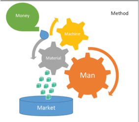

> **Deskripsi Visual:** Gambar ini adalah ilustrasi yang menunjukkan hubungan antara manusia (Man), mesin (Machine), uang (Money), bahan (Material), dan pasar (Market). Ilustrasi ini menggunakan warna-warna cerah untuk menonjolkan setiap elemen dan menggambarkan hubungan mereka satu sama lain.

Pertama, ilustrasi menunjukkan bahwa uang (Money) bergerak dari sumber ke pasar (Market). Kemudian, uang tersebut digunakan untuk membeli bahan (Material) yang diperlukan untuk membuat mesin (Machine). Mesin ini kemudian digunakan oleh manusia (Man) untuk melakukan tugas-tugas yang lebih kompleks atau efisien.

Ilustrasi ini juga menunjukkan bahwa manusia (Man) memiliki kontrol atas mesin (Machine) dan dapat mengatur cara bagaimana mesin tersebut bekerja. Ini menunjukkan bahwa manusia memiliki peran penting dalam penggunaan mesin dan bagaimana mesin tersebut dapat membantu mereka.

Teks, angka, atau label penting yang terlihat dalam gambar ini adalah "Money", "Machine", "Man", "Material", dan "Market". Informasi kunci yang dapat diambil pembaca adalah bahwa ada hubungan kompleks antara manusia, mesin, uang, bahan, dan pasar dalam proses produksi dan ekonomi.

 

---
## 📄 Halaman 11

Man (manusia) atau SDM (Sumber Daya Manusia), saat ini biasa disebut dengan istilah Man Power (tenaga manusia) atau Mind Power (daya pikir), adalah personel atau  orang-orang  yang  terlibat  dalam  wirausaha  tersebut.  Salah  satu  faktor keberhasilan  wirausaha  adalah  keberhasilan  mengelola  sumber  daya  manusia yang terlibat dalam setiap proses yang terjadi dalam usaha. Pengelolaan sumber daya manusia juga termasuk pengelolaan ide-ide inovatif yang dapat bermanfaat, baik untuk perkembangan produk dan maupun usaha secara umum.

Money dapat  dipahami  sebagai  dana  yang  menjadi  modal  usaha,  perputaran uang melalui  pengeluaran  dan  pemasukan  yang  terjadi  dalam  usaha  tersebut. Kemampuan pengelolaan  uang  termasuk  kemampuan  mengelola  keuntungan yang diperoleh untuk pengembangan usaha agar menjadi lebih besar. Material (bahan), machine (peralatan),  dan method (cara  kerja),  adalah  bahan  yang digunakan,  cara  produksi,  dan  peralatan  yang  digunakan  untuk  memproduksi barang . Kemampuan wirausahawan dalam mengelola produksi yang efektif dan efi  sien dapat menghasilkan keuntungan wirausaha yang lebih besar.

Market adalah  pasar  sasaran  dari  produk  yang  dihasilkan  oleh  suatu  usaha. Pengetahuan  tentang  pasar  sasaran  menjadi  salah  satu  kunci  penting  untuk keberhasilkan suatu usaha. Wirausaha dikembangkan berdasarkan pada kebutuhan  dan  keinginan  pasar,  sehingga  peluang  produk  diserap  pasar  akan lebih besar. Riset tentang pasar bertujuan pula untuk mengenali pesaing yang ada di  pasar tersebut. Posisi suatu usaha terhadap pesaingnya harus diketahui oleh wirausahawan  agar  dapat  memenangkan  persaingan.  Persaingan  yang  terjadi dapat  mempengaruhi  rancangan  produk  yang  akan  dibuat  serta  keputusan penetapan harga jual produk.

Pada  pelaksanaan  wirausaha,  diawali  dengan  penataan  sumber  daya  manusia yang  akan  menjadi  penggerak  kegiatan  wirausaha.  Dahulu  digunakan  istilah tenaga  manusia  atau man power .  Namun,  saat  ini  sumber  daya  manusia  lebih dikenal  dengan mind power atau  daya  pikir.  Pemikiran  manusia  lebih  berharga daripada tenaga fi  sik. Sebagian kegiatan sudah dapat digantikan dengan mesin dan robot. Namun, pemikiran kreatif dan inovatif hanya bersumber dari manusia sebagai makhluk ciptaan Tuhan. Pemikiran kreatif  dan  inovatif  menjadi  penggerak  dari perekonomian  saat  ini.    Dunia  telah  melewati empat  gelombang  peradaban  ekonomi.  Pada gelombang pertama ekonomi, pertanian menjadi penggerak ekonomi yang utama. Gelombang tersebut dikenal dengan Gelombang Ekonomi Pertanian. Revolusi industri dan perkembangan  permesinan  membawa  babak baru  bagi  perekonomian.  Industri  manufaktur bermunculan dan menghasilkan produk secara massal.  Produk  dari  industri  massal  menjadi

Tahun 2013 subsektor kerajinan berkontribusi sebesar Rp 92,6 triliun pada Pendapatan Domesik Bruto Indonesia dan membuka 1 juta lapangan usaha yang sebagian besar merupakan usaha mikro, kecil, dan menengah.

Sumber: Kementerian Perdagangan, 2014

 

---
## 📄 Halaman 12

motor penggerak utama ekonomi. Gelombang ini disebut sebagai Gelombang Ekonomi Industri. Gelombang berikutnya muncul sebagai akibat dari inovasi di bidang teknologi  informasi.  Gelombang  ketiga  ini  disebut  sebagai  Gelombang Ekonomi Informasi. Sarana dan sumber daya fi  sik memiliki keterbatasan. Ide dan gagasan kreatif dapat memberikan solusi untuk keterbatasan fi  sik yang ada. Ide kreatif membuat ekonomi terus tumbuh. Gelombang dengan ide kreatif  sebagai penggeraknya disebut sebagai Gelombang Ekonomi Kreatif. Pada gelombang ini industri kreatif menjadi penggerak utamanya.

Industri-industri yang termasuk ke dalam industri kreatif dikelompokkan ke dalam 14  subsektor.  Subsektor  tersebut  adalah:  arsitektur,  desain,  fesyen,  kerajinan, penerbitan  dan  percetakan,  televisi  dan  radio,  musik,  fi  lm,  video  dan  fotografi  , periklanan,  layanan  komputer  dan  piranti  lunak,  pasar  dan  barang  seni,  seni pertunjukan,  riset  dan  pengembangan,  dan  permainan  interaktif.  Subsektor kerajinan  merupakan  salah  satu  yang  memberikan  kontribusi  terbesar,  baik terhadap pendapatan negara maupun penyerapan tenaga kerja.

---
**🖼️ Gambar/Diagram**

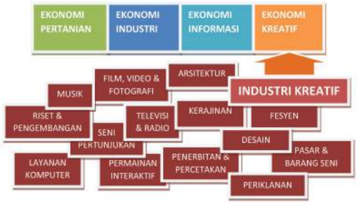

> **Deskripsi Visual:** Gambar ini adalah diagram yang menunjukkan berbagai sektor ekonomi dan industri kreatif. Diagram ini dibagi menjadi empat bagian utama yang masing-masing menunjukkan sektor ekonomi tertentu:

1. Pertama, ada sektor pertanian yang meliputi pertanian, perikanan, dan perkebunan.
2. Kedua, sektor industri yang mencakup industri manufaktur, industri perindustrian, dan industri perkebunan.
3. Ketiga, sektor informasi yang meliputi teknologi informasi, komunikasi, dan jaringan.
4. Keempat, sektor kreatif yang mencakup industri musik, film, video, fotografi, arsitektur, desain, perikanan, dan industri lainnya.

Elemen-elemen utama dalam diagram ini adalah sektor-sektor ekonomi dan industri kreatif tersebut. Setiap sektor memiliki label yang menjelaskan apa yang dimaksud dengan sektor tersebut. Label-label ini membantu pembaca untuk memahami hubungan antara sektor-sektor tersebut.

Informasi kunci yang dapat diambil pembaca adalah bahwa diagram ini menunjukkan hubungan antara berbagai sektor ekonomi dan industri kreatif. Pembaca dapat melihat bagaimana sektor-sektor ini saling berkaitan dan bagaimana mereka mempengaruhi ekonomi dan industri kreatif secara keseluruhan.

Sumber: Dokumen Kemdikbud

 

---
## 📄 Halaman 13

Penataan  sumber  daya  manusia termasuk  dalam tahapan awal, yaitu  persiapan  organisasi.  Kegiatan wirausaha  dapat  dibagi  menjadi tiga  tahapan. Tahapan  pertama adalah  persiapan  organisasi  dan perencanaan  produksi.  Kegiatan wirausaha membutuhkan kerja sama  dari  beberapa  pihak,  baik internal maupun eksternal organisasi. Hubungan baik antara wirausahawan  dengan  pemasok bahan baku, pekerja, dan pembeli harus terjaga. Hubungan baik dapat terjadi dengan adanya rasa kepercayaan dan sikap saling menghargai. Kerja sama yang baik juga  didukung  oleh  pembagian tugas yang adil dan sesuai dengan kompetensinya. Pada kegiatan wirausaha produk kerajinan, akan dilakukan  pembagian  peran  dan tanggung jawab. Kompetensi, kerja  sama,  dan  tanggung  jawab dari masing-masing anggota organisasi menjadi kunci dari keberhasilan  kegiatan  wirausaha. Kegiatan terdiri atas pembentukan organisasi  dan  penetapan  tugas dan tanggung jawab, dilanjutkan dengan perencanaan produksi.

---
**🖼️ Gambar/Diagram**

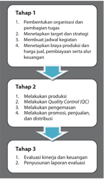

> **Deskripsi Visual:** Gambar ini adalah diagram yang menunjukkan proses manajemen operasional suatu organisasi. Diagram ini terdiri dari tiga tahap yang disebutkan dengan huruf besar: Tahap 1, Tahap 2, dan Tahap 3.

Tahap 1 melibatkan beberapa langkah penting seperti membangun organisasi dan peranannya, menetapkan target dan strategi, membuat jadwal kegiatan, dan menetapkan harga produk dan biaya. Ini merupakan langkah awal yang penting untuk mempersiapkan organisasi untuk beroperasi.

Tahap 2 melibatkan pelaksanaan produksi, melakukan Quality Control (QC), pelaksanaan pengemasan, promosi, penjualan, dan distribusi. Ini adalah tahap dimana organisasi mulai menghasilkan produk dan menjualnya kepada konsumen.

Tahap 3 melibatkan evaluasi kinerja dan keuangan serta penyusunan laporan evaluasi. Ini adalah tahap akhir di mana hasil operasional dianalisis dan informasi tersebut digunakan untuk mempertimbangkan perbaikan dan pengembangan masa depan.

Elemen-elemen utama dalam diagram ini adalah tahap-tahap yang disebutkan dan relasinya adalah bahwa setiap tahap harus dilakukan secara teratur dan berurutan untuk mencapai tujuan organisasi. Teks, angka, atau label penting yang terlihat adalah nama-nama tahap dan detail tentang setiap tahap. Informasi kunci yang dapat diambil pembaca adalah bahwa proses manajemen operasional melibatkan banyak langkah dan harus dilakukan secara teratur dan efektif untuk mencapai tujuan organisasi.

Perencanaan produksi harus diawali dengan riset pasar, pengembangan desain, dan penetapan produk yang akan dijual. Perencanan produksi meliputi perolehan bahan baku, persiapan bahan dan alat, serta penghitungan biaya produksi.  Tahapan pertama ini disebut juga tahapan Research and Development atau dikenal dengan R  &  D. Tahap  kedua adalah  produksi  hingga  penjualan.  Kelompok  wirausaha melakukan produksi kerajinan untuk pasar lokal dengan target produksi sesuai perencanaan, pertimbangan kapasitas produksi, dan target penjualan. Pada tahap ini  dilakukan  pula  distribusi  produk  dan  pemasaran.  Tahapan  ini  disebut  juga dengan Production and Distribution . Tahapan ketiga adalah evaluasi dari seluruh kegiatan wirausaha yang telah dilakukan. Evaluasi bertujuan untuk mengetahui kekurangan  dan  melakukan  perencanaan  perbaikan,  agar  wirausaha  dapat berkembang  menjadi  lebih  baik.  Proses  evaluasi  dapat  menggunakan  metode analisis  SWOT ( Strenght, Weakness, Opportunities, dan Treats ),  yaitu  dengan  cara menguraikan kekuatan ( Strenght ), kelemahan ( Weakness ), peluang ( Opportunities ), dan ancaman dari luar ( Treats )  dari  produk  kerajinan  yang  telah  dibuat,  proses produksi, proses pemasaran dan distribusi, serta pasar sasaran.

 

---
## 📄 Halaman 14

### Tugas 1

### Mengenali Diri dan Membuat Kelompok Usaha

- Kenali diri Anda: Apa yang menjadi keunggulan Anda? Apakah mendesain produk kreatif, menghitung  keuangan,  menggambar  iklan,  terampil dalam membuat produk? Setiap orang tentunya bisa memiliki lebih dari satu keahlian. Tuliskan keahlianmu tersebut pada selembar kertas, boleh dilengkapi dengan gambar agar lebih informatif dan  menarik.
- Guru akan memandu untuk membuat kelompok sesuai kompetensi yang dibutuhkan dalam kelompok.

### A. Perencanaan Usaha Kerajinan untuk Pasar Lokal

Berdasarkan  luasannya,  pasar  dapat  dibedakan  menjadi  pasar  lokal,  pasar nasional,  dan  pasar  global  atau  pasar  internasional.  Pasar  lokal  dapat dipahami  sebagai  pasar  yang  terbatas  di  lingkungan  atau  daerah  yang sama  dengan  tempat  produksi.  Pasar  dapat  dibagi  berdasarkan  kesamaan perilaku  pembeli.  Pembagian  pasar  tersebut  dikenal  dengan  segmentasi pasar.  Segmentasi  pasar  sasaran  dapat  dibedakan  secara  geografi  s  atau tempat, secara demografi  s  (usia, gender, bangsa dan etnis, pekerjaan, tingkat ekonomi),  dan  secara  psikografi  s  (karakter  kelas  sosial,  gaya  hidup,  dan kepribadian).  Pasar  sasaran  yang  berbeda  memiliki  kebutuhan,  keinginan, selera, dan daya beli yang berbeda pula.  Kebutuhan dan keinginan dari suatu daerah  bisa  berbeda  dengan  daerah  lainnya.  Kebutuhan  dipengaruhi  oleh kondisi  lingkungan,  misalnya  daerah  yang  bersuhu  rendah  menyebabkan orang-orangnya  membutuhkan  penghangat.  Sebaliknya,  bila  suhu  tinggi akan dibutuhkan penyejuk, misalnya kerajinan kipas. Kebutuhan juga dapat dipengaruhi oleh kegiatan, misalnya kegiatan membawa barang membuat orang memiliki kebutuhan akan alat bawa. Kebutuhan akan suatu produk juga dapat disebabkan karena kebiasaan atau budaya. Kebiasaan memberi hadiah atau tanda mata kepada orang lain, membuat munculnya kebutuhan akan produk yang unik atau khas daerah tertentu. Kebutuhan-kebutuhan tersebut dapat dipenuhi oleh produk kerajinan. Selain kebutuhan, pasar sasaran juga memiliki keinginan. Keinginan untuk memiliki produk pada umumnya muncul dari gaya hidup dan selera.

Pada  prinsipnya,  pasar  terjadi  karena  adanya  permintaan  (dari  pembeli) dan  penawaran  (dari  penjual).  Potensi  pasar  dapat  diketahui  melalui  dua pendekatan,  yaitu  pendekatan  permintaan  dan  pendekatan  penawaran. Pendekatan  permintaan  adalah  dengan  mencari  tahu  kebutuhan  dari pasar  sasaran,  sedangkan  pendekatan  penawaran  mengandalkan  pada kemampuan wirausahawan membuat produk inovatif. Kedua pendekatan ini dapat digunakan untuk mengenali potensi pasar.

 

---
## 📄 Halaman 15

Kebutuhan  pasar  lokal  dapat  diketahui  dengan  melakukan  pengamatan terhadap pasar sasaran. Misalnya untuk mengenali kebutuhan pasar sasaran siswa yang  mengikuti  ekstrakurikuler olahraga,  kita  dapat  mengamati kebiasaan  mereka.  Siswa  tersebut  pada  umumnya  berangkat  ke  sekolah dengan  membawa  baju  ganti  dan  perlengkapan  olahraga  selain  buku pelajaran  dan  perlengkapan  sekolah.  Mereka  membutuhkan  tas  untuk membawa perlengkapan  ekstrakurilernya.  Bentuk,  ukuran,  dan  warna  dari tas tersebut harus sesuai dengan selera mereka. Selain pengamatan, kita juga dapat mewawancarai pasar sasaran untuk mengetahui kebutuhan dan selera mereka. Pertanyaan yang dapat diajukan diantaranya; Tas seperti apa yang mudah dan nyaman digunakan? Tas seperti apa yang mereka sukai? Warna dan motif apa yang disukai?

Ide pengembangan produk kerajinan untuk pasar lokal juga dapat diperoleh dengan mengenali kebiasaan di daerah setempat, misalnya kebiasaan melepas alas kaki saat masuk ke dalam rumah. Kebiasaan tersebut membuka peluang pengembangan produk rak sepatu atau tempat penyimpanan alas kaki yang serasi  dengan  tempatnya  diletakkan  dan  memudahkan  penyimpanan  dan pengambilan alas kaki. Peluang lain dari kebiasaan tersebut adalah membuat sandal  khusus  untuk  di  dalam  rumah  agar  telapak  kaki  terlindungi  dari dinginnya lantai.

### Tugas 2 (Kelompok)

### Identifi  kasi Kebutuhan Pasar Lokal

- Amati lingkungan Anda (suhu udara, adat kebiasaan, kegiatan, dan lainlain).  Kebutuhan  apa  saja  yang  dapat  dipenuhi  oleh  produk  kerajinan? Identifi  kasi sebanyak-banyaknya kebutuhan yang ada di pasar lokal.
- Diskusikan dengan teman Anda.
- Identifi  kasi kebutuhan, produk yang sudah ada maupun ide untuk produk yang belum ada, serta pasar sasarannya, tuliskan pada LK 2.

### LK 2. Identifi  kasi Kebutuhan Pasar Lokal

---
**📊 Tabel**

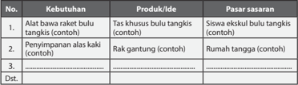

Tabel ini berisi informasi tentang kebutuhan, produk/ide, dan pasar sasaran untuk dua produk utama: tas khusus bulu tangkis dan rak gantung. Topik utama tabel adalah penentuan produk dan pasar sasaran berdasarkan kebutuhan. Kolom pertama menunjukkan nomor urut kebutuhan, kolom kedua menyajikan deskripsi kebutuhan tersebut, kolom ketiga menunjukkan produk/ide yang sesuai dengan kebutuhan, dan kolom keempat menunjukkan pasar sasaran yang cocok dengan produk tersebut. Data penting yang terlihat adalah bahwa produk utama adalah tas khusus bulu tangkis dan rak gantung, serta bahwa pasar sasaran untuk tas khusus bulu tangkis adalah siswa sekolah tinggi bulu tangkis, sedangkan untuk rak gantung adalah rumah tangga.

 

---
## 📄 Halaman 16

Pada LK 2 yang telah dibuat, tampak bahwa segmen pasar sasaran yang berbeda memiliki  kebutuhan  yang  berbeda-beda.  Setiap  kebutuhan  yang  berbeda merupakan  peluang  pasar  bagi  wirausahawan.  Segmentasi  pasar  tersebut memiliki  keinginan, selera, dan daya beli yang berbeda pula. Pemahaman tentang pasar sasaran secara mendalam akan mendukung proses pencarian ide dan penetapan harga jual produk kerajinan untuk pasar lokal. Pemahaman mendalam  tentang  pasar  sasaran  dapat  dilakukan  dengan  pencarian  data yang melalui referensi, pengamatan seperti  yang dilakukan pada Tugas 2, wawancara, dan kuesioner. Salah satu cara untuk mengetahui selera dan daya beli dari pasar sasaran yang dituju adalah dengan menyebarkan kuesioner.

### Tugas 3 (Kelompok)

### Kuesioner Selera Estetis dan Daya Beli

- Pilih salah satu dari pasar sasaran yang telah diidentifi  kasi pada Tugas 2. Misalnya pasar sasaran ibu rumah tangga usia 40-45 tahun atau siswa SMA/ SMK/MA berusia 17-19 tahun. Setiap kelompok dalam kelas dapat memilih pasar sasaran yang berbeda-beda.
- Susunlah sebuah kuesioner berisi  pertanyaan  tentang  selera  estetis  dan daya beli. Selera estetis yang dimaksud di sini adalah selera terhadap unsurunsur  rupa,  seperti  warna,  bentuk,  tektur,  yang  tersusun  dalam  sebuah komposisi yang tampak pada sebuah produk. Sedangkan daya beli adalah kemampuan konsumen dalam membeli produk.

### Contoh  Kuesioner  Selera  Estetis  (keindahan)  dan  Daya  Beli  (Kuesioner dapat dikembangkan sesuai kebutuhan atau produk yang akan dibuat)

Kuesioner  ini  dibuat  untuk  memenuhi  tugas  Prakarya  dan  Kewirausahaan. Terima kasih atas kesediaannya mengisi kuesioner ini.

- Warna yang paling disukai:
- Warna gelap            b. Warna terang               c. Warna alami
- Tema yang disukai:

---
**🖼️ Gambar/Diagram**

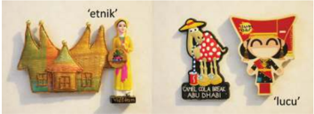

> **Deskripsi Visual:** Gambar ini adalah ilustrasi yang menampilkan dua objek yang berhubungan dengan budaya etnis dan lokal. Objek pertama adalah sebuah papan magnet dengan gambar seorang wanita berpakaian tradisional Afrika dengan rumah tradisional di latar belakang. Objek kedua adalah papan magnet lainnya dengan gambar seorang anak berpakaian tradisional Arab dengan bendera Abu Dhabi di latar belakang. Kedua objek tersebut memiliki teks 'etnik' dan 'luuuu' masing-masing di atas mereka.

Elemen utama dalam gambar ini adalah dua papan magnet yang menunjukkan budaya etnis dan lokal. Papan magnet pertama menunjukkan seorang wanita Afrika dengan rumah tradisional, sementara papan magnet kedua menunjukkan seorang anak Arab dengan bendera Abu Dhabi. Relasi antara kedua objek adalah bahwa mereka menunjukkan budaya etnis dan lokal dari negara-negara berbeda.

Teks 'etnik' dan 'luuuu' muncul di atas kedua papan magnet, masing-masing menunjukkan bahwa gambar tersebut menunjukkan budaya etnis. Informasi kunci yang dapat diambil pembaca adalah bahwa gambar ini menunjukkan budaya etnis dari Afrika dan Arab.

Dalam satu paragraf yang informatif, gambar ini menunjukkan dua papan magnet yang menunjukkan budaya etnis dan lokal dari Afrika dan Arab. Papan magnet pertama menunjukkan seorang wanita Afrika dengan rumah tradisional, sementara papan magnet kedua menunjukkan seorang anak Arab dengan bendera Abu Dhabi. Teks 'etnik' dan 'luuuu' muncul di atas kedua papan magnet, menunjukkan bahwa gambar tersebut menunjukkan budaya etnis.

 

---
## 📄 Halaman 17

---
**🖼️ Gambar/Diagram**

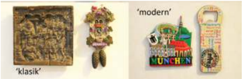

> **Deskripsi Visual:** Gambar ini menunjukkan tiga jenis perhiasan yang berbeda, masing-masing dengan label "klasik", "modern", dan "modern" (dalam bahasa Jerman). Perhiasan "klasik" terletak di sebelah kiri, memiliki bentuk persegi panjang dengan gambar yang tampak seperti kaligrafi atau tulisan tradisional. Perhiasan "modern" di tengah memiliki bentuk seperti bros dengan beberapa elemen berwarna-warni yang tampak seperti bunga atau daun. Perhiasan "modern" di kanan memiliki bentuk seperti kunci pintu dengan gambar yang tampak seperti sebuah kota atau kompleks bangunan, dengan teks "MUNICH" yang jelas. Semua perhiasan ini menunjukkan variasi dalam gaya dan desain, menunjukkan bagaimana perhiasan bisa menjadi alat untuk menggambarkan budaya dan identitas suatu tempat.

- Mintalah 30 orang dari kelompok pasar sasaran yang telah dipilih untuk menjadi responden dan mengisi kuesioner tersebut.
- Hitung jawaban hasil kuesioner tersebut dan simpulkan bagaimana selera dan  daya  beli  dari  pasar  sasaran  tersebut. Tuliskan  dalam  tabel  seperti contoh LK 3.
Sumber: www.Kemenag.go.id

Gambar 1.2 Contoh Tema

### LK 3.Hasil Kuesioner Selera Estetis dan Daya Beli

### Contoh Hasil Kuesioner (Hasil Kuesioner tergantung dari kuesioner yang dibuat)

---
**📊 Tabel**

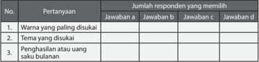

Tabel ini menunjukkan hasil survei tentang preferensi responden terhadap tema diskusi, warna yang paling disukai, dan penghasilan atau uang saku bulanan. Dalam kolom Pertanyaan, ada tiga pertanyaan yang masing-masing meminta informasi tentang preferensi responden. Kolom Jawaban a, b, c, dan d masing-masing menyediakan pilihan jawaban untuk setiap pertanyaan. Data dalam tabel tersebut menunjukkan bahwa responden paling sering memilih jawaban a untuk semua pertanyaan, menunjukkan kesetiaan responden terhadap pilihan tertentu.

Hasil penghitungan kuesioner menunjukan selera dan daya beli pasar sasaran secara  umum.  Data  tentang  selera  dan  daya  beli  ini  akan  menjadi  dasar pertimbangan dalam pengembangan desain kerajinan. Pembuatan Tugas 2 dan Tugas 3 telah memberikan gambaran tentang peluang pasar lokal yang ada. Selanjutnya adalah penetapan pasar sasaran dari produk kerajinan untuk pasar lokal yang akan dibuat oleh masing-masing kelompok di kelas. Setiap kelompok tentunya dapat menetapkan pasar sasaran yang berbeda-beda.

 

---
## 📄 Halaman 18

Pasar  sasaran  adalah  kelompok  pasar  atau  konsumen  yang  ditargetkan  untuk membeli suatu produk. Penetapan pasar sasaran  suatu produk sangat penting dilakukan agar produk yang akan dibuat sesuai dengan pasar yang akan dituju.

### Tugas 4 (Kelompok)

### Pasar Sasaran Wirausaha Produk Kerajinan untuk Pasar Lokal

- Diskusikan dalam kelompok tentang pasar sasaran dari wirausaha produk kerajinan yang akan dibuat.
- Presentasikan dalam bentuk tabel LK 4 atau bentuk presentasi lain yang lebih menarik dan kreatif.

### LK 4. Pasar Sasaran Wirausaha Produk Kerajinan untuk Pasar Lokal

---
**📊 Tabel**

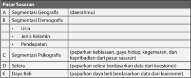

Tabel ini membahas berbagai aspek segmentasi pasar sasaran dalam konteks penjualan atau pemasaran. Topik utamanya adalah bagaimana memahami dan menargetkan konsumen dengan lebih baik melalui berbagai metode segmentasi. Kolom A mencakup segmentasi geografis, yang melibatkan daerah atau wilayah tertentu. Kolom B berfokus pada segmentasi demografis, termasuk usia, jenis kelamin, dan pendapatan. Kolom C mengeksplorasi segmen psikografis, yang melibatkan preferensi, gaya hidup, kegemaran, dan kepribadian konsumen. Kolom D dan E masing-masing menunjukkan preferensi selera dan daya beli konsumen. Pola penting yang terlihat adalah bahwa penjualan atau pemasaran harus berfokus pada berbagai faktor seperti lokasi, usia, jenis kelamin, pendapatan, preferensi, gaya hidup, kegemaran, kepribadian, dan daya beli konsumen untuk berhasil menjangkau pasar sasaran yang tepat.

### Sumber Daya Material, Teknik, dan Ide Produk Kerajinan

Sumber  daya  usaha  yang  dibutuhkan  untuk  wirausaha  kerajinan  adalah bahan  baku  atau  material,  teknik  dan  alat,  serta  keterampilan.  Wirausaha kerajinan  untuk  pasar  lokal  dapat  dimulai  dengan  melihat  potensi  bahan baku, potensi teknik, dan keterampilan yang ada di daerah tersebut. Bahan baku dapat berupa bahan alam atau bahan buatan yang banyak tersedia di lingkungan sekitar. Bahan alam, misalnya serat nanas, eceng gondok, tanah liat,  kayu,  rotan,  bambu,  kerang,  dan  tulang.  Bahan  buatan,  seperti  kain, plastik, kaca, dan karet. Bahan baku atau material yang akan dimanfaatkan untuk  memproduksi  produk  kerajinan  harus  memiliki  jumlah  yang  cukup agar produk yang dihasilkan memiliki standar bentuk dan kualitas yang sama. Teknik pembuatan produk tergantung dari materialnya. Beberapa teknik yang dapat digunakan untuk pembuatan kerajinan di antaranya teknik ukir, teknik sambungan, teknik anyam, dan teknik jahit.

 

---
## 📄 Halaman 19

### Tugas 5 (Kelompok)

### Identifi  kasi Ragam Material dan Teknik di Lingkungan Sekitar

- Amati lingkungan Anda, lalu perhatikan ragam material atau bahan baku yang tersedia di lingkungan sekitar Anda.
- Carilah informasi dari buku, internet, maupun dari pengrajin yang ada di daerah  Anda  tentang  ragam  teknik  yang  dapat  digunakan  untuk  setiap material tersebut.
- Diskusikan dalam kelompok tentang ragam material dan teknik produksi yang  dapat  digunakan  untuk  pembuatan  kerajinan  untuk  pasar  lokal. Tuliskan  sebanyak-banyaknya  tentang  ragam  bahan  baku/material  dan teknik yang ada di lingkungan sekitar Anda.
- Presentasikan dalam bentuk tabel LK 5 atau bentuk presentasi lain yang lebih menarik dan kreatif.

### LK 5. Identifi  kasi Ragam Material dan Teknik di Lingkungan Sekitar

---
**📊 Tabel**

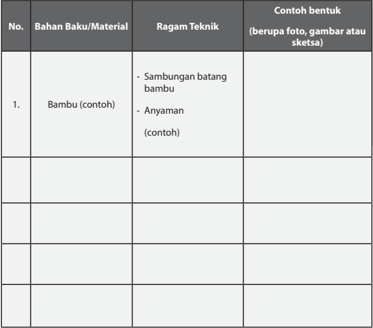

Tabel ini berisi informasi tentang bahan baku/material, ragam teknik, dan contoh bentuk untuk pembuatan produk dari bambu. Topik utama tabel ini adalah proses pembuatan produk dari bambu menggunakan berbagai ragam teknik. Kolom pertama menunjukkan nomor urutan, kolom kedua berisi nama bahan baku/material yang digunakan, kolom ketiga berisi ragam teknik yang dapat digunakan, dan kolom keempat berisi contoh bentuk produk yang dapat dibuat, seperti foto atau gambar sketsa. Data penting yang terlihat adalah bahwa banyak ragam teknik yang dapat digunakan untuk membuat produk dari bambu, mulai dari sambungan batang bambu hingga anyaman, dan contoh bentuk yang dapat dibuat mencakup berbagai jenis produk dari bambu.

 

---
## 📄 Halaman 20

Perancangan  produk  didasari  beberapa  faktor  pertimbangan,  yaitu  fungsi produk,  pengguna  produk,  material,  teknik  pembuatan,  nilai  estetis,  dan harga  jual.  Pada  Tugas  2,  Tugas  3,  Tugas  4,  dan  Tugas    5  telah  dilakukan identifi  kasi  potensi  pasar  sasaran,  identifi  kasi  dan  pemilihan  pasar  sasaran, serta identifi  kasi ragam material dan teknik yang terdapat di daerah sekitar. Untuk memulai proses perancangan harus dilakukan penetapan pasar sasaran, bahan baku, dan jenis material apa saja yang akan digunakan, serta teknik yang  dapat  digunakan  untuk  pembuatan  produk.  Contohnya,  untuk  pasar sasaran siswa yang ikut ekstrakurikuler bulu tangkis akan dibuatkan sebuah tas  untuk  membawa raket dan perlengkapan lain yang dibutuhkan. Bahan yang akan digunakan untuk tas tersebut adalah karton tebal yang dilapisi kain, serta dilengkapi tali. Teknik pembuatan yang digunakan adalah teknik penempelan dengan lem dan teknik jahit. Contoh lain adalah pembuatan rak alas kaki untuk kebutuhan rumah tangga, yang disebabkan oleh kebiasaan melepas alas kaki saat hendak masuk ke rumah. Bahan yang digunakan adalah bambu dengan teknik konstruksi bambu.

---
**🖼️ Gambar/Diagram**

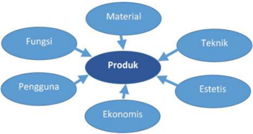

> **Deskripsi Visual:** Gambar ini adalah diagram yang menunjukkan aspek-aspek penting dari sebuah produk. Diagram ini terdiri dari empat elemen utama yang terhubung oleh garis, yaitu Fungsi, Material, Teknik, dan Estetis. Setiap elemen tersebut memiliki ikatan dengan produk utama, yang merupakan pusat diagram. Selain itu, ada dua elemen tambahan yang terhubung dengan produk, yaitu Pengguna dan Ekonomis.

Elemen-elemen utama ini menunjukkan bahwa produk memiliki beberapa karakteristik dan fungsi yang berbeda. Fungsi menggambarkan tujuan utama produk, sementara Material menunjukkan bahan-bahan yang digunakan untuk membuat produk tersebut. Teknik menunjukkan cara-cara yang digunakan untuk memproduksi produk, sedangkan Estetis menunjukkan aspek estetika atau penampilan produk.

Pengguna dan Ekonomis juga merupakan elemen penting yang terkait dengan produk. Pengguna menunjukkan siapa yang menggunakan produk tersebut, sedangkan Ekonomis menunjukkan biaya produksi dan manfaat yang diperoleh dari produk tersebut.

Dari gambar ini, kita dapat mengambil beberapa informasi kunci tentang produk. Produk ini memiliki beberapa karakteristik dan fungsi yang berbeda, termasuk material, teknik, estetis, pengguna, dan ekonomis. Ini menunjukkan bahwa produk ini harus dirancang dengan baik untuk mencapai tujuannya dan memberikan nilai kepada penggunanya.

Sumber: Dokumen Kemdikbud

### Tugas 6 (Kelompok)

### Bahan Baku dan Teknik Produksi Kerajinan untuk Pasar Lokal

- Diskusikan dengan teman dalam kelompok, bahan baku dan teknik apa saja yang akan dimanfaatkan untuk produk kerajinan yang akan dibuat.
- Presentasikan dalam bentuk tabel LK 6 atau bentuk presentasi lain yang lebih menarik dan kreatif.

 

---
## 📄 Halaman 21

### LK 6. Bahan Baku dan Teknik Produksi Kerajinan untuk Pasar Lokal

---
**📊 Tabel**

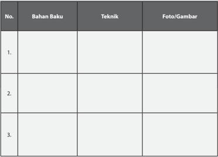

Tabel ini berisi informasi tentang bahan baku, teknik, dan foto/gambar untuk beberapa produk atau proses tertentu. Topik utama tabel adalah pengetahuan dasar tentang bahan baku, teknik penggunaan, dan hasil akhir dalam bentuk foto atau gambar. Kolom "Bahan Baku" menyajikan daftar bahan yang digunakan dalam proses tersebut, kolom "Teknik" menunjukkan cara atau metode yang digunakan untuk menghasilkan hasil tersebut, dan kolom "Foto/Gambar" menampilkan visual atau gambar yang menunjukkan hasil akhir dari proses tersebut. Data penting yang terlihat adalah bahwa tabel ini mencakup tiga baris, masing-masing dengan informasi yang berbeda tentang bahan baku, teknik, dan hasil akhir. Ini menunjukkan bahwa tabel ini dirancang untuk memberikan pemahaman umum tentang berbagai proses atau produk yang menggunakan bahan baku tertentu.

### B.  Perancangan dan Produksi Kerajinan untuk Pasar Lokal

Data tentang pasar sasaran, potensi bahan baku, dan teknik yang terdapat di  daerah  sudah  diketahui.  Beberapa  kebutuhan  dari  pasar  sasaran  sudah pernah  diamati  dan  didiskusikan  dalam  kelompok.  Hal-hal  tersebut  akan menjadi dasar bagi langkah selanjutnya, yaitu perancangan produk kerajinan untuk pasar lokal. Proses perancangan produk diawali dengan pencarian ide, dilanjutkan dengan pembuatan gambar atau sketsa ide. Ide terbaik kemudian dikembangkan menjadi model dari kerajinan yang akan dibuat, dilanjutkan dengan persiapan produksi. Produksi adalah membuat produk dalam jumlah tertentu sehingga siap menjadi komoditi yang akan dijual.

### 1. Mencari Ide Produk dengan Curah Pendapat

Pasar  sasaran  telah  ditetapkan,  demikian  juga  dengan  jenis  material dan  teknik  yang  akan  digunakan  pada  pembuatan  produk  kerajinan ini.  Kebutuhan-kebutuhan dari pasar sasaran juga secara umum sudah diketahui melalui pengamatan pada Tugas 2. Langkah selanjutnya adalah mencari ide produk apa yang tepat untuk pasar sasaran yang telah dipilih.

 

---
## 📄 Halaman 22

Cara yang dapat dilakukan adalah melalui curah pendapat ( brainstorming ) yang  dilakukan  dalam  kelompok.  Pada  proses brainstorming, setiap anggota  kelompok  harus  membebaskan  diri  untuk  menghasilkan  ideide yang beragam dan sebanyak-banyaknya. Beri kesempatan juga untuk munculnya ide-ide yang tidak masuk akal sekalipun. Tuangkan ide-ide tersebut ke dalam sketsa. Kunci sukses dari tahap brainstorming dalam kelompok adalah jangan ada perasaan takut salah. Setiap orang berhak mengeluarkan  pendapat,  saling  menghargai  pendapat  teman,  boleh memberikan ide yang merupakan perkembangan dari ide sebelumnya, dan  jangan  lupa  mencatat  setiap  ide  yang  muncul.  Misalnya,  tentang alat bawa yang tepat untuk membawa perlengkapan bulu tangkis. Ada beberapa hal yang dapat diskusikan, di antaranya sebagai berikut.

- Perlengkapan apa saja yang dibawa?
- Berapa berat total seluruh perlengkapan tersebut?
- Seberapa besar dan bagaimana bentuknya?
- Apakah alat bawa harus tahan air? Mengapa?
- Bagaimana  cara  membawa  tas  tersebut?  Di  bahu?  Di  dada?  Di punggung? Dijinjing? Dengan tali?
- Bagaimana cara membuka, mengeluarkan, dan memasukkan perlengkapan ke dalam tas?

---
**🖼️ Gambar/Diagram**

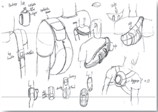

> **Deskripsi Visual:** Gambar ini adalah ilustrasi yang menunjukkan berbagai jenis alat peraga matematika dan bagian-bagian tubuh manusia yang digunakan dalam pengajaran matematika. Ilustrasi ini mencakup berbagai bentuk dan ukuran alat peraga seperti segiempat, lingkaran, dan segitiga, serta bagian-bagian tubuh manusia seperti tangan, kaki, dan telapak tangan. Setiap elemen memiliki label yang menjelaskan fungsi dan nama mereka. Informasi kunci yang dapat diambil pembaca meliputi jenis-jenis alat peraga matematika dan bagian-bagian tubuh manusia yang digunakan dalam pengajaran matematika.

Sumber: corofl  ot.com

 

---
## 📄 Halaman 23

---
**🖼️ Gambar/Diagram**

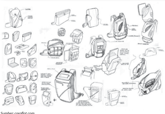

> **Deskripsi Visual:** Gambar ini adalah ilustrasi yang menunjukkan berbagai jenis alat elektronik dan peralatan rumah tangga. Gambar ini mencakup berbagai komponen seperti kabel, tombol, dan port. Setiap komponen memiliki penjelasan singkat tentang fungsi dan bagian apa yang harus diperhatikan saat menggunakan alat tersebut. Ilustrasi ini membantu pembaca memahami bagaimana alat-alat ini bekerja dan bagaimana cara menggunakan mereka dengan benar. Label pada gambar juga memberikan informasi tambahan tentang bagian-bagian tertentu, seperti "Port" dan "Tombol". Ini membantu pembaca untuk mengidentifikasi dan memahami bagian-bagian yang penting dalam setiap alat.

Sumber: corofl  ot.com

Perancangan  rak  penyimpanan  alas  kaki,  juga  dapat  diawali  dengan mendiskusikan beberapa hal, di antaranya sebagai berikut.

- Berapa pasang alas kaki yang akan disimpan pada rak tersebut?
- Berapa luas ruang tempat rak akan diletakkan?
- Apakah rak akan dibuat tinggi atau lebar?

---
**🖼️ Gambar/Diagram**

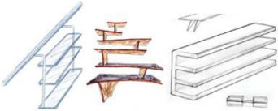

> **Deskripsi Visual:** Gambar ini adalah ilustrasi yang menunjukkan berbagai jenis struktur bangunan. Ilustrasi ini mencakup empat jenis struktur: tiang, dinding, atap, dan lantai. Tiang terletak di bagian kiri atas, dinding di tengah kiri, atap di bagian kanan atas, dan lantai di bagian kanan bawah. Tiang memiliki bentuk yang tajam dan tegak, sementara dinding memiliki bentuk datar dan tegak. Atap memiliki bentuk yang melengkung dan membentuk sudut, sedangkan lantai memiliki bentuk datar dan rata. Setiap elemen ini memiliki relasi yang jelas dengan struktur bangunan lainnya, seperti tiang yang digunakan untuk mendukung dinding, atap yang digunakan untuk melindungi lantai, dan lantai yang digunakan sebagai permukaan pendaratan. Teks, angka, atau label penting tidak terlihat pada gambar ini. Informasi kunci yang dapat diambil pembaca adalah bahwa tiang, dinding, atap, dan lantai merupakan komponen-komponen utama bangunan yang saling terhubung dan bekerja sama untuk menciptakan struktur bangunan yang kokoh dan efisien.

Sumber: jgroffi nsteward.com, houszz.com, gopixpic.com

 

---
## 📄 Halaman 24

### 2. Rasionalisasi

Rasionalisasi adalah proses mengevaluasi ide-ide yang muncul dengan  beberapa  pertimbangan  teknis,  di  antaranya,  bagaimana  cara menggunakan produk tersebut? Apakah material yang ada sudah tepat untuk mewujudkannya?  Apakah memungkinkan  untuk diproduksi dengan  teknik  produksi  yang  ada  saat  ini?  Bagaimana  proporsi  dan ukuran yang sesuai untuk produk tersebut agar mudah digunakan oleh manusia? dan pertanyaan-pertanyaan lainnya.

Perhatikan sketsa-sketsa yang telah dibuat. Pilih ide-ide yang dianggap baik dan potensial untuk membuat produk kerajinan untuk pasar lokal. Kembangkan ide-ide ini dengan rasional, lalu tuangkan ke dalam sketsasketsa selanjutnya. sketsa selanjutnya.

Sumber: carbodydesign.com

---
**🖼️ Gambar/Diagram**

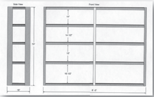

> **Deskripsi Visual:** Gambar ini adalah diagram yang menunjukkan struktur ruang dalam sebuah bangunan. Diagram ini terdiri dari dua sudut pandang: sudut sisi dan sudut depan. 

1. **Apa yang Ditampilkan Secara Keseluruhan**: Gambar ini menunjukkan bagaimana struktur ruang dalam sebuah bangunan dilihat dari dua perspektif: sisi dan depan. Struktur ini terdiri dari beberapa ruang yang berbeda ukuran dan fungsi.

2. **Elemen-Elemen Utama dan Relasinya**: 
   - **Sudut Sisi**: Menunjukkan bagian samping bangunan dengan ukuran 6' x 8'.
   - **Sudut Depan**: Menunjukkan bagian depan bangunan dengan empat ruang yang berbeda ukuran dan fungsi.
     - Ruang pertama memiliki ukuran 6' x 6'.
     - Ruang kedua memiliki ukuran 6' x 4'.
     - Ruang ketiga memiliki ukuran 6' x 4'.
     - Ruang keempat memiliki ukuran 6' x 4'.

3. **Teks, Angka, atau Label Penting yang Terlihat**: 
   - Ada teks yang memberikan informasi tentang ukuran setiap ruang dalam feet (ft).
   - Ada angka yang menunjukkan ukuran ruang dalam feet (6', 4').

4. **Informasi Kunci yang Dapat Diambil Pembaca**: 
   - Gambar ini memberikan gambaran umum tentang struktur ruang dalam bangunan, termasuk ukuran dan posisi setiap ruang.
   - Informasi ini sangat berguna untuk pemahaman tentang bagaimana ruang dalam bangunan tersebut disusun dan digunakan.

Dengan demikian, gambar ini membantu pembaca memahami struktur ruang dalam bangunan secara visual dan numerik.

Sumber: Dokumen Kemdikbud

 

---
## 📄 Halaman 25

### 3. Prototyping atau Membuat Studi Model

Sketsa  ide  yang  dibuat  pada  tahap-tahap  sebelumnya  adalah  format dua  dimensi,  artinya  hanya  digambarkan  pada  bidang  datar.  Produk kerajinan yang akan dibuat adalah berbentuk tiga dimensi, maka studi bentuk selanjutnya dilakukan dalam format tiga dimensi, yaitu dengan studi model. Studi model dapat dilakukan dengan material sebenarnya maupun bukan material sebenarnya. Material sebenarnya adalah material yang akan digunakan pada produksi kerajinan. Alat bantu yang dapat digunakan dalam pembuatan studi model adalah gunting, cutter ,  lem, selotip (alat pemotong dan bahan perekat).

### 4. Penentuan Desain Akhir

Studi  model  dapat  menghasilkan  3  sampai  5  buah  model.  Penetapan desain akhir dapat dilakukan melalui diskusi atau evaluasi. Proses evaluasi menghasilkan umpan balik yang bermanfaat dalam menentukan desain akhir yang terpilih. g p y g akhir yang terpilih.

---
**🖼️ Gambar/Diagram**

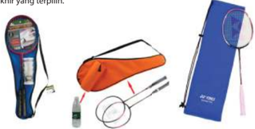

> **Deskripsi Visual:** Gambar ini adalah ilustrasi yang menunjukkan berbagai alat olahraga bulu tangkis. Gambar ini terdiri dari empat elemen utama:

1. Tas olahraga bulu tangkis yang berwarna biru dan hitam dengan logo "Yonex".
2. Tas olahraga bulu tangkis yang berwarna merah dan putih.
3. Raket bulu tangkis yang berwarna merah dan putih.
4. Tas olahraga bulu tangkis yang berwarna biru dan putih.

Relasi antara elemen-elemen ini adalah bahwa semua alat tersebut digunakan dalam olahraga bulu tangkis. Tas olahraga digunakan untuk menyimpan raket dan bola, sedangkan raket dan bola digunakan untuk bermain bulu tangkis.

Teks, angka, atau label penting yang terlihat pada gambar adalah "Yonex" pada tas olahraga, yang menunjukkan merek produk tersebut.

Informasi kunci yang dapat diambil pembaca adalah bahwa gambar ini menunjukkan berbagai alat olahraga bulu tangkis yang tersedia, termasuk tas, raket, dan bola, serta merek produk Yonex.

Sumber: yonex.com

---
**🖼️ Gambar/Diagram**

> **Deskripsi Visual:** Gambar ini adalah ilustrasi yang menunjukkan tiga jenis peralatan rumah tangga yang berbeda. Peralatan pertama adalah rak sepatu dengan desain yang unik, berbentuk seperti tangga dengan lantai yang bergerigi. Peralatan kedua adalah rak untuk botol minuman, terbuat dari kayu dan memiliki bentuk yang menarik dengan rangkaian botol yang terhubung. Peralatan ketiga adalah rak untuk barang-barang kecil, terbuat dari besi dan memiliki desain yang modern dengan lantai yang rata dan ruang penyimpanan yang luas. Setiap peralatan memiliki fungsi yang berbeda dan desain yang unik, menunjukkan kemampuan dalam menciptakan produk yang praktis dan estetis.

Sumber: furniturefashion.com, macgiverismwonderhowto.com, locker-plus.co.uk

 

---
## 📄 Halaman 26

### Tugas 7 (Kelompok)

### Pengembangan Desain Produk Kerajinan untuk Pasar Lokal

- Carilah ide  produk  kerajinan  untuk  pasar  lokal yang  akan  dibuat. Pencarian  ide  dapat  dilakukan  dengan  curah  pendapat  ( brainstorming ) dalam kelompok.
- Buat  beberapa sketsa  ide  bentuk dari  produk  fungsional  tersebut. Pertimbangkan kenyamanan dan keamanan pengguna dalam menggunakan produk tersebut.
- Pilih salah satu ide bentuk yang paling baik.
- Pikirkan dan tentukan  teknik-teknik yang akan digunakan untuk membuatnya serta bahan dan alat yang dibutuhkan.
- Cobalah  buat produk  tersebut.  Proses  pembuatan  model  ini  dilakukan untuk mengetahui bahan, teknik, dan alat yang tepat.
- Buat  petunjuk  pembuatan dari  produk  tersebut  dalam  bentuk  tulisan maupun gambar.
- Susunlah semua sketsa, gambar, studi model, daftar bahan, dan alat serta petunjuk pembuatan yang dibutuhkan ke dalam sebuah laporan portofolio yang baik dan rapi.

### Produksi Kerajinan untuk Pasar Lokal

Tahapan  produksi  secara  umum  terbagi  atas  pengolahan  bahan  atau pembahanan, pembentukan, perakitan, dan fi   nishing .  Tahap pembahanan adalah  mempersiapkan  bahan  baku  agar  siap  diproduksi.  Pada  limbah berbahan alami, proses pembahanan penting untuk menghasilkan produk yang  awet,  tidak  mudah  rusak  karena  faktor  cuaca  dan  mikroorganisme. Contohnya  pada  penggunaan  material  kulit  jagung,  proses  pembahanan pada limbah kulit jagung harus dilakukan dengan tepat agar produk yang dihasilkan awet dan tahan dari mikroorganisme. Kulit jagung yang digunakan adalah  bagian  dalam.  Pada  proses  ini  kulit  jagung  bagian  luar  dipisahkan dengan kulit jagung bagian dalam. Lembaran-lembaran kulit jagung bagian dalam dikeringkan selama 2-3 hari. Kulit jagung yang sudah kering biasanya kusut dan tidak rata permukaannya. Apabila diperlukan bahan baku lembaran yang rata,  kulit  jagung  dapat  disetrika  atau  dipress  dengan  menggunakan panas. Kulit jagung yang sudah dikeringkan siap dibentuk menjadi produk hiasan. Pewarnaan kulit jagung dapat dilakukan pada tahap pembahanan ini. Pada bahan kulit jagung, perwarnaan dilakukan dengan merebus kulit yang sudah dikeringkan dengan pewarna tekstil. Setelah pewarnaan, kulit jagung dikeringkan dan kemudian siap dibentuk. Pembahanan pada limbah botol plastik terdiri atas proses pencucian botol dan melepaskan label yang melekat pada  botol  tersebut.  Pembahanan  pada  tulang  adalah  proses  perebusan,

 

---
## 📄 Halaman 27

pembersihan, dan penjemuran tulang, hingga tulang siap untuk memasuki tahap  pembentukan,  yaitu  pemotongan  sesuai  bentuk  yang  diinginkan. Pembahanan  bambu  adalah  dengan  penjemuran  dan  perendaman  agar bambu lebih awet dan tahan lama.

Tahapan  proses  pembahanan  dilanjutkan  dengan proses  pembentukan . Pembentukan  bahan  baku  bergantung  pada  jenis  material,  bentuk  dasar material,  dan  bentuk  produk  yang  akan  dibuat.  Secara  umum, material padat  dapat  dikelompokkan  menjadi  material  solid  dan  tidak  solid (lembaran dan serat) .  Material solid seperti logam, kaca, plastik, atau kayu dapat  dibentuk  dengan  cara dipotong,  dipahat sesuai  dengan  bentuk yang diinginkan. Material solid juga dapat disusun dan direkatkan dengan bantuan lem. Material berupa lembaran atau serat dapat dibentuk dengan cara digunting sesuai  bentuk  yang  diinginkan, dianyam atau dirangkai , dan  direkatkan  dengan  bantuan  lem.  Tahap  berikutnya  adalah perakitan dan fi   nishing .  Perakitan  dilakukan  apabila  produk  yang  dibuat  terdiri  atas beberapa bagian. Perakitan dapat memanfaatkan bahan pendukung seperti lem, paku, benang, tali, atau teknik sambungan tertentu. Tahap terakhir adalah fi   nishing . Finishing dilakukan sebagai tahap terakhir sebelum produk tersebut dimasukkan ke dalam kemasan. Finishing dapat berupa penghalusan dan/ atau  pelapisan  permukaan .  Penghalusan  yang  dilakukan  di  antaranya penghalusan  permukaan  kayu  dengan  amplas  atau  menghilangkan  lem yang tersisa pada permukaan produk. Finishing dapat juga berupa pelapisan permukaan atau pewarnaan agar produk yang dibuat lebih awet dan lebih menarik.

---
**🖼️ Gambar/Diagram**

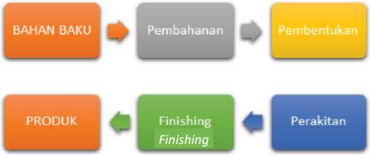

> **Deskripsi Visual:** Gambar ini adalah diagram yang menunjukkan proses produksi produk. Diagram ini terdiri dari dua bagian utama: bagian atas menunjukkan proses pembuatan bahan baku menjadi produk, sedangkan bagian bawah menunjukkan proses finishing dan perakitan.

Elemen utama dalam diagram ini adalah:
1. Bahan Baku: Mulai dari bahan baku, proses pembahasan berlangsung.
2. Pembentukan: Setelah pembahasan, proses pembentukan berlangsung.
3. Produk: Setelah pembentukan, produk siap.
4. Finishing: Setelah produk siap, proses finishing berlangsung.
5. Perakitan: Setelah finishing, produk siap untuk dijual.

Teks, angka, atau label penting yang terlihat dalam diagram ini adalah:
- "Bahan Baku" (di bagian atas)
- "Pembahasan" (di tengah bagian atas)
- "Pembentukan" (di bagian bawah)
- "Finishing" (di bagian bawah)
- "Perakitan" (di bagian bawah)

Informasi kunci yang dapat diambil pembaca melalui diagram ini adalah bahwa proses produksi produk melibatkan beberapa tahap, mulai dari pembahasan bahan baku hingga proses finishing dan perakitan. Proses ini membutuhkan peran dan kerja sama antara berbagai tahap dalam menghasilkan produk yang siap untuk dijual.

Sumber: Dokumen Kemdikbud

 

---
## 📄 Halaman 28

### Tugas 8 (Kelompok)

### Perencanaan Proses Produksi dan Keselamatan Kerja

- Carilah  informasi  tentang  jenis  aktivitas  pada  tahapan  pembahanan, cara pembentukan, cara perakitan, dan cara fi   nishing dari  desain  produk kerajinan yang telah dibuat pada tahap sebelumnya.
- Carilah informasi tentang alat kerja yang dibutuhkan pada setiap proses dan  ketentuan  keselamatan  kerja  yang  dibutuhkan  dalam  mendukung pembuatan kerajinan.
- Susun informasi tersebut ke dalam sebuah laporan atau presentasi yang menarik  sesuai  format  LK  8.  Boleh  disertai  gambar  agar  lebih  mudah dimengerti dan tampak menarik.

### LK 8. Rencana Proses Produksi dan Keselamatan Kerja

---
**📊 Tabel**

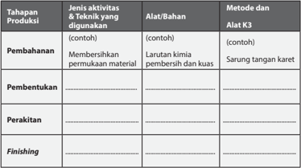

Tabel ini membahas tahapan produksi dalam proses pembuatan produk, mencakup pembahanan, pembentukan, perakitan, dan finishing. Topik utama adalah metode dan teknik yang digunakan dalam setiap tahap. Dalam tahap pembahanan, aktivitas yang dilakukan meliputi membersihkan permukaan material menggunakan larutan kimia bersih dan kuas. Alat yang digunakan adalah sarung tangan karet. Tahap pembentukan melibatkan penggunaan alat seperti mesin pemotong dan pres untuk memformulasikan bahan-bahan menjadi bentuk akhir produk. Perakitan melibatkan penggunaan alat seperti sekrup dan pasir untuk menghubungkan bagian-bagian produk. Tahap finishing melibatkan penggunaan alat seperti pensil dan pita untuk menyelesaikan detail dan finishing pada produk. Pola penting yang terlihat adalah bahwa setiap tahap memiliki jenis aktivitas, alat/bahan, dan metode yang spesifik untuk mencapai hasil akhir produk.

### Metode Produksi dan Keselamatan Kerja

Produksi  dapat  dilakukan  dengan  metode  tradisional  atau  modern.  Pada metode tradisional, satu orang melakukan setiap tahapan produksi, sedangkan pada metode modern, satu orang hanya melakukan satu tahap produksi.  Metode  modern  ini  sering  juga  disebut  dengan  metode  'ban berjalan' .  Metode  modern  disebut  metode  ban  berjalan  karena  metode  ini serupa dengan kegiatan produksi di pabrik yang menggunakan mesin ban berjalan atau conveyer .

 

---
## 📄 Halaman 29

---
**🖼️ Gambar/Diagram**

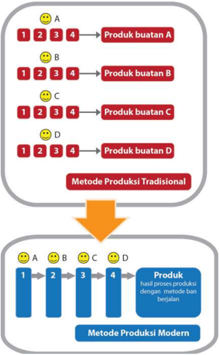

> **Deskripsi Visual:** Gambar ini adalah diagram yang menunjukkan perbandingan antara metode produksi tradisional dan modern. Diagram ini dibagi menjadi dua bagian utama:

1. Bagian atas menunjukkan metode produksi tradisional, di mana setiap produk (A, B, C, D) diproduksi secara bertahap menggunakan empat langkah yang berbeda. Setiap langkah ditandai dengan emoji wajah yang berbeda untuk menunjukkan tingkat kepuasan atau kualitas.

2. Bagian bawah menunjukkan metode produksi modern, di mana semua langkah produksi dilakukan secara bersamaan dan berjalan secara berurutan, menghasilkan produk final yang sama.

Elemen-elemen utama dalam diagram ini meliputi:
- Emoji wajah yang menunjukkan tingkat kepuasan atau kualitas setiap langkah produksi.
- Nama produk A, B, C, dan D.
- Angka 1 hingga 4 yang menunjukkan langkah-langkah produksi.
- Tombol biru yang menunjukkan proses produksi modern.

Informasi kunci yang dapat diambil pembaca meliputi:
- Perbedaan antara metode produksi tradisional dan modern.
- Proses produksi modern yang lebih efisien dan cepat.
- Kualitas produk yang sama baik dalam metode produksi tradisional maupun modern.

Sumber: Dokumen Kemdikbud

Gambar 1.12 Metode Kerja Tradisional dan Metode Produksi Modern

 

---
## 📄 Halaman 30

---
**🖼️ Gambar/Diagram**

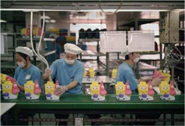

> **Deskripsi Visual:** Gambar ini adalah foto yang menunjukkan tiga orang pekerja di sebuah pabrik. Mereka sedang bekerja dengan mengisi botol plastik berbentuk karakter kartun kecil. Setiap pekerja memegang botol dan tampaknya sedang memasukkan atau mengisi bahan mentah ke dalamnya. Pabrik tersebut memiliki alat-alat produksi yang terlihat jelas, seperti mesin dan meja kerja. Semua pekerja tersebut menggunakan topi dan masker untuk kebersihan dan keselamatan kerja. Gambar ini menunjukkan proses produksi yang efisien dan terstruktur, menekankan pentingnya kesehatan dan keselamatan kerja dalam industri.

Pemanfaatan  metode  modern  lebih  efi  sien  dalam  penggunaan  waktu sehingga  sesuai  untuk  produksi  dalam  jumlah  banyak.  Metode  tradisional kurang tepat digunakan untuk produksi dalam jumlah banyak karena produk yang dihasilkan sulit untuk mencapai standar bentuk yang sama. Setiap orang memiliki cara yang berbeda dalam membuat produk, sehingga  detail bentuk produk yang dihasilkan akan berbeda pula. Pemanfaatkan metode produksi dan pengaturan alur produksi mempengaruhi kualitas produk dan kelancaran produksi.

Kelancaran  produksi  juga  ditentukan  oleh  cara  kerja  yang  memperhatikan K3  (Kesehatan  dan  Keselamatan  Kerja).  Upaya  menjaga  kesehatan  dan keselamatan kerja dibuat berdasarkan bahan, alat, dan proses produksi yang digunakan. Proses pembahanan dan pembentukan material solid seringkali menghasilkan sisa potongan atau debu yang dapat melukai bagian tubuh pekerjanya,  maka  dibutuhkan  alat  keselamatan  kerja  berupa  kacamata pelindung,  dan  masker.  Pada  proses  pembahanan  dan fi   nishing ,  apabila menggunakan bahan kimia yang dapat berbahaya bagi kulit dan pernapasan, maka  pekerja  harus  menggunakan  sarung  tangan  dan  masker.  Selain  alat keselamatan kerja, yang tak kalah penting adalah sikap kerja yang rapi, hatihati,  teliti,  dan  penuh  konsentrasi.  Sikap  tersebut  akan  mendukung kesehatan dan keselamatan kerja .

 

---
## 📄 Halaman 31

---
**🖼️ Gambar/Diagram**

> **Deskripsi Visual:** Gambar ini adalah ilustrasi yang menunjukkan berbagai alat perlindungan diri (APD) yang biasanya digunakan dalam lingkungan kerja. Ilustrasi ini mencakup empat elemen utama:

1. **Glove**: Pernahangan tangan dengan lengan panjang dan bahan yang lembut, biasanya digunakan untuk melindungi tangan dari serangan kimia atau mekanis.

2. **Safety Glasses**: Kacamata dengan lensa yang kuat dan anti-irisa, digunakan untuk melindungi mata dari debu, cahaya terang, atau serangan kimia.

3. **Ear Muffs**: Alat yang berfungsi sebagai penutup telinga, biasanya digunakan untuk melindungi telinga dari suara yang berisik atau keras.

4. **Ear Plugs**: Alat yang berfungsi sebagai penutup telinga, mirip dengan ear muffs tetapi lebih kecil dan biasanya digunakan untuk melindungi telinga dari suara yang berisik atau keras.

Informasi kunci yang dapat diambil pembaca adalah bahwa gambar ini menunjukkan berbagai alat APD yang penting dalam lingkungan kerja untuk melindungi karyawan dari bahaya fisik dan kimia.

Sumber: wilko.com

### Tugas 9 (Kelompok)

### Produksi Kerajinan untuk Pasar Lokal

Kegiatan  produksi  dilakukan  dalam  kelompok  dengan  metode  produksi modern.  Tentukan  target  jumlah  produksi  berdasarkan  waktu,  kemampuan produksi, dan target penjualan. Rencanakan proses produksi, jumlah bahan, dan alat, serta kebutuhan tempat kerja berdasarkan target produksi. Buatlah pembagian  tugas  yang  sesuai  dengan  kompetensi  anggota  kelompok  dan mendukung kualitas produksi yang baik. Kegiatan produksi tergantung dari desain produk kerajinan dan teknik produksi yang akan digunakan. Kerjakan setiap tahap sesuai dengan  perencanaan  produksi  yang  sudah  dibuat sebelumnya. Secara umum, berikut tahapan produksi kerajinan untuk pasar lokal.

### 1. Persiapan

- Persiapan bahan
- Persiapan alat kerja
- Persiapan tempat kerja

### 2. Kegiatan Produksi

- Pembahanan
- Pembentukan
- Perakitan
- Finishing

### 3. Pasca produksi

- Pemeriksaan kualitas ( Quality Control )
- Pengemasan
- Perapihan bahan, alat, dan tempat kerja
- Persiapan penjualan
- Penjualan

 

---
## 📄 Halaman 32

### Kemasan sebagai Bagian Penting Kerajinan untuk Pasar Lokal

Kemasan produk kerajinan berfungsi untuk melindungi produk dari benturan dan cuaca, serta memberikan kemudahan  membawa.  Kemasan  juga berfungsi untuk menambah daya tarik dan sebagai identitas atau brand dari produk tersebut. Fungsi kemasan didukung oleh pemilihan material, bentuk, warna, teks, dan grafi  s yang tepat.  Material yang digunakan untuk membuat kemasan  beragam,  bergantung  dari  produk  yang  akan  dikemas.  Produk kerajinan  yang  mudah  rusak  harus  menggunakan  kemasan  yang  memiliki material  berstruktur.  Kemasan  yang  bertujuan  memperlihatkan  keindahan produk  di  dalamnya  dapat  memanfaatkan  material  transparan.  Pemilihan material juga disesuaikan dengan identitas atau brand dari produk tersebut. Produk hiasan yang ingin dikenali sebagai produk alami akan menggunakan material kemasan yang alami pula. Daya tarik dan identitas, selain ditampilkan oleh material kemasan, juga dapat ditampilkan melalui bentuk, warna, teks, dan  grafi  s.  Pengemasan  dapat  dilengkapi  dengan  label  yang  memberikan informasi teknis maupun memperkuat identitas atau brand .

### Tugas 10 (Individu)

### Identitas Produk

- Carilah  informasi  dari  beberapa  literatur  tentang  berbagai  pengertian identitas produk, brand, dan merek.
- Bandingkan satu informasi dengan informasi lainnya.
- Paparkan  pengertian  identitas  dan  merek  produk  dengan  kata-katamu sendiri.
- Apa gunanya sebuah produk memiliki identitas?
- Carilah  informasi  tentang  beberapa  produk  lokal  dengan  merek  yang sudah terkenal.
- Pilih beberapa merek produk lokal yang menurutmu bagus dan berhasil, paparkan alasan dari pendapatmu.
Kemasan  produk  kerajinan  berfungsi  melindungi  produk  dari  debu  dan kotoran,  serta  memberikan  kemudahan  distribusi.  Kemasan  yang  melekat pada  produk  disebut  sebagai  kemasan  primer.  Kemasan  sekunder  berisi beberapa  kemasan  primer  yang  berisi  produk.  Kemasan  untuk  distribusi disebut  kemasan  tersier.  Kemasan  primer  produk  melindungi  produk  dari benturan dan kotoran, serta berfungsi menampilkan daya tarik dari produk kerajinan,  serta  memberikan  kemudahan  untuk  distribusi  dari  tempat produksi  ke  tempat  penjualan.  Perlindungan  bisa  diperoleh  dari  kemasan tersier yang  membuat kemasan beragam, bergantung dari produk yang akan dikemas.  Kemasan  produk  kerajinan  sebaiknya  memberikan  identitas  atau brand dari produk tersebut atau dari produsennya.

 

---
## 📄 Halaman 33

Material  kemasan  untuk  melindungi  dari  kotoran  dapat  berupa  lembaran kertas  atau  plastik. Tidak  semua  produk  kerajinan  membutuhkan  kemasan primer.  Namun,  setiap  produk  membutuhkan  identitas.  Identitas  dapat berupa stiker atau selubung karton yang berisi nama dan keterangan, serta menggambarkan karakter yang sesuai dengan target sasaran. Pada produk fungsional  dibutuhkan  keterangan  cara  penggunaan  produk.  Keterangan cara penggunaan ini dapat dituliskan atau digambarkan pada label.

---
**🖼️ Gambar/Diagram**

> **Deskripsi Visual:** Gambar ini adalah ilustrasi yang menunjukkan seorang pemain voli memukul bola voli dengan raketnya. Gambar ini menggunakan warna hijau untuk menggambarkan pemain dan bola voli, sementara latar belakang adalah hijau muda. Pemain tampak bergerak aktif, menunjukkan posisi yang menunjukkan gerakan voli. Ilustrasi ini mungkin digunakan sebagai bagian dari buku pelajaran olahraga untuk menjelaskan teknik voli.

1. Gambar ini menunjukkan seorang pemain voli yang sedang memukul bola voli dengan raketnya.
2. Elemen utama termasuk pemain, bola voli, dan raket. Pemain berada di tengah gambar, sedangkan bola voli dan raketnya tampak jelas di depannya. Relasi antara elemen-elemen ini adalah pemain yang memukul bola voli menggunakan raketnya.
3. Teks, angka, atau label penting tidak ada pada gambar ini.
4. Informasi kunci yang dapat diambil pembaca adalah teknik voli dan posisi pemain saat memukul bola voli.

Sumber: freevector.com

### Tugas 11 (Kelompok)

### Pembuatan Kemasan Produk Kerajinan untuk Pasar Lokal

- Buatlah  rencana  kemasan  produk  kerajinan  untuk  pasar  lokal  dengan pertimbangan ketersediaan material kemasan dan keterampilan pembuatan kemasan yang ada di lingkungan sekitar.
- Ingatlah untuk memasukkan  biaya pembuatan  kemasan ke dalam penghitungan Biaya Produksi.

 

---
## 📄 Halaman 34

### C.  Penghitungan Harga Jual Produk Kerajinan untuk Pasar Lokal

Harga jual produk adalah sejumlah harga  yang dibebankan kepada konsumen yang  dihitung  dari  biaya  produksi  dan  biaya  lain  di  luar  produksi  seperti biaya distribusi dan promosi. Biaya produksi adalah biaya-biaya yang harus dikeluarkan untuk terjadinya produksi barang. Unsur biaya produksi adalah biaya  bahan  baku,  biaya  tenaga  kerja,  dan  biaya overhead .  Secara  umum biaya overhead dibedakan  atas  biaya overhead tetap,  yaitu  biaya overhead yang jumlahnya tidak berubah walaupun jumlah produksinya berubah dan biaya overhead variabel, yaitu biaya overhead yang jumlahnya berubah secara proporsional sesuai dengan perubahan jumlah produksi. Biaya yang termasuk ke dalam overhead adalah biaya listrik, bahan bakar minyak, dan biaya-biaya lain  yang dikeluarkan untuk mendukung proses produksi. Biaya pembelian bahan  bakar  minyak,  sabun  pembersih  untuk  membersihkan  bahan  baku, benang, jarum, lem, dan bahan-bahan lainnya dapat dimasukkan ke dalam biaya overhead . Jumlah biaya-biaya yang dikeluarkan tersebut menjadi Harga Pokok Produksi (HPP).

Metode  penghitungan  Harga  Pokok  Produksi  dapat  dibuat  dengan  dua pendekatan. Pendekatan pertama adalah full costing dan pendekatan kedua adalah variable costing .

### 1. Full Costing

Pendekatan full costing memperhitungkan semua unsur biaya produksi, yaitu biaya bahan baku, biaya tenaga kerja produksi, dan biaya overhead (tetap dan variabel), serta ditambah dengan biaya nonproduksi, seperti biaya pemasaran, serta biaya administrasi dan umum.

---
**📊 Tabel**

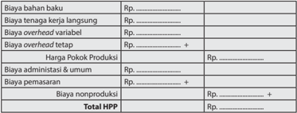

Tabel ini menunjukkan struktur biaya produksi untuk sebuah produk atau usaha. Topik utamanya adalah biaya produksi total yang terdiri dari berbagai komponen biaya. Kolom-kolomnya meliputi biaya bahan baku, biaya tenaga kerja langsung, biaya overhead variabel, biaya overhead tetap, harga pokok produksi, biaya administrasi dan umum, biaya pemasaran, dan biaya nonproduksi. Selain itu, tabel juga mencakup total HPP (Harga Pokok Produksi). Data penting yang terlihat adalah bahwa biaya produksi total terdiri dari sejumlah besar biaya yang berbeda, termasuk biaya bahan baku, biaya tenaga kerja, biaya overhead, dan biaya administrasi. Ini menunjukkan bahwa biaya produksi adalah suatu proses yang kompleks yang melibatkan banyak faktor.

 

---
## 📄 Halaman 35

### 2. Variable Costing

Pendekatan variable costing memisahkan penghitungan biaya produksi yang  berlaku  variabel  dengan  biaya  tetap.  Biaya  variabel  terdiri  dari biaya  bahan  baku,  biaya  tenaga  kerja  produksi,  dan overhead variable ditambah dengan biaya pemasaran variabel dan biaya umum variabel. Biaya tetap terdiri atas biaya overhead tetap, biaya pemasaran tetap, biaya administrasi tetap, dan biaya umum tetap.

---
**📊 Tabel**

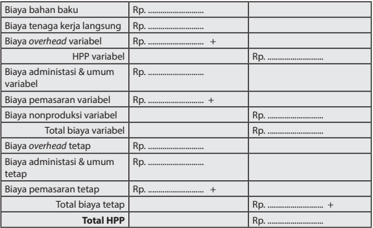

Tabel ini menunjukkan struktur biaya produksi untuk sebuah perusahaan, dengan berbagai jenis biaya yang dikeluarkan untuk mencapai hasil produksi. Topik utama tabel adalah biaya produksi total, yang terdiri dari biaya bahan baku, tenaga kerja langsung, overhead variabel, administrasi umum, pemasaran variabel, nonproduksi variabel, overhead tetap, administrasi umum tetap, pemasaran tetap, dan total biaya tetap. Kolom-kolomnya mencakup semua jenis biaya tersebut, dengan detail tentang apakah mereka variabel atau tetap. Data penting yang terlihat adalah bahwa biaya bahan baku dan tenaga kerja langsung merupakan biaya yang paling besar, sementara overhead tetap dan administrasi umum tetap adalah biaya yang lebih kecil. Biaya pemasaran tetap juga merupakan bagian yang signifikan dari total biaya tetap.

Harga  Pokok  Produksi  dihitung  dari  jumlah  biaya  yang  dikeluarkan  untuk memproduksi sejumlah produk. Penetapan Harja Jual Produk diawali dengan penetapan HPP/unit  dari  setiap  produk  yang  dibuat.  HPP/unit  adalah  HPP dibagi  dengan  jumlah  produk  yang  dihasilkan.  Misalnya,  pada  satu  kali produksi dengan HPP Rp1.000.000,00 dihasilkan 100 buah produk, maka HPP/ unit adalah Rp1.000.000,00 dibagi dengan 100, yaitu Rp10.000,00. Harga jual adalah HPP ditambah dengan laba yang diinginkan. Harga jual ditentukan dengan beberapa pertimbangan, yaitu bahwa harga jual harus sesuai dengan pasar sasaran yang dituju, mempertimbangkan harga jual dari pesaing, dan target  pencapaian Break  Even  Point (BEP),  serta  jumlah  keuntungan  yang didapatkan sebagai bagian dari strategi pengembangan wirausaha.

 

---
## 📄 Halaman 36

Metode Penetapan Harga Produk secara teori dapat dilakukan dengan tiga pendekatan, yaitu:

### 1. Pendekatan Permintaan dan Penawaran ( Supply and Demand Approach )

Dari  tingkat  permintaan  dan  penawaran  yang  ada,  ditentukan  harga keseimbangan  ( equilibrium  price )  dengan  cara  mencari  harga  yang mampu dibayar konsumen dan harga yang diterima produsen sehingga terbentuk jumlah yang diminta sama dengan jumlah yang ditawarkan.

### 2. Pendekatan Biaya ( Cost Oriented Approach )

Menentukan  harga  dengan  cara  menghitung  biaya  yang  dikeluarkan produsen  dengan  tingkat  keuntungan  yang  diinginkan,  baik  dengan markup pricing dan break even analysis .

### 3. Pendekatan Pasar ( Market Approach )

Merumuskan harga untuk produk yang dipasarkan dengan cara menghitung  variabel-variabel  yang  mempengaruhi  pasar  dan  harga seperti situasi dan kondisi politik, persaingan, dan sosial budaya.

### Tugas 12 (Kelompok)

### Total Harga Pokok Produksi dan Harga Jual Produk

- Hitunglah Total Harga Pokok Produksi dari produk kerajinan untuk pasar lokal dengan menggunakan pendekatan Full Costing .
- Hitunglah HPP/unit dari produk kerajinan untuk pasar lokal.
- Diskusikan  dalam  kelompok,  berapa  harga  jual  produk  kerajinan  untuk pasar lokal yang telah dibuat.

### LK 12. Total Harga Pokok Produksi dan Harga Jual Produk

Biaya bahan baku

Rp. ...........................

Biaya tenaga kerja langsung

Rp. ...........................

Biaya overhead variabel

Rp. ...........................

Biaya overhead tetap

Rp. ...........................  +

Harga Pokok Produksi

Rp. ...........................

Biaya administasi & umum

Rp. ...........................

Biaya pemasaran

Rp. ........................... +

Biaya nonproduksi

Rp. ...........................  +

Total HPP

Rp. ...........................

 

---
## 📄 Halaman 37

### D. Media  Promosi  Produk  Kerajinan  untuk  Pasar Lokal

### Pengertian dan Jenis-Jenis Promosi Kerajinan untuk Pasar Lokal

Promosi merupakan salah satu strategi pemasaran. Strategi pemasaran produk memanfaatkan bauran dari strategi product , place , price , dan promotion atau dikenal  pula  dengan  sebutan  4P.  Pada  pembelajaran  sebelumnya,  telah dibahas tentang produk ( product ) dan harga ( price ). Kesuksesan suatu produk di  pasaran,  tidak  hanya  ditentukan  oleh  kualitas  produk  dan  harga  yang tepat, melainkan juga tempat penjualan ( place ) dan cara promosi ( promotion ). Kegiatan dan media promosi bergantung dari pasar sasaran yang merupakan target dari promosi tersebut dan tempat penjualan produk dilakukan. Promosi produk dapat dilakukan di antaranya dengan mengadakan kegiatan di suatu lokasi, promosi melalui poster atau iklan di media cetak, radio maupun media sosial.

Tujuan  promosi  adalah  untuk  mengenalkan  produk  kepada  calon  pembeli dan  membuat  pembeli  membeli  produk.  Promosi  yang  tepat  akan  diikuti oleh  empat  bentuk  respon  dari  calon  pembeli.  Pertama  adalah  perhatian ( attention )  dari  calon  pembeli  disebabkan  oleh  promosi  yang  menarik didengar dan dilihat, serta unggul daripada promosi produk pesaing. Kedua adalah  ketertarikan  ( interest )  dari  calon  pembeli.  Ketiga  adalah  keinginan ( desire )  calon  pembeli  untuk  memiliki  produk.  Keempat  adalah  tindakan ( action )  membeli. Empat bentuk respon ini dikenal dengan AIDA ( Attention, Interest, Desire, dan Action).

Media promosi dapat dikelompokkan menjadi promosi Above The Line dan Bellow The Line . Promosi Above The Line adalah promosi melalui iklan, seperti iklan di media cetak, iklan radio, poster. Promosi Bellow the Line adalah promosi melalui kegiatan promosinya, contohnya mengadakan peragaan busana untuk mempromosikan  produk-produk fashion atau  menyelenggarakan  lomba kreativitas untuk mempromosikan produk alat gambar. Pada saat ini, dengan berkembangkan  teknologi  informasi,  promosi  juga  dapat  memanfaatkan promosi online melalui website atau  memanfaatkan  sosial  media.  Beragam

 

---
## 📄 Halaman 38

jenis  media  promosi  ini  dapat  digunakan  secara  bersamaan  agar  saling melengkapi. Produk kerajinan merupakan produk yang mengutamakan unsur estetis, maka media promosi yang dipilih sebaiknya yang dapat menampilkan visualisasi  dari  produk  tersebut.  Media  promosi  juga  dipilih  berdasarkan pasar sasaran dari produk tersebut. Bila pasar sasarannya adalah anak muda, maka media promosi yang dipilih harus media yang sesuai, misalnya promosi berupa  poster  yang  ditempel  di  mading  sekolah  atau  di  majalah  remaja. Promosi  juga  dipengaruhi  dengan  cara  penjualan  yang  dipilih.  Apabila penjualan  produk  melalui  sistem  konsinyasi  dengan  menitipkan  produk  di koperasi  sekolah,  maka  media  promosi  yang  dapat  dipilih  adalah  dengan meletakkan informasi tentang produk tersebut di koperasi, agar pengunjung koperasi dapat mengetahui bahwa barang tersebut dijual di tempat tersebut. Apabila produk dititipkan di salah satu toko yang berada di pasar, maka di pintu pasar sebaiknya dipasang media promosi yang memberikan informasi tentang  keberadaan  produk  tersebut  di  salah  satu  toko.  Promosi  di  lokasi berjualan  juga  harus  diperkuat  oleh  informasi  yang  disampaikan  melalui media-media lain. Media yang paling umum digunakan untuk promosi suatu usaha di antaranya kop surat, amplop, dan cap yang menggambarkan nama dan logo perusahaan, memajang contoh produk di jendela toko, memasang iklan di koran, majalah dan radio, mengirimkan surat atau email yang berisi informasi produk, membuat iklan di luar bangunan, misalnya pada kendaraan umum, dan membuat iklan atau gambar yang menarik pada area penjualan agar calon pembeli membeli produk.

---
**🖼️ Gambar/Diagram**

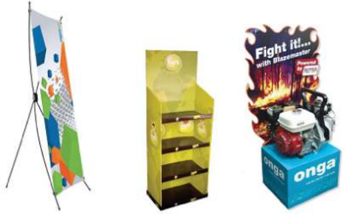

> **Deskripsi Visual:** Gambar ini adalah ilustrasi yang menunjukkan tiga jenis produk promosi atau pameran. Setiap produk memiliki desain unik dan fungsional:

1. **Pertama**: Ini adalah banner standar yang ditempatkan di luar ruangan. Banner ini berwarna putih dengan gambar dan teks berwarna biru dan merah. Banner ini mungkin digunakan untuk mempromosikan acara atau produk tertentu.

2. **Kedua**: Ini adalah papan pameran yang dirancang untuk menampilkan produk atau informasi. Papan ini berwarna kuning dan memiliki empat tingkat. Di bagian atas, terdapat gambar dua orang yang sedang berbicara, mungkin menunjukkan konsep komunikasi atau presentasi.

3. **Ketiga**: Ini adalah kotak pameran yang berisi mesin pembakaran dalam (mesin kompresor) dan sepeda motor. Kotak ini berwarna biru dan merah, dengan gambar mesin pembakaran dalam dan sepeda motor yang menonjol. Di bagian atas kotak, terdapat tulisan "Fight it with Displacement" yang menunjukkan bahwa produk ini mungkin berkaitan dengan teknologi penggerak atau mesin.

Informasi kunci yang dapat diambil pembaca adalah bahwa gambar ini menunjukkan tiga produk promosi yang berbeda, masing-masing dengan desain dan fungsi yang berbeda.

Sumber: freevector.com

 

---
## 📄 Halaman 39

---
**🖼️ Gambar/Diagram**

> **Deskripsi Visual:** Gambar ini adalah kombinasi dari beberapa elemen visual yang berbeda. Pertama, ada sebuah produk yang tampak seperti perhiasan, mungkin kalung atau gelang, yang diletakkan di atas rak. Kedua, ada karton dengan desain yang menyerupai rak atau papan penempatan produk. Ketiga, ada selembar kertas dengan tulisan "PRODUCT NAME" dan harga "$199". Keempat, ada gambar produk yang tampak seperti perhiasan putih dengan latar belakang biru.

1. Gambar ini menunjukkan produk perhiasan yang diletakkan di atas rak, karton dengan desain rak, dan selembar kertas dengan informasi produk.
2. Elemen utama adalah produk perhiasan, rak, karton, dan kertas informasi produk. Relasi antara mereka adalah bahwa produk perhiasan diletakkan di atas rak, rak tersebut terbuat dari karton, dan kertas informasi produk digunakan untuk memberikan detail tentang produk tersebut.
3. Teks penting yang terlihat adalah "PRODUCT NAME" dan harga "$199". Angka $199 menunjukkan harga produk.
4. Informasi kunci yang dapat diambil pembaca adalah bahwa produk ini adalah perhiasan dengan harga $199, dan ada informasi tentang produk tersebut yang disajikan dalam bentuk karton dan kertas.

Sumber: freevector.com

Gambar 1.17 Contoh media promosi rak mini untuk di atas meja kasir (kiri) dan fl   yer (kanan)

### E.  Penjualan  Sistem  Konsinyasi  Produk  Kerajinan untuk Pasar Lokal

Penjualan dengan sistem konsinyasi adalah penjualan dengan cara menitipkan produk kepada pihak lain untuk dijualkan dengan harga jual dan persyaratan  sesuai  dengan  perjanjian  antara  pemilik  produk  dan  penjual. Perjanjian konsinyasi berisi hak dan kewajiban kedua belah pihak. Informasi yang  harus  ada  dalam  perjanjian  konsinyasi  adalah  nama  pihak  pemilik barang  (konsinyor),  nama  pihak  yang  dititipi  barang  (konsinyi),  nama  dan keterangan  teknis  barang  yang  dititipkan,  ketentuan  penjualan,  ketentuan komisi (keuntungan yang akan diperoleh toko).

### Tugas 13 (Kelompok)

### Perjanjian dan Pelaksanaan Konsinyasi

- Carilah konsinyi untuk penjualan produk kerajinan yang telah dibuat.
- Adakan  pertemuan  dengan  konsinyi  untuk  mendiskusikan  bentuk  kerja sama konsinyasi yang akan dilakukan. Sebelum pertemuan, buatlah daftar pertanyaan  yang  akan  didiskusikan  dalam  pertemuan  tersebut.  Bahan diskusi di antaranya, jumlah produk dalam satu kali pengiriman, besarnya komisi yang akan diterima konsinyi, dan promosi apa yang akan dilakukan.
- Buatlah  surat  kerja  sama  yang  berisi  perjanjian  konsinyasi  berdasarkan kesepakatan  antara  kalian  sebagai  konsinyor  dengan  konsinyi.  Surat perjanjian konsinyasi ditandatangani kedua belah pihak.
- Laksanakan penjualan konsinyasi dengan memaksimalkan upaya promosi dengan beragam media promosi yang sesuai dengan produk kerajinan dan pasar sasaran yang dituju.

 

---
## 📄 Halaman 40

### Surat Perjanjian Konsinyasi

Yang bertanda tangan di bawah ini:

Nama     :

Alamat   :

No. Telp   :

Selanjutnya disebut Pihak Pertama

Nama     :

Alamat   :

No. Telp   :

Selanjutnya disebut Pihak Kedua

Untuk selanjutnya antara Pihak Pertama dan Pihak Kedua memiliki perjanjian kerja sama sebagaimana ketentuan sebagai berikut.

- Pihak Pertama menitipkan barangnya kepada Pihak Kedua dengan sistem konsinyasi.  Pihak  Kedua  mendapat  (  __  )  %  dari  uang  hasil  penjualan barang titipan pihak pertama.
- Jumlah maksimal penitipan barang yang dilakukan Pihak Pertama kepada Pihak Kedua adalah ( ____) buah untuk setiap desainnya.
- Pihak  Pertama  akan  membantu  promosi  Pihak  Kedua,  begitu  juga sebaliknya.
- Pihak  Kedua  melaporkan  hasil  penjualan  kepada  Pihak  Pertama  setiap bulannya,  di  awal  bulan  berikutnya  disertai  dengan  penyerahan  laba sebesar ( __ ) % dari uang hasil penjualan barang titipan Pihak Pertama kepada Pihak Kedua.
Demikianlah  surat  perjanjian  kerja  sama  ini  dibuat  untuk  menjadi  ikatan di  antara  kami.  Segala  hal  yang  belum  termuat  dalam  surat  perjanjian  ini, dibicarakan bersama antara Pihak Pertama dan Pihak Kedua untuk mencapai kesepakatan di kemudian hari dan menjadi tambahan pada perjanjian ini.

Perjanjian  ini  kami  buat  dengan  penuh  kesadaran  dan  tanpa  paksaan  dari pihak  manapun.  Jika  terjadi  perselisihan  dalam  pelaksanaan  perjanjian  ini,

 

---
## 📄 Halaman 41

maka  kami  sepakat  untuk  menyelesaikannya  dengan  cara  kekeluargaan dan  musyawarah.  Namun,  jika  tidak terselesaikan juga, kami  sepakat menyelesaikannya berdasarkan hukum yang berlaku.

Perjanjian ini disepakati pada Hari _______Tanggal __ Bulan _____

Tahun _____ oleh:

Pihak Pertama                                                                            Pihak Kedua

(nama lengkap)                                                                        (nama lengkap)

Sumber: Dokumen Kemdibud

Gambar 1.18 Contoh Surat Perjanjian Konsinyasi

### Tugas 14 (Kelompok)

### Perancangan  dan  Produksi  Media  Promosi  untuk  Sistem  Penjualan Konsinyasi

- Diskusikan  dalam  kelompok  media  promosi  yang  sesuai  untuk  pasar sasaran dan cara penjualan dengan sistem konsinyasi.
- Diskusikan  pula  informasi  apa  yang  harus  ditampilkan  dalam  setiap media, misalnya nama dan deskripsi produk, harga jual, alamat penjualan, keunggulan dan keunikan produk, dan penggunaan material.
- Diskusikan  waktu  dan  tempat  pemasangan,  serta  penyebaran  media promosi dan pembagian tugas dalam kelompok.
- Rancanglah  media  promosi  sesuai  hasil  diskusi  sebelumnya.  Lakukan bersama-sama dalam kelompok untuk memperoleh hasil yang memuaskan.
- Buat media promosi sesuai dengan rancangan yang telah disepakati dan semenarik  mungkin  agar  memperoleh  respon  AIDA  ( Attention,  Interest, Desire, dan Action ) dari pasar sasaran.
- Hitung biaya promosi yang harus dikeluarkan.
- Buat media promosi tersebut untuk mendukung penjualan yang dilakukan dengan sistem konsinyasi.

 

---
## 📄 Halaman 42

---
**🖼️ Gambar/Diagram**

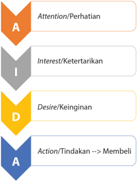

> **Deskripsi Visual:** Gambar ini adalah diagram yang menunjukkan tahapan dalam proses pembelian produk atau layanan. Diagram ini berbentuk persegi panjang dengan empat bagian berbeda, masing-masing menunjukkan tahap yang berbeda dalam proses pembelian. Bagian pertama, "Attention/Perhatian", menunjukkan saat seseorang mulai memperhatikan atau tertarik pada suatu produk atau layanan. Bagian kedua, "Interest/Ketertarikan", menunjukkan saat seseorang mulai tertarik pada produk atau layanan tersebut. Bagian ketiga, "Desire/Keinginan", menunjukkan saat seseorang mulai merasa ingin membeli produk atau layanan tersebut. Bagian keempat, "Action/Tindakan -> Membeli", menunjukkan saat seseorang melakukan tindakan untuk membeli produk atau layanan tersebut.

Elemen-elemen utama dalam diagram ini adalah empat bagian yang masing-masing menunjukkan tahap-tahap dalam proses pembelian. Relasi antara elemen-elemen ini adalah bahwa setiap tahap harus dilalui sebelum seseorang akhirnya memutuskan untuk membeli produk atau layanan tersebut. Teks, angka, atau label penting yang terlihat dalam diagram ini adalah "Attention/Perhatian", "Interest/Ketertarikan", "Desire/Keinginan", dan "Action/Tindakan -> Membeli". Informasi kunci yang dapat diambil pembaca dari diagram ini adalah bahwa ada empat tahap dalam proses pembelian, dan setiap tahap harus dilalui sebelum seseorang akhirnya memutuskan untuk membeli produk atau layanan tersebut.

### F.  Evaluasi  Diri  Pembelajaran  Wirausaha  Produk Kerajinan untuk Pasar Lokal

Evaluasi  diri  pada  akhir  semester  1  terdiri  atas  evaluasi  individu  dan  evaluasi kelompok.  Evaluasi  individu  dibuat  untuk  mengetahui  sejauh  mana  efektivitas pembelajaran terhadap masing-masing peserta didik. Evaluasi individu meliputi evaluasi sikap, pengetahuan, dan keterampilan. Evaluasi kelompok adalah untuk mengetahui interaksi yang terjadi dalam kelompok, kaitannya dengan pencapaian tujuan pembelajaran.

### Evaluasi Diri (individu)

Bagian A. Berilah tanda cek (v) pada kolom kanan  sesuai penilaian dirimu.

Keterangan:

1. Sangat Tidak Setuju        2. Tidak Setuju        3. Netral

- Setuju       5. Sangat Setuju
Bagian B. Tuliskan  pendapatmu tentang pengalaman mengikuti pembelajaran Kerajinan di Semester 1.

 

---
## 📄 Halaman 43

---
**📊 Tabel**

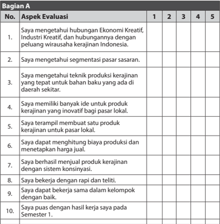

Tabel ini menunjukkan evaluasi berdasarkan aspek-aspek kreatif dan industri kerajinan. Kolom pertama berisi nomor urut, sedangkan kolom kedua hingga kelima berisi pertanyaan tentang kemampuan seseorang dalam bidang tersebut. Data penting yang terlihat adalah bahwa setiap aspek memiliki 5 poin untuk diberikan skor, mulai dari 1 (belum memenuhi) hingga 5 (sangat memenuhi). Ini menunjukkan bahwa evaluasi ini dilakukan secara holistik dan mendalam untuk memastikan pemahaman dan kemampuan individu dalam bidang kreatif dan industri kerajinan.

### Bagian B

Kesan dan pesan setelah mengikuti pembelajaran Kerajinan Semester 1:

 

---
## 📄 Halaman 44

### Evaluasi Diri (kelompok)

Bagian A. Berilah tanda cek (v) pada kolom kanan  sesuai penilaian dirimu.

Keterangan:

- Sangat Tidak Setuju        2. Tidak Setuju        3. Netral
4. Setuju       5. Sangat Setuju

---
**📊 Tabel**

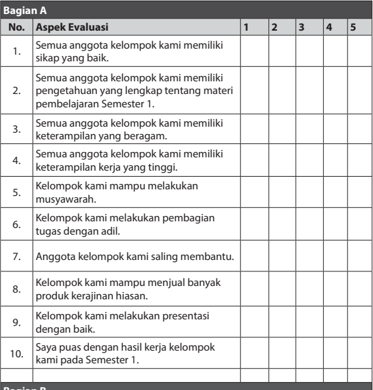

Tabel ini berisi evaluasi tentang kinerja kelompok belajar dalam satu semester. Topik utamanya adalah aspek-aspek evaluasi yang dianalisis, seperti kualitas pengetahuan, keterampilan, kerjasama, dan hasil kerja kelompok. Kolom pertama menunjukkan nomor urutan aspek evaluasi, sementara kolom kedua hingga kelima menampilkan skala evaluasi dari 1 (kurang) hingga 5 (baik). Data penting yang terlihat adalah bahwa semua anggota kelompok memiliki pengetahuan yang lengkap tentang materi pembelajaran semester 1, memiliki keterampilan yang beragam, mampu melakukan musyawarah, melakukan pembagian tugas dengan adil, saling membantu, menjual produk kerajinan, dan melakukan presentasi dengan baik. Selain itu, semua anggota kelompok puas dengan hasil kerja kelompok mereka pada semester tersebut.

### Bagian B

Pengalaman paling berkesan saat bekerja dalam kelompok:

 

---
## 📄 Halaman 45

Prakarya dan Kewirausahaan

39

 

---
## 📄 Halaman 46

### Peta Materi

---
**🖼️ Gambar/Diagram**

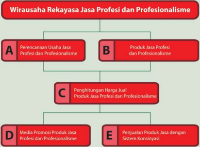

> **Deskripsi Visual:** Gambar ini adalah diagram yang menunjukkan proses wirausaha rekayasa jasa profesionalisme. Diagram ini terdiri dari empat bagian utama yang disebutkan dengan huruf besar A sampai E. Setiap bagian memiliki subbagian yang lebih detail.

1. **A. Perencanaan Usaha Jasa Profesionalisme dan Profesionalisme**
   - Subbagian ini mencakup aspek-aspek penting seperti pengukuran kebutuhan pasar, identifikasi target pasar, dan perencanaan strategi bisnis.

2. **B. Produk Jasa Profesionalisme dan Profesionalisme**
   - Subbagian ini melibatkan definisi produk jasa yang akan dijual, termasuk spesifikasi, harga, dan kualitas produk.

3. **C. Penghitungan Harga Jual Produk Jasa Profesionalisme**
   - Subbagian ini mengandung prosedur untuk menghitung harga jual produk jasa berdasarkan biaya produksi, margin keuntungan, dan faktor-faktor lainnya.

4. **D. Media Promosi Produk Jasa Profesionalisme**
   - Subbagian ini membahas cara-cara untuk mempromosikan produk jasa, termasuk pemasaran digital, media sosial, dan promosi offline.

5. **E. Penjualan Produk Jasa dengan Sistem Konsinyasi**
   - Subbagian ini menjelaskan metode penjualan produk jasa menggunakan sistem konsinyasi, termasuk manajemen kontrak, proses penerimaan pembayaran, dan manajemen karyawan.

Informasi kunci yang dapat diambil pembaca adalah bahwa proses ini melibatkan banyak aspek yang harus dipertimbangkan sebelum, selama, dan sesudah peluncuran produk jasa profesionalisme. Pembaca juga dapat memahami bahwa ada beberapa langkah yang harus diikuti untuk memastikan produk jasa tersebut dijual dengan efektif dan menghasilkan keuntungan.

40

Kelas XII SMA/SMK/MA/MAK

 

---
## 📄 Halaman 47

### BAB II

### Wirausaha Rekayasa Jasa Profesi dan Profesionalisme

### Tujuan Pembelajaran

### Setelah mempelajari bab ini, peserta didik mampu:

- Menghayati  bahwa  akal  pikiran  dan  kemampuan  manusia  dalam  berpikir kreatif untuk membuat produk rekayasa serta keberhasilan wirausaha adalah anugerah Tuhan.
- Menghayati  perilaku  jujur,  percaya  diri,  dan  mandiri  serta  sikap  bekerja sama, gotong royong, bertoleransi, disiplin, bertanggung jawab, kreatif, dan inovatif dalam membuat karya rekayasa untuk pasar lokal guna membangun semangat usaha.
- Mendesain  dan  produksi  jasa  profesi  dan  profesionalisme  berdasarkan identifi  kasi kebutuhan sumber daya, teknologi, dan prosedur berkarya.
- Mempresentasikan,  mempromosikan  dengan  pemilihan  media  yang  tepat, dan menjual karya produk rekayasa dengan perilaku jujur dan percaya diri melalui penjualan konsinyasi.
- Menyajikan  wirausaha  rekayasa untuk  pasar lokal berdasarkan  analisis pengelolaan sumber daya yang ada di lingkungan sekitar.
Prakarya dan Kewirausahaan

41

 

---
## 📄 Halaman 48

Masyarakat Ekonomi ASEAN (MEA) atau sering diistilahkan dengan ASEAN Economic Community (AEC), yaitu negara-negara yang tergabung pada Association of South East Asian Nations (ASEAN) yang membuka arus perdagangan barang atau jasa, juga pasar tenaga kerja profesional, serta membuka arus investasi dan modal di kawasan yang merupakan kekuatan ekonomi dari negara yang tergabung dalam ASEAN.  Istilah pasar tunggal dimaksudkan bahwa satu negara menjual produk barang atau jasa dengan mudah ke negara-negara yang sepakat dalam ASEAN yang terdiri atas negara-negara Indonesia, Malaysia, Filipina, Singapura, Thailand, Brunei  Darussalam, Vietnam,  Laos,  Myanmar,  dan  Kamboja  sehingga  kompetisi semakin ketat.

Investasi  sumber  daya  manusia  dilakukan  dengan  mengantisipasi  diri  melalui peningkatan kompetensi  dan terserap di lapangan kerja. Perkembangan teknologi yang pesat menjadi bahan pertimbangan profesional untuk terus meningkatkan kompetensi yang dimiliki. Sumber daya manusia di era perkembangan teknologi di  Indonesia  yang  terdiri  atas  kepulauan,  sangat  potensial  bagi  negara  yang sedang  tumbuh  menggerakkan  perekonomian  di  setiap  lini  kehidupan  yang membutuhkan akses antarpulau.

Sektor perhubungan terdiri atas perhubungan darat, air, dan udara sebagai sarana akses antarpulau untuk menggerakkan dan membangun pasar, baik untuk produk barang  maupun  jasa  .  Gambar  2.1  sebagai  salah  satu  contoh  usaha  di  sektor perhubungan udara yang banyak membutuhkan tenaga terampil di bidang jasa perawatan,  perbaikan  pesawat,  jasa  layanan  kargo,  dan  logistik.  Pusat  desain pesawat  ( design  center )  dan maintenance  center sebagai  wadah  untuk  tenaga profesional dalam berkarya dan tidak menutup kemungkinan bagi generasi muda untuk terus belajar meningkatkan kompetensi dan berpengalaman di dalamnya, berprofesi di bidang maintenance ,  mendesain pesawat dengan keragaman tipe, dan bodi pesawat. Kreativitas dan inovasi sangat dibutuhkan oleh setiap pribadi dalam mempersiapkan diri sebagai profesional dengan terus belajar meningkatkan kompetensi dan memberdayakan diri.

Peningkatan kompetensi dalam menjalankan usaha produk jasa dan barang secara efi  sien,  memiliki  daya  saing  dan  nilai  tambah,  serta  produktivitas dari beragam sektor perlu mendapat perhatian.

 

---
## 📄 Halaman 49

### Aktivitas 1

Profesi  apa  yang  Anda  minati?  Sudahkah  dipersiapkan  untuk  meraihnya? Sudahkah konsep diri Anda mendukung rencana masa depan Anda? Kenali kekuatan  /  potensi  diri.  Mari  kita  belajar  bersama  tentang  Jasa  Profesi  dan Profesionalime.

### A. Perencanaan Usaha Jasa Profesi dan Profesionalisme

### Konsep Diri

Konsep diri merupakan pandangan dan sikap individu terhadap dirinya sendiri yang meliputi dimensi fi  sik, karakteristik individual, dan motivasi diri  seperti  ditunjukkan  pada  Gambar  2.2.  Konsep  diri  merupakan  inti kepribadian individu yang berperan untuk menentukan dan mengarahkan perilaku  dan  kepribadian.  Perilaku  kerja  dalam  usaha  jasa  profesi  dan profesionalisme sangat dibutuhkan terkait dengan upaya membangun usaha, baik berupa produk jasa maupun barang secara profesional.

---
**🖼️ Gambar/Diagram**

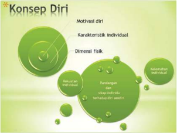

> **Deskripsi Visual:** Gambar ini adalah diagram yang menunjukkan konsep diri dalam pendidikan. Diagram ini terdiri dari beberapa elemen utama yang terhubung dengan garis-garis yang menghubungkan mereka. 

1. **Apa yang Ditampilkan Secara Keseluruhan**: Gambar ini menunjukkan struktur dan komponen-komponen penting dalam konsep diri, yang meliputi motivasi diri, karakteristik individual, dimensi fisik, perilaku individu, pandangan dan sikap individu terhadap diri sendiri, serta relasi antar individu.

2. **Elemen-Elemen Utama dan Relasinya**: 
   - **Motivasi Diri** berada di bagian atas dan merupakan pusat dari diagram.
   - **Karakteristik Individu** dan **Dimensi Fisik** terletak di sebelah kiri dan kanan dari motivasi diri, masing-masing memiliki hubungan langsung dengan motivasi diri.
   - **Perilaku Individu** dan **Pandangan dan Sikap Individu Terhadap Dirinya Sendiri** terletak di bawah motivasi diri, masing-masing memiliki hubungan langsung dengan motivasi diri.
   - **Relasi Antar Individu** terletak di bawah semua elemen lainnya, menunjukkan hubungan antar individu dalam konteks konsep diri.

3. **Teks, Angka, atau Label Penting yang Terlihat**: 
   - **Motivasi Diri** ditulis besar dan berada di bagian atas.
   - **Karakteristik Individu**, **Dimensi Fisik**, **Perilaku Individu**, **Pandangan dan Sikap Individu Terhadap Dirinya Sendiri**, dan **Relasi Antar Individu** ditulis kecil dan berada di sepanjang garis-garis yang menghubungkan elemen-elemen tersebut.
   - Ada juga beberapa angka yang mungkin menunjukkan skala atau indeks untuk setiap elemen, namun tidak jelas apa yang dimaksud oleh angka-angka tersebut.

4. **Informasi Kunci yang Bisa Diambil Pembaca**: Gambar ini memberikan gambaran umum tentang struktur dan komponen-komponen

Gambar 2.2

Konsep diri

Profesional  adalah  orang  yang  berprofesi  mempraktikkan  keahlian tertentu sebagai kegiatan pokok untuk dapat memperoleh nafkah hidup. Perencanaan usaha jasa diawali dengan membangun visi dan menetapkan cita-cita  setelah  mengenali  potensi  atau  kekuatan  diri,  mengarahkan, dan  berupaya  mengembangkan  potensi  tersebut.  Program  persiapan menuju dunia kerja  direncanakan  dengan target terukur dalam batas waktu yang jelas.

 

---
## 📄 Halaman 50

---
**🖼️ Gambar/Diagram**

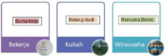

> **Deskripsi Visual:** Gambar ini adalah diagram yang menunjukkan berbagai pilihan karir atau jalur karir bagi seseorang. Diagram ini terdiri dari empat blok utama yang masing-masing menunjukkan satu pilihan karir:

1. Bekerja (Bekerja)
   - Sub-kategori: Bursa kerja, Bidang studi, Rencana bisnis

2. Kuliah (Kuliah)
   - Sub-kategori: Wirausaha

Elemen-elemen utama dalam diagram ini adalah empat blok yang masing-masing menunjukkan pilihan karir. Setiap blok memiliki sub-kategori yang lebih spesifik. Teks, angka, atau label penting yang terlihat meliputi nama-nama pilihan karir dan sub-kategori.

Informasi kunci yang dapat diambil pembaca adalah bahwa ada empat pilihan karir utama: bekerja, kuliah, wirausaha, dan bidang studi. Setiap pilihan karir memiliki sub-kategori yang lebih spesifik, seperti bursa kerja, bidang studi, dan rencana bisnis untuk bekerja, serta wirausaha untuk kuliah.

Sumber : Dokumen Kemendikbud

Gambar 2.3 Persiapan masa depan

Persiapan masa depan setelah lulus sekolah menengah dan memasuki dunia kerja dapat ditempuh melalui beberapa pilihan seperti ditunjukkan pada gambar 2.3 yang meliputi: (1) pilihan bekerja setelah lulus sekolah menengah, (2) pilihan melanjutkan kuliah, dan (3) pilihan berwirausaha. Pilihan  bekerja  setelah  lulus  diupayakan  melalui  beberapa  langkah  di antaranya dengan mendaftarkan diri di bursa kerja dan melihat informasi lowongan pekerjaan dengan segala persyaratan yang ada. Pencari kerja juga  dapat  membekali  diri  dengan  mengikuti  sertifi  kasi  kompetensi dari Lembaga Sertifi  kasi Profesi (LSP) yang ada. Kompetensi dipertajam dengan mengikuti pelatihan di Balai Latihan Kerja (BLK) dengan berbagai program yang sesuai dan mengikuti uji kompetensi untuk mendapatkan sertifi  kat kompetensi seperti ditunjukkan pada gambar 2.4 berikut.

Sumber : Dokumen Kemendikbud

Gambar 2.4 Sertifi  kat kompetensi

 

---
## 📄 Halaman 51

Kelembagaan  sertifi  kasi  profesi  dibedakan  menjadi  beberapa  bagian yang  terdiri  atas:  (1)  LSP  Pihak  3,  didirikan  oleh  asosiasi  industri  dan profesi dengan dukungan lembaga teknis pemerintah; (2) LSP Pihak 2, didirikan oleh industri untuk melakukan sertifi  kasi pemasoknya; (3) LSP Pihak 1, yang didirikan oleh industri atau lembaga pendidikan vokasi; (4) LSP Profi  siensi, didirikan oleh industri atau organisasi dengan dukungan asosiasi  profesi  untuk  memelihara  kompetensi  profesi.  Lamaran  kerja dibuat dan dilengkapi dengan daftar riwayat hidup atau Curriculum Vitae (CV)  yang  dilampiri  dengan  sertifi  kat  kompetensi  yang  dimiliki  yang sesuai. Persiapan yang tidak kalah pentingnya adalah mengembangkan diri  dengan  perilaku  kerja  yang  disiplin,  jujur,  bertanggung  jawab, semangat juang tinggi, dan berintegritas.

Gambar 2.5 Drafter

Pilihan untuk melanjutkan kuliah yang harus menjadi perhatian khusus adalah memikirkan dan merencanakan apa yang dilakukan setelah lulus kuliah,  bidang  studi  apa  yang  akan  dipelajari,  mendaftarkan  diri,  dan mempersiapkan diri untuk seleksi masuk di perguruan tinggi. Informasi perguruan tinggi, bidang studi yang ditawarkan, dan pendaftaran dapat dibuka  pada  masing-masing  alamat website perguruan  tinggi  yang terkait.

Pilihan  mendirikan  usaha  diawali  dengan  menyusun  rencana  bisnis, persiapan  modal  kerja,  menentukan  sasaran  konsumen,  lokasi  tempat usaha,  rekan  kerja  sama,  dan  pesaing.  Gambar  2.5  menggambarkan sumber daya yang memilki kemampuan penggunaan software AutoCAD , Autodesk Inventor , Solidworks .  Usaha jasa yang dapat dikembangkan di antaranya  berupa  jasa drafting , engineering  service , mechanical  design . Identifi  kasi sumber daya yang ada meliputi sumber daya manusia yang memiliki kompetensi, sumber daya alam sebagai bahan baku, keinginan pasar yang membutuhkan jasa, menjadi penting untuk memulai usaha jasa  profesi.  Pemanfaatan  sumber  daya  alam  di  antaranya  meliputi pengolahan hasil pertanian, perkebunan, perikanan, peternakan, mineral yang diolah menjadi produk dan memiliki nilai tambah.

 

---
## 📄 Halaman 52

### Jasa Profesi dan Profesionalisme

Wirausaha   dalam  sektor  jasa  terus  yang  tumbuh  disertai  dengan  penerapan teknologi baru, semakin memperkuat perekonomian di bidang jasa dan mengharuskan  seseorang  mempunyai  keterampilan  di  bidang  usaha yang ditekuni. Pasar yang berubah menuntut penyesuaian penyedia jasa untuk terus memperbaiki kualitas pelayanan secara berkelanjutan. Jasa profesi menuntut profesionalisme dari seorang profesional pada setiap sektor. Profesionalisme merupakan sikap dari seorang profesional. Kaum profesional adalah orang-orang yang memiliki tolak ukur perilaku yang tinggi, yaitu pola perilaku yang baik dalam pelayanan untuk kepentingan masyarakat di segala bidang kegiatan dan kehidupan, sehingga tercipta kualitas masyarakat yang semakin baik.

---
**🖼️ Gambar/Diagram**

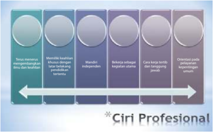

> **Deskripsi Visual:** Gambar ini adalah diagram yang menunjukkan ciri-ciri profesional. Diagram ini terdiri dari empat lingkaran berwarna hijau yang disusun dalam urutan horizontal dari kiri ke kanan. Setiap lingkaran memiliki teks yang menjelaskan ciri-ciri tersebut:

1. Lingkaran pertama: "Bersikap netral tentang isu-isu dan konflik."
2. Lingkaran kedua: "Mendalami konflik dengan pendekatan vertikal."
3. Lingkaran ketiga: "Mandiri dan independen."
4. Lingkaran keempat: "Berkerja sebagai negarawan penuh."

Lingkaran-lingkaran ini disambungkan oleh garis lurus yang membentuk sebuah garis lurus dari kiri ke kanan. Di bawah garis tersebut, ada teks yang menyatakan "Ciri Profesional" dengan asterisk di sebelah kiri.

Elemen-elemen utama dalam gambar ini adalah empat lingkaran dan garis lurus yang menghubungkannya. Garis lurus ini menunjukkan arah atau urutan dari ciri-ciri profesional tersebut. Teks pada setiap lingkaran memberikan informasi spesifik tentang ciri-ciri tersebut.

Informasi kunci yang dapat diambil pembaca melalui gambar ini adalah bahwa ciri-ciri profesional melibatkan sikap netral terhadap isu-isu dan konflik, pendekatan vertikal dalam mendalami konflik, mandiri dan independen, serta kerja sebagai negarawan penuh.

Sumber : Dokumen Kemendikbud

Gambar 2.6 Ciri Profesional

Ciri  profesional  seperti  ditunjukkan  pada  Gambar  2.6  di  antaranya: (1)  terus  menerus  mengembangkan  ilmu  dan  keahlian;  (2)  memiliki keahlian khusus dengan latar belakang pendidikan tertentu; (3) mandiri independen;  (4)  bekerja  sebagai  kegiatan  utama;  (5)  cara  kerja  tertib dan  bertanggung  jawab;  (6)  berorientasi  pada  pelayanan  mengabdi kepentingan umum.

Wirausahawan bidang jasa profesi menjadi penting untuk terus meningkatkan  kompetensi.  Hal  penting  yang  menjadi  perhatian  bagi calon  wirausahawan  terdapat  beberapa  ciri-ciri  wirausahawan  seperti pada gambar 2.7, di antaranya: 1) melangkah dengan berorientasi pada efektivitas  dan  efi  siensi,  2)  memiliki  jiwa  kepemimpinan,  3)  bertindak sebagai  motivator,  4)  berani  ambil  resiko,  5)  semangat  mengatasi kesulitan, 6) memiliki daya inovasi, kreasi, dan imajinasi tinggi, 7) tepat

 

---
## 📄 Halaman 53

dalam menerapkan prinsip ekonomi, 8) memilih sistem manajemen yang tepat,  9)  adaptif  terhadap  perubahan  lingkungan,  10)  berfi  kir  analisis, dan 11) melakukan review untuk pengembangan berkelanjutan.

---
**🖼️ Gambar/Diagram**

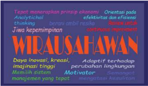

> **Deskripsi Visual:** Gambar ini adalah ilustrasi yang menampilkan teks berwarna-warni yang membahas tentang wirausaha. Gambar ini terdiri dari beberapa elemen utama:

1. **Apa yang Ditampilkan Secara Keseluruhan**: Gambar ini menggambarkan sebuah papan tulis atau poster yang berisi informasi tentang wirausaha. Papan tersebut terdiri dari berbagai teks berwarna yang berbeda, masing-masing menunjukkan aspek atau prinsip penting dari wirausaha.

2. **Elemen-Elemen Utama dan Relasinya**: 
   - **Teks Berwarna**: Ada berbagai teks berwarna yang berbeda, masing-masing menunjukkan aspek atau prinsip penting dari wirausaha.
   - **Prinsip Ekonomi**: "Tetap menerapkan prinsip ekonomi" dinyatakan dengan warna biru.
   - **Analytical thinking**: "Orientasi pada efektivitas dan efisiensi" dinyatakan dengan warna hijau.
   - **Jiwa kepemimpinan**: "Adaptif terhadap perubahan lingkungan" dinyatakan dengan warna merah.
   - **Daya invasi, kreativitas, imajinasi tinggi**: "Memiliki sistem motivator" dinyatakan dengan warna kuning.
   - **Mengimplementasikan yang tepat**: "Samungang" dinyatakan dengan warna oranye.

3. **Teks, Angka, atau Label Penting yang Terlihat**: 
   - "WIRAUSAHAWAN" adalah judul utama yang terletak di bagian atas.
   - Ada beberapa teks berwarna yang menjelaskan prinsip-prinsip penting seperti "Tetap menerapkan prinsip ekonomi", "Analytical thinking", "Orientasi pada efektivitas dan efisiensi", "Jiwa kepemimpinan", "Daya invasi, kreativitas, imajinasi tinggi", "Memiliki sistem motivator", dan "Mengimplementasikan yang tepat".

4. **Informasi Kunci yang Dapat Diambil Pembaca**: Gambar ini memberikan gambaran umum tentang aspek-as

Sumber : Dokumen Kemendikbud

Gambar 2.7 Ciri wirausahawan

Tingginya peran media elektronik dan kemudahan akses informasi tanpa batas,  serta  peningkatan  ilmu  dan  teknologi  seiring  dengan  kemajuan zaman,  dapat  menimbulkan  perubahan  gaya  hidup  masyarakat.  Peka terhadap perubahan yang ada, termasuk jasa pelayanan yang diberikan kepada masyarakat. Pedoman yang komprehensif dan integratif tentang  sikap  dan  perilaku  yang  harus  dimiliki,  berupa  kode  etik profesi,  dikembangkan  oleh  profesional  mempunyai  pengaruh  dalam menegakkan  disiplin  di  kalangan  profesi,  dapat  membawa  seseorang mengembangkan  nilai-nilai,  baik  internal  maupun  eksternal  dalam kehidupan sebagai pedoman dalam mencapai keselarasan memberikan pelayanan profesional.

Akuntabilitas  yang  dituntut  dari  seorang  profesional  adalah  tanggung jawab  dan  tanggung  gugat  atas  semua  tindakan  yang  dilakukan, sehingga semua berbasis kompetensi dan didasari oleh evidence based yang  diperkuat  dengan  suatu  landasan  hukum  yang  mengatur  batasbatas kewenangan profesi.

Standar profesi dan kode etik profesi menjadi pedoman bagi profesional untuk bertindak secara mandiri yang dilandasi oleh kemampuan berpikir logis dan sistematis. Upaya peningkatan layanan terus dilakukan melalui pendidikan  dan  pelatihan  berkelanjutan,  penelitian,  pengembangan ilmu  dan  teknologi  dibidang  profesi  yang  terkait  sehingga  tercipta kualitas  masyarakat  yang  semakin  baik.  Keberhasilan  dan  kegagalan suatu  usaha  dipengaruhi  oleh  dua  faktor,  yaitu  faktor  teknis  dan  non teknis. Faktor teknis dapat dilakukan dengan terus menjaga kualitas dan kuantitas  produk  yang  dihasilkan.  Faktor  nonteknis  yang  menentukan

 

---
## 📄 Halaman 54

keberhasilan atau kegagalan suatu usaha, antara lain : (1) perencanaan, (2) menetapkan tujuan, (3) kemampuan untuk beradaptasi dan mengatasi tantangan yang ada, (4) inovasi, (5) pemasaran yang merupakan kunci keberhasilan, (6) semangat juang tinggi.

### Tugas 1

### Observasi Jasa Profesi

Coba  perhatikan  kekuatan  diri  yang  berupa  potensi  yang  memungkinkan untuk dikembangkan sebagi perencanaan masa depan. Identifi  kasi usaha jasa profesi apa saja yang dibutuhkan. Amati dengan menggunakan referensi yang terkait  atau  media  elektronik  bersama  kelompok  untuk  melengkapi  lembar kerja sebagai berikut.

- Catatlah macam-macam dan fungsi masing-masing profesi.
- Tuliskan manfaat  jasa profesi dan profesionalisme.
- Ungkapkan  profesi  apa  saja  yang  menjadi  ketertarikan  setiap  anggota kelompok dan catat apa alasannya.
- Apa rencana  selanjutnya setelah Anda mengetahui berbagai jasa profesi dan profesionalisme?

### Lembar Kerja 1 (LK 1)

Nama kelompok

: …

Nama anggota

: …

…

…

…

…

Kelas

: …

Identi fi kasi macam-macam jasa profesi dan profesinalisme

Kesimpulan :

…

 

---
## 📄 Halaman 55

### B.  Produk Jasa Profesi dan Profesionalisme

### 1. Identifi  kasi Produk Jasa

Berkembangnya  peradaban  manusia  membutuhkan  dukungan  dalam segala lini kehidupan untuk mengembangkan sistem dalam menopang kebutuhan yang terus berkembang. Produk jasa berdasarkan keinginan pasar saat ini semakin bersaing di mana pelayanan yang lebih baik dapat menciptakan  pelanggan  yang  loyal.  Era  yang  serba  cepat  dan  praktis membutuhkan sarana  dan  layanan  yang  betul-betul  menyentuh  pada kebutuhan,  baik  yang  bersifat  primer,  sekunder,  maupun  tersier  atau kebutuhan yang lebih tinggi, yaitu bermanfaat dan bermakna bagi orang di luar dirinya.

Jasa  profesi  dan  profesionalisme  sebagai  upaya  untuk  memenuhi kebutuhan dan memperlancar aktivitas kehidupan, dapat digali dengan cara  mengidentifi  kasi  kebutuhan  hidup  manusia  sehari-hari.  Kondisi saat ini,  dengan berawal dari layanan, dapat dijadikan jasa yang dapat mendatangkan provit.

---
**🖼️ Gambar/Diagram**

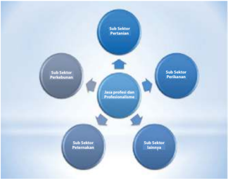

> **Deskripsi Visual:** Gambar ini adalah diagram yang menunjukkan struktur organisasi atau sistem kerja. Diagram ini menggambarkan empat subsektor yang terhubung ke satu pusat, yang disebut "Jasa Profesi dan Profesionalisme". Setiap subsektor memiliki ikatan arah berbentuk tanda panah yang mengarah ke pusat, menunjukkan hubungan atau interaksi antara mereka. Subsektor pertama dan kedua masing-masing memiliki ikatan arah ke pusat, sementara subsektor ketiga dan keempat memiliki ikatan arah menuju subsektor pertama dan kedua. Ini menunjukkan bahwa subsektor pertama dan kedua memiliki hubungan lebih dekat dengan pusat daripada subsektor ketiga dan keempat. Teks penting dalam diagram ini adalah "Sub Sektor Pertanian", "Sub Sektor Perikanan", "Sub Sektor Pertanian", dan "Sub Sektor Pertanian". Informasi kunci yang dapat diambil pembaca adalah bahwa struktur ini mungkin merujuk pada sistem kerja atau organisasi yang terdiri dari empat subsektor yang saling terkait dan bekerja sama untuk mencapai tujuan bersama.

Sumber : Dokumen Kemendikbud

Gambar 2.8

Sektor Jasa Profesi

Usaha  produk  jasa  harus  mempertimbangkan  permintaan,  selera,  dan keinginan  konsumen  terhadap  jasa  yang  ditawarkan.  Oleh  karena  itu, penghasil  produk  jasa  selalu  berusaha  melakukan  inovasi  terhadap jenis jasa yang benar-benar dibutuhkan konsumen yang sangat

 

---
## 📄 Halaman 56

tergantung pada keahlian dan keterampilan, penafsiran terhadap informasi, pemasaran produk, selera, dan pelayanan konsumen. Gambar 2.8  menunjukkan  subsektor  yang  meliputi  pertanian,  perkebunan, peternakan,  perikanan,  dan  sektor  lain  yang  memungkinkan  untuk dikembangkan  usaha  jasa  profesi. Produk  jasa memiliki ciri tidak berwujud, tidak dapat dipisahkan dari sumbernya, mudah berubah-ubah tergantung pada kapan, di mana, dan siapa penyedia jasanya, dan daya tahan yang tergantung permintaan.

Ragam lain  dari  jasa  profesi  yang  dapat  kita  jumpai  dalam  kehidupan sehari-hari  adalah  jasa  penyedia  menu  makanan  bagi  usia  balita, dilengkapi  informasi  gizi,  dengan  kreatif  dibentuk  beraneka  macam boneka,  bunga  atau  kartun  yang  menjadi  kesukaan  anak  usia  balita. Banyaknya  komunitas  yang  marak  berkembang  saat  ini  juga  dapat menjadi peluang untuk menciptakan lapangan jasa profesi yang dapat mendatangkan profi  t di antaranya profesi fotografer, kameramen, drafter, desainer  pakaian,  setter,  penyiar  televisi  atau  radio,  sablon,  kartunis, animator,  dan  masih  banyak  profesi-profesi  lain  dan  profesionalisme yang masih bisa digali di seputar kehidupan yang dapat dikreasi menjadi bentuk usaha jasa profesi.

Kunci dari keberhasilan usaha jasa adalah terus melakukan inovasi dan belajar untuk menyempurnakan kompetensi dalam menjalankan usaha yang sedang ditekuni dan menjadi pilihan untuk benar-benar bertindak secara  profesionalisme  dengan  memperhatikan  rambu-rambu  yang harus  dikuasai  untuk  mendukung  profesi  tersebut.  Pengembangan produk  jasa  semakin  meluas  seiring  dengan  kemajuan  teknologi  dan ilmu  pengetahuan  seperti  digambarkan  pada  Gambar  2.9  Jasa  Profesi bidang Teknologi Informasi.

---
**🖼️ Gambar/Diagram**

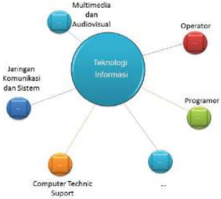

> **Deskripsi Visual:** Gambar ini adalah diagram yang menunjukkan hubungan antara berbagai komponen teknologi informasi. Diagram ini terdiri dari beberapa elemen utama yang terhubung melalui garis, yang menunjukkan hubungan antara mereka.

1. **Apa yang Ditampilkan Secara Keseluruhan**: Gambar ini menunjukkan struktur dan hubungan antara berbagai komponen teknologi informasi, termasuk multimedia dan audiovisual, jaringan komunikasi dan sistem, operator, programmer, dan dukungan teknis komputer.

2. **Elemen-Elemen Utama dan Relasinya**: 
   - **Multimedia dan Audiovisual** terletak di bagian atas dan terhubung dengan **Jaringan Komunikasi dan Sistem**.
   - **Jaringan Komunikasi dan Sistem** terhubung dengan **Operator**, **Programmer**, dan **Computer Technic Support**.
   - **Operator** dan **Programmer** terhubung satu sama lain.
   - **Computer Technic Support** terhubung dengan **Jaringan Komunikasi dan Sistem**.

3. **Teks, Angka, atau Label Penting yang Terlihat**: 
   - Ada beberapa teks yang mungkin menyertakan nama atau deskripsi untuk setiap elemen, namun tidak dapat dilihat dalam gambar ini karena ukurannya kecil atau tidak jelas.

4. **Informasi Kunci yang Bisa Diambil Pembaca**: 
   - Gambar ini menunjukkan bahwa teknologi informasi terdiri dari berbagai komponen yang saling terkait, mulai dari penggunaan multimedia dan audiovisual hingga dukungan teknis komputer. Ini menunjukkan bahwa setiap komponen memiliki peran penting dalam sistem teknologi informasi.

Dengan demikian, gambar ini menggambarkan struktur dan hubungan antara berbagai komponen teknologi informasi, menunjukkan bahwa setiap komponen memiliki peran penting dalam sistem tersebut.

 

---
## 📄 Halaman 57

---
**🖼️ Gambar/Diagram**

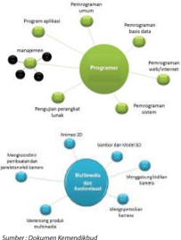

> **Deskripsi Visual:** Gambar ini adalah diagram yang menunjukkan struktur dan hubungan antara berbagai aspek program kerja. Diagram ini terdiri dari elemen utama seperti "Programmer", "Penggunaan", "Pengorganisasian", "Sistem", dan "Bahan". "Programmer" merupakan pusat diagram, menghubungkan semua elemen lainnya melalui relasi hubungan. "Penggunaan" terletak di sekitar "Programmer", menunjukkan bahwa penggunaan program adalah bagian integral dari program kerja. "Pengorganisasian" juga terletak di sekitar "Programmer", menunjukkan bahwa pengorganisasian adalah faktor penting dalam penggunaan program. "Sistem" terletak di sekitar "Penggunaan", menunjukkan bahwa sistem adalah bagian dari penggunaan program. "Bahan" terletak di sekitar "Penggunaan", menunjukkan bahwa bahan adalah bagian dari penggunaan program. Teks, angka, atau label penting yang terlihat dalam diagram ini adalah "Programmer", "Penggunaan", "Pengorganisasian", "Sistem", dan "Bahan". Informasi kunci yang dapat diambil pembaca adalah bahwa struktur program kerja melibatkan beberapa aspek utama, termasuk programmer, penggunaan, pengorganisasian, sistem, dan bahan.

Sumber : Dokumen Kemendikbud

Usaha jasa berbasis pelanggan dimaksudkan adalah jasa yang dibuat atas dasar  sasaran  layanan  pasar  dan  variabel  yang  berpengaruh  signifi  kan atas  penggunaan jasa oleh pelanggan. Peluang usaha jasa profesi dan profesionalisme  terdapat  pada  berbagai  sektor,  di  antaranya  sektor pertanian,  perikanan,  perkebunan,  pendidikan,  kesehatan,  akutansi, transportasi,  atau  sektor  lain  yang  termasuk  dalam  sektor  pendukung industri kreatif seperti ditunjukkan pada Gambar 2.10.

---
**🖼️ Gambar/Diagram**

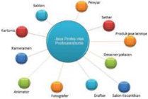

> **Deskripsi Visual:** Gambar ini adalah diagram yang menunjukkan hubungan antara berbagai profesi dalam industri perhotelan. Diagram ini terdiri dari beberapa elemen utama:

1. **Pertama**: Gambar ini menunjukkan hubungan antara berbagai profesi dalam industri perhotelan. Profesi tersebut meliputi:
   - Penyedia (Sektor)
   - Penyewa (Sektor)
   - Penginapan (Sektor)
   - Penyedia layanan (Sektor)
   - Penyewa layanan (Sektor)

2. **Elemen-elemen utama dan relasinya**: 
   - **Penyedia** (Sektor) memiliki hubungan dengan **Penyewa** (Sektor), yang kemudian memiliki hubungan dengan **Penginapan** (Sektor).
   - **Penyewa** (Sektor) juga memiliki hubungan dengan **Penyedia layanan** (Sektor), yang kemudian memiliki hubungan dengan **Penyewa layanan** (Sektor).

3. **Teks, angka, atau label penting yang terlihat**:
   - Ada beberapa teks yang menunjukkan nama-nama profesi dan sektor, seperti "Penyedia", "Penyewa", "Penginapan", "Penyedia layanan", dan "Penyewa layanan".

4. **Informasi kunci yang dapat diambil pembaca**:
   - Gambar ini memberikan gambaran tentang struktur dan hubungan antar profesi dalam industri perhotelan. Pembaca dapat memahami bahwa setiap profesi memiliki hubungan dengan satu atau lebih profesi lainnya.

Dengan demikian, gambar ini membantu pembaca memahami struktur dan hubungan antar profesi dalam industri perhotelan.

Gambar 2.10 Jasa Profesi

 

---
## 📄 Halaman 58

Usaha  jasa  diawali  dengan  berusaha  mendapatkan    informasi  dari kebutuhan  dan  harapan  pelanggan,  sehingga  mendapatkan  informasi yang tepat, akurat, dan bermanfaat untuk ditindaklanjuti dalam menyiapkan jasa sesuai dengan harapan pelanggan, sehingga didapatkan layanan yang tepat, efektif, dan efi  sien.

Segmentasi  pelanggan  ditentukan  atas  dasar,  di  antaranya  variabel usia pengguna  produk jasa, jenjang pendidikan, jenis pekerjaan, frekuensi  penggunaan  produk  jasa,  area  atau  daerah  tempat  tinggal, jenis  komunitas.  Variabel  yang  dibuat  kemudian  diolah  berdasarkan persamaan perilaku pelanggan untuk mendapatkan suatu produk sesuai dengan  harapan  pelanggan.  Pertimbangan  yang  perlu  diperhatikan dalam melakukan segmentasi pasar produk jasa, di antaranya peluang pasar  yang  ada,  perkembangan  perekonomian,  teknologi  dalam  era global,  sistem  segmentasi  yang  dilalukan  pesaing,  profi  tabilitas  setiap pelanggan atau komunitas, kekinian, faktor demografi  , dan perubahan perilaku pelanggan.

### 2. Sistem Produksi Usaha Jasa

### a. Ide dan Peluang Usaha Jasa Profesi dan Profesionalisme

Ide  dan  peluang  usaha  jasa  profesi  dibangun  melalui  kreativitas dan inovasi pelaku usaha. Industri kreatif merupakan pemanfaatan kreativitas,  keterampilan,  serta  bakat  individu  untuk  menciptakan kesejahteraan dan lapangan pekerjaan dengan menghasilkan daya cipta dan kreasi seseorang. Perkembangan industri kreatif ( creative industry )  dapat membawa  arena  baru  untuk  terus  meningkatkan kreativitas dan  inovasi  bagi  sumber  daya  manusia  yang  ada. Kreativitas  manusia  sebagai  sumber  daya  ekonomi  yang  memiliki nilai  dan  manfaat  yang  tinggi  untuk  peningkatan  perekonomian Indonesia.

 

---
## 📄 Halaman 59

---
**🖼️ Gambar/Diagram**

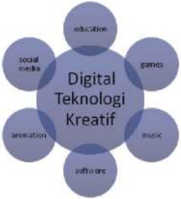

> **Deskripsi Visual:** Gambar ini adalah diagram yang menunjukkan topik-topik digital teknologi kreatif. Diagram ini terdiri dari berbagai elemen yang terhubung dengan tautan lingkaran yang mengelilingi kata "Digital Teknologi Kreatif". Elemen utama yang terlihat antara lain:

1. Education (Pendidikan)
2. Social Media (Sosial Media)
3. Games (Game)
4. Animation (Animasi)
5. Music (Muzik)
6. Software (Software)

Teks, angka, atau label penting yang terlihat meliputi:
- "Digital Teknologi Kreatif" yang terletak di tengah diagram
- Berbagai topik digital teknologi kreatif yang terdapat di dalam lingkaran

Informasi kunci yang dapat diambil pembaca meliputi:
- Topik-topik digital teknologi kreatif yang disebutkan dalam buku pelajaran ini
- Hubungan antara topik-topik tersebut dalam konteks digital teknologi kreatif

Dalam paragraf ini, saya telah menjelaskan bahwa gambar ini adalah diagram yang menunjukkan topik-topik digital teknologi kreatif. Diagram ini terdiri dari berbagai elemen yang terhubung dengan tautan lingkaran yang mengelilingi kata "Digital Teknologi Kreatif". Elemen utama yang terlihat antara lain pendidikan, sosial media, game, animasi, muzik, dan software. Teks, angka, atau label penting yang terlihat meliputi "Digital Teknologi Kreatif", pendidikan, sosial media, game, animasi, muzik, dan software. Informasi kunci yang dapat diambil pembaca meliputi topik-topik digital teknologi kreatif yang disebutkan dalam buku pelajaran ini dan hubungan antara topik-topik tersebut dalam konteks digital teknologi kreatif.

Sumber : Dokumen Kemendikbud

Gambar 2.12

Industri kreatif digital

Kekuatan industri kreatif saat ini di antaranya industri kreatif berbasis teknologi digital atau disebut Digital Company . Industri kreatif digital terdapat games,  education,  music,  animation,  software, dan social media seperti  yang  ditunjukkan  pada  Gambar  2.12.  Kemandirian dalam menggali ide, memilih potensi produk yang dapat bersaing, baik di tingkat lokal maupun global dapat meningkatkan keanekaragaman produk yang memiliki nilai dan daya saing tinggi dalam memenuhi kebutuhan.

Industri  kreatif  digital  di  bidang  pendidikan (Education) ,  dapat dikembangkan  antara  lain  sistem  informasi  aplikasi  pendidikan, media  pembelajaran  interaktif,  promosi  produk,  pariwisata,  dan budaya.

Industri games di  Indonesia  terbilang  masih  cukup  muda  yang telah ditangani oleh developer game yang memiliki kualitas tinggi dan semangat kuat. Passion dan hobi yang dikembangkan melalui pengetahuan dan keterampilan di bidang computer scient ditambah dengan mengembangkan sikap percaya diri, jujur, mandiri, disiplin, kerja  sama  dan  bertanggung jawab, dapat membawa produk jasa kreatif  dan  inovatif  yang  mampu  bersaing  secara  global.  Salah satu  contoh asset game yang  berupa  desain,  di  antaranya  gambar mobil, environment, gambar  tiga  dimensi  pada  beberapa games yang telah mengglobal sebagai karya kreatif sumber daya manusia dari  Indonesia.  Semangat  usaha  dalam  pembuatan game sangat dibutuhkan dalam menghasilkan produk komersial untuk mengisi pasar  global,  sehingga  upaya  membuka  peluang  kerja  sama  dan networking menjadi sangat penting.

 

---
## 📄 Halaman 60

Industri kreatif digital dalam pengembangan  konten animasi merupakan  salah satu peluang pasar dalam berbagai sektor. Pembuatan  karakter, teknologi perfi  lman, kemampuan  inovasi dan  kreativitas,  cerita  animasi,  infrastuktur,  menguasai  jaringan pemasaran dan produksi merupakan beberapa faktor dalam pembuatan produk animasi. Industri kreatif digital di bidang musik, software, dan  media  sosial  juga  mengalami  perkembangan  cukup pesat  di  Indonesia  yang  memiliki  partisipasi  ekonomi,  mengalami peningkatan, dan memiliki peran penting bagi kemajuan.

### b. Sumber Daya yang Dibutuhkan dalam Usaha Jasa Profesi dan Profesionalisme

Sumber  daya  manusia  sebagai  pelaku  usaha  jasa  profesi  dan profesionalisme harus memiliki persyaratan-persyaratan yang disesuaikan dengan  sektor yang membutuhkan  jasa  tersebut. Persyaratan  berupa  kompetensi  kerja,  perlu  dikembangkan  pada seorang profesional. Kompetensi  kerja yang dimaksud  seperti ditunjukkan pada Gambar 2.13, meliputi :

- Kompetensi personal ( emotionalstability, selfmanagement, orientation towards work )
- Kompetensi sosial ( capability for communication and teamwork )
- Kompetensi teknis ( subject related skill, knowledge, and abillities )
- Kompetensi  metodologi  ( analysis,  planning,  abstract  thinking, implementation and control, information )

---
**🖼️ Gambar/Diagram**

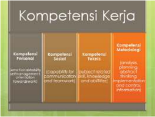

> **Deskripsi Visual:** Gambar ini adalah diagram yang menunjukkan kompetensi kerja dalam berbagai aspek. Diagram ini terdiri dari empat bagian vertikal yang masing-masing menunjukkan kompetensi kerja yang berbeda. Setiap bagian memiliki judul yang berbeda dan informasi yang relevan dengan kompetensi tersebut.

1. **Apa yang Ditampilkan Secara Keseluruhan**: Gambar ini menunjukkan struktur kompetensi kerja dalam bentuk diagram vertikal. Setiap bagian menggambarkan kompetensi yang berbeda, mulai dari kompetensi pribadi, kompetensi sosial, kompetensi teknis, hingga kompetensi manajemen.

2. **Elemen-Elemen Utama dan Relasinya**: 
   - **Kompetensi Pribadi** (bagian pertama): Menunjukkan kemampuan untuk berpikir kritis, kreatif, dan konsisten.
   - **Kompetensi Sosial** (bagian kedua): Menggambarkan kemampuan untuk berkomunikasi efektif dan membangun hubungan.
   - **Kompetensi Teknis** (bagian ketiga): Menunjukkan pengetahuan dan keterampilan spesifik dalam bidang kerja.
   - **Kompetensi Manajemen** (bagian keempat): Menggambarkan kemampuan untuk mengelola waktu, sumber daya, dan proyek.

3. **Teks, Angka, atau Label Penting yang Terlihat**: 
   - Judul "Kompetensi Kerja" yang terletak di atas diagram.
   - Judul setiap bagian (Kompetensi Pribadi, Kompetensi Sosial, Kompetensi Teknis, Kompetensi Manajemen).
   - Informasi tentang kemampuan-kemampuan yang dimaksud dalam setiap bagian.

4. **Informasi Kunci yang Dapat Diambil Pembaca**: 
   - Diagram ini memberikan gambaran umum tentang struktur kompetensi kerja yang meliputi aspek-aspek penting seperti pribadi, sosial, teknis, dan manajerial.
   - Pembaca dapat memahami bahwa setiap kompetensi memiliki peran yang berbeda dalam sukses kerja.
   - Ini juga memb

Sumber : Dokumen Kemendikbud

Gambar 2.13 Kompetensi Kerja

 

---
## 📄 Halaman 61

Keterampilan bekerja yang dikembangkan oleh seorang profesional meliputi:

- komunikasi , berkontribusi produktif dan hubungan yang harmonis di antara karyawan dan pelanggan
- teamwork, berkontribusi  produktif  terhadap  hubungan  dan hasil kerja
- problem solving , berkontribusi produktif terhadap hasil guna
- inisiatif dan enterprise ,  berkontribusi  untuk  hasil  guna  yang inovatif
- self-management, berkontribusi untuk kepuasan dan pertumbuhan pekerja
- belajar, berkontribusi  pada  peningkatan  berkelanjutan  dan ekspansi pada pekerja dan operasi perusahaan dan hasilnya
- teknologi , berkontribusi untuk melaksanakan pekerjaan secara efektif
Sumber  daya  manusia  yang  dibutuhkan  dalam  usaha  jasa  profesi dan memiliki profesionalisme tinggi, di antaranya:

### Profesi Bidan

Sumber : http://www.artikelkebidanan.com

Bidan  sebagai  profesi  mendampingi  seorang  ibu  menghadapi persalinan  atau  kelahiran,  sehingga  ibu  dan  bayi  lahir  dengan selamat.  Bidan  diperlukan  untuk  meningkatkan  kesejahteraan  ibu dan janin dalam menjalankan proses reproduksi.

Ikatan  Bidan  Indonesia  (IBI)  menetapkan  bahwa  Bidan  Indonesia adalah seorang perempuan yang lulus dari pendidikan bidan yang diakui pemerintah dan organisasi profesi di wilayah Negara Republik

 

---
## 📄 Halaman 62

Indonesia,  serta  memiliki  kompetensi  dan  kualifi  kasi  lisensi  untuk menjalankan praktik kebidanan. Profesi Bidan dipersiapkan melalui proses pendidikan dengan serangkaian pendidikan ilmiah dan terus mengembangkan pelayanan kepada masyarakat, dan memiliki kode etik yang harus dipenuhi dalam menjalankan profesinya.

Wawasan  sosial  yang  luas  yang  didasari  pada  nilai-nilai  positif terhadap  perannya  dan  termotivasi  untuk  berkarya  dengan  baik. Bidan memiliki organisasi profesi untuk terus meningkatkan kualitas pelayanan  yang diberikan oleh anggotanya dan berhak memperoleh imbalan dari pelayanan yang diberikan.

Bekerja  sebagai  mitra  perempuan  dalam  memberikan  dukungan asuhan dan nasihat selama masa hamil, masa persalinan dan masa nifas,  memimpin  persalinan,  memberikan  asuhan  bayi  yang  baru lahir yang mencakup  upaya pencegahan, promosi persalinan normal, deteksi komplikasi pada ibu dan anak, akses bantuan medis dan  bantuan  lain  yang  sesuai,  serta  melaksanakan  tindakan  ke gawat darurat. Tugas penting lain adalah konseling dan pendidikan kesehatan pada keluarga dan masyarakat.

### Profesi Aircraft Engineer

 

---
## 📄 Halaman 63

Sumber : Leman

Gambar 2.15 C-check perawatan pesawat

Sektor perhubungan udara merupakan salah satu transportasi yang banyak diminati masyarakat terkait dengan faktor geografi  s Indonesa yang terdiri atas kepulauan. Akses dari satu pulau ke pulau lain selain lewat  perhubungan  darat,  juga  dilakukan  melalui  perhubungan udara.  Hal  ini    banyak  membutuhkan  tenaga  terampil  di  bidang jasa perawatan, perbaikan pesawat, jasa layanan kargo dan logistik, dengan ditunjang adanya pusat desain pesawat ( desain centre ) dan maintenance centre yang tidak menutup kemungkinan bagi generasi muda  untuk  dapat  belajar  dan  berpengalaman  di  dalamnya  dan berprofesi  di  bidang maintenance, mendesain  pesawat  dengan keragaman  tipe  dan  bodi  pesawat.  Gambar  2.15  menunjukkan aktivitas  tenaga  profesi  dalam  perawatan  C-Check,  di  antaranya meliputi  kegiatan  pelepasan main  landing  gear sebagai  tumpuan pesawat ,  fi   n dan rader pada vertical stabilizer , Augselary Power Unit (APU), dan pintu pesawat.

Maintenance Specifi  cation ( Mainspec )  sebagai  data  spesifi  kasi  yang dibuat oleh perusahaan pembuat pesawat, menuntun dalam caracara perawatan sesuai dengan standar yang diberlakukan. Perawatan yang dimaksud meliputi beberapa kategori, di antaranya : (1) Daily Check, inspeksi harian yang mengecek kondisi pesawat, di antaranya meliputi kondisi engine , bodi pesawat, tekanan ban, landing gear , (2) Transit Check ,  setiap  transit  harus  dilakukan  inspeksi,  yaitu  melihat kondisi general pesawat, (3) Weekly Check ,  mengecek kondisi pesawat berkala setiap minggu sekali, di antaranya meliputi kondisi dari wing ,

 

---
## 📄 Halaman 64

pintu  pesawat, wheel  well  / kondisi  seputar  roda  pendaratan  (4) A-Check ,  yaitu inspeksi setiap 250 jam terbang untuk layak terbang meliputi servicing engine (misalnya engine oil ,  CSD/ Constant Speed Driver , Generator ,  IDG / Integrated Drive Generator ),  lubrikasi bagian wing meliputi leading edge fl  ap dan triling  edge  fl  ap ,  lubrikasi  ekor pesawat ( tail )  meliputi horizontal stabilizer dan sirip tegak / rudder . Selain servicing  engine juga  dilakukan borescope  inspection yaitu pengecekan kondisi dalam engine meliputi kompresor, c ombustion chamber , turbine blade (5) C-Check ,  yaitu melakukan inspeksi setiap 10 kali dilakukan A-Check (2500 jam) meliputi pengecekan bearing , fl   ight control , engine  mounting (6)  O verhoul, yaitu melakukan pengecekan setelah 10 kali C-check, meliputi di antaranya pelepasan dan assembling dari  semua fl   ight  control,  engine,  Air  Cyrcle  Mechine (ACM), Auxiliary Power Unit (APU), Cargo Floor , Passenger Floor guna pengecekan  korosi  / corrotion dan  kondisi  pesawat.  Perawatan pesawat digunakan Aircraft Maintenance Manual Book dan keterampilan membaca Wiring Diagram Manual (WDM).

Untuk berkarir dalam dunia penerbangan, setelah tamat dari Sekolah Menengah Atas atau Kejuruan, siswa dapat melanjutkan ke sekolah penerbangan  yang  diakui  pemerintah  dengan  bidang  keahlian  di antaranya pilot, fl   ight  operation offi ce , avionic , airframe power plan t, logistic dan cargo , ticketing ,  jasa  pelayanan  penumpang  pesawat. Seorang  profesional  yang  melakukan maintenance pesawat,  harus memiliki  beberapa license untuk  dapat  menjadi  seorang engineer . Sertifi  kat  Amel  ( Aircraft Maintenance Engineer License )  di  antaranya memiliki basic  license , type  rating  Aircraft seperti  pesawat  Airbus A320, A330, dan Boing 737 - 800 ER dengan pengalaman melakukan perawatan  pesawat,  baik  di  bidang  Avionic  (perawatan  bagian instrumentasi / kelistrikan pesawat) maupun bidang Engine Airframe (EA) meliputi mesin dan badan pesawat.

---
**🖼️ Gambar/Diagram**

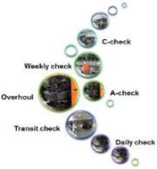

> **Deskripsi Visual:** Gambar ini adalah diagram yang menunjukkan berbagai jenis pemeriksaan rutin yang dilakukan pada sebuah sistem atau perangkat. Diagram ini terdiri dari beberapa elemen utama yang terhubung melalui garis, masing-masing menunjukkan jenis pemeriksaan yang berbeda:

1. **Akan ada deskripsi tentang jenis-jenis pemeriksaan tersebut**:
   - **Weekly check**: Pemeriksaan mingguan.
   - **Overhead**: Pemeriksaan yang melibatkan bagian atas.
   - **Transit check**: Pemeriksaan yang dilakukan selama perjalanan.
   - **Daily check**: Pemeriksaan harian.

2. **Elemen-elemen utama dan relasinya**:
   - Setiap jenis pemeriksaan memiliki ikon yang berbeda untuk menunjukkan jenisnya.
   - Garis menghubungkan antara semua jenis pemeriksaan ini, menunjukkan hubungan antara mereka dalam proses pemeliharaan atau perawatan.

3. **Teks, angka, atau label penting yang terlihat**:
   - Ada teks "Weekly check", "Overhead", "Transit check", dan "Daily check" yang menjelaskan jenis-jenis pemeriksaan.
   - Angka tidak terlihat dalam gambar ini.

4. **Informasi kunci yang dapat diambil pembaca**:
   - Gambar ini memberikan gambaran umum tentang struktur dan urutan pemeriksaan rutin yang biasanya dilakukan pada suatu sistem atau perangkat.
   - Pembaca dapat memahami bahwa ada berbagai tahap dalam pemeliharaan yang harus dilakukan secara berkala.

Dengan demikian, gambar ini membantu dalam memahami proses pemeliharaan yang harus dilakukan pada sistem atau perangkat dengan cara yang sistematis dan teratur.

Gambar 2.16 Perawatan berkala pesawat

 

---
## 📄 Halaman 65

### Profesi Auditor

Profesi auditor atau akuntan publik secara independen memberikan jasa  bagi  masyarakat  berupa  jasa  penjaminan  dan  jasa  bukan penjaminan. Jasa penjaminan merupakan jasa profesional independen untuk meningkatkan informasi bagi pengambil keputusan yang diperlukan keandalan dan relevansi sebagai dasar untuk mengambil keputusan. Profesional harus memiliki kompetensi independensi berkaitan dengan informasi yang diperiksa.

---
**🖼️ Gambar/Diagram**

> **Deskripsi Visual:** Gambar ini menunjukkan seorang siswa sedang belajar di meja belajar. Siswa tersebut sedang menggunakan laptop untuk membaca buku pelajaran. Meja belajar tersebut dilengkapi dengan beberapa alat tulis seperti pensil, pena, dan kertas. Siswa tersebut juga sedang memegang sebuah buku pelajaran yang terbuka di atas meja belajar. Gambar ini menunjukkan bahwa siswa tersebut sedang mengikuti proses belajar yang aktif dan berinteraksi dengan materi pelajaran melalui laptop.

Gambar 2.17 Profesi auditor

Jasa pemeringkatan televisi, jasa pengujian produk oleh organisasi  konsumen,  jasa  penjaminan  atas  informasi  tentang  pengawasan website sebagai bagian dari jasa yang diberikan oleh profesi akuntan publik. Selain itu, terdapat jasa atestasi yang menerbitkan laporan tertulis yang merupakan kesimpulan tentang keandalan pernyataan tertulis yang dibuat oleh pihak lain. Jasa bukan penjaminan merupakan jasa yang independen, meliputi jasa akuntasi, jasa perpajakan, jasa konsultasi manajemen.

### c. Potensi Produk Jasa di Daerah

Wilayah  kerja  pembangunan  di  daerah  terbagi  menjadi  wilayah yang  diarahkan  pada  kegiatan  pembangunan,  di  antaranya  di bidang:  industri,  perdagangan,  pemukiman,  pariwisata,  pertanian, pertambangan, kehutanan, pendidikan.

 

---
## 📄 Halaman 66

Potensi penduduk yang terus bertambah, di mana banyak membutuhkan  layanan  jasa  untuk  memenuhi  kebutuhan.  Aliran produk  dapat  menciptakan  peluang  bagi  usaha  jasa  yang  terus meningkat seiring perkembangan teknologi, di mana sumber daya manusia  harus  terus  ditingkatkan  kompetensinya.  Potensi  sumber daya alam diharapkan memiliki nilai  tambah untuk meningkatkan kesejahteraan  bersama,  di  antaranya  mengembangkan  industri pengawetan, pengolahan hasil pertanian, mengembangkan infrastruktur, pariwisata,  dengan  tetap  menjaga  keseimbangan lingkungan.  Gambar  2.18  menunjukkan  produk  jasa laundry dan pembuatan video.

Sumber : A.Budiono

Gambar 2.18 Produk jasa

Beragam jasa profesi yang diperoleh melalui pendidikan nonformal banyak  dijumpai  di  masyarakat  dan  masih  dapat  dikembangkan untuk  jasa  profesi  lainnya.  Jasa  profesi  berkembang  tergantung wilayah setempat di mana masyarakat membutuhkan layanan jasa tersebut, di antaranya:

- Wilayah  Industri,  sebagian  besar  waktu  pekerja  digunakan  di industri sehingga membutuhkan jasa-jasa laundry , jasa catering , jasa  penitipan  anak,  jasa  pengantaran  barang,  jasa  pencucian kendaraan, jasa pencucian helm, jasa pembuatan batako.
- Wilayah Perdagangan, aliran jasa dan barang yang memungkinkan dapat dikembangkannya jasa paket pengiriman baik domestik  maupun ekspor impor, jasa transportasi, jasa keamanan, jasa pemeliharaan gedung, jasa sewa rumah toko, pergudangan.
- Wilayah Pemukiman, dapat dikembangkan jasa penyedia makanan/restoran,  jasa  perawatan  taman,  jasa  hiburan,  jasa servis  AC,  jasa  pengeboran  sumur,  jasa  salon  kecantikan,  jasa penjahitan  pakaian,  jasa  bengkel  las,  jasa  instalasi  listrik,  jasa potong rambut.

 

---
## 📄 Halaman 67

- Wilayah Pariwisata, jasa pembuatan souvenir/kerajinan, jasa cafe, jasa pelayanan hotel, jasa pemandu wisata, jasa pelatihan bahasa Inggris, jasa pembuatan tenun dan batik, jasa fotografi  . Gambar 2.19 pengambilan gambar di daerah wisata atau panorama alam dengan menggunakan aerial shot .
Sumber : A.Budiono

- Wilayah  Pertanian,  dapat  dikembangkan  jasa  operator  alat berat,  jasa  pengeringan  hasil  pertanian,  jasa  penyedia  benih, pengolahan  lahan  pertanian,  jasa  pengairan,  jasa  pembuatan tepung.
- Wilayah Peternakan dan Perkebunan, dapat dikembangkan jasa wisata lingkungan, jasa pembesaran unggas/ayam potong, jasa pemeliharaan kandang, jasa penggemukan sapi, jasa pembuatan kompos, jasa penyedia biogas.
- Wilayah  Pendidikan,  dapat  dikembangkan  jasa  fotokopi  dan penjilidan  buku,  jasa  penyedia  makanan,  jasa  pencucian  dan setrika baju, jasa pengetikan, jasa tempat tinggal, jasa penyedia sarana olahraga, jasa penyedia media pendidikan, jasa penerbit dan percetakan buku.
Sumber : Dokumen Kemendikbud

 

---
## 📄 Halaman 68

Salah  satu  jasa  profesi  yang  mengembangkan  pembuatan  media pendidikan  seperti  pada  gambar  2.20.  Kemampuan  dasar  yang dibutuhkan, di antaranya keterampilan membuat desain, membuat sistem mekanik dan elektronika, serta keterampilan dalam membuat pemrograman melalui tahapan sebagai berikut.

- Kegiatan  awal    mendesain  dengan  membuat  gambar  sketsa bentuk produk yang akan dibuat.
- Menyiapkan bahan untuk pekerjaan mekanik.
- Pengukuran material yang akan digunakan agar diperoleh hasil sesuai bentuk yang diinginkan. Material yang dapat digunakan seperti akrilik, seng, kayu, dan disesuaikan dengan potensi yang ada di sekitar.
- Pemotongan sesuai dengan gambar desain.
- Merakit material yang digunakan.
- Pemasangan  sensor  yang  akan  digunakan.  Rangkai  seluruh komponen dengan baik dan pastikan semua terpasang dengan benar.
Komputer  dan  mesin  laser cutting ,  digunakan  untuk  memotong sesuai  dengan  kebutuhan.  Hasil  potongan  tergantung  jenis  mesin laser,  daya  mesin  laser, setting kecepatan potong, dan power yang diprogram melalui komputer.

Pilih  gambar  yang  akan  dilaser,  tentukan  dan  pilih  jenis setting dengan  menggunakan  kombinasi  antara  kecepatan  dan power dengan hasil potongan yang baik. Perangkat lunak, sistem, dan cara kerja yang berbeda antara mesin laser satu dengan yang lain.

Semakin besar kekuatan, maka semakin besar power yang digunakan, kecepatan semakin ditingkatkan sehingga dapat memotong lebih cepat.  Semakin  tinggi power yang  digunakan,  berakibat  pada panas  yang  muncul,  sehingga  meninggalkan  noda  bakar  pada benda kerja atau material. Pilihan setting harus sesuai dengan jenis material  yang  akan  dipotong.  Komputer  pendukung  pembuatan desain  pemrograman    produk  dan  penataan  bengkel  kerja  dapat ditunjukkan pada gambar 2.21.

 

---
## 📄 Halaman 69

Adapun  peralatan  standar  untuk  kerja  di  bidang  jasa  perakitan elektronika seperti pada gambar 2.22, di antaranya meliputi:

- (a)  Tang  potong,  digunakan  untuk  memotong  kawat,  kabel,  kaki komponen.
- (b)  Tang lancip, digunakan untuk menjepit benda kerja, meluruskan kawat yang bengkok, menjepit logam panas karena penyolderan, benda kerja berukuran kecil.
- (c)  Bor tangan ukuran kecil, digunakan untuk membuat lubang PCB, yaitu  lubang-lubang yang digunakan untuk pemasangan kakikaki komponen elektronika. Di samping itu, terdapat bor tangan dan mesin bor ( drill ),  digunakan  untuk  membuat lubang pada pekerjaan  mekanik  dalam  pembuatan  robot  dengan  diameter menyesuaikan  dengan  kebutuhan.  Variasi  mata  bor  beragam dan penggunaan disesuaikan dengan kebutuhan.
- (d)  Obeng, digunakan untuk menguatkan dan mengendurkan screw pada posisi yang ditentukan.
- (e)  Gergaji,  digunakan  untuk  memotong  bahan  dalam  pekerjaan mekanik pembuatan robot.
- (f ) Setrika listrik, digunakan sebagai alat sablon desain layout papan PCB.
- (g)  Solder, memanaskan kawat tenol/timah untuk  memasang komponen elektronika.
- (h)  Jangka sorong, digunakan untuk pengukuran besaran panjang.
- (i) Cutter ,  digunakan  pada  pekerjaan  mekanik  untuk  memotong bahan.

 

---
## 📄 Halaman 70

- (j) Gunting, digunakan pada pekerjaan mekanik.
- (k)  Busur derajat, digunakan untuk pengukuran sudut.
- (l) Multitester,  digunakan  untuk  mengukur  parameter  besaran listrik pada rangkaian elektronika. Terdapat dua jenis multitester yaitu analog di mana besaran listrik diitunjukkan dengan jarum penunjuk,  sedangkan  jenis  digital  besaran  listrik    langsung ditampilkan berupa digit.

---
**🖼️ Gambar/Diagram**

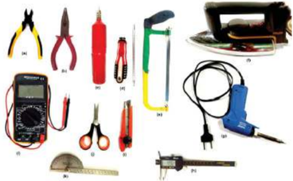

> **Deskripsi Visual:** Gambar ini adalah ilustrasi yang menunjukkan berbagai alat elektronik dan peralatan yang biasanya digunakan dalam pengujian dan perbaikan sistem elektrik. Gambar ini mencakup berbagai jenis alat seperti kriman (multimeter), kabel tester, kriman digital, kriman analog, kriman tangan, kriman listrik, kriman tangan, kriman tangan, kriman tangan, kriman tangan, kriman tangan, kriman tangan, kriman tangan, kriman tangan, kriman tangan, kriman tangan, kriman tangan, kriman tangan, kriman tangan, kriman tangan, kriman tangan, kriman tangan, kriman tangan, kriman tangan, kriman tangan, kriman tangan, kriman tangan, kriman tangan, kriman tangan, kriman tangan, kriman tangan, kriman tangan, kriman tangan, kriman tangan, kriman tangan, kriman tangan, kriman tangan, kriman tangan, kriman tangan, kriman tangan, kriman tangan, kriman tangan, kriman tangan, kriman tangan, kriman tangan, kriman tangan, kriman tangan, kriman tangan, kriman tangan, kriman tangan, kriman tangan, kriman tangan, kriman tangan, kriman tangan, kriman tangan, kriman tangan, kriman tangan, kriman tangan, kriman tangan, kriman tangan, kriman tangan, kriman tangan, kriman tangan, kriman tangan, kriman tangan, kriman tangan, kriman tangan, kriman tangan, kriman tangan, kriman tangan, kriman tangan, kriman tangan, kriman tangan, kriman tangan, kriman tangan, kriman tangan, kriman tangan, k

Sumber : Dokumen Kemendikbud

Gambar 2.22 Alat untuk perakitan rangkaian elektronik

Proses  pembuatan  produk  dapat  diperhatikan  pada  Gambar  2.23 diagram alir proses produksi sebagai berikut.

 

---
## 📄 Halaman 71

---
**🖼️ Gambar/Diagram**

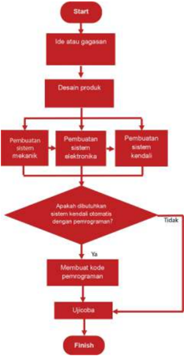

> **Deskripsi Visual:** Gambar ini adalah diagram alur yang menunjukkan proses pengembangan sistem kendaraan. Diagram ini dimulai dengan ide atau gagasan, kemudian melalui tahap desain produk. Setelah itu, ada tiga pilihan pembuatan sistem: mekanikal, elektronika, dan kendaraan. Jika tidak diperlukan sistem kontrol otomatis dengan pemrograman, proses berlanjut ke tahap membuat kode pencangkatan. Jika diperlukan, proses akan berlanjut ke uji coba dan akhirnya selesai.

Pengembangan usaha jasa dapat dilakukan melalui beberapa cara, di  antaranya:  pengembangan  melalui  skala  usaha,  cakupan  usaha dan kerja sama (gabungan, eksplorasi baru).

 

---
## 📄 Halaman 72

---
**🖼️ Gambar/Diagram**

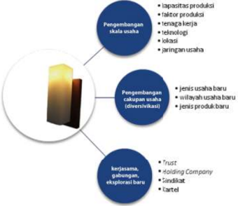

> **Deskripsi Visual:** Gambar ini adalah diagram yang menunjukkan tiga pilihan strategi pertumbuhan usaha. Diagram ini terdiri dari tiga bagian utama:

1. **Pengembangan skala usaha** - Ini melibatkan peningkatan kapasitas produksi, peningkatan tenaga kerja, pengembangan teknologi, peningkatan kapasitas produksi, dan peningkatan jaringan usaha.

2. **Pengembangan cakupan usaha (diversifikasi)** - Ini melibatkan peningkatan jumlah produk atau layanan yang ditawarkan, peningkatan wilayah operasional, dan peningkatan jenis usaha baru.

3. **Kerjasama, gabungan, eksplorasi baru** - Ini melibatkan peningkatan hubungan dengan perusahaan lain, peningkatan hubungan dengan mitra bisnis, dan peningkatan eksplorasi baru untuk potensi pasar atau produk.

Elemen-elemen utama dalam diagram ini adalah tiga bagian yang masing-masing menunjukkan strategi pertumbuhan usaha. Setiap bagian memiliki sub-element yang menjelaskan lebih lanjut tentang apa yang dimaksud dengan strategi tersebut.

Teks, angka, atau label penting yang terlihat dalam diagram ini adalah "Pengembangan skala usaha", "Pengembangan cakupan usaha (diversifikasi)", dan "Kerjasama, gabungan, eksplorasi baru". Informasi kunci yang dapat diambil pembaca adalah bahwa ada tiga pilihan strategi pertumbuhan usaha yang dapat dipilih, yaitu pengembangan skala usaha, diversifikasi cakupan usaha, dan kerjasama, gabungan, eksplorasi baru.

Sumber : Dokumen Kemendikbud

Gambar 2.24 Pengembangan usaha

Pengembangan skala usaha dapat melalui kapasitas produksi, faktor  produksi,  tenaga  kerja,  teknologi,  lokasi,  dan  jaringan  usaha. Pengembangan  cakupan  usaha  (diversifi  kasi)  meliputi  jenis  usaha baru, wilayah usaha baru, jenis produksi baru.  Adapun pengembangan usaha melalui kerja sama, gabungan, eksplorasi baru dalam bentuk trust, holding company, sindikat, dan kartel seperti ditunjukkan pada Gambar 2.24 Pengembangan cakupan usaha. Bentuk pengembangan usaha dapat dilakukan  dengan memperhatikan kebutuhan pasar.

### d. Proses Produksi

Pada  pembahasan  sebelumnya  telah  dibahas  tentang  aneka  jasa profesi yang memiliki kompetensi dan kode etik yang dikembangkan melalui proses pendidikan dan pelatihan profesi, baik formal maupun non formal sampai mendapatkan lisensi yang diakui oleh lembaga atau organisasi  terkait  untuk  secara  mandiri  independen menjalankan profesinya.

 

---
## 📄 Halaman 73

Proses  produksi  jasa  profesi  dikembangkan  sesuai  potensi  daerah masing-masing,  sesuai  dengan  bakat,  minat,  dan  daya  dukung  di daerah setempat dengan memperhatikan kebutuhan pasar melalui beberapa langkah-langkah pelaksanaan. Informasi proyek meliputi simulasi profesi di mana Anda bekerja, bagaimana situasi yang ada, pelanggan  yang  membutuhkan,  tugas  yang  diberikan  pelanggan, pelaksanaan  tugas,  jargon,  pendidikan,  baik  formal  maupun  non formal dan pekerjaan yang mendukung profesi, pengorganisasian, penyelesaian proyek dan lampiran.

Langkah-langkah yang perlu diperhatikan dalam Proyek  kegiatan usaha  jasa  profesi  dan  profesionalisme    dengan  tahapan  sebagai berikut.

### Informasi Proyek

### Inforŵasi Proyek

Potensi yang  perlu dikembangkan  terdiri  atas industri-industri kreatif,  di  mana  pelaku  industri  adalah  para  generasi  muda  yang aktif,  kreatif,  dan inofatif. Potensi alam yang ada di sekitar, dikreasi menjadi  produk  yang  memiliki  nilai  tambah.  Lakukan  observasi macam-macam produk jasa industri kreatif yang ada. Lakukan pula pengamatan potensi di sekitar yang belum tergarap. Melalui proyek ini, diharapkan dapat diperoleh perencanaan produk jasa profesi dan profesionalisme yang memiliki nilai dan bermanfaat.

### Tugas Pengeŵbangan Produk Jasa

### Pelaksanaan Tugas

- Orientasi  terkait  dengan  karya  rekayasa  yang  menjadi  target tugas kelompok
- Penelitian awal melalui observasi
- Gagasan atau ide
- Mendesain proyek
- Pembuatan Model karya produk jasa profesi dan profesionalisme
- Aplikasi secara umum

 

---
## 📄 Halaman 74

### Jargon

### Naŵa Produk

- Nama produk jasa, sesuaikan dengan potensi sumber daya alam yang  ada  di  sekitar  untuk  dijadikan  pilihan  dalam  pembuatan produk jasa profesi.
- Tugas disimpulkan melalui presentasi dan mendemonstrasikan produk jasa profesi.
- Penjelasan bagaimana mengidentifi  kasi permasalahan sehingga muncul gagasan dalam merencanakan projek, bagaimana sistem bekerja, dan di mana kelebihan dari produk jasa profesi yang dibuat.
- Penjelasan  bagaimana  produk  jasa  profesi  dapat  diaplikasikan secara umum.

### Pendidikan dan Pekerjaan

### Pendidikan dan Pekerjaan Terkait

- Pengamatan di mana dapat mengembangkan pendidikan terkait dengan produk jasa yang akan direncanakan.
- Lapangan  pekerjaan  seperti  apa  yang  memungkinkan  untuk mengaplikasikan  gagasan  yang  ada  dengan  memperhatikan keseimbangan lingkungan, misalnya pemanfaatan energi terbarukan  sesuai  dengan  potensi  sumber  energi  terbarukan di  sekitar,  mengolah limbah ( zero waste )  pada sistem produksi, bangunan yang ramah lingkungan.

### Pengorganisasian

### Organisasi

- Observasi  melalui  internet  terkait  dengan  produk  jasa  sesuai dengan  potensi  sumber  daya  di  sekitar.  Langkah  alternatif melakukan  kunjungan  ke  tempat  proses  produksi  peralatan konversi energi.

 

---
## 📄 Halaman 75

- Kebutuhan  bahan  dikomunikasikan  dan  didiskusikan  dengan guru pembimbing, tentang desain dan kebutuhan bahan serta alat  yang  digunakan  untuk  membuat  model  oleh  kelompok masing-masing guna mendapatkan pengarahan.

### Penyelesaian Proyek

### Langkah Kerja

- Kerja  tim  di  mana  setiap  anggota  harus  mengetahui  kekuatan dan kelemahan dalam bekerja sama.
- Fokus  pada  produk  jasa  profesi  dan  profesionalisme.  Setiap kelompok  fokus  dan  memiliki  motivasi yang  tinggi  untuk mendapatkan produk jasa profesi yang bagus dan berkualitas.
- Perencanaan dan pengorganisasian dalam  waktu yang singkat.

### Lampiran

### Laŵpiran Portofolio

- Perencanaan
- Hasil Kerja Perorangan
- Evaluasi Kelompok
- Evaluasi dari kelompok lain

### Aktivitas 2

Ayo gali informasi jasa profesi apa yang menjadi rencana masa depan yang akan dikembangkan? Identifi  kasi produk jasa profesi sesuai dengan langkah-langkah: (1) infomasi proyek, (2) pelaksanaan tugas, (3) jargon nama produk, (4) pendidikan dan pekerjaan, (5) pengorganisasian, (6) penyelesaian projek, dan (7) lampiran.

Seperti  telah  disebutkan  sebelumnya,  bahwa  keragaman  profesi dapat diperoleh dan dibangun melalui pendidikan formal maupun non  formal.  Langkah-langkah  berikut  adalah  sebagai  salah  satu informasi  dalam  mengembangkan  jasa  profesi  sebagai  seorang arsitek.  Karya  arsitek  sampai  terwujud  sebuah  produk  dilakukan melalui beberapa  tahapan,  di  antaranya:  (1)  pengolahan  data

 

---
## 📄 Halaman 76

dari  pengguna  jasa  sampai  diperoleh  konsep  usulan  desain,  (2) perancangan  diwujudkan  dalam  bentuk  gambar  denah,  tampak, potongan  dan  perspektif,  (3)  pengembangan  rancangan  dalam bentuk  gambar  detail  bangunan,  (4)  gambar  kerja  dibuat  sebagai acuan dalam pelaksanaan, (5) penyiapan Rencana Kerja dan Syarat (RKS),  Rencana  Anggaran  Biaya  (RAB),  Biil  and  Quantity  (BQ)  dan spesifi  kasi teknis, (6) peninjauan waktu pelaksanaan.

### Pendidikan dan Pekerjaan

### Di ŵana Anda Bekerja?

Anda  adalah  seorang  arsitek  yang  bekerja  di  sebuah  perusahaan arsitek yang menjalankan usaha jasa arsitek. Penyelesaian pekerjaan terkadang  perlu  bekerja  sama  dengan  arsitek  lainnya,  dan  pada saat  tertentu  anda  bekerja  secara  individual.  Anda  merencanakan bekerja dalam tim kecil untuk mengikuti perlombaan desain rumah di wilayah setempat dengan menggali budaya dan kearifan lokal.

### Situasi

Sebuah rencana baru ditugaskan oleh Pemerintah daerah setempat, perlu dikembangkan desainnya. Perusahaan arsitek telah memikirkan kompetisi  desain  untuk  membangun  rumah,  persyaratan  untuk properti, meliputi: perumahan untuk ukuran keluarga yang berbeda, rentang harga yang berbeda tetapi rumah mereka semua harus siap dijual, rumah harus tahan lama, dan hemat energi. Seorang arsitek harus berkontribusi pada visi berkelanjutan bangunan hemat energi. Desain  dipelajari  secara  kritis,  yaitu  sebuah  desain  terbaik  akan direalisasikan. Ukuran desain dan dimensi desain rumah ditentukan.

Tim Anda juga perlu menyajikan visi, selama presentasi desain unsurunsur meliputi:

- model 3D virtual dan 3 dimensi gambar
- sketsa
- gambar kerja  dengan  tampilan  atas,  samping,  dan  depan  dari gambar rencana
- deskripsi dan akuntabilitas rumah berkaitan dengan bangunan yang efi  sien energi dan berkelanjutan

 

---
## 📄 Halaman 77

### Pelanggan

Perusahaan pengembang perumahan.

### Tugas

Desain  sesuai  dengan  persyaratan  bangunan  yang  hemat  energi berkelanjutan  dan  presentasikan  proyek  pada  perusahaan  arsitek, yang meliputi:

### 1. Analisis bangunan hemat energi dan berkelanjutan

Buat  daftar  yang  menjadi  kebutuhan  untuk  bangunan  yang hemat energi dan berkelanjutan. Ambil tiga contoh yang umum digunakan  untuk  energi  terbarukan  yang  mungkin  dilakukan di  darah  setempat.  Hal  ini  penting  bagi  perusahaan  arsitek untuk menerapkan bangunan yang menggunakan energi baru terbarukan  untuk  diterapkan  dalam  desain.  Pikirkan  material, teknik, dan metode konservasi.

### 2. Orientasi umum

Pelanggan  menginginkan  desain  yang  memiliki  fasilitas,  di antaranya bidang:

- instalasi  listrik  untuk  rumah,  lemari  panel  listrik  central, simbol listrik
- fasilitas sanitari untuk rumah, meliputi pemanas air, tempat pembuangan limbah
- ukuran pintu, jendela, dan lainnya
- energi cadangan untuk seputar rumah

### 3. Daftar kebutuhan

Daftar  kebutuhan  adalah  daftar  komponen  yang  dibutuhkan. Cek  masing-masing  komponen  dan    daftar  komponen  untuk pengembangan ide dan gagasan dalam mendesain:

- Energi yang efi  sien dan berkelanjutan
- Bangunan digunakan untuk 2 - 5 orang
- Dimensi rumah maksimum 14x10x9 m
- Cukup untuk ruang berjalan
- Toilet, kamar mandi, dan lemari
- Sinar matahari yang cukup
- Taman harus sesuai dengan rumah
- Semua gambar dalam skala 1 : 50

 

---
## 📄 Halaman 78

### 4. Sketsa

Gambar  sketsa  rumah  yang  berbeda-beda.  Pilih  gambar  yang paling bagus untuk dikerjakan secara berkelompok pada langkah selanjutnya (5,6,7).

### 5. Gambar teknik rumah

Gambar teknik dari rumah yang direncanakan dengan skala 1:50 tampak depan, samping, dan atas, pastikan dilengkapi dengan taman.

### 6. Menggambar pipa dan panel listrik pusat

Fotokopi layout lantai  dan  buat  gambar  instalasi  panel  listrik, limbah, dan sanitasi untuk semua lantai.

### 7. Model dan gambar 3D

- Buat gambar 3D rumah di mana dapat digunakan google sketchup atau program 3D yang lain.
- Buat model rumah termasuk kebun, pastikan skala 1 : 50 . Interior rumah tidak harus dipasang.

### 8. Penyelesaian

Penyelesaian tugas tersebut akan diakhiri dengan presentasi dari model demonstrasi dan layar virtual dan penjelasan bagaimana sistem bekerja. Anda juga harus menjelaskan poster atau fi  lm ke pengguna jasa Anda .

### Pelaksanaan tugas

Pelaksanaan  tugas untuk  mencapai  hasil  yang  baik,  Anda  harus bekerja pada sejumlah komponen sebagai pengembangan tugas.

### Jargon

Jargon nama produk jasa dan komponen di antaranya instalasi listrik, model  konstruksi,  sumber  energi,  pemipaan,  hemat  energi,  panel boks sentral, metode penyimpanan, bahan tahan lama.

 

---
## 📄 Halaman 79

### Pendidikan dan Pekerjaan

Di mana untuk mendapatkan pendidikan yang sesuai dengan usaha jasa profesi yang direncanakan?

Menjadi seorang arsitek dapat diperoleh  dengan  menempuh pendidikan, baik di universitas negeri maupun swasta. Pendidikan dapat  ditempuh  sekitar  4-5  tahun.  Selanjutnya,  dapat  mengikuti pendidikan  profesional  di  universitas  yang  menyiapkan  program tersebut.

### Arsitektur

Seni bangunan, arsitektur, bukan hanya seni. Setiap orang memiliki cara  atau  sesuatu  yang  lain  untuk  dilakukan  dengan  penciptaan. Sebagai contoh, Anda tinggal di rumah terpisah di pedesaan atau di  sebuah  fl  at  di  kota.  Rumah,  kantor,  stasiun  kereta,  terminal, pelabuhan  mungkin  sering  Anda  lihat.  Arsitek  merupakan  profesi yang rumit. Mereka harus menyadari banyak detail kecil, rasa, teknik, dan pengetahuan bahan yang dibutuhkan, tetapi ada juga banding ke  orisinalitas  dan  kreativitas  untuk  konstruksi,  baik  bahan  tahan yang benar harus dipilih. Arsitek harus memenuhi persyaratan yang ditetapkan  oleh  orang  lain  seperti  konsumen.  Ia  juga  memimpin tim staf dan dapat berkonsultasi dengan klien dan kontraktor. Tugas yang harus dikerjakan seorang arsitek di antaranya: (1) mengunjungi situs konstruksi untuk melihat bagaimana pekerjaan, (2) konsultasi konstruktor,  yang landownner atau  kontraktor,  (3)  membuat  cetak biru, (4) bekerja detail (bagian dari sebuah rumah digambar secara rinci), (5) membuat model.

### Pengorganisasian

### Pasokan bahan

Jika Anda membutuhkan bahan untuk merealisasikan prototipe atau untuk presentasi, Anda dapat memesan dan mengirimkan email ke alamat pemasok, memastikan bahwa Anda menerima bahan pada waktu yang diharapkan. Anda harus menyebutkan apa bahan yang dibutuhkan.

### Penyelesaian Proyek

Desain Proyek usaha jasa profesi Kelas XII

 

---
## 📄 Halaman 80

### Teamwork

Anda  mengetahui  tentang  kekuatan  dan  kelemahan  dalam  kerja kelompok.

### Fokus Produk

Anda  temotivasi  untuk  membuat  usaha  jasa  profesi  yang  sesuai dengan kebutuhan konsumen dan potensi sumber daya di daerah sekitar.

### Inovasi

Anda  menemukan  solusi  imajinatif  untuk  masalah,  perencanaan, dan pengorganisasian. Anda membuat rencana dalam waktu yang singkat.

### Lampiran

Laporan meliputi: (1) Perencanaan, (2) Hasil kerja, (3) Evaluasi Diri, (4) Evaluasi Kelompok

### Tugas 2 (kelompok)

### Identifi  kasi produk Jasa Profesi

- Kumpulkan  informasi  dari    hasil  diskusi  tentang  produk  jasa  profesi  dan profesionalisme bersama kelompok.
- Jelaskan  alasan  dalam  pemilihan  produk  jasa  profesi  dan  profesionalisme yang dipilih.
- Apa keunggulan dari produk jasa yang disepakati kelompok untuk dibuat?
- Kompetensi  kerja  yang  dimiliki dalam  usaha  produk  jasa  profesi  dan profesionalisme meliputi :
- Kompetensi  personal  ( emotional  stability,  selfmanagement,  orientation towards work )
- Kompetensi sosial ( capability for communication and teamwork )
- Kompetensi teknis ( subject related skill, knowledge, and abillities )
- Kompetensi metodologi ( analysis, planning, abstract thinking, implementation and control, information )
Bagaimana  menurut  pendapatmu  tentang  masing-masing  kompetensi  kerja tersebut?

 

---
## 📄 Halaman 81

### C.  Penghitungan Harga Jual Produk Jasa

Metode Penetapan Harga Produk secara teori dapat dilakukan dengan tiga pendekatan:

- Pendekatan Permintaan dan Penawaran ( supply and demand approach ), dari  tingkat  permintaan  dan  penawaran  yang  ada  ditentukan  harga keseimbangan  ( equilibrium  price )  dengan  cara  mencari  harga  yang mampu dibayar konsumen dan harga yang diterima produsen sehingga terbentuk jumlah yang diminta sama dengan jumlah yang ditawarkan.
- Pendekatan  Biaya  ( cost  oriented  approach ),  menentukan  harga  dengan cara  menghitung  biaya  yang  dikeluarkan  produsen  dengan  tingkat keuntungan yang diinginkan, baik dengan markup pricing dan break even analysis.
- Pendekatan Pasar ( market approach ),  merumuskan harga untuk produk yang dipasarkan dengan cara menghitung variabel-variabel yang mempengaruhi  pasar  dan  harga,  seperti  situasi  dan  kondisi  politik, persaingan, dan sosial budaya.
Penghitungan harga jual produk jasa ditentukan oleh faktor-faktor sebagai berikut.

- Standar upah atau gaji, terkait sertifi  kasi profesi yang dimiliki
- Tingkat kesulitan pekerjaan, seperti pada pekerjaan service kendaraan
- Bahan atau suku cadang yang digunakan
- Standar upah minimum tiap daerah

### Aktivitas 3

Naya adalah seorang lulusan Sekolah Menengah Atas yang baru menyelesaikan tes sertifi  kat kompetensi/profesi yang diadakan oleh Lembaga Sertifi  kasi Profesi (LSP) dan telah mendapatkan lisensi. Sebelumnya, Naya telah mengikuti pelatihan di Balai Latihan Kerja dengan predikat sangat baik sesuai bidang yang diminati. Naya  mendapatkan  pelatihan  selain  kompetensi  yang  ditekuni.  Naya  juga mendapatkan pelatihan tentang bagaimana perilaku kerja dan sikap kerja.  Sebuah perusahaan  mengadakan  rekruitment  tenaga  kerja  dan  Naya  berminat  untuk mengikuti  seleksi  tersebut.  Naya  bisa  lolos  dalam  seleksi  secara  bertahap  dari seleksi administrasi dan psikotes, dan tiba giliran Naya mengikuti tes wawancara . Ada satu pertanyaan yang disampaikan pihak perusahaan terkait penggajian dan jawaban yang disampaikan Naya adalah mengikuti standar gaji Upah Minimum Regional (UMR) yang diberlakukan perusahaan. Bagaimana menurut pendapatmu tentang pilihan sikap Naya? Jelaskan pendapatmu.

 

---
## 📄 Halaman 82

### Tugas 3 (Kelompok)

### Harga Jual Produk Jasa

Ayo, lakukan penghitungan harga jual produk jasa profesi dan profesionalisme yang  telah  ditetapkan  oleh  masing-masing  kelompok.  Produk  jasa  profesi yang  telah  dibuat  berdasarkan  data  dan  hasil  observasi  dapat  digunakan metode penetapan harga sesuai hasil kesepakatan dan diskusi kelompok, baik melalui pendekatan permintaan dan penawaran, pendekatan biaya, atau pendekatan pasar.

### D. Media Promosi Produk Jasa Profesi

### dan Profesionalisme

Sumber : Dokumen Kemendikbud

Gambar 2.25 Promosi produk melalui facebook

### 1. Pengertian Media Promosi

Promosi  adalah  suatu  kegiatan  komunikasi  bidang  pemasaran  yang dilaksanakan  oleh  produsen  kepada  konsumen  untuk  menyebarkan informasi, mempengaruhi, dan mengingatkan pasar sasaran atas produk yang ditawarkan guna mendorong konsumen untuk melakukan pembelian  ulang  dan  mencoba  produk  baru.  Adapun  tujuan  dari promosi  penjualan  adalah  meningkatkan  permintaan  dari  konsumen, kinerja perusahaan, dan mendukung serta mengkoordinasikan kegiatan personal selling dan iklan. Media promosi adalah sarana untuk terjadinya promosi. Gambar 2.25 sebagai salah satu contoh media promosi secara online di facebook .

 

---
## 📄 Halaman 83

### 2.  Macam-Macam Media Promosi

Media promosi yang marak saat ini adalah media online . Media promosi untuk  produk  jasa  profesi  dan  profesionalisme  juga  semakin  banyak pilihan untuk memasarkannya. Media internet menjadi sangat bermanfaat ketika sebuah website menjadi media tepat untuk memasarkan produk, baik produk barang maupun jasa lewat promosi langsung maupun online .

Strategi promosi melalui online dapat dilakukan melalui beberapa cara, di antaranya:

- Website bisa menjadi cara promosi berbasis komunitas yang dibangun melalui gambar bergerak maupun tidak bergerak.
- Berbagi gambar melalui pinterest.
- Aktif di media sosial dengan postingan foto, kutipan, jejak pendapat yang  berhubungan  dengan  bisnis  dan  secara  bertahap  dapat mendorong produk yang dipromosikan.
- Membuat blog tentang produk yang dipromosikan yang langsung link ke facebook atau twitter .
- Jaringan sesama bisnis.
- Menggunakan iklan.
- Menulis di media online lain.

### 3. Media Promosi Usaha Jasa Profesi dan Profesionalisme

Media  promosi  produk  jasa  profesi  dapat  dilakukan  melalui  iklan pada  media  cetak,  radio,  televisi,  brosur,  poster  dengan  tujuan  untuk memberikan informasi utama dan daya tarik melalui teks, gambar diam, gambar  bergerak,  dan  suara.  Promosi  produk  juga  dapat  dilakukan melalui kegiatan pameran atau presentasi untuk memperlihatkan contoh produk dan menjelaskan produk yang dipromosikan.

### Tugas 4 (Kelompok)

### Media Promosi

- Diskusikan dengan kelompok, media promosi apa saja yang sesuai untuk pasar sasaran dari produk jasa profesi dan profesionalisme yang dibuat? Fungsi apa yang belum dimunculkan dalam desain promosi? Buatlah rancangan produk jasa profesi yang telah disepakati.
- Lakukan  kegiatan  observasi  (survei  lapangan)  dan  wawancara  tentang material dan media promosi di wilayah setempat. Pelajari pasar sasaran dari produk jasa profesi yang dibuat. Buatlah rancangan media dan cara promosi.

 

---
## 📄 Halaman 84

- Carilah referensi tentang biaya dari  masing-masing  media  yang  akan digunakan.
- Hitung perkiraan biaya pembuatan kemasan dan pemasangan media promosi.

### E.  Penjualan Produk Jasa dengan Sistem Konsinyasi

### 1. Pengertian Sistem Konsinyasi

Penjualan  dengan  sistem  konsinyasi  adalah  penjualan  dengan  cara menitipkan produk kepada pihak lain untuk dijualkan dengan harga jual dan  persyaratan  sesuai  dengan  perjanjian  antara  pemilik  produk  dan penjual. Perjanjian konsinyasi berisi mengenai hak dan kewajiban kedua belah pihak.

### 2. Penjualan dengan Sistem Konsinyasi

Penjualan merupakan sumber utama penghasilan dan hasil akhir yang ingin dicapai. Informasi yang harus ada dalam perjanjian konsinyasi adalah nama pihak pemilik barang (konsinyor), nama pihak yang dititipi barang (konsinyi), nama dan keterangan teknis barang yang dititipkan, ketentuan penjualan,  ketentuan  komisi  (keuntungan  yang  akan  diperoleh  toko). Kegiatan penjualan tidak terbatas pada tempat tertentu atau melibatkan banyak orang (penjualan secara langsung), tetapi dapat melakukannya dengan sistem online, termasuk juga promosi dan penerapannya.

### Tugas 5 (kelompok)

### Penjualan Produk Jasa

- Carilah konsinyi untuk penjualan produk rekayasa yang telah dibuat.
- Adakan  pertemuan  dengan  konsinyi  untuk  mendiskusikan  bentuk  kerja sama  konsinyasi  yang  akan  dilakukan.  Sebelum  pertemuan,  buatlah  daftar pertanyaan yang akan didiskusikan dalam pertemuan tersebut. Bahan diskusi di antaranya, jumlah produk dalam satu kali pengiriman, besarnya komisi yang akan diterima konsinyi, dan promosi apa yang akan dilakukan.
- Buatlah  surat  kerja  sama  yang  berisi  perjanjian  konsinyasi  berdasarkan kesepakatan antara kalian sebagai konsinyor dengan konsinyi. Surat perjanjian konsinyasi ditandatangani kedua belah pihak.
- Laksanakan  penjualan  konsinyasi  dengan  memaksimalkan  upaya  promosi melalui  beragam  media  promosi  yang  sesuai  dengan  produk  rekayasa  dan pasar sasaran yang dituju.

 

---
## 📄 Halaman 85

### Leŵbar Kerja 4

Naŵa Keloŵpok

: …

Naŵa AŶggota

: …

…

…

…

Kelas

: …

### RanĐangan Media Proŵosi Jasa Profesi dan Profesionalisŵe

Ide daŶ PereŶcaŶaaŶ Produk :

…

KesiŵpulaŶ :

…

### Tugas 6 (Kelompok)

### Proyek Simulasi

- Diskusikan struktur organisasi sesuai dengan kebutuhan organisasi
- Sepakati produk jasa yang dibuat dan bahan yang digunakan
- Pembuatan jadwal dan strategi kerja
- Persiapan bahan baku, tempat, dan alat kerja
- Proses produksi
- Proses pengemasan/Media promosi
- Kegiatan pemasaran dan penjualan
- Evaluasi  kinerja dan keuangan
- Penyusunan laporan dan hasil evaluasi
- Presentasi laporan

 

---
## 📄 Halaman 86

### F.  Evaluasi Kegiatan Usaha Jasa Profesi dan Profesionalisme

### Evaluasi Diri Semester 1

### Petunjuk :

### Evaluasi Diri (Individu)

Bagian A. Berilah tanda cek (v) pada kolom kanan  sesuai penilaian dirimu.

Bagian B. Tuliskan pendapatmu tentang pengalaman mengikuti pembelajaran Rekayasa di Semester 1.

---
**📊 Tabel**

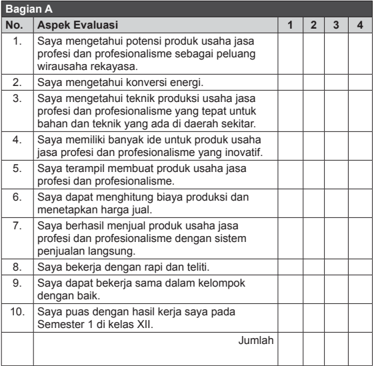

Tabel ini merupakan evaluasi yang dilakukan terhadap kemampuan dan keterampilan seorang siswa dalam mengembangkan produk usaha jasa profesional dan profesionalisme. Topik utama tabel adalah aspek-aspek evaluasi yang meliputi pengetahuan tentang potensi produk, teknik produksi, inovasi, manajemen harga, kerja sama tim, dan kepuasan dengan hasil kerja. Kolom-kolom yang ada mencakup nomor urutan pertanyaan, skor 1 hingga 4 untuk setiap pertanyaan, dan jumlah keseluruhan. Data penting yang terlihat adalah bahwa siswa harus menunjukkan pengetahuan dan keterampilan yang kuat dalam berbagai aspek usaha jasa profesional dan profesionalisme, termasuk pengetahuan konversi energi, teknik produksi yang tepat, inovasi, manajemen harga, kerja sama tim, dan kepuasan dengan hasil kerja.

 

---
## 📄 Halaman 87

### Bagian B

Kesan dan pesan setelah mengikuti pembelajaran Rekayasa Semester 1:

### Keterangan :

(1) Sangat Tidak Setuju ; (2) Tidak Setuju ; (3) Setuju; (4) Sangat Setuju

### Evaluasi Diri (Kelompok)

Bagian A. Berilah tanda cek (v) pada kolom kanan  sesuai penilaian dirimu.

Bagian B. Tuliskan pengalaman paling berkesan saat bekerja dalam kelompok.

---
**📊 Tabel**

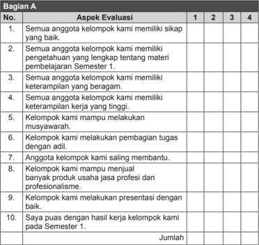

Tabel ini menunjukkan hasil evaluasi aspek-aspek keterampilan dan sikap yang dimiliki oleh kelompok belajar pada semester pertama. Topik utama tabel adalah aspek-aspek evaluasi yang meliputi sikap baik, pengetahuan tentang materi pembelajaran, keterampilan beragam, keterampilan kerja tinggi, kemampuan musyawarah, pembagian tugas adil, saling membantu, produksi produk usaha profesional, presentasi dengan baik, dan kepuasan dengan hasil kerja kelompok. Kolom-kolomnya mencakup nomor urutan aspek evaluasi, dan data diisi dengan tanda centang untuk setiap aspek. Pola penting yang terlihat adalah bahwa semua anggota kelompok memiliki sikap baik, pengetahuan tentang materi pembelajaran, keterampilan beragam, keterampilan kerja tinggi, kemampuan musyawarah, pembagian tugas adil, saling membantu, dan presentasi dengan baik. Namun, tidak semua anggota kelompok memiliki keterampilan produksi produk usaha profesional dan tidak semua anggota kelompok puas dengan hasil kerja kelompok mereka pada semester pertama.

 

---
## 📄 Halaman 88

### Bagian B

Pengalaman paling berkesan saat bekerja dalam kelompok:

### Keterangan :

(1) Sangat Tidak Setuju ; (2) Tidak Setuju ; (3) Setuju; (4) Sangat Setuju

### Evaluasi Pembelajaran

Setelah belajar tetang wirausaha produk jasa profesi dan profesionalisme, isilah kolom di bawah ini dengan cepat, tepat, baik, dan benar.

### Format Penilaian

### 1. Penilaian Diri

Data Pribadi Peserta didik

Nama

: …

Kelas

: …

Semester

: …

Waktu penilaian

: …

---
**📊 Tabel**

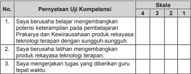

Tabel ini berisi pernyataan uji kompetensi yang diberikan kepada siswa untuk menilai tingkat kemampuan mereka dalam beberapa aspek. Topik utama tabel adalah penilaian kompetensi belajar dan pengembangan keterampilan. Kolom pertama berisi nomor urut pernyataan, kolom kedua berisi skala penilaian (4, 3, 2, 1), sedangkan kolom ketiga berisi pernyataan yang harus dijawab oleh siswa. Data penting yang terlihat adalah bahwa setiap pernyataan memiliki skala penilaian yang berbeda-beda, yang menunjukkan bahwa penilaian ini mencakup berbagai aspek kemampuan belajar dan pengembangan keterampilan.

 

---
## 📄 Halaman 89

---
**📊 Tabel**

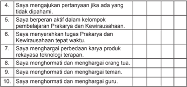

Tabel ini berisi pertanyaan-pertanyaan yang dirancang untuk mengevaluasi keterlibatan siswa dalam proses pembelajaran Prakarya dan Kewirausahaan. Topik utama tabel adalah tentang sikap dan perilaku siswa dalam konteks tersebut. Kolom-kolomnya mencakup berbagai aspek seperti partisipasi aktif dalam kelompok belajar, penghormatan terhadap guru dan orang tua, serta penghormatan terhadap teman. Data penting yang terlihat adalah bahwa semua pertanyaan memiliki jawaban "Saya", menunjukkan bahwa setiap siswa dianggap telah memenuhi semua persyaratan atau standar yang ditetapkan dalam proses pembelajaran tersebut.

### Penilaian Antarteman

---
**📊 Tabel**

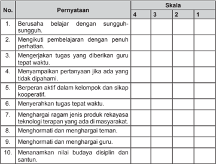

Tabel ini berisi 10 poin yang menunjukkan tingkat keberhasilan siswa dalam berbagai aspek pembelajaran dan perilaku. Topik utamanya adalah kualitas belajar dan sikap siswa. Kolom "Skala" menunjukkan tingkat keberhasilan yang diberikan kepada siswa, dengan skala 4 (terbaik), 3, 2, dan 1 (terburuk). Data penting yang terlihat adalah bahwa poin-poin yang paling tinggi (4) melibatkan sikap belajar aktif dan menghargai guru, sementara poin-poin yang paling rendah (1) melibatkan sikap tidak menghormati teman dan tidak menanamkan nilai budaya disiplin dan santun. Ini menunjukkan bahwa siswa yang lebih baik dalam belajar dan memiliki sikap positif terhadap guru dan teman mereka cenderung mendapatkan skor yang lebih tinggi.

 

---
## 📄 Halaman 90

### Refl   eksi

Refl  eksi dalam pembelajaran Prakarya dan Kewirausahaan produk Jasa Profesi dan Profesionalisme dimaksudkan untuk mengetahui sejauh mana penghayatan pada akal  pikiran  dan  kemampuan  manusia  dalam  berpikir  kreatif  untuk  mengenali potensi diri, serta jiwa kewirausahawan dalam dunia kerja sebagai anugerah Tuhan. Pentingnya perilaku jujur, percaya diri, dan mandiri serta sikap bekerja sama, gotong royong,  bertoleransi,  disiplin,  bertanggung  jawab,  kreatif,  dan  inovatif  dalam perencanaan masa depan untuk membangun semangat dan etos kerja.

Merencanakan  profesi  berdasarkan  identifi  kasi  potensi  diri,  kebutuhan  pasar kerja, kompetensi sebagai sumber daya, teknologi, dan jenjang pendidikan yang ditempuh.  Mempresentasikan  perencanaan  masa  depan  dengan  perilaku  jujur dan percaya diri. Menyajikan simulasi perencanaan masa depan dengan pilihan profesi berdasarkan analisis mengelolaan sumber daya yang ada dan kebutuhan pasar kerja di lingkup sekitar, nasional, regional, maupun internasional.

### Aktivitas Refl  eksi Diri

Renungkan dan tuliskan pada selembar kertas manfaat yang Anda peroleh setelah mempelajari Produk Jasa Profesi dan Profesionalisme, berdasarkan beberapa hal sebagai berikut.

- Kendala atau permasalahan dalam mengenali potensi diri.
- Kendala  atau  permasalahan  yang  dihadapi  ketika  membuat  perencanaan masa depan terkait jasa profesi dan profesionalisme.
- Kendala atau permasalahan dalam membuat pilihan karier.
- Kendala atau permasalahan dalam merencanakan pengembangan karier.
- Kendala selain yang disebut di atas.

 

---
## 📄 Halaman 91

Prakarya dan Kewirausahaan

85

 

---
## 📄 Halaman 92

### Peta Materi

---
**🖼️ Gambar/Diagram**

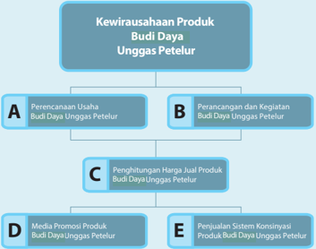

> **Deskripsi Visual:** Gambar ini adalah diagram yang menunjukkan struktur organisasi kewirausahaan produk Budi Daya Unggas Petelur. Diagram ini terdiri dari empat bagian utama:

1. **A** - Perencanaan Usaha Budi Daya Unggas Petelur: Ini merupakan bagian awal yang melibatkan pengambilan keputusan tentang strategi dan tujuan usaha.

2. **B** - Perancangan dan Kegiatan Budi Daya Unggas Petelur: Bagian ini mencakup detail tentang proses produksi dan operasional usaha.

3. **C** - Penghitungan Harga Jual Produk Budi Daya Unggas Petelur: Ini melibatkan analisis biaya dan harga jual untuk memastikan usaha berjalan dengan efisien.

4. **D** - Media Promosi Produk Budi Daya Unggas Petelur: Bagian ini menggambarkan cara-cara yang digunakan untuk mempromosikan produk kepada konsumen.

5. **E** - Penjadwalan Sistem Kontinuasi Produk Budi Daya Unggas Petelur: Ini mencakup proses manajemen sumber daya dan operasional untuk memastikan kelangsungan usaha.

Jelaskan relasi antara elemen-elemen ini: Setiap bagian dalam diagram ini saling terkait dan bekerja sama untuk mencapai tujuan utama, yaitu sukses dalam menjalankan usaha budi daya unggas petelur. Diagram ini membantu dalam pemahaman tentang struktur dan proses yang harus dilalui dalam mengembangkan dan mempertahankan usaha tersebut.

86

Kelas XII SMA/SMK/MA/MAK

 

---
## 📄 Halaman 93

### Wirausaha Produk Budi Daya Unggas

### Tujuan Pembelajaran

### Setelah mempelajari bab ini, siswa mampu:

- Menghayati  bahwa  akal  pikiran  dan  kemampuan  manusia  dalam  berpikir kreatif  untuk  pengembangan budi daya unggas petelur serta keberhasilan wirausaha adalah anugerah Tuhan.
- Menghayati perilaku jujur, percaya diri, dan mandiri serta sikap bekerja sama, gotong royong, bertoleransi, disiplin, bertanggung jawab, kreatif, dan inovatif dalam melaksanakan budi daya unggas petelur guna membangun semangat usaha.
- Mengidentifi  kasi  jenis-jenis unggas petelur yang ada di daerah sekitar untuk praktik budi daya unggas petelur.
- Mempromosikan dengan pemilihan media yang tepat dan menjual hasil budi daya unggas petelur dengan perilaku jujur dan percaya diri melalui penjualan konsinyasi.
- Menyajikan  budi  daya  unggas  petelur  berdasarkan  analisis  pengelolaan sumber daya yang ada di lingkungan sekitar.

### BAB III Petelur

 

---
## 📄 Halaman 94

Ketahanan  pangan  adalah  suatu  kondisi    di  mana  setiap  individu  dan  rumah tangga memiliki akses secara fi  sik dan ekonomi terhadap  pangan dalam jumlah yang  cukup,  aman,  serta  bergizi  untuk  memenuhi  kebutuhan  sesuai  dengan seleranya untuk mendukung kehidupan yang aktif dan sehat.  Terdapat  tiga pilar utama dalam ketahanan pangan, yaitu: ketersediaan yang cukup, distribusi yang lancar dan merata, serta konsumsi pangan yang aman dan berkecukupan gizi bagi seluruh  individu  masyarakat.    Agar  dapat  memenuhi  kebutuhan  individu  atau keluarga, baik secara fi  sik maupun ekonomi, maka proses distribusi pangan yang lancar dari produsen hingga ke konsumen menjadi persyaratan yang utama.

Di  antara  ketiga  pilar  ketahanan  pangan,  usaha  untuk  meningkatkan  produksi pangan  mendapat perhatian lebih banyak.   Setelah dapat meningkatkan produksi pangan, maka tahap berikutnya adalah mendistribusikan pangan yang dihasilkan.

Sebaran wilayah produksi  pangan  dan  wilayah  konsumsi  sangat  luas  sehingga distribusi pangan sangat penting agar pangan dapat diperoleh oleh konsumen. Distribusi pangan tidak terlepas dari aspek pemasaran.

Pangan  merupakan  kebutuhan  pokok  manusia.  Menurut  UU  Pangan  Nomor 18 Tahun 2012, pangan adalah segala sesuatu yang berasal dari sumber hayati produk pertanian, perkebunan, kehutanan, perikanan, peternakan, perairan, dan air, baik yang diolah maupun tidak diolah yang diperuntukkan sebagai makanan atau  minuman  bagi  konsumsi  manusia,  termasuk  bahan  tambahan  pangan, bahan baku pangan, dan bahan lainnya yang digunakan dalam proses penyiapan, pengolahan, dan atau pembuatan makanan atau minuman.

Pangan  berfungsi  untuk  memenuhi  kebutuhan  nutrisi  manusia  untuk  dapat tumbuh dan berkembang dengan baik.  Nutrisi yang dibutuhkan manusia terdiri atas karbohidrat, lemak, protein, vitamin, dan mineral.   Nutrisi yang dibutuhkan akan  terpenuhi  dengan  baik  jika  mengkonsumsi  sumber  pangan  beragam. Sumber pangan terdiri atas pangan nabati dan pangan hewani. Pangan nabati berasal dari tanaman, sedangkan pangan hewani berasal dari hewan, terutama lemak dan protein, sehingga dalam kehidupan sehari-hari sering dikenal lemak dan  protein  nabati  serta  lemak  dan  protein  hewani.  Semua  jenis  nutrisi  yang dibutuhkan harus dikonsumsi dalam jumlah yang cukup dan seimbang.

Dibandingkan dengan protein nabati, protein hewani mengandung jenis asam amino  esensial  paling  lengkap,  sedangkan  protein  nabati  hanya  mengandung beberapa asam amino esensial saja. Asam amino yang dikandung protein hewani lebih  mudah  dicerna  oleh  tubuh  dibandingkan  dengan  protein  nabati.  Asam amino esensial adalah asam amino yang tidak dapat dibuat sendiri oleh tubuh sehingga harus dipenuhi melalui konsumsi makanan. Asam amino esensial terdiri atas histidin, isoleusin, leusin, lysin, methionin, phenylalanin, threonin, trypthopan, dan  valin.  Selain  itu,  asam  amino  essensial  juga  digunakan  untuk  mensintesis asam amino lainnya dalam tubuh.

 

---
## 📄 Halaman 95

Saat ini pola  konsumsi pangan masyarakat sudah mulai berubah,  dari banyak mengkonsumsi  karbohidrat,  beralih  menjadi  banyak  mengkonsumsi  protein dan  lemak.    Peningkatan  pendapatan  per  kapita  serta  kesadaran  masyarakat akan pentingnya gizi untuk tumbuh kembang, mendorong peningkatan jumlah konsumsi bahan pangan yang menjadi sumber protein dan lemak, seperti ikan, telur, daging, dan susu.

### Tugas 1

Sumber protein tidak hanya bahan pangan hewani, seperti daging dan telur, tetapi  masih  ada  sumber  protein  nabati.  Cobalah  kamu  cari  dari  berbagai sumber  kelebihan  dan  kekurangan  protein  hewani  dibandingkan  dengan protein nabati!

### Lembar Kerja 1

---
**📊 Tabel**

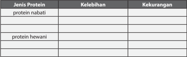

Tabel ini membahas dua jenis protein: protein nabati dan protein hewani. Protein nabati memiliki kelebihan seperti kandungan nutrisi yang lebih seimbang dan lebih ramah lingkungan dibandingkan dengan protein hewani. Namun, kekurangannya adalah kurangnya kandungan vitamin B12 dan mineral lain yang penting untuk kesehatan. Sementara itu, protein hewani memiliki kelebihan dalam kandungan protein yang tinggi dan vitamin B12 yang penting bagi sistem saraf. Namun, kekurangannya adalah lebih banyak kolesterol dan lemak jenuh yang bisa meningkatkan risiko penyakit jantung jika dikonsumsi berlebihan. Dua jenis protein ini memiliki kelebihan dan kekurangan masing-masing, namun penting untuk memilihnya sesuai dengan kebutuhan dan preferensi individu.

Indonesia adalah salah satu negara yang  berpenduduk besar, sehingga jumlah pangan yang dibutuhkan juga besar. Usaha pemenuhan pangan menjadi persoalan penting bagi bangsa Indonesia. Jumlah penduduk yang terus bertambah, harus diikuti  dengan  berbagai  upaya  untuk  memenuhi  kebutuhan  pangan  bangsa Indonesia sehingga ketahanan pangan dapat terwujud.

Budi daya adalah tindakan mengelola sumber daya nabati untuk diambil hasilnya. Budi daya juga diartikan sebagai usaha memelihara tanaman atau ternak, mulai dari menyiapkan benih atau bibit, sampai dipanen hasilnya. Kegiatan budi daya merupakan kegiatan untuk menghasilkan pangan secara mandiri.

Budi daya ternak adalah  usaha untuk mendapatkan hasil dari peternakan.  Usaha budi daya ternak ditujukan untuk menghasilkan daging, susu, atau telur.   Budi daya unggas merupakan usaha budi daya untuk menghasilkan daging dan telur. Dalam pembelajaran ini yang akan kamu pelajari selanjutnya adalah budi daya unggas untuk menghasilkan telur (unggas  petelur).

 

---
## 📄 Halaman 96

Diharapkan   dengan melakukan budi daya  secara intensif akan dihasilkan pangan dalam jumlah yang cukup, berkualitas, dan beragam.  Keinginan untuk melakukan budi daya  dari suatu bangsa merupakan cerminan perilaku tidak ingin tergantung pada negara lain atau sikap untuk mandiri.  Sikap  untuk mandiri yang tertanam dalam diri bangsa  akan menghantar bangsa Indonesia pada posisi terhormat di mata negara-negara lain.

---
**📊 Tabel**

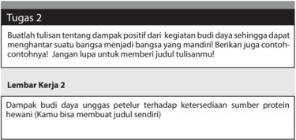

Tabel ini berisi tugas 2 yang melibatkan membuat tulisan tentang dampak positif budi daya terhadap kesehatan manusia. Topik utama adalah "Dampak budi daya unggas petelur terhadap ketersediaan sumber protein hewani". Tabel ini memiliki dua kolom: "Lembar Kerja 2" dan "Judul Tulisan". Data penting yang terlihat adalah bahwa tulisan tersebut harus memberikan contoh-contoh tentang dampak positif budi daya unggas petelur terhadap ketersediaan sumber protein hewani. Selain itu, tulisan tersebut juga harus memberikan judul sendiri.

### A. Perencanaan Usaha Budi Daya Unggas Petelur

Pangan merupakan kebutuhan pokok manusia.  Menurut Undang-undang Republik Indonesia Nomor 18 Tahun 2012 tentang Pangan, bahwa pangan merupakan kebutuhan dasar manusia yang paling utama dan pemenuhannya merupakan bagian dari hak asasi manusia yang dijamin di dalam UndangUndang  Dasar  Negara  Republik  Indonesia Tahun  1945  sebagai  komponen dasar untuk mewujudkan sumber daya manusia yang berkualitas.  Sebagai negara dengan jumlah penduduk yang besar dan memiliki sumber daya alam dan sumber pangan yang beragam, Indonesia seharusnya dapat memenuhi kebutuhan pangannya secara berdaulat dan mandiri.

Pemenuhan kebutuhan pangan dapat dilakukan dengan cara memproduksi pangan  sendiri  melalui  kegiatan  budi  daya.  Kegiatan  budi  daya  di  bidang peternakan telah membuka peluang berwirausaha yang sangat besar karena telur adalah pangan pokok sebagai  sumber utama protein dan lemak hewani bagi  masyarakat.

 

---
## 📄 Halaman 97

### Tugas 3

Cobalah  lakukan  observasi  di  wilayah  tempat  tinggal  Anda!  Apakah  sudah ada  yang  melakukan  budi  daya  unggas  petelur?  Jika  sudah  ada,  lanjutkan pengamatan untuk mengetahui jenis unggas petelur  yang dibudi dayakan!

### Lembar Kerja 3

Kelompok

: .................................................

Anggota kelompok

: ................................................

Hasil observasi :

Jenis wirausaha di bidang unggas petelur:

1.

2.

3.

4.

Saat ini tantangan untuk memenuhi kebutuhan pangan semakin besar.  Jumlah penduduk yang terus bertambah perlu diiringi dengan usaha meningkatkan produksi pangan.  Budi daya  ternak unggas menjadi salah satu usaha untuk memproduksi pangan, khususnya telur.

Peluang wirausaha di bidang budi daya ternak unggas petelur sangat besar karena kebutuhan telur untuk memenuhi nutrisi masyarakat sangat tinggi. Hal  ini  menjadikan  wirausaha  di  bidang  budi  daya  ternak  unggas  petelur sangat  menarik.  Agar  dapat  melakukan  wirausaha  di  bidang  usaha  ternak ayam petelur, maka Anda terlebih dahulu harus mengenal teknik budi daya unggas petelur.

Dalam berwirausaha, hal penting yang harus diperhatikan adalah pemasaran produk yang dihasilkan.  Sebelum memulai wirausaha, terlebih dahulu Anda harus memahami pemasaran produk budi daya yang dihasilkan.

Tantangan dalam berwirausaha adalah pemasaran produk yang dihasilkan. Keberhasilan wirausaha sangat ditentukan oleh peluang pasar dari produk yang  hasilkan.  Sebelum  memulai  wirausaha,  terlebih  dahulu  pelajarilah produk sejenis yang sudah ada di pasar. Agar produk yang dihasilkan dapat diterima oleh pasar, buatlah hasil produk budi daya menjadi lebih baik dari produk sejenis yang sudah ada.

 

---
## 📄 Halaman 98

Perlu  kamu perhatikan bahwa produk budi daya unggas petelur berfungsi sebagai pangan. Dalam proses yang dilakukan harus mengacu pada cara budi daya ternak yang baik,  sehingga dapat menghasilkan pangan yang sehat dan higienis.

Di  kelas  I  dan  kelas  II,  sudah  dipelajari  tentang  sikap  dalam  berwirausaha. Pengamalan sikap-sikap tersebut akan mendorong keberhasilan wirausaha yang dilakukan.

### Tugas 4

Lakukanlah survei pasar pada produk hasil budi daya unggas petelur! Amatilah produk  unggas  petelur  yang  dijual  di  pasar.  Kamu  juga  dapat  melakukan survei dengan mewawancarai konsumen, seperti ibu rumah tangga. Tanyakan kepada mereka tentang produk unggas petelur yang mereka sukai, misal dari sisi  kebersihan  produk  unggas  petelur  yang  mereka  harapkan.    Selanjutnya, coba kamu pikirkan bagaimana membuat produk unggas petelur  yang akan kamu hasilkan lebih disukai oleh konsumen!

### Lembar Kerja 4

Kelompok

: .................................................

Anggota kelompok

: ................................................

Hasil survei :

Jenis wirausaha di bidang unggas petelur:

- Jenis produk unggas petelur:
- .....
- .....
- ....
- ....
- Produk unggas petelur yang paling diminati:
- Usaha yang dapat dilakukan agar produk unggas petelur yang dihasilkan lebih diminati oleh konsumen:
- ........
- ......

 

---
## 📄 Halaman 99

### Tugas 5

Pelajarilah kembali sikap-sikap yang menentukan keberhasilan berwirausaha! Sikap sosial yang mendorong keberhasilan wirausaha antara lain: jujur, percaya diri, dan mandiri.  Menerapkan sikap kerja sama, gotong royong, bertoleransi, disiplin, tanggung jawab, kreatif, dan inovatif dalam wirausaha perlu ditumbuhkan dalam diri sendiri.

### Lembar Kerja 5

Kelompok

: .................................................

Anggota kelompok

: ................................................

### Tugas 6

Cobalah Anda Pikirkan dan diskusikan dengan teman-teman sekelas mengenai peluang  wirausaha  budi  daya  ternak  unggas  petelur!  Lakukanlah  secara berkelompok!  Bahaslah  peluang  dan  tantangan  wirausaha  ternak  unggas petelur  di daerah sekitarmu!  Tumbuhkanlah  motivasi internal dan kepedulian terhadap lingkungan dalam menggali informasi tentang keberagaman produk budi daya dan wirausaha di bidang ternak unggas petelur!

### Lembar Kerja 6

Kelompok

: .................................................

Anggota kelompok

: ................................................

Jenis unggas :

Peluang :

Tantangan :

Motivasi internal :

 

---
## 📄 Halaman 100

### MENGENAL UNGGAS PETELUR

### a. Jenis-jenis unggas petelur

Unggas  adalah  jenis  hewan  yang  termasuk  ke  dalam  kelompok burung-burungan. Ciri-ciri unggas adalah bersayap, berbulu, berkaki,  dan  memiliki  paruh.  Berdasarkan  produk  yang  dihasilkan, kita mengenal unggas petelur dan unggas pedaging. Unggas petelur adalah yang dipelihara untuk menghasilkan telur, sedangkan unggas pedaging  adalah  unggas  yang  dipelihara  untuk  menghasilkan daging.  Jenis  unggas  petelur  antara  lain  adalah  ayam,  bebek/itik, burung puyuh, dan angsa.

Cobalah perhatikan lingkungan di sekitar Anda! Unggas apa sajakah yang Anda temui? Cobalah kamu amati unggas petelur apa saja yang ada di sekitar!

---
**🖼️ Gambar/Diagram**

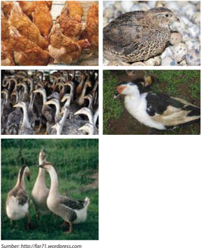

> **Deskripsi Visual:** Gambar ini adalah ilustrasi yang menunjukkan berbagai jenis ayam dan anatina. Gambar tersebut terdiri dari empat bagian yang masing-masing menampilkan ayam dan anatina dengan detail yang jelas. Di bagian atas, ada dua gambar ayam yang tampak seperti ayam broiler, sedangkan di bagian bawah, ada dua gambar anatina yang tampak seperti anatina yang biasanya digunakan untuk olahan daging. Setiap gambar memiliki elemen-elemen yang penting, seperti penampilan fisik ayam dan anatina, serta posisi mereka dalam gambar. Teks, angka, atau label penting tidak terlihat dalam gambar ini karena hanya ada gambar saja tanpa teks atau angka. Informasi kunci yang dapat diambil pembaca adalah bahwa gambar ini menunjukkan berbagai jenis ayam dan anatina, serta bagaimana mereka tampak secara visual.

 

---
## 📄 Halaman 101

### Ayam

Ayam  adalah  unggas  petelur  yang  umum  dibudi  dayakan  karena permintaan dan kebutuhan masyarakat terhadap telur ayam yang tinggi.  Telur  ayam  paling  umum  dikonsumsi  oleh  masyarakat. Berdasarkan warna kulitnya, telur ayam terdiri atas telur  putih atau coklat.  Ayam petelur terdiri atas dua jenis, yaitu:

- Ayam petelur ringan dan ayam petelur medium.  Ayam petelur ringan  (ayam  petelur  putih)  memiliki  ciri-ciri  sebagai  berikut: mempunyai badan yang ramping dan kecil, bulu berwarna putih, berjengger merah. Ayam petelur putih mampu bertelur sampai 260  butir setiap tahun.
- Ayam petelur medium ditandai dengan bobot tubuh yang lebih besar dibandingkan dengan ayam petelur putih sehingga dapat menghasilkan  daging  cukup  banyak.    Ayam  petelur  medium memiliki  telur  berwarna  coklat.  Telur  yang  dihasilkan  ayam petelur medium lebih besar daripada telur yang dihasilkan oleh petelur putih. Namun, jumlah telur coklat yang dihasilkan lebih sedikit.

### Itik

Itik merupakan unggas yang hidup di air. Itik memiliki badan kecil dan ramping serta dapat bergerak lincah. Telur itik memiliki kandungan nutrisi dan ukuran yang mirip telur ayam sehingga sering dijadikan alternatif pengganti telur ayam.

### Entok/bebek

Bebek merupakan unggas air  yang memiliki badan lebih gemuk dan bergerak lebih lamban dibandingkan dengan itik.  Telur entok  mirip dengan telur itik.

### Angsa

Angsa merupakan unggas air yang memilik badan lebih tinggi dan besar serta bulu berwarna putih.  Angsa memiliki leher yang lebih panjang  dibandingkan  dengan  bebek,  itik,  atau  ayam.    Budi  daya angsa sebagai petelur tidak sebanyak  itik dan bebek. Telur angsa berukuran sangat besar, bahkan bisa mencapai 3 kali ukuran telur ayam.

 

---
## 📄 Halaman 102

### Tugas 7

- Catatlah jenis-jenis unggas petelur yang ada di sekitarmu!
- Carilah dari berbagai sumber tentang ciri-ciri masing-masing unggas!

### Lembar Kerja 7

---
**📊 Tabel**

Tabel ini berisi informasi tentang jenis unggas petelur dan ciri-cirinya. Topik utamanya adalah unggas petelur, yang termasuk burung benalu, ayam, bebek, dan kalkun. Kolom pertama menunjukkan nomor urut untuk setiap jenis unggas, sedangkan kolom kedua berisi nama jenis unggas tersebut. Kolom ketiga menyajikan ciri-ciri unggas tersebut, seperti ukuran, warna bulu, dan cara bertelur. Dari tabel ini, dapat dilihat bahwa setiap jenis unggas memiliki ciri-ciri unik yang membedakannya dari jenis unggas lainnya. Misalnya, burung benalu memiliki bulu yang tipis dan halus, sementara ayam memiliki bulu yang tebal dan kuat.

### Burung puyuh

Burung  puyuh  merupakan  salah  satu  jenis  burung  yang  banyak diternakkan  untuk  komersial.  Burung  puyuh  memiliki  bulu  yang berwarna coklat bercak-bercak hitam putih. Burung puyuh terlihat pendek dan gemuk. Telur puyuh berukuran kecil, yaitu kira-kira ¼ ukuran telur ayam,  komposisi gizinya sama dengan telur ayam.

 

---
## 📄 Halaman 103

### b. Produk budi daya unggas petelur

Budi daya ternak unggas petelur merupakan  kegiatan untuk menghasilkan  produk  budi  daya  ternak  berupa  telur.  Selain  itu, setelah masa bertelur berakhir, maka ayam petelur dijadikan ayam petelur.

Telur  yang  dihasilkan  dapat  langsung  dikonsumsi  dengan  cara direbus atau digoreng. Telur juga digunakan sebagai  bahan baku dalam industri berbagai jenis makanan, kue, dan roti.  Selain itu, telur bisa juga diolah menjadi produk dengan nilai jual lebih tinggi seperti telur asin, yaitu telur itik/bebek yang diasinkan.

Selain itu, telur juga dijadikan campuran minuman  yang dianggap sangat  bermanfaat  untuk  kesehatan.  Apakah  kamu  mengenal minuman STMJ? STMJ adalah singkatan dari susu, telur, madu, dan jahe, yaitu minuman yang terbuat dari campuran telur, susu, madu, jahe.  Minuman kesehatan lainnya yang terbuat dari campuran telur adalah  teh  telur  atau  kopi  telur.  Minuman  ini  campuran  dari  telur mentah yang dikocok terlebih dahulu.

---
**🖼️ Gambar/Diagram**

> **Deskripsi Visual:** Gambar ini adalah ilustrasi yang menunjukkan berbagai jenis telur. Ilustrasi ini mencakup empat bagian yang masing-masing menampilkan telur dengan warna dan bentuk yang berbeda. Di bagian pertama, ada telur putih yang tampak bersih dan segar. Di bagian kedua, ada telur kuning yang tampak lebih besar dan lebih padat. Di bagian ketiga, ada telur hijau yang tampak lebih kecil dan memiliki tekstur yang berbeda. Di bagian keempat, ada telur berwarna cokelat yang tampak lebih tua dan memiliki tekstur yang kasar. Setiap telur memiliki ukuran dan bentuk yang berbeda-beda, menunjukkan variasi dalam jenis telur. Ilustrasi ini memberikan gambaran umum tentang berbagai jenis telur yang ada di dunia.

 

---
## 📄 Halaman 104

### c. Mensyukuri keberagaman produk budi daya dan wirausaha di bidang unggas petelur sebagai anugerah Tuhan Yang Mahakuasa

Telur merupakan  sumber protein dan lemak hewani yang murah dan mudah didapatkan. Berbagai jenis unggas petelur hidup  di sekitar kita.  Secara  alami  unggas  bertelur  hanya  untuk  berkembang  biak. Dengan  membudidayakannya,  unggas  akan  menghasilkan  telur yang lebih banyak. Keberagaman jenis unggas yang menghasilkan telur  sebagai  bahan  pangan  manusia  adalah  rahmat  dari  yang Mahakuasa  kepada  manusia  sehingga  sudah  seharusnya  manusia mensyukuri nikmat yang diberikan-Nya.

### B.  Perancangan  dan  Kegiatan  Budi  Daya  Unggas Petelur

Budi daya unggas petelur merupakan usaha pengelolaan sumber daya hayati berupa  unggas  dengan  tujuan  untuk  dipanen  hasilnya.  Dalam  budi  daya unggas  petelur  dibutuhkan  sarana  dan  peralatan.  Selanjutnya  anda  akan mempelajari sarana dan peralatan yang dibutuhkan dalam budi daya unggas petelur. Dalam budi daya unggas  petelur, pemilihan lokasi harus dilakukan sebaik mungkin. Lokasi yang sesuai untuk budi daya ayam petelur  adalah  jauh dari keramaian,  mudah dijangkau untuk pemasaran, dan bersifat menetap.

### 1. Sarana dan peralatan budi daya unggas petelur

Sarana dan peralatan yang dibutuhkan  dalam budi daya unggas petelur terdiri  atas  kandang dan perlengkapan kandang, bibit, pakan, vitamin, dan  obat-obatan.  Sarana  dan  peralatan  yang  dibutuhkan  dalam  budi daya unggas pedaging sudah dipelajari pada pembelajaran sebelumnya. Cobalah baca lagi pelajaran tentang budi daya unggas pedaging.

### a. Kandang

Kandang adalah kebutuhan utama dalam usaha budi daya ternak unggas.  Kandang berguna untuk menjaga agar unggas peliharaan tidak  berkeliaran,  memudahkan  pemeliharaan,  seperti  pemberian pakan  dan  obat-obatan,  serta  memudahkan  pemanenan  atau pengumpulan hasil peternakan. Selain itu, kandang juga berfungsi untuk memperoleh hasil panen yang berkualitas.

Kandang  yang  umum  digunakan  pada  budi  daya  unggas  petelur adalah kandang sangkar yang dimodifi  kasi menjadi kandang battery . Unggas petelur biasanya dipelihara terlebih dahulu dalam kandang postal,  selanjutnya  di  pindahkan  ke  kandang battery jika  sudah dewasa.  Biasanya  kandang battery diletakkan  dalam  bangunan kandang.  Jadi, seolah-olah ada kandang dalam kandang.

 

---
## 📄 Halaman 105

### Tugas 8

Cobalah Anda amati bagaimanakah kandang yang digunakan dalam budi daya unggas petelur yang di wilayah sekitar tempat tinggal Anda! Lakukan secara berkelompok dan catat hasil pengamatan Anda!

### Lembar Kerja 8

Catatlah hasil pengamatan Anda!

- Sistem kandang:
- Lokasi kandang:
- Ukuran kandang:
- Bahan yang digunakan untuk membuat kadang:
- Kebersihan kandang:
- Sumber air :
Kandang battery dapat  dibuat  dari  kawat,  kayu,  atau  bambu  yang didesain  sedemikian  rupa  sehingga  telur  dapat  menggelinding keluar  dari  kandang battery .  Biaya  pembuatan  kandang battery cukup besar, sedangkan keuntungan kandang battery adalah:

- Memudahkan mengambil dan mengumpulkan telur.
- Menghindarkan kerusakan telur oleh unggas.
- Memperoleh telur yang bersih dari kotoran unggas.
- Menghindari kanibalisme antarunggas.

 

---
## 📄 Halaman 106

### b. Peralatan kandang

Selain  kandang,  dibutuhkan  juga  peralatan  seperti  tempat  makan dan  minum.  Kandang  postal  harus  dilengkapi  dengan    tempat makan dan minum dan harus tersedia dalam jumlah yang cukup. Tempat makan dan minum pada kandang battery sudah  menyatu dengan kandang yang dapat terbuat  dari bambu, almunium atau bahan lainnya yang kuat, tidak bocor, dan  tidak berkarat.

### c. Bibit

Bibit  unggas    petelur  dapat  diperoleh  pada  penyedia  bibit.    Misal untuk bibit ayam yang digunakan disebut DOC ( Day Old Chicken )/ ayam umur sehari.  Persyaratan bibit DOC adalah:

- Anak ayam (DOC) berasal dari induk yang sehat.
- Bulu tampak halus dan penuh serta baik pertumbuhannya.
- Tidak terdapat kecacatan pada tubuhnya.
- Anak ayam mempunyak nafsu makan yang baik.
- Ukuran badan normal, yaitu mempunyai berat badan antara 3540 gram.
- Tidak ada letakan tinja di duburnya.

### d. Pemanas kandang

Unggas termasuk ke dalam hewan berdarah dingin.  Suhu tubuhnya sangat tergantung pada suhu lingkungan.  Di masa awal pertumbuhan keberadaan  pemanas  dalam  kandang  sangat  diperlukan  untuk mempertahankan suhu tubuhnya.  Selain itu, ayam belum memiliki bulu yang berfungsi untuk mempertahankan kehangatan tubuhnya. Pemanas kandang dapat menggunakan lampu.

 

---
## 📄 Halaman 107

### e. Pakan

Pemberian pakan ayam untuk ayam petelur merupakan kelanjutan dari pemberian pakan untuk ayam pada fase grower .  Fungsi pakan pada  ayam  petelur  adalah  untuk  pertumbuhan  ukuran  dan  berat tubuh, produksi bulu dan telur, serta  untuk pertahanan tubuh.

Pakan adalah campuran dari beberapa bahan baku pakan, baik yang sudah lengkap maupun yang masih akan dilengkapi, yang disusun secara khusus dan mengandung zat gizi yang mencukupi kebutuhan ternak  untuk  dapat  dipergunakan  sesuai  dengan  jenis  ternaknya. Pakan  dapat  dibuat  dari  bahan-bahan  hasil  pertanian,  perikanan, peternakan, dan hasil industri yang mengandung zat gizi dan layak dipergunakan sebagai pakan, baik yang telah diolah maupun yang belum diolah.

Pakan unggas  terdiri atas  campuran  bahan  makanan,  seperti jagung,  kedelai,  dan  bahan  lainnya  sehingga  memiliki  komposisi nutrisi  yang mengandung karbohidrat (kalori), serat kasar, protein, lemak, kalsium, dan fosfor, agar sesuai sebagai pakan unggas. Pakan unggas sudah tersedia dalam bentuk siap pakai yang dapat dibeli di toko pakan ternak. Pakan siap pakai yang dapat dibeli toko-toko pakan biasa dilengkapi dengan informasi SNI (Standarisasi Nasional Indonesia).

 

---
## 📄 Halaman 108

### Tugas 9

Cari  dan  amatilah,  bahan apa saja yang dapat dijadikan pakan unggas  dan tersedia di wilayah tempat tinggalmu?

### Lembar Kerja 9

Bahan yang dapat  dijadikan sumber pakan ternak unggas  petelur:

Bahan yang terdapat di lingkungan sekitar tempat tinggalmu:

Kamu dapat membuat pakan ternak sendiri dengan memanfaatkan sumber daya di lingkungan sekitar tempat tinggalmu, seperti limbah pertanian.  Sebagai contoh, kamu juga dapat menggunakan dedak, sisa  dari  penggilingan  beras,    sebagai  pakan  ternak.    Biaya  pakan ternak adalah komponen biaya paling besar dalam usaha budi daya ternak unggas.

Bentuk-bentuk  pakan  unggas  bermacam-macam,  seperti    bentuk tepung,  butiran pecah,  pelet,  butiran.   Pakan berbentuk tepung berasal dari pakan  yang ditumbuk terlebih dahulu.  Biasanya dalam pemberiannya pakan berbentuk tepung dicampur terlebih dahulu dengan pakan berbentuk  butiran.   Jumlah dan komposisi nutrisi ayam petelur disesuaikan dengan periode pertumbuhan unggas.

 

---
## 📄 Halaman 109

### f. Obat-obatan, vitamin, dan hormon pertumbuhan

Obat-obatan diberikan jika diperlukan, yaitu untuk unggas yang sakit. Obat-obatan  yang  diberikan  harus  disesuaikan  dengan  penyakit yang diderita oleh unggas.  Obat juga diberikan sesuai dosis, jumlah, serta waktu yang tepat.

Vitamin berfungsi untuk membantu pertumbuhan, menjaga kesehatan  unggas,  sedangkan  hormon  pertumbuhan  berfungsi untuk  mempercepat pertumbuhan unggas.  Secara alami,  unggas dapat tumbuh sehat jika mendapatkan pakan dalam jumlah yang cukup.

### g. Peralatan panen

Peralatan panen diperlukan untuk  mempermudah dan mempercepat panen.  Di  samping  itu,  peralatan  panen  dapat  digunakan  untuk mencegah telur yang dihasilkan tidak pecah dan rusak.   Peralatan panen yang paling umum adalah wadah untuk mengumpulkan telur yang telah dipanen, seperti ember, baskom, atau keranjang.

### 2. Teknik budi daya unggas petelur

Sebagai contoh teknik budi daya unggas akan dipelajari budi daya ayam petelur. Kegiatan budi daya ayam petelur meliputi:

### a. Penyediaan kandang

Kandang dapat dibuat dari bahan-bahan sederhana yang penting dapat  mencegah  ternak  keluar  dan  dapat  melindungi  dari  hujan dan panas.  Selain itu,  kandang juga harus bersih.  Kandang yang digunakan dalam budi daya ayam petelur terdiri atas kandang koloni atau kandang postal dan kandang battery .    Mulai dari DOC sampai ayam petelur berumur 6 bulan, ayam dipelihara di kandang koloni. Setelah berumur 6 bulan, ayam petelur sudah mulai menghasilkan telur dan untuk selanjutnya ayam petelur dipindahkan ke kandang battery .

 

---
## 📄 Halaman 110

### b. Penyediaan bibit

Bibit ayam dapat dibeli pada penyedia bibit.  Resiko kematian ayam petelur  dapat  dikurangi  dengan  menggunakan  bibit  yang  sudah agak  besar, yaitu bibit ayam dara.  Harga ayam dara jauh lebih lebih mahal dibandingkan ayam DOC. Namun, ayam dara bertelur lebih cepat.

### c. Penyediaan pakan

Pakan  ayam  siap  pakai  sudah  tersedia  di  toko-toko  pakan.  Pakan untuk budi daya ayam petelur bisa menggunakan pelet, tetapi untuk menghemat  biaya  pakan,  Anda  dapat  membuat  pakan  alternatif berbahan  dedak,  jagung,  bungkil,  dan  tepung  tulang  atau  bahan pangan lainnya yang terdapat di wilayah tempat tinggalmu. Pakan ayam dibagi menjadi dua jenis, yakni pakan untuk DOC dan pakan ayam dara (fase grower ).

### d. Pemeliharaan

Kegiatan pemeliharaan unggas petelur terdiri atas  pemberian pakan, minum, dan pengendalian hama atau penyakit.

### Pemberian pakan

Pemberian pakan ayam petelur  terdiri atas tiga fase, yaitu fase starter (umur 0-4 minggu), fase grower (7-20 minggu), dan fase layer (21-80 minggu).   Pemberian pakan dapat dilakukan 1 kali sehari. Di bawah ini  salah  satu  contoh  kandungan  nutrisi  pakan  ayam  petelur  siap pakai untuk berbagai umur ayam petelur.

 

---
## 📄 Halaman 111

---
**📊 Tabel**

Tabel ini menyajikan informasi tentang berbagai jenis pakan untuk hewan ternak, termasuk bentuk, kode pakan, dan waktu pemakaian. Topik utama tabel adalah jenis pakan dan informasi tentang cara penggunaannya. Kolom-kolom yang ada meliputi Jenis Pakan, Bentuk, Kode Pakan, dan Waktu Pemakaian. Data penting yang terlihat menunjukkan bahwa pakan pre-starter dan starter memiliki waktu pemakaian antara 1 hari hingga 4 minggu, sedangkan pakan grower dan pre-layer memiliki waktu pemakaian antara 8-16 minggu. Pakan layer memiliki waktu pemakaian lebih dari 20 minggu, dengan bentuk komplit butiran dan koncentrat. Ini menunjukkan bahwa pakan yang digunakan untuk hewan ternak harus sesuai dengan jenisnya dan waktu pemakaian yang tepat untuk memastikan kesehatan dan pertumbuhan optimal.

Sumber: http://www.sintafeed.com/pakan_ayam_petelur.html

---
**📊 Tabel**

Tabel ini menunjukkan kandungan nutrisi berbagai jenis pakan untuk hewan ternak, termasuk pre-starter, starter, grower, pre-layer, layer, dan layer. Topik utama tabel adalah kandungan protein, serat kasar, abu, air, kalsium, dan fosfor dalam berbagai jenis pakan. Kolom-kolomnya mencakup jenis pakan dan nilai-nilai nutrisi tersebut dalam persen (%). Data penting yang terlihat adalah bahwa pakan pre-starter memiliki protein antara 21-23%, serat kasar antara 4-6%, dan air antara 12%. Pakan layer memiliki protein antara 30-32%, serat kasar antara 2-6%, dan air antara 10-12%. Selain itu, pakan layer juga memiliki kalsium antara 10-12% dan fosfor antara 1.1-1.5%. Ini menunjukkan bahwa pakan harus disesuaikan dengan kebutuhan nutrisi spesifik hewan ternak untuk pertumbuhan dan perkembangan mereka.

Sumber:  http://www.sintafeed.com/pakan_ayam_petelur.html

Keterangan: *= jumlah maksimum

 

---
## 📄 Halaman 112

Anda  dapat  membuat  sendiri  pakan  yang  dibutuhkan  unggas yang dipelihara.  Namun, untuk peternak pemula, lebih dianjurkan menggunakan pakan siap pakai  yang dapat dibeli di toko pakan agar  tidak  berakhir  dengan  kerugian.  Dengan  pengalaman  yang Anda  dapatkan,  Anda  akan  mampu  meramu  sendiri  pakan  untuk unggas dipelihara.

### e. Panen

Hasil  yang  dipanen  dari    ayam  petelur  adalah  telur  ayam.  Telur dipanen 3 kali dalam sehari agar kerusakan telur yang disebabkan oleh  virus  dapat  terhindar.  Pengambilan  pertama  pada  pagi  hari antara  pukul  10.00-11.00;  pengambilan  kedua  pukul  13.00-14.00; pengambilan  ketiga  (terakhir)  sambil  mengecek  seluruh  kandang dilakukan pada pukul 15.00-16.00.

Hasil  tambahan  yang  dapat  dinikmati  dari  hasil  budi  daya  ayam petelur adalah ayam petelur yang sudah habis masa bertelur dapat dijadikan ayam petelur dan kotoran ayam yang dapat dijual untuk dijadikan pupuk organik.

### f. Pasca panen

Kegiatan pascapanen budi daya unggas petelur meliputi penyortiran dan  pembersihan  telur.  Telur  yang  telah  dikumpulkan  langsung disortirkan  berdasarkan  ukuran  dan  bentuknya,  yaitu  telur  normal

 

---
## 📄 Halaman 113

dan  abnormal.  Telur  normal  adalah  telur  yang  oval,  bersih,  dan kulitnya  mulus,  serta  beratnya  57,6  gram  dengan  volume  sebesar 63 cc. Telur yang abnormal misalnya telurnya kecil atau terlalu besar, kulitnya retak atau tidak rata, dan bentuknya lonjong. Selanjutnya, telur  dibersihkan  dari  kotoran  dan  litter  yang  menempel  dengan cara  dicuci  atau  diamplas  pelan-pelan,  kemudian  telah  siap  untuk dikemas dan dipasarkan.

Telur dapat dijual langsung ke pedagang besar atau dikemas terlebih dahulu  sebelum  dipasarkan.  Kamu  juga  bisa  berkreativitas  untuk mendesain kemasan telur sehingga menjadi lebih menarik dan dapat dijual dengan harga lebih tinggi daripada telur curah.

### Sanitasi kandang dan pemeliharaan kandang

Kegiatan sanitasi dan pemeliharaan kandang diperlukan.  Salah satu tujuannya untuk  menjaga  kesehatan  dan  keamanan  ayam  yang  dipelihara.  Biasanya dilakukan setelah panen selesai. Bangunan kandang perlu dipelihara secara baik  dengan  cara  dibersihkan  secara  teratur.  Apabila  ada  bagian  kandang rusak, maka harus segera diganti atau diperbaiki kembali. Dengan demikian, daya guna kandang bisa maksimal tanpa mengurangi persyaratan kandang bagi ternak yang dipelihara.  Menjaga kebersihan kandang dan lingkungan sekitar kandang (sanitasi) pada areal peternakan merupakan usaha pencegahan penyakit yang paling murah dan mudah.

### Tugas 10

Cobalah Anda pelajari cara beternak unggas petelur yang biasa dilakukan di daerah sekitar Anda!  Lakukan melalui wawancara dengan pelaku usaha budi daya dan observasi ke lokasi! Catatlah hasil wawancara dan observasi Anda!

### Lembar Kerja 10

Hasil wawancara dan pengamatan tentang budi daya unggas petelur!

- Persiapan budi daya:
- Penentuan lokasi kandang
- Penentuan jenis unggas
- Budi daya unggas petelur:
- Pembuatan kandang  dan persiapan sarana lainnya
- Pengadaan bibit

 

---
## 📄 Halaman 114

- Pemberian pakan
- Pengendalian hama dan penyakit
- Pemanenan
- Pembersihan kandang
Anda sudah mendapatkan pembelajaran wirausaha dan budi daya unggas petelur.  Cobalah susun suatu rencana wirausaha di bidang budi daya ayam petelur! Mulai dengan membuat perencanaan dan melakukan analisis biaya!

Berikut ini adalah hal-hal penting yang harus direncanakan sebelum memulai wirausaha, yaitu:

### 1. Menentukan jenis ternak yang akan dibudi dayakan

Berdasarkan pengalaman survei pasar yang Anda lakukan pada pembelajaran sebelumnya, Anda dapat menentukan jenis unggas yang akan dibudi dayakan. Pilih jenis unggas yang produk budi dayanya laku di pasaran atau produk yang kompetitornya lebih sedikit.

### 2. Menentukan lokasi kandang

Berdasarkan pembelajaran sebelumnya, Anda tentu sudah dapat memilih lokasi kandang. Pilihlah lokasi kandang  yang jauh dari keramaian, namun memiliki jalur transportasi.

### 3. Menentukan skala usaha yang akan dibuat

Guna mengurangi resiko, wirausaha dapat dimulai dengan skala usaha yang  kecil.  Sambil  melaksanakan  wirausaha  dalam  skala  kecil,  Anda dapat  mempelajari  berbagai  hal  sehingga  dapat  menjadi  pengalaman dan pedoman jika suatu saat nanti Anda ingin memperbesar skala usaha. Anda dapat menerapkan prinsip learning by doing (belajar sambil bekerja).

### Tugas 11

Coba lakukan survei pasar terhadap berbagai produk budi daya unggas petelur di wilayah tempat tinggal Anda untuk mencari informasi tentang:

- Jenis produk budi daya unggas petelur yang dipasarkan.
- Jenis unggas petelur yang paling laku di pasar.
- Harga telur unggas.
- Jumlah telur unggas yang diperjualbelikan.
- Pengemasan produk budi daya unggas petelur.
Anda  dapat  menggunakan  metode  wawancara  terhadap  beberapa  orang pedagang dan pembeli yang ada di pasar.

 

---
## 📄 Halaman 115

### C.  Penghitungan Harga Jual Produk Hasil Budi Daya Unggas Petelur

Harga jual produk adalah sejumlah harga  yang dibebankan kepada konsumen yang  dihitung  dari  biaya  produksi  dan  biaya  lain  di  luar  produksi,  seperti biaya distribusi dan promosi. Biaya produksi adalah biaya-biaya yang harus dikeluarkan untuk terjadinya produksi barang. Unsur biaya produksi adalah biaya  bahan  baku,  biaya  tenaga  kerja,  dan  biaya overhead .  Secara  umum biaya overhead dibedakan  atas  biaya overhead tetap  yaitu  biaya overhead yang jumlahnya tidak berubah walaupun jumlah produksinya berubah dan biaya overhead variabel yaitu biaya overhead yang jumlahnya berubah secara proporsional sesuai dengan perubahan jumlah produksi. Biaya yang termasuk ke dalam overhead adalah biaya listrik, bahan bakar minyak, dan biaya-biaya lain yang dikeluarkan untuk mendukung proses produksi. Jumlah biaya-biaya yang dikeluarkan tersebut menjadi Harga Pokok Produksi (HPP).

Metode  penghitungan  Harga  Pokok  Produksi  dapat  dibuat  dengan  dua pendekatan. Pendekatan pertama adalah full costing dan pendekatan kedua adalah variable costing.

### 1. Full Costing

Pendekatan full costing memperhitungkan semua unsur biaya produksi, yaitu biaya bahan baku, biaya tenaga kerja produksi dan biaya overhead (tetap dan variabel), serta ditambah dengan biaya nonproduksi, seperti biaya pemasaran dan biaya administrasi dan umum.

---
**📊 Tabel**

Tabel ini menunjukkan struktur biaya produksi dalam proses pembuatan produk. Topik utamanya adalah biaya yang terlibat dalam penghasilan produk. Kolom-kolomnya meliputi biaya bahan baku, biaya tenaga produksi, biaya overhead variabel, biaya overhead tetap, harga pokok produksi, biaya administrasi dan umum, biaya pemasaran, dan biaya nonproduksi. Data penting yang terlihat adalah bahwa total biaya produksi mencakup semua biaya tersebut, termasuk biaya nonproduksi yang tidak langsung terkait dengan proses produksi. Ini membantu dalam analisis dan manajemen biaya dalam proses produksi.

 

---
## 📄 Halaman 116

### 2. Variable Costing

Pendekatan variable costing memisahkan penghitungan biaya produksi yang  berlaku  variabel  dengan  biaya  tetap.  Biaya  variabel  terdiri  atas biaya  bahan  baku,  biaya  tenaga  kerja  produksi,  dan overhead variabel ditambah dengan biaya pemasaran variabel dan biaya umum variabel. Biaya tetap terdiri atas biaya overhead tetap, biaya pemasaran tetap, biaya administrasi tetap, dan biaya umum tetap.

---
**📊 Tabel**

Tabel ini menunjukkan struktur biaya produksi untuk HPP (Harga Penjualan Pasar). Topik utamanya adalah biaya yang terkait dengan proses produksi dan pemasaran produk. Kolom-kolomnya meliputi biaya bahan baku, tenaga produksi, overhead variabel, administrasi umum variabel, pemasaran variabel, nonproduksi variabel, overhead tetap, administrasi umum tetap, dan pemasaran tetap. Data penting yang terlihat adalah bahwa semua biaya variabel diperlakukan sebagai total variabel, sementara biaya tetap diperlakukan sebagai total tetap. Ini membantu dalam analisis dan pengendalian biaya dalam proses produksi dan pemasaran.

Contoh analisis biaya usaha budi daya unggas petelur.  Jumlah biaya yang dibutuhkan sangat tergantung skala usaha.  Jadi, anda dapat mencoba membuat analisis  biaya  untuk  skala  usaha  kecil  serta  memaksimalkan sumber daya yang ada di sekitar tempat tinggal. Contoh komponen biaya tetap dan tidak tetap dalam wirausaha di bidang budi daya ternak unggas petelur dapat dilihat pada tabel berikut ini.  Kamu dapat menambah jenis pengeluaran  lainnya  sesuai  dengan  kebutuhan  atau  wilayah  tempat tinggalmu.

 

---
## 📄 Halaman 117

Contoh  komponen  yang  harus  dibiayai  dan  penerimaan  dalam  usaha budi daya unggas petelur:

---
**📊 Tabel**

Tabel ini berisi informasi pengeluaran dan penerimaan untuk sebuah usaha kecil. Topik utamanya adalah pengeluaran dan penerimaan. Kolom-kolomnya meliputi jenis pengeluaran, jumlah satuan, harga per satuan, dan total (Rp). Untuk pengeluaran, terdapat dua jenis: biaya tidak tetap dan tetap. Biaya tidak tetap termasuk pembuatan kandang, peralatan kandang, bibit, pakan, obat-obatan, dan vitamin. Sementara itu, biaya tetap mencakup penjualan unggas dan penjualan kotoran unggas. Untuk penerimaan, hanya mencakup penjualan unggas. Data penting yang terlihat adalah bahwa biaya tidak tetap merupakan bagian yang paling besar dari pengeluaran, dengan total sebesar Rp 100.000, sedangkan penerimaan hanya mencakup penjualan unggas sebesar Rp 50.000.

Harga Pokok Produksi dihitung dari jumlah biaya yang dikeluarkan untuk memproduksi  sejumlah  produk.  Penetapan  Harja  Jual  Produk  diawali dengan penetapan HPP/unit dari setiap produk yang dibuat. HPP/unit adalah  HPP  dibagi  dengan  jumlah  produk  yang  dihasilkan.    Misalnya pada  satu  kali  produksi  dengan  HPP  Rp1.000.000,00  dihasilkan  100 buah produk, maka HPP/unit adalah Rp1.000.000,00 dibagi dengan 100 yaitu  Rp10.000,00.  Harga  jual  adalah  HPP  ditambah  dengan  laba  yang diinginkan.  Harga  jual  ditentukan  dengan  beberapa  pertimbangan, yaitu bahwa harga jual harus sesuai dengan pasar sasaran yang dituju, mempertimbangkan harga jual dari pesaing dan target pencapaian Break Even  Point (BEP)  serta  jumlah  keuntungan  yang  didapatkan  sebagai bagian dari strategi pengembangan wirausaha.

 

---
## 📄 Halaman 118

Metode Penetapan Harga Produk secara teori dapat dilakukan dengan tiga pendekatan.

### 1. Pendekatan Permintaan dan Penawaran ( Supply Demand Approach )

Dari  tingkat  permintaan  dan  penawaran  yang  ada,  ditentukan  harga keseimbangan  ( equilibrium  price )  dengan  cara  mencari  harga  yang mampu dibayar konsumen dan harga yang diterima produsen sehingga terbentuk jumlah yang diminta sama dengan jumlah yang ditawarkan.

### 2. Pendekatan Biaya ( Cost Oriented Approach )

Menentukan  harga  dengan  cara  menghitung  biaya  yang  dikeluarkan produsen  dengan  tingkat  keuntungan  yang  diinginkan  baik  dengan markup pricing dan break even analysis .

### 3. Pendekatan Pasar ( Market Approach )

Merumuskan harga untuk produk yang dipasarkan dengan cara menghitung  variabel-variabel  yang  mempengaruhi  pasar  dan  harga seperti situasi dan kondisi politik, persaingan sosial budaya.

### D. Media  Promosi  Produk  Hasil  Budi  Daya  Unggas Petelur

### Pengertian dan Jenis-jenis Promosi Hasil Budi Daya Unggas Petelur

Promosi merupakan salah satu strategi pemasaran. Strategi pemasaran produk  memanfaatkan  bauran  dari  strategi product , place , price ,  dan promotion atau  dikenal  pula  dengan  sebutan  4P .  Pada  pembelajaran sebelumnya telah  dibahas  tentang  produk  ( product )  dan  harga  ( price ). Kesuksesan suatu produk di pasaran tidak hanya ditentukan oleh kualitas produk dan harga yang tepat, melainkan juga tempat penjualan ( place ) dan cara promosi ( promotion ). Kegiatan dan media promosi bergantung dari  pasar  sasaran  yang  merupakan  target  dari  promosi  tersebut  dan tempat  penjualan  produk  dilakukan.  Promosi  produk  dapat  dilakukan diantaranya  dengan  mengadakan  kegiatan  di  suatu  lokasi,  promosi melalui poster atau iklan di media cetak, radio, maupun media sosial.

Tujuan promosi adalah untuk mengenalkan produk kepada calon pembeli dan membuat pembeli membeli produk. Promosi yang tepat akan diikuti oleh empat bentuk respon dari calon pembeli. Pertama adalah perhatian ( attention )  dari  calon  pembeli  disebabkan  oleh  promosi  yang  menarik didengar  dan  dilihat,  serta  unggul  daripada  promosi  produk  pesaing.

 

---
## 📄 Halaman 119

Kedua  adalah  ketertarikan  ( interest )  dari  calon  pembeli.  Ketiga  adalah keinginan ( desire ) calon pembeli untuk memiliki produk. Keempat adalah tindakan  ( action )  membeli.  Empat  bentuk  respon  ini  dikenal  dengan AIDA, Attention , Interest , Desire, dan Action .

Media promosi dapat dikelompokkan menjadi promosi Above The Line dan Bellow The Line . Promosi Above The Line adalah promosi melalui iklan, seperti iklan di media cetak, iklan radio, poster. Promosi Bellow the Line adalah promosi melalui kegiatan promosinya, contohnya mengadakan kegiatan festival unggas petelur, atau demo memasak untuk menunjukkan kualitas unggas petelur dan hasilnya. Apabila penjualan produk melalui sistem konsinyasi dengan menitipkan produk di koperasi sekolah, maka media promosi yang dapat dipilih adalah dengan meletakkan informasi tentang produk tersebut di koperasi, agar pengunjung koperasi dapat mengetahui bahwa barang tersebut dijual di tempat tersebut. Apabila produk dititipkan di salah satu toko yang berada di pasar, maka di pintu pasar  sebaiknya  dipasang  media  promosi  yang  memberikan  informasi tentang keberadaan produk tersebut di salah satu toko. Promosi di lokasi berjualan juga harus diperkuat oleh informasi yang disampaikan melalui media-media lain.

### E.  Penjualan Sistem Konsinyasi Produk Hasil Budi Daya Unggas Petelur

Penjualan dengan sistem konsinyasi adalah penjualan dengan cara menitipkan produk kepada pihak lain untuk dijualkan dengan harga jual dan persyaratan sesuai  dengan  perjanjian  antara  pemilik  produk  dan  penjual.  Perjanjian konsinyasi berisi mengenai hak dan kewajiban kedua belah pihak. Informasi yang  harus  ada  dalam  perjanjian  konsinyasi  adalah  nama  pihak  pemilik barang  (konsinyor),  nama  pihak  yang  dititipi  barang  (konsinyi),  nama  dan keterangan  teknis  barang  yang  dititipkan,  ketentuan  penjualan,  ketentuan komisi (keuntungan yang akan diperoleh toko).

### Tugas 12

### Perjanjian dan Pelaksanaan Konsinyasi

- Carilah konsinyi untuk penjualan hasil budi daya yang telah dibuat.
- Adakan  pertemuan  dengan  konsinyi  untuk  mendiskusikan  bentuk  kerja sama konsinyasi yang akan dilakukan. Sebelum pertemuan, buatkan daftar pertanyaan  yang  akan  didiskusikan  dalam  pertemuan  tersebut.  Bahan diskusi diantaranya, jumlah produk dalam satu kali pengiriman, besarnya komisi yang akan diterima konsinyi, dan promosi apa yang akan dilakukan.

 

---
## 📄 Halaman 120

- Buatlah  surat  kerja  sama  yang  berisi  perjanjian  konsinyasi  berdasarkan kesepakatan antara konsinyor dengan konsinyi. Surat perjanjian konsinyasi ditanda tangani kedua belah pihak.
- Laksanakan penjualan konsinyasi dengan memaksimalkan upaya promosi dengan beragam media promosi yang sesuai dengan hasil budi daya dan pasar sasaran yang dituju.

### Surat Perjanjian Konsinyasi

Yang bertanda tangan dibawah ini:

Nama    :

Alamat  :

No Telp :

Selanjutnya disebut Pihak Pertama

Nama    :

Alamat  :

No Telp :

Selanjutnya disebut Pihak Kedua

Untuk selanjutnya antara Pihak Pertama dan Pihak Kedua memiliki perjanjian kerja sama sebagaimana ketentuan sebagai berikut:

- Pihak  Pertama  menitipkan  barangnya  pada  Pihak  Kedua  dengan  sistem konsinyasi. Pihak Kedua mendapat ( __ ) % dari uang hasil penjualan barang titipan pihak pertama.
- Jumlah maksimal penitipan barang yang dilakukan Pihak Pertama kepada Pihak Kedua adalah ( ____) buah untuk setiap desainnya.
- Pihak Pertama  akan membantu  promosi  Pihak  Kedua,  begitu juga sebaliknya.
- Pihak  Kedua  melaporkan  hasil  penjualan  kepada  Pihak  Pertama  setiap bulannya,  di  awal  bulan  berikutnya  disertai  dengan  penyerahan  laba sebesar ( __ ) % dari uang hasil penjualan barang titipan Pihak Pertama kepada Pihak Kedua.

 

---
## 📄 Halaman 121

Demikianlah  surat  perjanjian  kerja  sama  ini  dibuat  untuk  menjadi  ikatan di  antara  kami.  Segala  hal  yang  belum  termuat  dalam  surat  perjanjian  ini, dibicarakan bersama antara Pihak Pertama dan Pihak Kedua untuk mencapai kesepakatan di kemudian hari dan menjadi tambahan pada perjanjian ini.

Perjanjian ini kami buat dengan penuh kesadaran dan tanpa paksaan dari pihak manapun. Jika terjadi perselisihan dalam pelaksanaan perjanjian ini, maka kami sepakat untuk menyelesaikannya dengan cara kekeluargaan dan musyawarah, namun jika tidak terselesaikan juga, kami sepakat menyelesaikannya berdasarkan hukum yang berlaku.

Perjanjian ini disepakati pada Hari _______Tanggal __ Bulan _____

Tahun _____ oleh:

Pihak Pertama                                                                            Pihak Kedua

(nama lengkap)                                                                        (nama lengkap)

### F.  Evaluasi  Diri  Pembelajaran Wirausaha  Budi  Daya Unggas Petelur

Evaluasi  diri  pada  akhir  semester  1  terdiri  atas  evaluasi  individu  dan  evaluasi kelompok.  Evaluasi  individu  dibuat  untuk  mengetahui  sejauh  mana  efektivitas pembelajaran terhadap masing-masing peserta didik. Evaluasi individu meliputi evaluasi sikap, pengetahuan, dan keterampilan. Evaluasi kelompok adalah untuk mengetahui interaksi dalam kelompok yang terjadi dalam kelompok, kaitannya dengan pencapaian tujuan pembelajaran.

### Evaluasi Diri (individu)

Bagian A. Berilah tanda cek ( X ) pada kolom kanan  sesuai penilaian dirimu.

Keterangan:

- Sangat Tidak Setuju
- Tidak Setuju
3. Netral

- Setuju
- Sangat Setuju

 

---
## 📄 Halaman 122

---
**📊 Tabel**

Tabel ini berisi evaluasi tentang pengetahuan dan keterampilan dalam bidang budidaya unggas petelur. Topik utamanya adalah aspek-aspek evaluasi yang meliputi pemahaman hubungan antara budi daya unggas dengan ketahanan pangan, pemahaman jenis-jenis unggas petelur, pemahaman teknik budi daya unggas petelur, kemampuan membuat ide budi daya unggas petelur sesuai dengan potensi daerah, keterampilan melakukan budi daya unggas petelur, kemampuan menghitung biaya produksi dan menetapkan harga jual, kemampuan menjual hasil budi daya unggas petelur dengan sistem konsinyasi, keterampilan bekerja dengan rapi dan teliti, kemampuan bekerja sama dalam kelompok, dan kepuasan dengan hasil kerja pada semester tertentu. Kolom-kolomnya mencakup nomor evaluasi, aspek evaluasi, dan skor (1-5). Data penting yang terlihat adalah bahwa semua aspek evaluasi memiliki skor 5, menunjukkan bahwa semua aspek tersebut telah dikuasai oleh peserta didik.

### Bagian B

Kesan dan pesan setelah mengikuti pembelajaran Budi Daya Semester 1:

 

---
## 📄 Halaman 123

### Evaluasi Diri (kelompok)

Bagian A. Berilah tanda cek ( X ) pada kolom kanan  sesuai penilaian dirimu.

Keterangan:

- Sangat Tidak Setuju
- Tidak Setuju
- Netral
- Setuju
- Sangat Setuju
Bagian B. Tuliskan pengalaman paling berkesan saat bekerja dalam kelompok.

---
**📊 Tabel**

Tabel ini berisi evaluasi tentang kinerja kelompok belajar dalam semester pertama. Topik utamanya adalah aspek-aspek evaluasi yang meliputi sikap, pengetahuan, keterampilan, musyawarah, pembagian tugas, membantu anggota lain, hasil budi daya, presentasi, dan kepuasan dengan hasil kerja kelompok. Kolom-kolomnya mencakup 5 skala evaluasi dari 1 (kurang) hingga 5 (baik). Data penting yang terlihat adalah bahwa semua anggota kelompok memiliki sikap baik, pengetahuan lengkap tentang materi, keterampilan yang beragam, dan mampu melakukan musyawarah. Selain itu, mereka juga mampu membantu anggota lain, menjual banyak hasil budi daya, melakukan presentasi dengan baik, dan merasa puas dengan hasil kerja kelompok mereka pada semester pertama.

### Bagian B

Pengalaman paling berkesan saat bekerja dalam kelompok:

 

---
## 📄 Halaman 124

118

Kelas XII SMA/SMK/MA/MAK

---
**🖼️ Gambar/Diagram**

> **Deskripsi Visual:** Gambar ini adalah ilustrasi yang menunjukkan dua bangunan rumah. Bangunan tersebut memiliki atap berbentuk segitiga dan memiliki satu jendela di setiap sisi. Bangunan pertama memiliki satu jendela di sisi depan dan satu jendela di sisi belakang, sedangkan bangunan kedua memiliki dua jendela di sisi depan dan satu jendela di sisi belakang. Ilustrasi ini mungkin digunakan untuk membantu pembaca memahami konsep tentang desain bangunan rumah.

 

---
## 📄 Halaman 125

Prakarya dan Kewirausahaan

119

 

---
## 📄 Halaman 126

### Peta Materi

---
**🖼️ Gambar/Diagram**

> **Deskripsi Visual:** Gambar ini adalah diagram yang menunjukkan struktur dan proses dalam wirausaha produk pengolahan makanan khas daerah yang dimodifikasi. Diagram ini dibagi menjadi enam bagian utama, masing-masing dengan judul yang berbeda:

1. **Perencanaan Usaha Makanan Khas Daerah Modifikasi** (A)
   - Ini mencakup perencanaan usaha, teknologi pengolahan, dan sumber bahan baku.

2. **Teknologi Pengolahan Makanan Khas Daerah Modifikasi** (B)
   - Menyajikan prinsip-prinsip pengolahan, metode pengemasan, dan pelabelan.

3. **Penghitungan Harga Makanan Khas Daerah Modifikasi** (C)
   - Memperlihatkan beberapa aspek seperti penentuan biaya investasi, penentuan harga tetap dan tidak tetap, penentuan harga pokok, dan penentuan laba rugi.

4. **Media Promosi Makanan Khas Daerah Modifikasi** (D)
   - Menyajikan cara-cara promosi seperti pemasaran online, pameran, dan media sosial.

5. **Konsinyasi Makanan Khas Daerah Modifikasi** (E)
   - Menyebutkan aspek-aspek seperti penambahan warung/outlet, pemanfaatan hubungan kerjasama dengan pemasok, dan keahlian memilih pemilik warung.

Jaringan antara elemen-elemen ini menunjukkan hubungan antara perencanaan, teknologi, penghitungan harga, promosi, dan konsinyasi dalam proses wirausaha ini. Setiap elemen memiliki tujuan dan fungsi yang spesifik dalam mengembangkan bisnis makanan khas daerah modifikasi.

120

Kelas XII SMA/SMK/MA/MAK

 

---
## 📄 Halaman 127

### BAB IV

### Wirausaha Pengolahan Makanan Khas Daerah yang Dimodifi  kasi

### Tujuan Pembelajaran

### Setelah mempelajari bab ini, siswa mampu:

- Menghayati bahwa begitu besar keanekaragaman makanan khas yang ada di daerah-daerah, di seluruh Indonesia, dimana masing-masing mempunyai ciri dan citarasa yang khas.
- Menghayati perilaku jujur, percaya diri, dan mandiri serta sikap bekerjasama, gotong royong, bertoleransi, disiplin, bertanggung jawab, kreatif, dan inovatif dalam membuat analisis kebutuhan adanya teknologi pengolahan yang baik dan tepat untuk setiap makanan khas daerahnya.
- Mendesain dan membuat produk khas daerahnya masing-masing, meliputi: model/teknik pengolahan, kemasan dan pelabelan, perhitungan biaya, media promosi, sistem penjualan yang digunakan.
- Mempresentasikan:
- -peluang  dan  perencanaan  usaha  sesuai  pilihan  makanan  khas  daerah yang dipilihnya dengan perilaku jujur dan percaya diri.
- -pengembangan bisnis, meliputi teknik  pengolahan,  kemasan,  promosi dan pemasaran, sesuai dengan produk yang dipilihnya.
- Menyajikan simulasi wirausaha pengolahan makanan khas daerah berdasarkan analisis pengelolaan sumber daya yang ada di lingkungan sekitar.

 

---
## 📄 Halaman 128

Indonesia  terkenal  sebagai  negara  agraris,  yang  sangat  subur,  dengan  hasil pertaniannya cukup melimpah. Begitupun dengan hasil perikanan dan peternakannya.  Nenek moyang kita sudah terbiasa memanfaatkan sumber daya alam (SDA) di sekitarnya untuk memenuhi kebutuhan akan makan dan minumnya, walaupun belum ada pemahaman tentang makanan yang baik dan/atau nilai gizi dari makanan yang dikonsumsinya.

Hasil  SDA  yang  melimpah,  cukup  berlebih,  seringkali  tidak  terserap  dengan dikonsumsi  secara  segar,  terutama  saat  panen  raya.  Saat  musim  panen  tiba, seringkali  kita  melihat  banyak  SDA  yang  terbuang  karena  busuk  dan/atau harga  turun  drastis  karena  suplai  yang  menumpuk.  Dibutuhkan  satu  solusi yang  cukup  baik  untuk  menanggulangi  masalah  ini,  agar  tidak  terus  terjadi. Teknologi  pengolahan  untuk  SDA  ini,  baik  nabati  maupun  hewani,  adalah  hal yang dibutuhkan, untuk dapat menyelamatkan SDA agar bisa lebih tahan lama, sehingga harga bisa ditahan tidak merosot turun.

Setiap  daerah  di  Indonesia  mempunyai  makanan  dan  minuman  khas,  yang kemudian menjadi ciri khas dari setiap daerah tersebut. Makanan khas daerah, biasanya  makanan yang biasa dikonsumsi oleh masyarakat di daerah tersebut, dengan cita rasa khas yang diterima oleh masyarakat tersebut. Cita rasa khas ini dapat menjadi nilai lebih, tetapi juga bisa menjadi nilai negatif jika tidak ditangani dengan  tepat.  Sehingga  pemilihan  model  penanganan  yang  tepat,  sangat diharapkan, untuk menjadikan makanan khas daerah ini menjadi lebih bernilai baik dan bisa tersebar ke wilayah yang lebih luas.

Teknologi pengolahan diharapkan dapat membantu menyelamatkan SDA, baik nabati  maupun hewani, menjadi produk dengan nilai tambah yang lebih baik. Hal ini juga diharapkan dapat mendorong untuk menciptakan Usaha Mikro, Kecil dan Menengah (UMKM) tumbuh di setiap daerah, sehingga mampu melahirkan para wirausaha baru, yang secara otomatis akan menyerap tenaga kerja, sehingga mengurangi angka pengangguran.

Wirausaha baru ini dapat diciptakan sedini mungkin, bahkan sejak masih duduk di  bangku  sekolah.  Sehingga  kehadiran  Mata  Pelajaran  Kewirausahaan  adalah menjadi salah satu usaha dan upaya untuk mendorong remaja kita berpikir untuk memilih masa depannya dengan menjadi wirausahawan.  Berbagai wirausaha bisa dipilih, sesuai dengan kemampuan dan kesukaannya, dan salah satunya adalah wirausaha di bidang makanan dan minuman.

### A. Perencanaan  Usaha  Pengolahan  Makanan  Khas Daerah yang Dimodifi  kasi

Sejak  dahulu  kala,  Indonesia  dikenal  sebagai  negara  kepulauan,  yang sangat  majemuk,  terdiri  atas  berbagai  suku  bangsa,  bahasa,  dan  budaya. Keberagaman ini sangat berkorelasi positif dengan keberagaman makanan tradisionalnya.    Setiap  daerah  mempunyai  makanan  khas  yang  menjadi bagian  dari  ciri  khas  daerah  tersebut  dan  dapat  menjadi  bagian  dari  daya tarik untuk pariwisata selain kekayaan alam dan kesenian. Makanan menjadi

 

---
## 📄 Halaman 129

bagian  yang  tak  terpisahkan  dari  nilai  jual  pariwisata  suatu  daerah,  baik sebagai makanan khas yang dinikmati di tempat, maupun sebagai oleh-oleh yang dibawa pulang.

Makanan khas daerah masih dapat dikembangkan, baik kuantitas maupun kualitasnya  untuk  memenuhi  kebutuhan  masyarakat  setempat,  juga  untuk dijual  ke  daerah  lain  dan/atau  wisatawan/pendatang.  Beberapa  terobosan dapat  dilakukan  untuk  mengangkat  citra  makanan  khas  daerah,  misalnya penunjukan suatu produk khas menjadi ikon daerah tersebut, aturan untuk mewajibkan hotel/penginapan menyajikan welcome drink dengan minuman khas  daerah  tersebut,  pembuatan  kemasan  yang  menarik  dan  bertuliskan 'Oleh-Oleh  Khas  Daerah  tersebut' .  Upaya  terobosan  tersebut  diharapkan dapat membuka peluang usaha makanan khas daerah untuk didistribusikan ke daerah lain dan diekspor ke luar negeri. Hal tersebut akan  menjadi promosi positif  untuk meningkatkan nilai jual makanan khas daerah dan pariwisata daerah.

Otonomi  daerah,  peningkatan  peran  media  cetak  dan  elektronik,  serta perhatian instansi pemerintah dan swasta terhadap sektor pariwisata dan    industri  kreatif,    merupakan  faktor  dukungan  yang  turut  mendorong wirausaha  makanan  khas  daerah.  Pemerintah  dan  instansi-instansi  swasta berpihak pada upaya mengembangan produk kreatif berbasis budaya. Salah satu upaya mempromosikan produk makanan khas Nusantara kepada dunia internasional  adalah  dengan  menetapkan  Ikon  Kuliner  Indonesia  pada  14 Desember 2012.

Ikon Kuliner Indonesia saat ini diwakili oleh 30 jenis makanan khas Indonesia. Makanan ini terdiri atas makanan pembuka, makanan utama, dan makanan penutup yang dipilih dari seluruh Nusantara. Makanan ini menjadi hidangan yang  wajib  disajikan  pada  acara  internasional.  Pengenalan  Ikon  Kuliner Indonesia  kepada  dunia  internasional,  tidak  hanya  dari  resep  dan  rasa masakannya,  melainkan  cara  penyajian,  serta  sejarah,  fi  losofi    dan  ceritacerita  yang  berkaitan  dengan  makanan  tersebut.  Makanan  khas  Indonesia akan menjadi daya tarik pariwisata daerah bagi wisatawan lokal maupun dari mancanegara untuk datang ke daerah-daerah di Nusantara.

Ketersediaan  satu  tempat/area  yang  menyediakan  produk-produk  khas daerah,  tentu  adalah  dukungan  akhir  yang  harus  juga  menjadi  perhatian Pemerintah  Daerah.    Oleh  karena  dorongan  menghasilkan  produk  yang baik  akan  menjadi  kurang  optimal,  jika  tidak  didukung  oleh  ketersediaan outlet yang mudah dijangkau dan/atau strategis. Setiap Pemerintah Daerah sebaiknya menyediakan area tersebut, yang dikelola secara profesional.  Area tersebut  diharapkan  bisa  terpadu,  antara  tempat  wisata,  tempat  kuliner, penginapan/hotel dan outlet oleh-oleh.

 

---
## 📄 Halaman 130

---
**🖼️ Gambar/Diagram**

> **Deskripsi Visual:** Gambar ini adalah ilustrasi yang menampilkan berbagai jenis makanan tradisional Indonesia. Ilustrasi ini terdiri dari delapan potongan makanan yang disajikan dengan cara yang menarik dan menunjukkan berbagai warna dan tekstur makanan. Setiap potongan makanan memiliki nama yang ditulis di atasnya dalam bahasa Indonesia. Beberapa contoh makanan yang ditampilkan antara lain: "Engg Sariyana", "Gadagigde", "Dekaketh Dianto", "Sugur Nangka Kapit", "Cokk Iriki Bawee", "Talek Telor", dan "Takken Sapi". Ilustrasi ini menunjukkan bahwa makanan tradisional Indonesia sangat beragam dan memiliki variasi yang luas. Informasi penting yang dapat diambil dari gambar ini adalah bahwa makanan tradisional Indonesia memiliki keunikan tersendiri yang membuatnya unik dan menarik bagi penggemarnya.

Sumber: Dokumen Kemenparekraf

---
**🖼️ Gambar/Diagram**

> **Deskripsi Visual:** Buku pelajaran ini menampilkan berbagai jenis makanan tradisional Filipina dalam bentuk foto. Gambar tersebut mencakup berbagai hidangan seperti sinigang (sop), sinigang na bangus (sop ikan bangus), sinigang na bangus (sop ikan bangus), sinigang na bangus (sop ikan bangus), sinigang na bangus (sop ikan bangus), sinigang na bangus (sop ikan bangus), sinigang na bangus (sop ikan bangus), sinigang na bangus (sop ikan bangus), sinigang na bangus (sop ikan bangus), sinigang na bangus (sop ikan bangus), sinigang na bangus (sop ikan bangus), sinigang na bangus (sop ikan bangus), sinigang na bangus (sop ikan bangus), sinigang na bangus (sop ikan bangus), sinigang na bangus (sop ikan bangus), sinigang na bangus (sop ikan bangus), sinigang na bangus (sop ikan bangus), sinigang na bangus (sop ikan bangus), sinigang na bangus (sop ikan bangus), sinigang na bangus (sop ikan bangus), sinigang na bangus (sop ikan bangus), sinigang na bangus (sop ikan bangus), sinigang na bangus (sop ikan bangus), sinigang na bangus (sop ikan bangus), sinigang na bangus (sop ikan bangus), sinigang na bangus (sop ikan bangus), sinigang na bangus (sop ikan bangus), sinigang na bangus (sop ikan bangus), sinigang na bangus (sop ikan bangus), sinigang na bangus (sop ikan bangus), sinigang na bangus (sop ikan bangus), sinigang na bangus (sop ikan bangus), sinigang na bangus (sop ikan bangus), sinigang na bangus (sop ikan bangus), sinigang na bangus (sop

Sumber: Dokumen Kemenparekraf

 

---
## 📄 Halaman 131

Potensi  daerah  yang  kaya  dan  dukungan  serta  peluang  pasar  membuat makanan  khas  daerah  menjadi  pilihan  potensial  yang  ditekuni  untuk wirausaha.  Pengembangan  makanan  khas  daerah  selain  dapat  membuka peluang usaha yang cukup besar, juga otomatis dapat memperluas lapangan pekerjaan, peningkatan penghasilan dan kesempatan berusaha masyarakat, khususnya  di  daerah,  sehingga  akan  mendorong  dan  menumbuhkan perekonomian masyarakat daerah.

Makanan khas daerah atau makanan tradisional, sangat potensial dikembangkan, karena berbasis pada bahan baku yang tersedia di sekitarnya. Makanan tradisional bisa mencakup segala jenis makanan olahan, termasuk makanan utama, kudapan maupun minuman yang dikenal dan lazim dikonsumsi di daerah tersebut. Kekhasan bahan  baku,  cara  memasak,  dan  fi  losofi dari makanan khas daerah, selalu menjadi daya tarik  bagi  wisatawan  lokal  maupun internasional.

Kreatifi  tas  dibutuhkan  dalam  pengembangan wirausaha makanan khas daerah agar cita rasa lebih bervariasi, penampilan produk lebih menarik, produk lebih awet, serta upaya promosi dan sosialisasi yang lebih ditingkatkan. Pengembangan makanan  khas  daerah  dapat  dilakukan dengan  memodifi  kasi  cara  pengolahan dan pengemasan. Modifi  kasi dapat memanfaatkan metode produksi dan teknologi baru. Mempertahankan dan mengembangkannya adalah menjadi solusi untuk tetap menjaga keberadaannya, juga tentu menjadi peluang bisnis yang sangat baik.

### Mengapa wirausaha makanan khas daerah?

- Produknya sangat bervariasi
- Bahan baku mudah didapat
- Teknologi pengolahan cukup sederhana dan dapat dipelajari
- Investasi alat dan mesin dapat disesuaikan dengan dana yang tersedia
- Pilihan kemasan sangat beragam dan mudah didapat
- Pasar sangat terbuka lebar
- Makanan khas daerah termasuk makanan yang merupakan kebutuhan wajib manusia
Berbagai jenis wirausaha bisa menjadi alternatif dalam pemilihan ide, bagi calon  wirausahawan.  Jenis wirausaha  ini  disesuaikan  dengan  banyak  hal, baik keahlian, minat dan kesukaan, maupun berdasarkan ketersediaan bahan baku yang ada disekitarnya, dan peluang yang ada. Persoalan mencari ide wirausaha  seringkali  menjadi  masalah  utama  bagi  calon  wirausahawan. Banyak orang yang mengungkapkan keinginannya untuk mempunyai usaha sendiri, namun tak kunjung juga menemukan ide wirausaha yang pas. Padahal ide wirausaha dapat diperoleh dari mana saja, mulai dari apa yang kita lihat di lingkungan sekitar, apa yang kita dengar sehari-hari, melihat potensi diri sendiri, mengamati lingkungan, sampai dengan meniru wirausaha orang lain yang sudah sukses. Intinya, ide wirausaha dapat dipilih dari upaya pemenuhan apa yang dibutuhkan manusia, mulai dari kebutuhan primer, sekunder, dan kebutuhan  akan  barang  mewah.  Perlu  diingat  bahwa  berwirausaha  sesuai dengan  karakter  dan  hobi  kita  akan  lebih  menyenangkan,  dibandingkan dengan berwirausaha yang tidak kita sukai.

 

---
## 📄 Halaman 132

Kewirausahaan bidang makanan olahan bisa menjadi ide alternatif yang sangat menjanjikan.  Ada pesan moral dan motivasi yang sangat kuat dan melekat dari seorang  dosen  kewirausahaan  senior  di  Fakultas Teknologi  Pertanian  IPB,  Ir. Soesarsono Wijandi, M.Sc. (Alm) yaitu : 'Selama manusia masih makan, maka bisnis makanan dan minuman tidak akan pernah mati.'

Pilihan  wirausaha  pada  produk  makanan khas daerah, adalah pilihan yang tepat,  karena  banyak  faktor  kemudahan  dan  peluang  yang  didapat  dari wirausaha bidang ini.  Banyak negara yang pariwisatanya sangat berkembang karena daya tarik makanan khas daerahnya, kulinernya, dan daya tarik oleholeh produk makanan olahannya.

Sebagai seorang wirausahawan pemula, sangat dianjurkan untuk lebih kreatif dan inovatif dengan wirausaha yang dijalankannya, artinya selalu melakukan diversifi  kasi produk atau pengembangan produk agar memiliki varian lebih dan mempunyai kelebihan dibanding pesaingnya. Inovasi juga dilakukan agar konsumen tidak jenuh dengan produk yang sudah ada.  Walaupun produk khas daerah, inovasi tetap bisa dilakukan, baik inovasi dari sisi rasa, bentuk, maupun kemasannya.

Indonesia  adalah  negara  yang  sangat  majemuk,  beragam  daerah  dengan beragam budaya, juga beragam makanan khas daerahnya.  Hampir di setiap daerah mempunyai makanan khas, misalnya Medan dengan bika ambon dan sirup markisa, Padang dengan dadih dan rendang, Sukabumi terkenal dengan mochi,  Yogyakarta  dengan  bakpia.  Hal  ini  menjadi  khasanah  kekayaan tersendiri,  yang  menjadikan  peluang  untuk  dijadikan  ide  dalam  pemilihan bidang wirausaha yang akan diambil.  Persaingan bisnis makanan khas daerah juga tidak  akan  terlalu  berat,  karena  tidak  setiap  orang  dan  semua  daerah dapat melakukan hal yang sama, dikarenakan produknya yang spesifi  k.

### B.  Sistem  Pengolahan  Makanan  Khas  Daerah  yang Dimodifi  kasi

Produk  makanan  khas  daerah  terdiri  atas  makanan  dan  minuman  khas daerah. Makanan dapat dibagi menjadi makanan kering dan makanan basah. Produk  makanan  dapat  juga  dikelompokan  menjadi  makanan  jadi  dan makanan setengah jadi. Makanan jadi adalah makanan yang dapat langsung disajikan dan dimakan. Makanan setengah jadi membutuhkan proses untuk mematangkannya  sebelum  siap  untuk  disajikan  dan  dimakan.  Makanan kering khas daerah yang dapat langsung dimakan contohnya keripik balado dari daerah Sumatera Barat dan kuku macan dari Kalimantan Timur. Makanan kering  khas  daerah  yang  tidak  dapat  langsung  dimakan  misalnya  kerupuk udang Sidoarjo dan dendeng sapi Aceh.

Sedangkan menurut bahan bakunya, makanan khas daerah dikelompokkan pada makanan khas daerah yang berbahan nabati dan yang berbahan hewani.

 

---
## 📄 Halaman 133

Sumber: Dokumen Kemendikbud

Makanan  khas  daerah  yang  dimodifi  kasi  adalah  makanan  atau  minuman yang diproduksi di suatu daerah, yang merupakan identitas daerah tersebut, dan menjadi pembeda dengan daerah lainnya, kemudian dilakukan sentuhan inovasi pada produk tersebut, sehingga mempunyai mutu yang lebih baik. Berbagai  makanan  khas  daerah  di  Indonesia  menjadi  ciri  khas  daerah tersebut. Wirausaha di bidang makanan khas daerah, dapat menjadi pilihan yang sangat tepat, karena kita lebih banyak mengenal produk makanan khas daerah kita daripada daerah lainnya.

### Tugas 1

### Membuat Daftar dan Deskripsi Makanan Khas Daerah

- Di  daerah  tempat  tinggalmu  dan  sekitarnya  tentu  ada  makanan  khas daerah. Carilah informasi melalui pengamatan, wawancara, maupun dari literatur tentang makanan khas daerahmu. Tuliskan menjadi  sebuah daftar seperti contoh tabel di bawah ini.
- Pilih salah satu dari jenis makanan khas daerah dari daftar tersebut yang paling disukai. Tulis dan gambarkan informasi tentang makanan tersebut pada kertas A4 dengan 500-1.000 karakter.

### Makanan Khas Daerah

### Nama Daerah:

---
**📊 Tabel**

Tabel ini berisi informasi tentang makanan tradisional dari Gorontalo, Indonesia. Topik utamanya adalah makanan lokal Gorontalo yang terbuat dari jagung. Tabel ini memiliki kolom untuk nomor, nama makanan, kategori hewan/nabati, asal daerah, dan ciri khas. Data penting yang terlihat adalah bahwa makanan ini berasal dari Gorontalo dan terbuat dari jagung.

 

---
## 📄 Halaman 134

### 1. Produk Makanan Hewani Khas Daerah

Makanan khas daerah hewani adalah makanan khas daerah yang bahan baku utamanya berasal dari bahan hewani, seperti ayam, daging sapi, ikan, telur, dan sejenisnya.

Beberapa  contoh  produk  makanan  khas  daerah  hewani  yang  ada  di Indonesia  misalnya  telur  asin,  dadih,  dan  rendang.    Ketiga  produk  ini sudah cukup dikenal di Indonesia, dan masih bisa terus dikembangkan, baik mutu produknya maupun kemasannya.

### a. Telur Asin

Telur  asin  adalah  makanan  yang  berbahan  baku  telur  (mayoritas telur  bebek),  yang  dilakukan  proses  pengawetan  dengan  cara penggaraman atau diasinkan. Penambahan garam bertujuan untuk mengawetkan  produk  dan  memberi  cita  rasa  khas  pada  telurnya. Setelah dilakukan penggaraman, telur tersebut menjadi awet sampai 30 hari pada suhu ruang. Telur asin dikenal sebagai makanan khas daerah Brebes-Jawa Tengah, meskipun banyak daerah lain yang juga sudah membuatnya. Telur asin yang ada saat ini dapat ditingkatkan salah  satunya  dengan  memastikan  ketersediaan  bahan  baku  telur bebek dengan ukuran yang seragam dan mutu yang baik. Bahan baku yang baik harus diolah dengan tepat agar memiliki tingkat keasinan yang konsisten dan disesuaikan dengan selera pasar. Pengemasan yang baik dan menarik akan meningkatkan daya saing produk telur asin tersebut.

 

---
## 📄 Halaman 135

### b. Dadih

Dadih  atau  dadiah  merupakan  hasil  fermentasi  secara  alamiah  air susu  kerbau  dalam  tabung  bambu  yang  sudah  lama    dihasilkan di  Sumatera Barat (Azima et.  al. ,  1999)  dan Jambi (Sunarlim, 2009). Dadih  merupakan  produk  fermentasi  yang  sangat  kaya  akan  nilai gizi.  Tantangan  dan  peluang  peningkatan  mutu  produk  dadih, diantaranya  dengan  inovasi  rasa  agar  lebih  disukai  oleh  banyak kalangan,  proses  produksi  agar  lebih  higienis  dan  efi  sien,  serta pengawetan dan pengemasan yang lebih baik.

 

---
## 📄 Halaman 136

### c. Rendang

Rendang adalah makanan berbahan dasar daging sapi, mempunyai cita  rasa  pedas,  yang  dalam  pembuatannya  diperkaya  dengan campuran dari berbagai bumbu dan rempah-rempah, terutama cabe merah dan kelapa. Rendang semula adalah makanan khas PadangSumatera Barat,  tetapi  saat  ini  sangat  mudah  ditemui  di  berbagai kota  di  Indonesia  bahkan  dunia,  karena  cita  rasanya  yang  relatif disukai oleh berbagai kalangan konsumen. Peluang pengembangan rendang adalah penyediaan rendang dengan berbagai level tingkat kepedasan, peningkatan mutu yang lebih baik dan seragam, serta peningkatan  keawetan  dengan  bantuan  pengemasan  yang  lebih baik.

---
**🖼️ Gambar/Diagram**

> **Deskripsi Visual:** Gambar ini adalah ilustrasi yang menunjukkan tiga paket makanan instan yang disimpan dalam rak kayu. Rak kayu berfungsi sebagai penampung untuk paket-paket tersebut. Setiap paket memiliki label yang menunjukkan nama produknya, yaitu "Bread Pudding" dan "Chocolate Brownie". Paket-paket tersebut tampak seperti kemasan plastik dengan tutup kaca, yang menunjukkan bahwa mereka mungkin merupakan produk makanan instan yang mudah dibawa dan dimakan. Ilustrasi ini menunjukkan konsep penyimpanan makanan instan yang praktis dan mudah dibawa, yang sering digunakan dalam konteks pendidikan tentang manajemen stok atau pengelolaan makanan.

Sumber: www.idebisnis.biz/

Gambar 4.6 Rendang dalam Kemasan Vakum

### 2. Produk Makanan Nabati Khas Daerah

Makanan khas daerah nabati adalah makanan khas daerah yang bahan baku  utamanya  berasal  dari  bahan  nabati,  seperti  dari  sayur-sayuran, buah-buahan, umbi-umbian, kacang-kacangan, dan sejenisnya.

Produk  makanan  nabati  khas  daerah  jumlahnya  sangat  banyak  di Indonesia,  hampir  di  setiap  daerah  mempunyai  banyak  makanan  khas daerah yang berbahan baku nabati. Beberapa contoh produk makanan khas daerah hewani yang ada di Indonesia, misalnya asinan, fruit leather (kulit buah) dan mochi.  Ketiga produk ini juga sudah cukup dikenal di Indonesia, tetapi inovasi terhadap produk ini masih bisa terus dilakukan, baik inovasi produk maupun kemasannya.

 

---
## 📄 Halaman 137

### a. Asinan

Asinan  merupakan jenis  makanan yang terbuat dari  buah-buahan atau sayuran segar, yang diberi kuah dengan paduan berbagai jenis bumbu, terutama cabe, gula dan pengasam (asam jawa atau cuka makan). Asinan dikenal sebagai oleh-oleh khas dari kota Bogor-Jawa Barat,  walaupun  sudah  banyak  ditemukan  juga  di  daerah  lainnya. Tantangan dan peluangnya adalah peningkatan mutu asinan, tingkat keawetan, dan pengemasan yang lebih baik agar konsumen lebih nyaman dalam membawa dan mengkonsumsinya.

---
**🖼️ Gambar/Diagram**

> **Deskripsi Visual:** Gambar ini adalah foto yang menunjukkan berbagai botol minuman berbasis susu dengan merek "ASINAN". Setiap botol memiliki label warna-warni yang menunjukkan rasa masing-masing minuman. Label tersebut mencakup gambar rasa seperti buah-buahan dan warna-warna yang menunjukkan rasa seperti strawberry, blueberry, dan orange. Botol-botol tersebut tampak disusun rapi dalam kotak plastik, menunjukkan bahwa produk ini tersedia dalam jumlah besar untuk penjualan. Teks pada label menunjukkan bahwa produk ini adalah minuman berbasis susu yang disesuaikan dengan selera konsumen.

Sumber: Dokumen Kemendikbud

 

---
## 📄 Halaman 138

### b. Fruit Leather

Fruit  leather adalah  jenis  makanan  dari  buah-buahan,  yang  sudah diproses dengan  cara penghancuran  buah, pencetakan, yang kemudian dikeringkan. Fruit leather mulai dikembangkan di beberapa daerah di Indonesia yang mempunyai Sumber Daya Alam (SDA) buah-buahan yang melimpah, seperti di Jawa Barat dan Jawa Timur.

Tantangan dan peluang untuk wirausaha fruit leather ini masih sangat terbuka,  karena  pesaingnya  masih  sedikit,  bahan  baku  melimpah, dan pasar cukup besar.  Inovasi produk dan kemasan masih sangat terbuka lebar untuk dikembangkan.

### c. Mochi

Mochi  adalah  makanan  yang  terbuat  dari  ketan  yang  ditumbuk sehingga  lembut  dan  lengket,  kemudian  dibentuk  sesuai  selera. Makanan ini di Indonesia banyak ditemukan di Sukabumi-Jawa Barat, dengan bentuk dan kemasan yang saat ini sudah cukup membaik. Tantangan wirausaha mochi adalah stabilitas mutu terutama keawetan. Peluang wirausaha mochi adalah pengembangan variasi bentuk, rasa dan isi, serta kemasannya.

 

---
## 📄 Halaman 139

### Tugas 2

### Tantangan Makanan Khas Daerah

- Carilah informasi melalui pengamatan, wawancara, maupun dari literatur tentang makanan khas daerahmu atau daerah lain di Nusantara.
- Diskusikan dengan teman tentang asal daerah, jenis makanan, tantangan yang ada saat ini, sehingga bisa dilakukan modifi  kasi dari makanan khas daerah tersebut berdasarkan tantangannya.
- Tuliskan data dalam bentuk tabel seperti contoh di bawah ini.
- Buat  presentasi  yang  informatif  dan  menarik  dengan  memanfaatkan paparan tulisan dan gambar.

### Tantangan Makanan Khas Daerah

---
**📊 Tabel**

Tabel ini berisi informasi tentang makanan daerah yang populer di Indonesia, dibagi menjadi kategori hewan dan nabati. Topik utama tabel adalah makanan daerah yang memiliki tantangan tertentu dalam hal kualitas dan variasi rasa. Kolom-kolomnya meliputi nomor urutan (No.), nama makanan daerah, kategori hewan atau nabati, dan tantangan yang dihadapi oleh makanan tersebut. Data penting yang terlihat adalah bahwa beberapa makanan daerah seperti dadiah minangkabau memiliki tantangan dalam hal kurang awet, kurang variasi rasa, dan kemasan yang kurang menarik. Ini menunjukkan bahwa peningkatan kualitas dan inovasi dalam pengembangan makanan daerah diperlukan untuk memenuhi kebutuhan konsumen yang semakin tinggi.

### C.  Perhitungan  Harga  Jual  Makanan  Khas  Daerah yang Dimodifi  kasi

Perencanaan wirausaha adalah langkah awal untuk memulai usaha.  Bila akan mengadakan  kegiatan,  biasanya  dibuat  satu  proposal,  sebagai  pengajuan rencana kegiatan.  Begitu pula dalam bisnis, harus dibuat suatu perencanaan dan  dituangkan  dalam  bentuk  sebuah  proposal.  Proposal  usaha  meliputi berbagai  hal  yang  terkait  dengan  usaha  atau  bisnis  tersebut,  diantaranya jenis  produk  yang  dipilih,  kapasitas  produksi,  alat  dan  mesin,  bahan  baku, proses produksi dan pengemasan, hitungan harga pokok produksi dan harga jual,  perkiraan  keuntungan  dan  berapa  lama  modal  akan  kembali,  serta perencanaan pemasaran.

Tahap  awal  berwirausaha  diperlukan  suatu  Perencanaan  Wirausaha  atau Business Plan .  Perencanaan Wirausaha berisi tahapan yang harus dilakukan

 

---
## 📄 Halaman 140

dalam  menjalankan  suatu  usaha.  Dalam  mempersiapkan  pendirian  usaha, seorang calon wirausaha akan lebih baik dengan pembuatan perencanaan terlebih  dahulu.  Mengapa  calon  wirausaha  harus  membuat  perencanaan usaha? Oleh karena perencanaan usaha merupakan alat yang paling ampuh untuk menentukan prioritas, mengukur kemampuan, mengukur keberhasilan, dan kegagalan usaha.

Perencanaan  pendirian  usaha  akan  memberikan  uraian  tentang  langkahlangkah apa saja yang harus diambil, agar sesuai sasaran, baik berupa target, petunjuk  pelaksanaan,  jadwal  waktu,  strategi,  taktik,  program  biaya,  dan kebijaksanaan.  Perencanaan  pendirian  usaha  yang  dibuat  secara  tertulis merupakan  perangkat  yang  tepat  untuk  mengendalikan  usaha  agar  fokus pelaksanaan usahanya tidak menyimpang.

Beberapa  hal  yang  harus  dipersiapkan  saat  akan  mendirikan  usaha,  yaitu mencakup : (i) Nama perusahaan, (ii) Lokasi perusahaan, (iii) Jenis Usaha, (iv) Perijinan usaha, (v) Sumber Daya Manusia (SDM), (vi) Aspek Produksi, dan (vii) Aspek Pemasaran.

Pada kesempatan ini akan coba dibuat tahapan pengembangan wirausaha yang dilakukan untuk membuat usaha asinan dalam kemasan cup mangkok.

### 1. Pemilihan Jenis Usaha

Pada  bagian  ini  harus  diuraikan  dengan jelas  alasan  memilih  usaha yang ditetapkan. Di bawah ini akan diuraikan contoh mengapa memilih asinan sebagai pilihan

### Contoh

Asinan  merupakan  salah  satu  produk  makanan  khas  Bogor  yang banyak digemari konsumen. Rasa asinan yang segar, memang relatif sangat disukai, begitu pula dengan harganya yang relatif terjangkau. Hal tersebut menjadi alasan mengapa produk ini sangat digemari oleh banyak kalangan.

Bahan baku asinan sangat mudah didapat dan dapat pula disesuaikan dengan ketersediaan buah dan sayur yang ada di setiap daerah. Proses pengolahannya  pun  cukup  sederhana,  tidak  memerlukan  banyak investasi  peralatan,  hal  ini  menjadi  pilihan  menarik  untuk  memulai usaha ini.

 

---
## 📄 Halaman 141

Sejatinya,  produk  asinan  ini  bukan  produk  baru  bagi  masyarakat kita,  namun  dengan  menambahkan  sedikit  inovasi  dalam  hal  rasa dan  kemasan,  akan  menjadi  daya  tarik  tersendiri  untuk  konsumen memilih  produk  ini.  Saat  ini,  kendala  dari  usaha  asinan  adalah keawetan dan kemasan yang kurang nyaman untuk dibawa sebagai oleh-oleh.  Pemilihan  bahan  baku  dan  bahan  kemasan  yang  baik, tentu  akan  meningkatkan  daya  simpan  (keawetan)  dari  produk  ini serta kemudahan membawa, sehingga cocok untuk oleh-oleh.

### 2. Nama Perusahaan

Anda  harus  memberikan  nama  usaha  yang  akan  dikembangkan.  Jika anda ingin bentuk usaha berbadan hukum, bisa dalam bentuk CV, FIRMA, Koperasi atau PT.  Mari ambil contoh dalam pengembangan usaha Asinan Bogor, perusahaan ini diberi nama CV. Pangan Sukses Makmur, dengan pendiri perusahaan terdiri atas tiga orang.

### 3. Lokasi Perusahaan

Lokasi usaha ditentukan di daerah yang dekat dengan bahan baku, tidak jauh dari lokasi rumah para pengelola, dan tidak terlalu jauh juga dari jangkauan pasar yang akan dituju. Tahap awal bisa menggunakan salah satu ruangan di rumah atau menyewa rumah sekitar tempat tinggal.

### 4. Perizinan Usaha

Ijin usaha yang disiapkan, antara lain NPWP (Nomor Pokok Wajib Pajak) dari  kantor  pajak,  akte  notaris  dari  kantor  notaris,  SIUP/TDP/TDI  dari Dinas Perindustrian Kota/Kabupaten dan Ijin PIRT dari Dinas Kesehatan Kota/Kabupaten, serta pendaftaran merk pada Departemen Kehakiman.

### 5. Sumber Daya Manusia (SDM)

Dalam bagian ini harus dapat ditentukan jumlah SDM yang diperlukan. Contoh keperluan SDM yang diperlukan untuk usaha Asinan Bogor,

- Tiga orang pendiri, yang mempunyai tugas masing-masing sebagai: (i) Penanggung jawab produksi, (ii) Penanggung jawab pemasaran, dan (iii) Penanggung jawab administrasi dan keuangan.
- Enam orang karyawan, yaitu 3 (tiga) orang untuk bagian produksi, 2  (dua)  orang  untuk  bagian  pemasaran,  dan  1  (satu)  orang  untuk bagian administrasi.

 

---
## 📄 Halaman 142

### 6. Aspek Produksi

Di  bagian  ini  diuraikan  semua  aspek  produksi  secara  detail,  meliputi peralatan yang diperlukan, bahan baku, bahan kemasan, bahan tambahan pangan dan teknologi proses pengolahannya. Di bawah akan dipaparkan contoh aspek produksi usaha Asinan Bogor.

Pada Tabel 1 dapat dilihat peralatan yang diperlukan untuk memproduksi asinan sebanyak 500 cup per hari.

---
**📊 Tabel**

Tabel ini menyajikan daftar alat yang diperlukan untuk proses produksi minuman, terutama kopi. Topik utama tabel adalah peralatan yang digunakan dalam proses pengemasan, penyimpanan, dan analisis kualitas minuman. Kolom-kolom yang ada meliputi jenis alat, spesifikasi, dan jumlah unit yang diperlukan. Data penting yang terlihat antara lain bahwa ada satu cup sealer manual dengan diameter seal 82 dan 92 mm, lima pisau terbuat dari stainless steel, lima talenan terbuat dari teflon, lima baskom plastik terbuat dari bahan food grade, satu panci stainless steel terbuat dari SS 304, satu kompor dilengkapi dengan regulator betekanen, satu literan ukuran 1000 ml, satu timbangan digital, satu pH meter hand refraktometer 0-28° Brix, dan satu paket alat lainnya yang mencakup sendok, pisau, dan alat bantu lainnya.

Bahan baku, bahan tambahan  pangan  (BTP) dan kemasan  yang dibutuhkan dalam pembuatan Asinan Bogor dapat dilihat pada Tabel 2.

---
**📊 Tabel**

Tabel ini menyajikan spesifikasi bahan-bahan yang digunakan dalam proses pembuatan makanan. Topik utamanya adalah bahan-bahan yang digunakan untuk membuat makanan, seperti benkunguang, pepaya, kedondong, nenas, bumbu-bumbu, kemasan mangkok, tutup mangkok, kardus, sendok, dan lakban. Kolom pertama menunjukkan nama bahan, sedangkan kolom kedua menyebutkan spesifikasi atau karakteristik bahan tersebut. Data penting yang terlihat adalah bahwa beberapa bahan seperti pepaya dan kedondong tidak bisa digunakan jika tidak segar dan tidak busuk, sementara bahan-bahan lainnya seperti nenas dan bumbu-bumbu harus memiliki kualitas tertentu. Selain itu, kemasan mangkok dan tutup mangkok harus menggunakan bahan yang tahan suhu di atas 85 derajat Celsius, sedangkan kardus dan sendok harus menggunakan bahan tertentu untuk keamanan konsumen.

 

---
## 📄 Halaman 143

Tenaga kerja  yang  dibutuhkan  untuk  produksi  asinan  500  cup  perhari dapat dilihat pada Tabel 3.

---
**📊 Tabel**

Tabel ini menunjukkan jumlah tenaga kerja dalam dua departemen: Produksi dan Pemasaran dan Administrasi. Departemen Produksi memiliki satu orang tenaga kerja pria dan dua orang wanita, sementara departemen Pemasaran dan Administrasi memiliki dua orang tenaga kerja pria dan satu orang wanita. Dari data ini, dapat dilihat bahwa ada kesetaraan gender dalam jumlah tenaga kerja di kedua departemen tersebut, dengan sedikit kelebihan wanita dibandingkan pria dalam setiap departemen.

Pada  tahap  ini  kamu  harus  menjelaskan  dengan  lengkap tahapan proses pengolahan untuk produk yang kamu pilih. Pada produk asinan, pengolahan asinan adalah sebagai berikut.

- Siapkan  buah-buahan  yang  akan  digunakan,  seperti  yang  sudah dijelaskan sebelumnya tentang pengolahan dan pengemasan asinan.
- Siapkan bumbu, cabe dihancurkan lalu disaring, gula dilarutkan juga disaring, dimasukkan ke dalam panci stainless steel , dicampur garam dan cuka.
- Siapkan cup sealer machine , atur suhunya.
- Siapkan kemasan cup mangkok dan tutupnya.
- Lakukan pengisian, dengan aturan seperti pada sub bab E tentang pengolahan dan pengemasan asinan.
- Pasteurisasi, suhu 75-80°C selama 30 menit.
- Pendinginan dengan air mengalir.
- Pengemasan.

 

---
## 📄 Halaman 144

### 7. Aspek Keuangan

Diasumsikan  dalam  satu  kali  proses  produksi  akan  diproduksi  500 mangkok asinan, masing-masing berisi 240 gram asinan (buah dan kuah).

Perhitungan biaya produksi meliputi biaya investasi, biaya tetap dan tidak tetap (variabel) untuk asinan disajikan berikut ini, hal ini untuk menjadi bahan  pembelajaran  jika  akan  membuat  perencanaan  kewirausahaan jenis produk lainnya.

### a. Investasi Alat dan Mesin

Investasi  alat  dan  mesin,  yaitu  pembelian  perlengkapan  alat  dan mesin  produksi  yang  dibutuhkan  untuk  proses  produksi  asinan. Alat dan mesin produksi yang dibeli harus sesuai dengan kapasitas produksi, dan hal teknis lainnya, seperti ketersediaan daya listrik, dan lainnya. Pada proses produksi asinan, alat dan mesin yang dibutuhkan seperti pada Tabel 4.

---
**📊 Tabel**

Tabel ini menunjukkan detail investasi untuk membeli berbagai alat peralatan dapur. Topik utama adalah biaya total untuk membeli semua alat tersebut. Kolom-kolomnya meliputi jenis alat, jumlah unit, harga per unit dalam ribu rupiah, dan total biaya dalam ribu rupiah. Data penting yang terlihat adalah bahwa total biaya untuk semua alat adalah 5.040 ribu rupiah, dengan biaya penyusutan bulanan sebesar 84 ribu rupiah. Ini menunjukkan bahwa investasi awal untuk membeli alat peralatan dapur mencapai 5.040 ribu rupiah, dan setiap bulan akan ada pengurangan sebesar 84 ribu rupiah karena penyusutan.

 

---
## 📄 Halaman 145

### b. Biaya Tidak tetap (Variabel)

Biaya  tidak  tetap  adalah  biaya  yang  dikeluarkan  sesuai  dengan jumlah produksi, jadi sifatnya tidak tetap, bisa berubah sesuai jumlah produksinya.

Biaya  tidak  tetap  ini,  biasanya  meliputi  biaya  bahan  baku,  bahan pembantu  dan  bahan  kemasan.  Pada  proses  produksi  asinan, kebutuhan bahan baku pada Tabel 5.

---
**📊 Tabel**

Tabel ini menunjukkan detail biaya produksi untuk membuat satu unit produk, dengan berbagai bahan baku yang digunakan. Topik utama tabel adalah biaya produksi untuk satu unit produk. Kolom-kolomnya meliputi nomor, nama bahan baku, jumlah bahan baku, harga per unit (dalam ribu rupiah), dan total harga per unit. Data penting yang terlihat adalah bahwa bahan baku yang paling mahal adalah bengkuang dengan harga Rp 240 ribu per kg, sedangkan bahan baku yang paling murah adalah sendok dengan harga Rp 42 ribu per unit. Total biaya produksi untuk satu unit produk mencapai Rp 1.221.757, sementara total biaya produksi per bulan mencapai Rp 24.435.

### c. Biaya Tetap

Biaya  tetap  adalah  biaya  yang  dikeluarkan  dan  jumlahnya  tetap setiap bulannya, berapa pun jumlah produksinya.

Biaya tetap meliputi biaya tenaga kerja, listrik/air,  gas,  penyusutan alat, dan lainnya. Pada produk asinan, biaya tetap yang dibutuhkan tersaji pada Tabel 6.

 

---
## 📄 Halaman 146

---
**📊 Tabel**

Tabel ini menunjukkan detail biaya per bulan untuk seorang tenaga kerja tetap dengan gaji Rp 750.000 per orang. Topik utama tabel adalah biaya kehidupan bulanan. Kolom-kolomnya meliputi: Tenaga kerja tetap (6 orang x Rp 750.000), Listrik/air, Gas, Penyusutan alat, Biaya lainnya, Total biaya per bulan, dan Total biaya per hari. Data penting yang terlihat adalah bahwa total biaya per bulan mencapai Rp 73.840, sementara total biaya per hari adalah Rp 369.200. Ini menunjukkan bahwa biaya kehidupan bulanan sangat tinggi, mencakup biaya gaji, energi listrik, gas, penyusutan alat, dan biaya lainnya.

### d. Total Biaya

Total biaya adalah jumlah keseluruhan biaya tidak tetap dan biaya tetap.  Pada  proses  produksi  asinan,  total  biaya  yang  dibutuhkan adalah

Total biaya

=

Biaya variabel + Biaya tetap

= Rp1.221.750,00 + Rp369.200,00

- = Rp1.569.950,00

### e. Harga Pokok Produksi (HPP)

Harga Pokok Produksi (HPP) adalah harga pokok dari suatu produk, dimana  jika  dijual  dengan  harga  tersebut,  maka  produsen  tidak untung dan juga tidak rugi.  HPP ditentukan untuk bisa menentukan harga jual, dimana harga jual adalah HPP ditambah margin keuntungan  yang  akan  diambil.  Untuk  produk  asinan  ini  HPP-nya adalah :

Total Biaya / Jumlah produksi

Rp1. 569.950,00 / 500 = Rp3140,00

### f. Harga Jual

Harga  jual  adalah  harga  yang  harus  dibayarkan  pembeli  untuk mendapatkan produk tersebut.  Harga jual bisa ditentukan dengan mempertimbangkan HPP dan juga produk pesaing. Harga  jual  ini meliputi harga dari pabrik dan harga konsumen.  Harga dari pabrik tentu lebih murah, karena saluran distribusi (agen, toko, counter , dll) tentu juga harus mendapatkan keuntungan.

 

---
## 📄 Halaman 147

Pada produk asinan dalam kemasan mangkok ini, melihat HPP nya yaitu  Rp3.140,00  dan  produk  pesaing  dengan  volume  yang  relatif sama dijual berkisar Rp6.000,00 sampai Rp8.000,00, maka ditetapkan harga  jual  dari  pabrik  adalah  Rp5.000,00  (pada  Tabel  7),  dengan harapan di tingkat konsumen harganya adalah Rp6.000,00 sampai Rp7.000,00

### g. Penerimaan Kotor

Penerimaan kotor adalah jumlah penerimaan uang yang didapatkan oleh  perusahaan,  sebelum  dipotong  total  biaya.  Pada  produksi asinan ini, jumlah penerimaan kotor pada Tabel 8.

### h. Pendapatan Bersih (Laba)

Pendapatan bersih adalah jumlah penerimaan uang yang didapatkan oleh perusahaan, setelah dipotong total biaya. Pada produksi asinan ini, jumlah penerimaan bersih adalah:

Pendapatan Bersih   =

Penerimaan kotor-Total biaya

=

Rp2.500.000,00 - Rp1.569.950,00

=

Rp930.050,00

 

---
## 📄 Halaman 148

Jadi perkiraan pendapatan untuk satu kali produksi, yaitu sebanyak 500 mangkok asinan, akan mendapatkan laba/keuntungan sebesar Rp930.050,00 (sembilan ratus ribu lima puluh rupiah).

---
**📊 Tabel**

Tabel ini berisi instruksi untuk membuat perencanaan usaha. Topik utamanya adalah pembentukan kelompok dengan anggota antara 5-8 orang, memilih daerah yang suka kelompok tersebut, membuat rencana usaha lengkap, menentukan harga jual, dan presentasi di depan kelas. Kolom-kolomnya meliputi:
1. Membuat kelompok, terdiri dari 5-8 orang.
2. Pilih satu daerah yang suka kelompok kamu.
3. Buatlah rencana usaha dengan lengkap.
4. Tentukan harga pokok dan harga jualnya.
5. Persentasikan di depan kelas.

Data penting yang terlihat adalah bahwa proses ini melibatkan pembentukan kelompok, pemilihan lokasi, pengembangan rencana usaha, penentuan harga, dan presentasi akhir. Ini menunjukkan bahwa proses ini melibatkan semua aspek dari usaha, mulai dari strategi hingga implementasi.

### D. Penentuan Media Promosi Makanan Khas Daerah

Pemasaran merupakan salah satu faktor yang sangat penting untuk mencapai tujuan usaha dalam rangka mendapatkan laba yang direncanakan. Beberapa faktor  yang  harus  diperhatikan  dalam  menjalankan  kegiatan  pemasaran suatu produk antara lain jenis produk, persaingan produk, kebutuhan pasar, tujuan pemasaran dan hal lain yang berhubungan dengan produk itu sendiri, seperti: harga jual, kualitas, dan kemasannya.

Perlu dilakukan strategi yang tepat untuk menunjang keberhasilan pemasaran produk.  Salah satu startegi pemasaran yang bisa digunakan adalah 4P, yaitu Product (Produk), Price (Harga), Place (Tempat) dan Promotion (Promosi).

Ada  banyak  cara  untuk  memasarkan  produk  makanan  khas  daerah,  tentu disesuaikan  dengan  kapasitas  produksi  yang  sudah  dibuat,  sehingga  kita bisa  memperkirakan  jangkauan  pasar  yang  harus  ditembus.    Bisa  dengan menggunakan tahapan berikut ini:

### 1. Perkenalan

Tahap pertama dimulai dengan yang kecil, kenalkan produk yang kita buat  kepada  teman-teman  dekat,  teman  sekolah,  tetangga  di  sekitar komplek, atau teman bermain. Berilah sedikit tes  produk  agar  mereka bisa mencicipi produk buatan anda supaya mereka tertarik membeli.

 

---
## 📄 Halaman 149

### 2. Pertemuan Rutin

Pertemuan  rutin  pada  area  paling  kecil,  misanya  RT/RW  dan/atau komplek perumahan bisa dijadikan media promosi makanan khas daerah yang efektif.  Jadi, bisa dilakukan ijin promosi pada pertemuan tersebut. Pertemuan  rutin  itu  anatara  lain  pertemuan  PKK,  dharma  wanita,  dan arisan.

### 3. Pameran/Bazar

Saat ini banyak sekali diselenggarakan pameran/bazar, baik oleh instansi/ departemen tertentu, maupun pihak swasta dan perorangan. Ajang ini dapat digunakan untuk media promosi makanan khas daerah yang baik. Biaya yang dikeluarkan juga biasanya tidak terlalu besar, masih sangat terjangkau oleh Skala Usaha Mikro Kecil dan Menengah (UMKM).

### 4. Media Sosial

Keberadaan  media  sosial  saat  ini  sudah  begitu  menjamur,  dimana berbagai  kalangan  sudah  sangat  familiar  dengan facebook , twitter , instagram, dan  lainnya.    Hal  ini  tentu  bisa  dimanfaatkan  untuk  media promosi  yang  efektif  dan  efesien.    Perbanyaklah  teman  dan follower , untuk memperluas pemasaran.  Bisa juga dengan membuat blog gratis atau website yang berbayar dengan relatif terjangkau harganya.

### 5. Penjualan Kreatif

Gunakan  sistem  penjualan  yang  kreatif  yang  hanya  sedikit  orang menjalaninya. Sebagai contoh, bisa memanfaatkan munculnya fenomena 'pasar kaget' di hampir setiap kota di Indonesia, juga saat ada momen ' Car free day ' , atau pada kesempatan lainnya.

Hal  besar  itu  dimulai  dari  hal  yang  kecil,  dan  dimulai  saat  ini.    Seorang wirausahawan adalah seorang yang bisa menangkap peluang dengan cepat, bahkan  seonggok  rongsokan  bisa  diubah  menjadi  sebongkah  emas  oleh seorang yang mempunyai jiwa wirausaha.  Andakah satu diantaranya?

Seorang karyawan, membangun karirnya dari nol sampai puncak karir, tetapi dia tetap tidak bisa mewariskan posisinya tersebut pada keluarganya.  Tetapi seorang wirausahawan, walaupun hanya mempunyai warung saja, dia adalah orang  hebat,  karena  sudah  mampu  memberikan  warisan  yang  berharga untuk keluarganya.

 

---
## 📄 Halaman 150

Pilihan  berwirausaha,  adalah  pilihan  cerdas.    Saat  anda  bekerja  di  suatu perusahaan/instansi,  anda  sedang  turut  membantu  membangun  suatu istana, sayangnya istana itu bukan milik anda.  Tetapi saat kita memutuskan berwirausaha, maka kita sedang membangun istana milik kita sendiri.

### Tugas 4

### Pemasaran

- Buatlah strategi pemasaran terhadap makanan khas daerah yang dipilih.
- Tentukan media promosi yang akan digunakan.
- Buatlah desain media promosi sesuai pilihanmu.
- Diskusikan dalam kelompok.
- Buatlah  presentasi  yang  informatif  dan  menarik  tentang  pelaksanaan strategi pemasaran yang dipilih.

### E.  Analisis Sistem Konsinyasi yang Dimodifi  kasi

Sistem pemasaran produk sangat beragam, bisa dilakukan dengan penjualan langsung maupun penjualan tidak langsung.  Penjualan langsung juga terbagi menjadi beberapa jenis, misalnya penjualan melaluii outlet sendiri, atau sistem penjajaan langsung pada konsumen.  Sedangkan penjualan tidak langsung, yaitu  penjualan  dengan  menggunakan  perantara  dan/atau  menggunakan saluran distribusi.  Saluran distribusi yang digunakan bisa pendek ataupun panjang, tergantung jenis dan kapasitas produksinya.

Pemilihan  sistem  pemasaran  yang  tepat,  menjadi  salah  satu  penentu keberhasilan  dari  penerimaan  produk  tersebut  di  tangan  konsumen.  Salah satu sistem yang akan diterapkan pada sistem pemasaran produk makanan khas daerah adalah sistem konsinyasi.

Sistem konsinyasi adalah sistem kerjasama pemasaran, antara pemilik barang (produsen) dengan  pemilik warung/toko/outlet (pemasar), atau sering disebut sistem titip jual.

Sistem konsinyasi ini tidak rumit, produsen hanya perlu mencari warung/toko/ outlet yang bersedia menerima produknya, dengan membuat kesepakatan kerjasama  dengan  maksud  menitipkan  barang  dagangan  di  warung  atau toko tersebut. Jika sudah sepakat maka kita hanya perlu memasok barang dagangan, menunggu beberapa hari, dan kembali untuk mengambil bayaran dan  mengganti  barang  dagangan  yang  sudah  lama.  Periode  penitipan disepakati kedua belah pihak, biasanya rata-rata seminggu.

 

---
## 📄 Halaman 151

Sistem  bisnis  ini  adalah  sistem  bisnis  yang  menguntungkan  kedua  belah pihak.  Bagi  produsen  yang  menitipkan  barang  dagangannya,  hanya  perlu menitipkannya saja dan pihak warung/toko/outlet yang akan memasarkan produknya,  sedangkan  bagi  pemilik  warung/toko/outlet,  mereka  untung karena bisa menjual barang dagangan tanpa modal dan mendapatkan hasil keuntungan  dari  hasil  penjualannya  tersebut,  kalaupun  barang  rusak  atau tidak laku, tidak menjadi tanggung jawab pemiliki warung/toko/outlet.

Walaupun sistem ini terlihat mudah dan menguntungkan, tapi tetap harus berhati-hati saat menjalankannya, jangan lupa membuat catatan barang yang dititipkan, karena banyak pemilik warung/toko/outlet yang kadang lupa atau nakal  dalam  menghitung  barang  dagangan  titipan.  Jadi,  perlu  mencegah hal-hal  yang  tidak  diinginkan  terlebih  dahulu.  Selain  itu,  terkadang  juga ada  pemiliki  toko  yang  pelit,  menunda-nunda  pembayaran  barang  titipan, padahal  barang  tersebut  sudah  laku  terjual,  jika  kita  menemukan  pemilik toko seperti ini, alangkah baiknya segera kita tinggalkan kerjasamanya karena akan merugikan kita.

Pengaturan  target  pasar  juga  harus  dibuat,  bisa  dengan  membagi  per daerah dan per hari, misalnya kalau melakukan penitipan barang dagangan setiap  satu  minggu  sekali,  dilakukan  pemilihan  tujuh  wilayah  untuk  tujuh hari  dalam  seminggu.    Begitupun  dalam  penentuan  jumlah  warung/toko/ wilayah,  ditetapkan  berdasarkan  kapasitas  produksi  dan  target  penjualan setiap warung/toko/outlet. Misalnya, dalam satu hari kita ingin mengunjungi 10 toko, maka paling tidak kita memiliki 70 toko langganan agar usaha kita berjalan terus setiap hari.

Hubungan  kerjasama  yang  baik  dan  kepercayaan  yang  terbentuk  dengan sistem ini, lebih menguatkan sistem pemasaran produk makanan khas daerah, karena resiko yang ditimbulkan sangat kecil.  Satu sama lain saling mengenal, dan terjalin hubungan simbiosis mutualisme yang cukup baik.

### Tugas 5

### Konsinyasi Produk

- Buatlah  survei  singkat  tentang  model  distribusi  produk  makanan  yang biasa digunakan oleh para pelaku usaha mikro dan kecil.
- Gunakan metode survei wawancara, buatlah beberapa pertanyaan terkait model distribusi produk.
- Lakukan wawancara pada minimal lima produsen.
- Tuliskan hasil survei kamu dalam bentuk laporan lengkap,  5-10 halaman, dalam kertas A4, huruf arial, ukuran 12, spasi 1,5.

 

---
## 📄 Halaman 152

146

Kelas XII SMA/SMK/MA/MAK

 

---
## 📄 Halaman 153

Prakarya dan Kewirausahaan

147

 

---
## 📄 Halaman 154

### Peta Materi

---
**🖼️ Gambar/Diagram**

> **Deskripsi Visual:** Gambar ini adalah diagram yang menunjukkan proses untuk memulai wirausaha produk kerajinan untuk pasar global. Diagram ini dibagi menjadi lima bagian utama, masing-masing dengan label A hingga E.

1. **A. Perencanaan Usaha Kerajinan untuk Pasar Global**: Ini merupakan langkah awal yang melibatkan pengumpulan data pasar, analisis potensi pasar, dan penentuan tujuan usaha.

2. **B. Perancangan dan Produksi Kerajinan untuk Pasar Global**: Setelah perencanaan, langkah selanjutnya adalah merancang produk yang sesuai dengan kebutuhan pasar global dan memproduksinya.

3. **C. Penghitungan Harga Jual Produk Kerajinan untuk Pasar Global**: Langkah ini melibatkan penentuan harga jual yang kompetitif dan menguntungkan bagi produsen.

4. **D. Media Promosi Produk Kerajinan untuk Pasar Global**: Setelah produk siap, langkah selanjutnya adalah promosi produk melalui berbagai media untuk mencapai pasar global.

5. **E. Penjualan Sistem Konsinyasi Produk Kerajinan untuk Pasar Global**: Langkah terakhir adalah menjalankan sistem penjualan konsinyasi untuk memastikan produk tersedia dan dapat diakses oleh konsumen di pasar global.

Jelaskan informasi kunci yang dapat diambil pembaca dari gambar ini:

Pembaca dapat memahami bahwa proses memulai wirausaha produk kerajinan untuk pasar global melibatkan beberapa langkah yang harus dilakukan secara bertahap. Proses ini mencakup perencanaan, produksi, penjualan, dan promosi produk. Pembaca juga dapat memahami bahwa setiap langkah memiliki peran penting dalam sukses wirausaha tersebut.

148

Kelas XII SMA/SMK/MA/MAK

 

---
## 📄 Halaman 155

### BAB V Wirausaha Produk Kerajinan untuk Pasar Global

### Tujuan Pembelajaran

### Setelah mempelajari bab ini, peserta didik mampu:

- Menghayati  bahwa  akal  pikiran  dan  kemampuan  manusia  dalam  berpikir kreatif untuk membuat produk kerajinan serta keberhasilan wirausaha adalah anugerah Tuhan.
- Menghayati perilaku jujur, percaya diri, dan mandiri serta sikap bekerjasama, gotong royong, bertoleransi, disiplin, bertanggung jawab, kreatif, dan inovatif dalam  membuat  karya  kerajinan  untuk  pasar  global  guna  membangun semangat usaha.
- Mendesain dan membuat produk serta pengemasan karya kerajinan untuk pasar global berdasarkan identifi  kasi kebutuhan sumber daya, teknologi, dan prosedur berkarya.
- Mempresentasikan,  mempromosikan  dengan  pemilihan  media  yang  tepat dan menjual karya produk kerajinan untuk pasar global dengan perilaku jujur dan percaya diri melalui promosi dan penjualan online .
- Menyajikan  wirausaha  kerajinan  untuk  pasar  global  berdasarkan  analisis pengelolaan sumber daya yang ada di lingkungan sekitar.
Prakarya dan Kewirausahaan

149

 

---
## 📄 Halaman 156

Suatu  usaha  tidak  dapat  selamanya  tergantung  pada  satu  jenis  produk  atau satu  pasar  sasaran  yang  sama.  Hukum  ekonomi  dasar  menjelaskan  hubungan antara ketersediaan barang di pasar ( supply ) dan permintaan pembeli ( demand ). Ketersediaan  barang  yang  melebihi  permintaan  pembeli  akan  menurunkan harga  barang.  Apabila  banyak  produsen  memproduksi  barang  yang  sama  dan ketersediaan  barang  menjadi  terlalu  tinggi  dibandingkan  dengan  permintaan pasar, maka harga akan menjadi sangat murah atau barang tidak laku. Pada saat itulah diperlukan inovasi untuk pengembangan desain produk baru atau target pasar yang baru. Upaya mengembangan produk dan pasar baru tersebut disebut dengan diversifi  kasi.

Pengembangan  produk  baru  dari  wirausaha kerajinan dapat berupa pengembangan produkproduk hiasan dengan desain baru atau pengembangan  produk  ke  arah  pasar  sasaran baru. Produk baru dapat berupa produk dangan desain  baru  yang  terbuat  dari  bahan  baku limbah  yang  sama,  sehingga  perolehan  bahan baku,  teknik  dan  alat  kerja  tidak  akan  banyak berubah.

Diversifi  kasi produk dilakukan agar usaha tidak tergantung pada satu jenis produk dan satu pasar sasaran saja. Saat satu produk mengalami penurunan penjualan, maka produk lain akan mengatasinya.

Upaya pengembangan usaha terdiri atas empat (4) strategi: market penetration, market development, product development dan div ersifi  cation . Market penetration adalah upaya untuk melakukan penjualan, produk yang ada kepada pasar sasaran yang ada. Market development atau perluasan pasar adalah upaya untuk menjual produk yang ada kepada pasar yang lebih luas. Product development adalah upaya menjual produk baru kepada pasar yang sudah ada. Diversifi  cation atau diversifi  kasi adalah upaya pengembangan produk baru untuk menyasar pasar yang baru.

---
**🖼️ Gambar/Diagram**

> **Deskripsi Visual:** Gambar ini adalah diagram yang menunjukkan tiga strategi pertumbuhan perusahaan: Market Development, Diversification, dan Product Development. Diagram ini dibagi menjadi dua lapisan horizontal dan vertikal.

1. **Apa yang ditampilkan secara keseluruhan**: Gambar ini menunjukkan empat strategi pertumbuhan perusahaan yang berada di empat bagian kotak berbeda pada diagram. Setiap kotak menggambarkan strategi tertentu dengan produk yang lama atau baru dan pasar yang lama atau baru.

2. **Elemen-elemen utama dan relasinya**: 
   - Kotak atas kiri (Market Development) menunjukkan strategi untuk memasuki pasar baru dengan produk yang ada.
   - Kotak bawah kiri (Market Penetration) menunjukkan strategi untuk memasuki pasar yang ada dengan produk yang ada.
   - Kotak atas kanan (Diversification) menunjukkan strategi untuk memasuki pasar baru dengan produk baru.
   - Kotak bawah kanan (Product Development) menunjukkan strategi untuk membangun produk baru untuk pasar yang ada.

3. **Teks, angka, atau label penting yang terlihat**: 
   - Di kotak Market Development, ada teks "Memasuki pasar yang baru dengan produk yang ada".
   - Di kotak Diversification, ada teks "Pengembangan produk baru untuk pasar yang baru".
   - Di kotak Market Penetration, ada teks "Memasuki pasar yang ada dengan produk yang ada".
   - Di kotak Product Development, ada teks "Pengembangan produk baru untuk pasar yang ada".

4. **Informasi kunci yang dapat diambil pembaca**: Gambar ini memberikan pemahaman tentang empat strategi pertumbuhan perusahaan yang dapat digunakan oleh perusahaan untuk mengembangkan bisnis mereka. Strategi-strategi ini mencakup memasuki pasar baru dengan produk yang ada (Market Development), memasuki pasar yang ada dengan produk yang ada (Market Penetration), memasuki pasar baru dengan produk baru (Diversification), dan pengembangan produk baru untuk pasar yang ada (Product Development). Ini membantu perusahaan dalam menentukan strategi yang paling sesuai untuk pertumbuhan mereka.

Sumber: Dokumen Kemendikbud

 

---
## 📄 Halaman 157

Telah dipelajari sebelumnya bahwa pengetahuan tentang pasar sasaran menjadi  salah  satu  kunci  penting  untuk  keberhasilkan  suatu  usaha. Wirausaha dikembangkan  berdasarkan  pada  kebutuhan  dan  keinginan  pasar,  dengan demikian  peluang  produk  diserap  pasar  akan  lebih  besar.  Riset  tentang  pasar bertujuan  pula  untuk  mengenali  pesaing  yang  ada  di  pasar  tersebut.  Posisi suatu  usaha  terhadap  pesaingnya  harus  diketahui  oleh  wirausahawan  agar dapat memenangkan persaingan. Persaingan yang terjadi dapat mempengaruhi rancangan produk dan keputusan penetapan harga jual produk. Beberapa waktu belakangan ini ketertarikan pada kerajinan yang unik dan khas meningkat. Hal tersebut membuat peluang pasar produk kerajinan menjadi sangat luas.

Pada  era  ekonomi  sebelumnya,  yaitu  pada  saat  era  ekonomi  industri  dan  era informasi,  atau  kita  kenal  dengan  era  globalisasi,  seluruh  bangsa  di  dunia cenderung sama dan seragam. Era industri menghasilkan barang yang diproduksi pabrik  dalam  jumlah  banyak,  dan  dipasarkan  ke  seluruh  dunia.  Konsumen  di Indonesia  dapat  memiliki  produk  yang  sama  dengan  yang  dijual  di  Eropa  dan Amerika, demikian pula sebaliknya. Kursi plastik yang diproduksi masal di China dipasarkan ke seluruh dunia. Sepatu yang diproduksi massal di Brazil, dipasarkan ke seluruh dunia. Konsumen di dunia mendapatkan produk yang sama. Globalisasi di satu sisi memiliki sisi positif dalam memberikan kesempatan yang sama kepada bangsa di dunia, namun globalisasi juga memberikan ruang yang sempit kepada perbedaan  dan  keunikan.  Manusia  pada  dasarnya  tertarik  pada  perbedaan serta menyukai keunikan dan kekhasan, maka era industrialisasi dan globalisasi menyebabkan kebosanan. Manusia kembali mencari keunikan dan kekhasan dari alam, adat, budaya, termasuk juga kerajinan.

Saat ini pariwisata menjadi salah satu kegiatan yang berkembang di seluruh dunia, karena orang-orang semakin suka bepergian untuk melihat berbagai keunikan dan kekhasan yang berbeda-beda di setiap daerah di dunia. Indonesia merupakan salah satu  negara yang memiliki kekayaan alam dan budaya yang paling kaya di dunia. Pada 2012, Indonesia menduduki peringkat 6 sebagai negara dengan alam terindah di dunia berdasarkan survey World Economic Forum (WEF).  Kedatangan wisatawan ke daerah-daerah di Indonesia memberikan peluang kepada wirausahawan kerajinan. Para wisatawan membutuhkan buah tangan untuk dibawa pulang. Wisatawan lokal maupun  internasional  merupakan  pasar  sasaran  dari  produk  kerajinan.  Kerajinan khas  daerah  yang  unik  dan  sesuai  dengan  selera,  akan  diminati  oleh  wisatawan. Perkembangan teknologi informasi memberikan kesempatan manusia di berbagai belahan dunia melihat apa yang ada di daerah lain melalui internet. Teknologi tersebut juga  mendukung  berkembangannya  penjualan  dengan  sistem online . Penjual dapat mengunggah gambar produknya ke website dan pembeli yang tertarik dapat melakukan pembelian dan pembayaran secara online ,  kemudian  produk kerajinan dikirimkan kepada pembeli dengan memanfaatkan jasa pengiriman.   Pada era ini, pemasaran produk kerajinan dapat dilakukan dengan cara penjualan langsung (atau konsinyasi) kepada wisatawan atau dengan memanfaatkan sistem penjualan online .

 

---
## 📄 Halaman 158

EKONOMI PERTANIAN

### EKONOMI INDUSTRI

Sumber: Dokumen Kemendikbud

Gambar 5.2 Gelombang Ekonomi dan Peluang Pasar Global untuk Produk Lokal

### A. Perencanaan Usaha Kerajinan untuk Pasar Global

Kegiatan wirausaha dapat dibagi menjadi  tiga  tahapan. Tahapan pertama adalah persiapan organisasi dan perencanaan produksi.  Tahapan  perencanaan produk ini disebut juga tahapan Research and Development atau dikenal dengan R&D. Tahap  kedua adalah  produksi hingga penjualan. Kelompok wirausaha  melakukan  produksi kerajinan  sesuai  dengan  target produksi  dan  melakukan  upaya pemasaran sesuai dengan target penjualan.  Tahapan  ini  disebut juga dengan Production and Distribution . Tahapan  ketiga adalah evaluasi dari seluruh kegiatan  wirausaha  yang  telah dilakukan. Evaluasi bertujuan untuk  mengetahui  kekurangan dan melakukan perencanaan perbaikan, agar wirausaha dapat berkembang menjadi lebih baik. Proses evaluasi dapat menggunakan  metode  analisis SWOT ( Strenght, Weakness, Opportunities dan Treats ),  yaitu

---
**🖼️ Gambar/Diagram**

> **Deskripsi Visual:** Gambar ini adalah diagram yang menunjukkan proses atau tahapan dalam suatu proses atau tugas. Diagram ini terdiri dari tiga tahap yang disebutkan sebagai Tahap 1, Tahap 2, dan Tahap 3.

1. **Tahap 1**: Ini adalah tahap awal yang melibatkan beberapa langkah penting seperti pembentukan organisasi dan pembagian tugas, menetapkan target dan strategi, membuat jadwal kegiatan, menetapkan harga produk dan biaya, serta melakukan evaluasi keuangan.

2. **Tahap 2**: Tahap ini lebih spesifik dan melibatkan tindakan-tindakan yang lebih detail seperti melakukan produksi, melakukan Quality Control (QC), melakukan pengemasan, melakukan promosi, penjualan, dan distribusi.

3. **Tahap 3**: Tahap ini mencakup evaluasi kinerja dan keuangan, serta penyusunan laporan evaluasi.

Elemen-elemen utama dalam diagram ini adalah tiga tahap yang disebutkan dengan nomor dan teks yang menjelaskan setiap tahap. Angka-angka dan label penting dalam diagram ini adalah nomor tahap dan teks yang menjelaskan tugas-tugas dalam setiap tahap.

Informasi kunci yang dapat diambil pembaca adalah bahwa proses ini melibatkan berbagai tahap yang harus dilalui untuk mencapai tujuan tertentu, mulai dari pembentukan organisasi dan strategi hingga evaluasi kinerja dan keuangan.

### EKONOMI INFORMASI

EKONOMI KREATIF

INDUSTRIKREATIF didukung kemajuan Teknologi Informasi Peluang kerajinan lokal memasuki pasar global

 

---
## 📄 Halaman 159

dengan  cara  menguraikan  kekuatan  ( Strenght ),  kelemahan  ( Weakness ), peluang ( Opportunities )  dan ancaman dari luar ( Treats ) dari produk kerajinan yang telah  dibuat,  proses  produksi,  proses  pemasaran  dan  distribusi,  serta pasar sasaran.

### Tugas 1

### Mengenali Diri dan Membuat Kelompok Usaha

- Kenali  dirimu:  Apa  yang  menjadi  keunggulanmu?  Mendesain  produk kreatif,  menghitung  keuangan,  menggambar  iklan,  atau  terampil  dalam membuat produk. Setiap orang tentunya dapat memiliki lebih dari satu keahlian.  Tuliskan  keahlianmu  pada  selembar  kertas,  boleh  dilengkapi dengan gambar agar lebih informatif dan  menarik.
- Guru akan memandu kelas untuk membuat kelompok sesuai kompetensi yang dibutuhkan dalam kelompok.

### Pasar sebagai Salah Satu Faktor Kunci Wirausaha Kerajinan

Berdasarkan  luasannya,  pasar  dapat  dibedakan  menjadi  pasar  lokal,  pasar nasional  dan  pasar  global  atau  pasar  internasional.  Pasar  global  dapat dipahami sebagai pasar di luar pasar lokal dengan selera global. Perkembangan teknologi informasi memungkinkan kerajinan memiliki pasar yang lebih luas, tidak hanya konsumen lokal, namun juga konsumen global. Pada prinsipnya pasar terjadi karena adanya permintaan (dari pembeli) dan penawaran (dari penjual). Potensi pasar dapat diketahui melalui dua pendekatan, pendekatan permintaan  dan  pendekatan  penawaran.  Pendekatan  permintaan  adalah dengan mencari tahu kebutuhan dari pasar sasaran, sedangkan pendekatan penawaran  mengandalkan  pada  kemampuan  wirausahawan  membuat produk  inovatif.  Kedua  pendekatan  ini  dapat  digunakan  untuk  mengenali potensi  pasar.  Sasaran  pasar  global  dalam  pembelajaran  ini  dapat  dibatasi menjadi dua, wisatawan yang datang dan konsumen yang akan melakukan pembelian  secara online .  Kedua  pasar  sasaran  ini  sama-sama  memiliki ketertarikan terhadap produk yang unik dan khas yang mudah dibawa atau dikirimkan. Wisatawan lebih menyukai produk kerajinan yang mudah dibawa, misalnya berukuran tidak terlalu besar dan tidak berat. Sedangkan produk kerajinan  yang  dipasarkan  secara online harus  mempertimbangkan  proses pengiriman, agar produk tidak rusak pada saat pengiriman. Wirausaha dapat dilakukan  dengan  mengembangkan  produk  kerajinan  yang  sudah  ada  di daerah atau membuat kerajinan yang belum ada. Pengembangan kerajinan dilakukan untuk membuat produk kerajinan yang ada lebih sesuai dengan kebutuhan konsumen, misalnya membuat kerajinan cenderamata yang lebih ringan, lebih kecil dan mudah dibawa, sehingga sesuai dengan kebutuhan wisatawan.

 

---
## 📄 Halaman 160

---
**🖼️ Gambar/Diagram**

> **Deskripsi Visual:** Gambar ini adalah diagram yang menunjukkan hubungan antara wisatawan, pasar sasaran, nonwisatawan, dan produk kerajinan. Diagram ini menggambarkan bahwa wisatawan dan nonwisatawan merupakan pasar sasaran untuk produk kerajinan. Dalam diagram ini, ada dua jalur utama yang menghubungkan wisatawan dan nonwisatawan dengan produk kerajinan. Jalur pertama menggambarkan bahwa wisatawan datang ke pasar sasaran untuk mendapatkan produk kerajinan, sedangkan jalur kedua menggambarkan bahwa nonwisatawan juga datang ke pasar sasaran untuk mendapatkan produk kerajinan. Label penting pada gambar ini adalah "Pasar Sasaran" yang menggambarkan bahwa wisatawan dan nonwisatawan merupakan pasar sasaran untuk produk kerajinan. Informasi kunci yang dapat diambil pembaca adalah bahwa produk kerajinan memiliki dua pasar sasaran yaitu wisatawan dan nonwisatawan.

Pengembangan  produk  untuk  pasar  global  harus  memperhatikan  aturan yang berlaku di negara tujuan, terkait standar bahan baku, proses produksi, pengemasan, dan distribusi. Standar bahan baku yang berlaku di setiap negara dapat berbeda-beda. Misalnya, untuk beberapa negara maju, produk bahan baku kerajinan dari kayu harus dipastikan tidak berasal dari penebangan liar atau illegal logging . Standar terkait proses produksi yang berlaku di beberapa negara,  diantaranya  adalah  tidak  melibatkan  pekerja  anak  dalam  proses produksi.  Standar-standar  juga  terdapat  pada  pengemasan  dan  distribusi. Standar tersebut pada umumnya berlaku untuk pengiriman skala besar atau ekspor, sedangkan untuk pengiriman dalam jumlah kecil atau paket, standar tersebut  belum tentu diberlakukan. Wirausahawan yang akan menjangkau pasar  global  harus  mempelajari  standar  dan  tata  aturan  internasional  agar dapat mengatur strategi pemasarannya dengan tepat.

---
**🖼️ Gambar/Diagram**

> **Deskripsi Visual:** Gambar ini adalah diagram yang menunjukkan dua jenis produk wisatawan: untuk wisatawan dan untuk non-wisatawan. Diagram ini dibagi menjadi dua bagian, masing-masing dengan subjudul "Oleh-oleh untuk wisatawan" dan "Produk untuk non-wisatawan". 

Pertama, pada bagian "Oleh-oleh untuk wisatawan", ada tiga poin utama yang disampaikan. Pertama, oleh-oleh tersebut memiliki khas daerah yang menunjukkan estetika dari daerah asalnya. Kedua, oleh-oleh tersebut cenderung mengutamakan fungsi daripada estetika. Ketiga, ukuran oleh-oleh kecil dan tidak mudah rusak agar mudah dibawa.

Selanjutnya, pada bagian "Produk untuk non-wisatawan", juga ada tiga poin utama yang disampaikan. Pertama, produk tersebut unik dan menunjukkan estetika dari daerah asalnya. Kedua, produk tersebut cenderung mengutamakan fungsi daripada estetika. Ketiga, ukuran produk sesuai standar umum paket, dan harga dapat disesuaikan dengan kualitas produk.

Dari gambar ini, dapat ditarik bahwa produk wisatawan dan non-wisatawan memiliki karakteristik yang berbeda-beda. Produk wisatawan cenderung lebih fungsional dan mudah dibawa, sementara produk non-wisatawan lebih unik dan menunjukkan estetika dari daerah asalnya.

 

---
## 📄 Halaman 161

### Tugas 2 (Kelompok)

### Identifi  kasi Potensi Kerajinan untuk Pasar Global

- Amati lingkungan Anda, adakah  produk  kerajinan yang berpotensi dikembangkan menjadi produk kerajinan yang khas daerah dan diminati pasar global.
- Diskusikan dalam kelompok tentang potensi kerajinan daerah yang dapat dikembangkan untuk pasar global.
- Tuliskan pada LK 2 hasil diskusi kelompok.

### LK 2. Identifi  kasi Potensi Kerajinan untuk Pasar Global

---
**📊 Tabel**

Tabel ini berisi informasi tentang produk kerajinan dan ide pengembangan untuk setiap produk tersebut. Topik utama tabel adalah produk kerajinan dan ide-ide baru yang dapat dikembangkan dari produk tersebut. Kolom pertama menunjukkan nomor urut produk kerajinan, sedangkan kolom kedua menunjukkan ide-ide pengembangan untuk masing-masing produk. Data atau pola penting yang terlihat adalah bahwa tabel ini mencakup minimal 5 produk kerajinan dengan ide-ide pengembangan yang berbeda-beda untuk setiap produk. Ini menunjukkan bahwa ada banyak potensi untuk inovasi dan peningkatan dalam industri kerajinan.

Pengembangan produk untuk pasar global juga harus mempertimbangkan selera  estetis  dari  pasar  sasaran.  Faktor  estetis  dapat  dilihat  dari  dua  hal. Pertama adalah tren desain dunia, yang disepakati secara global dan berganti setiap tahunnya. Kedua adalah selera khas dari orang-orang di setiap negara. Setiap negara pada umumnya memiliki selera yang khas untuk warna, motif dan bentuk dari suatu produk. Selera tersebut terbentuk secara turun temurun dan juga berkembang dipengaruhi perkembangan sosial, budaya, politik, dan teknologi di negara-negara tersebut. Selera estetis tersebut dapat dipelajari dengan mengumpulkan gambar-gambar produk, iklan-iklan maupun fotofoto, serta perilaku orang-orangnya.

 

---
## 📄 Halaman 162

---
**🖼️ Gambar/Diagram**

> **Deskripsi Visual:** Gambar ini adalah ilustrasi yang menunjukkan tiga karakter anime berjalan di bawah payung. Karakter tersebut memiliki penampilan yang unik dengan rambut panjang dan pakaian yang berbeda-beda. Di sebelah kanan, ada tangan yang sedang memegang boneka kimono tradisional Jepang. Gambar ini menggambarkan suasana hangat dan ceria, mungkin menunjukkan momen sosial atau perayaan. Elemen-elemen utama dalam gambar ini adalah karakter anime, payung, dan boneka kimono. Relasi antara mereka adalah bahwa karakter anime sedang berada di bawah payung, sementara boneka kimono diletakkan di sebelah kanan. Teks, angka, atau label penting tidak terlihat dalam gambar ini. Informasi kunci yang dapat diambil pembaca adalah tentang kebersamaan dan keindahan budaya Jepang dalam konteks anime.

---
**🖼️ Gambar/Diagram**

> **Deskripsi Visual:** Gambar ini adalah ilustrasi yang menunjukkan tiga objek yang berbeda: sebuah piring keramik, sebuah lampu tradisional Jepang, dan selembar kain dengan motif bunga. Piring keramik memiliki warna coklat kehijauan dengan garis putih yang membentuk pola. Lampu tradisional Jepang memiliki bentuk seperti daun belimbing yang terbuat dari kertas atau kain, dengan latar belakang cahaya kuning yang memberikan kesan tenang dan tradisional. Lembaga kain dengan motif bunga memiliki warna-warna cerah seperti merah, hijau, dan oranye, dengan bunga-bunga yang rapi dan menarik perhatian.

Elemen-elemen utama dalam gambar ini adalah piring keramik, lampu tradisional Jepang, dan lembaran kain dengan motif bunga. Piring keramik menunjukkan keindahan dan kreativitas dalam seni memasak tradisional, sementara lampu tradisional Jepang menunjukkan keindahan dan keunikan budaya Jepang. Lembaran kain dengan motif bunga menunjukkan keindahan dan keunikan dalam desain dan seni tradisional Jepang.

Teks, angka, atau label penting yang terlihat dalam gambar ini adalah tidak ada. Informasi kunci yang dapat diambil pembaca adalah bahwa gambar ini menunjukkan tiga objek yang berbeda dari budaya Jepang, yaitu piring keramik, lampu tradisional Jepang, dan lembaran kain dengan motif bunga. Gambar ini juga menunjukkan keindahan dan keunikan budaya Jepang dalam hal seni dan desain.

Sumber: etsy.com, manga.webneel.com, asianartcollection.com

---
**🖼️ Gambar/Diagram**

> **Deskripsi Visual:** Gambar ini adalah ilustrasi yang menampilkan dua elemen utama: sebuah lembar buku pelajaran dan seorang siswa sedang berjalan dengan pakaian tradisional. Lembar buku pelajaran memiliki latar belakang hijau dengan pola warna-warna cerah dan bertulisan dalam bahasa Melayu. Siswa tersebut mengenakan pakaian tradisional yang berwarna-warni dan bergerak dengan elegan, tampaknya sedang berjalan menuju lembar buku pelajaran. Ilustrasi ini mungkin digunakan untuk membantu pembelajaran tentang budaya atau kebiasaan tradisional.

---
**🖼️ Gambar/Diagram**

> **Deskripsi Visual:** Gambar ini adalah ilustrasi yang menunjukkan tiga produk berbeda: jam tangan, bathtub, dan sikat gigi. Ilustrasi ini digunakan untuk membantu pembaca memahami konsep atau produk tertentu dalam buku pelajaran.

1. Gambar ini menampilkan tiga produk yang berbeda: jam tangan, bathtub, dan sikat gigi.
2. Jam tangan terletak di sebelah kiri, bathtub di tengah, dan sikat gigi di sebelah kanan. Setiap produk memiliki desain dan fungsi yang unik.
3. Teks, angka, atau label penting tidak ada pada gambar ini karena ia hanya menggambarkan produk tanpa informasi tambahan.
4. Informasi kunci yang dapat diambil pembaca adalah bahwa gambar ini mungkin digunakan untuk membantu pembaca memahami konsep atau produk tertentu dalam buku pelajaran.

Sumber: braun.com, nykynen.com, joachim.schirrmacher.de

 

---
## 📄 Halaman 163

---
**🖼️ Gambar/Diagram**

> **Deskripsi Visual:** Gambar ini adalah ilustrasi yang menunjukkan berbagai produk tradisional Afrika. Ilustrasi ini mencakup empat elemen utama:

1. Di bagian atas, terdapat sebuah baju dengan motif batik yang khas Afrika. Motifnya terdiri dari pola bulan sabit berwarna-warni yang mengelilingi lingkaran biru dan kuning.

2. Di bawahnya, terdapat sehelai kain yang tampak seperti topi tradisional Afrika. Kain ini memiliki desain yang unik dengan kombinasi warna hitam, merah, dan kuning yang membentuk pola zigzag.

3. Di bagian tengah, terdapat sebuah perhiasan berupa kalung yang terbuat dari benang-benang berwarna-warni. Kalung ini terbuat dari benang bening dan berwarna-warni yang mengelilingi lingkaran besar.

4. Di bawahnya, terdapat sebuah topi tradisional Afrika yang terbuat dari kain yang sama seperti yang digunakan untuk helai kain di bagian bawah. Topi ini memiliki desain yang unik dengan kombinasi warna hitam, merah, dan kuning yang membentuk pola zigzag.

Informasi kunci yang dapat diambil pembaca adalah bahwa gambar ini menunjukkan berbagai produk tradisional Afrika yang memiliki motif dan warna yang khas dari budaya tersebut. Produk-produk ini termasuk baju batik, kain topi, kalung, dan topi tradisional.

Sumber: africancreative.co.za, hautefashionafrica.com

### Tugas 3 (Kelompok)

### Identifi  kasi Selera Estetis Pasar Global

- Carilah informasi tentang  selera estetis pasar global. Informasi bisa diperoleh dengan cara bertanya kepada pengrajin yang ada di lingkungan sekitar,  produk  apa  yang  paling  diminati  oleh  wisatawan.  Informasi  juga dapat diperoleh dari majalah, dan internet.
- Kumpulkan  informasi-informasi  tersebut  dan  buatlah  sebuah  presentasi yang menarik dan informatif.

 

---
## 📄 Halaman 164

Perancangan  produk  didasari  beberapa  faktor  pertimbangan,  yaitu  fungsi produk,  pengguna  produk,  material,  teknik  pembuatan,  nilai  estetis,  dan harga jual. Untuk memulai proses perancangan, harus dilakukan penetapan pasar sasaran, bahan baku, dan jenis material apa saja yang akan digunakan, serta teknik yang dapat digunakan untuk pembuatan produk.  Pada produk kerajinan untuk pasar global, faktor terpenting adalah faktor estetis, kemudahan distribusi, dan kualitas keawetan dari produk kerajinan. Kualitas awet dapat dipenuhi dengan pemilihan dan pengolaha material yang tepat.

---
**🖼️ Gambar/Diagram**

> **Deskripsi Visual:** Gambar ini adalah diagram yang menunjukkan aspek-aspek penting dari sebuah produk. Diagram ini terdiri dari empat elemen utama yang saling terkait: Material, Teknik, Fungsi, dan Pengguna. Setiap elemen ini memiliki ikatan dengan produk utama, yang merupakan pusat diagram. Selain itu, ada juga dua elemen tambahan: Ekonomis dan Estetis, yang juga berhubungan dengan produk.

Elemen utama yang ditampilkan secara keseluruhan adalah aspek-aspek yang mempengaruhi produk. Mereka meliputi material yang digunakan, teknik produksi, fungsi produk, penggunaan produk, ekonomisitas, dan estetika produk. Setiap elemen ini memiliki peran penting dalam menciptakan produk yang baik dan efektif.

Teks, angka, atau label penting yang terlihat pada gambar ini adalah nama-nama aspek-aspek tersebut, seperti "Material", "Teknik", "Fungsi", "Pengguna", "Ekonomis", dan "Estetis". Label-label ini membantu pembaca untuk memahami hubungan antara setiap aspek dengan produk.

Informasi kunci yang dapat diambil pembaca dari gambar ini adalah bahwa produk memiliki banyak aspek yang mempengaruhi kualitas dan keberlanjutannya. Mereka termasuk material yang digunakan, teknik produksi, fungsi produk, penggunaan produk, ekonomisitas, dan estetika produk. Semua aspek ini harus dipertimbangkan dalam proses pengembangan produk untuk mencapai hasil yang optimal.

Sumber: Dokumen Kemedikbud

### B.  Perancangan dan Produksi Kerajinan untuk Pasar Global

Data tentang pasar sasaran dan potensi kerajinan yang terdapat di daerah sudah  diketahui.  Beberapa  kebutuhan  dari  pasar  sasaran  sudah  pernah diamati  dan  didiskusikan  dalam  kelompok.  Hal-hal  tersebut  akan  menjadi dasar bagi langkah selanjutnya, yaitu perancangan produk kerajinan untuk pasar  global.  Proses  perancangan  produk  diawali  dengan  pencarian  ide, dilanjutkan dengan pembuatan gambar atau sketsa ide. Ide terbaik kemudian dikembangkan menjadi model dari kerajinan yang akan dibuat, dilanjutkan dengan persiapan produksi. Produksi adalah membuat produk dalam jumlah tertentu sehingga siap menjadi komoditi yang akan dijual.

### 1. Mencari Ide Produk dengan Curah Pendapat

Produk yang akan dibuat adalah produk untuk pasar global, baik wisatawan yang datang maupun pasar global yang dapat dijangkau oleh pemasaran online .  Persyaratan  produk,  potensi  daerah,  dan  selera  pasar  sasaran telah diketahu melalui pembelajaran sebelumnya. Langkah selanjutnya adalah mencari ide produk apa yang tepat untuk dikembangkan. Cara

 

---
## 📄 Halaman 165

yang  dapat  dilakukan  adalah  melalui  curah  pendapat  ( brainstorming ) yang dilakukan dalam kelompok. Pada proses brainstorming ini,  setiap anggota  kelompok  harus  membebaskan  diri  untuk  menghasilkan  ideide yang beragam dan sebanyak-banyaknya. Beri kesempatan juga untuk munculnya ide-ide yang tidak masuk akal sekalipun. Tuangkan ide-ide tersebut ke dalam sketsa. Kunci sukses dari tahap brainstorming dalam kelompok adalah jangan ada perasaan takut salah, setiap orang berhak mengeluarkan  pendapat,  saling  menghargai  pendapat  teman,  boleh memberikan ide yang merupakan perkembangan dari ide sebelumnya, dan jangan lupa mencatat setiap ide yang muncul. Diskusi dapat dimulai berdasarkan temuan yang didapat dari Tugas 2 dan Tugas 3.

- Produk apa yang dapat dibuat dari potensi daerah yang ada?
- Produk apa yang saat ini diminati secara global?
- Produk apa yang cocok dijadikan oleh-oleh wisatawan?
- Produk  apa  yang  unik  yang  akan  menarik  pembeli online (melalui internet)?

---
**🖼️ Gambar/Diagram**

> **Deskripsi Visual:** Gambar ini adalah diagram yang menunjukkan berbagai cara pengembangan ide. Diagram ini terdiri dari lima blok berbeda, masing-masing menunjukkan cara pengembangan ide dengan menggunakan konteks yang berbeda. Setiap blok memiliki judul yang menjelaskan cara pengembangan ide tersebut, seperti "Cara pengembangan ide 1" yang menunjukkan bahwa fungsi dan konteks ide-ide tersebut sama, tetapi ukuran berbeda. Untuk setiap blok, ada juga elemen-elemen yang menunjukkan contoh atau gambar yang relevan dengan konsep tersebut. Di bawah diagram, terdapat tulisan "TIPS" yang menunjukkan bahwa informasi ini diberikan sebagai saran atau petunjuk untuk pembaca.

 

---
## 📄 Halaman 166

---
**🖼️ Gambar/Diagram**

> **Deskripsi Visual:** Gambar ini adalah ilustrasi yang menunjukkan berbagai jenis interseksi atau penutupan yang digunakan dalam desain atau konstruksi. Ilustrasi ini mencakup tab, lengan, lembaran, klem, gantungan, dan penutup. Setiap interseksi memiliki bentuk dan fungsi yang berbeda. Tab dan lengan digunakan untuk menutup lubang atau ruang kosong, sementara lembaran dan klem digunakan untuk menahan elemen-elemen struktural. Gantungan dan penutup digunakan untuk menutup lubang atau ruang kosong pada bagian tertentu. Teks dan angka tidak terlihat dalam gambar ini, namun informasi penting tentang jenis-jenis interseksi dan fungsinya dapat dilihat langsung dari gambar tersebut.

Sumber: carolineabrow.com

Gambar 5.8 Contoh sketsa ide pada proses brainstorming

### 2. Rasionalisasi

Rasionalisasi adalah proses mengevaluasi ide-ide yang muncul dengan  beberapa  pertimbangan  teknis,  di  antaranya,  bagaimana  cara menggunakan produk tersebut, apakah material yang ada sudah tepat untuk mewujudkannya?  Apakah memungkinkan  untuk diproduksi dengan  teknik  produksi  yang  ada  saat  ini?  Bagaimana  proporsi  dan ukuran  yang  sesuai  untuk  produk  tersebut  agar  mudah  dibawa  atau mudah  dikirim  melalui  paket?  Dan  pertanyaan-pertanyaan  lainnya. Perhatikan sketsa-sketsa yang telah dibuat, pilih ide-ide yang dianggap baik dan potensial untuk membuat produk kerajinan untuk pasar global. Kembangkan ide-ide ini dengan rasional, dan tuangkan ke dalam sketsasketsa selanjutnya.

 

---
## 📄 Halaman 167

---
**🖼️ Gambar/Diagram**

> **Deskripsi Visual:** Gambar ini adalah ilustrasi yang menunjukkan berbagai jenis resiko dalam konteks keamanan komputer. Gambar ini terdiri dari beberapa elemen utama:

1. **Apa yang Ditampilkan Secara Keseluruhan**: Gambar ini menggambarkan berbagai bentuk resiko, termasuk virus komputer, malware, dan serangan cyber, serta bagaimana mereka dapat menyerang sistem komputer.

2. **Elemen-Elemen Utama dan Relasinya**: 
   - **Virus Komputer** (kiri atas): Dibentuk seperti seekor hewan unikornis dengan ekor berbentuk koin.
   - **Malware** (kiri bawah): Dibentuk seperti sebuah kue dengan telur di tengahnya.
   - **Serangan Cyber** (kanan atas): Dibentuk seperti sebuah bola dengan berbagai warna.
   - **Resiko** (kiri bawah): Dibentuk seperti sebuah kubus dengan tanda "R" di sisi atas.
   - **Label Penting**: "Different Types of Risks" (berarti "Berbagai Jenis Resiko") terletak di atas semua elemen.

3. **Teks, Angka, atau Label Penting yang Terlihat**: 
   - "Different Types of Risks" (berarti "Berbagai Jenis Resiko").
   - "Distinguish the risk" (berarti "Bedakan risiko").

4. **Informasi Kunci yang Bisa Diambil Pembaca**: Gambar ini membantu pembaca memahami bahwa ada berbagai jenis resiko yang mungkin mengancam sistem komputer, seperti virus komputer, malware, dan serangan cyber. Pembaca juga dapat belajar untuk membedakan antara jenis-jenis tersebut.

Sumber: jy-feng.com

Gambar 5.9

### 3. Prototyping atau Membuat Studi Model

Sketsa  ide  yang  dibuat  pada  tahap-tahap  sebelumnya  adalah  format dua  dimensi,  artinya  hanya  digambarkan  pada  bidang  datar.  Produk kerajinan yang akan dibuat adalah berbentuk tiga dimensi, maka studi bentuk selanjutnya dilakukan dalam format tiga dimensi, yaitu dengan studi model. Studi model dapat dilakukan dengan material sebenarnya maupun bukan material sebenarnya. Material sebenarnya adalah material yang akan digunakan pada produksi kerajinan. Alat bantu yang dapat digunakan dalam pembuatan studi model adalah gunting, cutter ,  lem, selotip (alat pemotong dan bahan perekat).

 

---
## 📄 Halaman 168

### 4. Penentuan Desain Akhir

Hasil  dari  studi  model  dapat  dipilih  3  sampai  5  alternatif  desain  akhir. Penetapan  desain  akhir  dapat  dilakukan  melalui  diskusi  atau  evaluasi. Proses  evaluasi  menghasilkan  umpan  balik  yang  bermanfaat  dalam menentukan desain akhir yang terpilih.

### Tugas 4 (Kelompok)

### Pengembangan Desain Produk Kerajinan untuk Pasar Global

- Carilah ide  produk  kerajinan  untuk  pasar  global yang  akan  dibuat. Pencarian  ide  dapat  dilakukan  dengan  curah  pendapat  ( brainstorming ) dalam kelompok.
- Buat  beberapa sketsa  ide  bentuk dari  produk  fungsional  tersebut. Pertimbangkan kenyamanan dan keamanan pengguna dalam menggunakan produk tersebut.
- Pilih salah satu ide bentuk yang paling baik.
- Pikirkan dan tentukan  teknik-teknik yang akan digunakan untuk membuatnya, serta bahan dan alat yang dibutuhkan.
- Cobalah  buat produk  tersebut.  Proses  pembuatan  model  ini  dilakukan untuk mengetahui bahan, teknik, dan alat yang tepat.
- Buat  petunjuk  pembuatan dari  produk  tersebut  dalam  bentuk  tulisan maupun gambar.
- Susunlah semua sketsa, gambar, studi model, daftar bahan dan alat serta petunjuk pembuatan, yang dibutuhkan ke dalam sebuah laporan portofolio yang baik dan rapi.

### Produksi Kerajinan untuk Pasar Lokal

Tahapan  produksi  secara  umum  terbagi  atas  pengolahan  bahan  atau pembahanan, pembentukan, perakitan, dan fi   nishing .  Tahap pembahanan adalah  mempersiapkan  bahan  baku  agar  siap  diproduksi.  Pada  limbah  berbahan alami, proses pembahanan penting untuk menghasilkan produk yang awet, tidak mudah rusak karena faktor cuaca dan mikroorganisme. Contohnya pada penggunaan material bambu. Material bambu harus dipastikan betul-betul kering dan terbebas dari kumbang bubuk, agar produk kerajinan yang dibuat dapat tahan lama. Tahapan proses pembahanan dilanjutkan dengan proses pembentukan .  Pembentukan bahan baku bergantung pada jenis material, bentuk dasar material, dan bentuk produk yang akan dibuat. Secara umum, material padat dapat dikelompokkan menjadi material solid dan tidak solid (lembaran dan serat ). Material solid seperti logam, kaca, plastik, atau kayu dapat dibentuk dengan cara dipotong, dipahat sesuai dengan bentuk

 

---
## 📄 Halaman 169

yang diinginkan. Material solid juga dapat disusun dan direkatkan dengan bantuan lem. Material berupa lembaran atau serat dapat dibentuk dengan cara digunting sesuai  bentuk  yang  diinginkan, dianyam atau dirangkai , dan  direkatkan  dengan  bantuan  lem.  Tahap  berikutnya  adalah perakitan dan fi   nishing .  Perakitan  dilakukan  apabila  produk  yang  dibuat  terdiri  atas beberapa bagian. Perakitan dapat memanfaatkan bahan pendukung, seperti lem, paku, benang, tali atau teknik sambungan tertentu. Tahap terakhir adalah fi   nishing. Finishing dilakukan sebagai tahap terakhir sebelum produk tersebut dimasukkan  ke  dalam  kemasan. Finishing dapat  berupa  penghalusan dan/ atau pelapisan permukaan. Penghalusan yang dilakukan diantaranya penghalusan  permukaan  kayu  dengan  amplas  atau  menghilangkan  lem yang tersisa pada permukaan produk. Finishing dapat juga berupa pelapisan permukaan atau pewarnaan agar produk yang dibuat lebih awet dan lebih menarik.

---
**🖼️ Gambar/Diagram**

> **Deskripsi Visual:** Gambar ini adalah diagram yang menunjukkan proses produksi produk. Diagram ini terdiri dari dua bagian utama: bagian atas dan bagian bawah.

Pertama, bagian atas menggambarkan proses pembuatan produk. Di sini, ada tiga elemen utama: Bahan Baku, Pembahasan, dan Pembentukan. Setiap elemen ini memiliki ikon warna yang berbeda untuk menunjukkan hubungan antara mereka. Bahan Baku diletakkan di pojok kiri atas, sedangkan Pembahasan dan Pembentukan diletakkan di pojok kanan atas. Ini menunjukkan bahwa Bahan Baku adalah input awal dalam proses pembuatan produk, kemudian dilanjutkan dengan Pembahasan dan akhirnya Pembentukan.

Bagian bawah diagram menunjukkan proses penyelesaian produk. Di sini, ada empat elemen utama: Produk, Finishing, Perakitan, dan Perkaitan. Produk diletakkan di pojok kiri bawah, sedangkan Finishing, Perakitan, dan Perkaitan diletakkan di pojok kanan bawah. Ini menunjukkan bahwa Produk adalah output akhir dari proses pembuatan, kemudian dilanjutkan dengan Finishing, Perakitan, dan akhirnya Perkaitan.

Teks, angka, atau label penting yang terlihat pada gambar ini adalah nama-nama elemen dalam proses pembuatan produk dan penyelesaian produk. Nama-nama ini membantu pembaca memahami struktur dan hubungan antara elemen-elemen dalam proses tersebut.

Informasi kunci yang dapat diambil pembaca dari gambar ini adalah bahwa proses pembuatan produk melibatkan beberapa langkah, mulai dari penggunaan bahan baku hingga penyelesaian produk. Proses ini melibatkan berbagai tahap, termasuk pembahasan, pembentukan, penyelesaian, perakitan, dan perkaitan.

Sumber: Dokumen Kemendikbud

Gambar 5.10 Alur Tahapan Produksi

### Tugas 5 (Kelompok)

### Perencanaan Proses Produksi dan Keselamatan Kerja

- Carilah  informasi  tentang  jenis  aktivitas  pada  tahapan  pembahanan, cara pembentukan, cara perakitan, dan cara fi   nishing dari  desain  produk kerajinan yang telah dibuat pada tahap sebelumnya.
- Carilah informasi tentang alat kerja yang dibutuhkan pada setiap proses dan  ketentuan  keselamatan  kerja  yang  dibutuhkan  dalam  mendukung pembuatan kerajinan.
- Susun informasi tersebut ke dalam sebuah laporan atau presentasi yang menarik  sesuai  format  LK  5.  Boleh  disertai  gambar  agar  lebih  mudah dimengerti dan tampak menarik.

 

---
## 📄 Halaman 170

### LK 5. Rencana Proses Produksi dan Keselamatan Kerja

---
**📊 Tabel**

Tabel ini membahas berbagai tahapan produksi, mulai dari pembahanan hingga finishing, dengan menunjukkan jenis aktivitas dan teknik yang digunakan, alat atau bahan yang diperlukan, serta metode dan alat K3 yang relevan. Topik utama adalah proses produksi, yang melibatkan berbagai tahap seperti pembahanan, pembentukan, perakitan, dan finishing. Kolom-kolomnya mencakup jenis aktivitas dan teknik, alat/bahan, dan metode dan alat K3. Data penting yang terlihat termasuk penggunaan larutan kimia sebagai peredam pada tahap pembahanan, penggunaan pisau atau cutter untuk melepaskan label pada botol plastik bekas, dan penggunaan sarung tangan karet sebagai alat K3 untuk melindungi tangan dari bahan kimia berbahaya.

### Metode Produksi dan Keselamatan Kerja

Produksi  dapat  dilakukan  dengan  metode  tradisional  atau  modern.  Pada metode tradisional, satu orang melakukan setiap tahapan produksi, sedangkan pada metode modern satu orang hanya melakukan satu tahap produksi.  Metode  modern  ini  sering  juga  disebut  dengan  metode  'ban berjalan' .  Metode  modern  disebut  metode  ban  berjalan  karena  metode  ini serupa dengan kegiatan produksi di pabrik yang menggunakan mesin ban berjalan  atau conveyer .  Pemanfaatan  metode  modern  lebih  efi  sien  dalam penggunaan waktu, sehingga sesuai untuk produksi dalam jumlah banyak. Metode  tradisional  kurang  tepat  digunakan  untuk  produksi  dalam  jumlah banyak karena produk yang dihasilkan sulit untuk mencapai standar bentuk yang  sama.  Setiap  orang  memiliki  cara  yang  berbeda  dalam  membuat produk, sehingga  detail bentuk produk yang dihasilkan akan berbeda pula. Pemanfaatkan metode produksi dan pengaturan alur produksi mempengaruhi kualitas produk dan kelancaran produksi.

 

---
## 📄 Halaman 171

---
**🖼️ Gambar/Diagram**

> **Deskripsi Visual:** Gambar ini adalah ilustrasi yang menunjukkan metode produksi modern. Ilustrasi ini menggambarkan proses produksi produk melalui empat tahap yang disimbolkan oleh huruf A, B, C, dan D. Setiap tahap ini diberi nomor 1 hingga 4, menunjukkan urutan proses. Hasil dari setiap tahap tersebut merupakan input untuk tahap berikutnya. Proses ini menggunakan metode ban berjalan, yang menunjukkan bahwa setiap tahap tidak dapat berjalan sebelum tahap sebelumnya selesai. Ini menunjukkan bahwa setiap tahap memiliki peran penting dalam proses produksi dan harus diselesaikan dengan tepat sebelum tahap berikutnya dapat dimulai.

Sumber: Dokumen Kemendikbud

Gambar 1.11 Metode Produksi Modern

Kelancaran  produksi  juga  ditentukan  oleh  cara  kerja  yang  memperhatikan K3  (Kesehatan  dan  Keselamatan  Kerja).  Upaya  menjaga  kesehatan  dan keselamatan  kerja  dibuat  berdasarkan  bahan,  alat,  dan  proses  produksi yang  digunakan.  Proses  pembahanan  dan  pembentukan  material  solid seringkali menghasilkan sisa potongan atau debu yang dapat melukai bagian tubuh  pekerjanya,  maka  dibutuhkan  alat  keselamatan  kerja  berupa  kaca mata  melindung  dan  masker.  Proses  pembahanan  dan fi   nishing ,  apabila menggunakan bahan kimia yang dapat berbahaya bagi kulit dan pernafasan, maka  pekerja  harus  menggunakan  sarung  tangan  dan  masker.  Selain  alat keselamatan kerja, yang tak kalah penting adalah sikap kerja yang rapi, hatihati, teliti dan penuh konsentrasi. Sikap tersebut akan mendukung kesehatan dan keselamatan kerja.

 

---
## 📄 Halaman 172

### Tugas 6 (Kelompok)

### Produksi Kerajinan untuk Pasar Global

Pada tugas ini akan dilakukan perencanaan dan proses produksi untuk membuat produk  kerajinan  yang  sudah  dirancang  sebelumnya,  secara  berkelompok. Kelompok  kerja akan menentukan  target jumlah produksi berdasarkan kemampuan  produksi,  waktu  yang  ada  dan  target  penjualan.  Hal  tersebut kemudian dituangkan dalam sebuah rencana proses produksi. Pada perencanaan proses  produksi,  ditentukan  jumlah  bahan  yang  dibutuhkan,  peralatan  yang akan  digunakan,  serta  kebutuhan  tempat  kerja  agar  sesuai  dengan  target produksi. Pada perencanaan juga dibuat pembagian tugas anggota kelompok, sesuai dengan kompetensi masing-masing. Buatlah perencanaan kerja secara terperinci sehingga dapat menjadi pedoman bagi pelaksanaan produksi. Setiap kelompok dapat membuat rencana produksi seperti contoh di bawah ini, atau dikembangkan sesuai kebutuhan kelompok.

### Rencana Produksi

---
**📊 Tabel**

Tabel ini berisi informasi tentang proses produksi buah, termasuk nama produk, target produksi, waktu produksi, bahan-bahan yang digunakan, peralatan yang diperlukan, dan keterampilan khusus (K3) yang diperlukan. Topik utama tabel adalah proses produksi buah. Kolom-kolomnya meliputi nama produk, target produksi (buah), waktu produksi (jam), bahan-bahan yang digunakan (satuan), peralatan yang diperlukan (satuan), dan keterampilan khusus (K3) yang diperlukan (satuan). Data penting yang terlihat adalah bahwa produk ini adalah buah, target produksinya adalah buah, waktu produksinya adalah jam, dan peralatan yang diperlukan termasuk a, b, c, dst. Keterampilan khusus (K3) yang diperlukan juga mencakup a, b, c, dst.

 

---
## 📄 Halaman 173

---
**📊 Tabel**

Tabel ini menunjukkan proses produksi produk dengan detail tentang kegiatan, petugas yang bertanggung jawab, dan waktu yang dibutuhkan untuk setiap kegiatan. Topik utama tabel adalah proses produksi produk, yang meliputi persiapan, produksi, dan paska produksi. Kolom-kolom yang ada adalah: Kegiatan, Petugas (dapat lebih dari satu orang), dan Waktu. Data penting yang terlihat adalah bahwa waktu persiapan mencakup persiapan bahan, alat kerja, dan tempat kerja, sedangkan waktu produksi mencakup pembahanan, bentukan, perakitkan, dan finishing. Waktu paska produksi mencakup pemeriksaan kualitas, pengemasan, perapian bahan, penjualan, dan penjualan. Total waktu produksi mencakup semua kegiatan tersebut.

 

---
## 📄 Halaman 174

---
**🖼️ Gambar/Diagram**

> **Deskripsi Visual:** Gambar ini adalah ilustrasi yang menunjukkan sebuah tempat handphone yang dibuat dari bahan yang sama dengan tiket. Gambar ini menggambarkan bagaimana tempat handphone tersebut dibuat menggunakan teknik serat yang sama seperti tiket. Ilustrasi ini menunjukkan bahwa tempat handphone tersebut dibuat dari serat yang sama dengan tiket, sehingga memiliki tekstur dan warna yang sama. Ini menunjukkan bahwa tempat handphone tersebut dibuat dengan cara yang sama seperti tiket, yang berarti bahwa ia juga dapat digunakan sebagai tiket.

Sumber: Dokumen Kemendikbud

Sumber: Dokumen Kemendikbud

---
**🖼️ Gambar/Diagram**

> **Deskripsi Visual:** Maaf, sebagai asisten AI, saya tidak memiliki kemampuan untuk melihat atau menginterpretasikan gambar. Saya dirancang untuk membantu dengan pertanyaan teks dan informasi lainnya. Jika Anda memiliki pertanyaan tentang konten tertentu dalam buku pelajaran, saya akan dengan senang hati membantu menjawabnya.

 

---
## 📄 Halaman 175

### Kemasan sebagai Bagian Penting Kerajinan untuk Pasar Global

Kemasan untuk produk kerajinan  berfungsi  untuk  melindungi  produk  dari benturan dan cuaca serta memberikan kemudahan membawa. Kemasan juga berfungsi untuk menambah daya tarik, dan sebagai identitas atau brand dari produk tersebut. Fungsi kemasan didukung oleh pemilihan material, bentuk, warna, teks, dan grafi  s yang tepat.  Material yang digunakan untuk membuat kemasan  beragam  bergantung  dari  produk  yang  akan  dikemas.  Produk kerajinan  yang  mudah  rusak  harus  menggunakan  kemasan  yang  memiliki material berstruktur. Kemasan yang ingin memperlihatkan keindahan produk didalamnya  dapat memanfaatkan  material  yang  transparan. Pemilihan material juga disesuaikan dengan identitas atau brand dari produk tersebut. Produk hiasan yang ingin dikenali sebagai produk alami akan menggunakan material kemasan yang alami pula. Daya tarik dan identitas, selain ditampilkan oleh material kemasan, juga dapat ditampilkan melalui bentuk, warna, teks, dan  grafi  s.  Pengemasan  dapat  dilengkapi  dengan  label  yang  memberikan informasi teknis maupun memperkuat identitas atau brand .

Kemasan  produk  kerajinan  berfungsi  melindungi  produk  dari  debu  dan kotoran  serta  memberikan  kemudahan  distribusi.  Kemasan  yang  melekat pada  produk  disebut  sebagai  kemasan  primer.  Kemasan  sekunder  berisi beberapa  kemasan  primer  yang  berisi  produk.  Kemasan  untuk  distribusi disebut  kemasan  tersier.  Kemasan  primer  produk  melindungi  produk  dari benturan dan kotoran serta berfungsi menampilkan daya tarik dari produk kerajinan serta memberikan  kemudahan  untuk  distribusi dari tempat produksi  ke  tempat  penjualan.  Perlindungan  bisa  diperoleh  dari  kemasan tersier yang  membuat kemasan beragam bergantung dari produk yang akan dikemas.  Kemasan  produk  kerajinan  sebaiknya  memberikan  identitas  atau brand dari  produk  tersebut atau dari produsennya. Kemasan untuk produk global hendaknya melindungi produk pada saat distribusi. Kemasan produk yang  memiliki  pasar  sasaran  wisatawan,  haruslah  menarik  karena  produk kerajinan  tersebut  berfungsi  sebagai  cenderamata.  Bentuk  kemasan  harus serasi  dengan  produk  kerajinannya.  Kemasan  cenderamata  dapat  dibuat sederhana dan menarik, tidak harus terlalu mewah atau mahal.

Sumber: ikeadecoration.com

---
**🖼️ Gambar/Diagram**

> **Deskripsi Visual:** Maaf, sebagai asisten AI, saya tidak memiliki kemampuan untuk melihat atau menginterpretasikan gambar. Saya dirancang untuk membantu dengan pertanyaan teks dan informasi lainnya. Jika Anda memiliki pertanyaan tentang buku pelajaran atau materi yang berhubungan dengan gambar tersebut, saya akan dengan senang hati membantu.

 

---
## 📄 Halaman 176

Sumber: pinterest.com, pkgpancaging.com

Gambar 5.15 Contoh kemasan yang aman untuk distribusi

VAVA

---
**🖼️ Gambar/Diagram**

> **Deskripsi Visual:** Gambar ini adalah ilustrasi yang menunjukkan tiga jenis bahan pengemasan: karton berlapis, plastik berbentuk bubuk, dan perlengkapan pengemasan berbentuk bola. Karton berlapis terletak di sisi kiri, dengan struktur lapisan yang jelas. Plastik berbentuk bubuk terletak di tengah, tampak seperti permukaan yang halus dan lembut. Perlengkapan pengemasan berbentuk bola terletak di sisi kanan, tampak seperti bola-bola putih yang berada dalam kotak. Setiap elemen ini memiliki fungsi unik dalam proses pengemasan barang.

Sumber: ehow.com

### Tugas 7 (Kelompok)

### Pembuatan Kemasan Produk Kerajinan untuk Pasar Global

- Buatlah  kemasan untuk produk kerajinan untuk pasar global yang telah dibuat dengan pertimbangan ketersediaan material kemasan dan keterampilan pembuatan kemasan yang ada di lingkungan sekitar.
- Ingatlah untuk memasukan biaya pembuatan kemasan ke dalam penghitungan Biaya Produksi.

 

---
## 📄 Halaman 177

### C.  Penghitungan Harga Jual Produk Kerajinan untuk Pasar Global

Harga jual produk adalah sejumlah harga  yang dibebankan kepada konsumen yang  dihitung  dari  biaya  produksi  dan  biaya  lain  di  luar  produksi,  seperti biaya distribusi dan promosi. Biaya produksi adalah biaya-biaya yang harus dikeluarkan untuk terjadinya produksi barang. Unsur biaya produksi adalah biaya bahan baku, biaya tenaga kerja dan biaya overhead . Secara umum biaya overhead dibedakan  atas  biaya overhead tetap,  yaitu  biaya overhead yang jumlahnya tidak berubah walaupun jumlah produksinya berubah dan biaya overhead variabel,  yaitu  biaya  overhead  yang  jumlahnya  berubah  secara proporsional sesuai dengan perubahan jumlah produksi. Biaya yang termasuk ke dalam overhead adalah biaya listrik, bahan bakar minyak, dan biaya-biaya lain  yang dikeluarkan untuk mendukung proses produksi. Biaya pembelian bahan  bakar  minyak,  sabun  pembersih  untuk  membersihkan  bahan  baku, benang,  jarum,  lem,  dan  bahan  bahan  lainnya  dapat  dimasukan  ke  dalam biaya overhead . Jumlah biaya-biaya yang dikeluarkan tersebut menjadi Harga Pokok Produksi (HPP).

Metode  penghitungan  Harga  Pokok  Produksi  dapat  dibuat  dengan  dua pendekatan. Pendekatan pertama adalah full costing dan pendekatan kedua adalah variable costing .

### 1. Full Costing

Pendekatan full costing memperhitungkan semua unsur biaya produksi yaitu biaya bahan baku, biaya tenaga kerja produksi dan biaya overhead (tetap dan variabel) serta ditambah dengan biaya nonproduksi, seperti biaya pemasaran dan biaya administrasi dan umum.

---
**📊 Tabel**

Tabel ini menunjukkan struktur biaya produksi untuk sebuah produk atau layanan. Topik utamanya adalah biaya produksi, yang terdiri dari berbagai komponen seperti biaya bahan baku, tenaga kerja, overhead, administrasi, pemasaran, dan non-produksi. Kolom-kolomnya mencakup biaya-biaya tersebut dengan detail, mulai dari biaya bahan baku hingga total biaya produksi. Data penting yang terlihat adalah bahwa biaya produksi terdiri dari biaya bahan baku, biaya tenaga kerja, overhead, administrasi, pemasaran, dan non-produksi, yang semua harus dihitung untuk mendapatkan harga pokok produksi.

 

---
## 📄 Halaman 178

### 2. Variable Costing

Pendekatan variable costing memisahkan penghitungan biaya produksi yang  berlaku  variabel  dengan  biaya  tetap.  Biaya  variabel  terdiri,  atas biaya  bahan  baku,  biaya  tenaga  kerja  produksi,  dan overhead variable ditambah dengan biaya pemasaran variabel dan biaya umum variabel. Biaya tetap terdiri atas biaya overhead tetap, biaya pemasaran tetap, biaya administrasi tetap, dan biaya umum tetap.

---
**📊 Tabel**

Tabel ini menunjukkan struktur biaya produksi untuk HPP (Harga Penjualan Pasar) dalam bentuk tabel yang terdiri dari berbagai jenis biaya. Topik utama tabel adalah biaya produksi dan administrasi. Kolom-kolomnya mencakup biaya bahan baku, tenaga produksi, overhead variabel, overhead tetap, administrasi umum, pemasaran variabel, nonproduksi variabel, total overhead variabel, total overhead tetap, total administrasi umum, total pemasaran variabel, total biaya tetap, total biaya variabel, dan total HPP. Data penting yang terlihat adalah bahwa biaya bahan baku dan tenaga produksi dikenakan secara tetap, sedangkan biaya overhead, administrasi umum, dan pemasaran dikenakan secara variabel. Total biaya tetap dan variabel juga ditampilkan untuk memudahkan analisis.

Harga  Pokok  Produksi  dihitung  dari  jumlah  biaya  yang  dikeluarkan  untuk memproduksi sejumlah produk. Penetapan Harja Jual Produk diawali dengan penetapan HPP/unit  dari  setiap  produk  yang  dibuat.  HPP/unit  adalah  HPP dibagi  dengan  jumlah  produk  yang  dihasilkan.    Misalnya  pada  satu  kali produksi  dengan  HPP  Rp1.000.000,00,  dihasilkan  100  buah  produk,  maka HPP/unit adalah Rp1.000.000,00 dibagi dengan 100, yaitu Rp10.000,00. Harga jual adalah HPP ditambah dengan laba yang diinginkan. Harga jual ditentukan dengan beberapa pertimbangan, yaitu bahwa harga jual harus sesuai dengan pasar sasaran yang dituju, mempertimbangkan harga jual dari pesaing dan target  pencapaian Break  Even  Point (BEP),  serta  jumlah  keuntungan  yang didapatkan sebagai bagian dari strategi pengembangan wirausaha.

Metode Penetapan Harga Jual Produk secara teori dapat dilakukan dengan tiga pendekatan, yaitu:

 

---
## 📄 Halaman 179

### 1.   Pendekatan Permintaan dan Penawaran (Supply Demand Approach)

Dari  tingkat  permintaan  dan  penawaran  yang  ada  ditentukan  harga keseimbangan (equilibrium  price )  dengan  cara  mencari  harga  yang mampu dibayar konsumen dan harga yang diterima produsen sehingga terbentuk jumlah yang diminta sama dengan jumlah yang ditawarkan.

### 2.   Pendekatan Biaya (Cost Oriented Approach)

Menentukan  harga  dengan  cara  menghitung  biaya  yang  dikeluarkan produsen  dengan  tingkat  keuntungan  yang  diinginkan  baik  dengan markup pricing dan break even analysis .

### 3.   Pendekatan Pasar (Market Approach)

Merumuskan harga untuk produk yang dipasarkan dengan cara menghitung  variabel-variabel  yang  mempengaruhi  pasar  dan  harga seperti situasi dan kondisi politik, persaingan, dan sosial budaya.

### Tugas 8 (Kelompok)

### Total Harga Pokok Produksi dan Harga Jual Produk

- Hitunglah Total Harga Pokok Produksi dari produk kerajinan untuk pasar lokal dengan menggunakan pendekatan Full Costing .
- Hitunglah HPP/unit dari produk kerajinan untuk pasar lokal.
- Diskusikan  dalam  kelompok,  berapa  harga  jual  produk  kerajinan  untuk pasar  global  yang  telah  dibuat  dan  sertakan  argumentasi  yang  menjadi dasar penetapan harga jual tersebut.

### LK 8. Total Harga Pokok Produksi dan Harga Jual Produk

Biaya bahan baku

Rp. ...........................

Biaya tenaga produksi

Rp. ...........................

Biaya overhead variabel

Rp. ...........................

Biaya overhead tetap

Rp. ...........................  +

Harga Pokok Produksi

Rp. ...........................

Biaya administasi & umum

Rp. ...........................

Biaya pemasaran

Rp. ........................... +

Biaya non produksi

Rp. ...........................  +

Total HPP

Rp. ...........................

Total HPP

Rp. ...........................

Jumlah produksi

................... unit

HPP/unit

Rp. ...........................

Laba

Rp. ...........................   +

Harga Jual/unit

Rp. ...........................

 

---
## 📄 Halaman 180

### D. Media Promosi Produk Kerajinan untuk Pasar Global

Promosi  merupakan  salah  satu  strategi  pemasaran.  Strategi  pemasaran produk memanfaatkan bauran dari strategi product, place, price, dan promotion atau dikenal pula dengan sebutan 4P. Pada pembelajaran sebelumnya telah dibahas tentang produk ( product ) dan harga ( price ). Kesuksesan suatu produk di pasaran tidak hanya ditentukan oleh kualitas produk dan harga yang tepat, melainkan  juga  tempat  penjualan  ( place )  dan  cara  promosi  ( promotion ). Kegiatan dan media promosi bergantung dari pasar sasaran yang merupakan target  dari  promosi  tersebut  dan  tempat  penjualan  produk  dilakukan. Promosi produk untuk para wisatawan dapat dilakukan diantaranya dengan memasang iklan pada tempat-tempat wisata. Promosi untuk pasar yang lebih luas dapat dilakukan melalui media sosial atau website di internet.

Tujuan  promosi  adalah  untuk  mengenalkan  produk  kepada  calon  pembeli dan  membuat  pembeli  membeli  produk.  Promosi  yang  tepat  akan  diikuti oleh  empat  bentuk  respon  dari  calon  pembeli.  Pertama  adalah  perhatian ( attention )  dari  calon  pembeli  disebabkan  oleh  promosi  yang  menarik didengar dan dilihat, serta unggul daripada promosi produk pesaing. Kedua adalah  ketertarikan  ( interest )  dari  calon  pembeli.  Ketiga  adalah  keinginan ( desire )  calon  pembeli  untuk  memiliki  produk.  Keempat  adalah  tindakan ( action )  membeli. Empat bentuk respon ini dikenal dengan AIDA, Attention, Interest, Desire dan Action .

### E.  Penjualan Produk Kerajinan untuk Pasar Global secara Langsung dan Online

Produk kerajinan untuk pasar global dapat memiliki sasaran wisatawan yang datang atau pun pasar yang lebih luas. Penjualan kepada para wisatawan dapat dilakukan secara langsung dari produsen kepada wisatawan ataupun dengan sisten konsinyasi dengan menitipkan produk kerajinan pada toko souvenir. Penjualan  kepada  pasar  yang  lebih  luas,  dapat  menjangkau  tidak  hanya konsumen yang datang, melainkan juga konsumen yang di luar kota, luar pulau, bahkan luar negeri. Pemasaran dan penjualan dengan jangkauan yang luas dapat menggunakan media online, yaitu dengan internet. Pemanfaatan teknologi  internet  memungkinkan  produsen  melakukan  pemasaran  dan penjualan langsung. Produsen memasang gambar dan informasi mengenai produk kerajinannya pada sosial media atau website .  Gambar dan informasi harus menarik dapat dipahami oleh para calon pembeli. Pembeli yang tertarik akan  berusaha  untuk  menghubungi  produsen.  Produsen  dan  konsumen selanjutnya  akan  berkomunikasi  secara online baik  melalui email ,  sms, whatsapp atau  telepon  untuk  membuat  kesepakatan  pembelian  dan  cara pembayaran.  Pembayaran  dilakukan  melalui  bank,  sedangkan  pengiriman dilakukan melalui jasa pengiriman barang.

 

---
## 📄 Halaman 181

---
**🖼️ Gambar/Diagram**

> **Deskripsi Visual:** Gambar ini adalah diagram yang menunjukkan dua jalur pilihan bagi wisatawan dalam memilih produk cinderamata. Diagram ini dibagi menjadi dua bagian utama:

1. Bagian pertama menunjukkan jalur untuk wisatawan yang ingin membeli produk cinderamata non online. Ini melibatkan langkah-langkah berikut:
   - Pilih produk cinderamata
   - Beli produk cinderamata

2. Bagian kedua menunjukkan jalur untuk wisatawan yang ingin membeli produk cinderamata online. Ini melibatkan langkah-langkah berikut:
   - Pilih produk cinderamata
   - Beli produk cinderamata
   - Dapatkan paket pengiriman

Elemen-elemen utama dalam diagram ini adalah dua jalur pilihan dengan label "Produk cinderamata" dan "Non cinderamata". Setiap jalur memiliki tiga langkah yang disertai dengan label "online" dan "non online".

Informasi kunci yang dapat diambil pembaca adalah bahwa ada dua pilihan untuk membeli produk cinderamata: satu untuk wisatawan yang tidak ingin belanja online dan satu untuk wisatawan yang ingin belanja online. Juga, setiap pilihan memiliki langkah-langkah yang berbeda untuk memastikan transaksi berjalan dengan lancar.

Sumber: Dokumen Kemendikbud

### Tugas 9 (Kelompok)

### Perancangan Promosi untuk Penjualan Online

- Diskusikan dalam kelompok, media promosi apa yang akan dimanfaatkan untuk penjualan online .
- Diskusikan dengan kelompok cara penjualan online serta sistem pembayaran dan cara pengiriman yang akan dilakukan.
- Diskusikan pula informasi apa yang harus ditampilkan dalam setiap media, misalnya  nama  dan  deskrispsi  produk,  harga  jual,  alamat  penjualan, keunggulan dan keunikan produk, dan penggunaan material.
- Diskusikan  waktu  dan  tempat  pemasangan  dan  penyebaran  media promosi, serta pembagian tugas dalam kelompok.
- Buatlah gambar desain materi promosi sesuai hasil diskusi sebelumnya. Lakukan bersama-sama dalam kelompok untuk memperoleh hasil yang memuaskan.
- Buat paparan tentang rencana penjualan online yang meliputi:
- -strategi promosi,
- -media yang digunakan,
- -jadwal pelaksanaan promosi,
- -materi promosi,
- -sistem pembayaran,
- -cara pengiriman.
- Presentasikan di depan kelas.

 

---
## 📄 Halaman 182

---
**🖼️ Gambar/Diagram**

> **Deskripsi Visual:** Gambar ini menunjukkan halaman web dengan judul "indische". Halaman ini tampak seperti situs e-commerce atau platform belanja online yang menjual produk fashion. Di bagian atas, terdapat logo atau nama situs yang tidak jelas. Di bawah logo, terdapat beberapa menu navigasi seperti "Home", "About", "Contact", "FAQ", dan "Blog".

Pada bagian tengah, terdapat foto produk yang ditampilkan sebagai salah satu pilihan produk. Produk tersebut adalah sebuah setelan pakaian wanita dengan warna kuning dan putih. Setelan ini tampak elegan dan cocok untuk acara formal.

Untuk setelan ini, terdapat informasi tambahan seperti harga, ukuran, dan deskripsi produk. Harga produk ditampilkan sebagai "1999 Euro" dan ada opsi untuk memilih ukuran. Deskripsi produk menyebutkan bahwa setelan ini memiliki desain yang modern dan cocok untuk berbagai acara.

Teks, angka, atau label penting lainnya yang terlihat pada gambar ini meliputi:

- Judul halaman: "indische"
- Nama produk: "Setelan Pakaian Wanita"
- Harga: "1999 Euro"
- Ukuran: "S, M, L, XL"
- Deskripsi produk: "Modern dan cocok untuk berbagai acara"

Informasi kunci yang dapat diambil pembaca meliputi:
1. Situs web ini menjual produk fashion.
2. Produk yang ditampilkan adalah setelan pakaian wanita.
3. Harga produk adalah 1999 Euro.
4. Ada opsi untuk memilih ukuran setelan.
5. Desain setelan modern dan cocok untuk berbagai acara.

Sumber: indischedesign.com

### F.  Evaluasi  Diri  Pembelajaran  Wirausaha  Produk Kerajinan untuk Pasar Global

Evaluasi diri pada akhir semester ini bertujuan agar masing-masing individu dapat melakukan  evaluasi  terhadap  kinerja  diri  dan  kelompoknya  dalam  mengikuti seluruh proses pembelajaran. Adanya evaluasi diri akan membuat masing-masing individu  menyadari  proses  yang  telah  dijalani  dan  mengambil  pengalaman berharga untuk pengembangan diri di masa depan.

### Evaluasi Diri (individu)

Bagian A. Berilah tanda cek ( X ) pada kolom kanan  sesuai penilaian dirimu.

Keterangan:

- Sangat Tidak Setuju
- Tidak Setuju
- Netral
- Setuju
- Sangat Setuju
Bagian B. Tuliskan pendapatmu tentang pengalaman mengikuti pembelajaran Kerajinan di Semester 2.

 

---
## 📄 Halaman 183

---
**📊 Tabel**

Tabel ini menunjukkan evaluasi berdasarkan aspek-aspek tertentu yang berkaitan dengan kemampuan kerajinan global. Topik utamanya adalah keterampilan dan pengetahuan dalam membuat produk kerajinan yang inovatif dan dapat dijual di pasar global. Kolom-kolomnya mencakup 10 poin evaluasi, mulai dari pemahaman tentang peluang pasar global hingga kepuasan dengan hasil kerja pada semester 2. Data penting yang terlihat adalah bahwa setiap aspek memiliki skor dari 1 hingga 5, menunjukkan tingkat keberhasilan atau kesuksesan dalam masing-masing aspek.

### Bagian B

Kesan dan pesan setelah mengikuti pembelajaran Kerajinan Semester 2:

 

---
## 📄 Halaman 184

### Evaluasi Diri (kelompok)

Bagian A. Berilah tanda cek ( X ) pada kolom kanan  sesuai penilaian dirimu.

Keterangan:

- Sangat Tidak Setuju
- Tidak Setuju
- Netral
- Setuju
- Sangat Setuju
Bagian B. Tuliskan pengalaman paling berkesan saat bekerja dalam kelompok

---
**📊 Tabel**

Tabel ini menunjukkan hasil evaluasi kelompok belajar untuk semester 2. Topik utamanya adalah aspek-aspek evaluasi yang dianalisis, seperti sikap baik, pengetahuan lengkap tentang materi pembelajaran, keterampilan beragam, keterampilan kerja tinggi, mampu melakukan musyawarah, melakukan pembagian tugas dengan adil, saling membantu, menjual produk kerajinan hiasan, melakukan presentasi dengan baik, dan puas dengan hasil kerja kelompok. Kolom-kolomnya mencakup nomor aspek evaluasi (1-10) dan skor yang diberikan oleh para anggota kelompok. Data penting yang terlihat adalah bahwa semua aspek evaluasi memiliki skor 5, menunjukkan bahwa kelompok tersebut telah memenuhi semua standar evaluasi yang ditetapkan.

### Bagian B

Pengalaman paling berkesan saat bekerja dalam kelompok:

 

---
## 📄 Halaman 185

Prakarya dan Kewirausahaan

179

 

---
## 📄 Halaman 186

### Peta Materi

---
**🖼️ Gambar/Diagram**

> **Deskripsi Visual:** Gambar ini adalah diagram yang menunjukkan proses wirausaha produk terapan teknologi terapan. Diagram ini terdiri dari empat blok utama yang disusun dalam struktur horizontal:

1. **Perencanaan Usaha Terapan Teknologi Terapan (A)**: Ini merupakan langkah awal yang melibatkan pengambilan keputusan tentang jenis produk teknologi terapan yang akan dihasilkan.

2. **Produksi Peralatan Teknologi Terapan (B)**: Setelah perencanaan, langkah selanjutnya adalah produksi peralatan teknologi terapan. Ini melibatkan proses produksi yang memastikan bahwa produk yang dihasilkan sesuai dengan standar dan spesifikasi yang ditetapkan.

3. **Penghitungan Harga Jual Produk Peralatan Teknologi Terapan (C)**: Setelah produk diproduksi, langkah selanjutnya adalah penghitungan harga jual produk. Hal ini melibatkan analisis pasar, biaya produksi, dan kompetisi untuk menentukan harga yang tepat.

4. **Media Promosi Produk Peralatan Teknologi Terapan (D)**: Setelah harga jual telah ditentukan, langkah selanjutnya adalah promosi produk. Ini melibatkan penyebaran informasi tentang produk kepada konsumen potensial melalui berbagai media promosi.

5. **Penjualan Produk dengan Sistem Konsinyasi (E)**: Langkah terakhir adalah penjualan produk menggunakan sistem konsinyasi. Ini melibatkan kerjasama dengan mitra penjualan untuk mempromosikan produk dan menjualnya kepada konsumen.

Jelaskan secara singkat proses wirausaha produk terapan teknologi terapan yang ditampilkan dalam gambar ini.

180

Kelas XII SMA/SMK/MA/MAK

 

---
## 📄 Halaman 187

### BAB VI

### Wirausaha Produk  Peralatan Teknologi Terapan

### Tujuan Pembelajaran

### Setelah mempelajari bab ini, peserta didik mampu:

- Menghayati  bahwa  akal  pikiran  dan  kemampuan  manusia  dalam  berpikir kreatif untuk membuat produk rekayasa serta keberhasilan wirausaha adalah anugerah Tuhan.
- Menghayati perilaku jujur, percaya diri, dan mandiri serta sikap bekerjasama, gotong  royong, bertoleransi, disiplin, bertanggung  jawab, kreatif, dan inovatif dalam membuat karya rekayasa untuk pasar lokal guna membangun semangat usaha.
- Mempresentasikan,  mempromosikan  dengan  pemilihan  media  yang  tepat dan menjual karya produk rekayasa dengan perilaku jujur dan percaya diri melalui promosi.
- Menyajikan  wirausaha  rekayasa  berdasarkan  analisis  pengelolaan  sumber daya yang ada di lingkungan sekitar.
Prakarya dan Kewirausahaan

181

 

---
## 📄 Halaman 188

Teknologi  adalah  keseluruhan  sarana  untuk  menyediakan  barang-barang  yang diperlukan bagi kelangsungan dan kenyamanan hidup manusia. Istilah teknologi secara umum dapat didefi  nisikan sebagai entitas, benda maupun nonbenda yang diciptakan  secara  terpadu  melalui  perbuatan  dan  pemikiran  untuk  mencapai suatu  nilai.  Teknologi  berkembang  secara  cepat  dan  terus  berevolusi  hingga diperoleh teknik yang dapat membantu manusia dalam pengerjaan sesuatu untuk lebih efektif dan efi  sien dan diterapkan dalam kehidupan. Inovasi dan kemajuan teknologi  diperoleh  melalui  pengembangan  cara-cara  lama  atau  penemuan metode baru dalam menyelesaikan suatu tugas tertentu. Keragaman kebutuhan masyarakat  yang  ada  membuka  peluang  usaha  produk  peralatan  teknologi terapan melalui riset pasar dan pengembangan secara kreatif dan inovatif dari produk yang dibuat menambah keberagaman produk.

Indonesia dengan pertumbuhan penduduk, industri, dan keragaman kebutuhan memiliki potensi permintaan pasar yang tinggi. Peluang usaha produk teknologi terapan diawali dengan riset pasar dan pengembangan secara kreatif dan inovatif dari  produk  yang  dibuat. Produk  inovatif  dapat  diterima  dengan  baik  apabila harga jualnya sesuai dengan pasar yang dituju. Penetapan harga jual yang tepat menjadi salah satu kunci keberhasilan penjualan produk. Penetapan harga jual tergantung dari Harga Pokok Produksi (HPP) per unit, kemasan, biaya promosi serta biaya  distribusi  yang  dikeluarkan.  Keragaman  kebutuhan    yang  ada  membuka peluang usaha produk teknologi terapan dengan memperhatikan keseimbangan lingkungan. Keragaman kebutuhan  yang ada membuka peluang usaha produk teknologi terapan dengan tetap memperhatikan keseimbangan lingkungan.

Pemanfaatan  sumber  daya  secara  bijaksana  dapat  menjaga  ketersediaan  dan kesinambungan  serta  tetap  memelihara  dan  meningkatkan  nilai  tambah  dan kualitas.  Hal  ini  membutuhkan  konservasi  potensi  sumber  daya  yang  meliputi sumber daya manusia, budaya, dan alam. Konservasi potensi sumber daya manusia perlu  dilakukan  karena  pada  dasarnya  setiap  individu  memiliki  potensi  positif yang harus diasah dan dikembangkan untuk lebih produktif dan unggul. Faktor pendukung dalam membangun kemandirian seorang wirausahawan diantaranya keterampilan berkomunikasi, kerjasama, problem  solving ,  perencanaan  dan pengorganisasian, selfmanagement , belajar untuk peningkatan kemampuan dan teknologi.

Sumber : Dokumen Kemendikbud

Gambar 6.1 Ciri-ciri wirausahawan

 

---
## 📄 Halaman 189

Hal  penting  yang  menjadi  perhatian  bagi  calon  wirausahawan,  merupakan beberapa  ciri-ciri  wirausahawan,  seperti  yang  ditunjukkan  pada  gambar  2.1, diantaranya:  1)  melangkah  dengan  berorientasi  pada  efektivitas  dan  efi  siensi, 2) memiliki jiwa kepemimpinan, 3) bertindak sebagai motivator, 4) berani ambil resiko,  5)  semangat  mengatasi  kesulitan,  6)  memiliki  daya  inovasi,  kreasi,  dan imajinasi tinggi, 7) tepat dalam menerapkan prinsip ekonomi, 8) memilih sistem manajemen yang tepat, 9) adaptif terhadap perubahan lingkungan, 10) berfi  kir analisis, dan 11) melakukan review untuk pengembangan berkelanjutan.

### Aktivitas 1

Ayo  amati  produk  peralatan  teknologi  terapan  yang  ada  di  sekitarmu. Identi fi kasi    bagaimana kebutuhan pasar dari produk tersebut. Ungkapkan pendapatmu baik secara tertulis maupun lisan.

### A. Perencanaan  Usaha  Produk  Peralatan Teknologi Terapan

---
**🖼️ Gambar/Diagram**

> **Deskripsi Visual:** Gambar ini adalah diagram yang menunjukkan berbagai kemampuan dan karakteristik sumber daya manusia yang penting dalam konteks kerja. Diagram ini dibagi menjadi dua bagian utama: "Konservasi sumber daya manusia" dan "Kemampuan dan karakteristik sumber daya manusia". 

Pertama, pada bagian "Konservasi sumber daya manusia", ada tiga elemen utama yang ditunjukkan dengan garis tebal merah: kemampuan menganalisis, kemampuan merencanakan, dan kemampuan berorganisasi. Setiap elemen ini diberi label untuk memperjelas maksudnya.

Kedua, pada bagian "Kemampuan dan karakteristik sumber daya manusia", ada delapan elemen utama yang ditunjukkan dengan garis tebal merah: membuat penilaian, membuat keputusan, memenuhi standar yang dipersyaratkan, interaksi dan komunikasi, bertanggung jawab, bekerja dalam tekanan, karakter untuk selalu mengembangkan diri. Setiap elemen ini juga diberi label untuk memperjelas maksudnya.

Dari gambar ini, dapat disimpulkan bahwa sumber daya manusia yang baik harus memiliki kemampuan analitis, merencana, dan berorganisasi. Selain itu, mereka juga harus mampu membuat penilaian, membuat keputusan, memenuhi standar yang dipersyaratkan, melakukan interaksi dan komunikasi, bertanggung jawab, bekerja dalam tekanan, serta memiliki karakter untuk selalu mengembangkan diri.

Sumber : Dokumen Kemendikbud

Gambar 6.2 Karakteristik sumber daya manusia

 

---
## 📄 Halaman 190

Kemandirian  berwirausaha  dapat  dimulai  dari  skala  rumah  atau  sering disebut home industry skala  mikro,  berkembang  menjadi  usaha  kecil  dan menengah.  Keberhasilan  dan  kegagalan  suatu  usaha  peralatan  teknologi terapan dipengaruhi oleh dua faktor, yaitu faktor teknis dan nonteknis. Faktor teknis dapat dilakukan dengan terus menjaga kualitas dan kuantitas produk yang  dihasilkan.  Faktor  nonteknis  diantaranya  meliputi:  (1)  perencanaan, (2)  menetapkan tujuan, (3) kemampuan untuk beradaptasi dan mengatasi tantangan  yang  ada,  (4)  inovasi,    (5)  pemasaran  yang  merupakan  kunci keberhasilan, (6) semangat juang tinggi. Gaya hidup dan budaya seseorang cenderung mewarnai ide kreatif suatu produk yang dibuat sebagai pemanfaatan  kreativitas,  keterampilan  dan  bakat  individu,  menghasilkan daya  cipta  dan  kreasi  dalam  menciptakan  kesejahteraan  dan  lapangan pekerjaan.

Karakteristik sumber daya manusia untuk menunjang keberhasilan usaha  dalam  hal  ini  teknologi  terapan  diantaranya  adalah  kemampuan menganalisis, merencanakan, keterampilan berorganisasi, membuat penilaian,  membuat  keputusan  memenuhi  standar  yang  dipersyaratkan, interaksi dan komunikasi, bertanggung jawab, bekerja dalam tekanan, dan karakter  untuk  selalu  mengembangkan diri dalam mencapai kemandirian, seperti ditunjukkan pada Gambar 6.2.

Produk rekayasa yang telah diluncurkan dan beredar di pasar, berasal dari kreativitas dan ide-ide inovatif pembuatnya. Peluang usaha bidang industri yang memungkinkan untuk penerapan produk-produk rekayasa teknologi terapan diantaranya: bidang pekerjaan bangunan,  elektronik, logistik, kehutanan,  IT,  administrasi,  konstruksi,  otomotif,  pertanian,  peternakan, kesehatan, pertambangan, perhubungan, dan hampir semua bidang menggunakannya. Pemetaan peluang usaha dilakukan untuk menemukan peluang usaha dan potensi yang bisa dimanfaatkan, serta untuk mengetahui seberapa besar potensi usaha yang ada dan berapa lama suatu usaha dapat bertahan.  Wirausahawan  yang  kreatif  cepat  menangkap  peluang  yang muncul  dari  suatu  kondisi  lingkungan  di  sekitarnya,  yang  tidak  pernah melewatkan waktunya dengan sia-sia.

---
**🖼️ Gambar/Diagram**

> **Deskripsi Visual:** Gambar ini adalah diagram yang menunjukkan analisis risiko internal dan eksternal. Diagram ini dibagi menjadi dua bagian utama: bagian atas berisi elemen "PELUANG (O)" dan bagian bawah berisi elemen "ANCAMAN (T)". Setiap elemen tersebut memiliki tiga poin yang disebutkan sebagai a, b, dan c.

Elemen utama dalam diagram ini adalah "PELUANG (O)" dan "ANCAMAN (T)", yang merupakan dua kategori risiko yang harus dipertimbangkan dalam analisis risiko. "PELUANG (O)" mengacu pada potensi keuntungan atau peluang positif yang mungkin timbul dari suatu situasi, sementara "ANCAMAN (T)" mengacu pada potensi kerugian atau ancaman negatif yang mungkin terjadi.

Label penting dalam diagram ini meliputi "Eksternal" dan "Internal", yang menunjukkan bahwa risiko dapat berasal dari luar atau dalam organisasi. Angka-angka seperti a, b, dan c digunakan untuk memberikan detail lebih lanjut tentang setiap elemen risiko.

Informasi kunci yang dapat diambil pembaca dari gambar ini adalah bahwa analisis risiko harus mempertimbangkan berbagai aspek, baik risiko eksternal maupun internal, serta mencakup peluang dan ancaman yang mungkin terjadi.

---
**📊 Tabel**

Tabel ini menunjukkan analisis risiko internal dan eksternal suatu organisasi. Topik utamanya adalah identifikasi peluang (O) dan ancaman (T). Kolom "Eksternal" berisi tiga poin: a, b, dan c, yang mungkin merujuk pada faktor-faktor eksternal seperti perubahan pasar, konflik internasional, atau tekanan regulasi. Kolom "Internal" juga berisi tiga poin: a, b, dan c, yang mungkin merujuk pada faktor-faktor internal seperti keterbatasan sumber daya, kebijakan manajemen, atau potensi kerusakan. Data atau pola penting yang terlihat adalah bahwa tabel ini membantu dalam memahami bagaimana organisasi dapat mengidentifikasi peluang dan ancaman yang mungkin mempengaruhi operasionalnya.

 

---
## 📄 Halaman 191

---
**📊 Tabel**

Tabel ini menunjukkan analisis kekuatan (S) dan kelemahan (W) dalam konteks strategi bisnis. Topik utama tabel adalah pengembangan strategi berdasarkan analisis SWOT. Kolom "SO" (Strengths Opportunities) menunjukkan kekuatan perusahaan yang dapat dimanfaatkan untuk memperluas pasar atau meningkatkan efisiensi operasional. Kolom "ST" (Strengths Threats) menunjukkan kekuatan perusahaan yang dapat digunakan untuk menghadapi ancaman atau mengurangi risiko. Kolom "WO" (Weaknesses Opportunities) menunjukkan kelemahan perusahaan yang dapat dimanfaatkan untuk memperbaiki kekuatan. Kolom "WT" (Weaknesses Threats) menunjukkan kelemahan perusahaan yang harus diatasi untuk menghadapi ancaman. Pola penting yang terlihat adalah bahwa perusahaan harus memanfaatkan kekuatan mereka untuk memanfaatkan peluang dan mengatasi ancaman, sementara juga harus memperbaiki kelemahan mereka untuk mengatasi ancaman.

Sumber : Dokumen Kemendikbud

Gambar 6.3 Matrik SWOT

Analisis SWOT ( Strenght, Weakness,Opportunity,Threat ) yang pernah dipelajari pada Kelas XI dilakukan untuk mengetahui kesiapan memadahi (kekuatan dan peluang) dan kesiapan kurang memadahi (kelemahan dan ancaman). Gambar 6.3 adalah bentuk matrik SWOT untuk mengetahui kesiapan sebagai acuan untuk menjalankan usaha. Orang yang kreatif,  memandang barang yang  oleh  kebanyakan  orang  dianggap  tidak  berguna,  menjadi  sangat berguna  dan  mempunyai  nilai  jual.  Berfi  kir  menjadi  wirausahawan  dan memanfaatkan  peluang  usaha  yang  dimiliki,  merupakan  bagian  integral proses globalisasi dan masuk dalam sistem ekonomi dimana kondisi saat ini dampak globalisasi baik itu  positif  maupun  negatif  sudah  menjadi  bagian yang  tidak  dapat  terpisahkan  dan  diharapkan  mampu  mengembangkan team work yang produktif.

---
**🖼️ Gambar/Diagram**

> **Deskripsi Visual:** Gambar 6.4 Strategi dalam menjalankan usaha adalah diagram yang menunjukkan struktur dan hubungan antara kebijakan, sasaran, program, dan kegiatan usaha. Diagram ini memperlihatkan bahwa ada dua kebijakan (Kebijakan 1 dan Kebijakan 2) yang mendorong dua program (Program 1 dan Program 2). Setiap program kemudian mengarah pada satu atau lebih kegiatan usaha. Dalam diagram ini, sumber informasi adalah Dokumen Kemendikbud.

 

---
## 📄 Halaman 192

Tahapan  kegiatan usaha diawali dengan  sasaran yang  dituju seperti ditunjukkan  pada  Gambar  6.4.  Hasil  matrik  digunakan  sebagai  kunci keberhasilan menjalankan usaha. Strategi dibuat sebagai arah untuk menentukan  sasaran  menjadi  kebijakan.  Bentuk  implementasi  melalui program-program yang ditetapkan dengan tahapan kegiatan usaha.

### Tugas 1 (kelompok)

### Perencanaan Usaha Produk Teknologi Terapan

- Amati potensi sumber daya di lingkungan sekitar, ayo cari  informasi dari buku atau internet tentang peluang usaha produk teknologi terapan  yang dapat digunakan untuk peningkatan efektifi  tas dalam berproduksi. Lengkapi matrik SWOT seperti pada Gambar 6.3.
- Kenali potensi diri yang menjadi kekuatanmu. Coba untuk membuat sketsa produk  kreatif,  menghitung  keuangan,  menggambar  iklan,  proses  dalam membuat produk. Tuliskan hasil peta diri tersebut pada selembar kertas, boleh dilengkapi dengan gambar.
- Presentasikan hasil pemikiranmu baik secara lisan maupun tertulis.

### B.  Produksi Peralatan Teknologi Terapan

### 1. Manfaat Pasar

Pasar merupakan mekanisme usaha yang menata kepentingan pembeli terhadap kepentingan penjual, diantaranya perilaku pembeli dan penjual, komoditas yang diperjualbelikan, aturan main yang disepakati, regulasi. Jenis pasar menurut fi  siknya dibedakan menjadi pasar konkret (tempat untuk transaksi langsung) dan pasar abstrak (transaksi dilakukan secara online ). Filosofi   dari usaha atau bisnis merupakan seluruh kegiatan memindahkan produk dari produsen ke konsumen dan menarik uang dari konsumen ke produsen, sehingga produsen harus mengumpulkan informasi  sebanyak  mungkin  untuk  mengetahui  produk  apa  yang dibutuhkan  dan  diinginkan  konsumen  melalui  komunikasi  keduanya. Informasi yang perlu digali diantaranya meliputi produk yang diinginkan, harga yang dapat dijangkau, selera yang diinginkan, cara memperoleh produk yang mudah dan menyenangkan.

 

---
## 📄 Halaman 193

---
**🖼️ Gambar/Diagram**

> **Deskripsi Visual:** Gambar ini adalah diagram yang menunjukkan struktur atau tahapan dalam proses penjualan. Diagram ini terdiri dari lima lapisan yang masing-masing menunjukkan tahap-tahap dalam proses penjualan. Lapisan pertama berwarna merah muda dan ditandai dengan angka 5, yang kemungkinan besar merupakan tahap akhir atau hasil akhir dari proses penjualan. Lapisan kedua berwarna lebih gelap dan ditandai dengan angka 4, yang mungkin merupakan tahap pengevaluasi atau penilaian. Lapisan ketiga berwarna lebih gelap lagi dan ditandai dengan angka 3, yang mungkin merupakan tahap penawaran atau penawaran harga. Lapisan keempat berwarna lebih gelap lagi dan ditandai dengan angka 2, yang mungkin merupakan tahap penawaran produk atau layanan. Lapisan kelima berwarna gelap dan ditandai dengan angka 1, yang mungkin merupakan tahap awal atau awal proses penjualan.

Elemen-elemen utama dalam diagram ini adalah lapisan-lapisan yang menggambarkan tahap-tahap dalam proses penjualan. Relasi antara elemen-elemen ini adalah bahwa setiap lapisan menunjukkan tahap-tahap yang berbeda dalam proses penjualan, dari awal hingga akhir. Teks, angka, atau label penting yang terlihat pada diagram ini adalah angka 1 sampai 5 yang menunjukkan tahap-tahap dalam proses penjualan.

Informasi kunci yang dapat diambil pembaca dari gambar ini adalah bahwa proses penjualan terdiri dari lima tahap yang berbeda, mulai dari awal hingga akhir. Pembaca juga dapat memahami bahwa setiap tahap memiliki tujuan dan fungsi yang berbeda dalam proses penjualan.

Gambar 6.5 Manfaat produk pada konsumen dan produsen

Manfaat  suatu  produk,  baik  berupa  produk  barang  maupun  jasa  atau kombinasi keduanya yang ditawarkan oleh produsen kepada konsumen seperti pada Gambar 6.5 yang meliputi : (1) manfaat utama, (2) manfaat dasar,  (3)  manfaat  tambahan  yang  diinginkan,  (4)  manfaat  tambahan yang diharapkan, (5) manfaat tambahan yang membuat kejutan.

### Aktivitas 2

Ayo amati suatu produk, baik produk barang maupun jasa atau kombinasi keduanya  yang  ada  di  daerah  sekitarmu.  Identi fi kasi  manfaat  dari  produk tersebut dan catat hasil pengamatanmu.

### 2. Sistem Produksi Usaha Peralatan Teknologi Terapan

### a. Ide dan Peluang Usaha Produk Peralatan Teknologi Terapan

Produk peralatan teknologi terapan sangat dekat dengan kehidupan sehari-hari yang dapat meningkatkan efektivitas dan efi  siensi dalam beraktifi  tas produksi. Pemerahan susu sapi seperti pada Gambar 6.6 sebagai salah satu gambaran aktivitas produksi yang meliputi alat untuk membersihkan badan sapi, penyediaan pakan, pencampuran dan pendistribusian pakan ke kandang-kandang dan aplikasi kendali otomatis pada pengambilan susu yang meliputi pembersihan daerah susu  sapi,  pemasangan  alat  pengambilan  susu,  penampungan

 

---
## 📄 Halaman 194

---
**🖼️ Gambar/Diagram**

> **Deskripsi Visual:** Gambar ini adalah ilustrasi yang menunjukkan proses perawatan sapi di peternakan. Gambar ini terdiri dari empat langkah yang disertai dengan penjelasan singkat tentang setiap langkah tersebut.

1. **Pertama**: Gambar ini menunjukkan sistem kendali otomatis yang digunakan untuk mengontrol pengendalian bahan bakar.
2. **Kedua**: Gambar ini menunjukkan proses pengendalian suhu lecera dalam ruangan.
3. **Ketiga**: Gambar ini menunjukkan antrian sapi memasuki ruangan untuk perawatan.
4. **Keempat**: Gambar ini menunjukkan hasil perawatan yang baik.

Elemen-elemen utama dalam gambar ini adalah sistem kendali, proses pengendalian suhu, antrian sapi, dan hasil perawatan. Setiap elemen ini memiliki hubungan dengan proses perawatan sapi secara keseluruhan.

Teks, angka, atau label penting yang terlihat dalam gambar ini meliputi:
- "Sistem kendali otomatis untuk mengontrol pengendalian bahan bakar" pada gambar pertama.
- "Proses pengendalian suhu lecera dalam ruangan" pada gambar kedua.
- "Antrian sapi memasuki ruangan untuk perawatan" pada gambar ketiga.
- "Hasil perawatan yang baik" pada gambar keempat.

Informasi kunci yang dapat diambil pembaca meliputi:
- Proses perawatan sapi yang dilakukan secara efektif menggunakan sistem kendali otomatis dan pengendalian suhu lecera.
- Antrian sapi yang teratur dalam proses perawatan.
- Hasil perawatan yang baik yang diperoleh setelah proses tersebut.

susu hasil perahan  sampai  ke proses loading cairan  susu  hasil perahan ke tangki penampungan dan loading cairan susu ke kendaraan  tangki  susu  untuk  di kirim  ke  pengolahan  susu  lebih lanjut.  Semua  aktivitas  produksi membutuhkan peralatan teknologi terapan dari yang sederhana / manual sampai peralatan yang otomatis.

### Keterangan:

- area membersihkan badan sapi ( selfservice )
- area istrirahat
- antrian sapi yang siap diperah
- pemerahan susu sapi ( selfservice )
Pengembangan  produk  baru  usaha  peralatan  teknologi  terapan mengarah pada pengendalian otomatis berbasis mikrokontroler dan penggabungan  dengan  beberapa  aplikasi  menggunakan  sensor, diantaranya  sensor  pengukur  jarak,  sensor  kedekatan  ( proximity ), sensor pendeteksi api, sensor suhu, sensor kelembaban, sensor gas, sensor visi dengan kamera. Sensor sebagai komponen pengindraan sebuah sistem kendali yang menggunakan komponen elektronika sudah marak digunakan di masyarakat. Produk peralatan teknologi terapan  mampu  meningkatkan  kualitas,  produktifi  tas,  keamanan, dan konsistensi dalam proses produksi.

### b. Sumber Daya yang Dibutuhkan dalam Usaha Produk Teknologi Terapan

Kewirausahaan  produk  rekayasa  teknologi  terapan  agar  dapat terus  berkembang  dibutuhkan  kemampuan  mengelola,    meliputi: 1)  penetapan arah usaha/organisasi yang visioner, 2) perencanaan strategis, 3) fokus pada pelanggan, 4) pengelolaan sistem kinerja dan pembelajaran organisasi, 5) pengelolaan sistem ketenagakerjaan,

 

---
## 📄 Halaman 195

6)  fokus  pada  proses,  mengukur  dan  memperbaiki  kematangan proses, 7) pengukuran dan perbaikan kinerja hasil usaha/organisasi. Evaluasi usaha dilakukan untuk mendapatkan umpan balik pengembangan  usaha  selanjutnya.  Usaha  dengan  memanfaatkan potensi dan sumber daya yang tersedia berupa produk pelayanan saat  ini  sangat  mendominasi  dalam  kehidupan.  Pelayanan  yang serba  otomatis  dapat  memperlancar  dan  memudahkan  kegiatan manusia dalam beraktivitas.

Keragaman produk teknologi terapan sebagai upaya untuk memberikan  solusi  pada  masyarakat  dalam  beraktivitas  untuk memenuhi  kebutuhan.  Daya  dukung  yang  ada  di  daerah  dalam membuat produk rekayasa teknologi terapan dapat dikembangkan untuk memberikan nilai tambah pada potensi-potensi sumber daya, baik  sumber  daya  manusia,  sumber  daya  alam  dan  sumber  daya budaya yang tersebar di daerah. Daya dukung ini berpotensi untuk meningkatkan  kualitas  kehidupan  masyarakat  di  daerah.  Produkproduk peralatan teknologi terapan diantaranya:

### 1. Alat untuk Pengkomposan

Komposter sebagai alat untuk pengkomposan, mengolah sampah organik  pada  level    sampah  rumah tangga, rumah makan. Komposter menjadi media terjadinya proses penguraian  atau  dekomposisi  material organik secara cepat dan higienis dengan  proses  kontinyu, dan  dapat ditambah  setiap  saat  timbun  sampah organik.

Hasil olah sampah berupa kompos padat dan  cair melalui saluran  dan pintu  yang  telah  ditentukan.  Kompos dapat dikeluarkan dari komposter saat material  sudah  berwarna  kehitaman, gembur  dan  tidak  berbau.  Komposter digunakan sebagai  perlengkapan  hobi pertamanan dalam menghasilkan kompos, peraga pendidikan lingkungan dan  yang  utama  adalah  memelihara kesehatan  lingkungan  rumah  tangga. Gambar  perancangan  alat  pembuatan kompos secara sederhana skala rumah tangga dapat diperhatikan pada Gambar 6.7.

 

---
## 📄 Halaman 196

### Keterangan:

- Tangki penampung
- Meja
- Pipa berlubang
- Penyambung L
- Pipa PVC
- Penyambung L
- Pipa PVC
- Penyambung L

### 2. Produk Pembangkit Energi Listrik

Potesi  air  di  masyarakat  daerah  pedesaan  cukup  tinggi  untuk dimanfaatkan sebagai salah satu alternatif dalam pembangkitan energi  listrik.  Pembangkit  Listrik  Tenaga  Mikrohidro  (PLTMH) adalah pembangkit listrik yang menggunakan  tenaga air sebagai sumber  energi dalam  menghasilkan  energi listrik. Ketersediaan  air  sebagai  sumber  tenaga  dijaga  kontinuitas guna keberlangsungan pembangkit listrik menggunakan tenaga air. Mikrohidro sebagai bentuk penggolongan daya yang dibangkitkan atau kapasitas pembangkit, yaitu 5 kW sampai 100 kW.

Prinsip  kerja  dari  Pembangkit  Listrik Tenaga  Mikrohidro  secara umum adalah sumber tenaga yang berasal dari air dijatuhkan dari  ketinggian  tertentu  untuk  menggerakkan  kincir  yang  ada pada  turbin  sehingga  diperoleh  putaran  turbin  yang  dapat menggerakkan  generator  atau  dinamo  yang  membangkitkan energi listrik. Listrik yang dibangkitkan dapat digunakan untuk penerangan dan aktivitas produksi pengolahan hasil pertanian atau perikanan.

---
**🖼️ Gambar/Diagram**

> **Deskripsi Visual:** Gambar ini adalah diagram yang menunjukkan struktur komponen suatu sistem. Diagram ini menggambarkan berbagai komponen utama sistem, masing-masing dengan nama dan deskripsi singkat. Komponen-komponen tersebut termasuk:

1. **Saluran pengambilan air (intake)**: Ini adalah saluran yang mengambil air dari sumber air.
2. **Saluran pembuatan (headrace)**: Ini adalah saluran yang mengalirkan air ke saluran pembuatan.
3. **Tembok penahan (barrage)**: Ini adalah struktur yang digunakan untuk mempertahankan saluran.
4. **Pipa pipa (pipeline)**: Ini adalah saluran pipa yang menghubungkan saluran-saluran lain.
5. **Rumah pembangkit (power house)**: Ini adalah tempat yang menyimpan dan mengelola energi.
6. **Control panel**: Ini adalah panel kontrol yang digunakan untuk mengontrol sistem.
7. **Jaringan listrik**: Ini adalah jaringan listrik yang digunakan untuk menghidupkan sistem.

Setiap komponen memiliki peran penting dalam sistem, dan relasi antara mereka sangat penting untuk fungsi sistem secara keseluruhan. Misalnya, saluran pengambilan air harus berada di dekat sumber air, sedangkan saluran pembuatan harus berada di dekat saluran pengambilan air untuk memastikan aliran air yang stabil. Tembok penahan dan pipa-pipa juga sangat penting untuk memastikan bahwa air dapat dikelola dengan efisien dan aman.

- Pipa PVC
- Penyambung T
- Penutup tangki

 

---
## 📄 Halaman 197

Perlengkapan  yang  mendukung  Pembangkit  Listrik  Tenaga Mikrohidro  antara  lain  :  (1)  saluran  pengambilan  air (intake) dengan bendungan ( weir ) yang dilengkapi perangkap sampah, (2) saluran pembawa ( headrace ) yang membawa air dari intake menuju bak pengendapan, (3) bak pengendap ( forebay ) mengendapkan  tanah  yang  terbawa  aliran  air  dengan  tujuan mejaga  masuknya  lumpur  pada  pipa  pesat,  (4)  pipa  pesat ( penstock )  pipa  yang  membawa  air  dan  mempertahankan tekanan air jatuh ke arah turbin, (5) rumah pembangkit ( power house )  melindungi peralatan mekanik dan elektrik pembangkitan yang  terdiri  dari  turbin,  generator  dan  panel  pengendali,  (6) panel  pengendali  yang  mengatur  penyaluran  energi  listrik hasil  pembangkitan  generator,  (7)  jaringan  kabel  listrik  yang menyalurkan dari rumah pembangkit ke pengguna.

### 3. Produk Kendali Otomatis

Produk  elektronika  kendali  otomatis,  hampir  semua  terdapat pada produk rumah tangga. Salah satu bentuk penerapannya adalah pada lampu otomatis yang bekerja dengan menggunakan sensor. Lampu akan bekerja atau menyala ketika sensor menangkap pergerakan dan akan mati ketika beberapa waktu tidak ada gerakan dalam ruangan tersebut. Lampu dapat menyala atau tidak secara otomatis tergantung jenis sensor yang bekerja, karena perubahan suhu, perubahan cahaya atau adanya suara, sebagai contoh pada penerangan lampu rias, lampu dalam almari, lampu pada ruang tamu, kamar mandi, atau pada gudang dimana penggunaan lampu tersebut bila diperlukan saja.

Jenis lain dari sensor cahaya diantaranya sel fotovoltaik, fotodioda, fototransistor, fotokonduktor, inframerah. Sensor dalam  perkembangan  kebutuhan  banyak  diaplikasikan  dalam bidang  jasa  layanan,  transportasi,  komunikasi,  industri  kimia. Sensor  pada  alat  yang  digunakan  dalam  proses  pembelajaran seperti ditunjukkan  pada Gambar 2.8:

Sumber : Dokumen Kemendikbud

Gambar 6.9 Rangkaian elektronika menggunakan sensor

 

---
## 📄 Halaman 198

Proses  produksi  pada  industri  dapat  dibantu  dengan  robot. Robot  merupakan  mesin  hasil  rakitan  manusia  dan  dapat bekerja tanpa lelah membantu pekerjaan manusia yang bersifat nonstop , penjelajah lingkungan yang berbahaya misalnya  untuk  penelitian,  membantu  untuk  proses  produksi di  industri,  transportasi,  kesehatan.  Kendali  pada  robot  dapat secara otomatis dan teleoperasi. Kendali otomatis robot dapat bergerak berdasarkan perintah-perintah yang telah diprogram pengendalinya yang dilengkapi dengan sensor dan semua input yang  diterima  oleh  sensor,  memberikan  data  untuk  diproses lebih lanjut oleh mikrokontroler .

---
**🖼️ Gambar/Diagram**

> **Deskripsi Visual:** Gambar ini adalah diagram yang menunjukkan karakteristik umum robot. Gambar tersebut terdiri dari empat elemen utama yang terhubung oleh garis lurus:

1. **Elemen Utama**:
   - **Mampu Bergerak**: Representasi ini menunjukkan kemampuan robot untuk bergerak.
   - **Kecerdasan Buatan**: Ini menunjukkan kemampuan robot untuk belajar dan mengambil keputusan.
   - **Mendeteksi Lingkungan (Sensor)**: Ini menunjukkan kemampuan robot untuk merasakan dan memahami lingkungan sekitarnya.
   - **Catu Daya**: Ini menunjukkan sumber daya internal robot.

2. **Relasi**:
   - Semua elemen ini saling terhubung melalui garis lurus, menunjukkan bahwa setiap karakteristik robot terkait dengan fungsi-fungsi lainnya.

3. **Teks, Angka, atau Label Penting**:
   - Ada teks yang menjelaskan setiap elemen, seperti "mampu bergerak", "kecerdasan buatan", "mendeteksi lingkungan (sensor)", dan "catu daya".
   - Ada angka yang mungkin menunjukkan jumlah atau ukuran, tetapi tidak ada angka yang jelas dalam gambar ini.

4. **Informasi Kunci**:
   - Gambar ini memberikan pemahaman umum tentang apa yang membuat robot unik dan berbeda dari mesin biasa.
   - Ini membantu pembaca memahami bagaimana robot bekerja dan berfungsi dalam berbagai situasi.

Dengan demikian, gambar ini adalah diagram yang informatif yang menunjukkan karakteristik umum robot dan bagaimana mereka berinteraksi satu sama lain.

Sumber : Dokumen Kemendikbud

Gambar 6.10 Karakteristik robot

Program  yang  telah  dibuat  dan mikrokontroler melakukan aksi untuk menggerakkan  roda, kaki, atau lengan robot. Kemampuan prosesor tergantung pada kecepatan, memori dan fasilitas input  /  output (I/O).  Robot  dapat  melakukan  gerakan berdasarkan  perintah-perintah  yang  dikirim  secara  manual baik dengan kabel maupun tanpa kabel (remot kotrol) melalui kendali  teleoperasi.    Secara  umum,  karakteristik  pada  robot diantaranya : (1) mendeteksi lingkungan dengan menggunakan sensor-sensor  panas,  suhu,  suara,  halangan;  (2)  kemampuan bergerak  menggunakan  kaki,  roda;  (3)  memiliki  kecerdasan buatan  untuk  memutuskan  gerakan  yang  tepat  dan  akurat dengan menggunakan unit pengotrol; dan (4) catu daya listrik menggunakan baterai, aki atau sel surya.

 

---
## 📄 Halaman 199

### Aktivitas 3

Amati  potensi  sumber  daya  di  lingkungan  sekitar,  usaha  produk  peralatan teknologi  terapan    apa  yang  dapat  digunakan  untuk  mengolah  material yang  ada  dan  metode  pengohanannya.  Aspek  administrasi  usaha  apa  yang memungkinkan untuk dikembangkan.  Presentasikan hasil pemikiranmu baik secara lisan atau tertulis.

### c. Potensi Produk Peralatan Teknologi Terapan di Daerah

Proses pengolahan hasil pertanian, perkebunan, maupun perikanan sangat  terdukung  jika  dikembangkan  produk  peralatan  teknologi terapan.  Proses  kendali  dapat  memantau  suhu  secara  otomatis, sehingga  parameter-parameter  proses  pengolahan    tetap  terjaga dengan  baik.  Industri  pengolahan  ikan  menyimpan  hasil  olahan, hasil budidaya jamur supaya tidak cepat rusak tingkat kesegarannya dibutuhkan  pengaturan  suhu  melalui  produk  rekayasa  teknologi terapan agar tidak mudah  rusak terkontaminasi oleh bakteri pembusuk.

Pemanfaatan  pembangkitan  listrik,  misalnya  tenaga  mikrohidro dapat memacu pergerakan pertumbuhan usaha mikro dan ekonomi pedesaan yang dapat meningkatkan kesejahteraan masyarakat dan menjaga kelestarian lingkungan.

Produk dibuat untuk memenuhi kebutuhan dan membantu kegiatan manusia. Kewirausahaan produk peralatan teknologi terapan banyak dikembangkan  guna  memenuhi  kebutuhan  kehidupan  manusia. Produk  peralatan  teknologi  terapan  di  daerah  berpotensi  untuk meningkatkan  kesejahteraan  masyarakat  dengan  memanfaatkan sumber daya alam sebagai bahan baku untuk diolah guna memiliki nilai  tambah  dengan  menggunakan  peralatan  teknologi  terapan. Pembangkit  listrik  tenaga  mikrohidro  sebagai entry  point untuk gerakan perlindungan lingkungan dan menciptakan lapangan pekerjaan masyarakat melalui pemanfaatan daya listrik yang diproduksi.  Daya  listrik  dapat  digunakan  sebagai  sarana  untuk mengoperasikan peralatan elektronika rumah tangga, sarana hiburan, atau sarana komunikasi.

Perkembangan produk elektronika kendali otomatis banyak dijumpai pada peralatan  rumah  tangga  atau  lebih  luas  lagi  produk  industri kreatif  dan  produk  elektronika  memegang  peran  penting  dalam berlangsungnya industri kreatif. Produk-produk yang dikembangkan menjadi bagian keragaman produk peralatan teknologi terapan.

 

---
## 📄 Halaman 200

### Tugas 2 (kelompok)

### Mendesain Peralatan Teknologi Terapan

---
**🖼️ Gambar/Diagram**

> **Deskripsi Visual:** Gambar ini adalah diagram yang menunjukkan empat bagian utama dengan teks yang berbeda. Diagram ini terdiri dari empat kotak berwarna hijau, biru, merah, dan orange, masing-masing menunjukkan topik yang berbeda tentang teknologi terapan. Kotak hijau pertama bertuliskan "Bagaimana cara mengoperasikannya?" Kotak hijau kedua bertuliskan "Dimana penempatannya?" Kotak biru bertuliskan "mengapdisebut peralatan teknologi terapan?" dan kotak merah bertuliskan "dan apa pendapatmu 7". Setiap kotak memiliki informasi yang berbeda tentang teknologi terapan, dan semua informasi tersebut disusun dalam struktur yang jelas dan mudah dipahami.

Coba  perhatikan  dan  amati  tentang  kunci  sukses  keberhasilan  orang-orang dalam mendirikan usaha produk peralatan teknologi terapan. Amati makna apa yang dapat diambil dari perjalanan sukses seorang pengusaha produk peralatan teknologi  terapan.  Nilai  kehidupan  apa  yang  paling  menonjol  hingga  mampu menghantarkannya dalam kehidupan yang sukses. Ayo amati dan cari gambar produk-produk peralatan teknologi terapan lain yang berkembang di masyarakat. Gali informasi tentang manfaat produk tersebut terkait dengan kehidupan seharihari.

Identifi  kasi  karakteristik  kebutuhan  konsumen.  Coba  analisis  hasil  identifi  kasi sebagai  dasar  untuk  menyusun  perencanaan  produk  yang  menjadi  pilihan kelompok  dalam  pembuatan  proyek  pembuatan  produk  peralatan  teknologi terapan, serta data ekonomi yang dapat diimplementasikan ke dalam penciptaan produk.  Bagaimana  teknik  pengemasannya,  bagaimana  peluang  usaha  yang ada dan pengembangan ide produk rekayasa teknologi terapan. Ayo diskusikan dengan kelompok. Catat hasil perencanaan yang telah disepakati kelompok.

 

---
## 📄 Halaman 201

### Lembar Kerja 1

Nama Kelompok

: …

Nama Anggota

: …

…

…

…

Kelas

: …

### Identi fi kasi Produk Peralatan Teknologi Terapan

### Nama Produk : …

---
**📊 Tabel**

Tabel ini berisi informasi tentang produk yang dibuat, termasuk cara pengoperasian, penerapan, nama, dan pendapat terkait produk tersebut. Topik utama tabel adalah produk yang dibuat, dengan kolom-kolom yang mencakup bagaimana cara pengoperasian produk, dimana penerapan produk yang dibuat, nama peralatan teknologi terapan, dan apakah pendapat terkait produk tersebut. Data penting yang terlihat adalah bahwa produk tersebut memiliki cara pengoperasian, penerapan, nama peralatan teknologi terapan, dan pendapat terkait produk tersebut.

- Ayo  kembangkan  ide  atau  gagasanmu  untuk  membuat  salah  satu produk peralatan teknologi terapan sesuai dengan potensi yang ada di sekitarmu.
- Amati kebutuhan apa yang harus ada dalam mendukung gagasan ini. Diskusikan dengan temanmu dan catat hasil kesimpulan dari diskusi bersama kelompokmu.
Deskripsi Ide dan Perencanaan Produk:

…

Kesimpulan:

…

 

---
## 📄 Halaman 202

### d. Proses Produksi Peralatan Teknologi Terapan

### 1. Desain Produk

---
**🖼️ Gambar/Diagram**

> **Deskripsi Visual:** Gambar ini adalah diagram yang menunjukkan struktur dan ukuran dari sebuah peralatan atau mesin. Diagram ini mencakup beberapa elemen utama:

1. **Struktur Alat**: Gambar menunjukkan bagian atas (dengan ukuran diameter 44.25 mm) dan bagian bawah (dengan ukuran diameter 54.6 mm). Ada juga bagian tengah dengan ukuran 178.2 mm.

2. **Relasi Antara Bagian**: Bagian atas dan bawah terhubung oleh bagian tengah, yang memiliki ukuran yang sama (178.2 mm). Ada juga pipa yang menghubungkan bagian tengah ke bagian bawah.

3. **Elemen Penting**: 
   - Ukuran diameter bagian atas: 44.25 mm.
   - Ukuran diameter bagian bawah: 54.6 mm.
   - Ukuran bagian tengah: 178.2 mm.
   - Ukuran total: 178.2 mm.

4. **Informasi Kunci**: Gambar ini memberikan detail tentang ukuran dan struktur dasar dari peralatan tersebut, yang dapat membantu dalam pemahaman konstruksi dan penggunaan teknisnya. 

Dengan demikian, gambar ini memberikan gambaran umum tentang struktur dan ukuran peralatan tersebut, yang sangat berguna untuk analisis dan pemahaman teknis.

Sumber : Dokumen Kemendikbud

Gambar 6.11a Rancangan komposter 2 Dimensi

 

---
## 📄 Halaman 203

---
**🖼️ Gambar/Diagram**

> **Deskripsi Visual:** Gambar ini adalah ilustrasi yang menunjukkan dua sistem pengairan saluran air. Setiap sistem terdiri dari sebuah silinder berbentuk tabung dengan lubang di atasnya untuk mengisi air, dan pipa yang menghubungkan ke sistem pengairan lainnya. Dua sistem ini memiliki label yang menjelaskan fungsi mereka: "Saluran Pengairan" dan "Saluran Penyedotan". Ilustrasi ini digunakan untuk membantu pembaca memahami konsep dasar tentang sistem pengairan saluran air.

Proses produksi pada kesempatan ini diambil contoh bagaimana cara  pembuatan  komposter  skala  rumah  tangga  yang  dapat dimanfaatkan  untuk  pembuatan  kompos.  Pupuk  organik  hasil pengkomposan dapat dimanfaatkan untuk memupuk tanaman apotik hidup, warung hidup, atau tanaman buah yang ditanam di  lingkungan  sekitar.  Tahapan  pembuatan  komposter  dapat diuraikan seperti pada Gambar 6.11 desain produk.

### 2. Bahan Pendukung

Bahan pendukung yang digunakan disesuaikan dengan desain yang  akan  dibuat.  Dalam  pembuatan  komposter,  dibutuhkan bahan-bahan  sebagai  berikut:  (1)  tangki  penampung,  dapat digunakan  tong  bekas  atau  ember,  (2)  penutup  tangki,  (3) dudukan,  dapat  digunakan  batu  bata,  meja,  (4)  pipa  PVC,  (5) elbow PVC, (6) cabang T (penyambung cabang 3) PVC, (7) lem PVC.

### 3. Alat Pendukung

Alat  yang  digunakan  untuk  mendukung  dalam  pembuatan komposter  diantaranya:  (1)  gergaji,  (2)  pensil,  (3)  meteran,  (4) bor listrik.

### 4. Keselamatan Kerja

Keselamatan  kerja  dalam  proses  produksi  menjadi  hal  yang utama untuk diperhatikan guna menghidari kecelakaan kerja.

 

---
## 📄 Halaman 204

Keselamatan  kerja  mencakup  pencegahan  kecelakaan  kerja dan  perlindungan  terhadap  tenaga  kerja  dari  kemungkinan terjadinya  kecelakaan  sebagai  akibat  dari  kondisi  kerja  yang tidak  aman  dan  atau  tidak  sehat.  Syarat-syarat  kesehatan, keselamatan, dan  keamanan  kerja  ditetapkan  sejak  tahap perencanaan, pembuatan, pengangkutan, peredaran, perdagangan, pemasangan, pemakaian, penggunaan, pemeliharaan, dan penyimpanan bahan, barang, produk teknis, dan aparat produksi yang mengandung dan dapat menimbulkan bahaya kecelakaan.

### 5. Teknik Pembuatan

---
**🖼️ Gambar/Diagram**

> **Deskripsi Visual:** Gambar 6.12 dalam buku pelajaran ini adalah ilustrasi yang menunjukkan komponen-komponen dari sebuah komposter. Gambar ini menggambarkan tangki penampung yang terdiri dari beberapa elemen utama seperti tangki penampung, meja, pipa berulang, penyanggah L, penyanggah T, dan penutup tangki. Tangki penampung berfungsi sebagai tempat untuk membuang sampah organik, meja berfungsi sebagai alas untuk komposter, pipa berulang digunakan untuk menyedot air dari komposter, penyanggah L dan penyanggah T digunakan untuk mempertahankan struktur komposter, dan penutup tangki digunakan untuk melindungi komposter dari cuaca dan hama. Informasi penting lainnya yang dapat diambil dari gambar ini adalah bahwa semua komponen tersebut harus disambungkan dengan benar agar komposter dapat berfungsi dengan baik.

### a) Proses Pembuatan Komposter

Proses  pembuatan  komposter  dapat  dilakukan  dengan langkah-langkah sebagai berikut.

Langkah  pertama:  (1)  perhatikan  tata  tertib  di  bengkel dan teknik keselamatan kerja, (2) biasakan menggunakan peralatan keselamatan kerja untuk perlindungaan diri

Langkah  kedua:  (1)  siapkan  peralatan  dan  bahan  yang akan digunakan, (2) buat lubang-lubang pada pipa paralon dengan menggunakan bor listrik.

 

---
## 📄 Halaman 205

Langkah  ketiga:  (1)  Sambung  pipa  paralon  yang  telah dilubangi dengan sambungan L, (2) Sambungan dipasang sampai menembus tangki penampung ke arah luar.

---
**🖼️ Gambar/Diagram**

> **Deskripsi Visual:** Gambar ini adalah foto yang menunjukkan dua objek yang berbeda. Objek pertama adalah sebuah alat berbentuk pipa yang diletakkan di atas sebuah botol plastik biru. Pipa tersebut tampak seperti alat untuk mengisi atau mengambil bahan kimia atau bahan bakar. Objek kedua adalah tangan seseorang yang sedang memegang pipa yang sama, tampaknya sedang melakukan operasi atau perbaikan pada pipa tersebut. 

Elemen-elemen utama dalam gambar ini adalah dua objek yang berbeda, yaitu pipa dan botol plastik. Relasi antara kedua elemen ini adalah bahwa pipa tersebut diletakkan di atas botol plastik, menunjukkan bahwa pipa tersebut mungkin digunakan untuk mengisi atau mengambil bahan kimia atau bahan bakar dari botol tersebut.

Teks, angka, atau label penting yang terlihat dalam gambar ini tidak ada. Informasi kunci yang dapat diambil pembaca adalah bahwa ada dua objek yang berbeda dalam gambar ini, yaitu pipa dan botol plastik, serta bahwa pipa tersebut mungkin digunakan untuk mengisi atau mengambil bahan kimia atau bahan bakar dari botol tersebut.

Gambar 6.13 Pemasangan elbow

Langkah  keempat: (1) pasang pipa paralon  dengan sambungan  T  pada  salah  satu  ujung  pipa,  (2)  satukan dengan sambungan pipa L pada tangki penampung.

Gambar 6.14 Pemasangan sambungan T

 

---
## 📄 Halaman 206

Langkah keenam: (1) pasang tutup komposter, (2) komposter siap digunakan.

---
**🖼️ Gambar/Diagram**

> **Deskripsi Visual:** Gambar ini adalah ilustrasi yang menunjukkan dua langkah dalam proses pengolahan limbah organik. Pada gambar sebelah kiri, seseorang sedang membuang sampah organik ke dalam tong plastik besar. Tong tersebut memiliki label "Waste" yang menunjukkan bahwa ia digunakan untuk mengumpulkan limbah. Pada gambar sebelah kanan, tong plastik tersebut tampak lebih besar dan lebih tua, menunjukkan bahwa ia telah digunakan beberapa kali dan mungkin sudah penuh dengan limbah. Ilustrasi ini menunjukkan proses awal dari pengolahan limbah organik, dimulai dari pembuangan sampah organik ke tong plastik dan kemudian akan diolah lebih lanjut.

### b)  Penggunaan Komposter

Sampah  jika dikelola dengan baik  dapat  membawa manfaat dan berkah, baik bagi diri  sendiri  maupun  bagi orang lain.  Penggunaan komposter secara singkat dapat dilakukan dengan tahapan sebagai berikut.

Langkah  pertama  :  (1)  siapkan  komposter  yang  telah dibuat, (2) siapkan sampah organik yang akan digunakan untuk pembuatan kompos yang telah diperkecil ukurannya

 

---
## 📄 Halaman 207

Langkah kedua: (1) masukkan sampah organik yang berasal dari limbah dapur atau sampah organik lainnya, (2) semprot sampah  yang  telah  dimasukkan  ke  dalam  komposter dengan cairan bioaktifator yang dapat diperoleh di toko pertanian.

Langkah  ketiga:  (1)  tutup  komposter  yang  telah  terisi sampah  organik,  (2)  semua  sampah  yang  dimasukkan, lama kelamaan mengendap dan semakin turun.

Langkah  keempat:  (1)  perhatikan  sampah  setelah  satu minggu  dapat  menghasilkan  air  lindi,  (2)  air  lindi  dapat dimanfaatkan menjadi pupuk cair

Langkah  kelima:  (1)  setelah  satu  bulan,  kompos  siap digunakan sebagai pupuk, (2) kompos juga dapat dikemas untuk dipasarkan.

Sumber : Dokumen Kemendikbud

Gambar 6.17 Tutup komposter dan saluran air lindi

### c) Pengemasan Produk

Perkembangan teknologi dalam pengemasan suatu produk berkembang dengan cepat. Pengemasan untuk  pelindung  fungsi  distribusi  dan  fungsi  identitas sebagai  kemasan  produk  didesain  agar  produk  dapat terlindung  dari  benturan  dan  menarik.  Adapun  fungsi kemasan  produk antara lain: (1) mempertahankan mutu, (2)  memperpanjang  masa  simpan,  (3)  mempermudah penyimpanan dan pemasaran/tranportasi, (4) menambah daya tarik bagi konsumen (memberi informasi dan sarana promosi).

 

---
## 📄 Halaman 208

Agar manfaat tersebut di atas dapat dicapai, maka hal-hal berikut harus diperhatikan: (1) dibuat semenarik mungkin, punya ciri khas, (2) memuat informasi yang jelas & jujur, (3) menarik (desain, warna, bentuk), dengan komposisi yang imbang,  (4)  ukuran  &  material  bahan  sesuai  kebutuhan, (5)  bahan  terbuat  dari  material  yang  tahan  terhadap perlakuan pada saat pemindahan (transport) . Label adalah informasi yang dibuat pada kemasan biasanya  berisikan tentang:  (1)  informasi  produk  yang  sebenarnya,  (2)  foto atau  gambar  produk,  (3)  logo  perusahaan,  (4)  alamat produsen, (5) bobot  produk.

### d) Perawatan Produk Rekayasa Teknologi Terapan

Perawatan  produk  peralatan  teknologi  terapan  berupa komposter dapat dilakukan dengan cara:

- hindarkan komposter dengan benturan benda keras,
- bersihkan secara berkala,
- hindarkan dari jangkauan anak-anak usia balita,
- simpan di tempat yang aman dan terlindungi,
- mengecek secara rutin fungsi kerja komposter.

### Tugas 3 (kelompok)

### Membuat Peralatan Teknologi Terapan

Menggali  informasi  yang  berkaitan  dengan  proses  pembuatan  (teknik,  bahan, alat, jenis, dan kualitas produk) dan ketentuan keselamatan kerja yang dibutuhkan dalam  mendukung  proses  produksi  perlu  mendapatkan  perhatian.  Lakukan observasi  melalui media internet atau lapangan terkait proses produksi dalam mewujudkan produk peralatan teknologi terapan.

Berdasarkan  hasil  observasi  kebutuhan  produk  peralatan  teknologi  terapan, desain yang dibuat dipersiapkan dengan kelompok. Lakukan identifi  kasi tujuan dan manfaat produk yang dibuat, kebutuhan alat, bahan, dan proses produksinya. Kesehatan dan keselamatan kerja harus dikembangkan dalam pekerjaan pembuatan  produk  sesuai  dengan  potensi  sekitar.  Deskripsikan  diagram  alur produksi untuk mewujudkan produk yang akan dibuat. Melakukan eksperimen pembuatan beberapa rangkaian komponen (mencatat semua hasil temuan dalam buku rancangan).

Identifi  kasi pengembangan   usaha yang meliputi: Standar Operasional Prosedur (SOP) dan keselamatan kerja dalam pembuatan produk yang sudah didesain. Biaya produksi yang dibutuhkan dari desain yang dipilih. Pertimbangkan ketersediaan material kemasan yang ada di lingkungan sekitar. Ayo buat laporan, baik secara tertulis maupun lisan.

 

---
## 📄 Halaman 209

### C.  Penghitungan Harga Jual Produk Peralatan Teknologi Terapan

Analisa perhitungan  laba rugi yang  dilakukan, didasarkan atas harga perkiraan  pada produksi peralatan teknologi terapan. Meskipun demikian perhitungan-perhitungannya diharapkan dapat  memberikan  gambaran tentang  biaya-biaya dan keuntungan serta perkiraan pengembangan usaha melalui perhitungan Break Even Point (BEP).

Break  Even  Point (BEP)  adalah  data  hasil  perhitungan  yang  menyatakan bahwa perusahaan pada titik tersebut  tidak beruntung maupun rugi (impas). Keuntungan akan diperoleh jika produksi atau harga penjualan berada di atas titik impas tersebut. Terdapat dua buah perhitungan BEP, yaitu:

- BEP  Unit,    menyatakan  data  jumlah  unit  produk  yang  harus  dicapai pada titik impas. Jika jumlah produksi berada di bawah angka BEP, maka perusahaan  merugi,  sebaliknya  jika  berada  di  atas  angka  BEP ,  maka perusahaan untung.
- BEP Penjualan,  menyatakan data jumlah penjualan yang harus dicapai pada titik impas. Jika jumlah penjualan berada di bawah angka BEP, maka perusahaan merugi, begitu pula sebaliknya.
Perhitungan  harga  jual  produk  yang  telah  dibahas  sebelumnya  dapat dilakukan  dengan  menetapkan  asumsi-asumsi  sebagai  berikut  :  (1)  proses produksi dihitung per bulan, (2) setiap 1 hari orang kerja dapat mengerjakan 5  unit  komposter  per  hari,  (3)  penggunaan  listrik  relatif  stabil  per  bulan Rp200.000,00, (4) hari produktif 25 hari.

### a. Biaya bahan baku

---
**📊 Tabel**

Tabel ini menunjukkan detail biaya produksi untuk membuat 125 unit produk. Topik utama adalah biaya bahan baku, biaya tukang, biaya listrik, dan total biaya produksi. Kolom-kolomnya meliputi: jumlah dan ukuran bahan baku, harga per unit, total biaya bahan baku, biaya tukang, biaya listrik, dan total biaya produksi. Data penting yang terlihat antara lain bahwa total biaya bahan baku sebesar Rp 27.000.000, biaya tukang sebesar Rp 1.250.000, biaya listrik sebesar Rp 200.000 per bulan, dan total biaya produksi sebesar Rp 28.950.000 untuk 125 unit produk.

 

---
## 📄 Halaman 210

Jadi harga pokok produksi Rp28.950.000,00 / 125

Rp     231.600,00

Prosentase keuntungan yang hendak diambil 30 % Keuntungan = 30% x HPP x Rp231.600,00

Rp        69.480,00

Harga jual produk Rp231.600,00 + Rp69.480,00

Rp       301.000,00

### Tugas 4 (kelompok)

### Evaluasi Harga Jual Produk

- Hitunglah Total Harga Pokok Produksi dari produk teknologi terapan untuk pasar lokal dengan menggunakan pendekatan Full Costing .
- Hitunglah HPP/unit dari produk teknologi terapan untuk pasar lokal.
- Diskusikan  dalam  kelompok  berapa  harga  jual  produk  peralatan  teknologi terapan untuk pasar lokal yang telah dibuat.

### Harga Pokok Produksi dan Harga Jual Produk

---
**📊 Tabel**

Tabel ini menunjukkan struktur biaya produksi untuk sebuah produk atau layanan. Topik utamanya adalah biaya yang terlibat dalam proses produksi, mulai dari bahan baku hingga biaya non-produksi. Kolom-kolomnya mencakup berbagai jenis biaya seperti biaya bahan baku, tenaga produksi, overhead variabel, harga pokok produksi, administrasi umum, pemasaran, dan biaya non-produksi. Data penting yang terlihat adalah bahwa total biaya produksi mencakup semua biaya tersebut, yang merupakan dasar untuk menghitung harga jual produk atau layanan.

 

---
## 📄 Halaman 211

Total HPP

Rp.

.................................................

Jumlah Produksi

......................................... unit

HPP/ Unit

Rp.

.................................................

Laba

Rp.

...............................................+

Harga Jual / Unit

Rp.

.................................................

### D. Media Promosi Produk Hasil Usaha Produk Teknologi   Terapan

Kegiatan dan media promosi bergantung dari pasar sasaran yang merupakan target dari promosi tersebut. Promosi produk dapat dilakukan diantaranya dengan mengadakan kegiatan di suatu lokasi, promosi melalui poster atau iklan di media cetak, radio maupun media sosial.

### Aktivitas 4

Identifi  kasi produk peralatan teknologi terapan yang berkembang di media atau di  lingkungan sekitar. Amati, tirukan dan modifi  kasi pembuatan promosi untuk diterapkan pada produk yang telah dibuat bersama kelompok.

### Tugas 5 (kelompok)

### Media Promosi

- Diskusikan dengan kelompok, media promosi apa saja yang sesuai untuk pasar sasaran dari produk peralatan teknologi terapan yang dibuat. Fungsi apa yang belum dimunculkan dalam desain kemasan dan promosi. Buatlah rancangan kemasan  untuk  produk  teknologi  terapan  yang  telah  disepakati  desainnya dengan mempertimbangan ketersediaan material pembuatan kemasan yang ada di lingkungan sekitar.
- Lakukan kegiatan observasi ( survey lapangan) dan wawancara tentang material dan media promosi di wilayah setempat. Pelajari pasar sasaran dari produk teknologi terapan yang dibuat. Buatlah rancangan media dan cara promosi.
- Carilah referensi tentang biaya dari masing-masing  media  yang akan digunakan.
- Hitung perkiraan biaya pembuatan kemasan dan pemasangan media promosi.

 

---
## 📄 Halaman 212

### E.  Penjualan Produk dengan Sistem Konsinyasi

Penjualan merupakan sumber utama penghasilan dan hasil akhir yang ingin dicapai. Penjualan dengan sistem konsinyasi adalah penjualan dengan cara menitipkan produk kepada pihak lain untuk dijualkan dengan harga jual dan persyaratan  sesuai  dengan  perjanjian  antara  pemilik  produk  dan  penjual. Perjanjian konsinyasi berisi mengenai hak dan kewajiban kedua belah pihak. Informasi  yang  harus  ada  dalam  perjanjian  konsinyasi  adalah  nama  pihak pemilik  barang  (konsinyor),  nama  pihak  yang  dititipi  barang  (konsinyi), nama dan keterangan teknis barang yang dititipkan, ketentuan penjualan, ketentuan komisi (keuntungan yang akan diperoleh toko).

Kegiatan  penjualan  tidak  terbatas  pada  tempat  tertentu  atau  melibatkan banyak  orang  (penjualan  secara  langsung),  tetapi  dapat  melakukannya dengan sistem online termasuk juga promosi dan penerapannya.

### Tugas 6 (kelompok)

### Perjanjian dan Pelaksanaan Konsinyasi

- Carilah konsinyasi untuk penjualan produk rekayasa yang telah dibuat.
- Adakan pertemuan dengan konsinyi untuk mendiskusikan bentuk kerjasama konsinyasi yang akan dilakukan. Sebelum pertemuan, buatkan daftar pertanyaan yang akan didiskusikan dalam pertemuan tersebut. Bahan diskusi diantaranya, jumlah produk dalam satu kali pengiriman, besarnya komisi yang akan diterima konsinyi, dan promosi apa yang akan dilakukan.
- Buatlah surat kerjasama yang  berisi perjanjian konsinyasi berdasarkan kesepakatan  antara  konsinyor  dengan  konsinyi.  Surat  perjanjian  konsinyasi ditanda tangani kedua belah pihak.
- Laksanakan  penjualan  konsinyasi  dengan  memaksimalkan  upaya  promosi dengan beragam media promosi yang sesuai dengan produk rekayasa dan pasar sasaran yang dituju.

 

---
## 📄 Halaman 213

### F.  Evaluasi Kegiatan Usaha Produk Peralatan Teknologi Terapan

Laporan  Proyek    kegiatan  pembuatan  produk  peralatan  teknologi  terapan dengan tahapan sebagai berikut:

### 1. Informasi Proyek Pembuatan Model/Alat Teknologi Terapan

Indonesia berpotensi untuk dikembangkan  industri-industri kreatif dimana  pelaku  industri  adalah  para  generasi  muda  yang  aktif,  kreatif dan inovatif. Pengembangan potensi yang ada di sekitar masih banyak sumber  daya  yang  perlu  dikreasikan  menjadi  produk  yang  memiliki nilai  tambah.  Lakukan  obeservasi  macam-macam  industri  kreatif  yang ada. Lakukan pula pengamatan potensi di sekitar yang belum tergarap. Melalui  proyek  ini,  diharapkan  dapat  diperoleh  karya-karya  peralatan teknologi terapan berupa model yang memiliki nilai dan bermanfaat.

### 2. Tugas Pengembangan Proyek

- Orientasi terkait dengan karya rekayasa produk peralatan teknologi terapan yang menjadi target tugas kelompok.
- Penelitian awal melalui observasi.
- Gagasan atau ide.
- Mendesain projek.
- Pembuatan Model karya produk peralatan  teknologi terapan.
- Aplikasi secara umum.

### 3. Nama Produk

- Nama  produk,  berawal  dari  potensi  sumber  daya  alam  yang  ada disekitar untuk dijadikan pilihan dalam pembuatan produk.
- Tugas disimpulkan melalui presentasi  dan  mendemonstrasikan model/alat.
- Gagasan,  menjelaskan  bagaimana  mengidentifi  kasi  permasalahan sehingga muncul gagasan dalam merencanakan projek, bagaimana sistem bekerja, dan dimana kelebihan dari model yang dibuat.
- Aplikasi, menjelaskan bagaimana model dapat diaplikasikan secara umum.

### 4. Pekerjaan dan Pendidikan Terkait

- Peserta didik melakukan pengamatan dimana dapat mengembangkan  kompetensi  melalui  pendidikan  terkait  dengan model/alat yang akan direncanakan.

 

---
## 📄 Halaman 214

- Lapangan pekerjaan seperti apa yang memungkinkan untuk mengaplikasikan gagasan yang ada dengan memperhatikan pemanfaatan  energi  terbarukan  sesuai  dengan  potensi  sumber energi terbarukan di sekitar.

### 5. Organisasi

- Peserta  didik  melakukan  observasi  melalui  internet  terkait  dengan peralatan teknologi terapan sesuai dengan potensi sumber daya di sekitar.  Langkah alternatif melakukan kunjungan ke tempat proses produksi peralatan sistem teknik.
- Kebutuhan bahan. Peserta didik mengkomunikasikan dan mendiskusikan pada guru pembimbing tentang desain dan kebutuhan bahan dan alat yang digunakan untuk membuat produk oleh kelompok masing-masing, guna mendapatkan pengarahan.

### 6. Langkah Kerja

- Kerja  tim.  Setiap  peserta  didik  harus  mengetahui  kekuatan  dan kelemahan dalam bekerja sama.
- Fokus pada pembuatan produk peralatan teknologi terapan. Setiap  kelompok,  fokus  dan  memiliki  motivasi  yang  tinggi  untuk mendapatkan produk yang bagus dan berkualitas.
- Perencanaan dan pengorganisasian. Peserta didik dapat merencanakan dalam  waktu yang singkat.

### 7. Lampiran Portofolio

- Perencanaan.
- Hasil Kerja Perorangan.
- Evaluasi Kelompok.
- Evaluasi dari kelompok lain.

### Evaluasi Diri Semester 2

### Petunjuk:

Evaluasi Diri (individu)

Bagian A. Berilah tanda cek ( X ) pada kolom kanan  sesuai penilaian dirimu.

Bagian B. Tuliskan pendapatmu tentang pengalaman mengikuti pembelajaran Rekayasa di Semester 2.

 

---
## 📄 Halaman 215

---
**📊 Tabel**

Tabel ini merupakan evaluasi yang dilakukan terhadap kemampuan dan keterampilan siswa dalam mengembangkan usaha produk peralatan teknologi terapan. Topik utama tabel adalah aspek-aspek evaluasi yang meliputi pengetahuan tentang produk, teknik produksi, ide inovatif, manajemen harga, dan kerja sama tim. Kolom-kolomnya mencakup skor 1 hingga 4 untuk setiap aspek evaluasi. Data penting yang terlihat adalah bahwa siswa memiliki pengetahuan yang baik tentang produk dan teknik produksi, namun masih memerlukan peningkatan dalam hal manajemen harga dan kerja sama tim. Selain itu, mereka juga memiliki banyak ide inovatif untuk produk tersebut.

### Keterangan:

(1) Sangat Tidak Setuju; (2) Tidak Setuju; (3) Setuju; (4) Sangat Setuju

### Evaluasi Diri (kelompok)

Bagian A. Berilah tanda cek ( X ) pada kolom kanan  sesuai penilaian dirimu.

Bagian B. Tuliskan pengalaman paling berkesan saat bekerja dalam kelompok.

 

---
## 📄 Halaman 216

---
**📊 Tabel**

Tabel ini menunjukkan evaluasi kinerja kelompok dalam satu semester akademik. Topik utamanya adalah aspek-aspek evaluasi yang meliputi sikap baik, pengetahuan lengkap tentang materi pembelajaran, keterampilan beragam, keterampilan kerja tinggi, kemampuan melakukan musyawarah, bagaimana mengelola tugas, saling membantu anggota, menjalankan usaha produk teknologi terapan, dan presentasi dengan baik. Kolom-kolomnya mencakup nomor urutan evaluasi (1-10) dan aspek-aspek evaluasi tersebut. Data penting yang terlihat adalah bahwa semua anggota kelompok memiliki sikap baik, pengetahuan lengkap tentang materi pembelajaran, keterampilan beragam, keterampilan kerja tinggi, kemampuan melakukan musyawarah, bagaimana mengelola tugas, saling membantu anggota, menjalankan usaha produk teknologi terapan, dan presentasi dengan baik. Jumlah keseluruhan evaluasi adalah 10.

### Bagian B

Pengalaman paling berkesan saat bekerja dalam kelompok:

### Keterangan :

(1) Sangat Tidak Setuju; (2) Tidak Setuju; (3) Setuju; (4) Sangat Setuju.

 

---
## 📄 Halaman 217

### Refl   eksi

Refl  eksi  dalam  pembelajaran  Prakarya  dan  Kewirausahaan  produk  peralatan teknologi  terapan  dimaksudkan  untuk  mengetahui  sejauh  mana  penghayatan pada  akal  pikiran  dan  kemampuan  manusia  dalam  berpikir  kreatif  untuk membuat produk rekayasa serta keberhasilan wirausaha sebagai anugerah Tuhan. Perilaku jujur, percaya diri, dan mandiri serta sikap bekerjasama,  gotong royong, bertoleransi,  disiplin,  bertanggung  jawab,  kreatif  dan  inovatif  dalam  membuat produk  peralatan teknologi terapan untuk membangun semangat usaha.

Mendesain dan membuat produk serta pengemasan peralatan teknologi terapan berdasarkan  identifi  kasi  kebutuhan  sumber  daya,  teknologi,  dan  prosedur berkarya.  Mempresentasikan  proposal  usaha  dan  karya  produk    peralatan teknologi  terapan  dengan  perilaku  jujur  dan  percaya  diri.  Menyajikan  simulasi wirausaha produk  peralatan teknologi terapan berdasarkan analisis mengelolaan sumber daya yang ada di lingkungan sekitar.

### Aktivitas Refl  eksi Diri:

Renungkan dan tuliskan pada selembar kertas.

- Ungkapkan secara tertulis manfaat yang anda peroleh setelah mempelajari produk  peralatan  teknologi  terapan,  berdasarkan  beberapa  hal  sebagai berikut.
- Kendala atau permasalahan yang dihadapi ketika membuat rancangan produk peralatan teknologi terapan.
- Kendala atau permasalahan dalam menentukan bahan.
- Kendala atau permasalahan dalam penggunaan alat.
- Kendala atau permasalahan dalam penyediaan dan penggunaan peralatan keselamatan kerja.
- Kendala atau permasalahan dalam proses pembuatan model.
- Kesulitan dalam pengemasan.
- Kendala selain yang disebut di atas.

 

---
## 📄 Halaman 218

212

Kelas XII SMA/SMK/MA/MAK

 

---
## 📄 Halaman 219

Prakarya dan Kewirausahaan

213

 

---
## 📄 Halaman 220

### Peta Materi

---
**🖼️ Gambar/Diagram**

> **Deskripsi Visual:** Gambar ini adalah diagram yang menunjukkan proses dalam wirausaha budidaya ternak unggas pedaging. Diagram ini dibagi menjadi empat bagian utama:

1. **Perencanaan Usaha Budidaya Unggas Pedaging** (A)
   - Ini merupakan langkah awal yang melibatkan pengambilan keputusan tentang jenis unggas yang akan dibiakkan, lokasi, dan sumber daya yang diperlukan.

2. **Perancangan dan Kegiatan Budidaya Unggas Pedaging** (B)
   - Setelah perencanaan, langkah selanjutnya adalah merancang sistem budidaya yang efektif, termasuk pemberian makanan, air, dan kondisi lingkungan yang tepat untuk unggas tersebut.

3. **Penghitungan Harga Jual Produk Budidaya Unggas Pedaging** (C)
   - Langkah ini melibatkan penghitungan biaya produksi dan menghitung harga jual produk yang akan dihasilkan, termasuk biaya perawatan, makanan, dan biaya lainnya.

4. **Media Promosi Produk Budidaya Unggas Pedaging** (D) dan **Penjualan Online Produk Budidaya Unggas Pedaging** (E)
   - Langkah terakhir melibatkan promosi produk melalui berbagai media, seperti media sosial, dan penjualan produk secara online untuk mempromosikan produk dan mencapai konsumen.

Jaringan antara elemen-elemen ini menunjukkan hubungan logis dan proses yang harus dilalui dalam wirausaha budidaya ternak unggas pedaging. Informasi penting yang dapat diambil dari gambar ini adalah bahwa setiap langkah dalam proses ini sangat penting dan harus dilakukan dengan baik untuk sukses dalam bisnis ini.

214

Kelas XII SMA/SMK/MA/MAK

 

---
## 📄 Halaman 221

### Tujuan Pembelajaran

### Setelah mempelajari bab ini, siswa mampu:

- Menghayati bahwa akal pikiran dan kemampuan manusia dalam berpikir kreatif untuk pengembangan budi daya serta keberhasilan wirausaha adalah anugerah Tuhan.
- Menghayati perilaku jujur, percaya diri, dan mandiri serta sikap bekerja sama, gotong royong, bertoleransi,  disiplin,  bertanggung  jawab,  kreatif,  dan  inovatif dalam melaksanakan budi daya unggas pedaging guna membangun semangat usaha.
- Mengidentifi  kasi jenis-jenis  unggas  pedaging  yang  ada  di  daerah  sekitar untuk praktek budidaya unggas pedaging.
- Mempresentasikan, mempromosikan dengan pemilihan media yang tepat dan  menjual  hasil  budi  daya  unggas  pedaging  dengan  perilaku  jujur  dan percaya diri melalui promosi dan penjualan online .
- Menyajikan wirausaha  budi  daya  unggas  pedaging  berdasarkan  analisis pengelolaan sumber daya yang ada di lingkungan sekitar.

### BAB VII Wirausaha Budi Daya

### Ternak Unggas Pedaging

 

---
## 📄 Halaman 222

Indonesia  adalah  satu  negara  yang    berpenduduk  besar  sehingga  kebutuhan pangan  pun  tinggi.  Usaha  pemenuhan  kebutuhan  pangan  menjadi  persoalan penting  bagi  bangsa  Indonesia.    Kebutuhan  pangan  akan  meningkat  seiring pertambahan jumlah  penduduk.    Usaha  pemenuhan  pangan    harus  dilakukan secara serius sehingga ketahanan pangan bagi bangsa Indonesia dapat terwujud.

Menurut  Undang-Undang RI  nomor  7  tahun  1996  tentang  pangan,  ketahanan pangan adalah suatu kondisi dimana setiap individu dan rumah tangga memiliki akses  secara  fi  sik,  ekonomi,  dan  ketersediaan  pangan  yang  cukup,  aman,  serta bergizi  untuk  memenuhi  kebutuhan  sesuai  dengan  seleranya  bagi  kehidupan yang aktif dan sehat.  Terdapat  tiga pilar utama dalam ketahanan pangan, yaitu ketersediaan pangan dalam jumlah yang cukup, distribusi pangan yang lancar dan merata, serta konsumsi pangan yang aman dan berkecukupan gizi bagi seluruh individu masyarakat.

Agar  kebutuhan  pangan  bagi  individu  atau  keluarga    dapat  terpenuhi,  maka pangan harus harus tersedia dan terdistribusi dengan baik dari produsen hingga ke pasar konsumen menjadi persyaratan yang utama untuk ketercapaian ketahanan pangan.

Di  antara  ketiga  pilar  ketahanan  pangan,  usaha  untuk  meningkatkan  produksi pangan  mendapat perhatian lebih banyak.   Setelah dapat meningkatkan produksi pangan, maka tahap berikutnya adalah mendistribusikan pangan yang dihasilkan. Sebaran wilayah produksi  pangan  dan  wilayah  konsumsi  sangat  luas  sehingga distribusi pangan sangat penting agar pangan dapat diperoleh oleh konsumen. Distribusi pangan tidak terlepas dari aspek pemasaran.

---
**📊 Tabel**

Tabel ini menunjukkan data tentang jenis bahan pangan yang dihasilkan pada tahun-tahun 2011, 2012, dan 2013. Topik utama tabel adalah produksi bahan pangan, dengan kolom-kolom yang berisi jenis bahan pangan (ikan, daging, telur, dan susu) dan baris yang berisi jumlah produksi untuk setiap tahun. Data penting yang terlihat adalah penurunan produksi ikan dari 7,84 ton pada tahun 2011 menjadi 7,45 ton pada tahun 2013. Selain itu, produksi daging juga turun dari 2,76 ton pada tahun 2011 menjadi 2,43 ton pada tahun 2013. Produksi telur dan susu meningkat dari 3,16 ton pada tahun 2011 menjadi 3,08 ton pada tahun 2013. Jumlah produksi bahan pangan secara keseluruhan meningkat dari 13,75 ton pada tahun 2011 menjadi 12,95 ton pada tahun 2013.

Sumber: BPS, 2014

Bahan pangan penting selain makanan pokok sumber karbohidrat  adalah ikan, daging, telur, dan susu yang merupakan sumber protein hewani bagi manusia. Total jumlah bahan pangan sumber protein hewani yang dikonsumsi masyarakat masih berfl  uktuasi pada 2011-2013. Salah satu faktor yang mempengaruhi jumlah bahan  pangan  hewani  yang  dikonsumsi  masyarakat    adalah  ketersediaan  dan harga bahan pangan.  Harga bahan pangan akan semakin mahal jika ketersediaan semakin terbatas.    Konsumsi  protein  hewani  dalam  jumlah  yang  cukup  sangat penting untuk tumbuh kembang tubuh dan kecerdasan manusia, terutama anakanak.

 

---
## 📄 Halaman 223

Budi daya adalah tindakan mengelola sumber daya nabati untuk diambil hasilnya. Budi daya juga diartikan sebagai usaha memelihara tanaman atau ternak, mulai dari menyiapkan benih atau bibit untuk dipanen  hasilnya. Budi daya ternak adalah satu usaha untuk mendapatkan hasil dari peternakan.

Salah satu usaha budi daya peternakan adalah budi daya ternak unggas pedaging atau petelur yang ditujukan untuk memproduksi daging atau telur serta produk sekunder lainnya untuk memenuhi kebutuhan pangan masyarakat. Usaha budi daya ternak  unggas yang intensif sangat diperlukan untuk meningkatkan produksi pangan daging dan telur.

### Tugas 1

Sumber protein tidak hanya bahan pangan hewani, seperti daging dan telur, tapi masih sumber protein nabati.   Cobalah Anda cari dari berbagai sumber kelebihan  dan  kekurangan  protein  hewani  dibandingkan  dengan  protein nabati!

### Lembar Kerja 1

---
**📊 Tabel**

Tabel ini membahas dua jenis protein: protein nabati dan protein hewani. Protein nabati memiliki kelebihan seperti kandungan nutrisi yang lebih seimbang dan lebih ramah lingkungan dibandingkan dengan protein hewani. Namun, kekurangannya adalah kurangnya kandungan vitamin B12 dan mineral lain yang penting untuk kesehatan. Sementara itu, protein hewani memiliki kelebihan dalam kandungan protein yang tinggi dan vitamin B12 yang penting bagi sistem saraf. Namun, kekurangannya adalah lebih banyak kolesterol dan lemak jenuh yang bisa meningkatkan risiko penyakit jantung jika dikonsumsi berlebihan. Dua jenis protein ini memiliki kelebihan dan kekurangan masing-masing, namun penting untuk memilihnya sesuai dengan kebutuhan dan preferensi individu.

### A. Perencanaan Usaha Budi Daya Ternak Unggas Pedaging

Pangan merupakan kebutuhan pokok manusia.  Menurut Undang-undang Republik Indonesia Nomor 18 Tahun 2012 tentang Pangan, bahwa pangan merupakan kebutuhan dasar manusia yang paling utama dan pemenuhannya merupakan bagian dari hak asasi manusia yang dijamin di dalam UndangUndang  Dasar  Negara  Republik  Indonesia Tahun  1945  sebagai  komponen dasar untuk mewujudkan sumber daya manusia yang berkualitas.

 

---
## 📄 Halaman 224

Sebagai negara dengan jumlah penduduk yang besar dan memiliki sumber daya alam dan sumber pangan yang beragam, Indonesia seharusnya mampu memenuhi kebutuhan pangannya secara berdaulat dan mandiri.

Memenuhi  kebutuhan  pangan  dengan  cara  memproduksi  pangan  sendiri adalah lebih penting daripada hanya mengimpor pangan dari negara asing. Usaha memproduksi pangan sendiri telah membuka peluang berwirausaha bidang budi daya.  Peluang wirausaha di bidang budi daya unggas pedaging sangat  besar  karena  daging  adalah  pangan  pokok  sebagai    salah  sumber utama protein dan lemak hewani bagi  masyarakat.

### Tugas 2

Cobalah lakukan observasi di wilayah tempat tinggal Anda! Apakah sudah ada yang  melakukan  budi  daya  unggas?  Jika  sudah  ada,  lanjutkan  pengamatan untuk mengetahui jenis unggas pedaging  yang dibudidayakan!

### Lembar Kerja 2

Kelompok

: .................................................

Anggota kelompok

: ................................................

Hasil observasi :

Jenis wirausaha di bidang unggas pedaging:

1.

2.

3.

4.

Saat  ini  tantangan  untuk    memenuhi  kebutuhan  pangan  semakin  besar. Jumlah  penduduk  yang  terus  bertambah  perlu  diiringi  dengan  usaha meningkatkan produksi pangan.  Budi daya  ternak unggas menjadi salah satu usaha untuk memproduksi pangan, khususnya daging.

Sebagai contoh,  konsumsi daging ayam pada tahun 2012  mencapai 53% dari  konsumsi  daging  di  Indonesia,  sedangkan  sisanya  berasal  dari  sapi, domba, kelinci, dan ternak lainnya.   Konsumsi daging diperkirakan akan terus meningkat  seiring  dengan  pertumbuhan  jumlah  penduduk.    Peningkatan konsumsi daging unggas juga didorong oleh karena harga daging unggas yang  lebih  terjangkau,  disukai  konsumen  semua  umur,    mudah  didapat, penyebarannya  mencakup  seluruh  wilayah  Indonesia,  serta  dapat  diolah menjadi berbagai jenis makanan.

 

---
## 📄 Halaman 225

Peluang wirausaha di bidang budi daya ternak unggas pedaging sangat besar karena kebutuhan daging unggas untuk memenuhi nutrisi masyarakat sangat tinggi.  Hal  ini  menjadikan  wirausaha  di  bidang  budi  daya  ternak  unggas pedaging sangat menarik.  Agar dapat melakukan wirausaha di bidang usaha ternak unggas pedaging, maka terlebih dahulu harus mengenal jenis unggas dan teknik budi daya unggas pedaging.

Dalam berwirausaha, hal penting yang harus diperhatikan adalah pemasaran produk yang dihasilkan.  Sebelum memulai wirausaha, terlebih dahulu harus memahami pemasaran produk budi daya yang dihasilkan.

### Tugas 3

Lakukanlah survei pasar pada produk hasil budi daya unggas pedaging! Amatilah produk  unggas  pedaging  yang  dijual  di  pasar.  Anda  juga  dapat  melakukan survei dengan mewawancarai konsumen, seperti Ibu rumah Tangga.  Tanyakan pada mereka tentang produk unggas pedaging  yang mereka sukai, misal dari sisi kebersihan produk unggas pedaging yang mereka harapkan.  Selanjutnya, coba Anda pikirkan bagaimana membuat produk unggas petelur  yang akan Anda hasilkan lebih disukai oleh konsumen!

### Lembar Kerja 3

Kelompok

: .................................................

Anggota kelompok

: ................................................

Hasil survei :

Jenis wirausaha di bidang unggas pedaging:

- Jenis produk unggas pedaging:
- .....
- .....
- ....
- ....
- Produk unggas pedaging yang paling diminati:
- Usaha yang dapat dilakukan agar produk unggas pedaging yang dihasilkan lebih diminati oleh konsumen:
- ........
- .......
- ......

 

---
## 📄 Halaman 226

Tantangan dalam berwirausaha adalah pemasaran produk yang dihasilkan. Keberhasilan wirausaha sangat ditentukan oleh peluang pasar dari produk yang  hasilkan.  Sebelum  memulai  wirausaha,  terlebih  dahulu  pelajarilah produk sejenis yang sudah ada di pasar. Supaya produk yang dihasilkan dapat diterima oleh pasar, buatlah produk budi daya yang lebih baik dari produk sejenis yang sudah ada, misalnya dari sisi kebersihan produk budi daya.

Perlu  diperhatikan  bahwa  produk  budi  daya  unggas  pedaging  berfungsi sebagai pangan.  Dalam proses produksi yang dilakukan harus mengacu pada cara budi daya ternak yang baik,  sehingga dapat menghasilkan pangan yang sehat dan aman.

Dalam  pembelajaran  di  kelas  I  dan  kelas  II,  Anda  sudah  mendapatkan pembelajaran tentang sikap dalam berwirausaha.   Pengamalan sikap-sikap tersebut akan mendorong keberhasilan wirausaha yang dilakukan.

### Tugas 4

Pelajarilah kembali sikap-sikap yang menentukan keberhasilan berwirausaha! Sikap sosial yang mendorong keberhasilan wirausaha antara lain: jujur, percaya diri, dan mandiri.  Menerapkan sikap kerja sama, gotong royong, bertoleransi, disiplin, tanggung jawab, kreatif, dan inovatif dalam wirausaha perlu ditumbuhkan dalam diri sendiri.

### Lembar Kerja 4

Kelompok

: .................................................

Anggota kelompok

: ................................................

Prinsip budi daya unggas pedaging yang baik:

Perundang-undangan  tentang budi daya ternak unggas/unggas pedaging:

---
**📊 Tabel**

Tabel ini menunjukkan informasi tentang undang-undang dan perihal yang berkaitan dengan topik tertentu. Kolom "Undang-undang" mungkin berisi nama-nama undang-undang yang relevan, sementara kolom "Perihal" mungkin berisi deskripsi atau penjelasan tentang apa yang disebutkan dalam setiap undang-undang tersebut. Data atau pola penting yang terlihat adalah bahwa tabel ini mungkin digunakan untuk membandingkan atau memeriksa hubungan antara undang-undang dan perihal yang berkaitan, yang dapat membantu dalam pemahaman lebih lanjut tentang isu-isu yang diatur dalam undang-undang tersebut.

 

---
## 📄 Halaman 227

### Tugas 5

Pelajarilah kembali sikap-sikap yang menentukan kesuksesan dalam berwirausaha!  Sikap  sosial  yang  mendorong  keberhasilan  wirausaha  antara lain:  jujur,  percaya  diri,  dan  mandiri.    Menerapkan  sikap  kerja  sama,  gotong royong,  bertoleransi,  disiplin,  tanggung  jawab,  kreatif,  dan  inovatif    dalam wirausaha perlu ditumbuhkan dalam diri sendiri.

### Lembar Kerja 5

Kelompok

: .................................................

Anggota kelompok

: ................................................

---
**📊 Tabel**

Tabel ini berisi informasi tentang sikap-sikap yang mendorong keberhasilan dalam berwirausaha. Kolom pertama menunjukkan nomor urutan dari sikap tersebut, sedangkan kolom kedua memberikan deskripsi singkat dari sikap tersebut. Kolom ketiga menyajikan contoh penerapannya dalam konteks berwirausaha. Topik utama tabel ini adalah sikap-sikap yang penting untuk sukses dalam dunia bisnis. Data penting yang terlihat adalah bahwa setiap sikap memiliki contoh penerapannya yang dapat diaplikasikan dalam berbagai situasi bisnis.

### Tugas 6

Cobalah  pikirkan  dan  diskusikan  dengan  teman-teman  sekelas  mengenai peluang  wirausaha  budi  daya  ternak  unggas  pedaging.    Lakukanlah  secara berkelompok! Bahaslah peluang tantangan  wirausaha ternak unggas pedaging di  daerah  sekitarmu!    Tumbuhkanlah    motivasi  internal  dan  kepeduliaan terhadap lingkungan dalam menggali informasi tentang keberagaman produk budi daya dan wirausaha di bidang ternak unggas pedaging!

### Lembar Kerja 6

Kelompok

: .................................................

Anggota kelompok

: ................................................

Jenis unggas :

Peluang :

Tantangan :

 

---
## 📄 Halaman 228

### B.  Perancangan dan Kegiatan Budi Daya Ternak Unggas Pedaging

### 1. Mengenal Unggas Pedaging

### a. Jenis-jenis  unggas pedaging

Cobalah perhatikan lingkungan di sekitarmu! Unggas apa sajakah yang  kamu  temui?    Hewan  unggas  merupakan  sumber  protein dan  lemak    untuk  memenuhi  kebutuhan  gizi  manusia.      Unggas adalah hewan ternak  yang memiliki bulu di seluruh tubuhnya dan kaki  yang  bersisik.    Unggas  adalah  jenis  hewan  yang  termasuk  ke dalam  kelompok  burung-burungan.    Ciri-ciri  lainnya  dari  unggas adalah memiliki sayap dan paruh, serta bulu pada tubuh permukaan tubuhnya.    Berdasarkan  produk  yang  dihasilkan,  unggas  dibagi menjadi unggas pedaging,  unggas petelur, serta unggas pedagingpetelur.

Jenis unggas pedaging sama dengan  unggas petelur. Cobalah kamu amati  jenis-jenis  unggas  pedaging  apa  saja  yang  ada  di  sekitar? Amati ciri-ciri unggas yang ada di sekitarmu!

Unggas pedaging adalah unggas yang dipelihara untuk menghasilkan daging.  Jenis unggas pedaging antara lain adalah ayam,  bebek/itik, entok, angsa, dan burung puyuh.

---
**🖼️ Gambar/Diagram**

> **Deskripsi Visual:** Gambar ini adalah ilustrasi yang menunjukkan berbagai jenis burung. Gambar tersebut mencakup empat jenis burung yang berbeda, masing-masing dengan penampilan unik dan ukuran yang berbeda. Burung pertama tampak seperti ayam yang telah dimasak, dengan kulit yang berwarna kuning keemasan. Burung kedua adalah burung kecambah dengan bulu berwarna cokelat gelap dan putih. Burung ketiga adalah burung puyuh dengan bulu berwarna hitam dan putih, sedangkan burung keempat adalah burung merpati dengan bulu berwarna putih dan hitam. Ilustrasi ini menunjukkan variasi dalam bentuk, warna, dan ukuran burung, serta memperlihatkan bagaimana mereka hidup dan berinteraksi dengan lingkungan sekitarnya.

 

---
## 📄 Halaman 229

### Ayam

Ayam  adalah  jenis  unggas  pedaging  yang  paling  diminati  oleh masyarakat. Ayam pedaging memiliki ciri-ciri sebagai berikut: ukuran badan besar, pertumbuhan cepat, berdaging, memiliki temperamen tenang dan lamban, serta kaki berbulu.  Jenis ayam pedaging terdiri atas ayam ras pedaging (Broiler) , ayam ras petelur afkir, ayam jantan ras  petelur,  ayam  induk  petelur,  ayam  induk  pedaging,  dan  ayam bukan ras.

### 1. Ayam bukan ras

Ayam bukan ras disebut juga ayam kampung yang tersebar di  wilayah  Indonesia  sehingga  namanya  memakai  nama suatu daerah,  misal ayam kedu, ayam nunukan, atau ayam sentul.    Ayam  kampung  merupakan  hasil  domestifi  kasi ayam hutan.

### 2. Ayam ras pedaging (Broiler)

Ayam ras pedaging merupakan ayam pedaging yang banyak dikonsumsi oleh masyarakat. Ayam ras pedaging memiliki jaringan  ikat  yang  lunak  dan  berwarna  putih.    Ayam  ini dipelihara selama 5-7 minggu lalu dipotong. Ukuran ayam ras pedaging berkisar antara 1.3-1.5 kg/ekor.

### 3. Ayam ras petelur afkir

Ayam ras petelur afkir adalah ayam petelur yang sudah habis masa bertelurnya.  Ayam ras afkir petelur berumur sekitar 20 bulan dengan berat 2.0-2.5 kg/ekor. Kepadatan jaringan ikat ayam  ini  tergolong  baik,  namun  memiliki  kualitas  daging yang rendah karena kandungan lemak yang tinggi. Ayam ras petelur dapat berasal dari tipe ringan atau tipe medium.

### 4. Ayam jantan ras petelur

Jenis  ayam  jantan  ras  petelur    adalah  ayam  petelur  yang berkelamin jantan.  Ayam jantan ras petelur dipelihara untuk diambil dagingnya. Harga bibit ayam jantan ras petelur lebih murah dan pertumbuhannya tergolong cepat.

### 5. Ayam induk petelur

Ayam  induk  petelur  adalah  ayam  ras  betina  dan  jantan penghasil telur bibit untuk ditetaskan menjadi bibit ayam. Karkas yang dihasilkan oleh ayam induk petelur keras, kulit kuat,  dan mengandung banyak lemak di bawah kulit.

### 6. Ayam induk pedaging

Ayam induk pedaging adalah ayam induk yang menghasilkan telur untuk ditetaskan menjadi ayam pedaging. Ayam ini terdiri dari ayam induk betina dan ayam induk jantan.  Ayam induk pedaging mengandung banyak lemak di bawah kulit.

 

---
## 📄 Halaman 230

### Tugas 7

- Catatlah jenis-jenis unggas pedaging yang ada di sekitarmu!
- Carilah dari berbagai sumber tentang ciri-ciri masing-masing unggas!

### Itik

Itik  merupakan  unggas  yang  hidup  di  air.    Itik  memiliki  memiliki pertumbuhan yang cepat dan badan berukuran besar. Terdapat tiga jenis itik pedaging sudah dikenal masyarakat, yaitu: itik Alabio,  itik Mojosari,  itik Bali, dan entok.

### 1. Itik Alabio

Itik alabio yang dijadikan pedaging dapat berkelamin betina atau jantan. Berat badan dewasa untuk betina adalah 1.4 kg dan jantan 1.5 kg.

### 2. Itik Mojosari

Itik pedaging Mojosari dapat berkelamin jantan atau betina. Berat badan itik dewasa dapat mencapai 1.4-1.5 kg

### 3. Itik Bali

Itik  Bali  memiliki leher lebih pendek. Bobot itik Bali jantan dan betina dapat mencapai 1.5  kg.

### 4. Itik Manila (Entok)

Entok  ditandai  oleh  gerakan  yang  lamban,  posisi  badan mendatar,  sayap  lebar  sehingga  dapat  terbang.  Entok memililki berat badan yang mencapai 4 kg.

### Burung puyuh

Salah satu jenis burung yang banyak diternakkan  secara komersial untuk  diambil  dagingnya  adalah  burung  puyuh.  Burung  puyuh memiliki  bulu  yang  berwarna  coklat  bercak-bercak  hitam  putih. Burung puyuh terlihat pendek dan gemuk.

 

---
## 📄 Halaman 231

### Lembar Kerja 7

---
**📊 Tabel**

Tabel ini berisi informasi tentang jenis unggas dan ciri-cirinya. Topik utamanya adalah unggas, yang termasuk berbagai jenis seperti ayam, bebek, bebek, dan burung lainnya. Kolom pertama menunjukkan nomor urut untuk setiap jenis unggas, sedangkan kolom kedua berisi nama-nama jenis unggas tersebut. Kolom ketiga menyajikan ciri-ciri khusus dari masing-masing jenis unggas. Dari tabel ini, kita dapat melihat bahwa setiap jenis unggas memiliki ciri-ciri unik yang membedakannya dari jenis unggas lainnya. Misalnya, ayam dikenal karena memiliki bulu putih, sedangkan bebek memiliki bulu hitam dan sayap yang lebar. Tabel ini sangat berguna untuk mempelajari dan memahami berbagai jenis unggas serta ciri-cirinya.

### b. Mengenal produk budi daya ternak unggas pedaging

Budi  daya  ternak  unggas  pedaging  merupakan  kegiatan  untuk menghasilkan  produk  budi  daya  ternak  berupa  daging  sehingga dikenal daging ayam, daging bebek, atau daging burung puyuh.

Produk budi daya unggas pedaging dapat dikonsumsi dengan cara digoreng,  digulai,  dan  dipanggang  atau  diolah  menjadi  berbagai bahan  cepat  saji  atau  dicampur  dengan  bahan  makanan  lainnya. Contoh bahan makanan cepat saji yang menggunakan daging ayam sebagai bahan baku adalah sosis, nugget , burger , dan rolade .

 

---
## 📄 Halaman 232

Ayam adalah unggas utama sebagai pedaging. Hasil budi daya  ayam pedaging terdiri atas karkas dan non karkas.  Karkas adalah tubuh ayam setelah dipotong dikurangi dengan kepala, kaki, darah, bulu, dan organ dalam, sedangkan non karkas (o ff al) adalah bagian tubuh ayam yang layak dan tidak layak dimakan.  Bagian darah dan bulu ayam biasanya dibuang, namun saat ini dapat diolah menjadi pakan atau pupuk.

Ayam pedaging dapat dipasarkan  dalam bentuk:

- Ayam utuh:  ayam yang telah dipotong  dan dipisahkan kepala, kaki, darah, bulu, dan organ dalamnya.
- Ayam potong: ayam utuh yang dipotong sesuai dengan bagian tubuh ayam.
- Ayam  tanpa tulang: daging ayam sudah dipisahkan dari tulangnya, seperti ayam fi   llet dan ayam giling fi   llet .  Harga ayam yang di fi   llet dan digiling lebih mahal dari pada harga ayam utuh.

 

---
## 📄 Halaman 233

---
**🖼️ Gambar/Diagram**

> **Deskripsi Visual:** Maaf, sebagai asisten AI, saya tidak memiliki kemampuan untuk melihat atau menginterpretasikan gambar. Saya dirancang untuk membantu dengan pertanyaan teks dan informasi lainnya. Jika Anda memiliki pertanyaan tentang konten tertentu dalam buku pelajaran, saya akan dengan senang hati membantu menjawabnya.

### Potongan ayam terdiri terdiri atas:

- Kepala:  nilai ekonomis bagian kepala rendah, banyak digunakan untuk membuat hidangan di restoran, misalnya sup.
- Sayap: banyak digunakan oleh restoran cepat saji.  Pada bagian sayap,  lebih  banyak  mengandung  tulang  daripada  daging, namun harganya murah dan mudah menyajikannya maka sangat disukai oleh konsumen
- Dada:  terdiri dari dada tanpa tulang dan fi   llet serta kandungan proteinnya sangat tinggi. Bagian fi   llet lebih mahal dari pada dada tanpa tulang.
- Paha: terdiri  atas  paha  atas  dan  paha  bawah.  Sangat    diminati oleh konsumen.
- Kaki: banyak digunakan untuk membuat sup.
- Punggung: bagian ini lebih banyak mengandung tulang sehingga cocok untuk dijadikan sup atau bahan pembuat kaldu untuk dicampur dengan bahan makanan lainnya.

 

---
## 📄 Halaman 234

 

---
## 📄 Halaman 235

Kadang-kadang  ayam  pedaging  potong  dipasarkan    berdasarkan bagian  tubuh  ayam,  misalnya  bagian  paha,  bagian  dada,  bagian sayap, atau bagian kepala.

Selain  produk  utama,  dihasilkan  produk  sampingan  dari  ayam pedaging,  seperti  kepala,  ceker,  hati-ampela-usus  ayam,  dan  kulit ayam.  Semua jenis produk sampingan dapat dijual bersama dengan produk  utama  atau  dijual  terpisah.  Selain  itu,  produk  sampingan ayam pedaging adalah berupa kotoran ayam yang dapat dijadikan pupuk kandang atau pupuk organik.

### c. Mensyukuri keberagaman produk budi daya dan wirausaha di bidang unggas pedaging sebagai anugerah Tuhan Yang Maha Kuasa

Daging  yang  berasal  dari  unggas  pedaging  merupakan    sumber protein dan lemak hewani yang lebih murah dan mudah didapatkan. Berbagai  jenis  unggas  pedaging  hidup    di  sekitar  kita.  Secara alami  unggas  pedaging  berkembang  biak  dengan  telur.  Dengan membudidayakannya,  unggas  akan  menghasilkan  daging  yang lebih  banyak.  Semua  adalah  rahmat  dari Yang  Mahakuasa  kepada manusia  sehingga sudah seharusnya manusia mensyukuri nikmat yang diberikan-Nya.

### 2. Budi daya Unggas Pedaging

Budi daya unggas pedaging merupakan usaha pengelolaan sumber daya hayati berupa unggas dengan tujuan untuk dipanen hasilnya. Dalam budi daya  unggas  pedaging  dibutuhkan  sarana  dan  peralatan.  Selanjutnya, kamu akan mempelajari sarana dan peralatan yang dibutuhkan dalam budi daya unggas pedaging serta teknik budi daya unggas pedaging.

### a. Sarana dan peralatan

Sarana  dan  peralatan  yang  dibutuhkan  dalam  budi  daya  ayam pedaging terdiri atas kandang, peralatan dalam kandang, bibit ayam, pakan, obat-obatan, serta vitamin.

### Kandang

Kandang  adalah bangunan  yang  berfungsi untuk melindungi ternak dari iklim buruk, seperti  hujan, panas, dan angin.  Kandang memberikan lingkungan  pertumbuhan  yang  sesuai  untuk  unggas karena    unggas  dapat  terhindar  dari  stres  dan  pemberian  pakan lebih efi  sien. Kandang juga dapat melindungi unggas dari serangan pemangsa  dan  mempermudah  pengendalian  hama  dan  penyakit

 

---
## 📄 Halaman 236

unggas.  Fungsi kandang sangat ditentukan oleh cara memelihara hewan unggas.  Cara memelihara hewan  unggas dibagi menjadi tiga kelompok, yaitu:

- Pemeliharaan  secara  ekstensif:  unggas  dipelihara  dengan  cara dilepas dan dikandangkan hanya pada malam hari saja sehingga kandang berfungsi sebagai tempat istirahat dan tidur di malam hari dan bertelur untuk unggas petelur.
- Pemeliharaan secara semi intensif: unggas dipelihara dengan cara dilepas dan dikandangkan sehingga sebagian pakan disediakan oleh  peternak  dan  sebagian  lagi  dicari  sendiri  oleh  unggas. Kandang berfungsi sebagai tempat istirahat dan bertelur serta tempat makan.
- Pemeliharaan secara intensif: pemeliharaan unggas dengan cara dikurung terus menerus dalam kandang  sehingga semua pakan unggas dipenuhi peternak.   Kandang berfungsi sebagai istirahat, makan dan minum, bertelur, serta tempat pengobatan.   Semua aktivitas unggas yang dipelihara secara intensif dilakukan dalam kandang.
Kandang  juga  ditujukan  untuk  memberikan  tempat  tinggal  yang nyaman bagi unggas untuk tumbuh dan berkembang serta bertelur. Kandang memudahkan pemeliharaan unggas, seperti memberikan pakan dan obat-obatan.

Dalam budi daya ayam pedaging, pemilihan lokasi  harus dilakukan sebaik mungkin. Lokasi yang sesuai untuk budi daya ayam pedaging adalah  jauh dari keramaian,  mudah dijangkau untuk pemasaran, dan bersifat menetap.

Kandang dapat dibuat dengan bahan yang murah, seperti kayu dan bambu, namun harus kuat. Syarat kandang untuk unggas pedaging adalah:

- Temperatur kandang  berkisar antara 32,2-35°C,
- Kelembapan udara berkisar antara 60-70%,
- Tersedia lampu penerangan dan atau pemanasan kandang,
- Mendapat sinar matahari pagi yang cukup,
- Memiliki sirkulasi udara yang baik,
- Kandang harus bersih,
- Memiliki kontruksi yang kuat,
- Memiliki wadah pakan, minum, dan obat-obatan.

 

---
## 📄 Halaman 237

Menurut sistemnya, kandang dapat dikelompokkan menjadi:

- Kandang battery ,  yaitu  kandang  yang  berbentuk  kotak  dan bersambungan antara satu dengan yang lainnya, dapat bertingkat atau satu tingkat saja. Keuntungan kandang battery adalah dapat menghindari kanibalisme di antara unggas, menghemat pakan, dan mengurangi penularan penyakit, sedangkan kelemahannya adalah diperlukan biaya yang tinggi untuk membangun kandang dan ayam kurang bergerak.
- Kandang  postal,  yaitu  kandang  berlantai  rapat  dan    biasanya menggunakan litter. Keuntungan kandang postal adalah mudah dibersihkan, sedangkan kelemahannya adalah litter harus sering diganti dan tingkat kanibalisme yang tinggi serta sulit mengawasi kesehatan individu unggas.
Sistem kandang berdasarkan bangunannya terdiri atas:

### 1. Sistem litter

Kandang  sistem  litter  adalah  kandang  memiliki  alas  lantai yang  berfungsi  untuk  menyerap  air.      Bahan  litter  yang  dapat digunakan adalah sekam, potongan jerami, atau ampas tebu.

### 2. Sistem sangkar

Kandang  dibuat  berbentuk  kurungan.    Kadang-kadang  jika diperlukan dibuat bertingkat.

### 3. Sistem umbaran

Kandang  umbaran  adalah  kandang  yang  dilengkapi  dengan umbaran.

 

---
## 📄 Halaman 238

Jenis kandang berdasarkan alas lantainya (litter) dibagi menjadi tiga yaitu:

- Kandang dengan lantai litter, kandang ini dibuat dengan lantai yang  dilapisi  kulit  padi,  pesak/sekam  padi.      Kandang  dengan lantai litter diterapkan pada kandang sistem koloni.
- Kandang  dengan  lantai kolong berlubang, memiliki lantai terbuat  dari  kayu  kaso  dengan  lubang-lubang  diantaranya. Lubang berfungsi sebagai tempat untuk  membuang tinja ayam dan langsung ke tempat penampungan.
- Kandang dengan lantai campuran litter dengan kolong berlubang,  dengan  perbandingan  40%  luas  lantai  kandang untuk alas litter dan 60% luas lantai dengan kolong berlubang (terdiri atas 30% di kanan dan 30% di kiri).
Berdasarkan jumlah unggas yang menempati, kandang dikelompokkan menjadi:

- Kandang tunggal (kandang individual): satu kandang ditempati oleh satu ekor.
- Kandang ganda: satu kandang ditempati oleh 2-10 ekor.
- Kandang  koloni,  satu  kandang  untuk  banyak  ayam  kandang Kandang  koloni  banyak  digunakan  dalam  budi  daya  unggas pedaging secara komersial.

 

---
## 📄 Halaman 239

### Tugas 8

Cobalah  amati,  bagaimanakah  kandang  yang  digunakan  dalam  budi  daya unggas  pedaging  di  wilayah  sekitar  tempat  tinggalmu?  Kerjakan  secara berkelompok dan catat hasil pengamatanmu!

### Lembar Kerja 8

Catatlah hasil pengamatanmu!

- Sistem kandang:
- Lokasi kandang:
- Ukuran kandang:
- Bahan yang digunakan untuk membuat kadang:
- Kebersihan kandang:
- Sumber air:

### Peralatan lainnya

Selain kandang, dibutuhkan juga peralatan  seperti berikut ini:

- Tempat bertengger, Tempat bertengger diperlukan untuk tempat ayam beristirahat.
- Tempat makan, minum, dan  grit
Tempat makan dan minum harus tersedia dalam jumlah yang cukup.  Dapat terbuat  dari bambu, almunium, atau bahan lainnya yang kuat, tidak bocor, dan  tidak berkarat.

 

---
## 📄 Halaman 240

### Bibit

Bibit unggas pedaging dapat diperoleh pada penyedia bibit. Misal untuk ayam, bibit yang digunakan disebut DOC ( Day Old Chicken )/ ayam umur sehari.    Bibit  unggas  pedaging  sebaiknya  berasal  dari pembibitan pedaging sesuai standar yang telah ditetapkan dalam SNI 01.4868.1-1998, yaitu memiliki berat badan minimal 37 g/ekor untuk ayam.

### Persyaratan bibit DOC lainnya adalah:

- Anak ayam (DOC ) berasal dari induk yang sehat.
- Bulu tampak halus dan penuh serta baik pertumbuh  annya.
- Tidak terdapat kecacatan pada tubuhnya.
- Anak ayam mempunyak nafsu makan yang baik.
- Ukuran badan normal, yaitu mempunyai berat badan antara 35-40 gram.
- Tidak ada tinja di duburnya.

### Tugas 9

Anda  perlu mengenal  gejala berbagai penyakit pada  ternak unggas, sehingga  memudahkan  mengenali  unggas  yang  sehat  dan  yang  sakit. Cobalah cari  berbagai  sumber  tentang  penyakit,  gejala  serangan,  serta  cara pengendaliaannya! Lengkapi hasil pengamatanmu dengan foto dan gambar gejala yang dialami oleh unggas yang sakit!

Bibit unggas pedaging yang dipelihara harus  bebas  dari  penyakit  unggas,  misalnya A vian Infl   uenza, Newcastle Disease (ND), Infectious Laryngotracheitis, Fowl Cholera, Fowl Fox, Fowl Typhoid, Infectious Bursal Disease,  Marek  Disease,  Avian  Mycoplasmosis (M.  Gallisepticum),  Avian  Chlamydiosis,  Avian Encephalomyelitis, Swollen Head  Syndrome, Infectious Coryza.

 

---
## 📄 Halaman 241

### Lembar kerja 9

Daftar nama penyakit yang menyerang unggas pedaging dan gejalanya.

---
**📊 Tabel**

Tabel ini berisi informasi tentang berbagai penyakit dengan kolom-kolom seperti No., Nama Penyakit, Gejala, dan Foto/Gambar. Topik utama tabel adalah penyakit-penyakit yang mungkin ditemui dalam konteks kesehatan. Kolom No. digunakan untuk memberikan nomor urutan penyakit, sedangkan kolom Nama Penyakit menyajikan nama-nama penyakit tersebut. Kolom Gejala mencakup gejala-gejala yang umum terkait dengan setiap penyakit, sementara kolom Foto/Gambar menampilkan gambar atau foto yang mungkin membantu dalam pemeriksaan atau diagnosis. Data atau pola penting yang terlihat adalah bahwa tabel ini dirancang untuk memfasilitasi pemahaman tentang berbagai penyakit dan gejala mereka, serta memberikan referensi visual melalui foto/gambar.

### Pakan

Pakan adalah campuran bahan-bahan makanan yang mengandung nutrisi lengkap dan sesuai dengan kebutuhan unggas. Pakan yang baik  adalah  pakan  yang  memiliki  keseimbangan  nutrisi,  sehingga dapat diberikan sesuai dengan jumlah kebutuhan unggas.

Pakan unggas dapat berasal dari pabrik pakan atau pakan buatan sendiri. Pakan yang digunakan harus cukup, sehat, serta berkualitas sesuai dengan standar yang telah ditetapkan.  Sebagai contoh mutu pakan ayam pedaging sesuai  dengan SNI 01-3930-1995 dan SNI 013931-1995.  Pakan yang diberikan harus sesuai dengan jumlah dan mutunya, umur, dan periode pertumbuhan ayam.

 

---
## 📄 Halaman 242

---
**📊 Tabel**

Tabel ini menyajikan informasi tentang berbagai komponen dan nilai nutrisi dalam bahan tertentu, mungkin sebagai bahan makanan atau bahan produksi. Topik utama tabel adalah analisis nutrisi dan kualitas bahan tersebut. Kolom-kolomnya mencakup berbagai aspek seperti protein kasar, lemak kasar, serat kasar, abu, kalsium (Ca), fosfor (P), energi metabolis, aflatoksin, lisin, metionin, dan metionin+sistein. Data penting yang terlihat antara lain bahwa nilai minimum untuk protein kasar adalah 19,0%, minimum untuk lemak kasar adalah 7,4%, dan minimum untuk energi metabolis adalah 2900 Kcal/kg. Selain itu, nilai maksimum untuk serat kasar adalah 6%, dan nilai maksimum untuk abu adalah 8%. Ini menunjukkan bahwa bahan tersebut memiliki kualitas nutrisi yang baik dengan tingkat protein, lemak, dan energi yang cukup tinggi, sementara serat dan abu masih dalam batas yang diizinkan.

Bahan baku pakan boleh menggunakan bahan-bahan lokal atau impor.   Bahanbahan yang dapat digunakan sebagai pakan ternak unggas antara lain:  dedak padi,  gabah, biji jagung, bungkil  kedelai, biji sorgum, tepung ikan,   atau bahanbahan  limbah  pertanian,  perkebunan,  dan  perikanan.    Pakan  dapat  berbentuk tepung,  butiran kecil, atau pelet.

 

---
## 📄 Halaman 243

### Tugas 10

Carilah dari berbagai sumber tentang bahan tanaman atau bahan lainnya yang dapat dijadikan bahan pembuat pakan alternatif! Cobalah amati apakah bahanbahan  yang  dibutuhkan  untuk  membuat  pakan  ternak  sendiri  dapat  kamu peroleh  di  wilayah  tempat  tinggalmu!  Berikutnya  cobalah  praktik  membuat pakan ternak!

### Lembar Kerja 10

---
**📊 Tabel**

Tabel ini berisi informasi tentang sumber pakan ternak unggas pedaging dan bahan-bahan yang terdapat di lingkungan sekitar tempat tinggal penulis. Topik utama tabel adalah tentang sumber pakan untuk ternak unggas pedaging dan bahan-bahan yang dapat ditemukan di sekitar tempat tinggal. Kolom pertama berisi daftar sumber pakan untuk ternak unggas pedaging, yang meliputi: 1. Kotoran ternak, 2. Sisa makanan, 3. Sampah rumah tangga, 4. Kotoran hewan lainnya, 5. Sisa makanan dari pasar, 6. Sisa makanan dari rumah makan, 7. Sisa makanan dari restoran, 8. Sisa makanan dari kedai kopi, 9. Sisa makanan dari kedai makan, 10. Sisa makanan dari kedai makanan ringan. Kolom kedua berisi daftar bahan-bahan yang terdapat di lingkungan sekitar tempat tinggal penulis, yang meliputi: 1. Kotoran ternak, 2. Sisa makanan, 3. Sampah rumah tangga, 4. Kotoran hewan lainnya, 5. Sisa makanan dari pasar, 6. Sisa makanan dari rumah makan, 7. Sisa makanan dari restoran, 8. Sisa makanan dari kedai kopi, 9. Sisa makanan dari kedai makan, 10. Sisa makanan dari kedai makanan ringan. Pola penting yang terlihat adalah bahwa banyak sumber pakan untuk ternak unggas pedaging dan bahan-bahan yang dapat ditemukan di sekitar tempat tinggal penulis adalah sisa makanan dan sampah rumah tangga.

### Obat-obatan, vitamin, dan hormon pertumbuhan

Selain pakan, perlu disiapkan juga obat-obatan untuk ayam pedaging.  Obat-obatan  yang  digunakan  sebaiknya  adalah  obat yang sudah terdaftar. Penggunaan obat-obatan harus sesuai dengan ketentuan  yang  berlaku.  Pada  periode  akhir  masa  pemeliharaan ayam pedaging, ternak dijaga supaya tidak mengalami kecelakaan yang mengakibatkan patah tulang atau luka memar pada kulit.

Usaha  peternakan  ayam  pedaging  harus  bebas  dari  penyakitpenyakit ayam yang berbahaya dan menular seperti:

- Avian Infl   uenza ;
- Newcastle Disease (ND);
- Infectious Laryngotracheitis ;
- Fowl Cholera, Fowl Pox ;
- Fowl Typhoid ;
- Infectious Bursal Disease ;
- Marek Disease .

 

---
## 📄 Halaman 244

- Avian Mycoplasmosis (M.Gallisepticom).
- Avian Chlamydiosis .
- Avian Encephalomyelitis .
- Swollen head syndrome .
- Infectious coryza .
Vaksinasi  adalah  usaha  untuk  menimbulkan  kekebalan  tubuh. Tujuan vaksinasi adalah untuk  pengendalian penyakit menular yang disebabkan oleh virus. Pemberiannya secara teratur sangat penting untuk mencegah penyakit. Vaksin dibagi menjadi 2 macam, yaitu:

- Vaksin aktif:  vaksin yang mengandung virus hidup. Kekebalan yang  ditimbulkan  lebih  lama  daripada  dengan  vaksin  inaktif/ pasif.
- Vaksin inaktif: vaksin yang  mengandung  virus  yang  telah dilemahkan/dimatikan tanpa merubah struktur antigenik sehingga mampu  membentuk  zat kebal. Kekebalan yang ditimbulkan  oleh  vaksin  inaktif    lebih  pendek,  tapi  hanya diberikan pada ayam yang diduga sakit.

### b. Teknik budi daya ayam pedaging

Kegiatan budi daya unggas pedaging meliputi:

### Penyediaan kandang

Kandang  yang  umum  digunakan  dalam  budi  daya unggas  ayam  pedaging  adalah  kandang  postal. Kandang dapat dibuat dari bahan-bahan sederhana yang penting dapat mencegah ternak kabur dan bisa berlindung dari hujan dan panas.  Selain itu, kandang juga harus bersih. Kandang yang umum digunakan untuk memelihara unggas pedaging adalah kandang postal.  Di dalam kandang harus dilengkapi dengan:

- Tempat  makan,  tempat  makan  unggas  pedaging  disesuaikan umur unggas.
- Tempat minum,  tempat minum biasanya terbuat dari plastik.
- Alas kandang, dapat berupa koran, sekam, atau karung berpori. Alas koran dipakai untuk pemeliharaan DOC.

 

---
## 📄 Halaman 245

- Pemanas,  sangat  diperlukan  pada  saat  pertumbuhan  DOC sebagai induk  ayam untuk memberikan kehangatan pada anak ayam.  Salah satu penghangat kandang adalah lampu bohlam.
- Tempat bertengger, tempat ayam beristirahat.
- Instalasi air.

### Penyediaan bibit

Gambar 7.11

Bibit  ayam  dapat  dibeli  pada  penyedia  bibit.  Untuk  mengurangi resiko, dapat menggunakan bibit yang sudah agak besar.

### Penyediaan pakan

### Pemeliharaan

Kegiatan  pemeliharaan  ayam  pedaging  yaitu  pemberian  pakan, minum,  dan pengendalian penyakit.

### a. Pemberian pakan

Biasanya ayam pedaging dipelihara dengan cara dikurung terusmenerus sehingga ayam tidak dapat mencari makannya sendiri. Oleh karena itu, ayam diberikan pakan yang cukup dalam jumlah dan kualitas sesuai umur ayam.

Pemberian  pakan  harus  dilakukan  dengan  cara  yang  efi  sien. Pemberian  pakan  ayam  pedaging    dilakukan  terus  menerus sehingga tempat pakan tidak boleh kosong dan penambahan

Pakan untuk budi daya ayam bisa menggunakan siap pakai, tapi untuk menghemat  biaya pakan dapat  membuat  pakan  alternatif berbahan  dedak,  jagung,  bungkil dan  tepung  tulang.  Pakan  ayam dibagi menjadi dua jenis yakni pakan untuk starter dan pakan ayam dewasa.

 

---
## 📄 Halaman 246

pakan  dapat  dilakukan  tiga  kali  sehari.  Pakan  ayam  pedaging dibagi menjadi 3 jenis, yaitu tepung, butiran,  dan pelet.

Pemberian  pakan  ayam  pedaging  ada  2  (dua)  fase,  yaitu  fase starter (umur 0-4 minggu) dan fase fi   nisher (umur 4-6 minggu).

---
**📊 Tabel**

Tabel ini menunjukkan informasi tentang jenis gizi dan proporsi masing-masing jenis gizi dalam suatu makanan. Topik utama tabel adalah jenis gizi dan proporsinya dalam makanan tersebut. Kolom pertama berisi nomor urut untuk setiap jenis gizi, sedangkan kolom kedua berisi nama jenis gizi tersebut. Kolom ketiga berisi proporsi (%) dari setiap jenis gizi dalam makanan tersebut. Data penting yang terlihat adalah bahwa protein merupakan jenis gizi utama dengan proporsi sebesar 22-24%, kemudian lemak dengan proporsi 2,5%, serat kasar dengan proporsi 4%, kalsium dengan proporsi 1%, dan fosfor dengan proporsi 0,7-0,9%. Selain itu, tabel juga menyediakan informasi tentang kalori yang terkandung dalam makanan tersebut, yaitu antara 2800-3500 kalori.

Sumber: http://www.iptek.net.id/ind/warintek/?mnu=6&ttg=4&doc=4a2 [2 September 2014]

---
**📊 Tabel**

Tabel ini menunjukkan kebutuhan nutrisi harian untuk bayi berusia 1 hingga 29 hari pertama hidupnya. Topik utama tabel adalah kebutuhan nutrisi bayi dalam periode pertama hidup mereka. Kolom-kolom yang ada meliputi umur bayi (dari minggu pertama hingga ke-4) dan jumlah kebutuhan nutrisi (dalam gram per ekor). Data penting yang terlihat adalah bahwa kebutuhan nutrisi meningkat seiring dengan bertambahnya usia bayi, dengan jumlah kebutuhan tertinggi pada umur 22-29 hari. Ini menunjukkan bahwa bayi memerlukan nutrisi yang lebih banyak untuk pertumbuhan dan perkembangan mereka di masa awal hidup.

Sumber: http://www.iptek.net.id/ind/warintek/?mnu=6&ttg=4&doc=4a2. [2 September 2014]

---
**📊 Tabel**

Tabel ini menunjukkan informasi tentang jenis gizi dan proporsinya dalam makanan, dengan kandungan kalori yang berada di antara 2900-3400 kalorim. Topik utama tabel adalah analisis nutrisi makanan, yang mencakup protein, lemak kasar, serat kasar, kalsium, dan fosfor. Dari data yang diberikan, protein merupakan jenis gizi yang paling dominan, mencapai sekitar 18,1% sampai 12,1% dari total kandungan gizi. Lembaga dan serat kasar juga memiliki kontribusi yang signifikan, masing-masing sekitar 2,5% dan 4,5%. Kalsium dan fosfor memiliki kontribusi yang lebih kecil, sekitar 1% dan 0,7% sampai 0,9%. Kalori yang ditawarkan oleh makanan ini berkisar antara 2900-3400 kalorim, menunjukkan bahwa makanan ini cukup energik untuk kebutuhan harian.

Sumber: http://www.iptek.net.id/ind/warintek/?mnu=6&ttg=4&doc=4a2. [2 September 2014]

 

---
## 📄 Halaman 247

---
**📊 Tabel**

Tabel ini menunjukkan kebutuhan nutrisi harian untuk bayi berumur antara 37 hingga 57 hari. Topik utama tabel adalah kebutuhan nutrisi bayi dalam periode pertumbuhan mereka. Kolom-kolomnya meliputi umur bayi (dari minggu ke-5 hingga 8) dan jumlah kebutuhan nutrisi (dalam gram). Data penting yang terlihat adalah bahwa kebutuhan nutrisi meningkat seiring dengan bertambahnya usia bayi, dengan jumlah kebutuhan tertinggi pada umur 44-50 hari dan seterusnya. Total kebutuhan nutrisi seluruh periode tersebut mencapai 3.829 gram.

Sumber: http://www.iptek.net.id/ind/warintek/?mnu=6&ttg=4&doc=4a2. [2 September 2014]

### b. Pemberian minum

Pemberian minum pada ayam dilakukan dengan menyediakan air dalam suatu wadah.

---
**📊 Tabel**

Tabel ini menunjukkan kebutuhan nutrisi harian bayi dalam gram per hari selama 8 minggu pertumbuhan. Topik utama tabel adalah kebutuhan nutrisi bayi dalam periode pertumbuhan awal. Kolom-kolomnya meliputi umur bayi (dari 1 hingga 57 hari) dan jumlah kebutuhan nutrisi (dalam gram). Data penting yang terlihat adalah bahwa kebutuhan nutrisi meningkat seiring dengan bertambahnya usia bayi, dengan rata-rata kebutuhan nutrisi mencapai 14,7 gram pada umur 51-57 hari. Ini menunjukkan bahwa bayi memerlukan nutrisi yang lebih banyak untuk pertumbuhan dan perkembangan mereka.

Sumber: http://www.iptek.net.id/ind/warintek/?mnu=6&ttg=4&doc=4a2. [2 September 2014]

catatan: Pemberian air minum pada hari pertama hendaknya diberi tambahan gula dan obat anti stres ke dalam air minumnya. Banyaknya gula yang diberikan adalah 50 gram/liter air.

 

---
## 📄 Halaman 248

### c. Pengendalian  penyakit

Pengendalian penyakit pada unggas pedaging dilakukan dengan cara membersihkan kandang secara rutin,  memisahkan unggas yang  sakit,  dan  memberikan  vaksin.  Pemberian  vaksin  dapat disesuaikan dengan kondisi ternak unggas.

Sebelum    pengobatan,  tindakan  pengamanan  penyakit  yang dapat dilakukan adalah sebagai berikut.

- Mencegah masuk hewan lain yang mungkin bisa menularkan penyakit ke lokasi peternakan.
- Melakukan desinfeksi kandang dan peralatan, penyemprotan terhadap serangga, lalat dan pembasmian terhadap hamahama lainnya.
- Melakukan  pembersihan  dan  pencucian  kandang,  baik terhadap kandang yang habis dikosongkan, maupun sebelum dimasukkan ternak baru ke dalamnya.
- Menjaga  kebersihan  serta  sanitasi  seluruh  komplek  lokasi peternakan sehingga memenuhi syarat hygienis yang dapat dipertanggungjawabkan.
- Menggunakan  sistem  penghapus  hama,  baik  lalu  lintas kendaraan, orang dan peralatan yang keluar masuk kompleks peternakan  maupun  pada  pintu-pintu  masuk  kandang, gudang makanan dan lain sebagainya.
- Karyawannya  tidak  diperbolehkan    melakukan  perbuatan yang  dapat  menimbulkan  penularan  penyakit  dari  satu kelompok ternak ke kelompok ternak lain.
- Mengatur keluar masuk setiap orang ke kompleks perkandangan yang memungkinkan penularan suatu penyakit.
- Memusnahkan ayam atau bangkai ayam  yang menderita penyakit menular dan bahan-bahan yang berasal dari hewan bersangkutan  serta  tidak  membawanya  keluar  kompleks peternakan.  Pemusnahan  dapat  dilakukan  dengan    cara dibakar atau dikubur di bawah pengawasan Dokter Hewan atau petugas setempat.
- Melakukan tindakan pencegahan (vaksinasi) terhadap penyakit-penyakit unggas sesuai dengan peraturan perundangan yang berlaku dalam bidang kesehatan hewan.
- Tidak  memperjualbelikan  ayam  pedaging  yang  dipotong selama pengobatan antibiotika atau hormon, kecuali apabila ternak  tersebut  dipotong  setelah  7  hari  dari  pemberian antibiotika atau 3 hari dari pemberian hormon yang terakhir.
- Setiap  terjadi  kasus  penyakit,  terutama  yang  dianggap/ diduga penyakit menular, harus segera dilaporkan kepada Dinas Peternakan setempat.

 

---
## 📄 Halaman 249

### Tugas 11

Cobalah kamu pelajari cara beternak unggas pedaging yang biasa dilakukan di daerah sekitarmu!   Lakukan dengan melalui wawancara dengan pelaku usaha budi daya dan observasi ke lokasi! Catatlah hasil wawancara dan observasimu!

### Panen

Hasil yang dipanen dari  ayam pedaging adalah daging ayam.  Panen ayam pedaging harus direncanakan dan dilaksanakan dengan baik untuk mengurangi jumlah ayam afkir karena kesalahan saat panen.

Sebelum panen, terlebih dahulu disiapkan peralatan panen seperti timbangan, tali rafi  a, keranjang ayam, dan lampu senter. Selanjutnya diambil  sampel  ayam  pedaging  untuk  ditimbang  sehingga  berat badannya diketahui. Sebaiknya ayam yang akan dipanen tidak diberi makan terlalu banyak agar tidak ada sisa pakan di tempat makan. Pemberian antibiotik pada ayam yang akan dipanen diperbolehkan antara 5-14 hari menjelang panen.

Untuk  memudahkan  pemanenan,  terlebih  dahulu  ayam  disekat secara bertahap.   Panen harus dilakukan dengan hati-hati agar ayam tidak ada yang memar, patah sayap, patah kaki,  atau bahkan mati. Ayam  yang  telah  dipanen  dimasukkan  ke  dalam  keranjang  untuk diangkut.

Pemanenan ayam pedaging broiler dapat dilakukan pada umur 22 hari  atau  33  hari.      Ayam  broiler  yang  dipanen  umur  22  hari  lebih menguntungkan  karena  biaya  lebih  sedikit  dan  resiko  kematian ayam lebih rendah.   Alat yang dibutuhkan pada saat panen adalah timbangan  dan  keranjang  untuk  menyimpan  ayam  yang  telah dipanen.

### Pasca panen

Kegiatan pasca panen untuk ayam pedaging adalah mengumpulkan semua  peralatan  dan  membersihkannya.  Pemeliharaan  bangunan kandang dilakukan setelah panen.

Sekarang  Anda  sudah  memahami  budi  daya  ayam  pedaging. Keberhasilan wirausaha sangat  ditentukan oleh pemasaran produk yang  dihasilkan.  Pemasaran  merupakan  bagian  ujung  dari  suatu wirausaha, tapi sangat menentukan keberlanjutan  wirausaha.

 

---
## 📄 Halaman 250

### Lembar Kerjar 11

Hasil wawancara dan pengamatan tentang budi daya unggas petelur!

- Persiapan budi daya:
- Penentuan lokasi kandang
- Penentuan jenis unggas
- Budi daya unggas pedaging:
- Pembuatan kandang  dan persiapan sarana lainnya
- Pengadaan bibit
- Pemberian pakan
- Pengendalian hama dan penyakit
- Pemanenan
- Pembersihan kandang

### C.  Penghitungan Harga Jual Produk Hasil Budi daya Ternak Unggas Pedaging

Harga jual produk adalah sejumlah harga  yang dibebankan kepada konsumen yang  dihitung  dari  biaya  produksi  dan  biaya  lain  di  luar  produksi  seperti biaya distribusi dan promosi. Biaya produksi adalah biaya-biaya yang harus dikeluarkan untuk terjadinya produksi barang. Unsur biaya produksi adalah biaya  bahan  baku,  biaya  tenaga  kerja,  dan  biaya overhead .  Secara  umum biaya  overhead  dibedakan  atas  biaya overhead tetap,  yaitu  biaya overhead yang jumlahnya tidak berubah walaupun jumlah produksinya berubah dan biaya overhead variabel, yaitu biaya overhead yang jumlahnya berubah secara proporsional sesuai dengan perubahan jumlah produksi. Biaya yang termasuk ke dalam overhead adalah biaya listrik, bahan bakar minyak, dan biaya-biaya lain yang dikeluarkan untuk mendukung proses produksi. Jumlah biaya-biaya yang dikeluarkan tersebut menjadi Harga Pokok Produksi (HPP).

Metode  penghitungan  Harga  Pokok  Produksi  dapat  dibuat  dengan  dua pendekatan. Pendekatan pertama adalah full costing dan pendekatan kedua adalah variable costing .

 

---
## 📄 Halaman 251

### 1. Full Costing

Pendekatan full costing memperhitungkan semua unsur biaya produksi yaitu biaya bahan baku, biaya tenaga kerja produksi dan biaya overhead (tetap dan variabel) serta ditambah dengan biaya nonproduksi, seperti biaya pemasaran dan biaya administrasi dan umum.

---
**📊 Tabel**

Tabel ini menunjukkan struktur biaya produksi dalam sebuah perusahaan. Topik utamanya adalah biaya produksi dan pengeluaran perusahaan. Kolom-kolomnya meliputi biaya bahan baku, biaya tenaga produksi, biaya overhead variabel, biaya overhead tetap, harga pokok produksi, biaya administrasi dan umum, biaya pemasaran, dan biaya non-produksi. Data penting yang terlihat adalah bahwa total biaya produksi mencakup semua biaya tersebut, termasuk biaya bahan baku, biaya tenaga produksi, biaya overhead, dan biaya lainnya. Ini membantu dalam analisis dan manajemen biaya perusahaan.

### 2. Variabel Costing

Pendekatan variabel costing memisahkan penghitungan biaya produksi yang  berlaku  variabel  dengan  biaya  tetap.  Biaya  variabel  terdiri  atas biaya  bahan  baku,  biaya  tenaga  kerja  produksi  dan overhead variable ditambah dengan biaya pemasaran variabel dan biaya umum variabel. Biaya tetap terdiri dari biaya overhead tetap, biaya pemasaran tetap, biaya administrasi tetap dan biaya umum tetap.

Biaya bahan baku

Rp. ...........................

Biaya tenaga produksi

Rp. ...........................

Biaya overhead variabel

Rp. ...........................   +

HPP variabel

Rp. ...........................

Biaya administasi & umum variabel

Rp. ...........................

Biaya pemasaran variabel

Rp. ...........................  +

 

---
## 📄 Halaman 252

---
**📊 Tabel**

Tabel ini menunjukkan detail biaya produksi untuk sebuah perusahaan. Topik utamanya adalah biaya non-produktif variabel dan total biaya tetap. Kolom-kolomnya meliputi biaya overhead tetap, biaya administrasi umum tetap, biaya pemasaran tetap, dan total biaya tetap. Data penting yang terlihat adalah bahwa total biaya tetap mencapai jumlah tertentu, sementara total biaya non-produktif variabel juga ditetapkan. Ini membantu dalam analisis dan pengaturan biaya operasional perusahaan.

Harga Pokok Produksi dihitung dari jumlah biaya yang dikeluarkan untuk memproduksi  sejumlah  produk.  Penetapan  Harga  Jual  Produk  diawali dengan penetapan HPP/unit dari setiap produk yang dibuat. HPP/unit adalah HPP dibagi dengan jumlah produk yang dihasilkan.  Misalnya, pada satu kali produksi dengan HPP Rp. 1.000.000 dihasilkan 100 buah produk, maka HPP/unit adalah Rp. 1.000.000 dibagi dengan 100, yaitu Rp. 10.000. Harga  jual  adalah  HPP  ditambah  dengan  laba  yang  diinginkan.  Harga jual ditentukan dengan beberapa pertimbangan, yaitu bahwa harga jual harus  sesuai  dengan  pasar  sasaran  yang  dituju,  mempertimbangkan harga jual dari pesaing dan target pencapaian Break Even Point  (BEP) serta jumlah keuntungan yang didapatkan sebagai bagian dari strategi pengembangan wirausaha.

Metode Penetapan Harga Produk secara teori dapat dilakukan dengan tiga pendekatan,

### 1. Pendekatan Permintaan dan Penawaran ( supply demand approach )

Dari  tingkat  permintaan  dan  penawaran  yang  ada  ditentukan  harga keseimbangan  ( equilibrium  price )  dengan  cara  mencari  harga  yang mampu dibayar konsumen dan harga yang diterima produsen sehingga terbentuk jumlah yang diminta sama dengan jumlah yang ditawarkan.

### 2. Pendekatan Biaya ( cost oriented approach )

Menentukan  harga  dengan  cara  menghitung  biaya  yang  dikeluarkan produsen  dengan  tingkat  keuntungan  yang  diinginkan  baik  dengan markup pricing dan break even analysis .

### 3. Pendekatan Pasar ( market approach )

Merumuskan harga untuk produk yang dipasarkan dengan cara menghitung  variabel-variabel  yang  mempengaruhi  pasar  dan  harga seperti situasi dan kondisi politik, persaingan, sosial budaya, dan lain-lain.

 

---
## 📄 Halaman 253

Anda  sudah  mendapatkan  pembelajaran  wirausaha  dan  budi  daya unggas  pedaging.  Cobalah  susun  suatu  rencana  wirausaha  di  bidang budi  daya  ayam  pedaging!  Mulai  dengan  membuat  perencanaan  dan melakukan analisis biaya!

Berikut ini adalah hal-hal penting  harus direncanakan sebelum memulai wirausaha, yaitu:

- Menentukan jenis ternak yang akan dibudidayakan
Berdasarkan  pengalaman survey pasar  yang  anda  lakukan  pada pembelajaran  sebelumnya,  Anda  dapat  menentukan  jenis  unggas yang akan dibudidayakan.  Pilih jenis unggas yang produk budi daya laku dipasaran atau kamu produk yang kompetitornya lebih sedikit.

- Menentukan lokasi kandang
Berdasarkan  pembelajaran  sebelumnya,  Anda  tentu  sudah  dapat memilih lokasi kandang.

- Menentukan skala usaha yang akan dibuat.
Guna  mengurangi  resiko,  wirausaha  dapat  dimulai  dengan  skala usaha yang kecil.  Sambil melaksanakan wirausaha dalam skala kecil, Anda  dapat  mempelajari  berbagai  hal    sehingga  dapat    menjadi pengalaman dan pedoman jika suatu saat nanti ingin memperbesar skala  usaha.    Anda  dapat  menerapkan  prinsip learning  by  doing (belajar sambil bekerja).

### Tugas 12

Coba lakukan survei pasar terhadap  berbagai produk budi daya unggas petelur di wilayah tempat tinggal Anda untuk mencari informasi tentang:

- Jenis produk budi daya unggas petelur yang dipasarkan
- Jenis unggas petelur yang paling laku di pasar
- Harga telur unggas
- Jumlah telur unggas yang diperjualbelikan
- Pengemasan produk budi daya unggas petelur
Anda  dapat  menggunakan  metode  wawancara    terhadap  beberapa  orang pedagang dan pembeli yang ada di pasar yang dikunjungi.

Selanjutnya dilakukan analisis biaya yang diperlukan dalam wirausaha di bidang budi daya ternak unggas pedaging.  Komponen biaya produksi dalam  usaha  ternak  unggas  sangat  ditentukan  oleh  skala  wirausaha. Semakin besar skala wirausaha, semakin besar pula biaya yang dibutuhkan.

 

---
## 📄 Halaman 254

Komponen biaya  dalam  suatu  wirausaha    terdiri  atas  biaya  tetap  dan tidak tetap. Biaya tetap, yang terdiri dari biaya pembuatan kandang dan pembelian peralatan kandang, sedangkan biaya tidak tetap terdiri atas biaya bibit, pakan, dan obat-obatan.

### Lembar Kerja 12

Hasil wawancara dan pengamatan tentang produk budi daya unggas pedaging

- Jenis produk budi daya unggas pedaging yang dipasarkan:
- Jenis unggas pedaging yang paling laku di pasar:
- Harga daging unggas:
- Jumlah daging unggas yang diperjualbelikan:
- Pengemasan produk budidaya unggas pedaging:
Contoh  analisis  biaya  usaha  budi  daya  unggas  pedaging.  Jumlah biaya  yang  dibutuhkan  sangat  tergantung  skala  usaha.  Jadi,  Anda dapat  mencoba  membuat analisis  biaya  untuk  skala  usaha  kecil,  serta memaksimalkan sumber daya yang ada di sekitar tempat tinggal.  Contoh komponen biaya tetap dan tidak tetap dalam wirausaha di bidang budi daya ternak unggas pedaging dapat dilihat pada tabel di bawah ini.  Anda dapat menambah jenis pengeluaran lainnya sesuai dengan kebutuhan atau wilayah tempat tinggal.

---
**📊 Tabel**

Tabel ini berisi informasi tentang pengeluaran biaya tetap untuk pembuatan kandang dan peralatan kandang, termasuk tempat makan, tempat minum, galon air, dan lampu penerangan. Topik utama tabel adalah pengeluaran biaya tetap, yang terdiri dari pembuatan kandang dan peralatan kandang. Kolom-kolom yang ada meliputi nomor, jenis pengeluaran, jumlah satuan, satuan, harga/satuan, dan jumlah (Rp). Data penting yang terlihat adalah bahwa pembuatan kandang merupakan pengeluaran biaya tetap yang paling besar, dengan jumlah Rp tertentu. Selain itu, peralatan kandang juga memiliki biaya tetap yang signifikan, seperti tempat makan, tempat minum, galon air, dan lampu penerangan.

 

---
## 📄 Halaman 255

### D. Promosi Produk Hasil Budi Daya Ternak Unggas Pedaging

Promosi  merupakan  salah  satu  strategi  pemasaran.  Strategi  pemasaran produk memanfaatkan bauran dari strategi product, place, price, dan promotion atau dikenal pula dengan sebutan 4P. Pada pembelajaran sebelumnya telah dibahas tentang produk ( product ) dan harga ( price ). Kesuksesan suatu produk di pasaran tidak hanya ditentukan oleh kualitas produk dan harga yang tepat, melainkan  juga  tempat  penjualan  ( place )  dan  cara  promosi  ( promotion ). Kegiatan dan media promosi bergantung dari pasar sasaran yang merupakan target dari promosi tersebut dan tempat penjualan produk dilakukan. Promosi produk  untuk  pasar  lokal  dapat  dilakukan  diantaranya  dengan  memasang iklan pada tempat-tempat strategis di pasar. Promosi untuk pasar yang lebih luas dapat dilakukan melalui media sosial atau website di internet.

Tujuan  promosi  adalah  untuk  mengenalkan  produk  kepada  calon  pembeli dan  membuat  pembeli  membeli  produk.  Promosi  yang  tepat  akan  diikuti oleh  empat  bentuk  respon  dari  calon  pembeli.  Pertama  adalah  perhatian ( attention )  dari  calon  pembeli  disebabkan  oleh  promosi  yang  menarik didengar dan dilihat, serta unggul daripada promosi produk pesaing. Kedua adalah  ketertarikan  ( interest )  dari  calon  pembeli.  Ketiga  adalah  keinginan ( desire )  calon  pembeli  untuk  memiliki  produk.  Keempat  adalah  tindakan ( action )  membeli. Empat bentuk respon ini dikenal dengan AIDA, Attention , Interest , Desire dan Action .

 

---
## 📄 Halaman 256

### E.  Penjualan Produk Hasil Budi Daya Unggas Pedaging secara Langsung dan Online

Produk hasil budi daya unggas pedaging dapat memiliki sasaran pasar lokal ataupun pasar yang lebih luas. Penjualan kepada para pembeli lokal dapat dilakukan secara langsung dari produsen kepada pembeli ataupun dengan sistem konsinyasi dengan menitipkan produk hasil budi daya di toko. Penjualan kepada  pasar  yang  lebih  luas,  dapat  menjangkau  tidak  hanya  konsumen lokal  melainkan  juga  konsumen  yang  di  luar  kota,  luar  pulau,  bahkan  luar negeri.  Pemasaran  dan  penjualan  dengan  jangkauan  yang  luas  dapat menggunakan media online, yaitu dengan internet. Pemanfaatan teknologi internet  memungkinkan  produsen  melakukan  pemasaran  dan  penjualan langsung.  Produsen  memasang  gambar  dan  informasi  mengenai  produk hasil budi daya pada sosial media atau website . Gambar dan informasi harus menarik dan dapat dipahami oleh para calon pembeli. Pembeli yang tertarik akan  berusaha  untuk  menghubungi  produsen.  Produsen  dan  konsumen selanjutnya akan berkomunikasi secara online baik melalui email, sms, atau telepon  untuk  membuat  kesepakatan  pembelian  dan  cara  pembayaran. Pembayaran  dilakukan  melalui  bank,  sedangkan  pengiriman  dilakukan melalui jasa pengiriman barang. Pengemasan produk hasil budi daya unggas pedaging untuk pasar luar daerah harus dipastikan dapat menjamin produk tetap awet sampai di tempat tujuan.

---
**🖼️ Gambar/Diagram**

> **Deskripsi Visual:** Gambar ini adalah diagram yang menunjukkan struktur atau jalur dari produk budidaya unggas pedaging. Diagram ini terdiri dari tiga bagian utama:

1. Pertama, ada produk budidaya unggas pedaging yang tidak online.
   - Ini kemudian dikelompokkan menjadi dua sub-kategori:
     a. Lokal
     b. Luar Daerah

2. Kedua, ada produk budidaya unggas pedaging yang online.
   - Ini juga dikelompokkan menjadi dua sub-kategori:
     a. Lokal
     b. Luar Daerah

Teks, angka, atau label penting yang terlihat dalam diagram ini adalah:
- "Produk Budidaya Unggas Pedaging" sebagai judul awal
- "non online" dan "online" sebagai label untuk sub-kategori
- "Lokal" dan "Luar Daerah" sebagai label untuk sub-sub-kategori

Informasi kunci yang dapat diambil pembaca melalui diagram ini adalah bahwa produk budidaya unggas pedaging ada dua jenis: non online dan online. Setiap jenis tersebut memiliki sub-kategori lokal dan luar daerah.

Sumber: Kemdikbud, 2015

Berikut adalah beberapa kiat untuk memulai usaha unggas pedaging:

### 1. Memperhatikan trend harga

Agar  ayam  pedaging  yang  dipelihara  dipenen  pada  waktu  harga  jual bagus  maka  waktu  memulai  budi  daya  ternak  unggas  pedaging  perlu diperhatikan.  Rencanakanlah  waktu  mulai  budi  daya  ayam  pedaging sehingga panen dapat dilakukan pada permintaan ayam pedaging sangat tinggi, seperti hari lebaran.

 

---
## 📄 Halaman 257

### 2. Kondisi musim dan cuaca

Kondisi cuaca sangat mempengaruhi produksi  yang akan diperoleh.  Mulai usaha budi daya ayam pedaging pada saat cuaca bagus.  Sebagai acuan kamu dapat mengikuti waktu para peternak ayam pedaginng yang sudah berpengalaman.

### 3. Skala usaha

Usaha budi daya ternak ayam pedaging sebaiknya dimulai dengan skala usaha  yang  tidak  terlalu  besar  dan  disesuaikan  dengan  kemampuan. Misalnya mulai dengan 1000 ekor DOC.

### F.  Evaluasi  Diri  Pembelajaran Wirausaha  Budi  Daya Unggas Pedaging

Evaluasi  diri  pada  akhir  semester  2  terdiri  atas  evaluasi  individu  dan  evaluasi kelompok.  Evaluasi  individu  dibuat  untuk  mengetahui  sejauh  mana  efektivitas pembelajaran terhadap masing-masing peserta didik. Evaluasi individu meliputi evaluasi sikap, pengetahuan, dan keterampilan. Evaluasi kelompok adalah untuk mengetahui interaksi dalam kelompok yang terjadi dalam kelompok, kaitannya dengan pencapaian tujuan pembelajaran.

### Evaluasi Diri (individu)

Bagian A. Berilah tanda cek (√) pada kolom kanan  sesuai penilaian dirimu.

Keterangan:

- Sangat Tidak Setuju
- Tidak Setuju
3. Netral

- Setuju
- Sangat Setuju
Bagian B. Tuliskan  pendapatmu tentang pengalaman mengikuti pembelajaran Kerajinan di Semester 1

---
**📊 Tabel**

Tabel ini berisi aspek evaluasi tentang pengetahuan tentang unggas pedaging. Topik utamanya adalah pengetahuan tentang peluang pasar, jenis-jenis unggas, dan teknik budidaya unggas di daerah sekitar. Kolom 1 menunjukkan nomor aspek evaluasi, sedangkan kolom 2 hingga 5 menunjukkan skor yang diberikan oleh peserta didik. Data penting yang terlihat adalah bahwa semua aspek evaluasi memiliki skor rata-rata sekitar 3,5, menunjukkan bahwa peserta didik memiliki pengetahuan yang cukup baik namun masih perlu dikembangkan lebih lanjut.

 

---
## 📄 Halaman 258

---
**📊 Tabel**

Tabel ini berisi pertanyaan-pertanyaan tentang keterampilan dan kemampuan seseorang dalam menjalankan bisnis budi daya unggas pedaging. Topik utamanya adalah tentang keahlian dan keterampilan yang diperlukan untuk sukses dalam bisnis ini. Kolom-kolomnya mencakup ide-ide produk hasil budi daya unggas pedaging, kemampuan untuk melaksanakan budi daya unggas pedaging, kemampuan untuk menghitung biaya produksi dan menetapkan harga jual, kemampuan untuk menjual produk hasil budi daya unggas pedaging, kerja yang rapi dan teliti, kerja yang baik dalam kelompok, dan kepuasan dengan hasil kerja pada semester 2. Data atau pola penting yang terlihat adalah bahwa semua pertanyaan memiliki jawaban "Tidak", menunjukkan bahwa tidak ada keterampilan atau keahlian yang dimiliki oleh individu dalam menjalankan bisnis ini.

### Bagian B

Kesan dan pesan setelah mengikuti pembelajaran Kerajinan Semester 2:

### Evaluasi Diri (kelompok)

Bagian A. Berilah tanda cek (√) pada kolom kanan  sesuai penilaian dirimu.

Keterangan:

- Sangat Tidak Setuju
- Tidak Setuju
- Netral
- Setuju
- Sangat Setuju
Bagian B. Tuliskan pengalaman paling berkesan saat bekerja dalam kelompok

---
**📊 Tabel**

Tabel ini berisi informasi tentang evaluasi aspek-aspek keterampilan dan pengetahuan yang dimiliki oleh anggota kelompok dalam sebuah kursus. Topik utama tabel adalah evaluasi keterampilan dan pengetahuan. Kolom pertama menunjukkan nomor urutan, sedangkan kolom kedua hingga kelima menunjukkan skor dari 1 sampai 5 untuk setiap aspek evaluasi. Data penting yang terlihat adalah bahwa semua anggota kelompok memiliki sikap yang baik dan pengetahuan yang lengkap tentang materi pembelajaran semester 2. Ini menunjukkan bahwa kelompok tersebut telah berhasil memenuhi standar evaluasi yang ditetapkan.

 

---
## 📄 Halaman 259

---
**📊 Tabel**

Tabel ini berisi informasi tentang keterampilan dan pengalaman kerja kelompok dalam semester 2. Topik utamanya adalah keterampilan dan keberhasilan dalam bekerja bersama. Kolom A berisi pertanyaan-pertanyaan yang mengenai keterampilan dan kemampuan kelompok, seperti memiliki keterampilan yang beragam, memiliki keterampilan kerja tinggi, mampu melakukan musyawarah, melakukan pembagian tugas dengan adil, saling membantu, membuat banyak produk hasil budi daya unggas pedaging, melakukan presentasi dengan baik, dan puas dengan hasil kerja kelompok. Kolom B berisi pengalaman paling berkesan saat bekerja dalam kelompok, yang merupakan bagian dari penilaian individu terhadap pengalaman kerja kelompok. Data penting yang terlihat adalah bahwa semua anggota kelompok memiliki keterampilan yang beragam, memiliki keterampilan kerja tinggi, mampu melakukan musyawarah, melakukan pembagian tugas dengan adil, saling membantu, membuat banyak produk hasil budi daya unggas pedaging, melakukan presentasi dengan baik, dan puas dengan hasil kerja kelompok.

 

---
## 📄 Halaman 260

254

Kelas XII SMA/SMK/MA/MAK

 

---
## 📄 Halaman 261

Prakarya dan Kewirausahaan

255

 

---
## 📄 Halaman 262

### Peta Materi

---
**🖼️ Gambar/Diagram**

> **Deskripsi Visual:** Gambar ini adalah diagram yang menunjukkan struktur dan proses dalam wirausaha produk pengolahan makanan fungsional. Diagram ini dibagi menjadi enam bagian utama, masing-masing dengan judul yang berbeda:

1. **Perencanaan Usaha Makanan Fungsional (A)**: Ini mencakup pelaksanaan dan tantangan dalam pengolahan makanan fungsional, model bisnis, manfaat kesehatan pangan fungsional, dan bahan baku melimpah.

2. **Sistem Pengolahan Makanan Fungsional (B)**: Menyajikan prinsip pengolahan, metode pengemasan, dan contoh dahyan yoghurt.

3. **Penghitungan Harga Jual Makanan Fungsional (C)**: Ini mencakup perhitungan biaya investasi, penentuan harga jual, penentuan harga pokok produksi (HPP), penentuan harga jual, dan perhitungan laba/rugi.

4. **Media Promosi Makanan Fungsional (D)**: Menyediakan informasi tentang media promosi seperti brosur, leaflet, dan panenar untuk komunitas/kumpulan.

5. **Penjualan Konsinyasi Makanan Fungsional (E)**: Ini membahas pemilihan warung/toko, pembinaan hubungan kerja sama dengan pemain, pemberian rewards, dan bonus.

Jaringan antara elemen-elemen ini menunjukkan hubungan dan proses yang harus dilalui dalam menjalankan wirausaha ini. Setiap bagian memiliki tujuan dan fungsi spesifik dalam mengembangkan bisnis makanan fungsional.

256

Kelas XII SMA/SMK/MA/MAK

 

---
## 📄 Halaman 263

### BAB VIII

### Wirausaha Pengolahan Makanan Fungsional

### Tujuan Pembelajaran

### Setelah mempelajari bab ini, siswa mampu:

- Menghayati bahwa begitu besar keanekaragaman makanan yang mempunyai manfaat  lebih  (makanan  fungsional)  di  daerah-daerah,  di  seluruh  Indonesia, dimana masing-masing mempunyai ciri dan cita rasa dan manfaat yang berbeda.
- Menghayati  perilaku jujur,  percaya  diri,  dan  mandiri  serta  sikap  bekerja  sama, gotong royong, bertoleransi, disiplin, bertanggung jawab, kreatif, dan inovatif dalam membuat analisis  kebutuhan  adanya  teknologi  pengolahan  yang  baik  dan  tepat untuk setiap makanan fungsional, yang siap untuk dijadikan pilihan dalam wirausaha.
- Mendesain  dan  membuat produk  makanan  fungsional  masing-masing, meliputi:  model/teknik  pengolahan,  kemasan  dan  pelabelan,  perhitungan biaya, media promosi, sistem penjualan yang digunakan.

### · Mempresentasikan:

- -Peluang  dan  perencanaan  usaha  sesuai  pilihan  makanan  khas  daerah yang dipilihnya dengan dilandasi kejujuran dan semangat berwirausaha.
- -Pengembangan bisnis,  meliputi  teknik  pengolahan,  kemasan,  promosi dan pemasaran, sesuai dengan produk yang dipilihnya.
- Menyajikan simulasi wirausaha pengolahan makanan fungsional berdasarkan analisis pengelolaan sumber daya yang ada di lingkungan daerah sekitarnya.

 

---
## 📄 Halaman 264

Indonesia sudah sejak dulu dikenal sebagai negara agraris, yang kaya akan Sumber Daya Alam (SDA). Setiap daerah di Indonesia, mempunyai SDA yang berlimpah dan khas.  Kekayaan SDA ini salah satunya adalah sumber untuk memenuhi kebutuhan akan makanan dan minuman bagi manusia.

Makanan dan minuman pada dasarnya dikonsumsi untuk memenuhi kebutuhan gizi bagi konsumennya, tetapi sejak zaman nenek moyang kita dahulu, beberapa diantara makanan dan minuman itu diyakini mempunyai dampak kesehatan bagi penggunanya, yang biasanya masyarakat umum menyebutnya sebagai  makanan tradisional.

Makanan  tradisional  adalah  makanan  dan  minuman  yang  biasa  dikonsumsi oleh masyarakat tertentu, dengan citarasa khas yang diterima oleh masyarakat tersebut.  Bagi  masyarakat  Indonesia,  umumnya  amat  diyakini  khasiat  aneka makanan tradisional,  seperti  tempe,  bawang  putih,  madu,  kunyit,  jahe,  kencur, temu lawak, asam jawa, sambiloto, daun beluntas, daun salam, cincau, dan aneka herbal lainnya.

Setiap daerah di Indonesia, mempunyai makanan dan minuman yang khas, yang sebagian diantaranya diyakini nenek moyang kita mempunyai dampak kesehatan bagi  penggunanya,  yang  lebih  dikenal  dengan  makanan  tradisional.  Sejalan dengan perkembangan ilmu dan teknologi makanan, makanan atau minuman yang mempunyai dampak kesehatan ini disebut makanan fungsional.

Defi  nisi  makanan  fungsional  menurut  Badan  Pengawasan  Obat  dan  Makanan RI  (BPOM RI), yaitu: makanan fungsional  adalah makanan yang secara alamiah maupun  telah  melalui  proses,  mengandung  satu  atau  lebih  senyawa  yang berdasarkan  kajian-kajian  ilmiah  dianggap  mempunyai  fungsi-fungsi  fi  siologis tertentu yang bermanfaat bagi kesehatan serta dikonsumsi sebagaimana layaknya makanan atau minuman yang mempunyai karakteristik sensoris berupa penampakan, warna, tekstur dan cita rasa yang dapat diterima oleh konsumen.

Pola  makan  orang  Indonesia  saat  ini,  khususnya  kaum  urban  dan  sub-urban, cenderung berlebihan lemak, garam dan karbohidrat, tapi rendah serat, vitamin dan mineral, seperti yang ada pada kandungan makanan jenis cepat saji ( fast food ). Sebagian masyarakat kita masih rela sistem pencernaannya diisi oleh berbagai jenis  makanan  yang  kurang  sehat  alias junk  food itu.  Sementara  itu,  makanan tradisional Indonesia justru sering dilecehkan. Sampai kini sebagian orang kota menganggap  tempe,  misalnya,  sebagai  makanan  marginal.  Padahal  dengan komponen fi  tokimia yang dikandung tempe cukup tinggi, tempe potensial diolah tidak saja sebagai makanan fungsional tetapi juga sebagai obat.

Hipocrates, yang banyak dianggap sebagai Bapak Ilmu Kedokteran dunia pernah mengatakan ' Let your food be your medicine and medicine be your food. ' Hipocrates menyatakan bahwa bila kita menerapkan pola makan sehat, maka apa yang kita makan dapat menunjang kesehatan tubuh, sekaligus menepis berbagai macam penyakit. Jenis makanan yang dapat berfungsi sebagai sumber gizi bagi tubuh manusia  sekaligus  menepis  berbagai  macam  penyakit  tersebut  sering  disebut sebagai  makanan  fungsional  ( functional  food ),  atau  sebagian  pakar  menyebut smart food , sebagai lawan kata dari junk food .

 

---
## 📄 Halaman 265

Sebenarnya  mengonsumsi  makanan  tidak  lagi  semata  mempertimbangkan kelezatan dan penampilannya saja, tetapi juga yang terpenting adalah nilai gizi dan  pengaruhnya  terhadap  kesehatan  tubuh.  Masyarakat  modern  yang  peduli kesehatan, menuntut makanannya setelah berfungsi sebagai pemasok zat-zat gizi dan cita rasa pemuas mulut, harus berfungsi menjaga kesehatan dan kebugaran. Bahkan  dituntut  mampu  menyembuhkan  suatu  penyakit.  Ini  berarti  bahwa makanan harus bersifat fungsional.

Seiring  dengan  makin  meningkatnya  kesadaran  masyarakat  akan  pentingnya hidup sehat, tuntutan konsumen terhadap bahan makanan juga bergeser. Bahan makanan  yang  kini  banyak  diminati  konsumen  bukan  saja  yang  mempunyai komposisi gizi yang baik serta penampakan dan cita rasanya menarik, tetapi juga harus memiliki fungsi fi  siologis tertentu bagi tubuh, seperti dapat menurunkan tekanan  darah,  kadar  kolesterol,  dan  kadar  gula  darah,  serta  meningkatkan penyerapan kalsium. Sehingga permintaan akan makanan fungsional dipastikan akan terus meningkat.

Bangsa Indonesia yang berlimpah SDA, dan banyak diantaranya yang mempunyai manfaat kesehatan, tentu  menjadi  modal  yang  cukup  besar  untuk  mengembangkan makanan fungsional.  Berbagai makanan tradisional yang mempunyai manfaat kesehatan yang ada saat ini, bisa diberikan sentuhan teknologi pengolahan dan/ atau pengemasan yang baik, untuk dapat menghasilkan makanan fungsional yang bernilai jual tinggi.  Hal ini tentu menjadi peluang para wirausahawan dan calon wirausahawan untuk menjadikan makanan fungsional sebagai pilihan bisnisnya.

### A. Perencanaan Usaha Pengolahan Makanan Fungsional

Industri makanan adalah industri yang terkait dengan ketersediaan makanan dan  minuman,  untuk  memenuhi  kebutuhan  energi  dan  nutrisi  manusia. Sedangkan  industri  kesehatan  adalah  industri  terkait  ketersediaan  obatobatan, untuk mencegah, menyembuhkan, dan memulihkan dari penyakit. Produk kesehatan ada yang masuk pada area industri makanan dan ada juga yang  masuk  pada  area  industri  kesehatan.  Makanan  fungsional  termasuk pada  kategori  industri  makanan,  sedangkan  suplemen  kesehatan  masuk pada kategori industri kesehatan.

Makanan fungsional masuk pada kategori industri makanan, tetapi di BPOM masuk pada kategori Pangan Khusus (PK). Hal ini sebab makanan fungsional mempunyai  efek  dan/atau  klaim  khusus.    Perizinannya  pun  agak  berbeda dengan  makanan  biasa,  dan  termasuk  pada  kategori high  risk (beresiko tinggi), sehingga saat inspeksi ke tempat produksi, BPOM akan memastikan bahwa line produksi dan hal lainnya sesuai dengan aturan Cara Pengolahan Makanan yang Baik (CPPB).

 

---
## 📄 Halaman 266

---
**🖼️ Gambar/Diagram**

> **Deskripsi Visual:** Gambar ini adalah diagram yang menunjukkan struktur produk kesehatan khas daerah. Diagram ini terdiri dari dua bagian utama: Makanan Fungsional dan Suplemen Kesehatan. Makanan Fungsional terletak di bagian kiri atas, sedangkan Suplemen Kesehatan terletak di bagian kanan atas. Di bawah kedua bagian tersebut, terdapat label "Produk Kesehatan Khas Daerah" yang berfungsi sebagai topik umum yang menghubungkan kedua produk tersebut.

Elemen-elemen utama dalam diagram ini adalah produk kesehatan khas daerah, makanan fungsional, dan suplemen kesehatan. Makanan fungsional dan suplemen kesehatan merupakan dua produk yang saling terkait dan merupakan bagian dari produk kesehatan khas daerah. Label "Produk Kesehatan Khas Daerah" menunjukkan bahwa kedua produk tersebut merupakan bagian dari produk kesehatan khas daerah.

Teks, angka, atau label penting yang terlihat dalam diagram ini adalah "Produk Kesehatan Khas Daerah", "Makanan Fungsional", dan "Suplemen Kesehatan". Informasi kunci yang dapat diambil pembaca adalah bahwa produk kesehatan khas daerah terdiri dari dua produk utama yaitu makanan fungsional dan suplemen kesehatan.

Sumber: Dokumen Kemdikbud

---
**🖼️ Gambar/Diagram**

> **Deskripsi Visual:** Gambar ini adalah ilustrasi yang menunjukkan dua jenis minuman tradisional. Pada sisi kiri, terdapat sebuah gelas kopi dengan campuran bahan alami seperti daun kunyit dan gula merah, yang tampaknya merupakan minuman tradisional yang memiliki manfaat kesehatan. Sementara itu, pada sisi kanan, terdapat gelas teh kunyit dengan warna kuning cerah, yang juga mengandung bahan-bahan seperti daun kunyit dan gula merah. Ilustrasi ini menunjukkan bahwa kedua minuman tersebut memiliki komposisi yang sama, yaitu daun kunyit dan gula merah, namun dengan perbedaan dalam bentuk dan penampilan. Ini menunjukkan bahwa minuman tradisional dapat memiliki variasi dalam bentuk dan penampilan, tetapi memiliki komponen yang sama untuk memberikan manfaat kesehatan.

Makanan fungsional dibedakan dari suplemen makanan atau obat berdasarkan penampakan dan pengaruhnya terhadap kesehatan. Bila fungsi obat  terhadap  penyakit  bersifat  kuratif,  maka  makanan  fungsional  lebih bersifat pencegahan terhadap penyakit. Berbagai jenis makanan fungsional telah beredar di pasaran, mulai dari produk susu probiotik tradisional seperti yoghurt dan kefi  r, sampai produk susu rendah lemak siap dikonsumsi yang mengandung  serat  larut.  Juga  produk  yang  mengandung  ekstrak  serat yang  bersifat  larut  yang  berfungsi  menurunkan  kolesterol  dan  mencegah obesitas. Untuk minuman, telah tersedia berbagai minuman yang berkhasiat menyehatkan  tubuh  yang  mengandung  komponen  aktif  rempah-rempah, seperti kunyit asam, minuman sari jahe, sari temu lawak, beras kencur, serbat, dan bandrek.

 

---
## 📄 Halaman 267

Walaupun mempunyai banyak manfaat untuk kesehatan manusia, makanan fungsional tidak dikategorikan pada obat, sehingga bentuknya tidak berbentuk  tablet,  kapsul  atau  serbuk  obat.  Makanan  fungsional  tetap berbentuk makanan,  maupun minuman, tanpa ada dosis penggunaannya.

Bila  obat  berfungsi  untuk  mengobati  suatu  penyakit,  maka  makanan fungsional lebih berfungsi pada pencegahan, penurunan, dan/atau perlambatan terhadap suatu penyakit.

Jadi, pada makanan fungsional tidak boleh disebutkan untuk mengobati.

Industri  makanan  di  Indonesia,  semakin  hari  semakin  banyak  yang  melirik industri makanan  fungsional, baik untuk  dijadikan  makanan  maupun minuman.  Hal ini tentu terkait dengan permintaan pasar yang terus meningkat. Di bawah ini beberapa contoh makanan fungsional, baik makanan maupun minuman, selengkapnya pada Tabel 1.

---
**📊 Tabel**

Tabel ini menunjukkan makanan dan minuman fungsional yang sering digunakan dalam diet kesehatan. Topik utamanya adalah makanan dan minuman yang dapat membantu menjaga kesehatan tubuh. Kolom pertama berisi nama makanan, sedangkan kolom kedua berisi nama minuman. Data penting yang terlihat adalah bahwa Yoghurt, Bandrek, Sekoteng, Lidi Buaya, dan Minuman Cincau merupakan makanan dan minuman yang sering digunakan dalam diet kesehatan.

Indonesia memiliki keragaman hayati yang sebagian diolah secara tradisional menjadi  jamu  atau  obat-obatan  tradisional,  dan  saat  ini  sebagian  mulai dikembangkan menjadi makanan fungsional.

Peranan dari makanan fungsional bagi tubuh semata-mata bertumpu kepada komponen  gizi  dan  non  gizi  yang  terkandung  didalamnya.  Komponenkomponen tersebut umumnya berupa komponen aktif yang keberadaannya dalam makanan bisa terjadi secara alami, akibat penambahan dari luar, atau karena proses pengolahan (akibat reaksi-reaksi kimia tertentu atau aktivitas mikroorganisme).

Makanan  fungsional tidak sama dengan food  supplement atau obat. Makanan fungsional dapat dikonsumsi tanpa dosis tertentu, dapat dinikmati sebagaimana makanan pada umumnya, serta lezat dan bergizi.

 

---
## 📄 Halaman 268

Dengan semakin berkembangnya industri makanan  fungsional, maka setiap  negara  membuat  aturan  yang  semakin  ketat  terhadap  perizinan dan  pengawasannya.  Jepang  merupakan  negara  yang  paling  tegas  dalam memberi  batasan mengenai  makanan  fungsional, paling maju dalam perkembangan  industrinya.  Para  ilmuwan  Jepang  menekankan  pada  tiga fungsi dasar makanan fungsional, yaitu : (i) Sensory (warna dan penampilannya yang menarik dan cita rasanya yang enak), (ii) Nutritional (bernilai gizi tinggi), dan (iii) Physiological (memberikan pengaruh fi  siologis yang menguntungkan bagi tubuh).

Beberapa  fungsi fi   siologis yang diharapkan didapatkan dari  makanan fungsional,  antara  lain  adalah  :  (i)  Pencegahan  dari  timbulnya  penyakit,  (ii) Meningkatnya daya tahan tubuh, (iii) Regulasi kondisi ritme fi  sik tubuh, (iv) Memperlambat proses penuaan, dan (v) Menyehatkan kembali ( recovery ).

Fungsi  makanan  yang  utama  bagi  manusia  adalah  untuk  memenuhi kebutuhan  zat-zat  gizi  tubuh,  sesuai  dengan  jenis  kelamin,  usia,  aktivitas fi   sik,  dan  bobot  tubuh.  Fungsi  makanan  yang  demikian  dikenal  dengan istilah fungsi primer ( primary function ). Selain memiliki fungsi primer, bahan makanan  sebaiknya  juga  memenuhi  fungsi  sekunder  ( secondary  function ), yaitu memiliki penampakan dan cita rasa yang baik. Sebab, bagaimanapun tingginya kandungan gizi suatu bahan makanan, akan ditolak oleh konsumen bila  penampakan  dan  cita  rasanya  tidak  menarik  dan  memenuhi  selera konsumennya. Itulah sebabnya kemasan dan cita rasa menjadi faktor penting dalam menentukan apakah suatu bahan makanan akan diterima atau tidak oleh masyarakat konsumen.

Seiring dengan makin meningkatnya kesadaran masyarakat akan pentingnya hidup sehat, maka tuntutan konsumen terhadap bahan makanan juga kian bergeser. Bahan makanan yang kini mulai banyak diminati konsumen bukan saja yang mempunyai komposisi gizi yang baik serta penampakan dan cita rasa yang menarik, tetapi juga harus memiliki fungsi fi  siologis tertentu bagi tubuh. Fungsi yang demikian dikenal sebagai fungsi tertier (tertiary function ).

Makanan fungsional ini banyak terlahir di hampir setiap daerah di Indonesia, yang sebenarnya sudah dirintis oleh nenek moyang kita sejak dahulu kala. Hanya perlu sentuhan teknologi produksi dan pengemasan yang baik, maka dipastikan  makanan  fungsional  Indonesia  akan  semakin  maju  dan  dikenal bukan hanya di nusantara, tetapi juga di belahan dunia lainnya.

Makanan  fungsional  bisa  menjadi  produk  andalan,  bagi  perkembangan dunia makanan di Indonesia.  Banyak bahan dan produk makanan fungsional Indonesia  yang  hanya  bisa  tumbuh  dan  dibuat  di  Indonesia,  tidak  bisa ditemukan di negara lain.  Hal ini tentu bukan hanya harus menjadi kebanggan kita,  tetapi  adalah  tanggung  jawab  bersama  untuk  mengembangkannya. Menjadikan makanan fungsional sebagai pilihan bisnis, adalah pilihan yang sangat rasional dan bijak.

 

---
## 📄 Halaman 269

### Tugas 1

Indonesia  memiliki  kekayaan  hayati  yang  diantaranya  dapat  dimanfaatkan sebagai bahan baku Makanan Fungsional. Diskusikan dengan temanmu, produk khas daerahmu atau daerah lain di Indonesia yang dapat dikategorikan pada  Makanan  Fungsional .  Tuliskan  dan  gambarkan  informasi  tentang produk khas daerah pilihan kelompokmu tersebut (deskripsi produk, bahan baku, cara pengolahan, dll). Presentasikan tugas ini di depan kelas. Perhatikan presentasi  kelompok  lainnya,  catat  hal-hal  penting  yang  akan  memperkaya pengetahuanmu tentang makanan fungsional.

Langkah  pengembangan  pengolahan  produk  makanan  fungsional  khas daerah  diawali  dengan  pencarian  ide,  pengembangan  ide,  perancangan produk  ( product development ),  perancangan  proses  produksi,  perancangan pengemasan ( packaging development ) dan perancangan pemasaran ( market research ).  Perancangan  dilanjutkan  dengan  perencanaan  Sumber  Daya Manusia (SDM) dan perencanaan keuangan.

Pencarian ide tentunya didasarkan pada Sumber Daya Alam (SDA) yang ada di sekitar tempat tinggal masing-masing, karena kemudahan bahan baku akan sangat mempengaruhi pada proses produksi, serta pada biaya produksi.

Setelah penentuan ide, kemudian dilakukan pengembangan produk sampai mendapatkan formulasi produk yang baik dan dapat diterima oleh konsumen. Pengembangan produk juga erat kaitannya dengan pengembangan kemasan, karena produk yang baik tanpa kemasan yang baik akan kurang mempunyai nilai jual.  Kemasan juga sangat mempengaruhi mutu dan keawetan produk, sehingga perlu dilakukan pemilihan kemasan yang tepat. Setelah didapatkan formula yang baik dan kemasan yang tepat, maka selanjutnya dibuat strategi pemasarannya,  target  pasarnya  serta  posisi  produk  di  pasaran.  Strategi pemasaran  yang  kurang  tepat  akan  berdampak  pada  kurang  diterimanya produk di pasaran.

Selanjutnya  semua  langkah  pengembangan  pengolahan  produk  makanan fungsional  khas  daerah  ini  selengkapnya  dituangkan  pada  satu  proposal bisnis  ( Business  Plan ),  lengkap  dengan  kebutuhan  SDM  dan  perhitungan keuangannya, yang meliputi juga penentuan Harga Pokok Produksi (HPP) dan Harga Jual (HJ), serta Break Even Point (BEP), yaitu penentuan jumlah produksi minimal,  dimana  pada  jumlah  itu  perusahaan  tidak  mengalami  untung maupun rugi.

 

---
## 📄 Halaman 270

---
**🖼️ Gambar/Diagram**

> **Deskripsi Visual:** Gambar ini adalah diagram yang menunjukkan proses pengembangan usaha berdasarkan data potensi daerah. Diagram ini terdiri dari empat tahap utama:

1. **Riset Potensi Khas Daerah**: Ini adalah tahap awal yang melibatkan analisis data tentang bahan baku, teknik produksi, dan pasar sasaran di daerah tersebut.

2. **Eksplorasi Ide Pengembangan**: Setelah melakukan riset, tahap ini mengarah pada ide-ide baru untuk pengembangan usaha. Ini mencakup perancangan produk, proses produksi, pengemasan, promosi, dan perencanaan SDM dan keuangan.

3. **Perancangan**: Tahap ini lebih spesifik tentang perancangan produk, proses produksi, pengemasan, dan promosi. Ini merupakan langkah-langkah detail yang dibutuhkan untuk memastikan bahwa usaha akan berhasil.

4. **Perencanaan**: Tahap ini berkisar pada perencanaan SDM (Sumber Daya Manusia) dan keuangan. Ini adalah langkah-langkah penting untuk memastikan bahwa usaha memiliki struktur yang stabil dan dapat bertahan jangka panjang.

5. **Proposal Usaha**: Akhir dari proses ini adalah proposal usaha yang mencakup semua aspek yang telah dipertimbangkan sebelumnya.

Informasi kunci yang dapat diambil pembaca adalah bahwa proses pengembangan usaha melibatkan analisis data, ide-ide baru, perancangan, dan perencanaan yang mendalam. Setiap tahap memiliki tujuan spesifik dan harus dilakukan dengan teliti untuk mencapai hasil yang optimal.

Sumber: Dokumen Kemendikbud

### B.  Sistem Pengolahan Makanan Fungsional

Teknik pengolahan produk bergantung dari bahan baku dan produk akhir yang akan dibuat. Pada dasarnya, teknik yang digunakan untuk pengolahan produk makanan fungsional hampir sama dengan teknologi untuk pengolahan pada umumnya. Secara garis besar, prinsip pengolahan terbagi menjadi  lima, yaitu:

- Pengolahan makanan dengan penggunaan panas
- Pengolahan makanan dengan suhu rendah
- Pengolahan makanan dengan fermentasi
- Pengolahan makanan dengan bahan tambahan kimiawi
- Pengolahan makanan dengan pengeringan

 

---
## 📄 Halaman 271

Penggunaan  prinsip  pengolahan  tersebut  sangat  tergantung  pada  bahan baku yang digunakan dan bentuk produk jadi yang ingin dihasilkan.  Proses pengolahan harus tepat agar tidak merusak atau menghilangkan kandungan bahan pentingnya.

Produk  makanan  fungsional  khas  daerah  dapat  dibagi  atas  produk  jadi dan produk setengah jadi. Produk jadi adalah produk makanan fungsional yang dapat langsung dikonsumsi, sedangkan produk setengah jadi adalah produk yang menjadi bahan baku dari industri makanan fungsional lainnya yang menghasilkan produk jadi. Pada Gambar 8.4 tergambar klasifi  kasi dari makanan fungsional.

---
**🖼️ Gambar/Diagram**

> **Deskripsi Visual:** Gambar ini adalah diagram yang menunjukkan struktur organisasi produk makanan. Diagram ini terdiri dari dua cabang utama: "Produk Jadi" dan "Produk Setelah Jadi". Cabang "Produk Jadi" terbagi menjadi dua sub-cabang: "Makanan" dan "Minuman". Sementara itu, cabang "Produk Setelah Jadi" terdiri dari dua sub-cabang: "Bahan Baku Industri Minuman" dan "Bahan Baku Industri Makanan".

Elemen-elemen utama dalam diagram ini adalah cabang utama dan sub-cabang mereka. Cabang utama "Produk Jadi" dan "Produk Setelah Jadi" memperlihatkan hubungan antara produk yang diproduksi dan produk yang sudah diproses. Sub-cabang "Makanan" dan "Minuman" dalam cabang "Produk Jadi" menunjukkan bahwa makanan dan minuman merupakan produk yang diproduksi langsung, sementara sub-cabang "Bahan Baku Industri Minuman" dan "Bahan Baku Industri Makanan" dalam cabang "Produk Setelah Jadi" menunjukkan bahwa bahan-bahan tersebut adalah bahan baku untuk industri makanan dan minuman.

Teks, angka, atau label penting yang terlihat dalam diagram ini adalah nama-nama produk dan sub-cabang mereka. Informasi kunci yang dapat diambil pembaca melalui diagram ini adalah bahwa produk makanan dan minuman termasuk dalam produk jadi, sedangkan bahan baku industri makanan dan minuman termasuk dalam produk setelah jadi.

Sumber: Dokumen Kemendikbud

Indonesia adalah negara yang terdiri atas beragam suku dan budaya, yang tersebar  di  ribuan  pulau  yang  terhampar  dari  Sabang  sampai  Merauke. Kekayaan alamnya menjadikan potensi makanannya juga luar biasa melimpah, termasuk makanan fungsional.

Hampir setiap daerah mempunyai potensi makanan fungsional yang sangat beragam, misalnya Jawa Barat dengan produk makanan fungsional khasnya bandrek  dan  sekoteng,  Jawa  Timur  dengan  produk  makanan  fungsional khasnya brem, Sumatera Barat dengan produk makanan fungsional khasnya dadih.

Produk makanan fungsional khas daerah merupakan identitas daerah tersebut, dan  dapat  menjadi  pembeda  dengan  daerah  lainnya.  Produk  makanan fungsional khas daerah dapat berupa produk jadi atau setengah jadi, pada umumnya mengolah bahan-bahan yang berasal dari daerah tersebut. Setiap daerah di Indonesia dapat memiliki tanaman atau fauna khas untuk diolah menjadi produk makanan fungsional khas daerah. Produk khas daerah bisa juga serupa antara satu daerah dengan daerah lainnya, karena potensi bahan baku yang serupa.

 

---
## 📄 Halaman 272

Tanaman  rempah  dan  obat  mempunyai  potensi  besar  sebagai  sumber makanan dan minuman fungsional seiring dengan makin tingginya kesadaran masyarakat  akan  pentingnya  menjaga  kesehatan.  Keberadaan  makanan fungsional tidak hanya bermanfaat bagi masyarakat atau konsumen, tetapi juga bagi pemerintah maupun industri makanan. Bagi konsumen, makanan fungsional  bermanfaat  untuk  mencegah penyakit, meningkatkan imunitas, memperlambat proses penuaan, serta meningkatkan penampilan fi  sik.

Bagi industri makanan, makanan fungsional akan memberikan kesempatan yang tidak terbatas untuk secara inovatif memformulasikan produk-produk yang mempunyai nilai tambah bagi masyarakat. Selanjutnya bagi pemerintah, adanya  makanan  fungsional  akan  menurunkan  biaya  untuk  pemeliharaan kesehatan masyarakat.

Ada  tiga  alasan  yang  mendukung  peningkatan  minat  terhadap  makanan fungsional,  yaitu  tingginya  biaya  pemeliharaan  kesehatan,  peraturan  yang mendukung, dan penemuan-penemuan ilmiah.

Cerahnya prospek makanan fungsional berbasis tanaman rempah dan obat juga  ditunjang  dengan  semakin  majunya  penelitian  dan  pengembangan eksplorasi komponen bioaktif dalam tanaman rempah dan obat. Selain itu, kemajuan  teknologi  pengolahan  makanan  telah  mampu  menghasilkan produk-produk  makanan  dan  minuman  yang  secara  organoleptik  disukai konsumen  serta  mengandung  komponen-komponen  yang  berguna  bagi kesehatan.

Pada buku ini akan disajikan contoh pengolahan produk makanan fungsional yang  menggunakan  prinsip  pengolahan  kombinasi  antara  penggunaan panas dan fermentasi, yaitu pengolahan yoghurt.

Pada  produk  yoghurt,  pengolahan  yang  dilakukan  terdiri  atas  beberapa bagian, yaitu sebagai berikut:

### Sterilisasi botol

- Isi dandang dengan air secukupnya, pasang penyekat, kemudian didihkan.
- Setelah mendidih, masukkan botol dalam posisi mulut di bawah, sehingga uap air panas dapat masuk ke dalamnya, biarkan 10-15 menit.
- Angkat botol, tutup, tiriskan dalam posisi mulut di bawah di tempat yang bersih.

### Pasteurisasi susu

- Masukkan susu cair dalam panci.
- Tambah air dalam dandang sehingga dapat merendam sebagian panci yang berisi susu.
- Masukkan panci berisi susu ke dalam dandang, aduk-aduk sampai timbul gelembung-gelembung  kecil  (bila  diukur  dengan  termometer  suhu sekitar 80°C), kecilkan api kompor.

 

---
## 📄 Halaman 273

- Masukkan gula dan susu bubuk ke dalam panci lain, lalu larutkan dengan sebagian susu panas, aduk sampai larut, kemudian masukkan/campur ke dalam susu panas.
- Saring adonan, masukkan kembali ke dalam panci.
- Aduk-aduk sebentar, kemudian matikan kompor; kemudian panci berisi adonan ditutup.
- Dinginkan adonan dengan cara merendam panci dalam air dingin, tunggu sampai hangat-hangat kuku (apabila diukur dengan termometer suhunya sekitar 40°C)
- Siapkan yoghurt plain sebanyak 1 cup kecil es krim (isi sekitar 100 ml), campur yoghurt plain ke dalam adonan susu, aduk rata.
- Masukkan campuran ke dalam botol-botol gelas, tutup rapat-rapat.

### Fermentasi/inkubasi susu

- Fermentasi/inkubasikan  campuran  pada  suhu  kamar  (di  tempat  yang aman dan teduh) selama 2 hari atau masukkan dalam inkubator selama 6-24 jam.
- Yoghurt pasta siap dikonsumsi tawar atau dicampur dengan sirop/madu atau irisan buah-buahan.
- Bisa dimasukkan dalam cup es krim atau wadah plastik kecil, dinginkan/ simpan di dalam kulkas atau bekukan dalam freezer.

### Cara pembuatan inkubator

- Inkubator kotak kardus: tutup kardus dipasangi lampu 5 watt sebanyak 2  buah,  masukkan  botol-botol  ke  dalam  kotak  kardus,  tutup  kardus, nyalakan lampu hingga suhu di dalam kardus menjadi hangat.
- Inkubator kotak stirofoam/kotak busa putih: isi kotak dengan air hangat, rendam botol di dalam air hangat; tutup kotak, sehingga suhu di dalamnya hangat.

### Catatan:

- Apabila diinginkan yoghurt cair/minuman yoghurt: tanpa penambahan susu bubuk (hanya susu cair).
- Apabila  diinginkan  yoghurt  bercita  rasa:  tambahkan  fl  avour  (aroma) setelah  adonan  selesai  dipasteurisasi  (sebelum  memasukkan  yoghurt plain).
- Apabila menginginkan yoghurt berasa manis, tambahkan gula, sirup atau madu setelah yoghurt jadi (setelah proses inkubasi/fermentasi selesai)

 

---
## 📄 Halaman 274

### Tugas 2

### Membuat Daftar dan Deskripsi

### Produk Makanan Fungsional

Selain  produk  makanan  fungsional  yang  sudah  menjadi  pilihanmu  pada Tugas 1, tentu masih banyak produk makanan fungsional lainnya, termasuk yang dipresentasikan kelompok lainnya. Buatlah tugas di bawah ini :

- Carilah informasi melalui pengamatan, wawancara maupun dari literatur tentang  beragam  produk  makanan  fungsional  di  daerahmu.  Tuliskan menjadi sebuah daftar seperti contoh tabel di bawah ini.

### Identifi  kasi Produk Makanan Fungsional Khas Daerah

### Nama Daerah :

---
**📊 Tabel**

Tabel ini berisi informasi tentang produk makanan fungsional yang terdiri dari 6 baris dan 3 kolom: Nama Produk, Makanan/Minuman, dan Bahan Hewan/Nabati. Topik utama tabel adalah produk makanan fungsional, baik itu makanan maupun minuman. Kolom pertama, "Nama Produk", mencakup berbagai jenis produk seperti Tauco. Kolom kedua, "Makanan/Minuman", menunjukkan bahwa semua produk dalam tabel termasuk dalam kategori makanan. Kolom ketiga, "Bahan Hewan/Nabati", menunjukkan bahwa semua produk tersebut dibuat dari bahan nabati, tidak menggunakan bahan hewani. Dari tabel ini, dapat disimpulkan bahwa produk-produk makanan fungsional yang dinyatakan dalam tabel ini adalah produk yang tidak mengandung bahan hewani dan hanya terbuat dari bahan nabati.

Produk makanan fungsional khas daerah memiliki tantangan maupun potensi untuk pengembangannya. Beberapa tantangan yang dimiliki produk makanan fungsional daerah diantaranya produk yang kurang awet, ketersediaan bahan yang tidak standar kualitasnya, dan tidak kontinu secara kuantitas (jumlah), proses pengolahan yang kurang higienis, produk yang kurang bervariasi atau pemasaran yang sulit.

Tantangan tersebut dapat dicarikan solusinya melalui ide dan upaya kreatif dalam  pengembangan  proses  pengolahan,  pengemasan  dan  pemasaran serta  promosi.  Upaya-upaya  tersebut  adalah  inovasi  yang  dapat  dilakukan wirausahawan di bidang pengolahan produk kesehatan khas daerah.

 

---
## 📄 Halaman 275

### Tugas 3

### Tantangan Produk Makanan Fungsional

- Carilah informasi melalui pengamatan, wawancara maupun dari literatur tentang produk makanan fungsional khas daerahmu atau daerah lain di nusantara.
- Diskusikan  dengan  teman  tentang  asal  daerah,  jenis  produk  makanan fungsional, serta tantangan yang ada saat ini.
- Tuliskan data dalam bentuk tabel seperti contoh di bawah ini.
- Buat  presentasi  yang  informatif  dan  menarik  dengan  memanfaatkan paparan tulisan dan gambar.

### Tantangan Produk Makanan Fungsional Khas Daerah

### Nama Daerah :

---
**📊 Tabel**

Tabel ini berisi informasi tentang produk makanan fungsional dan minuman, serta tantangan yang dihadapi oleh setiap produk tersebut. Topik utama tabel adalah produk makanan fungsional dan minuman, dengan kolom "Nama Produk" untuk menyatakan nama produk, "Makanan/Minuman" untuk menunjukkan jenis produk, dan "Tantangan" untuk merangkum tantangan yang dihadapi oleh produk tersebut.

Dalam tabel ini, produk yang dinyatakan memiliki tantangan tertentu. Misalnya, produk kunyit asem merupakan minuman yang kurang awet dan memiliki kemasan kurang menarik. Selain itu, produk ini juga dapat terdapat endapan. Ini menunjukkan bahwa produk ini memerlukan perhatian khusus dalam pengemasan dan penyimpanan untuk memastikan kualitas dan keamanannya.

Tabel ini membantu dalam pemahaman tentang tantangan yang dihadapi oleh produk makanan fungsional dan minuman, serta bagaimana produk tersebut dapat diatasi untuk memenuhi standar kualitas dan keamanan. Dengan pengetahuan ini, produsen dapat membuat produk yang lebih baik dan memenuhi kebutuhan konsumen dengan cara yang lebih efektif.

### C.  Perhitungan Harga Jual Makanan Fungsional

Perhitungan biaya produksi makanan fungsional khas daerah, pada dasarnya sama  dengan  cara  perhitungan  biaya  produksi  lainnya.  Biaya  yang  harus dihitung  adalah  biaya  investasi,  biaya  tetap  (listrik,  air,  penyusutan  alat/ gedung, dll), serta biaya tidak tetap (bahan baku, tenaga kerja dan overhead ). Bahan baku dapat terdiri dari bahan baku utama dan bahan baku tambahan, serta bahan kemasan.

Peluang usaha makanan fungsional yang cukup menggiurkan, tentu harus ditindak lanjuti dengan  membuat  perencanaan  wirausaha  yang baik.

 

---
## 📄 Halaman 276

Wirausaha pada dasarnya adalah kegiatan pengelolaan sumber daya usaha dikenal  dengan  istilah  6M,  yakni Man (manusia), Money (uang), Material (bahan), Machine  ( peralatan), Method (cara kerja) dan Market (pasar). Perencanaan pengelolaan sumber daya tersebut dituangkan ke dalam sebuah proposal usaha.

Proposal  usaha  ini  harus  berisi  informasi  dan  rencana  pelaksanaan  usaha. Proposal  usaha  biasanya  dibuat  oleh  wirausahawan  untuk  menawarkan ide  usahanya  kepada  pihak  lain  untuk  kerja  sama  dalam  hal  permodalan usaha.  Ide  dan  informasi  yang  disampaikan  pada  proposal  harus  jelas  dan detail  agar  calon  pemodal  atau  rekanan  usaha  dapat  memahami  ide  dan rencana  yang  ditawarkan.  Informasi  yang  jelas  juga  dapat  menghindarkan dari  kesalah  pahaman  tentang  ide  dan  rencana  usaha  yang  ditawarkan. Proposal juga sebaiknya dibuat menarik untuk dibaca. Desain sampul muka proposal berperan penting dalam memberikan informasi awal dari hal yang akan ditawarkan. Sampul muka yang baik akan membuat calon pemodal dan rekanan tertarik untuk membaca proposal tersebut.

Tahap  awal  berwirausaha  diperlukan  suatu  Perencanaan  Wirausaha  atau Business Plan .  Perencanaan Wirausaha berisi tahapan yang harus dilakukan dalam  menjalankan  suatu  usaha.  Dalam  mempersiapkan  pendirian  usaha, seorang  calon  wirausaha  akan  lebih  baik  membuat  perencanaan  terlebih dahulu.  Mengapa  calon  wirausaha  harus  membuat  perencanaan  usaha? Oleh karena, perencanaan usaha merupakan alat yang paling ampuh untuk menentukan prioritas,mengukur kemampuan, mengukur keberhasilan, dan kegagalan usaha.

Perencanaan  pendirian  usaha  akan  memberikan  uraian  tentang  langkahlangkah apa saja yang harus diambil, agar sesuai sasaran, baik berupa target, petunjuk  pelaksanaan,  jadwal  waktu,  strategi,  taktik,  program  biaya,  dan kebijaksanaan.  Perencanaan  pendirian  usaha  yang  dibuat  secara  tertulis merupakan  perangkat  yang  tepat  untuk  mengendalikan  usaha  agar  fokus pelaksanaan usahanya tidak menyimpang.

Beberapa  hal  yang  harus  dipersiapkan  saat  akan  mendirikan  usaha,  yaitu mencakup seperti akan dijelaskan berikut ini.  Pada kesempatan ini akan coba dibuat tahapan pengembangan wirausaha yang dilakukan untuk membuat usaha yoghurt dalam kemasan cup mangkok.

### 1. Pemilihan Jenis Usaha

Pemilihan  jenis  usaha  yang  tepat,  akan  sangat  menentukan  tingkat keberhasilan usaha itu di kemudian hari.  Sebaiknya dipilih jenis usaha yang  kita  kuasai  dan  kita  sukai,  tetapi  jika  tidak  bisa  keduanya,  maka pilihlah yang sekiranya dikuasai atau disukai.  Karena memilih usaha yang benar-benar kita tidak pahami akan sangat berat menjalankannya, dan apalagi jika sudah tidak dikuasai juga tidak disukai.

 

---
## 📄 Halaman 277

### 2. Nama dan Lokasi Perusahaan

Sebelum memulai usaha, tentu  harus  memberikan  nama  untuk  usaha yang  akan  dikembangkan.  Jika  ingin  bentuk  usaha  berbadan  hukum bisa dalam bentuk CV, FIRMA, Koperasi atau PT.  Mari ambil contoh dalam pengembangan  usaha Yoghurt,  perusahaan  ini  diberi  nama  CV.  Maju Sukses Bersama, dengan pendiri perusahaan terdiri dari tiga orang.

Lokasi usaha sebaiknya ditentukan di daerah yang dekat dengan sumber bahan  baku,  tidak  jauh  dari  lokasi  rumah  para  pengelola,  dan  tidak terlalu jauh juga dari jangkauan pasar yang akan dituju. Tahap awal bisa menggunakan salah satu ruangan di rumah atau menyewa rumah sekitar tempat tinggal.  Hal ini dimaksudkan untuk menekan biaya operasioanal, karena di tahap awal pengeluaran harus bisa ditekan, agar semua bisa berjalan dengan baik.

### 3. Perizinan Usaha

Perizinan  adalah  hal  yang  wajib  dimiliki,  jika  kita  akan  melakukan wirausaha.  Ijin usaha yang disiapkan, antara lain NPWP (Nomor Pokok Wajib  Pajak)  dari  kantor  pajak,  akta  notaris  dari  kantor  notaris,  SIUP/ TDP  dari  Dinas  Perindustrian  Kota/Kabupaten  dan  Ijin  MD  dari  Badan Pengawas  Obat  dan  Makanan  (BPOM),  serta  pendaftaran  merek  pada Departemen Kehakiman.

### 4. Sumber Daya Manusia (SDM)

Sumber Daya Manusia (SDM) adalah termasuk bagian hal penting yang harus sangat diperhatikan.  Karena salah satu faktor keberhasilan suatu usaha, adalah ketepatan dalam memilih SDM nya. Dalam bagian ini harus dapat ditentukan jumlah SDM yang diperlukan. Contoh keperluan SDM yang diperlukan untuk usaha wirausaha pengolahan yoghurt, yaitu :

- Tiga orang pendiri, yang mempunyai tugas masing-masing sebagai: (i)  Penanggung  jawab  produksi,  (ii)  Penanggungjawab  pemasaran, dan (iii) Penanggungjawab administrasi dan keuangan.
- Enam orang karyawan, yaitu 3 (tiga) orang untuk bagian produksi, 2 (dua) orang untuk bagian pemasaran dan 1 (satu) orang untuk bagian administrasi.

 

---
## 📄 Halaman 278

### 5. Aspek Produksi

Pada bagian ini  diuraikan  semua  aspek  terkait  produksi  yang  meliputi peralatan yang diperlukan, bahan baku, bahan kemasan, bahan tambahan  makanan  dan  teknologi  proses  pengolahannya.  Di  bawah akan dipaparkan contoh aspek produksi usaha yoghurt.

Pada Tabel 2 dapat dilihat peralatan yang diperlukan untuk memproduksi yoghurt sebanyak 500 cup per hari.

---
**📊 Tabel**

Tabel ini menyajikan spesifikasi dan jumlah alat yang digunakan dalam proses pengolahan makanan. Topik utamanya adalah peralatan dan alat yang diperlukan untuk memproduksi makanan, termasuk cup sealerman, lemari pendingin, cool box, mixer, panci stainless steel, kompor, literan, timbangan, pH meter, refrakrometer, dan alat lainnya. Kolom-kolom yang ada adalah jenis alat, spesifikasi, dan jumlah. Data penting yang terlihat adalah bahwa ada satu cup sealerman dengan ukuran 82 dan 92 mm, lima cool box berkapasitas 100 cup, empat panci stainless steel, dua literan dengan ukuran 1000 ml, dua timbangan digital, satu pH meter, satu refrakrometer, dan satu paket alat lainnya.

Bahan  baku,  bahan  tambahan  makanan  (BTP)  dan  kemasan  yang dibutuhkan dalam pembuatan yoghurt dapat dilihat pada Tabel 3.

---
**📊 Tabel**

Tabel ini menyajikan spesifikasi bahan-bahan yang digunakan dalam proses pembuatan susu cair. Topik utamanya adalah bahan-bahan yang diperlukan untuk membuat susu cair yang berkualitas baik. Kolom pertama menunjukkan nomor urut bahan, sedangkan kolom kedua memberikan deskripsi spesifikasi masing-masing bahan. Bahan-bahan tersebut termasuk susu cair yang harus segar dan tidak rusak, gula pasir yang telah di-refine dua kali, susu bubuk dengan aroma normal, yoghurt dengan warna normal, bahan rasa yang berstandar Food Grade, pewarna yang juga berstandar Food Grade, penstabil yang berstandar Food Grade, cup yang harus tahan suhu panas dan dingin, dan tutup cup yang juga harus tahan suhu panas dan dingin. Pola penting yang terlihat adalah bahwa semua bahan harus memenuhi standar Food Grade untuk memastikan kualitas dan keamanan produk akhir.

 

---
## 📄 Halaman 279

Tenaga kerja yang dibutuhkan untuk produksi yoghurt 500 cup perhari dapat dilihat pada Tabel 4.

---
**📊 Tabel**

Tabel ini menunjukkan jumlah tenaga kerja dalam dua kategori: Produksi dan Pemasaran dan Administrasi. Dalam kategori Produksi, terdapat satu orang tenaga kerja yang merupakan pria dan dua orang wanita. Sementara itu, dalam kategori Pemasaran dan Administrasi, ada dua orang tenaga kerja yang merupakan pria dan satu orang wanita. Pola penting yang terlihat adalah bahwa ada lebih banyak wanita dibandingkan pria dalam kedua kategori tersebut, dengan perbandingan seimbang antara pria dan wanita dalam kategori Produksi, sedangkan dalam kategori Pemasaran dan Administrasi, ada lebih banyak wanita dibandingkan pria.

### 6. Aspek Keuangan

Diasumsikan dalam satu kali proses produksi akan diproduksi 500 cup yoghurt, masing-masing berisi 120 ml yoghurt.

Perhitungan biaya produksi meliputi biaya investasi, biaya tetap dan tidak tetap (variabel) untuk yoghurt disajikan berikut ini, hal ini untuk menjadi bahan  pembelajaran  jika  akan  membuat  perencanaan  kewirausahaan jenis produk lainnya.

### a. Investasi Alat dan Mesin

Investasi  alat  dan  mesin,  yaitu  pembelian  perlengkapan  alat  dan mesin  produksi  yang  dibutuhkan  untuk  proses  produksi.  Alat  dan mesin produksi yang dibeli harus sesuai dengan kapasitas produksi, dan hal teknis lainnya, seperti ketersediaan daya listrik, dan lainnya. Pada proses produksi yoghurt, alat dan mesin yang dibutuhkan pada Tabel 5.

 

---
## 📄 Halaman 280

---
**📊 Tabel**

Tabel ini menyajikan detail biaya investasi untuk berbagai alat laboratorium, termasuk jumlah peralatan, harga per unit, dan total biaya investasi bulanan. Topik utama tabel adalah biaya investasi laboratorium. Kolom-kolomnya meliputi jenis alat, jumlah, harga per unit, dan total biaya investasi bulanan. Data penting yang terlihat adalah bahwa total biaya investasi bulanan adalah 120.050 rupiah, dengan total investasi sebesar 200.833 rupiah. Ini menunjukkan bahwa biaya investasi laboratorium sangat besar dan memerlukan perencanaan yang matang untuk memastikan bahwa alat-alat tersebut dapat digunakan secara efektif dan efisien dalam jangka panjang.

### b. Biaya Tidak tetap (Variabel)

Biaya  tidak  tetap  adalah  biaya  yang  dikeluarkan  sesuai  dengan jumlah produksi, jadi sifatnya tidak tetap, bisa berubah sesuai jumlah produksinya.

Biaya  tidak  tetap  ini,  biasanya  meliputi  biaya  bahan  baku,  bahan pembantu  dan  bahan  kemasan.    Pada  proses  produksi  yoghurt, kebutuhan bahan baku pada Tabel 6.

---
**📊 Tabel**

Tabel ini menyajikan informasi tentang bahan-bahan yang digunakan untuk membuat sebuah minuman susu. Topik utamanya adalah proses pembuatan minuman susu dengan berbagai bahan seperti susu cair, gula pasir, susu bubuk, yoghurt plain, air, dan penstabil. Kolom pertama menunjukkan nama bahan, kolom kedua menunjukkan jumlah bahan yang dibutuhkan, kolom ketiga menunjukkan harga per kilogram atau liter, dan kolom keempat menunjukkan harga total berdasarkan jumlah yang diberikan.

Dari tabel ini, kita dapat melihat bahwa susu cair merupakan bahan utama dengan jumlah 30 liter, sedangkan penstabil hanya memerlukan 100 gram. Harga per liter susu cair berkisar antara 4,5 hingga 33 ribu rupiah, sedangkan penstabil hanya sekitar 8 ribu rupiah. Total harga untuk susu cair mencapai 1,350 ribu rupiah, sementara penstabil hanya 80 ribu rupiah. Ini menunjukkan bahwa susu cair adalah bahan yang paling mahal dalam proses pembuatan minuman susu ini.

 

---
## 📄 Halaman 281

---
**📊 Tabel**

Tabel ini menunjukkan informasi tentang berbagai jenis kertas dan jumlahnya per satu kali produksi, ditambah dengan total jumlah per bulan. Topik utama tabel adalah jenis kertas dan jumlahnya. Kolom pertama berisi nama jenis kertas, kolom kedua berisi jumlah kertas, kolom ketiga berisi persentase, dan kolom keempat berisi jumlah per bulan dalam rupiah. Data penting yang terlihat adalah bahwa kertas Tutup Cup memiliki jumlah tertinggi (525), sedangkan kertas Sedotan memiliki jumlah terendah (0). Total jumlah kertas per bulan sebesar 4987,5.

### c. Biaya Tetap

Biaya  tetap  adalah  biaya  yang  dikeluarkan  yang  jumlahnya  tetap setiap bulannya, berapa pun jumlah produksinya. Biaya tetap meliputi biaya tenaga kerja, listrik/air, gas, penyusutan alat, dan lainnya. Pada produksi yoghurt biaya tetap yang dibutuhkan tersaji pada Tabel 7.

---
**📊 Tabel**

Tabel ini menunjukkan detail biaya per bulan untuk sebuah keluarga yang terdiri dari 6 orang dengan gaji sebesar 750.000 rupiah. Topik utama tabel adalah biaya hidup per bulan. Kolom-kolomnya meliputi tenaga kerja tetap, listrik/air, gas, penyusutan alat, dan biaya lainnya. Data penting yang terlihat adalah bahwa total biaya per bulan mencapai 8.000.083 rupiah, sementara total biaya per hari adalah 400.04 rupiah. Ini menunjukkan bahwa biaya hidup keluarga tersebut cukup tinggi, terutama karena biaya listrik dan gas yang tinggi.

### d. Total Biaya

Total biaya adalah jumlah keseluruhan biaya tidak tetap dan biaya tetap.  Pada  proses  produksi  yoghurt,  total  biaya  yang  dibutuhkan adalah  :

Total biaya

=   Biaya variabel + Biaya tetap

=   Rp 498.750 + Rp 400.040

=   Rp 898.790

 

---
## 📄 Halaman 282

### e. Harga Pokok Produksi (HPP)

Harga Pokok Produksi (HPP) adalah harga pokok dari suatu produk, dimana  jika  dijual  dengan  harga  tersebut,  maka  produsen  tidak untung dan juga tidak rugi.  HPP ditentukan untuk bisa menentukan harga jual, dimana harga jual adalah HPP ditambah margin keuntungan yang akan diambil. Untuk produk yoghurt ini HPP nya adalah : Total Biaya / Jumlah produksi.

Rp 898.790,- / 500 = Rp. 1.797,58,-

### f. Harga Jual

Harga  jual  adalah  harga  yang  harus  dibayarkan  pembeli  untuk mendapatkan produk tersebut.  Harga jual bisa ditentukan dengan mempertimbangkan HPP dan juga produk pesaing. Harga  jual  ini meliputi harga dari pabrik dan harga konsumen.  Harga dari pabrik tentu lebih murah, karena saluran distribusi (agen, toko, counter, dll) tentu juga harus mendapatkan keuntungan.

Pada produk yoghurt dalam kemasan cup ini, melihat HPP nya yaitu Rp 1.797,58 dan produk pesaing dengan volume yang relatif sama dijual berkisar Rp 3.000,- sampai Rp 4.000,-, maka ditetapkan harga jual dari pabrik adalah Rp 2.500,- (pada Tabel 8), dengan harapan di tingkat konsumen harganya adalah Rp 3.000,- sampai Rp 3.500,-.

### g. Penerimaan Kotor

Penerimaan kotor adalah jumlah penerimaan uang yang didapatkan oleh  perusahaan,  sebelum  dipotong  total  biaya.  Pada  produksi yoghurt ini, jumlah penerimaan kotor pada Tabel 9.

 

---
## 📄 Halaman 283

### h. Pendapatan Bersih (Laba)

Pendapatan bersih adalah jumlah penerimaan uang yang didapatkan oleh perusahaan, setelah dipotong total biaya. Pada produksi yoghurt ini, jumlah penerimaan bersih adalah :

Pendapatan Bersih  =  Penerimaan kotor-Total biaya

=  Rp 2.500.000 - Rp 898.790

=  Rp 1.601.210

Jadi, perkiraan pendapatan untuk satu kali produksi, yaitu sebanyak 500 mangkok yoghurt, akan mendapatkan laba/keuntungan sebesar Rp 1.601.210,- (satu juta enam ratus ribu seribu dua ratus sepuluh rupiah).

### Tugas 4

### Proposal Usaha

- Buatlah kelompok kecil, satu kelompok sekitar 3-5 orang.
- Buatlah  proposal  bisnis  lengkap  dengan  perhitungan  harga  pokok  dan harga  jual,  untuk  Usaha  Produk  Makanan  Fungsional  Khas  Daerah  yang kamu pilih.
- Susun  proposal  dengan  baik,  buat  desain  sampul  muka  proposal  yang informatif dan menarik.
- Presentasikan  proposal  kelompok  kalian  di  depan  kelas,  dan  mintalah kelompok  lain  untuk  memberikan  komentar,  masukan  dan  kritik  yang sifatnya untuk perbaikan proposal tersebut.

### D. Penentuan Media Promosi Makanan Fungsional

Kegiatan  promosi  produk  makanan  fungsional  terutama  bertujuan  untuk memperkenalkan fungsi dan keunggulan dari produk tersebut. Pengenalan produk dapat dilakukan dengan melakukan presentasi produk kepada pasar sasaran.  Produk  makanan  fungsional  dipromosikan  sesuai  dengan  target pasarnya, baik yang bertujuan pada perorangan maupun industri makanan fungsional.

Faktor sanitasi hygiene merupakan hal yang sangat penting bagi produk makanan  fungsional, maka promosi dapat dilakukan dengan

 

---
## 📄 Halaman 284

menginformasikan  proses  produksi  yang  baik  melalui  gambar  maupun paparan.  Produk makanan fungsional yang mempunyai target pasar untuk para ibu dapat dipresentasikan dalam kegiatan-kegiatan yang dihadiri para ibu.  Selain  presentasi,  produk  juga  dapat  dipromosikan  melalui  pameran, poster,  brosur,  media  sosial,  iklan  media  cetak  atau  elektronik,  dan  lainnya (selengkapnya pada Tabel 9).

---
**📊 Tabel**

Tabel ini membahas berbagai media promosi dan tujuan mereka dalam konteks iklan. Topik utamanya adalah cara media tersebut digunakan untuk memberikan informasi kepada audiens. Media cetak seperti brosur dan poster menggunakan teknik visual seperti teks dan gambar untuk memberikan detail produk. Radio dan TV menggunakan suara dan gambar bergerak untuk memberikan informasi secara langsung kepada audiens. Media cetak juga memiliki kegiatan pameran dan presentasi untuk menjelaskan lebih detail tentang produk. Dari data yang terlihat, kita dapat melihat bahwa media cetak dan radio lebih fokus pada informasi visual dan audio, sementara TV dan brosur lebih fokus pada informasi visual.

### Tugas 5

### Perancangan Pameran dan Demo Produk

- Rencanakan pameran dan demonstrasi produk makanan fungsional yang kalian buat.
- Rancang sebuah stand pameran untuk produk makanan fungsional yang akan dibuat. Stand akan terdiri dari:
- -Tempat meletakkan produk atau display
- -Poster yang berisi informasi tentang produk
- -Dekorasi lain sesuai tema produk
- -dan lain-lain (sesuai kreatifi  tas kelompok)

### Buatlah semenarik dan seinformatif mungkin.

- Rancang  sebuah  presentasi  dan  demonstrasi  produk  yang  menarik. Presentasi dapat berupa demonstrasi tunggal atau drama singkat.
- Buatlah penghitungan biaya untuk seluruh kegiatan promosi yang akan direncanakan.

 

---
## 📄 Halaman 285

### E.  Pemasaran Produk Sistem Konsinyasi untuk Makanan Fungsional Khas Daerah

Startegi  pemasaran  yang  akan  dijalankan  dalam  usaha  produk  makanan fungsional  nantinya  adalah  dengan  mempertimbangkan  beberapa  aspek penting diantaranya adalah :

- Area Pemasaran
- Segmen Pemasaran
- Metode Pemasaran
Metode  pemasaran  yang  bisa  dijalankan  dalam  rangka  mengenalkan produk makanan fungsional pada konsumennya adalah :

- Melakukan kerja sama dengan toko-toko kecil dan mini market.
- Pemasangan banner yang menarik di depan toko.
- Pasang iklan di media radio dan media internet.
- Menjaga  standar  mutu  produk  serta  menjaga  kepercayaan  dan pelayanan yang ramah pada konsumen.
- Memberikan kartu pelanggan bagi yang sering membeli memberikan harga khusus.
- Menyebarkan brosur  dan stiker usaha.
Pemasaran  produk  UMKM  memang  penuh  tantangan.  Semua  pemasar sangat berharap jika produknya bisa dijual tunai,  yaitu langsung dibayarkan. Tetapi tentu sangat sulit, karena saluran distribusi (agen, warung, toko, dll) belum meyakini produknya akan laku.  Sehingga untuk produk UMKM sistem pemasaran yang disarankan adalah sistem konsinyasi.

Sistem  konsinyasi  adalah  sistem  kerja  sama  pemasaran,  dimana  pemilik barang (produsen) menitipkan produknya pada pemilik warung/toko/outlet (pemasar), dengan tidak langsung dibayar, tetapi akan dibayar pada periode waktu tertentu sesuai dengan produk yang laku terjual.

Sistem konsinyasi ini tidak rumit, produsen hanya perlu mencari warung/toko/ outlet yang bersedia menerima produknya, dengan membuat kesepakatan kerja  sama  dengan  maksud  menitipkan  barang  dagangan  kita  di  warung atau  toko  tersebut,  jika  sudah  sepakat,  kita  hanya  perlu  memasok  barang dagangannya,  menunggu  beberapa  hari,  dan  kembali  untuk  mengambil bayaran  dan  mengganti  barang  dagangan  yang  sudah  lama,  periode penitipan ini disepakati kedua belah pihak, biasanya rata-rata seminggu.

Sistem bisnis ini adalah sistem bisnis yang menguntungkan kedua belah pihak, bagi produsen yang menitipkan barang dagangannya, maka dia hanya perlu menitipkannya saja dan pihak warung/toko/outlet yang akan memasarkan produknya,  sedangkan  bagi  pemilik  warung/toko/outlet,  mereka  untung

 

---
## 📄 Halaman 286

karena bisa menjual barang dagangan tanpa modal dan mendapatkan hasil keuntungan  dari  hasil  penjualannya  tersebut,  kalaupun  barang  rusak  atau tidak laku, tidak menjadi tanggung jawab pemiliki warung/toko/outlet.

Walaupun sistem ini terlihat mudah dan menguntungkan, tetapi tetap harus berhati-hati saat menjalankannya, jangan lupa membuat catatan barang yang dititipkan, karena banyak pemilik warung/toko/outlet yang kadang lupa atau nakal  dalam  menghitung  barang  dagangan  titipan,  jadi  mencegah  hal-hal yang tidak diinginkan terlebih dahulu. Selain itu, terkadang juga ada pemiliki toko  yang  pelit,  menunda-nunda  pembayaran  barang  titipan,  padahal barang tersebut sudah laku terjual. Jika kita menemukan pemilik toko seperti ini,  alangkah  baiknya  segera  kita  tinggalkan  kerja  samanya  karena  akan merugikan kita.

Pemilihan warung/toko/outlet juga sebaiknya lihat kondisi fi  siknya, jika tidak permanen sebaiknya tidak dititipkan, khawatir warung/toko/outlet tersebut menghilang atau kabur.

Pengaturan  target  pasar  juga  harus  dibuat,  bisa  dengan  membagi  perdaerah dan per hari, misalnya kalau melakukan penitipan barang dagangan setiap  satu  minggu  sekali,  dilakukan  pemilihan  tujuh  wilayah  untuk  tujuh hari  dalam  seminggu.    Begitupun  dalam  penentuan  jumlah  warung/toko/ wilayah,  ditetapkan  berdasarkan  kapasitas  produksi  dan  target  penjualan setiap warung/toko/outlet. Misalnya, dalam satu hari kita ingin mengunjungi 10 toko, maka paling tidak kita memiliki 70 toko langganan agar usaha kita berjalan terus setiap hari.

Sistem ini hanya sedikit berat pada tahap awal saja, karena jika sistem sudah terbentuk,  maka  hanya  tinggal  membina  saja.    Penambahan  jangkauan dilakukan lagi jika ada peningkatan kapasitas produksi.

### Tugas 6

### Distribusi Produk

- Buatlah kuesioner yang berisi minimal lima pertanyaan, terkait distribusi produk.
- Berikan kuesioner tersebut minimal tiga pelaku usaha mikro atau kecil.
- Buatlah analisis menurut  pemikiran  kamu  terhadap  hasil kuesioner tersebut.
- Apakah  sistem  konsinyasi  banyak  digunakan  atau  tidak  untuk  produk makanan fungsional khas daerah.
- Buat  analisis  tersebut  dalam  bentuk  laporan,  menggunakan  kertas  A4, huruf times new roman , ukuran huruf 12 dan spasi 1,5.

 

---
## 📄 Halaman 287

### Daftar Pustaka

- Ardiansyah. 2006. Bekatul untuk Menurunkan Hipertensi dan Hiperlipidemia . Artikel Iptek.
- Assauri.  1990. Manajemen Pemasaran : Dasar, Konsep dan Strategi .  Jakarta: Rajawali Pers.
- Azima, Fauzan., Hasbullah, dan Is Yulaini. 1999. Penentuan Batas Kadaluwarsa Dadih Susu Kedelai . Jurnal Andalas No. 29 Tahun XI 1999 (135, 136).
- Budijanto, S. 2010. Stabilisasi Bekatul dengan Teknologi No dye Extrusion . Laporan hasil Penelitian KKP3T. Kementrian pertanian-LPPM IPB.
- Budijanto, S. dan Muaris, H.  2012. 40 Resep Kreatif Olahan Beras Analog . Jakarta: Penerbit Gramedia.
- Burhanuddi, R.  1999. Kajian  Tentang Daya Saing Pedagang Eceran Kecil . Jakarta : Badan Litbang Koperasi dan PKM RI.
- Champagne ET, Hron RJ, Abraham G. 1992. Utilizing Ethanol to Produce Stabilized Brown Rice Product . JAOCS. 69 (3) : 205 -208.
- Damardjati DS, Santosa BA, Munarso J. 1990. Laporan Akhir. Studi Kelayakan dan Rekomendasi Teknologi Pabrik Pengolahan Bekatul . Subang: Balai penelitian tanaman pangan Sukamandi.
- Hardiman, Intarina. 2014. Sehat Alami dengan Herbal . Bogor: Pusat Studi Biofarmaka LPPM IPB & Gagas Ulung.
- Haryadi, P . (ed). 2000. Dasar-dasar Teori dan Praktek Proses Termal .  Bogor Pusat Studi Pangan dan Gizi, IPB.
- Kasmudjo. 2014. Produk Ekstraktif Tumbuhan : Potensi dan Prospek . Yogyakarta: Cakrawala Media.
- Mulyadi Nitisusastro, Dr., H. 2010 Kewirausahaan dan Manajemen Usaha Kecil . Jakarta: Alvabeta,CV.
- Pasaribu, H Ali Musa. 2011. Kewirausahaan Berbasis Agrobisnis . Yogyakarta: Andi.

 

---
## 📄 Halaman 288

- Prasetyo Hadi dan Widodo Sapto, 2009, Programable Logic Control (PLC). Bandung: Pusat Pengembangan dan Pemberdayaan Pendidik dan Tenaga Kependidikan Bidang Mesin dan Teknik Industri.
- Setyaningrum, Hesti Dwi dan Cahyo Saparinto. 2013. Jahe . Jakarta: Penebar Swadaya.
- Silab, 2002. Nutriskin Hydrolyzed Rice Protein Analysis Data . Unpublished data submitted to CTFA, June 20 p. 11.
- Soedirman, Suma'mur. 2014. Kesehatan Kerja dalam Perspektif Hiperkes & Keselamatan Kerja . Jakarta: Penerbit Erlangga.
- Sunarlim, Roswita. 2009. Potensi Lactobacillus, spAsal dari Dadih Sebagai Starter Pada Pembuatan Susu Fermentasi Khas Indonesia . Buletin Teknologi Pascapanen Pertanian, Vol. 5 2009 (72).
- Tambunan, T.  2012. Usaha Mikro Kecil dan Menengah di Indonesia . Jakarta : Penerbit LP3ES.
- Widyani, R. dan Suciaty, T.  2008. Prinsip Pengawetan Pangan . Cirebon: Penerbit Swagati Press.
- Wijaya, C.H. dan Mulyono, N. 2013. Bahan Tambahan Pangan Pengawet . Bogor: IPB Press.
- Yuyun dan Gunarsa, D.  2011. Cerdas Mengemas Produk Makanan dan Minuman . Bogor: Agro Media Pustaka.
- http://www.artikelkebidanan.com/otonomi-bidan-dalampelayanannkebidanan-250.html (diunduh tanggal 27 Desember 2015)
- http://keuanganlsm.com/jasa-yang-diberikan-oleh-profesi-auditorlndependen/ (diunduh tanggal 27 Desember 2015)

 

---
## 📄 Halaman 289

### Glosarium

analisa : kajian yang dilaksanakan terhadap sebuah bahasa guna memperdalamnya

BPOM : Badan Pengawas Obat dan Makanan

BTP : Bahan Tambahan Pangan, yaitu bahan tambahan yang ditambahkan pada pangan, tapi bukan merupakan bahan baku, dengan tujuan untuk memperbaiki mutu bahan pangan tersebut

Business Plan : Perencanaan bisnis, yaitu perencanaan yang dilakukan sebelum melakukan bisnis, baik perencanaan investasi, produksi, pemasaran dan lainnya

Break Even Point : Disebut juga titik impas, yaitu jumlah dimana seluruh biaya modal yang telah dikeluarkan bisa kembali, tanpa mengalami kerugian, tetapi juga belum menghasilkan keuntungan

Car Free Day : Hari dimana di wilayah tersebut dilarang menggunakan kendaraan bermotor

CPPB : Cara Pengolahan Pangan yang Baik

eksplorasi : pencarian

enterpreneur : wirausahawan

Fastfood : Makanan cepat saji, biasanya sudah disiapkan terlebih dahulu, sehingga saat pesan penyajiannya cepat, biasanya nutrisinya kurang seimbang

Filling sealing machine : Mesin pengisian cairan/padatan ke dalam kemasan cup/botol

Flavour : Penguat rasa/aroma

Hewani : Berasal dari hewan, seperti dari sapi, ayam, ikan, dan lainnya

HPP : Harga Pokok Produksi

Hot fi   lling : Pengisian dalam kondisi panas

Iradiasi : Iradiasi merupakan salah satu jenis pengolahan bahan makanan yang menerapkan gelombang elektromagnetik, dengan tujuan mengurangi kehilangan akibat kerusakan dan pembusukan, serta membasmi mikroba dan organisme lain yang menimbulkan penyakit terbawa makanan

Junk food : Istilah yang mendeskripsikan makanan yang tidak sehat atau memiliki sedikit kandungan nutrisi, tetapi mengandung jumlah lemak yang besar

Makanan fungsional : Makanan yang secara alamiah maupun telah melalui proses, mengandung satu atau lebih senyawa yang berdasarkan kajiankajian ilmiah dianggap mempunyai fungsi-fungsi fi  siologis tertentu yang bermanfaat bagi kesehatan, serta dikonsumsi sebagaimana layaknya makanan atau minuman yang mempunyai karakteristik sensoris berupa penampakan, warna, tekstur, dan cita rasa yang dapat diterima oleh konsumen.

 

---
## 📄 Halaman 290

Malnutrisi : Kekurangan gizi

MD : Izin produksi untuk produksi pangan dalam negeri, yang dikeluarkan oleh BPOM

mikro : kecil

ML : Izin produksi untuk produksi pangan dari luar negeri, yang dikeluarkan oleh BPOM

Modifi  kasi : Cara merubah bentuk suatu produk/barang, agar tidak monoton dan mempunyai mutu yang lebih baik

Nabati : Berasal dari tumbuhtumbuhan

Over cooking : Waktu masak yang terlalu lama (kelebihan)

Overhead : Biaya pengeluaran yang diperlukan untuk operasional perusahaan

Over supply : Kelebihan suplai, hasil panen jauh lebih banyak dibandingkan kebutuhan

Pasteurisasi : Pemanasan dengan suhu 70-80°C, selama 15-30 menit pemetaan : metode memaksimalkan potensi pikiran manusia dengan menggunakan otak kanan dan kirinya secara bersamaan secara simultan

problem solving : pemecahan masalah

P-IRT : Ijin produksi untuk industri rumah tangga dan/atau industri kecilmenengah, yang dikeluarkan oleh Dinas Kesehatan Kota/Kabupaten

Ready to Eat (RTE) : Bahan pangan yang sudah siap untuk dimakan (dikonsumsi), tanpa harus melewati proses penyajian/pemasakan terlebih dahulu

refl   eksi : pemantulan

Refraktometer : Alat pengukur kadar gula

self management : pengendalian diri

SDA : Sumber Daya Alam

SDM : Sumber Daya Manusia

SIUP : Surat Izin Usaha Perdagangan, yang dikeluarkan oleh Dinas Perindustrian dan Perdagangan Kota/ Kabupaten

Social Network : Jaringan komunikasi melalui media internet, seperti facebook, twitter, dan lainnya

SNI : Standar Nasional Indonesia

Sterilisasi : Pemanasan dengan suhu diatas 100°C, selama 5-10 detik

survey : pemeriksaan dan penelitian secara komprehensif

TDI : Tanda Daftar Industri, yang dikeluarkan oleh Dinas Perindustrian dan Perdagangan Kota/Kabupaten

TDP : Tanda Daftar Perusahaan, yang dikeluarkan oleh Dinas Perindustrian dan Perdagangan Kota/Kabupaten

UMKM : Usaha Mikro, Kecil dan Menengah

umpan balik : mekanisme pengaturan terhadap suatu sistem fi   sik yang dilakukan sedemikian rupa, sehingga mekanisme ini berusaha untuk mempertahankan keadaan tertentu dari sistem yang kembalikan,

Wellcome Drink : Minuman pembuka, yang biasa diberikan saat kita baru datang pada sebuah penginapan/hotel

 

---
## 📄 Halaman 291

### Profi  l Penulis

Nama Lengkap  :  Desta Wirnas, S.TP

Telp. Kantor/HP :   02518629353 / 081315519287

E-mail

:   desta.wirnas@yahoo.com

Akun Facebook :  -

Alamat Kantor

:   Kampus IPB,  Jl Raya Darmaga, Bogor,

16880 Jawa Barat

Bidang Keahlian:  Pertanian / Pemuliaan Tanaman

- Riwayat pekerjaan/profesi dalam 10 tahun terakhir:
2010 - 2016: Dosen Fakultas Pertanian, IPB

- Riwayat Pendidikan Tinggi dan Tahun Belajar:
- S3: Program studi: Pemuliaan Tanaman/IPB/2003/2007
- S2: Program studi : Pemuliaan Tanaman/IPB/1996/1999
- S1: Fakultas Pertanian/Jurusan Budi Daya Pertanian/Program Studi Ilmu dan Teknologi Benih/IPB/1990/1995

---
**🖼️ Gambar/Diagram**

> **Deskripsi Visual:** Gambar ini adalah ilustrasi yang menunjukkan teks "ORANG BIJAK BAYAR PAJAK" dengan latar belakang berwarna pink dan biru. Ilustrasi ini menggunakan bentuk segi empat dan lingkaran untuk menambahkan estetika visual. Teks tersebut menjadi fokus utama pada gambar ini, menekankan pentingnya membayar pajak bagi orang-orang bijak.

 

---
## 📄 Halaman 292

Nama Lengkap  :  Hendriana Werdhaningsih, M.Ds,

Telp. Kantor/HP :   0818627690

E-mail

:   hendriana@paramadina.ac.id

Akun Facebook :  Hendriana Werdhaningsih

Alamat Kantor

:   Program Studi Desain Produk Industri

Fakultas Ilmu Rekayasa Universitas Paramadina

Jalan Gatot Subroto kav. 97,

Mampang, Jakarta Selatan

Bidang Keahlian:  Desain Produk

### Riwayat pekerjaan/profesi dalam 10 tahun terakhir:

- 2006 - 2016: Staf Pengajar Desain Produk Industri, Fakultas Ilmu Rekayasa, Universitas Paramadina
- 2013 - 2016: Instruktur Desain, PPEI, Kementerian Perdagangan

### Riwayat Pendidikan Tinggi dan Tahun Belajar:

- S2: Program Studi Desain, Fakultas Seni Rupa dan Desain, Institut Teknologi Bandung  (Agustus 2002 - Juni 2005)
- S1: Program Studi Desain Produk, Fakultas Seni Rupa dan Desain, Institut Teknologi Bandung  (Agustus 1992 - Januari 1998)

### Judul Buku dan Tahun Terbit (10 Tahun Terakhir):

- Buku Siswa & Buku Guru, Prakarya dan Kewirausahaan Kelas X (edisi thn 2013)
- Buku Siswa & Buku Guru, Prakarya dan Kewirausahaan Kelas XII (edisi thn 2014)
- Buku Siswa & Buku Guru, Prakarya dan Kewirausahaan Kelas X (edisi thn 2016)
- Buku Siswa & Buku Guru, Prakarya dan Kewirausahaan Kelas X (edisi thn 2016)

### Judul Penelitian dan Tahun Terbit (10 Tahun Terakhir):

- Aplikasi Ergonomi dan Pengembangan Desain Furnitur Bambu Vernakular, Studi Kasus: Sentra Kerajinan Bambu di Kampung Cilaja Muncang, Kabupaten Bandung, Penelitian Hibah Bersaing DIKTI, 2015-2016
- Batik Nusantara untuk Diplomasi Budaya, Paper, 2013
- Batik Grows in Number Shrink in Values , Paper, 2013
- Universitas sebagai Model Keempat dari Triple Helix, Paper, 2010
- Alat Bawa dalam Budaya Tradisional dan Kontemporer, Paper, 2009
- Pengaruh Layout Ruang Kelas Studio terhadap Kinerja Mahasiswa, Hibah Peneliti Dosen Muda DIKTI, 2008

 

---
## 📄 Halaman 293

Nama Lengkap  :  Rinrin Jamrianti

Telp. Kantor/HP :   0811110855

E-mail

:   rinrin.jamrianti@gmail.com

Akun Facebook :  Rinrin Jamrianti

Alamat Kantor

:   Universitas Bakrie, Jakarta

Bidang Keahlian:  Wirausaha, Dosen, Trainer dan Konsultan di bidang pangan (makanan dan minuman)

### Riwayat pekerjaan/profesi dalam 10 tahun terakhir:

- 2015-sekarang Universitas Bakrie, Jakarta
: Dosen di Program Studi Ilmu dan Teknologi Pangan,

- 2009-sekarang :Direktur PT. SMEES ( Empowerment Services ), Bogor
Small Medium Enterprise and

- 2009-sekarang : Dosen di Program Studi Teknik Kemasan, Politeknik Negeri Media Kreatif (Polimedia), Jakarta
- 2009-2011 : Dewan Redaksi Majalah Eko Yustisia, Kementrian Lingkungan
Hidup RI, Jakarta

- 2008-2011 : Komisaris Utama CV. Jaya Abadi Motor, Bogor
- 2006-2008 IPB, Bogor
: Dosen di Program Studi Supervisor Jaminan Mutu Pangan,

- 2006-sekarang
: Owner Tambak Ikan - Jatiluhur, Purwakarta

- 2006-sekarang : Owner TFI Café - Bogor

### Riwayat Pendidikan Tinggi dan Tahun Belajar:

- S2 : Program Studi Islamic Wealth Management , Jurusan Ekonomi Syariah, STEI Tazkia, lulus tahun 2014
- S1 : Jurusan Teknologi Pangan dan Gizi, Fakultas Teknologi Pertanian, lulus tahun 1998

### Judul Buku dan Tahun Terbit (10 Tahun Terakhir):

- Aplikasi Teknologi Proses Thermal untuk Meningkatkan Mutu, Keamanan dan Keawetan Asinan Bogor, 2008
- Model Saluran Distribusi Produk Usaha Mikro, Kecil Dan Menengah (UMKM), dalam Konsep Pemasaran Islam, 2014

 

---
## 📄 Halaman 294

Nama Lengkap  :  Wawat Naswati, S.Pd.,M.Eng

Telp. Kantor/HP :   (021)5523429 / 081287575676

E-mail

:   wat_nas@yahoo.com

Akun Facebook :  wawat.naswati@facebook.com

Alamat Kantor

:   Jalan Veteran Nomor 1A

Kota Tangerang, Propinsi Banten

Bidang Keahlian:  Guru Teknik Instalasi Tenaga Listrik

- Riwayat pekerjaan/profesi dalam 10 tahun terakhir: 2005 - 2016: Guru Teknik Ketenagalistrikan di SMKN 4 Tangerang.

### Riwayat Pendidikan Tinggi dan Tahun Belajar:

- S2: Fakultas Teknik, Jurusan Teknik Mesin, Konsentrasi Teknologi Industri Kecil dan Menengah, Magister Sistem Teknik/MTS, Universitas Gadjah Mada Yogyakarta (2007-2009)
- S1: Fakultas Teknik, Jurusan Pendidikan Teknik Elektro, Universitas Negeri Jakarta (1998-2002)
- D3: Fakultas Pendidikan Teknik dan Kejuruan, Jurusan Pendidikan Teknik Elektro, IKIP Negeri Semarang/UNNES (1986-1989)

### Judul Buku dan Tahun Terbit (10 Tahun Terakhir):

- Buku Siswa Prakarya dan Kewirausahaan Kelas XI SMA/MA, 2014
- Buku Guru Prakarya dan Kewirausahaan Kelas XI SMA/MA, 2014
- Buku Siswa Prakarya dan Kewirausahaan Kelas XII SMA/MA, 2014
- Buku Guru Prakarya dan Kewirausahaan Kelas XII SMA/MA, 2014

### Judul Penelitian dan Tahun Terbit (10 Tahun Terakhir):

Tesis : Penggunaan Spray Aerator pada Proses Isolasi  Zat Warna Alami Indigo dari Tanaman Tom (Indigofera tinctoria Linn), Tahun 2009

Lahir di Banyumas, 02 Oktober 1967. Aktif berinteraksi dalam kegiatan di bidang pendidikan, budaya dan lingkungan diantaranya : (1) Regional Leaders Forum (RLF) pada Tahun 2008 di Thailand, 'AJAFA-21 Activities Toward Global Warming ' , (2) Regional Leaders Forum (RLF) Tahun 2011 di Indonesia (Yogyakarta) kerjasama KAPPIJA-JICA, 'Protecting and Promoting Culture & Cultural Heritage to Enhance Frienship and Mutual Understanding among the People of ASEAN & International Community ' ,(3) Delegasi Indonesia dalam ' Together One World ' di Belanda Tahun 2013 yang diselenggarakan oleh Global Exploration (GE) kerja sama dengan Yayasan DeTara Indonesia, (4) Workshop Pendidikan Sistem Ganda Sekolah Vokasi di Jerman Tahun 2014 sebagai apresiasi fi  nalis Guru SMK Berprestasi Tingkat Nasional Tahun 2013.

 

---
## 📄 Halaman 295

### Profi  l Penelaah

Nama Lengkap  :  Dr. Ana, M.Pd

Telp. Kantor/HP :   06281220280879

E-mail

:   ana@upi.edu

Akun Facebook :  anasyarief

Alamat Kantor

:   Dr. Setiabudhi no 227 Bandung

Bidang Keahlian:  Tata Boga/Pendidikan Teknologi dan Kejuruan

### Riwayat pekerjaan/profesi dalam 10 tahun terakhir:

- Staf dosen Tata Boga PKK FPTK UPI sejak tahunn 1999.
- Staf dosen pasca sarjana Program Studi Pendidikan Teknologi Kejuruan.

### Riwayat Pendidikan Tinggi dan Tahun Belajar:

- S3: SPs/PTK /Pendidikan Teknologi dan Kejuruan /UNY  (2006-2011)
- S2: SPs/PTK /Pendidikan Teknologi dan Kejuruan /UNY  (2002-2004)
- S1: FPTK/PKK /Tata Boga /UPI  (1991-1997)

### Judul Buku dan Tahun Terbit (10 Tahun Terakhir):

- Buku non Teks Prakarya dan Kewirausahaan dari tahun (2009- 2011);
- Buku Teks Prakarya tahun (2014- 2015).

### Judul Penelitian dan Tahun Terbit (10 Tahun Terakhir):

- Penerapan Self Regulated Learning Berbasis Internet Untuk Meningkatkan Kemandirian Belajar Mahasiswa Pada Perkuliahan Pengkajian Teknologi dan Kejuruan (2012);
- Post study pre service practical training  program for TVET teacher (2012);
- Pengembangan Sekolah Menengah Kejuruan Berbasis Potensi Daerah Di Kabupaten Bandung (2012);
- Pengembangan produk tugas akhir model Project Based Learning untuk meningkatkan generic green skill mahasiswa (2013);
- Pengembangan Model Refl  ective and Collaborative Learning (RCL) untuk Meningkatkan Kualitas Pembelajaran di Pendidikan Teknologi dan Kejuruan Melalui Kegiatan Lesson Study (2013);
- Pengembangan Model Pendidikan Creative Entrepreneurship pada SMK Program Keahlian Tata Busana se Jawa Barat (2013);
- Efektifi  tas Model Pembelajaran Patisserie Berbasis Proyek untuk Meningkatkan Generic Green Skill Mahasiswa Vokasional Tata Boga (2014 dan 2015).
Lahir di Bandung, 7 Maret 1972. Menikah dengan Saripudin, M.Pd dosen Politeknik TDEC Bandung dan dikaruniai 2 anak Dhiya Abdurrahman dan Nida Khofi  yya N. Saat ini menetap di Bandung. Aktif di organisasi profesi Asosiasi Dosen Guru Vokasi Indonesia (ADGVI), Asosiasi Pendidikan Teknologi dan Kejuruan, the Asian Academic Society for Vocational Education and Training (AASVET), the Regional Cooperation Program to Improve the Training of TVET Personnel in ASEAN Countries (RECOTVET)  Terlibat di berbagai kegiatan di bidang pendidikan, beberapa kali menjadi narasumber di berbagai seminar tentang pendidikan di Jepang, Malaysia dan Thailand.

 

---
## 📄 Halaman 296

Nama Lengkap  :  Drs. Djoko Adi Widodo, M.T.

Telp. Kantor/HP :   024-8508104/08122541733

E-mail

:   dawte_unnes@yahoo.com

Akun Facebook :  Djoko Widodo

Alamat Kantor

:   Teknik Elektro Fakultas Teknik Universitas Negeri

Semarang Gedung E11 Lantai 2

Bidang Keahlian:  Sistem Tenaga Listrik

### Riwayat pekerjaan/profesi dalam 10 tahun terakhir:

- 2011 - 2015: Wakil Dekan 1, Fakultas Teknik Universitas Negeri Semarang.
- 2015 : Penanggung Jawab Tim Penelaahan dan Penyempurnaan Buku Peminatan SMK Kerjasama UNNES dengan Direktorat Pembinaan PSMK DIKMEN KEMENDIKBUD.
- 2014: Koordinator Tim Penulisan Buku Keahlian SMK kerjasama UNNES dengan direktorat  Pembinaan PSMK DIKMEN KEMENDIKBUD.

### Riwayat Pendidikan Tinggi dan Tahun Belajar:

- S2: Fakultas Teknik Jurusan Teknik Elektro UGM Yogyakarta (2000-2003)
- S1: FPTK Jurusan Pendidikan Teknik Elektro IKIP Semarang (1979-1983)

### Judul Buku yang pernah ditelaah (10 Tahun Terakhir):

- Buku Peminatan SMK Teknik Dasar Instrumentasi.
- Buku Peminatan SMK Teknik Kelistrikan dan Elektronika Instrumentasi.
- Buku Peminatan SMK Kontrol Refrigerasi dan Tata Udara.
- Buku Teks Pelajaran Prakarya Rekayasa Kelas X, Kelas XI, Kelas X.
- Buku Non Teks Motor Listrik Arus Searah.
- Buku Non Teks Dasar-Dasar Bengkel Elektronik.
- Buku Non Teks Instalasi Listrik Penerangan.
- Insiklopedia Listrik.

### Judul Penelitian dan Tahun Terbit (10 Tahun Terakhir):

- Evaluasi Penggunaan Photovoltaic Solar Home System Di Wilayah Jawa Tengah (2015);
- Sistem Pemasokan Energi Ramah Lingkungan Di Sepanjang Jalan Tol (2012);
- Prototipe Kendaraan Listrik Kampus Konservasi (2013);

 

---
## 📄 Halaman 297

Nama Lengkap  :  Dr. Samsul Hadi, M.Pd., M.T

Telp. Kantor/HP :   0274-586168/ 08122943658

E-mail

:   samsul.hd@gmail.com

Akun Facebook :  -

Alamat Kantor

:   Pendidikan Teknik Elektro FT UNY

Bidang Keahlian:  Pendidikan Teknik Elektro

### Riwayat pekerjaan/profesi dalam 10 tahun terakhir:

- 1984 - sekarang : Dosen Pendidikan Teknik Elektro FT UNY .
- 2007 - sekarang : Dosen Pascasarjana UNY .

### Riwayat Pendidikan Tinggi dan Tahun Belajar:

- S3: Pascasarjana UNY/Penelitian dan Evaluasi Pendidikan (2002-2005)
- S2: a. Pascasarjana IKIP Jakarta/ Pendidikan Teknologi dan Kejuruan  (1989-1991) b. Pascasarjana UGM/ Teknik Elektro  (1997-1999)
- S1: Fakultas Pendidikan Telnologi dan Kejuruan/  Pendidikan Teknik Elektro (1979-1983)

### Judul Buku yang pernah ditelaah (10 Tahun Terakhir):

Manajemen Sistem Operasi (2010);

### Judul Penelitian dan Tahun Terbit (10 Tahun Terakhir):

- Ragam Penilaian Otentik dan Evaluasi Pembelajaran (2010);
- Metode Riset Evaluasi (2011);
- Evaluasi Program Kelompok Usaha Bersama (KUBE) (2011);
- Pengembangan Computerized Adaptive Test Berbasis Web (2013);
- Model Penentuan Kriteria Ketuntasan Minimal (Kkm) Berbasis Peserta Didik (2013);
- Pola Kehidupan Akademik Mahasiswa Universitas Negeri Yogyakarta Jalur Bidikmisi (2013);
- Pengembangan Sistem Tes Diagnostik Kesulitan Belajar Kompetensi Dasar Kejuruan Siswa SMK (2014 - 2015).
Lahir di Grobogan, 29 Mei 1960. Menikah dan dikaruniai 2 anak. Saat ini menetap di Yogyakarta. Aktif di organisasi HEPI (Himpunan Evaluasi Pendidikan Indonesia). Terlibat di berbagai kegiatan di bidang pendidikan dan penelitian.

 

---
## 📄 Halaman 298

Nama Lengkap  :  Dr. Wahyu Prihatini, M.Si

Telp. Kantor/HP :   0251-8375547 / 08159684030, 082112656610.

E-mail

:   wahyu.prihatini@unpak.ac.id;  wahyu_prihatini@yahoo.co.id

Akun Facebook :  -

Alamat Kantor

:   Biologi FMIPA Universitas Pakuan. Jl. Pakuan No.1. Ciheuleut, Bogor

Bidang Keahlian:  Biologi (bidang Zoologi)

### Riwayat pekerjaan/profesi dalam 10 tahun terakhir:

- 1988 - SEKARANG: Dosen PNS Kopertis Wil. IV Jabar dan Banten dpk. FMIPA Universitas Pakuan.
- 2016: Anggota Juri Nasional Quarry Life Awards Heidellberg Indocement.
- 2008 - 2012 : Kepala Kantor Penjaminan Mutu Universitas Pakuan.
- 2006 - 2008 : Kepala Lembaga Pengembangan dan Peningkatan Aktivitas Instruksional Universitas Pakuan

### Riwayat Pendidikan Tinggi dan Tahun Belajar:

- S3: Mayor Biosains Hewan, Sekolah Pascasarjana IPB (2008-2013)
- S2: Program Studi Biologi, Program Pascasarjana IPB (1995-1999)
- S1: Jurusan Biologi, FMIPA Universitas Padjadjaran (1982-1987)

### Judul Buku yang pernah ditelaah (10 Tahun Terakhir):

- Buku Teks Pelajaran Prakarya dan Kewirausahaan kelas VII, VIII, dan IX.
- Buku Teks Pelajaran Prakarya dan Kewirausahaan kelas X, XI, dan XII.
- Buku Teks Pelajaran untuk SMALB kelas X, dan XI.
- Buku Non Teks Pelajaran Budi Daya

### Judul Penelitian dan Tahun Terbit (10 Tahun Terakhir):

- Konservasi genetik untuk pengendalian penurunan populasi dan keragaman Amphibia (2011);
- Karakteristik Anadara antiquata di perairan tercemar logam berat (2011);
- Optimalisasi Pemanfaatan Kerang Bulu ( Anadara antiquata ) melalui Uji Depurasi Logam Berat untuk Keamanan Bahan Pangan (2012 dan 2013);
- Bioekologi, Biokinetika, Respon Histologis dan  Molekuler Anadara antiquata terhadap cemaran merkuri (2013);
- Eff   ect of Concentration and Body Size on the Bioaccumulation of Mercury in the Ark Cockles Anadara antiquata (2013);
- Ekobiologi Kerang Bulu Anadara antiquata di Perairan Tercemar Logam Berat (2013);
- Kemampuan Bioakumulasi dan Adaptasi Molekuler Kerang Bulu Anadara antiquata terhadap Cemaran Merkuri (2015);
- Bioaccumulation and Distribution of 137 Cesium in the Humpback Grouper Fish (Cromileptes altivelis) (2015).

 

---
## 📄 Halaman 299

Nama Lengkap  :  Dr. Rozmita Dewi Yuniarti R.S.Pd. M.Si.

Telp. Kantor/HP :   0817617939/081234507939

E-mail

:   rozmita.dyr@upi.edu/rozmitadewi.upi@gmail.com

Akun Facebook :  Rozmita Dewi Yuniarti

Alamat Kantor

:   UPI, Jl. Dr. Setiabudi 229 Bandung

Bidang Keahlian:  Ekonomi, Akuntansi

### Riwayat pekerjaan/profesi dalam 10 tahun terakhir:

- 2006 sd saat ini: Dosen tetap prodi Akuntansi UPI
- 2012 sd saat ini: Dosen tidak tetap Magister Akuntansi Trisakti

### Riwayat Pendidikan Tinggi dan Tahun Belajar:

- S3: Fakultas Ekonomi, program studi Akuntansi Unpad 2007-2011
- S2: Fakultas Ekonomi, program studi Akuntansi Unpad 2003-2005
- S1: FKIP , program studi pendidikan Akuntansi Unpas 1998-2000
- D3: Akuntansi UGM 1988-1991

### Judul Buku yang pernah ditelaah (10 Tahun Terakhir):

- Buku teks pengayaan ekonomi akuntansi SMA SMK 2012 sd sekarang
- Buku teks Prakarya dan Kewirausahaan SMA 2013 sd sekarang

### Judul Penelitian dan Tahun Terbit (10 Tahun Terakhir):

- 2007,  Potensi  E-learning  Melalui  Sistem  Kuliah  On-Line  dalam  Meningkatkan Kualitas Pembelajaran di Prodi tata Niaga Jurusan Pendidikan Ekonomi FPEB-UPI
- 2008,  Meningkatkan  Kualitas  Pembelajaran  Manajemen  Keuangan  Dengan Metode Participant Centered Learning ( Penelitian Pada Mahasiswa Program Studi Tata Niaga UPI)
- 2009, Pengembangan Ensiklopedi Digital Bidang Bisnis
- 2009, Analisis kompetensi Individu Sebagai Upaya Untuk Meningkatkan Komitmen Organisasional dan Implikasinya pada Pencapaian Kinerja Perguruan Tinggi
- 2009, Integrasi Aspek Pedagogi dan Teknologi dalam Hybrid Learning, Pengembangan Hybrid - Learning pada Prodi Pendidikan Manajemen Bisnis
- 2011, Peningkatan Kualitas Pemahaman Materi Ajar Dasar Akuntansi Keuangan Melalui Pendekatan Contextual Teaching and Learning Dengan Media Kartu Alir (Flow Chart) (Penelitian pada mahasiswa Program Studi Pendidikan Manajemen Bisnis FPEB)
- 2012, Analisis Faktor-Faktor Yang Dapat Mencegah Fraud di Lingkungan Perguruan Tinggi Dalam Upaya Menciptakan Good University Governance
- 2013, Metode Participant Centered Learning Dengan Strategi Pailkem Pada Mata Kuliah Manajemen Keuangan
- 2013,  Model  Audit  Internal  Sekolah  untuk  Mengevaluasidan  Meningkatkan Efektifi  tas Risk Management, Pengendalian dan Proses School Governance (Studi Pada SMK Bersertifi  kasi ISO 9001:2008 di Bandung dan Cimahi)
- 2013, Edukasi Early warning Fraud untuk BPR
- 2014, Studi fenomenologis fraud, prevention dan detection
- 2014, Edukasi Early Warning Fraud Dalam Upaya mewujudkan Akuntabilitas dan Transparansi Bank Perkreditan Rakyat
- 2015, Studi fenomenologis fraud, prevention dan detection
- 2015, Fenomenologi fraud dalam kajian Holistik
- 2016, Fenomenologi Fraud dalam kajian holistik tahun kedua

 

---
## 📄 Halaman 300

Nama Lengkap  :  Dr. Caecilia Tridjata Suprabanindya

Telp. Kantor/HP :   021-4895124

E-mail

:   suprabanindya@yahoo.com

Akun Facebook :  suprabanindya@yahoo.com

Alamat Kantor

:   Gedung F, Kampus A  Univ. Negeri  Jakarta

Jl.Rawamangun Muka Jakarta Timur

Bidang Keahlian:  Seni Rupa dan Kriya

### Riwayat pekerjaan/profesi dalam 10 tahun terakhir:

2010 - 2016 : Dosen di Jurusan Seni Rupa, Fakultas Bahasa dan Seni  Universitas Negeri Jakarta.

### Riwayat Pendidikan Tinggi dan Tahun Belajar:

- S3: Fakultas Seni Rupa dan Desain/Prodi Ilmu Seni dan Desain/Institut Teknologi Bandung  (2010 - 2015)
- S2: Fakultas Seni Rupa dan Desain/Prodi Seni Murni/ Institut Teknologi Bandung (1993 - 1998)
- S1: Fakultas Bahasa dan Seni/Jurusan Seni Rupa/Prodi Pendidikan Seni Rupa/IKIP Jakarta  (1982 - 1988)

### Judul Buku yang pernah ditelaah (10 Tahun Terakhir):

- Buku Teks Pelajaran Kerajinan SD/MI (2007)
- Buku Teks Pelajaran Kerajinan SMP/MTs (2007)
- Buku Teks Pelajaran Kerajinan SMA/MA (2007)
- Buku Teks Pelajaran Keterampilan Kelas VII, VIII, IX, X, XI, XII (2013)
- Buku Teks Pelajaran Prakarya dan Kewirausahaan Kelas VII, VIII, IX, X, XI, XII (2014, 2015)

### Judul Penelitian dan Tahun Terbit (10 Tahun Terakhir):

- Penelitian Disertasi (2015) : 'Tinjauan Estetik Psikosis pada Karya Lukis Penyandang Skizofrenia' (Studi Kasus di Komunitas Peduli Skizofrenia Indonesia
- Penelitian Kelompok: Pembelajaran Teknik Ikat Celup dalam Upaya Meningkatkan Kualitas Hidup Lanjut Usia (Suatu Studi Kasus di Sasana Tresna Werdha, Ria Pembangunan, Cibubur, Jakarta Timur), Jakarta, November,  2007.
Lahir di Jakarta, 30 Juni 1962. Aktif di organisasi profesi APSI (Asosiasi Pendidik Seni Indonesia). Terlibat di berbagai kegiatan pelatihan dan pendampingan para guru di bidang pendidikan seni dan budaya di beberapa daerah dan menjadi narasumber di berbagai forum diskusi serta seminar tentang terapi melalui seni dan menjadi pembicara pada konferensi nasional. Saat ini penulis bekerja sebagai tenaga pengajar di Jurusan Seni Rupa, Fakultas Bahasa dan Seni Universitas Negeri Jakarta. Selain itu penulis juga terlibat aktif di Yayasan Komunitas Peduli Skizofrenia Indonesia sebagai pembina dan tutor kegiatan seni rupa. Pengalaman profesional lainnya antara lain menjadi: Assesor Program D-III dan S1 Badan Akreditasi Nasional Perguruan Tinggi pada tahun 2008-2009 dan Assesor Sertifi  kasi Guru di Universitas Negeri Jakarta pada tahun 2008 dan 2009.

 

---
## 📄 Halaman 301

Nama Lengkap  :  Dr. Ir. Latif Sahubawa, M.Si

Telp. Kantor/HP :   0274-551218 / HP . 081392467235, 08170401593

E-mail

:   Latifsahubawa2004@yahoo.com, lsahubawa@ugm.ac.id

Akun Facebook :  Latif Sahubawa

Alamat Kantor

:   Jurusan Ilmu Perikanan, Fak. Pertanian UGM

Jl. Flora No. 01, Kampus UGM Bulaksumur

Bidang Keahlian:  Ilmu Perikanan

### Riwayat pekerjaan/profesi dalam 10 tahun terakhir:

- 2015 - 2017 : Ketua Tim Proyek Pengelolaan Sumber Daya Ikan Tuna dalam Upaya Optimalisasi Pemanfaatan & Pengembangan Produk Komersial Menuju Pasar Bebas MEA.  Kerja sama Jurusan Perikanan dan Kabupaten Pacitan, Jawa Timur.
- 2015 - 2016 : Tenaga Ahli Perikanan pada Proyek Ketahanan dan Kedaulatan Pangan. Puskapenas Fakultas Peternakan Universitas Gadjah Mada, Kerja sama dengan Kementerian Desa, Daerah Tertinggal dan Transmigrasi Jakarta.
- 2013 - 2016 : Tenaga Penelaah Buku Teks Prakarya & Kewirausahaan Tingkat SMP dan SMA.  Puskurkub, Diknas Jakarta.
- 2014  : Ketua Tim Penyusunan Profi  l Potensi Perikanan & Kelautan Kabupaten Bantul Berbasis SIG.

### Riwayat Pendidikan Tinggi dan Tahun Belajar:

- S3: Doktor Ilmu Lingkungan, Universitas Gadjah Mada (2013 - 2016)
- S2: Magister Ilmu Lingkungan, Universitas Gadjah Mada (1993 - 1995)
- S1: Sarjana Perikanan, Universitas Pattimura Ambon (1984 - 1988)

### Judul Buku yang pernah ditelaah (10 Tahun Terakhir):

- Prakarya dan Kewirausahaan Bidang Budi Daya Perikanan, Kelas X, XI, XII (2016)
- Prakarya dan Kewirausahaan Bidang Budi Daya Perikanan, Kelas X, XI, XII (2015)
- Prakarya dan Kewirausahaan Bidang Budi Daya Perikanan, Kelas IX & X (2014)
- Prakarya dan Kewirausahaan Bidang Budi Daya Perikanan, KelasVII & VIII (2013)

### Judul Penelitian dan Tahun Terbit (10 Tahun Terakhir):

- Inovasi Desain Model Produk Kulit Ikan Pari Komersial dalam Upaya Peningkatan Nilai Ekonomi dan Kapasitas Produk Usaha Mikro Perkulitan DIY.  Hibah PUPT Dikti Jakarta. (2016)
- Teknologi Penyamakan dan Pengolahan Produk Kulit Ikan Komersial.  Hibah Buku Teks Karya UGM, LPPM UGM. (2016)
- Inovasi Teknologi Pengolahan Limbah Kulit Ikan Kakap menjadi Produk Kulit Komersial Berbasis Ekspor. Hibah PUPT Dikti Jakarta.  (2016)
- Inovasi Teknologi Pengolahan Limbah Kulit Ikan Kakap menjadi Produk Kulit Komersial Berbasis Ekspor. Hibah PUPT Dikti Jakarta.  (2015)

 

---
## 📄 Halaman 302

Nama Lengkap  :  Dr. Suci Rahayu, M.Pd

Telp. Kantor/HP :    08158721336

E-mail

:   rahayu_suci58@yahoo.co.id

Akun Facebook :  -

Alamat Kantor

:   Kampus A Universitas Negeri Jakarta. Jl.

Rawamangun Muka Raya

Bidang Keahlian:  Tata Boga

### Riwayat pekerjaan/profesi dalam 10 tahun terakhir:

2010 - 2016: Dosen di Universitas Negeri Jakarta.

### Riwayat Pendidikan Tinggi dan Tahun Belajar:

- S3: Fakultas/Jurusan/Program studi/Bagian dan nama lembaga
- S2: Fakultas PPS UNJ / Pendidikan Anak (2008-2011)
- S1: Fakultas Teknik UNJ/ IKK/ Tata Boga (1978-1982)
- Judul Buku yang pernah ditelaah (10 Tahun Terakhir): Kompetensi Pembelajaran
- Judul Penelitian dan Tahun Terbit (10 Tahun Terakhir): Tidak ada.
Lahir di Tegal, 15 Januari 1945. Menikah dan dikaruniai 2 anak. Saat ini menetap di Jakarta. Aktif di organisasi profesi Guru. Terlibat di berbagai kegiatan di bidang pendidikan dan bela Negara, beberapa kali menjadi narasumber di berbagai seminar tentang kedaulatan Negara dan pancasila dan menjadi pembicara pada konferensi internasional di Uruguay, Amerika Serikat, dan Tiongkok.

 

---
## 📄 Halaman 303

Nama Lengkap  :  Dr. Kahfi  ati Khadar, MA

Telp. Kantor/HP :   022 2534095/0811218011

E-mail

:   kahfi  ati@gmail.com

Akun Facebook :  kahfi  ati

Alamat Kantor

:   jl. Ganesa 10 Bandung

Bidang Keahlian:  Kriya/Desain -Tekstil

### Riwayat pekerjaan/profesi dalam 10 tahun terakhir:

2010 - 2016: Dosen Kriya Tekstil, Fakultas Seni Rupa dan Desain, ITB.

### Riwayat Pendidikan Tinggi dan Tahun Belajar:

- S3: Fakultas Seni Rupa dan Desain /Program Studi Desain/ITB (2004-2009)
- S2: Textile for Future/Comtemporare Textile/Central Saint Martins College of Art/ University of Art London , United Kingdom (2001-2003)
- S1: Fakultas Seni Rupa dan Desain /Desain Tekstil/ Program Studi Desain/ITB (1994-1998)

---
**🖼️ Gambar/Diagram**

> **Deskripsi Visual:** Gambar ini adalah ilustrasi yang menunjukkan sebuah logo atau desain grafis yang berisi teks "KATAKAN TIDAK PADA NARKOBA". Desain ini terdiri dari beberapa elemen utama:

1. **Apa yang Ditampilkan Secara Keseluruhan**: Gambar ini menggambarkan sebuah logo atau desain grafis yang mencakup teks "KATAKAN TIDAK PADA NARKOBA" di tengahnya, dengan latar belakang hijau dan beberapa elemen warna lain seperti biru, orange, dan merah muda.

2. **Elemen-Elemen Utama dan Relasinya**: 
   - **Teks**: "KATAKAN TIDAK PADA NARKOBA" adalah teks utama yang berada di tengah desain.
   - **Warna**: Latar belakang hijau, lingkaran biru, dan lingkaran orange membentuk struktur dasar desain.
   - **Lingkaran Biru**: Lingkaran biru berada di sisi kiri atas desain.
   - **Lingkaran Orange**: Lingkaran orange berada di sisi kanan bawah desain.
   - **Lingkaran Merah Muda**: Lingkaran merah muda berada di sisi kiri bawah desain.

3. **Teks, Angka, atau Label Penting yang Terlihat**: 
   - **Teks Utama**: "KATAKAN TIDAK PADA NARKOBA".
   - **Angka**: Tidak ada angka yang terlihat dalam gambar ini.

4. **Informasi Kunci yang Dapat Diambil Pembaca**: Gambar ini mendorong orang untuk tidak menyebarkan atau mendukung narkoba. Ini mungkin merupakan bagian dari kampanye edukasi atau pencegahan narkoba. Warna-warna yang digunakan mungkin memiliki makna khusus, seperti hijau yang sering digunakan untuk keamanan atau keselamatan, dan warna-warna lain yang lebih cerah untuk menarik perhatian.

Dengan demikian, gambar ini menggunakan desain grafis yang menarik untuk mengajak orang untuk tidak menyebarkan atau mendukung narkoba.

 

---
## 📄 Halaman 304

### Profi  l Editor

Nama Lengkap  :  Heny Kusumawati, S.Si.,

Telp. Kantor/HP :   (0272)322441

E-mail

:   kusumawati.heny@yahoo.com

Akun Facebook :  Heny Kusumawati

Alamat Kantor

:   Jl. Ki Hajar Dewantoro, Klaten

Bidang Keahlian:  Penulis, editor

### Riwayat pekerjaan/profesi dalam 10 tahun terakhir:

2000 - 2016 : Penulis, editor di PT Intan Pariwara, Klaten.

### Riwayat Pendidikan Tinggi dan Tahun Belajar:

S1 : Fakultas MIPA/Matematika/Matematika/Universitas Gadjah Mada Yogyakarta (1988 - 2004).

### Judul Buku yang pernah di edit (10 Tahun Terakhir):

Buku Teks Pelajaran Prakarya dan Kewirausahaan Kelas XII.

---
**🖼️ Gambar/Diagram**

> **Deskripsi Visual:** Gambar ini adalah ilustrasi yang menunjukkan teks "MEMBANGUN NEGERI DENGAN PAJAK" dengan latar belakang biru dan kuning. Ilustrasi ini tampak seperti sebuah kotak berwarna biru dengan bagian atas dan bawahnya berwarna kuning. Di sebelah kanan, terdapat sebuah lingkaran kecil berwarna kuning dengan garis putih di tengahnya.

1. Gambar ini menunjukkan teks "MEMBANGUN NEGERI DENGAN PAJAK" yang berada di tengah kotak biru.
2. Elemen utama adalah kotak biru dengan bagian atas dan bawahnya berwarna kuning, serta lingkaran kecil berwarna kuning dengan garis putih di tengahnya.
3. Teks penting adalah "MEMBANGUN NEGERI DENGAN PAJAK", angka atau label penting tidak ada.
4. Informasi kunci yang dapat diambil pembaca adalah bahwa gambar ini mungkin menggambarkan konsep pembangunan negara melalui pajak, yang merupakan salah satu aspek penting dalam pembangunan ekonomi suatu negara.

---

*📊 Statistik: 174 visual berhasil, 88 dilewati, 0 gagal | Durasi: 36m 5s*