# Salinan Kelas XII SENBUD Sem. 1 BS press

*Diekstrak: 18 May 2026, 08:29*

---

---
## 📄 Halaman 1

### Seni Budaya

 

---
## 📄 Halaman 2

### Hak Cipta © 2018 pada Kementerian Pendidikan dan Kebudayaan Dilindungi Undang-Undang

Disklaimer: Buku ini merupakan buku siswa yang dipersiapkan Pemerintah dalam rangka implementasi Kurikulum 2013. Buku siswa ini disusun dan ditelaah oleh berbagai pihak di bawah koordinasi Kementerian Pendidikan dan Kebudayaan, dan dipergunakan dalam tahap awal penerapan Kurikulum 2013. Buku ini merupakan 'dokumen hidup' yang senantiasa diperbaiki,  diperbaharui,  dan  dimutakhirkan  sesuai  dengan  dinamika  kebutuhan  dan perubahan zaman. Masukan dari berbagai kalangan yang dialamatkan kepada penulis dan laman http://buku.kemdikbud.go.id atau melalui email buku@kemdikbud.go.id diharapkan dapat meningkatkan kualitas buku ini.

Katalog Dalam Terbitan (KDT)

Indonesia. Kementerian Pendidikan dan Kebudayaan.

Seni Budaya : Kementerian Pendidikan dan Kebudayaan.-- Jakarta :

Kementerian Pendidikan dan Kebudayaan, 2018.

x, 214. : ilus. ; 25 cm.

Untuk SMA/MA/SMK/MAK Kelas XII

ISBN 978-602-427-142-8   (jilid lengkap)

ISBN 978-602-427-147-3   (jilid 3a)

- Seni Budaya-- Studi dan Pengajaran
I.Judul

- Kementerian Pendidikan dan Kebudayaan
707

Penulis

: Agus Budiman, Dewi Suryati Budiwati, Sukanta, dan Zakaria S. Soetedja.

Penelaah

:   Bintang Hanggoro Putra, Eko Santoso, Eny Kusumastuti, Fortunata Tyasrinestu, Yoesoef, Martono, Muksin, dan Nur Sahid.

Pe- review

: Drs. Yusminarto

Penyelia Penerbitan  : Pusat Kurikulum dan Perbukuan, Balitbang, Kemendikbud.

Cetakan Ke-1, 2015 (ISBN 978-602-282-761-0) Cetakan Ke-2, 2018 (Edisi Revisi) Disusun dengan huruf Times New Roman, 12 pt.

 

---
## 📄 Halaman 3

Dalam buku pelajaran Seni Budaya kelas 12 ini, sebagai peserta didik, kamu akan menemukan 4 bidang seni, yaitu seni rupa, musik, tari, dan teater. Materi pembelajaran Seni Budaya ini walaupun sebagian besar berisi pembelajaran keterampilan praktik berkarya seni, wawasan apresiasi dan kritik seni, serta pameran dan pergelaran karya seni. Akan tetapi, dapat kamu gunakan sebagai media pembelajaran untuk membantu memahami materi pembelajaran lainnya di sekolah maupun dalam kehidupan di luar sekolah. Melalui pembelajaran seni budaya, kalian juga diharapkan dapat menumbuhkan sikap saling menghargai, toleransi, bertanggung jawab, percaya diri, kreatif, dan tidak cepat berputus asa.

Pendidikan  melalui  mata  pelajaran  Seni  Budaya  ini  pada  hakekatnya merupakan proses pembentukan manusia melalui seni. Pendidikan Seni Budaya secara  umum  berfungsi  untuk  mengembangkan  kemampuan  setiap  peserta didik menemukan pemenuhan dirinya ( personal ful fi llment ) menjadi pribadi yang utuh. Melalui aktivitas pembelajaran seni budaya, kalian sebagai peserta didik  difasilitasi  untuk  memperluas  kesadaran  sosial  dan  dapat  digunakan sebagai jalan untuk menambah pengetahuan. Tujuan pembelajaran seni budaya ini sejalan dengan tanggung jawab yang luas dari tujuan pendidikan secara umum. Makna budaya dalam pembelajaran Seni Budaya menunjukkan upaya melestarikan dan mengembangkan warisan budaya (kesenian) yang tersebar di berbagai suku bangsa di Indonesia maupun bentuk-bentuk kesenian yang tumbuh dan berkembang di berbagai belahan dunia lainnya.

Materi pembelajaran seni budaya dalam buku ini merupakan revisi dari buku seni budaya sebelumnya, berisi pengetahuan, materi, dan cara belajar seni di sekolah dengan guru sebagai fasilitator yang menyediakan peluang bagi peserta didik untuk menjadi pribadi yang utuh (aktif, kreatif, dan apresiatif) melalui pengalaman seni berdasarkan sesuatu yang dekat dengan kehidupan dan dunia kalian. Melalui pendidikan seni budaya, kalian diharapkan dapat melakukan studi tentang warisan budaya artistik  sebagai  salah  satu  bentuk yang  signi fi kan  dari  pencapaian  prestasi  manusia.  Bentuk-bentuk  kesenian yang kalian jumpai dalam kehidupan sehari-hari, warisan budaya masyarakat

 

---
## 📄 Halaman 4

di masing-masing daerah maupun yang tumbuh dan berkembang di berbagai belahan  dunia  lainnya  diharapkan  dapat  menumbuhkembangkan  kesadaran terhadap  peran  sosial  seni  di  masyarakat.  Dengan  demikian,  kalian  akan menemukan seni sebagai sesuatu yang penuh arti, otentik, dan relevan dalam kehidupan.

Upaya perbaikan materi isi dan penyajian buku ini dari buku sebelumnya tentu tidak serta merta menjawab kebutuhan situasi dan kondisi pembelajaran seni  budaya  yang  sangat  beragam  di  tanah  air.  Jenis  materi  latihan  dan evaluasi yang ada dalam buku siswa serta panduan pembelajarannya yang ada dalam buku guru sama sekali bukanlah sesuatu yang kaku dan tidak dapat disubtitusikan. Kalian dapat mendiskusikan materi dan sajian buku ini dengan guru, memperkaya dan mengembangkannya sesuai dengan situasi dan kondisi dimana kalian tinggal dan belajar.

Akhir kata,  upaya  yang  dilakukan  tim  penulis  untuk  menyempurnakan buku ini tentunya tidak dapat memuaskan semua pihak. Saran dan masukan dari  kalian  sebagai  pengguna  dan  peserta  didik  dalam  pembelajaran  seni budaya di sekolah sangat berguna bagi penyempurnaan buku ini di masa yang akan datang.

Tim Penulis

 

---
## 📄 Halaman 5

 

---
## 📄 Halaman 11

---
**🖼️ Gambar/Diagram**

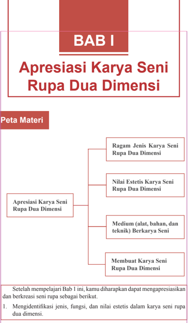

> **Deskripsi Visual:** Buku pelajaran ini berisi bab pertama dengan judul "Apresiasi Karya Seni Rupa Dua Dimensi". Bab ini dibagi menjadi empat subbab, yaitu Ragam Jenis Karya Seni Rupa Dua Dimensi, Nilai Estetis Karya Seni Rupa Dua Dimensi, Medium (alat, bahan, dan teknik) Berkarya Seni, dan Membuat Karya Seni Rupa Dua Dimensi. Setelah mempelajari bab ini, pembaca diharapkan dapat mengapresiasi dan berkreasi seni rupa sebagai berikut:

1. Mengidentifikasi jenis, fungsi, dan nilai estetis dalam karya seni rupa dua dimensi.
2. Menggunakan medium berkarya seni seperti alat, bahan, dan teknik.
3. Membuat karya seni rupa dua dimensi sendiri.

Gambar tersebut menunjukkan struktur bab ini dengan peta materi yang jelas. Bab ini mencakup berbagai aspek penting dalam apresiasi dan pengembangan karya seni rupa dua dimensi, mulai dari jenis-jenis karya hingga teknik dan medium yang digunakan.

 

---
## 📄 Halaman 12

- Mengidenti fi kasi  medium,  (alat,  bahan,  dan  teknik)  dalam  proses berkarya seni rupa dua dimensi.
- Membandingkan jenis, fungsi, dan nilai estetis dalam karya seni rupa dua dimensi.
- Membandingkan bahan, alat, dan teknik dalam proses berkarya seni rupa dua dimensi.
- Memilih jenis, fungsi, nilai estetis, dan medium dalam proses berkarya seni rupa dua dimensi.
- Membuat karya seni rupa dua dimensi.
Di kelas X dan XI, kamu sudah mempelajari berbagai jenis karya seni rupa dua dimensi. Karya-karya tersebut ada yang memiliki fungsi pakai dan ada yang memiliki fungsi hias saja. Masih ingatkah kamu perbedaan karya seni rupa terapan dan seni rupa murni? Cobalah perhatikan benda-benda di sekitar kamu! Dapatkah kamu menemukan dan membedakan jenis karya seni rupa terapan dan karya seni rupa murni?

### Amatilah gambar-gambar di bawah ini!

- Dapatkah kamu mengidenti fi kasi bahan yang digunakan dalam berkarya seni rupa dua dimensi tersebut?
- Dapatkah kamu mengidenti fi kasi teknik yang digunakan dalam berkarya seni rupa dua dimensi tersebut?
- Dapatkah kamu mengidenti fi kasi alat-alat yang digunakan dalam berkarya seni rupa dua dimensi tersebut?
- Dapatkah kamu menunjukkan unsur-unsur rupa yang terdapat pada karya seni rupa dua dimensi tersebut?
- Objek apa saja yang terdapat pada karya seni rupa dua dimensi tersebut?
- Bagaimanakah  penataan  unsur-unsur  rupa  pada  karya  seni  rupa  dua dimensi tersebut?
- Manakah karya seni rupa dua dimensi yang memiliki fungsi sebagai benda pakai?
- Manakah karya seni rupa dua dimensi yang paling menarik menurut kamu? Kemudian, jelaskan alasan ketertarikan kamu!

 

---
## 📄 Halaman 13

---
**🖼️ Gambar/Diagram**

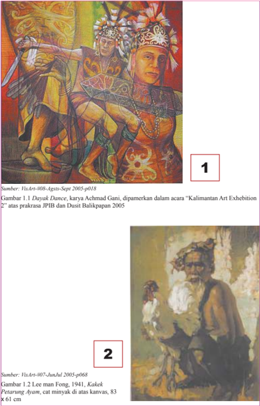

> **Deskripsi Visual:** Gambar 1 menunjukkan dua orang pria yang tampaknya sedang berpartisipasi dalam sebuah pertunjukan seni tradisional. Pria di sebelah kiri mengenakan pakaian adat dengan topi dan memegang senjata, sementara pria di sebelah kanan mengenakan pakaian formal dengan topi dan baret. Kedua gambar ini tampaknya merupakan hasil seni yang dipamerkan dalam acara "Kalimantan Art Exhibition" tahun 2005.

Gambar 2 menampilkan lukisan tradisional yang mungkin menggambarkan seorang pria tua dengan pakaian adat yang rumit. Lukisan ini tampaknya menggunakan teknik cat minyak pada kanvas, dengan ukuran 83 x 61 cm. 

Keduanya menunjukkan hubungan antara tradisi dan seni dalam budaya Kalimantan, dengan gambar 1 menunjukkan pertunjukan langsung dan gambar 2 menunjukkan hasil seni yang dihasilkan dari tradisi tersebut.

 

---
## 📄 Halaman 14

---
**🖼️ Gambar/Diagram**

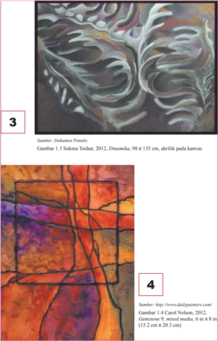

> **Deskripsi Visual:** Gambar 1.3 Sukma Toshar, 2012, Dinamika, 98 x 135 cm, akrilik pada kanvas menunjukkan sebuah lukisan yang menggambarkan bentuk-bentuk yang dinamis dan bergerak. Lukisan ini terdiri dari beberapa elemen utama seperti warna-warna cerah dan gelap yang membentuk struktur-struktur yang menyerupai tulang atau tulang burung. Warna-warna tersebut menciptakan efek refleksi dan transparansi yang menarik, memberikan kesan bahwa lukisan ini berada dalam keadaan gerak. Elemen-elemen ini saling terhubung dan saling mempengaruhi, menciptakan kesan kesatuan dan harmoni yang kuat. Teks "Sumber: Dokumen Penulis" dan "Gambar 1.3 Sukma Toshar, 2012, Dinamika, 98 x 135 cm, akrilik pada kanvas" memberikan informasi tentang sumber dan ukuran lukisan tersebut. Gambar 1.4 Carol Nelson, 2012, Gemstone 9, mixed media, 6 in x 8 in (15.2 cm x 20.3 cm) menunjukkan sebuah lukisan yang menggunakan teknik mixed media dengan bahan seperti batu permata dan media lainnya. Lukisan ini memiliki pola-pola yang rapi dan teratur, dengan warna-warna yang cerah dan kontras yang menciptakan kesan estetis yang menarik. Elemen-elemen utama termasuk pola, warna, dan teknik penggambaran yang digunakan. Teks "Sumber: http://www.dailypainters.com/" memberikan informasi tentang sumber dan ukuran lukisan tersebut. Dua gambar ini menunjukkan kemampuan penggambaran yang berbeda dalam menghasilkan lukisan yang menarik dan menarik perhatian pembaca.

 

---
## 📄 Halaman 15

5

Sumber: C Arts Vol.00 Nov-Dec 07

Gambar 1.5 Haris Purnomo, Bayi Garuda 1, 2007, oil , acrylic on canvas , 200 x 250 cm

---
**🖼️ Gambar/Diagram**

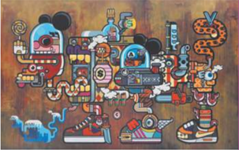

> **Deskripsi Visual:** Gambar ini adalah ilustrasi yang menampilkan berbagai bentuk dan elemen yang unik dan aneh. Gambar ini tampaknya menggambarkan dunia fantasi atau alternatif, dengan karakter yang memiliki bentuk dan ukuran yang sangat aneh dan tidak biasa. Beberapa karakter memiliki ekor seperti ikan, sementara beberapa lainnya memiliki bentuk seperti kereta api atau kapal. Ada juga elemen-elemen seperti benda-benda teknologi modern seperti smartphone dan komputer, yang tampaknya berada dalam hubungan dengan karakter-karakter tersebut.

Elemen-elemen utama dalam gambar ini meliputi karakter unik dengan bentuk yang aneh, benda-benda teknologi modern, dan elemen-elemen alam seperti air dan bumi. Karakter-karakter tersebut tampaknya berinteraksi dengan benda-benda teknologi modern, yang mungkin menunjukkan konsep tentang bagaimana teknologi mempengaruhi atau mengubah dunia.

Teks, angka, atau label penting yang terlihat dalam gambar ini tidak ada, sehingga informasi kunci yang dapat diambil pembaca hanya dari visual saja. Namun, gambar ini mungkin ingin mengajarkan tentang konsep tentang bagaimana teknologi mempengaruhi atau mengubah dunia, serta bagaimana karakter unik tersebut berinteraksi dengan teknologi tersebut.

Dalam gambar ini, kita dapat melihat bahwa teknologi modern dan karakter unik tersebut tampaknya berinteraksi dan saling mempengaruhi, yang mungkin ingin mengajarkan tentang bagaimana teknologi mempengaruhi atau mengubah dunia.

Sumber: http://ocula.com/artists/indieguerillas

Gambar 1.6 Indieguerillas, 2013, Only Designer Drugs Can TAme This Beast Inside Me , Acrylic and oil on canvas, 190 x 300 x 5 cm

 

---
## 📄 Halaman 16

Berdasarkan pengamatan kamu pada gambar-gambar tersebut, isilah tabel di bawah ini sesuai dengan jenis dan medium (alat, bahan, dan teknik) yang digunakan dalam proses pembuatan karya-karya tersebut. Jangan takut salah karena  kamu  tidak  melihatnya  secara  langsung!  Kamu  hanya  mengamati reproduksi karya seni rupa tersebut dalam buku ini.  Amati saja dengan saksama dan diskusikanlah dengan teman sekelompok!

---
**📊 Tabel**

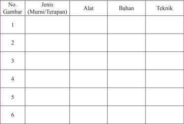

Tabel ini berisi informasi tentang jenis gambar, alat yang digunakan, bahan yang diperlukan, dan teknik yang digunakan untuk membuat setiap gambar. Topik utama tabel ini adalah proses pembuatan gambar, termasuk jenis gambar (murni atau terapan), alat yang digunakan, bahan yang diperlukan, dan teknik yang digunakan. Kolom-kolom yang ada dalam tabel ini adalah Gambar, Jenis (Murni/Terapan), Alat, Bahan, dan Teknik. Data atau pola penting yang terlihat dalam tabel ini adalah bahwa setiap baris menunjukkan informasi tentang satu gambar, termasuk jenis gambar, alat yang digunakan, bahan yang diperlukan, dan teknik yang digunakan. Ini membantu dalam memahami proses pembuatan gambar dan bagaimana setiap elemen dapat berkontribusi pada hasil akhir.

Setelah kamu mengisi kolom tentang jenis, alat, bahan, medium, dan teknik pada karya seni rupa dua dimensi tersebut, cobalah mengisi kolom berikut ini!

### Format Diskusi Hasil Pengamatan

Nama Siswa

: …………………………….

NIS

: …………………………….

Hari/Tanggal Pengamatan

: ……………………………

.

 

---
## 📄 Halaman 17

---
**📊 Tabel**

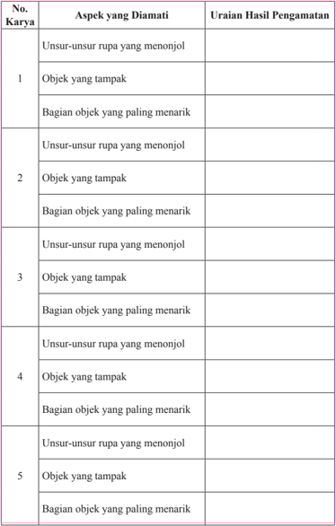

Tabel ini berisi informasi tentang aspek-aspek yang diamati dalam pengamatan objek, dengan kategori yang ditentukan oleh nomor karya. Topik utama tabel ini adalah pengamatan objek dan analisis aspek-aspeknya. Kolom-kolom utama meliputi nomor karya, aspek yang diamati, dan uraian hasil pengamatan. Data penting yang terlihat adalah bahwa setiap karya memiliki tiga aspek yang diamati: unsur-unsur rupa yang menonjol, objek yang tampak, dan bagian objek yang paling menarik. Ini menunjukkan bahwa pengamatan objek biasanya melibatkan pengecekan pada tiga aspek utama tersebut.

 

---
## 📄 Halaman 18

---
**📊 Tabel**

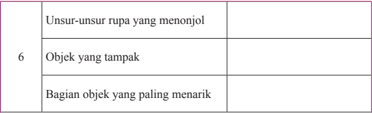

Tabel ini berisi informasi tentang elemen-elemen visual yang penting dalam desain grafis. Topik utamanya adalah bagaimana memilih unsur-unsur rupa yang menonjol, objek yang tampak, dan bagian objek yang paling menarik. Kolom pertama, "Unsur-unsur rupa yang menonjol," mencakup elemen-elemen visual yang paling mencolok dalam desain, seperti warna, ukuran, posisi, dan bentuk. Kolom kedua, "Objek yang tampak," mengacu pada elemen-elemen yang terlihat dengan jelas dan mudah diidentifikasi oleh mata pengamati. Kolom ketiga, "Bagian objek yang paling menarik," merujuk pada bagian tertentu dari objek yang memiliki karakteristik visual yang sangat menarik dan mampu menarik perhatian pengamati. Dari tabel ini, dapat dilihat bahwa pemilihan elemen-elemen visual yang tepat sangat penting untuk menciptakan desain yang menarik dan efektif.

Jika kamu kesulitan dalam mengisi kolom pengamatan karya ini, cobalah periksa kembali buku di kelas X dan XI dan sumber belajar lainnya yang telah kamu pelajari. Amati kembali gambar karya seni rupa dua dimensi tersebut dengan saksama, adakah makna simbolis yang kamu lihat pada bentuk, objek, dan  unsur-unsur  rupanya?  Jika  ada,  cobalah  kamu  tunjukkan  dan  uraikan simbol apa saja yang kamu temukan pada karya-karya seni rupa dua dimensi tersebut.

### A. Ragam Jenis Karya Seni Rupa Dua Dimensi

K amu sudah tahu bahwa karya seni rupa dua dimensi memiliki banyak ragam dan jenisnya.  Berdasarkan  bahannya,  kita  mengenal  karya  seni kriya kulit, kriya logam, kriya kayu, dan sebagainya. Adapun pengkategorian berdasarkan tekniknya, kita mengenal jenis karya seni batik, seni ukir, seni pahat,  kriya  anyam,  dan  sebagainya.  Pengkategorian  jenis  karya  seni  rupa berdasarkan waktu perkembangannya, kita dapat  mengelompokkan  ke dalam karya seni rupa pra sejarah, tradisional, klasik, modern, pos modern, kontemporer, dan sebagainya. Pengkategorian karya ini sangat kita perlukan terutama dalam kegiatan kritik dan apresiasi.

Selain  berdasarkan  bahan,  teknik,  dan  waktu,  karya  seni  rupa  dapat dikategorikan  juga  berdasarkan  fungsi  atau  tujuan  pembuatannya.  Melalui pengkategorian  berdasarkan  fungsi ini kita mengenal  karya  seni rupa terapan  dan  seni  rupa  murni  untuk  membedakan  kegunaan  praktis  dari karya  seni  rupa  tersebut.  Untuk  memenuhi  kebutuhan  (fungsi)  khusus  kita dapat mengategorikan karya seni rupa yang memiliki fungsi sosial, ekspresi, pendidikan, keagamaan, dan sebagainya.

 

---
## 📄 Halaman 19

Setelah kamu  mempelajari  tentang  jenis  karya  seni rupa,  cobalah menjawab beberapa pertanyaan di bawah ini!

- Ada berapa jenis karya seni rupa?
- Bagaimana kamu membedakan karya seni rupa berdasarkan dimensinya?
- Bagaimana kamu membedakan karya seni rupa berdasarkan bahannya?
- Bagaimana kamu membedakan karya seni rupa berdasarkan tekniknya?
- Bagaimana kamu membedakan karya seni rupa berdasarkan waktunya?
- Bagaimana kamu membedakan karya seni rupa berdasarkan fungsinya?

---
**🖼️ Gambar/Diagram**

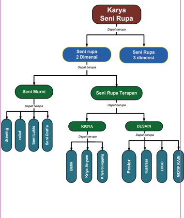

> **Deskripsi Visual:** Gambar ini adalah diagram yang menunjukkan struktur dan kelas dari seni rupa. Diagram ini dibagi menjadi dua bagian utama: "Seni Rupa" dan "Seni Murni". "Seni Rupa" kemudian dibagi menjadi dua sub-kelas: "Seni Rupa 2 Dimensi" dan "Seni Rupa 3 Dimensi". Untuk "Seni Murni", ada tiga sub-kelas: "Drawing", "Resil", dan "Seni Grafis". Untuk "Seni Rupa Terapan", ada dua sub-kelas: "KRIYA" dan "DESAIN". "KRIYA" lagi dibagi menjadi "Batik", "Kriya Ayam", "Kriya Burung", dan "Poster". "DESAIN" lagi dibagi menjadi "Ilustrasi", "LOGO", dan "MOTIF". Setiap sub-kelas memiliki warna yang berbeda untuk membedakannya.

 

---
## 📄 Halaman 20

### B. Nilai Estetis Karya Seni Rupa Dua Dimensi

N ilai estetis, identik dengan keindahan dan keunikan sebuah karya seni rupa.  Nilai  estetis  sebuah  karya  seni  rupa  terutama  dipengaruhi  oleh keharmonisan  dan  keselarasan  penataan  unsur-unsur  rupanya.  Nilai  estetis dapat juga bersifat subjektif sesuai selera orang yang melihatnya. Pengalaman pribadi, lingkungan, dan budaya di mana seseorang tinggal dapat menyebabkan nilai estetis sebuah karya seni rupa berbeda antara satu orang dengan orang yang lainnya.

Sebuah  karya  seni  rupa  menjadi  indah  dan  unik  karena  kemampuan perupanya  memilih  dan  memvisualisaikan  objek  pada  bidang  garapannya melalui  pengolahan  unsur-unsur  rupa.  Cobalah  amati  karya  seni  rupa  dua dimensi berikut ini. Identi fi kasi unsur-unsur rupa yang membentuk objek pada karya seni rupa tersebut. Dapatkah kamu menunjukkan unsur seni rupa apa yang paling menarik perhatian dari masing-masing karya tersebut? Dapatkah kamu mengidenti fi kasi  makna  simbolis  pada  unsur,  objek,  atau  tema  yang terdapat pada masing-masing karya seni rupa dua dimensi tersebut? Buatlah kelompok,  kemudian  diskusikan  jawaban  kamu  dengan  teman-teman  yang lain. Jelaskan jawaban kamu!

.

### Karya 1

On

Sumber: http://en.wikipedia.org Gambar 1.7 Wassily Kandinsky, 1923, White II , oil on canvas

---
**🖼️ Gambar/Diagram**

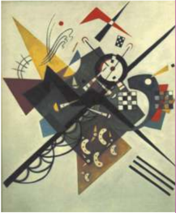

> **Deskripsi Visual:** Gambar ini adalah ilustrasi yang menampilkan karakteristik seni modern, mungkin dari era Art Deco atau Abstrak. Gambar ini menggambarkan dua karakter yang tampaknya bergerak atau berinteraksi dengan gaya yang khas dan berwarna-warni. Karakter tersebut memiliki bentuk geometris yang unik dan warna-warna cerah yang mencerminkan gaya seni modern.

Elemen-elemen utama dalam gambar ini meliputi dua karakter yang tampaknya bergerak atau berinteraksi, elemen-elemen warna yang mencerminkan gaya seni modern, dan elemen-elemen geometris yang mencerminkan gaya abstrak. Karakter tersebut tampaknya bergerak atau berinteraksi dengan gaya yang khas dan berwarna-warni.

Teks, angka, atau label penting yang terlihat dalam gambar ini tidak ada. Informasi kunci yang dapat diambil pembaca meliputi gaya seni modern, elemen-elemen warna yang mencerminkan gaya seni modern, dan elemen-elemen geometris yang mencerminkan gaya abstrak.

 

---
## 📄 Halaman 21

### Karya 2

---
**🖼️ Gambar/Diagram**

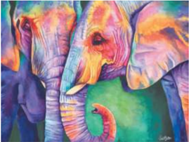

> **Deskripsi Visual:** Gambar ini adalah ilustrasi yang menampilkan dua gajah berwarna cerah dan berinteraksi satu sama lain. Gajah-gajah tersebut memiliki warna-warna yang mencolok seperti merah, hijau, biru, dan kuning, yang membuat gambar ini sangat menarik dan berwarna-warni. Gajah pertama tampak lebih besar dan berada di sebelah kiri, sedangkan gajah kedua tampak lebih kecil dan berada di sebelah kanan. Kedua gajah memiliki ekor yang panjang dan lebar, serta telinga yang besar dan bergerigi. Gajah-gajah ini tampak sangat hidup dan berinteraksi dengan cara yang menarik, mungkin menunjukkan hubungan atau persahabatan antara mereka. Warna-warna yang digunakan dalam gambar ini menciptakan suasana yang ceria dan menyenangkan, yang menunjukkan bahwa gambar ini mungkin digunakan untuk tujuan edukatif atau hiburan.

Sumber: http:sinclairstratton.com

Gambar 1.8 ' All Ears ', Elephants , Lukisan cat air karya Sinclair Stratton.

### Karya 3

---
**🖼️ Gambar/Diagram**

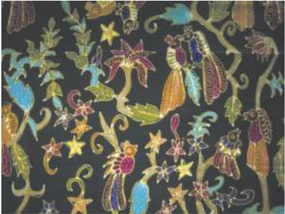

> **Deskripsi Visual:** Gambar ini adalah ilustrasi yang menampilkan berbagai karakter animasi berwarna-warni dan bergerak di atas latar belakang hitam. Ilustrasi ini tampaknya berasal dari sebuah buku pelajaran atau buku anak-anak, karena menggambarkan tema cerita atau fiksi. Karakter-karakter tersebut termasuk seekor burung cantik dengan bulu berwarna ungu dan biru, sekelompok binatang kecil seperti tikus dan kelinci, serta beberapa hewan laut seperti ikan dan kerang. Semua karakter tersebut tampaknya sedang bergerak atau berinteraksi dengan satu sama lain, mungkin dalam konteks cerita atau permainan.

Elemen-elemen utama dalam gambar ini meliputi karakter animasi yang berwarna-warni, latar belakang hitam yang memberikan kontras yang kuat, dan elemen-elemen seperti bulu burung, bulu tikus, dan warna-warna pada karakter. Relasi antara karakter tersebut tampaknya saling berinteraksi dan bergerak, menciptakan suasana yang hidup dan menarik.

Teks, angka, atau label penting tidak terlihat dalam gambar ini, karena ia hanya berupa ilustrasi tanpa teks atau angka. Informasi kunci yang dapat diambil pembaca meliputi tema cerita atau fiksi yang mungkin ditampilkan dalam gambar ini, serta penampilan dan perilaku karakter-karakter yang digambarkan.

Sumber: http://batikjuwana. fi les.wordpress.com

Gambar 1.9 Kain batik bakaran pati dengan motif burung kasmaran

 

---
## 📄 Halaman 22

### Karya 4

---
**🖼️ Gambar/Diagram**

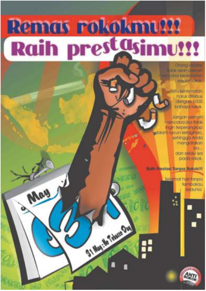

> **Deskripsi Visual:** Gambar ini adalah ilustrasi yang menampilkan sebuah poster promosi untuk mengurangi konsumsi rokok. Poster tersebut berisi teks dalam bahasa Melayu yang berbunyi "Remas rokokmu!!! Raih prestasimu!!!". Gambar utama adalah tangan yang memegang rokok dan menunjukkan tanda "May" yang biasanya digunakan sebagai kode untuk merokok. Latar belakang poster adalah sebuah kota dengan bangunan pencakar langit, yang menunjukkan bahwa konsumsi rokok dapat merusak lingkungan dan kesehatan.

Elemen-elemen utama dalam gambar ini meliputi:
1. Tangan yang memegang rokok.
2. Tanda "May" yang digunakan sebagai kode untuk merokok.
3. Latar belakang kota dengan bangunan pencakar langit.
4. Teks yang memberi pesan tentang pentingnya mengurangi konsumsi rokok.

Informasi kunci yang dapat diambil pembaca adalah bahwa poster ini bertujuan untuk mengajak orang untuk mengurangi konsumsi rokok dan mencapai prestasi atau keberhasilan dalam hidup mereka. Ini juga menekankan bahwa konsumsi rokok dapat merusak lingkungan dan kesehatan.

Sumber: http:gambardanfoto.com

Gambar 1.10 Poster anti rokok karya siswa SMA

 

---
## 📄 Halaman 23

### Format Hasil Pengamatan

Nama Siswa

: ………………………….

NIS

: ………………………….

Kelompok

: ………………………….

Hari/Tanggal Pengamatan

: ………………………….

- No. Aspek yang Diamati
Uraian Hasil Pengamatan

### Karya 1 …………….

- 1 Unsur-unsur rupa yang menonjol
- 2 Objek yang tampak
- 3 Bagian objek yang paling menarik
- 4 Makna simbolik pada unsur, objek, atau tema

### Karya 2 ……………..

- 1 Unsur-unsur rupa yang menonjol
- 2 Objek yang tampak
- 3 Bagian objek yang paling menarik
- 4 Makna simbolik pada unsur, objek, atau tema

### Karya 3…………..

- 1 Unsur-unsur rupa yang menonjol
- 2 Objek yang tampak
- 3 Bagian objek yang paling menarik

 

---
## 📄 Halaman 24

---
**📊 Tabel**

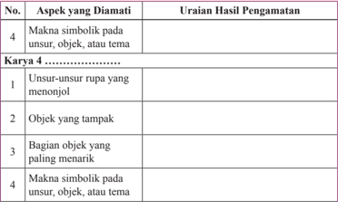

Tabel ini berisi informasi tentang pengamatan terhadap karya 4, yang merupakan sebuah karya seni atau kreatif. Kolom pertama menunjukkan aspek-aspek yang diamati, sementara kolom kedua menyajikan uraian hasil pengamatan untuk setiap aspek tersebut. Topik utama tabel ini adalah analisis dan pemahaman tentang karya seni yang diamati, dengan fokus pada makna simbolik, unsur-unsur rupa, objek yang tampak, bagian objek yang paling menarik, dan makna simbolik pada unsur, objek, atau tema dalam karya tersebut. Data penting yang terlihat meliputi detail tentang bagaimana elemen-elemen visual dan makna simbolik dalam karya tersebut dapat dianalisis dan diinterpretasikan.

### C. Medium Berkarya Seni Rupa Dua Dimensi

P erwujudan  sebuah  karya  seni  rupa  sangat  dipengaruhi  medium  yang digunakan dalam proses pembuatan karya tersebut. Medium berasal dari kata  'media'  yang  berarti  perantara.  Istilah  medium  biasanya  digunakan untuk menyebut berbagai hal yang berhubungan dengan bahan (termasuk alat dan teknik) yang dipakai dalam berkarya seni (Susanto, 2011). Keterampilan dalam mengolah bahan, menggunakan alat, dan penguasaan teknik yang baik sangat  diperlukan  untuk  mewujudkan  sebuah  karya  seni  yang  berkualitas. Ingatlah  bahwa keterampilan mewujudkan karya yang berkualitas ini tidak berkaitan  langsung  dengan  bakat  seseorang,  tetapi  lebih  dipengaruhi  oleh ketekunan dalam berlatih.

Setiap jenis karya seni rupa medium (alat, bahan, dan teknik) yang khas dalam proses perwujudannya. Demikian pula dalam berkarya seni rupa dua dimensi karena kekhasannya inilah maka ada karya seni rupa dua dimensi yang dinamai sesuai dengan bahan atau teknik pembuatannya. Tahukah kamu jenis karya seni rupa apa saja yang dinamai atau dikategorikan berdasarkan bahan dan tekniknya tersebut? Adakah karya-karya tersebut di sekitar kamu?

 

---
## 📄 Halaman 25

Apakah  kamu  sudah  pernah  melihat  karya  seni  lukis?  Medium  yang umum dikenal dalam berkarya seni lukis adalah kuas, kanvas, dan cat. Dengan menggunakan kuas, perupa menggoreskan cat pada permukaan kanvas untuk menciptakan bentuk-bentuk yang unik. Selain kanvas, medium lain juga dapat digunakan untuk berkarya lukisan. Ada lukisan yang menggunakan medium papan kayu ( board ), kertas, kaca, dan sebagainya. Jenis cat yang digunakan dalam melukis juga sangat banyak, ada yang berbasis air, ada yang berbasis minyak, ada yang berbentuk padat, dan ada juga yang berbentuk cair.

Pengunaan alat, bahan, dan teknik dalam proses pembuatan karya seni lukis dapat menyebabkan efek visualisasi yang berbeda-beda pula. Adakalanya kita dengan mudah mengetahui medium yang digunakan dalam berkarya seni lukis, tetapi ada kalanya kita sulit untuk membedakan penggunaan alat, bahan, dan teknik pada sebuah karya seni lukis terutama jika hanya melihat gambar reproduksinya saja.

Perhatikan  gambar-gambar  reproduksi  karya  seni  lukis  berikut  ini! Dapatkah kamu mengidenti fi kasi alat, bahan, dan teknik yang digunakan dalam  proses  pembuatannya?  Berilah  alasan  atas  jawaban  yang  kamu berikan!

Perhatikan  juga  unsur  rupa  dan  objek  pada  karya-karya  tersebut! Kemudian,  berikan  tanggapan  kamu  terhadap  masing-masing  karya  seni lukis tersebut!

---
**🖼️ Gambar/Diagram**

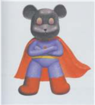

> **Deskripsi Visual:** Gambar ini adalah ilustrasi yang menampilkan karakter super hero berbentuk beruang dengan lengan yang ditepuk dan pakaian berwarna merah. Karakter tersebut mengenakan kostum berwarna merah dan biru dengan topi hitam. Ilustrasi ini mungkin digunakan untuk membantu pembaca memahami konsep tentang super hero atau karakter yang memiliki kekuatan unik.

Gambar 1.11 Lin Tianlu, 'Super Bear', 2008 , cat minyak pada kanvas canvas, 275 x 175 cm

---
**🖼️ Gambar/Diagram**

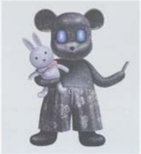

> **Deskripsi Visual:** Gambar ini adalah ilustrasi yang menampilkan karakter animasi berbentuk tikus dengan mata biru dan rambut hitam. Tikus tersebut sedang memegang sebuah boneka berwarna putih dan merah. Karakter ini tampak seperti正義 (Just) dalam bahasa Jepang, yang biasanya digunakan sebagai simbol keadilan atau kebenaran dalam budaya Jepang. Ilustrasi ini mungkin digunakan untuk menggambarkan konsep keadilan atau kebenaran dalam konteks pelajaran.

 

---
## 📄 Halaman 26

---
**🖼️ Gambar/Diagram**

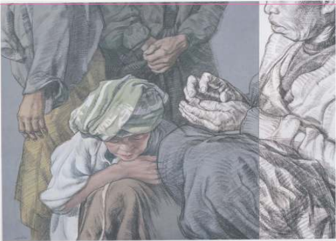

> **Deskripsi Visual:** Gambar ini adalah ilustrasi yang menunjukkan dua orang dewasa berdiri di samping seorang anak kecil yang sedang duduk di atas kursi. Orang dewasa tersebut tampaknya sedang menghormati atau memeluk anak kecil tersebut. Ilustrasi ini mungkin digunakan untuk membantu pembaca memahami konsep tentang hubungan emosional antara orang tua dan anak-anak.

Elemen-elemen utama dalam gambar ini meliputi:
1. Dua orang dewasa yang berdiri di samping.
2. Seorang anak kecil yang duduk di kursi.
3. Posisi dan gerakan orang dewasa yang menunjukkan rasa hormat atau kasih sayang.
4. Kursi yang digunakan oleh anak kecil.

Teks, angka, atau label penting tidak terlihat dalam gambar ini karena ia hanya berupa ilustrasi.

Informasi kunci yang dapat diambil pembaca dari gambar ini adalah bahwa hubungan emosional antara orang tua dan anak-anak sangat penting dan harus dihormati. Gambar ini juga dapat digunakan untuk membantu mengajarkan tentang pentingnya kasih sayang dan pengertian antara orang tua dan anak-anak.

Gambar 1.12 Chusin, ' Rp. 100.000 ', 2004, cat minyak charcoal pada kanvas canvas, 100 x 132 cm

 

---
## 📄 Halaman 27

---
**🖼️ Gambar/Diagram**

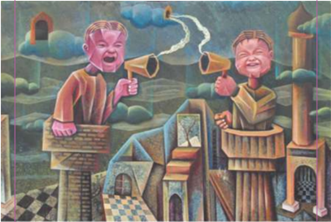

> **Deskripsi Visual:** Gambar ini merupakan ilustrasi yang menampilkan dua karakter yang tampak seperti orang tua tua, tetapi dengan wajah manusia yang berbeda. Mereka sedang berbicara melalui mikrofon yang terpasang di atas mereka. Karakter di sebelah kiri memiliki wajah ceria dan sedang menggenggam mikrofon, sementara yang di sebelah kanan memiliki wajah serius dan juga sedang menggunakan mikrofon. Kedua karakter tersebut berada di atas bangunan yang tampak seperti rumah tradisional dengan atap berbentuk bulan sabit. Latar belakangnya adalah langit malam dengan beberapa bintang dan bulan. Di sekeliling bangunan ada beberapa elemen lain seperti pohon dan rumput hijau. Gambar ini mungkin digunakan untuk membahas topik tentang komunikasi, interaksi sosial, atau bahkan konsep filosofis tertentu.

Gambar 1.14 Janu Purwanto Untoro , 2009, 'Ruang Pengikat Hati 100 x 140 cm,

 

---
## 📄 Halaman 28

### D. Berkarya Seni Rupa Dua Dimensi

Berkarya seni rupa dua dimensi adalah kegiatan (proses) menggunakan alat dan bahan tertentu melalui keterampilan teknik berkarya seni rupa untuk memvisualisasikan gagasan, pikiran, dan atau perasaan seorang perupa pada bidang dua dimensi. Berikut disajikan sketsa proses berkarya .

---
**🖼️ Gambar/Diagram**

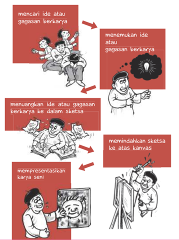

> **Deskripsi Visual:** Gambar ini adalah ilustrasi yang menunjukkan proses kreatif dalam menciptakan karya seni. Gambar ini terdiri dari empat panel yang menggambarkan langkah-langkah yang harus dilalui untuk menciptakan sebuah karya seni. 

Pertama, ada dua orang yang sedang berbicara tentang ide-ide kreatif. Ini menunjukkan tahap pertama dalam proses kreatif, yaitu mencari ide atau gagasan berkarya. Setelah itu, ada seorang pria yang sedang berpikir keras dengan lampu bolak-balik di depannya, menunjukkan tahap kedua, yaitu menemukan ide atau gagasan berkarya.

Lanjut ke tahap ketiga, ada seorang pria yang sedang menulis ide-ide tersebut ke dalam sketsa. Ini menunjukkan tahap ketiga, yaitu menyuangkan ide atau gagasan berkarya ke dalam sketsa. Terakhir, ada seorang pria yang sedang mempresentasikan karya seni di depan kanvas. Ini menunjukkan tahap keempat, yaitu memindahkan sketsa ke atas kanvas.

Teks pada gambar ini tidak menyebutkan angka atau label spesifik, tetapi secara umum menunjukkan proses kreatif dalam menciptakan karya seni. Informasi kunci yang dapat diambil pembaca adalah bahwa proses ini melibatkan berbagai tahap, mulai dari mencari ide hingga mempresentasikan hasil karya.

 

---
## 📄 Halaman 29

Kamu  telah  mengamati  dan  belajar  tentang  medium  (alat,  bahan,  dan teknik) dalam berkarya seni rupa. Perhatikan contoh karya-karya seni rupa dua dimensi berikut ini!

---
**🖼️ Gambar/Diagram**

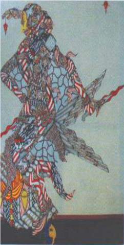

> **Deskripsi Visual:** Gambar ini adalah ilustrasi yang menampilkan tokoh dengan latar belakang berwarna biru muda. Tokoh tersebut memiliki rambut panjang dan berwarna hitam, serta mengenakan pakaian tradisional yang terbuat dari bahan berwarna putih dan merah. Pakaian tersebut tampak seperti batik dengan motif yang kompleks dan indah. Tokoh ini juga memegang senjata besar yang tampak seperti pedang, dengan ujungnya berwarna merah dan putih. Di sekitar tokoh, terdapat beberapa elemen lain seperti bunga-bunga kecil berwarna merah dan putih, serta beberapa benda kecil berwarna merah dan putih yang tampak seperti simbol-simbol atau perhiasan. Gambar ini tampaknya menggambarkan tokoh dalam situasi yang serius atau berperan penting dalam cerita atau cerita yang ditampilkan dalam buku pelajaran ini.

Sumber: dok Galeri Nasional Indonesia

Gambar 1.15 Joni Susanto, 2010, 'Ruller In Reality', Cat minyak di atas kanvas, 200 x 145 cm,

 

---
## 📄 Halaman 30

Sumber: dok Galeri Nasional Indonesia

Perhatikan objek pada karya-karya tersebut! Kamu tentu dapat membedakan mana objek makhluk hidup dan mana objek benda tak hidup atau  mungkin  objeknya  tidak  merepresentasikan  keduanya.  Apakah  objek pada karya lukisan-lukisan tersebut memiliki makna simbolis tertentu? Kamu juga dapat mencoba mengidenti fi kasi bahan dan teknik yang digunakan untuk membuat  karya-karya  tersebut, bukan ?  Kemudian,  cobalah  berlatih  untuk membuat karya seni rupa. Gunakanlah salah satu alat, bahan, dan teknik yang pernah  kamu pelajari.  Jika  sudah,  cobalah  berkarya  kembali  menggunakan objek,  alat,  bahan,  dan  teknik  yang  berbeda-beda.  Rasakan  oleh  kamu  dan kemukakan objek mana yang menurut kamu paling menarik. Alat, bahan dan teknik apa yang paling kamu sukai? Jelaskan mengapa objek tersebut menarik dan bahan serta teknik tersebut kamu sukai! Sajikan karya kamu bersamasama,  kemudian  diskusikan  bersama-sama.  Berilah  tanggapan  tidak  hanya pada karya yang kamu buat, tetapi karya yang dibuat teman-teman yang lain.

 

---
## 📄 Halaman 31

Nama

: …………………..................................

Kelas

: …………………..................................

Semester

: …………………..................................

Waktu penilaian

: …………………..................................

No

### Pernyataan

1

Saya berusaha belajar tentang medium (alat, bahan, dan teknik) berkarya seni rupa dua dimensi.

2

Saya berusaha belajar membuat karya seni rupa dua dimensi.

3

Saya  mengikuti  pembelajaran  apresiasi  karya  seni  rupa  dua dimensi dengan sungguh-sungguh.

4

Saya mengerjakan tugas yang diberikan guru tepat waktu.

5

Saya mengajukan pertanyaan jika ada yang tidak dipahami.

Ya

### Uji Kompetensi

### Penilaian Pribadi

 

---
## 📄 Halaman 32

6

Saya  aktif  dalam  mencari  informasi  tentang  alat,  bahan,  dan teknik berkarya seni rupa dua dimensi.

7

Saya menghargai keunikan berbagai jenis karya seni rupa dua dimensi.

8

Saya  menghargai  keunikan  karya  seni  rupa  dua  dimensi  yang dibuat oleh teman saya.

9

Saya tidak malu untuk menyajikan karya seni rupa dua dimensi yang saya buat.

Nama teman yang dinilai

: …………………..................................

Nama penilai

: …………………..................................

Kelas

: …………………..................................

Semester

: …………………..................................

Waktu penilaian

: …………………..................................

### No

### Pernyataan

1

Berusaha belajar dengan sungguh-sungguh.

### Penilaian Antarteman

 

---
## 📄 Halaman 33

2

Mengikuti pembelajaran dengan penuh perhatian.

3

Mengerjakan tugas yang diberikan guru tepat waktu.

4

Mengajukan pertanyaan jika ada yang tidak dipahami.

5

Berperan aktif dalam kelompok.

6

Menyerahkan tugas tepat waktu.

7

Menghargai keunikan ragam seni rupa dua dimensi.

8

Menguasai dan dapat mengikuti kegiatan pembelajaran dengan baik.

9

Menghormati dan menghargai teman.

 

---
## 📄 Halaman 34

### Penugasan

Mengumpulkan gambar (reproduksi)  karya  seni  rupa  dua  dimensi  dari berbagai sumber. Kemudian, membuat analisis sederhana berkaitan dengan nama perupa (jika ada), jenis karya, medium (alat, teknik, dan bahan), serta unsur fi sik  dan  non fi sik.  Kumpulkan juga informasi tentang perkembangan medium (bahan, alat, dan teknik) yang digunakan dalam membuat karya seni rupa dua dimensi.

### Proyek

Cobalah  membuat  karya  seni  lukis,  kolase  kertas,  dan  desain  dekorasi dengan  menggunakan  berbagai  variasi  alat,  bahan,  dan  teknik.  Mulailah dengan mencari ide atau gagasan terlebih dahulu, kemudian buatlah beberapa sketsa rancangan dari masing-masing karya seni rupa yang akan kamu buat. Simpan sketsa yang telah kamu buat tersebut dan pilihlah satu sketsa atau rancangan  dari  masing-masing  karya  yang  akan  kamu  buat  untuk  kamu wujudkan menjadi karya seni rupa dua dimensi berupa lukisan, kolase kertas, dan  desain  dekorasi.  Pilihlah  objek,  bentuk,  dan  warna  yang  paling  kamu sukai dan yang kamu anggap paling unik dan menarik. Buatlah laporan tertulis sebagai pendamping karya seni rupa dua dimensi yang kamu buat tersebut. Kemukakan alasan pemilihan ide, tema, bentuk, bahan, dan teknik serta alat yang  kamu  pilih.  Pada  akhir  laporan,  kemukakan  keunikan  dari  masingmasing karya yang kamu buat.

### Rangkuman

Karya  seni  rupa  dikategorikan  berdasarkan  medium  (bahan,  alat,  dan teknik),  waktu,  fungsi,  serta  tujuan  pembuatannya.  Perkembangan  ilmu pengetahuan  dan  teknologi  sangat  mempengaruhi  perkembangan  pengategorian karya seni rupa ini. Kreativitas seorang perupa mencari berbagai kemungkinan penggunaan medium berkarya seni rupa menyebabkan jenis karya seni rupa semakin beragam jenisnya.

 

---
## 📄 Halaman 35

Nilai estetis sebuah karya seni rupa dapat bersifat objektif berdasarkan penataan  unsur-unsur  rupanya  atau  bersifat  subjektif  berdasarkan  wawasan dan pengalaman serta selera penikmatnya.

### Re fl eksi

Keindahan sebuah karya tidak hanya perwujudan bentuknya saja, tetapi kesungguhan dalam membuat karya tersebut akan menjadikan karya kamu unik  dan  menarik.  Setiap  manusia  memiliki  karakter  dan  keunikan  yang berbeda-beda, demikian juga dengan karya yang kamu buat.

Tanggapan terhadap sebuah karya seni rupa mungkin saja berbeda satu dengan yang lainnya. Perbedaan pandangan dan pendapat ini menunjukkan keberagaman penilaian, minat, dan ketertarikan terhadap sebuah karya seni rupa. Melalui berbagai perbedaan ini kamu belajar untuk saling memahami dan menghargai perbedaan.

 

---
## 📄 Halaman 36

### Peta Materi

---
**🖼️ Gambar/Diagram**

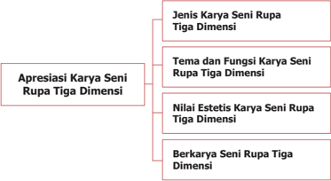

> **Deskripsi Visual:** Gambar ini adalah diagram yang menunjukkan struktur apresiasi karya seni rupa tiga dimensi. Diagram ini terdiri dari empat bagian utama:

1. **Jenis Karya Seni Rupa Tiga Dimensi** - Ini merupakan topik utama yang dikelompokkan menjadi dua subtopik: Tema dan Fungsi Karya Seni Rupa Tiga Dimensi.

2. **Apresiasi Karya Seni Rupa Tiga Dimensi** - Ini adalah bagian utama yang terbagi menjadi empat subbagian:
   - **Tema dan Fungsi Karya Seni Rupa Tiga Dimensi**
   - **Nilai Estetis Karya Seni Rupa Tiga Dimensi**
   - **Berkarya Seni Rupa Tiga Dimensi**

Elemen-elemen utama dalam diagram ini adalah:
- **Subtopik Tema dan Fungsi Karya Seni Rupa Tiga Dimensi** yang membahas tentang konsep dasar karya seni rupa tiga dimensi.
- **Subtopik Nilai Estetis Karya Seni Rupa Tiga Dimensi** yang fokus pada aspek estetika karya seni rupa tiga dimensi.
- **Subtopik Berkarya Seni Rupa Tiga Dimensi** yang mengajarkan cara membuat karya seni rupa tiga dimensi.

Informasi kunci yang dapat diambil pembaca melalui diagram ini adalah bahwa apresiasi karya seni rupa tiga dimensi melibatkan pemahaman tentang tema dan fungsi karya seni, penilaian nilai estetiknya, serta kemampuan untuk berkarya dalam bidang tersebut.

Setelah mempelajari Bab 2 ini, kamu diharapkan dapat mengapresiasikan dan berkreasi seni rupa, sebagai berikut.

- Mengidenti fi kasi jenis karya seni rupa tiga dimensi.
- Mengidenti fi kasi tema dalam karya seni rupa tiga dimensi.
- Mengidenti fi kasi nilai estetis dalam karya seni rupa tiga dimensi.
- Membandingkan jenis karya seni rupa tiga dimensi.
- Membandingkan tema dalam karya seni rupa tiga dimensi.
- Membandingkan nilai estetis dalam karya seni rupa tiga dimensi.
- Membuat konsep berkarya seni rupa tiga dimensi.

 

---
## 📄 Halaman 37

- Membuat sketsa karya seni rupa tiga dimensi.
- Membuat karya seni rupa tiga dimensi.
- Menunjukkan  sikap  bertanggung  jawab  dalam  proses  berkarya  seni rupa tiga dimensi.
- Menyajikan karya seni rupa tiga dimensi hasil buatan sendiri.
- Mempresentasikan  karya  seni  rupa  tiga  dimensi  hasil  buatan  sendiri dengan lisan maupun tulisan.
Kamu sudah mengenal dan mempelajari karya seni rupa yang berdimensi dua  dan  berdimensi  tiga.  Kamu  juga  sudah  pernah  mencoba  berkarya  seni rupa dua dimensi. Pada bahasan ini, kamu akan mempelajari dan membuat kembali karya seni rupa tiga dimensi.

Cobalah pelajari  kembali  materi  bahan  ajar  di  kelas  X  dan  XI  tentang apresiasi dan berkarya seni rupa tiga dimensi, kemudian perkuat pemahaman kamu dengan mempelajari bab ini.

Ketika kamu melihat sebuah karya seni rupa tiga dimensi, aspek apa saja yang kamu lihat?

Coba kamu amati gambar di bawah ini untuk mengidentifi  kasi aspekaspek tersebut!

---
**🖼️ Gambar/Diagram**

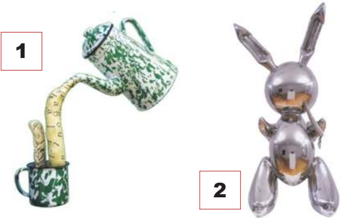

> **Deskripsi Visual:** Gambar ini adalah ilustrasi yang menunjukkan dua objek yang berbeda. Objek pertama adalah sebuah botol dengan tutup berwarna hijau dan putih, diletakkan di atas sebuah gelas yang sama warna. Objek kedua adalah sebuah boneka berbentuk kelinci yang berwarna emas, tampak seperti robot. Ilustrasi ini mungkin digunakan untuk membantu pembaca memahami konsep atau perbandingan antara dua objek yang berbeda.

Sumber: Galeri Nasional Indonesia

Gambar 2.1: Yuli Prayitno, 2003, Instan , mix media, 92 x 34 x 14 cm

Gambar 2.2: Jeff Koons, Rabbit steel, 104 x 48 x 30 cm

 

---
## 📄 Halaman 38

---
**🖼️ Gambar/Diagram**

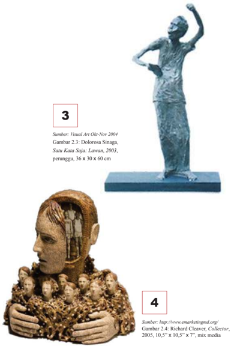

> **Deskripsi Visual:** Gambar 2.3 dan Gambar 2.4 adalah dua ilustrasi yang menunjukkan karya seni berbeda. Gambar 2.3 menampilkan sebuah patung berukuran 36 x 30 x 60 cm yang diperkirakan dibuat oleh Dolorosa Sinaga, dengan judul "Satu Kata Saja: Lawan". Patung tersebut tampak seperti seorang pria yang sedang berdiri dengan posisi tangan di depan tubuh dan tangan lainnya di atas kepala, mungkin menggambarkan suasana emosional atau perasaan tertentu.

Sementara itu, Gambar 2.4 menunjukkan karya seni yang lebih kompleks, dengan ukuran 10,5" x 10,5" x 7", yang tampaknya dibuat oleh Richard Cleaver. Karya ini terbuat dari bahan mix media, yang menciptakan efek visual yang unik dan menarik. Ini tampak seperti sebuah struktur yang terbuat dari beberapa elemen, mungkin menggambarkan konsep atau ide tertentu.

Kedua gambar ini menunjukkan variasi dalam gaya dan teknik seni, serta menunjukkan bagaimana pengarang dapat menggunakan bahan dan ukuran untuk menciptakan karya yang unik dan menarik.

 

---
## 📄 Halaman 39

---
**🖼️ Gambar/Diagram**

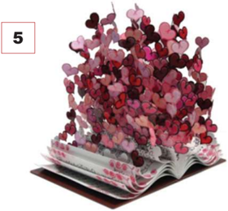

> **Deskripsi Visual:** Gambar ini adalah ilustrasi yang menampilkan sebuah buku dengan halaman berwarna merah muda dan putih. Halaman-halaman tersebut tampak seperti bunga-bunga kecil berbentuk hati yang berwarna-warni, mulai dari merah, pink, sampai ungu. Buku ini tampak seperti sedang dibuka dan membuka halaman-halaman tersebut menghasilkan bentuk bunga-bunga hati yang semakin besar dan bergerigi. Di bagian atas gambar ada angka "5" yang menunjukkan bahwa ini mungkin merupakan salah satu dari banyak ilustrasi dalam buku tersebut.

1. **Apa yang ditampilkan secara keseluruhan**: Gambar ini menampilkan sebuah buku yang terbuka, dengan halaman-halaman yang tampak seperti bunga-bunga hati yang berwarna-warni dan bergerigi.

2. **Elemen-elemen utama dan relasinya**: Elemen utama dalam gambar ini adalah buku yang terbuka, dengan halaman-halaman yang tampak seperti bunga-bunga hati. Relasi antara elemen-elemen ini adalah bahwa halaman-halaman buku tersebut membuka dan menghasilkan bentuk bunga-bunga hati yang semakin besar dan bergerigi.

3. **Teks, angka, atau label penting yang terlihat**: Teks atau angka penting yang terlihat dalam gambar ini adalah angka "5", yang mungkin menunjukkan bahwa ini adalah salah satu dari banyak ilustrasi dalam buku tersebut.

4. **Informasi kunci yang dapat diambil pembaca**: Informasi kunci yang dapat diambil pembaca adalah bahwa gambar ini menunjukkan sebuah buku yang terbuka, dengan halaman-halaman yang tampak seperti bunga-bunga hati yang berwarna-warni dan bergerigi. Ini mungkin merupakan ilustrasi dari buku tentang desain grafis atau desain percetakan.

Gambar 2.5: David Kracov, Book of Love , a colorful metal art sculpture

---
**🖼️ Gambar/Diagram**

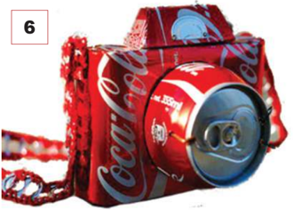

> **Deskripsi Visual:** Gambar ini adalah ilustrasi yang menunjukkan tas yang dibuat dari bahan kemasan botol Coca-Cola. Tas ini tampak seperti sebuah tas selempang dengan desain yang unik dan menarik. Bahan utama tas ini adalah bahan kemasan botol Coca-Cola yang telah dibentuk ulang menjadi bentuk tas. Di bagian atas tas, terdapat tulisan "Coca-Cola" yang jelas dan menunjukkan bahwa tas ini dibuat dari bahan kemasan produk tersebut. Elemen-elemen utama dalam gambar ini meliputi tas yang dibuat dari bahan kemasan botol Coca-Cola, tulisan "Coca-Cola" pada tas, dan logo Coca-Cola yang tampak jelas. Informasi kunci yang dapat diambil dari gambar ini adalah bahwa tas ini dibuat dari bahan kemasan produk Coca-Cola dan memiliki desain yang unik dan menarik.

Gambar 2.6: Ian Muttoo, 35mm Camera, can art , kaleng bekas Coca cola

 

---
## 📄 Halaman 40

Setelah  kamu  mengamati  gambar-gambar  tersebut,  selanjutnya  jawablah pertanyaan-pertanyaan berikut!

- Dapatkah kamu mengidenti fi kasi bahan yang digunakan dalam berkarya seni rupa tiga dimensi tersebut?
- Dapatkah kamu mengidenti fi kasi teknik yang digunakan dalam berkarya seni rupa tiga dimensi tersebut?
- Dapatkah kamu mengidenti fi kasi alat yang digunakan dalam berkarya seni rupa tiga dimensi tersebut?
- Dapatkah kamu menunjukkan unsur-unsur rupa yang terdapat pada karya seni rupa tiga dimensi tersebut?
- Objek apa saja yang terdapat pada karya seni rupa tiga dimensi tersebut?
- Bagaimanakah penataan unsur-unsur rupa pada karya seni rupa tiga dimensi tersebut?
- Manakah karya seni rupa tiga dimensi yang memiliki fungsi benda pakai?
- Manakah karya seni rupa tiga dimensi yang paling menarik menurut kamu? Jelaskan alasan ketertarikan kamu!
Berdasarkan  pengamatan  kamu,  sekarang  kelompokkan  dan  isilah  tabel  di bawah ini sesuai dengan jenis karya seni rupa tiga dimensi!

---
**📊 Tabel**

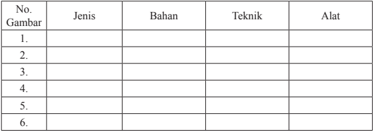

Tabel ini berisi informasi tentang berbagai jenis gambar yang diperlukan dalam pembuatan sebuah proyek atau tugas. Kolom-kolomnya meliputi nomor gambar, jenis gambar, bahan yang digunakan, teknik pembuatan, dan alat yang diperlukan. Topik utama tabel ini adalah proses pembuatan gambar dalam konteks pembelajaran atau proyek. Data penting yang terlihat adalah bahwa setiap baris menunjukkan satu jenis gambar dengan spesifikasi bahan, teknik, dan alat yang berbeda-beda. Ini membantu dalam memahami bagaimana berbagai elemen dapat digabungkan untuk menciptakan hasil yang berbeda.

### A. Jenis, Tema dan Fungsi Karya Seni Rupa Tiga Dimensi

S eperti karya seni rupa dua dimensi, berdasarkan fungsinya, karya seni rupa tiga  dimensi  juga  dibedakan  menjadi karya yang memiliki fungsi pakai (seni  rupa  terapan  applied art )  dan  karya  seni  rupa  yang  hanya  memiliki fungsi  ekspresi  saja  (seni  rupa  murni  pure  art ).  Perbedaan  fungsi  pada sebuah karya seni rupa ditentukan oleh tujuan pembuatannya. Karya seni rupa sebagai benda pakai yang memiliki fungsi praktis dibuat dengan pertimbangan

 

---
## 📄 Halaman 41

kegunaanya. Dengan demikian, bentuk benda atau karya seni rupa tersebut akan  semakin  indah  dilihat  dan  semakin  nyaman  digunakan.  Oleh  karena fungsi terapan atau fungsi praktis (pakai) sebuah karya seni rupa adalah aspek utama yang harus diperhatikan, maka dalam pembuatan karya seni rupa ini seorang perupa (desainer) akan mempertimbangkan aspek tersebut sebelum menambahkan unsur lainnya.

Pada pembelajaran seni rupa di kelas X, kamu juga telah mempelajari tentang  tema  dalam  karya  seni  rupa.  Karya  seni  rupa  dapat  dikategorikan berdasarkan  temanya.  Seorang  perupa  akan  memilih  tema  tertentu  sebagai bagian  dari  konsep  berkaryanya.  Dengan  penentuan  tema,  seorang  perupa akan memilih objek dan medium berkaryanya. Tema yang sama dari beberapa orang perupa sangat mungkin diungkapkan dengan gaya, objek, dan medium yang  berbeda.  Cobalah  kamu  eksplorasi  berbagai  karya  seni  rupa  yang memiliki kesamaan tema, tetapi ditampilkan dengan gaya, objek, dan medium yang berbeda-beda.

Perhatikan tabel dan gambar di bawah ini! Melalui tabel ini kamu akan berlatih membedakan karya seni rupa tiga dimensi yang memiliki fungsi pakai dan  yang  memiliki  fungsi  ekspresi  saja.  Kumpulkan  sebanyak-banyaknya gambar atau foto berbagai karya seni rupa tiga dimensi, kemudian buatlah analisis  menggunakan  tabel  seperti  contoh  yang  tersedia  di  bawah  ini. Diskusikanlah jawaban kamu dengan teman-teman yang lain!

### Keterangan:

____________________

____________________

____________________

____________________

____________________

____________________

### Fungsi

Sumber: http://180-out.blogspot.com/2013/01/virtuoso-giant-cellist-with.html

Gambar 2.7 Patung pemain biola setinggi 36 kaki karya pematung David Adickes terletak di Louisiana Street, di depan gedung Teater Lyric  Houston Texas.

 

---
## 📄 Halaman 42

Coba perhatikan di sekitar kamu adakah karya seni rupa tiga dimensi yang berbentuk patung, tugu, atau monumen? Adakah makna simbolis dari karyakarya tiga dimensi tersebut? Tahukah kamu tokoh, peristiwa, atau tempat apakah yang ditandai oleh kehadiran karya-karya tiga dimensi tersebut?

---
**🖼️ Gambar/Diagram**

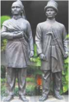

> **Deskripsi Visual:** Gambar ini adalah ilustrasi yang menunjukkan dua orang pria berdiri dengan posisi yang sama. Mereka mengenakan pakaian tradisional yang mirip, termasuk topi dan baju panjang. Kedua orang tampak serasi dalam pose mereka, dengan tangan mereka berada di depan tubuh mereka. Ilustrasi ini mungkin digunakan untuk membantu pembaca memahami penampilan atau peran dari karakter tersebut dalam konteks cerita atau teks yang lebih luas.

Sumber: http://www.kaskus.co.id

Gambar 2.8 Patung tokoh pahlawan Lokasi Museum Keperajuritan TMII Jakarta

Karya seni rupa tiga dimensi memiliki unsur-unsur rupa seperti warna, garis,  bidang ,  dan bentuk. Unsur-unsur  rupa  itu  digunakan  selain  untuk memperindah  bentuknya,  unsur  rupa  pada  karya  seni  rupa  tiga  dimensi ini  dapat  saja  memiliki  makna  simbolis.  Di  kelas  X  dan  XI  kamu  sudah mempelajari  unsur-unsur  rupa  dan  makna  dari  unsur-unsur  rupa  tersebut. Garis, bidang, bentuk, dan warna memiliki berbagai makna simbolis. Maknamakna simbolis ini mungkin saja berbeda antara satu daerah dengan daerah lainnya. Cobalah kamu cari informasi makna simbolik dari warna-warna atau bentuk-bentuk tertentu di daerah tempat tinggalmu, kemudian tentukan tema dari karya-karya tersebut.

Amati karya-karya seni rupa tiga dimensi berikut ini! Identi fi kasikan unsurunsur rupa pada karya-karya seni rupa tiga dimensi tersebut. Kemudian, cobalah  cari  makna  simbolis  dari  karya-karya  seni  rupa  tiga  dimensi berikut ini baik wujudnya secara utuh maupun pada unsur-unsur rupanya, kemudian tentukan tema dari karya-karya tersebut.

 

---
## 📄 Halaman 43

Sumber: http://bendakuno.blogspot.com Gambar 2.10: Patung gadis berkuda dari bahan logam, tinggi 18 cm, lebar 18 cm

 

---
## 📄 Halaman 44

3

Sumber: http://www.urbansplatter.com

Gambar 2.11 Patung Liberty, Terletak di Pulau Libery tepat di muara sungai Hudson di New York Harbor, Amerika Serikat. Karya Auguste Barthol, 1886.

Sumber: Dok. Galeri Nasional Jakarta Visual Art Jun-Jul 2004

Gambar 2.12  G.  Sidharta,1998,  Dewi  Kebahagiaan dari Timur, Kayu berwarna, 220 x 102 x 42 cm

 

---
## 📄 Halaman 45

---
**🖼️ Gambar/Diagram**

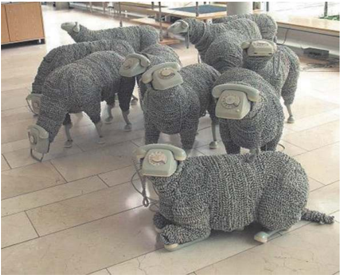

> **Deskripsi Visual:** Gambar ini adalah ilustrasi yang menunjukkan serangkaian seekor seekor kerbau yang dikenakan dengan pakaian rajutan berwarna putih dan abu-abu. Kerbau-kerbau tersebut tampak seperti sedang berdiri atau berjalan di atas lantai yang terbuat dari batu. Setiap kerbau memiliki kepala yang diberi topi rajutan dan ekor yang pendek. Ilustrasi ini mungkin digunakan untuk menggambarkan konsep tentang penggunaan pakaian rajutan dalam kehidupan sehari-hari atau sebagai bagian dari tema pembelajaran tentang budaya atau seni.

Gambar 2.14: Kriya Kayu berbentuk Bebek

 

---
## 📄 Halaman 46

---
**🖼️ Gambar/Diagram**

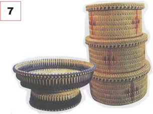

> **Deskripsi Visual:** Gambar ini menunjukkan tiga piring yang terbuat dari bahan yang tampak seperti rotan atau serat bambu. Piring teratas memiliki ukuran yang lebih kecil dibandingkan dengan piring berikutnya, yang kemudian lebih besar lagi. Setiap piring memiliki desain yang unik dengan pola warna yang mencolok, terutama pada bagian tengah dan tepi piring. Piring teratas memiliki desain yang lebih sederhana, sedangkan piring berikutnya memiliki pola yang lebih kompleks dan menarik. Gambar ini mungkin digunakan untuk menggambarkan konsep tentang perbandingan ukuran dan desain dalam pembuatan piring.

8

 

---
## 📄 Halaman 47

9

---
**🖼️ Gambar/Diagram**

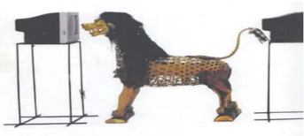

> **Deskripsi Visual:** Gambar ini adalah ilustrasi yang menunjukkan dua kotak pilihan (kotak suara) yang berada di dekat satu sama lain. Di antara kedua kotak tersebut, terdapat seekor singa yang tampak seperti menggali lubang di salah satu kotak. Singa tersebut memiliki ekor yang panjang dan bergerigi, serta tubuh yang dilapisi dengan bulu berwarna cokelat keabuan.

Elemen-elemen utama dalam gambar ini adalah dua kotak pilihan, singa, dan lubang yang dibuat oleh singa di salah satu kotak. Relasi antara elemen-elemen ini adalah bahwa singa sedang berusaha mencuri atau mengambil sesuatu dari kotak pilihan yang berada di dekatnya.

Teks, angka, atau label penting yang terlihat dalam gambar ini tidak ada. Informasi kunci yang dapat diambil pembaca melalui gambar ini adalah tentang proses pencurian atau penyalahgunaan hak suara dalam pemilihan umum, di mana singa digambarkan sebagai simbol kejahatan atau kecurangan dalam sistem pemerintahan.

10

Gambar 2.18 Patung kayu karya perupa Bali

 

---
## 📄 Halaman 48

---
**📊 Tabel**

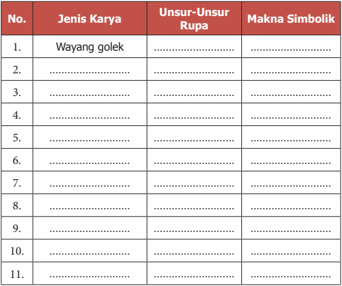

Tabel ini berisi informasi tentang jenis karya, unsur-unsur rupa, dan makna simbolik dari beberapa karya tradisional Indonesia. Topik utamanya adalah analisis kreatif terhadap karya-karya tradisional tersebut. Kolom-kolomnya meliputi nomor urut (No.), jenis karya, unsur-unsur rupa, dan makna simbolik. Data penting yang terlihat antara lain bahwa Wayang Golek merupakan salah satu jenis karya yang memiliki unsur-unsur rupa seperti penari, kostum, dan alat musik, serta memiliki makna simbolik yang mendalam tentang kehidupan dan nilai-nilai masyarakat.

### B. Nilai Estetis Karya Seni Rupa Tiga Dimensi

I ngatkah kamu materi pembelajaran di kelas X dan XI tentang nilai estetis? Nilai estetis pada sebuah karya seni rupa dapat bersifat objektif dan subjektif. Nilai  estetis  bersifat  objektif  jika  memandang  keindahan  karya  seni  rupa berada pada wujud karya seni itu sendiri dan tampak secara kasat mata. Dalam pandangan objektif ini, nilai estetis atau keindahan sebuah karya seni rupa tersusun dari komposisi yang baik, perpaduan warna yang sesuai, penempatan objek yang membentuk kesatuan, dan sebagainya. Keselarasan dalam menata unsur-unsur visual inilah yang mewujudkan sebuah karya seni rupa.

Berbeda  halnya  dengan  nilai  estetis  yang  bersifat  subjektif,  keindahan tidak hanya pada unsur-unsur fi sik yang ditangkap oleh mata secara visual, tetapi ditentukan oleh selera orang yang melihatnya. Sebagai contoh ketika kamu melihat sebuah karya seni rupa, kamu mungkin tertarik pada apa yang ditampilkan dalam karya tersebut dan merasa senang untuk terus melihatnya bahkan  ingin  memilikinya,  tetapi  teman  kamu  justru  kurang  tertarik  pada

 

---
## 📄 Halaman 49

karya tersebut dan lebih tertarik pada karya lainnya. Perbedaan inilah yang menunjukkan  bahwa  nilai  estetis  sebuah  karya  seni  rupa  dapat  bersifat subjektif.

Carilah  berbagai  karya  seni  rupa  tiga  dimensi  (reproduksi  foto/gambar). Amati karya-karya seni rupa tiga dimensi tersebut, kemudian bandingkan karya yang satu dengan yang lainnya. Ceritakan masing-masing karya yang kamu amati, kemukakan aspek apa yang menarik perhatian kamu dan karya mana yang paling kamu sukai. Berikan alasan mengapa kamu menyukai karya  tersebut  berdasarkan  pengamatan  terhadap  unsur-unsur  rupa  dan objek yang tampak pada karya tersebut. Bandingkan paparan kamu dengan paparan teman yang lain. Adakah pendapat yang sama atau berbeda di antara teman kamu? Cobalah tanyakan alasan ketertarikan teman kamu tersebut.

### C. Berkarya Seni Rupa Tiga Dimensi

S alah satu karya seni rupa tiga dimensi adalah patung. Karya seni patung memiliki berbagai ragam dan jenis yang tersusun dari berbagai medium pula. Cobalah membuat karya seni patung bergaya abstrak. Masih ingatkah kamu pengertian abstrak? Periksa kembali materi pembelajaran seni rupa di kelas X atau XI, bandingkan bentuk karya seni patung yang bergaya abstrak dan yang bergaya realis. Perhatikan gambar karya seni patung di bawah ini! Kamu tentunya dengan mudah dapat membedakan mana karya seni patung abstrak dan mana yang bukan.

 

---
## 📄 Halaman 50

Perhatikan gambar langkah-langkah berkarya seni patung di bawah ini. Cobalah  uraikan  kembali  dengan  kata-kata  kamu  sendiri  langkah-langkah dalam mewujudkan karya seni rupa tiga dimensi ini.

---
**🖼️ Gambar/Diagram**

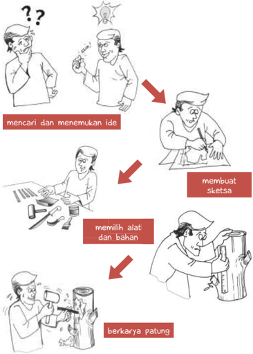

> **Deskripsi Visual:** Gambar ini adalah ilustrasi yang menunjukkan proses membuat patung. Gambar ini terdiri dari empat langkah yang disertai dengan teks deskripsif. Langkah pertama menunjukkan seseorang yang sedang mencari dan menemukan ide untuk membuat patung. Langkah kedua menunjukkan seseorang yang membuat sketsa untuk patung tersebut. Langkah ketiga menunjukkan seseorang yang memilih alat dan bahan untuk membuat patung. Langkah keempat menunjukkan seseorang yang sedang berkerja pada patung tersebut. Setiap langkah memiliki relasi dengan langkah sebelumnya dan setelahnya, membentuk proses yang sistematis dalam membuat patung. Teks penting dalam gambar ini adalah "mencari dan menemukan ide", "membuat sketsa", "memilih alat dan bahan", dan "berkarya patung". Informasi kunci yang dapat diambil pembaca adalah bahwa membuat patung melibatkan proses yang sistematis dan memerlukan pengetahuan tentang alat dan bahan yang tepat.

 

---
## 📄 Halaman 51

### Uji Kompetensi

### Penilaian Pribadi

Nama

: …………………..................................

Kelas

: …………………..................................

Semester

: …………………..................................

Waktu penilaian

: …………………..................................

---
**📊 Tabel**

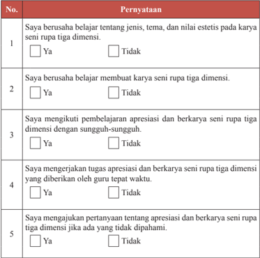

Tabel ini berisi 5 poin yang bertujuan untuk mengevaluasi pemahaman dan keterlibatan siswa dalam pembelajaran seni rupa tiga dimensi. Topik utama tabel adalah tentang keberhasilan siswa dalam belajar dan mengaplikasikan konsep dan praktik seni rupa tiga dimensi. Kolom pertama berisi nomor urut masing-masing poin, sedangkan kolom kedua berisi pernyataan yang harus diisi oleh siswa. Data atau pola penting yang terlihat adalah bahwa semua poin memiliki dua opsi jawaban: "Ya" dan "Tidak", yang menunjukkan bahwa evaluasi ini menggunakan skala penilaian dua pilihan.

 

---
## 📄 Halaman 52

6

Saya  aktif  dalam  mencari  informasi  tentang  jenis,  tema,  dan  nilai estetis pada karya seni rupa tiga dimensi.

7

Saya menghargai keunikan berbagai jenis karya seni rupa tiga dimensi.

8

Saya menghargai keunikan karya seni rupa tiga dimensi yang dibuat oleh teman saya.

9

Saya tidak malu untuk menyajikan karya seni rupa tiga dimensi yang saya buat secara tertulis maupun lisan.

10

Saya  tidak  malu  untuk  memamerkan  karya  seni  rupa  tiga  dimensi yang saya buat.

### Penilaian Antarteman

Nama teman yang dinilai

Nama penilai

Kelas

Semester

Waktu penilaian

: …………………..................................

: …………………..................................

: …………………..................................

: …………………..................................

: …………………..................................

 

---
## 📄 Halaman 53

### No

### Pernyataan

1

Berusaha belajar apresiasi dan berkarya seni rupa tiga dimensi dengan sungguh-sungguh.

2

Mengikuti pembelajaran  apresiasi dan berkarya seni rupa tiga dimensi dengan penuh perhatian.

3

Mengerjakan  tugas  apresiasi  dan  berkarya  seni  rupa  tiga  dimensi yang diberikan guru tepat waktu.

4

Mengajukan pertanyaan tentang apresiasi dan berkarya seni rupa tiga dimensi jika ada yang tidak dipahami.

5

Berperan  aktif  dalam  kelompok  ketika  mempelajari  apresiasi  dan berkarya seni rupa tiga dimensi.

6

Menyerahkan  tugas  apresiasi  dan  berkarya  seni  rupa  tiga  dimensi tepat waktu.

7

Menghargai keunikan ragam seni rupa tiga dimensi.

 

---
## 📄 Halaman 54

8

Menguasai dan dapat mengikuti kegiatan pembelajaran apresiasi dan berkarya seni rupa tiga dimensi dengan baik.

9

Menghormati dan menghargai teman.

10

Menghormati dan menghargai guru.

11

Tidak  malu  untuk  menyajikan  karya  seni  rupa  tiga  dimensi  yang dibuat secara tertulis maupun lisan.

12

Tidak malu untuk memamerkan karya seni rupa tiga dimensi yang dibuat.

### Tes Tulis

Jawablah pertanyaan berikut ini!

- Jelaskan pengertian tema dan fungsi dalam karya seni rupa tiga dimensi dan berikan contohnya!
- Apa  yang  dimaksud  dengan  nilai  estetis  memiliki  sifat  objektif  dan subjektif dalam karya seni rupa tiga dimensi? Berikan contoh!

 

---
## 📄 Halaman 55

### Penugasan

Kumpulkan  gambar  (reproduksi)  karya  seni  rupa  tiga  dimensi  dari berbagai sumber (media cetak maupun elektronik). Kemudian, buatlah analisis sederhana  berkaitan  dengan  nama  perupa  (jika  ada),  jenis  karya,  medium, (alat,  teknik,  dan  bahan),  unsur fi sik  dan  non fi sik,  objek,  tema  serta  fungsi pada karya-karya tersebut. Buatlah dalam bentuk format analisis sederhana seperti contoh berikut ini.

(Deskripsi  nama  perupa,  judul  karya,  ukuran,  bahan,  teknik,  alat,  objek, tema, unsur fi sik dan non fi sik, fungsi, dan sebagainya)

……………………………………………………………………………….

……………………………………………………………………………….

……………………………………………………………………………….

……………………………………………………………………………….

……………………………………………………………………………….

……………………………………………………………………………….

……………………………………………………………………………….

……………………………………………………………………………….

……………………………………………………………………………….

……………………………………………………………………………….

……………………………………………………………………………….

 

---
## 📄 Halaman 56

### Tes Praktik

Buatlah  satu  buah  karya  seni  patung  abstrak  menggunakan  bahan  atau medium yang ada di wilayah setempat. Tuliskan ide atau gagasan serta tema yang kamu pilih untuk memulai berkarya. Ceritakan mengapa ide atau tema tersebut yang kamu pilih. Adakah pengalaman khusus berkaitan dengan ide dan  tema  yang  kamu  pilih?  Buatlah  sketsa  bentuk  dan  ukuran  karya  seni patung abstrak yang akan kamu wujudkan, beri keterangan bahan dan teknik serta  alat  yang  akan  dipergunakan.  Beri  penjelasan  mengapa  bahan,  teknik dan alat tersebut yang kamu pilih.

### Rangkuman

Karya seni rupa tiga dimensi beraneka jenis dan ragamnya. Karya seni rupa tiga dimensi dapat dikelompokkan berdasarkan bahan, teknik pembuatan, gaya perwujudan, tema, fungsi, dan sebagainya.

Nilai estetis karya seni rupa tiga dimensi tampak secara visual dari wujud karya  seni  rupa  tersebut.  Nilai  estetis  karya  seni  rupa  bersifat  objektif  dan subjektif. Nilai objektif terdapat pada karya seni rupa itu sendiri, sedangkan nilai subjektif berada pada penikmatnya.

Berkarya seni rupa tiga dimensi umumnya didahului dengan mencari dan mengembangkan ide atau gagasan, membuat rancangan berupa sketsa untuk menentukan bentuk dan ukuran, dilanjutkan dengan memilih medium, (bahan, alat,  dan  teknik)  yang  akan  digunakan.  Alasan-alasan  pemilihan  gagasan, hingga teknik berkarya dapat disebut sebagai konsep berkarya seni rupa.

### Re fl eksi

Kekayaan  ide  atau  gagasan,  bahan,  dan  keterampilan  teknik  berkarya merupakan  anugerah  Tuhan  yang  harus  kamu  syukuri. Anugerah  ini  telah menghasilkan beranekaragam karya seni rupa tiga dimensi. Keunikan karya seni rupa tiga dimensi juga menunjukkan latar belakang budaya, keterampilan, dan kreativitas para perupanya.

 

---
## 📄 Halaman 57

Kamu telah mencoba membuat karya seni rupa tiga dimensi. Melalui proses berkarya seni rupa tersebut kamu belajar untuk tekun, disiplin, dan bertanggung jawab, serta menghargai karya seni rupa yang dihasilkan. Karya yang kamu buat tidak ada yang jelek jika kamu sungguh-sunguh mengerjakannya. Setiap karya yang kamu hasilkan memiliki keindahan dan keunikannya tersendiri. Melalui  penyajian  karya  dan  saling  memberikan  tanggapan  terhadap  karya yang disajikan, kamu belajar untuk berani mengemukakan  pendapat, memupuk rasa percaya diri, dan terutama saling menghargai perbedaan, serta menghargai keragaman yang Tuhan anugerahkan kepada kita semua

 

---
## 📄 Halaman 58

---
**🖼️ Gambar/Diagram**

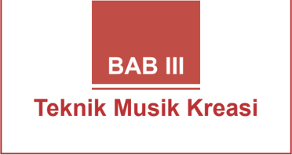

> **Deskripsi Visual:** Gambar ini adalah bagian dari buku pelajaran dengan judul "BAB III Teknik Musik Kreasi". Gambar ini tidak menunjukkan elemen visual seperti diagram, grafik, foto, atau ilustrasi, tetapi lebih kepada teks yang disertakan dalam buku tersebut. Judul "BAB III" menunjukkan bahwa ini adalah bagian ketiga dari bab dalam buku pelajaran. Judul "Teknik Musik Kreasi" menunjukkan topik utama yang akan dibahas dalam bab ini.

Elemen utama yang ditampilkan dalam gambar ini adalah judul BAB III dan judul bab yang berada di bawahnya, yaitu "Teknik Musik Kreasi". Teks ini merupakan informasi penting yang harus diperhatikan oleh pembaca, karenaBAB ini mungkin akan membahas tentang teknik-teknik kreatif dalam bidang musik.

Informasi kunci yang dapat diambil dari gambar ini adalah bahwa bab ini akan membahas tentang teknik-teknik kreatif dalam bidang musik. Namun, detail lebih lanjut tentang topik apa yang akan dibahas dalam bab ini tidak dapat ditentukan hanya dari gambar tersebut.

### Peta Materi

---
**🖼️ Gambar/Diagram**

> **Deskripsi Visual:** Gambar ini adalah diagram yang menunjukkan struktur topik dalam subtopik Seni Budaya. Diagram ini terdiri dari empat level, dimulai dari topik "Seni Budaya" hingga "Nilai Estetis Musik". Setiap level memiliki subtopik yang lebih spesifik, seperti "Konsep Musik Kreasi", "Jenis dan Teknik Musik Kreasi", "Prosedur Musik Kreasi", "Makna Musik", "Simbol Musik", dan "Nilai Estetis Musik".

1. **Apa yang Ditampilkan Secara Keseluruhan**: Gambar ini menunjukkan struktur topik dalam subtopik Seni Budaya, yang mencakup berbagai aspek musik kreasi.

2. **Elemen-Elemen Utama dan Relasinya**: 
   - Topik utama adalah "Seni Budaya".
   - Di bawah topik ini ada empat subtopik utama: "Konsep Musik Kreasi", "Jenis dan Teknik Musik Kreasi", "Prosedur Musik Kreasi", dan "Nilai Estetis Musik".
   - Setiap subtopik memiliki subsubtopik yang lebih spesifik, seperti "Makna Musik", "Simbol Musik", dan "Nilai Estetis Musik".

3. **Teks, Angka, atau Label Penting yang Terlihat**: 
   - "Seni Budaya" adalah topik utama.
   - "Konsep Musik Kreasi", "Jenis dan Teknik Musik Kreasi", "Prosedur Musik Kreasi", "Makna Musik", "Simbol Musik", dan "Nilai Estetis Musik" adalah subtopik utama.
   - Subsubtopik seperti "Makna Musik", "Simbol Musik", dan "Nilai Estetis Musik" merupakan bagian dari subtopik "Nilai Estetis Musik".

4. **Informasi Kunci yang Dapat Diambil Pembaca**: 
   - Struktur topik dalam subtopik Seni Budaya yang mencakup berbagai aspek musik kreasi.
   - Ada empat level dalam diagram ini, masing-masing menunjukkan subtopik yang lebih spesifik tentang musik kreasi.
   - Pembaca dapat memahami bahwa musik kreasi melibatkan konsep, jenis dan teknik, prosedur, makna

Setelah mempelajari Bab 3 tentang seni musik tradisional dan musik modern, diharapkan kamu mampu melakukan hal berikut.

- Memahami konsep, teknik, dan prosedur musik kreasi, secara spesi fi k kamu dapat:
- Memahami konsep, teknik, dan prosedur musik kreasi.
- Menjelaskan prosedur berkreasi musik.
- Menganalisis karya musik kreasi.
- Memahami pertunjukan musik kreasi.

 

---
## 📄 Halaman 59

- Mengaplikasikan konsep, teknik, dan prosedur penciptaan musik kreasi sendiri.
- Menampilkan musik kreasi berdasarkan pilihan sendiri, secara operasional, kamu mampu:
- Memahami konsep, teknik, dan prosedur musik kreasi.
- Menjelaskan konsep musik kreasi.
- Menemukan  de fi nisi  musik  kreasi  yang  tepat  sesuai  dengan konsep dan tema yang dipelajari.
- Mengidenti fi kasi teknik musik kreasi.
- Menjelaskan prosedur berkreasi musik.
- Menganalisis karya musik kreasi.
- Membedakan jenis musik kreasi.
- Mengklasi fi kasikan jenis musik kreasi.
- Memahami pertunjukan musik kreasi.
- Menjelaskan konseptual pertunjukan musik kreasi.
- Merancang pertunjukan musik kreasi.
- Mengaplikasikan  konsep,  teknik,  dan  prosedur  penciptaan  musik kreasi sendiri.
- Membuat konsep penciptaan musik kreasi.
- Menerapkan teknik berkreasi musik secara mandiri.
- Menyusun prosedur penciptaan musik kreasi sendiri.
Melalui  kegiatan  pembelajaran  dalam  pengembangan  potensi  kamu, diharapkan  akan  mempunyai  dampak  pada  perkembangan  seni  di  daerah masing-masing. Kegiatan tersebut yang sekaligus dapat menggali nilai-nilai seni musik tradisional dan modern serta mampu menciptakan desain-desain baru yang dilatarbelakangi oleh seni daerah yang hidup dan berkembang di lingkungannya.

Melalui  aktivitas  berkesenian,  nilai  karakter  yang  diharapkan  kamu mampu menunjukkan sikap:

- rasa ingin tahu,
- gemar membaca dan peduli,
- jujur dan disiplin,
- kreatif, inovatif, dan responsif,
- bersahabat dan kooperatif,
- kerja keras dan tanggung jawab,
- mandiri, serta
- berkebangsaan.

 

---
## 📄 Halaman 60

### Motivasi

Seberapa jauh keingintahuan kamu untuk mempelajari seni musik tradisional, klasik, musik kreasi baru atau musik modern, dan kontemporer?

Silahkan kamu  paparkan dalam bentuk kalimat deklaratif!

...………………………………………………………………………………

………………………………………………………………………………...

....……………………………………………………………………………...

### Pengantar

Disadari ataupun tidak, pada setiap benda alam yang tercipta, disentuh dan  dimodi fi kasi  oleh  manusia  untuk  diberinya  bentuk  baru,  maka  akan mengandung makna yang bernilai. Oleh sebab itu, setiap karya seni budaya akan  memiliki  nilai  estetis  dan  fungsi  tertentu  sesuai  dengan  tujuannya, menunjukkan maksud dan mengandung gagasan atau ide dari penciptanya. Sebuah karya seni budaya itu dapat terlihat melalui suatu bentuk kesenian, salah satu wujudnya adalah seni musik.

Dalam kehidupan seharihari  manusia  tidak  akan  lepas dari musik, karena substansi dari musik  itu  sendiri  adalah  bunyi atau suara, baik yang beraturan maupun tidak beraturan. Musik dapat  diwujudkan  dalam  nadanada  atau  bunyi  lainnya  yang dimainkan  melalui  media  alat yang memakai unsur ritme, melodi, dan harmoni.

---
**🖼️ Gambar/Diagram**

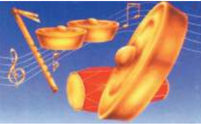

> **Deskripsi Visual:** Gambar ini adalah ilustrasi yang menunjukkan alat musik tradisional, yaitu drum berbentuk bulat dengan tiga lubang di atasnya. Drum tersebut tampak besar dan berwarna kuning cerah, dengan lapisan kulit yang tampak lembut dan berkilau. Di sebelah kiri drum, terdapat dua alat musik lainnya: gendang berbentuk pipih dan panjang serta gong berbentuk bulat dan berwarna emas. Semua alat musik tersebut tampak siap digunakan untuk mengiringi lagu atau menyanyi.

Elemen-elemen utama dalam gambar ini adalah drum, gendang, dan gong. Drum merupakan elemen utama karena ukurannya yang besar dan dominan, sementara gendang dan gong berfungsi sebagai alat musik pendukung yang mendukung suara drum. Relasi antara elemen-elemen ini adalah bahwa semua alat musik tersebut saling mendukung dalam menghasilkan suara yang indah dan menarik.

Teks, angka, atau label penting yang terlihat dalam gambar ini tidak ada, sehingga informasi kunci yang dapat diambil pembaca hanya melalui visual saja. Gambar ini memberikan gambaran tentang alat musik tradisional yang sering digunakan dalam budaya masyarakat, serta bagaimana mereka saling bekerja sama untuk menghasilkan suara yang indah.

Terlepas dari pernyataan di atas…

Manusia sebagai makhluk yang mengenal keindahan ( animal aestheticum ) senantiasa tidak terlepas dari dunia seni. Tepatnya ketika ada manusia, di situlah ada karya seni. Dunia seni senantiasa mengikuti dunia manusia, baik dalam keadaan sempit maupun lapang, suka atau duka, sedih atau bahagia,

 

---
## 📄 Halaman 61

nyaman dan riskan, lemah dan kuat, serta takut dan menyenangkan. Oleh karena itu, seni tidak mengenal golongan, seni tidak mengenal strata, baik miskin atau pun kaya, anak-anak, remaja, dewasa, maupun orang tua. Semua golongan manusia yang hidup di dunia ini membutuhkan seni. Begitu pun halnya yang terjadi pada seni musik.

Seni musik senantiasa berkaitan dengan persoalan esthetical , yaitu dunia yang  menyangkut  masalah  tentang  keindahan  dengan  segala  persoalannya. Setiap  manusia  dalam  kehidupannya  sudah  barang  tentu  membutuhkan keindahan.  Hal  tersebut  seperti  yang  diungkap Baum  Garten mengenai estetika.  Menurutnya,  estetika  adalah  ilmu  tentang  pengetahuan  indriawi yang  tujuannya  adalah  keindahan.  Dalam  hal  ini,  estetika  selalu  berkaitan erat dengan keindahan, baik dari gejala-gejala alam, maupun buatan manusia, yaitu berupa karya seni.

Seni biasanya selalu mendatangkan kesenangan, kenyamanan, ketenangan, dan  kepuasan  bagi  batin  seseorang.  Oleh  sebab  itu,  keindahan  dalam  seni sering ditangkap secara subjektif oleh seseorang yang merasakannya. Namun demikian, dalam kerangka normatif terdapat acuan-acuan guna menentukan indah atau tidaknya suatu karya seni.

Pernyataan tersebut menegaskan bahwa:

Seni adalah aktivitas manusia yang mampu mendatangkan keindahan. Indah dilihat, indah didengar, indah dirasa, dan indah diraba.

Terdapat  dua  aktivitas  yang  penting  untuk  dipahami  dalam  karya  seni, yaitu aktivitas kreatif dan aktivitas apresiatif.  Aktivitas kreatif adalah kegiatan yang berkenaan dengan proses penciptaan dan pembuatan suatu karya seni. Aktivitas kreatif ini biasanya dilakukan oleh seniman atau kreator. Aktivitas apresiatif berkenaan  dengan  proses  kegiatan  penikmatan,  penghayatan, pengamatan, penghargaan, dan penilaian suatu karya seni. Aktivitas apresiatif dilakukan oleh penikmat atau apresiator.

Kreator dan apresiator tersebut berhadapan dengan karya seni. Kreator selalu  berusaha  untuk  menyampaikan  pesan-pesan  melalui  karyanya  yang dihasilkan,  sementara  apresiator  berusaha  untuk  menerima  dan  menikmati, pesan yang dikomunikasikan oleh seniman dan kreator. Apresiator diharapkan tidak sekadar menikmati karya seni, namun mampu menilai apakah karya seni tersebut  estetis,  artistik,  ataupun  mampu  menerapkan  aspek  simbolis  yang bermakna dan bernilai.

 

---
## 📄 Halaman 62

### Carilah informasi tentang pengertian apresiasi! Untuk apa apresiasi dipelajari? Bagaimana caranya? Untuk menjawab pertanyaan tersebut kita dapat mengamati benda dan wujud seni yang lahir dan berkembang di dunia ini.

Banyak media yang dapat digunakan oleh manusia dalam berkreativitas seni. Berdasarkan lingkup medianya, bentuk karya seni dapat berfungsi sebagai alat  komunikasi  dalam  beragam  wujud,  di  antaranya:  bahasa  rupa,  bahasa bunyi, dan bahasa gerak. Wujud ketiga bahasa tersebut dapat diklasi fi kasikan ke dalam jenis seni, antara lain:

- Seni Rupa, dengan unsur-unsur rupa yang bersifat visual;
- Seni Musik, dengan unsur suara/bunyi yang bersifat audio;
- Seni Tari, dengan unsur gerak yang bersifat visual;
- Seni Drama, dengan unsur pesan yang mengandung cerita;
- Seni Sastra, dengan unsur utamanya kata-kata.
Pernahkan kamu mengapresiasi pertunjukkan kreasi seni musik? Apa yang kamu rasakan saat dan sesudah mengamati pertunjukkan seni musik tersebut? Simaklah dengan cermat beberapa ragam jenis pertunjukkan seni musik yang tumbuh di masyarakat berikut ini!

 

---
## 📄 Halaman 63

Sumber: Dokumen Penulis

Gambar 3.3 Para pemain musik keroncong sedang melakukan latihan bersama

Gambar 3.4 Pertunjukan musik petik sape dari daerah Kalimantan

 

---
## 📄 Halaman 64

Jawablah pertanyaan berikut dengan jelas, singkat, dan padat! Setelah kamu mencari  tahu  dan  mendiskusikannya  dengan  teman  sekelasmu,  buatlah paparan jawabannya dengan baik dan benar!

- Apa yang kamu rasakan setelah mengamati gambar tersebut?
- Adakah  persamaan  dan  perbedaan  yang  terlihat  dari  ketiga  gambar pertunjukan seni musik tersebut, jelaskan dengan singkat dan padat!
- Unsur  musik  apa  yang  biasanya  tersaji  dalam  pertunjukkan  seni  yang terlihat pada gambar 3.1?
- Unsur  musik  apa  yang  biasanya  tersaji  dalam  pertunjukkan  seni  yang terlihat pada gambar 3.2?
- Unsur  musik  apa  yang  biasanya  tersaji  dalam  pertunjukkan  seni  yang terlihat pada gambar 3.3? Perbedaannya dengan gambar 3.4?
Setelah mendiskusikan jawaban kamu dengan teman-teman sekelasmu, kemudian buatlah laporan tertulis dari hasil diskusi tersebut!

### Format Diskusi Hasil Pengamatan Pertunjukan Seni Musik

Nama Siswa/Kelompok

: …………………..................................

Nomor Induk Siswa

: …………………..................................

Hari/Tanggal Pengamatan

: …………………..................................

---
**📊 Tabel**

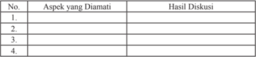

Tabel ini menunjukkan hasil diskusi tentang aspek-aspek tertentu yang telah diamati. Topik utama tabel adalah aspek-aspek yang diamati dan hasil diskusi yang dihasilkannya. Kolom pertama berisi nomor urut untuk setiap aspek yang diamati, sedangkan kolom kedua berisi deskripsi atau penjelasan tentang aspek tersebut. Kolom ketiga berisi hasil diskusi yang dihasilkan dari setiap aspek. Dari tabel ini, dapat dilihat bahwa setiap aspek yang diamati memiliki satu atau lebih hasil diskusi yang relevan dan penting. Pola penting yang terlihat adalah bahwa setiap aspek yang diamati memiliki satu atau lebih hasil diskusi yang relevan dan penting, yang menunjukkan bahwa setiap aspek yang diamati memiliki potensi untuk memberikan informasi atau pengetahuan yang berguna.

### A. Konsep Seni Musik Kreasi

B ermacam-macam karya seni musik kreasi lahir dan berkembang di negeri tercinta  ini.  Mulai  dari  musik  vokal  dalam  bentuk  lagu  yang  berupa nyanyian,  sampai  pada  musik  instrumen  yang  ditimbulkan  dari  suara  alat yang berupa instrumental. Mendengarkan musik adalah kegiatan yang bersifat auditif, artinya menangkap bunyi, suara, dan nada melalui indera pendengaran. Selain itu, ada pula kegiatan mendengarkan musik secara imajinatif. Hal ini terjadi karena dilakukan tanpa adanya suara atau bunyi yang didengar secara

 

---
## 📄 Halaman 65

sesungguhnya, tetapi bunyi musiknya diserap lewat kegiatan membaca nadanada atau notasi musik, artinya membaca musik secara visual karena dibantu dengan partitur.

Secara  garis  besar,  jenis  karya  seni  musik  dapat  dibedakan  menjadi dua kelompok, baik yang tumbuh dan berkembang di tingkat internasional, nasional  maupun  lokal/daerah.  Kamu  dapat  mengamati  bagan  seni  musik berikut ini mengenai pengelompokan musik kreasi, baik tradisional, klasik, kreasi baru/modern, dan kontemporer:

---
**🖼️ Gambar/Diagram**

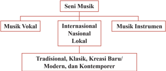

> **Deskripsi Visual:** Gambar ini adalah diagram yang menunjukkan struktur hierarkis dari seni musik. Diagram ini terdiri dari empat level, dengan "Seni Musik" sebagai level atas. Di bawahnya ada dua cabang utama: "Musik Vokal" dan "Musik Instrumen". Setiap cabang ini kemudian dibagi menjadi sub-kategori, yaitu "Internasional", "Nasional", dan "Lokal".

Elemen utama dalam diagram ini adalah cabang dan sub-kategori yang menjelaskan berbagai jenis musik. Cabang "Musik Vokal" dan "Musik Instrumen" masing-masing memiliki tiga sub-kategori, yang mencakup tradisional, klasik, kreasiv baru/modern, dan kontemporer.

Teks, angka, atau label penting yang terlihat dalam diagram ini meliputi nama-nama cabang dan sub-kategori yang disebutkan. Informasi kunci yang dapat diambil pembaca meliputi bahwa seni musik terbagi menjadi dua kategori utama: vokal dan instrumen, dan setiap kategori tersebut memiliki sub-kategori yang lebih spesifik.

Dalam paragraf satu, saya akan menjelaskan secara singkat tentang struktur dan isi diagram ini. Saya akan menjelaskan bagaimana struktur hierarkis seni musik diperlihatkan dalam diagram ini, serta informasi yang dapat diambil dari elemen-elemen yang ada. Saya akan menjelaskan bagaimana cabang dan sub-kategori yang ada dalam diagram ini, serta informasi kunci yang dapat diambil pembaca dari diagram ini.

Pengelompokan bentuk penyajian seni musik yang tumbuh dan berkembang di wilayah Indonesia.

Setelah  memerhatikan  dan  mengkaji  pemetaan  bentuk  penyajian  karya musik di atas, dapat dipresentasikan melalui keragaman karya cipta yang lahir dan tumbuh di dunia. Presentasi ini dapat dimulai dari daerah-daerah wilayah Nusantara, nasional bahkan internasional. Mulai dari jenis musik tradisional, klasik, modern, hingga kontemporer. Melalui tayangan skema tersebut, kamu diharapkan mampu menjawab pertanyaan berikut.

---
**📊 Tabel**

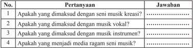

Tabel ini berisi pertanyaan-pertanyaan tentang jenis-jenis musik dan media ragam seni musik yang dimaksudkan dengan musik kreatif, musik vokal, musik instrumen, dan media ragam seni musik. Topik utama tabel ini adalah definisi dan pengertian tentang jenis-jenis musik dan media ragam seni musik. Kolom pertama berisi nomor pertanyaan, sedangkan kolom kedua berisi jawaban untuk setiap pertanyaan. Data penting yang terlihat dalam tabel ini adalah bahwa musik kreatif, musik vokal, musik instrumen, dan media ragam seni musik merupakan jenis-jenis musik yang dimaksudkan oleh pertanyaan-pertanyaan tersebut.

 

---
## 📄 Halaman 66

---
**📊 Tabel**

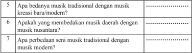

Tabel ini berisi pertanyaan-pertanyaan tentang perbedaan antara musik tradisional dengan musik kreasi baru/modern, musik daerah dengan musik nusantara, dan seni musik tradisional dengan musik modern. Topik utama tabel ini adalah perbandingan antara jenis-jenis musik tersebut. Kolom pertama menunjukkan nomor pertanyaan, sedangkan kolom kedua menunjukkan pertanyaan masing-masing. Data atau pola penting yang terlihat adalah bahwa semua pertanyaan dalam tabel ini bertujuan untuk membandingkan dan memahami perbedaan antara musik tradisional dan musik modern, serta antara musik daerah dan musik nusantara.

### Seni Suara atau Musik?

Secara  konseptual  seni  musik  selalu  identik  dengan  seni  suara,  karena substansi  dasar  dari  musik  itu  sendiri  adalah  bunyi  atau  suara,  baik  yang ditimbulkan dari alat (alat musik, dan perkakas rumah tangga), benda alam, maupun suara hewan serta suara mulut manusia.

Bunyi atau suara senantiasa memenuhi ruang kehidupan kita setiap hari. Mulai  dari  mendengarkan  suara  orang  tertawa,  menangis,  berbicara,  suara hewan, suara alam, suara kendaraan, suara benda bergesek dan jatuh, serta suara-suara lainnya yang muncul dalam kehidupan kita. Melalui bunyi dan suara  kita  akan  mengetahui,  mengenal,  dan  mempelajari  tentang  apa  yang terjadi di sekitar kita.

### Melalui suara dan bunyi kita dapat berkomunikasi Melalui suara dan bunyi kita dapat berkreasi

Untuk  dapat  merasakan  adanya  suara  dan  atau  bunyi,  maka  kita  perlu melakukan  dan  mencoba  mendengarkan  segala  bunyi  dan  atau  suara  yang mengisi kesenyapan di sekitar kamu.  Apa yang sebenarnya yang disebut bunyi? Apa pula yang dimaksud dengan suara? Kemudian apa yang menyebabkannya dan bagaimana kita mendengarkannya?

Musik merupakan bagian dari dunia bunyi dan atau dunia suara.

Bunyi berasal dari getaran suatu benda. Getaran dikirim ke pendengaran melalui suatu mediun seperti udara.

Seni suara adalah bentuk penyampaian isi hati manusia melalui suara yang indah dan artistik.

Suara dapat dibedakan atas desah dan nada.

 

---
## 📄 Halaman 67

Suara yang bernada dan bermelodi sering dinamakan nyanyian. Nyanyian merupakan lagu-lagu.

Menyanyikan lagu adalah kegiatan bernyanyi.

Suara  dapat  dihasilkan  oleh  manusia  atau  alat  atau  manusia  dan  alat dinamakan kegiatan bermusik.

- Apabila materi suara dihasilkan oleh manusia disebut musik 'vokal'.
- Apabila materi suara dihasilkan oleh alat disebut 'musik instrumental'.
- Apabila  materi  suara  dihasilkan  oleh  manusia  dan  alat  disebut  'musik campuran'.
Bernyanyi tentu bukanlah hal yang asing bagi kamu. Setiap hari, kamu dapat  mendengarkan  dan  melihat  orang  bernyanyi,  baik  melalui  media teknologi, tayangan di televisi, radio, atau mungkin dapat melihat secara langsung orang bernyanyi dalam melakukan kegiatan pendidikan. Bahkan, kamu sendiri senang dan sedang melakukan bernyanyi walaupun belum mampu menggunakan prinsip dan teknik bernyanyi yang baik dan benar.

Media utama dalam bernyanyi adalah suara.

Rangkaian suara yang bernada dengan teks yang bersinonim lirik atau paduan kata-kata sering disebut lagu atau nyanyian. Lagu merupakan untaian kata dan nada yang bermelodi. Lagu sebagai hasil karya cipta manusia dapat terwujud secara beragam jenisnya, misalnya ada lagu-lagu daerah, lagu-lagu Indonesia  dan  lagu-lagu  barat  yang  diciptakan  untuk  disajikan  dalam  gaya yang berbeda-beda, di antaranya: lagu pop, rock , keroncong, bosanova , raff , dangdut, seriosa, rakyat, country , jazz, melayu, dan lain-lain.

Karya kreasi seni musik berikut adalah sebuah lagu sebagai bahan untuk dipelajari  dan  dinyanyikan  serta  sekaligus  sebagai  bahan  apresiasi  seni. Silakan kamu menyimak, mempelajari, dan mempresentasikan contoh lagulagu yang sering dinyanyikan dan mungkin sering terdengar dalam kehidupan kamu di masyarakat.

 

---
## 📄 Halaman 68

### Petunjuk:

- Usahakan sebelum melakukan kegiatan bermusik, lakukan relaksasi dahulu.
- Tanamkan rasa nada sebelum bernyanyi, yakinkan dulu bahwa kamu telah hafal tinggi rendahnya nada sebelum bernyanyi.
- Tentukan dulu tinggi nada yang sesuai dengan wilayah suaramu.
- Membaca notasi lagu/nada-nada terlebih dahulu.
- Tentukan tempo/kecepatan yang sesuai dengan isi lagu.
- Mempelajari lirik dan karakter lagu.
- Mempelajari unsur-unsur musik yang ada pada lagu.
- Mulailah bernyanyi.

---
**🖼️ Gambar/Diagram**

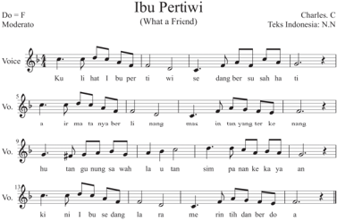

> **Deskripsi Visual:** Gambar ini adalah diagram musik yang menunjukkan lirik lagu "Ibu Pertiwi" dalam notasi vokal. Diagram ini terdiri dari tiga baris vokal yang berbeda, masing-masing dengan nada yang berbeda. Setiap baris vokal memiliki notasi nada yang disertai dengan teks dalam bahasa Indonesia. Nada-nada tersebut dinyatakan menggunakan notasi vokal tradisional, yang mencakup notasi nada, tempo, dan arsis. Teks pada diagram ini mencakup lirik lagu yang ditulis oleh Charles C. N. N., yang merupakan penulis asli lagu ini. Diagram ini juga menunjukkan bahwa lagu ini dimainkan dengan tempo moderato (sedang). Label penting lainnya termasuk judul lagu "Ibu Pertiwi", nama penulis lagu, dan informasi tentang nada dan tempo yang digunakan dalam lagu tersebut.

 

---
## 📄 Halaman 69

Setelah  kamu  membaca  dan  menyanyikan  lagu  di  atas,  silakan  kamu diskusikan kemudian lakukan analisis dan paparkan unsur-unsur musikal apa yang ada di dalam lagu What a Friend tersebut pada tabel berikut.

### Format Diskusi Hasil Pengamatan Lagu (Nyanyian)

Nama Siswa/Kelompok

: …………………..................................

Nomor Induk Siswa

: …………………..................................

Hari/Tanggal Pengamatan

: …………………..................................

Tema/Judul karya/Lagu

: …………………..................................

Karakter lagu

: …………………..................................

---
**📊 Tabel**

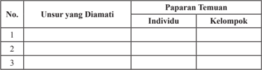

Tabel ini menunjukkan data tentang paparan temuan individu dan kelompok terhadap berbagai unsur yang diamati. Topik utama tabel ini adalah analisis paparan temuan dalam konteks individu dan kelompok. Kolom "Unsur yang Diamati" menyajikan berbagai poin yang diperhatikan, sedangkan kolom "Paparan Temuan" membandingkan hasil analisis individu dengan kelompok. Data penting yang terlihat adalah bahwa tidak semua unsur yang diamati memiliki paparan temuan yang sama antara individu dan kelompok, menunjukkan adanya perbedaan dalam cara menerima dan memproses informasi.

### B. Jenis dan Teknik Musik Kreasi

Masih ingatkah kamu dengan pengklasi fi kasian seni musik?

Dapat dibagi menjadi berapa golongankah jenis seni musik itu?

Bagaimana  tanggapan  kamu  setelah  mengetahui  jenis  musik  yang  ada  di masyarakat?

J enis seni musik kreasi apakah yang ada pada setiap kelompok masyarakat? Apakah jenis dan teknik musik kreasi yang dipertunjukkan di lingkungan kamu  dikenal  dan  dapat  dipahami  dengan  baik?  Apabila  kamu  tidak memahami musik yang dikreasikan oleh sekelompok orang, maka dapatkah kamu mengapresiasinya? Apakah musisinya dari latar budaya yang berbeda? Apakah musik merupakan bahasa yang universal?

Apa  yang  kamu  pahami  tentang  musik  kreasi?  Apa  bedanya  dengan kreasi musik? Untuk lebih memantapkan keterampilan kamu dalam bermusik cobalah  lakukan  menulis  dan  mentransfer  lagu  yang  sudah  kamu  pelajari sebelumnya ke dalam notasi angka atau pun notasi balok! Kemudian, bacalah kembali  sampai  kamu  benar-benar  menguasai  tinggi  rendahnya  nada  dan sesuai dengan nilai notnya.

 

---
## 📄 Halaman 70

Secara konseptual, kreasi adalah ciptaan atau penciptaan dan hasil daya cipta.  Kreasi  musik  merupakan  penciptaan  karya  musik.  Persoalan  yang muncul  di  dalam  gaya-gaya  kreasi  musik  dan  musik  kreasi  baru  biasanya disebut dengan musik kontemporer. Genre musik kreasi baru ini membawa sesuatu  yang  baru,  tetapi  berdasarkan  standar-standar  bentuk  musik  yang tradisional.

Terlepas dari permasalahan standar serta perkembangan genre musik kreasi baru, karya-karya yang disebut musik kontemporer banyak diciptakan lepas dari referensi musik tradisi, yang menurut Mack 'karya yang bersifat seperti itu  sama  sekali  tidak  bersifat  eksperimen,  melainkan  merupakan  ekspresi kekreatifan  para  penciptanya  yang  sangat  berarti.  Berdasarkan  pandangan Mack  (2001:140)  lebih  menegaskan,  secara  umum  'konsep  kontemporer adalah suatu gaya tertentu dengan makna utamanya yaitu tidak ada hubungan dengan tradisi'.

Kamu  diharapkan  dapat  mendiskusikan  tentang  konsep  teknik  dan prosedur berkreasi musik!

Setelah  kamu  pahami  beragam  musik  kreasi  yang  ada  di  sekitarmu, maka perbanyaklah referensi  kamu  untuk  mengenal  lebih  luas  jenis  musik kreasi yang berkembang di mancanegara. Paling tidak seni musik yang sudah diketahui oleh masyarakat umum.

Diskusikanlah dengan temanmu tentang jenis dan teknik musik kreasi. Buatlah laporan hasil diskusi dan pengamatan kamu, menurut pendapat kamu sendiri dan alasan dari pemahaman tersebut dalam kolom di bawah ini!

---
**📊 Tabel**

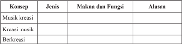

Tabel ini berisi informasi tentang konsep musik kreatif, dengan kolom-kolom yang mencakup jenis, makna dan fungsi, serta alasan. Topik utama tabel adalah musik kreatif dan bagaimana konsep tersebut dapat dianalisis melalui jenis, makna, dan fungsi serta alasan. Data penting yang terlihat adalah bahwa musik kreatif melibatkan berbagai jenis seperti musik kreatif, kreasi musik, dan berkreatifitas. Makna dan fungsi musik kreatif meliputi pengembangan kreativitas, peningkatan keterampilan musik, dan pengalaman emosional. Alasan untuk mempelajari musik kreatif meliputi pembentukan karakteristik, meningkatkan keterampilan, dan memperluas pemahaman tentang dunia musik.

Pengertian  musik  kreasi yang  telah  didiskusikan  diharapkan  dapat mengingatkan kembali bahwa jenis dan tehnik dalam berkreasi musik yang tumbuh dipertunjukkan melalui media vokal, media instrumen, maupun media campuran dalam seluruh kelompok masyarakat di dunia.

 

---
## 📄 Halaman 71

Sekadar mengingatkan kembali bahwa jenis musik kreasi yang tumbuh dan berkembang dalam kehidupan masyarakat terdiri dari musik tradisional, musik  klasik,  musik  modern,  dan  musik  kontemporer,  Murgianto  (1978) mengungkapkan pengertian tradisional bahwa:

Tradisi berasal dari kata latin tradition ,  sebenarnya berarti mewariskan handing  down .  Tradisi  biasanya  dide fi nisikan  sebagai  cara  mewariskan pemikiran, kebiasaan, kepercayaan, kesenian, tarian, musik, dan yang lainnya dari generasi ke generasi, dari leluhur ke anak cucu secara lisan. Di dalam pewarisan  semacam ini  yang  memberikan  lebih  aktif,  sedangkan  penerima mewadahi  secara  lebih  pasif, artinya tidak lazim terjadi  tanya  jawab 'penularan' akan hal-hal yang diwariskan.

Musik  tradisional adalah  musik  yang dipengaruhi oleh adat, tradisi dan budaya masyarakat tertentu. Pada umumnya,  musik  tradisi  baik  vokal maupun  instrumen  menjadi  milik  bersama, karena musik tradisi banyak yang tidak  diketahui  penciptanya  dan  tahun tercipta.  Musik  tradisional  dengan  kesederhanaannya merupakan warisan seni budaya leluhur yang memiliki nilai luhur, diakui keberadaannya karena mampu mengadaptasi lingkungan tempat karya musik itu hidup dan berkembang.

Musik  klasik lahir  dari  masa  sekitar akhir abad ke-18, semasa hidup komponis Haydn dan Mozart .  Musik klasik yang pembuatan dan penyajiannya  memakai  bentuk,  sifat,  dan  gaya dari musik  yang  berasal dari  masa lalu.  Musik klasik adalah musik kuno. (Suharto, 1992:63)  musik klasik hidup dan  berkembang  di  lingkungan  kaum bangsawan,  di  lingkungan  istana  atau keraton.  Karya  musik  klasik  memiliki sifat  yang  mempertahankan  nilai-nilai dan norma yang sangat kuat.

Dalam  sebuah  tulisan  dide fi nisikan  'menggarap  musik  kontemporer adalah cara pandang atau sikap seorang seniman dalam menggarap musik yang menghasilkan teknik, tekstur, struktur, bentuk komposisi, harmoni, gaya yang bersifat kekinian sesuai dengan zamannya dan secara tidak langsung didasari dan terkait dengan musik yang sudah ada sebelumnya'. (Kholid, 2015:64)

Mack (2001:34)  memandang  bahwa  pada  dasarnya  keberadaan  'musik kontemporer  merupakan  satu  perkembangan  dari  musik  tradisi  yang  ada'. Tradisi  yang  dimaksud  adalah  sesuatu  yang  berkembang  dalam  perjalanan waktu, sehingga dalam perjalanan tersebut tradisi bisa saja mengalami suatu perubahan-perubahan  atau  perkembangan  yang  akhirnya  memungkinkan sekali  jika  dilihat  dari  struktur,  bentuk,  serta  gaya  komposisinya  sangat berbeda dengan asal mula suatu seni tradisi tersebut.

 

---
## 📄 Halaman 72

Menyimak pandangan itulah, dapat disimpulkan bahwa musik kontemporer itu  merupakan  suatu  komposisi  musik  baru  dan  berlandaskan pada konsep musik yang sifat kekinian. Proses penciptaan musik kontemporer dapat dilakukan dengan berbagai cara atau teknik, sehingga menuntut seorang komponis memiliki kreativitas yang tinggi dan upaya secara berkesinambungan dalam merealisasikan ide-ide kreatifnya.

Musik modern dikenal dengan sebutan musik kreasi baru. Musik ini bersumber dari musik tradisional dan musik klasik, yang dikemas dari hasil sebuah proses kreasi dari  bentuk  aslinya,  biasanya kreasi  musik  ini  mencerminkan  sikap dinamis yang menjadi tuntunan masyarakat. Musik modern secara prinsip  mampu  memberi  nuansa  baru meskipun materinya lama

Musik kontemporer adalah musik baru di Indonesia yang tidak berkaitan dengan  tradisi sama  sekali. Kriteria dari kontemporer adalah ketidakbiasaan  atau  suatu  bayangan  'kebebasan  sepenuhnya'.  Kontemporer  dianggap  sebagai  salah  satu  gaya  tertentu, yang diartikan sebagai suatu sikap menggarap di ujung perkembangan seni yang digeluti. ( Dieter Mack , 2001:35)

Setiap daerah sudah pasti memiliki seni musik tradisional yang tumbuh dan  berkembang  dalam  kehidupan  masyarakatnya.  Seni  musik  tradisional tercipta sebagai hasil kreasi masyarakat yang sudah diwariskan secara turuntemurun.

Dalam konteks musik kontemporer, konsep musiknya lebih memaksimalkan bunyi dan jeda, hening atau tanpa bunyi menjadi fokus penggarapan sebuah karya musiknya (bermusik). Pada penggarapan komposisi musik kontemporer unsur  bunyi  dengan  berbagai  karakteristik  warna  bunyi  yang  bermacammacam  di  eksplorasi  lebih  luas  tanpa  bergantung  pada  pengolahan  ritmis, nada,  melodi,  dan  harmoni  saja,  melainkan  komposisi  musik  kontemporer lebih diberi 'ruang untuk memberikan makna musikal'.

Salah  satu  teknik  pada  penggarapan  kreasi  musik  kontemporer  adalah melalui penggarapan dengan memanfaatkan sumber dan warna bunyi yang dihasilkan dari suatu instrumen musik tertentu dengan cara memainkan yang berbeda  dari  biasanya,  pemanfaatan  karakteristik  struktur  instrumen  dan akustik bahkan lebih luas susunan dan fungsinya yang akan dijadikan sebagai sebuah media garap dan kreasi komposisi musiknya sehingga menghasilkan suatu  karya  kreasi  musik  yang  baru.  Ide  garapan  musik  kontemporer  bisa

 

---
## 📄 Halaman 73

dicapai dengan berbagai teknik dalam berkarya komposisi musik yang terdapat pada setiap etnik dengan cara mengembangkan dan berkolaborasi keunikankeunikan, teknik memainkan instrumen selain teknik dalam memanfaatkan unsur-unsur keunikan musikal dan budaya musiknya. (Kholid, 2015:67)

Ada tiga kategori yang tersirat dalam tehnik berkreasi musik kontemporer, yaitu:

- Menggarap musik dalam suatu gaya tradisional, mengaransir baru suatu karya musik tradisional,
- Menggarap kreasi musik baru bersifat kekinian.
- Kriteria  musik kontemporer adalah ketidakbiasaan atau suatu bayangan kebebasan sepenuhnya.
Jenis musik yang bagaimana yang ada di lingkungan sekitar kamu?

Silahkan kamu bercerita melalui tataran tema yang dipaparkan berikut.

- Bagaimana kondisi dan perkembangan seni tersebut?
- Kapan dan dalam acara apa biasanya seni musik itu dipertunjukkan?
- Bagaimana cara melestarikannya? Siapa saja tokoh yang berpengaruh di dalamnya? dan siapa pula pengelolanya?
- Adakah generasi penerus yang terjun di dalamnya?
- Di mana lokasi keberadaannya?
- Apa fungsi seni tersebut dalam kehidupan masyarakat?
Untuk menjawab pertanyaan-pertanyaan di atas, sebagai bahan informasi dan sekadar untuk mengingatkan kembali wawasan pengetahuan seni musik dan pengalaman bermusik, kamu dapat menyimak sekilas dan memahaminya jenis musik kreasi, kemudian cobalah kamu untuk mengapresiasinya dengan baik.

Sumber: Dokumen Penulis

Gambar 3.6 Contoh alat musik tradisional  Jawa

Barat: seperangkat Angklung

 

---
## 📄 Halaman 74

---
**🖼️ Gambar/Diagram**

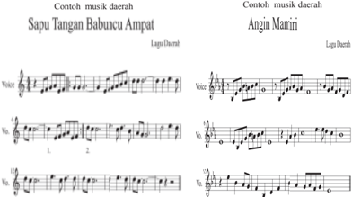

> **Deskripsi Visual:** Gambar ini adalah contoh musik daerah yang menunjukkan dua lagu daerah, yaitu "Sapu Tangan Babuncu Ampat" dan "Angin Maniri". Gambar ini menggunakan notasi musik untuk menunjukkan struktur旋律 (melody) dan ritme dari kedua lagu tersebut. Untuk "Sapu Tangan Babuncu Ampat", notasi ini menunjukkan struktur旋律 (melody) dan ritme yang lebih sederhana dibandingkan dengan "Angin Maniri". Untuk "Angin Maniri", notasi ini menunjukkan struktur旋律 (melody) dan ritme yang lebih kompleks dan memiliki beberapa baris yang lebih panjang, menunjukkan bahwa lagu ini mungkin lebih panjang atau memiliki lebih banyak detail melodi dan ritme.

Elemen-elemen utama yang ditampilkan dalam gambar ini adalah notasi musik untuk kedua lagu daerah tersebut. Notasi ini mencakup teks, angka, dan label penting seperti baris, kolom, dan baris notasi. Teks pada gambar ini berisi judul lagu daerah dan nama penulis lagu. Angka digunakan untuk mengindikasikan baris notasi dan kolom. Label penting seperti "Lagu Daerah" dan "Vokal" digunakan untuk memberikan konteks tentang apa yang ditampilkan dalam notasi tersebut.

Informasi kunci yang dapat diambil pembaca dari gambar ini adalah bahwa ini adalah contoh musik daerah yang menggunakan notasi musik untuk menunjukkan struktur旋律 (melody) dan ritme dari kedua lagu daerah tersebut. Ini juga menunjukkan bahwa "Angin Maniri" mungkin lebih panjang atau memiliki lebih banyak detail melodi dan ritme dibandingkan dengan "Sapu Tangan Babuncu Ampat".

Sumber lagu daerah dikutip dari buku pendidikan seni Sya fi 'i, dkk.

Setelah  melakukan  pengamatan  terhadap  jenis  musik  di  atas,  maka kegiatan  selanjutnya  kamu  harus  mengisi  format  berikut  sebagai  bentuk penilaian portofolio yang menjadi salah satu sasaran dalam pembelajaran seni budaya khususnya tentang musik kreasi.

 

---
## 📄 Halaman 75

### Format Hasil Pengamatan Teknik Berkreasi Musik

Nama Siswa/Kelompok

: ………………………

Nomor Induk Siswa

: ………………………

Hari/Tanggal Pengamatan

: ………………………

Tema/Judul karya/Lagu

: ………………………

Karakter Lagu/Instrumen

: ………………………

---
**📊 Tabel**

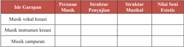

Tabel ini memperlihatkan peran dan struktur musik dalam konteks seni estetis. Topik utamanya adalah ide garapan musik, yang meliputi musik vokal kreasif, musik instrumen kreasif, dan musik campuran. Dalam kolom "Peranan Musik", kita melihat bahwa musik vokal kreasif berfungsi sebagai penyajian, sementara musik instrumen kreasif dan musik campuran tidak memiliki peran tertentu di kolom tersebut. Struktur musikal juga tidak disebutkan untuk setiap ide garapan. Namun, dalam kolom "Nilai Seni Estetis", kita dapat melihat bahwa semua ide garapan ini memiliki nilai seni estetis yang signifikan. Ini menunjukkan bahwa semua jenis musik yang dinyatakan dalam tabel memiliki potensi untuk menciptakan keindahan dan keunikan dalam seni estetis.

Pengisian  format  tentang  konsep  dan  teknik  musik  kreasi  dilakukan setelah  melakukan  diskusi  dan  observasi  serta  wawancara  kepada  tokoh pemangku seni, pelaku seni, pencipta, dan penikmat seni musik kreasi serta kepada pihak-pihak terkait yang dianggap mengetahui gambaran musik kreasi.

Musik  sebagai perilaku manusia. Musik  adalah perilaku sosial yang  kompleks  dan  universal.  Setiap  masyarakat  memiliki  apa  yang disebut  dengan  musik  (Elliot  &  Blacking,1995:224)  dan  setiap  anggota masyarakatnya adalah musikal.

### C. Prosedur Musik Kreasi

Apabila kita akan membuat sebuah karya musik kreasi atau dituntut untuk berkreasi musik, ada beberapa prosedur ataupun langkah-langkah dasar yang harus diperhatihan oleh komposer (pencipta musik kreasi) yaitu:

- Proses  berkreasi  dalam  penciptaan  suatu  karya  musik,  yang  terpenting harus diawali dari minat dan keinginan kuat untuk membuat suatu karya.
- Menstimulus  diri  untuk  dapat  memunculkan  ide  dan  gagasan  dalam berkreasi  dan  mendapatkan  masalah  yang  akan  digarap.  Maksud  dari ungkapan  ini  supaya  kita  dalam  membuat  karya  tersebut  memahami maksud  dan  tujuan  membuat  karya  musik  kreasi  tersebut,  kemudian strategi dan teknik apa yang harus dipilih untuk merealisasikan ide yang didapat.

 

---
## 📄 Halaman 76

- Langkah  berikutnya  adalah  kegiatan  berkreasi  musik  yang  menjadikan pilihan komposer yang perlu dilakukan.
Setelah ketiga langkah tersebut dilakukan, maka akan terjawab konsep musik  kreasi.  Akan  tetapi,  untuk  menemukan  dan  mewujudkan  karya musik kreasi tersebut, seorang komposer dituntut harus mampu melakukan pendekatan-pendekatan  dengan  berbagai  gaya  musik,  para  pemain  musik, dan para penggarap lain, supaya dapat menambah kekayaan dalam menyusun garapan karya musik kreasi.

Dalam  prosedur  berikutnya  yang  mendasari  kegiatan  dalam  berkreasi musik adalah mempelajari konsep kreasi.

Amatilah dengan cermat bagan prosedur berkreasi musik tersebut. Kemudian aplikasikan konsepnya melalui praktik belajar membuat musik kreasi dengan mengindahkan  norma-norma  kreativitas,  etika,  dan  estetika  bermusik  agar setiap  bentuk  karya  musik  yang  dikreasikan  itu  mampu  berdaya  guna  dan bermanfaat bagi pembelajaran kita.

Anda  dapat  memulainya  dari  aspek  mana  saja,  dan  perlu  diingat  setiap aspek  memiliki  keterkaitan  yang  sangat  erat,  masing-masing  aspek  saling mendukung.  Sebuah  karya  musik  kreasi  akan  dirasakan  berfungsi  jika memperhatikan indikator-indikator yang mendukungnya. Hal ini dikarenakan musik memiliki fungsi untuk berbagai hal, antara lain seperti yang dipetakan dalam diagram berikut.

---
**🖼️ Gambar/Diagram**

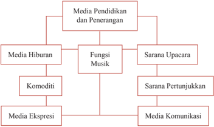

> **Deskripsi Visual:** Gambar ini adalah diagram yang menunjukkan struktur dan fungsi media pendidikan dan penerangan. Diagram ini dibagi menjadi empat bagian utama:

1. Media Pendidikan dan Penerangan
   - Media Hiburan
     - Komoditi
     - Media Ekspresi
   - Fungsi Musik
   - Sarana Upacara
     - Sarana Pertunjukkan
     - Media Komunikasi

Elemen-elemen utama dalam diagram ini adalah media pendidikan dan penerangan, media hiburan, fungsi musik, sarana upacara, dan media ekspresi. Mereka saling terkait dan membentuk struktur yang kompleks.

Teks, angka, atau label penting yang terlihat dalam diagram ini meliputi:
- Media Pendidikan dan Penerangan
- Media Hiburan
- Fungsi Musik
- Sarana Upacara
- Media Ekspresi
- Komoditi
- Sarana Pertunjukkan
- Media Komunikasi

Informasi kunci yang dapat diambil pembaca meliputi:
- Struktur media pendidikan dan penerangan
- Peran media hiburan dalam sistem ini
- Fungsi musik sebagai bagian dari media pendidikan
- Peran sarana upacara dan pertunjukkan dalam sistem ini
- Media ekspresi sebagai bagian dari media hiburan

Dengan diagram ini, pembaca dapat memahami hubungan antara berbagai jenis media pendidikan dan penerangan serta peran mereka dalam sistem tersebut.

 

---
## 📄 Halaman 77

### Cobalah kamu simak dengan baik, skema fungsi seni yang dilukiskan di atas!

Apabila  kita  adaptasikan  pernyataan  tersebut,  tergambar  jelas  bahwa secara  umum  karya  seni  musik  yang  tumbuh  dan  berkembang  di  daerah Indonesia memiliki keragaman fungsi sebagai berikut.

### 1.  Sarana Upacara

Musik dapat dijadikan media untuk mendukung kegiatan upacara seperti berikut.

- Upacara Panen Padi (Upacara Seren Taun) di Jawa Barat, menggunakan musik angklung.
- Upacara Merapu di Sumba, menggunakan bunyi-bunyian untuk memanggil  dan  menggiring  kepergian  roh  ke  pantai  merapu  (alam kubur).
- Upacara dalam Talqin Mayit di daerah Blubur Limbangan, Garut (Jawa Barat), menggunakan nyanyian/tembang (lagu-lagu Cigawiran).
- Upacara  Sekatenan  di  Cirebon  (Jawa  Barat),  menggunakan  musik gamelan  sebagai  pendukung,  pengiring  kegiatan  mencuci  barangbarang  pusaka  yang  dianggap  memiliki  keramat  oleh  masyarakat pendukungnya.
- Upacara  Mapag  Dewi  Sri,  di  Sumedang  (Jawa  Barat),  menggunakan musik Tarawangsa.

### 2.  Sarana Pertunjukan

Pada  umumnya  berbagai  macam  kegiatan  pertunjukan  seni  yang  kita kenal, tersaji dengan iringan musik berikut.

- Musik sebagai seni pertunjukan mandiri.
- Musik berfungsi  sebagai  pengiring  gerak-gerak  tari  dan  drama  yang dipertunjukan.
- Musik sebagai ilustrasi tarian.
- Musik sebagai ilustrasi cerita, lakon.
- Musik sebagai stimulus untuk menari.
- Musik sebagai pengiring pertunjukan wayang.
- Musik sebagai latar dalam pertunjukan drama, sinetron, fi lm, ludruk, sandiwara, lenong, gending karesmen, arja, ketoprak, dan lain-lain.

 

---
## 📄 Halaman 78

### 3.  Media Komunikasi

Musik sejak dulu telah difungsikan manusia sebagai media komunikasi, misalnya seperti berikut.

- Di suatu daerah jika orang mendengar bunyi kentongan menandakan bahwa ada suatu kejadian untuk memberitahukan pada penduduk.
- Bunyi bedug, bagi orang muslim sudah merupakan ciri khas sebagai penanda tibanya waktu sholat.

### 4. Media Pendidikan dan Penerangan

Media  pendidikan  dan  penerangan  sering  kita  temukan  pada  kegiatan berikut.

- Lagu-lagu dalam iklan layanan masyarakat.
- Musik dan lagu yang bernapaskan agama, sebagai penerang kehidupan.
- Musik sebagai wahana pemahaman, penerapan, dan mensosialisasikan nilai-nilai religius, nilai estetis, serta nilai sosial masyarakat.

### 5.  Media Hiburan

Media hiburan dapat ditemukan dalam musik berikut.

- Pelepas lelah.
- Sajian permainan, seperti dalam mendukung kegiatan anak-anak.
- Mencari kesenangan lahir dan batin.

### 6. Komoditi dan Media Ekspresi

Komoditi dan media ekspresi diberlakukan pada saat-saat berikut.

- Ajang bisnis
- Mengekspresikan/mengungkapkan perasaan, ide, dan gagasannya melalui  media  seni  musik,  baik  musik  vokal  instrumen  ataupun campuran.
- Berkreasi dan berolah musik.
Kita  tidak  menyadari  bahwa  jenis  alat  musik  yang  terlahir  di  muka bumi ini, ada yang tetap utuh sesuai dengan aslinya dan ada pula yang telah diubah untuk disesuaikan dengan kebutuhan. Semakin berkembang ilmu dan teknologi,  semakin  banyak  pula  karya  seni  dalam  wujud  alat  musik  untuk dimanfaatkan  dalam  bermusik,  mulai  dari  bentuk,  cara  penyajian  sampai dengan berikut fungsinya dari masing-masing alat musik itu sendiri pada saat pertunjukan.

 

---
## 📄 Halaman 79

Setelah kamu pelajari dan pahami tentang fungsi seni musik pada umumnya,  selanjutnya  coba  kamu  perhatikan  secara  lebih  teliti lagi, tentang fungsi dari masing-masing alat musik yang sering kita dengar bahkan mungkin sering kita mainkan.

### Fungsi Alat Musik

### Fungsi dari alat musik itu dapat kita golongkan sebagai berikut.

### 1. Fungsi Melodi

Fungsi  ini  berarti  bahwa  alat  musik  yang  disajikan  dalam  pertunjukan musik hanya memainkan melodi sebagai susunan dari notasi/nada yang nanti dimainkan oleh musik vokal dalam bentuk lagunya. Kita dapat mengambil contoh untuk jenis alat musik recorder , pianika, dan gitar, serta saron dalam gamelan,  bonang  pada  gamelan  degung,  angklung  melodi,  suling,  yang peranannya dalam pertunjukan musik memainkan bagian melodi.

### 2.  Fungsi Harmoni

Dalam  pertunjukan  musik  terdapat  alat  musik  yang  dimainkan  untuk mengharmoniskan  atau  menyelaraskan  antara  melodi  dan  ritme.  Fungsi harmoni dimainkan oleh alat bantu musik lain atau bisa disebutkan sebagai alat  musik  penyelaras  dari  alat  musik  yang  lain.  Contoh  alat  musik  yang berfungsi sebagai penyelaras, yaitu keyboard atau piano, dan gitar, serta alat musik daerah misalnya kecapi, saron, suling yang difungsikan selain sebagai melodi juga sebagai harmoni.

### 3. Fungsi Ritme/Ritmis

Jenis  alat  musik  ini  akan  kita  dapatkan  dalam  bentuk  alat  musik  yang tidak bernada. Misalnya waditra kendang, drum, tamborin, dog-dog, terbang, bongo, tifa, timpani, bedug, genjring, dan tam-tam. Selain memberikan irama (ritme/ritmis),  alat  musik  tersebut  terkadang  juga  dapat  memberikan warna terhadap suasana pertunjukan. Melalui bunyi ritmis yang ditimbulkan dalam sajian  komposisi  musik,  biasanya  suasana  atau  karakter  pertunjukan  akan

 

---
## 📄 Halaman 80

lebih  terasa  lain.  Dengan  permainan  irama  yang  cepat,  sedang,  dan  lambat akan memberikan dinamika yang berubah.

Keseluruhan alat musik yang tumbuh dan berkembang berfungsi sebagai media bunyi yang dapat didengar. Secara fi sik indra pendengaran merupakan perkembangan yang pertama dari kelima indra dan dapat distimulus melalui musik,  yang  sekaligus  akan  meningkatkan  perkembangan  fungsi  otak. Menurut Hodges (2000) dalam Djohan (2005: 26), mengatakan bahwa kita akan semakin tahu berkat adanya lingkungan (musikal) yang secara fi sik hal itu akan berfungsi untuk menghasilkan perubahan pada otak dalam mengikat dan membentuk pribadi.

Keanekaragaman jenis karya musik dan bentuk alat musik yang tumbuh dalam  kehidupan  kita,  memiliki  kedudukan  dan  fungsi  yang  berbeda. Ada yang digunakan sebagai media ekspresi untuk mewujudkan karya musik yang disebut komposisi, media untuk kegiatan pendidikan baik di sekolah maupun pendidikan  luar  sekolah,  dijadikan  sebagai  media  komunikasi  antar  suku bangsa dan antarnegara.

The Lian Gie seorang fi lsuf (1996) dalam Budiwati (2001:11), mengatakan bahwa: pada umumnya seni dapat berfungsi sebagai berikut.

- Media kerohanian, yaitu sebagai fungsi spritual dan fungsi upacara khusus dalam kegiatan seremonial dan pertunjukan.
- Media kesenangan, yaitu sebagai fungsi hedonistik untuk hiburan.
- Media tata hubungan, yaitu sebagai fungsi komunikatif.
- Media  pendidikan,  yaitu  sebagai  fungsi  edukatif  dalam  memberikan penerangan pengetahuan, pelatihan,  dan  memberikan  pengajaran  dalam menyampaikan nilai-nilai seni dan fatwa-fatwa.
- Media ekspresi dalam memenuhi kebutuhan estetis.
Keseluruhan  dari  fungsi  karya  seni  musik  itu  akan  melibatkan  pribadi individual dan pribadi  masyarakat.

 

---
## 📄 Halaman 81

### Sebuah contoh karya musik daerah yang dapat disebut dengan seni karawitan adalah:

Tembang  Sunda  Cianjuran  yang  terkenal  dengan  sebutan  ' mamaos ', dikenal juga sebagai ' kamermuziek '.  Pada  awalnya mamaos berkedudukan sebagai musik seni yang sifatnya sangat menyendiri, artinya musik ini tidak diciptakan untuk memenuhi kebutuhan lain yang terletak di luar kebutuhan pribadinya  dan  hanya  dinikmati  dengan  perasaannya  sendiri  pada  saat menghayati musik belaka.

Marilah  kita  lantunkan  bersama-sama  musik  vokal  tradisional  Sunda yang dapat kita apresiasi. Sebagai contoh penyajian karya musik seni yang berkembang di  Indonesia  adalah  tembang  sunda  yang  dalam  penyajiannya diiringi degan petikan kecapi dan suling.

---
**🖼️ Gambar/Diagram**

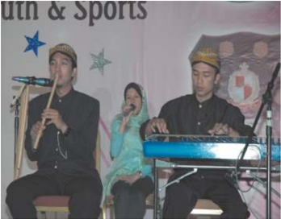

> **Deskripsi Visual:** Gambar ini adalah foto yang menunjukkan tiga orang yang sedang bermain musik. Dua orang di sisi kiri sedang memainkan alat musik tradisional, sedangkan orang tengah sedang memainkan keyboard. Semua orang tersebut tampak sangat serius dan fokus pada tugas mereka. Di belakang mereka, terdapat banner dengan tulisan "Youth & Sports" dan beberapa bintang. Ini menunjukkan bahwa acara ini mungkin merupakan bagian dari acara seni dan olahraga untuk remaja.

Sumber: Dokumen Penulis

Gambar 3.9 Pertunjukkan Kecapi-Suling-Kawih sebagai Musik Seni

 

---
## 📄 Halaman 82

### JEMPLANGBANGKONG

``

Partitur Lagu Jejempangan dalam Tembang Sunda.

 

---
## 📄 Halaman 83

Sebagai penjelasan  dari  gambar  tersebut  adalah  salah  satu  contoh  musik  seni yang sedang menyajikan musik kecapi suling yang lahir di daerah Jawa Barat. Lagu tersebut diciptakan oleh seorang komponis kreatif dengan menciptakan lagu-lagu yang berkembang dari daerah Sunda. Pada awalnya, lagu tembang tersebut berfungsi untuk media sawer dalam kegiatan upacara adat pernikahan masyarakat Sunda. Sejalan dengan pertumbuhannya, akhirnya seni Cianjuran berkembang menjadi musik fungsional, artinya musik yang berkaitan dengan masalah-masalah yang berada di luarnya, sebab musik fungsional tidak hanya berkaitan dengan sifatnya saja melainkan masalah corak dan karakteristik dari musik atau lagu itu sendiri sangat menentukan.

Berikut adalah salah satu contoh musik fungsional yang lahir di wilayah Nusantara, yaitu Tembang Sunda Cianjuran dan Tembang Sunda Cigawiran. Tembang Sunda merupakan salah satu jenis seni musik vokal yang diciptakan oleh seorang komponis kreatif. Tembang Sunda tercipta sebagai musik vokal yang tumbuh berkembang dari daerah Sunda. Pada awalnya, musik fungsional tersebut digunakan untuk media upacara dan disajikan hanya di lingkungan sendiri. Tembang Sunda Cianjuran tumbuh di lingkungan kaum bangsawan dan Tembang Sunda Cigawiran tumbuh di lingkungan masyarakat pesantren yang  kemudian  kedua  jenis  Tembang  Sunda  tersebut  berkembang  menjadi musik pertunjukan selain sebagai musik vokal yang disajikan untuk hiburan.

Gambar 3.10 Contoh penyajian musik seni dalam kecapi tembang dari daerah Sunda

 

---
## 📄 Halaman 84

Gambar 3.11 Contoh musik fungsional dari daerah Sunda-musik gamelan sebagai iringan tari

Musik  seni  ini  dapat  dikatakan  'tidak  mudah  menurut  ukuran  teknis, tidak  murah  menurut  ukuran  apresiasi,  dan  tidak  rendah  menurut  ukuran estetika.' Artinya jika kita berpola pada ukuran-ukuran tersebut maka untuk menciptakan karya musik seni  diperlukan  musisi  yang  terampil,  peka,  dan berbakat  tinggi,  serta  untuk  menikmatinya  diperlukan  daya  apresiasi  yang mapan, setidak-tidaknya sejajar dan memiliki wawasan yang cukup luas dan lebih mendalam baik dengan pencipta ataupun penyajinya. Oleh karena itu, tidak  heran  seandainya  dalam  penyebarannya,  musik  seni  dirasakan  sangat lamban  jika  dibandingkan  dengan  penyebaran  musik  pop,  musik  dangdut, ataupun musik lainnya.

Untuk melihat musik fungsional dalam kehidupan sehari-hari, kita dapat menjumpai istilah-istilah seperti adanya karya seni vokal dalam bentuk lagu perjuangan, lagu upacara, lagu kependidikan, lagu keagamaan, dan lagu-lagu lain yang bertema dan tercipta sesuai konteks kebutuhannya. Istilah lagu sudah jelas menunjukan sebuah karya musik, tetapi kata yang berada di belakangnya masing-masing seperti perjuangan, pendidikan, keagamaan, itu menunjukkan bidang-bidang atau konteks lain yang berada di luar musik itu sendiri, dan sekaligus menunjukkan fungsi musik di bidang masing-masing.

 

---
## 📄 Halaman 85

- Lagu perjuangan berarti  karya  seni  musik  dalam  bentuk  lagu  yang  berfungsi untuk mengobarkan semangat berjuang atau lagu yang menggambarkan kepahlawanan, artinya pada lagu ini bukanlah musik yang menjadi tujuan utama,  melainkan  berkobarnya  semangat  perjuangan  itu  sendiri,  dan musik berfungsi sebagai pendukung utama.
- Lagu pendidikan berarti lagu yang diciptakan sebagai sarana atau media pendidikan  baik  untuk  kebutuhan  pendidikan  dalam  pembelajaran  di sekolah maupun di luar sekolah.
- Lagu keagamaan berarti lagu yang merupakan media bagi kepentingan hidup beragama, lagu atau musik tersebut diciptakan bisa untuk Da'wah atau untuk memenuhi kebutuhan sebagai alat pemujaan, bahkan lagu itu pun bisa berupa pupujian atau nadoman bagi umat Islam.
- Lagu hiburan berarti lagu yang diciptakan untuk memenuhi kebutuhan dalam mencari kesenangan, yaitu menghibur atau sebagai pelepas lelah setelah melakukan aktivitas.
- Lagu atau musik upacara berarti buah karya seni musik yang dipergunakan untuk  memenuhi kebutuhan ritual  atau  musik  yang  diciptakan  sebagai media  upacara,  yang  menjadi  tujuan  pokok  yang  terpenting  adalah kehidmatan dan kekhusuan dalam melakukan kegiatan upacara.
Cari dan lengkapilah contoh karya seni musik dalam bentuk lagu-lagu yang sudah tercipta sesuai dengan klasi fi kasi fungsionalnya:

- 1.
- Lagu perjuangan  : Halo-Halo Bandung, Maju Tak Gentar, dan …
- Lagu pendidikan  : ……………………………………….............
- Lagu keagamaan  : ……………………………………….............
- Lagu hiburan
: ……………………………………….............

- Lagu upacara
: ……………………………………….............

Melihat macam dan corak kegiatan dalam kehidupan manusia, ternyata musik  telah  memegang  peranan  dan  dibutuhkan  sebagai  pendukungnya, fungsinya sebagai media atau sarana dalam penyampaian cita rasanya. Secara umum  musik  dapat  berfungsi  untuk  upacara,  pertunjukkan,  hiburan,  dan pendidikan.

 

---
## 📄 Halaman 86

Pernahkah kamu menyaksikan pertunjukan musik seni dan musik fungsional? Hal apa saja yang menarik perhatian kamu dari pertunjukan tersebut? Perhatikan beberapa gambar dan coba kamu identi fi kasi hal-hal apa saja yang dapat ditemui serta kemukakan pendapatmu tentang gambar berikut!

Sumber: Dokumen Penulis

Gambar 3.12 Contoh musik seni dalam pertunjukan kecapi siter dari daerah Sunda

---
**🖼️ Gambar/Diagram**

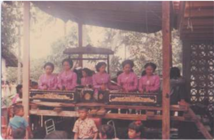

> **Deskripsi Visual:** Gambar ini adalah foto yang menunjukkan sebuah acara atau perayaan di mana beberapa orang berdiri di belakang meja besar yang tampaknya berisi peralatan makan atau hiasan. Orang-orang tersebut mengenakan pakaian seragam merah dan putih, yang menunjukkan bahwa mereka mungkin merupakan anggota suatu organisasi atau kelompok tertentu. Di sekitar mereka, terlihat beberapa kursi dan meja lainnya, serta beberapa pohon yang tampaknya berada di luar ruangan. Gambar ini menunjukkan suasana yang ceria dan meriah, dengan semua orang tampak senang dan terlibat dalam acara tersebut.

Gambar 3.13 Contoh musik fungsional dari daerah Sunda (musik gamelan sebagai iringan upacara adat)

 

---
## 📄 Halaman 87

---
**🖼️ Gambar/Diagram**

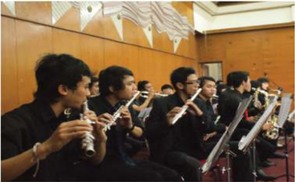

> **Deskripsi Visual:** Gambar ini adalah foto yang menunjukkan sebuah pertunjukan musik di sebuah gedung konser. Dalam foto ini, beberapa orang sedang bermain alat musik flauta. Mereka duduk di barisan yang terdiri dari beberapa kursi. Di sebelah kanan, terdapat beberapa alat musik lainnya yang tampak tidak digunakan saat ini. Latar belakang terlihat seperti dinding dengan desain yang menyerupai pohon atau bunga. Gambar ini menunjukkan suasana yang serius dan profesional dalam pertunjukan musik tersebut.

Sumber: Dokumen Penulis

Gambar 3.14 Contoh musik seni dari mancanegara: Pertunjukan musik tiup

---
**🖼️ Gambar/Diagram**

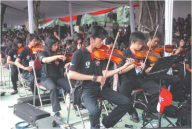

> **Deskripsi Visual:** Gambar ini adalah foto yang menunjukkan sebuah pertunjukan musik timbril di luar ruangan. Dalam foto ini, kita bisa melihat beberapa orang pemain timbril yang sedang bermain alat musik mereka. Mereka duduk di kursi yang disediakan untuk mereka, dan tampaknya sedang mengiringi lagu yang dimainkan oleh seorang pemain gitar di belakang mereka. Setiap pemain timbril memiliki alat musik mereka sendiri, dan semua mereka sedang fokus pada performa mereka. Di sekitar mereka, terlihat beberapa penonton yang tampaknya menikmati pertunjukan ini. Gambar ini menunjukkan bagaimana timbril dapat menjadi bagian dari suatu pertunjukan musik yang lebih besar, dan bagaimana mereka dapat bekerja sama dengan alat musik lainnya untuk menciptakan suara yang indah.

Sumber: Dokumen penulis

Gambar 3.15 Contoh musik fungsional dari mancanegara: Pertunjukan musik gesek biola

 

---
## 📄 Halaman 88

Kerjakan sesuai format berikut berdasarkan pengalaman bermusik yang pernah dialami dalam buku tugasmu.

### Format Hasil Pengamatan Musik Seni dan Musik Fungsional

Nama Siswa/Kelompok

: …………………..................................

Nomor Induk Siswa

: …………………..................................

Hari/Tanggal Pengamatan

: …………………..................................

Tema/Judul karya/Lagu

: …………………..................................

Karakter Karya musik

: …………………..................................

---
**📊 Tabel**

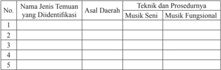

Tabel ini berisi informasi tentang jenis temuan yang diidentifikasi, asal daerah, dan teknik/prosedur yang digunakan untuk mendeteksi temuan tersebut. Topik utama tabel adalah identifikasi dan pengelompokan temuan melalui metode Musik Seni dan Musik Fungsional. Kolom-kolomnya mencakup Nama Jenis Temuan yang Diidentifikasi, Asal Daerah, dan Teknik dan Prosedur yang Digunakan. Data penting yang terlihat adalah bahwa setiap baris menunjukkan satu jenis temuan dengan nama, asal daerah, dan teknik/prosedur yang digunakan untuk mendeteksi temuan tersebut. Ini membantu dalam memahami bagaimana metode Musik Seni dan Musik Fungsional dapat digunakan untuk mengidentifikasi dan mengelompokkan temuan secara efektif.

Untuk lebih mengenal tentang musik seni dan musik fungsional, bacalah penjelasan dari beberapa referensi tentang makna konsep, teknik, fungsi dan prosedur bermusik tersebut. Dalam hal ini musik dapat difungsikan sebagai simbol, serta nilai-nilai estetik. Kedua jenis musik tersebut dapat dimainkan oleh  kamu,  sehingga  kamu  dapat  memiliki  pemahaman  yang  lebih  baik dalam mendengar dan memainkan langsung beragam pertunjukan seni musik. Pemahaman tersebut dapat dilakukan dengan berikut.

- Menyaksikan pertunjukan musik secara langsung.
- Melihat dokumentasi pertunjukan musik di suatu situs internet (misalnya youtube ).
- Mendengarkan dan melihat dokumentasi audio visual beragam karya seni musik.
- Membaca beragam referensi tentang musik.
Silahkan  kamu  cari  informasi  tentang  jenis  musik  vokal  dan  musik instrumen di lingkungan masyarakat kamu atau masyarakat yang lain. Kemudian, tuliskan daerah asal, karakter musikal, dan karakter bentuk instrumen ke dalam kolom berikut. Jangan lupa sertakan pula gambar dari setiap alat musik tersebut.

 

---
## 📄 Halaman 89

Kerjakan sesuai format berikut dengan data hasil temuan pengamatan kamu dalam buku tugasmu!

---
**📊 Tabel**

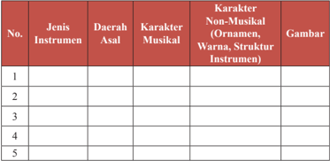

Tabel ini berisi informasi tentang instrumen musik, termasuk jenis instrumen, daerah asal, karakteristik musikal, karakteristik non-musikal (seperti ornamen, warna, struktur instrumen), dan gambar. Topik utama tabel ini adalah pengetahuan umum tentang instrumen musik, termasuk bagaimana mereka dibuat, di mana mereka berasal, dan apa yang membuat mereka unik. Kolom-kolom yang ada mencakup jenis instrumen, daerah asal, karakteristik musikal, karakteristik non-musikal, dan gambar. Data atau pola penting yang terlihat adalah bahwa instrumen musik memiliki variasi yang luas dalam hal jenis, daerah asal, karakteristik musikal, karakteristik non-musikal, dan gambar. Ini menunjukkan bahwa instrumen musik memiliki keunikan dan keanekaragaman yang besar.

### Evaluasi Pembelajaran

Setelah kamu belajar tentang konsep seni musik, jenis musik kreasi, dan fungsi musik, kamu diarahkan pada uji kompetensi wawasan ilmu seni, sikap, dan skill dalam berolah musik dan berapresiasi musik kreasi, maka isilah kolom di bawah ini  dengan cepat tepat, baik, dan benar!

### Penilaian Pribadi

Nama

: …………………..................................

Kelas

: …………………..................................

Semester

: …………………..................................

Waktu penilaian

: …………………..................................

 

---
## 📄 Halaman 90

No

### Pernyataan Uji Kompetensi

1

Saya berusaha belajar mengembangkan potensi ilmu seni musik dengan sungguh-sungguh.

- 2
Saya  berusaha  latihan  mengembangkan  seni  musik  kreasi berdasarkan  prinsip  seni  musik  dan  unsur  musik  dengan sungguh-sungguh.

- 3 Saya  mengikuti  pembelajaran  mengembangkan  kemampuan dalam berkreasi dan berapresiasi dengan penuh tanggung jawab.
4

- Saya mengerjakan tugas yang diberikan guru tepat waktu.
5

- Saya mengajukan pertanyaan jika ada yang tidak dipahami.
6

Saya berperan aktif dalam kelompok pembelajaran musik.

7

Saya menyerahkan tugas musik tepat waktu.

- 8
Saya menghargai perbedaan musik yang terkandung di dalam musik tradisional yang lain.

9

- Saya menghormati dan menghargai orang tua.
10

Saya menghormati dan menghargai teman.

11

Saya menghormati dan menghargai guru.

12

Saya berusaha melatih skill dalam berolah musik.

 

---
## 📄 Halaman 91

### Penilaian Antarteman

Nama teman yang dinilai

Nama penilai

Kelas

Semester

Waktu penilaian

: …………………..................................

: …………………..................................

: …………………..................................

: …………………..................................

: …………………..................................

No.

### Pernyataan

1

Berusaha belajar dengan sungguh-sungguh.

2

Mengikuti pembelajaran dengan penuh perhatian.

3

- Mengerjakan tugas yang diberikan guru tepat waktu.
4

Mengajukan pertanyaan jika ada yang tidak dipahami.

5

Berperan aktif dalam kelompok.

6

- Menyerahkan tugas tepat waktu.
7 Menghargai  ragam  musik  tradisional  yang  mewarnai  kehidupan masyarakat.

 

---
## 📄 Halaman 92

8

Menguasai dan dapat mengikuti kegiatan pembelajaran dengan baik.

9

Menghormati dan menghargai teman.

10

Menghormati dan menghargai guru.

11

Menanamkan disiplin dan sikap koperatif.

12

Menanamkan nilai budaya santun dan estetis.

### Rangkuman

Salah  Satu  Cabang  Kesenian  yang  Menggunakan  Bunyi,  Suara,  dan Nada sebagai Substansinya, yaitu Musik.

- Musik adalah suatu hasil karya seni melalui media bunyi atau suara dalam bentuk  lagu  atau  komposisi  musik  yang  mengungkapkan  pikiran  dan perasaan  penciptanya  melalui  unsur-unsur  musik.  Unsur  musik  terdiri dari  irama,  melodi,  harmoni,  bentuk/struktur,  dan  ekspresi  sebagai  satu kesatuan yang utuh.
- Musik  yang  bersifat  auditif  merupakan  seni  pengungkapan  gagasan melalui bunyi, yang unsur dasarnya berupa irama, melodi, dan harmoni, dengan unsur pendukung berupa bentuk ekspresi yang mengungkapkan gagasan, sifat,  tempo, dinamik, timbre, atau warna bunyi.
- Seni  suara  yang  sifatnya  auditif  adalah  bentuk-bentuk  panyampaian  isi hati manusia melalui suara yang indah. Suara dapat dibedakan atas desah dan nada.

 

---
## 📄 Halaman 93

- Media dari jenis seni suara atau bunyi-bunyian wujudnya adalah sebagai lagu atau nyanyian. Unsur-unsur lagu adalah nada, irama, dan syair/lirik.
- Karya seni musik yang tumbuh dan berkembang di Indonesia terdiri dari karya musik vokal dan karya musik instrumen.
- Musik yang lahir di wilayah Indonesia ini memiliki hasil karya seni yang beraneka  ragam,  baik  berupa  musik  vokal  maupun  musik  instrumen. Kedua rumpun bentuk musik ini  sebagai  cerminan  seni  budaya  daerah masing-masing di Indonesia.
- Media  seni  musik  adalah  suara  atau  bunyi  alat,  nada,  dan  kata  syair. Medium dari jenis bunyi-bunyian wujudnya adalah sebagai lagu, nyanyian, dan instrumental. Berdasarkan karakteristik dan asalnya, ragam seni musik instrumen  dapat  dibedakan  atas  instrumen  musik  barat  (internasional), musik nusantara (nasional), dan musik daerah.
- Jika dipandang dari sudut seniman, seni berfungsi sebagai:
- alat  ekspresi,  yaitu  sebagai  alat  komunikasi  untuk  menyampaikan pesan isi hati sang seniman pencipta dan
- mata pencarian yang dapat menghasilkan materi dan bisa membiayai hidupnya.
Adapun  jika  dilihat  dari  sudut  pandang  sosial  sebagai  apresiator,  seni dapat berfungsi sebagai:

- alat hiburan dan mampu memenuhi kebutuhan estetis;
- alat pendidikan untuk mengajak masyarakat berbuat sesuatu dari yang tidak tahu menjadi tahu, dari yang tidak baik menjadi baik, dari yang tidak biasa menjadi biasa, dan dari yang sukar menjadi mudah, artinya melalui pendidikan seni masyarakat dapat berubah dan berkembang positif; dan
- alat komunikasi untuk menyampaikan pesan.

 

---
## 📄 Halaman 94

### Re fl eksi

Re fl eksi  dari  pembahasan  yang  telah  dilakukan  dalam  bab  ini  adalah agar kamu mampu melakukan pembelajaran tentang konsep seni musik, jenis musik, dan fungsi seni musik. Pembahasan dalam bab ini juga bertujuan untuk memotivasi dan meningkatkan kemampuan kamu di bidang musik khususnya, dan seni umumnya. Pemahaman untuk melakukan pengalaman bermusik sesuai dengan tujuan yang ingin dicapai dengan memperlihatkan kemampuan kamu dalam  menghargai  pengetahuan  dan  wawasannya,  bertoleransi  antarsiswa, peduli dan memiliki rasa tanggung jawab, santun, responsif, kerja sama, jujur, cinta tanah air, mere fl eksikan pula sikap anggota masyarakat yang memiliki pengetahuan dan wawasan yang luas.

 

---
## 📄 Halaman 95

### Peta Materi

---
**🖼️ Gambar/Diagram**

> **Deskripsi Visual:** Gambar ini adalah diagram yang menunjukkan struktur analisis musik dalam konteks seni budaya. Diagram ini terdiri dari empat elemen utama yang saling terkait:

1. **Seni Budaya** - Ini adalah topik dasar yang memuat semua aspek seni budaya.
2. **Analisis Musik** - Ini adalah subtopik utama yang menggambarkan proses analisis musik.
3. **Makna Musik** - Subtopik ini menjelaskan interpretasi makna dari musik.
4. **Simbol Musik** - Subtopik ini fokus pada penggunaan simbol dalam musik.
5. **Nilai Estetis Musik** - Ini adalah subtopik yang membahas nilai estetis dari musik.

Elemen-elemen ini saling terkait melalui hubungan "Analisis Musik" sebagai pusat yang menghubungkan seluruh aspek tersebut. Teks, angka, atau label penting yang terlihat dalam diagram ini adalah nama-nama subtopik yang disebutkan di atas. Informasi kunci yang dapat diambil pembaca adalah bahwa analisis musik dalam konteks seni budaya melibatkan pemahaman makna, penggunaan simbol, dan nilai estetis musik.

### Peta Kompetensi Pembelajaran

Setelah mempelajari Bab 4 tentang analisis seni musik, kamu diharapkan mampu:

- Memahami dan menganalisis seni musik berdasarkan makna, simbol dan nilai estetis, secara spesi fi k agar kamu dapat melakukan berikut.
- Menjelaskan makna musik dalam pendidikan.
- Menemukan de fi nisi makna, simbol, dan nilai estetis musik yang tepat sesuai dengan konsep dan tema yang dipelajari.
- Mengidenti fi kasi simbol musik yang digunakan dalam berkreasi.
- Membedakan nilai estetis musik.

 

---
## 📄 Halaman 96

- Menganalisis  makna,  simbol,  dan  nilai  estetis  musik  dalam komposisi.
- Menerapkan unsur-unsur musikal dalam berkreasi musik.
- Menampilkan musik kreasi berdasarkan pilihan sendiri, secara operasional agar kamu mampu:
- Mengidenti fi kasi makna dan nilai estetis musik.
- Mengklasi fi kasikan simbol musik.
- Menerapkan nilai-nilai estetis musikal dalam berkreasi.
- Membandingkan musik tradisional dengan musik modern.
- Mencontohkan musik tradisional dan musik modern.
- Mengimitasi pola ritmik musik tradisional dan musik modern.
- Mendiskusikan makna, simbol, dan nilai estetis dalam seni musik.
- Mempresentasikan materi tentang makna, simbol, dan nilai estetis.
- Mendemonstrasikan  hasil  kreasi  siswa  secara  individual  atau kelompok.

### Dalam aktivitas berkesenian, nilai karakter yang diharapkan bagi siswa adalah mampu menunjukkan sikap:

- rasa ingin tahu,
- gemar membaca dan peduli,
- tanggung jawab,
- jujur dan disiplin,
- kreatif, inovatif, dan responsif,
- bersahabat dan koperatif,
- kerja keras dan apresiatif,
- mandiri, serta
- bermasyarakat dan berkebangsaan.

### Motivasi:

Seberapa tinggi keingintahuan kamu untuk menganalisis kreasikreasi  musik  baik  dalam  musik  tradisional,  klasik,  modern,  ataupun  musik kontemporer?

 

---
## 📄 Halaman 97

Silahkan motivasi kamu dipaparkan dalam bentuk kalimat deklaratif!

………………………………………………………………………………

………………………………………………………………………………

………………………………………………………………………………

………………………………………………………………………………

### Pengantar

Berdasarkan beberapa pandangan para pakar pendidikan, pembelajaran seni  budaya bertujuan  untuk  penanaman  nilai  estetis  melalui  pengalaman kreatif dan apresiatif.

Sebagai pribadi atau kelompok yang kreatif dan apresiatif, kita perlu dan harus mampu memikirkan, membentuk cara-cara baru, atau mengubah caracara lama secara kreatif, agar kita dapat survive dan tidak tenggelam dalam persaingan antarbangsa dan negara dalam era globalisasi dan era teknologi. Dalam hal ini, kita dihadapkan pada masa yang sedang berkembang dan harus mau dan andil mengikuti perubahan-perubahan yang terjadi di sekitar kita. Untuk itulah mari kita bangkit berpikir kreatif dan berkreasi. Melalui kreasi, orang dapat mewujudkan kemampuan dirinya, sebagaimana dikatakan Maslow (1967) dalam Munandar (2002:43) merupakan kebutuhan pokok pada tingkat tertinggi dalam hidup manusia.

Pada  kehidupan  sehari-hari,  sebenarnya  aktivitas  berkreasi  seni  atau berkesenian  selalu  dialami  manusia,  hanya  terkadang  kita  tidak  menyadari atau merasakannya bahwa aktivitas yang dilakukannya itu merupakan bagian dari ekspresi seni dalam melakukan proses kreasi. Kreasi seni dapat terwadahi melalui media musik, gerak tari, rupa, dan akting.

Adanya  berbagai  fenomena  musikal  yang  bersifat  universal,  terwujud melalui  beragam unsur-unsur musik yang bersatu padu menjadi karya seni utuh.  Karya  seni  musik  itu  dapat  berbentuk  musik  vokal  atau  pun  musik instrumental yang di dalamnya terdapat makna, simbol, dan nilai estetis yang satu sama lainnya tidak dapat terpisahkan.

Melalui kegiatan pembelajaran  seni  yang  diarahkan  dalam  bentuk kegiatan menganalisis seni musik, diharapkan kita dapat menggali nilai-nilai estetis baik dalam seni musik tradisional, modern maupun kontemporer serta mampu menciptakan  desain-desain  baru  dengan  dilatarbelakangi  oleh  seni musik lokal yang tumbuh dan berkembang di lingkungannya.

 

---
## 📄 Halaman 98

Mengapa kamu perlu memahami makna dari proses kreasi? Mengapa pula kreativitas begitu bermakna dalam hidup?

Silahkan dipaparkan jawaban kamu pada bagian halaman berikut!

..................................................................................................................

...................................................................................................................

...................................................................................................................

....................................................................................................................

### A. Konsep dan Makna Proses Kreasi Musik

P ada umumnya proses kreasi identik diberlakukan di dalam aktivitas bidang seni. Kreasi merupakan kegiatan yang bermuara pada lahirnya karya seni, dimana proses kreasi bertujuan menghadirkan sesuatu dari tidak ada menjadi ada.  Salah  satunya  sebuah  karya  seni  dapat  berwujud  musik.  Karya  seni musik adalah objek kasat indra dengar yang bersifat auditory . Sebuah karya seni musik sebagai objek pengamatan berlaku buat siapapun. Sebuah karya musik pada dasarnya memiliki maksud dan tujuan yang ingin disampaikan kepada penikmat musik. Karya musik hadir karena adanya kreativitas dari hasil  penciptaan  seseorang  serta  dapat  berasal  dari  pengungkapan  gagasan dari  proses  kreatif  yang  terinspirasi  dan  tercipta  dari  fenomena-fenomena kehidupan manusia dan alam.

Proses kreatif meliputi tahapan:

- persiapan,
- inkubasi,
- iluminasi, dan
- veri fi kasi.
Munandar (2002:9),  menyatakan  bahwa  kreativitas  sebagai  dimensi fungsi  kognitif  yang  relatif  bersatu  yang  dapat  dibedakan  dari  intelegensi tetapi  berpikir  divergen  atau  kreatif.  Kreativitas  juga  dapat  menunjukkan hubungan  yang  bermakna  dengan  berpikir  konvergen  (intelegensi).  Sifat kreatif merupakan ciri dari kreativitas. Kreasi-kreasi seni adalah produk dari buah karya seni seseorang. Produktivitas kreatif dipengaruhi oleh pengubah majemuk yang meliputi faktor sikap, motivasi, dan temperamen di samping

 

---
## 📄 Halaman 99

kemampuan  kognitif.  Produk  kreativitas  menekankan  bahwa  apa  yang dihasilkan  dari  proses  kreativitas  adalah  sesuatu  yang  baru,  orisinal,  dan bermakna. Selain itu, kreativitas merupakan manifestasi dari individu yang berfungsi sepenuhnya.

### Tahukah  kamu  apakah  yang  mendorong  seseorang  dapat  kreatif  dan melakukan kreativitas?

Tidak  seorang  pun  dapat  mengingkari  bahwa  kemampuan-kemampuan dan  ciri-ciri  kepribadian  seseorang  yang  kreatif  dipengaruhi  oleh  faktor pendidikan dan lingkungan, seperti keluarga, sekolah, dan alam sekitarnya. Lingkungan  dan  pendidikan  dapat  berfungsi  sebagai  pendorong,  stimulus, dalam pengembangan kreativitas. Kreativitas merupakan karakteristik pribadi berupa kemampuan untuk menemukan atau melakukan sesuatu yang baru dan bermakna.

Tanda kreativitas adalah sebagai kemampuan umum untuk menciptakan sesuatu  yang  baru,  sebagai  kemampuan  untuk  memberi  gagasan-gagasan baru yang dapat diterapkan dalam pemecahan masalah, sebagai kemampuan untuk melihat hubungan-hubungan baru antara unsur-unsur yang sudah ada sebelumnya.

Kreativitas dalam pengembangannya sangat terkait dengan aspek empat P, yaitu: pribadi, pendorong, proses, dan produk. Kreativitas akan muncul dari hasil adanya interaksi pribadi yang unik dengan lingkungannya. Kreativitas adalah sebuah proses merasakan, mengamati, dan membuat dugaan tentang adanya  kekurangan  masalah,  menilai  dan  menguji  dugaan  atau  hipotesis, kemudian  mengubah  dan  mengujinya  lagi,  dan  akhirnya  menyampaikan hasilnya. (Munandar. 2002:39)

Membiasakan berpikir kreatif dapat menumbuhkan sikap dan menanamkan rasa percaya diri

### Analisis Makna Musik Kreasi

Musik  merupakan  bagian  dari  dunia  bunyi.  Artinya  musik  adalah pengungkapan ide melalui seni yang didasarkan pada pengorganisasian bunyi atau  suara  menurut  waktu.  Unsur  dasar  musik  berupa  irama,  melodi,  dan harmoni. Adapun unsur lainnya berupa gagasan, sifat, dan timbre yang juga didukung  oleh  unsur  ekspresi  yang  disusun  secara  indah.  Keindahan  akan

 

---
## 📄 Halaman 100

lebih  terasa  oleh  adanya  jalinan  nilai-nilai  estetis  yang  selaras  dan  artistik. Untuk melihat keindahan dalam seni musik, maka diperlukan suatu kreativitas, salah satunya adalah dengan melakukan analisis.

Analisis musik tidak berarti menjelaskan komposisi karya seseorang.  Akan tetapi, analisis musik lebih cenderung ke prinsip-prinsip yang universal atau setidaknya mencari rumusan konsep menyeluruh untuk menjelaskan makna, gramatika, dan mekanisme karya musik serta menemukan nilai estetis musik.

Kita tahu bahwa fenomenalogi adanya produk karya musik, baik musik tradisi, klasik, modern, maupun kontemporer di dalamnya tidak dapat terlepas dari  sebuah  kreasi  penataan  unsur-unsur  musik  beserta  elemen-elemennya. Musik tercipta dan dibangun oleh keterpaduan substansi unsur-unsur irama, melodi,  harmoni,  bentuk/struktur  yang  dikemas  oleh  kualitas  musik,  yaitu unsur ekspresi yang meliputi tempo, dinamika, timbre, dan kekuatan volume atau intensitas suara.

Karl Seashore , seorang ahli psikologi musik berpendapat, bahwa musik memiliki  makna  sebagai  pesona  jiwa  yang  merupakan  alat  yang  dapat membuat seseorang gembira, sedih, semangat, galau, sesal, penuh harapan, riang,  tenang,  dan  damai.  Bahkan  musik  dapat  membawa  kita  seolah-olah mengangkat pikiran serta ingatan kita melambung tinggi sehingga emosi kita melampaui diri sendiri, seolah berada di gelombang di laut lepas.

Musik adalah sebagai pengungkapan gagasan melalui bunyi atau suara yang unsur dasarnya berupa irama, melodi, dan harmoni dengan pendukung lainnya berupa bentuk gagasan, sifat, dan warna bunyi (timbre). Namun, dalam penyajiannya sering berpadu dengan unsur-unsur lainnya seperti bahasa, gerak atau warna. (Soeharto,1992:86)

Pernahkah  kamu  mendengar  musik  yang  membuatmu  terpukau  dan merinding bulu roma karena tersentuh perasaan?

Deskripsikanlah  perasaan  kamu  setelah  mendengar  musik  tersebut, kemudian lakukanlah analisis kejadian yang dirasakan!

…………………………………………………………………………

…………………………………………………………………………

…………………………………………………………………………

…………………………………………………………………………

…………………………………………………………………………...

 

---
## 📄 Halaman 101

---
**📊 Tabel**

Tabel ini membahas cara-cara yang dapat ditempuh untuk mendekati musik dalam kajian bidang analisis musik berdasarkan panduan dari Dieter Mack (2001:100-103). Topik utamanya adalah kecenderungan dalam budaya musik yang tidak mematuhi kesadaran cognitif, kecenderungan yang sama dalam perubahan fundamental, teori musik terkait dengan studi komposisi, dan kecenderungan diwarnai dengan kepercayaan tentang struktur musik. Kolom-kolomnya mencakup: 1) Adanya budaya musik yang tidak mematuhi kesadaran cognitif; 2) Kecenderungan yang sama dalam perubahan fundamental; 3) Teori musik terkait dengan studi komposisi; dan 4) Kecenderungan diwarnai dengan kepercayaan tentang struktur musik. Data penting yang terlihat adalah bahwa musik memiliki variasi budaya dan struktur internal yang kompleks, serta perubahan fundamental yang dapat ditemukan dalam analisis musik.

Sebagai  langkah  selanjutnya  untuk  melakukan  analisis  musik,  perlu adanya  pengenalan  secara  dalam  terhadap  tanda-tanda  musik,  aspek,  dan unsur musikal. Hal tersebut dikarenakan dalam karya musik terdapat berbagai simbol dan tanda-tanda untuk dapat diketahui.

Untuk itu,  pelajarilah  kembali  unsur-unsur  musik  yang  telah  diberikan pada semester sebelumnya dalam mata pelajaran seni budaya, sebagai acuan dasar  kamu  untuk  dapat  menganalisis  dan  mengembangkan  karya  musik lainnya.  Selanjutnya,  carilah  informasi  dan  lengkapi  referensi  kamu  dalam

 

---
## 📄 Halaman 102

mengenal unsur-unsur  musik  tersebut,  dengan  cara  menggali  dari  berbagai sumber bacaan. Untuk itu, agar kompetensi kamu maksimal maka wawasan dan pengetahuan yang kamu miliki terkait dengan aspek musikal, perlu adanya aplikasi teori terhadap kegiatan praktik.

Cobalah  praktikkan  hasil  pemahaman  kamu  bersama  teman-teman kelasmu untuk melakukan kegiatan kreatif dan berolah musik.

### B. Simbol Musik

S udah banyak orang yang membicarakan tentang seni musik baik dalam tingkat  internasional,  nasional,  regional,  ataupun  daerah.  Istilah  musik pada daerah Sunda, Jawa, dan Bali misalnya, lebih dikenal dengan sebutan 'Karawitan'  atau  musik  daerah  atau  musik  tradisional  bahkan  ada  yang menyebut  dengan  istilah  musik  etnis.  Apapun  itu  sebutannya,  musik  atau karawitan  merupakan  sebagian  kecil  dari  seni.  Musik  atau  karawitan  pada hakikatnya adalah bagian penting dari eksistensi manusia yang berpusat pada peran dan fungsinya sebagai alat simbolis dalam kehidupan masyarakat.

Seni  musik  merupakan  simbolisasi  pencitraan  dari  unsur-unsur  musik dengan substansi dasarnya suara dan nada atau notasi. Notasi sebagai salah satu elemen musik merupakan simbol musik utama yang berupa nada-nada. Melalui notasi kita dapat menunjukkan secara tepat tinggi rendahnya nada. Nada ditulis dengan simbol. Simbol musik itu dinamakan not. Pada simbol musik  daerah  Sunda,  notasi  identik  dengan  sebutan Titilaras . Titilaras merupakan  unsur  yang  pertama  kali  mewarnai  seni  karawitan.  Soepandi (1975),  menyebutkan titi adalah  nada  atau  not, laras adalah  merupakan susunan nada-nada yang sudah ditentukan jumlah dan swarantaranya dalam satu gembyang .  Gembyang identik dengan istilah oktaf dalam musik barat. Selain laras dalam karawitan Sunda yang menjadi ciri dan karakter dari wujud musik dikenal adanya sebutan surupan. Surupan adalah tinggi rendahnya nada atau suara  yang disusun berurutan, baik pada oktaf kecil maupun oktaf besar dengan jumlah nada dan interval tertentu. Pendapat senada diungkapkan Raden Machjar Angga Kusumadinata (1925), dalam tulisannya Elmuning Karawitan Sunda , dinyatakan bahwa surupan dalam istilah musik sering disebut tangga nada.

 

---
## 📄 Halaman 103

Pengenalan terhadap nada-nada yang merupakan elemen dari unsur dasar melodi pada seni musik adalah proses pembelajaran yang perlu dilakukan. Unsur-unsur musik itu terdiri dari beberapa kelompok yang secara bersamaan membentuk sebuah lagu atau komposisi musik. Meskipun dalam pembelajaran musik pembahasan unsur-unsurnya kita anggap seolah-olah terpisah. Setiap kali  pembahasan kita memusatkan perhatian kepada satu unsur musik saja. Akan tetapi, semua unsur itu berkaitan erat, maka dalam pembahasan sebuah unsur musik mungkin pula akan menyinggung unsur yang lain.

### Masih ingatkah kamu  terhadap tokoh-tokoh musik daerah yang menciptakan notasi atau nada?

Raden  Machjar  Angga  Kusumadinata adalah  seorang  tokoh  karawitan Sunda yang menciptakan notasi daminatila pada tahun 1924 dan notasi tersebut lebih  disebarluaskan  pada  kegiatan  pembelajaran  seni  karawitan  di  daerah Jawa Barat berawal sekitar tahun 1925. Sampai sekarang notasi daminatila masih dipergunakan oleh kreator-kreator Sunda dalam mengarsipkan karya musiknya khususnya untuk seni karawitan baik sekar (vokal) maupun gending (instrumen).

Banyak istilah  dan  simbol  musik  yang  digunakan  untuk  sebutan  nada. Misalnya:

- nada tonal, yaitu nada-nada diatonis untuk musik barat;
- nada modal, yaitu nada-nada pentatonis untuk musik daerah. Simbol musik yang berupa nada-nada ada yang ditulis dengan angka, huruf, dan juga not balok.
Diyakini bahwa kamu sudah mengenal dan mempelajari beragam jenis nada baik dalam bentuk angka, huruf, ataupun not balok yang digunakan sebagai simbol musik. Penggunaan simbol musik yang tepat dapat dilaksanakan dalam kegiatan pembelajaran di sekolah secara intrakurikuler dan ekstrakurikuler, maupun di dalam kegiatan pendidikan di luar sekolah.

 

---
## 📄 Halaman 104

Pada umumnya nada diatonis yang memiliki arti dua jarak nada, yakni jarak 1 (200 Cent Hz) dan jarak ½ (100 Cent Hz) dilambangkan dengan berikut.

---
**🖼️ Gambar/Diagram**

> **Deskripsi Visual:** Gambar ini adalah diagram yang menunjukkan hubungan antara nada angka dan huruf nada dalam musik. Diagram ini dibagi menjadi dua bagian: bagian atas menunjukkan huruf nada dengan nama-nama nada angka yang berbeda, sedangkan bagian bawah menunjukkan interval nada yang ada antara setiap nada. Huruf-huruf ini diberi nomor untuk memudahkan penentuan interval. Informasi penting lainnya yang ditampilkan adalah teks yang menjelaskan bahwa interval nada pada setiap pasangan huruf sama, kecuali pada pasangan huruf 'd' dan 'do', di mana intervalnya lebih besar. Ini menunjukkan bahwa huruf 'd' memiliki interval yang lebih besar dibandingkan dengan huruf 'do'.

Nada balok (not) dan garis paranada

♪

Untuk  menulis  not  atau  notasi  balok  diperlukan  garis-garis  paranada, karena notasi balok biasanya tersimpan pada paranada atau balok not yang terdiri  atas  lima  garis  sejajar.  Nada  balok  (not)  yang  tersimpan  pada  garis not  balok  disebut  dengan  not  garis/not  balok. Adapun  not  yang  tersimpan antara garis dan garis disebut dengan not ruang atau not spasi. Paranada, yaitu seperangkat tanda terdiri atas lima garis mendatar. Nada-nada diletakkan pada garis paranada atau di antara dua garis, yaitu disebut spasi. Dalam menghitung paranada atau garis not balok selalu dimulai dari bawah.

5

4

3

2

1

Dalam praktiknya aturan penulisan notasi dalam garis para nada adalah:

- Not-not yang tersimpan di atas garis ketiga arah tiang not digambar ke atas.
- Not-not  yang  berada  di  bawah  garis  ketiga  arah  tiang  not  digambar  ke bawah.

 

---
## 📄 Halaman 105

- Not-not yang terletak pada garis ketiga arah tiang not, boleh ke atas atau ke bawah.
- Peletakan bendera selalu ke arah kanan.
- Notasi yang mempergunakan suara dua, gambar tiang not mengarah ke atas untuk suara pertama, sedangkan untuk suara kedua mengarah ke bawah.
Secara lebih jelas untuk penulisan not dan penyimpanannya pada garis paranada, dapat  dilihat salah satu model penulisan notasi yang tersimpan pada garis paranada di bawah ini.

Jika penulisan notasi balok untuk penambahan nilai not, maka dipergunakan titik di belakang not, sedangkan untuk notasi angka, nilai not daripada titik akan ditentukan oleh garis nilai. Namun, seandainya tidak ada garis  nilai,  maka  nilai  titik  akan  sama  nilainya  dengan  not  yang  berada  di depannya. Apabila kita menemukan tiga buah not yang mendapat nilai satu ketuk, ini disebut triol (tri nada/tiga nada yang disatukan).

Selanjutnya, terdapat beberapa simbol musik terkait dengan sistem nada pentatonik (berarti lima nada pokok) yang tumbuh dan berkembang di daerah, dilambangkan berikut.

- Karawitan Sunda: notasi daminatila, notasi ini memiliki lima nada pokok disimbolkan dengan:
Angka     1     5     4    3     2     1    disebut nada relatif

Huruf      T     S    G    P    L     T    disebut nada mutlak (notasi buhun)

``

- T   singkatan dari Tugu adalah lambang nada 1, dibaca da.
- L   singkatan dari Loloran adalah lambang nada 2, dibaca mi.
- P   singkatan dari Panelu adalah lambang nada 3, dibaca na.
- G   singkatan dari Galimer adalah lambang nada 4, dibaca ti.
- S   singkatan dari Singgul adalah lambang nada 5, dibaca la.

 

---
## 📄 Halaman 106

Selain  nada  pokok,  dalam  karawitan  terdapat  pula  nada  sisipan  atau nada hiasan. Nada tersebut dengan istilah lain disebut nada uparenggaswara (Sunda).  Misalnya,  nada pamiring atau  nada meu (2+), Bungur atau  nada ni (3-), pananggis atau  nada teu (4+),  dan sorog atau  nada leu (5+).  Nada uparenggaswara tersebut dalam istilah musik biasa dikenal dengan sebutan nada kromatik, misalnya f menjadi fi s (4). Dalam penyajian karawitan Sunda terdapat  beberapa  laras  yang  dapat  digunakan  untuk  bermain  musik,  baik dalam sajian lagu-lagu maupun sajian gending.

Laras  yang  merupakan  susunan  nada  pentatonis  dapat  dikelompokkan menjadi dua kelompok besar, yaitu laras salendro dan laras pelog. Berdasarkan hasil penelitian yang dilakukan oleh para akademisi, laras salendro di daerah Sunda  melahirkan  tiga  laras,  yaitu  laras  salendro,  laras  degung,  dan  laras madenda.  Sedangkan  laras  pelog  melahirkan  tiga  surupan,  yaitu  surupan jawar, surupan sorog, dan surupan Liwung.

-  Atik Soepandi (1975), menjelaskan kata salendro berasal dari kata sala dan indra .  Sala  -  sara  -  suara,  dan  indra  adalah  dewa  utama di India, jadi apabila kita simpulkan salendro dapat diartikan suara pertama dalam kata lain disebut tangga nada pertama.
-  Tangga nada untuk laras  madenda  memiliki  karakter  sedih,  susah, bingung, dan sakit hati.
-  Arti  kiasan  dari  istilah  salendro  itu  sendiri  ungkapan  nadanya memiliki karakteristik gagah, berani, dan gembira.
-  Laras Degung ungkapan nadanya bersifat tenang dan kadang bingung.
-  Menurut Soepandi (1975:36), istilah pelog memiliki arti latah/cadel, maksudnya berbicara atau dalam mengungkapkan sesuatu yang tidak jelas dengan istilah lain disebut seliring atau sumbang.
- GLYPH<149> Dalam karawitan Jawa, pelog artinya nada hiasan atau nada kromatik.

 

---
## 📄 Halaman 107

Notasi/nada angka pentatonis dan komparasinya dengan notasi diatonis.

---
**🖼️ Gambar/Diagram**

> **Deskripsi Visual:** Gambar ini adalah diagram yang menunjukkan struktur suara dalam bahasa Inggris. Diagram ini memperlihatkan huruf-huruf dalam urutan yang berbeda, dengan warna-warna yang berbeda untuk menunjukkan bagaimana suara bergerak dari satu huruf ke huruf lainnya. Di sebelah kiri, ada huruf-huruf dalam bentuk huruf besar, sedangkan di sebelah kanan, ada huruf-huruf dalam bentuk huruf kecil. Huruf-huruf tersebut dikelompokkan menjadi dua baris, dengan baris pertama berisi huruf-huruf yang berada di atas garis dan baris kedua berisi huruf-huruf yang berada di bawah garis. Setiap huruf memiliki warna yang berbeda, yang menunjukkan bahwa suara bergerak dari satu huruf ke huruf lainnya. Teks, angka, atau label penting yang terlihat pada gambar ini adalah huruf-huruf dan warna-warna yang digunakan untuk menunjukkan struktur suara dalam bahasa Inggris. Informasi kunci yang dapat diambil pembaca adalah bahwa struktur suara dalam bahasa Inggris melibatkan huruf-huruf yang bergerak dari satu huruf ke huruf lainnya, dengan warna-warna yang berbeda untuk menunjukkan bagaimana suara bergerak dari satu huruf ke huruf lainnya.

- Karawitan  Jawa:  Notasi  yang  digunakan  untuk  gending  atau  karya musik  Jawa  adalah  nada-nada  Kepatihan,  yang  diciptakan  oleh R.M.T. Wreksodiningrat sekitar  tahun  1910  di  Surakarta.  Notasi  ini  sering digunakan untuk pembelajaran musik/seni karawitan Jawa yang memakai lambang dengan angka.

``

Perhatikan notasi angka tersebut pada penulisan gending yang diadaptasi dari karya tulisan Surjodiningrat (1995) berikut:

Pelogpatet6,kendang1Laa

Buka:

3

3

63561.12.1232.32166.6

Dados:

2

1

6

5

3

5

6

1

3

5

3

2

3

1

2

6

2

1

6

5

3

5

6

1

3

5

3

2

3

1

2

?

2

1

6

5

3

5

6

1

3

5

3

2

6

3

5

6

6

1

2

3

2

1

3

2

6

5

3

2

3

2

3

5

6

5

4

6

5

2

1

6

3

5

6

6

1

2

3

2

1

3

2

6

5

3

2

3

2

3

5

6

5

4

6

5

2

1

6

1

2

3

3

5

6

5

3

2

1

1

2

3

2

1

2

T

N

Pangkat ndawah:

1

3

1

6

ndawahLadrangGLEYUNG

ndawahKetawangMUNTAP

terusAYAK-AYAK

(Srimpi Sari Kembar)

---
**🖼️ Gambar/Diagram**

> **Deskripsi Visual:** Buku pelajaran ini menampilkan sebuah diagram yang menggambarkan permainan lotere. Diagram ini terdiri dari dua bagian utama: bagian atas berisi nomor-nomor yang mungkin menjadi pemenang (duduk), dan bagian bawah berisi hasil pengundian (pengakuan). Di bagian atas, ada tiga baris dengan nomor-nomor yang mungkin menjadi pemenang, sementara di bagian bawah, ada tiga baris dengan hasil pengundian yang telah diterima oleh pemain. Teks di bawah diagram menyatakan bahwa pemain harus memilih tiga nomor dari empat nomor yang mungkin menjadi pemenang untuk memenangkan hadiah. Label penting dalam diagram meliputi nomor-nomor yang mungkin menjadi pemenang, hasil pengundian, dan informasi tentang jumlah hadiah yang dapat didapatkan. Dengan demikian, pembaca dapat memahami cara kerja permainan lotere dan bagaimana mereka dapat memilih nomor yang tepat untuk memenangkan hadiah.

Cobalah kamu lakukan kegiatan menganalisis karya musik tersebut di atas!

 

---
## 📄 Halaman 108

### 3.   Karawitan Bali: notasi dingdong

Notasi ini menggunakan lambang bahasa kawi tepatnya bahasa Jawa kuno, yang pada awalnya hanya berkembang di lingkungan pembelajaran karawitan tembang di Bali. Sejalan dengan perkembangannya, notasi ding dong  telah  digunakan  untuk  menotasikan  berbagai  jenis  gending  pada gamelan Bali. Bentuk notasi tersebut dapat ditransfer pada notasi angka dengan susunan notasi ding dong (nada pokok) yang disimbolkan sebagai berikut.

- ndong simbol musik nada 1, dibaca dong.
- ndeng simbol musik nada 2, dibaca deng.
- ndung simbol musik nada 3, dibaca dung.
- ndang simbol musik nada 4, dibaca dang.
- nding simbol musik nada 5, dibaca ding.
Sebuah  model  gending  dalam  motif  tabuh  gamelan  Bali  yang  dikutip  dari Esther L Siagian (2006).

### Kotekan - Pemade

``

``

 

---
## 📄 Halaman 109

Berikut  adalah  perbandingan  nada  dan  simbol  nada  pentatonik  dan  nada diatonik yang digunakan dalam pembelajaran seni musik.

### Tugas Kreativitas

Cobalah  buat  contoh  simbol  nada  atau  notasi  ding  dong,  yang  disusun berdasarkan komposisi melodi lagu yang kamu kreasikan.

………………………………………………………………………………………

………………………………………………………………………………………

………………………………………………………………………………………

………………………………………………………………………………………...

Berikut  adalah  perbandingan  nada  dan  simbol  nada  pentatonik  dan  nada diatonik.

---
**📊 Tabel**

Tabel ini menunjukkan sistem pengucapan dalam berbagai bahasa Melayu, termasuk Daaminah, Cheve, Sari Suara, Wanu Suara, Sunda Buhun, dan Ding Dong. Setiap baris mewakili suatu kata dalam bahasa tertentu, sementara kolom-kolom lainnya menunjukkan cara pengucapan tersebut dalam berbagai dialek atau bahasa. Topik utama tabel ini adalah perbedaan dalam pengucapan kata-kata dalam berbagai dialek Melayu. Data penting yang terlihat adalah bahwa beberapa kata memiliki variasi pengucapan yang signifikan antara dialek-dialek tersebut, seperti "Da" dalam Daaminah dan "Dang" dalam Ding Dong, menunjukkan perbedaan yang signifikan dalam pengucapan kata-kata dalam berbagai dialek Melayu.

Notasi sebagai simbol musik digunakan untuk menuliskan bunyi dan diam, dengan bermacam-macam lama waktu atau panjang pendeknya bunyi dan diam itu.

Cobalah kamu cari sebuah karya musik berupa lagu atau instrumen yang ditulis dengan  sistem  notasi,  baik  notasi  diatonik  ataupun  pentatonik.  Kemudian, bacalah notasi tersebut sampai benar-benar dapat dimainkan dengan baik dan benar. Jangan lupa kamu harus memperhatikan satuan pulsa atau ketukannya serta pola ritmenya. Caranya dapat dibunyikan dengan menggerakkan ujung tapak kaki di lantai, sambil membunyikan iramanya dengan bertepuk tangan, diikuti dengan bunyi nada melalui suara vokal.

 

---
## 📄 Halaman 110

Hampir  setiap  karya  musik  di  dalamnya  mengandung  unsur-unsur  musik. Pemaknaan dari semua unsur tersebut dijelaskan sebagai berikut.

- Urutan pengelompokan unsur-unsur musik itu dapat berbeda-beda sesuai dengan pandangan orang yang menyusunnya. Pada dasarnya unsur-unsur musik  itu  dikelompokkan  pada  dua  kelompok  besar,  yaitu  unsur-unsur pokok yang terdiri atas irama, melodi, harmoni, bentuk/struktur lagu, serta unsur-unsur ekspresi yang terdiri atas tempo, dinamik, dan warna nada.
- Sistematika penjabaran unsur-unsur musik yang dibahas pada bagian ini terdiri atas lima unsur musik yang esensial, yaitu irama, melodi, harmoni, bentuk/struktur lagu, dan ekspresi. Sebagai pokok bahasan yang esensial, masing-masing  unsur  musik  tersebut  mempunyai  subpokok  bahasan (uraian) atau mempunyai elemen pokok yang dapat disusun dalam sebuah karya  musik  sebagai  bahan  bahasan  kamu.  Kelima  esensi  unsur  musik tersebut digambarkan dalam skema/bagan sebagai berikut.

---
**🖼️ Gambar/Diagram**

> **Deskripsi Visual:** Gambar ini adalah diagram yang menunjukkan struktur umum unsur-unsur musik. Diagram ini dibagi menjadi dua bagian utama: "Unsur-Unsur Musik" dan "Irama, Melodi, Harmoni, Struktur, Ekspresi". "Unsur-Unsur Musik" merupakan topik utama yang memuat semua unsur-unsur musik yang disebutkan. Untuk setiap unsur tersebut, ada subtopik yang lebih spesifik seperti "Irama", "Melodi", "Harmoni", "Struktur", dan "Ekspresi".

Elemen-elemen utama dalam diagram ini adalah unsur-unsur musik dan subtopik yang lebih spesifik. Relasi antara elemen-elemen ini adalah bahwa setiap unsur musik memiliki subtopik yang lebih spesifik yang membahas lebih lanjut tentang unsur tersebut.

Teks, angka, atau label penting yang terlihat dalam diagram ini adalah nama-nama unsur musik dan subtopik yang lebih spesifik. Informasi kunci yang dapat diambil pembaca melalui diagram ini adalah bahwa unsur-unsur musik meliputi berbagai aspek yang saling berkaitan, seperti irama, melodi, harmoni, struktur, dan ekspresi.

Dalam paragraf satu, saya akan menjelaskan secara detail tentang struktur dan isi dari diagram ini. Saya akan menjelaskan bagaimana diagram ini membahas struktur umum unsur-unsur musik dan bagaimana subtopik yang lebih spesifik membahas unsur-unsur musik secara lebih lanjut. Saya juga akan menjelaskan bagaimana relasi antara elemen-elemen dalam diagram ini dan bagaimana informasi kunci yang dapat diambil pembaca melalui diagram ini.

### a. Pola Irama

Pola irama ialah bentuk susunan tertentu panjang pendek bunyi dan diam. Setiap bentuk lagu mempunyai pola-pola irama. Irama sebuah lagu terdiri atas beberapa pola irama. Pola irama dapat sama atau berupa pengulangan atau dapat pula berbeda sedikit bahkan bisa sangat berbeda.

- Pola irama yang sama disebut pola irama rata, yaitu bentuk pola irama yang susunan panjang pendek bunyinya terbagi rata/sama atas pulsanya.
- Pola irama tidak sama panjang disebut pola irama tidak rata, yaitu bentuk pola irama yang susunan panjang pendek bunyinya tidak terbagi rata/tidak sama pulsanya.

 

---
## 📄 Halaman 111

- Pola irama yang berulang-ulang disebut ostinato irama, yaitu bentuk pola irama yang dibunyikan atau terdengar berulang-ulang.
Masih ingatkah kamu dengan lagu Bungong Jeumpa? Mari kita bersama nyanyikan lagu Bungong Jeumpa yang merupakan lagu rakyat Aceh dengan cara  bertepuk  tangan  sambil  kita  hitung  ayunan  biramanya  dalam  tempo andante (sedang) dan tempo allegro (cepat)

Bungong jeumpa bungong jeumpa megah di Aceh Bungong telebeh telebeh indah lagoina Bungong jeumpa bungong jeumpa megah di Aceh Bungong telebeh telebeh indah lagoina

Puteh kuneng mejampu mirah Bungong si ulah indah lagoina Lam sinar buleum lam sinar buleum angen peu ayon Bungong mesuson mesuson nyang malamala

### Penugasan dan Latihan

Setelah anda memiliki pengalaman bermusik melalui kegiatan bernyanyi, selanjutnya cobalah kamu perhatikan dengan cermat seluruh lirik lagu tersebut! Apa tema yang mengusung lagu tersebut? Setelah mencermati lirik, silahkan kamu lakukan identi fi kasi pola-pola irama termasuk unsur musikal lainnya, kemudian terus berulang rasakan dan bacalah pola irama yang ada dengan bertepuk  tangan  sambil  menghitung  ayunan  biramanya.  Untuk  mengasah kreativitas  kamu  transferlah  lagu  tersebut  dengan  cara  menulis  notasinya lengkap dengan tanda dan simbol musik lainnya.

 

---
## 📄 Halaman 112

Supaya kamu mendapatkan kekayaan pengetahuan dan memiliki pengalaman dalam berkreasi musik, maka kamu perlu mencari dan menambahkan serta menyanyikan lagu yang berbeda sesuai dengan tandatanda musik dan simbolnya.

---
**📊 Tabel**

Tabel ini menunjukkan perbandingan antara notasi musik dalam bahasa Melayu dengan notasi musik dalam bahasa Inggris. Topik utama tabel ini adalah perbandingan notasi musik antara dua bahasa tersebut. Kolom-kolom yang ada dalam tabel ini meliputi "NOT", "TANDA DIAM", "NAMA", dan "SAMA DENGAN". Data atau pola penting yang terlihat dalam tabel ini adalah bahwa notasi musik dalam bahasa Melayu menggunakan simbol-simbol khusus untuk menunjukkan nada-nada tertentu, sedangkan notasi musik dalam bahasa Inggris menggunakan simbol-simbol yang lebih umum dan umum digunakan di seluruh dunia. Selain itu, tabel ini juga menunjukkan bahwa beberapa notasi musik dalam bahasa Melayu memiliki arti yang sama dengan notasi musik dalam bahasa Inggris.

Selain  itu,  terdapat  pula  tanda  titik  (.)  yang  diletakkan  di belakang not, misalnya:

### Contoh

 

---
## 📄 Halaman 113

Nilai not dalam nada angka pentatonik digambarkan sebagai berikut.

---
**📊 Tabel**

Tabel ini menunjukkan berbagai notasi angka dalam bahasa Indonesia dan nilai mereka. Topik utama tabel adalah penjelasan tentang notasi angka dan nilai yang mereka miliki. Kolom pertama menunjukkan nomor notasi, sedangkan kolom kedua menunjukkan notasi dan nilai mereka. Data penting yang terlihat adalah bahwa semua notasi memiliki nilai satu ketukan kecuali notasi 2.5, yang memiliki nilai dua setengah ketukan. Selain itu, notasi dengan titik memiliki nilai satu ketukan kecuali notasi 2.1, yang memiliki nilai dua setengah ketukan. Notasi dengan tanda nol memiliki nilai satu setengah ketukan kecuali notasi 0.5, yang memiliki nilai dua setengah ketukan.

### Pola Ritmik

Pola ritmik  adalah  salah  satu  elemen  dari  unsur  irama.  Mainkan  pola ritmik berikut dengan bertepuk tangan secara berulang-ulang sehingga dapat merasakan perbedaannya dari setiap model.

- 1)

``

- 2)
Pola-pola ritmik lainnya yang dapat diimitasi melalui tepuk tangan atau mengetuk benda. Misalnya, pola.

``

Pola tersebut dimainkan dengan cara bertepuk tangan.

 

---
## 📄 Halaman 114

### Rasa Birama

Birama  adalah salah satu elemen  dari unsur irama. Untuk  dapat membedakan rasa birama kamu perlu  berlatih  kepekaan.  Sebaiknya,  kamu sering  mendengarkan  melodi  lagu  secara  saksama  dan  mengidenti fi kasi birama dari frase ritmik yang dimainkan.

### Misalnya:

- J

### b. Pola Melodi

Melodi  adalah  susunan  rangkaian  nada  (bunyi  dengan  getaran  teratur) yang  terdengar  berurutan  berirama,  dan  mengungkapkan  suatu  gagasan. Melodi disebut juga untaian nada-nada tunggal yang dikenali sebagai suatu kesatuan yang menyeluruh.

Melodi sebenarnya lebih mudah dikenal dari pada dide fi nisikan. Sebuah melodi  mempunyai  bagian  awal,  pergerakan  nada-nada,  dan  bagian  akhir. Melodi  mempunyai  arah,  bentuk,  dan  kesinambungan.  Gerakan  naik  dan turun  nada-nada  melodi  menimbulkan  kesan  ketegangan  dan  penyelesaian. Melodi yang bergerak dalam interval-interval  yang kecil dinamakan melodi melangkah,  sedang  yang  bergerak  dalam  interval  besar  dinamakan  melodi melompat.  Di samping naik dan turun berupa langkah- langkah dan lompatan, melodi  dapat  juga  berupa  pengulangan  nada-nada  yang  sama.  Beberapa elemen dalam unsur melodi, antara lain: tangga nada, sistem nada, jenis nada, sifat nada, kunci nada, dan interval nada.

### Model Pola Melodi

Nyanyikan pola melodi yang diungkapkan berikut sesuai dengan tingkat kesulitan mudah, sedang, dan agak sulit.

 

---
## 📄 Halaman 115

``

Setelah  kamu  membacanya,  rasakan  mana  yang  paling  sulit  untuk dikuasai. Kemudian, ulangi sampai kamu benar-benar mampu membedakan dan mengekspresikannya dengan baik dan tepat.

Berikut  model  pola  melodi  dengan  notasi  angka  daminatila,  yang diterapkan pada aransemen lagu Sorban Palid dalam iringan musik gamelan degung.

### Sorban Palid

### Degung Kreasi Lagu Daerah Jawa Barat dan ditransfer Dewi Suryati Budiwati

Pangkat:

3

4

534

5345

·

A. Intro

``

``

 

---
## 📄 Halaman 116

---
**🖼️ Gambar/Diagram**

> **Deskripsi Visual:** Gambar ini adalah ilustrasi yang menunjukkan tiga jenis diagram: Rangking Waktu (RW), Jumlah Irama (JI), dan Berat Nafsu Makan (BN). Setiap jenis diagram memiliki struktur horizontal dengan baris dan kolom yang berbeda. Untuk RW, elemen utamanya adalah angka dan simbol yang menunjukkan frekuensi waktu tertentu. Untuk JI, elemen utamanya adalah angka yang menunjukkan jumlah irama. Sementara itu, untuk BN, elemen utamanya adalah angka yang menunjukkan berat nafsu makan. Teks, angka, atau label penting yang terlihat meliputi angka-angka yang menggambarkan frekuensi, jumlah, dan berat nafsu makan, serta simbol-simbol yang menunjukkan jenis diagram. Informasi kunci yang dapat diambil pembaca meliputi struktur dan cara penggunaan diagram dalam analisis data.

### c. Harmoni

Harmoni atau panduan nada ialah bunyi nyanyian atau permainan musik yang menggunakan dua nada atau lebih, yang berbeda tinggi nadanya dan kita dengar serentak. Dasar harmoni ini adalah trinada atau akor. Akor merupakan salah satu elemen musik sedangkan elemen lainnya seperti kaden dan interval.

Trinada atau akor ialah bunyi gabungan tiga nada yang terbentuk dari salah satu nada dengan nada terts dan kuinnya, atau dari salah satu nada dengan tertsnya  dan  berikutnya  terts  dari  nada  yang  baru,  sehingga  dikatakan  juga terts bersusun. Trinada atau akor diberi nomor dengan angka romawi sesuai dengan tingkat kedudukan nada dasarnya dalam tangga nada. Angka romawi besar menunjukan trinada/akor mayor dan angka romawi kecil menunjukkan trinada/akor minor.

 

---
## 📄 Halaman 117

### Identifikasi model atau pola akor

Praktikkan dan mainkan jumlah not ini secara serempak.

- 2 nada
- 3 nada/trinada
- 4 nada/akor septim

### Identifikasi akor mayor, minor, augmented, atau diminished

- Mayor
- Minor
- Augmented
- Diminished
Salah  satu  fungsi  dari  penerapan  akor  adalah  untuk  menyusun  sebuah komposisi lagu yang menerapkan dan memadukan kelompok suara manusia. Wujud dari  karya  musik  ini  adalah  dapat  berbentuk  paduan  suara.  Paduan suara merupakan nyanyian bersama yang menggunakan dua suara atau lebih. Misalnya, kelompok suara wanita digabungkan dengan kelompok suara lakilaki (SATB/Sopran, Alto, Tenor, Bas)

 

---
## 📄 Halaman 118

### d. Bentuk dan Struktur Lagu

Bentuk dan struktur lagu ialah susunan serta hubungan antara unsur-unsur musik dalam suatu lagu sehingga menghasilkan suatu komposisi atau lagu yang bermakna. Dasar pembentukan lagu ini mencakup pengulangan suatu bagian  (repetisi),  pengulangan  dengan  macam-macam  perubahan  (variasi, sekuen),  atau  penambahan  bagian  baru  yang  berlainan  atau  berlawanan (kontras), pengulangan tersebut selalu memperhatikan keseimbangan antara pengulangan dan perubahannya. Untuk memudahkan pengertian kita, struktur musik  ini  dapat  diperbandingkan  dengan  struktur  bahasa  yang  sudah  kita kenal.

Elemen dari unsur bentuk  dan struktur musik antara lain: wujud, motif, sekuen, repetisi, variasi, dan kontras.

### e.  Ekspresi

Ekspresi dalam  musik  ialah ungkapan  pikiran dan perasaan  yang mencakup  semua  nuansa  seperti  tempo,  dinamik,  dan  warna  nada.  Unsurunsur pokok musik, dalam pengelompokan frase ( phrasing ) yang diwujudkan oleh seniman musik atau penyanyi, disampaikan kepada pendengarnya.

Elemen-elemen  dari  unsur  ekspresi  dalam  musik  dikatakan  Jamalus (1992), terdiri dari berikut.

- Tempo atau  tingkat  kecepatan  musik,  sering  disebut  kecepatan  gerak pulsa dalam lagu dengan gerak lambat, sedang, dan cepat. Sebagai contoh tempo  sedang (andante,  moderato) ,  tempo  cepat (mars,  allegro) ,  dan tempo lambat (adagio, largo).
- Dinamik atau  tingkat  volume  suara  atau  keras  lunaknya  suara/bunyi, misalnya tanda untuk tingkat volume suara keras forte dengan simbol (f), fortissimo dengan simbol (ff), dinamik lemah atau lunak dilambangkan dengan  piano  dengan  simbol  (p), pianissimo dengan  simbol  (pp),  dan crescendo dengan simbol (<), decrescendo dengan simbol (>).
- Timbre atau disebut dengan warna nada yang dihasilkan bergantung  pada bahan sumber suara, serta gaya atau cara memproduksi nadanya.
- Frase yang sering disebut kalimat lagu, biasanya setiap satu kalimat yang dimaksud dibatasi dengan simbol  koma (,) selain itu, koma juga berfungsi untuk bernapas.

 

---
## 📄 Halaman 119

- Karakter suara , penggolongan suara, intensitas suara, atau bunyi.
- Modulasi ,  proses  pemindahan  suatu  tangga  nada  ke  tangga  nada  lain dalam sebuah lagu.
- Gaya ( style )  suara/bunyi,  sebuah  cara  dalam  melakukan  penampilan/ sikap.
- Transposisi , pemindahan tangga nada dalam memainkan, menyanyikan, atau menuliskan sebuah lagu dari tangga nada aslinya tetapi lagunya tetap sama. Gunanya untuk menyesuaikan wilayah nada dengan wilayah suara penyanyi atau wilayah nada alat yang akan digunakannya.
Cari tahulah tentang pengertian unsur-unsur musik dan elemen dari setiap unsur musik?

Apa fungsi semua unsur dan elemen musik tersebut? Mengapa semua itu perlu untuk kamu pelajari?

Buatlah pola-pola baru dari  setiap  unsur  musik  itu!  Lakukan  kegiatan kreativitas dalam berkarya musik!

### Tugas pembelajaran yang harus kamu kerjakan!

- Apa yang kamu rasakan setelah mengamati karya musik?
- Adakah  persamaan  dan  perbedaan  yang  terlihat  dari  karya  musik  yang dipertunjukan itu, jelaskan dengan singkat dan padat!
- Unsur musik apa yang biasanya tersaji dalam pertunjukan seni musik yang kamu temukan?
- Elemen  musik  apa  yang  biasanya  tersaji  dalam  pertunjukan  seni  musik yang kamu apresiasi?
- Simbol-simbol musik apa saja yang terdapat dalam karya musik yang kamu pelajari?
Diskusikanlah jawaban kamu dengan teman-teman kelasmu agar mendapat  keputusan  hasil  yang  maksimal!  Kemudian,  buatlah laporan tertulis dari hasil diskusi tersebut!

### Format Diskusi Hasil Pengamatan Pertunjukan Seni Musik

Nama Siswa/Kelompok

: …………………..................................

Nomor Induk Siswa

: …………………..................................

Hari/Tanggal Pengamatan

: …………………..................................

 

---
## 📄 Halaman 120

### C. Nilai Estetis Seni Musik

B ermacam-macam karya seni musik lahir dan berkembang di negeri tercinta ini,  mulai  dari  musik  vokal  dalam  bentuk  lagu  yang  berupa  nyanyian, sampai pada musik instrumen yang ditimbulkan dari suara alat yang berupa instrumental. Semua karya musik itu memiliki nilai estetis.

Gambar 3.16 Penampilan musik vokal

 

---
## 📄 Halaman 121

---
**🖼️ Gambar/Diagram**

> **Deskripsi Visual:** Gambar ini menunjukkan dua alat musik yang dikenal sebagai timpani atau drum. Timpani adalah instrumen perkusi yang terdiri dari dua lubang berbentuk lingkaran yang dilengkapi dengan membran atau kulit yang digunakan untuk menghasilkan suara. Dua timpani ini memiliki struktur yang sama, termasuk struktur dasar yang mirip, memori, dan penyangga yang menopang mereka.

Elemen-elemen utama yang terlihat dalam gambar ini meliputi dua timpani yang berada di sisi kiri dan kanan, masing-masing dengan struktur dasar yang mirip, memori, dan penyangga yang menopang mereka. Struktur dasar timpani terdiri dari dua lubang berbentuk lingkaran yang dilengkapi dengan membran atau kulit yang digunakan untuk menghasilkan suara. Memori timpani terletak di bagian atas dan dibuat dari kayu atau logam, sedangkan penyangga timpani terletak di bawah dan dibuat dari baja atau logam.

Teks, angka, atau label penting yang terlihat dalam gambar ini tidak ada. Informasi kunci yang dapat diambil pembaca meliputi jenis instrumen musik yang ditampilkan, yaitu timpani, serta struktur dasar, memori, dan penyangga timpani yang dapat dilihat dalam gambar tersebut.

Sumber: Dokumen Penulis

Gambar 3.17 salah satu jenis alat musik perkusi Tifa

Melalui  tayangan  gambar  tersebut,  kamu  diharapkan  mampu  menjawab pertanyaan berikut. Kemudian, isilah titik-titik di bawah ini dengan jawaban kamu.

---
**📊 Tabel**

Tabel ini berisi pertanyaan tentang karya seni musik dan jawabannya. Topik utamanya adalah tentang keterkaitan antara karya musik dengan konsep tafsiran kiasan. Pertanyaan pertama bertujuan untuk mengevaluasi apakah karya musik dimaksudkan dengan gambar atau tidak. Pertanyaan kedua bertujuan untuk mengevaluasi apakah nilai estetika pada karya musik dimaksudkan atau tidak. Pertanyaan ketiga bertujuan untuk mengevaluasi apakah tema tertentu yang muncul dalam karya musik dimaksudkan atau tidak. Pertanyaan keempat bertujuan untuk mengevaluasi apakah kritikus atau penilai memerhatikan hal-hal yang sama setelah mengamati secara visual karya musik dengan tafsiran konsep tersebut. Data atau pola penting yang terlihat adalah bahwa semua pertanyaan bertujuan untuk mengevaluasi apakah karya musik dimaksudkan dengan gambar atau tidak, nilai estetika pada karya musik, tema tertentu yang muncul dalam karya musik, dan apakah kritikus atau penilai memperhatikan hal-hal yang sama setelah mengamati secara visual karya musik dengan tafsiran konsep tersebut.

### Nilai Seni Musik

Secara  konseptual Lomax (1957),  menyatakan  dalam  Budiwati  (2001), bahwa musik lebih dititikberatkan pada sesuatu kegiatan yang bernilai, yaitu musik  sebagai  re fl eksi  dari  nilai  dan  perilaku  dalam  budaya  sebagai  satu kesatuan  dalam  mengisi  fungsi  sosial.  Efek  utama  dari  musik  itu  sendiri adalah memberikan sesuatu pada pendengar akan perasaan aman, karena ia melambangkan  tempat  lahir,  kepuasan  masa  kanak-kanaknya,  pengalaman agamisnya, kesenangan dalam kehidupan masyarakat, kepahitan pengalaman batin, dan pembentukan kepribadian.

 

---
## 📄 Halaman 122

Sebagaimana  dikatakan Melalatoa (2000:2),  dalam  Budiwati  (2003), bahwa nilai yang terdapat dalam sistem budaya di Indonesia khususnya di bidang pendidikan meliputi nilai pengetahuan, nilai religi, nilai sosial, nilai ekonomi dan nilai seni.

Nilai  merupakan  suatu  konsep  abstrak  yang dipandang  baik  dan  bernilai,  yang  digunakan sebagai acuan tingkah laku dalam kehidupan.

Semua  tingkah  laku  dalam  kehidupan  masyarakat  tidak  dapat  terlepas dari  sistem  budaya  yang  pada  hakikatnya  merupakan  kompleks  nilai-nilai dalam menguasai kehidupannya. Sedyawati (1993), dalam Budiwati (2003), berpendapat  bahwa  nilai  seni  memiliki  arti  sebagai  nilai  budaya  yang didapatkan khusus dalam bidang seni yang berkenaan dengan hakikat karya seni dan hakikat berkesenian.

Hakikat seni merupakan simbol dari suatu hasil aktivitas dan kreativitas manusia  di  dalam  menjalani  kehidupannya.  Suatu  karya  seni  yang  artistik sudah  tentu  mengandung  makna  yang  bernilai.  Realisasi  dari  nilai-nilai artistik dapat terungkap dalam berbagai bentuk seni, baik tradisional, modern, maupun kontemporer. Bentuk seni tersebut diwujudkan melalui musik, tari, rupa, dan teater. Semua wujud seni tersebut memiliki ciri garapan berdasarkan pola-pola yang sudah baku, yang berfungsi sebagai presentasi estetis, seperti dalam kegiatan yang bersifat religius, edukatif, sosial, dan ritual yang tertuang melalui berbagai upacara dan berkreasi seni.

Seni  musik  merupakan  sebuah  kon fi gurasi  gagasan  dan  kekuatan  yang kadangkala  melampaui  batas-batas  realitas  hidup  yang  ada.  Hal  tersebut karena melalui pernyataan rasa estetis dan gagasan itulah seni musik dapat dijadikan sebagai ciri identitas kebudayaan masyarakat pendukungnya. Seni musik  merupakan  pengejawantahan  rasa  estetis  manusia  sebagai  tuntutan rohaniah akan keindahan. Seni musik dapat dimanfaatkan untuk pemenuhan kebutuhan estetis. Selain itu seni musik dapat dipergunakan dalam berbagai kepentingan  budaya  mulai  dari  kegiatan  ritual  keagamaan  sampai  kepada propaganda politik dan kegiatan pendidikan.

Proses  pendidikan  seni  musik  telah  menetapkan  beberapa  nilai-nilai dasar dari kebudayaan manusia yang harus disosialisasikan, diterapkan, dan dikembangkan  dalam  diri  peserta  didik.  Pendidikan  seni  musik  berperan sebagai media untuk menanamkan dan mensosialisasikan nilai-nilai budaya sebagai acuan hidup. Pendidikan seni musik, idealnya diharapkan mempunyai peran kunci dalam menanamkan dan mengembangkan aspek afektif, psikomotor, dan kognitif.

 

---
## 📄 Halaman 123

Sosialisasi  dari  nilai  edukatif  atau  nilai  pendidikan  seni  musik  pada kehidupan masyarakat dapat tercermin dengan adanya suatu kegiatan mendidik, mengajar, dan melatih manusia untuk kreatif dan apresiatif. Kemudian hidup estetis  berpedoman  pada  norma,  nilai,  dan  tata  kehidupannya.  Wujud  lain dari nilai edukatif dan estetis ini adalah sikap percaya diri pada siswa untuk mau belajar, berkreasi, bermasyarakat, serta berapresiasi. Selain hal tersebut, nilai tambah dari kedua nilai tersebut adalah adanya wujud kreativitas dalam mencipta, menyajikan, mengaransemen, mengkompos, dan mereka-reka karya baik berupa lagu, komposisi, ataupun karya verbal lainnya ke arah yang lebih baik, pantas, serta indah didengar, dilihat, dan dirasakan. Semua itu dilakukan untuk  menyesuaikannya  dengan  kebutuhan  dan  perkembangan  kehidupan masyarakat penikmat, walaupun dalam penyajian seni itu yang disampaikan oleh setiap indivudu akan memberikan warna ataupun ornamen yang berbeda.

Nilai estetis dalam seni merupakan untaian mutiara yang artistik, dapat mendekatkan  manusia  pada  nilai-nilai  keindahan.  Keindahan  yang  identik dengan estetis, dapat terlukiskan dalam bentuk karya seni musik.  Keindahan yang mau dicapai dalam seni musik didukung oleh unsur pokok musik dan unsur  penunjangnya,  seperti  sastra  lagu  dan  media  ungkapnya.  Sastra  lagu menunjang daya untuk membangun nilai estetis dari jalur bahasa dan komposisi melodi  nada-nada  dari  jalur  lagu.  Keduanya  harus  menyatu,  bersama,  dan berperan seimbang menuju apa yang dihasratkan pencipta.

Sosialisasi  nilai  estetis  dalam  seni  musik  vokal  dapat  tersirat  lewat bentuk  sastra  lagu  atau  lirik  lagu  dan  untaian  melodi  nada-nada  yang tertata  secara  khusus,  dan  memiliki  sifat  kesederhanaan,  keagungan,  dan kekompleksitasannya.

### Melalui  suara  dan  bunyi  yang  bernada  kita  dapat  berkomunikasi Melalui  suara  dan  bunyi  kita  dapat  berkreasi Kreasi Musik Bagian dari Dunia Bunyi dan atau Dunia Suara

Ada kreasi musik bernada dan ada pula kreasi musik tak bernada. Ada kreasi musik yang bernada dan berirama ada pula kreasi musik berirama tapi tidak bernada. Ada kreasi musik yang bernada, berirama dan berkata, ada pula kreasi musik yang bernada/tidak bernada, berirama tetapi tidak menggunakan kata (intrumentalia).

 

---
## 📄 Halaman 124

Melakukan bernyanyi atau bermain alat musik tentu bukanlah hal yang asing  bagi  kamu.  Setiap  hari,  kamu  dapat  mendengarkan  dan  melihat orang bernyanyi dan bermusik baik melalui media teknologi, tayangan di  televisi,  radio,  atau  mungkin  dapat  melihat  secara  langsung  dalam melakukan  kegiatan  pendidikan.  Bahkan  kamu  sendiri  pun  mungkin senang dan sedang melakukan kegiatan tersebut,  walaupun kadang belum mampu  menggunakan  prinsip  dan  teknik  bermusik  dan  menerapkan unsur-unsur musik yang baik dan benar.

### Kreasi Seni Musik

Untuk mengarahkan pada kreasi seni musik, silakan amati secara cermat karya  seni  musik  berikut.  Kemudian,  analisis  lagu  yang  disajikan  sebagai bahan untuk dipelajari dan dinyanyikan secara kelompok dan secara klasikal. Kegiatan akhir yang harus kamu lakukan adalah mendiskusikan hal-hal yang terkait dengan langkah-langkah yang harus dilakukan dalam mengkreasikan, menganalisa, dan mengeksplorasikan lagu tersebut. Berikut contoh lagu yang difungsikan sebagai bahan apresiasi seni dan kegiatan analisis seni musik.

---
**🖼️ Gambar/Diagram**

> **Deskripsi Visual:** Gambar ini adalah diagram musik yang menunjukkan struktur dan lirik dari dua suara (S1 dan S2) dalam lagu "Main Musik" yang ditulis oleh A.T. Mahmud. Diagram ini menggunakan notasi musik untuk menggambarkan lirik dan struktur lagu tersebut. 

1. **Apa yang ditampilkan secara keseluruhan**: Gambar ini menampilkan dua lirik musik yang berbeda, diberi nama S1 dan S2, serta lirik dasar yang disebutkan sebagai Main Musik. Setiap lirik memiliki notasi musik yang sama, dengan nada Do-C-3/4.

2. **Elemen-elemen utama dan relasinya**: 
   - **Lirik S1 dan S2**: Ada dua lirik yang berbeda, masing-masing diberi nama S1 dan S2. Lirik ini berada pada baris kedua dan ketiga.
   - **Notasi Musik**: Notasi musik digunakan untuk menunjukkan nada dan tempo lagu. Nada Do-C-3/4 digunakan untuk kedua lirik.
   - **Main Musik**: Ini adalah lirik dasar yang digunakan untuk kedua lirik S1 dan S2.

3. **Teks, angka, atau label penting yang terlihat**:
   - **Do-C-3/4**: Ini adalah nada dasar yang digunakan dalam notasi musik.
   - **Main Musik**: Ini adalah lirik dasar yang digunakan untuk kedua lirik S1 dan S2.
   - **S1** dan **S2**: Ini adalah nama lirik yang berbeda.

4. **Informasi kunci yang dapat diambil pembaca**:
   - **Struktur Lagu**: Lagu ini terdiri dari dua lirik yang berbeda, masing-masing diberi nama S1 dan S2.
   - **Nada Dasar**: Nada dasar yang digunakan dalam lagu adalah Do-C-3/4.
   - **Main Musik**: Ini adalah lirik dasar yang digunakan untuk kedua lirik S1 dan S2.

Dengan demikian, gambar ini memberikan gambaran umum tentang struktur dan lirik dari lagu "Main Musik" dengan menggunakan

 

---
## 📄 Halaman 125

---
**🖼️ Gambar/Diagram**

> **Deskripsi Visual:** Gambar ini menunjukkan dua skrip musik yang disusun dalam format tabulasi. Setiap skrip terdiri dari baris horizontal yang menunjukkan notasi nada dan arah gerakan (S.1 dan S.2). Notasi ini mencakup berbagai rentang nada, melodi, dan ritme yang ditunjukkan oleh garis dan titik-titik di atas atau di bawah nada. Teks dalam skrip ini tampaknya merupakan lirik lagu atau teks musik, yang ditulis di bawah notasi musik tersebut. Informasi penting lainnya termasuk penunjukan tempo dan gaya musik yang digunakan dalam setiap skrip. Skrip ini mungkin digunakan sebagai alat pendidikan untuk membantu pembaca memahami struktur dan teknik musik tertentu.

### Tugas Kreativitas

Kamu diberi tugas untuk melakukan kreativitas berikut.

- Menyimak, mempelajari, dan mempresentasikan contoh lagu yang sering dinyanyikan dan mungkin sering kamu dengar dalam kehidupan seharihari.
- Menganalisis  kreasi  musik  daerahmu  dan  buatlah  musik  kreasi  yang diajarkan di sekolah.
- Menganalisis kreasi  musik  yang  disajikan  oleh  guru  dan  musik  kreasi yang ditayangkan di media.
- Menganalisis karya musik yang sedang trend di masyarakat.

### Petunjuk:

- usahakan sebelum melakukan kegiatan bermusik, kamu dapat melakukan relaksasi dahulu,
- tanamkan rasa nada sebelum bernyanyi, yakinkan dahulu bahwa kamu telah hapal tinggi rendahnya nada sebelum bernyanyi,
- tentukan dulu tinggi nada yang sesuai dengan wilayah suara kamu,
- membaca notasi lagu/nada-nada terlebih dahulu,
- tentukan tempo/kecepatan yang sesuai dengan isi lagu,

 

---
## 📄 Halaman 126

- mempelajari lirik dan karakter lagu,
- mempelajari unsur-unsur musik yang ada pada lagu, serta
- bernyanyilah dengan teknik vokal yang benar.

### Pengalaman bermusik dilakukan melalui kegiatan:

- Mendengarkan  musik :  memperhatikan  bunyi  yang  terdengar  dalam dimensi waktu.
- Bernyanyi : merupakan alat bagi seseorang untuk mengungkapkan pikiran dan perasaannya.
- Bermain  musik: kegiatan  bermusik  dengan  menggunakan  alat-alat musik/instrumen.
- Bergerak mengikuti musik: mencakup musik dan gerak.
- Membaca musik: untuk meningkatkan pemahaman tentang musik.
- Berekspresi  melalui  bunyi  dan  berkreativitas: digolongkan  pada kegiatan.
- improvisasi: pengalaman mengungkapkan lagu secara re fl ek, mendadak.
- Komposisi: pengalaman  bermusik  melalui  perencanaan  penyusunan unsur-unsur musik  menjadi suatu bentuk lagu.
Untuk  memperkaya  pengalaman  kamu  dalam  berkreasi  musik,  kamu dituntut  untuk  dapat  menemukan  beragam  sumber  nyanyian/atau  lagu-lagu dan komposisi musik dari setiap gaya dan warna musik.

---
**🖼️ Gambar/Diagram**

> **Deskripsi Visual:** Gambar ini adalah sebuah diagram musik yang menunjukkan notasi musik untuk lagu "O Ina ni Keke" dengan tempo 4/4. Diagram ini terdiri dari baris notasi yang menggambarkan旋律 (melody) dan ritme (rhythm) dari lagu tersebut. Notasi ini menggunakan notasi piano, yang biasanya digunakan untuk instrumen piano atau gitar. Di bawah notasi, terdapat teks "Lagos District" yang mungkin merujuk pada daerah asal lagu tersebut atau nama penulis lagu. Elemen-elemen utama dalam gambar ini meliputi notasi musik, teks, dan angka yang menunjukkan tempo dan key signature. Informasi kunci yang dapat diambil dari gambar ini adalah bahwa lagu ini memiliki tempo 4/4 dan menggunakan key signature B minor.

 

---
## 📄 Halaman 127

Oh Ina ni keke, mangewi sako Ma ngewang kiwenang, tumeles ba leko Oh Ina ni keke, mangewi sako Ma ngewang kiwenang, tumeles ba leko We ane we ane, we ane toyo Daimo siapa, kota rema kiwe

Partitur lagu daerah dikutip dari buku kumpulan lagu-lagu yang disusun Muchlis dan Azmy 1995.

Setelah kamu membaca dan menyanyikan lagu daerah di atas, diskusikan kreasi  lagu  tersebut  dan  paparkan  unsur-unsur  musikal  apa  yang  ada  di dalammnya pada format berikut.

### Penugasan

### Format Diskusi Hasil Pengamatan Lagu (Nyanyian)

Nama Siswa/Kelompok

: …………………..................................

Nomor Induk Siswa

: …………………..................................

Hari/Tanggal Pengamatan

: …………………..................................

Tema/Judul karya/Lagu

: …………………..................................

Karakter lagu

: …………………..................................

---
**📊 Tabel**

Tabel ini memperlihatkan analisis unsur-unsur musik yang diamati oleh individu dan kelompok. Topik utama tabel adalah "Unsur yang Diamati" dan "Paparan Temuan". Kolom "Unsur yang Diamati" mencakup lima poin: Makna musik, Simbol musik, Unsur musik, Nilai musik, dan Aspek penunjukan. Untuk setiap unsur tersebut, tabel menunjukkan paparan temuan antara individu dan kelompok. Data penting yang terlihat adalah bahwa semua unsur memiliki paparan temuan yang berbeda antara individu dan kelompok, menunjukkan perbedaan persepsi dan interpretasi dalam pengamatan musik.

Setelah  melakukan  pengamatan  terhadap  ragam  kreasi  musik  di  atas, maka kegiatan selanjutnya adalah mengisi format berikut ini, sebagai bentuk penilaian  portofolio  yang  menjadi  salah  satu  sasaran  dalam  pembelajaran seni  budaya  khususnya  tentang  musik  kreasi,  termasuk  musik  yang  sudah dikreasikan, dan nilai estetis musik.

 

---
## 📄 Halaman 128

### Format Hasil Pengamatan Nilai Estetis Musik

Nama Siswa/Kelompok

: …………………..................................

Nomor Induk Siswa

Hari/Tanggal Pengamatan

Tema/Judul Karya/Lagu

Karakter Lagu/Instrumen

: …………………..................................

: …………………..................................

: …………………..................................

: …………………..................................

---
**📊 Tabel**

Tabel ini membahas tiga jenis kreativitas musik: kreasi musik vokal, instrumen, dan campuran. Setiap jenis memiliki unsur-unsur musik spesifik, karakteristik musikal uniknya, dan nilai estetis yang berbeda. Kreasi musik vokal melibatkan penulisan lagu atau lirik, instrumen melibatkan penggunaan alat musik, dan campuran melibatkan kombinasi dari kedua elemen tersebut. Setiap jenis memiliki karakteristik dan nilai estetis yang berbeda, yang menunjukkan bahwa kreativitas musik tidak hanya tentang teknik, tetapi juga tentang pemahaman dan interpretasi.

Silakan isi format berikut dari pengalaman bermusik yang kamu alami.

### Format

### Hasil Analisis  Kreasi Musik

Nama Siswa/Kelompok

: …………………..................................

Nomor Induk Siswa

Hari/Tanggal Pengamatan

Tema/Judul Karya/Lagu

Karakter Karya musik

: …………………..................................

: …………………..................................

: …………………..................................

: …………………..................................

---
**📊 Tabel**

Tabel ini berisi informasi tentang jenis temuan yang diidentifikasi, jenis karya dan asal daerah, konsep, dan aplikatif dari lima karya tertentu. Topik utama tabel ini adalah analisis estetis dari karya-karya tersebut. Kolom-kolomnya mencakup nomor urutan (No.), jenis temuan yang diidentifikasi, jenis karya dan asal daerah, konsep, dan aplikatif. Data penting yang terlihat adalah bahwa setiap baris menunjukkan satu karya dengan informasi yang spesifik tentang jenis temuan, jenis karya, asal daerah, konsep, dan aplikatif. Ini membantu dalam membandingkan dan menganalisis karya-karya tersebut secara lebih mendalam.

 

---
## 📄 Halaman 129

Silakan  cari  informasi  tentang  NILAI  ESTETIS  musik  vokal  dan  musik instrumen  yang  tumbuh  dan  berkembang  di  lingkungan  masyarakat. Kemudian,  tuliskanlah  daerah  asal,  karakter  musikal,  nilai  estetis,  dan karakter bentuk instrumen ke dalam kolom berikut. Alangkah indahnya jika kamu sertakan pula gambar dari setiap kreasi musik tersebut.

Isilah kolom berikut dari hasil kegiatan analisis musik yang kamu lakukan!

---
**📊 Tabel**

Tabel ini berisi informasi tentang jenis musik, instrumen, simbol musik, karakter dan nilai musikal, serta karakter nomusikal (ornamen, warna, struktur instrumen) untuk empat jenis musik yang berbeda. Topik utama tabel ini adalah penjelasan tentang musik dan instrumen musik. Kolom-kolomnya meliputi nomor urutan, jenis musik/vokal/instrumen, simbol musik/budaya, karakter dan nilai musikal, serta karakter nomusikal (ornamen, warna, struktur instrumen). Data atau pola penting yang terlihat adalah bahwa tabel ini mencakup empat jenis musik yang berbeda, dengan informasi yang detail tentang setiap jenis tersebut, termasuk jenis musik, instrumen, simbol musik, karakter dan nilai musikal, serta karakter nomusikal.

Setelah belajar tentang konsep seni musik, jenis musik kreasi dan fungsi musik, kamu diarahkan pada uji kompetensi wawasan ilmu seni, sikap, dan skill dalam berolah musik dan berapresiasi musik kreasi, maka isilah kolom di bawah ini dengan cepat, tepat, baik, dan benar.

### Evaluasi Pembelajaran

### Format Penilaian Uji Kompetensi

### Penilaian Pribadi

: …………………..................................

: …………………..................................

Nama

: …………………..................................

Kelas

Semester

Waktu penilaian

: …………………..................................

 

---
## 📄 Halaman 130

No.

### Pernyataan

1

- Saya berusaha belajar mengembangkan potensi ilmu seni musik dengan sungguh-sungguh.
2.

- Saya  berlatih  mengembangkan  seni  musik  kreasi  berdasarkan prinsip seni musik dan unsur musik dengan sungguh-sungguh.
2

- Saya mengikuti pembelajaran seni mengembangkan kemampuan dalam berkreasi dan berapresiasi dengan penuh tanggung jawab.
3

- Saya mengerjakan tugas yang diberikan guru tepat waktu.
4

- Saya mengajukan pertanyaan jika ada yang tidak dipahami.
5

- Saya berperan aktif dalam kelompok pembelajaran seni musik.
6

- Saya berusaha menyerahkan tugas seni musik tepat waktu.
7

Saya menghargai perbedaan musik yang terkandung di dalam musik tradisional dan musik modern.

- 9 Saya  menghormati  dan  menghargai  peran  orang  tua  dalam kegiatan pembelajaran seni musik.

 

---
## 📄 Halaman 131

10

Saya menghormati dan menghargai karya musik yang dibuat oleh teman.

11

Saya menghormati dan menghargai guru yang berperan sebagai fasilitator.

12

Saya berusaha melatih skill dalam berolah seni musik.

Nama teman yang dinilai

: …………………..................................

Nama penilai

: …………………..................................

Kelas

: …………………..................................

Semester

: …………………..................................

Waktu penilaian

: …………………..................................

### No.

### Pernyataan

1

Berusaha belajar dengan sungguh-sungguh.

2

Mengikuti pembelajaran dengan penuh perhatian.

3

Mengerjakan tugas yang diberikan guru tepat waktu.

4

Mengajukan pertanyaan jika ada yang tidak dipahami.

### Penilaian Antarteman

 

---
## 📄 Halaman 132

5

Berperan aktif dalam kelompok.

6

Menyerahkan tugas tepat waktu.

7

Menghargai  ragam  musik  tradisional  yang  mewarnai  kehidupan masyarakat.

8

Menguasai dan dapat mengikuti kegiatan pembelajaran dengan baik.

9

Menghormati dan menghargai teman.

10

Menghormati dan menghargai guru.

11

Menanamkan disiplin dan sikap koperatif.

12

Menanamkan nilai budaya santun, nilai edukatif, dan estetis.

 

---
## 📄 Halaman 133

### Rangkuman

Makna seni musik pada  hakikatnya  merupakan  simbol  artistik  dalam kehidupan berbudaya. Seni musik adalah sebagai simbolisasi pencitraan dari unsur-unsur musik dengan substansi dasarnya yaitu suara dan nada atau notasi. Notasi sebagai salah satu elemen musik merupakan simbol musik utama yang berupa nada-nada, dengan notasi kita dapat menunjukkan secara tepat tinggi rendahnya nada. Nada ditulis dengan simbol huruf, angka, dan balok. Simbol musik dinamakan not.

Unsur seni musik terdiri  dari  beberapa  kelompok  yang  secara  ber-samaan membentuk sebuah lagu atau komposisi musik. Meskipun dalam pengajaran musik, pembahasan unsur-unsurnya kita anggap seolah-olah terpisah. Setiap pembahasan kita memusatkan perhatian kepada satu unsur musik saja. Akan tetapi, semua unsur itu berkaitan erat, maka dalam pembahasan sebuah unsur musik mungkin akan menyinggung unsur yang lain.

Urutan  pengelompokan  unsur-unsur  musik  itu  dapat  berbeda-beda  sesuai dengan  pandangan  orang  yang  menyusunnya.  Pada  dasarnya  unsur-unsur musik itu dikelompokkan pada dua kelompok besar, yaitu unsur-unsur pokok yang  terdiri  atas  irama,  melodi,  harmoni,  bentuk/struktur  lagu,  dan  unsurunsur ekspresi yang terdiri atas tempo, dinamik, dan warna nada.

Simbol musik adalah berupa notasi dan tanda-tanda musik.

Nilai Estetis musik adalah perwujudan karya musik yang memiliki keindahan.

Wujud  dari  nilai  edukatif  dan  nilai  estetis  musik adalah mendidik, mengajar, melatih, dan membimbing kegiatan dalam berolah musik. Selain adanya sikap percaya  diri  pada  siswa  untuk  mau  belajar,  berkreasi,  bermasyarakat,  serta berapresiasi. Selain hal tersebut, nilai tambah dari kedua nilai tersebut adalah adanya  wujud  kreativitas  dalam  mencipta,  menyajikan,  mengransemen, mengkompos,  dan  mereka-reka  karya  baik,  berupa  lagu-lagu,  komposisi, ataupun  karya  verbal  lainnya  ke  arah  yang  lebih  baik,  pantas,  serta  indah didengar, dilihat, dan dirasakan.

 

---
## 📄 Halaman 134

### Re fl eksi

Re fl eksi  dari  pembahasan  yang  telah  dilakukan  dalam  bab  ini  adalah kemampuan kamu dalam melakukan pembelajaran tentang makna seni musik, unsur-unsur musik, simbol, dan nilai estetis seni musik yang bertujuan untuk menanamkan  rasa  ingin  tahu  dan  memperdalam  kemampuan  pembelajar di  bidang  musik  khususnya  dan  seni  pada  umumnya.  Pemahaman  untuk melakukan pengalaman berolah musik sesuai dengan tujuan yang ingin dicapai. Melalui  kegiatan  pembelajaran  seni  ini  diharapkan  dapat  memperlihatkan kemampuan kamu untuk menghargai pengetahuan dan wawasannya, toleransi antarteman, peduli, santun, responsif, kerja sama, sikap santun,  jujur,  cinta tanah  air,  serta  mere fl eksikan  sikap  anggota  masyarakat  yang  memiliki pengetahuan dan wawasan yang luas.

 

---
## 📄 Halaman 135

---
**🖼️ Gambar/Diagram**

> **Deskripsi Visual:** Gambar ini adalah bagian dari buku pelajaran yang berisi topik Manajemen Pergelaran Tari. Gambar ini menunjukkan judul Bab V dengan huruf besar "BAB V" yang berada di atas teks "Manajemen Pergelaran Tari". Judul Bab ini tampak jelas dan terletak di bagian atas gambar, menunjukkan bahwa ini adalah bagian dari bab yang lebih lanjut dalam buku tersebut.

Elemen-elemen utama dalam gambar ini adalah judul Bab V dan teks "Manajemen Pergelaran Tari". Judul Bab V menunjukkan bahwa pembahasan akan berfokus pada manajemen dalam pergelaran tari, sementara teks "Manajemen Pergelaran Tari" memberikan informasi tambahan tentang topik yang akan dibahas dalam bab tersebut.

Teks penting yang terlihat dalam gambar ini adalah "BAB V", yang menunjukkan bahwa ini adalah Bab ke-5 dalam buku pelajaran. Ini sangat penting untuk membantu pembaca mengidentifikasi bagaimana bab ini berhubungan dengan bab-bab lainnya dalam buku tersebut.

Informasi kunci yang dapat diambil pembaca dari gambar ini adalah bahwa bab ini akan membahas manajemen dalam pergelaran tari. Ini memberikan gambaran umum tentang topik yang akan dibahas dalam bab tersebut dan membantu pembaca memahami konteks dan tujuan bab ini.

### Peta Materi

---
**🖼️ Gambar/Diagram**

> **Deskripsi Visual:** Gambar ini adalah diagram yang menunjukkan struktur topik dalam materi tentang Pergelaran Tari Kreasi. Diagram ini terdiri dari empat bagian utama yang disusun dalam struktur hierarkis:

1. **Pengertian Manajemen Pergelaran Tari** - Ini merupakan topik dasar yang membahas definisi dan konsep umum tentang manajemen dalam konteks pementasan tari.

2. **Prinsip-Prinsip Pergelaran Tari** - Topik ini mungkin mencakup prinsip-prinsip penting yang harus dipertimbangkan dalam mengorganisir dan mengelola sebuah pementasan tari, seperti efek visual, musik, dan penampilan.

3. **Fungsi Manajemen Pergelaran Tari** - Ini mungkin menjelaskan peran dan tujuan utama dari manajemen dalam pementasan tari, seperti pengendalian biaya, pengaturan jadwal, dan manajemen sumber daya.

4. **Menyusun Panitia Pergelaran Tari** - Topik ini mungkin fokus pada proses pembentukan tim manajemen yang akan bertanggung jawab atas pementasan tari, termasuk pemilihan anggota tim, peran mereka, dan tanggung jawab.

Elemen-elemen utama dalam diagram ini adalah topik-topik tersebut, yang saling terkait dan membentuk struktur yang sistematis untuk memahami manajemen pementasan tari. Teks, angka, atau label penting yang terlihat dalam diagram ini adalah nama-nama topik tersebut, yang membantu pembaca memahami struktur dan isi materi yang diberikan. Informasi kunci yang dapat diambil pembaca melalui diagram ini adalah bahwa materi ini berfokus pada pemahaman dasar dan prinsip-prinsip penting dalam manajemen pementasan tari, serta proses pembentukan tim manajemen yang akan mengelola pementasan tersebut.

Setelah  mempelajari  Bab  5,  siswa  diharapkan  mampu  melakukan  hal berikut.

- Memahami pengertian manajemen pergelaran tari.
- Memahami prinsip-prinsip manajemen pergelaran tari.
- Memahami fungsi manajemen pergelaran tari.
- Membuat rancangan manajemen pergelaran tari.

 

---
## 📄 Halaman 136

- Mengetahui tugas dan fungsi setiap bidang dalam pergelaran tari.
- Mengidenti fi kasi  perbedaan  tugas  dan  fungsi  setiap  bidang  dalam pergelaran tari.

### A. Pengertian Manajemen Pergelaran Tari

D alam  sebuah  proses berkesenian profesional dan modern, upaya seniman dalam mempublikasikan karyanya membutuhkan suatu konsep manajemen  pergelaran  yang  mampu  mengelola  dan  memasarkan  produk karya seni yang diciptakannya kepada masyarakat. Dengan begitu, karya seni yang diciptakannya dapat diapresiasi oleh masyarakat, dinilai, dan dihargai dengan baik sebagai suatu produk karya seni yang diciptakan seniman dalam mengekspresikan naluri seninya.

Pada  pembelajaran  ini,  kita  akan  sama-sama  mempelajari  lebih  lanjut tentang  bagaimana  mengelola  karya-karya  seni  tari  untuk  kemudian  kita pergelarkan kepada apresiator melalui suatu pemahaman konsep manajemen yang baik dan matang. Untuk melakukannya dibutuhkan pemahaman tentang apa yang dimaksud dengan manajemen pergelaran tari agar dapat mengelola pergelaran tari yang baik.

Pentingnya memahami masalah manajamen dalam pergelaran tari sama pentingnya ketika seniman mempersiapkan karya seni tari yang berkualitas. Karena dalam persoalan manajemen terdapat beberapa tahapan yang mampu membantu seniman untuk mempublikasikan karyanya pada apresiator. Mulai dari  tahapan  perencanaan,  pengawasan,  pengorganisasian,  sampai  pada tahapan  pemasaran  karya  tari  yang  dibuat  seniman  sesuai  dengan  fungsi pergelaran yang dilaksanakan.

Pada  dasarnya,  penerapan  prinsip  manajemen  dalam  seni  tari  lebih banyak  diterapkan  pada  suatu  kegiatan  pergelaran  tari  yang  memiliki  nilai komersial atau ditiketkan. Konsep ini diterapkan untuk menekan biaya proses produksi  agar  tidak  rugi  secara  pembiayaan  dan  pengeluaran.  Dalam  hal ini konsep pengeluaran dan pemasukan menjadi pertimbangan penting agar proses produksi dapat terpenuhi dengan baik dan maksimal. Untuk mencapai itu semua diperlukan suatu persiapan dan konsep manajemen yang baik agar pergelaran tari yang dilaksanakan dapat berjalan dengan baik sesuai tujuan yang diharapkan.

 

---
## 📄 Halaman 137

Meskipun prinsip manajemen di atas lebih menekankan pada persoalan komersial,  tetapi  tidak  semua  kegiatan  manajemen  pergelaran  tari  mesti memiliki nilai komersial atau ditiketkan. Oleh karena, tujuan dari pembuatan karya  tari  dari  masing-masing  berbeda.  Selain  memiliki  nilai  dan  fungsi komersial, ada pula kegiatan manajemen pergelaran tari dilakukan seniman tari  untuk  menge fi siensikan  berbagai  persiapan  agar  kegiatan  pergelaran tari dapat terlaksana dengan baik dan lancar. Jadi, bukan semata-mata untuk mencari  keuntungan  dari  segi  material  atau  keuntungan  keuangan.  Namun yang terpenting perlu memahami dahulu pengertian manajemen secara umum dan dalam kegiatan pergelaran tari.

Kata manajemen sendiri yang dalam bahasa inggris ditulis 'management' (dan kata kerja to manage )  berasal dari bahasa latin managiare atau  dalam bahasa itali Maneggio yang artinya mengurusi, mengendalikan, atau 'menangani'.

Menurut Mary Parker Follet , management seni  adalah  suatu  pekerjaan melalui orang-orang. Selain de fi nisi tersebut, manajemen sering pula diartikan sebagai pengaturan atau pengelolaan sumber daya yang ada sehingga hasilnya maksimal.

Beberapa  ahli  lain  berpendapat  bahwa  manajemen  diartikan  sebagai sebuah  seni  perencanaan,  perorganisasian,  penyusunan,  pengarahan,  serta pengendalian (pengawasan) dari sumber daya perusahaan guna mencapai goal atau tujuan yang telah diputuskan.

Setelah  mengetahui  beberapa  pengertian  manajemen  pergelaran  tari, selanjutnya  coba  kamu  perhatikan  dan  amatilah  gambar  di  bawah  ini. Kemudian,  jelaskan  dan  sebutkan  kembali  mengenai  gambar  tersebut berdasarkan beberapa ciri mendasar mengenai penerapan manajemen dalam kegiatan pergelaran tari sesuai dengan pemahaman dan pengetahuan yang kamu miliki!

 

---
## 📄 Halaman 138

---
**🖼️ Gambar/Diagram**

> **Deskripsi Visual:** Gambar ini adalah foto yang menunjukkan sebuah pertunjukan seni di panggung. Dalam foto tersebut, ada beberapa penari wanita yang sedang tarian di atas panggung. Penari-penari tersebut mengenakan pakaian tradisional dengan warna-warna cerah dan bergerak dengan elegan. Di belakang penari-penari tersebut, terdapat seorang penari pria yang juga sedang tarian. Selain itu, di panggung juga terdapat beberapa penari wanita lain yang sedang menari di belakang penari pria tersebut. Di samping panggung, terdapat sebuah proyektor yang menampilkan gambar-gambar kehidupan tradisional. Seluruh foto ini menunjukkan keindahan dan kekayaan budaya tradisional yang ditampilkan dalam pertunjukan ini.

### Diskusikan bersama dengan teman-temanmu dan isilah kolom di bawah ini!

### Format Diskusi Hasil Pengamatan

: …………………..................................

Nama Siswa

NIS

Hari/Tanggal Pengamatan

: …………………..................................

: …………………..................................

---
**📊 Tabel**

Tabel ini memperlihatkan aspek-aspek yang diamati dalam pengamatan terhadap pertunjukan tari. Topik utama tabel adalah "Uraian Hasil Pengamatan". Kolom-kolomnya meliputi tema pergelaran tari, jenis pergelaran tari, tempat pelaksanaan pertunjukan, unsur-unsur pendukung pertunjukan, dan fungsi pertunjukan. Data penting yang terlihat adalah bahwa pengamatan ini mencakup berbagai aspek penting seperti tema, jenis, lokasi, dan fungsi pertunjukan, serta unsur-unsur pendukung yang mungkin berhubungan dengan setiap aspek tersebut. Ini menunjukkan bahwa pengamatan ini dilakukan secara mendalam untuk memahami dan merumuskan analisis yang lebih baik tentang pertunjukan tari.

 

---
## 📄 Halaman 139

### B. Prinsip-Prinsip Manajemen Pergelaran Tari

D alam  sehari-hari  istilah  manajemen  selalu  dikaitkan  dengan  makna kepemimpinan. Hal ini tidaklah mengherankan, karena arti manajemen itu  sendiri  memiliki  makna  sebagai  sebuah  perencanaan,  perorganisasian, penyusunan, dan pengawasan suatu kegiatan untuk mencapai tujuan. Upaya mencapai tujuan tersebut diperlukan seorang  pemimpin  yang  mampu mengelola kegiatan dengan baik, termasuk mampu mengkondisikan seluruh anggota  kegiatan  untuk  menjalankan  peran  dan  tanggung  jawabnya  sesuai dengan perencanaan yang telah dibuat.

Untuk mencapai tujuan yang diharapkan, perlu dipahami terlebih dahulu beberapa  prinsip-prinsip  manajemen  yang  pada  akhirnya  akan  diterapkan dalam kegiatan pergelaran tari. Hal ini perlu dipahami untuk mengefektifkan cara  kerja  dalam  suatu  organisasi  atau  kegiatan  yang  akan  dilaksanakan. Berikut peta materi prinsip manajemen.

---
**🖼️ Gambar/Diagram**

> **Deskripsi Visual:** Gambar ini adalah diagram yang menunjukkan struktur dari prinsip-prinsip manajemen. Diagram ini dibagi menjadi dua bagian utama: "Prinsip Pembagian Kerja" dan "Prinsip-Prinsip Manajemen". Prinsip Pembagian Kerja merupakan sub-kategori dari "Prinsip-Prinsip Manajemen". Di bawah "Prinsip-Prinsip Manajemen", ada lima sub-kategori yang disebutkan: Prinsip Wewenang dan Tanggung Jawab, Prinsip Teribah dan Disiplin, Prinsip Kesatuan Komando, dan Prinsip Keadilan dan Kejujuran.

Elemen-elemen utama dalam diagram ini adalah sub-kategori yang disebutkan. Mereka saling terkait dan membentuk struktur dasar dari prinsip-prinsip manajemen. Teks, angka, atau label penting yang terlihat adalah nama-nama prinsip tersebut, seperti "Prinsip Pembagian Kerja", "Prinsip Wewenang dan Tanggung Jawab", dll.

Informasi kunci yang dapat diambil pembaca melalui diagram ini adalah bahwa prinsip-prinsip manajemen terdiri dari beberapa sub-kategori yang saling terkait dan harus dipertimbangkan dalam praktik manajemen.

 

---
## 📄 Halaman 140

Setelah mengetahui tentang pengertian manajemen, selanjutnya coba kalian  diskusikan  dan  berikan  tanda  garis  sesuai  dengan  uraian  jawaban yang dianggap benar dalam tabel di bawah ini.

### Format Diskusi Hasil Pengamatan

---
**📊 Tabel**

Tabel ini berisi prinsip-prinsip manajemen yang penting dalam organisasi, dengan uraian jawaban untuk setiap prinsip. Topik utama tabel adalah prinsip-prinsip manajemen yang meliputi pembagian kerja, wewenang dan tanggung jawab, tertib dan disiplin, kesatuan komando, semangat kesetiaan, dan keadilan dan kejujurusan. Kolom "Uraian Jawaban" menyediakan penjelasan singkat tentang setiap prinsip tersebut. Data penting yang terlihat adalah bahwa setiap orang memiliki wewenang dan tanggung jawab untuk melakukan tugas masing-masing sesuai bidangnya, serta bahwa prinsip kesatuan komando memerlukan keterbukaan secara bersama-sama dari ketercapaian hasil pekerjaan yang sudah dilakukan.

 

---
## 📄 Halaman 141

### C. Fungsi Manajemen Pergelaran Tari

P ada pembahasan selanjutnya, mari kita bersama-sama mempelajari tentang fungsi manajemen dalam kegiatan pergelaran tari. Dalam pokok bahasan sebelumnya,  kamu  telah  mempelajari  tentang  pengertian  manajemen  dan prinsip-prinsip manajemen.

Perlu  diingatkan  kembali,  bahwa  kesuksesan  dalam  sebuah  kegiatan pergelaran tari tidak hanya terfokus pada artis di atas panggung atau penari saja. Akan tetapi, terdapat faktor lain yang mampu mendukung keberhasilan dari kegiatan pergelaran tari, yakni salah satunya faktor manajemen yang baik.

Mengingat  pentingnya  manajemen  yang  baik  dalam  sebuah  kegiatan pergelaran  tari,  maka  perlu  dirancang  dan  di  susun  dengan  baik  konsep manajemen yang dibutuhkan dalam sebuah kegiatan pergelaran tari.

Beberapa sumber menyebutkan tentang fungsi manajemen dalam sebuah organisasi atau kegiatan termasuk di antaranya untuk kegiatan pergelaran tari. Fungsi manajemen tersebut meliputi sebagai berikut.

- Fungsi Perencanaan ( Planning )
- Fungsi Pengorganisasian ( Organizing )
- Fungsi Pergerakan ( Actuating )
- Fungsi Pengawasan ( Controlling )
Setelah mengetahui tentang pengertian manajemen, selanjutnya coba kamu  diskusikan  dan  berikan  tanda  garis  sesuai  dengan  uraian  jawaban yang dianggap benar dalam tabel di bawah ini!

---
**📊 Tabel**

Tabel ini membahas fungsi manajemen dalam konteks perencanaan. Topik utama adalah "Fungsi Perencanaan (Planning)". Kolom pertama berisi deskripsi fungsi tersebut, sedangkan kolom kedua berisi uraian jawaban yang menjelaskan tindakan atau usaha yang dilakukan oleh pimpinan untuk mencapai tujuan organisasi. Data penting yang terlihat adalah bahwa fungsi ini melibatkan pengambilan keputusan, pemetaan tujuan, dan pengorganisasian sumber daya untuk mencapai tujuan tersebut.

 

---
## 📄 Halaman 142

---
**📊 Tabel**

Tabel ini membahas tiga fungsi utama dalam manajemen organisasi: pengorganisasian (organizing), pergerakan (acting), dan pengawasan (controlling). Fungsi pengorganisasian melibatkan proses penataan susunan organisasi, tugas, dan tanggung jawab, serta wewenang dalam kegiatan. Fungsi pergerakan melibatkan penyusunan langkah-langkah kegiatan untuk mencapai tujuan yang diharapkan. Fungsi pengawasan melibatkan fungsi dan tugas dari pimpinan untuk memastikan bahwa program atau rencana yang telah ditetapkan dilaksanakan. Topik utama tabel ini adalah fungsi-fungsi dalam manajemen organisasi, dengan kolom-kolom yang berisi deskripsi tentang setiap fungsi tersebut. Pola penting yang terlihat adalah hubungan antara tugas-tugas dan fungsi dalam manajemen organisasi, serta bagaimana setiap fungsi memainkan peran dalam mencapai tujuan organisasi.

Setelah kamu memahami beberapa materi pembelajaran tentang fungsi manajemen dalam  kegiatan  pergelaran  tari,  selanjutnya  adalah  membuat kepanitiaan untuk kegiatan pergelaran tari.

### D. Pembentukan Panitia Pergelaran Tari

S eperti diketahui bahwa dalam sebuah kegiatan pergelaran karya tari, selain penari dan pemain musik terdapat peran lain yang sama pentingnya dengan posisi penari dan pemain musik. Peran tersebut adalah kepanitiaan pergelaran. Bagaimanapun  konsep  pergelaran  dibuat,  unsur  kepanitiaan  ini  penting dimunculkan. Hal ini dikarenakan peran kepanitiaan ini memiliki andil sangat besar dalam menyukseskan kegiatan pertunjukan tari yang diselenggarakan.

Tugas dan tanggung jawab kepanitiaan pergelaran ini membantu mengatur setiap tahapan kegiatan pergelaran mulai dari tahapan awal, proses latihan, publikasi  dan  pemasaran  pertunjukan,  sampai  pada  pengaturan  jalannya pertunjukan agar berjalan dengan sukses.

Pada kesempatan pembelajaran di kelas X telah banyak dibahas tentang tugas dan tanggung jawab kepantiaan dalam pergelaran. Untuk mengingatnya kembali silakan kamu pelajari ulang pada bagian materi ini.

Tugas dan tanggung jawab belajar kamu selanjutnya adalah membentuk kepanitiaan  pergelaran  dengan  memperhatikan  gambaran  umum  struktur kepanitiaan yang perlu disusun.

 

---
## 📄 Halaman 143

### a. Tim Produksi

- Pimpinan Produksi
- Sekretaris Produksi
- Bendahara
- Seksi Dokumentasi
- Seksi Publikasi
- Seksi Pendanaan
- Tiketing

### b. House Manajer

- Keamanan
- Akomodasi
- Konsumsi
- Transportasi
- Seksi Gedung

### c. Tim Artistik

- Sutradara/Koreografer
- PimpinanArtistik/Art Director
- Stage Manajer
- Penata Panggung/Scenery
- Penata Cahaya
- Penata Rias dan Busana
- Penata Suara
- Penata Musik/ Sound

### Evaluasi Pembelajaran

Setelah kamu mempelajari konsep manajemen dalam kegiatan pergelaran tari, isilah kolom di bawah ini.

### Penilaian Pribadi

Nama

: …………………..................................

Kelas

: …………………..................................

Semester

: …………………..................................

Waktu penilaian

: …………………..................................

 

---
## 📄 Halaman 144

No.

### Pernyataan

1

Saya berusaha belajar memahami pengertian manajemen pergelaran tari dengan sungguh-sungguh.

- Saya  berusaha  memahami  prinsip-prinsip  dan  fungsi  manajemen pergelaran tari dengan sungguh-sungguh.
3

Saya mengikuti pembelajaran mengenai membuat manajemen pergelaran tari dengan penuh tanggung jawab.

4

Saya mengerjakan tugas yang diberikan guru tepat waktu.

5

- Saya mengajukan pertanyaan jika ada yang tidak dipahami.
6

Saya berperan aktif dalam kelompok.

7

Saya menyerahkan tugas tepat waktu.

8

- Saya  menghargai  perbedaan  gerak  yang  terkandung  di  dalam  tari tradisional yang lain.
9

Saya menghormati dan menghargai orang tua.

 

---
## 📄 Halaman 145

10

Saya menghormati dan menghargai teman.

11

Saya menghormati dan menghargai guru.

Nama teman yang dinilai

: …………………..................................

Nama penilai

: …………………..................................

Kelas

: …………………..................................

Semester

: …………………..................................

Waktu penilaian

: …………………..................................

### No. Pernyataan

1

Berusaha belajar dengan sungguh-sungguh.

2

Mengikuti pembelajaran dengan penuh perhatian.

3

Mengerjakan tugas yang diberikan guru tepat waktu.

4

Mengajukan pertanyaan jika ada yang tidak dipahami.

5

Berperan aktif dalam kelompok.

6

Menyerahkan tugas tepat waktu.

### Penilaian Antarteman

 

---
## 📄 Halaman 146

7

- Menghargai ragam gerak yang terkandung di dalam gerak tradisional yang lain.
8

Menguasai dan dapat mengikuti kegiatan pembelajaran dengan baik.

9

Menghormati dan menghargai teman.

10

Menghormati dan menghargai guru.

A.

Rangkuman

### Rangkuman

Kata manajemen sendiri yang dalam bahasa inggris ditulis 'management' (dan kata kerja to manage ) berasal dari bahasa Latin yaitu, managiare atau dalam bahasa itali maneggio yang  artinya  mengurusi,  mengendalikan,  atau 'menangani'.  Menurut  Mary  Parker  Follet, management adalah  seni  suatu pekerjaan  melalui  orang-orang.  Selain  de fi nisi  tersebut,  manajemen  sering pula  diartikan  sebagai  pengaturan  atau  pengelolaan  sumber  daya  yang  ada sehingga hasilnya maksimal.

Prinsip-prinsip manajemen, yaitu prinsip pembagian kerja, prinsip wewenang dan tanggung jawab, prinsip tertib dan disiplin, prinsip kesatuan komando, prinsip semangat kesatuan, serta prinsip keadilan dan kejujuran.

Fungsi manajemen, yaitu fungsi perencanaan ( planning ),  pengorganisasian ( organizing ), pergerakan ( actuating ) dan fungsi pengawasan ( controlling )

Selain  keberadaan  peran  penari,  kepanitian  dalam  sebuah  peristiwa pertunjukan  tari  menjadi  salah  satu  bagian  yang  tidak  dapat  dipisahkan pula.  Oleh  karena  itu,  keberadaannya  memiliki  andil  sangat  besar  dalam menyukseskan  jalannya  pertunjukan  karya  tari  yang  dilakukan.  Fungsi kepanitiaan inilah yang membantu  dalam mengatur proses terjadinya pertunjukan mulai dari awal sampai pertunjukan.

 

---
## 📄 Halaman 147

### B. B. Re fl eksi B

Setiap orang dapat mengelola kegiatan pergelaran tari dengan sukses dan lancar, jika ada kemauan untuk membuat konsep manajemen yang baik dan ada  kemauan  untuk  melibatkan  orang  yang  dapat  membantu  pelaksanaan pergelaran tari sesuai bidangnya masing-masing. Memiliki keinginan untuk bertanya kepada guru dan teman, disiplin dalam belajar memahami konsep manajemen pergelaran tari, dapat bekerja sama dengan teman kelompok belajar merupakan modal dasar kuat untuk dapat meraih keinginan dalam menguasai pengetahuan dan keterampilan membuat manajemen pergelaran tari. Kunci utama dari semua itu kejujuran, disiplin, kerja keras, saling membantu, saling menghargai, dan tidak malu untuk bertanya pada siapapun yang dianggap bisa membantu kita untuk belajar.

 

---
## 📄 Halaman 148

### Peta Materi

---
**🖼️ Gambar/Diagram**

> **Deskripsi Visual:** Gambar ini adalah diagram yang menunjukkan struktur dari proses tari kreasi. Diagram ini terdiri dari tiga elemen utama: Menata Tari Kreasi, Improvisasi Gerak dalam Tari, dan Konsep Tata Pentas Pergelaran Tari. Setiap elemen ini memiliki hubungan dengan elemen lainnya melalui garis yang menghubungkannya.

Menata Tari Kreasi merupakan bagian awal dari proses tari kreasi, dimana proses ini melibatkan pengaturan gerakan dan posisi tari. Proses ini kemudian dikembangkan oleh Improvisasi Gerak dalam Tari, di mana tarian bergerak sesuai dengan suasana hati dan kebutuhan. Akhirnya, Konsep Tata Pentas Pergelaran Tari menjadi bagian terakhir dari proses ini, di mana tarian tersebut disajikan dengan cara yang menarik dan menarik bagi penonton.

Teks, angka, atau label penting yang terlihat pada gambar ini adalah nama-nama proses dan elemen-elemen yang terdapat dalam proses tari kreasi. Informasi kunci yang dapat diambil pembaca adalah bahwa proses tari kreasi melibatkan langkah-langkah yang berbeda-beda untuk menciptakan tarian yang menarik dan menarik bagi penonton.

Setelah mempelajari Bab ini, siswa diharapkan mampu melakukan hal berikut.

- Memahami pengertian proses garap gerak dalam tari kreasi.
- Mengetahui tahapan-tahapan atau prosedur dalam proses garap gerak tari kreasi.
- Memahami konsep improvisasi gerak dalam tari.
- Mengidenti fi kasi ciri-ciri gerak improvisasi gerak dalam tari.
- Memperagakan beberapa gerak improvisasi dalam tari.

 

---
## 📄 Halaman 149

- Mengetahui fungsi dan  tujuan  penggunaan  tata  pentas  dalam pertunjukan tari.
- Mengindenti fi kasi bagian-bagian dari tata pentas dalam pertunjukan tari.
- Membuat rancangan konsep tata pentas untuk kebutuhan pementasan karya tari.

### A. Proses Garap Gerak Tari Kreasi

D alam pengalaman pembelajaran  sebelumnya  di  kelas  X  dan  XI,  telah banyak dipelajari tentang teknik dan tata cara membuat karya tari kreasi. Kamu dapat mempelajarinya kembali untuk mengingat materi tentang proses membuat karya tari kreasi.

Pada kesempatan pembelajaran saat ini, kita akan sama-sama mempelajari lebih lanjut tentang bagaimana melakukan proses garap gerak dalam membuat tari  kreasi.  Materi  yang  akan  dipelajari  adalah  tahapan-tahapan  dalam melakukan  proses  garap  gerak  untuk  membuat  karya  tari  kreasi.  Dalam pengalaman  pembelajaran  sebelumnya,  kamu  telah  memperoleh  materi tentang mengembangkan gerak tari melalui stimulus pola hitungan dan pola iringan.  Materi  tersebut  dapat  digunakan  pada  saat  akan  membuat  garapan tari.

Pada kesempatan pembelajaran sebelumnya, ada tahapan pembelajaran yang belum dicoba dilatih khususnya pada saat melakukan eksplorasi gerak tari. Perlu diketahui, bahwa dalam proses garap gerak tari banyak teknik dan cara yang dapat ditempuh pada saat melakukan proses pengembangan gerak tari.  Dalam  melakukan  proses  garap  gerak  tari  dapat  kita  lakukan  dengan beberapa cara sebagai berikut.

 

---
## 📄 Halaman 150

---
**🖼️ Gambar/Diagram**

> **Deskripsi Visual:** Gambar ini adalah diagram yang menunjukkan proses Garap Gerak Tari dalam pembuatan tarian. Diagram ini terdiri dari tiga bagian utama:

1. Proses Eksplorasi: Ini merupakan tahap awal di mana penulis atau penulis tarian melakukan eksplorasi gerakan-gerakan dasar yang akan digunakan dalam tarian tersebut.

2. Proses Stilisasi & Seleksi Gerak: Dalam tahap ini, gerakan-gerakan yang telah ditemukan dalam tahap eksplorasi diproses untuk memilih dan mengubahnya menjadi bentuk yang lebih formal dan sesuai dengan gaya tarian yang ingin dibuat.

3. Proses Penggabungan Gerak: Tahap terakhir, di mana semua elemen yang telah diproses sebelumnya (gerakan-gerakan yang telah dipilih dan disesuaikan) dikombinasikan untuk menciptakan tarian yang lengkap dan berjalan.

Elemen-elemen utama dalam diagram ini adalah tiga bagian yang menjelaskan proses Garap Gerak Tari. Setiap bagian memiliki relasi dengan bagian lainnya, dimana proses eksplorasi membuka pintu bagi proses stilisasi dan seleksi, yang kemudian mengarah ke proses penggabungan gerak untuk menciptakan tarian yang akhirnya siap untuk ditampilkan. 

Teks, angka, atau label penting yang terlihat dalam diagram ini adalah nama-nama proses yang menjelaskan setiap tahap dalam proses Garap Gerak Tari. Informasi kunci yang dapat diambil pembaca adalah bahwa proses Garap Gerak Tari melibatkan tiga tahap utama: eksplorasi, stilisasi dan seleksi, serta penggabungan gerak.

Pengertian  sederhana  dari  proses  eksplorasi  adalah  proses  penjajakan dan  pencarian  motif-motif  gerak  melalui  berbagai  cara  yang  dilakukan pada  saat  melakukan  proses  garap  gerak  tari.  Dalam  melakukan  proses penjajakan gerak dan pencarian motif-motif gerak diperlukan beberapa cara atau stimulus sehingga mendapatkan ide atau gagasan dalam membuat motifmotif gerak untuk kebutuhan garapan tari. Pada langkah eksplorasi biasanya terbentuk  karena  adanya  rangsang  awal  yang  ditangkap  oleh  pancaindra. Melalui  rangsang  inilah,  praktik  ide  dan  gagasan  mengembangkan  gerak dapat dilakukan dan akan mewujudkan proses kreatif gerak yang cenderung orisinal dari karya tari yang dibuat secara sederhana. Adapun rangsang dapat diartikan sebagai sesuatu yang dapat membangkitkan pikiran, semangat, dan mendorong terjadinya suatu kegiatan. Dalam proses eksplorasi ada beberapa stimulus  yang  dapat  digunakan  oleh  penata  tari  dalam  melakukan  proses garap. Beberapa stimulus tersebut di antaranya berupa rangsang auditif, visual, gagasan, dan rangsang kinestetik. Untuk lebih jelasnya dapat diuraikan secara singkat sebagai berikut.

### 1.    Rangsang Dengar (Auditif)

Rangsang  auditif  adalah  salah  satu  tahapan  mengembangkan  gagasan gerak yang diilhami oleh suara atau bunyi suatu benda atau perbuatan, seperti suara  instrumen  musik  (gendang,  seruling,  gamelan,  dan  yang  lainnya), suara manusia (nyanyian, puisi, tangisan, dan yang lainnya), suara alam atau lingkungan (gemuruh ombak, angin, kicauan burung, dan yang lainnya) sering kali menarik dan menjadi rangsang dinamis tari.

 

---
## 📄 Halaman 151

### 2.    Rangsang Visual

Rangsang visual muncul karena pancaindra yang berupa mata menangkap berbagai  hal  yang  menarik  untuk  diungkapkan  dalam  bentuk  gerak  tari. Rangsang visual ini dapat timbul dari objek gambar, warna, wujud, patung, melihat orang menari atau bergerak, dan lain sejenisnya. Seorang penata tari melalui  gambaran  visual  tersebut  dapat  mengambil  gagasan/konsep  yang ada  di  balik  hasil  penglihatannya  dan  dengan  segera  mampu  bereksplorasi menciptakan gerak tarian yang diinginkan.

### 3. Rangsang Kinestetik

Rangsang kinestetik merupakan  tahapan pengembangan  gerak tari berdasarkan  kesadaran  pengolahan  potensi  tubuh  kita.  Dalam  tahapan  ini dapat dilakukan seperti pada saat mengolah gerak berdasarkan pola hitungan.

### 4.   Rangsang Gagasan

Rangsang gagasan adalah rangsang yang sering kali digunakan penata tari dalam  membuat  karyanya.  Untuk  menyampaikan  gagasan  atau  cerita  yang akan  disajikan  biasanya  gerak  dirangsang  dan  dibentuk  dengan  kapasitas kemampuan penata tari.

### B. Stilisasi dan Seleksi Gerak

D alam  berkarya  tari  tentunya  memerlukan  bentuk-bentuk  baru  dari suatu  gerak.  Oleh  karena  itu,  hasil  dari  eksplorasi  dan  improvisasi perlu diubah atau diperhalus dengan proses pengembangan. Adapun proses pengembangan dapat dilakukan dengan cara mengubah volume gerak, level, kesan, ragam gerak, struktur, dan elemen lainnya. Untuk mendapatkan bentuk baru  dari  pengembangan  gerak  yang  diharapkan  memerlukan  kecermatan dan  uji  coba  yang  terus-menerus,  berdasarkan  kreativitas  dari  gerak  tubuh yang terkecil sampai pada totalitas gerak tubuh sepenuhnya. Upaya koreksi terhadap alur gerak dari awal sampai akhir perlu terus ditinjau ulang, sehingga keberlangsungan  gerak  dapat  terwujud  dengan  rapi.  Proses  penghalusan, memberikan kesan indah dari suatu gerak biasanya disebut stilisasi.

 

---
## 📄 Halaman 152

Setelah  proses  pembentukan  gerak,  selanjutnya  dilakukan  pemilihan gerak yang sesuai dengan ide. Pada tahap ini kegiatan memilih dan memilah gerak-gerak yang sudah diolah, diseleksi kembali untuk disesuaikan dengan ide  garapan.  Pemilihan  gerak  setidak-tidaknya  dapat  digunakan  seefektif mungkin, sehingga mempunyai kualitas yang mantap dari karya yang akan dibuat.

Setelah proses tahapan pertama dari proses eksplorasi dilakukan, tahapan selanjutnya  adalah  proses  penghalusan  dan  pemilihan  gerak  sesuai  dengan kebutuhan  penyajian  garapan  tari  yang  diinginkan.  Tahapan  ini  penting dilakukan untuk menentukan pilihan dari motif-motif gerak yang dibuat dan yang akan dipakai pada garapan tari.

Tahapan  akhir  dari  proses  eksplorasi  adalah  tahapan  penggabungan dengan  unsur-unsur  pendukung  lainnya,  baik  dengan  musik  iringan  tari, penggunaan properti tari, atau dengan penggunaan artistik lainnya, termasuk penggunaan busana dan asesoris tari.

Setelah  mengetahui  beberapa  prinsip  mendasar  dalam  melakukan eskplorasi gerak. Selanjutnya, coba kamu perhatikan dan amatilah gambar di  bawah  ini.  Lalu,  jelaskan  dan  eksplorasi  kembali  mengenai  gambar tersebut berdasarkan beberapa teknik pengolahan gerak seperti yang telah dijelaskan!

---
**🖼️ Gambar/Diagram**

> **Deskripsi Visual:** Gambar ini adalah foto yang menunjukkan dua orang anak yang sedang bermain di taman. Mereka berdiri di depan pohon yang tinggi dengan daun hijau. Keduanya mengenakan pakaian tradisional yang berwarna-warni, dengan topi dan baju yang menyerupai kostum budaya. Anak laki-laki berdiri di sebelah kiri, sedangkan anak perempuan berdiri di sebelah kanan. Mereka tampak senang dan aktif, mungkin sedang bermain atau berlatih tari. Pemandangan taman yang hijau dan cerah memberikan suasana yang menyenangkan dan sehat.

---
**🖼️ Gambar/Diagram**

> **Deskripsi Visual:** Gambar ini adalah ilustrasi yang menunjukkan dua orang tari tradisional. Pada gambar tersebut, seorang wanita dan seorang pria sedang berpose untuk tarian mereka. Wanita tersebut mengenakan pakaian tradisional dengan warna-warna cerah, termasuk baju berwarna biru dan celana berwarna ungu. Pria tersebut juga mengenakan pakaian tradisional, tetapi dengan warna-warna yang lebih gelap. Kedua orang tersebut tampak sangat senang dan terlibat dalam tarian mereka. Gambar ini menunjukkan bagaimana tarian tradisional dapat menjadi hiburan dan cara yang baik untuk mempertahankan budaya lokal.

(2)

 

---
## 📄 Halaman 153

(3)

---
**🖼️ Gambar/Diagram**

> **Deskripsi Visual:** Gambar ini adalah ilustrasi yang menunjukkan tiga orang tari berpose dramatis di atas panggung. Mereka mengenakan pakaian tradisional dengan warna-warna cerah dan desain yang menarik. Pada latar belakang, terdapat cahaya merah yang memberikan nuansa dramatis pada suasana pertunjukan. Ilustrasi ini mungkin digunakan untuk membantu pembaca memahami tarian tradisional atau budaya tertentu.

Elemen-elemen utama dalam gambar ini meliputi tiga orang tari yang berpose dramatis, pakaian mereka yang berwarna-warni, dan cahaya merah pada latar belakang. Relasi antara elemen-elemen ini adalah bahwa tiga orang tari adalah subjek utama yang dilihat, sedangkan pakaian mereka dan cahaya merah pada latar belakang memberikan konteks dan nuansa tambahan kepada gambar tersebut.

Teks, angka, atau label penting yang terlihat dalam gambar ini tidak ada. Informasi kunci yang dapat diambil pembaca meliputi tarian tradisional yang dilakukan oleh tiga orang tari, serta penampilan mereka yang dramatis dan pakaian mereka yang berwarna-warni.

(4)

---
**🖼️ Gambar/Diagram**

> **Deskripsi Visual:** Gambar ini adalah foto yang menunjukkan tiga orang tari berdiri di atas panggung. Mereka semua mengenakan pakaian tradisional dengan warna-warna cerah dan topi merah. Tiga orang tersebut tampak sedang berpose untuk tarian mereka, dengan posisi tubuh yang menunjukkan gerakan ritmis dan koordinasi. Latar belakang panggung terlihat sederhana dengan pencahayaan yang menonjolkan para penari. Teks, angka, atau label penting tidak terlihat pada gambar ini. Informasi kunci yang dapat diambil pembaca adalah bahwa ini adalah foto tari tradisional yang menunjukkan ketepatan dan kecerdasan tari para penari.

(6)

 

---
## 📄 Halaman 154

Sumber: Dokumen Penulis

Gambar 6.4 Motif Gerak Tari

(7)

---
**🖼️ Gambar/Diagram**

> **Deskripsi Visual:** Gambar ini adalah foto yang menunjukkan dua orang tari tradisional berada di atas panggung. Keduanya mengenakan pakaian tradisional dengan warna-warna cerah dan detail yang rumit. Orang pertama sedang berdiri sambil memegang sejenis alat musik tradisional, sementara orang kedua tampak sedang bergerak dengan gerakan yang elegan. Latar belakang panggung terlihat gelap, menonjolkan pencahayaan pada para penari, membuat mereka menjadi fokus utama gambar. Teks, angka, atau label penting tidak terlihat dalam gambar ini. Informasi kunci yang dapat diambil pembaca adalah bahwa gambar ini mungkin merupakan bagian dari sebuah presentasi atau acara budaya tradisional.

(8)

Setelah  memperhatikan  dan  menirukan  ulang  berdasarkan  gerak  pada gambar  tersebut,  selanjutnya  coba  kamu  kembangkan  kembali  gerak tersebut  dan  carilah  motif-motif  musik  yang  menurut  kamu  dapat dikembangkan menjadi iringannya.

### C. Improvisasi Gerak dalam Tari

Pada saat mengapresiasi karya tari, kamu pasti melihat beberapa adegan gerak  yang  berbeda  dari  yang  lainnya,  khususnya  pada  garapan  karya  tari kelompok. Perbedaan adegan gerak itu dapat dikategorikan sebagai adegan gerak  yang  disengaja  atau  sebaliknya.  Adegan  yang  tidak  disengaja  oleh salah satu penari tersebut dapat dikategorikan sebagai gerak improvisasi oleh si  penari. Akan  tetapi,  pada  pelaksanaannya  juga  gerak  improvisasi  dalam tari  dapat dilakukan secara sengaja sesuai dengan kebutuhan konsep garap. Pada situasi ini si penari sudah dikondisikan untuk melakukan gerak-gerak improvisasi dalam pengadeganannya. Inti dari gerak impovisasi adalah bentukbentuk gerak yang dilakukan penari yang pada setiap saat dapat dilakukan berbeda, tetapi masih disesuaikan dengan maksud pengadeganan dari gerak itu sendiri. Sebagai gambaran gerak improvisasi dapat diamati dari gambar

 

---
## 📄 Halaman 155

### pengadeganan gerak berikut.

---
**🖼️ Gambar/Diagram**

> **Deskripsi Visual:** Gambar ini menunjukkan sebuah pertunjukan seni tari yang menampilkan beberapa penari. Penari utama berdiri dengan posisi kaki yang tegak, tangan di depan tubuh, dan badan mengangkat ke atas. Belakangnya memiliki penari lain yang berdiri dengan posisi yang sama namun sedikit berbeda. Semua penari memakai pakaian tradisional dengan warna hitam dan hijau. Latar belakang tampak gelap dengan beberapa penari lain yang berdiri di belakang. Gambar ini menunjukkan keindahan dan keharmonisan dalam pertunjukan seni tari tradisional.

 

---
## 📄 Halaman 156

Kegiatan  pembelajaran  selanjutnya,  coba  kamu  melakukan  beberapa gerak improvisasi sesuai dengan tema dan tujuan dari penyajian gerak tari tersebut. Beberapa motif gerak improvisasi dapat dilakukan dengan beberapa cara,  di  antaranya  melalui  pengolahan  properti  tari,  menggunakan  stimulus iringan musik atau bergerak menurut kata hati. Sebagai stimulus di awal, coba kamu amati dan kembangkan beberapa gerak improvisasi berdasarkan gambar sebagai berikut.

Perhatikan dan amatilah gambar di bawah ini dan jelaskan mengenai gambar tersebut!

---
**🖼️ Gambar/Diagram**

> **Deskripsi Visual:** Gambar ini menunjukkan sebuah pertunjukan seni di panggung. Dalam pertunjukan ini, tiga penari wanita berdiri di tengah panggung, mengenakan pakaian tradisional dengan warna-warna cerah seperti merah, hijau, dan kuning. Mereka sedang bergerak dengan gerakan yang elegan dan memukau. Di belakang mereka, ada beberapa penari laki-laki yang juga mengenakan pakaian tradisional, tetapi dengan warna-warna yang lebih gelap. Di panggung belakang, terdapat beberapa penonton yang sedang menonton pertunjukan tersebut. Di sisi kanan panggung, terdapat seorang penulis yang sedang menulis di atas podium. Di belakang penulis tersebut, terdapat beberapa banner dengan tulisan yang tidak jelas. Seluruh pertunjukan ini tampak sangat profesional dan menarik perhatian.

 

---
## 📄 Halaman 157

---
**🖼️ Gambar/Diagram**

> **Deskripsi Visual:** Gambar ini menunjukkan pertunjukan seni tari tradisional yang diselenggarakan di panggung. Dalam pertunjukan ini, beberapa penari wanita berperan sebagai karakter dari budaya Bali, dengan pakaian tradisional yang mencerminkan keunikan budaya tersebut. Mereka menggunakan senjata tradisional seperti panah dan pedang dalam tarian mereka, menunjukkan keahlian dan kekuatan dalam seni bela diri tradisional. Penari-penari ini tampak sangat terlibat dalam tarian mereka, dengan gerakan yang kuat dan ekspresif. Latar belakang panggung berwarna merah muda yang cerah memberikan nuansa yang menarik dan memperkuat suasana pertunjukan. Gambar ini menunjukkan bagaimana seni tari tradisional dapat menjadi wadah untuk menghargai dan mempromosikan budaya lokal.

 

---
## 📄 Halaman 158

---
**🖼️ Gambar/Diagram**

> **Deskripsi Visual:** Gambar ini menunjukkan dua orang tari tradisional India yang sedang tarian. Mereka mengenakan pakaian tradisional dengan warna merah dan putih, serta topi berwarna merah. Kedua penari memiliki posisi tangan yang sama, menunjukkan gerakan tarian yang serasi. Latar belakangnya gelap, membuat penari menjadi fokus utama gambar. Teks, angka, atau label penting tidak terlihat dalam gambar ini. Informasi kunci yang dapat diambil adalah bahwa gambar ini mungkin digunakan untuk membantu pembaca memahami tarian tradisional India.

### D. Konsep Tata Pentas

T elah dijelaskan  dalam  beberapa  kesempatan  pembelajaran  sebelumnya, sebuah  penyajian  karya  tari  tidak  hanya  menampilkan  gerak  tubuh manusia saja. Akan tetapi, terdapat beberapa unsur pendukung lainnya yang memiliki peran penting dalam mendukung penyajian karya tari secara utuh. Unsur-unsur  pendukung  ini  menjadi  bagian  yang  tidak  dapat  dipisahkan dari penyajian tari. Unsur-unsur pendukung penyajian tari yang dimaksud di antaranya terdapat unsur musik, busana, rias, properti, dan unsur tata pentas yang membuat penyajian tari menjadi lebih menarik.

Perlu kamu pahami bahwa unsur tata pentas dalam suatu penyajian tari baik  karya  tari  bertema  dan  nontematik  sangat  penting  dimunculkan.  Oleh karena  itu,  keberadaannya  memberikan  dimensi  ruang  pertunjukan  yang

 

---
## 📄 Halaman 159

mampu mencerdaskan para penonton. Dimensi ruang yang dimaksud adalah memberikan  kesan  imajinasi  peristiwa  yang  dibangun  pada  penyajian  tari berdasarkan konsep penyajiannya.

Dalam  pembahasan  lebih  jauh,  konsep  tata  pentas  dalam  pertunjukan tari akan terkait dengan masalah konsep tata panggung, tata lampu, dan tata artistik pertunjukan atau dekorasi panggung. Pada umumnya jenis panggung yang  sering  digunakan  dalam  pertunjukan  tari  terbagi  menjadi  beberapa jenis di antaranya ada jenis panggung arena, prosenium, dan jenis panggung campuran.

Jenis panggung arena adalah jenis panggung terbuka yang tidak terdapat batasan yang jelas antara garis pemain dan penonton. Pada umumnya jenis panggung arena ini dilakukan di lapangan atau dapat dilakukan di halaman rumah atau halaman yang lainnya. Jenis panggung prosenium adalah jenis panggung  yang  sering  digunakan  dalam  pertunjukan  tari  yang  memiliki batasan  yang  jelas  antara  pemain  dan  penonton  serta  memiliki  ketinggian khusus untuk tempat penari bergerak sehingga penonton menjadi lebih fokus melihatnya.  Selanjutnya  adalah  jenis  panggung  campuran,  ciri  dari  jenis panggung ini biasanya menggunakan beberapa daerah tempat penari bergerak tetapi  dalam  peristiwa  pertunjukan.  Intinya  adalah  mengombinasikan  jenis panggung  arena  dengan  panggung  prosenium  sesuai  dengan  konsep  garap karya tari yang dipertunjukkan.

Selanjutnya penjelasan unsur pendukung lainnya, yakni tata lampu dan dekorasi pertunjukan. Kedua unsur pendukung ini penting untuk diperhatikan juga, karena memiliki peran dalam memperkuat dari pengadegan penyajian tarian.  Perlu  kamu  ketahui,  tata  lampu  memiliki  beberapa  fungsi,  yakni sebagai  penerang  tempat  menari  dan  memperkuat  adegan  serta  suasana tarian. Adapun jenis dan warna lampu yang dipergunakan disesuaikan dengan kebutuhan  pengadegan  penyajian  gerak  tarinya.  Sementara,  masalah  tata dekorasi panggung lebih difokuskan pada masalah penataan desain panggung agar  terlihat  lebih  menarik  dan  lebih  hidup.  Tata  dekorasi  panggung  harus dibuat dan disesuaikan dengan konsep pertunjukan tari yang ditampilkan.

Kamu  telah  memahami  beberapa  pengetahuan  dasar  tentang  konsep tata  pentas  dalam  pertunjukan  tari.  Selanjutnya,  coba  kamu  perhatikan  dan diskusikan  dengan  teman  kelompok  belajarmu  mengenai  gambar  peristiwa pertunjukan tari berikut ini. Beberapa hal yang perlu didiskusikan, sebagai berikut.

- Perhatikan dengan cermat dan baik tentang jenis panggung  yang dipergunakan dalam pertunjukan tari dalam gambar.

 

---
## 📄 Halaman 160

- Perhatikan dengan cermat dan baik tentang penggunaan tata cahaya dalam pertunjukannya.
- Perhatikan pula tentang penggunaan dekorasi panggung dalam memperkuat pertunjukan tari dalam gambar.
- Cobalah kamu rinci setiap bagian yang kamu amati dari gambar sesuai dengan petunjuk kerja pada nomor 1, 2, dan 3.
Gambar 6.11 Pergelaran Tari di Padepokan Surya Medal

---
**🖼️ Gambar/Diagram**

> **Deskripsi Visual:** Gambar ini adalah ilustrasi yang menampilkan pertunjukan drama tari tradisional. Gambar ini menunjukkan beberapa penari yang sedang berperan dalam sebuah pertunjukan yang dipenuhi dengan keindahan dan kekayaan budaya. Penari-penari tersebut mengenakan pakaian tradisional yang berwarna-warni dan memiliki detail yang rumit, menunjukkan kekayaan seni dan kebudayaan lokal. Di sekitar mereka, terdapat latar belakang yang menunjukkan keindahan alam seperti gunung-gunung dan hutan, yang mencerminkan keindahan alam Indonesia. Di bagian atas gambar, terdapat teks yang membawa informasi tentang pertunjukan tersebut, yaitu "Pergelaran Drama Tari Nyi Polak 'Tanggung Sny". Ini menunjukkan bahwa gambar ini mungkin merupakan bagian dari buku pelajaran atau sumber daya edukatif yang membahas tentang seni dan budaya Indonesia.

Gambar 6.12 Pergelaran Drama Tari Nyi Pohachi Sanghyan Sri, Karya Sukanta, dkk

 

---
## 📄 Halaman 161

---
**🖼️ Gambar/Diagram**

> **Deskripsi Visual:** Gambar ini menunjukkan sebuah pertunjukan seni di panggung. Dalam pertunjukan ini, beberapa penari wanita berdiri di tengah panggung, mengenakan pakaian tradisional dengan warna-warna cerah dan bahu-bahu yang dipenuhi dengan tali. Mereka tampak sedang berpose atau menari, menunjukkan posisi yang berbeda. Di belakang mereka, terdapat一幅大大的屏幕显示着一个建筑物的图像，这可能是一个背景或场景的一部分。Penggunaan warna-warna cerah pada pakaian penari menonjolkan keindahan dan keanggunan mereka. Teks, angka, atau label penting tidak terlihat dalam gambar ini. Informasi kunci yang dapat diambil pembaca adalah bahwa ini adalah pertunjukan seni tradisional dengan penari wanita yang memerankan peran penting dalam pertunjukan tersebut.

Gambar 6.13 Pergelaran Drama Tari Dewi Pangrenyep, Penata Tari Agus Budiman.

Gambar 6.14 Pertunjukan Kesenian Bangreng di Daerah Sumedang, Jawa Barat.

 

---
## 📄 Halaman 162

### Diskusikan bersama dengan teman-teman kamu dan isilah kolom di bawah ini!

### Format Diskusi Hasil Pengamatan

Nama Siswa

: …………………..................................

NIS

: …………………..................................

Hari/Tanggal Pengamatan

: …………………..................................

Setelah  memahami  beberapa  materi  pembelajaran  tentang  bagaimana membuat konsep garap gerak dalam tari, membuat konsep gerak improvisasi dalam  tari,  dan  memahami  konsep  tata  pentas  dalam  pertunjukan  tari. Pembelajaran selanjutnya adalah membuat  kepanitiaan untuk kegiatan pergelaran tari.

 

---
## 📄 Halaman 163

### Evaluasi Pembelajaran Evaluasi Pembelajaran Evaluasi Pembelajaran E l i P b l j

Setelah kamu belajar proses membuat pergelaran karya tari, isilah kolom di bawah ini!

Nama

: …………………..................................

Kelas

: …………………..................................

Semester

: …………………..................................

Waktu penilaian

: …………………..................................

### No. Pernyataan

1

Saya berusaha belajar memahami tahapan-tahapan melakukan proses membuat karya tari dengan sungguh-sungguh.

2.

Saya  berusaha  latihan  mengolah  gerak  tari  berdasarkan  berbagai stimulus yang dapat dipelajari dengan sungguh-sungguh.

2 Saya mengikuti pembelajaran mengenai membuat proses pergelaran karya tari dengan penuh tanggung jawab.

3

Saya mengerjakan tugas yang diberikan guru tepat waktu.

4

Saya mengajukan pertanyaan jika ada yang tidak dipahami.

### Penilaian Pribadi

 

---
## 📄 Halaman 164

5

Saya berperan aktif dalam kelompok.

6

Saya menyerahkan tugas tepat waktu.

7 Saya  menghargai  perbedaan  gerak  yang  terkandung  di  dalam  tari tradisional yang lain.

9

Saya menghormati dan menghargai orang tua.

10

Saya menghormati dan menghargai teman.

11

Saya menghormati dan menghargai guru.

Nama teman yang dinilai

: …………………..................................

Nama penilai

: …………………..................................

Kelas

: …………………..................................

Semester

: …………………..................................

Waktu penilaian

: …………………..................................

### No. Pernyataan

1

Berusaha belajar dengan sungguh-sungguh.

2

Mengikuti pembelajaran dengan penuh perhatian.

### Penilaian Antarteman

 

---
## 📄 Halaman 165

3

- Mengerjakan tugas yang diberikan guru tepat waktu.
4

- Mengajukan pertanyaan jika ada yang tidak dipahami.
5

Berperan aktif dalam kelompok.

6

Mengumpulkan tugas tepat waktu.

7

- Menghargai  ragam  gerak  yang  terkandung  di  dalam  gerak tradisional yang lain.
- 8
- Menguasai dan dapat mengikuti kegiatan pembelajaran dengan baik.
9

Menghormati dan menghargai teman.

10

Menghormati dan menghargai guru.

Rangkuman

Rangkuman

### Rangkuman

Dalam  melakukan  proses garapan tari, terdapat beberapa tahapan kegiatan, yakni proses eksplorasi, penghalusan gerak, pemilihan gerak, dan penggabungan gerak. Tahapan eksplorasi dapat dilakukan dengan beberapa cara, yakni dengan melalui stimulus auditif, visual, kinestetik, dan gagasan.

Konsep  improvisasi  dalam  tari  adalah  suatu  bagian  dari  peristiwa pengadegan  tari  yang  menampilkan  gerak-gerak  yang  dapat  berbeda-beda pada setiap pengulangan adegannya. Gerak improvisasi dapat juga dikatakan

 

---
## 📄 Halaman 166

sebagai  gerak  spontanitas  yang  dilakukan  penari  baik  bentuk-bentuk  gerak yang direncanakan atau tidak direncanakan.

Keberadaan tata pentas dalam tari merupakan salah satu bagian yang tidak dapat  dipisahkan  keberadaannya,  karena  mampu  membuat  penyajian  tari menjadi lebih hidup dan dinamis. Konsep tata pentas akan berkaitan dengan masalah konsep tata panggung, tata lighting (pencahayaan), dan tata dekorasi panggung.

Selain keberadaan tata pentas, kepanitian dalam sebuah peristiwa pertunjukan  tari  menjadi  salah  satu  bagian  yang  tidak  dapat  dipisahkan pula.  Oleh  karena  itu  keberadaannya  memiliki  andil  sangat  besar  dalam mensukseskan  jalannya  pertunjukan  karya  tari  yang  dilakukan.  Fungsi kepanitiaan  ini  adalah  membantu  mengantur  proses  terjadinya  pertunjukan mulai dari proses awal sampai pertunjukan tersebut lebih hidup dan dinamis. Konsep tata pentas akan berkaitan dengan masalah konsep tata panggung, tata lighting, dan tata dekorasi panggung.

### Re fl eksi

Setiap orang dapat belajar menari dengan baik, jika ada kemauan untuk berlatih dengan keras. Memiliki keinginan untuk bertanya kepada guru dan teman, disiplin dalam berlatih, dapat bekerja sama dengan teman kelompok. Belajar  merupakan  modal  dasar  kuat  untuk  dapat  meraih  keinginan  dalam menguasai setiap materi pembelajaran tari yang diberikan oleh guru. Kunci utama  dari  semua  itu  antara  lain  kejujuran,  disiplin,  kerja  keras,  saling membantu, saling menghargai, dan tidak malu untuk bertanya pada siapa pun yang dianggap dapat membantu kita untuk belajar.

 

---
## 📄 Halaman 167

### Peta Materi

---
**🖼️ Gambar/Diagram**

> **Deskripsi Visual:** Gambar ini adalah diagram yang menunjukkan struktur konsep, teknik, dan prosedur berkarya teater. Diagram ini dibagi menjadi empat bagian utama:

1. Konsep atau Gagasan Dalam Karya Teater
   - Teknik Pengungkapan Gagasan
   - Prosedur Latihan Teknik dan Produksi Karya

2. Menganalisis Naskah Drama
   - Menginterpretasi Naskah Drama
   - Menyusun Naskah Drama

3. Mempresentasikan Naskah Drama

Elemen-elemen utama dalam diagram ini adalah:
- Konsep atau gagasan sebagai dasar untuk karya teater
- Teknik pengungkapan gagasan dan prosedur latihan teknik dan produksi karya sebagai langkah-langkah untuk membangun gagasan tersebut
- Analisis naskah drama, interpretasi, penyusunan, dan presentasi naskah drama sebagai tahap-tahap yang harus dilalui dalam proses penulisan dan pementasan teater

Teks, angka, atau label penting yang terlihat dalam diagram ini meliputi:
- "Konsep atau Gagasan Dalam Karya Teater"
- "Teknik Pengungkapan Gagasan"
- "Prosedur Latihan Teknik dan Produksi Karya"
- "Menganalisis Naskah Drama"
- "Menginterpretasi Naskah Drama"
- "Menyusun Naskah Drama"
- "Mempresentasikan Naskah Drama"

Informasi kunci yang dapat diambil pembaca meliputi:
- Struktur dan proses yang harus dilalui dalam berkarya teater, mulai dari ide awal hingga penampilan final
- Pentingnya analisis, interpretasi, penyusunan, dan presentasi naskah drama dalam proses penulisan teater
- Bagaimana gagasan teater dapat dikembangkan melalui teknik pengungkapan dan latihan teknik dan produksi

 

---
## 📄 Halaman 168

### Tujuan Pembelajaran

Setelah mempelajari konsep, teknik, dan prosedur berkarya teater, peserta didik diharapkan mampu melakukan berikut.

- Mengidenti fi kasi gagasan-gagasan atau ide-ide yang diusung dalam karya teater.
- Mengidenti fi kasi nilai-nilai yang terkandung dalam karya teater.
- Mengidenti fi kasi teknik dalam mengolah media ungkap dalam karya teater.
- Menganalisis karya teater secara utuh.
- Menunjukkan kelemahan dan kekuatan masing-masing unsurnya.
- Membuat ulasan lisan tentang karya teater yang ditanggapinya.
- Membuat resume pergelaran teater yang ditontonnya.
- Mempresentasikan karya kritiknya  dalam forum diskusi dengan teman sekelasnya.
- Menyusun naskah drama.
- Mempresentasikan hasil kreativitas dalam bentuk pergelaran.

### A. Konsep Karya Cipta Teater

K arya seni berawal dari sebuah konsep berupa gagasan-gagasan atau ideide pencipta yang akan dikomunikasikan kepada penonton. Konsep itu kemudian dituangkan ke dalam media ungkap teater maka lahirlah sebuah karya teater. Proses produksi yang diawali dengan konsep hingga terwujudnya sebuah karya teater disebut proses kekaryaan teater.

Nilai  karya  teater  dan  karya  seni  lainnya  terletak  pada  keunikannya. Istilah lain bisa disebut orisinal. Artinya, karya seni itu tidak ada duanya dan belum pernah diciptakan atau digagas orang lain sebelumnya. Sesuatu yang unik  adalah  sesuatu  yang  lain  daripada  yang  lain,  utuh  ciptaan  seseorang (seniman) atau kelompok seniman yang tergabung dalam suatu produk karya seni. Keutuhan, orisinalitas, keunikan merupakan hal-hal yang menjadi target capaian dalam proses karya cipta seni. Keunikan bukan semata-mata dambaan seorang atau kelompok pencipta seni, melainkan juga harapan dan tuntutan apresiator seni.

 

---
## 📄 Halaman 169

Sebuah karya seni Teater diproduksi untuk disajikan kepada masyarakat (penonton).  Antara karya yang diciptakan oleh penggarap dengan penonton, terselip sebuah tujuan, yaitu komunikasi. Apa yang dikomunikasikan adalah ide-ide  atau  gagasan-gagasan  seni.  Komunikasi  bisa  terwujud  apabila  ada kesesuaian  antara  karya  cipta  teater  dengan  tingkat  apresiasi  penontonya. Dengan kata lain bahwa antara karya seni teater dengan penontonnya harus ada  kesesuaian.  Oleh  karena  demikian,  dalam  penyajian  teater  senantiasa mempertimbangkan unsur-unsurnya hingga terwujud sebuah komunikasi.

.

---
**🖼️ Gambar/Diagram**

> **Deskripsi Visual:** Gambar ini adalah diagram yang menunjukkan hubungan antara seniman, penonton, dan karya teater. Diagram ini menggunakan garis panah untuk menunjukkan hubungan timbal balik antara semua elemen tersebut. Seniman adalah pihak yang membuat karya teater, penonton adalah pihak yang menonton karya teater, dan karya teater adalah hasil karya seniman. Garis panah yang mengarah ke kiri menunjukkan bahwa seniman mempengaruhi karya teater, sedangkan garis panah yang mengarah ke kanan menunjukkan bahwa penonton mempengaruhi karya teater. Ini menunjukkan bahwa karya teater tidak hanya dipengaruhi oleh seniman, tetapi juga oleh penonton.

### B. Teknik Pengungkapan Gagasan

K eunikan  sebuah gagasan seni bisa kita tanggapi melalui teknik pengungkapan  ide-ide  dalam  bentuk  media  ungkap  seni.  Teater  yang senantiasa  menyertakan  berbagai  media  ungkap  seni  membutuhkan  kemampuan teknis  para  penggarap  untuk  mengolah  dan  mengomunikasikannya  kepada penonton. Gagasan yang orisinal dan unik harus didukung oleh kemampuan teknis mengomunikasikannya kepada penonton. Jika tidak, harapan tidak akan menjadi kenyataan, gagasan tidak akan tersampaikan secara ideal.  Dengan demikian, orisinalitas dan keunikan yang digagas oleh penggarap seni tidak akan bisa ditanggapi oleh penonton. Jika kondisi itu terjadi, komunikasi seni tidak  berjalan  dengan  baik.  Teknik  pengungkapan  gagasan-gagasan  dalam teater  banyak  tertumpu  pada  pemain.    Pemain  adalah  unsur  pokok  dalam teater, sedangkan yang lainnya adalah unsur pendukung untuk memperkuat permainan.  Jika  unsur  pokoknya  jelek  maka  pertunjukan  tersebut  bisa dikatakan gagal. Bagi pemeran ada tiga hal  yang harus dilakukan dalam proses pencarian karakter tokoh yang sesuai dengan lakon. Setelah memahami naskah yang akan digarap, kemudian mengadakan observasi ke suatu tempat yang

 

---
## 📄 Halaman 170

telah  ditentukan.  Maksud  observasi  adalah  untuk  mengadakan  pendekatan terhadap tokoh-tokoh cerita yang terdapat dalam naskah. Misalnya jika cerita itu berbentuk fabel (cerita tentang binatang), maka observasi bisa dilakukan ke  kebun  binatang.  Kalian  amati  dengan  cermat  jenis-jenis  binatang  yang diceritakan  dalam  lakon  di  kebun  binatang.  Bagaimana  perilaku  binatangbinatang tersebut, bagaimana suaranya, serta seluruh gerak-geriknya secara cermat. Setelah memahami betul tentang perilaku binatang yang diobservasi, kemudian mengadakan latihan. Dalam proses latihan terdiri dari tiga cara.

Hal  lainnya  yang  dibutuhkan  bagi  calon  pemeran  adalah  melakukan latihan yang meliputi:

- Olah  tubuh,  yaitu  melatih  anggota  badan  agar  mencapai  kelenturan. Jika  sudah  lentur,  maka  akan  dengan  mudah  menirukan  gerak-gerak apa saja tanpa merasa kaku dan nyeri di otot. Misalnya, seorang pemain memerankan  seekor  kera  dengan  jalannya  yang  merangkak,  sesekali meloncat, dan naik ke atas pohon. Pemain yang memerankan tokoh kera tersebut  sejak  muncul  di  atas  panggung  sampai  akhir  permainan  harus berjalan merangkak, meloncat, bahkan bergelayunan di atas pohon. Jika tidak berlatih dengan baik maka peran kera tersebut tidak akan mirip dan tidak menutup kemungkinan akan terasa sakit otot karena tidak terbiasa dalam latihan.
- Olah vokal (olah suara). Bagaimana jika seekor kera berdialog dengan teman-teman kera lainnya? Apakah dibarengi dengan mengeram sambil memperlihatkan  giginya?  Apakah  sambil  menggaruk-garuk  badannya karena  gatal  akibat  banyak  kutu?  Suara  harus  terlatih  sedemikian  rupa agar suara aslinya tidak nampak terdengar lagi. Sehingga suara yang betulbetul terdengar adalah suara tokoh yang ada dalam cerita. Suara juga butuh kelenturan dan butuh keterbiasaan, jika tidak maka akan menimbulkan serak  dan  tidak  akan  mencapai  tokoh  cerita  yang  diharapkan.  Pada dasarnya seluruh pancaindra harus diolah dan dilatih untuk mewujudkan peran-peran yang sesuai dengan keinginan naskah.
- Olah sukma, yaitu melatih daya konsentrasi agar terbiasa dalam memusatkan pikiran terhadap sesuatu. Dengan penuh konsentrasi maka akan terhindar dari lupa dialog atau lupa blocking (permainan tempat), serta gestur  (sikap  badan).  Jika  terbiasa  mengolah  sukma  untuk  konsentrasi, maka akan cepat hapal, cepat paham termasuk menerima pelajaran baru. Sebaliknya, jika tidak dapat konsentrasi karena tidak terlatih, maka akan sulit untuk mengerti apapun.

 

---
## 📄 Halaman 171

Ketiga teknik latihan tersebut wajib dilakukan oleh calon-calon pemeran dalam proses latihan teater. Jika tidak maka akan berkesan main-main saja dan tidak bermanfaat apa-apa. Oleh karena itu proses produksi teater harus mengutamakan disiplin yang tinggi serta kemauan yang keras untuk menuju sukses yang besar.

Dalam memerankan tokoh-tokoh cerita harus dilakukan secara wajar.  Tidak berlebihan ( over acting )  baik  dialog  maupun  gerak  atau  aksi. Ada  macammacam gerak yang dilakukan oleh aktor atau  aktris  di  atas  pentas.  Gerakgerak tersebut penting dilakukan oleh para pemain untuk menegaskan watak atau karakter yang dibawakannya. Tanpa gerak, akan berkesan statis, namun terlalu banyak gerak juga akan berkesan over .  Oleh karena itu, gerak-gerak pemain seharusnya wajar dan beralasan. Misalnya, seorang pemeran berdialog sambil berjalan menuju sudut depan pentas. Mengapa berjalan menuju sudut depan pentas? Ada apakah di sana? Untuk apa? Atau apa alasannya? Contoh lain misalnya seorang pemain mengkerutkan keningnya sambil menggarukgaruk kepalanya. Mengapa menggaruk kepala? Apakah sedang kesal? Atau gatal karena banyak ketombe? Di bawah ini ada macam-macam gerak yang dilakukan pemain dalam pertunjukan drama.

Movement : perpindahan tempat pemain dari satu tempat ke tempat lain.

Gestures : gerakan badan dengan anggotanya, ke kiri, ke kanan, berputar ke belakang dengan salah satu kaki sebagai porosnya.

Business

:  gerakan-gerakan kecil yang dilakukan oleh tangan, jari, dan kepala.

Gait

: gerakan besar misalnya cara berjalan.

Detail

: gerakan-gerakan yang lebih kecil, misalnya: kedip mata, menarik nafas, mengernyitkan alis, dan sebagainya.

Untuk  lebih  memahami  teknik  pengungkapan  gagasan  dalam  berkarya teater, silahkan kamu pelajari kembali buku Seni Budaya kelas XI.

### C. Prosedur Berkarya Teater

S elain  konsep  gagasan  dan  teknik  pengungkapan,  dalam  berkarya  teater, dibutuhkan  prosedur  yang  benar  menurut  kekhasan  karya  cipta  teater. Prosedur yang dimaksud adalah:

- tujuan penciptaan,
- media pengungkapan, dan
- tata kelola proses produksi teater.

 

---
## 📄 Halaman 172

Tujuan penciptaan teater adalah mengomunikasikan gagasan kehidupan melalui pertunjukan teater. Media pengungkapannya terdiri atas bahasa verbal dan bahasa nonverbal. Sedangkan tatakelola adalah serangkaian cara, strategi, dan teknis produksi untuk mewujudkan gagasan artistik yang diharapkan.

Kerja kolektif biasanya diawali dengan menghimpun orang-orang yang berminat untuk diajak kerjasama dalam produksi teater. Biasanya didahului pemberitahuan lewat surat atau langsung untuk mengadakan rapat. Di dalam rapat,  pimpinan,  dalam  hal  ini  bisa  saja  sutradara  akan  mengemukakan gagasannya  tentang  pementasan  teater.  Setelah  gagasannya  disetujui  oleh peserta  rapat,  maka  dilanjutkan  dengan  pembentukan  tim  produksi.  Dalam pemilihan peran dan para penata biasanya dilakukan oleh sutradara sendiri, karena sutradara orang yang mempunyai gagasan untuk menggarap naskah. Sutradara orang yang paling memahami peran-peran tokoh yang terdapat dalam cerita  yang akan didramakan. Tim produksi dipilih berdasarkan demokrasi, sedangkan tim artistik dipilih berdasarkan kemampuan dan kemauan. Setelah terwujud sebuah tim yang lengkap untuk sebuah produksi teater, maka segera dibuat  jadwal  latihan.  Dalam  proses  produksi,  sutradara  berfungsi  sebagai koordinator  di  bidang  artistik.  Dari  mulai  menjelaskan  konsepnya  kepada para penata, sampai pada mengarahkan para pemain untuk memerankan tokoh yang diharapkan oleh naskah. Tugas yang paling berat bagi sutradara adalah mengatur laku. Tugas tersebut adalah merupakan tugas pokok bagi seorang sutradara,  karena  melalui  para  pemainlah  gagasan-gagasan  sutradara  bisa dikomunikasikan langsung kepada penonton.

### D. Menyusun Naskah Drama

N askah atau Lakon dibuat oleh seorang penulis naskah (sastrawan). Dia adalah seniman utama, karena dengan karya sastranya bisa mengilhami para insan teater untuk mewujudkan sebuah karya pertunjukan. Para sastrawan membuat naskah atau lakon drama dengan maksud untuk dipentaskan. Oleh karena itu ada penulis naskah yang merangkap sebagai sutradara, sebab penulis tersebut lebih tahu tentang maksud isi naskah atau lakon yang ditulisnya. Ada pula  penulis naskah yang hanya mampu dan bagus dalam menciptakan naskah, tetapi  kurang  bagus  dalam  menyutradarainya  dalam  bentuk  pertunjukan. Dengan demikian banyak penulis naskah yang memasrahkan karyanya untuk dipentaskan  kepada  calon-calon  sutradara.  Sebaliknya,  banyak  dramawan yang hebat sebagai sutradara, tetapi tidak bisa membuat naskah. Antara penulis naskah dengan sutradara teater memiliki hubungan timbal-balik. Kedua insan tersebut  bisa  saling  menguntungkan.  Penulis  naskah  bisa  terkenal  karena

 

---
## 📄 Halaman 173

karyanya  dipentaskan  dan  ditonton  oleh  masyarakat.  Sebaliknya,  sutradara juga otomatis terkenal dengan karya pertunjukannya.

Apa  yang  terdapat  dalam  naskah?  Di  dalam  naskah  terdapat  gagasangagasan  pengarang  tentang  pengalaman  batinnya  yang  ingin  disampaikan kepada  penonton.  Gagasan  atau  bisa  juga  disebut  ide  pengarang  apabila dirinci  terdiri  dari:  satuan-satuan  kecil,  yaitu  nilai-nilai  kehidupan  yang dialami  pengarang  yang  ingin  dikomunikasikan  kepada  masyarakat.  Nilainilai kehidupan tersebut sangat banyak, karena itu tidak seluruh nilai dalam kehidupan bisa disajikan dalam satu naskah yang dibuatnya, hanya beberapa nilai  saja.  Seperangkat  nilai  itu  bersatu  menjadi  sebuah  gagasan  atau  ide. Gagasan-gagasan atau ide-ide tadi bersatu menjadi sebuah tema. Dalam sebuah lakon terdiri dari beberapa tema, tetapi ada juga lakon yang hanya memiliki satu  tema,  contohnya  fragmen  (sajian  drama  yang  ceritanya  merupakan penggalan dari cerita utuh).

---
**🖼️ Gambar/Diagram**

> **Deskripsi Visual:** Gambar ini adalah diagram yang menunjukkan struktur cerita dalam konteks pendidikan. Diagram ini terdiri dari tiga lapisan yang mewakili tahap-tahap penulisan cerita: Tema, Ide-ide, dan Nilai-nilai. Lapisan paling luar diberi label "Cerita", yang menunjukkan bahwa semua elemen lainnya berada di dalamnya. Lapisan kedua, "Ide-ide", menunjukkan bahwa ide-ide adalah bagian dari cerita, dan lapisan terakhir, "Nilai-nilai", menunjukkan bahwa nilai-nilai juga merupakan bagian dari cerita. Jadi, diagram ini menggambarkan bagaimana ide-ide dan nilai-nilai berkembang menjadi cerita yang lebih besar.

Di dalam naskah ada tokoh-tokoh cerita atau peran-peran yang menghidupkan naskah itu sendiri. Tokoh-tokoh cerita tersebut bila diklasi fi kasi menjadi:

- peran utama yang disebut protagonis,
- peran lawan yaitu antagonis,
- peran  ketiga  yang  mendukung  protagonis  atau  antagonis  yang  disebut tritagonis, dan
- peran pembantu.
Selain ada tema, ide, nilai serta tokoh-tokoh cerita, di dalam naskah juga terdapat  struktur  dramatik.  Struktur  tersebut  terdiri  dari:  bagian  pertama

 

---
## 📄 Halaman 174

adalah pemaparan (eksposisi), bagian kedua adalah kon fl ikasi, bagian ketiga ko fl ik, bagian keempat klimaks, bagian kelima anti klimaks, serta bagian akhir adalah keputusan.

Di dalam naskah terdapat jenis bahasa yang digunakan, yaitu ada yang puitis (menggunakan bahasa puisi) dan ada pula yang menggunakan bahasa keseharian.  Naskah  hanyalah  bahan  baku  pergelaran  teater,  selanjutnya mau  ditafsirkan  seperti  apa?  Mau  disajikan  seperti  bagaimana?  Semuanya bergantung  pada  konsep  sutradara.  Sekarang  giliran  kamu  untuk  mencoba membuat naskah sendiri atau mengkreasikan naskah yang sudah ada menjadi karya pertunjukan teater.

### E. Analisis Naskah Drama

D alam menganalisis sebuah naskah drama, yang harus kamu perhatikan adalah: judul naskah, pengarang,  temanya,  serta dimana keunikannya? Naskah  atau sastra drama merupakan karya seorang sastrawan yang memiliki bakat  di  bidang  penulisan  naskah  drama.  Tidak  semua  sastrawan  mampu membuat atau mencipta sastra drama sehubungan dengan bakat dan minatnya.

Sastra  drama  adalah  khayalan  pengarang  tentang  kehidupan  manusia. Para  penonton  drama  juga  sadar  bahwa  yang  ditontonnya  hanyalah fi ksi, bukan  realitas  yang  sebenarnya,  namun  kadang-kadang  penonton  hanyut dalam jalinan cerita sehingga ikut sedih, gembira, haru, marah, dan berbagai perasaan lainnya sesuai dengan cerita yang disajikan. Barangkali di situlah uniknya karya sastra drama.

Nah  sekarang  kamu  coba  membuat  naskah  sendiri  untuk  mengukur kemampuan diri. Jika tidak  pernah  mencoba  kamu  tidak  akan  pernah  tahu potensi diri yang sebenarnya. Hal-hal yang perlu Kamu perhatikan manakala akan membuat naskah.

Pertama  yang  harus  kamu  perhatikan  adalah  struktur  cerita.  Adegan mana yang akan disimpan di bagian permulaan serta adegan mana yang akan disimpan pada bagian akhir. Hal ini harus dipertimbangkan demi terwujudnya sebuah struktur dramatik yang menarik.

Kedua  adalah  karakter,  yaitu  perwatakan  yang  terdapat  dalam  tokohtokoh cerita yang kamu buat. Apakah akan menghadirkan tokoh jahat dengan perangai yang buruk atau sebaliknya. Selain itu, berapa tokoh yang terdapat dalam cerita atau naskah yang kamu buat. Apakah dalam naskah yang kamu buat  itu  hanya  ada  satu  tokoh,  sehingga  dimainkan  oleh  satu  orang,  atau

 

---
## 📄 Halaman 175

beberapa tokoh sehingga memerlukan beberapa orang pemain. Di samping itu berapa babak drama yang akan kamu buat. Apakah hanya satu babak yang terdiri dari beberapa adegan? Atau lebih dari satu babak yang sudah barang tentu harus disesuaikan dengan kemampuan kerja tim. Terlalu banyak babak otomatis  akan  menyita  waktu  serta  tenaga  yang  banyak  pula.  Pertunjukan yang terlalu panjang akan membuat penonton bosan. Selain itu para penonton juga belum tentu siap untuk tetap bertahan mengikuti jalannya pertunjukan.

Ketiga adalah diksi (bahasa). Yang dimaksud dengan diksi di sini adalah bahasa verbal atau bahasa kata-kata yang diucapkan oleh pemain sebagai salah satu bahasa ungkap dalam drama.  Apakah kamu akan membuat naskah dengan bahasa  puisi? Atau  dengan  bahasa  keseharian  seperti  yang  kamu  gunakan sehari-hari.  Dalam bahasa drama sebenarnya tidak terbatas pada bahasa katakata,  tetapi  bisa  juga  bahasa  visual  (yang  bisa  dilihat),  bahasa  gerak  yang dilakukan  oleh  pemain,  serta  bahasa  musik  yang  dimainkan  oleh  pemusik atau  pemain.  Sekarang  bagaimana  naskah  yang  akan  kamu  buat?  Apakah menggunakan bahasa verbal saja, bahasa visual, bahasa gerak, atau bahasa musik? Naskah yang baik adalah naskah yang banyak memberi keleluasaan kepada sutradara drama untuk menggunakan aneka bahasa ungkap. Adapun pertunjukan drama yang baik adalah pertunjukan yang memiliki keseimbangan dalam  menggunakan  media  ungkap.  Dengan  demikian  di  samping  tidak menjenuhkan bagi para penonton, juga karya drama tersebut akan berkesan bervariasi.

Keempat, yang harus diperhatikan dalam menyusun naskah drama adalah ide atau gagasan. Gagasan apa yang ingin disampaikan kepada penonton?'

Kelima, yang harus diperhatikan dalam naskah drama adalah perlengkapan. Ada jenis perlengkapan dalam pertunjukan drama, yaitu perlengkapan yang digunakan oleh para pemain (aktor dan aktris) dan perlengkapan panggung yang biasanya disimpan di atas panggung sebagai pelengkap dalam pertunjukan drama. Perlengkapan yang digunakan oleh pemain lazim disebut handprop, sedangkan perlengkapan panggung lazim disebut stageprop. Jika akan mementaskan tema tadi, yaitu tentang murid-murid nakal, maka kira-kira apa yang mereka bawa atau mereka pegang sebagai ciri khas wataknya yang nakal. Begitu juga perlengkapan yang dibawa oleh anak-anak yang diganggu oleh  anak-anak  nakal  tadi.  Perlengkapan  yang  terdapat  di  panggung  untuk mendukung permainan drama juga harus sesuai dengan tema tadi. Misalnya, karena peristiwanya terjadi di kelas, di panggung itu  terdapat barang-barang yang mengesankan kelas.  Seperti contoh: meja dan kursi belajar, beberapa buah  tas  serta  alat  tulis  di  atas  meja,  ada  meja  guru,  ada  papan  tulis  dan sebagainya.  Barang-barang  yang  akan  dihadirkan  di  atas  pentas  tadi  harus

 

---
## 📄 Halaman 176

disesuaikan dengan arah pandang dari mana kalian melihatnya. Jika dilihat dari belakang kelas, maka papan tulis akan nampak jelas sebagai latar belakang. Sebaliknya,  jika  dilihat  dari  depan  kelas  maka  yang  akan  nampak  adalah jajaran-jajaran meja dan kursi belajar siswa. Jadi ketika kalian menghayalkan sebuah peristiwa yang terjadi di kelas, jangan lupa menghayalkan dari arah mana kalian akan melihat peristiwa itu.

### Uji Kompetensi

### Penilaian Pribadi

Nama

: …………………..................................

Kelas

: …………………..................................

Semester

: …………………..................................

Waktu penilaian

: …………………..................................

### No. Pernyataan Uji Kompetensi

1

Saya  berusaha  belajar  menganalisis  tentang  konsep,  teknik,  dan prosedur berkarya teater.

2

Saya berusaha belajar memahami karya seni teater melalui apresiasi dan diskusi.

- 3 Saya  mengikuti  pembelajaran  cara  mengevaluasi  konsep,  bentuk, dan prosedur berkarya teater.
4

Saya mengerjakan tugas yang diberikan guru tepat waktu.

5

Saya mengajukan pertanyaan jika ada yang tidak dipahami.

6

Saya  aktif  dalam  mencari  informasi  tentang  konsep,  teknik,  dan prosedur berkarya seni teater.

 

---
## 📄 Halaman 177

7

Saya menghargai keunikan berbagai jenis karya seni teater.

8

Saya menghargai keunikan karya pergelaran teater yang dibuat oleh teman saya.

9 Saya penuh percaya diri untuk mempresentasikan kreasi naskah yang saya buat melalui pergelaran teater.

10

Saya menerima masukan dan kritik teman tentang naskah yang saya kreasikan.

### Penilaian Antarteman

Nama teman yang dinilai

Nama penilai

Kelas

Semester

Waktu penilaian

: …………………..................................

: …………………..................................

: …………………..................................

: …………………..................................

: …………………..................................

### No. Pernyataan Uji Kompetensi

Berusaha belajar dengan sungguh-sungguh.

1

2

3

Mengikuti pembelajaran dengan penuh perhatian.

Mengerjakan tugas yang diberikan guru tepat waktu.

 

---
## 📄 Halaman 178

4

Mengajukan pertanyaan jika ada yang tidak dipahami.

5

Berperan aktif dalam kelompok.

6

Menyerahkan tugas tepat waktu.

7

Menghargai keunikan berbagai jenis karya seni teater.

8

- Menguasai dan dapat mengikuti kegiatan pembelajaran dengan baik.
9

Menghormati dan menghargai teman.

10

Menghormati dan menghargai guru.

### Tes Tulis

- Jelaskan apa yang dimaksud dengan:
- teknik, dan
-  konsep. 
-  prosedur.
Jawaban lengkap dengan contoh-contohnya.

- Tuliskan gagasan yang diungkapkan dalam naskah yang kamu kreasikan secara runtut.

 

---
## 📄 Halaman 179

### Penugasan

Menonton  pergelaran  teater  kemudian  membuat  resume  pergelaran terutama menyangkut konsep, teknik, dan prosedur untuk bahan diskusi kelas. Kemudian mengkreasi naskah drama.

### Tes Praktik

Mempergelarkan  naskah  pendek  hasil  kreasi  sendiri  yang  dimainkan paling banyak oleh 6 orang.

### Proyek Pentas Seni

Pada akhir  semester  akan  diadakan  pekan  seni,  karya  yang  kamu  buat akan dipergelarkan bersama-sama karya teman dari kelas yang lain. Kamu harus memilih salah satu kelompok yang dianggap paling baik untuk mewakili kelasmu. Pada akhir tengah semester ini,  adakanlah  penjaringan  kelompok garapan yang akan mewakili kelas melalui lomba antarkelompok garapan.

### Rangkuman

Karya  seni  yang  unik,  orisinal,  dan  utuh  merupakan  karya  seni  yang bernilai serta patut mendapat penghargaan tinggi. Untuk memahami konsep kekaryaan teater yang unik, orisinal, dan utuh, harus melalui analisis berbagai unsurnya.

### Adapun unsur-unsur itu adalah:

- naskah atau lakon sebagai bahan baku pergelaran teater,
- tempat pertunjukan,
- sutradara,
- pemain, dan
- properti.

 

---
## 📄 Halaman 180

Konsep kekaryaan teater adalah segugusan ide-ide atau gagasan-gagasan tentang karya teater yang akan dibuat dan dipergelarkan. Konsep kekaryaan teater  akan  bisa  dikomunikasikan  pada  penonton  manakala  didukung  oleh teknik  pengungkapan  gagasan  baik  melalui  bahasa  ungkap  verbal,  visual, maupun audio. Konsep dan teknik dikelola secara khas dalam proses produksi teater.  Sutradara  Sang  Penggagas Pertunjukan. Dia penafsir dan penggagas pertama untuk mentransformasikan sastra drama ke dalam bahasa pertunjukan.

### Pemain sebagai Penafsir Tokoh Cerita

Pemain merupakan unsur teater yang sangat penting dalam garapan teater. Sebab walaupun ceritanya bagus, panggungnya  bagus, sutradaranya bagus, tetapi  jika  pemainnya  jelek,  tidak  disiplin  latihan,  tidak  punya  keinginan keras untuk berbuat yang terbaik, maka pertunjukan tersebut bisa dikatakan kurang  baik  atau  kurang  bermutu.  Kekuatan  pentas  yang  utama  berada  di tangan  para  pemain.  Jika  para  pemain  gagal  mewujudkan  kekuatan  tadi, maka gagallah pertunjukan tersebut. Pemain adalah orang-orang (aktor atau aktris) yang menafsirkan karakteristik tokoh-tokoh cerita dengan bimbingan sutradara.  Dengan  demikian  penonton  akan  langsung  mengamati  teknikteknik permainan yang dilakukan oleh para pemain.

Properti  dalam  Permainan  Drama.  Properti  yaitu  perkakas  pelengkap permainan.  Apakah  benda-benda  yang  dihadirkan  di  atas  pentas  sebagai pelengkap permainan  sesuai dengan tema yang dibawakan? Apakah bendabenda  yang  dipegang  (hand  prop)  dan  dimainkan  oleh  tokoh  cerita  sesuai dengan  karakter  dan  jabatannya?  Ketepatan  dalam  menghadirkan  bendabenda baik di atas pentas maupun dimainkan oleh tokoh dengan tema lakon yang  disajikan  akan  menambah  kualitas  permainan.  Jika  tidak  tepat  maka sebaliknya properti hanya akan jadi benda mati yang mengganggu permainan. Oleh karena demikian, semua insan teater dituntut pandai dan cerdik dalam menghadirkan properti

 

---
## 📄 Halaman 181

### Re fl eksi

Belajar teater adalah belajar tentang diri sendiri. Melalui proses latihan pengungkapan  gagasan  hingga  mengomunikasikannya  di  depan  penonton. Kamu bisa mengukur potensi diri melalui tanggapan orang lain terhadap kamu.

Belajar teater adalah belajar tentang orang lain. Apa yang kamu tafsirkan adalah gagasan orang lain melalui karyanya di bidang teater. Lebih banyak mengkaji tentang orang lain melalui karya teaternya, maka pengetahuan kamu tentang kehidupan sosial semakin kaya.

Belajar  teater  adalah  belajar  empati. Apa  yang  terungkap  dalam  karya teater  adalah  segenap  cita,  karsa,  dan  karya  orang  lain.  Dengan  demikian kamu bisa merasakan apa yang dirasakan orang lain dan kamu bisa berbuat sesuai dengan keinginan orang lain. Maka harmoni dalam kehidupan sosial. akan terwujud dengan baik.

 

---
## 📄 Halaman 182

### Peta Materi

---
**🖼️ Gambar/Diagram**

> **Deskripsi Visual:** Gambar ini adalah diagram yang menunjukkan struktur dan konten materi tentang simbol, jenis, dan fungsi dalam teater. Diagram ini terdiri dari empat bagian utama:

1. **Memahami Simbol dalam Karya Teater**: Ini merupakan bagian awal yang membahas pentingnya memahami simbol dalam teater.

2. **Jenis Simbol dalam Teater**: Bagian ini menguraikan berbagai jenis simbol yang digunakan dalam teater, seperti simbol konotatif, simbol metaforis, dan simbol figuratif.

3. **Fungsi Simbol dalam Konunikasi**: Ini menjelaskan bagaimana simbol digunakan untuk mencapai tujuan komunikasi dalam teater, seperti untuk menekankan ide, menggambarkan situasi, atau menggambarkan karakter.

4. **Ragam Teknik Ungkapan Simbolis**: Bagian ini membahas berbagai teknik yang digunakan dalam teater untuk mengungkapkan simbol, seperti penggunaan aksi, dialog, dan penampilan.

5. **Ungkapan Simbolik dalam Kreasi Naskah Drama**: Ini menjelaskan bagaimana simbol dikembangkan dalam naskah drama, termasuk penggunaan simbol dalam skenario, dialog, dan penampilan karakter.

6. **Ungkapan Simbolik dalam Penampilan Teater**: Terakhir, ini membahas bagaimana simbol digunakan dalam penampilan teater, termasuk pencahayaan, musik, dan kostum.

Setiap elemen dalam diagram ini memiliki hubungan dengan elemen lainnya, membentuk struktur yang jelas tentang bagaimana simbol digunakan dalam teater. Teks, angka, atau label penting yang terlihat dalam diagram ini adalah judul setiap bagian dan informasi yang disampaikan dalam setiap bagian.

 

---
## 📄 Halaman 183

### Tujuan Pembelajaran

Setelah mempelajari konsep, teknik, dan prosedur berkarya teater, kamu diharapkan mampu melakukan hal berikut.

- Memaknai simbol-simbol dalam karya teater.
- Mengidenti fi kasi jenis-jenis simbol dalam  teater.
- Memahami fungsi simbol dalam komunikasi.
- Mengeksplorasi sarana simbolik dalam teknik pengungkapan gagasan.
- Menuangkan simbol verbal dalam bentuk naskah drama.
- Menuangkan simbol verbal dalam bentuk penampilan  teater.

### A. Makna Simbol dalam Teater

A pa yang terjadi di atas pentas semata-mata adalah simbolisasi dari pesanpesan  seniman  penggarap  teater  untuk  mengomunikasikan  gagasangasasan atau ide-ide keseniannya. Simbol adalah sarana untuk menghantarkan makna pesan penggarap.  Adapun  pesan  adalah  nilai-nilai  yang  dikomunikasikan kepada publik penonton untuk mendapat tanggapan dan apresiasi.

Teater adalah seni pertunjukan yang sarat dengan simbol-simbol. Peristiwa panggung bukanlah peristiwa yang sebenarnya, melainkan peristiwa simbolis yang diangkat dari pengalaman kehidupan manusia. Penonton bisa menikmati pertunjukan teater  melalui  proses  penafsiran  makna-makna  dari simbol-simbol  yang  dihadirkan  di  atas  pentas.  Simbol  itu  hanyalah  sarana atau  media  untuk  menyampaikan  makna  pesan  seniman  kepada  penonton. Di  balik  sarana  simbol  ada  makna  yang  ditafsirkan  penonton  tentang  apa yang  dimaksudkan  oleh  seniman.  Misalnya,  kamu  mengetahui  bahwa  di dalam teknik penyampaian gagasan dalam teater dan juga seni lainnya, tidak secara  gamblang  dan  jelas  seperti  halnya  pidato  atau  ceramah.  Seni  selalu mengusung  nilai-nilai  secara  terselubung  dalam  balutan  simbol  hingga menarik untuk dicerna. Tidak heran jika kamu menonton teater dituntut untuk penuh konsentrasi mengikuti jalannya pertunjukan agar bisa memaknai apa yang  dimaksudkan.  Menonton  teater  harus  senantiasa  berpikir  untuk  bisa menafsirkan makna pesan yang berada di balik simbol. Keindahan menonton teater,  manakala  kita  mampu  menerjemahkan  apa  yang  diungkapkan  lewat sarana simbol dan mengasosiasikannya pada pengalaman kita.

 

---
## 📄 Halaman 184

---
**🖼️ Gambar/Diagram**

> **Deskripsi Visual:** Gambar ini adalah diagram yang menunjukkan hubungan antara ide seniman, penonton, dan simbol dalam konteks teater. Diagram ini menggunakan warna merah untuk menandai ide seniman, penonton, dan simbol. Ide seniman berada di atas penonton dan simbol, menunjukkan bahwa ide seniman adalah asal-usul dari penonton dan simbol. Penonton berada di bawah ide seniman dan simbol, menunjukkan bahwa penonton adalah yang memperhatikan ide seniman dan simbol. Simbol berada di bawah penonton, menunjukkan bahwa simbol adalah hasil dari interaksi antara penonton dan ide seniman. Dengan demikian, diagram ini menunjukkan bahwa ide seniman adalah asal-usul dari penonton dan simbol, dan bahwa simbol adalah hasil dari interaksi antara penonton dan ide seniman.

### B. Jenis Simbol dalam Teater

J enis simbol dalam teater pada dasarnya hanya ada tiga, yaitu simbol visual, simbol verbal, dan simbol auditif. Simbol visual adalah simbol yang nampak dalam  penglihatan  penonton,  meliputi  seluruh  wujud  bentuk  dan  warna termasuk tubuh para pemain.Simbol verbal adalah simbol yang diungkapkan dengan kata-kata, baik oleh para pemain, narator, maupun dalang. Sedangkan simbol  auditif  adalah  simbol  yang  berbunyi  atau  simbol  yang  ditimbulkan oleh bunyi.

Segala  sesuatu  yang  nampak  di  atas  pentas  akan  mengirimkan  pesan makna  kepada  penonton.  Seperti  pemain  yang  memerankan  tokoh  cerita tertentu  adalah  simbol  karakteristik  tokoh  cerita  ciptaan  sutradara.  Mulai dari  gesturnya,  gerakannya,  kostumnya,  ekspresi  wajahnya,  serta  perkakas pendukungnya yang ada di atas pentas. Tata cahaya juga akan memperkuat simbol  visual, seperti terang, redup, merah,  jingga, kuning, biru  dan sebagainya. Semua gerak laku pemain, bentuk dan warna benda-benda artistik akan memberikan kesan simbolis pada penontonnya.

 

---
## 📄 Halaman 185

Gambar 8.1 Salah satu adegan simbolis

Kata-kata  para  pemain  baik  melalui  dialog  maupun  monolog,  ataupun narasi yang dibacakan narator atau dalang adalah simbol. Makna pesan verbal sangat bergantung pada kata-kata yang diucapkan, cara mengucapkan, nada bicara, serta irama berbicara. Semua ungkapan kata-kata akan mengirimkan pesan makna kepada penonton teater. Simbol melalui kata-kata atau simbol verbal  adalah  simbol  yang  relatif  mudah  dicerna  oleh  penonton.  Karena sifatnya yang  langsung mengatakan sesuatu dan penonton langsung memaknai apa yang dimaksud di balik kata-kata itu.

Setiap  bunyi  selalu  punya  arti  dan  setiap  nada  senantiasa  punya  makna dalam pertunjukan teater. Sebab semua bunyi, semua nada, lirik dan lagu secara sengaja  dicipta  untuk  memperkuat  komunikasi  makna.  Hentakan  kaki  tokoh cerita  ketika  sedang  marah,  atau  bunyi  derap  langkah  seperti  orang  berbaris adalah  simbolis  untuk  mengesankan  sesuatu.  Lagu  syahdu  dalam  adegan romantis adalah juga simbol yang akan memperkuat adegan yang dimaksud.

Semua  yang  nampak,  semua  yang  terucap,  dan  semua  yang  terdengar adalah simbol yang bisa ditanggapi oleh penonton. Efektivitas penggunaan jenis-jenis sarana simbolis dalam mengomunikasikan gagasan sangat bergantung pada pengetahuan dan kemampuan teknik para pemain.

 

---
## 📄 Halaman 186

i

### C. Fungsi Simbol dalam Komunikasi

S imbol-simbol yang digunakan dalam pertunjukan teater berfungsi untuk memperkuat komunikasi ide-ide yang akan disampaikan kepada penonton. Kualitas komunikasi ditentukan oleh proses pencarian atau eksplorasi, proses latihan,  dan  penjiwaan.  Bahasa  verbal  atau  bahasa  dalam  bentuk  katakata  adalah  sarana  simbolis  dalam  proses  komunikasi.  Agar  komunikasi terjadi  dan  berjalan  dengan  lancar,  maka  kedua  belah  pihak  harus  saling memahami apa yang diungkapkan melalui ucapan masing-masing. Kita bisa memahami  gagasan,  keinginan,  hasrat,  maksud  melalui  ucapan  seseorang yang  disampaikan  kepada  kita.  Begitu  juga  kita  bisa  menyampaikan  apa yang  kita  maksud  melalui  kata-kata  yang  kita  ucapkan  kepada  orang  lain. Komunikasi bisa berjalan lancar manakala bahasa yang digunakan sama atau satu bahasa. Jika bahasa yang digunakan lebih dari satu karena berasal dari dua latar belakang budaya maka komunikasi akan terhambat. Bahkan dalam satu bahasa pun kadang-kadang terhambat oleh idiom serta perbendaharaan kata-kata, sehingga komunikasi melalui kata-kata tidak efektif. Oleh karena

 

---
## 📄 Halaman 187

itu  kita  bisa  menggunakan  bahasa  nonverbal  atau  bahasa  tubuh  untuk menegaskan maksud ucapan dengan simbol-simbol visual. Bahasa nonverbal sangat  membantu  proses  komunikasi  ketika  bahasa  kata-kata  terbatas  oleh perbendaharaan  dan  struktur  kalimat  yang  diucapkan.  Mitra  komunikasi akan paham tentang apa yang dimaksudkan melalui gerakan anggota  tubuh ketika  berkomunikasi.  Bahkan  diam  pun  dalam  teater  adalah  komunikasi. Duduk  termenung  di  sudut  ruangan  tanpa  kata-kata  adalah  komunikasi, karena  orang  lain  akan  menafsirkan  tentang  apa  dan  mengapa  merenung. Seseorang yang sedang mendesah sehabis menarik nafas sangat dalam pada dasarnya  mengomunikasikan  sesuatu  tentang  kehidupan  dalamnya  melalui desahan. Bahasa nonverbal  yang visual tidak terbatas oleh kata-kata dan tidak terbatas oleh satu makna. Oleh karena komunikasi nonverbal kadang-kadang menimbulkan multi tafsir bergantung kepada pengetahuan dan pengalaman penafsir yang menjadi mitra komunikasi.

Di samping bahasa tubuh, bahasa visual meliputi juga bentuk dan warna. Bentuk  bulat  berbeda  makna  dengan  persegi,  berbeda  dengan  segitiga  dan seterusnya. Setiap bentuk dimaknai beragam oleh kehidupan budaya. Bentukbentuk itu bisa berupa perkakas rumah, senjata tradisional, dan sebagainya. Begitu juga warna-warna yang digunakan baik untuk kostum pemain, ataupun properti akan mengesankan makna berbeda dari warna yang berbeda. Namun setiap budaya memaknainya beragam sesuai dengan kesepakatan komunitas dalam kehidupan budaya masing-masing. Misalnya warna merah bagi orang Indonesia  dimaknai  berani,  warna  jingga  dimaknai  murka,  warna  putih dimaknai  suci,  warna  kuning  dimaknai  agung.  Namun  jangan  heran  jika dalam  realitas  kehidupan  budaya  etnik  makna-makna  itu  beragam  sesuai dengan kesepakatan masyarakatnya. Sebagai contoh warna merah bagi orang Tiongkok dimaknai sebagai warna romantis. Hitam bagi orang Sunda dimaknai sebagai warna bumi. Ketika kamu memaknai bahasa ungkap teater baik visual, verbal,  maupun  nonverbal,  maka  sarana  simbol  itu  akan  menghantarkan makna budaya. Dengan demikian kamu bisa menafsirkan pesan-pesan yang disampaikan melalui bahasa ungkap tersebut.

 

---
## 📄 Halaman 188

---
**🖼️ Gambar/Diagram**

> **Deskripsi Visual:** Gambar ini menunjukkan sebuah pertunjukan teater dengan tiga orang penari berdiri di atas panggung. Mereka semua mengenakan pakaian putih yang sama dan berpose dengan tangan mereka di atas kepala mereka. Di belakang mereka, terdapat dua orang penari lainnya yang juga berdiri dengan posisi yang sama. Seluruh pertunjukan tersebut dilakukan di bawah tenda teater yang tampak gelap dan berwarna biru. 

Elemen-elemen utama dalam gambar ini adalah tiga orang penari di tengah panggung, dua orang penari di belakang mereka, dan tenda teater di latar belakang. Penari-penari tersebut tampak saling berhubungan melalui posisi mereka yang serupa dan warna pakaian yang sama.

Teks, angka, atau label penting tidak terlihat dalam gambar ini. Namun, informasi kunci yang dapat diambil pembaca adalah bahwa ini adalah sebuah pertunjukan teater dengan tema yang mungkin berhubungan dengan kehidupan sehari-hari atau ritual tradisional, karena penari-penari tersebut berdiri dengan posisi yang serupa dan menggunakan tangan mereka untuk menunjukkan sesuatu.

Gambar 8.3 Permainan kain putih sebagai properti

### Identi fi kasi dan maknai gambar-gambar adegan dalam teater di bawah ini

 

---
## 📄 Halaman 189

Setelah  kamu  mengidenti fi kasi keempat  gambar  pertunjukan  teater di  atas,  selanjutnya  maknai  warna  dan  bentuk  kostumnya,  gesturnya,  serta barang-barang  pendukung pentas lainnya yang memperkuat adegan. Setelah itu kemudian giliran kamu untuk mencoba merancang atau mendesain adegan teater dalam bentuk lukisan atau sketsa lengkap dengan warnanya.

### D. Ragam Teknik Ungkapan Simbolik

T eknik pengungkapan gagasan dalam teater sangat beragam. Media ungkap yang digunakan biasanya tidak hanya satu media melainkan multimedia. Media  tersebut  berupa  bahasa  ungkap  sebagai  sarana  komunikasi  yang meliputi audio dan visual. Bahasa kata-kata yang diucapkan para pemain dan musik termasuk kategori audio, sedangkan bahasa tubuh, bahasa warna, dan bentuk termasuk kategori visual. Para penggarap teater senantiasa melakukan teknik pengungkapan secara efektif mengingat panggung merupakan ruang yang sangat terbatas, tetapi harus mengesankan berbagai hal. Jika panggung harus mengesankan suasana pantai, karena peristiwa cerita terjadi di pantai, tidak mungkin suasana pantai yang sebenarnya dipindahkan ke atas panggung. Penggarap teater biasanya hanya menghadirkan benda-benda yang khas dan bisa  mewakili  suasana  pantai.  Jika  tidak  bisa  menghadirkan  benda-benda pantai dengan sesuatu alasan tertentu, sarana simbol bisa menggunakan bunyi deru  ombak  atau  desir  pasir  tertiup  angin  laut  menyentuh  dedaunan  yang berada di sekitar pantai. Jika hal itu pun tidak bisa dilakukan, ada cara instan yang biasa digunakan para penggarap teater yaitu dengan lukisan atau print out foto pantai pada kanvas besar atau pada layar belakang. Untuk memperkuat suasana pantai tersebut biasanya dipertegas oleh media lain misalnya sistem pencahayaan, warna dan desain kostum para pemain, serta akting para pemain yang  seolah-olah  seperti  perilaku  orang-orang  pantai.  Kejelian  penggarap dalam menghadirkan benda-benda, warna-warna, bentuk-bentuk, serta bunyibunyi dan perilaku-perilaku untuk mengesankan suasana tertentu adalah  nilai kreativitas yang sangat tinggi.

Sekarang kamu bergabung dalam kelompok dan buatlah suasana peristiwa tertentu,  kemudian  presentasikan  di  depan  teman  kamu  untuk  mendapat tanggapan.  Peristiwa  yang  dimaksud  boleh  berupa  realitas  pengalamanmu, atau  boleh  juga  khayalanmu  tentang  suasana  tertentu.  Biasakanlah  diskusi dengan  teman-teman  sekelasmu  untuk  bertukar  pengalaman.  Terbukalah

 

---
## 📄 Halaman 190

untuk kritik agar kaya pengalaman dan teknik pengungkapan. Sebab dalam satu peristiwa yang sama mungkin saja menghasilkan pengalaman kesan yang berbeda. Proses penafsiran terhadap satu peristiwa yang sama, setiap orang berbeda. Hal itu sangat bergantung pada pengetahuan dan suasana hati para penafsir.

Setelah  mendapat  tanggapan  orang  lain,  kamu  harus  terus  mencoba dengan cara melatih teknik pengungkapan, mengembangkan media ungkap, sampai menghasilkan kesan orang lain sesuai dengan gagasan kamu. Selamat mencoba.

### E. Ungkapan Simbolik dalam Kreasi Naskah Drama

S eorang pengarang akan menuangkan ide-ide ceritanya melalui kata-kata yang  terhimpun  dalam  sebuah  teks  naskah  drama.  Teks  naskah  drama yang memuat kata-kata itu adalah simbol-simbol verbal sebagai sarana untuk mengomunikasikan  gagasan  cerita  di  atas.  Sekarang  silahkan  kamu  coba tuangkan  pengalamanmu  ke  dalam  naskah  drama. Angkat  salah  satu  tema yang  sedang  hangat  dibicarakan  masyarakat  sekelilingmu.  Gunakan  idiom kata,  diksi,  serta  gaya  bahasa  yang  kamu  sukai.  Setelah  selesai  kemudian komunikasikan kepada teman untuk mendapat tanggapan. Apakah ide yang ingin sampaikan bisa dicerna oleh teman? Jika jawabannya 'ya' kemudian kembangkan naskah yang kamu buat menjadi sebuah adegan drama. Setelah menjadi  sebuah  adegan  drama,  kamu  harus  selalu  meminta  teman  untuk menanggapi  bahkan  mengkritisi guna pengembangan  selanjutnya. Jika mendapat tanggapan yang positif dari teman kamu, kemudian perluas wahana komunikasinya agar lebih banyak mendapat masukan. Jika naskah itu sudah jadi dan mendapat banyak tanggapan dari teman kamu, artinya naskah yang kamu buat itu adalah simbol, sebab pada akhirnya orang lain memahami siapa kamu yang sebenarnya melalui naskah yang kamu buat.

 

---
## 📄 Halaman 191

### F. Ungkapan Simbolik dalam Penampilan Teater

P enampilan teater pada dasarnya merupakan proses pemanggungan sebuah lakon.  Naskah  drama  yang  berupa  teks  berisi  kata-kata  karya  seorang pengarang kemudian diterjemahkan ke dalam bahasa pentas oleh para seniman penggarap  maka itulah pertunjukan teater. Istilah lain untuk proses penerjemah bahasa  ungkap  yang  dipanggungkan  adalah  transformasi  bahasa  kata-kata  dalam teks naskah yang awalnya hanya simbol-simbol verbal, kemudian kemudian diperkaya dengan simbol-simbol audio dan visual. Seorang penggarap teater akan selalu mencari padanan sarana simbol yang digunakan dalam teks naskah ke dalam versi pertunjukan. Misalnya, kata 'tidak' dalam teks naskah apakah kemudian langsung diucapkan oleh pemain? Atau hanya cukup dengan bahasa tubuh dengan cara menggelengkan kepala. Bisa juga kata 'tidak' divisualkan dengan  gerakan  tangan  yang  seolah-olah  menolak.  Menggunakan  seluruh media ungkap baik visual maupun verbal serta audio agar betul-betul lengkap. Perlu  diperhatikan  bahwa  dalam  penggunaan  media  ungkap,  efekti fi tasnya dan  kesesuaiannya  dengan  karakter  tokoh  cerita  yang  dimainkan.  Karakter tokoh  yang  lincah,  berani  dan  tegas  senantiasa  menyertakan  bahasa  tubuh ketika dia sedang berbicara. Berbeda dengan seseorang yang dingin, pendiam,  atau  pemalu.  Dia  akan  sulit  berkomunikasi  dengan  orang  lain, dengan sendirinya gagasannya atau hasratnya, atau keinginannya sulit untuk dipahami oleh orang lain. Kedua karakter tersebut di atas bisa hadir dalam satu cerita dan bagaimanana cara menampilkannya. Bukan hal gampang untuk menterjemahkan  bahasa  teks  (sastra  drama)  ke  dalam  bahasa  pertunjukan. Ada banyak pengetahuan dan pengalaman yang harus dimiliki oleh seorang penggarap drama. Jika garapan drama tidak disertai dengan pengetahuan dan pengalaman, maka produk drama yang dipertunjukan akan berkesan miskin pengalaman  dan  pengetahuan.  Sebaliknya  jika  penggarapnya  adalah  orang yang memiliki banyak pengetahuan serta pengalaman maka pertunjukan akan berkesan kaya dan bagus. Seseorang yang memiliki banyak pengetahuan tidak akan kehabisan ide untuk manafsirkan hal-hal yang ada dalam sastra drama

 

---
## 📄 Halaman 192

untuk kebutuhan pertunjukan.  Seseorang yang memiliki banyak pengalaman dalam proses garapan dan menonton karya orang lain, sangat memungkinkan untuk menghadirkan ide-ide yang orisinal, bukan tiruan dari karya orang lain. Orisinalitas  karya  adalah  keunikan  seniman  penggarap  yang  membedakan dirinya  dengan  seniman  lainnya.  Semua  itu  berindikasi  pada  suksesnya garapan drama, serta itulah kualitas karya yang membuat penonton merasa empati pada karya tersebut.

### Uji Kompetensi

### Penilaian Pribadi

Nama

: …………………..................................

Kelas

: …………………..................................

Semester

: …………………..................................

Waktu penilaian

: …………………..................................

---
**📊 Tabel**

Tabel ini berisi penilaian uji kompetensi tentang keterampilan identifikasi, pemahaman, dan pengembangan karya teater. Topik utamanya adalah keterampilan belajar dan pengembangan keterampilan dalam konteks teater. Kolom-kolomnya meliputi: 1) Saya berusaha belajar mengidentifikasi tentang simbol, jenis, dan fungsi karya teater; 2) Saya berusaha belajar memahami karya seni teater melalui apresiasi dan diskusi; 3) Saya mengikuti pembelajaran cara mengidentifikasi, simbol, jenis, dan fungsi dalam karya teater; 4) Saya mengerjakan tugas yang diberikan guru tepat waktu; 5) Saya mengajukan pertanyaan jika ada yang tidak dipahami. Data penting yang terlihat adalah bahwa semua pilihan jawaban untuk setiap pertanyaan adalah "Ya" atau "Tidak", menunjukkan bahwa setiap pertanyaan memiliki dua opsi jawaban yang sama.

 

---
## 📄 Halaman 193

6

Saya aktif dalam mencari informasi tentang tentang simbol, jenis, dan fungsi dalam karya teater.

7

Saya menghargai keunikan berbagai jenis karya seni teater.

8 Saya menghargai keunikan karya pergelaran teater yang dibuat oleh teman saya.

9 Saya penuh percaya diri untuk mempresentasikan kreasi naskah yang saya buat melalui pergelaran teater.

10

Saya menerima masukan dan kritik teman tentang naskah yang saya kreasikan.

Nama teman yang dinilai

: …………………..................................

Nama penilai

: …………………..................................

Kelas

: …………………..................................

Semester

: …………………..................................

Waktu penilaian

: …………………..................................

### No. Pernyataan Uji Kompetensi

1

Berusaha belajar dengan sungguh-sungguh.

2

Mengikuti pembelajaran  dengan penuh perhatian.

### Penilaian Antarteman

 

---
## 📄 Halaman 194

3

- Saya mengerjakan tugas yang diberikan guru tepat waktu.
4

Mengajukan pertanyaan jika ada yang tidak dipahami.

5

Berperan aktif dalam kelompok.

6

Menyerahkan tugas tepat waktu.

7

Menghargai keunikan dan keragaman pergelaran teater.

8

Menguasai dan dapat mengikuti kegiatan pembelajaran dengan baik.

9

Menghormati dan menghargai teman.

10

Menghormati dan menghargai guru.

### Tes Tulis

- Jelaskan apa yang dimaksud dengan rancangan pementasan teater?
- Tuliskan sistematika usulan/proposal kegiatan pementasan!

 

---
## 📄 Halaman 195

Menonton  pergelaran  teater  kemudian  membuat  resume  pergelaran terutama  menyangkut  simbol,  jenis,  dan  fungsi  untuk  bahan  diskusi  kelas. Mengkreasi naskah drama.

### Tes Praktik

Mempergelarkan  naskah  pendek  hasil  kreasi  sendiri  yang  dimainkan paling banyak oleh 6 orang.

### Proyek Pentas Seni

Pada akhir  semester  akan  diadakan  pekan  seni,  karya  yang  kamu  buat akan dipergelarkan bersama-sama karya temanmu dari kelas yang lain. Kamu harus memilih salah satu kelompok yang dianggap paling baik untuk mewakili kelasmu. Pada akhir tengah semester ini,  adakanlah  penjaringan  kelompok garapan yang akan mewakili kelas melalui lomba antar kelompok garapan.

### Rangkuman

Pergelaran teater merupakan pemanggungan lakon drama. Proses pemanggungan adalah proses transformasi bahasa ungkap sastrawi ke dalam bahasa ungkap teater. Bahasa-bahasa ungkap itu merupakan simbol-simbol yang digunakan sebagai sarana komunikasi dengan penonton teater. Seorang pengarang  cerita  menggunakan  simbol  verbal  untuk  mengomunikasikan gagasan-gagasannya. Sementara seniman teater menafsirkan teks naskah yang kemudian ditransformasikan ke dalam bahasa ungkap teater secara simbolik.

 

---
## 📄 Halaman 196

Penonton  teater  dapat  menanggapi  ide-ide  seniman  melalui  sarana  simbol yang  digunakan  dalam  proses  komunikasi.  Jenis-jenis  simbol  terdiri  atas simbol verbal  (bahasa  kata-kata),  simbol  visual  (dapat  dilihat),  dan  simbol auditif/audio (dapat didengar). Simbol berfungsi menghantarkan makna yang terkandung dalam seperangkat gagasan para seniman.

### Re fl eksi

Hakikat  belajar  adalah  menafsirkan  apa  yang  dilihat,  didengar,  dan ditanggapi. Apa yang ditafsirkan adalah makna-makna dibalik sarana simbol yang digunakan. Semakin banyak memahami makna sesuatu dibalik simbol, maka akan semakin cerdas. Segala sesuatu itu adalah simbol termasuk manusia.

 

---
## 📄 Halaman 197

accapella bernyanyi tanpa iringan alat musik.

- adeg-adeg salah  satu  istilah  pada  gerak  tari  sunda  yang  difokuskan  pada kekuatan gerakan kaki sebagai tumpuan gerakan.
- apresiasi  seni penghargaan,  penghayatan  dan  penilaian  dalam  seni.  Rasa senang menghargai, menilai, dan berkarya seni.
- aransemen menyusun,  merangkai,  menata,  mengubah  lagu  atau  musik menjadi lebih indah dan representatif.
- artistik segala benda yang terdapat di atas pentas atau digunakan oleh pelaku pertunjukan.
- birama ayunan  gerak  kelompok  beberapa  pulsa  yang  pulsa  pertamanya mendapat  aksen  kuat  dan  yang  lainnya  tidak  mendapat  aksen  kuat, berlangsung secara berulang-ulang dan teratur.
- capang salah satu istilah pada gerak tari sunda yang difokuskan pada kekuatan gerakan tangan.
- capangan salah  satu  istilah  pada  gerak  tari  sunda  yang  difokuskan  pada kekuatan gerakan tangan.
- cat adalah produk yang digunakan untuk melindungi dan memberikan warna pada  suatu  objek  atau  permukaan  dengan  melapisinya  dengan  lapisan berpigmen. Cat dapat digunakan pada hampir semua jenis objek, antara lain untuk menghasilkan karya seni (oleh pelukis untuk membuat lukisan).
- coda tambahan akhir pada aransemen lagu yang menghasilkan titik klimaks.
- distorsi proses mengubah bentuk gerak yang memiliki kecenderungan berbeda dari yang aslinya.
- dua dimensi biasa disingkat 2d atau bidang , adalah bentuk dari benda yang memiliki panjang dan lebar. istilah ini bi  asanya digunakan dalam bidang seni, animasi, komputer dan matematika.
- eksplorasi penjelajahan, penataan, penjajagan, pencarian.
- ekspresi penjiwaan, ungkapan pikiran dan perasaan yang mencakup semua nuansa dari tempo, dinamik, timbre nada dari unsur-unsur pokok musik

 

---
## 📄 Halaman 198

- dalam pengelompokkan frase (phrasering) yang diwujudkan oleh seniman musik atau penyanyi disampaikan kepada pendengarnya.
- ekspresi seni pengungkapan atau proses menyatakan, memperlihatkan atau menyatakan maksud, gagasan, perasaan, dsb melalui karya seni.
- estetis nilai keindahan.
- etnik bertalian dengan kelompok sosial dalam sistem sosial atau kebudayaan yang mempunyai arti atau kedudukan tertentu karena adat.
- frase bagian dari kalimat lagu.
- godeg salah satu istilah pada gerak tari sunda yang difokuskan pada kekuatan gerakan kepala.
- harmoni paduan  nada  yaitu  bunyi  nyanyian  atau  permainan  musik  yang menggunakan dua nada atau lebih, yang berbeda tinggi nadanya dan kita dengar serentak. dasar harmoni adalah trinada atau akor.
- improvisasi karya  cipta  musik  tidak  tertulis,  dimainkan  secara  spontanitas dan bersifat tidak abadi.
- indikator tahapan pengalaman belajar dalam satu kompetensi dasar.
- irama urutan rangkaian gerak yang menjadi unsure dasar dalam seni musik. irama dalam musik terbentuk dari perpaduan sekelompok bunyi dan diam dengan  bermacam-macam  lama  waktu  atau  panjang  pendeknya  suara, membentuk  pola  irama  yang  bergerak  menurut  pulsa  dalam  ayunan birama.
- jangkung ilo salah satu istilah pada gerak pokok dalam tari sunda.
- jiwir sampur salah satu istilah pada gerak tari sunda yang difokuskan pada kekuatan gerakan tangan yang memegang sampur dengan jari tangan.
- kanvas adalah kain yang berlapis cat campur lem, merupakan kain kanvas terbuat  dari  yang  kain  tipis  sampai  kain  tebal  dan  kuat.  bahan  ini dipergunakan untuk membuat layar dan terutama dasar lukisan.
- kemampuan emosional kemampuan untuk mengatur dan menguasai emosi sendiri atau emosi orang lain.
- kemampuan estetik kemampuan atau daya yang berkaitan dengan keindahan.
- kemampuan fi  sikal kemampuan atau daya tahan dan gerak tubuh.
- kemampuan  intelektual kemampuan/daya  menghubungkan,  menilai  dan mempertimbangkan dalam proses ber fi kir/kognitif.
- kemampuan kreatif kemampuan/daya mencipta.

 

---
## 📄 Halaman 199

- kemampuan  perseptual kemampuan  atau  daya  mengamati,  mencakup pemahaman dan mengenali atau mengetahui objek-objek serta kejadiankejadian.
- kemampuan  sosial kemampuan  berhubungan  di  antara  dua  atau  lebih individu, peka dan dapat menyesuaikan diri pada cara hidup dan budaya di sekitarnya.
- kesadaran estetis seni kesadaran terhadap keindahan seni.
- keupat salah satu istilah pada gerak tari sunda yang difokuskan pada kekuatan gerakan tangan dan langkah kaki. gerakan kepala dapat mengikuti sesuai arah gerak kaki atau sebaliknya.
- keupat anca salah satu istilah pada gerakan dalam tari sunda yang difokuskan pada kekuatan gerakan tangan yang dilakukan dalam tempo lambat.
- keupat  gancang salah  satu  istilah  pada  gerakan  dalam  tari  sunda  yang difokuskan pada kekuatan gerakan tangan yang dilakukan dalam tempo cepat.
- kolase komposisi  artistik  yang  dibuat  dari  berbagai  bahan,  seperti  kertas, kain, kaca, logam, kayu, dan lainnya yang ditempelkan pada permukaan gambar. kolase merupakan karya seni rupa dua dimensi yang menggunakan berbagai macam paduan bahan. selama bahan tersebut dapat dipadukan dengan bahan dasar, akan menjadi karya seni kolase yang dapat mewakili perasaan estetis orang yang membuatnya.
- kompetensi  dasar kompetensi dasar pada anak usia dini  merupakan pengembangan  potensi-potensi  perkembangan  anak  yang  diwujudkan dalam bentuk kemampuan yang harus dikuasai.
- komponen bagian dari suatu keseluruhan.
- komposisi  karya cipta  musik  tertulis  yang  bersifat  abadi.  menata  atau menyusun.
- konsep gagasan yang diabstrakkan, gambar mental dari objek.
- koregrafi seni mencipta dan mengubah tari; atau ciptaan atau penataan tari, sedangkan orangnya disebut koregrafer.
- kreasi ciptaan, penciptaan, dan atau hasil daya cipta.
- kreatif sifat  yang  dimiliki  seseorang  dan  mempunyai  kemampuan  untuk mencipta atau berkreasi.
- kreativitas kemampuan  ber fi kir  untuk  berkreasi  atau  daya  mencipta,  dan keterampilan seseorang menghasilkan  sesuatu yang asli, unik dan bermanfaat.

 

---
## 📄 Halaman 200

- laras titi nada susunan nada yang berurutan berdasarkan tinggi rendahnya suara.
- leveling peninggian dalam melakukan gerak.
- medium berasal  dari  kata  'media'  yang  berarti  perantara.  istilah  medium biasanya  digunakan  untuk  menyebut  berbagai  hal  yang  berhubungan dengan bahan (termasuk alat dan teknik) yang dipakai dalam berkarya seni.
- melodi susunan  rangkaian  nada  berupa  bunyi  dengan  getaran  teratur  yang terdengar berurutan serta berirama dan mengungkapkan suatu gagasan. bunyi adalah peristiwa getaran.
- modulasi proses  pemindahan  suatu  tangganada  ke  tangganada  lain  dalam sebuah lagu.
- kamar musik musik yang terdiri atas ansambel kecil dengan pemain solistis di dalamnya.
- musik klasik musik dengan mutu harmoni khusus dari struktur tertentu dari abad ke 17-18 di eropa.
- musik pengiring musik yang mengiringi nyanyian,tarian atau suasana.
- nada bunyi yang dihasilkan oleh suatu sumber bunyi yang bergetar dengan kecepatan getar yang tertentu. kecepaatan getar sumber bunyi dinamakan frekuensi.
- narator orang yang menceritakan suatau cerita atau kejadian. nyawang salah satu istilah pada gerak tari sunda yang difokuskan pada kekuatan gerakan tangan yang memiliki makna gerak melihat sesuatu yang jauh.
- objek objek dalam seni rupa merupakan wujud atau visualisasi dari bentuk yang ditampilkan dalam sebuah karya.
- papercraft seni membuat sebuah objek dari bahan dasar kertas, dengan cara menggunting, melipat dan menempel pola yang telah didesain sedemikian rupa menjadi bentuk yang kita inginkan.
- paranada garis tempat menulis not balok.
- pengelola pentas orang yang mengatur kegiatan khususnya di pentas selama pertunjukan.
- pitch ketinggian nada. tinggi rendah relative yang terdengar dari suatu bunyi.
- proposional sesuai dengan takaran atau ukuran kebutuhan geraknya.
- pulsa rangkaian denyutan berulang secara teratur yang dapat dirasakan dan dihayati dalam musik.

 

---
## 📄 Halaman 201

- reproduksi dalam  dunia  seni  rupa  istilah  'reproduksi'  digunakan  untuk merujuk pada gambar karya seni rupa yang dimuat pada media cetak atau elektronik  atau  tiruan  karya  seni  rupa  dengan  keterangan  bahwa  karya tersebut  bukan  karya  yang  asli.  berbeda  dengan  'pemalsuan'  dimana karya tiruan yang dibuat tetapi diakui sebagai karya yang asli.
- sembah salah satu istilah pada gerak tari sunda yang difokuskan pada kekuatan gerakan tangan yang memiliki makna gerak menyembah atau mengormati sesuatu.
- simbol sesuatu yang biasanya merupakan tanda yang terlihat yang menggantikan gagasan atau objek.  tanda,  atau  isyarat,  yang  digunakan untuk mewakili sesuatu yang lain seperti arti, kualitas, abstraksi, gagasan, dan objek.
- sketsa lukisan  cepat  (hanya  garis-garis  besarnya)  dapat  digunakan  juga sebagai gambar rancangan sebelum melukis.
- sonder alat/properti tari dari kain yang dipergunakan dalam menari dengan ukurang panjang 2 sampai 2,5 meter.
- stilisasi proses penghalusan gerak.
- tanda kromatis tanda yang dipakai untuk mengubah tinggi dan rendahnya nada.
- teknik cara  operasional  yang  digunakan  dalam  menggubah  atau  bermain musik.
- tiga  dimensi atau  biasa  disingkat 3d atau  disebut ruang ,  adalah  bentuk dari benda yang memiliki panjang, lebar, dan tinggi. istilah ini biasanya digunakan dalam bidang seni, animasi, komputer dan matematika.
- timbre warna bunyi atau suara, warna nada.
- tradisi kebiasaan yang dilakukan secara turun temurun dalam proses perjalanan waktu yang cukup lama.
- transposisi mengalihkan  posisi  dan  kedudukan  tangga  nada.  pemindahan tangganada  dalam memainkan, menyanyikan, menuliskan sebuah lagu dari tangganada aslinya tetapi lagu pokoknya sama.
- ukel salah satu istilah pada gerak tari sunda yang difokuskan pada kekuatan gerakan tangan.

 

---
## 📄 Halaman 202

Achsan parmas (dkk).2003. Manajemen organisasi seni pertunjukan. Jakarta: ppm.

Andjar sumyana, s. 1981. Album lagu kenangan hidup. Bandung: Paramaartha.

Arjo, irawati durban. 2004. Teknik gerak tari dan tari dasar sunda . Bandung: pusbitari.

Awuy, yea. Dkk. 1978. Pelajaran seni musik praktis . Jakarta: Aries 5.

Ayan, jordan e, 1997.'Bengkel kreativitas', Bandung: Kaifa.

Berger, maurice., 1998. The crisis of criticism . New York: The New Press.

Budiwati, d.S. 2001. Berdialog lewat kritik seni. Makalah . Bandung: FPBS UPI.

Budiwati,  d.S.  2001. Pendidikan  seni  musik, suatu tinjauan kurikuler psikologis. Makalah seminar . Bandung: fpbs upi.

- Budiwati, d.S. 2003 Sosialisasi nilai budaya dan seni pada tembang sunda cigawiran. Tesis . Semarang: Pascasarja Prodi Pendidikan Seni UNNES.
- Chomsky.  Lois.  1986. The  kodaly  context.  Creating  an  environment  for musical learning. Englewood cliffs: Prentice-hall, inc.
- Claire holt. 1967 Art in indonesia: continuities and change ithaca. . New York: Cornell University.
- Depdikbud.  1993. Kurikulum  pendidikan  dasar  dan  menengah  gbpp  mata pelajaran ktk, muatan lokal sekolah dasar. Jakarta: Depdikbud.
- Depnas. 2004. Kurikulum 2004. Standar kompetensi. Mata pelajaran kesenian. Jakarta: Dirjen Pendidikan Luar Sekolah dan Pemuda.
- Djelantik,  aam.  1990. Pengantar  dasar  ilmu  estetika,  jilid i. Estetika instrumental. Denpasar: Sekolah Tinggi Seni Indonesia (STSI).
Djohan. 2005. Psikologi musik. Yogyakarta: Buku Baik.

 

---
## 📄 Halaman 203

- Elliot, david j. 1995. Musik matters: a new philosophy of musik education . Oxford: oxford university press.
- Esther  l.  Siagian.  2006. Gong . Dawai. Jakarta:  Lembaga  Pendidikan  Seni Nusantara.
- Hidayat, m. 1983. Himpunan nyanyian anak-anak. Bandung: Pelita Masa.
- Irwansyah harahap. 2005. Alat  musik  dawai. Jakarta:  Lembaga Pendidikan Seni Nusantara.
- Jamalus,  h.B. 1992. Pendidikan kesenian i  (seni musik) . Jakarta: Dirjen Dikti. Depdikbud.
- Kartono, ario, utomo, nurhudi. Karya,catur. Priono,agus.  2007. 'Kreasi seni budaya' pelajaran seni budaya untuk   sma, Jakarta: Ganeca Exact.
- Machjar, ak. 1925. Elmuning karawitan sunda . Bandung:
- Mack dieter. 1996. Pendidikan  musik antara harapan dan realitas . Bandung: University Press IKIP Bandung.
- Marianto, dwi. 2002. Kritik seni, makalah . Semarang: UNNES.
- Marto pangrawit. 1972. Pengetahuan karawitan jawa. Sala: Aski Surakarta.
- Mills, janet. 1991. Musik in the primary school . Cambridge: University Press.
- Muchlis dan azmy. 1995. Lagu-lagu untuk sekolah dasar dan lanjutan. Lagulagu rakyat. Jakarta: Musika.
- Munandar,utami. 2002. Kreativitas dan keberbakatan. Strategi mewujudkan potensi kreatif dan bakat. Jakarta: Gramedia Pustaka Utama.
- Murgianto, sal.1978. Tradisi dan inovasi.Beberapa masalah tari di indonesia. Jakarta: Wedatama Widia Sastra.
- Murgianto, sl. 1983. Koreogra fi ,  pengetahuan dasar komposisi tari .  Jakarta :  Direktorat  Jenderal  Pendidikan  Tinggi,  Departemen  Pendidikan  dan Kebudayaan.
- Pamadhi, hadjar. 2008. Pendidikan seni . Jakarta:  Universitas Terbuka
- Priyati sofyan. Yati. 1995. Buku bahan ajar ktk . Bandung: Ganesa Exact.

 

---
## 📄 Halaman 204

- R.M.  Soedarsono.1998. Seni  pertunjukan  indonesia  di  era  globalisasi. Jakarta: dir. Pembangunan sarana akademis dir. Jendral pendidikan tinggi Depdikbud.
- Rohayani, heny dkk. 2005. Pengantar bahan ajar pendidikan seni tari dan drama . Bandung: Universitas Pendidikan Indonesia.
- Sedyawaty, edi (dkk). 1986. Pengantar elementer tari dan beberapa masalah tari . Jakarta: dirjen kes. Proyek  pengembangan  kesenian.  Jakarta: Depdikbud.
- Sedyawaty, edi.1981. Pertumbuhan seni pertunjukan. Jakarta: pt. Djaya pirusa.
- Soedarsono, sp.  1990. Tinjauan seni. Sebuah pengantar untuk apresiasi seni . Yogyakarta: Suku Dayar Sana.
- Soedarsono.  1978. Tari-tarian  Indonesia i.  Jakarta:  Proyek  Pengembangan Media Kebudayaan, Direktorat Jenderal Kebudayaan, Departemen Pendidikan dan Kebudayaan.
- Soedarsono.  1998. Seni  pertunjukan  Indonesia  di  era  globalisasi .  Jakarta: Direktorat  Jenderal  Pendidikan  Tinggi,  Departemen  Pendidikan  dan Kebudayaan.
- Soeharjo,  a.  J.,  2005. 'Pendidikan  seni'  dari  konsep  sampai  program., Malang:  Balai  Kajian  Seni  dan  Desain,  Jurusan  Pendidikan  Seni  dan Desain Fakultas Sastra, Universitas Negeri Malang.
- Soeharto, m. 1995. Kamus musik. Jakarta:  PT Gramedia Widia Sarana Indonesia.
- Soepandi, atik.  Sukanda,enip, kubarsah,ubun.  1995. 'Ragam cipta'  mengenal seni pertunjukan daerah jawa barat. Bandung: CV Beringin Sakti.
- Soepandi, atik. 1975. Teori dasar karawitan. Bandung: Asti Bandung.
- Sumardjo, jakob. 2000. Filsafat seni . Bandung: ITB.
- Susanto, mikke, 2011, diksi  rupa  kumpulan  istilah  dan  gerakan  seni  rupa, yogyakarta: Dictiartlab - Denpasar: Jagad Art Space.
- Sya fi i., Dkk. 2003. Konsep dan pembelajaran kertakes. Jakarta: UT.
- The lian gie. 1996. Pengantar fi lsafat ilmu . Yogyakarta: Liberty Yogyakarta.

 

---
## 📄 Halaman 205

- Http://180-out.Blogspot.Com/2013/01/virtuoso-giant-cellist-with.Html, 26jan- 015, 17.38.
- Http://all-free-download.Com/free-photos/bonze_sculpture_201560.Html , 26-jan- 2015, 19.42.
- Http://all-free-download.Com/free-photos/colorful_candle_holders_191139. Html, 26-jan- 2015, 19.51.
- Http://archive.Ivaa-online.Org/img/artworks/big/1334142235.Jpg, 26-jan2015, 17.35.
- Http://bendakuno.Blogspot.Com/2013/03/patung-logam-gadis-berkuda. Html, 26-jan- 2015, 17.35.
- Http://collectie.Tropenmuseum.Nl/default.Aspx?Ccid=t21&lang=#, 26-jan2015, 19.39.
- Http://gambardanfoto.Com/gambar-poster-pendidikan-yang-keren.Html    26jan- 2015, 17.32.

 

---
## 📄 Halaman 206

---
**🖼️ Gambar/Diagram**

> **Deskripsi Visual:** Gambar ini adalah ilustrasi yang menunjukkan teks "MEMBAYAR PAJAK BUKTI CINTA TANAH AIR" dengan latar belakang hijau dan pola warna-warni seperti biru, kuning, dan merah. Ilustrasi ini mungkin digunakan sebagai cover atau bagian dari buku pelajaran untuk menggambarkan konsep pembayaran pajak sebagai bentuk cinta terhadap tanah air. Teks tersebut menjadi elemen utama yang mencerminkan pesan utama dari gambar, yaitu pentingnya membayar pajak sebagai tanda rasa hormat dan penghormatan terhadap negara.

 

---
## 📄 Halaman 207

### Profi  l Penulis

Nama Lengkap  :  Agus Budiman, M.Pd,

Telp. Kantor/HP :   082120716444

E-mail

:   topjete@yahoo.com

Akun Facebook :  agusbudiman

Alamat Kantor

:   jln setiabudhi no 229

Bidang Keahlian:  Pendidikan Seni Tari

- Riwayat Pekerjaan/Profesi dalam 10 tahun Terakhir:
- Dosen UPI
- Riwayat Pendidikan Tinggi dan Tahun Belajar:
- S2: Sekolah pascasarjana UPI, Program Pendidikan Seni, 2006 - 2008
- S1: FPBS/Jurusan Pendidikan Sendratasik/Program Studi Pendidikan Seni Tari/UPI (tahun 1997 -  2002)
- Judul Buku dan Tahun Terbit (10 Tahun Terakhir):
- Pembelajaran Tari Rakyat, 2016
- Judul Penelitian dan Tahun Terbit (10 Tahun Terakhir):
- Penerapan Hasil Riset Metodologi Pembelajaran. 2006
- Pemanfaatan Media Pembelajaran Seni Tari. 2006
- Pengembangan Media Pembelajaran Seni Tari Berbasis Non Proyeksi Sebagai Sumber Kerativitas Siswa Di SD Sukatali-Sumedang. 2007
- Eksistensi Profi  l Juru Baksa Kesenian Bangreng Sebagai Sumber Kajian Tekstual dan Kontekstual Mata Kuliah Tari Lenyepan. 2007
- Kesenian Baskom Karawang (sebuah kajian sistem tanda). 2008
- Teknik Pembelajaran Wirasa Dalam Mata Kuliah Tari Kreasi Sunda Melalui Model Tafsir Sebagai Upaya Pedalaman Karakter Tarian Terhadap Mahasiswa Semester 6 di Prodi Seni Tari. 2008
- Model Pengembangan Body-Kinestetic Intelegence Sebagai Upaya Peningkatan Kompetensi Teknik Gerak Dalam Mata Kuliah Tari Lenyepan. 2009
- Penerapan Model Tafsir Garap Dalam Mata Kuliah Pergelaran Tari Pada Mahasiswa Semester 6 Di Jurusan Pendikan Seni Tari FPBS-UPI. 2013
- Pengembangan Media Pembelajaran Seni Tari Berbasis Multi Media Melalui Pemanfaatan Lagu Kaulinan Barudak Sebagai Bahan Ajar di Sekolah Dasar. 20142015
- Pengaruh Model Penilaian Harian Terhadap Peningkatan Kualitas Hasil Pembelajaran Tari Lenyepan Di Departemen Pendidikan Seni Tari

 

---
## 📄 Halaman 208

Nama Lengkap  :  Dewi Suryati Bdiwati, Dr. M.Pd. S.Sen.

Telp. Kantor/HP :   022-2013163 ext 24180 / +628122153911

E-mail

:   dewisuryati809@gmail.com

Akun Facebook :  -

Alamat Kantor :   Jln. Dr. Setiabudhi no 229 Bandung 40154 Bidang Keahlian:  Seni Musik (Seni Karawitan) dan Metodologi Pendidikan Seni

### Riwayat Pekerjaan/Profesi dalam 10 tahun Terakhir:

- Tenaga Edukatif Jurusan Pendidikan Sendratasik FPBS UPI Bandung 1995 sekarang
- Tim Pengembang Kurikulum Lab. School  UPI 2002 - sekarang
- Dosen Program PGSD UPBJJ UT Bandung 2002 - sekarang
- Tim Pengembang Kurikulum Program Pendidikan Seni Musik FPBS 2005sekarang
- Dosen Tetap Pembimbing PLP Jurusan Pendidikan Sendratasik FBPS UPI di negara Singapore 2006
- Pengelola Bidang Keuangan Prodi Pendidikan Seni Musik FPBS UPI 2006-2012
- Dosen Program PGTK  dan PGPAUD UPBJJ UT  Bandung 2007 - sekarang
- Tim GKM Gugus Kendali Mutu Bidang Keuangan Jurusan Pendidikan Sendratasik FPBS UPI 2007-2013
- Satuan Kendali Mutu dan Gugus Kendali Tim GKM  Mutu Tingkat Jurusan dan Prodi di lingkungan FPBS UPI 2008
- Asesor Assesmen Portofolio Guru 2007- 2010
- Asesor Sertifi  kasi Guru Pendidikan Seni 2008 s.d sekarang
- Dosen Sertifi  kasi Guru dalam Jabatan Pendidikan Seni Tingkat Nasional 2008 s.d 2010
- Dosen dan Instruktur Sertifi  kasi PLPG Tingkat Regional Jawa Barat 2008 s.d sekarang
- Reviewer/Penilai Buku Bahan Ajar  Konteks, Buku Teks Bahan Ajar Pendidikan Seni, Seni Musik, Seni dan Budaya (BSNP- Depdiknas Pusbook) Nasional 2009
- Dosen Program PGSD dan PGTK - PAUD  UPBJJ Universitas Terbuka Bandung 2006 s.d sekarang
- Dosen S-2 Program Studi Pendidikan Seni Pascasarjana UPI 2010 s.d sekarang
- Dewan Penyunting Jurnal Ilmiah 'RITME' Jurnal Seni dan Desain serta Pengajarannya FPSD UPI 2016
- Tim Penilai Angka Kredit Dosen di Lingkungan Universitas Pendidikan Indonesia 2016

### Riwayat Pendidikan Tinggi dan Tahun Belajar:

- S3: Pendidikan Luar Sekolah UPI Bandung, Pendidikan Seni dan Budaya, 20072011
- S2: Pendidikan Seni UNNES Semarang, Pendidikan Seni Musik, 2001 - 2003
- S1: Seni Karawitan STSI Surakarta, Seni Karawitan Sunda, 1988-1990

### Judul Buku dan Tahun Terbit (10 Tahun Terakhir):

- Perencanaan Pengajaran Musik Berbasic Web (E-Learning), 2005
- Pendidikan Kesenian. Apresiasi dan Kreasi Seni, 2006

 

---
## 📄 Halaman 209

- Paket A  - PLS Pendidikan Seni  Paket A kelas 5 PLS. Dirjen DIKTI  Pendidikan Luar Sekolah Paket, 2005
- B  - PLS Pendidikan Seni  Paket B kelas 7 PLS. Dirjen DIKTI  Pendidikan Luar Sekolah, 2005
- Paket B - PLS Pendidikan Kesenian Paket C  kelas 9 PLS. Dirjen DIKTI  Pendidikan Luar Sekolah, 2005
- Paket C - PLS Pendidikan Kesenian Paket C  kelas 10 PLS. Dirjen DIKTI  Pendidikan Luar Sekolah, 2007
- Paket C - PLS Pendidikan Kesenian Paket C  kelas 11 PLS. Dirjen DIKTI  Pendidikan Luar Sekolah, 2008
- Paket C - PLS Pendidikan Kesenian Paket C  kelas 12 PLS. Dirjen DIKTI  Pendidikan Luar Sekolah 2009
- Strategi dan Inovasi Pembelajaran Seni, 2011
- Pembelajaran Gamelan Degung Kreasi Baru, 2015
- Perencanaan Pembelajarab Seni Musik: Konsep Teori Model Dan Implementasinya
- Belajar Dan Pembelajaran Seni Musik. Paradigma Konsep Teori Dan Filsafat, 2015
- Pembelajaran Gamelan Degung Dasar, 2015

### Judul Penelitian dan Tahun Terbit (10 Tahun Terakhir):

- Inovasi dan Pengembangan Pembelajaran Seni Karawitan Sunda melalui aplikasi multimedia pada Program Studi Pendidikan Seni Musik jurusan Pendidikan Sendratasik FPBS UPI, 2005
- Model Pengembangan Kemampuan Belajar Mandiri untuk meningkatkan Penguasaan teknik Vokal Mahasiswa Peserta Mata Kuliah Vokal 3 di Prodi Pendidikan Seni Musik FPBS UP, 2005
- Aplikasi model pembelajaran vokal melalui pendekatan e-learning untuk meningkatkan kualitas belajar mahasiswa seni musik di program pendidikan seni musik FPBS UPI, 2007
- Aplikasi media digital melalui pendekatan learning center dalam pembelajaran vokal daerah Sunda  pada mahasiswa Program Studi Pendidikan Seni Musik Jurusan Pendidikan Sendratasik FPBS UPI, 2008
- Pengembangan Model Pembudayaan Seni Al Barzanji sebagai Upaya melahirkan Insane Kamil  Pada Pondol Pesantren Al Kamilah Selaawi dan Pondok Pesantren Qiroatussab'ah Kudang Bl. Limbangan Garut, 2011
- Pengembangan Model Pembelajaran Gamelan Degung di Departemen Pendidikan Musik FPSD, 2015
- Pembuatan media Pembelajaran Vokal  Kepesindenan Dasar Berbasis Angklung Sunda, 2015
- Pembuatan Media Pembelajaran Suling  Sunda Dasar Lubang Enam, 2016

 

---
## 📄 Halaman 210

Nama Lengkap  :  Dr. Sukanta, S.Kar.,M.Hum

Telp. Kantor/HP :   085624470127

E-mail

:   kikisukanta62@gmail.com

Akun Facebook :  -

Alamat Kantor

:   jln Dr. Setiabudhi no 229 Bandung

Bidang Keahlian: Pendidikan Teater/Drama/Seni Pertunjukan

### Riwayat Pekerjaan/Profesi dalam 10 tahun Terakhir:

- Dosen Pendidikan Seni Tari FPSD UPI
- Dosen Prodi Pendidikan Seni SPs UPI

### Riwayat Pendidikan Tinggi dan Tahun Belajar:

- S3: Sekolah Pascasarjana UPI/Prodi. Pendidikan Umum/Nilai 2006-2010
- S2: Program Pascasarjana UGM/Jur. Ilmu-ilmu Humaniora/Konsentrasi Seni Pertunjukan/ 1999-2004
- S1: Akademi Seni Karawitan Indonesia/Jur. Karawitan/1986-1988

### Judul Buku dan Tahun Terbit (10 Tahun Terakhir):

- Pendidikan Seni untuk SMP dan sederajat Kelas VII, VIII, XI tahun 2010
- Pendidikan Seni untuk SMA dan sderajat kelas X,XI,XII tahun 2010
- Pendidikan Seni Teater untuk SMA dan sedarat tahun 2012

### Judul Penelitian dan Tahun Terbit (10 Tahun Terakhir):

- Tahun 2008: 'Topeng Banjet Baskom Karawang' studi tentang tanda (Fundamental DP2M Dikti)
- Tahun 2012: Nilai-nilai  Kearifan  Lokal  dalam  Naskah  Sunda  Kuno  sebagai  Dasar Orientasi Pendidikan Karakter bagi Mahasiswa. (Etnopedagogik UTU UPI)
- Tahun  2014:  'Tri  Tangtu  di  Buana'  Studi  Praksis  Tata-kelola  kepemimpinan Masyarakat Kampung naga. (Etnopedagogik, UTU UPI)
- Tahun  2015:  Pengembangan  Model  Seleksi  Calon  Mahasiswa  Departemen Pendidikan Musik UPI tahun I (PUPT Dikti)
- Tahun  2016:  Pengembangan  Model  Seleksi  Calon  Mahasiswa  Departeman Pendidikan Musik tahun II (PUPT Dikti

 

---
## 📄 Halaman 211

Nama Lengkap  :  Zakarias S. Soeteja

Telp. Kantor/HP :   082115177014

E-mail

:   zsoeteja@gmail.com

Akun Facebook :  https://www.facebook.com/zsoeteja

Alamat Kantor

:   FPSD UPI Jl. Dr. Setiabudi no. 229 Bandung

Bidang Keahlian:  Pengembang Kurikulum Pendidikan Seni

### Riwayat Pekerjaan/Profesi dalam 10 tahun Terakhir:

- Staf Pengajar di Program Studi Pendidikan Seni Rupa FPSD UPI
- Staf Pengajar di Program Studi Pendidikan Seni SPs UPI

### Riwayat Pendidikan Tinggi dan Tahun Belajar:

- S3: Pengembangan Kurikulum SPs UPI lulus thn. 2010
- S2: Penciptaan Seni (Seni Murni-Seni Lukis) PPs ISI Yogyakarta, lulus Th. 2003
- S1: Pendidikan Seni Rupa FPBS IKIP Bandung (UPI), lulus thn. 1996

### Judul Buku dan Tahun Terbit (10 Tahun Terakhir):

- Bahan Ajar Esesial Mata Pelajaran Kesenian SMP 2004
- Bahan Ajar Esensial Mata Pelajaran Keterampilan 2004
- Peta Kompetensi Guru Seni -SMP 2005
- Pendidikan Seni Rupa bagi Mahasiswa PGSD 2004
- Pendidikan Seni dan Perubahan Sosial Budaya, 2008
- Ilmu dan aplikasi pendidikan, 2008
- Pendidikan Seni, 2009
- Seni Kriya dan Kearifan Lokal, 2009
- Peta Konsep Keterampilan, 2010

### Judul Penelitian dan Tahun Terbit (10 Tahun Terakhir):

- Pengaruh Media Massa pada Penciptaan Karya Seni Rupa Kontemporer, 2003
- Kemampuan Analisis Media untuk Meningkatkan Kemampuan Merancang Media Pembelajaran, 2005/2006
- Meningkatkan Kemampuan Menggambar Model Mahasiswa di Jurusan Pendidikan Seni Rupa UPI, 2006/2007
- Kajian Sosial Budaya Kabupaten Natuna sebagai bahan Promosi Investasi Daerah di Korea Selatan dan RRC, 2007
- Pemikiran Pascamodernisme dalam Kurikulum Pendidikan Seni Rupa, 2010

 

---
## 📄 Halaman 212

### Profi  l Penelaah

Nama Lengkap  :  Drs. Bintang Hanggoro Putra, M.Hum

Telp. Kantor/HP :   024850810/08157627237

E-mail

:   bintanghanggoro@yahoo.co.id

Akun Facebook :  -

Alamat Kantor

:   Kampus Unnes, Sekaran, Gunung Pati, Semarang

Bidang Keahlian: Seni Tari

### Riwayat Pekerjaan/Profesi dalam 10 tahun Terakhir:

- Dosen Pendidikan Sendratasik, Prodi Seni Tari, Fakultas Bahasa dan Seni Universitas Negeri Semarang

### Riwayat Pendidikan Tinggi dan Tahun Belajar:

- S2:  Fakultas  Ilmu  Budaya/Pengkajian  Seni  Pertunjukan/Universitas  Gajah  Mada Yogyakarta (2000 - 2004)
- S1:  Fakultas  Seni  Pertunjukan/Seni  Tari/Komposisi  Tari  (1979-1985)1:  Fakultas/ jurusan/program studi/bagian dan nama lembaga  (tahun masuk -     tahun lulus)

### Judul Buku/Modul yang pernah ditelaah (10 Tahun Terakhir):

1.

-

### Judul Penelitian dan Tahun Terbit (10 Tahun Terakhir):

- Pengembangan Model Pembelajaran Tari Tradisional untuk Mahasiswa Asing di Universitas Negeri Semarang (2015)
- Penerapan Model Pemblajaran Seni Tari Terpadu pada Siswa Sekolah Dasar (2012)
- Upaya Pengembangan Seni Pertujukan Wisata Di Hotel Patra Jasa Semarang (2010)
- Pengembangan  Materi  Mata  Kuliah  Pergelaran  Tari  dan  Musik  pada  Jurusan Pendidikan  Sendratasik  UNNES  dengan  Model  Pembelajaran  Tutorial  Analitik Demokratik (2008)
- Fungsi  dan  Makna  Kesenian  Barongsai  Bagi  Masyarakat  Etnis  Cina  Semarang (2007).

 

---
## 📄 Halaman 213

Nama Lengkap  :  Eko Santoso, S.Sn

Telp. Kantor/HP :   0274 895805 / 08175418966

E-mail

:   ekoompong@gmail.com

Akun Facebook :  -

Alamat Kantor

:   Jl. Kaliurang Km 12,5 Yogyakarta 55581

Bidang Keahlian: Seni Teater

### Riwayat Pekerjaan/Profesi dalam 10 tahun Terakhir:

- 1.
- 2000-2003: seniman teater freelance
- 2003-2011: instruktur teater PPPPTK Seni dan Budaya Yogyakarta
- 2011 - sekarang: Widyaiswara seni teater PPPPTK Seni dan Budaya Yogyakarta

### Riwayat Pendidikan Tinggi dan Tahun Belajar:

- S1: Jurusan Teater, Fakultas Seni Pertunjukan ISI Yogyakarta tahun 1991-2000

### Judul Buku/Modul yang pernah ditelaah (10 Tahun Terakhir):

- Dasar Pemeranan untuk SMK (2013)
- Dasar Artistik 1 untuk SMK (2014)
- Modul Pengetahuan Teater untuk Guru SMP dan SMA (2015)
- Modul Dasar Pemeranan untuk Guru SMP dan SMA (2015)
- Modul Teknik Pemeranan untuk Guru SMP dan SMA (2015)

### Buku yang pernah ditulis:

- Seni Teater 1 untuk SMK. 2008.Jakarta: Direktorat PSMK Depdiknas.
- Seni Teater 2 untuk SMK. 2008.Jakartan: Direktorat PSMK Depdiknas.
- Pengetahuan Teater 1 - Sejarah dan Unsur Teater. 2013. Jakarta: Direktorat PSMK
- Pengetahuan Teater 2 - Pementasan Teater dan Formula Dramaturgi. 2013. Jakarta: Direktorat PSMK
- Teknik  Pemeranan  1  -  Teknik  Muncul,  Irama,  dan  Pengulangan.  2013.  Jakarta: Direktorat PSMK
- Teknik Pemeranan 2 - Teknik Jeda, Timing, dan Penonjolan. 2013. Jakarta: Direktorat PSMK
- Dasar Tata Artistik - Tata Cahaya dan Tata Panggung. 2013. Jakarta: Direktorat PSMK
- Yang Melintas - Kumpulan Tulisan. 2014. Yogyakarta: Penerbit Elmatera
- Bermain Peran 1 - Motivasi, Jenis Karakter dan Adegan. 2014. Jakarta: Direktorat PSMK

### Pengalaman Lain:

- Residency program di Leiden, Belanda tahun 2001
- Kursus teater di UDK Berlin, Jerman tahun 2003
- Fasilitator pada Puppeter Workshop, Singapura tahun 2007
- Pemakalah dan penyaji pertunjukan teater kolaboratif 'No More' dalam Fine Art International Conferrence, Shrinakharinwirot University, Bangkok, Thailand tahun 2009
- Advance pedagogy program di Sri Warisan Performing Arts LTD. Singapura tahun 2011
- Pemateri workshop teater di Aliwal Art Centre Singapura tahun 2013
- Pemateri  workshop  teater  di  Dignity  for  Children  Foundation,  Kuala  Lumpur Malaysia tahun 2013

 

---
## 📄 Halaman 214

Nama Lengkap  :  Dra. Eny Kusumastuti, M.Pd.

Telp. Kantor/HP :   085641161597, 085876111134

E-mail

:   enyeny68@yahoo.com

Akun Facebook :  Eny Kusumastuti (eny_unnes@yahoo.com)

Alamat Kantor

:   Gedung B2, Pendidikan Sendratasik FBS Unnes,

Jln. Sekaran-Gunungpati, Semarang

Bidang Keahlian: Pendidikan Seni Tari

### Riwayat Pekerjaan/Profesi dalam 10 tahun Terakhir:

- Dosen Pendidikan Seni Drama Tari dan Musik, FBS Universitas Negeri Semarang
- Sebagai  Auditor  Audit  Mutu  Internal  Universitas  Negeri  Semarang  sejak  Tahun 2011-2015
- Sebagai  Auditor  Jurnal  Terakreditasi  Harmonia,  Pendidikan  Sendratasik  FBS, Universitas Negeri Semarang sejak tahun 2009-2015
- Penilai Buku Teks Pelajaran SD/MI, SMP/MTs, SMA/MA penyelenggara BNSP tahun 2009
- Sebagai Tim Pembina Propinsi Bimbingan Teknis Ekstrakurikuler Kesenian SD sejak tahun 2013-2015

### Riwayat Pendidikan Tinggi dan Tahun Belajar:

- S3:  Pendidikan  Seni,  Pascasarjana  Unnes,  tahun  masuk  2013  (dalam  proses penulisan disertasi)
- S2: Pendidikan Seni, Pascasarjana Unnes, Tahun masuk 2001, tahun lulus 2007
- S1: Pendidikan Seni Tari, Jurusan Pendidikan Sendratasik, IKIP Negeri Yogyakarta, Tahun masuk 1986, tahun lulus 1992

### Judul Buku/Modul yang pernah ditelaah (10 Tahun Terakhir):

- Penilai Buku Teks Pelajaran SD/MI, SMP/MTs, SMA/MA di BNSP Tahun 2009

### Judul Penelitian dan Tahun Terbit (10 Tahun Terakhir):

- Ekspresi Estetis dan Makna Simbolik Dalam Kesenian Laesan di  Desa Bajomulyo, Kecamatan Juwana, Kabupaten Pati (Dosmud, DP2M 2006, sebagai Ketua)
- Seni Pertunjukan Arak-arakan dalam Upacara Ritual Dhugdheran di  Kota Semarang (Dosmud DP2M, 2006 sebagai Anggota)
- Konstruksi Peran Gender Dalam Proses Pendidikan Seni Tari (Kajian  Wanita DP2M 2006, sebagai Anggota)
- Eksistensi  Wanita  Pencipta  Tari  dan  Penari  Dalam  Komunitas  Seniman  di  Kota Semarang (Kajian Wanita DP2M. 2007, sebagai Ketua)
- Perubahan  Perilaku  Kecerdasan  Emosional  (Emotional  Quotion)  Anak  Usia  Dini Melalui Pendidikan Seni Tari ( Dosen Muda DP2M 2008, sebagai Ketua)
- Fungsi  dan  Makna  Kesenian  Barongsai  Bagi  Masyarakat  Etnis  Cina  Semarang, (PNBP Fak FBS 2008, sebagai anggota).
- Implementasi  Kurikulum  Tingkat  Satuan  Pendidikan  Dalam  Pendidikan  Seni Budaya Kajian SMP Kota Semarang (PNBP Fak FBS 2008, sebagai anggota)
- Pendidikan Seni Tari Melalui Pendekatan Ekspresi Bebas, Disiplin Ilmu, Multikultural sebagai Upaya Peningkatan Kreativitas Siswa (PNBP Fak FBS 2009, sebagai ketua)
- Makna Simbolik dan Ekspresi Estetik Musik Kotekan Pada Masyarakat Agraris di Desa Ledok Kecamatan Sambong Kabupaten Blora (PNBP fak FBS 2009, sebagai anggota)

 

---
## 📄 Halaman 215

- Analisis  Perilaku  dan  Karakteristik  Awal  Mahasiswa  Seni  Tari  FBS  UNNES  dalam Mata Kuliah Praktek Tari (PNBP Fak FBS 2011, sebagai ketua)
- Model Pengembangan Metode Pembelajaran Seni Tari dalam Konteks Pendidikan Apresiasi dan Kreasi untuk Siswa Sekolah Menengah Pertama (Dikti, 2012, sebagai anggota)
- Penerapan Model Pembelajaran Seni Tari Terpadu Pada Siswa Sekolah Dasar (PNBP Fak FBS 2012, sebagai ketua)
- Model Pengembangan Pembelajaran Seni Tari Sebagai Pendidikan Karakter untuk Siswa Sekolah Menengah Pertama (dikti 2013, sebagai ketua)
- Pendidikan Karakter Melalui konservasi Moral di Lingkungan Mahasiswa Fakultas Bahasa dan Seni Universitas Negeri Semarang (DIPA FBS 2015, sebagai ketua)

 

---
## 📄 Halaman 216

Nama Lengkap  :  Dr. Fortunata Tyasrinestu, M.Si.

Telp. Kantor/HP :   0271-384108/ 08122748284

E-mail

:   tyasrin2@yahoo.com

Akun Facebook :  -

Alamat Kantor

:   FSP ISI Yogyakarta, Jl. Parangtritis Km. 6.5 Sewon Yogyakarta

Bidang Keahlian: Musik Pendidikan, Bahasa Indonesia, Psikologi Musik

Pendidikan

### Riwayat Pekerjaan/Profesi dalam 10 tahun Terakhir:

- Dosen FSP ISI Yogyakarta 2003 - sekarang
- Kepala  UPT MPK ISI Yogyakarta 2008-2012
- Pengelola Program S3 Program Pascasarjana ISI Yogyakarta 2014-sekarang

### Riwayat Pendidikan Tinggi dan Tahun Belajar:

- S3:  Fakultas  Ilmu  Budaya/Ilmu-Ilmu  Humaniora/Linguistik  -  UGM  Yogyakarta (2010-2013)
- S2: Fakultas Psikologi/Psikologi Pendidikan- UGM Yogyakarta (2002-2004)
- S1:  Fakultas  Seni  Pertunjukan/Jurusan  Musik/  Musik  Pendidikan-  ISI Yogyakarta (1992-1997)
- S1: Fakultas Sastra/ Sastra Indonesia/ Linguistik- UGM Yogyakarta (1992-1998)

### Judul Buku/Modul yang pernah ditelaah (10 Tahun Terakhir):

- Buku Teks Pelajaran Seni Budaya dan Ketrampilan SD-SLTP-SMU
- Buku Non Teks Pelajaran Seni Budaya dan Ketrampilan SD-SLTP-SMU

### Judul Penelitian dan Tahun Terbit (10 Tahun Terakhir)

- Lirik Musikal pada Lagu Anak Berbahasa Indonesia -2014
- Pengaruh Kreativitas Musikal terhadap Kreativitas Verbal dan Figural -2010
- Pengembangan Kreativitas melalui Rekontekstualisasi Seni Tradisi- 2010
- Model Pembelajaran Musik Kreatif Bagi Pengembangan Kreativitas Anak di Wilayah DIY-2010

 

---
## 📄 Halaman 217

Nama Lengkap  :  Dr. M. Yoesoef, M.Hum..

Telp. Kantor/HP :   021-7863528; 7863529/0817775973

E-mail

:   yoesoev@yahoo.com

Akun Facebook :  https://www.facebook.com/yoesoev

Alamat Kantor

:   Fakultas Ilmu Pengetahuan Budaya Universitas

Indonesia, Kampus Universitas Indonesia, Depok 16424

Bidang Keahlian: Sastra Modern, Seni Pertunjukan (Drama)

### Riwayat Pekerjaan/Profesi dalam 10 tahun Terakhir:

- Tahun 2008-2014: Manajer SDM Fakultas Ilmu Pengetahuan Budaya UI
- Tahun 2015-sekarang: Ketua Departemen Ilmu Susastra Fakultas Ilmu Pengetahuan Budaya UI
- Tahun  2015  (Mei-Oktober): Tim  Ahli  dalam  Perancangan  RUU  Bahasa  Daerah (Inisiatif DPD RI)

### Riwayat Pendidikan Tinggi dan Tahun Belajar:

- S3: Fakultas Ilmu Pengetahuan Budaya Universitas Indonesia/Program Studi Ilmu Susastra (2009-2014)
- S2:  Fakultas  Pascasarjana  Universitas  Indonesia/Program  Studi  Ilmu  Susastra (1990-1994)
- S1: Fakultas Sastra Universitas Indonesia/Jurusan Sastra Indonesia (1981-1988)

### Judul Buku/Modul yang pernah ditelaah (10 Tahun Terakhir):

- Buku Pelajaran Seni Drama (SMP)
- Buku Pelajaran Seni Drama (SMA)

### Judul Penelitian dan Tahun Terbit (10 Tahun Terakhir)

- Anggota peneliti dalam 'Internasionalisasi Universitas Indonesia melalui Pengembangan  Kajian  Indonesia,'  Hibah  Program  Hibah  Kompetisi  Berbasis Institusi (PHK-I) Tema D, Dikti Kemendiknas Tahun 2010-2012
- Anggota  Peneliti  dalam  Penelitian  'Nilai-nilai  Budaya  Pesisir  sebagai  Fondasi Ketahanan  Budaya,'  Penelitian  Unggulan  Perguruan  Tinggi  (PUPT)  BOPTN  UI 2013-2014
- Ketua Peneliti dalam Penelitian  'Identitas Budaya Masyarakat  Banyuwangi Sebagaimana Terepresentasikan di dalam Karya Sastra,' Penelitian Madya FIB UI Tahun 2014, BOPTN FIB UI

 

---
## 📄 Halaman 218

Nama Lengkap  :  Drs. Martono, M.Pd.

Telp. Kantor/HP :   0274-548207/08156886807

E-mail

:   martonouny@yahoo.com

Akun Facebook :  -

Alamat Kantor

:   Jurdik Seni Rupa Fakultas Bahasa dan Seni Universitas Negeri Yogyakarta

Bidang Keahlian: Pembelajaran Seni Rupa

### Riwayat Pekerjaan/Profesi dalam 10 tahun Terakhir:

- Asessor BAN-PT (2007- Sekarang).
- Tim  Pengembang  kurikulum  Mapel  Keterampilan/Prakarya  Dir  PLP  Dikdasmen, Jakarta Tahun 2003 - Sekarang.
- Tim Penjaminan mutu FBS Wakil Prodi Pendidikan Kriya 2009-sekarang

### Riwayat Pendidikan Tinggi dan Tahun Belajar:

- S3: Pascasarjana ISI Yogyakarta ( Belum Lulus)
- S2: Pascasarjana Jurusan PTK UNY Yogyakarta (2000-2002)
- S1: FKSS Jurusan Pendidikan Seni Rupa, IKIP Yogyakarta (1979-2006).

### Judul Buku/Modul yang pernah ditelaah (10 Tahun Terakhir):

- Buku Non Teks Keterampilan.
- Buku Non Teks Seni rupa.
- Buku Non Teks Kerajinan.

### Judul Penelitian dan Tahun Terbit (10 Tahun Terakhir)

- Penelitian warna alami untuk batik kayu, Tahun 2005
- Teknologi pewarnaan alami pada serat alami di CV Bhumi Cipta Mandiri Sentolo Kulonprogo, Yogyakarta, Tahun 2006
- Pengembangan teknologi pewarnaan alami dan desain kerajinan serat alami di CV Bhumi cipta Mandiri, Sentolo, Kulonprogo Yogyakarta, Tahun 2007
- Pembelajaran seni berbasis Kompetensi di FBS UNY, Tahun 2006
- Peningkatan  kualitas penilaian pembelajaran bagi mahasiswa pada mata kuliah teknologi pembelajaran seni kerajinan melalui penilaian unjuk kerja, Tahun 2006
- Strategi  Pembelajaran  seni  lukis  anak  usia  dini  di  sanggar  Prastista Yogyakarta, 2007
- Pegembangan Desain dan Teknologi Pewarna Alami Pada Serat Alami, Tahun 2008
- Pegembangan Desain dan Teknologi Pewarna Alami Pada Serat Alami, Tahun 2009
- Skripsi mahasiswa jurusan pendidikan seni rupa FBS UNY periode 5 tahun (20042008), Tahun 2009
- Karakteristik seni lukis anak hasil lomba di Yogyakarta, Tahun 2010
- Model pendidikan desain produk dalam rangka menghasilkan produk kreatif dan produktif paten yang bercirikan keraifan dan keunikan local, Tahun 2010
- IpBE kerajinan berbahan serat, bambu, dan kayu di Salamrejo, Sentolo, Kulonprogo, DI Yogyakarta, Tahun 2010
- Ekspresi seni lukis anak pada harian minggu kedaulatan rakyat (KR), Tahun 2011
- Ekspresi simbolik seni lukis anak Yogyakarta, Tahun 2012
- Ekspresi Simbolik Seni Lukis Anak Yogyakarta,percepatan disertasi, Tahun 2013
- Strategi  Pembelajaran Seni Lukis Anak-anak Studio Gajahwong Musium Aff  andi Yogyakarta, Tahun 2014
- Pengembangan modul topeng etnik nusantara sebaai suplemen embelajaran seni budaya dan prakarya kurikulum 2015, Tahu

 

---
## 📄 Halaman 219

Nama Lengkap  :  Muksin Md., S.Sn., M.Sn.

Telp. Kantor/HP :   022-2534104/08156221159

E-mail

:  muksin@fsrd.itb.ac.id

Akun Facebook :  Muksin Madih

Alamat Kantor

:   FSRD-ITB, Jl. Ganesha 10 bandung (40132)

Bidang Keahlian: Seni Rupa

### Riwayat Pekerjaan/Profesi dalam 10 tahun Terakhir:

- Ketua Program Studi Seni Rupa FSRD-ITB (2013 - 2015)
- Koordinator TPB FSRD-ITB (2008 - 2013)
- Ketua Lap/Studio Seni Lukis FSRD-ITB (2005 - 2006)

### Riwayat Pendidikan Tinggi dan Tahun Belajar:

- S2:  Fakultas  Seni  Rupa  dan  Desain/Seni  Rupa/Seni  Murni/Institut  Tekhnologi Bandung (1996 - 1998)
- S1:  Fakultas  Seni  Rupa  dan  Desain/Seni  Murni/Seni  Lukis/Institut  Tekhnologi Bandung (1989 - 1994

### Judul Buku/Modul yang pernah ditelaah (10 Tahun Terakhir):

- Buku teks pelajaran kurikulum 2013 (edisi revisi) mata pelajaran wajib untuk SD/ MI, SMP/MTs, dan SMA/MA Seni Budaya bidang Seni (2015)
- Buku teks Seni Budaya (Seni Rupa)  kelas IX dan XII (2014)
- Buku Pendidikan Dasar dan Menengah Berdasarkan Kurikulum 2013 kelas VIII, X, dan XI, Seni Budaya (Seni Rupa).  (2013)

### Judul Penelitian dan Tahun Terbit (10 Tahun Terakhir)

- Penerapan  Teknik Etcha Ke Dalam  Produk  Elemen  Estetik  Sebagai  Upaya Meningkatkan Potensi Kreativitas Masyarakat. Riset KK (Kelompok Keahlian Seni Rupa) ITB. (2014)
- Metoda  Pembelajaran  Menggambar  Bagi  Anak  Autis  dengan  Bakat  Seni  Rupa. Riset KK (Kelompok Keahlian Seni Rupa) ITB. (2014)
- Aplikasi  Pengembangan  Barongan  Sebagai  Cinderamata  Khas  Blora  Dengan Sentuhan Teknik Potong, Tempel, Pahat dan Lukis, Riset KK (Kelompok Keahlian Seni Rupa). (2013)
- Pengembangan  Produk  Identitas  Budaya  Masyarakat  Blora  untuk  menunjang Sentra  Masyarakat  Kreatif,  Program  Pengabdian  kepada  masyarakat  Mono  dan Multi Tahun. (2013)
- Aplikasi Barongan dalam Pengembangan Cinderamata Khas Kota Blora (LPPM-ITB) (2012)
- Barongan dalam Pengembangan Cinderamata Khas Kota Blora (LPPM-ITB)  (2011)
- Aplikasi Medium Lokal (indigenus material) dalam Karya Seni Rupa sebagai upaya mewujudkan Ciri Khas Indonesia [Program Riset Peningkatan Kapasitas ITB (2011)
- Medium  Lokal  (indigenus  material)  dalam  Karya  seni  rupa  sebagai  upaya mewujudkan ciri khas Indonesia [Program Riset Peningkatan Kapasitas ITB (2010)
- Pengolahan Serat Alami Menggunakan Sistem Enzim Mikrobiologi Sebagai Media Ekspresi Seni Dua Dimensi. Riset ITB [Riset Fakultas] (Jurnal Visual Art ITB 2007)

 

---
## 📄 Halaman 220

- Muatan  Spiritualitas  pada  Seni  Rupa  Tradisional  Dwimatra-Ilustrasi  Nusantara Upaya  Menggali  Seni  Rupa  Tradisi  untuk  Memperkaya  Konsep  Seni  Ilustrasi Indonesia Masa Kini dan Masa depan. Riset ITB [Riset Fakultas] (2006)
- Daur  Ulang  Sampah  Menjadi  Kertas  Seni.  'GELAR'  Jurnal  Ilmu  dan  Seni  -  STSI Surakarta. Vol. 3 No. 2 Desember 2005, ISSN 1410-9700. (2005)

 

---
## 📄 Halaman 221

Nama Lengkap  :  Dr. Nur Sahid M. Hum.

Telp. Kantor/HP :   0274 379133, HP 087739496828

E-mail

:  nur.isijogja@yahoo.co.id

Akun Facebook :  Muksin Madih

Alamat Kantor

:   Jur Teater, Fak Seni Pertunjukan ISI Yogyakarta

Jl. Parangtritis Km 6 Yogyakarta

Bidang Keahlian: Seni Teater

### Riwayat Pekerjaan/Profesi dalam 10 tahun Terakhir:

- Dosen Jur. Teater Fak. Seni Pertunjukan ISI Yogyakarta 2010-2016
- Dosen Pasca Sarjana ISI Yogyakarta 2010-2016
- Dosen Sekolah Pasca Sarjana UGM Yogyakarta 2010-2016

### Riwayat Pendidikan Tinggi dan Tahun Belajar:

- S3:  Pengkajian  Seni  Pertunjukan  dan  Seni  Rupa,  Sekolah  Pasca  Sarjana  UGM Yogyakarta 2008-2012
- S2: Ilmu Humaniora, Program Pasca Sarjana UGM Yogyakarta 1994-1998
- S1: Sastra Indonesia, Fakultas Ilmu Budaya UGM Yogyakarta 1980-1986

### Judul Buku/Modul yang pernah ditelaah (10 Tahun Terakhir):

- Penelaah buku untuk SMK Seni berjudul Seni Teater (2008),
- Penelaah buku untuk SMP berjudul Seni Budaya  (2016), P4TK Yogyakarta

### Judul Penelitian dan Tahun Terbit (10 Tahun Terakhir)

- Metode Pembelajaran Seni Teater untuk Anak-anak Usia Sekolah Dasar (Program Penelitian  Hibah  Bersaing,  Direktorat  Pembinaan  Penelitian  dan  Pengabdian Masyarakat, Dirjen Pendidikan Tinggi, Depdikbud, Jakarta), 2006
- Metode  Penulisan  Sekenario  Film  bagi  Remaja'    (Program  Penelitian  BOPTN, Direktorat Pembinaan  Penelitian dan Pengabdian Masyarakat, Dirjen Pendidikan Tinggi,  Depdikbud, Jakarta), 2013
- Penciptaan  Drama  Radio  Perjungan  Pangeran  Diponegoro  sebagai  penanaman Nilai-nilai Pendidikan Karakter bagi Generasi Muda' (2016-2018)

### Judul Buku dan Tahun Terbit (10 Tahun Terakhir):

- Semiotika Teater diterbitkan Lembaaga Penelitian ISI Yogyakarta  2012.
- Sosiologi Teater diterbitkan Pratista Yogyakarta 2008

 

---
## 📄 Halaman 222

### Profi  l Editor

Nama Lengkap  :  Novita Sari, S.P .

Telp. Kantor/HP :   021-8708512

E-mail

:   novita.erlangga@gmail.com

Akun Facebook :  Novita Mahyiddin

Alamat Kantor

:   Penerbit Erlangga, Jl. H. Baping Raya No. 100 Ciracas, Pasar

Rebo Jakarta Timur

Bidang Keahlian:  Tematik, Ips, dan PPKn

- Riwayat pekerjaan/profesi dalam 10 tahun terakhir:
- 2008 - 2010: Sekretaris Editorial
- 2010 - 2015: Editor buku-buku teks jenjang SD (Tematik, IPS, dan PPKn)
- 2015 - sekarang: Koordinator editor buku-buku teks SD
- Riwayat Pendidikan Tinggi dan Tahun Belajar:
- S1: Fakultas Pertanian/Departemen Ilmu Tanah dan Pengembangan Lahan/ Program studi Ilmu Tanah  (2003 - 2008)
- Judul Buku dan Tahun Terbit (10 Tahun Terakhir):
- LKS IPA, IPS Kelas 1a-6b
- Ekpress IPA
- Tematik Terpadu Per Tema Kurikulum 2013
- Pendamping Tematik Terpadu IPS dan PKN Kurikulum 2013
- Bupena Kurikulum 2013
- Pembelajaran Tematik Terpadu Per Semester Kurikulum 2013
- ESPS IPS dan PKn KTSP
- Sakti IPS dan PKn KTSP
- Bupena Kurikulum 2013 (Revisi 2016)
- Judul Penelitian dan Tahun Terbit (10 Tahun Terakhir):
-

 

---
## 📄 Halaman 223

---
**🖼️ Gambar/Diagram**

> **Deskripsi Visual:** Gambar ini adalah ilustrasi yang menunjukkan konsep "Membangun Negeri dengan Pajak". Gambar tersebut terdiri dari elemen-elemen berikut:

1. **Apa yang Ditampilkan Secara Keseluruhan**: Gambar ini menggambarkan dua lingkaran berwarna biru yang berpotongan. Lingkaran atas berisi teks "MEMBANGUN NEGERI DENGAN PAJAK" dalam bahasa Indonesia. Lingkaran bawah memiliki tanda minus (-) dan garis putus-putus di sekitarnya.

2. **Elemen-Elemen Utama dan Relasinya**: 
   - Lingkaran atas (biru tua) berisi teks yang menjelaskan tentang pembangunan negara melalui pajak.
   - Lingkaran bawah (biru muda) menunjukkan konsep pengurangan atau penurunan, yang diwakili oleh tanda minus dan garis putus-putus.

3. **Teks, Angka, atau Label Penting yang Terlihat**:
   - "MEMBANGUN NEGERI DENGAN PAJAK" dalam teks besar dan berwarna putih.
   - Tanda minus (-) dan garis putus-putus di sekitar lingkaran bawah.

4. **Informasi Kunci yang Bisa Diambil Pembaca**:
   - Gambar ini menggambarkan hubungan antara pembangunan negara dan penggunaan pajak sebagai alat untuk mencapai tujuan tersebut.
   - Konsep bahwa pembangunan negara memerlukan pendanaan, dan pajak merupakan salah satu sumber pendanaan yang penting.
   - Penggunaan pajak tidak hanya untuk membiayai pembangunan, tetapi juga harus dikelola dengan bijaksana untuk efisiensi dan kemakmuran negara.

Dengan demikian, gambar ini memberikan gambaran umum tentang bagaimana pembangunan negara dapat dilakukan melalui penggunaan pajak, serta pentingnya pengelolaan pajak yang baik untuk kepentingan negara.

 

---
## 📄 Halaman 224

---
**🖼️ Gambar/Diagram**

> **Deskripsi Visual:** Gambar ini adalah ilustrasi yang menampilkan pesan anti-narkoba dengan menggunakan warna-warna cerah dan desain yang modern. Pada bagian atas, terdapat sebuah lingkaran biru yang tampak seperti bintang, sementara di bawahnya ada kotak merah dengan tulisan "JAUHI NARKOBA" yang jelas dan mudah dibaca. Lingkaran biru dan kotak merah tersebut terhubung oleh garis-garis warna-warni lainnya, menciptakan efek visual yang menarik dan menarik perhatian pembaca.

Elemen-elemen utama dalam gambar ini adalah pesan anti-narkoba yang ditulis dalam bahasa Indonesia dan elemen-elemen desain yang mencerminkan tema kesadaran dan penghormatan terhadap hukum. Warna-warna yang digunakan, seperti biru dan merah, memiliki arti yang kuat dalam budaya dan psikologi, di mana biru sering digunakan untuk menunjukkan keamanan dan kebersihan, sedangkan merah sering digunakan untuk menunjukkan peringatan atau waspada.

Teks penting dalam gambar ini adalah "JAUHI NARKOBA", yang merupakan pesan utama yang ingin disampaikan kepada pembaca. Informasi kunci yang dapat diambil dari gambar ini adalah bahwa narkoba adalah hal-hal yang harus dihindari dan dilarang, serta bahwa kesadaran dan penghormatan terhadap hukum sangat penting dalam menjaga kehidupan yang sehat dan aman.

---

*📊 Statistik: 101 visual berhasil, 49 dilewati, 0 gagal | Durasi: 20m 0s*