# Salinan Kelas XII SENBUD Sem. 2 BS press

*Diekstrak: 18 May 2026, 08:49*

---

---
## 📄 Halaman 1

### Seni Budaya

 

---
## 📄 Halaman 2

### Hak Cipta © 2018 pada Kementerian Pendidikan dan Kebudayaan Dilindungi Undang-Undang

Disklaimer: Buku ini merupakan buku guru yang dipersiapkan Pemerintah dalam rangka implementasi Kurikulum 2013. Buku guru ini disusun dan ditelaah oleh berbagai pihak di bawah koordinasi Kementerian Pendidikan dan Kebudayaan, dan dipergunakan dalam tahap awal penerapan Kurikulum 2013. Buku ini merupakan 'dokumen hidup' yang senantiasa diperbaiki,  diperbaharui,  dan  dimutakhirkan  sesuai  dengan  dinamika  kebutuhan  dan perubahan zaman. Masukan dari berbagai kalangan yang dialamatkan kepada penulis dan laman http://buku.kemdikbud.go.id atau melalui email buku@kemdikbud.go.id diharapkan dapat meningkatkan kualitas buku ini.

Katalog Dalam Terbitan (KDT)

Penulis :

Agus Budiman, Dewi Suryati Budiwati, Sukanta, dan Zakaria S. Soetedja.

Penelaah

: Bintang Hanggoro Putra, Eko Santoso, Eny Kusumastuti, Fortunata Tyasrinestu, Yoesoef, Martono, Muksin, dan Nur Sahid.

Pe-review

: Drs. Yusminarto

Penyelia Penerbitan :

Pusat Kurikulum dan Perbukuan, Balitbang, Kemendikbud.

Cetakan Ke-1, 2015 (ISBN 978-602-282-762-7) Cetakan Ke-2, 2018 (Edisi Revisi)

Disusun dengan huruf Times New Roman, 12 pt.

 

---
## 📄 Halaman 3

 

---
## 📄 Halaman 4

belahan  dunia  lainya  diharapkan  dapat  menumbuhkembangkan  kesadaran terhadap  peran  sosial  seni  di  masyarakat.  Dengan  demikian,  kamu  akan menemukan seni sebagai sesuatu yang penuh arti, autentik, dan relevan dalam kehidupan.

Upaya perbaikan materi isi dan penyajian buku ini dari buku sebelumnya tentu tidak serta merta menjawab kebutuhan situasi dan kondisi pembelajaran Seni  Budaya  yang  sangat  beragam  di  tanah  air.  Jenis  materi  latihan  dan evaluasi yang ada dalam buku siswa serta panduan pembelajarannya yang ada dalam buku guru sama sekali bukanlah sesuatu yang kaku dan tidak dapat disubtitusikan. Kamu dapat mendiskusikan materi dan sajian buku ini dengan guru, memperkaya dan mengembangkannya sesuai dengan situasi dan kondisi di mana kamu tinggal dan belajar.

Akhir kata,  upaya  yang  dilakukan  tim  penulis  untuk  menyempurnakan buku ini tentunya tidak dapat memuaskan semua pihak. Saran dan masukan dari  kamu  sebagai  pengguna  dan  peserta  didik  dalam  pembelajaran  Seni Budaya di sekolah sangat berguna bagi penyempurnaan buku ini di masa yang akan datang.

Tim Penulis

 

---
## 📄 Halaman 5

 

---
## 📄 Halaman 11

---
**🖼️ Gambar/Diagram**

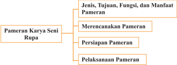

> **Deskripsi Visual:** Gambar ini adalah diagram yang menunjukkan struktur dan proses penting dalam merencanakan, persiapan, dan pelaksanaan pameran karya seni rupa. Diagram ini dibagi menjadi empat bagian utama: Jenis, Tujuan, Fungsi, dan Manfaat Pameran; Merencanakan Pameran; Persiapan Pameran; dan Pelaksanaan Pameran.

Jenis, Tujuan, Fungsi, dan Manfaat Pameran merupakan bagian dasar yang menjelaskan tujuan umum pameran seni rupa. Mereka mencakup jenis-jenis pameran, tujuan yang ingin dicapai, fungsi pameran, dan manfaat yang diharapkan.

Merencanakan Pameran merupakan bagian kedua yang lebih spesifik tentang proses merencanakan pameran. Ini melibatkan pemilihan lokasi, waktu, dan tema pameran.

Persiapan Pameran adalah bagian ketiga yang lebih detail tentang persiapan sebelum pameran dimulai. Ini termasuk pengadaan barang-barang pameran, perawatan, dan penyediaan alat-alat pameran.

Pelaksanaan Pameran adalah bagian terakhir yang menunjukkan proses pameran yang sebenarnya. Ini melibatkan penempatan barang-barang pameran, pengaturan lalu lintas, dan penjualan tiket.

Elemen-elemen utama dalam diagram ini adalah bagian-bagian tersebut, yang saling terkait dan membentuk proses komprehensif dalam merencanakan, persiapan, dan pelaksanaan pameran karya seni rupa. Teks, angka, atau label penting yang terlihat adalah nama-nama bagian dan subbagian yang menjelaskan proses dan elemen-elemen yang relevan. Informasi kunci yang dapat diambil pembaca adalah bahwa pameran seni rupa memerlukan perencanaan yang matang, persiapan yang baik, dan pelaksanaan yang efektif untuk mencapai tujuannya.

 

---
## 📄 Halaman 12

- Mengevaluasi  kegiatan  pameran  seni  rupa  seniman  atau  lembaga kesenian profesional.
- Menyusun laporan kegiatan pameran seni rupa seniman atau lembaga kesenian profesional.
Di kelas X dan XI kamu telah mempelajari tentang pameran seni rupa. Di samping itu kamu juga sudah mencoba menyelenggarakan pameran seni rupa dalam lingkup kelas maupun sekolah. Kini, saatnya untuk menyelenggarakan pameran  yang  lebih  besar  dalam  kegiatan  akhir  tahun  atau  akhir  semester bersamaan  dengan  kegiatan  pementasan  seni  lainnya.  Kamu  juga  dapat memilih peristiwa khusus untuk menyelenggarakan kegiatan pekan seni ini, misalnya dalam rangka peringatan hari bersejarah nasional dan sebagainya.

Kegiatan apresiasi seni dalam bentuk pameran seni rupa dan pagelaran seni pertunjukkan (musik, tari, dan teater) bermanfaat tidak saja bagi warga sekolah tetapi juga bagi warga masyarakat lainnya. Melalui kegiatan ini kamu diharapkan dapat meningkatkan silaturahmi dengan teman-teman kamu dari kelas  yang  lain,  dari  sekolah  lain  maupun  warga  masyarakat  yang  datang berkunjung  untuk  mengapresiasi  hasil  kreasi  yang  dipamerkan.  Tanggapan dari para pengunjung pameran dan pentas seni dapat digunakan sebagai bahan evaluasi untuk meningkatkan mutu sajian pameran dan pementasan di masa yang akan datang.

Kamu  mungkin  belum  pernah  mengunjungi  pameran  karya  seni  rupa tetapi  kamu  sudah  mengetahui  bahwa  kegiatan  pameran  karya  seni  rupa ada di sekitar kamu. Kegiatan menata ruangan, menggantungkan foto, atau lukisan di dinding ruang tamu bahkan di ruangan kamar tidur adalah kegiatan memamerkan karya seni rupa juga. Lukisan, foto, poster, dan benda-benda hiasan lainnya yang digantungkan di dinding dipasang untuk dinikmati atau diapresiasi  orang  yang  melihatnya.  Perhatikan  pula  barang  dagangan  yang dipajang  di  pasar,  di  warung,  di  kaki  lima,  di  toko,  hingga  supermarket. Berbagai benda ditata sedemikian rupa agar menarik perhatian orang yang melihatnya  dan  tentunya  dengan  harapan  akan  membelinya.  Prinsip  dasar pemeran  karya  seni  rupa  tidak  jauh  berbeda  dengan  pemajangan  barangbarang  tersebut.  Berbagai  barang  dan  benda  ditata  sedemikian  rupa  untuk menarik perhatian orang yang melihatnya, diapresiasi, dan dinikmati bahkan dengan harapan untuk memilikinya.

 

---
## 📄 Halaman 13

Perhatikan gambar di bawah ini, tunjukkan karya seni rupa apa saja yang terdapat dalam gambar tersebut!

---
**🖼️ Gambar/Diagram**

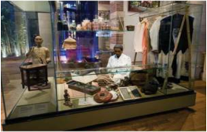

> **Deskripsi Visual:** Gambar ini menunjukkan sebuah pameran atau koleksi yang disajikan dalam ruangan dengan latar belakang berwarna biru. Pameran ini terdiri dari berbagai macam barang antik dan sejarah yang disimpan dalam rak-rak kaca. Di tengah pameran, terdapat seorang pria tua yang duduk di kursi kayu, tampaknya sedang memandang barang-barang di sekelilingnya. Sebuah papan informasi berwarna putih dengan tulisan berwarna merah dan hitam terletak di depan pameran, mungkin memberikan penjelasan tentang koleksi tersebut.

Elemen utama dalam gambar ini adalah pameran barang antik dan sejarah, pria tua yang duduk di kursi kayu, dan papan informasi. Relasi antara elemen-elemen ini adalah bahwa pria tua tersebut tampaknya adalah pengunjung atau pemilik pameran, sedangkan papan informasi menyediakan informasi tambahan tentang koleksi tersebut.

Teks, angka, atau label penting yang terlihat dalam gambar ini adalah tulisan pada papan informasi yang berwarna merah dan hitam. Informasi kunci yang dapat diambil pembaca melalui gambar ini adalah bahwa pameran ini mungkin berisi barang antik atau sejarah, dan pria tua tersebut mungkin merupakan pengunjung atau pemilik pameran.

Gambar 9.1 Penataan ruang pamer di Tropenmuseum Amsterdam, Belkamu

1)  D t

---
**🖼️ Gambar/Diagram**

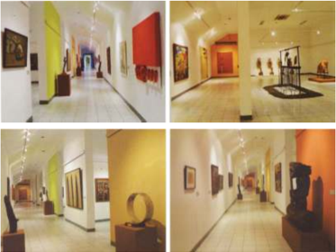

> **Deskripsi Visual:** Gambar ini adalah ilustrasi yang menunjukkan interior sebuah galeri seni. Ilustrasi ini menggambarkan berbagai ruang galeri dengan berbagai koleksi seni. Ruang pertama menampilkan berbagai lukisan berwarna-warni yang dipajang di dinding putih. Ruang kedua menampilkan beberapa patung dan keramik yang dipajang di meja kayu. Ruang ketiga menampilkan beberapa lukisan berwarna-warni yang dipajang di dinding kuning. Ruang keempat menampilkan beberapa patung dan keramik yang dipajang di meja kayu. Ilustrasi ini menunjukkan berbagai koleksi seni yang dipajang di galeri seni.

aDapatkah kamu menunjukkan unsur-unsur rupa yang terda-pat pada

 

---
## 📄 Halaman 14

---
**📊 Tabel**

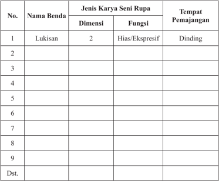

Tabel ini berisi informasi tentang jenis karya seni rupa dan tempat pemajangannya. Topik utamanya adalah karya seni rupa, termasuk lukisan, yang memiliki dua dimensi dan fungsi hias atau ekspresif. Lukisan biasanya ditempatkan di dinding. Tabel ini mencakup 9 baris, masing-masing menunjukkan satu jenis karya seni rupa dan informasi tentang dimensi, fungsi, dan tempat pemajangannya. Data penting yang terlihat adalah bahwa semua jenis karya seni rupa dalam tabel memiliki dua dimensi dan fungsi hias atau ekspresif, dan mereka semua ditempatkan di dinding.

 

---
## 📄 Halaman 16

Fungsi  utama  kegiatan  pameran  adalah  sebagai  alat  komunikasi  antara pencipta  seni  (seniman)  dengan  pengamat  seni  (apresiator).  Perupa  atau seniman mengomunikasikan gagasan atau perasaannya dalam bentuk visual melalui karya seni rupa.

Dalam konteks penyelenggaraan pameran seni rupa di sekolah, Nurhadiat (1996), secara khusus menyebutkan lima fungsi pameran seni rupa sekolah, di  antaranya:  (1)  meningkatkan  apresiasi  seni  warga  sekolah  khususnya siswa; (2) membangkitkan motivasi siswa berkarya seni; (3) penyegaran dari kejenuhan belajar di kelas; (4) motivasi berkarya visual lewat karya seni; (5) belajar berorganisasi dalam perencanaan dan pelaksanaan kegiatan pameran.

---
**🖼️ Gambar/Diagram**

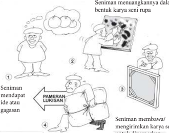

> **Deskripsi Visual:** Gambar ini adalah ilustrasi yang menunjukkan proses seni rupa dalam bentuk lukisan. Gambar ini terdiri dari empat panel yang menggambarkan langkah-langkah seniman dalam membuat sebuah lukisan.

Pertama, seniman mendapat ide atau gagasan untuk sebuah karya seni rupa. Ini ditunjukkan oleh gambar seorang seniman yang sedang berpikir dengan gambaran sebuah buah di pikirannya.

Kedua, seniman memulai proses seni rupa dengan menggambar ide tersebut ke atas papan lukisan. Ini ditunjukkan oleh gambar seniman yang sedang menggambar pada papan lukisan.

Ketiga, setelah seniman selesai menggambar, ia membawa lukisan tersebut ke pameran. Ini ditunjukkan oleh gambar seniman yang membawa tas dengan lukisan ke pameran.

Keempat, pada akhirnya, lukisan tersebut disimpan atau diperlihatkan kepada publik. Ini ditunjukkan oleh gambar lukisan yang disimpan di dalam lemari.

Elemen-elemen utama dalam gambar ini adalah seniman, lukisan, papan lukisan, dan pameran. Seniman adalah subjek utama yang melibatkan dirinya dalam proses seni rupa. Lukisan adalah hasil dari proses seni rupa ini. Papan lukisan digunakan oleh seniman untuk menggambar ide-ide mereka. Pameran adalah tempat di mana lukisan disimpan atau diperlihatkan kepada publik.

Teks, angka, atau label penting yang terlihat dalam gambar ini adalah "Seniman menuangkannya dalam bentuk karya seni rupa", "Seniman mendapat ide atau gagasan", "Seniman membawa/mengirimkan karya seni", dan "Pameran lukisan". Informasi kunci yang dapat diambil pembaca adalah proses seni rupa dari awal hingga akhir, yaitu dari mendapatkan ide, menggambar, sampai disimpan atau diperlihatkan kepada publik.

Karya seni rupa dipamerkan

Pengunjung melihat karya seni dalam sebuah pameran dan memahami pesan dalam karya seni rupa tersebut

---
**🖼️ Gambar/Diagram**

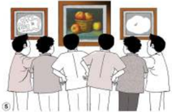

> **Deskripsi Visual:** Gambar ini adalah ilustrasi yang menunjukkan tiga orang yang sedang melihat sebuah lukisan. Lukisan tersebut berisi tiga gambar: seorang pria tua, seorang wanita muda, dan seorang anak kecil. Pada lukisan tersebut juga ada beberapa teks yang ditulis di belakangnya. Dalam konteks buku pelajaran ini, gambar ini mungkin digunakan untuk membahas tentang seni, kreativitas, atau pengaruh seni dalam kehidupan manusia.

 

---
## 📄 Halaman 18

### 3. Menyusun Kepanitiaan

Setelah rumusan tujuan dan tema telah kita tetapkan, langkah berikutnya adalah  menyusun  kepanitiaan  pameran.  Penyusunan  struktur  organisasi kepanitiaan  pameran  disesuaikan  dengan  tingkat  kebutuhan,  situasi,  dan kondisi sekolah. Oleh karena itu, tujuannya adalah untuk memamerkan karya seniman  atau  lembaga  kesenian  profesional,  maka  seksi  yang  mengurus karya  yang  akan  dipamerkan  harus  bekerja  lebih  hati-hati.  Kehati-hatian dalam  merawat  karya  yang  akan  dipamerkan  menunjukkan  profesionalitas penyelenggaraannya.  Untuk  itu,  perlu  dibuat  seksi  dan  atau  subseksi  yang secara khusus menerima karya, mencatat, mengategorikan, merawat, hingga mengembalikannya.

### 4. Menentukan Waktu dan Tempat

Penentuan waktu pameran yang diselenggarakan bersamaan dengan pekan seni di sekolah biasanya dilakukan saat tidak ada kegiatan pembelajaran di kelas  seperti  pada  akhir  semester  atau  tahun  ajaran  menjelang  hingga  saat pembagian rapot. Hal ini dimaksudkan agar penyelenggaraan pameran tidak mengganggu kegiatan belajar dan dapat diikuti serta disaksikan oleh segenap warga sekolah. Walaupun demikian jika memungkinkan, maka pameran tidak harus selalu diadakan pada kegiatan akhir semester. Kegiatan pameran dapat diselenggarakan pada waktu persekolahan tetapi pembukaannya dipilih pada akhir pekan atau hari libur akhir pekan sehingga tidak mengganggu jam belajar di sekolah.

Penentuan  tempat  pameran  disesuaikan  dengan  kondisi  sekolah  dan ukuran, jumlah serta karakteristik karya yang akan dipamerkan, apakah akan dilakukan  di  kelas,  di  aula,  gedung  serba  guna,  di  halaman  sekolah,  atau tempat lain di luar sekolah.

### 5. Menyusun Agenda Kegiatan

Penyusunan  agenda  kegiatan  bertujuan  untuk  memberikan  kejelasan waktu pelaksanaan dan tahapan kegiatan kepada semua pihak yang berkaitan dengan  proses  penyelenggaraan  pameran.  Agenda  kegiatan  dapat  disusun dalam  sebuah  tabel  dengan  mencantumkan  komponen  jenis  kegiatan  dan waktu (biasanya dalam bulan, minggu, dan tanggal). Untuk lebih jelasnya, berikut contoh agenda kegiatan.

 

---
## 📄 Halaman 19

### Agenda Kegiatan Pameran

---
**🖼️ Gambar/Diagram**

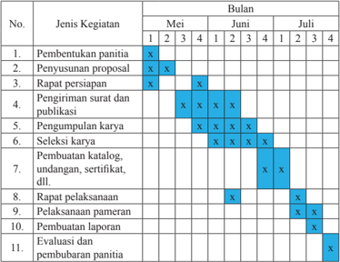

> **Deskripsi Visual:** Gambar ini adalah diagram yang menunjukkan proses pembentukan panitia untuk sebuah kegiatan atau program. Diagram ini dibagi menjadi dua bagian utama: "Jenis Kegiatan" dan "Bulan". "Jenis Kegiatan" berisi 11 jenis kegiatan yang harus dilakukan, seperti pembentukan panitia, penyusunan proposal, rapat persiapan, pengiriman surat dan publikasi, pengumpulan karya, seleksi karya, pembuatan katalog, undangan, sertifikat, dll. "Bulan" menunjukkan waktu yang diperlukan untuk setiap jenis kegiatan, dengan angka 1 sampai 4 menunjukkan periode waktu dalam bulan.

Elemen-elemen utama dalam diagram ini adalah jenis kegiatan dan bulan. Relasi antara kedua elemen ini adalah bahwa setiap jenis kegiatan memerlukan waktu tertentu dalam bulan untuk selesai. Misalnya, pembentukan panitia membutuhkan waktu lebih lama dibandingkan dengan pengiriman surat dan publikasi.

Teks, angka, atau label penting yang terlihat dalam diagram ini meliputi judul "No.", "Jenis Kegiatan", dan "Bulan". Informasi kunci yang dapat diambil pembaca meliputi jumlah jenis kegiatan yang harus dilakukan, waktu yang diperlukan untuk setiap jenis kegiatan, dan struktur waktu yang digunakan dalam diagram ini.

---
**📊 Tabel**

Tabel ini menunjukkan proses pembuatan dan pengujian kategori penelitian dalam periode Mei hingga Juli. Topik utama adalah proses pembentukan panitia, penyusunan proposal, dan pelaksanaan pameran. Kolom-kolomnya meliputi bulan (Mei, Juni, Juli) dan jenis kegiatan. Data penting menunjukkan bahwa proses pembentukan panitia dan penyusunan proposal dilakukan secara berurutan pada bulan Mei dan Juni, sedangkan pelaksanaan pameran dilakukan pada bulan Juli.

### 6. Menyusun Proposal Kegiatan

Penyusunan proposal kegiatan sangat bermanfaat dalam kegiatan persiapan  pameran.  Proposal  kegiatan  dapat  digunakan  sebagai  pedoman penyelenggaraan  kegiatan  pameran.  Selain  itu,  proposal  ini  juga  dapat digunakan  untuk  mencari  dana  dari  berbagai  pihak (sponsorship) untuk membantu kelancaran penyelenggaraan pameran. Secara umum sistematika isi proposal biasanya mencakup: latar belakang, tema, nama kegiatan, landasan/ dasar  penyelenggaraan,  tujuan  kegiatan,  susunan  panitia,  anggaran  biaya, jadwal kegiatan, ketentuan sponsorship , dan lain-lain.

C. Persiapan Pameran Setelah mempelajari tentang perencanaan pameran. Cobalah untuk menyusun kepanitiaan pameran seni rupa seniman atau lembaga kesenian profesional  yang  akan  diselenggarakan  bersamaan  dengan  pementasan karya seni lainnya dalam kegiatan pekan seni sekolah di akhir semester, di akhir tahun ajaran sebelum libur sekolah, atau di sela-sela kegiatan sekolah dalam rangka memperingati hari besar nasional atau keagamaan.

 

---
## 📄 Halaman 21

### 2. Menyiapkan Perlengkapan Pameran

Penyelenggaraan pameran memerlukan perlengkapan (sarana dan prasarana)  agar  karya  yang  dipamerkan  dapat  diapresiasi  dengan  baik, sehingga tujuan pameran sesuai dengan yang diharapkan. Perlengkapan yang umum disediakan dalam kegiatan pameran di antaranya adalah: ruang pamer, panil  (penyekat  ruangan  dan  untuk  menyimpan  karya  2  dimensi),  setumpu (untuk  menyimpan  karya  3  dimensi),  lampu  sorot, sound  system ,  poster, brosur, katalog, folder, meja, buku tamu, buku pesan dan kesan, tanaman hias, serta lain lain.

---
**🖼️ Gambar/Diagram**

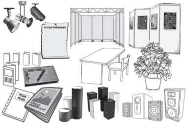

> **Deskripsi Visual:** Gambar ini adalah ilustrasi yang menunjukkan berbagai peralatan dan elemen yang biasanya digunakan dalam acara pameran atau konferensi. Gambar tersebut mencakup berbagai jenis lampu, meja, kursi, papan tulis, papan latar, dan papan nama. Lampu berupa spotlights dan reflektors digunakan untuk pencahayaan yang baik di area pameran. Meja dan kursi disediakan untuk pengunjung untuk berinteraksi dengan pameran. Papan tulis dan papan latar digunakan untuk menampilkan informasi atau materi yang diperlukan. Papan nama digunakan untuk menunjukkan identitas pengunjung atau pihak yang berwenang. Semua elemen ini saling terkait dan membentuk lingkungan yang efektif untuk acara pameran atau konferensi.

Pelaksanaan  pameran  mencakup  kegiatan  pelaksanaan  kerja  panitia secara bersama-sama, penataan ruang, pelaksanaan pameran, dan penyusunan laporan. Pelaksanaan pameran merupakan puncak dari implementasi rencana yang telah disusun pada tahap perencanaan pameran. Pelaksanaan kegiatan ini akan berjalan dengan lancar jika semua pihak khususnya panitia pameran melakukan  kerja  sama  dan  berkomitmen  untuk  mensukseskan  pameran tersebut.

Sebelum dilakukan penataan ruang pameran, panitia pameran terlebih dulu membuat rancangan denah ruang pameran. Hal ini berfungsi untuk mengatur arus  pengunjung,  komposisi  penataan  karya  yang  serasi,  pengaturan  jarak dan tinggi rendah pandangan terhadap karya dua dimensi dan tiga dimensi. Jika  yang  dipamerkan  adalah  karya  restropeksi  (karya  yang  menunjukkan

 

---
## 📄 Halaman 22

---
**🖼️ Gambar/Diagram**

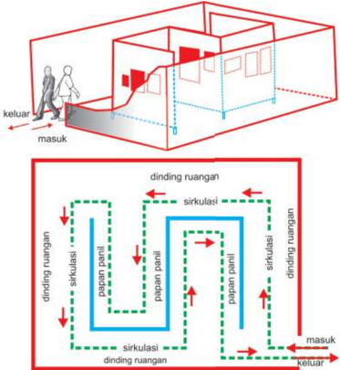

> **Deskripsi Visual:** Gambar ini adalah ilustrasi yang menunjukkan struktur dan sirkulasi udara dalam sebuah ruangan. Gambar ini terdiri dari dua bagian utama: bagian atas menunjukkan peta ruangan dengan penanda arah masuk dan keluar, serta bagian bawah yang lebih detail menggambarkan sirkulasi udara di dalam ruangan.

Elemen utama dalam gambar ini meliputi:
1. Ruangan yang terdiri dari dinding, lantai, dan atap.
2. Papan panel yang berfungsi sebagai pembatas antar ruangan.
3. Arrows yang menunjukkan arah sirkulasi udara.
4. Penanda "masuk" dan "keluar" untuk menunjukkan jalur udara.

Teks, angka, atau label penting yang terlihat dalam gambar ini meliputi:
- "dinding ruangan" yang menunjukkan posisi dinding dalam ruangan.
- "sirkulasi" yang menunjukkan arah udara.
- "papan panel" yang menunjukkan posisi papan panel dalam ruangan.

Informasi kunci yang dapat diambil pembaca dari gambar ini adalah bahwa sistem sirkulasi udara dalam ruangan menggunakan papan panel sebagai pembatas antar ruangan dan arah udara ditentukan oleh posisi dinding dan papan panel.

 

---
## 📄 Halaman 23

Penataan alur arus pengunjung perlu disesuaikan dengan kondisi ruang, di antaranya pengaturan lalu lintas pengunjung dalam ruang dengan satu pintu dan dua pintu.

- Pengaturan lalu lintas pengunjung jika pameran dilakukan di dalam ruang dengan satu pintu.
- Pengaturan lalu lintas pengunjung jika pameran dilakukan di dalam ruang dengan dua pintu.

---
**🖼️ Gambar/Diagram**

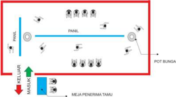

> **Deskripsi Visual:** Gambar ini adalah diagram yang menunjukkan layout ruang tamu. Ruang tamu terdiri dari beberapa elemen utama:

1. Panel: Terdapat dua panel berbeda, satu di sebelah kiri dan satu di sebelah kanan.
2. Pot Bunga: Ada pot bunga di sudut kanan atas.
3. Meja Penerima Tamu: Meja ini terletak di bagian tengah kanan.
4. Meja Masuk: Meja masuk terletak di bagian tengah kiri.
5. Keluaran: Terdapat pintu keluar di bagian bawah kiri.

Elemen-elemen ini saling terhubung melalui jalur yang ditandai dengan garis, menunjukkan arah pergerakan atau fungsi dari setiap elemen. Label "PANIL" dan "MEJA PENERIMA TAMU" memberikan informasi tambahan tentang fungsi masing-masing elemen.

Informasi kunci yang dapat diambil pembaca adalah bahwa ruang tamu ini dirancang untuk memfasilitasi kedatangan tamu, mereka akan diterima di meja penerima tamu, kemudian pergi ke meja masuk, dan akhirnya keluar melalui pintu keluar.

---
**🖼️ Gambar/Diagram**

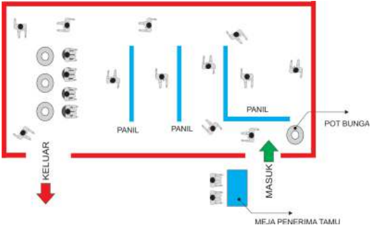

> **Deskripsi Visual:** Gambar ini adalah diagram yang menunjukkan layout ruang tamu. Ruang tamu terdiri dari beberapa elemen utama:

1. KELUARAN: Tempat keluaran yang terletak di sisi kanan atas.
2. MEJA PENERIMA TAMU: Meja tamu yang berada di tengah ruangan.
3. POT BUNGA: Pot bunga yang diletakkan di tepi meja tamu.
4. PANIL: Dua panil yang terletak di sisi kanan dan kiri meja tamu.
5. MASUKAN: Tempat masuk yang terletak di sisi kiri atas.

Elemen-elemen ini saling terhubung melalui jalur merah yang menunjukkan arah perjalanan orang-orang saat berkunjung ke ruang tamu. Label "PANIL" dan "MEJA PENERIMA TAMU" memberikan informasi tentang fungsi masing-masing elemen.

Informasi kunci yang dapat diambil pembaca adalah bahwa ruang tamu ini dirancang untuk memfasilitasi kedatangan tamu dengan meja tamu sebagai pusat acara, pot bunga untuk penampilan estetika, dan panil sebagai penghentian atau penanda.

 

---
## 📄 Halaman 24

Penataan  karya  yang  dipamerkan  dilakukan  atas  dasar  pertimbangan berdasarkan jenis, ukuran, warna, dan tinggi-rendah pemasangannya. Perhatikan kembali gambar-gambar berikut ini.

---
**🖼️ Gambar/Diagram**

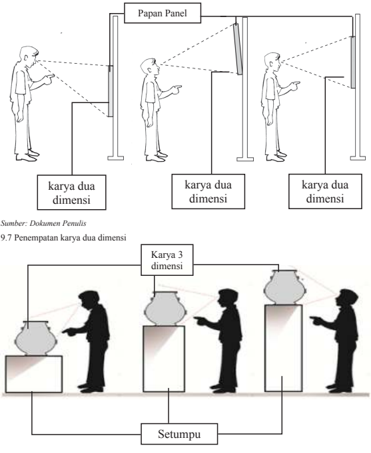

> **Deskripsi Visual:** Gambar ini adalah ilustrasi yang menunjukkan berbagai bentuk karya seni dua dimensi dan tiga dimensi. Ilustrasi ini mencakup empat karya seni dua dimensi yang diletakkan di papan panel, dengan pencahayaan yang mengarah ke mereka. Setiap karya memiliki posisi yang berbeda, menunjukkan variasi dalam bentuk dan ukuran. Selain itu, ada juga tiga karya seni tiga dimensi yang diletakkan di atas setumpu, menunjukkan perbedaan dalam struktur dan bentuk antara karya dua dan tiga dimensi.

Elemen-elemen utama dalam gambar ini meliputi karya seni dua dimensi dan tiga dimensi, papan panel, pencahayaan, dan setumpu. Karya seni dua dimensi terletak di papan panel, sedangkan karya seni tiga dimensi diletakkan di atas setumpu. Pencahayaan mengarah ke karya seni, menyoroti mereka dan menunjukkan bagaimana pencahayaan dapat mempengaruhi penampilan karya seni. Setumpu digunakan sebagai alas untuk karya seni tiga dimensi, menunjukkan bagaimana struktur fisik dapat mempengaruhi penampilan karya seni.

Teks, angka, atau label penting yang terlihat dalam gambar ini meliputi "karya dua dimensi" dan "karya tiga dimensi", yang menunjukkan jenis karya seni yang ditampilkan. Angka "9.7" mungkin merujuk pada halaman atau topik tertentu dalam buku pelajaran tersebut.

Informasi kunci yang dapat diambil pembaca meliputi perbedaan antara karya seni dua dan tiga dimensi, bagaimana pencahayaan dapat mempengaruhi penampilan karya seni, dan bagaimana struktur fisik dapat mempengaruhi penampilan karya seni. Gambar ini membantu pembaca memahami konsep dasar tentang karya seni dan bagaimana faktor-faktor seperti pencahayaan dan struktur dapat mempengaruhi penampilan karya seni.

Sumber: Dokumen Penulis

 

---
## 📄 Halaman 25

Aspek yang tidak kalah pentingnya dalam penataan ruang pameran adalah pencahayaan.  Penataan  cahaya  ruang  pameran  dikelompokkan  menjadi dua, yaitu pencahayaan secara khusus (pencahayaan terhadap karya dengan menggunakan spot-light )  dan  secara  umum  (pencahayaan  ruang  pameran untuk  kepentingan  pengunjung  membaca  katalog,  folder,  dan  sebagainya). Pencahayaan  terhadap  karya  ini  diupayakan  tidak  menyilaukan  pandangan pengunjung terhadap karya yang dipamerkan.

Pelaksanaan  pameran  umumnya  dimulai  dengan  kegiatan  pembukaan pameran yang ditandai dengan kata sambutan dari ketua panitia pelaksana, pembimbing,  serta  acara  sambutan  sekaligus  pembukaan  pameran  oleh kepala sekolah atau yang mewakilinya. Jika kegiatan pameran seni rupa ini melibatkan seniman dan lembaga kesenian profesional, perwakilan seniman dan  lembaga  tersebut  dapat  juga  dimintakan  untuk  memberikan  sambutan. Tidak hanya kepala sekolah, tokoh masyarakat atau kepala daerah dapat pula diminta sambutan sekaligus membuka kegiatan pameran. Pada saat pembukaan umumnya setiap pengunjung dibagikan katalog pameran dan dipersilahkan untuk mencicipi jamuan yang telah disediakan oleh panitia.

Dalam  pelaksanaan  kegiatan  pameran  tersebut,  apalagi  memamerkan karya  seniman  dan  lembaga  kesenian  profesional,  penjagaan  karya  selama pameran  berlangsung  harus  diperhatikan.  Pengunjung  tidak  diperkenankan memegang  karya  yang  dipamerkan  tanpa  seizin  seniman  atau  lembaga kesenian  yang  memamerkan  karyanya.  Cairan  keringat  dan  minyak  dari tangan  pengunjung  dapat  merusak  karya.  Penggunaan  lampu  kamera  juga dibatasi  karena  tidak  semua  bahan  yang  digunakan  dalam  berkarya  tahan terhadap cahaya yang berlebihan. Papan peringatan untuk tidak memegang dan  memotret  karya  perlu  dipasang  di  sekitar  karya  tetapi  jangan  sampai mengganggu keindahan pengaturan karya yang dipamerkan. Tegurlah dengan sopan jika ada pengunjung yang hendak memegang atau memotret karya, beri pengertian mengapa karya tersebut tidak boleh dipegang atau dipotret.

Ruang  pameran  tidak  boleh  dibiarkan  kosong  tanpa  petugas  yang menjaga. Petugas penjaga pameran, selain menjaga karya yang dipamerkan juga bertugas memberikan penjelasan singkat mengenai karya yang dipamerkan jika ada pengunjung yang bertanya. Jika karya yang dipamerkan akan dijual, maka penjaga pameran juga bertugas menginformasikan harga, menandai lukisan yang telah laku terjual serta mencatat calon pembeli untuk disampaikan kepada panitia yang bertugas menjual dan mengirimkan karya setelah pameran berakhir. Karya yang terjual pada saat pameran pada folder kamu diberikan penanda bahwa karya tersebut sudah laku terjual.

 

---
## 📄 Halaman 32

---
**🖼️ Gambar/Diagram**

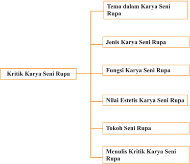

> **Deskripsi Visual:** Gambar ini adalah diagram yang menunjukkan struktur topik dalam kritik karya seni rupa. Diagram ini terdiri dari empat tingkatan, masing-masing menunjukkan sub-topik utama dalam kritik karya seni rupa. Pada tingkat pertama, ada dua sub-topik utama: "Tema dalam Karya Seni Rupa" dan "Jenis Karya Seni Rupa". Di bawah kedua sub-topik tersebut, terdapat lebih banyak sub-topik yang lebih spesifik, seperti "Fungsi Karya Seni Rupa", "Nilai Estetis Karya Seni Rupa", "Tokoh Seni Rupa", dan "Menulis Kritik Karya Seni Rupa".

Elemen-elemen utama dalam diagram ini adalah sub-topik-topik yang disebutkan di atas. Relasi antara sub-topik ini adalah hierarki, dengan sub-topik yang lebih spesifik berada di bawah sub-topik yang lebih umum. Misalnya, "Tema dalam Karya Seni Rupa" merupakan sub-topik dari "Kritik Karya Seni Rupa", sedangkan "Menulis Kritik Karya Seni Rupa" merupakan sub-topik dari "Kritik Karya Seni Rupa" yang lebih spesifik.

Teks, angka, atau label penting yang terlihat dalam diagram ini adalah nama-nama sub-topik yang disebutkan di atas. Informasi kunci yang dapat diambil pembaca melalui diagram ini adalah bahwa kritik karya seni rupa mencakup berbagai aspek, mulai dari tema dan jenis karya hingga fungsi, nilai estetis, tokoh, dan metode penulisan kritik.

Dalam paragraf satu ini, saya akan menjelaskan secara detail tentang struktur dan isi diagram tersebut. Saya akan membahas setiap sub-topik dan bagaimana mereka terhubung satu sama lain. Saya juga akan memberikan interpretasi tentang informasi yang dapat diambil dari diagram ini.

 

---
## 📄 Halaman 33

### Setelah mempelajari Bab X, kamu diharapkan dapat:

- Mengidenti fi kasi simbol, jenis, fungsi, dan nilai estetis serta tokohnya dalam kritik karya seni rupa sesuai dengan konteks budaya
- Mendeskripsikan simbol, jenis, fungsi, dan nilai estetis serta tokohnya dalam kritik karya seni rupa sesuai dengan konteks budaya,
- Membandingkan simbol, jenis, fungsi, dan nilai estetis serta tokohnya dalam kritik karya seni rupa sesuai dengan konteks budaya,
- Menunjukkan sikap bertanggung jawab dalam proses menulis kritik karya seni rupa mengenai  jenis, fungsi, simbol, nilai estetis, dan tokoh berdasarkan hasil evaluasi,
- Membuat tulisan kritik karya seni rupa mengenai  jenis, fungsi, simbol, nilai estetis, dan tokoh berdasarkan hasil evaluasi,
- Mengomunikasikan  tulisan  kritik  karya  seni  rupa  mengenai  jenis, fungsi, simbol, nilai estetis, dan tokoh berdasarkan hasil evaluasi.
Kamu masih ingat pengertian apresisi dan kritik karya seni rupa? Cobalah pelajari kembali materi seni budaya di kelas X dan XI. Pada pembelajaran seni  budaya  (seni  rupa)  di  kelas  X  dan  XI  kamu  telah  mempelajari  dan mempraktikkan  kegiatan  apresiasi  dan  kritik  karya  seni  rupa.  Kegiatan apresiasi  dan  kritik  sering  dilakukan  sehari-hari  pada  berbagai  jenis  dan bentuk karya seni rupa. Menanggapi, memberi komentar, memberi penilaian 'bagus' atau 'jelek', serta 'suka' dan 'tidak suka' adalah bagian dari kegiatan kritik. Pengetahuan tentang apresiasi dan kritik tidak saja bermanfaat dalam pembelajaran seni di sekolah tetapi juga dalam kehidupan sehari-hari di luar sekolah.

Ketika melihat sebuah karya seni rupa, aspek apa saja yang kamu lihat? Dapatkah  kamu  mengidenti fi kasi  tema,  jenis,  fungsi,  dan  nilai  estetis dalam sebuah karya seni rupa. Tahukah kamu tokoh seni rupa yang ada di daerahmu? Apakah tokoh seni rupa yang ada di daerahmu berskala nasional dan  internasional? Tahukah  kamu  mengapa  mereka  disebut  tokoh  dalam dunia seni rupa?

 

---
## 📄 Halaman 34

### Cobalah amati gambar-gambar karya seni rupa berikut ini.

---
**🖼️ Gambar/Diagram**

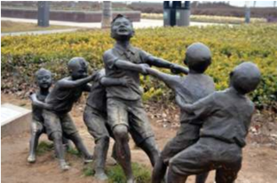

> **Deskripsi Visual:** Gambar ini adalah ilustrasi yang menunjukkan sebuah skenario interaksi sosial antara beberapa orang. Gambar ini menggambarkan empat orang yang sedang bermain atau berinteraksi satu sama lain. Mereka tampaknya sedang bermain bola atau melakukan aktivitas fisik bersama-sama. Setiap orang memiliki posisi dan gerakan yang berbeda, menunjukkan bahwa mereka sedang aktif dan bergerak dalam suasana yang positif.

Elemen-elemen utama dalam gambar ini meliputi empat orang yang terlibat dalam interaksi sosial. Mereka tampaknya berada dalam lingkungan luar, mungkin di taman atau area publik, karena terdapat tanaman dan pagar di sekitar mereka. Tidak ada teks, angka, atau label spesifik yang terlihat pada gambar ini, sehingga fokus utama adalah pada permainan dan interaksi sosial yang terjadi.

Informasi kunci yang dapat diambil dari gambar ini adalah tentang kegiatan sosial dan interaksi manusia. Gambar ini mungkin digunakan untuk membahas konsep seperti komunikasi non-verbal, interaksi sosial, atau bahkan potensi dampak negatif dari perilaku tidak sopan dalam situasi sosial.

10.1 Bonze sculpture by peter grif fi n. Sculpture of children playing bronze, sculpture, art, statue, artwork, metal, cast, mold, fi gurine,

---
**🖼️ Gambar/Diagram**

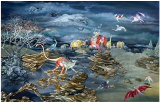

> **Deskripsi Visual:** Gambar ini adalah ilustrasi yang menampilkan kehidupan laut yang kompleks dan menarik. Gambar ini menunjukkan berbagai jenis ikan, molusk, dan hewan laut lainnya yang hidup di perairan dangkal dengan berbagai bentuk dan ukuran. Di tengah-tengah, ada seekor ikan besar yang tampaknya sedang memancing atau mencari makanan. Di sebelah kanan, ada seekor ikan kecil yang tampaknya sedang berenang atau bermain. Di sebelah kiri, ada seekor ikan besar yang tampaknya sedang memancing atau mencari makanan. Di tengah-tengah, ada seekor ikan kecil yang tampaknya sedang berenang atau bermain. Di sebelah kanan, ada seekor ikan kecil yang tampaknya sedang berenang atau bermain. Di sebelah kiri, ada seekor ikan kecil yang tampaknya sedang berenang atau bermain. Di tengah-tengah, ada seekor ikan kecil yang tampaknya sedang berenang atau bermain. Di sebelah kanan, ada seekor ikan kecil yang tampaknya sedang berenang atau bermain. Di sebelah kiri, ada seekor ikan kecil yang tampaknya sedang berenang atau bermain. Di tengah-tengah, ada seekor ikan kecil yang tampaknya sedang berenang atau bermain. Di sebelah kanan, ada seekor ikan kecil yang tampaknya sedang berenang atau bermain. Di sebelah kiri, ada seekor ikan kecil yang tampaknya sedang berenang atau bermain. Di tengah-tengah, ada seekor ikan kecil yang tampaknya sedang berenang atau bermain. Di sebelah kanan, ada seekor ikan kecil yang tampaknya sedang berenang atau bermain. Di sebelah kiri, ada seekor ikan kecil yang tampaknya sedang berenang atau bermain. Di tengah-tengah, ada seekor ikan kecil yang tampaknya sedang berenang atau bermain. Di sebelah kanan, ada seekor ikan kecil yang

 

---
## 📄 Halaman 35

Sumber: www.commons.wikimedia.org

Gambar 10.4 Levi Wells Prentice, 1895, Basket of Apples , Cat minyak

Sumber: Galeri Nasional

Jakarta

Gambar 10.3 Arsono, 1995, Lingkaran , Besi cor, 40 x 63 cm

---
**🖼️ Gambar/Diagram**

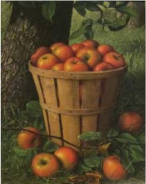

> **Deskripsi Visual:** Gambar ini adalah ilustrasi yang menampilkan sepiring apel yang ditaruh di atas daun-daun pohon apel. Gambar ini menggambarkan proses panen apel dengan detail yang sangat baik. Apel-apel yang tampak segar dan berwarna merah cerah menunjukkan bahwa mereka baru dipetik. Daun-daun pohon apel yang berada di sekitar sepiring apel menambahkan nuansa alami dan sejuk pada gambar tersebut. Gambar ini menunjukkan bahwa apel adalah buah yang sangat populer dan sering digunakan dalam makanan dan minuman. Ini juga menunjukkan bahwa apel memiliki banyak manfaat kesehatan seperti meningkatkan sistem kekebalan tubuh dan membantu dalam penurunan tekanan darah.

 

---
## 📄 Halaman 36

---
**🖼️ Gambar/Diagram**

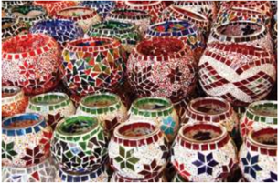

> **Deskripsi Visual:** Gambar ini adalah foto yang menunjukkan berbagai jenis toples atau wadah yang dipenuhi dengan keramik dan batu mulia. Toples tersebut memiliki berbagai ukuran dan bentuk, termasuk toples bulat, toples persegi, dan toples berbentuk segi empat. Mereka semua dilapisi dengan warna-warna cerah seperti merah, hijau, biru, dan kuning, serta motif-motif yang unik seperti bunga dan pola geometris.

Elemen-elemen utama dalam gambar ini adalah toples yang beragam dan warna-warni mereka. Relasi antara elemen-elemen ini adalah bahwa semua toples memiliki lapisan keramik dan batu mulia yang menonjolkan keindahan dan keunikan setiap toples. Teks, angka, atau label penting tidak terlihat dalam gambar ini.

Informasi kunci yang dapat diambil pembaca adalah bahwa gambar ini menunjukkan berbagai jenis toples yang dibuat dengan teknik keramik dan batu mulia, menunjukkan kekayaan dan keunikan seni tradisional.

Gambae 10.5 Wadah lilin berwarna-warni karya Vera Kratochvil. Turki

---
**🖼️ Gambar/Diagram**

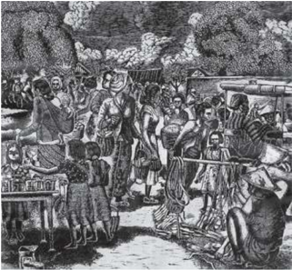

> **Deskripsi Visual:** Gambar ini adalah ilustrasi yang menunjukkan sebuah pertunjukan seni tradisional di luar ruangan. Ilustrasi ini menggambarkan beberapa orang yang sedang berpartisipasi dalam pertunjukan tersebut. Di sebelah kiri, ada seorang penari wanita yang sedang melakukan tarian dengan gerakan yang elegan. Belakangnya tampak banyak penonton yang menonton pertunjukan tersebut. Di tengah-tengah, ada beberapa penari pria yang sedang bergerak dengan gerakan yang kuat dan dramatis. Di sebelah kanan, ada seorang penari wanita lain yang sedang berjalan dengan gerakan yang lembut. Semua penari tersebut terlihat sangat konsentrasi dan memperlihatkan keahlian mereka dalam tarian tradisional tersebut. Ilustrasi ini menunjukkan bagaimana seni tradisional dapat menjadi hiburan yang menarik bagi penonton dan juga menunjukkan kemampuan penari dalam melukiskan perasaan dan emosi melalui gerakan mereka.

5

 

---
## 📄 Halaman 37

Selanjutnya, kamu kerjakan pertanyaan berikut!

- Dapatkah kamu mengidenti fi kasi tema yang  ada  pada  masing-masing karya seni rupa tersebut?
- Dapatkah  kamu  mengidenti fi kasi jenis dari  masing-masing  karya  seni  rupa tersebut?
- Dapatkah  kamu  mengidenti fi kasi fungsi masing-masing  karya  seni  rupa tersebut?
- Dapatkah  kamu  menunjukkan nilai estetis masing-masing  karya  seni  rupa tersebut?
- Bandingkan, manakah karya seni rupa yang paling menarik berdasarkan tema, jenis, fungsi, dan nilai estetisnya ? Jelaskan alasan ketertarikan kamu!
Berdasarkan pengamatan, cobalah mengidenti fi kasi tema, jenis, fungsi, dan nilai estetis, pada karya-karya seni rupa tersebut dengan mengisi kolom-kolom di bawah ini sesuai dengan nomor karyanya, kemudian diskusikanlah dengan teman-teman kamu! Uraikan hasil pengamatan kamu sesuai keterangan yang ada pada kolom karya 1.

### Format Diskusi Hasil Pengamatan

Nama Siswa/Kelompok

: …………………………………………..

NIS

: …………………………………………..

Hari/Tanggal Pengamatan

: …………………………………………..

---
**📊 Tabel**

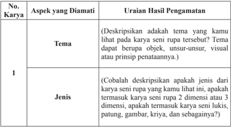

Tabel ini membahas dua aspek utama dalam karya seni rupa: tema dan jenis. Topik utama adalah deskripsi karya seni rupa yang melibatkan pengecekan apakah karya tersebut memiliki tema yang jelas dan jenis karya seni rupa yang dimiliki. Dalam kolom pertama, "Aspek yang Diamati," disebutkan bahwa pengamatan harus mencakup tema dan jenis karya seni rupa. Kolom kedua, "Uraian Hasil Pengamatan," memberikan contoh deskripsi untuk setiap aspek tersebut. Misalnya, untuk tema, pengamatan harus mencakup apakah karya memiliki objek, unsur-unsur visual, atau prinsip penataan tertentu. Sementara itu, untuk jenis, pengamatan harus mencakup apakah karya seni rupa termasuk 2 dimensi atau 3 dimensi, termasuk lukisan, patung, gambar, kriya, dan sebagainya. Pola penting yang terlihat adalah bahwa pengamatan harus mencakup semua aspek karya seni rupa secara menyeluruh untuk mendapatkan gambaran yang lengkap tentang karya tersebut.

 

---
## 📄 Halaman 38

---
**📊 Tabel**

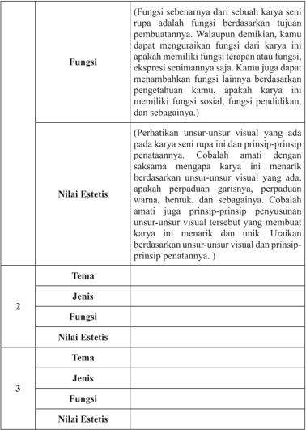

Tabel ini berisi informasi tentang fungsi, nilai estetis, tema, jenis, dan fungsi karya seni rupa. Topik utama tabel adalah analisis karya seni rupa, termasuk penilaian estetis dan interpretasi konteksnya. Kolom-kolom utamanya meliputi fungsi karya, nilai estetis, tema, jenis, dan fungsi kembali. Data penting yang terlihat mencakup perhatian terhadap unsur-unsur visual dan prinsip-prinsip penataan dalam menilai karya seni rupa, serta penjelasan tentang bagaimana karya tersebut menarik dan unik berdasarkan unsur-unsur visual dan prinsip penataan.

 

---
## 📄 Halaman 39

---
**📊 Tabel**

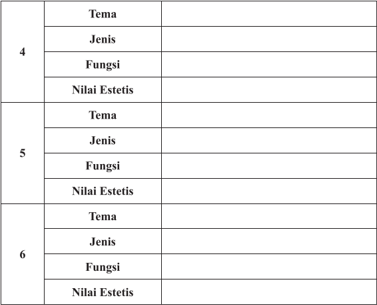

Tabel ini berisi informasi tentang tema, jenis, fungsi, dan nilai estetis dari beberapa objek atau konsep yang mungkin dianalisis dalam konteks seni atau desain. Topik utama tabel ini adalah analisis kritis dari elemen-elemen visual yang mempengaruhi kesan estetis pada sebuah karya. Kolom-kolomnya mencakup: Tema, Jenis, Fungsi, dan Nilai Estetis. Data penting yang terlihat menunjukkan bahwa setiap baris mungkin menggambarkan satu objek atau konsep tertentu, dengan informasi yang disajikan secara sistematis untuk memudahkan analisis. Ini bisa membantu dalam memahami bagaimana elemen-elemen tersebut saling berinteraksi dan mempengaruhi kesan keseluruhan pada sebuah karya estetis.

 

---
## 📄 Halaman 40

- Sesuatu yang biasanya  merupakan tanda  yang  kelihatan  yang  menggantikan gagasan atau objek tertentu.
- Kata; tanda, isyarat, yang digunakan untuk mewakili sesuatu yang lain: arti, kualitas, abstraksi, gagasan, objek.
- Apa saja yang diberikan arti dengan persetujuan umum dan atau dengan kesepakatan atau kebiasaan. Misalnya, rambu lalu lintas.
- Tanda konvensional, yakni sesuatu yang dibangun oleh masyarakat atau individu-individu  dengan  arti  tertentu  yang  kurang  lebih  standar  yang disepakati atau dipakai anggota masyarakat itu. Arti tema dalam konteks ini sering dilawankan dengan tanda alamiah.
Dalam seni rupa, kata tema dapat diartikan sebagai makna yang dikandung dalam karya seni rupa baik pada wujud objeknya maupun pada unsur-unsur rupanya.  Misalnya,  unsur  warna  hijau  yang  dominan  menjadi  adalah  tema kesuburan. Patung dengan objek katak sebagai tema pemanggil hujan. Patung dengan objek kuda sebagai tema kegagahan dan lain sebagainya.

### 2. Jenis

Karya  Seni  rupa  sangat  beraneka  ragam.  Walaupun  demikian  karya yang  beraneka  ragam  ini  dapat  dikelompokkan  atau  dikategorikan  sesuai dengan  jenisnya berdasarkan kesamaan  karakteristik yang dimilikinya. Pengelompokan karya seni rupa berdasarkan jenisnya ini tidak bersifat kaku, tetapi lebih cenderung untuk kepentingan mempelajari atau mengapresiasinya. Pengelompokan jenis karya seni rupa ini dapat dilakukan berdasarkan teknik pembuatan dan perwujudannya, bahan dan medium, objek, tema, isi pesan, gaya pengungkapan, dan sebagainya. Cobalah kamu cari informasi sebanyakbanyaknya mengenai pengategorian jenis karya seni rupa ini! Masih ingatkah kamu  pada  karya-karya  seni  kriya  yang  dikategorikan  berdasarkan  teknik utamanya atau bahan utamanya? Carilah informasi jenis-jenis karya seni kriya yang ada di daerah kamu!

### 3. Fungsi

Fungsi sebuah karya seni rupa telah kamu pelajari di kelas X dan XI. Jenis karya  seni  rupa  pada  dasarnya  dapat  dikategorikan  berdasarkan  fungsinya. Cobalah kamu pelajari kembali apa yang dimaksud dengan karya seni murni dan  karya  seni  terapan!  Dapatkah  kamu  membedakan  fungsi  dari  karya

 

---
## 📄 Halaman 41

seni  murni  dan  seni  terapan  ini?  Dengan  memahami  pengkategorian  karya berdasarkan fungsinya ini kamu akan lebih mudah untuk melakukan apresiasi dan kritik terhadap karya seni rupa tersebut. Kumpulkan sebanyak-banyaknya gambar karya seni rupa, kemudian cobalah tunjukkan mana karya seni rupa terapan dan mana karya seni rupa murni. Uraikan alasan kamu pada masingmasing gambar tersebut! Mengapa karya yang satu disebut karya seni murni dan karya yang lain disebut seni terapan?

### 4. Nilai Estetis

Nilai  estetis  secara  umum  dapat  dimaknai  sebagai  nilai  keindahan  dari sebuah karya seni rupa. Nilai estetis atau nilai keindahan ini dilihat berdasarkan unsur-unsur rupa yang terdapat pada sebuah karya seni dan prinsip-prinsip penataanya. Ingatkah kamu pada unsur-unsur sebuah karya seni rupa seperti: warna, bangun, bidang, tekstur, garis, dan sebagainya.

Coba kamu periksa kembali materi di kelas X dan XI, kemudian lihat juga  prinsip-prinsip  penataan  unsur-unsur  tersebut  seperti  keseimbangan, komposisi, irama, harmonis, dan sebagainya. Penataan unsur-unsur rupa inilah yang memberikan kesan indah, unik, menarik, dan sebagainya pada sebuah karya seni rupa. Cobalah juga bandingkan penataan unsur-unsur rupa sebuah karya seni rupa dengan karya seni rupa yang lainnya. Deskripsikan bagaimana unsur-unsur rupa tersebut disusun dalam sebuah karya seni rupa, kesan apa yang kamu rasakan? Kemudian tunjukkan karya mana yang lebih menarik perhatian kamu, jelaskan alasan ketertarikan kamu! Semakin banyak karya seni yang kamu lihat dan kamu perbandingkan, semakin kaya wawasan dan pengalaman estetis yang kamu miliki. Hal ini sangat bermanfaat ketika kamu melakukan kritik atau evaluasi sebuah karya seni rupa.

Pelajari  kembali  materi  di  kelas  X  dan  XI  tentang  apresiasi  dan  kritik karya seni agar kamu dapat lebih memahami pembuatan kritik karya seni rupa. Secara umum untuk mengapresiasi karya seni kamu diharapkan memahami dahulu seluk-beluk karya seni serta menjadi sensitif (peka) terhadap segi-segi estetikanya. Dengan mengerti dan menyadari sepenuhnya seluk-beluk sesuatu hasil  seni  serta  menjadi  sensitif  terhadap  segi-segi  estetiknya  seseorang diharapkan mampu menikmati dan menilai karya tersebut dengan semestinya (Soedarso, 1990).

 

---
## 📄 Halaman 44

Cobalah mendeskripsikan karya berikut ini, tuliskan hasil deskripsi itu dan diskusikan dengan teman-teman.

Gambar 10.7 Pablo Picasso, 1916, Bottle of Anis del Mono , cat minyak pada kanvas,

Gambar 10.8 Patung penjaga (dwarapala, dvarapala) Candi Singasari. Patung penjaga terbesar di dunia

 

---
## 📄 Halaman 45

### 2. Menganalisis

Analisis formal adalah tahapan dalam kritik karya seni untuk menelusuri sebuah karya seni berdasarkan struktur formal atau unsur-unsur pembentuknya. Pada tahap ini kamu harus memahami unsur-unsur seni dan prinsip-prinsip penataan  atau  penempatannya  dalam  sebuah  karya  seni.  Perhatikan  karya berikut  ini,  telusuri  unsur-unsur  seni  dan  prinsip-prinsip  penataan  atau penempatannya dalam karya tersebut.

---
**🖼️ Gambar/Diagram**

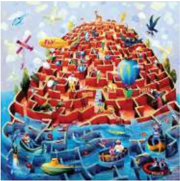

> **Deskripsi Visual:** Gambar ini adalah ilustrasi yang menunjukkan sebuah permainan labyrinthe dengan tema laut. Permainan ini terdiri dari berbagai ruang dan jalur yang mengarah ke berbagai objek seperti kapal, pulau, dan papan navigasi. Ruang-ruang tersebut dilengkapi dengan ikon-ikon seperti kapal, pulau, dan papan navigasi yang menunjukkan arah dan informasi tentang perjalanan.

Elemen utama dalam gambar ini meliputi:
1. Ruang-ruang labyrinthe yang membentuk struktur persegi panjang.
2. Jalur-jalur yang menghubungkan ruang-ruang tersebut.
3. Kapal-kapal yang bergerak melalui jalur-jalur tersebut.
4. Pulau-pulau yang ada di sepanjang jalur-jalur.
5. Papan navigasi yang menunjukkan arah dan informasi tentang perjalanan.

Teks, angka, atau label penting yang terlihat dalam gambar ini meliputi:
1. Nama-nama ruang dan jalur yang mungkin diberikan pada setiap sudut ruang.
2. Angka yang mungkin menunjukkan jumlah kapal atau jumlah jalur.
3. Label-label yang menjelaskan fungsi papan navigasi.

Informasi kunci yang dapat diambil pembaca meliputi:
1. Tujuan permainan adalah untuk mencapai tujuan tertentu di papan navigasi.
2. Permainan memerlukan pemahaman tentang arah dan jalur.
3. Permainan ini mungkin memiliki tantangan dan strategi khusus untuk menyelesaikannya.

### 3. Menafsirkan

Menafsirkan  atau  menginterpretasi  adalah  tahapan  penafsiran  makna sebuah  karya  seni  meliputi  tema  yang  digarap,  tema  yang  dihadirkan  dan masalah-masalah yang dikedepankan. Penafsiran ini sangat terbuka sifatnya, dipengaruhi  sudut  pandang  dan  wawasan  kamu.  Semakin  luas  wawasan kamu semakin kaya interpretasi karya yang dikritisinya. Kamu harus banyak mencari informasi dan membaca khususnya yang berkaitan dengan karya seni rupa agar wawasan akan semakin kaya.

 

---
## 📄 Halaman 46

Perhatikan karya berikut ini, tafsirkan makna simbolis yang terdapat pada karya tersebut.

---
**🖼️ Gambar/Diagram**

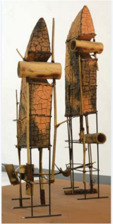

> **Deskripsi Visual:** Gambar ini adalah ilustrasi yang menunjukkan dua struktur yang tampak seperti bangunan tradisional atau rumah adat. Struktur tersebut terbuat dari bahan-bahan alami seperti bambu dan kayu, dengan penambahan elemen-elemen seperti pipa besi untuk penyangga dan penutup. Struktur ini memiliki bentuk yang unik dan menarik, dengan detail yang mencerminkan keindahan dan keunikan budaya lokal.

Elemen utama dalam gambar ini adalah dua struktur yang berdiri tegak, masing-masing dengan desain dan ukuran yang sedikit berbeda. Struktur pertama memiliki atap yang curam dan dikelilingi oleh pipa-pipa besi yang membentuk struktur dasar. Struktur kedua memiliki atap yang lebih tinggi dan lebih lebar, juga dikelilingi oleh pipa-pipa besi yang membentuk struktur dasar. 

Teks, angka, atau label penting tidak terlihat dalam gambar ini, sehingga informasi kunci yang dapat diambil pembaca hanya melalui visual saja. Gambar ini memberikan gambaran yang jelas tentang desain dan konsep arsitektur tradisional yang digunakan dalam pembangunan rumah adat.

Sumber: Dokumen Galeri Nasional Indonesia

Gambar 10.11 Hendrawan Riyanto, 1997, Loro Blonyo , Terakota, Metal, dan Bambu.

 

---
## 📄 Halaman 47

### 4. Menilai

Apabila tahap mendeskripsikan sampai menafsirkan merupakan tahapan yang juga umum digunakan dalam apresiasi karya seni. Tahap menilai atau evaluasi merupakan tahapan yang menjadi ciri dari kritik karya seni. Evaluasi atau penilaian adalah tahapan dalam kritik untuk menentukan kualitas suatu karya seni jika dibandingkan dengan karya lain yang sejenis. Perbandingan dilakukan terhadap berbagai aspek yang terkait dengan karya tersebut, baik aspek formal maupun aspek konteks.

Mengevalusi atau menilai secara kritis dapat dilakukan dengan langkahlangkah sebagai berikut.

- Membandingkan  sebanyak-banyaknya  karya  yang  dinilai  dengan  karya yang sejenis.
- Menetapkan tujuan atau fungsi karya yang dikritisi.
- Menetapkan sejauh mana karya yang ditetapkan 'berbeda' dari yang telah ada sebelumnya.
- Menelaah  karya  yang  dimaksud  dari  segi  kebutuhan  khusus  dan  segi pandang tertentu yang melatarbelakanginya.
Perhatikan gambar karya seni rupa dua dimensi dan tiga dimensi berikut ini. Kemudian tuliskan kritik karya-karya tersebut. Gunakan langkah-langkah kritik  secara  bertahap  mulai  dari  mendeskripsikan  hingga  menilai  atau mengevaluasi.

---
**🖼️ Gambar/Diagram**

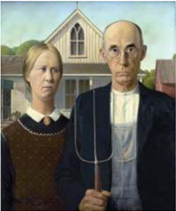

> **Deskripsi Visual:** Gambar ini adalah ilustrasi yang menampilkan dua orang dewasa berdiri depan sebuah rumah tradisional Amerika. Pria berjilbab berdiri di sebelah kiri, sedangkan wanita berjilbab berdiri di sebelah kanan. Keduanya mengenakan pakaian tradisional Amerika, dengan pria menggunakan jilbab dan wanita menggunakan topi. Rumah di belakang mereka memiliki atap berbentuk ganda dan pintu berwarna putih. Ilustrasi ini mungkin digunakan untuk membantu pembaca memahami konsep tentang kehidupan tradisional di Amerika pada masa lalu.

 

---
## 📄 Halaman 48

---
**🖼️ Gambar/Diagram**

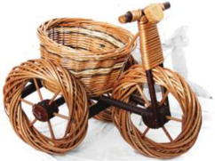

> **Deskripsi Visual:** Gambar ini adalah ilustrasi yang menampilkan sepeda tiga roda yang dibuat dari bahan bambu. Sepeda ini memiliki desain unik dengan roda yang besar dan berbentuk bulat, serta sepeda yang lebih kecil untuk roda belakang. Sepeda ini juga memiliki sepeda roda depan yang lebih kecil dan berbentuk seperti sepeda motor. Sepeda ini memiliki kursi yang ditempatkan di tengah-tengah dan memiliki tempat untuk menyimpan barang dengan menggunakan keranjang bambu. Gambar ini menunjukkan bahwa sepeda tiga roda ini dibuat dari bahan bambu dan memiliki desain yang unik dan menarik.

Sumber: www.all-free-download.com

Gambar 10.13 Kerajinan keranjang rotan berbentuk sepeda roda tiga karya Peter Kratochvil.

- Kamu telah mengamati dan belajar tentang kritik karya seni rupa.
- Kamu dapat membuatnya juga.
- Perhatikan contoh tulisan tentang karya seni rupa di bawah ini!
- Buatlah ulasan sederhana bagian-bagian dari tulisan kritik karya seni rupa tersebut  adakah  yang  berisi  deskripsi,  analisis  formal,  interpretasi,  dan evaluasi.

### Contoh tulisan tentang karya seni rupa (1)

---
**🖼️ Gambar/Diagram**

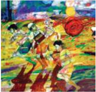

> **Deskripsi Visual:** Gambar ini adalah ilustrasi yang menampilkan sebuah pertempuran antara pasukan kuno. Gambar ini menggambarkan tiga karakter utama: seorang pria tua dengan senjata besar, seorang pria muda dengan senjata kecil, dan seorang anak kecil yang sedang berlari. Pada latar belakang, terlihat beberapa orang lain yang juga terlibat dalam pertempuran. Ilustrasi ini menggunakan warna-warna cerah dan kontras yang kuat untuk menonjolkan peran dan posisi setiap karakter.

Elemen-elemen utama dalam gambar ini adalah tiga karakter utama yang terlibat dalam pertempuran, serta latar belakang yang menunjukkan suasana pertempuran. Posisi dan gerakan karakter juga sangat penting dalam menunjukkan hubungan dan interaksi mereka.

Teks, angka, atau label penting tidak terlihat dalam gambar ini karena ia hanya berupa ilustrasi. Namun, informasi kunci yang dapat diambil pembaca melalui gambar ini adalah bahwa ada pertempuran antara pasukan kuno, dan bahwa karakter utama memiliki peran dan posisi yang berbeda dalam pertempuran tersebut.

Sumber: Dokumen Galeri Nasonal Indonesia Gambar 10.14 Hardi, 'Pedagang Asongan', 1988, Cat minyak, akrilik pada kanvas, 145 x 150 cm.

 

---
## 📄 Halaman 49

### Hardi, 'Pedagang Asongan'

Dalam lukisan yang berjudul 'Pedagang Asongan' (1988) ini, Hardi mengungkapkan sebuah satire simbolis tentang kecemasan anak jalanan. Anak-anak  pedagang  asongan  berlari  tercerai-berai  dikejar  sosok  benda semacam bola api yang berpijar merah. Di belakangnya menyusul sepotong wajah  petugas  keamanan  dengan  senjata  yang  muncul  teracungkan. Penanda  visual  dari  gerak  semua fi gur  mengungkap  realitas  kekacauan, sedangkan bola api memberi dimensi simbolis pada kecemasan. Suasana itu didukung dengan seting kota yang kering. Lewat warna kontras pada jalanan  yang  hitam  dan    dominan  warna  kuning,  serta  gedung-gedung putih dengan latar langit yang biru, maka karakter siang yang terik panas menambah suasana kegalauan. Karya ini dapat dikategorikan dalam gaya ekspresionisme simbolis.

Hardi  adalah  salah  seorang  eksponen  Gerakan  Seni  Rupa  Baru Indonesia yang banyak menyuarakan kontekstualisme dan pluralitas bentuk pada ungkapan seni rupa. Dia adalah seorang seniman yang berkepribadian terbuka, kritis, dan banyak mengekspos permasalahan sosial yang terjadi. Dalam  banyak  karyanya  Hardi  secara  tajam  banyak  mengungkapkan ironi  sosial  politik  masyarakat  dalam  berbagai  idiom  visual  baru.  Pada waktu muncul gerakan itu pada masa Orde Baru, ia mencipta karya yang menghebohkan  yang  berjudul  'Suhardi  Calon  Presiden  Tahun  2001'. Ia  dipenjara,  karena  karya  itu  dianggap  menyindir  kekuasaan  presiden. Berbagai  ungkapan  kritik  yang  dibalut  nuansa  parodi  memang  menjadi warna yang khas dalam karya-karyanya.

Dalam  karya  'Pedagang  Asongan'  terungkap  sebuah  satire  yang menggambarkan  kehidupan  masyarakat  marjinal  yang  selalu  tersingkir. Dikejar dan digusur adalah riwayat nasib mereka yang tak berkesudahan. Kekerasan  dan  tekanan  ibarat  bola  api  yang  terus  mengejar,  sementara kebijakan  pemerintah  dan  alat-alat  negara  menjelmakan  diri  sebagai sosok-sosok  kontradiksi.  Menjadi  sebuah  ironi  ketidakmampuan,  bahwa pemerintah  tidak  menghidupi  dan  mengayomi  warganya  yang  lemah. Karya  ini  selain  menghadirkan  sisi  drama  parodi  yang  menyentuh  juga menunjukkan sisi humanis yang kuat.

(Sumber: http://galeri-nasional.or.id/collections/752-pedagang_asongan )

 

---
## 📄 Halaman 50

### Contoh tulisan tentang karya seni rupa (2)

Sumber: Dokumen Galeri Nasional Indonesia

Gambar 10.15 Boyke Aditya K.S, 'Dialog', 1991, Akrilik pada kanvas, 110 x 130 cm

### Boyke Aditya K.S, 'Dialog'

Suasana fantastis dengan imaji mistis tersirat dalam karya Boyke Aditya K.S.  yang  berjudul  'Dialog'  (1991)  dalam  gaya  Surrealisme.  Sebuah lanskap  dunia  imajinatif  hadir  dengan  makhluk-makhluk  khayat  yang tinggal dengan terjerat dalam sulur-sulur yang membentuk labirin. Sosok merah dalam bentuk transformatif manusia binatang mengulurkan tangan, melakukan dialog dengan fi gur berwarna hijau yang berdiri menunggang kerbau. Karya ini secara visual menunjukkan idiom yang bersumber dari seni tradisi wayang maupun stilasi dari berbagai seni tradisi yang lain. Oleh karena itu, sebagai ungkapan surrealis, karya ini dapat dikatagorikan dalam bentuk surrealisme biomor fi k yang menggunakan idiom-idiom visual stilasi bentuk-bentuk makhluk hidup.

Kecenderungan pada gaya surrealisme merupakan salah satu periode yang pernah dominan dalam seni lukis Indonesia, khususnya pada pelukispelukis Yogyakarta. Kemunculan kecenderungan ini merupakan kelanjutan dari paradigma estetis humanisme universal yang lebih menekankan pada kebebasan  personal  dalam  mengungkapkan  pencarian  jati  diri  seniman. Dalam kecenderungan itu banyak seniman yang melahirkan karya dengan menggali konsep dan tema dari masalah sosiokultural dengan tekanan nilainilai  lokal  dan  tradisi.  Karya  yang  dihadirkan  Boyke Aditya  ini  banyak mengungkapkan ironi kehidupan sosial dalam simbol-simbol personal yang digali dari mitos maupun legenda masyarakat Jawa dan lainnya.

 

---
## 📄 Halaman 56

---
**🖼️ Gambar/Diagram**

> **Deskripsi Visual:** Gambar ini menunjukkan judul Bab XI dengan subjudul "Musik Kreasi". Judul tersebut ditampilkan dalam huruf besar dan berwarna putih pada bagian atas gambar, di atas sebuah latar belakang yang lebih gelap namun tidak jelas. Untuk Bab XI, warna dominan adalah orange, yang digunakan untuk menonjolkan judul Bab XI. Untuk subjudul "Musik Kreasi", warna yang digunakan adalah putih, yang berbeda dengan warna judul Bab XI. Ini menunjukkan bahwa subjudul memiliki peran penting dalam konteks bab ini.

### Peta Materi

---
**🖼️ Gambar/Diagram**

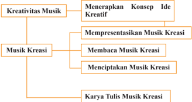

> **Deskripsi Visual:** Gambar ini adalah diagram yang menunjukkan struktur kreativitas musik dalam buku pelajaran. Diagram ini terdiri dari dua cabang utama: Kreativitas Musik dan Musik Kreasi. Cabang Kreativitas Musik memiliki subcabang Menerapkan Konsep Ide Kreatif, yang kemudian dibagi menjadi tiga subsubcabang: Mempresentasikan Musik Kreasi, Membaca Musik Kreasi, dan Menciptakan Musik Kreasi. Cabang Musik Kreasi memiliki satu subcabang yang disebut Karya Tulis Musik Kreasi.

Elemen utama dalam diagram ini adalah cabang dan subcabang yang menjelaskan proses kreativitas musik. Relasi antara elemen-elemen ini adalah hierarki, dengan cabang utama sebagai top level dan subcabang sebagai level berikutnya. Teks penting dalam diagram ini meliputi nama-nama subcabang dan subsubcabang yang menjelaskan konsep-konsep kreativitas musik.

Informasi kunci yang dapat diambil pembaca meliputi struktur kreativitas musik yang disajikan dalam buku pelajaran, serta bagaimana proses kreativitas musik dapat dipahami melalui pengamatan subcabang dan subsubcabang tersebut.

### Peta Kompetensi Pembelajaran

Setelah mempelajari Bab XI tentang topik kreativitas musik kreasi, kamu diharapkan mampu:

- Menerapkan konsep teknik dan prosedur musik kreasi.
- Mempresentasikan hasil analisis karya musik kreasi.
- Menampilkan pertunjukan musik kreasi.
- Membuat tulisan atau kritik terhadap pertunjukan musik kreasi secara lebih  spesiik  peserta  didik  diharapkan  mampu  mengolah,  menalar, menyajikan dan mencipta seni musik dalam ranah konkret dan ranah abstrak  terkait  dengan  pengembangan  dari  yang  dipelajarinya  di

 

---
## 📄 Halaman 57

sekolah secara mandiri, bertindak secara efektif dan kreatif, dan mampu menggunakan  metode  sesuai  dengan  kaidah  keilmuan.  Khususnya pembelajaran pada seni musik berikut.

- Menjelaskan musik kreasi dalam pendidikan seni budaya.
- Menampilkan musik kreasi berdasarkan pilihan sendiri.
- Menampilkan musik kreasi dengan membaca partitur lagu.
- Menyajikan musik kreasi dengan partitur lagu karya sendiri.
- Mengembangkan  sensitivitas  persepsi  indrawi  melalui  berbagai pengalaman kreatif bermusik.
- Menstimulus  pertumbuhan  ide-ide  imajinatif  dan  kemampuan menemukan berbagai gagasan kreatif dalam memecahkan masalah artistis-estetis melalui proses kreasi dan penyajian musik.
- Membuat karya tulis tentang musik kreasi berdasarkan jenisnya. Secara operasional setelah melakukan pembelajaran ini kamu dapat:
- mengevaluasi karya musik berdasarkan fungsi dan jenisnya;
- mengidentiikasi karya musik kreasi berdasarkan jenisnya;
- mengkritisi karya musik kreasi berdasarkan jenisnya;
- membuat tulisan kritik musik tentang makna  dan  nilai-nilai estetisnya; serta
- mengintegrasikan pengetahuan, sikap, dan keterampilan berkesenian  dengan  disiplin  ilmu  seni  musik  kreasi  melalui  karya tulisan musik melalui karya tulisan.

### Dalam beraktivitas kesenian, nilai karakter kamu diharapkan menunjukkan sikap berikut.

- Rasa ingin tahu
- Santun, gemar membaca, peduli
- Jujur dan disiplin
- Kreatif dan apresiatif
- Inovatif dan responsif
- Bersahabat dan koperatif
- Kerja keras dan tanggung jawab
- Toleran, mandiri, arif, dan bijaksana
- Bermasyarakat dan berkebangsaan

 

---
## 📄 Halaman 58

### Motivasi

Seberapa besar kemampuan kamu untuk mengolah, menalar, dan mencipta musik kreasi baik dalam bentuk karya komposisi maupun karya tulisan musik yang telah dipelajari?

Silahkan kemampuan berolah musik yang kamu miliki paparkan dalam bentuk tulisan deklaratif!

………………………………………………………………………………

………………………………………………………………………………

………………………………………………………………………………...

### A. Penerapan Konsep Ide Kreatif

P embelajaran seni budaya bertujuan untuk penanaman nilai estetis melalui pengalaman kreatif, apresiatif, dan memiliki kemampuan berkreasi atau berolah musik.

Pengalaman berolah musik dalam kehidupan yang kreatif akan mampu mengantarkan pada pencapaian prestasi kreatif yang istimewa dalam bidang keilmuan.

### 1. Filosois Musik

Apa yang dimaksud dengan ilosois musik?

Filosois adalah sesuatu yang berhubungan dengan ilsafat. Filsafat istilah lain  disebut  falsafah.  Falsafah  merupakan  pengetahuan  tentang  asas-asas pikiran  dan  perilaku  dalam  kehidupan  manusia.  Filsafat  adalah  ilmu  untuk mencari kebenaran dan prinsip-prinsip dengan menggunakan kekuatan akal; ilsafat  sebagai  pandangan  hidup  yang  dimiliki  oleh  setiap  orang;  kata-kata arif yang bersifat didaktis.

Ciri  khas  ilsafat  adalah  selalu  mempertanyakan tentang segala sesuatu dengan  cara  berpikir  yang  amat  mendasar  atau  radikal  dan  juga  bersifat

 

---
## 📄 Halaman 59

universal. (Poedjiadi, 2001:2). Ciri lain dari berpikir ilosois yakni berpikir menyeluruh.

Para  ahli  ilosois  cenderung  memandang  ilsafat  sebagai  upaya  untuk mengadakan pemeriksaan dan penemuan, kemudian berpikir secara radikal untuk memperoleh suatu bentuk interpretasi dalam konteks yang lebih luas. Elliot (1995:6),  dalam The  Lian  Gie, berpendapat ilsafat sebagai batang tubuh pengetahuan, bersifat kritis terhadap apa yang telah diyakini. Filsafat merupakan strategi yang mengandung cara berpikir kritis.

meninjau

Filsafat dalam bidang ilmu musik merupakan pemberi arah dan pedoman dasar bagi terciptanya landasan kokoh suatu sistem pendidikan seni musik, usaha-usaha perbaikan maupun  upaya pengembangan  pendidikan seni musik. Filosois pendidikan musik sebagai upaya kritis untuk kembali konsep, ilmu, dan keyakinan tentang pendidikan seni musik. Fungsi dari  ilsafat  ini  adalah  untuk  memberikan  arah  dan  petunjuk  pelaksanaan pendidikan musik.

Seni  musik  yang  bersifat  auditif,  diserap  melalui  indra  dengar  yang memiliki sifat dasar ketertiban agar dapat mewujudkan keindahan. Mengapa demikian?

### Ki Hadjar Dewantara (1967)

### memandang bahwa:

Musik adalah cabang seni, yaitu segala perbuatan manusia yang timbul dari hidupnya perasaan dan sifat indah, hingga dapat menggerakkan jiwa/ perasaan manusia. Musik dapat tersajikan melalui musik vokal dan atau instrumen (gending dalam sebutan istilah karawitan).

Gending  ialah  wirama  dalam  bentuk  suara  atau  wirama  yang  dapat didengar.  Wirama  merupakan  jiwanya  gending,  sedangkan  suara  adalah raganya gending. Wirama atau irama adalah tanda dari segala yang hidup seperti  teraturnya  kodrat  alam,  pergantian  siang  dan  malam,  perputaran dunia, jalannya matahari dan bulan, ... semuanya memakai wirama yang jelas  ialah  teratur,  tertib,  harmonis,  patut,  dan  sebagainya  (ketertiban simetri).

Seni sebagai perbuatan manusia yang mampu menggerakkan jiwa dan perasaan manusia, memiliki makna penting bagi kehidupan. Orang yang melakukan seni maka  ia terus-menerus melatih ketertiban jiwa, yang dapat mempengaruhi  ketertiban  perilaku  perbuatannya.  Oleh  karena  itu,  seni termasuk musik dapat digunakan sebagai alat untuk membantu seseorang menjadi manusia yang berbudi luhur.

 

---
## 📄 Halaman 60

Ilmu pengetahuan di bidang seni musik mempunyai daya mempertajam dan  mempercerdas  pikiran  dan  pengetahuan  yang  mempunyai  daya memperdalam  dan  memperhalus  budi.  Musik  memiliki  kekuatan  untuk mempertajam dan mempercerdas pikiran serta memperhalus budi.

Proses  mempertajam  nalar  dan  memperhalus  budi  diperoleh  karena kehalusan  rasa  yang  dibina  melalui  pengolahan  rasa  estetis.  Melalui pendidikan musik, proses memperhalus, mempertajam budi, rasa estetis, rasa    moral/etis,  dan  nalar  dapat  diwujudkan.  Dengan  paparan  tersebut, makna  dari  pendidikan  musik  ialah  pendidikan  seni  untuk  membentuk manusia yang berbudaya dan berbudi pekerti luhur.

Mengapa irama musik bersifat  indah  dan  dapat  menimbulkan  kebahagiaan atau rasa senang bagi orang yang mendengarnya?

Mengapa  pendidikan  musik  memiliki  sifat  mendidik  rasa  ketertiban  dan keindahan?

Apa makna pendidikan musik yang sesungguhnya?

Usaha pendidikan  pada  dasarnya  ditujukan  pada  tiga  hal  utama,  yakni membentuk manusia yang memiliki kemampuan dalam mengolah kehalusan budi, kecerdasan otak dan pikiran, serta kesehatan badan jiwa dan raganya (Dewantara, 1962:303)

---
**🖼️ Gambar/Diagram**

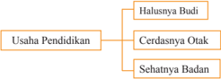

> **Deskripsi Visual:** Gambar ini adalah diagram yang menunjukkan struktur organisasi dari Usaha Pendidikan. Diagram ini terdiri dari tiga cabang utama yang disebut "Halusnya Budi", "Cerdasnya Oak", dan "Sehatnya Badan". Setiap cabang ini mungkin merujuk pada aspek-aspek penting dalam pendidikan, seperti halusnya dalam hal kesehatan, cerdasnya dalam hal pengetahuan, dan sehatnya dalam hal kesejahteraan. Diagram ini menunjukkan bahwa semua aspek ini saling berkaitan dan harus dipertimbangkan dalam upaya pendidikan yang efektif.

### Apa kaitannya usaha pendidikan dengan kebudayaan?

Pendidikan  sebagai  usaha  kebudayaan  bermaksud  memberi  tuntunan dalam hidup tumbuhnya jiwa dan raga manusia agar kelak dalam garis kodrat pribadinya  dan  pengaruh  segala  keadaan  yang  mengelilinginya,  mendapat kemajuan  dalam  hidup  lahir  batin  menuju  ke  arah  adab  kemanusiaan. (Dewantara,1961:165-166)

 

---
## 📄 Halaman 61

### 2. Penerapan Konsep Ide Kreatif

Kreatif  adalah  sifat  yang  dimiliki  seseorang.  Seorang  yang  kreatif mempunyai  kemampuan  untuk  mencipta  atau  berkreasi.  Kreasi  adalah ciptaan, penciptaan, dan  atau hasil daya  cipta.  Kreativitas  merupakan kemampuan  berpikir  untuk  berkreasi  atau  daya  mencipta,  dan  kreativitas adalah keterampilan seseorang dalam menghasilkan sesuatu yang asli, unik, dan bermanfaat.

Dalam tulisan Supriadi (1998:129), diungkapkan bahwa prestasi kreatif di  bidang  keilmuan  menuntut  tiga  prasyarat  yang  harus  dipenuhi,  yaitu kemampuan  intelektual  yang  memadai,  motivasi,  dan  komitmen  untuk mencapai keunggulan, dan penguasaan terhadap bidang ilmu yang ditekuni. Dalam bidang ilmu seni dan budaya ketiga aspek tersebut secara interaktif membentuk  perilaku kreatif yang kemudian menghasilkan intelektual, komitmen, penguasaan, intuisi, serta faktor eksternal. Faktor eksternal yang dimaksud adalah lingkungan keluarga, sekolah, dan masyarakat yang secara simultan membentuk prestasi kreatif di bidang keilmuan.

Bagaimanakah gagasan-gagasan kreatif ilmuwan lahir?

Tiga hal penting yang dapat mempengaruhi gagasan kreatif, yaitu:

- kecakapan,
- keterampilan, dan
- motivasi.

---
**🖼️ Gambar/Diagram**

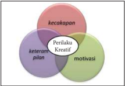

> **Deskripsi Visual:** Gambar ini adalah diagram Venn yang menunjukkan hubungan antara tiga konsep utama: kecakapan, perilaku kreatif, dan motivasi. Diagram ini menggunakan warna-warna unik untuk masing-masing konsep, dengan kecakapan berada di bagian atas, perilaku kreatif di tengah, dan motivasi di bawah. Setiap konsep memiliki lingkaran yang berpotongan dengan lingkaran lainnya, menunjukkan bahwa setiap konsep memiliki aspek yang sama dengan konsep lainnya.

Elemen utama dalam diagram ini adalah tiga lingkaran yang berpotongan, masing-masing menunjukkan konsep kecakapan, perilaku kreatif, dan motivasi. Lingkaran pertama, kecakapan, berada di bagian atas dan berpotongan dengan lingkaran kedua dan ketiga. Lingkaran kedua, perilaku kreatif, berada di tengah dan berpotongan dengan lingkaran pertama dan ketiga. Lingkaran ketiga, motivasi, berada di bawah dan berpotongan dengan lingkaran pertama dan kedua.

Teks, angka, atau label penting yang terlihat dalam diagram ini adalah nama-nama tiga konsep utama: kecakapan, perilaku kreatif, dan motivasi. Label ini diletakkan di dalam lingkaran masing-masing konsep.

Informasi kunci yang dapat diambil pembaca dari gambar ini adalah bahwa kecakapan, perilaku kreatif, dan motivasi saling berkaitan dan saling mempengaruhi. Setiap konsep memiliki aspek yang sama dengan konsep lainnya, yang menunjukkan bahwa mereka saling terkait dan saling mempengaruhi.

 

---
## 📄 Halaman 62

Kecakapan adalah kemampuan intelektual yang ditunjukkan oleh prestasi akademiknya yang menonjol, motivasi yang kuat merupakan faktor untuk meraih prestasi, dan memililki komitmen yang kuat untuk mencapai keunggulan. Disamping itu juga kompetensi keterampilan adalah faktor yang dimiliki  untuk  penguasaan skill yang  memadai  terhadap  bidang  seni  yang ditekuninya.

Lebih  jauh Supriadi (1998:130),  mengatakan  ketiga  aspek  yang  dapat membentuk prestasi kreatif, yaitu kecakapan, keterampilan, dan motivasi itu adalah sebagai faktor yang mendasari perilaku kreatif yang dapat berkembang subur di tengah lingkungan sosial budaya yang menunjang. Semua ini ditandai oleh  adanya  peluang  dan  kebebasan  untuk  mewujudkan  gagasan-gagasan kreatif, tersedianya akses terhadap sumber-sumber informasi yang memadai dan tumbuh budaya penghargaan bagi orang-orang yang berprestasi.

### Adakah tahapan yang dapat dilakukan dalam proses kreatif?

Lahirnya  teori-teori  dari  para  ilmuwan  besar  seperti  Eistein,  Newton, Comte, Clark, terkait dengan proses kreatif, sampai lahirnya gagasan-gagasan kreatif  seseorang  dalam  praktik  penelitian  di  sekolahnya  adalah  hasil  dari proses kreatif yang mereka tempuh.

Keterkaitan  pernyataan  mengenai  teori  dengan  tahapan-tahapan  proses kreatif  adalah  adanya  beberapa  aspek  kegiatan  seperti  persiapan,  inkubasi, iluminasi, dan evaluasi. Intuisi berada pada tahap iluminasi, artinya sebelum intuisi datang, sesungguhnya seseorang telah memikirkan masalah keilmuan yang  dihadapinya.  Intuisi  bukan  hanya  menyangkut  proses  pemecahan masalah, melainkan proses identiikasi masalah. Intuisi merupakan satu  faktor  penting  dalam  kreativitas  keilmuan,  sehingga  pandangan  Clark (1983)  yang  dikembangkan  Kohler  dalam  Supriadi  (1998),  mengatakan intuisi merupakan suatu perwujudan dari kesadaran tingkat tinggi, dan intuisi tidak datang tanpa sebab. Ia didahului oleh proses berpikir dan didasari oleh perilaku dalam penguasaan yang cukup terhadap bidang ilmu yang ditekuni oleh individu.

salah

Perilaku kreatif dalam bidang ilmu seni musik terlihat dalam cara berpikir, bersikap,  dan  berkreasi  atau  berbuat  kreatif  ketika  menghadapi  masalahmasalah  keilmuan.  Berpikir  kreatif  secara  operasional  dirumuskan  sebagai suatu  proses  yang  tercermin  dari  kelancaran,  leksibelitas,  dan  orsinalitas dalam berpikir.

 

---
## 📄 Halaman 63

Donald Jack Davis dalam Pekerti (2007), merangkum beberapa perilaku kreatif  yang  relevan  dengan  pendidikan  seni  musik,  di  antaranya  adalah sebagai berikut.

- Perseptual ,  yaitu  mencakup  sikap  dalam  melihat,  mengamati,  serta mengenali lingkungannya; melihat, mengamati, dan mengenali karya seni musik; mengembangkan kepekaan-pemahaman.
- Pemahaman ,  yaitu  mencakup  sikap  dalam  memahami  bahasa  tentang ungkapan seni musik, memahami seniman, dan dunia seninya.
- Responsif ,  yaitu  mencakup sikap belajar karena pernah mengalami dan belajar menghayati.
- Analitik ,  yaitu  mencakup  sikap  mengklasiikasikan,  mendeskripsikan, menjelaskan, dan menginterprestasikan seni musik.
- Mengevaluasi ,  yakni  meliputi  sikap  mengkritisi,  mengungkapkan,  dan memprediksi karya musik.
- Eksekusi , yakni meliputi sikap mengembangkan kreativitas, mensintesiskan, belajar menggunakan alat dan media ungkap dalam berolah musik, serta membuat dan menyajikan karya seni musik.
- Menilai ,  yaitu  mencakup  berbagai  jenis  sikap  penilaian  sebuah  karya musik.
Pembentukan pribadi yang harmonis dapat dilakukan dengan cara memperhatikan kebutuhan perkembangan kemampuan dasar melalui pendekatan belajar dengan seni, belajar melalui seni dan belajar tentang seni.

Mengapa kamu perlu mengenal dan menampilkan musik kreasi? Mengapa pula kamu dituntut untuk menerapkan tahapan proses kreatif dalam berkarya musik?

Apa gagasan kamu untuk melakukan kegiatan kreatif di bidang musik?

Silakan paparkan jawaban kamu dalam halaman berikut!

...........................................................................................................................

...........................................................................................................................

...........................................................................................................................

...........................................................................................................................

...........................................................................................................................

...........................................................................................................................

...........................................................................................................................

 

---
## 📄 Halaman 64

Pada  dasarnya,  setiap  orang  yang  lahir  ke  dunia  ini  dibekali  sifat  kreatif, inovatif, dan unik. Jika kamu sedang menjalankan proses belajar dan mampu mendesain kehidupan yang lebih baik dan menyenangkan, maka kreativitas adalah sebuah piranti dalam mengubah dan membuat jurus-jurus praktis yang tepat dan mengenai sasaran yang siap pakai untuk siapa saja yang mendambakan kehidupan lebih sukses dan estetis. Kesuksesan berakar dari ide dan gagasan yang cemerlang. Hal tersebut disebabkan bahwa konsep kreatif untuk mewujudkan kreativitas seseorang akan menunjukkan kepada cara cemerlangnya ide yang akan membawa ke tempat tujuan. Kehidupan kreatif dapat meningkatkan pengertian dan apresiasi akan berbagai gagasan baru, sesama manusia, dan dunia secara umum.

Kreativitas pada akhirnya harus tumbuh dari perpaduan unik antara ciri kepribadian  dan  kecerdasan  pribadi  yang  menjadikannya  berbeda.  Untuk mempelajari cara mengembangkan dan meningkatkan kreativitas, kamu harus mulai memupuk dan mengembangkan jiwa kreatif. Ada empat unsur dasar sebagai pembentuk jiwa kreatif, yakni sebagai berikut.

CORE merupakan inti bagi kegiatan kreativitas. Memetakan zona kenyamanan yakni bagaimana cara menilai jiwa kreatif dan CORE?

### CORE

Cari tahu

Olah keterbukaan

Risiko

Energi

Cari  tahu :  seberapa  besarkah  rasa  ingin  tahu  kamu  tentang  jiwa  kreatif? Seberapa  besarkah  rasa  ingin  tahu  kamu  dalam  mengendalikan  dorongan mencipta, bereksperimen, dan membangun jiwa kreatif?

Olah keterbukaan: seberapa terbukakah kamu dalam kehidupan kreatif?

Risiko: seberapa beranikah kamu menanggung risiko ketika akan mencoba sesuatu yang kreatif?

Energi: seberapa besarkah tinggikah semangat kamu dalam melakukan hal kreatif?

 

---
## 📄 Halaman 65

Jiwa kreatif akan tumbuh dan berkembang jika dalam menyikapi masalah hidup  kamu  melakukannya  dengan  berlandaskan  rasa  ingin  tahu  dengan kekuatan  bertanya,  berolah  keterbukaan  dalam  bersikap  leksibel  dan  hormat dalam  menghadap  hal  baru,  keberanian  dalam  menanggung  risiko  untuk meninggalkan zona kenyamanan, dan penuh dengan energi sebagai pendorong kerja dan pemercik hasrat.

Jordan  Ayan  seorang  pelopor  kreativitas  dan  kreator  yang  ulung  dan unggul, dalam bukunya yang berjudul Bengkel Kreativitas (2002:13) dikatakan kreativitas membuka pikiran dan menjadikan semangat dan merasa hidup. Kamu dapat menyalurkan kreativitas melalui kegiatan berolah seni atau berkreasi musik.  Musik adalah sebuah media kreativitas untuk menghasilkan kreasi-kreasi yang khas dan unik.

Dalam menampilkan musik kreasi, faktor utama yang perlu diperhatikan adalah  aspek-aspek  yang  bermuara  pada  kemampuan  dasar  seni.  Untuk mengingatkan aspek utama dalam mencapai tampilan musik kreasi yang baik, perlu ditanamkan kemampuan dasar yang optimal dalam kancah pembelajaran musik  kreasi.  Kemampuan  dasar  tersebut  diadaptasi  dari  konsep  Pekerti (2007) yang meliputi:

---
**🖼️ Gambar/Diagram**

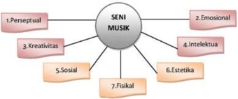

> **Deskripsi Visual:** Gambar ini adalah diagram yang menunjukkan aspek-aspek seni musik. Diagram ini terdiri dari sebuah lingkaran dengan label "Seni Musik" di tengahnya, dan tiga garis lurus menuju empat elemen utama yang berada di luar lingkaran. Elemen-elemen tersebut adalah:

1. Perseptual
2. Emosional
3. Kreativitas
4. Intelektual
5. Sosial
6. Estetika
7. Fisikal

Jumlah total elemen adalah tujuh, yang menunjukkan bahwa seni musik melibatkan berbagai aspek atau dimensi. Setiap elemen memiliki label yang menjelaskan apa yang dimaksud dengan aspek tersebut dalam konteks seni musik.

Informasi kunci yang dapat diambil pembaca dari gambar ini adalah bahwa seni musik melibatkan berbagai aspek atau dimensi, termasuk persepsi, emosi, kreativitas, intelektualitas, sosialitas, estetika, dan fisikalitas. Ini menunjukkan bahwa seni musik tidak hanya berkaitan dengan suara atau musik, tetapi juga dengan aspek-aspek lain seperti pemahaman, kreativitas, dan interaksi sosial.

 

---
## 📄 Halaman 66

Ketujuh  kemampuan  yang  tersirat  dalam  skema  bagan  tersebut  dapat diperjelas sebagai berikut:

- Perseptual : kemampuan menanggapi hasil pengamatan dalam kegiatan bermusik dan mengembangkan aspek kreativitas.
- Emosional : kemampuan  pengendalian  emosi  mengenai  ketekunan, kesabaran, atau rasa aman dalam kegiatan bermusik.
- Kreativitas : berkaitan  dengan  kemampuan  mencipta  dan  berkreasi musik.
- Intelektual dan Inovatif : kemampuan berpikir dan pemahaman kognisi dalam  kegiatan  musik  serta  mampu  mengubahnya  dalam  melakukan kreativitas musik.
- Sosial : berkaitan dengan kemampuan dalam berhubungan dengan orang lain dan lingkungannya dalam kegiatan musik.
- Estetik : kemampuan  rasa  keindahan  dalam  berolah  dan  pergelaran musik.
- Fisikal : kemampuan  tubuh  terutama  dalam  pengendalian  berolah/ berkreasi musik.
Setelah membaca, memahami, dan menghayati ungkapan tentang gagasan kreatif di atas, maka kamu diharapkan mampu menjelaskan kembali makna dari  kemampuan  dasar  musik  tersebut  dengan  paparan  dan  tafsiran  yang berbeda beserta contoh riil dalam penampilan musik kreasi!

Silahkan kamu diskusikan dengan teman untuk membuat jawaban yang tepat. Tuliskan jawaban kamu pada lembar yang telah disediakan:

---
**📊 Tabel**

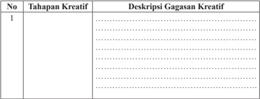

Tabel ini berisi informasi tentang tahapan kreatif dan deskripsi gagasan kreatif. Topik utamanya adalah proses kreatif dalam pembuatan ide atau konsep. Kolom "No" menunjukkan urutan atau nomor tahapan, sedangkan kolom "Deskripsi Gagasan Kreatif" menyajikan detail tentang gagasan kreatif tersebut. Data penting yang terlihat adalah bahwa tabel ini mungkin digunakan untuk mengorganisir ide-ide kreatif dalam sebuah proyek atau tugas kreatif, dengan menggambarkan setiap tahap kreatif dan deskripsinya secara jelas.

 

---
## 📄 Halaman 67

### B. Karya Tulis Musik Kreasi

### 1. Partitur Musik Kreasi

Musik merupakan simbolisasi pencitraan dari unsur-unsur musik dengan substansi dasarnya suara dan nada atau notasi. Nada ditulis dengan simbol. Salah  satu  wujud  simbol  musik  itu  adalah  notasi.  Notasi  dapat  dituliskan dalam  partitur  musik.  Partitur  dalam  bahasa  Jerman  disebut partition dan sebutan dalam bahasa Inggris dinamakan score .  Makna dari istilah tersebut merupakan lembaran kertas yang memuat notasi dari sebuah komposisi musik.

Dalam  tulisan  Soeharto  (1991:95),  partitur  jika  berisi  notasi  lengkap dari seluruh penyaji sering disebut partitur lengkap atau full score .  Sebutan tersebut dibedakan dengan partitur vokal atau vocal score , partitur orkes atau orchestral score .  Partitur yang khusus untuk tulisan suatu alat musik, lazim disebut partai atau part.

Silakan kamu kamu baca notasi musik kreasi berikut yang terungkap di dalam partitur lagu.

Lakukanlah kegiatan kreativitas dalam berkarya musik!

Berikut adalah contoh partitur lagu yang harus kamu pelajari.

### Tanahku Indah

---
**🖼️ Gambar/Diagram**

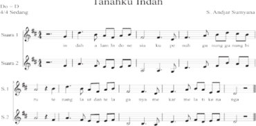

> **Deskripsi Visual:** Gambar ini adalah diagram musik yang menunjukkan struktur lagu "Tanahku Indah" oleh S. Andjar Suntyawana. Diagram ini terdiri dari dua staf musik yang masing-masing menunjukkan lirik dan melodi lagu. Staf pertama (Staf 1) berisi lirik lagu dalam bahasa Indonesia, sementara staf kedua (Staf 2) berisi melodi lagu. Setiap baris dalam diagram menunjukkan satu baris lirik atau melodi. Terdapat juga teks "Sedang" di atas diagram yang menunjukkan bahwa lagu ini sedang dimainkan. Label penting lainnya termasuk nama penulis lagu (S. Andjar Suntyawana), dan nomor baris dalam diagram (Staf 1 dan Staf 2). Informasi kunci yang dapat diambil pembaca adalah struktur dasar lagu, lirik dan melodi yang digunakan, serta informasi tentang bagaimana lagu tersebut harus dimainkan.

Sumber: Kumpulan Album lagu S. Andjar Sumyana.

 

---
## 📄 Halaman 68

Jika kamu telah mampu membaca notasi pada partitur lagu Tanahku Indah dengan baik dan benar terhadap tinggi rendahnya nada, kegiatan selanjutnya diharapkan kamu dapat menyanyikannya dengan mengindahkan unsur-unsur musik yang terkandung di dalamnya.

Di  dalam  kegiatan  menyanyi,  kamu  diharapkan  mampu  menerapkan teknik vokal dengan benar, agar dapat menghasilkan suara yang sesuai dengan karakter lagu yang disajikan. Misalnya, artikulasi, pernapasan, sikap badan dan gaya bernyanyi, ekspresi, serta pembentukan suara.

---
**🖼️ Gambar/Diagram**

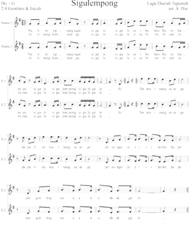

> **Deskripsi Visual:** Gambar ini adalah diagram musik yang menunjukkan lirik dan notasi musik untuk lagu "Sigulempong" dalam bahasa Jawa. Diagram ini terdiri dari dua halaman, masing-masing menunjukkan lirik dan notasi musik untuk bagian pertama dan kedua lagu tersebut. Setiap baris pada diagram menunjukkan lirik dan notasi musik yang berbeda, dengan teks yang ditulis di atas baris notasi. Elemen-elemen utama yang ditampilkan termasuk teks lagu, notasi musik, dan angka yang menunjukkan tempo dan durasi. Informasi kunci yang dapat diambil pembaca meliputi lirik lagu, notasi musik yang digunakan, dan struktur lagu yang terdiri dari dua bagian.

Sumber dari kumpulan lagu daerah Indonesia

 

---
## 📄 Halaman 69

### Tugas Kreativitas!

Salinlah notasi balok yang tertulis pada lagu Sigulempong tersebut ke dalam notasi angka. Buatlah aransemen lagunya untuk pola ritme yang berbeda.

---
**🖼️ Gambar/Diagram**

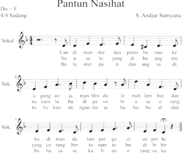

> **Deskripsi Visual:** Gambar ini adalah diagram musik yang menunjukkan pentingnya nasihat dalam konteks budaya Indonesia. Diagram ini terdiri dari tiga baris teks yang berbeda, masing-masing dengan nada yang berbeda. Nada pertama (Vokal) berada pada baris paling atas, sedangkan dua baris bawah (Vok.) berada pada baris kedua dan ketiga. Setiap baris memiliki nada yang berbeda, yang menunjukkan bahwa ada beberapa vokal yang berbeda dalam lagu tersebut. Label "Pantun Nasihat" ditempatkan di bagian atas gambar, menunjukkan judul lagu. Label "S. Andjar Sumyana" ditempatkan di bagian bawah, menunjukkan penulis lagu. Gambar ini menggambarkan bagaimana pentingnya nasihat dalam konteks budaya Indonesia, melalui penggunaan musik sebagai alat komunikasi.

Sumber dari kumpulan Album lagu S. Andjar.

 

---
## 📄 Halaman 70

### Latihan kelompok

Kerjakan latihan membaca notasi lagu yang telah digunakan dengan teman kelompok masing-masing. Apabila kelompokmu sudah menguasai lagu-lagu tersebut, maka kegiatan selanjutnya adalah:

- Buatlah sebuah karya seni musik kreasi yang berdasarkan pada gagasangagasan  musik  daerah  atau  musik  Nusantara  yang  mewarnai  budaya daerah tempat kamu tinggal!
- Tuliskanlah  karya  musik  kreasi  yang  kamu  buat  dalam  bentuk  partitur (teks lagu) dengan menggunakan notasi angka atau notasi balok!

### Tugas Kreativitas

- Cobalah buatkan musik kreasi secara berkelompok!
- Tampilkanlah musik kreasi yang kamu buat dan sudah disiapkan itu di depan kelas. Musik kreasi yang kamu buat sebagai salah satu tugas yang diberikan dalam mata pelajaran bidang ilmu seni budaya untuk mendorong kamu menciptakan musik kreasi!

### Presentasi Hasil Analisis Musik Kreasi

Pernahkah  kamu  mendengar  dan  menampilkan  musik  kreasi  yang beragam sebagai ciri budaya daerah yang ada di Nusantara dan mancanegara? Bagaimanakah perasaan kamu saat itu?

Deskripsikanlah  perasaan  kamu  setelah  mendengar  dan  menampilkan musik tersebut, lakukan analisis kejadian yang kamu rasakan!

………………………………………………………………………………

………………………………………………………………………………

………………………………………………………………………………

……………………………………………………………………………….

Sebagai  langkah  selanjutnya  sebelum  mempresentasikan  karya  musik kreasi, kamu  dituntut untuk melakukan analisis musik kreasi. Untuk melakukannya perlu adanya  pemahaman secara mendalam terhadap tandatanda musik, aspek dan unsur musikal, karena dalam karya musik terdapat berbagai simbol dan tanda-tanda musikal untuk dapat diketahui.

 

---
## 📄 Halaman 71

### Letak Nada dan Komposisi Musik

Sebuah contoh letak nada atau notasi komposisi musik yang digunakan pada permainan alat musik petik gitar.

Cobalah  kamu  praktikkan  hasil  pembelajaran  pemahaman  tentang  posisi nada  dan  akor  yang  diterapkan  pada  alat  musik  gitar.  Untuk  selanjutnya bersama-sama melakukan kegiatan kreatif dan praktik berolah musik dengan menggunakan alat musik gitar sebagai iringan lagu.

---
**🖼️ Gambar/Diagram**

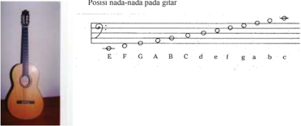

> **Deskripsi Visual:** Gambar ini adalah ilustrasi yang menunjukkan posisi nada-nada pada gitar. Gambar ini terdiri dari beberapa elemen utama:

1. Gambar Gitar: Di bagian kiri gambar, terdapat gambar sebuah gitar klasik dengan struktur yang jelas.

2. Notasi Musik: Di bagian kanan gambar, terdapat notasi musik yang menunjukkan posisi nada-nada pada gitar. Notasi ini mencakup semua karakter nada pada gitar, mulai dari E sampai c.

3. Label Nada: Setiap karakter nada pada notasi musik diikuti oleh label huruf yang menggambarkan nada tersebut. Misalnya, "E" untuk nada E, "F" untuk nada F, dan seterusnya hingga "c" untuk nada c.

4. Struktur Gitar: Struktur gitar yang terlihat dalam gambar ini mencakup empat senar yang berjalan sepanjang seluruh gitar. Ini merupakan struktur standar untuk gitar klasik.

5. Konteks: Gambar ini digunakan sebagai alat visual untuk membantu pembaca memahami posisi nada-nada pada gitar, yang sangat penting bagi pemain gitar untuk belajar dan memainkan musik.

Dengan demikian, gambar ini menyajikan informasi tentang struktur gitar dan posisi nada-nada yang penting dalam belajar gitar, menggunakan kombinasi antara gambar fisik gitar dan notasi musik.

---
**🖼️ Gambar/Diagram**

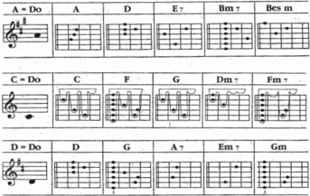

> **Deskripsi Visual:** Gambar ini adalah diagram yang menunjukkan struktur nada gitar dan notasi musik. Diagram ini terdiri dari tiga baris, masing-masing menunjukkan nada gitar dalam format notasi musik. Setiap baris menggambarkan nada gitar dalam key yang berbeda: A, C, dan D. Untuk setiap key, ada tiga kolom yang menunjukkan nada-nada yang dapat dimainkan pada gitar. Nada-nada tersebut dinyatakan dalam notasi musik dengan menggunakan simbol-simbol yang berbeda untuk menunjukkan nada yang lebih tinggi atau lebih rendah. Selain itu, ada juga teks yang memberikan informasi tentang nada dan key yang digunakan dalam setiap baris. Ini membantu pembaca untuk memahami struktur nada gitar dan bagaimana cara memainkannya.

 

---
## 📄 Halaman 72

---
**🖼️ Gambar/Diagram**

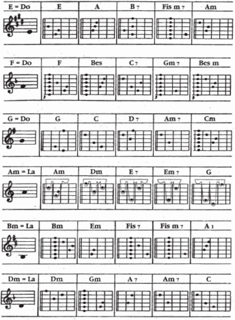

> **Deskripsi Visual:** Gambar ini adalah diagram yang menunjukkan struktur nada gitar dan chord gitar dalam bentuk tablature. Diagram ini mencakup berbagai chord gitar, mulai dari E Do, A, B, Fis m, Am, sampai Dm, Gm, Cm, dan banyak chord lainnya. Setiap chord ditampilkan dengan tablature yang menunjukkan posisi jari-jari yang harus diletakkan pada gitar untuk menghasilkan suara chord tersebut. Tablature ini disusun dalam format yang mudah dipahami oleh pemula, dengan nada-nada yang ditunjukkan dalam notasi gitar. Jumlah tablature yang ada dalam diagram ini cukup besar, mencakup sekitar 20 chord gitar, yang menunjukkan bahwa buku ini mungkin digunakan sebagai panduan untuk belajar memainkan gitar.

 

---
## 📄 Halaman 73

Berikut adalah sebuah karya musik kreasi berbentuk partitur lagu pop yang berjudul Sepanjang Jalan Kenangan hasil karya cipta A. Riyanto yang dapat diiringi dengan alat musik gitar.

### Sepanjang Jalan Kenangan

``

 

---
## 📄 Halaman 74

### Tugas Pembelajaran yang Harus Kamu Kerjakan sebagai Kreativitasku

- Apa  yang  dapat  kamu  rasakan  dan  temukan  setelah  mengahayati  dan mengamati karya musik kreasi tersebut?
- Pelajarilah  dan  hayatilah  dengan  cermat  karya  musik  kreasi  tersebut, kemudian  kamu  nyanyikan  secara  berulang-ulang  sampai  betul-betul menguasainya!
- Setelah  menguasainya  kamu  diharapkan  mampu  memainkan  alat  musik sebagai musik iringan lagu-lagu tersebut.
- Diskusikanlah  dengan  teman-temanmu  secara  kelompok  konsep  karya musik  kreasi  tersebut  kemudian  presentasikan  hasilnya  di  depan  kelas tentang hasil temuan yang didapat dari karya musik tersebut!
- Carilah karya musik kreasi lainnya yang bisa menambah referensi kamu untuk dipelajari!
Diskusikanlah jawaban kamu dengan teman-teman kelasmu, agar mendapat keputusan  hasil  yang  maksimal  dan  buatlah  laporan  tertulis  dari  hasil diskusi tersebut!

Ulangilah  dan  nyanyikanlah  lagu-lagu  yang  sudah  dipelajari  dengan  selalu meningkatkan penguasaan dasar teknik bernyanyi! Hafalkanlah semua lagu yang sudah dipelajari tersebut dalam tangga nada yang sesuai dengan wilayah suara kamu, sehingga dapat menjadi perbendaharaan lagu bagi kamu.

### Format Diskusi Hasil Pengamatan Pertunjukan Seni Musik

Nama Siswa/Kelompok

: …………………..................................

Nomor Induk Siswa

: …………………..................................

Hari/Tanggal Pengamatan

: …………………..................................

---
**📊 Tabel**

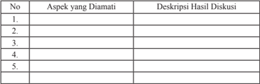

Tabel ini berisi informasi tentang aspek-aspek yang diamati dalam diskusi, dengan deskripsi hasil diskusi untuk setiap aspek tersebut. Topik utama tabel adalah proses diskusi dan analisis hasilnya. Kolom pertama menunjukkan nomor urutan aspek yang diamati, sedangkan kolom kedua menyajikan deskripsi hasil diskusi untuk masing-masing aspek. Data atau pola penting yang terlihat adalah bahwa setiap aspek memiliki deskripsi yang spesifik, menunjukkan bahwa diskusi ini dilakukan secara detail dan mendalam untuk memahami setiap aspek yang diamati.

 

---
## 📄 Halaman 75

### 2. Karya Musik Kreasi

### Apa yang kamu bayangkan dari bentuk karya musik kreasi?

Keragaman sebuah karya seni musik kreasi telah tumbuh dan berkembang di wilayah nusantara tercinta ini, mulai dari musik vokal dalam bentuk lagu yang berupa nyanyian, sampai pada musik instrumen yang ditimbulkan dari suara alat yang berupa instrumental. Setiap karya musik kreasi itu memiliki makna, nilai, dan ilosoi budaya yang beragam. Karya musik kreasi muncul sebagai buah karya hasil penciptaan seseorang. Penciptaan karya seni musik adalah suatu tindakan dan atau perilaku berkarya musik yang menghasilkan satu bentuk pernyataan musikal yang asli dari penciptanya, yang sebelumnya belum ada atau belum terwujud.

Tujuan yang diharapkan setelah mempelajari konsep dan teori penciptaan musik adalah agar dapat menciptakan musik kreasi baik dalam wujud lagu maupun iringan lagu yang sederhana. Dalam penyusunan musik, komposer perlu memperhatikan dan mempertimbangkan beberapa hal terkait, antara lain ide musikal atau gagasan penerapan unsur-unsur musik, hal tersebut diperkuat Pamadi (2008: 6.24), dalam ungkapannya hal-hal yang perlu dipertimbangkan dalam penciptaan musik instrumen, yaitu:

- Karakteristik  bunyi  dan  register  masing-masing  instrumen  atau  sumber bunyi.
- Tingkat kesulitan teknik penyuaraan dan atau teknik permainan instrumen tersebut.
- Hasil perpaduan bunyi sebagian atau keseluruhan instrumen yang digunakan.
- Instrumen natural atau transpose.
Langkah-langkah untuk menciptakan sebuah komposisi musik kreasi baik berupa  lagu  atau  pun  instrumental  atau  musik  iringan  dapat  menggunakan tahapan berikut.

- Mendengarkan contoh bentuk-bentuk komposisi lagu atau instrumen dari rekanan.
- Memilih sebuah teks yang baik dan tepat sesuai dengan tingkat perkembangan.
- Membaca teks dan membayangkan jenis musik yang dapat mendukung isi teks dan media ungkap aspek musikal.
- Membaca berulang-ulang pola komposisi untuk mendapatkan gerak irama dan kelompok aksennya.

 

---
## 📄 Halaman 76

- Menetapkan  unsur-unsur  musikal  yang  digunakan  dalam  penyusunan komposisi musik.
- Mendengarkan komposisi melodi dari setiap frase.
- Menulis karya komposisi dengan baik, agar dapat dibaca, dinyanyikan, dan diapresiasi dalam kegiatan selanjutnya.
- Menyajikan karya komposisi musik kreasi untuk dikritisi.
Musie : S. Andjar Sumyana

---
**🖼️ Gambar/Diagram**

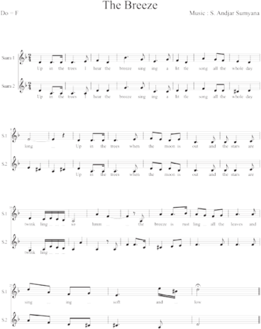

> **Deskripsi Visual:** Gambar ini adalah sebuah diagram musik yang menunjukkan lirik lagu "The Breeze" dengan instrumen piano. Diagram ini terdiri dari dua baris lirik yang disusun dalam format notasi musik. Setiap baris lirik memiliki tiga kolom, masing-masing menunjukkan lirik, nada, dan tekanan (puncak dan dasar). Nada dan tekanan ditandai dengan garis dan titik, sementara lirik ditulis dalam huruf besar dan kecil. Di bagian bawah, terdapat tabulatur piano yang menunjukkan bagaimana musisi harus memainkan lagu tersebut. Teks, angka, atau label penting yang terlihat meliputi nama lagu "The Breeze", nama penulis musik S. Andjar Sumiyana, dan instrumen piano. Informasi kunci yang dapat diambil pembaca termasuk struktur lirik lagu, nada dan tekanan yang digunakan, serta cara memainkan lagu tersebut menggunakan piano.

 

---
## 📄 Halaman 77

Melalui tayangan partitur lagu yang berjudul 'The Breeze' tersebut,  kamu diharapkan mampu menjawab pertanyaan berikut:

Isilah titik-titik berikut dengan jawaban kamu.

---
**📊 Tabel**

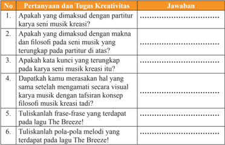

Tabel ini berisi pertanyaan-pertanyaan kreatif tentang musik kreasi dan tugas-tugas yang harus dijawab oleh siswa. Topik utamanya adalah tentang pengetahuan dan pemahaman tentang musik kreasi, termasuk makna dan filosofi dari musik tersebut. Kolom-kolomnya mencakup berbagai aspek seperti apakah ada partitur untuk musik kreasi, apakah ada kata kunci yang terkandung dalam musik kreasi, apakah ada perbedaan antara musik kreasi dengan konsep filosofi musik, dan sebagainya. Data penting yang terlihat adalah bahwa tabel ini bertujuan untuk meningkatkan kreativitas dan pemahaman siswa tentang musik kreasi dan filosofinya.

Pelajarilah  lagu-lagu  lainnya,  kemudian  buatlah  aransemen  musik iringannya!

### 3. Karya Musik Kreasi

Pada dasarnya sebuah karya musik kreasi adalah sebagai bentuk pengekspresian  perasaan  seorang  manusia  yang  mengolah  bunyi  dan  diam sebagai  bahan  bakunya.  Pengolahan  bunyi  dan  diam  dengan  esensi  musik dan unsur musik bisa menciptakan sebuah karya musik kreasi baru yang baik. Bunyi dan diam tersebut diolah secara sadar oleh komposer dalam dimensi ruang dan waktu, untuk dijadikan sebagai kreasi hasil cipta musik berwujud komposisi.  Komposisi  merupakan  gubahan,  susunan,  dan  karangan  musik. Orang yang menggubah disebut komponis, komposer, atau pencipta musik baik  berupa  lagu  ataupun  instrumental.  Penciptaan  musik  sebagai  bentuk musikal dibedakan atas sebutan komposisi, improvisasi, dan aransemen.

 

---
## 📄 Halaman 78

### 1. Komposisi

Komposisi merupakan penyusunan suatu karya musik baik dalam bentuk lagu  maupun instrumen yang diciptakan dalam bentuk tertulis dan bersifat abadi untuk diperdengarkan, diedarkan, dinilai, dan diapresiasi masyarakat. Keberhasilan suatu karya cipta musik ditentukan oleh nilai ciptanya. Kegiatan komposisi  ialah  pengalaman  membuat  lagu  yang  berhubungan  dengan perencanaan  penyusunan  unsur-unsur  musik  menjadi  suatu  bentuk  lagu tertentu,  menuliskannya ke dalam bentuk tulisan musik sebagai suatu hasil karya musik, dan dapat diungkapkan, diperdengarkan, dan dimainkan kembali secara berulang-ulang.

### 2. Improvisasi

Improvisasi adalah penciptaan musik yang tidak tertulis dan tidak bersifat abadi karena tidak dapat diulang kembali dalam bentuk serta intensitas yang sama. Improvisasi terjadi secara spontanitas saat menyajikan lagu/bernyanyi atau saat memainkan alat musik, sebagai permainan ekspresi dan penjelmaan langsung dari perasaan musikal yang timbul saat ini. Kegiatan improvisasi ialah pengalaman mengungkapkan  lagu secara releks, mendadak  tanpa dipersiapkan sama sekali dan bahkan susah untuk tidak dapat diulang kembali secara persis.

### 3.  Aransemen

Aransemen  adalah  menggubah  yang  juga  sering  disebut  susunan  dan transkripsi artinya ahli tulis. Lebih khusus aransemen diartikan sebagai suatu hasil karya dari teknik menyusun, mengatur, merangkai, dan menata kembali suatu karya musik baik berupa lagu maupun instrumental sehingga menjadi lebih  indah,  artistik,  dan  representatif  dibanding  bentuk  aslinya.  Misalnya menyangkut masalah melodi nada, irama, jenis dan kelompok suara, harmoni, serta struktur lagunya.

Untuk lebih memperdalam pemahaman kamu mengenai materi tersebut di atas, kerjakanlah latihan berikut!

- Bagaimana cara membuat pola ritmik untuk musik instrumental?
- Hal apakah yang perlu dipertimbangkan untuk mencipta dan menyusun musik instrumen sebagai musik iringan lagu?

 

---
## 📄 Halaman 79

Untuk  memiliki  pengalaman  berimprovisasi,  kamu  dapat  menciptakan pola-pola irama yang menarik untuk dimainkan dengan alat irama. Gunakan suara atau alat musik melodi dan ciptakanlah pola-pola melodi pendek dengan menyusun nada-nada.

### Kreativitasku dan Penugasan

Setelah  kamu  membaca  pandangan  di  atas,  silahkan  kamu  diskusikan pemahaman tersebut, kemudian paparkan apa yang ada di dalammnya pada tabel berikut:

### Format Diskusi Hasil Pengamatan

Nama Siswa/Kelompok

: ………………………

Nomor Induk Siswa

: ………………………

Hari/Tanggal Pengamatan

: ………………………

Karakter tugas

: ………………………

---
**📊 Tabel**

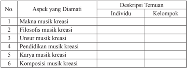

Tabel ini memperlihatkan aspek-aspek yang diamati dalam konteks musik kreatif, dengan penekanan pada individu dan kelompok. Topik utama adalah "Aspek yang Diamati" dan "Deskripsi Ternuan". Kolom-kolomnya mencakup makna musik kreatif, filosofi musik kreatif, unsur musik kreatif, pendidikan musik kreatif, karya musik kreatif, dan komposisi musik kreatif. Data penting yang terlihat menunjukkan bahwa tabel ini fokus pada berbagai aspek musik kreatif, mulai dari makna dan filosofi hingga karya dan komposisi, dengan penekanan pada individu dan kelompok. Ini menunjukkan bahwa tabel ini mungkin digunakan untuk analisis atau studi tentang bagaimana musik kreatif diaplikasikan dan dinamis oleh individu dan kelompok.

Setelah melakukan pengamatan terhadap keseluruhan bahasan tentang  kreativitas  musik  di  atas,  maka  kegiatan  selanjutnya  kamu  harus mendeskripsikan pemahaman tentang gagasan musik kreasi, partitur, karya musik,  ilosois  musik,  sebagai  bentuk  penilaian  portopolio  yang  menjadi salah satu sasaran dalam pembelajaran seni budaya.

Silakan mencari informasi tentang Konsep dan Makna Kreativitas, Konsep Ide  Musik  Kreasi,  Analisis  Musik  Kreasi,  Partitur,  dan  Filosois  musik vokal dan musik instrumen yang tumbuh dan berkembang di lingkungan masyarakat kamu atau masyarakat yang lain. Kemudian, tuliskan daerah asal, karakter musikal, nilai estetis dan karakter bentuk instrumen.  Alangkah indahnya jika kamu sertakan pula gambar dari setiap kreasi musik tersebut.

 

---
## 📄 Halaman 80

### Evaluasi Pembelajaran

### Penilaian Pribadi

Isilah  tabel  berikut  dari  hasil  analisis  kreativitas  musik  kreasi  yang  kamu lakukan

---
**📊 Tabel**

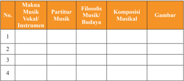

Tabel ini berisi informasi tentang berbagai aspek musik, termasuk makna musik, partitur musik, filosofi musik/budaya, komposisi musikal, dan gambar. Topik utama tabel ini adalah musik dan bagaimana ia berkaitan dengan berbagai aspek lainnya. Kolom-kolom yang ada mencakup makna musik/vokal/instrumen, partitur musik, filosofi musik/budaya, komposisi musikal, dan gambar. Data atau pola penting yang terlihat adalah bahwa tabel ini mencakup berbagai aspek musik dan bagaimana mereka saling berkaitan.

Nama

Kelas

Semester

Waktu penilaian

: …………………..................................

: …………………..................................

: …………………..................................

: …………………..................................

### No. Pernyataan

Saya mengamati contoh yang diberikan oleh guru dengan cermat.

1

2.

3

embelajaran

Saya melakukan kegiatan imitasi contoh yang diberikan oleh guru.

Saya berusaha memahami dan menguasai seluruh materi pelajaran seni musik.

 

---
## 📄 Halaman 81

4

- Saya mengajukan pertanyaan jika ada masalah yang tidak dipahami.
5

Saya turut berperan aktif membuat musik kreasi dalam kelompok.

6

Saya berusaha untuk berani mengemukakan pendapat.

7 Saya berusaha bekerja sama dengan baik dalam kelompok menampilkan musik kreasi.

8

Saya  menghargai  dan  mengamati  permainan  musik  kreasi    yang dilakukan kelompok lain.

9

Saya menghormati dan menghargai kritik dan saran yang diberikan guru.

10 Saya menghormati dan menghargai pendapat teman atas permainan musik yang saya tampilkan, baik secara perorangan maupun dalam kelompok.

Nama teman yang dinilai

: …………………..................................

Nama penilai

: …………………..................................

Kelas

: …………………..................................

Semester

: …………………..................................

Waktu penilaian

: …………………..................................

### Penilaian Antarteman

 

---
## 📄 Halaman 82

No.

### Pernyataan

1

Berusaha belajar dengan sungguh-sungguh.

2

- Mengikuti proses pembelajaran dengan penuh perhatian.
3

Mengerjakan seluruh tugas yang diberikan guru.

4

Mengajukan pertanyaan jika ada yang tidak dipahami.

5

Berperan aktif dalam kelompok.

6

Berani mengemukakan pendapat.

7

- Dapat bekerja sama dengan baik dalam permainan musik kreasi secara berkelompok.
8

Menghargai permainan musik kreasi kelompok lain.

9

Menghormati dan menghargai guru.

10

Menghormati dan menghargai pendapat teman atas permainan secara perorangan maupun kelompok.

 

---
## 📄 Halaman 83

### Rangkuman

Hal penting yang dapat mempengaruhi gagasan kreatif, yaitu: kecakapan, keterampilan, dan motivasi. Kreatif adalah sifat yang dimiliki seseorang dan mempunyai kemampuan untuk mencipta atau berkreasi. Kreasi adalah ciptaan, penciptaan, dan atau hasil daya cipta.

Kreativitas  merupakan  kemampuan  berpikir  untuk  berkreasi  atau  daya mencipta. dan keterampilan seseorang menghasilkan sesuatu yang asli, unik, dan bermanfaat.

Partitur dalam bahasa Jerman disebut partition dan sebutan dalam bahasa Inggris  dinamakan score .  Makna  dari  istilah  tersebut  merupakan  lembaran kertas yang memuat notasi dari sebuah komposisi musik. Partitur bila berisi notasi lengkap dari seluruh penyaji sering disebut partitur lengkap atau full score .

Setiap karya musik kreasi itu memiliki makna, nilai, dan ilosoi budaya yang beragam. Karya musik kreasi muncul sebagai buah karya hasil penciptaan seseorang.  Penciptaan  karya  seni  musik  adalah  suatu  tindakan  dan  atau perilaku berkarya musik yang menghasilkan satu bentuk pernyataan musikal yang asli dari penciptanya, yang sebelumnya belum ada atau belum terwujud.

Filosois adalah sesuatu yang berhubungan dengan ilsafat. Filsafat atau disebut falsafah. Falsafah merupakan pengetahuan tentang asas-asas pikiran dan perilaku  dalam kehidupan manusia. Filsafat adalah ilmu untuk mencari kebenaran  dan  prinsip-prinsip  dengan  menggunakan  kekuatan  akal;  ilsafat sebagai pandangan hidup yang dimiliki oleh setiap orang; kata-kata arif yang bersifat didaktis.

Komposisi merupakan penyusunan suatu karya musik baik dalam bentuk lagu  maupun instrumen yang diciptakan dalam bentuk tertulis dan bersifat abadi untuk diperdengarkan, diedarkan, dinilai, dan diapresiasi masyarakat.

 

---
## 📄 Halaman 84

### Releksi

Releksi  dari  pembahasan  yang  telah  dilakukan  dalam  bab  ini  adalah kemampuan kamu dalam melakukan pembelajaran  tentang  kreativitas  seni musik, unsur-unsur musik, simbol dan nilai estetis seni musik, yang bertujuan untuk  menanamkan  rasa  ingin  tahu,  dan  memperdalam  kemampuan  kamu dalam bidang musik khususnya, dan seni pada umumnya. Pemahaman untuk melakukan  pengalaman  penulisan  musik  berupa  partitur  dan  komposisi sesuai dengan tujuan yang ingin dicapai. Melalui kegiatan pembelajaran ini pula  diharapkan  kamu  dapat  mengelaborasikan  kemampuan  siswa  dalam menghargai ilmu pengetahuan dan aspek afektif dan psikomotoriknya, dengan mencari  tahu  dan  berdiskusi,  bertoleransi  antarteman,  peduli  dan  memiliki rasa tanggung jawab, santun, responsif, kerja sama, sikap santun,  jujur,  cinta tanah air, dan mereleksikan pula sikap anggota masyarakat yang memiliki wawasan yang luas.

.

 

---
## 📄 Halaman 85

---
**🖼️ Gambar/Diagram**

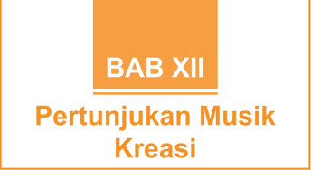

> **Deskripsi Visual:** Gambar ini adalah bagian dari buku pelajaran yang berisi bab tentang pertunjukan musik kreasi. Gambar ini menggunakan desain yang sederhana namun efektif untuk menunjukkan topik tersebut. Di bagian atas, terdapat judul "BAB XII" yang ditulis dalam huruf besar dan berwarna putih dengan latar belakang orange. Berikutnya, terdapat teks "Pertunjukan Musik Kreasi" yang juga ditulis dalam huruf besar dan berwarna putih dengan latar belakang sama seperti judul.

Elemen-elemen utama dalam gambar ini adalah judul dan teks yang memberikan informasi tentang topik bab tersebut. Judul "BAB XII" menunjukkan bahwa ini adalah bab ke-12 dari buku pelajaran, sedangkan teks "Pertunjukan Musik Kreasi" memberikan konteks topik yang akan dibahas dalam bab tersebut.

Teks penting yang terlihat dalam gambar ini adalah judul dan teks bab yang memberikan informasi tentang topik yang akan dibahas. Informasi kunci yang dapat diambil pembaca melalui gambar ini adalah bahwa bab ini membahas tentang pertunjukan musik kreasi, yang merupakan salah satu aspek penting dalam dunia musik dan seni.

---
**🖼️ Gambar/Diagram**

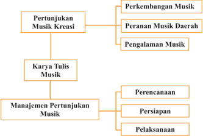

> **Deskripsi Visual:** Gambar ini adalah diagram yang menunjukkan struktur dan hubungan antara berbagai aspek pertunjukan musik kreasi. Diagram ini terdiri dari tiga level utama: Pertunjukan Musik Kreasi, Karya Tulis Musik, dan Manajemen Pertunjukan Musik. Pertunjukan Musik Kreasi terbagi menjadi tiga sub-aspek: Perkembangan Musik, Peranan Musik Daerah, dan Pengalaman Musik. Karya Tulis Musik merupakan bagian dari Pertunjukan Musik Kreasi. Manajemen Pertunjukan Musik terbagi menjadi tiga sub-aspek: Perencanaan, Persiapan, dan Pelaksanaan. Setiap sub-aspek memiliki hubungan dengan aspek-aspek lainnya dalam diagram tersebut. Label penting dalam diagram ini meliputi "Pertunjukan Musik Kreasi", "Karya Tulis Musik", dan "Manajemen Pertunjukan Musik". Informasi kunci yang dapat diambil pembaca adalah bahwa struktur pertunjukan musik kreasi melibatkan berbagai aspek seperti perkembangan musik, peran daerah, pengalaman, karya tulis, dan manajemen.

 

---
## 📄 Halaman 86

### Peta Kompetensi Pembelajaran

Setelah  mempelajari  Bab  XII  tentang  musik  kreasi,  diharapkan  kamu mampu:

- Mempergelarkan  karya  seni  musik  dalam  ranah  konkret  dan  ranah abstrak terkait dengan pengembangan dari yang dipelajarinya di sekolah secara  mandiri,  bertindak  secara  apresiatif,  efektif  dan  kreatif,  serta mampu menggunakan metode sesuai dengan kaidah keilmuan. Secara spesi fi k pembelajar dapat:
- -mengidenti fi kasi  peranan  musik  kreasi  dalam  pendidikan  seni budaya;
- -menunjukkan nilai-nilai pengalaman musikal berdasarkan berdasarkan pengamatan terhadap pergelaran karya musik;
- -menampilkan karya musik kreasi yang telah diaransir di kelas;
- -mengembangkan gagasan kreatif musik dari karya sendiri;
- -merancang musik melalui berbagai pengalaman kreatif bermusik;
- -mengembangkan  sensitivitas  persepsi  inderawi  melalui  berbagai pengalaman kreatif bermusik;
- Mengekspresikan diri  melalui  karya  musik  dan  membuat  karya  tulis tentang musik kreasi berdasarkan jenisnya. Secara operasional setelah melakukan pembelajaran ini pembelajar dapat:
- -membuat tulisan tentang karya musik berdasarkan jenisnya;
- -mengevaluasi karya musik berdasarkan fungsi dan jenisnya;
- -mempergelarkan karya musik hasil kreasi sendiri; serta
- -mengkritisi karya musik kreasi berdasarkan jenisnya.
Dalam  beraktivitas  berkesenian  nilai  karakter  kamu  diharapkan  bagi selaku peserta didik dapat menunjukkan sikap:

- rasa ingin tahu
- santun, gemar membaca, dan peduli
- jujur dan disiplin
- kreatif, inovatif, dan responsif
- bersahabat dan koperatif
- kerja keras dan tanggung jawab
- toleran, mandiri, dan apresiatif
- bermasyarakat dan berkebangsaan

 

---
## 📄 Halaman 87

 

---
## 📄 Halaman 89

Utara dan daerah Turki. Oleh karena itu, kebudayaan Romawi Kuno banyak dipengaruhi oleh daerah Yunani, begitu juga dalam hal musik.

### b.  Era Abad Pertengahan (Medieval Era) 600-1450

Pada  masa  ini,  kehidupan  dan  seni  ditujukan  untuk  pelayanan  gereja. Musik hanya untuk keperluan ibadah. Mewarisi modus-modus Yunani, bangsa Romawi yang Kristen mengembangkan modus-modus gereja sebagai sistem tangga nada yang hingga kini masih digunakan dalam berbagai peribadatan Kristen. Standarisasi dalam berbagai lapangan pengetahuan juga terjadi dalam musik, biarawan dan teoretikus musik Guido.

### c. Era Renaissance (1450-1600)

Pada zaman ini vokal lebih dipentingkan daripada instrumen, sehingga komposer lebih memperhatikan syair atau lirik untuk meningkatkan kualitas syair dan emosi lagu. Ciri khas musik renaissance berikut.

- Acappella, bernyanyi tanpa diiringi instrumen dengan  teknik dan harmonisasi yang bagus.
- Berwatak klasik, pengekangan, menahan diri, dan kalem.
- Melodi dan tekstur musik masih menggunakan modus-modus sebelumnya, tetapi akord-akord mulai disusun dengan cara menghubungkan melodimelodi yang menghasilkan konsonan atau disonan.
- Komposisi solo dengan iringan ansambel instrumental.
- Menggunakan teknik-teknik permainan instrumen yang idiomatis seperti ritme-ritme beraksen kuat, nada-nada yang diulang-ulang, wilayah nada semakin  luas  dan  panjang,  nada-nada  yang  ditahan  dan  frase-frase, dan  banyak  ornamentasi  melodi.  Komponis-komponis  pada  zaman renaissance antara lain Josquin des Pres, Orlandus Lassus, William Byrd, Giovanni Pierluigi, dan Palestrina.

### d.  Era Barok dan Rakoko

Bukti adanya kemajuan pada zaman pertengahan, yakni ditandai dengan lahirnya beberapa jenis aliran musik seperti Barok dan Rakoko. Kedua musik ini  hampir sama sifatnya, yakni adanya pemakaian ornamentik. Perbedaanperbedaan pokok antara Gaya Barok dan Gaya Rakoko yakni berikut.

- Bas  tidak  lagi  terdapat  sebagai  suara  yang  bebas,  tekstur  polifonik berangsur-angsur  menjadi  homofonik,  yakni  melodi  dan  iringan  akor dalam satu komposisi.

 

---
## 📄 Halaman 92

hiburan saja, melainkan ada dipakai untuk pengobatan dan ada yang menjadi suatu sarana komunikasi antara manusia dengan penciptanya. Hal ini adalah menurut kepercayaan masing-masing orang saja. Musik ini pun merupakan perbendaharaan seni lokal masyarakat dan berkembang secara tradisional di kalangan suku-suku tertentu.

Perkembangan  musik  tradisional  yang  cenderung  mengarah  kepada penyesuaian  keperluan  apresiasi  masyarakat  masa  kini  yang  dinamis  dan perilaku yang serba cepat, maka  pertimbangan pengembangan  musik tradisional mengarah pula kepada penempatan dinamika musikal sebagai dasar disain dramatik penggarapan itu sendiri. Menggarap konsep pengembangan musik tradisional yang disesuaikan dengan keperluan seni pergelaran. Adanya pengembangan  berarti  dinamika  sebuah  garapan  musik  yang  berdasarkan kepada  pengembangan  musik  tradisional  telah  membuka  peluang  terhadap beberapa  jenis  musik  trasdisional  yang  mempunyai  pola  melodi  ataupun ritme dinamis yang mendapat tempat mengisi bagian-bagian dalam komposisi musik baru. Istilah musik tradisional ini sudah tidak asing lagi bagi masyarakat dunia,  seperti  negara-negara  di  Eropa  yang  musik  tradisinya  ialah  musik klasik, musik jazz, musik blues , musik country, musik ska , dan musik reggae .

Musik  tradisional  mancanegara  adalah  musik  yang  dipengaruhi  oleh adat, tradisi, budaya masyarakat setempat dalam suatu negara. Sebuah musik tradisional  mancanegara  menggambarkan  kebudayaan  yang  dianut.  Musik tradisional mancanegara umumnya berperan dalam acara keagamaan, acara pesta panen, atau acara perhelatan perkawinan.

Berikut  diinformasikan  oleh  Domas  dkk.  selaku  tim  penyunting  buku ajar  seni  budaya  bahwa  terdapat  beberapa  negara  di  dunia  memiliki  musik tradisional  dengan  jenis  dan  macamnya  yang  beraneka  ragam  dan  berbeda seperti berikut

- Perancis, permainan musik akordion berfungsi sebagai pengiring dansa.
- Irlandia  dan  Eropa  Timur,  masyarakat  tradisional  dengan  bersemangat memainkan alat musik biola sebagai hiburan dan acara pesta.
- Scotlandia, dengan alat musik bagpipe (pipa berkantung) digunakan untuk bersenandung  dan  sebagai  kelompok  musik  militer  Scotlandia  dengan kelengkapan genderang.
- Afrika Selatan, dikenal alat musik terompet tradisional yang menghasilkan suara yang cukup keras yang berfungsi untuk memberikan semangat.

 

---
## 📄 Halaman 93

---
**🖼️ Gambar/Diagram**

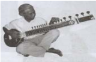

> **Deskripsi Visual:** Gambar ini adalah ilustrasi yang menunjukkan seorang musisi memainkan alat musik tradisional India, yaitu sitar. Gambar ini menggambarkan alat musik yang memiliki beberapa senar yang terhubung dengan gitar dan diletakkan di atas pergelangan tangan pemain. Pemain sitar tersebut sedang berada di posisi yang menunjukkan bahwa ia sedang memainkan alat musik ini dengan cara yang tepat. Ilustrasi ini menunjukkan bagaimana alat musik tradisional India digunakan dalam konteks musik dan budaya.

Alat  musik Khong  wong  yai adalah  sejenis  alat  musik  berbentuk seperangkat  gong,  disusun  melingkar  berasal  dari  Thailand.  Alat  tersebut dimainkan  dengan  cara  dipukul,  alat  musik  yang  berbentuk  gong  kecil ini  biasanya  dipertunjukan  dalam  sajian  ansambel piphat di  Thailand,  atau pinpeat di Kamboja, atau sep nyai di Laos. Adapun Sitar yaitu sejenis alat musik dawai petik dari India Utara. termasuk pada rumpun alat musik dawai yang dimainkan dengan cara dipetik, alat musik senada di Iran disebut sehtar dan di Uzbekistan alat sejenis disebut dutar.

Penjelasan di atas dapat kita simpulkan bahwa  musik  tradisional mancanegara  memiliki  beberapa  peranan  dalam  kehidupan  di  antaranya sebagai berikut.

- Media hiburan bagi para pendengarnya.
- Media pendidikan dan pembelajarn seni.
- Media informasi budaya serta komunikasi.
- Media pengiring upacara keagamaan, upacara militer.
- Media motivator atau memberikan semangat.

 

---
## 📄 Halaman 95

### a.  Gaya Musik

Musik adalah suara yang disusun sedemikian rupa sehingga mengandung irama, lagu, dan keharmonisan terutama suara yang dihasilkan dari alat-alat yang  dapat  menghasilkan  bunyi-bunyian.  Walaupun  musik  adalah  sejenis fenomena intuisi, untuk mencipta, memperbaiki, dan mempersembahkannya adalah suatu bentuk seni. Mendengar musik adalah sejenis hiburan. Musik adalah sebuah fenomena yang sangat unik yang bisa dihasilkan oleh beberapa alat musik

Salah  satu  unsur  musikal  yang  dapat  kamu  cermati,  yaitu  gaya  musik. Gaya dalam musik merupakan suatu sifat tersendiri dalam perwujudan musik yang terlepas dari penilaian keindahan (estetis). Gaya musik dapat dilihat dari teknik vokal atau instrumen untuk menghasilkan gaya musik. Ada tiga macam gaya musik yaitu gaya dalam kurun waktu, nasional, dan perseorangan.

### 1)  Gaya dalam Kurun Waktu

Gaya  kurun  waktu  (tempo)  memiliki  sifat  musik  yang  menunjukkan perbedaan  pada  kurun  waktu  tertentu  dalam  sejarahnya.  Misalnya,  musik di  Eropa  memiliki  musik  dalam  kurun  waktu  yang  berbeda,  yaitu  musik renaisans, barok dan rokoko, klasik, serta romantik.

### 2)  Gaya Nasional

Dalam gaya nasional ini, sifat atau watak musik menunjukkan kebangsaan tertentu, misalnya musik Italia dan musik Inggris.

### 3)  Gaya Perseorangan

Dalam gaya perseorangan ini, sifat atau watak musik tersebut menunjukkan karakter musik komponis tertentu, yang terlepas dari tanda-tanda gaya dalam kurun waktu dan gaya nasional. Misalnya musik karya J.S. Bach, W.A. Mozart, dan L. Van Beethoven.

### b.  Musik Mancanegara

### 1)  Musik Country

Istilah musik country mulai dipakai sekitar tahun 1940-an untuk menggantikan istilah musik hillbilly yang berkesan merendahkan. Pada tahun 1970-an, istilah musik country telah menjadi populer di kalangan masyarakat mancanegara. Istilah lain untuk genre musik ini adalah country and western. Jenis musik modern ini bersumber dari musik rakyat ( folk song) atau musik tradisional  yang  berasal  dari Appalachia di  kawasan  pegunungan  selatan

 

---
## 📄 Halaman 98

---
**🖼️ Gambar/Diagram**

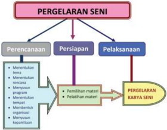

> **Deskripsi Visual:** Gambar ini adalah diagram yang menunjukkan proses pergelaran seni dalam bentuk diagram alir. Diagram ini terdiri dari tiga bagian utama: Perencanaan, Persiapan, dan Pelaksanaan. Setiap bagian memiliki subbagian yang lebih spesifik.

1. **Apa yang Ditampilkan Secara Keseluruhan**: Gambar ini menunjukkan proses pergelaran seni yang melibatkan perencanaan, persiapan, dan pelaksanaan. Setiap tahap ini dibagi menjadi subbagian yang lebih detail untuk menjelaskan prosesnya.

2. **Elemen-Elemen Utama dan Relasinya**: 
   - **Perencanaan** terdiri dari subbagian "Mententukan tema", "Mententukan narasi", "Membuat sketsa", "Membuat sketsa tempat", "Membuat sketsa karakter", dan "Membuat sketsa kapetensi".
   - **Persiapan** terdiri dari subbagian "Pemilihan materi" dan "Pelatihan materi".
   - **Pelaksanaan** adalah bagian akhir yang menggabungkan semua elemen sebelumnya untuk menciptakan karya seni.

3. **Teks, Angka, atau Label Penting yang Terlihat**: 
   - Ada teks yang memberikan deskripsi tentang setiap subbagian dalam proses pergelaran seni.
   - Ada angka yang mungkin menunjukkan urutan atau jumlah subbagian dalam setiap tahap.

4. **Informasi Kunci yang Dapat Diambil Pembaca**: 
   - Proses pergelaran seni melibatkan perencanaan, persiapan, dan pelaksanaan yang harus dilakukan secara teratur.
   - Setiap tahap memerlukan pengetahuan dan keterampilan tertentu untuk berhasil menciptakan karya seni yang berkualitas.

Dengan demikian, gambar ini memberikan gambaran yang jelas tentang proses pergelaran seni dan bagaimana setiap tahap harus dilakukan dengan tepat untuk mencapai hasil yang diinginkan.

 

---
## 📄 Halaman 99

---
**🖼️ Gambar/Diagram**

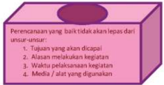

> **Deskripsi Visual:** Gambar ini adalah ilustrasi yang menunjukkan perencanaan yang baik tidak akan lepas dari unsur-unsur tertentu. Ilustrasi ini terdiri dari empat elemen utama yang disusun dalam bentuk kotak berwarna biru dengan tulisan merah:

1. Tujuan yang dicapai: Ini merupakan tujuan utama dari perencanaan yang baik.
2. Alasan melakukan kegiatan: Ini merupakan alasan mengapa perencanaan harus dilakukan.
3. Waktu pelaksanaan kegiatan: Ini merupakan waktu yang tepat untuk melakukan kegiatan.
4. Media atau sifat yang digunakan: Ini merupakan media atau sifat yang digunakan dalam perencanaan.

Teks, angka, atau label penting yang terlihat dalam gambar meliputi:
- "Perencanaan yang baik tidak akan lepas dari unsur-unsur"
- "Tujuan yang dicapai"
- "Alasan melakukan kegiatan"
- "Waktu pelaksanaan kegiatan"
- "Media atau sifat yang digunakan"

Informasi kunci yang dapat diambil pembaca meliputi pentingnya memiliki tujuan yang jelas, alasan yang kuat, waktu yang tepat, dan media yang tepat dalam perencanaan.

---
**🖼️ Gambar/Diagram**

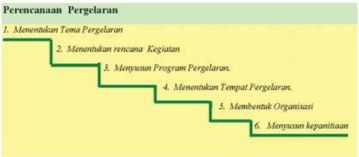

> **Deskripsi Visual:** Gambar ini adalah diagram yang menunjukkan proses perencanaan peregelaran. Diagram ini terdiri dari enam langkah yang disusun secara horizontal dan terhubung oleh garis lurus untuk menunjukkan hubungan antara setiap langkah. Setiap langkah ditandai dengan angka dan memiliki deskripsi singkat.

1. Langkah pertama adalah "Menentukan Tema Pergelaran", yang berarti memilih topik utama yang akan digunakan dalam kegiatan tersebut.
2. Langkah kedua adalah "Menentukan Rencana Kegiatan", yang melibatkan pengaturan waktu dan sumber daya yang diperlukan untuk mencapai tujuan.
3. Langkah ketiga adalah "Menyusun Program Pergelaran", yang melibatkan penentuan detail tentang apa yang akan dilakukan selama kegiatan.
4. Langkah keempat adalah "Menentukan Tempat Fergelaran", yang melibatkan pemilihan lokasi yang sesuai untuk kegiatan.
5. Langkah kelima adalah "Membentuk Organisasi", yang melibatkan pembentukan tim atau kelompok yang akan mengelola kegiatan.
6. Langkah keenam adalah "Menyusun Kepentingan", yang melibatkan penentuan prioritas dan tujuan akhir dari kegiatan.

Elemen-elemen utama dalam diagram ini adalah langkah-langkah perencanaan peregelaran, yang saling terkait dan harus dilalui sebelum kegiatan dapat dimulai. Teks, angka, atau label penting yang terlihat adalah deskripsi singkat setiap langkah dan angka yang menunjukkan urutan langkah-langkah tersebut. Informasi kunci yang dapat diambil pembaca adalah bahwa perencanaan peregelaran melibatkan banyak langkah dan harus dilakukan secara teratur untuk berhasil.

 

---
## 📄 Halaman 100

### Cobalah kamu simak penjelasan dari setiap langkah yang harus ditempuh untuk melaksanakan persiapan pertunjukan musik adalah:

### a.  Menentukan Tema Pertunjukkan Musik

Sebelum  tema  ditentukan,  terlebih  dahulu  harus  menentukan  tujuan pertunjukan musik,  di mana isi dari pergelaran itu  akan menampilkan hasil karya kamu atau hanya dalam rangka kegiatan lain. Hal ini sebenarnya tidak menjadi masalah, yang terpenting sesuai dengan program kegiatan sekolah, pemeritah juga masyarakat.

Ada beberapa contoh dari tema pertunjukan musik di sekolah seperti berikut.

- Perlombaan, festival, dan kontes.
- Konser  musik  ansamble,  festival  gamelan,  orkes  shymphony,  dan  big band.
- Paduan suara, vokal grup, layeutan suara, koor, rampak sekar, mamaos, tembang, dan anggana sekar.
- Kontes musik (dangdut, pop).

### b.  Menentukan Rencana Kegiatan

Seperti  telah  diungkapkan  bahwa  suatu  kegiatan  harus  betul-betul  di rencanakan dengan baik. Perlu kita perhatikan hal-hal  penting    sebelum  kegiatan berjalan,  yaitu  mulai  dari  persiapan  pertunjukkan  musik,  tema  pertunjukan musik, jenis pertunjukan musik, juga tempat dan waktu pertunjukan musik.

- Tema harus diolah dengan baik, agar pertunjukan musik tersebut dapat diterima dan menarik simpatik penonton.
- Jenis kegiatan harus sesuai, bukan saja sesuai dengan bidangnya, namun juga harus disesuaikan dengan situasi dan kondisi sekitarnya.
- Tempat pertunjukan musik, dapat dilakukan di sekolah atau di luar sekolah, ini  bisa  dilihat dari tema dan jenis pertunjukan musik.
- Waktu pergelaran, dapat disesuaikan dengan program pendidikan.
Sebelum  melangkah  pada  penyusunan  program  pertunjukan  musik, terlebih dahulu harus dapat menyelesaikan tahapan kegiatan berikut.

- Tahapan-tahapan yang dipersiapkan, seperti:
- mengumpulkan data-data yang diperlukan untuk pertunjukan musik;
- penganalisaan terhadap data yang telah dikumpulkan;
- menyeleksi data-data yang telah disiapkan.

 

---
## 📄 Halaman 101

### (2) Tahapan-tahapan penyusunan

- perumusan dari tujuan yang telah disepakati
- alat atau media serta metode yang akan digunakan.

### c.  Menyusun Program Pertunjukkan Musik

Dalam  penyusunan  program  pertunjukan  musik  diperlukan  langkahlangkah  yang  tepat  untuk  merumuskan  kegiatan  yang  akan  ditampilkan. Buatlah  kelompok  khusus  untuk  ditugasi  menyusun  program  pertunjukan musik ini, kemudian setelah selesai lalu disampaikan kepada semua komponen yang terlibat dalam kegiatan ini.

Pada waktu pentas berjalan, hendaknya pada waktu proses penyusunan program  kegiatan  semua  perencanaan  yang  akan  dipertunjukkan  musik disinggung kembali  mulai  dari tema sampai keamanan.

### d.  Menentukan Tempat Pertunjukkan Musik

Dalam menentukan tempat pertunjukan musik dapat dikelompokkan ke dalam  beberapa  jenis,  yaitu  pertunjukan  musik  didalam  kelas,  pertunjukan musik disekolah, dan pertunjukan musik di luar sekolah atau umum, perlu diketahui  bahwa  untuk  pertunjukan  musik  tingkat  sekolah  dasar  mungkin hanya dapat dilakukan di lingkungan sekolah saja. Dalam pertunjukan musik di luar sekolah atau umum pelaksanaannya dapat dibagi menjadi dua macam pertunjukan musik, yaitu (1) pertunjukan musik terbuka dan (2) pertunjukan musik tertutup

### 1) Pertunjukan Musik Terbuka

Pertunjukan musik ini dilakukan ditempat yang lebih luas dengan jumlah penonton  tidak  terbatas,  seperti  lapangan  olahraga,  alun-alun.  Di  tempat seperti ini penataan panggung  lebih leluasa, namun penjagaan harus sangat ketat, karena keributan sangat mungkin terjadi.

### 2) Pertunjukan Musik Tertutup

Pertunjukan musik ditempat tertutup adalah kebalikan dari pertunjukan musik di tempat terbuka, seperti penataan panggung  sangat terbatas, penontonnya terbatas, namun juga dalam segi keamanan tidak perlu terlalu ketat.

Ada beberapa contoh panggung yang dapat dipergunakan untuk pertunjukan musik, sebagai berikut.

 

---
## 📄 Halaman 102

- Panggung prosenium ialah suatu bentuk tempat pentas yang hanya dapat dilihat oleh penonton dari satu arah (satu sisi). Bentuk ini dibatasi oleh penyekat yang memisahkan  tempat untuk penonton  dan menempatkan lantai panggung lebih tinggi dari tempat penonton.
Ada beberapa keuntungan lain dari bentuk panggung prosenium, yaitu sebagai berikut.

- Pengaturan tempat duduk bagi penonton mudah kita atur.
- Mudah keluar masuk bagi penonton.
- Konsentrasi penonton akan tertuju pada satu arah.
Adapun kekurangan bentuk panggung prosenium adalah sebagai berikut.

- Komunikasi  antara  penonton  dan  yang  ditonton  akan  terasa  sulit, karena adanya jarak antara tempat pentas dan tempat penonton.
- Penonton yang ada di bagian belakang kurang jelas melihat ke arah yang ditonton.
Panggung

Tempat Penonton

### Bentuk Panggung Pertunjukan Musik Prosenium

- Bentuk  pertunjukan  musik  setengah  arena, adalah    bentuk  panggung dimana penonton dapat melihat totonannya dari tiga arah.
Keuntungan dari tempat pertunjukkan musik setengah arena antara lain berikut.

- Terjadinya komunikasi antara penonton dan yang ditonton.
- Panggung  akan  kelihatan,  sehingga  liku-liku  dari  dekorasi  tempat pentas akan terlihat jelas.
- Bloking dapat terlihat oleh penonton.
Kerugiannya  dari  tempat  pertunjukan  musik  setengah  lingkaran  antara lain berikut.

- Kadang-kadang, konsentrasi dari pemain terganggu, karena jarak yang terlalu dekat dengan penonton.
- Pengaturan dekorasi sedikit sulit.

 

---
## 📄 Halaman 103

---
**🖼️ Gambar/Diagram**

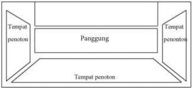

> **Deskripsi Visual:** Gambar ini adalah ilustrasi yang menunjukkan struktur panggung teater. Gambar ini terdiri dari empat bagian utama:

1. **Tempat Penonton**: Terdapat dua ruang penonton di sisi kanan dan kiri panggung, dengan ruang tengah yang lebih besar yang merupakan panggung.

2. **Panggung**: Ruang tengah yang lebih besar yang berfungsi sebagai area untuk penampilan teater.

3. **Tempat Penonton**: Kedua ruang penonton di sisi panggung, satu di setiap sisi.

4. **Teks, Angka, atau Label Penting**: Tidak ada teks, angka, atau label spesifik yang terlihat pada gambar ini.

Informasi kunci yang dapat diambil pembaca melalui gambar ini adalah bahwa struktur panggung teater terdiri dari dua ruang penonton di setiap sisi dan satu ruang panggung yang lebih besar di tengah. Ini menunjukkan konsep dasar dari desain panggung teater tradisional.

- c). Tempat pertunjukan musik bentuk arena, bentuk ini memerlukan tempat yang  luas,  penonton  dapat  melihat  tontonannya  dari  empat  penjuru. Adapun  keuntungan  dan  kerugiannya  sama  dengan  pertunjukan  musik setengah arena.

---
**🖼️ Gambar/Diagram**

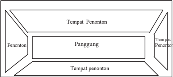

> **Deskripsi Visual:** Gambar ini adalah diagram yang menunjukkan struktur teater tradisional Jawa. Diagram ini terdiri dari empat bagian utama:

1. **Tempat Penonton**: Tempat penonton diletakkan di bagian atas diagram, di sebelah kanan dan kiri.

2. **Panggung**: Dalam diagram ini, panggung berada di tengah-tengah, di antara tempat penonton.

3. **Tempat Penonton**: Ada dua tempat penonton di sisi bawah diagram, satu di setiap sisi.

4. **Penonton**: Di bagian tengah panggung, terdapat penonton yang menghadap ke panggung.

Elemen-elemen utama ini saling terhubung melalui relasi horizontal dan vertikal. Diagram ini menunjukkan bahwa penonton berada di depan panggung, sedangkan tempat penonton berada di sisi panggung.

Teks, angka, atau label penting yang terlihat pada gambar ini tidak ada, karena gambar hanya berupa diagram saja tanpa teks atau angka tambahan.

Informasi kunci yang dapat diambil pembaca dari gambar ini adalah bahwa struktur teater tradisional Jawa memiliki tiga tempat penonton di sisi panggung dan satu tempat penonton di depan panggung.

### e.  Membentuk Organisasi

Jika kita melaksanakan suatu kegiatan tentunya memerlukan suatu wadah, demikian  juga    pada  pergelaran  musik,  tentu  saja  yang  dibutuhkan  adalah suatu organisasi.

 

---
## 📄 Halaman 104

### Apa yang dimaksud dengan organisasi?

Organisasi adalah kesatuan antara orang-orang yang bekerja sama untuk mencapai satu tujuan secara bersama yang terikat oleh aturan-aturan.

Apabila kamu sudah memahami hal di atas, maka akan dengan mudah kita  melaksanakannya.  Hal  yang  terpenting  dalam  suatu  organisasi  adalah orang-orang yang berada di dalamnya, mampu memahami dan melaksanakan tugas yang dibebankannya sesuai dengan kapasitasnya. Bagaimanapun yang bertanggung jawab atas sukses dan tidaknya suatu kegiatan.

### 1)    Fungsi Organisasi

Organisasi merupakan suatu alat mengoordinasikan, mengarahkan  dari beberapa  potensi  yang  dimiliki  dari  unsur-unsur  lain,  sehingga  mencapai satu  tujuan  dan  mencapai  kata  mufakat  dalam  melaksanakan  perencanaan yang telah ditentukan sebelumnya.

### 2)   Prinsip dalam Organisasi

Berikut beberapa prinsip dalam organisasi.

- Tujuan organisasi harus jelas dan nyata.
- Pembagian tugas harus jelas dan sesuai dengan kemampuannya.
- Adanya pembagian dan pemindahan tanggung jawab.
- Pengawasan.
- Satu kesatuan perintah dan tujuan.
- Organisasi harus fl eksibel.

### f.   Menyusun Kepanitiaan

Keberadaan  panitia  di  dalam  suatu  pertunjukan  musik  sangat  penting, karena dari masing-masing bagian mempunyai  tugas yang mesti dipertanggungjawabkan agar pertunjukan musik berjalan sesuai dengan yang direncanakan.  Dalam  penyusunan  kepanitiaan  harus  disesuaikan  dengan situasi dan kondisi.

Adapun  susunan  kepanitiaan  itu  pada  umumnya  terdiri  dari  beberapa kelompok, seperti penasihat, penanggung jawab, ketua pelaksana, sekretaris, bendahara, dan seksi-seksi.

 

---
## 📄 Halaman 105

Untuk lebih jelas mengenai fungsi dari masing-masing komponen tersebut, simaklah penjelasan berikut.

### 1)    Penasihat

Biasanya ditunjuk orang yang dianggap paling mampu dalam menyelesaikan permasalahan dan diharapkan mampu memberikan tuntunan, arahan dan motivasi kepada semua panitia dalam melaksanakan tugas.

Biasanya tugas yang diberikan pada seorang penasihat antara lain.

- Menerima laporan tentang rencana yang akan dilaksanakan.
- Mengevaluasi kerja yang dilakukan.
- Memecahkan permasalahan yang ada dalam organisasi.
- Ikut bertanggung jawab dalam jalannya pergelaran.

### 2)    Penanggung  jawab

Orang yang menjadi penanggung jawab harus seorang pucuk pimpinan, minimal yang  menjadi wakil, hal ini harus dapat memantau semua pekerjaan yang dilakukan secara rutin. Penanggung jawab boleh juga mewakili penasihat, jika penasihat ada suatu masalah yang mendadak.

### 3)   Ketua

Ketua adalah orang yang diharapkan dapat mengatur jalannya organisasi, mampu  memecahkan  berbagai  permasalahan  yang  terdapat  pada  saat-saat pertunjukan  musik  berlangsung,  memiliki  sifat  kepemimpinan  yang  tegas, jujur , sabar, dan bijaksana. Seorang ketua harus mampu berkomunikasi dan bekerja  sama  dengan  berbagai  pihak  serta  memiliki  rasa  tanggung  jawab terhadap tugas dan kewajiban yang telah menjadi garapannya. Adapun tugas seorang ketua antara lain:

- Membuat proposal;
- Sebagai narasumber dan fasilitator;
- Memimpin rapat pada saat-saat tertentu;
- Membuat laporan pertanggungjawaban;

### 4)   Sekretaris

Sekretaris  adalah  orang  yang  bertugas  sebagai  pencatat  data,  selain sebagai  pencatat data  juga  sebagai pendamping ketua dalam rapat. Selain itu, sekretaris juga sebagai pembuat surat-surat  pemberitahuan kepada pihak-

 

---
## 📄 Halaman 106

pihak yang bersangkutan pada kegiatan pergelaran. Sekretaris juga harus dapat membuat pengarsipan  surat-surat  penting  dan  menyusunnya  sesuai  dengan tanggal waktu pengeluaran surat  secara tersusun dan teratur. Selain itu  harus mengetahui isi surat yang dikirimkan kepada orang lain, mengetahui  nomor surat, perihal, lampiran, kepada siapa surat dikirim, tempat, tanggal, waktu, dan tema.

### 5)    Bendahara

Bendahara adalah orang yang bertanggung jawab secara penuh terhadap penggunaan, penyimpanan, dan penerimaan uang yang masuk sebagai biaya pergelaran. Seorang bendahara harus jujur, cermat, sabar, dan tidak boros.

### 6)    Seksi-seksi

Seksi-seksi  adalah  bagian  dari  kepanitiaan  yang  bertugas  mengurus sesuatu  yang  spesi fi k.  Adapun  seksi-seksi  yang  bertugas  untuk  membantu pertunjukan  musik  agar  dapat  berjalan  sesuai  dengan  yang  direncanakan adalah sebagai berikut.

- Seksi Usaha, seksi ini berkewajiban membantu dalam pencarian dana atau sumbangan dari berbagai pihak untuk menunjang keberhasilan pertunjukan musik itu sendiri.
- Seksi  Dokumentasi, seksi ini tugasnya adalah mengambil gambar untuk dokumen. Seksi ini selalu diidentikkan pada pengambilan foto, selain itu tugas yang harus dikerjakan oleh seksi ini sebagai berikut:
- mengetahui susunan acara;
- mengetahui medan dari pertunjukkan musik tersebut, sehingga kalau mengambil gambar betul-betul yang  dianggap paling tepat dan indah; serta
- menyimpan hasil gambar yang akan dijadikan dokumen.
- Seksi Perlengkapan, seksi ini diperlukan banyak orang, mengingat tugas yang akan diberikannya cukup berat. Adapun tugas dari seksi ini antara lain berikut.
- Mempersiapkan tempat untuk pelaksanaan pergelaran tersebut.
- Menyusun serta menata tempat pertunjukan musik, sehingga terlihat indah  dan  e fi sien.  Penggunaannya  akan  disesuaikan  dengan  warna pertunjukan pergelaran itu sendiri.

 

---
## 📄 Halaman 108

Ketua Panitia: Tugasnya adalah mengurus segala sesuatu yang berhubungan dengan acara penampilan karya musik.

Wakil  Ketua: Tugasnya  adalah  membantu  mengurus  segala  sesuatu  yang berhubungan dengan acara penampilan karya musik.

Bendahara: Tugasnya adalah mengelola keuangan dalam kepanitiaan.

Sekretaris: Sekretaris  bertugas  mengurusi  surat-surat  baik  formal  maupun nonformal  yang  dibutuhkan  dalam  penampilan,  mencatat  hasil  dari  setiap rapat dalam rangka persiapan penampilan sampai dengan pembuatan proposal.

### Seksi-seksi:

Seksi  publikasi ,  bertugas  menyebarkan  pemberitaan  penampilan  yang  akan berlangsung. Pemberitaan dapat  berupa  brosur,  spanduk,  pengumuman secara lisan,  dan  lain  sebagainya.  Seksi  ini  juga  membuat  surat  izin  dalam mengadakan acara penampilan.

Seksi  usaha  (dana) ,  bertugas  mencari  sumber  dana  maupun  sponsor  yang diperlukan untuk kegiatan penampilan dengan menyebarkan proposal.

Seksi perlengkapan dan dekorasi, bertugas dalam persiapan panggung dengan penyusunan baik dari segi tata panggung, menghias panggung, sampai dari alat musik maupun kebutuhan materiil dari penampilan.

Seksi acara, bertugas menyusun  acara  yang  akan berlangsung  dalam penampilan  dengan  penjadwalan  yang  jelas (rundown) ,  dan  dapat  juga merangkap sebagai (Master of Ceremony).

Seksi  dokumentasi, bertugas  mengabadikan  acara  penampilan  baik  dengan menggunakan media foto maupun video dari setiap penampilan.

Seksi konsumsi, bertugas untuk menyusun daftar menu dengan menghitung jumlah yang akan mendapatkan konsumsi, baik untuk tamu undangan, peserta penampilan maupun panitia penampilan itu sendiri.

### b.  Menentukan Tema

Sebelum  menyusun  kegiatan  penampilan,  terlebih  dahulu  menentukan tema. Penentuan tema biasanya didasarkan pada jenis peristiwa atau monumental  seperti,  ulang  tahun  sekolah,  perpisahan  sekolah,  dan  lain sebagainya. Penentuan tema adalah ide dasar pokok penampilan.

 

---
## 📄 Halaman 109

Tema yang dipilih didasarkan pada aspek-aspek tertentu yang berkaitan dengan pelaksanaan penampilan karya musik, antara lain menarik perhatian pemirsa,  aktual,  disesuaikan  dengan  penyajian.  Setelah  tema  terbentuk, kemudian menyusun proposal yang memiliki banyak fungsi seperti, sumber pencarian  dana/sponsor,  pemahaman  program,  dan  rencana  pelaksanaan. Proposal  itu  sendiri  memiliki  arti  sebagai  rencana  yang  dituliskan  dalam bentuk rancangan kerja. Bentuk isi proposal terdiri dari:

- Nama kegiatan.
- Đ. Dasar pemikiran, yaitu memuat hal-hal, surat-surat keputusan.
- ď. Latar  belakang,  berisi  dasar  yang  digunakan  sehingga  ide  penampilan muncul.
- Pelaksanaan, memuat waktu pelaksanaan kegiatan meliputi hari, tanggal, waktu, dan tempat.
- Anggaran, berisi rencana anggaran yang akan digunakan selama penampilan berlangsung.
- Pelaksana, yaitu susunan kepanitiaan.
- Acara, memuat susunan acara yang akan ditampilkan.
- Penutup,  berisi  kata  penutupan.  Di  akhir  proposal  tertulis  tanda  tangan ketua panitia, sekretaris dan disetujui oleh steering comitee .
- Lain-lain, surat-surat yang mendukung pelaksanaan.

### c. Menentukan Waktu dan Tempat Penampilan Dilaksanakan

Dalam menggelar sebuah karya musik diperlukan persiapan yang baik, maka dibutuhkan adanya suatu penjadwalan. Susunan penjadwalan kegiatan penampilan, meliputi berikut.

- Menyiapkan pemain yang tampil baik individu maupun kelompok.
- Đ. Mengadakan general repletion atau gladi bersih.
- ď. Mempersiapkan jenis musik dan lagu yang akan ditampilkan.
- Melakukan checking akhir terhadap kesiapan penampilan.
- Membuat draft penampilan atau susunan acara.

### d. Pertunjukkan Musik di Kelas

### 1)  Menyusun Acara

Apabila penjadwalan penampilan telah selesai dibuat, langkah selanjutnya adalah menyusun acara penampilan. Untuk membuat susunan acara penampilan, harus diketahui dengan jelas tentang:

 

---
## 📄 Halaman 111

Bernyanyi dan bermain musik harus dapat menjiwai isi musik (lagu) seperti yang dikehendaki oleh penciptanya. Unsur-unsur dasar untuk penjiwaan suatu karya musik, seperti berikut.

- Ketetapan interpretasi terhadap tanda tempo dalam pembawaan lagu.
- Memperhatikan rhytem (ritme), yaitu ada gerak yang mengalir dengan mengetahui  bentuk-bentuk  notasi  dan  bentuk  tanda  diam  serta  tanda birama.
- Bentuk melodi yang harmoni.
- Bentuk dan pola lagu yang dinyanyikan harus sesuai atau selaras dengan karakter lagunya.
- Para penyanyi dalam pemenggalan kalimat lagu (phrasering) harus pas dan sesuai.
- Dalam bernyanyi dan memainkan musik agar ada dinamiknya.
- Setiap  membawakan  lagu,  musik  harus  ada  bagian  tertentu  yang merupakan tempat klimaks lagu.
- Bernyanyi vokal harus jelas dengan aksentuasi (tekanan suku kata) yang kuat.
- Ketepatan dalam menembak suatu nada dan pitch (tinggi  suara)  agar benar.
- Mampu membuat modi fi kasi (perubahan) tempo.
Setelah membaca, memahami, menghayati, dan mempraktikkan ungkapan tentang permasalahan di atas, maka diharapkan kamu mampu memilih sebuah karya musik kreatif dan menjelaskan kembali makna, nilai-nilai edukasi dan nilai estetik-artistik. Hal lainnya dan kemampuan pembelajaran musik kreatif tersebut  kamu  dapat  memaparkan  dan  menafsirkan  yang  berbeda  beserta contoh riil dalam pertunjukkan musik karya musik kreasi di sekolah!

Silahkan didiskusikan dengan teman-temanmu untuk membuat jawaban yang tepat. Tuliskan jawaban kamu pada lembar yang telah disediakan:

---
**📊 Tabel**

Tabel ini berisi informasi tentang tahapan kreatif dan deskripsi gagasan kreatif. Topik utamanya adalah proses kreatif dalam pembuatan ide atau konsep baru. Kolom pertama menunjukkan nomor tahapan kreatif, sementara kolom kedua menyajikan deskripsi singkat untuk setiap gagasan kreatif tersebut. Data penting yang terlihat meliputi bahwa tabel ini mungkin digunakan untuk membantu individu dalam mengembangkan ide-ide baru atau membangun konsep kreatif.

 

---
## 📄 Halaman 112

### Latihan kelompok

Pilihlah sebuah lagu daerah atau lagu Nusantara, kemudian lakukan latihan membaca  notasi  lagu  yang  sudah  dipilih  secara  berkelompok  dan  bacalah hingga  hafal.  Apabila  kelompokmu  sudah  menguasai  lagu-lagu  tersebut, kegiatan selanjutnya adalah:

- Membuat sebuah karya seni musik kreasi yang berdasarkan pada gagasangagasan musik daerah atau musik nusantara yang mewarnai budaya daerah dimana kamu tinggal! Cobalah buat musik kreatif secara berkelompok!
- Menulis karya musik kreasi yang kamu buat dalam bentuk partitur (teks lagu) dengan menggunakan notasi angka atau notasi balok!

### Tugas Kreativitas

- Cobalah buat musik kreasi secara berkelompok!
- Tampilkanlah  musik  kreasi  yang  kamu  buat  itu  di  depan  kelas!  Musik kreasi yang kamu buat sebagai salah satu tugas yang diberikan dalam mata pelajaran bidang ilmu seni budaya untuk mendorong kamu  menciptakan musik kreasi.
- Pelajarilah  dan  hayatilah  semua  materi  pembelajaran  seni  musik  di semester 2 untuk selanjutnya kamu memilih dan menentukan jenis dan bentuk seni musik apa yang akan dipertunjukkan!
Diskusikanlah  jawaban  kamu  dengan  teman-teman  kelasmu,  agar  mendapat keputusan  hasil  yang  maksimal,  dan  buatlah  laporan  tertulis  dari  hasil  diskusi tersebut!

Ulangilah  dan  nyanyikan  lagu-lagu  yang  sudah  dipelajari  dengan  selalu meningkatkan penguasaan dasar teknik bernyanyi! Hafalkanlah semua lagu yang sudah dipelajari tersebut dalam tangga nada yang sesuai dengan wilayah suara kamu, sehingga dapat menjadi perbendaharaan lagu bagi kamu.

### Format Diskusi Hasil Pengamatan Pertunjukan Seni Musik

Nama/Kelompok

: ………………………

Nomor Induk

: ………………………

Hari/Tanggal Pengamatan  : ………………………

 

---
## 📄 Halaman 113

---
**📊 Tabel**

Tabel ini menunjukkan hasil diskusi tentang aspek-aspek tertentu yang diamati dalam sebuah studi atau penelitian. Topik utama tabel adalah "Hasil Diskusi", yang mencakup empat kolom berbeda: No., Aspek Yang Diamati, dan Deskripsi Hasil Diskusi. Setiap baris pada tabel tersebut mewakili satu aspek yang diamati, dengan deskripsi singkat tentang hasil diskusi yang dilakukan terkait aspek tersebut. Data penting yang terlihat dalam tabel ini adalah bahwa setiap aspek yang diamati memiliki deskripsi yang spesifik, menunjukkan bahwa diskusi ini fokus pada detail dan detail dalam penelitian atau studi tersebut.

### Kreativitasku dan Penugasan

Setelah kamu membaca pandangan di atas, silahkan didiskusikan pemahaman tersebut, kemudian paparkan apa yang telah kamu tulis pada tabel berikut!

### Format Diskusi Hasil Pengamatan

Nama/Kelompok

: ………………………

Nomor Induk

: ………………………

Hari/Tanggal Pengamatan

: ………………………

Karakter Tugas

: ………………………

---
**📊 Tabel**

Tabel ini berisi informasi tentang aspek-aspek yang diamati dalam konteks musik, dengan fokus pada individu dan kelompok. Topik utama adalah "Aspek yang Diamati" dan "Deskripsi Temuan". Kolom "Individu" dan "Kelompok" menunjukkan bagaimana temuan-temuan tersebut dianalisis untuk individu dan kelompok masing-masing. Data penting yang terlihat meliputi makna musik, pengalaman bermusik, unsur musik, dan pembelajaran dan pelatihan kegiatan bermusik. Ini menunjukkan bahwa tabel ini bertujuan untuk membandingkan dan memahami perbedaan antara individu dan kelompok dalam konteks musik.

Setelah  melakukan  pengamatan  terhadap  keseluruhan  bahasan  tentang pertunjukan musik kreasi, dalam berkreativitas musik, pengalaman bermusik, pembelajaran dan pelatihan kegiatan musik kreasi, maka kegiatan selanjutnya kamu  harus  mendeskripsikan  pemahaman  tentang  konsep  gagasan  musik kreasi, dan membuat kritikan terhadap pertunjukan musik kreasi yang ditulis dalam bentuk laporan karya musik sebagai bentuk penilaian portofolio yang menjadi salah satu sasaran dalam pembelajaran seni budaya.

Isilah  tabel  berikut  dari  hasil  analisis  dari  pertunjukan  musik  kreasi  hasil kreativitas yang anda lakukan!

 

---
## 📄 Halaman 114

---
**📊 Tabel**

Tabel ini berisi informasi tentang konsep pertunjukan musik kreasi, tahapan pertunjukan musik kreasi, pengalaman bermusik, aspek musikal, dan gambar pertunjukan musik kreasi. Topik utamanya adalah tentang bagaimana musik kreasi dapat diperkenalkan dan diimplementasikan dalam berbagai tahap dan konteks. Kolom-kolomnya mencakup konsep pertunjukan musik kreasi, tahapan pertunjukan musik kreasi, pengalaman bermusik, aspek musikal, dan gambar pertunjukan musik kreasi. Data atau pola penting yang terlihat adalah bahwa setiap baris tabel menunjukkan informasi tentang satu konsep pertunjukan musik kreasi, termasuk tahapannya, pengalaman bermusiknya, aspek-aspek musiknya, dan gambaran visual dari pertunjukan tersebut. Ini membantu dalam memahami bagaimana musik kreasi dapat diterapkan dan diimplementasikan dalam berbagai situasi dan konteks.

 

---
## 📄 Halaman 115

No.

### Pernyataan

1.

- Saya mengamati contoh yang diberikan oleh guru dengan cermat.
2.

Saya mencoba meniru contoh yang diberikan oleh guru.

3.

Saya berusaha menguasai seluruh materi pelajaran.

4.

- Saya mengajukan pertanyaan jika ada yang tidak saya pahami.
5.

Saya berperan aktif dalam kelompok.

6.

Saya berusaha untuk berani mengemukakan pendapat.

7.

Saya berusaha bekerja sama dengan baik dalam kelompok.

8.

Saya menghargai permainan musik yang dilakukan kelompok lain.

9.

Saya menghormati dan menghargai guru.

10.

Saya menghormati dan menghargai pendapat teman atas permainan saya, baik secara perorangan maupun dalam kelompok.

 

---
## 📄 Halaman 119

---
**🖼️ Gambar/Diagram**

> **Deskripsi Visual:** Gambar tersebut adalah diagram yang menunjukkan struktur evaluasi dalam pembelajaran tari. Diagram ini terdiri dari empat bagian utama yang terhubung oleh garis双向 (dual-way) untuk menunjukkan hubungan antara elemen-elemen evaluasi. 

1. **Apa yang Ditampilkan Secara Keseluruhan**: Gambar ini menunjukkan struktur evaluasi yang melibatkan evaluasi rancangan materi, membuat deskripsi karya tari, dan evaluasi tugas dan tanggung jawab bidang.

2. **Elemen-Elemen Utama dan Relasinya**: 
   - **Evaluasi Rancangan Materi Pergelaran Tari** merupakan bagian utama pertama yang berada di bagian atas.
   - **Membuat Deskripsi Karya Tari** berada di bawah Evaluasi Rancangan Materi Pergelaran Tari.
   - **Evaluasi Tugas dan Tanggung Jawab Bidang** berada di bawah Membuat Deskripsi Karya Tari.
   - Semua elemen ini terhubung oleh garis双向 (dual-way), menunjukkan bahwa setiap elemen memiliki hubungan dengan elemen lainnya dalam proses evaluasi.

3. **Teks, Angka, atau Label Penting yang Terlihat**: 
   - **Evaluasi Rancangan Materi Pergelaran Tari** ditulis dalam huruf besar dan berwarna merah.
   - **Membuat Deskripsi Karya Tari** ditulis dalam huruf besar dan berwarna biru.
   - **Evaluasi Tugas dan Tanggung Jawab Bidang** ditulis dalam huruf besar dan berwarna hijau.
   - Garis双向 (dual-way) yang menghubungkan semua elemen ini.

4. **Informasi Kunci yang Dapat Diambil Pembaca**: 
   - Struktur evaluasi dalam pembelajaran tari terdiri dari evaluasi rancangan materi, membuat deskripsi karya tari, dan evaluasi tugas dan tanggung jawab bidang.
   - Setiap elemen memiliki hubungan dengan elemen lainnya dalam proses evaluasi.
   - Warna-warna yang digunakan untuk menandai setiap elemen membantu pembaca membedakannya dengan jelas.

D

 

---
## 📄 Halaman 121

---
**🖼️ Gambar/Diagram**

> **Deskripsi Visual:** Gambar ini adalah foto yang menampilkan dua orang tari tradisional berdiri di depan pohon besar. Mereka mengenakan pakaian tradisional dengan warna-warna cerah, seperti biru dan merah, serta baju dengan detail batik. Kedua orang tampak senang dan aktif dalam tarian mereka, dengan posisi tubuh yang menunjukkan gerakan ritmis. Pohon besar di latar belakang memberikan suasana alam yang tenang dan sejuk. Gambar ini mungkin digunakan untuk membantu pembaca memahami dan melihat tarian tradisional dari suatu budaya tertentu.

---
**🖼️ Gambar/Diagram**

> **Deskripsi Visual:** Gambar ini adalah foto yang menunjukkan dua orang tari tradisional berdiri di depan pohon besar. Keduanya mengenakan pakaian tradisional dengan warna-warna cerah, termasuk baju biru dan merah muda serta celana hitam. Mereka tampak sedang melakukan gerakan tari yang serasi, dengan kedua tangan mereka berada di dekat kepala mereka. Latar belakangnya adalah taman hijau dengan tanaman besar dan pohon besar yang menjulang tinggi. Gambar ini menunjukkan keindahan dan kekayaan budaya tradisional melalui tarian yang dilakukan oleh dua orang yang terlihat sangat senang dan bersemangat.

 

---
## 📄 Halaman 122

---
**🖼️ Gambar/Diagram**

> **Deskripsi Visual:** Gambar ini adalah foto yang menunjukkan seorang penari tradisional berdiri di atas panggung. Penari tersebut mengenakan pakaian tradisional dengan warna-warna cerah, termasuk hijau, merah, dan kuning. Penari tersebut tampak senang dan berpose dengan tangan di samping tubuhnya. Latar belakangnya adalah dinding hitam yang memberikan kontras yang kuat dengan penampilan penari. Teks, angka, atau label penting tidak terlihat pada gambar ini. Informasi kunci yang dapat diambil pembaca adalah bahwa gambar ini mungkin digunakan untuk membantu pembelajaran tentang budaya atau seni tradisional.

 

---
## 📄 Halaman 123

---
**📊 Tabel**

Tabel ini berisi informasi tentang tarian-tarian dan asal daerah mereka. Topik utamanya adalah tentang budaya dan tradisi masyarakat Indonesia. Kolom "No." digunakan untuk menandai baris, sedangkan kolom "Nama Tarian" menyajikan nama-nama tarian yang berbeda-beda, sementara kolom "Asal Daerah" memberikan informasi tentang daerah asal setiap tarian tersebut. Dari tabel ini, kita dapat melihat bahwa banyak tarian memiliki asal daerah yang berbeda, menunjukkan keberagaman budaya di Indonesia.

 

---
## 📄 Halaman 125

---
**🖼️ Gambar/Diagram**

> **Deskripsi Visual:** Gambar ini adalah ilustrasi yang menunjukkan seorang karakter dengan busana berwarna ungu dan putih. Karakter tersebut memiliki rambut panjang dan berwarna hitam, serta mengenakan topi berwarna biru dengan detail emas. Karakter tersebut tampak sedang berdiri dengan posisi tubuh yang tegar, tangan di depan tubuh dan kaki di bawah.

Elemen utama dalam gambar ini adalah karakter yang diperlihatkan dalam busana yang elegan dan topi yang menarik perhatian. Relasi antara elemen-elemen ini adalah bahwa karakter tersebut tampak seperti seseorang yang berada dalam situasi formal atau resmi, mungkin sebagai tokoh dalam cerita atau fiksi.

Teks, angka, atau label penting tidak terlihat pada gambar ini. Namun, informasi kunci yang dapat diambil pembaca adalah bahwa gambar ini mungkin digunakan untuk membantu penjelasan tentang busana atau topi dalam konteks fiksi atau literatur.

Dalam satu paragraf yang informatif, gambar ini menunjukkan seorang karakter yang diperlihatkan dalam busana berwarna ungu dan putih, dengan topi berwarna biru dan detail emas. Karakter tersebut tampak sedang berdiri dengan posisi tubuh yang tegar, tangan di depan tubuh dan kaki di bawah. Elemen utama dalam gambar ini adalah karakter tersebut, yang diperlihatkan dalam busana yang elegan dan topi yang menarik perhatian. Relasi antara elemen-elemen ini adalah bahwa karakter tersebut tampak seperti seseorang yang berada dalam situasi formal atau resmi, mungkin sebagai tokoh dalam cerita atau fiksi. Teks, angka, atau label penting tidak terlihat pada gambar ini, namun informasi kunci yang dapat diambil pembaca adalah bahwa gambar ini mungkin digunakan untuk membantu penjelasan tentang busana atau topi dalam konteks fiksi atau literatur.

---
**🖼️ Gambar/Diagram**

> **Deskripsi Visual:** Gambar ini adalah ilustrasi yang menunjukkan dua karakter tari tradisional. Kedua karakter tersebut memiliki penampilan yang serupa, dengan rambut berwarna biru dan hijau, serta pakaian berwarna ungu dan putih. Karakter pertama sedang berdiri dengan posisi tangan di atas kepala, sementara karakter kedua sedang berdiri dengan posisi tangan di depan tubuh. Ilustrasi ini mungkin digunakan untuk menggambarkan tarian tradisional atau upacara budaya tertentu.

 

---
## 📄 Halaman 126

---
**🖼️ Gambar/Diagram**

> **Deskripsi Visual:** Gambar ini adalah ilustrasi yang menunjukkan seorang penari tarian tradisional Asia. Penari tersebut mengenakan pakaian tradisional berwarna ungu dengan detail hijau dan putih, serta topi berwarna biru dengan perhiasan. Penari sedang berpose dengan tangan di atas kepala dan lutut di bawah, menunjukkan gerakan tarian yang elegan dan indah. Ilustrasi ini mungkin digunakan untuk membantu pembaca memahami tari tradisional atau bagaimana penari melakukan gerakan tertentu dalam tarian.

 

---
## 📄 Halaman 128

---
**🖼️ Gambar/Diagram**

> **Deskripsi Visual:** Gambar ini adalah diagram yang menunjukkan struktur organisasi tim tari. Diagram ini terdiri dari empat level, masing-masing bertanggung jawab atas manajemen peregelaran tari. Pada level pertama ada Tim Produksi dan Tim Artistik, yang bertanggung jawab atas manajemen produksi dan artistik. Di bawah mereka ada Kelompok Kerja, yang bertanggung jawab atas manajemen peregelaran tari secara keseluruhan. Terakhir ada Tim House Manager, yang bertanggung jawab atas manajemen peregelaran tari secara umum. Jelas bahwa setiap level memiliki tanggung jawab spesifik dan saling bekerja sama untuk mencapai tujuan organisasi.

 

---
## 📄 Halaman 134

---
**🖼️ Gambar/Diagram**

> **Deskripsi Visual:** Gambar ini adalah diagram yang menunjukkan struktur kritik tari dalam sebuah buku pelajaran. Diagram ini terdiri dari dua bagian utama: "Pengertian, Fungsi, dan Tujuan Kritik Tari" dan "Menilai Karya Tari". Untuk setiap subtopik, ada dua poin yang disebutkan: "Menilai Karya Tari" dan "Menulis Kritik Tari".

Elemen utama dalam diagram ini adalah topik-topik utama yang disebutkan dalam teks, yaitu "Pengertian, Fungsi, dan Tujuan Kritik Tari" dan "Menilai Karya Tari" serta "Menulis Kritik Tari". Relasi antara elemen-elemen ini adalah bahwa setiap topik utama memiliki dua poin yang disebutkan sebagai subtopik.

Teks penting dalam diagram ini meliputi nama-nama topik dan subtopik yang disebutkan dalam diagram tersebut. Informasi kunci yang dapat diambil pembaca meliputi struktur kritik tari dalam buku pelajaran ini, yang mencakup pengertian, fungsi, tujuan, menilai karya tari, dan menulis kritik tari.

 

---
## 📄 Halaman 135

 

---
## 📄 Halaman 136

Sumber: Dokumen Penulis

---
**🖼️ Gambar/Diagram**

> **Deskripsi Visual:** Gambar ini adalah ilustrasi yang menunjukkan tarian tradisional. Dalam gambar tersebut, ada empat orang tari yang mengenakan pakaian tradisional dengan warna merah dan oranye. Mereka sedang berdiri di atas karpet hijau, masing-masing memegang senjata tradisional mereka. Di sebelah kiri, ada dua orang yang sedang berjalan, sementara dua orang lainnya berdiri tegak. Latar belakangnya adalah area berlubang dengan tanaman hijau dan bangunan kecil. Gambar ini menunjukkan tarian tradisional yang serasi dengan latar belakang alam.

Sumber: Dokumen Penulis Gambar 14.3 Tari Piring

 

---
## 📄 Halaman 137

---
**🖼️ Gambar/Diagram**

> **Deskripsi Visual:** Gambar ini adalah foto yang menunjukkan seorang pria tua sedang berpose dengan tangan di depannya. Pria tersebut mengenakan pakaian tradisional yang mencakup baju biru dengan lengan panjang dan topi berwarna putih. Latar belakang tampak gelap, mungkin di sebuah panggung atau ruangan yang lebih besar. Pria tersebut tampak tenang dan berpose dengan cara yang menunjukkan kepercayaan diri atau keberanian. 

Elemen utama dalam gambar ini adalah pria tua yang berpose dengan tangan di depannya. Topi yang ia kenakan menunjukkan bahwa dia mungkin memiliki latar belakang atau identitas tertentu. Warna biru pada pakaian membuat gambar menjadi lebih menarik dan menunjukkan warna dominan dalam gambar.

Teks, angka, atau label penting tidak ada dalam gambar ini. Namun, informasi kunci yang dapat diambil dari gambar ini adalah bahwa pria tua tersebut tampak tenang dan berpose dengan cara yang menunjukkan kepercayaan diri atau keberanian. Ini mungkin merupakan bagian dari sebuah presentasi atau acara yang lebih besar.

 

---
## 📄 Halaman 138

---
**🖼️ Gambar/Diagram**

> **Deskripsi Visual:** Gambar ini adalah ilustrasi yang menunjukkan dua orang tari tradisional. Mereka berdiri dengan posisi yang menunjukkan gerakan tari yang kuat dan dramatis. Keduanya mengenakan pakaian tradisional yang berwarna merah dan biru dengan detail yang rumit, mencerminkan keunikan budaya mereka. Pakaian mereka melibatkan baju panjang, celana pendek, dan topi tradisional. Mereka juga menggunakan aksesori seperti topeng dan perhiasan yang menambah keindahan dan keunikan penampilan mereka.

Elemen-elemen utama dalam gambar ini adalah dua orang tari tradisional, pakaian mereka, dan aksesoris mereka. Hubungan antara elemen-elemen ini adalah bahwa mereka saling mendukung dan memperkuat penampilan mereka sebagai tari tradisional. Pakaian mereka yang berwarna-warni dan detailnya menunjukkan kekayaan budaya mereka, sementara aksesoris mereka menambahkan sentuhan unik dan dramatis pada penampilan mereka.

Teks, angka, atau label penting yang terlihat dalam gambar ini adalah tidak ada. Informasi kunci yang dapat diambil pembaca adalah tentang tari tradisional dan budaya mereka, serta penampilan mereka yang dramatis dan indah.

1 ）

---
**📊 Tabel**

Tabel ini berisi informasi tentang aspek-aspek yang diamati dalam sebuah pengamatan, dengan fokus pada bentuk gerak, busana, riasan, dan asal tarian. Topik utama tabel ini adalah pengamatan dan analisis aspek-aspek tersebut. Kolom "No" menunjukkan urutan atau nomor pengamatan, sedangkan kolom "Aspek yang Diamati" menyatakan jenis aspek yang diamati dalam pengamatan tersebut. Kolom "Uraian Hasil Pengamatan" menyediakan detail tentang apa yang diamati, seperti bentuk gerak, busana, riasan, dan asal tarian. Data penting yang terlihat dalam tabel ini adalah bahwa pengamatan ini melibatkan empat aspek yang berbeda, yaitu bentuk gerak, busana, riasan, dan asal tarian, yang menunjukkan bahwa pengamatan ini mencakup berbagai aspek yang relevan dalam studi tari.

 

---
## 📄 Halaman 140

karya tari yang ditampilkan secara utuh. Adapun penyajian tari secara utuh akan  terkait  dengan  masalah  musik,  tata  busana,  tata  rias,  tata  pentas,  tata lampu, artistik, penyelenggaraan pertunjukan, nilai, dan pesan dalam materi pertunjukan  tari,  serta  masalah  lainnya  yang  selalu  berkaitan  erat  dengan pertunjukan tari.

Untuk  dapat  menilai  karya  tari  diperlukan  kepekaan  pengamatan  yang memerlukan konsentrasi. Oleh karena itu, diperlukan latihan dan belajar secara bertahap. Tahap pertama dimulai dengan menjadi apresiator atau pengamat seni  yang  baik  dengan  mencermati suatu peristiwa seni pertunjukan secara menyeluruh. Selanjutnya, coba kamu perhatikan dan diskusikan dengan teman kelompok belajar kamu mengenai gambar peristiwa pertunjukan tari di bawah ini. Beberapa hal yang perlu didiskusikan, sebagai berikut.

- Perhatikan dengan cermat dan baik tentang jenis pertunjukan tari dalam gambar.
- Perhatikan dengan cermat dan baik tentang unsur-unsur dalam pertunjukan tari pada gambar.
- Perhatikan  pula  tentang  adanya  nilai  estetika,  nilai  etis,  dan  nilai  sosial dalam materi tari yang dipertunjukan.
- Cobalah  kamu  rinci  setiap  bagian  yang  kamu  amati  dari  gambar  sesuai dengan petunjuk kerja pada nomor 1, 2, dan 3.
Perhatikan dan amatilah gambar di bawah ini dan jelaskan mengenai gambar tersebut!

---
**🖼️ Gambar/Diagram**

> **Deskripsi Visual:** Gambar ini adalah ilustrasi yang menunjukkan pertunjukan seni tradisional di alam terbuka. Ilustrasi ini menampilkan beberapa penari wanita berdiri di atas tanah yang tampak seperti tanah liat, dengan latar belakang yang menunjukkan struktur kayu dan pohon. Penari-penari tersebut mengenakan pakaian tradisional dengan warna-warna cerah, dan mereka tampak sedang melakukan tarian yang serasi dengan musik. Ilustrasi ini menunjukkan hubungan antara penari dan alam sekitar mereka, serta menunjukkan keindahan dan keharmonisan dalam pertunjukan seni tradisional.

Gambar 14.7 Pertunjukan Tari Kontemporer

 

---
## 📄 Halaman 141

---
**🖼️ Gambar/Diagram**

> **Deskripsi Visual:** Gambar ini menunjukkan sebuah pertunjukan teater yang menampilkan dua karakter utama yang berdiri di tengah panggung, sementara sekelompok penari wanita berdiri di sekitar mereka. Karakter utama tampak berbicara atau berinteraksi dengan penari wanita, yang tampaknya berada dalam posisi yang menunjukkan kekuatan atau kekuasaan. Penari wanita tersebut mengenakan pakaian tradisional dengan warna-warna cerah dan berpose dengan tangan di atas kepala mereka, menunjukkan keberanian atau keberanian. Latar belakang panggung terlihat sederhana dengan beberapa struktur kayu dan lampu yang menyala, menciptakan suasana dramatis. Teks, angka, atau label penting tidak terlihat dalam gambar ini. Informasi kunci yang dapat diambil pembaca adalah bahwa ini adalah pertunjukan teater yang menampilkan drama atau konflik antara dua karakter utama.

Gambar 14.8 Pertunjukan Tari Kontemporer

---
**🖼️ Gambar/Diagram**

> **Deskripsi Visual:** Gambar ini adalah ilustrasi yang menunjukkan pertunjukan drama tari tradisional dengan judul "Pergelaran Drama Tari Nyo Pohaci 'Sanghyung 3n'". Gambar ini menggambarkan tiga penari yang sedang berperan dalam sebuah adegan yang menunjukkan keindahan dan kekayaan budaya tradisional.

Elemen utama dalam gambar ini meliputi tiga penari yang memerankan peran dalam drama tari. Mereka dikenakan pakaian tradisional yang indah dengan warna-warna cerah dan detail yang rumit. Penari di tengah menggenggam sebuah topeng besar yang menunjukkan kepentingannya dalam adegan tersebut. Di sebelah kiri, ada dua penari lain yang juga memakai pakaian tradisional yang menarik perhatian.

Teks pada gambar ini tidak terlihat secara langsung, tetapi judul "Pergelaran Drama Tari Nyo Pohaci 'Sanghyung 3n'" memberikan informasi tentang konten gambar tersebut. Ini menunjukkan bahwa gambar ini mungkin merupakan bagian dari buku pelajaran atau sumber daya edukatif yang membahas tentang pertunjukan drama tari tradisional.

Informasi kunci yang dapat diambil pembaca dari gambar ini adalah bahwa pertunjukan ini menunjukkan keindahan dan kekayaan budaya tradisional Indonesia, serta pentingnya drama tari sebagai bagian dari warisan budaya nasional.

 

---
## 📄 Halaman 142

---
**🖼️ Gambar/Diagram**

> **Deskripsi Visual:** Gambar ini adalah ilustrasi yang menampilkan dua karakter animasi bermain musik. Karakter pertama adalah seorang wanita dengan rambut panjang, pakaian casual, dan sepatu hak tinggi. Karakter kedua adalah seorang pria dengan rambut pendek, pakaian kasual, dan sepatu hak tinggi. Keduanya sedang berdiri di atas lantai yang berwarna ungu, dengan latar belakang yang lebih gelap dan berwarna hitam. Di depan mereka ada sebuah kursi berwarna putih dengan desain klasik. Karakter wanita sedang memegang mikrofon dan menggoyang kepala, sementara karakter pria sedang memegang gitar dan menggoyang tubuhnya. Ilustrasi ini menunjukkan suasana yang energetis dan menyenangkan, mungkin dalam konteks pertunjukan atau acara hiburan.

Sumber: Dokumen Penulis

Gambar 14.10 Pertunjukan Tari Manca Negara

### Diskusikan  bersama  dengan  teman-teman  kamu  dan  isilah  kolom dibawah ini

### Format Diskusi Hasil Pengamatan

Nama Siswa

: …………………..................................

NIS

: …………………..................................

Hari/Tanggal Pengamatan

: …………………..................................

---
**📊 Tabel**

Tabel ini berisi informasi tentang pengamatan terhadap tariwan, dengan kolom "Gambar No" untuk menunjukkan nomor gambar, kolom "Aspek yang Diamati" untuk menunjukkan aspek-aspek yang diamati, dan kolom "Uraian Hasil Pengamatan" untuk menyajikan hasil pengamatan. Topik utama tabel ini adalah pengamatan terhadap tariwan, termasuk bentuk gerak, busana, rias, dan asal tarian mereka. Data penting yang terlihat adalah bahwa pengamatan dilakukan pada tariwan yang memiliki busana tradisional, menggunakan rias yang khas, dan memiliki asal tarian tertentu. Ini menunjukkan bahwa pengamatan ini bertujuan untuk memahami dan merekam aspek-aspek kultural yang penting dalam tariwan tersebut.

 

---
## 📄 Halaman 144

### 3. Interpretasi

Tahapan  interpretasi  adalah  tahapan  mencoba  memberikan  penekanan masalah  makna  dari  simbol-simbol  yang  teramati  berdasarkan  peristiwa pertunjukan dari semua aspek pendukung pertunjukan. Pada bagian ini dapat didekati dengan persoalan kajian nilai etetika tari, nilai etis, dan nilai sosial pada materi karya tari yang diamati.

### 4. Evaluasi

Tahapan evaluasi adalah tahapan tentang bagaimana sebaiknya kualitas karya tari yang dianggap ideal menurut kita. Di tahap ini, kita dapat memberikan analisis setelah menemukan kelemahan dalam pertunjukan.

### 5. Terakhir

Pada bagian terakhir dapat ditambahkan tentang pernyataan sikap yang menyangkut kesan dan pesan dari  penulis  dari  apa  yang  telah  dilihat  dan dideskripsikan ke dalam tulisan kritik tari.

Berdasarkan  beberapa  tahapan  penulisan  kritik tari tersebut, dapat dikembangkan beberapa pertanyaan mendasar untuk memudahkan kita dalam menuangkannya ke dalam tulisan.

### 1. Tahapan Pendeskripsian

- Apa judul karyanya?
- Siapa koreografernya?
- Siapa panitia penyelenggaranya?
- Di mana tempatnya?
- Tanggal berapa pertunjukannya?
- Apa tema kegiatannya?
- Berapa penari yang telibat?
- Apa nama/jenis tarian yang dibawakan?
- Bagaimana gerak yang dilakukan?
- Dari daerah mana tarian tersebut?
- Bagaimana konsep musik yang ditampilkan?
- Bagaimana tata pentas yang ditampilkan?
- Bagaimana tata cahaya yang ditampilkan?
- Bagaimana kostum yang dikenakan?
- Apa riasan yang digunakan?
- Bagaimana kualitas penari?
- Bagaimana kekompakan penari?
- Dan lain lain.

 

---
## 📄 Halaman 145

### 2. Tahapan Analisis

- Bagaimana konsep gerak yang ditampilkan berdasarkan pendekatan nilai estetika gerak?
- Bagaimana konsep musik yang ditampilkan berdasarkan pendekatan nilai estetika musik?
- Apa kelemahan dan kelebihan dari karya tari yang disaksikan?

### 3. Tahapan Interpretasi

Pada tahap interprestasi dapat dikembangkan dengan beberapa pertanyaan berikut.

- Apa saja simbol yang terdapat dalam pertunjukan?
- Apa saja nilai yang ditemukan dalam pertunjukan?
- Apa pesan moral yang diperoleh dari penyajian?

### 4. Tahapan Evaluasi

- Apa yang perlu diperhatikan dari bentuk dan struktur penyajian secara keseluruhan?
- Bagaimana sebaiknya untuk menutupi kelemahan bagian pertunjukan?

### 5. Tahapan Memberikan Kesan atau Pernyataan Sikap

- Bagaimana kesan yang diperoleh setelah pertunjukan tari diapresiasi?
- Apa kesan yang diperoleh dari karya tari yang diamati?
Kegiatan pembelajaran selanjutnya adalah coba kamu bentuk kelompok belajar untuk mendiskusikan tentang menulis kritik tari. Carilah objek materi pertunjukan seni tari yang dapat diperoleh dari berbagai media informasi atau menyaksikan langsung pertunjukan tari  di  daerah  kamu  untuk  kamu  amati secara cermat pertunjukan tersebut. Buatlah tulisan ulasan materi pertunjukan tersebut berdasarkan prinsip dasar dalam membuat tulisan kritik tari.

 

---
## 📄 Halaman 146

---
**📊 Tabel**

Tabel ini berisi informasi tentang aspek-aspek yang diamati dalam sebuah penilaian tari, dengan fokus pada gerak, musik, busana, rias, artistik, pentas, lampu, estetika, etis, sosial, dan kesan. Setiap kolom menunjukkan aspek tertentu yang diperhatikan dalam pengamatan tersebut. Topik utama tabel ini adalah analisis dan penilaian tari, dengan berbagai aspek yang diukur untuk memahami kualitas dan keunikan tarian tersebut. Data penting yang terlihat adalah bahwa semua aspek tersebut diperhatikan secara menyeluruh, mencakup aspek visual, musikal, dan perilaku penari.

 

---
## 📄 Halaman 147

### No.

### Pernyataan

1.

- Saya berusaha belajar memahami tetang kritik tari dengan sungguh- sungguh.
2.

- Saya berusaha memahami tahapan-tahapan dalam melakukan kritik tari dengan sungguh-sungguh.
3.

- Saya mengikuti pembelajaran mengenai membuat tulisan kritik tari dengan penuh tanggung jawab.
4.

- Saya mengerjakan tugas yang diberikan guru tepat waktu.
5.

- Saya mengajukan pertanyaan jika ada yang tidak dipahami.
6.

- Saya berperan aktif dalam kelompok.
7.

Saya menyerahkan tugas tepat waktu.

8.

- Saya  menghargai  perbedaan  gerak  yang  terkandung  di  dalam  tari tradisional yang lain.
9.

- Saya menghormati dan menghargai orang tua.
10.

- Saya menghormati dan menghargai teman.
11.

- Saya menghormati dan menghargai guru.

 

---
## 📄 Halaman 151

---
**🖼️ Gambar/Diagram**

> **Deskripsi Visual:** Gambar ini adalah diagram yang menunjukkan struktur teater. Diagram ini terdiri dari empat baris dan tiga kolom. Baris pertama berisi nama "Teater" dan kolom-kolomnya masing-masing berisi konsep-teater, teknik penggarapan teater, prosedur kekaryaan teater, pencaiptaan karya teater, latihan teater, pergelaan teater, dan evaluasi. Setiap konsep atau teknik tersebut memiliki hubungan dengan teater sebagai unit dasar. Ini menunjukkan bahwa teater melibatkan berbagai aspek seperti konsep, teknik, prosedur, pencaiptaan, latihan, pergelaan, dan evaluasi. Diagram ini membantu dalam memahami bagaimana teater bekerja dan bagaimana setiap aspek tersebut saling berkaitan.

 

---
## 📄 Halaman 153

---
**🖼️ Gambar/Diagram**

> **Deskripsi Visual:** Gambar ini adalah ilustrasi yang menunjukkan struktur suatu ruangan atau area kerja. Berikut adalah deskripsi lengkapnya:

1. **Apa yang Ditampilkan Secara Keseluruhan**: Gambar ini menunjukkan sebuah ruangan yang terdiri dari beberapa bagian utama, yaitu drop dan wing set, border, dan apron. Drop dan wing set merupakan bagian utama yang berada di atas border, sementara border dan apron berada di bawahnya.

2. **Elemen-Elemen Utama dan Relasinya**: 
   - **Drop dan Wing Set**: Ini adalah bagian utama yang berada di atas border. Drop adalah bagian dasar yang datar, sedangkan wing set adalah bagian yang melengkung di ujungnya.
   - **Border**: Bagian ini berada di antara drop dan wing set, membentuk batas antara dua bagian tersebut.
   - **Apron**: Bagian ini berada di bawah border dan drop, membentuk dasar utama ruangan.

3. **Teks, Angka, atau Label Penting yang Terlihat**: 
   - Ada teks yang memberikan nama-nama bagian-bagian tersebut, seperti "DROP AND WING SET", "BORDER", dan "APRON".
   - Ada angka yang mungkin menggambarkan tinggi atau lebar bagian tertentu, namun tidak jelas dari gambar ini.

4. **Informasi Kunci yang Bisa Diambil Pembaca**: 
   - Gambar ini memberikan gambaran umum tentang struktur dan komponen utama suatu ruangan atau area kerja.
   - Informasi ini sangat berguna untuk memahami bagaimana bagian-bagian tersebut saling berkaitan dan bagaimana mereka bekerja bersama-sama dalam menciptakan struktur yang efektif.

Dengan demikian, gambar ini memberikan gambaran umum tentang struktur dan komponen utama suatu ruangan atau area kerja, serta bagaimana mereka saling berkaitan dalam menciptakan struktur yang efektif.

 

---
## 📄 Halaman 154

 

---
## 📄 Halaman 157

Maksudnya agar peristiwa yang terjadi di atas panggung nampak jelas di mata penonton.  Di  samping  terdapat  perbedaan  ketinggian,  juga  biasanya  antara tempat permainan dengan tempat penonton dibatasi oleh layar penutup. Layar ini berfungsi sebagai tanda dimulainya pertunjukan dengan cara dibuka, serta tanda pertunjukan berakhir dengan cara ditutup. Teknik tutup buka layar ada yang ditarik oleh petugas yang berada di samping kiri-kanan panggung, ada juga yang hidrolik, menggunakan tenaga listrik, tinggal pijit kenop saja secara otomatis  layar  akan  bergerak  menutup  atau  membuka.  Bentuk fi sik  pentas prosenium banyak terdapat di gedung-gedung pertunjukan yang biasanya di kota-kota besar. Bentuk yang kedua adalah apa yang disebut Pentas Arena atau Teater Arena.  Bentuk  pentas  ini  berbeda  dengan  bentuk  pentas  prosenium. Pentas Arena merupakan tempat terbuka, tidak ada dinding penyekat, serta tidak  ada  perbedaan  ketinggian  lantai  yang  dipergunakan  untuk  permainan dengan lantai  untuk  tempat  penonton.  Bentuknya  biasanya  tapal  kuda  atau lingkaran. Antara  pemain  dengan  penonton  tidak  terdapat  jarak.  Penonton bisa berkomunikasi langsung dengan pemain atau sebaliknya. Bentuk teater ini biasanya dipergunakan untuk pentas Teater Rakyat atau Teater Tradisional.

### Gambar Panggung Teater Arena

---
**🖼️ Gambar/Diagram**

> **Deskripsi Visual:** Gambar ini adalah ilustrasi yang menunjukkan berbagai jenis atap tradisional Jepang. Ilustrasi ini memperlihatkan empat jenis atap yang berbeda, masing-masing dengan desain dan struktur yang unik. Atap pertama memiliki atap datar dengan lapisan kayu yang rapat-rapat, sementara atap kedua memiliki atap berbentuk segitiga dengan lapisan kayu yang lebih lebar dan rata. Atap ketiga menunjukkan atap berbentuk bulat dengan lapisan kayu yang lebih tipis dan rata, sedangkan atap keempat menampilkan atap berbentuk bulat dengan lapisan kayu yang lebih tebal dan bergerigi. Setiap jenis atap memiliki elemen-elemen yang berbeda, seperti lapisan kayu, penutup atap, dan penyangga atap. Ilustrasi ini membantu pembaca untuk memahami perbedaan dan keunikan setiap jenis atap tradisional Jepang.

Sumber: http: www.lorongteatersubang.blogspot.com/201212

Gambar 15.3 Panggung Prosenium dan Teater Arena

Lingkup  kerja  yang  menjadi  tanggung  jawab  penata  pentas  adalah:  1. menata ruang untuk permainan; 2. menata cahaya untuk memberikan suasana serta menerangi permainan; 3. menata suara (agar suara vokal para pemain serta suara musik bisa terdengar jelas dan enak ditelinga penonton). Oleh karena itu, perlu ditata sedemikian rupa; 4. menata ruang tempat penonton, agar penonton

 

---
## 📄 Halaman 158

bisa menyaksikan pertunjukan dengan nyaman dan tertib, maka harus ditata dan disesuaikan dengan daya tampung ruangan yang dipergunakan: 5. menata pintu  masuk  serta  pintu  keluar  untuk  para  penonton  agar  berjalan  dengan tertib. Pada waktu penonton masuk harus dipandu oleh panitia atau seksi yang bertugas untuk menerima tamu (biasanya di ruang loby ). Kemudian dipandu dan diantar oleh petugas sampai pada tempat yang disediakan. Nah bagaimana konsep anda bilamana mau menggarap teater?

Unsur ketiga adalah pemain. Yang dimaksud dengan pemain adalah orangorang  yang  tergabung  dalam  sebuah  tim  kerja  untuk  memproduksi  karya pertunjukan. Ada  pemain  yang  muncul  di  atas  panggung  disebut  pemeran dan ada pemain yang berada di belakang layar. Walaupun tidak muncul di atas  panggung,  namun  mereka  sama-sama  memiliki  peran  penting  dalam pertunjukan. Contohnya: sutradara, penata pentas, penata musik, penata tari, serta penata-penata lainnya. Mereka ini biasanya tidak menjadi pemeran tokoh yang harus muncul di atas panggung. Kecuali dalam keadaan terpaksa karena kekurangan pemain. Namun peran mereka di belakang layar sungguh sangat penting untuk terwujudnya sebuah garapan teater. Kerja sama dalam tim harus terjalin dengan baik dari berbagai unsur, karena tanpa itu maka pertunjukan teater  tidak  akan  berjalan  dengan  lancar.  Semua  pemain  dalam  kerja  teater adalah penting.

Unsur keempat, yaitu sutradara. Orang yang pertama menemukan naskah yang  akan  digarap  dalam  bentuk  pertunjukan  adalah  sutradara.  Dia  adalah seniman penafsir pertama terhadap naskah yang akan dipentaskan. Gagasangagasannya kemudian disosialisasikan kepada calon-calon pemain atau calon-

 

---
## 📄 Halaman 159

calon penata. Sehubungan dengan sangat luasnya tugas dan tanggung jawab seorang sutradara, maka akan dibahas secara khusus pada bagian berikutnya. Dalam  karya  cipta  teater,  kahadiran  sutradara  sangat  penting.  Orang  yang pertama  menafsirkan  naskah  ke  dalam  bentuk  pertunjukan  teater  adalah sutradara.  Oleh  karena  demikian  jika  tidak  ada  sutradara,  maka  tidak  ada gagasan untuk mementaskan teater atau drama. Sehubungan bahwa sutradara adalah orang yang pertama membaca dan memahami naskah, maka sutradara dianggap  orang  yang  paling  tahu  tentang  isi  cerita  atau  naskah  yang  akan dipentaskan.  Fungsi  sutradara  dalam  karya  cipta  teater  adalah  penggagas pertama  dalam  mewujudkan  karya  pertunjukan,  penafsir  pertama  terhadap naskah yang akan digarap, serta  koordinator  dalam  melaksanakan  kerja  kolektif. Setelah memahami naskah, melalui analisis peran-peran tokoh yang terdapat dalam naskah, tempat dan waktu peristiwa, maka sutradara akan menghimpun orang-orang yang berminat untuk diajak kerja sama dalam produksi teater. Tugas yang paling berat bagi sutradara adalah mengatur laku. Tugas tersebut adalah merupakan tugas pokok bagi seorang sutradara, karena melalui para pemainlah gagasan-gagasan sutradara bisa dikomunikasikan langsung kepada penonton. Unsur kelima adalah property . Dalam permainan teater, di samping mengoptimalkan kemampuan para pemeran di bidang akting, juga dibantu oleh perlengkapan  lain  untuk  membantu  menjelaskan  maksud  yang  terkandung dalam naskah. Perlengkapan tersebut bisa berupa benda-benda yang dihadirkan di atas panggung, atau juga benda-benda yang dipegang oleh para aktris dan aktor untuk mendukung permainannya. Property yang diletakan di atas pentas untuk kebutuhan pementasan disebut stage  prop (perlengkapan panggung), sedangkan yang dipegang atau dibawa oleh aktor dan aktris disebut hand prop . Seperti misalnya: dalam sebuah adegan drama yang menceritakan peristiwa yang terjadi di dapur sebuah rumah di desa. Untuk itu barang-barang yang harus hadir di pentas adalah barang-barang yang menjadi ciri khas dan terdapat di dapur. Contohnya: tungku api, panci, wajan, serta perkakas masak lainnya. Walaupun  tidak  ada  kata-kata  yang  menjelaskan  tentang  tempat  peristiwa tadi, hanya dengan melihat barang-barang yang terdapat di atas pentas, secara cepat  para  penonton  akan  menafsirkan  bahwa  itu  adalah  dapur.  Adapun perlengkapan yang dibawa atau dipegang oleh aktor atau aktris,  fungsinya untuk menegaskan status atau profesi. Kalau ada seorang pemeran muncul di atas panggung dengan membawa cangkul, para penonton akan menafsirkan ganda, yaitu petani atau tukang cangkul. Oleh karena itu, supaya tegas, tidak terjadi  penafsiran  ganda  di  pihak  penonton,  maka  alat  itu  harus  dimainkan sebagaimana mestinya.

 

---
## 📄 Halaman 160

 

---
## 📄 Halaman 168

---
**🖼️ Gambar/Diagram**

> **Deskripsi Visual:** Gambar ini adalah diagram yang menunjukkan struktur kritik teater. Diagram ini terdiri dari empat cabang utama yang disebutkan sebagai "Naskah Drama", "Pergelaran Teater", "Simbol dalam Teater", dan "Nilai Estetis". Setiap cabang ini kemudian dibagi menjadi sub-kategori. Cabang "Kritik Teater" tidak memiliki sub-kategori tambahan. Jadi, secara keseluruhan, diagram ini menunjukkan struktur kritik teater yang mencakup berbagai aspek teater, mulai dari naskah hingga nilai estetis.

Elemen utama dalam diagram ini adalah cabang utama dan sub-kategori mereka. Cabang utama tersebut adalah "Naskah Drama", "Pergelaran Teater", "Simbol dalam Teater", dan "Nilai Estetis". Sub-kategori ini membahas lebih lanjut tentang aspek-aspek kritik teater tersebut. Cabang "Kritik Teater" tidak memiliki sub-kategori tambahan.

Teks, angka, atau label penting yang terlihat dalam diagram ini adalah nama-nama cabang utama dan sub-kategori. Nama-nama ini digunakan untuk menggambarkan topik-topik yang akan dibahas dalam kritik teater.

Informasi kunci yang dapat diambil pembaca dari diagram ini adalah bahwa kritik teater mencakup berbagai aspek teater, termasuk naskah drama, pergelaran teater, simbol dalam teater, dan nilai estetis. Diagram ini memberikan panduan tentang struktur kritik teater dan bagaimana berbagai aspek tersebut saling berkaitan.

 

---
## 📄 Halaman 169

 

---
## 📄 Halaman 181

- 2 dimensi biasa  disingkat 2d atau bidang ,  adalah bentuk dari benda yang memiliki panjang dan lebar. Istilah ini biasanya digunakan dalam bidang seni, animasi, komputer dan matematika.
- 3 dimensi atau biasa disingkat 3d atau disebut ruang , adalah bentuk dari benda yang memiliki panjang, lebar, dan tinggi. Istilah ini biasanya digunakan dalam bidang seni, animasi, komputer, dan matematika.
- accapella bernyanyi tanpa iringan alat musik
- adeg-adeg salah  satu  istilah  pada  gerak  tari  sunda  yang  difokuskan  pada kekuatan gerakan kaki sebagai tumpuan gerakan
- apresiasi  seni penghargaan,penghayatan  dan  penilaian  dalam  seni.  Rasa senang menghargai, menilai, dan berkarya seni.
- aransemen menyusun,  merangkai,  menata,  mengubah  lagu  atau  musik menjadi lebih indah dan representative .
- artistik segala benda yang terdapat di atas pentas atau digunakan oleh pelaku pertunjukan
- birama ayunan  gerak  kelompok  beberapa  pulsa  yang  pulsa  pertamanya mendapat  aksen  kuat  dan  yang  lainnya  tidak  mendapat  aksen  kuat, berlangsung secara berulang-ulang dan teratur
- capang salah satu istilah pada gerak tari sunda yang difokuskan pada kekuatan gerakan tangan
- capangan salah  satu  istilah  pada  gerak  tari  sunda  yang  difokuskan  pada kekuatan gerakan tangan
- cat adalah produk yang digunakan untuk melindungi dan memberikan warna pada  suatu  objek  atau  permukaan  dengan  melapisinya  dengan  lapisan berpigmen. Cat dapat digunakan pada hampir semua jenis objek, antara lain untuk menghasilkan karya seni (oleh pelukis untuk membuat lukisan).

 

---
## 📄 Halaman 182

- coda tambahan akhir pada aransemen lagu yang menghasilkan titik klimaks
- distorsi proses mengubah bentuk gerak yang memiliki kecenderungan berbeda dari yang aslinya
- eksplorasi penjelajahan, penataan, penjajagan, pencarian
- ekspresi penjiwaan, ungkapan pikiran dan perasaan yang mencakup semua nuansa dari tempo, dinamik, timbre nada dari unsur-unsur pokok musik dalam pengelompokkan frase (phrasering) yang diwujudkan oleh seniman musik atau penyanyi disampaikan kepada pendengarnya
- ekspresi seni pengungkapan atau proses menyatakan, memperlihatkan atau menyatakan maksud, gagasan, perasaan, dsb melalui karya seni
- estetis nilai keindahan
- etnik bertalian dengan kelompok sosial dalam system social atau kebudayaan yang mempunyai arti atau kedudukan tertentu karena adat
- frase bagian dari kalimat lagu
- godeg salah satu istilah pada gerak tari sunda yang difokuskan pada kekuatan gerakan kepala
- harmoni paduan  nada  yaitu  bunyi  nyanyian  atau  permainan  musik  yang menggunakan dua nada atau lebih, yang berbeda tinggi nadanya dan kita dengar serentak. Dasar harmoni adalah trinada atau akor.
- improvisasi karya  cipta  musik  tidak  tertulis,  dimainkan  secara  spontanitas dan bersifat tidak abadi
- indikator tahapan pengalaman belajar dalam satu kompetensi dasar
- irama urutan rangkaian gerak yang menjadi unsur dasar dalam seni musik. Irama  dalam  musik  terbentuk  dari  perpaduan  sekelompok  bunyi  dan diam  dengan  bermacam-macam  lama  waktu  atau  panjang  pendeknya suara, membentuk pola irama yang bergerak menurut pulsa dalam ayunan birama.
- jangkung ilo salah satu istilah pada gerak pokok dalam tari sunda
- jiwir sampur salah satu istilah pada gerak tari sunda yang difokuskan pada kekuatan gerakan tangan yang memegang sampur dengan jari tangan

 

---
## 📄 Halaman 183

- kanvas adalah kain yang berlapis cat campur lem, merupakan kain kanvas terbuat  dari  yang  kain  tipis  sampai  kain  tebal  dan  kuat.  Bahan  ini dipergunakan untuk membuat layar dan terutama dasar lukisan.
- kemampuan emosional kemampuan untuk mengatur dan menguasai emosi sendiri atau emosi orang lain
- kemampuan estetik kemampuan atau daya yang berkaitan dengan keindahan
- kemampuan isikal kemampuan atau daya tahan dan gerak tubuh
- kemampuan  intelektual kemampuan/daya  menghubungkan,  menilai  dan mempertimbangkan  dalam  proses  berikir/kognitif
- kemampuan kreatif kemampuan/daya mencipta
- kemampuan  perseptual kemampuan  atau  daya  mengamati,  mencakup pemahaman dan mengenali atau mengetahui objek-objek serta kejadiankejadian
- kemampuan  sosial kemampuan  berhubungan  di  antara  dua  atau  lebih individu, peka dan dapat menyesuaikan diri pada cara hidup dan budaya di sekitarnya
- kesadaran estetis seni kesadaran terhadap keindahan seni
- keupat salah satu istilah pada gerak tari sunda yang difokuskan pada kekuatan gerakan tangan dan langkah kaki. Gerakan kepala dapat mengikuti sesuai arah gerak kaki atau sebaliknya.
- keupat anca salah satu istilah pada gerakan dalam tari sunda yang difokuskan pada kekuatan gerakan tangan yang dilakukan dalam tempo lambat
- keupat  gancang salah  satu  istilah  pada  gerakan  dalam  tari  sunda  yang difokuskan pada kekuatan gerakan tangan yang dilakukan dalam tempo cepat
- kolase komposisi artistik yang dibuat dari berbagai bahan, seperti kertas, kain, kaca, logam, kayu, dan lainnya yang ditempelkan pada permukaan gambar. Kolase  merupakan  karya  seni  rupa  dua  dimensi  yang  menggunakan berbagai macam paduan bahan. Selama bahan tersebut dapat dipadukan dengan bahan dasar, akan menjadi karya seni kolase yang dapat mewakili perasaan estetis orang yang membuatnya.

 

---
## 📄 Halaman 184

- kompetensi  dasar kompetensi dasar pada anak usia dini  merupakan pengembangan  potensi-potensi  perkembangan  anak  yang  diwujudkan dalam bentuk kemampuan yang harus dikuasai
- komponen bagian dari suatu keseluruhan
- komposisi  karya cipta  musik  tertulis  yang  bersifat  abadi.  Mentata  atau menyusun.
- konsep gagasan yang diabstrakkan, gambar mental dari objek
- koreograi seni mencipta dan mengubah tari; atau ciptaan atau penataan tari, sedangkan orangnya disebut koreografer
- kreasi ciptaan, penciptaan, dan atau hasil daya cipta
- kreatif sifat  yang  dimiliki  seseorang  dan  mempunyai  kemampuan  untuk mencipta atau berkreasi
- kreativitas kemampuan  berikir  untuk  berkreasi  atau  daya  mencipta,  dan keterampilan seseorang menghasilkan  sesuatu yang asli, unik dan bermanfaat
- laras titi nada susunan nada yang berurutan berdasarkan tinggi rendahnya suara
- leveling peninggian dalam melakukan gerak
- medium berasal  dari  kata  'media'  yang  berarti  perantara.  Istilah  medium biasanya  digunakan  untuk  menyebut  berbagai  hal  yang  berhubungan dengan bahan (termasuk alat dan teknik) yang dipakai dalam berkarya seni.
- melodi susunan  rangkaian  nada  berupa  bunyi  dengan  getaran  teratur  yang terdengar berurutan serta berirama dan mengungkapkan suatu gagasan. Bunyi adalah peristiwa getaran.
- modulasi proses pemindahan suatu tangga nada ke tangga nada lain dalam sebuah lagu
- musik kamar musik yang terdiri atas ansambel kecil dengan pemain solistis di dalamnya
- musik klasik musik dengan mutu harmoni khusus dari struktur tertentu dari abad ke 17-18 di Eropa

 

---
## 📄 Halaman 185

- musik pengiring musik yang mengiringi nyanyian, tarian atau suasana
- nada bunyi yang dihasilkan oleh suatu sumber bunyi yang bergetar dengan kecepatan getar yang tertentu. Kecepatan getar sumber bunyi dinamakan frekuensi.
- narator orang yang menceritakan suatau cerita atau kejadian
- Nyawang salah  satu  istilah  pada  gerak  tari  sunda  yang  difokuskan  pada kekuatan  gerakan  tangan  yang  memiliki  makna  gerak  melihat  sesuatu yang jauh
- objek objek dalam seni rupa merupakan wujud atau visualisasi dari bentuk yang ditampilkan dalam sebuah karya
- papercraft seni membuat sebuah objek dari bahan dasar kertas, dengan cara menggunting, melipat, dan menempel pola yang telah didesain sedemikian rupa menjadi bentuk yang kita inginkan
- paranada garis tempat menulis not balok
- pengelola pentas orang yang mengatur kegiatan khususnya di pentas selama pertunjukan
- pitch ketinggian nada. Tinggi rendah relative yang terdengar dari suatu bunyi.
- proporsional sesuai dengan takaran atau ukuran kebutuhan geraknya
- pulsa rangkaian denyutan berulang secara teratur yang dapat dirasakan dan dihayati dalam musik
- reproduksi dalam  dunia  seni  rupa  istilah  'reproduksi'  digunakan  untuk merujuk pada gambar karya seni rupa yang dimuat pada media cetak atau elektronik  atau  tiruan  karya  seni  rupa  dengan  keterangan  bahwa  karya tersebut  bukan  karya  yang  asli.  Berbeda  dengan  'pemalsuan'  di  mana karya tiruan yang dibuat tetapi diakui sebagai karya yang asli.
- sembah salah satu istilah pada gerak tari sunda yang difokuskan pada kekuatan gerakan tangan yang memiliki makna gerak menyembah atau mengormati sesuatu
- simbol sesuatu yang biasanya merupakan tanda yang terlihat yang menggantikan gagasan atau objek. Tanda, atau isyarat, yang digunakan untuk mewakili sesuatu yang lain seperti arti, kualitas, abstraksi, gagasan, dan objek.

 

---
## 📄 Halaman 186

- sketsa lukisan  cepat  (hanya  garis-garis  besarnya)  dapat  digunakan  juga sebagai gambar rancangan sebelum melukis
- soder alat/properti  tari  dari  kain  yang  dipergunakan  dalam  menari  dengan ukuran panjang 2 sampai 2,5 meter
- stilisasi proses penghalusan gerak
- tanda kromatis tanda yang dipakai untuk mengubah tinggi dan rendahnya nada
- teknik cara  operasional  yang  digunakan  dalam  menggubah  atau  bermain musik
- timbre warna bunyi atau suara, warna nada
- tradisi kebiasaan yang dilakukan secara turun temurun dalam proses perjalanan waktu yang cukup lama
- transposisi mengalihkan  posisi  dan  kedudukan  tangga  nada.  Pemindahan tangga nada  dalam memainkan, menyanyikan, menuliskan sebuah lagu dari tangga nada aslinya tetapi lagu pokoknya sama.
- ukel salah satu istilah pada gerak tari sunda yang difokuskan pada kekuatan gerakan tangan

 

---
## 📄 Halaman 187

- Achsan  Parmas  (dkk).  2003. Manajemen  Organisasi  Seni  Pertunjukan. Jakarta: PPM.
- Andjar Sumyana,  S. 1981. Album  Lagu  Kenangan  Hidup. Bandung: Paramaartha.
- Arjo,  Irawati  Durban.  2004. Teknik  Gerak  Tari  dan  Tari  Dasar  Sunda . Bandung: Pusbitari.
- Awuy, YEA, dkk. 1978. Pelajaran Seni Musik Praktis . Jakarta: Aries 5.
Ayan, Jordan E. 1997. Bengkel Kreativitas . Bandung: Kaifa.

Berger, Maurice. 1998. The Crisis of Criticism . New York: The New Press.

- Budiwati, D.S. 2001. Berdialog Lewat Kritik Seni. Makalah . Bandung: FPBS UPI.
- Budiwati,  D.S.  2001. Pendidikan  Seni  Musik,  Suatu  tinjauan  Kurikuler Psikologis. Makalah seminar . Bandung: FPBS UPI.
- Budiwati, D.S. 2003 Sosialisasi Nilai Budaya dan Seni pada Tembang Sunda Cigawiran. Tesis .  Semarang: Pascasarjana Prodi Pendidikan Seni UNNES.
- Chomsky.  Lois.  1986. The  Kodaly  Context.  Creating  an  Environment  For Musical Learning. Englewood Cliffs: Prentice-Hall, Inc.
- Claire Holt. 1967. Art in Indonesia: Continuities and Change Ithaca. New York: Cornell University.
- Depdikbud. 1993. Kurikulum Pendidikan Dasar Dan Menengah GBPP Mata Pelajaran KTK, Muatan Lokal Sekolah Dasar. Jakarta: Depdikbud.
- Depnas.  2004. Kurikulum  2004.  Standar  Kompetensi.  Mata  Pelajaran Kesenian. Jakarta: Dirjen Pendidikan Luar Sekolah dan Pemuda.
- Djelantik,  AAM.  1990. Pengantar  Dasar  Ilmu  Estetika,  Jilid  I.  Estetika Instrumental. Denpasar: Sekolah Tinggi Seni Indonesia (STSI).
- Djohan. 2005. Psikologi Musik. Yogyakarta: Buku Baik.
- Elliot, David J. 1995. Musik Matters: a New Philosophy of Musik Education . Oxford: Oxford University Press.

 

---
## 📄 Halaman 188

- Esther  L.  Siagian.  2006. Gong . Dawai. Jakarta:  Lembaga  Pendidikan  seni Nusantara.
- Hidayat, M. 1983. Himpunan Nyanyian Anak-anak. Bandung: Pelita Masa.
- Irwansyah Harahap. 2005. Alat musik Dawai. Jakarta: Lembaga Pendidikan Seni Nusantara.
- Jamalus,  H.B. 1992. Pendidikan Kesenian I  (Seni Musik) .  Jakarta:  Dirjen Dikti. Depdikbud.
- Kartono, Ario,  dkk.    2007. 'Kreasi  Seni  Budaya'  Pelajaran  Seni  Budaya untuk   SMA. Jakarta: Ganeca Exact.
- Machjar, AK. 1925. Elmuning Karawitan Sunda . Bandung.
- Mack  Dieter.  1996. Pendidikan    Musik  Antara  Harapan  dan  Realitas . Bandung: University Press IKIP Bandung.
- Marianto, Dwi. 2002. Kritik Seni, Makalah . Semarang: UNNES.
- Marto Pangrawit. 1972. Pengetahuan Karawitan Jawa. Sala:  ASKI Surakarta.
- Mills, Janet. 1991. Musik in the Primary School . Cambridge: University Press.
- Muchlis  dan Azmy.  1995. Lagu-lagu  untuk  Sekolah  Dasar  dan  Lanjutan. Lagu-lagu Rakyat. Jakarta: Musika.
- Munandar,Utami. 2002. Kreativitas dan keberbakatan. Strategi Mewujudkan Potensi Kreatif dan Bakat. Jakarta: Gramedia Pustaka Utama.
- Murgianto, Sal. 1978. Tradisi dan Inovasi. Beberapa masalah Tari di Indonesia. Jakarta: Wedatama Widia Sastra.
- Murgianto, Sl. 1983. Koreograi, Pengetahuan Dasar Komposisi Tari . Jakarta: Direktorat  Jenderal  Pendidikan  Tinggi,  Departemen  Pendidikan  dan Kebudayaan.
- Pamadhi, Hadjar. 2008. Pendidikan Seni . Jakarta:  Universitas  Terbuka.
- Pardede. GS. 1984. Kumpulan Lagu-lagu Pilihan (Indonesia). Jakarta: Titik Terang.
- Pekerti, Widia, dkk.  2007. Metode Pengembangan Seni . Jakarta: Universitas Terbuka.
- Priyati Sofyan. Yati. 1995. Buku Bahan Ajar KTK . Bandung: Ganesa Exact.
- R.M.  Soedarsono.1998. Seni  Pertunjukan  Indonesia  di  Era  Globalisasi. Jakarta:  Dir.  Pembangunan  Sarana  Akademis  Dir.  Jendral  Pendidikan Tinggi Depdikbud.

 

---
## 📄 Halaman 189

- Rohayani, Heny, dkk. 2005. Pengantar Bahan Ajar Pendidikan Seni Tari dan Drama . Bandung: Universitas Pendidikan Indonesia.
- Schafer, R. Murray. 1976. Creative Musik Education .  New York: Schirmer Books.
- Sediawati, Edi. 1979. Tari . Jakarta: Pustaka Jaya.
- Sedyawaty,  Edi  (dkk).  1986. Pengantar  Elementer  Tari  dan  Beberapa Masalah  Tari .  Jakarta:  Dirjen  Kes.  Proyek  Pengembangan  Kesenian. Jakarta: Depdikbud.
- Sedyawaty,  Edi.1981. Pertumbuhan  Seni  Pertunjukan .  Jakarta:  PT.  Djaya Pirusa.
- Soedarsono, SP.  1990. Tinjauan Seni.  Sebuah  Pengantar  untuk Apresiasi Seni . Yogyakarta: Suku Dayar Sana.
- Soedarsono.  1978. Tari-tarian  Indonesia  I .  Jakarta:  Proyek  Pengembangan Media Kebudayaan, Direktorat Jendral Kebudayaan, Departemen Pendidikan dan Kebudayaan.
- Soedarsono. 1998. Seni Pertunjukan Indonesia di Era Globalisasi .  Jakarta: Direktorat  Jenderal  Pendidikan  Tinggi,  Departemen  Pendidikan  dan Kebudayaan.
- Soeharjo,  A.  J.  2005. 'Pendidikan  Seni'  Dari  konsep  sampai  Program. Malang:  Balai  Kajian  Seni  dan  Desain,  Jurusan  Pendidikan  Seni  dan Desain Fakultas Sastra, Universitas Negeri Malang.
- Soeharto,  M.  1995. Kamus  Musik. Jakarta:    PT  Gramedia  Widia  Sarana Indonesia.
- Soepandi, Atik,    Sukanda,  Enip,  Kubarsah,  Ubun.    1995. 'Ragam Cipta' Mengenal Seni Pertunjukan Daerah Jawa Barat. Bandung: CV Beringin Sakti.
- Soepandi, Atik. 1975. Teori Dasar Karawitan. Bandung: ASTI Bandung.
- Sumardjo, Jakob. 2000. Filsafat Seni . Bandung: ITB.
- Supardi,  Dedi.  2001. Kreativitas,  Kebudayaan,  dan  Perkembangan  Iptek . Bandung: CV Alfabeta.
- Suparli.  1983. Tinjauan Seni . Jakarta: Dirjen Pendasmen. Depdikbud.
- Susanto, Mikke. 2011. Diksi rupa Kumpulan Istilah dan Gerakan Seni rupa, Yogyakarta: DictiArtlab - Denpasar: Jagad Art Space.
Syaii, dkk. 2003. Konsep dan Pembelajaran Kertakes. Jakarta: UT .

 

---
## 📄 Halaman 190

- The Lian Gie. 1996. Pengantar Filsafat Ilmu .  Y ogyakarta: Liberty Yogyakarta.
- Http://180-out.Blogspot.Com/2013/01/virtuoso-giant-cellist-with.Html, 26jan-015, 17.38
- Http://all-free-download.Com/free-photos/bonze_sculpture_201560.Html, 26-jan-2015, 19.42
- Http://all-free-download.Com/free-photos/colorful_candle_holders_191139. Html, 26-jan-2015, 19.51
- Http://archive.Ivaa-online.Org/img/artworks/big/1334142235.Jpg, 26-jan- 2015, 17.35
- Http://bendakuno.Blogspot.Com/2013/03/patung-logam-gadis-berkuda. Html, 26-jan-2015, 17.35
- Http://collectie.Tropenmuseum.Nl/default.Aspx?Ccid=t21&lang=#, 26-jan-2015, 19.39
- Http://commons.Wikimedia.Org/wiki/file:%27basket_of_apples%27_by_ levi_wells_prentice,_dayton_art_institute.Jpg, 26-jan-2015, 19.38
- Http://en.Wikipedia.Org/wiki/pablo_picasso, 26-jan-2015, 19.51
- Http://gambardanfoto.Com/gambar-poster-pendidikan-yang-keren.Html    26jan-2015, 17.32
- Http://images.All-free-download.Com/images/graphiclarge/bike_ basket_184978.Jpg 26-jan- 2015, 20.02
- Http://ivanabatalo.Blogspot.Com/, 26-jan- 2015, 19.35
- Http://jeanluc.Cornec.De/arbeiten/tribut/, 26-jan-2015, 17.39
- Http://luk.Staff.Ugm.Ac.Id/candi/singasari/02.Html, 26-jan-2015, 19.51
- Http://makeupteater.Blogspot.Com/2011/07/memberi-efek-gerak-padaekspresi-pemain.Html, 27-sep-2014, 12.44
- Http://malangart.Blogspot.Com/2012/12/taman-relief.Html, 26-jan-2015, 17.35
- Http://materiteater.Blogspot.Com/2010/12/jenis-jenis-panggung-gambarnya. Html, 27-jan-2015, 11.15
- Http://ocula.Com/artists/indieguerillas/, 26-jan-2015, 17.31
- Http://sinclairstratton.Com/wildlife/all-ears-22x30-elephants-watercolor,  26jan-2015, 17.32

 

---
## 📄 Halaman 191

- Http://strictlypaper.Com/blog/2011/10/howls-moving-castle-papercraft/), 26jan-2015, 19.35
- Http://tiarapark.Blogdetik.Com/keindahan-patung-kayu-untuk-interiorrumah/, 26-jan-2015, 17.50
- Http://upload.Wikimedia.Org/wikipedia/commons/c/cc/grant_wood_-_ american_gothic_-_google_art_project.Jpg, 26-jan-2015, 19.51
- Http://www.Cirebonarts.Com/images/golek.Jpg, 26-jan-2015, 17.35
- Http://www.Dailypainters.Com/paintings/c/121/abstract-art?Paintingsperpag e=60&page=20, 25-jan-2015, 16.00
- Http://www.Eastjavatraveler.Com/wp-content/uploads/2010/09/ejtcom_ kti01.Jpg, 27-jan-2015, 11.20
- Http://www.Emarketingmd.Org/msac/april2007enews/april%202007%20 banner.Html 26-jan-2015, 17.35
- Http://www.Pinterest.Com/pin/506232814335297789/, 26-jan-2015, 17.35
- Http://www.Trendkorean.Com/prestashop/lang-id/ducks-mandarin-duckswoodcraft/50-traditional-wooden-ducks-sculpture.Html, 26-jan-2015, 17.41
- Http://www.Wikiart.Org/en/wassily-kandinsky/on-white-ii-1923, 26-jan-2015, 17.31
- Https://batikjuwana.Files.Wordpress.Com/2012/11/kain-batik-bakaran-patimotif-burung-kasmaran.Jpg, 26-jan-2015, 17.32
- Https://sahabatgallery.Files.Wordpress.Com/2009/02/wahyu-gunawanyogya.Jpg, 26-jan-2015, 19.51

 

---
## 📄 Halaman 192

### Profi  l Penulis

Nama Lengkap  :  Agus Budiman, M.Pd,

Telp. Kantor/HP :   082120716444

E-mail

:   topjete@yahoo.com

Akun Facebook :  agusbudiman

Alamat Kantor

:   Jln. setiabudhi no 229

Bidang Keahlian:  Pendidikan Seni Tari

- Riwayat Pekerjaan/Profesi dalam 10 tahun Terakhir:
- Dosen UPI
- Riwayat Pendidikan Tinggi dan Tahun Belajar:
- S2: Sekolah pascasarjana UPI, Program Pendidikan Seni, 2006 - 2008
- S1: FPBS/Jurusan Pendidikan Sendratasik/Program Studi Pendidikan Seni Tari/UPI (tahun 1997 -  2002)
- Judul Buku dan Tahun Terbit (10 Tahun Terakhir):
- Pembelajaran Tari Rakyat, 2016

### Judul Penelitian dan Tahun Terbit (10 Tahun Terakhir):

- Penerapan Hasil Riset Metodologi Pembelajaran. 2006
- Pemanfaatan Media Pembelajaran Seni Tari. 2006
- Pengembangan Media Pembelajaran Seni Tari Berbasis Non Proyeksi sebagai Sumber Kerativitas Siswa Di SD Sukatali-Sumedang. 2007
- Eksistensi Profi  l Juru Baksa Kesenian Bangreng sebagai Sumber Kajian Tekstual dan Kontekstual Mata Kuliah Tari Lenyepan. 2007
- Kesenian Baskom Karawang (sebuah kajian sistem tanda). 2008
- Teknik Pembelajaran Wirasa Dalam Mata Kuliah Tari Kreasi Sunda Melalui Model Tafsir sebagai Upaya Pedalaman Karakter Tarian Terhadap Mahasiswa Semester 6 di Prodi Seni Tari. 2008
- Model Pengembangan Body-Kinestetic Intelegence Sebagai Upaya Peningkatan Kompetensi Teknik Gerak dalam Mata Kuliah Tari Lenyepan. 2009.
- Penerapan Model Tafsir Garap dalam Mata Kuliah Pergelaran Tari pada Mahasiswa Semester 6 Di Jurusan Pendidikan Seni Tari FPBS-UPI. 2013
- Pengembangan Media Pembelajaran Seni Tari Berbasis Multi Media Melalui Pemanfaatan Lagu Kaulinan Barudak Sebagai Bahan Ajar di Sekolah Dasar. 20142015
- Pengaruh Model Penilaian Harian Terhadap Peningkatan Kualitas Hasil Pembelajaran Tari Lenyepan Di Departemen Pendidikan Seni Tari

 

---
## 📄 Halaman 193

Nama Lengkap  :  Dewi Suryati Bdiwati, Dr. M.Pd. S.Sen.

Telp. Kantor/HP :   022-2013163 ext 24180 / +628122153911

E-mail

:   dewisuryati809@gmail.com

Akun Facebook :  -

Alamat Kantor :   Jln. Dr. Setiabudhi no 229 Bandung 40154 Bidang Keahlian:  Seni Musik (Seni Karawitan) dan Metodologi Pendidikan Seni

### Riwayat Pekerjaan/Profesi dalam 10 tahun Terakhir:

- Tenaga Edukatif Jurusan Pendidikan Sendratasik FPBS UPI Bandung 1995 sekarang
- Tim Pengembang Kurikulum Lab. School  UPI 2002 - sekarang
- Dosen Program PGSD UPBJJ UT Bandung 2002 - sekarang
- Tim Pengembang Kurikulum Program Pendidikan Seni Musik FPBS 2005sekarang
- Dosen Tetap Pembimbing PLP Jurusan Pendidikan Sendratasik FBPS UPI di negara Singapore 2006
- Pengelola Bidang Keuangan Prodi Pendidikan Seni Musik FPBS UPI 2006-2012
- Dosen Program PGTK  dan PGPAUD UPBJJ UT  Bandung 2007 - sekarang
- Tim GKM Gugus Kendali Mutu Bidang Keuangan Jurusan Pendidikan Sendratasik FPBS UPI 2007-2013
- Satuan Kendali Mutu dan Gugus Kendali Tim GKM  Mutu Tingkat Jurusan dan Prodi di lingkungan FPBS UPI 2008
- Asesor Assesmen Portofolio Guru 2007- 2010
- Asesor Sertifi  kasi Guru Pendidikan Seni 2008 s.d sekarang
- Dosen Sertifi  kasi Guru dalam Jabatan Pendidikan Seni Tingkat Nasional 2008 s.d 2010
- Dosen dan Instruktur Sertifi  kasi PLPG Tingkat Regional Jawa Barat 2008 s.d sekarang
- Reviewer/Penilai Buku Bahan Ajar  Konteks, Buku Teks Bahan Ajar Pendidikan Seni, Seni Musik, Seni dan Budaya (BSNP- Depdiknas Pusbook) Nasional 2009
- Dosen Program PGSD dan PGTK - PAUD  UPBJJ Universitas Terbuka Bandung 2006 s.d sekarang
- Dosen S-2 Program Studi Pendidikan Seni Pascasarjana UPI 2010 s.d sekarang
- Dewan Penyunting Jurnal Ilmiah 'RITME' Jurnal Seni dan Desain serta Pengajarannya FPSD UPI 2016
- Tim Penilai Angka Kredit Dosen di Lingkungan Universitas Pendidikan Indonesia 2016

### Riwayat Pendidikan Tinggi dan Tahun Belajar:

- S3: Pendidikan Luar Sekolah UPI Bandung, Pendidikan Seni dan Budaya, 20072011
- S2: Pendidikan Seni UNNES Semarang, Pendidikan Seni Musik, 2001 - 2003
- S1: Seni Karawitan STSI Surakarta, Seni Karawitan Sunda, 1988-1990

### Judul Buku dan Tahun Terbit (10 Tahun Terakhir):

- Perencanaan Pengajaran Musik Berbasic Web (E-Learning), 2005
- Pendidikan Kesenian. Apresiasi dan Kreasi Seni, 2006

 

---
## 📄 Halaman 194

- Paket A  - PLS Pendidikan Seni  Paket A kelas 5 PLS. Dirjen DIKTI  Pendidikan Luar Sekolah Paket, 2005
- B  - PLS Pendidikan Seni  Paket B kelas 7 PLS. Dirjen DIKTI  Pendidikan Luar Sekolah, 2005
- Paket B - PLS Pendidikan Kesenian Paket C  kelas 9 PLS. Dirjen DIKTI  Pendidikan Luar Sekolah, 2005
- Paket C - PLS Pendidikan Kesenian Paket C  kelas 10 PLS. Dirjen DIKTI  Pendidikan Luar Sekolah, 2007
- Paket C - PLS Pendidikan Kesenian Paket C  kelas 11 PLS. Dirjen DIKTI  Pendidikan Luar Sekolah, 2008
- Paket C - PLS Pendidikan Kesenian Paket C  kelas 12 PLS. Dirjen DIKTI  Pendidikan Luar Sekolah 2009
- Strategi dan Inovasi Pembelajaran Seni, 2011
- Pembelajaran Gamelan Degung Kreasi Baru, 2015
- Perencanaan Pembelajarab Seni Musik: Konsep Teori Model Dan Implementasinya
- Belajar Dan Pembelajaran Seni Musik. Paradigma Konsep Teori Dan Filsafat, 2015
- Pembelajaran Gamelan Degung Dasar, 2015

### Judul Penelitian dan Tahun Terbit (10 Tahun Terakhir):

- Inovasi dan Pengembangan Pembelajaran Seni Karawitan Sunda melalui aplikasi multimedia pada Program Studi Pendidikan Seni Musik jurusan Pendidikan Sendratasik FPBS UPI, 2005
- Model Pengembangan Kemampuan Belajar Mandiri untuk meningkatkan Penguasaan teknik Vokal Mahasiswa Peserta Mata Kuliah Vokal 3 di Prodi Pendidikan Seni Musik FPBS UP, 2005
- Aplikasi model pembelajaran vokal melalui pendekatan e-learning untuk meningkatkan kualitas belajar mahasiswa seni musik di program pendidikan seni musik FPBS UPI, 2007
- Aplikasi media digital melalui pendekatan learning center dalam pembelajaran vokal daerah Sunda  pada mahasiswa Program Studi Pendidikan Seni Musik Jurusan Pendidikan Sendratasik FPBS UPI, 2008
- Pengembangan Model Pembudayaan Seni Al Barzanji sebagai Upaya melahirkan Insane Kamil  Pada Pondol Pesantren Al Kamilah Selaawi dan Pondok Pesantren Qiroatussab'ah Kudang Bl. Limbangan Garut, 2011
- Pengembangan Model Pembelajaran Gamelan Degung di Departemen Pendidikan Musik FPSD, 2015
- Pembuatan media Pembelajaran Vokal  Kepesindenan Dasar Berbasis Angklung Sunda, 2015
- Pembuatan Media Pembelajaran Suling  Sunda Dasar Lubang Enam, 2016

 

---
## 📄 Halaman 195

Nama Lengkap  :  Dr. Sukanta, S.Kar.,M.Hum

Telp. Kantor/HP :   085624470127

E-mail

:   kikisukanta62@gmail.com

Akun Facebook :  -

Alamat Kantor

:   Jln Dr. Setiabudhi no 229 Bandung

Bidang Keahlian: Pendidikan Teater/Drama/Seni Pertunjukan

### Riwayat Pekerjaan/Profesi dalam 10 tahun Terakhir:

- Dosen Pendidikan Seni Tari FPSD UPI
- Dosen Prodi Pendidikan Seni SPs UPI

### Riwayat Pendidikan Tinggi dan Tahun Belajar:

- S3: Sekolah Pascasarjana UPI/Prodi. Pendidikan Umum/Nilai 2006-2010
- S2: Program Pascasarjana UGM/Jur. Ilmu-ilmu Humaniora/Konsentrasi Seni Pertunjukan/ 1999-2004
- S1: Akademi Seni Karawitan Indonesia/Jur. Karawitan/1986-1988

### Judul Buku dan Tahun Terbit (10 Tahun Terakhir):

- Pendidikan Seni untuk SMP dan sederajat Kelas VII, VIII, XI tahun 2010
- Pendidikan Seni untuk SMA dan sderajat kelas X, XI, XII tahun 2010
- Pendidikan Seni Teater untuk SMA dan sedarat tahun 2012

### Judul Penelitian dan Tahun Terbit (10 Tahun Terakhir):

- Tahun 2008: 'Topeng Banjet Baskom Karawang' studi tentang tanda (Fundamental DP2M Dikti)
- Tahun 2012: Nilai-nilai  Kearifan  Lokal  dalam  Naskah  Sunda  Kuno  sebagai  Dasar Orientasi Pendidikan Karakter bagi Mahasiswa. (Etnopedagogik UTU UPI)
- Tahun  2014:  'Tri  Tangtu  di  Buana'  Studi  Praksis  Tata-kelola  kepemimpinan Masyarakat Kampung naga. (Etnopedagogik, UTU UPI)
- Tahun  2015:  Pengembangan  Model  Seleksi  Calon  Mahasiswa  Departemen Pendidikan Musik UPI tahun I (PUPT Dikti)
- Tahun  2016:  Pengembangan  Model  Seleksi  Calon  Mahasiswa  Departeman Pendidikan Musik tahun II (PUPT Dikti

 

---
## 📄 Halaman 196

Nama Lengkap  :  Zakarias S. Soeteja

Telp. Kantor/HP :   082115177014

E-mail

:   zsoeteja@gmail.com

Akun Facebook :  https://www.facebook.com/zsoeteja

Alamat Kantor

:   FPSD UPI Jl. Dr. Setiabudi no. 229 Bandung

Bidang Keahlian:  Pengembang Kurikulum Pendidikan Seni

### Riwayat Pekerjaan/Profesi dalam 10 tahun Terakhir:

- Staf Pengajar di Program Studi Pendidikan Seni Rupa FPSD UPI
- Staf Pengajar di Program Studi Pendidikan Seni SPs UPI

### Riwayat Pendidikan Tinggi dan Tahun Belajar:

- S3: Pengembangan Kurikulum SPs UPI lulus thn. 2010
- S2: Penciptaan Seni (Seni Murni-Seni Lukis) PPs ISI Yogyakarta, lulus Th. 2003
- S1: Pendidikan Seni Rupa FPBS IKIP Bandung (UPI), lulus thn. 1996

### Judul Buku dan Tahun Terbit (10 Tahun Terakhir):

- Bahan Ajar Esesial Mata Pelajaran Kesenian SMP 2004
- Bahan Ajar Esensial Mata Pelajaran Keterampilan 2004
- Peta Kompetensi Guru Seni -SMP 2005
- Pendidikan Seni Rupa bagi Mahasiswa PGSD 2004
- Pendidikan Seni dan Perubahan Sosial Budaya, 2008
- Ilmu dan aplikasi pendidikan, 2008
- Pendidikan Seni, 2009
- Seni Kriya dan Kearifan Lokal, 2009
- Peta Konsep Keterampilan, 2010

### Judul Penelitian dan Tahun Terbit (10 Tahun Terakhir):

- Pengaruh Media Massa pada Penciptaan Karya Seni Rupa Kontemporer, 2003
- Kemampuan Analisis Media untuk Meningkatkan Kemampuan Merancang Media Pembelajaran, 2005/2006
- Meningkatkan Kemampuan Menggambar Model Mahasiswa di Jurusan Pendidikan Seni Rupa UPI, 2006/2007
- Kajian Sosial Budaya Kabupaten Natuna sebagai bahan Promosi Investasi Daerah di Korea Selatan dan RRC, 2007
- Pemikiran Pascamodernisme dalam Kurikulum Pendidikan Seni Rupa, 2010

 

---
## 📄 Halaman 197

### Profi  l Penelaah

Nama Lengkap  :  Drs. Bintang Hanggoro Putra, M.Hum

Telp. Kantor/HP :   024850810/08157627237

E-mail

:   bintanghanggoro@yahoo.co.id

Akun Facebook :  -

Alamat Kantor

:   Kampus Unnes, Sekaran, Gunung Pati, Semarang

Bidang Keahlian: Seni Tari

### Riwayat Pekerjaan/Profesi dalam 10 tahun Terakhir:

- Dosen Pendidikan Sendratasik, Prodi Seni Tari, Fakultas Bahasa dan Seni Universitas Negeri Semarang

### Riwayat Pendidikan Tinggi dan Tahun Belajar:

- S2:  Fakultas  Ilmu  Budaya/Pengkajian  Seni  Pertunjukan/Universitas  Gajah  Mada Yogyakarta (2000 - 2004)
- S1:  Fakultas  Seni  Pertunjukan/Seni  Tari/Komposisi  Tari  (1979-1985)1:  Fakultas/ jurusan/program studi/bagian dan nama lembaga  (tahun masuk -     tahun lulus)
- Judul Buku/Modul yang pernah ditelaah (10 Tahun Terakhir):
1.

-

### Judul Penelitian dan Tahun Terbit (10 Tahun Terakhir):

- Pengembangan Model Pembelajaran Tari Tradisional untuk Mahasiswa Asing di Universitas Negeri Semarang (2015).
- Penerapan Model Pemblajaran Seni Tari Terpadu pada Siswa Sekolah Dasar (2012)
- Upaya Pengembangan Seni Pertujukan Wisata Di Hotel Patra Jasa Semarang (2010)
- Pengembangan  Materi  Mata  Kuliah  Pergelaran  Tari  dan  Musik  pada  Jurusan Pendidikan  Sendratasik  UNNES  dengan  Model  Pembelajaran  Tutorial  Analitik Demokratik (2008).
- Fungsi  dan  Makna  Kesenian  Barongsai  Bagi  Masyarakat  Etnis  Cina  Semarang (2007).

 

---
## 📄 Halaman 198

Nama Lengkap  :  Eko Santoso, S.Sn

Telp. Kantor/HP :   0274 895805 / 08175418966

E-mail

:   ekoompong@gmail.com

Akun Facebook :  -

Alamat Kantor

:   Jl. Kaliurang Km 12,5 Yogyakarta 55581

Bidang Keahlian: Seni Teater

### Riwayat Pekerjaan/Profesi dalam 10 tahun Terakhir:

- 2000-2003: seniman teater freelance
- 2003-2011: instruktur teater PPPPTK Seni dan Budaya Yogyakarta
- 2011 - sekarang: Widyaiswara seni teater PPPPTK Seni dan Budaya Yogyakarta

### Riwayat Pendidikan Tinggi dan Tahun Belajar:

- S1: Jurusan Teater, Fakultas Seni Pertunjukan ISI Yogyakarta tahun 1991-2000

### Judul Buku/Modul yang pernah ditelaah (10 Tahun Terakhir):

- Dasar Pemeranan untuk SMK (2013)
- Dasar Artistik 1 untuk SMK (2014)
- Modul Pengetahuan Teater untuk Guru SMP dan SMA (2015)
- Modul Dasar Pemeranan untuk Guru SMP dan SMA (2015)
- Modul Teknik Pemeranan untuk Guru SMP dan SMA (2015)

### Buku yang pernah ditulis:

- Seni Teater 1 untuk SMK. 2008.Jakarta: Direktorat PSMK Depdiknas.
- Seni Teater 2 untuk SMK. 2008.Jakartan: Direktorat PSMK Depdiknas.
- Pengetahuan Teater 1 - Sejarah dan Unsur Teater. 2013. Jakarta: Direktorat PSMK
- Pengetahuan Teater 2 - Pementasan Teater dan Formula Dramaturgi. 2013. Jakarta: Direktorat PSMK
- Teknik  Pemeranan  1  -  Teknik  Muncul,  Irama,  dan  Pengulangan.  2013.  Jakarta: Direktorat PSMK
- Teknik Pemeranan 2 - Teknik Jeda, Timing, dan Penonjolan. 2013. Jakarta: Direktorat PSMK
- Dasar Tata Artistik - Tata Cahaya dan Tata Panggung. 2013. Jakarta: Direktorat PSMK
- Yang Melintas - Kumpulan Tulisan. 2014. Yogyakarta: Penerbit Elmatera
- Bermain Peran 1 - Motivasi, Jenis Karakter dan Adegan. 2014. Jakarta: Direktorat PSMK

### Pengalaman Lain:

- Residency program di Leiden, Belanda tahun 2001
- Kursus teater di UDK Berlin, Jerman tahun 2003
- Fasilitator pada Puppeter Workshop, Singapura tahun 2007
- Pemakalah dan penyaji pertunjukan teater kolaboratif 'No More' dalam Fine Art International Conferrence, Shrinakharinwirot University, Bangkok, Thailand tahun 2009
- Advance pedagogy program di Sri Warisan Performing Arts LTD. Singapura tahun 2011
- Pemateri workshop teater di Aliwal Art Centre Singapura tahun 2013
- Pemateri  workshop  teater  di  Dignity  for  Children  Foundation,  Kuala  Lumpur Malaysia tahun 2013

 

---
## 📄 Halaman 199

Nama Lengkap  :  Dra. Eny Kusumastuti, M.Pd.

Telp. Kantor/HP :   085641161597, 085876111134

E-mail

:   enyeny68@yahoo.com

Akun Facebook :  Eny Kusumastuti (eny_unnes@yahoo.com)

Alamat Kantor

:   Gedung B2, Pendidikan Sendratasik FBS Unnes,

Jln. Sekaran-Gunungpati, Semarang

Bidang Keahlian: Pendidikan Seni Tari

### Riwayat Pekerjaan/Profesi dalam 10 tahun Terakhir:

- Dosen Pendidikan Seni Drama Tari dan Musik, FBS Universitas Negeri Semarang
- Sebagai  Auditor  Audit  Mutu  Internal  Universitas  Negeri  Semarang  sejak  Tahun 2011-2015
- Sebagai  Auditor  Jurnal  Terakreditasi  Harmonia,  Pendidikan  Sendratasik  FBS, Universitas Negeri Semarang sejak tahun 2009-2015
- Penilai Buku Teks Pelajaran SD/MI, SMP/MTs, SMA/MA penyelenggara BNSP tahun 2009
- Sebagai Tim Pembina Propinsi Bimbingan Teknis Ekstrakurikuler Kesenian SD sejak tahun 2013-2015

### Riwayat Pendidikan Tinggi dan Tahun Belajar:

- S3:  Pendidikan  Seni,  Pascasarjana  Unnes,  tahun  masuk  2013  (dalam  proses penulisan disertasi)
- S2: Pendidikan Seni, Pascasarjana Unnes, Tahun masuk 2001, tahun lulus 2007
- S1: Pendidikan Seni Tari, Jurusan Pendidikan Sendratasik, IKIP Negeri Yogyakarta, Tahun masuk 1986, tahun lulus 1992

### Judul Buku/Modul yang pernah ditelaah (10 Tahun Terakhir):

- Penilai Buku Teks Pelajaran SD/MI, SMP/MTs, SMA/MA di BNSP Tahun 2009

### Judul Penelitian dan Tahun Terbit (10 Tahun Terakhir):

- Ekspresi Estetis dan Makna Simbolik Dalam Kesenian Laesan di  Desa Bajomulyo, Kecamatan Juwana, Kabupaten Pati (Dosmud, DP2M 2006, sebagai Ketua)
- Seni Pertunjukan Arak-arakan dalam Upacara Ritual Dhugdheran di  Kota Semarang (Dosmud DP2M, 2006 sebagai Anggota)
- Konstruksi Peran Gender Dalam Proses Pendidikan Seni Tari (Kajian  Wanita DP2M 2006, sebagai Anggota)
- Eksistensi  Wanita  Pencipta  Tari  dan  Penari  Dalam  Komunitas  Seniman  di  Kota Semarang (Kajian Wanita DP2M. 2007, sebagai Ketua)
- Perubahan  Perilaku  Kecerdasan  Emosional  (Emotional  Quotion)  Anak  Usia  Dini Melalui Pendidikan Seni Tari ( Dosen Muda DP2M 2008, sebagai Ketua)
- Fungsi  dan  Makna  Kesenian  Barongsai  Bagi  Masyarakat  Etnis  Cina  Semarang, (PNBP Fak FBS 2008, sebagai anggota).
- Implementasi  Kurikulum  Tingkat  Satuan  Pendidikan  Dalam  Pendidikan  Seni Budaya Kajian SMP Kota Semarang (PNBP Fak FBS 2008, sebagai anggota)
- Pendidikan Seni Tari Melalui Pendekatan Ekspresi Bebas, Disiplin Ilmu, Multikultural sebagai Upaya Peningkatan Kreativitas Siswa (PNBP Fak FBS 2009, sebagai ketua)
- Makna Simbolik dan Ekspresi Estetik Musik Kotekan Pada Masyarakat Agraris di Desa Ledok Kecamatan Sambong Kabupaten Blora (PNBP fak FBS 2009, sebagai anggota)

 

---
## 📄 Halaman 200

- Analisis  Perilaku  dan  Karakteristik  Awal  Mahasiswa  Seni  Tari  FBS  UNNES  dalam Mata Kuliah Praktek Tari (PNBP Fak FBS 2011, sebagai ketua)
- Model Pengembangan Metode Pembelajaran Seni Tari dalam Konteks Pendidikan Apresiasi dan Kreasi untuk Siswa Sekolah Menengah Pertama (Dikti, 2012, sebagai anggota)
- Penerapan Model Pembelajaran Seni Tari Terpadu Pada Siswa Sekolah Dasar (PNBP Fak FBS 2012, sebagai ketua)
- Model Pengembangan Pembelajaran Seni Tari Sebagai Pendidikan Karakter untuk Siswa Sekolah Menengah Pertama (dikti 2013, sebagai ketua)
- Pendidikan Karakter Melalui konservasi Moral di Lingkungan Mahasiswa Fakultas Bahasa dan Seni Universitas Negeri Semarang (DIPA FBS 2015, sebagai ketua)

 

---
## 📄 Halaman 201

Nama Lengkap  :  Dr. Fortunata Tyasrinestu, M.Si.

Telp. Kantor/HP :   0271-384108/ 08122748284

E-mail

:   tyasrin2@yahoo.com

Akun Facebook :  -

Alamat Kantor

:   FSP ISI Yogyakarta, Jl. Parangtritis Km. 6.5 Sewon Yogyakarta

Bidang Keahlian: Musik Pendidikan, Bahasa Indonesia, Psikologi Musik

Pendidikan

### Riwayat Pekerjaan/Profesi dalam 10 tahun Terakhir:

- Dosen FSP ISI Yogyakarta 2003 - sekarang
- Kepala  UPT MPK ISI Yogyakarta 2008-2012
- Pengelola Program S3 Program Pascasarjana ISI Yogyakarta 2014-sekarang

### Riwayat Pendidikan Tinggi dan Tahun Belajar:

- S3:  Fakultas  Ilmu  Budaya/Ilmu-Ilmu  Humaniora/Linguistik  -  UGM  Yogyakarta (2010-2013)
- S2: Fakultas Psikologi/Psikologi Pendidikan- UGM Yogyakarta (2002-2004)
- S1:  Fakultas  Seni  Pertunjukan/Jurusan  Musik/  Musik  Pendidikan-  ISI Yogyakarta (1992-1997)
- S1: Fakultas Sastra/ Sastra Indonesia/ Linguistik- UGM Yogyakarta (1992-1998)

### Judul Buku/Modul yang pernah ditelaah (10 Tahun Terakhir):

- Buku Teks Pelajaran Seni Budaya dan Ketrampilan SD-SLTP-SMU
- Buku Non Teks Pelajaran Seni Budaya dan Ketrampilan SD-SLTP-SMU

### Judul Penelitian dan Tahun Terbit (10 Tahun Terakhir)

- Lirik Musikal pada Lagu Anak Berbahasa Indonesia -2014
- Pengaruh Kreativitas Musikal terhadap Kreativitas Verbal dan Figural -2010
- Pengembangan Kreativitas melalui Rekontekstualisasi Seni Tradisi- 2010
- Model Pembelajaran Musik Kreatif Bagi Pengembangan Kreativitas Anak di Wilayah DIY-2010

 

---
## 📄 Halaman 202

Nama Lengkap  :  Dr. M. Yoesoef, M.Hum..

Telp. Kantor/HP :   021-7863528; 7863529/0817775973

E-mail

:   yoesoev@yahoo.com

Akun Facebook :  https://www.facebook.com/yoesoev

Alamat Kantor

:   Fakultas Ilmu Pengetahuan Budaya Universitas

Indonesia, Kampus Universitas Indonesia, Depok 16424

Bidang Keahlian: Sastra Modern, Seni Pertunjukan (Drama)

### Riwayat Pekerjaan/Profesi dalam 10 tahun Terakhir:

- Tahun 2008-2014: Manajer SDM Fakultas Ilmu Pengetahuan Budaya UI
- Tahun 2015-sekarang: Ketua Departemen Ilmu Susastra Fakultas Ilmu Pengetahuan Budaya UI
- Tahun  2015  (Mei-Oktober): Tim  Ahli  dalam  Perancangan  RUU  Bahasa  Daerah (Inisiatif DPD RI)

### Riwayat Pendidikan Tinggi dan Tahun Belajar:

- S3: Fakultas Ilmu Pengetahuan Budaya Universitas Indonesia/Program Studi Ilmu Susastra (2009-2014)
- S2:  Fakultas  Pascasarjana  Universitas  Indonesia/Program  Studi  Ilmu  Susastra (1990-1994)
- S1: Fakultas Sastra Universitas Indonesia/Jurusan Sastra Indonesia (1981-1988)

### Judul Buku/Modul yang pernah ditelaah (10 Tahun Terakhir):

- Buku Pelajaran Seni Drama (SMP)
- Buku Pelajaran Seni Drama (SMA)

### Judul Penelitian dan Tahun Terbit (10 Tahun Terakhir)

- Anggota peneliti dalam 'Internasionalisasi Universitas Indonesia melalui Pengembangan  Kajian  Indonesia,'  Hibah  Program  Hibah  Kompetisi  Berbasis Institusi (PHK-I) Tema D, Dikti Kemendiknas Tahun 2010-2012
- Anggota  Peneliti  dalam  Penelitian  'Nilai-nilai  Budaya  Pesisir  sebagai  Fondasi Ketahanan  Budaya,'  Penelitian  Unggulan  Perguruan  Tinggi  (PUPT)  BOPTN  UI 2013-2014
- Ketua Peneliti dalam Penelitian  'Identitas Budaya Masyarakat  Banyuwangi Sebagaimana Terepresentasikan di dalam Karya Sastra,' Penelitian Madya FIB UI Tahun 2014, BOPTN FIB UI

 

---
## 📄 Halaman 203

Nama Lengkap  :  Drs. Martono, M.Pd.

Telp. Kantor/HP :   0274-548207/08156886807

E-mail

:   martonouny@yahoo.com

Akun Facebook :  -

Alamat Kantor

:   Jurdik Seni Rupa Fakultas Bahasa dan Seni Universitas Negeri Yogyakarta

Bidang Keahlian: Pembelajaran Seni Rupa

### Riwayat Pekerjaan/Profesi dalam 10 tahun Terakhir:

- Asessor BAN-PT (2007- Sekarang).
- Tim  Pengembang  kurikulum  Mapel  Keterampilan/Prakarya  Dir  PLP  Dikdasmen, Jakarta Tahun 2003 - Sekarang.
- Tim Penjaminan mutu FBS Wakil Prodi Pendidikan Kriya 2009-sekarang

### Riwayat Pendidikan Tinggi dan Tahun Belajar:

- S3: Pascasarjana ISI Yogyakarta ( Belum Lulus)
- S2: Pascasarjana Jurusan PTK UNY Yogyakarta (2000-2002)
- S1: FKSS Jurusan Pendidikan Seni Rupa, IKIP Yogyakarta (1979-2006).

### Judul Buku/Modul yang pernah ditelaah (10 Tahun Terakhir):

- Buku Non Teks Keterampilan.
- Buku Non Teks Seni rupa.
- Buku Non Teks Kerajinan.

### Judul Penelitian dan Tahun Terbit (10 Tahun Terakhir)

- Penelitian warna alami untuk batik kayu, Tahun 2005
- Teknologi pewarnaan alami pada serat alami di CV Bhumi Cipta Mandiri Sentolo Kulonprogo, Yogyakarta, Tahun 2006.
- Pengembangan teknologi pewarnaan alami dan desain kerajinan serat alami di CV Bhumi cipta Mandiri, Sentolo, Kulonprogo Yogyakarta, Tahun 2007.
- Pembelajaran seni berbasis Kompetensi di FBS UNY, Tahun 2006
- Peningkatan  kualitas penilaian pembelajaran bagi mahasiswa pada mata kuliah teknologi pembelajaran seni kerajinan melalui penilaian unjuk kerja, Tahun 2006.
- Strategi  Pembelajaran  seni  lukis  anak  usia  dini  di  sanggar  Prastista Yogyakarta, 2007.
- Pegembangan Desain dan Teknologi Pewarna Alami Pada Serat Alami, Tahun 2008.
- Pegembangan Desain dan Teknologi Pewarna Alami Pada Serat Alami, Tahun 2009
- Skripsi mahasiswa jurusan pendidikan seni rupa FBS UNY periode 5 tahun (20042008), Tahun 2009.
- Karakteristik seni lukis anak hasil lomba di Yogyakarta, Tahun 2010.
- Model pendidikan desain produk dalam rangka menghasilkan produk kreatif dan produktif paten yang bercirikan keraifan dan keunikan local, Tahun 2010.
- IpBE kerajinan berbahan serat, bambu, dan kayu di Salamrejo, Sentolo, Kulonprogo, DI Yogyakarta, Tahun 2010.
- Ekspresi seni lukis anak pada harian minggu kedaulatan rakyat (KR), Tahun 2011
- Ekspresi simbolik seni lukis anak Yogyakarta, Tahun 2012
- Ekspresi Simbolik Seni Lukis Anak Yogyakarta,percepatan disertasi, Tahun 2013
- Strategi  Pembelajaran Seni Lukis Anak-anak Studio Gajahwong Musium Aff  andi Yogyakarta, Tahun 2014.
- Pengembangan modul topeng etnik nusantara sebaai suplemen embelajaran seni budaya dan prakarya kurikulum 2015, Tahu

 

---
## 📄 Halaman 204

Nama Lengkap  :  Muksin Md., S.Sn., M.Sn.

Telp. Kantor/HP :   022-2534104/08156221159

E-mail

:  muksin@fsrd.itb.ac.id

Akun Facebook :  Muksin Madih

Alamat Kantor

:   FSRD-ITB, Jl. Ganesha 10 bandung (40132)

Bidang Keahlian: Seni Rupa

### Riwayat Pekerjaan/Profesi dalam 10 tahun Terakhir:

- Ketua Program Studi Seni Rupa FSRD-ITB (2013 - 2015)
- Koordinator TPB FSRD-ITB (2008 - 2013)
- Ketua Lap/Studio Seni Lukis FSRD-ITB (2005 - 2006)

### Riwayat Pendidikan Tinggi dan Tahun Belajar:

- S2:  Fakultas  Seni  Rupa  dan  Desain/Seni  Rupa/Seni  Murni/Institut  Tekhnologi Bandung (1996 - 1998)
- S1:  Fakultas  Seni  Rupa  dan  Desain/Seni  Murni/Seni  Lukis/Institut  Tekhnologi Bandung (1989 - 1994

### Judul Buku/Modul yang pernah ditelaah (10 Tahun Terakhir):

- Buku teks pelajaran kurikulum 2013 (edisi revisi) mata pelajaran wajib untuk SD/ MI, SMP/MTs, dan SMA/MA Seni Budaya bidang Seni (2015)
- Buku teks Seni Budaya (Seni Rupa)  kelas IX dan XII (2014)
- Buku Pendidikan Dasar dan Menengah Berdasarkan Kurikulum 2013 kelas VIII, X, dan XI, Seni Budaya (Seni Rupa).  (2013)

### Judul Penelitian dan Tahun Terbit (10 Tahun Terakhir)

- Penerapan  Teknik Etcha Ke Dalam  Produk  Elemen  Estetik  Sebagai  Upaya Meningkatkan Potensi Kreativitas Masyarakat. Riset KK (Kelompok Keahlian Seni Rupa) ITB. (2014)
- Metoda  Pembelajaran  Menggambar  Bagi  Anak  Autis  dengan  Bakat  Seni  Rupa. Riset KK (Kelompok Keahlian Seni Rupa) ITB. (2014)
- Aplikasi  Pengembangan  Barongan  Sebagai  Cinderamata  Khas  Blora  Dengan Sentuhan Teknik Potong, Tempel, Pahat dan Lukis, Riset KK (Kelompok Keahlian Seni Rupa). (2013)
- Pengembangan  Produk  Identitas  Budaya  Masyarakat  Blora  untuk  menunjang Sentra  Masyarakat  Kreatif,  Program  Pengabdian  kepada  masyarakat  Mono  dan Multi Tahun. (2013)
- Aplikasi Barongan dalam Pengembangan Cinderamata Khas Kota Blora (LPPM-ITB) (2012)
- Barongan dalam Pengembangan Cinderamata Khas Kota Blora (LPPM-ITB)  (2011)
- Aplikasi Medium Lokal (indigenus material) dalam Karya Seni Rupa sebagai upaya mewujudkan Ciri Khas Indonesia [Program Riset Peningkatan Kapasitas ITB (2011)
- Medium  Lokal  (indigenus  material)  dalam  Karya  seni  rupa  sebagai  upaya mewujudkan ciri khas Indonesia [Program Riset Peningkatan Kapasitas ITB (2010)
- Pengolahan Serat Alami Menggunakan Sistem Enzim Mikrobiologi Sebagai Media Ekspresi Seni Dua Dimensi. Riset ITB [Riset Fakultas] (Jurnal Visual Art ITB 2007)

 

---
## 📄 Halaman 205

- Muatan  Spiritualitas  pada  Seni  Rupa  Tradisional  Dwimatra-Ilustrasi  Nusantara Upaya  Menggali  Seni  Rupa  Tradisi  untuk  Memperkaya  Konsep  Seni  Ilustrasi Indonesia Masa Kini dan Masa depan. Riset ITB [Riset Fakultas] (2006)
- Daur  Ulang  Sampah  Menjadi  Kertas  Seni.  'GELAR'  Jurnal  Ilmu  dan  Seni  -  STSI Surakarta. Vol. 3 No. 2 Desember 2005, ISSN 1410-9700. (2005)

---
**🖼️ Gambar/Diagram**

> **Deskripsi Visual:** Gambar ini adalah ilustrasi yang menunjukkan informasi tentang pajak untuk membangun dan menjembatan. Gambar tersebut terdiri dari elemen-elemen berikut:

1. Gambar的整体 menunjukkan sebuah logo dengan warna pink dan biru yang mencerminkan tema pembangunan dan pembangunan.
2. Elemen utama termasuk:
   - Sebuah lingkaran besar berwarna biru yang mungkin menggambarkan bangunan atau proyek.
   - Lingkaran kecil berwarna merah yang mungkin menunjukkan detail atau detail tambahan dalam proyek.
   - Lingkaran kecil berwarna kuning yang mungkin menunjukkan ikon atau simbol lain dalam konteks pembangunan.
3. Teks penting yang terlihat adalah "PAJAK UNTUK NEVBANGUNLAN DANJEMBATAN." Ini menunjukkan topik utama gambar, yaitu tentang pajak yang berkaitan dengan pembangunan dan pembangunan jembatan.
4. Informasi kunci yang dapat diambil pembaca meliputi:
   - Tema pembangunan dan pembangunan jembatan.
   - Pajak yang berkaitan dengan pembangunan dan pembangunan jembatan.
   - Warna-warna yang digunakan dalam gambar mungkin memiliki makna khusus dalam konteks pembangunan dan pembangunan jembatan.

Dengan demikian, gambar ini secara keseluruhan menunjukkan informasi tentang pajak yang berkaitan dengan pembangunan dan pembangunan jembatan, menggunakan elemen-elemen visual yang mencerminkan konsep pembangunan dan pembangunan jembatan.

 

---
## 📄 Halaman 206

Nama Lengkap  :  Dr. Nur Sahid M. Hum.

Telp. Kantor/HP :   0274 379133, HP 087739496828

E-mail

:  nur.isijogja@yahoo.co.id

Akun Facebook :  Muksin Madih

Alamat Kantor

:   Jur Teater, Fak Seni Pertunjukan ISI Yogyakarta

Jl. Parangtritis Km 6 Yogyakarta

Bidang Keahlian: Seni Teater

### Riwayat Pekerjaan/Profesi dalam 10 tahun Terakhir:

- Dosen Jur. Teater Fak. Seni Pertunjukan ISI Yogyakarta 2010-2016
- Dosen Pasca Sarjana ISI Yogyakarta 2010-2016
- Dosen Sekolah Pasca Sarjana UGM Yogyakarta 2010-2016

### Riwayat Pendidikan Tinggi dan Tahun Belajar:

- S3:  Pengkajian  Seni  Pertunjukan  dan  Seni  Rupa,  Sekolah  Pasca  Sarjana  UGM Yogyakarta 2008-2012
- S2: Ilmu Humaniora, Program Pasca Sarjana UGM Yogyakarta 1994-1998
- S1: Sastra Indonesia, Fakultas Ilmu Budaya UGM Yogyakarta 1980-1986

### Judul Buku/Modul yang pernah ditelaah (10 Tahun Terakhir):

- Penelaah buku untuk SMK Seni berjudul Seni Teater (2008),
- Penelaah buku untuk SMP berjudul Seni Budaya  (2016), P4TK Yogyakarta

### Judul Penelitian dan Tahun Terbit (10 Tahun Terakhir)

- Metode Pembelajaran Seni Teater untuk Anak-anak Usia Sekolah Dasar (Program Penelitian  Hibah  Bersaing,  Direktorat  Pembinaan  Penelitian  dan  Pengabdian Masyarakat, Dirjen Pendidikan Tinggi, Depdikbud, Jakarta), 2006.
- Metode  Penulisan  Sekenario  Film  bagi  Remaja'    (Program  Penelitian  BOPTN, Direktorat Pembinaan  Penelitian dan Pengabdian Masyarakat, Dirjen Pendidikan Tinggi,  Depdikbud, Jakarta), 2013.
- Penciptaan  Drama  Radio  Perjungan  Pangeran  Diponegoro  sebagai  penanaman Nilai-nilai Pendidikan Karakter bagi Generasi Muda' (2016-2018)

### Judul Buku dan Tahun Terbit (10 Tahun Terakhir):

- Semiotika Teater diterbitkan Lembaaga Penelitian ISI Yogyakarta  2012.
- Sosiologi Teater diterbitkan Pratista Yogyakarta 2008

 

---
## 📄 Halaman 207

### Profi  l Editor

Nama Lengkap  :  Novita Sari, S.P .

Telp. Kantor/HP :   021-8708512

E-mail

:   novita.erlangga@gmail.com

Akun Facebook :  Novita Mahyiddin

Alamat Kantor

:   Penerbit Erlangga, Jl. H. Baping Raya No. 100 Ciracas, Pasar

Rebo Jakarta Timur

Bidang Keahlian:  Tematik, Ips, dan PPKn

### Riwayat pekerjaan/profesi dalam 10 tahun terakhir:

- 2008 - 2010: Sekretaris Editorial
- 2010 - 2015: Editor buku-buku teks jenjang SD (Tematik, IPS, dan PPKn)
- 2015 - sekarang: Koordinator editor buku-buku teks SD
- Riwayat Pendidikan Tinggi dan Tahun Belajar:
- S1: Fakultas Pertanian/Departemen Ilmu Tanah dan Pengembangan Lahan/ Program studi Ilmu Tanah  (2003 - 2008)

### Judul Buku dan Tahun Terbit (10 Tahun Terakhir):

- LKS IPA, IPS Kelas 1a-6b
- Ekpress IPA
- Tematik Terpadu Per Tema Kurikulum 2013
- Pendamping Tematik Terpadu IPS dan PKN Kurikulum 2013
- Bupena Kurikulum 2013
- Pembelajaran Tematik Terpadu Per Semester Kurikulum 2013
- ESPS IPS dan PKn KTSP
- Sakti IPS dan PKn KTSP
- Bupena Kurikulum 2013 (Revisi 2016)
- Judul Penelitian dan Tahun Terbit (10 Tahun Terakhir):
-

---
**🖼️ Gambar/Diagram**

> **Deskripsi Visual:** Gambar ini adalah ilustrasi yang menunjukkan konsep "Membangun Negeri dengan Pajak". Gambar tersebut terdiri dari beberapa elemen utama:

1. **Apa yang Ditampilkan Secara Keseluruhan**: Gambar ini menggambarkan dua orang yang sedang berbicara di depan sebuah bangunan besar. Di sebelah kiri, ada seorang pria yang sedang berbicara kepada seorang wanita. Di sebelah kanan, ada sebuah tulisan "MEMBANGUN NEGERI DENGAN PAJAK" yang ditulis dalam bahasa Indonesia.

2. **Elemen-Elemen Utama dan Relasinya**: 
   - **Orang-orang**: Ada dua orang yang terlihat, satu pria dan satu wanita, yang tampaknya sedang berbicara.
   - **Bangunan Besar**: Terdapat sebuah bangunan besar di belakang mereka, mungkin menunjukkan bahwa pembangunan di sana.
   - **Teks**: Tulisan "MEMBANGUN NEGERI DENGAN PAJAK" yang berada di sebelah kanan.

3. **Teks, Angka, atau Label Penting yang Terlihat**: 
   - **Teks Penting**: "MEMBANGUN NEGERI DENGAN PAJAK".
   - **Angka atau Label Penting**: Ada angka "2" di bagian bawah gambar, mungkin menunjukkan jumlah orang atau level tertentu dalam konsep pembangunan.

4. **Informasi Kunci yang Bisa Diambil Pembaca**: Gambar ini menunjukkan hubungan antara pembangunan dan pajak dalam pembangunan negara. Ini menekankan bahwa pembangunan negara membutuhkan dana, dan pajak menjadi salah satu sumber dana penting untuk pembangunan.

 

---
## 📄 Halaman 208

---
**🖼️ Gambar/Diagram**

> **Deskripsi Visual:** Gambar ini adalah ilustrasi yang menunjukkan sebuah tulisan dalam bahasa Indonesia. Gambar tersebut terdiri dari beberapa elemen utama:

1. **Teks Utama**: Tulisan utama dalam bahasa Indonesia yang membawa pesan "KATAKAN TIDAK PADA NARKOBA". Ini adalah informasi kunci yang ingin disampaikan oleh gambar tersebut.

2. **Warna dan Desain Grafis**: Gambar ini menggunakan warna-warna cerah seperti biru, merah, kuning, dan hijau untuk membuat gambar menjadi lebih menarik dan menarik perhatian pembaca. Desain grafis juga menggunakan bentuk segi empat dan lingkaran untuk memberikan kesan struktural dan formal pada gambar.

3. **Elemen Grafis Lainnya**: Ada beberapa garis dan titik di sekitar tulisan utama yang mungkin berfungsi untuk memperkuat atau menekankan pesan yang ingin disampaikan.

4. **Pesan Kunci**: Informasi kunci yang dapat diambil pembaca adalah bahwa gambar ini mengajak untuk tidak menyebarkan atau mendiskusikan tentang narkoba. Ini bisa digunakan sebagai alat edukasi atau kampanye kesehatan publik.

Dengan demikian, gambar ini menggunakan kombinasi tulisan, warna, dan desain grafis untuk menyampaikan pesan yang penting tentang keberadaan narkoba dan cara menghindarinya.

---

*📊 Statistik: 83 visual berhasil, 39 dilewati, 0 gagal | Durasi: 16m 55s*