# Salinan Kelas XII Sejarah BS press

*Diekstrak: 18 May 2026, 09:06*

---

---
## 📄 Halaman 1

---
**🖼️ Gambar/Diagram**

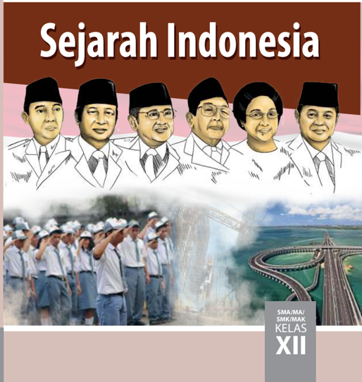

> **Deskripsi Visual:** Gambar ini adalah ilustrasi yang menampilkan beberapa tokoh penting dalam sejarah Indonesia, yang tampaknya merupakan tokoh-tokoh penting dalam pemerintahan atau politik Indonesia. Ilustrasi ini mencakup lima orang yang dikenal sebagai tokoh penting, masing-masing dengan topi tradisional Indonesia. Di bawah mereka, terdapat foto-foto yang menunjukkan aksi-aksi penting dalam sejarah Indonesia, seperti upacara bendera dan pembangunan jembatan. Gambar ini juga menunjukkan teks "Sejarah Indonesia" di bagian atas dan "SMA/MA/SMK/MAK KELAS XII" di bagian bawah, menunjukkan bahwa ini adalah buku pelajaran untuk kelas XII di sekolah menengah atas.

 

---
## 📄 Halaman 2

### Hak Cipta © 2018 pada Kementerian Pendidikan dan Kebudayaan Dilindungi Undang-Undang

Disklaimer: Buku ini merupakan buku siswa yang dipersiapkan Pemerintah dalam rangka implementasi Kurikulum 2013. Buku siswa ini disusun dan ditelaah oleh berbagai pihak di bawah koordinasi Kementerian Pendidikan dan Kebudayaan, dan dipergunakan dalam tahap awal penerapan Kurikulum 2013. Buku ini merupakan 'dokumen hidup' yang senantiasa diperbaiki,  diperbaharui,  dan  dimutakhirkan  sesuai  dengan  dinamika  kebutuhan  dan perubahan zaman. Masukan dari berbagai kalangan yang dialamatkan kepada penulis dan laman http://buku.kemdikbud.go.id atau melalui email buku@kemdikbud.go.id diharapkan dapat meningkatkan kualitas buku ini.

### Katalog Dalam Terbitan (KDT)

Indonesia. Kementerian Pendidikan dan Kebudayaan.

Sejarah Indonesia/ Kementerian Pendidikan dan Kebudayaan.-- . Edisi Revisi Jakarta: Kementerian Pendidikan dan Kebudayaan, 2018.

viii, 272 hlm. : ilus. ; 25 cm.

Untuk SMA/MA/SMK/MAK Kelas XII ISBN  978-602-427-122-0 (jilid lengkap)

ISBN  978-602-427-125-1 (jilid 3)

1.Indonesia -- Sejarah -- Studi dan Pengajaran

I. Judul

- Kementerian Pendidikan dan Kebudayaan
600

Penulis

:  Abdurakhman, Arif Pradono, Linda Sunarti dan Susanto Zuhdi

Penelaah

: Baha' Uddin, Hariyono, dan Mohammad Iskandar.

Pe- review

: Djulimi Tandjung

Penyelia Penerbitan : Pusat Kurikulum dan Perbukuan, Balitbang, Kemendikbud.

Cetakan Ke-1, 2014 (ISBN 978-602-282-774-0) Cetakan Ke-2, 2018 (Edisi Revisi)

Disusun dengan huruf Times New Roman, 12 pt.

 

---
## 📄 Halaman 3

### Kata Pengantar

Kurikulum  2013  dirancang  untuk  memperkuat  kompetensi  siswa  dari  sisi pengetahuan, keterampilan, dan sikap secara utuh. Keutuhan tersebut menjadi dasar  dalam  perumusan  kompetensi  dasar  tiap  mata  pelajaran,  sehingga kompetensi dasar tiap mata pelajaran mencakup kompetensi dasar kelompok sikap,  kompetensi  dasar  kelompok  pengetahuan,  dan  kompetensi  dasar kelompok keterampilan. Semua mata pelajaran dirancang mengikuti rumusan tersebut.

Pembelajaran Sejarah Indonesia untuk Kelas XII jenjang Pendidikan Menengah yang disajikan dalam buku ini juga tunduk pada ketentuan tersebut. Sejarah  Indonesia  bukan  berisi  materi  pembelajaran  yang  dirancang  hanya untuk  mengasah  kompetensi  pengetahuan  siswa.  Sejarah  Indonesia  adalah mata pelajaran yang membekali siswa dengan pengetahuan tentang dimensi ruang-waktu  perjalanan  sejarah  Indonesia,  keterampilan  dalam  menyajikan pengetahuan  yang  dikuasainya  secara  konkret  dan  abstrak,  serta  sikap menghargai  jasa  para  pahlawan  yang  telah  meletakkan  pondasi  bangunan negara Indonesia beserta segala bentuk warisan sejarah, baik benda maupun tak benda. Sehingga terbentuk pola pikir siswa yang sadar sejarah.

Sebagai pelajaran wajib yang harus diambil oleh semua siswa yang belum tentu berminat dalam  bidang  sejarah,  buku  ini  disusun  menggunakan pendekatan regresif yang lebih populer. Melalui pengamatan terhadap kondisi sosial-budaya  dan  sejumlah  warisan  sejarah  yang  bisa  dijumpai  saat  ini, siswa diajak mengarungi garis waktu mundur ke masa lampau saat terjadinya peristiwa  yang  melandasi  terbentuknya  peradaban  yang  melatarbelakangi kondisi sosial-budaya dan warisan sejarah tersebut. Pembahasan dilanjutkan dengan peristiwa-peristiwa berikutnya yang menyebabkan berkembang atau menyusutnya peradaban tersebut sehingga menjadi yang tersisa saat ini.

Buku  ini  menjabarkan  usaha  minimal  yang  harus  dilakukan  siswa  untuk mencapai  kompetensi  yang  diharapkan.  Sesuai  dengan  pendekatan  yang digunakan dalam Kurikulum 2013, siswa diajak menjadi berani untuk mencari sumber belajar lain yang tersedia dan terbentang luas di sekitarnya. Peran guru dalam meningkatkan dan menyesuaikan daya serap siswa dengan ketersediaan kegiatan pada buku ini sangat penting. Guru dapat memperkayanya dengan kreasi  dalam  bentuk  kegiatan-kegiatan  lain  yang  sesuai  dan  relevan  yang bersumber dari lingkungan sosial dan alam.

 

---
## 📄 Halaman 4

Sebagai edisi pertama, buku ini sangat terbuka terhadap masukan dan akan terus diperbaiki untuk penyempurnaan. Oleh karena itu, kami mengundang para pembaca untuk memberikan kritik, saran dan masukan guna perbaikan dan penyempurnaan edisi berikutnya. Atas kontribusi tersebut, kami mengucapkan terima  kasih.  Mudah-mudahan  kita  dapat  memberikan  yang  terbaik  bagi kemajuan dunia pendidikan  dalam  rangka  mempersiapkan  generasi  seratus tahun Indonesia Merdeka (2045).

Tim Penulis

 

---
## 📄 Halaman 5

### Daftar Isi

v

 

---
## 📄 Halaman 7

### Daftar Gambar

 

---
## 📄 Halaman 9

### BAB I

### Perjuangan Menghadapi Ancaman Disintegrasi Bangsa

Musuh terbesar bangsa kita bukan yang datang dari luar, tetapi ancaman disintegrasi   yang berasal dari dalam sendiri

(C.S.T. Kansil dan Julianto, 1998)

---
**🖼️ Gambar/Diagram**

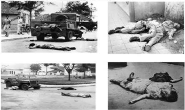

> **Deskripsi Visual:** Gambar ini adalah ilustrasi yang menunjukkan tiga orang tewas di luar sebuah mobil militer. Gambar ini mungkin digunakan untuk menggambarkan situasi kekerasan atau konflik tertentu. Elemen utama dalam gambar ini adalah tiga orang yang terlihat tewas dengan posisi tubuh yang menunjukkan keadaan yang sangat terpuruk. Mobil militer tampaknya berada di dekat mereka, yang mungkin menunjukkan hubungan antara situasi tersebut dan kejadian yang terjadi. Teks, angka, atau label penting tidak terlihat dalam gambar ini. Informasi kunci yang dapat diambil pembaca adalah bahwa ada tiga orang yang tewas di dekat mobil militer, yang mungkin menunjukkan situasi kekerasan atau konflik tertentu.

 

---
## 📄 Halaman 10

Tahukah  kalian  bahwa  sesudah  40  tahun  lamanya,  baru  pertama  kali peringatan Hari Kebangkitan Nasional 20 Mei, diselenggarakan pada tahun  1948. Awalnya,  peringatan  tersebut  merupakan  anjuran  Bung  Karno agar  pemerintah  menyelenggarakannya  secara  besar-besaran.  Untuk  itu, diangkatlah Ki Hajar Dewantara sebagai ketua panitia peringatan.

Mengapa  peringatan  ini  dilaksanakan?  Ki  Hajar  Dewantara  menjawab  hal tersebut, dengan mengatakan:

'Itulah sebenarnja maksud dan tudjuan Bung Karno, ketika ia mengandjurkan supaja  hari  20  Mei  tahun  1948  dirajakan  setjara  besar-besaran.  Hari  itu olehnja dianggap sebagai hari bangunnja rakjat, hari sadarnja serta bangkitnja rasa kebangsaan Indonesia, pada tahun 1908, empat puluh tahun sebelum itu adjakan Bung Karno tadi terbukti sangat ditaati oleh semua golongan rakjat. Mulai golongan-golongan jang berada di luar gerakan politik, sampai dengan partai, mulai jang paling kanan sampai jang paling kiri, ikut serta secara aktif, dan bersama-sama merajakan hari 20 Mei tahun itu sebagai 'Hari Kebangkitan Nasional',  sebagai  Hari  Kesatuan  Rakjat  Indonesia'.  (C.S.T.  Kansil  dan Julianto, 1998).

Jadi,  makna  peringatan  Kebangkitan  Nasional  sebagaimana  dimaksud Bung Karno di atas, adalah untuk memperkuat kesatuan bangsa, khususnya dalam menghadapi Belanda yang hendak menjajah kembali Indonesia. Apalagi di  awal  tahun  itu  muncul  pula  kelompok dengan garis perjuangan ideologi yang dapat menghancurkan integrasi bangsa dan ideologi negara Indonesia.

Apalagi pada 1948, Muso baru kembali dari Moskwa dengan menawarkan doktrin 'Jalan Baru' sebagai strategi perjuangan bangsa yang berbeda dari strategi yang dijalankan pemerintah Soekarno-Hatta. Ada tiga gagasan yang dikemukakan Muso. Petama,  membentuk Front Nasional untuk menghimpun kekuatan komunis dan nonkomunis di bawah pimpinan PKI. Kedua,  mengubah PKI menjadi partai tunggal Marxis-Leninis, dan yang ketiga, menyesuaikan perjuangan PKI dengan garis perjuangan Komunis Internasional (Komintern). Hal ini membuat hubungan antara antara PKI dengan  kubu nasionalis (PNI dan Masyumi) kian meruncing. Pertikaian ideologi yang tajam tersebut berakhir pada pecahnya pemberontakan PKI di Madiun  pada 18 September 1948.

Sebagai konsekuensi disepakatinya hasil  perundingan Renville, sebanyak 35.000 anggota TNI juga dipaksa untuk meninggalkan wilayah yang diklaim Belanda menuju daerah Republik Indonesia yang beribu kota di Yogyakarta. Tiga bulan setelahnya, Belanda melancarkan agresi militer dengan menduduki Ibu kota Yogyakarta pada 19 Desember 1948. Presiden dan wakil presiden serta  beberapa  pejabat  tinggi  negara  ditangkap  dan  diasingkan  ke  Bangka. Meski demikian presiden masih sempat memberikan mandat kepada Syafrudin

 

---
## 📄 Halaman 11

Prawiranegara untuk menjadi ketua Pemerintah Darurat Republik Indonesia di Sumatera Barat. Bahkan Soekarno juga memerintahkan kepada Soedarsono dan LN. Palar untuk siap mengantisipasi bila suatu ketika terpaksa mendirikan pemerintahan  pengasingan  di  India,  meski  hal  ini  akhirnya  tidak  terjadi. Dengan kondisi kritis seperti itu maka Republik Indonesia dapat digambarkan bagai 'sebutir telur di ujung tanduk'.

Namun demikian Panglima Besar Soedirman sekeluarnya dari Yogyakarta, langsung  memimpin  pasukannya  untuk  meneruskan  perjuangan  melawan Belanda dengan melakukan perang gerilya. Sementara Kolonel A.H. Nasution, selaku Panglima Tentara dan Teritorium Jawa meneruskan  rencana pertahanan rakyat yang yang telah disusun oleh Panglima Besar Sudirman, dan dikenal sebagai Perintah Siasat Nomor 1. Salah satu pokoknya adalah menyusupkan pasukan-pasukan yang berasal dari daerah-daerah federal ke garis belakang musuh dan membentuk kantong-kantong gerilya sehingga seluruh Pulau Jawa akan menjadi medan gerilya yang luas.

Dapat  pula  dikemukakan  peran  Sultan  Hamengku  Buwono  IX  yang telah	 memberikan	 dukungan	 fasilitas	 dan	 inansial	 untuk	 keberlangsungan berjalannya  pemerintahan  republik  yang  ditinggalkan  para  pemimpinnya tersebut. Menurut Kahin, dua kekuatan inilah yang menjadi sumber perlawanan terhadap Belanda yang pada akhirnya memaksa Belanda untuk mengakhiri perang menuju Konferensi Meja Bundar (KMB).

Kedua  kekuatan  yang  digerakan  oleh  unsur  sipil  dan  tentara  yang melakukan gerilya menjadi amunisi yang ampuh bagi para diplomat kita yang terus berunding di forum Perserikatan Bangsa Bangsa (PBB). Dengan strategi perjuangan  tersebut  di  atas  dengan  mendapat  tekanan  Internasional    dan dari Amerika Serikat sendiri yang mengancam akan menghentikan bantuan Marshall Plan , maka Belanda terpaksa menandatangani perjanjian KMB yang berisi 'penyerahan kedaulatan' (souvereniteit overdracht) .

Situasi dan kondisi perjuangan sebagaimana digambarkan di atas itulah yang  menjadi  makna  nilai  persatuan  dari  peringatan  kebangkitan  nasional ke-40 di tahun 1948, yang menggerakkan perjuangan bangsa Indonesia yang pantang menyerah dan pada akhirnya dapat mengakhiri upaya Belanda untuk kembali menjajah.

Ancaman  disintegrasi  (perpecahan)  bangsa  memang  bukan  persoalan main-main. Tak hanya merupakan masalah di masa lalu. Potensi disintegrasi pada  masa  kinipun  bukan  tidak  mungkin  terjadi.  Karena  itulah  kita  harus terus dan selalu memahami betapa berbahayanya proses disintegrasi bangsa apabila  terjadi  bagi  kebangsaan  kita.  Sejarah  Indonesia  telah  menunjukkan hal tersebut.

 

---
## 📄 Halaman 12

---
**🖼️ Gambar/Diagram**

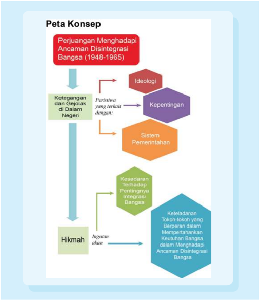

> **Deskripsi Visual:** Gambar ini adalah diagram yang menunjukkan konsep perjuangan menghadapi ancaman disintegrasi bangsa antara tahun 1948-1965. Diagram ini terdiri dari beberapa elemen utama yang saling terkait:

1. **Perjuangan Menghadapi Ancaman Disintegrasi Bangsa (1948-1965)**: Ini adalah topik utama yang berada di bagian atas diagram.

2. **Ketegangan dan Gejolak di Dalam Negeri**: Ini merupakan faktor yang mempengaruhi perjuangan tersebut.

3. **Ideologi**: Ini merupakan salah satu faktor yang mempengaruhi perjuangan.

4. **Sistem Pemerintahan**: Ini juga merupakan faktor yang mempengaruhi perjuangan.

5. **Kesadaran Terhadap Pentingnya Integrasi Bangsa**: Ini merupakan aspek yang mempengaruhi perjuangan.

6. **Ingatan akan Keteladanan Tokoh-tokoh yang Berperan dalam Mempertahankan Keutuhan Bangsa**: Ini merupakan aspek yang mempengaruhi perjuangan.

7. **Hikmah**: Ini merupakan hasil dari perjuangan tersebut.

Elemen-elemen ini saling terkait dan membentuk sebuah hubungan yang kompleks. Diagram ini menunjukkan bahwa ketegangan dan gejolak di dalam negeri, ideologi, sistem pemerintahan, kesadaran terhadap pentingnya integrasi bangsa, dan ingatan akan keteladanan tokoh-tokoh yang berperan dalam mempertahankan keutuhan bangsa, semua mempengaruhi perjuangan menghadapi ancaman disintegrasi bangsa antara tahun 1948-1965.

 

---
## 📄 Halaman 13

### TUJUAN PEMBELAJARAN

Setelah memelajari uraian ini, diharap kamu dapat:

- Menganalisis berbagai pergolakan daerah yang terjadi di Indonesia antara tahun 1948 hingga 1965.
- Mengaitkan peristiwa pergolakan daerah yang terjadi di Indonesia antara tahun 1948 hingga 1965 dengan potensi ancaman disintegrasi pada masa sekarang.
- Mengambil  hikmah  dari  berbagai  ancaman  disintegrasi  bangsa yang pernah terjadi di Indonesia, khususnya yang telah terjadi di tahun 1948 hingga 1965.

### HIKMAH DAN ARTI PENTING

Memelajari  sejarah  pergolakan  bangsa  yang  pernah  terjadi  dan membahayakan persatuan nasional  merupakan hal sangat penting, agar kita  mendapatkan  pelajaran  sekaligus  peringatan.  Mengapa  sampai timbul perpecahan, mengapa perpecahan itu bisa  berlangsung dalam waktu yang cukup lama, dan apa  yang salah dengan bangsa kita pada waktu itu? Jawaban dari pertanyaan-pertanyaan itu akan memberikan pelajaran dan inspirasi bagaimana kita menghadapi berbagai potensi disintegrasi bangsa pada masa kini dan masa yang akan datang. Semua itu tak lain harus dilakukan demi lestarinya kita sebagai sebuah bangsa.

 

---
## 📄 Halaman 14

### A. Berbagai Pergolakan di Dalam Negeri (1948-1965)

### Mengamati Lingkungan

---
**🖼️ Gambar/Diagram**

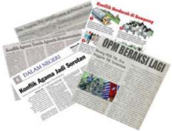

> **Deskripsi Visual:** Gambar ini menunjukkan beberapa halaman dari buku pelajaran yang berisi informasi tentang konflik antara pemerintah dan oposisi di Indonesia. Halaman-halaman tersebut tampaknya merupakan bagian dari sebuah artikel atau tulisan yang membahas situasi politik saat itu. Di sini, kita bisa melihat beberapa elemen penting:

1. **Apa yang Ditampilkan Secara Keseluruhan**: Gambar ini menunjukkan beberapa halaman buku pelajaran yang berisi teks tentang konflik antara pemerintah dan oposisi di Indonesia. Halaman-halaman tersebut tampaknya merupakan bagian dari sebuah artikel atau tulisan yang membahas situasi politik saat itu.

2. **Elemen-elemen Utama dan Relasinya**: 
   - **Teks**: Halaman-halaman tersebut berisi teks yang menjelaskan tentang konflik antara pemerintah dan oposisi di Indonesia.
   - **Angka**: Ada beberapa angka yang mungkin digunakan untuk menggambarkan jumlah atau data tertentu dalam teks.
   - **Label Penting**: Label-label yang mungkin digunakan untuk memberikan konteks atau penjelasan lebih lanjut tentang informasi yang disampaikan dalam teks.

3. **Informasi Kunci yang Bisa Diambil Pembaca**: 
   - **Konflik Antara Pemerintah dan Oposisi**: Informasi utama yang ditampilkan adalah tentang konflik antara pemerintah dan oposisi di Indonesia.
   - **Teks dan Angka**: Teks dan angka yang mungkin digunakan untuk memberikan detail lebih lanjut tentang situasi politik saat itu.

Dengan demikian, gambar ini menunjukkan beberapa halaman dari buku pelajaran yang berisi informasi tentang konflik antara pemerintah dan oposisi di Indonesia. Halaman-halaman tersebut tampaknya merupakan bagian dari sebuah artikel atau tulisan yang membahas situasi politik saat itu.

### Perhatikan gambar di atas!

- Apa	komentar	kamu	tentang	berbagai	berita	tentang	konlik	yang	terjadi	di Indonesia tersebut?
- Konlik	di	bidang	apa	sajakah	itu?
Alangkah hebatnya bangsa kita sebenarnya. Indonesia adalah negeri yang terdiri atas 17.500 pulau, lebih dari 300 kelompok etnik, 1.340 suku bangsa, 6 agama resmi dan belum termasuk beragam aliran kepercayaan, serta 737 bahasa. Kita harus bersyukur pada Tuhan YME, atas keberuntungan bangsa kita yang hingga kini tetap bersatu dalam keberagaman, meskipun berbagai kasus	 konlik	 dan	 pergolakan	 sempat	 berlangsung	 di	 masyarakat.	 Hal	 ini misalnya dapat dilihat dari potongan gambar berita di atas.

Dalam	sejarah	republik	ini,	konlik	dan	pergolakan	dalam	skala	yang	lebih besar bahkan pernah terjadi. Bila sudah begitu, lantas siapa pihak yang paling dirugikan?    Tak  lain  adalah  rakyat,  bangsa  kita  sendiri.  Karenanya,  dalam

 

---
## 📄 Halaman 15

bab berikut ini akan kamu pelajari beberapa pergolakan besar yang pernah berlangsung di dalam negeri akibat ketegangan politik selama rentang tahun 1948-1965.  Tahun  1948  ditandai  dengan  pecahnya  pemberontakan  besar pertama  setelah  Indonesia  merdeka,  yaitu  pemberontakan  PKI  di  Madiun. Sedangkan tahun 1965 merupakan tahun di mana berlangsung peristiwa G30S/ PKI  yang  berusaha  merebut  kekuasaan  dan  mengganti  ideologi  Pancasila. Mengapa penting hal ini kita kaji, tak lain agar kita dapat menarik hikmah dan tragedi seperti itu tak terulang kembali pada masa kini. Di sinilah pentingnya kita mempelajari sejarah.

Sejarah	 pergolakan	 dan	 konlik	 yang	 terjadi	 di	 Indonesia	 selama	 masa tahun 1948-1965 dalam bab ini akan dibagi ke dalam tiga bentuk pergolakan:

### 1. Peristiwa konlik dan pergolakan yang berkaitan dengan ideologi.

Termasuk  dalam  kategori ini  adalah  pemberontakan  PKI  Madiun, pemberontakan DI/TII, dan peristiwa G30S/PKI. Ideologi yang diusung oleh PKI  tentu  saja  komunisme,  sedangkan  pemberontakan  DI/TII  berlangsung dengan membawa ideologi agama.

Perlu  kalian  ketahui  bahwa  menurut  Herbert  Feith,  seorang  akademisi Australia, aliran politik besar yang terdapat di Indonesia pada masa setelah kemerdekaan (terutama dapat dilihat sejak Pemilu 1955) terbagi dalam lima kelompok: nasionalisme radikal (diwakili antara lain oleh PNI), Islam (NU dan Masyumi), komunis (PKI), sosialisme demokrat (Partai Sosialis Indonesia/ PSI),	dan	tradisionalis	Jawa	(Partai	Indonesia	Raya/PIR,	kelompok	teosois/ kebatinan, dan birokrat pemerintah/pamong praja). Pada masa itu kelompokkelompok  tersebut  nyatanya  memang  saling  bersaing  dengan  mengusung ideologi masing-masing.

### 2. Peristiwa konlik dan pergolakan yang berkait dengan kepentingan ( vested interest ).

Termasuk dalam kategori ini adalah pemberontakan APRA, RMS, dan Andi Aziz. Vested Interest merupakan kepentingan yang tertanam dengan kuat pada  suatu  kelompok.  Kelompok  ini  biasanya  berusaha  untuk  mengontrol suatu  sistem  sosial  atau  kegiatan  untuk  keuntungan  sendiri.  Mereka  juga enggan  untuk  melepas  posisi  atau  kedudukan  yang  diperolehnya  sehingga sering  menghalangi  suatu  proses  perubahan.  Baik APRA,  RMS,  dan Andi Aziz, semuanya berhubungan dengan keberadaan pasukan KNIL atau Tentara

 

---
## 📄 Halaman 16

Kerajaan (di) Hindia Belanda, yang tidak mau menerima kedatangan tentara Indonesia di wilayah-wilayah yang sebelumnya mereka kuasai. Dalam situasi seperti	ini,	konlik	pun	terjadi.

### 3. Peristiwa konlik dan pergolakan yang berkait dengan sistem pemerintahan.

Termasuk dalam kategori ini adalah persoalan negara federal dan BFO ( Bijeenkomst Federal Overleg ), serta pemberontakan PRRI dan Permesta.

Masalah yang berhubungan dengan negara federal mulai timbul ketika berdasarkan  perjanjian  Linggajati,  Indonesia  disepakati  akan  berbentuk negara  serikat/federal  dengan  nama  Republik  Indonesia  Serikat  (RIS).  RI menjadi bagian RIS. Negara-negara federal lainnya misalnya adalah negara Pasundan, negara Madura, Negara Indonesia Timur. BFO sendiri adalah badan musyawarah negara-negara federal di luar RI yang dibentuk oleh Belanda. Awalnya, BFO berada di bawah kendali Belanda. Namun makin lama badan ini  makin  bertindak  netral,  tidak  lagi  semata-mata  memihak  Belanda.  Prokontra  tentang  negara-negara  federal  inilah  yang  kerap  juga  menimbulkan pertentangan.

Sedangkan pemberontakan PRRI dan Permesta merupakan perlawanan yang  terjadi  akibat  adanya  ketidakpuasan  beberapa  daerah  di  wilayah Indonesia terhadap kebijakan pemerintahan pusat, yang dinilai tidak adil dan semakin condong ke kiri (komunis).

### TUGAS

Buatlah kelompok  yang terdiri atas 2-3 orang. Kemudian buat  peta konsep (mind mapping) mengenai bentuk-bentuk ancaman disintegrasi bangsa, yang terjadi dalam sejarah Indonesia pada 1948-1965.

Sekarang	mari	kita	bahas	satu	persatu	konlik	atau	pergolakan		yang	terjadi di Indonesia pada 1948-1965, yang berhubungan dengan ketiga hal tersebut.

### 1.   Konlik dan Pergolakan yang Berkait dengan Ideologi.

### a)   Pemberontakan PKI (Partai Komunis Indonesia) Madiun

Selain  Partai  Nasional  Indonesia  (PNI),  PKI  merupakan  partai  politik pertama yang didirikan sesudah proklamasi. Meski demikian, PKI bukanlah partai  baru,  karena  telah  ada  sejak  zaman  pergerakan  nasional  sebelum dibekukan oleh pemerintah Hindia Belanda akibat memberontak pada tahun 1926.

 

---
## 📄 Halaman 17

Sejak merdeka sampai awal tahun 1948, PKI masih bersikap mendukung pemerintah,  yang  kebetulan  memang  dikuasai  oleh  golongan  kiri.  Hal  ini terkait dengan Doktrin Dimitrov,  yang menyatakan bahwa gerakan komunis harus  bekerja  sama  dengan  kapitalis    dalam  rangka  menghadapi  kekuatan fasis. Namun ketika golongan kiri terlempar dari pemerintahan, PKI menjadi partai oposisi dan bergabung dengan partai serta organisasi kiri lainnya dalam Front Demokrasi Rakyat (FDR) yang didirikan Amir Syarifuddin pada bulan Februari  1948.  Pada  awal  September  1948  pimpinan  PKI  dipegang  Muso. Ia  membawa  berita  bahwa  Doktrin  Dimitrov  telah  diganti  dengan  Doktrin Zhdanov dimana komunis harus bekerja sama dengan golongan nasionalisprogresif untuk menghadapi golongan kapitalis borjuis. Muso lalu membawa PKI  ke  dalam  pemberontakan  bersenjata  yang  dicetuskan  di  Madiun  pada tanggal	18	September	1948	(Tauik	Abdullah	dan	AB	Lapian,	2012).

Mengapa PKI memberontak? Alasan utamanya tentu bersifat ideologis, di mana mereka memiliki cita-cita ingin menjadikan Indonesia sebagai negara komunis. Berbagai upaya dilakukan oleh PKI untuk meraih kekuasaan. Di bawah pimpinan Musso, PKI berhasil menarik partai dan organisasi kiri dalam FDR bergabung ke dalam PKI. Partai ini lalu mendorong dilakukannya berbagai demonstrasi  dan  pemogokan  kaum  buruh  dan  petani.  Sebagian  kekuatankekuatan bersenjata juga berhasil masuk dalam pengaruh mereka. Muso juga kerap mengeluarkan pernyataan-pernyataan yang mengecam pemerintah dan membahayakan strategi diplomasi Indonesia melawan Belanda yang ditengahi Amerika Serikat (AS). Pernyataan Muso lebih menunjukkan keberpihakannya pada Uni Soviet yang komunis.

Pemerintah  Indonesia  telah  melakukan  upaya-upaya  diplomasi  dengan Muso, bahkan sampai mengikutsertakan tokoh-tokoh kiri yang lain, yaitu Tan Malaka, untuk meredam gerak ofensif PKI Muso. Namun kondisi politik sudah terlampau panas, sehingga pada pertengahan September 1948, pertempuran antara kekuatan-kekuatan bersenjata yang memihak PKI dengan TNI mulai meletus. PKI kemudian memusatkan kekuatannya di Madiun. Pada tanggal 18 September 1948, Muso memproklamirkan Republik Soviet Indonesia.

Presiden Soekarno segera bereaksi, dan berpidato di RRI Yogjakarta:

'…Saudara-saudara! Camkan benar apa artinja itu: Negara Republik Indonesia jang kita tjintai, hendak direbut oleh PKI Muso. Kemarin pagi PKI Muso, mengadakan coup, mengadakan perampasan kekuasaan di Madiun dan mendirikan  di  sana  suatu  pemerintahan  Sovyet,  di  bawah  pimpinan  Muso. Perampasan  ini  mereka  pandang  sebagai  permulaan  untuk  merebut  seluruh Pemerintahan Republik Indonesia.

 

---
## 📄 Halaman 18

…Saudara-saudara, camkanlah benar-benar apa artinja jang telah terdjadi itu. Negara Republik Indonesia hendak direbut oleh PKI Muso!

Rakjat jang kutjinta ! Atas nama perdjuangan untuk Indonesia Merdeka, aku berseru kepadamu: 'Pada saat jang begini genting, di mana engkau dan kita sekalian mengalami percobaan jang sebesar-besarnja dalam menentukan nasib kita sendiri, bagimu adalah pilihan antara dua: ikut Muso dengan PKInja jang akan membawa bangkrutnja cita-cita Indonesia Merdeka, atau ikut Soekarno-Hatta, jang Insya Allah dengan bantuan Tuhan akan memimpin Negara Republik Indonesia jang merdeka, tidak didjadjah oleh negeri apa pun djuga.

…Buruh jang djudjur, tani jang djudjur, pemuda jang djudjur, rakyat jang djudjur, djanganlah memberikan bantuan kepada kaum pengatjau itu. Djangan tertarik siulan mereka! …Dengarlah, betapa djahatnja rentjana mereka itu! (Daud Sinyal, 1996).

Di awal pemberontakan, pembunuhan terhadap pejabat pemerintah dan para  pemimpin  partai  yang  antikomunis  terjadi.  Kaum  santri  juga  menjadi korban. Tetapi pasukan pemerintah yang dipelopori Divisi Siliwangi kemudian berhasil mendesak mundur pemberontak. Puncaknya adalah ketika Muso tewas tertembak. Amir Syarifuddin juga tertangkap. Ia akhirnya dijatuhi hukuman mati. Tokoh-tokoh  muda  PKI  seperti Aidit  dan  Lukman  berhasil melarikan  diri.  Merekalah  yang  kelak  di  tahun  1965,  berhasil  menjadikan PKI kembali menjadi partai besar di Indonesia sebelum terjadinya peristiwa Gerakan 30 September 1965. Ribuan orang tewas dan ditangkap pemerintah akibat pemberontakan Madiun ini. PKI gagal mengambil alih kekuasaan.

Dari kisah di atas, apa hal terpenting dari peristiwa pemberontakan PKI di Madiun ini bagi sejarah Indonesia kemudian?

Pertama,  upaya  membentuk  tentara  Indonesia  yang  lebih  profesional menguat  sejak pemberontakan  tersebut. Berbagai laskar dan kekuatan bersenjata  'liar'  berhasil  didemobilisasi  (dibubarkan).  Dari  sisi  perjuangan diplomasi,	simpati	AS	sebagai	penengah	dalam	konlik	dan	perundingan	antara Indonesia  dengan  Belanda  perlahan  berubah  menjadi  dukungan  terhadap Indonesia, meskipun hal ini tidak juga bisa dilepaskan dari strategi global AS dalam menghadapi ancaman komunisme.

Tetapi	hal	terpenting	lain	juga	perlu	dicatat.	Bahwa	konlik	yang	terjadi berdampak  pula  pada  banyaknya  korban  yang  timbul.  Ketidakbersatuan bangsa Indonesia yang tampak dalam peristiwa ini juga dimanfaatkan oleh Belanda yang mengira Indonesia lemah, untuk kemudian melancarkan agresi militernya yang kedua pada Desember 1948.

 

---
## 📄 Halaman 19

Gambar di samping adalah tokoh 'kiri'  yang  memiliki  kaitan  dengan pemberontakan PKI di Madiun.

Carilah informasi dari berbagai sumber  mengenai  peran  kedua  tokoh PKI tersebut dalam Pemberontakan PKI Madiun tahun 1948. Jelaskan pula, tindakan apa yang dilakukan oleh  Pemerintah  untuk  memadamkan pemberontakan tersebut, dan apa akibat yang ditimbulkan oleh Pemberontakan PKI Madiun yang berkait dengan penderitaan rakyat!

### b)   Pemberontakan DI/TII

Cikal  bakal  pemberontakan  DI/TII  yang  meluas  di  beberapa  wilayah Indonesia  bermula  dari  sebuah  gerakan  di  Jawa  Barat  yang  dipimpin  oleh S.M. Kartosuwiryo. Ia dulu adalah salah seorang tokoh Partai Sarekat Islam Indonesia (PSII).  Perjanjian Renville membuka peluang bagi Kartosuwiryo untuk lebih mendekatkan cita-cita lamanya untuk mendirikan negara Islam.

Salah satu keputusan Renville adalah pasukan RI dari daerah-daerah yang berada di dalam garis van Mook harus pindah ke daerah yang dikuasai RI. Divisi Siliwangi dipindahkan ke Jawa Tengah karena Jawa Barat dijadikan negara bagian Pasundan oleh Belanda. Akan tetapi laskar bersenjata Hizbullah dan  Sabilillah  yang  telah  berada  di  bawah  pengaruh  Kartosuwiryo  tidak bersedia pindah dan malah membentuk Tentara Islam Indonesia (TII). Vakum (kosong)-nya kekuasaan RI di Jawa Barat segera dimanfaatkan Kartosuwiryo. Meski  awalnya  ia  memimpin  perjuangan  melawan  Belanda  dalam  rangka menunjang  perjuangan  RI,  namun  akhirnya  perjuangan  tersebut  beralih menjadi  perjuangan  untuk  merealisasikan  cita-citanya.  Ia  lalu  menyatakan pembentukan Darul Islam (negara Islam/DI) dengan dukungan TII, di Jawa Barat pada Agustus 1948.

Persoalan timbul ketika pasukan Siliwangi kembali balik ke Jawa Barat. Kartosuwiryo tidak mau mengakui tentara RI tersebut kecuali mereka mau bergabung  dengan  DI/TII.  Ini  sama  saja  Kartosuwiryo  dengan  DI/TII  nya tidak  mau  mengakui  pemerintah  RI  di  Jawa  Barat.  Maka  pemerintah  pun bersikap tegas. Meski upaya menanggulangi DI/TII Jawa Barat pada awalnya terlihat belum dilakukan secara terarah, namun sejak 1959, pemerintah mulai melakukan operasi militer.

 

---
## 📄 Halaman 20

Operasi  terpadu  'Pagar  Betis'  digelar,  di  mana  tentara  pemerintah menyertakan juga masyarakat untuk mengepung tempat-tempat pasukan DI/ TII  berada. Tujuan  taktik  ini  adalah  untuk  mempersempit  ruang  gerak  dan memotong arus perbekalan pasukan lawan. Selain itu diadakan pula operasi tempur dengan sasaran langsung basis-basis pasukan DI/TII. Melalui operasi ini  pula  Kartosuwiryo  berhasil  ditangkap  pada  tahun  1962.  Ia  lalu  dijatuhi hukuman  mati,  yang  menandai  pula  berakhirnya  pemberontakan  DI/TII Kartosuwiryo.

Di Jawa Tengah, awal kasusnya juga mirip, di mana akibat persetujuan Renville daerah Pekalongan-Brebes-Tegal ditinggalkan TNI (Tentara Nasional Indonesia) dan aparat pemerintahan. Terjadi kevakuman di wilayah ini dan Amir  Fatah  beserta  pasukan  Hizbullah  yang  tidak  mau  di-TNI-kan  segera mengambil alih.

Saat  pasukan TNI kemudian balik kembali ke wilayah tersebut setelah Belanda  melakukan  agresi  militernya  yang  kedua,  sebenarnya  telah  terjadi kesepakatan antara Amir Fatah dan pasukannya dengan pasukan TNI. Amir Fatah bahkan diangkat sebagai koordinator pasukan di daerah operasi Tegal dan  Brebes.  Namun  terjadi  ketegangan  karena  berbagai  persoalan  antara pasukan  Amir  Fatah  dengan  TNI  sering  timbul  kembali.  Amir  Fatah  pun semakin  berubah  pikiran  setelah  utusan  Kartosuwiryo  datang  menemuinya lalu mengangkatnya sebagai Panglima TII Jawa Tengah. Ia bahkan kemudian ikut  memproklamirkan  berdirinya  Negara  Islam  di  Jawa Tengah.  Sejak  itu terjadi	 kekacauan	 dan	 konlik	 terbuka	 antara	 pasukan	 Amir	 Fatah	 dengan pasukan TNI.

Tetapi berbeda dengan DI/TII di Jawa Barat, perlawanan Amir Fatah tidak terlalu lama. Kurangnya dukungan dari penduduk membuat perlawanannya cepat berakhir. Desember 1951, ia menyerah.

Selain Amir Fatah, di Jawa Tengah juga timbul pemberontakan lain yang dipimpin oleh Kiai Haji Machfudz atau yang dikenal sebagai Kyai Sumolangu. Ia didukung oleh laskar bersenjata Angkatan Umat Islam (AUI) yang sejak didirikan  memang  berkeinginan  menciptakan  suatu  negara  Indonesia  yang berdasarkan prinsip-prinsip Islam. Meski demikian, dalam perjuangan untuk mempertahankan kemerdekaan, awalnya AUI bahu membahu dengan Tentara Republik  dalam  menghadapi  Belanda.  Wilayah  operasional AUI  berada  di daerah Kebumen dan daerah sekitar pantai selatan Jawa Tengah.

Namun kerja  sama  antara AUI  dengan  Tentara  RI  mulai  pecah  ketika pemerintah hendak melakukan demobilisasi AUI. Ajakan pemerintah untuk berunding ditolak Kyai Sumolangu. Pada akhir Juli 1950 Kyai Sumolangu melakukan pemberontakan. Sesudah sebulan bertempur, tentara RI berhasil

 

---
## 📄 Halaman 21

menumpas  pemberontakan  ini.  Ratusan  pemberontak  dinyatakan  tewas dan  sebagian  besar  berhasil  ditawan.  Sebagian  lainnya  melarikan  diri  dan bergabung dengan pasukan TII di Brebes dan Tegal. Akibat pemberontakan ini kehancuran yang diderita di Kebumen besar sekali. Ribuan rakyat mengungsi dan  ratusan  orang  ikut  terbunuh.  Selain  itu  desa-desa  juga  mengalami kerusakan berat.

Pemberontakan  Darul  Islam  di  Jawa  Tengah  lainnya  juga  dilakukan oleh Batalyon 426 dari Divisi Diponegoro Jawa Tengah. Ini adalah tentara Indonesia  yang  anggota-anggotanya  berasal  dari  laskar  Hizbullah.  Simpati dan kerja sama mereka dengan Darul Islam pun jadinya tampak karena DI/TII juga berbasis pasukan laskar Hizbullah. Cakupan wilayah gerakan Batalyon 426  dalam  pertempuran  dengan  pasukan  RI  adalah  Kudus,  Klaten,  hingga Surakarta.Walaupun dianggap kuat dan membahayakan, namun hanya dalam beberapa bulan saja, pemberontakan Batalyon 426 ini juga berhasil ditumpas.

Selain di Jawa Barat dan Jawa Tengah, pemberontakan DI/TII terjadi pula di Sulawesi Selatan di bawah pimpinan Letnan Kolonel Kahar Muzakkar. Pada tahap awal, pemberontakan ini lebih disebabkan akibat ketidakpuasan para bekas  pejuang  gerilya  kemerdekaan  terhadap  kebijakan  pemerintah  dalam membentuk Tentara Republik dan demobilisasi yang dilakukan di Sulawesi Selatan.  Namun  beberapa  tahun  kemudian  pemberontakan  malah  beralih dengan bergabungnya mereka ke dalam DI/TII Kartosuwiryo.

Tokoh Kahar Muzakkar sendiri pada masa perang kemerdekaan pernah berjuang di Jawa bahkan menjadi komandan Komando Grup Sulawesi Selatan yang bermarkas di Yogyakarta. Setelah pengakuan kedaulatan tahun 1949 ia lalu ditugaskan ke daerah asalnya untuk membantu menyelesaikan persoalan tentang Komando Gerilya Sulawesi Selatan (KGSS) di sana. KGSS dibentuk sewaktu perang kemerdekaan dan berkekuatan 16 batalyon atau satu divisi. Pemerintah ingin agar kesatuan ini dibubarkan lebih dahulu untuk kemudian dilakukan  reorganisasi  tentara  kembali.  Semua  itu  dalam  rangka  penataan ketentaraan. Namun anggota KGSS menolaknya.

Begitu tiba, Kahar Muzakkar diangkat oleh Panglima Tentara Indonesia Timur  menjadi  koordinator  KGSS,  agar  mudah  menyelesaikan  persoalan. Namun Kahar Muzakkar malah menuntut kepada Panglimanya agar KGSS bukan  dibubarkan,  melainkan  minta  agar  seluruh  anggota  KGSS  dijadikan tentara  dengan  nama  Brigade  Hasanuddin.  Tuntutan  ini  langsung  ditolak karena  pemerintah  berkebijakan  hanya  akan  menerima  anggota  KGSS yang  memenuhi  syarat  sebagai  tentara  dan  lulus  seleksi.  Kahar  Muzakkar tidak  menerima  kebijakan  ini  dan  memilih  berontak  diikuti  oleh  pasukan pengikutnya.

 

---
## 📄 Halaman 22

Selama masa pemberontakan, Kahar Muzakkar pada tanggal 7 Agustus 1953 menyatakan diri sebagai bagian dari Negara Islam Indonesia Kartosuwiryo.  Pemberontakan yang dilakukan Kahar memang memerlukan waktu lama untuk menumpasnya. Pemberontakan baru berakhir pada tahun 1965. Di tahun itu, Kahar Muzakkar tewas tertembak dalam suatu penyergapan.

Pemberontakan yang berkait dengan DI/TII juga terjadi di  Kalimantan Selatan. Namun dibandingkan dengan gerakan DI/TII yang lain, ini adalah pemberontakan yang relatif kecil, dimana pemberontak tidak menguasai daerah yang luas dan pergerakan pasukan yang besar. Meski begitu, pemberontakan berlangsung  lama  dan  berlarut-larut  hingga  tahun  1963  saat  Ibnu  Hajar, pemimpinnya, tertangkap.

Timbulnya pemberontakan DI/TII Kalimantan Selatan ini sesungguhnya bisa  ditelusuri  hingga  tahun  1948  saat Angkatan  Laut  Republik  Indonesia (ALRI)  Divisi  IV,  sebagai  pasukan  utama  Indonesia  dalam  menghadapi Belanda di Kalimantan Selatan, telah tumbuh menjadi tentara yang kuat dan berpengaruh di wilayah tersebut. Namun ketika penataan ketentaraan mulai dilakukan di Kalimantan Selatan oleh pemerintah pusat di Jawa, tidak sedikit anggota ALRI Divisi  IV  yang  merasa  kecewa  karena  diantara  mereka  ada yang harus didemobilisasi atau mendapatkan posisi yang tidak sesuai dengan keinginan mereka. Suasana mulai resah dan keamanan di Kalimantan Selatan mulai terganggu. Penangkapan-penangkapan terhadap mantan anggota ALRI Divisi IV terjadi. Salah satu alasannya adalah karena diantara mereka ada yang mencoba menghasut mantan anggota ALRI yang lain untuk memberontak.

Diantara para pembelot mantan anggota ALRI Divisi IV adalah Letnan Dua	Ibnu	Hajar.	Dikenal	sebagai	igur	berwatak	keras,	dengan	cepat	ia	berhasil mengumpulkan pengikut, terutama di kalangan anggota ALRI Divisi IV yang kecewa terhadap pemerintah. Ibnu Hajar bahkan menamai pasukan barunya sebagai  Kesatuan  Rakyat  Indonesia  yang  Tertindas  (KRIyT).  Kerusuhan segera saja terjadi. Berbagai penyelesaian damai coba dilakukan pemerintah, namun upaya ini terus mengalami kegagalan. Pemberontakan pun pecah.

Akhir tahun 1954, Ibnu Hajar memilih untuk bergabung dengan pemerintahan  DI/TII  Kartosuwiryo,  yang  menawarkan  kepadanya  jabatan dalam	 pemerintahan	 DI/TII	 sekaligus	 Panglima	 TII	 Kalimantan.	 Konlik dengan tentara  Republik  pun  tetap  terus  berlangsung  bertahun-tahun.  Baru pada tahun 1963, Ibnu Hajar menyerah. Ia berharap mendapat pengampunan. Namun pengadilan militer menjatuhinya hukuman mati.

Daerah pemberontakan DI/TII berikutnya adalah Aceh. Ada sebab dan akhir yang berbeda antara pemberontakan di daerah ini dengan daerah-daerah DI/TII lainnya.

 

---
## 📄 Halaman 23

Di Aceh, pemicu langsung pecahnya pemberontakan adalah ketika pada tahun 1950 pemerintah menetapkan wilayah Aceh sebagai bagian dari propinsi Sumatera Utara. Para ulama Aceh yang tergabung dalam Persatuan Ulama Seluruh Aceh (PUSA) menolak hal ini. Bagi mereka, pemerintah terlihat tidak menghargai masyarakat Aceh yang telah berjuang membela republik. Mereka menuntut agar Aceh memiliki otonomi sendiri dan mengancam akan bertindak bila tuntutan mereka tak dipenuhi. Tokoh terdepan PUSA dalam hal ini adalah Daud Beureuh.

Pemerintah pusat kemudian berupaya menempuh jalan pertemuan. Wakil Presiden M. Hatta (1950), Perdana Menteri M. Natsir (1951), bahkan Soekarno (1953) menyempatkan diri ke Aceh untuk menyelesaikan persoalan ini, namun mengalami  kegagalan.  Akhirnya  pada  tahun  1953,  setelah  Daud  Beureuh melakukan kontak dengan Kartosuwiryo, ia menyatakan Aceh sebagai bagian dari Negara Islam Indonesia yang dipimpin Kartosuwiryo.

Konlik	antara	pengikut	Daud	Beureuh	dengan	tentara	RI	pun	berkecamuk dan  tak  menentu  selama  beberapa  tahun,  sebelum  akhirnya  pemerintah mengakomodasi dan menjadikan Aceh sebagai daerah istimewa pada tahun 1959. Tiga tahun setelah itu Daud Beureuh kembali dari pertempuran yang telah selesai. Ia mendapat pengampunan.

---
**🖼️ Gambar/Diagram**

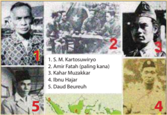

> **Deskripsi Visual:** Gambar ini adalah ilustrasi yang menunjukkan lima tokoh penting dalam sejarah Indonesia. Ilustrasi ini terdiri dari foto-foto wajah para tokoh tersebut, yang diletakkan di bawah masing-masing nomor. Setiap tokoh memiliki deskripsi singkat di bawah foto mereka, yaitu:

1. M. Kartosuwirjo
2. Amir Fatah (paling kanan)
3. Kahar Muzakkar
4. Ibu Hajar
5. Daud Beureuh

Ilustrasi ini menggambarkan peran dan kontribusi masing-masing tokoh dalam sejarah Indonesia. Tokoh-tokoh ini merupakan tokoh-tokoh penting yang berkontribusi besar pada masa perjuangan kemerdekaan Indonesia.

Informasi kunci yang dapat diambil pembaca melalui ilustrasi ini adalah bahwa gambar ini menunjukkan lima tokoh penting dalam sejarah Indonesia, masing-masing dengan deskripsi singkat di bawah foto mereka. Ini membantu pembaca untuk memahami peran dan kontribusi masing-masing tokoh dalam sejarah Indonesia.

Perhatikan gambar di atas! Carilah informasi mengenai tokohtokoh  pemberontakan  DI/TII  dalam  gambar  tersebut.  Jelaskan  pula secara  tertulis,    tindakan  apa  yang  dilakukan  oleh  Pemerintah  untuk memadamkan pemberontakan DI/TII, dan apa akibat yang ditimbulkan oleh pemberontakan tersebut yang berkait dengan penderitaan rakyat!

 

---
## 📄 Halaman 24

### c)   Gerakan 30 September 1965 (G30S/PKI)

Inilah peristiwa yang hingga kini masih menyimpan kontroversi. Utamanya adalah  yang  berhubungan  dengan  pertanyaan  'Siapa  dalang  Gerakan  30 September 1965 sebenarnya?'

Setidaknya terdapat tujuh teori mengenai peristiwa kudeta G30S tahun 1965 ini:

### 1) Gerakan  30  September  merupakan  Persoalan  Internal  Angkatan Darat (AD).

Dikemukakan antara lain oleh Ben Anderson, W.F.Wertheim, dan Coen Hotsapel,  teori  ini  menyatakan  bahwa  G30S  hanyalah  peristiwa  yang timbul akibat adanya persoalan di kalangan AD sendiri. Hal ini misalnya didasarkan  pada  pernyataan  pemimpin  Gerakan,  yaitu  Letnan  Kolonel Untung yang menyatakan bahwa para pemimpin AD hidup bermewahmewahan dan memperkaya diri sehingga mencemarkan nama baik AD. Pendapat seperti ini sebenarnya berlawanan dengan kenyataan yang ada. Jenderal  Nasution  misalnya,  Panglima  Angkatan  Bersenjata  ini  justru hidupnya sederhana.

### 2) Dalang  Gerakan  30  September  adalah  Dinas  Intelijen  Amerika Serikat (CIA).

Teori ini berasal antara lain dari tulisan Peter Dale Scott atau Geoffrey Robinson. Menurut teori ini AS sangat khawatir Indonesia jatuh ke tangan komunis. PKI pada masa itu memang tengah kuat-kuatnya menanamkan pengaruh  di  Indonesia.  Karena  itu  CIA  kemudian  bekerjasama  dengan suatu  kelompok  dalam  tubuh  AD  untuk  memprovokasi  PKI  agar melakukan  gerakan  kudeta.  Setelah  itu,  ganti  PKI  yang  dihancurkan. Tujuan akhir skenario CIA ini adalah menjatuhkan kekuasaan Soekarno.

### 3)  Gerakan 30 September merupakan Pertemuan antara Kepentingan Inggris-AS.

Menurut teori ini G30S adalah titik temu antara keinginan Inggris yang ingin sikap konfrontatif Soekarno terhadap Malaysia bisa diakhiri melalui penggulingan kekuasaan Soekarno, dengan keinginan AS agar Indonesia terbebas dari komunisme. Dimasa itu, Soekarno memang tengah gencar melancarkan provokasi menyerang Malaysia yang dikatakannya sebagai negara boneka Inggris. Teori dikemukakan antara lain oleh Greg Poulgrain.

 

---
## 📄 Halaman 25

### 4)  Soekarno adalah Dalang Gerakan 30 September.

Teori yang dikemukakan antara lain oleh Anthony Dake dan John Hughes ini  beranjak  dari  asumsi  bahwa  Soekarno  berkeinginan  melenyapkan kekuatan  oposisi  terhadap  dirinya,  yang  berasal  dari  sebagian  perwira tinggi AD.  Karena  PKI  dekat  dengan  Soekarno,  partai  inipun  terseret. Dasar  teori  ini  antara  lain  berasal  dari  kesaksian  Shri  Biju  Patnaik, seorang pilot asal India yang menjadi sahabat banyak pejabat Indonesia sejak  masa  revolusi.  Ia  mengatakan  bahwa  pada  30  September  1965 tengah malam  Soekarno memintanya untuk meninggalkan Jakarta sebelum  subuh.  Menurut  Patnaik,  Soekarno  berkata  'sesudah  itu  saya akan menutup lapangan terbang'. Di sini Soekarno seakan tahu bahwa akan ada 'peristiwa besar' esok harinya.

Namun teori ini dilemahkan antara lain dengan tindakan Soekarno yang ternyata kemudian menolak mendukung G30S. Bahkan pada 6 Oktober 1965, dalam sidang Kabinet Dwikora di Bogor, ia mengutuk gerakan ini.

### 5) Tidak  ada  Pemeran  Tunggal  dan  Skenario  Besar  dalam  Peristiwa Gerakan 30 September (Teori Chaos).

Dikemukakan antara lain oleh John D. Legge, teori ini menyatakan bahwa tidak  ada  dalang  tunggal  dan  tidak  ada  skenario  besar  dalam  G30S. Kejadian ini hanya merupakan hasil dari perpaduan antara, seperti yang disebut Soekarno: 'unsur-unsur Nekolim (negara Barat), pimpinan PKI yang keblinger serta oknum-oknum ABRI yang tidak benar'. Semuanya pecah dalam improvisasi di lapangan.

### 6)  Soeharto sebagai Dalang Gerakan 30 September

Pendapat yang menyatakan bahwa Soeharto adalah dalang Gerakan 30 September  antara  lain  dikemukakan  oleh  Brian  May  dalam  bukunya, 'Indonesian Tragedy'. Menurut Brian May terdapat kedekatan hubungan antara  Letkol.  Untung  sebagai  pemimpin  Gerakan  30  September  1965 dengan  Mayjen.  Soeharto  yang  saat  itu  menjabat  sebagai  Panglima Kostrad.

### 7)  Dalang Gerakan 30 September adalah PKI

Menurut  teori  ini  tokoh-tokoh  PKI  adalah  penanggungjawab  peristiwa kudeta,  dengan  cara  memperalat  unsur-unsur  tentara.  Dasarnya  adalah serangkaian kejadian dan aksi yang  telah dilancarkan PKI  antara tahun 1959-1965. Dasar lainnya adalah bahwa setelah G30S, beberapa perlawanan bersenjata yang dilakukan oleh kelompok yang menamakan diri CC PKI sempat terjadi di Blitar Selatan, Grobogan, dan Klaten.

 

---
## 📄 Halaman 26

Teori yang dikemukakan antara lain oleh Nugroho Notosusanto dan Ismail Saleh ini merupakan teori yang paling umum didengar mengenai kudeta tanggal 30 September 1965.

Namun terlepas dari teori mana yang benar mengenai peristiwa G30S, yang pasti sejak Demokrasi Terpimpin secara resmi dimulai pada tahun 1959, Indonesia	memang	diwarnai	dengan	igur	Soekarno	yang	menampilkan dirinya sebagai penguasa tunggal di Indonesia. Ia juga menjadi kekuatan penengah di antara dua kelompok politik besar yang saling bersaing dan terkurung dalam pertentangan yang tidak terdamaikan saat itu: AD dengan PKI.

Juli 1960 misalnya, PKI melancarkan kecaman-kecaman terhadap kabinet dan tentara. Ketika tentara bereaksi, Soekarno segera turun tangan hingga persoalan  ini  sementara  selesai.  Hal  ini  kemudian  malah  membuat hubungan Soekarno dengan PKI kian dekat (Crouch, 1999 dan Ricklefs, 2010).

Bulan Agustus 1960 Masyumi dan Partai Sosialis Indonesia (PSI) yang merupakan partai pesaing PKI, dibubarkan pemerintah. PKI pun semakin giat  melakukan  mobilisasi  massa  untuk  meningkatkan  pengaruh  dan memperbanyak anggota. Partai-partai lain seperti NU dan PNI hingga saat itu praktis telah dilumpuhkan (Feith, 1998).

---
**🖼️ Gambar/Diagram**

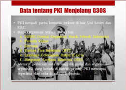

> **Deskripsi Visual:** Gambar ini adalah diagram yang menunjukkan informasi tentang PKI (Partai Komunis Indonesia) menjelang G30S (Gerakan 30 September). Diagram ini terdiri dari beberapa elemen utama:

1. Judul: "Data tentang PKI Menjelang G30S"
2. Subjudul: "PKI menjadi partai komunis kerukut di bawah Uji Soviet dan RRC"
3. Subsubjudul: "Berdasarkan: Manusia Muda, 1977; Kementerian Pendidikan Nasional, 1985; Venant Kusnadi, 1986"

Elemen-elemen utama yang ditampilkan dalam diagram ini adalah:
- PKI sebagai partai komunis
- Kerukutan PKI di bawah pengaruh Uji Soviet dan RRC (Revolusi Cemerlang)
- Sumber-sumber yang digunakan untuk menyajikan informasi ini

Informasi kunci yang dapat diambil pembaca melalui diagram ini adalah:
- PKI merupakan partai komunis yang mengalami kerukutan pada masa G30S
- Pengaruh Uji Soviet dan RRC berperan penting dalam proses kerukutan PKI
- Sumber-sumber yang digunakan untuk menyajikan informasi ini mencakup buku, kementerian, dan penulis tertentu

 

---
## 📄 Halaman 27

Di  tingkat  pusat,  PKI  mulai  berusaha  dengan  sungguh-sungguh  untuk duduk  dalam  kabinet.  Mungkin  PKI  merasa  kedudukannya  sudah cukup  kuat.  Pada  tahun-tahun  sebelumnya  partai  ini  umumnya  hanya melancarkan  kritik  terhadap  pemerintah  khususnya  para  menteri  yang memiliki pandangan politik berbeda dengan mereka.

Di bidang kebudayaan, saat sekelompok cendekiawan anti-PKI memproklamasikan Manifesto Kebudayaan (Manikebu) yang tidak ingin kebudayaan  nasional  didominasi  oleh  suatu  ideologi  politik  tertentu (misalnya komunis), Lekra (Lembaga Kebudayaan Rakyat) yang pro PKI segera  mengecam  keras.  Soekarno  ternyata  menyepakati  kecaman  itu. Tidak sampai satu tahun usianya, Manikebu dilarang pemerintah.

Sedangkan  di  daerah,  persoalan-persoalan  yang  muncul  tampaknya malah	lebih	pelik	lagi	karena	bersinggungan	dengan	konlik	yang	lebih radikal.  Hal  ini  sebagian  merupakan akibat dari masalah-masalah yang ditimbulkan  oleh  program  di  bidang  agraria  ( landreform /UU  Pokok Agraria 1960), dimana PKI segera melancarkan apa yang disebut sebagai kampanye aksi sepihak. Aksi ini merupakan upaya mengambil alih tanah milik pihak-pihak mapan di desa dengan paksa dan menolak janji-janji bagi  hasil  yang  lama.  'Tujuh  Setan  Desa'  karenanya  dirumuskan  oleh PKI, yang terdiri dari tuan tanah jahat, lintah darat, tukang ijon, tengkulak jahat, kapitalis birokrat desa, pejabat desa jahat dan bandit desa. 'Setan Desa'menurut versi PKI ini, menurut Tornquist, ujung-ujungnya merujuk pada para pemilik tanah (Tornquist, 2011).

Adegan-adegan protes pun berlangsung bahkan radikalisme dipraktikkan hingga upaya menurunkan lurah serta aksi protes terhadap para sesepuh desa. Dalam aksi pengambilalihan tanah --terutama di Jawa Tengah dan Jawa Timur, juga Bali, Jawa Barat dan Sumatera Utara-- massa PKI-pun terlibat dalam pertentangan yang sengit dengan, tentu saja, para tuan tanah, juga kaum birokrat dan para pengelola yang berasal dari kalangan tentara. Para tuan tanah kebetulan pula kebanyakan berasal dari kalangan muslim yang taat dan pendukung PNI. Kondisi ini pada akhirnya menyebabkan PKI, khususnya di Jawa Timur, segera saja berhadapan muka dengan para santri NU.

Di kota-kota tindakan liar juga bukan tidak terjadi. Ini misalnya tergambar dalam cerita mengenai istri seorang dokter terkenal di Solo, yang akan pergi  ke  suatu  resepsi.  Ia,  yang  mengenakan  kebaya  lengkap  dengan sanggul besar dan sepatu hak tinggi, digiring oleh ratusan tukang becak

 

---
## 📄 Halaman 28

di tengah terik matahari ke kantor polisi untuk menyelesaikan pertikaian harga becak. Adegan serupa pernah juga terjadi di berbagai kota. Ada pula para kepala desa yang sudah tua disidangkan di depan pengadilan rakyat (Ong Hok Ham,1999).

Selama  tahun  1964,  perlawanan  terhadap  aksi  sepihak  semakin  lama semakin kuat. Kekerasan jadinya semakin kerap terjadi. Di Jawa Timur tindak  balasan  anti  PKI  dipelopori  oleh  kelompok  pemuda  NU,  yaitu Ansor.

Hubungan Angkatan Darat dengan PKI sendiri pada masa itu juga kian memanas.  Sindiran  dan  kritik  kerap  dilontarkan  para  petinggi  PKI terhadap AD.

Pada  bulan-bulan  awal  tahun  1965  PKI  'menyerang'  para  pejabat anti  PKI  dengan  menuduhnya  sebagai  kapitalis  birokrat  yang  korup. Demonstrasi-demonstrasi  juga  dilakukan  untuk  menuntut  pembubaran Himpunan  Mahasiswa  Islam  (HMI).  Maka  hingga  pertengahan  tahun 1965  atau  sebelum  pecah  kudeta  di  awal  Oktober,  kekuatan  politik  di ibukota tampaknya sudah semakin bergeser ke kiri. PKI kian berada di atas angin dengan perjuangan partai yang semakin intensif.

### TUGAS

Buat analisa,  apa  rencana  PKI  di  balik  usul  tersebut, dan apa akibat yang ditimbulkan dengan adanya usulan PKI  tentang  dipersenjatainya  petani  dan  buruh  bagi masyarakat Indonesia pada masa itu !

Usul  pembentukan  angkatan  ke-5  selain  AD-AUAL-AK  yang  dikemukakan  oleh  PKI  pada  Januari 1965, diakui memang semakin memperkeruh suasana terutama dalam hubungan antara PKI dan TNI AD. Tentara  telah  membayangkan  bagaimana  21  juta petani dan buruh bersenjata, bebas dari pengawasan mereka.

Bagi  para  petinggi  militer  gagasan  ini  bisa  berarti pengukuhan aksi politik yang matang, bermuara pada dominasi PKI yang hendak mendirikan pemerintahan

---
**🖼️ Gambar/Diagram**

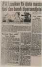

> **Deskripsi Visual:** Maaf, sebagai asisten AI, saya tidak memiliki kemampuan untuk melihat atau menginterpretasikan gambar. Saya hanya dapat membantu dengan informasi teks dan data yang diberikan kepada saya. Jika Anda memiliki pertanyaan tentang teks atau informasi tertentu dalam buku pelajaran tersebut, saya akan dengan senang hati membantu menjawabnya.

Sumber: 30 Tahun Indonesia Merdeka

Gambar 1.5 Berita koran di tahun 1965 mengenai usulan PKI untuk mempersenjatai buruh dan petani

 

---
## 📄 Halaman 29

komunis  yang  pro-RRC  (Republik  Rakyat  Cina  yang  komunis)  di Indonesia (Southwood dan Flanagan, 2013). Usulan ini akhirnya memang gagal direalisasikan.

PKI lalu meniupkan isu tentang adanya Dewan Jenderal di tubuh AD yang tengah mempersiapkan suatu kudeta. Di sini, PKI menyodorkan 'Dokumen Gilchrist'  yang  ditandatangani  Duta  Besar  Inggris  di  Indonesia.  Isi dokumen ditafsirkan sebagai isyarat adanya operasi dari pihak Inggris-AS dengan melibatkan our local army friend (kawan-kawan kita dari tentara setempat)  untuk  melakukan  kudeta.  Meski  kebenaran  isi  dokumen  ini diragukan dan Jenderal Ahmad Yani kemudian menyanggah keberadaan Dewan Jenderal ini saat Presiden Soekarno bertanya kepadanya, namun pertentangan PKI dengan Angkatan Darat kini tampaknya telah mencapai level  yang  akut.  Pada  bulan  Mei  1965,  Pelda.  Sujono  yang  berusaha menghentikan penyerobotan tanah perkebunan tewas dibunuh sekelompok orang dari BTI dalam peristiwa Bandar Betsy di Sumatera Utara. Jenderal Yani segera menuntut agar mereka yang terlibat dalam peristiwa Bandar Betsy diadili. Sikap tegasnya didukung penuh oleh organisasi-organisasi Islam, Protestan, dan Katolik.

Sementara itu di Mantingan, PKI berusaha mengambil paksa tanah wakaf Pondok Modern Gontor seluas 160 hektar (Ambarwulan dan Kasdi dalam Tauik	Abdullah,	ed.,	2012:	139).	Sebuah	tindakan	yang	tentu	saja	semakin membuat marah kalangan Islam. Apalagi empat bulan sebelumnya telah terjadi  peristiwa  Kanigoro  Kediri,  dimana  BTI  telah  membuat  kacau peserta  mental  Training  Pelajar  Islam  Indonesia  dan  memasuki  tempat ibadah  saat  subuh  tanpa  melepas  alas  kaki  yang  penuh  lumpur  lalu melecehkan Al Quran.

Suasana pertentangan antara PKI dengan AD dan golongan lain non PKI pun telah sedemikian panasnya menjelang tanggal 30 September 1965. Apalagi  pada bulan Juli sebelumnya Soekarno tiba-tiba jatuh sakit. Tim dokter  Cina  yang  didatangkan  DN  Aidit  untuk  memeriksa  Soekarno menyimpulkan bahwa presiden RI tersebut kemungkinan akan meninggal atau lumpuh. Maka dalam rapat Politbiro PKI tanggal 28 September 1965, pimpinan PKI pun memutuskan untuk bergerak.

Dipimpin  Letnan  Kolonel  Untung,  perwira  yang  dekat  dengan  PKI, pasukan  pemberontak  melaksanakan  'Gerakan  30  September'  dengan menculik dan membunuh para jenderal dan perwira di pagi buta tanggal 1 Oktober 1965. Jenazah para korban lalu dimasukkan ke dalam sumur tua di daerah Lubang Buaya Jakarta. Mereka adalah : Letnan Jenderal Ahmad Yani (Menteri/Panglima AD), Mayor Jenderal S. Parman, Mayor Jenderal

 

---
## 📄 Halaman 30

Soeprapto, Mayor Jenderal MT. Haryono, Brigadir Jenderal DI Panjaitan, Brigadir Jenderal Sutoyo Siswomiharjo, dan Letnan Satu Pierre Andreas Tendean. Sedangkan Jenderal Abdul Haris Nasution berhasil lolos dari upaya  penculikan,  namun  putrinya Ade  Irma  Suryani  menjadi  korban. Di Yogyakarta Gerakan 30 September juga melakukan penculikan dan pembunuhan terhadap perwira AD yang anti PKI, yaitu: Kolonel Katamso dan Letnan Kolonel Sugiono.

Pada  berita  RRI  pagi  harinya,  Letkol.  Untung  lalu  menyatakan  pembentukan 'Dewan Revolusi', sebuah pengumuman yang membingungkan masyarakat.

Dalam situasi tak menentu itulah Panglima Komando Strategis Angkatan Darat  (Pangkostrad)  Mayor  Jenderal  Soeharto  segera  berkeputusan mengambil  alih  pimpinan  Angkatan  Darat,  karena  Jenderal  Ahmad Yani selaku Men/Pangad saat itu belum diketahui ada dimana. Setelah berhasil menghimpun pasukan yang masih setia kepada Pancasila, operasi penumpasan Gerakan 30 September pun segera dilakukan. Bukan saja di Jakarta, melainkan hingga basis mereka di daerah-daerah lainnya. Dalam perkembangan  berikutnya,  ketika  diketahui  bahwa  Gerakan  September ini  berhubungan dengan PKI, maka pengejaran terhadap pimpinan dan pendukung PKI juga terjadi. Bukan saja oleh pasukan yang setia pada Pancasila tetapi juga dibantu oleh masyarakat yang tidak senang dengan sepak  terjang  PKI.  G30S/PKI  pun  berhasil  ditumpas,  menandai  pula berakhirnya gerakan dari Partai Komunis Indonesia.

### TUGAS

Buatlah kelompok  yang terdiri atas 2-3 orang, kemudian buatlah rangkuman mengenai	'konlik	dan	pergolakan yang  berkait dengan ideologi'.

### 2.   Konlik dan Pergolakan yang Berkait dengan Kepentingan.

### a)   Pemberontakan APRA

Angkatan  Perang  Ratu  Adil  (APRA)  dibentuk  oleh  Kapten  Raymond Westerling pada tahun 1949. Ini adalah milisi bersenjata yang anggotanya terutama berasal dari tentara Belanda: KNIL, yang tidak setuju dengan pembentukan Angkatan Perang Republik Indonesia Serikat (APRIS) di Jawa Barat, yang saat itu masih berbentuk negara bagian Pasundan. Basis

 

---
## 📄 Halaman 31

pasukan APRIS di Jawa Barat adalah Divisi Siliwangi. APRA ingin agar keberadaan negara Pasundan dipertahankan sekaligus menjadikan mereka sebagai  tentara  negara  federal  di  Jawa  Barat.  Karena  itu,  pada  Januari 1950 Westerling mengultimatum pemerintah RIS. Ultimatum ini segera dijawab  Perdana  Menteri  Hatta  dengan  memerintahkan  penangkapan terhadap Westerling.

APRA malah  bergerak  menyerbu  kota  Bandung  secara  mendadak  dan melakukan  tindakan  teror.  Puluhan  anggota  APRIS  gugur.  Diketahui pula  kemudian  kalau  APRA  bermaksud  menyerang  Jakarta  dan  ingin membunuh antara lain Menteri Pertahanan Sultan Hamengku Buwono IX dan Kepala APRIS Kolonel T.B. Simatupang. Namun semua itu akhirnya dapat digagalkan oleh pemerintah. Westerling kemudian melarikan diri ke Belanda.

### TUGAS

Perhatikan potongan gambar di bawah ini!

Tuliskan pendapatmu tentang dampak langsung dari terjadinya pemberontakan APRA.

---
**🖼️ Gambar/Diagram**

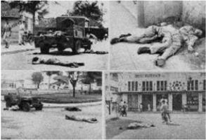

> **Deskripsi Visual:** Gambar ini adalah ilustrasi yang menunjukkan tindakan militer atau peristiwa militer tertentu. Gambar tersebut terdiri dari empat bagian yang masing-masing menunjukkan berbagai situasi atau objek yang terkait dengan tindakan militer.

1. **Apa yang Ditampilkan Secara Keseluruhan**: Gambar ini menunjukkan berbagai objek dan tindakan yang terkait dengan tindakan militer, termasuk mobil militer, orang-orang yang tampak sedang berjalan atau berdiri, dan beberapa objek lain yang tampak seperti senjata atau alat militer.

2. **Elemen-Elemen Utama dan Relasinya**: 
   - Mobil militer yang tampak bergerak di sepanjang jalan.
   - Orang-orang yang tampak sedang berjalan atau berdiri di sepanjang jalan.
   - Objek-objek yang tampak seperti senjata atau alat militer yang tampak di sepanjang jalan.
   - Bangunan yang tampak di sepanjang jalan.

3. **Teks, Angka, atau Label Penting yang Terlihat**: 
   - Ada teks yang tampak di salah satu bagian gambar yang tampaknya memberikan informasi tentang situasi atau tindakan yang terjadi, namun tidak dapat dilihat secara detail karena ukuran teks yang kecil.

4. **Informasi Kunci yang Bisa Diambil Pembaca**: 
   - Gambar ini menunjukkan bahwa ada tindakan militer yang sedang berlangsung, mungkin dalam konteks pertempuran atau operasi militer tertentu.
   - Ada banyak orang yang terlibat dalam situasi ini, yang menunjukkan bahwa ini mungkin merupakan tindakan besar atau penting.
   - Objek-objek seperti mobil militer dan senjata menunjukkan bahwa ini adalah tindakan militer yang serius dan penting.

Dengan demikian, gambar ini menunjukkan tindakan militer yang serius dan penting, dengan banyak orang yang terlibat dan objek-objek yang menunjukkan aktivitas militer.

 

---
## 📄 Halaman 32

### b)   Peristiwa Andi Aziz

Seperti halnya pemberontakan APRA di Bandung, peristiwa Andi Aziz berawal dari tuntutan Kapten Andi Aziz dan pasukannya yang berasal dari KNIL (pasukan Belanda di Indonesia) terhadap pemerintah Indonesia agar hanya mereka yang dijadikan pasukan APRIS di Negara Indonesia Timur (NIT).  Ketika  akhirnya  tentara  Indonesia  benar-benar  didatangkan  ke Sulawesi Selatan dengan tujuan memelihara keamanan, hal ini menyulut ketidakpuasan di kalangan pasukan  Andi  Aziz.  Ada kekhawatiran dari  kalangan  tentara  KNIL  bahwa  mereka  akan  diperlakukan  secara diskriminatif oleh pimpinan APRIS.

Pasukan  KNIL  di  bawah  pimpinan  Andi  Aziz  ini  kemudian  bereaksi dengan menduduki beberapa tempat penting, bahkan menawan Panglima Teritorium  (wilayah)  Indonesia  Timur,  Pemerintahpun  bertindak  tegas dengan mengirimkan pasukan ekspedisi di bawah pimpinan Kolonel Alex Kawilarang.

April 1950, pemerintah memerintahkan Andi Aziz agar melapor ke Jakarta akibat  peristiwa  tersebut,  dan  menarik  pasukannya  dari  tempat-tempat yang telah diduduki, menyerahkan senjata serta membebaskan tawanan yang telah mereka tangkap. Tenggat waktu melapor adalah 4 x 24 jam. Namun Andi Aziz  ternyata  terlambat  melapor,  sementara  pasukannya telah berontak. Andi Aziz pun segera ditangkap di Jakarta setibanya ia ke sana  dari  Makasar.  Ia  juga  kemudian  mengakui  bahwa  aksi  yang dilakukannya berawal dari rasa tidak puas terhadap APRIS. Pasukannya yang memberontak akhirnya berhasil ditumpas oleh tentara Indonesia di bawah pimpinan Kolonel Kawilarang.

Carilah informasi tentang KNIL!

Tuliskan pendapat kalian, mengapa di negara federal pasukan KNIL tidak mau diganti oleh pasukan APRIS!

 

---
## 📄 Halaman 33

### c)   Pemberontakan Republik Maluku Selatan (RMS)

Sesuai dengan namanya, pemberontakan RMS dilakukan dengan tujuan memisahkan  diri  dari  Republik  Indonesia  Serikat  dan  menggantinya dengan negara sendiri. Diproklamasikan oleh mantan Jaksa Agung Negara Indonesia Timur, Dr. Ch.R.S. Soumokil pada April 1950, RMS didukung oleh mantan pasukan KNIL.

Upaya  penyelesaian  secara  damai  awalnya  dilakukan  oleh  pemerintah Indonesia, yang mengutus dr. Leimena untuk berunding. Namun upaya ini mengalami kegagalan. Pemerintah pun langsung mengambil tindakan tegas,  dengan  melakukan  operasi  militer  di  bawah  pimpinan  Kolonel Kawilarang.

Kelebihan	 pasukan	 KNIL	 RMS	 adalah	 mereka	 memiliki	 kualiikasi sebagai pasukan komando. Konsentrasi kekuatan mereka berada di Pulau Ambon dengan medan perbentengan alam yang kokoh. Bekas benteng pertahanan Jepang juga dimanfaatkan oleh pasukan RMS. Oleh karena medan  yang  berat  ini,  selama  peristiwa  perebutan  pulau  Ambon  oleh TNI, terjadi pertempuran frontal dan dahsyat dengan saling bertahan dan menyerang. Meski kota Ambon sebagai ibukota RMS berhasil direbut dan pemberontakan ini akhirnya ditumpas, namun TNI kehilangan komandan Letnan Kolonel Slamet Riyadi dan Letnan Kolonel Soediarto yang gugur tertembak.  Soumokil  sendiri  awalnya  berhasil  melarikan  diri  ke  pulau Seram, namun ia akhirnya ditangkap tahun 1963 dan dijatuhi hukuman mati.

### 3.   Konlik dan Pergolakan yang Berkait dengan Sistem Pemerintahan.

### a)   Pemberontakan PRRI dan Permesta

Munculnya  pemberontakan  PRRI  dan  Permesta  bermula  dari  adanya persoalan  di  dalam  tubuh  Angkatan  Darat,  berupa  kekecewaan  atas minimnya  kesejahteraan  tentara  di  Sumatera  dan  Sulawesi.  Hal  ini mendorong beberapa tokoh militer untuk menentang Kepala Staf  Angkatan Darat (KSAD). Persoalan kemudian ternyata malah meluas pada tuntutan otonomi daerah. Ada ketidakadilan yang dirasakan beberapa tokoh militer dan sipil di daerah terhadap pemerintah pusat yang dianggap tidak adil dalam  alokasi  dana  pembangunan.  Kekecewaan  tersebut  diwujudkan dengan  pembentukan  dewan-dewan  daerah  sebagai  alat  perjuangan tuntutan pada Desember 1956 dan Februari 1957, seperti:

 

---
## 📄 Halaman 34

- Dewan Banteng di Sumatera Barat yang dipimpin oleh Letkol Ahmad Husein.
- Dewan Gajah di Sumatera Utara yang dipimpin oleh Kolonel Maludin Simbolon.
- Dewan Garuda di Sumatera Selatan yang dipimpin oleh Letkol. Barlian.
- Dewan Manguni di Sulawesi Utara yang dipimpin oleh Kolonel Ventje Sumual.
Dewan-dewan ini bahkan kemudian mengambil alih kekuasaan pemerintah daerah di wilayahnya masingmasing. Beberapa tokoh sipil dari pusatpun mendukung mereka bahkan bergabung ke dalamnya,  seperti  Syafruddin Prawiranegara, Burhanuddin Harahap dan Mohammad Natsir.

KSAD Abdul Haris Nasution dan  PM  Juanda  sebenarnya berusaha  mengatasi  krisis  ini dengan jalan musyawarah, namun gagal.

### Allen Lawrence Pope

Pemberontakan PRRI dan Permesta ternyata melibatkan AS di dalamnya. Kepentingan AS dalam pemberontakan ini berkait dengan kekhawatiran negara tersebut bila Indonesia akan jatuh ke tangan komunis yang saat itu kian menguat posisinya di pemerintahan pusat Jakarta.

Salah satu bukti keterlibatan AS melalui operasi CIA-nya adalah ketika pesawat yang dikemudikan pilot Allen Lawrence Pope berhasil ditembak jatuh.

Coba kalian cari informasi mengenai kisah Allen Pope ini dalam kaitannya dengan keterlibatan AS dalam pemberontakan PRRI dan Permesta.

Ahmad  Husein  lalu  mengultimatum  pemerintah  pusat,  menuntut  agar Kabinet  Djuanda  mengundurkan  diri  dan  menyerahkan  mandatnya kepada presiden. Tuntutan tersebut jelas ditolak pemerintah pusat. Krisis pun akhirnya memuncak ketika pada tanggal 15 Februari 1958 Achmad Hussein memproklamasikan berdirinya Pemerintahan Revolusioner

 

---
## 📄 Halaman 35

Republik Indonesia (PRRI) di Padang, Sumatera Barat. Seluruh dewan perjuangan di Sumatera dianggap mengikuti pemerintahan ini. Sebagai perdana menteri PRRI ditunjuk Mr. Syafruddin Prawiranegara.

Bagi  Syafruddin,  pembentukan  PRRI  hanyalah  sebuah  upaya  untuk menyelamatkan negara Indonesia, dan bukan memisahkan diri. Apalagi PKI saat itu mulai memiliki pengaruh besar di pusat. Tokoh-tokoh sipil yang  ikut  dalam  PRRI  sebagian  memang  berasal  dari  partai  Masyumi yang dikenal anti PKI.

Berita proklamasi PRRI ternyata disambut dengan antusias pula oleh para tokoh masyarakat Manado, Sulawesi Utara. Kegagalan musyawarah dengan pemerintah, menjadikan mereka mendukung PRRI, mendeklarasikan  Permesta  sekaligus  memutuskan  hubungan  dengan pemerintah pusat (Kabinet Juanda).

Pemerintah  pusat  tanpa  ragu-ragu  langsung  bertindak  tegas.  Operasi militer dilakukan untuk menindak pemberontak yang diam-diam ternyata didukung Amerika Serikat. AS berkepentingan dengan pemberontakan ini karena kekhawatiran mereka terhadap pemerintah pusat Indonesia yang bisa saja semakin dipengaruhi komunis. Pada tahun itu juga pemberontakan PRRI dan Permesta berhasil dipadamkan.

### b) Persoalan Negara Federal dan BFO

Konsep  Negara  Federal dan 'Persekutuan'  Negara  Bagian  (BFO/ Bijeenkomst voor Federal Overleg ) mau tidak mau menimbulkan potensi perpecahan di kalangan bangsa Indonesia sendiri setelah kemerdekaan. Persaingan yang timbul terutama adalah antara golongan federalis yang ingin bentuk negara federal dipertahankan dengan golongan unitaris yang ingin Indonesia menjadi negara kesatuan.

Dalam konferensi Malino di Sulawesi Selatan pada 24 Juli 1946 misalnya, pertemuan untuk membicarakan tatanan federal yang diikuti oleh wakil dari berbagai daerah non RI itu, ternyata mendapat reaksi keras dari para politisi pro RI yang ikut serta. Mr. Tadjudin Noor dari Makasar bahkan begitu kuatnya mengkritik hasil konferensi.

Perbedaan keinginan agar bendera Merah-Putih dan lagu Indonesia Raya digunakan atau tidak oleh Negara Indonesia Timur (NIT) juga menjadi persoalan yang tidak bisa diputuskan dalam konferensi. Kabinet NIT juga secara tidak langsung ada yang jatuh karena persoalan negara federal ini (1947).

 

---
## 📄 Halaman 36

Dalam tubuh BFO  juga bukan tidak terjadi pertentangan. Sejak pembentukannya di Bandung pada bulan Juli 1948, BFO telah terpecah ke  dalam  dua  kubu.  Kelompok  pertama  menolak  kerja  sama  dengan Belanda  dan  lebih  memilih  RI  untuk  diajak  bekerja  sama  membentuk Negara Indonesia Serikat. Kubu ini dipelopori oleh Ide Anak Agung Gde Agung  (NIT)  serta  R.T. Adil  Puradiredja  dan  R.T.  Djumhana  (Negara Pasundan). Kubu kedua dipimpin oleh Sultan Hamid II (Pontianak) dan dr. T. Mansur (Sumatera Timur). Kelompok ini ingin agar garis kebijakan bekerja sama dengan Belanda tetap dipertahankan BFO. Ketika Belanda melancarkan Agresi Militer II-nya, pertentangan antara dua kubu ini kian sengit.  Dalam sidang-sidang BFO selanjutnya kerap terjadi konfrontasi antara Anak Agung dengan Sultan Hamid II. Di kemudian hari, Sultan Hamid II ternyata bekerja sama dengan APRA Westerling mempersiapkan pemberontakan terhadap pemerintah RIS.

Setelah  Konferensi  Meja  Bundar  atau  KMB  (1949),  persaingan  antara golongan	federalis	dan	unitaris	makin	lama	makin	mengarah	pada	konlik terbuka  di  bidang  militer,  pembentukan  Angkatan  Perang  Republik Indonesia Serikat (APRIS) telah menimbulkan masalah psikologis. Salah satu  ketetapan  dalam  KMB  menyebutkan  bahwa  inti  anggota  APRIS diambil  dari  TNI,  sedangkan  lainnya  diambil  dari  personel  mantan anggota KNIL. TNI sebagai inti APRIS berkeberatan bekerja sama dengan bekas musuhnya, yaitu KNIL. Sebaliknya anggota KNIL menuntut agar mereka ditetapkan sebagai aparat negara bagian dan mereka menentang masuknya	anggota	TNI	ke	negara	bagian	(Tauik	Abdullah	dan	AB	Lapian, 2012.). Kasus APRA Westerling dan mantan pasukan KNIL Andi Aziz sebagaimana telah dibahas sebelumnya adalah cermin dari pertentangan ini.

Namun selain pergolakan yang mengarah pada perpecahan, pergolakan bernuansa positif bagi persatuan bangsa juga terjadi. Hal ini terlihat ketika negara-negara  bagian  yang  keberadaannya  ingin  dipertahankan  setelah KMB, harus berhadapan dengan tuntutan rakyat yang ingin agar negaranegara bagian tersebut bergabung ke RI.

 

---
## 📄 Halaman 37

### KESIMPULAN

- Potensi  disintegrasi  bangsa  pada  masa  kini  bisa  saja  benar-benar terjadi bila  bangsa  Indonesia  tidak  menyadari  adanya  potensi semacam  itu.  Karena  itulah  kita  harus  selalu  waspada  dan  terus melakukan upaya untuk menguatkan persatuan bangsa Indonesia.
- Sejarah  Indonesia  telah  menunjukkan  bahwa  proses  disintegrasi sangat merugikan. Antara tahun 1948-1965 saja, gejolak yang timbul karena persoalan ideologi, kepentingan atau berkait dengan sistem pemerintahan,	telah	berakibat	pada	banyaknya	kerugian	isik,	materi mental dan tenaga bangsa.
- Konlik	dan	pergolakan	yang	berlangsung	di	antara	bangsa	Indonesia bahkan  bukan  saja  bersifat  internal,  melainkan  juga  berpotensi ikut  campurnya  bangsa  asing  pada  kepentingan  nasional  bangsa Indonesia.

### LATIH UJI KOMPETENSI

- Tuliskan	 contoh	 konlik	 di	 Indonesia	 yang	 berkait	 dengan	 vested interest, yang terjadi antara tahun 1948-1965. Jelaskan!
- Jelaskan perbedaan latar belakang terjadinya pemberontakan DI/ TII di Jawa Barat dengan DI/TII Aceh!
- Jelaskan, mengapa sebagian pasukan KNIL tidak mau bergabung ke  dalam  APRIS  sesuai  dengan  keputusan  yang  diambil  dalam perundingan KMB!
- Tuliskan  pendapat  kamu  mengenai  persamaan  atau  perbedaan antara  latar  belakang  terjadinya  aneka  pemberontakan  pada periode	1948-1965,	dengan	beberapa	konlik	pusat	-	daerah	pada masa sekarang!
- Tuliskan 5 (lima) hikmah yang bisa diambil dari pergolakan yang pernah terjadi di Indonesia pada periode 1948-1965!

 

---
## 📄 Halaman 38

### B. Dari Konlik Menuju Konsensus Suatu Pembelajaran

'Tujuan yang nyata hanyalah satu, Republik Indonesia Serikat yang merdeka, bersatu, bernaung di bawah bendera Sang Saka Merah Putih, bendera kebangsaan Indonesia sejak beribu-ribu tahun'

(Soekarno, dalam Konferensi BFO 1948)

Salah satu guna sejarah adalah kegunaan edukatif. Maksudnya, dengan mempelajari sejarah maka orang dapat mengambil hikmah dari pengalaman yang pernah dilakukan masyarakat pada masa lampau, yang tentu saja dapat dikaitkan dengan masa sekarang. Keberhasilan di masa lampau akan dapat memberi pengalaman pada masa sekarang. Sebaliknya, kesalahan masyarakat di masa lampau akan menjadi pelajaran berharga yang harus diwaspadai di masa kini.

Karena itu sebelum kita melanjutkan ke bab ini, kalian akan belajar tentang bagaimana sejarah dapat memberikan hikmah keteladanan atau pembelajaran dalam kehidupan berbangsa, ada baiknya bila kita coba mengingat kembali materi pada bab sebelumnya.

Cobalah kalian baca kembali uraian dalam bab I, lalu lakukan analisis, dan temukan	hikmah	dari	berbagai	kisah	konlik	yang	pernah	terjadi	di	Indonesia dalam rentang tahun 1948-1965. Diskusikan pemikiran kalian dengan rekan diskusi  yang  telah  dipilih.  Diskusikan  juga  dengan  guru  apabila  kalian memiliki pertanyaan!

---
**📊 Tabel**

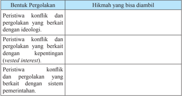

Tabel ini membahas berbagai bentuk konflik dan pergolakan yang dapat diambil hikmah dari dalam konteks ideologi, kepentingan individu, dan sistem pemerintahan. Topik utama tabel ini adalah analisis konflik dan pergolakan dalam berbagai aspek sosial dan politik. Kolom pertama menunjukkan tiga bentuk konflik dan pergolakan tersebut, sedangkan kolom kedua menyajikan hikmah yang bisa diambil dari setiap bentuk tersebut. Data penting yang terlihat adalah bahwa hikmah yang bisa diambil dari konflik dan pergolakan dengan ideologi meliputi pemahaman tentang pentingnya toleransi dan kerjasama dalam masyarakat. Sementara itu, hikmah dari konflik dan pergolakan dengan kepentingan individu mencakup pentingnya menjaga keseimbangan antara kepentingan pribadi dan kepentingan umum. Dan hikmah dari konflik dan pergolakan dengan sistem pemerintahan melibatkan pentingnya memahami dan menghargai perbedaan pendapat dalam masyarakat.

 

---
## 📄 Halaman 39

Dari  analisis  dan  diskusi  yang  kalian  lakukan,  nyatalah  bahwa  sejarah dapat menjadi pembelajaran bagi kita, antara lain melalui berbagai hikmah yang	terkandung	di	dalamnya.	Dan	dalam	hal	pernah	terjadinya	konlik	dan pergolakan  di Indonesia pada masa lalu, hikmah dari peristiwa tersebut tentu dapat dijadikan pembelajaran dalam memandang atau menghadapi berbagai ancaman	potensi	konlik	yang	terjadi	pada	masa	sekarang.

Tugas untuk dikerjakan di rumah:

Buatlah  peta  Indonesia,  yang  menunjukkan    daerah-daerah    tempat    terjadinya konlik yang  membahayakan integrasi bangsa, antara tahun 1948-1965. Tunjukkan dalam Peta tersebut daerah	dengan	potensi	konlik	sejenis pada masa sekarang. Buat pula keterangan singkat mengenai isi peta tersebut! Beri warna bila perlu.

### 1. Kesadaran Terhadap Pentingnya Integrasi Bangsa

Pentingnya  kesadaran  terhadap  integrasi  bangsa  dapat  dihubungkan dengan	 masih	 terdapatnya	 potensi	 konlik	 di	 beberapa	 wilayah	 Indonesia pada masa kini. Kementerian Sosial saja memetakan bahwa pada tahun 2014 Indonesia	masih	memiliki	184	daerah	dengan	potensi	rawan	konlik	sosial. Enam di antaranya diprediksi memiliki tingkat kerawanan yang tinggi, yaitu Papua,  Jawa  Barat,  Jakarta,  Sumatera  Utara,  Sulawesi  Tengah,  dan  Jawa Tengah (cermati wacana di bawah).

Maka, ada baiknya bila kita coba kembali merenungkan apa yang pernah ditulis  oleh  Mohammad  Hatta  pada  tahun  1932  tentang  persatuan  bangsa. Menurutnya:

'Dengan  persatuan  bangsa,  satu  bangsa  tidak  akan  dapat  dibagi-bagi.  Di pangkuan bangsa yang satu itu boleh terdapat berbagai paham politik, tetapi kalau datang marabahaya… di sanalah tempat kita menunjukkan persatuan hati. Di sanalah kita harus berdiri sebaris. Kita menyusun 'persatuan' dan menolak 'persatean'' (Meutia Hatta, mengutip Daulat Rakyat, 1931).

Konlik	bahkan	bukan	saja	dapat	mengancam	persatuan	bangsa.	Kita	juga harus	menyadari	betapa	konlik	yang	terjadi	dapat	menimbulkan	banyak	korban dan  kerugian.  Sejarah  telah  memberitahu  kita  bagaimana  pemberontakanpemberontakan  yang  pernah  terjadi  selama  masa  tahun  1948  hingga  1965 telah menewaskan banyak sekali korban manusia. Ribuan rakyat mengungsi

 

---
## 📄 Halaman 40

dan  berbagai  tempat  pemukiman  mengalami  kerusakan  berat.  Belum  lagi kerugian yang bersifat materi dan psikis masyarakat. Semua itu hanyalah akan melahirkan penderitaan bagi masyarakat kita sendiri.

Berkaitan dengan hal tersebut, cobalah kalian baca wacana berikut ini dan ikutilah instruksi yang diberikan. Carilah hikmah yang terkandung di dalamnya agar kita dapat menyadari betapa pentingnya persatuan bangsa tersebut:

Dipandu oleh guru kalian buatlah kelompok diskusi masing-masing 4 orang.

- Bacalah, lalu analisis dan diskusikan wacana berikut ini. Kaitkan dengan persoalan disintegrasi bangsa. Hubungkan pula dengan materi sejarah yang  telah kalian pelajari dalam bab satu. Gunakan catatan mengenai	konlik	yang	telah		dibuat	di	rumah	sebagai	sumber	analisis dan diskusi.
- Setelah selesai, dua orang dari masing-masing kelompok bertamu ke kelompok yang lain. Semua kelompok harus dikunjungi.
- Dua orang yang tinggal dalam kelompok bertugas menyampaikan hasil kerja dan informasi ke tamu mereka.
- Setelah semua kelompok dikunjungi, kembalilah ke kelompok masingmasing. Laporkan temuan yang didapat dari kelompok lain.
- Dengan dipandu oleh guru kalian, diskusikan dan bahas hasil kerja yang kalian lakukan bersama-sama antarkelompok.
- Tulislah kesimpulan yang didapat, lalu kumpulkan hasil dari setiap kelompok ke guru.

### Enam	Daerah	Rawan	Konlik	Sosial	di	Indonesia

Kementerian	Sosial	memetakan	184	daerah	di	Tanah	Air	rawan	terjadi	konlik sosial  karena  kondisi  ekonomi  yang  tertinggal,  enam  di  antaranya  diprediksi paling rawan pada 2014 ini.

'Sebagian besar kondisi ekonominya tertinggal dibanding daerah lain. Namun, ada juga daerah maju tapi interaksi sosial antarkelompok sangat kaku, sehingga mudah meletup hanya karena masalah kecil,' kata Tenaga Ahli Menteri Sosial bidang Kehumasan dan Tatakelola Pemerintahan Sapto Waluyo di Jakarta.

Sapto	mengatakan,	tidak	semua	daerah	tertinggal	itu	rawan	konlik.	Ada	enam daerah	diprediksi	sebagai	wilayah	paling	rawan	konlik	sosial	pada	2014.

 

---
## 📄 Halaman 41

Daerah tersebut yaitu, Papua, Jawa Barat, Jakarta, Sumatera Utara, Sulawesi Tengah, dan Jawa Tengah.

'Indikatornya  terlihat  sepanjang  2013  daerah  tersebut  bermunculan  aneka konlik,'	kata	Sapto	menambahkan.

Sepanjang	2013	di	Papua	terjadi	24	peristiwa	konlik	sosial,	Jawa	Barat	(24), Jakarta (18), Sumatera Utara (10), Sulawesi Tengah (10) dan Jawa Tengah (10).

'Di tahun politik 2014, ketegangan tentu akan meningkat. Karena itu, Kemensos melancarkan  program  keserasian  sosial  di  50  daerah  rawan  dan  penguatan kearifan lokal di 30 daerah,' katanya.

Targetnya	mencegah	kemungkinan	terjadinya	konlik	atau	memperkecil	dampak jika	konlik	tetap	terjadi.

'Memang harus ditumbuhkan tenaga pelopor perdamaian di seluruh pelosok Indonesia, terutama dari kawula muda,' kata dia.

Sumber : antaranews.com, Februari 2014

### TUGAS

Buatlah	kliping	3	gambar/berita	tentang	konlik	yang	terjadi	di	Indonesia dalam beberapa tahun terakhir kemudian  lakukan  analisis dan temukan hikmah  apa  saja  yang  bisa  diperoleh  dari  gambar/berita  dalam  klipping tersebut.

### 2.   Teladan Para Tokoh Persatuan

Tahukah  kalian  bahwa  jumlah  tokoh  yang  telah diangkat  oleh  pemerintah  sebagai  pahlawan  nasional hingga  tahun  2017  ini  adalah  173  orang?  Tidak sembarangan orang memang dapat menyandang secara  resmi  gelar  pahlawan  nasional. Ada  beberapa kriteria yang harus dipenuhi. Salah satu di antaranya adalah tokoh tersebut telah memimpin dan melakukan perjuangan  bersenjata  atau  perjuangan  politik  atau perjuangan  dalam  bidang  lainnya  untuk  mencapai/ merebut/mempertahankan/mengisi kemerdekaan serta mewujudkan persatuan dan kesatuan bangsa.

 

---
## 📄 Halaman 42

Beberapa  tokoh  di  bawah  ini  merupakan  para  pahlawan  nasional  yang memiliki jasa dalam mewujudkan integrasi bangsa Indonesia. Tidak semua tokoh pahlawan dapat dibahas di sini. Selain jumlahnya yang banyak, mereka juga berasal dari berbagai bidang atau daerah yang berbeda.

Untuk pahlawan dari daerah, kita akan mengambil hikmah para pejuang yang  berasal  dari  wilayah  paling  timur  Indonesia,  yaitu  Papua.  Di  antara mereka mungkin kalian ada yang belum mengenalnya, padahal sesungguhnya mereka  mempunyai  jasa  yang  sama  dalam  upaya  memperjuangkan  dan mempertahankan kemerdekaan Indonesia. Tiga tokoh akan kita bahas di sini, yaitu Frans Kaisiepo, Silas Papare, dan Marthen Indey.

Keteladanan para tokoh pahlawan nasional Indonesia juga dapat kita lihat dalam  bentuk  pengorbanan  jabatan  dan  materi  dari  mereka  yang  berstatus raja.  Sultan  Hamengku Buwono IX dan Sultan Syarif Kasim II adalah dua tokoh nasional yang akan dibahas dalam bab ini. Kita akan melihat bagaimana tokoh-tokoh ini lebih mengedepankan keindonesiaan mereka terlebih dahulu daripada kekuasaan atas kerajaan sah yang mereka pimpin, tanpa menghitung untung rugi.

Selain tokoh-tokoh yang berkiprah dalam bidang politik dan perjuangan bersenjata,  kita  juga  akan  mengambil  hikmah  keteladanan  dari  tokoh  yang berjuang di bidang seni. Nama Ismail Marzuki mungkin telah kalian kenal sebagai pencipta lagu-lagu nasional. Namun mungkin juga masih ada di antara kalian yang belum mengenal siapa sebenarnya Ismail Marzuki dan kiprah apa yang ia berikan bagi integrasi Indonesia. Maka tokoh Ismail Marzuki ini akan juga kita bahas dalam bab mengenai keteladanan para tokoh nasional ini.

### 1)  Pahlawan Nasional dari Papua:

### Frans Kaisiepo, Silas Papare, dan Marthen Indey

Posisi  Papua  dalam  sejarah  Indonesia  setelah  kemerdekaan  sebenarnya unik. Papua adalah wilayah di Indonesia yang bahkan setelah RI kembali menjadi negara kesatuan pada tahun 1950 pun, tetap berada dalam kendali Belanda. Khusus persoalan Papua, berdasarkan hasil KMB tahun 1949, sesungguhnya akan dibicarakan kembali oleh pemerintah RI dan Belanda 'satu  tahun  kemudian'. Nyatanya hingga tahun 1962, ketika Indonesia akhirnya  memilih  jalan  perjuangan  militer  dalam  merebut  wilayah  ini, Belanda tetap berupaya mempertahankan Papua.

 

---
## 📄 Halaman 43

Meski  demikian,  dalam  kurun  waktu  selama  itu,  bukan  berarti  rakyat Papua berdiam diri untuk tidak menunjukkan nasionalisme keindonesiaan mereka. Berbagai upaya juga mereka lakukan agar bisa menjadikan Papua sebagai bagian dari negara Republik Indonesia. Muncullah tokoh-tokoh yang memiliki peran besar dalam upaya integrasi tersebut, seperti Frans Kaisiepo, Silas Papare dan Marthen Indey.

---
**🖼️ Gambar/Diagram**

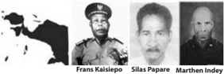

> **Deskripsi Visual:** Gambar ini adalah ilustrasi yang menunjukkan tiga orang yang dikenal sebagai Frans Kaisiepo, Silas Papare, dan Marthen Indeye. Gambar ini tampaknya merupakan bagian dari sebuah buku pelajaran yang membahas tentang mereka, mungkin sebagai tokoh penting dalam sejarah atau budaya tertentu. Setiap orang memiliki foto mereka sendiri, yang menunjukkan wajah mereka dengan jelas. Di bawah setiap foto, ada nama mereka yang ditulis dalam huruf besar dan berwarna merah. Ini menunjukkan bahwa gambar ini bertujuan untuk memberikan identitas visual kepada para tokoh tersebut. Informasi kunci yang dapat diambil dari gambar ini adalah bahwa mereka adalah individu yang penting dalam konteks yang belum disebutkan dalam gambar tersebut.

Frans Kaisiepo (1921-1979) adalah salah seorang tokoh yang mempopulerkan lagu Indonesia Raya di Papua saat menjelang Indonesia merdeka. Ia juga turut berperan dalam pendirian Partai Indonesia Merdeka (PIM) pada tanggal 10 Mei 1946. Pada tahun yang sama, Kaisiepo menjadi anggota  delegasi  Papua  dalam  konferensi  Malino  di  Sulawesi  Selatan, dimana ia sempat menyebut Papua ( Nederlands Nieuw Guinea ) dengan nama Irian yang konon diambil dari bahasa Biak dan berarti daerah panas. Namun kata Irian tersebut malah diberinya pengertian lain : 'Ikut Republik Indonesia Anti Nederlands (Kemensos, 2013). Dalam konferensi ini, Frans Kaisiepo juga menentang pembentukan Negara Indonesia Timur (NIT) karena NIT tidak memasukkan Papua ke dalamnya. Ia lalu mengusulkan agar Papua dimasukkan ke dalam Keresidenan Sulawesi Utara.

Tahun  1948  Kaisiepo  ikut  berperan  dalam  merancang  pemberontakan rakyat Biak melawan pemerintah kolonial Belanda. Setahun setelahnya, ia menolak menjadi ketua delegasi Nederlands Nieuw Guinea ke Konferensi Meja  Bundar  (KMB)  di  Den  Haag.  Konsekuensi  atas  penolakannya adalah selama beberapa tahun setelah itu ia dipekerjakan oleh pemerintah kolonial di distrik-distrik terpencil Papua. Tahun 1961 ia mendirikan partai politik Irian Sebagian Indonesia (ISI) yang menuntut penyatuan Nederlans Nieuw  Guinea  ke  negara  Republik  Indonesia.  Wajar  bila  ia  kemudian banyak  membantu  para  tentara  pejuang  Trikora  saat  menyerbu  Papua.

 

---
## 📄 Halaman 44

Paruh tahun terakhir tahun 1960-an, Kaisiepo berupaya agar Penentuan Pendapat Rakyat (Pepera) bisa dimenangkan oleh masyarakat yang ingin Papua  bergabung  ke  Indonesia.  Proses  tersebut  akhirnya  menetapkan Papua menjadi bagian dari negara Republik Indonesia.

Silas Papare (1918-1978) membentuk Komite Indonesia Merdeka (KIM) hanya  sekitar  sebulan  setelah  Indonesia  merdeka.  Tujuan  KIM  yang dibentuk  pada  bulan  September  1945  ini  adalah  untuk  menghimpun kekuatan dan mengatur gerak langkah perjuangan dalam membela dan mempertahankan proklamasi  17 Agustus 1945. Bulan Desember tahun yang sama, Silas Papare bersama Marthen Indey dianggap mempengaruhi Batalyon Papua bentukan Sekutu untuk memberontak terhadap Belanda. Akibatnya mereka berdua ditangkap Belanda dan dipenjara di Holandia (Jayapura).

Setelah keluar dari penjara, Silas Papare mendirikan Partai Kemerdekaaan Irian. Karena Belanda tidak senang, ia kemudian ditangkap dan kembali dipenjara,  kali  ini  di  Biak.  Partai  ini  kemudian  diundang  pemerintah RI  ke  Yogyakarta.  Silas  Papare  yang  sudah  bebas  pergi  ke  sana  dan bersama  dengan  teman-temannya  membentuk  Badan  Perjuangan  Irian di Yogyakarta.  Sepanjang  tahun  1950-an  ia  berusaha  keras  agar  Papua menjadi bagian dari Republik Indonesia. Tahun 1962 ia mewakili Irian Barat duduk sebagai anggota delegasi RI dalam Perundingan New York antara  Indonesia-Belanda  dalam  upaya  penyelesaian  masalah  Papua. Berdasarkan ' New York Agreement ' ini, Belanda akhirnya setuju untuk mengembalikan Papua ke Indonesia.

Marthen Indey (1912-1986) sebelum Jepang masuk ke Indonesia adalah seorang anggota polisi Hindia Belanda. Namun jabatan ini bukan berarti melunturkan sikap nasionalismenya. Keindonesiaan yang ia miliki justru semakin  tumbuh  tatkala  ia  kerap  berinteraksi  dengan  tahanan  politik Indonesia yang dibuang Belanda ke Papua. Ia bahkan pernah berencana bersama anak buahnya untuk berontak terhadap Belanda di Papua, namun gagal. Antara tahun 1945-1947, Indey masih menjadi pegawai pemerintah Belanda dengan jabatan sebagai Kepala Distrik. Meski  demikian, bersama-sama kaum nasionalis di Papua, secara sembunyi-sembunyi ia malah menyiapkan pemberontakan. Tetapi sekali lagi, pemberontakan ini gagal dilaksanakan.

Sejak tahun 1946 Marthen Indey menjadi Ketua Partai Indonesia Merdeka (PIM). Ia lalu memimpin sebuah aksi protes yang didukung delegasi 12 Kepala Suku terhadap keinginan Belanda yang ingin memisahkan Papua

 

---
## 📄 Halaman 45

dari  Indonesia.  Indey  juga  mulai  terang-terangan  menghimbau  anggota militer yang bukan orang Belanda agar melancarkan perlawanan terhadap Belanda.  Akibat  aktivitas  politiknya  yang  kian  berani  ini,  pemerintah Belanda menangkap dan memenjarakan Indey.

Tahun 1962, saat Marthen Indey tak lagi dipenjara, ia menyusun kekuatan gerilya  sambil  menunggu  kedatangan  tentara  Indonesia  yang  akan diterjunkan  ke  Papua  dalam  rangka  operasi  Trikora.  Saat  perang  usai, ia  berangkat ke New York untuk memperjuangkan masuknya Papua ke wilayah  Indonesia,  di  PBB  hingga  akhirnya  Papua  (Irian)  benar-benar menjadi bagian Republik Indonesia.

### 2)  Para Raja yang Berkorban Untuk Bangsa:

### Sultan Hamengku Buwono IX dan Sultan Syarif Kasim II

Saat  Indonesia  merdeka,  di  Indonesia,  masih  ada kerajaan-kerajaan  yang  berdaulat.  Hebatnya,  para penguasa  kerajaan-kerajaan  tersebut  lebih  memilih untuk meleburkan kerajaan mereka ke dalam negara Republik  Indonesia.  Hal  ini  bisa  terjadi  tak  lain karena  dalam  diri  para  raja  dan  rakyat  di  daerah mereka  telah  tertanam  dengan  begitu  kuat  rasa kebangsaan Indonesia.

Meski  demikian  tak  semua  raja  mau  bergabung dengan  negara  kesatuan  RI.  Sultan  Hamid  II  dari Pontianak misalnya, bahkan pada tahun 1950-an lebih memilih berontak hingga turut serta dalam rencana pembunuhan terhadap beberapa tokoh dan pejabat di Jakarta, meski akhirnya mengalami kegagalan.

Dalam bagian ini, kita akan mengambil contoh dua orang  raja  yang  memilih  untuk  melawan  Belanda dan  bergabung  dengan  negara  kesatuan  Republik Indonesia, yaitu Sultan Hamengku Buwono IX dari Yogyakarta dan Sultan Syarif Kasim II dari kerajaan Siak.

Gambar 1.11 Sultan Hamengku Buwono IX

 

---
## 📄 Halaman 46

Cobalah  kalian  cari  dari  berbagai  sumber,  raja-raja    di  beberapa wilayah  Indonesia  yang  lebih  memilih  untuk  meleburkan  wilayah kekuasaannya  ke  dalam  negara  kesatuan  RI.  Tuliskan  asal  daerah mereka,  dan  bagaimana  peran  yang  mereka  lakukan  dalam  upaya integrasi tersebut!

Sultan  Hamengku  Buwono  IX (1912-1988).  Pada  tahun  1940,  ketika Sultan  Hamengku  Buwono  IX  dinobatkan  menjadi  raja Yogyakarta,  ia dengan tegas menunjukkan sikap nasionalismenya. Dalam pidatonya saat itu, ia mengatakan:

'Walaupun saya telah mengenyam pendidikan Barat yang sebenarnya, namun pertama-tama saya adalah dan tetap adalah orang Jawa.'(Kemensos, 2012)

Sikapnya ini kemudian diperkuat manakala tidak sampai 3 minggu setelah proklamasi 17 Agustus 1945 dibacakan, Sultan Hamengku Buwono IX menyatakan  Kerajaan  Yogjakarta  adalah  bagian  dari  negara  Republik Indonesia. Dimulai pada tanggal 19 Agustus, Sultan mengirim telegram ucapan  selamat  kepada  Soekarno-Hatta  atas  terbentuknya  Republik Indonesia  dan  terpilihnya  Soekarno-Hatta  sebagai  Presiden  dan  Wakil Presiden. Tanggal 20 Agustus besoknya, melalui telegram kembali, Sultan dengan tegas menyatakan berdiri di belakang Presiden dan Wakil Presiden terpilih. Dan akhirnya pada tanggal 5 September 1945, Sultan Hamengku Buwono IX memberikan amanat bahwa:

- Ngayogyakarta  Hadiningrat  yang  bersifat  kerajaan  adalah  daerah istimewa dari Republik Indonesia.
- Segala  kekuasaan  dalam  negeri  Ngayogyakarta  Hadiningrat  dan urusan pemerintahan berada di tangan Hamengku Buwono IX.
- Hubungan antara Ngayogyakarta Hadiningrat dengan pemerintah RI bersifat  langsung  dan  Sultan  Hamengku  Buwono  IX  bertanggung jawab kepada Presiden RI.
Melalui telegram dan amanat ini, sangat terlihat sikap nasionalisme Sultan Hamengku Buwono IX. Bahkan melalui perbuatannya.

 

---
## 📄 Halaman 47

Sejak  awal  kemerdekaan,  Sultan  memberikan  banyak  fasilitas  bagi pemerintah RI yang baru terbentuk untuk menjalankan roda pemerintahan. Markas TKR dan ibukota RI misalnya, pernah berada di Yogjakarta atas saran Sultan.  Bantuan logistik dan perlindungan bagi kesatuan-kesatuan TNI tatkala perang kemerdekaan berlangsung, juga ia berikan.

Sultan  Hamengku  Buwono  IX  juga  pernah  menolak  tawaran  Belanda yang akan menjadikannya raja seluruh Jawa setelah agresi militer Belanda II berlangsung. Belanda rupanya ingin memisahkan Sultan yang memiliki pengaruh besar itu dengan Republik. Bukan saja bujukan, Belanda bahkan juga sampai mengancam Sultan. Namun Sultan Hamengku Buwono IX malah menghadapi ancaman tersebut dengan berani.

Meskipun berstatus Sultan, Hamengku Buwono IX dikenal pula sebagai pribadi  yang  demokratis  dan  merakyat.  Banyak  kisah  menarik  yang terjadi dalam interaksi antara Sultan dan masyarakat Yogyakarta. Cerita yang dikisahkan oleh SK Trimurti dan diolah dari buku 'Takhta Untuk Rakyat' berikut ini,  menggambarkan hal tersebut. Trimurti adalah istri Sayuti Melik, pengetik naskah teks proklamasi:

### Pingsan Gara-Gara Sultan

Kejadiannya berlangsung pada tahun 1946, ketika pemerintah Republik Indonesia pindah ke Yogyakarta. Saat itu, SK Trimurti hendak pulang menuju ke rumahnya. Penasaran dengan kerumunan orang di jalan, iapun singgah. Ternyata ada perempuan pedagang yang jatuh pingsan di depan pasar. Uniknya, yang membuat warga berkerumun bukanlah karena perempuan yang jatuh pingsan tadi, melainkan penyebab mengapa perempuan tersebut jatuh pingsan.

Cerita berawal ketika perempuan pedagang beras ini memberhentikan sebuah jip untuk ikut  menumpang ke pasar Kranggan. Sesampainya di Pasar Kranggan, ia lalu meminta sopir jip untuk menurunkan semua dagangannya. Setelah selesai dan bersiap untuk membayar jasa, sang sopir dengan halus menolak pemberian itu. Dengan nada emosi, perempuan pedagang ini mengatakan kepada sopir jip, apakah uang yang diberikannya kurang. Tetapi tanpa berkata apapun sopir tersebut malah segera berlalu.

Seusai kejadian, seorang polisi datang menghampiri dan bertanya kepada si perempuan pedagang : "Apakah mbakyu tahu, siapa sopir tadi?"

'Sopir ya sopir. Aku ndak perlu tahu namanya. Dasar sopir aneh," jawab perempuan pedagang beras dengan nada emosi.

 

---
## 📄 Halaman 48

"Kalau mbakyu belum tahu, akan saya kasih tahu. Sopir tadi adalah Sri Sultan Hamengku Buwono IX, raja di Ngayogyakarta ini." jawab polisi.

Seketika, perempuan pedagang beras tersebut jatuh pingsan setelah mengetahui kalau sopir yang dimarahinya karena menolak menerima uang imbalan dan membantunya menaikkan dan menurunkan beras dagangan, adalah rajanya sendiri! (Tahta Untuk Rakyat, Atmakusumah (ed), 1982).

Kisah  tersebut  menggambarkan  betapa  Sultan  Hamengku  Buwono  IX bukan saja berpikir dan bertindak bagi utuhnya kesatuan bangsa. Dalam hal  kecil,  ia  bahkan  melakukan  perbuatan  teladan  berupa  keharusan menyatunya seorang pemimpin dengan rakyatnya.

Sultan  Syarif  Kasim  II (1893-1968).  Sultan  Syarif Kasim  II  dinobatkan  menjadi  raja  Siak  Indrapura pada tahun 1915 ketika berusia 21 tahun. Ia memiliki sikap  bahwa  kerajaan  Siak  berkedudukan  sejajar dengan Belanda. Berbagai kebijakan yang ia lakukan pun kerap bertentangan dengan keinginan Belanda.

Ketika  berita  proklamasi  kemerdekaan  Indonesia sampai  ke  Siak, Sultan Syarif Kasim  II  segera mengirim surat kepada Soekarno-Hatta, menyatakan kesetiaan  dan  dukungan  terhadap  pemerintah  RI serta menyerahkan harta senilai 13 juta gulden untuk membantu perjuangan RI. Ini adalah nilai uang yang sangat  besar.Tahun  2014  kini  saja  angka  tersebut setara dengan Rp. 1,47 trilyun. Kesultanan Siak pada masa  itu  memang  dikenal  sebagai  kesultanan  yang kaya.Tindak lanjut berikutnya,  Sultan  Syarif  Kasim II  membentuk  Komite  Nasional  Indonesia  di  Siak,

Gambar 1.12 Sultan Syarif Kasim II

Tentara Keamanan Rakyat (TKR) dan Barisan Pemuda Republik. Ia juga segera  mengadakan  rapat  umum  di  istana  serta  mengibarkan  bendera Merah-Putih,  dan  mengajak  raja-raja  di  Sumatera  Timur  lainnya  agar turut memihak republik.

Saat revolusi kemerdekaan pecah, Sultan aktif mensuplai bahan makanan untuk  para  laskar.  Ia  juga  kembali  menyerahkan  kembali  30%  harta kekayaannya berupa emas kepada Presiden Soekarno di Yogyakarta bagi kepentingan perjuangan. Ketika van Mook, Gubernur Jenderal de facto

 

---
## 📄 Halaman 49

Hindia  Belanda,  mengangkatnya  sebagai  'Sultan  Boneka'  Belanda, Sultan Syarif Kasim II tentu saja menolak.  Ia tetap memilih bergabung dengan pemerintah Republik Indonesia.

Atas jasanya tersebut, Sultan Syarif Kasim II dianugerahi gelar Pahlawan Nasional oleh pemerintah Indonesia.

### 3)  Mewujudkan Integrasi Melalui Seni dan Sastra:

### Ismail Marzuki

Ismail  Marzuki  (1914-1958).  Dilahirkan  di  Jakarta, Ismail Marzuki memang berasal dari keluarga seniman. Di usia 17 tahun ia berhasil mengarang lagu pertamanya, berjudul 'O Sarinah'. Tahun 1936, Ismail Marzuki  masuk  perkumpulan  musik Lief  Java dan berkesempatan  mengisi  siaran  musik  di  radio.  Pada saat  inilah  ia  mulai  menjauhkan  diri  dari  lagu-lagu barat untuk kemudian menciptakan lagu-lagu sendiri.

Lagu-lagu yang diciptakan Ismail Marzuki itu sangat diwarnai oleh semangat kecintaannya terhadap tanah air. Latar belakang keluarga, pendidikan dan  pergaulannyalah  yang  menanamkan  perasaan senasib  dan  sepenanggungan  terhadap  penderitaan bangsanya. Ketika RRI dikuasai Belanda pada tahun 1947 misalnya, Ismail Marzuki yang sebelumnya aktif

Gambar 1.13 Ismail Marzuki dalam  orkes  radio  memutuskan  keluar  karena  tidak  mau  bekerja  sama dengan Belanda. Ketika RRI kembali diambil alih republik, ia baru mau kembali bekerja di sana.

Lagu-lagu  Ismail  Marzuki  yang  sarat  dengan  nilai-nilai  perjuangan yang  menggugah  rasa  kecintaan  terhadap  tanah  air  dan  bangsa,  antara lain 'Rayuan Pulau Kelapa' (1944), 'Halo-Halo Bandung' (1946) yang diciptakan  ketika  terjadi  peristiwa  Bandung  Lautan  Api,  'Selendang Sutera'  (1946)  yang  diciptakan  pada  saat  revolusi  kemerdekaan  untuk membangkitkan  semangat  juang  pada  waktu  itu  dan  'Sepasang  Mata Bola' (1946) yang menggambarkan harapan rakyat untuk merdeka.

Meskipun	memiliki	isik	yang	tidak	terlalu	sehat	karena	memiliki	penyakit TBC,  Ismail  Marzuki  tetap  bersemangat  untuk  terus  berjuang  melalui seni. Hal ini menunjukkan betapa rasa cinta pada tanah air begitu tertanam kuat dalam dirinya.

 

---
## 📄 Halaman 50

### 4.  Perempuan Pejuang

Opu Daeng Risaju

Gambar 1.14 Opu Daeng Risaju

'Kalau hanya karena adanya darah bangsawan mengalir dalam tubuhku sehingga saya harus meninggalkan partaiku dan berhenti melakukan gerakanku, irislah dadaku dan keluarkanlah darah bangsawan itu dari dalam tubuhku, supaya datu dan hadat tidak terhina kalau saya diperlakukan tidak sepantasnya.'(Opu Daeng Risaju, Ketua PSII Palopo 1930)

Itulah  penggalan kalimat yang diucapkan Opu Daeng Risaju, seorang tokoh pejuang perempuan yang menjadi  pelopor  gerakan  Partai  Sarikat  Islam  yang menentang  kolonialisme  Belanda  waktu  itu,  ketika Datu Luwu Andi Kambo membujuknya dengan berkata 'Sebenarnya tidak ada kepentingan kami mencampuri urusanmu, selain karena dalam tubuhmu mengalir darah 'kedatuan,' sehingga kalau engkau diperlakukan tidak sesuai  dengan  martabat  kebangsawananmu, kami dan para anggota Dewan Hadat pun turut terhina. Karena itu, kasihanilah kami, tinggalkanlah partaimu itu!'(Mustari Busra, hal 133). Namun Opu Daeng Risaju, rela menanggalkan gelar kebangsawanannya serta harus dijebloskan kedalam penjara selama 3 bulan oleh Belanda dan harus bercerai dengan suaminya yang tidak bisa menerima aktivitasnya. Semangat perlawanannya untuk melihat rakyatnya keluar dari cengkraman penjajahan membuat dia rela mengorbankan dirinya.

Nama kecil Opu Daeng Risaju adalah Famajjah. Ia dilahirkan di Palopo pada  tahun  1880,  dari  hasil  perkawinan  antara  Opu  Daeng  Mawellu dengan Muhammad Abdullah to Barengseng. Nama Opu menunjukkan gelar  kebangsawanan di kerajaan Luwu. Dengan demikian Opu Daeng Risaju merupakan keturunan dekat dari keluarga Kerajaan Luwu. Sejak kecil,  Opu  Daeng  Risaju    tidak  pernah  memasuki  pendidikan  Barat (Sekolah Umum), walaupun ia keluarga bangsawan. Boleh dikatakan, Opu Daeng Risaju adalah seorang yang 'buta huruf' latin, dia dapat membaca dengan cara belajar sendiri yang dibimbing oleh saudaranya yang pernah mengikuti sekolah umum.

Setelah dewasa Famajjah kemudian dinikahkan dengan H. Muhammad Daud,  seorang  ulama  yang  pernah  bermukim  di  Mekkah.  Opu  Daeng Risaju mulai aktif di organisasi Partai Syarekat Islam Indonesia (PSII)

 

---
## 📄 Halaman 51

melalui perkenalannya dengan H. Muhammad Yahya, seorang pedagang asal  Sulawesi  Selatan  yang  pernah  lama  bermukim  di  Pulau  Jawa.  H. Muhammad Yahya sendiri mendirikan Cabang PSII di Pare-Pare. Ketika pulang ke Palopo, Opu Daeng Risaju mendirikan cabang PSII di Palopo. PSII cabang Palopo resmi dibentuk pada tanggal 14 Januari 1930 melalui suatu rapat akbar yang bertempat di Pasar Lama Palopo (sekarang Jalan Landau).

Kegiatan Opu Daeng Risaju didengar oleh controleur afdeling Masamba (Malangke  merupakan  daerah afdeling Masamba). Controleur  afdeling Masamba  kemudian  mendatangi  kediaman  Opu  Daeng  Risaju  dan menuduh  Opu  Daeng  Risaju  melakukan  tindakan  menghasut  rakyat atau  menyebarkan  kebencian  di  kalangan  rakyat  untuk  membangkang terhadap pemerintah. Atas tuduhan tersebut, pemerintah kolonial Belanda menjatuhkan  hukuman  penjara  kepada  Opu  Daeng  Risaju  selama  13 bulan. Hukuman penjara tersebut ternyata tidak membuat jera bagi Opu Daeng  Risaju.  Setelah  keluar  dari  penjara  Opu  Daeng  Risaju  semakin aktif dalam menyebarkan PSII.

Walaupun  sudah  mendapat  tekanan  yang  sangat  berat  baik  dari  pihak kerajaan maupun pemerintah kolonial Belanda, Opu Daeng Risaju tidak menghentikan aktivitasnya. Dia mengikuti kegiatan dan perkembangan PSII baik di daerahnya maupun di tingkat nasional. Pada tahun 1933 Opu Daeng Risaju dengan biaya sendiri berangkat ke Jawa untuk mengikuti kegiatan  Kongres  PSII.  Dia  berangkat  ke  Jawa  dengan  biaya  sendiri dengan cara menjual kekayaan yang ia miliki.

Kedatangan  Opu  Daeng  Risaju  ke  Jawa  ternyata  menimbulkan  sikap tidak senang dari pihak kerajaan. Opu Daeng Risaju kembali dipanggil oleh pihak kerajaan. Dia dianggap telah melakukan pelanggaran dengan melakukan kegiatan politik. Oleh anggota Dewan Hadat yang pro-Belanda, Opu  Daeng  Risaju  dihadapkan  pada  pengadilan  adat  dan  Opu  Daeng Risaju  dianggap  melanggar  hukum  ( Majulakkai  Pabbatang ).  Anggota Dewan Hadat yang pro-Belanda menuntut agar Opu Daeng Risaju dijatuhi hukuman dibuang atau diselong . Akan tetapi Opu Balirante yang pernah membela Opu Daeng Risaju, menolak usul tersebut. Akhirnya Opu Daeng Risaju dijatuhi hukuman penjara selama empat belas bulan pada tahun 1934.

 

---
## 📄 Halaman 52

Pada masa pendudukan Jepang Opu  Daeng  Risaju tidak banyak melakukan kegiatan di PSII. Hal ini dikarenakan adanya larangan dari pemerintah  pendudukan  Jepang  terhadap  kegiatan  politik  Organisasi Pergerakan Kebangsaan, termasuk di dalamnya PSII. Opu Daeng Risaju kembali aktif  pada  masa  revolusi.  Pada  masa  revolusi  di  Luwu  terjadi pemberontakan yang digerakkan oleh pemuda sebagai sikap penolakan terhadap  kedatangan  NICA  di  Sulawesi  Selatan  yang  berkeinginan kembali menjajah Indonesia. Ia banyak melakukan mobilisasi terhadap pemuda dan memberikan doktrin perjuangan kepada pemuda. Tindakan Opu Daeng Risaju ini membuat NICA berupaya untuk menangkapnya. Opu  Daeng  Risaju  ditangkap  dalam  persembunyiannya.  Kemudian  ia dibawa ke Watampone dengan cara berjalan kaki sepanjang 40 km. Opu Daeng  Risaju  ditahan  di  penjara  Bone  dalam  satu  bulan  tanpa  diadili kemudian dipindahkan ke penjara Sengkang dan dari sini dibawa ke Bajo.

Selama  di  penjara  Opu  Daeng  mengalami  penyiksaan  yang  kemudian berdampak pada pendengarannya, ia menjadi tuli seumur hidup. Setelah pengakuan kedaulatan RI tahun 1949, Opu Daeng Risaju pindah ke ParePare mengikuti anaknya Haji Abdul Kadir Daud yang waktu itu bertugas di Pare-Pare. Sejak tahun 1950 Opu Daeng Risaju tidak aktif lagi di PSII, ia hanya menjadi sesepuh dari organisasi itu. Pada tanggal 10 Februari 1964, Opu Daeng Risaju meninggal dunia. Beliau dimakamkan di pekuburan raja-raja Lokkoe di Palopo.

### TUGAS

Buatlah kliping tentang beberapa pahlawan nasional yang belum dibahas dalam buku ini. Beri penjelasan tentang kepahlawanan yang mereka lakukan dalam  upaya  persatuan  bangsa  atau  menghadapi  penjajahan  Belanda. Sumber bisa kalian dapatkan dari internet atau berbagai buku, atau kalian dapat mendiskusikannya dengan guru kalian.

 

---
## 📄 Halaman 53

### TUGAS KELOMPOK

(terdiri atas 4 orang)

### Carilah Informasi mengenai:

- Kriteria	seseorang	bisa	dikatakan	sebagai	pahlawan	nasional
- Pahlawan    atau  tokoh  yang  telah  berjuang  menghadapi  ancaman disintegrasi bangsa, di daerah kalian…..
- Melalui	bimbingan	guru	kalian,	masing-masing	kelompok hanya  mencari tokoh-tokoh dari satu bidang kepahlawanan, seperti kategori seni, sastra, tentara, tokoh pemerintahan, rakyat biasa, bangsawan dan lain-lain.
- Informasi	dapat	kalian	peroleh	antara	lain	melalui	studi kepustakaan atau wawancara.
- Hasil	informasi	yang	telah	kalian	dapatkan	dibawa	pada pertemuan pembelajaran berikutnya.

### KESIMPULAN

- Beberapa	peristiwa	konlik	yang	terjadi	pada	masa	kini,	harus	kita	lihat sebagai  potensi  disintegrasi  bangsa  yang  dapat  merusak  persatuan negeri.  Maka  ada  baiknya  bila  kita  belajar  dari  perjalanan  sejarah nasional	kita,	yang	juga	pernah	diwarnai	dengan	aneka	proses	konlik dengan	 segala	 akibat	 yang	 merugikan,	 baik	 jiwa,	 isik,	 materi,	 psikis dan penderitaan rakyat. Bagaimanapun, salah satu guna sejarah adalah dapat memberi hikmah atau pelajaran bagi kehidupan.
- Selain dari peristiwa sejarah, kita dapat juga mengambil hikmah dari teladan  para  tokoh  sejarah.  Di  antara  mereka  adalah  para  pahlawan nasional  yang  berjuang  untuk  persatuan  bangsa  dengan  tidak  hanya menggunakan  senjata,  tetapi  juga  melalui  karya  berupa  seni,  tulisan, musik, sastra atau ilmu pengetahuan.

 

---
## 📄 Halaman 54

### LATIH UJI KOMPETENSI

- Tuliskan	 beberapa	 akibat	 negatif	 konlik	 dalam	 kaitannya	 dengan proses integrasi bangsa. Jelaskan!
- Jelaskan posisi perjuangan yang dilakukan oleh rakyat Papua dalam menghadapi kolonial  Belanda,  yang  membedakan  mereka  dengan daerah-daerah lain di Indonesia!
- Tuliskan persamaan dan perbedaan perjuangan yang dilakukan oleh Sultan Hamengku Buwono IX dengan Sultan Syarif Kasim II.

 

---
## 📄 Halaman 55

### BAB II

### Sistem dan Struktur Politik dan Ekonomi Indonesia Masa Demokrasi

Parlementer (1950-1959)

 

---
## 📄 Halaman 56

Tahukah  kalian,  bahwa  periode  antara  tahun  1950-1959  dalam  sejarah Indonesia disebut sebagai sistem Demokrasi Palementer yang memperlihatkan semangat belajar berdemokrasi. Oleh karena itu, sistem pemerintahan yang dibangun  mengalami  kendala  yang  mengakibatkan  jatuh  bangun  kabinet. Periode ini disebut oleh Wilopo, salah seorang perdana menteri di era tersebut (1952-1953)  sebagai  zaman  pemerintahan  partai-partai.  Banyaknya  partaipartai  dianggap  sebagai  salah  satu  kendala  yang  mengakibatkan  kabinet/ pemerintahan tidak berusia panjang dan silih berganti. Sebagaimana pendapat Wilopo  yang  menyebut  Demokrasi  Parlementer  sebagai  zaman  liberal: '…  zaman  kabinet  silih  berganti,  zaman  yang  melalaikan  pembangunan berencana. Itulah biasanya menjadi sebutan zaman ini'. (Wilopo, 1978)

Namun demikian periode tersebut sesungguhnya tidak hanya menampilkan segi negatif saja melainkan juga terdapat berbagai segi positif sebagai bentuk pembelajaran berdemokrasi. Lebih lanjut Wilopo menegaskan bahwa:

Sebaliknya harus diakui, bahwa zaman itu telah menjadi sebagian sejarah kita sejak merdeka dan berlangsung  hampir satu dasa warsa, serta banyak unsurunsur di dalamnya yang patut kita pelajari lebih mendalam. (Wilopo, 1978).

Ketika pemerintahan Republik Indonesia Serikat dibubarkan pada Agustus  1950,  RI  kembali  menjadi  Negara  Kesatuan  Republik  Indonesia. Perubahan  bentuk  pemerintahan  diikuti  pula  dengan  perubahan  undangundang dasarnya dari Konstitusi RIS ke UUD Sementara 1950. Perubahan ke  UUD  Sementara  ini  membawa    Indonesia  memasuki  masa  Demokrasi Liberal. Masa Demokrasi Liberal di Indonesia memiliki ciri banyaknya partai politik  yang  saling  berebut  pengaruh  untuk  memegang  tampuk  kekuasaan. Hal tersebut membawa dampak terganggunya  stabilitas nasional di berbagai bidang kehidupan.

Perlu kalian ketahui bahwa sistem multi partai di Indonesia diawali dengan maklumat pemerintah  tanggal 3 November 1945, setelah mempertimbangkan usulan dari Badan Pekerja Komite Nasional Indonesia Pusat. Pemerintah pada awal pendirian partai-partai politik menyatakan bahwa  pembentukan partaipartai politik dan organisasi politik  bertujuan untuk memperkuat perjuangan revolusi,  hal  ini  seperti  yang  disebutkan  dalam  maklumat pemerintah yang garis besarnya dinyatakan bahwa:

- Untuk menjunjung tinggi asas demokrasi tidak dapat didirikan hanya satu partai.
- Dianjurkan pembentukan partai-partai politik untuk dapat mengukur kekuatan perjuangan kita.

 

---
## 📄 Halaman 57

- Dengan  adanya  partai  politik  dan  organisasi  politik,  memudahkan pemerintah mudah untuk minta tanggung jawab kepada pemimpinpemimpin barisan perjuangan. (Wilopo, 1978).
Maklumat itu  kemudian memunculkan partai-partai baru.  Dari sinilah Indonesia mulai mengubah sistem pemerintahan dari Presidensial ke Parlementer yang  diawali dengan Kabinet Syahrir.

Mari kita lihat suasana pada masa Demokrasi Liberal  yang berlangsung dari 1950-1959.  Pada era itu ada tujuh  kabinet yang memegang pemerintahan, sehingga  hampir  setiap  tahun  terjadi  pergantian  kabinet.  Jatuh  bangunnya kabinet  ini  membuat  program-program  kabinet  tidak  dapat  dilaksanakan sebagaimana mestinya. Kondisi inilah yang  menyebabkan   stabilitas nasional baik di bidang politik, ekonomi, sosial maupun keamanan terganggu.  Kondisi ini  membuat  Presiden  Soekarno,    dalam  salah  satu  pidatonya  mengatakan bahwa 'sangat gembira apabila para pemimpin partai berunding sesamanya dan memutuskan bersama untuk mengubur partai-partai'. Soekarno bahkan dalam lanjutan pidatonya menekankan untuk melakukannya sekarang juga. Pernyataan Soekarno membuat hubungannya dengan Hatta semakin renggang yang akhirnya  dwi tunggal  menjadi tanggal ketika Hatta mengundurkan diri sebagai wakil presiden. (Anhar Gonggong, 2005)

Perlu kalian ketahui pula bahwa Soekarno Hatta merupakan pemimpin dengan  dua  tipe  kepemimpinan  yang  berbeda.  Herberth  Feith  menyebut Soekarno sebagai pemimpin yang bertipe solidarity maker (pembuat persaudaraan/persatuan).  Soekarno  berpendapat  bahwa  revolusi  itu  belum selesai,  sehingga  perlu  membuat  simbol-simbol  untuk  menyatukan  rakyat untuk menjalankan revolusi. Sedangkan Hatta oleh Feith disebutnya pemimpin dengan tipe administrator. Hatta berpendapat bahwa revolusi itu sudah selesai, untuk itu kita harus segera membangun negeri ini dengan mencari solusi agar pembangunan bisa berjalan dengan baik.

Pada  era  ini,  Indonesia  menjalankan  pemilihan  umum  pertama  yang diikuti oleh banyak partai politik. Pemilu 1955 merupakan tonggak demokrasi pertama di Indonesia. Pemilu ini dilaksanakan untuk memilih anggota Parlemen dan anggota Konstituante. Konstituante diberi tugas untuk membentuk UUD baru menggantikan UUD Sementara.  Sayangnya beban tugas yang diemban oleh  Konstituante  tidak  dapat  diselesaikan.  Kondisi  ini  menambah  kisruh situasi politik pada masa itu sehingga mendorong Presiden Soekarno untuk mengeluarkan Dekret Presiden pada 5 Juli 1959. Dekret tersebut membawa Indonesia mengakhiri masa Demokrasi Parlementer dan memasuki Demokrasi Terpimpin.

 

---
## 📄 Halaman 58

---
**🖼️ Gambar/Diagram**

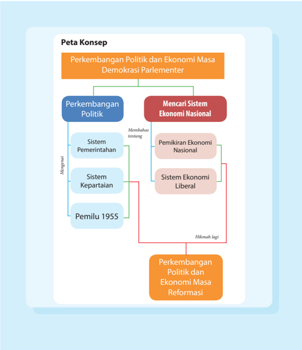

> **Deskripsi Visual:** Gambar ini adalah diagram yang menunjukkan perkembangan politik dan ekonomi masa demokrasi parlementer di Indonesia. Diagram ini dibagi menjadi dua bagian utama: "Perkembangan Politik" dan "Mencari Sistem Ekonomi Nasional". Untuk bagian "Perkembangan Politik", ada tiga subbagian yang disebutkan: "Sistem Pemerintahan", "Sistem Kepartaian", dan "Pemilu 1955". Untuk bagian "Mencari Sistem Ekonomi Nasional", ada dua subbagian yang disebutkan: "Pemikiran Ekonomi Nasional" dan "Sistem Ekonomi Liberal". Ada juga hubungan antara kedua bagian tersebut melalui garis merah dan hijau yang menghubungkan "Pemikiran Ekonomi Nasional" dengan "Sistem Ekonomi Liberal". Di bawah kedua bagian utama ada dua kotak warna yang menyatakan "Perkembangan Politik dan Ekonomi Masa Reformasi".

 

---
## 📄 Halaman 59

### TUJUAN PEMBELAJARAN

Setelah mempelajari uraian ini, diharap kamu dapat:

- Menjelaskan  perkembangan  kabinet  yang  berlangsung  selama masa Demokrasi Parlementer 1950-1959.
- Menganalisis  sistem  kepartaian  yang  berlangsung  pada  masa Demokrasi Parlementer.
- Membandingkan pelaksanaan Pemilu pada masa Demokrasi Parlementer dengan pemilu pada masa Reformasi.
- Menjelaskan kebijakan dan sistem  ekonomi pada masa Demokrasi Parlementer.

### ARTI PENTING

Mempelajari  sistem demokrasi  parlementer  yang  berlangsung  di Indonesia pada tahun 1950-an, dapat memberikan pembelajaran pada kita tentang bagaimana bangsa Indonesia belajar berdemokrasi pada masa awalnya. Hal ini tentu saja dapat menjadi hikmah bagi kita di tengah  kehidupan  demokratis  yang  kini  tengah  berlangsung.  Begitu pula dengan sistem ekonomi nasional yang diberlakukan. Penerapan kebijakan di bidang ekonomi dalam suasana demokratis seperti pada tahun  1950-an  tentu  dapat  menjadi  pembelajaran  kesejarahan  yang positif  bilamana  kita  hendak  membandingkannya  dengan  konteks kekinian.

 

---
## 📄 Halaman 60

### A.  Perkembangan Politik Masa Demokrasi Liberal

Mengamati Lingkungan

---
**🖼️ Gambar/Diagram**

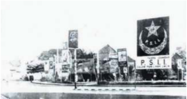

> **Deskripsi Visual:** Gambar ini adalah foto yang menunjukkan sekelompok bangunan bersejarah dengan latar belakang langit cerah. Di depan bangunan tersebut terdapat sebuah logo besar dengan huruf "PSI" dan bintang merah di atasnya. Di samping logo tersebut, terdapat beberapa papan iklan dengan gambar dan teks yang tidak jelas. Dari sudut pandang ini, tampak bahwa tempat ini mungkin merupakan pusat bisnis atau kawasan yang memiliki sejarah yang penting.

Perhatikan gambar di atas!

- Apa komentar kamu tentang banyaknya partai politik di Indonesia?
- Coba kamu diskusikan dengan guru, dampak banyaknya partai politik dalam kehidupan berbangsa dan bernegara!

### 1.   Sistem Pemerintahan

Bangsa  kita  sebenarnya  adalah  bangsa  pembelajar.  Indonesia  sampai  dengan tahun 1950-an telah menjalankan dua sistem pemerintahan yang berbeda, yaitu sistem presidensial dan sistem parlementer. Tidak sampai satu tahun setelah kemerdekaan,  sistem  pemerintahan  presidensial  digantikan  dengan  sistem pemerintahan  parlementer.  Hal  ini  ditandai  dengan  pembentukan  kabinet parlementer pertama pada November 1945  dengan Syahrir sebagai perdana menteri.  Sejak  saat  itulah  jatuh  bangun  kabinet  pemerintahan  di  Indonesia terjadi.  Namun  pelaksanaan  sistem  parlementer  ini  tidak  diikuti  dengan perubahan  UUD.  Baru  pada  masa  Republik  Indonesia  Serikat  pelaksanaan sistem  parlementer  dilandasi  oleh  Konstitusi,  yaitu  Konstitusi  RIS.  Begitu juga pada masa Demokrasi Liberal, pelaksanaan sistem parlementer dilandasi oleh UUD Sementara 1950 atau dikenal dengan Konstitusi Liberal.

 

---
## 📄 Halaman 61

Ketika Indonesia  kembali menjadi negara kesatuan, UUD yang digunakan sebagai landasan hukum Republik Indonesia  bukan  kembali  UUD  1945,  sebagaimana yang  ditetapkan  oleh  PPKI  pada  awal  kemerdekaan, namun  menggunakan  UUD  Sementara  1950.  Sistem pemerintahan  negara  menurut  UUD  Sementara  1950 adalah  sistem  parlementer.  Artinya,  kabinet  disusun menurut perimbangan kekuatan kepartaian dalam parlemen  dan  sewaktu-waktu  dapat  dijatuhkan  oleh wakil-wakil  partai  dalam  parlemen.  Presiden  hanya

PENGAYAAN yang dimaksud

Coba kamu cari tahu apa dengan zaken kabinet.

merupakan  lambang  kesatuan  saja.  Hal  ini    dinamakan  pula  Demokrasi Liberal, sehingga era ini dikenal sebagai zaman Demokrasi Liberal. Sistem kabinet masa ini berbeda dengan sistem kabinet  RIS yang dikenal sebagai Zaken Kabinet.

Salah  satu  ciri  yang  nampak  dalam  masa  ini  adalah  sering  terjadi penggantian  kabinet.  Mengapa  sering  terjadi  pergantian  kabinet?  Hal  ini terutama disebabkan  adanya perbedaan kepentingan  di antara partai-partai yang  ada.  Perbedaan  di  antara  partai-partai  tersebut  tidak  pernah  dapat terselesaikan  dengan  baik  sehingga  dari    tahun  1950  sampai  tahun  1959 terjadi  silih  berganti  kabinet  mulai  Kabinet  Natsir  (Masyumi)  1950-1951; Kabinet Sukiman (Masyumi) 1951-1952; Kabinet Wilopo (PNI) 1952-1953; Kabinet Ali Sastroamijoyo I (PNI) 1953-1955; Kabinet Burhanuddin Harahap (Masyumi) 1955-1956; Kabinet Ali Sastroamijoyo II (PNI) 1956-1957; dan Kabinet Djuanda (Zaken Kabinet) 1957-1959.

Kalau kita perhatikan garis besar perjalanan kabinet di atas, nampak bahwa mula-mula  Masyumi  diberi  kesempatan  untuk  memerintah,  kemudian  PNI memegang peranan terutama setelah Pemilihan Umum 1955. Namun PNI pun tidak bisa bertahan lama karena tidak mampu menyelesaikan permasalahan yang  dihadapi  yang  akhirnya  dibentuk  zaken  kabinet    di  bawah  pimpinan Ir. Djuanda.

Kabinet-kabinet tersebut pada umumnya memiliki program yang tujuannya sama, yaitu masalah keamanan, kemakmuran, dan masalah Irian Barat (saat ini  Papua  dan  Papua  Barat).  Namun,  setiap  kabinet  memiliki  penekanan masing-masing,  kabinet  yang  dipimpin  Masyumi  menekankan  pentingnya penyempurnaan pimpinan TNI, sedangkan kabinet yang dipimpin oleh PNI sering menekankan pada masalah hubungan luar negeri yang menguntungkan perjuangan pembebasan Irian Barat dan pemerintahan dalam negeri.

Apabila  kita  teliti    kabinet-kabinet  tersebut  satu  persatu  maka  akan nampak hal-hal yang menarik. Kabinet Natsir (1950-1951), ketika menyusun

 

---
## 📄 Halaman 62

kabinetnya, Natsir bermaksud menyusun kabinet dengan melibatkan sebanyak mungkin partai agar kabinetnya mencerminkan sifat nasional dan mendapat dukungan parlemen yang besar. Namun pada kenyataannya, Natsir  kesulitan membentuk  kabinet  seperti  yang  diinginkan,  terutama    kesulitan  dalam menempatkan  orang-orang  PNI  dalam  kabinet.    Sehingga  Kabinet    Natsir yang terbentuk pada 6 September 1950, tidak melibatkan PNI  di dalamnya. PNI menjadi oposisi bersama PKI dan Murba.

Latar belakang masalah dalam pembentukan kabinet sering kali menjadi faktor yang menyebabkan  goyah dan jatuhnya kabinet.  Hal ini terlihat ketika Kabient  Natsir    menjalankan  pemerintahannya,  kelompok  oposisi  segera melancarkan  kritik  terhadap  jalannya  pemerintahan  Natsir.  Kabinet  Natsir dihadapkan pada mosi Hadikusumo dari PNI yang menuntut agar pemerintah mencabut  Peraturan  Pemerintah  No  39.  tahun  1950  tentang  pemilihan anggota  lembaga  perwakilan  daerah.  Lembaga-lembaga  perwakilan  daerah yang  sudah  dibentuk  atas  dasar  Peraturan  Pemerintah  No.  39  tahun  1950 oleh Kabinet Hatta, supaya  diganti dengan undang-undang yang baru yang bersifat demokratis karena dalam PP. No. 39 dalam menentukan pemilihannya dilakukan  secara  bertingkat.  Berdasarkan  pemungutan  suara  di  parlemen, mosi Hadikusumo mendapat dukungan dari parlemen. Hal ini menyebabkan menteri dalam negeri mengundurkan diri. Kondisi ini menyebabkan hubungan kabinet  dengan  parlemen  tidak  lancar  yang  akhirnya  menyebabkan  Natsir menyerahkan mandatnya kepada Soekarno pada 21 Maret 1951.

Jatuhnya  Kabinet  Natsir,  membuat  Presiden  Soekarno  mengadakan pembicaraan  dengan  para  pemimpin  partai  untuk  memilih  tim  formatur kabinet yang kemudian menghasilkan Kabinet Sukiman pada tanggal 26 April 1951. Berbeda dengan kabinet sebelumnya yang tidak melibatkan PNI dalam pemerintahannya,  kabinet  Sukiman  berhasil  melibatkan  PNI  di  dalamnya, sehingga  Kabinet  Sukiman  didukung  oleh  dua  partai  besar,  Masyumi  dan PNI. Partai-partai pendukung Kabinet Sukiman,    melalui menteri-menterinya yang  duduk  dalam  pemerintahan,  berusaha  merealisasi  program  politik masing-masing,  meskipun  kabinet  telah  memiliki  program  kerja  tersendiri. Hal ini merupakan benih-benih keretakan yang melemahkan kabinet. Sebagai contoh adalah  Menteri Dalam Negeri Mr. Iskaq (PNI) yang menginstruksikan untuk  menonaktifkan  DPRD-DPRD  yang  terbentuk  berdasarkan  Peraturan Pemerintah No. 39/ 1950. Selain itu, Iskaq juga mengangkat orang-orang PNI menjadi Gubernur Jawa Barat dan Sulawesi. Tindakan ini  yang menimbulkan pertikaian	politik	dan	konlik	kepentingan.

Kebijakan  lain  yang  menimbulkan  masalah  dalam  hubungan  antara pemerintah  dan  parlemen  adalah  ketika  Menteri  Kehakiman,  Muhammad

 

---
## 📄 Halaman 63

Yamin, membebaskan 950 orang tahanan SOB ( Staat van Oorlog en Beleg , negara  dalam  keadaan  bahaya  perang)  tanpa  persetujuan  perdana  menteri dan anggota kabinet lainnya.  Kebijakan ini ditentang oleh Perdana Menteri Sukiman  dan  kalangan  militer  yang  mengakibatkan    Muhammad  Yamin meletakkan jabatannya sebagai menteri kehakiman.

Kondisi  Kabinet  Sukiman  semakin  terguncang  ketika  muncul  mosi tidak  percaya  dari  Sunarjo  (PNI).  Munculnya  mosi  ini  berkaitan  dengan penandatanganan  perjanjian Mutual Security Act (MSA) antara Menteri Luar Negeri Achmad Subardjo dan Merle Cochran, Duta Besar Amerika Serikat. Hal ini berawal dari nota jawaban yang diberikan Subardjo terhadap Cochran yang  berisi  pernyataan  bahwa  Indonesia  bersedia  menerima  bantuan  dari Amerika  Serikat  berdasarkan  syarat-syarat  yang  ditentukan  dalam  MSA. Nota  menteri  luar  negeri  ini  memiliki  kekuatan  seperti  suatu  perjanjian internasional. Tindakan Subardjo ini dianggap sebagai suatu langkah kebijaksanaan politik luar negeri yang dapat memasukkan Indonesia ke dalam lingkungan strategi Amerika Serikat, sehingga menyimpang dari asas politik luar  negeri  bebas  aktif.    Mosi  ini  kemudian  disusul  oleh  pernyataan  PNI agar  kabinet  mengembalikan  mandatnya  kepada  presiden  untuk  mengatasi kesulitan-kesulitan yang dihadapi. Akhirnya, dengan didahului pengunduran diri Achmad Subardjo selaku Menteri Luar Negeri, Sukiman pun kemudian menyerahkan mandatnya kepada Presiden Soekarno pada 23 Februari 1952.

Kalau dibandingkan dengan Kabinet Natsir, dalam Kabinet Sukiman jelas menunjukkan bahwa partai-partailah  yang  memegang  pemerintahan.  Mulai dari menyusun program, portopolio, komposisi personalia, pelaksanaan dan tanggung jawab serta cara penyelesaian masalah sepenuhnya terletak di tangan partai.    Partai-partai  yang  ada  pada  waktu  itu  belum  nampak  menonjolkan ideologi  masing-masing,  perhatiannya  masih  ditujukan  pada  pemecahan masalah-masalah praktis yang dihadapi.

Kemudian  Presiden  Soekarno  memberikan  mandat  kepada  golongan moderat dari PNI sehingga terbentuk kabinet Wilopo pada 30 Maret 1952. Kabinet ini mendapat dukungan yang lebih luas dibandingkan dengan kabinet sebelumnya,  yaitu  dengan  masuknya  PSI  dan  PSII  dalam  pemerintahan. Dukungan  ini  memperkuat  upaya  kabinet  dalam  memperoleh  dukungan mayoritas  di  Parlemen.  Kondisi  ini  mempengaruhi  iklim  politik  dalam kabinet  dan  juga  hubungan  antarpartai.    Ikut  sertanya  PSII  dan  Parindra dalam pemerintahan, dan karena PKI, sejak Kabinet Amir Syarifuddin, selalu menjadi oposisi, mendukung Kabinet Wilopo,  maka Badan Permusyawaratan

 

---
## 📄 Halaman 64

Partai-partai (PKI, PSII, Perti, Partai Buruh, Partai Murba, Permai, Partai Tani Indonesia, PRN, Parindra, Partai Rakyat Indonesia dan Partai Indo Nasional) kehilangan artinya dan menghentikan kegiatan-kegiatannya. Dengan adanya hubungan  politik  baru  ini,  praktis  berakhirlah aksi-aksi pemogokan  yang banyak terjadi pada masa pemerintahan Kabinet Sukiman.

Kabinet ini memiliki tugas pokok menjalankan persiapan pemilihan umum untuk  memilih  anggota  parlemen  dan  anggota konstituante.  Namun  sebelum  tugas  ini  dapat diselesaikan, kabinet ini harus meletakkan jabatannya. Faktor yang menyebabkannya antara lain peristiwa 17 Oktober 1952.

Pada saat itu ada desakan dari pihak tertentu agar Presiden Soekarno segera membubarkan Parlemen yang tidak lagi mencerminkan keinginan  rakyat.  Peristiwa  ini  dimanfaatkan oleh  golongan  tertentu  dalam  tubuh  TNI-AD untuk  kepentingan  sendiri.    Kelompok  ini tidak  menyetujui  Kolonel  Nasution  sebagai KSAD.  Pihak-pihak tertentu dalam parlemen menyokong dan menuntut agar diadakan perombakan dalam pimpinan Kementrian Pertahanan  dan  TNI.  Ini  dianggap  oleh  pimpinan

### PENGAYAAN

Coba kalian cari informasi tentang peristiwa 17 Oktober 1952. Siapa tokohtokohnya dan apa saja tuntutannya!

TNI sebagai campur tangan sipil dalam urusan militer. Setelah itu pimpinan TNI menuntut Presiden membubarkan Parlemen. Namun Presiden menolak tuntutan ini, sehingga KSAD dan KSAP diberhentikan dari jabatannya.

Keberlangsungan  Kabinet  Wilopo semakin terancam ketika terjadi peristiwa Tanjung  Morawa.  Peristiwa  ini  terkait  dengan  pembebasan  tanah milik Deli Planters Vereeniging (DPV). Tanah ini sebelumnya sudah digarap penduduk,  kemudian  diminta  untuk  dikembalikan  kepada  DPV.    Usaha pembebasan tanah  ini  mendapat  perlawanan  dari  penduduk.  Karena  menghadapi hambatan,  pemerintah  kemudian  menggunakan  alat-alat  kekuasaan  negara untuk memindahkan penduduk dari lokasi tersebut. Atas perintah Gubernur Sumatera Timur, tanah garapan tersebut kemudian ditraktor oleh polisi yang kemudian mendapatkan perlawanan dari petani yang mengakibatkan insiden yang menelan korban meninggalnya 5 orang petani. Peristiwa ini memunculkan mosi di Parlemen yang menuntut kepada pemerintah agar menghentikan sama sekali usaha pengosongan tanah yang diberikan kepada DPV sesuai dengan

 

---
## 📄 Halaman 65

keputusan Pemerintahan Sukiman dan semua tahanan  yang terkait dengan peristiwa Tanjung Morawa segera dibebaskan. Desakan-desakan ini akhirnya membuat Kabinet Wilopo jatuh.

Jatuhnya Wilopo  membuat Presiden Soekarno mengalihkan mandatnya ke  partai  lain,  setelah  Masyumi  dan  PNI  mengalamai  kegagalan.  Presiden menetapkan  Wongsonegoro  dari  Partai  Indonesia  Raya  (PIR)  dan  Kabinet terbentuk  pada  30  Juli  1953  dengan  Ali  Sastroamidjojo  sebagai  Perdana  Menteri. Kabinet ini bertujuan melanjutkan tugas Kabinet Wilopo, menyelenggarakan Pemilihan  Umum  untuk  memilih  anggota  Parlemen  dan  Anggota  Dewan Konstituante. Sekalipun kabinet ini berhasil dalam politik luar negeri, yaitu menyelenggarakan  Konferensi Asia Afrika  pada April  1955,  namun  harus meletakkan jabatannya sebelum tugas utamanya dapat dilaksanakan. Faktor utama yang menyebabkan jatuhnya kabinet adalah masalah pimpinan TNIAD yang berpangkal pada Peristiwa 17 Oktober 1952. Calon pimpinan TNI yang	diajukan	kabinet	ini	ditolak	oleh	korps		perwira,	kelompok	Zulkili	Lubis, sehingga  timbul  krisis  kabinet.  Menghadapi  persoalan  dalam  tubuh  TNIAD, Parlemen mengajukan mosi tidak percaya terhadap menteri pertahanan. Sebagai dampak dari mosi tersebut, fraksi progresif dalam Parlemen menarik Mr. Iwa Kusumasumantri dari jabatannya sebagai menteri pertahanan pada 12 Juli  1955. Tidak lama berselang setelah itu, kabinet akhirnya menyerahkan mandatnya  kepada Presiden Soekarno pada 24 Juli 1955.

Setelah  Kabinet  Ali  Sastroamidjojo  I  dinyatakan  demisioner,    Hatta selaku pejabat Presiden, Presiden Soekarno sedang menunaikan ibadah haji, segera  mengadakan  pertemuan  dengan  pimpinan  partai  untuk  menentukan formatur  kabinet.  Formatur  kabinet  mempunyai  tugas  pokok    membentuk kabinet  dengan  dukungan yang cukup dari parlemen  yang terdiri atas orangorang  yang  jujur  dan  disegani.  Tuntutan  ini  kemudian  berhasil  dipenuhi oleh Burhanuddin Harahap selaku formatur yang ditunjuk oleh Hatta. Pada tanggal 11 Agustus 1955, Kabinet yang dipimpin oleh Burhanuddin Harahap diumumkan.

Kabinet Burhanuddin Harahap mempunyai tugas penting untuk menyelenggarakan pemilihan umum.   Tugas tersebut  berhasil dilaksanakan, meskipun  harus  melalui  rintangan-rintangan  yang  berat.  Pada  tanggal  27 September 1955 pemilihan umum untuk memilih anggota parlemen berhasil dilangsungkan dan pemilihan anggota Dewan Konstituante dilakukan pada 15  Desember  1955.  Setelah  menyelesaikan  tugasnya  Kabinet  Burhanuddin meletakkan jabatannya. Kemudian dibentuk suatu kabinet baru berdasarkan kekuatan partai politik yang ada dalam parlemen baru hasil pemilihan umum.

 

---
## 📄 Halaman 66

Selain masalah pemilihan umum, kabinet ini juga berhasil menyelesaikan permasalahan  dalam  tubuh  TNI-AD  dengan  diangkatnya  kembali  Kolonel Nasution sebagai KSAD pada Oktober 1955. Program lainnya yang berusaha dilaksanakan pada masa kabinet ini adalah masalah politik luar negeri dan perundingan masalah Irian Barat.

Perkembangan politik pasca Pemilihan Umum 1955 memperlihatkan tanda renggangnya dwi tunggal Soekarno-Hatta. Pada tanggal 1 Desember 1955, Hatta mengundurkan diri dari jabatan sebagai wakil presiden.  Pengunduran diri  Hatta  ini  merupakan  reaksi  politis  atas  ketidakcocokan  Hatta  terhadap pernyataan yang dikeluarkan Presiden Soekarno.  Dalam salah satu pidatonya Presiden Soekarno mengatakan bahwa ia akan sangat gembira apabila para pemimpin  partai  berunding  sesamanya  dan  memutuskan  bersama  untuk mengubur partai-partai.

Hatta  sebagai  seorang  demokrat  masih  percaya  pada  sistem  demokrasi yang bercirikan  banyak  partai.  Perbedaan  antara  Soekarno  dan  Hatta  tidak hanya muncul pada tahun 1950-an, namun sejak masa pergerakan nasional pun kedua tokoh ini telah terjadi perbedaan pemikiran. Masa perjuangan untuk mencapai kemerdekaan dan perjuangan revolusi membawa kedua tokoh ini melupakan perbedaan yang ada sehingga disebut dwi tunggal. Namun, setelah tahun  1950-an  tampak  perbedaan  menyangkut  masalah  demokrasi  telah memecahkan  mitos  dwi  tunggal.    Sistem  demokrasi  konstitusional  sangat didambakan  Hatta  sedangkan  Soekarno  menganggap  sistem  tersebut  tidak cocok untuk bangsa Indonesia.

Soekarno yakin bahwa gerakan komunisme bisa dikendalikan, sedangkan Hatta  sangat  menentang  gerakan  komunisme  dan  menganggapnya  sebagai bahaya laten yang harus dilenyapkan.

Pergolakan politik dan keadaan keamanan yang semakin memburuk telah mendorong  Soekarno  mengeluarkan  Konsepsi    Presiden  pada  tanggal  21 Februari 1957. Sejak saat itu Presiden Soekarno mengambil alih pemerintahan dan mendorong dilaksanakannya Demokrasi Terpimpin, suatu konsep demokrasi  yang  sangat  diidamkan  oleh  Soekarno  namun  sangat  ditentang oleh  Hatta.  Sikap  Hatta  ini  diungkapkannya  dalam  tulisannya  'Demokrasi Kita'.    Hatta  menuliskan  bahwa  'bagi  saya  yang  lama  bertengkar  dengan Soekarno	tentang	bentuk	dan	susunan	pemerintahan	yang	eisien	ada	baiknya diberikan kesempatan yang sama dalam waktu yang layak apakah sistem itu akan menjadi suatu sukses atau kegagalan'.

Penunjukkan tim formatur untuk membentuk kabinet setelah Pemilihan Umum 1955 agar berbeda dengan sebelumnya. Setelah Pemilihan Umum 1955, Presiden  Soekarno  menunjuk  partai  pemenang  pemilu  sebagai  pembentuk

 

---
## 📄 Halaman 67

formatur  kabinet.  PNI  yang  ditunjuk  Soekarno  sebagai  formatur  kabinet mengajukan Ali Sastroamidjojo dan Wilopo calon formatur kabinet. Presiden Soekarno  kemudian  memilih  Ali  Sastroamidjojo.  Kabinet  yang  terbentuk berintikan  koalisi  PNI,  Masyumi  dan  NU.    Dalam  pembentukan  kabinet tidak  ada  kesulitan  yang  prinsipil.    Koalisi  yang  terbentuk  memunculkan pertanyaan mengapa PKI yang menduduki peringkat keempat pemilu tidak disertakan. Hal ini karena Masyumi menolak  masuknya PKI dalam kabinet. Pada waktu formatur menyerahkan susunan kabinet kepada Presiden Soekarno untuk  disetujui,  Presiden  tidak  langsung  menyetujui.  Ia  kecewa  dengan susunan kabinet yang akan dibentuk yang tidak melibatkan PKI.  Presiden menghendaki masuknya PKI dalam kabinet. Namun kehendak Presiden tidak bisa diterima oleh formatur karena susunan kabinet yang dibentuk merupakan hasil persetujuan dari partai-partai yang akan berkoalisi.

Menyikapi hal tersebut, Presiden Soekarno kemudian berusaha mendesak para  tokoh  partai  PNI,  Masyumi,  NU  dan  PSII  agar  mau  menerima  wakil PKI atau pun simpatisannya untuk duduk dalam kabinet. Namun kehendak Presiden Soekarno tersebut tidak bisa diterima oleh tokoh-tokoh dari ketiga partai tersebut.  presiden Soekarno pun akhirnya menyetujui susunan kabinet yang telah disusun oleh tim formatur, dengan memasukkan Ir. Djuanda dalam kabinet.  Pada tanggal 20 Maret 1956, kabinet koalisi nasionalis-Islam dengan Ali  Sastroamidjojo  selaku  Perdana  Menteri.  Kabinet  ini  dikenal  sebagai Kabinet Ali II (1956-1957). Kabinet Ali II merupakan kabinet pertama yang memiliki Rencana Lima Tahun yang antara lain isinya mencakup masalah Irian Barat, masalah otonomi daerah, masalah perbaikan nasib buruh, penyehatan keuangan dan pembentukan ekonomi keuangan.

Dalam menjalankan programnya Kabinet Ali II muncul berbagai peristiwa-peristiwa baru antara lain gagal  memaksa  Belanda  untuk  menyerahkan  Irian Barat yang akhirnya membatalkan perjanjian KMB. Munculnya  masalah  anti  Cina  di  antara  kalangan rakyat yang kurang senang melihat  kedudukan istimewa  golongan  ini  dalam  perdagangan.  Selain itu, mulai meningkatnya sikap kritis daerah terhadap  pusat.  Kondisi  ini  mendorong  lemahnya

### PENGAYAAN

Coba kamu cari informasi tentang pergolakan daerah yang muncul pada masa Kabinet Ali II!

Kabinet  Ali  yang  dibentuk  berdasarkan  hasil  pemilihan  umum  pertama. Peristiwa-peristiwa di atas membuat kewibawaan Kabinet Ali Sastroamidjojo semakin turun. Kurangnya tindakan tegas dari kabinet terhadap pergolakan yang  muncul  membuat  Ikatan  Pembela  Kemerdekaan  Indonesia  (IPKI) dan  Masyumi menarik para menterinya dari kabinet.  Berbagai  upaya  telah

 

---
## 📄 Halaman 68

dilakukan untuk menyelamatkan kabinet oleh Ali Sastro dan Idham Khalid, namun tidak berhasil. Ali akhirnya menyerahkan mandatnya kepada Presiden Soekarno pada tanggal 14 Maret 1957.

Demisionernya Kabinet Ali II dan munculnya gerakan-gerakan separatis di  daerah-daerah  membuat  Presiden  Soekarno  mengumumkan  berlakunya undang-undang negara dalam keadaan darurat perang atau State van Oorlog en Beleg (SOB) di seluruh Indonesia. Keadaan ini membuat angkatan perang mempunyai wewenang khusus untuk mengamankan negara.

Menyikapi situasi jatuh bangunnya kabinet, Soekarno  melalui  amanat proklamasi  17 Agustus 1957 menyatakan bahwa:

'Sistem politik yang terbaik dan tercocok dengan kepribadian dan dasar hidup bangsa Indonesia! Ya, nyata demokrasi yang sampai sekarang ini kita praktikan di Indonesia, bukan satu sistem politik terbaik dan tercocok dengan kepribadian dan dasar hidup bangsa Indonesia! Nyata kita dengan apa yang kita namakan dengan demokrasi itu, tidak menjadi makin kuat dan makin sentosa, melainkan menjadi makin rusak dan makin retak, makin  bubrah dan makin bejat. (Presiden Soekarno,  Amanat  Proklamasi  III,  1956-1960,  Inti  Idayu  Press  dan  Yayasan Pendidikan Soekarno, 1986).

Coba kamu cari informasi, pemikiran  apa  yang disampaikan Presiden Soekarno melalui Konsepsi Presidennya!

Untuk mewujudkan keinginan tersebut, pada tanggal 21 Februari 1957 Presiden  Soekarno  mengundang  ke  Istana  Negara  para  tokoh    partai  dari tingkat daerah hingga pusat, dan tokoh militer  untuk mendengarkan pidatonya yang dikenal dengan Konsepsi Presiden. Konsepsi tersebut bertujuan untuk mengatasi dan menyelesaikan krisis kewibawaan kabinet yang sering dihadapi dengan dibentuknya kabinet yang anggotanya terdiri atas 4 partai pemenang pemilu  dan  dibentuknya  Dewan  Nasional  yang  anggotanya  dari  golongan fungsional  dalam  masyarakat.  Sayangnya  gagasan  ini  dikeluarkan  tanpa terlebih  dahulu  ada  pemberitahuan kepada kabinet yang tengah mengalami masalah yang cukup berat.

Presiden Soekarno menyatakan bahwa Demokrasi Liberal yang dijalankan di  Indonesia  tidak  sesuai  dengan  jiwa  bangsa  Indonesia,  dan  merupakan demokrasi  impor.  Ia  ingin  menggantinya  dengan  demokrasi  yang  sesuai dengan  kepribadian  bangsa  Indonesia,  yang  disebutnya  dengan  Demokrasi Terpimpin.  Konsepsi presiden ini menuai perdebatan yang cukup sengit baik di parlemen maupun di luar parlemen.

 

---
## 📄 Halaman 69

Usaha  Presiden  Soekarno  untuk  mempengaruhi  partai-partai  agar  mau membentuk kabinet   berkaki empat akhirnya gagal. Kaum politisi dan partaipartai  tetap  mau  melakukan  politik  'dagang  sapi',  yaitu  tawar  menawar kedudukan untuk membentuk kabinet koalisi.    Akhirnya,  Presiden menunjuk dirinya sendiri sebagai  formatur untuk membentuk kabinet ekstraparlementer yang akan bertindak tegas dan yang akan membantu Dewan Nasional sesuai Konsepsi Presiden. Soekarno berhasil membentuk Kabinet Karya dengan  Ir. Djuanda, tokoh yang tidak berpartai,  sebagai Perdana Menteri dengan tiga wakil perdana menteri masing-masing dari PNI, NU, dan Parkindo. Kabinet ini resmi dilantik pada 9 April 1957 dan dikenal dengan nama Kabinet Karya. Kabinet ini tidak menyertakan Masyumi di dalamnya.

Kabinet  Djuanda  merupakan Zaken Kabinet  dengan  beban  tugas  yang harus dijalankan adalah perjuangan membebaskan Irian Barat dan menghadapi keadaan ekonomi dan keuangan yang memburuk.  Kabinet Djuanda untuk menyelesaikan tugasnya menyusun program kerja yang terdiri dari lima pasal yang dikenal dengan Panca Karya, sehingga kabinetnya pun dikenal sebagai Kabinet Karya. Kelima program tersebut meliputi:

- Membentuk Dewan Nasional
- Normalisasi keadaan Republik Indonesia
- Melanjutkan pembatalan KMB
- Memperjuangkan Irian Barat kembali ke RI
- Mempercepat pembangunan
Dewan Nasional merupakan amanat dari Konsepsi Presiden 1957. Dewan ini  mempunyai  fungsi  menampung  dan  menyalurkan  keinginan-keinginan kekuatan  sosial  yang  ada  dalam  masyarakat  dan  juga  sebagai  penasihat pemeritah untuk melancarkan roda pemerintahan dan menjaga stabilitas politik untuk mendukung pembangunan negara. Dewan ini dipimpin langsung oleh Presiden Soekarno yang anggota-anggotanya terdiri dari golongan fungsional.

Untuk menormalisasi keadaan yang diakibatkan oleh pergolakan daerah, Kabinet Djuanda pada 10-14 September 1957 melangsungkan Musyawarah Nasional  (Munas)  yang  dihadiri  oleh  tokoh-tokoh  nasional  dan  daerah,  di antaranya  adalah  mantan  Wakil  Presiden  Mohammad  Hatta.  Musyawarah ini  dilaksanakan  di  gedung  Proklamasi  Jalan  Pegangsaan  Timur  No.  56. Musyawarah ini membahas permasalahan-permasalahan pemerintahan, persoalan  daerah,  ekonomi,  keuangan,  angkatan  perang,  kepartaian  serta masalah dwitunggal Soekarno Hatta. Musyawarah ini kemudian menghasilkan

 

---
## 📄 Halaman 70

keputusan yang mencerminkan suasana saling pengertian. Pada akhir acara Munas  dibacakan pernyataan bersama yang ditandatangani oleh Soekarno Hatta  yang bunyinya antara lain  bahwa:

'... adalah kewajiban mutlak kami untuk turut  serta dengan  seluruh  rakyat  Indonesia,  pemerintah  RI serta segenap alat-alat kekuasaan negara, membina dan membela dasar-dasar proklamasi kemerdekaan 17  Agustus  1945  dalam  kedudukan  apa  pun  juga adanya'. (Sketsa Perjalanan Bangsa Berdemokrasi, Dep.Kominfo, 2005)

### PENGAYAAN

Coba kalian cari apa yang dimaksud golongan fungsional melalui buku-buku atau pun browsing melalui internet!

Untuk menindaklanjuti hasil Munas, dan dalam upaya untuk mempergiat pembangunan dilaksanakan Musyawarah Nasional Pembangunan. Musyawarah ini bertujuan khusus untuk membahas dan merumuskan usahausaha pembangunan sesuai dengan keinginan daerah. Oleh karena itu, kegiatan ini  dihadiri  juga  oleh  tokoh-tokoh  pusat  dan  daerah  serta  semua  pemimpin militer dari seluruh teritorium, kecuali Letkol. Achmad Husein dari Komando Militer Sumatera Tengah.

Perlu kalian ketahui bahwa pada masa Demokrasi Parlementer ini luas wilayah Indonesia tidak seluas wilayah Indonesia saat ini.  Karena Indonesia masih menggunakan peraturan kolonial terkait dengan batas wilayah, Zeenen Maritieme Kringen Ordonantie , 1939 yang dalam pasal 1 menyatakan  bahwa:

'laut  territorial  Indonesia  itu  lebarnya  3  mil  diukur  dari  garis  air  rendah (laagwaterlijn) dari pada pulau-pulau dan bagian pulau yang merupakan bagian dari wilayah daratan (grondgebeid) dari Indonesia.'

Berdasarkan pasal tersebut, Indonesia jelas merasa dirugikan, lebar laut 3 mil dirasakan tidak tidak cukup menjamin dengan sebaik-baiknya kepentingan rakyat  dan  negara.  Batas  3  mil  dari  daratan  menyebabkan  adanya  laut-laut bebas  yang  memisahkan  pulau-pulau  di  Indonesia.  Hal  ini  menyebabkan kapal-kapal asing bebas mengarungi lautan tersebut tanpa hambatan. Kondisi ini  akan  menyulitkan  Indonesia  dalam  melakukan  pengawasan  wilayah Indonesia.

Sebagai suatu negara yang berdaulat Indonesia berhak dan berkewajiban untuk mengambil tindakan-tindakan yang dianggap perlu untuk melindungi keutuhan  dan  keselamatan  Republik  Indonesia. Melihat kondisi inilah kemudian pemerintahan Kabinet Djuanda mendeklarasikan  hukum teritorial kelautan Nusantara yang berbunyi:

 

---
## 📄 Halaman 71

Segala perairan di sekitar, di antara dan yang menghubungkan pulau-pulau atau bagian pulau-pulau yang termasuk daratan Negara Republik Indonesia, dengan  tidak  memandang  luas  atau  lebarnya  adalah  bagian-bagian  yang wajar  daripada  wilayah  daratan  Negara  Republik  Indonesia  dan  dengan demikian merupakan bagian daripada perairan nasional yang berada di bawah kedaulatan  mutlak  daripada  Negara  Republik  Indonesia.    Lalu  lintas  yang damai di perairan  pedalaman ini bagi kapal-kapal asing dijamin selama dan sekedar tidak bertentangan dengan/ menganggu kedaulatan dan keselamatan negara Indonesia. (Sumber: Hasjim Djalal, 2006)

Dari  deklarasi  tersebut  dapat  kita  lihat  bahwa  faktor  keamanan  dan pertahanan  merupakan  aspek  penting,  bahkan  dapat  dikatakan  merupakan salah satu sendi pokok kebijaksanaan pemerintah mengenai perairan Indonesia. Dikeluarkannya deklarasi ini membawa manfaat bagi Indonesia yaitu mampu menyatukan wilayah-wilayah Indonesia dan sumber daya alam dari laut bisa dimanfaatkan dengan maksimal.  Deklarasi tersebut kemudian dikenal sebagai Deklarasi Djuanda.

Deklarasi Djuanda mengandung konsep bahwa tanah  air yang tidak lagi memandang  laut  sebagai  alat  pemisah  dan  pemecah  bangsa,  seperti  pada masa  kolonial, namun harus dipergunakan sebagai alat pemersatu bangsa dan wahana pembangunan nasional. Deklarasi Djuanda membuat batas kontinen laut kita diubah dari 3 mil batas air terendah menjadi 12 mil dari batas  pulau terluar.  Kondisi ini membuat wilayah Indonesia semakin menjadi luas  dari sebelumnya hanya 2.027.087 km2 menjadi 5.193.250 km2 tanpa memasukkan wilayah  Irian  Barat,  karena  wilayah  itu  belum  diakui  secara  internasional. Hal ini berdampak pula terhadap titik-titik pulau terluar yang menjadi garis

 

---
## 📄 Halaman 72

batas  yang  mengelilingi  RI  menjadi  sepanjang  8.069,8  mil  laut.  Meskipun Deklarasi Djuanda belum memperoleh pengakuan internasional, pemerintah RI  kemudian  menetapkan  deklarasi  tersebut  menjadi  UU  No.  4/PRP/1960 tentang Perairan Indonesia.

Dikeluarkannya Deklarasi Djuanda membuat  banyak negara yang keberatan terhadap konsepsi landasan hukum laut Indonesia yang baru. Untuk merundingkan penyelesaian masalah hukum laut ini, pemerintah Indonesia melakukan harmonisasi hubungan diplomatik dengan negara-negara tetangga. Selain itu Indonesia juga melalui Konferensi Jenewa pada tahun 1958, berusaha mempertahankan  konsepsinya yang tertuang dalam Deklarasi Djuanda dan memantapkan  Indonesia  sebagai Archipelagic  State  Principle atau  negara kepulauan.

Deklarasi Djuanda ini baru bisa diterima di dunia internasional setelah ditetapkan  dalam  Konvensi  Hukum  Laut  PBB  yang  ke-3  di  Montego  Bay (Jamaika) pada tahun 1982 ( United Nations Convention On The  Law of The Sea /	UNCLOS	1982).		Pemerintah	Indonesia	kemudian	meratiikasinya	dalam UU No.17/ 1985 tentang pengesahan UNCLOS 1982 bahwa Indonesia adalah negara kepulauan. Setelah diperjuangkan selama lebih dari dua puluh lima tahun,	akhirnya	pada	16	November	1994,	setelah	diratiikasi	oleh	60	negara, hukum laut Indonesia diakui oleh dunia internasional.  Upaya ini tidak lepas dari perjuangan pahlawan diplomasi kita, Prof. Dr. Mochtar Kusumaatmadja dan Prof. Dr. Hasjim Djalal, yang setia mengikuti berbagai konferensi tentang hukum laut yang dilaksanakan PBB dari tahun 1970-an hingga tahun 1990-an.

Pada  masa  pemerintahan  Presiden  Abdurrahman  Wahid,  tanggal  13 Desember  dicanangkan  sebagai  Hari  Nusantara  dan  ketika  masa  Presiden Megawati  dikeluarkan  Keputusan  Presiden  No.  126/2001  tentang  Hari Nusantara dan tanggal 13 resmi menjadi hari perayaan nasional.

### TUGAS

- Buatlah  mind  mapping  mengenai   sistem pemerintahan pada masa Demokrasi Parlementer!

 

---
## 📄 Halaman 73

### 2. Sistem Kepartaian

Partai  politik    merupakan  suatu  kelompok  terorganisir  yang  anggotaanggotanya mempunyai  orientasi, nilai-nilai, dan cita-cita yang sama. Tujuan  dibentuknya  partai  politik  adalah  untuk  memperoleh,  merebut  dan mempertahankan  kekuasaan  secara  konstitusional.  Jadi  munculnya  partai politik erat kaitannya dengan kekuasaan.

Pasca-proklamasi  kemerdekaan,  pemerintahan  RI  memerlukan  adanya lembaga parlemen yang berfungsi sebagai perwakilan rakyat sesuai dengan amanat  UUD  1945.  Keberadaan  parlemen,  dalam  hal  ini  DPR  dan  MPR, tidak  terlepas  dari  kebutuhan  adanya  perangkat    organisasi  politik,  yaitu partai politik.  Berkaitan dengan hal tersebut, pada 23 Agustus 1945 Presiden Soekarno  mengumumkan  pembentukan  Partai  Nasional  Indonesia  sebagai partai tunggal, namun keinginan Presiden Soekarno tidak dapat diwujudkan. Gagasan pembentukan partai baru muncul lagi ketika pemerintah mengeluarkan maklumat pemerintah  pada tanggal 3 November 1945. Melalui maklumat inilah  gagasan  pembentukan partai-partai politik  dimunculkan kembali dan berhasil membentuk partai-partai politik baru. Di antara partai-partai tersebut tergambar dalam bagan berikut ini:

---
**📊 Tabel**

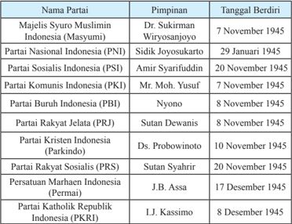

Tabel ini menyajikan informasi tentang berbagai partai politik di Indonesia yang berdiri pada tahun 1945. Topik utamanya adalah partai-partai politik yang dibentuk setelah kemerdekaan Indonesia. Tabel ini memiliki dua kolom utama: "Nama Partai" dan "Tanggal Berdiri". Dalam kolom "Nama Partai", terdapat berbagai nama partai seperti Majelis Syuro Muslimin Indonesia (Masyumi), Partai Nasional Indonesia (PNI), Partai Sosialis Indonesia (PSI), Partai Komunis Indonesia (PKI), Partai Buruh Indonesia (PBI), Partai Rakyat Jelata (PRJ), Partai Kristen Indonesia (Parkindo), Partai Rakyat Sosialis (PRS), Persatuan Marhaen Indonesia (Permai), dan Partai Katolik Republik Indonesia (PKRI). Sedangkan dalam kolom "Tanggal Berdiri", terdapat tanggal berdirinya masing-masing partai tersebut, mulai dari 7 Juli 1945 hingga 20 November 1945. Data penting yang terlihat adalah bahwa sebagian besar partai ini berdiri pada awal tahun 1945, menunjukkan bahwa pembentukan partai politik di Indonesia sangat cepat setelah kemerdekaan.

 

---
## 📄 Halaman 74

Sistem  kepartaian  yang  dianut  pada  masa  Demokrasi  Liberal  adalah multi  partai.  Pembentukan  partai  politik  ini  menurut  Mohammad  Hatta agar  memudahkan  dalam  mengontrol  perjuangan  lebih  lanjut.  Hatta  juga menyebutkan bahwa pembentukan partai politik ini bertujuan untuk mudah dapat mengukur kekuatan perjuangan kita dan untuk mempermudah meminta  tanggung  jawab  kepada  pemimpin-pemimpin  barisan  perjuangan. Walaupun pada kenyataannya partai-partai politik tersebut cenderung untuk memperjuangkan  kepentingan  golongan  daripada kepentingan nasional. Partai-partai politik yang ada saling bersaing, saling mencari kesalahan dan saling  menjatuhkan.    Partai-partai  politik  yang  tidak  memegang  jabatan dalam kabinet dan tidak memegang peranan penting dalam parlemen sering melakukan  oposisi  yang  kurang  sehat  dan  berusaha  menjatuhkan  partai politik yang memerintah. Hal inilah yang menyebabkan pada era ini sering terjadi pergantian kabinet,  kabinet tidak berumur panjang sehingga programprogramnya  tidak  bisa  berjalan  sebagaimana  mestinya  yang  menyebabkan terjadinya instabilitas nasional baik di bidang politik, sosial ekonomi maupun keamanan.

Kondisi inilah yang mendorong Presiden Soekarno mencari solusi untuk membangun kehidupan politik Indonesia yang akhirnya membawa Indonesia dari sistem Demokrasi Liberal menuju Demokrasi Terpimpin.

### TUGAS

Buat rangkuman  tentang  salah  satu partai  pada   masa  Demokrasi  Liberal 1950-1959  sebanyak  satu  halaman. Setelah dinilai oleh guru kalian,  jilid atau tempel rangkuman tersebut di mading kelas!

### 3.   Pemilihan Umum 1955

Pelaksanaan pemilihan umum 1955 bertujuan untuk memilih wakil-wakil rakyat  yang akan duduk dalam Parlemen dan Dewan Konstituante. Pemilihan umum  ini  diikuti  oleh  partai-partai  politik  yang  ada  serta  oleh  kelompok perorangan.  Pemilihan umum ini sebenarnya sudah dirancang sejak Kabinet Ali  Sastroamidjojo  I  (31  Juli  1953-12  Agustus  1955)  dengan  membentuk Panitia  Pemilihan  Umum    Pusat  dan  Daerah  pada  31  Mei  1954.    Namun pemilihan umum tidak dilaksanakan pada masa Kabinet Ali I karena terlanjur jatuh. Kabinet pengganti Ali I yang berhasil menjalankan pemilihan umum, yaitu Kabinet Burhanuddin Harahap.

Pelaksanaan Pemilihan Umum pertama dibagi dalam 16 daerah pemilihan yang meliputi 208  kabupaten, 2139  kecamatan, dan 43.429 desa. Pemilihan

 

---
## 📄 Halaman 75

umum  1955  dilaksanakan  dalam  2  tahap.  Tahap  pertama  untuk  memilih anggota  parlemen  yang  dilaksanakan  pada  29  September  1955  dan  tahap kedua untuk memilih anggota Dewan Konstituante (badan pembuat UndangUndang Dasar) dilaksanakan pada 15 Desember 1955.  Pada pemilu pertama ini 39 juta rakyat Indonesia memberikan suaranya di kotak-kotak suara.

Pemilihan  Umum  1955  merupakan  tonggak  demokrasi  pertama  di Indonesia.  Keberhasilan penyelenggaraan pemilihan umum ini menandakan telah berjalannya demokrasi di kalangan rakyat. Rakyat telah menggunakan hak  pilihnya  untuk  memilih  wakil-wakil  mereka.    Banyak  kalangan  yang menilai  bahwa  Pemilihan  Umum  1955  merupakan  pemilu  yang  paling demokratis yang dilaksanakan di Indonesia.

Presiden Soekarno dalam pidatonya di Istana Negara dan Parlemen pada 17 Agustus 1955 menegaskan bahwa 'pemilihan umum jangan diundurkan barang sehari pun, karena pada pemilihan umum  itulah rakyat akan menentukan hidup kepartaian kita yang tidak sewajarnya lagi, rakyatlah yang menjadi hakim'. Penegasan ini dikeluarkan karena terdapat suara-suara yang meragukan terlaksananya pemilu sesuai dengan jadwal semula.

Dalam proses Pemilihan Umum 1955 terdapat 100 partai besar dan kecil yang mengajukan calon-calonnya untuk anggota Dewan Perwakilan Rakyat dan 82 partai besar dan kecil untuk Dewan Konstituante.  Selain itu masih ada 86 organisasi dan perseorangan akan ikut dalam pemilihan umum. Dalam pendaftaran  pemilihan  tidak  kurang  dari  60%  penduduk  Indonesia  yang mendaftarkan namanya (kurang lebih 78 juta), angka yang cukup tinggi yang ikut dalam pesta demokrasi yang pertama. (Feith, 1999)

Pemilihan  umum  untuk  anggota  DPR  dilaksanakan  pada  tanggal  29 September 1955. Hasilnya diumumkan pada 1 Maret 1956. Urutan perolehan suara  terbanyak  adalah  PNI,  Masyumi,  Nahdatul  Ulama  dan  PKI.  Empat perolehan suara terbanyak memperoleh kursi sebagai berikut:

---
**📊 Tabel**

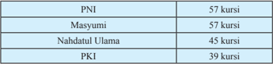

Tabel ini menunjukkan jumlah kursi yang diadakan oleh empat organisasi: PNI, Masyumi, Nahdhatul Ulama, dan PKI. Topik utama tabel adalah jumlah kursi yang diadakan oleh masing-masing organisasi tersebut. Kolom pertama berisi nama-nama organisasi tersebut, sedangkan kolom kedua berisi jumlah kursi yang diadakan oleh masing-masing organisasi. Dari tabel ini, dapat dilihat bahwa PNI dan Masyumi telah mengadakan sejumlah kursi yang sama yaitu 57 kursi, sementara Nahdhatul Ulama mengadakan 45 kursi dan PKI mengadakan 39 kursi. Ini menunjukkan bahwa PNI dan Masyumi memiliki jumlah kursi yang paling banyak dibandingkan dengan Nahdhatul Ulama dan PKI.

Pemilihan  Umum  1955  menghasilkan  susunan  anggota  DPR  dengan jumlah anggota sebanyak 250 orang dan dilantik pada tanggal 24 Maret 1956 oleh Presiden Soekarno.  Acara pelantikan ini dihadiri oleh anggota DPR yang

 

---
## 📄 Halaman 76

lama dan menteri-menteri Kabinet  Burhanudin Harahap. Dengan terbentuknya DPR yang baru maka berakhirlah masa tugas DPR yang lama dan penunjukan tim formatur dilakukan berdasarkan jumlah suara terbanyak di DPR.

Pemilihan  Umum  1955  selain  memilih  anggota  DPR  juga  memilih anggota Dewan Konstituate. Pemilihan Umum anggota Dewan Konstituante dilaksanakan pada 15 Desember 1955.  Dewan Konstituante bertugas untuk membuat  Undang-undang  Dasar  yang  tetap,  untuk  menggantikan  UUD Sementara  1950.  Hal  ini  sesuai  dengan  ketetapan  yang  tercantum  dalam pasal  134  UUD  Sementara  1950  yang  berbunyi,  'Konstituante  (Sidang Pembuat Undang-Undang Dasar) bersama-sama pemerintah selekaslekasnya  menetapkan Undang-Undang  Dasar Republik Indonesia  yang akan menggantikan Undang-Undang Dasar Sementara  ini'.

Berdasarkan hasil pemilihan tanggal 15 Desember 1955 dan diumumkan pada 16 Juli 1956, perolehan suara partai-partai yang mengikuti pemilihan anggota Dewan Konstituante urutannya tidak jauh berbeda dengan pemilihan anggota legislatif, empat besar partainya adalah PNI, Masyumi, NU dan PKI.

---
**📊 Tabel**

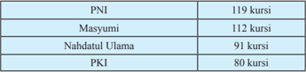

Tabel ini menunjukkan jumlah kursi yang diikuti oleh empat organisasi politik di Indonesia: Partai Nasdem (PNI), Masyumi, Nahdlatul Ulama (NU), dan Partai Keadilan Sejahtera (PKI). Organisasi-organisasi ini memiliki jumlah kursi yang berbeda-beda, dengan PNI memiliki jumlah kursi tertinggi yaitu 119 kursi, kemudian Masyumi dengan 112 kursi, Nahdlatul Ulama dengan 91 kursi, dan PKI dengan 80 kursi. Ini menunjukkan bahwa PNI memiliki kekuatan politik yang lebih besar dibandingkan dengan organisasi lainnya dalam hal jumlah kursi yang diikuti.

Keanggotaaan Dewan Konstituante terdiri atas anggota hasil pemilihan umum dan yang diangkat oleh pemerintah.  Pemeritah mengangkat anggota Konstituante  jika  ada  golongan  penduduk  minoritas  yang  turut  dalam pemilihan umum tidak memperoleh jumlah kursi sejumlah yang ditetapkan dalam  UUDS  1950.  Kelompok  minoritas  yang  ditetapkan    jumlah  kursi minimal adalah golongan Cina dengan 18 kursi, golongan Eropa dengan 12 kursi dan golongan Arab 6 kursi.

Dalam  sidang-sidang    Dewan  Konstituante  yang  berlangsung  sejak tahun 1956 hingga Dekret Presiden 5 Juli 1959 tidak menghasilkan apa yang diamanatkan  oleh  UUDS  1950.  Dewan  memang  berhasil  menyelesaikan bagian-bagian  dari  rancangan  UUD,  namun  terkait  dengan  masalah  dasar negara,  Dewan  Konstituante  tidak  berhasil  menyelesaikan  perbedaan  yang mendasar di antara usulan dasar negara yang ada.

Pembahasan mengenai dasar negara mengalami banyak kesulitan karena adanya	 konlik	 ideologis	 antarpartai.	 	 Dalam	 sidang	 Dewan	 Konstituante muncul tiga  usulan  dasar  negara  yang  diusung  oleh  partai-partai;  pertama,

 

---
## 📄 Halaman 77

dasar negara Pancasila diusung antara lain oleh PNI, PKRI, Permai, Parkindo, dan Baperki; kedua, dasar negara Islam diusung antara lain oleh  Masyumi, NU  dan  PSII;  ketiga,  dasar  negara  sosial  ekonomi  yang  diusung  oleh Partai  Murba  dan  Partai  Buruh.    Ketiga  usulan  dasar  negara  ini  kemudian mengerucut menjadi dua usulan Pancasila dan Islam karena Sosial ekonomi tidak memperoleh dukungan suara yang mencukupi, hanya sembilan suara.

Dalam upaya  untuk  menyelesaikan  perbedaan  pendapat  terkait  dengan masalah  dasar  negara,  kelompok  Islam  mengusulkan  kepada  pendukung Pancasila  tentang  kemungkinan  dimasukannya  nilai-nilai  Islam  ke  dalam Pancasila,  yaitu  dimasukkannya  Piagam  Jakarta  22  Juni  1945  sebagai pembukaan undang-undang dasar yang baru. Namun usulan ini ditolak oleh pendukung Pancasila.  Semua upaya untuk mencapai kesepakatan di antara dua kelompok menjadi kandas dan hubungan kedua kelompok ini semakin tegang. Kondisi  ini  membuat  Dewan  Konstituante  tidak  berhasil  menyelesaikan pekerjaannya  hingga  pertengahan  1958.  Kondisi  ini  mendorong  Presiden Soekarno dalam amanatnya di depan sidang Dewan Konstituante mengusulkan untuk kembali ke UUD 1945. Konstituante harus menerima UUD 1945 apa adanya, baik pembukaan maupun batang tubuhnya tanpa perubahan.

Menyikapi usulan Presiden, Dewan Konstituante mengadakan musyawarah  dalam  bentuk  pemandangan  umum.  Dalam  sidang-sidang pemandangan  umum  ini  Dewan  Konstituante  pun  tidak  berhasil  mencapai kuorum, yaitu dua pertiga suara  dari  jumlah  anggota  yang  hadir. Tiga  kali diadakan  pemungutan  suara  tiga  kali  tidak  mencapai  kourum,  sehingga ketua sidang menetapkan tidak akan mengadakan pemungutan suara lagi dan disusul dengan masa reses (masa tidak bersidang). Ketika memasuki masa sidang berikutnya beberapa fraksi tidak akan  menghadiri  sidang  lagi.  Kondisi inilah mendorong suasana politik dan psikologis masyarakat menjadi sangat  genting  dan  peka.  Kondisi  ini mendorong KSAD, Jenderal Nasution, selaku Penguasa Perang Pusat (Peperpu) dengan persetujuan dari Menteri Pertahanan  sekaligus  Perdana  Menteri Ir. Djuanda, melarang sementara semua kegiatan  politik  dan  menunda  semua sidang Dewan Konstituante.

 

---
## 📄 Halaman 78

Presiden  Soekarno  mencoba  mencari  jalan  keluar  untuk  menyelesaikan permasalahan yang ada dengan mengadakan pembicaraan dengan tokoh-tokoh pemerintahan,  anggota  Dewan  Nasional,  Mahkamah Agung  dan  pimpinan Angkatan Perang di Istana Bogor pada 4 Juli 1959.  Hasil dari pembicaraan itu esok harinya, Minggu 5 Juli 1959, Presiden Soekarno  menetapkan Dekret Presiden  1959  di  Istana  Merdeka.  Isi  pokok  dari  Dekret  Presiden  tersebut adalah membubarkan Dewan Konstituante, menyatakan berlakunya kembali UUD 1945 dan menyatakan tidak berlakunya UUD Sementara 1950.  Dekret juga  menyebutkan  akan  dibentuknya  Majelis  Permusyawaratan  Rakyat Sementara  (MPRS)  dan  Dewan  Pertimbangan  Agung  Sementara  (DPAS) dalam waktu sesingkat-singkatnya.

### TUGAS

Buatlah essay mengenai  perbandingan antara pemilu tahun 1955 dengan pemilu yang dilaksanakan sekarang!

### B.  Mencari Sistem Ekonomi Nasional

### 1.   Pemikiran Ekonomi Nasional

Pemikiran  ekonomi  pada  1950-an  pada  umumnya  merupakan  upaya mengubah struktur perekonomian kolonial menjadi perekonomian nasional. Hambatan  yang  dihadapi  dalam  mewujudkan  hal  tersebut  adalah  sudah berakarnya sistem perekonomian kolonial yang cukup lama.  Warisan ekonomi kolonial  membawa dampak perekonomian Indonesia banyak didominasi oleh perusahaan asing dan ditopang oleh kelompok etnis Cina sebagai penggerak perekonomian Indonesia. Kondisi inilah yang ingin diubah oleh para pemikir ekonomi  nasional  di  setiap  kabinet  di  era  Demokrasi  Parlementer.  Upaya membangkitkan perekonomian sudah dimulai sejak kabinet pertama di era Demokrasi Parlementer, Kabinet Natsir.

Perhatian terhadap perkembangan dan pembangunan ekonomi dicurahkan oleh  Soemitro  Djojohadikusumo.  Ia  berpendapat  bahwa  pembangunan  ekonomi Indonesia  pada  hakekatnya  adalah  pembangunan  ekonomi  baru.  Soemitro mencoba mempraktikkan pemikirannya tersebut pada sektor perdagangan. Ia berpendapat bahwa pembangunan ekonomi nasional membutuhkan dukungan dari  kelas  ekonomi  menengah  pribumi  yang  kuat.  Oleh  karena  itu,  bangsa Indonesia harus sesegera mungkin menumbuhkan kelas pengusaha pribumi, karena pengusaha pribumi pada umumnya bermodal lemah. Oleh karena itu, pemerintah hendaknya membantu dan membimbing para pengusaha tersebut

 

---
## 📄 Halaman 79

dengan  bimbingan  konkret  dan  bantuan  pemberian  kredit.  Jika  usaha  ini berhasil  maka  secara  bertahap  pengusaha  pribumi  akan  dapat  berkembang maju dan tujuan mengubah struktur  ekonomi kolonial di bidang perdagangan akan berhasil.

Gagasan Soemitro kemudian dituangkan dalam program Kabinet Natsir dalam  wujud  pencanangan  Rencana  Urgensi  Perekonomian  (RUP)  yang sering disebut juga dengan Plan Soemitro. Wujud dari RUP tersebut kemudian dicanangkan  Program  Benteng.  Program  ini  antara  lain  mencadangkan impor barang-barang tertentu bagi kelompok bisnis pribumi, serta membuka kesempatan bagi para pedagang pribumi membangun basis modal  di bawah perlindungan pemerintah.  Selain tujuan tersebut, juga untuk menumbuhkan kaum  pengusaha  pribumi  agar  mampu  bersaing  dalam  usaha  dengan  para pengusaha keturunan Cina dan asing lainnya. Upaya  yang  dilakukan pemerintah  adalah memberi peluang usaha sebesar-besarnya bagi pengusaha pribumi  dengan  bantuan  kredit.    Dengan  upaya  tersebut  diharapkan  akan tercipta  kelas  pengusaha pribumi yang mampu meningkatkan produktivitas barang dan modal domestik.

Sayangnya dalam pelaksanaan muncul masalah karena dalam pelaksanaan Program  Benteng,  pemberian  lisensi  impor    banyak  yang  disalahgunakan. Mereka yang menerima lisensi  bukanlah orang-orang yang memiliki potensi kewiraswastaan yang tinggi, namun orang-orang yang mempunyai hubungan khusus dengan kalangan birokrat yang berwenang mendistribusikan lisensi dan  kredit.    Kondisi  ini  terjadi  karena  adanya  pertimbangan-pertimbangan politik.    Akibatnya,    pengusaha-pengusaha    yang  masuk  dalam  Program Benteng   lamban menjadi dewasa, bahkan ada yang menyalahgunakan maksud pemerintah tersebut untuk mencari keuntungan yang cepat dengan menjual lisensi impor yang dimilikinya kepada pengusaha impor yang sesungguhnya, yang  kebanyakan  berasal  dari  keturunan  Cina.  Penyelewengan  lain  dalam pelaksanaan  Politik  Benteng  adalah  dengan  cara  mendaftarkan  perusahaan yang sesungguhnya merupakan milik keturunan Cina dengan menggunakan nama  orang  Indonesia  pribumi.  Orang  Indonesia  hanya  digunakan  untuk memperoleh  lisensi,  pada  kenyataannya  yang  menjalankan  lisensi  tersebut adalah perusahaan keturunan Cina.  Perusahaan yang lahir  dari kerjasama tersebut dikenal sebagai perusahaan 'Ali-Baba".  Ali mewakili Pribumi dan Baba mewakili warga keturuan Cina.

Usaha lain yang dilakukan pemerintah  untuk meningkatkan pengusaha pribumi  dilakukan melalui 'Gerakan Asaat'.  Gerakan Asaat memberikan perlindungan khusus bagi warga negara Indonesia Asli dalam segala aktivitas usaha di bidang perekonomian dari persaingan dengan pengusaha asing pada

 

---
## 📄 Halaman 80

umumnya dan warga keturuan Cina pada khususnya. Dukungan dari pemerintah terhadap gerakan ini  terlihat dari pernyataan yang dikeluarkan pemerintah pada Oktober 1956 bahwa pemerintah akan memberikan lisensi khusus pada pengusaha pribumi.  Ternyata kebijakan pemerintah ini  memunculkan reaksi negatif yaitu  muncul  golongan yang membenci kalangan Cina. Bahkan reaksi ini  sampai  menimbulkan  permusuhan  dan  pengrusakan  terhadap  toko-toko dan harta benda milik masyarakat Cina serta munculnya perkelahian antara masyarakat Cina dan masyarakat pribumi.

Pemerintah,  selain  melakukan  upaya  perbaikan  jangka  panjang,    juga melakukan upaya perbaikan jangka pendek untuk menguatkan perekonomian Indonesia.  Salah satunya adalah  mengurangi jumlah uang yang beredar dan mengatasi	deisit	anggaran.	Untuk	itu	pada	tanggal	20	Maret	1950,	Menteri Keuangan, Syafrudin Prawiranegara, mengambil kebijakan memotong uang dengan memberlakukan nilai setengahnya untuk mata uang yang mempunyai nominal  Rp2,50  ke  atas.  Kebijakan  ini  dikenal  dengan  istilah  Gunting Syafrudin.

Upaya pembangunan ekonomi nasional juga diwujudkan melalui Program  Pembangunan  Rencana  Lima  Tahun,  1956-1960,  yang  disiapkan oleh Biro Perancang Nasional (BPN) yang dipimpin oleh Djuanda. Program ini pertama kali dijalankan pada masa Kabinet Ali Sastroamidjojo II. Program Pembangunan Rencana Lima Tahun berbeda dengan RUP yang lebih umum sifatnya. Program Rencana Lima Tahun lebih bersifat teknis dan terinci serta mencakup prioritas-prioritas proyek yang paling rendah. Tujuan dari Rencana Lima  Tahun  adalah mendorong  munculnya  industri besar,  munculnya perusahaan-perusahaan  yang  melayani  kepentingan  umum  dan  jasa  pada sektor publik yang hasilnya diharapkan mampu mendorong penanaman modal dalam sektor swasta.

 

---
## 📄 Halaman 81

Usaha pembangunan ekonomi nasional lainnya dijalankan dengan kebijakan nasionalisasi perusahaan-perusahaan asing. Nasionalisasi ini berupa tindakan pencabutan  hak  milik  Belanda  atau  asing  yang  kemudian  diambil  alih atau  ditetapkan  statusnya  sebagai  milik  pemerintah  Republik  Indonesia. Pengalihan  hak  milik  modal  asing  dilakukan  karena  Belanda  dianggap ingkar  janji  dengan  tidak  menyerahkan  Irian  Barat  kembali  ke  pangkuan RI sesuai dengan  kesepakatan dalam KMB. Sejak tahun 1957 nasionalisasi yang dilakukan pemerintah terbagi dalam dua tahap; pertama, tahap pengambilalihan, penyitaan, dan penguasaan atau sering disebut 'di bawah pengawasan'. kedua, pemerintah mulai mengambil kebijakan yang pasti, yakni perusahaan-perusahaan  yang  diambil  alih  itu  kemudian  dinasionalisasikan. Tahap ini dimulai pada Desember 1958 dengan dikeluarkannya UU tentang nasionalisasi  perusahaan-perusahaan  milik  Belanda  di  Indonesia.  Contoh beberapa  perusahaan  yang  dinasionalisasi  misalnya  NV.  KPM  ( Koninklijk Paketvaart Maatschappij ) menjadi PT Pelni, KNILM ( Koninklijk Nederlands Indische Luchvaart Maatschappij ) yang kemudian dibentuk Garuda Indonesia Airways, dan perusahaan minyak Borneo Petroleum Maatschappij.

### TUGAS

Buatlah karikatur yang menggambarkan tentang Program Gunting Syarifuddin,  Gerakan  Benteng,  Program  Ali  Baba,  Gerakan  Asaat  (pilih salah satu). Ikuti petunjuk guru kalian!

### 2.   Sistem Ekonomi Liberal

Sesudah pengakuan  kedaulatan, pemerintah  Indonesia  menanggung beban ekonomi dan keuangan yang cukup berat dampak dari disepakatinya ketentuan-ketentuan  KMB,  yaitu  meningkatnya  nilai  utang  Indonesia,  baik utang luar negeri maupun utang dalam negeri. Struktur perekonomian yang diwarisi dari penguasa kolonial masih berat sebelah, nilai ekspor Indonesia pada saat itu masih sangat tergantung pada beberapa jenis hasil perkebunan yang nilainya jauh di bawah produksi pada era sebelum Perang Dunia II.

Permasalahan yang dihadapi pemerintah Indonesia pada saat itu mencakup permasalahan jangka pendek dan permasalahan jangka panjang. Permasalahan jangka  pendek  yang  dihadapi  pemerintah  Indonesia  saat  itu  adalah  tingginya jumlah mata uang yang beredar dan meningkatnya biaya hidup.    Permasalahan jangka panjang yang dihadapi pemerintah adalah pertambahan jumlah penduduk dengan tingkat hidup yang rendah.  Beban berat ini merupakan konsekuensi dari

 

---
## 📄 Halaman 82

pengakuan	kedaulatan.	Pada	era	ini,	pemerintah	mengalami	deisit	sebesar	Rp	5,1 miliar.	Deisit	ini	sebagian	besar	berhasil	dikurangi	dengan	pinjaman	pemerintah dan kebijakan ekspor impor barang, terutama ketika pecah Perang Korea.

Namun  sejak  tahun  1951,  penerimaan  pemerintah  mulai  berkurang disebabkan menurunnya volume perdagangan internasional. Indonesia sebagai  negara  yang  berkembang  tidak  memiliki  komoditas  ekspor  lain kecuali dari hasil perkebunan.  Kondisi ini  membawa dampak  perkembangan perekonomian  Indonesia  yang  tidak  mengarah  pada  stabilitas  ekonomi, bahkan yang terjadi adalah sebaliknya.  Di sisi lain pengeluaran pemerintah semakin	meningkat	akibat	tidak	stabilnya	situasi	politik	sehingga	angka	deisit semakin meningkat. Di samping itu, pemerintah belum berhasil meningkatkan produksi  dengan  memanfaatkan  sumber-sumber  yang  masih  ada  untuk meningkatkan  pendapatan  nasional.  Kelemahan  pemerintah  lainnya  adalah politik  keuangannya  tidak  dirancang  oleh  pemerintah  Indonesia  sendiri, namun dirancang oleh pemeritah Belanda. Hal ini terjadi akibat dari politik kolonial Belanda yang tidak mewariskan ahli-ahli yang cukup sehingga usaha mengubah sistem ekonomi dari ekonomi kolonial ke ekonomi nasional tidak mampu menghasilkan perubahan yang drastis.

Kebijakan yang ditempuh pemerintah untuk menanggulangi permasalahan tersebut  di  antaranya  adalah  melaksanakan  industrialisasi,  yang  dikenal dengan  Rencana  Soemitro.  Sasaran  yang  ditekankan  dari  program  ini adalah pembangunan industri dasar, seperti  pendirian pabrik-pabrik semen, pemintalan, karung dan percetakan. Kebijakan ini diikuti dengan peningkatan produksi,  pangan, perbaikan sarana dan prasarana,  dan penanaman modal asing.

Pada  masa  pemerintahan  Kabinet  Burhanuddin  Harahap,  Indonesia mengirim delegasi ke Belanda dengan misi merundingkan masalah Finansial Ekonomi  (Finek).  Perundingan  ini  dilakukan  pada  tangal  7  Januari  1956. Rancangan persetujuan Finek yang diajukan Indonesia terhadap pemerintah Belanda adalah sebagai  berikut:

- Pembatalan Persetujuan Finek hasil KMB
- Hubungan Finek Indonesia-Belanda didasarkan atas hubungan bilateral
- Hubungan Finek didasarkan atas undang-undang Nasional, tidak boleh diikat oleh perjanjian lain.
Namun,  usul  Indonesia  ini  tidak  diterima  oleh  pemerintah  Belanda, sehingga  pemerintah  Indonesia  secara  sepihak  melaksanakan  rancangan Fineknya  dengan    membubarkan  Uni  Indonesia-Belanda  pada  tanggal  13 Febuari  1956  dengan  tujuan  melepaskan  diri  dari  ikatan  ekonomi  dengan Belanda.

 

---
## 📄 Halaman 83

Upaya yang dilakukan lainnya adalah upaya pembentukan Biro Perancang Nasional  pada masa Kabinet Ali II dengan tugas merancang pembangunan jangka panjang. Biro ini dipimpin oleh Ir. Djuanda yang kemudian diangkat menjadi Menteri Perancang Nasional. Biro ini kemudian merancang Rencana Program  Pembanguan  Lima  Tahun  (RPLT)  yang  rancangannya  kemudian disetujui oleh Parlemen. Namun karena berbagai faktor, baik faktor eksternal maupun  internal, RPLT  sangat berat untuk dijalankan. Perekonomian Indonesia semakin terpuruk ketika ketegangan politik yang timbul tidak dapat diselesaikan dengan diplomasi, akhirnya memunculkan pemberontakan yang dalam  penumpasannya  memerlukan  biaya  yang  cukup  tinggi.  Kondisi  ini mendorong	meningkatnya	prosentasi	deisit	anggaran	pemerintah,	dari	angka 20% di tahun 1950 dan 100% di tahun 1960.

### KESIMPULAN

- Salah satu ciri yang tampak pada masa Demokrasi Parlementer adalah seringnya terjadi penggantian kabinet, mulai dari Kabinet  Natsir,  Kabinet  Sukiman,  Kabinet  Wilopo,  Kabinet  Ali Sastroamidjojo  I,  Kabinet  Burhanuddin  Harahap,  Kabinet  Ali Sastroamidjojo II, dan Kabinet Djuanda.
- Penyebab utama seringnya terjadi pergantian kabinet pada masa Demokrasi Parlementer adalah karena adanya perbedaan kepentingan    di  antara  partai-partai  yang  tidak  pernah  dapat terselesaikan dengan baik. Pada masa ini, sistem kepartaian yang diterapkan memang bersifat multipartai.
- Pemilu  pertama  di  Indonesia  berhasil  dilaksanakan  pada  masa Demokrasi  Parlementer,  dan  menampilkan  empat  partai  besar dalam perolehan kursi hasil pemilu: PNI, Masyumi, NU, dan PKI.
- Dalam bidang ekonomi, kebijakan ekonomi yang diterapkan pada 1950-an umumnya merupakan upaya untuk menggantikan struktur perekonomian kolonial menjadi perekonomian nasional.

 

---
## 📄 Halaman 84

### LATIH UJI KOMPETENSI

- Tuliskan penyebab langsung jatuhnya Kabinet Sukiman. Jelaskan!
- Berikan  alasan  mengapa  sistem  kepartaian  yang  dianut  pada tahun 1950-an adalah multi partai. Kaitkan analisis kalian dengan pendapat yang pernah dikemukakan oleh Mohammad Hatta!
- Jelaskan persamaan dan perbedaan antara pemilu pertama tahun 1955 dengan pemilu tahun 2014!
- Jelaskan  tujuan  diberlakukannya  kebijakan  ekonomi  Benteng. Jelaskan pula mengapa program ekonomi Benteng ini akhirnya mengalami kegagalan!

 

---
## 📄 Halaman 85

### BAB III

### Sistem dan Struktur Politik dan Ekonomi Indonesia Masa Demokrasi Terpimpin (1959-1965)

'Masalah kita, bangsa Indonesia, hanya bisa dipecahkan dengan perumusan nilai-nilai murni bangsa sendiri....

(Soekarno, Susunlah Konstituante yang benar-benar Konstituante, pidato Presiden Soekarno di depan Dewan Konstituante pada saat pembukaan)

 

---
## 📄 Halaman 86

Kutipan  di  atas  merupakan  pidato  Presiden  Soekarno  di  depan  Dewan Konstituante Republik Indonesia yang akan bersidang menyusun UUD baru menggantikan  UUD  Sementara  1950.  Harapan  Bung  Karno  bahwa  UUD yang  baru  terbentuk  nanti  memuat  nilai-nilai  bangsa  Indonesia,  sehingga bisa  menyelesaikan  permasalahan  yang  sedang  dihadapi  bangsa  Indonesia. Presiden Soekarno mencoba mengusulkan pemikirannya dalam menyelesaikan permasalahan yang dihadapi bangsa Indonesia melalui konsepsi yang dikenal dengan Konsepsi Presiden 1957. Konsepsi ini merupakan gagasan pembaruan kehidupan  politik    dengan  sistem  Demokrasi  Terpimpin  sebagai  upaya penyelesaian permasalahan bangsa Indonesia. Soekarno berpendapat bahwa sistem  Demokrasi    Terpimpin  adalah  jawaban  terhadap  kegagalan  sistem Demokrasi  Parlementer  yang  memunculkan  pergolakan,  pembangkangan dan instabilitas politik. Pendapat Presiden Soekarno ini wujud ketidakpuasan terhadap sistem demokrasi yang dianut pemerintah masa demokrasi liberal.

Perlu kalian ketahui, dengan dikeluarkannya Dekret Presiden pada 5 Juli 1959,  Presiden  Soekarno  secara  resmi  menerapkan  pemikirannya  dengan mengganti  sistem  Demokrasi  Parlementer  menjadi  Demokrasi  Terpimpin. Melalui sistem ini, Presiden Soekarno membawa Indonesia ke dalam suasana konlik	 antar	 kekuatan	 politik	 yang	 pada	 akhirnya	 melahirkan	 peristiwa Gerakan    30  September  1965/PKI.  Pemikiran  politik  Soekarno  akhirnya menjepit  dirinya  dan  mengantarkannya  kepada  kejatuhan  kekuasaan  yang dipegangnya sejak 1960.

 

---
## 📄 Halaman 87

---
**🖼️ Gambar/Diagram**

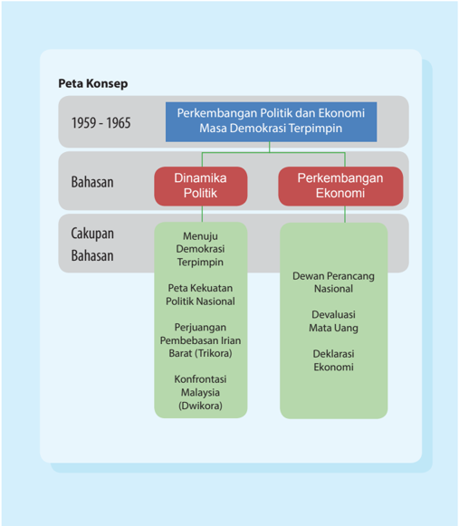

> **Deskripsi Visual:** Gambar ini adalah diagram yang menunjukkan struktur topik dan sub-topik dalam bab tentang Perkembangan Politik dan Ekonomi Masa Demokrasi Terpimpin pada periode 1959-1965. Diagram ini dibagi menjadi tiga bagian utama:

1. **Topik Utama**: Perkembangan Politik dan Ekonomi Masa Demokrasi Terpimpin.
   - **Politik**: Dinamika Politik.
   - **Ekonomi**: Perkembangan Ekonomi.

2. **Sub-topik Politik**:
   - **Menuju Demokrasi Terpimpin**.
   - **Peta Kekuatan Politik Nasional**.
   - **Perjuangan Pembebasan Irian Barat (Trikora)**.
   - **Konfrontasi Malaysia (Dwikora)**.

3. **Sub-topik Ekonomi**:
   - **Dewan Perancang Nasional**.
   - **Devaluasi Mata Uang**.
   - **Deklarasi Ekonomi**.

Elemen-elemen utama yang terlihat dalam diagram ini adalah topik utama dan sub-topik yang disebutkan. Relasi antara elemen-elemen ini adalah hierarkis, dengan topik utama sebagai dasar dan sub-topik sebagai detail yang lebih lanjut. Teks, angka, atau label penting yang terlihat meliputi tahun 1959-1965, nama-nama topik dan sub-topik, serta deskripsi singkat dari setiap sub-topik.

Informasi kunci yang dapat diambil pembaca meliputi:
- Waktu yang diperhitungkan (1959-1965).
- Topik utama yang dipertimbangkan (Politik dan Ekonomi).
- Sub-topik yang lebih lanjut dalam masing-masing bidang (Politik dan Ekonomi).
- Konteks historis dan peristiwa penting yang dialami selama masa tersebut, seperti Trikora dan Dwikora.

 

---
## 📄 Halaman 88

### TUJUAN PEMBELAJARAN

Setelah mempelajari uraian ini, diharap kamu dapat:

- Memahami perkembangan politik pada masa Demokrasi Terpimpin mulai  dari  Menuju  Demokrasi  Terpimpin,  Peta  Kekuatan  Politik Nasional, Perjuangan  Pembebasan  Irian  Barat  (Trikora)  dan Konfrontasi Malaysia (Dwikora).
- Memahami kebijakan  dan  sistem  ekonomi  pada  masa  Demokrasi Terpimpin  terkait  dengan  Dewan  Perancang  Nasional,  Devaluasi Mata Uang, Deklarasi Ekonomi.

### ARTI PENTING

Belajar Sejarah Demokrasi Terpimpin penting bagi kesadaran bangsa Indonesia  untuk  memahami  salah  satu  bentuk  demokrasi  dan  sistem ekonomi  yang  pernah  diterapkan  di  negeri  ini.  Pemahaman  dan pengalaman  kita  akan  kehidupan  berdemokrasi  diharapkan  menjadi semakin kaya. Tentu dengan kesadaran akan kekurangan dan kelebihan yang ada.

 

---
## 📄 Halaman 89

### A.   Dinamika Politik Masa Demokrasi Terpimpin

Mengamati Lingkungan

Sumber: diolah dari berbagai sumber

- Coba kamu perhatikan gambar-gambar di atas!
- Diskusikan dengan gurumu, gambar apa saja yang ada di atas!
- Apa kaitannya  gambar tersebut dengan politik pembangunan Presiden Soekarno?

### 1.   Menuju Demokrasi Terpimpin

Kehidupan sosial politik Indonesia pada masa Demokrasi Liberal (1950 hingga  1959)  belum  pernah  mencapai  kestabilan  secara  nasional.  Kabinet yang  silih  berganti  membuat  program  kerja  kabinet  tidak  dapat  dijalankan sebagaimana  mestinya.  Partai-partai  politik  saling  bersaing  dan    saling menjatuhkan. Mereka lebih mengutamakan kepentingan kelompok masingmasing. Di sisi lain, Dewan  Konstituante yang dibentuk melalui Pemilihan Umum 1955 tidak berhasil menyelesaikan tugasnya  menyusun UUD baru bagi  Republik  Indonesia.  Padahal  Presiden  Soekarno  menaruh  harapan besar terhadap Pemilu 1955, karena bisa dijadikan sarana untuk membangun demokrasi yang lebih baik. Hal ini seperti yang diungkapkan Presiden Soekarno bahwa 'era 'demokrasi raba-raba' telah ditutup'. Namun pada kenyataanya, hal itu hanya sebuah angan dan harapan Presiden Soekarno semata.

Kondisi tersebut membuat Presiden Soekarno berkeinginan untuk mengubur partai-partai politik yang ada, setidaknya menyederhanakan partaipartai politik yang ada dan membentuk kabinet yang berintikan 4 partai yang menang  dalam  Pemilihan  Umum  1955.  Untuk  mewujudkan  keinginannya tersebut, pada tanggal 21 Februari 1957, di hadapan para tokoh politik dan

 

---
## 📄 Halaman 90

tokoh militer menawarkan konsepsinya untuk menyelesaikan dan mengatasi krisis-krisis  kewibawaan  pemerintah  yang  terlihat  dari  jatuh  bangunnya kabinet.  Dalam  konsepsinya  Presiden  Soekarno  menghendaki  dibentuknya kabinet  berkaki  empat  (koalisi)  yang  anggotanya  terdiri  dari  wakil-wakil PNI, Masyumi, NU dan PKI. Selain itu Presiden Soekarno juga menghendaki dibentuknya Dewan Nasional yang anggotanya terdiri dari golongan fungsional di dalam masyarakat.

Lebih  jauh  Presiden  Soekarno  juga  menekankan  bahwa  Demokrasi Liberal yang dipakai saat itu merupakan demokrasi impor yang tidak sesuai dengan jiwa dan semangat bangsa Indonesia. Untuk itu ia ingin mengganti dengan suatu demokrasi yang sesuai dengan kepribadian bangsa Indonesia, yaitu Demokrasi Terpimpin.

Demokrasi Terpimpin sendiri merupakan suatu sistem pemerintahan yang ditawarkan Presiden Soekarno pada Februari 1957.  Demokrasi Terpimpin juga merupakan suatu gagasan pembaruan kehidupan politik, kehidupan sosial dan kehidupan ekonomi. Gagasan Presiden Soekarno ini dikenal sebagai Konsepsi Presiden  1957.  Pokok-pokok  pemikiran  yang  terkandung  dalam  konsepsi tersebut, Pertama ,  dalam  pembaruan  struktur  politik  harus  diberlakukan sistem  demokrasi  terpimpin  yang  didukung  oleh  kekuatan-kekuatan  yang mencerminkan  aspirasi  masyarakat  secara  seimbang. Kedua ,  pembentukan kabinet  gotong  royong  berdasarkan  imbangan  kekuatan  masyarakat  yang terdiri  atas  wakil  partai-partai  politik  dan  kekuatan  golongan  politik  baru yang diberi nama oleh Presiden Soekarno golongan fungsional atau golongan karya.

Upaya untuk menuju Demokrasi Terpimpin telah dirintis oleh Presiden Soekarno  sebelum  dikeluarkannya  Dekret  Presiden  5  Juli  1959.  Langkah pertama adalah pembentukan Dewan Nasional pada 6 Mei 1957. Sejak saat itu  Presiden  Soekarno  mencoba  mengganti  sistem  Demokrasi  Parlementer yang  membuat  pemerintahan  tidak  stabil  dengan  Demokrasi  Terpimpin. Melalui panitia perumus Dewan Nasional, dibahas mengenai usulan kembali ke UUD 1945. Usulan ini berawal dari KSAD Letnan Jenderal Nasution yang mengajukan usul secara tertulis untuk kembali ke UUD 1945 sebagai landasan pelaksanaan Demokrasi Terpimpin. Usulan Nasution ini kurang didukung oleh wakil-wakil partai di dalam Dewan Nasional yang cenderung mempertahankan UUD Sementara 1950. Situasi ini pada awalnya membuat Presiden Soekarno ragu  untuk  mengambil  keputusan,  namun  atas  desakan  Nasution,  akhirnya Presiden Soekarno menyetujui untuk kembali ke UUD 1945.

Langkah  selanjutnya  yang  dilakukan  oleh  Presiden  Soekarno  adalah mengeluarkan  suatu  keputusan  pada  tanggal  19  Februari  1959  tentang pelaksanaan Demokrasi Terpimpin dalam rangka kembali ke UUD 1945.

 

---
## 📄 Halaman 91

Keputusan ini pun kemudian disampaikan Presiden Soekarno di hadapan anggota DPR pada tanggal 2 Maret 1959.  Karena yang berwenang menetapkan UUD  adalah  Dewan  Konstituante,  Presiden  juga  menyampaikan  amanat terkait kembali ke UUD 1945 di hadapan anggota Dewan Konstituante pada tanggal  22 April  1959.    Dalam  amanatnya  Presiden  Soekarno  menegaskan bahwa bangsa Indonesia harus kembali  kepada jiwa revolusi  dan  mendengarkan amanat penderitaan rakyat.  UUD 1945 akan menjadikan bangsa Indonesia sebagai  sebuah  negara  kesatuan.  Untuk  itu,  Presiden  Soekarno  kemudian meminta  anggota  Dewan  Konstituante  untuk  menerima  UUD  1945    apa adanya tanpa perubahan dan  menetapkannya sebagai UUD RI yang tetap. Dewan Konstituante kemudian mengadakan pemungutan suara untuk mengambil keputusan terhadap usulan Presiden, namun setelah melakukan pemungutan sebanyak tiga kali tidak mencapai kuorum untuk  menetapkan kembali UUD 1945.

Sumber: 30 Tahun Indonesia Merdeka, Deppen, 1975

Pada  keesokan  harinya,  tanggal  3  Juni    1959,  Dewan  Konstituante mengadakan  reses  yang  akhirnya  untuk  selamanya.  Hal  ini  disebabkan beberapa fraksi dalam Dewan Konstituante  tidak akan menghadiri  sidang lagi  kecuali  untuk  pembubaran  Dewan  Konstituante.  Kondisi  ini  membuat situasi	 politik	 menjadi	 sangat	 genting,	 konlik	 politik	 antarpartai	 semakin panas dan melibatkan masyarakat di dalamnya ditambah munculnya beberapa pemberontakan  di  daerah  yang  mengancam  Negara  Kesatuan  Republik Indonesia.  Untuk  mencegah  munculnya  ekses-ekses  politik  sebagai  akibat ditolaknya  usulan  pemerintah  untuk  kembali  ke  UUD  1945  oleh  Dewan Konstituante, Kepala Staf Angkatan Darat (KSAD)  selaku Penguasa Perang Pusat (Peperpu),  A.H. Nasution, atas nama  pemerintah mengeluarkan

 

---
## 📄 Halaman 92

larangan bagi semua kegiatan politik, yang berlaku mulai tanggal 3 Juni 1959, pukul  06.00  Pagi.    KSAD  dan  Ketua  Umum  PNI,  Suwiryo,  menyarankan kepada Presiden Soekarno untuk mengumumkan kembali berlakunya UUD 1945 dengan suatu Dekret Presiden. Sekretaris Jenderal PKI pun, D.N. Aidit memerintahkan anggota partainya yang duduk di Dewan Konstituante untuk tidak menghadiri kembali sidang Dewan Konstituante.

Presiden Soekarno memerlukan waktu beberapa hari untuk mengambil langkah yang menentukan masa depan bangsa Indonesia dan menyelesaikan permasalahan  yang  ada.  Pada  tanggal  3  Juli  1959,      Presiden  Soekarno memanggil  Ketua  DPR,  Mr.  Sartono,  Perdana  Menteri  Ir.  Djuanda,  para menteri, pimpinan TNI, dan  anggota Dewan Nasional (Roeslan Abdoel Gani dan Moh. Yamin), serta ketua Mahkamah Agung, Mr. Wirjono Prodjodikoro, untuk mendiskusikan langkah yang harus diambil. Setelah melalui serangkaian pembicaraan yang panjang mereka bersepakat mengambil keputusan untuk memberlakukan kembali UUD 1945. Pertemuan tersebut juga menyepakati untuk  mengambil  langkah  untuk  melakukannya  melalui  Dekret  Presiden. Pada  hari  Minggu,  5  Juli  1959  pukul  17.00,  dalam  suatu  upacara  resmi yang berlangsung selama 15 menit di Istana Merdeka,  Presiden Soekarno mengumumkan Dekret yang memuat tiga hal pokok,  yaitu:

- Menetapkan pembubaran Konstituante.
- Menetapkan  UUD 1945 berlaku bagi segenap bangsa Indonesia dan seluruh tumpah darah Indonesia, terhitung mulai tanggal penetapan Dekret dan tidak berlakunya lagi UUD Sementara (UUDS).
- Pembentukan MPRS, yang terdiri atas anggota DPR ditambah dengan utusan-utusan dan golongan, serta  pembentukan Dewan Pertimbangan Agung Sementara (DPAS).
Sumber: 30 Tahun Indonesia

Merdeka, Deppen, 1975)

Dekret juga mendapat sambutan baik dari masyarakat yang hampir selama 10 tahun merasakan ketidakstabilan kehidupan sosial politik. Mereka berharap dengan Dekret akan tercipta suatu stabilitas politik. Dekret pun dibenarkan dan diperkuat oleh Mahkamah Agung.   Dekret juga didukung oleh TNI dan

 

---
## 📄 Halaman 93

dua partai besar, PNI dan PKI serta Mahkamah Agung. Bahkan KSAD, salah satu konseptor Dekret, mengeluarkan perintah harian kepada seluruh jajaran TNI AD untuk melaksanakan dan mengamankan Dekret Presiden.  Dukungan lain kemudian datang dari DPR, dalam sidangnya pada 22 Juli 1959, dipimpin langsung oleh ketua DPR, secara aklamasi menetapkan bersedia  bekerja terus di bawah naungan UUD 1945.

Melalui Dekret Presiden, Konsep Demokrasi Terpimpin  yang dirumuskan Presiden  Soekarno  melalui  konsepsi  1957  direalisasikan  pemberlakukan melalui Staatsnoodrecht ,  hukum  negara  dalam  keadaan  bahaya  perang. Langkah  politik  ini  terpaksa  diambil  karena  keadaan  tatanegara  dalam keadaan krisis yang membahayakan persatuan dan kesatuan bangsa dan juga mengancam keutuhan NKRI.

Sehari sesudah Dekret Presiden 5 Juli 1959, Perdana Menteri  Djuanda mengembalikan mandat kepada Soekarno dan Kabinet Karya pun dibubarkan. Kemudian pada 10 Juli 1959, Soekarno mengumumkan kabinet baru yang disebut Kabinet Kerja. Dalam kabinet ini Soekarno bertindak selaku perdana menteri, dan Djuanda menjadi menteri pertama dengan dua orang wakil yaitu dr.  Leimena  dan  dr.  Subandrio.  Keanggotaan  kabinet  terdiri  atas  sembilan menteri dan dua puluh empat menteri muda. Kabinet tidak melibatkan para ketua  partai  besar,  sehingga  kabinet  bisa  dikatakan  sebagai  kabinet  non partai. Namun kabinet ini mengikutsertakan para kepala staf angkatan, kepala kepolisian  dan  jaksa  agung    sebagai  menteri  negara ex	 oficio .  Program kabinet yang dicanangkan meliputi penyelenggaraan keamanan dalam negeri, pembebasan Irian Barat, dan melengkapi sandang pangan rakyat.

Pembentukan kabinet kemudian diikuti pembentukan Dewan  Pertimbangan Agung Sementara (DPAS) yang langsung diketuai oleh Presiden Soekarno, dengan Roeslan  Abdulgani sebagai wakil ketuanya.  DPAS bertugas menjawab pertanyaan presiden dan berhak mengajukan usul kepada pemerintah. Lembaga ini dibentuk berdasarkan Penetapan Presiden Nomor 3 tahun  1959  tertanggal  22  Juli  1959.   Anggota  DPAS  dilantik  pada  tanggal 15 Agustus  1959,  dengan  komposisi  berjumlah  45  orang,  12  orang  wakil golongan  politik,  8  orang  wakil/utusan  daerah,  24  orang  wakil  golongan karya/fungsional dan satu orang wakil ketua.

Pada  tanggal  17 Agustus  1959,  dalam  pidato  peringatan  kemerdekaan RI,  Presiden  Soekarno  menafsirkan  pengertian  demokrasi  terpimpinnya. Dalam pidato tersebut, Presiden Soekarno menguraikan ideologi Demokrasi Terpimpin yang isinya mencakup revolusi, gotong royong, demokrasi, anti imperialisme-kapitalisme, anti demokrasi liberal, dan perubahan secara total. Pidato tersebut diberi judul 'Penemuan Kembali Revolusi Kita'. DPAS dalam

 

---
## 📄 Halaman 94

sidangnya  bulan  November  1959  mengusulkan  kepada  pemerintah  agar amanat Presiden pada tanggal 17 Agustus 1959  dijadikan Garis-garis Besar Haluan  Negara.  Presiden  Soekarno  kemudian  menerima  usulan    pidatonya sebagai  Garis-garis  Besar  Haluan  Negara  dengan  nama  'Manifesto  Politik Republik Indonesia' disingkat Manipol.

Lembaga  berikutnya  yang  dibentuk  oleh  Presiden  Soekarno  melalui Penetapan Presiden  No. 2/1959 tanggal 31 Desember 1959 adalah Majelis Permusyawaratan Rakyat Sementara (MPRS) dengan Chairul Saleh (tokoh Murba) sebagai ketuanya dan dibantu beberapa orang wakil ketua. Anggota MPRS pemilihannya dilakukan melalui penunjukkan dan pengangkatan oleh presiden, tidak melalui pemilihan umum sesuai dengan ketentuan UUD 1945. Mereka  yang  diangkat  harus  memenuhi  beberapa  persyaratan,  yaitu  setuju kembali ke UUD 1945, setia kepada perjuangan RI dan setuju dengan Manifesto Politik.  MPRS dalam menjalankan fungsi dan tugasnya tidak sejalan dengan apa yang diamanatkan dalam UUD 1945, namun diatur melalui Penpres No. 2/1959, dimana fungsi dan tugas MPRS hanya menetapkan Garis-garis Besar Haluan Negara.

Sementara itu, untuk Dewan Perwakilan Rakyat (DPR) hasil Pemilihan Umum  1955  tetap  menjalankan  tugasnya    dengan  landasan  UUD  1945 dengan  syarat  menyetujui    segala  perombakan  yang  diajukan  pemerintah sampai dibentuknya DPR baru berdasarkan Penetapan Presiden No. 1/1959. Pada  awalnya  tampak  anggota  DPR  lama  seperti  akan  mengikuti  apa  saja yang akan menjadi kebijakan Presiden Soekarno, hal ini terlihat ketika DPR secara aklamasi dalam sidang 22 Juli 1959 menyetujui Dekret Presiden 5 Juli 1959.	Akan	tetapi	benih	konlik	sebenarnya	sudah	mulai	muncul	antara	ketua DPR dan Presiden.  Sartono selaku ketua DPR menyarankan kepada Presiden Soekarno agar meminta mandat kepada DPR untuk melakukan perombakan struktur  kenegaraan  sesuai  dengan  UUD  1945  dan  untuk  melaksanakan program kabinet. Bahkan Sartono   meyakinkan Presiden bahwa mandat itu pasti akan diberikan, namun Presiden Soekarno menolak, ia hanya akan datang ke DPR untuk menjelaskan  perubahan konstitusi dan lain-lain, bukan untuk meminta mandat.  Hal ini berarti Presiden tidak mau terikat dengan DPR.

Konlik	terbuka	antara	DPR	dan	Presiden	akhirnya	terjadi	ketika	DPR menolak Rencana Anggaran  Belanja Negara tahun 1960 yang diajukan oleh Pemerintah.  Penolakan tersebut membawa dampak pembubaran DPR oleh Presiden Soekarno pada tanggal 5 Maret 1960. Ia kemudian mendirikan DPR Gotong Royong (DPR-GR). Para anggota DPR-GR ditunjuk Presiden tidak berdasarkan perimbangan kekuatan partai politik, namun lebih berdasarkan perimbangan  lima  golongan,  yaitu  Nasionalis,  Islam,  Komunis,  Kristen-

 

---
## 📄 Halaman 95

Katolik dan golongan fungsional. Sehingga dalam DPR-GR terdiri atas dua kelompok  besar  yaitu  wakil-wakil  partai  dan  golongan  fungsional  (karya) dengan perbandingan 130 wakil partai dan 153 wakil golongan fungsional. Pelantikan anggota DPR-GR dilaksanakan pada 25 Juni 1960 dengan tugas pokok melaksanakan Manipol, merealisasikan amanat penderitaan rakyat dan melaksanakan Demokrasi Terpimpin. Kedudukan DPR-GR adalah Pembantu Presiden/Mandataris  MPRS  dan  memberikan  sumbangan  tenaga  kepada Presiden  untuk  melaksanakan  segala  sesuatu  yang  telah  ditetapkan  oleh MPRS.

Pembubaran DPR hasil pemilu pada awalnya memunculkan reaksi dari berbagai pihak, antara lain dari pimpinan NU dan PNI. Tokoh NU yang pada awalnya keberatan atas pembubaran DPR hasil Pemilu 1955 dan mengancam akan menarik pencalonan anggotanya untuk DPR-GR. Akan tetapi sikap ini berubah setelah jatah kursi  kursi NU dalam DPR-GR ditambah. Namun, K.H. Wahab Chasbullah, Rais Aam NU, menyatakan bahwa NU tidak bisa duduk bersama PKI  dalam suatu kabinet dan NU sesungguhnya menolak kabinet Nasakom dan menolak kerjasama dengan PKI.

Tokoh  dari  kalangan  PNI  yang  menolak  kebijakan  Presiden  Soekarno datang  dari  dua  orang  sahabat  Soekarno,  Mr.  Sartono  dan  Mr.  Iskaq Tjokroadisurjo. Sartono merasa prihatin terhadap perkembangan yang ada dan Iskaq menyatakan bahwa  anggota PNI yang duduk dalam DPR-GR bukanlah wakil PNI. Hubungan mereka dengan PNI sudah tidak ada lagi, sebab mereka yang duduk dalam DPR-GR adalah hasil penunjukkan.

Sikap tokoh partai memang bervariasi,  mereka yang menolak pembubaran DPR-GR  menggabungkan  diri  dalam  suatu  kelompok  yang  menamakan dirinya  Liga  Demokrasi.  Tokoh  yang  terlibat  dalam  Liga  Demokrasi  ini meliputi tokoh partai NU, Masyumi, Partai Katolik, Parkindo, IPKI dan PSII dan  beberapa  panglima  daerah  yang  memberikan  dukungan.    Kelompok ini  mengusulkan  untuk  penangguhan  pembentukan  DPR-GR.  Namun  Liga Demokrasi ini kemudian dibubarkan oleh Soekarno.

Tindakan  Presiden  Soekarno  lainnya  dalam  menegakkan  Demokrasi Terpimpin  adalah  membentuk  lembaga  negara  baru  yang  disebut  Front Nasional.  Lembaga  ini  dibentuk  berdasarkan  Penetapan  Presiden  No.  13 tahun 1959. Dalam penetapan ini disebutkan bahwa Front Nasional adalah suatu organisasi massa yang memperjuangkan cita-cita Proklamasi dan citacita  yang terkandung  dalam UUD 1945. Front Nasional langsung diketuai oleh Presiden Soekarno.

 

---
## 📄 Halaman 96

Langkah Presiden Soekarno lainnya adalah melakukan regrouping kabinet berdasarkan Ketetapan Presiden No. 94 tahun 1962 tentang pengintegrasian lembaga-lembaga tinggi dan tertinggi negara dengan eksekutif. MPRS, DPRGR,  DPA,  Mahkamah  Agung  dan  Dewan  Perancang  Nasional  dipimpin langsung  oleh  Presiden.  Pengintegrasian  lembaga-lembaga  tersebut  dengan eksekutif membuat pimpinan lembaga tersebut diangkat menjadi menteri dan ikut serta dalam sidang-sidang kabinet tertentu dan juga ikut merumuskan dan mengamankan kebijakan pemerintah pada lembaganya masing-masing.

Selain itu, Presiden juga membentuk suatu lembaga baru yang bernama Musyawarah Pembantu Pimpinan Revolusi (MPPR) berdasarkan Penetapan Presiden No. 4/1962.  MPPR merupakan badan pembantu Pemimpin Besar Revolusi  (PBR)  dalam  mengambil  kebijakan  khusus  dan  darurat  untuk menyelesaikan  revolusi.  Keanggotaan  MPPR  meliputi  sejumlah  menteri yang mewakili MPRS, DPR GR, Departemen-departemen, angkatan dan para pemimpin partai politik Nasakom.

Penilaian terhadap pelaksanaan Demokrasi Terpimpin yang dilaksanakan oleh Presiden Soekarno pertama kali muncul dari  M. Hatta, melalui tulisannya dalam  Majalah  Islam  'Panji  Masyarakat'  pada  tahun  1960  yang  berjudul 'Demokrasi Kita'. Hatta mengungkapkan kritiknya kepada tindakan-tindakan Presiden, tugas-tugas DPR sampai pada pengamatan adanya 'krisis demokrasi', yaitu  sebagai  demokrasi  yang  tidak  kenal  batas  kemerdekaan,  lupa  syaratsyarat hidupnya dan melulu menjadi anarki lambat laun akan digantikan oleh diktator.

### TUGAS

- Bacalah materi halaman 82-89 tentang Dekret Presiden 5 Juli 1959 dan tindak  lanjut  setelah  Dekret  tersebut  dibacakan  Soekarno.
- Kemudian gambarkan bagan struktur lembaga-lembaga negara (MPR, DPR,  Presiden,  DPA,  BPK,  MA)  berdasarkan  UUD  1945  sebelum Amendemen  sekarang atau yang berlaku setelah Dekret Presiden 5 Juli 1959 dibacakan.
- Gambarkan  pula    struktur    lembaga-lembaga  negara    pada  masa Demokrasi Terpimpin.
- Buatlah  analisis  perbandingan  antara  kedua  bagan  struktur  tersebut, dan berikan komentar tertulis.

 

---
## 📄 Halaman 97

### 2.   Peta Kekuatan Politik Nasional

Antara  tahun  1960-1965,  kekuatan  politik  pada  waktu  itu  terpusat  di tangan Presiden Soekarno. Presiden Soekarno  memegang seluruh kekuasaan negara  dengan TNI AD dan PKI di sampingnya. TNI, yang sejak Kabinet Djuanda diberlakukan S.O.B. kemudian pemberontakan PRRI dan Permesta pada tahun 1958, mulai memainkan peranan penting dalam bidang politik. Dihidupkannya UUD 1945 merupakan usulan dari TNI dan didukung penuh dalam pelaksanaannya.   Menguatnya pengaruh TNI AD, membuat Presiden Soekarno berusaha menekan pengaruh TNI AD, terutama Nasution dengan dua taktik, yaitu  Soekarno berusaha mendapat dukungan partai-partai politik yang berpusat di Jawa terutama PKI dan merangkul angkatan-angkatan bersenjata lainnya terutama angkatan udara.

Kekuatan  politik  baru  lainnya  adalah  PKI.  PKI  sebagai  partai  yang bangkit kembali pada tahun 1952 dari puing-puing pemberontakan Madiun 1948. PKI kemudian muncul menjadi kekuatan baru pada Pemilihan Umum 1955. Dengan menerima Penetapan Presiden No. 7/1959, partai ini mendapat tempat dalam konstelasi politik baru. Kemudian dengan menyokong gagasan Nasakom  dari  Presiden  Soekarno,  PKI  dapat  memperkuat  kedudukannya. Sejak saat itu PKI berusaha menyaingi TNI dengan memanfaatkan dukungan yang diberikan oleh Soekarno untuk menekan pengaruh TNI AD.

---
**🖼️ Gambar/Diagram**

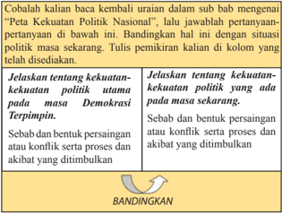

> **Deskripsi Visual:** Gambar ini adalah diagram yang menunjukkan perbandingan antara kekuatan politik dalam dua sistem demokrasi: Demokrasi Terpimpin dan Demokrasi Terbuka. Diagram ini dibagi menjadi dua bagian, masing-masing menunjukkan kekuatan politik dalam sistem tersebut.

Pada bagian kiri, terdapat tulisan "Peta Kekuatan Politik Nasional", yang menunjukkan bahwa kekuatan politik dalam sistem ini dikelola oleh pemerintah. Bagian ini juga mencakup informasi tentang persaingan, konflik, dan akibat yang ditimbulkan oleh kekuatan politik dalam sistem ini.

Sementara itu, pada bagian kanan, terdapat tulisan "Bandingkan Analisis", yang menunjukkan bahwa kekuatan politik dalam sistem ini tidak dikelola oleh pemerintah. Bagian ini juga mencakup informasi tentang persaingan, konflik, dan akibat yang ditimbulkan oleh kekuatan politik dalam sistem ini.

Dalam diagram ini, elemen-elemen utama yang penting adalah perbandingan antara kedua sistem demokrasi, serta informasi tentang kekuatan politik dalam kedua sistem tersebut. Label penting yang terlihat adalah "Peta Kekuatan Politik Nasional" dan "Bandingkan Analisis". Informasi kunci yang dapat diambil pembaca adalah bahwa kekuatan politik dalam sistem Demokrasi Terpimpin dikelola oleh pemerintah, sedangkan dalam sistem Demokrasi Terbuka tidak dikelola oleh pemerintah.

 

---
## 📄 Halaman 98

PKI  berusaha  untuk  mendapatkan  citra  yang  positif  di  depan  Presiden Soekarno.  PKI  menerapkan  strategi  'menempel'  pada  Presiden  Soekarno. Secara  sistematis,  PKI  berusaha  memperoleh  citra  sebagai  Pancasilais  dan pendukung kebijakan-kebijakan Presiden Soekarno yang menguntungkannya. Hal  ini  seperti  apa  yang  diungkapkan  D.N.  Aidit  bahwa  melaksanakan Manipol secara konsekuen adalah sama halnya dengan melaksakan program PKI.	Hanya	kaum	Manipolis	munaik	dan	kaum	reaksionerlah		yang	berusaha menghambat dan menyabot Manipol. Ungkapan Aidit ini merupakan suatu upaya untuk memperoleh citra sebagai pendukung Soekarno.

PKI mampu memanfaatkan ajaran Nasakom yang diciptakan Soekarno sebaik-sebaiknya, karena lewat Nasakom inilah PKI mendapat tempat yang sah  dalam  konstelasi  politik  Indonesia.  Kedudukan  PKI  semakin  kuat  dan respektabilitasnya sebagai kekuatan politik sangat meningkat. Bahkan ketika Presiden  Soekarno  akan  membubarkan  partai  melalui  penetapan  presiden, konsep  awal  disebutkan  bahwa  partai  yang  akan  dibubarkan  adalah  partai yang	 memberontak.	 Namun	 dalam	 keputusan	 inal,	 Presiden	 Soekarno meminta ditambahkan kata 'sedang' di depan kata 'memberontak', sehingga rumusannya berbunyi 'sedang memberontak  karena para pemimpinnya turut dalam pemberontakan....'. Sesuai dengan rumusan itu maka calon partai yang kuat untuk dibubarkan hanya Masyumi dan PSI.  Sebaliknya, PKI yang pernah memberontak pada tahun 1948 terhindar dari pembubaran. (Anhar Gonggong, 2005).

PKI pun melakukan berbagai upaya untuk memperoleh dukungan politik dari  masyarakat.  Berbagai  slogan  disampaikan  oleh  pemimpin  PKI, Aidit, Siapa  setuju    Nasakom  harus  setuju  Pancasila.  Berbagai  pidato  Soekarno dikutip  disesuaikan  sedemikian  rupa    sehingga  seolah-olah  sejalan  dengan gagasan  dan  cita-cita  PKI.  PKI  terus  meningkatkan  kegiatannya  dengan berbagai isu yang memberi citra kepada PKI sebagai partai paling Manipolis dan pendukung Presiden Soekarno yang paling setia.

Ketika  Presiden  Soekarno  gagal  membentuk  Kabinet  Gotong  Royong (Nasakom) pada tahun 1960 karena mendapat tentangan dari kalangan Islam dan    TNI  AD,  PKI  mendapat  kompensasi  tersendiri  dengan  memperoleh kedudukan dalam MPRS, DPR-GR, DPA dan Pengurus Besar Front Nasional serta  dalam  Musyawarah  Pembantu  Pimpinan  Revolusi  (MPPR).  Kondisi ini mendorong pimpinan TNI AD berusaha untuk mengimbanginya  dengan mengajukan  calon-calon  lain  sehingga  menjadi  pengontrol    terhadap  PKI dalam  komposisinya.  Upaya  ini  tidak  mencapai  hasil  yang  optimal  karena Presiden Soekarno tetap memberikan porsi dan posisi kepada anggota PKI.

 

---
## 📄 Halaman 99

Ketika TNI AD mensinyalir adanya upaya dari PKI melakukan tindakan pengacauan  di  Jawa  Tengah,  Sumatera    Selatan,  Kalimantan  Selatan  dan Sulawesi Selatan, pimpinan TNI AD  mengambil tindakan  berdasarkan UU Keadaan Bahaya Pimpinan TNI AD melarang terbitnya Harian Rakyat dan dikeluarkan  perintah  penangkapan Aidit  dan  kawan-kawan,  namun  mereka berhasil lolos. Kegiatan-kegiatan PKI-PKI di daerah juga dibekukan. Namun tindakan TNI  AD ini tidak disetujui oleh Presiden Soekarno dan memerintahkan segala  keputusan  dicabut  kembali.  Presiden  Soekarno  melarang  Peperda mengambil tindakan politis terhadap PKI.

Pada  akhir  tahun  1964,  PKI  disudutkan  dengan  berita  ditemukannya dokumen rahasia milik PKI tentang Resume Program Kegiatan PKI Dewasa ini. Dokumen tersebut menyebutkan bahwa PKI akan melancarkan perebutan kekuasaan. Namun pimpinan PKI, Aidit, menyangkal dengan berbagai cara dan menyebutnya sebagai dokumen palsu. Peristiwa ini menjadi isu politik besar pada tahun 1964. Namun hal ini diselesaikan Presiden Soekarno dengan mengumpulkan  para  pemimpin  partai  dan  membuat  kesepakatan  untuk menyelesaikan permasalahan di antara unsur-unsur di  dalam  negeri  diselesaikan secara musyawarah karena sedang menjalankan, konfrontasi dengan Malaysia. Kesepakatan tokoh-tokoh partai politik ini dikenal sebagai Deklarasi Bogor. Namun PKI melakukan tindakan sebaliknya dengan melakukan sikap ofensif dengan melakukan serangan politik terhadap Partai Murba dengan tuduhan telah memecah belah persatuan Nasakom, dan akan mengadakan kudeta serta akan  membunuh  ajaran  dan  pribadi  Presiden  Soekarno.  Upaya-upaya  PKI ini  membawa  hasil  dengan  ditangkapnya  tokoh-tokoh  Murba,  diantaranya Soekarni dan  Partai Murba dibekukan oleh Presiden Soekarno.

Merasa kedudukannya yang semakin kuat PKI berusaha untuk memperoleh kedudukan dalam kabinet. Berbagai upaya dilakukan PKI mulai dari aksi coratcoret, pidato-pidato dan petisi-petisi yang menyerukan pembentukan Kabinet Nasakom. Mereka juga menuntut penggantian pembantu-pembantu Presiden yang tidak mampu merealisasikan Tri Program Pemerintah, serta mendesak supaya segera dibentuk Kabinet Gotong-Royong yang berporoskan Nasakom.

Terhadap  TNI AD  pun,  PKI  melakukan  berbagai  upaya  dalam  rangka mematahkan pembinaan teritorial yang sudah dilakukan oleh TNI AD. Seperti peristiwa  Bandar  Betsy  (Sumatera  Utara)  dan  Peristiwa  Jengkol.    Upaya merongrong ini dilakukan melalui radio, pers, dan poster yang menggambarkan setan desa yang harus dibunuh dan dibasmi. Tujuan politik PKI di sini adalah menguasai desa untuk mengepung kota.

 

---
## 📄 Halaman 100

### 3.   Pembebasan Irian Barat

Salah  satu  isu  politik  luar  negeri  yang  terus  menjadi  pekerjaan  rumah kabinet RI adalah masalah Irian Barat. Wilayah ini telah menjadi bagian RI yang diproklamasikan sejak 17 Agustus 1945. Akan tetapi dalam perundingan KMB tahun 1950 masalah penyerahan Irian Barat ditangguhkan satu tahun dan  berhasil  dicapai  dalam  suatu  kompromi  pasal  di  Piagam  Penyerahan Kedaulatan yang berbunyi:

'Mengingat kebulatan hati pihak-pihak yang bersangkutan hendak mempertahankan asas supaya semua perselisihan yang mungkin ternyata kelak atau timbul diselesaikan dengan jalan patut dan rukun, maka status quo Irian (Nieuw Guinea) tetap berlaku seraya ditentukan bahwa dalam waktu setahun sesudah  tanggal  penyerahan  kedaulatan  kepada  Republik  Indonesia  Serikat masalah kedaulatan Irian akan diselesaikan dengan jalan perundingan antara Republik Indonesia Serikat  dan Kerajaan  Nederland'. (Piagam Penyerahan Kedaulatan, dalam Notosoetardjo, Dokumen-dokumen  Konperensi Medja Bundar: Sebelum, Sesudah dan Pembubarannya, Pustaka Endang, 1956)

Upaya  yang  dilakukan  sesuai  dengan  piagam  penyerahan  kedaulatan adalah melalui konferensi  uni yang dilakukan secara bergilir di Jakarta dan di Belanda. Namun upaya penyelesaian secara bilateral ini telah mengalami kegagalan  dan  pemerintah  kita  mengajukan  permasalahan  ini  ke  Sidang Majelis  Umum  PBB.  Namun  upaya-upaya  diplomasi  yang  dilakukan  di forum PBB terus mengalami kegagalan. Indonesia pun kemudian mengambil jalan  diplomasi  aktif  dan  efektif  yang  puncaknya  dilakukannya  Konferensi Asia Afrika. Langkah ini cukup efektif  dalam menggalang kekuatan untuk menyokong  perjuangan  diplomasi  Indonesia  di  tingkat  internasional  yang memaksa Belanda melunakkan sikapnya dan mau berunding bilateral untuk menyelesaikan permasalahan Irian.

Karena jalan damai yang telah ditempuh selama satu dasa warsa tidak berhasil mengembalikan Irian Barat, pemerintah Indonesia memutuskan untuk menempuh jalan lain. Upaya ini telah dilakukan Indonesia sejak tahun 1957, jalan  lain  yang  dilakukan  adalah  melancarkan  aksi-aksi  pembebasan  Irian Barat, dimulai pengambilalihan semua perusahaan milik Belanda di Indonesia oleh kaum buruh. Untuk mencegah anarki, KSAD, Nasution, mengambil alih semua perusahaan milik Belanda dan menyerahkannya kepada pemerintah. Hubungan  Indonesia-Belanda  semakin  memuncak  ketegangan  pada  17 Agusus 1960, ketika Indonesia akhirnya memutuskan hubungan diplomatik dengan pemerintah Kerajaan Belanda.

 

---
## 📄 Halaman 101

Presiden Soekarno dalam pidatonya tanggal 30 September 1960 di depan Sidang  Majelis  Umum  PBB  menegaskan  kembali  sikapnya  tentang  upaya mengembalikan Irian  Barat  ke  pangkuan  RI.    Dalam  pidato  yang  berjudul Membangun Dunia Kembali,  Soekarno menegaskan bahwa:

'Kami  telah  berusaha  untuk  menyelesaikan  masalah  Irian  Barat.  Kami telah  berusaha  dengan  sungguh-sungguh  dan  dengan  penuh  kesabaran  dan penuh toleransi dan penuh harapan. Kami telah berusaha untuk mengadakan perundingan-perundingan  bilateral....  Harapan  lenyap,  kesabaran  hilang; bahkan toleransi pun mencapai batasnya.  Semuanya itu kini telah habis  dan Belanda tidak memberikan alternatif lainnya, kecuali memperkeras sikap kami.' (Sketsa Perjalanan Bangsa Berdemokrasi, Depkominfo, 2005)

Pidato  Presiden  Soekarno  itu,  membawa  dampak  kepada  dibuka  kembalinya perdebatan Irian Barat di PBB. Usulan yang muncul dari perdebatan itu adalah agar  pihak  Belanda  menyerahkan  kedaulatan  Irian  Barat  kepada  Republik Indonesia.  Penyerahan ini  dilakukan  melalui  PBB  dalam  waktu  dua  tahun. Usulan  ini  datang  dari  wakil  Amerika  Serika  di  PBB,  Ellsworth  Bunker. Usulan itu secara prinsip disetujui oleh Pemerintah Indonesia namun dengan waktu yang lebih singkat. Sedangkan pemerintah Belanda lebih menginginkan membentuk negara Papua terlebih dahulu.  Keinginan pemerintah Belanda ini  disikapi Presiden Soekarno dengan 'Politik Konfrontasi disertai dengan uluran tangan. Palu godam disertai dengan ajakan bersahabat'.

Setelah  upaya  merebut  kembali  Irian  Barat  dengan  diplomasi  dan konfrontasi politik dan ekonomi tidak berhasil, maka  pemerintah RI menempuh  cara  lainnya  melalui  jalur  konfrontasi  militer.  Dalam  rangka persiapan kekuatan militer untuk merebut kembali Irian Barat, pemerintah RI mencari  bantuan  senjata  ke  luar  negeri.  Pada  awalnya  usaha  ini  dilakukan kepada negara-negara Blok Barat, khususnya Amerika Serikat, namun tidak membawa hasil yang memuaskan. Kemudian upaya ini dialihkan ke negaranegara Blok Timur (komunis), terutama ke Uni Soviet.

Belanda  mulai  menyadari  bahwa  jika  Irian  Barat  tidak  diserahkan  ke Indonesia secara damai, maka Indonesia akan menempuh dengan kekuatan militer. Melihat perkembangan persiapan militer Indonesia, Belanda mengajukan  nota  protes  kepada  PBB  bahwa  Indonesia  akan  melakukan agresi. Belanda kemudian memperkuat kedudukannya di Irian Barat dengan mendatangkan  bantuan  dengan  mengerahkan  kapal  perangnya  ke  perairan Irian, di antaranya adalah kapal induk Karel Doorman.

 

---
## 📄 Halaman 102

Perebutan kembali Irian Barat merupakan suatu tuntutan konstitusi, sesuai dengan  cita-cita  kemerdekaan  Indonesia,  17  Agustus  1945.  Oleh  karena itu,  segala  upaya  telah  dilakukan  dan  didukung  oleh  semua  kalangan  baik kalangan politisi maupun militer.  Oleh karena itu, dalam rangka perjuangan pembebasan  Irian  Barat,  Presiden  Soekarno,  pada  tanggal  19  Desember 1961, di depan rapat raksasa di Yogyakarta,  mengeluarkan suatu komando untuk berkonfrontasi secara militer dengan Belanda yang disebut dengan Tri Komando Rakyat (Trikora). Isi dari Trikora tersebut adalah:

- Gagalkan pembentukan negara boneka Papua buatan Belanda
- Kibarkan Sang Merah Putih di Irian Barat.
- Bersiaplah untuk mobilisasi umum guna mempertahankan  kemerdekaan dan kesatuan tanah air dan bangsa.
Dengan  dideklarasikannya  Trikora  mulailah  konfrontasi  total  terhadap Belanda di Papua. Langkah pertama yang dilakukan oleh Presiden Soekarno mengeluarkan Keputusan Presiden No. 1 tahun 1962 tertanggal 2 Januari 1962 tentang  pembentukan Komando Mandala Pembebasan Irian Barat di bawah Komando Mayor Jenderal Soeharto.

Sebelum Komando Mandala menjalankan fungsinya, unsur  militer  Indonesia  dari  kesatuan  Motor  Torpedo Boat (MTB), telah melakukan penyusupan ke Irian Barat. Namun upaya ini diketahui oleh  Belanda sehinga terjadi pertempuran  yang  tidak  seimbang  di  Laut  Aru  antara kapal-kapal  boat  Indonesia  dengan  kapal-kapal  Belanda. Naas Kapal MTB Macan Tutul, berhasil ditembak Belanda sehingga kapal terbakar dan tenggelam.

Peristiwa ini memakan korban Komodor Yos Sudarso, Deputy  KSAL dan Kapten Wiratno yang gugur bersamaan dengan  tenggelamnya  MTB  Macan  Tutul.  Pemerintah Belanda pada mulanya menganggap enteng kekuatan militer di bawah Komando Mandala. Belanda menganggap bahwa pasukan	Indonesia	tidak	akan	mampu	melakukan	iniltrasi ke	wilayah	Irian.	Namun	ketika	operasi	iniltrasi	Indonesia

Gambar 3.4 MTB Macan Tutul dan Laut Aru berhasil merebut dan menduduki kota Teminabuan, Belanda terpaksa bersedia kembali untuk duduk berunding guna menyelesaikan sengketa Irian. Tindakan Indonesia  membuat  para  pendukung  Belanda  di  PBB  menyadari  bahwa tuntutan pimpinan Indonesia bukan suatu  yang main-main.

Di  sisi  lain  Pemerintah    Amerika  Serikat  juga  menekan  pemerintah Belanda untuk kembali berunding, agar Amerika Serikat dan Uni Soviet tidak

 

---
## 📄 Halaman 103

terseret	 dalam	 suatu	 konfrontasi	 langsung	 di	 Pasiik	 Barat	 Daya.	 	Amerika Serikat  juga  punya  kepentingan  dengan  kebijakan  politik  luar  negerinya untuk membendung arus komunis di wilayah ini.  Akhirnya pada tanggal 15 Agustus 1962 ditanda-tangani perjanjian antara Pemerintah Indonesia dengan Pemerintah  Belanda  di  New York,  hal  ini  dikenal  sebagai  Perjanjian  New York.

Hal pokok dari isi perjanjian itu adalah penyerahan pemerintahan di Irian dari  pihak  Belanda  ke  PBB.  Untuk  kepentingan  ini  kemudian  dibentuklah United  Nation  Temporary  Excecutive  Authority (UNTEA)  yang  kemudian akan menyerahkan Irian Barat ke pemerintah Indonesia sebelum tanggal 1 Mei 1963. Berdasarkan Perjanjian New York, pemerintah Indonesia punya kewajiban untuk menyelenggarakan Penentuan Pendapat Rakyat  (Pepera) di Irian Barat  sebelum akhir 1969 dengan ketentuan kedua belah pihak harus menerima apapun hasil dari Pepera tersebut.

Tindak lanjut berikutnya adalah pemulihan hubungan Indonesia Belanda yang dilakukan pada tahun 1963 dengan membuka kembali kedutaan Belanda di Jakarta dan kedutaan Indonesia di Den Haag.

Sesuai dengan Perjanjian New York, pada tanggal 1 Mei 1963 secara resmi dilakukan penyerahan kekuasan Pemerintah Irian Barat dari  UNTEA kepada Pemerintah Republik Indonesia di Kota Baru/Holandia/Jayapura. Kembalinya Irian ke pangkuan RI berakhirlah perjuangan memperebutkan Irian Barat.

Sebagai  tindak  lanjut  dari  Perjanjian  New York,  Pemerintah  Indonesia melaksanakan tugas untuk melaksankan Act Free Choice /Penentuan Pendapat Rakyat (Pepera). Pemerintah Indonesia menjalankan dalam tiga tahap. Tiga tahapan ini sukses dijalankan oleh pemerintah Indonesia dan hasil dari Pepera kemudian dibawa oleh Duta Besar Ortis Sanz ke New York untuk dilaporkan ke Sidang Umum Dewan Keamanan PBB. Pada tanggal 19 November 1969, Sidang  Umum  PBB    ke-24  menerima  hasil  Pepera  yang  telah  dilakukan Indonesia  karena  sudah  sesuai  dengan  isi  Perjanjian  New York.  Sejak  saat itulah Indonesia secara de jure dan de facto memperoleh kembali Irian Barat sebagai bagian dari NKRI.

### TUGAS

Carilah informasi mengenai tokoh-tokoh yang memiliki kaitan dengan upaya pembebasan  Irian  Barat.  Buat  keterangan  singkat  tentang  tokoh-tokoh tersebut  berikut  peranan  mereka.  Informasi  bisa  kamu  dapatkan    melalui studi pustaka dan internet.

 

---
## 📄 Halaman 104

### 4.   Konfrontasi Terhadap Malaysia

Masalah  Malaysia  merupakan  isu  yang  menguntungkan  PKI  untuk mendapatkan tempat dalam kalangan pimpinan negara. Masalah ini berawal dari  munculnya keinginan Tengku Abdul  Rahman dari persekutuan Tanah Melayu dan Lee Kuan Yu dari Republik Singapura untuk menyatukan kedua negara tersebut menjadi Federasi Malaysia.  Rencana pembentukan Federasi Malaysia mendapat tentangan dari Filipina dan Indonesia. Filipina menentang karena memiliki keinginan atas wilayah Sabah di Kalimantan Utara. Filipina menganggap bahwa wilayah Sabah secara historis adalah milik Sultan Sulu.

Pemerintah Indonesia pada saat itu menentang karena  menurut Presiden Soekarno  pembentukan Federasi Malaysia merupakan sebagian dari rencana Inggris untuk mengamankan kekuasaanya di Asia Tenggara.   Pembentukan Federasi  Malaysia  dianggap  sebagai  proyek  neokolonialisme  Inggris  yang membahayakan revolusi Indonesia. Oleh karena itu, berdirinya negara federasi Malaysia ditentang oleh pemerintah Indonesia.

Untuk  meredakan  ketegangan  di  antara  tiga  negara  tersebut  kemudian diadakan  Konferensi  Maphilindo  (Malaysia,  Philipina  dan  Indonesia)  di Filipina pada tanggal 31 Juli-5  Agustus 1963. Hasil-hasil pertemuan puncak itu memberikan kesan bahwa ketiga kepala pemerintahan berusaha mengadakan penyelesaian secara damai dan sebaik-baiknya mengenai rencana pembentukan Federasi Malaysia yang menjadi sumber sengketa. Konferensi  Maphilindo menghasilkan  tiga  dokumen  penting,  yaitu  Deklarasi  Manila,  Persetujuan Manila dan Komunike Bersama. Inti pokok dari tiga dokumen tersebut adalah Indonesia dan Filipina menyambut baik pembentukan Federasi Malaysia jika rakyat Kalimantan Utara menyetujui hal itu.

Mengenai pembentukan Federasi Malaysia, ketiga kepala pemerintahan setuju  untuk  meminta  Sekjen  PBB  untuk  melakukan  pendekatan  terhadap persoalan  ini  sehingga  dapat  diketahui  keinginan  rakyat  di  daerah-daerah yang akan dimasukkan ke dalam Federasi Malaysia. Kemudian ketiga kepala pemerintahan  tersebut  meminta  Sekjen  PBB  membetuk  tim  penyelidik. Menindaklanjuti permohonan ketiga pimpinan pemerintahan tersebut, Sekretaris  Jenderal    PBB  membetuk  tim  penyelidik  yang  dipimpin  oleh Lawrence   Michelmore. Tim  tersebut  memulai  tugasnya  di  Malaysia  pada tanggal  14  September  1963.  Namun  sebelum  misi  PBB  menyelesaikan tugasnya dan melaporkan hasil kerjanya,  Federasi Malaysia diproklamasikan pada tanggal 16 September 1963. Oleh karena itu, pemerintah RI menganggap proklamasi tersebut sebagai pelecehan atas martabat PBB dan pelangggaran

 

---
## 📄 Halaman 105

Komunike Bersama Manila, yang secara jelas menyatakan bahwa penyelidikan kehendak  rakyat  Sabah  dan  Serawak    harus  terlebih  dahulu  dilaksanakan sebelum Federasi   Malaysia diproklamasikan.

Presiden Soekarno tidak dapat menerima tindakan yang dilakukan oleh PM Tengku Abdul Rahman karena menganggap referendum tidak dijalankan secara  semestinya.    Hal  itu  merupakan  suatu  perwujudan  dari  ' act  of  bad faith '  dari Tengku Abdul Rahman. Aksi-aksi demonstrasi menentang terjadi di  Jakarta  yang  dibalas  pula  dengan  aksi-aksi  demontrasi  besar  terhadap kedutaan RI di Kuala Lumpur, sehingga pada tanggal 17 September 1963, hubungan diplomatik Indonesia Malaysia diputuskan. Pemerintah RI pada  tanggal  21  September  memutuskan  pula  hubungan  ekonomi    dengan Malaya, Singapura, Serawak dan Sabah. Pada akhir tahun 1963 pemerintah RI menyatakan dukungannya  terhadap perjuangan rakyat Kalimantan Utara dalam melawan Neokolonilisme Inggris.

Konlik	 di	 Asia	 Tenggara	 ini	 menarik	 perhatian	 beberapa	 negara	 dan menghendaki  penyelesaian  pertikaian  secara  damai.  Pemerintah  Amerika Serikat,  Jepang  dan  Thailand  berusaha  melakukan  mediasi  menyelesaikan masalah  ini.  Namun  masalah  pokok  yang  menyebabkan  sengketa  dan memburuknya  hubungan  ketiga  negara  tersebut    tetap  tidak  terpecahkan, karena PM Federasi Malaysia, Tengku Abdul Rahman tidak menghadiri forum pertemuan tiga negara.

Upaya lainnya adalah melakukan pertemuan menteri-menteri luar negeri Indonesia, Malaysia dan Filipina di Bangkok. Namun pertemuan Bangkok yang dilakukan sampai dua kali tidak menghasilkan satu keputusan yang positif, sehingga diplomasi mengalami kemacetan. Di tengah kemacetan diplomasi itu pada 3 Mei 1964 Presiden Soekarno mengucapkan Dwi Komando Rakyat (Dwikora) di hadapan apel besar sukarelawan.

'Kami perintahkan kepada dua puluh satu juta sukarelawan Indonesia yang telah  mencatatkan  diri:  perhebat  ketahanan  revolusi  Indonesia  dan  bantuan perjuangan revolusioner rakyat-rakyat Manila, Singapura, Sabah, Serawak dan Brunai	untuk	membubarkan	negara	boneka	Malaysia'.	(Tauik	Abdullah	dan	AB Lapian, 2012)

Untuk menjalankan konfrontasi Dwikora, Presiden Soekarno membentuk Komando Siaga dengan Marsekal Madya Oemar Dani sebagai Panglimanya.

Walaupun pemerintah Indonesia telah memutuskan melakukan konfrontasi secara total, namun upaya penyelesaian diplomasi terus dilakukan. Presiden RI menghadiri pertemuan puncak di Tokyo pada tanggal 20 Juni 1964.

 

---
## 📄 Halaman 106

Ditengah  berlangsungnya  Konfrontasi  Indonesia  Malaysia,  Malaysia dicalonkan  menjadi  anggota  tidak  tetap  Dewan  Keamanan  PBB.  Kondisi ini mendorong pemerintah Indonesia mengambil sikap menolak pencalonan Malaysia sebagai anggota tidak tetap Dewan Keamanan PBB. Sikap Indonesia ini  langsung  disampaikan  Presiden  Soekarno  pada  pidatonya  tanggal  31 Desember 1964. Presiden Seokarno menegaskan bahwa:

'Oleh karenanya, jikalau PBB sekarang, PBB yang belum diubah, yang tidak lagi mencerminkan keadaan sekarang, jikalau PBB menerima Malaysia menjadi anggota Dewan Keamanan, kita, Indonesia, akan keluar, kita akan meninggalkan PBB	sekarang'.	(Tauik	Abdullah	dan	AB	Lapian,	2012)

Dari pidato tersebut terlihat bahwa keluarnya Indonesia dari PBB adalah karena  masuknya Malaysia menjadi anggota tidak tetap Dewan Keamanan PBB. Ketika tanggal 7 Januari 1965 Malaysia dinyatakan diterima sebagai anggota tidak tetap Dewan Keamanan PBB, dengan spontan Presiden Sokearno menyatakan 'Indonesia keluar dari PBB'.

Walaupun Indonesia sudah keluar dari PBB, sasaran-sasaran yang ingin dicapai oleh pemerintah Indonesia terkait sengketa Indonesia Malaysia dan perombakan PBB tetap tidak tercapai.  Karena  dengan  keluarnya  Indonesia dari  PBB,  Indonesia  kehilangan  satu  forum  yang  dapat  digunakan  untuk mencapai penyelesaian persengketaan dengan Malaysia secara damai.

### TUGAS

- Buatlah  kelompok yang terdiri atas 3-4 orang
- Masing-masing  kelompok    mencari  informasi    tentang  perekonomian pada  masa  Demokrasi  Terpimpin.  Melalui  bimbingan  guru,  setiap kelompok mendapatkan satu topik  seperti  yang tercantum di bawah ini:
- Kebijakan sanering mata uang
- Pola Pembangunan Semesta Berencana
- Penurunan nilai uang dan pembekuan simpanan di Bank
- Konsep Juanda
- Panitia 13
- Dekon
- Proyek Mercusuar
- Informasi  tentang  topik-topik  tersebut  akan  kalian  diskusikan  dan presentasikan pada pertemuan berikutnya.

 

---
## 📄 Halaman 107

### B.  Perkembangan Ekonomi Masa Demokrasi Terpimpin

Sejak  diberlakukannya  kembali  UUD  1945,  dimulailah  pelaksanaan ekonomi terpimpin, sebagai awal berlakunya herordering ekonomi. Dimana alat-alat  produksi  dan  distribusi  yang  vital  harus  dimiliki  dan  dikuasai oleh  negara  atau  minimal  di  bawah  pengawasan  negara.  Dengan  demikian peranan pemerintah dalam kebijakan dan kehidupan ekonomi nasional makin menonjol. Pengaturan ekonomi berjalan  dengan sistem komando. Sikap dan kemandirian  ekonomi  (berdikari)  menjadi  dasar  bagi  kebijakan  ekonomi. Masalah  pemilikan  aset  nasional  oleh  negara  dan  fungsi-fungsi  politiknya ditempatkan sebagai masalah strategis nasional.

Kondisi ekonomi dan keuangan yang ditinggalkan dari masa Demokrasi Liberal berusaha diperbaiki oleh Presiden Soekarno. Beberapa langkah yang dilakukannya antara lain  membentuk Dewan Perancang Nasional (Depernas) dan melakukan sanering mata uang kertas yang nilai nominalnya Rp500 dan Rp1.000,00 masing-masing nilainya diturunkan menjadi 10% saja.

Depernas disusun di bawah Kabinet Karya pada tanggal 15 Agustus 1959 yang dipimpin oleh Mohammad Yamin dengan beranggotakan 80 orang.  Tugas dewan ini menyusun overall planning yang meliputi bidang ekonomi, kultural dan mental. Pada tanggal 17 Agustus 1959 Presiden Soekarno memberikan pedoman kerja bagi Depernas yang tugas utamanya  memberikan isi kepada proklamasi melalui grand strategy, yaitu perencanaan overall dan hubungan pembangunan dengan Demokrasi Terpimpin dan Ekonomi Terpimpin.

Depernas  kemudian  menyusun  program  kerjanya  berupa  pola  pembangunan nasional yang disebut sebagai Pola Pembangunan Semesta Berencana dengan mempertimbangkan faktor pembiayaan dan waktu pelaksanaan pembangunan. Perencanaan ini meliputi perencanaan segala segi pembangunan jasmaniah, rohaniah,  teknik,  mental,  etis  dan  spiritual  berdasarkan  norma-norma  dan nilai-nilai yang tersimpul dalam alam adil dan makmur. Pola Pembangunan Semesta  dan  Berencana  terdiri  atas Blueprint tripola,  yang  meliputi  pola proyek  pembangunan, pola penjelasan  pembangunan dan pola pembiayaan pembangunan.

Pola Proyek Pembangunan Nasional Semesta Berencana tahap pertama dibuat  untuk  tahun  1961-1969,  proyek  ini  disingkat  dengan  Penasbede. Penasbede  ini  kemudian  disetujui  oleh  MPRS  melalui  Tap  MPRS  No.  I/ MPRS/1960 tanggal 26 Juli 1960 dan diresmikan pelaksanaanya oleh Presiden Soekarno pada tanggal 1 Januari 1961.

 

---
## 📄 Halaman 108

Depernas pada tahun 1963 diganti dengan Badan Perancangan Pembangunan Nasional  (Bappenas)  yang  dipimpin  langsung  oleh  Presiden Soekarno sendiri. Tugas Bappenas ialah menyusun rancangan pembangunan jangka  panjang  dan  jangka  pendek,  baik  nasional  maupun  daerah,  serta mengawasi laporan pelaksanaan pembangunan, dan menyiapkan dan menilai Mandataris untuk MPRS.

Kebijakan sanering yang  dilakukan  pemerintah  berdasarkan  Peraturan Pemerintah  Pengganti  Undang-undang  No.  2/1959  yang  berlaku  tanggal 25  Agustus  1959  pukul  06.00  pagi.  Peraturan  ini  bertujuan  mengurangi banyaknya  uang  yang  beredar  untuk  kepentingan  perbaikan  keuangan  dan perekonomian  negara.  Untuk  mencapai  tujuan  itu  uang  kertas  pecahan Rp500,00 dan Rp1.000,00 yang ada dalam peredaran pada saat berlakunya peraturan itu diturunkan nilainya menjadi Rp50,00 dan Rp100,00.  Kebijakan ini diikuti dengan kebijakan pembekuan sebagian simpanan pada bank-bank yang nilainya di atas Rp25.000,00 dengan  tujuan untuk mengurangi jumlah uang yang beredar. Kebijakan keuangan kemudian diakhiri dengan Peraturan Pemerintah Pengganti Undang-undang No. 6/1959 yang isi pokoknya ialah ketentuan bahwa bagian uang lembaran Rp1.000,00 dan Rp500,00 yang masih berlaku harus ditukar dengan uang kertas bank baru yang bernilai Rp100,00 dan Rp50,00 sebelum tanggal 1 Januari 1960.

Setelah keamanan nasional berhasil dipulihkan, kasus DI/TII Jawa Barat dan  pembebasan  Irian  Barat,  pemerintah  mulai  memikirkan  penderitaan rakyatnya dengan  melakukan  rehabilitasi ekonomi.  Konsep  rehabilitasi ekonomi disusun oleh tim yang dipimpin oleh Menteri Pertama Ir Djuanda dan hasilnya dikenal dengan sebutan Konsep Djuanda. Namun konsep ini mati sebelum lahir karena mendapat kritikan yang tajam dari PKI karena dianggap bekerja sama dengan negara revisionis, Amerika  Serikat dan Yugoslavia.

Upaya  perbaikan  ekonomi    lain  yang  dilakukan  pemerintah  adalah membentuk Panitia 13. Anggota panitia ini bukan hanya para ahli ekonomi, namun juga melibatkan para pimpinan partai politik, anggota Musyawarah Pembantu  Pimpinan  Revolusi  (MPPR),  pimpinan  DPR,  DPA.  Panitia  ini menghasilkan  konsep  yang  kemudian  disebut  Deklarasi  Ekonomi  (Dekon) sebagai strategi dasar ekonomi Indonesia dalam rangka pelaksanaan Ekonomi Terpimpin.

Strategi Ekonomi Terpimpin dalam Dekon  terdiri atas beberapa tahap; Tahapan pertama,  harus menciptakan suasana ekonomi yang bersifat nasional demokratis yang bersih  dari sisa-sisa imperialisme dan kolonialisme. Tahapan ini merupakan persiapan menuju tahapan kedua yaitu tahap ekonomi sosialis.

 

---
## 📄 Halaman 109

Beberapa  peraturannya  merupakan  upaya  mewujudkan  stabilitas  ekonomi nasional  dengan  menarik  modal  luar  negeri  serta  merasionalkan  ongkos produksi dan menghentikan subsidi.

Peraturan pelaksanaan Dekon tidak terlepas dari campur tangan politik yang memberi tafsir sendiri terhadap Dekon. PKI termasuk partai yang menolak melaksanakan Dekon, padahal Aidit terlibat di dalam penyusunannya, selama yang melaksanakannya bukan orang PKI. Empat belas peraturan pemerintah yang  sudah  ditetapkan  dihantam  habis-habisan  oleh  PKI.  Djuanda  dituduh PKI  telah  menyerah  kepada  kaum  imperialis.  Presiden  Soekarno  akhirnya menunda pelaksanaan  peraturan pemerintah tersebut pada bulan September 1963 dengan alasan sedang berkonsentrasi pada konfrontasi dengan Malaysia.

Kondisi  ekonomi  semakin  memburuk  karena  anggaran  belanja  negara setiap tahunnya terus meningkat tanpa diimbangi dengan pendapatan negara yang memadai. Salah satu  penyebab  membengkaknya  anggaran  belanja  tersebut adalah pembangunan proyek-proyek  mercusuar, yang lebih bersifat politis dari  pada  ekonomi,  misalnya  pembangunan  Monumen  Nasional  (Monas), pertokoan Sarinah, dan kompleks olahraga  Senayan yang dipersiapkan untuk Asian Games IV dan Games Of the New Emerging Forces (Ganefo).

Kondisi  perekonomian  yang  sangat  merosot  mendorong  pemerintah berusaha mendapatkan devisa kredit (kredit impor) jangka panjang yang harus dibayar  kembali  setelah  satu  atau  dua  tahun.    Menteri  Bank  Sentral Yusuf Muda Dalam memanfaatkan devisa kredit ini  sebagai deferedpayment khusus untuk menghimpun  dan menggunakan dana revolusi dengan cara melakukan pungutan terhadap perusahaan  atau perseorangan yang memperoleh fasilitas kredit antara Rp250 juta sampai Rp 1 milyar. Perusahaan atau perseorangan itu harus membayar dengan valuta asing dalam jumlah yang sudah ditetapkan. Walaupun cadangan devisa menipis, Presiden Soekarno tetap pada pendiriannya untuk menghimpun dana revolusi, karena dana ini digunakan untuk membiayai proyek-proyek yang bersifat prestise politik atau mercusuar, dengan mengorbankan ekonomi dalam negeri.

Dampak  dari kebijakan tersebut ekonomi semakin semrawut dan kenaikan barang mencapai 200-300% pada tahun 1965 sehingga pemerintah mengeluarkan kebijakan  bahwa pecahan mata uang Rp1.000,00 (uang lama) diganti dengan Rp1,00 (uang baru).  Tindakan penggantian uang lama dengan uang  baru  diikuti  dengan  pengumuman  kenaikan  harga  bahan  bakar  yang mengakibatkan  reaksi  penolakan  masyarakat.  Hal  inilah  yang  kemudian menyebabkan mahasiswa  dan masyarakat turun ke jalan menyuarakan aksiaksi Tri Tuntutan Rakyat (Tritura).

 

---
## 📄 Halaman 110

### KESIMPULAN

- Dinamika  politik  yang  terjadi  pada  masa  Demokrasi  Terpimpin antara  lain  diwarnai  dengan  tampilnya  dua  kekuatan  politik  di Indonesia yang saling bersaing, yaitu PKI dan Angkatan Darat.
- Pada  masa  Demokrasi  Terpimpin  pula,  Indonesia  melakukan operasi militer untuk membebaskan Papua dari penjajahan Belanda  (Trikora).  Selain  itu,  konfrontasi  dengan  Malaysia  juga terjadi (Dwikora).
- Kebijakan ekonomi yang dilakukan pada masa Demokrasi Terpimpin  antara  lain  berupa  pembentukan  Dewan  Perancang Nasional dan Deklarasi Ekonomi, serta dilakukan Devaluasi Mata Uang. Proyek Mercusuar berupa pembangunan Monas, kompleks olahraga Senayan, Pemukiman Kebayoran juga berlangsung.

### LATIH UJI KOMPETENSI

- Jelaskan latar belakang terjadinya:
- upaya pembebasan Irian melalui operasi militer
- konfrontasi antara Indonesia dengan Malaysia.
- Jelaskan tentang kebijakan sanering yang dilakukan oleh pemerintah pada tahun 1959.

 

---
## 📄 Halaman 111

### Bab IV

### Sistem dan Struktur PolitikEkonomi Indonesia Masa Orde Baru (1966-1998)

 

---
## 📄 Halaman 112

---
**🖼️ Gambar/Diagram**

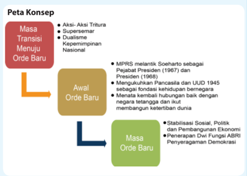

> **Deskripsi Visual:** Gambar ini adalah diagram yang menunjukkan peta konsep mengenai transisi menuju Orde Baru di Indonesia. Diagram ini terdiri dari tiga bagian utama yang masing-masing menunjukkan periode waktu berbeda dalam proses tersebut.

1. **Pertama**: Bagian ini menunjukkan periode transisi dari Orde Lama ke Orde Baru. Di sini, ada beberapa aksi dan aksi tertentu seperti Aksi-Aksi Tritura, Superseminar, Dualisme, dan Kepemimpinan Nasional. Selain itu, ada juga pernyataan bahwa MPRS melantik Soeharto sebagai Presiden (1967) dan sebagai Pajakat Presiden (1968).

2. **Kedua**: Bagian ini menunjukkan awal Orde Baru. Dalam periode ini, ada pernyataan bahwa Pancasila dan UUD 1945 dianggap sebagai fondasi kehidupan bernegara, serta negara tetap berada dalam kondisi yang baik dengan membangun ketertiban dunia.

3. **Ketiga**: Bagian ini menunjukkan masa Orde Baru. Di sini, ada pernyataan tentang stabilisasi sosial, politik, dan pembangunan ekonomi, serta penerapan Dwi Fungsi ABRI dan pernyataan tentang demokrasi.

Elemen-elemen utama dalam diagram ini adalah periode transisi, awal Orde Baru, dan masa Orde Baru. Relasi antara elemen-elemen ini adalah kronologis, menunjukkan urutan waktu dari transisi menuju Orde Baru hingga masa Orde Baru.

Teks, angka, atau label penting yang terlihat dalam diagram ini meliputi:
- "Masa Transisi Menuju Orde Baru"
- "Awal Orde Baru"
- "Masa Orde Baru"
- "Aksi-Aksi Tritura"
- "Superseminar"
- "Dualisme"
- "Kepemimpinan Nasional"
- "MPRS melantik Soeharto sebagai Pajakat Presiden (1967)"
- "Mengukuhkan Pancasila dan UUD 1945 sebagai fondasi kehidupan berneg

104

Kelas XII SMA/MA

 

---
## 📄 Halaman 113

### TUJUAN PEMBELAJARAN

Setelah mempelajari uraian ini, diharap kamu dapat:

- Menjelaskan proses transisi yang terjadi antara masa Demokrasi Terpimpin dengan masa Orde Baru.
- Menganalisis beberapa perubahan yang dilakukan pemerintahan Orde Baru di bidang politik, ekonomi, pertahanan-keamanan, dan sosial budaya, setelah masa Demokrasi Terpimpin berakhir.
- Mengambil hikmah dari berbagai peristiwa yang terjadi selama masa pemerintahan Orde Baru.

### ARTI PENTING

Mempelajari  sejarah  masa  Orde  Baru,  kita  akan  dapat  memahami betapa  dalam  upaya  untuk  mengubah  situasi  negara  yang  kacau diperlukan lebih dahulu stabilisasi di berbagai bidang. Hanya saja kran demokrasi, sesungguhnya juga harus dijaga. Dalam hal pembangunan, kita juga harus mengakui ada banyak keberhasilan di bidang ini, yang dilakukan  oleh  pemerintahan  Orde  Baru.  Meniadakan  begitu  saja keberhasilan tersebut sama saja kita tak mengakui pencapaian positif yang telah  diraih  Indonesia  hingga  saat  ini.  Bagaimanapun  sejarah merupakan perjalanan yang terus berlanjut dan berkesinambungan.

 

---
## 📄 Halaman 114

### Mengamati Lingkungan

Miniatur  pulau-pulau  dalam  gambar  di  atas  terdapat  di  Taman  Mini Indonesia Indah (TMII). TMII dibangun tahun 1975 pada masa pemerintahan Orde Baru.

Di dalam TMII kita dapat melihat 'Indonesia kecil' yang digambarkan melalui beragam bentuk keanekaragaman masyarakat dan budaya Indonesia sebagai cermin persatuan Indonesia sebagaimana terungkap dalam semboyan Bhinneka Tunggal Ika. TMII mencerminkan semangat persatuan dan kesatuan bangsa sebagai modal pembangunan nasional yang menjadi program utama Orde  Baru.  Hal  ini  sesuai  dengan  cita-cita  proklamasi  untuk  mewujudkan masyarakat adil, makmur, dan sejahtera.

Orde Baru adalah suatu sistem pemerintahan yang hendak menerapkan tatanan kehidupan bernegara berdasarkan Pancasila dan UUD 1945. Orde ini lahir setelah terjadinya tragedi nasional pada tahun 1965.

Mengapa  Orde  Baru  dapat  bertahan  selama  32  tahun?    Karena  Orde Baru  mampu  menciptakan  dan  memelihara  stabilitas  sosial  politik  dengan mewujudkan  pembangunan  nasional  yang  dirancang  secara  bertahap  dan berkesinambungan dalam Rencana Pembangunan Lima Tahun (Repelita).

Untuk  menjawabnya,  mari  kita  gunakan  Peta  Konsep  sebagaimana digambarkan  di  atas  sebagai  kerangka  berpikir  untuk  menjelaskan  periode Orde Baru ini.

 

---
## 📄 Halaman 115

### A.  Masa Transisi  1966-1967

### 1.  Aksi-Aksi  Tritura

Naiknya Letnan Jenderal Soeharto ke kursi kepresidenan tidak dapat dilepaskan dari peristiwa Gerakan 30 September 1965  atau  G  30  S/PKI.  Ini  merupakan peristiwa yang menjadi titik awal berakhirnya  kekuasaan Presiden Soekarno dan  hilangnya  kekuatan  politik  PKI  dari percaturan politik Indonesia.

Peristiwa  tersebut  telah  menimbulkan kemarahan  rakyat.  Keadaan  politik    dan keamanan negara menjadi kacau, keadaan perekonomian  makin  memburuk  dimana inlasi	 mencapai	 600%	 sedangkan	 upaya pemerintah  melakukan  devaluasi  rupiah dan kenaikan menyebabkan timbulnya keresahan masyarakat.

Aksi-aksi  tuntutan  penyelesaian  yang seadil-adilnya  terhadap  pelaku  G  30  S/ PKI semakin meningkat. Gerakan tersebut dipelopori oleh  kesatuan  aksi  pemudapemuda,  mahasiswa  dan  pelajar  (KAPPI, KAMI,  KAPI),  kemudian  muncul  pula KABI  (buruh),  KASI  (sarjana),  KAWI (wanita), KAGI (guru) dan lain-lain. Kesatuan-kesatuan  aksi  tersebut  dengan gigih  menuntut  penyelesaian  politis  yang terlibat  G  30  S/PKI,  dan  kemudian  pada tanggal  26  Oktober  1965  membulatkan barisan  mereka  dalam  satu  front,  yaitu Front Pancasila.

### RESIMEN CAKRABIRAWA

Resimen Cakrabirawa merupakan kesatuan pasukan gabungan dari TNI Angkatan Darat, Angkatan Laut, Angkatan Udara dan Kepolisian yang bertugas khusus menjaga keamanan Presiden RI pada zaman pemerintahan Soekarno.

Sayangnya, sebagian anggota resimen ini kemudian berhasil dipengaruhi PKI dan ikut terlibat dalam peristiwa Gerakan 30 September 1965. Di antara mereka yang terlibat, adalah Letkol Untung Syamsuri, salah seorang komandan Cakrabirawa yang justru menjadi pemimpin G30S/ PKI saat melakukan penculikan terhadap para perwira tinggi AD pada dini hari tanggal 1 Oktober 1965.

Pada zaman pemerintahan Soeharto, resimen ini dibubarkan. Untuk mengawal Presiden, dibentuk kemudian kesatuan baru Paspampres (Pasukan Pengamanan Presiden)

Setelah  lahir  barisan  Front  Pancasila,  gelombang  demonstrasi  yang menuntut pembubaran PKI makin bertambah meluas. Situasi yang menjurus ke	arah	konlik	politik	makin	bertambah	panas	oleh	keadaan	ekonomi	yang

 

---
## 📄 Halaman 116

semakin memburuk. Perasaan tidak puas terhadap keadaan saat itu mendorong para  pemuda dan mahasiswa mencetuskan Tri Tuntutan Rakyat yang lebih dikenal dengan sebutan Tritura (Tri Tuntutan Rakyat). Pada 12 Januari 1966 dipelopori oleh KAMI dan KAPPI, kesatuan-kesatuan aksi yang tergabung dalam Front Pancasila mendatangi DPR-GR mengajukan tiga buah tuntutan yaitu: (1) Pembubaran PKI, (2) Pembersihan kabinet dari unsur-unsur G 30 S/ PKI, dan (3) Penurunan harga/perbaikan ekonomi.

Tuntutan  rakyat  banyak  agar  Presiden  Soekarno  membubarkan  PKI ternyata  tidak  dipenuhi  presiden.  Untuk  menenangkan  rakyat,  Presiden Soekarno  mengadakan  perubahan  Kabinet  Dwikora  menjadi  Kabinet  100 Menteri, yang ternyata belum juga memuaskan hati rakyat karena di dalamnya masih bercokol tokoh-tokoh yang terlibat dalam  peristiwa  G 30 S/PKI.

Pada saat pelantikan  Kabinet 100 Menteri pada tanggal 24 Februari 1966, para  mahasiswa,  pelajar  dan  pemuda  memenuhi  jalan-jalan  menuju  Istana Merdeka.

Aksi  itu  dihadang  oleh  pasukan  Cakrabirawa  sehingga  menyebabkan bentrok antara pasukan Cakrabirawa dengan para demonstran yang menyebabkan  gugurnya  mahasiswa  Universitas  Indonesia  bernama  Arief Rachman Hakim. Sebagai akibat dari aksi itu keesokan harinya yaitu pada tanggal 25 Februari 1966 berdasarkan keputusan Panglima Komando Ganyang Malaysia (Kogam), yaitu Presiden Soekarno sendiri, KAMI dibubarkan.

---
**🖼️ Gambar/Diagram**

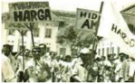

> **Deskripsi Visual:** Gambar ini adalah ilustrasi yang menunjukkan demonstrasi massa di jalan raya. Ilustrasi ini menggambarkan sekelompok orang yang sedang berjalan bersama-sama, membawa spanduk dengan tulisan "HARGA" dan "HARGA". Orang-orang tampak antusias dan seragam dalam pakaian mereka, menunjukkan bahwa mereka mungkin merupakan anggota suatu organisasi atau partai politik. Di sebelah kiri, ada beberapa papan reklame yang menunjukkan logo dan nama-nama perusahaan, yang menunjukkan bahwa demonstrasi ini mungkin terkait dengan isu-isu sosial atau ekonomi. Teks dan angka penting yang terlihat pada spanduk adalah "HARGA", yang menunjukkan bahwa tema utama demonstrasi ini mungkin berkaitan dengan harga barang atau jasa. Informasi kunci yang dapat diambil pembaca adalah bahwa demonstrasi ini mungkin terkait dengan isu-isu sosial atau ekonomi, dan bahwa para peserta demonstrasi memiliki tujuan yang sama.

Sumber: Sketsa  Perjalanan Bangsa Berdemokrasi, Depkominfo, 2005

Gambar 4.2 Aksi Tritura di depan Fakultas Kedokteran UI

Insiden berdarah yang terjadi ternyata menyebabkan makin parahnya krisis kepemimpinan  nasional.  Keputusan  membubarkan  KAMI  dibalas  oleh mahasiswa Bandung dengan mengeluarkan 'Ikrar Keadilan dan Kebenaran' yang memprotes pembubaran KAMI dan mengajak rakyat untuk meneruskan perjuangan.  Perjuangan  KAMI  kemudian  dilanjutkan  dengan  munculnya massa  Kesatuan  Aksi  Pelajar  Indonesia  (KAPI).  Aksi-aksi  tersebut,  krisis nasional makin tidak terkendalikan.

 

---
## 📄 Halaman 117

Protes terhadap pembubaran KAMI juga dilakukan oleh Front Pancasila, dan meminta kepada pemerintah agar meninjau kembali pembubaran KAMI. Dalam suasana yang demikian,  pada 8 Maret 1966 para pelajar dan mahasiswa    yang  melakukan  demonstrasi  menyerbu  dan  mengobrak-abrik gedung Departemen Luar Negeri. Selain itu, mereka juga membakar kantor berita Republik Rakyat Cina (RRC), Hsin Hua .  Aksi para demonstran tersebut menimbulkan  kemarahan  Presiden  Soekarno.  Pada  hari  itu  juga  presiden mengeluarkan perintah harian supaya agar seluruh komponen bangsa waspada terhadap usaha-usaha 'membelokkan jalannya revolusi kita ke kanan', dan supaya siap sedia untuk menghancurkan setiap usaha yang langsung maupun tidak  langsung  bertujuan  merongrong  kepemimpinan,  kewibawaan,  atau kebijakan  Presiden,  serta  memperhebat  'pengganyangan  terhadap  Nekolim serta proyek 'British Malaysia'.

### 2.    Surat Perintah Sebelas Maret

Untuk mengatasi krisis politik yang memuncak, pada tanggal 11 Maret 1966 Soekarno mengadakan sidang kabinet. Sidang ini ternyata diboikot oleh para demonstran yang tetap menuntut Presiden Soekarno agar membubarkan PKI, dengan melakukan pengempesan ban-ban mobil pada jalan-jalan yang menuju ke Istana.

Belum lama Presiden berpidato dalam sidang, ia diberitahu oleh Brigjen. Sabur, Komandan Cakrabirawa bahwa di luar istana terdapat pasukan tanpa tanda  pengenal  dengan  seragamnya.  Meskipun  ada  jaminan  dari  Pangdam V/Jaya Amir Machmud, yang hadir waktu itu, bahwa keadaan tetap aman, Presiden Soekarno tetap merasa khawatir dan segera meninggalkan sidang. Tindakan itu diikuti  oleh Waperdam I Dr.Subandrio dan Waperdam III Dr. Chaerul  Saleh  yang  bersama-sama  dengan  Presiden  segera  menuju  Bogor dengan helikopter. Sidang kemudian ditutup oleh Waperdam II Dr.J. Leimena, yang kemudian menyusul ke Bogor dengan mobil.

Sementara itu, tiga orang perwira tinggi TNI-AD, yaitu Mayjen. Basuki Rahmat, Brigjen. M Jusuf, dan Brigjen. Amir Machmud, yang juga mengikuti sidang paripurna kabinet, sepakat untuk menyusul Presiden Soekarno ke Bogor. Sebelum  berangkat,  ketiga  perwira  tinggi  itu  minta  ijin  kepada  atasannya yakni Menteri/Panglima Angkatan Darat Letnan Jenderal Soeharto yang juga merangkap  selaku  panglima  Kopkamtib.  Pada  waktu  itu  Letnan  Jenderal Soeharto sedang sakit sehingga diharuskan beristirahat di rumah. Niat ketiga perwira itu disetujuinya. Mayjen. Basuki Rachmat menanyakan apakah ada pesan khusus dari Letjen. Soeharto untuk Presiden Soekarno, Letjen Soeharto menjawab: 'sampaikan saja bahwa saya tetap pada kesanggupan saya. Beliau akan mengerti'

 

---
## 📄 Halaman 118

Latar belakang dari ucapan itu ialah bahwa sejak pertemuan mereka di Bogor  pada  tanggal  2  Oktober  1965  setelah  meletusnya  pemberontakan G-30-S/PKI.  Antara  Presiden  Soekarno  dengan  Letjen.  Soeharto  terjadi perbedaan pendapat mengenai kunci bagi usaha meredakan pergolakan politik saat itu. Menurut Letjen. Soeharto, pergolakan rakyat tidak akan reda sebelum rasa keadilan rakyat dipenuhi dan rasa ketakutan rakyat dihilangkan dengan jalan membubarkan PKI yang telah melakukan pemberontakan. Sebaliknya Presiden Soekarno menyatakan bahwa ia tidak mungkin membubarkan PKI karena hal itu bertentangan dengan doktrin Nasakom yang telah dicanangkan ke seluruh dunia. Dalam pertemuan-pertemuan selanjutnya perbedaan paham itu  tetap  muncul.  Pada  suatu  ketika  Soeharto  menyediakan  diri  untuk membubarkan PKI asal mendapat kebebasan bertindak dari presiden. Pesan Soeharto  yang  disampaikan  kepada  ketiga  orang  perwira  tinggi  yang  akan berangkat ke Bogor mengacu kepada kesanggupan tersebut.

Gambar 4.3 Tiga Jenderal yang membawa Surat Perintah Sebelas Maret (Supersemar) dari Soekarno ke Soeharto

Di Istana Bogor ketiga perwira tinggi mengadakan pembicaraan dengan Presiden yang didampingi oleh Dr. Subandrio, Dr. J Leimena, dan Dr. Chaerul Saleh. Sesuai dengan kesimpulan pembicaraan, ketiga perwira tinggi tersebut bersama dengan komandan Resimen Cakrabirawa, Brigjen. Sabur, kemudian diperintahkan membuat konsep surat perintah kepada Letjen. Soeharto untuk memulihkan keadaan dan kewibawaan pemerintah. Setelah dibahas bersama, akhirnya Presiden Soekarno menandatangani surat perintah yang kemudian terkenal  dengan  nama  Surat  Perintah  11  Maret,  atau  SP  11  Maret,  atau Supersemar.

Supersemar  berisi  pemberian mandat kepada Letjen. Soeharto selaku Panglima Angkatan  Darat  dan  Pangkopkamtib  untuk  memulihkan  keadaan dan  kewibawaan  pemerintah.  Dalam  menjalankan  tugas,  penerima  mandat diharuskan melaporkan segala sesuatu kepada presiden. Mandat itu kemudian dikenal sebagai Surat Perintah 11 Maret (Supersemar).  Keluarnya Supersemar dianggap sebagai tonggak lahirnya Orde Baru.

Tindakan pertama yang dilakukan oleh Soeharto keesokan harinya setelah menerima Surat  Perintah  tersebut  adalah  membubarkan  dan  melarang  PKI

 

---
## 📄 Halaman 119

beserta organisasi massanya yang bernaung dan  berlindung  ataupun  seasas  dengannya di seluruh Indonesia, terhitung sejak tanggal 12 Maret 1966. Pembubaran itu mendapat dukungan dari rakyat, karena dengan demikian salah satu di antara Tritura telah dilaksanakan.

Selain itu Letjen. Soeharto juga menyerukan kepada pelajar dan mahasiswa untuk kembali ke sekolah. Tindakan berikutnya berdasarkan Supersemar adalah dikeluarkannya Keputusan Presiden No. 5 tanggal 18 Maret 1966 tentang penahanan 15 orang menteri yang diduga terkait dengan pemberontakan G 30 S/PKI ataupun dianggap memperlihatkan iktikad tidak baik dalam penyelesaian masalah itu.

Demi lancarnya tugas pemerintah, Letjen.  Soeharto  mengangkat  lima  orang

Ada  beberapa  faktor  yang melatar  belakangi  lahirnya Supersemar, di antaranya:

- Situasi negara secara umum dalam keadaan kacau dan genting
- Untuk mengatasi situasi yang tak menentu akibat pemberontakan G 30 S/ PKI.
- Menyelamatkan Negara Kesatuan Republik Indonesia
- Untuk memulihkan keadaan dan wibawa pemerintah.
menteri  koordinator ad  interim yang  menjadi  Presidium  Kabinet.  Kelima orang tersebut ialah Sultan Hamengku Buwono IX, Adam Malik. Dr. Roeslan Abdulgani, Dr. K.H. Idham Chalid dan Dr. J. Leimena.

### 3.   Dualisme Kepemimpinan Nasional

Memasuki tahun 1966 terlihat gejala krisis kepemimpinan nasional yang mengarah  pada  dualisme  kepemimpinan.  Di  satu  pihak  Presiden  Soekarno masih  menjabat  presiden,  namun  pamornya  telah  kian  merosot.  Soekarno dianggap  tidak aspiratif terhadap  tuntutan  masyarakat  yang  mendesak agar  PKI  dibubarkan.  Hal  ini  ditambah  lagi  dengan  ditolaknya  pidato pertanggungjawabannya hingga dua kali oleh MPRS. Sementara itu Soeharto setelah mendapat Surat Perintah Sebelas Maret dari Presiden Soekarno dan sehari  sesudahnya  membubarkan  PKI,  namanya  semakin  populer.  Dalam pemerintahan yang masih dipimpin oleh Soekarno, Soeharto sebagai pengemban Supersemar, diberi mandat oleh MPRS untuk membentuk kabinet, yang diberi nama Kabinet Ampera.

Meskipun Soekarno masih memimpin sebagai pemimpin kabinet, tetapi pelaksanaan  pimpinan  dan  tugas  harian  dipegang  oleh  Soeharto.  Kondisi seperti  ini  berakibat  pada  munculnya  'dualisme  kepemimpinan  nasional',

 

---
## 📄 Halaman 120

yaitu Soekarno sebagai pimpinan pemerintahan sedangkan Soeharto sebagai pelaksana pemerintahan. Presiden Soekarno sudah tidak banyak melakukan tindakan-tindakan  pemerintahan,  sedangkan  sebaliknya  Letjen.  Soeharto banyak  menjalankan  tugas-tugas  harian  pemerintahan.  Adanya  'Dualisme kepemimpinan  nasional'  ini  akhirnya  menimbulkan  pertentangan  politik dalam masyarakat, yaitu mengarah pada munculnya pendukung Soekarno dan pendukung  Soeharto.  Hal  ini  jelas  membahayakan  persatuan  dan  kesatuan bangsa.

Dalam Sidang MPRS yang digelar sejak akhir bulan Juni sampai awal Juli  1966  memutuskan    menjadikan    Supersemar  sebagai  Ketetapan  (Tap) MPRS. Dengan dijadikannya Supersemar sebagai Tap MPRS secara hukum Supersemar tidak lagi bisa dicabut sewaktu-waktu oleh Presiden Soekarno. Bahkan, secara hukum Soeharto mempunyai kedudukan yang sama dengan Soekarno, yaitu Mandataris MPRS.

Dalam Sidang MPRS itu juga, majelis mulai membatasi hak prerogatif Soekarno selaku presiden.  Secara eksplisit dinyatakan bahwa gelar 'Pemimpin Besar  Revolusi'  tidak  lagi  mengandung  kekuatan  hukum.  Presiden  sendiri masih  diizinkan  untuk  membacakan  pidato  pertanggungjawabannya  yang diberi judul 'Nawaksara'.

Pada  tanggal  22  Juni  1966,  presiden  Soekarno  menyampaikan  pidato 'Nawaksara' dalam persidangan MPRS.  'Nawa'  berasal dari bahasa Sansekerta  yang    berarti  sembilan,  dan  'Aksara'  berarti  huruf  atau  istilah. Pidato itu memang berisi sembilan pokok persoalan yang dianggap penting oleh Presiden Soekarno  selaku mandataris MPR. Isi pidato tersebut hanya sedikit menyinggung sebab-sebab meletusnya peristiwa berdarah yang terjadi pada tanggal 30 September 1965. Pengabaian peristiwa yang mengakibatkan gugurnya  sejumlah  jenderal  angkatan  darat  itu  tidak  memuaskan  anggota MPRS. Melalui Keputusan Nomor 5/MPRS/1966, MPRS memutuskan untuk minta  kepada  presiden  agar  melengkapi  laporan  pertanggungjawabannya, khususnya mengenai sebab-sebab terjadinya peristiwa Gerakan 30 September beserta epilognya dan masalah kemunduran ekonomi serta akhlak.

Pada  tanggal  10  Januari  1967  Presiden  menyampaikan  surat  kepada pimpinan MPRS yang berisi Pelengkap Nawaksara (Pelnawaksara). Dalam Pelnawaksara itu Presiden mengemukakan bahwa Mandataris MPRS hanya mempertanggungjawabkan  pelaksanaan  Garis-garis  Besar  Haluan  Negara dan  bukan  hal-hal  yang  lain.  Nawaksara  baginya  hanya  sebagai progress report yang  ia  sampaikan  secara  sukarela.  Ia  juga  menolak  untuk  seorang diri  mempertanggungjawabkan terjadinya peristiwa Gerakan 30 September, kemerosotan ekonomi, dan akhlak.

 

---
## 📄 Halaman 121

Sementara  itu,  sebuah  kabinet  baru  telah  terbentuk  dan  diberi  nama Kabinet Ampera (Amanat Penderitaan Rakyat). Kabinet tersebut diresmikan pada 28 Juli 1966. Kabinet ini mempunyai tugas pokok untuk menciptakan stabilitas  politik  dan  ekonomi.  Program  kabinet  tersebut  antara  lain  adalah memperbaiki kehidupan rakyat, terutama di bidang sandang dan pangan, dan melaksanakan pemilihan umum sesuai dengan Ketetapan MPR RI No. XI/ MPRS/1966. Sesuai dengan UUD 1945, Presiden Soekarno adalah pemimpin Kabinet. Akan tetapi pelaksanaan pimpinan pemerintahan dan tugas harian dilakukan  oleh  Presidium  Kabinet  yang  diketuai  oleh  Letnan  Jenderal Soeharto.

Sehubungan  dengan  permasalahan  yang  ditimbulkan  oleh  'Pelengkap Nawaksara'  dan  bertambah  gawatnya  keadaan  politik  pada  9  Februari 1967 DPR-GR mengajukan resolusi dan memorandum kepada MPRS agar mengadakan Sidang Istimewa. Sementara itu, usaha-usaha untuk menenangkan keadaan berjalan terus. Untuk itu pimpinan ABRI mengadakan pendekatan pribadi  kepada  Presiden  Soekarno  agar  ia  menyerahkan  kekuasaan  kepada pengemban ketetapan MPRS RI No. IX/MPRS/1966, yaitu Jenderal Soeharto sebelum    Sidang  Umum  MPRS.  Hal  ini  untuk  mencegah  perpecahan  di kalangan rakyat dan untuk menyelamatkan lembaga kepresidenan dan pribadi Presiden Soekarno.

Salah seorang sahabat Soekarno, Mr. Hardi, menemui Presiden Soekarno dan memohon agar Presiden Soekarno membuka prakarsa untuk mengakhiri dualisme  kepemimpinan  negara,  karena  dualisme  kepemimpinan  inilah yang	menjadi	sumber	konlik	politik	yang	tidak	kunjung	berhenti.	Mr.	Hardi menyarankan  agar    Soekarno  sebagai  mandataris  MPRS,  menyatakan  non aktif di depan sidang Badan Pekerja MPRS dan menyetujui pembubaran PKI. Presiden Soekarno menyetujui saran Mr. Hardi. Untuk itu disusunlah 'Surat Penugasan mengenai Pimpinan Pemerintahan Sehari-hari kepada Pemegang Surat Perintah 11 Maret 1966.

Kemudian, Presiden menulis nota pribadi kepada Jenderal Soeharto. Pada 7  Februari  1967,  Mr.  Hardi  menemui  Jenderal  Soeharto  dan  menyerahkan konsep tersebut. Pada 8 Februari 1967, Soeharto membahas surat Presiden bersama keempat Panglima Angkatan. Para panglima berkesimpulan bahwa draft surat tersebut tidak dapat diterima karena bentuk surat penugasan tersebut tidak	membantu	menyelesaikan	situasi	konlik.	Kesimpulan	itu	disampaikan Soeharto  kepada  Presiden  Soekarno  pada  10  Februari  1967.  Presiden menanyakan  kemungkinan  mana  yang  terbaik.  Soeharto  mengajukan  draft berisi pernyataan bahwa Presiden berhalangan atau menyerahkan kekuasaan kepada  Pengemban  Surat  Perintah  11  Maret  1966.  Pada  awalnya  Presiden

 

---
## 📄 Halaman 122

Soekarno  tidak  berkenan  dengan  usulan  draft  tersebut,  namun  kemudian sikap Presiden Soekarno melunak, ia memerintahkan agar Soeharto beserta Panglima Angkatan berkumpul di Bogor pada hari Minggu tanggal 19 Februari 1967. Presiden menyetujui draft yang dibuat, dan pada tanggal 20 Februari draft surat itu telah ditandatangani oleh Presiden. Ia meminta agar diumumkan pada hari Rabu tanggal 22 Februari 1967. Tepat pada pukul 19.30, Presiden Soekarno membacakan pengumuman resmi pengunduran dirinya.

Pada tanggal 12 Maret 1967 Jenderal Soeharto dilantik menjadi Pejabat Presiden Republik Indonesia oleh Ketua MPRS Jenderal  Abdul Haris Nasution. Setelah setahun menjadi pejabat  presiden, Soeharto dilantik menjadi Presiden Republik  Indonesia  pada  tanggal  27  Maret  1968  dalam  Sidang  Umum  V MPRS. Melalui Tap No. XLIV/MPRS/1968, Jenderal Soeharto dikukuhkan sebagai Presiden Republik Indonesia hingga terpilih presiden oleh MPR hasil pemilu. Pengukuhan tersebut menandai berakhirnya dualisme kepemimpinan nasional dan dimulainya pemerintahan Orde Baru.

### PENGAYAAN

Jelaskan hikmah apa yang dapat diambil dari adanya dualisme kepemimpinan dalam politik Indonesia pasca peristiwa G30S/PKI. Kaitkan pendapatmu dengan sebab-sebab kemunculan dan penyelesaian yang akhirnya terjadi!

Sumber: Deppen, 1975 Gambar 4.4 Soekarno dan Soeharto

### TUGAS

- Buatlah  esai  tentang  kondisi  Indonesia  yang  menyebabkan  terjadinya aksi Tritura, seperti yang tercermin dalam tuntutan Tritura !

### B.    Stabilisasi Politik dan Rehabilitasi Ekonomi

Terbentuknya pemerintahan Orde Baru yang diawali dengan keputusan Sidang Istimewa MPRS tanggal 12 Maret 1967 yang menetapkan Jenderal Soeharto sebagai pejabat presiden. Kedudukannya itu semakin kuat setelah pada  27  Maret  1968,  MPRS  mengukuhkannya  sebagai  presiden  penuh. Pengukuhan tersebut dapat dijadikan indikator dimulainya kekuasaan Orde Baru.

 

---
## 📄 Halaman 123

Setelah  memperoleh  kekuasaan  sepenuhnya,  pemerintah  Orde  Baru mulai  menjalankan  kebijakan-kebijakan  politik  dan  ekonomi  yang  telah ditetapkan  oleh  Sidang  MPRS  tahun-tahun  sebelumnya,  seperti  Stabilitas Politik Keamanan (Tap MPRS No.IX/1966), Stabilitas Ekonomi (Tap MPRS No.XXIII/19 66), dan Pemilihan Umum (Tap MPRS No.XI/1966).

Pemerintahan  Orde  Baru  memandang  bahwa  selama  Orde  Lama  telah terjadi  penyimpangan  terhadap  pelaksanaan  UUD  1945  dan  Pancasila.  Di antara  penyimpangan  tersebut  adalah  pelaksanaan  Demokrasi  Terpimpin dan pelaksanaan politik luar negeri yang cenderung memihak blok komunis (Blok Timur).  Sesuai  dengan  ketentuan  yang  telah  digariskan  oleh  MPRS, maka  pemerintahan Orde Baru segera berupaya menjalankan UUD 1945 dan Pancasila  secara  konsekuen  dengan  melakukan  rehabilitasi  dan  stabilisasi politik  dan  keamanan  (polkam).  Tujuan  dari  rehabilitasi  dan  stabilisasi tersebut  adalah  agar  dilakukan  pembangunan  ekonomi  bagi  kesejahteraan rakyat Indonesia.

Dalam  melaksanakan  rehabilitasi  dan  stabilisasi    Polkam,  pemerintah Orde  Baru  di  bawah  pimpinan  Soeharto  menggunakan  suatu  pendekatan yang  dikenal  sebagai  pendekatan  keamanan  ( security  approach ),  termasuk di dalamnya de-Soekarnoisasi dan depolitisasi kekuatan-kekuatan organisasi sosial  politik  (orsospol)  yang  dinilai  akan  merongrong  kewibawaan  pemerintah. Seiring dengan itu,  dibentuk lembaga-lembaga stabilisasi seperti; Kopkamtib (pada 1 November 1965), Dewan Stabilisasi Ekonomi Nasional (11 Agustus 1966), dan Dewan Pertahanan Keamanan Nasional (1 Agustus 1970).

Mengenai  kebijakan  politik  luar  negeri  yang  dipandang  menyimpang, pemerintah Orde Baru berupaya mengembalikan Indonesia dari politik NefosOldefos dan 'Poros Jakarta-Pnom Penh-Hanoi-Peking-Pyongyang' ke politik luar  negeri  Indonesia  yang  bebas  dan  aktif. Tujuan  dari  politik  luar  negeri pun diarahkan untuk dapat dilakukannya pembangunan kesejahteraan rakyat. Hal itu tampak dari pernyataan Jenderal Soeharto sebagai pemegang mandat Supersemar tanggal 4 April 1966, beliau menyatakan bahwa Indonesia akan menjalankan  politik  luar  negeri  yang  bebas  aktif,  yang  mengabdi  kepada kepentingan  bangsa  dan  ditujukan  untuk  mencapai  kesejahteraan  rakyat. Dalam upaya mencapai tujuan tersebut, maka politik luar negeri Indonesia akan  ditujukan  pada  perluasan  kerja  sama  ekonomi  dan  keuangan  antara Indonesia dengan dunia luar, baik Timur maupun Barat, selama kerja sama itu menguntungkan bagi kepentingan Indonesia.

Sebagai  wujud  nyata  dari  niat  itu,  Indonesia  memulihkan  kembali hubungan baik dengan Malaysia termasuk Singapura yang sempat terganggu akibat  kebijakan  konfrontasi  Indonesia  1963-1966.  Di  samping  itu,  sejak

 

---
## 📄 Halaman 124

28 September 1966, Indonesia kembali aktif di forum Perserikatan BangsaBangsa (PBB). Pada era Orde Lama, Indonesia pada 1 Januari 1965, keluar dari  lembaga  tersebut.  Langkah  berikutnya,  Indonesia  bersama  Malaysia, Singapura, Thailand dan Filipina membentuk organisasi kerja sama regional ASEAN ( Association  of  South  East  Asian  Nation )  di  Bangkok  8  Agustus 1967. Tujuan pembentukan ASEAN ini adalah untuk meningkatkan kerjasama regional khususnya di bidang ekonomi dan budaya.

### 1.   Stabilisasi Politik dan Keamanan sebagai Dasar Pembangunan

Orde Baru mencanangkan berbagai konsep dan aktivitas pembangunan nasional yang berorientasi pada kesejahteraan masyarakat. Langkah pertama melaksanakan  pembangunan  nasional  tersebut  adalah  dengan  membentuk Kabinet Pembangunan I pada 6 Juni 1968. Program Kabinet Pembangunan I dikenal dengan sebutan Pancakrida Kabinet Pembangunan, yang berisi:

- Menciptakan  stabilitas  politik  dan  ekonomi  sebagai  syarat  mutlak berhasilnya pelaksanakan Rencana Pembangunan Lima Tahun (Repelita) dan Pemilihan Umum (Pemilu);
- Menyusun dan merencanakan Repelita;
- Melaksanakan Pemilu selambat-lambatnya pada Juli 1971;
- Mengembalikan ketertiban dan keamanan masyarakat dengan mengikis habis sisa-sisa G 30/S/PKI dan setiap bentuk  r o n g r o n g a n penyelewengan, serta pengkhianatan terhadap Pancasila dan UUD 1945; dan
- Melanjutkan  penyempurnaan  dan  pembersihan  secara  menyeluruh aparatur negara baik di pusat maupun di daerah dari unsur-unsur komunisme.
Dalam rangka menciptakan kondisi politik yang stabil dan kondusif bagi terlaksananya amanah rakyat melalui TAP MPRS No.IX/MPRS/1966, yaitu melaksanakan pemilihan umum (Pemilu), pemerintah Orde Baru melakukan 'pelemahan' atau mengeliminasi kekuatan-kekuatan yang secara historis dinilai berpotensi mengganggu stabilitas dan merongrong kewibawaan pemerintah. Pelemahan itu dilakukan antara lain terhadap pendukung  Soekarno, kelompok Partai  Sosialis  Indonesia  (PSI),  dan  kelompok  Islam  fundamentalis  (yang sering disebut kaum ekstrim kanan). Selain itu,  pemerintahan Soeharto juga menciptakan  kekuatan  politik  sipil  baru  yang  dalam  pandangannya  lebih mudah  dikendalikan.  Organisasi  itu  adalah  Sekretariat  Bersama  Golongan Karya (Sekber Golkar) yang kemudian lebih dikenal dengan nama Golkar.

 

---
## 📄 Halaman 125

Berdasarkan Tap MPRS No IX/MPRS/1966, pemerintah diharapkan segera melakukan pemilu  pada tahun 1968. Namun karena berbagai pertimbangan politik dan keamanan, pemilu baru dapat diselenggarakan pada 1971. Lembaga Pemilu  sebagai  pelaksana  pemilu  dibentuk  dan  ditempatkan  di  bawah koordinasi Departemen Dalam Negeri, sedangkan peserta pemilu ditetapkan melalui Keputusan Presiden No. 23 tanggal 23 Mei 1970. Berdasarkan surat keputusan itu, jumlah partai politik (parpol) yang diijinkan ikut serta dalam pemilu adalah 9 parpol, yaitu: NU, Parmusi, PSII, Perti (Persatuan Tarbiyah Islamiyah),  Partai  Kristen  Indonesia,  Partai  Khatolik,  Partai  Musyawarah Rakyat  Banyak  (Murba),  dan  Ikatan  Pendukung  Kemerdekaan  Indonesia (IPKI)  ditambah dengan Golkar. Adapun perolehan suara hasil pemilu 1971 adalah sebagai berikut:  Golkar (236 kursi; 62,82%), NU (58 kursi;18,68%), Parmusi (24 kursi; 5,56%), PNI (20 kursi; 6,93%), PSII (10 kursi; 2,39%), dan Parkindo (10 kursi; 2,39%). (Anhar Gonggong ed, 2005: 150)

Pada  akhir  tahun  1971,  pemerintah  Orde  Baru  melemparkan  gagasan penyederhanaan  partai  politik  dengan  alasan-alasan  tertentu,  seperti  kasus pada  masa  'Demokrasi  Parlementer'.  Pada  masa  itu,  banyaknya  partai dianggap  tidak  memudahkan  pembangunan,  justru  sebaliknya  menambah permasalahan.  Penyebabnya  bukan  hanya  karena  persaingan  antarparpol, melainkan juga persaingan di dalam tubuh parpol antara para pemimpinnya tidak jarang memicu timbulnya krisis. Bahkan perpecahan yang dinilai bisa mengganggu stabilitas polkam. Atas dasar itu, pemerintah berpendapat perlu adanya  penyederhanaan  partai  sebagai  bagian  dari  pelaksanaan  demokrasi Pancasila.  Pada  awalnya  banyak  parpol  yang  menolak  gagasan  itu  yang sedikit  banyak  dinilai  telah  menutup  aspirasi  kebebasan  berkumpul  dan berserikat yang dijamin oleh UUD 1945. Namun, adanya tekanan pemerintah menyebabkan mereka tidak mempunyai pilihan lain.

Realisasi  penyederhanaan  partai  tersebut  dilaksanakan  melalui  Sidang Umum MPR tahun 1973. Sembilan  partai  yang  ada  berfusi  ke  dalam  dua partai baru, yaitu Partai Persatuan Pembangunan (PPP) dan Partai Demokrasi Indonesia  (PDI).  Empat  Partai  Islam,  yaitu  Nahdatul  Ulama/NU,  Parmusi, Partai Sarekat Islam Indonesia/PSII, dan Perti bergabung dalam PPP. Sementara itu  lima  partai  non  Islam,  yaitu  PNI,  Partai  Kristen  Indonesia  (Parkindo), Partai Khatolik, Partai Murba, dan IPKI bergabung dalam PDI. Selain kedua kelompok tersebut  ada pula kelompok Golkar yang semula bernama Sekber Golkar. Pengelompokkan tersebut secara formal berlaku pula di lingkungan DPR dan MPR.  (Gonggong dan Asy'arie, ed, 2005).

 

---
## 📄 Halaman 126

---
**📊 Tabel**

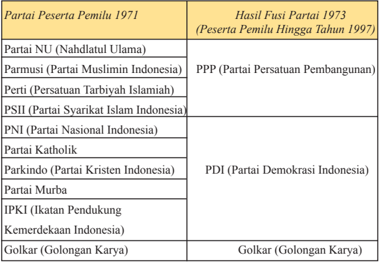

Tabel ini menunjukkan perubahan partai politik di Indonesia dari tahun 1971 hingga 1997. Topik utamanya adalah proses fusi dan pembentukan partai baru. Kolom pertama berisi nama-nama partai yang menjadi peserta pemilu pada tahun 1971, sementara kolom kedua berisi hasil fusi mereka pada tahun 1973. Data penting yang terlihat adalah bahwa beberapa partai seperti Partai Nasional Indonesia (PNI) dan Partai Kristen Indonesia (Parkindo) mengalami fusi dengan partai lain untuk membentuk partai baru seperti PPP (Partai Persatuan Pembangunan) dan PDI (Partai Demokrasi Indonesia). Selain itu, beberapa partai seperti Golkar (Golongan Karya) tidak mengalami fusi dan tetap berada sebagai partai independen.

Di samping melakukan penyederhanaan partai, pemerintah menetapkan pula konsep 'massa mengambang'. Partai-partai dilarang mempunyai cabang atau ranting di tingkat kecamatan  sampai pedesaan. Sementara itu jalur parpol ke  tubuh  birokrasi  juga  terpotong  dengan  adanya  ketentuan  agar  pegawai negeri sipil menyalurkan suaranya ke Golkar (monoloyalitas).

Pemerintahan  Orde  Baru  berhasil  melaksanakan pemilihan umum sebanyak enam kali yang diselenggarakan  setiap  lima  tahun  sekali,  yaitu:  tahun 1971, 1977, 1982, 1987, 1992, dan 1997.  Pemilu 1971 diikuti  oleh  58.558.776  pemilih  untuk  memilih  460 orang anggota DPR dimana 360 orang anggota dipilih dan 100 orang diangkat.

Semua  pemilu  yang  dilakukan  pada  masa  Orde Baru  dimenangkan  oleh  Golkar.  Hal  itu  disebabkan oleh  pengerahan  kekuatan-kekuatan  penyokong  Orde Baru  untuk  mendukung  Golkar.  Kekuatan-kekuatan penyokong Golkar adalah aparat pemerintah (Pegawai Negeri Sipil) dan Angkatan Bersenjata Republik Indonesia (ABRI).

 

---
## 📄 Halaman 127

Melalui kekuatan-kekuatan tersebut, pemerintah mengarahkan masyarakat untuk memilih Golkar. Meskipun  anggota  ABRI  tidak  terlibat  dalam  Golkar secara  langsung,  para  anggota  keluarga  dan  pensiunan ABRI (Purnawirawan) banyak terlibat dan memberikan dukungan penuh kepada Golkar. Semua pegawai negeri sipil diwajibkan menjadi anggota Golkar. Dengan dukungan  Pegawai  Negeri  Sipil  dan  ABRI,  Golkar dengan leluasa menjangkau masyarakat luas di berbagai tempat  dan  tingkatan.  Dari  tingkatan  masyarakat  atas sampai bawah. Dari kota sampai pelosok desa.

Penyelenggaraan    pemilu    selama    Orde  Baru menimbulkan  kesan  bahwa  demokrasi  di  Indonesia sudah tercipta dengan  baik.  Apalagi pemilu-pemilu tersebut berlangsung dengan slogan  'Luber' (Langsung, Umum, Bebas, dan Rahasia). Suara-suara ketidakpuasan dari masyarakat terhadap demokrasi dikesampingkan.

Ketidakpuasan  yang  ada  di  masyarakat  misalnya mengenai  dibatasinya  jumlah  partai-partai  politik  dan pengerahan Pegawai  Negeri Sipil dan  ABRI,  serta anggota keluarga mereka untuk mendukung Golkar.

---
**🖼️ Gambar/Diagram**

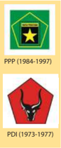

> **Deskripsi Visual:** Gambar ini adalah ilustrasi yang menunjukkan dua logo politik Indonesia, yaitu Partai Persatuan Pembangunan (PPP) dan Partai Demokrasi Indonesia (PDI), serta periode waktu yang mereka berdiri. PPP berdiri antara tahun 1984 hingga 1997, sedangkan PDI berdiri antara tahun 1973 hingga 1977. Ilustrasi ini menggunakan warna hijau dan merah untuk menunjukkan warna logo masing-masing partai. Label "PPP" dan "PDI" diletakkan di bagian atas gambar, sementara tahun berdiri partai tersebut diletakkan di bawahnya. Gambar ini memberikan informasi tentang periode keberadaan kedua partai tersebut, yang merupakan bagian penting dari sejarah politik Indonesia.

Sumber: Diolah dari berbagai sumber

Gambar 4.5 Lambang Golkar, PPP, dan PDI

Selain  melakukan  depolitisasi  terhadap  orsospol  (pelarangan  kegiatan partai  politik)  di  tingkat  kecamatan  dan  desa  (di  mana  partai-partai  politik dilarang  mempunyai  cabang  atau  ranting  di  tingkat  pedesaan,  depolitisasi juga diberlakukan di dunia pendidikan, terutama setelah terjadinya peristiwa Malapetaka Lima Belas Januari (Malari) tahun 1974.

### Peristiwa 15 Januari 1974

Menjelang kedatangan PM Jepang Kakuei Tanaka, pada 15 Januari 1974  di  Jakarta  terjadi  demonstrasi  besar-besaran  mahasiswa  yang disusul dengan aksi anarki. Proyek Senen, gedung Toyota Astra, sejumlah toko  milik  pedagang  Tionghoa  di  Jalan  Hayam  Wuruk,  Gajah  Mada, Glodok dan Cempaka Putih, terbakar habis karena aksi tersebut. Geger Jakarta ini mengejutkan jajaran aparat keamanan dan pemerintah, karena itu diberi julukan Malapetaka Lima Belas Januari yang populer dengan Malari (R.P Soejono ed, 2009:637).

 

---
## 📄 Halaman 128

Peristiwa itu diawali oleh kegiatan para aktivis mahasiswa yang tergabung dalam  grup-grup  diskusi  yang  mengkritisi  berbagai  kebijakan  pemerintah. Kritik-kritik  mahasiswa  terhadap  kebijakan  pemerintah  mulai  terjadi  sejak awal tahun 1970-an, berawal dari grup-grup diskusi di kampus Universitas Indonesia  (Salemba),  berlanjut  dengan  keputusan  para  mahasiswa  untuk melakukan  demonstrasi  menentang  kenaikan  harga  bensin  dan  menuntut pemberantasan  korupsi.  Para  mahasiswa  juga  meminta  pemerintah  untuk meninjau kembali strategi pembangunan yang hanya menguntungkan kaum kaya. Pada akhir Repelita I mahasiswa mensinyalir terjadinya penyelewengan program pembangunan nasional yang dilakukan oleh pejabat-pejabat pemerintah.  Kebijakan  ekonomi  yang  memberikan  keistimewaan  kepada investor Jepang, dinilai merugikan rakyat.

Ketika mereka mendengar rencana kedatangan Perdana Menteri Jepang Tanaka ke Indonesia  pada tanggal 14 Januri 1974, para mahasiswa memanfaatkan  momentum  tersebut  untuk  berdemostrasi  menyampaikan tuntutannya. Menjelang kedatangan PM Tanaka, para mahasiswa berdemonstrasi    di  depan  kantor Ali  Moertopo  dengan  membakar  bonekaboneka  yang  menggambarkan  diri  PM  Tanaka  serta  Sudjono  Humardani, Asisten Pribadi (Aspri) Presiden.

Kemudian  setelah  PM  Tanaka  tiba  di  Indonesia,  ribuan  mahasiswa berbaris menuju pusat kota dengan menyebarkan plakat-plakat yang menuntut pembubaran Aspri Presiden, penurunan harga, dan pemberantasan korupsi. Demonstrasi  yang  tadinya  berjalan  damai,  tiba-tiba  berubah  menjadi  liar tidak terkendali yang akhirnya berkembang menjadi huru-hara. Mobil-mobil Jepang dibakar, etalase gedung importir Toyota Astra Company dihancurkan, pabrik Coca Cola diserang, dan kompleks pertokoan Senen dijarah dan dibakar (Crouch, 1999:354). Sebagai buntut dari peristiwa tersebut, 700 orang ditahan dan 45 orang di antaranya dipenjara.

Untuk meredam gerakan mahasiswa, dikeluarkan SK/028/1974 tentang petunjuk-petunjuk  Kebijaksanaan  dalam  Rangka  Pembinaan  Kehidupan Kampus Perguruan Tinggi. Demonstrasi dilarang. Kegiatan kemahasiswaan difokuskan pada bidang penalaran seperti diskusi dan seminar.

Selain mengembalikan setiap dinamika kemasyarakatan, kebangsaan dan kenegaraan dalam kerangka ketaatan terhadap Pancasila sebagai road  map idiologis,  pemerintah    Orde  Baru    menghimpun  energi  semua  komponen bangsa ke dalam agenda bersama yang diformulasikan dalam bentuk Trilogi Pembangunan. Suatu rencana kemandirian bangsa yang diletakkan pada pilar stabilitas,  pembangunan  di  segala  bidang  dan  pemerataan  pembangunan beserta hasil-hasilnya kepada seluruh rakyat.

 

---
## 📄 Halaman 129

### Trilogi Pembangunan

- Stabilitas nasional yang sehat dan dinamis.
- Pertumbuhan ekonomi yang cukup tinggi.
- Pemerataan pembangunan dan hasil-hasilnya menuju kepada terciptanya keadilan sosial bagi seluruh rakyat.
Semua  penghalang  pembangunan,  termasuk  segala  hal  yang  dapat memicu  munculnya  instabilitas  bangsa  harus  disingkirkan.  Itulah  kira-kira makna pesan yang terangkum dalam Trilogi Pembangunan, yaitu terwujudnya stabilitas politik dan keamanan, pembangunan di segala aspek kehidupan dan pemerataan pembangunan beserta hasil-hasilnya.

Trilogi  Pembangunan  itu  tidak  lain  merupakan  suatu  rencana  bangsa Indonesia  yang  digelorakan  Presiden  Soeharto  untuk  mewujudkan  tujuan negara sebagaimana amanat Pembukaan Undang-Undang Dasar 1945. Negara yang ingin diwujudkan adalah sebuah pemerintahan yang dapat melindungi segenap  bangsa,  mampu  memajukan  kesejahteraan  umum,  mencerdaskan kehidupan  bangsa  dan  mampu  turut  serta  melaksanakan  ketertiban  dunia berdasarkan  kemerdekaan,  perdamaian  abadi  dan  keadilan  sosial.  Tujuan negara itu harus dicapai dengan berdasarkan Pancasila.

Stabilitas  nasional  sendiri  meliputi  stabilitas  keamanan,  ekonomi  dan politik. Stabilitas nasional bukan hanya merupakan prasyarat terselenggaranya pembangunan,  akan  tetapi  merupakan  amanat  sila  kedua  Pancasila  untuk terwujudnya 'Kemanusiaan Yang Adil dan Beradab'. Kebebasan seseorang dibatasi  oleh  kebebasan  orang  lain  dan  resultan  dari  kebebasan  masingmasing individu itu berupa pranata kehidupan bermasyarakat, berbangsa, dan bernegara yang berkeadaban. Oleh karena itu, merupakan kebenaran universal di  manapun  jika  bentuk-bentuk  tindakan  yang  tidak  beradab  dalam  aspek apapun  tidak dapat ditoleransi.

Dari semua usaha-usaha yang dilakukan oleh Presiden Soeharto pada masa awal  pemerintahannya,  semuanya  bertujuan  untuk  menggerakkan  jalannya kegiatan pembangunan ekonomi. Pembangunan ekonomi bisa berjalan dengan baik jika ada stabilitas politik dan keamanan.

### 2.   Stabilisasi Penyeragaman

Depolitisasi  parpol  dan  ormas  juga  dilakukan  oleh  pemerintahan  Orde Baru  melalui  cara  penyeragaman  ideologis  melalui  ideologi  Pancasila. Dengan  alasan  Pancasila  telah  menjadi  konsensus  nasional,  keseragaman

 

---
## 📄 Halaman 130

dalam pemahaman Pancasila perlu disosialisasikan. Gagasan ini disampaikan oleh  Presiden  Soeharto  pada  acara  Hari  Ulang  Tahun  ke-25  Universitas Gadjah Mada di Yogyakarta, 19 Desember 1974. Kemudian dalam pidatonya menjelang pembukaan Kongres Nasional Pramuka pada 12 Agustus 1976, di Jakarta, Presiden Soeharto menyerukan kepada seluruh rakyat agar berikrar pada diri sendiri mewujudkan Pancasila dan mengajukan Eka Prasetya bagi ikrar tersebut.

Presiden  Soeharto  mengajukan  nama  Eka  Prasetya  Pancakarsa  dengan maksud menegaskan bahwa penyusunan Pedoman Penghayatan dan Pengamalan  Pancasila  (P4)  dipandang  sebagai  janji  yang  teguh,  kuat, konsisten, dan tulus untuk mewujudkan lima cita-cita, yaitu (1) takwa kepada Tuhan YME dan menghargai orang lain yang berlainan agama/kepercayaan; (2) mencintai sesama manusia dengan selalu ingat kepada orang lain, tidak sewenang-wenang; (3) mencintai tanah air, menempatkan kepentingan negara di atas kepentingan pribadi;(4) demokratis dan patuh pada putusan rakyat yang sah; (5) suka menolong orang lain, sehingga dapat meningkatkan kemampuan orang lain (Referensi Bahan Penataran P4  dalam Anhar Gonggong ed, 2005: 159).

Presiden kemudian mengajukan draft  P4  ini kepada MPR. Akhirnya, pada  21  Maret  1978  rancangan  P4  disahkan  menjadi  Tap  MPR    No.II/ MPR/1978. Setelah disahkan MPR, pemerintah membentuk komisi Penasehat Presiden mengenai P4 yang dipimpin oleh Dr. Roeslan Abdulgani. Sebagai badan  pelaksananya  dibentuk  Badan  Pembinaan  Pendidikan  Pelaksana  P4 (BP7) yang berkedudukan di Jakarta. Tugasnya adalah untuk mengkoordinasi pelaksanaan program penataran P4 yang dilaksanakan pada tingkat nasional dan regional.

Tujuan penataran P4 adalah membentuk pemahaman yang sama mengenai  Demokrasi  Pancasila  sehingga  dengan  pemahaman  yang  sama diharapkan persatuan dan kesatuan nasional akan terbentuk dan terpelihara. Melalui penegasan tersebut maka opini rakyat akan mengarah pada dukungan yang  kuat  terhadap  pemerintah  Orde  Baru.  Penataran  P4  merupakan  suatu bentuk indoktrinasi ideologi sehingga Pancasila menjadi bagian dari sistem kepribadian, sistem budaya, dan sistem sosial masyarakat Indonesia.

Pegawai negeri  (termasuk  pegawai  BUMN),  baik  sipil  maupun  militer diharuskan mengikuti penataran P4. Kemudian para pelajar, mulai dari sekolah menengah sampai Perguruan Tinggi diharuskan mengikuti penataran P4 yang dilakukan pada setiap awal tahun ajaran atau tahun akademik.

 

---
## 📄 Halaman 131

Melalui penataran P4 itu, pemerintah juga memberikan penekanan pada masalah  'suku',  'agama',  'ras',  dan  'antargolongan'  (SARA).  Menurut pemerintah Orde Baru, 'sara' merupakan masalah yang sensitif di Indonesia yang	sering	menjadi	penyebab	timbulnya	konlik	atau	kerusuhan	sosial.	Oleh karena itu, masyarakat tidak boleh mempermasalahkan hal-hal yang berkaitan dengan  SARA.  Secara  tidak  langsung  masyarakat  dipaksa  untuk  berpikir seragam;  dengan  kata  lain  yang  lebih  halus,  harus  mau  bersikap  toleran dalam  arti  tidak  boleh  membicarakan  atau  menonjolkan  perbedaan  yang berkaitan	dengan	masalah	sara.	Meskipun	demikian,	akhirnya	konlik	yang bermuatan SARA itu tetap tidak dapat dihindari. Pada tahun 1992 misalnya, terjadi	konlik	antara	kaum	muslim	dan	nonmuslim	di	Jakarta	(Ricklefs,	2005: 640).  Demikian  pula  halnya  dengan  P4.  Setelah  beberapa  tahun  berjalan, kritik datang dari berbagai kalangan terhadap pelaksanaan P4. Berdasarkan pengamatan  di  lapangan  banyak  peserta  penataran  pada  umumnya  merasa muak  terhadap  P4.  Fakta  ini  kemudian  disampaikan  kepada  presiden  agar masalah P4 ditinjau kembali.

Setelah  P4  menjadi  Tap  MPR  dan  dilaksanakan,  selanjutnya  orsospol yang  diseragamkan  dalam  arti  harus  mau  menerima  Pancasila  sebagai satu-satunya asas partai dan organisasi, yang dikenal dengan sebutan 'asas tunggal'. Gagasan asas tunggal ini disampaikan oleh Presiden Soeharto dalam pidato pembukaan Rapat Pimpinan ABRI (Rapim ABRI), di Pekanbaru, Riau, tanggal 27 Maret 1980 dan dilontarkan kembali pada acara ulang tahun Korps Pasukan Sandi Yudha (Kopasandha) di Cijantung, Jakarta 16 April 1980.

Gagasan asas tunggal ini pada awalnya menimbulkan reaksi yang cukup keras dari berbagai pemimpin umat Islam dan beberapa purnawirawan militer ternama.  Meskipun  mendapat  kritikan  dari  berbagai  kalangan,  Presiden Soeharto  tetap  meneruskan  gagasannya  itu  dan  membawanya  ke  MPR. Melalui Sidang MPR 'Asas Tunggal' akhirnya diterima menjadi ketetapan MPR, yaitu; Tap MPR No.II/1983. Kemudian pada 19 Januri 1985, pemerintah dengan  persetujuan  DPR,  mengeluarkan  Undang-Undang  No.3/1985  yang menetapkan bahwa partai-partai politik dan Golkar harus menerima Pancasila sebagai  asas  tunggal  mereka.  Empat  bulan  kemudian,  pada  tanggal  17 Juni  1985,  pemerintah  mengeluarkan  Undang-Undang  No.8/1985  tentang ormas, yang menetapkan bahwa seluruh organisasi sosial atau massa harus mencantumkan Pancasila sebagai asas tunggal mereka. Sejak saat itu tidak ada lagi orsospol yang berasaskan lain selain Pancasila, semua sudah seragam. Demokrasi  Pancasila  yang  mengakui  hak  hidup  'Bhinneka  Tunggal  Ika', dipergunakan  oleh  pemerintah  Orde  Baru  untuk  mematikan  kebhinekaan, termasuk  memenjarakan  atau  mencekal  tokoh-tokoh  pengkritik  kebijakan pemerintah Orde Baru.

 

---
## 📄 Halaman 132

### 3.   Penerapan Dwi fungsi ABRI

Konsep  Dwifungsi  ABRI  sendiri  dipahami  sebagai  'jiwa,  tekad  dan semangat pengabdian  ABRI, untuk bersama-sama dengan kekuatan perjuangan lainnya,  memikul  tugas  dan  tanggung  jawab  perjuangan  bangsa  Indonesia, baik di bidang hankam negara maupun di bidang kesejahteraan bangsa dalam rangka penciptaan tujuan nasional, berdasarkan Pancasila dan UUD 1945.' Berangkat dari pemahaman tersebut, ABRI memiliki keyakinan bahwa tugas mereka tidak hanya dalam bidang Hankam namun juga non-Hankam. Sebagai kekuatan hankam, ABRI merupakan suatu unsur dalam lingkungan aparatur pemerintah  yang  bertugas  di  bidang  kegiatan  'melindungi  segenap  bangsa Indonesia  dan  seluruh  tumpah  darah  Indonesia.'  Sebagai  kekuatan  sosial, ABRI adalah suatu unsur dalam kehidupan politik di lingkungan masyarakat yang bersama-sama dengan kekuatan sosial lainnya secara aktif melaksanakan kegiatan-kegiatan pembangunan nasional.

Dwifungsi ABRI,  seperti  yang  sudah  dijelaskan  sebelumnya  diartikan bahwa ABRI memiliki dua fungsi, yaitu fungsi sebagai pusat kekuatan militer Indonesia dan juga fungsinya di bidang politik. Dalam pelaksanaannya pada era Soeharto, fungsi utama ABRI sebagai kekuatan militer Indonesia memang tidak dapat dikesampingkan, namun pada era ini, peran ABRI dalam bidang politik	terlihat	lebih	signiikan	seiring	dengan	diangkatnya	Presiden	Soeharto oleh MPRS pada tahun 1968.

Secara  umum,  intervensi ABRI  dalam  bidang  politik  pada  masa  Orde Baru  yang  mengatasnamakan  Dwifungsi  ABRI  ini  salah  satunya  adalah dengan ditempatkannya militer di DPR, MPR, serta DPD tingkat provinsi dan kabupaten. Perwira yang aktif, sebanyak seperlima dari jumlahnya menjadi anggota  Dewan  Perwakilan  Daerah  (DPRD),  dimana  mereka  bertanggung jawab  kepada  komandan  setempat,  sedangkan  yang    di  MPR  dan  DPR tingkat nasional bertanggung jawab langsung kepada panglima ABRI. Selain itu,  para  anggota ABRI juga menempati posisi formal dan informal dalam pengendalian Golkar serta mengawasi penduduk melalui gerakan teritorial di seluruh daerah dari mulai Jakarta sampai ke daerah-daerah terpencil, salah satunya dengan gerakan AMD (ABRI Masuk Desa).  Keikutsertaan militer dalam bidang politik secara umum bersifat antipartai. Militer percaya bahwa mereka merupakan pihak yang setia kepada modernisasi dan pembangunan. Sedangkan partai politik dipandang memiliki kepentingan-kepentingan golongan tersendiri.

 

---
## 📄 Halaman 133

Keterlibatan  ABRI  di  sektor  eksekutif  sangat  nyata  terutama  melalui Golkar. Hubungan ABRI dan Golkar disebut sebagai hubungan yang bersifat simbiosis  mutualisme.  Contohnya  pada  Munas  I  Golkar  di  Surabaya  (4-9 September  1973),  ABRI  mampu  menempatkan  perwira  aktif  ke  dalam Dewan Pengurus Pusat. Selain  itu,  hampir  di  seluruh  daerah  tingkat  I  dan daerah tingkat II jabatan Ketua Golkar dipegang oleh ABRI aktif. Selain itu, terpilihnya Sudharmono sebagai wakil militer pada pucuk pemimpin Golkar (pada Munas III) juga menandakan bahwa Golkar masih di bawah kendali militer.

Selain dalam sektor eksekutif, ABRI dalam bidang politik juga terlibat dalam sektor legislatif.  Meskipun  militer  bukan  kekuatan  politik  yang  ikut serta  dalam  pemilihan  umum,  mereka  tetap  memiliki  wakil  dalam  jumlah besar (dalam DPR dan MPR) melalui Fraksi Karya ABRI. Namun keberadaan ABRI  dalam  DPR  dipandang  efektif  oleh  beberapa  pihak  dalam  rangka mengamankan kebijaksanaan eksekutif dan meminimalisasi kekuatan kontrol DPR terhadap eksekutif. Efektivitas ini diperoleh dari adanya sinergi antara Fraksi ABRI dan Fraksi Karya Pembangunan dalam proses kerja DPR; serta adanya  perangkat  aturan  kerja  DPR  yang  dalam  batas  tertentu  membatasi peran satu fraksi secara otonom. Dalam MPR sendiri, ABRI (wakil militer) mengamankan nilai dan kepentingan pemerintah dalam formulasi kebijakan oleh MPR.

Pada masa Orde Baru, pelaksanaan negara banyak didominasi oleh ABRI. Dominasi yang terjadi pada masa itu dapat dilihat dari: (a). Banyaknya jabatan pemerintahan mulai dari Bupati, Walikota, Gubernur, Pejabat Eselon, Menteri, bahkan Duta Besar diisi oleh anggota ABRI yang 'dikaryakan', (b). Selain dilakukannya pembentukan Fraksi ABRI di parlemen, ABRI bersama-sama Korpri pada waktu itu juga dijadikan sebagai salah satu tulang punggung yang menyangga keberadaan Golkar sebagai 'partai politik' yang berkuasa pada waktu itu, (c). ABRI melalui berbagai yayasan yang dibentuk, diperkenankan mempunyai dan menjalankan berbagai bidang usaha dan lain sebagainya.

### TUGAS

Buatlah  peta konsep  (mind  mapping)    mengenai  'Stabilisasi  Politik Pemerintahan Orde Baru'.

 

---
## 📄 Halaman 134

### 4.   Rehabilitasi Ekonomi Orde Baru

Seperti yang telah diuraikan di atas, stabilisasi Polkam diperlukan untuk pembangunan  ekonomi  bagi  kesejahteraan  rakyat.  Kondisi  ekonomi  yang diwarisi  Orde  Lama  adalah  sangat  buruk.  Sektor  produksi  barang-barang konsumsi  misalnya  hanya  berjalan  20%  dari  kapasitasnya.  Demikian  pula sektor pertanian dan perkebunan yang menjadi salah satu tumpuan ekspor juga tidak mengalami perkembangan yang berarti. Hutang yang jatuh tempo pada akhir Desember 1965, seluruhnya berjumlah 2.358 Juta dollar AS. Dengan perincian  negara-negara  yang  memberikan  hutang  pada  masa  Orde  Lama adalah blok negara komunis  (US $ 1.404 juta), negara Barat (US $ 587 juta), sisanya pada negara-negara Asia dan badan-badan internasional.

Program  rehabilitasi  ekonomi  Orde  Baru  dilaksanakan  berlandaskan pada  Tap  MPRS  No.XXIII/1966  yang  isinya  antara  lain    mengharuskan diutamakannya  masalah  perbaikan  ekonomi  rakyat  di  atas  segala  soal-soal nasional  yang  lain,  termasuk  soal-soal  politik.  Konsekuensinya  kebijakan politik dalam dan luar negeri pemerintah harus sedemikian rupa hingga benarbenar membantu perbaikan ekonomi rakyat.

Bertolak dari kenyataan  ekonomi seperti itu, maka prioritas pertama yang dilakukan  pemerintah  untuk  rehabilitasi  ekonomi  adalah  memerangi  atau mengendalikan	hiperinlasi	antara	lain	dengan	menyusun	APBN	(Anggaran Pendapatan  Belanja  Negara)  berimbang.  Sejalan dengan  kebijakan itu pemerintah Orde Baru berupaya menyelesaikan masalah hutang luar  negeri sekaligus  mencari  hutang  baru  yang  diperlukan  bagi  rehabilitasi  maupun pembangunan ekonomi berikutnya.

Untuk menanggulangi masalah hutang-piutang luar negeri itu, pemerintah Orde Baru berupaya melakukan diplomasi yang intensif dengan mengirimkan tim negosiasinya ke Paris, Prancis ( Paris Club ), untuk merundingkan hutang piutang negara, dan ke London, Inggris ( London Club ) untuk merundingkan hutang-piutang  swasta.  Sebagai  bukti  keseriusan  dan  itikad  baik  untuk bersahabat  dengan  negara  para  donor,  pemerintah  Orde  Baru  sebelum pertemuan Paris  Club telah  mencapai  kesepakatan  terlebih  dahulu  dengan pemerintah Belanda mengenai pembayaran ganti rugi sebesar 165 juta dollar AS terhadap beberapa perusahaan mereka yang dinasionalisasi oleh Orde Lama pada tahun 1958. Begitu pula dengan Inggris telah dicapai suatu kesepakatan untuk  membayar  ganti  rugi  kepada  perusahaan  Inggris  yang  kekayaannya disita oleh pemerintah RI semasa era konfrontasi pada tahun 1965.

 

---
## 📄 Halaman 135

Sejalan dengan upaya diplomasi ekonomi, pada 10 Januari 1967 pemerintah Orde Baru memberlakukan UU No.1  tahun 1967 tentang Penanaman Modal Asing (PMA) . Dengan UU PMA, pemerintah ingin menunjukan kepada dunia internasional bahwa arah kebijakan yang akan ditempuh oleh pemerintah Orde Baru, berbeda dengan Orde Lama. Orde Baru tidak memusuhi investor asing dengan  menuduh  sebagai  kaki  tangan  imperialisme.  Sebaliknya,  aktivitas mereka  dipandang  sebagai  prasyarat  yang  dibutuhkan  oleh  sebuah  negara yang ingin membangun perekonomiannya. Dengan bantuan modal mereka, selayaknya  mereka  didorong  dan  dikembangkan  untuk  memperbanyak investasi  dalam  berbagai  bidang  ekonomi.  Sebab  dengan  investasi  mereka, lapangan kerja akan segera tercipta dengan cepat tanpa menunggu pemerintah memiliki  uang  terlebih  dahulu  untuk  menggerakan  roda  pembangunan nasional.

Upaya diplomasi ekonomi ke negara-negara Barat dan Jepang itu, tidak hanya  berhasil  mengatur  penjadwalan  kembali  pembayaran  hutang  negara dan  swasta  yang  jatuh  tempo,  melainkan  juga  mampu  meyakinkan  dan menggugah negara-negara tersebut untuk membantu Indonesia yang sedang terpuruk ekonominya. Hal ini terbukti antara lain dengan dibentuknya lembaga konsorsium yang bernama Inter-Governmental Group on Indonesia (IGGI). Proses pembentukan IGGI diawali oleh suatu pertemuan antara para negara yang  memiliki  komitmen  untuk  membantu  Indonesia  pada  bulan  Februari 1967, di Amsterdam. Inisiatif itu datang dari pemerintah Belanda. Pertemuan ini  juga  dihadiri  oleh  delegasi  Indonesia  dan  lembaga-lembaga  bantuan internasional. Dalam pertemuan itu disepakati untuk membentuk IGGI dan Belanda ditunjuk sebagai ketuanya.

Selain  mengupayakan  masuknya  dana  bantuan  luar  negeri,  pemerintah Orde  Baru  juga  berupaya  menggalang  dana  dari  dalam  negeri,  yaitu  dana masyarakat.  Salah  satu  strategi  yang  dilakukan  oleh  pemerintah  bersamasama Bank Indonesia dan bank-bank milik negara lainnya adalah berupaya agar masyarakat mau menabung.

Upaya  lain  adalah  menerbitkan  UU  Penanaman  Modal  Dalam  Negeri (UUPMDN) No.6/1968. Satu hal dari UUPMDN adalah adanya klausal yang menarik yang menyebutkan bahwa dalam penanaman modal dalam negeri, perusahaan-perusahaan  Indonesia  harus  menguasai  51%  sahamnya.  Untuk menindaklanjuti dan mengefektifkan UUPMA dan UUPMDN pada tatanan pelaksanaannya,  pemerintah  membentuk  lembaga-lembaga  yang  bertugas menanganinya. Pada 19 Januari 1967, pemerintah  membentuk  Badan Pertimbangan Penanaman  Modal (BPPM). Berdasarkan Keppres No.286/1968

 

---
## 📄 Halaman 136

badan  itu  berubah  menjadi  Tim  Teknis  Penanaman  Modal  (TTPM).  Pada Tahun  1973,  TTPM  digantikan  oleh  Badan  Koordinasi  Penanaman  Modal (BKPM) hingga saat ini.

Kebijakan-kebijakan yang diambil pemerintah pada awal  Orde Baru mulai menunjukan	hasil	positif.	Hiperinlasi	mulai	dapat	dikendalikan,	dari	650% menjadi 120% (1967), dan 80% (1968), sehingga pada tahun itu diputuskan bahwa Rencana Pembangunan Lima Tahun (Repelita) pertama akan dimulai pada	tahun	berikutnya	(1969).		Setelah	itu	pada	tahun-tahun	berikutnya	inlasi terus menurun menjadi 25% (1969), 12% (1970), dan 10% (bahkan sampai 8,88%) pada tahun 1971.

### TUGAS

Buatlah  rangkuman  mengenai  'Kebijakan  Pembangunan  Orde  Baru'. Rangkuman kamu akan dibahas pada pertemuan berikutnya.

### 5.   Kebijakan Pembangunan Orde Baru

Tujuan perjuangan Orde  Baru  adalah menegakkan  tata  kehidupan bernegara yang didasarkan atas kemurnian pelaksanaan Pancasila dan UndangUndang  Dasar  1945.  Sejalan  dengan  tujuan  tersebut  maka  ketika  kondisi politik bangsa Indonesia mulai stabil untuk melaksanakan amanat masyarakat maka  pemerintah  mencanangkan  pembangunan  nasional  yang  diupayakan melalui  program  Pembangunan  Jangka  Pendek  dan  Pembangunan  Jangka Panjang. Pembangunan Jangka Pendek dirancang melalui pembangunan lima tahun (Pelita) yang di dalamnya memiliki misi pembangunan dalam rangka mencapai tingkat kesejahteraan bangsa Indonesia.

Pada masa ini pengertian pembangunan nasional adalah suatu rangkaian upaya pembangunan yang berkesinambungan yang meliputi seluruh kehidupan masyarakat, bangsa, dan negara. Pembangunan nasional dilakukan untuk  melaksanakan  tugas  mewujudkan  tujuan  nasional  yang  tercantum dalam pembukaan UUD 1945 yaitu melindungi segenap bangsa dan seluruh tumpah darah Indonesia, meningkatkan kesejahteraan umum, mencerdaskan kehidupan bangsa, serta ikut melaksanakan ketertiban dunia yang berdasarkan kemerdekaan, perdamaian abadi, dan keadilan sosial.

Dalam usaha mewujudkan tujuan nasional maka Majelis Permusyawaratan Rakyat  sejak  tahun  1973-1978-1983-1988-1993  menetapkan  Garis-garis besar Haluan Negara (GBHN). GBHN merupakan pola umum pembangunan nasional dengan rangkaian program-programnya yang kemudian dijabarkan

 

---
## 📄 Halaman 137

dalam  Rencana  Pembangunan  Lima  Tahun  (Repelita).  Adapun  Repelita yang berisi program-program kongkret yang akan dilaksanakan dalam kurun waktu lima tahun, dalam repelita ini dimulai sejak tahun 1969 sebagai awal pelaksanaan  pembangunan  jangka  pendek  dan  jangka  panjang.  Kemudian terkenal dengan konsep Pembangunan Jangka Panjang Tahap I (1969-1994) menurut indikator saat itu pembangunan dianggap telah berhasil memajukan segenap aspek kehidupan bangsa dan telah meletakkan landasan yang cukup kuat bagi bangsa Indonesia untuk memasuki Pembangunan Jangka Panjang Tahap II (1995-2020).

Pemerintahan  Orde  Baru  senantiasa  berpedoman  pada  tiga  konsep pembangunan nasional yang terkenal dengan sebutan Trilogi Pembangunan, yaitu:  (1)  pemerataan  pembangunan  dan  hasil-hasilnya  yang  menuju  pada terciptanya  keadilan  sosial  bagi  seluruh  rakyat;  (2)  pertumbuhan  ekonomi yang cukup tinggi; dan (3) stabilitas nasional yang sehat dan dinamis.

Konsekuensi  dari  pertumbuhan  ekonomi  yang  cukup  tinggi    akibat pelaksanaan  pembangunan  tidak  akan  bermakna  apabila  tidak  diimbangi dengan pemerataan pembangunan. Oleh karena itu, sejak Pembangunan Lima Tahun Tahap III (1 April 1979-31 Maret 1984) maka pemerintahan Orde Baru menetapkan  Delapan  Jalur  Pemerataan,  yaitu:  (1)  pemerataan  pemenuhan kebutuhan  pokok  rakyat,  khususnya  pangan,  sandang,  dan  perumahan;  (2) pemerataan  kesempatan  memperoleh  pendidikan  dan  pelayanan  kesehatan; (3) pemerataan pembagian pendapatan; (4) pemerataan kesempatan kerja; (5) pemerataan kesempatan berusaha; (6) pemerataan kesempatan berpartisipasi dalam pembangunan, khususnya bagi generasi muda dan kaum wanita; (7) pemerataan penyebaran pembangunan di seluruh wilayah tanah air; dan (8) pemerataan kesempatan memperoleh keadilan.

### a. Pertanian

Sepanjang  1970-an  hingga  1980-an  dilakukan  investasi  besar-besaran  untuk infrastruktur  Pembangunan  Lima  Tahun  (Pelita),  swasembada  pangan merupakan fokus tersendiri dalam rencana pembangunan yang dibuat oleh Soeharto. Pada Pelita I yang dicanangkan landasan awal pembangunan Pemerintahan  Orde  Baru,  dititikberatkan  pada  pembangunan  di  sektor pertanian  yang  bertujuan  mengejar  keterbelakangan  ekonomi  melalui proses pembaruan sektor pertanian. Tujuan Pelita I adalah meningkatkan taraf hidup rakyat melalui sektor pertanian yang ditopang oleh kekuatan koperasi  dan  sekaligus  meletakkan  dasar-dasar  pembangunan  dalam tahapan berikutnya.

 

---
## 📄 Halaman 138

Sumber : Yayasan Lalita, 1979

Soeharto membangun dan mengembangkan organisasi atau institusi yang akan menjalankan program-program tersebut. Pembangunan ditekankan pada penciptaan institusi pedesaan sebagai wahana pembangunan dengan  membentuk  Bimbingan  Massal  (Bimas)  yang  diperuntukkan meningkatkan produksi beras dan koperasi sebagai organisasi ekonomi masyarakat pedesaan. Sekaligus menjadi kepanjangan tangan pemerintah dalam menyalurkan sarana pengolahan dan pemasaran hasil produksi. Di sisi lain pemerintah juga menciptakan Badan Urusan Logistik (BULOG).

Kemudian  pemerintah  melibatkan  para  petani  melalui  koperasi  yang bertujuan memperbaiki produksi pangan nasional.  Untuk itu kemudian pemerintah mengembangkan ekonomi pedesaan dengan menunjuk Fakultas Pertanian Universitas Gadjah Mada dengan membentuk Badan Usaha  Unit  Desa  (BUUD).  Maka  lahirlah  Koperasi  Unit  Desa  (KUD) sebagai  bagian  dari  pembangunan  nasional.  BUUD/KUD  melakukan kegiatan  pengadaan  pangan  untuk  persediaan    nasional  yang  diperluas dengan tugas menyalurkan sarana produksi pertanian (pupuk, benih, dan obat-obatan).

Soeharto juga mengembangkan institusi-institusi yang mendukung pertanian lainnya seperti institusi penelitian seperti BPTP  (Balai Pengkajian Teknologi Pertanian) yang berkembang untuk menghasilkan inovasi untuk pengembangan pertanian yang pada masa Soeharto salah satu  produknya  yang  cukup  terkenal  adalah  Varietas  Unggul  Tahan Wereng (VUTW).

Pemerintah Orde Baru membangun pabrik-pabrik pupuk untuk penyediaan pupuk  bagi  petani.  Para  petani  diberi  kemudahan  memperoleh  kredit bank  untuk  membeli  pupuk.  Pemasaran  hasil  panen  mereka  dijamin dengan kebijakan harga dasar dan pengadaan pangan. Diperkenalkan juga

 

---
## 📄 Halaman 139

manajemen usaha tani, dimulai dari Panca Usaha Tani, Bimas, Operasi Khusus,	 dan	 Intensiikasi	 Khusus	 yang	 terbukti	 mampu	 meningkatkan produksi pangan, terutama beras. Saat itu, budi daya padi di Indonesia adalah yang terbaik di Asia. Pemerintah memfasilitasi ketersediaan benih unggul,  pupuk,  pestisida  melalui  subsidi  yang  terkontrol  dengan  baik. Pabrik  pupuk  yang  dibangun  antara  lain  adalah  Petro  Kimia  Gresik  di Gresik, Pupuk Sriwijaya di Palembang, dan Asean Aceh Fertilizer di  Aceh.

Jaringan irigasi  teknis  dibangun  di  berbagai  daerah  dan  program  pembibitan ditingkatkan. Di dalam Pelita I Pertanian dan Irigasi dimasukkan sebagai satu bab tersendiri dalam rincian rencana bidang-bidang. Di dalam rincian penjelasan dijelaskan bahwa tujuannya adalah untuk peningkatan produksi pangan terutama beras.

Koperasi di pedesaan terus dipacu untuk meningkatkan produktivitasnya. Kebijakan terus mengalir guna menopang kegiatan di daerah pedesaan. BUUD yang semula hanya dilibatkan dalam program Bimbingan Massal (Bimas sektor pertanian pangan), kemudian ditingkatkan menjadi Koperasi  Unit  Desa  (KUD)  dengan  tugas  serta  peranan  yang  terus dikembangkan.  Instruksi  Presiden  (Inpres)  No.  4  Tahun  1973  tentang Unit Desa dikeluarkan 5 Mei 1973, menjadi tonggak yuridis keberadaan KUD. Kebijakan  tersebut  dilanjutkan  dengan  Instruksi  Presiden  No.  4 Tahun 1973, yang membentuk Wilayah Unit Desa (Wilud), pada akhirnya menjadi Koperasi Unit Desa (KUD). Dari sinilah lahir Penyuluh Pertanian Lapangan (PPL) yang berada di bawah Departemen Pertanian.

Para  PPL  memperkenalkan  dan  menyebarluaskan  teknologi  pertanian kepada para petani  melalui  kegiatan  penyuluhan.  Pemerintah  menempatkan para  penyuluh  pertanian  di  tingkat  desa  dan  kelompok  petani.  Selain program  penyuluhan,  kelompencapir  (kelompok  pendengar,  pembaca, pemirsa),  juga  menjadi  salah  satu  program  pembangunan  pertanian Orde  Baru  yang  khas.  Kelompencapir  merupakan  wadah  temu  wicara langsung  antara  petani,  nelayan,  dan  peternak  dengan  sesama  petani, penyuluh, menteri atau bahkan dengan Presiden Soeharto. Kelompencapir juga menyelenggarakan kompetisi cerdas cermat pertanian yang diikuti oleh  para  petani  berprestasi  dari  berbagai  daerah  sampai  tingkat  pusat. Kelompencapir merupakan program Orde Baru di bidang pertanian yang dijalankan oleh Departemen Penerangan. Kelompencapir diresmikan pada 18 Juni 1984, dengan keputusan Menteri Penerangan Republik Indonesia No.110/Kep/Menpen/1984.

 

---
## 📄 Halaman 140

### b)   Pendidikan

Pada  masa  kepemimpinan  Soeharto  pembangunan pendidikan mengalami kemajuan yang sangat penting. Ada tiga hal yang patut dicatat dalam bidang pendidikan  masa  Orde  Baru  adalah  pembangunan Sekolah  Dasar  Inpres  (SD  Inpres),  program  wajib belajar  dan  pembentukan  kelompok  belajar  atau kejar.  Semuanya  itu  bertujuan  untuk  memperluas kesempatan  belajar,  terutama  di  pedesaan  dan  bagi daerah perkotaan yang penduduknya berpenghasilan rendah.

Pada 1973, Soeharto mengeluarkan Inpres No. 10/1973 tentang Program Bantuan Pembangunan Gedung SD. Pelaksanaan tahap pertama program SD Inpres adalah pembangunan 6.000 gedung SD yang masing-masing memiliki  tiga  ruang  kelas.  Dana  pembangunan  SD Inpres  tersebut  berasal  dari  hasil  penjualan  minyak bumi  yang  harganya  naik  sekitar  300  persen  dari sebelumnya.

Pada  tahun-tahun  awal  pelaksanaan  program  pembangunan  SD  Inpres, hampir setiap tahun, ribuan gedung sekolah dibangun. Sebelum program Rencana  Pembangunan  Lima  Tahun  (Repelita)  dilaksanakan,    jumlah gedung SD yang tercatat pada tahun 1968 sebanyak 60.023 unit dan gedung SMP 5.897 unit. Pada awal Pelita VI, jumlah itu telah meningkat menjadi sekitar  150.000  gedung  SD  dan  20.000  gedung  SMP.  Pembangunan paling  besar  terjadi  pada  periode  1982/1983  ketika  22.600  gedung  SD baru dibuat. Hingga periode 1993/1994 tercatat hampir 150.000 unit SD Inpres telah dibangun.

Peningkatan jumlah sekolah dasar diikuti pula oleh peningkatan jumlah guru. Jumlah guru SD yang sebelumnya berjumlah sekitar ratusan ribu, pada awal tahun 1994 menjadi lebih dari satu juta guru. Satu juta lebih guru  ditempatkan  di  sekolah-sekolah  inpres  tersebut.  Lonjakan  jumlah guru dari puluhan ribu menjadi ratusan ribu juga terjadi pada guru SMP. Total dana yang dikeluarkan untuk program ini hingga akhir Pembangunan Jangka Panjang (PJP) I mencapai hampir Rp 6,5 triliun.

Program  wajib  belajar  pada  era  Soeharto  mulai  dilaksanakan  pada 2  Mei  1984,  di  akhir  Pelita  (Pembangunan  Lima  Tahun)  III.  Dalam sambutan peresmian wajib belajar saat itu, Soeharto menyatakan bahwa

 

---
## 📄 Halaman 141

kebijakannya bertujuan  untuk  memberikan  kesempatan  yang  sama  dan adil kepada seluruh anak Indonesia berusia 7-12 tahun dalam menikmati pendidikan dasar. Program wajib belajar itu mewajibkan setiap anak usia 7-12 tahun untuk mendapatkan pendidikan dasar 6 tahun (SD).

Program ini tidak murni seperti kebijakan wajib belajar yang memiliki unsur paksaan dan sanksi bagi yang tidak melaksanakannya. Pemerintah hanya mengimbau orangtua agar memasukkan anaknya yang berusia 7-12 tahun ke sekolah. Negara bertanggung jawab terhadap penyediaan sarana dan  prasarana  pendidikan  yang  dibutuhkan,  seperti  gedung  sekolah, peralatan sekolah, di samping tenaga pengajarnya.  Meski program wajib belajar  tidak  diikuti  oleh  kebijakan  pembebasan  biaya  pendidikan  bagi anak-anak dari keluarga kurang mampu, pemerintah waktu itu berupaya mengatasinya  melalui  program  beasiswa.  Untuk  itu,  kemudian  muncul program Gerakan Nasional-Orang Tua Asuh (GN-OTA).

Dalam  upaya  memperkuat  pelaksanaan  GN-OTA,  diterbitkanlah  Surat Keputusan  Bersama  Menteri  Sosial,  Menteri  Dalam  Negeri,  Menteri Pendidikan dan Kebudayaan, dan Menteri Agama Nomor 34/HUK/1996, Nomor 88 Tahun 1996, Nomor 0129/U/1996, Nomor 195 Tahun 1996 tentang Bantuan terhadap Anak Kurang Mampu, Anak Cacat, dan Anak yang Bertempat Tinggal di Daerah Terpencil dalam rangka Pelaksanaan Wajib Belajar Pendidikan Dasar.

Keberhasilan  program  wajib  belajar  6  tahun  ditandai  dengan  kenaikan angka partisipasi sekolah dasar (SD) sebesar 1,4 persen. Angka partisipasi SD menjadi 89,91 persen di akhir Pelita IV. Kenaikan angka partisipasi itu menambah kuat niat pemerintah untuk memperluas kelompok usia anak yang ikut program wajib belajar selanjutnya, menjadi 7-15 tahun, atau menyelesaikan tingkat Sekolah Menengah Pertama (SMP).

Sepuluh tahun kemudian, program wajar berhasil ditingkatkan menjadi 9 tahun, yang berarti anak Indonesia harus mengenyam pendidikan hingga tingkat SMP. Upaya pelaksanaan wajib belajar 9 tahun pada kelompok usia  7-15  tahun  mulai  diresmikan  pada  Pencanangan  Wajib  Belajar Pendidikan  Dasar  9  Tahun  pada  2  Mei  1994.  Kebijakan  ini  diperkuat dengan dikeluarkannya Inpres Nomor 1 Tahun 1994.

Program wajib belajar telah meningkatkan taraf pendidikan masyarakat Indonesia saat itu. Fokus utama ketika itu adalah peningkatan angka-angka indikator kualitas pendidikan dasar. Fokus pembangunan pendidikan saat itu,  yaitu  peningkatan  secara  kuantitatif,  baru  kemudian  memerhatikan kualitas atau mutu pendidikan.

 

---
## 📄 Halaman 142

Setelah  perluasan  kesempatan  belajar  untuk  anak-anak  usia  sekolah, sasaran perbaikan bidang pendidikan selanjutnya adalah pemberantasan buta  aksara.  Hal  itu  disebabkan  oleh  kenyataan  bahwa  masih  banyak penduduk  yang  buta  huruf.  Dalam  upaya  meningkatkan  angka  melek huruf,  pemerintahan  Orde  Baru  mencanangkan  penuntasan  buta  huruf pada 16 Agustus 1978. Cara yang ditempuh adalah dengan pembentukan kelompok belajar atau 'kejar'.

Kejar merupakan program pengenalan huruf dan angka bagi kelompok masyarakat buta huruf yang berusia 10-45 tahun. Tutor atau pembimbing setiap kelompok adalah masyarakat yang telah dapat membaca, menulis dan berhitung dengan pendidikan minimal sekolah dasar. Jumlah peserta dan  waktu  pelaksanaan  dalam  setiap  kejar  disesuaikan  dengan  kondisi setiap tempat.

Keberhasilan  program  kejar  salah  satunya  terlihat  dari  angka  statistik penduduk buta huruf yang menurun. Pada sensus tahun 1971, dari total jumlah  penduduk  80  juta  jiwa,  Indonesia  masih  memiliki  39,1  persen penduduk usia 10 tahun ke atas yang berstatus buta huruf. Sepuluh tahun kemudian, menurut sensus tahun 1980, persentase itu menurun menjadi hanya 28,8 persen. Hingga sensus berikutnya tahun 1990, angkanya terus menyusut menjadi 15,9 persen.

### c)   Keluarga Berencana (KB)

Pada masa Orde Baru dilaksanakan program untuk pengendalian pertumbuhan penduduk yang dikenal dengan Keluarga Berencana (KB). Pada tahun 1967 pertumbuhan penduduk Indonesia mencapai 2,6% dan pada tahun 1996 telah menurun drastis menjadi 1,6%.

Pengendalian penduduk dimaksudkan untuk meningkatkan kualitas rakyat Indonesia  dan  peningkatan  kesejahteraannya.  Keberhasilan  ini  dicapai melalui program KB yang dilaksanakan oleh Badan Koordinasi Keluarga Berencana Nasional (BKKBN).

Berbagai kampanye mengenai perlunya  KB dilakukan  oleh  pemerintah,  baik  melalui  media massa cetak maupun elektronik. Pada akhir tahun 1970-an sampai akhir tahun 1980-an di Televisi Republik  Indonesia  (TVRI)  sering  diisi  oleh acara-acara  mengenai  pentingnya  KB.  Baik  itu melalui  berita  atau  acara  hiburan  seperti  drama dan wayang orang 'Ria Jenaka'. Di samping itu nyanyian mars 'Keluarga Berencana' ditayangkan

 

---
## 📄 Halaman 143

hampir  setiap  hari  di  TVRI.  Selain  di  media  massa,  di  papan  iklan  di pinggir-pinggir  jalan  pun  banyak  dipasang  mengenai  pesan  pentingnya KB. Demikian pula dalam mata uang koin seratus rupiah dicantumkan mengenai KB. Hal itu menandakan bahwa Orde Baru sangat serius dalam melaksanakan  program  KB.  Slogan  yang  muncul  dalam  kampanyekampanye KB adalah 'dua anak cukup, laki perempuan sama saja'.

Program KB di Indonesia, diawali dengan ditandatanganinya  Deklarasi Kependudukan PBB pada tahun 1967 sehingga secara resmi Indonesia mengakui hak-hak untuk menentukan jumlah dan jarak kelahiran sebagai hak  dasar  manusia  dan  juga  pentingnya  pembatasan  jumlah  penduduk sebagai unsur perencanaan ekonomi dan sosial.

Keberhasilan  Indonesia  dalam  pengendalian  jumlah  penduduk  dipuji oleh UNICEF karena dinilai berhasil menekan tingkat kematian bayi dan telah melakukan berbagai upaya lainnya dalam rangka mensejahterakan kehidupan  anak-anak  di  tanah  air.  UNICEF  bahkan  mengemukakan bahwa tindakan yang telah dilakukan pemerintah Indonesia itu hendaknya dijadikan contoh bagi negara-negara lain yang tingkat kematian bayinya masih tinggi.

Program KB di Indonesia sebagai salah satu yang paling sukses di dunia, sehingga menarik perhatian dunia untuk mengikuti kesuksesan Indonesia. Pemerintah pun mengalokasikan sumber daya dan dana yang besar untuk program ini.

### d)   Kesehatan Masyarakat, Posyandu

Perkembangan  Pusat  Kesehatan  Masyarakat  (Puskesmas)  bermula  dari konsep Bandung Plan diperkenalkan oleh dr. Y. Leimena dan dr. Patah pada  tahun  1951. Bandung  Plan merupakan  suatu  konsep  pelayanan yang menggabungkan antara pelayanan kuratif dan preventif. Tahun 1956 didirikanlah  proyek  Bekasi  oleh  dr. Y .  Sulianti  di  Lemah Abang,  yaitu model pelayanan kesehatan pedesaan dan pusat pelatihan tenaga.

Kemudian  didirikan Health  Centre (HC)  di  delapan  lokasi,  yaitu  di Indrapura  (Sumut),  Bojong  Loa  (Jabar),  Salaman  (Jateng),  Mojosari (Jatim), Kesiman (Bali), Metro (Lampung), DIY, dan Kalimantan Selatan. Pada  12  November  1962  Presiden  Soekarno  mencanangkan  program pemberantasan malaria dan pada tanggal tersebut menjadi Hari Kesehatan Nasional (HKN).

Konsep Bandung  Plan terus  dikembangkan,    tahun  1967  diadakan seminar  konsep    Puskesmas.    Pada  tahun  1968  konsep  Puskesmas ditetapkan dalam Rapat Kerja Kesehatan Nasional dengan disepakatinya

 

---
## 📄 Halaman 144

bentuk  Puskesmas  yaitu  Tipe  A,  B  dan C.  Kegiatan  Puskesmas  saat  itu  dikenal dengan istilah 'Basic'.  Ada  Basic 7, Basic  13 Health  Service yaitu  :  KIA, KB, Gizi Mas, Kesling, P3M, PKM, BP, PHN, UKS, UHG, UKJ, Lab, Pencatatan dan  Pelaporan.  Pada  tahun  1969,  Tipe Puskesmas menjadi A dan B. Pada tahun 1977 Indonesia ikut menandatangi kesepakatan  Visi:  ' Health  For  All  By The  Year  2000 ',  di  Alma  Ata,  negara bekas Federasi Uni Soviet, pengembangan dari konsep ' Primary Health Care '.

Tahun 1979 Puskesmas tidak ada pen'tipe'an dan dikembangkan piranti manajerial perencanaan dan penilaian Puskesmas, yaitu ' Micro Planning ' dan	Stratiikasi	Puskesmas.

Pada  tahun  1984  dikembangkan  Pos  Pelayanan  Terpadu  (Posyandu), yaitu  pengembangan dari pos penimbangan dan kurang gizi. Posyandu dengan 5 programnya, yaitu KIA, KB, Gizi, Penanggulangan  Diare dan Imunisasi. Posyandu bukan saja untuk pelayanan balita tetapi juga untuk pelayanan ibu hamil. Bahkan pada waktu-waktu tertentu untuk promosi dan distribusi Vitamin A, Fe, Garam Yodium, dan suplemen gizi lainnya. Bahkan, Posyandu saat ini juga menjadi andalan kegiatan penggerakan masyarakat (mobilisasi sosial) seperti PIN, Campak,  dan Vitamin A.

Perkembangan  Puskesmas  menampakan  hasilnya  pada  era  Orde  Baru, salah satu indikatornya adalah semakin baiknya tingkat kesehatan. Pada sensus 1971 hanya ada satu dokter untuk melayani 20,9 ribu penduduk. Sensus  1980,  menunjukkan  bahwa  satu  tenaga  dokter  untuk  11,4  ribu penduduk.

### C.  Integrasi Timor-Timur

Sumber: Deppen, 1975

Gambar 4.10 Guntingan berita tentang referendum di Timor-Timur

 

---
## 📄 Halaman 145

Integrasi Timor-Timur ke dalam wilayah Indonesia  tidak terlepas dari situasi politik internasional saat itu, yaitu Perang Dingin dimana konstelasi geopolitik kawasan Asia Tenggara saat itu  terjadi perebutan pengaruh dua blok  yang  sedang  bersaing  yaitu  Blok  Barat    (Amerika  Serikat)  dan  Blok Timur  (Uni  Soviet).    Dengan  kekalahan Amerika  Serikat  di  Vietnam  pada tahun  1975,  berdasarkan  teori  domino  yang  diyakini  oleh Amerika  Serikat bahwa kejatuhan Vietnam ke tangan kelompok komunis akan merembet ke wilayah-wilayah  lainnya.  Berdirinya  pemerintahan  Republik  Demokratik Vietnam yang komunis dianggap sebagai ancaman yang bisa menyebabkan jatuhnya negara-negara di sekitarnya ke tangan pemerintahan komunis.

Kemenangan  komunis  di  Indocina  (Vietnam)  secara  tidak  langsung juga membuat khawatir para elit Indonesia (khususnya pihak militer). Pada saat  yang  sama  di  wilayah  koloni  Portugis  (Timor-Timur)  yang  berbatasan secara  langsung  dengan  wilayah  Indonesia  terjadi  krisis  politik.  Krisis  itu sendiri  terjadi  sebagai  dampak  kebebasan  yang  diberikan  oleh  pemerintah baru  Portugal  di  bawah  pimpinan  Jenderal  Antonio  de  Spinola.  Ia  telah melakukan perubahan dan berusaha mengembalikan hak-hak sipil, termasuk hak demokrasi masyarakatnya, bahkan dekolonisasi.

Di  Timor-Timur  muncul  tiga  partai  politik  besar  yang  memanfaatkan kebebasan  yang  diberikan  oleh  pemerintah  Portugal.  Ketiga  partai  politik itu  adalah:  (1) Uniao Democratica Timorense (UDT-Persatuan Demokratik Rakyat Timor) yang ingin merdeka secara bertahap. Untuk tahap awal UDT menginginkan Timor-Timur menjadi negara bagian dari Portugal: (2) Frente Revoluciondria  de  Timor  Leste  Independente (Fretilin-Front  Revolusioner Kemerdekaan  Timor-Timur)  yang  radikal  -Komunis  dan  ingin    segera merdeka;  dan  (3) Associacau  Popular  Democratica  Timurense (ApodetiIkatan  Demokratik  Popular  Rakyat  Timor)  yang  ingin  bergabung  dengan Indonesia.  Selain  itu  terdapat  dua  partai  kecil,  yaitu  Kota  dan  Trabalhista. Ketiga	partai	tersebut	saling	bersaing,	bahkan	timbul	konlik	berupa	perang saudara.

Pada tanggal 31 Agustus 1974 ketua umum Apodeti, Arnaldo dos Reis Araujo,  menyatakan  partainya  menghendaki  bergabung  dengan  Republik Indonesia sebagai provinsi ke-27. Pertimbangan yang diajukan adalah rakyat di  kedua wilayah tersebut mempunyai persamaan dan hubungan yang erat, baik	secara	historis	dan	etnis	maupun	geograis.	Menurutnya	integrasi	akan menjamin stabilitas politik di wilayah tersebut. Pernyataan tokoh Apodeti itu mendapat respons yang cukup positif dari para elit politik Indonesia, terutama dari kalangan elit militer, yang pada dasarnya memang merasa khawatir jika

 

---
## 📄 Halaman 146

Timor-Timur yang berada di 'halaman belakang' jatuh ke tangan komunis. Meskipun  demikian, pemerintah Indonesia tidak serta-merta menerima begitu saja keinginan orang-orang Apodeti.

---
**🖼️ Gambar/Diagram**

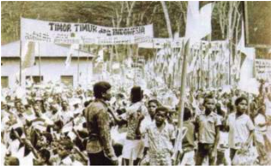

> **Deskripsi Visual:** Gambar ini adalah foto yang menunjukkan demonstrasi besar-besaran di sebuah lapangan. Di tengah foto, ada beberapa orang yang sedang berdiri dan berbicara kepada massa yang sangat ramai di sekitarnya. Massa tersebut tampaknya sangat antusias dan terlibat dalam demonstrasi. Di atas mereka, terdapat beberapa spanduk dengan tulisan yang tidak jelas. Dari sudut pandang ini, tampak bahwa demonstrasi ini berlangsung di hari yang cerah dan udara yang baik.

Elemen-elemen utama dalam gambar ini adalah demonstran, spanduk, dan massa. Demonstran terletak di tengah-tengah foto dan tampaknya sedang menjadi pusat perhatian massa. Spanduk yang ada di atas demonstran menunjukkan bahwa demonstrasi ini memiliki tujuan atau isu tertentu. Massa yang sangat ramai di sekitar demonstran menunjukkan bahwa mereka sangat antusias dan terlibat dalam demonstrasi tersebut.

Teks, angka, atau label penting yang terlihat pada gambar ini adalah spanduk yang ada di atas demonstran. Namun, karena tulisan pada spanduk tidak jelas, informasi yang dapat diambil dari spanduk tersebut tidak jelas. Informasi kunci yang dapat diambil dari gambar ini adalah bahwa demonstrasi ini sedang berlangsung di lapangan dan banyak orang yang terlibat dalam demonstrasi tersebut.

Keterlibatan  Indonesia  secara  langsung  di  Timor-Timur  terjadi  setelah adanya  permintaan  dari  para  pendukung  'Proklamasi  Balibo'  yang  terdiri UDT bersama Apodeti, Kota, dan Trabalista.  Keempat partai itu pada tanggal 30 November 1975 di Kota Balibo mengeluarkan pernyataan untuk bergabung dengan pemerintahan Republik Indonesia.  Pada tanggal 31 Mei 1976 DPR Timor-Timur mengeluarkan petisi yang isinya mendesak pemerintah Republik Indonesia agar secepatnya menerima dan mengesahkan bersatunya rakyat dan wilayah Timor Timur ke dalam Negara Republik Indonesia.

Atas keinginan bergabung rakyat Timor Timur dan permintaan bantuan yang diajukan, pemerintah Indonesia lalu menerapkan 'Operasi Seroja' pada Desember 1975. Operasi militer ini diam-diam didukung oleh Amerika Serikat (AS) yang tidak ingin pemerintahan komunis berdiri di Timor Timur. Pada masa itu Perang Dingin antara AS dengan Uni Soviet yang komunis memang tengah berlangsung.

Bersamaan dengan operasi-operasi keamanan yang dilakukan, pemerintah Indonesia  dengan  cepat  juga  menjalankan  proses  pengesahan Timor Timur ke  dalam  wilayah  Indonesia  dengan  mengeluarkan  UU  No.  7  Tahun  1976 tentang  Pengesahan  Penyatuan  Timor  Timur  ke  dalam  Negara  Kesatuan Republik Indonesia (NKRI) dan pembentukan Daerah Tingkat I Timor Timur. Pengesahan ini akhirnya diperkuat melalui Tap MPR Nomor IV/MPR/1978. Timor Timur secara resmi menjadi propinsi ke-27 di wilayah negara kesatuan Republik Indonesia.

 

---
## 📄 Halaman 147

Negara-negara tetangga dan pihak Barat, termasuk Amerika Serikat dan Australia  dengan  alasan  masing-masing  umumnya  mendukung  tindakan Indonesia.  Kekhawatiran  akan  jatuhnya  Timor-Timur  ke  tangan  komunis membuat  negara-negara  Barat  (khususnya  Amerika  Serikat  dan  Australia) secara diam-diam mendukung tindakan Indonesia.  Mereka secara de facto dan selanjutnya de jure integrasi Timor-Timur ke wilayah Indonesia. Akan tetapi,  penguasaan  Indonesia    terhadap  wilayah  itu  ternyata  menimbulkan banyak  permasalahan  yang  berkelanjutan,  terutama  setelah  berakhirnya 'Perang Dingin' dan runtuhnya Uni Soviet.

### TUGAS

Setelah berakhirnya 'Perang Dingin', integrasi Timor-Timur ke Indonesia kembali dipermasalahkan oleh dunia  internasional.

Buat  tulisan  yang  berisi  analisis  mengenai  permasalahan  apa  saja  yang terjadi  di  Timor-Timur    sehingga  Indonesia    menjadi  sorotan  di  dunia internasional tersebut.

### D.  Dampak Kebijakan Politik dan Ekonomi Masa Orde Baru

Pendekatan  keamanan  yang  diterapkan  oleh  pemerintah  Orde  Baru dalam  menegakkan  stabilisasi  nasional  secara  umum  memang  berhasil menciptakan suasana aman bagi masyarakat Indonesia. Pembangunan ekonomi pun berjalan baik dengan pertumbuhan ekonomi yang tinggi karena setiap program pembangunan pemerintah terencana dengan baik dan hasilnya dapat terlihat secara konkret. Indonesia berhasil mengubah status dari negara pengimpor beras menjadi bangsa yang bisa memenuhi kebutuhan beras sendiri (swasembada  beras).  Penurunan  angka  kemiskinan  yang  diikuti  dengan perbaikan kesejahteraan rakyat, penurunan angka kematian bayi, dan angka partisipasi pendidikan dasar yang meningkat.

Namun, di sisi lain kebijakan politik dan ekonomi pemerintah Orde Baru juga memberi beberapa dampak yang lain, baik di bidang ekonomi dan politik. Dalam  bidang  politik,  pemerintah  Orde  Baru  cenderung  bersifat  otoriter. Presiden mempunyai kekuasaan yang sangat besar dalam mengatur jalannya pemerintahan.  Peran  negara  menjadi  semakin  kuat  yang  menyebabkan timbulnya pemerintahan yang sentralistis. Pemerintahan sentralistis ditandai dengan  adanya  pemusatan  penentuan  kebijakan  publik  pada  pemerintah pusat.  Pemerintah daerah diberi peluang yang sangat kecil untuk mengatur

 

---
## 📄 Halaman 148

pemerintahan  dan  mengelola  anggaran  daerahnya  sendiri.  Otoritarianisme merambah segenap aspek kehidupan  bermasyarakat, berbangsa, dan bernegara termasuk kehidupan politik.

Pemerintah Orde Baru dinilai gagal memberikan pelajaran berdemokrasi yang  baik.  Golkar  dianggap  menjadi  alat  politik  untuk  mencapai  stabilitas yang diinginkan. Sementara dua partai lainnya hanya sebagai alat pendamping agar tercipta citra sebagai negara demokrasi. Sistem perwakilan bersifat semu bahkan  hanya  dijadikan  topeng  untuk  melanggengkan  sebuah  kekuasaan secara sepihak. Demokratisasi yang terbentuk didasarkan pada KKN (Korupsi, Kolusi, dan Nepotisme), sehingga banyak wakil rakyat yang duduk di MPR/ DPR yang tidak mengenal rakyat dan daerah yang diwakilinya.

Meskipun pembangunan ekonomi Orde Baru menunjukan perkembangan yang  menggembirakan,  namun  dampak  negatifnya  juga  cukup  banyak. Dampak negatif ini disebabkan kebijakan Orde Baru yang terlalu memfokuskan/mengejar  pada pertumbuhan ekonomi, yang berdampak buruk bagi terbentuknya mentalitas dan budaya korupsi para pejabat di Indonesia.

Distribusi hasil pembangunan dan pemanfaatan dana untuk pembangunan tidak  dibarengi  kontrol  yang  efektif  dari  pemerintah  terhadap  aliran  dana tersebut  sangat  rawan  untuk  disalahgunakan.  Pertumbuhan  ekonomi    tidak dibarengi dengan terbukanya akses dan distribusi yang merata sumber-sumber ekonomi kepada masyarakat. Hal ini berdampak pada munculnya kesenjangan sosial dalam masyarakat Indonesia, kesenjangan kota dan desa, kesenjangan kaya dan miskin, serta kesenjangan sektor industri dan sektor pertanian.

Selain masalah-masalah di atas, tidak sedikit pengamat hak asasi manusia (HAM) dalam dan luar negeri yang menilai bahwa pemerintahan Orde Baru telah melakukan tindakan antidemokrasi dan diindikasikan telah melanggar HAM. Amnesty International misalnya dalam laporannya pada 10 Juli 1991 menyebut	Indonesia	dan	beberapa	negara	Timur	Tengah,	Asia	Pasiik,	Amerika Latin, dan Eropa Timur sebagai pelanggar HAM. Human Development Report 1991 yang disusun oleh United Nations Development Program (UNDP) juga menempatkan Indonesia kepada urutan ke-77 dari 88 pelanggar HAM (Anhar Gonggong ed, 2005:190).

Sekalipun Indonesia menolak laporan kedua lembaga internasional tadi dengan alasan tidak 'fair'dan kriterianya tidak jelas, akan tetapi tidak dapat dipungkiri bahwa di dalam negeri sendiri pemerintah Orde Baru dinilai telah melakukan  beberapa  tindakan  yang  berindikasi  pelanggaran  HAM.  Dalam kurun  waktu 1969-1983 misalnya, dapat disebut peristiwa Pulau Buru (Tempat penjara  bagi  orang-orang  yang  diindikasikan  terlibat  PKI)  (1969-1979),

 

---
## 📄 Halaman 149

Peristiwa  Malari  (Januari  1974)  yang  berujung  pada  depolitisasi  kampus. Kemudian pencekalan terhadap  Petisi 50 (5 Mei 1980). Pada kurun waktu berikutnya, (1983-1988), terdapat dua peristiwa, yaitu Peristiwa Penembakan Misterius  -Petrus  (Juli  1983),  Peristiwa  Tanjung  Priok  (September  1984). Pada kurun 1988-1993, terdapat Peristiwa  Warsidi (Februari 1989),  Daerah Operasi  Militer  (DOM) Aceh  (1989-1998),  Santa  Cruz  (November  1991), Marsinah  (Mei  1993),  Haur  Koneng  (Juli  1993),  dan  Peristiwa  Nipah (September  1993).  Sedangkan  dalam  kurun  1993-1998  antara  lain  terjadi Peristiwa Jenggawah (Januari 1996), Padang Bulan (Februari 1996), Freeport (Maret 1996), Abepura (Maret 1996), Kerusuhan Situbondo (Oktober 1996), Dukun Santet Banyuwangi (1998), Tragedi Trisakti (12 Mei 1998).

Dengan  situasi politik dan ekonomi seperti di atas, keberhasilan pembangunan nasional yang menjadi kebanggaan Orde Baru yang berhasil meningkatkan Gross National Product (GNP) Indonesia ke tingkat US$ 600 di awal tahun 1980-an, kemudian meningkat lagi sampai US$ 1.300 perkapita di awal dekade 1990-an, serta menobatkan  Presiden Soeharto sebagai 'Bapak Pembangunan'  menjadi  seolah  tidak  bermakna.  Meskipun  pertumbuhan ekonomi  meningkat,  tetapi  secara  fundamental  pembangunan  tidak  merata tampak dengan adanya kemiskinan di sejumlah wilayah yang justru menjadi penyumbang terbesar devisa negara seperti di Riau, Kalimantan Timur dan Irian Barat/Papua. Faktor inilah yang selanjutnya menjadi salah satu penyebab terpuruknya perekenomian Indonesia menjelang akhir tahun 1997.

### TUGAS

Carilah  informasi  dari  berbagai  sumber    mengenai  dampak  positif  di berbagai bidang dari kebijakan politik ekonomi pemerintahan Orde Baru yang  hingga  masa  sekarang  masih  dinikmati  oleh  masyarakat  Indonesia. Cari  pula  berbagai  kasus  penyimpangan  dari  kebijakan  politik  ekonomi pemerintahan Orde Baru yang hingga kini belum juga ada penyelesaian. Tuangkan informasi yang kalian dapatkan dalam bentuk esai/makalah.

 

---
## 📄 Halaman 150

### KESIMPULAN

- Pembangunan menjadi prioritas kebijakan pemerintah Orde  Baru.  Program  berupa  Rencana  Pembangunan  Lima Tahun  menunjukkan  adanya  pelaksanaan  tahap  demi  tahap pembangunan yang dilakukan dengan prioritas pembangunan tertentu.
- Agenda pembangunan ini diformulasikan oleh pemerintah Orde Baru dalam bentuk Trilogi Pembangunan.
- Sistem kepartaian disederhanakan oleh pemerintah Orde Baru sejak awal tahun 1970-an ke dalam tiga partai.
- Krisis  ekonomi  dan  tuntutan  demokratisasi  menjadi  alasan gerakan mahasiswa yang akhirnya menjadikan orde ini diganti dengan Orde Reformasi.

### LATIH UJI KOMPETENSI

- Jelaskan tentang fusi partai yang terjadi pada tahun 1973!
- Jelaskan tentang konsep Trilogi Pembangunan dan makna yang terkandung di dalamnya!
- Jelaskan perbedaan antara Pemilu yang dilakukan pada masa Orde Baru dengan masa kini!
- Jelaskan, alasan diadakannya referendum di Timor-Timur!

 

---
## 📄 Halaman 151

### BAB V

### Sistem dan Struktur PolitikEkonomi Indonesia Masa Reformasi (1998-sekarang)

 

---
## 📄 Halaman 152

Reformasi merupakan suatu gerakan yang menghendaki adanya perubahan kehidupan bermasyarakat, berbangsa, dan bernegara ke arah yang lebih baik secara konstitusional. Lahirnya reformasi oleh karena pemerintah Orde Baru yang sebelumnya berjalan secara otoriter dan sentralistik yang tidak memberikan ruang demokrasi dan kebebasan rakyat berpartisipasi penuh dalam proses pembangunan.  Gerakan Reformasi diawali ketika Presiden Soeharto meletakan jabatannya sebagai Presiden pada 21 Mei 1998. Mengapa? Padahal ia merupakan penguasa Orde Baru yang dapat bertahan 32 tahun lamanya.

Proses  kejatuhan  Orde  Baru  telah  tampak  ketika  Indonesia  mengalami dampak  langsung  dari  krisis  ekonomi  yang  melanda  negara-negara  di Asia. Ketika krisis ini melanda Indonesia,  nilai rupiah jatuh secara drastis, dampaknya terus menggerus di segala bidang kehidupan, mulai dari bidang ekonomi, politik dan sosial. Tidak sampai menempuh waktu yang lama, sejak pertengahan  tahun  1997,  ketika  krisis  moneter  melanda  dunia,  bulan  Mei 1998, Orde Baru akhirnya runtuh.  Krisis moneter membuka jalan bagi kita menuju  terwujudnya  kehidupan  berdemokrasi  yang  sehat,  yang  selama  ini terkukung oleh sistem kekuasaan  Orde Baru yang serba menguasai semua sisi kehidupan bermasyarakat dan bernegara.

Proses  menuju  reformasi    telah  dimulai  ketika  wacana  penentangan politik  secara  terbuka  kepada  Orde  Baru  mulai  muncul.  Penentangan  ini terus digulirkan oleh mahasiswa, cendekiawan,        dan masyarakat. Mereka menuntut  pelaksanaan  proses  demokratisasi  yang  sehat  dan  terbebas  dari praktik  korupsi,  kolusi  dan  nepotisme  (KKN)  yang  muncul  dampak    tidak diimbanginya	 pembangunan	 isik	 dengan	 pembangunan	 mental	 ( character building ) terhadap para pelaksana pemerintahan (birokrat), aparat keamanan maupun pelaku ekonomi (pengusaha/konglomerat).  Mereka juga menuntut terwujudnya rule of law, good governance serta  berjalannya  pemerintahan yang bersih. Oleh karena itu, bagi mereka reformasi merupakan sebuah era dan suasana yang senanatiasa terus diperjuangkan dan dipelihara. Jadi bukan hanya  sebuah  momentum,  namun  sebuah  proses  yang  harus  senantiasa dipupuk.

 

---
## 📄 Halaman 153

---
**🖼️ Gambar/Diagram**

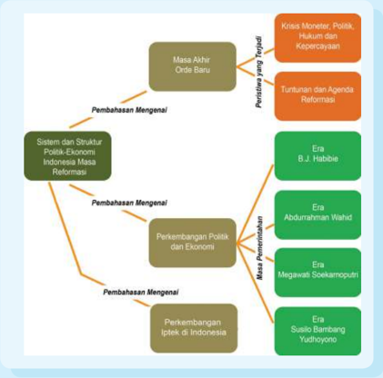

> **Deskripsi Visual:** Gambar ini adalah diagram yang menunjukkan struktur sistem politik Indonesia masa reformasi. Diagram ini dibagi menjadi dua bagian utama: "Pembahasan Mengenai" dan "Masa Akhir Orde Baru". Pembahasan Mengenai meliputi "Sistem dan Struktur Politik" serta "Perkembangan Politik dan Ekonomi", sementara Masa Akhir Orde Baru mencakup "Perspektif yang Terpadu", "Tantangan dan Agenda Reformasi", "Era B.J. Habibie", "Era Abdurrahman Wahid", "Era Megawati Suharto", dan "Era Susilo Bambang Yudhoyono".

Elemen-elemen utama dalam diagram ini adalah:
1. "Pembahasan Mengenai" yang terbagi menjadi "Sistem dan Struktur Politik" dan "Perkembangan Politik dan Ekonomi".
2. "Masa Akhir Orde Baru" yang terbagi menjadi "Perspektif yang Terpadu", "Tantangan dan Agenda Reformasi", "Era B.J. Habibie", "Era Abdurrahman Wahid", "Era Megawati Suharto", dan "Era Susilo Bambang Yudhoyono".

Teks, angka, atau label penting yang terlihat dalam diagram ini adalah:
- "Pembahasan Mengenai"
- "Masa Akhir Orde Baru"
- "Perspektif yang Terpadu"
- "Tantangan dan Agenda Reformasi"
- "Era B.J. Habibie"
- "Era Abdurrahman Wahid"
- "Era Megawati Suharto"
- "Era Susilo Bambang Yudhoyono"

Informasi kunci yang dapat diambil pembaca dari gambar ini adalah tentang struktur sistem politik Indonesia masa reformasi, perubahan politik dan ekonomi, serta era- era penting dalam masa akhir orde baru.

 

---
## 📄 Halaman 154

### TUJUAN PEMBELAJARAN

Setelah mempelajari uraian ini, diharap kamu dapat:

- Menganalisis berbagai faktor yang menyebabkan terjadinya peristiwa Reformasi 1998.
- Menganalisis proses perubahan dan perkembangan sistem demokrasi di Indonesia pada Masa Reformasi.
- Mengambil  pelajaran  dari  adanya  hubungan  timbal  balik antara situasi ekonomi dan politik internasional dengan situasi ekonomi   dan politik di tanah air.
- Mendeskripsikan perkembangan ilmu pengetahuan dan teknologi di Indonesia.

### ARTI PENTING

Memahami  sebab  dan akibat terjadinya peristiwa Reformasi 1998 dapat memberikan pelajaran penting bagi perubahan sistem demokrasi  dan  upaya  memperbaiki  kehidupan  berbangsa  dan bernegara di masa mendatang. Pemerintahan pada era Reformasi berupaya  untuk  memberantas  berbagai  kasus  KKN  dan  hal  ini merupakan  langkah  yang  patut  dilanjutkan  oleh  pemerintahan berikutnya  untuk  menciptakan  pemerintahan  yang  bersih  dan berwibawa sebagai salah satu upaya untuk menegakkan hukum.

 

---
## 📄 Halaman 155

### A.  Masa Akhir Orde Baru

Mengamati Lingkungan

- Jelaskan bagaimana peran mahasiswa dalam proses jatuhnya pemerintahan Orde Baru yang telah berkuasa selama 32 tahun.
- Buatlah perbandingan antara ciri-ciri pemerintahan pada masa Orde Baru dan masa Reformasi.

### Memahami Teks

### 1.   Krisis Moneter, Politik, Hukum, dan Kepercayaan

Krisis moneter yang melanda Thailand pada awal Juli 1997, merupakan permulaan peristiwa yang mengguncang nilai tukar mata uang negara-negara di  Asia,    seperti  Malaysia,  Filipina,  Korea,  dan  Indonesia.  Rupiah  yang berada pada posisi nilai tukar Rp2.500,00/US$ terus mengalami kemerosotan. Situasi ini mendorong Presiden Soeharto meminta bantuan dari International Monetary Fund (IMF).  Persetujuan  bantuan    IMF  dilakukan  pada  Oktober 1997  dengan  syarat  pemerintah  Indonesia  harus  melakukan  pembaruan kebijakan-kebijakan,  terutama  kebijakan  ekonomi.  Di  antara  syarat-syarat tersebut adalah  penghentian subsidi dan penutupan 16 bank swasta. Namun usaha ini tidak menyelesaikan masalah yang dihadapi.

Upaya  pemerintah  untuk  menguatkan  nilai  tukar  rupiah,  melalui  Bank Indonesia  dengan  melakukan  intervensi  pasar  tidak  mampu  membendung nilai  tukar  rupiah  yang  terus  merosot.  Nilai  tukar  rupiah  yang  berada  di posisi Rp4.000,00/US$ pada Oktober 1997 terus melemah menjadi  sekitar Rp17.000,00/US$  pada  bulan  Januari  1998.  Kondisi  ini  berdampak  pada jatuhnya bursa saham Jakarta, bangkrutnya perusahaan-perusahaan  besar di Indonesia yang menyebabkan terjadinya pemutusan hubungan kerja (PHK) secara besar-besaran.

Kondisi  ini  membuat  Presiden  Soeharto  menerima  proposal  reformasi IMF  pada  tanggal  15  Januari  1998    dengan  ditandatanganinya Letter  of Intent (Nota Kesepakatan) antara  Presiden Soeharto dan Direktur Pelaksana IMF Michele Camdesius. Namun, kemudian Presiden Soeharto menyatakan bahwa paket IMF yang ditandatanganinya membawa Indonesia pada sistem ekonomi liberal. Hal ini menyiratkan bahwa pemerintah Indonesia tidak akan

 

---
## 📄 Halaman 156

melaksanakan  perjanjian  IMF  yang  berisi  50  butir  kesepakatan  tersebut. Situasi  tarik  menarik  antara  pemerintah  dan  IMF  itu  menyebabkan  krisis ekonomi semakin memburuk.

Pada  saat  krisis  semakin  dalam,  muncul  ketegangan-ketegangan  sosial dalam  masyarakat.    Pada  bulan-bulan  awal    1998  di  sejumlah  kota  terjadi kerusuhan anti-Cina. Kelompok ini menjadi sasaran kemarahan masyarakat karena  mereka  mendominasi  perekonomian  di  Indonesia.  Krisis  ini  pun semakin menjalar dalam bentuk gejolak-gejolak non ekonomi lainnya yang membawa pengaruh terhadap proses perubahan selanjutnya.

Sementara itu, sesuai dengan hasil Pemilu ke-6 yang diselenggarakan pada tanggal 29 Mei 1997, Golkar memperoleh suara 74,5 persen, PPP 22,4 persen, dan  PDI  3  persen.  Setelah  pelaksanaan  pemilu  tersebut  perhatian  tercurah pada Sidang Umum MPR yang dilaksanakan pada Maret 1998. Sidang Umum MPR ini akan memilih presiden dan wakil presiden.  Sidang umum tersebut kemudian menetapkan kembali Soeharto sebagai presiden  untuk masa jabatan lima tahun yang ketujuh kalinya dengan B.J. Habibie sebagai wakil presiden.

Dalam  beberapa  minggu  setelah  terpilihnya  kembali  Soeharto  sebagai Presiden  RI,  kekuatan-kekuatan  oposisi  yang  sejak  lama  dibatasi  mulai muncul ke permukaan. Meningkatnya kecaman terhadap Presiden Soeharto terus meningkat yang ditandai lahirnya gerakan mahasiswa sejak awal 1998. Gerakan mahasiswa yang mulai mengkristal di kampus-kampus, seperti ITB, UI dan lain-lain semakin meningkat intensitasnya sejak terpilihnya Soeharto.

Demonstrasi-demonstrasi mahasiswa berskala besar di seluruh Indonesia melibatkan pula para staf akademis maupun pimpinan universitas. Garis besar tuntutan  mahasiswa  dalam  aksi-aksinya  di  kampus  di  berbagai  kota,  yaitu tuntutan  penurunan  harga  sembako  (sembilan  bahan  pokok),  penghapusan monopoli, kolusi, korupsi dan nepotisme (KKN) serta suksesi kepemimpinan nasional.

Aksi-aksi mahasiswa yang tidak mendapatkan tanggapan dari pemerintah menyebabkan para mahasiswa di berbagai kota mulai mengadakan aksi hingga keluar kampus. Maraknya aksi-aksi mahasiswa yang sering berlanjut menjadi bentrokan dengan aparat kemanan membuat  Menhankam/Pangab, Jenderal Wiranto,  mencoba  meredamnya  dengan  menawarkan  dialog.    Dari  dialog tersebut diharapkan komunikasi antara pemerintah dan masyarakat kembali terbuka.  Namun  mahasiswa  menganggap bahwa dialog dengan pemerintah tidak  efektif  karena  tuntutan  pokok  mereka  adalah  reformasi  politik  dan ekonomi  pengunduran  diri  Presiden  Soeharto.  Menurut  mahasiswa,  mitra dialog yang paling efektif adalah lembaga kepresidenan dan MPR.

 

---
## 📄 Halaman 157

Di tengah maraknya aksi protes mahasiswa dan komponen masyarakat lainnya,  pada  tanggal  4  Mei  1998  pemerintah  mengeluarkan  kebijakan menaikkan  harga  BBM  dan  tarif  dasar  listrik.    Kebijakan  yang  diambil pemerintah bertentangan dengan tuntutan yang berkembang saat itu. Sehingga naiknya  harga BBM dan tarif dasar listrik semakin memicu gerakan massa, karena kebijakan tersebut berdampak pula pada naiknya biaya angkutan dan barang kebutuhan lainnya.

Dalam kondisi negara yang sedang mengalami krisis, Presiden Soeharto, Pada  9 Mei 1998,  berangkat ke Kairo (Mesir) untuk menghadiri Konferensi G  15.  Di  dalam  pesawat  menjelang  keberangkatannya  Presiden  Soeharto meminta masyarakat tenang dan memahami kenaikan harga BBM. Selain itu, ia menyerukan kepada lawan-lawan politiknya bahwa pasukan keamanan akan menangani dengan tegas setiap gangguan yang muncul. Meskipun demikian kerusuhan tetap tidak dapat dipadamkan dan gelombang protes dari berbagai kalangan komponen masyarakat terus berlangsung.

### 2.   Tuntutan dan Agenda Reformasi

Sumber: Anhar Gonggong dan Musa Asy'arie, 2005

Reformasi adalah gerakan untuk mengubah bentuk atau perilaku suatu tatanan, karena tatanan tersebut tidak lagi disukai atau  tidak sesuai dengan kebutuhan	zaman,	baik	karena	tidak	eisien	maupun	tidak	bersih	dan	tidak demokratis.  'Reformasi atau mati'. Demikian  tuntutan yang ditorehkan oleh para aktivis mahasiswa pada spanduk-spanduk yang terpampang di  kampus mereka,  atau  yang  mereka  teriakan  saat    melakukan  aksi  protes  melalui kegiatan unjuk rasa pada akhir April 1998. Tuntutan tersebut menggambarkan sebuah titik kulminasi dari gerakan aksi protes yang tumbuh di lingkungan kampus secara nasional sejak awal tahun 1998. Gerakan ini bertujuan untuk melakukan  tekanan  agar  pemerintah  mengadakan  perubahan  politik  yang berarti, melalui pelaksanaan reformasi secara total.

 

---
## 📄 Halaman 158

Kemunculan gerakan reformasi dilatarbelakangi terjadinya krisis multidimensi yang dihadapi bangsa Indonesia. Gerakan ini pada awalnya hanya berupa demonstrasi  di kampus-kampus besar.  Namun mahasiswa akhirnya harus turun ke jalan karena aspirasi mereka tidak mendapatkan respon dari pemerintah. Gerakan Reformasi tahun 1998 mempunyai enam agenda, yaitu:

- Suksesi kepemimpinan nasional
- Amendemen UUD 1945
- Pemberantasan KKN
- Penghapusan dwifungsi ABRI
- Penegakan supremasi hukum
- Pelaksanaan otonomi daerah
Agenda utama gerakan reformasi adalah turunnya Soeharto dari jabatan presiden.  Berikut  ini  kronologi  beberapa  peristiwa  penting  selama  gerakan reformasi yang memuncak pada tahun 1998.

Dalam  rangka  memperingati  Hari  Kebangkitan  Nasional  yang  akan diselenggarakan  pada  tanggal  20  Mei  1998  direncanakan  oleh  gerakan mahasiswa  sebagai  momen  Hari  Reformasi  Nasional.  Namun  ledakan kerusuhan terjadi lebih awal dan di luar dugaan. Pada tanggal 12 Mei 1998 empat mahasiswa Universitas Trisakti, Jakarta tewas tertembak peluru aparat keamanan saat demonstrasi menuntut Soeharto mundur. Mereka adalah Elang Mulya,	Hery	Hertanto,	Hendriawan	Lesmana,	dan	Haidhin	Royan.	Mereka tertembak  ketika  ribuan  mahasiswa  Trisakti  dan  lainnya  baru  memasuki kampusnya setelah melakukan demonstrasi di gedung DPR/MPR.

Penembakan  aparat  di  Universitas  Trisakti  itu  menyulut  demonstrasi yang lebih besar. Pada tanggal 13 Mei 1998 terjadi kerusuhan, pembakaran, dan penjarahan di Jakarta dan Solo. Kondisi ini memaksa Presiden Soeharto mempercepat  kepulangannya  dari  Mesir.  Sementara  itu,  mulai  tanggal  14 Mei 1998 demonstrasi mahasiswa semakin meluas. Bahkan, para demonstran mulai menduduki gedung-gedung pemerintah di pusat dan daerah.

Mahasiswa Jakarta menjadikan gedung DPR/MPR sebagai pusat gerakan yang  relatif  aman.  Ratusan  ribu  mahasiswa  menduduki  gedung  rakyat. Bahkan, mereka menduduki atap gedung tersebut. Mereka berupaya menemui pimpinan MPR/DPR agar mengambil sikap yang tegas. Akhirnya, tanggal 18 Mei 1998 Ketua MPR/DPR Harmoko meminta Soeharto turun dari jabatannya sebagai presiden.

 

---
## 📄 Halaman 159

Untuk mengatasi keadaan, Presiden Soeharto menjanjikan akan mempercepat  pemilu.  Hal  ini  dinyatakan  setelah  Soeharto  mengundang beberapa  tokoh  masyarakat  seperti  Nurcholish  Madjid  dan  Abdurrahman Wahid ke Istana Negara pada tanggal 19 Mei 1998. Akan tetapi, upaya ini tidak mendapat sambutan rakyat.

Momentum  hari Kebangkitan Nasional 20 Mei 1998 rencananya digunakan tokoh reformasi Amien Rais untuk mengadakan doa bersama di sekitar Tugu Monas. Akan tetapi, beliau membatalkan rencana apel dan doa bersama karena 80.000 tentara bersiaga di kawasan tersebut. Di Yogyakarta, Surakarta, Medan, dan Bandung ribuan mahasiswa dan rakyat berdemonstrasi. Ketua  MPR/DPR Harmoko kembali meminta Soeharto mengundurkan diri pada hari Jumat tanggal 20 Mei 1998 atau DPR/MPR akan terpaksa memilih presiden baru. Bersamaan dengan itu, sebelas menteri Kabinet Pembangunan VII mengundurkan diri.

Akhirnya,  pada  pukul  09.00  WIB  Presiden  Soeharto  membacakan pernyataan pengunduran dirinya. Itulah beberapa peristiwa penting menyangkut gerakan reformasi tahun 1998. Soeharto mengundurkan diri dari jabatan presiden yang telah dipegang selama 32 tahun.

Beliau  mengucapkan  terima  kasih  dan  mohon  maaf  kepada  seluruh rakyat Indonesia. Soeharto kemudian digantikan B.J. Habibie. Sejak saat itu berakhirlah era Orde Baru selama 32 tahun, Indonesia memasuki sebuah era baru yang kemudian dikenal sebagai Masa  Reformasi.

- Dari	enam	agenda	Reformasi,	coba	identiikasi	agenda	mana	saja	yang	sudah berhasil dicapai, dan bagaimana penerapannya di lapangan.
- Coba diskusikan dalam kelompok, apa arti Reformasi, suatu  kata yang sangat populer didengungkan menjelang akhir kekuasaan pemerintah Orde Baru.

 

---
## 📄 Halaman 160

### TUGAS

Buatlah 4 kelompok. Masing-masing kelompok carilah informasi mengenai:

- Kelompok 1: 'Perkembangan politik dan ekonomi pada masa pemerintahan Presiden B.J. Habibie'
- Kelompok 2: 'Perkembangan politik dan ekonomi pada masa pemerintahan Presiden Abdurrahman Wahid'
- Kelompok 3: 'Perkembangan politik dan ekonomi pada masa pemerintahan Presiden Megawati Soekarno Putri'
- Kelompok 4: 'Perkembangan politik dan ekonomi pada masa pemerintahan Presiden Susilo Bambang Yudhoyono'
Selain di buku siswa kamu dapat mencari informasi mengenai hal tersebut dari berbagai sumber lain.

Informasi yang didapat akan didiskusikan dalam pembelajaran berikutnya (pertemuan keduapuluh enam) dan akan dipresentasikan pada pembelajaran di minggu berikutnya lagi (pertemuan keduapuluh tujuh).

### B.   Perkembangan Politik dan Ekonomi

### 1.   Masa Pemerintahan Presiden B.J. Habibie

Gambar  di  atas  memperlihatkan  saat  B.J.  Habibie  diambil  sumpah  sebagai Presiden  RI  menggantikan  Soeharto  yang  mengundurkan  diri.  Pengambilan sumpah dilakukan di Istana Negara.

'Apakah  pelantikan  B.J.  Habibie  yang  tidak  dilakukan  di  Gedung  MPR,  sah secara konstitusional?'

Tuliskan jawaban kamu, lalu hasilnya dikumpulkan ke guru!

 

---
## 📄 Halaman 161

Setelah Presiden Soeharto menyatakan berhenti dari jabatannya sebagai Presiden  Republik  Indonesia  pada  21  Mei  1998,  pada  hari  itu  juga  Wakil Presiden B.J. Habibie dilantik menjadi Presiden RI ketiga di bawah pimpinan Mahkamah Agung  di  Istana  Negara.  Dasar  hukum  pengangkatan  Habibie adalah berdasarkan TAP MPR No.VII/MPR/1973 yang berisi 'jika Presiden berhalangan, maka Wakil Presiden ditetapkan menjadi Presiden'.

Ketika Habibie naik sebagai Presiden, Indonesia sedang mengalami krisis ekonomi terburuk dalam waktu 30 tahun terakhir, disebabkan oleh krisis mata uang yang didorong oleh hutang luar negeri yang luar biasa besar sehingga menurunkan nilai  rupiah  menjadi  seperempat  dari  nilai  tahun  1997.  Krisis yang  telah  menimbulkan  kebangkrutan  teknis  terhadap  sektor  industri  dan manufaktur	serta	sektor	inansial	yang	hampir	ambruk,	diperparah	oleh	musim kemarau panjang yang disebabkan oleh badai El Nino, yang mengakibatkan turunnya produksi beras.

Ditambah kerusuhan Mei 1998 telah menghancurkan pusat-pusat bisnis perkotaan, khususnya di kalangan investor keturunan Cina yang memainkan peran  dominan  dalam  ekonomi  Indonesia.  Larinya  modal,  dan  hancurnya produksi serta distribusi barang-barang menjadikan upaya pemulihan menjadi sangat	sulit,	hal	tersebut	menyebabkan	tingkat	inlasi	yang	tinggi.

Pengunduran diri Soeharto telah membebaskan energi sosial dan politik serta frustasi akibat tertekan selama 32 tahun terakhir, menciptakan perasaan senang secara umum akan kemungkinan politik yang sekarang tampak seperti terjangkau.  Kalangan  mahasiswa  dan  kelompok-kelompok  pro  demokrasi menuntut  adanya  demokratisasi  sistem politik segera terjadi,  meminta pemilihan umum segera dilakukan untuk memilih anggota parlemen dan MPR, yang dapat memilih presiden baru dan wakil presiden. Di samping tuntutan untuk  menyelenggarakan  pemilihan  umum  secepat  mungkin,  pemerintah juga berada di bawah tekanan kuat untuk menghapuskan korupsi, kolusi dan nepotisme yang menandai Orde Baru.

Tugas  yang  diemban  oleh  Presiden  B.J.  Habibie  adalah  memimpin pemerintahan transisi untuk menyiapkan dan melaksanakan agenda reformasi yang menyeluruh dan mendasar, serta sesegera mungkin mengatasi kemelut yang  sedang  terjadi.  Naiknya  B.J.  Habibie    ke  singgasana  kepemimpinan nasional diibaratkan menduduki puncak Gunung Merapi yang siap meletus kapan saja. Gunung itu akan meletus jika berbagai  persoalan politik, sosial dan  psikologis,  yang  merupakan  warisan  pemerintahan  lama  tidak  diatasi dengan segera.

 

---
## 📄 Halaman 162

Menjawab kritik-kritik atas dirinya yang dinilai sebagai orang tidak tepat menangani  keadaan  Indonesia  yang  sedang  dilanda  krisis  yang  luar  biasa. B.J. Habibie berkali-kali menegaskan tentang komitmennya untuk melakukan reformasi  di  bidang  politik,  hukum  dan  ekonomi.  Secara  tegas  Habibie menyatakan bahwa kedudukannya  sebagai presiden adalah sebuah amanat konstitusi.  Dalam  menjalankan  tugasnya  ini  ia  berjanji  akan  menyusun pemerintahan  yang  bertanggung  jawab  sesuai  dengan  tuntutan  perubahan yang  digulirkan  oleh  gerakan  reformasi  tahun  1998.  Pemerintahnya  akan menjalankan  reformasi  secara  bertahap  dan  konstitusional  serta  komitmen terhadap aspirasi rakyat untuk memulihkan kehidupan politik yang demokratis dan meningkatkan kepastian hukum.

Dalam  pidato  pertamanya  pada  tanggal  21  Mei  1998,  malam  harinya setelah dilantik sebagai Presiden, pukul 19.30 WIB di Istana Merdeka yang disiarkan langsung melalui RRI dan TVRI,  B.J. Habibie menyatakan tekadnya untuk melaksanakan reformasi. Pidato tersebut bisa dikatakan merupakan visi kepemimpinan B.J. Habibie guna menjawab tuntutan Reformasi secara cepat dan tepat. Beberapa point penting dari pidatonya tersebut adalah kabinetnya akan  menyiapkan proses reformasi dalam ketiga bidang yaitu:

- Di bidang politik antara lain dengan memperbarui berbagai perundangundangan dalam rangka lebih meningkatkan kualitas kehidupan berpolitik yang  bernuansa  pada  PEMILU  sebagaimana  yang  diamanatkan  oleh Garis-garis Besar Haluan Negara (GBHN).
- Di bidang hukum antara lain meninjau kembali Undang-Undang Subversi.
- Di  bidang  ekonomi  dengan  mempercepat  penyelesaian  undang-undang yang menghilangkan praktik-praktik monopoli dan persaingan tidak sehat.
Di samping itu pemerintah akan tetap melaksanakan semua komitmen yang telah disepakati dengan pihak luar negeri, khususnya dengan melaksanakan program reformasi ekonomi sesuai dengan kesepakatan dengan IMF. Pemerintah akan tetap menjunjung tinggi kerjasama regional dan internasional, seperti yang telah dilaksanakan selama ini dan akan berusaha dalam waktu yang  sesingkat-singkatnya  mengembalikan  dinamika  pembangunan  bangsa Indonesia yang dilandasi atas kepercayaan nasional dan internasional yang tinggi.

Seperti  dituturkan  dalam  pidato  pertamanya,  bahwa  pemerintahannya akan komitmen pada aspirasi rakyat untuk memulihkan kehidupan ekonomisosial, meningkatkan kehidupan politik demokrasi dan menegakkan kepastian hukum.  Maka  fokus  perhatian  pemerintahan  Habibie  diarahkan  pada  tiga bidang tersebut.

 

---
## 📄 Halaman 163

### a)   Pembentukan Kabinet Reformasi Pembangunan

Sehari  setelah  dilantik,  B.J.  Habibie  telah  berhasil  membentuk  kabinet yang  diberi  nama  Kabinet  Reformasi  Pembangunan.  Kabinet  Reformasi Pembangunan  terdiri  atas  36  Menteri,  yaitu  4  Menteri  Negara  dengan tugas  sebagai  Menteri  Koordinator,  20  Menteri  Negara  yang  memimpin Departemen, dan 12 Menteri Negara yang memimpin tugas tertentu. Dalam Kabinet Reformasi Pembangunan tersebut terdapat sebanyak 20 orang yang merupakan  Menteri  pada  Kabinet  Pembangunan  era  Soeharto.  Kabinet Reformasi Pembangunan terdiri atas berbagai elemen kekuatan politik dalam masyarakat, seperti dari ABRI, partai politik (Golkar, PPP, dan PDI), unsur daerah,  golongan  intelektual  dari  perguruan  tinggi,  dan  lembaga  swadaya masyarakat. Untuk pertama kalinya sejak  pemerintahan Orde Baru, Habibie mengikutsertakan kekuatan sosial politik non Golkar, unsur daerah, akademisi, profesional dan LSM (Lembaga Swadaya Masyarakat), sehingga diharapkan terjadi  sinergi  dari  semua  unsur  kekuatan  bangsa  tersebut.  Langkah  ini semacam rainbow  coalition yang  terakhir  kali  diterapkan  dalam  Kabinet Ampera.

Pada  sidang  pertama  Kabinet  Reformasi  Pembangunan,  25  Mei  1998, B.J.  Habibie  memberikan  pengarahan  bahwa  pemerintah  harus  mengatasi krisis ekonomi dengan dua sasaran pokok, yakni tersedianya bahan makanan pokok masyarakat dan berputarnya kembali roda perekonomian masyarakat. Pusat  perhatian  Kabinet  Reformasi  Pembangunan  adalah  meningkatkan kualitas, produktivitas dan daya saing ekonomi rakyat, dengan memberi peran perusahaan kecil, menengah dan koperasi, karena terbukti memiliki ketahanan ekonomi dalam menghadapi krisis.

Dalam sidang pertama kabinet itu juga, Habibie memerintahkan bahwa departemen-departemen terkait secepatnya mengambil langkah persiapan dan pelaksanaan reformasi, khususnya menyangkut reformasi di bidang politik, bidang  ekonomi  dan  bidang  hukum.  Perangkat  perundang-undangan  yang perlu diperbarui antara lain Undang-Undang Pemilu, Undang-Undang tentang Partai Politik dan Golkar, UU tentang susunan dan kedudukan MPR, DPR dan DPRD, UU tentang Pemerintahan Daerah.

Menindaklanjuti  tuntutan  yang  begitu  kuat  terhadap  reformasi  politik, banyak kalangan menuntut adanya amendemen UUD  1945.Tuntutan amendemen  tersebut  berdasarkan pemikiran bahwa  salah satu  sumber permasalahan  dalam  penyelenggaraan  pemerintahan  negara  selama  ini  ada pada  UUD  1945.  UUD  1945  memberikan  kekuasaan  yang  sangat  besar

 

---
## 📄 Halaman 164

kepada presiden, tidak adanya check and balances system ,	 terlalu	 leksibel, sehingga dalam pelaksanaannya banyak yang disalahgunakan, pengaturan hak asasi manusia yang minim dan kurangnya pengaturan mengenai pemilu dan mekanisme demokrasi.

### b)   Sidang Istimewa MPR 1998

Di  tengah  maraknya  gelombang  demonstrasi  mahasiswa  dan  desakan kaum  intelektual  terhadap  legitimasi  pemerintahan  Habibie,  pada    10-13 November  1998,  MPR  mengadakan  Sidang  Istimewa  untuk  menetapkan langkah pemerintah dalam melaksanakan reformasi di segala bidang. Beberapa hasil  yang  dijanjikan  pemerintah  dalam  menghadapi  tuntutan  keras  dari mahasiswa dan gerakan reformasi telah terwujud dalam ketetapan-ketetapan yang dihasilkan MPR, antara lain:

- Terbukanya kesempatan untuk mengamendemen UUD 1945 tanpa melalui referendum.
- Pencabutan keputusan P4 sebagai mata pelajaran wajib (Tap MPR No. XVIII/MPR/1998).
- Masa jabatan presiden dan wakil presiden dibatasi hanya sampai dua kali masa tugas, masing masing lima tahun (Tap MPR No. XIII/MPR/1998).
- Agenda  reformasi  politik  meliputi  pemilihan  umum,  ketentuan  untuk memeriksa kekuasaan pemerintah, pengawasan yang baik dan berbagai perubahan terhadap Dwifungsi ABRI.
- Tap MPR No. XVII/MPR/1998 tentang Hak Asasi Manusia, mendorong kebebasan mengeluarkan pendapat, kebebasan pers, kebebasan berserikat, serta pembebasan tahanan politik dan narapidana politik.

### c)   Reformasi  Bidang Politik

Sesuai dengan Tap MPR  No. X/MPR/1998, Kabinet Reformasi Pembangunan telah berupaya melaksanakan sejumlah agenda politik, yaitu merubah  budaya  politik  yang  diwariskan  oleh  pemerintahan  sebelumnya, seperti pemusatan kekuasaan, dilanggarnya prinsip-prinsip demokrasi, terbatasnya partisipasi politik rakyat, menonjolnya pendekatan represif yang menekankan  keamanan  dan  stabilitas,  serta  terabaikannya  nilai-nilai  Hak Asasi Manusia dan prinsip supremasi hukum.

 

---
## 📄 Halaman 165

Beberapa hal yang telah dilakukan B.J. Habibie adalah:

- Diberlakukannya  Otonomi  Daerah  yang  lebih  demokratis  dan  semakin luas. Dengan kebijakan desentralisasi dan otonomi daerah serta perimbangan keuangan antara pusat dan daerah, diharapkan akan meminimalkan ancaman disintegrasi bangsa. Otonomi daerah ditetapkan melalui Ketetapan MPR No. XV/MPR/1998.
- Kebebasan  berpolitik  dilakukan  dengan  pencabutan  pembatasan  partai politik. Sebelumnya, dengan adanya kebebasan untuk mendirikan partai politik, pada pertengahan bulan Oktober 1998 sudah tercatat sebanyak 80 partai politik dibentuk. Menjelang Pemilihan Umum, partai politik yang terdaftar	mencapai	141	partai.	Setelah	diveriikasi	oleh	Komisi	Pemilihan Umum menjadi sebanyak 95 partai, dan yang berhak mengikuti Pemilihan Umum sebanyak 48 partai saja.  Dalam  hal  kebebasan  berpolitik,  pemerintah juga  telah  mencabut  larangan  mengeluarkan  pendapat,  berserikat,  dan mengadakan rapat umum.
- Pencabutan ketetapan untuk meminta Surat Izin Terbit (SIT) bagi media massa cetak, sehingga media massa cetak tidak lagi khawatir diberedel melalui  mekanisme  pencabutan  Surat  Izin  Terbit.  Hal  penting  lainnya dalam kebebasan mengeluarkan pendapat bagi pekerja media massa adalah diberinya kebebasan untuk mendirikan organisasi-organisasi profesi. Pada era  Soeharto,  para  wartawan  diwajibkan  menjadi  anggota  satu-satunya organisasi persatuan wartawan yang dibentuk oleh pemerintah. Sehingga merasa selalu dikontrol dan dikendalikan oleh pemerintah.
- Dalam  hal  menghindarkan  munculnya  penguasa  yang  otoriter  dengan masa  kekuasaan  yang  tidak  terbatas,  diberlakukan  pembatasan  masa jabatan  Presiden.  Seorang  warga  negara  Indonesia  dibatasi  menjadi presiden sebanyak dua kali masa jabatan saja.

### d)   Pelaksanaan Pemilu 1999

Pelaksanaan  Pemilu  1999,  boleh  dikatakan  sebagai  salah  satu  hasil terpenting lainnya yang dicapai Habibie pada masa kepresidenannya. Pemilu 1999 adalah penyelenggaraan pemilu multipartai (yang diikuti oleh 48 partai politik). Sebelum menyelenggarakan pemilu yang dipercepat itu, pemerintah mengajukan RUU tentang partai politik, tentang pemilu, dan tentang susunan dan kedudukan MPR, DPR, dan DPRD.

Setelah RUU  disetujui DPR  dan  disahkan  menjadi  UU,  presiden membentuk Komisi Pemilihan Umum (KPU) yang anggota-anggotanya terdiri atas wakil partai politik dan wakil pemerintah. Hal yang membedakan Pemilu 1999 dengan pemilu sebelumnya (kecuali Pemilu 1955) adalah diikuti oleh

 

---
## 📄 Halaman 166

banyak  partai  politik.  Ini  dimungkinkan  karena  adanya  kebebasan  untuk mendirikan  partai  politik.  Dengan  masa  persiapan  yang  tergolong  singkat, pelaksanaan pemungutan suara pada Pemilu 1999 ini dapat dikatakan sesuai dengan jadwal, 7 Juni 1999.

Tidak  seperti  yang  diprediksi  dan  dikhawatirkan  oleh  banyak  pihak, ternyata  Pemilu  1999  bisa  terlaksana  dengan  damai  tanpa  ada  kekacauan yang berarti meski diikuti partai yang jauh lebih banyak, pemilu kali ini juga mencatat  masa  kampanye  yang  relatif  damai  dibandingkan  dengan  pemilu sebelumnya.  Berdasarkan  laporan  Komisi  Pemilihan  Umum  (KPU),  hanya 19  orang  meninggal  semasa  kampanye,  baik  karena  kekerasan  maupun kecelakaan dibanding dengan 327 orang pada pemilu 1997 yang hanya diikuti oleh tiga partai. Ini juga menunjukkan rakyat kebanyakan lebih rileks melihat perbedaan. Pemilu 1999, dinilai oleh banyak pengamat sebagai Pemilu yang paling demokratis  dibandingkan  6  kali  pelaksanaan Pemilu sebelumnya.

Berdasarkan keputusan KPU,  Panitia Pemilihan Indonesia  (PPI),  pada  1  September  1999,  melakukan pembagian  kursi  hasil  pemilu.  Hasil  pembagian  kursi itu menunjukan lima partai besar menduduki 417 kursi di DPR, atau 90,26 % dari 462 kursi yang diperebutkan. PDI-P muncul sebagai pemenang pemilu dengan meraih 153 kursi. Golkar memperoleh 120 kursi, PKB 51 Kursi, PPP  48 kursi, dan PAN 34 kursi.

### e)   Pelaksanaan Referendum Timor-Timur

Bandingkan pelaksanaan pemilu pada masa Orde Baru dengan Pelaksanaan Pemilu 1999, menurut kamu pemilu mana yang lebih cocok untuk Indonesia.

Satu  peristiwa  penting  yang  terjadi  pada  masa  pemerintahan  Presiden B.J.  Habibie  adalah  diadakannya  Referendum  bagi  rakyat  Timor-Timur untuk  menyelesaikan  permasalahan  Timor-Timur  yang  merupakan  warisan dari  pemerintahan  sebelumnya.  Harus  diakui  bahwa  integrasi Timor-Timur (Tim-Tim)  ke  wilayah  RI  tahun  1975  yang  dikukuhkan  oleh  TAP  MPR No.VI/M7PR/1978, atas kemauan sebagian warga Timor-Timur tidak pemah mendapat  pengakuan  internasional.  Meskipun  sebenarnya  Indonesia  tidak pernah  mengklaim  dan  berambisi  menguasai  wilayah  Tim-Tim.  Banyak pengorbanan  yang  telah  diberikan  bangsa  Indonesia,  baik  nyawa  maupun harta benda, untuk menciptakan perdamaian dan pembangunan di Tim-Tim, yang  secara  historis  memang  sering  bergejolak  antara  yang  pro  integrasi dengan yang kontra. Subsidi yang diberikan oleh pemerintah pusat bahkan melebihi dari apa yang diberikan kepada provinsi-provinsi lain untuk mengejar

 

---
## 📄 Halaman 167

ketertinggalan.  Namun  sungguh  disesalkan  bahwa  segala  upaya  itu  tidak pernah  mendapat  tanggapan  yang  positif,  baik  di  lingkungan  internasional maupun di kalangan masyarakat Timor-Timur sendiri.

Di  berbagai  forum  internasional  posisi  Indonesia  selalu  dipojokkan. Sebanyak 8 Resolusi Majelis Umum PBB dan 7 resolusi Dewan Keamanan PBB telah dikeluarkan. Indonesia harus menghadapi kenyataan bahwa untuk memulihkan  citra  Indonesia,  tidak  memiliki  pilihan  lain  kecuali  berupaya menyelesaikan masalah Timor-Timur dengan cara-cara yang dapat diterima oleh masyarakat internasional. Dalam perundingan Tripartit Indonesia menawarkan  gagasan  segar,  yaitu  otonomi  yang  luas  bagi  Timor-Timur. Gagasan  itu  disetujui  oleh  Portugal  namun  dengan  prinsip  yang  berbeda, yaitu otonomi luas ini sebagai solusi antara (masa transisi antara 5-10 tahun) bukan  solusi  akhir  seperti  yang  ditawarkan  Indonesia.  Pihak-pihak  yang tidak menyetujui integrasi tetap menginginkan dilakukan referendum, untuk memastikan rakyat Timor-Timur memilih otonomi atau kemerdekaan.

Bagi  Indonesia  adalah  lebih  baik  menyelesaikan  masalah Timor-Timur secara tuntas, karena akan sulit mewujudkan Pemerintahan Otonomi Khusus, sementara	konlik	terus	berlarut-larut	dan	masing-masing	pihak	yang	bertikai akan menyusun kekuatan untuk memenangkan referendum. Karena itu, melalui kajian yang mendalam dan setelah berkonsultasi dengan Pimpinan DPR dan Fraksi-Fraksi  DPR,  pemerintah  menawarkan  alternatif  lain.  Jika  mayoritas rakyat Timor-Timur menolak Otonomi Luas dalam sebuah 'jajak pendapat', maka adalah wajar dan bijaksana bahkan demokratis dan konstitusional, jika pemerintah  mengusulkan  Opsi  kedua  kepada  Sidang  Umum  MPR,  yaitu mempertimbangkan pemisahan Timor-Timur dari NKRI secara damai, baikbaik dan terhormat.

Rakyat  Timor-Timur  melakukan  jajak  pendapat pada 30 Agustus 1999 sesuai dengan Persetujuan New York. Hasil jajak pendapat yang diumumkan PBB pada 4 September 1999 adalah 78,5% menolak dan 21,5% menerima.  Setelah  jajak  pendapat  ini  telah  terjadi berbagai bentuk kekerasan, sehingga demi kemanusiaan Indonesia menyetujui percepatan pengiriman pasukan multinasional di Timor-Timur.

Sesuai  dengan  nilai-nilai  dasar  yang  terkandung dalam  Pembukaan  UUD  '45,  bahwa  kemerdekaan adalah  hak  segala  bangsa,  maka  Presiden  Habibie mengharapkan  MPR  berkenan  membahas  hasil  jajak pendapat tersebut dan menuangkannya dalam ketetapan

Apakah kamu setuju dengan kebijakan Habibie melakukan Referendum untuk TimorTimur? dalam kelompok

Diskusikan kecil di kelas, lalu tuliskan alasannya!

 

---
## 📄 Halaman 168

yang memberikan pengakuan terhadap keputusan rakyat Timor-Timur. Sesuai dengan  Perjanjian  New  York,  ketetapan  tersebut  mengesahkan  pemisahan Timor-Timur dari RI secara baik, terhormat dan damai, untuk menunjukkan kepada dunia bahwa Indonesia adalah bagian dari masyarakat internasional yang  bertanggung  jawab,  demokratis,  dan  menjunjung  tinggi  hak  asasi manusia.

### f)    Reformasi Bidang Ekonomi

Sesuai dengan Tap MPR tentang pokok-pokok reformasi yang menetapkan dua arah kebijakan pokok di bidang ekonomi, yaitu penanggulangan krisis ekonomi dengan sasaran terkendalinya nilai rupiah dan tersedianya kebutuhan bahan pokok dan obat-obatan dengan harga terjangkau, serta berputarnya roda perekonomian nasional, dan pelaksanaan reformasi ekonomi.

Kebijakan ekonomi Presiden B.J. Habibie dilakukan dengan mengikuti saran-saran	 dari	 Dana	 Moneter	 Internasional	 yang	 dimodiikasi	 dengan mempertimbangkan kondisi perekonomian Indonesia yang semakin memburuk. Reformasi ekonomi mempunyai tiga tujuan utama, yaitu:

- Merestrukturisasi dan memperkuat sektor keuangan dan perbankan.
- Memperkuat basis sektor riil ekonomi.
- Menyediakan  jaringan  pengaman  sosial  bagi  mereka  yang  paling menderita akibat krisis.
Secara  perlahan  Presiden  Habibie  berhasil  membawa  perekonomian melangkah ke arah yang jauh lebih baik dibandingkan dengan keadaan ekonomi yang  sangat  buruk,  ketika  terjadinya  pengalihan  kepemimpinan  nasional dari  Soeharto  kepada  Habibie.  Pemerintahan  Habibie  berhasil  menurunkan laju	inlasi		dan	distribusi	kebutuhan	pokok	mulai	kembali	berjalan	dengan baik.	Selain	itu,	yang	paling	signiikan	adalah	nilai	tukar	rupiah	mengalami penguatan  secara  simultan  hingga  menyentuh  Rp  6.700,00/dolar  AS  pada bulan  Juni  1999.  Padahal  pada  bulan  yang  sama  tahun  sebelumnya  masih sekitar Rp15.000,00/dolar AS. Meski saat naiknya eskalasi politik menjelang Sidang Umum MPR rupiah sedikit melemah mencapai Rp 8.000,00/dolar AS.

Sesuai  TAP  MPR  No.  X/MPR/1998  tentang  penanggulangan  krisis  di bidang  sosial  budaya  yang  terjadi  sebagai  akibat  dari  krisis  ekonomi,  Pemerintah telah melaksanakan Program Jaring Pengaman Sosial (JPS). Program Jaring Pengaman Sosial, terutama di bidang kesehatan dan pendidikan, telah banyak membantu masyarakat miskin dalam situasi krisis.

 

---
## 📄 Halaman 169

Pada  masa  Presiden  B.J.  Habibie  pembangunan  kelautan  Indonesia mendapat  perhatian  yang  cukup  besar.  Pembangunan  kelautan  merupakan segala sesuatu yang berkaitan dengan pembangunan wilayah perairan Indonesia sebagai wilayah kedaulatan dan yurisdiksi nasional untuk didayagunakan dan dimanfaatkan bagi kesejahteraan dan ketahanan bangsa Indonesia.

### g)   Reformasi Bidang Hukum

Sesuai Tap MPR No. X/MPR/1998 reformasi di bidang hukum diarahkan untuk menanggulangi krisis dan melaksanakan agenda reformasi di bidang hukum  yang  sekaligus  dimaksudkan  untuk  menunjang  upaya  reformasi  di bidang ekonomi, politik, sosial, dan budaya.

Keberhasilan  menyelesaikan  68  produk  perundang-undangan  dalam waktu yang relatif singkat, yaitu hanya dalam waktu 16 bulan. Setiap bulan rata-rata  dapat  dihasilkan  sebanyak 4,2 undang-undang yang jauh melebihi angka  produktivitas  legislatif  selama  masa  Orde  Baru  yang  hanya  tercatat sebanyak 4,07 undang-undang per tahun (0,34 per bulan).

Untuk meningkatkan kinerja aparatur penegak hukum, organisasi kepolisian telah dikembangkan keberadaannya sehingga terpisah dari organisasi Tentara Nasional Indonesia. Dengan demikian, fungsi kepolisian negara dapat lebih terkait ke dalam kerangka sistem penegakan hukum.

Tekad untuk mengadakan  reformasi menyeluruh dalam kehidupan nasional,  telah  berulang  kali  ditegaskan  oleh  B.J.  Habibie  bahwa  UndangUndang Dasar 1945 sebagai hukum dasar tertinggi negara  yang selama ini seakan-akan  disakralkan    haruslah  ditelaah  kembali  untuk  disempurnakan sesuai  dengan  kebutuhan  zaman.  Penyempurnaan  Undang-Undang  Dasar dipandang  penting  untuk  menjamin  agar  pemerintahan  di  masa-masa  yang akan  datang  semakin  mengembangkan  sesuai  dengan  semangat  demokrasi dan  tuntutan  ke  arah  perwujudan  masyarakat  madani  yang  dicita-citakan. Untuk itu pada era pemerintahan B.J. Habibie Ketetapan MPR No. 11/1978 mengenai  keharusan  dilakukannya  referendum  terlebih  dahulu  sebelum diberlakukannya amendemen terhadap Undang-Undang Dasar dicabut.

Pada tanggal 1 sampai 21 Oktober 1999, diadakan Sidang Umum MPR hasil Pemilu 1999. Tanggal 1 Oktober 1999, 700 anggota DPR/MPR periode 1999-2004 dilantik. Lewat mekanisme voting, Amin Rais dari Partai Amanat Nasional (PAN) terpilih sebagai Ketua MPR dan Akbar Tanjung dari Partai Golkar terpilih  sebagai  Ketua  DPR.    Pada  14  Oktober  1999,  Presiden  B.J. Habibie  menyampaikan  pidato  pertanggungjawabannya  di  depan  Sidang Umum MPR. Dalam pemandangan umum fraksi-fraksi atas pidato pertanggung

 

---
## 📄 Halaman 170

jawaban Presiden Habibie tanggal 15-16 Oktober 1999, dari 12 fraksi yang menyampaikan  pemandangan  umumnya,  hanya  empat  fraksi  yang  secara tegas  menolak,  sedangkan  enam  fraksi  lainnya  masih  belum  menentukan putusannya.  Kebanyakan  fraksi  itu  memberikan  catatan  serta  pertanyaan balik  atas  pertanggungjawaban  Habibie  itu.  Pada  umumnya  masalah  yang dipersoalkan  adalah  masalah  Timor-Timur,  pemberantasan  KKN,  masalah ekonomi dan masalah Hak Asasi Manusia.

Setelah mendengar jawaban Presiden Habibie atas pemandangan umum fraksi-fraksi,  MPR  dalam  sidangnya  tanggal  20  Oktober  1999,  dini  hari  akhirnya menolak pertanggungjawaban Presiden Habibie melalui proses voting. Tepat pukul 00.35 Rabu dini hari, Ketua MPR Amien Rais menutup rapat paripurna dengan  mengumumkan  hasil  rapat  bahwa  pertanggungjawaban  Presiden Habibie ditolak pagi harinya, 20 Oktober 1999, pada pukul 08.30 di rumah kediamannya.  Presiden  Habibie  memperlihatkan  sikap  kenegarawanannya dengan  menyatakan  bahwa  dia  ikhlas  menerima  keputusan  MPR  yang menolak laporan pertanggung jawabannya. Pada kesempatan itu, Habibie juga menyatakan mengundurkan diri dari pencalonan presiden periode berikutnya.

Pada  20  Oktober  1999,  Rapat  Paripurna  ke-13  MPR  dengan  agenda pemilihan presiden dilaksanakan. Beberapa  calon di antaranya adalah Abdurrahman  Wahid,  Megawati  Soekarnoputri  dan  Yusril  Ihza  Mahendra. Calon yang disebut terakhir menyatakan pengunduran dirinya beberapa saat menjelang  dilaksanakannya  voting  pemilihan  presiden.  Lewat  dukungan Poros Tengah (koalisi partai-partai Islam) Abdurrahman Wahid memenangkan pemilihan  presiden  melalui  proses  pemungutan  suara.  Ia  mengungguli Megawati  yang  didukung  oleh  Partai  Demokrasi  Indonesia  Perjuangan (PDIP) yang nota bene adalah pemenang pemilu 1999. Peristiwa ini menandai berakhirnya  kekuasaan  Presiden  Habibie  yang  hanya  berlangsung    singkat kurang lebih 17 bulan.

Coba	 identiikasi	 apa	 sumbangan	 Pemerintahan	 Habibie bagi perkembangan demokrasi di era Reformasi!

### 2.  Masa Pemerintahan Presiden Abdurrahman Wahid

Abdurrahman  Wahid  yang  lebih  dikenal  dengan  panggilan  Gus  Dur terpilih  menjadi  Presiden  Republik  Indonesia  keempat  pada  tanggal  20 Oktober  1999.  Terpilihnya  Gus  Dur  sebagai  presiden  tidak  terlepas  dari

 

---
## 📄 Halaman 171

keputusan  MPR  yang  menolak  laporan  pertanggungjawaban  Presiden  B.J. Habibie.  Berkat  dukungan  partai-partai  Islam  yang  tergabung  dalam  Poros Tengah,  Abdurrahman Wahid mengungguli calon presiden lain yakni Megawati Soekarno Putri dalam pemilihan presiden yang dilakukan melalui pemungutan suara dalam Rapat Paripurna ke-13 MPR. Megawati Soekarno Putri sendiri terpilih  menjadi  wakil  presiden  setelah  mengungguli  Hamzah  Haz  dalam pemilihan wakil presiden melalui pemungutan suara pula. Ia dilantik menjadi Wakil Presiden pada tanggal 21 Oktober 1999.

---
**🖼️ Gambar/Diagram**

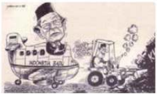

> **Deskripsi Visual:** Gambar ini adalah ilustrasi yang menunjukkan seorang guru berjalan di depan sebuah sekolah. Guru tersebut mengenakan baju hitam dengan topi hitam dan memegang sebuah papan tulis. Di sebelah kiri guru, terdapat sebuah mobil berwarna putih dengan tanda "Sekolah" di belakangnya. Mobil tersebut tampaknya sedang bergerak menuju ke arah guru. Di sebelah kanan guru, terdapat sebuah truk berwarna merah dengan tanda "Pendidikan" di belakangnya. Truk tersebut tampaknya juga sedang bergerak menuju ke arah guru. Gambar ini menunjukkan hubungan antara pendidikan dan transportasi dalam konteks pendidikan.

Sumber: Sketsa Perjalanan Bangsa Berdemokrasi (Dep. Kominfo, 2005)

Gambar 5.4 Karikatur yang menggambarkan harapan terhadap pemerintahan Gus Dur

Perjalanan pemerintahan Presiden  Abdurrahman  Wahid dalam melanjutkan cita-cita reformasi diawali dengan membentuk Kabinet Persatuan Nasional. Kabinet ini adalah kabinet koalisi dari partai-partai politik yang sebelumnya mengusung Abdurrahman Wahid menjadi presiden yakni PKB, Golkar, PPP, PAN,  PK  dan  PDI-P.  Di  awal  pemerintahannya,  Presiden  Abdurrahman Wahid  membubarkan  dua  departemen  yakni  Departemen  Penerangan  dan Departemen  Sosial dengan alasan perampingan  struktur pemerintahan. Selain  itu,  pemerintah  berpandangan  bahwa  aktivitas  yang  dilakukan  oleh kedua  departemen  tersebut  dapat  ditangani  oleh  masyarakat  sendiri.  Dari sudut  pandang  politik,  pembubaran  Departemen  Penerangan  merupakan salah  satu  upaya  untuk  melanjutkan  reformasi  di  bidang  sosial  dan  politik mengingat departemen ini merupakan salah satu alat pemerintahan Orde Baru dalam mengendalikan media massa terutama media massa yang mengkritisi kebijakan pemerintah.

Pembubaran Departemen Penerangan dan Sosial diiringi dengan pembentukan Departemen Eksplorasi Laut melalui Keputusan Presiden No. 355/M Tahun 1999 tanggal 26 Oktober 1999. Sedangkan penjelasan mengenai tugas dan fungsi termasuk susunan organisasi dan tata kerja departemen ini tertuang dalam Keputusan Presiden No. 136 tahun 1999 tanggal 10 November 1999.  Nama  departemen  ini  berubah  menjadi  Departemen  Kelautan  dan Perikanan (DKP) berdasarkan Keputusan Presiden No. 165 Tahun 2000 tanggal 23  November  2000.  Pembentukan  departemen  ini  memiliki  nilai  strategis mengingat  hingga  masa  pemerintahan  Presiden  Habibie,  sektor  kelautan

 

---
## 📄 Halaman 172

Indonesia yang menyimpan kekayaan sumber daya alam besar justru belum mendapat perhatian serius dari pemerintah sebelumnya. Selain eksplorasi dan eksploitasi  sumber  daya  kelautan,  berbagai  kegiatan  ekonomi  yang  terkait langsung  dengan  laut  meliputi  pariwisata,  pengangkutan  laut,  pabrik  dan perawatan  kapal  dan  pengembangan  budi  daya  laut  melalui  pemanfaatan bioteknologi.

### a)   Reformasi Bidang Hukum dan Pemerintahan

Pada masa pemerintahan Abdurrahman Wahid, MPR  melakukan amendemen terhadap UUD 1945 pada tanggal 18 Agustus 2000. Amendemen tersebut berkaitan dengan susunan pemerintahan Negara Kesatuan Republik Indonesia  yang  terdiri  atas  pemerintahan  pusat,  provinsi,  kabupaten  dan kota.  Amendemen  ini  sekaligus  mengubah  pelaksanaan  proses  pemilihan umum berikutnya yakni  pemilik  hak  suara  dapat  memilih  langsung  wakilwakil mereka di tiap tingkat Dewan Perwakilan tersebut. Selain amendemen tersebut, upaya reformasi di bidang hukum dan pemerintahan juga menyentuh institusi Angkatan  Bersenjata  Republik  Indonesia  (ABRI)  yang  terdiri  atas unsur TNI dan Polri. Institusi ini kerap dimanfaatkan oleh Pemerintah Orde Baru untuk melanggengkan kekuasaan terutama dalam melakukan tindakan represif terhadap gerakan demokrasi. Pemisahan TNI dan Polri juga merupakan upaya untuk mengembalikan fungsi masing-masing unsur tersebut. TNI dapat memfokuskan  diri  dalam  menjaga  kedaulatan  wilayah  Republik  Indonesia dari  ancaman  kekuatan  asing,  sementara  Polri  dapat  lebih  berkonsentrasi dalam menjaga keamanan dan ketertiban.

Masalah  lain  yang  menjadi  pekerjaan  rumah  pemerintahan  Presiden Abdurrahman Wahid adalah upaya untuk menyelesaikan berbagai kasus KKN yang dilakukan pada masa pemerintahan Orde Baru. Berbagai kasus KKN tersebut  kembali  dibuka  pada  tanggal  6  Desember  1999  dan  terfokus  pada apa  yang  telah  dilakukan  oleh  mantan  Presiden  Soeharto  dan  keluarganya. Namun  dengan  alasan  kesehatan,  proses  hukum  terhadap  Soeharto  belum dapat dilanjutkan. Kendati proses hukum belum dapat dilanjutkan, Kejaksaan Agung  menetapkan  mantan  Presiden  Soeharto  menjadi  tahanan  kota  dan dilarang  bepergian  ke  luar  negeri.  Pada  tanggal  3  Agustus  2000  Soeharto ditetapkan sebagai terdakwa terkait beberapa yayasan yang dipimpinnya.

Pencapaian  lain  pemerintahan  Abdurrahman  Wahid  adalah  pemulihan hak  minoritas  keturunan  Tionghoa  untuk  menjalankan  keyakinan  mereka yang  beragama  Konghucu  melalui  Keputusan  Presiden  No.  6  Tahun  2000 mengenai pemulihan hak-hak sipil  penganut  agama  Konghucu.  Pada  masa pemerintahannya, Presiden  Abdurrahman Wahid berupaya mengurangi campur tangan negara dalam kehidupan umat beragama namun di sisi lain

 

---
## 📄 Halaman 173

ia  justru  mengambil  sikap  yang  berseberangan  dengan  sikap  partai  politik pendukungnya terutama dalam kasus komunisme dan masalah Israel. Sikap Presiden Abdurrahman Wahid yang cenderung mendukung pluralisme dalam masyarakat  termasuk  dalam  kehidupan  beragama  dan  hak-hak  kelompok minoritas merupakan salah satu titik awal munculnya berbagai aksi penolakan terhadap  kebijakan  dan  gagasan-gagasannya.  Dalam  kasus  komunisme, Presiden  Abdurrahman  Wahid  melontarkan  gagasan  kontroversial  yaitu gagasan untuk mencabut Tap. MPRS No. XXV Tahun 1966 tentang larangan terhadap Partai Komunis Indonesia dan penyebaran Marxisme dan Leninisme. Gagasan tersebut mendapat tantangan dari kalangan Islam termasuk Majelis Ulama  Indonesia  dan  tokoh-tokoh  organisasi  massa  dan  partai  politik Islam.  Berbagai  reaksi  tersebut  membuat  Presiden  Abdurrahman  Wahid mengurungkan niatnya untuk membawa rencana dan gagasannya ke Sidang Tahunan MPR tahun 2000.

Selain  masalah  komunisme,  benturan  Presiden  Abdurrahman  Wahid dengan organisasi massa dan partai politik Islam yang notabene justru menjadi pendukungnya  saat  ia  terpilih  menjadi  presiden  adalah  gagasannya  untuk membuka hubungan dagang dengan Israel.  Gagasannya  tersebut  mendapat tantangan  keras  mengingat  Israel  adalah  negara  yang  menjajah  dan  telah banyak melakukan tindakan pelanggaran Hak Asasi Manusia (HAM) terhadap warga  Palestina  yang  mayoritas  beragama  Islam.  Membuka  hubungan dagang dengan Israel sama saja dengan melanggar apa yang tertuang dalam Pembukaan UUD 1945 yang menjelaskan bahwa Indonesia merupakan negara yang menyerukan agar penjajahan di atas dunia dihapuskan.

Kejatuhan  pemerintahan  Presiden  Abdurrahman  Wahid  tidak  terlepas dari  akumulasi  berbagai  gagasan  dan  keputusannya  yang  kontroversial dan  mendapat  tantangan  keras  dari  berbagai  organisasi  massa  dan  partai politik Islam yang semula mendukungnya kecuali NU dan PKB. Keduanya merupakan  pendukung  setia  Presiden  Abdurrahman  Wahid  hingga  akhir masa  pemerintahannya.  Selain  gagasannya  yang  kontroversial  mengenai pencabutan  Tap.  MPRS  mengenai  pelarangan  komunisme  dan  gagasan pembukaan hubungan dagang dengan Israel, hubungan Presiden Abdurrahman Wahid  dengan  DPR  dan  bahkan  dengan  beberapa  menteri  dalam  kabinet pemerintahannya  terbilang  tidak  harmonis.  Penyebab  ketidakharmonisan tersebut  berawal  dari  seringnya  presiden  memberhentikan  dan  mengangkat menteri  tanpa  memberikan  keterangan  yang  dapat  diterima  oleh  DPR. Pemberhentian  Laksamana  Sukardi  sebagai  Menteri  Negara  Penanaman Modal dan Jusuf Kalla sebagai Menteri Perindustrian dan Perdagangan bahkan menyebabkan DPR mengajukan hak interpelasinya.

 

---
## 📄 Halaman 174

Kepercayaan  masyarakat  terhadap  Presiden  Abdurrahman  Wahid  dan jajaran  pemerintahannya  semakin  menipis  seiring  dengan  adanya  dugaan bahwa  presiden  terlibat  dalam  pencairan  dan  penggunaan  dana  Yayasan Dana  Kesejahteraan  Karyawan  (Yanatera)  Bulog  sebesar  35  miliar  rupiah dan dana bantuan Sultan Brunei Darussalam sebesar 2 juta dollar AS. DPR akhirnya membentuk Panitia Khusus (Pansus) untuk melakukan penyelidikan keterlibatan Presiden Abdurrahman Wahid dalam kasus tersebut (Gonggong, Asy'arie  ed, 2005: 220).

Pada    1  Februari  2001  DPR  menyetujui  dan  menerima  hasil  kerja Pansus.  Keputusan  tersebut  diikuti  dengan  memorandum  yang  dikeluarkan DPR berdasarkan Tap MPR No. III/MPR/1978 Pasal 7 untuk mengingatkan bahwa Presiden telah melanggar haluan negara yaitu melanggar UUD 1945 Pasal 9 tentang Sumpah Jabatan dan melanggar Tap MPR No. XI/MPR/1998 tentang Penyelenggaraan Negara yang bebas KKN (Gonggong &Asy'asri ed, 2005:221).  Presiden Abdurrahman Wahid tidak menerima isi memorandum tersebut  karena  dianggap  tidak  memenuhi  landasan  konstitusional.  DPR sendiri  kembali  mengeluarkan  memorandum  kedua  dalam  rapat  paripurna DPR  yang  diselenggarakan  pada  tanggal  30  April  2000.  Rapat  tersebut memberikan  laporan  pandangan  akhir  fraksi-fraksi  di  DPR  atas  tanggapan presiden terhadap memorandum pertama.

Hubungan antara presiden  dan  DPR  semakin  memanas  seiring  dengan ancaman presiden terhadap DPR. Jika DPR melanjutkan niat mereka untuk menggelar  Sidang  Istimewa  MPR,  maka  presiden  akan  mengumumkan keadaan  darurat,  mempercepat  penyelenggaraan  pemilu  yang  bermakna pula  akan  terjadi  pergantian  anggota  DPR,  dan  memerintahkan  TNI  dan Polri  untuk  mengambil  tindakan  hukum  terhadap  sejumlah  orang  tertentu yang dianggap menjadi tokoh yang aktif menyudutkan pemerintah. Situasi ini juga meningkatkan ketegangan para pendukung presiden dan pendukung sikap DPR di tingkat akar rumput. Ribuan pendukung presiden terutama yang tinggal di kota-kota di Jawa Timur melakukan aksi menentang diadakannya Sidang  Istimewa  MPR  yang  dapat  menjatuhkan Abdurrahman  Wahid  dari kursi  kepresidenan.  Aksi  ini  berujung  pada  perusakan  dan  pembakaran berbagai fasilitas umum dan gedung termasuk kantor cabang milik sejumlah partai  politik  dan  organisasi  massa  yang  dianggap  mendukung  DPR  untuk mengadakan Sidang Istimewa MPR.

Dua hari menjelang pelaksanaan Sidang Paripurna DPR, Kejaksaan   Agung mengumumkan bahwa hasil penyelidikan kasus skandal keuangan  Yayasan Yanatera  Bulog  dan  sumbangan  Sultan  Brunei  yang  diduga  melibatkan

 

---
## 📄 Halaman 175

Presiden  Abdurrahman  Wahid  tidak  terbukti.  Hasil  akhir  pemeriksaan  ini disampaikan Jaksa Agung Marzuki Darusman kepada pimpinan DPR tanggal 28 Mei 2001.

Ketegangan  antara  pendukung  presiden  dan  pendukung  diselenggarakannya Sidang Istimewa MPR tidak menyurutkan niat DPR untuk menyelenggarakan Sidang  Istimewa  MPR.  Presiden  sendiri  menganggap  bahwa  landasan hukum memorandum kedua belum jelas. DPR akhirnya menyelenggarakan rapat  paripurna  untuk  meminta  MPR  mengadakan  Sidang  Istimewa  MPR. Pada  tanggal  21  Juli  2001  MPR  menyelenggarakan  Sidang  Istimewa  yang dipimpin oleh ketua MPR Amien Rais. Di sisi lain Presiden Abdurrahman Wahid menegaskan bahwa ia tidak akan mundur dari jabatan presiden dan sebaliknya menganggap bahwa sidang istimewa tersebut melanggar tata tertib MPR sehingga tidak sah dan illegal.

Menyadari posisinya yang terancam, presiden selanjutnya mengeluarkan Maklumat Presiden tertanggal 22 Juli 2001. Maklumat tersebut selanjutnya disebut Dekret  Presiden. Secara umum  Dekret  tersebut  berisi tentang pembekuan MPR dan DPR RI, mengembalikan kedaulatan ke tangan rakyat dan  mempersiapkan  pemilu  dalam  waktu  satu  tahun  dan  menyelamatkan gerakan reformasi dari hambatan unsur-unsur Orde Baru sekaligus membekukan Partai Golkar sambil menunggu keputusan Mahkamah Agung. Namun isi Dekret tersebut tidak dapat dijalankan terutama karena TNI dan Polri yang diperintahkan untuk mengamankan langkah-langkah penyelamatan tidak  melaksanakan  tugasnya.  Seperti  yang  dijelaskan  oleh  Panglima  TNI Widodo AS, sejak Januari 2001, baik TNI maupun Polri konsisten untuk tidak melibatkan diri dalam politik praktis.

Sikap TNI dan Polri tersebut turut memuluskan jalan bagi MPR untuk kembali  menggelar  Sidang  Istimewa  dengan  agenda  pemandangan  umum fraksi-fraksi atas pertanggungjawaban Presiden Abdurrahman Wahid yang  dilanjutkan  dengan  pemungutan  suara  untuk  menerima  atau  menolak Rancangan Ketetapan MPR No. II/MPR/2001 tentang pertanggungjawaban Presiden  Abdurrahman  Wahid  dan  Rancangan  Ketetapan  MPR  No.  III/ MPR/2001 tentang penetapan Wakil Presiden Megawati Soekarno Putri sebagai Presiden Republik Indonesia. Seluruh anggota MPR yang hadir menerima dua ketetapan tersebut. Presiden dianggap telah melanggar haluan negara karena tidak  hadir  dan  menolak  untuk  memberikan  pertanggungjawaban  dalam Sidang Istimewa MPR termasuk penerbitan Maklumat Presiden RI. Dengan demikian MPR memberhentikan Abdurrahman Wahid sebagai Presiden dan mengangkat Wakil Presiden Megawati Soekarno Putri sebagai presiden kelima Republik Indonesia pada tanggal 23 Juli 2001.

 

---
## 📄 Halaman 176

Coba  anda  jelaskan  mengapa  Presiden  Abdurrahman Wahid dianggap sebagai pendorong semangat pluralis!

### 3.   Masa Pemerintahan Presiden Megawati Soekarno Putri

Presiden Megawati Soekarno Putri mengawali tugasnya sebagai presiden kelima  Republik  Indonesia  dengan  membentuk  Kabinet  Gotong  Royong. Kabinet  ini  memiliki  lima  agenda  utama  yakni  membuktikan  sikap  tegas pemerintah dalam menghapus KKN, menyusun langkah untuk menyelamatkan rakyat  dari  krisis  yang  berkepanjangan,  meneruskan  pembangunan  politik, mempertahankan supremasi hukum dan menciptakan situasi sosial kultural yang kondusif  untuk  memajukan  kehidupan  masyarakat  sipil,  menciptakan kesejahteraan dan rasa aman masyarakat dengan meningkatkan keamanan dan hak asasi manusia.

Tugas Presiden Megawati di awal pemerintahannya terutama upaya untuk memberantas KKN terbilang berat karena selain banyaknya kasus-kasus KKN masa  Orde  Baru  yang  belum  tuntas,  kasus  KKN  pada  masa  pemerintahan Presiden Abdurrahman Wahid menambah beban pemerintahan baru tersebut. Untuk menyelesaikan berbagai kasus KKN, pemerintahan Presiden Megawati membentuk Komisi Tindak Pidana Korupsi setelah keluarnya UU RI No. 28 Tahun 1999 tentang penyelenggaraan negara yang bersih dan bebas KKN. Pembentukan  komisi  ini  menuai  kritik  karena  pada  masa  pemerintahan Presiden Abdurrahman Wahid  telah  dibentuk  Komisi  Pemeriksa  Kekayaan Pejabat Negara (KPKPN). Dari sisi kemiripan tugas, keberadaan dua komisi tersebut  tersebut  terkesan  tumpang  tindih.  Dalam  perjalanan  pemerintahan Megawati, kedua komisi tersebut tidak berjalan maksimal karena hingga akhir pemerintahan Presiden Megawati, berbagai kasus KKN yang ada belum dapat diselesaikan.

### a)   Reformasi Bidang Hukum dan Pemerintahan

Pada masa pemerintahan Presiden Megawati, MPR kembali melakukan amendemen terhadap UUD 1945 pada tanggal 10 November 2001.  Amendemen tersebut meliputi penegasan Indonesia sebagai negara hukum dan kedaulatan berada  di  tangan  rakyat.  Salah  satu  perubahan  penting  terkait  dengan pemilihan umum adalah perubahan tata cara pemilihan presiden dan wakil presiden yang dipilih langsung oleh rakyat dan mulai diterapkan pada pemilu tahun  2004.  Dengan  demikian  rakyat  akan  berpartisipasi  dalam  pemilihan

 

---
## 📄 Halaman 177

umum untuk memilih calon anggota legislatif,  presiden  dan  kepala  daerah secara terpisah. Hal lain yang dilakukan terkait dengan reformasi di bidang hukum dan pemerintahan adalah  pembatasan  wewenang  MPR,  kesejajaran kedudukan antara Presiden dan DPR yang secara langsung menguatkan posisi DPR, kedudukan Dewan Perwakilan Daerah (DPD), penetapan APBN yang diajukan oleh presiden, dan penegasan wewenang BPK.

Salah  satu  bagian  penting  amendemen  yang  dilakukan  MPR  terkait upaya pemberantasan KKN adalah penegasan kekuasaan kehakiman sebagai kekuasaan  independen  untuk  menyelenggarakan  peradilan  yang  adil  dan bersih guna menegakkan hukum dan keadilan yang dilakukan oleh Mahkamah Agung. Amendemen ini memberikan kekuatan bagi penegak hukum untuk menembus  birokrasi  yang  selama  ini  disalahgunakan  untuk  mencegah penyelidikan terhadap tersangka kejahatan terlebih jika sebuah kasus menimpa pejabat pemerintah yang tengah berkuasa. Upaya lain untuk melanjutkan cita-cita reformasi di bidang  hukum  adalah  pencanangan  pembentukan Mahkamah Konstitusi selambat-lambatnya tanggal 17 Agustus 2003.

Selain  beberapa  amendemen  terkait  masalah hukum  dan  pemerintahan,  pemerintahan  Presiden Megawati juga berupaya melanjutkan upaya reformasi  di  bidang  pers  yang  ditandai  dengan dikeluarkannya Undang-Undang Pers dan UndangUndang  Penyiaran. Dilihat dari sisi kebebasan mengeluarkan pendapat, keberadaan kedua undangundang tersebut berdampak positif namun di sisi lain berbagai  media  yang  diterbitkan  oleh  partai-partai politik dan LSM seringkali melahirkan polemik dan sulit dikontrol oleh pemerintah.

### b)    Reformasi Bidang Ekonomi

Krisis ekonomi yang melanda Indonesia sejak 1998 belum dapat dilalui oleh  dua  presiden  sebelum  Megawati  sehingga  pemerintahannya  mewarisi berbagai  persoalan  ekonomi  yang  harus  dituntaskan.  Masalah  ekonomi yang  kompleks  dan  saling  berkaitan  menuntut  perhatian  pemerintah  untuk memulihkan  situasi  ekonomi  guna  memperbaiki  kehidupan  rakyat.  Wakil Presiden  Hamzah  Haz  menjelaskan  bahwa  pemerintah  merancang  paket kebijakan pemulihan ekonomi menyeluruh yang dapat menggerakkan sektor riil dan keuangan agar dapat menjadi stimulus pemulihan ekonomi.

Menurut kamu, kebebasan pers seperti apa yang layak diterapkan di Indonesia dan bagaimana peran negara dalam memfasilitasi kebebasan pers agar kebebasan tersebut tetap memberikan nilai positif bagi kehidupan berbangsa dan bernegara?

 

---
## 📄 Halaman 178

Selain  upaya  pemerintah  untuk  memperbaiki  sektor  ekonomi,  MPR berhasil mengeluarkan keputusan yang menjadi pedoman bagi pelaksanaan pembangunan  ekonomi  di  masa  Reformasi  yaitu  Tap  MPR  RI  No.  IV/ MPR/1999  tentang  Garis-Garis  Besar  Haluan  Negara  1999-2004.  Sesuai dengan amanat GBHN 1999-2004, arah kebijakan penyelenggaraan negara harus  dituangkan  dalam  Program  Pembangunan  Nasional  (Propenas)  lima tahun yang ditetapkan oleh Presiden bersama DPR.

Minimnya kontroversi selama masa pemerintahan Megawati berdampak positif  pada  sektor  ekonomi.  Hal  ini  membuat  pemerintahan  Megawati mencatat  beberapa  pencapaian  di  bidang  ekonomi  dan  dianggap  berhasil membangun  kembali  perekonomian  bangsa  yang  sempat  terpuruk  sejak beralihnya  pemerintahan  dari  pemerintahan  Orde  Baru  ke  pemerintahan pada era Reformasi. Salah satu indikator keberhasilan pemerintahan Presiden Megawati	 adalah	 rendahnya	 tingkat	 inlasi	 dan	 stabilnya	 cadangan	 devisa negara.  Nilai  tukar  rupiah  relatif  membaik  dan  berdampak  pada  stabilnya harga-harga  barang.  Kondisi  ini  juga  meningkatkan  kepercayaan  investor terhadap perekonomian Indonesia yang dianggap menunjukkan perkembangan positif.	Kenaikan	inlasi	pada	bulan	Januari	2002	akibat	kenaikan	harga	dan suku bunga serta berbagai bencana lainnya juga berhasil ditekan pada bulan Maret dan April 2002.

Namun berbagai pencapaian di bidang ekonomi pemerintahan Presiden Megawati mulai menunjukkan penurunan pada paruh kedua pemerintahannya. Pada pertengahan tahun 2002-2003 nilai tukar rupiah yang sempat menguat hingga  Rp8.500,00  per  dolar  Amerika  Serikat  kemudian  melemah  seiring menurunnya kinerja  pemerintah.  Di  sisi  lain,  berbagai  pencapaian  tersebut juga  tidak  berbanding  lurus  dengan  jumlah  penduduk  yang  ternyata  masih banyak berada di bawah garis kemiskinan.

Popularitas pemerintah juga menurun akibat berbagai kebijakan yang tidak populis	 dan	 meningkatkan	 inlasi.	 Meningkatnya	 inlasi	 berdampak	 buruk terhadap	 tingkat	 inlasi	 riil.	 Di	 antara	 kebijakan	 tersebut	 adalah	 kebijakan pemerintah yang menaikkan harga bahan bakar minyak (BBM) dan tarif dasar listrik (TDL) serta pajak pendapatan negara. (Prawiro, 2004: 50). Selain itu, persoalan utang luar negeri juga menjadi persoalan pada masa pemerintahan Presiden Megawati karena pembayaran hutang luar negeri mengambil porsi APBN yang paling besar yakni mencapai 52% dari total penerimaan pajak yang dibayarkan oleh rakyat sebesar 219,4 triliun rupiah. Hal ini mengakibatkan pemerintah	mengalami	deisit	anggaran	dan	kebutuhan	pinjaman	baru.

 

---
## 📄 Halaman 179

### c)   Masalah Disintegrasi dan Kedaulatan Wilayah

Pemerataan  ekonomi  di  seluruh  wilayah  Indonesia  merupakan  salah satu  pekerjaan  rumah  pemerintahan  Presiden  Megawati.  Tidak  meratanya pembangunan dan tidak adilnya pembagian hasil sumber daya alam antara pemerintah pusat dan daerah menjadi masalah yang berujung pada keinginan untuk  melepaskan  diri  dari  Negara  Kesatuan  Republik  Indonesia  terutama beberapa provinsi yang kaya akan sumber daya alam tetapi hanya mendapatkan sedikit dari hasil sumber daya alam mereka. Dua provinsi yang rentan untuk melepaskan  diri  adalah  Provinsi  Nanggroe  Aceh  Darussalam  (NAD)  dan Papua. Kebijakan represif yang diterapkan pada masa pemerintahan Orde Baru di  kedua provinsi tersebut menjadi alat propaganda efektif bagi kelompokkelompok yang ingin memisahkan diri.

Untuk  meredam  keinginan  melepaskan  diri  kedua  provinsi  tersebut, Presiden Megawati melakukan upaya-upaya untuk menyelesaikan permasalahan  disintegrasi  dan  memperbaiki  persentase  pembagian  hasil sumber  daya  alam  antara  pemerintah  pusat  dan  daerah  di  kedua  propinsi tersebut. Berdasarkan UU No. 1b/2001 dan UU No. 21/2001 baik propinsi NAD dan Papua akan menerima 70% dari hasil pertambangan minyak bumi dan gas alam.  Upaya Presiden Megawati untuk memperbaiki hubungan pemerintah pusat dan rakyat propinsi NAD juga dilakukan dengan melakukan kunjungan kerja  ke  Banda  Aceh  pada  tanggal  8  September  2001.  Dalam  kunjungan kerja tersebut, presiden melakukan dialog dengan sejumlah tokoh Aceh dan berpidato di halaman Masjid Raya Baiturrahman. Dalam kesempatan tersebut, presiden mensosialisasikan UU No. 18 Tahun 2001 tentang otonomi khusus Provinsi NAD. Presiden Megawati juga menandatangani prasasti perubahan status Universitas Malikussaleh Lhokseumawe menjadi universitas negeri.

Upaya Presiden Megawati untuk menjaga keutuhan wilayah NKRI juga diuji  saat  pemerintah  berusaha  untuk  menyelesaikan  sengketa  status  Pulau Sipadan  dan  Ligitan  dengan  pemerintah  Malaysia.  Sengketa  status  kedua pulau tersebut tidak dapat diselesaikan melalui perundingan bilateral antara pemerintah Indonesia dan Malaysia. Kedua negara sepakat untuk membawa kasus  ini  ke  Mahkamah  Internasional  di  Den  Haag.  Pemerintah  Indonesia sejak  tahun  1997  telah  memperjuangkan  pengakuan  internasional  bahwa kedua  pulau  tersebut  merupakan  bagian  dari  wilayah  Republik  Indonesia. Namun Mahkamah Internasional pada akhirnya memutuskan bahwa kedua pulau tersebut merupakan bagian dari Malaysia. Dari 17 hakim yang terlibat dalam proses keputusan Mahkamah Internasional, satu-satunya hakim yang memberikan keputusan bahwa kedua pulau tersebut merupakan bagian dari wilayah Indonesia adalah Hakim Ad Hoc Thomas Franck yang ditunjuk oleh

 

---
## 📄 Halaman 180

Indonesia.  Terlepasnya  Pulau  Sipadan  yang  memiliki  luas  10,4  hektar  dan Pulau Ligitan yang memiliki luas 7,9 hektar merupakan pukulan bagi diplomasi luar  negeri  Indonesia  setelah  terlepasnya  Timor  Timur.  Kasus  ini  juga menunjukkan  lemahnya  diplomasi  luar  negeri  Indonesia  saat  berhadapan dengan negara lain terutama dalam sengketa perbatasan dengan negara-negara tetangga.

---
**🖼️ Gambar/Diagram**

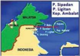

> **Deskripsi Visual:** Gambar ini adalah ilustrasi yang menunjukkan lokasi beberapa pulau di Lautan Pasifik. Ilustrasi ini mencakup pulau-pulau seperti Sipadan, Ligitan, dan Ambalat di Malaysia, serta Pulau Kalimantan di Indonesia. Peta ini menunjukkan posisi geografis pulau-pulau tersebut dengan jelas, memperlihatkan bagaimana mereka berada di sekitar Malaysia dan Indonesia.

Elemen-elemen utama dalam gambar ini meliputi:
1. Pulau-pulau yang ditunjukkan, seperti Sipadan, Ligitan, Ambalat, dan Kalimantan.
2. Garis pantai yang menghubungkan pulau-pulau tersebut.
3. Nama-nama pulau yang ditulis di atas masing-masing pulau.
4. Nama negara-negara yang ditunjukkan, yaitu Malaysia dan Indonesia.

Teks, angka, atau label penting yang terlihat dalam gambar ini meliputi:
- Nama-nama pulau yang ditulis di atas masing-masing pulau.
- Nama negara-negara yang ditunjukkan.

Informasi kunci yang dapat diambil pembaca dari gambar ini adalah bahwa pulau-pulau tersebut terletak di Lautan Pasifik antara Malaysia dan Indonesia, dan bahwa mereka merupakan bagian dari wilayah geografis yang luas tersebut. Gambar ini juga memberikan gambaran umum tentang lokasi geografis pulau-pulau tersebut dan bagaimana mereka terhubung satu sama lain melalui garis pantai.

Gambar 5.5 Peta Pulau Sipadan dan Ligitan

### d)   Desentralisasi Politik dan Keuangan

Terkait  hubungan pemerintah pusat dan daerah, pemerintahan Presiden Megawati berupaya untuk melanjutkan kebijakan otonomi daerah yang telah dirintis sejak tahun 1999 seiring dengan dikeluarkannya UU No. 2 Tahun 1999 tentang  perimbangan  keuangan  pusat-daerah.  Upaya  ini  merupakan  proses reformasi tingkat lokal terutama pada bidang politik, pengelolaan keuangan daerah dan pemanfaatan sumber-sumber daya alam daerah untuk kepentingan masyarakat setempat. Upaya desentralisasi politik dan keuangan ini sejalan dengan  struktur  pemerintahan  di  masa  mendatang  di  mana  masing-masing daerah akan diberi wewenang lebih besar untuk mengelola hasil-hasil sumber daya alam dan potensi ekonomi yang mereka miliki.

Otonomi daerah merupakan isu penting sejak bergulirnya reformasi pada tahun 1998. Setelah berakhirnya pemerintahan Orde Baru, rakyat di beberapa daerah mulai menyuarakan ketidakpuasan mereka terhadap sistem sentralisasi kekuasaan  dan  wewenang  pemerintah  pusat  yang  sangat  kuat.  Kepala daerah yang bertugas di beberapa daerah mulai dari posisi gubernur hingga bupati seringkali bukan merupakan pilihan masyarakat setempat. Pada masa pemerintahan  Orde  Baru,  para  pejabat  yang  bertugas  di  daerah  umumnya adalah pejabat yang ditunjuk oleh pemerintah pusat dan memerintah sesuai keinginan pemerintah pusat. Masalah di daerah semakin kompleks saat pejabat bersangkutan  kurang  dapat  mengakomodasi  aspirasi  masyarakat  setempat.

 

---
## 📄 Halaman 181

Faktor inilah yang membuat isu mengenai otonomi daerah menjadi penting sebagai bagian dari reformasi politik dan sosial terutama di beberapa wilayah yang ingin melepaskan diri dari NKRI.

Proses pelaksanaan otonomi daerah berikut pengadaan perangkat hukumnya berkaitan  erat  dengan  sistem  pemilihan  umum  berikutnya  yang akan diselenggarakan pada tahun 2004. Sejalan dengan rencana pelaksanaan otonomi  daerah,  pemerintah  secara  aktif  mengeluarkan  beberapa  undangundang yang mendukung pelaksanaan otonomi daerah sekaligus memberikan pedoman  dalam  penelitian,  pengembangan,  perencanaan,  dan  pengawasan saat  undang-undang  tersebut  diberlakukan.  Terkait  dengan  itu,  pemerintah mengeluarkan UU No. 12 Tahun 2003 mengenai pemilihan umum anggota DPR,  DPD,  dan  DPRD.  Penerbitan  undang-undang  ini  diikuti  dengan dikeluarkannya UU No. 22 Tahun 2003 tentang susunan kedudukan MPR, DPR, DPD, dan DPRD serta UU No. 23 Tahun 2003 mengenai pemilihan presiden dan wakil presiden. Untuk melengkapi berbagai perangkat hukum  mengenai  otonomi  daerah  yang  sudah  ada,  pemerintahan  Presiden Megawati  di  tahun  terakhir  masa  pemerintahnnya  mengeluarkan  UU  No. 32  Tahun  2004  mengenai  pemerintahan  daerah  yang  memuat  antara  lain kebijakan desentralisasi dan otonomi daerah, konsep otonomi, dan asas-asas penyelenggaraan pemerintahan.

Sistem  pemilihan  langsung  terhadap  wakil-wakil  rakyat  di  daerah  dan kepala daerah menjadikan pelaksanaan otonomi daerah semakin memberikan kesempatan bagi rakyat di daerah untuk berperan lebih besar dalam memajukan wilayah  mereka.  Terpilihnya  wakil  rakyat  dan  kepala  daerah  yang  dipilih langsung oleh masyarakat setempat diharapkan lebih dapat mengakomodasi keinginan  masyarakat  karena  memahami  seluk  beluk  masalah  dan  potensi masyarakat dan sumber daya alam yang dimiliki oleh wilayah bersangkutan disamping lebih memahami karakter dan adat istiadat yang berlaku di wilayah tersebut.

### e)   Upaya Pemberantasan KKN

Kendati  berhasil  melakukan  berbagai  pencapaian  di  bidang  ekonomi dan politik terutama dalam menghasilkan produk undang-undang mengenai pelaksanaan otonomi daerah, pemerintahan Presiden Megawati belum berhasil melakukan penegakkan hukum ( law enforcement ). Berbagai kasus KKN yang diharapkan  dapat  diselesaikan  pada  masa  pemerintahannya  menunjukkan masih  belum  maksimalnya  upaya  Presiden  Megawati  dalam  penegakkan hukum  terutama  kasus-kasus  KKN  besar  yang  melibatkan  pejabat  negara. Belum  maksimalnya  penanganan  kasus-kasus  tersebut  juga  disebabkan karena  kurangnya  jumlah  dan  kualitas  aparat  penegak  hukum  sehingga

 

---
## 📄 Halaman 182

proses hukum terhadap beberapa kasus berjalan sangat lambat dan berimbas pada  belum  adanya  pembuktian  dari  kasus-kasus  yang  ditangani.  Namun keseriusan pemerintah untuk memerangi tindak pidana korupsi tercermin dari dikeluarkannya UU No. 20 Tahun 2001 tentang perubahan atas UU No. 31 Tahun 1999 tentang Tindak Pidana Korupsi (Tipikor). Produk hukum tersebut merupakan produk hukum yang dikeluarkan khusus untuk memerangi korupsi.

Pengeluaran produk hukum tentang Tipikor diikuti dengan dikeluarkannya berbagai produk hukum lain seperti UU No. 2 Tahun 2002 tentang Kepolisian Negara Republik Indonesia, UU No. 15 Tahun 2002 tentang Tindak Pidana Pencucian Uang, UU No. 22 Tahun 2002 tentang Grasi, UU No. 30 Tahun 2002 tentang Pembentukan Komisi Pemberantasan Korupsi (KPK), PP No, 41 Tahun 2002 tentang Kenaikan Jabatan dan Pangkat Hakim, Inpres No. 2 Tahun 2002 tentang  Penambang Pasir  Laut,  dan  Inpres  No.  8 Tahun  2002 tentang  Pemberian  Jaminan  Kepastian  Hukum  Kepada  Debitur  yang Telah Menyelesaikan Kewajibannya atau Tindakan Hukum Kepada Debitur yang Tidak  Menyelesaikan  Kewajibannya  Berdasarkan  Penyelesaian  Kewajiban Pemegang Saham.

### f)   Pelaksanaan Pemilu 2004

Pemilu  tahun  2004  merupakan  pemilu  pertama  dimana  untuk  pertama kalinya  masyarakat  pemilik  hak  suara  dapat  memilih  wakil  rakyat  mereka di tingkat pusat dan daerah secara langsung. Pemilu untuk memilih anggota legislatif tersebut selanjutnya diikuti dengan pemihan umum untuk memilih presiden dan wakil presiden yang juga dipilih langsung oleh rakyat. Pemilihan anggota  legislatif  dan  pemilu  untuk  memilih  presiden  dan  wakil  presiden memiliki  keterkaitan  erat  karena  setelah  pemilu  legislatif  selesai,  maka partai yang memiliki suara lebih besar atau sama dengan tiga persen dapat mencalonkan pasangan calon presiden dan wakil presidennya untuk maju ke pemilu presiden. Jika dalam pemilu presiden dan wakil presiden terdapat satu pasangan yang memperoleh suara lebih dari 50%, maka pasangan tersebut dinyatakan sebagai pasangan pemenang pemilu presiden. Jika pada pemilu presiden  tidak  terdapat  pasangan  yang  mendapatkan  suara  lebih  dari  50%, maka pasangan yang mendapatkan suara tertinggi pertama dan kedua berhak mengikuti pemilu presiden putaran kedua.

Pemilu legislatif 2004 yang diselenggarakan pada tanggal 5 April 2004 diikuti oleh 24 partai politik. Lima partai politik yang berhasil mendapatkan suara terbanyak adalah Partai Golkar (24.480.757 atau 21,58% suara), PDI-P (21.026.629 atau 18,53% suara), PKB (11.989.564 atau 10,57% suara), PPP

 

---
## 📄 Halaman 183

(9.248.764 atau 8,15% suara), Partai Demokrat (8.455.225 atau 7,45% suara), Partai Keadilan Sejahtera (8.325,020 atau 7,34% suara) dan PAN (7.303.324 atau 6,44% suara). Berdasarkan perolehan suara tersebut, KPU meloloskan lima pasangan calon presiden dan wakil presiden yang dianggap memenuhi persyaratan yang telah ditetapkan berdasarkan Keputusan KPU No. 36 Tahun 2004 untuk mengikuti pemilihan presiden dan wakil presiden yakni:

- Nomor urut 1: H. Wiranto, S.H. dan Ir. H. Salahuddin Wahid (calon dari partai Golkar).
- Nomor urut 2: Hj. Megawati Soekarnoputri dan K.H. Ahmad Hasyim Muzadi (calon dari PDI-P).
- Nomor urut 3: Prof. Dr. H.M. Amien Rais dan Dr. Ir. H. Siswono Yudohusodo (calon dari PAN).
- Nomor urut 4: H. Susilo Bambang Yudhoyono dan Drs. Muhammad Jusuf Kalla (calon dari Partai Demokrat).
- Nomor Urut 5: Dr. H. Hamzah Haz dan H. Agum Gumelar, M. Sc. (calon dari PPP)
Pemilu presiden yang diselenggarakan pada tanggal 5 Juli 2004 belum menghasilkan satu pasangan calon presiden dan calon wakil presiden yang mendapatkan suara lebih dari 50% sehingga pemilu presiden diselenggarakan dalam dua putaran. Dalam pemilu presiden putaran kedua yang diselenggarakan pada tanggal 20 September 2004, pasangan H. Susilo Bambang Yudhoyono dan  Drs.  Muhammad  Jusuf  Kalla  mengungguli  pasangan  Hj.  Megawati Soekarnoputri dan K.H. Ahmad Hasyim Muzadi. Pada pemilu putaran kedua tersebut, pasangan Susilo Bambang Yudhoyono dan Jusuf Kalla memperoleh 62.266.350 suara  atau  60,62%  sementara  pasangan  Hj.  Megawati  Soekarnoputri dan K.H. Ahmad Hasyim Muzadi memperoleh 44.990.704 suara atau 39,38% (Gonggong & Asy'arie, 2005: 239).

### TUGAS

Apa yang membedakan sistem pemilihan pada Pemilu 2004 dengan pemilu yang pernah diselenggarakan sebelumnya. Diskusikan kelebihan dan kekurangan sistem tersebut.

 

---
## 📄 Halaman 184

### 4.   Masa Pemerintahan Presiden Susilo Bambang Yudhoyono

Susilo  Bambang  Yudhoyono  adalah  presiden  pertama  RI  yang  dipilih secara langsung oleh rakyat. Susilo Bambang Yudhoyono yang sering disapa SBY dan Jusuf Kalla dilantik oleh MPR sebagai presiden dan wakil presiden RI ke-6 pada tanggal 20 Oktober 2004.Terpilihnya pasangan Susilo Bambang Yudhoyono  dan  Jusuf  Kalla  menjadi  presiden  dan  wakil  presiden  diikuti dengan  berbagai  aksi  protes  mahasiswa,  di  antaranya  aksi  yang  dilakukan oleh  mahasiswa  Universitas  Udayana,  Denpasar,  Bali,  yang  meminta  agar presiden terpilih segera merealisasikan janji-janji mereka selama kampanye presiden. Tidak lama setelah terpilih, Presiden Susilo Bambang Yudhoyono sendiri  segera  membentuk  susunan  kabinet  pemerintahannya  yang  diberi nama Kabinet Indonesia Bersatu.

Sejak  awal  pemerintahannya  Presiden  Susilo  Bambang  Yudhoyono memprioritaskan untuk menyelesaikan permasalahan kemiskinan dan pengangguran serta pemberantasan KKN yang ia canangkan dalam program 100 hari  pertama  pemerintahannya.  Program  pengentasan  kemiskinan  berkaitan langsung  dengan  upaya  pemerataan  dan  pengurangan  kesenjangan  serta peningkatan pembangunan terutama di daerah-daerah yang masih tertinggal. Salah  satu  program  pengentasan  kemiskinan  yang  dilakukan  pemerintahan Presiden Susilo Bambang Yudhoyono adalah bantuan langsung tunai (BLT). Pada  tahun  2006,  BLT  dianggarkan  sebesar  Rp18,8  triliun  untuk  19,1  juta keluarga. Tahun 2007 dilakukan BLT bersyarat bagi 500 ribu rumah tangga miskin  di  7  propinsi,  51  kabupaten,  dan  348  kecamatan.  Bantuan  tersebut meliputi bantuan tetap, pendidikan, kesehatan dengan rata-rata bantuan per rumah tangga sebesar Rp 1.390.000 (Suasta, 2013: 31-33).

Selain  memfokuskan  pada  manusia  dan  rumah  tangganya,  program pengentasan	kemiskinan	juga	berupaya	untuk	memperbaiki	isik	lingkungan dan prasarananya seperti gedung sekolah, fasilitas kesehatan, jalan, air bersih, dan lain-lain. Program 100 hari pertama Presiden Susilo Bambang Yudhoyono juga memberikan prioritas pada peninjauan kembali RAPBN 2005, menetapkan langkah	penegakkan	hukum,	langkah	awal	penyelesaian	konlik	di	Aceh	dan Papua, stimulasi ekonomi nasional, dan meletakkan fondasi yang efektif untuk pendidikan nasional (Gonggong & Asy'arie, 2005: 243)

### a)   Upaya untuk meningkatkan kesejahteraan masyarakat

Sejak krisis yang dialami bangsa pada tahun 1998, kondisi perekonomian masyarakat  Indonesia  belum  pulih.  Upaya  pengentasan  kemiskinan  yang juga pernah dicanangkan oleh presiden sebelumnya masih belum terlaksana

 

---
## 📄 Halaman 185

sepenuhnya. Kondisi ini diperparah dengan terjadinya sejumlah bencana alam terutama  tragedi  tsunami  di  Aceh  yang  merenggut  banyak  korban  dengan kerugian material yang sangat besar. Presiden SBY bersama Kabinet Indonesia Bersatu segera mengambil langkah-langkah penanggulangan pasca bencana. Salah  satunya  adalah  dengan  menetapkan  Keputusan  Presiden  Nomor  30 Tahun 2005 mengenai Rencana Induk Rehabilitasi dan Rekonstruksi Wilayah dan  Kehidupan  Masyarakat  Aceh  dan  Kepulauan  Nias  Provinsi  Sumatra Utara. Selain itu dibentuk pula Badan Rehabilitasi dan Rekonstruksi Wilayah dan Kehidupan Masyarakat Aceh dan Nias (Yudhoyono, 2013).

Pada  masa  pemerintahan  Presiden  Susilo  Bambang Yudhoyono,  upaya untuk pengentasan kemiskinan direalisasikan melalui peningkatan anggaran di  sektor  pertanian  termasuk  upaya  untuk  swasembada  pangan.  Anggaran untuk sektor ini yang semula hanya sebesar 3,6 triliun rupiah ditingkatkan menjadi 10,1 triliun rupiah. Untuk mendukung perbaikan di sektor pertanian, pemerintah menyediakan pupuk murah bagi petani.

Selain berupaya memperkuat ketahanan pangan, pemerintahan Presiden Susilo Bambang Yudhoyono juga berupaya memperbaiki sektor pendidikan dengan  cara  meningkatkan  anggaran  pendidikan  yang  semula  berjumlah 21,49 triliun  pada  tahun  2004  menjadi  50  triliun  pada  tahun  2007.  Seiring dengan itu, program bantuan operasional sekolah atau BOS juga ditingkatkan. Perbaikan di  sektor  pendidikan  ini  berhasil  menurunkan  persentase  tingkat putus sekolah dari 4,25% pada tahun 2005 menjadi 1,5% pada tahun 2006. Selain upaya untuk memperbaiki kelangsungan pendidikan para peserta didik, pemerintah juga meningkatkan tunjangan kesejahteraan tenaga pendidik.

Di bidang kesehatan, pemerintah memberikan bantuan kesehatan gratis untuk  berobat  ke  puskesmas  dan  rumah  sakit  melalui  pemberian Asuransi Kesehatan  Masyarakat  Miskin  dan  beberapa  kali  menurunkan  harga  obat generik (Suasta, 2013: 33-36).

Pemerintahan  Presiden  Susilo  Bambang  Yudhoyono  juga  memberikan perhatian besar pada permasalahan kesejahteraan rakyat lainnya seperti sektor perumahan,  pengembangan  usaha  kecil,  peningkatan  kesejahteraan  PNS termasuk prajurit TNI dan Polri dan juga kesejahteraan buruh. Pelayanan dan fasilitas publik juga ditingkatkan. Di bidang hukum, upaya pemerintah untuk melanjutkan  program  pemberantasan  korupsi  dan  penegakkan  supremasi hukum juga mendapat perhatian pemerintah.

 

---
## 📄 Halaman 186

### b)   Reformasi di Bidang Politik dan Upaya Menjaga Kesolidan Pemerintahan

Pemerintahan  yang  solid  berpengaruh  terhadap  kelancaran  jalannya program-program  pemerintah  sehingga  upaya  untuk  menjaga  kesolidan pemerintahan  menjadi  salah satu faktor penting keberhasilan  program pemerintah.  Seperti  halnya  pemerintahan  pada  era  reformasi  sebelumnya, pembentukan kabinet pemerintah merupakan hasil dari koalisi partai-partai yang mendukung salah satu pasangan calon presiden saat pemilu presiden. Dengan  demikian  keberadaan  koalisi  dan  hubungan  partai-partai  yang mendukung pemerintahan Presiden Susilo Bambang Yudhoyono harus dijaga. Salah satu upaya untuk menjaga kesolidan koalisi pada masa pemerintahan Presiden Susilo Bambang  Yudhoyono  adalah  pembentukan  Sekretariat Gabungan  (Setgab)  antara  Partai  Demokrat  dengan  partai-partai  politik lainnya  yang  mendukung  SBY.  Pembentukan  Setgab  juga  bertujuan  untuk menyatukan  visi  dan  misi  pembangunan  agar  arah  koalisi  berjalan  seiring dengan kesepakatan bersama. Setgab merupakan format koalisi yang dianggap SBY sesuai dengan etika demokrasi dan dibentuk sebagai sarana komunikasi politik pada masa pemerintahan SBY (Suasta, 2013: 25).

Sejalan  dengan  upaya  menjaga  kesolidan  pemerintahan,  pemerintahan Presiden  Susilo  Bambang  Yudhoyono  juga  melanjutkan  reformasi  politik seperti yang telah dirintis oleh pemerintahan sebelumnya pada era reformasi. Upaya untuk penerapan otonomi daerah dengan cara mengurangi wewenang pemerintah pusat dan memperluas wewenang pemerintah daerah dilakukan secara proporsional dan seimbang (Suasta, 2013: 259). Selain itu, pemerintah juga mengupayakan reformasi birokrasi yang mengedepankan aspek transparansi, partisipasi dan akuntabilitas demi menciptakan good governance . Reformasi  birokrasi  tersebut  diharapkan  dapat  meningkatkan  kepercayaan rakyat terhadap pemerintah karena proses pengambilan keputusan dilakukan secara transparan dan dapat diakses oleh masyarakat terutama  dalam pengambilan  keputusan  yang  terkait  langsung  dengan  hajat  hidup  orang banyak seperti masalah kenaikan BBM dan pengadilan terhadap para koruptor.

Untuk membangun komunikasi yang efektif dengan masyarakat, pemerintah  memaksimalkan  penggunaan  media  sosial  seperti  SMS online dan twitter . Melalui media tersebut, partisipasi masyarakat dalam perjalanan pemerintahan  diharapkan  meningkat.  Di  sisi  lain  pemerintah  dapat  dengan cepat  mengetahui  pendapat  masyarakat  terkait  masalah-masalah  tertentu termasuk  opini  masyarakat  terhadap  berbagai  kebijakan  pemerintah  dalam kasus-kasus yang dianggap krusial.

 

---
## 📄 Halaman 187

### c) Upaya	untuk	Menyelesaikan	Konlik	Dalam	Negeri

Selain  berupaya  untuk  menjaga  kedaulatan  wilayah  dari  ancaman  luar,  upaya internal yang dilakukan pemerintah untuk menjaga kedaulatan wilayah adalah mencegah	terjadinya	disintegrasi	di	wilayah	konlik.	Konlik	berkepanjangan di wilayah Aceh dan Papua yang belum juga berhasil diselesaikan pada masa pemerintahan presiden sebelumnya, mendapat perhatian serius dari Presiden Susilo Bambang Yudhoyono. Kendati telah dilakukan pendekatan baru melalui dialog  pada  masa  pemerintahan  Presiden  B.J.  Habibie  termasuk  dengan mencabut status DOM yang diterapkan oleh pemerintah Orde Baru, namun konlik	 di	 Aceh	 tidak	 kunjung	 selesai.	 Pada	 masa	 pemerintahan	 Presiden Susilo Bambang Yudhoyono, pemerintah berupaya untuk lebih mengefektifkan forum-forum dialog mulai dari tingkat lokal Aceh hingga tingkat internasional. Di  tingkat  internasional,  upaya  tersebut  menghasilkan Geneva  Agreement (Kesepakatan  Penghentian  Permusuhan/ Cessation  of  Hostilities  Agreement (CoHA). Tujuan dari kesepakatan tersebut adalah menghentikan segala bentuk pertempuran sekaligus menjadi kerangka dasar dalam upaya negosiasi damai di antara semua pihak yang berseteru di Aceh. Namun pada kenyataannya, CoHA dan  pembentukkan  komite  keamanan  bersama  belum  mampu  menciptakan perdamaian yang sesungguhnya. Belum dapat dilaksanakannya kesepakatan tersebut  dikarenakan  minimnya  dukungan  di  tingkat  domestik,  baik  dari kalangan DPR maupun militer selain tidak adanya pula dukungan dari pihak GAM/Gerakan Aceh Merdeka (Yudhoyono, 2013).

Selain berupaya menyelesaikan konlik	 Aceh melalui perundingan, Presiden Susilo Bambang Yudhoyono juga melakukan pendekatan langsung dengan  masyarakat Aceh  melalui  kunjungan  yang  dilakukan  ke Aceh  pada tanggal  26  November  2004.  Dalam  kunjungan  tersebut,  Presiden  Susilo Bambang  Yudhoyono  menekankan  pentingnya  penerapan  otonomi  khusus di  Aceh  sebagai  sebuah  otonomi  yang  luas.  Presiden  juga  berupaya  untuk membicarakan amnesti dengan DPR bagi anggota GAM seraya menekankan bahwa solusi militer tidak akan menyelesaikan masalah  Aceh secara permanen.

Selain	 konlik	 di	 Aceh,	 konlik	 lain	 yang	 berpotensi	 menjadi	 konlik berskala	 luas	 adalah	 konlik	 bernuansa	 agama	 di	 Poso.	 Konlik	 yang dimulai pada tahun 1998 tersebut terus berlanjut hingga masa pemerintahan Presiden  Susilo  Bambang Yudhoyono. Salah satu kebijakan presiden untuk menyelesaikan	konlik	Poso	adalah	dengan	mengeluarkan	Instruksi	Presiden No.  14  Tahun  2005  tentang  langkah-langkah  komprehensif  penanganan masalah Poso. Melalui Inpres tersebut, Presiden menginstruksikan untuk:

 

---
## 📄 Halaman 188

- Melaksanakan percepatan penanganan masalah Poso melalui langkahlangkah komprehensif, terpadu dan terkoordinasi.
- Menindak secara tegas setiap kasus kriminal, korupsi, dan teror serta mengungkap jaringannya.
- Upaya penanganan masalah Poso dilakukan dengan tetap memperhatikan Deklarasi Malino 20 Desember 2001.
Selain	konlik	Aceh	dan	Poso,	konlik	lain	yang	mendapat	perhatian	serius pemerintah	adalah	konlik	di	Papua.	Seperti	halnya	konlik	di	Aceh,	upaya untuk	menyelesaikan	konlik	di	Papua	juga	mengedepankan	aspek	dialog	dan upaya  untuk  meningkatkan  kesejahteraan  masyarakat.  Kurangnya  keadilan bagi  masyarakat  Papua  menimbulkan  adanya  perlawanan  dan  keinginan sebagian masyarakat untuk memisahkan diri dari NKRI. Perhatian pemerintah sudah  sewajarnya  lebih  diberikan  untuk  meningkatkan  sisi  ekonomi  dan pemberdayaan sumber daya manusia masyarakat yang tinggal di wilayah ini melalui  pemberian  pelatihan  untuk  meningkatkan  keterampilan  mereka  di bidang pertanian dan pemahaman birokrasi, terlebih provinsi Papua memiliki sumber daya alam besar terutama di sektor pertambangan. Terkait dengan itu, Presiden Susilo Bambang Yudhoyono juga mengeluarkan kebijakan otonomi khusus bagi Papua. Otonomi khusus tersebut diharapkan dapat memberikan porsi keberpihakan, perlindungan dan pemberdayaan kepada orang asli Papua. Kebijakan tersebut didukung oleh pemerintah melalui aliran dana yang cukup besar agar rakyat Papua dapat menikmati rasa aman dan tenteram di tengah derap pembangunan (Suasta, 2013: 294).

### d)   Pelaksanaan Pemilu 2009

Berbagai pencapaian pada masa pemerintahan Presiden Susilo Bambang Yudhoyono meningkatkan popularitas dan kepercayaan masyarakat kepadanya.  Hal  ini  juga  tidak  terlepas  dari  gaya  kepemimpinan  yang berkorelasi dengan penerapan berbagai kebijakan pemerintah yang efektif di lapangan. Transparansi dan partisipasi masyarakat juga menjadi faktor penting yang  berperan  sebagai  modal  sosial  dalam  pembangunan  termasuk  adanya sinergi antara pemerintah dengan dunia usaha dan perguruan tinggi. Selain itu, situasi  dalam  negeri  yang  semakin kondusif termasuk meredanya beberapa konlik	dalam	negeri	meningkatkan	investor	asing	untuk	menanamkan	modal mereka di Indonesia sekaligus membuka lapangan pekerjaan bagi masyarakat Indonesia.  Kondisi  ini  ikut  mengurangi  angka  pengangguran  yang  di  awal pemerintahan  Presiden  Susilo  Bambang  Yudhoyono  masih  sangat  tinggi. Keberhasilan beberapa program pembangunan juga tidak terlepas dari adanya stabilitas politik, keamanan, dan ketertiban serta harmoni sosial.

 

---
## 📄 Halaman 189

Gambar 5.6 Lambang Partai Peserta Pemilu Tahun 2009

Berbagai  pencapaian  pada  masa  Presiden  Susilo  Bambang Yudhoyono yang  dirasakan  langsung  oleh  masyarakat  menjadi  modal  bagi  Presiden Susilo Bambang Yudhoyono untuk kembali maju sebagai calon presiden pada Pemilu Presiden tahun 2009. Berpasangan dengan seorang ahli ekonomi yakni Boediono,  Presiden  Susilo  Bambang  Yudhoyono  berhasil  mendapatkan  kembali mandat  dari  rakyat  untuk  memimpin  Indonesia  untuk  masa  pemerintahan berikutnya. Pada pemilu presiden yang diselenggarakan pada tanggal 8 Juli 2009 pasangan Susilo Bambang Yudhoyono berhasil memenangkan pemilu hanya melalui satu putaran.

Gambar 5.7 Pengambilan Sumpah Presiden SBY

### e)   Euforia Berdemokrasi: Demokrasi Masa Reformasi

Reformasi 1998 yang menumbangkan pemerintahan Orde Baru memberikan  ruang  seluas-luasnya  bagi  perubahan  sistem  dan  penerapan demokrasi  di  Indonesia.  Pemerintahan  Orde  Baru  yang  sangat  sentralistik menimbulkan  kesenjangan  terutama  bagi  wilayah-wilayah  yang  dianggap kurang  mendapat  perhatian.  Selain  itu,  pemilihan  anggota  legislatif  dan

 

---
## 📄 Halaman 190

pejabat eksekutif di daerah-daerah terutama para kepala daerah yang ditunjuk langsung  oleh  pemerintah  pusat  meningkatkan  rasa  tidak  puas  terhadap pemerintah.

Ketika  pemerintah  Orde  Baru  tumbang,  keinginan  untuk  mendapatkan ruang  politik  dan  pemerintahan  untuk  mengatur  wilayah  sendiri  menjadi keinginan  masyarakat  di  daerah-daerah  yang  pada  akhirnya  melahirkan Undang-Undang otonomi daerah. Pembagian hasil eksplorasi dan eksploitasi sumber  daya  alam  antara  pemerintah  pusat  dan  daerah  juga  disesuaikan dengan kebutuhan daerah dan diharapkan mampu meningkatkan kesejahteraan masyarakat di daerah. Penerapan Otonomi Daerah tersebut diiringi dengan perubahan  sistem  pemilu  dan  diselenggarakannya  pemilu  langsung  untuk mengangkat kepala daerah mulai dari gubernur hingga bupati dan walikota.

Di bidang pers, euforia demokrasi juga melahirkan sejumlah media massa baru yang lebih bebas menyuarakan berbagai aspirasi masyarakat. Namun, kebebasan di bidang pers harus tetap memerhatikan aspek-aspek keadilan dan kejujuran dalam menyebarkan berita. Berita yang dimuat dalam media massa harus tetap mengedepankan fakta sehingga euforia kebebasan pers yang telah sekian lama terkekang pada masa pemerintahan Orde Baru tidak menimbulkan keresahan dalam masyarakat.

### C.   Perkembangan Ilmu Pengetahuan dan Teknologi di Indonesia

### TUGAS

Buatlah mind mapping (peta konsep) yang menjelaskan tentang Perkembangan Ilmu Pengetahuan dan Teknologi di Indonesia.

Perkembangan  sebuah  bangsa  sangat  dipengaruhi  oleh  perkembangan ilmu  pengetahuan  dan  teknologi  di  negara  tersebut.  Pemerintah  Indonesia telah berupaya mengembangkan ilmu pengetahuan dan teknologi yang sesuai bagi  pembangunan  bangsa  dan  negara  Indonesia.  Hal  tersebut  terlihat  dari kebijakan yang dikeluarkan oleh pemerintah  dalam mengembangkan ilmu pengetahuan melalui pendirian lembaga-lembaga penelitian dan pendidikan yang dilakukan oleh  pemerintah maupun pihak swasta.

Kepedulian    terhadap  perkembangan  ilmu  pengetahuan  dan  teknologi sudah dikembangkan sejak masa kolonial.  Kegiatan ilmiah tersebut  dimulai pada	abad	ke-16	oleh	Jacob	Bontius,	yang	mempelajari	lora	Indonesia	dan Rhompius dengan karyanya yang   berjudul Herbarium Amboinese . Pada akhir

 

---
## 📄 Halaman 191

abad ke-18 pemerintah Hindia Belanda mendirikan lembaga ilmu pengetahuan dan teknologi Bataviaasch Genotschap van Wetenschappen (BGWK)  dan Lembaga Biologi Molekular Eijkman. BGWK sekarang lebih dikenal dengan nama Museum Gajah.

Pada  1817, C.G.L. Reinwardt mendirikan Kebun Raya Indonesia ( S'Land Plantentuin )  di  Bogor.  Pada  1928  Pemerintah  Hindia  Belanda  membentuk Natuurwetenschappelijk Raad voor Nederlandsch Indie . Pada 1948 lembaga tersebut diubah menjadi  menjadi Organisatie voor Natuurwetenschappelijk onderzoek (Organisasi  untuk  Penyelidikan  dalam  Ilmu  Pengetahuan Alam, yang dikenal dengan OPIPA). Badan ini menjalankan tugasnya hingga 1956.

Pada  1956,  melalui  UU  No.  6  Tahun  1956  pemerintah  Indonesia membentuk Majelis Ilmu Pengetahuan Indonesia (MIPI) dengan tugas pokok: Membimbing  perkembangan  ilmu  pengetahuan  dan  teknologi;    Memberi pertimbangan kepada pemerintah dalam hal kebijaksanaan ilmu pengetahuan.

Pemerintah Indonesia pada tahun 1962 membentuk Departemen Urusan Riset  Nasional  (DURENAS)  dan  menempatkan  MIPI  di  dalamnya  dengan tugas tambahan membangun dan mengasuh beberapa Lembaga Riset Nasional. Pada 1966 pemerintah merubah DURENAS menjadi Lembaga Riset Nasional (LEMRENAS).

Pemerintah  pada    Agustus  1967  membubarkan  LEMRENAS  dan MIPI melalui SK Presiden RI No. 128 Tahun 1967. Kemudian  pemerintah membentuk  Lembaga  Ilmu  Pengetahuan  Indonesia (LIPI) berdasarkan Keputusan MPRS No. 18/B/1967. LIPI bertugas menampung seluruh tugas LEMRENAS dan MIPI, dengan tugas pokok membimbing perkembangan ilmu pengetahuan dan teknologi yang berakar di Indonesia agar dapat dimanfaatkan bagi kesejahteraan rakyat Indonesia pada khususnya dan umat manusia pada umumnya; mencari kebenaran ilmiah di mana kebebasan ilmiah, kebebasan penelitian  serta  kebebasan  mimbar  diakui  dan  dijamin,  sepanjang  tidak bertentangan dengan Pancasila dan UUD 1945; mempersiapkan pembentukan Akademi Ilmu Pengetahuan Indonesia (sejak 1991 tugas pokok ini selanjutnya ditangani oleh Menteri Negara Riset dan Teknologi dengan Keppres No. 179 Tahun 1991 sesuai amanat Undang-Undang No. 8/1990 tentang AIPI).

Selain  lembaga-lembaga  penelitian  peninggalan  Belanda,  pemerintah juga mendirikan lembaga-lembaga penelitian lain, di antaranya adalah Badan Tenaga  Atom  Nasional  (BATAN),  Lembaga  Penerbangan  dan  Antariksa Nasional  (LAPAN),  Badan  Koordinasi  Survei  dan  Pemetaan  Nasional (Bakosurtanal),  Badan  Pengkajian    dan  Penerapan  Teknologi    (BPPT)  dan Badan Standardisasi Nasional.

 

---
## 📄 Halaman 192

Sejarah  perkembangan  ilmu  pengetahuan  dan  teknologi  di  Indonesia setelah  merdeka  terbagi  menjadi  dua  dekade.  Pada  dekade  pertama,  yaitu tahun 1945-1960, bangsa Indonesia mulai mengerti arti teknologi produksi, walaupun masih dalam tingkat pasif dan penuh ketergantungan pada pihak luar negeri. Hasil dari pengenalan ilmu pengetahuan teknologi untuk pertama kali  yaitu  pembangunan  pabrik  semen  di  Gresik,  pabrik  kertas  di  Blabak (Magelang),  pabrik  gelas  dan  kosmetik  di  Surabaya  yang  dibangun  pada pertengahan dekade 1950-an. Pada dekade ke-2 yaitu pada tahun 1976 dengan mendirikan  pabrik  pesawat  terbang  di  Bandung  yang  diberi  nama  Industri Pesawat Terbang Nurtanio (IPTN) yang menggunakan teknologi yang lebih canggih  lagi.  Teknologi  dari  pabrik  pesawat  terbang  ini  mengacu  pada teknologi di Jerman.

Selain lembaga-lembaga penelitian, teknologi di Indonesia juga mengalami perkembangan.  Dalam bidang komunikasi, pemerintah RI membeli satelit yang diberi nama Sistem Komunikasi Satelit Domestik Palapa (SKSD Palapa). Lembaga-lembaga siaran radio dan televisi juga mengalami perkembangan pesat sejak kemerdekaan Indonesia.

### 1. Nurtanio: Industri Dirgantara Nasional

Perkembangan teknologi di Indonesia sangat diuntungkan oleh Booming minyak  yang  terjadi  pada  tahun  1970-an. Booming minyak  memberikan keuntungan  tersendiri  bagi  pemerintah  Indonesia,  ketika  pemerintah  Orde Baru merancang alih teknologi tinggi, khususnya pembuatan industri pesawat terbang  nasional.    Perkembangan  industri  pesawat  terbang  berawal  ketika Presiden Soeharto memanggil pulang ahli aeoronika lulusan Universitas  Achen di Jerman, B.J. Habibie, pada tahun 1974. Suharto menugaskan Habibie untuk menyiapkan segala hal terkait pembangunan industri dirgantara nasional.

Untuk mendukung kerja B.J. Habibie, Presiden Soeharto menempatkan Habibie sebagai staf divisi pengembangan teknologi tinggi Pertamina.  Posisi strategis  ini  membuat  Habibie  memperoleh  kemudahan  dalam  pembiayaan (dana  yang  berlimpah  dari booming minyak)  sehingga  mampu  membiayai eksperimen teknologi tinggi yang dirancang Habibie. Di sisi lain hubungan Habibie  dengan  penguasa  juga  semakin  dekat  membuat  kemudahan  bagi  Habibie dalam  mengembangkan  ide-idenya.  Habibie  kemudian  mengembangkan industri-industri strategis dengan mendirikan Badan Pengkajian dan Penerapan Teknologi (BPPT) sebagai basis awal pengembangan industri strategis.

 

---
## 📄 Halaman 193

Di BPPT inilah Habibie merancang dan mengembangkan berbagai industri strategis di Indonesia melalui Badan Perencana Industri Strategis (BPIS). Dari BPIS ini kemudian dikembangkan Industri Pesawat Terbang Nurtanio (IPTN) di Bandung, Perusahaan Armada Laut (PAL) di Surabaya dan Badan Tenaga Atom  Nasional  di  Serpong.  Industri  strategis  ini  menghasilkan  berbagai karya nyata, IPTN menghasilkan pesawat sebagai sarana transportasi udara di Indonesia dan PT PAL berhasil membuat berbagai kapal laut sebagai sarana transportasi laut.

Gambar 5.8 Pesawat CN-235

Industri  Pesawat  Terbang  Nurtanio  yang  bertempat  di  Bandung,  mulai beroperasi pada tahun 1976. Dalam mengembangkan industri dirgantara ini Habibie menggandeng industri-industri pesawat terbang di Eropa di antaranya adalah MBB yang berkedudukan di Jerman dan CASA yang berkedudukan di Spanyol. Salah satu wujud dari kerja sama ini adalah diperolehnya lisensi pembuatan helikopter NBO-105 dan CN 235.

Pada awalnya IPTN hanya memperoleh penguasaan alih teknologi tinggi berdasarkan lisensi  yang  dimiliki.   Tahap  berikutnya  IPTN  diijinkan  untuk merakit  pesawat-pesawat  tersebut  di  Indonesia.  Setelah  tahap  perakitan berjalan dengan baik,  tahap berikutnya pemberian izin untuk memproduksi komponen-komponen pesawat di Indonesia. Salah satu hasil dari IPTN adalah berhasil memproduksi  berbagai jenis pesawat terbang antara lain NC-212100, Helikopter Nbell-412, NAS-332 Super Puma, CN 234, CN 235, CN 250 dan N2130.

 

---
## 📄 Halaman 194

Pertumbuhan  IPTN  yang  bergitu  pesat  mendorong  industri-industri pesawat  terbang  dunia  bekerja  sama  dengan  IPTN.  Di  antara  perusahaan tersebut  adalah  General  Elektric  (industri  mesin  pesawat  terbang)  dengan didirikannya divisi Universal Maintenance Center . Kerja sama lainnya yang dijalin adalah dengan Boeing salah satu industri pesawat terbang terbesar di dunia.  Kerjasama yang dijalin adalah meningkatkan kemampuan manajemen IPTN	agar	eisien	dan	mampu	berproduksi	secara	maksimal.

### Teknologi  Komunikasi dan Transportasi

Perkembangan teknologi komunikasi di Indonesia tidak bisa lepas dari kebijakan komunikasi yang dikembangkan oleh pemerintah Orde Baru. Pada tahun 1976, tepatnya tanggal 16 Agustus, merupakan awal revolusi teknologi komunikasi  di  Indonesia  ketika  pemerintah  Orde  Baru  mengembangkan sistem tekonologi komunikasi berbasis satelit untuk menghubungkan komunikasi di wilayah Indonesia yang luas. Indonesia merupakan salah satu yang mengembangkan satelit secara mandiri untuk komunikasi lokal, nasional dan internasional.

Sumber: ridwanaz.com

Sistem komunikasi satelit yang dikembangkan oleh pemerintah Indonesia dikenal  dengan  sebutan  Sistem Komunikasi Satelit Domestik Palapa (SKSD Palapa). Penamaan  Palapa  diambil  dari sumpah yang dilakukan oleh Patih Gajah Mada dalam upaya menyatukan wilayah geograis

Nusantara. Satelit inilah yang digunakan oleh pemerintah Orde Baru dalam menyatukan wilayah Nusantara melalui komunikasi dan informasi.

Pemanfaatan  satelit  ini  mampu  mengubah  hubungan  komunikasi  di wilayah Indonesia dan juga di wilayah regional Asia Tenggara. Di Indonesia sendiri komunikasi telepon, telegrap dan teleks semakin lancar.  Daya jangkau siaran TVRI dan RRI mampu menjangkau ke seluruh wilayah Indonesia.

Pengembangan  SKSD  Palapa  generasi  awal  dalam  pengoperasiannya didukung dengan pembangunan 40 stasiun komunikasi di bumi yang tersebar di 26 provinsi di Indonesia dan 14 tempat-tempat strategis lainnya. Hal inilah yang menghubungkan komunikasi antarwilayah di Indonesia.

 

---
## 📄 Halaman 195

Pengembangan satelit SKSD Palapa ini mendudukan Indonesia menjadi negara berkembang pertama yang memanfaatkan satelit untuk komunikasi domestiknya yang mengintegrasikan komunikasi di seluruh wilayah Nusantara.    Penerapan  komunikasi  satelit  ini mampu memperkuat dan meningkatkan berbagai aspek persatuan di wilayah nusantara. Salah satu hal yang paling nyata adalah meningkatnya kualitas  komunikasi  publik  seperti  peningkatan kualitas penerimaan penyiaran televisi dan radio di seluruh Indonesia hingga ke tingkat desa.

Peningkatan jaringan komunikasi ini tentunya bukan hanya sebatas untuk keperluan masyarakat umum, namun dimanfaatkan juga oleh Angkatan Bersenjata  Republik  Indonesia    (ABRI)  untuk meningkatakan komunikasi di tubuh ABRI sebagai lembaga pertahanan dan keamanan nasional.  Hal  ini  mampu  merekatkan  persatuan wilayah Indonesia.

Satelit komunikasi yang dikembangkan Indonesia pada awalnya adalah Satelit  Palapa  A  dan  Satelit  Palapa  B.  Satelit  Palapa  tersebut  wilayah cakupannya mencapai seluruh wilayah Indonesia, ASEAN dan Papua Nugini. Sehingga yang menikmati manfaat Satelit Palapa ini bukan hanya Indonesia, namun juga negara-negara tetangga Indonesia di wilayah ASEAN dan Papua Nugini  dengan  menyewa  transponder  satelit  kepada  pemerintah  Indonesia, sehingga bisa menambahkan penghasilan pemerintah.

Generasi  pertama  Satelit  Palapa    (Palapa  A  dan  Palapa  B)  beroperasi hingga tahun 1983. Kemudian pemerintah meluncurkan satelit generasi kedua yaitu B1 dan B2 dan diikuti oleh generasi-generasi berikutnya hingga C1 dan C2 kemudian digantikan dengan satelit Telkom1.

Selain teknologi komunikasi, pemerintah Indonesia juga mengembangkan sarana dan prasarana transportasi darat. Salah satunya adalah pembangunan jalan  bebas  hambatan atau dikenal dengan sebutan jalan tol. Pembangunan jalan  bebas  hambatan  pertama  yang  dilakukan  oleh  pemeritah  adalah pembangunan Jalan Tol Jakarta-Bogor dan Ciawi yang dikenal dengan nama Jalan  Tol  Jagorawi.  Jalan  ini  mampu  mempercepat  transportasi  Jakarta  ke Bogor dan juga ke Ciawi dan Puncak.

 

---
## 📄 Halaman 196

Dalam  rangka  memperlancar  perhubungan  dan  pertumbuhan  ekonomi baik  di  Jawa  maupun  di  luar  Jawa  dibangun  jalan  trans  dan  jalan  tol.  Di Sumatra selain  dibangun  jalan  trans  Sumatra  juga  dibangun  jalan  tol  yang menghubungkan  pelabuhan  Belawan  dan  Kota  Medan.  Di  Jawa  dibangun jalan  tol  Jakarta-Merak  dan  jalan  Tol  Jakarta  Cikampek.  Di  Sulawesi  juga dibangun jalan tol yang mengubungkan pelabuhan Makasar dan Mandar.

Pada  tahun  1987,  pemerintah  juga  membangun  jalan  tol  dalam  kota yang  menghubungkan  Cawang-Tanjung  Priok.  Pembangunan  jalan  tol  ini memanfaatkan  teknologi  yang  dikembangkan  oleh  anak  bangsa,  Tjokorde Raka Sukawati, yaitu teknologi Sosro Bahu. Teknologi tersebut memudahkan pembangunan jalan tol yang berada di jalur macet.  Karena dalam pembuatan pilar-pilar jalan tol layang dibangun segaris dengan jalan dan diputar melintang jalan setelah pilar-pilar tersebut kering.

Teknologi Sosro Bahu menjadi kebanggaan nasional, dengan teknologi tersebut  dibangunlah  jalan-jalan  tol  di  luar  negeri  yang  memanfaatkan teknologi tersebut. Jalan tol luar negeri yang memanfaatkan teknologi tersebut adalah Amerika Serikat, Malaysia, Filipina, Thailand Singapura serta Korea.

Gambar 5.12 Teknologi Sosro Bahu

Pembangunan jalan tol terus dikembangkan  oleh  pemerintah,  sehingga panjang tol yang dimiliki Indonesia mencapai  553.418  km  pada  tahun  1997 baik dikelola oleh Jasa Marga maupun oleh swasta.  Pada  tahun  2014  juga  dibangun jalan  tol  di  Papua  yang  menghubungkan kota Sorong-Manowari dan Jaya PuraMerauke. Di Jawa juga dikembangkan jalan tol di Semarang, Surabaya dan juga Bandung (Cipularang).  Jalan-jalan tol tersebut mampu menghubungkan satu wilayah dengan wilayah lainnya lebih cepat.

Selain teknologi Sosro Bahu, pembangunan jalan tol juga memanfaatkan teknologi  Cakar  Ayam.  Teknologi  ini  merupakan  penemuan  anak  bangsa, Sediyatmo. Penemuan teknologi Cakar  Ayam Sedyatmo ini berawal permintaan bung  Karno  untuk  mensukseskan Asian  Games yang  membutuhkan  suplai listrik yang memadai. Untuk itu dibangun gardu listrik di wilayah Ancol yang merupakan rawa-rawa. Teknologi Cakar Ayam ini yang mampu membangun

 

---
## 📄 Halaman 197

pondasi di wilayah rawa-rawa. Keberhasilan pembangunan gardu listrik dengan pondasi cakar  ayam  ini  menjadi  salah  satu  kunci  sukses pelaksanaan Asian Games.

Teknologi Cakar Ayam ini kemudian digunakan dalam  membangun  lapangan  parkir  pesawat  di bandara Juanda Surabaya, dan di Bandara Polonia Medan.  Teknologi  cakar  ayam  semakin  terkenal ketika  pembangunan  jalan  tol  menuju  Bandara Sukarno Hatta yang berada di atas rawa-rawa.

### 3. Revolusi Hijau

Revolusi Hijau merupakan  upaya pemerintah dalam meningkatkan hasil pertanian  melalui  kebijakan  modernisasi  pertanian.  Kebijakan  ini  secara nasional dan intens baru dilakukan pada masa Orde Baru. Namun kalau kita lihat apa yang dilakukan oleh Orde Baru, ide modernisasi pertanian pertama kali dilakukan oleh mahasiswa Fakultas Pertanian Universitas Indonesia pada 1960 dalam kegiatan Demonstrasi Masal (DEMAS). Demas merupakan suatu upaya untuk memaksimalkan hasil pertanian untuk memperoleh keuntungan yang tinggi dengan menerapkan prinsip-prinsip bertani modern pada sekelompok petani tradisional.  Dalam pelaksanaan modernisasi pertanian ini, program Demas ini menerapkan penggunaan varietas unggul, pupuk kimia, pestisida,  perbaikan  tata  cara  bertanam  dan  penyediaan  sarana  irigasi  yang baik. Aktivitas tersebut dikenal sebagai Panca Usaha Tani. Pemerintah pada tahun 1964 kemudian memformulasikan program tersebut menjadi program pembangunan pertanian  dengan nama Bimbingan Massal (Bimas).

Program Bimas yang merupakan pengembangan dari Demas aktivitasnya meliputi penyuluhan pertanian dan  pemberian kredit modal kepada petani. Program  penyuluhan  pertanian  Bimas  tidak  ditujukan  kepada  individuindividu  petani,  namun  lebih  ditujukan  kepada  kelompok  tani.  Kelompok tani  inilah  yang  menjadi  objek  penyuluhan  pertanian  yang  berisi  informasi bagaimana cara bertani modern dan pemberian subsidi.  Program Bimas ini menerapkan	ekstensiikasi	pertanian,	yaitu	usaha	meningkatkan	hasil	pertanian dengan cara memperluas lahan pertanian baru, misalnya membuka hutan dan semak belukar, daerah sekitar rawa-rawa, dan daerah pertanian yang belum dimanfaatkan.	 Selain	 itu,	 ekstensiikasi	 juga	 dilakukan	 dengan	 membuka persawahan pasang surut.

---
**🖼️ Gambar/Diagram**

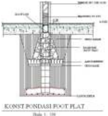

> **Deskripsi Visual:** Gambar ini adalah ilustrasi yang menunjukkan struktur dasar dari fondasi beton. Ilustrasi ini memperlihatkan bagaimana fondasi beton dibangun dengan menggunakan beton yang ditempatkan di bawah bangunan. Ilustrasi ini juga menunjukkan bagaimana beton tersebut diisi dengan air untuk mengurangi tekanan pada fondasi. Ilustrasi ini membantu pembaca memahami bagaimana fondasi beton bekerja dan bagaimana struktur beton harus dibangun agar tidak ambruk.

 

---
## 📄 Halaman 198

Ekstensiikasi	 pertanian	 banyak	 dilakukan	 di	 daerah	 jarang	 penduduk seperti di luar Pulau Jawa, khususnya di beberapa daerah tujuan transmigrasi, seperti Sumatra, Kalimantan, dan Irian Jaya.

Dalam upaya meningkatkan hasil pertanian lebih tinggi lagi, pemerintah Orde	 Baru	 mengembangkan	 program	 Bimas	 menjadi	 Intensiikasi	 Massal (Inmas) pada tahun 1969. Format pengembangan Inmas aktivitasnya hampir serupa dengan Bimas.

ini	 adalah	 sistem	 intensiikasi	 pertanian,	 yaitu	 pengolahan	 lahan	 pertanian yang ada dengan sebaik-baiknya untuk meningkatkan hasil pertanian dengan menggunakan	berbagai	 sarana.	 Intensiikasi	 pertanian	 banyak	 dilakukan	 di Pulau Jawa dan Bali yang memiliki lahan pertanian sempit.

Pemerintah  Orde  Baru  melaksanakan Program Inmas sebagai program modernisasi pertanian berskala nasional. Target pelaksanaan Inmas adalah pengoptimalan produktivitas lahan dan  kualitas  hasil  pertanian,  terutama pertanian  padi.    Untuk  mensukseskan program  ini  pemerintah  mengeluarkan kebijakan subsidi secara nasional terhadap pupuk dan pestisida, bibit unggul  dan  teknologi  lainnya.  Sistem pertanian yang dikembangkan pada pola

Program	 intensiikasi	 pertanian	 pada	 awalnya	 menggunakan	 program Panca Usaha Tani, yang dikembangkan sebelumnya,  kemudian dilanjutkan dengan program sapta usaha tani. Program sapta usaha tani meliputi kegiatan sebagai berikut:

- Pengolahan	tanah	yang	baik
- Pengairan	yang	teratur
- Pemilihan	bibit	unggul
- Pemupukan
- Pemberantasan	hama	dan	penyakit	tanaman
- Pengolahan	pasca	panen

 

---
## 📄 Halaman 199

Dalam upaya meningkatkan hasil pertanian pemerintah melakukan penataan program Inmas menjadi Intensiikasi Khusus (Insus). Kalau Inmas titik tekannya pada penerapan panca usaha tani, sedangkan Insus menekankan peningkatan hasil dari setiap hektar sawahnya melalui sapta usaha tani yang penekakannya pada pengembangan teknologi pertanian.

Walaupun program Insus mampu meningkatkan	hasil	yang	cukup	siginiikan, pada Pelita I hasil produksi padi mencapai

22.464.376  juta  ton  padi  dari  lahan  seluas  8.508.598  hektar  sawah  pada Pelita V produksi padi mencapai angka 48.181 juta ton padi dari lahan seluas 11.021.800  hektar  sawah,  pemerintah  terus  berusaha  meningkatkan  hasil pertanian dengan mengubah program Insus menjadi Supra Insus.  Program ini mengembangkan teknologi pertanian yang sudah ada dengan penggunaan zat perangsang tumbuhan yang bertujuan meningkatkan hasil padi di setiap hektar sawahnya dan juga memfasilitasi kerja sama antarkelompok tani.

Penerapan bibit unggul yang dilakukan oleh pemerintah  mampu meningkatkan jumlah hasil panen di tiap hektarnya dan mampu memperpendek masa tanam padi.  Jika sebelumnya setahun hanya dua kali panen, dengan program-program yang diterapkan oleh pemerintah mampu menjadi tiga kali panen  setiap  tahunnya.  Penggunaan  bibit  unggul  yang  ditopang  teknologi hasil	pertanian	mampu	meningkatkan	jumlah	hasil	panen	secara	siginiikan. Keberhasilan ini ditopang oleh pengolahan lahan pasca panen yang menggunakan teknologi  modern  sehingga  membutuhkan  waktu  yang  lebih sedikit dibandingkan dengan pengelolaan konvensional.

Penggunaan pestisida dalam pemberantasan hama mampu menurunkan jumlah hama pengganggu. Penggunaan pupuk kimia dan pestisida  mendorong peningkatan  produktivitas  lahan  semakin tinggi sehingga hasil panen pun bertambah di setiap hektarnya. Penggunaan teknologi dalam  pengolahan  pasca  panen,  terutama mesin  pengolah  gabah  membuat  gabah semakin cepat diolah menjadi beras

Gambar 5.16 Penggunaan Pestisida

 

---
## 📄 Halaman 200

dibandingkan dengan pengolahan tradisional. Hal ini berdampak pada orientasi pasar. Penggunaan mesin pengolah gabah  menopang peningkatan stok beras nasional yang terus bertambah setiap tahunnya.

Pengolahan gabah yang menggunakan mesin pengolah merupakan salah satu upaya mekanisasi pertanian. Mekanisasi merupakan usaha meningkatkan hasil pertanian dengan menggunakan mesin-mesin pertanian modern. Mekanisasi  pertanian  banyak  dilakukan  di  luar  Pulau  Jawa  yang  memiliki lahan pertanian luas. Pada program mekanisasi pertanian, tenaga manusia dan hewan bukan menjadi tenaga utama. Mekanisasi juga terkait dengan program pasca panen, yaitu pengolahan hasil panen.

Selain	 program	 intensiikasi,	 ekstensiikasi,	 mekanisasi	 dikembangkan pula	 program	 diversiikasi	 pertanian,	 yaitu	 usaha	 penganekaragaman	 jenis usaha atau tanaman pertanian untuk menghindari ketergantungan pada salah satu hasil pertanian.

Diversiikasi	pertanian	dilakukan	melalui	dua	cara,	yaitu:

- Memperbanyak	jenis	kegiatan	pertanian,	misalnya	seorang	petani	selain bertani juga beternak ayam dan beternak ikan.
- Memperbanyak	 jenis	 tanaman	 pada	 suatu	 lahan,	 misalnya	 pada	 suatu lahan selain ditanam jagung juga ditanam padi ladang.
Program  pengembangan  pertanian  melalui  Revolusi  Hijau  berdampak pada peningkatan hasil pertanian, terutama padi, membawa Indonesia menjadi negara  swasembada  beras  pada  tahun  1987.  Keberhasilan  swasembada  ini merupakan dampak positif dari proses modernisasi pertanian dan merupakan salah satu prestasi yang dicapai Orde Baru.

Selain  membawa  keberhasilan  Indonesia  menjadi  negara  penghasil swasembada beras, revolusi hijau juga membawa dampak  terhadap kehidupan petani  di  tingkat  lokal.  Di  antaranya  menurunnya  pendapatan  buruh  tani karena  penggunaan  teknologi  modern,  seperti  traktor  untuk  pengolahan lahan siap tanam. Masuknya mesin pengolah padi, heuler,  mengurangi juga pendapatan  petani,  mereka  kehilangan  pendapatan  buruh  penumbuk  padi. Hal ini menyebabkan surplus ekonomi bagi petani kaya. Di sisi lain Revolusi Hijau juga menguatkan sistem ekonomi uang dan semakin mengintegrasikan sistem ekonomi desa ke sistem ekonomi makro. Hasil pertanian sebagian di perjualbelikan di samping disimpan sebagai cadangan.  Uang mulai mengalir ke pedesaan dan menghidupkan ekonomi di tingkat lokal.

 

---
## 📄 Halaman 201

Untuk  mempertahankan  hasil  pertanian  yang  ada,  pemerintah  juga menerapkan program rehabilitasi pertanian, yaitu  usaha memperbaiki lahan pertanian yang semula tidak produktif atau sudah tidak berproduksi menjadi lahan produktif atau mengganti tanaman yang sudah tidak produktif menjadi tanaman yang lebih produktif.

Dalam rangka menjalankan kebijakan rehabilitasi pertanian, pemerintah menjalankan  langkah-langkah:

- Memperluas,	memperbaiki,	dan	memelihara	jaringan	irigasi		di	seluruh wilayah Indonesia.
- Menyempurnakan	sistem	produksi	pertanian	pangan	melalui	penerapan berbagai paket program yang diawali dengan program Bimbingan Massal (Bimas)	 pada	 tahun	 1970,	 kemudian	 	 program	 intensiikasi	 massal (Inmas),	 Intensiikasi	 Khusus	 (Insus)	 dan	 Supra	 Insus	 yang	 bertujuan meningkatkan produksi pangan secara berkesinambungan.
- Membangun	 pabrik	 pupuk	 serta	 pabrik	 insektisida	 dan	 pestisida	 yang dilaksanakan untuk menunjang proses produksi pertanian.
Langkah lain yang dilakukan pemerintah dalam rangka  meningkatkan hasil pertanian, antara lain:

- Membangun	gudang-gudang,	pabrik	penggilingan	padi,	dan	menetapkan harga dasar gabah.
- Memberikan	berbagai	subsidi	dan	insentif	modal	kepada	para	petani	agar petani dapat meningkatkan produksi pertaniannya.
- Menyempurnakan	sistem	kelembagaan	usaha	tani	melalui	pembentukan kelompok tani dan Koperasi Unit Desa (KUD) di seluruh pelosok daerah yang  bertujuan  untuk  memberikan  motivasi  produksi  dan  mengatasi hambatan-hambatan yang dihadapi para petani.

### 4. Dampak Perkembangan Teknologi

Perkembangan  teknologi  yang  mendukung  dan  menopang  aktivitas manusia, juga memberikan dampak kepada penggunanya, baik positif maupun negatif.    Dampak    positif  teknologi  terhadap  masyarakat    pengguna  aktif teknologi, misalnya teknologi komunikasi, seperti media komunikasi sosial dan situs-situs, mereka dapat menyampaikan dan juga mendapatkan informasi secara  lebih  cepat  dan  lebih  mudah.  Seiring  berkembangnya  teknologi komunikasi  di  Indonesia  terasa  komunikasi    menjadi  lebih  mudah  seiring perkembangan teknologi.

 

---
## 📄 Halaman 202

Jika kita melihat sisi negatifnya, kemajuan teknologi terkadang  membuat orang  menjadi  malas  untuk  berkomunikasi  secara  langsung.  Orang  lebih memilih berinteraksi melalui handphonenya daripada berkomunikasi dengan orang di sekitarnya. Contoh, seorang anak sibuk berchatting dengan teman melalui handphone miliknya daripada berbicara dengan saudaranya saat acara keluarga sedang berlangsung. Kadang kemajuan teknologi ini juga membuat seseorang menjadi kurang peka dengan ekspresi saat sedang berkomunikasi dengan lawan bicaranya.

Saat kita terlalu sibuk dengan telepon atau Personal Computer kita, kita akan memakan waktu yang cukup lama untuk berinteraksi di dunia maya.  Kita tidak sadar bahwa saat itu kita  sedang membuang waktunya untuk berinteraksi dengan hidup sebenarnya yang berada di sekitar kita. Banyaknya pengguna sosial  media  dan  pengakses  internet  ini,  membuktikan  bahwa  masyarakat Indonesia lebih suka berinteraksi dan bergaul secara virtual dengan pengguna sosial media dan internet lainnya.

Salah satu ahli komunikasi massa yakni Harold D. Laswell dan Charles Wright  pernah  menyatakan  fungsi  sosial  media  massa.  Fungsi  sebenarnya antara  lain  yang pertama sebagai  salah  satu  bentuk  upaya  penyebaran informasi  dan  interprestasi  seobjektif  mungkin  mengenai  peristiwa  yang terjadi  ( Social  Surveillance ). Kedua ,  sebagai  upaya  penyebaran  informasi yang dapat menghubungkan satu kelompok sosial dengan kelompok sosial lainnya ( Social Correlation ). Berikutnya sebagai upaya pewarisan nilai-nilai luhur  dari  satu  generasi  ke  generasi  selanjutnya  ( Socialization ).  Dan  yang terakhir adalah sebagai penghibur khalayak ramai ( Entertainment ). (Dahlan, 2008)

Keempat  fungsi  menurut  Harold  D.  Laswell  dan  Charles  Wright  ini mulai terkikis sehubungan dengan kemajuan teknologi yang sedang terjadi. Kini batasan akan komunikasi massa dan komunikasi antarpribadi menjadi agak  semu.  Karena  dengan  semakin  berkembangnya  teknologi  khususnya di Indonesia, mengikuti itu akan muncul juga cara-cara berkomunikasi yang baru,  dalam  hal  ini  misalkan  melalui  sosial  media.  Mungkin  kini  fungsi telepon  genggam  dari  yang  awalnya  hanya  berfungsi  untuk  mengirimkan pesan atau menelepon seseorang telah berkembang jauh menjadi ' laptop ' yang dapat dengan mudah dibawa kemana saja. Contoh yang berhubungan dengan perkembangan tersebut adalah kini seseorang bisa saja tidak mengetahui nomor telepon seseorang padahal orang tersebut merupakan sahabat karibnya. Orang tersebut lebih memilih menyimpan pin BB dibandingkan dengan menyimpan nomor telepon orang itu.

 

---
## 📄 Halaman 203

Melihat fenomena yang sedang terjadi khususnya di Indonesia ini, sangat dikhawatirkan perkembangan teknologi itu membawa dampak buruk terhadap kehidupan sosial masyarakat Indonesia. Sehubungan dengan perkembangan ini,  dibutuhkan  juga  peningkatan  akan  kesadaran  masyarakat  mengenai lingkungan sekitarnya. Perubahan karena perkembangan teknologi yang terjadi cukup cepat ini, secara tidak sadar maupun sadar telah merubah beberapa pola hidup masyarakat khususnya Indonesia. Contohnya kini banyak sekali anakanak  yang  mengalami  ketergantungan  akan gadget mereka  maupun  orang tuanya.

Selain itu dampak negatif lainnya adalah  perkembangan mereka dalam hal bersosialisasi menjadi sangat lamban, karena terlalu fokus dengan gadget . Hal tersebut dapat dengan mudah dan relatif cepat untuk mempengaruhi opini publik.  Kemajuan teknologi memang membawa dampak positif yang banyak namun begitu juga dampak negatifnya. Misal dalam kasus buzzer di twitter, bila  informasi  yang  disebarkan  merupakan  ilmu  berguna  maka    menjadi hal	 yang	 	 positif,	 namun	 jika	 informasi	 yang	 disebarkan	 merupakan	 itnah terhadap seseorang maka hal itu akan merugikan pihak terkait.

Oleh  karena  itu,  kita  masyarakat  Indonesia  harus  benar-benar  cerdas untuk memilah mana sisi positif dan negatifnya agar perkembangan teknologi yang ada  bisa kita sikapi dengan bijak dan selayaknya dilakukan, dijalankan dengan benar dan seimbang.

Pada prinsipnya setiap perkembangan dan kemajuan dalam segi apapun baik, dan setiap manusia menginginkan perubahan dalam konteks kehidupan bermasyarakat. Dari sekian banyak bidang ada dan berpacu untuk kemajuan salah  satunya  adalah  bidang  teknologi,  yang  menghadirkan  perubahan  dan kemajuan  untuk  selanjutnya  digunakan  oleh  manusia.  Beragam  teknologi yang  diciptakan  memungkinkan  manusia  untuk  bebas  memilih  apa  yang diinginkan.

Dari berkembangnya teknologi informasi komputer yang pesat ini, peran serta  masyarakat  sangat  besar  dari  perkembangannya.  Hal  ini  dikarenakan perubahan cepat dalam teknologi informasi telah merubah budaya sebagian besar masyarakat dunia, terutama yang tinggal di perkotaan. Masyarakat di seluruh  dunia  telah  mampu  berinteraksi  dan  memperoleh  informasi  dalam waktu singkat berkat teknologi komunikasi dan informasi yang mengalami perkembangan yang sangat luar biasa.

Teknologi  komunikasi  akan  selalu  berkembang  dari  tahun  ke  tahun. Perkembangan  ini  dikarenakan  adanya  pengaruh  globalisasi  dan  dampak dari negara maju yang semakin peka terhadap teknologi komunikasi. Berkat

 

---
## 📄 Halaman 204

kemajuan ilmu pengetahuan dan teknologi manusia dapat menciptakan alatalat serta perlengkapan yang canggih untuk berbagai kegiatan, sehingga dalam kegiatan kehidupannya tersedia berbagai kemudahan. Hal ini memungkinkan manusia	dapat	melakukan	kegiatan	dengan	efektif	dan	eisien.

Adanya teknologi baru dapat menciptakan kebudayaan yang baru pada masyarakat serta teknologi sebagai pertanda kemajuan kebudayaan. Semakin berkembangnya  teknologi,    di  mana  informasi  apa  saja  bisa  masuk  dalam kehidupan masyarakat kita, berarti ikut serta mempengaruhi tergesernya nilainilai budaya Indonesia ini. Banyak masyarakat Indonesia, terutama generasi muda  kebanyakan  lebih  suka  terhadap  budaya  asing  daripada  kebudayaan Indonesia sendiri. Hal ini menuntut kita untuk lebih waspada dalam menerima budaya luar/asing.

Perkembangan teknologi tentu membawa perubahan yang begitu baik dan pesat dalam kehidupan manusia. Perkembangan itu baik adanya jika sesuai dengan apa yang diharapkan. Ilmu pengetahuan dan teknologi sangat besar pengaruhnya  dalam  kehidupan  berbudaya. Teknologi  sendiri  dapat  muncul dari ilmu pengetahuan yang selalu berkembang dari zaman ke zaman. Namun, pengaruh  ilmu  pengetahuan  dan  teknologi  dalam  pembentukan  budaya mempunyai dampak positif maupun negatif.

Dari  dampak  negatif  yang  ditimbulkan  dari  perkembangan  teknologi informasi  ini  adalah  terciptanya  sifat  dan  sikap  ketergantungan  kepada teknologi yang semakin canggih sehingga banyak orang yang mulai melupakan nilai-nilai  kebudayaan  yang  ada  di  Indonesia.  Sebagai  salah  satu  contoh, anak-anak  zaman  sekarang  lebih  senang  bermain  dengan gadget canggih dibandingkan  dengan  permainan  tradisional  yang  merupakan  salah  satu kebudayaan Indonesia. Dengan hal tersebut, maka anak-anak tersebut tidak dapat mengenal bahkan melestarikan budaya-budaya yang ada di Indonesia sejak dahulu.

Berbagai  informasi  yang  terjadi  di  berbagai  dunia  kini  telah  dapat langsung  kita  ketahui  berkat  kemajuan  teknologi  (globalisasi).  Tentunya kemajuan teknologi   menyebabkan perubahan yang besar pada kehidupan umat manusia dengan segala peradaban dan kebudayaannya. Perubahan ini juga memberikan dampak yang begitu besar terhadap transformasi nilai-nilai yang ada dalam masyarakat. Khususnya masyarakat dengan budaya dan adat ketimuran seperti Indonesia. Saat ini di Indonesia dapat kita saksikan begitu besar  pengaruh  kemajuan  teknologi  terhadap  nilai-nilai  kebudayaan  yang dianut masyarakat. baik masyarakat perkotaan maupun perdesaan.

 

---
## 📄 Halaman 205

Kemajuan  teknologi  televisi,  telepon  dan  telepon  genggam  atau  yang sering disebut dengan gadget bukan hanya melanda masyarakat kota namun juga  telah  dapat  dinikmati  oleh  masyarakat-masyarakat  di  pelosok-pelosok desa. Akibatnya segala informasi baik yang bernilai positif maupun negatif dapat dengan mudah diakses oleh masyarakat. Dan diakui atau tidak perlahanlahan mulai mengubah pola hidup dan pola pemikiran masyarakat khususnya masyarakat perdesaan dengan segala image yang menjadi ciri khas mereka. Situasi ini telah memengaruhi gaya hidup dan pola pikir masyarakat, terutama di kalangan remaja.

Kaum  remaja  yang  paling  rentan  terkena  pengaruh/dampak  negatif dari  teknologi  komunikasi.  Jika  dulu  para  siswa  bersekolah  dengan  hanya membawa buku-buku pelajaran ataupun alat tulis, kini para siswa berangkat sekolah dengan peralatan gadget yang wajib mereka bawa.  Apakah mereka benar-benar membutuhkan gadget sebagai alat komunikasi atau tidak, yang jelas bagi remaja, kadang merupakan sarana gaul yang mutlak mereka miliki.

Dari perkembangan teknologi informasi saat ini sesungguhnya sangatlah berpengaruh terhadap kebudayaan di Indonesia bahkan lebih banyak dampak negatif yang ditimbulkan, jika kesadaran manusia akan kebudayaan Indonesia sudah tidak ada maka  lama  kelamaan  semakin  canggihnya  teknologi mengakibatkan  semakin  punahkan  kebudayaan  di  Indonesia.  Karena  itu alangkah baiknya kita  tidak terlalu kecanduan terhadap teknologi yang semakin canggih, dan gunakanlah teknologi tersebut dengan kebutuhannya saja dan kesadaran akan budaya yang ada sangatlah diperlukan agar kebudayaan di Indonesia bisa tetap dilestarikan dan tidak hilang begitu saja.

Pada hakikatnya, kemajuan teknologi dan pengaruhnya dalam kehidupan adalah hal yang tak dapat kita hindari. Tetapi, kita dapat melakukan tindakan yang bijaksana terhadap diri kita sendiri, keluarga dan juga masyarakat luas agar kemajuan teknologi  tidak sampai menggeser jati diri kita sebagai manusia yang memiliki norma dan juga nilai-nilai yang luhur.

 

---
## 📄 Halaman 206

### KESIMPULAN

- Reformasi  lahir  sebagai  reaksi  langsung  terhadap  krisis multidimensional yang melanda Indonesia sekaligus adanya tuntutan untuk terjadinya perubahan-perubahan di Indonesia dalam berbagai bidang.
- Selama  masa  Reformasi  hingga  kini,  berbagai  pembaruan nyatanya  memang  terjadi.  Pemilu  misalnya,  berlangsung lebih demokratis. Pembaruan di bidang hukum juga terjadi. Desentralisasi  berlangsung,  dan  gerakan  separatis    GAM bisa diakhiri.
- Terhitung sejak bergantinya era Orde Baru ke era Reformasi, hingga Pemilu tahun 2014 ada 4 tokoh yang menjadi presiden RI: B.J. Habibie, Abdurrahman Wahid, Megawati Soekarno Putri, dan Susilo Bambang Yudhoyono.
- Indonesia  termasuk  negara  yang  memiliki  sejarah  yang panjang dalam perkembangan ilmu pengetahuan dan teknologi

### LATIH UJI KOMPETENSI

- Jelaskan perbandingan antara pemilu yang dilakukan pada masa Orde Baru dengan masa Orde Reformasi!
- Apa  yang  dimaksud  dengan  desentralisasi  pemerintahan. Jelaskan!  Berikan  pula  penjelasan  tentang  pembaharuan yang terjadi di bidang ini!
- Jelaskan perbedaan antara pemerintahan Megawati dengan SBY  dalam penyelenggaraan Pemilihan Presiden!

 

---
## 📄 Halaman 207

### Bab VI

### Indonesia Dalam Panggung Dunia

' …. Mestikah kita bangsa Indonesia, yang memperjuangkan kemerdekaan bangsa dan negara kita,  hanya  harus  memilih  antar  pro-Rusia  atau  proAmerika? Apakah tak ada pendirian yang harus kita ambil dalam mengejar cita-cita  kita?  Pemerintah  berpendapat  bahwa  pendirian  yang  harus  kita ambil ialah supaya kita jangan menjadi objek dalam pertarungan politik internasional, melainkan kita harus menjadi subjek yang menentukan sikap kita  sendiri,  berhak  memperjuangkan  tujuan  kita  sendiri,  yaitu  Indonesia merdeka seluruhnya.

' …..  perjuangan  kita  harus  diperjuangkan  di  atas  dasar  semboyan  kita yang lama: percaya akan diri sendiri dan berjuang atas kesanggupan kita sendiri. Ini tidak berarti bahwa kita tidak akan mengambil keuntungan dari pergolakan politik internasional. Memang tiap-tiap politik untuk mencapai kedudukan Negara yang kuat ialah mempergunakan pertentangan internasional  yang  ada  itu  untuk  mencapai  tujuan  nasional.  Belanda berbuat  begitu,  ya  segala  bangsa  sebenarnya  berbuat  semacam  itu,  apa sebab kita tidak akan melakukannya? Tiap-tiap orang di antara kita tentu ada menaruh simpati terhadap golongan ini atau golongan itu, akan tetapi perjuangan bangsa tidak bisa dipecah dengan menuruti simpati saja, tetapi hendaknya  didasarkan  kepada  realitas,  kepada  kepentingan  Negara  kita setiap  waktu.'  …..(Mohammad  Hatta,  Mendayung  Antara  Dua  Karang' Jakarta: Penerbit Bulan Bintang, 1976)

Paragraf  di  atas  adalah  kutipan  pidato  Mohammad  Hatta  di  depan Sidang-sidang BP KNIP (Badan Pekerja Komite Nasional Indonesia) pada  2  September  1948.  Coba  Kamu  telaah  pidato  tersebut  secara cermat,  setelah  itu  kaitkan  dengan  politik  luar  negeri  Indonesia, 'bebas  aktif'.    Jelaskan  menurut  Kamu,  adakah  keterkaitan  antara pidato Mohammad Hatta tahun 1948 dengan politik luar negeri bebas aktif?

 

---
## 📄 Halaman 208

Pada  September  1948,  sebagai  Wakil  Presiden  merangkap  Perdana Menteri dan Menteri Pertahanan Mohammad Hatta memberikan keterangan kepada  Badan  Pekerja  KNIP  tentang  kedudukan  politik  Negara  Indonesia saat itu. RI menghadapi berbagai rintangan yang tidak sedikit. Perundingan dengan Belanda yang dimediasi oleh Komisi Tiga Negara dari PBB terancam terputus. Sementara itu, kaum oposisi yang dimotori Front Demokrasi Rakyat (FDR) yang dipimpin oleh Amir Syarifuddin - Muso telah menambah buruk situasi dan kondisi politik dalam negeri, dengan berbagai tuntutannya, antara lain: mendesak pemerintah RI untuk membatalkan perjanjian Renville yang notabene dibuat dan disepakati oleh Kabinet Amir Syarifuddin.

Perubahan  sikap  Amir  Syarifudin  ini  terkait  erat  dengan  terjadinya perubahan  politik Commintern (Komunis  Internasional)  yang  pada  masa Perang  Dunia  menganut Doktrin  Dimitrov (garis  lunak)  yang  mengizinkan pihak Komunis bekerja sama dengan kapitalis untuk memerangi Fasis. Namun, kebijakan ini berubah seiring munculnya Perang Dingin setelah berakhirnya Perang Dunia II antara Blok Barat yang dipimpin Amerika Serikat dan Blok Timur yang dipimpin oleh Uni Soviet. Melalui Doktrin Zdanov (garis keras) komunis diperintahkan untuk kembali menganut sikap menentang kelompok kapitalis. Perubahan sikap Commintern ini diyakini memicu perubahan sikap partai-partai  komunis  di  seluruh  dunia,  yang  pada  masa  Perang  Dunia  II bekerjasama dengan kelompok nasionalis berbalik menentang, hal inilah yang diyakini menjadi latar belakang muncul perubahan sikap Amir Syarifudin dan pecahnya pemberontakan PKI di Madiun pada September 1948.

Mengenai  pertentangan  antara Amerika  Serikat  dan  Uni  Soviet  dalam Perang Dingin di masa itu, fraksi FDR PKI dalam BP KNIP mendesak supaya RI  memilih pihak Uni Soviet. Terkait desakan tersebut, Hatta menyatakan bahwa politik RI tidak memilih salah satu pihak, melainkan memilih jalan sendiri untuk mencapai kemerdekaan. Sejak keterangan Hatta tersebut politik

 

---
## 📄 Halaman 209

luar negeri RI disebut politik bebas dan aktif. Bebas artinya menentukan jalan sendiri, tidak terpengaruh oleh pihak manapun juga; aktif artinya   ikut serta secara  aktif  dalam  menciptakan  perdamaian  dunia    dan  bersahabat  dengan semua bangsa.

Dalam  keterangan  pemerintah  di  hadapan  sidang  BP  KNIP  tanggal 2  September  1948,  Bung    Hatta  selaku  Perdana  Menteri  mengatakan: 'pendirian  yang  harus  kita  ambil  ialah  supaya  kita  jangan  menjadi  objek dalam pertarungan politik internasional, melainkan kita harus tetap menjadi subjek yang berhak menentukan sikap kita sendiri, berhak memperjuangkan tujuan kita sendiri, yaitu Indonesia merdeka seluruhnya'. Selanjutnya Bung Hata berkata: 'Ini tidak berarti bahwa kita tidak akan mengambil keuntungan dari  pada  pergolakan  internasional'.  Dengan  kata  lain,  sikap  netral  yang diambil Indonesia, bukan berarti Indonesia mengisolasi diri dan pasif terhadap perkembangan dunia internasional.  Sebaliknya  justru  Indonesia  harus  aktif dalam forum internasional serta mampu memanfaatkannya demi kepentingan nasional.

Pelaksanaan  politik  luar  negeri  Indonesia  merupakan  amanat  paragraf keempat  Preambule  Undang-Undang  Dasar  1945  yang  menyatakan  bahwa Pemerintah Indonesia harus turut serta dalam mewujudkan ketertiban dunia berdasarkan kemerdekaan, perdamaian abadi dan keadilan sosial. Makna dari amanat  tersebut,  pemerintah  Indonesia  harus  turut  serta  memperjuangkan terbebasnya pranata dunia dari segala macam bentuk kolonialisme. Indonesia juga  harus  secara  aktif  mewujudkan  tercapainya  perdamaian  dunia  berupa keterlibatan	aktifnya	dalam	penyelesaian	konlik	di	kawasan-kawasan	tertentu maupun perjuangan bagi terciptanya perdamaian dunia.

Peran aktif Indonesia dalam pergaulan internasional diimplementasikan dalam berbagai partisipasi aktif Indonesia dalam rangka menjaga perdamaian dunia.  Beberapa  peran  aktif  di  berbagai  peristiwa  seperti  melaksanakan Konferensi Asia Afrika, aktif dalam Gerakan Non Blok, membentuk ASEAN, dan	mengirim	Pasukan	Garuda	ke	berbagai	wilayah	konlik	di	dunia.

Untuk  mendapatkan  pengetahuan  tentang  politik  luar  negeri  Indonesia secara  utuh  dalam  bab  ini  akan  bahas  tentang  landasan  politik  luar  negeri bebas  aktif  Indonesia  dan  pelaksanaannya  sejak  tahun  1948  hingga  masa Reformasi. Selain itu akan dibahas juga peran aktif Indonesia di panggung dunia/internasional khususnya dalam menjaga perdamaian dunia.

 

---
## 📄 Halaman 210

---
**🖼️ Gambar/Diagram**

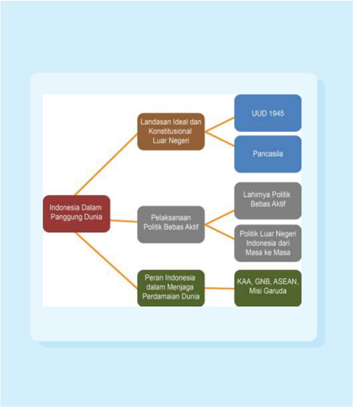

> **Deskripsi Visual:** Gambar ini adalah diagram yang menunjukkan struktur dan konten materi tentang Indonesia dalam perspektif internasional. Diagram ini dibagi menjadi dua bagian utama: "Landasan Ideal dan Konstitusional Luar Negeri" dan "Indonesia Dalam Panggung Dunia". 

Pada bagian pertama, ada dua elemen utama: UUD 1945 dan Pancasila. Kedua elemen ini merupakan landasan ideologi dan konstitusional yang penting bagi Indonesia.

Bagian kedua, "Indonesia Dalam Panggung Dunia", memiliki empat elemen utama: Pelaksanaan Politik Bebas Aktif, Lahirnya Politik Bebas Aktif, Politik Luar Negeri Indonesia dari Masa ke Masa, dan Peran Indonesia dalam Menjaga Perdamaian Dunia. Setiap elemen ini memiliki sub-elemen yang lebih spesifik.

Teks, angka, atau label penting yang terlihat dalam diagram ini meliputi nama-nama doktrin dan institusi seperti UUD 1945, Pancasila, KAA, GNB, ASEAN, dan Misi Garuda. Informasi kunci yang dapat diambil pembaca meliputi peran penting UUD 1945 dan Pancasila dalam membangun identitas nasional Indonesia, serta peran Indonesia dalam berbagai aspek internasional, termasuk politik bebas aktif, diplomasi luar negeri, dan peran dalam menjaga perdamaian dunia.

 

---
## 📄 Halaman 211

### TUJUAN PEMBELAJARAN

Setelah mempelajari uraian ini, diharap kamu dapat:

- Menjelaskan Landasan Politik Luar Negeri Bebas Aktif Indonesia.
- Menganalisis  perkembangan  politik  luar  negeri  Indonesia sejak tahun 1945  sampai dengan era Reformasi.
- Menganalisis  peran  Indonesia  dalam  percaturan  politik internasional/panggung  dunia    khususnya  dalam  menjaga perdamaian dunia.
- Mengambil hikmah dari penerapan politik luar negeri bebas aktif dan partisipasi aktif Indonesia di panggung dunia.

### ARTI PENTING

Mempelajari sejarah Indonesia dalam panggung dunia merupakan hal yang sangat penting agar kita bisa mengetahui faktor-faktor yang melatarbelakangi   lahirnya kebijakan   politik luar negeri bebas aktif serta  implementasi/penerapannya sejak proklamasi kemerdekaan RI tahun 1945 hingga masa Reformasi. Selain itu, kita bisa mengambil hikmah dari berbagai peristiwa perjalanan  politik luar negeri bebas aktif dari setiap periode pemerintahan  sehingga    kita  dapat  mengambil  hikmah  dan pelajaran dari peristiwa-peristiwa tersebut.

 

---
## 📄 Halaman 212

Kamu diskusikan kebijakan politik luar negeri bebas aktif Indonesia saat ini dalam kaitannya dengan perkembangan politik luar negeri Indonesia saat ini.  Coba kamu temu kenali isu-isu atau masalah-masalah  di kawasan yang memperlihatkan konlik kepentingan antarnegara.	 Bagaimana pendapat  kalian  mengenai  sikap  Indonesia  dalam  merespons  isu  dan masalah yang berkembang di atas.

### A.  Landasan  Ideal dan Konstitusional  Politik Luar Negeri Indonesia Bebas Aktif

Politik luar negeri suatu negara lahir ketika negara itu sudah dinyatakan sebagai  suatu  negara  yang  berdaulat.  Setiap  entitas  negara  yang  berdaulat memiliki kebijakan yang mengatur hubungannya dengan dunia internasional, baik  berupa  negara  maupun  komunitas  internasional  lainnya.  Kebijakan tersebut merupakan bagian dari politik luar negeri yang dijalankan negara dan merupakan  pencerminan  dari  kepentingan  nasionalnya.  Indonesia  sebagai sebuah negara berdaulat juga menjalankan politik luar negeri yang senantiasa berkembang  disesuaikan  dengan  kebutuhan  dalam  negeri  dan  perubahan situasi internasional.

Landasan ideal dalam pelaksanaan politik luar negeri Indonesia adalah Pancasila yang merupakan  dasar negara Indonesia. Nilai-nilai yang terkandung dalam Pancasila dijadikan sebagai pedoman dan pijakan dalam melaksanakan politik luar negeri Indonesia. Mohammad Hatta menyebutnya sebagai salah satu faktor yang membentuk politik luar negeri Indonesia. Kelima sila yang termuat dalam Pancasila, berisi pedoman dasar bagi pelaksanaan kehidupan berbangsa dan bernegara yang ideal dan mencakup seluruh sendi kehidupan manusia. Hatta lebih lanjut mengatakan, bahwa Pancasila merupakan salah satu  faktor  objektif  yang  berpengaruh  atas  politik  luar  negeri  Indonesia. Hal  ini  karena  Pancasila  sebagai  falsafah  negara  mengikat  seluruh  bangsa Indonesia, sehingga golongan atau partai politik manapun yang berkuasa di Indonesia  tidak  dapat  menjalankan  suatu  politik  negara  yang  menyimpang dari Pancasila.

 

---
## 📄 Halaman 213

Sedangkan landasan konstitusional dalam pelaksanaan politik luar negeri Indonesia  adalah    Pembukaan  Undang-Undang  Dasar  (UUD)  1945  alinea pertama 'Bahwa sesungguhnya kemerdekaan itu ialah hak segala bangsa dan oleh sebab itu maka penjajahan di atas dunia harus dihapuskan karena tidak sesuai dengan perikemanusiaan dan perikeadilan' dan alinea keempat '…. dan  ikut  melaksanakan  ketertiban  dunia  yang  berdasarkan  kemerdekaan, perdamaian abadi, dan keadilan sosial….'.

Tujuan politik luar negeri bebas aktif adalah untuk mengabdi kepada tujuan nasional  bangsa  Indonesia  yang  tercantum  dalam  Pembukaan  UUD  1945 alinea  keempat  yang  menyatakan: 'Melindungi  segenap  bangsa  Indonesia dan  seluruh  tumpah  darah  Indonesia  dan  untuk  memajukan  kesejahteraan umum, mencerdaskan kehidupan bangsa, dan ikut melaksanakan ketertiban dunia yang berdasarkan perdamaian abadi dan keadilan sosial….'

Kemudian  agar  prinsip  bebas  aktif  dapat  dioperasionalisasikan  dalam politik luar negeri Indonesia, maka setiap periode pemerintahan menetapkan landasan operasional politik luar negeri Indonesia yang senantiasa berubah sesuai dengan kepentingan nasional.

Sejak awal kemerdekaan hingga masa Orde Lama, landasan operasional dari politik luar negeri Indonesia yang bebas aktif sebagian besar dinyatakan melalui  maklumat  dan  pidato-pidato  Presiden  Soekarno.  Beberapa  saat setelah  kemerdekaan,  dikeluarkanlah  Maklumat  Politik  Pemerintah  tanggal 1 November 1945 yang isinya adalah; politik damai dan hidup berdampingan secara damai; tidak campur tangan dalam urusan dalam negeri negara lain; politik  bertetangga  baik  dan  kerja  sama  dengan  semua  negara  di  bidang ekonomi, politik dan lain-lain; serta selalu mengacu pada Piagam PBB dalam melakukan hubungan dengan negara lain.

Selanjutnya pada masa Demokrasi  Terpimpin 1959-1965 landasan operasional politik luar negeri Indonesia adalah berdasarkan UUD 1945 yang terdapat dalam pembukaan UUD 1945 alinea pertama, pasal 11 dan pasal 13 ayat 1 dan  2 UUD 1945, Amanat Presiden yang berjudul 'Penemuan Kembali Revolusi Kita' pada 17  Agustus  1959 atau dikenal sebagai 'Manifesto Politik Republik Indonesia'.

Amanat  Presiden  itu  sendiri  kemudian  dijadikan  sebagai  Garis  Besar Haluan  Negara.  Berkaitan  dengan  kebijakan  politik  luar  negeri,  Manifesto tersebut memuat tujuan jangka panjang dan tujuan jangka pendek, yaitu:

 

---
## 📄 Halaman 214

Tudjuan djangka pendek jaitu melandjutkan perdjuangan anti imperialisme ditambah  dengan  mempertahankan  kepribadian  Indonesia  di  tengahtengah tarikan-tarikan ke kanan dan ke kiri jang sekarang sedang berlaku kepada  negara  kita  dalam  pergolakan  dunia  menudju  kepada  suatu imbangan baru. Sementara dalam djangka pandjang di bidang luar negeri, Revolusi Indonesia bertudjuan melenjapkan imperialisme di mana-mana, dan mentjapai dasar-dasar bagi perdamaian dunia jang kekal dan abadi. Menurut  Manipol,  diplomasi  jang  sesuai  dengan  fungsinja  sebagai  art jang  berhubungan  dengan  tjara  melaksanakannja  harus  tidak  mengenal kompromi, harus radikal dan revolusioner.

(Panitia  Penulisan  Sedjarah  Departemen  Luar  Negeri,  1971.  Jakarta: Deplu, 1971, hlm.259)

Tujuan  jangka  pendek  dan  jangka  panjang  tidak  terlepas  dari  sejarah Indonesia,  sebagai  bangsa  yang  pernah  mengalami  penjajahan.  Walaupun Indonesia sudah merdeka, perjuangan untuk melenyapkan imperialisme belum berakhir, sebab negara-negara yang dianggap imperialis dan kolonialis (Barat), masih ada dan berusaha menanamkan pengaruhnya. Indonesia berusaha pula menghindari dari keberpihakan pada dua blok yang bersengketa dan masuk menjadi anggota Non Blok.

Pedoman Pelaksanaan Manifesto Politik/Manipol Indonesia berdasarkan pada amanat Presiden  tanggal 17 Agustus 1960 yang terkenal dengan nama 'Djalanja Revolusi Kita', yang menetapkan penegasan mengenai cara-cara pelaksanaan Manipol di bidang  politik luar negeri. Politik luar negeri Indonesia tidak  netral,  tidak  menjadi  penonton  dan  tidak  tanpa  prinsip.  Politik  bebas tidak sekedar 'cuci tangan', tidak sekedar defensif, tapi aktif dan berprinsip serta berpendirian.

Manipol, Djarek (Djalanja Revolusi Kita), merupakan embrio kelahiran serta doktrin baru, yaitu dunia tidak terbagi dalam Blok Barat,  Blok Timur dan  Blok Asia Afrika/Blok  ketiga.   Akan  tetapi  dunia  terbagi  menjadi  dua Blok yang saling bertentangan  yaitu New Emerging Forces/Nefos dan Old Established Forces/Oldefos.

Nefos merupakan kekuatan-kekuatan baru yang sedang bangkit. Sementara Oldefos merupakan kekuatan-kekuatan lama yang sudah mapan. Doktrin Nefos dan Oldefos  menjadi dasar politik luar negeri anti imperialis dan kolonialis yang lebih militan.  Soekarno mewujudkan gagasan Nefos dan Oldefos  itu  dengan  suatu  strategi  diplomasi  yang  agresif  dan  konfrontatif dengan negara-negara Barat.

 

---
## 📄 Halaman 215

Pada masa Orde Baru, landasan operasional politik luar negeri Indonesia kemudian semakin dipertegas dengan beberapa peraturan formal, di antaranya adalah Ketetapan MPRS No. XII/ MPRS/1966 tanggal 5 Juli 1966 tentang penegasan kembali landasan kebijaksanaan politik luar negeri Indonesia. TAP MPRS ini menyatakan bahwa sifat politik luar negeri Indonesia adalah:

- Bebas  aktif,  anti-imperialisme  dan  kolonialisme  dalam  segala  bentuk manifestasinya  dan  ikut  serta  melaksanakan  ketertiban  dunia  yang berdasarkan kemerdekaan, perdamaian abadi, dan keadilan sosial.
- Mengabdi kepada kepentingan nasional dan amanat penderitaan rakyat.
Selanjutnya landasan operasional kebijakan politik luar negeri RI dipertegas lagi    dalam  Ketetapan  MPR  No.  IV/MPR/1973  tentang  Garis-Garis  Besar Haluan Negara tanggal 22  Maret 1973, yang berisi:

- Terus melaksanakan politik luar negeri yang bebas aktif dengan mengabdikannya kepada kepentingan nasional, khususnya pembangunan ekonomi;
- Mengambil  langkah-langkah  untuk  memantapkan  stabilitas  wilayah Asia	Tenggara	dan	Pasiik	Barat	Daya,	sehingga	memungkinkan	negaranegara di wilayah ini mampu mengurus masa depannya sendiri melalui pembangunan  ketahanan  nasional  masing-masing,  serta  memperkuat wadah dan kerja sama antara negara anggota perhimpunan bangsa-bangsa Asia Tenggara;
- Mengembangkan kerja sama untuk maksud-maksud damai dengan semua negara dan badan-badan internasional dan lebih meningkatkan peranannya dalam membantu bangsa-bangsa yang sedang memperjuangkan kemerdekaannya tanpa mengorbankan kepentingan dan kedaulatan nasional.
Ketetapan-ketetapan MPR era Orde Baru dijabarkan dalam pola umum pembangunan jangka panjang dan pola umum Pelita dua hingga enam, pada intinya  menyebutkan  bahwa  dalam  bidang  politik  luar  negeri  yang  bebas dan  aktif  diusahakan  agar  Indonesia  dapat  terus  meningkatkan  peranannya dalam memberikan sumbangannya untuk turut serta menciptakan perdamaian dunia yang abadi, adil dan sejahtera. Namun demikan, menarik untuk dicatat bahwa TAP MPR RI No. IV/MPR/1973 berbeda dengan TAP MPRS tahun 1966. Perbedaan ini seiring dengan pergantian pemerintahan  dari Soekarno ke Soeharto, sehingga konsep perjuangan Indonesia yang selalu didengungdengungkan oleh Soekarno sebagai anti-kolonialisme dan anti-imperialisme tidak lagi memunculkan dalam TAP MPR tahun 1973 di atas. Selain itu, sosok

 

---
## 📄 Halaman 216

politik luar negeri Indonesia juga lebih difokuskan pada upaya pembangunan bidang ekonomi dan peningkatan kerja sama dengan dunia internasional.

Selanjutnya TAP  MPR RI No. IV/MPR/1978, pelaksanaan politik  luar negeri  Indonesia  juga  telah  diperluas,  yaitu  ditujukan  untuk  kepentingan pembangunan di segala bidang. Realitas ini berbeda dengan TAP-TAP MPR sebelumnya, yang pada umumnya hanya mencakup satu aspek pembangunan saja,  yaitu  bidang  ekonomi.  Pada TAP  MPR  RI  No.  II/MPR/1983,  sasaran politik	 luar	 negeri	 Indonesia	 dijelaskan	 secara	 lebih	 spesiik	 dan	 rinci. Perubahan ini menandakan bahwa Indonesia sudah mulai mengikuti dinamika politik internasional yang berkembang saat itu.

Pasca-Orde Baru atau dikenal dengan periode Reformasi yang dimulai dari masa pemerintahan B.J. Habibie sampai pemerintahan Susilo Bambang Yudhoyono  secara  substansif    landasan  operasional  politik  luar  negeri Indonesia dapat dilihat melalui: ketetapan MPR No. IV/MPR/1999 tanggal 19  Oktober  1999  tentang  Garis-Garis  Besar  Haluan  Negara  (GBHN) dalam  rangka  mewujudkan  tujuan  nasional  periode  1999-2004.  GBHN  ini menekankan  pada  faktor-faktor  yang  melatarbelakangi  terjadinya  krisis ekonomi dan krisis nasional pada 1997, yang kemudian dapat mengancam integrasi Negara Kesatuan Republik Indonesia (NKRI). Di antaranya adanya ketidakseimbangan  dalam  kehidupan  sosial,  politik,  dan  ekonomi  yang demokratis  dan  berkeadilan.  Oleh  karena  itu,  GBHN  juga  menekankan perlunya upaya reformasi di berbagai bidang, khususnya memberantas segala bentuk penyelewengan seperti korupsi, kolusi, dan nepotisme serta kejahatan ekonomi dan penyalahgunaan kekuasaan.

Selanjutnya ketetapan ini juga menetapkan sasaran-sasaran yang harus dicapai dalam pelaksanaan politik dan hubungan luar negeri, yaitu:

- menegaskan kembali pelaksanaan politik bebas dan aktif menuju pencapaian tujuan nasional;
- ikut serta di dalam perjanjian internasional dan peningkatan kerja sama untuk kepentingan rakyat Indonesia;
- memperbaiki performa, penampilan diplomat Indonesia dalam rangka suksesnya pelaksanaan diplomasi pro-aktif di semua bidang;
- meningkatkan kualitas diplomasi dalam rangka mencapai pemulihan ekonomi	yang	cepat	melalui	intensiikasi	kerja	sama	regional dan internasional;

 

---
## 📄 Halaman 217

- mengintensifkan kesiapan Indonesia memasuki era perdagangan bebas;
- memperluas perjanjian ekstradisi dengan negara-negara tetangga;
- mengintensifkan kerja sama dengan negara-negara tetangga dalam kerangka ASEAN dengan tujuan memelihara stabilitas dan kemakmuran di wilayah Asia Tenggara.
Ketetapan MPR di atas, secara jelas menegaskan arah politik luar negeri Indonesia  yang  bebas  dan  aktif,  berorientasi  untuk  kepentingan  nasional, menitikberatkan pada solidaritas antarnegara berkembang, mendukung perjuangan  kemerdekaan  bangsa,  menolak  segala  bentuk  penjajahan  serta meningkatkan kemandirian bangsa dan kerja sama internasional bagi kesejahteraan rakyat.

### TUGAS

Buatlah  rangkuman  materi  tentang    landasan    ideal,  konstitusional,  dan operasional politik luar negeri  indonesia.

### B.  Politik Luar Negeri Bebas Aktif dan Pelaksanaannya

### 1.   Lahirnya Politik Luar Negeri Bebas Aktif

Setelah proklamasi kemerdekaan pada tanggal 17 Agustus 1945, Indonesia belum memiliki rumusan yang jelas mengenai bentuk politik luar negerinya. Akan tetapi pada masa tersebut politik luar negeri Indonesia sudah memiliki landasan  operasional  yang  jelas,  yaitu  hanya  mengonsentrasikan  diri  pada tiga sasaran utama yaitu; 1). Memperoleh pengakuan internasional terhadap kemerdekaan  RI,  2).  Mempertahankan  kemerdekaan  RI  dari  segala  usaha Belanda untuk kembali bercokol di Indonesia, 3). Mengusahakan serangkaian diplomasi untuk penyelesaian sengketa Indonesia-Belanda melalui negosiasi dan  akomodasi  kepentingan,  dengan  menggunakan  bantuan  negara  ketiga dalam  bentuk good	 ofices ataupun  mediasi  dan  juga  menggunakan  jalur Perserikatan Bangsa-Bangsa (PBB).

Sesuai dengan sasaran utama kebijakan politik luar negeri sebagaimana disebut di atas, maka  Indonesia harus berusaha memperkuat kekuatan diplomasinya dengan menarik simpati negara-negara lain.

 

---
## 📄 Halaman 218

Dalam  Perang  Dingin  yang  sedang  berkecamuk  antara  Blok  Amerika (Barat) dengan Blok Uni Soviet (Timur) pada masa awal berdirinya negara Indonesia, Indonesia memilih sikap  tidak memihak kepada salah satu blok yang  ada.  Hal  ini  untuk  pertama  kali  diuraikan  Syahrir,  yang  pada  waktu itu  menjabat sebagai Perdana Menteri di dalam pidatonya pada Inter Asian Relations Conference di  New Delhi pada tanggal 23 Maret-2 April 1947. Dalam  pidatonya  tersebut,  Syahrir  mengajak  bangsa-bangsa  Asia  untuk bersatu atas dasar kepentingan bersama demi tercapainya perdamaian dunia, yang  hanya  bisa  dicapai  dengan  cara  hidup  berdampingan  secara  damai antarbangsa  serta  menguatkan  ikatan  antara  bangsa  ataupun  ras  yang  ada di dunia. Dengan demikian di dalam Perang Dingin antara Amerika Serikat dan Uni Soviet yang memecah belah persatuan, sikap tidak memihak adalah sikap yang paling tepat untuk menciptakan perdamaian dunia atau paling tidak meredakan Perang Dingin tersebut.

Keinginan Indonesia pada awal kemerdekaannya untuk tidak memihak dalam Perang Dingin tersebut selain untuk meredakan ketegangan yang ada juga  dilatarbelakangi  oleh  kepentingan  nasional  Indonesia  saat  itu,  yaitu mencari dukungan  dunia Internasional terhadap perjuangan kemerdekaannya. Oleh karena itu, keterikatan pada salah satu kubu (blok) yang ada belum tentu akan  mendatangkan  keuntungan  bagi  perjuangan  kemerdekaannya.  Karena pada  waktu  itu  negara-negara  dari  Blok  Barat  (Amerika)  masih  ragu-ragu untuk mendukung perjuangan kemerdekaan Indonesia menghadapi Belanda yang juga termasuk salah satu dari Blok Barat. Di lain pihak, para pemimpin Indonesia  saat  itu  juga  masih  ragu-ragu  dan  belum  dapat  memastikan  apa tujuan  sebenarnya  dari  dukungan-dukungan  yang  diberikan  negara  Blok Timur  terhadap  perjuangan  kemerdekaan  Indonesia  di  forum  PBB.  Selain itu,  Indonesia pada saat itu disibukkan oleh usaha mendapatkan pengakuan atas  kedaulatannya,  sehingga  Indonesia  harus  berkonsentrasi  pada  masalah tersebut.

Secara resmi politik luar negeri Indonesia baru mendapatkan bentuknya pada  saat  Wakil  Presiden  Mohammad  Hatta  memberikan  keterangannya kepada BP KNIP (Badan Pekerja Komite Nasional Indonesia Pusat) mengenai kedudukan politik Indonesia pada bulan September 1948, pada saat itu Hatta mengatakan bahwa:

' ………tetapi  mestikah  kita  bangsa  Indonesia  yang  memperjuangkan kemerdekaan  bangsa  dan  negara  kita,  harus  memilih  antara  pro-Rusia atau pro-Amerika. Apakah tidak ada pendirian yang lain yang harus kita ambil  dalam  mengejar  cita-cita  kita?  Pemerintahan  berpendapat  bahwa pendirian  yang  harus  kita  ambil  ialah  supaya  kita  jangan  menjadi  objek

 

---
## 📄 Halaman 219

dalam  pertarungan  politik  Internasional,  melainkan  kita  harus  menjadi subyek yang berhak menentukan sikap kita sendiri, berhak memperjuangkan tujuan kita sendiri, yaitu Indonesia merdeka seluruhnya.' ( Sumber: Sejarah Diplomasi RI dari Masa ke Masa, Deplu, 2004)

Dari pernyataan Mohammad Hatta tersebut jelas terlihat bahwa Indonesia berkeinginan untuk tidak memihak salah satu blok yang ada pada saat itu. Bahkan  bercita-cita  untuk  menciptakan  perdamaian  dunia  yang  abadi  atau minimal meredakan Perang Dingin yang ada dengan cara bersahabat dengan semua  negara  baik  di  Blok  Barat  maupun  di  Blok  Timur,  karena  hanya dengan cara demikian cita-cita perjuangan kemerdekaan bangsa dan negara Indonesia  dapat  dicapai.  Tetapi  walaupun  Indonesia  memilih  untuk  tidak memihak  kepada  salah  satu  blok  yang  ada,  hal  itu  tidak  berarti  Indonesia berniat  untuk  menciptakan blok baru. Karena itu menurut Hatta, Indonesia juga tidak bersedia mengadakan atau ikut campur dengan suatu blok ketiga yang dimaksud untuk mengimbangi kedua blok raksasa itu.

Sikap  yang  demikian  inilah  yang  kemudian  menjadi  dasar  politik luar  negeri  Indonesia  yang  biasa  disebut  dengan  istilah  Bebas Aktif,  yang artinya  dalam  menjalankan  politik  luar  negerinya  Indonesia  tidak  hanya tidak memihak tetapi juga 'aktif' dalam usaha memelihara perdamaian dan meredakan pertentangan yang ada di antara dua blok tersebut dengan cara 'bebas'  mengadakan  persahabatan  dengan  semua  negara  atas  dasar  saling menghargai.

Sejak Mohammad  Hatta menyampaikan pidatonya berjudul 'Mendayung Antara Dua Karang'  di depan Sidang BP KNIP pada bulan September 1948, Indonesia menganut politik luar  negeri bebas-aktif yang dipahami sebagai sikap dasar Indonesia yang menolak masuk dalam salah satu Blok negaranegara  superpower,  menentang  pembangunan  pangkalan  militer  asing  di dalam negeri, serta menolak terlibat dalam pakta pertahanan negara-negara besar.  Namun,  Indonesia  tetap  berusaha  aktif  terlibat  dalam  setiap  upaya meredakan ketegangan di dunia internasional (Pembukaan UUD 1945).

Diskusikanlah dalam kelompok isi atau kandungan dari Pembukaan  UUD  1945,  jelaskan  kaitannya  dengan pelaksanaan politik luar negeri 'Bebas Aktif' .

Politik  luar  negeri  RI  yang  bebas  dan  aktif  itu  dapat  diartikan  sebagai kebijaksanaan dan tindakan-tindakan yang diambil atau sengaja tidak diambil  oleh  Pemerintah  dalam  hubungannya  dengan  negara-negara  asing atau  organisasi-organisasi  internasional  dan  regional  yang  diarahkan  untuk

 

---
## 📄 Halaman 220

tercapainya tujuan nasional bangsa. Politik luar negeri bebas aktif inilah yang kemudian menjadi prinsip dalam pelaksanaan politik luar negeri Indonesia pada  masa  pemerintahan  selanjutnya.  Tentunya  pelaksanaan  politik  luar negeri bebas aktif ini juga disesuaikan dengan kepentingan dalam negeri serta konstelasi politik internasional pada saat itu.

### 2.   Politik Luar Negeri Indonesia Masa Demokrasi Parlermenter 1950-1959

Prioritas utama  politik luar  negeri  dan  diplomasi  Indonesia  pasca kemerdekaan hingga tahun 1950an lebih ditujukan untuk menentang segala macam bentuk penjajahan di atas dunia, termasuk juga untuk memperoleh pengakuan  internasional  atas  proses  dekolonisasi  yang  belum  selesai  di Indonesia, dan menciptakan perdamaian dan ketertiban dunia melalui politik bebas aktifnya. Usaha dekolonisasi yang dilakukan oleh pihak Belanda dan Sekutu  membuat  Indonesia  memberikan  perhatian  ekstra  pada  bagaimana mempertahankan kemerdekaan yang telah digapai dan diproklamasikan pada 17 Agustus 1945. Indonesia dituntut untuk cerdas dalam menentukan strategi agar kemerdekaan yang telah diraih tidak sia-sia.

Pada waktu itu Indonesia berusaha keras untuk mendapatkan pengakuan dunia internasional dengan cara diplomasi. Keberhasilan Indonesia mendapatkan  pengakuan  dunia  internasional    melalui  meja  perundingan ini menjadi  titik tolak dari  perjuangan  diplomasi  Indonesia  mencapai kepentingannya. Betapa pada masa itu, kekuatan diplomasi Indonesia disegani oleh negara-negara lain. Pada kondisi kemampuan militer dan ekonomi yang kurang, Indonesia mampu meraih simpati publik internasional dan berhasil mendapatkan pengakuan kedaulatan secara resmi melalui perundingan.

Sejak pertengahan tahun 1950-an, Indonesia telah memprakarsai dan  mengambil  sejumlah  kebijakan  luar  negeri  yang  sangat  penting  dan monumental, seperti Konferensi Asia Afrika di Bandung pada tahun 1955. Konsep politik luar negeri Indonesia yang bebas aktif merupakan gambaran dan usaha Indonesia untuk membantu terwujudnya perdamaian dunia. Salah satu  implementasinya  adalah  keikutsertaan  Indonesia  dalam  membentuk solidaritas bangsa-bangsa yang baru merdeka dalam forum Gerakan Non-Blok (GNB) atau ( Non-Aligned Movement /NAM).	Forum	ini	merupakan	releksi atas terbaginya dunia menjadi dua kekuatan besar, yakni Blok Barat (Amerika Serikat ) dan Blok Timur (Uni Soviet).  Konsep politik luar negeri yang bebas aktif ini berusaha membantu bangsa-bangsa di dunia yang belum terlepas dari belenggu penjajahan.

 

---
## 📄 Halaman 221

### 3.   Politik Luar Negeri Indonesia Masa (Demokrasi Terpimpin)

Pada masa  Demokrasi  Terpimpin  (1959-1965), politik luar negeri Indonesia  bersifat high	 proile ,  yang  diwarnai  sikap  anti-imperialisme  dan kolonialisme  yang  tegas  dan  cenderung  bersifat  konfrontatif.  Pada  era  itu kepentingan  nasional  Indonesia  adalah  pengakuan  kedaulatan  politik  dan pembentukan  identitas  bangsa (national  character  building) .  Kepentingan nasional itu diterjemahkan dalam suatu kebijakan luar negeri yang bertujuan untuk mencari dukungan international terhadap eksistensi Indonesia sebagai bangsa  dan  negara  yang  merdeka  dan  berdaulat,  sekaligus  menunjukan karakter  atau  identitas  bangsa  Indonesia  pada  bangsa-bangsa  lain  di  dunia internasional.

'Onward  no  retreat' adalah  kata-kata  yang  sering  diucapkan  dalam beberapa pidato Presiden Soekarno yang menunjukkan tekad revolusionernya dalam  membangun  Kekuatan  Dunia  Baru (new  emerging  forces). Dalam mempromosikan  Indonesia  ke  dunia  internasional  Presiden  Soekarno  juga menunjukkan bahwa dia mendapat dukungan dari seluruh lapisan masyarakat yang  tercermin  dari  Nasakom  (Nasionalis,  Agama  dan  Komunis)  yang menjadi  jiwa  bangsa  Indonesia,  yang  diperhitungkan  dapat  menjadi  satu kekuatan (Nasakom Jiwaku). untuk mengalahkan Nekolim (Neo Kolonialisme dan  Imperialisme).    Dari  sini  dapat  dilihat  adanya  pergeseran  arah  politik luar negeri Indonesia yakni condong ke blok komunis, baik secara domestik maupun internasional. Hal ini dilihat dengan adanya kolaborasi politik antara Indonesia dengan China dan bagaimana Presiden Soekarno memberi peluang politik kepada PKI sehingga partai yang pernah menikam perjuangan bangsa Indonesia pada tahun 1948, berkembang menjadi partai terbesar dan paling berpengaruh di Indonesia sekitar tahun 1964-1965. Kebijakan Soekarno itu didasari oleh keinginannya agar kaum komunis yang merupakan salah satu kekuatan  politik  mampu  berasimilasi  dengan  revolusi  Indonesia  dan  tidak merasa dianggap sebagai kelompok luar.

Politik luar negeri pada masa  Demokrasi Terpimpin  juga ditandai dengan usaha keras Presiden Soekarno membuat Indonesia semakin dikenal di dunia internasional melalui beragam konferensi internasional yang diadakan maupun diikuti  Indonesia.  Tujuan  awal  dari  dikenalnya  Indonesia  adalah  mencari dukungan atas usaha dan perjuangan Indonesia merebut dan mempertahankan Irian  Barat.  Namun  seiring  berjalannya  waktu,  status  dan prestige menjadi faktor-faktor pendorong semakin gencarnya Soekarno melaksanakan aktivitas politik luar negeri ini. Sebagai dampaknya Soekarno banyak meninggalkan masalah-masalah domestik seperti masalah ekonomi. Soekarno beranggapan

 

---
## 📄 Halaman 222

bahwa pertumbuhan ekonomi pada fase awal berdirinya suatu negara adalah hal yang tidak terlalu penting. Ia beranggapan bahwa pemusnahan pengaruhpengaruh asing baik itu dalam segi politik, ekonomi maupun budaya adalah hal-hal yang harus diutamakan dibandingkan dengan pertumbuhan ekonomi domestik.  Soekarno  dengan  gencar  melancarkan  politik  luar  negeri  aktif namun tidak diimbangi dengan kondisi perekonomian dalam negeri yang pada kenyatannya	 morat-marit	 akibat	 inlasi	 yang	 terjadi	 secara	 terus-menerus, penghasilan  negara  merosot  sedangkan  pengeluaran  untuk  proyek-proyek Politik Mercusuar seperti GANEFO ( Games of The New Emerging Forces ) dan CONEFO ( Conference of The New Emerging Forces) terus membengkak. Hal inilah yang pada akhirnya menjadi salah satu penyebab  krisis politik dan ekonomi Indonesia pada masa akhir pemerintahan Demokrasi Terpimpin.

Presiden Soekarno memperkenalkan  doktrin politik baru berkaitan dengan sikap konfrontasi penuhnya terhadap imperialisme dan kolonialisme. Doktrin itu mengatakan bahwa  dunia terbagi dalam dua blok, yaitu 'Oldefos' (Old  Established  Forces) dan  'Nefos' (New  Emerging  Forces ). Soekarno menyatakan bahwa ketegangan-ketegangan di dunia pada dasarnya akibat  dari  pertentangan  antara  kekuatan-kekuatan    lama  (Oldefos)  dan kekuatan-kekuatan yang baru bangkit atau negara-negara progresif (Nefos). Imperialisme, kolonialisme, dan neokolonialisme merupakan paham-paham yang  dibawa  dan  dijalankan  oleh  negara-negara  kapitalis  Barat.  Dalam upayanya mengembangkan Nefos, Presiden Soekarno melaksanakan Politik Mercusuar bahwa Indonesia merupakan mercusuar yang mampu menerangi jalan  bagi  Nefos  di  seluruh  dunia.  Salah  satu  tindakan  usaha  penguatan eksistensi  Indonesia  dan  Nefos  juga  dapat  dilihat  dari  pembentukan  poros Jakarta  -  Peking  yang  membuat  Indonesia  semakin  dekat  dengan  negaranegara sosialis dan komunis seperti China.

Faktor  dibentuknya  poros  ini  antara  lain, pertama ,  karena  konfrontasi dengan Malaysia menyebabkan Indonesia membutuhkan bantuan militer dan logistik,  mengingat  Malaysia  mendapat dukungan penuh dari Inggris, Indonesia pun harus mencari kawan negara besar yang mau mendukungnya dan bukan sekutu Inggris, salah satunya adalah China. Kedua , Indonesia perlu mencari negara yang mau membantunya dalam masalah dana dengan persyaratan yang mudah, yakni negara China dan Uni Soviet. Namun sayangnya, seperti yang telah dijelaskan sebelumnya, kebijakan-kebijakan luar negeri yang diinisiasi Soekarno untuk Indonesia rupanya kurang memperhatikan sektor domestik.

Ketidaksukaan Presiden Soekarno terhadap imperialisme karena dalam kenyataannya,  sebagian  dari  bangsa  dan  negara  Indonesia  masih  dikuasai Belanda, yakni Irian Barat (sekarang Papua). Setelah jalan diplomasi selalu

 

---
## 📄 Halaman 223

mengalami kegagalan, maka Soekarno memutuskan akan merebut kembali Irian  Barat  dengan  kekuatan  bersenjata.  Melihat  kesungguhan  Indonesia, sikap  Amerika Serikat yang kemudian berubah membantu  Indonesia, terutama setelah Indonesia memperoleh bantuan persenjataan dari Uni Soviet guna  mendapatkan  kembali  Irian  Barat.  Taktik  konfrontatif  ini  kemudian digunakan kembali oleh Soekarno ketika terjadi konfrontasi antara Indonesia dan Malaysia akibat pembentukan negara federasi Malaysia yang dianggap oleh Indonesia sebagai produk Nekolim (Neokolonialisme dan imperialisme). Puncak  ketegangan  terjadi  ketika  Malaysia  ditetapkan  sebagai  Anggota Tidak Tetap Dewan Keamanan PBB. Hal ini menyulut kemarahan Indonesia. Hingga akhirnya pada 15 September 1965 Indonesia menyatakan keluar  dari PBB karena Soekarno beranggapan bahwa PBB berpihak pada Blok Barat. Mundurnya Indonesia dari PBB berujung pada terhambatnya pembangunan dan  modernisasi  Indonesia  karena  menjauhnya  Indonesia  dari  pergaulan internasional.

### 4.  Politik Luar Negeri Indonesia pada Masa Orde Baru

Pada  masa  awal  Orde  Baru    terjadi  perubahan  pada  pola  hubungan  luar  negeri Indonesia dalam segala bidang. Pada masa pemerintahan Soeharto, Indonesia lebih  memfokuskan  pada  pembangunan  sektor  ekonomi.  Pembangunan ekonomi tidak dapat dilaksanakan secara baik, tanpa adanya stabilitas politik keamanan dalam negeri maupun di tingkat regional. Pemikiran inilah yang mendasari Presiden Soeharto mengambil beberapa langkah kebijakan politik luar negeri (polugri), yaitu membangun hubungan yang baik dengan pihakpihak Barat dan ' good neighbourhood policy ' melalui Association South East Asian Nation (ASEAN). Titik berat pembangunan jangka panjang Indonesia saat  itu    adalah  pembangunan  ekonomi,  untuk  mencapai  struktur  ekonomi yang seimbang dan terpenuhinya kebutuhan pokok rakyat, pada dasawarsa abad yang akan datang. Tujuan utama politik luar negeri Soeharto pada awal penerapan New Order (tatanan baru) adalah untuk memobilisasi sumber dana internasional demi membantu rehabilitasi ekonomi negara dan pembangunan, serta  untuk  menjamin  lingkungan  regional  yang  aman  yang  memudahkan Indonesia untuk berkonsentrasi pada agenda domestiknya.

Berikut  pernyataan  Presiden  Soeharto  mengenai  politik  luar  negeri Indonesia yang bebas aktif.

'  Bagi  Indonesia,  politik  luar  negerinya  yang  berprinsip  non-Blok  tidak identik  dengan  tidak  adanya  keterlibatan.  Itulah  alasannya  mengapa Indonesia  lebih  suka  mengatakannya  sebagai  politik  luar  negeri  yang bebas dan aktif karena politik luar negeri kita tidak hampa, mati, atau tidak berjalan.  Politik  luar  negeri  Indonesia  adalah  bebas  di  mana  Indonesia

 

---
## 📄 Halaman 224

bebas dari ikatan apapun juga, baik itu dalam secara militer, politik ataupun secara  ideologis  bahwa  Indonesia  benar-benar  terbebas  dari  berbagai masalah atau peristiwa dengan tidak adanya pengaruh dari pihak manapun, baik secara militer, politis, ataupun secara ideologis.' (Kumpulan Pidato Presiden Soeharto, http://kepustakaan-presiden.pnri.go.id/speech)

Seperti  yang  telah  disebutkan  sebelumnya,  dalam  bidang  politik  luar negeri, kebijakan politik luar negeri Indonesia lebih menaruh perhatian khusus terhadap soal regionalisme. Para pemimpin Indonesia menyadari pentingnya stabilitas regional akan dapat menjamin keberhasilan rencana pembangunan Indonesia. Kebijakan luar negeri Indonesia juga mempertahankan persahabatan dengan  pihak  Barat,  memperkenalkan  pintu  terbuka  bagi  investor  asing, serta bantuan pinjaman. Presiden Soeharto juga selalu menempatkan posisi Indonesia sebagai pemeran utama dalam pelaksanaan kebijakan luar negerinya tersebut, seperti halnya pada masa pemerintahan Presiden Soekarno.

Beberapa  sikap  Indonesia  dalam  melaksanakan  politik  luar  negerinya antara lain; menghentikan konfrontasi dengan Malaysia. Upaya mengakhiri konfrontasi terhadap Malaysia dilakukan agar Indonesia mendapatkan kembali kepercayaan dari Barat dan membangun kembali ekonomi Indonesia melalui investasi  dan  bantuan  dari  pihak  asing.  Tindakan  ini  juga  dilakukan  untuk menunjukkan  pada  dunia  bahwa  Indonesia  meninggalkan  kebijakan  luar negerinya yang agresif. Konfrontasi berakhir setelah Adam Malik yang pada saat  itu  menjabat  sebagai  Menteri  Luar  Negeri  menandatangani  Perjanjian Bangkok  pada  tanggal  11  Agustus  1966  yang  isinya  mengakui  Malaysia sebagai suatu negara.

Selanjutnya Indonesia juga terlibat aktif membentuk organisasi ASEAN bersama  dengan  Singapura,  Malaysia,  Thailand  dan  Filipina.  Indonesia memainkan peranan utama dalam pembentukan organisasi ASEAN. ASEAN merupakan  wadah  bagi  politik  luar  negeri  Indonesia.  Kerja  sama ASEAN dipandang sebagai bagian terpenting dari kebijakan luar negeri Indonesia. Ada kesamaan kepentingan nasional antara negara-negara anggota ASEAN, yaitu pembangunan ekonomi dan sikap nonkomunis. Dengan demikian, stabilitas negara-negara anggota ASEAN bagi kepentingan nasional Indonesia sendiri sangatlah penting. ASEAN dijadikan barometer utama pelaksanaan kerangka politik luar negeri Indonesia. Berbagai kebutuhan masyarakat Indonesia coba difasilitasi dan dicarikan solusinya dalam forum regional ini. Pemerintahan Soeharto mencoba membangun Indonesia sebagai salah satu negara Industri baru di kawasan Asia Tenggara, sehingga pernah disejajarkan dengan Korea Selatan, Taiwan, dan Thailand sebagai macan-macan Asia baru. Di samping itu, politik luar negeri Indonesia dalam forum ASEAN, juga untuk membentuk citra positif Indonesia sebagai salah satu negara yang paling demokratis dan sangat layak bagi investasi industri.

 

---
## 📄 Halaman 225

Presiden	Soeharto	memakai	Kerja	sama	Ekonomi	Asia	Pasiik	(APEC) untuk  memproyeksikan  posisi  kepemimpinan  Indonesia.  Pada  awalnya Indonesia tidak setuju dengan APEC. Kekhawatiran itu didasarkan pada ketidakmampuan Indonesia menghadapi liberalisasi perdagangan. Kekhawatiran  lainnya  adalah  kehadiran APEC  dapat  mengikis  kerja  sama antara negara-negara ASEAN. Setelah berakhirnya Perang Dingin, Indonesia mengubah  pandangannya  terhadap  APEC.  Faktor  pendorongnya  antara lain  adalah  karena  Indonesia  menjadi  ketua  pertemuan APEC  selanjutnya. Keberhasilan Indonesia menjadi ketua pertemuan APEC dan juga keberhasilan menjadi Ketua Gerakan Non Blok X pada tahun 1992, setidaknya memberikan pengakuan bahwa Indonesia adalah salah satu pemimpin internasional.

Selain ASEAN,  keterlibatan Indonesia dalam membentuk kondisi perekonomian global yang stabil dan kondusif, serta  memaksimalkan kepentingan nasional, Indonesia juga masuk sebagai anggota negara-negara produsen  atau  penghasil  minyak  dalam  OPEC.  OPEC  menjadi  barometer pelaksanaan kebijakan luar negeri Indonesia dalam hal stabilitas perekonomian dunia.

Kepemimpinan  Soeharto  secara  umum  mempunyai  karakteristik  yang berbeda  dengan  pendahulunya.  Di  paruh  pertama  kepemimpinannya,  dia cenderung adaptif dan low	proile. Dan pada paruh terakhir kepemimpinannya, sejak 1983, Soeharto mengubah gaya kepemimpinannya menjadi high	proile. Gayanya tersebut mempengaruhi pilihan-pilihan politik luar negerinya, yang pada  kenyataannya  tidak  dapat  dilepaskan  dari  kondisi  politik-ekonomi dan keamanan dalam negeri Indonesia, dengan nilai ingin menyejahterakan bangsa, Soeharto mengambil gaya represif (di dalam negeri) dan akomodatif (di luar negeri).

### 5.   Politik Luar Negeri Indonesia Era Reformasi

Orientasi  politik  luar  negeri  Indonesia  di  awal  reformasi  masih  sangat dipengaruhi  oleh  kondisi  domestik  akibat  krisis  multidimensi  dan  transisi pemerintahan. Perhatian utama politik luar negeri Indonesia diarahkan pada upaya pemulihan kembali kepercayaan dunia internasional terhadap Indonesia serta memulihkan perekonomian nasional. Politik  luar negeri Indonesia saat itu  lebih  banyak dipengaruhi oleh perkembangan politik domestik daripada politik internasional.

Pada  masa  awal  reformasi  yang  dimulai  oleh  pemerintahan      Presiden B.J.  Habibie,  pemerintah  Habibie  disibukkan  dengan  usaha  memperbaiki citra Indonesia di kancah internasional yang sempat terpuruk sebagai dampak

 

---
## 📄 Halaman 226

krisis ekonomi di akhir era Orde Baru dan kerusuhan pasca  jajak  pendapat di  Timor-Timur.  Lewat  usaha  kerasnya, Presiden Habibie berhasil menarik simpati  dari  Dana  Moneter  Internasional/ International    Monetary    Funds (IMF)  dan  Bank  Dunia  untuk  mencairkan program bantuan untuk mengatasi krisis ekonomi. Presiden Habibie juga menunjukkan cara berdemokrasi yang baik  dengan  memilih  tidak  mau  dicalonkan  lagi  menjadi  presiden  setelah pertanggungjawabannya ditolak oleh MPR-RI.

Pada  masa  pemerintahan  Presiden  Abdurahman  Wahid,  hubungan  RI dengan negara-negara  Barat  mengalami  sedikit  masalah  setelah  lepasnya Timor- Timur dari NKRI.  Presiden Wahid memiliki cita-cita mengembalikan citra  Indonesia  di  mata  internasional.  Untuk  itu  beliau  banyak  melakukan kunjungan  kenegaraan  ke  luar  negeri.  Dalam  setiap  kunjungan  luar  negeri yang ekstensif, selama  masa  pemerintahan  yang  singkat  Presiden  Wahid secara    konstan  mengangkat  isu-isu  domestik  dalam  setiap  pertemuannya dengan  setiap  kepala  negara  yang  dikunjunginya.  Termasuk  dalam  hal  ini, selain isu Timor-Timur, adalah soal integritas tertorial Indonesia seperti kasus Aceh, Papua  dan isu perbaikan ekonomi.

Diplomasi  di  era  pemerintahan  Abdurahman  Wahid  dalam  konteks kepentingan nasional selain mencari dukungan pemulihan ekonomi, rangkaian  kunjungan  ke  mancanegara  diarahkan  pula  pada  upaya-upaya menarik	dukungan	mengatasi	konlik	domestik,	mempertahankan	integritas teritorial  Indonesia,  dan  hal  yang  tak  kalah  penting  adalah  demokratisasi melalui  proses  peran  militer  agar  kembali  ke  peran  profesional.  Ancaman terhadap  disintegrasi  nasional  di  era  Presiden  Wahid  menjadi  kepentingan nasional yang sangat mendesak dan menjadi prioritas. Akan tetapi kebijakan politiknya  itu  ternyata  dinilai  oleh  beberapa  kekuatan  politik  dalam  negeri sebagai  kelemahan,  terutama  dalam  menghadapi  masalah  disintegrasi  dan konlik-konlik	horizontal	yang	terjadi	di	beberapa	daerah	Indonesia.	Faktorfaktor  semacam  inilah  yang  menjadi  salah  satu  penyebab  pada  awal  tahun 2001, munculnya desakan dari DPR/MPR-RI agar Presiden Abdurrakhman Wahid meletakkan jabatan selaku Presiden RI.

Setelah  Presiden Abdurahman  Wahid  turun  dari  jabatannya,  Megawati dilantik  menjadi  Presiden  perempuan  pertama  di  Indonesia  pada  tanggal 23  Juli  2001.  Pada  awal  pemerintahannya,  suasana  politik  dan  keamanan dalam  negeri  menjadi  agak  lebih  kondusif.  Situasi  ekonomi  Indonesia mulai membaik  ditandai dengan nilai tukar rupiah yang stabil.  Belajar dari pemerintahan  sebelumnya,  Presiden  Megawati  lebih  memerhatikan  dan memertimbangkan  peran  DPR  dalam  penentuan  kebijakan  luar  negeri  dan diplomasi  seperti  diamanatkan  dalam  UUD  1945.  Presiden  Megawati  juga

 

---
## 📄 Halaman 227

lebih	memprioritaskan	kunjungannya	mendatangi	wilayah-wilayah	konlik	di tanah air seperti, Aceh, Maluku, Irian Jaya, Kalimantan Selatan atau Timor Barat.

Pada  era  pemerintahan  Megawati,  disintegrasi  nasional  masih  menjadi ancaman  bagi  keutuhan  teritorial.  Selain  itu,  pada  masa  pemerintahan Megawati juga terjadi serangkaian ledakan bom di tanah air. Sehingga dapat dipahami,  jika  isu  terorisme  menjadi  perhatian  serius  bagi  pemerintahan Megawati.

Pada Pemilihan Umum  tahun 2004 yang merupakan pemilihan presiden secara langsung oleh masyarakat, Susilo Bambang Yudhoyono (SBY) terpilih menjadi  presiden  mengalahkan  Megawati.  Ia  dilantik  menjadi  presiden Republik Indonesia ke-6 pada 20 Oktober 2004.

Selama  era  kepemimpinnya,  SBY    berhasil  mengubah  citra  Indonesia dan  menarik  banyak  investasi  asing  dengan  menjalin  berbagai  kerja  sama dengan  banyak  negara  pada  masa  pemerintahannya.  Perubahan-perubahan global  pun  dijadikannya  sebagai  peluang.  Politik  luar  negeri  Indonesia  di masa  pemerintahan  SBY  diumpamakan  dengan  istilah  'mengarungi  lautan bergelombang', bahkan 'menjembatani dua karang'. Hal tersebut dapat dilihat dengan  berbagai  inisiatif  Indonesia  untuk  menjembatani  pihak-pihak  yang sedang  bermasalah.  Indonesia  berhubungan  baik  dengan  negara  manapun sejauh memberikan manfaat bagi Indonesia.

Ciri politik luar negeri Indonesia pada masa pemerintahan SBY, yaitu:

- Terbentuknya kemitraan-kemitraan strategis dengan negara-negara lain (Jepang, China, India, dll).
- Terdapat kemampuan beradaptasi Indonesia terhadap perubahanperubahan domestik dan perubahan-perubahan yang terjadi di luar negeri (internasional).
- Bersifat pragmatis kreatif dan oportunis, artinya Indonesia mencoba menjalin  hubungan  dengan  siapa  saja  (baik  negara,  organisasi internasional,  ataupun  perusahaan  multinasional)  yang  bersedia membantu Indonesia dan menguntungkan pihak Indonesia.
- Konsep TRUST, yaitu membangun kepercayaan terhadap dunia internasional. Prinsip-prinsip dalam konsep TRUST adalah unity, harmony,  security,  leadership,  prosperity .  Prinsip-prinsip  dalam konsep  TRUST  inilah  yang  menjadi  sasaran  politik  luar  negeri Indonesia di tahun 2008 dan selanjutnya.

 

---
## 📄 Halaman 228

### TUGAS

- Jelaskan tentang landasan politik luar negeri Indonesia, dan apa yang dimaksud dengan politik luar negeri bebas aktif!
- Jelaskan dasar pemikiran lahirnya kebijakan politik luar negeri bebas aktif Indonesia!
- Jelaskan  kaitan  antara  pelaksanaan  politik  luar  negeri  bebas  aktif Indonesia dengan isi dari Pembukaan UUD 1945!
- 'Konsep  politik  luar  negeri  Indonesia  yang  bebas  aktif  merupakan gambaran dan usaha Indonesia untuk membantu terwujudnya perdamaian  dunia'.  Kaitkan  pernyataan  tersebut  dengan  kebijakan politik  luar  negeri  bebas  aktif  Indonesia  pada  masa  Demokrasi Parlementer. Lakukan analisis!
- Jelaskan  dinamika  arah  politik  luar  negeri  Indonesia  pada  masa Demokrasi Terpimpin!
- Jelaskan peran serta Indonesia dalam upaya mewujudkan perdamaian dunia, sebagai bentuk kebijakan politik luar negeri yang bebas aktif, pada masa Orde Baru!
- Buatlah perbandingan dalam hal penerapan kebijakan politik luar negeri bebas aktif Indonesia yang dilakukan pada masa Presiden B.J. Habibie, Abdurrahman Wahid, Megawati Soekarno Putri dan Susilo Bambang Yudhoyono!
- Dalam konteks Perang  Dingin  pada  masa  kini  sudah  tidak  ada  lagi, masihkah diperlukan kebijakan politik luar negeri yang bebas aktif oleh Indonesia?  Mengapa? Buat analisis!

### TUGAS

- Bagi peserta didik kedalam 6 kelompok
- Masing-masing  kelompok  mencari  informasi  tentang  topik  yang berbeda. Topik tersebut adalah:
- Konferensi Asia Afrika (KAA)
- Gerakan Non Blok (GNB)
- Misi pemeliharaan Perdamaian Garuda
- ASEAN
- Organisasi Konferensi Islam (OKI)
- Deklarasi Djuanda
- Jakarta Informal Meeting (JIM)
Informasi yang diperoleh akan dijadikan sumber untuk menulis makalah kelompok pada pertemuan berikutnya.

 

---
## 📄 Halaman 229

### C.  Peran  Indonesia Dalam Upaya Menciptakan Perdamaian Dunia

### 1.   Pelaksanaan Konferensi Asia Afrika (KAA) 1955

---
**🖼️ Gambar/Diagram**

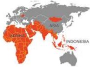

> **Deskripsi Visual:** Gambar ini adalah diagram yang menunjukkan wilayah geografis di dunia. Diagram ini menggambarkan beberapa negara dan wilayah dengan warna-warna berbeda. Wilayah-wilayah tersebut termasuk Afrika Selatan, Indonesia, dan beberapa negara Asia lainnya. Diagram ini juga menunjukkan bagaimana wilayah-wilayah tersebut terhubung melalui jalur jalan raya dan jaringan komunikasi. Informasi kunci yang dapat diambil dari gambar ini adalah bahwa wilayah-wilayah tersebut memiliki hubungan yang erat antaranya melalui jalur transportasi dan komunikasi.

Berakhirnya Perang Dunia II pada Agustus 1945, tidak berarti berakhir pula  situasi  permusuhan  di  antara  bangsa-bangsa  di  dunia  dan  tercipta perdamaian  dan  keamanan.  Ternyata  di  beberapa  bagian  dunia,  terutama di  belahan  bumi Asia  dan Afrika,  masih  ada  masalah  dan  muncul  masalah baru yang mengakibatkan permusuhan yang terus berlangsung, bahkan pada tingkat perang terbuka, seperti di wilayah Korea, Indochina, Palestina, Afrika Selatan, dan Afrika Utara.

Masalah-masalah  tersebut  sebagian  disebabkan  oleh  lahirnya  dua  blok kekuatan yang bertentangan secara ideologi maupun kepentingan, yaitu Blok Barat dan Blok Timur. Masing-masing Blok berusaha menarik negara-negara Asia dan Afrika untuk menjadi pendukung mereka. Hal ini mengakibatkan tetap hidupnya dan bahkan tumbuhnya suasana permusuhan yang terselubung di  antara  dua  Blok  itu  dan  pendukungnya.  Suasana  permusuhan  tersebut dikenal dengan nama 'Perang Dingin'.

Munculnya ketegangan dunia akibat dari adanya persaingan antara Blok Barat  dan  Blok  Timur  sangat  mengkhawatirkan  sebagian  negara-negara  di kawasan  Asia dan  Afrika yang pada akhir PD II sebagian besar baru memperoleh kemerdekaannya. Adanya persaingan kedua blok tersebut, membuat negaranegara Asia Afrika  khawatir  bahwa  wilayah  mereka  akan  dijadikan  arena persaingan dan perebutan pengaruh yang bisa menyebabkan ketidakstabilan politik  dan  ekonomi  di  kawasan  tersebut.  Kekhawatiran  mereka  menjadi kenyataan	dengan	munculnya	beberapa	konlik	di	kawasan	Asia	seperti	Perang Vietnam	dan	Perang	Korea.		Dalam	dua	konlik	tersebut,		pihak-pihak	internal yang	bersengketa	atau	berkonlik	mendapatkan	dukungan	dari	masing-masing

 

---
## 📄 Halaman 230

blok. Korea  Utara dan Vietnam Utara mendapatkan dukungan dari Blok Timur (Uni Soviet), sedangkan pihak lawannya, Korea Selatan dan Vietnam Selatan mendapatkan dukungan dari Blok Barat (AS). Dalam persaingan antara kedua blok tersebut,  keduanya memang tidak pernah berhadapan secara langsung dalam perang terbuka.

Melihat  fenomena  seperti  itu,  beberapa  pemimpin  negara-negara  Asia Afrika yang baru merdeka, seperti Indonesia, India, Burma/Myanmar, Srilanka dan Pakistan, berinisiatif untuk membuat pertemuan yang akan mendiskusikan permasalahan-permasalahan dunia yang krusial pada saat itu. Keadaan itulah yang melatarbelakangi lahirnya gagasan untuk mengadakan Konferensi Asia Afrika.

Gagasan untuk mengadakan sebuah konferensi yang melibatkan negaranegara Asia-Afrika  diawali  dari  pertemuan  di  Kolombo  yang  digagas  oleh PM Srilangka  Sir  John  Kotelawala.  Pertemuan  ini  dikenal  dengan  Sidang Panca  Perdana  Menteri  yang  dihadiri  oleh  para  Perdana  Menteri  dari Burma, Srilangka, India, Indonesia dan Pakistan. Munculnya gagasan untuk mengadakan  sidang  ini  didorong  oleh  kekhawatiran  dan  keprihatinan  atas situasi peperangan yang sedang berkecamuk di Indocina, dan perkembangan perlombaan senjata nuklir  antara dua blok.

Adanya undangan dari Srilangka tersebut disambut baik oleh Indonesia, yang  sejak  bulan  Juli  1953  pemerintahan  Indonesia  dipegang  oleh  Ali Sastroamidjojo. Rencana pertemuan tersebut dinilai sebagai kesempatan yang sangat baik untuk merealisasikan kebijakan politik luar negeri bebas aktif.

Kabinet  Ali  Sastroamidjojo  dalam  keterangannya  di  depan  Parlemen pada  Agustus  1953  telah  menegaskan,  bahwa  dalam  usaha  memperkokoh perdamaian dunia perlu dirintis dan diorganisasi kerja sama antara negaranegara Asia-Afrika terutama yang baru merdeka.

Sebelum  berangkat    PM  Ali  Sastroamidjodjo  ke  Kolombo,  Menlu Sunario dan para Dubes Indonesia di negara-negara Asia Afrika mengadakan pertemuan di Tugu, Bogor. Pertemuan itu membahas rumusan-rumusan yang akan menjadi bahan bagi PM Ali Sastroamidjojo untuk dibawa ke Kolombo, sebagai dasar usul Indonesia untuk meluaskan gagasan kerja sama regional di tingkat Asia-Afrika.

Sebelum berangkat ke Kolombo, PM Ali menemui Presiden Soekarno di Istana Merdeka pada bulan April 1955. Dalam pertemuan tersebut, Presiden Soekarno  berpesan  supaya  dalam  pertemuan  Kolombo  nanti,  Indonesia harus bisa memperjuangkan tekadnya untuk mengadakan sebuah konferensi yang melibatkan banyak negara Asia-Afrika. 'Ingat Ali, ini adalah cita-cita

 

---
## 📄 Halaman 231

bersama; hampir 30 tahun yang lalu kita dalam pergerakan nasional melawan penjajahan, kita sudah mendengungkan solidaritas Asia Afrika', kata Presiden Soekarno.

Pertemuan lima perdana menteri itu akhirnya berlangsung pada tanggal 28 April - 2 Mei 1954, Perdana Menteri Ceylon Srilangka (Sir Jhon Kotelawala), Perdana Menteri Burma ( U Nu), India (Jawaharlal Nehru), Indonesia (Ali Sastroamidjojo),  dan  Pakistan  (Mohamad Ali  Jinah)  melakukan  pertemuan informal  di Kolombo. Pertemuan tersebut kemudian dinamakan Konferensi Kolombo.

Pada  awalnya  pertemuan  ini  tidak  memiliki  agenda  khusus  dan  hanya 'neighbours  groups' yang  diadakan  untuk  mempererat  hubungan  antar kepala negara. Namun pada saat pertemuan dilangsungkan, kondisi di Vietnam mengalihkan hal tersebut. Lima kepala negara yang hadir lalu memfokuskan perhatian pada kasus ini, terutama pada kemungkinan eskalasi perang yang terjadi.

Adapun topik  yang  kemudian  didiskusikan  meliputi,  kondisi  Indocina, bom hidrogen, kolonialisme dan nasonalisme serta komunisme internasional. Gagasan Indonesia untuk mengadakan pertemuan negara-negara Asia-Afrika akhirnya baru bisa disampaikan pada sidangnya yang ke-6 pada tanggal 30 April sore hari. PM Ali Sastroamidjojo berkesempatan mengajukan usulnya supaya diadakan 'suatu Konferensi yang sama hakekatnya dengan Konferensi Kolombo,  tapi  lebih  luas  jangkauannya  dengan  tidak  hanya  memasukkan negara-negara Asia tetapi juga negara-negara Afrika lainnya.

Hal  yang  menarik  perhatian  para  peserta  konferensi,  di  antaranya pernyataan yang diajukan oleh Perdana Menteri Indonesia  Ali Sastroamidjojo:

' Di mana sekarang kita berdiri, bangsa Asia sedang berada di tengahtengah  persaingan  dunia.  Kita  sekarang  berada  di  persimpangan  jalan sejatah umat manusia. Oleh karena itu, kita Lima Perdana Menteri negaranegara  Asia  bertemu  di  sini  untuk  membicarakan  masalah-masalah yang  krusial  yang  sedang  dihadapi  oleh  masyarakat  yang  kita  wakili. Ada  beberapa  hal  yang  mendorong  Indonesia  mengajukan  usulan  untuk mengadakan pertemuan lain yang lebih luas, antara negara-negara Afrika dan Asia. Saya percaya bahwa masalah-masalah itu tidak terjadi hanya di negara-negara Asia yang terwakili di sini, tetapi juga sama pentingnya bagi negara-negara  Afrika  dan  Asia  lainnya'.  (Ali  Sastroamidjojo,  Tonggaktonggak di Perjalananku, Kinta, 1974)

 

---
## 📄 Halaman 232

Pernyataan  tersebut  memberi  arah  kepada  lahirnya  Konferensi  Asia Afrika. Selanjutnya, soal perlunya Konferensi Asia Afrika diadakan, diajukan pula oleh Indonesia dalam sidang berikutnya. Usul itu akhirnya diterima oleh semua peserta konferensi, walaupun masih dalam suasana keraguan. Akhirnya, dalam pernyataan bersama pada akhir Konferensi Kolombo, dinyatakan bahwa para  Perdana  Menteri  peserta  konferensi  membicarakan  kehendak  untuk mengadakan konferensi negara-negara Asia dan Afrika dan menyetujui usul agar Perdana Menteri Indonesia dapat menjajaki kemungkinan mengadakan konferensi tersebut.

Konferensi Kolombo selanjutnya menugaskan Indonesia agar menjajaki kemungkinan  untuk  diadakannya  Konferensi  Asia  Afrika.  Dalam  rangka menunaikan tugas itu Pemerintah Indonesia melakukan pendekatan melalui saluran  diplomatik  kepada  18  negara  Asia  dan  Afrika.  Maksudnya,  untuk mengetahui  sejauh  mana  pendapat  negara-negara  tersebut  terhadap  ide mengadakan Konferensi Asia Afrika. Dalam pendekatan tersebut dijelaskan bahwa tujuan utama konferensi tersebut ialah untuk membicarakan kepentingan bersama bangsa-bangsa Asia dan Afrika pada saat itu, mendorong terciptanya perdamaian dunia, dan mempromosikan Indonesia sebagai tempat konferensi. Ternyata pada umumnya negara-negara yang dihubungi menyambut baik ide tersebut dan menyetujui Indonesia sebagai tuan rumahnya.

Atas undangan  Perdana Menteri Indonesia, para Perdana Menteri peserta Konferensi Kolombo  (Birma,  Srilangka, India, Indonesia, dan Pakistan)  mengadakan  Konferensi  di  Bogor  pada  28  dan  29  Desember 1954, yang dikenal dengan sebutan Konferensi Lima Negara. Konferensi ini membicarakan  persiapan  pelaksanaan  Konferensi  Asia  Afrika.  Konferensi Bogor  berhasil  merumuskan  kesepakatan  bahwa  Konferensi  Asia  Afrika diadakan atas penyelenggaraan bersama dan kelima negara peserta konferensi tersebut menjadi negara sponsornya. Undangan kepada negara-negara peserta disampaikan oleh Pemerintah Indonesia atas nama lima negara.

Negara-negara yang diundang disetujui berjumlah 25 negara, yaitu:  Afganistan, Kamboja,  Federasi Afrika  Tengah,  Republik  Rakyat  Tiongkok  (China), Mesir, Ethiopia, Pantai Emas (Gold Coast) , Iran, Irak, Jepang,  Yordania,  Laos,  Libanon,  Liberia,  Libya, Nepal, Filipina, Saudi Arabia, Sudan, Syria, Thailand (Muangthai),  Turki,  Republik  Demokrasi  Vietnam (Vietnam Utara), Vietnam Selatan, dan Yaman. Waktu Konferensi  ditetapkan  pada  minggu  terakhir  April 1955.

 

---
## 📄 Halaman 233

Mengingat  negara-negara  yang  akan  diundang  mempunyai  politik  luar negeri serta sistem politik dan sosial yang berbeda-beda. Konferensi Bogor menentukan bahwa penerima undangan untuk turut  dalam  konferensi Asia Afrika tidak berarti bahwa negara peserta tersebut akan berubah atau dianggap berubah  pendiriannya  mengenai  status  dari  negara-negara  lain.  Konferensi menjunjung  tinggi  pula  asas  bahwa  bentuk  pemerintahan  atau  cara  hidup sesuatu negara tidak akan dapat dicampuri oleh negara lain. Maksud utama konferensi ialah supaya negara-negara peserta menjadi lebih saling mengetahui pendirian mereka masing-masing.

Gedung Dana Pensiun dipersiapkan sebagai tempat sidang-sidang Konferensi. Hotel Homann, Hotel Preanger, dan 12 (duabelas) hotel lainnya serta  perumahan  perorangan  dan  pemerintah  dipersiapkan  pula  sebagai tempat menginap para tamu yang berjumlah 1.300 orang. Dalam kesempatan memeriksa  persiapan-persiapan  terakhir  di  Bandung  pada  17  April  1955, Presiden  RI  Soekarno  meresmikan  penggantian  nama  Gedung  Concordia menjadi  Gedung  Merdeka,  Gedung  Dana  Pensiun  menjadi  Gedung  Dwi Warna, dan sebagian Jalan Raya Timur menjadi Jalan Asia Afrika. Penggantian nama  tersebut  dimaksudkan  untuk  lebih  menyemarakkan  konferensi  dan menciptakan suasana konferensi yang sesuai dengan tujuan konferensi.

Pada 15 Januari 1955, surat undangan Konferensi Asia Afrika dikirimkan kepada Kepala Pemerintahan 25 negara Asia dan Afrika. Dari seluruh negara yang diundang hanya satu negara yang menolak undangan itu, yaitu Federasi Afrika Tengah (Central African Federation) , karena memang negara itu masih dikuasai oleh orang-orang bekas penjajahnya. Sedangkan 24 negara lainnya menerima baik undangan itu, meskipun pada mulanya ada negara yang masih ragu-ragu. Sebagian besar delegasi peserta konferensi tiba di Bandung lewat Jakarta pada 16 April 1955.

Pada  tanggal  18  April  1955  Konferensi  Asia  Afrika  dilaksanakan  di Gedung Merdeka Bandung. Konferensi dimulai pada pukul 09.00 WIB dengan pidato  pembukaan oleh Presiden Republik Indonesia Ir.  Soekarno.  Sidangsidang selanjutnya dipimpin oleh Ketua Konferensi Perdana Menteri RI Ali Sastroamidjojo.

Konferensi  Asia  Afrika di Bandung melahirkan suatu kesepakatan bersama yang merupakan pokok-pokok tindakan dalam usaha menciptakan perdamian dunia. Ada sepuluh pokok yang dicetuskan dalam konferensi tersebut, maka itu disebut Dasasila.

 

---
## 📄 Halaman 234

### Dasasila Bandung

- Menghormati  hak-hak  dasar  manusia  dan  tujuan-tujuan, serta  asas-asas  kemanusiaan  yang  termuat  dalam  Piagam PBB.
- Menghormati  kedaulatan    dan  integritas  teritorial  semua bangsa.
- Mengakui persamaan semua suku-suku bangsa dan persamaan semua bangsa besar maupun kecil.
- Tidak  melakukan  campur  tangan  dalam  soal-soal  dalam negara lain.
- Menghormati  hak-hak  tiap  bangsa  untuk  mempertahankan diri secara sendirian atau secara kolektif, yang sesuai dengan Piagam PBB.
- Tidak melakukan tekanan terhadap negara-negara lain.
- Tidak  melakukan  tindakan-tindakan  atau  ancaman  agresi terhadap integritas teritorial dan kemerdekaan negara lain.
- Menyelesaikan  segala  perselisihan  internasional  dengan jalan damai seperti perundingan, persetujuan, dan lain-lain yang sesuai dengan Piagam PBB.
- Memajukan kerja sama untuk kepentingan bersama.
- Menghormati   hukum  dan  kewajiban-kewajiban  internasional.
Dalam  penutup  komunike  terakhir  dinyatakan  bahwa  Konferensi Asia Afrika    menganjurkan  supaya  kelima  negara  penyelenggara  mempertimbangkan untuk diadakan pertemuan berikutnya dari konferensi ini, dengan meminta pendapat  negara-negara  peserta  lainnya.  Tetapi  usaha  untuk  mengadakan Konferensi Asia Afrika kedua selalu mengalami hambatan yang sulit diatasi. Tatkala  usaha  itu  hampir  terwujud  (1964),  tiba-tiba  di  negara  tuan  rumah (Aljazair) terjadi pergantian pemerintahan, sehingga konferensi itu dibatalkan.

Konferensi Asia Afrika di Bandung, telah berhasil menggalang persatuan dan kerja sama di antara negara-negara  Asia dan  Afrika, baik dalam menghadapi masalah  internasional  maupun  masalah  regional.  Konferensi  serupa  bagi

 

---
## 📄 Halaman 235

kalangan  tertentu  di  Asia  dan  Afrika  beberapa  kali  diadakan  pula,  seperti Konferensi Wartawan Asia Afrika, Konferensi Islam Asia Afrika, Konferensi Pengarang Asia Afrika, dan Konferensi Mahasiswa Asia Afrika.

Konferensi  Asia  Afrika telah membakar semangat dan menambah kekuatan moral para pejuang bangsa-bangsa Asia dan Afrika yang pada masa itu tengah memperjuangkan kemerdekaan tanah air mereka, sehingga kemudian lahirlah sejumlah negara merdeka di Benua Asia dan Afrika. Semua itu menandakan bahwa cita-cita dan semangat Dasa Sila Bandung semakin merasuk ke dalam tubuh  bangsa-bangsa  Asia  dan  Afrika.  Jiwa  Bandung  dengan  Dasasilanya telah mengubah pandangan dunia tentang hubungan internasional. Bandung telah  melahirkan  paham  Dunia  Ketiga  atau 'Non-Aligned' terhadap  dunia pertamanya Washington dan dunia keduanya Moscow.

Dengan  diselenggarakannya  KAA  di  Bandung,  kota  Bandung  menjadi terkenal  di  seluruh  dunia.  Semangat  perdamaian  yang  dicetuskan  di  Kota Bandung  dijuluki  'Semangat  Bandung'  atau 'Bandung  Spirit' .  Untuk mengabadikan  peristiwa  sejarah  yang  penting  itu  jalan  protokol  di  Kota Bandung yang terbentang di depan Gedung Merdeka diberi nama Jalan Asia Afrika.

Perhatikan foto di bawah ini, siapa saja yang ada dalam foto tersebut?

---
**🖼️ Gambar/Diagram**

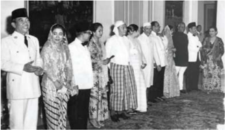

> **Deskripsi Visual:** Gambar ini adalah foto yang menampilkan kelompok orang yang tampaknya sedang berdiri dan menghadap ke arah yang sama. Kelompok ini terdiri dari beberapa pria dan wanita yang berpakaian formal, mungkin dalam acara resmi atau pertemuan penting. Pria-pria tersebut mengenakan jas putih atau baju formal, sementara wanita mengenakan pakaian tradisional atau modern dengan detail yang mencolok.

Elemen-elemen utama dalam gambar ini meliputi:
1. Kelompok orang yang terdiri dari pria dan wanita.
2. Pakaian formal yang dikenakan oleh semua individu.
3. Latar belakang yang tampak seperti ruangan yang elegan, mungkin di gedung atau kompleks administratif.

Teks, angka, atau label penting tidak terlihat dalam gambar ini. Namun, informasi kunci yang dapat diambil dari gambar ini adalah bahwa ini mungkin merupakan foto dari sebuah acara resmi atau pertemuan penting, dengan para peserta yang tampaknya memiliki peran penting dalam situasi tersebut.

Gambar 6.4 Soekarno, M. Hatta, dan Tokoh KAA

 

---
## 📄 Halaman 236

### 2.   Gerakan Non-Blok/ Non Align Movement (NAM)

Gerakan Non-Blok (GNB) atau Non Align Movement (NAM) adalah suatu gerakan  yang dipelopori oleh negara-negara dunia ketiga  yang beranggotakan lebih  dari  100  negara-negara  yang  berusaha  menjalankan  kebijakan  luar negeri yang tidak memihak dan tidak menganggap dirinya beraliansi dengan Blok Barat atau Blok Timur. Gerakan Non Blok merepresentasikan 55 persen penduduk dunia dan hampir 2/3 keanggotaan PBB. Mayoritas negara-negara anggota  GNB  adalah  negara-negara  yang  baru  memperoleh  kemerdekaan setelah	 berakhirnya	 Perang	 Dunia	 II,	 dan	 secara	 geograis	 berada	 di	 benua Asia, Afrika dan Amerika Latin.

Setelah  berakhirnya  Perang  Dunia  II,  tepatnya  di  era  1950-an  negaranegara  di  dunia  terpolarisasi  dalam  dua  blok,  yaitu  Blok  Barat  di  bawah pimpinan Amerika Serikat dan Blok Timur di bawah pimpinan Uni Soviet. Pada  saat  itu  terjadi  pertarungan  yang  sangat  kuat  antara  Blok  Barat  dan Blok  Timur,  era  ini  dikenal  sebagai  era  Perang  Dingin  ( Cold  War )  yang berlangsung sejak berakhirnya PD II hingga runtuhnya Uni Soviet pada tahun 1989. Pertarungan antara Blok Barat dan Blok Timur merupakan upaya untuk memperluas sphere of interest dan sphere	of	inluence . Dengan sasaran utama perebutan penguasaan atas wilayah-wilayah potensial di seluruh dunia.

Dalam pertarungan perebutan pengaruh ini, negara-negara dunia ketiga (di Asia, Afrika, Amerika Latin) yang mayoritas sebagai negara yang baru merdeka dilihat sebagai wilayah yang sangat menarik bagi kedua blok untuk menyebarkan pengaruhnya. Akibat persaingan kedua blok tersebut, muncul beberapa	konlik	terutama	di	Asia,		seperti	Perang	Korea,	dan	Perang	Vietnam.

 

---
## 📄 Halaman 237

Dalam kondisi seperti ini, muncul kesadaran yang kuat  dari para pemimpin dunia ketiga saat itu untuk tidak terseret dalam persaingan antara kedua blok tersebut.

Indonesia  dapat  dikatakan  memiliki  peran  yang  sangat  penting  dalam proses  kelahiran  organisasi  ini.    Lahirnya  organisasi  Gerakan  Non  Blok dilatarbelakangi oleh kekhawatiran para pemimpin negara-negara dunia ketiga terutama dari Asia dan Afrika terhadap munculnya ketegangan dunia saat itu karena adanya persaingan antara Blok Barat dan Blok Timur.

KAA di Bandung merupakan proses awal lahirnya GNB. Tujuan KAA adalah	 mengidentiikasi	 dan	 mendalami	 masalah-masalah	 dunia	 waktu	 itu dan berusaha memformulasikan kebijakan bersama negara-negara yang baru merdeka tersebut pada tataran hubungan internasional. Sejak saat itu proses pendirian GNB semakin mendekati kenyataan, tokoh-tokoh yang memegang peran kunci sejak awal adalah Presiden Mesir Ghamal Abdul Naser, Presiden Ghana Kwame Nkrumah, Perdana Menteri India Jawaharlal Nehru, Presiden Indonesia Soekarno, dan Presiden Yugoslavia Josep Broz Tito. Kelima tokoh ini kemudian dikenal sebagai para pendiri GNB.

Adanya ketegangan  dunia yang semakin meningkat akibat persaingan antara Blok Barat dan Blok Timur, yang dimulai dari pecahnya perang Vietnam, perang Korea dan puncaknya krisis Teluk Babi di Kuba, yang hampir saja memicu Perang Dunia III  mendorong para pemimpin negara-negara Dunia

 

---
## 📄 Halaman 238

Ketiga untuk membentuk sebuah organisasi yang diharapkan bisa berperan mengurangi ketegangan politik dunia internasional saat itu.

Pembentukan organisasi Gerakan Non Blok dicanangkan dalam Konferensi  Tingkat  Tinggi  (KTT)  I  di  Beograd,  Yugoslavia  16  September 1961 yang dihadiri oleh 25 negara dari Asia dan  Afrika. Dalam KTT I tersebut, negara-negara  pendiri  GNB  berketetapan  untuk  mendirikan  suatu  gerakan dan bukan suatu organisasi untuk menghindarkan diri dari implikasi birokratik dalam membangun upaya kerja sama di antara mereka. Pada KTT I ini juga ditegaskan bahwa GNB tidak diarahkan pada suatu peran pasif dalam politik internasional, tetapi untuk memformulasikan posisi sendiri secara independen yang	mereleksikan	kepentingan	negara-negara	anggotanya.

GNB menempati posisi khusus dalam politik luar negeri Indonesia karena Indonesia  sejak  awal  memiliki  peran  sentral  dalam  pendirian  GNB.  KAA tahun 1955 yang diselenggararakan di Bandung dan menghasilkan Dasa Sila Bandung yang menjadi prinsip-prinsip utama GNB, merupakan bukti peran dan kontribusi penting Indonesia dalam mengawali pendirian GNB. Tujuan GNB mencakup dua hal, yaitu tujuan ke dalam dan ke luar. Tujuan ke dalam yaitu  mengusahakan  kemajuan  dan  pengembangan  ekonomi,  sosial,  dan politik yang jauh tertinggal dari negara maju. Tujuan ke luar, yaitu berusaha meredakan ketegangan antara Blok Barat dan Blok Timur menuju perdamaian dan  keamanan  dunia.  Untuk  mewujudkan  tujuan  tersebut,  negara-negara Non  Blok  menyelenggarakan  Konferensi  Tingkat  Tinggi  (KTT).  Pokok pembicaraan utama adalah membahas persoalan-persoalan yang berhubungan dengan tujuan Non Blok dan ikut mencari solusi terbaik terhadap peristiwaperistiwa internasional yang membahayakan perdamaian dan keamanan dunia.

Dalam perjalanan sejarahnya sejak KTT I di Beograd tahun 1961, Gerakan Non Blok telah 16 kali menyelenggarakan Konferensi Tingkat Tinggi, yang terakhir KTT XVI yang berlangsung di Teheran pada Agustus 2012.  Indonesia sebagai salah satu pendiri GNB pernah menjadi tuan rumah penyelenggaraan KTT  GNB  yang  ke  X  pada  tahun  1992.  KTT  X  ini  diselenggarakan  di Jakarta, Indonesia pada 1 September 1992 - 7 September 1992, dipimpin oleh Soeharto. KTT ini menghasilkan 'Pesan Jakarta' yang mengungkapkan sikap GNB tentang  berbagai  masalah,  seperti  hak  asasi  manusia,  demokrasi  dan kerja sama Utara Selatan dalam era pasca Perang Dingin.

KTT ini dihadiri oleh lebih dari 140 delegasi, 64 Kepala Negara. KTT ini juga dihadiri oleh Sekjen PBB Boutros Boutros Ghali.

 

---
## 📄 Halaman 239

### 3. Misi Pemeliharaan Perdamaian Garuda

Sumber: Deppen, 1975

Dalam  rangka  ikut  mewujudkan  perdamaian  dunia,  maka  Indonesia memainkan sejumlah peran dalam percaturan internasional. Peran yang cukup menonjol  yang  dimainkan  oleh  Indonesia  adalah  dalam  rangka  membantu mewujudkan pemeliharaan perdamaian dan keamanan internasional. Dalam hal  ini  Indonesia  sudah  cukup  banyak  mengirimkan  Kontingen  Garuda (KONGA) ke luar negeri. Sampai tahun 2014  Indonesia telah mengirimkan kontingen  Garudanya  sampai  dengan  kontingen  Garuda  yang  ke  duapuluh tiga (XXIII).

Pengiriman Misi Garuda yang pertama kali dilakukan pada bulan Januari 1957.	 Pengiriman	 Misi	 Garuda	 dilatarbelakangi	 adanya	 konlik	 di	 Timur Tengah  terkait  masalah  nasionalisasi  Terusan  Suez  yang  dilakukan  oleh Presiden  Mesir  Ghamal Abdul Nasser pada 26 Juli 1956. Sebagai akibatnya, pertikaian  menjadi  meluas  dan  melibatkan  negara-negara  di  luar  kawasan tersebut yang berkepentingan dalam masalah Suez. Pada bulan Oktober 1956, Inggris, Prancis dan Israel melancarkan serangan gabungan terhadap Mesir. Situasi ini mengancam perdamaian dunia sehingga Dewan Keamanan PBB turun tangan dan mendesak pihak-pihak yang bersengketa untuk berunding.

Dalam Sidang Umum PBB Menteri Luar Negeri Kanada Lester B. Pearson mengusulkan agar dibentuk suatu pasukan PBB untuk memelihara perdamaian di Timur  Tengah. Usul ini disetujui Sidang dan pada tanggal 5 November 1956 Sekjen. PBB membentuk sebuah komando PBB dengan nama United Nations Emergency Forces (UNEF). Pada tanggal 8 November Indonesia menyatakan kesediannya untuk turut serta menyumbangkan pasukan dalam UNEF.

Sebagai pelaksanaanya, pada 28 Desember 1956, dibentuk sebuah pasukan yang berkuatan satu detasemen (550 orang) yang terdiri dari kesatuan-kesatuan Teritorium IV/Diponegoro dan Teritorium V/Brawijaya. Kontingen Indonesia untuk UNEF yang diberi nama Pasukan Garuda ini diberangkatkan ke Timur Tengah pada bulan Januari 1957.

 

---
## 📄 Halaman 240

Untuk kedua kalinya Indonesia mengirimkan kontingen untuk diperbantukan  kepada United  Nations  Operations  for  the  Congo (UNOC) sebanyak	satu	batalyon.	Pengiriman	pasukan	ini	terkait	munculnya	konlik	di Kongo	(Zaire	sekarang).	Konlik	ini	muncul	berhubungan	dengan	kemerdekaan Zaire pada bulan Juni 1960 dari Belgia yang justru memicu pecahnya perang saudara. Untuk mencegah pertumpahan darah yang lebih banyak, maka PBB membentuk Pasukan Perdamaian untuk Kongo, UNOC. Pasukan kali ini di sebut 'Garuda II' yang terdiri atas Batalyon 330/Siliwangi, Detasemen Polisi Militer, dan Peleton KKO Angkatan Laut. Pasukan Garuda II  berangkat dari Jakarta tanggal 10 September 1960 dan menyelesaikan tugasnya pada bulan Mei  1961.  Tugas  pasukan  Garuda  II  di  Kongo  kemudian  digantikan  oleh pasukan Garuda III yang bertugas dari bulan Desember 1962 sampai bulan Agustus 1964.

Peran aktif Indonesia dalam menjaga perdamaian dunia terus berlanjut, ketika  meletus  perang  saudara  antara  Vietnam  Utara  dan  Vietnam  Selatan. Indonesia kembali diberikan kepercayaan oleh PBB  untuk mengirim pasukannya sebagai pasukan pemelihara perdamaian PBB.  Untuk menjaga stabilitas  politik  di  kawasan  Indocina  yang  terus  bergolak  akibat  perang saudara tersebut, PBB  membentuk International Commission of Control and Supervision (ICCS) sebagai hasil dari persetujuan internasional di Paris pada tahun 1973. Komisi ini terdiri atas empat negara, yaitu Hungaria, Indonesia, Kanada  dan  Polandia.  Tugas  ICCS  adalah  mengawasi  pelanggaran  yang dilakukan kedua belah pihak yang bertikai.

Pasukan perdamaian Indonesia yang dikirim ke Vietnam disebut sebagai Pasukan Garuda IV yang berkekuatan 290 pasukan,  bertugas di Vietnam  dari bulan Januari 1973, untuk kemudian diganti dengan Pasukan Garuda V, dan kemudian pasukan Garuda VII. Pada tahun 1975 Pasukan Garuda VII ditarik dari Vietnam karena seluruh Vietnam jatuh ke tangan Vietcong (Vietnam Utara yang komunis).

Pada 1973, ketika pecah perang Arab-Israel ke-4, UNEF diaktifkan lagi dengan kurang lebih  7000  anggota  yang  terdiri  atas  kesatuan-kesatuan  Australia, Finlandia,  Swedia,  Irlandia,  Peru,  Panama,  Senegal,  Ghana  dan  Indonesia. Kontingen Indonesia semula berfungsi sebagai pasukan pengamanan dalam perundingan antara Mesir dan Israel. Tugas pasukan Garuda VI berakhir 23 September 1974 untuk digantikan dengan Pasukan Garuda VIII yang bertugas hingga tanggal 17 Februari 1975. Selanjutnya Indonesia terus ikut berperan aktif  dalam  menjaga  perdamaian  dunia  dengan  aktif  mengirim  pasukan perdamaian	ke	berbagai	wilayah	konlik	di	seluruh	dunia.

 

---
## 📄 Halaman 241

Sejak  tahun  1975  hingga  kini  dapat  dicatat  peran  Indonesia  dalam memelihara  perdamaian  dunia  semakin  berperan  aktif,  ditandai  dengan didirikannya Indonesian Peace Security Centre (IPSC/Pusat Perdamaian dan Keamanan Indonesia) pada tahun 2012, yang didalamnya terdapat  unit yang mengelola kesiapan pasukan yang akan dikirim untuk menjaga perdamaian dunia ( Standby Force ).

### 4. ASEAN

### Mengamati Lingkungan

Sumber: http/ymun.yira.org

Gambar 6.8 Foto Bendera Negara-negara Anggota ASEAN

Gambar 6.9 Foto Suasana Penandatanganan Deklarasi Pembentukan ASEAN di Bangkok

 

---
## 📄 Halaman 242

### a. Pembentukan ASEAN

Menjelang berakhirnya konfrontasi Indonesia-Malaysia, beberapa pemimpin  bangsa-bangsa  Asia  Tenggara  semakin  merasakan  perlunya membentuk  suatu  kerja  sama  regional    untuk  memperkuat  kedudukan dan kestabilan sosial ekonomi di kawasan Asia Tenggara. Pada tanggal 5-8  Agustus  di  Bangkok  dilangsungkan  pertemuan  antarmenteri  luar negeri  dari  lima  negara,  yakni  Adam  Malik  (Indonesia),  Tun  Abdul Razak (Malaysia), S. Rajaratnam (Singapura), Narsisco Ramos (Filipina) dan tuan rumah Thanat Khoman (Thailand). Pada 8 Agustus  1967 para menteri luar negeri tersebut menandatangani suatu deklarasi yang dikenal sebagai Bangkok Declaration .  Deklarasi tersebut merupakan persetujuan kesatuan tekad kelima negara tersebut untuk  membentuk suatu organisasi kerja sama regional yang disebut Association of South East Asian Nations (ASEAN).

### Menurut Deklarasi Bangkok, Tujuan ASEAN adalah:

- Mempercepat pertumbuhan ekonomi, kemajuan sosial dan perkembangan kebudayaan di Asia Tenggara.
- Memajukan stabilisasi dan perdamaian regional Asia Tenggara.
- Memajukan  kerja  sama  aktif  dan  saling  membantu  di  negaranegara  anggota  dalam  bidang  ekonomi,  sosial,  budaya,  teknik, ilmu pengetahuan dan administrasi.
- Menyediakan  bantuan  satu  sama  lain  dalam  bentuk  fasilitasfasilitas  latihan dan penelitian.
- Kerja  sama  yang  lebih  besar  dalam  bidang  pertanian,  industri, perdagangan, pengangkutan, komunikasi serta usaha peningkatan standar kehidupan rakyatnya.
- Memajukan studi-studi masalah Asia Tenggara.
- Memelihara  dan  meningkatkan  kerja  sama  yang  bermanfaat dengan  organisasi-organisasi  regional  dan  internasional  yang ada.

 

---
## 📄 Halaman 243

Dari tujuh pasal Deklarasi Bangkok itu jelas, bahwa ASEAN merupakan organisasi  kerja  sama  negara-negara  Asia  Tenggara  yang  bersifat  non politik  dan  non  militer.  Keterlibatan  Indonesia  dalam  ASEAN  bukan merupakan  suatu  penyimpangan  dari  kebijakan  politik  bebas  aktif, karena ASEAN bukanlah suatu pakta  militer  seperti  SEATO  misalnya. ASEAN sangat selaras dengan tujuan politik luar negeri Indonesia yang mengutamakan pembangunan ekonomi dalam negeri, karena terbentuknya ASEAN  adalah  untuk  mempercepat  pembangunan  ekonomi,  stabilitas sosial  budaya,  dan  kesatuan  regional  melalui  usaha  dengan  semangat tanggungjawab bersama dan persahabatan yang akan menjamin bebasnya kemerdekaan negara-negara anggotanya.

Kerja sama dalam bidang ekonomi juga merupakan pilihan bersama para anggota ASEAN. Hal itu disadari karena  negara-negara ASEAN pada saat itu adalah negara-negara yang menginginkan pertumbuhan ekonomi. Meskipun demikian kerja sama dalam bidang lain seperti bidang politik dan militer tidak diabaikan. Indonesia dan Malaysia misalnya melakukan kerja sama militer untuk meredam bahaya komunis di perbatasan kedua negara  di  Kalimantan.  Malaysia  dan  Thailand  melakukan  kerja  sama militer di daerah perbatasannya untuk meredam bahaya komunis. Akan tetapi  Deklarasi  Bangkok  dengan  tegas  menyebutkan  bahwa  pangkalan militer  asing  yang  berada  di  negara  anggota  ASEAN  hanya  bersifat sementara dan keberadaannya atas persetujuan negara yang bersangkutan.

Pada  masa-masa  awal  berdirinya  ASEAN  telah  mendapat  berbagai tantangan yang muncul dari masalah-masalah negara anggotanya sendiri. Seperti masalah  antara Malaysia dan Filipina menyangkut Sabah, sebuah wilayah di Borneo/Kalimantan Utara. Kemudian persoalan hukuman mati dua  orang  anggota  marinir  Indonesia  di  Singapura,  kerusuhan  rasialis di  Malaysia,  dan  permasalahan    minoritas  muslim  di Thailand  Selatan. Akan tetapi, semua pihak yang terlibat dalam permasalahan-permasalahan tersebut	dapat	meredam	potensi	konlik	yang	muncul	sehingga	stabilitas kawasan dapat dipertahankan.

Aktivitas ASEAN  dalam  bidang  politik  yang  menonjol  adalah  dengan dikeluarkannya Kuala  Lumpur  Declaration pada  27  November  1971. Deklarasi  tersebut  merupakan  pernyataan  kelima  menteri  Luar  Negeri ASEAN  yang  menyatakan  bahwa  Asia  Tenggara  merupakan zone  of peace,  freedom  and  neutrality (ZOPFAN)/Zona  Bebas  Netral,  bebas dari segala campur tangan pihak luar. Dalam Konferensi Tingkat Tinggi ASEAN yang pertama di Bali pada 1976 masalah kawasan Asia Tenggara

 

---
## 📄 Halaman 244

sebagai wilayah damai, bebas dan netral telah berhasil dicantumkan dalam 'Deklarasi Kesepakatan ASEAN' dan diterima sebagai program kegiatan kerangka kerja sama ASEAN.

Selain menghadapi permasalahan-permasalahan yang muncul dari negaranegara	anggotanya	sendiri,	seperti	potensi	konlik	yang	telah	dijelaskan sebelumnya. Tantangan ASEAN pada awal berdirinya adalah  masalah keraguan  dari  beberapa  negara-negara  anggotanya  sendiri.  Singapura misalnya, menampakkan  sikap kurang antusias terhadap  ASEAN, sementara  Filipina  dan  Thailand  meragukan  efektivitas ASEAN  dalam melakukan  kerja  sama  kawasan.  Hanya  Indonesia  dan  Malaysia  yang menunjukkan  sikap  serius  dan  optimis  terhadap  keberhasilan  ASEAN sejak organisasi tersebut didirikan.

Keraguan  beberapa  negara  anggota  ASEAN  sendiri  dapat  dimaklumi karena pada masa 1969-1974 dapat dikatakan sebagai tahap konsolidasi ASEAN.  Pada  tahap  tersebut  secara  perlahan  rasa  solidaritas  ASEAN terus  menebal  dan  hal  itu  menumbuhkan  keyakinan  bahwa  lemah  dan kuatnya ASEAN tergantung partisipasi negara-negara anggotanya. Pada perjalanan  selanjutnya  ASEAN  mulai  menunjukkan  sebagai  kekuatan ekonomi	yang	mendapat	tempat	di	wilayah	Pasiik	dan	kelompok	ekonomi lainnya di dunia seperti Masyarakat Ekonomi Eropa dan Jepang.

Bidang sosial dan budaya pun menjadi perhatian  ASEAN, melalui berbagai aktivitas budaya diupayakan untuk memasyarakatkan ASEAN terutama untuk  kalangan  remaja,  seniman,  cendikiawan  dan  berbagai  kelompok masyarakat lainnya di  negara-negara anggota. Untuk itu, ASEAN pada 1972 telah membentuk suatu Panitia Tetap Sosial-Budaya.

Perkembangan organisasi ASEAN semakin menunjukkan perkembangan yang  positif  setelah  dalam  KTT  pertama  di  Bali    pada  1976  dibentuk Sekretariat  Tetap  ASEAN  yang  berkedudukan  di  Jakarta.  Pada  sidang tahunan  Menteri  Luar  Negeri ASEAN  di  Manila  tanggal  7  Juni  1976, H.R. Dharsono (Sekretaris Jenderal Nasional ASEAN Indonesia) ditunjuk sebagai Sekretaris Jenderal ASEAN yang pertama.

Pada KTT ASEAN di Bali tahun 1977 telah memperkuat Deklarasi Kuala Lumpur  dan  telah  berhasil  menetapkan  prinsip-prinsip  program  kerja dalam usaha bersama untuk menciptakan stabilitas politik, memperat kerja sama ekonomi, sosial dan budaya. KTT Bali telah berhasil menetapkan cara-cara  yang  lebih  konkret  dan  terperinci  dan  usaha-usaha  kerja sama regional ASEAN. Tindak lanjut dari KTT di Bali tersebut adalah dilakukannya sidang menteri-menteri ekonomi ASEAN di Kuala Lumpur

 

---
## 📄 Halaman 245

pada  8-9  Maret  1977  untuk  melaksanakan  keputusan-keputusan  KTT ASEAN di bidang kerja sama ekonomi. Dalam sidang menteri-menteri ekonomi  tersebut  disetujui  asas  saling  membantu  antarnegara ASEAN dalam  bidang  pangan  dan  energi,  terutama  dalam  soal  pengadaan  dan produksinya.

Secara  konkret  masing-masing  negara ASEAN  membangun  lima  buah proyek  bersama.  Kerja  sama  yang  dimaksud  adalah  koordinasi  antara satu dengan lainnya. Dalam bidang perdagangan telah disepakati untuk mengambil langkah-langkah  bersama  guna  mengadakan  dialog  dengan negara-negara Australia, Kanada, Amerika Serikat, Jepang, negara-negara Timur Tengah, Eropa  Timur, Masyarakat Ekonomi Eropa dan berbagai kelompok negara lainnya.

Kerja  sama  antar  negara-negara  di  kawasan Asia  Tenggara  merupakan suatu  upaya  konkret  Indonesia  untuk  menciptakan  stabilitas  kawasan. Indonesia  menyadari  kenyataan  bahwa  kerja  sama  regional  itu  tidak akan berhasil meningkatkan kemakmuran nasional dan regional bangsabangsa di Asia Tenggara dengan sebaik-baiknya, jika tidak ada keamanan dan stabilitas di kawasan tersebut. Itulah sebabnya Indonesia senantiasa berusaha membantu pihak-pihak yang bersengketa untuk mencari penyelesaian  dalam  masalah  Indocina.  Indonesia  berpendapat  bahwa penyelesaian Indocina secara keseluruhan dan Vietnam khususnya sangat penting  artinya  dalam  rangka  memelihara  keamanan  dan  menciptakan stabilitas di Asia Tenggara.

Indonesia  berpandangan  bahwa  negara-negara  di Asia Tenggara  paling berkepentingan dan bertanggungjawab terhadap pemeliharaan keamanan di kawasannya. Oleh karena itu,  bangsa-bangsa di Asia Tenggara harus mencegah dan menghalau setiap campur tangan asing yang negatif dalam segala bentuk  dan manifestasinya.

Pada  masa  pemerintahan  Soeharto,  Indonesia  bisa  dikatakan  adalah pemimpin ASEAN, kebijakan-kebijakan ekonomi  ASEAN sangat tergantung dari cara Indonesia bersikap. Peran sebagai pemimpin ASEAN sempat  memudar  saat  terjadi  krisis  ekonomi  karena  Indonesia  sedang mengalami masalah ekonomi dalam negeri dan situasi politik yang belum stabil dalam rangka menuju demokratisasi. Indonesia kembali berperan di era pemerintahan Presiden SBY, melalui momentum terpilihnya Indonesia sebagai Ketua ASEAN pada tahun 2011. Indonesia mulai mengarahkan ASEAN untuk mencapai suatu komunitas ekonomi yang kokoh di tahun 2015. Indonesia mengarahkan capaian implementasi Piagam ASEAN dan Cetak Biru Komunitas ASEAN 2015.

 

---
## 📄 Halaman 246

### b. Pembentukan Komunitas ASEAN

Setelah berakhirnya Perang Dingin pada dekade 80-an, isu-isu ideologi yang mengungkung dunia dan demikian halnya dengan ASEAN mulai tersingkirkan, dan kerja sama kawasan semakin intensif dan menyeluruh dalam berbagai bidang. Dalam upaya menempa integrasi dan kerja sama yang lebih kuat di antara negara-negara anggota.   ASEAN bersepakat untuk mengembangkan  suatu  kawasan  yang  terintegrasi  dengan  membentuk suatu komunitas negara-negara Asia Tenggara yang terbuka, damai, stabil dan sejahtera,  saling  peduli,  dan  diikat  bersama  dalam  kemitraan  yang dinamis di tahun 2020. Harapan tersebut dituangkan dalam Visi ASEAN 2020  yang  ditetapkan  oleh  para  Kepala  Negara/Pemerintahan ASEAN pada Konferensi Tingkat Tinggi (KTT) ASEAN di Kuala Lumpur tanggal 15 Desember 1997. Selanjutnya, untuk merealisasikan harapan tersebut, ASEAN mengesahkan Bali Concord II pada KTT ASEAN ke-9 di Bali tahun 2003 yang menyepakati pembentukan Komunitas ASEAN (ASEAN Community).

Komunitas ASEAN terdiri atas 3 (tiga) pilar,  yaitu  Komunitas  PolitikKeamanan  ASEAN (ASEAN Political-Security Community/APSC) , Komunitas  Ekonomi  ASEAN (ASEAN  Economic  Community/AEC) , Komunitas Sosial Budaya ASEAN (ASEAN Socio-Cultural Community/ ASCC) .  Indonesia  menjadi  penggagas  pembentukan  Komunitas  Politik dan Keamanan ASEAN serta memainkan peran penting dalam perumusan dua pilar lainnya.

Pada  KTT  ASEAN  ke-10  di  Vientiane,  Laos,  tahun  2004,  konsep Komunitas  ASEAN  mengalami  kemajuan  dengan  disetujuinya  tiga Rencana  Aksi (Plan  of  Action/PoA) untuk  masing-masing  pilar  yang merupakan program jangka panjang untuk merealisasikan pembentukan Komunitas ASEAN. KTT tersebut juga mengintegrasikan ketiga Rencana Aksi Komunitas ASEAN ke dalam Vientiane Action Programme ( VAP ) sebagai landasan program jangka pendek-menengah untuk periode 20042010.

Upaya  kesepakatan  pembentukan  Komunitas  ASEAN  semakin  kuat dengan ditandatanganinya Deklarasi Cebu mengenai Percepatan Pembentukan Komunitas ASEAN pada tahun 2015 (Cebu  Declaration on  the  Acceleration  of  the  Establishment  of  an  ASEAN  Community  by 2015) oleh  para Pemimpin ASEAN pada KTT ke-12 ASEAN di Cebu, Filipina, tanggal 13 Januari 2007. Dengan ditandatanganinya Deklarasi tersebut, para Pemimpin ASEAN menyepakati percepatan pembentukan Komunitas ASEAN dari tahun 2020 menjadi tahun 2015.

 

---
## 📄 Halaman 247

Seiring  dengan  upaya  perwujudan  Komunitas  ASEAN,  ASEAN  juga menyepakati  untuk  menyusun  semacam  konstitusi  yang  akan  menjadi landasan dalam penguatan kerja sama. Dalam kaitan ini, proses penyusunan Piagam  ASEAN dimulai sejak tahun 2006 melalui pembentukan Kelompok Ahli (Eminent  Persons  Group/EPG) dan  kemudian  dilanjutkan  oleh Gugus Tugas Tingkat Tinggi (High Level Task Force) untuk melakukan negosiasi terhadap draf Piagam ASEAN.

Pada  usia  ke-40  tahun  ASEAN,  para  Kepala  Negara/Pemerintahan ASEAN pada KTT ke-13 ASEAN di Singapura bulan November 2007 telah menandatangani Piagam ASEAN (ASEAN Charter) yang mengubah ASEAN  dari  organisasi  yang  longgar (loose association) menjadi organisasi  yang  berdasarkan  hukum (rules-based  organization) dan menjadi subjek hukum (legal personality) .

Piagam ASEAN  mulai  diberlakukan  pada  tanggal  15  Desember  2008 setelah	semua	negara	anggota	ASEAN	menyampaikan	ratiikasi	kepada Sekretaris Jenderal  ASEAN.  Peresmian mulai berlakunya Piagam ASEAN tersebut dilakukan oleh Presiden RI Susilo Bambang Yudhoyono di Sekretariat ASEAN. Untuk Indonesia, pemberlakuan Piagam ASEAN ini disahkan melalui Undang-Undang RI Nomor 38 Tahun 2008 tentang Pengesahan Piagam Perhimpunan Bangsa-Bangsa Asia Tenggara (Charter of The Association of Southeast Asian Nations) .  Implementasi Piagam ASEAN mulai ditegaskan pada KTT ASEAN ke-14 di Hua Hin, Thailand, pada tanggal 28 Februari-1 Maret 2009.

Piagam ASEAN adalah dokumen ASEAN yang mengubah ASEAN dari sebuah  asosiasi  yang  longgar  menjadi  sebuah  organisasi  internasional yang memiliki dasar hukum yang kuat, dengan aturan yang jelas, serta memiliki	 struktur	 organisasi	 yang	 efektif	 dan	 eisien.	 Piagam	ASEAN ditandatangani  pada  KTT  ke-13  ASEAN  pada  tanggal  20  November 2007 di Singapura oleh 10 Kepala Negara/Pemerintahan Negara Anggota ASEAN.

Piagam ASEAN mulai berlaku secara efektif sejak tanggal 15 Desember 2008  setelah  semua  negara  anggota ASEAN  menyampaikan  dokumen pemberitahuan  pengesahan  ke  Sekretariat  ASEAN.  Dalam  hal  itu, Indonesia mengesahkan Piagam ASEAN melalui UU No. 38 Tahun 2008. Piagam  ASEAN  memuat  prinsip-prinsip  yang  tertuang  dalam  semua perjanjian, deklarasi, dan kesepakatan ASEAN.

Piagam  ASEAN  berguna  dalam  memberikan  kerangka  kerja  hukum dan kelembagaan bagi ASEAN. Kedua hal tersebut memperkuat ikatan kesetiakawanan  kawasan  untuk  mewujudkan  Komunitas ASEAN  yang

 

---
## 📄 Halaman 248

terpadu secara politis, terintegrasi secara ekonomis, dan dapat bertanggung jawab secara sosial dalam rangka menjawab tantangan dan peluang saat ini dan saat mendatang secara efektif.

Dalam  Piagam  ASEAN  tersebut  tercantum  ketetapan  ASEAN  untuk membentuk komunitas ASEAN tahun 2015. Komunitas ASEAN tersebut terdiri atas 3,  pilar yaitu Komunitas Politik Keamanan  ASEAN, Komunitas Ekonomi ASEAN, dan Komunitas Sosial Budaya ASEAN.

Komunitas  ASEAN  adalah  wadah  untuk  lebih  mempererat  integrasi masyarakat ASEAN dan untuk menyesuaikan cara pandang keterbukaan dalam menyikapi perkembangan dunia. Gagasan pembentukan komunitas ASEAN itu dicetuskan pada tahun 1997 dalam visi ASEAN 2002 dan dikukuhkan  pada  tahun  2003  pada  KTT  ke-9  di  Bali.  Pilar  komunitas ASEAN adalah tiga pilar dalam membangun komunitas ASEAN, yaitu pilar politik-keamanan, pilar ekonomi, dan pilar sosial-budaya. Masingmasing pilar memiliki bidang kerja sama antarnegara anggota ASEAN.

Pilar  Komunitas  Politik-Keamanan  ASEAN  menangani  peningkatan kerja sama di bidang politik dan keamanan untuk memelihara perdamaian serta memajukan nilai Hak Asasi Manusia dan demokratisasi di kawasan ASEAN. Komunitas Politik Keamanan itu bersifat terbuka, berdasarkan pendekatan  keamanan  menyeluruh,  dan  tidak  membentuk  suatu  pakta pertahanan  militer  ataupun  kebijakan  luar  negeri  bersama.  Penggagas Komunitas Politik Keamanan ASEAN adalah Indonesia. Indonesia juga memelopori  penyusunan  Rencana  Aksi  Komunitas  Politik  Keamanan ASEAN  yang  disahkan  pada  KTT  ke-10  ASEAN  di  Vientiane,  Laos, November 2004.

Pilar Ekonomi. Komunitas Ekonomi ASEAN/ (KEA) / ASEAN Economic Community  (AEC) ialah  komunitas  yang  bekerja  sama  dalam  upaya memperdalam dan memperluas ekonomi terpadu di kawasan ASEAN dan dengan  kawasan  di  luar ASEAN.  KEA  bertujuan  membentuk ASEAN sebagai pasar tunggal dan basis produksi, kawasan yang lebih dinamis dan berdaya saing, memiliki pembangunan yang setara, serta berupaya mempercepat  keterpaduan  ekonomi  di  kawasan  ASEAN  dan  dengan kawasan di luar ASEAN.

Pilar Sosial-Budaya. Pilar Komunitas Sosial Budaya ASEAN merupakan sebuah wadah untuk memperkuat keterpaduan ASEAN. Kerja sama itu bertujuan  untuk  memperkokoh  kesadaran,  kesetiakawanan,  kemitraan, dan  rasa  kepemilikan  masyarakat  terhadap ASEAN.  Kerja  sama  sosial budaya ASEAN mencakup bidang kebudayaan, penerangan, pendidikan, lingkungan hidup, ilmu pengetahuan dan teknologi, penanganan bencana

 

---
## 📄 Halaman 249

alam,  kesehatan,  ketenagakerjaan,  pembangunan  sosial,  pengentasan masyarakat  dari  kemiskinan,  pemberdayaan  perempuan,  kepemudaan, penanggulangan  narkoba,  peningkatan  administrasi  dan  kepegawaian publik.

Komunitas  ASEAN  berpusat  pada  masyarakat  untuk  penguatan kesetiakawanan  dan  persatuan  dalam  perbedaan  ciri-ciri  kebudayaan antarnegara  anggota  ASEAN.  Persatuan  dan  kesetiakawanan  tersebut dibangun melalui penguatan identitas bersama dan pembangunan masyarakat yang saling peduli, berbagi, dan harmonis.

ASEAN  juga  bertekad  untuk  memperkuat  persatuan  dan  saling pengertian  terhadap  perbedaan  kebudayaan,  sejarah,  agama,  dan  peradaban. Pada  22  November  2015  10  negara  anggota ASEAN  menandatangani deklarasi komunitas ASEAN. Selanjutnya, pada 13 November 2017 para pemimpin tingkat tinggi ASEAN meluncurkan Masterplan Konektivitas ASEAN 2025.

### 5. Organisasi Konferensi Islam

Organisasi Konferensi Islam (OKI) adalah organisasi internasional yang anggotanya  terdiri  atas  negara-negara  Islam  seluruh  dunia.  Organisasi  ini didirikan  pada  tanggal  22  September  1969  saat  Konferensi Tingkat Tinggi (KTT) negara-negara Islam  di Rabat Maroko atas prakarsa Raja Faisal dari Arab  Saudi  dan  Raja  Hasan  II  dari  Maroko.    Latar  belakang  didirikannya organisasi dipicu oleh peristiwa pembakaran Mesjid Al Aqsho yang terletak di kota  Al Quds (Jerusalem) pada tanggal 21  Agustus 1969. Peristiwa pembakaran tersebut menimbulkan reaksi keras dunia, terutama dari kalangan umat Islam. Saat itu dirasakan adanya kebutuhan yang mendesak untuk mengorganisir dan menggalang kekuatan  dunia  Islam  serta  mematangkan  sikap  dalam  rangka mengusahakan  pembebasan  Al-Quds.  Pada  awalnya  OKI  mempunyai  25 anggota dan saat ini jumlahnya bertambah menjadi 57 negara anggota serta sejumlah negara pengamat, antara lain Bosnia Herzegovina, Republik Afrika Tengah, Pantai Gading, dan Thailand.

OKI didirikan berdasarkan pada keyakinan atas agama Islam, penghormatan  pada  Piagam  PBB  dan  Hak  Asasi  Manusia  (HAM).  Pada Konferensi  Tingkat  Menteri  (KTM)  III  OKI  bulan  February  1972,  telah diadopsi  piagam  organisasi  yang  berisi  tujuan  OKI    yaitu;    meningkatkan solidaritas  Islam  serta  mengkordinasikan  kerja  sama  politik,  ekonomi,  dan sosial  budaya  antarnegara-negara  anggota,  mendukung  upaya  perdamaian dan keamanan internasional, serta melindungi tempat-tempat suci Islam dan membantu  perjuangan  pembentukan  negara  Palestina  yang  merdeka  dan berdaulat, dan bekerjasama untuk menentang diskriminasi rasial dan segala bentuk  penjajahan,  menciptakan  suasana  yang  menguntungkan  dan  saling pengertian di antara negara anggota dan negara-negara lain.

 

---
## 📄 Halaman 250

Untuk  mencapai  tujuan  di  atas,  negara-negara  anggota  menetapkan 5 prinsip, yaitu;  1)  persamaan  mutlak  antarnegara-negara  anggota,  2) menghormati hak menentukan nasib sendiri, tidak campur tangan atas urusan dalam  negeri  negara  lain,  3)  menghormati  kemerdekaan,  kedaulatan  dan integritas  wilayah  setiap  negara,  4)  penyelesaian  sengketa  yang  mungkin timbul  melalui  cara-cara  damai  seperti  perundingan,  mediasi,  rekonsiliasi atau arbitrasi, 5) abstain dari ancaman atau penggunaan kekerasan terhadap integritas wilayah, kesatuan nasional atau kemerdekaan politik suatu negara.

Konferensi para kepala negara/pemerintahan (Konferensi Tingkat Tinggi/ KTT) merupakan  badan  otoritas  tertinggi  dalam  organisasi.  Semula  badan tersebut mengadakan sidangnya apabila kepentingan umat Islam memandang perlu  untuk  mengkaji  dan  mengkoordinasikan  mengenai  masalah-masalah yang  menyangkut  kepentingan  dunia  Islam.  Tetapi  pada  KTT  III  OKI  di Mekah, bulan Januari 1981, ditetapkan bahwa KTT diadakan sekali dalam tiga tahun untuk menetapkan kebijakan-kebijakan yang akan diambil OKI.

Sedangkan untuk Konferensi Para Menteri Luar Negeri (KTM), sesuai dengan artikel V Piagam OKI diadakan sekali dalam setahun bertempat di salah satu negara anggota. Pertemuan yang dihadiri oleh para menteri luar negeri tersebut akan memeriksa dan menguji 'progress report' dari  implementasi atas keputusan-keputusan dari kebijakan yang diambil pada pertemuan KTT.

Sesuai artikel VIII Piagam OKI yang menyangkut keanggotaan dijelaskan bahwa organisasi terdiri atas negara-negara Islam yang turut serta dalam KTT yang diadakan di Rabat dan KTM-KTM (Konferensi Para Menteri Luar Negeri) yang diselenggarakan di Jedah (Maret 1970), Karachi (Desember 1971) serta yang menandatangani piagam. Kriteria yang dirancang oleh Pantia Persiapan KTT I adalah 'Negara Islam' adalah negara yang konstitusional Islam atau mayoritas penduduknya Islam. Semua negara muslim dapat bergabung dalam OKI.

Pada  tahun-tahun  pertama  kedudukan  Indonesia  dalam  OKI  menjadi sorotan  baik  di  kalangan  OKI  sendiri  maupun  di  dalam  negeri.  Indonesia menjelaskan  kepada  OKI  bahwa  Indonesia  bukanlah  negara  Islam  secara konstitusional atau tidak turut sebagai penandatangan Piagam. Tetapi Indonesia telah turut serta sejak awal (Indonesia hadir pada KTT I OKI di Rabat Maroko) dan juga salah satu negara pertama yang turut berkecimpung dalam kegiatan OKI, kedudukan Indonesia disebut sebagai 'Partisipan aktif'. Status, hak dan kewajiban Indonesia sama seperti negara-negara anggota lainnya.

Pada awalnya, partisipasi Indonesia dalam OKI sangat terbatas, bahkan keanggotaan Indonesia dalam OKI sempat menjadi perdebatan, baik di dalam OKI maupun oleh kalangan dalam negeri.  Ketika Piagam OKI dihasilkan

 

---
## 📄 Halaman 251

pada  tahun  1972,  Indonesia  tidak  ikut  menandatanganinya  sehingga  tidak dikategorikan sebagai sebagai anggota resmi. Pertimbangannya adalah bahwa berdasarkan  UUD  1945,  Indonesia  bukanlah  negara  Islam.  Namun  karena adanya tuntutan dan desakan-desakan dari dalam negeri, dimana mayoritas penduduk Indonesia adalah muslim, Indonesia tidak bisa meninggalkan OKI bahkan kemudian mulai memberikan kontribusi secara aktif dalam OKI di masa-masa berikutnya.

Pada dekade 1990-an, partisipasi aktif Indonesia di OKI mulai terlihat, yaitu ditandai dengan kehadiran Presiden Soeharto pada KTT OKI ke-6  di Senegal pada Desember 1991. Hal ini dapat dilihat sebagai titik awal perubahan kebijakan luar negeri Indonesia untuk berpartisipasi lebih aktif di OKI.

Partisipasi  aktif  Indonesia  di  OKI  mulai  mendapatkan  respons  positif dari  banyak  kalangan,  bahkan  Indonesia  menjadi  pemeran  penting  dalam pelaksanaan agenda-agenda OKI. Indonesia dipandang memiliki peran yang sangat strategis bagi OKI dan dunia Islam, karena Indonesia merupakan negara dengan penduduk mayoritas muslim terbesar di dunia yang bukan negara Islam, serta  prestasi-prestasi  Indonesia  di  dalam  penerapan  demokrasi.  Indonesia bisa  dikatakan  menjadi  'model'  ideal  bagi  dunia  Islam  dalam  penerapan demokrasi, karena dinilai berhasil di dalam menerapkan demokrasi. Selain itu Indonesia juga dianggap sebagai 'jembatan' penghubung antara dunia Islam dengan dunia Barat. Kedekatan Indonesia dengan Barat dikarenakan prestasi Indonesia di dalam pengembangan demokrasi, menjadi sebuah modal penting bagi Indonesia untuk dekat dengan dunia Barat yang selama ini selalu giat mengumandangkan demokratisasi dunia, terlebih pasca Perang Dingin.

Kontribusi nyata Indonesia sebagai anggota OKI yang paling memiliki peran  strategis  di  antaranya  adalah  pada  tahun  1993,  Indonesia  menerima mandat  sebagai  ketua committee  of six yang  bertugas memfasilitasi perundingan damai antara Moro National Liberation Front (MNLF) dengan pemerintah  Filipina.  Kemudian  pada  tahun  1996,  Indonesia  menjadi  tuan rumah bagi terselenggaranya Konferensi Tingkat Menteri  OKI (KTM-OKI) ke-24  di  Jakarta.  Selain  itu,  Indonesia  juga  memberikan  kontribusi  untuk mereformasi  OKI  sebagai  wadah  untuk  menjawab  tantangan  untuk  umat Islam  memasuki  abad  ke-21.  Pada  penyelenggaraan  KTT  OKI  ke-14  di Dakar, Senegal, Indonesia mendukung pelaksanaan OIC's Ten Year Plan of Action . Dengan diadopsinya piagam ini, Indonesia memiliki ruang untuk lebih berperan dalam memastikan implementasi reformasi OKI tersebut. Indonesia berkomitmen  dalam  menjamin  kebebasan,  toleransi  dan  harmonisasi  serta memberikan bukti nyata akan keselarasan Islam, demokrasi, dan modernitas.

 

---
## 📄 Halaman 252

Dari  peran-peran  Indonesia  dalam  OKI  tersebut  nampak  dengan  nyata usaha diplomasi Indonesia dalam dunia Islam yang tetap bebas dan aktif, bebas karena tidak terikat dalam suatu blok tertentu, dan aktif dalam mengusahakan segala kestabilan dan keharmonisan serta perdamaian dunia, baik dunia Islam maupun Barat.

### 6. Deklarasi Djuanda

Pada  tanggal  13  Desember  1957  Pemerintah  RI  mengeluarkan  sebuah klaim  atau  pernyataan  yang  menjadi  salah  satu  dasar  kedaulatan  wilayah yang baru setelah Proklamasi Kemerdekaan RI tahun 1945 dan Konferensi Meja Bundar tahun 1949. Karena pernyataan tersebut dilakukan pada masa Perdana Menteri Djuanda Kartawidjaya maka lebih dikenal sebagai Deklarasi Djuanda. Deklarasi Djuanda adalah suatu perjuangan bangsa Indonesia untuk memperjuangkan batas wilayah laut, sehingga wilayah Indonesia merupakan suatu  kesatuan  yang  utuh  dilihat  dari  berbagai  aspek,  yaitu  aspek  politik, sosial	budaya,	dan	pertahanan	keamanan.	Melihat	kondisi	geograis	Indonesia yang unik, banyaknya wilayah laut dibanding darat, menyadarkan pemerintah Indonesia  bahwa  persoalan  wilayah  laut  merupakan  faktor  penting  bagi kedaulatan negara.

Secara historis batas wilayah laut Indonesia telah dibuat oleh pemerintah kolonial Belanda, yaitu dalam Territorial Zee Maritieme Kringen Ordonantie tahun  1939,  yang  menyatakan  bahwa  lebar  wilayah  laut  Indonesia  adalah tiga mil diukur dari garis rendah di pantai masing-masing pulau Indonesia. Karenanya di antara ribuan pulau di Indonesia terdapat laut-laut bebas yang membahayakan kepentingan bangsa Indonesia sebagai Negara Kesatuan.

Selama  masa  pendudukan  bangsa  Eropa  di  wilayah  Nusantara,  prinsip kebebasan lautan yang diajarkan Hugo de Groot (Grotius), seorang ilmuwan dari Belanda telah mengakibatkan datangnya pedagang-pedagang Belanda ke negeri Nusantara melalui lautan, yang kemudian berlanjut dengan penjajahan. Pada tahun 1608, Hugo de Groot menuliskan dalam bukunya bahwa Belanda, seperti  halnya  bangsa  Eropa  yang  lainnya,  memiliki  hak  yang  sama  untuk berlayar  ke  Timur.  Dengan  demikian,  prinsip  hak  milik  negara  atas  lautan juga telah menyebabkan penguasaan Nusantara beserta lautnya oleh berbagai kekuatan luar seperti Portugal, Spanyol, Inggris dan lain-lain. Selama kurang lebih tiga abad selanjutnya, laut Nusantara lebih banyak berfungsi sebagai alat pemisah dan pemecah belah kesatuan dan persatuan Indonesia.

Baru  pada  abad  ke-20,  melalui Territoriale  Zee  en  Maritieme  Kringen Ordonnantie 1939  (Staatsblad  1939  No.  422)  atau  yang  biasa  disingkat dengan  Ordonantie  1939,  wilayah  laut  dalam  suatu  pulau  di  Nusantara

 

---
## 📄 Halaman 253

memiliki  ketetapan  hukum  yang  diakui  secara  internasional. Ordonantie 1939 menetapkan bahwa jarak laut teritorial bagi tiap-tiap pulau sejauh tiga mil. Peraturan ini, memunculkan 'kantong-kantong' lautan bebas di tengahtengah wilayah negara yang membuat kapal-kapal asing dapat berlayar secara bebas. Ordonansi itu juga berlaku bagi kapal-kapal perang Belanda yang tidak mungkin dilarang oleh Indonesia. Kapal-kapal Belanda dapat dengan bebas menjelajahi perairan laut di antara pulau-pulau di Indonesia karena memang hukum  laut  internasional  yang  berlaku  saat  itu  masih  memungkinkannya. Indonesia tidak memiliki hak untuk melarangnya apalagi kekuatan Angkatan Laut Indonesia masih jauh ketinggalan dengan Belanda.

Keberadaan laut bebas di antara pulau-pulau di wilayah Negara Republik Indonesia jelas sangatlah janggal. Bagaimana pun penduduk antara satu pulau dengan  pulau  lainnya  masih  satu  bangsa,  sehingga  tidak  mungkin  sebuah negara yang berdaulat dipisah-pisahkan oleh laut bebas sebagai pembatasnya. Oleh sebab itu, mulai muncul gagasan untuk merombak sistem hukum laut Indonesia.

Pemikiran  untuk  mengubah  Ordinantie  1939  dimulai  pada  1956.  Pada waktu itu, pimpinan Departemen Pertahanan Keamanan RI mendesak kepada pemerintah untuk segera merombak hukum laut warisan kolonial yang secara nyata tidak dapat menjamin keamanan wilayah Indonesia. Desakan itu juga didukung oleh departemen lain seperti Departemen Dalam Negeri, Pertanian, Pelayaran, Keuangan, Luar Negeri, dan Kepolisian Negara. Akhirnya, pada 17 Oktober 1956 Perdana Menteri Ali Sastroamidjojo memutuskan membentuk suatu  panitia  interdepartemental  yang  ditugaskan  untuk  merancang  RUU (Rencana  Undang-Undang)  Wilayah  Perairan  Indonesia  dan  Lingkungan Maritim  berdasarkan  Keputusan  Perdana  Menteri  RI  No.  400/P.M./1956. Panitia itu di bawah pimpinan Kolonel Laut R. M. S. Pirngadi.

Setelah  bekerja  selama  14  bulan  akhirnya  'Panitia  Pirngadi'  berhasil menyelesaikan  konsep  RUU  Wilayah  Perairan  Indonesia  dan  Lingkungan Maritim. Pada prinsipnya, RUU itu masih mengikuti konsep Ordonansi 1939; perbedaannya adalah bahwa laut teritorial Indonesia ditetapkan dari tiga mil menjadi  12  mil.  Panitia  belum  berani  mengambil  berbagai  kemungkinan risiko untuk menetapkan asas straight base line atau asas from point to point mengingat kekuatan  Angkatan Laut Indonesia masih belum memadai. Sebelum RUU disetujui, Kabinet Ali bubar dan digantikan oleh Kabinet Djuanda.

Sejalan  dengan  ketegangan  yang  terjadi  antara  Belanda  dan  RI  terkait masalah  Irian  Barat,  pemerintahan  Djuanda  lebih  banyak  mencurahkan perhatian  untuk  menemukan  sarana  yang  dapat  memperkuat  posisi  RI dalam melawan Belanda yang lebih unggul dalam pengalaman perang dan

 

---
## 📄 Halaman 254

persenjataan. Untuk itu, sejak 1 Agustus 1957, Ir. Djuanda mengangkat Mr. Mochtar  Kusumaatmadja  untuk  mencari  dasar  hukum  guna  mengamankan keutuhan wilayah RI. Akhirnya, ia memberikan gambaran 'asas archipelago' yang telah ditetapkan oleh Mahkamah Internasional pada 1951 seperti yang telah  dipertimbangkan  oleh  RUU  sebelumnya  namun  tidak  berani  untuk menerapkannya  dalam  hukum  laut  Indonesia.  Sebagai  alternatif  terhadap RUU itu, disusun konsep 'asas negara kepulauan'.

Dengan  menggunakan  'asas  archipelago'  sebagai  dasar  hukum  laut Indonesia, maka Indonesia akan menjadi negara kepulauan atau 'archipelagic state' yang merupakan suatu eksperimen radikal dalam sejarah hukum laut dan hukum tata negara di dunia. Dalam sidang 13 Desember 1957, Dewan Menteri akhirnya memutuskan penggunaan ' Archipelagic State Principle ' dalam tata hukum di Indonesia, yaitu dengan dikeluarkannya 'Pengumuman Pemerintah mengenai  Perairan  Negara  Republik  Indonesia'.  Dalam  pengumuman  itu, pemerintah menyatakan bahwa semua perairan di sekitar, di antara, dan yang menghubungkan pulau-pulau atau bagian pulau yang termasuk daratan Negara Republik  Indonesia,  dengan  tidak  memandang  luas  atau  lebarnya  adalah bagian dari wilayah daratan Negara Republik Indonesia dan dengan demikian merupakan bagian dari perairan nasional yang berada di bawah kedaulatan mutlak Negara Republik Indonesia. Isinya adalah:

'segala  perairan  di  sekitar,  di  antara  dan  yang  menghubungkan  pulaupulau atau bagian pulau-pulau yang termasuk daratan Negara Republik Indonesia, dengan tidak memandang luas atau lebarnya adalah bagianbagian yang wajar daripada wilayah daratan Negara Republik Indonesia dan dengan demikian merupakan bagian daripada perairan nasional yang berada di bawah kedaulatan mutlak daripada Negara Republik Indonesia. Lalu-lintas yang damai di perairan pedalaman ini bagi kapal-kapal asing dijamin  selama  dan  sekedar  tidak  bertentangan  dengan/mengganggu kedaulatan dan keselamatan negara Indonesia'.

Dalam peraturan,  yang  akhirnya  dikenal  dengan  sebutan  Deklarasi  Djuanda, disebutkan juga bahwa batas laut teritorial Indonesia yang sebelumnya tiga mil diperlebar menjadi 12 mil diukur dari garis yang menghubungkan titik-titik ujung terluar pada pulau-pulau dari wilayah negara Indonesia pada saat air laut surut. Dengan keluarnya pengumuman tersebut, secara otomatis Ordonantie 1939 tidak berlaku lagi dan wilayah Indonesia menjadi suatu kesatuan antara pulau-pulau serta laut yang menghubungkan antara pulau-pulau tersebut.

Dalam  Deklarasi Djuanda terkandung suatu konsepsi negara maritim 'Nusantara',  yang  melahirkan  konsekuensi  bagi  pemerintah  dan  bangsa

 

---
## 📄 Halaman 255

Indonesia untuk memperjuangkan serta mempertahankannya hingga mendapat pengakuan internasional. Deklarasi Djuanda merupakan landasan struktural dan legalitas bagi proses integrasi nasional Indonesia sebagai negara maritim.

Dengan  dikeluarkannya  peraturan  tersebut,  maka Ordonantie  1939 sudah tidak berlaku lagi di Indonesia, dan garis teritorial laut Indonesia yang sebelumnya  3  mil  menjadi  12  mil.  Namun,  tidak  lama  setelah  Indonesia mengeluarkan peraturan tersebut, muncul beberapa reaksi terhadap peraturan tersebut.  Reaksi  protes  datang  dari  beberapa  negara  seperti  dari  Amerika Serikat  (tanggal  30  Desember  1957),  Inggris  (3  Januari  1958),  Australia (3 Januari 1958), Belanda (3 Januari 1958), Perancis (8 Januari 1958), dan Selandia Baru (11 Januari 1958). Reaksi penolakan tersebut sudah dipikirkan oleh pemerintah Indonesia, dan sudah pula diumumkan bahwa reaksi-reaksi dari berbagai negara tersebut akan diperhatikan dan dibahas dalam konferensi internasional mengenai hak-hak atas lautan yang akan diadakan pada 1958 di Jenewa. Oleh karena itu, pemerintah Indonesia telah siap dengan reaksi protes yang diajukan dan siap berdebat pada konferensi di Jenewa.

Delegasi Indonesia yang datang pada konferensi internasional mengenai hak-hak atas lautan yang diadakan di Jenewa terdiri atas Mr. Ahmad Subardjo Djojohadisuryo, S.H. yang pada waktu menjabat sebagai Duta Besar RI di Swiss, Mr. Mochtar Kusumaatmadja, Goesti Moh. Chariji Kusuma, dan M. Pardi (Ketua Mahkamah Pelayaran). Dalam kesempatan itu delegasi Indonesia mengemukakan asas Archipelagic  Principle dalam  pidatonya.  Inilah  untuk pertama  kali  masyarakat  internasional  mendengar  penjelasan  mengenai implementasi ' Archipelagic Principle ' terhadap suatu negara yang melahirkan ' Archipelagic State Principle '  yang pada waktu itu masih asing bagi dunia. Asing karena asas ini  eksis  tapi  belum  ada  satu  pun  negara  di  dunia  yang menggunakannya.  Meskipun  telah  dijelaskan  lewat  pidato,  negara-negara yang pernah menyampaikan protes kepada pemerintah Indonesia belum dapat menerima. Hanya, Indonesia mendapatkan dukungan dari Ekuador, Filipina, dan Yugoslavia.

Pemerintah  Indonesia  kemudian  menggunakan  beberapa  cara  untuk mendapat  simpati  dari  negara-negara  lain,  misalnya  dengan  menyebarkan tulisan The Indonesian Delegation to the Conference on the Law of the Sea . Usaha  itu  mulai  membuahkan  hasil  dan  setelah  itu  mulai  banyak  negaranegara yang bersimpati dengan perjuangan Indonesia.

Pemerintah  Indonesia  kemudian  merancang  peraturan  13  Desember menjadi undang-undang  agar  kedudukannya  menjadi  lebih  kuat.  Pada tahun  1960  pengumuman  tersebut  dituangkan  dalam  Peraturan  Pemerintah Pengganti  Undang-undang  (PERPU)  No.  4/1960.  Produk  hukum  inilah

 

---
## 📄 Halaman 256

yang kemudian juga disampaikan pada Konferensi  Hukum Laut  PBB ke-2 yang diselenggarakan tahun 1960, namun usul Indonesia masih belum dapat diterima. Pada tahun 1962, Indonesia kembali menerbitkan PERPU No. 8/1962 mengenai 'Lalu-lintas Laut Damai Kapal Asing dalam Perairan Indonesia, dan masih terus menyempurnakan implementasi Asas Negara Kepulauan dalam sistem hukum di Indonesia.

Jalan Indonesia untuk memperjuangkan diakuinya  Asas Negara Kepulauan mulai menemui kemudahan ketika pada tahun 1971 Indonesia dipilih menjadi anggota Committee of the Peaceful Uses of the Sea-Bed and Ocean Floor beyond  the  Limit  of  National  Jurisdiction yang  merupakan  badan  PBB untuk  mempersiapkan Konferensi Hukum Laut PBB. Dipilihnya Indonesia sebagai  anggota  badan  tersebut,  membuat  Indonesia  lebih  mudah  dalam menyosialisasikan implementasi prinsip negara kepulauan agar mendapatkan pengakuan  dari  pihak  internasional.  12  Maret  1980,  dengan  menggunakan dasar Hukum  Laut  Internasional mengenai Economic Exclusive  Zone Pemerintah Indonesia juga mengumumkan peraturan tentang Zone Ekonomi Eksklusif (ZEE) selebar 200 mil diukur dari garis dasar. Pada tahun 1983, pengumuman ini disahkan menjadi Undang-undang RI No. 5/1983.

Konsep negara kepulauan sendiri baru disetujui oleh mayoritas negaranegara  di  dunia  pada  10  Desember  1982  pada  Konvensi  Hukum  Laut Internasional.Tidak hanya konsep negara kepulauan saja yang disetujui, namun juga mengenai ZEE. Lebih dari itu, konsep negara kepulauan juga dimasukkan sebagai bagian dari Konvensi Hukum Laut PBB. Suatu kemenangan diplomasi Indonesia yang patut dicatat sejarah. Karena itulah kini tanggal 13 Desember, hari  di  saat  UU  Wilayah  Perairan  Indonesia  dan  Lingkungan  Maritim  dan diterimanya Asas Negara Kepulauan, diperingati sebagai Hari Nusantara. Jika pada Sumpah Pemuda (1928) rakyat Indonesia menyatakan diri sebagai suatu bangsa, pada tanggal 17 Agustus 1945 diproklamasikan kemerdekaan bangsa tersebut,  maka  pada  tanggal  13  Desember  1957  ini  dinyatakanlah  wilayah yang menjadi tanah airnya.

Dalam Konvensi Hukum Laut Internasional tahun 1982 melalui United Nations  Convention  on  the  Law  of  the  Sea (UNCLOS)  hingga  kini  telah diratiikasi	oleh	140	negara.	Negara-negara	kepulauan	( Archipelago States ) memperoleh hak mengelola  Zona Ekonomi Ekslkusif (ZEE) seluas 200 mil laut  di  luar  wilayahnya.  Hal  ini  kemudian  dituangkan  ke  dalam  UndangUndang Nomor 17 tahun 1985 tentang pengesahan United Nations Convention on the Law of the Sea (Konvensi Perserikatan Bangsa-Bangsa Tentang Hukum Laut).

Dengan ditetapkannya  Deklarasi  Djuanda  dan  diresmikannya  deklarasi itu  menjadi UU No.4/PRP/1960 tentang perairan Indonesia.Wilayah negara

 

---
## 📄 Halaman 257

RI yang semula luasnya 2.027.087 km 2 (daratan) bertambah luas lebih kurang menjadi 5.193.250 km 2 (terdiri atas daratan dan lautan). Ini berarti bertambah kira-kira  3.106.163  km 2 atau  145%.  Manfaat  dari  deklarasi  Djuanda  ini berlanjut kepada bertambah besarnya perairan laut Indonesia. Deklarasi ini mengandung konsep tanah air yang tidak lagi memandang laut sebagai alat pemisah dan pemecah bangsa tetapi dinilai sebagai alat pemersatu dan wahana pembangunan nasional.

### 7. Jakarta Informal Meeting (JIM) I dan II

Pada tahun 1970 di Kamboja, terjadi kudeta yang pada saat itu dipimpin oleh Pangeran Norodom Sihanouk. Ketika itu, Pangeran Norodom Sihanouk sedang berada di luar negeri, keponakannya yang bernama Pangeran Sisowath Sirik Matak bersama Lo Nol melakukan kudeta kekuasaan, sejak peristiwa itu terjadi perang saudara yang berlangsung lama dan berlarut-larut.  Sihanouk kemudian  memilih  untuk  mengasingkan  diri  di  Beijing  dan  memutuskan untuk  beraliansi  dengan  Khmer  Merah,  yang  bertujuan  untuk  menentang pemerintahan Lon Nol dan akhirnya dapat merebut kembali tahtanya.

Pada  tahun  1975  Khmer  Merah  di  bawah  pimpinan  Pol  Pot  berhasil menggulingkan  Lon  Nol  dan  mengubah  format  kerajaan  menjadi  sebuah Republik Demokratik Kamboja ( Democratic Kampuchea / DK) yang dipimpin oleh Pol Pot. Namun sayangnya, semasa Pol Pot berkuasa Kamboja terperosok dalam tragedi yang mengenaskan di mana Khmer Merah menjalankan program Cambodia the Year Zero, yaitu dengan menjadikan Kamboja sebagai Negara Agraris. Namun program ini justru berakhir dengan tewasnya sekitar tiga juta orang rakyat Kamboja akibat kelaparan, wabah penyakit dan pembantaian.

Pada  akhir  1978,  terjadi  bentrokan  di  perbatasan  antara  rezim  Khmer Merah  dengan  Vietnam.  Dalam  kurun  waktu  itu  juga  terjadi  pembantaian orang-  orang  keturunan Vietnam di Kamboja, sehingga Vietnam menyerbu Kamboja dengan tujuan untuk menghentikan genosida besar-besaran tersebut. Invasi Vietnam berhasil menggulingkan rezim Khmer Merah dan pada bulan Januari  1979,  Vietnam  mendirikan  rezim  baru  di  Kamboja  dengan  Heng Samrin  bertindak  sebagai  kepala  negaranya.  Pembentukan  pemerintahan baru ini ditentang keras oleh Kaum Nasionalis Kamboja, termasuk Sihanouk sendiri,  yang  kemudian  membentuk  kelompok  perlawanan  yang  dikenal sebagai Coalition  Government  of  Democratic  Kampuchea (CGDK)  yang terdiri atas kelompok Khmer Merah yang baru saja ditumbangkan Vietnam, Front	 Uni	 National	 pour	 un	 Cambodge	 Independent,	 Neutre	 Paciique	 et Cooperatif (FUNCINPEC) di bawah pimpinan Sihanouk dan Khmer People Liberation Front (KPNLF) di bawah pimpinan Son Sann.

 

---
## 📄 Halaman 258

Perang saudara kemudian terus berlanjut tanpa ada tanda-tanda penyelesaian.Kenyataan yang menyebabkan kesengsaraan yang sangat memprihatinkan  bagi  rakyat  Kamboja  inilah  yang  kemudian  mendorong Indonesia  bersama-sama  negara-negara  anggota  ASEAN  lainnya  memulai prakarsa serta berbagai upaya mediasi guna mencari penyelesaian yang damai, adil,	langgeng	dan	menyeluruh.	Pada	gilirannya,	konlik	internal	ini	melibatkan campur tangan dari pihak di luar Kamboja dalam upaya penanganan masalah yang dinilai dapat mengancam perdamaian dan keamanan internasional.

Dalam	 kerangka	 penyelesaian	 konlik	 Kamboja,	 berbagai	 upaya	 telah dilaksanakan  untuk  mencapai  sebuah  perdamaian.  Salah  satu  negara  yang memainkan	 peran	 signiikan	 dalam	 penyelesaian	 konlik	 Kamboja,	 adalah Indonesia.	 Hal	 tersebut	 bermula	 dari	 awal	 tahun	 1980-an	 di	 mana	 konlik internal tengah mengalami eskalasi yang memprihatinkan, Indonesia semakin meningkatkan perhatiannya terhadap masalah yang terjadi di Kamboja. Hal ini tentunya sejalan dengan politik luar negeri Indonesia yang turut aktif dalam menghadapi  permasalahan-permasalahan  dunia  seperti  juga  yang  termuat dalam  Mukadimah UUD 1945 yaitu turut mewujudkan perdamaian dunia.

Di sisi lain, Indonesia sebagai salah satu pendiri dan soko guru ASEAN juga harus menunjukkan kapasitasnya sebagai stabilisator utama di kawasan, di mana hal ini juga tentunya sejalan dengan tujuan ASEAN dalam upayanya untuk	mengatasi	konlik	yang	berkepanjangan	di	negara	tersebut	sehingga	demi perdamaian dapat tercapai di kawasan. Pembentukan Coalition Government of Democratic Kampuchea (CGDK) pada tahun 1982 dengan Sihanouk selaku Presidennya, diakui oleh ASEAN dan didukung oleh negara-negara Barat dan anggota PBB lainnya. Peristiwa ini mendorong dipercepatnya penyelesaian konlik	Kamboja	di	meja	perundingan,	baik	pada	tingkatan	regional	maupun internasional.

Di lain pihak, reputasi Indonesia sebagai mediator/penengah yang disegani di kawasan telah memperoleh pengakuan oleh negara-negara ASEAN. Hal ini dibuktikan dengan dipilihnya Indonesia sebagai 'penghubung' antara ASEAN dan  Vietnam  yang  menunjukan  semakin  menonjolnya  peranan  Indonesia dalam	penyelesaian	konlik	ataupun	rekonsiliasi	di	Kamboja.	Tercatat	pada bulan Mei 1984 berlangsung pertemuan tahunan ASEAN tingkat menteri di Jakarta, yang tujuan pokoknya adalah rekonsiliasi nasional dan pembahasan upaya	penyelesaian	konlik	Kamboja	melalui	jalan	damai.	Dalam	pertemuan tersebut, Indonesia kemudian terpilih sebagai 'penghubung' antara ASEAN dan  Vietnam  dengan  tugas  memperjuangkan  tercapainya  dialog  murni dengan Vietnam dalam rangka mencari suatu pendekatan yang aktif terhadap penyelesaian masalah dalam kerangka keamanan strategis kawasan.Perjuangan

 

---
## 📄 Halaman 259

diplomasi  Indonesia  tersebut  kemudian  ditindak  lanjuti  oleh  Menteri  Luar Negeri Indonesia Mochtar Kusumaatmaja yang secara aktif mulai menyusun berbagai  strategi  sebagai Interlocutor guna  mengupayakan  penyelesaian konlik	secara	damai	di	Kamboja.

Mochtar Kusumatmadja  merintis perjuangan awal diplomasi Indonesia untuk  mengundang para pihak terkait yang terlibat  dalam  pertikaian  untuk duduk bersama di meja perundingan, dan mengusulkan agar pertemuan yang dimaksud harus diadakan di tempat yang netral seperti Indonesia, yaitu agar pihak-pihak yang saling bertikai merasa bebas dalam membicarakan masalah Kamboja dan masa depannya. Penujukan mandat kepada Indonesia, berhasil diemban dengan baik oleh  Mochtar Kusumaatmadja yang sukses meyakinkan Vietnam  untuk  dapat  turut  berpartisipasi  dalam  perundingan  dengan  faksifaksi yang bertikai di Kamboja melalui Ho Chi Minh City Understanding.

Berangkat  dari  gagasan  awal  Indonesia,  perjuangan  selanjutnya  dalam upaya	 membawa	 perdamaian	 atas	 konlik	 internal	 yang	 berkecamuk	 di Kamboja kemudian dijalankan  oleh Menteri Luar Negeri  Ali  Alatas  (pengganti Mochtar  Kusumatmadja)  yang  bertindak  sebagai  tokoh  kunci,  dan  sebagai 'pelaksana' terhadap jalannya berbagai proses mediasi, hingga tercapai suatu babak baru dalam lembaran sejarah perdamaian di Kamboja.

Ali Alatas yang baru menjabat sebagai  Menteri Luar Negeri RI pada tahun 1988 segera membuat gebrakan awal dengan melakukan kunjungan perkenalan ke  ibukota  negara-negara  ASEAN,  yaitu  dalam  rangka  menindaklanjuti usulan Mochtar untuk mengadakan pertemuan informal di Jakarta. Konsep ini  pada  awalnya  kurang  mendapat dukungan dari Menlu ASEAN lainnya, namun melalui serangkaian kunjungan dan pendekatan yang dilakukan oleh Ali Alatas  tersebut,  pada  akhirnya  Indonesia  dapat  memperoleh  dukungan yang kuat  dari masyarakat  internasional.

Dibandingkan  dengan  negara  ASEAN  lainnya,  Indonesia  memiliki hubungan yang lebih dekat dengan Vietnam. Hal ini terlihat dengan tindakan Indonesia sebagai negara Asia Tenggara pertama yang membuka hubungan diplomatik dengan Vietnam pada tahun 1955. Hal tersebut pada prinsipnya didasarkan pada kesamaan pandangan antara Indonesia dan Vietnam mengenai latar  belakang  sejarah,  di  mana  perjuangan  Indonesia  dan  Vietnam  untuk mendapat pengakuan terhadap kemerdekaannya memiliki jalan yang hampir sama yaitu melalui perang kemerdekaan.

Mengemban tugas sebagai 'penghubung', Indonesia mampu menjalankan fungsi tersebut dengan baik. Tercatat pada pertengahan tahun 1987 Indonesia memprakarsai Cocktail Party sehingga berhasil mendapatkan kesepakatan Ho

 

---
## 📄 Halaman 260

Chi Minh City Understanding antara Menlu RI-Menlu Vietnam dan ditindak lanjuti dengan Jakarta Informal Meeting (JIM) I. Pertemuan yang merupakan babak baru dalam upaya mewujudkan perdamaian ini untuk pertama kalinya berhasil  mempertemukan  masing-masing  faksi  yang  bertikai  di  Kamboja. Dengan demikian, Indonesia memainkan peran sentral dalam upaya mediasi penyelesaian	konlik	internal	di	Kamboja	ini.	Perkembangan	dari	pembicaraan tersebut kemudian dilanjutkan melalui Jakarta Informal Meeting II (JIM II) .

Selanjutnya, pertemuan-pertemuan pasca JIM I dan II mulai melibatkan negara-negara  di  luar  ASEAN  yang  menunjukan  bahwa  upaya  untuk mencapai  perdamaian  di  Kamboja  telah  mencapai  tingkat  internasional. Bahkan	memasuki	tahun	1980	terobosan	untuk	mencapai	resolusi	atas	konlik Kamboja yang diperankan oleh Indonesia selaku mediator memasuki tahapan yang lebih progresif lagi dengan adanya partisipasi aktif PBB melalui Dewan Keamanan dalam berbagai tahapan mediasi. Melalui kesepakatan yang dicapai pada  Konferensi  Internasional  Paris/ Paris  International  Conference (PIC), dihasilkan  suatu  kerangka  kerja  PBB  yaitu  dengan  dibentuknya Supreme National Council of Cambodia (SNC). Kemudian dalam rangka menggodok kerangka kerja tersebut  guna mencapai  suatu dokumen  akhir  tentang penyelesaian	damai	yang	menyeluruh	terhadap	konlik	Kamboja,	digelarlah Informal Meeting on Cambodia (IMC) I dan II di Jakarta.

Akhirnya,  setelah  melalui  proses  perundingan  yang  panjang,  maka pada  tanggal  23  Oktober  1991,  digelarlah Paris  International  Conference on  Cambodia (PICC)  di  bawah  pimpinan  Ketua  bersama (Co-Chairman) Indonesia  dan  Perancis  yang  memberi  hasil  ditandatanganinya  dokumen Perjanjian Paris. Kesepakatan ini telah menandai perjuangan akhir dari upaya perdamaian di Kamboja dan memulai babak baru dalam pemerintahan yang demokratis di negara ini.

Paparan  bab  ini  memperlihatkan  proses  lahirnya  kebijakan  politik  luar negeri  Indonesia  bebas  aktif  dan  dinamikanya  sejak  kemerdekaan  hingga masa reformasi,  serta  peran  aktif  Indonesia  dalam  memelihara  perdamaian dunia  baik  di  tingkat  regional  dan  global.  Peran  tersebut  sesuai  dengan komitmen bangsa sebagaimana tertuang dalam alinea keempat UUD 1945, yang menekankan pentingnya peran Indonesia dalam ikut serta mewujudkan perdamaian dunia yang berdasarkan kemerdekaan dan perdamaian abadi.

 

---
## 📄 Halaman 261

### KESIMPULAN

- Kebijakan Politik Luar Negeri Indonesia adalah bebas aktif. Bebas maksudnya tidak terikat pada blok tertentu, sedangkan aktif berarti selalu ikut serta dalam upaya perdamaian dunia.
- Konsep  bebas  aktif  lahir  ketika  dunia  tengah  berada  dalam pengaruh dua blok utama setelah selesainya Perang Dunia ke II, yaitu Blok Amerika Serikat dan Blok Uni Soviet.
- Keikutsertaan Indonesia dalam upaya perdamaian dunia antara lain  tercermin  dari  pengiriman  Pasukan  Misi  Perdamaian Garuda	ke	wilayah-wilayah	konlik	di	dunia.
- Indonesia  juga  menjadi  pelopor  atau  pendiri  organisasiorganisasi antarbangsa seperti Gerakan Non Blok, ASEAN dan Konferensi Asia Afrika.

### LATIH UJI KOMPETENSI

- Jelaskan  tentang  latar  belakang  lahirnya  politik  luar  negeri bebas aktif Indonesia!
- Apa  persamaan  dan  perbedaan  Konferensi  Asia  Afrika  dan Gerakan Non Blok?
- Jelaskan tentang proses pembentukan ASEAN!
- Jelaskan perbedaan  antara  kebijakan  politik luar negeri Indonesia pada masa Demokrasi Terpimpin dengan masa Orde Baru!

### TUGAS

Buat peta dunia!

Tunjukkan dalam peta tersebut lokasi-lokasi di mana Misi Perdamaian Garuda pernah ditempatkan. Beri penjelasan singkat !

 

---
## 📄 Halaman 262

### Buku

- Abdulgani, Roeslan. 1971. 25 Tahun Indonesia -PBB. Djakarta: PT. Gunung Agung.
- Abdullah,	Tauik.	ed.		2012. Malam  Bencana  1965  dalam  Belitan  Krisis Nasional .  Bagian I: Rekonstruksi dalam Perdebatan. Jakarta: Yayasan Obor.
- Adams, Cindy. 2000. Bung Karno Penyambung Lidah Rakyat Indonesia. Terj. Abdul  Bar Salim. Jakarta: Ketut Masagung Corp.
- Akbar, Akhmad  Zaini. Beberapa  Aspek  Pembangunan  Orde  Baru,  Esei-esei  dari  Fisipol Bulaksumur, Solo: Ramadhani, 1990.
- Ariin,	Z.	2009. Evaluasi Pembelajaran: Prinsip, Teknik, Prosedur. Bandung: Remaja Rosdakarya.
- Atmakusumah (ed). (1982). Takhta Untuk Rakyat , Jakarta: Gramedia.
- Badan Koordinasi  Survei  dan  Pemetaan  Nasional 2011. Atlas Nasional  Indonesia: Sejarah,  Wilayah, Penduduk  dan  Budaya (vol.III).  Jakarta: Bakosutanal.
- Bunnell, Frederick P. 1966. 'Guided Democracy Foreign Policy: 1960-1965
President Soekarno Moves from Non-Alignment to Confrontation', dalam

- Indonesia , 2: 37-76.
- Caldwell, Malcolm dan Ernst Utrecht. 2011. Sejarah Alternatif Indonesia , Terj. Saut Pasaribu. Yogyakarta: Djaman Baroe.
- Center for Information Analysis. 2004. Gerakan 30 September: Antara Fakta dan Rekayasa, Berdasarkan Kesaksian Para Pelaku Sejarah . Yogyakarta: Media Pressindo.
- Crouch, Harold. 1999. Militer dan Politik di Indonesia . Terj. Th. Sumarthana, Jakarta: Pustaka Sinar Harapan.
- Departemen Penerangan  Republik  Indonesia. 1975. 30  Tahun  Republik Indonesia . Jakarta: Departemen Penerangan Republik Indonesia.
- Panitia  Penulisan  Sedjarah  Departemen  Luar  Negeri.  1971. Sedjarah  Departemen  Luar Negeri . Jakarta : Deplu RI.
- Dwipayana, G dan Nazaruddin Sjamsudin (ed). 2009. Diantara Para Sahabat. Pak Harto 70 Tahun . Jakarta: Chitra Kharisma Bunda.
- Emmerson,    Donal    K.  2001. Indonesia    Beyond    Soeharto:    Negara,    Ekonomi, Masyarakat,Transisi ,  Terj:  Donald  K  Emmerson.  Jakarta:  Gramedia Pustaka Utama.
- Feith, H. dan Castles, L., 1970, Indonesian Political Thinking , 1945 - 1965. New York: Ithaca.
- Feith, Herbert, 'Pemikiran Politik Indonesia 1945 - 1965; Suatu Pengantar', dalam  Miriam Budiardjo, 1998. Partisipasi dan Partai Politik . Jakarta: Yayasan Obor.
- Feith, Herbert. 2007. The Decline of Constitutional Democracy in Indonesia. Jakarta-Kuala Lumpur: Equinox Publishing.

### Daftar Pustaka

 

---
## 📄 Halaman 263

Feith, Herbert. 1999. Pemilihan Umum 1955. Jakarta: Kepustakaan Populer Gramedia.

Girsang, Laidin. 1979. Indonesia sejak Orde Baru . Jakarta: Yayasan Lalita.

Gonggong, Anhar  dan  Musya  Asy'arie  (ed). 2005. Sketsa  Perjalanan  Bangsa

Berdemokrasi . Jakarta: Departemen Komunikasi dan Informatika.

- Harmoko. 1986. Komunikasi Sambung Rasa . Jakarta : Sinar Harapan.
- Hatta,  Mohammad.    1948.    'Mendayung Antara    Dua    Karang:    Keterangan  Pemerintah tentang Politik-nya kepada Badan Pekerja K.N.P, 2 September 1948', dalam Sejarah Asal Mula Rumusan Haluan Politik Luar Negeri Bebas Aktif , halaman 12-65.
- Indria,  Donna  Sita  dan Anita  Dewi Ambar  Sari  dkk  (ed).  2011. Pak  Harto  :  The  Untold Stories . Jakarta: Gramedia Pustaka Utama.
- Kansil, C.S.T. dan Julianto. 1988. Sejarah Perjuangan Pergerakan Kebangsaan Indonesia. Jakarta: Erlangga.
- Kementerian Luar Negeri. 2004. Sejarah Diplomasi RI dari Masa ke Masa , Jakarta: Kemenlu.
- Kementerian Pendidikan  dan  Kebudayaan. 2003. Materi  Pelatihan  Guru Implementasi Kurikulum 2013 SMA dan SMK/MAK Sejarah Indonesia . Jakarta: BPSDM-PMK.
- Kementerian  Pendidikan    dan    Kebudayaan.  2003. Model    Penilaian    Hasil  Belajar Peserta  Didik. Jakarta:  Direktorat  Pembinaan  SMA,  Dirjen Pendidikan Menengah, Kemendikbud.
- Kementerian Sosial. 2012. Wajah dan Perjuangan Pahlawan Nasional . Jakarta: Direktorat. K2KS, Kemensos RI.
- Kunandar. Penilaian  Autentik (Penilaian   Hasil   belajar   Peserta   Didik Berdasarkan Kurikulum	2013).	Jakarta:	Raja	Graindo	Persada.
- Lane, Max. 2012. Malapetaka di Indonesia; Sebuah Esei Renungan Tentang Pengalaman Sejarah Gerakan Kiri . Terj. Chandra Utama. Yogyakarta: Djaman Baroe.
- Leifer, Michael. 1983. Politik Luar Negeri Indonesia. Jakarta: Gramedia.
- Mackie, Jamie. 2005. Bandung 1955: Non-Alignment and Afro-Asian Solidarity. Singapura : Didier Miller PTE Ltd.
- Mahmud,  Amir.  1985. Surat  Perintah  11  Maret  1966  (Super  Semar)  Tonggak  Sejarah Perjuangan Orde Baru .  Jakarta: LP3ES.
- Mas'od , Mohtar. 1989. Ekonomi dan Struktur Politik Orde Baru, 1966-1971 . terj. M Rusli Karim. Jakarta: LP3ES.
- Noer, Deliar. 1991. Mohammad	Hatta:	Biograi	Politik . Jakarta: LP3ES.
- Notosusanto, Nugroho dan Ismail Saleh. 1989. Tragedi Nasional: Percobaan Kup G 30 S/PKI di Indonesia , Jakarta: Intermasa.
- Notosoetardjo. 1956. Dokumen-dokumen   Konperensi   Medja Bundar: Sebelum, Sesudah dan Pembubarannya , Jakarta: Pustaka Endang.
- Nugroho, Tjahyadi. 1984. Soeharto  Bapak  Pembangunan  Indonesia .  Semarang: Yayasan Telapak Tangan.

 

---
## 📄 Halaman 264

- Ong Hok Ham, Releksi	 tentang	 Peristiwa	 G	 30	 S	 (Gestok) 1965  dan  Akibat-Akibatnya, OSS,	1943,	Japanese	Iniltration	Among	The	Muslims	Throughout	The	World ,  E-Asia University of  Oregon Libraries.
- Panitia  Penulisan    Sejarah    Diplomasi    Republik    Indonesia.    2004. Sejarah  Diplomasi Republik Indonesia dari Masa ke Masa: Periode 1945-1950 . Jakarta: Departemen Luar Negeri Republik Indonesia.
- Poesponegoro, Marwati  Djoened  dan  Nugroho  Notosusanto  (ed). 1984. Sejarah Nasional Indonesia,  Jilid VI , Jakarta: PN Balai Pustaka.
- Poesponegoro,  Marwati  Djoened  dan  Nugroho  Notosusanto.  1993. Sejarah  Nasional Indonesia VI , Jakarta: Balai Pustaka.
- Prawiro,  Radius.  2004. Pergulatan  Indonesia  Membangun  Ekonomi,  Pragmatisme  dalam Aksi (edisi revisi). Jakarta: Primamedia Pustaka.
- Ricklefs, MC. 2010. Sejarah Indonesia Modern 1200-2004. Jakarta : Serambi Ilmu Semesta.
- Roeder, AG. 1976. Anak	Desa:	Biograi	Presiden	Soeharto. Jakarta: Gunung Agung.
- Salam Solichin. 1990. Sjahrir: Wajah Seorang Diplomat . Jakarta: Pusat Studi dan Penelitian Islam.
- Salam Solichin. 1992. Bung Hatta: Pejuang dan Pemikir Bangsa. Jakarta: Pusat Studi dan Penelitian Islam.
- Sastroamidjojo, Ali. 1974. Tonggak-tonggak di Perjalananku . Jakarta: Kinta.
- Soeharto. 1989. Soeharto Pikiran Ucapan dan Tindakan saya .	Otobiograi	seperti	dipaparkan G  Dwipayana dan Ramadhan KH, Jakarta: Citra Lamtoro Gung Persada.
- Soekarno. 1986. Amanat  Proklamasi  III: 1956-1960 , Jakarta: Inti Idayu Press  dan  Yayasan Pendidikan Soekarno.
- -----------. 1956. 'Susunlah Konstituante yang benar-benar Konstituante' : pidato
Presiden Soekarno di Depan Dewan Konstituante.

- Suasta, Putu. 2013. Menegakkan  Demokrasi  Mengawal  Perubahan . Jakarta: Lestari Kiranatana.
- Southwood, Julie dan Patrick Flanagan. 2013. Teror Orde Baru; Penyelewengan Hukum dan Propaganda 1965-1981 . Terj. Tim Komunitas Bambu. Depok: Komunitas Bambu.
- Sriyono, A. A. 2004. Politik Luar Negeri Indonesia dalam Zaman yang Berubah .    Dalam A.  A.  Sriyono, Hubungan  Internasional :  Percikan Pemikiran Diplomat Indonesia . Jakarta: PT Gramedia Pustaka Utama.
- Suryadinata, Leo. 1998. Politik Luar Negeri Indonesia di Bawah Soeharto . Jakarta: LP3ES.
- Tornquist, Olle, 2011. Penghancuran PKI . Terj. Harsutedjo. Depok: Komunitas Bambu.
- Wilopo. 1978. Zaman Pemerintahan Partai-Partai , Jakarta: Yayasan Idayu.
- Wilson, Donald. W. 1989. Dari Era Pergolakan Menuju Era Swasembada . Terj.

 

---
## 📄 Halaman 265

Sulaeman Krisnandi. 1989. Jakarta: Yayasan Nusantara Persada.

- Wuryandari, G. 2008. Politik Luar Negeri Indonesia di Tengah Pusaran Politik Domestik. Jogjakarta: Pustaka Pelajar.
- Yudhoyono, Susilo Bambang. 2013. Orasi Ilmiah Presiden SBY pada Pengukuhan Doktor Honoris Causa dari Universitas Syiah Kuala. Banda Aceh.

### Surat Kabar/Majalah/Website

- http://antaranews.com/berita/423139/enam-daerah-rawan-konflik-sosial-di-indonesia, Februari 2014, jam 10.52.
- http://www.arahjuang.com/wp-content/uploads/2014/08/16-Tahun-Reformasi-3
- https://gerakanrakyatmarhaen.iles.wordpress.com/2011/03/pidato-bk.jpg
- http://graphics8.nytimes.com-/packages-/images/photo-/2008/01/08/0108/ SUHARTO/9485440
- http://kepustakaan-presiden.pnri.go.id/speech/KumpulanPidato Presiden Soeharto
- http://kampoengue.blogspot.com/2012/06/taman-mini-indonesia-indah-tmii.html,
- 2 September 2014, jam 17.15.
- http://setkab.go.id./Orasi Ilmiah Presiden SBY pada Pengukuhan Doktor Honoris Causa dari Universitas Syiah Kuala, Banda Aceh. 19 September 2013. Unduhan 7 Agustus 2014, jam 19.20.
- http://www.sesawi.net/wp-content/uploads/2014/04/Presiden-Sukarno-dan-para-pemimpinGerakan-Non-Blok.jpg
- http://sindonews.com/
- http://upload.wikimedia.org/wikipedia/commons/c/cb/Indonesia_Natsir_Cabinet.jpg
- http:/upload.wikimedia.org/wikipedia/id/6/6d/Apra.JPG
- http//ymun.yira.org/committees-xli/asean/. Diunduh 17 September 2014, jam. 20.03

 

---
## 📄 Halaman 266

### Glosarium

- BUUD/KUD  pemerintah  Orde  Baru  melibatkan  para  petani  melalui  koperasi  untuk memperbaiki produksi pangan nasional.  Untuk itu kemudian pemerintah mengembangkan ekonomi pedesaan dengan menunjuk Fakultas Pertanian Universitas Gajah Mada dengan membentuk Badan Usaha Unit Desa (BUUD). Maka lahirlah Koperasi Unit Desa (KUD) sebagai  bagian  dari  derap  pembangunan  nasional.  BUUD/KUD  melakukan  kegiatan pengadaan pangan untuk stock nasional yang diperluas dengan tugas menyalurkan sarana produksi pertanian (pupuk, benih dan obat-obatan).
- Difusi  Partai  tahun  1971  pemerintah  mengajukan  gagasan  penyederhanaan  Parpol  dengan melakukan pengelompokkan parpol.  Hasilnya, parpol Islam seperti NU, Parmusi, PSII, dan Perti tergabung dalam kelompok Persatuan Pembangunan. Partai-partai nasionalis seperti Partai Katolik, Parkindo, PNI, dan IPKI tergabung dalam kelompok Demokrasi Pembangunan.  Selain  kedua  kelompok  tersebut    ada  pula  kelompok  Golkar  yang semula bernama Sekber Golkar. Pengelompokkan tersebut secara formal berlaku pula di lingkungan DPR dan MPR.
Memasuki tahun 1973 parpol-parpol melakukan fusi kelompok Persatuan Pembangunan sejak  5 Januari 1973  berganti  nama  menjadi  Partai Persatuan Pembangunan (PPP). Kelompok demokrasi pembangunan pada 10 Januari 1973 berganti nama menjadi Partai Demokrasi Indonesia (PDI).

- Dwi Fungsi ABRI konsep Dwifungsi ABRI adalah 'jiwa, tekad dan semangat pengabdian ABRI, untuk bersama-sama dengan kekuatan perjuangan lainnya, memikul tugas dan tanggung  jawab  perjuangan  bangsa  Indonesia,  baik  di  bidang  hankam  negara  mapun di bidang kesejahteraan bangsa dalam rangka penciptaan tujuan nasional, berdasarkan Pancasila  dan  UUD  1945.'  Berangkat  dari  pemahaman  tersebut,  ABRI  memiliki keyakinan  bahwa  tugas  mereka  tidak  hanya  dalam  bidang  hankam  namun  juga  nonhankam. Sebagai kekuatan hankam, ABRI merupakan suatu unsur dalam lingkungan aparatur  pemerintah  yang  bertugas  di  bidang  kegiatan  'melindungi  segenap  bangsa Indonesia dan seluruh tumpah darah Indonesia.'
Sebagai  kekuatan  sosial,  ABRI  adalah  suatu  unsur  dalam  kehidupan  politik  di lingkungan masyarakat yang bersama-sama dengan kekuatan sosial lainnya secara aktif melaksanakan kegiatan-kegiatan pembangunan nasional.

 

---
## 📄 Halaman 267

- Kelompencapir kepanjangan dari kelompok pendengar, pembaca, pemirsa. Merupakan salah satu program  pertanian  Orde Baru yang khas, karena menyuguhkan temu wicara langsung antara  petani,  nelayan,  dan  peternak  dengan  menteri  atau  bahkan  dengan  Presiden Soeharto  secara  langsung.  Kelompencapir  merupakan  program  Orde  Baru  di  bidang pertanian  yang  dijalankan  oleh  Departemen  Penerangan.  Kelompencapir  diresmikan pada  18 Juni 1984, dengan keputusan Menteri Penerangan Republik Indonesia No.110/ Kep/ Menpen/1984. Kelompencapir juga menyelenggarakan kompetisi cerdas cermat pertanian yang diikuti oleh para petani berprestasi dari berbagai daerah.
- Keluarga Berencana untuk mengendalikan jumlah penduduk Indonesia, pemerintah Orde Baru memulai kampanye 'Keluarga Berencana'  yang menganjurkan setiap pasangan untuk memiliki secukupnya 2 anak. Hal ini dilakukan untuk menghindari ledakan pertumbuhan penduduk yang nantinya dapat mengakibatkan berbagai masalah, mulai dari kelaparan, penyakit  sampai  kerusakan  lingkungan  hidup.  Pengendalian  pertumbuhan  penduduk juga    bertujuan    meningkatkan  kualitas  hidup  rakyat  Indonesia  dan  peningkatan kesejahteraannya. Keberhasilan pemerintah Orde Baru untuk melakukan pengendalian jumlah  penduduk  ini  dicapai  melalui  program  Keluarga    Berencana    Nasional    yang dilakukan  oleh Badan Koordinasi Keluarga Berencana Nasional (BKKBN).
- Nawaksara    judul  pidato  presiden  Soekarno  pada  22  Juni  1966,  menyampaikan  pidato 'Nawaksara' dalam persidangan MPRS. 'Nawa' berasal dari bahasa Sansekerta yang berarti sembilan, dan 'Aksara' berarti huruf atau istilah. Pidato itu berisi sembilan pokok persoalan yang dianggap penting oleh presiden Soekarno  selaku mandataris MPR. Isi pidato tersebut hanya sedikit menyinggung sebab-sebab meletusnya peristiwa berdarah yang terjadi pada 30 September 1965.
- Pelita rencana  pembangunan nasional dibuat untuk jangka panjang dan jangka menengah. Pembangunan jangka panjang meliputi waktu 25 tahun. Pembangunan jangka menengah dilakukan secara bertahap dan sambung-menyambung, yang setiap tahapnya berjangka waktu lima tahun. Setiap tahap pembangunan jangka menengah ini dinamai Pembangunan Lima Tahun (Pelita).  Kebijaksanaan  pembangunan  setiap  pelita  didasarkan  atas  Pola Pembangunan Jangka Panjang. Kecuali pada Pelita I, maka setiap pembangunan jangka penjang dan pelita selalu didasarkan kepada Garis-garis Besar Haluan Negara (GBHN).
- Tritura  mengandung  arti  Tri  Tuntutan  Rakyat.  Tuntutan  tersebut    dipelopori  oleh  KAMI dan  KAPPI,  kesatuan-kesatuan  aksi  yang  tergabung  dalam  Front  Pancasila.  Pada  12

 

---
## 📄 Halaman 268

Januari 1966  Front Pancasila mendatangi DPR-GR mengajukan tiga buah tuntutan yaitu :  (1)  Pembubaran PKI, (2) Pembersihan kabinet dari unsur-unsur G30S PKI, dan (3) Penurunan harga/perbaikan ekonomi.

- Dokumen Gilchrist dokumen atau catatan yang dibuat oleh Gilchrist, duta besa Inggris pada tahun 1960an. Dokumen ini dijadikan alasan oleh PKI  menuduh AD akan melakukan kudeta terhadap Sukarno.
- Conefo (Conference of The New Emerging Forces) Konferensi negara-negara yang tergabung dalam Nefos.
- Dekret  Presiden  5  Juli  1959  keputusan  atau  ketetapan  Presiden  Soekarno  terkait  dengan kondisi politik yang tidak stabil akibat Dewan Konstituante tidak berhasil menyelesaikan tugasnya menyusun UUD baru. Dekret ini berisi (1)Pembubaran Dewan Konstiuante; (2) kembali kepada UUD 1945 dan tidak berlaku lagi UUD;(2) pembentukan MPRS dan DPAS
- Demisioner  keadaan  tanpa  kekuasaan,  misal  suatu  kabinet  yang  telah  mengembalikan mandatnya kepada kepala negara, tetapi masih melaksanakan tugas sehari-hari sambil menunggu dilantiknya kabinet baru.
- Demokrasi  Parlementer  demokrasi  yang  bercirikan  banyak  partai,  dalam  pelaksanaan pemerintahannya ditandai dengan berjalannya sistem kabinet parlementer.
- Devaluasi penurunan nilai mata uang yang dilakukan dengan sengaja terhadap mata uang asing atau terhadap emas dengan tujuan untuk memperbaiki perekonomian.
- Dwikora   dwi  Komando  Rakyat,  merupakan  komando  dari  Presiden  Sokearno  untuk melakukan konfrontasi  kepada Malaysia yang diucapkan pada tanggal  3 Mei 1964. (1) perhebat ketahanan Revolusi Indonesia (2) bantu perjuangan revolusioner rakyat Manila, Singapura, Sabah Serawak dan Brunei untuk membubarkan negara boneka Malaysia.
- Game of The Emerging Forces (Ganefo) merupakan salah satu proyek mercusuar  Presiden Soekarno untuk menyelenggaraan pesta olah raga negara-negara New Emerging Forces.
- Inlasi	 kemerosotan	 nilai	 mata	 uang	 yang	 karena	 banyaknya	 dan	 cepatnya	 uang	 beredar
- sehingga menyebabkan naiknya  harga barang-barang secara tidak terkendali.
- Konfrontasi cara menentang musuh atau kesulitan dengan berhadapan langsung  atau terangterangan. Misalnya konfrontasi Indonesia dan Malaysia.
- Konsepsi Presiden 1957 konspesi Presiden Soekarno yang bertujuan untuk mengatasi dan menyelesaikan  krisis  kewibawaan  kabinet  yang  sering  dihadapi  dengan  dibentuknya

 

---
## 📄 Halaman 269

kabinet yang anggotanya terdiri atas 4 partai pemenang pemilu dan dibentuknya Dewan Nasional.

- Konstituante  dewan  pembuat  Undang-Undang  Dasar  yang  dipilih  berdasarkan  Pemilihan Umum 1955. Hal ini diatur dalam UUD Sementara 1950.
- Mutual Security Act (MSA) : Dasar adanya penandatangan persetujuan bantuan ekonomi, teknik  dan  persenjataan  dari  Amerika  Serikat  kepada  Indonesia.    Kasus  inilah  yang menyebakan kabinet Sukiman bubar.
- NEFOS ( New Emerging Forces) kelompok negara-negara berkembang yang anti imperialis dan  kolonialis.
- Normalisasi  pembukaan  kembali  hubungan  diplomasi  Indonesia  dengan  negara-negara tetangga di kawasan regional dan internasional.
- Old Estables Forces (OLDEFOS ) kelompok negara-negara imperialis/ kolonialis kapitalis dan negara-negara berkembang yang cenderung pada kelompok imperialis/ kolonialis.
- Oposisi  merupakan  kekuatan  pengontrol  terhadap  penguasa  yang  memiliki  sikap  yang berbeda dengan penguasa.
- Panca Usaha Tani    merupakan  program  yang  dicanangkan  pemerintah  orde  baru  untuk meningkatkan produksi pangan, terutama beras.
- Perang Dingin situasi politik dunia yang terjadi karena adanya perseteruan dua ideologi dari dua negara adkuasai yaitu Amerika Serikat yang mewakili blok barat dan Uni Soviet yang mewakili Blok Timur.
- Politik  Mercusuar  merupakan  kebijakan  politik  yang  diterapkan  Soekarno  pada  masa demokrasi  terpimpin  yang  ingin  menunjukkan  kemegahan  di  tengah  pergaulan  antar bangsa.
- PRRI merupakan pemberontakan yang terjadi akibat adanya ketidakpuasan beberapa daerah di wilayah Indonesia terhadap pemerintahan pusat.
- Reformasi  merupakan  suatu  gerakan  yang  menghendaki  adanya  perubahan    kehidupan bermasyarakat, berbangsa, dan bernegara ke arah yang lebih baik secara konstitusional.
- Reses  masa    waktu  istirahat  antar  sidang,  biasanya  dimiliki  oleh  lembaga  legislatif  dan konstituante
- Reshufle pergantian, biasanya dimaksudkan untuk pergantian kabiet.
- Sanering kebijakan pemotongan nilai mata uang oleh negara  untuk menstabilkan nilai mata uang.

 

---
## 📄 Halaman 270

- Separatisme gerakan pengacau keamanan yang bertujuan untuk memisahkan diri dari negara kesatuan republik Indonesia.
- Trikora    (Tiga  Komando  Rakyat)  merupakan  komando  dari  Presiden  Sokearno  untuk melakukan perlawanan secara militer kepada Belanda.
- Tritura (Tiga Tuntutan rakyat) merupakan tuntutan yang diajukan mahasiswa dan masyarakat kepada rejim Sokearno untuk memulihkan keadaan nasional.
- UNAMET (United Nations Mission in East Timor) Misi Perserikatan Bangsa-Bangsa untuk kasus Timor Timur.

 

---
## 📄 Halaman 271

### Profil Penulis

Nama Lengkap

: Prof. Dr. Susanto Zuhdi, M.Hum.

Telp Kantor/HP

: 0818947323

E-mail

: Susanto_zuhdi@yahoo.com

Alamat Kantor

:   Fakultas Ilmu Pengetahuan Budaya

Universitas Indonesia (FIB-UI)

Bidang Keahlian

: Sejarah

### Riwayat pekerjaan/profesi dalam 10 tahun terakhir:

- 2009-2010 : Sekretaris Universitas Pertahanan Indonesia (Unhan)
- 2011-2013 : Staf Ahli Menteri Pertahanan R.I. Bidang Politik.
- 2013-2015 : Ketua Lembaga Pengembangan dan Penjaminan Mutu Universitas Pertahanan (Unhan)
- 2016--
- : Ketua Dewan Guru Besar FIB-UI

### Riwayat Pendidikan Tinggi dan Tahun Belajar:

- S3: Program Pasca Sarjana UI Program Studi Ilmu Sejarah (1993--1999.
- S2: Sandwich Program Vrije Universiteit Amsterdam & Program Pasca Sarjana UI Program Studi Ilmu Sejarah (1988--1991)
- S1: Fakultas Sastra UI Jjurusan/Program Studi Ilmu Sejarah  (1972--1979)

### Judul Buku dan Tahun Terbit (10 Tahun Terakhir):

- Integrasi Bangsa Dalam Bingkai Keindonesiaan, (Jakarta, Wedatama Widya Sastra (2017).
- Bogor Zaman Jepang 1942-1945. Depok, Komunitas Bambu, 2017.
- Cilacap 1830-1942: Bangkit dan Jatuhnya Sebuah Pelabuhan di Jawa (Yogyakarta, Ombak, 2016)
- Perang Buton vs Komopeni Belanda 1972-1776: Mengenang Kepahlawanan La Karambau. (Depok, Komunitas Bambu, 2015).
- Nasionalisme, Laut, & Sejarah. (Depok, Komunitas Bambu, 2014).

### Judul Penelitian dan Tahun Terbit (5 Judul Terakhir):

- Budaya Bahari dan Integrasi (2017) Belum terbit.
- Pemekaran Wilayah & Politik Ruang: Wacana Filsafat, Sejarah, dan Budaya (2017) Belum Terbit
- Diaspora Orang Buton (2009) dalam proses terbit 2018.

 

---
## 📄 Halaman 272

Nama Lengkap

: Dr. Linda Sunarti

Telp Kantor/HP

: 021 7270038/7875316

E-mail

: linda.sunarti@ui.ac.id

Alamat Kantor

:   Departemen Sejarah, Fakultas Ilmu Pengetahuan Budaya Universitas Indonesia,  Gd.3, Lt.3, Kampus UI Depok 16424

Bidang Keahlian

:   Sejarah Diplomasi Indonesia  dan Asia Tenggara

### Riwayat pekerjaan/profesi dalam 10 tahun terakhir:

- Staf Pengajar Program Studi Ilmu Sejarah (1996- sekarang)
- Ketua Program Studi Ilmu Sejarah FIB-UI  (2013- sekarang)
- Ketua Perkumpulan Program Studi Sejarah SeIndonesia (PPSI) (2015-sekarang)

### Riwayat Pendidikan Tinggi dan Tahun Belajar:

- S3 : Departemen Ilmu Sejarah , Fakultas Ilmu Pengetahuan Budaya Universitas
Indonesia (2008-2013)

- S2 : Departemen Ilmu Sejarah , FIB-UI (1998-2001)
- 3.
- S1 : Program Studi Ilmu Sejarah, Fakultas Sastera UI (1988-1994)

### Judul Buku dan Tahun Terbit (10 Tahun Terakhir):

- Dari Dewan Pertahanan Negara Sampai Dewan Ketahanan Nasional, Sekretariat Jenderal Dewan Pertahanan Nasional, Kemenhan RI, 2009
- Toponimi Jakarta, Direktorat Nilai Sejarah dan Nilai Tradisi Kementerian Kebudayaan dan Pariwisata  (2010)
- Basuki Abdullah dan Karya Lukisannya : Tema Sejarah dan Sosial,  Museum Basuki Abdullah, Direktorat Jenderal Kebudayaan, Kemendikbud RI  (2014)
- Persaudaraan Sepanjang Hayat? Mencari Jalan Penyelesaian Damai Konfrontasi Indonesia-Malaysia 1963-1966. Serat Alam Media. Jakarta  (2014)
- Presiden-Presiden Republik Indonesia 1945-2014. Kementerian Pendidikan dan Kebudayaan RI,  Jakarta  (2014)

 

---
## 📄 Halaman 273

Nama Lengkap

: Arif Pradono, S.S., M.I.Kom.

Telp Kantor/HP : -

E-mail

: arifpradono@yahoo.co.id

Alamat Kantor

:   Rangkapan Jaya Baru, Jl. Batas,

Pancoran Mas, Depok

Bidang Keahlian

: Sejarah

### Riwayat pekerjaan/profesi dalam 10 tahun terakhir:

- Dengan mengajar di sebuah Desa Tertinggal (1993-1996)
- Wakil Kepala Bidang Akademik dan Kepala Sekolah Dian Ilmu-Labschool Cinere (2002 - 2008)
- pengajar di Universitas Terbuka dan aktif dalam penulisan berbagai buku dan penelitian di AISIS.
- Turut membidani pendirian Sekolah Tinggi Bisnis 'Millennia' Jakarta (2015-2016)
- Dosen di Universitas Pembangunan Nasional 'Veteran' Jakarta (sekarang)

### Riwayat Pendidikan Tinggi dan Tahun Belajar:

- S2 : program fellowship di Paramadina Graduate School di bidang Komunikasi Politik (2011 - 2013),
- S1: Jurusan Sejarah Universitas Indonesia (1988 - 1994)

### Judul Buku dan Tahun Terbit (10 Tahun Terakhir):

-

 

---
## 📄 Halaman 274

Nama Lengkap

: Dr. Abdurakhman

Telp Kantor/HP : -

E-mail

: abimaman@gmail.com

Alamat Kantor

:   Jalan Ketapang No. 39 Rt. 04 Rw. 09

Pondokcina Depok 16424 Jawa Barat

Bidang Keahlian

:   Sejarah Indonesia Kontemporer dan Sejarah Pemikiran Islam di Indonesia

### Riwayat pekerjaan/profesi dalam 10 tahun terakhir:

- Dosen di Program Studi Ilmu Sejarah FIB UI sejak tahun (1993)
- Ketua Program Studi Ilmu Sejarah periode (2008-2012)
- Saat ini menjabat sebagai Ketua Departemen Ilmu Sejarah untuk periode (2015-2019)

### Riwayat Pendidikan Tinggi dan Tahun Belajar:

- S3: Program Doktoral Departemen Ilmu Sejarah  Fakultas Ilmu Pengetahuan Budaya Universitas Indonesia (2013)
- S2: Program Pascasarjana Ilmu Sejarah Fakultas Ilmu Pengetahuan Budaya Universitas Indonesia (2003)
- S1: Program Studi Ilmu Sejarah Fakultas Sastra Universitas Indonesia,  (1993)

### Judul Buku dan Tahun Terbit (10 Tahun Terakhir):

-

### NARKOBA, PENJAJAH TANPA WAJAH

 

---
## 📄 Halaman 275

### Profil Penelaah

Nama Lengkap

: Baha` Uddin, S.S., M.Hum

Telp Kantor/HP

: 0274-513096/081226563523

E-mail

: bahauddin@ugm.ac.id

Alamat Kantor

: Fakultas Ilmu Budaya UGM, Jl. Sosio-Humaniora No. 1

Bulaksumur, Yogyakarta

Bidang Keahlian

: Sejarah Indonesia

### Riwayat pekerjaan/profesi dalam 10 tahun terakhir:

- Staf Pengajar, Jurusan Sejarah, FIB-UGM (1999- sekarang)
- Staf Peneliti, Pusat Studi Korea UGM (1998-sekarang)
- Staf Peneliti Pusat Manajemen Kesehatan Pelayanan Kesehatan FK-UGM (2000-2001)
- Staf Dewan Kebudayaan Prop. DIY (2005)
- Anggota Revisi Kurikulum IPS Sejarah SMA, BSNP,Depdiknas  (2005-2006)
- Anggota Unit Laboratorium Terpadu FIB UGM (2006-sekarang)
- Dosen Pembimbing Lapangan KKN PPM Pembrantasan Buta Aksara LPPM UGM di Jember, Jatim (2006)
- Dosen Pembimbing Lapangan KKN PPM Pembrantasan Buta Aksara LPPM UGM di Jember dan Banyuwangi, Jatim (2007)
- Dosen Pembimbing Lapangan KKN PPM Pembrantasan Buta Aksara, LPPM UGM di Wonosobo, Jawa Tengah (2008)
- Dosen Pembimbing Tutor Program Layanan Masyarakat Pembrantasan Buta Aksara, LPPM UGM di Wonosobo, Jawa Tengah (2008)
- Reviewer Buku Pelajaran IPS Sejarah SMU, BNSP Depdiknas (2007)
- Bendahara Jurusan Sejarah FIB UGM (2007 - 2012)
- Sekretaris Jurusan Sejarah FIB-UGM (2007-2015)
- Reviewer Buku Pelajaran IPS Sejarah SD & SMP, BSNP Depdiknas (2008)
- Tim Teknis Program Layanan Masyarakat  Pembrantasan Buta Aksara LPPM UGM (2008)
- Reviewer Buku Pelajaran Sejarah Kurikulum 2013 (2013-2015)

### Riwayat Pendidikan Tinggi dan Tahun Belajar:

- S2: Program Pascasarjana/Program Studi Humaniora/Universitas Gadjah Mada (2000 - 2005)
- S1: Fakultas Sastra/Jurusan Sejarah/Prodi Ilmu Sejarah/Universitas Gadjah Mada (1993 - 1998)

### Judul Buku Yang Telah Ditelaah dan Tahun Terbit (10 Tahun Terakhir):

- Penelaah Buku Mata Pelajaran Sejarah untuk Sekolah Menengah Umum dan Sederajat-Depdiknas (2007)
- Penelaah Buku Mata Pelajaran IPS Terpadu untuk Sekolah Dasar dan Sekolah Menengah Pertama-Depdiknas (2008)

 

---
## 📄 Halaman 276

- Penelaah Buku Pelajaran IPS Sejarah SD & SMP-Depdiknas (2008)
- Penelaah Buku Pelajaran IPS Sejarah SMA-Depdiknas (2011)
- Penelaah Buku Pengayaan IPS dan Sejarah Kurikulum 2013-Kemendikbud (2013)
- Penelaah Buku Palajaran Sejarah Kelas XI Kurikulum 2013-Kemendikbud (2013)
- Penelaah Buku Palajaran Sejarah Kelas XII Kurikulum 2013-Kemendikbud (2013)
- Penelaah Buku Non-Teks IPS dan Sejarah Kurikulum 2013-Kemendikbud (2014)
- Penelaah Buku Pelajaran Sejarah Indonesia Kelas X SMALB Kurikulum 2013-Ke mendikbud (2015)
- Penelaah Buku Pelajaran Sejarah Indonesia Kelas XI SMALB Kurikulum 2013-Ke mendikbud (2015)

### Judul Penelitian (10 Tahun Terakhir):

- Pemahaman Antarbudaya dan Budaya Kerja pada Karyawan PT LG Electronics Indonesia, Legok, Tangerang, Banten (2005)
- Dari Mantri Hingga Dokter Jawa: Studi Tentang Kebijakan Pemerintah Kolonial dalam Penanganan Penyakit Cacar dan Pengaruhnya terhadap Pelayanan Kesehatan Masyarakat Jawa pada Abad XIX sampai Awal Abad XX (2006)
- Studi Teknis Tamansari Pasca Gempa Bidang Sejarah (2007)
- Sejarah Perkembangan Universitas Muhammadiyah Yogyakarta (2008)
- Dinamika Pergerakan Perempuan di Indonesia (2009)
- Lebaran dan Kontestasi Gaya Hidup: Perubahan sensibilitas Masyarakat Gunung Kidul Tahun 1990-an (2009)
- Dari Gropyokan hingga Sayembara: Studi Kebijakan Pemerintah Lokal Kadipaten Pakualaman dalam Pengendalian Penyakit Pes Tahun 1916 - 1932 (2009)
- Sejarah dan Silsilah Kesultanan Kotawaringin (2009)
- Hari Jadi Rumah Sakit Dr. Moewardi Surakarta (2010)
- Kebijakan Propaganda Kesehatan pada Masa Kolonial di Jawa (2010)
- Pemberdayaan Masyarakat Berbasis Komunitas dalam Bidang Kesehatan dan Pembangunan Pedesaan di Banjarnegara 1972-1989 (2011)
- Antara Tradisi dan Mentalitas: Dinamika Kehidupan Komunitas Pengemis di Dusun Wanteyan, Grabag, Magelang (2011)
- Penyakit Sosial Masyarakat di Kadipaten Pakualaman pada masa Pakualam VIII (1906-1937) (2012)
- Warisan Sejarah, Preservasi dan Konflik Sosial Di Ujung Timur Jawa: Pemberdayaan Masyarakat Lokal Dan Penyelamatan Warisan Sejarah Dan Budaya Situs Kerajaan Macan Putih Di Kabupaten Banyuwangi (2012)
- Kretek Indonesia: Dari Nasionalisme Hingga Warisan Budaya (2013)
- Sejarah Nasionalisasi Aset-aset BUMN: Dari Perusahaan Kolonial Menjadi Perusahaan Nasional (2013)
- Westernisasi dan Paradoks Kebudayaan: Elit Istana Jawa Pada Masa Paku Alam V (1878-1900) (2013)
- Pemetaan Daerah Rawan Konflik Sosial di DIY (2013)
- Bangsawan Terbuang: Studi Tentang Transformasi Identitas Bangsawan Jawa di Ambon 1718-1980an (2014)
- Kajian Hari Jadi Daerah Istimewa Yogyakarta (2015)
- Ensiklopedi Budaya Kabupaten Kulonprogo (2015)

 

---
## 📄 Halaman 277

Nama Lengkap

: Prof. Dr. Hariyono, M.Pd

Telp Kantor/HP

: 0341-562778 / 0818380812

E-mail

: hariyonosejunm@yahoo.com

Alamat Kantor

: Jl. Semarang 5 Malang

Bidang Keahlian

: Sejarah Indonesia

### Riwayat pekerjaan/profesi dalam 10 tahun terakhir:

- Dosen Sejarah di Universitas Negeri Malang (1988 - sekarang)

### Riwayat Pendidikan Tinggi dan Tahun Belajar:

- S3: Fakultas Ilmu Budaya / Ilmu Sejarah / Universitas Indonesia  (1999 - 2004)
- S2: PPs / Pendidikan Sejarah / IKIP Jakarta (1990 - 1995)
- S1: Fakultas Ilmu Pengetahuan Sosial/Pendidikan Sejarah/IKIP Malang (1982 - 1986)

### Judul Buku Yang Telah Ditelaah dan Tahun Terbit (10 Tahun Terakhir):

- Nasionalisme Indonesia, Kewarganegaraan dan Pancasila. Malang. UM Press (2010)
- Kedaulatan Indonesia Dalam Perjalanan Sejarah Politik. Malang. UM Press (2011)
- Nasionalisme dan Generasi Muda Indonesia. Surabaya. Sekretariat Daerah Propinsi Jawa Timur (2012)
- Arsitektur Demokrasi Indonesia; Gagasan Awal Demokrasi Para Pendiri Bangsa. Malang. Setara Press (2013)
- Dinamika Revolusi Nasional. Malang. Aditya Media (2013)
- Ideologi Pancasila, Roh Progresif Nasionalisme Indonesia. Malang. Intrans Publishing (2014)

### Judul Penelitian (10 Tahun Terakhir):

- Pemikiran Demokrasi menurut Pendiri Bangsa
- Sistem Among : Pemikiran Ki Hajar Dewantara
- Kekuasaan Raffles di Indonesia

 

---
## 📄 Halaman 278

Nama Lengkap

: Dr. Mohammad Iskandar

Telp Kantor/HP

: 08129689391

E-mail

: abahsepuh@yahoo.com

Alamat Kantor

: Komplek UI, Jl. Margonda Raya, Depok, Jabar

Bidang Keahlian

: Sejarah

### Riwayat pekerjaan/profesi dalam 10 tahun terakhir:

- Dosen Ilmu Sejarah di Universitas Indonesia, Depok (2010 - 2016)

### Riwayat Pendidikan Tinggi dan Tahun Belajar:

- S3: Fakultas Ilmu Pengetahuan Budaya/Program Studi Sejarah - Universitas Indonesia
- S2: Fakultas Ilmu Pengetahuan Budaya/Program Studi Sejarah - Universitas Indonesia
- S1: Fakultas Ilmu Pengetahuan Budaya/Program Studi Sejarah - Universitas Indonesia

### Judul Buku Yang Telah Ditelaah dan Tahun Terbit (10 Tahun Terakhir):

- Buku Sejarah Indonesia untuk SMA/MA Kelas XI (Erlangga -2013)
- Buku Sejarag Indonesia untuk SMA/MA Kelas XII (Erlangga - 2014)
- Sejarah Para Pemikir Indonesia (Depbudpar - 2004)
- Sejarah Kebudayaan Indonesia: Sistem Ilmu Pengetahuan (Raja Grafindo Persada/ Rajawali Pers - 2009)

### Judul Penelitian (10 Tahun Terakhir):

1.  De Javascge Bank 1828 - 1953. (Bank Indonesia - 2014)

- Perjuangan bangsa mendirikan Bank Sentral (Bank Indonesia - 2015)

 

---
## 📄 Halaman 279

### Profil Editor

Nama Lengkap

: Imtam Rus Ernawati, S.S

Telp Kantor/HP

: 08886773802

E-mail

: imtam_ernawati@yahoo.co.id

Alamat Kantor

: PT Intan Pariwara Jalan Ki Hajar Dewantoro, Klaten

Bidang Keahlian

: Penulisan, Penyuntingan, dan Penerbitan

### Riwayat pekerjaan/profesi dalam 10 tahun terakhir:

- 2015 - 2017 : General Manager Product Planning and Controlling PT Intan Pariwara
- 2006 - 2015: Product Manager PT Cempaka Putih (Intan Pariwara Group)
- 2003 - 2006 : Product Leader Ilmu-ilmu Sosial
- 2002-2003 : Penulis/Editor Sejarah dan IPS

### Riwayat Pendidikan Tinggi dan Tahun Belajar:

- S1: Sejarah/Fakultas Ilmu Budaya/Universitas Gadjah Mada (1991-2001)

### Judul Buku Yang Telah Ditelaah dan Tahun Terbit (10 Tahun Terakhir):

- Sistem Informasi dan Administrasi Kependudukan, Penerbit Cempaka Putih, 2016
- Tertib Administrasi Kependudukan, Penerbit Cempaka Putih, 2016
- Permasalahan Penduduk Perkotaan, Penerbit Cempaka Putih, 2016
- Globalisasi dan Masalah Kependudukan, Penerbit Cempaka Putih, 2016
- Penduduk Indonesia dalam Berbagai Konstitusi, Penerbit Cempaka Putih, 2016
- Hak dan Kewajiban Penduduk Indonesia Menurut UUD 1945, Penerbit Cempaka Putih
- Buku Teks Sejarah SMA Kelas X-XII, Penerbit Cempaka Putih, 2011
- Buku Evaluasi Sejarah SMA, Kelas X-XII Penerbit Intan Pariwara, 2011
- BukuTeks IPS SD Kelas I-VI Penerbit Cempaka Putih, 2008
- Buku Teks IPS SMP Kelas VII-IX Penerbit Cempaka Putih, 2008
- Buku Evaluasi IPS SD Penerbit Cempaka Putih, 2012
- Buku Pengayaan IPS SD, Penerbit Cempaka Putih, 2009
- Buku Pengayaan IPS SMP, Penerbit Cempaka Putih, 2009
- Buku Pengayaan Sejarah SMP dan Sejarah SMA, Penerbit Cempaka Putih, 2009

### Judul Penelitian (10 Tahun Terakhir):

-

 

---
## 📄 Halaman 280

---

*📊 Statistik: 29 visual berhasil, 46 dilewati, 0 gagal | Durasi: 8m 19s*