# Salinan KelasXII PPKN BG

*Diekstrak: 18 May 2026, 09:15*

---

---
## 📄 Halaman 1

### Buku Guru dan Kewarganegaraan

DDDDNNU

 

---
## 📄 Halaman 2

### Hak Cipta © 2018 pada Kementerian Pendidikan dan Kebudayaan Dilindungi Undang-Undang

Disklaimer: Buku ini merupakan buku guru yang dipersiapkan Pemerintah dalam rangka implementasi Kurikulum 2013. Buku guru ini disusun dan ditelaah oleh berbagai pihak di bawah koordinasi Kementerian Pendidikan dan Kebudayaan, dan dipergunakan dalam tahap awal penerapan Kurikulum 2013. Buku ini merupakan 'dokumen hidup' yang senantiasa diperbaiki, diperbarui,  dan dimutakhirkan sesuai dengan dinamika kebutuhan dan perubahan zaman. Masukan dari berbagai kalangan diharapkan dapat meningkatkan kualitas buku ini.

### Katalog Dalam Terbitan (KDT)

Indonesia. Kementerian Pendidikan dan Kebudayaan.

Pendidikan Pancasila dan Kewarganegaraan : buku guru / Kementerian Pendidikan dan Kebudayaan.-- . Jakarta : Kementerian Pendidikan dan Kebudayaan, 2018.

x, 190 hlm. : ilus. ; 25 cm.

Untuk SMA/MA/SMK/MAK Kelas XII ISBN  978-602-427-094-0 (jilid lengkap) ISBN  978-602-427-097-1 (jilid 3)

- Pendidikan Pancasila dan Kewarganegaraan -- Studi dan Pengajaran I. Judul II. Kementerian Pendidikan dan Kebudayaan
600

Penulis

:  Yusnawan Lubis dan Mohamad Sodeli.

Penelaah

:  Dadang Sundawa dan Nasiwan.

Pe- review

: Ujang Suherman

Penyelia Penerbitan : Pusat Kurikulum dan Perbukuan, Balitbang, Kemendikbud.

Cetakan ke-1, 2015 (ISBN 978-602-427-097-1) Cetakan Ke-2, 2017 (Edisi Revisi)

Disusun dengan huruf  Times New Roman, 12 pt.

 

---
## 📄 Halaman 3

### Kata Pengantar

Pendidikan Pancasila dan Kewarganegaraan (PPKn) adalah mata pelajaran yang dirancang untuk membekali siswa dengan keimanan dan akhlak mulia sebagaimana diarahkan oleh falsafah hidup bangsa Indonesia yaitu Pancasila. Melalui pembelajaran PPKn, siswa dipersiapkan untuk dapat berperan sebagai warga negara yang efek Ɵ f  dan bertanggung jawab. Oleh karena itu, dalam mata pelajaran ini membahas secara utuh materi Pancasila, Undang-Undang Dasar  Negara  Republik  Indonesia  Tahun  1945,  Negara  Kesatuan  Republik Indonesia,  dan  Bhinneka  Tunggal  Ika.  Materi-materi  tersebut,  diharapkan dapat  diterjemahkan  oleh  siswa  di  dalam  tata  cara  kehidupan  berbangsa, bernegara,  dan  bermasyarakat  dengan Ɵ dak  mengesampingkan  nilai-nilai universal kemanusiaan dalam implementasinya.

Sebagai bagian dari Kurikulum 2013, kompetensi yang dibentuk melalui pembelajaran PPKn untuk Pendidikan Menengah Kelas XII haruslah mencakup kompetensi  sikap,  pengetahuan,  dan  keterampilan.  Ke Ɵ ga  kompetensi tersebut, diajarkan untuk membuat siswa terampil dalam menerapkan hasil pembelajaran PPKn dalam kehidupan nyata. Hal tersebut diharapkan dapat membentuk siswa menjadi seorang warga negara yang taat dan meyakini falsafah  hidup  bangsa  Indonesia  dalam  kesehariannya.  Dengan  demikian, kompetensi lulusan pendidikan menengah mampu menjadi cerminan bangsa dalam pergaulan dunia.

Untuk mencapai kompetensi seper Ɵ di atas, pembelajaran PPKn dirancang berbasis ak Ɵ vitas. Berbagai ak Ɵ vitas yang dibuat, akan disesuaikan dengan tema kewarganegaraan. Hal itu diharapkan dapat mendorong siswa menjadi warga  negara  yang  bertanggung  jawab  melalui  kepeduliannya  terhadap permasalahan dan tantangan yang dihadapi bangsa, negara, dan masyarakat sekitar  sampai  peradaban  dunia.  Kepedulian  tersebut,  ditunjukkan  dalam bentuk  par Ɵ sipasi  ak Ɵ f  dalam  pengembangan  komunitas  yang  terkait dengan dirinya. Kompetensi yang dihasilkan bukan lagi terbatas pada kajian pengetahuan ataupun keterampilan penyajian dalam bentuk karya tulis akan tetapi,  lebih  ditekankan  kepada  keterampilan  berbentuk Ɵ ndakan  nyata sebagai perwujudan dari sikap peduli, bertanggung jawab, dan cinta tanah air yang telah terasah dalam diri siswa.

Buku ini menjabarkan usaha minimal yang harus dilakukan siswa untuk mencapai  kompetensi  yang  diharapkan.  Sesuai  dengan  pendekatan  yang digunakan dalam Kurikulum 2013, siswa diajak menjadi berani untuk mencari sumber belajar lain yang tersedia dan terbentang luas di sekitarnya.

 

---
## 📄 Halaman 4

Adapun peran guru adalah meningkatkan dan menyesuaikan daya serap siswa  dengan  ketersediaan  kegiatan  pada  buku  ini.  Oleh  karena  itu,  guru dapat memperkayanya dengan kreasi dalam bentuk kegiatan-kegiatan lain yang sesuai dan relevan yang bersumber dari lingkungan sosial serta alam sekitarnya.

Sebagai  edisi  pertama,  b  uku  ini  sangat  terbuka  terhadap  masukan  dan akan terus dilakukan perbaikan dan penyempurnaan. Oleh karena itu, kami mengundang para pembaca untuk memberikan kri Ɵ k,  saran, dan masukan guna  perbaikan  dan  penyempurnaan  edisi  berikutnya.  Atas  kontribusi tersebut, kami ucapkan terima kasih. Mudah-mudahan kita dapat memberikan yang terbaik bagi kemajuan dunia pendidikan dalam rangka mempersiapkan generasi seratus tahun Indonesia Merdeka (2045).

Tim Penulis

 

---
## 📄 Halaman 5

### Daftar Isi

v

 

---
## 📄 Halaman 7

### Daftar Tabel

 

---
## 📄 Halaman 8

### Keunggulan Buku

Buku Pendidikan Pancasila dan Kewarganegaraan (PPKn) ini merupakan buku  pegangan    dalam  proses  pembelajaran.  Buku  ini  banyak  sekali manfaatnya bagi siswa dan guru. Bagi siswa, buku ini akan mengantarkan mereka  memperoleh  wawasan  yang  diperlukan  untuk  menjadi  warga negara yang baik. Sedangkan bagi guru, buku ini dapat dijadikan sebagai panduan dalam melaksanaan proses pembelajaran, baik di dalam maupun di lingkungan sekolah.

Penyusunan buku ini diharapkan menjadi jawaban atas tuntutan terhadap adanya buku pelajaran yang berkualitas. Maksudnya adalah buku pelajaran yang tidak hanya memaparkan materi, akan tetapi membelajarkan siswa tentang  materi.  Buku  ini  mengembangkan  kompetensi  kewarganegaraan melalui pendekatan scienti fi c. Pendekatan tersebut, akan mendorong Anda untuk  selalu  mengamati,  menanya,  mengumpulkan  data,  menalar,  dan mengomunikasikan.

Buku ini disusun berdasarkan kurikulum 2013. Materi yang disajikan dalam buku ini dikemas secara sistematis dan menarik serta ditujukan untuk meningkatkan  kreativitas  Anda.  Bahasa  yang  dipergunakan  merupakan bahasa yang mudah dipahami oleh Anda. Dengan kata lain, bahasa yang dipergunakan bukanlah bahasa yang kaku, tetapi bahasa yang fl eksibel serta bersahabat dengan Anda. Selain itu, kami melengkapi penyajian dengan beragam rubrik yang menarik. Rubrik-rubrik yang disajikan di dalam buku ini, telah kami rancang agar mampu mendorong Anda untuk aktif dalam setiap rangkaian proses pembelajaran. Adapun sistematika yang terdapat dalam buku ini di antaranya sebagai berikut.

- Pengantar. Bagian  ini  terdapat  pada  awal  setiap  bab,  fungsinya  untuk memberikan  gambaran  awal  mengenai  materi  pembelajaran  yang  akan Anda pelajari. Oleh karena itu, Anda akan disuguhi gambar atau lagu yang tentunya akan semakin mendorong Anda untuk lebih tahu lagi materi yang dipelajari pada bab tersebut.
- Materi  Pembelajaran. Bagian  ini  berisi  paparan  materi  pembelajaran yang harus Anda pelajari. Materi pembelajaran disajikan dengan menarik dan didukung oleh gambar-gambar yang relevan serta contoh-contoh yang bersumber  dari  peristiwa-peristiwa  yang  terjadi  di  lingkungan  sekitar. Materi  pembelajaran,  dilengkapi  dengan  rubrik Info  Kewarganegaraan

 

---
## 📄 Halaman 9

yang  berisi  tentang  informasi-informasi  tambahan  yang  tentunya  akan memperluas cakrawala berpikir  Anda. Selain itu, terdapat rubrik Penanaman Kesadaran Berkonstitusi. Rubrik ini yang berisi nilai-nilai sifatnya penting dan mendasar yang akan mengarahkan Anda dalam pergaulan di berbagai lingkungan kehidupan.

- Tugas Mandiri dan Kelompok. Bagian ini mengajak Anda berlatih baik secara  mandiri  atau  berkelompok  untuk  menyelesaikan  berbagai  tugas, baik  dengan  cara  membaca  berbagai  literatur/buku,  menganalisis  suatu kasus,  melakukan  pengamatan  terhadap  berbagai  peristiwa  yang  sedang terjadi di lingkungan sekitar ataupun melakukan wawancara dengan para tokoh masyarakat atau aparatur negara.
- Re fl eksi. Melalui  bagian  ini, Anda  diajak  untuk  mengevaluasi  diri  serta merenungkan apa saja yang telah Anda berikan atau lakukan untuk kemajuan bangsa dan negara.
- Rangkuman. Untuk  mempermudah  Anda  dalam  memahami  materi pembelajaran, buku ini juga dilengkapi dengan rubrik rangkuman. Rubrik ini berisi intisari materi pembelajaran dalam satu bab.
- Penilaian Diri. Bagian ini untuk mengukur kesesuaian sikap dan perilaku Anda  sebagai  warga  negara,  serta  penilaian  atas  pemahaman  materi pembelajaran. Oleh karena itu,  Anda diajak untuk menilai diri sendiri dengan memberikan argumen atas nilai yang Anda tetapkan serta mengklari fi kasi nilai-nilai yang berkembang di masyarakat melalui wacana yang dibaca.
- Proyek Kewarganegaraan. Rubrik ini bertujuan melatih kecakapan Anda dalam mengolah potensi berpikir kritis. Oleh karena itu, Anda akan diajak mengerjakan  seperangkat  tugas  yang  dapat  meningkatkan  keterampilan Anda sebagai warga negara. Tugas-tugas tersebut, dikemas dalam bentuk penelitian sederhana, analisis kasus, debat, menulis artikel, dan bermain peran atau simulasi.
- Uji  Kompetensi. Bagian  ini  berfungsi  untuk  mengukur  sejauhmana kompetensi yang telah Anda kuasai setelah mempelajari materi pembelajaran pada satu bab. Anda akan diajak untuk menjawab berbagai soal yang terdapat dalam bagian ini.

 

---
## 📄 Halaman 10

- Indeks. Bagian  ini  berisi  daftar  kata  dan  nama-nama  tokoh  penting yang terdapat di dalam buku ini. Daftar ini disusun secara alfabetis yang memberikan informasi mengenai halaman tempat kata atau nama tokoh itu ditemukan.
- Glosarium. Bagian ini melengkapi buku supaya  Anda tidak bingung ketika menemukan berbagai kata asing atau kata yang sulit dipahami sehingga mempermudah Anda untuk memahami materi secara keseluruhan.
Dengan membaca buku ini, semoga cakrawala berpikir Anda sebagai warga negara akan semakin luas. Selain itu, kompetensi yang dimiliki juga akan semakin bertambah banyak dan baik kualitasnya.

 

---
## 📄 Halaman 11

### Bagian 1 Petunjuk Umum

### A. Maksud dan Tujuan Buku Guru

Secara umum, penyusunan buku guru untuk mata pelajaran Pendidikan Pancasila dan Kewarganegaraan (PPKn) dimaksudkan untuk memfasilitasi para guru PPKn  dalam  menempatkan  sekolah  sebagai  bagian  dari masyarakat  yang  memberikan  pengalaman  belajar  agar  peserta  didik mampu  menerapkan  apa  yang  dipelajari  di  sekolah  ke  masyarakat  dan memanfaatkan masyarakat sebagai sumber belajar. Hal ini dimaksudkan untuk:

- Membangun persepsi dan sikap positif terhadap mata pelajaran PPKn sesuai  dengan  ide,  regulasi,  karakteristik  psikologis-pedagogis,  dan fungsinya dalam konteks sistem pendidikan nasional.
- Memahami secara utuh dan menyeluruh karakteristik PPKn Kurikulum 2013  sebagai  landasan  membangun  pola  sikap  dan  pola  perilaku profesional sebagai guru PPKn.
- Memfasilitasi tumbuhnya kesejawatan (kolegialisme) guru  PPKn untuk  mewujudkan  pembelajaran  PPKn  dan  pengembangan  budaya kewarganegaraan  di  lingkungan  satuan  pendidikan  dan  lingkungan sosial-kultural peserta didik.
- Mengembangkan diri sebagai guru PPKn yang profesional dan dinamis dalam menyikapi dan memecahkan masalah-masalah praktis terkait visi dan misi PPKn di lingkungan satuan pendidikan.
Secara  khusus,  Buku  Guru  Mata  Pelajaran  Pendidikan  Pancasila  dan Kewarganegaraan ini bertujuan sebagai berikut:

### 1.    Memberikan pemahaman guru PPKn tentang:

- latar belakang mata pelajaran PPKn;
- misi mata pelajaran PPKn;
- substansi mata pelajaran PPKn;
- karakteristik mata pelajaran PPKn;
- strategi pembelajaran sainti fi k, dan;
- penilaian otentik mata pelajaran PPKn.

### 2.  Meningkatkan kemampuan guru PPKn dalam:

- beradaptasi dengan tuntutan PPKn;
- melaksanakan sistem pembelajaran dan penilaian PPKn secara tepat;

 

---
## 📄 Halaman 12

- mengoptimalkan pemanfaatan media dan sumber belajar PPKn;
- memelihara dan meningkatkan profesionalitas sebagai guru PPKn;
- membangun  manajemen  yang  mendukung  sistem  pembelajaran  dan penilaian PPKn secara tepat.

### 3.  Menjadi acuan guru PPKn dalam:

- merancang  pembelajaran  dari  KI  dan  KD  ke  dalam  bahan  ajar, pendekatan,  strategi,  metode,  dan  model  pembelajaran  secara  lebih inovatif, kreatif, efektif, e fi sien dan sesuai dengan kebutuhan, kapasitas, karakteristik dan sosial budaya daerah, sekolah/satuan pendidikan dan peserta didik;
- mengembangkan  dan  memanfaatkan  sumber  belajar  lebih  kreatif, inovatif, efektif, e fi sien, dan kontekstual sesuai dengan kebutuhan dan karakteristik peserta didik serta kondisi sosial budaya daerah;
- merancang  dan  melaksanakan  penilaian  kompetensi  peserta  didik (aspek  sikap,  pengetahuan,  dan  keterampilan)  secara  utuh  sesuai dengan prinsip  sahih, objektif, adil, terpadu, terbuka, menyeluruh dan berkesinambungan, sistematis, beracuan kriteria, dan akuntabel.

### B. Petunjuk Penggunaan Buku Guru

Buku ini merupakan pedoman guru dalam mengelola program pembelajaran terutama dalam memfasilitasi peserta didik untuk mendalami PPKn sebagaimana terdapat dalam buku peserta didik. Buku ini merupakan petunjuk  teknis  untuk  mengoperasionalkan  materi  pembelajaran  yang terdapat  dalam  buku  peserta  didik.  Oleh  karena  itu,  sudah  semestinya guru membaca dan mengimplementasikannya dalam setiap melaksanakan proses pembelajaran.

Secara garis besar, buku guru ini terdiri atas dua bagian, yaitu bagian I  petunjuk  umum  dan  bagian  II  petunjuk  khusus  pembelajaran  PPKn. Secara lebih terinci, ruang lingkup Buku Guru Mata Pelajaran Pendidikan Pancasila dan Kewarganegaraan adalah sebagai berikut:

- Bagian I Petunjuk Umum, menguraikan maksud dan tujuan penyusunan buku guru, petunjuk penggunaan buku guru, KI dan KD mata pelajaran PPKn dalam kurikulum 2013, karakteristik mata pelajaran PPKn dan strategi pembelajaran PPKn.
- Bagian II petunjuk khusus pembelajaran PPKn, menguraikan petunjuk pembelajaran tiap kompetensi dasar.

 

---
## 📄 Halaman 13

### C. KI dan KD Mata Pelajaran PPKn dalam Kurikulum 2013

Mata pelajaran Pendidikan Pancasila dan Kewarganegaraan kelas XII memiliki 4 Kompetensi Inti dan 16 Kompetensi Dasar. Setiap kompetensi inti mempunyai kedudukannya sebagai berikut.

- Kompetensi Inti-1 (KI-1) untuk kompetensi inti sikap spiritual;
- Kompetensi Inti-2 (KI-2) untuk kompetensi inti sikap sosial;
- Kompetensi Inti-3 (KI-3) untuk kompetensi inti pengetahuan; dan
- Kompetensi Inti-4 (KI-4) untuk kompetensi inti keterampilan
Pembelajaran  KD  sikap  spiritual  dan  KD  sikap  sosial  dilaksanakan secara  langsung  bersamaan  dengan  KD pengetahuan  dan keterampilan. Pengembangan sikap dapat dilakukan  oleh  guru  melalui  gambar,  cerita, fi lm  dalam  kegiatan  belajar  mengajar  yang  disesuaikan  dengan  materi ajar dan konteks lingkungan belajar peserta didik, misalnya menanyakan sikap  seorang  hakim  di  lembaga  peradilan  dalam  memutuskan  perkara berdasarkan pada sila Ketuhanan Yang Maha Esa dan sila keadilan sosial bagi seluruh rakyat Indonesia.

Berikut  ini  dipaparkan  penyebaran  kompetensi  inti  dan  kompetensi dasar selengkapnya:

---
**📊 Tabel**

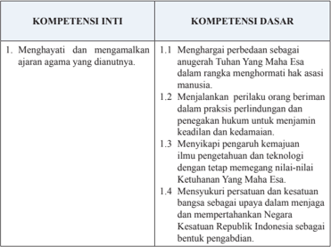

Tabel ini berisi informasi tentang kompetensi inti dan dasar yang relevan dengan ajaran agama. Topik utamanya adalah menghargai perbedaan dan menjalankan prinsip keadilan dan ketuhanan. Kolom "Kompetensi Inti" mencakup dua poin utama: menghargai perbedaan sebagai anugerah Tuhan Yang Maha Esa dan menjalankan prilaku orang beriman dalam praktik perlindungan dan penegakan hukum untuk menjamin keadilan dan kedamaian. Sementara itu, kolom "Kompetensi Dasar" mencakup empat poin penting: menghargai perbedaan sebagai anugerah Tuhan Yang Maha Esa, menjalankan prilaku orang beriman dalam praktik perlindungan dan penegakan hukum untuk menjamin keadilan dan kedamaian, menyaksikan pengaruh kemajuan ilmu pengetahuan dan teknologi dengan tetap memegang nilai-nilai Ketuhanan Yang Maha Esa, dan mensyukuri persatuan dan kesatuan bangsa sebagai upaya dalam menjaga dan mempertahankan Negara Kesatuan Republik Indonesia sebagai bentuk pengabdian. Pola penting yang terlihat adalah bahwa tabel ini mencakup dua aspek utama dari kompetensi, yaitu inti dan dasar, serta menekankan pentingnya menjaga dan mempertahankan nilai-nilai agama dan negara.

 

---
## 📄 Halaman 14

---
**📊 Tabel**

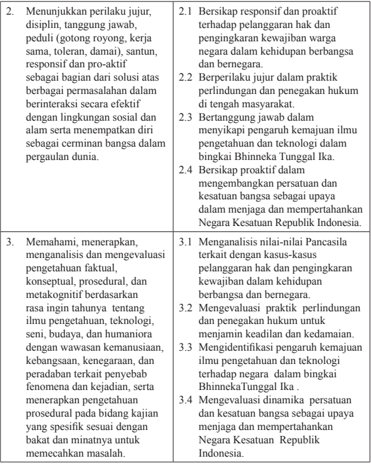

Tabel ini berisi informasi tentang tujuan pembelajaran (TPB) untuk dua topik utama: 1) Mempelajari dan mengimplementasikan sikap dan perilaku yang positif, serta 2) Memahami, menerapkan, dan mengevaluasi pengetahuan, konsep, prosedur, dan metakognitif berdasarkan rasa ingin tahu. Topik pertama mencakup pelaksanaan sikap seperti bertanggung jawab, disiplin, responsif, dan proaktif dalam berbagai situasi, sementara topik kedua fokus pada pemahaman dan penggunaan pengetahuan secara efektif. Kolom-kolomnya mencakup berbagai aspek seperti sikap, perilaku, pengetahuan, dan evaluasi. Data penting yang terlihat meliputi pelaksanaan sikap positif, pemahaman pengetahuan, dan evaluasi prosedural.

 

---
## 📄 Halaman 15

---
**📊 Tabel**

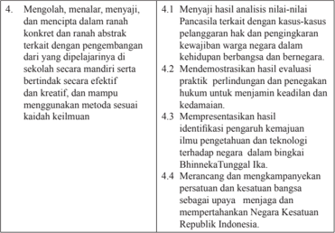

Tabel ini berisi instruksi pembelajaran yang melibatkan penulisan, presentasi, dan kreativitas. Topik utamanya adalah pengembangan keterampilan menulis, presentasi, dan kreativitas. Kolom pertama menyajikan instruksi yang harus dilakukan, sementara kolom kedua menjelaskan langkah-langkah untuk mencapai tujuan tersebut. Data penting yang terlihat adalah bahwa setiap instruksi memerlukan penyelesaian beberapa tahapan, mulai dari analisis nilmilai hukum, demokratisasi evaluasi praktik, hingga merancang kampanye persatuan dan kebangsaan. Ini menunjukkan bahwa pembelajaran ini tidak hanya mengajarkan tentang penulisan dan presentasi, tetapi juga mengajarkan bagaimana menerapkan pemahaman hukum dalam konteks sosial dan politik.

Kompetensi Inti kelas XII dijabarkan ke dalam 16 Kompetensi Dasar yang akan ditransformasikan dalam kegiatan pembelajaran satu tahun (dua semester)  yang  terurai  dalam  28  minggu.  Agar  kegiatan  pembelajaran tidak  terlalu panjang, 28 minggu itu dibagi menjadi dua semester, semester pertama dan semester kedua.

Semester pertama terdiri atas 16 minggu dan semester kedua hanya 12 minggu karena waktu efektif belajar di kelas XII hanya sampai pada bulan Maret. Dengan demikian, waktu efektif untuk kegiatan pembelajaran mata pelajaran  PPKn  sebagai  mata  pelajaran  wajib  di  SMA/MA/SMK/MAK disediakan waktu 2 x 45 menit x 28 minggu.

### D. Karakteristik Mata  Pelajaran  Pendidikan  Pancasila  dan Kewarganegaraan (PPKn)

### 1.  Hakikat Mata Pelajaran Pendidikan Pancasila dan Kewarganegaraan (PPKn)

Mata pelajaran Pendidikan Pancasila dan Kewarganegaraan merupakan mata pelajaran penyempurnaan dari mata pelajaran Pendidikan Kewarganegaraan  (PKn)  yang  semula  dikenal  dalam  Kurikulum  2006. Penyempurnaan tersebut dilakukan atas dasar pertimbangan: (1) Pancasila sebagai dasar negara dan pandangan hidup bangsa diperankan dan dimaknai

 

---
## 📄 Halaman 16

sebagai entitas inti yang menjadi sumber rujukan dan kriteria keberhasilan pencapaian  tingkat  kompetensi  dan  pengorganisasian  dari  keseluruhan ruang lingkup mata pelajaran Pendidikan Pancasila dan Kewarganegaraan; (2) substansi dan jiwa Undang-Undang Dasar Negara Republik Indonesia Tahun  1945,  nilai  dan  semangat  Bhinneka  Tunggal  Ika,  dan  komitmen NKRI  ditempatkan  sebagai  bagian  integral  dari  Pendidikan  Pancasila dan Kewarganegaraan, yang menjadi wahana psikologis-pedagogis pembangunan warga negara Indonesia yang berkarakter Pancasila.

Perubahan tersebut didasarkan pada sejumlah masukan penyempurnaan pembelajaran  PKn  menjadi  PPKn  yang  mengemuka  dalam  lima  tahun terakhir,  antara  lain:  (1)  secara  substansial,  PKn  terkesan  lebih  dominan bermuatan  ketatanegaraan  sehingga  muatan  nilai  dan  moral  Pancasila kurang  mendapat  aksentuasi  yang  proporsional;  (2)  secara  metodologis, ada  kecenderungan  pembelajaran  yang  mengutamakan  pengembangan ranah  sikap  (afektif),  ranah  pengetahuan  (kognitif),  dan  pengembangan ranah  keterampilan  (psikomotorik)  belum  dikembangkan  secara  optimal dan utuh (koheren).

Selain  itu,  melalui  penyempurnaan  PKn  menjadi  PPKn  tersebut, terkandung gagasan dan harapan untuk menjadikan PPKn sebagai salah satu mata pelajaran yang mampu memberikan kontribusi dalam solusi atas berbagai krisis yang melanda Indonesia, terutama krisis multidimensional. PPKn sebagai mata pelajaran yang memiliki misi mengembangkan keadaban Pancasila, diharapkan mampu membudayakan dan memberdayakan peserta didik  agar  menjadi  warga  negara  yang  cerdas  dan  baik  serta  menjadi pemimpin bangsa dan negara Indonesia di masa depan yang amanah, jujur, cerdas, dan bertanggung jawab.

Dalam konteks kehidupan global Pendidikan Pancasila dan Kewarganegaraan selain harus meneguhkan keadaban Pancasila juga harus membekali peserta didik untuk hidup dalam kancah global sebagai warga dunia (global  citizenship) .  Oleh  karena  itu,  substansi  dan  pembelajaran PPKn perlu diorientasikan untuk membekali warga negara Indonesia agar mampu hidup dan berkontribusi secara optimal pada dinamika kehidupan abad ke-21. Untuk itu, pembelajaran PPKn selain mengembangkan nilai dan moral Pancasila, juga mengembangkan semua visi dan keterampilan abad ke-21 sebagaimana telah menjadi komitmen global.

Bertolak dari berbagai kajian secara fi loso fi s,  sosiologis,  yuridis,  dan pedagogis,  mata  pelajaran  PPKn  dalam  Kurikulum  2013,  secara  utuh memiliki karakteristik sebagai berikut.

 

---
## 📄 Halaman 17

- Nama mata pelajaran yang semula Pendidikan Kewarganegaraan (PKn) telah  diubah  menjadi  Pendidikan  Pancasila  dan  Kewarganegaraan (PPKn);
- Mata pelajaran PPKn berfungsi sebagai mata pelajaran yang memiliki misi  pengokohan  kebangsaan  dan  penggerak  pendidikan  karakter Pancasila;
- Kompetensi Dasar (KD) PPKn dalam bingkai kompetensi inti (KI) yang secara psikologis-pedagogis menjadi pengintegrasi kompetensi peserta didik secara utuh dan koheren dengan penanaman, pengembangan, dan/ atau penguatan nilai dan moral Pancasila; nilai dan norma UUD Negara Republik Indonesia Tahun 1945; nilai dan semangat Bhinneka Tunggal Ika; serta wawasan dan komitmen NKRI.
- Pendekatan pembelajaran berbasis proses keilmuan ( scienti fi c approach ) yang  dipersyaratkan  dalam  Kurilukum  2013  memusatkan  perhatian pada  proses  pembangunan  pengetahuan  (KI-3),  keterampilan  (KI-4), sikap  spiritual  (KI-1),  dan  sikap  sosial  (KI-2)  melalui  transformasi pengalaman empirik dan pemaknaan konseptual. Pendekatan tersebut memiliki langkah generik sebagai berikut.
- 1).   Mengamati ( observing );
- 2).   Menanya ( questioning );
- 3).   Mengeksplorasi/mencoba ( exploring );
- 4).   Mengasosiasi/menalar ( assosiating ); serta
- 5).   Mengomunikasikan ( communicating ).
Pada setiap langkah dapat diterapkan model-model pembelajaran yang lebih  spesi fi k.  Dalam  konteks  lain,  misalnya  model  yang  diterapkan berupa  model  proyek  seperti  Proyek  Belajar  Kewarganegaraan  yang menuntut aktivitas yang kompleks, waktu yang panjang, dan kompetensi yang lebih luas. Kelima langkah generik di atas dapat diterapkan secara adaptif pada model tersebut.

- Model pembelajaran dikembangkan sesuai dengan karakteristik PPKn secara  holistik/utuh  dalam  rangka  peningkatan  kualitas  belajar  dan pembelajaran  yang  berorientasi  pada  pengembangan  karakter  peserta didik  sebagai  warga  negara  yang  cerdas  dan  baik  secara  utuh  dalam proses  pembelajaran  otentik  ( authentic  instructional  and  authentic learning ) dalam bingkai integrasi Kompetensi Inti sikap, pengetahuan, dan keterampilan. Serta model pembelajaran yang mengarahkan peserta didik bersikap dan berpikir ilmiah ( scienti fi c ) yaitu pembelajaran yang mendorong  dan  menginspirasi  peserta  didik  berpikir  secara  kritis, analistis,  dan  tepat  dalam  mengidenti fi kasi,  memahami,  memecahkan masalah, dan mengaplikasikan materi pembelajaran.

 

---
## 📄 Halaman 18

- Model penilaian proses pembelajaran dan hasil belajar PPKn menggunakan penilaian otentik ( authentic assesment ). Penilaian otentik mampu  menggambarkan  peningkatan  hasil belajar peserta didik, baik  dalam  rangka  mengobservasi,  menalar,  mencoba,  membangun jejaring,  dan  lain-lain.  Penilaian  otentik  cenderung  fokus  pada  tugastugas  kompleks atau kontekstual, memungkinkan peserta didik untuk menunjukkan kompetensi mereka dalam pengaturan yang lebih otentik.

### 2.  Tujuan Mata Pelajaran PPKn

Sesuai  dengan  PP  Nomor  32 Tahun  2013  penjelasan  Pasal  77  J  ayat (1)  ditegaskan  bahwa  Pendidikan  Kewarganegaraan  dimaksudkan  untuk membentuk peserta didik menjadi manusia yang memiliki rasa kebangsaan dan  cinta  tanah  air  dalam  konteks  nilai  dan  moral  Pancasila,  kesadaran berkonstitusi UUD NRI Tahun 1945, nilai dan semangat Bhinneka Tunggal Ika, serta komitmen NKRI.

Secara umum,  tujuan mata pelajaran Pendidikan Pancasila dan Kewarganegaraan pada jenjang pendidikan dasar dan menengah adalah  mengembangkan  potensi  peserta  didik  dalam  seluruh  dimensi kewarganegaraan, yakni: (1) sikap kewarganegaraan termasuk keteguhan, komitmen, dan tanggung jawab kewarganegaraan (civic con fi dence, civic committment, and civic responsibility) ; (2) pengetahuan kewarganegaraan (civic knowledge) ; (3) keterampilan kewarganegaraan termasuk kecakapan dan partisipasi kewarganegaraan (civic  competence and civic responsibility) .

Secara khusus, tujuan PPKn mempersiapkan peserta didik agar mampu:

- menampilkan karakter yang mencerminkan penghayatan, pemahaman, dan pengamalan nilai dan moral Pancasila secara personal dan sosial;
- memiliki komitmen konstitusional yang ditopang oleh sikap positif dan pemahaman utuh tentang UUD NRI Tahun 1945;
- berpikir  secara  kritis,  rasional,  dan  kreatif,  serta  memiliki  semangat kebangsaan dan cinta tanah air yang dijiwai oleh nilai-nilai Pancasila, UUD NRI Tahun 1945, semangat Bhinneka Tunggal Ika, dan komitmen NKRI.
- berpartisipasi  secara  aktif,  cerdas,  dan  bertanggung  jawab  sebagai anggota  masyarakat,  tunas  bangsa,  dan  warga  negara  sesuai  dengan harkat dan martabatnya sebagai makhluk ciptaan Tuhan Yang Maha Esa yang hidup bersama dalam berbagai tatanan sosial kultural.

 

---
## 📄 Halaman 19

Dengan demikian, PPKn lebih memiliki kedudukan dan fungsi sebagai berikut.

- PPKn merupakan pendidikan nilai, moral/karakter, dan kewarganegaraan khas  Indonesia  yang  tidak  sama  sebangun  dengan civic  education di USA, citizenship  education di  UK, talimatul  muwatanah di  negaranegara Timur Tengah, education civicas di Amerika Latin.
- PPKn sebagai wahana pendidikan nilai, moral/karakter Pancasila dan pengembangan kapasitas psikososial kewarganegaraan Indonesia sangat koheren  (runut  dan  terpadu)  dengan  komitmen  pengembangan  watak dan peradaban bangsa yang bermartabat dan perwujudan warga negara yang demokratis dan bertanggung jawab sebagaimana termaktub dalam Pasal 3 UU No. 20 Tahun 2003.

### 3.  Ruang Lingkup Mata Pelajaran PPKn

Dengan perubahan mata pelajaran Pendidikan Kewarganegaraan (PKn) menjadi  Pendidikan  Pancasila  dan  Kewarganegaraan  (PPKn),  ruang lingkup PPKn sebagai berikut.

- Pancasila, sebagai dasar negara, ideologi nasional, dan pandangan hidup bangsa.
- UUD  NRI  Tahun  1945  sebagai  hukum  dasar  tertulis  yang  menjadi landasan konstitusional kehidupan bermasyarakat, berbangsa, dan bernegara.
- NKRI, sebagai kesepakatan fi nal bentuk negara Republik Indonesia.
- Bhinneka Tunggal Ika, sebagai wujud fi loso fi kesatuan yang melandasi dan mewarnai keberagaman kehidupan bermasyarakat, berbangsa, dan bernegara.
Ruang  lingkup  materi  PPKn  pada  SMA/MA/SMK/MAK  kelas  XII adalah sebagai berikut.

- Kasus-kasus  pelanggaran  hak  dan  pengingkaran  kewajiban  warga negara;
- Perlindungan dan penegakan hukum dalam masyarakat untuk menjamin keadilan dan kedamaian;
- Pengaruh  positif  dan  negatif  kemajuan  iptek  terhadap  negara  dalam bingkai Bhinneka Tunggal Ika;
- Dinamika persatuan dan kesatuan bangsa sebagai upaya menjaga dan mempertahankan NKRI.

 

---
## 📄 Halaman 20

### E. Strategi Pembelajaran PPKn.

### 1.  Konsep dan Strategi Pembelajaran PPKn.

Konsep  dan  strategi  pembelajaran  merupakan  salah  satu  elemen perubahan  pada  Kurikulum  2013.  Peraturan  Menteri  Pendidikan  dan Kebudayaan  Nomor  22  Tahun  2016  tentang  Standar  Proses  Pendidikan Dasar  dan  Menengah  menguraikan  secara  jelas  konsep  dan  strategi pembelajaran sebagai implementasi Kurikulum 2013. Berikut disampaikan isi  konsep  dan  strategi  pembelajaran  tersebut  yang  juga  menjadi  dasar strategi dan model umum pembelajaran PPKn.

Secara  prinsip,  kegiatan  pembelajaran  merupakan  proses  pendidikan yang memberikan kesempatan kepada peserta didik untuk mengembangkan potensi mereka menjadi kemampuan yang makin lama makin meningkat dalam  sikap,  pengetahuan,  dan  keterampilan  yang  diperlukan  dirinya untuk hidup dan untuk bermasyarakat, berbangsa, serta berkontribusi pada kesejahteraan hidup umat manusia. Oleh karena itu, kegiatan pembelajaran diarahkan untuk memberdayakan semua potensi peserta didik agar memiliki kompetensi yang diharapkan.

Lebih lanjut, strategi pembelajaran harus diarahkan untuk memfasilitasi pencapaian kompetensi yang telah dirancang dalam dokumen kurikulum agar  setiap  individu  mampu  menjadi  pembelajar  mandiri  sepanjang hayat.  Pada  gilirannya,  mereka  diharapkan  menjadi  komponen  penting untuk mewujudkan masyarakat belajar. Kualitas lain yang dikembangkan kurikulum dan harus terealisasikan dalam proses pembelajaran antara lain kreativitas,  kemandirian,  kerja  sama,  solidaritas,  kepemimpinan,  empati, toleransi, dan kecakapan hidup peserta didik guna membentuk watak serta meningkatkan peradaban dan martabat bangsa.

Untuk mencapai kualitas yang telah dirancang dalam  dokumen kurikulum,  kegiatan  pembelajaran  perlu  menggunakan  prinsip  yang  (1) berpusat pada peserta didik, (2) mengembangkan kreativitas peserta didik, (3)  menciptakan  kondisi  menyenangkan  dan  menantang,  (4)  bermuatan nilai, etika, estetika, logika, dan kinestetika, dan (5)  menyediakan pengalaman belajar yang beragam melalui penerapan berbagai strategi dan metode  pembelajaran  yang  menyenangkan,  kontekstual,  efektif,  e fi sien, dan bermakna.

Dalam pembelajaran, peserta didik didorong untuk menemukan sendiri dan  mentransformasikan  informasi  kompleks,  mengecek  informasi  baru dengan yang sudah ada dalam ingatannya, dan melakukan pengembangan menjadi informasi atau kemampuan yang sesuai dengan lingkungan dan zaman tempat dan waktu ia hidup. Kurikulum 2013 menganut pandangan

 

---
## 📄 Halaman 21

dasar  bahwa pengetahuan tidak dapat dipindahkan begitu saja dari guru ke peserta didik. Peserta didik adalah subjek yang memiliki kemampuan untuk secara aktif mencari, mengolah, mengonstruksi, dan menggunakan pengetahuan. Untuk itu, pembelajaran harus berkenaan dengan kesempatan yang  diberikan  kepada  peserta  didik  untuk  mengonstruksi  pengetahuan dalam proses kognitifnya.  Agar benar-benar memahami  dan  dapat menerapkan  pengetahuan,  peserta  didik  perlu  didorong  untuk  bekerja memecahkan  masalah,  menemukan  segala  sesuatu  untuk  dirinya,  dan berupaya keras mewujudkan ide-idenya.

Guru  mengembangkan  suasana  belajar  yang  memberi  kesempatan peserta  didik  untuk  menemukan,  menerapkan  ide-ide  mereka  sendiri, menjadi sadar dan secara sadar menggunakan strategi mereka sendiri untuk belajar.  Guru  mengembangkan  kesempatan  belajar  kepada  peserta  didik untuk  meniti  anak  tangga  yang  membawa  peserta  didik  ke  pemahaman yang  lebih  tinggi,  yang  semula  dilakukan  dengan  bantuan  guru,  tetapi semakin  lama  semakin  mandiri.  Bagi  peserta  didik,  pembelajaran  harus bergeser dari diberi 'tahu' menjadi 'aktif mencari tahu'.

Kurikulum  2013  mengembangkan  dua  macam  pembelajaran,  yaitu pembelajaran  langsung  dan  pembelajaran  tidak  langsung.  Pembelajaran langsung adalah proses pendidikan di mana peserta didik mengembangkan pengetahuan, kemampuan berpikir dan keterampilan psikomotorik melalui interaksi  langsung  dengan  sumber  belajar  yang  dirancang  dalam  silabus dan  RPP  berupa  kegiatan-kegiatan  pembelajaran.  Dalam  pembelajaran langsung  tersebut  peserta  didik  melakukan  kegiatan  belajar  mengamati, menanya,  mengumpulkan  informasi,  mengasosiasi  atau  menganalisis, dan  mengkomunikasikan  apa  yang  sudah  ditemukannya  dalam  kegiatan analisis.  Proses  pembelajaran  langsung  menghasilkan  pengetahuan  dan keterampilan langsung atau yang disebut dengan instructional effect.

Pembelajaran  tidak  langsung  adalah  proses  pendidikan  yang  terjadi selama  pembelajaran  langsung,  tetapi  tidak  dirancang  dalam  kegiatan khusus.  Pembelajaran  tidak  langsung  berkenaan  dengan  pengembangan nilai dan sikap. Berbeda dengan pengetahuan tentang nilai dan sikap yang dilakukan  dalam  pembelajaran  langsung  oleh  mata  pelajaran  tertentu, pengembangan  sikap  sebagai  proses  pengembangan  moral  dan  perilaku dilakukan  oleh  semua  mata  pelajaran  dan  dalam  setiap  kegiatan  yang terjadi di kelas, sekolah, dan masyarakat. Oleh karena itu, dalam Kurikulum 2013,  semua  kegiatan  yang  terjadi  selama  belajar  di  sekolah  maupun dalam kegiatan kokurikuler dan ekstrakurikuler terjadi pembelajaran untuk mengembangkan moral dan perilaku yang terkait dengan sikap.

 

---
## 📄 Halaman 22

### 2.  Pendekatan Sainti fi k dalam Pembelajaran PPKn

Pendekatan pembelajaran dalam Kurikulum 2013 menggunakan pendekatan  ilmiah.  Untuk  memperkuat  pendekatan  ilmiah (scienti fi c approach) ,  tematik  terpadu (tematik  antarmata  pelajaran) ,  dan  tematik (dalam  suatu  mata  pelajaran) perlu  diterapkan  pembelajaran  berbasis penyingkapan/penelitian (discovery/inquiry  learning) .  Untuk  mendorong kemampuan peserta didik menghasilkan karya kontekstual, baik individual maupun kelompok, sangat disarankan menggunakan pendekatan pembelajaran  yang  menghasilkan  karya  berbasis  pemecahan  masalah (project based learning) .

Pembelajaran dengan pendekatan ilmiah terdiri atas lima pengalaman belajar  pokok,  yaitu  mengamati,  menanya,  mengumpulkan  informasi, mengasosiasi, dan mengomunikasikan. Penjelasan kelima langkah pembelajaran scienti fi c approach tersebut dapat diuraikan sebagai berikut.

### a.  Mengamati

- Setiap awal pembelajaran, peserta didik melakukan kegiatan mengamati.  Kegiatan  mengamati  dapat  berupa  membaca,  melihat, mendengar,  dan  menyimak.  Pada  kegiatan  mengamati,  misalnya mengamati fi lm/gambar/foto/ilustrasi  yang  terdapat  dalam  buku PPKn Kelas XII. Kegiatan membaca, misalnya membaca teks yang ada di dalam Buku Teks Pelajaran PPKn.
- Peserta didik dapat diberikan petunjuk penting yang perlu mendapat perhatian seperti istilah, konsep, atau kejadian penting yang pengaruhnya sangat kuat yang terdapat dalam Buku Teks Pelajaran PPKn.
- Guru  dapat  menyiapkan  diri  dengan  membaca  berbagai  literatur yang berkaitan dengan materi yang disampaikan. Peserta didik dapat diberikan contoh-contoh yang terkait dengan materi yang ada di buku teks. Guru dapat memperkaya materi dengan membandingkan Buku Teks Pelajaran PPKn dengan literatur lain yang relevan.
- Untuk  mendapatkan  pemahaman  yang  lebih  komprehensif,  guru dapat menampilkan foto-foto, gambar, denah, peta, dan dokumentasi audiovisual ( fi lm) dan lain sebagainya yang relevan.

### b.  Menanya

- Peserta didik dapat membuat pertanyaan berkaitan dengan apa yang sudah  mereka  baca  atau  amati,  mengajukan  pertanyaan  kepada guru  ataupun  kepada  sesama  temannya  ataupun  mengidenti fi kasi pertanyaan yang berkaitan dengan materi yang disampaikan.

 

---
## 📄 Halaman 23

- Peserta didik dapat saling bertanya jawab berkaitan dengan apa yang sudah mereka baca atau amati.
- Peserta  didik  dapat  dilatih  dalam  bertanya  dari  pertanyaan  yang faktual sampai pertanyaan yang hipotetikal (bersifat kausalitas).
- Diupayakan dalam membuat pertanyaan antara peserta didik satu  dengan  lainnya  (khususnya  teman  sebangku)  tidak  memiliki kesamaan.

### c.  Mengumpulkan informasi

- Guru merancang kegiatan untuk mencari informasi lanjutan melalui bacaan  dari  sumber  lain  yang  relevan,  melakukan  observasi  atau wawancara  kepada  suatu  instansi/lembaga  atau  tokoh-tokoh  yang terkait  dengan  tugas  terstruktur  atau  Praktik  Belajar  Kewarganegaraan.
- Peserta didik menentukan  jenis data yang akan  dikumpulkan (kualitatif atau kuantitatif) dan menentukan sumber data (dari buku, majalah, internet, dan sumber lainnya).
- Guru  merancang  kegiatan  untuk  melakukan  wawancara  kepada tokoh  masyarakat/instansi/lembaga  pemerintahan  yang  dianggap memahami suatu permasalahan yang sedang dikaji.

### d.  Mengasosiasikan

- Peserta didik dapat membandingkan, mengelompokkan, menentukan hubungan data, menyimpulkan, dan menganalisis informasi mengenai situasi yang terjadi saat ini melalui sumber bacaan yang terakhir  diperoleh  dengan  sumber  yang  diperoleh  dari  buku  untuk menemukan hal yang lebih mendalam.
- Peserta  didik  menarik  kesimpulan  atau  membuat  generalisasi  dari informasi yang dibaca di buku dan dari informasi yang diperoleh dari sumber lain.
- Dalam  kegiatan  mengasosiasikan,  peserta  didik  diharapkan  dapat melakukan analisis terhadap suatu permasalahan, baik secara mandiri/ individual  maupun secara kelompok.

### e.  Mengomunikasikan

- Peserta didik dapat melaporkan, menyajikan, dan mempresentasikan kesimpulan atau generalisasi dalam bentuk lisan, tertulis, atau produk lainnya.
- Peserta didik menerapkan perilaku yang diharapkan sesuai dengan tuntutan KI-4.

 

---
## 📄 Halaman 24

- Kegiatan mengomunikasikan dapat dilakukan dalam bentuk presentasi/penyajian materi/penyampaian hasil temuan, baik secara kelompok maupun mandiri.
- Kegiatan mengomunikasikan dapat dilakukan dengan menyerahkan hasil kerja (unjuk kerja) secara tertulis.
- Kegiatan mengomunikasikan dapat dilakukan dengan menyerahkan hasil wawancara (laporan observasi).
- Jika kegiatan dilakukan dalam bentuk bermain peran, peserta  didik dapat  membuat  skenario  cerita  yang  kemudian  diperankan  oleh peserta didik.
- Dalam setiap pembuatan laporan hasil observasi/wawancara/Praktik Belajar Kewarganegaraan harus disertai dengan tanda tangan orang tua (komunikasi peserta didik dan orang tua).
Kelima  pembelajaran  pokok  tersebut  dapat  diperinci  dalam  berbagai kegiatan belajar sebagaimana tercantum dalam tabel berikut.

---
**📊 Tabel**

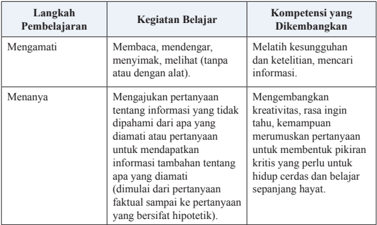

Tabel ini menunjukkan langkah-langkah pembelajaran dan kompetensi yang dikembangkan dalam proses belajar. Topik utamanya adalah tentang bagaimana mengembangkan keterampilan berpikir kritis dan kreatif melalui berbagai aktivitas belajar seperti mengamati, menanya, dan menjawab pertanyaan. Kolom "Langkah Pembelajaran" mencakup tiga aktivitas: mengamati, menanya, dan menjawab. Kolom "Kegiatan Belajar" menggambarkan tindakan-tindakan yang dilakukan dalam setiap langkah, seperti membaca, mendengar, menyimak, melihat (tanpa atau dengan alat), menanyakan, dan menjawab pertanyaan. Kolom "Kompetensi yang Dikembangkan" menunjukkan hasil akhir dari setiap langkah belajar, seperti melatih kesungguhan dan ketelitian, mencari informasi, mengembangkan kreativitas, rasa ingin tahu, kemampuan merumuskan pertanyaan, dan membangun pikiran kritis untuk hidup cerdas dan belajar sepanjang hayat. Pola penting yang terlihat adalah bahwa setiap langkah belajar memiliki tujuan yang spesifik untuk mengembangkan kompetensi berbeda, menciptakan siklus pembelajaran yang efektif dan berkelanjutan.

 

---
## 📄 Halaman 25

---
**📊 Tabel**

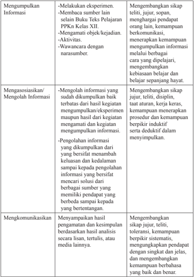

Tabel ini berisi informasi tentang proses penelitian dan pengumpulan data, yang meliputi tiga tahap utama: Mengumpulkan Informasi, Mengasosiasikan/Mengolah Informasi, dan Mengkomunikasikan Hasil. Kolom pertama menunjukkan tugas-tugas yang harus dilakukan dalam setiap tahap. Dalam tahap Mengumpulkan Informasi, seseorang harus melakukan eksperimen, membangun sumber lain, mengamati objek/kejadian, dan wawancara dengan narasumber. Tahap ini juga mencakup mengembangkan sikap teliti, jujur, sopan, menghargai pendapat orang lain, kemampuan komunikasi, menerapkan kemampuan mengumpulkan informasi melalui berbagai cara yang dipelajari, dan mengembangkan kebiasaan belajar dan belajar sepanjang hayat.

Tahap Mengasosiasikan/Mengolah Informasi melibatkan mengolah informasi yang sudah dikumpulkan baik terbatas dari hasil kegiatan mengumpulkan/eksperimen matapun luaran dari kegiatan mengamati dan kegiatan mengumpulkan informasi. Ini termasuk mengembangkan sikap jujur, tetap, disiplin, tatatuan, kerja keras, kemampuan menerapkan prosedur dan kemampuan berpikir induktif serta deduktif dalam menyimpulkan. 

Tahap Mengkomunikasikan melibatkan menyampaikan hasil pengamatan dan kesimpulan berdasarkan hasil analisis secara lisan, tertulis, atau media lainnya. Ini termasuk mengembangkan sikap jujur, teliti, sopan, menghargai pendapat orang lain, kemampuan berpikir sistematis, menggunakan pendapat dengan singkat dan jelas, dan mengembangkan kemampuan berbahasa yang baik dan benar.

 

---
## 📄 Halaman 26

### 3.  Model Pembelajaran PPKn

Sebagaimana  telah  disebutkan,  pembelajaran  PPKn  pada  Kurikulum 2013 menggunakan pendekatan sainti fi k atau pendekatan berbasis proses keilmuan, dengan strategi pembelajaran kontekstual.  Pendekatan sainti fi k dapat menggunakan beberapa model pembelajaran yang merupakan suatu bentuk pembelajaran yang memiliki nama, ciri, sintaks, pengaturan, dan budaya.  Model  pembelajaran  yang  dikembangkan  dalam  PPKn,  yaitu discovery learning, inquiry learning, problem-based learning , dan projectbased learning.

Discovery learning dan inquiry learning berorientasi pada penemuan, peserta didik  dituntut untuk menemukan sesuatu. Biasanya sesuatu yang ditemukan  itu  adalah  konsep. Artinya,  dengan  belajar  penemuan,  anakanak  tidak  diberi  tahu  terlebih  dahulu  konsepnya,  dan  setelah  mereka mengamati,  menanya,  menalar,  dan  mencipta  serta  mencoba  mereka akhirnya menemukan konsep itu. Problem-Based Learning adalah pembelajaran yang menyajikan pemecahan masalah kontekstual sehingga merangsang  peserta  didik  untuk  belajar  memecahkan  masalah  dunia nyata ( real  world ).  Sedangkan Project-Based  Learning menekankan pada  pemberian  kesempatan  kepada  peserta  didik  untuk  belajar  dari kegiatan melakukan suatu proyek yang menghasilkan suatu karya melalui pengembangan pengetahuan, sikap, nilai, dan keterampilan yang berguna bagi kehidupannya di masyarakat.

Model pembelajaran dalam mata Pelajaran PPKn yang sesuai dengan pembelajaran  berbasis discovery (penemuan)  dan inquiry (pencarian) antara lain Pembiasaan, Keteladanan, Memanfaatkan Teknologi Informasi dan Komunikasi, dan Kajian Dokumen Historis.

Model Pembelajaran Berbasis Masalah ( Problem-Based Learning/PBL ) diterapkan  melalui  Meneliti  isu  Publik,  Klari fi kasi  Nilai,  Pembelajaran Berbasis Budaya, Kajian Konstitusional, Re fl eksi Nilai-Nilai Luhur, dan Debat Pro-Kontra.

Pembelajaran Berbasis Proyek (Project-Based Learning/PjBL) adalah metode pembelajaran yang menggunakan proyek/kegiatan sebagai media. Peserta  didik  melakukan  eksplorasi,  penilaian,  interpretasi,  sintesis,  dan informasi untuk menghasilkan berbagai bentuk hasil belajar. Pembelajaran Berbasis Proyek merupakan metode belajar yang menggunakan masalah sebagai langkah awal dalam mengumpulkan dan mengintegrasikan pengetahuan baru berdasarkan pengalamannya dalam beraktivitas secara nyata. Model pembelajaran dalam mata pelajaran PPKn yang sesuai dengan Pembelajaran Berbasis Proyek ( Project-Based Learning/PjBL ) antara lain Penciptaan  Suasana  Lingkungan,  Partisipasi  dalam Asosiasi,  Mengelola

 

---
## 📄 Halaman 27

Kon fl ik, Pengabdian kepada Masyarakat, Melaksanakan Pemilihan, Projek Belajar Kewarganegaraan, Partisipasi dalam Asosiasi, Bermain/Simulasi, Kajian  Karakter  Ketokohan,  Mengajukan  Usul  dan  Petisi,  dan  Berlatih Demonstrasi Damai.

Merujuk pada desain pembelajaran yang sudah dikemukakan, berikut ini  disajikan  berbagai  model  pembelajaran  yang  menjadi  ciri  khas  mata pelajaran PPKn.

---
**📊 Tabel**

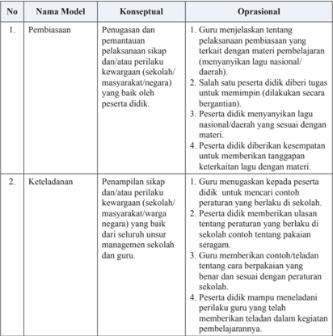

Tabel ini membandingkan konseptual dan oprasional dalam dua model pembelajaran: Pembiasaan dan Keteladanan. Topik utama tabel adalah tentang bagaimana guru dan peserta didik berinteraksi dalam proses pembelajaran. Kolom-kolomnya mencakup Nama Model (Pembiasaan dan Keteladanan), Konseptual, dan Oprasional. Data penting yang terlihat meliputi:

1. Dalam model Pembiasaan, guru menjelaskan tentang pelaksanaan pembiasaan yang terkait dengan materi pembelajaran, seperti menyanyikan lagu nasional atau daerah. Peserta didik juga diberikan kesempatan untuk memimpin dan memberikan tanggapan terhadap materi.

2. Model Keteladanan melibatkan guru menunjukkan kepada peserta didik contoh peraturan yang berlaku di sekolah, seperti menggunakan bahasa yang benar dan sesuai dengan peraturan sekolah. Peserta didik juga diajarkan untuk mampu menelaah perilaku guru yang telah memberikan teladan dalam kegiatan pembelajarannya.

Tabel ini membantu memahami bagaimana guru dan peserta didik berinteraksi secara konseptual dan oprasional dalam proses pembelajaran.

 

---
## 📄 Halaman 28

---
**📊 Tabel**

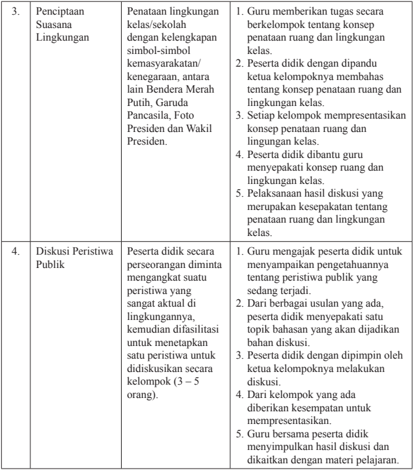

Tabel ini berisi instruksi untuk proses pengetahuan dan diskusi tentang lingkungan sekolah dan peristiwa publik di kelas. Topik utama adalah penciptaan suasananya. Dalam kolom pertama, terdapat instruksi tentang bagaimana peserta didik harus memahami konsep penataan ruang dan lingkungan kelas, termasuk penggunaan simbol-simbol kemanusiaan, kenegaraan, dan lainnya. Kolom kedua menjelaskan langkah-langkah yang harus dilakukan oleh peserta didik, seperti memberikan tugas, mendiskusikan konsep, dan membuat presentasi. Kolom ketiga menunjukkan bahwa guru harus membantu peserta didik dalam menyelesaikan tugas tersebut. Selain itu, tabel juga mencakup instruksi untuk diskusi peristiwa publik di kelas, yang melibatkan pendekatan yang sesuai dengan situasi dan tujuan pembelajaran.

 

---
## 📄 Halaman 29

---
**📊 Tabel**

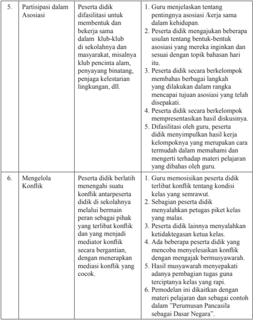

Tabel ini berisi informasi tentang partisipasi peserta didik dalam asosiasi dan mengelola konflik di sekolah. Topik utamanya adalah bagaimana peserta didik memainkan peran dalam kegiatan sosial dan interaksi antar sesama. Tabel dibagi menjadi dua kolom: "Partisipasi dalam Asosiasi" dan "Mengelola Konflik". Dalam kolom pertama, peserta didik diberi kesempatan untuk difasilitasi untuk membentuk dan bekerja sama dalam klub-klub sekolahnya dan masyarakat. Mereka juga diminta untuk menyampaikan pendapat mereka tentang asosiasi dan mengembangkan kebijakan lingkungan. Sedangkan dalam kolom kedua, peserta didik diajarkan untuk berlatih menangani konflik dengan cara berbicara dengan sopan, mencoba memahami sudut pandang orang lain, dan mencari solusi yang adil. Data penting yang terlihat adalah bahwa peserta didik harus dapat berkomunikasi dengan baik, memiliki kemampuan untuk memahami situasi, dan mampu menyelesaikan konflik dengan cara yang adil dan bermartabat.

 

---
## 📄 Halaman 30

---
**📊 Tabel**

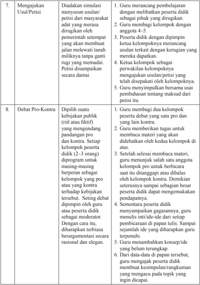

Tabel ini berisi instruksi untuk proses debat pro-kontra dalam pembelajaran matematika, dengan topik utama "Mengajukan Usul/Petisi" dan "Debat Pro-Kontra". Kolom pertama menyatakan nomor urut dari instruksi tersebut. Setiap instruksi diikuti oleh deskripsi detail tentang langkah-langkah yang harus dilakukan, seperti mengajukan usulan/petisi, membuat kelompok pro dan kontra, dan mengevaluasi pendapat peserta. Data penting yang terlihat meliputi langkah-langkah yang harus diikuti dalam setiap proses, seperti membuat kelompok pro dan kontra, mengevaluasi pendapat peserta, dan mengevaluasi pendapat guru.

 

---
## 📄 Halaman 31

---
**📊 Tabel**

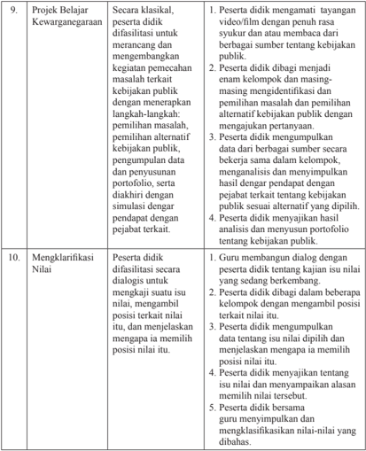

Tabel ini berisi dua topik utama: "Proyek Belajar Kewarganegaraan" dan "Mengklarifikasi Nilai". Topik pertama melibatkan proses belajar peserta didik dalam menghadapi tantangan kebijakan publik, sementara topik kedua mengajarkan mereka untuk mengklarifikasi nilai-nilai mereka sendiri. Dalam kolom pertama, peserta didik diharapkan untuk menerapkan pendekatan alternatif terhadap masalah kebijakan publik, melakukan analisis dan penyelesaian proyek, serta menunjukkan kemampuan untuk mengklarifikasi nilai-nilai mereka. Sementara itu, dalam kolom kedua, peserta didik harus membangun dialog dengan guru, mengambil posisi terkait nilai-nilai, dan menyelesaikan proyek dengan mengklasifikasikan nilai-nilai yang dibahas. Data penting yang terlihat adalah bahwa proses belajar ini melibatkan pengembangan keterampilan berpikir kritis, pemecahan masalah, dan kemampuan untuk mengklarifikasi nilai-nilai pribadi.

 

---
## 📄 Halaman 32

---
**📊 Tabel**

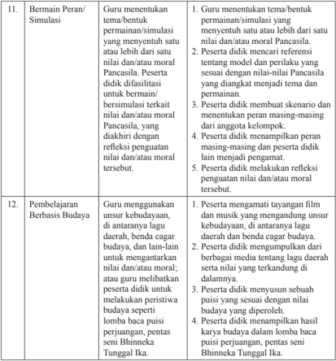

Tabel ini berisi dua topik utama: "Bermain Peran/Simulasi" dan "Pembelajaran Berbasis Budaya". Topik pertama mencakup proses guru menentukan tema permainan/simulasi yang relevan dengan nilai-nilai Pancasila, sementara topik kedua membahas bagaimana guru menggunakan unsur budaya dalam pembelajaran. Kolom-kolomnya meliputi langkah-langkah yang harus dilakukan oleh peserta didik dalam masing-masing topik tersebut. Data penting yang terlihat adalah bahwa guru harus memastikan bahwa permainan/simulasi tersebut sesuai dengan nilai-nilai Pancasila, serta peserta didik harus mampu menunjukkan pemahaman tentang unsur-unsur budaya yang digunakan dalam pembelajaran.

 

---
## 📄 Halaman 33

---
**📊 Tabel**

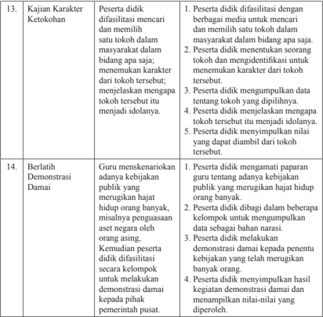

Tabel ini berisi dua topik utama: "Kajian Karakter Ketokohan" dan "Berlatih Demonstrasi Damai". Topik pertama membahas bagaimana peserta menghadapi tantangan dan menunjukkan karakter mereka di masyarakat, sementara topik kedua mengajarkan cara mereka menghadapi situasi publik dengan cara yang positif dan membangun. Kolom-kolomnya mencakup berbagai aspek seperti penampilan diri, keterlibatan dalam kegiatan sosial, dan pengembangan karakter. Data penting yang terlihat adalah bahwa peserta tidak hanya menghadapi tantangan secara individu, tetapi juga berpartisipasi dalam kegiatan sosial yang membangun, seperti demonstrasi damai. Ini menunjukkan bahwa pembelajaran tidak hanya tentang menghadapi tantangan, tetapi juga tentang bagaimana mengembangkan karakter dan partisipasi sosial.

 

---
## 📄 Halaman 34

---
**📊 Tabel**

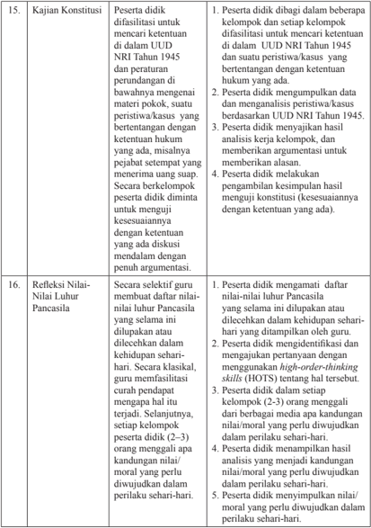

Tabel ini berisi dua topik utama: Kajian Konstitusi dan Refleksi Nilai-Nilai Pancasila. Kolom pertama menunjukkan topik, sedangkan kolom kedua menyajikan detail tentang proses penelitian atau refleksi. Topik utama "Kajian Konstitusi" mencakup empat pasang data, masing-masing menunjukkan bagaimana peserta melakukan kajian konstitusi dengan metode tertentu. Topik "Refleksi Nilai-Nilai Pancasila" juga memiliki empat pasang data, yang menunjukkan bagaimana peserta memahami dan mengimplementasikan nilai-nilai Pancasila dalam kehidupan sehari-hari. Data penting yang terlihat meliputi metode penelitian seperti difasilitasi untuk mencari ketentuan dalam UUD 1945, pengumpulan data peristiwa/kasus, analisis kerja kelompok, dan pengembangan konstitusi. Selain itu, peserta juga diberi kesempatan untuk mengevaluasi dan mengimplementasikan nilai-nilai Pancasila dalam kehidupan sehari-hari.

 

---
## 📄 Halaman 35

Pemilihan  model  pembelajaran  hendaknya  mempertimbangkan  halhal  sebagai  berikut.  a)  Tujuan  pembelajaran  dan  sifat  materi  pelajaran apakah materi itu termasuk ranah sikap, pengetahuan, atau keterampilan; b) Karakteristik kemampuan peserta didik misalnya kemampuan membaca, motivasi dalam belajar, kemampuan dalam penggunaan  Teknologi Informasi dan Komunikasi (TIK); c) Alokasi waktu yang tersedia; d) Sumber belajar dan media pembelajaran yang tersedia; e) Ketersediaan fasilitas/sarana dan prasarana  seperti  kondisi  ruang  kelas,  fasilitas  perpustakaan,  dan  akses internet.

Pemilihan  model  pembelajaran  ditentukan  oleh  guru  mata  pelajaran yang  bersangkutan.  Model  pembelajaran    yang  digunakan  hendaknya memperhatikan identi fi kasi materi, yaitu tingkat kedalaman dan keluasan materi dalam Kompetensi Dasar, misalnya tingkatan Pengetahuan 'memahami'  berbeda  dengan  tingkatan  Pengetahuan  'menganalisis' dalam pemilihan model pembelajaran. Selain itu, memperhatikan  materi sesuai dengan ranah sikap, pengetahuan, atau keterampilan. Contoh model pembelajaran  'memahami  nilai-nilai  Pancasila'  berbeda  dengan  model pembelajaran untuk 'menganalisis nilai-nilai Pancasila'.

### F.  Strategi Dasar Penilaian Pembelajaran PPKn

### 1.  Pengertian Penilaian

Penilaian adalah proses pengumpulan dan pengolahan informasi untuk menentukan  pencapaian  hasil  belajar  peserta  didik.  Berdasarkan  pada Peraturan  Pemerintah  Nomor  32  Tahun  2013  tentang  Perubahan  Atas Peraturan  Pemerintah  Nomor  19  Tahun  2005  tentang  Standar  Nasional Pendidikan bahwa penilaian pendidikan pada jenjang pendidikan dasar dan menengah terdiri atas: penilaian hasil belajar oleh pendidik; penilaian hasil belajar oleh satuan pendidikan; dan penilaian hasil belajar oleh pemerintah. Berdasarkan pada PP. Nomor 32 Tahun 2013, dijelaskan bahwa penilaian hasil  belajar  oleh  pendidik  dilakukan  secara  berkesinambungan  untuk memantau proses, kemajuan belajar,  dan  perbaikan  hasil  belajar  peserta didik  secara  berkelanjutan  yang  digunakan  untuk  menilai  pencapaian kompetensi  peserta  didik,  bahan  penyusunan  laporan  kemajuan  hasil belajar, dan memperbaiki proses pembelajaran.

Berdasarkan  Permendikbud  Nomor  23  Tahun  2016  tentang  Standar Penilaian disebutkan bahwa 'Penilaian hasil belajar oleh pendidik adalah proses pengumpulan informasi/data tentang capaian pembelajaran peserta didik dalam aspek sikap, aspek pengetahuan, dan aspek keterampilan yang

 

---
## 📄 Halaman 36

dilakukan secara terencana dan sistematis yang dilakukan untuk memantau proses, kemajuan belajar, dan perbaikan hasil belajar melalui penugasan dan evaluasi hasil belajar.

Fungsi penilaian hasil belajar adalah sebagai berikut: 1) bahan pertimbangan dalam menentukan kenaikan kelas; 2) umpan balik dalam perbaikan  proses  belajar  mengajar;  3)  meningkatkan  motivasi  belajar peserta didik; dan 4) evaluasi diri terhadap kinerja peserta didik.

Penilaian  pendidikan  sebagai  proses  pengumpulan  dan  pengolahan informasi untuk mengukur pencapaian hasil belajar peserta didik mencakup: penilaian  otentik,  penilaian  diri,  penilaian  berbasis  portofolio,  ulangan, ulangan  harian,  ulangan  tengah  semester,  ulangan  akhir  semester,  ujian tingkat  kompetensi,  ujian  mutu  tingkat  kompetensi,  ujian  nasional,  dan ujian sekolah/madrasah.

### 2.  Pendekatan Penilaian

### a.  Penilaian Otentik

Penilaian otentik merupakan penilaian yang dilakukan secara komprehensif, baik  masukan  ( input ), proses, dan keluaran ( output ) pembelajaran. Proses ini, guru mengumpulkan format tentang perkembangan dan pencapaian pembelajaran yang dilakukan oleh peserta didik melalui berbagai teknik yang mampu mengungkapkan, membuktikan atau  menunjukkan  secara  tepat  bahwa  tujuan  pembelajaran  telah  benarbenar dikuasai dan dicapai. Beberapa karakteristik penilaian otentik sebagai berikut.

- Penilaian merupakan bagian dari proses pembelajaran, bukan terpisah dari proses pembelajaran.
- Penilaian mencerminkan hasil proses pembelajaran pada kehidupan nyata, tidak berdasarkan pada kondisi yang ada di sekolah.
- Menggunakan bermacam-macam instrumen, pengukuran, dan metode yang sesuai dengan karakteristik dan esensi pengalaman belajar.
- Penilaian bersifat komprehensif dan holistik yang mencakup semua ranah sikap, pengetahuan, dan keterampilan.
- Penilaian mencakup penilaian proses pembelajaran dan hasil belajar.

### b.  Penilaian Acuan Kriteria (PAK)

PAK  merupakan  penilaian  pencapaian  kompetensi  yang  didasarkan pada  kriteria  ketuntasan  minimal  (KKM).  KKM  merupakan  kriteria ketuntasan belajar minimal yang ditentukan oleh satuan pendidikan dengan mempertimbangkan  karakteristik  Kompetensi  Dasar  yang  akan  dicapai,

 

---
## 📄 Halaman 37

daya  dukung,  dan  karakteristik  peserta  didik.  Sejalan  dengan  ini,  guru didorong untuk menerapkan prinsip-prinsip pembelajaran tuntas ( mastery learning ) serta tidak berorientasi pada pencapaian target kurikulum semata.

### 3.  Prinsip-Prinsip Penilaian

Penilaian hasil belajar peserta didik pada jenjang pendidikan dasar dan menengah didasarkan pada prinsip-prinsip sebagaimana mengacu kepada Pasal 5 Permendikbud Nomor 23 Tahun 2016. Adapun prinsip-prinsipnya adalah sebagai berikut.

- Sahih,  berarti  penilaian  didasarkan  pada  data  yang  mencerminkan kemampuan yang diukur.
- Objektif, berarti penilaian didasarkan pada prosedur dan kriteria yang jelas, tidak dipengaruhi subjektivitas penilai.
- Adil,  berarti  penilaian  tidak  menguntungkan  atau  merugikan  peserta didik karena berkebutuhan khusus serta perbedaan latar belakang agama, suku, budaya, adat istiadat, status sosial ekonomi, dan gender.
- Terpadu, berarti penilaian oleh pendidik merupakan salah satu komponen yang tidak terpisahkan dari kegiatan pembelajaran.
- Terbuka, berarti prosedur penilaian, kriteria penilaian, dan  dasar pengambilan keputusan dapat diketahui oleh pihak yang berkepentingan.
- Menyeluruh  dan  berkesinambungan,  berarti  penilaian  oleh  pendidik mencakup  semua  aspek  kompetensi  dengan  menggunakan  berbagai teknik penilaian yang sesuai, untuk memantau perkembangan kemampuan peserta didik.
- Sistematis, berarti penilaian dilakukan secara berencana dan bertahap dengan mengikuti langkah-langkah baku.
- Beracuan kriteria, berarti penilaian didasarkan pada ukuran pencapaian kompetensi yang ditetapkan.
- Akuntabel,  berarti  penilaian  dapat  dipertanggungjawabkan,  baik  dari segi teknik, prosedur, maupun hasilnya.

### 4.  Bentuk dan Teknik Penilaian Sikap, Pengetahuan, dan Keterampilan

### a.  Penilaian Sikap

### 1) Pengertian

Penilaian  sikap  adalah  penilaian  terhadap  kecenderungan  perilaku peserta  didik  sebagai  hasil  pendidikan,  baik  di  dalam  kelas  maupun  di luar  kelas.  Penilaian  sikap  memiliki  karakteristik  yang  berbeda  dengan penilaian pengetahuan dan keterampilan, sehingga teknik penilaian yang

 

---
## 📄 Halaman 38

digunakan juga berbeda. Dalam hal ini, penilaian sikap ditujukan untuk mengetahui capaian dan membina perilaku serta budi pekerti peserta didik sesuai butir-butir sikap dalam Kompetensi Dasar (KD) pada Kompetensi Inti Sikap Spiritual (KI-1) dan Kompetensi Inti Sikap Sosial (KI-2).

Penilaian sikap spiritual dan sikap sosial dilakukan secara berkelanjutan dengan menggunakan observasi dan informasi lain yang valid dan relevan dari berbagai sumber. Penilaian sikap merupakan bagian dari pembinaan dan  penanaman/pembentukan  sikap  spiritual  dan  sikap  sosial  peserta didik yang menjadi tugas dari setiap pendidik. Selain itu, dapat dilakukan penilaian diri (self assessment) dan penilaian antarteman (peer assessment) dalam rangka pembinaan dan pembentukan karakter peserta didik, yang hasilnya  dapat  dijadikan  sebagai  salah  satu  data  untuk  kon fi rmasi  hasil penilaian sikap oleh pendidik. Hasil penilaian sikap selama periode satu semester  ditulis  dalam  bentuk  deskripsi  yang  menggambarkan  perilaku peserta didik.

### 2) Teknik Penilaian Sikap

Penilaian sikap dilakukan melalui observasi yang dicatat dalam jurnal. Teknik penilaian sikap dijelaskan pada skema berikut.

---
**🖼️ Gambar/Diagram**

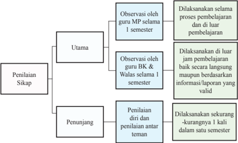

> **Deskripsi Visual:** Gambar ini adalah diagram yang menunjukkan struktur dan proses penilaian sikap dalam kurikulum. Diagram ini terdiri dari tiga bagian utama: Utama, Penunjang, dan Penilaian Sikap. 

1. **Utama**: Ini adalah bagian utama dari proses penilaian sikap. Dalam bagian ini, observasi dilakukan oleh guru MP (Mata Pelajaran) selama 1 semester. Observasi ini dilakukan untuk melihat proses pembelajaran dan hasil belajar siswa.

2. **Penunjang**: Bagian ini berisi observasi yang dilakukan oleh guru BK (Bimbingan Konseling) dan Walas (Wali Siswa) selama 1 semester. Observasi ini dilakukan di luar jam belajar dan dilakukan secara langsung atau berdasarkan informasi laporan yang valid.

3. **Penilaian Sikap**: Ini adalah bagian terakhir dari proses penilaian sikap. Penilaian ini dilakukan oleh penilai dan penilaian antar teman. Penilaian ini dilakukan secara kurang-kurangnya 1 kali dalam satu semester.

Elemen-elemen utama dalam diagram ini adalah bagian Utama, Penunjang, dan Penilaian Sikap. Relasi antara elemen-elemen ini adalah bahwa setiap bagian memiliki fungsi yang berbeda dalam proses penilaian sikap. Elemen-elemen penting yang terlihat dalam diagram ini adalah observasi, penilaian, dan informasi laporan yang valid.

Informasi kunci yang dapat diambil pembaca adalah bahwa proses penilaian sikap melibatkan observasi oleh guru MP, BK, dan Walas, serta penilaian oleh penilai dan penilaian antar teman. Proses ini dilakukan secara teratur selama satu semester.

 

---
## 📄 Halaman 39

### a) Observasi

Observasi  dalam  penilaian  sikap  peserta  didik  merupakan  teknik yang  dilakukan  secara  berkesinambungan  melalui  pengamatan  perilaku. Asumsinya setiap peserta didik pada dasarnya berperilaku baik sehingga yang perlu dicatat hanya perilaku yang sangat baik (positif) atau kurang baik  (negatif)  yang  berkaitan  dengan  indikator  sikap  spiritual  dan  sikap sosial. Catatan hal-hal positif dan menonjol digunakan untuk menguatkan perilaku positif, sedangkan perilaku negatif digunakan untuk pembinaan. Instrumen  yang  digunakan  dalam  observasi  adalah  lembar  observasi atau jurnal. Hasil observasi dicatat dalam jurnal yang dibuat selama satu semester.

Jurnal memuat catatan sikap atau perilaku peserta didik yang sangat baik atau kurang baik, dilengkapi dengan waktu terjadinya perilaku tersebut, dan butir-butir sikap. Berdasarkan catatan tersebut pendidik membuat deskripsi penilaian sikap peserta didik selama satu semester. Beberapa hal yang perlu diperhatikan dalam melaksanakan penilaian sikap dengan teknik observasi:

- Jurnal digunakan selama periode satu semester.
- Jurnal  oleh  guru  mata  pelajaran  dibuat  untuk  seluruh  peserta  didik yang mengikuti mata pelajarannya.
- Hasil  observasi  guru  mata  pelajaran  diserahkan  kepada  wali  kelas untuk diolah lebih lanjut.
- Perilaku sangat baik atau kurang baik yang dicatat dalam jurnal tidak terbatas  pada  butir-butir  sikap  (perilaku)  yang  hendak  ditumbuhkan melalui pembelajaran yang saat itu sedang berlangsung sebagaimana dirancang dalam RPP, tetapi dapat mencakup butir-butir sikap lainnya yang ditanamkan dalam semester itu,  jika  butir-butir  sikap  tersebut muncul/ditunjukkan oleh peserta didik melalui perilakunya.
- Catatan  dalam  jurnal  dilakukan  selama  satu  semester  sehingga  ada kemungkinan  dalam  satu  hari  perilaku  yang  sangat  baik  dan/atau kurang baik muncul lebih dari satu kali atau tidak muncul sama sekali.
- Perilaku peserta didik yang tidak menonjol (sangat baik atau kurang baik) tidak perlu dicatat dan dianggap peserta didik tersebut menunjukkan perilaku baik atau sesuai dengan norma yang diharapkan.

 

---
## 📄 Halaman 40

Satuan Pendidikan

: SMA/MA/SMK/MAK……

Tahun Pelajaran

: 2016/2017

Kelas/Semester

: XII/1

Mata Pelajaran

: PPKn

---
**📊 Tabel**

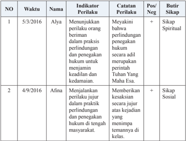

Tabel ini menunjukkan data tentang perilaku positif dan negatif dari dua siswa, Ayla dan Afina, pada tahun 2016. Kolom-kolomnya mencakup nomor urut (NO), waktu, nama siswa, indikator perilaku, catatan perilaku, posisi/penilaian, dan butir sikap. Topik utama tabel adalah pengamatan perilaku siswa dalam praktik perundungan dan penegakan hukum. Data penting yang terlihat adalah bahwa Ayla menunjukkan perilaku positif dengan meyakini bahwa perlindungan dan penegakan hukum harus dilakukan secara adil, sementara Afina menunjukkan perilaku negatif dengan menjalankan perilaku jujur dalam praktik perundungan dan penegakan hukum. Kedua siswa diberikan butir sikap yang sesuai dengan perilaku mereka, yaitu Sikap Spiritual untuk Ayla dan Sikap Sosial untuk Afina.

### b) Penilaian diri

Penilaian diri merupakan  teknik  penilaian  dengan  cara  meminta peserta  didik  untuk  mengemukakan  kelebihan  dan  kekurangan  dirinya dalam konteks pencapaian kompetensi sikap. Instrumen yang digunakan berupa lembar penilaian diri menggunakan daftar cek atau skala penilaian ( rating scale ) yang disertai rubrik. Hasil penilaian diri peserta didik dapat digunakan sebagai data kon fi rmasi. Penilaian diri dapat memberi dampak positif terhadap perkembangan kepribadian peserta didik, antara lain:

- dapat  menumbuhkan  rasa  percaya  diri  karena  diberi  kepercayaan untuk menilai diri sendiri;
- peserta didik menyadari kekuatan dan kelemahan diri karena ketika melakukan penilaian, harus melakukan introspeksi terhadap kekuatan dan kelemahan yang dimiliki;

 

---
## 📄 Halaman 41

- dapat  mendorong,  membiasakan,  dan  melatih  peserta  didik  untuk berbuat jujur, karena dituntut untuk jujur dan objektif dalam melakukan penilaian; serta
- membentuk sikap terhadap mata pelajaran/pengetahuan.
- Penilaian Antarteman
Penilaian antarteman adalah penilaian dengan cara peserta didik saling menilai  perilaku  temannya.  Penilaian  antarteman  dapat  mendorong:  (a) objektivitas  peserta  didik,  (b)  empati,  (c)  mengapresiasi  keragaman/ perbedaan, dan (d) re fl eksi diri. Sebagaimana penilaian diri, hasil penilaian antarteman  dapat  digunakan  sebagai  data  kon fi rmasi.  Instrumen  yang digunakan  berupa  lembar  penilaian  antarteman.  Kriteria  penyusunan instrumen penilaian antarteman sebagai berikut.

- Sesuai dengan indikator yang akan diukur.
- Indikator dapat diukur melalui pengamatan peserta didik.
- Kriteria penilaian dirumuskan secara sederhana, namun jelas dan tidak berpotensi munculnya penafsiran makna ganda/berbeda.
- Menggunakan bahasa lugas yang dapat dipahami peserta didik.
- Menggunakan format sederhana dan mudah digunakan oleh peserta didik.
- Indikator  menunjukkan  sikap/perilaku  peserta  didik  dalam  situasi yang nyata atau sebenarnya dan dapat diukur.
Penilaian  antarteman  paling  cocok  dilakukan  pada  saat  peserta  didik melakukan  kegiatan  kelompok,  misalnya  setiap  peserta  didik  diminta mengamati/menilai  dua  orang  temannya,  dan  dia  juga  dinilai  oleh  dua orang teman lainnya dalam kelompoknya. Contoh format penilaian lihat bagian lampiran.

### b.  Penilaian Pengetahuan

Kompetensi pengetahuan merupakan kompetensi ranah kognitif dalam taksonomi pendidikan. Perkembangan pencapaian kompetensi pengetahuan melalui tahapan mengingat, memahami, menerapkan, menganalisis, mengevaluasi,  dan  mencipta.  Pendidik  menilai  kompetensi  pengetahuan melalui teknik tes tulis, tes lisan, dan penugasan.

- Instrumen  tes tulis berupa soal pilihan ganda, isian, jawaban singkat, benar salah, menjodohkan, dan uraian. Instrumen uraian dilengkapi pedoman penskoran.

 

---
## 📄 Halaman 42

### a)  Pilihan Ganda

Soal  pilihan  ganda  secara  umum  terdiri  atas  pertanyaan  dan alternatif pilihan jawaban.  Bentuk  penilaian ini lebih tepat digunakan  saat  penilaian  tengah  semester,  akhir  semester,  dan ujian sekolah, atau untuk latihan bagi pengayaan.

- Isian
Bentuk ini  merupakan salah satu  bentuk  soal  yang  jawabannya menuntut peserta didik untuk melengkapi atau mengisi kata-kata atau  kelompok  kata  yang  dihilangkan.  Soalnya  disusun  seperti kalimat lengkap, kemudian dihilangkan pada bagian tertentu yang harus  diisi  oleh  peserta  didik.  Bentuk  penilaian  ini  lebih  tepat digunakan  saat  penilaian  tengah  semester,  akhir  semester,  dan ujian sekolah, atau untuk latihan bagi pengayaan.

- Jawaban Singkat
Bentuk  ini  merupakan  salah  satu  bentuk  soal  objektif  yang jawabannya  menuntut  peserta didik  menjawab  soal  dengan singkat, yaitu jawabannya dapat berupa satu kata, kelompok kata/ frase, simbol matematika, atau angka. Bentuk penilaian ini lebih tepat  digunakan  saat  penilaian  tengah  semester,  akhir  semester, dan ujian sekolah, atau untuk latihan bagi pengayaan.

- Benar Salah
Bentuk  ini  merupakan  salah  satu  bentuk  soal  objektif  yang setiap soalnya terdapat dua macam kemungkinan jawaban yang berlawanan,  yaitu  benar  atau  salah.  Bentuk  soal  benar-salah biasanya dipergunakan untuk menanyakan fakta, ide, dan konsepsi yang kompleks. Bentuk penilaian ini lebih tepat digunakan saat penilaian tengah semester, akhir semester, dan ujian sekolah, atau untuk latihan bagi pengayaan.

### e)  Menjodohkan

Bentuk  ini  wujudnya  terdiri  atas  dua  kelompok  atau  kolom. Tugas peserta didik adalah mencari pasangan yang tepat dalam dua kelompok itu. Biasanya, bentuk menjodohkan hanya terbatas untuk mengukur kemampuan ingatan.

### f)  Uraian

Soal uraian adalah soal yang menuntut jawaban peserta tes dengan mengorganisasikan gagasan atau hal-hal yang dipelajari dengan cara mengemukakan gagasan tersebut dalam bentuk tulisan.

 

---
## 📄 Halaman 43

Soal uraian dibagi atas uraian terstruktur dan uraian tidak terstruktur. Soal uraian terstruktur memiliki jawaban yang terbatas dan jelas. Uraian tidak terstruktur memiliki jawaban yang sangat variatif. Penilaian harian lebih  tepat  menggunakan  soal  uraian,  sehingga  dapat  mengembangkan berpikir divergen (beragam).

Bentuk  soal  pilihan  ganda,  isian,  jawaban  singkat,  benar  salah  dan menjodohkan, lebih tepat digunakan saat penilaian tengah semester, ulangan akhir semester, dan ujian sekolah, atau untuk latihan bagi pengayaan.

- Instrumen tes lisan berupa daftar pertanyaan.
Tes lisan adalah tes yang pelaksanaan dilakukan dengan mengadakan tanya jawab secara langsung antara pendidik dan peserta didik. Tes lisan dapat dilaksanakan dengan menggunakan pedoman pertanyaan atau tanpa pedoman pertanyaan.

- Instrumen  penugasan  berupa  pekerjaan  rumah  dan/atau projek yang  dikerjakan  secara  individu  atau  kelompok  sesuai  dengan karakteristik tugas.
Penugasan yang bertujuan untuk mencapai kompetensi pengetahuan antara lain membuat kliping, mencari data, wawancara, merangkum, kajian tokoh, kajian historis, dan menulis gagasan.

### c.  Penilaian Keterampilan

Penilaian  kompetensi  keterampilan  melalui  penilaian  kinerja,  yaitu penilaian yang menuntut peserta didik mendemonstrasikan suatu kompetensi  tertentu. Perkembangan pencapaian kompetensi keterampilan melalui  tahapan  mengamati,  menanya,  mencoba,  mengolah,  menyaji, menalar, dan mencipta.

Teknik  penilaian  kompetensi  keterampilan  menggunakan  tes  praktik, proyek, dan penilaian portofolio. Instrumen yang digunakan berupa daftar cek atau skala penilaian (rating scale) yang dilengkapi rubrik.

- Tes Praktik
Tes praktik adalah penilaian yang menuntut respons berupa keterampilan melakukan suatu aktivitas atau perilaku sesuai dengan tuntutan kompetensi. Tes praktik dalam pembelajaran PPKn antara lain melalui simulasi, tes perbuatan, dan sosiodrama.

- Proyek
Penugasan  proyek  adalah  suatu  teknik    penilaian  yang  menuntut peserta didik melakukan kegiatan tertentu di luar kegiatan pembelajaran  di  kelas.  Penugasan  dapat  diberikan  dalam  bentuk individual atau kelompok. Proyek adalah suatu tugas yang melibatkan

 

---
## 📄 Halaman 44

kegiatan  perencanaan,  pelaksanaan,  dan  pelaporan  secara  tertulis maupun lisan  dalam  waktu  tertentu  serta  umumnya  menggunakan data. Penilaian proyek mencakup penilaian proses dan hasil belajar. Penugasan proyek dalam PPKn antara lain melalui Proyek Belajar Kewarganegaraan. Penilaian proyek belajar kewarganegaraan dilaksanakan  pada  setiap  langkah  kegiatan  mulai  dari  identi fi kasi masalah sampai dengan penyajian. Penilaian meliputi penilaian proses dan hasil  dari  kegiatan  ini.  Penilaian  proses  antara  lain  mencakup persiapan, kerja sama, partisipasi, koordinasi, aktivitas, dan yang lain dalam penyusunan maupun dalam presentasi hasil kerja. Penilaian hasil mencakup dokumen laporan dan presentasi laporan.

### 3) Portofolio

Penilaian portofolio adalah penilaian yang dilakukan dengan cara  menilai  kumpulan  semua  karya  peserta  didik  dalam  bidang tertentu  yang  bersifat  re fl ektif-integratif  untuk  mengetahui  minat, perkembangan, prestasi,  dan/atau  kreativitas  peserta  didik  dalam  kurun waktu tertentu. Karya tersebut dapat berbentuk tindakan nyata yang mencerminkan  kepedulian  peserta  didik  terhadap  lingkungannya. Penilaian portofolio dapat dilakukan saat menerapkan model pembelajaran pengabdian masyarakat, partisipasi kewarganegaraan, mengajukan  usul/petisi,  partisipasi  dalam  asosiasi,  membangun koalisi, mengelola kon fl ik, berlatih empati dan toleransi, kunjungan lapangan, dan model pembelajaran yang lain.

Penilaian portofolio dapat dilakukan untuk menilai kompetensi dasar tentang  berinteraksi  dengan  teman  dan  menyaji  bentuk  partisipasi kewarganegaraan.  Kedua  kompetensi  dasar  ini  merupakan  praktik kewarganegaraan yang dapat dilaksanakan pada setiap materi pokok.

### 5.  Pengolahan Hasil Penilaian

### a. Nilai Sikap Spiritual dan Sikap Sosial

Langkah-langkah  menyusun  rekapitulasi  penilaian  sikap  untuk  satu semester.

- Wali  kelas,  guru  mata  pelajaran,  dan  guru  BK  mengelompokkan (menandai)  catatan-catatan  jurnal  ke  dalam  sikap  spiritual  dan  sikap sosial.
- Wali  kelas,  guru  mata  pelajaran,  dan  guru  BK  membuat  rumusan deskripsi singkat sikap spiritual dan sikap sosial sesuai dengan catatancatatan  jurnal  untuk  setiap  peserta  didik  yang  ditulis  dengan  kalimat positif. Deskripsi tersebut menyebutkan sikap/perilaku yang sangat baik dan/atau kurang baik dan yang perlu bimbingan.

 

---
## 📄 Halaman 45

- Wali  kelas  mengumpulkan  deskripsi  singkat  (rekap)  sikap  dari  guru mata pelajaran dan guru BK. Wali kelas menyimpulkan (merumuskan deskripsi) capaian  sikap spiritual dan  sosial setiap peserta didik berdasarkan deskripsi singkat sikap spiritual dan sosial dari guru mata pelajaran, guru BK, dan wali kelas yang bersangkutan.
- Deskripsi  yang  ditulis  pada  sikap  spiritual  dan  sikap  sosial  adalah perilaku yang menonjol, sedangkan sikap spiritual dan sikap sosial yang belum  mencapai  kriteria  (indikator)  dideskripsikan  sebagai  perilaku yang perlu pembimbingan.
- Dalam  hal  peserta  didik  tidak  ada  catatan  apa  pun  dalam  jurnal, sikap  peserta  didik  tersebut  diasumsikan  berperilaku  sesuai  indikator kompetensi.
- Rekap hasil  observasi  sikap  spritual  dan  sikap  sosial  yang  dilakukan oleh wali kelas sebagai deskripsi untuk mengisi buku rapor pada kolom hasil belajar sikap.
Rambu-rambu deskripsi pencapaian sikap adalah sebagai berikut.

- Sikap yang ditulis adalah sikap spiritual dan sikap sosial.
- Deskripsi sikap terdiri atas keberhasilan dan/atau ketercapaian sikap yang diinginkan  dan  belum  tercapai  yang  memerlukan  pembinaan dan pembimbingan.
- Substansi  sikap  spiritual  adalah  hal-hal  yang  berkaitan  dengan menghayati dan mengamalkan ajaran agama yang dianutnya.
- Substansi sikap sosial adalah hal-hal yang berkaitan dengan menghayati  dan  mengamalkan  perilaku  jujur,  disiplin,  tanggung  jawab, peduli,  santun,  responsif  dan  pro-aktif  dan  menunjukkan  sikap sebagai bagian dari solusi atas berbagai permasalahan dalam berinteraksi secara efektif dengan lingkungan sosial dan alam serta dalam menempatkan diri sebagai cerminan bangsa dalam pergaulan dunia.
- Hasil penilaian pencapaian sikap dalam bentuk predikat dan deskripsi.
- Predikat untuk sikap spiritual dan sikap sosial dinyatakan dengan A= sangat baik, B= baik, C= cukup, dan D= kurang. Deskripsi dalam bentuk kalimat positif, memotivasi, dan bahan re fl eksi.
Berikut  contoh  kesimpulan  hasil  deskripsi  sikap  spiritual  dan  sikap sosial.

- Sikap Spiritual  :  Selalu bersyukur dan berdoa sebelum melakukan kegiatan serta memiliki toleran pada agama yang berbeda; ketaatan beribadah mulai berkembang.
- Sikap Sosial :  Memiliki  sikap  santun,  disiplin,  dan  tanggung  jawab yang baik, responsif dalam pergaulan; sikap kepedulian mulai meningkat.

 

---
## 📄 Halaman 46

### 2.  Nilai Pengetahuan

Nilai  pengetahuan  diperoleh  dari  hasil  penilaian  harian  selama  satu semester  untuk  mengetahui  pencapaian  kompetensi  pada  setiap  KD pada KI-3. Penilaian harian dapat dilakukan melalui tes tertulis dan/atau penugasan, maupun lisan, dan lain-lain sesuai dengan karakteristik setiap KD. Pelaksanaan penilaian harian dapat dilakukan setelah pembelajaran satu KD atau lebih. Penilaian harian dapat dilakukan lebih dari satu kali untuk KD dengan cakupan materi luas dan kompleks sehingga penilaian harian tidak perlu menunggu pembelajaran KD tersebut selesai.

Hasil penilaian pengetahuan yang dilakukan oleh pendidik dengan  berbagai  teknik  penilaian  dalam  satu  semester  direkap  dan didokumentasikan  pada  tabel  pengolahan  nilai  sesuai  dengan  KD  yang dinilai. Jika dalam satu KD dilakukan penilaian lebih dari satu kali maka nilai  akhir  KD  tersebut  merupakan  nilai  rerata.  Nilai  akhir  pencapaian pengetahuan mata pelajaran tersebut diperoleh dengan cara merata-ratakan hasil pencapaian kompetensi setiap KD selama satu semester. Nilai akhir selama satu  semester  pada  rapor  ditulis  dalam  bentuk  angka  pada  skala 0-100 dan predikat serta dilengkapi dengan deskripsi singkat kompetensi yang menonjol berdasarkan pencapaian KD selama satu semester.

---
**📊 Tabel**

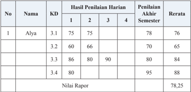

Tabel ini menunjukkan hasil penilaian harian dan akhir semester untuk empat kelas (3.1, 3.2, 3.3, dan 3.4) dalam kurikulum tertentu. Topik utama tabel adalah penilaian akademik siswa. Kolom-kolomnya meliputi nomor (No.), nama siswa, kode mata kuliah (KD), hasil penilaian harian untuk empat minggu pertama, penilaian akhir semester, dan rerata nilai. Data penting yang terlihat adalah bahwa nilai rata-rata untuk setiap kelas berbeda-beda, dengan 3.3 memiliki nilai tertinggi sebesar 88, sedangkan 3.2 memiliki nilai terendah sebesar 65. Selain itu, terdapat variasi dalam penilaian harian, di mana beberapa siswa memiliki nilai yang sama atau hampir sama, seperti Alya dengan nilai 75 untuk semua minggu pertama.

 

---
## 📄 Halaman 47

### Keterangan:

- Penilaian  harian  dilakukan  oleh  pendidik  dengan  cakupan  meliputi semua indikator dari satu kompetensi dasar.
- Penilaian  akhir  semester  merupakan  kegiatan  yang  dilakukan  oleh satuan  pendidikan  untuk  mengukur  pencapaian  kompetensi  peserta didik pada akhir semester. Cakupan penilaian meliputi semua indikator yang merepresentasikan semua KD pada semester tersebut.
- KD  3.1  dilakukan  tagihan  penilaian  sebanyak  3  kali,  maka  nilai pengetahuan pada KD 3.1 adalah 75 + 75 + 78 = 76
- Nilai rapor =  76 + 65 + 84 + 88   = 78,25 (pembulatan: 78)
4

- Contoh deskripsi kompetensi pengetahuan.
'Memiliki kemampuan yang sangat baik dalam memahami dinamika persatuan  dan  kesatuan  bangsa  dalam  konteks  NKRI  dan  perlu ditingkatkan dalam perlindungan dan penegakan hukum di Indonesia'.

### 3.  Nilai Keterampilan

Nilai  keterampilan  diperoleh  dari  hasil  penilaian  unjuk  kerja/kinerja/ praktik,  proyek,  produk,  portofolio,  dan  bentuk  lain  sesuai  karakteristik KD mata pelajaran. Hasil penilaian pada setiap KD pada KI-4 adalah nilai optimal jika penilaian dilakukan dengan teknik yang sama dan objek KD yang sama. Penilaian KD yang sama yang dilakukan dengan proyek dan produk atau praktik dan produk, hasil akhir penilaian KD tersebut dirataratakan.  Untuk  memperoleh  nilai  akhir  keterampilan  adalah  rerata  dari semua  nilai  KD  pada  KI-4  dalam  satu  semester.  Selanjutnya,  penulisan capaian keterampilan pada rapor menggunakan angka pada skala 0-100 dan predikat serta dilengkapi deskripsi singkat capaian kompetensi.

Berikut  contoh  cara  pengolahan  nilai  keterampilan  yang  dilakukan melalui praktik pada KD 4.1 sebanyak 1 kali dan KD 4.2 sebanyak 2 kali. KD 4.3 dan KD 4.4 dinilai melalui satu proyek. Selain itu, KD 4.4 juga dinilai melalui satu kali produk.

 

---
## 📄 Halaman 48

---
**📊 Tabel**

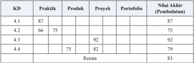

Tabel ini menunjukkan hasil akhir dari beberapa kelas dengan berbagai topik pembelajaran, termasuk Praktik, Produk, Proyek, dan Portofolio. Topik utama adalah Kursus Dasar (KD) 4.1 hingga KD 4.4. Kolom-kolomnya mencakup nilai akhir setelah pembelajaran dan rata-rata nilai akhir. Data penting yang terlihat adalah bahwa KD 4.3 memiliki nilai akhir tertinggi sebesar 92, sedangkan KD 4.2 memiliki nilai akhir terendah sebesar 66. Rata-rata nilai akhir untuk semua topik adalah 83. Ini menunjukkan bahwa topik 4.3 mungkin lebih menarik atau lebih efektif dalam hal penilaian dibandingkan dengan topik lain.

### Keterangan:

- Pada  KD  4.1,  4.2,  dan  4.3  Nilai  Akhir  diperoleh  berdasarkan  nilai optimum,  sedangkan  untuk  KD  4.4  diperoleh  berdasarkan  rata-rata karena menggunakan proyek dan produk.
- Nilai akhir semester didapat dengan cara merata-ratakan nilai akhir pada setiap KD.
- Nilai rapor = 87 + 75 + 92 + 79 = 83,25 ( pembulatan 83)
4

- Nilai rapor keterampilan dilengkapi deskripsi singkat kompetensi yang menonjol berdasarkan pencapaian KD pada KI-4 selama satu semester.
'Memiliki kemampuan yang sangat baik dalam mempresentasikan hasil identi fi kasi pengaruh kemajuan ilmu pengetahuan dan teknologi terhadap negara    dalam  bingkai  BhinnekaTunggal  Ika,  dan  perlu  ditingkatkan dalam  mendemostrasikan  hasil  evaluasi    praktik    perlindungan  dan penegakan  hukum  dalam  masyarakat  untuk  menjamin  keadilan  dan

- Contoh deskripsi kompetensi keterampilan: kedamaian'.

### G. Pembelajaran Remedial dan Pengayaan

Konsekuensi dari pembelajaran tuntas adalah tuntas atau belum tuntas. Bagi peserta didik yang belum mencapai KKM, dilakukan tindakan remedial dan bagi peserta didik yang sudah mencapai atau melampaui ketuntasan belajar  dilakukan  pengayaan.  Pembelajaran  remedial  dan  pengayaan dilaksanakan untuk kompetensi pengetahuan dan keterampilan, sedangkan sikap tidak ada remedial atau pengayaan namun menumbuhkembangkan sikap, perilaku, dan pembinaan karakter setiap peserta didik.

 

---
## 📄 Halaman 49

### 1.  Bentuk Pelaksanaan Remedial

Setelah diketahui kesulitan belajar yang dihadapi peserta didik, langkah berikutnya adalah memberikan perlakuan berupa pembelajaran remedial. Bentuk-bentuk  pelaksanaan  pembelajaran  remedial  antara  lain  sebagai berikut.

- Pemberian pembelajaran ulang dengan metode dan media yang berbeda. Pembelajaran ulang dapat disampaikan dengan variasi cara penyajian, penyederhanaan tes/pertanyaan. Pembelajaran ulang dilakukan bilamana sebagian  besar  atau  semua  peserta  didik  belum  mencapai  ketuntasan belajar  atau  mengalami kesulitan belajar. Pendidik perlu memberikan penjelasan kembali dengan menggunakan metode dan/atau media yang lebih tepat.
- Pemberian bimbingan secara khusus, misalnya bimbingan perorangan. Dalam  hal  pembelajaran  klasikal,  peserta  didik  tertentu  mengalami kesulitan, perlu dipilih alternatif tindak lanjut  berupa  pemberian bimbingan secara individual. Pemberian bimbingan perorangan merupakan  implikasi  peran  pendidik  sebagai  tutor.  Sistem  tutorial dilaksanakan bilamana terdapat satu atau beberapa peserta didik yang belum berhasil mencapai ketuntasan.
- Pemberian tugas-tugas latihan secara khusus. Dalam rangka pelaksanaan remedial, tugas-tugas latihan perlu diperbanyak agar peserta didik tidak mengalami kesulitan dalam mengerjakan tes akhir. Peserta didik perlu diberi pelatihan intensif untuk membantu menguasai kompetensi yang ditetapkan.
- Pemanfaatan tutor sebaya. Tutor sebaya adalah teman sekelas atau kakak kelas yang memiliki kecepatan belajar lebih. Mereka perlu dimanfaatkan untuk memberikan tutorial kepada rekan atau adik kelas yang mengalami kesulitan belajar. Melalui tutor sebaya, diharapkan peserta didik yang mengalami kesulitan belajar akan lebih terbuka dan akrab.

### 2.  Bentuk Pelaksanaan Pengayaan

Bentuk-bentuk  pelaksanaan  pembelajaran  pengayaan  dapat  dilakukan antara lain melalui:

- belajar kelompok, yaitu sekelompok peserta didik yang memiliki minat tertentu diberikan pembelajaran bersama di luar jam pelajaran;
- belajar  mandiri,  yaitu  secara  mandiri  peserta  didik  belajar  mengenai sesuatu yang diminati; dan
- pembelajaran  berbasis  tema,  yaitu  memadukan  kurikulum  di  bawah tema besar sehingga peserta didik dapat mempelajari hubungan antara berbagai disiplin ilmu.

 

---
## 📄 Halaman 50

### 3.  Hasil Penilaian

- Nilai remedial yang diperoleh diolah menjadi nilai akhir.
- Nilai akhir setelah remedial untuk aspek pengetahuan dihitung dengan mengganti nilai indikator yang belum tuntas dengan nilai indikator hasil remedial, yang selanjutnya diolah berdasarkan rerata nilai seluruh KD.
- Nilai akhir setelah remedial untuk aspek keterampilan diambil dari nilai optimal KD.
- Penilaian hasil belajar kegiatan pengayaan tidak sama dengan kegiatan pembelajaran  biasa,  tetapi  cukup  dalam  bentuk  portofolio,  dan  harus dihargai sebagai nilai tambah (lebih) dari peserta didik yang normal.

 

---
## 📄 Halaman 51

### Bagian 2

### Petunjuk Khusus Pembelajaran per Bab

Buku ini merupakan pedoman guru dalam mengelola program pembelajaran terutama dalam  memfasilitasi  siswa  untuk  mendalami Pendidikan Pancasila dan Kewarganegaraan (PPKn) sebagaimana terdapat  dalam  buku  siswa.  Materi  pelajaran  PPKn  yang  terdapat  pada buku siswa akan diajarkan selama 1 (satu) tahun pelajaran. Sesuai dengan desain  waktu  dan  materi,  setiap  Bab  akan  diselesaikan  dalam  beberapa pertemuan. Agar pembelajaran lebih efektif, e fi sien dan sistematis, maka secara  umum,  program  pembelajaran  setiap  pertemuan  dirancang  terdiri dari: (1) Kompetensi Inti (2) Kompetensi Dasar (3) Indikator Pencapaian Kompetensi  (4)  Materi  dan  Proses  Pembelajaran,  (5)  Penilaian,  (6) Pengayaan, (7) Remedial, dan (8) Interaksi Guru dan Orang tua.

### Pelaksanaan Pembelajaran.

Berdasarkan pemahaman tentang Kompetensi Inti (KI) dan Kompetensi Dasar  (KD),  guru  PPKn  dalam  pelaksanaan  pembelajaran  hendaknya memperhatikan hal-hal sebagai berikut:

- Guru  diharapkan  dapat  mempersiapkan  diri  dengan  membaca  dari berbagai sumber bahan ajar yang relevan dengan materi pembelajaran.
- Guru dapat menggunakan isu-isu aktual untuk dapat mengajak siswa dalam  mengembangkan  kemampuan  analisis  dan  evaluatif  dengan mengambil contoh kasus dari situasi yang berkembang saat ini.
- Untuk mendapatkan pemahaman yang lebih komprehensif, guru dapat menampilkan foto-foto, gambar, dan dokumentasi audiovisual ( fi lm ) yang relevan dengan materi pelajaran.
- Guru harus memberikan motivasi dan mendorong siswa secara aktif ( active  learning )  untuk  mencari  sumber  dan  contoh-contoh  konkret dari lingkungan sekitar.
- Guru  harus  menciptakan  situasi  belajar  yang  memungkinkan  siswa melakukan observasi dan re fl eksi. Observasi dapat dilakukan dengan berbagai cara, misalnya membaca buku yang relevan disertai dengan analisis yang bersifat kritis, membuat laporan tertulis secara sederhana, melakukan  wawancara  dengan  narasumber,  menonton fi lm  dan  lain sebagainya yang berkaitan dengan pembahasan materi.

 

---
## 📄 Halaman 52

- Siswa dirangsang untuk berpikir kritis dengan membuat pertanyaanpertanyaan  berdasarkan  wacana/gambar,  memberikan  pertanyaanpertanyaan serta mempertahankan pendapatnya pada setiap jalannya diskusi dalam proses pembelajaran di kelas.
- Guru  dapat  mengaitkan  konteks  materi  pelajaran  dengan  konteks lingkungan  tempat  tinggal  siswa  (kabupaten/kota,  provinsi,  pulau) pada proses pembelajaran di kelas atau di luar kelas.
- Siswa  harus    selalu  dimotivasi  agar  memiliki  kemampuan    dalam mengomunikasikan hasil proses pengumpulan dan analisis data terkait dengan materi yang sedang diajarkan.
- Penggunaan  media/alat/bahan  pelajaran  hendaknya  memperhatikan situasi dan kondisi lingkungan sekolah, khususnya  ketersediaan sarana dan prasarana di sekolah. Jika dipandang perlu, pendidik dapat memanfaatkan teknologi informasi atau pendidik dapat membuat media pembelajaran  yang  bersifat  sederhana  yang  menunjang  penguasaan materi pembalajaran secara efektif dan e fi sien.
- Dalam  rangka  efektivitas  dan  e fi siensi  penyerapan  materi  pelajaran, guru dapat membagi siswa ke dalam beberapa kelompok sesuai dengan jumlah siswa dalam kelas. Kelompok yang telah ditetapkan ditugaskan untuk membuat bahan presentasi kelompok dan mempresentasikannya sesuai dengan tugas  yang telah diberikan kepadanya.
- Proyek kewarganegaraan yang dilaksanakan dalam kelompok dalam pelaksanaannya dapat melakukan kerja sama dengan lembaga/ instansi terkait sehingga siswa mendapatkan informasi secara lengkap. Contoh: tokoh agama/masyarakat, pengurus RT/RW, kepala kelurahan/ pemangku/pejabat pemerintahan, dan lain sebagainya.
Perlu diperhatikan bahwa dalam uraian kegiatan setiap bab merupakan pilihan atau contoh semata, bukan sesuatu yang bersifat mutlak harus diterapkan secara utuh oleh guru dalam kegiatan pembelajaran. Pada dasarnya,  gurulah  yang  berhak  untuk  mendesain  dan  menentukan proses  pembelajaran  di  kelas.  Indikator,  tujuan  pembelajaran,  materi pokok, pendekatan, model dan metode serta penilaian dapat disesuaikan dengan  kemampuan  guru,  karakteristik  siswa,  sarana  dan  prasarana, sumber  belajar  serta  alokasi  waktu  yang  tersedia.  Namun  demikian, proses pembelajaran harus tetap sesuai dengan Kurikulum 2013.

 

---
## 📄 Halaman 53

---
**🖼️ Gambar/Diagram**

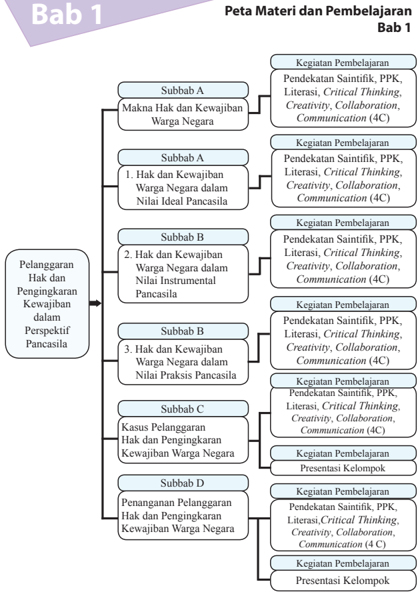

> **Deskripsi Visual:** Buku pelajaran ini menampilkan peta materi dan pembelajaran Bab 1 dengan struktur diagram. Diagram ini terdiri dari berbagai subbab yang disusun secara hierarkis, masing-masing subbab melibatkan kegiatan pembelajaran yang spesifik. Subbab A membahas tentang Hak dan Kewajiban Warga Negara dalam Nilai Ideal Pancasila, sementara subbab B fokus pada Hak dan Kewajiban Warga Negara dalam Nilai Instrumental Pancasila. Subbab C mengeksplorasi Pelanggaran Hak dan Pengingkaran Kewajiban Warga Negara, dan subbab D mengupas Penanganan Pelanggaran Hak dan Pengingkaran Kewajiban Warga Negara. Setiap subbab memiliki kegiatan pembelajaran yang spesifik, seperti pendekatan saintifik, pendekatan PPK, literasi, critical thinking, kreativitas, kolaborasi, dan komunikasi (4C). Teks penting dalam diagram ini mencakup judul bab, subbab, dan kegiatan pembelajaran yang disertakan. Diagram ini memberikan pemahaman yang jelas tentang struktur materi dan proses pembelajaran yang akan dilalui oleh siswa dalam Bab 1.

PPKn

 

---
## 📄 Halaman 54

### Kasus-Kasus Pelanggaran Hak dan Pengingkaran Kewajiban dalam Perspektif Pancasila

### A. Kompetensi Inti ( KI):

- Menghayati dan mengamalkan ajaran agama yang dianutnya
- Menunjukkan perilaku jujur, disiplin, tanggung jawab, peduli (gotong  royong,  kerja  sama,  toleran,  damai),  santun,  responsif  dan proaktif sebagai bagian dari solusi atas berbagai permasalahan dalam berinteraksi  secara  efektif  dengan  lingkungan  sosial  dan  alam  serta menempatkan diri sebagai cerminan bangsa dalam pergaulan dunia.
- Memahami, menerapkan, menganalisis, dan mengevaluasi pengetahuan faktual,  konseptual,  prosedural,  dan  metakognitif  berdasarkan  rasa ingin tahunya tentang ilmu pengetahuan, teknologi, seni, budaya, dan humaniora dengan wawasan kemanusiaan,  kebangsaan,  kenegaraan, dan peradaban terkait penyebab fenomena dan kejadian, serta menerapkan pengetahuan prosedural pada bidang kajian yang spesi fi k sesuai dengan bakat dan minatnya untuk memecahkan masalah.
- Mengolah, menalar, menyaji, dan mencipta dalam ranah konkret dan ranah abstrak terkait dengan pengembangan dari yang dipelajarinya di sekolah secara mandiri, serta bertindak secara efektif dan kreatif, dan mampu menggunakan metoda sesuai kaidah keilmuan.

 

---
## 📄 Halaman 55

### B. Kompetensi Dasar (KD) dan Indikator Pencapaian Kompetensi (IPK)

---
**📊 Tabel**

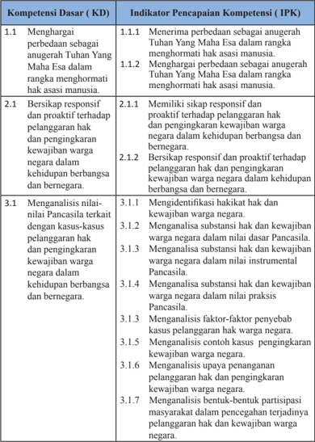

Tabel ini berisi informasi tentang kompetensi dasar (KD) dan indikator pencapaian kompetensi (IPK) yang harus dicapai oleh siswa dalam konteks pembelajaran Pancasila. Topik utama tabel adalah tentang bagaimana siswa menghargai Tuhan Yang Maha Esa, bersikap responsif dan proaktif terhadap pelanggaran hak dan kewajiban warga negara, serta menganalisis nilai-nilai Pancasila dalam konteks kasus-kasus. Kolom-kolom yang ada mencakup 3 subtopik utama: menghargai Tuhan Yang Maha Esa, bersikap responsif dan proaktif terhadap pelanggaran hak dan kewajiban warga negara, dan menganalisis nilai-nilai Pancasila. Data penting yang terlihat adalah bahwa setiap subtopik memiliki beberapa indikator pencapaian kompetensi yang harus dicapai, seperti menghargai Tuhan Yang Maha Esa secara berdasarkan pandangan agama, bersikap responsif dan proaktif terhadap pelanggaran hak dan kewajiban warga negara, dan menganalisis faktor-faktor yang mempengaruhi pelanggaran hak dan kewajiban warga negara.

 

---
## 📄 Halaman 56

---
**📊 Tabel**

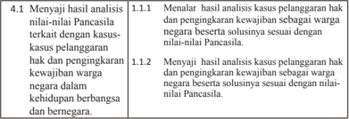

Tabel ini berisi instruksi untuk menulis analisis kasus Pancasila dalam konteks hak dan kewajiban warga negara. Topik utamanya adalah tentang menunjukkan hasil analisis kasus Pancasila yang berkaitan dengan kasus-kasus pelanggaran hak dan pengingkaran kewajiban warga negara dalam kehidupan berbangsa dan bernegara. Tabel dibagi menjadi dua bagian: 1.1.1. Menalar hasil analisis kasus pelanggaran hak dan pengingkaran kewajiban sebagai warga negara beserta solusiannya sesuai dengan nilai-nilai Pancasila; dan 1.1.2. Menyajikan hasil analisis kasus pelanggaran hak dan pengingkaran kewajiban sebagai warga negara beserta solusiannya sesuai dengan nilai-nilai Pancasila. Data penting yang terlihat adalah bahwa tabel ini memberikan instruksi untuk menulis analisis kasus Pancasila secara detail dan mendalam, dengan fokus pada pelanggaran hak dan pengingkaran kewajiban warga negara dalam konteks kehidupan berbangsa dan bernegara.

### C. Materi Pembelajaran Bab 1.

Secara garis besar materi pembelajaran Bab 1 adalah sebagai berikut.

- Makna hak dan kewajiban warga negara.
- Substansi hak dan kewajiban warga negara dalam Pancasila.
- Hak dan kewajiban warga negara dalam nilai dasar  Pancasila.
- Hak dan kewajiban warga negara dalam nilai instrumental Pancasila.
- Hak dan kewajiban warga negara dalam nilai praksis Pancasila.
- Kasus pelanggaran hak dan pengingkaran kewajiban warga negara.
- Penyebab terjadinya pelanggaran hak dan pengingkaran kewajiban warga negara.
- Kasus pelanggaran hak warga negara.
- Kasus pengingkaran kewajiban warga negara.
- Penanganan pelanggaran hak dan pengingkaran kewajiban warga.
- Upaya pemerintah dalam penanganan kasus pelanggaran hak dan pengingkaran kewajiban warga negara.
- Membangun partisipasi masyarakat dalam pencegahan terjadinya pelanggaran hak dan kewajiban warga negara.

### D. Proses Pembelajaran

### 1.  Pertemuan Pertama (2 x 45 Menit)

Pertemuan pertama  diawali  dengan  mengulas  isu-isu  yang  ada  di  sekitar siswa.  Pada  pertemuan  pertama  guru,  dapat  menyampaikan  gambaran umum materi yang akan dipelajari pada Bab 1, kegiatan apa yang akan dilaksanakan, menjelaskan pentingnya mempelajari materi ini, bagaimana guru dapat menumbuhkan ketertarikan siswa terhadap materi yang akan dipelajari. Setelah itu, guru menyampaikan batasan materi apa saja yang akan dipelajari pada Bab 1.

 

---
## 📄 Halaman 57

### a.  Indikator Pencapaian Kompetensi

- Menerima perbedaan sebagai anugerah Tuhan Yang Maha Esa dalam rangka menghormati hak warga negara.
- Menghargai  perbedaan  sebagai  anugerah  Tuhan  Yang  Maha  Esa dalam rangka menghormati hak warga negara.
- Memiliki sikap responsif dan proaktif terhadap pelanggaran hak dan pengingkaran kewajiban warga negara dalam kehidupan berbangsa dan bernegara.
- Bersikap  responsif  dan  proaktif  terhadap  pelanggaran  hak  dan pengingkaran kewajiban warga negara dalam kehidupan berbangsa dan bernegara.
- Mengidenti fi kasi  hakikat hak warga negara.
- Mengidenti fi kasi hakikat  kewajiban warga negara.
- Menalar    hasil  analisis  kasus  pelanggaran  hak  dan  pengingkaran kewajiban  sebagai  warga  negara  beserta  solusinya  sesuai  dengan nilai-nilai Pancasila.
- Menyaji    hasil  analisis  kasus  pelanggaran  hak  dan  pengingkaran kewajiban  sebagai  warga  negara  beserta  solusinya  sesuai  dengan nilai-nilai Pancasila.

### b.  Materi Pembelajaran

Materi  yang  disampaikan  pada  pertemuan  pertama  adalah  subbab  A tentang  hakikat hak dan kewajiban warga negara.

### c.  Proses Pembelajaran

Pembelajaran menggunakan pendekatan sainti fi k dengan proses pembelajaran  aktif    menekankan  pada    Penguatan  Pendidikan  Karakter (PPK), Literasi, Critical Thinking , Creativity , Collaboration dan Communication (4 C). Pelaksanaan pembelajaran secara umum dibagi tiga tahapan, yaitu kegiatan pendahuluan, kegiatan inti, dan kegiatan penutup.

---
**📊 Tabel**

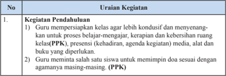

Tabel ini berisi informasi tentang kegiatan pendahuluan dalam proses belajar-mengajar di kelas. Topik utamanya adalah persiapan guru untuk proses belajar yang efektif. Kolom pertama menunjukkan nomor urutan kegiatan, sedangkan kolom kedua menjelaskan uraian kegiatan tersebut. Data penting yang terlihat adalah bahwa guru harus mempersiapkan kelas agar lebih kondusif dan menyenangkan, termasuk menyiapkan media, alat, dan buku yang diperlukan. Selain itu, guru juga harus memastikan bahwa mata uang siswa sesuai dengan agenda kegiatan PPK (Pendidikan Pustaka Kreatif). Ini menunjukkan bahwa pembelajaran harus disesuaikan dengan kebutuhan dan minat siswa, serta menggunakan metode yang efektif untuk mencapai tujuan pendidikan.

 

---
## 📄 Halaman 58

---
**📊 Tabel**

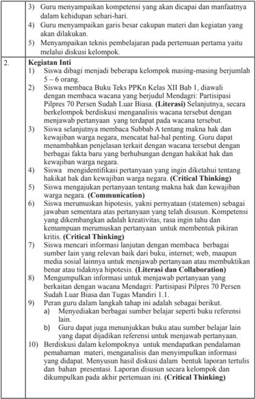

Tabel ini berisi instruksi untuk proses pembelajaran kritis (Critical Thinking) dalam konteks pendidikan, dengan topik utama "Kegiatan Inti" yang melibatkan siswa dalam berbagai tugas dan kegiatan. Kolom-kolomnya mencakup: 1) Kegiatan Inti, 2) Kegiatan Inti, 3) Kegiatan Inti, 4) Kegiatan Inti, 5) Kegiatan Inti, 6) Kegiatan Inti, 7) Kegiatan Inti, 8) Kegiatan Inti, 9) Kegiatan Inti, 10) Kegiatan Inti, 11) Kegiatan Inti, 12) Kegiatan Inti, 13) Kegiatan Inti, 14) Kegiatan Inti, 15) Kegiatan Inti, 16) Kegiatan Inti, 17) Kegiatan Inti, 18) Kegiatan Inti, 19) Kegiatan Inti, 20) Kegiatan Inti, 21) Kegiatan Inti, 22) Kegiatan Inti, 23) Kegiatan Inti, 24) Kegiatan Inti, 25) Kegiatan Inti, 26) Kegiatan Inti, 27) Kegiatan Inti, 28) Kegiatan Inti, 29) Kegiatan Inti, 30) Kegiatan Inti, 31) Kegiatan Inti, 32) Kegiatan Inti, 33) Kegiatan Inti, 34) Kegiatan Inti, 35) Kegiatan Inti, 36) Kegiatan Inti, 37) Kegiatan Inti, 38) Kegiatan Inti, 39) Kegiatan Inti, 40) Kegiatan Inti, 41) Kegiatan Inti, 42)

 

---
## 📄 Halaman 59

- Guru meminta perwakilan  kelompok  untuk mempresentasikan hasil diskusinya secara bergantian. Masalah yang dipresentasikan adalah jawaban atas pertanyaan yang terdapat pada wacana 'Mendagri: Partisipasi Pilpres 70 Persen Sudah Luar Biasa'. Hasil diskusi kelompok tentang  pertanyaan yang telah disusun berkaitan dengan materi subbab A, dan presentasi Tugas Mandiri 1.1 (Communication)
- Pada saat kelompok tertentu mempresentasikan hasil diskusinya, kelompok lain diminta untuk memperhatikan dan mengajukan pertanyaan atau memberikan kritik dan masukan. (Critical Thinking)
- Guru memberikan kon fi rmasi terhadap hasil presentasi setiap kelompok. Hasil diskusi  kelompok dikumpulkan untuk mendapatkan penilaian dari guru.

### 3. Kegiatan Penutup

- Guru dan siswa membuat rangkuman atau simpulan kompetensi yang telah dipelajari.
- Guru dan siswa melakukan re fl eksi terhadap kegiatan yang sudah dilaksanakan.
- Guru memberikan umpan balik terhadap proses dan hasil belajar.
- Guru menyampaikan  rencana pembelajaran untuk pertemuan kedua.
- Guru dan siswa menutup pelajaran dengan mengucapkan syukur kepada Tuhan Yang Maha Esa karena pembelajaran  berlangsung lancar dan tertib. (PPK)

### d.  Penilaian

### 1) Penilaian Sikap

Penilaian  sikap  terhadap  siswa  dapat  dilakukan  selama  proses belajar  berlangsung.  Penilaian  dapat  dilakukan  dengan  observasi. Dalam Observasi ini misalnya dilihat aktivitas dan tingkat perhatian siswa  selama  proses  pembelajaran  berlangsung.  Format  penilaian sikap  dapat  menggunakan  contoh  Jurnal  Perkembangan  Sikap sebagai berikut;

### Jurnal Perkembangan Sikap

Kelas

: ……..............…….

Semester

: ……..............…….

 

---
## 📄 Halaman 60

### 2) Penilaian Pengetahuan

- Jawablah pertanyaan di bawah ini.
- Jelaskan hakikat hak warga negara!
- Jelaskan hakikat  kewajiban warga negara!
- Jelaskan kaitan antara hak dan kewajiban warga negara!
- Mengerjakan Tugas Mandiri 1.1, sebagai berikut; pembelajaran  pada  bab  ini.  Kemudian  coba  identi fi
Bacalah  buku  sumber  lain  yang  ada  kaitannya  dengan  materi kasi  tiga makna hak dan kewajiban warga negara menurut para pakar/ahli.

- Berdasarkan pendapat-pendapat para pakar yang kalian temukan, analisis persamaan dan perbedaannya.
- Coba  kalian  rumuskan    makna  hak  dan  kewajiban  warga negara berdasarkan pendapat sendiri.

### 3) Penilaian Keterampilan

Penilaian Keterampilan dilakukan guru dengan melihat kemampuan siswa dalam presentasi, kemampuan bertanya, kemampuan menjawab pertanyaan atau mempertahankan argumentasi kelompok, kemampuan dalam memberikan masukan/saran pada saat menyampaikan hasil telaah/analisis tentang hakikat  hak  dan  kewajiban  warga negara.  Lembar  penilaian  Penyajian  dan  laporan  hasil  telaah  dapat menggunakan  format  sebagimana  terdapat  pada  lampiran  dengan ketentuan aspek penilaian dan rubriknya  dapat disesuaikan dengan situasi dan kondisi serta keperluan guru.

### 2.  Pertemuan Kedua ( 2 x 45 Menit )

### a.  Indikator Pencapaian Kompetensi

Menganalisis substansi hak warga negara dalam nilai dasar  Pancasila

- Menerima perbedaan sebagai anugerah Tuhan Yang Maha Esa dalam rangka menghormati hak warga negara.
- Menghargai  perbedaan  sebagai  anugerah  Tuhan  Yang  Maha  Esa dalam rangka menghormati hak warga negara.
- Memiliki sikap responsif dan proaktif terhadap pelanggaran hak dan pengingkaran kewajiban warga negara dalam kehidupan berbangsa dan bernegara.
- Bersikap  responsif  dan  proaktif  terhadap  pelanggaran  hak  dan pengingkaran kewajiban warga negara dalam kehidupan berbangsa dan bernegara.

 

---
## 📄 Halaman 61

- Menganalisis substansi hak dan kewajiban warga negara dalam nilai dasar Pancasila.
- Menalar  hasil  analisis  kasus  pelanggaran  hak  dan  pengingkaran kewajiban  sebagai  warga  negara  beserta  solusinya  sesuai  dengan nilai-nilai Pancasila.
- Menyaji  hasil  analisis  kasus  pelanggaran  hak  dan  pengingkaran kewajiban  sebagai  warga  negara  beserta  solusinya  sesuai  dengan nilai-nilai Pancasila.

### b.  Materi Pembelajaran

Materi yang disampaikan pada pertemuan kedua adalah Bab 1, Subbab B: subtansi  hak dan kewajiban warga negara dalam Pancasila.

### c.  Proses  Pembelajaran

Pembelajaran menggunakan pendekatan sainti fi k dengan proses pembelajaran  aktif  menekankan  pada  Penguatan  Pendidikan  Karakter (PPK), Literasi, Critical Thinking, Creativity, Collaboration , dan Communication (4 C). Pelaksanaan pembelajaran secara umum dibagi tiga tahapan yaitu kegiatan pendahuluan, kegiatan inti, dan kegiatan penutup.

---
**📊 Tabel**

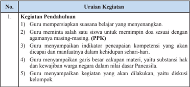

Tabel ini berisi uraian tentang kegiatan pendahuluan yang dilakukan oleh guru dalam proses pembelajaran. Topik utamanya adalah bagaimana guru mempersiapkan suasana belajar yang menyenangkan, memimpin doa sesuai dengan agamanya masing-masing (PPK), menyiapkan indikator pencapaian kompetensi, memberikan garis besar hak dan kewajiban negara, serta diskusi kelompok. Kolom pertama berisi nomor urut kegiatan, sedangkan kolom kedua berisi uraian kegiatan tersebut. Data penting yang terlihat adalah bahwa semua kegiatan ini bertujuan untuk mempersiapkan situasi belajar yang menyenangkan dan efektif bagi siswa.

 

---
## 📄 Halaman 62

### 2. Kegiatan Inti

- Siswa dibagi menjadi beberapa kelompok masing-masing berjumlah 5-6 orang.
- Siswa diminta untuk mengamati dengan membaca Bab 1, Subbab B: materi hak dan kewajiban warga negara dalam nilai dasar Pancasila. (Literasi)
- Guru memberikan informasi tambahan terkait dengan substansi hak dan kewajiban warga negara dalam Pancasila.
- Guru memberikan stimulasi dengan mengajukan pertanyaanpertanyaan  yang  dapat  menghadapkan  siswa  pada  kondisi  internal yang mendorong eksplorasi.
- Siswa secara kelompok mengidenti fi kasi sekaligus mencatat pertanyaan yang ingin diketahui berkaitan dengan  substansi hak dan kewajiban  warga  negara  dalam  Pancasila.  Guru  membimbing  dan terus mendorong siswa untuk terus menggali rasa ingin tahu dengan mengisi daftar pertanyaan sebagai berikut: (Critical Thinking)
- Guru  memberi  motivasi  dan  penghargaan  bagi  kelompok  yang menyusun pertanyaan terbanyak dan sesuai dengan Indikator Pencapaian Kompetensi. Guru mengamati keterampilan siswa secara perorangan dan kelompok dalam menyusun pertanyaan.
- Siswa mencari informasi dan mendiskusikan jawaban atas pertanyaan yang  disusun  dengan  membaca  dari  berbagai  sumber  lain  yang relevan, media massa, internet, web atau media sosial lainnya, dan mengumpulkan  informasi  untuk  mengerjakan  Tugas  Mandiri  1.2, yaitu  mengidenti fi kasi  jenis  hak  dan  kewajiban  warga  negara  yang terkait dengan nilai dasar  Pancasila. (Collaboration)
- Peran guru dalam kegiatan ini adalah;
- Menyediakan berbagai sumber belajar seperti buku teks siswa dan buku referensi lain.
- Menjadi sumber belajar bagi siswa dengan memberikan kon fi rmasi atas jawaban  siswa,  atau  menjelaskan  jawaban pertanyaan kelompok yang tidak terjawab.
- Menunjukkan buku atau sumber belajar lain yang dapat dijadikan referensi untuk menjawab pertanyaan.
- Siswa berdiskusi dalam kelompoknya untuk mendapatkan pendalaman  pemahaman    materi,  menganalisis  dan  menyimpulkan informasi yang didapat terkait dengan substansi hak dan kewajiban warga  negara  dalam  dalam  nilai  dasar  Pancasila,  serta  menyusun laporan secara tertulis. (Critical Thinking, Collaboration)

 

---
## 📄 Halaman 63

- Siswa menyusun laporan hasil analisisnya. Laporan disusun secara kelompok dan individu untuk  dikumpulkan pada akhir pertemuan ini. (Critical Thinking, Collaboration)
- Siswa secara acak (2-3 orang) diminta untuk mempresentasikan hasil diskusi  kelompoknya.  Siswa yang lain diminta untuk menanggapi atau  melengkapi  hasil  presentasi  tersebut (Communication) .  Guru memberikan kon fi rmasi/penguatan atas jawaban siswa.

### 3. Kegiatan Penutup

- Siswa  melakukan  re fl eksi  dan  menyimpulkan  materi  yang  telah dibahas pada pertemuan ini.
- Guru menyampaikan informasi kegiatan untuk pertemuan berikutnya
- Guru dan siswa menutup kegiatan dengan mengucapkan rasa syukur kepada  Tuhan  Yang  Maha  Esa  bahwa  pertemuan  kali  ini  telah berlangsung dengan  lancar. (PPK)

### d.  Penilaian

### 1) Penilaian Sikap

Penilaian  sikap  terhadap  siswa  dapat  dilakukan  selama  proses belajar  berlangsung.  Penilaian  dapat  dilakukan  dengan  observasi. Dalam Observasi ini misalnya dilihat aktivitas dan tingkat perhatian siswa  selama  proses  pembelajaran  berlangsung.  Format    penilaian sikap  dapat  menggunakan contoh Penilaian  Jurnal Perkembangan Sikap sebagai berikut.

### Jurnal Perkembangan Sikap

Kelas Semester

: ……..............…….

: ……..............…….

### 2) Penilaian Pengetahuan

Penilaian pengetahuan dilakukan dalam bentuk penugasan, siswa diminta untuk mengerjakan Tugas Mandiri 1.2.

 

---
## 📄 Halaman 64

### Tugas Mandiri 1.2

Coba anda identi fi kasi jenis hak dan kewajiban warga negara yang terkait  dengan  setiap  sila  Pancasila.  Tuliskan  hasil  identi fi kasimu dalam tabel di bawah ini dan presentasikan di depan kelas!

---
**📊 Tabel**

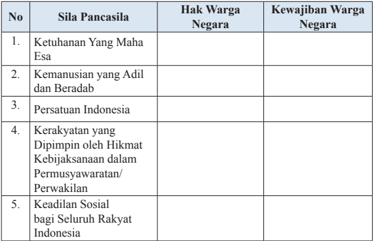

Tabel ini memperlihatkan hubungan antara sila-sila Pancasila dengan hak dan kewajiban warga negara Indonesia. Topik utama tabel ini adalah hubungan antara nilai-nilai nasional (Pancasila) dengan hak-hak dan tanggung jawab warga negara. Kolom pertama berisi sila-sila Pancasila, kolom kedua berisi hak warga negara, dan kolom ketiga berisi kewajiban warga negara. Data penting yang terlihat adalah bahwa semua sila Pancasila memiliki kaitan langsung dengan hak dan kewajiban warga negara, menunjukkan bahwa nilai-nilai Pancasila merupakan dasar bagi pembentukan hak dan kewajiban warga negara.

### 3) Penilaian Keterampilan

Penilaian keterampilan dilakukan guru dengan melihat kemampuan  siswa  dalam  presentasi,  kemampuan  bertanya,  kemampuan menjawab pertanyaan atau mempertahankan argumentasi kelompok, kemampuan  dalam  memberikan  masukan/saran  pada  saat  menyampaikan  hasil  analisis  tentang  substansi    hak  dan  kewajiban warga negara dalam Pancasila. Format penilaian dapat menggunakan contoh sebagaimana terdapat dalam bagian lampiran buku guru.

### 3.  Pertemuan Ketiga  ( 2 x 45 menit )

### a.  Indikator Pencapaian Kompetensi

- Menunjukan  perilaku  orang  yang  beriman  dan  bertaqwa  dalam mengatasi  pelanggaran  hak  dan  pengingkaran  kewajiban  sebagai pengamalan ajaran agama yang dianutnya.
- Membangun nilai-nilai kepedulian dalam mengatasi pelanggaran hak dan pengingkaran kewajiban sebagai pengamalan ajaran agama yang dianutnya.

 

---
## 📄 Halaman 65

- Membangun nilai-nilai tanggung jawab dalam mengatasi pelanggaran hak dan pengingkaran kewajiban sebagai pengamalan ajaran agama yang dianutnya.
- Menganalisis substansi hak dan kewajiban warga negara dalam nilai instrumental  Pancasila.
- Menalar    hasil  analisis  kasus  pelanggaran  hak  dan  pengingkaran kewajiban  sebagai  warga  negara  beserta  solusinya  sesuai  dengan nilai-nilai Pancasila.
- Menyaji    hasil  analisis  kasus  pelanggaran  hak  dan  pengingkaran kewajiban  sebagai  warga  negara  beserta  solusinya  sesuai  dengan nilai-nilai Pancasila.

### b.  Materi Pembelajaran

Materi  yang  disampaikan  pada  pertemuan  ketiga  adalah  Bab  1, Subbab B: materi tentang   hak dan kewajiban warga negara dalam nilai instrumental sila-sila Pancasila.

### c.  Proses Pembelajaran

Pembelajaran  menggunakan  pendekatan  sainti fi k  dengan  proses pembelajaran aktif  menekankan pada  Penguatan Pendidikan Karakter (PPK), Literasi, Critical Thinking, Creativity,  Collaboration ,  dan Communication (4C).  Pelaksanaan pembelajaran secara umum dibagi tiga  tahapan,  yaitu  kegiatan  pendahuluan,  kegiatan  inti,  dan  kegiatan penutup.

---
**📊 Tabel**

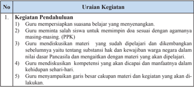

Tabel ini berisi uraian tentang kegiatan pendahuluan dalam proses pembelajaran. Topik utamanya adalah "Kegiatan Pendahuluan". Tabel ini terdiri dari dua kolom: "No" dan "Uraian Kegiatan". Kolom "No" menerangkan urutan kegiatan, sedangkan kolom "Uraian Kegiatan" menjelaskan secara detail apa yang dilakukan dalam setiap urutan tersebut. Data penting yang terlihat adalah bahwa setiap urutan kegiatan memiliki tujuan yang jelas, seperti mempersiapkan suasana belajar yang menyenangkan, meminta saran untuk meminimalkan dosis sesuai dengan agama masing-masing (PPK), membahas materi yang sudah dipelajari, diskusikan hak dan kewajiban warga negara, serta menentukan kompetensi yang akan dicapai. Ini menunjukkan bahwa proses pembelajaran diarahkan untuk menciptakan lingkungan belajar yang efektif dan menghormati perbedaan信仰.

 

---
## 📄 Halaman 66

### 2. Kegiatan Inti

- Siswa dibagi  menjadi  beberapa  kelompok  masing-masing  berjumlah  5  -  6 orang.
- Siswa diminta untuk mengamati dengan membaca Bab 1, Subbab B: Materi tentang  subtansi  hak  dan  kewajiban  warga  negara  dalam  nilai  instrumental Pancasila. (Literasi)
- Guru  memberikan  informasi  tambahan  terkait  dengan  substansi  hak  dan kewajiban warga negara dalam nilai instrumental Pancasila.
- Guru memberikan stimulasi dengan mengajukan pertanyaan-pertanyaan yang dapat menghadapkan siswa pada kondisi internal yang mendorong eksplorasi. (Critical Thinking)
- Siswa secara kelompok mengidenti fi kasi sekaligus mencatat pertanyaan yang ingin diketahui berkaitan dengan substansi hak dan kewajiban warga negara dalam nilai instrumental Pancasila. (Critical Thinking) Guru membimbing dan  terus  mendorong  siswa  untuk  terus  menggali  rasa  ingin  tahu  dengan mengisi daftar pertanyaan sebagai berikut :
Guru  memberi  motivasi  dan  penghargaan  bagi  kelompok  yang  menyusun pertanyaan terbanyak dan sesuai dengan Indikator Pencapaian Kompetensi.

- Guru mengamati keterampilan siswa secara perorangan dan kelompok dalam menyusun pertanyaan.
- Siswa mencari informasi dan mendiskusikan jawaban atas pertanyaan yang disusun dengan membaca dari berbagai sumber lain yang relevan, media massa, internet, web atau media sosial lainnya. Siswa juga mengumpulkan informasi untuk  mengerjakan  Tugas  Mandiri  1.3.  yaitu  mengidenti fi kasi  perwujudan hak dan kewajiban-kewajiban warga negara yang diatur dalam UUD Negara Republik Indonesia Tahun 1945. (Collaboration, Literasi, Creativity)
- Peran guru dalam kegiatan ini adalah sebagai berikut.
- Menyediakan berbagai sumber belajar seperti buku teks siswa dan buku referensi lain.
- Menjadi sumber belajar bagi siswa dengan memberikan kon fi rmasi atas jawaban  siswa,  atau  menjelaskan  jawaban  pertanyaan  kelompok  yang tidak terjawab.
- Menunjukkan buku atau sumber belajar lain yang dapat dijadikan referensi untuk menjawab pertanyaan.
- Siswa  berdiskusi  dalam  kelompoknya  untuk  mendapatkan  pendalaman pemahaman materi, menganalisis dan menyimpulkan informasi yang didapat  terkait  dengan  substansi  hak  dan  kewajiban  warga  negara  dalam nilai  instrumental  Pancasila,  serta  menyusun  laporan  secara  tertulis .  (PPK, Collaboration,  Critical Thinking)
- Siswa secara bergantian mempresentasikan hasil diskusi kelompoknya. Siswa dari kelompok lain diminta untuk mengajukan pertanyaan atau memberikan masukan . (Communication)

 

---
## 📄 Halaman 67

- Guru  memberikan  kon fi rmasi  terhadap  hasil  presentasi  setiap  kelompok. Masing-masing  kelompok  memperbaiki  hasil  presentasinya  berdasarkan masukan dari kelompok lain. Hasil diskusi kelompok dikumpulkan untuk mendapatkan penilaian .(PPK)

### 3. Kegiatan Penutup

- Siswa  melakukan  re fl eksi  dan  menyimpulkan  materi  yang  telah  dibahas pada pertemuan ketiga.
- Guru menyampaikan informasi kegiatan untuk pertemuan berikutnya yaitu hak dan kewajiban warga negara dalam nilai praksis  Pancasila.
- Guru dan siswa menutup kegiatan dengan mengucapkan rasa syukur kepada Tuhan Yang Maha Esa bahwa pertemuan kali ini telah berlangsung dengan lancar .(PPK)

### d.  Penilaian

### 1) Penilaian Sikap

Penilaian sikap terhadap siswa dapat dilakukan selama proses belajar berlangsung.  Penilaian  dapat  dilakukan  dengan  observasi.  Dalam observasi  ini  misalnya  dilihat  aktivitas  dan  tingkat  perhatian  siswa selama  proses  pembelajaran  berlangsung.  Format    penilaian  sikap dapat  menggunakan  contoh  penilaian    Jurnal  Perkembangan  Sikap sebagai berikut;

### Jurnal Perkembangan Sikap

Kelas

: ……..............…….

Semester

: ……..............…….

### 2) Penilaian Pengetahuan

Penilaian  pengetahuan  dilakukan  dalam  bentuk  penugasan,  Guru menilai hasil pekerjaan siswa yaitu Tugas Mandiri 1.3.

 

---
## 📄 Halaman 68

### 3) Penilaian Keterampilan

Penilaian keterampilan dilakukan guru dengan melihat kemampuan siswa dalam presentasi, kemampuan bertanya, kemampuan menjawab pertanyaan atau mempertahankan argumentasi kelompok, kemampuan dalam  memberikan  masukan/saran  pada  saat  menyampaikan  hasil telaah/analisis  tentang  substansi  hak  dan  kewajiban    warga  negara dalam nilai instrumental Pancasila. Lembar penilaian Penyajian dan laporan hasil telaah dapat menggunakan format sebagaimana terdapat pada lampiran dengan ketentuan aspek penilaian dan rubriknya  dapat disesuaikan dengan situasi dan kondisi serta keperluan guru.

### 4.  Pertemuan Keempat  (2 x 45 menit)

### a.  Indikator Pencapaian Kompetensi

- Menerima perbedaan sebagai anugerah Tuhan Yang Maha Esa dalam rangka menghormati hak warga negara.
- Menghargai  perbedaan  sebagai  anugerah  Tuhan  Yang  Maha  Esa dalam rangka menghormati hak warga negara.
- Memiliki sikap responsif dan proaktif terhadap pelanggaran hak dan pengingkaran kewajiban warga negara dalam kehidupan berbangsa dan bernegara.
- Bersikap  responsif  dan  proaktif  terhadap  pelanggaran  hak  dan pengingkaran kewajiban warga negara dalam kehidupan berbangsa dan bernegara.
- Menganalisis substansi hak dan kewajiban warga negara dalam nilai praksis Pancasila.
- Menalar  hasil  analisis  kasus  pelanggaran  hak  dan  pengingkaran kewajiban  sebagai  warga  negara  beserta  solusinya  sesuai  dengan nilai-nilai Pancasila.
- Menyaji  hasil  analisis  kasus  pelanggaran  hak  dan  pengingkaran kewajiban  sebagai  warga  negara  beserta  solusinya  sesuai  dengan nilai-nilai Pancasila.

### b.  Materi Pembelajaran

Materi pembelajaran pada pertemuan keempat adalah subtansi  hak dan kewajiban warga negara dalam nilai praksis Pancasila.

 

---
## 📄 Halaman 69

### c.  Proses Pembelajaran

Pembelajaran  menggunakan  pendekatan  sainti fi k  dengan  proses pembelajaran aktif  menekankan pada  Penguatan Pendidikan Karakter (PPK), Literasi, Critical Thinking, Creativity,  Collaboration , dan Communication (4C).  Pelaksanaan pembelajaran secara umum dibagi tiga  tahapan  yaitu:  kegiatan  pendahuluan,  kegiatan  inti,  dan  kegiatan penutup.

---
**📊 Tabel**

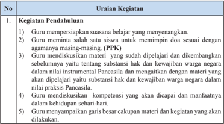

Tabel ini berisi uraian tentang kegiatan pendahuluan dalam proses pembelajaran, yang meliputi: 1) Guru mempersiapkan suasana belajar yang menyenangkan; 2) Guru meminta salah satu siswa untuk memimpin doa sesuai dengan agamanya masing-masing (PPK); 3) Guru mendiskusikan materi yang sudah dipelajari dan dikembangkan sebelumnya yang yaitu tentang substansi hak dan kewajiban warga negara dalam hal penggunaan instrumen Pancasila dan menghargai dengan materi yang akan dipelajari; 4) Guru mendiskusikan kompetensi yang akan dicapai dan manfaatnya dalam kehidupan sehari-hari; 5) Guru menyampaikan garis besar cakupan materi dan kegiatan yang akan dilakukan. Topik utama tabel ini adalah proses pendahuluan pembelajaran, yang mencakup aspek-aspek seperti suasana belajar, pemimpin doa, materi yang telah dipelajari, kompetensi yang akan dicapai, dan cakupan materi dan kegiatan.

 

---
## 📄 Halaman 70

### 2. Kegiatan Inti

- Siswa dibagi menjadi beberapa kelompok masing-masing berjumlah 5-6 orang.
- Siswa diminta untuk mengamati dengan membaca Bab 1, Subbab B materi substansi hak dan kewajiban warga negara dalam nilai praksis sila-sila Pancasila. (Literasi)
- Guru memberikan informasi tambahan terkait dengan substansi hak dan kewajiban warga negara dalam nilai praksis Pancasila.
- Guru memberikan stimulasi dengan mengajukan pertanyaan-pertanyaan yang dapat menghadapkan siswa pada kondisi internal yang mendorong eksplorasi.
- Siswa secara kelompok mengidenti fi kasi sekaligus mencatat pertanyaan yang  ingin  diketahui  berkaitan  dengan  substansi  hak  dan  kewajiban warga negara dalam nilai praksis Pancasila. (Critical Thinking) Guru membimbing dan terus mendorong siswa untuk terus menggali rasa ingin tahu dengan mengisi daftar pertanyaan sebagai berikut.
- Guru memberi motivasi dan penghargaan bagi kelompok yang menyusun pertanyaan terbanyak dan sesuai dengan Indikator Pencapaian Kompetensi.
- Guru mengamati keterampilan siswa secara perorangan dan kelompok dalam menyusun pertanyaan. (Creativity)
- Siswa  mencari  informasi  dan  mendiskusikan  jawaban  atas  pertanyaan yang disusun dengan membaca dari berbagai sumber lain yang relevan, media  massa,  internet, web  atau media  sosial lainnya. (Literasi,

### Collaboration)

- Peran guru dalam kegiatan ini adalah;
- Menyediakan berbagai sumber belajar seperti buku teks siswa dan buku referensi lain.
- Menjadi sumber belajar bagi siswa dengan memberikan kon fi rmasi atas jawaban siswa, atau menjelaskan jawaban  pertanyaan kelompok yang tidak terjawab.
- Menunjukkan buku atau  sumber  belajar  lain  yang  dapat  dijadikan referensi untuk menjawab pertanyaan.
- Siswa berdiskusi dalam kelompoknya  untuk mendapatkan pendalaman pemahaman    materi,  menganalisis  dan  menyimpulkan  informasi  yang didapat terkait dengan substansi hak dan kewajiban warga negara dalam dalam nilai praksis  Pancasila, serta menyusun laporan secara tertulis. (Literasi, Collaboration, Critical Thinking)
- Siswa secara bergantian mempresentasikan hasil diskusi kelompoknya. Siswa dari kelompok lain memberikan tanggapan atas hasil presentasi dari kelompok penyaji. (Communication)
- Guru memberikan kon fi rmasi terhadap hasil presentasi setiap kelompok. Hasil diskusi kelompok dikumpulkan untuk mendapatkan penilaian.

 

---
## 📄 Halaman 71

### 3. Kegiatan Penutup

- Siswa melakukan re fl eksi dan menyimpulkan materi yang telah dibahas pada pertemuan ini.
- Guru menyampaikan informasi kegiatan untuk pertemuan berikutnya yaitu akan membahas  kasus  pelanggaran hak dan pengingkaran kewajiban warga negara.
- Guru dan siswa menutup kegiatan dengan mengucapkan rasa syukur kepada  Tuhan  Yang  Maha  Esa  bahwa  pertemuan  kali  ini  telah berlangsung dengan  lancar. (PPK)

### d.  Penilaian

### 1) Penilaian Sikap

Penilaian sikap terhadap siswa dapat dilakukan selama proses belajar berlangsung.  Penilaian  dapat  dilakukan  dengan  observasi.  Dalam observasi  ini  misalnya  dilihat  aktivitas  dan  tingkat  perhatian  siswa selama  proses  pembelajaran  berlangsung.  Format    penilaian  sikap dapat  menggunakan contoh Penilaian    Jurnal  Perkembangan  Sikap sebagai berikut;

### Jurnal Perkembangan Sikap

Kelas

: ……..............…….

Semester

: ……..............…….

### 2) Penilaian Pengetahuan

Penilaian  pengetahuan  dilakukan  dalam  bentuk  penugasan,  Guru menilai hasil diskusi kelompok tentang substansi hak dan kewajiban warga negara dalam nilai praksis Pancasila.

### 3) Penilaian Keterampilan

Penilaian Keterampilan dilakukan guru dengan melihat kemampuan siswa  dalam  diskusi  dan  presentasi  yaitu  kejelasan  dan  kedalaman informasi,  keaktifan  dalam  diskusi,  kejelasan  dan  kerapian  dalam presentasi menyampaikan hasil telaah/analisis tentang substansi hak dan kewajiban warga negara dalam nilai praksis Pancasila.

Lembar penilaian penyajian dan laporan hasil telaah dapat menggunakan format sebagaimana terdapat dalam lampiran, dengan ketentuan aspek penilaian dan rubriknya  dapat disesuaikan dengan situasi dan kondisi serta keperluan guru.

 

---
## 📄 Halaman 72

### 5.  Pertemuan Kelima  (2 x 45 menit)

### a.  Indikator Pencapaian Kompetensi

- Menerima perbedaan sebagai anugerah Tuhan Yang Maha Esa dalam rangka menghormati hak warga negara.
- Menghargai  perbedaan  sebagai  anugerah  Tuhan  Yang  Maha  Esa dalam rangka menghormati hak warga negara.
- Memiliki sikap responsif dan proaktif terhadap pelanggaran hak dan pengingkaran kewajiban warga negara dalam kehidupan berbangsa dan bernegara.
- Bersikap  responsif  dan  proaktif  terhadap  pelanggaran  hak  dan pengingkaran kewajiban warga negara dalam kehidupan berbangsa dan bernegara.
- Menganalisis faktor penyebab  terjadinya pelanggaran hak dan pengingkaran   kewajiban warga negara.
- Menganalisis contoh kasus pelanggaran hak warga negara.
- Menganalisis contoh kasus pengingkaran kewajiban warga negara.
- Menalar    hasil  analisis  kasus  pelanggaran  hak  dan  pengingkaran kewajiban  sebagai  warga  negara  beserta  solusinya  sesuai  dengan nilai-nilai Pancasila.
- Menyaji    hasil  analisis  kasus  pelanggaran  hak  dan  pengingkaran kewajiban  sebagai  warga  negara  beserta  solusinya  sesuai  dengan nilai-nilai Pancasila.

### b.  Materi Pembelajaran

Materi Pembelajaran pada pertemuan kelima adalah Bab 1, subbab C. kasus pelanggaran hak dan pengingkaran kewajiban warga negara.

### c.  Proses  Pembelajaran

Pembelajaran  menggunakan  pendekatan  sainti fi k  dengan  proses pembelajaran aktif  menekankan pada  Penguatan Pendidikan Karakter (PPK), Literasi, Critical Thinking, Creativity,  Collaboration , dan Communication (4C). Pelaksanaan pembelajaran secara umum dibagi tiga tahapan, yaitu  kegiatan pendahuluan, kegiatan inti, dan kegiatan penutup.

 

---
## 📄 Halaman 73

---
**📊 Tabel**

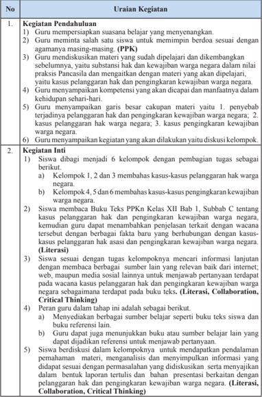

Tabel ini berisi detail tentang kegiatan pendahuluan dan inti dalam proses pembelajaran, yang melibatkan guru dan siswa dalam diskusi dan pemahaman tentang hak dan kewajiban warga negara. Topik utama adalah pengembangan pemahaman tentang hak dan kewajiban warga negara melalui diskusi kelompok. Kolom-kolomnya mencakup uraian kegiatan pendahuluan dan inti, dengan subkolom yang menjelaskan tugas-tugas yang diberikan kepada siswa, seperti pembagian kelompok, membaca buku teks, dan menulis laporan tertulis. Data penting yang terlihat adalah bahwa proses ini melibatkan diskusi kelompok, penyelesaian tugas, dan pembuatan laporan tertulis sebagai bagian dari pembelajaran.

 

---
## 📄 Halaman 74

### 3. Kegiatan Penutup

- Guru  dan  siswa  melakukan  re fl eksi  terhadap  kegiatan  yang  sudah dilaksanakan.
- Guru memberikan umpan balik terhadap proses dan hasil belajar.
- Melakukan  re fl eksi    terhadap  kegiatan  pembelajaran,  terutama  hal-hal yang kurang berkenan sebagai  masukan untuk perbaikan dalam pertemuan berikutnya.
- Memberi tahu siswa  bahwa dalam pertemuan keenam  adalah  menyajikan hasil diskusi kelompok.
- Guru dan siswa menutup pelajaran dengan mengucapkan syukur kepada Tuhan YME karena pembelajaran  berlangsung lancar. (PPK)

### 6.  Pertemuan Keenam  ( 2 x 45 menit )

Pertemuan  keenam    merupakan  kelanjutan  dari  pertemuan  kelima yaitu mengomunikasikan hasil diskusi analisis kasus pelanggaran hak dan pengingkaran kewajiban warga negara.

### a.  Proses  Pembelajaran

Pembelajaran  menggunakan  pendekatan  sainti fi k  dengan  proses pembelajaran aktif  menekankan pada  Penguatan Pendidikan Karakter (PPK), Literasi, Critical Thinking, Creativity,  Collaboration , dan Communication (4C).  Pelaksanaan pembelajaran secara umum dibagi tiga  tahapan,  yaitu  kegiatan  pendahuluan,  kegiatan  inti,  dan  kegiatan penutup.

---
**📊 Tabel**

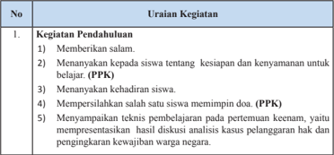

Tabel ini berisi uraian tentang kegiatan pendahuluan dalam proses pembelajaran, yang meliputi memberikan salam, menanyakan kesiapan siswa untuk pelaksanaan Program Pendidikan Kewarganegaraan (PPK), menanyakan kehadiran siswa, mempersilahkan siswa untuk menyampaikan doa jika perlu, dan menyampaikan teknis pembelajaran pada pertemuan keenam, yaitu presentasi hasil diskusi analisis kasus pelanggaran hak dan pengakuan kewajiban warga negara. Topik utama tabel ini adalah proses pendahuluan dalam proses pembelajaran, dengan kolom-kolom yang mencakup tujuh kegiatan tersebut. Data penting yang terlihat adalah bahwa setiap kegiatan memiliki deskripsi singkat yang menjelaskan tugas atau fungsi masing-masing kegiatan dalam konteks pembelajaran.

 

---
## 📄 Halaman 75

### 2. Kegiatan Inti

- Diskusi pertama membahas kasus pelanggaran hak warga negara
- Salah satu kelompok yang membahas kasus pelanggaran hak  warga  negara  diminta  untuk  mempresentasi  hasil  diskusi kelompoknya. (Communication)
- Kelompok lain diminta untuk mengajukan pertanyaan-pertanyaan terkait  dengan  kasus  pelanggaran  hak  warga  negara. (Critical Thinking)
- Kelompok  penyaji  menjawab  pertanyaan  dari  kelompok  lain. (Creativity, Communication)
- Kelompok penyaji menyimpulan hasil diskusi.
- Diskusi  kedua  membahas  kasus  pengingkaran  kewajiban  warga negara.
- Salah  satu  kelompok  yang  membahas  kasus  kewajiban  warga negara  diminta untuk mempresentasi hasil diskusi kelompoknya . (Communication)
- Kelompok lain diminta untuk mengajukan pertanyaan-pertanyaan terkait  dengan  kasus  pengingkaran  kewajiban  warga  negara. (Creativity, Communication)
- Kelompok  Penyaji  menjawab  pertanyaan  dari  kelompok  lain. (Communication)
- Kelompok penyaji menyimpulkan hasil diskusi.
- Setiap  kelompok  melakukan  perbaikan-perbaikan  sesuai  dengan masukan dalam diskusi, kemudian  hasil diskusi  dikumpulkan kepada guru sebagai laporan tertulis. (Creativity, Communication)

### 3. Kegiatan Penutup

- Guru dan siswa membuat rangkuman atau simpulan kompetensi yang telah dipelajari.
- Guru  dan  siswa  melakukan  re fl eksi  terhadap  kegiatan  yang  sudah dilaksanakan.
- Guru memberikan umpan balik terhadap proses dan hasil belajar.
- Guru menyampaikan menugaskan kepada siswa untuk mengerjakan proyek  kewarganegaraan  'Mari  Meneliti'  sebagaimana  terdapat pada  buku  teks  Bab  1.  Dalam  mengerjakan  proyek  ini,  guru membagi kelas menjadi 4 kelompok. Setiap kelompok diminta untuk memilih salah satu tema yang berkaitan dengan kasus pelanggaran hak  dan  pengingkaran  kewajiban  warga  negara.  Hasil  tugas  akan dipresentasikan pada pertemuan kedelapan . (Collaboration)
- Guru  dan  siswa  menutup  pelajaran  dengan  mengucapkan  syukur kepada  Tuhan  YME  karena  pembelajaran    berlangsung  aman  dan tertib. (PPK)

 

---
## 📄 Halaman 76

### b.  Penilaian

### 1) Penilaian sikap

Penilaian  sikap  terhadap  siswa  dapat  dilakukan  selama  proses belajar  berlangsung.  Penilaian  dapat  dilakukan  dengan  observasi. Dalam observasi ini misalnya dilihat aktivitas dan tingkat perhatian siswa selama proses pembelajaran berlangsung. Format  penilaian sikap dapat menggunakan contoh Penilaian  Jurnal Perkembangan Sikap sebagai berikut;

### Jurnal Perkembangan Sikap

Kelas

: ……..............…….

Semester

: ……..............…….

### 2) Penilaian Pengetahuan

- Siswa menjawab pertanyaan sebagai berikut;
- Jelaskan faktor-faktor penyebab terjadinya pelanggaran hak dan pengingkaran kewajiban warga negara!
- Berilah contoh-contoh kasus pelanggaran hak warga negara.
- Berilah  contoh-contoh  kasus  pengingkaran  kewajiban  warga negara.
- Penugasan, yaitu hasil diskusi kelompok  analisis kasus pelanggaran hak dan pengingkaran kewajiban warga negara.

### 3) Penilaian Keterampilan

Penilaian Keterampilan dilakukan guru dengan melihat kemampuan siswa dalam presentasi, kemampuan bertanya, kemampuan menjawab pertanyaan atau mempertahankan argumentasi kelompok, kemampuan dalam  memberikan  masukan/saran  pada  saat  menyampaikan  hasil telaah/analisis tentang pelanggaran hak dan pengingkaran kewajiban warga negara. Lembar penilaian penyajian dan laporan hasil telaah dapat  menggunakan  format  sebagaimana  terdapat  pada  lampiran, dengan ketentuan aspek penilaian  dan  rubriknya  dapat  disesuaikan dengan situasi dan kondisi serta keperluan guru.

### 7.  Pertemuan ketujuh (2 x 45 menit)

### a.  Indikator Pencapaian Kompetensi

- Menerima perbedaan sebagai anugerah Tuhan Yang Maha Esa dalam rangka menghormati hak warga negara.

 

---
## 📄 Halaman 77

- Menghargai  perbedaan  sebagai  anugerah  Tuhan  Yang  Maha  Esa dalam rangka menghormati hak warga negara.
- Memiliki sikap responsif dan proaktif terhadap pelanggaran hak dan pengingkaran kewajiban warga negara dalam kehidupan berbangsa dan bernegara.
- Bersikap  responsif  dan  proaktif  terhadap  pelanggaran  hak  dan pengingkaran kewajiban warga negara dalam kehidupan berbangsa dan bernegara.
- Mengidenti fi kasi  upaya  pemerintahan  dalam  penanganan  kasus pelanggaran hak  dan pengingkaran kewajiban warga negara
- Mengidenti fi kasi contoh perilaku upaya pencegahan terjadinya pelanggaran hak dan kewajiban warga negara.
- Menalar    hasil  analisis  kasus  pelanggaran  hak  dan  pengingkaran kewajiban  sebagai  warga  negara  beserta  solusinya  sesuai  dengan nilai-nilai Pancasila.
- Menyaji    hasil  analisis  kasus  pelanggaran  hak  dan  pengingkaran kewajiban  sebagai  warga  negara  beserta  solusinya  sesuai  dengan nilai-nilai Pancasila.

### b.  Materi  Pembelajaran

Materi yang disampaikan pada pertemuan ketujuh adalah Bab 1, subbab D  yaitu  penanganan  pelanggaran  hak  dan  pengingkaran  kewajiban warga negara.

### c.  Proses Pembelajaran

Pembelajaran menggunakan pendekatan sainti fi k dengan proses pembelajaran aktif  menekankan pada  Penguatan Pendidikan Karakter (PPK),  Literasi, Critical Thinking, Creativity,  Collaboration ,  dan Communication (4C). Pelaksanaan pembelajaran secara umum dibagi tiga  tahapan,  yaitu  kegiatan  pendahuluan,  kegiatan  inti,  dan  kegiatan penutup.

---
**📊 Tabel**

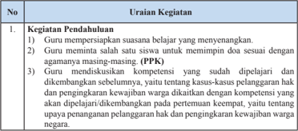

Tabel ini berisi informasi tentang proses pendahuluan dalam pendidikan, terutama dalam konteks pembelajaran dan pengajaran. Topik utama tabel adalah "Kegiatan Pendahuluan" dan "Uraian Kegiatan". Kolom pertama, "No.", menunjukkan urutan kegiatan. Kolom kedua, "Kegiatan Pendahuluan", menjelaskan tiga jenis kegiatan yang dilakukan guru untuk mempersiapkan suasana belajar yang menyenangkan, memperbaiki kesalahan siswa, dan mendiskusikan kompetensi yang sudah diperoleh oleh pelajar. Kolom ketiga, "Uraian Kegiatan", memberikan detail tentang setiap kegiatan tersebut. Data penting yang terlihat adalah bahwa semua kegiatan ini bertujuan untuk meningkatkan kualitas pembelajaran dan pengajaran, baik itu dalam hal memperbaiki kesalahan siswa, memperkenalkan agama masing-masing (PPK), maupun dalam hal meningkatkan kompetensi pelajar.

 

---
## 📄 Halaman 78

- Guru mendiskusikan  kompetensi yang akan dicapai dan manfaatnya dalam kehidupan sehari-hari.
- Guru  menyampaikan  garis  besar  cakupan  materi  dan  kegiatan  yang akan dilakukan.

### 2. Kegiatan Inti

- Siswa dibagi menjadi beberapa kelompok masing-masing berjumlah 5-6 orang.
- Siswa membaca dan mencatat hal-hal penting yang terdapat pada Bab 1, Subbab D tentang penanganan pelanggaran hak dan pengingkaran kewajiban warga negara. Guru dapat menambahkan penjelasan terkait dengan wacana tersebut dengan berbagai fakta baru yang berhubungan dengan upaya penanganan pelanggaran hak dan pengingkaran kewajiban warga negara. (Literasi)
- Siswa    membuat  identi fi kasi  pertanyaan    sebanyak  mungkin  terkait upaya  penanganan  pelanggaran  hak  dan  pengingkaran  kewajiban warga negara. (Critical Thinking)
- Siswa  mencari  informasi  untuk  menjawab  pertanyaan  yang  terdapat pada Tugas Mandiri 1.4. dan  identi fi kasi contoh perilaku dalam upaya pencegahan terjadinya pelanggaran hak dan kewajiban warga negara. (Collaboration, Critical Thinking)
- Siswa berdiskusi untuk menganalisis upaya penyelesaian dan penanganan kasus-kasus pelanggaran hak dan pengingkaran kewajiban warga  negara,  mengidenti fi kasi  contoh  perilaku  dalam  upaya  pencegahan  terjadinya  pelanggaran  hak  dan  kewajiban  warga  negara. (Collaboration, Critical Thinking)
- Siswa menyajikan hasil pengumpulan informasi dan diskusi kelompok tentang upaya penyelesaian dan penanganan kasus-kasus pelanggaran hak dan pengingkaran kewajiban warga negara, serta hasil identi fi kasi contoh perilaku dalam upaya pencegahan terjadinya pelanggaran hak dan kewajiban warga negara. (Communication)

### 3. Kegiatan Penutup

- Guru dan siswa membuat rangkuman atau simpulan kompetensi yang telah dipelajari.
- Guru  dan  siswa  melakukan  re fl eksi  terhadap  kegiatan  yang  sudah dilaksanakan.
- Guru memberikan umpan balik terhadap proses dan hasil belajar
- Guru menginformasikan kepada siswa bahwa pada pertemuan berikutnya  akan  mempresentasikan  proyek  kewarganegaraan  'Mari Meneliti'.
- Guru dan siswa menutup pelajaran dengan mengucapkan syukur kepada Tuhan YME karena pembelajaran  berlangsung aman dan tertib. (PPK)

 

---
## 📄 Halaman 79

### d.  Penilaian

### 1) Penilaian sikap

Penilaian sikap terhadap siswa dapat dilakukan selama proses belajar berlangsung.  Penilaian  dapat  dilakukan  dengan  observasi.  Dalam observasi  ini,  dilihat  aktivitas  dan  tingkat  perhatian  siswa  selama proses  pembelajaran  berlangsung.  Format    penilaian  sikap  dapat menggunakan contoh Penilaian  Jurnal Perkembangan Sikap sebagai berikut;

### Jurnal Perkembangan Sikap

Kelas

: ……..............…….

Semester

: ……..............…….

### 2) Penilaian Pengetahuan

- Jawablah pertanyaan di bawah ini
- Jelaskan  upaya  pemerintahan  dalam  penanganan  kasus  pelanggaran hak dan pengingkaran kewajiban warga negara!
- Berilah  contoh perilaku upaya pencegahan terjadinya pelanggaran hak dan kewajiban warga negara!
- Penugasan yaitu Tugas Mandiri 1.4.

### 3) Penilaian Keterampilan

Penilaian Keterampilan dilakukan guru dengan melihat kemampuan siswa dalam presentasi, kemampuan bertanya, kemampuan menjawab pertanyaan atau mempertahankan argumentasi kelompok, kemampuan dalam  memberikan  masukan/saran  pada  saat  menyampaikan  hasil telaah/analisis tentang pelanggaran hak dan pengingkaran kewajiban warga negara. Lembar penilaian penyajian dan laporan hasil telaah dapat  menggunakan  format  sebagaimana  terdapat  pada  lampiran, dengan ketentuan aspek penilaian dan rubriknya  dapat disesuaikan dengan situasi dan kondisi serta keperluan guru.

 

---
## 📄 Halaman 80

### 8.  Pertemuan Kedelapan (2 x 45 menit)

### a.  Indikator Pencapaian Kompetensi

- Menerima perbedaan sebagai anugerah Tuhan Yang Maha Esa dalam rangka menghormati hak warga negara.
- Menghargai  perbedaan  sebagai  anugerah  Tuhan  Yang  Maha  Esa dalam rangka menghormati hak warga negara.
- Memiliki sikap responsif dan proaktif terhadap pelanggaran hak dan pengingkaran kewajiban warga negara dalam kehidupan berbangsa dan bernegara.
- Bersikap  responsif  dan  proaktif  terhadap  pelanggaran  hak  dan pengingkaran kewajiban warga negara dalam kehidupan berbangsa dan bernegara.
- Menganalisis kasus pelanggaran hak warga negara.
- Menganalisis kasus pengingkaran kewajiban warga negara.
- Menyaji hasil analisis kasus pelanggaran hak warga negara.
- Menyaji hasil analisis kasus pengingkaran kewajiban warga negara.

### b.  Materi  Pembelajaran

Materi yang disampaikan pada pertemuan kedelapan adalah menganalisis kasus-kasus pelanggaran hak dan pengingkaran kewajiban warga negara dengan studi literatur. Siswa secara kelompok memilih literatur (buku, jurnal, majalah, koran, buletin dan internet)  yang memuat topik yang terdapat di buku siswa.

### c.  Proses Pembelajaran

Pelaksanaan  pembelajaran  secara  umum  dibagi  tiga  tahapan  yaitu kegiatan pendahuluan, kegiatan inti, dan kegiatan penutup.

---
**📊 Tabel**

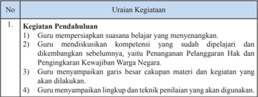

Tabel ini berisi uraian tentang kegiatan pendahuluan dalam proses pembelajaran, yang meliputi:

1. Guru mempersiapkan suasana belajar yang menyenangkan.
2. Guru mendiskusikan kompetensi yang sudah dipelajari dan dikembangkan sebelumnya, yaitu Penataan Pelajaran Hak dan Pengakuan Kewajiban Warga Negara.
3. Guru menyampaikan garis besar cakupan materi dan kegiatan yang akan dilakukan.
4. Guru menyampaikan lingkup dan teknik penilaian yang akan digunakan.

Topik utama tabel ini adalah "Kegiatan Pendahuluan" dalam proses pembelajaran. Kolom-kolom yang ada adalah:
- No
- Kegiatan Pendahuluan
- Uraian Kegiatan

Data atau pola penting yang terlihat adalah:
1. Ada 4 kegiatan pendahuluan yang disebutkan.
2. Setiap kegiatan memiliki uraian singkat yang menjelaskan tujuannya.
3. Kegiatan-kegiatan tersebut bertujuan untuk mempersiapkan suasana belajar yang menyenangkan dan memperkenalkan materi pembelajaran kepada siswa.

 

---
## 📄 Halaman 81

### 2. Kegiatan Inti

- Setiap kelompok  secara bergantian diberikan kesempatan untuk menyajikan hasil proyek kewarganegaraan yang telah dikerjakan sesuai dengan tema yang telah dipilih kelompoknya. (Communication)
- Kelompok lain diminta untuk mengajukan pertanyaan-pertanyaan atau masukannya terkait dengan tema yang dibahas.
- Kelompok penyaji menjawab pertanyaan dari kelompok lain.
- Kelompok penyaji menyimpulkan hasil diskusi.

### 3. Kegiatan Penutup

- Guru dan siswa membuat rangkuman atau simpulan kompetensi yang telah dipelajari.
- Guru  dan  siswa  melakukan  re fl eksi  terhadap  kegiatan  yang  sudah dilaksanakan.
- Guru memberikan umpan balik terhadap proses dan hasil belajar.
- Siswa mengerjakan penilaian diri dan uji kompetensi Bab 1.
- Guru  dan  siswa  menutup  pelajaran  dengan  mengucapkan  syukur kepada Tuhan Yang Maha Esa karena pembelajaran  berlangsung aman dan tertib. (PPK)

### d.  Penilaian

### 1) Penilaian Sikap

Siswa mengisi daftar perilaku yang terdapat di buku siswa.

### Pedoman Penskoran :

Skor 4 jika selalu, skor 3 jika sering, skor 2 jika kadang kadang, skor

- Untuk pernyataan positif, yaitu nomor 1, 2, 3, 4, 6, 7; 1 jika tidak pernah.
- 2.
- Untuk pernyataan negatif, yaitu nomor 5, 9, 10;
Skor 1 jika selalu, skor 2 jika sering, skor 3 jika kadang-kadang, skor 4 jika tidak pernah.

``

---
**📊 Tabel**

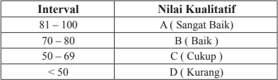

Tabel ini menunjukkan kriteria kualitas nilai untuk ujian atau tes tertentu. Topik utamanya adalah kualitas nilai yang diberikan kepada siswa atau peserta didik berdasarkan skor mereka. Tabel dibagi menjadi empat interval kualitas nilai, yaitu A (Sangat Baik), B (Baik), C (Cukup), dan D (Kurang). Setiap interval memiliki batas bawah dan atasnya, serta penjelasan kualitas nilai yang sesuai dengan batas tersebut. Misalnya, interval 81-100 mendapatkan nilai A, yang berarti sangat baik. Interval 70-80 mendapatkan nilai B, yang berarti baik. Interval 50-69 mendapatkan nilai C, yang berarti cukup. Dan interval di bawah 50 mendapatkan nilai D, yang berarti kurang. Pola penting yang terlihat adalah bahwa semakin tinggi skor, semakin tinggi pula kualitas nilai yang diberikan.

 

---
## 📄 Halaman 82

### Uji Kompetensi Bab 1

Siswa menjawab pertanyaan-pertanyaan di buku siswa secara jelas dan akurat!

### Kunci Jawaban

---
**📊 Tabel**

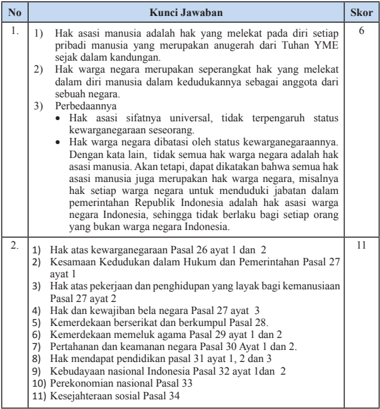

Tabel ini berisi kunci jawaban untuk beberapa soal yang berkaitan dengan hak asasi manusia dan kewarganegaraan di Indonesia. Topik utama tabel adalah hak asasi manusia dan kewarganegaraan. Kolom pertama menunjukkan nomor soal, sedangkan kolom kedua berisi kunci jawaban untuk setiap soal. Skor disajikan di kolom ketiga. Data penting yang terlihat antara lain bahwa hak asasi manusia meliputi hak atas kewarganegaraan, kesamaan kedudukan dalam hukum, hak atas pekerjaan dan penghidupan yang layak bagi masyarakat, hak dan keuajiban negara, kemerdekaan berasaskan dan berkelanjutan, pertainahan dan keamanan negara, hak mendapat pendidikan, kebudayaan nasional, perekonomian nasional, dan kesejahteraan sosial. Skor tertinggi adalah 11, yang menunjukkan bahwa jawaban yang benar untuk semua soal tersebut.

 

---
## 📄 Halaman 83

 

---
## 📄 Halaman 84

---
**📊 Tabel**

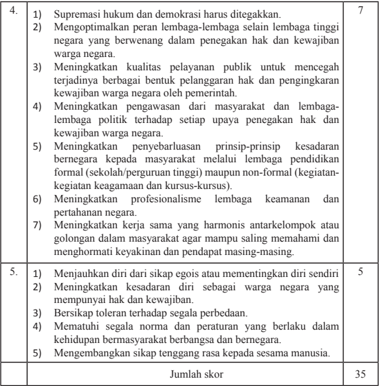

Tabel ini berisi informasi tentang skor yang diberikan kepada siswa dalam sebuah ujian atau tes. Topik utamanya adalah tentang kualitas dan perilaku yang diharapkan dalam masyarakat. Kolom pertama menunjukkan nomor soal, sementara kolom kedua dan ketiga berisi deskripsi soal dan skor yang diberikan. Data penting yang terlihat adalah bahwa setiap soal memiliki skor tertentu, dengan total skor mencapai 35. Ini menunjukkan bahwa ujian atau tes tersebut memerlukan penilaian yang ketat dan detail untuk mendapatkan skor yang akurat.

### Penilaian soal uraian

 

---
## 📄 Halaman 85

### E. Pengayaan

Kegiatan pengayaan merupakan kegiatan pembelajaran yang diberikan kepada siswa yang telah menguasai materi pembelajaran, yaitu materi pada Bab 1. Pengayaan ini dapat dilakukan dengan beberapa cara dan pilihan. Sebagai contoh, siswa dapat diberikan bahan bacaan yang relevan dengan materi seperti  persoalan-persoalan penyelesaian  kasus pelanggaran hak asasi  manusia  dalam  pergaulan  masyarakat  internasional,  perbandingan proses penegakan hak asasi manusia di Indonesia dengan negara lain.

### F.  Remedial

Kegiatan remedial diberikan kepada siswa yang belum menguasai materi pelajaran dan belum mencapai kompetensi yang telah ditentukan. Bentuk yang  dilakukan  antara  lain  siswa  secara  terencana  mempelajari  Buku Teks PPKn Kelas XII pada bagian tertentu yang belum dikuasainya. Guru menyediakan soal-soal latihan atau pertanyaan yang merujuk pemahaman kembali  tentang  isi  Buku  Teks  PPKn  Kelas  XII  Bab  1.  Siswa  diminta komitmennya  untuk  belajar  secara  disiplin  dalam  rangka  memahami materi  pelajaran  yang  belum  dikuasainya.  Guru  kemudian  mengadakan uji  kompetensi  kembali  pada  materi  yang  belum  dikuasai  siswa  yang bersangkutan

### G. Interaksi Guru dan Orang Tua

Maksud dari kegiatan ini adalah agar terjalin komunikasi antara guru dan orang tua berkaitan dengan kemajuan proses dan hasil belajar yang dilaksanakan  dan  dicapai  siswa.  Guru  harus  selalu  mengingatkan  dan meminta siswa mempelihatkan hasil tugas atau pekerjaan yang telah dinilai dan diberi komentar oleh guru kepada orang tua siswa, yaitu:

- Penilaian  sikap  selama  siswa  mengikuti  proses  pembelajaran  pada Bab 1.
- Penilaian pengetahuan melalui penugasan dan kegiatan uji kompetensi Bab 1.
- Penilaian Keterampilan melalui Proyek Belajar Kewarganegaraan.
Orang tua juga harus memberikan komentar hasil pekerjaan atau tugas yang dicapai  oleh  siswa  sebagai  apresiasi  dan  komitmen  untuk  bersama-sama mengantarkan siswa mencapai prestasi yang lebih baik. Bentuk apresiasi orang  tua  ini  akan  menambah  semangat  siswa  untuk  mempertahankan dan  meningkatkan  keberhasilannya  baik  dalam  konteks  pemahaman

 

---
## 📄 Halaman 86

dan  penguasaan  materi  pengetahuan,  sikap  maupun  keterampilan.  Hasil penilaian  yang  telah  diparaf  atau  ditandatangani  guru  dan  orang  tua kemudian disimpan untuk menjadi bagian dari portofolio siswa. Untuk itu, pihak sekolah atau guru harus menyediakan format tugas/pekerjaan siswa. Adapun  interaksi antara guru dan orang tua dapat menggunakan format di bawah ini:

---
**📊 Tabel**

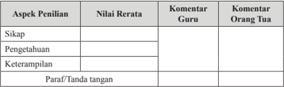

Tabel ini menunjukkan hasil penilaian siswa dalam aspek-aspek penilaian seperti sikap, pengetahuan, dan keterampilan. Kolom "Nilai Rerata" menampilkan rata-rata nilai yang diberikan oleh guru dan orang tua. Komentar guru dan orang tua memberikan detail tentang kelebihan dan kekurangan siswa dalam setiap aspek. Paragraf/tanda tangan di bawah kolom tersebut menandakan bahwa informasi ini telah disetujui oleh pihak terkait. Topik utama tabel ini adalah evaluasi akademik siswa dalam berbagai aspek penilaian.

 

---
## 📄 Halaman 87

---
**🖼️ Gambar/Diagram**

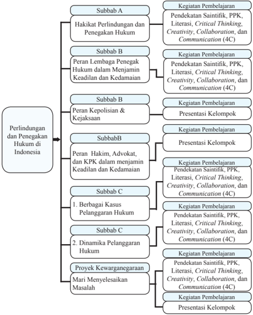

> **Deskripsi Visual:** Gambar ini adalah diagram yang menunjukkan struktur topik dan subtopik dalam materi pelajaran tentang Perlindungan dan Penegakan Hukum di Indonesia. Diagram ini dibagi menjadi tiga bagian utama:

1. Bagian A: Hakikat Perlindungan dan Penegakan Hukum
   - Subbab A: Kegiatan Pembelajaran
     - Pendekatan Sintaktik, PPPK, Literasi, Critical Thinking, Creativity, Collaboration, dan Communication (4C)

2. Bagian B: Peran Lembaga Penegak Hukum dalam Menjamin Keadilan dan Kedamaian
   - Subbab B: Kegiatan Pembelajaran
     - Presentasi Kelompok

3. Bagian C: Peran Kepolisian & Kejaksaan
   - Subbab C: Kegiatan Pembelajaran
     - Berbagai Kasus Pelanggaran Hukum
       - Subbab C: Kegiatan Pembelajaran
         - Pendekatan Sintaktik, PPPK, Literasi, Critical Thinking, Creativity, Collaboration, dan Communication (4C)
       - Subbab C: Kegiatan Pembelajaran
         - Proyek Kewarganegaraan
           - Mari Menyelesaikan Masalah
             - Kegiatan Pembelajaran
               - Presentasi Kelompok

Elemen-elemen utama dalam diagram ini meliputi topik utama Perlindungan dan Penegakan Hukum di Indonesia, subtopik hakikat perlindungan dan penegakan hukum, peran lembaga penegak hukum, dan peran kepolisian dan kejaksaan. Relasi antara elemen-elemen ini terlihat jelas melalui struktur diagram, dengan subbab A, B, dan C masing-masing membahas topik utama tersebut.

Teks, angka, atau label penting yang terlihat dalam diagram ini meliputi:
- "Perlindungan dan Penegakan Hukum di Indonesia"
- "Hakikat Perlindungan dan Penegakan Hukum" (Subbab A)
- "Peran Lembaga Penegak Hukum dalam Menjamin Keadilan dan Kedamaian" (Subbab B

PPKn

 

---
## 📄 Halaman 88

### Perlindungan dan Penegakan Hukum di Indonesia

### A.  Kompetensi Inti ( KI):

- Menghayati dan mengamalkan ajaran agama yang dianutnya.
- Menunjukkan perilaku jujur, disiplin, tanggung jawab, peduli (gotong royong,  kerja  sama,  toleran,  damai),  santun,  responsif  dan  proaktif  sebagai  bagian  dari  solusi  atas  berbagai  permasalahan  dalam berinteraksi  secara  efektif  dengan  lingkungan  sosial  dan  alam  serta menempatkan diri sebagai cerminan bangsa dalam pergaulan dunia.
- Memahami, menerapkan,  menganalisis,  dan  mengevaluasi    pengetahuan faktual,  konseptual,  prosedural,  dan  metakognitif  berdasarkan  rasa ingin tahunya tentang ilmu pengetahuan, teknologi, seni, budaya, dan humaniora dengan wawasan kemanusiaan,  kebangsaan,  kenegaraan, dan peradaban terkait penyebab fenomena dan kejadian, serta menerapkan pengetahuan prosedural pada bidang kajian yang spesi fi k sesuai dengan bakat dan minatnya untuk memecahkan masalah.
- Mengolah, menalar, menyaji, dan mencipta dalam ranah konkret dan ranah abstrak terkait dengan pengembangan dari yang dipelajarinya di sekolah secara mandiri, serta bertindak secara efektif dan kreatif, dan mampu menggunakan metode sesuai kaidah keilmuan.

 

---
## 📄 Halaman 89

### B. Kompetensi Dasar (KD) dan Indikator Pencapaian Kompetensi (IPK)

---
**📊 Tabel**

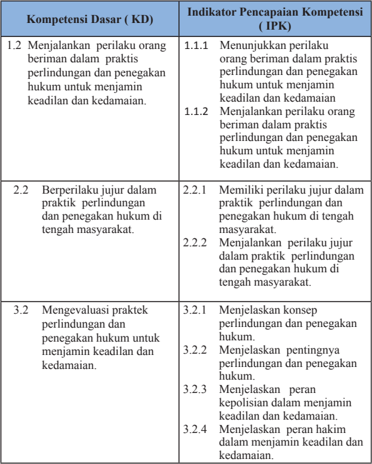

Tabel ini berisi informasi tentang kompetensi dasar (KD) dan indikator pencapaian kompetensi (IPK) dalam praktik perundangan dan penegakan hukum untuk menjamin keadilan dan kedamaian. Topik utama tabel ini adalah tentang perilaku dan evaluasi praktik perundangan dan penegakan hukum. Kolom-kolomnya meliputi KD 1.2, KD 2.2, dan KD 3.2, masing-masing dengan subkolom yang mencakup berbagai indikator pencapaian kompetensi. Data penting yang terlihat adalah bahwa KD 1.2 berkaitan dengan menjalankan perilaku orang beriman dalam praktik perundangan dan penegakan hukum untuk menjamin keadilan dan kedamaian, sementara KD 2.2 dan KD 3.2 berkaitan dengan berilaku jujur dan evaluasi praktik perundangan dan penegakan hukum untuk menjamin keadilan dan kedamaian.

 

---
## 📄 Halaman 90

---
**📊 Tabel**

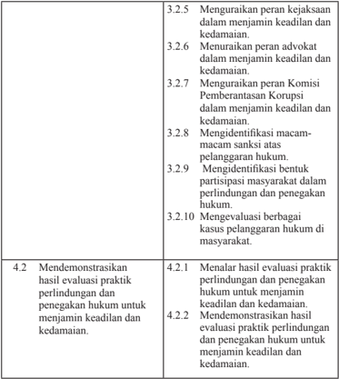

Tabel ini berisi informasi tentang evaluasi praktik peradilan dan penegakan hukum, dengan topik utama meliputi pengawasan kebijaksanaan, advokat, Komisi Pemberantasan Korupsi, identifikasi macam-macam sanksi, partisipasi masyarakat dalam peradilan, evaluasi kasus pelanggaran hukum, dan demonstrasi hasil evaluasi praktik peradilan dan penegakan hukum untuk menjamin keadilan dan kedamaian. Kolom-kolomnya mencakup berbagai aspek evaluasi tersebut, seperti pengawasan kebijaksanaan, advokat, Komisi Pemberantasan Korupsi, identifikasi sanksi, partisipasi masyarakat, evaluasi kasus, dan demonstrasi hasil evaluasi. Data penting yang terlihat adalah bahwa tabel ini mencakup berbagai aspek evaluasi praktik peradilan dan penegakan hukum, termasuk pengawasan kebijaksanaan, advokat, Komisi Pemberantasan Korupsi, identifikasi sanksi, partisipasi masyarakat, evaluasi kasus, dan demonstrasi hasil evaluasi.

### C. Materi Pembelajaran Bab 2

Secara garis besar materi pembelajaran Bab 2 adalah sebagai berikut :

- v Hakikat Perlindungan dan Penegakan Hukum
- Konsep perlindungan dan penegakan hukum
- Pentingnya  perlindungan dan penegakan hukum
- v Peran  lembaga  penegak  hukum  dalam  menjamin  keadilan  dan kedamaian
- Peran Kepolisian Negara Republik Indonesia
- Peran Kejaksaan Republik Indonesia

 

---
## 📄 Halaman 91

- Peran hakim sebagai pelaksana kekuasaan kehakiman
- Peran advokat dalam penegakan hukum
- Peran Komisi Pemberantasan Korupsi dalam penegakan hukum
- v Dinamika pelanggaran hukum
- Berbagai kasus pelanggaran hukum
- Macam-macam sanksi atas pelanggaran hukum
- Partisipasi masyarakat dalam  perlindungan  dan  penegakan hukum

### D. Proses Pembelajaran

### 1.  Pertemuan Pertama (2 x 45 Menit )

Pertemuan pertama  diawali  dengan  mengulas  isu-isu  yang  ada  di  sekitar siswa.  Pada  pertemuan  pertama,  guru  dapat  menyampaikan  gambaran umum materi yang akan dipelajari, kegiatan apa yang akan dilaksanakan, menjelaskan  pentingnya  mempelajari  materi  ini,  bagaimana  guru  dapat menumbuhkan  ketertarikan  siswa  terhadap  materi  yang  akan  dipelajari. Setelah  itu,  guru  menyampaikan  batasan  materi  apa  saja  yang  akan dipelajari.

### a.  Indikator Pencapaian Kompetensi

- Menunjukkan  perilaku  orang  beriman  dalam  praksis  perlindungan dan penegakan hukum untuk menjamin keadilan dan kedamaian.
- Menjalankan  perilaku  orang  beriman  dalam  praksis  perlindungan dan penegakan hukum untuk menjamin keadilan dan kedamaian.
- Memiliki perilaku jujur dalam praktik perlindungan dan penegakan hukum di tengah masyarakat.
- Menjalankan perilaku jujur dalam praktik perlindungan dan penegakan hukum di tengah masyarakat.
- Menganalisis konsep perlindungan dan penegakan hukum.
- Menganalisis pentingnya perlindungan dan penegakan hukum.
- Menalar hasil evaluasi praktik perlindungan dan penegakan hukum dalam masyarakat untuk menjamin keadilan dan kedamaian.
- Mendemonstrasikan hasil evaluasi praktik perlindungan dan penegakan hukum dalam masyarakat untuk menjamin keadilan dan kedamaian.

### b.  Materi Pembelajaran

- Hakikat perlindungan dan penegakan hukum.
- Pentingnya  perlindungan dan penegakan hukum.

 

---
## 📄 Halaman 92

### c.  Proses Pembelajaran

Pembelajaran  menggunakan  pendekatan  sainti fi k  dengan  proses pembelajaran aktif  menekankan pada  Penguatan Pendidikan Karakter (PPK), Literasi, Critical Thinking, Creativity,  Collaboration , dan Communication (4 C). Pelaksanaan pembelajaran secara umum dibagi tiga  tahapan,  yaitu  kegiatan  pendahuluan,  kegiatan  inti,  dan  kegiatan penutup.

---
**📊 Tabel**

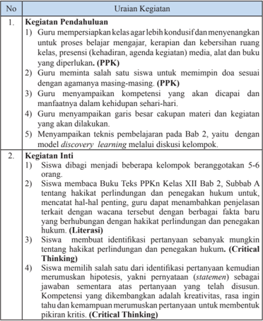

Tabel ini memuat informasi tentang proses pendahuluan dan inti kegiatan belajar mengajar dalam mata pelajaran PPKN (Pendidikan Prasasti, Kebudayaan, dan Narasumber). Topik utama tabel adalah proses pembelajaran yang melibatkan guru dan siswa dalam menyelesaikan tugas-tugas yang berkaitan dengan prasasti, budaya, dan narasumber. Kolom-kolom yang ada mencakup uraian kegiatan, seperti persiapan kelas, pemimpin doa, kompetensi, garis besar materi, teknik pembelajaran, dan identifikasi pertanyaan. Data penting yang terlihat adalah bahwa proses ini melibatkan diskusi kelompok, model discovery learning, dan penyelesaian tugas berkelompok.

 

---
## 📄 Halaman 93

---
**📊 Tabel**

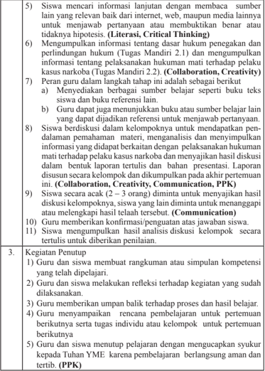

Tabel ini berisi instruksi untuk proses pembelajaran yang melibatkan siswa dan guru dalam konteks pendidikan. Topik utamanya adalah metode pembelajaran yang inklusif dan interaktif, yang mencakup berbagai aspek seperti penelitian literatur, kritik berpikir, kolaborasi, kreativitas, dan komunikasi. Kolom-kolomnya mencakup langkah-langkah yang harus dilakukan oleh guru dan siswa, seperti menemukan sumber informasi, menggali informasi, membuat laporan, diskusi kelompok, dan memberikan konfirmasi. Data penting yang terlihat adalah bahwa proses ini melibatkan berbagai tahap, mulai dari pencarian sumber informasi hingga diskusi kelompok dan penilaian akhir. Ini menunjukkan bahwa proses pembelajaran ini tidak hanya fokus pada pengetahuan teks, tetapi juga pada pemahaman, kritik, kolaborasi, dan komunikasi.

 

---
## 📄 Halaman 94

### d.  Penilaian

### 1) Penilaian Sikap

Penilaian  sikap  terhadap  siswa  dapat  dilakukan  selama  proses belajar  berlangsung.  Penilaian  dapat  dilakukan  dengan  observasi. Dalam observasi ini misalnya dilihat aktivitas dan tingkat perhatian siswa  selama  proses  pembelajaran  berlangsung.  Format    penilaian sikap  dapat  menggunakan contoh Penilaian  Jurnal Perkembangan Sikap sebagai berikut;

### Jurnal Perkembangan Sikap

Kelas

: ……..............…….

Semester

: ……..............…….

---
**📊 Tabel**

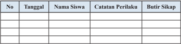

Tabel ini berisi informasi tentang perilaku siswa dan sikap mereka. Topik utamanya adalah tentang perubahan perilaku dan sikap siswa seiring waktu. Kolom-kolomnya meliputi tanggal, nama siswa, catatan perilaku, dan butir sikap. Data penting yang terlihat adalah bahwa banyak siswa memiliki perubahan positif dalam perilakunya, seperti meningkatnya partisipasi dalam kegiatan dan meningkatnya sikap positif. Ini menunjukkan bahwa pembelajaran dan pengawasan dapat mempengaruhi perkembangan sikap dan perilaku siswa.

### 2).  Penilaian Pengetahuan

Penilaian pengetahuan dilakukan dalam bentuk penugasan, yaitu mengerjakan Tugas mandiri 2.1 dan Tugas Mandiri 2.2.

### 3).  Penilaian Keterampilan

- Penilaian Keterampilan dilakukan guru dengan melihat kemampuan siswa dalam diskusi dan presentasi, yaitu kejelasan dan  kedalaman  informasi,  keaktifan  dalam  diskusi,  kejelasan dan  kerapian  dalam  presentasi  menyampaikan  hasil  telaah/ analisis  tentang  hakikat  perlindungan  dan  penegakan  hukum. Lembar  penilaian    dapat  menggunakan  format  sebagaimana terdapat dalam lampiran, dengan ketentuan aspek penilaian dan rubriknya  dapat disesuaikan dengan situasi dan kondisi serta keperluan guru.
- Portofolio tulisan hasil analisis terhadap pelaksanaan hukuman mati terhadap pelaku kasus narkoba (Tugas mandiri 2.2).

 

---
## 📄 Halaman 95

### 2.  Pertemuan Kedua (2 x 45 menit)

### a.  Indikator Pencapaian Kompetensi

- Menunjukkan  perilaku  orang  beriman  dalam  praksis  perlindungan dan penegakan hukum untuk menjamin keadilan dan kedamaian.
- Menjalankan  perilaku  orang  beriman  dalam  praksis  perlindungan dan penegakan hukum untuk menjamin keadilan dan kedamaian.
- Memiliki perilaku jujur dalam praktik  perlindungan dan penegakan hukum di tengah masyarakat.
- Menjalankan    perilaku  jujur  dalam  praktik    perlindungan  dan penegakan hukum di tengah masyarakat.
- Menganalisis  peran  Kepolisian  Negara  Republik  Indonesia  dalam menjamin keadilan dan kedamaian.
- Menganalisis peran Kejaksaan Republik Indonesia dalam menjamin keadilan dan kedamaian.
- Menganalisis peran hakim sebagai pelaksana kekuasaan kehakiman dalam menjamin keadilan dan kedamaian.
- Menganalisis peran advokat dalam penegakan hukum dalam menjamin keadilan dan kedamaian.
- Menganalisis peran Komisi Pemberantasan Korupsi dalam penegakan hukum dalam menjamin keadilan dan kedamaian.
- Menalar hasil evaluasi  praktik  perlindungan dan penegakan hukum dalam masyarakat untuk menjamin keadilan dan kedamaian.
- Mendemonstrasikan  hasil  evaluasi  praktik  perlindungan  dan  penegakan  hukum  dalam  masyarakat  untuk  menjamin  keadilan  dan kedamaian.

### b.  Materi Pembelajaran

Materi pembelajaran  adalah Bab 2, Subbab B, yaitu Peran Lembaga Penegak Hukum dalam Menjamin Keadilan dan Kedamaian

- Peran Kepolisian Negara Republik Indonesia
- Peran Kejaksaan Republik Indonesia
- Peran Hakim sebagai Pelaksana Kekuasaan Kehakiman
- Peran Advokat dalam Penegakan Hukum
- Peran Komisi Pemberantasan Korupsi

 

---
## 📄 Halaman 96

Materi subbab B akan dibahas selama 3 kali pertemuan, yaitu pertemuan kedua, ketiga dan kempat, sehingga pertemuan tersebut merupakan satu rangkaian.  Pertemuan  kedua  akan  mendiksusikan    secara  kelompok berkaitan  dengan tema peran lembaga penegak hukum dalam menjamin keadilan  dan  kedamaian.  Guru  dapat  membagi  kelas  menjadi  lima kelompok, yang masing-masing mendiskusikan satu tema peran lembaga penegak  hukum,  yaitu  kepolisian,  kejaksaan,  kehakiman,  advokat  dan KPK. Hasil diskusi kelompok akan dipresentasikan oleh setiap kelompok pada pertemuan ketiga dan keempat. Presentasi dapat menggunakan power point/display atau makalah sederhana.

### c.  Proses Pembelajaran

Pembelajaran menggunakan pendekatan sainti fi k dengan proses pembelajaran  aktif    menekankan  pada    Penguatan  Pendidikan  Karakter (PPK), Literasi, Critical Thinking , Creativity , Collaboration , dan Communication (4 C). Pelaksanaan pembelajaran secara umum dibagi tiga tahapan, yaitu  kegiatan pendahuluan, kegiatan inti, dan kegiatan penutup.

---
**📊 Tabel**

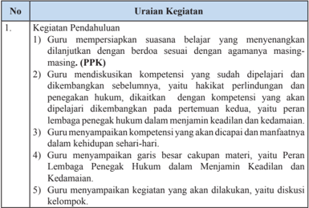

Tabel ini berisi uraian tentang kegiatan pendahuluan dalam proses pembelajaran, yang melibatkan guru dalam mempersiapkan suasana belajar yang menyesuaikan dengan agama masing-masing siswa (PPPK), mendiskusikan kompetensi yang telah dipelajari sebelumnya, menyampaikan kompetensi yang akan dipelajari, menyampaikan garis besar kapan materi akan diajarkan, dan menyampaikan kegiatan yang akan dilakukan. Topik utama tabel ini adalah proses pendahuluan pembelajaran, yang melibatkan guru dalam mempersiapkan lingkungan belajar yang sesuai dengan kebutuhan agama siswa, mendiskusikan kompetensi yang telah dipelajari, dan menyampaikan informasi tentang materi yang akan diajar. Kolom-kolom yang ada dalam tabel ini adalah No., Kegiatan Pendahuluan, dan Uraian Kegiatan. Data atau pola penting yang terlihat dalam tabel ini adalah bahwa guru harus mempersiapkan lingkungan belajar yang sesuai dengan agama masing-masing siswa, mendiskusikan kompetensi yang telah dipelajari sebelumnya, menyampaikan kompetensi yang akan dipelajari, menyampaikan garis besar kapan materi akan diajar, dan menyampaikan kegiatan yang akan dilakukan.

 

---
## 📄 Halaman 97

### 2. Kegiatan Inti

- Siswa  dibagi  menjadi  5  kelompok  dengan  pembagian  tugas sebagai berikut :
- Kelompok  1: Peran Kepolisian Negara Republik Indonesia
- Kelompok 2 : Peran Kejaksaan Republik Indonesia
- Kelompok 3 : Peran hakim sebagai pelaksana kekuasaan kehakiman
- Kelompok 4 : Peran advokat dalam penegakan hukum
- Kelompok 5 : Peran Komisi Pemberantasan Korupsi dalam penegakan hukum
- Setiap kelompok  membaca buku Teks PPKn Kelas XII Bab 2, Subbab B tentang peran lembaga penegak hukum dalam menjamin keadilan  dan  kedamaian  sesuai  dengan  pembagian  materinya, misalnya  kelompok  1  membaca  peran  Kepolisian  Negara  RI, kelompok  2  membaca  peran  Kejaksaan  Republik  Indonesia, kelompok 3 membaca peran hakim sebagai pelaksana kekuasaan kehakiman, kelompok 4 membaca peran advokat dalam penegakan hukum, kelompok 5 membaca peran KPK dalam penegakan hukum, kemudian  guru  dapat  menambahkan  penjelasan  terkait  dengan wacana  tersebut  dengan  berbagai  fakta  baru  yang  berhubungan dengan peran lembaga penegak hukum dalam menjamin keadilan dan kedamaian . (Literasi, Collaboration)
- Siswa didalam kelompoknya masing-masing berdiskusi mengidenti fi kasi permasalahan-permasalahan sesuai dengan tema diskusi kelompoknya .  (Critical Thinking, Collaboration, Communication)
- Siswa menyusun hipotesis atau jawaban sementara atas pertanyaan yang disusun. Kompetensi yang dikembangkan adalah kreativitas, rasa ingin tahu dan kemampuan merumuskan pertanyaan  untuk membentuk pikiran kritis. ( Critical Thinking)
- Secara berkelompok, siswa mencari dan    mengumpulkan informasi  lanjutan  untuk  membuktikan  benar  tidaknya  jawaban yang telah disusun berkaitan dengan  materi tema kelompoknya, baik  dari  buku, sumber  tertulis lainya, guru dan atau  internet. (Collaboration, Critical Thinking)

 

---
## 📄 Halaman 98

- Peran guru dalam langkah tahap ini adalah sebagai berikut,
- Menyediakan berbagai sumber belajar seperti buku teks siswa dan buku referensi lain.
- Guru dapat juga menunjukkan buku atau sumber belajar lain yang dapat dijadikan referensi untuk menjawab pertanyaan.
- Siswa berdiskusi dalam kelompoknya untuk mendapatkan pendalaman pemahaman  materi, menganalisis dan menyimpulkan informasi yang didapat, serta menyajikan dalam  bentuk laporan tertulis  dan    bahan    presentasi  berkaitan  dengan  peran  lembaga penegak hukum  dalam  menjamin  keadilan dan kedamaian. (Collaboration, Critical Thinking)

### 3. Kegiatan Penutup

- Guru bersama-sama dengan siswa  memberikan penekanan dalam bentuk kesimpulan penting  berkaitan dengan tahapan atau  langkahlangkah  penyusunan makalah dan bahan presentasi yang baik.
- Memberikan evaluasi  terhadap kegiatan pembelajaran  pertemuan 2, terutama hal-hal yang kurang berkenan   sebagai  masukan untuk perbaikan  dalam  pertemuan 3.
- Memberitahu siswa  bahwa dalam pertemuan  3,  adalah  menyajikan hasil diskusi kelompok.
- Siswa mengucapkan rasa syukur kepada Tuhan  YME  atas pembelajaran yang telah berlangsung dengan baik. (PPK)

### d.  Penilaian

### 1).  Penilaian Sikap

Penilaian sikap terhadap siswa dapat dilakukan selama proses belajar berlangsung. Penilaian  dapat  dilakukan  dengan  observasi.  Dalam Observasi  ini  misalnya  dilihat  aktivitas  dan  tingkat  perhatian  siswa selama proses pembelajaran berlangsung. Format  penilaian sikap dapat menggunakan contoh  Penilaian    Jurnal  Perkembangan  Sikap  sebagai berikut;

### Jurnal Perkembangan Sikap

Kelas

: ……..............…….

Semester

: ……..............…….

---
**📊 Tabel**

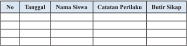

Tabel ini menunjukkan catatan perilaku siswa dalam sebuah program pembelajaran, dengan kolom-kolom seperti tanggal, nama siswa, catatan perilaku, dan butir sikap. Topik utama tabel ini adalah pengawasan perilaku siswa dan penilaian sikap mereka. Data penting yang terlihat meliputi tanggal pelaksanaan evaluasi, nama siswa yang diuji, perilaku yang diperhatikan, dan sikap yang ditentukan berdasarkan perilaku tersebut. Tabel ini membantu guru untuk memantau perkembangan siswa secara teratur dan memberikan feedback yang tepat.

 

---
## 📄 Halaman 99

### 3.  Pertemuan Ketiga ( 2 x 45 menit )

### a.  Indikator Pencapaian Kompetensi

- Menunjukkan  perilaku  orang  beriman  dalam  praksis  perlindungan dan penegakan hukum untuk menjamin keadilan dan kedamaian.
- Menjalankan  perilaku  orang  beriman  dalam  praksis  perlindungan dan penegakan hukum untuk menjamin keadilan dan kedamaian.
- Memiliki perilaku jujur dalam praktik  perlindungan dan penegakan hukum di tengah masyarakat.
- Menjalankan perilaku jujur dalam praktik perlindungan dan penegakan hukum di tengah masyarakat.
- Menjelaskan  peran  Kepolisian  Negara  Republik  Indonesia  dalam menjamin keadilan dan kedamaian.
- Menjelaskan peran Kejaksaan Republik Indonesia dalam menjamin keadilan dan kedamaian.
- Menalar hasil evaluasi  praktik  perlindungan dan penegakan hukum dalam masyarakat untuk menjamin keadilan dan kedamaian.
- Mendemonstrasikan  hasil  evaluasi    praktik    perlindungan  dan penegakan hukum dalam masyarakat untuk menjamin keadilan dan kedamaian.

### b.  Materi Pembelajaran

Materi  yang  disampaikan  pada  minggu  ketiga  adalah  Bab  2,  Subbab B,  yaitu  peran  lembaga  penegak  hukum  dalam  menjamin  keadilan  dan kedamaian

- Peran Kepolisian Negara Republik Indonesia
- Peran Kejaksaan Republik Indonesia

### c.  Proses  Pembelajaran

Pembelajaran menggunakan pendekatan sainti fi k dengan proses pembelajaran  aktif    menekankan  pada  Penguatan  Pendidikan  Karakter (PPK), Literasi, Critical Thinking, Creativity, Collaboration , dan Communication (4C). Pelaksanaan pembelajaran secara umum dibagi tiga tahapan, yaitu  kegiatan pendahuluan, kegiatan inti, dan kegiatan penutup.

 

---
## 📄 Halaman 100

---
**📊 Tabel**

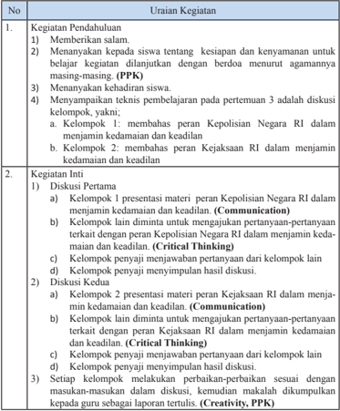

Tabel ini berisi uraian tentang kegiatan pendahuluan dan kegiatan inti dalam sebuah proses pembelajaran. Topik utama adalah tentang peran Kepolisian Negara RI dan Kejaksaan RI dalam menjamin ketaatan dan keadilan. Tabel dibagi menjadi dua bagian: 1) Kegiatan Pendahuluan dan 2) Kegiatan Inti. Dalam bagian Kegiatan Pendahuluan, terdapat tiga poin yang menjelaskan langkah-langkah awal dalam proses pembelajaran, seperti memberikan salam, menanyakan tentang kesiapan siswa, dan menanyakan kehadiran siswa. Sedangkan dalam bagian Kegiatan Inti, terdapat dua diskusi yang dilakukan oleh kelompok-kelompok, yaitu diskusi pertama tentang peran Kepolisian Negara RI dalam menjamin ketaatan dan keadilan, dan diskusi kedua tentang peran Kejaksaan RI dalam menjamin ketaatan dan keadilan. Setiap diskusi diawali dengan presentasi materi oleh kelompok tertentu, kemudian dilanjutkan dengan diskusi interaktif menggunakan metode Critical Thinking dan Creativity (PPK).

 

---
## 📄 Halaman 101

### 3. Kegiatan Penutup

- Guru dan siswa membuat rangkuman atau simpulan kompetensi yang telah dipelajari.
- Guru  dan  siswa  melakukan  re fl eksi  terhadap  kegiatan  yang  sudah dilaksanakan.
- Guru memberikan umpan balik terhadap proses dan hasil belajar.
- Guru  memberikan  tugas  individu  atau  kelompok    untuk  pertemuan berikutnya.
- Guru menyampaikan rencana pembelajaran untuk pertemuan keempat.
- Guru dan siswa menutup pelajaran dengan mengucapkan syukur kepada Tuhan Yang  Maha  Esa  karena  pembelajaran    berlangsung  aman  dan tertib. (PPK)

### d.  Penilaian

### 1.  Penilaian Sikap

Penilaian sikap terhadap siswa dapat dilakukan selama proses belajar berlangsung. Penilaian  dapat  dilakukan  dengan  observasi.  Dalam observasi  ini  misalnya  dilihat  aktivitas  dan  tingkat  perhatian  siswa selama proses pembelajaran berlangsung. Format  penilaian sikap dapat menggunakan contoh  Penilaian    Jurnal  Perkembangan  Sikap  sebagai berikut;

### Jurnal Perkembangan Sikap

Kelas

: ……..............…….

Semester

: ……..............…….

---
**📊 Tabel**

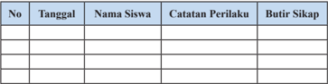

Tabel ini berisi informasi tentang perilaku siswa dan sikap mereka. Topik utamanya adalah catatan perilaku siswa dan butir sikap yang mereka miliki. Kolom-kolomnya meliputi nomor urut (No), tanggal, nama siswa, catatan perilaku, dan butir sikap. Data penting yang terlihat adalah bahwa tabel ini mungkin digunakan untuk mengawasi perkembangan sikap dan perilaku siswa seiring waktu.

### 2.  Penilaian Pengetahuan

Jawablah pertanyaan di bawah ini.

- Jelaskan    peran  Kepolisian  Negara  Republik  Indonesia  dalam menjaamin keadilan dan kedamaian!
- Jelaskan  peran Kejaksaan Republik Indonesia dalam menjamin keadilan dan kedamaian.

 

---
## 📄 Halaman 102

### 3.  Penilaian Keterampilan

Penilaian Keterampilan dilakukan guru dengan teknik portofolio untuk menilai  kemampuan siswa dalam menulis dan menyajikan makalah tentang peran lembaga penegak hukum dalam menjamin keadilan dan kedamaian. Aspek penilaian meliputi kemampuan dalam mempresentasikan hasil tulisan, sistematika, isi gagasan, bahasa, estetika. Format penilaian dapat menggunakan contoh sebagaimana terdapat pada lampiran.

### 4.  Pertemuan Keempat (2 x 45 Menit)

### a.  Indikator Pencapaian Kompetensi

- Menunjukkan  perilaku  orang  beriman  dalam  praksis  perlindungan dan penegakan hukum untuk menjamin keadilan dan kedamaian.
- Menjalankan  perilaku  orang  beriman  dalam  praksis  perlindungan dan penegakan hukum untuk menjamin keadilan dan kedamaian.
- Memiliki perilaku jujur dalam praktik perlindungan dan penegakan hukum di tengah masyarakat.
- Menjalankan perilaku jujur dalam praktik perlindungan dan penegakan hukum di tengah masyarakat.
- Menganalisis peran hakim sebagai pelaksana kekuasaan kehakiman dalam menjaamin keadilan dan kedamaian.
- Menganalisis peran advokat dalam penegakan hukum dalam menjaamin keadilan dan kedamaian.
- Menganalisis peran komisi pemberantasan korupsi dalam penegakan hukum dalam menjaamin keadilan dan kedamaian.
- Menalar hasil evaluasi  praktik  perlindungan dan penegakan hukum dalam masyarakat untuk menjamin keadilan dan kedamaian.
- Mendemonstrasikan  hasil  evaluasi  praktik  perlindungan  dan  penegakan  hukum  dalam  masyarakat  untuk  menjamin  keadilan  dan kedamaian.

### b.  Materi  Pembelajaran

- Peran Hakim sebagai Pelaksana  Kekuasaan Kehakiman
- Peran Advokat
- Peran Komisi Pemberantasan Korupsi (KPK)

### c.  Proses Pembelajaran

Pembelajaran menggunakan pendekatan sainti fi k dengan proses pembelajaran aktif  menekankan pada  Penguatan Pendidikan Karakter (PPK),  Literasi, Critical Thinking, Creativity,  Collaboration ,  dan Communication (4C). Pelaksanaan pembelajaran secara umum dibagi tiga tahapan, yaitu  kegiatan pendahuluan, kegiatan inti, dan kegiatan penutup.

 

---
## 📄 Halaman 103

---
**📊 Tabel**

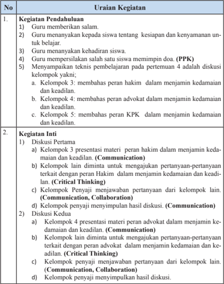

Tabel ini berisi uraian tentang kegiatan pendahuluan dan inti yang dilakukan dalam sebuah proses pembelajaran. Topik utama adalah tentang peran hakim, advokat, dan KPK dalam menjamin kedamaian dan keadilan. Tabel dibagi menjadi dua bagian: 1) Kegiatan Pendahuluan dan 2) Kegiatan Inti. Dalam bagian Kegiatan Pendahuluan, guru memberikan salam, menanyakan kesiapan siswa, memperlihatkan keadaan siswa, memperlihatkan kesalahan siswa, dan membahas teknis pembelajaran. Sedangkan dalam bagian Kegiatan Inti, terdapat diskusi pertama dan kedua yang melibatkan kelompok-kelompok dengan materi yang berbeda seperti peran hakim, advokat, dan KPK. Diskusi pertama melibatkan peran hakim dalam menjamin kedamaian dan keadilan, sedangkan diskusi kedua melibatkan peran advokat dalam menjamin kedamaian dan keadilan. Pola penting yang terlihat adalah bahwa setiap kelompok diberi tugas untuk menyampaikan materi mereka secara berbeda dan kemudian menjawab pertanyaan dari kelompok lain.

 

---
## 📄 Halaman 104

- Diskusi Ketiga
- Kelompok  5  presentasi  materi  peran  KPK  dalam  menjamin kedamaian dan keadilan. (Communication)
- Kelompok lain diminta untuk mengajukan pertanyaan-pertanyaan terkait dengan peran KPK dalam menjamin kedamaian dan keadilan. (Critical Thinking)
- Kelompok  menyaji  menjawab  pertanyaan  dari  kelompok  lain. (Communication)
- Kelompok penyaji menyimpulkan hasil diskusi. (Comunication)
- Setiap kelompok melakukan perbaikan-perbaikan  sesuai dengan masukan-masukan dalam diskusi, kemudian  makalah  dikumpulkan kepada guru sebagai laporan tertulis. ( Collaboration, Creativity, PPK)

### 3. Kegiatan Penutup

- Guru dan siswa membuat rangkuman atau simpulan kompetensi yang telah dipelajari.
- Guru  dan  siswa  melakukan  re fl eksi  terhadap  kegiatan  yang  sudah dilaksanakan.
- Guru memberikan umpan balik terhadap proses dan hasil belajar.
- Guru menyampaikan rencana pembelajaran untuk pertemuan keempat.
- Guru dan siswa menutup pelajaran dengan mengucapkan syukur kepada Tuhan  Yang  Maha  Esa  karena  pembelajaran  berlangsung  aman  dan tertib. (PPK)

### d.  Penilaian

### 1) Penilaian Sikap

Penilaian sikap terhadap siswa dapat dilakukan selama proses belajar berlangsung.  Penilaian  dapat  dilakukan  dengan  observasi.  Dalam observasi ini misalnya dilihat aktivitas dan tingkat perhatian siswa pada saat berdiskusi.

### 2) Penilaian pengetahuan

- Jawablah pertanyaan di bawah ini!
- Jelaskan  peran hakim sebagai pelaksana kekuasaan kehakiman dalam menjamin keadilan dan kedamaian.
- Jelaskan peran advokat dalam penegakan hukum dalam menjamin keadilan dan kedamaian.
- Jelaskan peran Komisi Pemberantasan Korupsi dalam penegakan hukum dalam menjamin keadilan dan kedamaian.
- Mengerjakan Tugas Kelompok 2.1.

 

---
## 📄 Halaman 105

### 3) Penilaian Keterampilan

Penilaian Keterampilan dilakukan guru dengan teknik produksi untuk menilai kemampuan siswa dalam menulis dan menyajikan makalah tentang  peran  lembaga  penegak  hukum  dalam  menjamin  keadilan dan kedamaian.  Aspek penilaian meliputi kemampuan  dalam mempresentasikan  hasil  tulisan,  sistematika,  isi  gagasan,  bahasa, estetika. Format penilaian dapat menggunakan contoh sebagaimana terdapat pada lampiran.

### 5.  Pertemuan Kelima (2 x 45 menit)

### a.   Indikator Pencapaian Kompetensi

- Menunjukkan  perilaku  orang  beriman  dalam  praksis  perlindungan dan penegakan hukum untuk menjamin keadilan dan kedamaian.
- Menjalankan  perilaku  orang  beriman  dalam  praksis  perlindungan dan penegakan hukum untuk menjamin keadilan dan kedamaian.
- Memiliki perilaku jujur dalam praktik  perlindungan dan penegakan hukum di tengah masyarakat.
- Menjalankan    perilaku  jujur  dalam  praktik    perlindungan  dan penegakan hukum di tengah masyarakat.
- Mengevaluasi  berbagai kasus pelanggaran hukum.
- Menalar hasil evaluasi  praktik  perlindungan dan penegakan hukum dalam masyarakat untuk menjamin keadilan dan kedamaian.
- Mendemonstrasikan  hasil  evaluasi  praktik  perlindungan  dan  penegakan  hukum  dalam  masyarakat  untuk  menjamin  keadilan  dan kedamaian.

### b.  Materi  Pembelajaran

Berbagai kasus pelanggaran hukum, yaitu menganalisis kasus pelanggaran hukum sebagaimana terdapat pada Tugas Mandiri 2.3.

### c.  Proses Pembelajaran

Pembelajaran menggunakan pendekatan sainti fi k dengan proses pembelajaran aktif  menekankan pada  Penguatan Pendidikan Karakter (PPK),  Literasi, Critical  Thinking,  Creativity,  Collaboration ,  dan Communication (4C). Pelaksanaan pembelajaran secara umum dibagi tiga tahapan yaitu  kegiatan pendahuluan, kegiatan inti, dan kegiatan penutup.

 

---
## 📄 Halaman 106

---
**📊 Tabel**

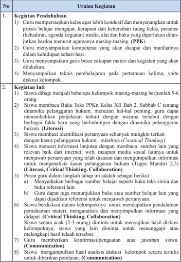

Tabel ini berisi uraian tentang proses pembelajaran dan evaluasi siswa dalam mata pelajaran PPKK (Pendidikan Prinsip-Prinsip Kewarganegaraan). Topik utama tabel adalah "Guru" dan "Siswa", dengan kolom-kolom yang mencakup pendahuluan, inti, dan penyelesaian. Data penting yang terlihat meliputi: guru mempersiapkan kelas untuk proses belajar, menyiapkan kompetensi siswa, menyiapkan garis besar materi, dan teknik pembelajaran; siswa dibagi menjadi kelompok, mengerjakan tugas, membuat identifikasi persetujuan, mencari informasi, dan berdiskusi. Pola penting adalah bahwa proses ini melibatkan aktivitas belajar aktif siswa, pengembangan keterampilan berpikir kritis, dan pembelajaran berkelompok.

 

---
## 📄 Halaman 107

### 3. Kegiatan Penutup

- Siswa melakukan re fl eksi dan menyimpulkan materi yang telah dibahas pada pertemuan kelima.
- Guru memberikan informasi kegiatan pada pertemuan berikutnya.
- Guru dan siswa menutup kegiatan dengan mengucapkan rasa syukur kepada Tuhan YME bahwa pertemuan kali ini telah berlangsung dengan baik dan lancar . (PPK)

### d.  Penilaian

### 1) Penilaian Sikap

Penilaian sikap terhadap siswa dapat dilakukan selama proses belajar berlangsung. Penilaian dapat dilakukan dengan observasi. Dalam observasi ini  misalnya  dilihat  aktivitas  dan  tingkat  perhatian  siswa  pada  saat  berdiskusi. Aspek penilaian meliputi iman, takwa, disiplin dan gotong royong. Format observasi penilaian sikap dapat menggunakan contoh format sebagaimana terdapat pada lampiran.

### 2) Penilaian Pengetahuan

Penilaian pengetahuan dilakukan dalam bentuk lisan, dengan menjawab pertanyaan berikut.

- Apa yang dimaksud dengan pelanggaran hukum?
- Berilah contoh kasus pelanggaran hukum.
- Apakah  sanksi  yang  diberikan  terhadap  kasus  pelanggaran  hukum tersebut?
- Bagaimana  wujud  partisipasi  masyarakat  agar  kasus  pelanggaran hukum itu tidak terulang kembali?

### 3) Penilaian Keterampilan

Penilaian  Keterampilan  dilakukan  guru  dengan  melihat  kemampuan siswa  dalam  presentasi,  kemampuan  bertanya,  kemampuan  menjawab pertanyaan  atau  mempertahankan  argumentasi  kelompok,  kemampuan dalam memberikan masukan/saran pada saat menyampaikan hasil telaah/ analisis tentang hakikat hak dan kewajiban warga negara. Lembar penilaian penyajian dan laporan hasil telaah dapat menggunakan format sebagaimana terdapat pada lampiran, dengan ketentuan aspek penilaian dan rubriknya dapat disesuaikan dengan situasi dan kondisi serta keperluan guru.

 

---
## 📄 Halaman 108

### 6.  Pertemuan Keenam (2 x 45 menit)

### a.   Indikator Pencapaian Kompetensi

- Menunjukkan  perilaku  orang  beriman  dalam  praksis  perlindungan dan penegakan hukum untuk menjamin keadilan dan kedamaian.
- Menjalankan  perilaku  orang  beriman  dalam  praksis  perlindungan dan penegakan hukum untuk menjamin keadilan dan kedamaian.
- Memiliki perilaku jujur dalam praktik  perlindungan dan penegakan hukum di tengah masyarakat.
- Menjalankan  perilaku  jujur  dalam  praktik  perlindungan  dan  penegakan hukum di tengah masyarakat.
- Mengidenti fi kasi macam-macam sanksi pelanggaran hukum.
- Mengidenti fi kasi contoh perilaku yang mendukung partisipasi masyarakat dalam perlindungan dan penegakan hukum.
- Menalar hasil evaluasi  praktik  perlindungan dan penegakan hukum dalam masyarakat untuk menjamin keadilan dan kedamaian.
- Mendemonstrasikan  hasil  evaluasi  praktik  perlindungan  dan  penegakan  hukum  dalam  masyarakat  untuk  menjamin  keadilan  dan kedamaian.

### b.  Materi  Pembelajaran

Macam-Macam Sanksi atas Pelanggaran Hukum.

### c.  Proses Pembelajaran

Pembelajaran menggunakan pendekatan sainti fi k dengan proses pembelajaran  aktif    menekankan  pada    Penguatan  Pendidikan  Karakter (PPK), Literasi, Critical Thinking, Creativity, Collaboration , dan Communication (4C). Pelaksanaan pembelajaran secara umum dibagi tiga tahapan, yaitu kegiatan pendahuluan, kegiatan inti, dan kegiatan penutup.

---
**📊 Tabel**

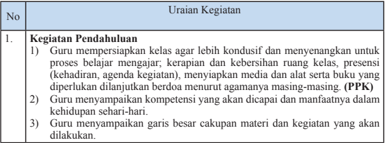

Tabel ini berisi uraian tentang kegiatan pendahuluan dalam proses pembelajaran, yang meliputi persiapan kelas agar lebih kondusif dan menyenangkan untuk proses belajar mengajar, penyiapan media dan alat serta buku diperlukan dilanjutkan berdasar pertimbangan agamanya masing-masing (PPK), dan guru menyiapkan kompetensi yang akan dicapai dan manfaatnya dalam kehidupan sehari-hari. Topik utama tabel ini adalah pendahuluan pembelajaran, dengan kolom-kolom yang mencakup uraian kegiatan tersebut. Data penting yang terlihat adalah bahwa kegiatan ini melibatkan persiapan kelas, penyiapan media dan alat, serta menyiapkan kompetensi dan manfaatnya dalam kehidupan sehari-hari.

 

---
## 📄 Halaman 109

### 2. Kegiatan Inti

- Siswa dibagi menjadi beberapa kelompok berjumlah 5-6 orang.
- Siswa  membaca subbab C Materi 2 tentang  Macam-Macam Sanksi atas Pelanggaran  Hukum  dan  materi  3  tentang  Partisipasi  Masyarakat  dalam Perlindungan dan Penegakan Hukum. (Literasi)
- Guru  dapat  menambahkan  penjelasan  terkait  dengan  wacana  tersebut dengan  berbagai  fakta  baru  yang  berhubungan  dengan  apa  yang  telah dibaca. (Literasi)
- Siswa  membuat  identi fi kasi  pertanyaan  sebanyak  mungkin  dari  wacana tersebut.  Guru  membimbing  dan  terus  mendorong  siswa  untuk  terus menggali rasa ingin tahu dengan pertanyaan yang mendalam tentang MacamMacam Sanksi atas Pelanggaran Hukum dan  Partisipasi Masyarakat dalam Perlindungan dan Penegakan Hukum. (Critical Thinking, Collaboration) Upayakan pertanyaan siswa mengarah pada materi yang akan dibahas, yaitu macam-macam sanksi atas pelanggaran hukum dan partisipasi masyarakat dalam perlindungan dan penegakan hukum .(Communication)
- Siswa  dapat  mengajukan  pertanyaan  dengan  mengisi  daftar  pertanyaan sebagai berikut.
- Siswa merumuskan hipotesis, yakni pernyataan sebagai jawaban sementara atas  pertanyaan  yang  diajukan.  Kompetensi  yang  dikembangkan  adalah kreativitas, rasa ingin tahu dan kemampuan merumuskan pertanyaan  untuk membentuk pikiran kritis. (Critical Thinking, Collaboration)
- Siswa mengumpulkan data/informasi dari berbagai sumber yaitu dengan membaca  buku  yang  relevan  ataupun  sumber,  lain  yang  relevan  dari internet;  web,  media  sosial  lainnya  untuk  menjawab  pertanyaan  atau membuktikan benar atau tidaknya hipotesis dan mengumpulkan informasi untuk mengerjakan Tugas Kelompok 2.2 (Literasi, Collaboration)
- Peran guru dalam tahap ini adalah sebagai berikut.
- Menyediakan berbagai sumber belajar seperti buku teks siswa dan buku referensi lain.
- Guru menjadi sumber belajar bagi siswa dengan memberikan kon fi rmasi atas jawaban siswa, atau menjelaskan jawaban  pertanyaan kelompok yang tidak terjawab.
- Guru dapat juga menunjukkan buku atau sumber belajar lain yang dapat dijadikan referensi untuk menjawab pertanyaan.
- Siswa  mengidenti fi kasi  dan  menyimpulkan  macam-macam  sanksi  atas pelanggaran hukum dan  partisipasi masyarakat dalam perlindungan dan penegakan hukum . (Critical Thinking)
- Siswa melaporkan hasil kesimpulan pengumpulan infromasi tentang macam-macam sanksi atas pelanggaran hukum dan  partisipasi masyarakat dalam perlindungan dan penegakan hukum . (Communication)

 

---
## 📄 Halaman 110

- Siswa  lainnya  diminta  untuk  menanggapi  hasil    penyajian  yang  telah disampaikan. Hasil analisis dan kesimpulan dikumpulkan untuk mendapatkan penilaian dari guru. (Critical Thinking)

### 3. Penutup

- Guru dan siswa menyimpulkan materi yang telah dibahas pada pertemuan ini.
- Siswa diminta mengerjakan proyek kewarganegaraan, yaitu 'Mari Menyelesaikan Masalah'
- Siswa memperhatikan penjelasan guru tentang proyek kewarganegaraan, sebagaimana  terdapat  pada  buku  teks  siswa  Bab  2.  Kemudian,  siswa dibagi  menjadi  4  kelompok  dan  menentukan  masalah  apa  yang  akan dibahas di  kelas. Ada 3 masalah, yaitu maraknya tawuran pelajar, geng motor  yang  meresahkan  masyarakat.  Makin  meningkatnya  kasus  tindak pidana korupsi oleh para pejabat. Siswa diminta untuk mencari referensi dari berbagai sumber untuk menyelesaikan masalah yang telah ditentukan .

### (Collaboration)

- Guru dan siswa menutup kegiatan dengan mengucapkan rasa syukur kepada Tuhan Yang Maha Esa bahwa pertemuan kali ini telah berlangsung dengan baik dan lancar . (PPK)

### d.  Penilaian

### 1) Penilaian Sikap

Penilaian  sikap  terhadap  siswa  dapat  dilakukan  selama  proses belajar  berlangsung.  Penilaian  dapat  dilakukan  dengan  observasi. Dalam observasi ini misalnya dilihat aktivitas dan tingkat perhatian siswa pada saat berdiskusi. Format observasi penilaian sikap dapat menggunakan contoh format sebagaimana terdapat pada lampiran.

### 2) Penilaian Pengetahuan

Penilaian pengetahuan dilakukan dalam bentuk lisan dengan menjawab pertanyaan, yaitu:

- Jelaskan macam-macam sanksi pelanggaran terhadap hukum!
- Berilah contoh perilaku yang mendukung  partisipasi masyarakat dalam perlindungan dan penegakan hukum!

### 3) Penilaian Keterampilan

- Penilaian  Keterampilan  dilakukan  guru  dengan  melihat  kemampuan siswa dalam presentasi, kemampuan bertanya, kemampuan menjawab pertanyaan atau mempertahankan argumentasi kelompok, kemampuan dalam memberikan masukan/saran pada saat menyampaikan  hasil  telaah/analisis  tentang  hakikat  hak  dan kewajiban warga negara. Lembar penilaian penyajian dan laporan

 

---
## 📄 Halaman 111

hasil  telaah  dapat  menggunakan  format  sebagaimana  terdapat pada lampiran, dengan ketentuan aspek penilaian dan rubriknya dapat disesuaikan dengan situasi dan kondisi serta keperluan guru.

- Laporan hasil  wawancara. (Tugas Kelompok 2.2)

### 7.  Pertemuan Ketujuh (2 x 45 menit)

### a.   Indikator Pencapaian Kompetensi

- Menunjukkan  perilaku  orang  beriman  dalam  praksis  perlindungan dan penegakan hukum untuk menjamin keadilan dan kedamaian.
- Menjalankan  perilaku  orang  beriman  dalam  praksis  perlindungan dan penegakan hukum untuk menjamin keadilan dan kedamaian.
- Memiliki perilaku jujur dalam praktik  perlindungan dan penegakan hukum di tengah masyarakat.
- Menjalankan    perilaku  jujur  dalam  praktik    perlindungan  dan penegakan hukum di tengah masyarakat.
- Menganalisis kasus pelanggaran hukum yang terjadi di masyarakat.
- Menganalisis alternatif penyelesaian kasus pelanggaran hukum yang terjadi di masyarakat.
- Merumuskan kebijakan alternatif untuk mengatasi kasus pelanggaran hukum.
- Menalar hasil evaluasi praktik  perlindungan dan penegakan hukum dalam masyarakat untuk menjamin keadilan dan kedamaian.
- Mendemonstrasikan hasil evaluasi praktik perlindungan dan penegakan hukum dalam masyarakat untuk menjamin keadilan dan kedamaian.

### b.  Materi  Pembelajaran

Materi  yang  disampaikan  pada  pertemuan  kedelapan  adalah  Proyek Kewarganegaraan, yaitu menganalisis kasus pelanggaran hukum, dengan pilihan masalah sebagai berikut;

- Maraknya tawuran pelajar
- Geng motor yang meresahkan masyarakat
- Makin meningkatnya kasus tindak pidana korupsi oleh para pejabat

### c.  Proses Pembelajaran

Pembelajaran menggunakan pendekatan sainti fi k dengan proses pembelajaran aktif  menekankan pada  Penguatan Pendidikan Karakter (PPK), Literasi , Critical thinking, Creativity, Collaboration dan Communication (4C). Pelaksanaan pembelajaran secara umum dibagi tiga tahapan, yaitu  kegiatan pendahuluan, kegiatan inti, dan kegiatan penutup.

 

---
## 📄 Halaman 112

---
**📊 Tabel**

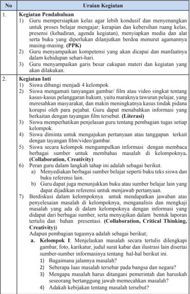

Tabel ini berisi informasi tentang kegiatan pendahuluan dan kreativitas dalam proses pembelajaran, dengan topik utama "Kegiatan Pendahuluan" dan "Kegiatan Inti". Kolom-kolomnya mencakup uraian kegiatan, seperti guru mempersiapkan kelas agar lebih kondusif, guru menyampaikan kompetensi yang akan dicapai, dan guru menyiapkan garis besar kapan materi akan dilakukan. Untuk kegiatan inti, tabel menyebutkan tujuh tugas yang harus diselesaikan oleh kelompok, termasuk menangani gambar, film, atau video, memperbaiki kesalahan, dan memberikan penilaian. Selain itu, tabel juga mencakup bagaimana guru dapat membantu kelompoknya dalam menyelesaikan tugas tersebut, seperti memberikan bantuan referensi, diskusi, dan penilaian. Pola penting yang terlihat adalah bahwa kegiatan ini melibatkan berbagai aspek pembelajaran, termasuk presentasi, diskusi, dan penilaian, serta memerlukan kerjasama antar anggota kelompok.

 

---
## 📄 Halaman 113

- Adakah  perbedan  pendapat,  siapa  organisasi  yang  berpihak pada masalah ini?
- Pada tingkat atau lembaga pemerintah apa yang bertanggung jawab tentang masalah ini?
- Kelompok II : Merumuskan kebijakan alternatif untuk mengatasi masalah.  Menjelaskan  secara  tertulis  dilengkapi  gambar,  foto, karikatur dan ilustrasi lain disertai sumber-sumber informasinya tentang :
- Kebijakan  alternatif  yang  berhasil  dihimpun  dari  berbagai sumber informasi yang dikumpulkan.
- Kajian terhadap setiap kebijakan alternatif tersebut dengan menjawab pertanyaan kebijakan apakah yang diusulkan dan apakah keuntungan dan kerugian kebijakan tersebut.
- Kelompok III :  Mengusulkan kebijakan publik untuk mengatasi masalah dilengkapi gambar, foto, karikatur, judul surat kabar, dan ilustrasi lain disertai sumber-sumber informasi tentang:
- Kebijakan yang diyakini akan dapat mengatasi masalah.
- Keuntungan dan kerugian dari kebijakan tersebut.
- Kebijakan  tersebut  tidak  melanggar  peraturan  perundangundangan.
- Tingkat atau lembaga pemerintah mana yang harus bertanggung jawab menjalankan kebijakan yang diusulkan.
- Kelompok  IV :  Membuat  rencana  tindakan  yang  mencakup langkah-langkah yang dapat diambil agar kebijakan yang diusulkan  diterima  dan  dilaksanakan  oleh  pemerintah.  Hal  ini berupa penjelasan tentang hal-hal berikut.
- Bagaimana dapat menumbuhkan dukungan pada individu dan kelompok  dalam  masyarakat  terhadap  rancangan  tindakan yang diusulkan.
- Mendeskripsikan individu atau kelompok yang berpengaruh dalam masyarakat yang mungkin hendak mendukung rancangan tindakan kelas dan bagaimana kalau dapat memperoleh dukungan tersebut.
- Menggambarkan pula kelompok di masyarakat yang mungkin menentang rancangan tindakan dan bagaimana kalian dapat meyakinkan mereka untuk mendukung rencana tindakan.
- Setiap  kelompok  menyajikan/  mempersatukan  hasilnya  di hadapan dewan juri  atau guru yang mewakili sekolah.

 

---
## 📄 Halaman 114

### 3. Kegiatan Penutup

- Bersama-sama  dengan  siswa,  guru  memberikan  penekanan  dalam bentuk kesimpulan penting berkaitan dengan tahapan atau  langkahlangkah  penyusunan makalah dan bahan presentasi yang baik.
- Memberikan  evaluasi  terhadap  kegiatan  pembelajaran  pertemuan ketujuh,  terutama  hal-hal  yang  kurang  berkenan  sebagai  masukan untuk perbaikan  dalam  pertemuan berikutnya.
- Memberi  tahu  siswa  bahwa  dalam  pertemuan  kedelapan    adalah mempresentasikan hasil diskusi kelompok.
- Kelompok yang belum menyelesaikan tugasnya diminta untuk menyelesaikan tugas Proyek Kewarganegaraan tersebut di luar kegiatan pembelajaran.
- Guru dan siswa menutup kegiatan dengan mengucapkan rasa syukur kepada Tuhan Yang Maha Esa bahwa kegiatan belajar  berlangsung dengan baik dan lancar . (PPK)

### 8.  Pertemuan Kedelapan (2 x 45 menit)

Pertemuan  kedelapan  merupakan  satu  rangkaian  dengan  pertemuan ketujuh,  yaitu  dalam  bentuk  kegiatan  mempresentasikan  hasil  proyek kewarganegaraan sebagaimana telah dikerjakan oleh setiap kelompok pada pertemuan sebelumnya.

### a.  Indikator Pencapaian Kompetensi

- Menunjukkan  perilaku  orang  beriman  dalam  praksis  perlindungan dan penegakan hukum untuk menjamin keadilan dan kedamaian.
- Menjalankan  perilaku  orang  beriman  dalam  praksis  perlindungan dan penegakan hukum untuk menjamin keadilan dan kedamaian.
- Memiliki perilaku jujur dalam praktik  perlindungan dan penegakan hukum di tengah masyarakat.
- Menjalankan    perilaku  jujur  dalam  praktik    perlindungan  dan penegakan hukum di tengah masyarakat.
- Menganalisis kasus pelanggaran hukum yang terjadi di masyarakat.
- Menganalisis alternatif penyelesaian kasus pelanggaran hukum yang terjadi di masyarakat.
- Merumuskan kebijakan alternatif untuk mengatasi kasus pelanggaran hukum.
- Menalar hasil evaluasi  praktik  perlindungan dan penegakan hukum dalam masyarakat untuk menjamin keadilan dan kedamaian.
- Mendemonstrasikan  hasil  evaluasi    praktik    perlindungan  dan penegakan hukum dalam masyarakat untuk menjamin keadilan dan kedamaian.

 

---
## 📄 Halaman 115

### b.  Materi  Pembelajaran

Materi  yang  disampaikan  pada  pertemuan  ketujuh  adalah  Proyek Kewarganegaraan yaitu menganalisis kasus pelanggaran hukum, dengan pilihan masalah sebagai berikut;

- Maraknya tawuran pelajar
- Geng motor yang meresahkan masyarakat
- Semakin meningkatnya kasus tindak pidana korupsi oleh para pejabat

### c.  Proses  Pembelajaran

Pembelajaran menggunakan pendekatan sainti fi k dengan proses pembelajaran  aktif  yang  menekankan  pada    Penguatan  Pendidikan Karakter  (PPK),  Literasi ,  Critical  thinking,  Creativity,  Collaboration dan Communication (4C).  Pelaksanaan  pembelajaran  secara  umum dibagi  tiga  tahapan  yaitu    kegiatan  pendahuluan,  kegiatan  inti,  dan kegiatan penutup.

---
**📊 Tabel**

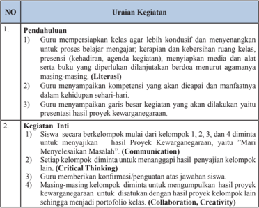

Tabel ini berisi uraian kegiatan yang dilakukan oleh guru dalam proses belajar mengajar di kelas. Topik utamanya adalah pendahuluan dan kegiatan inti. Kolom pertama menunjukkan nomor urutan kegiatan, sedangkan kolom kedua menjelaskan uraian kegiatan tersebut. Data penting yang terlihat adalah bahwa guru harus mempersiapkan kelas agar lebih kondusif dan menyenangkan, menyiapkan media dan alat yang diperlukan, serta menyiapkan garis kegiatan yang akan dilakukan. Selain itu, guru juga harus mampu mengevaluasi hasil proyek kewarganegaraan dan memberikan konfirmasi pengujian atas jawaban siswa.

 

---
## 📄 Halaman 116

### 3. Kegiatan Penutup

- Guru  dan  siswa  menyimpulkan  materi  yang  telah  dibahas  pada pertemuan ini.
- Siswa dengan bimbingan guru diminta untuk melakukan re fl eksi dan melakukan penilaian diri.
- Siswa mengerjakan uji kompetensi Bab 2.
- Guru dan siswa menutup kegiatan dengan mengucapkan rasa syukur kepada  Tuhan  Yang  Maha  Esa  bahwa  pertemuan  kali  ini  telah berlangsung dengan baik dan lancar. (PPK)

### d.  Penilaian

### 1) Penilaian Sikap

Siswa diminta untuk mengisi tugas pada Buku Siswa

### Pedoman Penskoran :

Skor 4 jika selalu, skor 3 jika sering, skor 2 jika kadang-kadang, skor 1 jika tidak pernah.

---
**📊 Tabel**

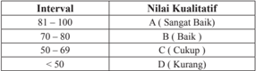

Tabel ini menunjukkan kualitas interval waktu dalam jam, dengan nilai kualitatif yang diberikan untuk setiap interval. Topik utama tabel ini adalah kualitas waktu dalam jam, yang diukur berdasarkan interval waktu antara 81 hingga 100, 70 hingga 80, 50 hingga 69, dan kurang dari 50. Kolom-kolomnya mencakup interval waktu dan nilai kualitasnya. Data penting yang terlihat adalah bahwa interval waktu antara 81 hingga 100 memiliki nilai kualitas "Sangat Baik", sedangkan interval waktu antara 70 hingga 80 memiliki nilai kualitas "Baik". Interval waktu antara 50 hingga 69 memiliki nilai kualitas "Cukup", dan interval waktu kurang dari 50 memiliki nilai kualitas "Kurang". Ini menunjukkan bahwa semakin tinggi interval waktu, semakin baik kualitasnya.

### 2) Penilaian Pengetahuan

### Uji Kompetensi Bab 2

### Jawablah  pertanyaan  di  bawah  ini  secara  singkat,  jelas  dan akurat.

- Apa yang dimasud dengan perlindungan dan penegakan hukum?
- Mengapa perlindungan hukum tidak akan terwujud apabila penegakan hukum tidak dilaksanakan?
- Mengapa perlindungan dan penegakan hukum mutklak harus dilakukan dalam sebuah negara demokrasi?
- Bedakan peran polisi, jaksa, hakim dan advokat serta KPK dalam proses penegakan hukum di Indonesia.
- Mengapa terjadi pelanggaran hukum?
- Deskripsikan contoh-contoh perilaku yang menunjukkan ketidakpatuhan terhadap hukum di lingkungan keluarga, sekolah, masyarakat dan sekolah.

 

---
## 📄 Halaman 117

### Kunci Jawaban

---
**📊 Tabel**

Tabel ini berisi kunci jawaban untuk beberapa pertanyaan tentang prinsip-prinsip hukum internasional, termasuk perintah hukum, penegakan hukum, dan kepentingan negara dalam proses hukum internasional. Topik utama tabel adalah tentang hak-hak dan tanggung jawab negara dalam melaksanakan hukum internasional. Kolom-kolomnya mencakup skor, kunci jawaban, dan topik yang berkaitan dengan prinsip-prinsip tersebut. Data penting yang terlihat antara lain bahwa perintah hukum harus dilakukan secara sadar oleh negara, penegakan hukum harus mempertimbangkan kepentingan manusia, dan Indonesia wajib melaksanakan proses hukum internasional.

 

---
## 📄 Halaman 118

---
**📊 Tabel**

Tabel ini berisi informasi tentang hukum dan tindakan yang dilakukan oleh pihak berwenang di Indonesia. Topik utamanya adalah tentang kebijakan Republik Indonesia dalam menghadapi perkara pidana, termasuk pendidikan, pengadilan, dan advokat. Kolom-kolomnya mencakup berbagai aspek hukum seperti kebijakan, pendidikan, pengadilan, advokat, dan pelanggaran hukum. Data penting yang terlihat meliputi bahwa kebijakan Republik Indonesia telah memberlakukan pendidikan dan pengadilan secara seragam, advokat diberi kuasa untuk membantu bantuan hukum, dan pelanggaran hukum dapat dihukum dengan ketidakpatuhan terhadap hukum.

 

---
## 📄 Halaman 119

---
**📊 Tabel**

Tabel ini menunjukkan skor total seorang individu dalam sebuah evaluasi atau penilaian berdasarkan kriteria tertentu. Topik utama tabel adalah "Lingkungan masyarakat" dan mencakup 6 poin yang harus diisi oleh individu. Kolom-kolom yang ada meliputi nomor urutan (1-6) dan skor total. Data penting yang terlihat adalah bahwa individu tersebut mendapat skor total sebesar 45, yang menunjukkan bahwa mereka telah memenuhi semua kriteria yang ditetapkan dalam evaluasi tersebut.

### Penilaian Soal Uraian

### Penilaian Keterampilan

- Penilaian  Keterampilan  dilakukan  guru  dengan  melihat  kemampuan siswa dalam presentasi, kemampuan bertanya, kemampuan menjawab pertanyaan atau mempertahankan argumentasi kelompok, kemampuan dalam memberikan masukan/saran pada saat menyampaikan hasil telaah/analisis tentang hakikat hak dan kewajiban warga negara. Lembar penilaian penyajian dan laporan hasil telaah dapat menggunakan format sebagaimana terdapat pada lampiran, dengan ketentuan aspek penilaian dan rubriknya dapat disesuaikan dengan situasi dan kondisi serta keperluan guru.
- Hasil portofolio proyek kewarganegaraan

### E. Pengayaan

Kegiatan pengayaan merupakan kegiatan pembelajaran yang diberikan kepada siswa yang telah menguasai materi pembelajaran, yaitu materi pada Bab 2. Pengayaan ini dapat dilakukan dengan beberapa cara dan pilihan. Sebagai contoh siswa dapat diberikan bahan bacaan yang relevan dengan materi  atau  mencari  kliping  tentang  kasus-kasus  pelangaran  hukum, kemudian  siswa  diminta  untuk  menilai  kasus  tersebut  berdasar  tinjuan hukum yang berlaku.

(Skor yang diperoleh) x 100 4

 

---
## 📄 Halaman 120

### F.  Remedial

Kegiatan remedial diberikan kepada siswa yang belum menguasai materi pelajaran dan belum mencapai kompetensi yang telah ditentukan. Bentuk yang  dilakukan  antara  lain  siswa  secara  terencana  mempelajari  Buku Teks PPKn Kelas XII pada bagian tertentu yang belum dikuasainya. Guru menyediakan soal-soal latihan atau pertanyaan yang merujuk pemahaman kembali  tentang  isi  Buku  Teks  PPKn  Kelas  XII  Bab  2.  Siswa  diminta komitmennya  untuk  belajar  secara  disiplin  dalam  rangka  memahami materi  pelajaran  yang  belum  dikuasainya.  Guru  kemudian  mengadakan uji  kompetensi  kembali  pada  materi  yang  belum  dikuasai  siswa  yang bersangkutan.

### G.  Interaksi Guru dan Orang tua

Maksud dari kegiatan ini adalah agar terjalin komunikasi antara guru dan orang tua berkaitan dengan kemajuan proses dan hasil belajar yang dilaksanakan  dan  dicapai  siswa.  Guru  harus  selalu  mengingatkan  dan meminta siswa memperihatkan hasil tugas atau pekerjaan yang telah dinilai dan diberi komentar oleh guru kepada orang tua siswa, yaitu:

- Penilaian sikap selama siswa mengikuti proses pembelajaran pada Bab 2.
- Penilaian pengetahuan melalui penugasan dan kegiatan uji kompetensi Bab 2.
- Penilaian Keterampilan melalui Proyek Belajar Kewarganegaraan
Orang tua juga harus memberikan komentar hasil pekerjaan atau tugas yang dicapai  oleh  siswa  sebagai  apresiasi  dan  komitmen  untuk  bersama-sama mengantarkan siswa  mencapai prestasi yang lebih baik. Bentuk apresiasi orang  tua  ini  akan  menambah  semangat  siswa  untuk  mempertahankan dan  meningkatkan  keberhasilannya  baik  dalam  konteks  pemahaman dan  penguasaan  materi  pengetahuan,  sikap  maupun  keterampilan.  Hasil penilaian  yang  telah  di  paraf  atau  ditandatangani  guru  dan  orang  tua kemudian disimpan untuk menjadi bagian dari portofolio siswa. Untuk itu, pihak sekolah atau guru harus menyediakan format tugas/pekerjaan  siswa. Adapun interaksi antara guru dan orang tua dapat menggunakan format  di bawah ini.

---
**📊 Tabel**

Tabel ini menunjukkan penilaian siswa dalam aspek-aspek penilaian seperti sikap, pengetahuan, keterampilan, dan paraf/tanda tangan. Kolom "Nilai Rerata" menunjukkan rata-rata nilai siswa dalam setiap aspek penilaian. Kolom "Komentar Guru" menyajikan komentar guru tentang keberhasilan siswa dalam setiap aspek penilaian. Kolom "Komentar Orang Tua" menyediakan komentar orang tua tentang keberhasilan siswa dalam setiap aspek penilaian. Topik utama tabel ini adalah penilaian siswa dalam berbagai aspek penilaian, termasuk sikap, pengetahuan, keterampilan, dan paraf/tanda tangan. Data penting yang terlihat adalah bahwa nilai rerata, komentar guru, dan komentar orang tua dapat memberikan gambaran全面的な tentang keberhasilan siswa dalam setiap aspek penilaian.

 

---
## 📄 Halaman 121

---
**🖼️ Gambar/Diagram**

> **Deskripsi Visual:** Buku pelajaran ini menampilkan sebuah diagram yang menggambarkan struktur materi dan pembelajaran dalam Bab 3. Diagram ini dibagi menjadi dua bagian utama: Subbab A dan Subbab B. Subbab A terdiri dari dua subbagian, yaitu Subbab A.1 tentang "Pengaruh Positif Kemajuan Iptek bagi Kehidupan Bermasyarakat, Berbangsa, dan Bernegara" dan Subbab A.2 tentang "Pengaruh Negatif Kemajuan Iptek terhadap NKRI". Subbab B berisi satu subbagian yang berjudul "Membangun Sikap Sehatif dalam Menghadapi Berbagai Pengaruh Kemajuan Iptek".

Elemen-elemen utama dalam diagram ini adalah subbab dan kegiatan pembelajaran yang terkait dengan setiap subbab. Untuk setiap subbab, ada beberapa kegiatan pembelajaran yang disediakan, seperti pendekatan saintifik, PPK, literasi, critical thinking, creativity, collaboration, dan communication (4C). Selain itu, ada juga kegiatan presentasi kelompok yang disediakan untuk setiap subbab.

Teks, angka, atau label penting yang terlihat dalam diagram ini meliputi judul Bab 3, subbab A dan B, subbab A.1 dan A.2, dan kegiatan pembelajaran yang disediakan untuk setiap subbab. Informasi kunci yang dapat diambil pembaca meliputi struktur materi dan pembelajaran dalam Bab 3, jenis kegiatan pembelajaran yang disediakan, dan topik-topik yang akan dipelajari dalam Bab 3.

PPKn

111

 

---
## 📄 Halaman 122

### Pengaruh Kemajuan Iptek terhadap NKRI

### A.  Kompetensi Inti ( KI):

- Menghayati dan mengamalkan ajaran agama yang dianutnya.
- Menunjukkan perilaku jujur, disiplin, tanggung jawab, peduli (gotong  royong,  kerja  sama,  toleran,  damai),  santun,  responsif  dan proaktif sebagai bagian dari solusi atas berbagai permasalahan dalam berinteraksi  secara  efektif  dengan  lingkungan  sosial  dan  alam  serta menempatkan diri sebagai cerminan bangsa dalam pergaulan dunia.
- Memahami, menerapkan, menganalisis, dan mengevaluasi pengetahuan faktual,  konseptual,  prosedural,  dan  metakognitif  berdasarkan  rasa ingin tahunya tentang ilmu pengetahuan, teknologi, seni, budaya, dan humaniora dengan wawasan kemanusiaan, kebangsaan, kenegaraan, dan peradaban terkait penyebab fenomena dan kejadian, serta menerapkan pengetahuan prosedural pada bidang kajian yang spesi fi k sesuai dengan bakat dan minatnya untuk memecahkan masalah.
- Mengolah, menalar, menyaji, dan mencipta dalam ranah konkret dan ranah abstrak terkait dengan pengembangan dari yang dipelajarinya di sekolah secara mandiri, serta bertindak secara efektif dan kreatif,  dan  mampu  menggunakan  metode  sesuai  kaidah  keilmuan.

 

---
## 📄 Halaman 123

### B. Kompetensi Dasar (KD) dan Indikator Pencapaian Kompetensi (IPK)

---
**📊 Tabel**

Tabel ini berisi informasi tentang kompetensi dasar (K/D) dan indikator pencapaian kompetensi (IPK) yang harus dicapai oleh siswa dalam mengembangkan kemajuan ilmu pengetahuan dan teknologi. Topik utama tabel ini adalah tentang pengaruh ilmu pengetahuan dan teknologi terhadap kemajuan negara. Kolom-kolom yang ada meliputi K/D, IPK, dan Indikator Pencapaian Kompetensi (IPK). Data penting yang terlihat adalah bahwa siswa harus menerima pengaruh ilmu pengetahuan dan teknologi dengan tetap memegang nilai-nilai Ketuhanan Yang Maha Esa, menunjukkan sikap positif terhadap pengaruh ilmu pengetahuan dan teknologi dengan tetap memegang nilai-nilai Ketuhanan Yang Maha Esa, memiliki tanggung jawab dalam menyikapi pengaruh ilmu pengetahuan dan teknologi dalam bangkai Bhinneka Tunggal Ika, bertanggung jawab dalam menyikapi pengaruh ilmu pengetahuan dan teknologi dalam bangkai Bhinneka Tunggal Ika, mengidentifikasi pengaruh positif kemajuan ilmu pengetahuan dan teknologi terhadap negara dalam bangkai Bhinneka Tunggal Ika, mengidentifikasi pengaruh positif kemajuan ilmu pengetahuan dan teknologi terhadap negara dalam bangkai Bhinneka Tunggal Ika, mengidentifikasi pengaruh positif kemajuan ilmu pengetahuan dan teknologi terhadap negara dalam bangkai Bhinneka Tunggal Ika, mengidentifikasi pengaruh negatif kemajuan ilmu pengetahuan dan teknologi terhadap negara dalam bangkai Bhinneka Tunggal Ika, mengidentifikasi pengaruh negatif kemajuan ilmu pengetahuan dan teknologi terhadap negara dalam bangkai Bhinneka Tunggal Ika, memahami strategi mengatasi berbagai pengaruh negatif kemajuan ilmu pengetahuan dan teknologi, dan menjauhkan sikap selektif dalam menghadapi berbagai pengaruh kemajuan il

 

---
## 📄 Halaman 124

---
**📊 Tabel**

Tabel ini berisi informasi tentang proses identifikasi pengaruh kemanjakan ilmu pengetahuan dan teknologi terhadap negara dalam konteks Bhinneka Tunggal Ika. Topik utamanya adalah tentang cara menunjukkan hasil identifikasi tersebut. Kolom pertama menyajikan nomor urut dari setiap subtopik, sedangkan kolom kedua menjelaskan deskripsi singkat dari subtopik tersebut. Data penting yang terlihat adalah bahwa tabel mencakup dua subtopik utama: 4.3.1 Menalar hasil identifikasi pengaruh kemanjakan ilmu pengetahuan dan teknologi terhadap negara dalam bingkai Bhinneka Tunggal Ika, dan 4.3.2 Mempresentasikan hasil identifikasi pengaruh kemanjakan ilmu pengetahuan dan teknologi terhadap negara dalam bingkai Bhinneka Tunggal Ika. Ini menunjukkan bahwa tabel ini bertujuan untuk memberikan panduan atau petunjuk tentang bagaimana mengidentifikasi dan menganalisis dampak positif atau negatif dari kemanjakan ilmu pengetahuan dan teknologi dalam konteks nasional.

### C. Materi   Pembelajaran Bab 3.

### 1.  Mengidenti fi kasi Pengaruh Kemajuan Iptek terhadap NKRI

- Pengaruh positif kemajuan iptek bagi kehidupan bermasyarakat, berbangsa dan bernegara
- Pengaruh negatif kemajuan  iptek bagi kehidupan bermasyarakat, berbangsa dan bernegara

### 2.  Membangun  Sikap  Selektif  dalam  Menghadapi  Berbagai  Pengaruh Kemajuan Iptek

- Sikap tanggung jawab dalam pengembangan iptek
- Sikap selektif terhadap pengaruh kemajuan iptek

### D. Proses Pembelajaran

### 1.  Pertemuan Pertama (2 x 45 Menit)

Pertemuan pertama diawali dengan mengulas isu-isu yang ada di sekitar siswa berkaitan dengan pengaruh negatif kemajuan iptek terhadap Negara Kesatuan Republik Indonesia. sebagai contoh misalnya siswa diminta untuk membaca wacana  yang  berjudul  'Internet  Bikin  Kemajuan  Sekaligus  Kehancuran Negara, Mengapa?' Setelah itu siswa diminta untuk mengajukan pertanyaan atau memberikan tanggapan terhadap wacana tersebut.

Pada pertemuan pertama, guru dapat menyampaikan gambaran umum materi yang akan dipelajari pada Bab 3, kegiatan apa yang akan dilaksanakan, menjelaskan pentingnya mempelajari materi ini, bagaimana guru dapat menumbuhkan ketertarikan siswa terhadap materi yang akan dipelajari. Setelah itu, guru menyampaikan batasan materi apa saja yang akan dipelajari pada Bab 3.

 

---
## 📄 Halaman 125

### a.  Indikator Pencapaian Kompetensi

- Menerima  pengaruh  kemajuan  ilmu  pengetahuan  dan  teknologi dengan tetap memegang nilai-nilai Ketuhanan Yang Maha Esa.
- Menunjukan  sikap  positif    terhadap    pengaruh  kemajuan  ilmu pengetahuan  dan  teknologi  dengan  tetap  memegang  nilai-nilai Ketuhanan Yang Maha Esa.
- Memiliki  tanggung  jawab  dalam  menyikapi  pengaruh  kemajuan ilmu pengetahuan dan teknologi dalam bingkai Bhinneka Tunggal Ika.
- Bertanggung  jawab  dalam  menyikapi  pengaruh  kemajuan    ilmu pengetahuan dan teknologi dalam bingkai Bhinneka Tunggal Ika
- Mengidenti fi kasi    pengaruh  positif  kemajuan  iptek  dalam  aspek politik.
- Mengidenti fi kasi  pengaruh  positif  kemajuan  iptek  dalam  aspek ekonomi.
- Mengidenti fi kasi  pengaruh  positif  kemajuan  iptek  dalam  aspek sosial budaya.
- Mengidenti fi kasi pengaruh positif  kemajuan iptek dalam pertahanan keamanan.
- Menalar  hasil  identi fi kasi  pengaruh  kemajuan  ilmu  pengetahuan dan teknologi terhadap negara  dalam bingkai Bhinneka Tunggal Ika.
- Mempresentasikan hasil identi fi kasi pengaruh kemajuan ilmu pengetahuan dan teknologi terhadap negara  dalam bingkai Bhinneka Tunggal Ika.

### b.  Materi Pembelajaran

Materi  yang  disampaikan  pada  pertemuan  pertama  adalah  subBab A tentang Pengaruh Kemajuan iptek terhadap NKRI dengan rincian  materi sebagai berikut:

- Pengaruh positif kemajuan iptek dalam aspek politik.
- Pengaruh positif kemajuan iptek dalam aspek ekonomi.
- Pengaruh positif kemajuan iptek dalam aspek sosial budaya.
- Pengaruh positif kemajuan iptek dalam pertahanan keamanan.

### c.  Proses Pembelajaran

Pembelajaran menggunakan pendekatan sainti fi k  dengan proses pembelajaran aktif  menekankan pada  Penguatan Pendidikan Karakter (PPK), Literasi ,  Critical  thinking,  Creativity,  Collaborasi, dan Communication (4 C). Pelaksanaan pembelajaran secara umum dibagi tiga tahapan, yaitu kegiatan pendahuluan, kegiatan inti, dan kegiatan penutup.

 

---
## 📄 Halaman 126

No

### 1. Kegiatan Pendahuluan

- Guru  mempersiapkan kelas agar lebih kondusif dan menyenangkan untuk proses belajar mengajar, kerapian dan kebersihan ruang kelas, presensi (kehadiran,  agenda  kegiatan)  media,  alat  dan  buku  yang  diperlukan, dilanjutkan  dengan  berdoa  bersama  sesuai  dengan  agamanya  masingmasing. (PPK)
- Guru  menyampaikan  kompetensi  yang  akan  dicapai  dan  manfaatnya dalam kehidupan sehari-hari.
- Guru menyampaikan garis besar cakupan materi dan kegiatan yang akan dilakukan.
- Menyampaikan  teknis  pembelajaran  pada  pertemuan  pertama,  yaitu dengan melalui diskusi kelompok.

### 2. Kegiatan Inti

- Siswa dibagi menjadi beberapa kelompok yang terdiri atas 5-6 orang .
- Siswa membaca Buku Teks PPKn Kelas XII Bab 3, SubBab A tentang Mengidenti fi kasi  Pengaruh  Kemajuan  iptek  terhadap  NKRI,  Materi 1:  pengaruh  positif  kemajuan  iptek  bagi  kehidupan  bermasyarakat, berbangsa  dan  bernegara,  kemudian  mencatat  hal-hal  penting  terkait dengan  materi,  guru  dapat  menambahkan  penjelasan  terkait  dengan wacana tersebut dengan berbagai fakta baru yang berhubungan dengan pengaruh positif kemajuan iptek bagi kehidupan bermasyarakat, berbangsa dan bernegara . (Literasi)
- Siswa    membuat  identi fi kasi  pertanyaan  sebanyak  mungkin  tentang pengaruh positif kemajuan iptek bagi kehidupan bermasyarakat, berbangsa  dan  bernegara,  dengan  mengisi  daftar  pertanyaan  sebagai berikut : (Critical Thinking)
- Siswa memilih  salah satu dari identi fi kasi pertanyaan  kemudian merumuskan hipotesis, yakni pernyataan (statement) sebagai jawaban sementara  atas  pertanyaan  yang  telah  disusun.  Kompetensi  yang dikembangkan  adalah  kreativitas,  rasa  ingin  tahu  dan  kemampuan merumuskan  pertanyaan    untuk  membentuk  pikiran  kritis. (Critical Thinking, Creativity)
- Siswa mencari informasi lanjutan dengan membaca  sumber lain yang relevan  baik  dari  internet;  web,  maupun  media  sosial  lainnya  untuk menjawab pertanyaan atau membuktikan benar atau tidaknya hipotesis. (Literasi, Collabolasi)

---
**📊 Tabel**

Tabel ini berisi pertanyaan yang diturunkan dari satu nomor ke nomor lainnya, mulai dari nomor 1 hingga dst. Topik utama tabel ini adalah pertanyaan-pertanyaan yang mungkin akan diajukan dalam konteks pembelajaran atau ujian. Kolom Pertanyaan merupakan tempat untuk menuliskan pertanyaan yang ingin ditanyakan. Data atau pola penting yang terlihat adalah bahwa setiap baris tabel memiliki satu pertanyaan, dan nomor pertanyaan tersebut bertambah seiring dengan urutan baris. Ini menunjukkan bahwa tabel ini dirancang untuk membantu dalam proses penilaian atau evaluasi, di mana setiap pertanyaan dapat diberikan kepada siswa atau peserta ujian untuk menjawabnya.

### Uraian Kegiatan

 

---
## 📄 Halaman 127

- Peran guru dalam langkah tahap ini adalah :
- Menyediakan berbagai sumber belajar seperti buku teks siswa dan buku referensi lain.
- Guru dapat juga menunjukkan buku atau sumber belajar lain yang dapat dijadikan referensi untuk menjawab pertanyaan.
- Siswa berdiskusi dalam kelompoknya  untuk mendapatkan pendalaman pemahaman  materi, menganalisis dan menyimpulkan informasi yang diperoleh. (Collaborasi, Critical Thinking)
- Menyusun  hasil diskusi dalam  bentuk laporan tertulis/makalah  dan bahan  presentasi. (Creativity)
- Setiap kelompok diminta untuk menyajikan  hasil analisis dan  penilaian tentang pengaruh positif  kemajuan iptek dalam aspek politik, ekonomi, sosial  budaya  dan  pertahanan  keamanan.  Kelompok  lainnya  diminta untuk memberikan tanggapan dan masukan. Hasil identi fi kasi    dan  diskusi kemudian dikumpulkan untuk diberikan penilaian . (Communication)

### 3. Kegiatan Penutup

- Guru  dan  siswa menyimpulkan  materi  yang  telah dibahas pada pertemuan ini.
- Siswa diminta untuk mengerjakan Tugas Mandiri 3.1 dan dikumpulkan pada pertemuan kedua. (PPK)
- Guru  dan  siswa  menutup  kegiatan  dengan  mengucapkan  rasa  syukur kepada  Tuhan  Yang  Maha  Esa  bahwa  pertemuan  kali  ini telah berlangsung dengan baik dan lancar. (PPK)

### d.  Penilaian

### 1) Penilaian Sikap

Penilaian sikap terhadap siswa dapat dilakukan selama proses belajar berlangsung. Penilaian  dapat  dilakukan  dengan  observasi.  Dalam observasi  ini  misalnya  dilihat  aktivitas  dan  tingkat  perhatian  siswa selama proses pembelajaran berlangsung. Format  penilaian sikap dapat menggunakan contoh  Penilaian    Jurnal  Perkembangan  Sikap  sebagai berikut;

### Jurnal Perkembangan Sikap

Kelas

: ……..............…….

Semester

: ……..............…….

---
**📊 Tabel**

Tabel ini berisi informasi tentang perilaku siswa dan sikap mereka. Topik utamanya adalah perubahan perilaku dan sikap siswa seiring waktu. Kolom-kolomnya meliputi tanggal, nama siswa, catatan perilaku, dan butir sikap. Data penting yang terlihat adalah bahwa banyak siswa memiliki perubahan positif dalam perilakunya, seperti meningkatnya partisipasi dalam kegiatan kelas dan meningkatnya sikap positif terhadap teman-temannya. Ini menunjukkan bahwa pembelajaran dan dukungan dari guru dapat mempengaruhi perkembangan sikap dan perilaku siswa.

 

---
## 📄 Halaman 128

### 2) Penilaian Pengetahuan

Penilaian  pengetahuan  dilakukan  dalam  bentuk  penugasan  dengan menjawab pertanyaan yang telah disusun dalam diskusi kelompok dan Tugas Mandiri 3.1.

### 3) Penilaian Keterampilan

Penilaian Keterampilan dilakukan guru dengan melihat kemampuan siswa  dalam  diskusi  dan  presentasi  yaitu  kejelasan  dan  kedalaman informasi,  keaktifan  dalam  diskusi,  kejelasan  dan  kerapian  dalam presentasi menyampaikan hasil telaah/analisis tentang Pengaruh Positif Kemajuan  Iptek bagi Kehidupan Bermasyarakat, Berbangsa dan Bernegara. Lembar penilaian penyajian dan laporan hasil analisis dapat menggunakan  format  sebagaimana  terdapat  pada  lampiran,  dengan ketentuan  aspek  penilaian  dan  rubriknya  dapat  disesuaikan  dengan situasi dan kondisi serta keperluan guru.

### 2.  Pertemuan Kedua (2 x 45 menit)

### a.  Indikator Pencapaian Kompetensi

- Menerima  pengaruh  kemajuan  ilmu  pengetahuan  dan  teknologi dengan tetap memegang nilai-nilai Ketuhanan Yang Maha Esa.
- Menunjukkan  sikap  positif  terhadap  pengaruh  kemajuan  ilmu pengetahuan  dan  teknologi  dengan  tetap  memegang  nilai-nilai Ketuhanan Yang Maha Esa.
- Memiliki  tanggung  jawab  dalam  menyikapi  pengaruh  kemajuan ilmu pengetahuan dan teknologi dalam bingkai Bhinneka Tunggal Ika.
- Bertanggung  jawab  dalam  menyikapi  pengaruh  kemajuan    ilmu pengetahuan dan teknologi dalam bingkai Bhinneka Tunggal Ika.
- Mengidenti fi kasi    pengaruh  negatif    kemajuan  iptek  dalam  aspek politik.
- Mengidenti fi kasi  pengaruh  negatif  kemajuan  iptek  dalam  aspek ekonomi.
- Mengidenti fi kasi  pengaruh  negatif  kemajuan  iptek  dalam  aspek sosial budaya.
- Mengidenti fi kasi pengaruh negatif  kemajuan iptek dalam pertahanan keamanan.
- Menalar  hasil  identi fi kasi  pengaruh  kemajuan  ilmu  pengetahuan dan teknologi terhadap negara  dalam bingkai Bhinneka Tunggal Ika.
- Mempresentasikan hasil identi fi kasi pengaruh kemajuan ilmu pengetahuan dan teknologi terhadap negara dalam bingkai Bhinneka Tunggal Ika.

 

---
## 📄 Halaman 129

### b.  Materi Pembelajaran

Materi  yang  disampaikan  pada  pertemuan  ketiga  adalah  subbab A materi 2 tentang pengaruh negatif iptek bagi kehidupan bermasyarakat, berbangsa dan bernegara.

### c.  Proses Pembelajaran

Pembelajaran  menggunakan  pendekatan  sainti fi k  dengan  proses pembelajaran aktif menekankan pada Penguatan Pendidikan Karakter (PPK), Literasi , Critical thinking, Creativity, Collaborasi, dan Communication (4 C). Pelaksanaan pembelajaran secara umum dibagi tiga  tahapan,  yaitu  kegiatan  pendahuluan,  kegiatan  inti,  dan  kegiatan penutup.

No

### 1. Kegiatan Pendahuluan

- Guru  mempersiapkan kelas agar lebih kondusif dan menyenangkan untuk proses belajar mengajar, kerapian dan kebersihan ruang kelas, presensi (kehadiran,  agenda  kegiatan)  media,  alat  dan  buku  yang  diperlukan, dilanjutkan dengan berdoa menurut agamanya masing-masing . (PPK)
- Guru meminta salah satu siswa membahas tugas Mandiri 3.1 yang telah ditugaskan pada pertemuan pertama Setelah itu hasil tugas dikumpulkan. (PPK)
- Guru menyampaikan garis besar cakupan materi dan kegiatan yang akan dilakukan.

### 2. Kegiatan Inti

- Siswa dibagi menjadi beberapa kelompok yang terdiri atas 5 - 6 orang .
- Siswa membaca Buku Teks PPKn Kelas XII Bab 3, Subbab A tentang Mengidenti fi kasi  Pengaruh  kemajuan  iptek  terhadap  NKRI,  Materi 2.  Pengaruh  negatif  kemajuan  iptek  bagi  kehidupan  bermasyarakat, berbangsa dan bernegara, kemudian mencatat hal-hal penting terkait dengan  materi,  guru  dapat  menambahkan  penjelasan  terkait  dengan wacana tersebut dengan berbagai fakta baru yang berhubungan dengan pengaruh  negatif  kemajuan  iptek  bagi  kehidupan  bermasyarakat, berbangsa dan bernegara. (Literasi)
- Siswa    membuat  identi fi kasi  pertanyaan  sebanyak  mungkin  tentang pengaruh  negatif  kemajuan  iptek  bagi  kehidupan  bermasyarakat, berbangsa  dan  bernegara,  dengan  mengisi  daftar  pertanyaan  sebagai berikut: (Critical thinking)

---
**📊 Tabel**

Tabel ini berisi pertanyaan yang ditulis di kolom Pertanyaan, dengan nomor urut di kolom No. dan informasi tentang Dst (data sink) di kolom Dst. Topik utama tabel ini adalah untuk menyajikan pertanyaan yang harus dijawab oleh pembaca atau peserta didik. Kolom No. digunakan untuk memberikan nomor urutan pada setiap pertanyaan, sedangkan kolom Pertanyaan menyediakan ruang untuk menuliskan pertanyaan yang ingin dijawab. Kolom Dst digunakan untuk menyimpan informasi tentang data sink yang mungkin diperlukan untuk menjawab pertanyaan tersebut. Pola penting yang terlihat adalah bahwa tabel ini dirancang untuk membantu pembaca atau peserta didik dalam memahami dan menjawab pertanyaan yang disediakan.

### Uraian Kegiatan

 

---
## 📄 Halaman 130

---
**📊 Tabel**

Tabel ini berisi instruksi untuk proses penelitian kritis (Critical Thinking) yang melibatkan siswa dan guru dalam diskusi dan pembuatan laporan tertulis. Topik utama adalah "Literasi, Critical Thinking, Collaborasi". Kolom-kolomnya mencakup identifikasi pertanyaan hipotesis, mengevaluasi sumber informasi, peran guru dalam tahap ini, dan kegiatan penutup. Data penting termasuk bahwa guru dan siswa harus menyimpulkan materi yang telah dibahas, mempresentasikan hasil diskusi, mengerjakan Tugas Mandiri 3.2, dan menunjukkan rasa syukur kepada Tuhan YME. Ini menunjukkan bahwa proses ini melibatkan pemahaman, diskusi, dan penulisan yang saling terkait dalam pembelajaran kritis.

### 3.  Pertemuan Ketiga (2 x 45 menit)

Pertemuan ketiga merupakan kelanjutan dari pembelajaran pada pertemuan  kedua,  yaitu  siswa  akan  mengomunikasikan  hasil  diskusinya secara bergantian sesuai dengan kelompoknya, dengan demikian indikator pencapaian  kompetensi,  materi  pembelajaran  sama  dengan  pertemuan kedua.

 

---
## 📄 Halaman 131

### a.  Proses Pembelajaran

Pembelajaran menggunakan pendekatan sainti fi k dengan proses pembelajaran  aktif    menekankan  pada    Penguatan  Pendidikan  Karakter (PPK), Literasi , Critical thinking, Creativity, Collaborasi, dan Communication (4C).

Pelaksanaan  pembelajaran  secara  umum  dibagi  tiga  tahapan,  yaitu kegiatan pendahuluan, kegiatan inti, dan kegiatan penutup.

---
**📊 Tabel**

Tabel ini berisi uraian tentang kegiatan pendahuluan, kegiatan inti, dan kegiatan penutup dalam proses pembelajaran. Topik utamanya adalah proses pembelajaran yang melibatkan guru dan siswa dalam diskusi, penilaian, dan pengembangan kompetensi. Kolom-kolomnya mencakup: 1) Kegiatan Pendahuluan dengan uraian seperti memberikan salam, menanyakan kesiapan siswa, mempersilahkan kehadiran siswa, mempersiapkan doa, dan menyampaikan teknis pembelajaran; 2) Kegiatan Inti yang meliputi guru meminta masing-masing kelompok untuk berdiskusi, presentasi, penilaian, dan memberikan konfirmasi atau penguatan; 3) Kegiatan Penutup yang melibatkan guru dan siswa membuat rangkuman, melakukan refleksi, memberikan umpan balik, dan menunjukkan pengetahuan. Pola penting yang terlihat adalah adanya interaksi antara guru dan siswa dalam proses pembelajaran, penilaian, dan pengembangan kompetensi.

 

---
## 📄 Halaman 132

### b.  Penilaian

### 1) Penilaian Sikap

Penilaian sikap terhadap siswa dapat dilakukan selama proses belajar berlangsung. Penilaian  dapat  dilakukan  dengan  observasi.  Dalam observasi  ini,  misalnya  dilihat  aktivitas  dan  tingkat  perhatian  siswa selama proses pembelajaran berlangsung. Format  penilaian sikap dapat menggunakan contoh  Jurnal Perkembangan Sikap sebagai berikut.

### Jurnal Perkembangan Sikap

Kelas

: ……..............…….

Semester

: ……..............…….

---
**📊 Tabel**

Tabel ini berisi informasi tentang perilaku siswa dan sikap mereka. Topik utamanya adalah catatan perilaku siswa dan butir sikap mereka. Kolom-kolomnya meliputi nomor urut (No), tanggal, nama siswa, catatan perilaku, dan butir sikap. Data penting yang terlihat adalah bahwa tabel ini mungkin digunakan untuk mengumpulkan data tentang perilaku dan sikap siswa dalam kegiatan tertentu, seperti kelas, kelompok, atau proyek.

### 2) Penilaian Pengetahuan

Penilaian  pengetahuan  dilakukan  dalam  bentuk  penugasan  dengan menjawab pertanyaan yang telah disusun dalam diskusi kelompok dan Tugas Mandiri 3.2.

### 3) Penilaian Keterampilan

Penilaian Keterampilan dilakukan guru dengan melihat kemampuan siswa  dalam  diskusi  dan  presentasi,  yaitu  kejelasan  dan  kedalaman informasi,  keaktifan  dalam  diskusi,  kejelasan  dan  kerapian  dalam presentasi menyampaikan hasil telaah/analisis tentang pengaruh positif  kemajuan  iptek  bagi  kehidupan  bermasyarakat,  berbangsa  dan bernegara. lembar penilaian penyajian dan laporan hasil analisis dapat menggunakan  format  sebagaimana  terdapat  pada  lampiran,  dengan ketentuan  aspek  penilaian  dan  rubriknya    dapat  disesuaikan  dengan situasi dan kondisi serta keperluan guru.

 

---
## 📄 Halaman 133

### 4.  Pertemuan Keempat dan Kelima (4 x 45 Menit)

### a.  Indikator Pencapaian Kompetensi

- Menerima  pengaruh  kemajuan  ilmu  pengetahuan  dan  teknologi dengan tetap memegang nilai-nilai Ketuhanan Yang Maha Esa.
- Menunjukan  sikap positif terhadap pengaruh kemajuan ilmu pengetahuan  dan  teknologi  dengan  tetap  memegang  nilai-nilai Ketuhanan Yang Maha Esa.
- Memiliki  tanggung  jawab  dalam  menyikapi  pengaruh  kemajuan ilmu pengetahuan dan teknologi dalam bingkai Bhinneka Tunggal Ika.
- Bertanggung  jawab  dalam  menyikapi  pengaruh  kemajuan    ilmu pengetahuan dan teknologi dalam bingkai Bhinneka Tunggal Ika.
- Mengidenti fi kasi pengaruh kemajuan iptek di bidang politik.
- Mengidenti fi kasi pengaruh kemajuan iptek di bidang ekonomi.
- Mengidenti fi kasi pengaruh kemajuan iptek di bidang sosial budaya.
- Mengidenti fi kasi  pengaruh  kemajuan  iptek  di  bidang  pertahanan dan keamanan.
- Menalar hasil identi fi kasi pengaruh kemajuan ilmu pengetahuan dan teknologi terhadap negara dalam bingkai Bhinneka Tunggal Ika.
- Mempresentasikan hasil identi fi kasi pengaruh kemajuan ilmu pengetahuan dan teknologi terhadap negara dalam bingkai BhinnekaTunggal Ika.

### b.  Materi  Pembelajaran

Materi  yang  disampaikan  pada  pertemuan  keempat  adalah  Bab  3, subbab B membangun sikap selektif dalam menghadapi berbagai pengaruh kemajuan iptek.

### c.  Proses Pembelajaran

Pembelajaran menggunakan pendekatan sainti fi k dengan proses pembelajaran  aktif    menekankan  pada    Penguatan  Pendidikan  Karakter (PPK), Literasi , Critical thinking, Creativity, Collaborasi, dan Communication (4C). Pelaksanaan pembelajaran secara umum dibagi tiga tahapan, yaitu  kegiatan pendahuluan, kegiatan inti, dan kegiatan penutup.

 

---
## 📄 Halaman 134

### No

### 1.

### Uraian Kegiatan Pertemuan Ke-4

### Kegiatan Pendahuluan

- Guru  mempersiapkan  kelas  agar  lebih  kondusif  dan  menyenangkan untuk  proses  belajar-mengajar;  kerapian  dan  kebersihan  ruang  kelas, presensi (kehadiran, agenda kegiatan), menyiapkan media dan alat serta buku yang diperlukan.
- Mempesilakan salah satu siswa memimpin doa. (PPK)
- Guru  menyampaikan  kompetensi  yang  akan  dicapai  dan  manfaatnya dalam kehidupan sehari-hari.
- Guru menyampaikan garis besar cakupan materi dan kegiatan yang akan dilakukan.
- Guru menyampaikan teknik penilaian yang akan digunakan.
- Menyampaikan teknis pembelajaran pada pertemuan keempat.

### 2. Kegiatan Inti

- Siswa membaca Buku Teks PPKn Kelas XII Bab 3, Subbab B tentang Membangun  Sikap  Selektif  dalam  Menghadapi  Berbagai  Pengaruh Kemajuan iptek. (Literasi)
- Guru dapat menambahkan penjelasan terkait dengan wacana tersebut dengan berbagai fakta baru yang berhubungan dengan strategi mengatasi berbagai pengaruh negatif kemajuan iptek . (Literasi)
- Siswa  membuat  identi fi kasi  pertanyaan  sebanyak  mungkin  tentang membangun  sikap  selektif  dalam  menghadapi  berbagai  pengaruh kemajuan  iptek,  dengan  mengisi  daftar  pertanyaan  sebagai  berikut. (Critical Thinking)
- Kompetensi yang dikembangkan adalah kreativitas, rasa ingin tahu dan kemampuan merumuskan pertanyaan  untuk membentuk pikiran kritis.
- Siswa mencari informasi lanjutan dengan membaca  sumber lain yang relevan  baik  dari  internet;  web,  maupun  media  sosial  lainnya  untuk menjawab pertanyaan atau membuktikan benar atau tidaknya hipotesis.

---
**📊 Tabel**

Tabel ini berisi pertanyaan yang mungkin diberikan dalam sebuah ujian atau tes. Topik utamanya adalah tentang pertanyaan-pertanyaan yang harus dijawab oleh siswa. Kolom Pertanyaan berisi nomor urut dari pertanyaan yang ada, sedangkan kolom Pertanyaan berisi teks dari pertanyaan tersebut. Dari tabel ini, kita bisa melihat bahwa setiap pertanyaan memiliki nomor yang unik dan teks yang spesifik. Pola penting yang terlihat adalah bahwa setiap baris tabel hanya memiliki satu pertanyaan, dan semua pertanyaan disusun secara urut dari nomor 1 hingga 4. Ini menunjukkan bahwa setiap pertanyaan memiliki posisi yang jelas dan tidak boleh diubah.

### (Collaborasi, Critical Thinking)

- Peran guru dalam langkah tahap ini adalah :
- Menyediakan berbagai sumber belajar seperti buku teks siswa dan buku referensi lain.
- Guru dapat juga menunjukkan buku atau sumber belajar lain yang dapat dijadikan referensi untuk menjawab pertanyaan.

 

---
## 📄 Halaman 135

### 3.

### No

- Siswa berdiskusi dalam kelompoknya  untuk mendapatkan pendalaman pemahaman  materi, menganalisis dan menyimpulkan informasi yang diperoleh .(Collaborasi, Critical Thinking)
- Siswa diminta untuk menganalisis  sikap selektif dalam menghadapi berbagai  pengaruh  kemajuan  iptek,  berdiskusi    secara  berkelompok mengenai  usaha-usaha    yang  telah  dilakukan  oleh  bangsa  Indonesia dalam  menentukan  posisi  terhadap  implikasi  kemajuan  iptek  dalam bidang  politik,  ekonomi,  dan  sosial  budaya. (Collaborasi,  Critical Thinking)

### Kegiatan Penutup

- Guru dan siswa membuat rangkuman atau simpulan kompetensi yang telah dipelajari.
- Guru  dan  siswa  melakukan  re fl eksi  terhadap  kegiatan  yang  sudah dilaksanakan.
- Guru memberikan umpan balik terhadap proses dan hasil belajar.
- Guru  menginfomasikan  bahwa  pada  pertemuan  keenam  melanjutkan kegiatan pada pertemuan kelima yaitu mempresentasikan hasil diskusi kelompok.
- Guru dan siswa menutup pelajaran dengan mengucapkan syukur kepada Tuhan YME karena pembelajaran  berlangsung aman dan tertib. (PPK)

### Uraian Kegiatan Pertemuan Ke-5

### 1. Kegiatan Pendahuluan

- Memberikan salam.
- Menanyakan kepada siswa tentang  kesiapan dan kenyamanan untuk belajar.
- Menanyakan kehadiran siswa.
- Mempersilahkan salah satu siswa memimpin doa . (PPK)
- Menyampaikan  teknis  pembelajaran  pada  pertemuan  kelima  adalah presentasi hasil diskusi kelompok.

### 2. Kegiatan Inti

- Guru meminta setiap kelompok secara bergantian mempresentasikan hasil  diskusi  tentang    membangun  sikap  selektif  dalam  menghadapi berbagai pengaruh kemajuan iptek. (Communication)
- Kelompok lainnya diminta untuk memberikan tanggapan dan masukan. (Critical Thinking, collaboration)
- Hasil diskusi kelompok  dikumpulkan untuk diberikan penilaian.
- Guru memberikan kon fi rmasi atau penguatan atas jawaban dari masingmasing kelompok.

 

---
## 📄 Halaman 136

### 3. Kegiatan Penutup

- Guru dan siswa membuat rangkuman atau simpulan kompetensi yang telah dipelajari.
- Guru  dan  siswa  melakukan  re fl eksi  terhadap  kegiatan  yang  sudah dilaksanakan.
- Guru memberikan umpan balik terhadap proses dan hasil belajar.
- Guru  menugaskan  siswa  secara  berkelompok  untuk  mengerjakan proyek kewarganegaraan 'Mari Berinquiri Kepustakaan'. Tugas proyek akan dipresentasikan pada pertemuan keenam. (Collaboration, PPK)
- Guru  dan  siswa  menutup  pelajaran  dengan  mengucapkan  syukur kepada Tuhan Yang Maha Esa karena pembelajaran  berlangsung aman dan tertib. (PPK)

### d.  Penilaian

### 1) Penilaian Sikap

Penilaian sikap terhadap siswa dapat dilakukan selama proses belajar berlangsung. Penilaian dapat dilakukan dengan observasi. Dalam observasi ini,  misalnya  dilihat  aktivitas  dan  tingkat  perhatian  siswa  selama  proses pembelajaran  berlangsung.  Format    penilaian  sikap  dapat  menggunakan contoh  Jurnal Perkembangan Sikap berikut.

Jurnal Perkembangan Sikap

Kelas

: ……..............…….

Semester

: ……..............…….

---
**📊 Tabel**

Tabel ini menunjukkan catatan perilaku siswa dan sikap mereka dalam berbagai situasi. Topik utamanya adalah perilaku dan sikap siswa di sekolah. Kolom-kolomnya meliputi tanggal, nama siswa, catatan perilaku, dan butir sikap. Data penting yang terlihat adalah bahwa setiap baris mewakili satu siswa yang memiliki catatan perilaku dan sikap tertentu pada tanggal tertentu. Ini membantu guru untuk memantau perkembangan perilaku dan sikap siswa secara teratur.

### 2) Penilaian pengetahuan

Penilaian pengetahuan dilakukan dalam bentuk penugasan, tes tertulis/ lisan dengan menjawab soal-soal yang berkaitan dengan sikap tanggung jawab  dalam  pengembangan  iptek  dan  sikap  selektif  terhadap  pengaruh kemajuan iptek.

 

---
## 📄 Halaman 137

### Tugas Kelompok 3.2

Diskusikan  secara  berkelompok  mengenai  usaha-usaha  yang  telah dilakukan  oleh  bangsa  Indonesia  dalam  menentukan  posisi  terhadap implikasi  kemajuan  iptek  dalam  bidang  politik,  ekonomi,  dan  sosial budaya! Laporkan hasil diskusi tersebut secara tertulis!

### 3) Penilaian Keterampilan

Penilaian keterampilan dilakukan guru dengan teknik portofolio untuk menilai  kemampuan  siswa  dalam  menulis  dan  menyajikan  simulasi mengajukan  usul/petisi  kepada  pemerintah  tentang  strategi  mengatasi berbagai  pengaruh  negatif  kemajuan  iptek.  Aspek  penilaian  meliputi kemampuan  dalam mempresentasikan hasil tulisan, sistematika, isi gagasan,  bahasa,  estetika.  Format  penilaian  dapat  menggunakan  contoh sebagaimana terdapat pada lampiran.

### 5.  Pertemuan keenam (2 x 45 menit)

### a.  Indikator Pencapaian Kompetensi

- Menerima  pengaruh  kemajuan  ilmu  pengetahuan  dan  teknologi dengan tetap memegang nilai-nilai Ketuhanan Yang Maha Esa.
- Menunjukan  sikap positif terhadap pengaruh kemajuan ilmu pengetahuan  dan  teknologi  dengan  tetap  memegang  nilai-nilai Ketuhanan Yang Maha Esa.
- Memiliki  tanggung  jawab  dalam  menyikapi  pengaruh  kemajuan ilmu pengetahuan dan teknologi dalam bingkai Bhinneka Tunggal Ika.
- Bertanggung  jawab  dalam  menyikapi  pengaruh  kemajuan    ilmu pengetahuan dan teknologi dalam bingkai Bhinneka Tunggal Ika.
- Menganalisis  pengaruh kemajuan iptek  terhadap Negara Kesatuan Republik Indonesia.
- Menalar hasil identi fi kasi pengaruh kemajuan ilmu pengetahuan dan teknologi terhadap negara  dalam bingkai BhinnekaTunggal Ika.
- Mempresentasikan hasil identi fi kasi pengaruh kemajuan ilmu pengetahuan dan teknologi terhadap negara dalam bingkai BhinnekaTunggal Ika.

### b.  Materi Pembelajaran

Materi  yang  disampaikan  pada  pertemuan  keenam  adalah  proyek kewarganegaraan  dengan  topik mencegah  timbulnya  gerakan-gerakan radikalisme dan terorisme di Indonesia .

 

---
## 📄 Halaman 138

### c.   Proses Pembelajaran

Pembelajaran menggunakan pendekatan sainti fi k dengan proses pembelajaran  aktif    menekankan  pada    Penguatan  Pendidikan  Karakter (PPK), Literasi , Critical thinking, Creativity, Collaboration, dan Communication (4C). Pelaksanaan pembelajaran secara umum dibagi tiga tahapan yaitu  kegiatan pendahuluan, kegiatan inti, dan kegiatan penutup.

### No

### 1. Kegiatan Pendahuluan

- Guru  mempersiapkan kelas agar lebih kondusif dan menyenangkan untuk proses  belajar-mengajar,  kerapian  dan  kebersihan  ruang  kelas,  presensi (kehadiran, agenda  kegiatan) media,  alat  dan  buku  yang  diperlukan, dilanjutkan dengan berdoa sesuai dengan agamanya masing-masing. (PPK)
- Guru menyampaikan kompetensi yang akan dicapai dan manfaatnya dalam kehidupan sehari-hari.
- Guru  menyampaikan  garis  besar  cakupan  materi  dan  kegiatan  yang  akan dilakukan.
- Menyampaikan teknis pembelajaran pada pertemuan keenam, yaitu  dengan, metode diskusi.

### 2. Kegiatan Inti

- Guru meminta setiap kelompok secara bergantian mempresentasikan hasil proyek kewarganegaraan dengan topik mencegah timbulnya gerakan-gerakan radikalisme dan terorisme di Indonesia. (Communication, Collaborasi)
- Kelompok  lainnya  diminta  untuk  memberikan  tanggapan  dan  masukan. (Critical Thinking, Collaborasi)
- Hasil diskusi kelompok  dikumpulkan untuk diberikan penilaian.
- Guru  memberikan  kon fi rmasi  atau  penguatan  atas  jawaban  dari  setiap kelompok.

### 3. Kegiatan Penutup

- Guru  dan  siswa  melakukan  re fl eksi  dan  menyampaikan  kesimpulan terhadap pembelajaran pada pertemuan keenam.
- Siswa mengerjakan uji kompetensi Bab 3.
- Guru  dan  siswa  menutup  kegiatan  dengan  mengucapkan  rasa  syukur kepada Tuhan YME bahwa pertemuan kali ini telah berlangsung dengan baik dan lancar. (PPK)

### Uraian Kegiatan

 

---
## 📄 Halaman 139

### d.  Penilaian

### 1) Penilaian Sikap

Penilaian sikap terhadap siswa dapat dilakukan dengan penilaian diri. Guru dapat menggunakan lembar penilaian diri yang terdapat pada buku teks atau membuat sendiri sesuai dengan kebutuhan.

### Pedoman Penskoran:

Skor 4 jika selalu, skor 3 jika sering, skor 2 jika kadang-kadang, skor 1 jika tidak pernah.

``

### 2) Penilaian Pengetahuan

Penilaian pengetahuan dilakukan dengan mengerjakan Uji kompetensi Bab 3.

### Kunci Jawaban dan skor nilai

---
**📊 Tabel**

Tabel ini menunjukkan skor 5 untuk jawaban pertanyaan tentang ancaman pengaruh ideologi liberalisme dan munculnya gerakan-gerakan radikalisme dan terorisisme. Topik utama tabel adalah ancaman tersebut. Kolom-kolomnya mencakup jawaban dan skor. Data penting yang terlihat adalah bahwa jawaban yang diberikan mendapat skor tertinggi, yaitu 5, yang menunjukkan bahwa jawaban tersebut dianggap sangat tepat atau relevan dengan topik yang ditanyakan.

 

---
## 📄 Halaman 140

---
**📊 Tabel**

Tabel ini berisi pertanyaan-pertanyaan yang berkaitan dengan isu-isu politik dan demokrasi di Indonesia. Topik utamanya adalah tentang keterbukaan dalam proses pemerintahan, dampak negatif dari tidak membangun permasalahan, dan hak-hak manusia. Kolom-kolomnya mencakup skor 5 untuk setiap pertanyaan, yang menunjukkan bahwa setiap jawaban harus mendapatkan minimal 5 poin. Total skor tabel adalah 25, menunjukkan bahwa setiap jawaban harus mendapatkan minimal 1 poin. Pola penting yang terlihat adalah bahwa setiap pertanyaan memiliki skor yang sama, menunjukkan bahwa setiap jawaban harus diberikan perhatian seragam.

### Penilaian Soal Uraian

Nilai=(Skor yang diperoleh) x 100 25

### 3) Penilaian Keterampilan

Penilaian keterampilan dilakukan guru dengan melihat hasil proyek kewarganegaraan  dan  kemampuan  siswa  dalam  mempresentasikan, mengajukan pertanyaan dan menjawab pertanyaan. Lembar penilaian penyajian dan laporan hasil telaah dapat menggunakan format sebagaimanan terdapat pada lampiran, dengan ketentuan aspek penilaian dan  rubriknya    dapat  disesuaikan  dengan  situasi  dan  kondisi  serta keperluan guru.

 

---
## 📄 Halaman 141

### E. Pengayaan

Kegiatan pengayaan merupakan kegiatan pembelajaran yang diberikan kepada siswa yang telah menguasai materi pembelajaran, yaitu materi pada Bab 3. Pengayaan ini dapat dilakukan dengan beberapa cara dan pilihan. Sebagai contoh, siswa dapat diberikan bahan bacaan yang relevan dengan materi. Pembelajaran Bab 3 yang berkaitan dengan pengaruh positif dan negatif  kemajuan iptek terhadap negara dalam bingkai Bhinneka Tunggal Ika.

### F.  Remedial

Kegiatan remedial diberikan kepada siswa yang belum menguasai materi pelajaran dan belum mencapai kompetensi yang telah ditentukan. Bentuk yang  dilakukan  antara  lain  siswa  secara  terencana  mempelajari  Buku Teks PPKn Kelas XII pada bagian tertentu yang belum dikuasainya. Guru menyediakan soal-soal latihan atau pertanyaan yang merujuk pemahaman kembali  tentang  isi  Buku  Teks  PPKn  Kelas  XII  Bab  3.  Siswa  diminta komitmennya  untuk  belajar  secara  disiplin  dalam  rangka  memahami materi  pelajaran  yang  belum  dikuasainya.  Guru  kemudian  mengadakan uji  kompetensi  kembali  pada  materi  yang  belum  dikuasai  siswa  yang bersangkutan.

### G. Interaksi Guru dan Orang Tua

Maksud dari kegiatan ini adalah agar terjalin komunikasi antara guru dan orang tua berkaitan dengan kemajuan proses dan hasil belajar yang dilaksanakan  dan  dicapai  siswa.  Guru  harus  selalu  mengingatkan  dan meminta  siswa  memperlihatkan  hasil  tugas  atau  pekerjaan  yang  telah dinilai dan diberi komentar oleh guru kepada orang tua siswa, yaitu:

- Penilaian sikap selama siswa mengikuti proses pembelajaran pada Bab 3.
- Penilaian pengetahuan melalui penugasan dan kegiatan uji kompetensi Bab 3.
- Penilaian  keterampilan  melalui  kegiatan  presentasi  hasil  karya  dan Proyek Belajar Kewarganegaraan

 

---
## 📄 Halaman 142

Orang tua juga harus memberikan komentar hasil pekerjaan atau tugas yang dicapai  oleh  siswa  sebagai  apresiasi  dan  komitmen  untuk  bersama-sama mengantarkan siswa mencapai prestasi yang lebih baik. Bentuk apresiasi orang  tua  ini  akan  menambah  semangat  siswa  untuk  mempertahankan dan  meningkatkan  keberhasilannya  baik  dalam  konteks  pemahaman dan  penguasaan  materi  pengetahuan,  sikap  maupun  keterampilan.  Hasil penilaian  yang  telah  di  paraf  atau  ditandatangani  guru  dan  orang  tua, kemudian disimpan untuk menjadi bagian dari portofolio siswa. Untuk itu, pihak sekolah atau guru harus menyediakan format tugas/pekerjaan  siswa. Adapun interaksi antara guru dan orang tua dapat menggunakan format di bawah ini.

---
**📊 Tabel**

Tabel ini menunjukkan aspek-aspek penilaian siswa dalam sebuah mata pelajaran, dengan nilai rerata, komentar guru, dan komentar orang tua. Topik utama tabel adalah penilaian siswa dalam aspek sikap, pengetahuan, dan keterampilan. Kolom-kolomnya mencakup nilai rerata, komentar guru, dan komentar orang tua. Data penting yang terlihat adalah bahwa nilai rerata untuk semua aspek penilaian adalah 70%, dengan komentar guru dan orang tua memberikan perhatian serupa pada setiap aspek tersebut.

 

---
## 📄 Halaman 143

---
**🖼️ Gambar/Diagram**

> **Deskripsi Visual:** Gambar ini adalah diagram yang menunjukkan struktur topik dalam sebuah buku pelajaran. Diagram ini terdiri dari dua bagian utama: Subbab A dan Subbab B. Subbab A berisi tiga subtopik utama tentang Konsep Negara Kesatuan, Karakteristik Negara Kesatuan Republik Indonesia, dan Dinamika Persatuan dan Kesatuan Bangsa dalam Konteks NKRI. Subbab B juga terdiri dari tiga subtopik yang sama dengan Subbab A, masing-masing menggambarkan persatuan dan kesatuan dalam masa Revolusi, Demokrasi Liberal, dan Orde Lama, serta masa Orde Baru dan Reformasi.

Elemen-elemen utama dalam diagram ini meliputi:
- Subbab A dan Subbab B sebagai dua bagian utama dari topik.
- Tiga subtopik dalam setiap bagian (Konsep Negara Kesatuan, Karakteristik Negara Kesatuan Republik Indonesia, dan Dinamika Persatuan dan Kesatuan Bangsa dalam Konteks NKRI).
- Tiga subtopik dalam Subbab B yang sama dengan Subbab A (Persatuan dan Kesatuan Masa Revolusi, Demokrasi Liberal, Orde Lama, Masa Orde Baru, Reformasi).

Teks, angka, atau label penting yang terlihat dalam diagram ini meliputi:
- "Subbab A" dan "Subbab B" sebagai label untuk dua bagian utama.
- "Konsep Negara Kesatuan", "Karakteristik Negara Kesatuan Republik Indonesia", "Dinamika Persatuan dan Kesatuan Bangsa dalam Konteks NKRI", "Persatuan dan Kesatuan Masa Revolusi", "Demokrasi Liberal", "Orde Lama", "Masa Orde Baru", dan "Reformasi" sebagai label untuk tiga subtopik dalam setiap bagian.

Informasi kunci yang dapat diambil pembaca meliputi:
- Struktur topik dalam buku pelajaran yang mencakup konsep negara kesatuan, karakteristik negara kesatuan republik indonesia, dan dinamika persatuan dan kesatuan bangsa dalam konteks NKRI.
- Pembagian topik menjadi dua bagian utama (Subbab A

 

---
## 📄 Halaman 144

### Dinamika Persatuan dan Kesatuan Bangsa Dalam Konteks NKRI

### A.    Kompetensi Inti (KI):

- Menghayati dan mengamalkan ajaran agama yang dianutnya.
- Menunjukkan perilaku jujur, disiplin, tanggung jawab, peduli (gotong  royong,  kerja  sama,  toleran,  damai),  santun,  responsif  dan proaktif sebagai bagian dari solusi atas berbagai permasalahan dalam berinteraksi  secara  efektif  dengan  lingkungan  sosial  dan  alam  serta menempatkan diri sebagai cerminan bangsa dalam pergaulan dunia.
- Memahami, menerapkan,  menganalisis,  dan  mengevaluasi    pengetahuan faktual,  konseptual,  prosedural,  dan  metakognitif  berdasarkan  rasa ingin tahunya tentang ilmu pengetahuan, teknologi, seni, budaya, dan humaniora dengan wawasan kemanusiaan,  kebangsaan,  kenegaraan, dan peradaban terkait penyebab fenomena dan kejadian, serta menerapkan pengetahuan prosedural pada bidang kajian yang spesi fi k sesuai dengan bakat dan minatnya untuk memecahkan masalah.
- Mengolah, menalar, menyaji, dan mencipta dalam ranah konkret dan ranah abstrak terkait dengan pengembangan dari yang dipelajarinya di sekolah secara mandiri, serta bertindak secara efektif dan kreatif,  dan  mampu  menggunakan  metoda  sesuai  kaidah  keilmuan.

 

---
## 📄 Halaman 145

### B. Kompetensi Dasar (KD) dan Indikator Pencapaian Kompetensi (IPK)

---
**📊 Tabel**

Tabel ini berisi informasi tentang kompetensi dasar (KD) dan indikator pencapaian kompetensi (IPK) yang relevan dengan pembelajaran tentang persatuan dan kesatuan bangsa di Indonesia. Topik utama tabel ini adalah pengembangan dan pemahaman tentang persatuan dan kesatuan bangsa sebagai upaya untuk menjaga dan mempertahankan negara Kesatuan Republik Indonesia. Tabel ini terdiri dari dua kolom: KD (Kompetensi Dasar) dan IPK (Indikator Pencapaian Kompetensi). Kolom KD mencakup empat poin utama, yaitu persatuan dan kesatuan bangsa sebagai upaya dalam menjaga dan mempertahankan Negara Kesatuan Republik Indonesia, bersikap proaktif dalam mengembangkan persatuan dan kesatuan bangsa, mengevaluasi dinamika persatuan dan kesatuan bangsa sebagai upaya, dan menganalisis konsep negara kesatuan. Sementara itu, kolom IPK mencakup 14 indikator pencapaian kompetensi yang berkaitan dengan setiap poin KD. Data penting yang terlihat adalah bahwa setiap poin KD memiliki beberapa IPK yang berbeda, menunjukkan bahwa pembelajaran harus mencakup berbagai aspek dan sudut pandang dalam mengembangkan pemahaman tentang persatuan dan kesatuan bangsa.

 

---
## 📄 Halaman 146

---
**📊 Tabel**

Tabel ini berisi informasi tentang persatuan dan kesetiaan bagi warga negara Indonesia. Topik utamanya adalah tentang persatuan dan kesetiaan pada masa Orde Baru (11 Maret 1966 hingga 21 Mei 1998) dan selama Reformasi (periode 21 Mei 1998 hingga sekarang). Kolom pertama menunjukkan nomor urut, sedangkan kolom kedua menyajikan deskripsi tentang persatuan dan kesetiaan. Data penting yang terlihat adalah bahwa warga negara Indonesia diharapkan untuk mempertahankan kesetiaan kepada Negara Kesatuan Republik Indonesia, baik pada masa Orde Baru maupun selama Reformasi.

### C. Materi Pembelajaran Bab 4

Dinamika Persatuan dan Kesatuan Bangsa dalam Konteks NKRI

### 1.  Hakikat Negara Kesatuan Republik Indonesia

- Konsep Negara Kesatuan (Unitarisme)
- Karakteristik Negara Kesatuan Republik Indonesia

### 2.   Persatuan dan Kesatuan Bangsa Indonesia dari Masa ke Masa

- Persatuan dan Kesatuan Bangsa pada Masa Revolusi Kemerdekaan (18 Agustus 1945 sampai dengan 27 Desember 1949)
- Persatuan dan Kesatuan Bangsa pada Masa Republik Indonesia Serikat (27 Desember 1949 sampai dengan 17 Agustus 1950)
- Persatuan  dan  Kesatuan  Bangsa  pada  Masa  Demokrasi  Liberal  (17 Agustus 1950 sampai dengan 5 Juli 1959)
- Persatuan  dan  Kesatuan  Bangsa  pada  Masa  Orde  Lama  (5  Juli  1959 sampai dengan 11 Maret 1966 )
- Persatuan dan Kesatuan pada Masa Orde Baru (11 Maret 1966 sampai dengan 21 Mei 1998)
- Persatuan  dan  Kesatuan  pada  Masa  Reformasi  (Periode  21  Mei 1998-sekarang)

### D. Proses Pembelajaran

### 1.  Pertemuan Pertama (2 x 45 Menit)

Pertemuan pertama  diawali  dengan  mengulas  isu-isu  yang  ada  di  sekitar siswa berkaitan dengan dinamika persatuan dan kesatuan bangsa dalam konteks NKRI.  Pada  pertemuan  pertama,  guru  dapat  menyampaikan  gambaran

 

---
## 📄 Halaman 147

umum materi yang akan dipelajari pada Bab 4, kegiatan apa yang akan dilaksanakan, menjelaskan pentingnya mempelajari materi ini, bagaimana guru dapat menumbuhkan ketertarikan siswa terhadap materi yang akan dipelajari. Setelah itu, guru menyampaikan batasan materi apa saja yang akan dipelajari pada Bab 4.

### a.  Indikator Pencapaian Kompetensi

- Menyakini    persatuan  dan  kesatuan  bangsa  sebagai  upaya  dalam menjaga dan mempertahankan Negara Kesatuan Republik Indonesia.
- Mensyukuri  persatuan  dan  kesatuan  bangsa  sebagai  upaya  dalam menjaga dan mempertahankan Negara Kesatuan Republik Indonesia.
- Menunjukkan sikap proaktif dalam mengembangkan persatuan dan kesatuan bangsa sebagai upaya dalam menjaga dan mempertahankan Negara Kesatuan republik Indonesia.
- Bersikap  proaktif  dalam  mengembangkan  persatuan  dan  kesatuan bangsa sebagai upaya dalam menjaga dan mempertahankan Negara Kesatuan Republik Indonesia.
- Menganalisis konsep negara kesatuan.
- Mengidenti fi kasi kelebihan konsep  negara kesatuan.
- Merancang  persatuan dan kesatuan bangsa sebagai upaya   menjaga dan mempertahankan Negara Kesatuan  Republik Indonesia.
- Mengampanyekan    persatuan  dan  kesatuan  bangsa  sebagai  upaya menjaga dan mempertahankan Negara Kesatuan  Republik Indonesia.

### b.  Materi Pembelajaran

Pertemuan  pertama  siswa    akan  mempelajari  materi  subbab A,  yaitu Hakikat  Negara  Kesatuan  Republik  Indonesia,  meliputi  materi  Konsep Negara Kesatuan dan Karakteristik Negara Kesatuan.

### c.  Proses Pembelajaran

Pembelajaran menggunakan pendekatan sainti fi k dengan proses pembelajaran  aktif    menekankan  pada    Penguatan  Pendidikan  Karakter (PPK), Literasi , Critical thinking, Creativity, Collaborasi, dan Communication (4C). Pelaksanaan pembelajaran secara umum dibagi tiga tahapan, yaitu  kegiatan pendahuluan, kegiatan inti, dan kegiatan penutup.

 

---
## 📄 Halaman 148

No

### 1. Kegiatan Pendahuluan

- Guru  mempersiapkan kelas agar lebih kondusif dan menyenangkan untuk proses belajar mengajar, kerapian dan kebersihan ruang kelas, presensi (kehadiran,  agenda  kegiatan)  media,  alat  dan  buku  yang  diperlukan, dilanjutkan berdoa menurut agamannya masing -masing. (PPK)
- Guru  menyampaikan  kompetensi  yang  akan  dicapai  dan  manfaatnya dalam kehidupan sehari-hari.
- Guru menyampaikan garis besar cakupan materi dan kegiatan yang akan dilakukan.

### 2. Kegiatan Inti

- Siswa dibagi menjadi beberapa  kelompok terdiri atas 5-6 orang.
- Siswa  mengamati  gambar  'NKRI  harga  mati'.  Setelah  itu,  siswa diminta untuk memberikan tanggapan/pernyataan terhadap hal tersebut . (Literasi)
- Siswa membaca Buku Teks PPKn Kelas XII Bab 4, Subbab A tentang Hakikat Negara Kesatuan Republik Indonesia, kemudian mencatat halhal penting terkait dengan materi. Guru dapat menambahkan penjelasan terkait  dengan  wacana  tersebut  dengan  berbagai  fakta  baru  yang berhubungan  dengan  Hakikat  Negara  Kesatuan  Republik  Indonesia . (Literasi)
- Siswa    membuat  identi fi kasi  pertanyaan  sebanyak  mungkin  tentang Hakikat  Negara  Kesatuan  Republik  Indonesia,  dengan  mengisi  daftar pertanyaan sebagai berikut. (Critical Thinking)
Siswa memilih salah satu dari identi fi kasi pertanyaan,  kemudian merumuskan  hipotesis,  yakni  pernyataan  (statemen)  sebagai  jawaban sementara atas pertanyaan yang telah disusun.  Kompetensi  yang dikembangkan  adalah  kreativitas,  rasa  ingin  tahu  dan  kemampuan merumuskan  pertanyaan    untuk  membentuk  pikiran  kritis. (Critical Thinking, Collaboration)

- Siswa  mencari  informasi  lanjutan  dengan  membaca    sumber  lain yang  relevan,  baik  dari  internet;  web,  maupun  media  sosial  lainnya untuk  menjawab  pertanyaan  atau  membuktikan  benar  atau  tidaknya hipotesis dan  mencari informasi untuk mengerjakan Tugas Kelompok 4.1. (Literasi,  Critical  Thinking,  Collaboration). Peran  guru  dalam langkah tahap ini adalah sebagai berikut.
- Menyediakan berbagai sumber belajar seperti buku teks siswa dan buku referensi lain.
- Guru dapat juga menunjukkan buku atau sumber belajar lain yang dapat dijadikan referensi untuk menjawab pertanyaan.

### Uraian Kegiatan

 

---
## 📄 Halaman 149

- Siswa berdiskusi dalam kelompoknya  untuk mendapatkan pendalaman pemahaman  materi, menganalisis dan menyimpulkan informasi yang didapat  berkaitan  dengan  hakikat  negara  kesatuan,  pesamaan  dan perbedaan makna negara kesatuan menurut para ahli, kelebihan konsep negara kesatuan. (Literasi, Critical Thinking, Collaboration).
- Siswa menyusun  hasil diskusi dalam  bentuk laporan tertulis/makalah dan  bahan  presentasi.
- Siswa secara kelompok mempresentasikan hasil analisis tentang hakikat Negara Kesatuan Republik Indonesia. (Communication)
- Siswa dari kelompok  lain  menanggapi presentasi yang telah disampaikan oleh kelompok penyaji. (Critical Thinking, Collaboration)

### 3. Kegiatan Penutup

- Bersama-sama  dengan siswa guru memberikan penekanan dalam bentuk kesimpulan penting  berkaitan materi yang telah dipelajari.
- Memberikan  evaluasi    terhadap  kegiatan  pembelajaran    pertemuan pertama,  terutama  hal-hal  yang  kurang  berkenan      sebagai    masukan untuk perbaikan  dalam  pertemuan berikutnya.
- Guru dan siswa menutup pelajaran dengan mengucapkan syukur kepada Tuhan YME karena pembelajaran  berlangsung aman dan tertib. (PPK)

### d.  Penilaian

### 1) Penilaian Sikap

Penilaian  sikap  terhadap  siswa  dapat  dilakukan  selama  proses belajar berlangsung.  Penilaian dapat  dilakukan  dengan  observasi. Dalam observasi, misalnya dilihat aktivitas dan tingkat perhatian siswa selama proses pembelajaran berlangsung. Format  penilaian sikap dapat menggunakan contoh  jurnal perkembangan sikap sebagai berikut.

Jurnal Perkembangan Sikap

Kelas

: ……..............…….

Semester

: ……..............…….

---
**📊 Tabel**

Tabel ini berisi informasi tentang perilaku siswa di sekolah, termasuk tanggal, nama siswa, indikator perilaku, catatan perilaku, posisi positif atau negatif, dan butir sikap. Topik utama tabel adalah pengawasan dan evaluasi perilaku siswa. Kolom-kolomnya meliputi tanggal, nama siswa, indikator perilaku, catatan perilaku, posisi positif atau negatif, dan butir sikap. Data penting yang terlihat adalah bahwa tabel ini digunakan untuk mengumpulkan dan mengevaluasi perilaku siswa secara teratur, dengan mencatat indikator perilaku, catatan perilaku, posisi positif atau negatif, dan butir sikap. Ini membantu guru dan orang tua dalam memantau perkembangan siswa dan memberikan saran untuk peningkatan perilaku.

 

---
## 📄 Halaman 150

### 2) Penilaian Pengetahuan

Penilaian pengetahuan dilakukan dalam bentuk penugasan, yaitu Tugas Kelompok 4.1

### 3) Penilaian Keterampilan

Penilaian  Keterampilan  dilakukan  guru  dengan  melihat  kemampuan siswa  dalam  diskusi  dan  presentasi,  yaitu  kejelasan  dan  kedalaman informasi, keaktifan dalam diskusi, kejelasan dan kerapian dalam presentasi menyampaikan  hasil  telaah/analisis  tentang  Hakikat  Negara  Kesatuan Republik Indonesia. Lembar penilaian penyajian dan laporan hasil telaah dapat menggunakan format sebagaimana terdapat pada lampiran, dengan ketentuan aspek penilaian dan rubriknya  dapat disesuaikan dengan situasi dan kondisi serta keperluan guru.

### 2.  Pertemuan kedua (2 x 45 Menit)

### a.  Indikator Pencapaian Kompetensi

- Menyakini    persatuan  dan  kesatuan  bangsa  sebagai  upaya  dalam menjaga dan mempertahankan Negara Kesatuan Republik Indonesia.
- Mensyukuri  persatuan  dan  kesatuan  bangsa  sebagai  upaya  dalam menjaga dan mempertahankan Negara Kesatuan Republik Indonesia.
- Menunjukan  sikap  proaktif  dalam  mengembangkan  persatuan  dan kesatuan bangsa sebagai upaya dalam menjaga dan mempertahankan Negara Kesatuan Republik Indonesia.
- Bersikap  proaktif  dalam  mengembangkan  persatuan  dan  kesatuan bangsa sebagai upaya dalam menjaga dan mempertahankan Negara Kesatuan Republik Indonesia.
- Mengidenti fi kasi karakteristik Negara Kesatuan Republik Indonesia.
- Mengidenti fi kasi keunggulan Negara Kesatuan Republik Indonesia dalam berbagai dimensi kehidupan berbangsa dan bernegara.
- Merancang persatuan dan kesatuan bangsa sebagai upaya   menjaga dan mempertahankan Negara Kesatuan  Republik Indonesia.
- Mengampanyekan    persatuan  dan  kesatuan  bangsa  sebagai  upaya menjaga dan mempertahankan Negara Kesatuan  Republik Indonesia.

### b.  Materi Pembelajaran

Materi pembelajaran pada pertemuan kedua adalah Karakteristik Negara Kesatuan Republik Indonesia.

 

---
## 📄 Halaman 151

### c.  Proses Pembelajaran

Pembelajaran menggunakan pendekatan sainti fi k dengan proses pembelajaran  aktif    menekankan  pada    Penguatan  Pendidikan  Karakter (PPK), Literasi, Critical thinking, Creativity, Collaboration, dan Communication (4C). Pelaksanaan pembelajaran secara umum dibagi tiga tahapan yaitu  kegiatan pendahuluan, kegiatan inti, dan kegiatan penutup.

No

### 1. Kegiatan Pendahuluan

- Guru  mempersiapkan kelas agar lebih kondusif dan menyenangkan untuk proses belajar mengajar, kerapian dan kebersihan ruang kelas, presensi (kehadiran,  agenda  kegiatan)  media,  alat,  dan  buku  yang  diperlukan, dilanjutkan dengan berdoa menurut agamanya masing-masing. (PPK)
- Guru  menyampaikan  kompetensi  yang  akan  dicapai  dan  manfaatnya dalam kehidupan sehari-hari.
- Guru menyampaikan garis besar cakupan materi dan kegiatan yang akan dilakukan.

### 2. Kegiatan Inti

- Siswa  membaca  Buku  Teks  PPKn  Kelas  XII  Bab  4,  Subbab  A materi  2,  yaitu  karakteristik  Negara  Kesatuan  Republik  Indonesia, kemudian mencatat hal-hal penting terkait dengan materi. Guru dapat menambahkan  penjelasan  terkait  dengan  wacana  tersebut  dengan berbagai fakta baru yang berhubungan karakteristik Negara Kesatuan Republik Indonesia. (Literasi)
- Siswa    membuat  identi fi kasi  pertanyaan  sebanyak  mungkin  tentang Karakteristik  Negara  Kesatuan  Republik  Indonesia,  dengan  mengisi daftar pertanyaan sebagai berikut; (Critical Thinking)
- Siswa  memilih  salah  satu  dari  identi fi kasi  pertanyaan,  kemudian merumuskan hipotesis, yakni pernyataan (statement) sebagai jawaban sementara  atas  pertanyaan  yang  telah  disusun.  Kompetensi  yang dikembangkan  adalah  kreativitas,  rasa  ingin  tahu  dan  kemampuan merumuskan  pertanyaan    untuk  membentuk  pikiran  kritis. (Critical Thinking)
- Siswa mencari informasi lanjutan dengan membaca  sumber lain yang relevan  baik  dari  internet  web,  maupun  media  sosial  lainnya  untuk menjawab pertanyaan atau membuktikan benar atau tidaknya hipotesis. (Literasi, Collaboration, Critical Thinking)
- Siswa  mencari  informasi  untuk  mengerjakan  Tugas  Kelompok  4.2. (Literasi, Collaboration, Critical Thinking)

### Uraian Kegiatan

 

---
## 📄 Halaman 152

- Peran guru dalam langkah tahap ini adalah sebagai berikut.
- Menyediakan berbagai sumber belajar seperti buku teks siswa dan buku referensi lain.
- Guru dapat juga menunjukkan buku atau sumber belajar lain yang dapat dijadikan referensi untuk menjawab pertanyaan.
- Siswa berdiskusi dalam kelompoknya  untuk mendapatkan pendalaman pemahaman  materi, menganalisis, dan menyimpulkan informasi yang didapat  berkaitan  dengan  karakteristik  Negara  Kesatuan  Republik Indonesia. (Literasi, Collaboration, Critical Thinking)
- Menyusun  hasil diskusi dalam  bentuk laporan tertulis/makalah  dan bahan  presentasi. (Collaboration)
- Siswa  secara kelompok  mempresentasikan  hasil  analisis tentang karakteristik Negara Kesatuan Republik Indonesia. (Communication)
- Siswa dari kelompok lain menanggapi presentasi yang telah disampaikan oleh kelompok penyaji. (Critical Thinking)

### 3. Kegiatan Penutup

- Bersama-sama    dengan  siswa,  guru  memberikan  penekanan  dalam bentuk  kesimpulan  penting    berkaitan  materi  yang  telah  dipelajari. ( Critical Thinking, Communication)
- Siswa melakukan re fl eksi  terhadap kegiatan pembelajaran  pertemuan kedua, terutama hal-hal yang kurang berkenan   sebagai  masukan untuk perbaikan  dalam  pertemuan berikutnya . (Communication )
- Guru dan siswa menutup pelajaran dengan mengucapkan syukur kepada Tuhan YME karena pembelajaran  berlangsung aman dan tertib. (PPK)

### d.  Penilaian

### 1) Penilaian Sikap

Penilaian sikap terhadap siswa dapat dilakukan selama proses belajar berlangsung. Penilaian  dapat  dilakukan  dengan  observasi.  Dalam observasi  ini,  misalnya  dilihat  aktivitas  dan  tingkat  perhatian  siswa selama proses pembelajaran berlangsung. Format  penilaian sikap dapat menggunakan contoh  Jurnal Perkembangan Sikap sebagai berikut;

Jurnal Perkembangan Sikap

Kelas

: ……..............…….

Semester

: ……..............…….

---
**📊 Tabel**

Tabel ini berisi informasi tentang perilaku siswa dan sikap mereka terhadap tugas atau kegiatan tertentu. Topik utamanya adalah evaluasi perilaku siswa dalam konteks pembelajaran. Kolom-kolom yang ada meliputi tanggal, nama siswa, indikator perilaku, catatan perilaku, posisi (Pos/Neg), dan butir sikap. Data penting yang terlihat adalah bahwa banyak siswa memiliki perilaku yang positif, seperti kerjasama, konsentrasi, dan partisipasi aktif. Namun, juga ada beberapa siswa yang memiliki perilaku negatif, seperti ketidakmampuan untuk menyelesaikan tugas dengan baik atau kurangnya partisipasi. Ini menunjukkan bahwa evaluasi perilaku siswa sangat penting untuk memastikan pembelajaran efektif dan mengarahkan mereka pada sikap yang positif.

 

---
## 📄 Halaman 153

### 2) Penilaian Pengetahuan

Penilaian pengetahuan dilakukan dalam bentuk penugasan,  yaitu  Tugas Kelompok 4.2

### 3) Penilaian Keterampilan

Penilaian  keterampilan  dilakukan  guru  dengan  melihat  kemampuan siswa  dalam  diskusi  dan  presentasi,  yaitu  kejelasan  dan  kedalaman informasi, keaktifan dalam diskusi, kejelasan dan kerapian dalam presentasi menyampaikan  hasil  telaah/analisis  tentang  Hakikat  Negara  Kesatuan Republik Indonesia. Lembar penilaian penyajian dan laporan hasil telaah dapat menggunakan format sebagaimana terdapat pada lampiran, dengan ketentuan aspek penilaian dan rubriknya  dapat disesuaikan dengan situasi dan kondisi serta keperluan guru.

### 3.  Pertemuan Ketiga (2 x 45 menit)

### a.  Indikator Pencapaian Kompetensi

- Menunjukkan  perilaku  orang  yang  beriman  dan  bertaqwa  dalam upaya menjaga persatuan dan kesatuan bangsa di masa yang akan datang  dalam  menjaga  dan    mempertahankan  Negara  Kesatuan Republik Indonesia.
- Membangun nilai-nilai kejujuran  dalam upaya menjaga persatuan dan kesatuan bangsa dimasa yang akan datang dalam menjaga dan mempertahankan Negara Kesatuan  Republik Indonesia.
- Membangun  nilai-nilai  toleran  dalam  upaya  menjaga  persatuan dan kesatuan bangsa di masa yang akan datang dalam menjaga dan mempertahankan Negara Kesatuan Republik Indonesia.
- Menilai persatuan dan kesatuan bangsa pada masa revolusi kemerdekaan (18 Agustus 1945 sampai dengan 27 Desember 1949).
- Menilai  persatuan  dan  kesatuan  bangsa  pada  masa  Republik Indonesia Serikat (27 Desember 1949 sampai dengan 17 Agustus 1950).
- Menyajikan  hasil  penilaian  persatuan  dan  kesatuan  bangsa  pada masa Revolusi Kemerdekaan (18 Agustus 1945 sampai dengan 27 Desember 1949).
- Menyaji hasil penilaian  persatuan dan kesatuan bangsa pada masa Republik Indonesia Serikat (27 Desember 1949 sampai dengan 17 Agutus 1950).

 

---
## 📄 Halaman 154

### b.  Materi Pembelajaran

- Persatuan dan Kesatuan Bangsa pada Masa Revolusi Kemerdekaan (18 Agustus 1945 sampai dengan 27 Desember 1949).
- Persatuan  dan  Kesatuan  Bangsa  pada  Masa  Republik  Indonesia Serikat (27 Desember 1949 sampai dengan 17 Agustus 1950).

### c.  Proses Pembelajaran

Pembelajaran  menggunakan  pendekatan  sainti fi k  dengan  proses pembelajaran aktif  menekankan pada  Penguatan Pendidikan Karakter (PPK), Literasi , Critical Thinking, Creativity, Collaboration, dan Communication (4C).  Pelaksanaan pembelajaran secara umum dibagi tiga tahapan, yaitu  kegiatan pendahuluan, kegiatan inti, dan kegiatan penutup.

---
**📊 Tabel**

Tabel ini berisi informasi tentang proses pendahuluan dan inti kegiatan PPKN (Pendidikan Prasekolah Kreatif dan Nasional) di Kelas XII B. Topik utama tabel adalah pendahuluan dan inti kegiatan PPKN. Kolom pertama menunjukkan nomor urut kegiatan, sedangkan kolom kedua menjelaskan uraian kegiatan tersebut. Data penting yang terlihat meliputi:

1. Guru mempersiapkan kelas agar lebih kondusif dan menyenangkan dengan berdoa sesuai dengan agamanya masing-masing.
2. Guru menyampaikan kompetensi yang akan dicapai dan manfaatnya dalam kehidupan sehari-hari.
3. Siswa membaca Buku Teks PPKN Kelas XII B, Subbuk B tentang Persatuan dan Kesatuan Bangsa Indonesia dari Masa Keuasaan Indonesia (18 Agustus 1945 sampai dengan 27 Desember 1949), Persatuan dan Kesatuan Bangsa pada Masa Republik Indonesia Serikat (27 Desember 1949 sampai dengan 17 Agustus 1950).
4. Siswa mencatat hal-hal penting terkait dengan materi, guru dapat menambahkan penjelasan terkait dengan wacana tersebut dengan berfikir faktar yang berhubungan dengan karakteristik Negara Kesatuan Republik Indonesia.

Tabel ini membahas proses pendahuluan dan inti kegiatan PPKN, yang melibatkan persiapan kelas, penyampaian kompetensi, dan pembelajaran materi yang relevan dengan sejarah Persatuan dan Kesatuan Bangsa di Indonesia.

 

---
## 📄 Halaman 155

- Siswa memilih  salah satu dari identi fi kasi pertanyaan,  kemudian merumuskan hipotesis,  yakni  pernyataan  (statement)  sebagai  jawaban sementara atas pertanyaan yang telah disusun.  Kompetensi  yang dikembangkan  adalah  kreativitas,  rasa  ingin  tahu,  dan  kemampuan merumuskan  pertanyaan  untuk  membentuk  pikiran  kritis. (Critical Thinking dan Collaboration)
- Siswa mencari informasi lanjutan dengan membaca sumber lain yang relevan  baik  dari  internet;  web,  maupun  media  sosial  lainnya  untuk menjawab pertanyaan atau membuktikan benar atau tidaknya hipotesis. (Literasi, Critical Thinking, dan Collaboration)
- Peran guru dalam langkah tahap ini adalah :
- Menyediakan berbagai sumber belajar seperti buku teks siswa dan buku referensi lain.
- Guru dapat juga menunjukkan buku atau sumber belajar lain yang dapat dijadikan referensi untuk menjawab pertanyaan.
- Siswa berdiskusi dalam kelompoknya  untuk mendapatkan pendalaman pemahaman  materi, menganalisis, dan menyimpulkan informasi yang didapat  berkaitan  dengan  Persatuan  dan  Kesatuan  Bangsa  Indonesia dari  Masa  ke  Masa  Indonesia,  yaitu    Persatuan  dan  Kesatuan  Bangsa pada Masa Revolusi Kemerdekaan (18 Agustus 1945 sampai dengan 27 Desember 1949), Persatuan dan Kesatuan Bangsa pada Masa Republik Indonesia Serikat (27 Desember 1949 sampai dengan 17 Agustus 1950).

### (Literasi, Critical Thinking, Collaboration, dan Communication)

- Siswa menyusun  hasil diskusi dalam  bentuk laporan tertulis/makalah dan  bahan  presentasi. (Collaboration)
- Siswa secara kelompok mempresentasikan hasil analisis tentang Persatuan dan  Kesatuan  Bangsa  Indonesia  dari  Masa  ke  Masa  Indonesia,  yaitu Persatuan dan Kesatuan Bangsa pada Masa Revolusi Kemerdekaan (18 Agustus 1945 sampai dengan 27 Desember 1949), Persatuan dan Kesatuan Bangsa  pada  Masa  Republik  Indonesia  Serikat  (27  Desember  1949 sampai dengan 17 Agustus 1950). (Collaboration dan Communication)
- Siswa dari kelompok lain menanggapi presentasi yang telah disampaikan oleh kelompok penyaji. (Critical Thinking)
- Kegiatan Penutup
- Bersama-sama  dengan siswa guru memberikan penekanan dalam bentuk kesimpulan penting  berkaitan materi yang telah dipelajari.
- Melakukan  re fl eksi  terhadap  kegiatan  pembelajaran  pertemuan  ketiga, terutama hal-hal yang kurang berkenan   sebagai  masukan untuk perbaikan dalam  pertemuan berikutnya. (Communication)
- Guru dan siswa menutup pelajaran dengan mengucapkan syukur kepada Tuhan YME karena pembelajaran berlangsung lancar dan tertib. (PPK)

 

---
## 📄 Halaman 156

### d.  Penilaian

### 1) Penilaian Sikap

Penilaian sikap terhadap siswa dapat dilakukan selama proses belajar berlangsung. Penilaian dapat dilakukan dengan observasi. Dalam observasi ini  misalnya  dilihat  aktivitas  dan  tingkat  perhatian  siswa  selama  proses pembelajaran  berlangsung.  Format    penilaian  sikap  dapat  menggunakan contoh  jurnal perkembangan sikap sebagai berikut.

### Jurnal Perkembangan Sikap

Kelas

: ……..............…….

Semester

: ……..............…….

---
**📊 Tabel**

Tabel ini merupakan dokumentasi perilaku siswa dalam sebuah program pembelajaran, masing-masing siswa diwakili oleh nomor urut yang berbeda. Kolom-kolomnya meliputi tanggal, nama siswa, indikator perilaku, catatan perilaku, posisi (Pos/Neg), dan butir sikap. Topik utama tabel ini adalah pengawasan dan evaluasi perilaku siswa. Data penting yang terlihat adalah bahwa setiap siswa memiliki catatan perilaku yang disusun dengan detail, termasuk posisi positif atau negatif serta butir sikap yang relevan. Ini menunjukkan bahwa proses pembelajaran tidak hanya mengacu pada penilaian akademik, tetapi juga pada pengembangan sikap dan perilaku siswa.

### 2) Penilaian Pengetahuan

Penilaian pengetahuan dilakukan dalam bentuk penugasan, yaitu dengan menjawab  pertanyaan  yang  telah  disusun  dalam  diskusi  kelompok  atau menjawab pertanyaan di bawah ini;

- Bagaimana kondisi persatuan dan kesatuan bangsa pada masa Revolusi Kemerdekaan (18 Agustus 1945 sampai dengan 27 Desember 1949)?
- Bagaimana kondisi persatuan dan kesatuan bangsa pada masa Republik Indonesia Serikat (27 Desember 1949 sampai dengan 17 Agutus 1950)?

### 3) Penilaian Keterampilan

Penilaian  keterampilan  dilakukan  guru  dengan  melihat  kemampuan siswa  dalam  diskusi  dan  presentasi,  yaitu  kejelasan  dan  kedalaman informasi, keaktifan dalam diskusi, kejelasan dan kerapian dalam presentasi menyampaikan hasil telaah/analisis tentang persatuan dan kesatuan bangsa Indonesia  dari  masa  ke  masa  Indonesia,  yaitu    persatuan  dan  kesatuan bangsa pada masa Revolusi Kemerdekaan (18 Agustus 1945 sampai dengan 27 Desember 1949), persatuan dan kesatuan bangsa pada masa Republik Indonesia Serikat (27 Desember 1949 sampai dengan 17 Agustus 1950).

 

---
## 📄 Halaman 157

Penilaian penyajian dan laporan hasil telaah dapat menggunakan format sebagaimana  terdapat  pada  lampiran,  dengan  ketentuan  aspek  penilaian dan rubriknya  dapat disesuaikan dengan situasi dan kondisi serta keperluan guru.

### 4.  Pertemuan Keempat (2 x 45 menit)

### a.  Indikator Pencapaian Kompetensi

- Menyakini  persatuan  dan  kesatuan  bangsa  sebagai  upaya  dalam menjaga dan mempertahankan Negara Kesatuan Republik Indonesia.
- Mensyukuri  persatuan  dan  kesatuan  bangsa  sebagai  upaya  dalam menjaga dan mempertahankan Negara Kesatuan Republik Indonesia.
- Menunjukan  sikap  proaktif  dalam  mengembangkan  persatuan  dan kesatuan bangsa sebagai upaya dalam menjaga dan mempertahankan Negara Kesatuan Republik Indonesia.
- Bersikap  proaktif  dalam  mengembangkan  persatuan  dan  kesatuan bangsa sebagai upaya dalam menjaga dan mempertahankan Negara Kesatuan Republik Indonesia.
- Menilai persatuan dan kesatuan bangsa pada masa Demokrasi Liberal (17 Agustus 1950 sampai dengan 5 Juli 1959).
- Menilai persatuan dan kesatuan bangsa pada masa Orde Lama (5 Juli 1959 sampai dengan 11 Maret 1966).
- Merancang  persatuan dan kesatuan bangsa sebagai upaya menjaga dan mempertahankan Negara Kesatuan Republik Indonesia.
- Mengkampanyekan  persatuan  dan  kesatuan  bangsa  sebagai  upaya menjaga dan mempertahankan Negara Kesatuan  Republik Indonesia.

### b.  Materi Pembelajaran

- Persatuan dan Kesatuan Bangsa Pada Masa Demokrasi Liberal (17 Agustus 1950 sampai dengan 5 Juli 1959).
- Persatuan dan Kesatuan Bangsa pada Masa Orde Lama (5 Juli 1959 sampai dengan 11 Maret 1966 ).

### c.  Proses Pembelajaran

Pembelajaran menggunakan pendekatan sainti fi k dengan proses pembelajaran  aktif    menekankan  pada    Penguatan  Pendidikan  Karakter (PPK), Literasi , Critical Thinking, Creativity, Collaboration, dan Communication (4C). Pelaksanaan pembelajaran secara umum dibagi tiga tahapan, yaitu  kegiatan pendahuluan, kegiatan inti, dan kegiatan penutup.

 

---
## 📄 Halaman 158

### No.

### 1. Kegiatan Pendahuluan

- Guru    mempersiapkan  kelas  agar  lebih  kondusif  dan  menyenangkan untuk  proses  belajar-mengajar,  kerapian  dan  kebersihan  ruang  kelas, presensi  (kehadiran  dan  agenda  kegiatan)  media,  alat  dan  buku  yang diperlukan,  dilanjutkan  dengan  berdoa  menurut  agamanya  masingmasing. (PPK)
- Guru  menyampaikan  kompetensi  yang  akan  dicapai  dan  manfaatnya dalam kehidupan sehari-hari.
- Guru menyampaikan garis besar cakupan materi dan kegiatan yang akan dilakukan.

### 2. Kegiatan Inti

- Siswa membaca Buku Teks PPKn Kelas XII Bab 4, Subbab B tentang Persatuan dan Kesatuan Bangsa Indonesia dari Masa ke Masa Indonesia, yaitu Persatuan dan Kesatuan Bangsa pada Masa Demokrasi Liberal (17 Agustus 1950 sampai dengan 5 Juli 1959), Persatuan dan Kesatuan Bangsa pada Masa Orde Lama (5 Juli 1959 sampai dengan 11 Maret 1966 ). (Literasi)
- Siswa  mencatat  hal-hal  penting  terkait  dengan  materi.  Guru  dapat menambahkan  penjelasan  terkait  dengan  wacana  tersebut  dengan berbagai  fakta  baru  yang  berhubungan  dengan  karakteristik  Negara Kesatuan Republik Indonesia. (Literasi)
- Siswa    membuat  identi fi kasi  pertanyaan  sebanyak  mungkin  tentang Persatuan dan Kesatuan Bangsa Indonesia dari Masa ke Masa, yaitu Persatuan  dan  Kesatuan  Bangsa  pada  Masa  Demokrasi  Liberal  (17 Agustus  1950  sampai  dengan  5  Juli  1959),  Persatuan  dan  Kesatuan Bangsa pada Masa Orde Lama (5 Juli 1959 sampai dengan 11 Maret 1966)  dengan  mengisi  daftar  pertanyaan  sebagai  berikut; (Critical Thinking, dan Collaboration)
- Siswa  memilih  salah  satu  dari  identi fi kasi  pertanyaan,  kemudian merumuskan hipotesis, yakni pernyataan (statement) sebagai jawaban sementara  atas  pertanyaan  yang  telah  disusun.  Kompetensi  yang dikembangkan  adalah  kreativitas,  rasa  ingin  tahu  dan  kemampuan merumuskan  pertanyaan    untuk  membentuk  pikiran  kritis. (Critical Thinking dan PPK)

---
**📊 Tabel**

Tabel ini mungkin merupakan bagian dari sebuah buku pelajaran yang berfokus pada topik tertentu, mungkin tentang pertanyaan atau soal-soal yang harus dijawab. Kolom Pertanyaan menunjukkan posisi atau urutan pertanyaan yang akan diberikan kepada pembaca atau siswa. Dalam tabel ini, kita dapat melihat bahwa ada tiga baris kosong yang menunjukkan bahwa masih ada beberapa pertanyaan yang belum ditulis. Ini menunjukkan bahwa pembaca atau siswa harus mencatat atau menulis pertanyaan mereka sendiri ke dalam tabel tersebut. Pola penting yang terlihat adalah bahwa setiap baris kosong menunjukkan satu pertanyaan yang belum ditulis, yang menunjukkan bahwa pembaca atau siswa harus mencatat atau menulis pertanyaan mereka sendiri ke dalam tabel tersebut.

### Uraian Kegiatan

 

---
## 📄 Halaman 159

- Siswa mencari informasi lanjutan dengan membaca  sumber lain yang relevan,  baik  dari  internet, web ,  maupun  media  sosial  lainnya  untuk menjawab pertanyaan atau membuktikan benar atau tidaknya hipotesis.

### (Literasi, Collaboration, dan Critical Thinking)

- Peran guru dalam langkah tahap ini adalah sebagai berikut.
- Menyediakan berbagai sumber belajar seperti buku teks siswa dan buku referensi lain.
- Guru dapat juga menunjukkan buku atau sumber belajar lain yang dapat dijadikan referensi untuk menjawab pertanyaan.
- Siswa berdiskusi dalam kelompoknya  untuk mendapatkan pendalaman pemahaman  materi, menganalisis dan menyimpulkan informasi yang didapat berkaitan dengan persatuan dan kesatuan bangsa Indonesia dari masa  ke  masa  Indonesia,  yaitu  persatuan  dan  kesatuan  bangsa  pada masa demokrasi liberal (17 Agustus 1950 sampai dengan 5 Juli 1959), persatuan  dan  kesatuan  bangsa  pada  masa  Orde  Lama  (5  Juli  1959 sampai dengan 11 Maret 1966) dan mengerjakan Tugas Mandiri 4.1. (Literasi, Collaboration, dan Critical Thinking)
- Menyusun hasil diskusi dalam  bentuk laporan tertulis/makalah  dan bahan  presentasi. (Collaborasi)
- Siswa  secara kelompok  mempresentasikan  hasil  analisis tentang persatuan dan kesatuan bangsa Indonesia dari masa ke masa Indonesia, yaitu    persatuan  dan  kesatuan  bangsa  pada  masa  demokrasi  liberal (17 Agustus 1950 sampai dengan 5 Juli 1959), persatuan dan kesatuan bangsa pada masa Orde Lama (5 Juli 1959 sampai dengan 11 Maret 1966) dan hasil Tugas Mandiri 4.1. (Communication)
- Siswa  dari  kelompok    lain    menanggapi  presentasi  yang  telah  disampaikan oleh kelompok penyaji. (Critical Thinking, dan Communication)

### 3. Kegiatan Penutup

- Bersama-sama dengan siswa, guru memberikan penekanan dalam bentuk kesimpulan penting berkaitan materi yang telah dipelajari.
- Siswa melakukan  re fl eksi terhadap kegiatan pembelajaran pertemuan keempat, terutama hal-hal yang kurang berkenan sebagai masukan untuk perbaikan dalam pertemuan berikutnya. (Communication)
- Guru dan siswa menutup pelajaran dengan mengucapkan syukur kepada Tuhan  Yang  Maha  Esa  karena  pembelajaran  berlangsung  aman  dan tertib. (PPK)

### d.  Penilaian

### 1) Penilaian Sikap

Penilaian  sikap  terhadap  siswa  dapat  dilakukan  selama  proses belajar  berlangsung.  Penilaian  dapat  dilakukan  dengan  observasi. Dalam  observasi,  misalnya  dilihat  aktivitas  dan  tingkat  perhatian siswa  selama  proses  pembelajaran  berlangsung.  Format    penilaian sikap dapat menggunakan contoh  jurnal perkembangan sikap sebagai berikut.

 

---
## 📄 Halaman 160

### Jurnal Perkembangan Sikap

Kelas

: ……..............…….

Semester

: ……..............…….

---
**📊 Tabel**

Tabel ini merupakan catatan perilaku siswa yang disusun secara periodik, masing-masing baris menunjukkan informasi tentang satu siswa pada suatu tanggal tertentu. Topik utama tabel adalah catatan perilaku siswa, yang mencakup kolom seperti tanggal, nama siswa, indikator perilaku, catatan perilaku, posisi (Pos/Neg), dan butir sikap. Data penting yang terlihat meliputi tanggal pengukuran perilaku, nama siswa yang dianalisis, indikator perilaku yang digunakan untuk menilai perilaku tersebut, catatan perilaku yang diberikan oleh guru atau orang tua, posisi (Pos/Neg) yang ditetapkan berdasarkan catatan tersebut, dan butir sikap yang dihasilkan sebagai akibat dari analisis perilaku tersebut. Tabel ini membantu dalam memantau perkembangan perilaku siswa secara periodik dan memberikan panduan bagi guru dalam mengembangkan strategi pembelajaran yang lebih efektif.

### 2) Penilaian Pengetahuan

Penilaian pengetahuan dilakukan dalam bentuk penugasan,  yaitu dengan  menjawab  pertanyaan  yang  telah  disusun  dalam  diskusi kelompok dan Tugas Mandiri 4.1.

### 3) Penilaian Keterampilan

Penilaian keterampilan dilakukan guru dengan melihat kemampuan siswa  dalam  diskusi  dan  presentasi  yaitu  kejelasan  dan  kedalaman informasi,  keaktifan  dalam  diskusi,  kejelasan  dan  kerapian  dalam presentasi  menyampaikan  hasil  telaah/analisis  tentang  persatuan dan kesatuan bangsa Indonesia dari masa ke masa Indonesia, yaitu persatuan  dan  kesatuan  bangsa  pada  masa  demokrasi  Liberal  (17 Agustus 1950 sampai dengan 5 Juli 1959), persatuan dan kesatuan bangsa  pada  Masa  Orde  Lama  (5  Juli  1959  sampai  dengan  11 Maret  1966).  Penilaian  penyajian  dan  laporan  hasil  telaah  dapat menggunakan format sebagaimana terdapat  pada  lampiran,  dengan ketentuan  aspek  penilaian  dan  rubriknya  dapat  disesuaikan  dengan situasi dan kondisi serta keperluan guru.

### 5.  Pertemuan Kelima  (2 x 45 menit)

### a.  Indikator Pencapaian Kompetensi

- Meyakini  persatuan  dan  kesatuan  bangsa  sebagai  upaya  dalam menjaga dan mempertahankan Negara Kesatuan Republik Indonesia.
- Mensyukuri  persatuan  dan  kesatuan  bangsa  sebagai  upaya  dalam menjaga dan mempertahankan Negara Kesatuan Republik Indonesia.
- Menunjukkan sikap proaktif dalam mengembangkan persatuan dan kesatuan bangsa sebagai upaya dalam menjaga dan mempertahankan Negara Kesatuan Republik Indonesia.
- Bersikap  proaktif  dalam  mengembangkan  persatuan  dan  kesatuan bangsa sebagai upaya dalam menjaga dan mempertahankan Negara Kesatuan Republik Indonesia.

 

---
## 📄 Halaman 161

- Menilai  Persatuan  dan  Kesatuan  pada  Masa  Orde  Baru  (11  Maret 1966 sampai dengan 21 Mei 1998).
- Menilai Persatuan dan Kesatuan pada Masa Reformasi (Periode 21 Mei 1998-sekarang).
- Merancang persatuan dan kesatuan bangsa sebagai upaya menjaga dan mempertahankan Negara Kesatuan Republik Indonesia.
- Mengampanyekan  persatuan  dan  kesatuan  bangsa  sebagai  upaya menjaga dan mempertahankan Negara Kesatuan  Republik Indonesia.

### b.  Materi Pembelajaran

- Persatuan dan Kesatuan pada Masa Orde Baru (11 Maret 1966 sampai dengan 21 Mei 1998).
- Persatuan  dan  Kesatuan  pada  Masa  Reformasi  (21  Mei  1998-sekarang).

### c.  Proses Pembelajaran

Pembelajaran menggunakan pendekatan sainti fi k dengan proses pembelajaran  aktif    menekankan  pada    Penguatan  Pendidikan  Karakter (PPK), Literasi , Critical Thinking, Creativity, Collaboration, dan Communication (4C). Pelaksanaan pembelajaran secara umum dibagi tiga tahapan, yaitu kegiatan pendahuluan, kegiatan inti, dan kegiatan penutup.

---
**📊 Tabel**

Tabel ini berisi informasi tentang proses pendahuluan dan kegiatan belajar mengajar (KBM) dalam mata pelajaran Persatuan dan Kesatuan PPKn Kelas XII Bab 4 Subbab B. Topik utama tabel adalah pembelajaran tentang persatuan dan kesatuan di masa Reformasi. Kolom pertama menunjukkan nomor urutan kegiatan, sedangkan kolom kedua menjelaskan uraian kegiatan tersebut. Data penting yang terlihat antara lain bahwa guru harus mempersiapkan kelas agar kondusif dan menyenangkan untuk proses belajar-mengajar, serta menyampaikan kompetensi yang akan dipertajam dan manfaatnya dalam kehidupan sehari-hari. Selain itu, siswa diberi materi tentang persatuan dan kesatuan pada masa Reformasi, termasuk periode 1989 hingga saat ini.

 

---
## 📄 Halaman 162

- Siswa  membuat  identi fi kasi  pertanyaan  sebanyak  mungkin  tentang Persatuan dan Kesatuan pada Masa Orde Baru (11 Maret 1966 sampai dengan 21 Mei 1998), Persatuan dan Kesatuan pada Masa Reformasi (Periode  21  Mei  1998-sekarang)  dengan  mengisi  daftar  pertanyaan sebagai berikut. (Critical Thinking)
- Siswa memilih  salah satu dari identi fi kasi pertanyaan  kemudian merumuskan hipotesis, yakni pernyataan (statement) sebagai jawaban sementara  atas  pertanyaan  yang  telah  disusun.  Kompetensi  yang dikembangkan  adalah  kreativitas,  rasa  ingin  tahu  dan  kemampuan merumuskan pertanyaan untuk  membentuk  pikiran  kritis. (Collaboration dan Critical Thinking)
- Siswa mencari informasi lanjutan dengan membaca  sumber lain yang relevan  baik  dari  internet;  web,  maupun  media  sosial  lainnya  untuk menjawab pertanyaan atau membuktikan benar atau tidaknya hipotesis . (Literasi dan Collaboration) Peran  guru  dalam  langkah  tahap  ini adalah sebagai berikut.
- Menyediakan berbagai sumber belajar seperti buku teks siswa dan buku referensi lain.
- Guru dapat juga menunjukkan buku atau sumber belajar lain yang dapat dijadikan referensi untuk menjawab pertanyaan.
- Siswa berdiskusi dalam kelompoknya untuk mendapatkan pendalaman pemahaman  materi, menganalisis dan menyimpulkan informasi yang didapat berkaitan dengan Persatuan dan Kesatuan pada Masa Orde Baru (11 Maret 1966 sampai dengan 21 Mei 1998), Persatuan dan Kesatuan pada Masa Reformasi (Periode 21 Mei 1998-sekarang. (Collaboration, dan Critical Thinking)
- Siswa menyusun hasil diskusi dalam bentuk laporan tertulis/makalah dan bahan presentasi. (Collaboration)
- Siswa secara kelompok mempresentasikan hasil analisis tentang persatuan dan kesatuan bangsa Indonesia dari masa ke masa Indonesia, yaitu  persatuan  dan  kesatuan  pada  masa  Orde  Baru  (11  Maret  1966 sampai  dengan  21  Mei  1998),  persatuan  dan  kesatuan  pada  Masa Reformasi (Periode 21 Mei 1998-sekarang). (Communication)
- Siswa dari kelompok lain menanggapi presentasi yang telah disampaikan oleh kelompok penyaji. (Communication dan Collaboration)

 

---
## 📄 Halaman 163

### 3. Kegiatan Penutup

- Bersama-sama  dengan siswa guru memberikan penekanan dalam bentuk kesimpulan penting  berkaitan materi yang telah dipelajari.
- Siswa  melakukan  re fl eksi    terhadap  kegiatan  pembelajaran  pertemuan keempat, terutama hal-hal yang kurang berkenan sebagai masukan untuk perbaikan  dalam  pertemuan berikutnya. (Communicaation)
- Menugaskan siswa untuk mengerjakan Tugas Mandiri 4.2. dan Proyek Kewarganegaraan 'Mari Mengamati Wilayah' yang akan dipresentasikan pada pertemuan ke enam.
- Guru dan siswa menutup pelajaran dengan mengucapkan syukur kepada Tuhan Yang Maha Esa karena pembelajaran berlangsung aman dan tertib. (PPK)

### d.  Penilaian

### 1) Penilaian Sikap

Penilaian sikap terhadap siswa dapat dilakukan selama proses belajar berlangsung. Penilaian dapat dilakukan dengan observasi. Dalam observasi, ini  misalnya  dilihat  aktivitas  dan  tingkat  perhatian  siswa  selama  proses pembelajaran  berlangsung.  Format    penilaian  sikap  dapat  menggunakan contoh  jurnal perkembangan sikap sebagai berikut.

### Jurnal Perkembangan Sikap

Kelas

: ……..............…….

Semester

: ……..............…….

---
**📊 Tabel**

Tabel ini menunjukkan data perilaku siswa dalam beberapa minggu terakhir. Topik utamanya adalah perilaku siswa dan bagaimana mereka berinteraksi dengan lingkungan sekitar mereka. Kolom-kolomnya meliputi tanggal, nama siswa, indikator perilaku, catatan perilaku, posisi (Positif/Negatif), dan sikap. Data penting yang terlihat adalah bahwa banyak siswa memiliki perilaku positif, seperti berinteraksi dengan orang lain secara positif dan berusaha untuk membantu. Namun, ada juga beberapa siswa yang memiliki perilaku negatif, seperti tidak menghormati aturan atau tidak berinteraksi dengan orang lain. Pola umum adalah bahwa banyak siswa memiliki perilaku yang baik, namun masih ada yang perlu diperbaiki.

### 2) Penilaian Pengetahuan

Penilaian pengetahuan dilakukan dalam bentuk penugasan, yaitu dengan menjawab  pertanyaan  yang  telah  disusun  dalam  diskusi  kelompok  atau menjawab pertanyaan di bawah ini.

- Jelaskan kondisi Persatuan dan Kesatuan bangsa Indonesia pada Masa Orde Baru (11 Maret 1966 sampai dengan 21 Mei 1998)!
- Jelaskan kondisi persatuan dan kesatuan bangsa Indonesia pada Masa Reformasi (periode 21 Mei 1998-sekarang)!

 

---
## 📄 Halaman 164

### 3) Penilaian Keterampilan

- Penilaian keterampilan dilakukan guru dengan melihat kemampuan siswa dalam diskusi dan presentasi, yaitu kejelasan dan kedalaman informasi,  keaktifan  dalam  diskusi,  kejelasan,  dan  kerapian  dalam presentasi  menyampaikan  hasil  telaah/analisis  tentang  Persatuan dan Kesatuan Bangsa Indonesia dari Masa Ke Masa Indonesia, yaitu Persatuan dan Kesatuan pada Masa Orde Baru (11 Maret 1966 sampai dengan 21 Mei 1998) , Persatuan dan Kesatuan pada Masa Reformasi (Periode  21  Mei  1998-sekarang).  Penilaian  penyajian  dan  laporan hasil  telaah  dapat  menggunakan format sebagaimana terdapat pada lampiran,  dengan  ketentuan  aspek  penilaian  dan  rubriknya  dapat disesuaikan dengan situasi dan kondisi serta keperluan guru.
- Portofolio  hasil  tulisan  artikel  tentang  munculnya  paham-paham radikalisme dan terorisme yang diwujudkan dalam bentuk tindakan kekerasan, tawuran, dan sebagainya.

### 6.  Pertemuan Keenam (2 x 45 menit)

Pertemuan keenam siswa akan mempresentasikan Tugas Mandiri 4.2 dan Proyek Kewarganegaraan.

### a.  Proses Pembelajaran

Pembelajaran menggunakan pendekatan sainti fi k dengan proses pembelajaran  aktif    menekankan  pada    Penguatan  Pendidikan  Karakter (PPK), Literasi , Critical thinking, Creativity, Collaboration, dan Communication (4C). Pelaksanaan pembelajaran secara umum dibagi tiga tahapan, yaitu  kegiatan pendahuluan, kegiatan inti, dan kegiatan penutup.

---
**📊 Tabel**

Tabel ini berisi uraian tentang kegiatan pendahuluan dalam proses belajar mengajar. Topik utamanya adalah "Kegiatan Pendahuluan". Tabel ini terdiri dari dua kolom: "No." dan "Uraian Kegiatan". Kolom "No." menerangkan urutan kegiatan, sedangkan kolom "Uraian Kegiatan" menjelaskan apa yang harus dilakukan dalam setiap urutan tersebut. Data penting yang terlihat adalah bahwa setiap kegiatan memiliki tujuan khusus, seperti memberikan salam, menanyakan kesiapan siswa, meminta maaf jika ada kesalahan, mempersilakan seseorang untuk memimpin doa, dan menyampaikan teknis pembelajaran pada pertemuan kekinian. Ini menunjukkan bahwa setiap kegiatan memiliki fungsi yang spesifik dalam proses belajar mengajar.

 

---
## 📄 Halaman 165

### 2. Kegiatan Inti

- Guru meminta siswa secara bergantian mempresentasikan hasil analisis tentang upaya pemerintah dalam menangani paham-paham radikalisme dan  terorisme  yang  diwujudkan  dalam  bentuk  tindakan  kekerasan, tawuran, dan sebagainya. (Communication)
- Siswa  yang  lain  diminta  untuk  memberikan  tanggapannya. (Critical Thinking, dan Communication)
- Guru memberikan kon fi rmasi dan penguatan terhadap presentasi siswa.
- Siswa secara kelompok diminta untuk mempresentasikan hasil proyek kewarganegaraan. (Communication)
- Siswa  dari  kelompok  lain  diminta  untuk  memberikan  tanggapannya. (Communication)
- Guru memberikan kon fi rmasi dan tanggapan terhadap presentasi kelompok.
- Hasil Tugas Mandiri 4. 2 dan Proyek kewarganegaraan  dikumpulkan untuk diberikan penilaian.

### 3. Kegiatan Penutup

- Guru dan siswa membuat rangkuman atau simpulan kompetensi yang telah dipelajari.
- Guru  dan  siswa  melakukan  re fl eksi  terhadap  kegiatan  yang  sudah dilaksanakan.
- Siswa melaksanakan Uji Kompetensi Bab 4.
- Guru  dan  siswa  menutup  pelajaran  dengan  mengucapkan  syukur kepada Tuhan Yang Maha Esa karena pembelajaran  berlangsung aman dan tertib. (PPK)

### b.  Penilaian

### 1) Penilaian Sikap

Penilaian sikap dapat menggunakan penilaian diri sebagaimana  yang terdapat pada buku teks siswa atau bisa juga membuat sendiri.

### Pedoman Penskoran:

Skor 4 jika Selalu, skor 3 jika Sering, skor 2 jika Kadang-Kadang, skor 1 jika tidak pernah.

### Perolehan Nilai

``

 

---
## 📄 Halaman 166

### 2) Penilain Pengetahuan

Penilaian Pengetahuan dengan menggunakan Ujian Kompetensi Bab 4.

### Kunci jawaban

---
**📊 Tabel**

Tabel ini berisi jawaban untuk beberapa pertanyaan tentang konsep negara dan kesetiaan. Topik utama tabel adalah tentang pentingnya kesetiaan dalam konteks negara dan persatuan. Kolom pertama menunjukkan nomor pertanyaan, kolom kedua menampilkan jawaban yang diberikan, dan kolom ketiga menunjukkan skor yang diberikan. Data penting yang terlihat adalah bahwa kesetiaan merupakan aspek penting dalam membangun persatuan dan kekuatan negara, serta bahwa kesetiaan harus dilakukan dengan tegas dan tidak dapat diubah.

 

---
## 📄 Halaman 167

---
**🖼️ Gambar/Diagram**

> **Deskripsi Visual:** Gambar ini adalah diagram yang menunjukkan sejarah perubahan konstitusi Indonesia dari periode 1945 hingga 1950. Diagram ini terdiri dari tiga bagian yang masing-masing menunjukkan periode konstitusi berbeda:

1. Periode 18 Agustus 1945 sampai dengan 27 Desember 1949: Dalam periode ini, Indonesia masih dalam kondisi nasionalisasi dan belum memiliki konstitusi sendiri. Konstitusi yang diterbitkan pada tahun 1949 merupakan konstitusi pertama Indonesia.

2. Periode 27 Desember 1949 sampai dengan 17 Agustus 1950: Pada periode ini, Indonesia mengadopsi konstitusi baru yang disebut "Konstitusi Federasi" yang diterbitkan oleh Pemerintah Indonesia Serikat. Konstitusi ini mengakui kebebasan berpendapat dan memperbolehkan pemilihan umum untuk memilih anggota DPR.

3. Periode 17 Agustus 1950 sampai dengan 5 Juli 1959: Pada periode ini, Indonesia menggunakan konstitusi baru yang disebut "Konstitusi Sementara Republik Indonesia Tahun 1950 (IUUSD)". Konstitusi ini mengakui kebebasan berpendapat dan memperbolehkan pemilihan umum untuk memilih anggota DPR.

Elemen-elemen utama yang ditampilkan dalam diagram ini meliputi periode konstitusi, tanggal awal dan akhir setiap periode, dan informasi tentang konstitusi yang diterbitkan selama periode tersebut. Informasi kunci yang dapat diambil pembaca termasuk bahwa Indonesia memiliki empat periode konstitusi yang berbeda, mulai dari 1945 hingga 1959, dan setiap periode memiliki konstitusi yang berbeda-beda.

 

---
## 📄 Halaman 168

- Periode 5 Juli 1959 sampai dengan 11 Maret 1966 (Masa Orde Lama),
Dekrit  presiden  tanggal  5  Juli  1959  telah  membawa  kepastian di  negara  Indonesia.  Negara  kita  kembali  menggunakan  UUD 1945  sebagai  konstitusi  negara  yang  berkedudukan  sebagai asas penyelenggaraan negara.  Sejak berlakunya kembali UUD 1945, Presiden berkedudukan sebagai kepala negara dan kepala pemerintahan. Kabinet yang dibentuk pada tanggal 9 Juli 1959 dinamakan Kabinet Kerja yang terdiri atas:

- Kabinet Inti, yang terdiri atas seorang perdana menteri yang dijabat oleh Presiden  dan 10 orang menteri.
- Menteri-menteri ex of fi cio, yaitu pejabat-pejabat negara yang karena jabatannya diangkat menjadi menteri. Pejabat tersebut adalah Kepala Staf Angkatan Darat, Laut, Udara, Kepolisian Negara, Jaksa agung, Ketua Dewan Perancang Nasional dan Wakil Ketua Dewan pertimbangan Agung.
- Menteri-menteri muda sebanyak 60 orang.
Pelaksanaan pemerintahan pada periode ini, meskipun berdasarkan UUD 1945, akan tetapi kenyataanya banyak terjadi penyimpangan terhadap Pancasila dan UUD 1945.

- Periode 11 Maret 1966 sampai dengan 21 Mei 1998 (masa Orde Baru),
Prioritas  utama  yang  dilakukan  oleh  Pemerintahan  Orde  Baru bertumpu  pada  pembangunan  ekonomi  dan  stabilitas  nasional yang mantap. Ekses dari kebijakan tersebut adalah digunakannya pendekatan keamanan dalam rangka mengamankan pembangunan nasional. Oleh karena itu, jika terdapat pihak-pihak yang dinilai  mengganggu  stabilitas  nasional,  aparat  keamanan  akan menindaknya  dengan  tegas.  Sebab  jika  stabilitas  keamanan terganggu,  maka  pembangunan  ekonomi  akan  terganggu.  Jika pembangunan ekonomi terganggu, maka pembangunan nasional tidak akan berhasil. Selain banyak keberhasilan ternyata banyak pula  penyimpangan.  Segala  penyimpangan  yang  disebutkan di  atas  telah  melahirkan  kekuasaan  pemerintahan  Orde  Baru menjadi    absolut.  Hal  itu  mengakibatkan  negara  Indonesia terjerembab pada suatu keadaan krisis multidimensional. Kondisi yang mencemaskan ini telah membangkitkan gerakan reformasi menumbangkan rezim otoriter. Maka pada tanggal 21 Mei 1998, Presiden  Soeharto  menyatakan  mengundurkan  diri.  Sebagai gantinya,  B.J  Habibie  yang  ketika  itu  menjabat  sebagai  wakil presiden, dilantik sebagai Presiden RI yang ketiga.

 

---
## 📄 Halaman 169

- f.
- Periode 21 Mei 1998-sekarang (masa reformasi).
Memasuki  masa  Reformasi,  bangsa  Indonesia  bertekad  untuk menciptakan sistem pemerintahan yang demokratis. Untuk itu, perlu disusun pemerintahan yang konstitusional atau pemerintahan  yang  berdasarkan  pada  konstitusi.  Pemerintah konstitusional bercirikan bahwa konstitusi negara itu berisi

- adanya pembatasan kekuasaan pemerintahan atau eksekutif
- jaminan atas hak asasi manusia dan hak-hak warga negara.
Berdasarkan hal itu, salah satu bentuk reformasi yang dilakukan  oleh  bangsa  Indonesia  adalah  melakukan  perubahan atau  amandemen  atas  Undang-Undang  Dasar  1945.  Dengan mengamandemen  UUD  1945  menjadi  konstitusi  yang  bersifat konstitusional, diharapkan dapat terbentuk sistem pemerintahan yang lebih baik dari yang sebelumnya. Amandemen atas UUD 1945 telah dilakukan oleh MPR sebanyak empat kali, yaitu pada tahun 1999, 2000, 2001, dan 2002. Perubahan UUD 1945 pada hakikatnya  tidak  mengubah  sistem  pemerintahan  Indonesia. Baik sebelum maupun seseudah perubahan, sistem pemerintahan Indonesia  tetap  presidensial.  Tetapi  perubahan  tersebut  telah mengubah  peran  dan  hubungan  presiden  dengan  DPR.  Jika dulu  presiden  memiliki  peranan  yang  dominan,  bahkan  dalam praktiknya dapat menekan lembaga-lembaga negara yang  lain,  maka  kini  Undang-Undang  Dasar  Negara  Republik Indonesia Tahun 1945 memberi peran yang lebih proporsional (berimbang)  terhadap  lembaga-lembaga  negara.  Begitu  pula kontrol terhadap kekuasaan presiden menjadi lebih ketat.

- Jawaban siswa akan beragam  sehingga diserahkan kepada kebijakan guru

### Total

### Penilaian soal uraian:

Nilai=(Skor yang diperoleh) x 100 40

### E. Pengayaan

Kegiatan pengayaan merupakan kegiatan pembelajaran yang diberikan kepada siswa yang telah menguasai materi pembelajaran yaitu materi pada Bab 4. Dalam pengayaan ini dapat dilakukan dengan beberapa cara dan pilihan.  Sebagai contoh siswa dapat di berikan bahan bacaan atau mencari materi dari berbagai sumber yang relevan dengan materi dinamika persatuan dan kesatuan bangsa dalam konteks Negara Kesatuan Republik Indonesia.

6

50

 

---
## 📄 Halaman 170

### F.  Remedial

Kegiatan remedial diberikan kepada siswa yang belum menguasai materi pelajaran dan belum mencapai kompetensi yang telah ditentukan. Bentuk yang  dilakukan  antara  lain  siswa  secara  terencana  mempelajari  Buku Teks PPKn Kelas XII pada bagian tertentu yang belum dikuasainya. Guru menyediakan soal-soal latihan atau pertanyaan yang merujuk pemahaman kembali  tentang  isi  buku  teks  PPKn  Kelas  XII  Bab  4.  Siswa  diminta komitmennya  untuk  belajar  secara  disiplin  dalam  rangka  memahami materi  pelajaran  yang  belum  dikuasainya.  Guru  kemudian  mengadakan uji  kompetensi  kembali  pada  materi  yang  belum  dikuasai  siswa  yang bersangkutan.

### G. Interaksi Guru dan Orang tua

Maksud dari kegiatan ini adalah agar terjalin komunikasi antara guru dan orang tua berkaitan dengan kemajuan proses dan hasil belajar yang dilaksanakan  dan  dicapai  siswa.  Guru  harus  selalu  mengingatkan  dan meminta siswa memperihatkan hasil tugas atau pekerjaan yang telah dinilai dan diberi komentar oleh guru kepada orang tua siswa yaitu:

- Penilaian sikap selama siswa mengikuti proses pembelajaran pada Bab 4.
- Penilaian pengetahuan melalui penugasan dan kegiatan uji kompetensi Bab 4
- Penilaian keterampilan melalui Proyek Belajar Kewarganegaraan
Orang tua juga harus memberikan komentar hasil pekerjaan atau tugas yang dicapai oleh siswa sebagai apresiasi dan komitmen untuk bersama-sama mengantarkan siswa  mencapai prestasi yang lebih baik. Bentuk apresiasi orang  tua  ini  akan  menambah  semangat  siswa  untuk  mempertahankan dan  meningkatkan  keberhasilannya,  baik  dalam  konteks  pemahaman  dan penguasaan materi pengetahuan, sikap maupun keterampilan. Hasil penilaian yang telah diparaf atau ditandatangani guru dan orang tua kemudian disimpan untuk menjadi bagian dari portofolio siswa. Untuk itu pihak sekolah atau guru harus menyediakan format tugas/pekerjaan  siswa. Adapun interaksi antara guru dan orang tua dapat menggunakan format  di bawah ini:

---
**📊 Tabel**

Tabel ini menunjukkan aspek-aspek penilaian siswa dalam sebuah mata pelajaran, dengan nilai rerata, komentar guru, dan komentar orang tua untuk setiap aspek. Topik utama tabel ini adalah penilaian siswa dalam berbagai aspek seperti sikap, pengetahuan, keterampilan, dan paraf/tanda tangan. Kolom-kolomnya mencakup nilai rerata, komentar guru, dan komentar orang tua. Data penting yang terlihat adalah bahwa nilai rerata dapat bervariasi antara 0 hingga 100, sedangkan komentar guru dan orang tua memberikan informasi mendalam tentang keadaan siswa dalam setiap aspek tersebut.

 

---
## 📄 Halaman 171

### DAFTAR PUSTAKA

- Affandi,  Idrus  dan  Karim  Suryadi.  2008. Hak  Asasi  Manusia  (HAM) .    Jakarta: Universitas Terbuka.
- Asshiddiqie, Jimly.  2007. Membangun Budaya Sadar Berkonstitusi untuk Mewujudkan Negara Hukum yang Demokratis . [Online]. Tersedia: http://www.jimly.com. Html [27 September 2013].
- Badan  Pengembangan  Sumber  Daya  Manusia.  2013. Pedoman  Penilaian  Hasil Belajar . Kementerian Pendidikan dan Kebudayaan Republik Indonesia. Jakarta.
- Bakry, Noor Ms. 2009. Pendidikan Kewarganegaraan . Yogyakarta: Pustaka Pelajar.
- Budiardjo,  Miriam.  2008. Dasar-Dasar  Ilmu  Politik .  Jakarta:  Gramedia  Pustaka Utama.
- Budimansyah,  Dasim.  2002. Model  Pembelajaran  dan  Penilaian Portofolio . Bandung: Ganesindo.
- Busroh, Abu Daud. 2009. Ilmu Negara . Jakarta: Bumi Aksara.
- Gadjong, Agussalim Andi. 2007. Pemerintahan Daerah; Kajian Politik dan Hukum . Bogor: Ghalia Indonesia.
- Kaelan.  2012. Problem  Epistemologis  Empat  Pilar  Berbangsa  dan  Bernegara . Yogyakarta: Paradigma.
- Kansil, C.S.T dan Christine S.T Kansil. 2001. Ilmu Negara .  Jakarta: Pradnya Paramita.
- Kansil, C.S.T. 1992. Pengantar Ilmu Hukum dan Tata Hukum Indonesia .  Jakarta: Balai Pustaka.
- Kantaprawira,  Rusadi.  2004. Sistem  Politik  Indonesia;  Suatu  Model  Pengantar . Bandung: Sinar Baru Algensindo.

 

---
## 📄 Halaman 172

- Komalasari,  Kokom.  2008. Pendidikan  Pancasila:  Panduan  bagi  Para  Politisi. Surabaya: Lentera Cendikia.
- Kusnardi, Mohammad dan Hermaily Ibrahim. 1983. Pengantar Hukum Tata Negara . Jakarta: Pusat Studi Hukum Tata Negara Fakultas Hukum Universitas Indonesia.
- Latif,  Yudi.  2012.  Negara  Paripurna;  Historisitas,  Rasionalitas,  dan  Aktualitas Pancasila. Jakarta: Gramedia Pustaka Utama.
- Lemhanas. 1997. Wawasan Nusantara. Jakarta: PT Balai Pustaka
- Lubis, Yusnawan. 2009. Pengaruh Pendidikan Kewarganegaraan terhadap Tingkat Kesadaran  Berkonstitusi  Warga  Negara  Muda .  Tesis  pada  Program  Studi Pendidikan  Kewarganegaraan  Sekolah  Pascasarjana  Universitas  Pendidikan Indonesia: tidak diterbitkan.
- Marbun, B.N. 2007. Kamus Politik . Jakarta: Pustka Sinar Harapan.
- Marbun,  B.N.  2010. Otonomi  Daerah  1945-2010;  Proses  dan  Realita .  Jakarta: Pustaka Sinar Harapan.
- MPR RI. 2012. Panduan Pemasyarakatan Undang-Undang Dasar Negara Republik Indonesia  Tahun  1945  Sesuai  dengan  Urutan  Bab,    Pasal,  dan  Ayat .  Jakarta: Sekretariat Jenderal MPR RI.
- Peraturan Menteri Pendidikan Nasional dan Kebudayaan Nomor  54 Tahun 2013, tentang Kompetensi Lulusan.
- Peraturan Menteri Pendidikan Nasional dan Kebudayaan Nomor  64 Tahun 2013, tentang Standar Isi Pendidikan Dasar dan Menengah.
- Peraturan Menteri Pendidikan Nasional dan Kebudayaan Nomor  65 Tahun 2013, tentang Standar Proses Pendidikan Dasar dan Menengah.

 

---
## 📄 Halaman 173

- Peraturan Menteri Pendidikan Nasional dan Kebudayaan Nomor  66 Tahun 2013, tentang Standar Penilaian Pendidikan.
- Peraturan Menteri Pendidikan Nasional dan Kebudayaan Nomor 103 Tahun 2014, tentang  Pembelajaran Pada Pendidikan Dasar dan Pendidikan Menengah.
- Peraturan Menteri Pendidikan Nasional dan Kebudayaan Nomor 104 Tahun 2014, tentang  Penilaian  Hasil  Belajar  oleh  Pendidik  pada  Pendidikan  Dasar  dan Pendidikan Menengah.
- Peraturan  Menteri  Pendidikan  Nasional  dan  Kebudayaan  Nomor  59  Tahun  2014 tentang  Kurikulum SMA/MA.
- Peraturan  Pemerintah  RI  No.  32  tahun  2013  tentang  Perubahan  atas  Peraturan Pemerintah Nomor 19 Tahun 2005 tentang Standar Nasional Pendidikan.
- Republik  Indonesia.  2002. Undang-Undang  Dasar  Negara  Republik  Indonesia Tahun 1945 . Jakarta: Sinar Gra fi ka.
- Riyanto, Astim. 2006. Negara Kesatuan; Konsep, Asas dan Aktualisasinya . Bandung: Yapemdo
- Sahrasad, Al Chaidar Zuk fi kar Salahudin Herdi. 2000. Federasi atau Disintegrasi; Telaah Wacana Unitaris Versus Federalis dalam Perspektif Islam, Nasionalisme, dan Sosial Demokrasi . Jakarta: Madani Press.
- Soeharyo, Sulaeman, dan Nasri Efendi. 2001. Sistem Penyelenggaraan Pemerintah Negara Republik Indonesia . Jakarta: Lembaga Administrasi Negara.
- Soekanto, Soerjono. 2002. Faktor-Faktor yang Mempengaruhi Penegakan Hukum. Jakarta. Raja Gra fi ndo Persada.
- Strong,  C.F.  1960. Modern  Political  Constitutions .  London:  Sidgwick  &Jackson Limited.

 

---
## 📄 Halaman 174

- Winataputra,  Udin  S.,  Dasim  Budimansyah.  2012. Pendidikan  Kewarganegaraan dalam Perspektif  Internasional  (Konteks,  Teori,  dan  Pro fi l    Pembelajaran) . Bandung : Widya Aksara Press.
- ______. 1997. Ketahanan Nasional . Jakarta: Balai Pustaka.
- _________.  1998.  Ketetapan  MPR  Nomor  XVII/MPR/1998  tentang  Hak  Asasi Manusia. [Online]. Tersedia: http://www.mpr.go.id. Html [12  September 2013].
- _________. 1998. Undang-Undang RI Nomor 9 Tahun 1998 tentang Kemerdekaan Menyampaikan  Pendapat  di  Muka  Umum.  [Online].  Tersedia:  http://www.dpr. go.id. Html [12  September 2013].
- _________. 1999. Undang-Undang RI Nomor 23 Tahun 1999 tentang Bank Indonesia. [Online]. Tersedia: http://www.dpr.go.id. Html [12  September 2013].
- _________.  1999.  Undang-Undang  RI  Nomor  39 Tahun  1999  tentang  Hak Asasi Manusia. [Online]. Tersedia: http://www.dpr.go.id. Html [12  September 2013]
- _________. 2000. Undang-Undang RI Nomor 26 Tahun 2000 tentang Pengadilan Hak Asasi Manusia. [Online]. Tersedia: http://www.dpr.go.id. Html [12  September 2013].
- _________.  2002.  Undang-Undang  RI  Nomor  2  Tahun  2002  tentang  Kepolisian Negara Republik Indonesia . [Online]. Tersedia: http://www.dpr.go.id. Html [12 September 2013].
- _________.  2003.  Undang-Undang  RI  Nomor  17  Tahun  2003  tentang  Keuangan Negara. [Online]. Tersedia: http://www.dpr.go.id. Html [12  September 2013].
- _________.  2003.  Undang-Undang  RI  Nomor  18  Tahun  2003  tentang  Advokat. [Online]. Tersedia: http://www.dpr.go.id. Html [12  September 2013]
- _________. 2003. Undang-Undang RI Nomor 24 Tahun 2003 tentang Mahkamah Konstitusi. [Online]. Tersedia: http://www.dpr.go.id . Html [12  September 2013]

 

---
## 📄 Halaman 175

- _________. 2004. Undang-Undang RI 1 Tahun 2004 tentang Perbendaharaan Negara . [Online]. Tersedia: http://www.dpr.go.id. Html [12  September 2013]
- _________. 2004. Undang-Undang RI 32 Tahun 2004 tentang Pemerintahan Daerah . [Online]. Tersedia: http://www.dpr.go.id. Html [12  September 2013].
- _________. 2004. Undang-Undang RI Nomor 34 Tahun 2004 tentang Tentara Nasional Indonesia . [Online]. Tersedia: http://www.dpr.go.id. Html [12  September 2013].
- _________. 2006. Undang-Undang RI Nomor 15  Tahun 2006 tentang Badan Pemeriksa Keuangan. [Online]. Tersedia: http://www.dpr.go.id. Html [12  September 2013].
- _________.  2008.  Peraturan  Presiden  Republik  Indonesia  Nomor  7  Tahun  2008 tentang  Kebijakan  Umum  Pertahanan  Negara  .  [Online]. Tersedia: http://www. dpr.go.id. Html [12  September 2013].
- _________. 2009.  Undang-Undang RI Nomor 51 Tahun 2009 tentang Perubahan Kedua atas Undang-Undang Nomor 5 Tahun 1986 tentang Peradilan Tata Usaha Negara. [Online]. Tersedia: http://www.dpr.go.id. Html [12  September 2013].
- _________.  2009.  Undang-Undang  RI  Nomor  27  Tahun  2009  tentang  Majelis Permusyawaratan Rakyat, Dewan Perwakilan Rakyat, Dewan Perwakilan Daerah, dan Dewan Perwakilan Rakyat Daerah. [Online]. Tersedia: http://www.dpr.go.id. Html [12  September 2013].
- _________.  2009.  Undang-Undang  RI  Nomor  3  Tahun  2009  tentang  Perubahan Kedua atas Undang-Undang Nomor 14 Tahun 1985 tentang Mahkamah Agung. [Online]. Tersedia: http://www.dpr.go.id. Html [12  September 2013].
- _________.  2009.  Undang-Undang  RI  Nomor  48  tahun  2009  tentang  Kekuasaan Kehakiman. [Online]. Tersedia: http://www.dpr.go.id. Html [12  September 2013].
- _________.  2009.  Undang-Undang  RI  Nomor  49 Tahun  2009  tentang  Perubahan atas Undang-Undang Nomor 2 Tahun 1986 Tentang Peradilan Umum. [Online]. Tersedia: http://www.dpr.go.id. Html [12  September 2013].

 

---
## 📄 Halaman 176

- _________.  2009.  Undang-Undang  RI  Nomor  50 Tahun  2009  tentang  Perubahan Kedua  atas  Undang-Undang  Nomor  5  Tahun  1989  tentang  Peradilan  Agama. [Online]. Tersedia: http://www.dpr.go.id. Html [12 September 2013].
- _________.  2010. Otonomi  Daerah  1945  -  2010;  Proses  dan  Realita .  Jakarta: Pustaka Sinar Harapan.
- _________. 2011.  Undang-Undang RI Nomor 2 Tahun 2011 tentang Perubahan Atas Undang-Undang Nomor 2 Tahun 2008 tentang Partai Politik. [Online]. Tersedia: http://www.dpr.go.id. Html [12  September 2013].
- _________.2012  . Bahan  Tayangan  Materi  Sosialisasi  Undang-Undang  dasar Negara Republik Indonesia Tahun 1945 . Jakarta: Sekretariat Jenderal MPR RI.
- _________.2012. Empat  Pilar  Kehidupan  Berbangsa  dan  Bernegara .  Jakarta: Sekretariat Jenderal MPR RI.
- __________.  2008. Membangun  Budaya  Sadar  Berkonstitusi .  [Online].  Tersedia: http://www.jimly.com. Html [27 September 2013].
- __________.  2008.  Buku  Putih  Pertahanan  Tahun  2008.  Jakarta:  Departemen Pertahanan RI.

 

---
## 📄 Halaman 177

### Glosarium

- indikator merupakan perilaku yang dapat diukur dan/atau diobservasi untuk menunjukkan ketercapaian kompetensi dasar tertentu yang menjadi acuan penilaian mata pelajaran.
- jurnal merupakan catatan pendidik di dalam dan di luar kelas yang berisi informasi hasil pengamatan tentang kekuatan dan kelemahan siswa yang berkaitan dengan sikap dan perilaku.

### kegiatan pembelajaran

- Pendahuluan Pendahuluan merupakan kegiatan awal dalam suatu pertemuan pembelajaran yang ditujukan untuk membangkitkan motivasi dan memfokuskan perhatian siswa untuk berpartisipasi aktif dalam proses pembelajaran.
- Inti Kegiatan inti merupakan proses pembelajaran untuk mencapai KD. Kegiatan pembelajaran dilakukan secara interaktif, inspiratif, menyenangkan, menantang, memotivasi siswa untuk berpartisipasi aktif, serta memberikan ruang yang cukup bagi prakarsa, kreativitas, dan kemandirian sesuai dengan bakat, minat, dan perkembangan fi sik serta psikologis siswa.  Kegiatan ini dilakukan melalui Pembelajaran sainti fi k (mengamati, menanya, mengumpulkan informasi, Mengasosiasi dan mengkomunikasikan)
- Penutup Penutup merupakan kegiatan yang dilakukan untuk mengakhiri aktivitas pembelajaran yang dapat dilakukan dalam bentuk  rangkuman atau kesimpulan, penilaian dan re fl eksi, umpan balik, dan tindak lanjut.
- kompetensi adalah kemampuan bersikap, berpikir, dan bertindak secara konsisten sebagai perwujudan dari pengetahuan, sikap, dan keterampilan yang dimiliki siswa.
- kompetensi dasar merupakan kemampuan spesi fi k yang mencakup sikap, pengetahuan, dan keterampilan yang terkait muatan atau mata pelajaran.
- kompetensi inti merupakan gambaran secara kategorial mengenai kompetensi dalam aspek sikap, pengetahuan, dan keterampilan yang harus dipelajari siswa untuk suatu jenjang sekolah, kelas dan mata pelajaran.

 

---
## 📄 Halaman 178

- materi pembelajaran memuat fakta, konsep, prinsip, dan prosedur yang relevan dan ditulis dalam bentuk butir-butir sesuai dengan rumusan indikator pencapaian kompetensi.
- media belajar berupa alat bantu proses pembelajaran untuk menyampaikan materi pelajaran mengetahui pencapaian tingkat kompetensi merupakan kegiatan pengukuran yang dilakukan oleh pemerintah.
- metode pembelajaran merupakan cara yang dilakukan guru untuk mewujudkan suasana belajar dan proses pembelajaran agar siswa mencapai kompetensi dasar atau seperangkat indikator yang telah ditetapkan.
- observasi merupakan teknik penilaian yang dilakukan secara berkesinambungan dengan menggunakan indera, baik secara langsung maupun   tidak   langsung   dengan   menggunakan pedoman observasi yang berisi sejumlah indikator perilaku yang diamati
- penilaian adalah proses pengumpulan dan pengolahan informasi untuk mengukur pencapaian hasil belajar siswa.
- penilaian otentik adalah proses pengumpulan informasi oleg guru tentang perkembangan dan pencapaian pembelajaran yang dilakukan oleh siswa melalui berbagai teknik yang mampu mengungkapkan, membuktikan atu menunjukkan secara tepat bahwa tujuan pembelajaran telah benar-benar dikuasai dan dicapai.
- penilaian antarsiswa merupakan teknik penilaian dengan cara meminta siswa untuk saling menilai terkait dengan pencapaian kompetensi sikap tertentu
- penilaian diri merupakan teknik penilaian dengan cara meminta siswa untuk mengemukakan kelebihan dan kekurangan dirinya dalam konteks pencapaian kompetensi sikap
- penilaian portofolio merupakan penilaian berkelanjutan yang didasarkan pada kumpulan informasi yang menunjukkan perkembangan kemampuan siswa dalam satu periode tertentu. Informasi tersebut dapat berupa karya siswa dari proses pembelajaran yang dianggap terbaik oleh siswa.
- penilaian proyek merupakan kegiatan penilaian terhadap suatu tugas yang harus diselesaikan dalam periode/waktu tertentu.

 

---
## 📄 Halaman 179

- penilaian unjuk kerja merupakan penilaian yang dilakukan dengan mengamati kegiatan siswa dalam melakukan sesuatu.
- siswa adalah anggota masyarakat yang berusaha mengembangkan potensi diri melalui proses pembelajaran yang tersedia pada jalur, jenjang, dan jenis pendidikan tertentu.
- rencana pelaksanaan pembelajaran (RPP) adalah rencana pembelajaran yang dikembangkan secara rinci dari suatu materi pokok atau tema tertentu yang mengacu pada silabus.
- sikap spiritual adalah sikap yang terkait dengan pembentukan siswa yang beriman dan bertakwa.
- sikap sosial adalah sikap  yang terkait dengan pembentukan siswa yang berakhlak mulia, mandiri, demokratis, dan bertanggung jawab.
- standar isi merupakan  kriteria  mengenai  ruang  lingkup  materi  dan tingkat kompetensi siswa untuk mencapai kompetensi lulusan pada jenjang dan jenis pendidikan tertentu.
- standar kompetensi lulusan adalah kriteria mengenai kuali fi kasi kemampuan lulusan yang mencakup sikap, pengetahuan, dan keterampilan.
- standar penilaian pembelajaran adalah kriteria mengenai mekanisme, prosedur, dan instrumen penilaian hasil belajar siswa.
- standar proses adalah kriteria mengenai pelaksanaan pembelajaran pada satuan pendidikan untuk mencapai Standar Kompetensi Lulusan
- sumber belajar dapat berupa buku, media cetak dan elektronik, alam sekitar,  atau sumber belajar lain yang relevan.
- tes praktik adalah   penilaian   yang   menuntut   respons   berupa keterampilan melakukan suatu aktivitas atau perilaku sesuai dengan tuntutan kompetensi.
- tingkat kompetensi merupakan kriteria capaian kompetensi yang bersifat generik yang harus dipenuhi oleh siswa pada setiap tingkat kelas dalam rangka pencapaian standar kompetensi lulusan.
- tujuan pembelajaran merupakan tujuan yang dirumuskan berdasarkan KD, dengan menggunakan  kata  kerja  operasional  yang  dapat  diamati dan diukur, yang mencakup sikap, pengetahuan, dan keterampilan.

 

---
## 📄 Halaman 180

- ulangan merupakan proses yang dilakukan untuk mengukur pencapaian kompetensi peserta didik secara berkelanjutan dalam proses pembelajaran, untuk memantau kemajuan dan perbaikan hasil belajar siswa.
- ulangan akhir semester merupakan kegiatan yang dilakukan oleh pendidik untuk mengukur  pencapaian  kompetensi  peserta  didik  di akhir semester. Cakupan ulangan meliputi seluruh indikator yang merepresentasikan semua KD pada semester tersebut.
- ulangan harian merupakan kegiatan yang dilakukan secara periodik untuk menilai kompetensi  peserta  didik  setelah menyelesaikan satu Kompetensi Dasar (KD) atau lebih.
- ulangan  tengah  semester merupakan  kegiatan  yang  dilakukan  oleh pendidik untuk mengukur pencapaian kompetensi siswa setelah melaksanakan 8- 9 minggu kegiatan pembelajaran. Cakupan ulangan tengah semester meliputi seluruh indikator yang merepresentasikan seluruh KD pada periode tersebut.
- Undang-Undang Dasar Negara Republik Indonesia Tahun 1945 adalah hukum dasar tertulis ( basic law ), konstitusi pemerintahan negara Republik Indonesia saat ini.
- Ujian Mutu Tingkat  Kompetensi  (UMTK) merupakan kegiatan pengukuran yang dilakukan oleh pemerintah untuk mengetahui pencapaian tingkat kompetensi.
- Ujian  Nasional  (UN) merupakan  kegiatan  pengukuran kompetensi tertentu yang dicapai siswa dalam rangka menilai pencapaian Standar Nasional Pendidikan, yang dilaksanakan secara nasional.
- ujian Sekolah/Madrasah merupakan kegiatan pengukuran pencapaian kompetensi di luar kompetensi yang diujikan pada UN, dilakukan oleh satuan pendidikan.

 

---
## 📄 Halaman 181

### Indeks

 

---
## 📄 Halaman 183

### R

remedial 38-41, 75, 110, 131, 160, 172, v responsif 4, 35, 44-45, 47, 50, 58, 62, 67, 70, 78, 112, 134, 172, 181

### S

scienti fi c approach 7, 12, 172 sikap sosial  3, 7, 28-29, 34-35, 169, 172

sikap spiritual 3, 7, 28-30, 34-35, 169, 172

sumber belajar 172

### T

tanggung jawab

8, 35, 44, 55,

112-115, 118, 123, 126-

127, 130, 134, 172, 179,

181

toleransi 10, 15, 34, 172, 174-176, 179

### U

uji kompetensi  ix, 71-72, 75, 106,

110, 128-129, 131, 155,

160, 172, 182

Undang-Undang Dasar 172

 

---
## 📄 Halaman 184

### Lampiran 1

### LAMPIRAN-LAMPIRAN

### Jurnal Perkembangan Sikap

Kelas

: ……..............…….

Semester

: ……..............…….

---
**📊 Tabel**

Tabel ini berisi informasi tentang perilaku siswa dalam kelas, dengan kolom-kolom seperti tanggal, nama siswa, indikator perilaku, catatan perilaku, posisi positif atau negatif, dan butir sikap. Topik utama tabel ini adalah pengawasan dan evaluasi perilaku siswa di kelas. Kolom-kolomnya membantu dalam memantau perkembangan perilaku siswa, memberikan catatan untuk mendukung penilaian, dan mengevaluasi sikap siswa terhadap situasi tertentu. Data penting yang terlihat adalah bahwa beberapa siswa memiliki perilaku yang dilihat sebagai negatif, seperti tidak mengikuti aturan kelas atau tidak menghormati teman sekelas mereka. Ini menunjukkan bahwa pembinaan perilaku dan sikap siswa menjadi prioritas dalam proses belajar mengajar.

### Catatan :

-  Lembar   observasi ini diisi oleh guru pada saat pelaksanaan  pembelajaran.
-  Observasi terhadap siswa dilaksanakan selama 1 (satu) semester.
-  Untuk  memudahkan  penilaian  sikap  terkait  dengan  observasi,  pada tahap awal guru dapat menetapkan bahwa seluruh siswa pada dasarnya memiliki sikap yang baik. Hanya siswa yang berkecenderungan ekstrim sangat/kurang (+/-) yang dapat menjadi fokus observasi guru dan di catat dalam jurnal.

 

---
## 📄 Halaman 185

### Lampiran 2

### LEMBAR PENILAIAN SIKAP PENILAIAN DIRI

Nama Siswa

: .............................................

Kelas/Semester

: XII ….. / I

### Indikator :

- Memiliki motivasi selama proses pembelajaran dan menjelang ulangan harian.
- Penguasaan materi yang akan diujikan.
- Bekerja sama dalam menyelesaikan tugas kelompok.
- Menunjukkan  sikap  disiplin dalam menyelesaikan tugas individu maupun kelompok.
- Menunjukkan rasa percaya diri dalam mengemukakan gagasan, bertanya, atau menyajikan hasil diskusi.
- Menunjukkan sikap toleransi terhadap perbedaan pendapat/cara dalam menyelesaikan masalah.
Untuk pertanyaan 1 sampai dengan 6, tulis masing-masing huruf (A/B/ C/D) sesuai dengan pendapatmu  jika :

-  A = Selalu
-  B = Sering
-  C = Jarang
-  D = Tidak pernah
- 1 Saya memiliki motivasi selama proses pembelajaran dan kesiapan menjelang Ulangan Harian.
- 2 Saya menguasai materi Bab/Sub-bab yang akan diujikan dalam ulangan harian nanti.
- 3 Saya bekerja sama dalam menyelesaikan tugas kelompok.
- 4 Saya  menunjukkan  sikap  disiplin  dalam  menyelesaikan  tugas individu maupun kelompok.

 

---
## 📄 Halaman 186

- 5 Saya  menunjukkan  rasa  percaya  diri  dalam  mengemukakan gagasan, bertanya, atau menyajikan hasil diskusi.
- 6 Saya menunjukkan sikap toleransi terhadap perbedaan pendapat/ cara dalam menyelesaikan masalah.
Pedoman Penskoran: Skor 4, jika A = Selalu, Skor 3, jika B = Sering, Skor 2, jika C = Jarang, dan  Skor 1, jika D = Tidak pernah

Skor Perolehan  =

### Lampiran 3

Contoh instrumen penilaian (lembar pengamatan) antarteman ( peer assessment ) menggunakan daftar cek ( checklist) pada waktu kerja kelompok.

### Petunjuk

- Amati perilaku 2 orang temanmu selama mengikuti kegiatan kelompok.
- Isilah  kolom  yang  tersedia  dengan  tanda  cek  ( √ )  jika  temanmu menunjukkan perilaku yang sesuai dengan pernyataan untuk indikator yang kamu amati atau tanda strip (-) jika temanmu tidak menunjukkan perilaku tersebut.
- Serahkan hasil pengamatan kepada bapak/ibu Guru.
Nama Teman

: 1. …………. 2. ………….

Nama :

Penilai

………………………………….

Kelas/ :

Semester

………………………………….

---
**📊 Tabel**

Tabel ini berisi pemberian indikator pengamatan kepada dua teman, yaitu Teman 1 dan Teman 2, tentang bagaimana mereka menghormati pendapat orang lain dan teman-teman yang berbeda suku, agama, ras, budaya, dan gender. Topik utama tabel ini adalah tentang sikap dan perilaku menghormati perbedaan antar individu. Kolom pertama menunjukkan nomor indikator pengamatan, sedangkan kolom kedua dan ketiga masing-masing berisi pemberian indikator pengamatan untuk Teman 1 dan Teman 2. Data penting yang terlihat adalah bahwa kedua teman tersebut diberi indikator pengamatan yang sama, yaitu "Teman saya menghormati pendapat orang lain" dan "Teman saya menghormati teman yang berbeda suku, agama, ras, budaya, dan gender". Ini menunjukkan bahwa kedua teman tersebut memiliki sikap yang sama dalam hal menghormati perbedaan antar individu.

``

 

---
## 📄 Halaman 187

---
**📊 Tabel**

Tabel ini berisi informasi tentang perilaku teman-teman kita dalam berinteraksi dengan orang lain. Topik utamanya adalah bagaimana kita merespons situasi di mana kita menerima kekurangan, memaafkan kesalahan, menunjukkan dukungan, dan menjawab pertanyaan. Kolom-kolomnya mencakup empat hal utama: 1) Menerima kekurangan orang lain, 2) Memaafkan kesalahan orang lain, 3) Menunjukkan dukungan kepada teman yang berbeda dengan pendapat kita, dan 4) Menjawab pertanyaan yang diajukan oleh teman lain. Data atau pola penting yang terlihat adalah bahwa semua empat perilaku tersebut melibatkan interaksi positif dan pengertian antara kita dan orang lain, yang merupakan aspek penting dari hubungan sosial yang harmonis.

### Catatan :

Pernyataan-pernyataan  untuk  indikator  yang  diamati  pada  format  di  atas merupakan  contoh  pernyataan  tersebut  bersifat  positif.  Pendidik  dapat berkreasi membuat sendiri pernyataan atau pertanyaan dengan memperhatikan kriteria instrumen penilaian antarteman.

### Lampiran 4

### Petunjuk

Lembar ini diisi oleh guru pada saat diskusi kelompok. Lembar ini mencatat keefektifan peserta diskusi dalam 4 (empat) kode nilai akhir, yaitu: A (Sangat Baik), B (Baik), C (Cukup), dan K (Kurang). Pada kolom Aspek Penilaian yang terdiri dari sikap, pendapat dan bahasa, tuliskan skor angka 0 - 100 Pada kolom Penilaian, tuliskan Rata-Rata Skor Angka dan konversi Kode Nilainya.

---
**📊 Tabel**

Tabel ini menunjukkan hasil penilaian siswa berdasarkan aspek-aspek tertentu. Topik utamanya adalah penilaian siswa berdasarkan sikap, pendapat, bahasa, dan rata-rata skor angka. Kolom-kolomnya meliputi No., Nama Siswa, Sikap, Pendapat, Bahasa, Rata-Rata Skor Angka, dan Kode Nilai. Data penting yang terlihat adalah bahwa setiap siswa memiliki nilai yang berbeda-beda dalam setiap aspek penilaian, dengan rata-rata skor angka yang mencerminkan keseluruhan penilaian mereka.

### Keterangan:

- Sikap :  kesopanan,  kerja  sama,  semangat,  toleransi  meluruskan penyimpangan, dan menunjukkan sikap terpuji.
- Pendapat  : rasional, teliti, jelas, relevan, sistematis dan keaktifan pendapat.

### LEMBAR PENILAIAN DISKUSI

 

---
## 📄 Halaman 188

- Bahasa : jelas, teliti, tepat, menarik dan wajar.
Siswa memperoleh nilai :

---
**📊 Tabel**

Tabel ini menunjukkan kriteria kualitas untuk nilai kelas, dengan interval 81-100 mendapatkan nilai A (Sangat Baik), interval 70-80 mendapatkan nilai B (Baik), interval 50-69 mendapatkan nilai C (Cukup), dan interval di bawah 60 mendapatkan nilai K (Kurang). Ini membantu siswa dan guru dalam memahami tingkat kualitas hasil belajar mereka.

### Lampiran 5

### LEMBAR KINERJA PRESENTASI

Materi

: ................................................

Kelompok

: ...............................................

---
**📊 Tabel**

Tabel ini menunjukkan kinerja presentasi siswa dalam berbagai aspek, termasuk kreativitas, kebenaran substansi, penyajian materi, visual grafis, dan jumlah skor. Setiap baris mewakili satu siswa, dengan kolom-kolom yang mencakup semua aspek tersebut. Data yang penting meliputi jumlah skor yang diberikan untuk setiap aspek dan nilai akhir yang dihitung dari jumlah skor tersebut. Topik utama tabel ini adalah evaluasi kinerja presentasi siswa dalam berbagai aspek presentasi mereka.

### Keterangan pengisian skor

---
**📊 Tabel**

Tabel ini menunjukkan kualifikasi berdasarkan interval nilai yang diberikan. Topik utama tabel adalah kualifikasi berdasarkan interval nilai. Kolom pertama adalah interval nilai, sedangkan kolom kedua adalah kualifikasi. Data penting yang terlihat adalah bahwa interval 81-100 mendapatkan kualifikasi A (Sangat Baik), interval 61-80 mendapatkan B (Baik), interval 50-60 mendapatkan C (Cukup), dan interval di bawah 60 mendapatkan K (Kurang). Ini menunjukkan bahwa semakin tinggi nilai, semakin baik kualifikasi.

Keterangan:

 

---
## 📄 Halaman 189

---
**📊 Tabel**

Tabel ini menunjukkan indikator-indikator yang digunakan untuk menilai kualitas materi pembelajaran. Topik utamanya adalah kreativitas, kebenaran substansi materi, penyajian materi, dan grafis. Kolom pertama berisi nomor indikator, sedangkan kolom kedua berisi uraian tentang setiap indikator tersebut. Data penting yang terlihat adalah bahwa semua indikator harus memenuhi standar tertentu, seperti kreativitas harus unik dan tidak asal berbeda, kebenaran substansi materi harus sesuai dengan konsep dan teori yang benar, penyajian materi harus rute sesuai struktur keilmuan, dan grafis harus tampilan layar yang variatif dan menarik.

### Lampiran 6

### FORMAT PENILAIAN PRAKTIK KEWARGANEGRAAN

### Petunjuk

Lembar ini diisi  oleh  guru  atau  teman  selama  proses  penyusunan  laporan oleh kelompok. Lembaran ini mencatat perilaku siswa secara perorangan. Pada kolom Aspek Penilaian yang terdiri dari sikap, pendapat dan bahasa, tuliskan skor angka 0 - 100  Pada kolom Penilaian, tuliskan Rata-Rata Skor Angka dan konversi Kode Nilainya.

Kelas

:...........................

Kelompok  :............................

Topik         :...........................

---
**📊 Tabel**

Tabel ini menunjukkan hasil penilaian siswa berdasarkan tiga aspek: partisipasi, sikap, dan kerja sama. Setiap siswa memiliki satu baris di tabel ini, dengan kolom-kolom yang mencakup nama siswa, skor rata-rata, dan nilai akhir. Topik utama tabel ini adalah evaluasi kinerja siswa dalam berbagai aspek interaksi sosial. Data penting yang terlihat adalah bahwa setiap siswa memiliki skor rata-rata yang berbeda-beda untuk setiap aspek penilaian, yang kemudian ditransformasi menjadi nilai akhir. Ini menunjukkan bahwa penilaian tidak hanya mengacu pada tingkat partisipasi, tetapi juga pada sikap dan kerja sama siswa dalam situasi sosial.

 

---
## 📄 Halaman 190

### Keterangan:

- Partisipasi: persiapan, keaktifan kerja dan tanggung jawab melaksanakan tugas
- Sikap: menghargai pendapat orang lain, toleransi, dan antusiasme dalam mengerjakan tugas bersama anggota tim lainnya
- Kerja sama: koordinasi dengan teman, kesediaan untuk menolong orang lain dan tidak hanya terpaku pada tugas yang menjadi tanggung jawabnya

### Keterangan pengisian skor

---
**📊 Tabel**

Tabel ini menunjukkan kualitas interval nilai dari 81 hingga 60. Topik utamanya adalah kualitas nilai yang diberikan dalam interval tertentu. Kolom pertama berisi interval-nilai, sedangkan kolom kedua berisi kualitas nilai yang diberikan. Data penting yang terlihat adalah bahwa interval 81-100 mendapatkan kualitas A (Sangat Baik), interval 61-80 mendapatkan B (Baik), interval 50-60 mendapatkan C (Cukup), dan interval di bawah 60 mendapatkan K (Kurang). Ini menunjukkan bahwa semakin tinggi nilai, semakin baik kualitasnya.

### Lampiran 7

### LEMBAR PENILAIAN LAPORAN PRAKTIK BELAJAR KEWARGANEGARAAN

### Petunjuk:

Lembar  ini  diisi  oleh  guru  untuk  menilai  dokumen  laporan  hasil  Praktik Belajar Kewarganegaraan. Pada akhirnya, siswa akan mendapatkan salah satu dari 4 (empat) kode nilai akhir berikut: A (Sangat Baik), B (Baik), C (Cukup), dan K (Kurang). Pada kolom Nilai, tuliskan skor angka 0 - 100 . Kemudian, tuliskan jumlah nilai pada kolom yang tersedia

Nama

: ............................

Kelompok

: ............................

Topik

: ............................

---
**📊 Tabel**

Tabel ini berisi aspek penilaian untuk menilai kualitas penulisan, dengan topik utama "Menjelaskan Masalah". Kolom-kolomnya meliputi: 1. Kelengkapan, 2. Kejelasan, 3. Sumber, 4. Data Pendukung, 5. Grafis/Illustrasi/Tabel, dan 6. Dokumentasi. Data penting yang terlihat adalah bahwa setiap aspek memiliki ruang kosong untuk catatan, menunjukkan bahwa penilaian ini dapat dilakukan secara detail dan mendalam.

 

---
## 📄 Halaman 191

---
**📊 Tabel**

Tabel ini menunjukkan skor untuk beberapa kriteria dalam sebuah penilaian, masing-masing dengan nilai yang ditentukan. Topik utama tabel adalah "Keaslian/bukan Flagiat" dan "Sistematis dalam Laporan". Kolom-kolom lainnya mencakup "Penulisan Bahasa", "Tanda Tangan Orang Tua", dan "Jumlah". Data penting yang terlihat adalah bahwa setiap kriteria memiliki nilai yang ditentukan, yang menunjukkan tingkat keaslian atau sistematisitas dalam penulisan laporan.

### Keterangan pengisian skor

---
**📊 Tabel**

Tabel ini menunjukkan kualitas interval nilai dari 60 hingga 100. Topik utamanya adalah kualitas nilai yang diberikan dalam interval tertentu. Kolom pertama berisi interval-nilai, sedangkan kolom kedua berisi kualitasnya. Data penting yang terlihat adalah bahwa interval 81-100 diberi kualitas A (Sangat Baik), interval 61-80 diberi B (Baik), interval 50-60 diberi C (Cukup), dan interval di bawah 60 diberi K (Kurang). Ini menunjukkan bahwa semakin tinggi nilai, semakin baik kualitasnya.

### Lampiran 8

### LEMBAR PENGAMATAN PRESENTASI HASIL PRAKTIK BELAJAR KEWARGANEGARAAN

### Petunjuk

Lembar ini diisi oleh guru untuk menilai perilaku siswa dalam presentasi laporan Praktik Belajar Kewarganegaraan. Pada akhirnya, siswa akan mendapatkan salah satu dari 4 (empat) kode nilai akhir berikut:  A (Sangat Baik), B (Baik), C (Cukup), dan K (Kurang). Pada kolom Nilai, tuliskan skor  angka  0  -  100.  Kemudian, tuliskan  jumlah  nilai  pada  kolom  yang  tersedia.  Nilai  Akhir  didapat  dengan rumus jumlah nilai yang diperoleh dibagi nilai maksimum X 4. Konversikan Nilai Akhir tersebut ke dalam Kode Nilai A, B, C atau K.

Kelas

:..............................

Kelompok

:..............................

Topik

:..............................

 

---
## 📄 Halaman 192

---
**📊 Tabel**

Tabel ini menunjukkan aspek-aspek penilaian yang diterapkan dalam sebuah kegiatan belajar mengajar, mungkin dalam konteks pembelajaran berbasis proyek atau diskusi kelompok. Topik utama tabel adalah "Signifikansi (kebermakaan) informasi", "Pemahaman terhadap materi", "Kemampuan melakukannya argumentasi", "Responsif (memberikan respon yang sesuai dengan permasalahan/pertanyaan)", dan "Kerja sama kelompok (berpartisipasi, memiliki tanggung jawab bersama)". Kolom-kolomnya mencakup nilai dan catatan untuk setiap aspek penilaian. Data penting yang terlihat adalah bahwa setiap aspek memiliki nilai yang dapat ditentukan oleh pembimbing atau guru, dan ada ruang untuk memberikan catatan khusus untuk setiap aspek. Ini menunjukkan bahwa evaluasi ini tidak hanya mengukur tingkat pemahaman dan kemampuan argumen, tetapi juga memperhatikan respons dan kerjasama dalam kelompok.

### Keterangan pengisian skor

---
**📊 Tabel**

Tabel ini menunjukkan kualitas interval nilai dalam sebuah mata pelajaran. Topik utamanya adalah kualitas nilai yang diberikan kepada siswa berdasarkan interval nilai mereka. Kolom pertama menunjukkan interval-nilai, sedangkan kolom kedua menunjukkan kualitas nilai tersebut. Data penting yang terlihat adalah bahwa nilai yang dianggap baik (A) adalah antara 81-100, sedangkan nilai yang dianggap kurang (K) adalah di bawah 60. Interval-nilai 61-80 diberi label B (Baik), dan interval-nilai 50-60 diberi label C (Cukup). Ini menunjukkan bahwa interval-nilai 81-100 memiliki kualitas nilai yang paling tinggi, sementara interval-nilai di bawah 60 memiliki kualitas nilai yang paling rendah.

### Lampiran 9

### Petunjuk

Format  ini  merupakan  rangkuman  penilaian  untuk  semua  kegiatan  yang telah  dilaksanakan oleh siswa. Jumlah Tugas/Diskusi yang dinilai tergantung pada penilaian  yang dilakukan oleh guru. Jadi, pada akhir pembelajaran setiap bab, siswa akan mendapatkan Nilai  Akhir  beserta  rincian  dan  catatan  guru.  Kemudian, siswa diminta menunjukkan format ini kepada orang tua untuk diberikan umpan balik dan paraf  pada kolom yang tersedia.

Lembar ini dapat disalin atau diadaptasi oleh guru. Kemudian, sekolah sebaiknya menfasilitasi untuk penggandaannya sesuai kebutuhan.

### FORMAT  PENILAIAN AKHIR

 

---
## 📄 Halaman 193

Nama Siswa

: ................................

Kelas

: ...................................

Materi/Bab

: ...................................

Aspek Yang Dinilai

Penilaian

Skor Angka

Nilai Kualitatif

1. Tugas Mandiri

2. Tugas Kelompok

3. Uji Kompetensi

4. Penilaian Afektif/(spiritual

dan sosial)

5. Praktik Belajar

Kewarganegaraan

Catatan perilaku siswa dalam menyelesaikan tugas/ diskusi dari awal sampai akhir

Total Skor:

Rata-rata/Nilai Akhir:

Tanda Tangan Orang Tua

 

---
## 📄 Halaman 194

### Profi  l Penulis

Nama Lengkap  :  H. Mohamad Sodeli

Telp. Kantor/HP :   021-8615286/081318966713

E-mail

:   sodelisman44jkt@yahoo.co.id

Akun Facebook :  Mohamad Sodeli

Alamat Kantor

:   Jln. Delima 4 Perumnas Klender

Jakarta Timur

Bidang Keahlian:  -

### Riwayat pekerjaan/profesi dalam 10 tahun terakhir:

- Wakil Kepala sekolah Tahun 2007 - 2013 dan 2016
- Guru Mata Pelajaran PPKn

### Riwayat Pendidikan Tinggi dan Tahun Belajar:

- S2 : Program Studi Pendidikan  Ilmu Pengetahuan Sosial Program Pasca Sarjana Universitas Indraprasta PGRI Jakarta ( 2012 lulus 2015).
- S1: Fakultas Pendidikan Ilmu Pengetahuan Sosial Jurusan PMP-Kn IKIP Jakarta (1990 - 1995).
- Judul Buku dan Tahun Terbit  (10 Tahun Terakhir):
1. -

### Judul Penelitian dan Tahun Terbit (10 Tahun Terakhir):

- Pengaruh Minat Belajar dan Persepsi Siswa Pada Kompetensi  Profesional guru Terhadap Prestasi Belajar Pendidikan Pancasila dan Kewarganegaraan (Survei pada SMA Negeri di Kecamatan Duren Sawit Jakarta Timur )

 

---
## 📄 Halaman 195

Nama Lengkap  :  YUSNAWAN LUBIS

Telp Kantor/HP  :   (0265) 331359/0813 23251478

E-mail

:   yusnawan.lubis@gmail.com

Akun Facebook :  https://www.facebook.com/yusnawan.lubis

Alamat Kantor

:  Jalan Mancogeh No.26 Kota Tasikmalaya

Jawa Barat

Bidang Keahlian:  PPKn

### Riwayat pekerjaan/profesi dalam 10 tahun terakhir:

- Guru Mata Pelajaran PPKn di SMKN 1 Tasikmalaya Tahun 2009 s.d sekarang
- Tutor Mata Kuliah Pemeblajaran PKN di SD dan Materi/Pembelajaran PKn di SD pada Program Pendidikan Dasar Universitas Terbuka UPBJJ Bandung Tahun 2008 s.d sekarang
- Dosen Mata Kuliah Pendidikan Pancasila dan Pendidikan Kewarganegaraan di Puskom Amik Hass Tahun 2012 s.d sekarang

### Riwayat Pendidikan Tinggi dan Tahun Belajar:

- S2: Program Studi Pendidikan Kewarganegaraan (PKn) - Sekolah Pascasarjana Universitas Pendidikan Indonesia (2007 - 2009)
- S1: Jurusan Pendidikan Moral Pancasila dan Kewarganegaraan (PMPKn) - Fakultas Pendidikan Ilmu Pengetahuan Sosial - Universitas Pendidikan Indonesia (2002 2006)

### Judul Buku dan Tahun Terbit (10 Tahun Terakhir):

- Memahami Pendidikan Kewarganegaraan Untuk SD/MI Kelas I diterbitkan oleh PT Arfi  no Raya Tahun 2008
- Memahami Pendidikan Kewarganegaraan Untuk SD/MI Kelas II diterbitkan oleh PT Arfi  no Raya Tahun 2008
- Memahami Pendidikan Kewarganegaraan Untuk SD/MI Kelas III diterbitkan oleh PT Arfi  no Raya Tahun 2008
- Memahami Pendidikan Kewarganegaraan Untuk SD/MI Kelas IV diterbitkan oleh PT Arfi  no Raya Tahun 2008
- Memahami Pendidikan Kewarganegaraan Untuk SD/MI Kelas V diterbitkan oleh PT Arfi  no Raya Tahun 2008
- Memahami Pendidikan Kewarganegaraan Untuk SD/MI Kelas VI diterbitkan oleh PT Arfi  no Raya Tahun 2008
- Pendidikan Kewarganegaraan untuk SMA/MA/SMK Kelas X diterbitkan oleh Kementerian Pendidikan dan Kebudayaan Republik Indonesia Tahun 2010
- Pendidikan Kewarganegaraan untuk SMA/MA/SMK Kelas XI diterbitkan oleh Kementerian Pendidikan dan Kebudayaan Republik Indonesia Tahun 2010

 

---
## 📄 Halaman 196

- Pendidikan Kewarganegaraan untuk SMA/MA/SMK Kelas XII diterbitkan oleh Kementerian Pendidikan dan Kebudayaan Republik Indonesia Tahun 2010
- Pendidikan Pancasila dan Kewarganegaraan untuk SMA/MA/SMK/MAK Kelas XI diterbitkan oleh Kementerian Pendidikan dan Kebudayaan Republik Indonesia Tahun 2014
- Pendidikan Pancasila dan Kewarganegaraan untuk SMA/MA/SMK/MAK Kelas XII diterbitkan oleh Kementerian Pendidikan dan Kebudayaan Republik Indonesia Tahun 2015
- Pendidikan Pancasila dan Kewarganegaraan untuk SMP/MTs Kelas IX diterbitkan oleh Kementerian Pendidikan dan Kebudayaan Republik Indonesia Tahun 2015
- Pendidikan Pancasila dan Kewarganegaraan untuk SMA/MA/SMK/MAK Kelas XI diterbitkan oleh Kementerian Pendidikan dan Kebudayaan Republik Indonesia Tahun 2016
- Pendidikan Pancasila dan Kewarganegaraan untuk SMA/MA/SMK/MAK Kelas XII diterbitkan oleh Kementerian Pendidikan dan Kebudayaan Republik Indonesia Tahun 2016

### Judul Penelitian dan Tahun Terbit (10 Tahun Terakhir):

- Pengaruh Pendidikan Kewarganegaraan terhadap Kesadaran Berkonstitusi Warga Negara Muda (Studi deskriptif analitis terhadap siswa SMA di Kota Tasikmalaya) Tahun 2009
- Upaya Meningkatkan Keterampilan Berpikir Kritis Siswa SMK Melalui Pembelajaran Berbasis Isu-isu kontoversial (Penelitian Tindakan Kelas Pada Siswa Kelas X Akuntansi 2, SMKN 1 Tasikmalaya) Tahun 2014

 

---
## 📄 Halaman 197

### Profi  l Penelaah

Nama Lengkap  :  Dr. Nasiwan, M.Si.

Telp. Kantor/HP :   (0274) 586168 ext.247 / 081578007988

E-mail

:   nasiwan3@gmail.com

Akun Facebook :  Raden Nasiwan

Alamat Kantor

:   Fakultas Ilmu Sosial UNY, Kampus Karangmalang,

Yogyakarta

Bidang Keahlian:  Politik

### Riwayat pekerjaan/profesi dalam 10 tahun terakhir:

- Dosen pada Fakultas Ilmu Sosial UNY 2002-2016
- Reviewer Buku Ajar Puskurbuk 2005-2015
- Penelaah Buku PKn SMP SMA Puskurbuk 2015

### Riwayat Pendidikan Tinggi dan Tahun Belajar:

- S3: Fakultas Ilmu Sosial dan Politik UGM  (tahun masuk: 2007 - tahun lulus: 2014)
- S2: Fakultas Ilmu Sosial dan Politik UGM  (tahun masuk: 1999 - tahun lulus: 2001)
- S1: IKIP Negeri Yogyakarta  (tahun masuk: 1990 -     tahun lulus: 1994)

### Judul Buku yang Pernah Ditelaah  (10 Tahun Terakhir):

- Teori-Teori Politik / Penerbit: Onbak Yogyakarta 2012
- Dasar-dasar Ilmu Politik / Penerbit: Onbak Yogyakarta 2013
- Filsafat Ilmu Sosial / Penerbit: Fistrans Institute FIS UNY 2014
- Indigenousasi Ilmu Sosial / Penerbit: Fistrans Institute FIS UNY 2012
- Seri Teori Sosial Indonesia / Penerbit: UNY Press 2016

### Judul Penelitian dan Tahun Terbit (10 Tahun Terakhir):

- Model Pengembangan Ilmu Sosial Profetik 2014-2015
- 2. Dilema Transformasi Partai Keadilan Sejahtera 2015
- 3. Pengaruh Diskursus Ilmu Sosial pada Dinamika Keilmuan Sosial di FIS UNY2013-2014

 

---
## 📄 Halaman 198

Nama Lengkap  :  Dr. Dadang Sundawa, M.Pd

Telp. Kantor/HP :   022 2013163 / 08122171079

E-mail

:   d_sundawa@yahoo.com

Akun Facebook :  sundawadadang@yahoo.com

Alamat Kantor

:   Jl. DR. Setiabudhi 229 Bandung

Bidang Keahlian:  Pendidikan Kewarganegaraan (PKn)

### Riwayat pekerjaan/profesi dalam 10 tahun terakhir:

- PNS ( Dosen UPI di Bandung ), dari tahun 1988 sampai  sekarang
- Pengembang Kurikulum di Direktorat PSMP, dari tahun 2001 sampai sekarang
- Pengembang Panduan Tendik Berprestasi di Direktorat Tendik, dari tahun 2015 sampai sekarang

### Riwayat Pendidikan Tinggi dan Tahun Belajar:

- S3; Prodi PKn di SPS UPI Bandung, tahun masuk 2008 dan lulus tahun 2011
- S2; Prodi IPS Pendidikan Dasar IKIP Bandung tahun masuk 1995 dan tahun lulus 1997
- S1; Prodi PKn-Hukum IKIP Bandung, tahun masuk 1981 dan lulus tahun 1986

### Judul Buku yang Pernah Ditelaah  (10 Tahun Terakhir):

- Buku IPS SD tahun 2006
- PPKn SD tahun 2006
- PPKn SMP
- PPKn SMA
- PKn SMP Kurikulum 2013
- PKn SMA Kurikulum 2013
- Materi dan Pembelajaran PKn
- Konsep Dasar PKn
- PPKn SMP Kurikulum 2013
- PPKn SMA Kurikulum 2013

### Judul Penelitian dan Tahun Terbit (10 Tahun Terakhir):

- Dampak Sertifi  kasi Guru Melalui Jalur Penilaian Portofolio Terhadap Pengembangan Kompetensi Kewarganegaraan Guru Pkn Di Kota Bandung, 2009
- Penyuluhan Hukum Dan Ham Untuk  Perlindungan  Hak-Hak Perempuan Dalam Rumah Tangga Di Kecamatan Dayeuhkolot Kabupaten Bandung, 2009
- Membangun Kelas Pendidikan Kewarganegaraan Sebagai Laboratorium Pendidikan Demokrasi, 2010
- Pengembangan Model Penyuluhan AIDDA (Awareness, Interest, Desire, Decision, dan Action) Untuk Mengatasi Kekerasan Anak di Kecamatan Rongga Kabupaten Bandung, tahun 2013
- Metode Pembelajaran Klik Berbasis Mind Map dalam Memanfaatkan Cara Kerja Otak Sebagai Mesin Asosiasi Untuk Mengatasi Kesulitan Belajar Mahasiswa Pada Mata Kuliah Pengantar Ilmu Hukum, tahun 2013

 

---
## 📄 Halaman 199

- Pengembangan Model Penyuluhan AIDDA (Awareness, Interest, Desire, Decision, dan Action) Untuk Mengatasi Perilaku Menyimpang dalam Membuang Sampah Pada Kalangan Siswa di Bandung, tahun 2014
- Metode Pembelajaran Klik Berbasis Mind Map dalam Memanfaatkan Cara Kerja Otak Sebagai Mesin Asosiasi Untuk Mengatasi Kesulitan Belajar Mahasiswa Pada Mata Kuliah Hukum Pidana, 2014
- Persepsi Dan Pemahaman Guru Peserta Plpg Ips Terhadap Penerapan Pendekatan Saintifi  k Pada Kurikulum 2013, 2014
- Pendidikan Pembangunan Berkelanjutan Melalui Green Constitution Dalam Meningkatkan Kesadaran Berkonstitusi Mahasiswa, 2015

 

---
## 📄 Halaman 200

### Profi  l Editor

Nama Lengkap  :  Muhamad Taupan, S.Pd

Telp. Kantor/HP :   (022) 5403533/082316440896

E-mail

:   muhamadtaupan03@gmail.com

Akun Facebook :  https://www.facebook.com/muhamad.taupan

Alamat Kantor

:   Jl. Permai 28 Nomor 100 Bandung 40218

Bidang Keahlian:  geografi  , sosiologi, dan PPKn

### Riwayat pekerjaan/profesi dalam 10 tahun terakhir:

- 2007 - sekarang: Editor IPS di CV Yrama Widya
- 2005 - 2007: Guru IPS Terpadu di SMP Pasundan 5 Bandung
- Dst.

### Riwayat Pendidikan Tinggi dan Tahun Belajar:

- S1: Ilmu Pemerintahan UT Bandung (2016-sekarang)
- S1: Pendidikan Geografi   UPI Bandung (2001-2007)

### Judul Buku yang Pernah Ditelaah  (10 Tahun Terakhir):

- Buku siswa PPKn untuk SMP/Mts. Kelas VII, Departemen Pendidikan dan Kebudayaan
- Buku guru PPKn untuk SMP/Mts. Kelas VII, Departemen Pendidikan dan Kebudayaan
- Buku siswa PPKn untuk SMA/MA Kelas XI, Departemen Pendidikan dan Kebudayaan
- Buku guru PPKn untuk SMA/MA. Kelas XI, Departemen Pendidikan dan Kebudayaan
- Buku siswa PPKn untuk SMA/MA Kelas XII, Departemen Pendidikan dan Kebudayaan
- Buku guru PPKn untuk SMA/MA. Kelas XII, Departemen Pendidikan dan Kebudayaan
- Dst.

### Judul Penelitian dan Tahun Terbit (10 Tahun Terakhir):

1. -

---

*📊 Statistik: 98 visual berhasil, 4 dilewati, 0 gagal | Durasi: 16m 15s*