# Salinan KelasXII PPKN BS

*Diekstrak: 18 May 2026, 09:31*

---

---
## 📄 Halaman 1

DWVDNNU

 

---
## 📄 Halaman 2

### Hak Cipta © 2018 pada Kementerian Pendidikan dan Kebudayaan Dilindungi Undang-Undang

Disklaimer: Buku ini merupakan buku siswa yang dipersiapkan Pemerintah dalam rangka implementasi Kurikulum 2013. Buku siswa ini disusun dan ditelaah oleh berbagai pihak di bawah koordinasi Kementerian Pendidikan dan Kebudayaan, dan dipergunakan dalam tahap awal penerapan Kurikulum 2013. Buku ini merupakan 'dokumen hidup' yang senantiasa diperbaiki, diperbarui,  dan dimutakhirkan sesuai dengan dinamika kebutuhan dan perubahan zaman. Masukan dari berbagai kalangan diharapkan dapat meningkatkan kualitas buku ini.

### Katalog Dalam Terbitan (KDT)

### Indonesia. Kementerian Pendidikan dan Kebudayaan.

Pendidikan Pancasila dan Kewarganegaraan / Kementerian Pendidikan dan Kebudayaan.-- . Jakarta : Kementerian Pendidikan dan Kebudayaan, 2018 xii, 140 hlm. : ilus. ; 25 cm.

Untuk SMA/MA/SMK/MAK Kelas XII ISBN  978-602-427-090-2 (jilid lengkap) ISBN  978-602-427-093-3 (jilid 3)

- Pendidikan Pancasila dan Kewarganegaraan -- Studi dan Pengajaran I. Judul
- Kementerian Pendidikan dan Kebudayaan
Penulis

:  Yusnawan Lubis dan Mohamad Sodeli

Penelaah

:  Dadang Sundawa, Nasiwan

Pe- review

: Ujang Suherman

Penyelia Penerbitan : Pusat Kurikulum dan Perbukuan, Balitbang, Kemendikbud

Cetakan ke-1, 2015 (ISBN 978-602-427-093-3) Cetakan Ke-2, 2018 (Edisi Revisi) Disusun dengan huruf  Times New Roman, 12 pt.

600

 

---
## 📄 Halaman 3

### Kata Pengantar

Pendidikan Pancasila dan Kewarganegaraan (PPKn) adalah mata pelajaran yang dirancang untuk membekali siswa dengan keimanan dan akhlak mulia sebagaimana diarahkan oleh falsafah hidup bangsa Indonesia yaitu Pancasila. Melalui  pembelajaran  PPKn,  siswa  dipersiapkan  untuk  dapat  berperan sebagai warga negara yang efek Ɵ f dan bertanggung jawab. Oleh karena itu, dalam mapel ini membahas secara utuh materi Pancasila, Undang-Undang Dasar  Negara  Republik  Indonesia  Tahun  1945,  Negara  Kesatuan  Republik Indonesia,  dan  Bhinneka  Tunggal  Ika.  Materi-materi  tersebut,  diharapkan dapat  diterjemahkan  oleh  siswa  di  dalam  tata  cara  kehidupan  berbangsa, bernegara,  dan  bermasyarakat  dengan Ɵ dak  mengesampingkan  nilai-nilai universal kemanusiaan dalam implementasinya.

Sebagai bagian dari Kurikulum 2013, kompetensi yang dibentuk melalui pembelajaran PPKn untuk Pendidikan Menengah Kelas XII haruslah mencakup kompetensi  sikap,  pengetahuan,  dan  keterampilan.  Ke Ɵ ga  kompetensi tersebut, diajarkan untuk membuat siswa terampil dalam menerapkan hasil pembelajaran PPKn dalam kehidupan nyata. Hal tersebut diharapkan dapat membentuk siswa menjadi seorang warga negara yang taat dan meyakini falsafah  hidup  bangsa  Indonesia  dalam  kesehariannya.  Dengan  demikian, kompetensi lulusan pendidikan menengah mampu menjadi cerminan bangsa dalam pergaulan dunia.

Untuk mencapai kompetensi seper Ɵ di atas, pembelajaran PPKn dirancang berbasis ak Ɵ vitas. Berbagai ak Ɵ vitas yang dibuat, akan disesuaikan dengan tema kewarganegaraan. Hal itu diharapkan dapat mendorong siswa menjadi warga  negara  yang  bertanggung  jawab  melalui  kepeduliannya  terhadap permasalahan dan tantangan yang dihadapi bangsa, negara, dan masyarakat sekitar  sampai  peradaban  dunia.  Kepedulian  tersebut,  ditunjukkan  dalam bentuk  par Ɵ sipasi  ak Ɵ f  dalam  pengembangan  komunitas  yang  terkait dengan dirinya. Kompetensi yang dihasilkan bukan lagi terbatas pada kajian pengetahuan ataupun keterampilan penyajian dalam bentuk karya tulis akan tetapi,  lebih  ditekankan  kepada  keterampilan  berbentuk Ɵ ndakan  nyata sebagai perwujudan dari sikap peduli, bertanggung jawab, dan cinta tanah air yang telah terasah dalam diri siswa.

Buku ini menjabarkan usaha minimal yang harus dilakukan siswa untuk mencapai  kompetensi  yang  diharapkan.  Sesuai  dengan  pendekatan  yang digunakan  dalam  Kurikulum  2013,  siswa  diajak  menjadi  berani  untuk mencari sumber belajar lain yang tersedia dan terbentang luas di sekitarnya.

 

---
## 📄 Halaman 4

Adapun  peran  guru  adalah  meningkatkan  dan  menyesuaikan  daya  serap siswa  dengan  ketersediaan  kegiatan  pada  buku  ini.  Oleh  sebab  itu,  guru dapat memperkayanya dengan kreasi dalam bentuk kegiatan-kegiatan lain yang sesuai dan relevan yang bersumber dari lingkungan sosial serta alam sekitarnya.

Sebagai  edisi  pertama,  b  uku  ini  sangat  terbuka  terhadap  masukan  dan akan terus dilakukan perbaikan dan penyempurnaan. Oleh karena itu, kami mengundang para pembaca untuk memberikan kri Ɵ k,  saran, dan masukan guna  perbaikan  dan  penyempurnaan  edisi  berikutnya.  Atas  kontribusi tersebut, kami ucapkan terima kasih. Mudah-mudahan kita dapat memberikan yang terbaik bagi kemajuan dunia pendidikan dalam rangka mempersiapkan generasi seratus tahun Indonesia Merdeka (2045).

Tim Penulis

 

---
## 📄 Halaman 5

### DAFTAR ISI

 

---
## 📄 Halaman 8

### DAFTAR GAMBAR

 

---
## 📄 Halaman 10

### Keunggulan Buku

Buku Pendidikan Pancasila dan Kewarganegaraan (PPKn) ini merupakan buku  pegangan    dalam  proses  pembelajaran.  Buku  ini  banyak  sekali manfaatnya bagi siswa dan guru. Bagi siswa, buku ini akan mengantarkan mereka memperoleh wawasan yang diperlukan untuk menjadi warga negara yang baik. Sedangkan bagi guru, buku ini dapat dijadikan sebagai panduan dalam melaksanaan proses pembelajaran baik di dalam maupun di lingkungan sekolah.

Penyusunan buku ini diharapkan menjadi merupakan jawaban atas tuntutan terhadap  adanya  buku  pelajaran  yang  berkualitas.  Maksudnya  adalah  buku pelajaran yang tidak hanya memaparkan materi, akan tetapi membelajarkan siswa tentang materi. Buku ini mengembangkan kompetensi kewarganegaraan melalui  pendekatan scienti fi c. Pendekatan  tersebut,  akan  mendorong Anda untuk  selalu  mengamati,  menanya,  mengumpulkan  data,  menalar,  dan mengomunikasikan.

Buku  ini  disusun  berdasarkan  kurikulum  2013.  Materi  yang  disajikan dalam buku ini dikemas secara sistematis dan menarik serta ditujukan untuk meningkatkan kreativitas Anda. Bahasa yang dipergunakan merupakan bahasa yang mudah dipahami oleh Anda. Dengan kata lain, bahasa yang dipergunakan bukanlah  bahasa  yang  kaku,  tetapi  bahasa  yang fl eksibel  serta  bersahabat dengan Anda. Selain itu kami melengkapi penyajian dengan beragam rubrik yang menarik. Rubrik-rubrik yang disajikan di dalam buku ini, telah kami rancang  agar  mampu  mendorong Anda  untuk  aktif  dalam  setiap  rangkaian proses  pembelajaran. Adapun  sistematika  yang  terdapat  dalam  buku  ini  di antaranya sebagai berikut.

- Pengantar. Bagian  ini  terdapat  pada  awal  setiap  bab,  fungsinya  untuk memberikan  gambaran  awal  mengenai  materi  pembelajaran  yang  akan Anda pelajari. Oleh karena itu, Anda akan disuguhi gambar atau lagu yang tentunya akan semakin mendorong Anda untuk lebih tahu lagi materi yang dipelajari pada bab tersebut.
- Materi  Pembelajaran. Bagian  ini  berisi  paparan  materi  pembelajaran yang harus Anda pelajari. Materi pembelajaran disajikan dengan menarik dan didukung oleh gambar-gambar yang relevan serta contoh-contoh yang bersumber  dari  peristiwa-peristiwa  yang  terjadi  di  lingkungan  sekitar. Materi  pembelajaran,  dilengkapi  dengan  rubrik Info  Kewarganegaraan

 

---
## 📄 Halaman 11

yang  berisi  tentang  informasi-informasi  tambahan  yang  tentunya  akan memperluas  cakrawala  berpikir  Anda.  Selain  itu,  juga  terdapat  rubrik Penanaman  Kesadaran  Berkonstitusi. Rubrik  ini  yang  berisi  nilai-nilai sifatnya  penting  dan  mendasar  yang  akan  mengarahkan  Anda  dalam pergaulan di berbagai lingkungan kehidupan.

- Tugas Mandiri dan Kelompok. Bagian ini mengajak Anda berlatih baik secara  mandiri  atau  berkelompok  untuk  menyelesaikan  berbagai  tugas, baik  dengan  cara  membaca  berbagai  literatur/buku,  menganalisis  suatu kasus,  melakukan  pengamatan  terhadap  berbagai  peristiwa  yang  sedang terjadi di lingkungan sekitar ataupun melakukan wawancara dengan para tokoh masyarakat atau aparatur negara.
- Re fl eksi. Melalui  bagian  ini, Anda  diajak  untuk  mengevaluasi  diri  serta merenungkan apa saja saja yang telah Anda berikan atau lakukan untuk kemajuan bangsa dan negara.
- Rangkuman. Untuk  mempermudah  Anda  dalam  memahami  materi pembelajaran, buku ini juga dilengkapi dengan rubrik rangkuman. Rubrik ini berisi intisari materi pembelajaran dalam satu bab.
- Penilaian Diri. Bagian ini untuk mengukur kesesuaian sikap dan perilaku Anda  sebagai  warga  negara,  serta  penilaian  atas  pemahaman  materi pembelajaran. Oleh karena itu,  Anda diajak untuk menilai diri sendiri dengan memberikan argumen atas nilai yang Anda tetapkan serta mengklari fi kasi nilai-nilai yang berkembang di masyarakat melalui wacana yang dibaca.
- Proyek Kewarganegaraan. Rubrik ini bertujuan melatih kecakapan Anda dalam mengolah potensi berpikir kritis. Oleh karena itu, Anda akan diajak mengerjakan  seperangkat  tugas  yang  dapat  meningkatkan  keterampilan Anda sebagai warga negara. Tugas-tugas tersebut, dikemas dalam bentuk penelitian sederhana, analisis kasus, debat, menulis artikel, dan bermain peran atau simulasi.
- Uji  Kompetensi. Bagian  ini  berfungsi  untuk  mengukur  sejauh  mana kompetensi yang telah Anda kuasai setelah mempelajari materi pembelajaran pada satu bab. Anda akan diajak untuk menjawab berbagai soal yang terdapat dalam bagian ini.

 

---
## 📄 Halaman 12

- Indeks. Bagian ini berisi daftar kata dan nama-nama tokoh penting yang terdapat  di  dalam  buku  ini.  Daftar  ini,  disusun  secara  alfabetis  yang memberikan informasi mengenai halaman tempat kata atau nama tokoh itu ditemukan.
- Glosarium. Bagian ini melengkapi buku supaya  Anda tidak bingung ketika menemukan berbagai kata asing atau kata yang sulit dipahami, sehingga mempermudah Anda untuk memahami materi secara keseluruhan.
Dengan  membaca  buku  ini,  semoga  cakrawala  berpikir  Anda  sebagai warga negara akan semakin luas. Selain itu, kompetensi yang dimiliki juga akan semakin bertambah banyak dan baik kualitasnya.

 

---
## 📄 Halaman 13

### Kasus-Kasus Pelanggaran Hak dan Pengingkaran Kewajiban Warga Negara

Selamat ya, Anda sekarang sudah duduk di kelas XII.  Ini berarti Anda tinggal satu tahun lagi belajar di jenjang SMA/SMK/MA/MAK. Dengan kata lain,  sebentar  lagi Anda  akan  menyelesaikan  proses  pendidikan  di  jenjang pendidikan menengah. Hal tersebut bisa terwujud tentu saja bergantung pada usaha Anda  dalam  mengatasi  berbagai  tantangan  dan  rintangan  yang  akan Anda hadapi di kelas XII. Oleh karena itu, Anda harus meningkatkan kuantitas dan kualitas belajar, serta jangan lupa senantiasa berdoa kepada Tuhan Yang Maha  Esa  dengan  sungguh-sungguh  setiap  akan  memulai  dan  mengakhiri aktivitas sehari-hari termasuk kegiatan pembelajaran.

Pada bab ini, Anda akan diajak untuk menganalisis kasus pelanggaran hak dan pengingkaran kewajiban warga negara. Di akhir pembelajaran pada bab ini, diharapkan Anda menjadi warga negara yang selalu menyeimbangkan hak dan  kewajiban.  Dengan  kata  lain, Anda  menjadi  warga  negara  yang  selalu mendahulukan  kewajiban  daripada  hak.  Anda  baru  menuntut  hak,  setelah kewajiban dilakukan.

Sebagai tahap awal pembelajaran pada bab ini, cermatilah berita di bawah ini.

### Mendagri: Partisipasi Pilpres 70 Persen Sudah Luar Biasa

Menteri Dalam Negeri pada Kabinet Indonesia Bersatu II, Gamawan Fauzi mengapresiasi tingginya partisipasi pemilih pada Pemilu Presiden (Pilpres) 9 Juli lalu. Dia menilai, partisipasi  pemilih  Pilpres  mencapai  70  persen  adalah  luar biasa. 'Ini (partisipasi pemilih) 70 persen itu luar biasa. Sudah bagus,' kata Gamawan di Gedung Kemendagri, Jakarta Pusat, Rabu (23/7/2014).

 

---
## 📄 Halaman 14

---
**🖼️ Gambar/Diagram**

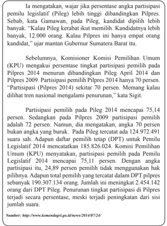

> **Deskripsi Visual:** Gambar ini adalah diagram yang menunjukkan partisipasi pemilih pada Pilpres dan Pileg tahun 2014 serta perbandingan dengan Pilpres 2009. Diagram ini terdiri dari dua bagian: Pilpres 2014 dan Pileg 2014. Untuk Pilpres 2014, partisipasi mencapai 75,14 persen, sedangkan untuk Pileg 2014, partisipasi mencapai 72 persen. Untuk Pilpres 2009, partisipasi mencapai 77,2 persen, sedangkan untuk Pileg 2009, partisipasi mencapai 72 persen. Diagram ini juga menunjukkan perbedaan partisipasi antara Pilpres dan Pileg, dengan Pilpres memiliki partisipasi yang lebih tinggi dibandingkan Pileg.

Nah,  setelah  Anda  mencermati  berita  tersebut,  jawablah  pertanyaan  di bawah ini.

- Mengapa  partisipasi  pemilih  pada  Pemilihan  Presiden  (Pilpres)  2014 mengalami penurunan dibandingkan dengan angka partisipasi pada saat Pemilu Legislatif (Pileg) 2014?
- Berdasarkan berita tersebut, jumlah pemilih yang tidak memberikan hak pilihnya (golongan putih/Golput) pada Pilpres 2014 sebesar 30 %. Angka tersebut meningkat dibandingkan dengan Pilpres 2014 (27,7%) dan Pilpres 2004 (24%). Berkaitan dengan hal tersebut, coba Anda identi fi kasi faktorfaktor yang menyebabkan meningkatnya angka Golput tersebut!

 

---
## 📄 Halaman 15

- Apakah  Golput  dapat  dikatakan  sebagai  bentuk  pelanggaran  hak  dan pengingkaran kewajiban warga negara?
- Menurut Anda, apa dampak terburuk ketika tingkat partisipasi  rakyat pada pemilihan umum terus mengalami penurunan?
- Coba Anda rumuskan solusi untuk mencegah terus menurunnya tingkat partisipasi rakyat pada kegiatan pemilihan umum!

### A. Makna Hak dan Kewajiban Warga Negara

Hak merupakan semua hal yang Anda peroleh atau dapatkan. Hal tersebut dapat  berbentuk  kewenangan  atau  kekuasaan  untuk  melakukan  sesuatu. Setiap hak yang diperoleh merupakan akibat dari dilaksanakannya kewajiban. Dengan kata lain, hak baru bisa diperoleh apabila kewajiban sudah dilakukan. Misalnya, seorang pegawai berhak mendapatkan upah, apabila sudah melaksanakan tugas atau pekerjaan yang dibebankan kepadanya.

Pada pembelajaran di kelas XI, Anda sudah diperkenalkan dengan konsep hak  asasi  manusia.  Menurut  Anda,  sama  atau  tidak  makna  HAM  dengan konsep hak warga negara? Untuk mengetahui jawabanya, coba Anda cermati uraian materi berikut ini.

Hak asasi manusia adalah hak yang melekat pada diri setiap pribadi  manusia.  Karena  itu,  hak asasi  manusia    itu  berbeda  dari pengertian hak warga negara. Hak warga negara merupakan seperangkat hak yang melekat dalam diri manusia dalam kedudukannya sebagai anggota dari sebuah  negara.  Hak  asasi  sifatnya universal,  tidak  terpengaruh  status kewarganegaraan  seseorang. Akan tetapi,  hak  warga  negara  dibatasi oleh status kewarganegaraannya. Dengan  kata  lain,    tidak  semua hak warga negara adalah hak

### Info Kewarganegaraan

Hak warga negara Indonesia meliputi hak konstitusional dan hak hukum. Hak konstitutional adalah hak-hak yang dijamin di dalam dan oleh UUD NRI Tahun 1945 (UUD NRI Tahun 1945), sedangkan hak-hak hukum  timbul berdasarkan jaminan undangundang dan peraturan perundangundangan di bawahnya.

asasi manusia. Akan tetapi dapat dikatakan bahwa semua hak asasi manusia juga merupakan hak warga negara. Misalnya hak setiap warga negara untuk menduduki jabatan dalam pemerintahan Republik Indonesia adalah hanya hak warga negara Indonesia saja ketentuan ini,  tidak  berlaku  bagi    orang  yang bukan warga negara Indonesia.

 

---
## 📄 Halaman 16

Bagaimana  dengan  konsep  kewajiban  warga  negara?  Kewajiban  secara sederhana  dapat  diartikan  sebagai  segala  sesuatu  yang  harus  dilaksanakan dengan penuh tanggung jawab. Dengan demikian, kewajiban warga negara dapat diartikan sebagai tindakan atau perbuatan yang harus dilakukan oleh seorang  warga  negara  sebagaimana  diatur  dalam  ketentuan  perundangundangan yang berlaku. Apa yang membedakannya dengan kewajiban asasi?

Kewajiban asasi  merupakan  kewajiban  dasar  setiap  orang.  Dengan  kata lain,  kewajiban  asasi  terlepas  dari    status  kewarganegaraan  yang  dimiliki oleh  orang  tersebut.  Sementara  itu,  kewajiban  warga  negara  dibatasi  oleh status  kewarganegaraan  seseorang.  Akan  tetapi,  konsep  kewajiban  warga negara  memiliki  cakupan  yang  lebih  luas,  karena  meliputi  pula  kewajiban asasi. Misalnya, di Indonesia menghormati hak hidup merupakan kewajiban setiap orang terlepas apakah ia warga negara Indonesia atau bukan. Adapun kewajiban bela negara hanya merupakan kewajiban warga negara Indonesia, sementara warga negara asing tidak dikenakan kewajiban tersebut.

Hak dan kewajiban warga negara merupakan dua hal yang saling berkaitan. Keduanya  memiliki  hubungan  kausalitas atau hubungan  sebab  akibat. Seseorang mendapatkan  hak  karena  kewajibannya  dipenuhi. Misalnya, seorang  pekerja  mendapatkan  upah,  setelah  melaksanakan  pekerjaan  yang menjadi  kewajibannya.  Selain  itu,  hak  yang  didapatkan  seseorang  sebagai akibat  dari  kewajiban  yang  dipenuhi  oleh  orang  lain.  Misalnya,  seorang pelajar mendapatkan ilmu pengetahuan pada mata pelajaran tertentu, sebagai salah satu akibat dari dipenuhinya kewajiban oleh guru, yaitu melaksanakan kegiatan pembelajaran di kelas.

Hak  dan  kewajiban  warga  negara  juga  tidak  dapat  dipisahkan  karena bagaimanapun dari kewajiban itulah muncul hak dan begitupun sebaliknya. Akan  tetapi,  sering  terjadi  pertentangan  karena  hak  dan  kewajiban  tidak seimbang. Misalnya, setiap warga  negara berhak atas perkerjaan dan penghidupan  yang  layak.  Meski  menjadi  hak,  tetapi  pada  kenyataannya, banyak  warga  negara  belum  merasakan  kesejahteraan  dalam  menjalani kehidupannya.  Hal  ini  disebabkan  oleh  ketidakseimbangan  antara  hak  dan kewajiban.  Apabila  keseimbangan  itu  tidak  ada  akan  terjadi  kesenjangan sosial yang berkepanjangan.

 

---
## 📄 Halaman 17

### Tugas Mandiri 1.1

- Bacalah  buku  atau  sumber  lain  yang  ada  kaitannya  dengan  materi pembelajaran  pada  bab  ini.  Kemudian  coba  identi fi kasi  tiga  pengertian hak dan kewajiban warga negara menurut para pakar/ahli. Tuliskan hasil identi fi kasi Anda dalam tabel di bawah ini.
- Berdasarkan  pendapat-pendapat  para  pakar  yang  Anda  temukan,  coba Anda analisis persamaan dan perbedaannya.
- Coba Anda rumuskan  makna hak dan kewajiban warga negara berdasarkan pendapat sendiri.

---
**📊 Tabel**

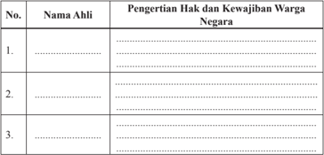

Tabel ini berisi informasi tentang pengertian hak dan kewajiban warga negara untuk tiga individu yang diidentifikasi sebagai Nama Ahli. Kolom pertama menunjukkan nomor urut masing-masing individu, sedangkan kolom kedua menyediakan ruang untuk menuliskan nama mereka. Kolom ketiga memberikan penjelasan tentang pengertian hak dan kewajiban warga negara bagi setiap individu tersebut. Topik utama tabel ini adalah pemahaman tentang hak dan kewajiban warga negara, dengan fokus pada tiga orang yang diidentifikasi sebagai Nama Ahli. Data atau pola penting yang terlihat adalah bahwa tabel ini mencakup tiga individu yang memiliki pengertian yang berbeda terhadap hak dan kewajiban mereka sebagai warga negara.

### B. Substansi  Hak dan Kewajiban Warga Negara dalam Pancasila

Pancasila merupakan ideologi yang mengedepankan nilai-nilai kemanusiaan. Pancasila  sangat  menghormati  hak  dan  kewajiban  setiap  warga  negara. Bagaimana  Pancasila  mengatur  hak  dan  kewajiban  setiap  warga  negara? Pancasila  menjamin  hak  asasi  manusia  melalui  nilai-nilai  yang  terkandung di  dalamnya.  Nilai-nilai  Pancasila  dapat  dikategorikan  menjadi  tiga,  yaitu nilai dasar, nilai instrumental, dan nilai praksis. Ketiga nilai tersebut secara langsung ataupun tidak langsung mengatur hak dan kewajiban warga negara sebagaimana dipaparkan berikut ini.

 

---
## 📄 Halaman 18

### 1. Hak  dan  Kewajiban  Warga  Negara  dalam  Nilai  Dasar  Sila-Sila Pancasila

Nilai  dasar  berkaitan  dengan  hakikat    kelima  sila  Pancasila,  yaitu:  nilai ketuhanan,  nilai  kemanusiaan,  nilai  persatuan,  nilai  kerakyatan,  dan  nilai keadilan. Nilai-nilai dasar tersebut bersifat universal, sehingga di dalamnya terkandung cita-cita, tujuan, serta nilai-nilai yang baik dan benar. Selain itu, nilai ini bersifat tetap dan melekat pada kelangsungan hidup negara.

Hubungan antara hak dan kewajiban warga negara dengan Pancasila dapat dijabarkan secara singkat sebagai berikut.

- Sila Ketuhanan Yang Maha Esa menjamin hak warga negara untuk bebas memeluk agama sesuai dengan kepercayaannya serta melaksanakan ibadah sesuai  dengan  ajaran  agamanya  masing-masing.  Sila  pertama  ini  juga menggariskan beberapa kewajiban  warga negara untuk:
- membina kerja sama dan tolong-menolong dengan pemeluk agama lain sesuai dengan situasi dan kondisi di lingkungan masing-masing;
- mengembangkan  toleransi  antarumat  beragama  menuju  terwujudnya kehidupan yang serasi, selaras, dan seimbang; serta
- tidak memaksakan suatu agama dan kepercayaan kepada orang lain.
- Sila Kemanusiaan yang Adil dan Beradab menempatkan hak setiap warga negara pada kedudukan yang sama dalam hukum serta memiliki hak-hak yang  sama  untuk  mendapat  jaminan  dan  perlindungan  hukum. Adapun kewajiban warga negara yang tersirat  dalam  sila  kedua  ini  di  antaranya kewajiban untuk:
- memperlakukan  orang  lain  sesuai  harkat  dan  martabatnya  sebagai makhluk ciptaan Tuhan Yang Maha Esa;
- mengakui  persamaan  derajat,  hak,  dan  kewajiban  setiap  manusia tanpa membeda-bedakan suku, keturunan, agama, jenis kelamin, dan sebagainya;
- mengembangkan  sikap  saling  mencintai  sesama  manusia,  tenggang rasa, dan tidak semena-mena kepada orang lain; serta
- melakukan berbagai kegiatan kemanusiaan.
- Sila  Persatuan  Indonesia  menjamin  hak-hak  setiap  warga  negara  dalam keberagaman  yang  terjadi  kepada  masyarakat  Indonesia  seperti  hak mengembangkan budaya daerah untuk memperkaya budaya nasional. Sila ketiga mengamanatkan kewajiban setiap warga negara untuk:

 

---
## 📄 Halaman 19

- menempatkan  kepentingan  bangsa  dan  negara  di  atas  kepentingan pribadi atau golongan;
- sanggup dan rela berkorban untuk kepentingan bangsa dan negara;
- mencintai tanah air dan bangsa Indonesia;
- mengembangkan persatuan Indonesia atas dasar Bhinneka Tunggal Ika; serta
- memajukan pergaulan demi persatuan dan kesatuan bangsa.
- Sila  Kerakyatan  yang  Dipimpin  oleh  Hikmat  Kebijaksanaan  dalam Permusyawaratan /Perwakilan dicerminkan dalam kehidupan pemerintahan, bernegara,  dan  bermasyarakat  yang  demokratis.  Sila  keempat  menjamin partisipasi politik warga negara yang diwujudkan dalam bentuk kebebasan berpendapat  dan  berorganisasi  serta  hak  berpartisipasi  dalam  pemilihan umum. Sila keempat mengamanatkan setiap warga negara untuk:
- mengutamakan  musyawarah  mufakat  dalam  setiap pengambilan keputusan;
- tidak memaksakan kehendak kepada orang lain; dan
- memberikan  kepercayaan  kepada  wakil-wakil  rakyat  yang  telah terpilih  untuk  melaksanakan  musyawarah  dan  menjalankan  tugas sebaik-baiknya.

---
**🖼️ Gambar/Diagram**

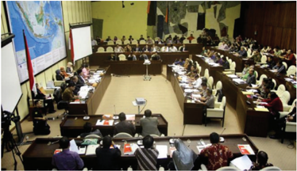

> **Deskripsi Visual:** Gambar ini menunjukkan sebuah pertemuan multilateral di sebuah gedung konferensi besar. Di tengah ruangan, terdapat meja panjang dengan beberapa kursi di sepanjang setiap sisi. Seorang presiden sedang berbicara kepada para delegasi yang duduk di sebelah kanan dan kiri meja. Di belakang mereka, terdapat papan tulis besar yang menunjukkan peta dunia dan beberapa negara. Di sebelah kiri, terdapat dua proyektor yang menampilkan gambar atau presentasi. Semua elemen ini menunjukkan bahwa ini adalah pertemuan diplomatik atau politik antar negara-negara.

Sumber

: www.dpr.go.id

 

---
## 📄 Halaman 20

- Sila  Keadilan  Sosial  bagi  Seluruh  Rakyat  Indonesia  mengakui  hak milik perorangan dan dilindungi pemanfaatannya  oleh  negara  serta memberi  kesempatan  sebesar-besarnya  kepada  masyarakat.  Sila  kelima mengamanatkan setiap warga negara untuk:
- mengembangkan  sikap  gotong  royong  dan  kekeluargaan  dengan masyarakat di lingkungan sekitar;
- tidak melakukan perbuatan yang merugikan kepentingan umum; dan
- suka bekerja keras.

### Tugas Mandiri 1.2

Identi fi kasi  jenis  hak  dan  kewajiban  warga  negara  yang  terkait  dengan setiap sila Pancasila. Tuliskan hasil identi fi kasimu dalam tabel di bawah ini dan presentasikan di depan kelas!

---
**📊 Tabel**

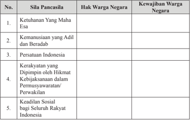

Tabel ini menunjukkan hubungan antara sila-sila Pancasila dengan hak dan kewajiban warga negara di Indonesia. Topik utama tabel ini adalah sila-sila Pancasila dan bagaimana mereka berinteraksi dengan hak dan kewajiban warga negara. Kolom pertama berisi sila-sila Pancasila, kolom kedua berisi hak warga negara, dan kolom ketiga berisi kewajiban warga negara. Data penting yang terlihat adalah bahwa semua sila-sila Pancasila memiliki hubungan dengan hak dan kewajiban warga negara, menunjukkan bahwa Pancasila merupakan dasar bagi keadilan dan kesejahteraan masyarakat Indonesia.

### 2.  Hak dan Kewajiban Warga Negara dalam Nilai Instrumental Sila-Sila Pancasila

Nilai  instrumental  pada  dasarnya  merupakan  penjabaran  dari  nilai-nilai dasar yang terkandung dalam Pancasila. Perwujudan nilai instrumental pada umumnya berbentuk ketentuan-ketentuan konstitusional mulai dari undangundang dasar sampai dengan peraturan daerah. Pada bagian ini, Anda akan diajak untuk menganalisis keberadaan hak dan kewajiban warga negara dalam UUD NRI Tahun 1945.

 

---
## 📄 Halaman 21

Apabila Anda telaah UUD NRI Tahun 1945, baik naskah sebelum ataupun setelah perubahan, Anda akan  mudah menemukan ketentuan mengenai warga negara  dengan  segala  hal  yang  melekat  pada  dirinya.  Ketentuan  tersebut dapat Anda identi fi kasi mulai dari Pasal 26 sampai Pasal 34. Dalam ketentuan tersebut, diatur mengenai jenis hak dan kewajiban warga negara Indonesia. Berikut  ini  diuraikan  beberapa  jenis  hak  dan  kewajiban  yang  diatur  dalam UUD NRI Tahun 1945.

### a.  Hak atas Kewarganegaraan

Siapakah yang menjadi warga negara dan penduduk Indonesia? Pasal 26 ayat  (1)  dan  (2)  dengan  tegas  menjawab  pertanyaan  tersebut.  Berdasarkan ketentuan pasal tersebut, yang menjadi warga negara ialah orang-orang bangsa Indonesia asli dan orang-orang bangsa lain yang disahkan dengan undangundang sebagai warga negara. Adapun yang menjadi penduduk Indonesia ialah warga negara Indonesia dan orang asing yang bertempat tinggal di Indonesia. Pasal 26 merupakan jaminan atas hak setiap orang untuk mendapatkan status kewarganegaraannya yang tidak dapat dicabut secara semena-mena.

### b.  Kesamaan Kedudukan dalam Hukum dan Pemerintahan

Negara  Republik  Indonesia  menganut  asas  bahwa  setiap  warga  negara mempunyai  kedudukan  yang  sama  dihadapan  hukum  dan  pemerintahan. Pasal  27  ayat  (1)  menyatakan  bahwa 'Segala  warga  negara  bersamaan kedudukannya  di  dalam  hukum  dan  pemerintahan  dan  wajib  menjunjung hukum  dan  pemerintahan  itu  dengan  tidak  ada  kecualinya' . Hal ini menunjukkan  adanya  keseimbangan  antara  hak  dan  kewajiban  dan  tidak adanya diskriminasi di antara warga negara mengenai kedua hal ini. Pasal 27 ayat (1) merupakan jaminan  hak warga negara atas kedudukan sama dalam hukum dan pemerintahan,  serta  merupakan  kewajiban  warga  negara  untuk menjunjung hukum dan pemerintahan.

### c.  Hak atas Pekerjaan dan Penghidupan yang Layak Bagi Kemanusiaan

Pasal  27  ayat  (2)  menyatakan  bahwa 'Tiap-tiap  warga  negara  berhak atas pekerjaan dan penghidupan yang layak bagi kemanusiaan'. Berbagai peraturan perundang-undangan yang mengatur hal ini, seperti yang terdapat dalam  undang-undang  agraria,  perkoperasian,  penanaman  modal,  sistem pendidikan nasional, tenaga kerja,  perbankan, dan sebagainya yang bertujuan menciptakan  lapangan  kerja  agar  warga  negara  memperoleh  penghidupan layak.

 

---
## 📄 Halaman 22

Sumber

: http://www.tempo.co/read/news

Gambar 1.2 Setiap warga negara berhak atas pekerjaan dan penghidupan yang layak

### d.  Hak dan kewajiban bela negara

Pasal 27 ayat (3) menyatakan bahwa 'Setiap warga negara berhak dan wajib ikut serta dalam upaya pembelaan negara'. Ketentuan tersebut menegaskan hak dan kewajiban warga negara menjadi sebuah kesatuan. Dengan kata lain, upaya pembelaan negara merupakan hak sekaligus menjadi kewajiban dari setiap warga negara Indonesia.

### e.  Kemerdekaan Berserikat dan Berkumpul

Pasal 28 menetapkan hak warga negara untuk berserikat dan berkumpul, serta  mengeluarkan  pikiran  secara  lisan  maupun  tulisan,  dan  sebagainya. Dalam ketentuan ini,  terdapat  tiga  hak  warga  negara,  yaitu  hak  kebebasan berserikat, hak kebebasan berkumpul, serta hak kebebasan untuk berpendapat. Dalam melaksanakan ketiga hak tersebut, setiap warga negara berkewajiban mematuhi berbagai ketentuan yang mengaturnya.

Sumber

: http://www.pikiran-rakyat.com

Gambar 1.3 Setiap warga negara berhak berkumpul, mengemukakan pendapat dan pikirannya

 

---
## 📄 Halaman 23

### f.  Kemerdekan Memeluk Agama

Pasal 29 ayat (1) menyatakan  bahwa 'Negara berdasar atas Ketuhanan Yang  Maha  Esa' .  Ketentuan  ayat  ini  menyatakan  kepercayaan  bangsa Indonesia  terhadap  Tuhan  Yang  Maha  Esa.  Kemudian  Pasal  29  ayat  (2) menyatakan 'Negara  menjamin  kemerdekaan  tiap-tiap  penduduk  untuk memeluk agamanya masing-masing dan untuk beribadat menurut agamanya dan kepercayaannya itu' . Hal ini merupakan hak warga negara atas kebebasan beragama. Dalam konteks kehidupan bangsa Indonesia, kebebasan beragama ini  tidak  diartikan  bebas  tidak  beragama,  tetapi  bebas  untuk  memeluk  satu agama  sesuai  dengan  keyakinan  masing-masing,  serta  bukan  berarti  pula bebas untuk mencampuradukkan ajaran agama.

### Penanaman Kesadaran Berkonstitusi

Keseimbangan antara hak dan kewajiban dapat diwujudkan  dengan cara  mengetahui  posisi  diri  kita  sendiri.  Sebagai  seorang  warga  negara kita  harus  tahu  hak  dan  kewajiban  kita.  Laksanakan  apa  yang  menjadi kewajiban  kita  serta  perjuangkan  apa  yang  menjadi  hak  kita.  Seorang pejabat atau pemerintah pun harus tahu akan hak dan kewajibannya. Seperti yang sudah tercantum dalam hukum dan aturan-aturan yang berlaku. Jika hak dan kewajiban seimbang dan terpenuhi, kehidupan masyarakat akan aman sejahtera.

### g.  Pertahanan dan Keamanan Negara

Pertahanan dan keamanan negara dalam UUD NRI Tahun 1945 dinyatakan dalam bentuk hak dan kewajiban yang dirumuskan dalam Pasal 30 ayat (1) dan (2).    Ketentuan  tersebut  menyatakan  hak  dan  kewajiban  warga  negara untuk ikut serta dalam usaha pertahanan dan keamanan negara.

Sumber : http://visitpAndaan.wordpress.com

 

---
## 📄 Halaman 24

### h.  Hak Mendapat Pendidikan

Salah  satu  tujuan  Negara  Kesatuan  Republik  Indonesia  tecermin  dalam alinea keempat Pembukaan UUD NRI Tahun 1945, yaitu pemerintah negara Indonesia  antara  lain  berkewajiban  mencerdaskan  kehidupan  bangsa.  Pasal 31 ayat (1) UUD NRI Tahun 1945 menetapkan bahwa ' Setiap warga negara berhak  mendapat  pendidikan' .  Ketentuan  ini  merupakan  penegasan  hak warga negara untuk mendapatkan pendidikan. Selanjutnya, Pasal 31 ayat (2) ditegaskan bahwa ' Setiap warga negara wajib mengikuti pendidikan dasar dan pemerintah wajib membiayainya' .  Pasal ini merupakan penegasan atas kewajiban warga negara untuk mengikuti pendidikan dasar. Untuk maksud tersebut,  Pasal  31  ayat  (3)  UUD  NRI Tahun  1945  mewajibkan  pemerintah mengusahakan dan menyelenggarakan satu sistem pendidikan nasional, yang meningkatkan  keimanan  dan  ketakwaan  serta  akhlak  mulia  dalam  rangka mencerdaskan kehidupan bangsa.

### i.  Kebudayaan Nasional Indonesia

Pasal  32  ayat  (1)  UUD  NRI  Tahun  1945  menetapkan  bahwa 'Negara memajukan  kebudayaan  nasional  Indonesia  di  tengah  peradaban  dunia dengan menjamin kebebasan masyarakat  dalam  memelihara  dan  mengembangkan nilai-nilai budayanya' . Hal ini merupakan penegasan atas jaminan hak warga negara untuk mengembangkan nilai-nilai budayanya. Kemudian, dalam Pasal 32 ayat (2), disebutkan ' Negara menghormati dan memelihara bahasa daerah  sebagai  kekayaan  budaya  nasional' .  Ketentuan  ini  merupakan jaminan  atas  hak  warga  negara  untuk  mengembangkan  dan  menggunakan bahasa daerah sebagai bahasa pergaulan.

---
**🖼️ Gambar/Diagram**

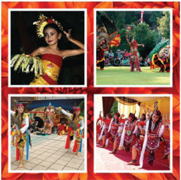

> **Deskripsi Visual:** Gambar ini adalah ilustrasi yang menampilkan berbagai karakter dan adegan dari sebuah cerita atau film. Ilustrasi ini terdiri dari empat bagian yang masing-masing menunjukkan karakter dengan kostum dan aksesoris yang unik. Setiap karakter memiliki pose dan ekspresi yang berbeda, menunjukkan keunikan mereka dalam cerita tersebut.

Elemen-elemen utama dalam ilustrasi ini meliputi karakter-karakter yang diperankan oleh para aktor, kostum yang dipakai oleh mereka, dan adegan-adegan yang mereka lakukan. Setiap karakter memiliki kostum yang berbeda-beda, mencerminkan peran dan karakteristik mereka dalam cerita. Adegan-adegan juga sangat detail, menunjukkan aksi dan interaksi antara karakter-karakter tersebut.

Teks, angka, atau label penting tidak terlihat dalam gambar ini karena ia hanya mengandung ilustrasi tanpa teks atau angka. Namun, informasi kunci yang dapat diambil pembaca meliputi jenis genre film atau cerita yang ditampilkan, serta penampilan dan karakteristik karakter-karakter yang ada dalam cerita tersebut.

Dalam satu paragraf yang informatif, gambar ini menunjukkan berbagai karakter dan adegan dari sebuah cerita atau film, dengan kostum dan aksesoris yang unik serta adegan-adegan yang menunjukkan keunikan karakter-karakter tersebut.

Sumber : hƩ   p://jenisbudayaindonesia.blogspot. com

 

---
## 📄 Halaman 25

### j.  Perekonomian Nasional

Pasal 33 UUD NRI Tahun 1945 mengatur tentang perekonomian nasional. Pasal 33 terdiri atas lima ayat, yaitu sebagai berikut.

- Perekonomian disusun sebagai usaha bersama berdasar atas asas kekeluargaan.
- Cabang-cabang produksi yang penting bagi negara dan yang menguasai hajat hidup orang banyak dikuasai oleh negara.
- Bumi dan air dan kekayaan alam yang terkandung di dalamnya dikuasai oleh negara dan dipergunakan untuk sebesar-besar kemakmuran rakyat.
- Perekonomian nasional diselenggarakan berdasar atas demokrasi ekonomi dengan prinsip kebersamaan, e fi siensi berkeadilan, berkelanjutan, berwawasan lingkungan, kemandirian, serta dengan menjaga keseimbangan kemajuan dan kesatuan ekonomi nasional.
- Ketentuan  lebih  lanjut  mengenai  pelaksanaan  pasal  ini  diatur  dalam undang-undang.
Ketentuan Pasal 33 ini merupakan jaminan hak warga negara atas usaha perekonomian dan hak warga negara untuk mendapatkan kemakmuran.

### k.  Kesejahteraan Sosial

Masalah  kesejahteraan  sosial  dalam  UUD  RI  Tahun  1945  diatur  dalam Pasal 34. Pasal ini terdiri atas empat ayat, yaitu sebagai berikut.

- Fakir miskin dan anak-anak yang terlantar dipelihara oleh negara.
- Negara mengembangkan sistem jaminan sosial bagi seluruah rakyat dan memberdayakan masyarakat yang lemah dan tidak mampu sesuai dengan martabat kemanusiaan.
- Negara bertanggung jawab atas penyediaan fasilitas pelayanan kesehatan dan fasilitas pelayanan umum yang layak.
- Ketentuan  lebih  lanjut  mengenai  pelaksanaan  pasal  ini  diatur  dalam undang-undang.
Pasal 34 UUD NRI Tahun 1945 memancarkan semangat untuk mewujudkan keadilan  sosial.  Ketentuan  dalam  pasal  ini  memberikan  jaminan  atas  hak warga negara untuk mendapatkan kesejahteraan sosial yang terdiri atas hak mendapatkan jaminan sosial, hak mendapatkan jaminan kesehatan, dan hak mendapatkan fasilitas umum yang layak.

 

---
## 📄 Halaman 26

### Tugas Mandiri 1.3

Nah, setelah membaca uraian materi di atas, identi fi kasi perwujudan hak dan kewajiban warga negara yang diatur dalam UUD NRI Tahun 1945. Tuliskan hasil identi fi kasimu dalam tabel di bawah ini. Infomasikan temuanmu kepada teman-teman yang lain.

### Perwujudan Hak Warga Negara

---
**📊 Tabel**

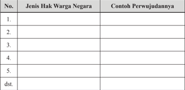

Tabel ini berisi informasi tentang jenis hak warga negara dan contoh perwujudannya. Topik utamanya adalah hak-hak yang dimiliki oleh warga negara Indonesia. Kolom pertama menunjukkan nomor urut dari setiap jenis hak, sedangkan kolom kedua menyajikan nama atau deskripsi dari jenis hak tersebut. Kolom ketiga berisi contoh perwujudan dari setiap jenis hak. Dari tabel ini, dapat dilihat bahwa setiap jenis hak memiliki contoh yang spesifik untuk memperjelas pengertiannya. Misalnya, hak atas pendidikan meliputi akses ke sekolah, pembelajaran yang berkualitas, dan lain-lain. Hal ini membantu dalam memahami lebih baik tentang hak-hak yang dimiliki oleh warga negara Indonesia.

### Perwujudan Kewajiban Warga Negara

---
**📊 Tabel**

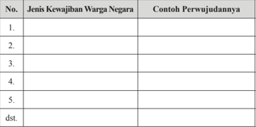

Tabel ini berisi informasi tentang jenis-jenis kewajiban warga negara dan contoh perwujudannya. Topik utamanya adalah tentang kewajiban warga negara di Indonesia. Kolom pertama berisi nama-nama jenis kewajiban warga negara, sedangkan kolom kedua berisi contoh perwujudannya. Data penting yang terlihat adalah bahwa setiap jenis kewajiban memiliki contoh yang spesifik, seperti kewajiban untuk membayar pajak, ikut memilih pemimpin, dan lain-lain. Tabel ini membantu kita memahami lebih baik tentang kewajiban yang harus dilakukan oleh setiap warga negara di Indonesia.

 

---
## 📄 Halaman 27

### 3. Hak  dan  Kewajiban  Warga  Negara  dalam  Nilai  Praksis  Sila-Sila Pancasila

Nilai  praksis  pada  hakikatnya  merupakan  perwujudan  dari  nilai-nilai instrumental. Dengan  kata  lain, nilai praksis merupakan  realisasi  dari ketentuan-ketentuan  yang  termuat  dalam  peraturan  perundang-undangan yang terwujud dalam sikap dan tindakan sehari-hari. Nilai praksis Pancasila senantiasa berkembang dan selalu dapat dilakukan perubahan dan perbaikan sesuai perkembangan zaman dan aspirasi masyarakat. Hal tersebut dikarenakan Pancasila sebagai ideologi yang terbuka.

Hak  dan  kewajiban  warga  negara  dalam  nilai  praksis  Pancasila  dapat terwujud apabila nilai-nilai dasar dan instrumental dari Pancasila itu sendiri dapat dilaksanakan dalam kehidupan sehari-hari oleh seluruh warga negara. Oleh sebab itu, setiap warga negara harus menunjukkan sikap positif dalam kehidupan sehari-hari. Adapun sikap positif tersebut di antaranya dapat Anda lihat dalam tabel di bawah ini.

---
**📊 Tabel**

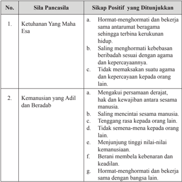

Tabel ini menunjukkan hubungan antara sila-sila Pancasila dengan sikap positif yang ditunjukkan. Topik utamanya adalah bagaimana sila-sila Pancasila mempengaruhi sikap positif dalam kehidupan sehari-hari. Kolom pertama berisi sila-sila Pancasila, sedangkan kolom kedua berisi sikap positif yang ditunjukkan oleh masyarakat. Data penting yang terlihat adalah bahwa semua sila-sila Pancasila memiliki dampak positif pada sikap masyarakat, seperti hormat-menghormati dan bekerja sama, saling menghormati kebebasan, tidak memaksa suatu agama, dan lainnya. Ini menunjukkan bahwa Pancasila tidak hanya menjadi dasar negara, tetapi juga menjadi prinsip yang diterapkan dalam kehidupan sehari-hari.

 

---
## 📄 Halaman 28

---
**📊 Tabel**

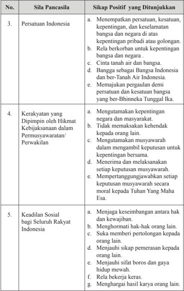

Tabel ini berisi informasi tentang sikap positif yang ditunjukkan oleh prinsip-prinsip Pancasila, terutama pada sila-sila Persatuan Indonesia, Kerakyatan yang Dipimpin oleh Hikmat Kebijaksanaan dalam Permusyawaratan/Perwakilan, dan Keadilan Sosial bagi Seluruh Rakyat Indonesia. Topik utama tabel adalah sikap positif yang diungkapkan oleh prinsip-prinsip Pancasila tersebut. Kolom pertama menunjukkan nomor sila Pancasila, sementara kolom kedua menunjukkan sikap positif yang ditunjukkan oleh prinsip-prinsinya. Data penting yang terlihat adalah bahwa semua sila Pancasila memiliki beberapa poin yang mencerminkan sikap positif, seperti persatuan, kerakyatan, dan keadilan sosial. Ini menunjukkan bahwa semua prinsip Pancasila memiliki aspek positif yang dapat diterapkan dalam kehidupan sehari-hari.

 

---
## 📄 Halaman 29

### C. Kasus Pelanggaran Hak dan Pengingkaran Kewajiban Warga Negara

### 1. Penyebab Terjadinya Pelanggaran Hak dan Pengingkaran Kewajiban Warga Negara

Pelanggaran  hak  warga  negara  terjadi  ketika  warga  negara  tidak  dapat menikmati  atau  memperoleh  haknya  sebagaimana  yang  ditetapkan  oleh undang-undang. Pelanggaran hak warga negara merupakan akibat dari adanya pelalaian  atau  pengingkaran  terhadap  kewajiban  baik  yang  dilakukan  oleh pemerintah maupun oleh warga negara sendiri. Misalnya, kemiskinan yang masih  menimpa  sebagian  masyarakat  Indonesia.  Hal  itu  dapat  disebabkan program  pembangunan  tidak  berjalan  sebagaimana  mestinya.  Atau,  bisa juga disebabkan oleh perilaku warga negara sendiri yang tidak mempunyai keterampilan sehingga kesulitan mendapatkan pekerjaan yang layak.

Pelanggaran hak dan pengingkaran kewajiban warga negara di antaranya disebabkan oleh faktor-faktor berikut.

Sikap ini akan menyebabkan seseorang selalu menuntut haknya, sementara kewajibannya sering diabaikan. Seseorang yang mempunyai sikap seperti ini akan menghalalkan segala cara supaya haknya bisa terpenuhi, meskipun

- Sikap egois atau terlalu mementingkan diri sendiri. caranya tersebut dapat melanggar hak orang lain.
- Rendahnya kesadaran berbangsa dan bernegara.
Hal  ini  akan  menyebabkan  pelaku  pelanggaran  berbuat  seenaknya. Pelaku tidak mau tahu bahwa orang lain pun mempunyai hak yang harus dihormati.  Sikap  tidak  mau  tahu  ini  berakibat  muncul  perilaku  atau tindakan penyimpangan terhadap hak dan kewajiban warga negara.

- Sikap tidak toleran.
Sikap ini akan menyebabkan munculnya saling tidak menghargai dan tidak menghormati atas kedudukan atau keberadaan orang lain. Sikap ini pada akhirnya  akan  mendorong  orang  untuk  melakukan  pelanggaran  kepada orang lain.

- Penyalahgunaan kekuasaan.
Di dalam masyarakat terdapat banyak kekuasaan yang berlaku. Kekuasaan di  sini  tidak  hanya  menunjuk  pada  kekuasaan  pemerintah,  tetapi  juga bentuk-bentuk kekuasaan lain yang terdapat di dalam masyarakat. Salah

 

---
## 📄 Halaman 30

satu contohnya adalah kekuasaan di dalam perusahaan. Para pengusaha yang tidak memperdulikan hak-hak buruhnya jelas melanggar hak warga negara.  Oleh  karena  itu,  setiap  penyalahgunaan  kekuasaan  mendorong timbulnya pelanggaran hak dan kewajiban warga negara.

### e. Ketidaktegasan aparat penegak hukum.

Aparat  penegak  hukum  yang  tidak  bertindak  tegas  terhadap  setiap pelanggaran  hak  dan  pengingkaran  kewajiban  warga  negara,  tentu  saja akan  mendorong  timbulnya  pelanggaran  lainnya.  Penyelesaian  kasus pelanggaran yang tidak tuntas akan menjadi pemicu bagi munculnya kasuskasus lain. Para pelaku cenderung mengulangi perbuatannya, dikarenakan mereka tidak menerima sanksi yang tegas atas perbuatannya itu. Selain hal tersebut,  aparat  penegak  hukum yang bertindak sewenang-wenang juga merupakan bentuk pelanggaran terhadap hak warga negara dan menjadi contoh  yang  tidak  baik,  serta  dapat  mendorong  timbulnya  pelanggaran yang dilakukan oleh masyarakat.

- Penyalahgunaan teknologi.
Kemajuan  teknologi  dapat  memberikan  pengaruh  yang  positif,  tetapi bisa juga memberikan pengaruh negatif bahkan dapat memicu timbulnya kejahatan. Anda tentunya pernah mendengar terjadinya kasus penculikan yang  berawal  dari  pertemanan  dalam  jejaring  sosial.  Kasus  tersebut menjadi  bukti  apabila  kemajuan  teknologi  tidak  dimanfaatkan  untuk hal-hal yang sesuai aturan, tentu saja akan menjadi penyebab timbulnya pelangaran  hak  warga  negara.  Selain  itu  juga,  kemajuan  teknologi dalam  bidang  produksi  ternyata  dapat  menimbulkan  dampak  negatif, misalnya  munculnya  pencemaran  lingkungan  yang  bisa  mengakibatkan terganggunya kesehatan manusia.

### 2. Kasus Pelanggaran Hak Warga Negara

Anda  tentunya  pernah  melihat  para  anak  jalanan  sedang  mengamen  di perempatan jalan raya. Mungkin juga Anda pernah didatangi pengemis yang meminta sumbangan. Nah, anak jalanan dan pengemis merupakan salah satu golongan warga negara yang kurang beruntung, karena tidak bisa mendapatkan haknya secara utuh. Kondisi yang mereka alami salah satunya disebabkan oleh terjadinya pelanggaran terhadap hak mereka sebagai warga negara, misalnya pelanggaran terhadap hak mereka untuk mendapatkan pendidikan sehingga mereka menjadi putus sekolah dan akibatnya mereka menjadi anak jalanan.

 

---
## 📄 Halaman 31

---
**🖼️ Gambar/Diagram**

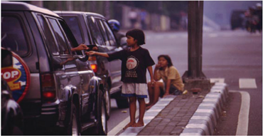

> **Deskripsi Visual:** Gambar ini adalah foto yang menunjukkan seorang anak kecil berdiri di pinggir jalan, sementara mobil SUV berhenti di depannya. Anak tersebut sedang memegang tangan remaja dewasa yang berdiri di dalam mobil. Mobil tersebut tampaknya telah berhenti untuk mengambil anak tersebut. Di latar belakang, terlihat beberapa pohon dan bangunan, serta beberapa orang lain yang juga berada di pinggir jalan. 

Elemen utama dalam gambar ini adalah anak kecil, mobil SUV, dan remaja dewasa di dalam mobil. Anak kecil tampaknya sedang berbicara dengan remaja dewasa, yang tampaknya sedang mengemudi mobil. Mobil SUV tampaknya berhenti di depan anak kecil, menunjukkan bahwa ia sedang mengambil anak tersebut.

Teks, angka, atau label penting tidak terlihat dalam gambar ini. Namun, informasi kunci yang dapat diambil dari gambar ini adalah hubungan antara anak kecil dan remaja dewasa, serta situasi di mana mobil SUV berhenti di pinggir jalan untuk mengambil anak tersebut.

Pelanggaran terhadap hak warga negara bisa kita lihat dari kondisi yang saat ini terjadi misalnya sebagai berikut.

- Proses  penegakan  hukum  masih  belum  optimal  dilakukan,  misalnya masih terjadi  kasus  salah  tangkap,  perbedaan  perlakuan  oknum    aparat penegak hukum terhadap para pelanggar hukum dengan dasar kekayaan atau  jabatan  masih  terjadi,  dan  sebagainya.  Hal  itu  merupakan  bukti bahwa amanat Pasal 27 ayat (1) UUD NRI Tahun 1945 yang menyatakan 'Segala  warga  negara  bersamaan  kedudukannya  di  dalam  hukum  dan pemerintahan dan wajib menjunjung hukum dan pemerintahan itu dengan tidak ada kecualinya' belum sepenuhnya dilaksanakan.
- Saat  ini,  tingkat  kemiskinan  dan  angka  pengangguran  di  negara  kita masih  cukup  tinggi,  padahal  Pasal  27  ayat  (2)  UUD  NRI  Tahun  1945 mengamanatkan  bahwa  'Tiap-tiap  warga  negara  berhak  atas  pekerjaan dan penghidupan yang layak bagi kemanusiaan'.
- Makin merebaknya kasus pelanggaran hak asasi manusia seperti pembunuhan, pemerkosaan, kekerasan dalam rumah tangga, dan sebagainya.  Padahal,  Pasal  28A-28J  UUD  NRI  Tahun  1945  menjamin keberadaan Hak Asasi Manusia.
- Masih  terjadinya  tindak  kekerasan  mengatasnamakan  agama,  misalnya penyerangan  tempat  peribadatan,  padahal  Pasal  29  ayat  (2)  UUD  NRI Tahun 1945  menegaskan bahwa 'negara menjamin kemerdekaan tiap-tiap penduduk untuk memeluk agamanya masing-masing dan untuk beribadat menurut agamanya dan kepercayaannya itu'.

 

---
## 📄 Halaman 32

- Angka putus sekolah yang cukup tinggi mengindikasikan belum terlaksana secara sepenuhnya amanat Pasal 31 ayat (1) UUD NRI Tahun 1945 yang menyatakan bahwa 'setiap warga negara berhak mendapat pendidikan'.
- Pelanggaran hak cipta, misalnya peredaran VCD/DVD bajakan, perilaku plagiat dalam membuat sebuah karya dan sebagainya.
Contoh-contoh yang diuraikan di atas membuktikan bahwa tidak terpenuhinya hak warga negara dikarenakan adanya kelalaian atau pengingkaran dalam pemenuhan kewajiban sebagaimana yang dipersyaratkan dalam UUD NRI Tahun 1945 dan ketentuan perundang-undangan lainnya. Hal-hal tersebut apabila tidak segera diatasi, dapat mengganggu kelancaran proses pembangunan yang sedang dilaksanakan.

### Tugas Kelompok 1.1

Bacalah berita di bawah ini bersama teman sebangkumu.

### Tingginya Angka Putus Sekolah Jadi Kendala Wajib Belajar 12 Tahun

Indonesia memiliki program  Wajib Belajar (Wajar) 12  Tahun.  Program  ini  mewajibkan  anak  bangsa  bisa melanjutkan  sekolah  hingga  SMA  atau  SMK.  Pemerintah melalui Kemendikbud juga telah meluncurkan program ini pada tahun pelajaran 2015/2016.

Direktur  Jenderal  Pendidikan  Dasar  dan  Menengah, Kementerian Pendidikan dan Kebudayaan (Dirjen Dikdasmen Kemendikbud), Hamid Muhammad menyatakan untuk  mencapai  program  Wajar  12  Tahun  memang  tidak mudah.  Menurut  dia,  salah  satu  kendala  yang  dihadapi adalah  tingginya  angka  putus  sekolah  di  tingkat  sekolah menengah.

Hamid mengungkapkan, sebanyak delapan persen anak Indonesia yang berhasil menyelesaikan sekolah menengah pertama  (SMP).  Namun,  sejumlah  siswa  itu  malah  tidak mampu melanjutkan pendidikannya ke tingkat selanjutnya.

 

---
## 📄 Halaman 33

Menurut Hamid, penyebab munculnya angka itu memiliki banyak  faktor.  Pertama,  kata  dia,  terkait  dengan  masalah kesejahteraan keluarga.

Selain itu, Hamid menjelaskan, rendahnya harapan siswa dan orang tua juga menjadi salah satu faktor kuat penyebab putusnya  sekolah.  Mereka,  lanjut  dia,  memiliki  harapan kecil  terhadap  efektivitas  sekolah  dalam  meningkatkan kesempatan bekerja.

Kebanyakan  anak  dan  orang  tua  di  Indonesia,  Hamid mengungkapkan, mereka lebih berpikir bahwa pendidikan tidak  memiliki  relevansi  dan  manfaat  yang  kuat  baginya. Oleh  karena  itu,  para  orangtua  pun  tidak  menyekolahkan anak mereka. Mereka lebih memilih anaknya untuk bekerja daripada melanjutkan sekolah.

'Kondisi  seperti  ini  jelas  tidak  mudah,'  ujar  Hamid kepada wartawan di Kantor Kemendikbud, Jakarta, Jumat (25/9/2015).

Sumber: http://nasional.republika.co.id/berita/nasional/umum/15/09/26/

Setelah membaca kasus di atas diskusikanlah dengan teman sebangkumu pertanyaan-pertanyaan di bawah ini.

- Mengapa faktor ekonomi dianggap sebagai penyebab utama meningkatnya angka putus sekolah?
- Apabila dikaitkan dengan Pancasila, kasus tersebut merupakan ketidaksesuaian dari sila keberapa? Berikan alasannya!
- Adakah  faktor  lain  selain  faktor  ekonomi  yang  menjadi  penyebab meningkatnya angka putus sekolah? Apabila ada, apa saja faktor tersebut?
- Pada saat ini, pemerintah telah mengeluarkan berbagai kebijakan untuk menanggulangi  permasalahan  ini,  di  antaranya  dengan  memberikan Bantuan Operasional Sekolah, beasiswa, sekolah gratis, dan sebagainya. Menurut  Anda,  apakah  upaya  pemerintah  tersebut sudah berhasil? Kemukakan indikator keberhasilannya.

 

---
## 📄 Halaman 34

- Selain pemerintah, siapa lagi yang bertanggung jawab untuk mengatasi masalah ini? Apa saja peran yang bisa ditampilkannya?
- Apa solusi yang Anda ajukan untuk mengatasi masalah ini? Bagaimana strateginya supaya solusi itu berhasil?
- Kemukakan bentuk pelanggaran hak warga negara yang pernah terjadi di daerahmu. Bagaimana solusi untuk menyelesaikannya?

### 3. Kasus Pengingkaran Kewajiban Warga Negara

Anda tentunya sering membaca slogan 'orang bijak taat pajak'. Slogan singkat  mempunyai  makna  yang  sangat  dalam,  yaitu  ajakan  kepada  setiap warga negara untuk memenuhi kewajibannya, salah satunya adalah membayar pajak. Kewajiban warga negara bukan hanya membayar pajak, tetapi masih banyak lagi bentuk lainnya seperti taat aturan, menjunjung tinggi pemerintahan, dan  bela  negara.  Kewajiban-kewajiban  tersebut  apabila  dilaksanakan  akan mendukung suksesnya program pembangunan di negara ini serta mendorong terciptanya keadilan, ketertiban, perdamaian, dan sebagainya.

Pada kenyataannya, saat ini, banyak  terjadi pengingkaran terhadap kewajiban-kewajiban warga negara. Dengan kata lain, warga negara banyak yang tidak melaksanakan kewajibannya sebagaimana yang telah ditetapkan oleh undang-undang. Pengingkaran tersebut biasanya disebabkan oleh tingginya sikap egoisme yang dimiliki oleh setiap warga negara sehingga yang ada di pikirannya hanya sebatas bagaimana cara mendapat haknya, sementara yang  menjadi  kewajibannya  dilupakan.  Selain  itu,  rendahnya  kesadaran hukum  warga  negara  juga  mendorong  terjadinya  pengingkaran  kewajiban oleh warga negara.

Pengingkaran  kewajiban  warga  negara  banyak  sekali  bentuknya,  mulai dari sederhana sampai yang berat, di antaranya adalah sebagai berikut.

- Membuang sampah sembarangan
- Melanggar aturan berlalu lintas, misalnya tidak memakai helm, mengemudi tetapi tidak mempunyai Surat Izin Mengemudi, tidak mematuhi ramburambu lalu lintas, berkendara tetapi tidak membawa Surat Tanda Nomor Kendaraan (STNK), dan sebagainya.
- Merusak fasilitas negara, misalnya mencorat-coret bangunan milik umum, merusak jaringan telepon.
- Tidak membayar pajak kepada negara, seperti pajak bumi dan bangunan, pajak kendaraan bermotor, retribusi parkir dan sebaganya.
- Tidak  berpartisipasi  dalam  usaha  pertahanan  dan  keamanan  negara, misalnya mangkir dari kegiatan siskamling.

 

---
## 📄 Halaman 35

Pengingkaran kewajiban tersebut apabila tidak segera diatasi akan berakibat pada proses pembangunan yang tidak lancar. Selain itu pengingkaran terhadap kewajiban  akan  berakibat  secara  langsung  terhadap  pemenuhan  hak  warga negara.

### Tugas Kelompok 1.2

Bacalah kasus di bawah ini bersama teman sebangkumu.

### Kesadaran Bayar Pajak Warga Masih Rendah

Direktur Jenderal Direktorat Jenderal Pajak Fuad Rahmany  mengatakan  bahwa  kesadaran  warga  Indonesia untuk membayar pajak hingga saat ini masih rendah. Hal itu terlihat dari masih minimnya jumlah wajib pajak, baik pribadi maupun  perusahaan,  yang  membayar  pajak.  'Seharusnya ada enam juta perusahaan yang bayar pajak. Sekarang baru 520 ribu yang bayar. Sementara wajib pajak pribadi baru 30 persen  yang  bayar  pajak,'  kata  Fuad  saat  membuka  acara seminar yang diadakan Ikatan Konsultan Pajak Indonesia di Hotel Borobudur, Jakarta, Senin, 23 September 2013.

Padahal, menurut Fuad, pajak merupakan instrumen yang penting  dalam  kehidupan  bernegara.  Seluruh  kebutuhan pembangunan negara, baik pembangunan infrastruktur, belanja  subsidi,  dan  kebutuhan  belanja  pegawai,  dibayar dengan uang pajak. 'Tapi sebagian besar masyarakat masih belum paham mengenai keberadaan pajak,' katanya.

Fuad berharap seluruh elemen masyarakat mau berpartisipasi secara aktif untuk membangun negara dengan membayar pajak.  'Bangsa  yang  besar  dan  maju  itu  sukses dalam  perpajakan.  Mereka  (warganya)  mau  urunan,'  kata Fuad.

Jika  kesadaran  warga  dalam  membayar  pajak  sudah terbangun,  Fuad  optimistis tax  ratio akan  terus  tumbuh dan  pembangunan  infrastruktur  dapat  dilakukan  dengan maksimal. 'Sehingga pertumbuhan ekonomi Indonesia bisa maju  dengan  pesat. Tax  ratio Cina  mencapai  17,5  persen. Sedangkan  Indonesia  baru  12  persen.  Kalau  semua  bayar pajak, tax ratio Indonesia bisa mencapai 18 persen,' katanya.

Sumber : http://www.tempo.co/read/news/2013/09/23/092515799

 

---
## 📄 Halaman 36

Setelah membaca kasus di atas diskusikanlah dengan teman sebangkumu pertanyaan-pertanyaan di bawah ini.

- Apa saja yang menyebabkan rendahnya kesadaran membayar pajak?
- Jelaskan akibat yang akan diterima negara ketika pendapatan dari pajak terus mengalami penurunan.
- Apabila dikaitkan dengan Pancasila, kasus tersebut merupakan ketidaksesuaian dari sila keberapa? Berikan alasannya.
- Apa saja solusi yang sudah dilakukan pemerintah untuk meningkatkan kesadaran warga negara dalam membayar pajak? Bagaimana tingkat keberhasilan dari solusi tersebut?
- Kemukakan solusi yang Anda tawarkan untuk meningkatkan kesadaran warga negara dalam membayar pajak dan kesadaran melaksanakan kewajiban lainnya sebagai warga negara.
- Kemukakan kasus lain yang berkaitan dengan pengingkaran kewajiban warga negara yang pernah terjadi di daerahmu, serta bagaimana proses penyelesaiannya.

### D. Penanganan Pelanggaran Hak dan Pengingkaran Kewajiban Warga Negara

### 1. Upaya Pemerintah dalam Penanganan Kasus Pelanggaran Hak  dan Pengingkaran Kewajiban Warga Negara

Mencegah lebih baik daripada mengobati. Pernyataan itu tentunya sudah sering  Anda  dengar.  Pernyataan  tersebut  sangat  relevan  dalam  proses  penegakan hak  dan  kewajiban  warga  negara.  Tindakan  terbaik  dalam  penegakan  hak dan  kewajiban  warga  adalah  dengan  mencegah  timbulnya  semua  faktor penyebab dari pelanggaran hak dan pengingkaran kewajiban warga negara. Apabila faktor penyebabnya tidak muncul, pelanggaran hak dan pengingkaran kewajiban warga negara  dapat diminimalisasi atau bahkan dihilangkan.

Berikut  ini  upaya  pencegahan  yang  dapat  dilakukan  untuk  mengatasi berbagai kasus pelanggaran hak dan pengingkaran kewajiban warga negara.

- Supremasi hukum dan demokrasi harus ditegakkan. Pendekatan hukum dan  pendekatan  dialogis  harus  dikemukakan  dalam  rangka  melibatkan partisipasi  masyarakat  dalam  kehidupan  berbangsa  dan  bernegara.  Para pejabat penegak hukum harus memenuhi kewajiban dengan memberikan pelayanan yang  baik  dan  adil  kepada  masyarakat,  memberikan  perlindungan

 

---
## 📄 Halaman 37

- kepada setiap orang dari perbuatan  melawan  hukum,  dan menghindari tindakan kekerasan yang melawan hukum dalam rangka menegakkan hukum.
- Mengoptimalkan peran lembagalembaga  selain  lembaga  tinggi negara  yang  berwenang  dalam penegakan  hak  dan  kewajiban warga negara seperti Komisi Pemberantasan  Korupsi  (KPK), Lembaga Ombudsman Republik Indonesia, Komisi Nasional Hak  Asasi Manusia (Komnas HAM), Komisi Perlindungan Anak Indonesia (KPAI), dan Komisi Nasional Anti Kekerasan terhadap Perempuan (Komnas Perempuan).
- Meningkatkan kualitas pelayanan publik  untuk  mencegah  terjadinya berbagai bentuk pelanggaran hak dan pengingkaran kewajiban warga negara oleh pemerintah.

### Info Kewarganegaraan

Dalam hubungannya dengan penegakan hak dan kewajiban warga negara, Pancasila mengajarkan:

- Sesungguhnya Tuhan YME adalah pencipta alam semesta.
- Manusia adalah makhluk Tuhan YME yang mendapat anugerah-Nya berupa kehidupan, kebebasan dan harta milik.
- Sebagai makhluk yang mempunyai martabat luhur, manusia mengemban kewajiban hidupnya, yaitu:
- berterima kasih, berbakti dan bertakwa kepada-Nya;
- mencintai sesama manusia;
- memelihara dan menghargai hak hidup, hak kemerdekaan dan hak memiliki sesuatu; serta
- menyadari pelaksanaan hukum yang berlaku.
- Meningkatkan pengawasan dari masyarakat dan lembaga-lembaga politik terhadap setiap upaya penegakan hak dan kewajiban warga negara.
- Meningkatkan penyebarluasan prinsip-prinsip kesadaran bernegara kepada masyarakat melalui lembaga pendidikan formal (sekolah/perguruan tinggi) maupun non-formal (kegiatan-kegiatan keagamaan dan kursus-kursus).
- Meningkatkan profesionalisme lembaga keamanan dan pertahanan negara.
- Meningkatkan kerja sama yang harmonis antarkelompok atau golongan dalam  masyarakat  agar  mampu  saling  memahami  dan  menghormati keyakinan dan pendapat masing-masing.
Selain melakukan upaya pencegahan, pemerintah juga menangani berbagai kasus  yang  sudah  terjadi.  Tindakan  penanganan  dilakukan  oleh  lembagalembaga negara yang mempunyai fungsi utama untuk menegakkan hukum, seperti berikut.

 

---
## 📄 Halaman 38

- Kepolisian melakukan penanganan terhadap kasus-kasus yang berkaitan dengan pelanggaran terhadap hak warga negara untuk mendapatkan rasa aman,  seperti  penangkapan  pelaku  tindak  pidana  umum  (pembunuhan, perampokan, penganiayaan dan sebagainya) dan tindak pidana terorisme. Selain itu kepolisian juga menangani kasus-kasus yang berkaitan dengan pelanggaran peraturan lalu lintas.
- Tentara Nasional Indonesia melakukan penanganan terhadap kasus-kasus yang berkaitan dengan gerakan separatisme, ancaman keamanan dari luar dan sebagainya.
- Komisi Pemberantasan Korupsi melakukan penanganan terhadap kasuskasus korupsi dan penyalahgunaan keuangan negara.
- Lembaga peradilan melakukan perannya untuk menjatuhkan vonis atas kasus pelanggaran hak dan pengingkaran kewajiban warga negara.

### Tugas Mandiri 1.4

Berbagai upaya telah dilakukan oleh pemerintah untuk menangani berbagai kasus pelanggaran hak dan pengingkaran kewajiban warga negara.  Akan tetapi, sampai sekarang kasus-kasus tersebut masih terjadi, seperti masih tingginya angka  putus  sekolah  dan  pengangguran,  kurangnya  kesadaran  masyarakat untuk membayar pajak. Nah sekaitan dengan hal tersebut, jawablah pertanyaan berikut:

- Mengapa  kasus  pelanggaran  hak  dan  pengingkaran  kewajiban  warga negara masih terjadi?
- Siapa yang harus bertanggung jawab untuk mencegah terjadinya kasuskasus pelanggaran hak dan pengingkaran kewajiban warga negara?
- Apa saja solusi yang Anda ajukan untuk mencegah terjadinya kasus-kasus pelanggaran hak dan pengingkaran kewajiban warga negara?

### 2. Membangun Partisipasi Masyarakat dalam Pencegahan Terjadinya Pelanggaran Hak dan Pengingkaran Kewajiban Warga Negara

Upaya  pencegahan  dan  penanganan  pelanggaran  hak  dan  pengingkaran kewajiban warga negara yang dilakukan oleh pemerintah tidak akan berhasil tanpa didukung oleh sikap dan perilaku warga negaranya yang mencerminkan penegakan  hak  dan  kewajiban  warga  negara.  Sebagai  warga  negara  dari bangsa dan negara yang beradab sudah sepantasnya sikap dan perilaku kita mencerminkan sosok manusia beradab yang selalu menghormati keberadaan orang lain. Sikap tersebut dapat Anda tampilkan dalam perilaku di lingkungan keluarga, sekolah, masyarakat, bangsa, dan negara.

 

---
## 📄 Halaman 39

### Tugas Kelompok 1.3

Lakukanlah  identi fi kasi  contoh  perilaku  yang  dapat  Anda  tampilkan, sebagai bentuk dukungan terhadap upaya pencegahan terjadinya pelanggaran hak dan pengingkaran kewajiban warga negara.

---
**📊 Tabel**

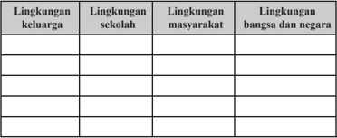

Tabel ini membahas berbagai lingkungan di mana seseorang dapat hidup dan berkembang, mulai dari lingkungan keluarga hingga lingkungan bangsa dan negara. Topik utamanya adalah tentang berbagai aspek kehidupan manusia dan bagaimana mereka saling berkaitan. Kolom-kolomnya mencakup empat lingkungan: keluarga, sekolah, masyarakat, dan bangsa dan negara. Data atau pola penting yang terlihat adalah bahwa setiap lingkungan memiliki peran dan dampak yang berbeda pada individu, dari pengembangan sosial hingga pendidikan dan etika. Tabel ini menunjukkan bahwa setiap lingkungan memiliki peran penting dalam membentuk karakter dan perilaku seseorang.

Re fl eksi

Setelah Anda menganalisis kasus-kasus pelanggaran hak dan pengingkaran kewajiban  warga  negara,  tentunya  Anda  semakin  yakin  bahwa  hak  dan kewajiban  dalam  pelaksanaannya  harus  seimbang.  Nah,  coba  sekarang renungkanlah  hal-hal  berikut  serta  cobalah  berikan  jawabannya.  Setelah mampu Anda jawab, kemudian amalkanlah dalam kehidupanmu sehari-hari.

- Bila  Anda  berbuat  sewenang-wenang,  siapakah  yang  dirugikan?  Jika demikian, bagaimana keharusannya?
- Pelanggaran hak cipta dalam bentuk penjualan VCD/DVD bajakan sangat merugikan  pemegang  hak  ciptanya. Atas  kejadian  tersebut,  bagaimana sikap Anda ketika menemukan barang-barang bajakan diperjualbelikan?
- Coba kemukakan hak dan kewajiban yang ada di pundakmu sehubungan dengan  kedudukanmu  sebagai  seorang  anak,  pelajar,  kakak  atau  adik, warga kota atau desa dimana Anda bertempat tinggal?
- Apa  yang  akan  Anda  lakukan  apabila  melanggar  hak  orang  lain  dan mengabaikan kewajiban?

 

---
## 📄 Halaman 40

### Rangkuman

### 1. Kata Kunci

Kata kunci yang harus Anda pahami dalam mempelajari materi pada bab ini adalah warga negara, hak warga negara dan kewajiban warga negara.

### 2. Intisari Materi

- Hak merupakan sesuatu yang harus diterima oleh setiap  orang. Dalam  diri  setiap  orang  melekat  hak  asasi  manusia  dan  hak warga negara. Hak asasi bersifat universal tanpa melihat status kewarganegaraan,  sedangkan  hak  warga  negara  dibatasi  oleh status kewarganegaraan seseorang.
- Kewajiban  secara  sederhana  dapat  diartikan sebagai segala sesuatu yang harus dilaksanakan dengan penuh tanggung jawab. Dengan demikian kewajiban warga negara dapat diartikan sebagai tindakan atau perbuatan yang harus dilakukan oleh seorang warga negara sebagaimana di atur dalam ketentuan perundang-undangan yang berlaku.
- Hak dan kewajiban warga negara merupakan dua hal yang saling berkaitan. Keduanya memiliki hubungan kausalitas atau hubungan sebab akibat. Seseorang mendapatkan haknya, dikarenakan dipenuhinya kewajiban yang menjadi tanggung jawabnya.
- Pelanggaran hak warga negara terjadi ketika warga negara tidak dapat menikmati atau memperoleh haknya sebagaimana mestinya yang  ditetapkan  oleh  undang-undang.  Pelanggaran  hak  warga negara merupakan akibat dari adanya pelalaian atau pengingkaran terhadap kewajiban baik yang dilakukan oleh pemerintah maupun oleh warga negara sendiri.
- Pelanggaran  hak  dan  pengingkaran  kewajiban  warga  negara biasanya disebakan oleh tingginya sikap egoisme yang dimiliki oleh setiap warga negara, sehingga yang ada di pikirannya hanya sebatas bagaimana  cara mendapat  haknya,  sementara  yang menjadi kewajibannya dilupakan. Selain itu, rendahnya kesadaran hukum warga negara juga mendorong terjadinya pelanggaran dan pengingkaran kewajiban oleh warga negara.
- Tindakan  terbaik  dalam  penegakan  hak  dan  kewajiban  warga negara adalah dengan mencegah timbulnya semua faktor penyebab dari pelanggaran hak dan pengingkaran kewajiban warga negara. Apabila faktor penyebabnya tidak muncul, pelanggaran hak dan pengingkaran kewajiban warga negara  dapat diminimalisir atau bahkan dihilangkan.

 

---
## 📄 Halaman 41

### Penilaian Diri

### 1. Penilaian Sikap

Nah,  coba  sekarang Anda  renungi  diri  masing-masing,  apakah  perilaku Anda telah  mencerminkan sebagai warga negara yang selalu menyeimbangkan hak dan kewajiban? Bacalah daftar perilaku di bawah ini, kemudian isi kolom kegiatan dengan rutinitas yang biasa dilakukan apakah selalu, sering, kadangkadang, dan tidak pernah dengan tanda silang (x). Ingat  Anda harus mengisinya sesuai dengan keadaan yang sebenarnya.

---
**📊 Tabel**

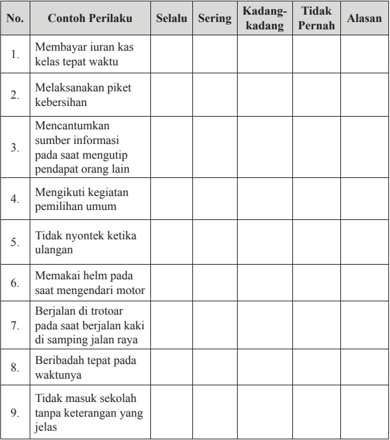

Tabel ini berisi contoh perilaku siswa yang diukur berdasarkan tingkat keberadaan (selalu, sering, kadang-kadang, tidak pernah) dan alasan untuk setiap perilaku tersebut. Topik utama tabel adalah perilaku siswa dalam berbagai situasi sehari-hari. Kolom-kolomnya meliputi No., Contoh Perilaku, Selalu, Sering, Kadang-kadang, Tidak Pernah, dan Alasan. Data penting yang terlihat adalah bahwa beberapa perilaku seperti membayar iuran kas kelas tepat waktu dan memakai helm saat mengendarai motor sering dilakukan oleh siswa, sementara beberapa perilaku lain seperti tidak masuk sekolah tanpa keterangan yang jelas dan tidak nyontek ketika ulangan tidak pernah dilakukan. Ini menunjukkan variasi dalam perilaku siswa dalam berbagai aspek kehidupan sekolah dan keluarga.

 

---
## 📄 Halaman 42

---
**📊 Tabel**

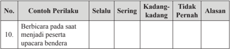

Tabel ini menunjukkan perilaku berbicara pada saat menjadi peserta upacara bendera dalam konteks selalu, sering, kadang-kadang, tidak pernah, dan alasan mengapa perilaku tersebut terjadi. Topik utama tabel ini adalah perilaku berbicara pada saat menjadi peserta upacara bendera. Kolom-kolomnya meliputi "No.", "Contoh Perilaku", "Selalu", "Sering", "Kadang-kadang", "Tidak Pernah", dan "Alasan". Data penting yang terlihat adalah bahwa perilaku berbicara pada saat menjadi peserta upacara bendera sering dilakukan oleh individu, tetapi tidak pernah dilakukan oleh individu lain. Ini menunjukkan bahwa perilaku ini merupakan tindakan yang umum di antara peserta upacara bendera.

### 2.  Pemahaman Materi

Dalam mempelajari materi pada bab ini, tentu saja ada materi yang dengan mudah Anda pahami, ada juga yang sulit Anda pahami. Oleh karena itu, lakukanlah penilaian diri atas pemahaman Anda terhadap materi pada bab ini dengan memberikan tanda ceklist ( √ ) pada kolom paham sekali, paham sebagian, dan belum paham.

---
**📊 Tabel**

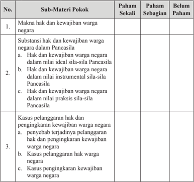

Tabel ini berisi informasi tentang pemahaman siswa terhadap sub-materi pokok hak dan kewajiban warga negara dalam konteks Pancasila. Topik utama tabel meliputi makna hak dan kewajiban warga negara, substansi hak dan kewajiban dalam nilai ideal sila-sila Pancasila, hak dan kewajiban dalam nilai instrumental sila-sila Pancasila, hak dan kewajiban dalam nilai praktis sila-sila Pancasila, kasus pelanggaran hak dan pengingkaran kewajiban warga negara, kasus pelanggaran hak warga negara, dan kasus pengingkaran kewajiban warga negara. Kolom "Paham Sekali" menunjukkan tingkat pemahaman siswa yang paling tinggi, "Paham Sebagian" menunjukkan tingkat pemahaman yang sedang, dan "Belum Paham" menunjukkan tingkat pemahaman yang masih rendah. Data penting yang terlihat adalah bahwa banyak siswa belum sepenuhnya memahami konsep hak dan kewajiban warga negara dalam konteks Pancasila, terutama dalam aspek praktis dan kasus-kasus pelanggaran.

 

---
## 📄 Halaman 43

---
**📊 Tabel**

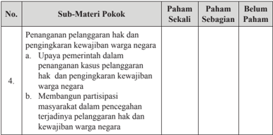

Tabel ini menunjukkan hasil evaluasi tentang pemahaman siswa terhadap sub-materi pokok "Penanganan pelanggaran hak dan penegakkan kewajiban warga negara" dalam mata pelajaran. Topik utama adalah upaya pemerintah dalam penanganan kasus pelanggaran hak dan penegakkan kewajiban warga negara, serta membangun partisipasi masyarakat dalam pencegahan terjadinya pelanggaran hak dan kewajiban warga negara. Kolom "Paham Sekali" menunjukkan tingkat pemahaman siswa yang sangat baik, sedangkan kolom "Paham Sebagian" menunjukkan tingkat pemahaman yang sedang. Sementara itu, kolom "Belum Paham" menunjukkan tingkat pemahaman yang masih rendah. Dari data ini, dapat dilihat bahwa siswa memiliki pemahaman yang cukup baik terhadap sub-materi tersebut, namun masih ada beberapa siswa yang memerlukan penekanan lebih lanjut untuk memahami konsep ini dengan lebih baik.

Apabila  pemahaman Anda  berada  pada  kategori  paham  sekali  mintalah materi pengayaan kepada guru untuk menambah wawasan Anda, sedangkan apabila pemahaman Anda berada pada kategori paham sebagian dan belum paham coba bertanyalah kepada guru serta mintalah penjelasan lebih lengkap, supaya Anda cepat memahami materi pembelajaran yang sebelumnya kurang atau belum memahaminya.

### Proyek Kewarganegaraan

### Mari Meneliti Kepustakaan

- Kelas dibagi ke dalam 4 kelompok besar.
- Siswa  mencari  informasi  yang  dibutuhkan  secara  bekerja  sama  dalam kelompoknya masing-masing.
- Setiap kelompok memilih literatur (buku, jurnal, majalah, koran, buletin, dan internet)  yang memuat topik:
- Permasalahan peredaran VCD/DVD bajakan yang melanggar hak cipta.
- Angka pengangguran yang masih tinggi di Indonesia.
- Rendahnya kesadaran warga negara dalam membayar pajak.
- Hukuman yang masih rendah  bagi para koruptor.
- Angka putus sekolah yang masih tinggi.
- Pelanggaran rambu-rambu lalu lintas yang masih sering terjadi.
- Setiap kelompok mengkaji dan mencatat informasi yang didapat melalui berbagai literatur (buku, jurnal, majalah, koran, buletin dan internet) yang dipilih berkaitan dengan materi yang dibelajarkan.

 

---
## 📄 Halaman 44

- Setiap kelompok harus membuat laporan hasil inkuiri kepustakaannya.
- Setiap  kelompok  mempresentasikan  laporan  hasil  inkuiri  kepustakaan secara panel dalam diskusi kelas.
- Setiap kelompok menanggapi setiap pemaparan laporan yang dilontarkan oleh kelompok lain.
- Setiap  kelompok  menyimpulkan  laporan  hasil  inkuiri  kepustakaannya setelah mendapatkan masukan dari kelompok lain.
Uji Kompetensi  Bab 1

### Jawablah soal-soal di bawah ini secara jelas dan akurat.

- Jelaskan  konsep  hak  asasi,  hak  warga  negara,  kewajiban  asasi,  dan kewajiban  warga  negara.  Uraikan  perbedaan  dan  persamaan  konsepkonsep tersebut!
- Kemukakan hak dan kewajiban warga negara yang terdapat dalam UUD NRI Tahun 1945!
- Jelaskan faktor-faktor penyebab terjadi pelanggaran hak dan pengingkaran kewajiban warga negara baik yang bersifat internal maupun eksternal!
- Menurut Anda, apa yang harus dilakukan pemerintah dalam menyelesaikan persoalan  pelanggaran  hak  dan  pengingkaran  kewajiban  sebagai  warga negara?
- Bagaimanakah  cara  Anda  untuk  menghindari  melakukan  pelanggaran terhadap  hak  orang  lain  dan  pengingkaran  terhadap  kewajiban  dalam kehidupan sehari-hari?

 

---
## 📄 Halaman 45

### Perlindungan dan Penegakan Hukum di Indonesia

Mulai hari ini, sampai beberapa pertemuan ke depan,  Anda akan diajak untuk mempelajari materi pembelajaran pada bab dua. Hal ini menandakan bahwa Anda sudah berhasil menguasai materi pada bab sebelumnya. Keberhasilan itu ditandai dengan diperolehnya nilai di atas kriteria yang ditetapkan. Oleh karena itu, sudah sepatutnya Anda bersyukur kepada Tuhan Yang Maha Esa atas keberhasilan ini.

Nah, sebagai langkah awal proses pembelajaran pada bab ini, Anda amati Gambar 2.1.

---
**🖼️ Gambar/Diagram**

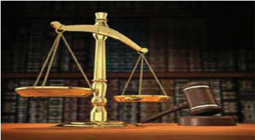

> **Deskripsi Visual:** Gambar ini adalah ilustrasi yang menunjukkan simbol-simbol hukum dan keadilan. Gambar ini menggambarkan dua piring berbentuk bulan yang berada di atas meja, dengan tangan yang menggantung di sampingnya. Di sebelah kanan, ada selembar kertas yang tampak seperti buku dengan tulisan-tulisan yang tidak jelas. Di sebelah kiri, ada selembar kertas yang tampak seperti buku dengan tulisan-tulisan yang tidak jelas. Di tengah, ada selembar kertas yang tampak seperti buku dengan tulisan-tulisan yang tidak jelas. Di sebelah kanan, ada selembar kertas yang tampak seperti buku dengan tulisan-tulisan yang tidak jelas. Di tengah, ada selembar kertas yang tampak seperti buku dengan tulisan-tulisan yang tidak jelas. Di sebelah kiri, ada selembar kertas yang tampak seperti buku dengan tulisan-tulisan yang tidak jelas. Di tengah, ada selembar kertas yang tampak seperti buku dengan tulisan-tulisan yang tidak jelas. Di sebelah kanan, ada selembar kertas yang tampak seperti buku dengan tulisan-tulisan yang tidak jelas. Di tengah, ada selembar kertas yang tampak seperti buku dengan tulisan-tulisan yang tidak jelas. Di sebelah kiri, ada selembar kertas yang tampak seperti buku dengan tulisan-tulisan yang tidak jelas. Di tengah, ada selembar kertas yang tampak seperti buku dengan tulisan-tulisan yang tidak jelas. Di sebelah kanan, ada selembar kertas yang tampak seperti buku dengan tulisan-tulisan yang tidak jelas. Di tengah, ada selembar kertas yang tampak seperti buku dengan tulisan-tulisan yang tidak jelas. Di sebelah kiri, ada selembar kertas yang tampak seperti buku dengan tulisan-tulisan yang tidak jelas. Di tengah, ada selembar kertas yang tampak seperti buku dengan tulisan-tulisan yang tidak jelas. Di sebelah kanan, ada selembar kertas yang tampak seperti buku dengan tulisan

Sumber : www.pasti.co.id

### Gambar 2.1 Simbol peradilan

Saat Anda memperhatikan gambar di atas, hal apakah yang ada di pikiran Anda? Keadilankah? Hukumkah? Atau pengadilan? Ya, ketiga hal tersebut berkaitan erat dengan gambar tersebut. Gambar  tersebut merupakan cermin proses perlindungan dan penegakan hukum. Kedua hal tersebut sangat penting

 

---
## 📄 Halaman 46

untuk dilaksanakan di negara kita. Hal tersebut dikarenakan negara kita adalah negara  hukum.  Selain  itu,  perlindungan  dan  penegakan  hukum  merupakan faktor utama untuk mewujudkan keadilan dan perdamaian.

Konsekuensi dari ditetapkannya Indonesia sebagai negara hukum adalah bahwa  dalam  segala  kehidupan  kenegaraan  selalu  berdasarkan  kepada hukum. Untuk menjaga dan mengawasi  hukum berjalan dengan efektif maka dibentuklah lembaga peradilan sebagai  sarana bagi masyarakat untuk mencari keadilan dan mendapatkan perlakuan yang semestinya di depan hukum. Nah, berkaitan dengan hal tersebut, tugas  warga negara adalah menampilkan sikap positif terhadap proses perlindungan dan penegakan hukum di Indonesia.

Pada  bab  ini, Anda  akan  diajak  untuk  mengupas  materi  yang  berkaitan dengan  praktik  perlindungan  dan  penegakan  hukum  di  Indonesia.  Setelah mempelajari  materi  pada  bab  ini,  diharapkan  Anda  mampu  mengevaluasi praktik perlindungan dan  penegakan hukum di Indonesia dan menampilkan sikap/perilaku patuh terhadap hukum yang berlaku.

### A. Hakikat Perlindungan dan Penegakan Hukum

### 1. Konsep Perlindungan dan Penegakan Hukum

Bayangkan apa yang akan terjadi apabila di keluarga tidak ada aturan, di sekolah tidak ada tata tertib, di lingkungan masyarakat tidak ada norma-norma sosial, di negara tidak ada undang-undang. Atau, apa yang akan terjadi apabila setiap pelanggaran dibiarkan begitu saja, pelakunya tidak diberikan teguran atau sanksi lainnya? Amatilah Gambar 2.2.

---
**🖼️ Gambar/Diagram**

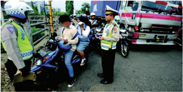

> **Deskripsi Visual:** Gambar ini adalah foto yang menunjukkan sekelompok orang sedang berada di samping jalan raya. Di depan mereka ada seorang petugas keamanan yang sedang berbicara dengan beberapa orang yang tampaknya sedang menghadapi masalah. Sebuah truk besar tampak di belakang mereka, menunjukkan bahwa situasi ini mungkin terjadi di dekat sebuah jalan raya atau perlintasan. Petugas keamanan tersebut memegang sebuah papan tanda, yang tampaknya berisi informasi tentang aturan lalu lintas atau peringatan untuk pengendara. Dalam konteks ini, gambar ini mungkin digunakan untuk membahas tentang pentingnya pengawasan dan pengendalian lalu lintas, serta bagaimana petugas keamanan dapat memberikan informasi kepada pengendara agar mereka dapat melindungi diri sendiri dan orang lain.

Sumber:

www.merdeka.com

 

---
## 📄 Halaman 47

Gambar  2.2  merupakan  dampak  dari  tidak  dipatuhinya  hukum.  Ketika hukum tidak  dipatuhi  atau  dilaksanakan,  akan  terjadi  adalah  kekacauan  di semua bidang kehidupan. Setiap orang akan berbuat seenaknya atau menghalalkan  segala  cara  untuk  mencapai  tujuannya,  sehingga  keamanan, ketenteraman,  dan  ketertiban  sulit  terwujud.  Nah,  supaya  hal-hal  yang dikemukakan  tadi  tidak  terjadi,  harus  diupayakan  dilakukannya  proses perlindungan dan penegakan hukum.

Apa sebenarnya perlindungan hukum  itu?  Menurut  Andi  Hamzah, perlindungan hukum dimaknai sebagai daya upaya yang dilakukan secara sadar oleh setiap orang maupun lembaga pemerintah dan swasta  yang bertujuan mengusahakan pengamanan, penguasaan  dan  pemenuhan  kesejahteraan  hidup  sesuai  dengan  hak-hak asasi  yang  ada.  Makna  tersebut  tidak terlepas dari fungsi hukum itu sendiri, yaitu  untuk  melindungi  kepentingan manusia. Dengan kata lain hukum memberikan perlindungan kepada manusia dalam memenuhi  berbagai macam kepentingannya, dengan syarat  manusia juga harus melindungi kepentingan orang lain.

### Info Kewarganegaraan

Suatu ketentuan hukum mempunyai tugas sebagai berikut:

- Menjamin kepastian hukum bagi setiap orang di dalam masyarakat.
- Menjamin ketertiban, ketenteraman, kedamaian, keadilan, kemakmuran, kebahagiaan dan kebenaran.
- Menjaga jangan sampai terjadi perbuatan main hakim sendiri dalam pergaulan masyarakat.
Simanjuntak  mengartikan  perlindungan  hukum  sebagai  segala  upaya pemerintah untuk menjamin adanya kepastian hukum serta memberi perlindungan  kepada  warganya  agar  hak-haknya  sebagai  seorang  warga negara tidak dilanggar, dan bagi yang melanggarnya akan dapat dikenakan sanksi sesuai peraturan yang berlaku. Dengan demikian, suatu perlindungan dapat  dikatakan  sebagai  perlindungan  hukum  apabila  mengandung  unsurunsur sebagai berikut.

- Adanya perlindungan dari pemerintah kepada warganya.
- Jaminan kepastian hukum.
- Berkaitan dengan hak-hak warga negara.
- Adanya sanksi hukuman bagi pihak yang melanggarnya.
Pada  hakikatnya,  setiap  orang  berhak  mendapatkan  perlindungan  dari hukum. Oleh karena itu, terdapat banyak macam perlindungan hukum. Dari sekian  banyak  jenis  dan  macam  perlindungan  hukum,  terdapat  beberapa

 

---
## 📄 Halaman 48

di  antaranya  yang  cukup  populer  dan  telah  akrab  di  telinga Anda,  seperti perlindungan  hukum  terhadap  konsumen.  Perlindungan  hukum  terhadap konsumen diatur  dalam  Undang-Undang  RI  Nomor  8 Tahun  1999  tentang Perlindungan Konsumen. UU ini mengatur segala hal yang menjadi hak dan kewajiban antara produsen dan konsumen.

Perlindungan hukum di Indonesia diberikan juga kepada hak atas kekayaan intelektual  (HaKI).  Pengaturan  mengenai  hak  atas  kekayaan  intelektual meliputi, hak cipta dan hak atas kekayaan industri. Pengaturan mengenai hak atas kekayaan intelektual tersebut telah dituangkan dalam sejumlah peraturan perundang-undangan, seperti Undang-Undang Nomor 28 Tahun 2014 tentang Hak Cipta, Undang-Undang Nomor 15 Tahun 2001 tentang Merek, UndangUndang Nomor 13 Tahun 2016 tentang Paten, Undang-Undang Nomor 29 Tahun 2000 tentang Perlindungan Varietas Tanaman, dan lain sebagainya.

Perlindungan hukum diberikan juga kepada tersangka sebagai pihak yang diduga telah melakukan pelanggaran hukum. Perlindungan hukum terhadap tersangka diberikan berkaitan dengan hak-hak tersangka yang harus dipenuhi agar sesuai dengan prosedur pemeriksaan sebagaimana diatur dalam peraturan perundang-undangan.

Hukum  dapat  secara  efektif  menjalankan  fungsinya  untuk  melindungi kepentingan  manusia,  apabila  ditegakkan.  Dengan  kata  lain,  perlindungan hukum  dapat  terwujud  apabila  proses  penegakan  hukum  dilaksanakan. Proses  penegakan  hukum  merupakan  salah  satu  upaya  untuk  menjadikan hukum sebagai pedoman dalam setiap perilaku masyarakat maupun aparat atau lembaga penegak hukum. Dengan kata lain, penegakan hukum merupakan upaya untuk melaksanakan ketentuan-ketentuan hukum dalam berbagai macam bidang kehidupan.

Penegakan  hukum  merupakan  syarat  terwujudnya  perlindungan  hukum. Kepentingan  setiap  orang  akan  terlindungi  apabila  hukum  yang  mengaturnya dilaksanakan  baik  oleh  masyarakat  ataupun  aparat  penegak  hukum.  Misalnya, perlindungan hukum konsumen akan terwujud apabila undang-undang perlindungan konsumen dilaksanakan, hak cipta yang dimiliki oleh seseorang juga akan terlindungi apabila ketentuan mengenai hak cipta juga dilaksanakan. Begitu pula dengan kehidupan di sekolah, keluarga dan masyarakat akan tertib, aman dan tenteram apabila norma-norma berlaku di lingkungan tersebut dilaksanakan.

 

---
## 📄 Halaman 49

### Tugas Mandiri 2.1

Perlindungan dan penegakan hukum tidak akan terwujud apabila tidak mempunyai landasan  atau  dasar  hukum  yang  kukuh.  Nah,  sekarang  Anda  temukan  dari berbagai macam sumber, baik itu berupa buku ataupun internet, mengenai dasar hukum perlindungan dan penegakan hukum. Tuliskan hasil temuan Anda dalam tabel di bawah ini.

---
**📊 Tabel**

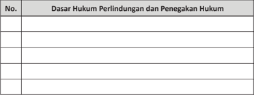

Tabel ini berisi informasi tentang dasar hukum perlindungan dan penegakan hukum. Topik utamanya adalah tentang dasar hukum yang mempengaruhi perlindungan dan penegakan hukum. Kolom-kolomnya mencakup berbagai aspek hukum, seperti hukum konstitusi, hukum negara, hukum perdata, hukum pidana, dan hukum ekonomi. Data atau pola penting yang terlihat adalah bahwa tabel ini mencakup berbagai aspek hukum yang berbeda, menunjukkan bahwa perlindungan dan penegakan hukum melibatkan berbagai cabang hukum yang berbeda.

### 2. Pentingnya  Perlindungan dan Penegakan Hukum

Apa yang Anda rasakan apabila ketika ulangan ada yang menyontek, tetapi tidak ditegur oleh guru? Atau, apa yang Anda rasakan apabila orang tua tidak menegur anaknya yang melakukan kesalahan apalagi kesalahan yang fatal? Apabila hal yang dipertanyakan tadi terjadi, tentu saja sebagai warga negara yang  baik,  Anda  akan  merasakan  ketidaknyamanan,  ketidakadilan  bahkan ketertiban pun tidak akan dapatkan. Nah, itu semua dapat dihindari apabila perlindungan dan penegakan hukum dilaksanakan.

Sebagai negara hukum, Indonesia wajib melaksanakan proses perlindungan dan  penegakan  hukum.  Negara  wajib  melindungi  warga  negaranya  dari berbagai macam ketidakadilan, ketidaknyamanan dan penyimpangan hukum lainnya.  Selain  itu,  negara  mempunyai  kekuasaan  untuk  memaksa  seluruh warga  negaranya  untuk  melaksanakan  semua  ketentuan-ketentuan  yang berlaku.

Perlindungan dan penegakan hukum sangat penting dilakukan karena dapat mewujudkan hal-hal berikut ini.

- a.
- Tegaknya supremasi hukum Supremasi hukum bermakna bahwa hukum mempunyai kekuasaan mutlak dalam mengatur pergaulan manusia dalam berbagai macam kehidupan. Dengan kata lain,  semua  tindakan  warga  negara  maupun  pemerintahan

 

---
## 📄 Halaman 50

selalu berlandaskan pada hukum yang berlaku. Tegaknya supremasi hukum tidak akan terwujud apabila aturan-aturan yang berlaku tidak ditegakkan baik oleh masyarakat maupun aparat penegak hukum.

- Tegaknya keadilan
Tujuan  utama  hukum  adalah  mewujudkan  keadilan  bagi  setiap  warga negara. Setiap warga negara dapat menikmati haknya dan melaksanakan kewajibannya  merupakan  wujud  dari  keadilan  tersebut.  Hal  itu  dapat terwujud apabila aturan-aturan ditegakkan.

- Mewujudkan perdamaian dalam kehidupan di masyarakat
Kehidupan yang diwarnai suasana yang damai merupakan harapan setiap orang. Perdamaian akan terwujud apabila setiap orang merasa dilindungi dalam  segala  bidang  kehidupan.  Hal  itu  akan  terwujud  apabila  aturanaturan yang berlaku dilaksanakan.

Menurut Soerjono Soekanto, keberhasilan proses perlindungan dan penegakan hukum tidaklah semata-mata menyangkut ditegakkannya hukum yang berlaku, akan tetapi sangat bergantung pada beberapa faktor, antara lain sebagai berikut.

- Hukumnya.  Dalam  hal  ini  yang dimaksud adalah undang-undang yang  dibuat  tidak  boleh  bertentangan  dengan  ideologi  negara. Selain itu, penyusunan  undangundang dibuat haruslah menurut ketentuan yang mengatur kewenangan pembuatan undangundang sebagaimana diatur dalam  konstitusi  negara.  Selanjutnya,  undang-undang  haruslah dibuat  sesuai  dengan  kebutuhan dan kondisi masyarakat di mana undang-undang tersebut diberlakukan.

### Penanaman Kesadaran Berkonstitusi

Perlindungan dan penegakan hukum tidak akan terwujud apabila  anggota  masyarakat  tidak mempunyai kesadaran hukum. Anda tentu saja harus mempunyai kesadaran hukum yang tinggi yang tercermin  dari  pengetahuan  dan pemahaman  yang  luasa  terhadap ketentuan yang berlaku, serta selalu bersikap dan berperilaku sesuai dengan hukum yang berlaku.

- Penegak hukum, yakni pihak-pihak yang secara langsung terlibat dalam bidang penegakan hukum. Penegak hukum harus menjalankan tugasnya dengan baik sesuai dengan peranannya masing-masing yang telah diatur dalam peraturan perundang-undangan. Menjalankan tugas tersebut dilakukan dengan mengutamakan keadilan dan profesionalisme, sehingga menjadi panutan masyarakat serta dipercaya oleh semua pihak termasuk semua anggota masyarakat.

 

---
## 📄 Halaman 51

- Masyarakat,  yakni  masyarakat  lingkungan  di  mana  hukum  tersebut berlaku atau diterapkan. Maksudnya, warga masyarakat harus mengetahui dan memahami hukum yang berlaku, serta menaati hukum yang berlaku dengan  penuh  kesadaran  akan  pentingnya  dan  perlunya  hukum  bagi kehidupan masyarakat.
- Sarana  atau  fasilitas  yang  mendukung  penegakan  hukum.  Sarana  atau fasilitas`tersebut, mencakup tenaga manusia yang terdidik dan terampil, organisasi yang baik, peralatan yang memadai, keuangan yang cukup, dan sebagainya. Ketersediaan sarana dan fasilitas yang memadai, merupakan suatu keharusan bagi keberhasilan penegakan hukum.
- Kebudayaan, yakni sebagai hasil karya, cipta, dan rasa yang didasarkan pada karsa manusia di dalam pergaulan hidup. Dalam hal ini, kebudayaan mencakup  nilai-nilai  yang  mendasari  hukum  yang  berlaku,  nilai-nilai mana merupakan konsepsi-konsepsi abstrak mengenai apa yang dianggap baik sehingga dianut, dan apa yang dianggap buruk sehingga dihindari.
Nah, hal-hal di ataslah yang makin memperkuat keyakinan bahwa proses perlindungan  dan  penegakan  hukum  merupakan  sesuatu  yang  penting  dan mutlak untuk dilaksanakan oleh sebuah negara.

### Tugas Mandiri 2.2

Bacalah berita di bawah ini.

### Hukuman Mati Bandar Narkoba Harus Konsisten

Direktur Eksekutif Institute for Strategic  and  Development Studies (ISDS), M. Aminuddin, meminta hukuman mati bagi para bandar  besar  narkoba  yang  telah  terkena  vonis  hukuman  mati harus dilaksanakan secara konsisten. 'Tindakan para bandar besar narkoba telah menyebabkan kematian bagi banyak orang, yang sebagian besar adalah anak muda yang mestinya adalah generasi penerus. Hukuman  mati memang  layak dijatuhkan kepada mereka,' tutur Aminuddin, Minggu (29/11) malam.

Aminuddin  mendukung  pernyataan  Direktur  Advokasi  Badan Narkotika Nasional (BNN) Yunis Farida Oktoris, yang antara lain mengemukakan agar hukuman mati bagi para pengedar narkoba dilaksanakan secara konsisten. Itu karena Indonesia sudah berada dalam kondisi darurat narkoba.

 

---
## 📄 Halaman 52

Ia  memprediksi,  angka  kematian  akibat  narkoba  dari  tahun ke  tahun  cenderung  meningkat,  seiring  bertambahnya  angka penyalahgunaan narkotika dan obat terlarang lainnya. Oleh karena itu, Indonesia tidak perlu takut terhadap tekanan asing yang tidak menyetujui hukuman mati bagi bandar besar narkoba. Ini terutama karena Indonesia sudah berada pada kondisi darurat narkoba serta agar hukuman mati menimbulkan efek jera.

'Aparat  penegak  hukum  harus  bertindak  tegas.  Jangan  mau diiming-imingi  sejumlah  uang  oleh  para  bandar  besar  narkoba yang uangnya memang tidak berseri,' ucap pengamat dan peneliti masalah-masalah sosial dan politik ini.

Lebih  jauh Aminuddin  mengimbau,  pers  Indonesia  mesti  terus memberitakan pentingnya pemberantasan narkoba. Hal tersebut semata-mata  untuk penyelamatan  generasi muda  serta bagi Indonesia yang lebih baik ke depan.

Dalam hubungan itu, jurnal data BNN 2014 menyebutkan, total kematian akibat narkoba diprediksi meningkat karena persentase jumlah  penyalah  guna  narkoba  bertambah,  dari 1,9 persen (2008) menjadi 2,2 persen (2011). Jumlah ini diperkirakan terus meningkat pada 2015 menjadi 2,8 persen.

Di  sisi  lain,  saat  ini  ada  sekitar  60  terpidana  kasus  narkoba yang  telah  diputuskan  untuk  dihukum  mati  dan  menanti  waktu eksekusi.  Jumlah  tersebut  tidak  termasuk  delapan  orang  yang telah dieksekusi mati dalam tahap kedua pada 29 April 2015.

Sementara  itu,  tahap  pertama  eksekusi  mati  kasus  narkoba dilakukan pada 18 Januari 2015 terhadap lima terpidana, yakni Ang  Kiem  Soei  asal  Belanda,  Namaona  Denis  warga  Malawi, Marco Archer Cardoso Moreira dari Brasil, Daniel Enemuo warga Nigeria, dan Rani Andriani, perempuan asal Cianjur.

BNN  juga  mencatat,  sekitar  50  orang  meninggal  dunia  setiap hari akibat penyalahgunaan narkoba. Tahun ini saja, pemerintah berupaya merehabilitasi sekitar 100.000 pengguna narkoba yang berasal dari berbagai daerah di Tanah Air.

Sumber :

http://www.sinarharapan.co/news/read/151130054 /

 

---
## 📄 Halaman 53

Setelah  Anda  membaca  berita  tersebut,  lakukanlah  analisis  terhadap pelaksanakan hukuman mati terhadap pelaku kasus narkoba dengan meninjau hal-hal sebagai berikut.

- Dampak dari eksekusi mati terhadap peredaran narkoba.
- Efek jera yang ditimbulkan dari pelaksanaan eksekusi mati yang ditandai dengan menurunnya jumlah pengedar dan pengguna narkoba.
- Relevansi (kesesuaian) pelaksanaan hukuman mati dengan penegakan hak asasi manusia.
- Alternatif hukuman bagi pelaku penyalahgunaan narkoba selain hukuman mati.
Rumuskanlah analisis Anda tersebut dalam bentuk artikel sepanjang empat sampai enam paragraf. Kemudian, presentasikan di depan kelas.

### B. Peran Lembaga Penegak Hukum dalam Menjamin Keadilan dan Kedamaian

### 1. Peran Kepolisian Republik Indonesia (Polri)

Anda  tentunya  sering  sekali  bertemu  dengan  anggota  kepolisian.  Peran yang  mereka  tampilkan  bermacam-macam,  seperti  mengatur  lalu  lintas, memberantas gerakan-gerakan terorisme, mencegah penyalahgunaan narkoba, dan sebagainya.

Kepolisian Republik Indonesia atau yang sering disingkat Polri merupakan lembaga negara yang berperan dalam memelihara keamanan dan ketertiban masyarakat, menegakkan hukum, serta memberikan perlindungan, pengayoman, dan pelayanan kepada masyarakat dalam rangka terpeliharanya keamanan  dalam  negeri. Selain itu, dalam bidang  penegakan  hukum khususnya  yang  berkaitan  dengan  penanganan  tindak  pidana  sebagaimana yang di atur dalam KUHAP, Polri sebagai penyidik utama yang menangani setiap kejahatan secara umum dalam rangka menciptakan keamanan dalam negeri, Pasal 16 Undang-Undang RI Nomor 2 Tahun 2002 tentang Kepolisian Republik Indonesia, telah menetapkan kewenangan sebagai berikut.

- Melakukan penangkapan, penahanan, penggeledahan, dan penyitaan.
- Melarang setiap orang meninggalkan atau memasuki tempat kejadian perkara untuk kepentingan penyidikan.
- Membawa dan menghadapkan orang kepada penyidik dalam rangka penyidikan.
- Menyuruh berhenti orang yang dicurigai dan menanyakan serta memeriksa tanda pengenal diri.

 

---
## 📄 Halaman 54

sumber :www.antarafoto.com

- Melakukan pemeriksaan dan penyitaan surat.
- Memanggil orang untuk didengar dan diperiksa  sebagai  tersangka  atau saksi.
- Mendatangkan orang ahli  yang  diperlukan  dalam  hubungannya  dengan pemeriksaan perkara.
- Mengadakan penghentian penyidikan.
- Menyerahkan berkas perkara kepada penuntut umum.
- Mengajukan  permintaan  secara  langsung  kepada  pejabat  imigrasi  yang berwenang  di  tempat  pemeriksaan  imigrasi  dalam  keadaan  mendesak atau  mendadak  untuk  mencegah  atau  menangkal  orang  yang  disangka melakukan tindak pidana.
- Memberikan petunjuk dan bantuan penyidikan kepada penyidik pegawai negeri sipil serta menerima hasil penyidikan penyidik pegawai negeri sipil untuk diserahkan kepada penuntut umum.
- Mengadakan tindakan lain menurut hukum yang bertanggung jawab, yaitu tindakan penyelidikan dan penyidikan yang dilaksanakan dengan syarat sebagai berikut:
- tidak bertentangan dengan suatu aturan hukum;
- selaras dengan kewajiban hukum  yang  mengharuskan  tindakan tersebut dilakukan;
- harus patut, masuk akal, dan termasuk dalam lingkungan jabatannya;
- pertimbangan yang layak berdasarkan keadaan yang memaksa; dan
- menghormati hak asasi manusia.

 

---
## 📄 Halaman 55

### 2. Peran Kejaksaan Republik Indonesia

Kejaksaan Republik Indonesia adalah lembaga negara yang melaksanakan kekuasaan negara, khususnya di bidang penuntutan. Penuntutan merupakan tindakan  jaksa untuk melimpahkan perkara pidana ke pengadilan negeri yang berwenang dalam hal dan menurut cara yang diatur dalam undang- undang dengan  permintaan  supaya  diperiksa  dan  diputus  oleh  hakim  di  sidang pengadilan. Pelaku pelanggaran pidana yang akan dituntut adalah yang benar bersalah  dan  telah  memenuhi  unsur-unsur  tindak  pidana  yang  disangkakan dengan didukung oleh barang bukti yang cukup dan didukung oleh minimal 2 (dua) orang saksi.

Keberadaan Kejaksaan Republik Indonesia diatur dalam  Undang-Undang RI Nomor  16  Tahun  2004  tentang  Kejaksaan Republik  Indonesia.  Berdasarkan  undangundang  tersebut,  kejaksaan  sebagai  salah satu lembaga penegak hukum dituntut untuk  lebih  berperan  dalam  menegakkan supremasi hukum, perlindungan kepentingan umum, penegakan hak asasi manusia, serta  pemberantasan  Korupsi,  Kolusi,  dan Nepotisme  (KKN).    Kejaksaan  RI  sebagai lembaga negara yang melaksanakan kekuasaan negara di bidang penuntutan harus melaksanakan fungsi, tugas, dan wewenangnya secara merdeka, terlepas dari  pengaruh  kekuasaan  pemerintah  dan pengaruh  kekuasaan  lainnya. Adapun  yang menjadi  tugas  dan  wewenang  Kejaksaan dikelompokkan menjadi tiga bidang, berikut.

### a. Di Bidang Pidana

- Melakukan penuntutan.
- Melaksanakan penetapan hakim dan putusan pengadilan yang telah memperoleh kekuatan hukum tetap.
- Melakukan pengawasan terhadap pelaksanaan putusan pidana bersyarat, putusan pidana pengawasan, dan keputusan lepas bersyarat.
- Melakukan  penyidikan  terhadap  tindak  pidana  tertentu  berdasarkan undang-undang.
- Melengkapi berkas perkara  tertentu  dan  untuk  itu  dapat  melakukan pemeriksaan  tambahan  sebelum  dilimpahkan  ke  pengadilan  yang dalam pelaksanaannya dikoordinasikan dengan penyidik.

### Info Kewarganegaraan

Untuk mengefektifkan perannya, lembaga kejaksaan di Indonesia memiliki tiga tingkatan, yaitu:

- Kejaksaan Agung di tingkat pusat  yang  dipimpin  oleh seorang Jaksa Agung.
- Kejaksaan Tinggi di tingkat provinsi yang dipimpin oleh seorang  Kepala  Kejaksaan Tinggi (Kajati).
- Kejaksaan Negeri yang berada di tingkat kabupaten/ kota yang dipimpin oleh seorang  Kepala  Kejaksaan Negeri (Kajari).

 

---
## 📄 Halaman 56

---
**🖼️ Gambar/Diagram**

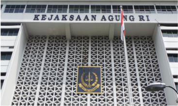

> **Deskripsi Visual:** Gambar ini menunjukkan bangunan Kejaksaan Agung Republik Indonesia (KAI RI). Bangunan ini memiliki latar belakang putih dengan logo KAI RI yang terletak di tengah-tengah bangunan. Atap bangunan berwarna biru dengan pola yang rapi. Di atas atap terdapat tulisan "KEJAKSAAN AGUNG RI" dalam huruf besar dan berwarna hitam. Selain itu, di bagian bawah bangunan juga terdapat logo KAI RI yang berwarna biru dengan lambang kepolisian. Gambar ini menunjukkan struktur dan identitas KAI RI sebagai lembaga pemerintahan yang bertanggung jawab dalam menjalankan tugas-tugas kejaksaan.

Sumber :www.kompas.com

### b.  Di Bidang Perdata dan Tata Usaha Negara

Kejaksaan, dengan kuasa khusus, dapat bertindak, baik di dalam maupun di luar pengadilan, untuk dan atas nama negara atau pemerintah.

### c. Dalam bidang ketertiban dan ketenteraman umum

- Peningkatan kesadaran hukum masyarakat.
- Pengamanan kebijakan penegakan hukum.
- Pengawasan peredaran barang cetakan.
- Pengawasan aliran kepercayaan yang dapat membahayakan masyarakat dan negara.
- Pencegahan penyalahgunaan dan/atau penodaan agama.
- Penelitian dan pengembangan hukum serta statistik kriminal.

### 3. Peran Hakim sebagai Pelaksana  Kekuasaan Kehakiman

Di Indonesia, perwujudan kekuasaan kehakiman diatur sepenuhnya dalam Undang-Undang RI Nomor 48 Tahun 2009 tentang Kekuasaan Kehakiman, yang merupakan penyempurnaan dari Undang-Undang RI Nomor 4 Tahun 2004 tentang Kekuasaan Kehakiman. Berdasarkan undang-undang tersebut, kekuasaan kehakiman di Indonesia dilakukan oleh Mahkamah Agung. Badan peradilan yang berada di bawah Mahkamah Agung meliputi badan peradilan yang  berada  di  lingkungan  Peradilan  Umum,  Peradilan  Agama,  Peradilan Militer  dan  Peradilan  Tata  Usaha  Negara,  serta  oleh  sebuah  Mahkamah

 

---
## 📄 Halaman 57

Konstitusi.  Lembaga-lembaga  tersebut  berperan  sebagai  penegak  keadilan, dan dibersihkan dari setiap intervensi baik dari lembaga legislatif, eksekutif maupun lembaga lainnya. Kekuasaan kehakiman yang diselenggarakan oleh lembaga-lembaga tersebut dilaksanakan oleh hakim.

Hakim  adalah  pejabat  peradilan  negara  yang  diberi  wewenang  oleh undang-undang untuk mengadili. Mengadili merupakan serangkaian tindakan hakim    untuk  menerima,  memeriksa,  dan  memutuskan  perkara  hukum berdasarkan asas bebas, jujur dan tidak memihak di sebuah sidang pengadilan berdasarkan  ketentuan  perundang-undangan.  Dalam  upaya  menegakkan hukum dan keadilan serta kebenaran, hakim diberi kekuasaan yang merdeka untuk  menyelenggarakan    peradilan.  Dengan  kata  lain,  hakim  tidak  boleh dipengaruhi  oleh  kekuasaan-kekuasaan  lain  dalam  memutuskan  perkara. Apabila  hakim  mendapatkan  pengaruh  dari  pihak  lain  dalam  memutuskan perkara, cenderung keputusan hakim itu tidak adil, yang pada akhirnya akan meresahkan masyarakat, serta wibawa hukum dan hakim akan pudar.

Menurut  ketentuan  Undang-Undang  RI Nomor 48 Tahun 2009 tentang Kekuasaan Kehakiman, hakim berdasarkan jenis lembaga peradilannya dapat diklasi fi kasikan menjadi tiga kelompok berikut:

- Hakim  pada  Mahkamah  Agung  yang disebut dengan Hakim Agung.
- Hakim pada badan peradilan yang berada di bawah Mahkamah Agung, yaitu dalam lingkungan peradilan umum, lingkungan peradilan  agama,  lingkungan  peradilan militer,  lingkungan  peradilan  tata  usaha negara, dan hakim pada pengadilan khusus  yang  berada  dalam  lingkungan peradilan tersebut.
- Hakim pada Mahkamah Konstitusi yang disebut dengan Hakim Konstitusi.

### Penanaman Kesadaran Berkonstitusi

Sebagai warga negara yang baik, Anda harus mengetahui  dan  memahami tugas  dan  kewenangan  dari setiap lembaga penegak hukum. Selain itu, Anda juga harus bisa mengkritisi setiap peran dari lembaga penegak hukum.  Hal  itu  merupakan salah  satu  bentuk  dukungan terhadap kinerja dari lembaga penegak hukum.

Setiap hakim  melaksanakan  proses peradilan yang dilaksanakan di sebuah  tempat  yang  dinamakan  pengadilan.  Dengan  demikian,  terdapat perbedaan  antara  konsep  peradilan  pengadilan.  Peradilan  menunjuk  pada proses mengadili perkara sesuai dengan kategori perkara yang diselesaikan. Pengadilan menunjuk pada tempat untuk mengadili perkara atau tempat untuk melaksanakan proses peradilan guna menegakkan hukum.

 

---
## 📄 Halaman 58

---
**🖼️ Gambar/Diagram**

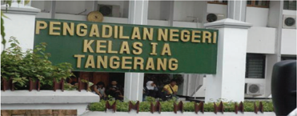

> **Deskripsi Visual:** Gambar ini menunjukkan bangunan Pengadilan Negeri Kelas I A Tangerang. Pada bagian atas bangunan terdapat papan nama besar dengan tulisan "PENGADILAN NEGERI KELAS IA TANGERANG" dalam huruf besar dan berwarna hijau. Bangunan tersebut tampak megah dengan dinding putih dan atap berwarna cokelat. Di depan bangunan terdapat taman dengan beberapa pohon dan pagar besi. Di sebelah kanan bangunan terdapat sebuah mobil polisi. Gambar ini menunjukkan bahwa pengadilan ini berada di kota Tangerang dan merupakan pengadilan tingkat pertama.

Sumber:

www.primaironline.com

Pengadilan  secara  umum  mempunyai  tugas  untuk  mengadili  perkara menurut  hukum  dengan  tidak  membeda-bedakan    orang.  Pengadilan  tidak boleh menolak untuk memeriksa, mengadili, dan memutus suatu perkara yang diajukan dengan dalih bahwa hukum tidak ada atau kurang. Pengadilan wajib memeriksa dan mengadili setiap perkara peradilan yang masuk.

### 4. Peran Advokat dalam Penegakan Hukum

Advokat adalah orang yang berprofesi memberi jasa hukum, baik di dalam maupun di luar pengadilan. Jasa hukum yang diberikan berupa memberikan konsultasi hukum, bantuan hukum, menjalankan kuasa, mewakili, membela, mendampingi,  dan  melakukan  tindakan  hukum.  Melalui  jasa  hukum  yang diberikan, advokat menjalankan  tugas profesi demi  tegaknya  keadilan berdasarkan hukum untuk kepentingan masyarakat pencari keadilan, termasuk usaha  memberdayakan  masyarakat  dalam  menyadari  hak-hak  fundamental mereka di depan hukum.

sumber:

www.hukumonline.com

 

---
## 📄 Halaman 59

Keberadaan  advokat  sebagai  salah  satu  penegak  hukum  diatur  dalam Undang-Undang  RI  Nomor  18  Tahun  2003  tentang Advokat.  Melalui  UU ini, setiap orang yang memenuhi persyaratan dapat menjadi seorang advokat. Adapun persyaratan untuk menjadi advokat di Indonesia diatur dalam Pasal 3 Undang-Undang RI Nomor 18 Tahun 2003 tentang Advokat, yaitu:

- warga NRI;
- bertempat tinggal di Indonesia;
- tidak berstatus sebagai pegawai negeri atau pejabat negara;
- berusia sekurang-kurangnya 25 (dua puluh lima) tahun;
- berijazah sarjana yang berlatar belakang pendidikan tinggi hukum;
- lulus ujian yang diadakan oleh Organisasi Advokat;
- magang sekurang-kurangnya 2 (dua) tahun terus-menerus pada kantor advokat;
- tidak pernah dipidana karena melakukan tindak pidana kejahatan yang diancam dengan pidana penjara 5 (lima) tahun atau lebih; serta
- berperilaku baik, jujur, bertanggung jawab, adil, dan mempunyai integritas yang tinggi.
Adapun tugas dari advokat secara khusus adalah membuat dan mengajukan gugatan,  jawaban,  tangkisan,  sangkalan,  memberi  pembuktian,  mendesak segera disidangkan atau diputuskan perkaranya, dan sebagainya. Di samping itu, pengacara bertugas membantu hakim dalam mencari kebenaran dan tidak boleh memutarbalikkan peristiwa demi kepentingan kliennya agar kliennya menang dan bebas. Oleh karena itu,  sesuai  Undang-Undang  RI  Nomor  18 Tahun 2003, seorang advokat mempunyai hak dan kewajiban yang dilindungi undang-undang. Adapun yang menjadi hak advokat adalah sebagai berikut.

- Advokat bebas mengeluarkan pendapat atau pernyataan dalam membela perkara  yang  menjadi  tanggung  jawabnya  di  dalam  sidang  pengadilan dengan tetap berpegang pada kode etik profesi dan peraturan perundangundangan.
- Advokat  bebas  dalam  menjalankan  tugas  profesinya  untuk  membela perkara yang menjadi tanggung jawabnya dengan tetap berpegang pada kode etik profesi dan peraturan perundang-undangan.
- Advokat tidak dapat dituntut baik secara perdata maupun pidana dalam menjalankan  tugas profesinya  dengan  iktikad  baik  untuk  kepentingan pembelaan klien dalam sidang pengadilan.
- Advokat  berhak  memperoleh  informasi,  data,  dan  dokumen  lainnya, baik dari instansi pemerintah maupun pihak lain yang berkaitan dengan kepentingan  tersebut  yang  diperlukan  untuk  pembelaan  kepentingan kliennya sesuai dengan peraturan perundang-undangan.

 

---
## 📄 Halaman 60

- Advokat berhak  atas  kerahasiaan  hubungannya  dengan  klien,  termasuk perlindungan  atas  berkas  dan  dokumennya  terhadap  penyitaan  atau pemeriksaan  dan  perlindungan  terhadap  penyadapan  atas  komunikasi elektronik advokat.
- Advokat tidak dapat diidentikkan dengan kliennya dalam membela perkara klien oleh pihak yang berwenang dan/atau masyarakat.
Kewajiban yang harus dipatuhi oleh seorang advokat di antaranya adalah sebagai berikut.

- Advokat  dalam  menjalankan  tugas  profesinya  dilarang membedakan perlakuan  terhadap  klien  berdasarkan  jenis  kelamin,  agama,  politik, keturunan, ras, atau latar belakang sosial dan budaya.
- Advokat wajib merahasiakan segala sesuatu yang diketahui atau diperoleh dari  kliennya  karena  hubungan profesinya, kecuali ditentukan lain oleh undang-undang.
- Advokat  dilarang  memegang  jabatan  lain  yang  bertentangan  dengan kepentingan tugas dan martabat profesinya.
- Advokat  dilarang  memegang  jabatan  lain  yang  meminta  pengabdian sedemikian  rupa  sehingga  merugikan  profesi  advokat  atau  mengurangi kebebasan dan kemerdekaan dalam menjalankan tugas profesinya.
- Advokat yang menjadi pejabat negara tidak melaksanakan tugas profesi advokat selama memangku jabatan.

### 5. Peran Komisi Pemberantasan Korupsi (KPK)

Komisi Pemberantasan Korupsi disingkat KPK adalah sebuah komisi yang dibentuk pada tahun 2003 berdasarkan Undang-Undang RI No. 30 Tahun 2002 tentang Komisi Pemberantasan Tindak Pidana Korupsi. Tujuan dibentuknya KPK  adalah  untuk  mengatasi,  menanggulangi  dan  memberantas  korupsi. Untuk mencapai tujuan tersebut, KPK mempunyai tugas sebagai berikut.

- Koordinasi dengan instansi yang berwenang melakukan pemberantasan tindak pidana korupsi.
- Supervisi terhadap instansi yang berwenang melakukan pemberantasan tindak pidana korupsi.
- Melakukan penyelidikan,  penyidikan,  dan  penuntutan  terhadap  tindak pidana korupsi.
- Melakukan tindakan-tindakan pencegahan tindak pidana korupsi.

 

---
## 📄 Halaman 61

- Melakukan monitor terhadap penyelenggaraan pemerintahan negara.
Sumber :.www.indonesiamedia.com

Gambar 2.7 Gedung KPK

Selain memiliki tugas tersebut, komisi ini  memiliki beberapa wewenang sebagai berikut.

- Mengoordinasi penyelidikan, penyidikan, dan penuntutan tindak pidana korupsi.
- Menetapkan  sistem  pelaporan  dalam  kegiatan  pemberantasan  tindak pidana korupsi.
- Meminta  informasi  tentang  kegiatan  pemberantasan  tindak  pidana korupsi kepada instansi terkait.
- Melaksanakan  dengar  pendapat  atau  pertemuan  dengan  instansi  yang berwenang melakukan pemberantasan tindakan korupsi.
- Meminta laporan instansi terkait pencegahan tindak pidana korupsi.
Dalam menjalankan tugas dan wewenangnya itu, KPK perpedoman pada asas sebagai berikut.

- Kepastian hukum , yakni asas dalam negara hukum yang mengutamakan landasan peraturan perundang-undangan, kepatutan, dan keadilan dalam setiap kebijakan menjalankan tugas dan wewenang KPK.
- Keterbukaan , yakni asas yang membuka diri terhadap hak masyarakat untuk memperoleh informasi yang benar, jujur, dan tidak diskriminatif tentang kinerja KPK dalam menjalankan tugas dan fungsinya.

 

---
## 📄 Halaman 62

- Akuntabilitas , yakni asas yang menentukan bahwa setiap kegiatan dan hasil akhir kegiatan KPK harus dapat dipertanggungjawabkan kepada masyarakat atau rakyat sebagai pemegang kedaulatan tertinggi negara sesuai dengan peraturan perundang-undangan yang berlaku.
- Kepentingan  umum ,  yakni  asas  yang  mendahulukan  kesejahteraan umum dengan cara yang aspiratif, akomodatif, dan selektif.
- Proporsionalitas , yakni asas yang mengutamakan keseimbangan antara tugas, wewenang, tanggung jawab, dan kewajiban KPK.

### Tugas Kelompok  2.1

Buatlah  kliping  mengenai  pemberitaan  yang  berkaitan  dengan  peran lembaga-lembaga  penegak  hukum.  Kliping  yang  dibuat  minimal  memuat lima buah artikel atau berita yang berkaitan dengan hal tersebut. Kemudian, analisis dua buah artikel atau berita yang Anda anggap menarik.

### C. Dinamika Pelanggaran Hukum

### 1. Berbagai Kasus Pelanggaran Hukum

Anda  tentunya pernah mendengar  peristiwa pembunuhan  dan  juga perampokan yang terjadi di suatu daerah. Anda juga tentunya pernah melihat di  televisi  seorang  pejabat  negara  ditangkap  karena  melakukan  korupsi. Nah,  pembunuhan,  perampokan,  dan  korupsi  merupakan  sebagian  contoh dari pelanggaran hukum. Apa sebenarnya pelanggaran hukum itu? Mengapa terjadi pelanggaran hukum?

Pelanggaran hukum disebut juga perbuatan melawan hukum, yaitu tindakan seseorang yang tidak sesuai atau bertentangan  dengan  aturan-aturan  yang berlaku.  Dengan  kata  lain,  pelanggaran hukum merupakan pengingkaran terhadap kewajiban-kewajiban yang telah ditetapkan oleh peraturan atau hukum yang berlaku, misalnya  kasus  pembunuhan  merupakan pengingkaran  terhadap  kewajiban  untuk menghormati hak hidup orang lain.

### Info Kewarganegaraan

Pelanggaran terhadap satu ketentuan hukum pada hakikatnya merupakan pelanggaran terhadap:

- dasar negara;
- aturan agama;
- konstitusi negara; dan
- norma-norma sosial lainnya.

 

---
## 📄 Halaman 63

Pelanggaran hukum merupakan bentuk ketidakpatuhan terhadap hukum. Ketidakpatuhan terhadap hukum dapat disebabkan oleh dua hal, yaitu:

- pelanggaran hukum oleh si pelanggar sudah dianggap sebagai kebiasaan;
- hukum yang berlaku sudah tidak sesuai lagi dengan tuntutan kehidupan.
Saat ini, kita sering melihat berbagai pelanggaran hukum terjadi di negara ini.  Hampir  setiap  hari,  kita  mendapatkan  informasi  mengenai  terjadinya tindakan melawan hukum baik yang dilakukan oleh masyarakat ataupun oleh aparat penegak hukum sendiri. Berikut ini contoh perilaku yang bertentangan dengan aturan yang dilakukan di lingkungan keluarga, sekolah, masyarakat, bangsa dan negara.

- Dalam lingkungan keluarga, di antaranya:
- mengabaikan perintah orang tua;
- mengganggu kakak atau adik yang sedang belajar;
- ibadah tidak tepat waktu;
- menonton tayangan yang tidak boleh ditonton oleh anak-anak;
- nonton tv sampai larut malam; dan
- bangun kesiangan.
- Dalam lingkungan sekolah, di antaranya
- menyontek ketika ulangan;
- datang ke sekolah terlambat;
- bolos mengikuti pelajaran;
- tidak memperhatikan penjelasan guru; dan
- berpakaian tidak rapi dan tidak sesuai dengan yang ditentukan sekolah.
sumber

: www.kulonprogonews.wordpress.com

 

---
## 📄 Halaman 64

- Dalam lingkungan masyarakat, di antaranya:
- mangkir dari tugas ronda malam;
- tidak mengikuti kerja bakti dengan alasan yang tidak jelas;
- main hakim sendiri;
- mengonsumsi obat-obat terlarang;
- melakukan tindakan diskriminasi kepada orang lain;
- melakukan perjudian; dan
- membuang sampah sembarangan.
- Dalam lingkungan bangsa dan negara, di antaranya:
- tidak memiliki KTP;
- tidak mematuhi rambu-rambu lalu lintas;
- melakukan tindak pidana seperti pembunuhan, perampokan, penggelapan,  pengedaran  uang  palsu,  pembajakan  karya  orang  lain dan sebagainya;
- melakukan aksi teror terhadap alat-alat kelengkapan negara;
- tidak berpartisipasi pada kegiatan pemilihan umum; dan
- merusak fasilitas negara dengan sengaja.

### Tugas Mandiri 2.3

Analisislah  dua  contoh  kasus  pelanggaran  hukum  di  bawah  ini.  Untuk memudahkan  Anda  dalam  menganalisis, diskusikanlah bersama teman sebangku, tetapi laporannya dibuat secara individual.

### Kasus 1

### Konsultan Bangkrut Cetak Uang Palsu

Seorang konsultan diamankan petugas Polsek Parung karena diduga  membuat  uang  palsu.  HT  (48)  dan  istrinya  TW  (39) diamankan, Rabu (19/10/2013) petang saat akan membeli rokok menggunakan uang pecahan Rp5.000 palsu di sebuah warung rokok di daerah Parung, Kabupaten Bogor.

 

---
## 📄 Halaman 65

Kepada  Polisi,  pria  mengaku  hanya  iseng  mencetak  uang palsu (upal) menggunakan mesin printer. Dari tangan HT, Polisi menyita upal sebesar Rp2,6 juta terdiri atas pecahan Rp20 ribu 64  lembar,  Rp10  ribu  10  lembar  dan  Rp5  ribu  sebanyak  257 lembar. 'Saya cuma mencetak uang palsu pecahan Rp5 ribu, 20 ribu dan Rp10 ribu,' kata HT kepada wartawan.

Kapolsek  Parung,  Komisaris  Maksum  Rosidi  menjelaskan, HT  dan  istrinya  diamankan  setelah  pihaknya  mendapatkan laporan dari seorang pedagang rokok yang mendapatkan uang palsu  dari  pelaku.  'Kemudian,  kita  langsung  bergerak  dan mengamankan  keduanya,'  ujar  Maksum  kepada  wartawan  di Mapolsek Parung, Kamis (20/10/2013) siang.

Maksum menjelaskan, pihaknya kemudian mengembangkan kasus itu dengan mengeledah rumah pelaku dan ditemukan Rp 2,6 juta upal berbagai pecahan. HT, bapak dua anak menjelaskan, dirinya sedang dalam kondisi bangkrut pasca tidak lagi menjadi dosen  serta  serta  sepinya  order  proyek  sebagai  konsultan. 'Karena  saya  sedang  jatuh,  iseng-iseng  saya  cetak  uang  asli menggunakan printer dan hasilnya cukup mirip dengan aslinya,' katanya.

Untuk  mencetak  uang  palsu  itu,  dia  hanya  menggunakan kertas jenis HVS ukuran kuarto atau folio. HT mengaku sengaja hanya mencetak uang pecahan Rp5 ribu, Rp10 ribu dan Rp20 ribu karena hasil cetakannya mirip dengan aslinya. 'Satu kertas bisa  mencetak  enam  lembar  uang.  Tinggal  dipotong-potong pakai cutter,' katanya. Menurutnya, aksinya ini baru dilakukan satu bulan terakhir. 'Saya tidak punya niat untuk kaya dari cetak uang palsu. Saya hanya butuh uang untuk bisa makan dan beli rokok,' ucapnya.

Kapolsek Parung, Kompol Maksum Rosidi mengungkapkan, pelaku ditangkap berdasarkan laporan seorang pedagang rokok di pinggir jalan Parung. 'Saat beli rokok, dia meminta istrinya yang  beli.  Sementara  dia  berada  di  atas  motor  sewaan.  Polisi yang tengah mengawasi lokasi, langsung menangkap keduanya saat Uha berteriak karena masih mengingat wajah pelaku pria,' kata Kapolsek. (wid)

Sumber :

http://waspada.net/reports/view/659

 

---
## 📄 Halaman 66

### Kasus 2

### Berniat Jual Ganja, ABK Diringkus Polisi di Penjaringan

Seorang  anak  buah  kapal  (ABK)  yang  berinisial  R    berniat menjual daun ganja kering di atas kapal ikan, sebelum  berangkat naik kapal untuk menangkap  ikan tuna diringkus anggota Kepolisian Polsek Penjaringan. R  diringkus di depan rumahnya di  Jl  Muara Angke, RT 01/11, Pluit, Penjaringan Jakarta Utara, Kamis  (24/10/2013).  Satuan  Polsek  Penjaringan,  Jakarta  Utara mengamankan 500gram daun ganja dari R (30) di dalam rumahnya.

'Kita masih kembangkan kasus ini,' kata Kepala Kepolisian Sektor  Metro  Penjaringan,  Ajun  Komisaris  Besar  Suyudi  Ario Seto saat dikon fi rmasi, Kamis (24/10/2013). Penangkapan ini  dilakukan  berdasarkan  informasi  dari  masyarakat.  Kepada petugas R mengatakan ganja 500gram itu dibelinya dari seseorang di  kawasan Muara Baru, Penjaringan. 'Tersangka mendapatkan ganja tersebut dari seorang bandar di Muara Baru,' jelasnya.

R  membeli  ganja dengan nilai Rp2,5 juta dari bandar. Rencananya  ganja  akan  dijual  di  atas  kapal  ikan.  Adapun  R mengonsumsi  ganja  itu  karena  harus  berada  di  laut  mencari ikan selama dua bulan ini. Penangkapan R berawal dari laporan masyarakat.  Kepolisian  kemudian  melakukan  penyidikan  dan menangkap tersangka di rumahnya ketika hendak melaut. Polisi menemukan  enam  paket  daun  ganja  kering  dibungkus  kertas koran di dalam rumahnya.

Tersangka kemudian diamankan ke Polsek Penjaringan. Sudah sekitar  dua  tahun  lebih  tersangka  mengedarkan  daun  ganja  dan karena tersangka pulang dua bulan sekali berlayar mencari ikan di Zona Ekonomi Eksklusif (ZEE) jadi susah ditangkap.

Atas kasus yang menimpanya ini, tersangka dijerat pasal 111 dan Pasal 112 UU Narkotika No 35 Tahun 2009 atas kepemilikan dan penyalahgunaan narkotika dengan ancaman hukuman penjara minimal 5 (lima) tahun dan paling lama 20 tahun atau pasal 114 tentang Pengedaran Narkoba dengan ancaman hukuman mati.

Sumber: http://news.detik.com/read/2013/10/24

 

---
## 📄 Halaman 67

Dari  dua  kasus  di  atas,  lakukan  analisis  yang  berkaitan  dengan  hal-hal sebagai berikut.

- Faktor penyebab terjadinya dua kasus tersebut.
- Jenis pelanggaran hukum yang dilakukan.
- Ketentuan perundang-undangan yang dilanggar.
- Sanksi yang kemungkinan akan diterima pelaku.
- Solusi untuk mencegah terulangnya kasus tersebut.

### 2. Macam-Macam Sanksi atas Pelanggaran Hukum

Pernahkah Anda melihat seorang wasit sepak bola ragu untuk memberikan kartu peringatan kepada pemain yang melakukan pelanggaran. Apakah kartu merah  yang  akan  diberikan  atau  kartu  kuning?  Keragu-raguan  wasit  itu merupakan satu bukti penegakan sanksi tidak tegas.

Peristiwa  serupa  sering  kali  kita  saksikan  dalam  kehidupan  sehari-hari. Misalnya,  mengapa  sopir  angkutan  kota  tidak  sungkan-sungkan  berhenti menunggu  penumpang  pada  tempat  yang  jelas-jelas  dilarang  berhenti? Penyebabnya  karena  petugas  tidak  tegas  menindaknya.  Karena  peristiwa seperti  itu  dibiarkan,  tidak  ditindak  oleh  petugas,  lama-kelamaan  dianggap hal yang biasa. Dengan kata lain, jika suatu perbuatan dilakukan berulangulang, tidak ada sanksi, walaupun melanggar aturan, akhirnya perbuatan itu dianggap sebagai norma. Seperti kebiasaan sopir angkutan kota tadi, karena perbuatannya itu tidak ada yang menindak, akhirnya menjadi hal yang biasa saja.

Hal yang sama bisa juga menimpa Anda. Misalnya, jika para siswa yang melanggar tata tertib sekolah dibiarkan begitu saja, tanpa ada sanksi tegas, esok lusa, pelanggaran akan menjadi hal yang biasa. Perilaku yang bertentangan dengan hukum menimbulkan dampak negatif bagi kehidupan pribadi maupun kehidupan bermasyarakat. Ketidaknyamanan dan ketidakteraturan tentu saja akan selalu meliputi kehidupan kita jika hukum sering dilanggar atau ditaati. Untuk mencegah terjadinya tindakan pelanggaran terhadap norma atau hukum, dibuatlah sanksi dalam setiap norma atau hukum tersebut.

Sanksi terhadap pelanggaran itu amat banyak ragamnya . Sifat  dan  jenis sanksi dari setiap norma atau hukum berbeda satu sama lain. Akan tetapi, dari segi tujuannya sama, yaitu untuk mewujudkan ketertiban dalam masyarakat. Berikut ini sanksi dari norma-norma yang berlaku di masyarakat.

 

---
## 📄 Halaman 68

---
**📊 Tabel**

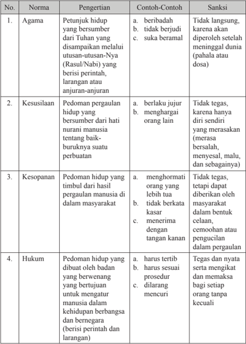

Tabel ini membahas empat norma yang penting dalam kehidupan manusia: Agama, Kesusilaan, Kesopanan, dan Hukum. Setiap norma dijelaskan dengan pengertian, contoh-contoh, dan sanksi yang mungkin terjadi jika norma tersebut tidak dilaksanakan. Topik utama tabel ini adalah norma-norma moral dan etis dalam kehidupan manusia. Kolom-kolom yang ada meliputi nomor norma, nama norma, pengertian norma, contoh-contoh norma, dan sanksi jika norma tersebut tidak dilaksanakan. Data atau pola penting yang terlihat adalah bahwa setiap norma memiliki konsekuensi negatif jika tidak dilaksanakan, seperti tidak langsung, tidak tegas, tidak berhormati, tidak bertanggung jawab, dan tidak sesuai dengan prosedur.

 

---
## 📄 Halaman 69

Dalam Tabel 2.1, disebutkan bahwa sanksi norma hukum adalah tegas dan nyata. Hal tersebut mengandung pengertian sebagai berikut.

- Tegas berarti adanya aturan yang telah dibuat secara material telah diatur dalam peraturan perundang-undangan. Misalnya, hukum pidana mengenai sanksi  diatur  dalam  Pasal  10  KUHP.  Dalam  pasal  tersebut,  ditegaskan bahwa sanksi pidana berbentuk hukuman yang mencakup:
- Hukuman pokok, yang terdiri atas:
- hukuman mati; dan
- hukuman  penjara  yang  terdiri  atas  hukuman  seumur  hidup  dan hukuman  sementara  waktu  (setinggi-tingginya  20  tahun  dan sekurang-kurangnya 1 tahun).
- Hukuman tambahan, yang terdiri atas:
- pencabutan hak-hak tertentu;
- perampasan (penyitaan) barang-barang tertentu; dan
- pengumuman keputusan hakim.
- Nyata berarti adanya aturan yang secara material telah ditetapkan kadar hukuman berdasarkan perbuatan yang dilanggarnya. Contoh: Pasal 338 KUHP,  menyebutkan 'barang  siapa  sengaja  merampas  nyawa  orang lain, diancam, karena pembunuhan, dengan pidana penjara paling lama lima belas tahun'.
Sanksi hukum diberikan oleh negara, melalui lembaga-lembaga peradilan, Sanksi sosial diberikan oleh masyarakat,  misalnya  dengan  cemoohan, dikucilkan dari pergaulan, bahkan yang paling berat diusir dari lingkungan masyarakat setempat.

Jika  sanksi  hukum  maupun  sanksi  sosial  tidak  juga  mampu  mencegah orang  dari  perbuatan  melanggar  aturan,  ada  satu  jenis  sanksi  lain,  yakni sanksi psikologis. Sanksi psikologis dirasakan dalam batin kita sendiri. Jika seseorang  melakukan  pelanggaran  terhadap  peraturan,  tentu  saja  di  dalam batinnya ia merasa bersalah. Selama hidupnya, ia akan dibayang-bayangi oleh kesalahannya itu. Hal ini akan sangat membebani jiwa dan pikiran kita. Sanksi inilah  yang  merupakan  gerbang  terakhir  yang  dapat  mencegah  seseorang melakukan pelanggaran terhadap aturan.

 

---
## 📄 Halaman 70

### Tugas Kelompok 2.2

Lakukan  wawancara  dengan  Kapolsek  atau  anggota  polisi  lainnya  di wilayah tempat Anda tinggal. Tanyakan hal-hal sebagai berikut.

- Jumlah kasus yang ditangani oleh Polsek setempat.
- Jenis kasus yang ditangani.
- Penanganan kasus tersebut.
- Jenis sanksi yang akan diterima oleh pihak-pihak yang terlibat. Laporkan hasil wawancara tersebut secara tertulis dan presentasikan di depan kelas.

### 3. Partisipasi dalam Perlindungan dan Penegakan Hukum

Setelah Anda menganalisis berbagai macam kasus pelanggaran hukum dan memahami sanksi atas pelanggaran hukum yang dilakukan, tentu saja sekarang keyakinan Anda akan pentingnya perlindungan dan penegakan hukum makin tinggi.  Nah,  keyakinan  tersebut  harus  dibuktikan,  salah  satunya  dengan berpartisipasi dalam proses perlindungan dan penegakan hukum. Wujud dari partisipasi tersebut adalah dengan menampilkan perilaku yang mencerminkan ketaatan atau kepatuhan terhadap hukum.

Ketaatan atau  kepatuhan  terhadap  hukum  yang  berlaku  merupakan konsep nyata dalam diri seseorang yang diwujudkan  dalam  perilaku  yang sesuai dengan  sistem hukum yang berlaku. Tingkat kepatuhan hukum yang diperlihatkan  oleh  seorang  warga  negara,  secara  langsung  menunjukkan tingkat kesadaran hukum yang dimilikinya. Kepatuhan hukum mengandung arti bahwa seseorang memiliki kesadaran untuk:

- memahami dan menggunakan peraturan perundangan yang berlaku;
- mempertahankan tertib hukum yang ada; dan
- menegakkan kepastian hukum.
Adapun ciri-ciri  seseorang  yang  berperilaku  sesuai  dengan  hukum  yang berlaku dapat dilihat dari perilaku yang diperbuatnya:

- disenangi oleh masyarakat pada umumnya;
- tidak menimbulkan kerugian bagi diri sendiri dan orang lain;
- tidak menyinggung perasaan orang lain;
- menciptakan keselarasan;
- mencerminkan sikap sadar hukum;
- mencerminkan kepatuhan terhadap hukum.

 

---
## 📄 Halaman 71

Perilaku  yang  mencerminkan  sikap  patuh  terhadap  hukum  harus  kita tampilkan dalam kehidupan sehari-hari baik di lingkungan keluarga, sekolah, masyarakat, bangsa dan negara sebagai bentuk perwujudan partisipasi Anda dalam proses penegakan dan perlindungan hukum. Berikut ini contoh perilaku yang mencerminkan kepatuhan terhadap hukum yang berlaku

### a. Dalam Kehidupan di Lingkungan Keluarga

- Mematuhi perintah orang tua.
- Ibadah tepat waktu.
- Menghormati anggota keluarga yang lain seperti ayah, ibu, kakak, adik dan sebagainya.
- Melaksanakan aturan yang dibuat dan disepakati keluarga.

### b.  Dalam kehidupan di Lingkungan Sekolah

- Menghormati kepala sekolah, guru dan karyawan lainnya.
- Memakai pakaian seragam yang telah ditentukan.
- Tidak menyontek ketika ulangan.
- Memperhatikan penjelasan guru.
- Mengikuti pelajaran sesuai dengan jadwal yang berlaku.

### c. Dalam Kehidupan di Lingkungan Masyarakat

- Melaksanakan setiap norma yang berlaku di masyarakat;
- Bertugas ronda.

---
**🖼️ Gambar/Diagram**

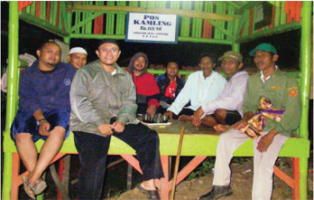

> **Deskripsi Visual:** Gambar ini adalah foto yang menampilkan kelompok orang sedang berada di sebuah tempat yang tampak seperti tenda atau kios kecil. Kelompok tersebut terdiri dari beberapa orang dewasa yang tampaknya sedang berbicara atau mengobrol. Mereka duduk di atas meja sederhana yang terbuat dari bambu atau kayu, dengan kursi yang juga terbuat dari bahan alami. Di belakang mereka, terdapat papan tulis dengan tulisan "PUPIL KAMPUNG" yang menunjukkan bahwa tempat ini mungkin merupakan tempat pendidikan atau pengembangan untuk anak-anak di desa atau kampung. Selain itu, ada beberapa papan informasi atau poster yang tampaknya berisi informasi tentang program atau kegiatan yang dilakukan di tempat tersebut.

Elemen-elemen utama dalam gambar ini meliputi kelompok orang, meja sederhana, kursi bambu/kayu, papan tulis, dan papan informasi. Relasi antara elemen-elemen ini adalah bahwa kelompok orang duduk di atas meja sederhana yang terbuat dari bambu/kayu, yang kemudian ditempatkan di depan papan tulis dan papan informasi yang menyediakan informasi tentang program atau kegiatan yang dilakukan di tempat tersebut.

Teks, angka, atau label penting yang terlihat dalam gambar ini adalah "PUPIL KAMPUNG" pada papan tulis di belakang kelompok orang. Informasi kunci yang dapat diambil pembaca dari gambar ini adalah bahwa tempat tersebut mungkin merupakan tempat pendidikan atau pengembangan untuk anak-anak di desa atau kampung, dan kelompok orang tersebut mungkin merupakan siswa atau murid dari program tersebut.

Sumber

: hasprabu.blogspot.com

 

---
## 📄 Halaman 72

- Ikut serta dalam kegiatan kerja bakti.
- Menghormati keberadaan tetangga disekitar rumah.
- Tidak melakukan perbuatan yang menyebabkan kekacauan di masyarakat seperti tawuran, judi, mabuk-mabukkan dan sebagainya;
- Membayar iuran warga.

### d.  Dalam kehidupan di Lingkungan Bangsa dan Negara.

- Bersikap tertib ketika berlalu lintas di jalan raya.
- Memiliki KTP.
- Memiliki SIM.
- Ikut serta dalam kegiatan pemilihan umum.
- Membayar pajak.
- Membayar retribusi parkir.

### Re fl eksi

Setelah  Anda  mempelajari  materi  perlindungan  dan  penegakan  hukum, tentunya Anda makin memahami bahwa sebagai warga negara, Anda harus mematuhi setiap hukum yang berlaku. Renungkan sikap dan perilaku Anda dalam  kehidupan  sehari-hari  apakah  pernah  atau  tidak  pernah  melakukan pelanggaran hukum, serta berikan alasannya.

---
**📊 Tabel**

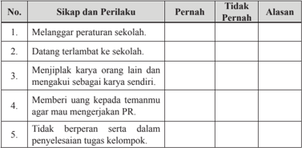

Tabel ini menunjukkan sikap dan perilaku siswa terhadap berbagai situasi di sekolah. Kolom "Pernah" dan "Tidak Pernah" membandingkan apakah siswa telah melakukan atau belum melakukan tindakan tertentu. Kolom "Alasan" memberikan alasan mengapa siswa melakukan atau tidak melakukan tindakan tersebut. Topik utama tabel ini adalah sikap dan perilaku siswa terhadap peraturan sekolah, keterlambatan datang ke sekolah, penyalahgunaan waktu, penggunaan uang, dan partisipasi dalam tugas kelompok. Data penting yang terlihat adalah bahwa banyak siswa sering melanggar peraturan sekolah, keterlambatan datang ke sekolah, dan tidak berpartisipasi dalam tugas kelompok.

 

---
## 📄 Halaman 73

---
**📊 Tabel**

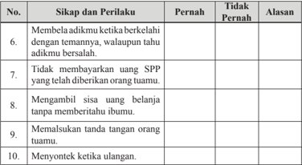

Tabel ini berisi 10 pertanyaan tentang sikap dan perilaku siswa terhadap orang tuanya, dengan dua pilihan jawaban: "Pernah" dan "Tidak Pernah". Setiap pertanyaan memiliki alasan untuk memilih salah satu pilihan. Topik utama tabel adalah sikap dan perilaku siswa terhadap orang tuanya, termasuk berbagai situasi seperti berkelahi dengan temannya, tidak membayar uang SPP, mengambil uang tanpa izin, memalsukan tanda tangani orang tuanya, dan menyontek ketika ulangan. Data penting yang terlihat adalah bahwa sebagian besar siswa (8 dari 10) pernah melakukan perilaku tersebut, menunjukkan adanya masalah dalam hubungan antara siswa dan orang tuanya.

 

---
## 📄 Halaman 74

### Rangkuman

### 1. Kata kunci

Kata kunci yang harus Anda pahami dalam mempelajari materi pada bab ini adalah hukum, perlindungan hukum, penegakan hukum, aparat penegak hukum, dan sanksi hukum.

### 2. Intisari Materi

- Perlindungan  hukum  merupakan  upaya  pemberian  perlindungan kepada subjek hukum  oleh aparat penegak hukum  melalui penetapan suatu peraturan tertulis ataupun tidak tertulis, sehingga subjek  hukum  tersebut  dapat  merasakan  keadilan,  ketenteraman, kepastian, dan sebagainya.
- Perlindungan  hukum  tidak  akan  terwujud  apabila  tidak  disertai dengan  penegakan  hukum.  Penegakan  hukum  merupakan  upaya untuk  melaksanan  ketentuan  hukum  yang  berlaku  oleh  aparat penegak hukum bersama masyarakat untuk mewujudkan supremasi hukum, menegakkan keadilan dan mewujudkan perdamaian dalam kehidupan masyarakat.
- Lembaga yang berperan dalam proses perlindungan dan penegakan hukum  di  Indonesia  di  antaranya  adalah  Kepolisian,  Kejaksaan, Lembaga Peradilan (pemegang kekuasaan kehakiman) dan Advokat atau Penasihat Hukum serta Komisi Pemberantasan Korupsi.
- Pelanggaran hukum yang terjadi pada umumnya disebabkan oleh ketidakpatuhan terhadap ketentuan yang berlaku. Ketidakpatuhan tersebut  pada  akhirnya  akan  menyebabkan  kepentingan  setiap orang tidak terlindungi.
- Wujud  dari  partisipasi  masyarakat  dalam  proses  perlindungan dan penegakan hukum di Indonesia salah satunya adalah dengan menampilkan  perilaku  yang  mencerminkan  kepatuhan  terhadap hukum yang berlaku di berbagai lingkungan kehidupan.

 

---
## 📄 Halaman 75

### Penilaian Diri

### 1. Sikap Perilaku

Penilaian ini untuk mengukur sejauh mana Anda telah berperilaku sesuai dengan  hukum  yang  berlaku  dalam  kehidupan  sehari-hari.  Bacalah  daftar perilaku di bawah ini, kemudian isi kolom kegiatan dengan rutinitas yang biasa dilakukan selalu, sering, kadang-kadang, dan tidak pernah dengan memberi tanda silang (x). Ingat, Anda harus mengisinya sesuai dengan keadaan yang sebenarnya.

---
**📊 Tabel**

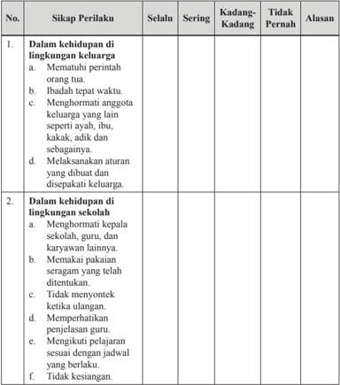

Tabel ini berisi informasi tentang sikap perilaku yang diharapkan dalam dua lingkungan: keluarga dan sekolah. Topik utamanya adalah sikap-sikap yang dianjurkan untuk dijalani dalam setiap lingkungan tersebut. Kolom-kolomnya meliputi "Selalu", "Sering", "Kadang-Kadang", dan "Tidak Pernah". Data penting yang terlihat antara lain bahwa dalam keluarga, sikap seperti mematuhi perintah orang tua, ibadah tepat waktu, menghormati anggota keluarga, dan melaksanakan aturan keluarga harus selalu dilakukan. Sementara itu, dalam sekolah, sikap seperti menghormati guru, karyawan, memakai pakaian seragam yang ditentukan, tidak menonton ketika ulangan, memperhatikan penjelasan guru, mengikuti jadwal belajar sesuai dengan yang berlaku, dan tidak kesia-sianan harus selalu dilakukan.

 

---
## 📄 Halaman 76

---
**📊 Tabel**

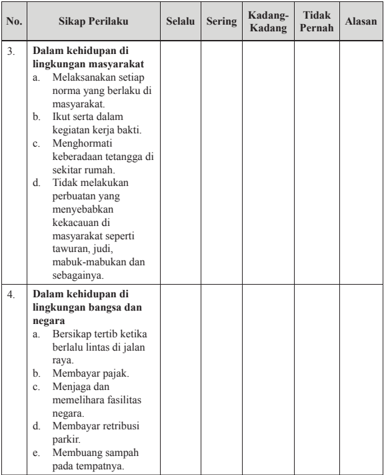

Tabel ini berisi dua topik utama: sikap perilaku di lingkungan masyarakat dan sikap perilaku di lingkungan bangsa dan negara. Kolom-kolomnya meliputi "Selalu", "Sering", "Kadang-Kadang", dan "Tidak Pernah". Data penting yang terlihat menunjukkan bahwa sikap-sikap seperti melaksanakan norma masyarakat, ikut serta dalam kegiatan kerja bakti, menghormati keberadaan tetangga, tidak melakukan perbuatan yang menyebabkan kerusakan masyarakat, bersikap tertib ketika berlalu lintas, membayar pajak, menjaga dan memelihara fasilitas negara, membayar retribusi parkir, dan membuang sampah pada tempatnya, sering dilakukan oleh individu. Sementara itu, sikap-sikap seperti tidak melaksanakan norma masyarakat, tidak ikut serta dalam kegiatan kerja bakti, tidak menghormati keberadaan tetangga, melakukan perbuatan yang menyebabkan kerusakan masyarakat, tidak bersikap tertib ketika berlalu lintas, tidak membayar pajak, tidak menjaga dan memelihara fasilitas negara, tidak membayar retribusi parkir, dan tidak membuang sampah pada tempatnya, sering kali dilakukan oleh individu.

Apabila jawaban Anda 'kadang-kadang' atau 'tidak pernah' pada kolom perilaku-perilaku tersebut di atas, Anda sebaiknya mulai mengubah sikap dan perilaku Anda agar menjadi lebih baik.

 

---
## 📄 Halaman 77

### 2.  Pemahaman Materi

Dalam mempelajari materi pada bab ini, tentu saja ada materi yang dengan mudah Anda  pahami,  ada  juga  yang  sulit  Anda  pahami.  Oleh  karena  itu, lakukanlah  penilaian  diri  atas  pemahaman Anda  terhadap  materi  pada  bab ini  dengan memberikan tanda ceklist ( √ )  pada kolom paham sekali, paham sebagian, dan belum paham.

---
**📊 Tabel**

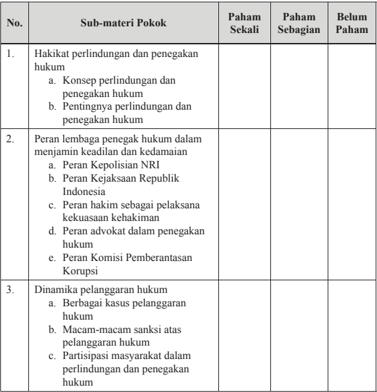

Tabel ini berisi informasi tentang pemahaman siswa terhadap sub-materi pokok dalam pembelajaran hukum. Topik utama tabel meliputi hakikat perintindangan dan penegakan hukum, peran lembaga penguasa hukum dalam menjamin keadilan dan kedamaian, serta dinamika pelanggaran hukum. Kolom "Paham Sekali" menunjukkan tingkat pemahaman siswa yang paling tinggi, sedangkan kolom "Belum Paham" menunjukkan tingkat pemahaman siswa yang paling rendah. Data penting yang terlihat adalah bahwa sebagian besar siswa memiliki pemahaman yang baik tentang hakikat perintindangan dan penegakan hukum, sedangkan mereka masih memerlukan penjelasan lebih lanjut untuk memahami peran lembaga penguasa hukum dan dinamika pelanggaran hukum.

Apabila  pemahaman Anda  berada  pada  kategori  paham  sekali  mintalah materi pengayaan kepada guru untuk menambah wawasan Anda, sedangkan apabila pemahaman Anda berada pada kategori paham sebagian dan  belum paham coba bertanyalah kepada guru serta mintalah penjelasan lebih lengkap, supaya Anda cepat memahami materi pembelajaran yang sebelumnya kurang atau belum memahaminya.

 

---
## 📄 Halaman 78

### Proyek Kewarganegaraan

### Mari Menyelesaikan Masalah

- Pilihlah oleh kelasmu salah satu masalah di bawah ini.
- Maraknya tawuran pelajar.
- Geng motor yang meresahkan masyarakat.
- Makin meningkatnya kasus tindak pidana korupsi oleh para pejabat.
- Bentuklah kelasmu dalam 4 kelompok untuk membahas satu masalah yang dianggap paling penting oleh kelasmu!
- Setiap kelompok mengkaji permasalahan tersebut dan membuat laporan (portofolio) dengan pembagian tugas sebagi berikut.
- Kelompok  I : Menjelaskan masalah secara tertulis dilengkapi gambar, foto, karikatur, judul surat kabar dan ilustrasi lain disertai sumber-sumber informasinya tentang hal-hal berikut.
- Bagaimana jalannya masalah?
- Seberapa luas masalah tersebar pada bangsa dan negara?
- Mengapa  masalah  harus  ditangani  pemerintah  dan  haruskah seseorang bertanggung jawab memecahkan masalah?
- Adakah kebijakan tentang masalah tersebut?
- Adakah  perbedaan  pendapat,  siapa  organisasi  yang  berpihak pada masalah ini?
- Pada  tingkat  atau  lembaga  pemerintah  apa  yang  bertanggung jawab tentang masalah ini?
- Kelompok  II :  Merumuskan  kebijakan  alternatif  untuk  mengatasi masalah. Menjelaskan  secara tertulis dilengkapi gambar, foto, karikatur  dan  ilustrasi  lain  disertai  sumber-sumber  informasinya tentang hal-hal berikut.
- Kebijakan alternatif yang berhasil dihimpun dari berbagai sumber informasi yang dikumpulkan.

 

---
## 📄 Halaman 79

- Kajian terhadap setiap kebijakan alternatif tersebut dengan menjawab pertanyaan kebijakan apakah yang diusulkan dan apakah keuntungan dan kerugian kebijakan tersebut.
- Kelompok  III : Mengusulkan kebijakan publik untuk mengatasi masalah dilengkapi gambar, foto, karikatur, judul surat kabar, dan ilustrasi lain disertai sumber-sumber informasinya tentang hal-hal tersebut.
- Kebijakan yang diyakini akan dapat mengatasi masalah.
- Keuntungan dan kerugian dari kebijakan tersebut.
- Kebijakan tersebut tidak melanggar peraturan perundang-undangan.
- Tingkat  atau  lembaga  pemerintah  mana  yang  harus  bertanggung jawab menjalankan kebijakan yang diusulkan.
- Kelompok  IV :  Membuat  rencana  tindakan  yang  mencakup  langkahlangkah yang dapat diambil agar kebijakan yang diusulkan diterima dan dilaksanakan oleh pemerintah. Hal ini berupa penjelasan tentang hal-hal tersebut.
- Bagaimana  dapat  menumbuhkan  dukungan  pada  individu  dan kelompok  dalam  masyarakat  terhadap  rancangan  tindakan  yang diusulkan.
- Mendeskripsikan individu atau kelompok yang berpengaruh dalam masyarakat yang mungkin hendak mendukung rancangan tindakan kelas dan bagaimana kalau dapat memperoleh dukungan tersebut.
- Menggambarkan  pula  kelompok  di  masyarakat  yang  mungkin menentang rancangan tindakan dan bagaimana Anda dapat meyakinkan mereka untuk mendukung rencana tindakan.
- Setiap kelompok menyajikan/mempresentasikan hasilnya di hadapan dewan juri  atau guru yang mewakili sekolah.

 

---
## 📄 Halaman 80

### Uji Kompetensi Bab 2

### Jawablah soal-soal di bawah ini secara singkat, jelas, dan akurat.

- Apa yang dimasud dengan perlindungan dan penegakan hukum?
- Mengapa perlindungan hukum tidak akan terwujud apabila penegakan hukum tidak dilaksanakan?
- Mengapa perlindungan dan penegakan hukum mutlak harus dilakukan dalam sebuah negara demokrasi?
- Bedakan peran polisi, jaksa, hakim dan advokat serta KPK dalam proses penegakan hukum di Indonesia!
- Mengapa terjadi pelanggaran hukum?
- Deskripsikan contoh-contoh perilaku yang menunjukkan ketidakpatuhan terhadap hukum di lingkungan keluarga, sekolah, masyarakat, dan sekolah!
?

!e

 

---
## 📄 Halaman 81

### Pengaruh Kemajuan Iptek terhadap Negara Kesatuan Republik Indonesia

Selamat ya, Anda sekarang sudah memasuki semester dua di kelas XII. Semester ini sangat menentukan langkah Anda untuk bisa lulus dari SMA/ SMK/MA/MAK. Nah, di semester dua ini materi pembelajaran untuk mata pelajaran  Pendidikan  Pancasila  dan  Kewarganegaraan  (PPKn)  akan  makin memberikan tantangan kepada Anda untuk senantiasa belajar dengan penuh kesungguhan.

Pada  bab  ini,  Anda  akan  diajak  untuk  mengevaluasi  potensi  ancaman terhadap negara terkait kemajuan Iptek dalam bingkai Bhinneka Tunggal Ika. Pada akhirnya Anda dapat menunjukkan partisipasi dalam mengatasi berbagai macam ancaman yang dapat mengganggu persatuan dan kesatuan bangsa.

Sebelum Anda mempelajari materi pembelajaran pada bab ini, coba Anda baca wacana di bawah ini.

### Internet Bikin Kemajuan Sekaligus Kehancuran Negara, Mengapa?

Buah simalakama, mungkin itulah istilah yang tepat untuk  pertumbuhan  Internet.  Karena  selain  memicu kemajuan  bangsa,  pertumbuhan  dan  ketergantungan pada internet yang sedemikian besar juga bisa berbahaya.

 

---
## 📄 Halaman 82

Pertumbuhan  industri  internet  yang  sangat  pesat di  Indonesia  ternyata  dibarengi  dengan  peningkatan serangan dunia maya. Rudi Lumanto, Ketua Indonesia Security Incident Response Team on Internet Infrastructure, mengatakan jumlah pengguna Internet melonjak  hingga  3.150%  dalam  10  tahun  terakhir, yaitu dari 2 juta orang pada 2000 menjadi 63 juta pada 2012.

'Dari survey sejumlah lembaga internasional seperti  Bielsen,  BCG,  dan Yahoo,  jumlah  pengguna internet di Indonesia akan melonjak hingga 146 juta orang pada 2015,' katanya. Meledaknya  jumlah pengguna dan tra fi k internet di Indonesia bisa dilihat dari  data  ID-SIRTII  yang  mengungkapkan  bahwa jumlah hit ke Google dalam satu tahun dari Indonesia mencapai 2,75 miliar hits.

Menurut  Rudi,  masyarakat  dulu  menggunakan internet  hanya  untuk  komunikasi,  sekarang  sudah merambah ke transaksi digital, sehingga rentan serangan cyber crime .

ID-SIRTII mengungkapkan sepanjang 2012, terdapat  39,9  juta  serangan  kepada  situs-situs  dan infrastruktur TI di Indonesia, yang mana serangan per harinya  mencapai 110.000 serangan. Sebanyak 82% serangan berbasis SQL, sisanya DNS, Web Base, dan Windows Base.

'Yang menarik, sebanyak 65% atau 79.000 serangan  berasal  dari  Indonesia  sendiri,  dan  hanya sedikit sekali yang dari luar negeri,' tutur Rudi.

Sayangnya,  tambahnya,  kesadaran  melapor  dari korban  serangan  sangat  rendah,  masih  di  bawah  50 insiden saja dalam setahun. Menurut Rudi, penetrasi internet yang makin tinggi memang dibarengi serangan yang  makin  besar  efeknya,  seperti  pernah  terjadi  di Estonia, yang akhirnya melumpuhkan semua sektor di negara tersebut.

Sumber : http://majalahict.com/berita-1275- html

 

---
## 📄 Halaman 83

Nah,  setelah Anda  membaca  wacana  tersebut,  tuliskan  semua  hal  yang Anda pikirkan atau pertanyakan dalam tabel di bawah ini!

---
**📊 Tabel**

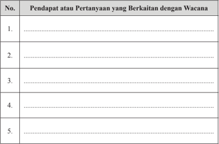

Tabel ini berisi 5 baris yang masing-masing menunjukkan pendapat atau pertanyaan yang berkaitan dengan wacana tertentu. Topik utama tabel ini adalah "Pendapat atau Pertanyaan yang Berkaitan dengan Wacana". Kolom-kolomnya mencakup nomor (No.) dan teks yang berhubungan dengan wacana tersebut. Data atau pola penting yang terlihat adalah bahwa setiap baris memiliki satu atau lebih pendapat atau pertanyaan yang relevan dengan wacana yang ditentukan. Ini menunjukkan bahwa tabel ini digunakan untuk menyajikan berbagai sudut pandang atau perdebatan tentang suatu topik tertentu.

### A. Mengidenti fi kasi Pengaruh Kemajuan Iptek terhadap NKRI

Pada  abad  ke-20,  rekayasa  teknologi  yang  dikembangkan  oleh  manusia terus  mengalami  kemajuan  bahkan  menuju  kesempurnaan.  Pada  abad  ini ditemukan beberapa alat yang sangat menunjang pada perkembangan  dan kemajuan ilmu pengetahuan, seperti munculnya televisi, komputer, telepon dan sebagainya. Selain itu, perkembangan teknologi transportasi juga semakin menunjukkan bahwa dunia ini tanpa batas. Alat-alat transportasi  seperti mobil, kapal laut dan pesawat udara seakan-akan membuat jarak antardaerah bahkan antarnegara  sekalipun  semakin  pendek  dan  bisa  ditempuh  hanya  dengan hitungan  jam  paling  lama  hitungan  hari.  Hal  tersebut  menunjukkan  bahwa kemajuan iptek sedang dinikmati oleh seluruh masyarakat dunia, termasuk masyarakat Indonesia.

Kemajuan iptek  tentunya  memberikan  pengaruh  bagi  kehidupan  sebuah bangsa,  baik  itu  pengaruh  positif  maupun  negatif.  Berikut  ini  dipaparkan pengaruh  positif  dan  negatif  dari  kemajuan  iptek  dalam  berbagai  aspek kehidupan.

 

---
## 📄 Halaman 84

### 1. Pengaruh Positif Kemajuan Iptek bagi Kehidupan Bermasyarakat, Berbangsa dan Bernegara

### a. Aspek Politik

Tidak dapat pungkiri bahwa kemajuan iptek telah berhasil menanamkan nilai-nilai dalam kehidupan politik bangsa Indonesia yang selama ini dianggap tabu. Kemajuan iptek, menjadikan nilai-nilai seperti keterbukaan, kebebasan dan demokrasi berpengaruh kuat terhadap pikiran maupun kemauan bangsa Indonesia. Dengan adanya keterbukaan, dimungkinkan akan dapat mencegah praktik korupsi, kolusi, dan nepotisme sehingga dapat dicapai pemerintahan yang bersih dan berwibawa. Dengan adanya pemerintahan yang demokratis, sangat  dimungkinkan  akan  meningkatnya  kualitas  dan  kuantitas  partisipasi politik rakyat dalam penentuan kebijakan publik oleh pemerintah. Sementara itu dengan adanya kebebasan dalam arti kebebasan yang bertanggung jawab, maka  setiap  orang  dapat  meningkatkan  kualitas  dirinya  dengan  kreativitas dalam kehidupannya tentu saja dalam hal-hal positif. Dengan dilaksanakannya nilai-nilai tersebut, akan menjadi alat kontrol yang efektif dan e fi sien terhadap keberlangsungan suatu pemerintahan, sehingga pada akhirnya akan tercipta pemerintahan yang bersih, jujur, adil, dan aspiratif.

Sumber

: www.tribunnews.com

Pada  saat  ini,  di  Indonesia  makin  banyak  lahir  partai  politik,  lembaga swadaya masyarakat dan organisasi lainnya. Hal tersebut berpengaruh pada perwujudan  supremasi  hukum,  jaminan  hak  asasi  manusia,  demokratisasi, perlindungan lingkungan dan sebagainya.

 

---
## 📄 Halaman 85

### b. Aspek Ekonomi

Pengaruh positif iptek bagi kehidupan ekonomi yang dapat kita ambil di antaranya:

- Makin  meningkatnya  investasi  asing  atau  penanaman  modal  asing  di negara kita.
- Makin terbukanya pasar internasional bagi hasil produksi dalam negeri
- Mendorong  para  pengusaha  untuk  meningkatkan  e fi siensi  dan  menghilangkan biaya tinggi.
- Meningkatkan kesempatan kerja dan devisa negara.
- Meningkatkan kemakmuran masyarakat.
- Menyediakan dana tambahan untuk pembangunan ekonomi.

### c. Aspek Sosial Budaya

Kemajuan  teknologi  dan  informasi  yang  ditandai  dengan  munculnya internet  dan  makin  canggihnya  alat-alat  komunikasi  secara  langsung  telah mempermudah kita untuk memperoleh informasi dari belahan bumi lainnya, sehingga kita secara tidak langsung telah melakukan proses tranformasi ilmu yang sangat bermanfaat bagi kita. Selain itu juga, dengan adanya informasi tersebut kita bisa mencontoh atau belajar banyak dari tata nilai sosial budaya, cara hidup, pola berpikir yang baik, maupun ilmu pengetahuan  dan teknologi dari  bangsa  lain  yang  telah  maju  untuk  kemajuan  dan  kesejahteraan  kita. Misalnya  kita  bisa  mencontoh  etos  kerja  dan  semangat  kerja  keras  yang ditampilkan oleh orang lain untuk kita terapkan dalam kehidupan kita.

### d. Aspek Hukum, Pertahanan, dan Keamanan

Pengaruh positif  iptek  dalam  bidang  hukum,  pertahanan,  dan  keamanan yang dapat kita ambil di antaranya:

- Makin  menguatnya  supremasi  hukum,  demokratisasi  dan  tuntutan terhadap dilaksanakannya hak asasi manusia.
- Menguatnya  regulasi  hukum  dan  pembuatan  peraturan  perundangundangan  yang  memihak  dan  bermanfaat  untuk  kepentingan  rakyat banyak.
- Makin  menguatnya  tuntutan  terhadap  tugas-tugas  penegak  hukum (polisi, jaksa dan hakim) yang lebih profesional, transparan, dan dapat dipertanggungjawabkan.
- Menguatnya  supremasi  sipil  dengan  mendudukan  tentara  dan  polisi sebatas penjaga keamanan, kedaulatan, dan ketertiban negara.

 

---
## 📄 Halaman 86

### Tugas Mandiri 3.1

Bacalah berita di bawah ini.

### 24 Kepala Daerah Sepakat e-Budgeting

Para peserta forum Orientasi Kepemimpinan Dalam Penyelenggaraan Pemerintahan Daerah (OKPPD) menyepakati percepatan penggunaan e-budgeting yang terbukti bisa mencegah penyelewengan dana dalam anggaran pendapatan  dan  belanja  daerah  (APBD).'E-budgeting  akan  meningkatkan kualitas partisipasi politik. Intinya, e-budgeting buat semua warga negara jadi penting dan dipentingkan,' kata Ketua Angkatan I OKPPD, Bima Arya, di Jakarta, Jumat (27/3).

Selain menyepakati percepatan e-budgeting, forum juga merekomendasikan perpanjangan  usia  pensiun  bagi  pegawai  negeri  sipil  (PNS).  Hal  tersebut penting untuk dijadikan dasar hukum dalam penyediaan posisi bagi pejabat struktural yang tidak lolos seleksi terbuka. OKPPD angkatan pertama 2015 diikuti 17 bupati, 7 wali kota, 3 wakil bupati, 10 ketua DPRD kota/kabupaten, dan 1 wakil ketua DPRD. Wali Kota Bogor, Bima Arya, terpilih sebagai Ketua Angkatan I OKPPD dan Wali Kota Pangkal Pinang, Muhammad Irwansyah, terpilih sebagai sekretaris.

Penyusunan  APBD  berbasis  e-budgeting  pertama  kali  diterapkan  di  Kota Surabaya, Jatim, yang diikuti Pemprov DKI di 2015.

Sumber: www.tribunnews.com

Setelah  Anda  membaca  berita  tersebut,  jawab  pertanyaan-pertanyaan berikut.

- Apa yang dimaksud dengan e-budgeting ?
- Apa keuntungan penerapan e-budgeting dalam penyelenggaraan pemerintahan?
- Menurut  Anda,  apakah  pada  saat  ini  sistem e-budgeting harus  sudah diterapkan oleh semua sektor pemerintahan? Berikan alasannya.
- Bagaimana dampak penerapan e-budgeting dalam pemberantasan korupsi?
- Apa saja syarat sebuah daerah untuk bisa menerapkan e-budgeting ?

 

---
## 📄 Halaman 87

### 2. Pengaruh Negatif   Iptek bagi Kehidupan Bermasyarakat, Berbangsa, dan Bernegara.

Selain mempunyai pengaruh yang positif, kemajuan iptek juga melahirkan pengaruh  yang  negatif  bagi  kehidupan  kita.  Di  antara  pengaruh  negatif tersebut, seperti dalam aspek berikut ini.

### a. Aspek Politik

Kemajuan  iptek melalui globalisasi untuk sementara telah  mampu meyakinkan sebagian masyarakat Indonesia bahwa liberalisme dapat  membawa manusia  ke  arah  kemajuan  dan  kemakmuran.  Hal  ini  akan  memengaruhi pikiran mereka untuk berpaling dari ideologi Pancasila dan mencari alternatif ideologi lain seperti halnya liberalisme.

Nilai-nilai yang dibawa iptek seperti keterbukaan, kebebasan dan demokratisasi  tidak  menutup  kemungkinan  akan  disalahartikan  oleh  masyarakat Indonesia. Akibatnya, hal tersebut terjadi, akan menimbulkan terganggunya stabilitas politik nasional seiring dengan terjadinya tindakan-tindakan anarki sebagai reaksi terhadap sikap pemerintah yang menurut mereka tidak terbuka, tidak memberikan kebebasan dan tidak demokratis kepada rakyatnya. Hal ini akan senantiasa terjadi jika antara rakyat dan pemerintah belum menemukan kesamaan dalam memahami nilai-nilai yang dibawa iptek tersebut.

Pengaruh  negatif  lainnya  dari  kemajuan  iptek  yang  mesti  diwaspadai adalah munculnya gerakan-gerakan radikalisme dan terorisme. Para pelaku gerakan  tersebut  pada  umumnya  merupakan  orang-orang  yang  terampil dalam  memanfaatkan  teknologi.  Tidak  jarang  di  antara  mereka  mempuyai keterampilan  dalam  merakit  senjata,  merakit  bom  dan  sebagainya.  Hanya sayangnya,  keterampilan  mereka  tersebut  digunakan  untuk  mengganggu keamanan negara sehingga stabilitas negara menjadi terancam.

### b. Aspek Ekonomi

Kemajuan iptek memberikan pengaruh negatif terhadap kehidupan ekonomi seperti berikut ini:

- Indonesia  akan  dibanjiri  oleh  barang-barang  dari  luar  seiring  dengan adanya  perdagangan  bebas  yang  tidak  mengenal  adanya  batas-batas negara. Hal ini mengakibatkan makin terdesaknya barang-barang lokal terutama yang tradisional karena kalah bersaing dengan barang-barang dari luar negeri.
- Cepat atau lambat, perekonomian negara kita akan dikuasai oleh pihak asing,  seiring  dengan  makin  mudahnya  orang  asing  menanamkan modalnya di Indonesia, yang pada akhirnya mereka dapat mendikte atau menekan  pemerintah  atau  bangsa  kita.  Dengan  demikian,  bangsa  kita akan dijajah secara ekonomi oleh negara investor.

 

---
## 📄 Halaman 88

- Akan timbulnya kesenjangan sosial yang tajam sebagai akibat dari adanya persaingan bebas. Persaingan bebas tersebut akan menimbulkan adanya pelaku ekonomi yang kalah dan yang menang. Yang menang akan dengan leluasa memonopoli pasar, sedangkan yang kalah akan menjadi penonton yang senantiasa tertindas.
- Pemerintah hanya sebagai regulator pengaturan ekonomi yang mekanismenya akan ditentukan oleh pasar.
- Sektor-sektor ekonomi rakyat yang diberikan subsidi semakin berkurang, koperasi  makin  sulit  berkembang  dan  penyerapan  tenaga  kerja  dengan pola padat karya makin ditinggalkan.

### c. Aspek Sosial Budaya

Kemajuan iptek dapat melahirkan pengaruh negatif bagi perilaku masyarakat, seperti berikut ini:

- Munculnya  gaya  hidup  konsumtif  dan  selalu  mengonsumsi  barangbarang dari luar negeri.
- Munculnya sifat hedonisme, yaitu kenikmatan pribadi dianggap sebagai suatu nilai hidup tertinggi. Hal ini membuat manusia suka memaksakan diri  untuk  mencapai  kepuasan  dan  kenikmatan  pribadinya  tersebut, meskipun harus melanggar norma-norma yang berlaku di masyarakat. Seperti mabuk-mabukan, pergaulan bebas, foya-foya, dan sebagainya.
Sumber:

hƩ   p://702ent.com

 

---
## 📄 Halaman 89

- Adanya  sikap  individualisme,  yaitu  sikap  selalu  mementingkan  diri sendiri serta memandang orang lain itu tidak ada dan tidak bermakna. Sikap seperti ini dapat menimbulkan ketidakpedulian terhadap orang  lain, misalnya sikap selalu menghardik pengemis, pengamen, dan sebagainya.
- Bisa  mengakibatkan  kesenjangan    sosial  yang  semakin  tajam  antara yang kaya dan miskin.
- Munculnya gejala westernisasi , yaitu gaya hidup yang selalu berorientasi kepada  budaya  Barat  tanpa  diseleksi  terlebih  dahulu,  seperti  meniru model pakaian yang biasa dipakai orang-orang barat yang sebenarnya bertentangan  dengan  nilai  dan  norma-norma  yang  berlaku  misalnya memakai rok mini, lelaki memakai anting-anting, dan sebagainya.
- Makin memudarnya semangat gotong royong, solidaritas,  kepedulian, dan kesetiakawanan sosial.
- Makin lunturnya nilai-nilai keagamaan dalam kehidupan bermasyarakat.

### d. Aspek Hukum, Pertahanan, dan Keamanan

Dampak negatif yang timbul dari kemajuan iptek dalam aspek ini antara lain akan menimbulkan tindakan anarkis dari masyarakat yang dapat mengganggu stabilitas nasional, ketahanan nasional bahkan persatuan dan kesatuan bangsa. Selain  itu,  peran  masyarakat  dalam  menjaga  keamanan,  ketertiban  dan kedaulatan negara semakin berkurang.

### Tugas Mandiri 3.2

Bacalah berita di bawah ini!

### Menjadi Ancaman Besar, Ini Penyebab ISIS ( Islamic State of Iraq and Syria ) Masuk Indonesia

Mantan Panglima TNI Jenderal Moeldoko mengatakan ISIS adalah  ancaman  besar  bagi  Indonesia.  Saat  ini  anggota  ISIS di  Indonesia  sudah  bergerilya.  'Ancaman  ISIS  di  Indonesia potensinya cukup besar. Bila Indonesia tidak mengelola dengan baik, ISIS menjadi ancaman besar Indonesia,' kata Moeldoko, setelah memberikan kuliah umum  inovasi dan semangat kebangsaan  di  Balai  Sidang  Universitas  Indonesia,  Jumat,  11 Desember 2015.

 

---
## 📄 Halaman 90

Menurut Moeldoko, ISIS masuk ke Indonesia karena pintu keluar masuk di Indonesia cukup longgar sehingga pergerakan mereka tidak cukup terawasi. Indonesia, kata dia, menjadi pintu masuk ISIS dari negara lain karena pengawasan keamanannya rendah. Di sisi lain, negara-negara tetangga, seperti Singapura, Malaysia,  dan  Australia  memperketat  pengawasan  sehingga mempersulit ISIS untuk masuk ke sana.

Akibatnya, ISIS makin menjadikan Indonesia negara tujuan karena pengawasan di negeri ini masih longgar. 'Mereka yang tergabung  karena  tidak  bisa  masuk  ke  negaranya  bisa  lari  ke Indonesia  yang  masih  longgar  pengawasannya  dan  payung hukumnya,' ucapnya.

Malaysia,  misalnya,  meningkatkan  sistem  keamanan  yang baik dan aparat keamanan sudah bisa dikerahkan dengan efektif untuk menangkap lebih terduga teroris. Karenanya, ISIS susah masuk ke sana.

Sedangkan Indonesia pengawasannya masih longgar sehingga memancing para teroris masuk. Moeldoko lantas memberikan contoh teroris Noordin Mohammad Top yang datang ke Indonesia karena  pengawasannya  minim.  Indonesia  belum  mempunyai kewaspadaan  tinggi.  Bahkan,  cenderung  permisif.  'Mungkin karena instrumen pengawasannya kurang baik,' ucapnya.

Karena itu, pengawasan dan pengamanan di pintu keluar serta masuk Indonesia mesti diperketat. 'Bila tidak dikelola dengan baik. Satu langkah lagi sudah menjadi ancaman aktual.'

Saat  ini  TNI  sudah  mulai  memetakan  orang-orang  yang tergabung dalam ISIS. Orang-orang masuk dan bergabung ISIS dengan  beragam  alasan.  Ada  yang  menjadi  anggota  karena pengaruh ideologi ISIS, ada juga yang sekadar mencari kehidupan yang baik, dan menyusul keluarga yang sudah menjadi anggota ISIS. 'Karena salah satu keluarganya menjadi ISIS, mereka jadi menyebarkan ideologinya,' ujarnya.

Sumber : http://nasional.tempo.co/read/news/2015/12/11/063727060/

 

---
## 📄 Halaman 91

Setelah membaca berita tersebut, jawablah pertanyaan-pertanyaan berikut ini.

- Apa saja dampak negatif yang akan diterima bangsa Indonesia, apabila gerakan ISIS berkembang di Indonesia?
- Bagaimana penilaian Anda atas upaya pemerintah dalam mencegah berkembangnya gerakan ISIS di Indonesia?
- Tuliskan rekomendasi Anda kepada pemerintah dan masyarakat Indonesia untuk mencegah gerakan ISIS di Indonesia!

### Tugas kelompok 3.1

Nah,  setelah Anda  membaca  uraian  di  atas,  coba Anda  bersama  teman sebangku  melakukan  penilaian  atas  strategi  yang  diterapkan  menghadapi ancaman terhadap negara sebagai dampak dari kemajuan iptek! Informasikan hasil penilaian kelompok Anda kepada kelompok lainnya!

---
**📊 Tabel**

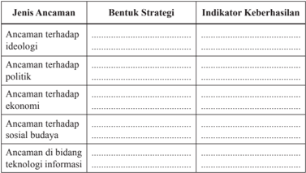

Tabel ini membahas berbagai jenis ancaman yang mungkin dihadapi oleh suatu organisasi atau negara, serta strategi yang dapat digunakan untuk mengatasi ancaman tersebut dan indikator keberhasilannya. Topik utama tabel adalah tentang strategi untuk menghadapi ancaman ideologi, politik, ekonomi, sosial budaya, dan teknologi informasi. Kolom-kolomnya mencakup jenis ancaman, bentuk strategi, dan indikator keberhasilan. Data penting yang terlihat adalah bahwa setiap jenis ancaman memiliki strategi dan indikator keberhasilannya sendiri, menunjukkan bahwa setiap situasi harus dihadapi dengan cara yang tepat sesuai dengan jenis ancamannya.

 

---
## 📄 Halaman 92

### B. Membangun  Sikap  Selektif  dalam  Menghadapi Berbagai Pengaruh Kemajuan Iptek

### 1. Sikap Tanggung Jawab dalam Pengembangan Iptek

Bagaimanapun juga, manusia hidup di dunia ini tidak dapat melepaskan diri dari kemajuan iptek. Dengan iptek, hidup manusia akan dipermudah. Agar tidak menimbulkan permasalahan dan dampak negatif, manusia perlu memiliki tanggung jawab etis di dalam mengembangkan dan menerapkan iptek. Bagi bangsa  Indonesia,  di  dalam  mengembangkan  dan  menerapkan  iptek  perlu mengingat landasan idealnya, yaitu Pancasila dan landasan konstitusionalnya, yaitu UUD NRI Tahun 1945. Dalam kaitannya dengan Pancasila terutama sila Ketuhanan Yang Maha Esa, sebenarnya telah memberikan peringatan kepada kita bahwa semua ilmu yang ada di dunia berasal dari Tuhan. Alam semesta ini adalah objek kajian ilmu pengetahuan. Sebagai contoh, sejak dahulu Tuhan telah  menciptakan bahwa benda yang berat jenisnya kurang dari satu akan terapung di air. Prinsip ini kemudian ditemukan oleh manusia.

Tuhan Yang Maha Kuasa menciptakan alam semesta untuk kemaslahatan umat manusia. Menyadari kenyataan ini, setiap manusia Indonesia di dalam mengembangkan dan menerapkan iptek sudah selayaknya mengingat ajaran dan perintah Tuhan. Iptek harus dikembangkan dan diterapkan untuk kemaslahatan manusia, bukan untuk menyiksa dan mencelakakan manusia.

Sementara itu, UUD NRI Tahun 1945 mengamanatkan bahwa tujuan  nasional,  antara  lain  untuk  memajukan  kesejahteraan  umum  dan mencerdaskan  kehidupan  bangsa.  Selain  itu,  bumi  dan  air,  serta  kekayaan alam yang terkandung di dalamnya dikuasai oleh negara dan dipergunakan sebesar-besarnya untuk kemakmuran rakyat. Untuk itu, upaya memanfaatkan, mengembangkan dan menguasai iptek diarahkan agar senantiasa meningkatkan kecerdasan  manusia,  meningkatkan  pertambahan  nilai  barang  dan  jasa, serta  kesejahteraan  masyarakat  melalui  pencepatan  industrialisasi  sebagai bagian dari pembangunan yang berkelanjutan dengan mengindahkan kondisi lingkungan dan kondisi sosial masyarakat.

Dari  amanat  UUD  NRI  Tahun  1945  jelas  bahwa  pengembangan  dan pemanfaatan iptek untuk meningkatkan kecerdasan dan kesejahteraan rakyat secara  lahir  maupun  batin.  Itu  semua  harus  mempertimbangkan  kondisi lingkungan dan kondisi sosial masyarakat. Ini artinya  pengembangan dan pemanfaatan Iptek di Indonesia tidak bebas nilai, tetapi harus mempertimbangkan  lingkungan  dan  nilai-nilai  sosial  kemasyarakatan  dan agama yang ada di Indonesia.

 

---
## 📄 Halaman 93

Sumber

: www.beritajakarta.com

Usaha  pengembangan  dan  pemanfaatan  iptek,  setiap  manusia  Indonesia harus memiliki kearifan dan berpegang pada prinsip moral. Dengan demikian, pemanfaatan iptek dalam kegiatan pembangunan  tidak akan merusak lingkungan hidup. Akan tetapi, kalau iptek dimanfaatkan tanpa kearifan dan tidak dengan pertimbangan moral, kecenderungan untuk merusak lingkungan lebih besar. Sebagai contoh dinamit dan bahan peledak dimanfaatkan untuk mencari dan menangkap ikan. Hal itu tentunya yang akibatnya dapat merusak habitat dan lingkungan.

Seseorang  yang  menggunakan  bahan  peledak,  jelas  semata-mata  hanya demi  keuntungan  pribadi,  tidak  didasari  pertimbangan  moral  dan  akibat baik  buruknya  dari  tindakan  itu.  Contoh  lain  misalnya  nuklir.  Energi  ini sebenarnya  besar  sekali  manfaatnya  dalam  pembangunan,  termasuk  untuk bidang kesehatan. Akan tetapi, kalau nuklir jatuh ke tangan orang yang tidak bertanggung  jawab,  dibuatlah  senjata  pemusnah,  yang  sangat  mengancam hidup manusia dan lingkungannnya.

Manusia di dalam mengembangkan dan menerapkan iptek sudah selayaknya disertai  etika  dan  rasa  tanggung  jawab.  Etika  dalam  hal  ini,  menyangkut pengertian luas, baik etika keilmuan maupun etika sosial kemanusiaan atau etika moral. Dari segi etika keilmuan, artinya di dalam mengembangkan iptek berdasarkan metode keilmuan dengan langkah-langkah yang sistematis dan bersifat objektif. Manusia mempelajari gejala alam apa adanya dengan tujuan dapat mengungkap rahasia alam dan menciptakan peralatan untuk mengontrol gejala tersebut sesuai dengan hukum alam.

Sebuah  ilmu  dapat  saja  bebas  nilai,  dalam  arti  tanpa  pamrih  dan  tidak memihak. Akan tetapi, dari segi aksiologis, penerapan dan pemanfaatan hasil ipek  harus  mengingat  pada  etika  sosial  kemanusiaan  atau  etika  moral.  Di

 

---
## 📄 Halaman 94

sini,  iptek  tidak  bebas  nilai.  Di  dalam  memanfaatkan  iptek,  manusia  perlu mengingat  nilai-nilai  kemanusiaan,  norma,  bahkan  mengingat  nilai-nilai keagamaan.

Pada segi agama, etika, dan tujuan pengembangan iptek secara sistematis dapat dibagi menjadi dua.  Pertama,  untuk  membantu  manusia  dalam mendekatkan diri kepada Tuhan. Berbagai penelitian atau eksperimen yang dilakukan  manusia,  pada  hakikatnya  adalah  memahami  dan  ingin  mencari kebenaran  ilmu  dan  hukum-hukum  Tuhan  di  alam  raya  ini.  Orang  yang makin paham tentang alam semesta ini tentu makin kagum dan yakin akan kebesaran  dan  kemahakuasaan  Tuhan.  Kedua,  untuk  membantu  manusia dalam menjalankan tugasnya untuk membangun alam semesta ciptaan Tuhan. Dengan iptek, akan diciptakan berbagai perangkat yang dapat mempermudah manusia dalam menjalankan aktivitas kehidupannya di muka bumi ini.

Sementara  itu,  yang  berkaitan  dengan  rasa  tanggung  jawab,  seseorang harus sadar bahwa iptek yang dipergunakan itu dapat dipertanggungjawabkan kebenarannya. Di samping itu, rasa tanggung jawab juga mengandung arti bahwa dalam menerapkan iptek, tidak hanya untuk kepentingan pribadi, tetapi semata-mata demi kemaslahatan orang banyak.

Pengembangan dan pemanfaatan iptek yang selalu disertai dengan etika dan rasa tanggung jawab akan mendatangkan hikmah. Selain itu, juga akan terhindar dari kerusakan lingkungan hidup. Pengembangan dan pemanfaatan iptek yang demikian harus disadari sebagai ibadah.

### 2. Sikap Selektif terhadap Pengaruh Kemajuan Iptek

Tidak ada satu pun negara bangsa di dunia ini yang bisa lepas dari pengaruh kemajuan  iptek.  Meskipun  negara  tersebut  dikenal  sebagai  negara  adidaya atau negara maju, tetap saja tidak bisa melepaskan diri dari kemajuan iptek. Terlebih lagi Indonesia yang baru disebut sebagai negara berkembang, akan sangat  sulit  bagi  negara  kita  untuk  mengelak  dari  pengaruh  atau  implikasi kemajuan  iptek.  Akan  tetapi,  Indonesia  sebagai  bangsa  yang  besar  harus mempunyai sikap yang tegas terhadap kemajuan iptek ini. Ada tiga alternatif sikap yang bisa diambil oleh bangsa kita dalam menghadapi kemajuan iptek. Pertama, menolak dengan tegas semua pengaruh kemajuan iptek dalam semua aspek  kehidupan. Kedua, menerima  sepenuhnya  pengaruh  tersebut  tanpa disaring terlebih dahulu. Ketiga, bersikap selektif terhadap pengaruh tersebut, yaitu kita mengambil hal-hal positif dari kemajuan iptek dan membuang halhal negatifnya. Dari ketiga alternatif tersebut, sikap terbaik yang mesti kita ambil adalah sikap selektif. Dengan sikap seperti itu, kita dapat mengambil keuntungan dari kemajuan iptek dan terhindar dari dampak buruknya, karena semua  pengaruh  kemajuan  iptek  yang  kita  terima  telah  melalui  proses penyaringan  terlebih  dahulu.  Adapun  alat  penyaringnya  adalah  Pancasila.

 

---
## 📄 Halaman 95

Nilai-nilai Pancasila merupakan cerminan dari nilai-nilai budaya bangsa yang dapat diterima oleh semua kalangan sehingga dapat dijadikan benteng yang kukuh dalam menghadang pengaruh negatif dari kemajuan iptek.

### a. Sikap  Selektif  terhadap  Pengaruh  Kemajuan  Iptek  di  Bidang Politik

Ada empat hal yang selalu dikedepankan pada saat ini dalam bidang politik, yaitu demokratisasi, kebebasan, keterbukaan dan hak asasi manusia.  Keempat hal  tersebut  oleh  negara-negara  adidaya  (Amerika  Serikat  dan  sekutunya) dijadikan  standar  atau  acuan  bagi  negara-negara  lainnya  yang  tergolong sebagai negara berkembang. Acuan tersebut dibuat berdasarkan kepentingan negara adidaya tersebut, tidak berdasarkan kondisi negara yang bersangkutan. Apabila suatu negara tidak mengedepankan empat hal tersebut, akan dianggap sebagai musuh bersama. Selain itu, sering dianggap sebagai teroris dunia serta akan diberikan sanksi berupa embargo dalam segala hal yang menyebabkan timbulnya kesengsaraan seperti kelaparan, kon fl ik, dan sebagainya. Sebagai contoh,  Indonesia  pernah  diembargo  oleh  Amerika  Serikat,  yaitu  tidak memberikan suku cadang pesawat F-16 dan bantuan militer lainnya, karena pada waktu itu, Indonesia dituduh tidak  demokratis dan melanggar hak asasi manusia.  Sanksi  tersebut  hanya  diberlakukan  kepada  negara-negara  yang tidak menjadi sekutu Amerika Serikat, sementara sekutunya tetap dibiarkan meskipun melakukan pelanggaran. Misalnya Israel yang banyak membunuh rakyat Palestina dan menyerang Lebanon tetap direstui tindakannya tersebut oleh Amerika Serikat.

Di sisi  lain,  isu  demokratisasi  yang  sekarang  menjadi  acuan  utama bagi eksistensi suatu negara sebenarnya secara tidak langsung telah menutup mata kita terhadap mana yang benar dan yang salah. Segala sesuatu peristiwa selalu dikaitkan  dengan  demokratisasi.  Akan  tetapi,  demokratisasi  yang  diusung adalah    demokrasi  yang    dikehendaki    oleh  negara-negara  adidaya  yang digunakan  untuk  menekan  bahkan  menyerang  negara-negara  berkembang yang  bukan  sekutunya. Akibatnya,  selalu  terjadi  kon fl ik  kepentingan  yang pada akhirnya mengarah pada pertikaian antarnegara.

Permasalahan  di  atas  dapat  ditaati  oleh,  Indonesia  apabila  menerapkan menganut paham demokrasi Pancasila.  Melalui  paham  inilah  akan  tercipta pemerintahan  yang  kuat,  mandiri  dan  tahan  uji  serta  mampu  mengelola kon fl ik  kepentingan  yang  dapat  menghancurkan  persatuan  dan  kesatuan apalagi bangsa Indonesia sebagai bangsa yang pluralistik, dapat memperteguh wawasan kebangsaannya melalui sebagian Bhinneka Tunggal  Ika.

Bangsa  Indonesia  harus  mampu  menunjukkan  eksistensinya  sebagai negara  yang  kuat  dan  mandiri,  namun  tidak  meninggalkan  kemitraan  dan kerjasama dengan negara-negara lain dalam hubungan yang seimbang, saling

 

---
## 📄 Halaman 96

menguntungkan,  saling  menghormati,  dan  menghargai  hak  dan  kewajiban masing-masing. Untuk mencapai hal tersebut, bangsa Indonesia harus segera mewujudkan hal-hal sebagai berikut.

- Mengembangkan demokratisasi dalam segala bidang.
- Mengaktifkan masyarakat sipil dalam arena politik.
- Mengadakan  reformasi  lembaga-lembaga  politik agar menjalankan fungsi dan peranannya secara baik dan benar.
- Memperkuat kepercayaan rakyat dengan cara menegakkan pemerintahan yang bersih dan berwibawa.
- Menegakkan supremasi hukum.
- Memperkuat posisi Indonesia dalam kancah politik internasional.

### b.  Sikap Selektif terhadap Pengaruh Kemajuan Iptek di Bidang Ekonomi

Sebenarnya sebelum menyentuh bidang politik, kemajuan iptek lebih dahulu terjadi pada bidang ekonomi seiring dengan berkembangnya proses globalisasi ekonomi. Sejak digulirkannya liberalisasi ekonomi oleh Adam Smith sekitar abad  ke-15,  telah  melahirkan  perusahaan-perusahaan  multinasional  yang melakukan aktivitas perdagangannya ke berbagai negara. Mulai abad ke-20, paham liberal kembali banyak dianut oleh negara-negara di dunia terutama negara  maju.  Hal  ini  membuat  globalisasi  ekonomi  makin  mempercepat perluasan jangkauannya ke semua tingkatan negara mulai negara maju sampai negara berkembang seperti Indonesia.

Kenyataan  yang  terjadi,  globalisasi  ekonomi  lebih  dikendalikan  oleh negara-negara  maju.  Sementara  negara-negara  berkembang  kurang  diberi ruang dan kesempatan untuk memperkuat perekonomiannya. Negaranegara berkembang  semacam Indonesia lebih sering dijadikan objek yang hanya bertugas melaksanakan keinginan-keinginan negara maju. Keberadaan lembaga-lembaga ekonomi dunia seperti IMF (International Monetary Fund), Bank  Dunia (World  Bank) dan  WTO (World  Trade  Organization) belum sepenuhnya memihak kepentingan negara-negara berkembang. Dengan kata lain, negara-negara berkembang hanya mendapat sedikit manfaat. Hal tersebut dikarenakan  ketiga  lembaga  tersebut  selama  ini  selalu  berada  di  bawah pengawasan pemerintahan negara-negara maju. Akibatnya, semua kebijakan selalu memihak kepentingan-kepentingan negara maju.

 

---
## 📄 Halaman 97

Sistem ekonomi kerakyatan merupakan senjata ampuh untuk melumpuhkan pengaruh negatif dari kemajuan iptek dan memperkuat kemandirian bangsa kita dalam semua hal. Untuk mewujudkan hal tersebut, perlu kiranya segera diwujudkan hal-hal di bawah ini:

- Sistem ekonomi dikembangkan untuk memperkuat produksi domestik untuk  pasar dalam negeri sehingga memperkuat perekonomian rakyat.
- Pertanian dijadikan prioritas utama karena mayoritas penduduk Indonesia bermatapencaharian sebagai petani.
- Industri-industri haruslah menggunakan bahan baku dari dalam negeri, sehingga tidak bergantung impor dari luar negeri.
- Diadakan perekonomian yang berorientasi pada kesejahteraan rakyat. Artinya, segala sesuatu yang menguasai hajat hidup orang banyak, haruslah bersifat murah dan terjangkau.
- Tidak bergantung pada badanbadan multilateral seperti pada IMF, Bank Dunia, dan WTO.
- Mempererat kerja sama dengan sesama negara berkembang untuk bersama-sama mengahadapi kepentingan negara-negara maju.

### Info Kewarganegaraan

Sikap selektif terhadap dampak kemajuan  iptek  dapat  dipertegas salah satunya dengan meningkatkan daya saing Indonesia di dunia internasional. Kegiatan konkretnya adalah:

- Meningkatkan kualitas sumber daya manusia Indonesia, misalnya tingkat pendidikannya, derajat kesehatannya, dan tingkat kesejahteraannya.
- Meningkatkan komoditas ekonomi yang mutunya, jumlahnya, dan pasokannya, serta harganya bersaing.
- Perbaikan perangkat hukum yang mengabdi pada kepentingan nasional. Dalam hal ini, hukum yang dibuat harus melindungi kepentingan bangsa dan negara bukan melindungi kepentingan asing.

 

---
## 📄 Halaman 98

### c. Sikap  Selektif  terhadap  Pengaruh  Kemajuan  Iptek  di  Bidang Sosial Budaya

Dalam  bidang  sosial  budaya,  kemajuan  iptek  telah  membawa  pengaruh dalam perilaku yang ditampilkan oleh setiap masyarakat. Di antara pengaruh tersebut  adalah  dalam  hal  gaya  hidup,  gaya  pakaian,  dasar  ikatan  hidup bermasyarakat,  dan  semakin  mudahnya  mendapatkan  informasi  dan  ilmu pengetahuan.  Tiga  hal  yang  disebutkan  pertama,  cenderung  memberikan pengaruh yang negatif. Oleh karena itu, kita harus membentengi diri dengan nilai-nilai yang selama ini sesuai dengan kepribadian bangsa Indonesia, yaitu nilai-nilai  Pancasila. Adapun  pengaruh yang disebutkan terakhir cenderung memberikan  keuntungan  bagi  bangsa  kita.  Oleh  karena  itu,  kita  perlu mengadopsi hal tersebut dengan tidak mengabaikan nilai-nilai jati diri bangsa kita.

Kemajuan  iptek  salah  satunya  ditandai  dengan  adanya  kemajuan  ilmu pengetahuan dan teknologi. Agar hal tersebut bersifat positif dan dapat diserap ke dalam budaya kehidupan kita sehari-hari, maka kita perlu mengusahakan perubahan nilai dan prilaku, antara lain:

- Terbuka terhadap inovasi dan perubahan.
- Berorientasi pada masa depan daripada masa lampau.
- Dapat memanfaatkan kegunaan iptek.
- Menghargai pekerjaan sesuai dengan prestasi.
- Menggunakan  potensi  lingkungan  secara  tepat  untuk  pembangunan berkelanjutan.
- Menghargai dan menghormati hak-hak asasi manusia.

### Tugas Kelompok 3.2

Diskusikan secara berkelompok mengenai usaha-usaha  yang telah dilakukan  oleh  bangsa  Indonesia  dalam  menentukan  posisi  terhadap implikasi  kemajuan  iptek  dalam  bidang  politik,  ekonomi,  sosial  dan budaya! Laporkan hasil diskusi tersebut secara tertulis!

 

---
## 📄 Halaman 99

### Re fl eksi

Setelah Anda mempelajari materi pada bab ini, tentunya Anda makin paham bahwa kemajuan iptek itu berpengaruh langsung terhadap kehidupan seluruh umat manusia. Oleh karena itu, setiap orang harus mempersiapkan diri guna menghadapi berbagai pengaruh kemajuan iptek tersebut. Renungkan apa saja yang telah Anda lakukan untuk menghadapi pengaruh kemajuan iptek dalam berbagai lingkungan kehidupan Anda!

---
**📊 Tabel**

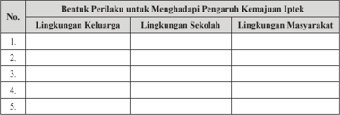

Tabel ini berisi informasi tentang berbagai bentuk perilaku yang dapat dilakukan untuk menghadapi pengaruh kemajuan Ilmu Pengetahuan Teknologi dan Sosial (Iptek) dalam berbagai lingkungan: keluarga, sekolah, dan masyarakat. Topik utama tabel ini adalah bagaimana masyarakat dapat memanfaatkan dan menghargai perkembangan teknologi dalam kehidupan sehari-hari. Kolom-kolomnya mencakup tiga lingkungan: keluarga, sekolah, dan masyarakat. Data atau pola penting yang terlihat adalah bahwa perilaku yang diperlukan untuk menghadapi pengaruh kemajuan iptek sangat bervariasi tergantung pada lingkungan di mana mereka berada. Misalnya, di lingkungan keluarga, perilaku yang diperlukan mungkin lebih fokus pada pendidikan dan pengetahuan dasar, sementara di lingkungan sekolah, fokusnya mungkin lebih pada pengetahuan teknis dan aplikasi teknologi. Di masyarakat, perilaku yang diperlukan mungkin lebih banyak berkaitan dengan penggunaan teknologi dalam kehidupan sehari-hari dan bagaimana teknologi tersebut dapat membantu masyarakat.

### Rangkuman

### 1. Kata Kunci

Kata kunci yang harus Anda pahami dalam mempelajari materi pada bab ini adalah pengaruh negatif, pengaruh positif, kemajuan iptek, dan globalisasi.

### 2. Intisari Materi

- Kemajuan iptek tentunya memberikan pengaruh bagi kehidupan sebuah bangsa, baik itu pengaruh positif maupun negatif.
- Kemajuan iptek telah menjadikan nilai-nilai seperti keterbukaan, kebebasan  dan  demokrasi  berpengaruh  kuat  terhadap  pikiran maupun kemauan bangsa Indonesia.

 

---
## 📄 Halaman 100

- Kecanggihan alat komunikasi yang ditandai dengan munculnya internet secara langsung telah mempermudah kita untuk memperoleh informasi dari belahan bumi lainnya, sehingga kita secara tidak langsung telah melakukan proses tranformasi ilmu yang sangat bermanfaat bagi kita.
- Di dalam usaha pengembangan dengan cara pemanfaatan iptek, setiap manusia Indonesia harus memiliki kearifan dan berpegang pada prinsip moral. Dengan demikian, pemanfaatan iptek dalam kegiatan  pembangunan  tidak  akan  merusak  lingkungan  hidup. Akan tetapi kalau iptek dimanfaatkan tanpa kearifan dan tidak dengan  pertimbangan  moral,  kecenderungan  untuk  merusak lingkungan lebih besar.
- Ada tiga alternatif sikap yang bisa diambil oleh bangsa kita dalam mengahadapi kemajuan iptek ini. Pertama, menolak dengan tegas semua pengaruh kemajuan iptek dalam semua aspek kehidupan. Kedua, menerima sepenuhnya pengaruh tersebut tanpa disaring terlebih  dahulu. Ketiga, bersikap  selektif  terhadap  pengaruh tersebut, yaitu kita mengambil hal-hal positif dari kemajuan iptek dan membuang hal-hal negatifnya.

### Penilaian Diri

### 1. Penilaian sikap

Nah, sekarang Anda renungi diri masing-masing, apakah perilaku Anda telah  mendukung  upaya  untuk  meminimalisir  dampak  negatif  kemajuan iptek?  Bacalah daftar perilaku di bawah ini, kemudian isi kolom kegiatan dengan rutinitas yang biasa dilakukan (selalu, sering, kadang-kadang, tidak pernah) dengan memberi tanda silang (x), serta berikan alasan dilakukannya perilaku  itu.  Ingat  Anda  harus  mengisinya  sesuai  dengan  keadaan  yang sebenarnya.

 

---
## 📄 Halaman 101

 

---
## 📄 Halaman 102

### 2.  Pemahaman Materi

Dalam mempelajari materi pada bab ini, tentu saja ada materi yang dengan mudah Anda pahami, ada juga yang sulit Anda pahami. Oleh karena itu, lakukanlah penilaian diri atas pemahaman Anda terhadap materi pada bab ini dengan memberikan tanda ceklist ( √ ) pada kolom paham sekali, paham sebagian, dan belum paham.

---
**📊 Tabel**

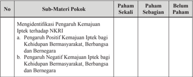

Tabel ini menunjukkan hasil evaluasi pemahaman siswa tentang pengaruh teknologi informasi dan komunikasi (Iptek) terhadap kehidupan masyarakat, berbangsa, dan bernegara. Topik utama adalah pengaruh positif dan negatif Iptek bagi kehidupan tersebut. Dalam tabel ini, kolom "Paham Sekali" menunjukkan siswa yang belum sepenuhnya memahami konsep, "Paham Sebagian" menunjukkan siswa yang sedikit memahami konsep, dan "Belum Paham" menunjukkan siswa yang tidak memahami konsep sama sekali. Data penting yang terlihat adalah bahwa sebagian besar siswa belum sepenuhnya memahami konsep ini, dengan 50% siswa di kategori "Paham Sebagian" dan 25% siswa di kategori "Belum Paham". Ini menunjukkan bahwa masih ada ruang untuk peningkatan pemahaman tentang dampak Iptek pada kehidupan masyarakat, berbangsa, dan bernegara.

 

---
## 📄 Halaman 103

---
**📊 Tabel**

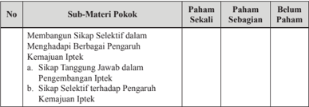

Tabel ini menunjukkan hasil evaluasi pemahaman siswa terhadap sub-materi pokok "Membangun Sikap Selektif dalam Menghadapi Berbagai Pengaruh Kemajuan Ilmu Teknologi Komputer (Iptek)". Tabel dibagi menjadi tiga kolom: "Paham Sekali", "Paham Sebagian", dan "Belum Paham". Topik utama tabel adalah sikap dan pengetahuan siswa tentang sikap selektif dalam menghadapi berbagai pengaruh kemajuan iptek. Data dalam tabel menunjukkan bahwa sebagian besar siswa memiliki pemahaman yang baik tentang sikap tanggung jawab dalam pengembangan iptek, namun masih ada yang kurang memahami sikap selektif terhadap pengaruh kemajuan iptek. Ini menunjukkan perluannya untuk peningkatan pemahaman dan pemahaman lebih mendalam tentang sub-materi tersebut.

Apabila pemahaman Anda berada pada kategori paham sekali, mintalah materi  pengayaan  kepada  guru  untuk  menambah  wawasan  Anda.  Apabila pemahaman Anda berada pada kategori paham sebagian dan belum paham, bertanyalah  kepada  guru  serta  mintalah  penjelasan  lebih  lengkap,  supaya Anda cepat memahami materi pembelajaran yang sebelumnya kurang atau belum memahaminya.

### Proyek Kewarganegaraan

### Mari Berinquiri Kepustakaan

- Kelas dibagi ke dalam 6 kelompok besar.
- Siswa  mencari  informasi  yang  dibutuhkan  secara  bekerja  sama  dalam kelompoknya masing-masing.
- Setiap kelompok memilih buku-buku atau jurnal  atau berita dari media masa yang relevan dengan topik mencegah timbulnya gerakan-gerakan radikalisme dan terorisme di Indonesia.
- Setiap kelompok mengkaji dan mencatat informasi yang didapat melalui buku atau jurnal atau berita dari media massa yang dipilih yang berkaitan dengan materi yang dibelajarkan.
- Setiap kelompok harus membuat laporan hasil inkuiri kepustakaannya.
- Setiap  kelompok  mempresentasikan  laporan  hasil  inkuiri  kepustakaan secara panel dalam diskusi kelas.
- Setiap kelompok menanggapi setiap pemaparan laporan yang dilontarkan oleh kelompok lain.
- Setiap  kelompok  menyimpulkan  laporan  hasil  inkuiri  kepustakaannya setelah mendapatkan masukan dari kelompok lain.

 

---
## 📄 Halaman 104

---
**🖼️ Gambar/Diagram**

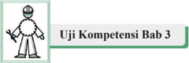

> **Deskripsi Visual:** Gambar ini adalah ilustrasi yang menunjukkan seorang pekerja berdiri di depan sebuah papan tulis dengan tulisan "Uji Kompetensi Bab 3". Pekerja tersebut mengenakan seragam pekerja dan helm, menunjukkan bahwa ia mungkin merupakan insinyur atau tenaga kerja yang berkaitan dengan proyek atau tugas yang berkaitan dengan bab ke-3 dalam buku pelajaran tersebut. Papan tulis tersebut tampaknya digunakan untuk memberikan informasi atau menjalankan uji kompetensi yang berkaitan dengan bab ke-3 tersebut. Teks pada gambar tersebut tidak menyebutkan detail lebih lanjut tentang konten bab ke-3, namun secara umum, gambar ini mungkin digunakan sebagai representasi atau penanda bahwa ada uji kompetensi yang akan dilakukan atau telah dilakukan dalam bab ke-3 tersebut.

### Jawablah pertanyaan di bawah ini secara singkat, jelas dan akurat!

- Jelaskan pengaruh negatif kemajuan iptek yang paling berbahaya bagi bangsa Indonesia!
- Bagaimana perwujudan nilai-nilai keterbukaan sebagai wujud dampak kemajuan iptek dalam proses penyelenggaraan negara?
- Pada saat ini, hampir semua orang sudah memanfaakan  jaringan media sosial seperti facebook, twitter, instagram , dan sebagainya untuk berbagai kepentingan.  Akan  ada  pula  orang  yang  memanfaatkan  media  sosial untuk melakukan kejahatan. Tidak jarang saat ini, sering terdengar kasus penipuan, penculikan dan sebagainya yang berawal dari interaksi di media sosial. Berkaitan dengan uraian tersebut analisislah penyebab dan solusi untuk mengatasi persoalan itu.
- Bagaimana perwujudan sikap tanggung jawab dalam pengembangan iptek?
- Dalam  hidupmu  selama  ini  tentu  telah  menghadapi  persoalan  yang memerlukan kewaspadaan agar dirimu dan orang lain selaras. Perhatikan situasi  yang  berkaitan  dengan  kewaspadaan  di  lingkungan  sekolah dan masyarakat. Apa yang akan Anda lakukan apabila terjadi tawuran? Kemukakan  pula  perasaan  Anda  sebagai  seorang  warga  negara  ketika menghadapi tawuran yang terjadi di sekolah atau kampung Anda.

 

---
## 📄 Halaman 105

Bab

### Dinamika Persatuan dan Kesatuan dalam Konteks Negara Kesatuan Republik Indonesia

Akhirnya, Anda  telah  sampai  pada  materi  pembelajaran  bab  terakhir  di kelas XII. Tentunya, pengalaman belajar Anda sudah makin lengkap setelah mempelajari tiga bab sebelumnya. Semua itu harus Anda jadikan modal untuk mempelajari  materi  pembelajaran  pada  bab  terakhir  ini.  Perlu Anda  ingat, bab  ini  merupakan  akhir  dari  semua  rangkaian  proses  pembelajaran  PPKn yang Anda  ikuti  di  jenjang  SMA/SMK/MA/MAK. Artinya,  tidak  ada  lagi lanjutannya,  karena Anda  sebentar  lagi  akan  dinyatakan  lulus  dari  sekolah masing-masing. Supaya Anda mendapat kemudahan dalam memahami materi pembelajaran  pada  bab  ini,  alangkah  baiknya Anda  berdoa  terlebih  dahulu kepada Tuhan Yang Maha Esa, serta jangan lupa senantiasa bersyukur atas setiap anugerah yang diterima.

Pada  bab  ini  Anda  akan  diajak  untuk  menelusuri  dinamika  persatuan dan  kesatuan  di  Indonesia . Setelah  mempelajari  bab  ini,  diharapkan Anda mampu mengevaluasi dinamika persatuan bangsa sebagai upaya menjaga dan mempertahankan NKRI.

Nah, sebelum Anda mempelajari materi pada bab ini, cermatilah terlebih dahulu gambar di bawah ini.

---
**🖼️ Gambar/Diagram**

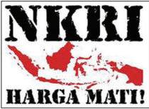

> **Deskripsi Visual:** Gambar ini adalah ilustrasi yang menampilkan logo negara Indonesia dengan nama "NKRI" yang tertera di atasnya. Di bawah logo tersebut, terdapat gambar peta Indonesia yang dilapisi dengan warna merah dan hitam. Selain itu, ada tulisan "HARGA MATI!" yang terletak di bawah peta.

Jenis gambar ini adalah ilustrasi karena ia menggambarkan objek-objek secara visual. Gambar ini menunjukkan bahwa objek utama adalah logo NKRI dan peta Indonesia. Relasi antara kedua objek ini adalah bahwa logo NKRI diletakkan di atas peta Indonesia. 

Teks penting yang terlihat pada gambar ini adalah "NKRI" dan "HARGA MATI!". Angka atau label penting tidak terlihat pada gambar ini karena ia hanya berupa gambar saja tanpa teks tambahan.

Informasi kunci yang dapat diambil pembaca dari gambar ini adalah bahwa gambar ini mungkin digunakan sebagai simbol atau lambang untuk negara Indonesia. Namun, tanpa konteks lebih lanjut, sulit untuk menentukan maksud spesifik dari gambar ini.

Sumber: http://sefrian92.blogspot.com/2011/02/

Gambar 4.1 Slogan 'NKRI Harga Mati'

 

---
## 📄 Halaman 106

Nah, setelah Anda mencermati gambar tersebut, tuliskan semua hal yang Anda pikirkan atau pertanyakan dalam tabel di bawah ini!

---
**📊 Tabel**

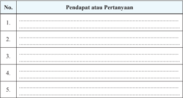

Tabel ini berisi 5 baris dengan judul "Pendapat atau Pertanyaan" di kolom pertama. Setiap baris mungkin menunjukkan pendapat atau pertanyaan yang diberikan oleh pengguna atau peserta diskusi. Topik utama tabel ini mungkin berkaitan dengan pendapat atau pertanyaan yang diajukan dalam suatu kegiatan diskusi, seminar, atau survei. Kolom pertama berisi nomor urut dari 1 hingga 5, sedangkan kolom kedua berisi teks yang mungkin berupa pendapat atau pertanyaan tersebut. Data atau pola penting yang terlihat adalah bahwa setiap baris memiliki satu dan hanya satu pendapat atau pertanyaan, dan jumlah total barisnya adalah 5.

### A. Hakikat Negara Kesatuan Republik Indonesia

### 1. Konsep Negara Kesatuan (Unitarisme)

Istilah  negara  kesatuan  sudah sangat  sering  Anda  dengar  sebab nama  negara  kita  adalah  Negara Kesatuan Republik Indonesia. Jadi, istilah negara kesatuan sudah tertanam dalam pola pikir kita selaku warga negara Indonesia. Akan tetapi, tahukah Anda makna dan karakteristik negara kesatuan?

Menurut C.F Strong dalam bukunya A History of Modern Political Constitution (1963:84), negara kesatuan adalah bentuk negara dimana wewenang legislatif tertinggi  dipusatkan  dalam  suatu badan legislatif nasional. Kekuasaan negara dipegang oleh pemerintah

### Info Kewarganegaraan

-  Negara kesatuan sering juga disebut sebagai negara unitaris , unity . yaitu  negara  tunggal  (satu  negara) yang monosentris (berpusat  satu), terdiri hanya satu negara, satu pemerintahan,  satu  kepala  negara, satu  badan  legislatif  yang  berlaku bagi seluruh wilayah negara
-  Hakikat negara kesatuan yang sesungguhnya adalah kedaulatan tidak terbagi-bagi baik ke luar maupun  ke  dalam  dan  kekuasaan pemeritah pusat tidak dibatasi.
pusat. Pemerintah pusat dapat menyerahkan sebagian kekuasaannya kepada daerah berdasarkan hak otonomi, tetapi pada tahap terakhir kekuasaan tetap berada di tangan pemerintah pusat.

 

---
## 📄 Halaman 107

Pendapat C.F Strong tersebut dapat dimaknai bahwa negara kesatuan adalah negara bersusun tunggal, yakni kekuasaan untuk mengatur seluruh daerahnya ada  di  tangan  pemerintah  pusat.  Pemerintah  pusat  memegang  kedaulatan sepenuhnya,  baik  ke  dalam  maupun  ke  luar.  Hubungan  antara  pemerintah pusat dengan rakyat dan daerahnya dapat dijalankan secara langsung. Dalam negara  kesatuan  hanya  ada  satu  konstitusi,  satu  kepala  negara,  satu  dewan menteri (kabinet), dan satu parlemen. Demikian pula dengan pemerintahan, yaitu pemerintah pusatlah yang memegang wewenang tertinggi dalam segala aspek pemerintahan.

Negara kesatuan  mempunyai dua sistem,  yaitu  sentralisasi  dan  desentralisasi. Dalam negara kesatuan bersistem sentralisasi, semua hal diatur dan diurus oleh pemerintah  pusat,  sedangkan  daerah  hanya  menjalankan  perintah-perintah dan  peraturan-peraturan  dari  pemerintah  pusat.  Daerah  tidak  berwewenang membuat peraturan-peraturan sendiri atau mengurus rumah tangganya sendiri. Akan tetapi,  dalam  negara  kesatuan  bersistem  desentralisasi,  daerah  diberi kekuasaan  untuk  mengatur  rumah  tangganya  sendiri  (otonomi,  swatantra). Untuk  menampung  aspirasi  rakyat  di  daerah,  terdapat  parlemen  daerah. Meskipun demikian, pemerintah pusat tetap memegang kekuasaan tertinggi. Bagaimana dengan NKRI?

Pada  saat  ini,  Indonesia  merupakan  negara  kesatuan  yang  menganut sistem desentralisasi melalui mekanisme otonomi daerah. Dengan sistem ini, pemerintah  pusat  memberikan  sebagian  kewenangan  pemerintahan  kepada daerah otonom (provinsi dan kabupaten kota). Akan tetapi, ada kewenangan yang tidak diberikan kepada daerah otonom, yaitu kewenangan dalam bidang politik luar negeri, agama, yustisi, pertahanan, keamanan, moneter dan fi skal nasional.

### Tugas Kelompok 4.1

Bacalah buku sumber yang lain kemudian kerjakan tugas-tugas di bawah ini.

- Identi fi kasi tiga pendapat para pakar tentang makna negara kesatuan.

---
**📊 Tabel**

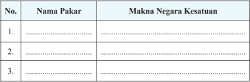

Tabel ini berisi informasi tentang nama-nama pakar dan makna negara kesatuan di Indonesia. Topik utamanya adalah tentang pengaruh dan kontribusi para pakar dalam pembentukan negara kesatuan. Kolom pertama berisi nama-nama pakar yang telah berkontribusi signifikan dalam pembangunan Indonesia, sementara kolom kedua menjelaskan makna negara kesatuan yang mereka ciptakan. Data penting yang terlihat adalah bahwa setiap pakar memiliki kontribusi unik dan berbeda dalam menciptakan negara kesatuan, menunjukkan bahwa pembentukan negara kesatuan tidak hanya ditentukan oleh satu pakar saja, tetapi melibatkan berbagai pihak yang berbeda.

 

---
## 📄 Halaman 108

- Analisis persamaan dan perbedaan dari pendapat-pendapat tersebut!
- Coba Anda rumuskan pengertian negara kesatuan menurut pendapat sendiri!
- Identi fi kasi negara-negara di dunia yang berbentuk kesatuan!

---
**📊 Tabel**

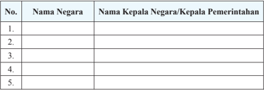

Tabel ini berisi informasi tentang nama-nama negara dan kepala negara/pemerintahan mereka. Topik utamanya adalah daftar negara-negara di dunia dengan nama lengkapnya dan nama kepala negara atau pemerintahan mereka. Kolom pertama menunjukkan nomor urut dari 1 hingga 5, sedangkan kolom kedua dan ketiga masing-masing berisi nama negara dan nama kepala negara/pemerintahan. Data penting yang terlihat adalah bahwa tabel ini mencakup beberapa negara besar dan negara-negara kecil di seluruh dunia, menunjukkan bahwa setiap negara memiliki kepala negara atau pemerintahan yang berbeda-beda.

### 5. Identi fi kasi kelebihan konsep negara kesatuan.

---
**📊 Tabel**

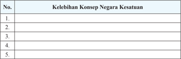

Tabel ini berisi informasi tentang kelebihan Konsep Negara Kesatuan di Indonesia. Topik utamanya adalah "Kelebihan Konsep Negara Kesatuan". Tabel ini memiliki satu kolom yang berisi nomor urut (No.) dan satu kolom yang berisi deskripsi kelebihan tersebut. Data penting yang terlihat dalam tabel ini meliputi:

1. Kelebihan pertama: Konsep Negara Kesatuan memungkinkan pembentukan negara yang lebih besar dan kuat.
2. Kelebihan kedua: Konsep ini memperkuat identitas nasional dan kesatuan bangsa.
3. Kelebihan ketiga: Konsep ini membantu dalam pengembangan ekonomi dan sosial secara bersama-sama.
4. Kelebihan keempat: Konsep Negara Kesatuan dapat meningkatkan kesejahteraan masyarakat.
5. Kelebihan kelima: Konsep ini juga dapat meningkatkan stabilitas politik dan keamanan.

Tabel ini menunjukkan bahwa Konsep Negara Kesatuan memiliki beberapa kelebihan yang signifikan, termasuk pembentukan negara yang lebih kuat, peningkatan identitas nasional, dan pengembangan ekonomi dan sosial secara bersama-sama.

### 2. Karakteristik Negara Kesatuan Republik Indonesia

Sebagai  warga  negara  yang  baik,  tentunya  Anda  harus  memahami karakteristik  Negara  Kesatuan  Republik  Indonesia  (NKRI).  Hal  tersebut penting  diketahui  untuk  makin  mempertegas  identitas  negara  Indonesia. Oleh karena itu, pada bagian ini, Anda akan dibekali pengetahuan mengenai karakteristik  NKRI menurut UUD NRI Tahun 1945.

Indonesia sejak kelahirannya pada tanggal 17 Agustus 1945 telah memiliki tekad yang sama, bahwa negara ini akan eksis di dunia internasional dalam bentuk negara kesatuan. Kesepakatan ini tercermin dalam rapat-rapat Badan Penyelidik  Usaha-Usaha Persiapan Kemerdekaan Indonesia (BPUPKI) dan Panitia Persiapan Kemerdekaan Indonesia (PPKI) dalam menyusun konstitusi atau UUD yang tertinggi dalam negara.

 

---
## 📄 Halaman 109

Sumber:

Buku 30 Tahun Indonesia Merdeka

Soepomo dalam Sidang BPUPKI, menghendaki bentuk negara kesatuan sejalan dengan paham negara integralistik yang melihat bangsa sebagai suatu organisme.  Hal  ini  antara  lain  seperti  yang  dikemukakan  oleh  Muhammad Yamin, bahwa kita hanya membutuhkan negara yang bersifat unitarisme dan wujud negara kita tidak lain dan tidak bukan adalah bentuk Negara Kesatuan Republik Indonesia (NKRI).

Pembentukan negara kesatuan bertujuan untuk menyatukan seluruh wilayah Nusantara  agar  menjadi  negara  yang  besar  dan  kukuh  dengan  kekuasaan negara yang  bersifat sentralistik.  Tekad  tersebut  sebagaimana  tertuang dalam alinea kedua Pembukaan UUD NRI Tahun 1945 yang berbunyi 'dan perjuangan  pergerakan  kemerdekaan  Indonesia  telah  sampailah  pada  saat yang berbahagia dengan selamat sentausa mengantarkan rakyat Indonesia ke depan pintu gerbang kemerdekaan negara Indonesia yang merdeka, bersatu, berdaulat adil dan makmur'

Perubahan  UUD  NRI  Tahun  1945  mengukuhkan  keberadaan  Indonesia sebagai  negara  kesatuan  dan  menghilangkan  keraguan  terhadap  pecahnya Negara  Kesatuan  Republik  Indonesia.  Pasal-pasal  dalam  UUD  NRI  Tahun 1945 telah memperkukuh prinsip Negara Kesatuan Republik Indonesia dan tidak  sedikit  pun  mengubah  Negara  Kesatuan  Republik  Indonesia  menjadi negara federal.

 

---
## 📄 Halaman 110

Pasal 1 ayat (1) UUD NRI Tahun  1945  yang  merupakan naskah asli mengandung prinsip bahwa 'Negara Indonesia ialah negara kesatuan, yang berbentuk Republik.' Pasal yang dirumuskan oleh Panitia Persiapan Kemerdekaan Indonesia tersebut merupakan tekad  bangsa  Indonesia  yang menjadi sumpah anak bangsa pada 1928 yang dikenal dengan Sumpah Pemuda, yaitu  satu  nusa,  satu  bangsa, satu  bahasa  persatuan  yaitu bahasa Indonesia.

Wujud Negara Kesatuan Republik  Indonesia  semakin kukuh setelah dilakukan perubahan  dalam  UUD  NRI Tahun 1945, yang dimulai dari adanya ketetapan Majelis Permusyarawatan Rakyat yang salah satunya adalah tidak  mengubah  Pembukaan UUD  NRI  Tahun  1945  dan tetap mempertahankan Negara Kesatuan  Republik  Indonesia sebagai  bentuk fi nal  negara bagi bangsa Indonesia.

Kesepakatan untuk tetap mempertahankan bentuk negara kesatuan didasari

### Penanaman Kesadaran Berkonstitusi

NKRI  adalah  harga  mati.  Pernyataan tersebut mengandung makna yang sangat dalam. Dalam pernyataan tersebut tergambar ketegasan sikap dan cita-cita bahwa  negara Indonesia diperjuangkan kemerdekaannya untuk mewujudkan konsep negara kesatuan diimplementasikan di bumi  Indonesia. Untuk  mewujudkan  hal  tersebut  telah banyak pengorbanan yang dilakukan para pahlawan mulai pengorbanan waktu, tenaga, pikiran, harta bahkan nyawa. Hal  tersebut  dilakukan  karena  mereka mempunyai semangat kebangsaan. Semangat itulah yang harus kita jaga dan selalu  mewarnai  setiap  perilaku  kita.  Di dalam  semangat  kebangsaan  terkandung nilai-nilai yang dapat memperkokoh persatuan dan kesatuan bangsa, yaitu:

- Pro patria dan primus patrialis yaitu mencintai  tanah air dan mendahulukan kepentingan tanah air.
- Jiwa solidaritas dan setia kawan
- Jiwa toleransi dan tenggang rasa antaragama, antarsuku, antar golongan dan antarbangsa.
- Jiwa tanpa pamrih dan tanggung jawab
- Jiwa kesatria dan kebesaran jiwa yang tidak mengandung unsur dendam.
pertimbangan  bahwa  negara  kesatuan  adalah  bentuk  yang  ditetapkan  sejak awal berdirinya negara Indonesia dan dipandang paling tepat untuk mewadahi ide  persatuan  sebuah  bangsa  yang  majemuk  ditinjau  dari  berbagai  latar belakang (dasar pemikiran). UUD NRI Tahun 1945 secara nyata mengandung semangat agar Indonesia ini bersatu, baik yang tercantum dalam Pembukaan maupun  dalam  pasal-pasal  yang  langsung  menyebutkan  tentang  Negara

 

---
## 📄 Halaman 111

Kesatuan Republik Indonesia dalam lima Pasal, yaitu: Pasal 1 ayat (1), Pasal 18 ayat (1), Pasal 18B ayat (2), Pasal 25A dan pasal 37 ayat (5) UUD NRI Tahun 1945 serta rumusan pasal-pasal yang mengukuhkan Negara Kesatuan Republik  Indonesia,  dan  keberadaan  lembaga-lembaga  dalam  UUD  NRI Tahun 1945.  Prinsip kesatuan dalam Negara Kesatuan Republik Indonesia dipertegas dalam alinea keempat Pembukaan UUD NRI Tahun 1945, yaitu '….  dalam  upaya  membentuk  suatu  Pemerintahan  negara  Indonesia  yang melindungi segenap bangsa Indonesia dan seluruh tumpah darah Indonesia'.

Karakteristik Negara Kesatuan  Indonesia juga dapat dipandang dari segi kewilayahan. Pasal 25A UUD NRI Tahun 1945 menentukan bahwa 'Negara Kesatuan Republik Indonesia adalah sebuah negara kepulauan yang berciri Nusantara dengan wilayah yang batas-batas dan hak-haknya ditetapkan oleh undang-undang'.  Istilah Nusantara dalam ketentuan tersebut dipergunakan untuk  menggambakan  kesatuan  wilayah  perairan  dan  gugusan  pulau-pulau Indonesia  yang  terletak  di  antara  Samudra  Pasi fi k  dan  Samudra  Indonesia serta di antara Benua Asia dan Benua Australia. Kesatuan wilayah tersebut juga mencakup 1) kesatuan politik; 2) kesatuan hukum; 3) kesatuan sosialbudaya;  4)  kesatuan  ekonomi  serta  5)  kesatuan  pertahanan  dan  keamanan. Dengan  demikian,  meskipun  wilayah  Indonesia  terdiri  atas  ribuan  pulau, tetapi  semuanya terikat dalam satu kesatuan negara yaitu Negara Kesatuan Republik Indonesia.

### Tugas Kelompok 5.2

- Coba Anda identi fi kasi keunggulan Negara Kesatuan Republik Indonesia dalam  berbagai  dimensi  kehidupan  berbangsa  dan  bernegara.  Tuliskan hasil identi fi kasimu pada tabel di bawah ini.
- Dari  keunggulan-keunggulan NKRI yang telah  Anda identi fi kasi,  keunggulan di bidang apa yang membuat Indonesia lebih maju dibandingkan negara lain? Berikan alasan Anda!

---
**📊 Tabel**

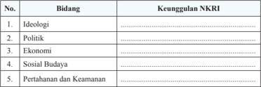

Tabel ini menunjukkan keunggulan Negeri Rakyat Indonesia (NKRI) dalam berbagai bidang, mulai dari ideologi hingga pertahanan dan keamanan. Topik utama tabel adalah keunggulan NKRI dalam berbagai aspek kehidupan. Kolom pertama berisi nomor urut yang menunjukkan posisi masing-masing bidang, sedangkan kolom kedua berisi deskripsi singkat tentang bidang tersebut. Data penting yang terlihat adalah bahwa NKRI memiliki keunggulan dalam semua bidang yang disebutkan, mencakup ideologi, politik, ekonomi, sosial budaya, pertahanan, dan keamanan. Ini menunjukkan bahwa NKRI memiliki sistem yang kuat dan berkelanjutan dalam berbagai aspek kehidupan.

 

---
## 📄 Halaman 112

### B. Persatuan  dan  Kesatuan  Bangsa  Indonesia  dari Masa Ke Masa

Proses mempertahankan keberadaan Negara Kesatuan Republik Indonesia mengalami  dinamika  yang  sangat  menarik  untuk  dikaji.  Persatuan  dan kesatuan bangsa yang menjadi modal utama untuk mempertahankan NKRI ternyata  tidak  selamanya  berdiri  kukuh.  Persatuan  dan  kesatuan  bangsa Indonesia dalam perwujudannya sangat dinamis. Adakalanya persatuan dan kesatuan bangsa itu begitu kukuh, tetapi ada juga masa ketika persatuan dan kesatuan  bangsa  mendapat  ujian  ketika  dirongrong  oleh  gerakan-gerakan pemberontakan yang ingin memisahkan diri dari NKRI, serta segala bentuk teror  yang  bisa  berdampak  munculnya  perpecahan  di  kalangan  masyarakat Indonesia. Akan tetapi, kita patut bersyukur ancaman atau gangguan tersebut tidak  membuat  NKRI  menjadi  lemah,  tetapi  semakin  kukuh  menunjukkan eksistensinya kepada dunia.

Berikut ini akan dipaparkan dinamika persatuan dan kesatuan bangsa dari masa ke masa. Pembahasan difokuskan kepada kondisi politik ketatanegaraan serta  contoh  gerakan-gerakan  yang  merongrong  persatuan  dan  kesatuan bangsa.

### 1. Persatuan dan Kesatuan Bangsa pada Masa Revolusi Kemerdekaan (18 Agustus 1945 sampai dengan 27 Desember 1949)

Pada periode ini, bentuk NRI adalah kesatuan, dengan bentuk pemerintahan adalah republik yang mana presiden berkedudukan sebagai kepala pemerintahan  sekaligus  sebagai  kepala  negara.  Sistem  pemerintahan  yang dipakai adalah sistem pemerintahan presidensial.

Dalam periode ini, yang dipakai sebagai pegangan adalah Undang-Undang Dasar  1945.  Akan  tetapi  dalam  pelaksanaannya  belum  dapat  dijalankan secara murni dan konsekuen. Hal ini dikarenakan bangsa Indonesia baru saja memproklamasikan kemerdekaannya. Pada waktu itu, semua kekuatan negara difokuskan pada upaya mempertahankan kemerdekaan yang baru saja diraih dari  rongrongan  kekuatan  asing  yang  ingin  kembali  menjajah  Indonesia. Dengan  demikian,  walaupun  Undang-Undang  Dasar  1945  telah  berlaku, namun yang baru dapat dibentuk hanya presiden, wakil presiden, serta para menteri  dan  gubernur  yang  merupakan  perpanjangan  tanggan  pemerintah pusat. Adapun departemen yang dibentuk untuk pertama kalinya di Indonesia terdiri atas 12 departemen. Provinsi yang baru dibentuk terdiri atas delapan wilayah yang terdiri atas Jawa Barat, Jawa Tengah, Jawa Timur, Sumatera, Borneo, Sulawesi, Maluku, dan Sunda Kecil.

 

---
## 📄 Halaman 113

Kondisi di atas didasarkan pada  Aturan  Peralihan  Undang-Undang Dasar  1945  yang  menyatakan  bahwa untuk  pertama  kalinya  presiden  dan wakil  presiden  dipilih  oleh  PPKI. Dengan  demikian,  tidaklah  menyalahi apabila  MPR/DPR RI belum dimanfaatkan karena pemilihan umum belum diselenggarakan. Lembaga-lembaga tinggi negara lain yang disebutkan dalam Undang-Undang Dasar 1945 seperti MPR, DPR, DPA, BPK, dan MA  belum dapat  diwujudkan  sehubungan  dengan  keadaan  darurat  dan  harus  dibentuk berdasarkan undang-undang. Untuk mengatasi hal tersebut, Undang-Undang Dasar 1945 melalui ketentuan dalam pasal IV Aturan Peralihan menyatakan bahwa sebelum Majelis Permusyawaratan Rakyat, Dewan Perwakilan Rakyat dan Dewan pertimbangan Agung dibentuk menurut undang-undang dasar ini, segala kekuasaanya dijalankan oleh Presiden dengan bantuan sebuah Komite Nasional.

Pasal  IV  Aturan  Peralihan  UUD  1945  secara  langsung  memberikan kekuasaan yang teramat luas kepada presiden. Dengan kata lain, kekuasaan presiden  meliputi  kekuasaan  pemerintahan  negara  (eksekutif),  menjalan kekuasaan MPR  dan  DPR  (legislatif) serta menjalankan tugas  DPA. Kekuasaan  yang  teramat  besar  itu  diberikan  kepada  presiden  hanya  untuk sementara waktu, supaya penyelenggaraan negara dapat berjalan. Oleh karena itu PPKI dalam Undang-Undang Dasar 1945 mencantumkan dua ayat Aturan Tambahan yang menegaskan bahwa:

- Dalam enam bulan sesudah berakhirnya peperangan Asia Timur Raya, Presiden  Indonesia  mengatur  dan  menyelenggarakan  segala  hal  yang ditetapkan dalam Undang-Undang Dasar ini.
- Dalam enam bulan setelah Majelis Permusyawaratan Rakyat dibentuk, majelis itu bersidang untuk menetapkan undang-undang dasar.
Pasal  IV  Aturan  Peralihan  UUD  1945  dijadikan  dalih  oleh  Belanda untuk menuduh Indonesia sebagai negara diktator karena kekuasaan negara terpusat  kepada  presiden.  Untuk  melawan  propaganda  Belanda  pada  dunia internasional, maka pemerintah RI mengeluarkan tiga buah maklumat.

- Maklumat Wakil Presiden Nomor X (baca eks) tanggal 16 Oktober 1945 yang  menghentikan  kekuasaan  luar  bisa  dari  Presiden  sebelum  masa waktunya  berakhir  (seharusnya  berlaku  selam  enam  bulan).  Kemudian, maklumat tersebut  memberikan kekuasaan MPR dan DPR yang semula dipegang  oleh  Presiden  kepada  Komite  Nasional  Indonesia  Pusat.  Pada dasarnya,  maklumat  ini  adalah  penyimpangan  terhadap  ketentuan  UUD 1945.

 

---
## 📄 Halaman 114

- Maklumat  Pemerintah  tanggal  3  November  1945,  tentang  pembentukan partai  politik  yang  sebanyak-banyaknya  oleh  rakyat.  Hal  ini  sebagai akibat dari anggapan pada saat itu bahwa salah satu ciri demokrasi adalah multipartai.  Maklumat  tersebut  juga  sebagai  upaya  agar  Dunia  Barat menilai bahwa Indonesia adalah negara yang menganut asas demokrasi.
- Maklumat pemerintah tanggal 14 November 1945, yang intinya mengubah sistem pemerintahan presidensial menjadi sistem pemerintahan parlementer. Maklumat  tersebut  kembali  menyalahi  ketentuan  UUD  RI  1945  yang menetapkan sistem pemerintahan presidensial sebagai sistem pemerintah Indonesia.
Ketiga maklumat di atas memberikan pengaruh yang cukup besar terhadap sistem ketatanegaraan Indonesia. Maklumat pemerintah tanggal 14 November 1945 telah membawa perubahan total dalam sistem pemerintahan negara kita. Pada tanggal tersebut, Indonesia memulai kehidupan baru sebagai penganut sistem  pemerintahan  parlementer.  Dengan  sistem  ini,  presiden  tidak  lagi mempunyai rangkap jabatan, presiden hanya sebagai kepala negara, sedangkan kepala pemerintahan dipegang oleh perdana menteri. Kabinet dalam hal ini para menteri tidak bertanggung jawab kepada presiden, tetapi kepada DPR yang kekuasaannya dipegang oleh BP KNIP.

Secara konseptual, perubahan ini diharapkan akan  mampu mengakomodasi semua kekuatan yang  ada  dalam  negara  ini. Akan  tetapi,  pada kenyataannya, sistem ini justru membawa bangsa Indonesia ke dalam keadaan yang tidak  stabil.  Kabinet-kabinet  parlementer  yang dibentuk  gampang  sekali  dijatuhkan  dengan mosi tidak percaya dari DPR.

Sistem pemerintahan parlementer tidak berjalan  lama.  Sistem  tersebut  berlaku  mulai tanggal  14  November  1945  dan  berakhir  pada tanggal  27  Desember  1949.  Dalam  rentang waktu  itu, terjadi beberapa kali pergantian kabinet.  Kabinet  yang  pertama  dipimpin  oleh Sutan Syahrir yang dilanjutkan  dengan kabinet Syahrir  II  dan  III.  Sewaktu  bubarnya  kabinet

Syahrir III, sebagai akibat meruncingnya pertikaian antara Indonesia-Belanda, pemerintah membentuk Kabinet Presidensial kembali (27 Juni 1947-3 Juli 1947). Namun atas desakan dari beberapa partai politik, Presiden Soekarno kembali membentuk Kabinet Parlementer, seperti berikut:

 

---
## 📄 Halaman 115

- Kabinet Amir Syarifudin I: 3 Juli 1947-11 November 1947
- Kabinet Amir Syarifudin II: 11 November 1947-29 Januari 1948
- Kabinet Hatta I: 29 Januari 1948-4 Agustus 1949
- Kabinet  Darurat  (Mr.  Sjafruddin  Prawiranegara):  19  Desember  1948-13 Juli 1949
- Kabinet Hatta II: 4 Agustus 1949-20 Desember 1949
Kondisi  pemerintahan  tidak  stabil  karena  kabinet  yang  dibentuk  tidak bertahan  lama  serta  rongrongan  kolonial  Belanda  yang  ingin  kembali menjajah Indonesia. Pemberontakan tersebut menambah catatan kelam sejarah bangsa ini dan rakyat makin menderita. Periode Negara Kesatuan Republik Indonesia berakhir seiring dengan hasil kesepakatan Konferensi Meja Bundar yang mengubah bentuk negara kita menjadi negara serikat pada tanggal 27 Desember 1949.

Periode  ini  juga  ditandai  dengan  munculnya  gerakan-gerakan  separatis dengan  tujuan  mendirikan  negara  baru  yang  memisahkan  diri  dari  NKRI. Adapun gerakan-gerakan tersebut di antaranya sebagai berikut.

- Pemberontakan Partai Komunis Indonesia (PKI) Madiun 1948
Pemberontakan  ini  terjadi  pada  tanggal  18  September  1948  yang dipimpin oleh Muso. Tujuan dari pemberontakan PKI Madiun adalah ingin mengganti dasar negara Pancasila dengan komunis serta ingin mendirikan Soviet  Republik  Indonesia.  Pemberontakan  PKI  Madiun  melakukan aksinya dengan menguasai seluruh karesidenan Pati. PKI juga melakukan pembunuhan dan  penculikan  ini  secara  besar-besaran.  Pada  tanggal  30 September  1948,  pemberontakan  PKI  Madiun  berhasil  ditumpas  oleh TNI yang dibantu oleh rakyat. Di bawah pimpinan Kolonel Gatot Subroto (Panglima Divisi H Jawa Tengah bagian timur) dan Kolonel Sungkono (Panglima  Divisi  Jawa  Timur)  mengerahkan  kekuatan  TNI  dan  polisi untuk melakukan pengejaran dan pembersihan di daerah-daerah sehingga Muso dan Amir Syarifuddin berhasil ditembak mati.

- Gerakan  Darul  Islam/Tentara  Islam  Indonesia  (DI/TII)  di  Daerah  Jawa Barat
Pemberontakan  DI/TII  di  Jawa  Barat  dipimpin  oleh  Sekarmadji Maridjan (SM) Kartosuwiryo yang memiliki cita-cita untuk mendirikan Negara Islam Indonesia. Cita-citanya membentuk Negara Islam Indonesia (NII)  diwujudkan  melalui  Proklamasi  yang  dikumAndangkan  pada tanggal 7 Agustus 1949 di Desa Cisayong, Jawa Barat. Untuk mengatasi pemberontakan  yang  dilakukan  oleh  Kartosuwiryo,  Pasukan  TNI  dan rakyat  menggunakan  Operasi  Pagar  Betis  di  Gunung  Geber. Akhirnya, pada tanggal 4 Juni 1962 Kantosuwiryo berhasil ditangkap dan dijatuhi hukuman mati.

 

---
## 📄 Halaman 116

### 2. Persatuan  dan  Kesatuan  Bangsa  pada  Masa  Republik  Indonesia Serikat (27 Desember 1949 sampai dengan 17 Agustus 1950)

Federalisme  pernah  diterapkan  di  Indonesia  pada  rentang  27  Desember 1949  sampai  dengan  17  Agustus  1950.  Pada  masa  ini,  yang  dijadikan sebagai pegangan adalah Konstitusi Republik Indonesia Serikat tahun 1949. Berdasarkan konstitusi tersebut, bentuk negara kita adalah serikat atau federasi dengan 15 negara bagian.

Bentuk pemerintahan yang berlaku pada periode ini adalah republik. Ciri republik  diterapkan  ketika  berlangsungnya  pemilihan  Ir.  Soekarno  sebagai Presiden  Republik  Indonesia  Serikat  (RIS)  dan  Drs.  Moh.  Hatta  sebagai Perdana Menteri. Sistem pemerintahan yang dianut pada periode ini adalah sistem  parlementer  kabinet  semu (quasi  parlementer), dengan  karakteristik sebagai berikut.

- Pengangkatan  perdana  menteri  dilakukan  oleh  Presiden,  bukan  oleh parlemen sebagaimana lazimnya.
- Kekuasaan perdana menteri masih dicampurtangani oleh Presiden. Hal itu tampak pada ketentuan bahwa Presiden dan menteri-menteri bersama-sama merupakan pemerintah. Seharusnya, Presiden hanya sebagai kepala negara, sedangkan kepala pemerintahannya dipegang oleh Perdana Menteri.
- Pembentukan kabinet dilakukan oleh Presiden bukan oleh parlemen.
- Pertanggungjawaban  kabinet  adalah  kepada  Dewan  Perwakilan  Rakyat (DPR), namun harus melalui keputusan pemerintah.
- Parlemen  tidak  mempunyai  hubungan  erat  dengan  pemerintah  sehingga DPR tidak punya pengaruh besar terhadap pemerintah. DPR tidak dapat menggunakan mosi tidak percaya kepada kabinet.
- Presiden RIS mempunyai kedudukan rangkap, yaitu sebagai kepala negara dan kepala pemerintahan.
Selain Presiden dan para menteri (kabinet), negara RIS juga mempunyai Senat, Dewan Perwakilan Rakyat, Mahkamah Agung dan Dewan Pengawas Keuangan sebagai alat perlengkapan negara. Parlemen RIS terdiri atas dua badan, yaitu senat dan DPR. Senat beranggotakan wakil dari negara bagian yang ditunjuk oleh pemerintah pusat. Setiap negara bagian diwakili oleh dua orang.

Keputusan  untuk  memilih  bentuk  negara  serikat,  sebagaimana  telah diuraikan  di  muka,  merupakan  politik  pecah  belahnya  kaum  penjajah. Hasil kesepakatan dalam Konferensi Meja Bundar, memang mengharuskan Indonesia berubah dari negara kesatuan menjadi negara serikat. Bagaimana nasib negara serikat itu? Layaknya bayi yang lahir prematur, kondisi RIS juga

 

---
## 📄 Halaman 117

seperti itu. Muncul berbagai reaksi dari berbagai kalangan bangsa Indonesia menuntut pembubaran Negara RIS dan kembali kepada kesatuan NRI. Maka pada  8  Maret  1950,  Pemerintah  Federal  mengeluarkan  Undang-Undang Darurat  Nomor  11 Tahun  1950,  yang  isinya  mengatur  tata  cara  perubahan susunan  kenegaraan  negara  RIS.  Dengan  adanya  undang-undang  tersebut, hampir  semua  negara  bagian  RIS  menggabungkan  diri  dengan  NRI  yang berpusat di Yogyakarta. Akhirnya, Negara RIS hanya memiliki tiga negara bagian, yaitu NRI, Negara Indonesia Timur, dan Negara Sumatra Timur.

Bagaimana pengaruh kondisi seperti itu terhadap RIS sendiri? Kondisi itu mendorong RIS berunding dengan pemerintahan RI untuk membentuk negara kesatuan. Pada tanggal 19 Mei 1950, dicapai kesepakatan yang dituangkan dalam piagam perjanjian. Disebutkan pula dalam perjanjian tersebut bahwa Negara  Kesatuan  Republik  Indonesia  menggunakan  undang-undang  dasar baru yang merupakan gabungan dua konstitusi yang berlaku, yakni konstitusi RIS dan juga Undang-Undang Dasar 1945 yang menghasilkan UUDS 1950. Pemerintah Indonesia bersatu ini dipimpin oleh Presiden Soekarno dan Wakil Presiden Mohammad Hatta sebagaimana  diangkat sebagai presiden dan wakil presiden pertama setelah Proklamasi Kemerdekaan Republik Indonesia. Pada tanggal  17  Agustus  1950,  konstitusi  RIS  diganti  dengan  Undang-Undang Dasar  Sementara  Tahun  1950.  Sejak  saat  itulah,  pemerintah  menjalankan pemerintahan dengan menggunakan Undang-Undang Dasar Sementara 1950.

 

---
## 📄 Halaman 118

Pada  masa  Republik  Indonesia  Serikat  juga  terdapat  gerakan-gerakan separatis yang terjadi beberapa wilayah Indonesia, di antaranya:

### a. Gerakan Angkatan Perang Ratu Adil (APRA)

Gerakan APRA dipimpin oleh Kapten Raymond Westerling. Gerakan ini didasari oleh adanya kepercayaan rakyat akan datangnya seorang ratu adil  yang  akan  membawa  mereka  ke  suasana  aman  dan  tenteram  serta memerintah  dengan  adil  dan  bijaksana.  Tujuan  gerakan  APRA  adalah untuk mempertahankan bentuk negara federal di Indonesia dan memiliki tentara tersendiri pada negara bagian RIS. Pada tanggal 23 Januari 1950, pasukan APRA menyerang Kota Bandung serta melakukan pembantaian dan  pembunuhan  terhadap  anggota  TNI.  APRA  tidak  mau  bergabung dengan Indonesia dan memilih tetap mempertahankan status quo karena jika bergabung dengan Indonesia, mereka akan kehilangan hak istimenya. Pemberontakan APRA juga didukung oleh Sultan Hamid II yang menjabat sebagal menteri negara pada Kabinet RIS. Pemberontakan APRA berhasil ditumpas melalui operasi militer yang dilakukan oleh Pasukan Siliwangi.

### b.  Pemberontakan Andi Azis di Makassar

Pemberontakan di bawah pimpinan Andi Aziz  ini terjadi di Makassar diawali dengan adanya kekacauan di Sulawesi Selatan pada bulan April 1950. Kekacauan tersebut terjadi karena adanya demonstrasi dari kelompok masyarakat yang anti-federal. Mereka  mendesak  Negara  Indonesia Timur  (NIT)  segera  menggabungkan  diri  dengan  RI.  Sementara  itu, terjadi demonstrasi dari golongan yang mendukung terbentuknya negara federal. Keadaan ini menyebabkan muncul kekacauan dan ketegangan di masyarakat.

Untuk mengatasi pemberontakan tersebut, pemerintah pada tanggal 8 April 1950 mengeluarkan perintah bahwa dalam waktu 4 x 24 Jam Andi Aziz harus melaporkan diri ke Jakarta untuk mempertanggungjawabkan perbuatannya. Pasukan yang terlibat pemberontakan diperintahkan untuk menyerahkan diri dan semua tawanan dilepaskan. Pada saat yang sama, dikirim  pasukan  untuk  melakukan  operasi  militer  di  Sulawesi  Selatan yang dipimpin oleh A.E. Kawilarang.

Pada tanggal 15 April 1950, Andi Aziz berangkat ke Jakarta setelah didesak oleh Presiden NIT, Sukawati. Tetapi Andi Aziz terlambat melapor sehingga ia ditangkap dan diadili, sedangkan pasukan yang dipimpin oleh Mayor  H.  V  Worang  terus  melakukan  pendaratan  di  Sulawesi  Selatan. Pada  21  April  1950,  pasukan  ini  berhasil  menduduki  Makassar  tanpa perlawanan dari pasukan pemberontak.

 

---
## 📄 Halaman 119

### c. Gerakan Republik Maluku Selatan (RMS)

Pemberontakan RMS (Republik Maluku Selatan) dipimpin oleh Mr. Dr. Christian Robert Steven Soumokil yang menolak terhadap pembentukan Negara  Kesatuan  Republik  Indonesia  dan  memproklamasikan  negara Republik  Maluku  Selatan  pada  tanggal  25  April  1950.  Mereka  ingin merdeka  dan  melepaskan  diri  dan  wilayah  Republik  Indonesia  karena menganggap  Maluku  memiliki  kekuatan  secara  ekonomi,  politik,  dan geogra fi s  untuk  berdiri  sendiri.  Penyebab  utama  munculnya  Gerakan Republik  Maluku  Selatan  (RMS)  adalah  masalah  pemerataan  jatah pembangunan daerah yang dirasakan sangat kecil, tidak sebanding dengan daerah di Jawa. Pemberontakan ini dapat diatasi melalui ekspedisi militer yang  dipimpin  oleh  Kolonel  A.E.  Kawilarang  (Panglima  Tentara  dan Teritorium Indonesia Timur). Melalui ekspedisi militer, beberapa wilayah penting dapat dikuasai seperti Maluku, Ambon, dan sekitarnya, sehingga beberapa anggotanya banyak yang melarikan diri ke negeri Belanda.

### 3. Persatuan  dan  Kesatuan  Bangsa  pada  Masa  Demokrasi  Liberal (17 Agustus 1950 sampai dengan 5 Juli 1959)

Pada periode  ini,  Indonesia  menggunakan  Undang-Undang  Dasar  Sementara Republik Indonesia Tahun 1950 (UUDS 1950) yang berlaku mulai tanggal 17 Agustus 1950. UUDS RI 1950 merupakan perubahan dari Konstitusi RIS yang diselenggarakan sesuai dengan Piagam Persetujuan  antara pemerintah RIS dan Pemerintah RI pada tanggal 19 Mei 1950.

Bentuk negara Indonesia pada periode ini adalah kesatuan yang kekuasaannya  dipegang  oleh  pemerintah  pusat.  Hubungan  dengan  daerah  didasarkan pada  asas desentralisasi.  Bentuk  pemerintahan  yang  diterapkan  adalah republik,  dengan  kepala  negara  adalah  seorang  presiden  yang  dibantu  oleh seorang wakil presiden. Ir. Soekarno dan Drs. Moh. Hatta kembali mengisi dua jabatan tersebut.

Sistem pemerintahan yang dianut pada periode ini adalah sistem pemerintahan  parlementer  dengan  menggunakan  kabinet  parlementer  yang dipimpin  oleh  seorang  perdana  menteri.  Alat-alat  perlengkapan  negara meliputi Presiden dan Wakil Presiden, menteri-menteri, Dewan Perwakilan rakyat, Mahkamah Agung, dan Dewan Pengawas Keuangan. Pada saat mulai berlakunya UUDS RI 1950, dibentuk Dewan Perwakilan Rakyat Sementara yang merupakan gabungan  anggota DPR RIS ditambah ketua dan anggota Badan Pekerja Komite Nasional Indonesia Pusat dan anggota yang ditunjuk oleh presiden.

 

---
## 📄 Halaman 120

Praktik  sistem  pemerintahan  parlementer  yang  diterapkan  pada  masa berlakunya UUDS 1950 ini ternyata tidak membawa bangsa Indonesia ke arah kemakmuran, keteraturan dan kestabilan politik. Hal ini tercermin dari jatuh bangunnya kabinet dalam kurun waktu antara 1950-1959 telah terjadi 7 kali pergantian kabinet.

- Kabinet Natsir: 6 September 1950-27 April 1951
- Kabinet Sukirman: 27 April 1951-3 April 1952
- Kabinet Wilopo: 3 April 1952-30 Juli 1953
- Kabinet Ali Sastroamidjojo I: 30 Juli 1953-12 Agustus 1955
- Kabinet Burhanudin Harahap: 12 Agustus 1955-24 Maret 1956. Pada masa kabinet ini, Indonesia untuk pertama kalinya menyelenggarakan pemilihan umum yang diikuti oleh 28 partai. Pemilu dilaksanakan atas dasar Undangundang Pemilu Nomor 7 tahun 1953. Pemilu 1955 dilaksanakan selama dua tahap, yaitu pada tanggal 29 September 1955 untuk memilih anggota parlemen dan tanggal 15 Desember untuk memilih anggota konstituante.
- Kabinet Ali Sastroamidjojo II: 24 Maret 1956-9 April 1957.
- Kabinet Djuanda (karya): 9 April 1957-10 Juli 1959.
Hal yang menyebabkan kondisi negara kacau pada periode ini adalah tidak berhasilnya badan konstituante menyusun undang-undang dasar yang baru. Keadaan  ini memancing  persaingan  politik  dan  menyebabkan  kondisi ketatanegaraan bangsa Indonesia menjadi tidak menentu. Kondisi yang sangat membahayakan bangsa dan negara ini mendorong Presiden Soekarno untuk mengajukan  rancangannya  mengenai  konsep  demokrasi  terpimpin  dalam rangka kembali kepada UUD 1945.

Sumber: Buku 30 Tahun Indonesia Merdeka

 

---
## 📄 Halaman 121

Terjadi perdebatan yang tiada ujung pangkal sementara disisi lain kondisi negara  makin  gawat  dan  tidak  terkendali  yang    mengancam  persatuan  dan kesatuan bangsa. Kondisi tersebut mendorong presiden untuk menggunakan wewenangnya yakni mengeluarkan Dekret Presiden tanggal 5 Juli tahun 1959, yang berisi di antaranya sebagai berikut.

- Pembubaran konstituante
- Memberlakukan kembali UUD 1945 dan tidak berlakunya lagi UUDS 1950.
- Pembentukan MPR dan DPA sementara.
Pada  periode  ini  juga  terjadi  beberapa  gerakan  separatis  di  daerah  di antaranya:

### a. Gerakan Darul Islam/Tentara Islam Indonesia (DI/TII)

- Daerah Sulawesi Selatan: Pemberontakan DI/TII di Sulawesi Selatan dipimpin  oleh  Kahar  Muzakar.  Pemberontakan  ini  disebabkan  oleh Kahar  Muzakar  yang  menempatkan  laskar-laskar  rakyat  Sulawesi Selatan  ke  dalam  Iingkungan  APRlS  (Angkatan  Perang  Republik Indonesia  Serikat)  dan  berkeinginan  untuk  menjadi  pimpinan  dan APRIS.  Pada  tanggal  17  Agustus  1951,  Kahar  Muzakar  bersama dengan pasukannya melarikan diri ke hutan dan pada tahun 1952 ia mengumumkan bahwa Sulawesi Selatan menjadi bagian dari Negara Islam Indonesia pimpinan Kartosuwiryo di Jawa Barat. Penumpasan terhadap pemberontakan yang dilakukan oleh Kahar Muzakar mengalami kesulitan sebab tempat persembunyian mereka berada di hutan yang ada di daerah pegunungan. Akan tetapi, pada bulan Februari 1965 berhasil ditumpas oleh TNI dan Kahar Muzakar ditembak mati.
- Daerah Aceh:  Pemberontakan  DI/TII  di  Aceh  dipimpin  oleh  Daud Beureuh yang merupakan mantan Gubernur Aceh. Pemberontakan ini disebabkan oleh status Aceh yang semula menjadi daerah istimewa diturunkan  menjadi  daerah  keresidenan  di  bawah  Provinsi  Sumatra Utara.  Kebijakan  pemerintah  tersebut  ditentang  oleh  Daud  Beureuh sehingga pada tanggal 21 September 1953, ia mengeluarkan maklumat tentang penyatuan Aceh ke dalam Negara Islam Indonesia pimpinan Kartosuwiryo. Pemerintah Republik Indonesia memberantas pemberontakan  ini  di  Aceh  dengan  kekuatan  senjata  atau  operasi militer  dan  melakukan  musyawarah  dengan  rakyat  Aceh,  sehingga pada  tanggal  17-28  Desember  1962  diselenggarakan  Musyawarah Kerukunan Rakyat Aceh dan melalui musyawarah tersebut, berhasil dicapai penyelesaian secara damai.

 

---
## 📄 Halaman 122

- Daerah  Kalimantan  Selatan:  Pemberontakan  DI/TII  di  Kalimantan Selatan dipimpin oleh Ibnu Hajar yang menamakan gerakannya dengan sebutan Kesatuan Rakyat yang Tertindas. Pada tahun 1954, lbnu Hajar secara resmi bergabung dengan Negara Islam Indonesia dan ditunjuk sebagai panglima tertinggi TIM (Tentara Islam Indonesia). Pada tahun 1963,  pemerintah  Indonesia  berhasil  menumpas  pemberontakan  ini, Ibnu Hajar dan anak buahnya berhasil ditangkap dan dijatuhi hukuman mati.

### b.  Pemberontakan PRRI/Permesta (Pemerintah Revolusioner Republik Indonesia/Perjuangan Rakyat Semesta)

Pemberontakan PRRI/Permesta terjadi di Sulawesi yang disebabkan oleh adanya hubungan yang kurang harmonis antara pemerintah pusat dan pemerintah  daerah.  Hal  itu  dikarenakan  jatah  keuangan  yang  diberikan oleh pemerintah pusat tidak sesuai anggaran yang diusulkan. Hal tersebut menimbulkan  dampak  ketidakpercayaan  terhadap  pemerintah pusat. Selanjutnya, dibentuk gerakan dewan berikut.

- Dewan  Banteng  di  Sumatra  Tengah  dipimpin  oleh  Letkol  Ahmad Husein.
- Dewan Gajah di Sumatra Utara dipimpin oleh Letkol M. Simbolon.
- Dewan Garuda di Sumatra Selatan.
- Dewan Lambung Mangkurat di Kalimantan Selatan.
- Dewan  Manguhi  di  Sulawesi  Utara  dipimpin  oleh  Letkol  Ventje Samual.
Puncak  pemberontakan  ini  terjadi  pada  tanggal  10  Februari  1958, Ketua Dewan Banteng mengeluarkan ultimatum kepada pemerintah pusat. Isi ultimatum tersebut adalah menyatakan bahwa Kabinet Djuanda harus mengundurkan diri dalam waktu 5 x 24 jam. Setelah menerima ultimatum tersebut, pemerintah pusat bertindak tegas dengan cara memberhentikan secara tidak hormat Achmad Husein dan melakukan operasi militer pada tanggal  12  Februari  1958.  Di  bawah  pimpinan  KSAD, A.  H.  Nasution membekukan komando daerah militer Sumatra Tengah serta mengadakan operasi  militer  gabungan  yang  diberi  nama  Operasi  17  Agustus  yang berhasil menghancurkan gerakan separatis tersebut. Namun, pada tanggal 15  Februari  1955,  terjadi  proklamasi  PRRI  yang  berisi  bahwa  daerah Sulawesi  Utara  dan  Sulawesi  Tengah  memutuskan  hubungan  dengan pemerintah  pusat.  Untuk  mengatasi  pemberontakan  yang  dilakukan PRRI, pemerintah pusat melancarkan operasi Sapta Marga dan berhasil melumpuhkan aksi dilakukan PRRI/Permesta.

 

---
## 📄 Halaman 123

### 4. Persatuan dan Kesatuan Bangsa pada Masa Orde Lama (5 Juli 1959 sampai dengan 11 Maret 1966 )

Dekret Presiden tanggal 5 Juli 1959 telah membawa kepastian di negara Indonesia. Negara kita kembali menggunakan UUD 1945 sebagai konstitusi negara  yang  berkedudukan  sebagai  asas  penyelenggaraan  negara.  Sejak berlakunya  kembali  UUD  1945,  Presiden  berkedudukan  sebagai  kepala negara dan kepala pemerintahan. Kabinet yang dibentuk pada tanggal 9 Juli 1959 dinamakan Kabinet Kerja yang terdiri atas:

- Kabinet Inti, yang terdiri atas seorang perdana menteri yang dijabat oleh Presiden  dan 10 orang menteri.
- Menteri-menteri ex  of fi cio, yaitu  pejabat-pejabat  negara  yang  karena jabatannya diangkat menjadi menteri. Pejabat tersebut adalah Kepala Staf Angkatan  Darat,  Laut,  Udara,  Kepolisian  Negara,  Jaksa Agung,  Ketua Dewan Perancang Nasional dan Wakil Ketua Dewan Pertimbangan Agung
- Menteri-menteri muda sebanyak 60 orang.
Pada  periode  ini  muncul  pemikiran  di  kalangan  para  pemimpin  bangsa Indonesia,  yang  dipelopori  Presiden  Soekarno,  yang  memandang  bahwa pelaksanaan  demokrasi  liberal  pada  periode  yang  lalu  hasilnya  sangat mengecewakan. Sebagai akibat dari kekecewaan tersebut, presiden Soekarno mencetuskan  konsep  demokrasi  terpimpin.  Pada  mulanya,  ide  demokrasi terpimpin adalah demokrasi yang dipimpin oleh hikmat kebijaksanaan dalam permusyawaratan/perwakilan.  Namun,  lama  kelamaan,  bergeser  menjadi dipimpin  oleh  Presiden/Pemimpin  Besar  Revolusi.  Maka,  akhirnya  segala sesuatunya didasarkan kepada kepemimpinan  penguasa dalam hal ini pemerintah.

Sumber : Buku 30 Tahun Indonesia Merdeka

Gambar  4.6 Dekret Presiden 5 Juli 1959; awal berlakunya kembali UUD 1945 dan berlakunya sistem demokrasi terpimpin

 

---
## 📄 Halaman 124

Pelaksanaan pemerintahan pada periode ini, meskipun berdasarkan UUD 1945, tetapi kenyataanya banyak terjadi penyimpangan terhadap Pancasila dan UUD 1945. Berikut ini adalah beberapa penyimpangan selama pelaksanaan demokrasi terpimpin.

- Membubarkan DPR hasil pemilu dan menggantikannya dengan membentuk DPR Gotong Royong (DPRGR) yang anggotannya diangkat dan diberhentikan oleh presiden.
- Membentuk MPR sementara yang anggotanya diangkat dan diberhentikan oleh presiden.
- Penetapan Ir. Soekarno sebagai Presiden seumur hidup oleh MPRS.
- Membentuk  Front  Nasional  melalui  Penetapan  Presiden  No.13  Tahun 1959 yang anggotanya berasal dari berbagai organisasi kemasyarakatan dan organisasi sosial politik yang ada di Indonesia.
- Terjadinya  pemerasan  dalam  penghayatan  Pancasila.  Pancasila  yang berkedudukan sebagai dasar negara dan pandangan hidup bangsa diperas menjadi tiga unsur yang disebut Trisila , kemudian Trisila ini diperas lagi menjadi satu unsur yang disebut Ekasila. Ekasila inilah yang dimaksud dengan Nasakom (nasionalis, agama dan komunisme).
Gagasan  Nasakom  inilah  yang  memberi  peluang  bangkitnya  Partai Komunis Indonesia (PKI). Hal tersebut dimasukkan dalam UU RI Nomor 18 Tahun 1965 tentang Pemerintah Daerah. Semua unsur Nasakom termasuk di dalamnya PKI harus diperhatikan dalam penunjukan unsur pimpinan Dewan Perwakilan Rakyat Daerah. Jadi, bila di suatu daerah hanya ada seorang tokoh PKI,  ia  harus  diikutsertakan  sebagai  pimpinan  DPRD  apabila  ia  menjadi anggota DPRD di satu daerah. Hal inilah yang membuat PKI mendapatkan posisi yang strategis bahkan dominan. Karena merasa mempunyai posisi yang kuat, PKI melakukan pemberontakan pada tanggal 30 September 1965 yang menewaskan tujuh orang perwira TNI Angkatan Darat.

### Tugas Mandiri 4.1

Peristiwa  G30S/PKI  telah  memberikan  pukulan  yang  cukup  telak  bagi persatuan  dan  kesatuan  bangsa.  Berkaitan  dengan  hal  tersebut,  coba Anda lakukan  studi  kepustakaan  dengan  mencari  berbagai  sumber  yang  dapat dipertanggungjawabkan mengenai hal-hal berikut:

- Faktor penyebab terjadinya peristiwa G30S/PKI.
- Pihak yang bertanggung jawab atas terjadinya peristiwa tersebut.
- Dugaan terjadinya pelanggaran HAM.
- Pengaruh peristiwa tersebut terhadap persatuan dan kesatuan bangsa.

 

---
## 📄 Halaman 125

- Upaya yang dilakukan oleh pemerintah pada waktu itu untuk menangani permasalahan tersebut.
- Bukti keberhasilan upaya yang dilakukan pemerintah untuk menghilangkan ideologi komunis.
Rumuskan hasil studi kepustakaan Anda dalam bentuk laporan sederhana. Presentasikan di depan kelas.

### 5. Persatuan dan Kesatuan pada Masa Orde Baru (11 Maret 1966 sampai dengan 21 Mei 1998)

Kepemimpinan Presiden Soekarno dengan demokrasi terpimpinnya, akhirnya jatuh pada tahun 1966. Jatuhnya Soekarno menandai berakhirnya masa Orde Lama dan digantikan oleh kekuatan baru, yang dikenal dengan sebutan Orde  Baru  yang  dipimpin  Soeharto.  Ia  muncul  sebagai  pemimpin  Orde Baru yang siap untuk membangun kembali pemerintahan yang berdasarkan Pancasila dan Undang-Undang Dasar 1945 secara murni dan konsekuen.

Prioritas  utama  yang  dilakukan  oleh  Pemerintahan  Orde  Baru  bertumpu pada  pembangunan  ekonomi  dan  stabilitas  nasional  yang  mantap.  Ekses dari  kebijakan  tersebut  adalah  digunakannya  pendekatan  keamanan  dalam rangka mengamankan pembangunan nasional. Oleh karena itu jika terdapat pihak-pihak  yang  dinilai  mengganggu  stabilitas  nasional,  aparat  keamanan akan menindaknya dengan tegas. Sebab jika stabilitas keamanan terganggu maka pembangunan ekonomi akan terganggu. Jika  pembangunan  ekonomi terganggu maka pembangunan nasional tidak akan berhasil.

Selama  memegang  kekuasaan  negara,  pemerintahan  Orde  Baru  tetap menerapkan sistem pemerintahan presidensial. Adapun kelebihan dari sistem pemerintahan Orde Baru:

- Perkembangan  pendapatan  per  kapita  masyarakat  Indonesia  yang  pada tahun 1968 hanya 70 dolar Amerika Serikat dan pada 1996 telah mencapai lebih dari 1.000 dolar Amerika Serikat.
- Suksesnya program transmigrasi.
- Suksesnya program  Keluarga Berencana.
- Sukses memerangi buta huruf.
Akan  tetapi  dalam  perjalanan  pemerintahannya,  Orde  Baru  melakukan beberapa penyimpangan terhadap Pancasila dan Undang-Undang Dasar 1945. Beberapa  penyimpangan  konstitusional  yang  paling  menonjol  pada  masa Pemerintahan Orde Baru sekaligus menjadi kelemahan sistem pemerintahan Orde Baru adalah sebagai berikut:

- Bidang ekonomi: Penyelengaraan ekonomi tidak didasarkan pada pasal 33  Undang-Undang  Dasar  1945. Terjadinya  praktik  monopoli  ekonomi. Pembangunan  ekonomi  bersifat sentralistik, sehingga terjadi jurang pemisah antara pusat dan daerah. Pembangunan ekonomi dilandasi oleh tekad untuk kepentingan individu.

 

---
## 📄 Halaman 126

- Bidang  Politik: Kekuasaan  berada  di  tangan  lembaga  eksekutif.  Presiden sebagai pelaksana undang-undang kedudukannya lebih dominan dibandingkan dengan lembaga legislatif. Pemerintahan bersifat sentralistik, berbagai keputusan disosialisasikan dengan sistem komando. Tidak ada kebebasan untuk mengkritik jalannya pemerintahan. Praktik kolusi, korupsi, dan nepotisme (KKN) biasa terjadi yang tentunya merugikan perekonomian negara dan kepercayaan masyarakat.
- Bidang hukum : Perundang-undangan yang mempunyai fungsi untuk membatasi kekuasaan presiden kurang memadai, sehingga kesempatan ini memberi peluang terjadinya  praktik  KKN  dalam  pemerintahan.  Supremasi  hukum  tidak  dapat ditegakan karena banyaknya oknum penegak hukum yang cenderung memihak pada orang tertentu sesuai kepentingan. Hukum bersifat kebal terhadap penguasa dan konglomerat yang dekat dengan penguasa.
Segala penyimpangan yang disebutkan di atas mengakibatkan negara Indonesia terjerembab pada suatu keadaan krisis multidimensional. Kondisi yang mencemaskan ini telah membangkitkan gerakan reformasi  menumbangkan rezim otoriter. Maka pada  tanggal  21  Mei  1998,  Presiden  Soeharto  menyatakan  mengundurkan  diri. Sebagai  gantinya,  B.J  Habibie  yang  ketika  itu  menjabat  sebagai  wakil  presiden, dilantik  sebagai  Presiden  RI  yang  ketiga.  Masa  jabatan  Presiden  B.J  Habibie berakhir  setelah  pertanggungjawabannya  ditolak  oleh  sidang  Umum  MPR  pada tanggal 20 Oktober 1999.

### 6. Persatuan dan Kesatuan pada Masa Reformasi (Periode 21 Mei 1998-sekarang)

Periode ini disebut juga era reformasi. Gejolak politik di era reformasi semakin mendorong usaha penegakan kedaulatan rakyat dan bertekad untuk mewujudkan pemerintahan yang bersih dari korupsi, kolusi, dan nepotisme yang menghancurkan kehidupan bangsa dan negara.

Memasuki  masa  reformasi,  bangsa  Indonesia  bertekad  untuk  menciptakan sistem pemerintahan yang demokratis. Untuk itu, perlu disusun pemerintahan yang konstitusional  atau  pemerintahan  yang  berdasarkan  pada  konstitusi.  Pemerintah konstitusional bercirikan bahwa konstitusi negara itu berisi:

- adanya pembatasan kekuasaan pemerintahan atau eksekutif dan
- jaminan atas hak asasi manusia dan hak-hak warga negara.
Berdasarkan hal itu,  salah  satu  bentuk  reformasi  yang  dilakukan  oleh  bangsa Indonesia  adalah  melakukan  perubahan  atau  amandemen  atas  Undang-Undang Dasar 1945. Dengan mengamandemen UUD 1945 menjadi konstitusi yang bersifat konstitusional, diharapkan dapat terbentuk sistem pemerintahan yang lebih baik dari yang sebelumnya. Amandemen atas UUD 1945 telah dilakukan oleh MPR sebanyak empat kali, yaitu pada tahun 1999, 2000, 2001, dan 2002.

Perubahan  UUD 1945 pada hakikatnya tidak  mengubah  sistem  pemerintahan Indonesia. Baik sebelum maupun sesudah perubahan, sistem pemerintahan Indonesia tetap presidensial. Tetapi perubahan tersebut telah mengubah peran dan hubungan

 

---
## 📄 Halaman 127

presiden dan DPR. Jika dulu presiden memiliki peranan yang dominan, bahkan dalam praktiknya dapat menekan lembaga-lembaga negara yang lain, kini UUD NRI Tahun 1945 memberi peran yang lebih proporsional (berimbang) terhadap lembaga-lembaga  negara.  Begitu  pula  kontrol  terhadap  kekuasaan  presiden menjadi lebih ketat.

Selain  itu,  perubahan  Undang-Undang  Dasar  1945  juga  mengubah  struktur ketatanegaraan Indonesia. Jika dibandingkan dengan Undang-Undang Dasar 1945 sebelum diubah maka UUD NRI 1945  terdapat penghapusan dan penambahan lembaga-lembaga  negara.  Untuk  lebih  jelasnya,  berikut  dipaparkan  perubahanperubahan mendasar dalam ketatanegaraan Indonesia setelah perubahan UndangUndang Dasar 1945, yaitu:

- Kedaulatan  di  tangan  rakyat  dan  dilakukan  menurut  Undang-Undang  Dasar (Pasal 1 ayat (2)).
- MPR  merupakan  lembaga  bikameral,  yaitu  terdiri  dari  anggota  DPR  dan anggota DPD (Pasal 2 ayat (1)).
- Presiden dan Wakil Presiden dipilih langsung oleh rakyat (Pasal 6A ayat (1)).
- Presiden memegang jabatan selama lima tahun dan dapat dipilih kembali dalam jabatan yang sama untuk satu kali masa jabatan (Pasal 7).
- Pencantuman hak asasi manusia (Pasal 28A-28J).
- Penghapusan DPA sebagai lembaga tinggi negara.
- Presiden bukan mandataris MPR.
- MPR tidak lagi menyusun GBHN.
- Pembentukan Mahkamah Konstitusi (MK) dan Komisi Yudisial (KY) (Pasal 24B dan 24C).
- Anggaran pendidikan minimal 20% (Pasal 31 ayat (4)).
- Negara kesatuan tidak boleh diubah (Pasal 37 ayat (5)).
- Penjelasan Undang-Undang Dasar 1945 dihapus.

### Tugas Mandiri 5.2

Pada saat ini,  persatuan dan kesatuan bangsa Indonesia diganggu oleh munculnya paham-paham radikalisme dan terorisme yang diwujudkan dalam bentuk tindakan kekerasan, tawuran, dan sebagainya. Berikatan dengan hal tersebut, tulis sebuah artikel  yang  berkaitan  dengan masalah tersebut sebanyak tujuh sampai sepuluh paragraf. Artikel Anda tulis setidaknya memuat analisis tentang upaya penanganan yang dilakukan oleh pemerintah untuk mengatasi hal tersebut.

 

---
## 📄 Halaman 128

### Re fl eksi

Setelah  Anda  mempelajari  materi  dinamika  persatuan  dan  kesatuan bangsa Indonesia, tentunya Anda makin paham akan petingnya menjaga dan mempertahankan Negara Kesatuan Republik Indonesia. Oleh karena kecintaan kepada negara harus senantiasa dimiliki oleh setiap warga negara Indonesia. Renungkan  seberapa  besar  kecintaan  Anda  terhadap  tanah  air.  Tunjukkan perilaku  Anda  yang  mencerminkan  kecintaan  kepada  tanah  air  Indonesia. Tulislah dalam tabel di bawah ini.

---
**📊 Tabel**

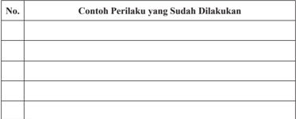

Tabel ini berisi contoh perilaku yang telah dilakukan oleh individu atau kelompok, dengan kolom "No." untuk nomor urutan dan kolom "Contoh Perilaku yang Sudah Dilakukan" untuk deskripsi perilaku tersebut. Topik utama tabel ini adalah tentang pengamatan perilaku sehari-hari. Data penting yang terlihat meliputi berbagai jenis perilaku yang telah dilakukan, mulai dari perilaku positif seperti berbagi, berkomunikasi dengan baik, hingga perilaku negatif seperti tidak menghormati orang lain atau tidak menyelesaikan tugas. Tabel ini membantu dalam memahami bagaimana perilaku individu atau kelompok dapat dianalisis dan dikembangkan lebih baik.

### Rangkuman

### 1. Kata Kunci

Kata  kunci  yang  harus  Anda  pahami  dalam  mempelajari  materi pada bab ini adalah persatuan, kesatuan, unitarisme, dan negara kesatuan .

### 2. Intisari Materi

- Negara kesatuan adalah negara bersusun tunggal, yakni kekuasaan untuk mengatur seluruh daerahnya ada di tangan pemerintah pusat. Pemerintah pusat memegang kedaulatan sepenuhnya, baik ke dalam maupun ke luar.

 

---
## 📄 Halaman 129

- Negara kesatuan dapat dibedakan menjadi dua macam sistem, yaitu sentralisasi dan desentralisasi.
- Wujud Negara Kesatuan Republik Indonesia semakin kukuh setelah dilakukan  perubahan  dalam  UUD  NRI Tahun  1945,  yang  dimulai dari adanya ketetapan Majelis Permusyarawatan Rakyat yang salah satunya adalah tidak mengubah Pembukaan UUD NRI Tahun 1945 dan  tetap  mempertahankan  Negara  Kesatuan  Republik  Indonesia sebagai bentuk fi nal negara bagi bangsa Indonesia.
- Sejarah  mencatat  ada  enam  periode  besar  proses  penyelanggaraan negara  dalam  konteks  Negara  Kesatuan  Republik  Indonesia,  hal tersebut  terjadi  terutama  karena  adanya  pergantian  undang-undang dasar,  yaitu  periode  18 Agustus  1945  sampai  dengan  27  Desember 1949, periode 27 Desember 1949 sampai dengan 17 Agustus 1950, periode 17 Agustus 1950 sampai dengan 5 Juli 1959, periode 5 Juli 1959  sampai  dengan  11  Maret  1966  (Masa  Orde  Lama),  periode 11 Maret 1966 sampai dengan 21 Mei 1998 (masa Orde Baru), dan periode 21 Mei 1998-sekarang (masa reformasi).
- Persatuan dan kesatuan bangsa Indonesia pernah diuji kekokohannya dengan munculnya beberapa gerakan separatis seperti pemberontakan PKI  di  Madiun,  Pemberontakan  DI/TII,  Pemberontakan  APRA, Pemberontakan Andi Azis, Pemberontakan Republik Maluku Selatan, PRRI/Permesta, dan G 30 S/PKI. Akan tetapi semua gerakan tersebut tidak berhasil menggoyang persatuan dan kesatuan bangsa Indonesia yang dibuktikan dengan tetap kukuhnya NKRI.

### 1. Penilaian Sikap

Keberadaan  Negara  Kesatuan  Republik  Indonesia  akan  tetap  terjamin, apabila seluruh warga negaranya berperilaku nasionalis dan patriotik. Untuk mengukur sejauh mana Anda telah berperilaku nasionalis dan  patriotik dalam kehidupan sehari-hari, isilah daftar gejala kontinum pelakonan di bawah ini dengan membubuhkan tanda silang (x) pada kolom selalu, sering, kadangkadang, dan tidak pernah.

 

---
## 📄 Halaman 130

---
**📊 Tabel**

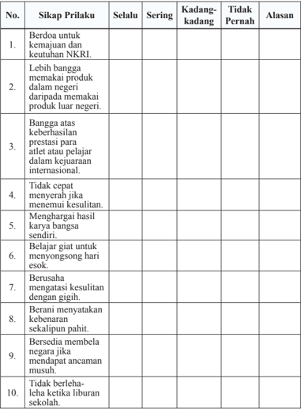

Tabel ini berisi informasi tentang sikap perilaku siswa terhadap NKRI (Negara Kita Raya Indonesia) dalam berbagai situasi. Topik utamanya adalah sikap dan perilaku siswa terhadap NKRI. Kolom-kolom yang ada meliputi "Selalu", "Sering", "Kadang-kadang", dan "Tidak Pernah". Data penting yang terlihat adalah bahwa sebagian besar siswa memiliki sikap positif terhadap NKRI, seperti berdoa untuk kemajuan dan keuntungan NKRI, lebih bangga memakai produk dalam negeri dibandingkan dengan luar negeri, dan berusaha mengatasi kesulitan dengan gigih. Namun, masih ada beberapa siswa yang tidak pernah berdoa untuk NKRI, tidak cepat menyerah jika menemui kesulitan, dan tidak berlebih-lebihan ketika liburan sekolah. Ini menunjukkan adanya variasi dalam sikap dan perilaku siswa terhadap NKRI.

### 2.  Pemahaman Materi

Dalam mempelajari materi pada bab ini, tentu saja ada materi yang dengan mudah Anda pahami, ada juga yang sulit Anda pahami. Oleh karena itu, lakukanlah penilaian diri atas pemahaman Anda terhadap materi pada bab ini dengan memberikan tanda ceklis ( √ ) pada kolom Paham Sekali, Paham Sebagian, Belum Paham.

 

---
## 📄 Halaman 131

---
**📊 Tabel**

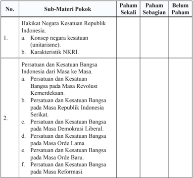

Tabel ini berisi informasi tentang pemahaman siswa terhadap konsep negara kesatuan Republik Indonesia (NKRI) dan persatuan dan kesatuan bangsa Indonesia dari masa ke masa. Topik utama tabel adalah "Hakikat Negara Kesatuan Republik Indonesia" dan "Persatuan dan Kesatuan Bangsa Indonesia dari Masa ke Masa". Kolom-kolomnya meliputi "Paham Sekali", "Paham Sebagian", dan "Belum Paham". Data penting yang terlihat adalah bahwa sebagian besar siswa memiliki pemahaman yang baik tentang konsep negara kesatuan unitarisme dan karakteristik NKRI, sementara masih ada yang belum sepenuhnya memahami konsep ini. Sementara itu, untuk topik "Persatuan dan Kesatuan Bangsa Indonesia dari Masa ke Masa", sebagian besar siswa memiliki pemahaman yang baik tentang persatuan dan kesatuan bangsa pada masa Revolusi Kemerdekaan, Masa Republik Indonesia Serikat, Masa Demokrasi Liberal, Masa Orde Lama, Masa Orde Baru, dan Masa Reformasi. Namun, masih ada yang belum sepenuhnya memahami konsep ini.

Apabila pemahaman Anda berada pada kategori paham sekali, mintalah materi  pengayaan  kepada  guru  untuk  menambah  wawasan  Anda.  Apabila pemahaman Anda berada pada kategori Paham Sebagian dan Belum Paham, bertanyalah  kepada  guru  serta  mintalah  penjelasan  lebih  lengkap,  supaya Anda cepat memahami materi pembelajaran yang sebelumnya kurang atau belum memahaminya.

 

---
## 📄 Halaman 132

### Proyek Kewarganegaraan

### Mari Mengamati Wilayah

- Coba  Anda  secara  berkelompok  berkunjung  ke  suatu  tempat  yang merupakan batas wilayah/tempat yang memisahkan suatu tempat/wilayah satu dengan wilayah lainnya.
- Buatlah dokumentasi (gambar) yang merupakan tapal batas kedua wilayah tersebut (seperti patok, gapura, sungai, dll).
- Amati bagaimana kondisi masyarakat di daerah tersebut baik kehidupan sosialnya maupun kehidupan ekonominya terutama yang berkaitan dengan persatuan dan kesatuan yang terjalin di antara masyarakatnya.
- Identi fi kasi solusi untuk menyelesaikan persoalan di daerah tersebut yang dapat Anda ajukan.
- Laporkan  hasil  pengamatan  Anda  secara  tertulis  dan  presentasikan  di depan kelas.
- Buatlah  sebuah  poster  ukuran  A3  tentang  pentingnya  mengedepankan persatuan dan kesatuan dalam menyelesaikan setiap persoalan.

### Uji Kompetensi Bab 4

### Jawablah soal-soal di bawah ini secara singkat, jelas, dan akurat.

- Bentuk negara Indonesia adalah kesatuan. Berkaitan dengan hal tersebut, berikan alasan yang mendukung bahwa negara kita tidak cocok dengan bentuk negara serikat, tetapi lebih cocok dengan negara kesatuan!
- Mengapa persatuan  dan  kesatuan  bangsa  sangat  penting  bagi  keutuhan sebuah negara?
- Bagaimana  cara  bangsa  Indonesia  dalam  memperkukuh  persatuan  dan kesatuan di antara para warganya?
- Uraikan secara singkat dinamika persatuan dan kesatuan bangsa Indonesia dari masa ke masa!
- Bagaimana  cara  Anda  dalam  menjaga  persatuan  dan  kesatuan  bangsa Indonesia apabila dikaitkan dengan posisi Anda sebagai generasi muda? Kontribusi seperti apa yang bisa Anda berikan kepada negara?

 

---
## 📄 Halaman 133

### INDEKS

 

---
## 📄 Halaman 134

### L

legislatif  2, 121 lembaga negara 121

### M

Mahkamah Agung 121 Mahkamah Konstitusi  44-45,  115,  121,

128

masyarakat  viii,  xi,  6,  8,  11-13,  15-18, 23-27, 31, 34-36, 38-39, 41, 44-46, 4852, 54-60, 62, 64-68, 70-73, 75-77, 7980,  84,  86-87,  92,  100,  106,  113-114, 120-121, 123, iii

### N

negara xii, v, vi, viii, ix, x, xi, 1, 3-20, 22136, iii

32,  34-35,  37-39,  41,  43-52,  57-60,  64, 66, 68-70, 73-75, 77-80, 82-85, 92-130, nilai dasar 5-6, 8, 15, 122, 124 nilai instrumental 5, 8, 15, 30, 122, 124-125 nilai ix, xi, 5-6, 8, 12, 15, 30, 33, 39, 54, 72-73, 75-77, 80-83, 86-87, 92, 98, 122, 124-125, iii nilai praksis 122

norma 122

### P

Pancasila iii, v, ix, x, 5-6, 8, 15, 21, 2425, 30, 69, 75, 80-81, 83, 86, 103, 112113, 122, 127, 134-136, ii partai politik 72, 102, 122, 130 Partisipasi politik 122 penegakan hukum 19, 33-39, 41, 44, 46, 58, 60, 62, 65, 68, 122, 130, v penegak hukum viii, 18-19, 24, 36, 38, 40-41, 43, 45-46, 50-51, 62, 65, 73, 114, 122, v pengadilan 122

peradilan 122 perlindungan  hukum  6,  35-36,  59,  62, 68, 122 persatuan dan kesatuan 7, 16, 69, 77, 83,

93, 98, 100, 104, 107, 109, 111-117, 119120, 122, vi

Polri 41, 122

### R

radikalisme 75, 91, 115, 122 rakyat  104, 115, 122

### S

sabotase 122 sanksi hukum 57, 62, 122 spionase 122 supremasi hukum 24,  37-38,  43, 62, 72-73, 84, 114, 122

### T

terorisme 122 TNI 77-78, 103, 106, 109, 112, 122

### U

Undang-undang 108, 122 Unitarisme 122 UUD NRI Tahun 1945 3, 8-9, 11-14, 1920, 32, 80, 96-99, 115, 117, 122, 127-128

### W

warga negara v, viii,  x,  xi,  xii,  1,  3-15, 17-20,  22-32,  34-35,  37-38,  45-46,  58, 60,  74,  92,  94,  96,  114,  116,  121-122, 125, 127, 136, iii

### Y

yudikatif  122, 125

 

---
## 📄 Halaman 135

### GLOSARIUM

- ancaman suatu  hal  atau  usaha  yang  bersifat  mengubah  atau  merombak kebijaksanaan  yang  dilakukan  secara  konsepsional,  kriminal,  serta politik
- asas dasar (sesuatu yang menjadi tumpuan berpikir dan berpendapat)
bangsa kumpulan dari masyarakat yang membentuk negara

- dekret presiden keputusan  yang  dikeluarkan  presiden/kepala  negara  atas suatu permasalahan yang sangat penting, mendesak, dan darurat
- demokrasi pemerintahan  dari rakyat, oleh rakyat dan untuk rakyat
- diskriminasi pembedaan perlakuan terhadap sesama warga
- eksekutif kekuasaan untuk melaksanakan undang-undang
- federalisme ajaran, paham, atau kecenderungan yang menginginkan bentuk negara serikat
- gangguan usaha  dari  luar  yang  bertujuan  melemahkan  atau  menghalangi secara tidak konsepsional
- hak asasi manusia hak  dasar  yang  melekat  dalam  diri  manusia  sebagai anugerah Tuhan Yang Maha Esa
- hambatan suatu  hal  atau  usaha  berasal  dari  diri  sendiri  yang  bertujuan melemahkan atau menghalangi secara tidak konsepsional
- hedonisme pandangan yang menganggap kesenangan  dan kenikmatan meteri sebagai tujuan hidup utama

 

---
## 📄 Halaman 136

- ideologi kumpulan  konsep  bersistem  yang  dijadikan  asas  pendapat  yang memberikan arah dan tujuan kelangsungan hidup
independen tidak tergantung kepada pihak lain individu manusia sebagai suatu kesatuan yang tidak bisa dipisahkan

idividualisme faham  yang  menganggap  diri  sendiri  lebih  penting  daripada orang lain

- judicial review proses  uji  materi  suatu  peraturan  terhadap  peraturan  yang tingkatannya lebih tinggi
- kabinet badan atau dewan pemerintahan yang terdiri atas kepala pemerintahan bersama para menteri
- kebudayaan semua hasil karya, rasa, dan cipta manusia
- kekuasaan kemampuan seseorang atau kelompok untuk memengaruhi tingkah laku orang atau kelompok lain sesuai dengan keinginan dari pelaku
kewajiban asasi kewajiban dasar manusia konstitusi hukum dasar yang menetapkan dan mengatur pemerintahan

legislatif kekuasaan untuk  membuat undang-undang

- negara suatu organisasi kemanusian atau kumpulan manusia-manusia yang berada di bawah suatu pemerintahan yang sama
- nilai harga; sesuatu yang dianggap berharga oleh manusia
- nilai dasar nilai-nilai dasar yang mempunyai sifat tetap (tidak berubah), nilainilai ini terdapat dalam Pembukaan UUD Negara Republik Indonesia Tahun 1945
- nilai instrumental penjabaran lebih lanjut dari nilai dasar secara lebih kreatif dan  dinamis  dalam  bentuk  UUD  Negara  Republik  Indonesia Tahun 1945 dan peraturan perundang-undangan lainnya

 

---
## 📄 Halaman 137

- nilai praksis realisasi nilai-nilai instrumental dalam suatu pengalaman nyata dalam  kehidupan  sehari-hari  dalam  bermasyarakat,  berbangsa,  dan bernegara
- norma aturan  yang  menjadi  pedoman  setiap  orang  yang  meliputi  segala macam peraturan-peraturan yangterdapat dalam perundang-undangan
- pengadilan tempat untuk mengadili perkara atau tempat untuk melaksanakan proses peradilan guna menegakkan hukum
- peradilan proses  mengadili  perkara  sesuai  dengan  kategori  perkara  yang diselesaikan
- politik strategi; siasat; berbagai macam kegiatan dalam suatu sistem politik/ negara yang menyangkut kemaslahatan hidup seluruh warga negara
- rakyat kumpulan  manusia  yang  dipersatukan  oleh  rasa  persamaan  dan bersama-sama mendiami suatu wilayah negara
- republik bentuk pemerintahan yang dipimpin oleh presiden
- sabotase menghalangi prosedur dan merusak kelancaran kerja
- spionase penyelidikan  secara  rahasia  terhadap  data  kemiliteran  dan  data ekonomi  serta data politik negara lain;  segala  sesuatu  yang  berhubungan dengan tindakan memata-matai pihak lain
- tantangan suatu  hal  atau  usaha  yang  bertujuan  atau  bersifat  menggugah kemampuan
- terorisme praktik-praktik tindakan teror yang biasanya menggunakan kekerasaan  untuk  menimbulkan  ketakutan  dalam  usaha  mencapai tujuan-tujuan tertentu
- unitarisme ajaran,  paham,  atau  kecenderungan yang menginginkan bentuk negara kesatuan
- yudikatif kekuasaan untuk mengawasi agar undang-undang ditaati

 

---
## 📄 Halaman 138

### DAFTAR PUSTAKA

- Affandi, Idrus dan Karim Suryadi. 2008. Hak Asasi Manusia (HAM). Jakarta: Universitas Terbuka.
- Asshiddiqie, Jimly. (2007). Membangun Budaya Sadar Berkonstitusi untuk Mewujudkan  Negara  Hukum  yang  Demokratis. [Online].  Tersedia: http://www.jimly.com. Html [27 September 2013] .
- __________.  (2008). Membangun  Budaya  Sadar  Berkonstitusi. [Online]. Tersedia: http://www.jimly.com. Html [27 September 2013] .
Bakry, Noor Ms. 2009. Pendidikan Kewarganegaraan. Yogyakarta: Pustaka Pelajar.

Budiardjo, Miriam. 2008. Dasar-dasar Ilmu Politik. Jakarta: Gramedia Pustaka Utama.

Budimansyah, Dasim. 2002. Model Pembelajaran dan Penilaian Portofolio. Bandung: Ganesindo.

Busroh, Abu Daud. 2009. Ilmu Negara. Jakarta: Bumi Aksara.

- Gadjong, Agussalim Andi. 2007. Pemerintahan Daerah; Kajian Politik dan Hukum. Bogor: Ghalia Indonesia.
- Kaelan. 2012. Problem Epistemologis Empat Pilar Berbangsa dan Bernegara. Yogyakarta: Paradigma.
- Kansil, C.S.T.1992. Pengantar Ilmu Hukum dan Tata Hukum Indonesia. Jakarta: Balai Pustaka.
- Kansil, C.S.T dan Christine S.T Kansil. 2001. Ilmu Negara. Jakarta: Pradnya Paramita.
- Kantaprawira, Rusadi. 2004. Sistem Politik Indonesia; Suatu Model Pengantar. Bandung: Sinar Baru Algesindo.

 

---
## 📄 Halaman 139

- Komalasari, Kokom. 2008. Pendidikan Pancasila: Panduan bagi Para Politisi. Surabaya: Lentera Cendikia.
- Kusnardi, Mohammad dan Hermaily Ibrahim. (1983). Pengantar Hukum Tata Negara. Jakarta: Pusat Studi Hukum Tata Negara Fakultas Hukum Universitas Indonesia.
- Marbun, B.N. 2010. Otonomi Daerah 1945 - 2010; Proses dan Realita. Jakarta: Pustaka Sinar Harapan.
- Latif, Yudi. 2012. Negara Paripurna; Historisitas, Rasionalitas, dan Aktualitas Pancasila. Jakarta: Gramedia Pustaka Utama.
Lemhanas. 1997. Wawasan Nusantara. Jakarta: Balai Pustaka.

- ______. 1997. Ketahanan Nasional. Jakarta: Balai Pustaka.
- Lubis, Yusnawan. 2009. Pengaruh Pendidikan Kewarganegaraan Terhadap Tingkat Kesadaran Berkonstitusi Warga Negara Muda. Tesis pada Program Studi Pendidikan Kewarganegaraan Sekolah Pascasarjana Universitas Pendidikan Indonesia: tidak diterbitkan.
Marbun, B.N. 2007. Kamus Politik. Jakarta: Pustaka Sinar Harapan.

- _________. 2010. Otonomi Daerah 1945 - 2010; Proses dan Realita. Jakarta: Pustaka Sinar Harapan.
- MPR RI. 2012. Panduan Pemasyarakatan UUD NRI Tahun 1945 Sesuai dengan Urutan Bab,  Pasal dan Ayat. Jakarta: Sekretariat Jenderal MPR RI.
- _________.2012. Empat Pilar Kehidupan Berbangsa dan Bernegara. Jakarta: Sekretariat Jenderal MPR RI.
- _________.2012 . Bahan Tayangan Materi Sosialisasi UUD NRI Tahun 1945. Jakarta: Sekretariat Jenderal MPR RI.

 

---
## 📄 Halaman 140

- Peraturan Menteri Pendidikan dan Kebudayaan Republik Indonesia Nomor 24 Tahun 2016 tentang Kompetensi Inti dan Kompetensi Dasar Pelajaran pada Kurikulum 2013 pada Pendidikan Dasar dan Pendidikan Menengah.
- Riyanto, Astim. 2006. Negara Kesatuan; Konsep, Asas dan Aktualisasinya. Bandung: Yapemdo.
Republik Indonesia. 2002. UUD NRI Tahun 1945. Jakarta: Sinar Gra fi ka.

- _________. 1998. Ketetapan MPR Nomor XVII/MPR/1998 tentang Hak Asasi Manusia. [Online]. Tersedia: http://www.mpr.go.id.Html [12  September 2013].
- _________. 1998. Undang-Undang  RI  Nomor  9  tahun  1998  tentang Kemerdekaan  Menyampaikan  Pendapat  di  Muka  Umum. [Online]. Tersedia: http://www.dpr.go.id.Html [12  September 2013].
- _________. 1999. Undang-Undang RI Nomor 23 Tahun 1999 tentang Bank Indonesia. [Online]. Tersedia: http://www.dpr.go.id.Html [12  September 2013].
- _________.  1999. Undang-Undang  RI  Nomor  39  Tahun  1999  tentang Hak  Asasi  Manusia. [Online]. Tersedia: http://www.dpr.go.id.Html [12  September 2013].
- _________.  2000. Undang-Undang  RI  Nomor  26  Tahun  2000  tentang Pengadilan  Hak  Asasi  Manusia. [Online].  Tersedia: http://www.dpr. go.id.Html [12  September 2013].
- _________.  2002. Undang-Undang  RI  Nomor  2  Tahun  2002  tentang Kepolisian  NRI  . [Online].  Tersedia: http://www.dpr.go.id.Html [12 September 2013].
- _________. 2003. Undang-Undang RI Nomor 18 Tahun 2003 tentang Advokat. [Online]. Tersedia: http://www.dpr.go.id.Html [12  September 2013].
- _________.  2003. Undang-Undang  RI  Nomor  17  Tahun  2003  tentang Keuangan Negara. [Online]. Tersedia: http://www.dpr.go.id.Html [12  September 2013].

 

---
## 📄 Halaman 141

- _________.  2003. Undang-Undang  RI  Nomor  24  Tahun  2003  tentang Mahkamah  Konstitusi. [Online].  Tersedia: http://www.dpr.go.id.Html [12  September 2013].
- _________.  2004. Undang-Undang  RI  Nomor  1  Tahun  2004  tentang Perbendaharaan  Negara  . [Online].  Tersedia: http://www.dpr.go.id. Html [12  September 2013].
- _________.  2004. Undang-Undang  RI  Nomor  32  Tahun  2004  tentang Pemerintahan Daerah . [Online]. Tersedia: http://www.dpr.go.id. Html [12  September 2013].
- _________. 2004. Undang-Undang RI Nomor 34 Tahun 2004 tentang Tentara Nasional Indonesia . [Online]. Tersedia: http://www.dpr.go.id. Html [12 September 2013].
- _________. 2006. Undang-Undang RI 1 Nomor 5 Tahun 2006 tentang Badan Pemeriksa  Keuangan. [Online].  Tersedia: http://www.dpr.go.id.  Html [12  September 2013].
- _________.  2009. Undang-Undang  RI  Nomor  3  Tahun  2009  tentang Perubahan Kedua atas Undang-Undang Nomor 14 Tahun 1985 tentang Mahkamah Agung. [Online]. Tersedia: http://www.dpr.go.id.  Html [12 September 2013].
- _________.  2009. Undang-Undang  RI  Nomor  27  Tahun  2009  tentang Majelis Permusyawaratan Rakyat, Dewan Perwakilan Rakyat, Dewan Perwakilan Daerah, dan Dewan Perwakilan Rakyat Daerah. [Online]. Tersedia: http://www.dpr.go.id. Html [12  September 2013].
- _________.  2009. Undang-Undang  RI  Nomor  48  Tahun  2009  tentang Kekuasaan Kehakiman. [Online]. Tersedia: http://www.dpr.go.id. Html [12  September 2013].
- _________.  2009. Undang-Undang  RI  Nomor  49  Tahun  2009  tentang Perubahan atas Undang-Undang  Nomor  2  Tahun  1986  tentang Peradilan  Umum. [Online].  Tersedia: http://www.dpr.go.id.  Html [12 September 2013].

 

---
## 📄 Halaman 142

- _________.  2009. Undang-Undang  RI  Nomor  50  Tahun  2009  tentang Perubahan Kedua atas Undang-Undang Nomor 5 Tahun 1989 tentang Peradilan  Agama. [Online].  Tersedia: http://www.dpr.go.id.  Html [12 September 2013].
- _________.  2009. Undang-Undang  RI  Nomor  51  Tahun  2009  tentang Perubahan Kedua atas Undang-Undang Nomor 5 Tahun 1986 Tentang Peradilan Tata Usaha Negara. [Online]. Tersedia: http://www.dpr.go.id. Html [12  September 2013].
- _________.  2011. Undang-Undang  RI  Nomor  2  Tahun  2011  tentang Perubahan Atas Undang-Undang Nomor 2 Tahun 2008 tentang Partai Politik . [Online]. Tersedia: http://www.dpr.go.id. Html [12  September 2013].
- __________. 2008. Buku Putih Pertahanan Tahun 2008. Jakarta: Departemen Pertahanan RI.
- Sahrasad,  Al  Chaidar  Zuk fi kar Salahudin Herdi. 2000. Federasi atau Disintegrasi; Telaah Wacana Unitaris Versus Federalis Dalam Perspektif Islam, Nasionalisme, dan Sosial Demokrasi. Jakarta: Madani Press.
- Soeharyo,  Sulaeman  dan  Nasri  Efendi.  2001. Sistem  Penyelenggaraan Pemerintah NRI. Jakarta: Lembaga Administrasi Negara.
- Soekanto,  Soerjono.  2002. Faktor-faktor  Yang  Mempengaruhi  Penegakan Hukum. Jakarta: Raja Gra fi ndo Persada.
- Strong, C.F. 1960. Modern  Political Constitutions. London:  Sidgwick &Jackson Limited.
- _________. 2008. Peraturan  Presiden  Republik  Indonesia  Nomor  7  Tahun 2008 tentang Kebijakan Umum Pertahanan Negara . [Online]. Tersedia: http://www.dpr.go.id. Html [12  September 2013].

 

---
## 📄 Halaman 143

### Sumber Gambar

Buku 30 Tahun Indonesia Merdeka http://nankqute.blogspot.com/ Diunduh tanggal 8 November 2015

http://indonesiaexpat.biz/other/gotong-royong/ Diunduh tanggal 8 November 2015

http://www.elsam.or.id/article.php?id=408&lang=in Diunduh tanggal 8 November 2015

http://manadonyaman.wordpress.com/2012/05/19/ Diunduh tanggal 8 November 2015

http://4shorod.blogspot.com/2012/11/ Diunduh tanggal 8 November 2015

http://www.aktualpost.com/2013/11/17/5465 Diunduh tanggal 8 November 2015

www.mahkamahagung.go.id Diunduh tanggal 8 November 2015

http://www.setkab.go.id/berita-5246 Diunduh tanggal 8 November 2015

www.mahkamahkonstitusi.go.id Diunduh tanggal 8 November 2015

http://smagasukoharjojaya.blogspot.com/2013/12/ Diunduh tanggal 8 November 2015

http://www.komisiyudisial.go.id/ Diunduh tanggal 8 November 2015

 

---
## 📄 Halaman 144

http://hitamandbiru.blogspot.com/2012/08/ Diunduh tanggal 8 November 2015

http://www.setneg.go.id Diunduh tanggal 8 November 2015

http://www.artileri.org/2013/03 Diunduh tanggal 8 November 2015

http://www.tempo.co/read/news/2012/09/30/140432765/ Diunduh tanggal 8 November 2015

http://www.pikiran-rakyat.com/node/148034 Diunduh tanggal 8 November 2015

http://visitpAndaan.wordpress.com/2011/03/23/ Diunduh tanggal 8 November 2015

http://jenisbudayaindonesia.blogspot.com/ Diunduh tanggal 8 November 2015

http://www.the-marketeers.com/archives/ Diunduh tanggal 8 November 2015

http://www.terasjakarta.com/portal/berita-26505-42 Diunduh tanggal 8 November 2015

http://riau-global.blogspot.com/2012/06/ Diunduh tanggal 8 November 2015

www.seskab.go.id Diunduh tanggal 8 November 2015

www.presidenri.go.id Diunduh tanggal 8 November 2015

www.tamanmini.com Diunduh tanggal 8 November 2015

 

---
## 📄 Halaman 145

http://jurnalpatrolinews.com/2014/05/05/

http://beritajakarta.com/read/2092/

Diunduh tanggal 8 November 2015 Diunduh tanggal 8 November 2015

http://www.bappenas.go.id/berita-dan-siaran-pers/kegiatan-utama/ Diunduh tanggal 8 November 2015

http://himamanuny.wordpress.com/2014/03/22/ Diunduh tanggal 8 November 2015

http://alumnimenwajatim.tripod.com/ppbn.html Diunduh tanggal 8 November 2015

http://www.tempo.co/read/news/2014/10/29/078617811/ Diunduh tanggal 19 November 2014

www.beritajakarta.com Diunduh tanggal 19 November 2014

---
**🖼️ Gambar/Diagram**

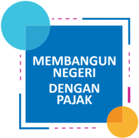

> **Deskripsi Visual:** Gambar ini adalah ilustrasi yang menunjukkan topik "Membangun Negeri dengan Pajak". Ilustrasi ini terdiri dari elemen-elemen berikut:

1. **Topik Utama**: Gambar ini secara keseluruhan menunjukkan topik pembangunan negara melalui pajak.

2. **Elemen Utama dan Relasinya**:
   - **Biru**: Bagian utama gambar yang menunjukkan teks "MEMBANGUN NEGERI DENGAN PAJAK".
   - **Latar Belakang**: Latar belakang biru dengan garis putih yang membentuk pola.
   - **Biru Muda**: Bagian di sebelah kiri gambar yang tampak seperti bintang atau bunga.

3. **Teks, Angka, atau Label Penting**:
   - **Teks Utama**: "MEMBANGUN NEGERI DENGAN PAJAK" yang terletak di bagian atas gambar.
   - **Angka**: Tidak ada angka yang jelas dalam gambar ini.

4. **Informasi Kunci**:
   - Gambar ini memberikan informasi bahwa pembangunan negara dilakukan melalui pajak, yang merupakan salah satu cara penting untuk membangun infrastruktur, ekonomi, dan kehidupan masyarakat.

Dengan demikian, gambar ini secara umum menunjukkan topik pembangunan negara melalui pajak, menggunakan warna biru dan elemen-efek visual lainnya untuk menarik perhatian pembaca.

 

---
## 📄 Halaman 146

### Profi  l Penulis

Nama Lengkap  :  H. Mohamad Sodeli

Telp. Kantor/HP :   021-8615286/081318966713

E-mail

:   sodelisman44jkt@yahoo.co.id

Akun Facebook :  Mohamad Sodeli

Alamat Kantor

:   Jln. Delima 4 Perumnas Klender Jakarta Timur

Bidang Keahlian:  -

### Riwayat pekerjaan/profesi dalam 10 tahun terakhir:

- Wakil Kepala sekolah Tahun 2007 - 2013 dan 2016
- Guru Mata Pelajaran PPKn

### Riwayat Pendidikan Tinggi dan Tahun Belajar:

- S2 : Program Studi Pendidikan  Ilmu Pengetahuan Sosial Program Pasca Sarjana Universitas Indraprasta PGRI Jakarta ( 2012 lulus 2015).
- S1: Fakultas Pendidikan Ilmu Pengetahuan Sosial Jurusan PMP-Kn IKIP Jakarta (1990 - 1995).
- Judul Buku dan Tahun Terbit  (10 Tahun Terakhir):
1. -

### Judul Penelitian dan Tahun Terbit (10 Tahun Terakhir):

- Pengaruh Minat Belajar dan Persepsi Siswa Pada Kompetensi  Profesional guru Terhadap Prestasi Belajar Pendidikan Pancasila dan Kewarganegaraan (Survei pada SMA Negeri di Kecamatan Duren Sawit Jakarta Timur )

 

---
## 📄 Halaman 147

Nama Lengkap  :  Yusnawan Lubis

Telp Kantor/HP  :   (0265) 331359/0813 23251478

E-mail

:   yusnawan.lubis@gmail.com

Akun Facebook :  https://www.facebook.com/yusnawan.lubis

Alamat Kantor

:  Jalan Mancogeh No.26 Kota Tasikmalaya Jawa Barat

Bidang Keahlian:  PPKn

### Riwayat pekerjaan/profesi dalam 10 tahun terakhir:

- Guru Mata Pelajaran PPKn di SMKN 1 Tasikmalaya Tahun 2009 s.d sekarang
- Tutor Mata Kuliah Pembelajaran PKN di SD dan Materi/Pembelajaran PKn di SD pada Program Pendidikan Dasar Universitas Terbuka UPBJJ Bandung Tahun 2008 s.d sekarang
- Dosen Mata Kuliah Pendidikan Pancasila dan Pendidikan Kewarganegaraan di Puskom Amik Hass Tahun 2012 s.d sekarang

### Riwayat Pendidikan Tinggi dan Tahun Belajar:

- S2: Program Studi Pendidikan Kewarganegaraan (PKn) - Sekolah Pascasarjana Universitas Pendidikan Indonesia (2007 - 2009)
- S1: Jurusan Pendidikan Moral Pancasila dan Kewarganegaraan (PMPKn) - Fakultas Pendidikan Ilmu Pengetahuan Sosial - Universitas Pendidikan Indonesia (2002 2006)

### Judul Buku dan Tahun Terbit (10 Tahun Terakhir):

- Memahami Pendidikan Kewarganegaraan Untuk SD/MI Kelas I diterbitkan oleh PT Arfi  no Raya Tahun 2008
- Memahami Pendidikan Kewarganegaraan Untuk SD/MI Kelas II diterbitkan oleh PT Arfi  no Raya Tahun 2008
- Memahami Pendidikan Kewarganegaraan Untuk SD/MI Kelas III diterbitkan oleh PT Arfi  no Raya Tahun 2008
- Memahami Pendidikan Kewarganegaraan Untuk SD/MI Kelas IV diterbitkan oleh PT Arfi  no Raya Tahun 2008
- Memahami Pendidikan Kewarganegaraan Untuk SD/MI Kelas V diterbitkan oleh PT Arfi  no Raya Tahun 2008
- Memahami Pendidikan Kewarganegaraan Untuk SD/MI Kelas VI diterbitkan oleh PT Arfi  no Raya Tahun 2008
- Pendidikan Kewarganegaraan untuk SMA/MA/SMK Kelas X diterbitkan oleh Kementerian Pendidikan dan Kebudayaan Republik Indonesia Tahun 2010
- Pendidikan Kewarganegaraan untuk SMA/MA/SMK Kelas XI diterbitkan oleh Kementerian Pendidikan dan Kebudayaan Republik Indonesia Tahun 2010
- Pendidikan Kewarganegaraan untuk SMA/MA/SMK Kelas XII diterbitkan oleh Kementerian Pendidikan dan Kebudayaan Republik Indonesia Tahun 2010
- Pendidikan Pancasila dan Kewarganegaraan untuk SMA/MA/SMK/MAK Kelas XI diterbitkan oleh Kementerian Pendidikan dan Kebudayaan Republik Indonesia Tahun 2014

 

---
## 📄 Halaman 148

- Pendidikan Pancasila dan Kewarganegaraan untuk SMA/MA/SMK/MAK Kelas XII diterbitkan oleh Kementerian Pendidikan dan Kebudayaan Republik Indonesia Tahun 2015
- Pendidikan Pancasila dan Kewarganegaraan untuk SMP/MTs Kelas IX diterbitkan oleh Kementerian Pendidikan dan Kebudayaan Republik Indonesia Tahun 2015
- Pendidikan Pancasila dan Kewarganegaraan untuk SMA/MA/SMK/MAK Kelas XI diterbitkan oleh Kementerian Pendidikan dan Kebudayaan Republik Indonesia Tahun 2016
- Pendidikan Pancasila dan Kewarganegaraan untuk SMA/MA/SMK/MAK Kelas XII diterbitkan oleh Kementerian Pendidikan dan Kebudayaan Republik Indonesia Tahun 2016

### Judul Penelitian dan Tahun Terbit (10 Tahun Terakhir):

- Pengaruh Pendidikan Kewarganegaraan terhadap Kesadaran Berkonstitusi Warga Negara Muda (Studi deskriptif analitis terhadap siswa SMA di Kota Tasikmalaya) Tahun 2009
- Upaya Meningkatkan Keterampilan Berpikir Kritis Siswa SMK Melalui Pembelajaran Berbasis Isu-Isu Kontoversial (Penelitian Tindakan Kelas Pada Siswa Kelas X Akuntansi 2, SMKN 1 Tasikmalaya) Tahun 2014

---
**🖼️ Gambar/Diagram**

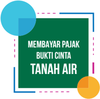

> **Deskripsi Visual:** Gambar ini adalah ilustrasi yang menunjukkan teks "MEMBAYAR PAJAK BUKTI CINTA TANAH AIR" dengan latar belakang hijau dan elemen desain berwarna biru dan kuning. Ilustrasi ini mungkin digunakan sebagai cover atau bagian dari buku pelajaran untuk menggambarkan konsep pembayaran pajak sebagai bentuk cinta terhadap negara. Elemen-elemen utama termasuk teks yang ditulis dalam bahasa Indonesia, warna-warna yang digunakan, dan desain yang sederhana namun menarik. Informasi kunci yang dapat diambil pembaca adalah bahwa pembayaran pajak merupakan tindakan yang penting dan harus dilakukan sebagai bentuk rasa cinta terhadap tanah air.

 

---
## 📄 Halaman 149

### Profi  l Penelaah

Nama Lengkap  :  Dr. Nasiwan, M.Si.

Telp. Kantor/HP :   (0274) 586168 ext.247 / 081578007988

E-mail

:   nasiwan3@gmail.com

Akun Facebook :  Raden Nasiwan

Alamat Kantor

:   Fakultas Ilmu Sosial UNY, Kampus Karangmalang,

Yogyakarta

Bidang Keahlian:  Politik

### Riwayat pekerjaan/profesi dalam 10 tahun terakhir:

- Dosen pada Fakultas Ilmu Sosial UNY 2002-2016
- Reviewer Buku Ajar Puskurbuk 2005-2015
- Penelaah Buku PKn SMP SMA Puskurbuk 2015

### Riwayat Pendidikan Tinggi dan Tahun Belajar:

- S3: Fakultas Ilmu Sosial dan Politik UGM  (tahun masuk: 2007 - tahun lulus: 2014)
- S2: Fakultas Ilmu Sosial dan Politik UGM  (tahun masuk: 1999 - tahun lulus: 2001)
- S1: IKIP Negeri Yogyakarta  (tahun masuk: 1990-tahun lulus: 1994)

### Judul Buku yang Pernah Ditelaah  (10 Tahun Terakhir):

- Teori-Teori Politik / Penerbit: Ombak Yogyakarta 2012
- Dasar-dasar Ilmu Politik / Penerbit: Ombak Yogyakarta 2013
- Filsafat Ilmu Sosial / Penerbit: Fistrans Institute FIS UNY 2014
- Indigenousasi Ilmu Sosial / Penerbit: Fistrans Institute FIS UNY 2012
- Seri Teori Sosial Indonesia / Penerbit: UNY Press 2016

### Judul Penelitian dan Tahun Terbit (10 Tahun Terakhir):

- Model Pengembangan Ilmu Sosial Profetik 2014-2015
- 2. Dilema Transformasi Partai Keadilan Sejahtera 2015
- 3. Pengaruh Diskursus Ilmu Sosial pada Dinamika Keilmuan Sosial di FIS UNY2013-2014

 

---
## 📄 Halaman 150

Nama Lengkap  :  Dr. Dadang Sundawa, M.Pd

Telp. Kantor/HP :   022 2013163 / 08122171079

E-mail

:   d_sundawa@yahoo.com

Akun Facebook :  sundawadadang@yahoo.com

Alamat Kantor

:   Jl. DR. Setiabudhi 229 Bandung

Bidang Keahlian:  Pendidikan Kewarganegaraan (PKn)

### Riwayat pekerjaan/profesi dalam 10 tahun terakhir:

- PNS ( Dosen UPI di Bandung ), dari tahun 1988 sampai  sekarang
- Pengembang Kurikulum di Direktorat PSMP, dari tahun 2001 sampai sekarang
- Pengembang Panduan Tendik Berprestasi di Direktorat Tendik, dari tahun 2015 sampai sekarang

### Riwayat Pendidikan Tinggi dan Tahun Belajar:

- S3; Prodi PKn di SPS UPI Bandung, tahun masuk 2008 dan lulus tahun 2011
- S2; Prodi IPS Pendidikan Dasar IKIP Bandung tahun masuk 1995 dan tahun lulus 1997
- S1; Prodi PKn-Hukum IKIP Bandung, tahun masuk 1981 dan lulus tahun 1986

### Judul Buku yang Pernah Ditelaah  (10 Tahun Terakhir):

- Buku IPS SD tahun 2006
- PPKn SD tahun 2006
- PPKn SMP
- PPKn SMA
- PKn SMP Kurikulum 2013
- PKn SMA Kurikulum 2013
- Materi dan Pembelajaran PKn
- Konsep Dasar PKn
- PPKn SMP Kurikulum 2013
- PPKn SMA Kurikulum 2013

### Judul Penelitian dan Tahun Terbit (10 Tahun Terakhir):

- Dampak Sertifi  kasi Guru Melalui Jalur Penilaian Portofolio Terhadap Pengembangan Kompetensi Kewarganegaraan Guru Pkn Di Kota Bandung, 2009
- Penyuluhan Hukum Dan Ham Untuk  Perlindungan  Hak-Hak Perempuan Dalam Rumah Tangga Di Kecamatan Dayeuhkolot Kabupaten Bandung, 2009
- Membangun Kelas Pendidikan Kewarganegaraan Sebagai Laboratorium Pendidikan Demokrasi, 2010
- Pengembangan Model Penyuluhan AIDDA (Awareness, Interest, Desire, Decision, dan Action) Untuk Mengatasi Kekerasan Anak di Kecamatan Rongga Kabupaten Bandung, tahun 2013
- Metode Pembelajaran Klik Berbasis Mind Map dalam Memanfaatkan Cara Kerja Otak Sebagai Mesin Asosiasi Untuk Mengatasi Kesulitan Belajar Mahasiswa Pada Mata Kuliah Pengantar Ilmu Hukum, tahun 2013
- Pengembangan Model Penyuluhan AIDDA (Awareness, Interest, Desire, Decision, dan Action) Untuk Mengatasi Perilaku Menyimpang dalam Membuang Sampah Pada Kalangan Siswa di Bandung, tahun 2014
- Metode Pembelajaran Klik Berbasis Mind Map dalam Memanfaatkan Cara Kerja Otak Sebagai Mesin Asosiasi Untuk Mengatasi Kesulitan Belajar Mahasiswa Pada Mata Kuliah Hukum Pidana, 2014
- Persepsi Dan Pemahaman Guru Peserta Plpg Ips Terhadap Penerapan Pendekatan Saintifi  k Pada Kurikulum 2013, 2014
- Pendidikan Pembangunan Berkelanjutan Melalui Green Constitution Dalam Meningkatkan Kesadaran Berkonstitusi Mahasiswa, 2015

 

---
## 📄 Halaman 151

### Profi  l Editor

Nama Lengkap  :  Muhamad Taupan, S.Pd

Telp. Kantor/HP :   (022) 5403533/082316440896

E-mail

:   muhamadtaupan03@gmail.com

Akun Facebook :  https://www.facebook.com/muhamad.taupan

Alamat Kantor

:   Jl. Permai 28 Nomor 100 Bandung 40218

Bidang Keahlian:  geografi  , sosiologi, dan PPKn

- Riwayat pekerjaan/profesi dalam 10 tahun terakhir:
- 2007 - sekarang: Editor IPS di CV Yrama Widya
- 2005 - 2007: Guru IPS Terpadu di SMP Pasundan 5 Bandung
- Dst.
- Riwayat Pendidikan Tinggi dan Tahun Belajar:
- S1: Ilmu Pemerintahan UT Bandung (2016-sekarang)
- S1: Pendidikan Geografi   UPI Bandung (2001-2007)
- Judul Buku yang Pernah Ditelaah  (10 Tahun Terakhir):
- Buku siswa PPKn untuk SMP/Mts. Kelas VII, Departemen Pendidikan dan Kebudayaan
- Buku guru PPKn untuk SMP/Mts. Kelas VII, Departemen Pendidikan dan Kebudayaan
- Buku siswa PPKn untuk SMA/MA Kelas XI, Departemen Pendidikan dan Kebudayaan
- Buku guru PPKn untuk SMA/MA. Kelas XI, Departemen Pendidikan dan Kebudayaan
- Buku siswa PPKn untuk SMA/MA Kelas XII, Departemen Pendidikan dan Kebudayaan
- Buku guru PPKn untuk SMA/MA. Kelas XII, Departemen Pendidikan dan Kebudayaan
- Dst.
- Judul Penelitian dan Tahun Terbit (10 Tahun Terakhir):
1. -

 

---
## 📄 Halaman 152

---
**🖼️ Gambar/Diagram**

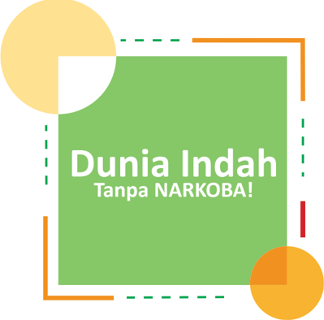

> **Deskripsi Visual:** Gambar ini adalah ilustrasi yang menampilkan sebuah kotak hijau dengan tulisan "Dunia Indah Tanpa NARKOBA!" di tengahnya. Di sekeliling kotak tersebut ada beberapa elemen grafis seperti garis vertikal dan horizontal berwarna hijau, merah, kuning, dan oranye. Di sisi kiri dan kanan atas gambar ada dua lingkaran kuning yang tampaknya mengisi bagian atas dan bawah gambar. Elemen-elemen ini membentuk suatu desain yang menarik dan fokus pada pesan tentang keberadaan narkoba di dunia. Teks utama yang ditampilkan adalah "Dunia Indah Tanpa NARKOBA!", yang menekankan pentingnya menjaga kebersihan dan keselamatan masyarakat dari penggunaan narkoba.

---

*📊 Statistik: 45 visual berhasil, 18 dilewati, 0 gagal | Durasi: 8m 23s*