# Salinan Matematika Kelas XI BG press

*Diekstrak: 17 May 2026, 15:39*

---

---
## 📄 Halaman 1

---
**🖼️ Gambar/Diagram**

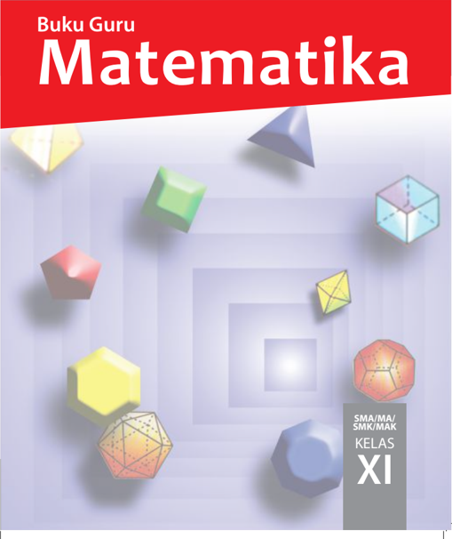

> **Deskripsi Visual:** Buku Guru Matematika untuk kelas XI SMA/MA/SMK/MAK menampilkan cover dengan desain yang menarik dan modern. Cover ini terdiri dari elemen-elemen berikut:

1. **Apa yang Ditampilkan Secara Keseluruhan**: Cover buku ini menampilkan berbagai bentuk geometri seperti segiempat, segitiga, dan benda-benda tiga dimensi seperti balok, prisma, dan piramida. Desain cover ini mencerminkan topik matematika yang akan dipelajari dalam buku tersebut.

2. **Elemen-Elemen Utama dan Relasinya**: Cover ini terdiri dari beberapa elemen utama yang saling terhubung melalui hubungan visual. Segiempat, segitiga, dan benda-benda tiga dimensi seperti balok, prisma, dan piramida terletak di berbagai sudut cover, menunjukkan bahwa topik-topik matematika yang akan dipelajari termasuk geometri dan struktur ruang.

3. **Teks, Angka, atau Label Penting yang Terlihat**: Di bagian atas cover, terdapat teks "Buku Guru Matematika" yang menunjukkan tujuan buku ini. Di bagian bawah cover, terdapat teks "SMA/MA/SMK/MAK KELAS XI", yang memberikan informasi tentang tujuan pembelajaran buku ini untuk siswa kelas XI di sekolah-sekolah tertentu.

4. **Informasi Kunci yang Bisa Dibaca Pembaca**: Informasi kunci yang bisa dilihat pembaca adalah bahwa buku ini dirancang untuk siswa kelas XI di sekolah-sekolah tertentu, dan topik-topik yang akan dipelajari termasuk geometri dan struktur ruang. Ini menunjukkan bahwa buku ini dirancang untuk membantu siswa memahami konsep-konsep matematika yang kompleks.

Dengan demikian, cover buku ini menunjukkan bahwa buku ini dirancang untuk membantu siswa kelas XI di sekolah-sekolah tertentu dalam mempelajari matematika, khususnya topik-topik geometri dan struktur ruang.

 

---
## 📄 Halaman 2

### Hak Cipta © 2017 pada Kementerian Pendidikan dan Kebudayaan

### Dilindungi Undang-Undang

Disklaimer: Buku ini merupakan buku guru yang dipersiapkan Pemerintah dalam rangka implementasi Kurikulum 2013. Buku guru ini disusun dan ditelaah oleh berbagai pihak di bawah koordinasi Kementerian Pendidikan dan Kebudayaan, dan dipergunakan dalam tahap awal penerapan Kurikulum 2013. Buku ini merupakan 'dokumen hidup' yang senantiasa diperbaiki,  diperbaharui,  dan  dimutakhirkan  sesuai  dengan  dinamika  kebutuhan  dan perubahan zaman. Masukan dari berbagai kalangan yang dialamatkan kepada penulis dan laman http://buku.kemdikbud.go.id atau melalui email buku@kemdikbud.go.id diharapkan dapat meningkatkan kualitas buku ini.

### Katalog Dalam Terbitan (KDT)

Indonesia. Kementerian Pendidikan dan Kebudayaan.

Matematika : buku guru/ Kementerian Pendidikan dan Kebudayaan.-- . Edisi Revisi Jakarta : Kementerian Pendidikan dan Kebudayaan, 2017.

xxii, 226 hlm. : ilus. ; 25 cm.

Untuk SMA/MA/SMK/MAK Kelas X I ISBN  978-602-427-118-3 (jilid lengkap) ISBN  978-602-427-120-6 (jilid 2 )

- Matematika - Studi dan Pengajaran
I. Judul

- Kementerian Pendidikan dan Kebudayaan
510

Penulis

- :  Sudianto Manullang, Andri Kristianto S., Tri Andri Hutapea, Lasker Pangarapan Sinaga, Bornok Sinaga, Mangaratua Marianus S., Pardomuan N. J. M. Sinambela,
Penelaah

:   Agung Lukito, Muhammad Darwis M., Turmudi, Nanang Priatna,

Pereview

:  Sri Mulyaningsih

Penyelia Penerbitan

:  Pusat Kurikulum dan Perbukuan, Balitbang, Kem en dikbud.

Disusun dengan huruf  Times New Roman, 12 pt.

 

---
## 📄 Halaman 3

### Kata Pengantar

Bapak/Ibu  guru  kami  yang  terhormat,  banyak  hal  yang  sudah  kita lakukan sebagai usaha membelajarkan peserta didik dengan harapan, mereka berketuhanan,  berperikemanusiaan,  berpengetahuan,  dan  berketerampilan melalui  pendidikan  matematika.  Harapan  dan  tugas  mulia  ini  cukup  berat, menuntut tanggung jawab yang tidak habis-habisnya dari generasi ke generasi. Banyak  masalah  pembelajaran  matematika  yang  kita  hadapi,  bagaikan menelusuri sebuah lingkaran dengan titik-titik masalah yang tak berhingga banyaknya. Tokoh  pendidikan  matematika  Soedjadi  dan Yansen  Marpaung menyatakan, kita harus berani memilih/menetapkan tindakan dan menghadapi resiko untuk meningkatkan kualitas pendidikan matematika di setiap sekolah tempat  guru  melaksanakan  tugas  profesionalitasnya. Artinya,  guru  sebagai orang yang pertama dan yang utama bertindak sebagai pengembang kurikulum yang  mengenal  karakteristik  siswa  dengan  baik,  dituntut  bekerja  sama memikirkan jalan keluar permasalahan yang terjadi. Guru diharapkan dapat menemukan pola pembelajaran yang sesuai dengan karakteristik matematika dan karakteristik peserta didik di sekolah.

Salah satu alternatif, kita akan mengembangkan pembelajaran matematika berbasis paham konstruktivisme. Buah pikiran ini didasari prinsip bahwa: (1) setiap anak lahir di bumi, mereka telah memiliki potensi, (2) cara berpikir, bertindak, dan persepsi setiap orang dipengaruhi budaya, (3) matematika adalah produk  budaya,  yaitu  hasil  konstruksi  sosial  dan  sebagai  alat  penyelesaian masalah kehidupan, dan (4) matematika adalah hasil abstraksi pikiran manusia. Untuk itu diperlukan perangkat pembelajaran, media pembelajaran, asesmen autentik dalam pelaksanaan proses pembelajaran di kelas.

Model pembelajaran yang menganut paham konstruktivistik yang relevan dengan  karakteristik  matematika  dan  tujuan  pembelajaran  matematika  cukup banyak, seperti  (1)  model  pembelajaran  berbasis  masalah,  (2)  pembelajaran kontekstual,  (3)  pembelajaran  kooperatif  dan  banyak  model  pembelajaran lainnya.  Bapak/Ibu  dapat  mempelajarinya  secara  mendalam  melalui  aneka sumber pembelajaran.

 

---
## 📄 Halaman 4

Pokok bahasan yang dikaji dalam buku petunjuk guru ini, antara lain: (1) Induksi Matematika, (2) Program Linear, (3) Matriks, (4) Transformasi, (5) Barisan,  (6)  Limit  Fungsi,  (7) Turunan,  dan  (8)  Integral.  Berbagai  konsep, aturan,  dan  sifat-sifat  dalam  matematika  ditemukan  melalui  penyelesaian masalah nyata, media pembelajaran, yang terkait dengan materi yang diajarkan. Seluruh  materi  yang  diajarkan  berkiblat  pada  pencapaian  kompetensi  yang ditetapkan  dalam  Kurikulum  2013.  Semua  petunjuk  yang  diberikan  dalam buku ini hanyalah pokok-pokoknya saja. Oleh karena itu, Bapak dan Ibu guru dapat mengembangkan dan menyesuaikan dengan keadaan dan suasana kelas saat pembelajaran berlangsung.

Akhirnya, tidak ada gading yang tak retak. Rendahnya kualitas pendidikan matematika  adalah  masalah  kita  bersama.  Kita  telah  diberi  talenta  yang beragam, seberapa besar buahnya yang dapat kita persembahkan padaNya. Taburlah  rotimu  di  lautan  tanpa  batas,  percayalah  kamu  akan  mendapat roti sebanyak pasir di tepi pantai. Mari kita lakukan tugas mulia ini sebaikbaiknya,  semoga  buku  petunjuk  guru  ini  dapat  digunakan  dan  bermanfaat dalam pelaksanaan proses pembelajaran matematika di sekolah.

Jakarta, Januari 2017

Tim Penulis,

 

---
## 📄 Halaman 5

### Daftar Isi

 

---
## 📄 Halaman 9

### P P Buku Guru etunjuk enggunaan

Dalam bagian ini diuraikan hal-hal penting yang perlu diikuti guru, saat guru menggunakan buku ini. Hal-hal esensial yang dijabarkan, antara lain: (1) pentingnya guru memahami model pembelajaran berbasis konstruktivis dengan pendekatan scientiic  learning terkait  sintaksis model pembelajaran yang diterapkan, sistem sosial, prinsip reaksi pengelolaan (perilaku guru mengajar di kelas), sistem pendukung pembelajaran yang harus dipersiapkan (berbagai fasilitas, misalnya buku siswa, lembar aktivitas siswa, media pembelajaran, instrumen penilaian, tugastugas yang akan diberikan), serta dampak instruksional dan dampak pengiring (sikap) yang harus dicapai melalui proses pembelajaran; (2) mengorganisir siswa belajar (di dalam dan luar kelas) dalam memberi kesempatan mengamati data, informasi, dan masalah, kerja kelompok dalam memecahkan masalah, memberi bantuan jalan keluar bagi siswa; (3) memilih model, strategi,  dan  metode  pembelajaran  untuk  tujuan  pembelajaran  yang  efektif;  (4)  memilih sumber  belajar  yang  melibatkan  partisipasi  aktif  siswa  dalam  proses  pembelajaran  yang dipicu melalui pengajuan masalah, pemberian tugas produk, projek; (5) petunjuk penggunaan asesmen autentik untuk mengecek keberhasilan aspek sikap, pengetahuan, dan keterampilan; (6) petunjuk pelaksanaan remedial dan pemberian pengayaan.

### A. Model  dan  Metode  Pembelajaran  Berbasis  Konstruktivistik  dengan Pen  dekatan Scientiic  Learning

Model pembelajaran yang diterapkan dalam buku ini, dilandasi teori pembelajaran yang menganut paham konstruktivistik, seperti Project-Based Learning , Problem-Based Learning , dan Discovery Learning dengan pendekatan scientiic  learning melalui  proses  mengamati, menanya, menalar, mencoba, membangun jejaring dan mengomunikasikan berbagai informasi terkait  pemecahan  masalah real  world ,  analisis  data,  dan  menarik  kesimpulan.  Proses pembelajaran memberi perhatian pada aspek-aspek kognisi dan mengangkat berbagai masalah real  world yang	 sangat	 mempengaruhi	 aktiitas	 dan	 perkembangan	 mental	 siswa	 selama proses pembelajaran dengan prinsip bahwa, (1) setiap anak lahir, tumbuh dan berkembang dalam matriks sosial tertentu dan telah memiliki potensi, (2) cara berpikir, bertindak, dan persepsi setiap orang dipengaruhi nilai budayanya, (3) matematika adalah hasil konstruksi sosial  dan  sebagai  alat  penyelesaian  masalah  kehidupan,  dan  (4)  matematika  adalah  hasil abstraksi pikiran manusia.

Metode  pembelajaran  yang  diterapkan,  antara  lain:  metode  penemuan,  pemecahan masalah, tanya-jawab, diskusi dalam kelompok heterogen, pemberian tugas produk, unjuk kerja,  dan projek. Pembelajaran matematika yang diharapkan dalam praktek pembelajaran di kelas adalah (1) pembelajaran berpusat pada aktivitas siswa, (2) siswa diberi kebebasan berpikir memahami masalah, membangun strategi penyelesaian masalah, mengajukan ideide secara bebas dan terbuka, (3) guru melatih dan membimbing siswa berpikir kritis dan

 

---
## 📄 Halaman 10

kreatif  dalam  menyelesaikan  masalah,  (4)  upaya  guru  mengorganisasikan  adalah  dengan bekerja	sama	dalam	kelompok	belajar,	melatih	siswa	berkomunikasi	menggunakan	graik, diagram, skema, dan variabel, (5) seluruh hasil kerja selalu dipresentasikan di depan kelas untuk  menemukan  berbagai  konsep,  hasil  penyelesaian  masalah,  aturan  matematika  yang ditemukan melalui proses pembelajaran.

Rancangan model pembelajaran yang diterapkan mengikuti 5 (lima) komponen utama model pembelajaran yang dijabarkan sebagai berikut.

### 1. Sintaks

Pengelolaan pembelajaran terdiri 5 tahapan pembelajaran, yaitu:

### a. Apersepsi

Tahap apersepsi diawali dengan mengimformasikan kepada siswa kompetensi dasar  dan  indikator  yang  akan  dicapai  siswa  melalui  pembelajaran  materi  yang akan  diajarkan.  Lalu,  guru  menumbuhkan  persepsi  positif  dan  motivasi  belajar pada  diri  siswa  melalui  pemaparan  manfaat  materi  matematika  yang  dipelajari dalam penyelesaian masalah kehidupan. Selain itu, guru meyakinkan siswa, jika siswa terlibat aktif dalam merekonstruksi konsep dan prinsip matematika melalui penyelesaian masalah yang bersumber dari fakta dan lingkungan kehidupan siswa dengan strategi penyelesaian yang menerapkan pola interaksi sosial yang pahami siswa dan guru. Dengan demikian, siswa akan lebih baik dalam menguasai materi yang diajarkan, informasi baru berupa pengetahuan lebih bertahan lama di dalam ingatan  siswa,  dan  pembelajaran  lebih  bermakna  sebab  setiap  informasi  baru dikaitkan dengan apa yang diketahui siswa dan menunjukkan secara nyata kegunaan konsep dan prinsip matematika yang dipelajari dalam kehidupan.

### b. Interaksi Sosial di Antara Siswa, Guru dan Masalah

Pada tahap orientasi masalah dan penyelesaian masalah, guru meminta siswa mencoba memahami masalah dan mendiskusikan hasil pemikiran melalui belajar kelompok. Pembentukan kelompok belajar menerapkan prinsip kooperatif, yakni keheterogenan  anggota  kelompok  dari  segi  karakteristik  (kemampuan  dan  jenis kelamin) siswa, berbeda budaya, berbeda agama dengan tujuan agar siswa terlatih bekerjasama, berkomunikasi, menumbuhkan rasa toleransi dalam perbedaan, saling memberi ide dalam penyelesaian masalah, saling membantu dan berbagi informasi. Guru  memfasilitasi  siswa  dengan  buku  siswa,  Lembar  Aktivitas  Siswa  (LAS) dan Asesmen Autentik. Selanjutnya, guru mengajukan permasalahan matematika yang  bersumber  dari  lingkungan  kehidupan  siswa.  Guru  menanamkan  nilainilai  matematis  (jujur,  konsisten,  tangguh  menghadapi  masalah)  dan  nilai-nilai budaya agar para siswa saling berinteraksi secara sosio kultural, memotivasi dan mengarahkan jalannya diskusi agar lebih efektif, serta mendorong siswa bekerja sama.

Selanjutnya,  guru  memusatkan  pembelajaran  pada  siswa  dalam  kelompok belajar  untuk  menyelesaikan  masalah.  Guru  meminta  siswa  memahami  masalah secara  individu  dan  mendiskusikan  hasil  pemikirannya  dalam  kelompok,  dan

 

---
## 📄 Halaman 11

dilanjutkan  berdialog  secara  interaktif  (berdebat,  bertanya,  mengajukan  ide-ide, berdiskusi)  dengan  kelompok  lain  dengan  arahan  guru. Antaranggota  kelompok saling bertanya-jawab, berdebat, merenungkan hasil pemikiran teman, mencari ide dan jalan keluar penyelesaian masalah. Setiap kelompok memadu hasil pemikiran dan menuangkannya dalam sebuah LAS yang dirancang guru. Jika semua anggota kelompok mengalami kesulitan memahami dan menyelesaikan masalah, maka salah seorang dari anggota kelompok bertanya pada guru sebagai panutan. Selanjutnya, guru memberi scaffolding , yaitu berupa pemberian petunjuk, memberi kemudahan pengerjaan  siswa,  contoh  analogi,  struktur,  bantuan  jalan  keluar  sampai  saatnya siswa dapat mengambil alih tugas-tugas penyelesaian masalah.

### c. Mempresentasikan dan Mengembangkan Hasil Kerja

Pada tahapan ini, guru meminta salah satu kelompok mempresentasikan hasil kerjanya di  depan  kelas  dan  memberi  kesempatan  pada  kelompok  lain  memberi tanggapan berupa kritikan  disertai  alasan-alasan,  dan  memberi  masukan  sebagai pembanding. Sesekali guru mengajukan pertanyaan menguji pemahaman/penguasaan penyaji  dan  dapat  ditanggapi  oleh  kelompok  lain.  Kriteria  untuk  memilih  hasil diskusi kelompok yang akan dipresentasikan antara lain: jawaban kelompok berbeda dengan jawaban dari kelompok lain, ada ide penting dalam hasil diskusi kelompok yang perlu mendapat perhatian khusus. Dengan demikian, kelompok penyaji bisa lebih dari satu kelompok. Selama presentasi hasil kerja, guru mendorong terjadinya diskusi  kelas  dan  mendorong  siswa  mengajukan  ide-ide  secara  terbuka  dengan menanamkan nilai softskill .

Tujuan tahapan ini adalah untuk mengetahui keefektifan hasil diskusi dan hasil kerja kelompok pada tahapan sebelumnya. Dalam penyajiannya, kelompok penyaji akan diuji oleh kelompok lain dan guru tentang penguasaan dan pemahaman mereka atas  penyelesaian  masalah  yang  dilakukan.  Dengan  cara  tersebut  dimungkinkan tiap-tiap kelompok mendapatkan pemikiran-pemikiran baru dari kelompok lain atau alternatif jawaban yang lain yang berbeda. Sehingga pertimbangan-pertimbangan secara objektif akan muncul di antara siswa. Tujuan lain dalam tahapan ini adalah melatih siswa terampil menyajikan hasil kerjanya melalui penyampaian ide-ide di depan umum (teman satu kelas). Keterampilan mengomunikasikan ide-ide tersebut adalah  salah  satu  kompetensi  yang  dituntut  dalam  pembelajaran  berdasarkan masalah, untuk memampukan siswa berinteraksi/berkolaborasi dengan orang lain.

### d. Temuan Objek Matematika dan Penguatan Skemata Baru

Objek-objek matematika berupa model (contoh konsep) yang diperoleh dari proses  dan  hasil  penyelesaian  masalah  dijadikan  bahan  inspirasi  dan  abstraksi konsep melalui penemuan ciri-ciri konsep oleh siswa dan mengkonstruksi konsep secara ilmiah. Setelah konsep ditemukan, guru melakukan teorema pengontrasan melalui pengajuan contoh dan bukan contoh. Dengan mengajukan sebuah objek, guru meminta siswa memberi alasan, apakah  objek itu termasuk contoh atau bukan contoh konsep.

 

---
## 📄 Halaman 12

Guru memberi kesempatan bertanya atas hal-hal yang kurang dipahami. Sesekali guru  menguji  pemahaman  siswa  atas  konsep  dan  prinsip  yang  ditemukan,  serta melengkapi hasil pemikiran siswa dengan memberikan contoh dan bukan contoh konsep. Berdasar konsep yang ditemukan/direkonstruksi, diturunkan beberapa sifat dan  aturan-aturan.  Selanjutnya,  siswa  diberi  kesempatan  mengerjakan  soal-soal tantang  an untuk menunjukkan kebergunaan konsep dan prinsip matematika yang dimiliki.

### e. Menganalisis dan Mengevaluasi Proses dan Hasil Penyelesaian Masalah

Pada  tahapan  ini,  guru  membantu  siswa  atau  kelompok  mengkaji  ulang hasil  penyelesaian  masalah,  menguji  pemahaman  siswa  dalam  proses  penemuan konsep dan prinsip. Selanjutnya, guru melakukan evaluasi materi akademik dengan pemberian  kuis  atau  meminta  siswa  membuat  peta  konsep  atau  memberi  tugas dirumah atau membuat peta materi yang dipelajari.

### 2. Sistem Sosial

Pengorganisasian siswa selama proses pembelajaran menerapkan pola pembelajaran kooperatif.  Dalam  interaksi  sosiokultural  di  antara  siswa  dan  temannya,  guru  selalu menanamkan  nilai-nilai softskill dan  nilai  matematis.  Siswa  dalam  kelompok  saling bekerja  sama  dalam  menyelesaikan  masalah,  saling  bertanya/berdiskusi  antara  siswa yang lemah dan yang pintar,  kebebasan mengajukan pendapat, berdialog dan berdebat, guru  tidak  boleh  terlalu  mendominasi  siswa,  bersifat  membantu  dan  gotong  royong untuk  menghasilkan  penyelesaian  masalah  yang  disepakati  bersama.  Dalam  interaksi sosiokultural, para siswa diizinkan berbahasa daerah dalam menyampaikan pertanyaan, kritikan, pendapat terhadap temannya maupun pada guru.

### 3. Prinsip Reaksi

Model pembelajaran yang diterapkan dalam buku ini dilandasi teori konstruktivis dan nilai budaya di mana siswa belajar yang memberi penekanan pembelajaran berpusat pada  siswa,  sehingga  fungsi  guru  sebagai  fasilitator,  motivator,  dan  mediator  dalam pembelajaran.  Tingkah  laku  guru  dalam  menanggapi  hasil  pemikiran  siswa  berupa pertanyaan  atau  kesulitan  yang  dialami  dalam  menyelesaikan  masalah  harus  bersifat mengarahkan, membimbing, memotivasi dan membangkitkan semangat belajar siswa.

Untuk  mewujudkan  tingkah  laku  tersebut,  guru  harus  memberikan  kesempatan pada  siswa  untuk  mengungkapkan  hasil  pemikirannya  secara  bebas  dan  terbuka, mencermati pemahaman siswa atas objek matematika yang diperoleh dari proses dan hasil  penyelesaian  masalah,  menunjukkan  kelemahan  atas  pemahaman  siswa  dan memancing mereka menemukan jalan keluar untuk mendapatkan penyelesaian masalah yang sesungguhnya. Jika ada siswa yang bertanya, sebelum guru memberikan penjelasan/ bantuan,  guru  terlebih  dahulu  memberi  kesempatan  pada  siswa  lainnya  memberikan tanggapan dan merangkum hasilnya. Jika keseluruhan siswa mengalami kesulitan, maka guru saatnya memberi penjelasan atau bantuan/memberi petunjuk sampai siswa dapat mengambil alih penyelesaian masalah pada langkah berikutnya. Ketika siswa bekerja

 

---
## 📄 Halaman 13

menyelesaikan tugas-tugas, guru mengontrol jalannya diskusi dan memberikan motivasi agar siswa tetap berusaha menyelesaikan tugas-tugasnya.

### 4. Sistem Pendukung

Agar  model  pembelajaran  ini  dapat  terlaksana  secara  praktis  dan  efektif,  guru diwajibkan membuat suatu rancangan pembelajaran yang dilandasi teori pembelajaran konstruktivis  dan  nilai softskill matematis  yang  diwujudkan  dalam  setiap  langkahlangkah pembelajaran yang ditetapkan dan menyediakan fasilitas belajar yang cukup. Dalam hal ini dikembangkan buku model yang berisikan teori-teori pendukung dalam melaksanakan  pembelajaran,  komponen-komponen  model,  petunjuk  pelaksanaan  dan seluruh  perangkat  pembelajaran  yang  digunakan  seperti  rencana  pembelajaran,  buku guru, buku siswa, lembar kerja siswa, objek-objek abstraksi dari lingkungan budaya, dan media pembelajaran yang diperlukan.

### 5. Dampak Instruksional dan Pengiring yang Diharapkan

Dampak  langsung penerapan pembelajaran ini adalah  memampukan  siswa merekonstruksi  konsep  dan  prinsip  matematika  melalui  penyelesaian  masalah  dan terbiasa menyelesaikan masalah nyata di lingkungan siswa. Pemahaman siswa terhadap objek-objek  matematika  dibangun  berdasarkan  pengalaman  budaya  dan  pengalaman belajar yang telah dimiliki sebelumnya. Kebermaknaan pembelajaran yang melahirkan pemahaman, dan pemahaman mendasari kemampuan siswa mentransfer pengetahuannya dalam menyelesaikan masalah. Kemampuan  menyelesaikan  masalah  tidak rutin menyadarkan  siswa  akan  kebergunaan  matematika.  Kebergunaan  akan  menimbulkan motivasi  belajar  secara  internal  dari  dalam  diri  siswa  dan  rasa  memiliki  terhadap matematika akan muncul sebab matematika yang dipahami adalah hasil rekonstruksi pemikirannya  sendiri.  Motivasi  belajar  secara  internal  akan  menimbulkan  kecintaan terhadap  dewi  matematika.  Bercinta  dengan  dewi  matematika  berarti  penyatuan  diri dengan  keabstrakan  yang  tidak  memiliki  batas  atas  dan  batas  bawah  tetapi  bekerja dengan simbol-simbol.

Selain dampak di atas, siswa terbiasa menganalisis secara logis dan kritis memberikan pendapat atas apa saja yang dipelajari menggunakan pengalaman belajar yang dimiliki sebelumnya.  Penerimaan  individu  atas  perbedaan-perbedaan  yang  terjadi  (perbedaan pola pikir, pemahaman, daya lihat, dan kemampuan), serta berkembangnya kemampuan berkolaborasi antara siswa. Retensi pengetahuan matematika yang dimiliki siswa dapat bertahan lebih lama sebab siswa terlibat aktif di dalam proses penemuannya.

Dampak  pengiring  yang  akan  terjadi  dengan  penerapan  model  pembelajaran berbasis  konstruktivistik  adalah  siswa  mampu  menemukan  kembali  berbagai  konsep dan  aturan  matematika  dan  menyadari  betapa  tingginya  manfaat  matematika  bagi kehidupan sehingga dia tidak merasa terasing dari lingkungannya. Matematika sebagai ilmu pengetahuan tidak lagi dipandang sebagai hasil pemikiran dunia luar tetapi berada pada lingkungan budaya siswa yang bermanfaat dalam menyelesaikan permasalahan di lingkungan budayanya. Dengan demikian terbentuk dengan sendirinya rasa memiliki,

 

---
## 📄 Halaman 14

sikap, dan persepsi positif siswa terhadap matematika dan budayanya. Siswa memandang bahwa matematika terkait dan inklusif di dalam budaya. Jika matematika bagian dari budaya siswa, maka suatu saat diharapkan siswa memiliki cara tersendiri memeliharanya dan menjadikannya Landasan Makna (Landasan makna dalam hal ini berpihak pada sikap, kepercayaan diri, cara berpikir, cara bertingkah laku, cara mengingat apa yang dipahami oleh siswa sebagai pelaku-pelaku budaya). Dampak pengiring yang lebih jauh adalah hakikat tentatif keilmuan, keterampilan proses keilmuan, otonomi dan kebebasan siswa, toleransi terhadap ketidakpastian dan masalah-masalah nonrutin.

 

---
## 📄 Halaman 15

### P edoman P enyusunan P embelajaran

Penyusunan  rencana  pembelajaran  berpedoman  pada  kurikulum  2013  dan  sintaksis Model Pembelajaran. Berdasarkan analisis kurikulum matematika ditetapkan hal-hal berikut.

- Kompetensi  dasar  dan  indikator  pencapaian  kompetensi  dasar  untuk  tiap-tiap  pokok bahasan. Rumusan indikator dan kompetensi dasar harus disesuaikan dengan prinsipprinsip pembelajaran matematika berdasarkan masalah, memberikan pengalaman belajar bagi siswa, seperti menyelesaikan masalah autentik (masalah bersumber dari fakta dan lingkungan budaya), berkolaborasi, berbagi pengetahuan, saling membantu, berdiskusi dalam menyelesaikan masalah.
- Materi pokok yang akan diajarkan, termasuk analisis topik, dan peta konsep.
- Materi  prasyarat,  yaitu  materi  yang  harus  dikuasai  oleh  siswa  sebagai  dasar  untuk mempelajari materi pokok. Dalam hal ini perlu dilakukan tes kemampuan awal siswa.
- Kelengkapan, yaitu fasilitas pembelajaran yang harus dipersiapkan oleh guru, misalnya: rencana pembelajaran, buku petunjuk guru, buku siswa, lembar aktivitas siswa (LAS), objek-objek budaya, kumpulan masalah-masalah yang bersumber dari fakta dan lingkungan budaya siswa, laboratorium, dan alat peraga jika dibutuhkan.
- Alokasi waktu: banyak jam pertemuan untuk setiap pokok bahasan tidak harus sama tergantung  kepadatan  dan  kesulitan  materi  untuk  tiap-tiap  pokok  bahasan.  Penentuan rata-rata banyak jam pelajaran untuk satu pokok bahasan adalah hasil bagi jumlah jam efektif  untuk  satu  semester  dibagi  banyak  pokok  bahasan  yang  akan  diajarkan  untuk semester tersebut.
- Hasil belajar yang akan dicapai melalui kegiatan pembelajaran antara lain:
Produk :

Konsep dan prinsip-prinsip yang terkait dengan materi pokok.

Proses :

Apersepsi budaya, interaksi sosial dalam penyelesaian masalah, memodel- kan masalah secara matematika, merencanakan penyelesaian masalah, menyajikan  hasil  kerja  dan  menganalisis  serta  mengevaluasi  kembali hasil penyelesaian masalah.

Kognitif :

Kemampuan matematisasi, kemampuan abstraksi, pola pikir deduktif, berpikir tingkat tinggi (berpikir kritis dan berpikir kreatif).

Psikomotor  :

Keterampilan menyelesaikan masalah, keterampilan berkolaborasi, kemampuan berkomunikasi.

Afektif :

Menghargai  budaya,  penerimaan  individu  atas  perbedaan  yang  ada, bekerja  sama,  tangguh  menghadapi  masalah,  jujur  mengungkapkan pendapat dan senang belajar matematika.

 

---
## 📄 Halaman 16

Sintaksis  pembelajaran  adalah  langkah-langkah  pembelajaran  yang  dirancang  dan dihasilkan  dari  kajian  teori  yang  melandasi  model  pembelajaran  berbasis  konstruktivistik. Sementara,  rencana pembelajaran  adalah operasional dari sintaks, sehingga skenario pembelajaran yang terdapat pada rencana pembelajaran disusun mengikuti setiap langkahlangkah pembelajaran (sintaks).  Sintaks model pembelajaran terdiri dari 5 langkah pokok, yaitu:  (1)  apersepsi  budaya,  (2)  orientasi  dan  penyelesaian  masalah,  (3)  persentase  dan mengembangkan  hasil  kerja,  (4)  temuan  objek  matematika  dan  penguatan  skemata  baru, (5)  menganalisis dan mengevaluasi proses dan hasil penyelesaian masalah. Kegiatan yang dilakukan untuk setiap tahapan pembelajaran dijabarkan sebagai berikut:

- Kegiatan guru pada tahap apersepsi budaya antara lain:
- Menginformasikan indikator pencapaian kompetensi dasar.
- Menciptakan persepsi positif dalam diri siswa terhadap budayanya dan matematika sebagai hasil konstruksi sosial.
- Menjelaskan pola interaksi sosial, menjelaskan peranan siswa dalam menyelesaikan masalah.
- Memberikan  motivasi  belajar  pada  siswa  melalui  penanaman  nilai  matematis, softskill dan kebergunaan matematika.
- Memberi kesempatan pada siswa menanyakan hal-hal yang sulit  dimengerti pada materi sebelumnya.
- Kegiatan guru pada tahap penyelesaian masalah dengan pola interaksi edukatif  antara lain:
- Membentuk kelompok.
- Mengajukan masalah yang bersumber dari fakta dan lingkungan budaya siswa.
- Meminta siswa memahami masalah secara individual dan kelompok.
- Mendorong siswa bekerja sama menyelesaikan tugas-tugas.
- Membantu siswa merumuskan hipotesis (dugaan).
- Membimbing, mendorong/mengarahkan siswa  menyelesaikan  masalah  dan  mengerjakan LKS.
- Memberikan scaffolding pada kelompok atau individu yang mengalami kesulitan.
- Mengkondisikan antaranggota kelompok berdiskusi, berdebat dengan pola kooperatif.
- Mendorong siswa mengekspresikan ide-ide secara terbuka.
- Membantu  dan  memberi  kemudahan  bagi  siswa  dalam  menyelesaikan  masalah dalam pemberian solusi.
- Kegiatan guru pada tahap persentasi dan mengembangkan hasil kerja antara lain:
- Memberi kesempatan pada kelompok mempresentasikan hasil penyelesaian masalah di depan kelas.

 

---
## 📄 Halaman 17

- Membimbing siswa menyajikan hasil kerja.
- Memberi kesempatan kelompok lain mengkritisi/menanggapi hasil kerja kelompok penyaji,  memberi  masukan  sebagai  alternatif  pemikiran,  dan  membantu  siswa menemu  kan konsep berdasarkan masalah.
- Mengontrol jalannya diskusi agar pembelajaran berjalan dengan efektif.
- Mendorong keterbukaan, proses-proses demokrasi.
- Menguji pemahaman siswa.
- Kegiatan guru pada tahap temuan objek matematika dan penguatan skemata baru antara lain:
- Mengarahkan siswa membangun konsep dan prinsip secara ilmiah.
- Menguji pemahaman siswa atas konsep yang ditemukan melalui pengajuan contoh dan bukan contoh konsep.
- Membantu	siswa	mendeinisikan	dan	mengorganisasikan	tugas-tugas	belajar	yang berkaitan dengan masalah.
- Memberi kesempatan melakukan konektivitas  konsep  dan  prinsip  dalam  mengerjakan soal tantangan.
- Memberikan scaffolding .
- Kegiatan guru pada tahap menganalisis dan mengevaluasi proses dan hasil penyelesaian masalah antara lain:
- Membantu siswa mengkaji ulang hasil penyelesaian masalah.
- Memotivasi siswa untuk terlibat dalam penyelesaian masalah yang selektif.
- Mengevaluasi materi akademik: memberi kuis atau membuat peta konsep atau peta materi.

 

---
## 📄 Halaman 18

### F Konstruksi iMatematika ase

Pena fsiran

---
**🖼️ Gambar/Diagram**

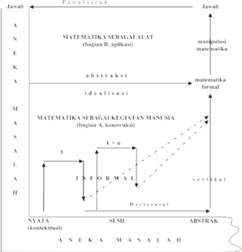

> **Deskripsi Visual:** Gambar ini adalah diagram yang menunjukkan hubungan antara matematika sebagai alat (bagian B) dan matematika sebagai kegiatan manusia (bagian A). Diagram ini terdiri dari dua bagian utama: matematika sebagai alat dan matematika sebagai kegiatan manusia.

Elemen utama dalam diagram ini meliputi:

1. **Matematika sebagai alat**:
   - Terdiri dari dua subbagian: manipulasi matematika dan matematika formal.
   - Manipulasi matematika berada di bagian atas dan mengarah ke kanan, menunjukkan bahwa ini adalah penggunaan matematika untuk tujuan tertentu.
   - Matematika formal berada di bagian bawah dan mengarah ke kiri, menunjukkan bahwa ini adalah penggunaan matematika secara formal dan abstrak.

2. **Matematika sebagai kegiatan manusia**:
   - Terdiri dari empat subbagian: abstraksi, idealisasi, konstruksi, dan informasi.
   - Abstraksi berada di bagian kiri dan mengarah ke kiri, menunjukkan bahwa ini adalah proses membangun konsep matematika dari hal-hal yang lebih sederhana.
   - Idealisasi berada di bagian tengah dan mengarah ke kiri, menunjukkan bahwa ini adalah proses memperjelas konsep matematika menjadi ide-ide yang lebih umum.
   - Konstruksi berada di bagian kanan dan mengarah ke kiri, menunjukkan bahwa ini adalah proses membangun konsep matematika dari ide-ide yang lebih umum.
   - Informasi berada di bagian bawah dan mengarah ke kiri, menunjukkan bahwa ini adalah proses membangun konsep matematika dari informasi yang ada.

Teks, angka, atau label penting yang terlihat dalam diagram ini meliputi:
- "Jawab" dan "Pengawasan" pada bagian atas.
- "MATEMATIKA SEBAGAI ALAT" dan "MATEMATIKA SEBAGAI KEGIATAN MANUSIA" pada bagian tengah.
- "ABSTRAKSI", "IDEALISASI", "KONSTRUKSI", dan "INFORMASI"

Gambar: Matematika Hasil Konstruksi Sosial (Adaptasi, Soedjadi (2004))

 

---
## 📄 Halaman 19

### CONTOH ANALISIS TOPIK

---
**🖼️ Gambar/Diagram**

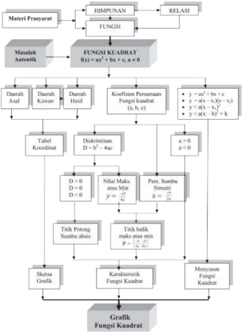

> **Deskripsi Visual:** Gambar ini adalah diagram yang menunjukkan proses analisis fungsi kuadrat dalam matematika. Diagram ini terdiri dari berbagai elemen yang saling terkait dan menjelaskan langkah-langkah analisis fungsi kuadrat. Pada bagian atas, ada dua cabang utama: "HIMPUNAN" dan "FUNGSI", yang kemudian mengarah ke "MASALAH AUTENTIK". Masalah autentik tersebut adalah fungsi kuadrat f(x) = ax^2 + bx + c, dengan a ≠ 0.

Bawah masalah autentik, terdapat dua daerah: "Daerah Asal" dan "Daerah Hasil". Daerah asal melibatkan koordinat dan diskriminan D = b^2 - 4ac. Jika D > 0, maka nilai maksimum atau minimum y = -b/2a; jika D = 0, maka persamaan sumbu simetri x = -b/2a. Jika D < 0, maka tidak ada titik potong sumbu absis.

Setelah itu, terdapat tiga pilihan untuk sketsa grafik: karakteristik fungsi kuadrat, karakteristik fungsi kuadrat, dan karakteristik fungsi kuadrat. Setiap pilihan memiliki informasi kunci yang penting tentang grafik fungsi kuadrat.

Secara keseluruhan, diagram ini memberikan panduan lengkap tentang cara analisis dan menggambar fungsi kuadrat dalam matematika.

 

---
## 📄 Halaman 20

### CONTOH DIAGRAM ALIR

---
**🖼️ Gambar/Diagram**

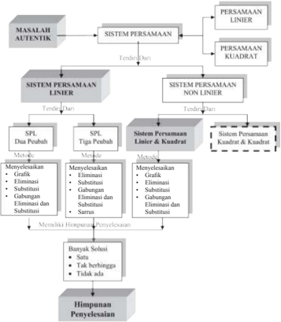

> **Deskripsi Visual:** Gambar ini adalah diagram yang menunjukkan proses penyelesaian sistem persamaan linier dan non-linier. Diagram ini terdiri dari beberapa elemen utama:

1. **Masalah Autentik** - Ini adalah masalah awal yang harus diselesaikan.
2. **Sistem Persamaan Linier** - Ini mencakup dua sub-sistem: SPL Dua Peubah dan SPL Tiga Peubah.
   - Untuk SPL Dua Peubah, ada metode grafik, eliminasi, substitusi, dan gabungan.
   - Untuk SPL Tiga Peubah, ada metode eliminasi, substitusi, dan gabungan.
3. **Sistem Persamaan Non-Linier** - Ini mencakup dua sub-sistem: SPL Liniar dan Kuadrat, serta SPL Kuadrat dan Kuadrat.
   - Untuk SPL Liniar dan Kuadrat, ada metode grafik, eliminasi, substitusi, dan gabungan.
   - Untuk SPL Kuadrat dan Kuadrat, ada metode eliminasi dan substitusi.
4. **PERSAMAAN LINIER** - Ini mencakup persamaan linear.
5. **PERSAMAAN KUADRAT** - Ini mencakup persamaan kuadrat.
6. **Himpunan Penyelesaian** - Ini menunjukkan berbagai kemungkinan solusi, seperti banyak, tak berhingga, atau tidak ada.

Elemen-elemen ini saling terkait melalui jalur-jalur yang menghubungkan mereka, menunjukkan hubungan antara masalah awal dan solusi akhir. Teks, angka, atau label penting yang terlihat termasuk nama-nama metode penyelesaian (grafik, eliminasi, substitusi, gabungan), dan informasi tentang jenis persamaan (linier, kuadrat). Gambar ini memberikan panduan visual tentang proses penyelesaian sistem persamaan, memperjelas konsep-konsep matematika tersebut.

 

---
## 📄 Halaman 21

---
**🖼️ Gambar/Diagram**

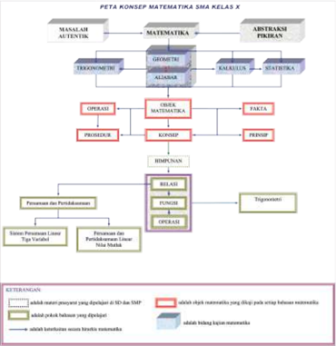

> **Deskripsi Visual:** Gambar ini adalah diagram konsep matematika SMA kelas X. Diagram ini memperlihatkan struktur dan hubungan antara berbagai konsep matematika yang diberikan pada kelas tersebut. Berikut adalah deskripsi lengkapnya:

1. **Apa yang Ditampilkan Secara Keseluruhan**: Gambar ini menunjukkan peta konsep matematika SMA kelas X, yang mencakup berbagai topik seperti masalah, teori, operasi, objek, prosedur, simpulan, dan hubungan. Setiap bagian ini memiliki subbagian yang lebih spesifik.

2. **Elemen-Elemen Utama dan Relasinya**: 
   - **Masalah**: Dibagi menjadi dua bagian: masalah sederhana dan masalah kompleks.
   - **Teori**: Terdiri dari geometri, aljabar, kalkulus, statistika, dan abstraksi pikiran.
   - **Operasi**: Termasuk operasi matematika dasar.
   - **Objek Matematika**: Termasuk fakta, pernyataan, simpulan, dan hubungan.
   - **Prosedur**: Termasuk penyelesaian masalah dan penggunaan metode-metode matematika.
   - **Simpulan**: Menyajikan hasil akhir dari proses matematika.
   - **Hubungan**: Menggambarkan hubungan antara berbagai konsep matematika.

3. **Teks, Angka, atau Label Penting yang Terlihat**:
   - **Teks Penting**: "PETA KONSEP MATEMATIKA", "MASALAH", "TEORI", "OPERASI", "OBJEK MATHEMATICA", "PROSEDUR", "SIMPUAN", "HUBUNGAN".
   - **Angka**: Tidak ada angka yang signifikan dalam gambar ini.
   - **Label Penting**: "ABSTRAKSI PIKIRAN" sebagai bagian dari teori.

4. **Informasi Kunci yang Bisa Diambil Pembaca**:
   - Gambar ini memberikan pemahaman umum tentang struktur dan hubungan antara berbagai konsep matematika yang diberikan pada kelas SMA kelas X.
   - Pembaca dapat melihat bagaimana setiap

 

---
## 📄 Halaman 22

 

---
## 📄 Halaman 23

BAB 1

### Induksi Matematika

### A.  Kompetensi Inti

---
**📊 Tabel**

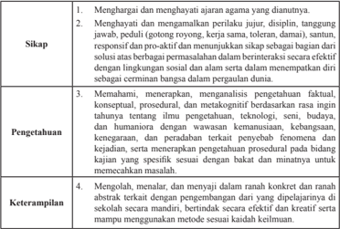

Tabel ini berisi empat kategori utama: Sikap, Pengetahuan, Keterampilan, dan Topik Utama. Sikap meliputi menghargai dan mengamankan ajaran agama, menghutani dan menganalisis perilaku, disiplin, tanggung jawab, peduli, dan responsif. Pengetahuan mencakup memahami, menerapkan, dan menganalisis pengetahuan faktil, konseptual, prosedural, dan metakognitif. Keterampilan melibatkan mengolah, menalar, dan menyajikan dalam ranah konkret dan ranah abstrak. Topik Utama mencakup berbagai aspek seperti sikap, pengetahuan, dan keterampilan yang harus dimiliki oleh individu untuk berperilaku positif dan efektif dalam berbagai situasi.

 

---
## 📄 Halaman 24

### B. Kompetensi Dasar dan Indikator

Indikator pencapaian kompetensi pada pembelajaran dapat dikembangkan guru sendiri berdasarkan kondisi peserta didik masing-masing di tempat guru mengajar. Berikut ini dipaparkan contoh Indikator Pencapaian Kompetensi Pembelajaran yang dapat dijabarkan dari KD 3.1 dan KD 4.1.

---
**📊 Tabel**

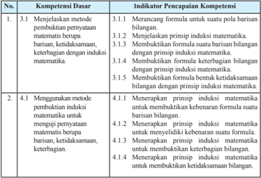

Tabel ini berisi informasi tentang kompetensi dasar dan indikator pencapaian kompetensi dalam pembelajaran matematika, khususnya tentang metode penalaran induksi dan kebijaksanaan bilangan. Topik utama tabel adalah pembuktian teorema matematika menggunakan metode induksi dan kebijaksanaan bilangan. Kolom pertama menunjukkan nomor urut dari kompetensi dasar, sementara kolom kedua menunjukkan indikator pencapaian kompetensi untuk setiap kompetensi. Data penting yang terlihat adalah bahwa pembuktian teorema menggunakan metode induksi dan kebijaksanaan bilangan merupakan kompetensi dasar yang harus dicapai oleh siswa. Indikator pencapaian kompetensi mencakup berbagai aspek seperti merancang formula untuk suatu pola barisan bilangan, menjelaskan prinsip induksi matematika, membuat formula barisan bilangan dengan prinsip induksi matematika, membuat formula kebijaksanaan bilangan dengan prinsip induksi matematika, menerapkan prinsip induksi matematika untuk membuktikan kebenaran formula suatu barisan bilangan, menerapkan prinsip induksi matematika untuk menyederhanakan kebenaran suatu formula, menerapkan prinsip induksi matematika untuk membuktikan kebijaksanaan bilangan, dan menerapkan prinsip induksi matematika untuk membuktikan ketidaksamaan bilangan.

 

---
## 📄 Halaman 25

### C. Tujuan Pembelajaran

Setelah mempelajari konsep induksi matematika melalui pengamatan, menalar, tanya jawab, mencoba menyelesaikan persoalan, penugasan individu dan kelompok, diskusi kelompok, dan mengkomunikasikan pendapatnya, siswa mampu:

- Melatih  siswa  menumbuhkan  sikap  perilaku  jujur,  disiplin,  tanggung  jawab, peduli (gotong royong, kerja sama, toleran, damai), santun, responsif dan proaktif, berani bertanya,  berpendapat, dan menghargai pendapat orang lain dalam aktivitas sehari-hari.
- Menunjukkan  rasa  ingin  tahu  dalam  memahami  konsep  dan  menyelesaikan masalah.
- Menjelaskan prinsip induksi matematika.
- Menjelaskan langkah-langkah pembuktian suatu formula dengan prinsip induksi matematika.
- Merancang formula dari suatu pola barisan bilangan.
- Membuktikan kebenaran formula suatu barisan bilangan dengan prinsip induksi matematika.
- Membuktikan kebenaran keterbagian pola bilangan.
- Membuktikan kebenaran ketidaksamaan pola bilangan.
- Menyelidiki kebenaran formula suatu pola bilangan.

 

---
## 📄 Halaman 26

### D. Diagram Alir

---
**🖼️ Gambar/Diagram**

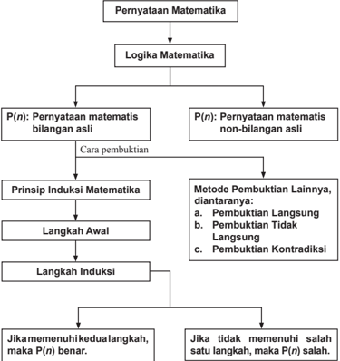

> **Deskripsi Visual:** Gambar ini adalah diagram yang menunjukkan struktur logika matematika dan prinsip induksi matematika. Gambar ini terdiri dari beberapa elemen utama:

1. Pernyataan Matematika: Ini adalah topik awal yang mencakup dua jenis pernyataan matematika: pernyataan matematika bilangan asli dan pernyataan matematika non-bilangan asli.

2. Logika Matematika: Ini adalah bagian dari struktur logika matematika yang melibatkan prinsip induksi matematika.

3. Prinsip Induksi Matematika: Ini adalah langkah-langkah utama dalam prinsip induksi matematika, yang melibatkan langkah awal dan langkah induksi.

4. Metode Pembuktiannya: Ini mencakup tiga metode pembuktian lainnya, yaitu pembuktian langsung, pembuktian tidak langsung, dan pembuktian kontradiksi.

5. Jika memenuhi kedua alat, maka P(n) benar: Ini adalah kondisi yang harus dipenuhi untuk menentukan kebenaran pernyataan matematika.

6. Jika tidak memenuhi salah satu langkah, maka P(n) salah: Ini adalah kondisi yang harus dipenuhi untuk menentukan kegagalan pernyataan matematika.

Informasi kunci yang dapat diambil pembaca adalah bahwa struktur logika matematika melibatkan prinsip induksi matematika sebagai langkah-langkah utama, dan ada tiga metode pembuktian lainnya yang dapat digunakan untuk mengevaluasi kebenaran pernyataan matematika.

 

---
## 📄 Halaman 27

### E.  Proses Pembelajaran

### 1.1 Memahami Prinsip Induksi Matematika

### No.

### 1. Kegiatan Pendahuluan

- Menyiapkan	peserta	didik	secara	psikis	dan	isik	untuk	mengikuti	proses pembelajaran.
- Memberi motivasi belajar siswa secara kontekstual sesuai manfaat dan aplikasi prinsip induksi matematika dalam kehidupan sehari-hari.
- Menjelaskan  tujuan  pembelajaran  atau  kompetensi  dasar  yang  akan dicapai.

### 4) Apersepsi

- Guru  memberikan  beberapa  pengantar  tentang  penalaran  induksi dalam kehidupan sehari, melalui kegiatan atau pengalaman siswa yang menggunakan prinsip induksi matematika. Misalnya, ilustrasi susunan n papan  yang  berukuran  sama  dan  berjarak  sama. Ajak siswa  berimajinasi  tentang  yang  akan  terjadi  jika  papan  pertama dijatuhkan ke arah papan kedua.
- Berikan pertanyaan kepada siswa dari setiap pola yang diamati.
- Ajak  siswa  untuk  berpikir  kritis  dalam  memahami  kondisi  awal suatu pola barisan.

### 2. Kegiatan Inti

### Pengantar Pembelajaran

- Mintalah	siswa	untuk	membaca	Masalah	1.1.

### Mengamati

- Ajaklah	 siswa	 untuk	 mengamati	 Masalah	 1.1	 tersebut	 dan	 meminta siswa untuk menentukan nilai kebenarannya.
- Berdasarkan	nilai	kebenaran	yang	diperoleh,	minta	siswa	untuk	membuat ingkaran dari kalimat tersebut.

### Menanya

- Selanjutnya	minta	siswa	untuk	bertanya	tentang	apa-apa	saja	yang	belum dipahaminya dalam menyelesaikan Masalah 1.1.

### Deskripsi Kegiatan

 

---
## 📄 Halaman 28

### Mengumpulkan Informasi

- Bimbing	siswa	untuk	menemukan	informasi	yang	disajikan	pada	setiap masalah.
- Uji	pemahaman	siswa	terhadap	pemecahan	masalah,	dengan	mengajukan pertanyaan yang berkaitan dengan Masalah 1.1 dan Masalah 1.2.

### Menalar

- Berikan	pancingan	kepada	siswa,	jika	siswa	menemukan	pola	penjumlahan bilangan berurutan mulai dari 1 hingga n , tetapi n merupakan bilangan ganjil, sedemikian hingga siswa dapat menyimpulkan secara umum.
- Setelah	Tabel	1.1	tuntas	dilengkapi	oleh	siswa,	ajak	siswa	memecahkan pola yang terdapat pada:
- Penjumlahan  berurut  bilangan  kuadrat  mulai  dari  1 2 hingga  30 2 . Kemudian hitunglah hasilnya.
- Penjumlahan  berurut  bilangan  kuadrat  mulai  dari  1 2 hingga  50 2 . Kemudian hitunglah hasilnya.
- Penjumlahan berurut bilangan kuadrat mulai dari 1 2 hingga n 2 .

### Alternatif Penyelesaian

- Meskipun n ganjil, pola yang untuk genap juga dapat diterapkan, tetapi dengan mengartikan 1 + 2 + 3 + . . . + n = 0 + 1 + 2 + 3 + . . . + n , n bilangan ganjil.
Jadinya hasilnya,

``

``

- Selengkapnya Tabel 1.1 adalah sebagai berikut.
n

``

### Jumlah n Bilangan Kuadrat yang Pertama

``

``

``

``

 

---
## 📄 Halaman 29

``

``

``

``

``

``

``

``

``

- Selanjutnya,  ajak  siswa  memahami  prinsip  induksi  matematika,  yang dinyatakan pada Prinsip 1.1 pada buku siswa. Pastikan siswa memahami prinsip  tersebut  melalui  mengajukan pertanyaan-pertanyaan, misalnya bagaimana pembuktian formula yang diperoleh melalui Masalah 1.1 dan Masalah 1.2.
- Kegiatan berikutnya,  berikan  kesempatan  kepada  siswa  untuk  mencermati dan memahami Masalah 1.3, Contoh 1.1, Contoh 1.2, dan Contoh 1.3.

### 3. Kegiatan Penutup

- Ajak siswa untuk menyimpulkan prinsip induksi matematika.
- Berikan pertanyaan untuk memastikan pemahaman siswa akan langkahlangkah prinsip induksi matematika.
- Berikan penugasan kepada siswa untuk mengerjakan Uji Kompetensi 1.1.

 

---
## 📄 Halaman 30

### Penilaian

### 1. Prosedur Penilaian Sikap

### 2. Instrumen Pengamatan Sikap

### Berpikir Logis

- Kurang baik jika sama sekali tidak berusaha mengajukan ide-ide logis dalam proses pembelajaran.
- Baik jika menunjukkan sudah ada usaha untuk mengajukan ide-ide logis dalam proses pembelajaran.
- Sangat baik jika mengajukan ide-ide logis dalam proses pembelajaran dalam proses pembelajaran secara terus menerus dan ajeg/konsisten.

### Kritis

- Kurang  baik  jika  sama  sekali  tidak  berusaha  mengajukan  ide-ide  logis dengan kritis atau pertanyaan menantang dalam proses pembelajaran.
- Baik jika menunjukkan sudah ada usaha untuk mengajukan ide-ide logis dengan kritis atau pertanyaan menantang dalam proses pembelajaran.
- Sangat  baik  jika  mengajukan  ide-ide  logis  dengan  kritis  atau  pertanyaan menantang  dalam  proses  pembelajaran  secara  terus  menerus  dan  ajeg/ konsisten.
Berikan tanda Ceklis pada kolom-kolom sesuai hasil pengamatan.

---
**📊 Tabel**

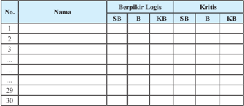

Tabel ini menunjukkan hasil evaluasi berdasarkan dua kriteria utama: Berpikir Logis dan Kritis. Kolom "No." menunjukkan nomor identifikasi setiap responden, sedangkan kolom "Nama" menyajikan nama-nama responden. Untuk kedua kriteria, tabel membandingkan dua metode penilaian: SB (Sistematis) dan KB (Kreatif). Data dalam tabel menunjukkan bahwa beberapa responden mendapatkan skor tinggi pada kriteria Berpikir Logis menggunakan metode SB, sementara untuk kriteria Kritis, skor tertinggi ditemukan pada metode KB. Ini menunjukkan bahwa metode penilaian yang berbeda dapat memberikan hasil yang berbeda tergantung pada jenis keterampilan yang diuji.

SB = Sangat Baik

B = Baik

KB = Kurang Baik

 

---
## 📄 Halaman 31

### 3. Instrumen Penilaian Pengetahuan dan Keterampilan

### Petunjuk:

Kerjakan soal berikut secara individu, tidak boleh menyontek dan tidak boleh bekerja sama.

### Soal

- Untuk setiap rumusan P( k ) yang diberikan, tentukan masing-masing P( k + 1).

``

``

``

``

- Rancanglah formula yang memenuhi setiap pola berikut ini.

``

``

``

``

``

### Pedoman Penilaian Pengetahuan dan Keterampilan

---
**📊 Tabel**

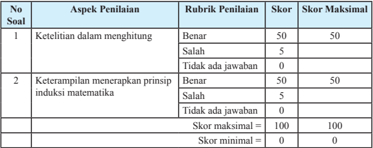

Tabel ini menunjukkan skor penilaian untuk dua aspek penilaian: ketelitian dalam menghitung dan keterampilan menerapkan prinsip induksi matematika. Topik utama tabel adalah tentang metode penilaian yang digunakan dalam proses pembelajaran matematika. Kolom pertama berisi nomor soal, sedangkan kolom kedua berisi rubrik penilaian. Skor maksimal untuk setiap aspek penilaian adalah 50 poin, dengan skor minimal 0 poin. Data penting yang terlihat adalah bahwa tidak ada jawaban untuk kedua aspek penilaian, yang berarti semua siswa mendapat skor 0 poin. Ini menunjukkan bahwa siswa belum memenuhi standar penilaian yang ditetapkan.

 

---
## 📄 Halaman 32

### 1.2 Bentuk-Bentuk Penerapan Prinsip Induksi Matematika

Dengan  pengalaman  belajar  mengajar  yang  telah  diperoleh  pada  pertemuan sebelum  guru  harus  mempersiapkan  sesuatu  apapun  yang  menjadi  kekurangan, termasuk cara psikologis mengatasi siswa yang belum mau bertanya.

---
**📊 Tabel**

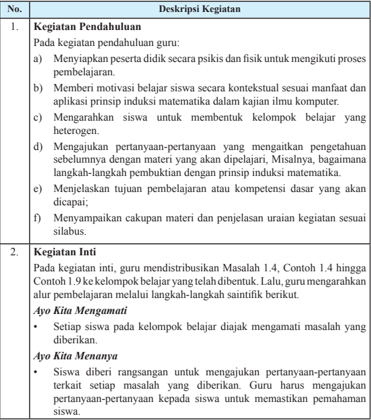

Tabel ini membahas dua bagian penting dari proses pembelajaran matematika di kelas. Pertama, pendahuluan kegiatan, dimana guru melakukan berbagai aktivitas untuk mempersiapkan siswa, seperti memberikan motivasi sesuai konteks manfaat dan aplikasi matematika, mengarahkan siswa untuk membentuk kelompok belajar heterogen, menjaga pertanyaan-pertanyaan yang mengajak pemahaman sebelumnya, menjelaskan tujuan pembelajaran dan kompetensi yang akan dicapai, serta menyampaikan cakupan materi dan uraian sesuai silabus. Kedua, kegiatan inti, dimana guru mendistribusikan masalah 1.4, contoh 1.4 hingga contoh 1.9 kepada siswa yang telah dibentuk kelompok belajar. Kemudian, guru mengarahkan siswa untuk mengevaluasi masalah yang diberikan, menjawab pertanyaan-pertanyaan yang terkait setiap masalah, dan memastikan pemahaman siswa melalui langkah-langkah sainsifit. Topik utama tabel ini adalah proses pembelajaran matematika di kelas, dengan kolom-kolom yang mencakup pendahuluan kegiatan dan kegiatan inti. Data penting yang terlihat adalah aktivitas yang dilakukan guru untuk mempersiapkan siswa, distribusi masalah, dan langkah-langkah sainsifit yang digunakan untuk memastikan pemahaman siswa.

 

---
## 📄 Halaman 33

### No. Deskripsi Kegiatan

### Ayo Kita Mengumpulkan Informasi

- Sebagai	 umpan	 balik	 aktivitas	 sebelumnya,	 siswa	 diminta	 untuk menemukan  dan  mengumpulkan  informasi  yang  ditemukan  pada masalah  tersebut,  sedemikian  sehingga  siswa  dapat  memahami  pola yang diberikan pada setiap masalah.
- Guru	mengkoordinir	kelompok	belajar	agar	setiap	informasi	yang	telah dikumpulkan diketahui dan dipahami setiap anggota kelompok.
- Siswa	 diarahkan	 melanjutkan	 ke	 langkah-langkah	 prinsip	 induksi matematika.

### Ayo Kita Mengasosiasi

- Ajukan	 pertanyaan-pertanyaan	 untuk	 setiap	 siswa	 yang	 memancing siswa untuk mengajukan pertanyaan-pertanyaan kritis, termasuk dalam penemuan formula setiap pola yang bersesuaian.
- Berikan	kesempatan	kepada	setiap	kelompok	belajar	untuk	memaparkan hasil  diskusi  di  depan  kelas.  Guru  mengarahkan  agar  kelompok  lain mencermati  dan  memotivasi  siswa  untuk  mengajukan  pertanyaanpertanyaan kritis terkait paparan.
- Untuk	memastikan	pemahaman	siswa	tersebut,	guru	dapat	memberikan masalah yang telah dipersiapkan guru sebelumnya.

### 3. Kegiatan Penutup

### Ayo Kita Menyimpulkan

- Tindak lanjut  dari  paparan  setiap  kelompok  belajar  yang  telah  dipaparkan, arahkan siswa untuk menyampaikan kesimpulan yang diperolehnya.
- Guru menegaskan/menyempurnakan kesimpulan yang diperoleh siswa, jika terdapat kekurangan.
- Untuk memastikan pemahaman siswa, berikan penugasan kepada siswa melalui mengerjakan soal-soal pada Uji Kompetensi 1.2.

 

---
## 📄 Halaman 34

### Penilaian

### 1. Prosedur Penilaian

---
**📊 Tabel**

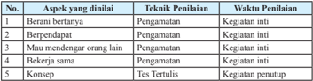

Tabel ini menunjukkan berbagai aspek pendidikan yang harus diperhatikan dalam proses pelatihan, dengan teknik penilaian yang digunakan untuk setiap aspek tersebut. Topik utama tabel adalah tentang aspek-aspek pendidikan yang perlu diperhatikan dalam proses pelatihan, seperti berani bertanya, berpandepatan, mau mendengar orang lain, bekerja sama, dan konsep. Teknik penilaian yang digunakan untuk setiap aspek tersebut adalah pengamatan kegiatan inti, pengamatan kegiatan inti, pengamatan kegiatan inti, pengamatan kegiatan inti, dan tes tertulis kegiatan intitupun. Waktu penilaian untuk setiap aspek tersebut adalah kegiatan inti. Dari tabel ini dapat disimpulkan bahwa proses pelatihan harus melibatkan pengamatan kegiatan inti dan tes tertulis kegiatan intitupun untuk setiap aspek pendidikan yang perlu diperhatikan.

### 2. Instrumen Penilaian Sikap

(Sikap Kinerja dalam Menyelesaikan Tugas Kelompok)

---
**📊 Tabel**

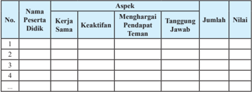

Tabel ini menunjukkan evaluasi partisipan didik dalam berbagai aspek, seperti kerja sama, keaktifan, menghargai pendapat teman, dan tanggung jawab. Kolom "Nama Peserta Didik" menyediakan nomor urut untuk setiap partisipan. Kolom "Aspek" mencakup empat aspek utama evaluasi. Kolom "Jumlah" menunjukkan jumlah partisipan yang memenuhi kriteria untuk setiap aspek. Kolom "Nilai" mungkin menunjukkan skor atau kualifikasi untuk setiap aspek. Pola penting yang terlihat adalah bahwa semua partisipan memiliki nilai yang sama untuk setiap aspek, menunjukkan kesetiaan dalam partisipasi mereka.

### Keterangan Skor:

- 1 =  (belum terlihat), apabila peserta didik belum memperlihatkan tanda-tanda awal perilaku sikap yang dinyatakan dalam indikator.
- 2 =  (mulai terlihat), apabila peserta  didik  mulai  memperlihatkan  adanya tanda-tanda  awal  perilaku  yang  dinyatakan  dalam  indikator  tetapi  belum konsisten.
- 3 =  (mulai  berkembang),  apabila  peserta  didik  sudah  memperlihatkan  tanda perilaku yang dinyatakan dalam indikator dan mulai konsisten.
- 4 =  (membudaya), apabila peserta didik terus-menerus memperlihatkan perilaku yang dinyatakan dalam indikator secara konsisten.
Nilai = skor perolehan × 100%

``

 

---
## 📄 Halaman 35

### 3. Instrumen Penilaian Pengetahuan

Contoh rubrik penilaian hasil penyelesaian soal oleh siswa. Dengan mempertimbangkan  langkah-langkah  penyelesaian  soal  yang  dilakukan  oleh  siswa terhadap soal-soal yang diajukan guru, maka dapat disusun rubrik penilaiannya. Alternatif pedoman penskorannya sebagai berikut.

---
**📊 Tabel**

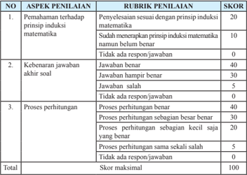

Tabel ini menunjukkan skor penilaian untuk tiga aspek penilaian: pemahaman tentang prinsip induksi matematika, kebenaran jawaban akhir soal, dan proses perhitungan. Topik utama adalah penilaian kualitas pemahaman matematika dan kemampuan menjawab soal dengan benar. Kolom-kolomnya mencakup skor maksimal 100, dan setiap aspek memiliki skor tertentu untuk setiap kriteria. Pola penting yang terlihat adalah bahwa skor tertinggi (40) diberikan untuk jawaban yang benar dan proses perhitungan yang benar, sementara skor terendah (0) diberikan untuk jawaban yang salah dan proses perhitungan yang sama sekali salah.

### 4. Instrumen Penilaian Keterampilan

(Penilaian kinerja dalam menyelesaikan tugas presentasi)

---
**📊 Tabel**

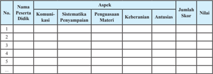

Tabel ini menunjukkan evaluasi partisipan dalam sebuah kegiatan belajar mengajar. Topik utamanya adalah komunikasi, sistematisasi penyampaian materi, penguasaan materi, keberanian, antusiasme, dan jumlah skor. Kolom-kolomnya mencakup nama partisipan, aspek-evaluasi, dan nilai. Data penting yang terlihat adalah bahwa setiap partisipan memiliki satu baris di tabel, dengan informasi tentang aspek-evaluasi dan nilai mereka. Ini menunjukkan bahwa tabel ini digunakan untuk mengumpulkan dan menyajikan data evaluasi partisipan dalam bentuk yang mudah dipahami.

 

---
## 📄 Halaman 36

### Keterangan Skor:

### Komunikasi:

- 1 =  Tidak dapat berkomunikasi
- 2 =  Komunikasi agak lancar, tetapi sulit dimengerti
- 3 =  Komunikasi lancar, tetapi kurang jelas dimengerti
- 4 =  Komunikasi sangat lancar, benar, dan jelas

### Wawasan:

- 1 =  Tidak menunjukkan pengetahuan/materi
- 2 =  Sedikit memiliki pengetahuan/materi
- 3 =  Memiliki pengetahuan/materi tetapi kurang luas
- 4 =  Memiliki pengetahuan/materi yang luas

### Antusias:

- 1 = Tidak antusias
- 2 = Kurang antusias
- 3 = Antusias tetapi kurang kontrol
- 4 = Antusias dan terkontrol
Skor maksimal = 20

Nilai = skor perolehan skor maksimal × 100%

### Sistematika Penyampaian:

- 1 =  Tidak sistematis
- 2 =  Sistematis, uraian kurang, tidak jelas
- 3 =  Sistematis, uraian cukup
- 4 = Sistematis, uraian luas, jelas

### Keberanian:

- 1 =  Tidak ada keberanian
- 2 =  Kurang berani
- 3 =  Berani
- 4 = Sangat berani

 

---
## 📄 Halaman 37

### G. Pengayaan

Bentuk pembelajaran pengayaan adalah pemberian asesmen portofolio tambahan yang memuat asesmen masalah autentik, proyek, keterampilan proses, check up diri, dan asesmen kerja sama kelompok. Sebelum asesmen ini dikembangkan, terlebih dahulu	 dilakukan	 identiikasi	 kemampuan	 belajar	 berdasarkan	 jenis	 serta	 tingkat kelebihan belajar peserta didik. Misalnya, belajar lebih cepat, menyimpan informasi lebih  mudah,  keingintahuan  lebih  tinggi,  berpikir  mandiri,  superior  dan  berpikir abstrak,  dan  memiliki  banyak  minat.  Pembelajaran  pengayaan dapat dilaksanakan melalui belajar kelompok, belajar mandiri, bimbingan khusus dari guru dan para ahli (mentor).

Materi pembahasan pada pembelajaran pengayaan bertumpu pada pengembangan  kompetensi  dasar  kelompok  wajib  tertera  pada  kurikulum  2013,  termasuk pengembangan kompetensi dasar kelompok peminatan. Materi pembahasan dituangkan dalam asesmen masalah autentik, proyek, keterampilan proses, check up diri, dan  asesmen  kerja  sama  kelompok.  Keterampilan  yang  dibangun  melalui  materi matematika yang dipelajari adalah kemampuan berpikir tingkat tinggi (berpikir kreatif dan kritis) serta kemampuan adaptif terhadap perubahan, penggunaan teknologi dan membangun kerjasama antar siswa dan orang lain yang lebih memahami masalah yang diajukan dalam asesmen.

### H. Remedial

Pembelajaran  remedial  membantu  peserta  didik  yang  mengalami  kesulitan dalam belajar. Pembelajaran remidial adalah tindakan perbaikan pembelajaran bagi peserta didik yang belum mencapai standar kompetensi. Remedial bukan mengulang tes  (ulangan harian) dengan materi yang sama, tetapi guru memberikan perbaikan pembelajaran  pada  KD  yang  belum  dikuasai  oleh  peserta  didik  melalui  upaya tertentu.

Bentuk  pembelajaran  remedial  tergantung  pada  jumlah  peserta  didik  yang mengalami  kegagalan  mencapai  kompetensi  dasar  yang  ditetapkan.  Beberapa alternatif bentuk pelaksanaan pembelajaran remedial di sekolah.

- Jika jumlah peserta didik yang mengikuti remedial lebih dari 50%, maka tindakan yang dilakukan adalah pemberian pembelajaran ulang dengan model dan strategi pembelajaran yang lebih inovatif berbasis pada berbagai kesulitan belajar yang dialami  peserta  didik  yang  berdampak  pada  peningkatan  kemampuan  untuk mencapai kompetensi dasar tertentu.

 

---
## 📄 Halaman 38

- Jika jumlah peserta didik yang mengikuti remedial lebih dari 20% tetapi kurang dari  50%,  maka  tindakan  yang  dilakukan  adalah  pemberian  tugas  terstruktur baik secara berkelompok dan tugas mandiri. Tugas yang diberikan berbasis pada berbagai  kesulitan  belajar  yang  dialami  peserta  didik  yang  berdampak  pada peningkatan kemampuan untuk mencapai kompetensi dasar tertentu.
- Jika  jumlah  peserta  didik  yang  mengikuti  remedial  maksimal  20%,  maka tindakan yang dilakukan adalah pemberian bimbingan secara khusus, misalnya bimbingan perorangan oleh guru dan tutor sebaya.

 

---
## 📄 Halaman 39

BAB 2

### Program Linear

### A. Kompetensi Inti

---
**📊 Tabel**

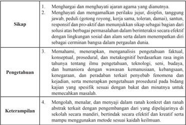

Tabel ini berisi empat kategori utama: Sikap, Pengetahuan, Keterampilan, dan Topik Utama. Sikap meliputi menghargai dan menghormati orang lain, menghargai dan menganalisis perilaku, disiplin, tanggung jawab, peduli, dan responsif. Pengetahuan mencakup memahami, menerapkan, dan menganalisis pengetahuan faktil, konseptual, prosedural, dan metakognitif. Keterampilan melibatkan mengolah, menalar, dan menanyakan dalam ranah konkret dan ranah abstrak. Topik Utama mencakup berbagai aspek seperti sikap, pengetahuan, dan keterampilan yang harus dimiliki oleh individu untuk menjadi lebih baik dalam berbagai situasi.

 

---
## 📄 Halaman 40

### B. Kompetensi Dasar dan Indikator

Kompetensi Dasar untuk bab program linear ini mengaju pada KD yang telah ditetapkan. Guru tentu harus mampu merumuskan indikator pencapaian kompetensi dari kompetensi dasar. Berikut ini disajikan indikator pencapaian kompetensi untuk materi program linear.

---
**📊 Tabel**

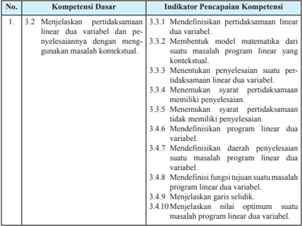

Tabel ini berisi informasi tentang kompetensi dasar dan indikator pencairan kompetensi dalam pembelajaran matematika, khususnya program linear dua variabel. Topik utama tabel adalah menjelaskan pertidaksamaan linear dua variabel dan menyelesaikannya menggunakan masalah kontekstual. Kolom-kolom yang ada meliputi nomor urutan (No.), kompetensi dasar, dan indikator pencairan kompetensi. Data penting yang terlihat adalah bahwa setiap kompetensi dasar memiliki beberapa indikator pencairan kompetensi yang harus dicapai oleh siswa untuk memenuhi standar tersebut. Misalnya, kompetensi dasar 1.3 mencakup menentukan model matematika dari suatu masalah program linear yang kontekstual, menentukan penyelesaian statis pertidaksamaan linear dua variabel, menemukan syarat pertidaksamaan memiliki penyelesaian, mendefinisikan program linear dua variabel, mendefinisikan daerah penyelesaian statis masalah program linear dua variabel, mendefinisikan fungsi tujuan suatu masalah program linear dua variabel, menjelaskan garis seldik, dan menentukan nilai optimum suatu masalah program linear dua variabel.

 

---
## 📄 Halaman 41

---
**📊 Tabel**

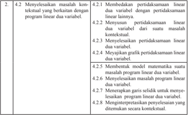

Tabel ini berisi instruksi tentang langkah-langkah untuk menyelesaikan masalah kontekstual yang berkaitan dengan program linear dua variabel. Topik utama tabel adalah metode-metode yang harus dilakukan untuk menyelesaikan masalah tersebut. Kolom-kolomnya mencakup berbagai tahapan yang harus diikuti, mulai dari membedakan pertidaksamaan linear dua variabel dengan pertidaksamaan linear lainnya, hingga menyelesaikan pertidaksamaan linear dua variabel. Data penting yang terlihat adalah bahwa setiap tahap memiliki tujuan spesifik, seperti menyelesaikan pertidaksamaan linear dua variabel, menemukan model matematika, menentukan garis sirkuit, dan interpretasi penyelesaian yang ditemukan secara konteksual.

 

---
## 📄 Halaman 42

### C. Tujuan Pembelajaran

Melalui pengamatan, tanya jawab, penugasan individu dan kelompok, diskusi kelompok, dan penemuan ( discovery ) siwa mampu:

- Menunjukkan sikap jujur, tertib, dan mengikuti aturan pada saat proses belajar berlangsung.
- Menunjukkan  sikap  cermat  dan  teliti  dalam  menyelesaikan  masalah-masalah program linear dua variabel.
- Menjelaskan pertidaksamaan linear dua variabel.
- Membentuk model matematika dari suatu masalah kontekstual.
- Membedakan pertidaksamaan linear dua variabel dengan yang lainnya.
- Menyelesaikan pertidaksamaan linear dua variabel baik secara analisis maupun secara geometris.
- Menjelaskan definisi program linear dua variabel.
- Membentuk model matematika dari suatu masalah program linear dua variabel.
- Menjelaskan definisi daerah penyelesaian.
- Menjelaskan fungsi tujuan.
- Menyajikan grafik daerah penyelesaian dari suatu masalah program linear dua variabel.
- Menggunakan  garis  selidik  untuk  menentukan  nilai  optimum  suatu  program linear.
- Menginterpretasikan penyelesaian secara kontekstual.

 

---
## 📄 Halaman 43

### D. Diagram Alir

---
**🖼️ Gambar/Diagram**

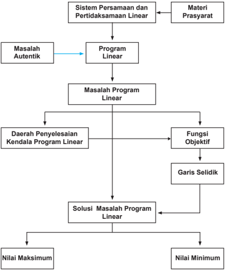

> **Deskripsi Visual:** Gambar ini adalah diagram yang menunjukkan proses analisis sistem persamaan dan pertidaksamaan linear dalam konteks program linear. Diagram ini terdiri dari berbagai elemen yang saling terkait, mulai dari masalah autentik hingga solusi maksimum dan minimum.

Elemen utama dalam diagram ini meliputi:
1. Masalah Autentik: Ini adalah masalah yang ingin diselesaikan.
2. Program Linear: Ini adalah metode yang digunakan untuk memecahkan masalah autentik tersebut.
3. Daerah Penyelesaian Kendala Program Linear: Ini adalah area di mana solusi optimal dapat ditemukan.
4. Fungsi Objektif: Ini adalah fungsi yang ingin dipenuhi oleh solusi optimal.
5. Garis Seli dik: Ini adalah garis yang menghubungkan titik-titik pada daerah penyelesaian kendala.
6. Solusi Masalah Program Linear: Ini adalah hasil dari proses analisis.
7. Nilai Maksimum dan Nilai Minimum: Ini adalah hasil akhir dari proses analisis.

Teks, angka, atau label penting yang terlihat dalam diagram ini mencakup:
- "Sistem Persamaan dan Pertidaksamaan Linear" sebagai topik awal.
- "Materi Prasyarat" sebagai bagian awal proses.
- "Program Linear" sebagai langkah selanjutnya setelah masalah autentik.
- "Daerah Penyelesaian Kendala Program Linear", "Fungsi Objektif", dan "Garis Seli dik" sebagai elemen-elemen penting dalam proses analisis.
- "Solusi Masalah Program Linear" sebagai hasil akhir.
- "Nilai Maksimum" dan "Nilai Minimum" sebagai informasi tambahan tentang hasil analisis.

Informasi kunci yang dapat diambil pembaca melalui diagram ini adalah bahwa proses analisis sistem persamaan dan pertidaksamaan linear melibatkan pemecahan masalah autentik menggunakan program linear, kemudian menentukan daerah penyelesaian kendala, fungsi objektif, dan garis seli dik, sehingga solusi optimal dapat ditemukan dan nilai maksimum atau minimum dapat dihitung.

 

---
## 📄 Halaman 44

### E. Proses Pembelajaran

Suatu proses pembelajaran akan berjalan dengan efektif jika guru sudah mengenali karakteristik peserta belajarnya. Adapun proses pembelajaran yang dirancang pada buku  guru  ini  hanya  pertimbangan  bagi  guru  untuk  merancang  kegiatan  belajar mengajar yang sesungguhnya. Oleh karena itu, diharapkan guru lebih giat dan kreatif lagi dalam mempersiapkan semua perangkat belajar mengajar.

### 2.1 Pertidaksamaan Linear Dua Variabel

### Sebelum Pelaksanaan Kegiatan

- Siswa  diharapkan  sudah  membawa  perlengkapan  alat-alat  tulis,  seperti pulpen, pensil, pengapus, penggaris, ketas berpetak, dan lain-lain.
- Bentuklah kelompok kecil siswa (2 - 3 orang) yang memungkinkan belajar secara efektif dan efisien.
- Sediakan lembar kerja yang diperlukan siswa.
- Sediakan kertas HVS secukupnya.

### No.

### Petunjuk Kegiatan Pembelajaran

### 1. Kegiatan Pendahuluan

Pada kegiatan pendahuluan guru:

- menyiapkan	 peserta	 didik	 secara	 psikis	 dan	 isik	 untuk	 mengikuti	 proses pembelajaran;
- memberi motivasi belajar siswa secara kontekstual sesuai manfaat dan aplikasi pertidaksamaan  linear  dua  variabel  dalam  kehidupan  sehari-hari,  dengan memberikan contoh dan perbandingan lokal, nasional, dan internasional;
- mengajukan pertanyaan-pertanyaan yang mengaitkan pengetahuan sebelumnya dengan materi yang akan dipelajari; Misalnya, bagaimana konsep dalam mengambarkan suatu fungsi linear.
- menjelaskan tujuan pembelajaran atau kompetensi dasar yang akan dicapai;
- menyampaikan  cakupan  materi  dan  penjelasan  uraian  kegiatan  sesuai silabus.

 

---
## 📄 Halaman 45

### No. Petunjuk Kegiatan Pembelajaran

### Kegiatan Inti 2.

### Ayo kita mengamati

- Melalui  kelompok  belajar  yang  heterogen,  arahkan  untuk  mencermati Masalah 2.1, Masalah 2.2, dan Masalah 2.3.

### Ayo Kita Menanya

- Siswa  diberi  ransangan  untuk  mengajukan  pertanyaan-pertanyaan  terkait Masalah 2.1, 2.2, dan Masalah 2.3. Jika tidak ada siswa yang mengajukan pertanyaan,  guru  harus  mengajukan  pertanyaan-pertanyaan  kepada  siswa untuk  memastikan  pemahaman  siswa.  Misalnya,  pada    Persamaan  (2a), kenapa harus dituliskan x > 0 dan y > 0?

### Ayo Kita Mengumpulkan Informasi

- Sebagai umpan balik aktivitas sebelumnya, siswa diminta untuk menemukan dan  mengumpulkan  informasi  yang  ditemukan  pada  masalah  tersebut, sedemikian  sehingga  siswa  dapat  memahami  model  matematika  yang disajikan pada Persamaan (2a), Persamaan (2b), dan Persamaan (2c).
- Arahkan siswa berdiskusi dalam kelompok belajar untuk menalar informasi yang disajikan pada Tabel 2.1, Tabel 2.2, dan Tabel 2.3.

### Ayo Kita Mengasosiasi

- Siswa perwakilan kelompok diminta menyajikan hasil pemahaman mereka dengan hubungan setiap data yang disajikan pada Tabel 2.1, Tabel 2.2, dan Tabel 2.3.
- Dengan menggunakan informasi pada Tabel 2.1,  siswa  diberi  kesempatan menjawab pertanyaan berikut:
- Menurut kamu, apa makna jika x = -20.000 dan y = -5.000?
- Untuk  mengisi  tabel  di  atas,  berikan  penjelasan  jika x =  0  dan y = 90.000.
- Menurut kamu, berapa harga paling mahal satu baju dan harga paling mahal satu buku yang mungkin dibeli oleh Santi? Berikan penjelasan untuk jawaban yang kamu berikan.

### Alternatif Penyelesaian

- Secara analisis, x = -20.000 dan y = -5.000 memenuhi 2 x + 3 y < 250.000. Namun secara fakta, nilai x dan y itu tidak terjadi.
- Pasangan nilai x = 0 dan y = 90.000 tidak merupakan penyelesaian untuk pertidaksamaan 2x + 3y < 250.000
- Harga maksimum satu seragam sekolah adalah Rp120.000. Akan tetapi, harga 1 buku harus harga paling minimum, dengan mempertimbangkan masih ada kembalian uangnya. Sebaliknya juga berlaku.
- Dengan menggunakan konsep graik fungsi linear, siswa dipastikan memahami Gambar 2.1, Gambar 2.2, dan  Gambar 2.3.

 

---
## 📄 Halaman 46

### No.

### Petunjuk Kegiatan Pembelajaran

- Siswa diminta memberikan ide-ide tentang perbedaan penyelesaian pertidaksamaan secara analitis dan secara geometris.
- Siswa diminta menyampaikan hasil ide-ide yang diperoleh kegiatan diskusi kelompok.
- Tanpa	melihat	Deinisi	2.1,	siswa	diminta	menuliskan	pemahaman	mereka	tentang pertidaksamaan linear dua variabel dan menentukan penyelesaiaannya.
- Ujilah pemahaman siswa dengan meminta siswa mengerjakan Contoh 2.1, tanpa melihat penyelesaian yang disajikan pada buku siswa.

### 3. Kegiatan Penutup

Ayo kita menyimpulkan

- Bersama	 dengan	 siswa	 menyimpulkan	 deinisi	 pertidaksamaan	 linear	 dua variabel,	seperti	yang	disajikan	pada	Deinisi	2.1.
- Untuk meningkatkan pemahaman siswa, baik pengetahuan dan keterampilan, siswa diminta menjawab pertanyaan kritis berikut ini:
- Apakah setiap pertidaksamaan memiliki himpunan penyelesaian? Berikan penjelasan atas jawaban kamu.
- Misalkan diberikan suatu himpunan penyelesaian suatu pertidaksamaan yang	 disajikan	 pada	 suatu	 graik,	 bagaimana	 caranya	 membentuk pertidaksamaan yang memenuhi himpunan penyelesaian tersebut?

### Alternatif Penyelesaian

- Tidak  semua  sistem  pertidaksamaan  linear  dua  variabel  memiliki penyelesaian.  Hal  ini  dapat  dikembang  bahwa  terdapat  syarat  suatu sistem persamaan linear dua variabel tidak memiliki penyelesain.
- Konsep yang digunakan bagaimana menentukan persamaan suatu garis linear jika diketahui melalui dua titik.
- Guru menyampaikan materi untuk dipelajari siswa pada pertemuan berikutnya.

 

---
## 📄 Halaman 47

### Penilaian

### 1. Prosedur Penilaian Sikap

### 2. Instrumen Pengamatan Sikap

### Berpikir Logis

- Kurang baik jika sama sekali tidak berusaha mengajukan ide-ide logis dalam proses pembelajaran.
- Baik jika menunjukkan sudah ada usaha untuk mengajukan ide-ide logis dalam proses pembelajaran.
- Sangat baik jika mengajukan ide-ide logis dalam proses pembelajaran dalam proses pembelajaran secara terus menerus dan ajeg/konsisten.

### Kritis

- Kurang  baik  jika  sama  sekali  tidak  berusaha  mengajukan  ide-ide  logis dengan kritis atau pertanyaan menantang dalam proses pembelajaran.
- Baik jika menunjukkan sudah ada usaha untuk mengajukan ide-ide logis dengan kritis atau pertanyaan menantang dalam proses pembelajaran.
- Sangat  baik  jika  mengajukan  ide-ide  logis  dengan  kritis  atau  pertanyaan menantang dalam proses pembelajaran secara terus menerus dan ajeg/konsisten.
Berikan tanda  pada kolom-kolom sesuai hasil pengamatan.

SB = Sangat Baik B = Baik KB = Kurang Baik

 

---
## 📄 Halaman 48

### 3. Instrumen Penilaian Pengetahuan dan Keterampilan

### Petunjuk:

- Kerjakan  soal  berikut  secara  individu,  tidak  boleh  menyontek  dan  tidak boleh bekerja sama.

### Latihan 2.1

- Tanpa  menggambarkan  grafik,  tentukanlah  himpunan  penyelesaian  (jika ada) setiap pertidaksamaan di bawah ini.

``

- Untuk  soal  No.1,  gambarkan  setiap  pertidaksamaan  untuk  menentukan daerah penyelesaian (jika ada).
- Untuk  setiap  grafik  di  bawah  ini,  tentukanlah  pertidaksamaan  yang  tepat memenuhi daerah penyelesaian.

---
**🖼️ Gambar/Diagram**

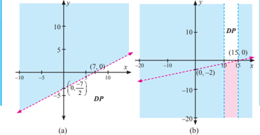

> **Deskripsi Visual:** Gambar ini adalah ilustrasi yang menunjukkan dua diagram garis (diagram grafik) yang berbeda. Diagram (a) menunjukkan sebuah garis sejajar dengan sumbu x, dimana titik-titik pada garis tersebut memiliki koordinat (7,0) dan (-\(\frac{7}{2}\), -3). Diagram (b) juga menunjukkan sebuah garis sejajar dengan sumbu x, tetapi dengan titik-titik (0,-2) dan (15,0). Kedua diagram ini menunjukkan hubungan antara variabel x dan y, dengan garis-garis tersebut menunjukkan pola atau hubungan antara kedua variabel tersebut. Teks, angka, atau label penting yang terlihat dalam gambar ini adalah koordinat titik-titik pada garis-garis tersebut, yang membantu dalam memahami hubungan antara variabel x dan y. Informasi kunci yang dapat diambil pembaca adalah bahwa kedua diagram ini menunjukkan hubungan antara variabel x dan y, dengan garis-garis tersebut menunjukkan pola atau hubungan antara kedua variabel tersebut.

 

---
## 📄 Halaman 49

- PT Lasin adalah suatu pengembang perumahan di daerah pemukiman baru. PT  tersebut  memiliki  tanah  seluas  12.000  meter  persegi  berencana  akan membangun dua tipe rumah, yaitu tipe mawar dengan luas 130 meter persegi dan tipe melati dengan luas 90 m 2 . Jumlah rumah yang akan dibangun tidak lebih 150 unit. Pengembang merancang laba tiap-tiap tipe rumah Rp2.000.000 dan Rp1.500.000.
Modelkan permasalahan di atas! Kemudian gambarkan daerah penyelesaian untuk sistem pertidaksamaannya.

### Pedoman Penilaian Pengetahuan dan Keterampilan

---
**📊 Tabel**

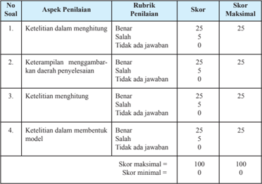

Tabel ini menunjukkan skor penilaian untuk tugas yang melibatkan penulisan soal-soal. Topik utama tabel adalah aspek-aspek penilaian yang harus diperhatikan dalam menulis soal-soal. Kolom-kolomnya mencakup 4 aspek penilaian: ketelitian dalam menghitung, keterampilan menggambar daerah penyelenggaraan, ketelitian dalam menghitung, dan ketelitian dalam membedakan model. Setiap aspek memiliki rubrik penilaian dengan skor maksimal 25 dan skor minimal 0. Skor akhir maksimal adalah 100, sedangkan skor minimal adalah 0. Pola penting yang terlihat adalah bahwa setiap aspek penilaian memiliki skor maksimal yang sama (25), dan skor akhir maksimal juga sama (100). Ini menunjukkan bahwa setiap aspek penilaian memiliki peran yang sama dalam menentukan skor akhir.

### 2.2 Program Linear

Dengan  pengalaman  belajar  mengajar  yang  telah  diperoleh  pada  pertemuan sebelumnya guru harus mempersiapkan sesuatu apapun yang menjadi kekurangan, termasuk cara psikologis mengatasi siswa yang belum mau bertanya.

Sebelum  melakukan  aktivitas  belajar  mengajar  di  kelas,  hendaknya  guru mempersiapkan:

 

---
## 📄 Halaman 50

### Sebelum Pelaksanaan Kegiatan

- Bentuklah kelompok kecil siswa (4 - 5 orang) yang memungkinkan belajar secara efektif.
- Identifikasi siswa-siswa yang biasanya agak sulit membuat pertanyaan.
- Identifikasi pula bentuk bantuan apa yang perlu diberikan agar siswa akhirnya produktif membuat pertanyaan.
- Sediakan  tabel-tabel  yang  diperlukan  bagi  siswa  untuk  mengisikan  hasil kerjanya.
- Sediakan kertas HVS secukupnya.
- Mungkin  perlu  diberikan  contoh  kritik,  komentar,  saran,  atau  pertanyaan terhadap suatu karya agar siswa bisa meniru dan mengembangkan lebih jauh sesuai dengan materinya.

### No.

### Petunjuk Kegiatan Pembelajaran

### 1. Kegiatan Pendahuluan

Pada kegiatan pendahuluan guru:

- menyiapkan	 peserta	 didik	 secara	 psikis	 dan	 isik	 untuk	 mengikuti	 proses pembelajaran;
- memberi  motivasi  belajar  siswa  secara  kontekstual  sesuai  manfaat  dan aplikasi  program  linear  dua  variabel  dalam  kehidupan  sehari-hari,  dengan memberikan contoh dan perbandingan lokal, nasional, dan internasional;
- mengajukan pertanyaan-pertanyaan yang mengaitkan pengetahuan sebelumnya dengan materi yang akan dipelajari; Misalnya, bagaimana menentukan penyelesaian pertidaksamaan linear dua variabel dan cara menggambarkan daerah penyelesaian;
- menjelaskan tujuan pembelajaran atau kompetensi dasar yang akan dicapai;
- menyampaikan  cakupan  materi  dan  penjelasan  uraian  kegiatan  sesuai silabus.

### 2. Kegiatan Inti

### Ayo Kita Mengamati

- Melalui  kelompok  belajar  yang  heterogen,  arahkan  untuk  mencermati Masalah 2.4 dan Masalah 2.5.

### Ayo Kita Menanya

- Siswa  diberi  ransangan  untuk  mengajukan  pertanyaan-pertanyaan  terkait Masalah  2.4  dan  Masalah  2.5.  Jika  tidak  ada  siswa  yang  mengajukan pertanyaan,  guru  harus  mengajukan  pertanyaan-pertanyaan  kepada  siswa untuk memastikan pemahaman siswa.

 

---
## 📄 Halaman 51

No.

### Petunjuk Kegiatan Pembelajaran

### Ayo Kita Mengumpulkan Informasi

- Sebagai umpan balik aktivitas sebelumnya, siswa diminta untuk menemukan dan  mengumpulkan  informasi  yang  ditemukan  pada  masalah  tersebut, sedemikian  sehingga  siswa  dapat  memahami  model  matematika  yang disajikan pada Persamaan (1).
- Dengan keterampilan yang telah dimiliki siswa mengenai menggambarkan daerah penyelesaian suatu sistem pertidaksamaan linear dua variabel, siswa diharapkan mampu menggambar daerah penyelesaian Persamaan (1). Guru memperhatikan siswa yang mengalami kesulitan dan memberikan bantuan pada siswa yang mengalami kesulitan.
- Siswa	diarahkan	memahami	langkah-langkah	menggambarkan	graik	suatu sistem pertidaksamaan linear dua variabel.

### Ayo Kita Mengasosiasi

- Untuk memastikan pemahaman siswa, siswa diarahkan untuk mengisi Tabel 2.5 dan membentuk model matematika Masalah 2.5.
Misalkan x : banyak unit barang yang diproduksi mesin A

- y : banyak unit barang yang diproduksi mesin B.
Dengan melengkapi Tabel 2.5, kemudian kamu diminta membentuk model matematika masalah ini. Bandingkan hasil yang kamu peroleh dengan hasil yang ditemukan temanmu.

``

``

Karena  banyak  barang  yang  diproduksi  tidak  mungkin  negatif,  maka  kita menuliskan kendala non-negatif:

### Kendala non-negatif

``

``

Artinya,  untuk  memenuhi  persediaan,  mungkin  mesin  A  atau  B  tidak berproduksi.

``

 

---
## 📄 Halaman 52

No.

### Petunjuk Kegiatan Pembelajaran

- Ajukan pertanyaan-pertanyaan untuk setiap siswa yang memancing siswa  untuk  mengajukan  pertanyaan-pertanyaan  kritis,  termasuk  dalam menggambarkan  daerah  penyelesaian  suatu  sistem  pertidaksamaan  linear dua variabel.
- Untuk  memastikan  pemahaman  siswa  tersebut,  siswa  diberi  kesempatan menyelesaikan Contoh 2.2 dengan atau tanpa melihat alternatif penyelesaian yang telah disajikan.

### 3. Kegiatan Penutup

### Ayo kita menyimpulkan

- Dengan melihat model matematika yang terbentuk pada Masalah 2.4 dan Masalah	2.5,	arahkan	siswa	untuk	merumuskan	deinisi	program	linear	dua variabel.
- Bersama	dengan	siswa	menyimpulkan	deinisi	program	linear	dua	variabel dan	daerah	penyelesaian,	seperti	yang	disajikan	pada	Deinisi	2.2	dan	Deinisi 2.3.
- Menginformasikan  materi  selanjutnya,  yaitu  bagaimana  menentukan  nilai maksimum atau minimum fungsi tujuan suatu program linear dua variabel.
- Memberikan penugasan kepada siswa, yaitu mengerjakan soal Uji Kompetensi 2.1 nomor 5 hingga nomor 8.

### Penilaian

### 1. Prosedur Penilaian Sikap

### 2. Instrumen Pengamatan Sikap

### Analitis

- Kurang  baik  jika  sama  sekali  tidak  mengajukan  pertanyaan-pertanyaan menantang atau memberikan ide-ide dalam menyelesaikan masalah selama proses pembelajaran.
- Baik  jika  menunjukkan  sudah  ada  usaha  untuk  mengajukan  pertanyaanpertanyaan  menantang  atau  memberikan  ide-ide  dalam  menyelesaikan masalah selama proses pembelajaran.
- Sangat baik jika mengajukan  pertanyaan-pertanyaan menantang  atau memberikan ide-ide dalam menyelesaikan masalah selama proses pembelajaran secara terus menerus dan ajeg/konsisten.

 

---
## 📄 Halaman 53

### Bekerja Sama

- Kurang baik jika sama sekali tidak menunjukkan sikap mau bekerja sama dengan temannya selama proses pembelajaran.
- Baik jika menunjukkan sikap mau bekerja sama dengan temannya selama proses pembelajaran.
- Sangat baik jika menunjukkan sikap mau bekerja sama dengan temannya selama proses pembelajaran secara terus menerus dan ajeg/konsisten.
Berikan tanda  pada kolom-kolom sesuai hasil pengamatan.

---
**📊 Tabel**

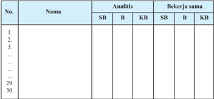

Tabel ini menunjukkan daftar nama-nama individu yang terdiri dari 30 orang, masing-masing diurutkan dengan nomor. Tabel dibagi menjadi dua bagian: Analisis dan Bekerja Sama. Dalam bagian Analisis, ada tiga kategori: SB (Sesuai), B (Belum), dan KB (Kebalikan). Sedangkan dalam bagian Bekerja Sama, juga ada tiga kategori: SB, B, dan KB. Data dalam tabel ini menunjukkan bahwa beberapa individu memiliki penilaian yang sama dalam kedua bagian analisis dan bekerja sama, sementara beberapa lainnya memiliki penilaian yang berbeda. Ini menunjukkan bahwa ada variasi dalam penilaian individu terhadap keterampilan analisis dan kerjasama mereka.

SB = Sangat Baik B = Baik KB = Kurang Baik

### 3. Instrumen Penilaian Pengetahuan dan Keterampilan

Petunjuk:

- Kerjakan  soal  berikut  secara  individu,  tidak  boleh  menyontek  dan  tidak boleh bekerja sama.
- Pilihlah  jawaban soal, kemudian jawablah pertanyaan/perintah di bawahnya.

 

---
## 📄 Halaman 54

### Latihan 2.2

- Suatu  toko  bunga  menjual  2  macam  rangkaian  bunga.  Rangkaian  I memerlukan 10 tangkai bunga mawar dan 15 tangkai bunga anyelir. Rangkaian II  memerlukan  20  tangkai  bunga  mawar  dan  5  tangkai  bunga  anyelir. Persediaan bunga mawar dan bunga anyelir masing-masing 200 tangkai dan 100 tangkai. Rangkaian I dijual seharga Rp200.000, dan Rangkaian II dijual seharga Rp100.000 per rangkaian. (UN 2006 no. 21)
- Bentuk	 model	 matematika	 masalah	 di	 atas.	 Kemudian	 gambarkan	 graik model matematikanya.
- Perhatikan masalah yang dihadapi seorang penjaja buah-buahan berikut ini. Pak  Benni,  seorang  penjaja  buah-buahan  yang  menggunakan  gerobak menjual apel dan pisang. Harga pembelian apel Rp18.000 tiap kilogram dan pisang Rp8.000 tiap kilogram. Beliau hanya memiliki modal Rp2.000.000, sedangkan muatan gerobak tidak lebih dari 450 kilogram. Padahal keuntungan tiap kilogram apel 2 kali keuntungan tiap kilogram pisang.
- Tentukanlah	tiga	titik	yang	terdapat	pada	graik	daerah	penyelesaian	masalah ini.

### Pedoman Penilaian Pengetahuan dan Keterampilan

---
**📊 Tabel**

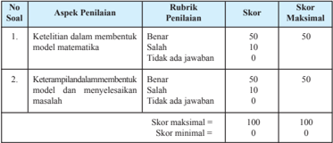

Tabel ini menunjukkan skor penilaian untuk dua aspek penilaian dalam sebuah proyek matematika. Topik utama tabel adalah keterampilan dalam membuat model matematika dan keterampilan dalam memecahkan masalah. Kolom pertama berisi nomor soal, sedangkan kolom kedua berisi rubrik penilaian dengan tiga pilihan jawaban: "Benar", "Salah", dan "Tidak ada jawaban". Skor maksimal untuk setiap aspek penilaian adalah 50, dan skor minimalnya adalah 0. Data penting yang terlihat adalah bahwa skor maksimal untuk setiap aspek penilaian adalah 50, dan skor minimalnya adalah 0. Ini menunjukkan bahwa skor penilaian harus mencapai 50 untuk mendapatkan nilai tertinggi.

 

---
## 📄 Halaman 55

### 2.3 Nilai Optimum dengan Garis Selidik

Dengan  pengalaman  belajar  mengajar  yang  telah  diperoleh  pada  pertemuan sebelum,  guru  harus  mempersiapkan  sesuatu  apapun  yang  menjadi  kekurangan, termasuk cara psikologis mengatasi siswa yang belum mau bertanya.

Sebelum melakukan aktivitas belajar mengajar di kelas, hendaknya guru mempersiapkan:

### Sebelum Pelaksanaan Kegiatan

- Bentuklah kelompok kecil siswa (4 - 5 orang) yang memungkinkan belajar secara efektif.
- Identiikasi	 pula	 bentuk	 bantuan	 apa	 yang	 perlu	 diberikan	 agar	 siswa	 akhirnya produktif membuat pertanyaan.
- Identiikasi	siswa-siswa	yang	biasanya	agak	sulit	membuat	pertanyaan.
- Sediakan tabel-tabel yang diperlukan bagi siswa untuk mengisikan hasil kerjanya.
- Sediakan kertas berpetak atau papan.
- Kritik, komentar, saran, atau pertanyaan terhadap suatu karya agar siswa bisa meniru dan mengembangkan lebih jauh sesuai dengan materinya.

### No.

### Petunjuk Kegiatan Pembelajaran

### Kegiatan Pendahuluan 1.

Pada kegiatan pendahuluan guru:

- menyiapkan	 peserta	 didik	 secara	 psikis	 dan	 isik	 untuk	 mengikuti	 proses pembelajaran;
- memberi  motivasi  belajar  siswa  secara  kontekstual  sesuai  manfaat  dan aplikasi  menentukan  nilai  optimum  dalam  kehidupan  sehari-hari,  dengan memberikan contoh dan perbandingan lokal, nasional, dan internasional;
- mengajukan pertanyaan-pertanyaan yang mengaitkan pengetahuan sebelumnya  dengan  materi  yang  akan  dipelajari;  Misalnya,  bagaimana menentukan daerah penyelesaian yang terbatas dan yang tidak terbatas.
- menjelaskan tujuan pembelajaran atau kompetensi dasar yang akan dicapai;
- menyampaikan  cakupan  materi  dan  penjelasan  uraian  kegiatan  sesuai silabus.

 

---
## 📄 Halaman 56

### No.

### 2.

### Kegiatan Inti

### Ayo mengamati

- Melalui  kelompok  belajar  yang  heterogen,  arahkan  untuk  mencermati Masalah 2.6, dan Masalah 2.7.

### Ayo Menanya

- Guru  mengajukan  pertanyaan-pertanyaan  pancingan  kepada  siswa,  untuk memunculkan  motivasi kepada siswa dalam mengajukan pertanyaanpertanyaan kritis terkait Masalah 2.6 dan Masalah 2.7.

### Ayo Mengumpulkan Informasi

- Sebagai umpan balik aktivitas sebelumnya, siswa diminta untuk menemukan dan  mengumpulkan  informasi  yang  ditemukan  pada  masalah  tersebut, sedemikian sehingga siswa dapat memahami model matematika yang untuk Masalah 2.6 dan Masalah 2.7.
- Arahkan siswa untuk memahami prosedur dalam menentukan nilai optimum  fungsi  tujuan  suatu  program  linear  dua  variabel,  yaitu  dengan menemukan pasangan titik, sebut pasangan titik (x, y), yang terdapat pada daerah penyelesaian sedemikian sehingga menjadikan fungsi tujuan bernilai optimum (memiliki nilai maksimum ataupun minimum).

### Ayo Mengasosiasi

- Berikan pancingan kepada siswa bahwa untuk menemukan nilai optimum fungsi  tujuan  suatu  program  linear  dua  variabel  tidak  selalu  tepat  dengan menguji nilai fungsi tujuan pada titik-titik sudut daerah penyelesaian. Hal ini, guru dapat memberikan contoh-contoh penyangkal.
- Berikan petunjuk kepada siswa bagaimana menemukan nilai optimum fungsi tujuan	 dengan	 metode	 garis	 selidik,	 yaitu	 dengan	 menggambarkan	 graik fungsi  pada saat melalui suatu titik pada daerah penyelesaian.

### Petunjuk Kegiatan Pembelajaran

 

---
## 📄 Halaman 57

No.

### Petunjuk Kegiatan Pembelajaran

---
**🖼️ Gambar/Diagram**

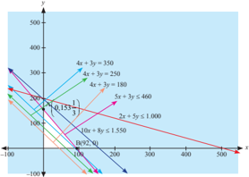

> **Deskripsi Visual:** Gambar ini adalah sebuah diagram yang menunjukkan hubungan antara beberapa variabel dalam sistem persamaan linear. Diagram ini terdiri dari berbagai garis yang mewakili persamaan-linear, dengan titik-titik di mana garis tersebut bertemu menunjukkan solusi-solusi untuk sistem tersebut. Garis-garis ini diberi label dengan persamaan-linear yang relevan, seperti "4x + 3y = 350", "4x + 3y = 250", "4x + 3y = 180", "5x + 3y ≤ 460", "5x + 3y ≥ 1000", "2x + 5y ≤ 1000", dan "10x + 15y ≤ 1550". Titik-titik di mana garis-garis bertemu menunjukkan koordinat (x, y) yang memenuhi semua persamaan-linear tersebut. Gambar ini juga menunjukkan bahwa setiap garis memiliki nilai-nilai yang berbeda-beda, yang menunjukkan bahwa ada banyak solusi untuk setiap persamaan-linear.

Pada kasus ini, kebetulan titik pembuat optimum fungsi tujuan terdapat di titik sudut daerah penyelesaian.

- Guru menegaskan kepada siswa bahwa titik pembuat optimum suatu fungsi tidak selalu berada pada titik sudut daerah penyelesaian. Seperti yang terjadi pada penyelesaian Masalah 2.7.
Titik  pembuat  maksimumnya  adalah  titik  (1 9 11 ,  7 3 11 ).  Namun  nilai x dan

- y tersebut tidak dapat ditemukan secara kontekstual. Dengan menggunakan prinsip pembulatan bilangan, terdapat kemungkinan sebagai berikut:
i. B

- 1 (1, 7):
titik tersebut berada di luar daerah penyelesaian OBA .

ii. B 2

- (1, 8):
titik tersebut berada di luar daerah penyelesaian OBA .

iii. B 3 (2, 7):

titik tersebut berada di dalam daerah penyelesaian OBA . Pada titik (2, 7) akan diperoleh keuntungan sebesar Rp34.500.000. Artinya, si pedagang mengalami kekurangan sebesar Rp45.450.

iv. B 4

- (2, 8):
titik tersebut berada di luar daerah penyelesaian OBA .

 

---
## 📄 Halaman 58

No.

### Petunjuk Kegiatan Pembelajaran

Namun, dengan menyelidiki titik integer pada sekitar titik (1 9 11 , 7 3 11 ), ditemukan titik pembuat maksimum fungsi tersebut, yaitu: titik (2, 7).

Dengan	melalui	pembahasan	Masalah	2.6	dan	2.7,	ajak	siswa	untuk	mendeinisikan garis selidik dan merumuskan langkah menentukan nilai optimum suatu fungsi tujuan dengan metode garis selidik.

### Kegiatan Penutup 3.

- Bersama	 dengan	 siswa	 menyimpulkan	 deinisi	 garis	 selidik	 dan	 langkahlangkah menentukan nilai optimum suatu fungsi tujuan dengan metode garis selidik.
- Menginformasikan materi selanjutnya, yaitu berbagai kasus dalam menentukan nilai optimum suatu fungsi tujuan.
- Memberikan penugasan kepada siswa, yaitu mengerjakan soal Uji Kompetensi 2.2 nomor 1 hingga nomor 4.

### Penilaian

### 1. Prosedur Penilaian Sikap

### 2. Instrumen Pengamatan Sikap

### Analitis

- Kurang  baik  jika  sama  sekali  tidak  mengajukan  pertanyaan-pertanyaan menantang atau memberikan ide-ide dalam menyelesaikan masalah selama proses pembelajaran.
- Baik  jika  menunjukkan  sudah  ada  usaha  untuk  mengajukan  pertanyaanpertanyaan  menantang  atau  memberikan  ide-ide  dalam  menyelesaikan masalah selama proses pembelajaran.
- Sangat baik jika mengajukan  pertanyaan-pertanyaan menantang  atau memberikan ide-ide dalam menyelesaikan masalah selama proses pembelajaran secara terus menerus dan ajeg/konsisten.

 

---
## 📄 Halaman 59

### Kritis

- Kurang  baik  jika  sama  sekali  tidak  mengajukan  pertanyaan-pertanyaan menantang kepada guru maupun temannya selama proses pembelajaran.
- Baik  jika  mengajukan  pertanyaan-pertanyaan  menantang  kepada  guru maupun temannya selama proses pembelajaran.
- Sangat  baik  jika  mengajukan  pertanyaan-pertanyaan  menantang  kepada guru maupun temannya selama proses pembelajaran secara terus-menerus dan ajeg/konsisten.
Berikan tanda  pada kolom-kolom sesuai hasil pengamatan.

SB = Sangat Baik B = Baik KB = Kurang Baik

### 3. Instrumen Penilaian Pengetahuan dan Keterampilan

### Petunjuk:

- Kerjakan  soal  berikut  secara  individu,  tidak  boleh  menyontek  dan  tidak boleh bekerja sama.
- Pilihlah  jawaban soal, kemudian jawablah pertanyaan/perintah di bawahnya.

 

---
## 📄 Halaman 60

### Latihan 2.3

- Gambarkan  daerah  penyelesaian  untuk  setiap  kendala  masalah  program linear berikut ini.
- x + 4 y ≤ 30; -5 x + y ≤ 5; 6 x -y ≥ 0; 5 x + y ≤ 50; x - 5 y ≤ 0
- x - 4 y ≤ 0; x -y ≤ 2; -2 x + 3 y ≤ 6; x ≤ 10
- x + 4 y ≤ 0; -5 x + y ≤ 5; 6 x -y ≥ 0; 5 x + y ≤ 50; x + 5 y ≤ 0
- Cermati pertidaksamaan a x + b y ≥ c .
Untuk  menentukan  daerah  penyelesaian  pada  bidang  koordinat,  selain dengan	 menggunakan	uji	 titik,	 selidiki	 hubungan	 tanda	 koeisien x dan y terhadap daerah penyelesaian (bersih) pertidaksamaan.

### Pedoman Penilaian Pengetahuan dan Keterampilan

---
**📊 Tabel**

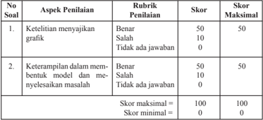

Tabel ini menunjukkan skor penilaian untuk dua aspek penilaian: ketelitian menyajikan grafik dan keterampilan dalam membuat model dan menyelesaikan masalah. Topik utama tabel adalah tentang skor penilaian yang diberikan kepada siswa berdasarkan kriteria tertentu. Kolom-kolomnya mencakup skor penilaian, skor maksimal, dan skor minimal. Data penting yang terlihat adalah bahwa skor maksimal untuk kedua aspek penilaian adalah 50 poin, sedangkan skor minimal adalah 0 poin. Skor penilaian ditentukan berdasarkan kriteria tertentu seperti ketelitian menyajikan grafik dan keterampilan dalam membuat model dan menyelesaikan masalah.

 

---
## 📄 Halaman 61

### 2.4 Beberapa Kasus Daerah Penyelesaian

Materi ini mendeskripsikan bahwa  banyak hal mungkin  terjadi dengan mempertimbangkan  daerah  penyelesaian.  Dengan  membelajarkan  ini  semakin meningkatkan  cara  berpikir  siswa  dalam  kajian  program  linear.  Perlu  diingatkan kembali, bahwa persiapan yang baik adalah kunci keberhasilan.

### Sebelum Pelaksanaan Kegiatan

- Bentuklah kelompok kecil siswa (4 - 5 orang) yang memungkinkan belajar secara efektif .
- Sediakan masalah-masalah yang akan diberikan kepada siswa.
- Sediakan kertas seperlunya.
- Sediakan tabel untuk peneliaan.

### No.

### Petunjuk Kegiatan Pembelajaran

### 1. Kegiatan Pendahuluan

Pada kegiatan pendahuluan guru:

- menyiapkan	 peserta	 didik	 secara	 psikis	 dan	 isik	 untuk	 mengikuti	 proses pembelajaran;
- memberi  motivasi  belajar  siswa  secara  kontekstual  sesuai  manfaat  dan aplikasi  menentukan  nilai  optimum  dalam  kehidupan  sehari-hari,  dengan memberikan contoh dan perbandingan lokal, nasional, dan internasional;
- mengajukan pertanyaan-pertanyaan yang mengaitkan pengetahuan sebelumnya  dengan  materi  yang  akan  dipelajari;  Misalnya,  apakah  syarat supaya suatu fungsi tujuan memiliki nilai optimum.
- menjelaskan tujuan pembelajaran atau kompetensi dasar yang akan dicapai;
- menyampaikan  cakupan  materi  dan  penjelasan  uraian  kegiatan  sesuai silabus.

 

---
## 📄 Halaman 62

### No.

- Kegiatan Inti 2.

### Ayo Kita Mengamati

- Arahkan untuk mencermati Gambar 2.14;

---
**🖼️ Gambar/Diagram**

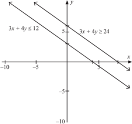

> **Deskripsi Visual:** Gambar ini adalah sebuah diagram yang menunjukkan dua garis sejajar yang berpotongan pada koordinat xy. Garis pertama, 3x + 4y ≤ 12, berada di atas garis kedua, 3x + 4y ≥ 24. Garis pertama memiliki sudut yang lebih besar dibandingkan dengan garis kedua, yang menunjukkan bahwa nilai dari 3x + 4y untuk garis pertama lebih kecil atau sama dengan 12, sedangkan untuk garis kedua lebih besar atau sama dengan 24. Garis tersebut juga memiliki titik potong di koordinat (0, -3) dan (4, 0). Label "x" dan "y" diletakkan di sisi horizontal dan vertikal masing-masing, masing-masing menunjukkan arah positif dan negatif. Ini menunjukkan bahwa garis tersebut merupakan representasi dari persamaan linear dalam dua variabel.

``

- Guru mengingatkan siswa akan syarat dua garis sejajar seperti  yang  telah dipelajari pada saat SMP/MTS.

### Ayo Kita Menanya

- Arahkan siswa untuk mengajukan pertanyaan-pertanyaan yang berhubungan dengan Gambar 2.14. Jika siswa tidak mengajukan pertanyaan, guru harus mempersiapkan pertanyaan-pertanyaan yang akan diajukan pada siswa.

### Ayo Kita Mengumpulkan Informasi

- Siswa	diarahkan	menemukan	hubungan	perbandingan	koeisien x dan y pada sistem tersebut.
- Bekerja  sama  dalam  kelompok,  arahkan  siswa  merancang  suatu  sistem pertidaksamaan	 yang	 memiliki	 hubungan	 perbandingan	 koeisiean	 seperti yang disajikan pada Gambar 2.14.

### Petunjuk Kegiatan Pembelajaran

 

---
## 📄 Halaman 63

### No. Petunjuk Kegiatan Pembelajaran

### Ayo Kita Mengasosiasi

- Bersama dengan siswa, guru menyimpulkan syarat suatu sistem pertidaksamaan tidak memiliki daerah penyelesaian. Karena tidak memiliki daerah penyelesaian, otomatis tidak dapat ditentukan nilai optimum.
- Arahkan siswa mengamati Gambar 2.15. Siswa ditugasi untuk menemukan sistem pertidaksamaan yang memenuhi daerah penyelesaian seperti yang ada pada Gambar 2.15, yaitu:
2 x + y ≥ 4 2 x + y ≥ 8 x ≥ 0, y ≥ 2

- Guru memberikan pancingan agar siswa mengajukan pertanyaan-pertanyaan kritis terkait Gambar 2.15. Misalnya berapa nilai maksimum fungsi tujuan? Berikan alasan untuk setiap jawaban yang diberikan.
- Arahkan siswa melalui diskusi untuk menemukan syarat suatu fungsi tujuan memiliki  nilai  minimum  atau  nilai  maksimum.  Mintalah  penjelasan  lebih lanjut untuk setiap jawaban setiap siswa.
- Untuk memastikan pemahaman siswa, guru memberikan penugasan kepada siswa untuk mendesaian suatu sistem pertidaksamaan yang memiliki nilai maksimum atau nilai minimum saja.
- Arahkan siswa untuk mengamati Gambar 2.16. Mintalah siswa mengumpulkan informasi tentang syarat suatu daerah penyelesaian memiliki nilai maksimum dan nilai minimum.

### 3. Kegiatan Penutup

- Bersama dengan siswa menyimpulkan syarat-syarat suatu daerah penyelesaian belum tentu memiliki nilai maksimum dan/atau nilai minimum.
- Menginformasikan kepada siswa bahwa kajian program linear tidak berhenti hanya pada linear dua variabel saja.
- Memberikan penugasan kepada siswa, yaitu mengerjarkan soal Uji Kompetensi 2.2 nomor 7, 10, dan 12.

### F. Penilaian

### 1. Prosedur Penilaian Sikap

 

---
## 📄 Halaman 64

### 2. Instrumen Pengamatan Sikap

### Analitis

- Kurang  baik  jika  sama  sekali  tidak  mengajukan  pertanyaan-pertanyaan menantang atau memberikan ide-ide dalam menyelesaikan masalah selama proses pembelajaran.
- Baik  jika  menunjukkan  sudah  ada  usaha  untuk  mengajukan  pertanyaanpertanyaan  menantang  atau  memberikan  ide-ide  dalam  menyelesaikan masalah selama proses pembelajaran.
- Sangat baik jika mengajukan  pertanyaan-pertanyaan menantang  atau memberikan ide-ide dalam menyelesaikan masalah selama proses pembelajaran. secara terus menerus dan ajeg/konsisten.

### Kritis

- Kurang  baik  jika  sama  sekali  tidak  mengajukan  pertanyaan-pertanyaan menantang kepada guru maupun temannya selama proses pembelajaran.
- Baik  jika  mengajukan  pertanyaan-pertanyaan  menantang  kepada  guru maupun temannya selama proses pembelajaran.
- Sangat  baik  jika  mengajukan  pertanyaan-pertanyaan  menantang  kepada guru maupun temannya selama proses pembelajaran secara terus menerus dan ajeg/konsisten.
Berikan tanda  pada kolom-kolom sesuai hasil pengamatan.

---
**📊 Tabel**

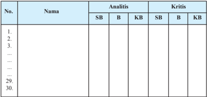

Tabel ini menunjukkan data analisis dan kritik untuk 30 individu, masing-masing dengan nama tertulis di kolom Nama. Kolom Analitis mencakup tiga pilihan: SB (Sistematis), B (Berat), dan KB (Kreatif). Sementara itu, kolom Kritis juga memiliki tiga pilihan: SB, B, dan KB. Data dalam tabel ini menunjukkan bahwa setiap individu memiliki kombinasi pilihan analisis dan kritik mereka sendiri, menunjukkan variasi dalam cara mereka memahami dan menilai sesuatu.

 

---
## 📄 Halaman 65

### 3. Instrumen Penilaian Pengetahuan dan Keterampilan

### Petunjuk:

- Kerjakan  soal  berikut  secara  individu,  tidak  boleh  menyontek  dan  tidak boleh bekerja sama.
- Pilihlah jawaban soal kemudian jawablah pertanyaan/perintah di bawah  nya.

### Latihan 2.4

- Pesawat penumpang mempunyai tempat duduk 48 kursi. Setiap penumpang kelas  utama  boleh  membawa  bagasi  maksimum  60  kilogram  sedangkan kelas  ekonomi  maksimum  20  kg.  Pesawat  hanya  dapat  membawa  bagasi maksimum  1440  kg.  Harga  tiket  kelas  utama  Rp150.000,00  dan  kelas ekonomi Rp100.000,00. Supaya pendapatan dari penjualan tiket pada saat pesawat penuh mencapai maksimum, tentukan jumlah tempat duduk kelas utama. (UMPTN Tahun 2000 Rayon A).
- Tentukan titik  yang mengakibatkan fungsi linear f (x, y) = 2 x -y - 4 bernilai optimum  (maksimum  atau  minimum)  jika  daerah  asal  dibatasi  sebagai berikut -1 ≤ x ≤ 1; -1 ≤ y ≤ 1. (Periksa nilai fungsi di beberapa titik daerah asal dan periksa bahwa nilai optimum tercapai pada suatu titik sudut daerah asal).

 

---
## 📄 Halaman 66

### Pedoman Penilaian

---
**📊 Tabel**

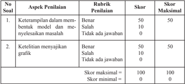

Tabel ini menunjukkan skor penilaian untuk dua aspek penilaian: keterampilan dalam membuat model dan meyelisik masalah, serta ketelitian menyajikan grafik. Topik utama tabel adalah proses penilaian dalam pembuatan model dan penyajian grafik. Kolom-kolomnya mencakup rubrik penilaian, skor, dan skor maksimal. Data penting yang terlihat adalah bahwa skor maksimal untuk kedua aspek penilaian adalah 50 poin masing-masing, dengan skor minimal 0 poin. Skor tertinggi yang dapat diperoleh adalah 50 poin untuk setiap aspek penilaian.

### G. Pengayaan

Pengayaan  merupakan  kegiatan  yang  diberikan  kepada  siswa  yang  memiliki akselerasi pencapaian KD yang cepat (nilai maksimal) agar potensinya berkembang optimal  dengan  memanfaatkan  sisa  waktu  yang  dimilikinya.  Guru  sebaiknya merancang kegiatan pembelajaran lanjut yang terkait dengan program linear.

### H. Remedial

Pembelajaran remedial pada hakikatnya adalah pemberian bantuan bagi peserta didik  yang  mengalami  kesulitan  atau  kelambatan  belajar.  Pembelajaran  remedial adalah tindakan perbaikan pembelajaran yang diberikan kepada peserta didik yang belum mencapai kompetensi minimalnya dalam satu kompetensi dasar tertentu.

Perlu dipahami oleh guru, bahwa remedial bukan mengulang tes (ulangan harian) dengan materi yang sama, tetapi guru memberikan perbaikan pembelajaran pada KD yang belum dikuasai oleh peserta didik melalui upaya tertentu. Setelah perbaikan pembelajaran dilakukan, guru melakukan tes untuk mengetahui apakah peserta didik telah memenuhi kompetensi minimal dari KD yang diremedialkan.

 

---
## 📄 Halaman 67

### I. Kegiatan Proyek

Sehubungan dengan kegiatan proyek pada buku siswa, maka hal-hal yang perlu dilakukan oleh guru adalah sebagai berikut.

### Sebelum Pelaksanaan Kegiatan

- Sediakan bahan-bahan yang dibutuhkan untuk kegiatan proyek kali ini, seperti bukubuku teks pelajaran atau pojok pustaka atau bahkan fasilitas internet.
- Sediakan kertas HVS atau kertas asturo atau lainnya.
- Bentuklah siswa dalam beberapa kelompok untuk membagi tugas dalam menjalankan tugasnya.
- Guru membimbing siswa dalam menyusun langkah-langkah pelaksanaan proyek.
- Selain itu, guru harus merancang bagaimana penilaian proyek hasil kerja siswa.

### Soal Proyek

Setiap  manusia  memiliki  keterbatasan  akan  tenaga,  waktu,  dan  tempat. Misalnya, dalam aktivitas belajar yang kamu lakukan setiap hari tentu kamu memiliki keterbatasan dengan waktu belajar di rumah, serta waktu yang kamu perlukan untuk membantu orang tuamu. Di sisi lain, kamu juga membutuhkan waktu yang cukup untuk istirahat setelah kamu melakukan aktivitas belajar dan aktivitas membantu orang tua.

Dengan  kondisi  tersebut,  rumuskan  model  matematika  untuk  masalah waktu yang kamu perlukan setiap hari, hingga kamu dapat mengetahui waktu istirahat yang kamu peroleh setiap hari (minggu).

Selesaikan proyek di atas dalam waktu satu minggu.

Susun hasil kinerja dalam suatu laporan, sehingga kamu, temanmu, dan gurumu dapat memahami dengan jelas.

 

---
## 📄 Halaman 68

### J. Rangkuman

Beberapa  hal  penting  yang  perlu  dirangkum  terkait  dengan  konsep  program linear.

- Konsep  program  linear  didasari  oleh  konsep  persamaan  dan  pertidaksamaan bilangan real, sehingga sifat-sifat persamaan linear dan pertidaksamaan linear  dalam  sistem  bilangan  real  banyak  digunakan  sebagai  pedoman  dalam menyelesaikan suatu masalah program linear.
- Model matematika merupakan cara untuk menyelesaikan masalah kontekstual. Pembentukan model tersebut dilandasi oleh konsep berpikir logis dan kemampuan bernalar keadaan masalah nyata ke bentuk matematika.
- Model matematika dari suatu masalah yang dinyatakan bentuk pertidaksamaan atau  sistem  pertidaksamaan  dan/atau  persamaan  merupakan  kendala  suatu masalah program linear.
- Pasangan-pasangan  ( x , y )  disebut  sebagai  penyelesaian  pada  masalah  suatu program linear jika memenuhi setiap pertidaksamaan yang terdapat pada kendala program linear.
- Fungsi tujuan atau juga disebut fungsi sasaran atau fungsi objektif merupakan tujuan suatu masalah program linear, yang juga terkait dengan sistem pertidaksamaan program linear.
- Suatu fungsi objektif (merupakan  fungsi linear) terdefinisi pada daerah penyelesaian suatu masalah program linear. Fungsi objektif memiliki nilai jika sistem kendala memiliki daerah penyelesaian.
- Garis selidik merupakan salah satu cara untuk menentukan nilai objektif suatu fungsi tujuan masalah program linear dua variabel. Garis selidik ini merupakan persamaan garis fungi tujuan, ax + by = k ,  yang  digeser  di  sepanjang  daerah penyelesaian  untuk  menentukan  nilai  maksimum  atau  minimum  suatu  fungsi tujuan masalah program linear.

 

---
## 📄 Halaman 69

BAB 3

### Matriks

### A.   Kompetensi Inti

---
**📊 Tabel**

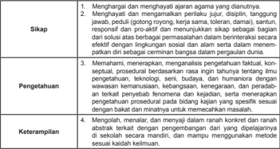

Tabel ini berisi instruksi untuk mengembangkan sikap, pengetahuan, keterampilan, dan perilaku yang positif dalam berbagai situasi. Topik utamanya adalah bagaimana mengembangkan sikap yang positif seperti berpikir positif, responsif, proaktif, dan memiliki solusi. Selain itu, tabel juga mencakup bagaimana meningkatkan pengetahuan tentang prosedur dan konsep, keterampilan dalam berkomunikasi dan menyelesaikan masalah, serta perilaku yang mandiri dan berorientasi pada tujuan. Data penting yang terlihat adalah bahwa semua aspek ini harus dilakukan secara konseptual, procedural, dan bertujuan untuk meningkatkan pengetahuan, keterampilan, dan perilaku secara keseluruhan.

### B.   Kompetensi Dasar dan Indikator

Indikator Pencapaian Kompetensi pada kegiatan pembelajaran dapat dikembangkan oleh guru yang disesuaikan dari kondisi peserta didik dan lingkungan di tempat guru mengajar.

 

---
## 📄 Halaman 70

Berikut ini dipaparkan contoh Indikator Pencapaian Kompetensi yang dapat dijabarkan dari KD pengetahuan  3.3-3.4 dan KD Keterampilan 4.3-4.4.

---
**📊 Tabel**

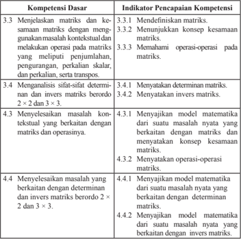

Tabel ini berisi informasi tentang kompetensi dasar dan indikator pencapaian kompetensi dalam matematika, khususnya berkaitan dengan matriks dan operasi matematis. Topik utama tabel adalah penyelesaian masalah kontekstual menggunakan matriks dan operasinya. Kolom pertama menunjukkan nomor urutan kompetensi dasar, sementara kolom kedua menunjukkan indikator pencapaian kompetensi yang harus dicapai untuk mencapai setiap kompetensi dasar tersebut. Data penting yang terlihat adalah bahwa setiap kompetensi dasar memiliki beberapa indikator pencapaian yang harus dicapai, seperti mendefinisikan matriks, memenuhi konsep kesamaan matriks, memahami operasi pada matriks, menyatakan determinan dan invers matriks, menyelesaikan masalah kontekstual yang berkaitan dengan matriks dan operasinya, serta menyelesaikan masalah yang berkaitan dengan determinan dan invers matriks berordo 2x2 dan 3x3. Ini menunjukkan bahwa pembelajaran matematika harus melibatkan pemahaman konsep, penyelesaian masalah, dan penggunaan teknik-teknik matematika secara efektif.

### C.   Tujuan Pembelajaran

Pembelajaran materi matriks melalui pengamatan, tanya jawab, penugasan individu dan kelompok, diskusi kelompok, dan penemuan (dicovery) diharapkan siswa dapat:

- Melatih sikap sosial berani bertanya, berpendapat, mau mendengar orang lain, bekerja  sama  dalam  diskusi  di  kelompok  sehingga  terbiasa  berani  bertanya, berpendapat, mau mendengar orang lain, bekerja sama dalam aktivitas seharihari.
- Menunjukkan ingin tahu selama mengikuti proses.

 

---
## 📄 Halaman 71

- Bertanggung jawab terhadap kelompoknya dalam menyelesaikan tugasnya.
- Menjelaskan pengertian matriks.
- Menjelaskan dengan kata-kata dan menyatakan masalah dalam sehari-hari yang berkaitan dengan matriks.
- Menunjukkan konsep kesamaan matriks.
- Memahami  operasi  penjumlahan,  pengurangan,  perkalian  matriks  dengan bilangan skalar dan perkalian, serta transpos matriks.
- Menyajikan determinan matriks.
- Menyajikan invers matriks.
- Menyajikan model matematika berkaitan dengan determinan dan invers matriks.

### D.   Diagram Alir

---
**🖼️ Gambar/Diagram**

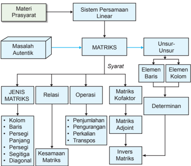

> **Deskripsi Visual:** Gambar ini adalah diagram yang menunjukkan struktur dan hubungan antara berbagai konsep matematika, khususnya berkaitan dengan sistem persamaan linear dan matriks. Diagram ini dibagi menjadi beberapa bagian utama:

1. **Materi Prasyarat**: Ini adalah bagian awal yang menunjukkan bahwa materi ini memerlukan pengetahuan dasar tentang sistem persamaan linear.

2. **Sistem Persamaan Linear**: Ini merupakan titik awal yang mengarah ke masalah autentik.

3. **Masalah Autentik**: Ini adalah bagian utama yang menggambarkan masalah-masalah yang akan diselesaikan menggunakan teknik matriks.

4. **MATRIKSI**: Ini adalah bagian yang menggambarkan struktur dan operasi pada matriks.

5. **Unsur-Unsur**: Ini mencakup elemen baris dan elemen kolom.

6. **Elemen Baris dan Elemen Kolom**: Ini menjelaskan bagaimana elemen-elemen tersebut berfungsi dalam matriks.

7. **Determinan**: Ini adalah bagian yang menunjukkan operasi determinan.

8. **Matris Adjoint**: Ini adalah bagian yang menunjukkan operasi matris adjoint.

9. **Invers Matriks**: Ini adalah bagian yang menunjukkan operasi invers matriks.

10. **Jenis Matriks**: Ini adalah bagian yang menunjukkan jenis-jenis matriks seperti kolom, baris, persegi panjang, persegi, segitiga diagonal, dan lain-lain.

11. **Relasi**: Ini adalah bagian yang menunjukkan hubungan antara jenis-jenis matriks.

12. **Operasi**: Ini adalah bagian yang menunjukkan operasi seperti penjumlahan, pengurangan, perkalian, dan transpos.

13. **Kesamaan Matriks**: Ini adalah bagian yang menunjukkan operasi kesamaan matriks.

Teks, angka, atau label penting yang terlihat dalam diagram ini meliputi nama-nama konsep matematika seperti sistem persamaan linear, matriks, determinan, matris adjoint, invers matriks, dan jenis-jenis matriks. Informasi kunci yang dapat diambil pemb

 

---
## 📄 Halaman 72

### E.   Proses Pembelajaran

### 3.1  Membangun Konsep Matriks

Sebelum Pelaksanaan Kegiatan

- Siswa diharapkan sudah membawa perlengkapan alat-alat tulis untuk pembelajaran.
- Bentuklah kelompok kecil siswa yang memungkinkan belajar secara efektif dan	eisien.
- Sediakan tabel-tabel yang diperlukan bagi siswa untuk mengisikan hasil kerjanya pada tiap kegiatan yang dilaksanakan.

### No. Deskripsi Kegiatan

### 1. Kegiatan Pendahuluan

- Pembelajaran	dimulai	dengan	Salam	dan	Doa
- Apersepsi
- Para siswa diperkenalkan dengan informasi berbagai bentuk baik tabel, jadwal transportasi, susunan benda, dan susunan angka.
- Informasikan kepada siswa bahwa informasi seperti jadwal, susunan barang, dan susunan angka pada tabel dapat dibentuk menjadi beberapa susunan angka yang sederhana.
- Berilah kesempatan kepada siswa untuk memikirkan bentuk susunan angka yang dibentuk.
- Kemudian ajaklah siswa untuk memahami salah satu bentuk yang dapat dibuat seperti yang telah diuraikan pada buku siswa.
- Berdasarkan masalah dan kegiatan  yang diberikan pada buku siswa, instruksikan siswa agar mampu menemukan konsep matriks.
- Berilah penilaian kepada siswa yang sedang melakukan aktivitas membuat susunan matriks.

### 2. Kegiatan Inti

### Pengantar Pembelajaran

- Tumbuhkan	motivasi	internal	dalam	diri	siswa	melalui	menunjukkan manfaat mempelajari matriks dalam kehidupan.
- Ajaklah	siswa	untuk	memperhatikan	dan	memahami	masalah	pada	buku siswa.

 

---
## 📄 Halaman 73

### Mengamati

- Arahkan	siswa	menemukan	matriks	dari	berbagai	situasi	nyata	yang dekat dengan kehidupan siswa.
- Guru	memberikan	kesempatan	siswa	untuk	mengamati	Masalah	3.1;	3.2 yaitu:

### Masalah 3.1

Seorang wisatawan lokal hendak berlibur ke beberapa tempat wisata yang ada di pulau Jawa. Untuk memaksimalkan waktu liburan, dia mencatat jarak antar kota-kota tersebut sebagai berikut.

Bandung-Semarang

367 km

Semarang-Yogyakarta    115 km

Bandung-Yogyakarta      428 km

Tentukanlah	susunan	jarak	antar	kota	tujuan	wisata,	seandainya wisatawan tersebut memulai perjalanannya dari Bandung! Kemudian berikan makna setiap angka dalam susunan tersebut.

### Masalah 3.2

Manager supermarket ingin menata koleksi barang yang tersedia. Ubahlah bentuk susunan barang di supermarket di bawah ini menjadi matriks dan tentukan elemen-elemennya.

---
**🖼️ Gambar/Diagram**

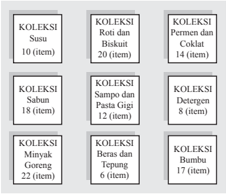

> **Deskripsi Visual:** Gambar ini adalah diagram yang menunjukkan berbagai koleksi produk dalam buku pelajaran. Diagram ini terdiri dari beberapa kotak berbeda, masing-masing menunjukkan koleksi dengan jumlah item yang berbeda. Setiap kotak memiliki judul yang memberikan informasi tentang koleksi tersebut, seperti "Koleksi Susu" dengan 10 item, "Koleksi Roti dan Biskuit" dengan 20 item, dan seterusnya.

Elemen utama dalam diagram ini adalah kotak-kotak yang menggambarkan koleksi produk. Relasi antara elemen-elemen ini adalah bahwa setiap kotak menunjukkan koleksi produk yang berbeda, dengan jumlah item yang berbeda pula. Teks, angka, atau label penting yang terlihat pada diagram ini meliputi judul koleksi dan jumlah item dalam setiap koleksi.

Informasi kunci yang dapat diambil pembaca dari gambar ini adalah bahwa buku pelajaran ini mengandung berbagai koleksi produk dengan jumlah item yang berbeda. Pembaca dapat memahami bahwa setiap koleksi memiliki jumlah item yang berbeda, yang dapat membantu dalam pemilihan dan penggunaan produk sesuai kebutuhan.

 

---
## 📄 Halaman 74

### Menanya

- Siswa	diupayakan	untuk	bertanya	tentang	hubungan	susunan	benda ataupun angka terhadap konsep matriks.
- Guru	memastikan	kelompok	dapat	bekerja	sama	dalam	merumuskan konsep yang akan dicapai dengan melemparkan ataupun merangsang siswa untuk bertanya.

### Menalar

- Untuk	mendapatkan	penalaran	terhadap	konsep	matriks,	guru	memberi -kan kesempatan siswa untuk melakukan Kegiatan 3.1, yaitu:

### Kegiatan  3.1

- Bentuklah kelompok yang masing-masing beranggotakan 3-4 orang.
- Wawancaralah setiap anggota kelompok untuk mendapatkan informasi nilai siswa terhadap tiga mata pelajaran yang diminatinya.
- Sajikan data yang diperoleh dalam bentuk tabel seperti di bawah ini.
- Sajikan pula data tersebut dalam bentuk matriks dan jelaskan.

---
**📊 Tabel**

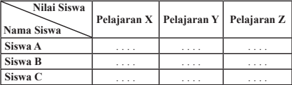

Tabel ini menunjukkan data tentang nilai siswa dalam tiga pelajaran: Pelajaran X, Pelajaran Y, dan Pelajaran Z. Kolom pertama berisi nama-nama siswa, sedangkan kolom kedua hingga kelima berisi nilai-nilai mereka dalam masing-masing pelajaran tersebut. Dari tabel ini, dapat dilihat bahwa siswa A mendapatkan nilai tertinggi di semua pelajaran, sementara siswa C mendapatkan nilai terendah. Siswa B memiliki nilai yang lebih rendah dibandingkan dengan siswa A tetapi lebih tinggi dibandingkan dengan siswa C. Ini menunjukkan variasi dalam prestasi antar siswa dalam setiap pelajaran.

### Mengomunikasikan

- Mintalah	siswa	untuk	berbagi	hasil	diskusi	ke	teman	sebangku	dan pastikan teman yang menerima hasil karya tersebut memahami apa yang harus dilakukan.
- Guru	memberikan	kesempatan	siswa	untuk	dapat	menyatakan	sendiri konsep matriks dengan bahasa dan penyampaiannya sendiri.
- Guru	memastikan	siswa	dapat	menjelaskan	jenis-jenis	matriks.
- Guru	memastikan	siswa	dapat	memahami	konsep	kesamaan	matriks.

### 3. Kegiatan Penutup

- Periksalah	apakah	semua	kelompok	sudah	mengumpulkan	tugas	dan apakah identitas kelompok sudah jelas.
- Guru	sebaiknya	hanya	mengonirmasi	akan	kebenaran	konsep	matriks yang diperoleh siswa.
- Berikan	penilaian	terhadap	proses	dan	hasil	karya	siswa	dengan menggunakan rubrik penilaian.

 

---
## 📄 Halaman 75

### 3.2  Jenis-Jenis Matriks

### No.

### 1. Kegiatan Pendahuluan

- Pembelajaran	dimulai	dengan	salam	dan	doa.
- Tumbuhkan	motivasi	internal	dalam	diri	siswa	melalui	menunjukkan manfaat mempelajari matriks dalam kehidupan siswa.

### 2. Kegiatan Inti

### Mengamati

- Ajaklah	siswa	untuk	memperhatikan	dan	memahami	contoh	3.1.
- Arahkan	siswa	menemukan	bentuk-bentuk	matriks	dari	contoh	3.1.

### Contoh 3.1

Teguh,	siswa	kelas	IX	SMA	Panca	Budi,	akan	menyusun	anggota	keluar -ganya	berdasarkan	umur	dalam	bentuk	matriks.	Dia	memiliki	Ayah,	Ibu, berturut-turut berumur 46 tahun dan 43 tahun. Selain itu dia juga memiliki kakak dan adik, secara berurut, Ningrum (22 tahun), Sekar (19 tahun), dan Wahyu (12 tahun). Dia sendiri berumur 14 tahun.

Berbekal dengan materi yang dia pelajari di sekolah dan kesungguhan dia dalam berlatih, dia mampu  mengkreasikan susunan matriks, yang merepresentasikan	umur	anggota	keluarga	Teguh,	sebagai	berikut	(berdasarkan urutan	umur	dalam	keluarga	Teguh).

### Menanya

- Siswa	diupayakan	untuk	bertanya	tentang	bentuk	matriks	alternatif lainnya yang dikembangkan dari contoh 3.1.

### Menalar

- Untuk	mendapatkan	penalaran	terhadap	jenis-jenis		matriks,	guru	mem -berikan kesempatan siswa untuk membentuk matriks lainnya.
- Berikan	bentuk	matriks	lain	untuk	mendapatkan	hubungan	antar	matriks.

### Mengomunikasikan

- Mintalah	siswa	untuk	berbagi	hasil	diskusi	ke	teman	sebangku.
- Guru	memberikan	kesempatan	siswa	untuk	dapat	menyatakan	sendiri jenis-jenis matriks dengan bahasa dan penyampaiannya sendiri.
- Guru	memastikan	siswa	dapat	menjelaskan	jenis-jenis	matriks.
- Guru	memastikan	siswa	dapat	memahami	konsep	kesamaan	matriks.

### Deskripsi Kegiatan

 

---
## 📄 Halaman 76

### 3. Kegiatan Penutup

- Berikan	penilaian	terhadap	proses	dan	hasil	karya	siswa	dengan menggunakan rubrik penilaian.
- Guru	sebaiknya	hanya	mengkonirmasi	akan	kebenaran	konsep	matriks yang diperoleh siswa.

### 3.3  Kesamaan Matriks

### No. Deskripsi Kegiatan

### 1. Kegiatan Pendahuluan

- Pembelajaran	dimulai	dengan	salam	dan	doa.
- Tumbuhkan	motivasi	internal	dalam	diri	siswa	melalui	menunjukkan manfaat mempelajari matriks dalam kehidupan siswa.

### 2. Kegiatan Inti

### Mengamati

- Berikan	siswabentuk-bentuk	matriks.

### Menanya

- Siswa	diupayakan	untuk	bertanya	tentang	bentuk	matriks	yang	sama.

### Menalar

- Untuk	mendapatkan	penalaran	terhadap	jenis-jenis		matriks,	guru	mem -berikan kesempatan siswa untuk membentuk matriks lainnya.
- Berikan	bentuk	matriks	lain	untuk	mendapatkan	hubungan	antarmatriks dengan memberikan contoh 3.2, yaitu:

### CONTOH 3.2

Tentukan	nilai a , b , c , dan d yang memenuhi matriks P t = Q, dengan

``

### Mengomunikasikan

- Mintalah	siswa	untuk	berbagi	hasil	diskusi	pada	teman	sebangku.
- Guru	memberikan	kesempatan	siswa	untuk	dapat	menyatakan	sendiri jenis-jenis matriks dengan bahasa dan penyampaiannya sendiri.
- Guru	memastikan	siswa	dapat	memahami	konsep	kesamaan	matriks.

 

---
## 📄 Halaman 77

### 3. Kegiatan Penutup

- Berikan	penilaian	terhadap	proses	dan	hasil	karya	siswa	dengan menggunakan rubrik penilaian.
- Guru	sebaiknya	hanya	mengonirmasi	akan	kebenaran	konsep	matriks yang diperoleh siswa.

### Penilaian

### 1. Prosedur Penilaian:

### 2. Instrumen Pengamatan

### Indikator perkembangan sikap bekerja sama:

- Kurang baik jika sama sekali tidak mau bekerja sama dalam proses pembelajaran.
- Baik jika menunjukkan sudah ada usaha mau bekerja sama dalam proses pembelajaran.
- Sangat baik jika menunjukkan adanya kerja sama dalam proses pembelajaran secara terus menerus dan konsisten.

### Indikator perkembangan sikap tanggung jawab (dalam kelompok)

- Kurang baik jika menunjukkan sama sekali tidak ambil bagian dalam melaksanakan tugas kelompok.
- Baik jika  menunjukkan sudah ada usaha ambil bagian dalam melaksanakan tugas kelompok tetapi belum konsisten.
- Sangat baik jika menunjukkan sudah ambil bagian dalam menyelesaikan tugas kelompok secara terus menerus dan konsisten.

### Bubuhkan	tanda	√	pada	kolom-kolom	sesuai	hasil	pengamatan.

 

---
## 📄 Halaman 78

---
**📊 Tabel**

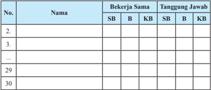

Tabel ini menunjukkan daftar nama-nama individu yang terlibat dalam dua jenis tugas: bekerja sama (SB) dan tanggung jawab (KB). Kolom "No." menunjukkan urutan nomor individu, sedangkan kolom "Nama" berisi nama-nama tersebut. Tabel ini memperlihatkan bahwa setiap individu memiliki keterlibatan yang berbeda dalam kedua jenis tugas tersebut. Misalnya, beberapa individu hanya terlibat dalam bekerja sama, sementara yang lain memiliki keterlibatan yang lebih besar dalam tanggung jawab. Pola ini menunjukkan bahwa tidak semua individu memiliki keterlibatan yang sama dalam kedua jenis tugas tersebut, yang mungkin berdampak pada bagaimana mereka bekerja dan bagaimana hasil kerja mereka diukur.

### 3. Instrumen Penilaian Pengetahuan dan Keterampilan:

### Petunjuk:

- Kerjakan soal berikut secara individu, dilarang bekerja sama dan dilarang menyontek.
- Selesaikanlah soal-soal berikut ini.

### Soal:

- Buatlah matriks yang terdiri dari 5 baris dan 3 kolom, dengan elemennya adalah 15 bilangan prima yang pertama.
- Untuk  matriks-matriks  berikut,  tentukan  pasangan-pasangan  matriks yang sama.

``

### Pedoman Penilaian Pengetahuan dan Keterampilan

---
**📊 Tabel**

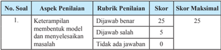

Tabel ini menunjukkan skor untuk penilaian keterampilan membedah model dan menyelesaikan masalah dalam pembelajaran matematika. Topik utama tabel adalah keterampilan membedah model dan menyelesaikan masalah. Kolom-kolomnya meliputi No Soal, Aspek Pemilihan, Rubrik Penilaian, Skor, dan Skor Maksimal. Data penting yang terlihat adalah bahwa skor maksimal untuk setiap aspek pemilihan adalah 25 poin, dengan skor tertinggi 25 poin jika jawaban benar dan skor terendah 0 poin jika tidak ada jawaban. Ini menunjukkan bahwa skor penilaian sangat bergantung pada keakuratan dan kesempurnaan dalam memahami dan menyelesaikan model matematika.

 

---
## 📄 Halaman 79

---
**📊 Tabel**

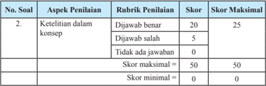

Tabel ini menunjukkan skor penilaian untuk soal 2 dalam sebuah ujian atau tes. Topik utamanya adalah ketelitian dalam konsep. Rubrik penilaian mencakup tiga poin: jawaban benar, jawaban salah, dan tidak ada jawaban. Skor maksimal untuk setiap poin adalah 25, dengan total skor maksimal sebesar 50. Skor minimal untuk setiap poin adalah 0, dan skor minimal untuk soal 2 adalah 0. Data penting lainnya adalah bahwa skor maksimal untuk soal 2 adalah 50, dan skor minimalnya adalah 0.

### 3.4  Operasi pada Matriks

Sebelum Pelaksanaan Kegiatan

- Pastikan siswa sudah paham dengan konsep matriks dan elemen matriks.
- Berikan motivasi pada siswa akan pentingnya belajar operasi matriks.
- Pilih dan rancang masalah sederhana untuk membelajarkan operasi matriks.

### No. Deskripsi Kegiatan

### 1. Kegiatan Pendahuluan

- Apersepsi

### 2. Kegiatan Inti

### Pengantar Pembelajaran

- Tumbuhkan	 motivasi	 internal	 dalam	 diri	 siswa	 dengan	 memaparkan manfaat mempelajari operasi  matriks dalam kehidupan siswa.
- Ajaklah	siswa	untuk	memperhatikan	dan	memahami	masalah	pada	buku siswa.
- Himbaulah	siswa	untuk	memperhatikan	masalah	yang	ada	di	sekitarnya yang dapat dimodelkan dalam bentuk matriks.

### Mengamati

- Arahkan	siswa	mengamati	setiap	masalah-masalah	yang	berkaitan	pada tiap-tiap operasi matriks, yaitu:

 

---
## 📄 Halaman 80

### 1. Penjumlahan

### Masalah 3.3

Toko	kue	berkonsep	waralaba	ingin	mengembangkan	usaha	di	dua kota yang berbeda. Manager produksi ingin mendapatkan data biaya untuk masing-masing kue seperti pada tabel berikut:

### Tabel	Biaya	Toko	di	Kota	A	(dalam	Rp)

### Tabel	Biaya	Toko	di	Kota	B	(dalam	Rp)

Berapa total biaya yang diperlukan oleh kedua toko kue?

### 2. Pengurangan

### Masalah 3.4

Sebuah  pabrik  tekstil  hendak  menyusun  tabel  aktiva  mesin  dan penyusutan mesin selama 1 tahun yang dinilai sama dengan 10% dari harga perolehan sebagai berikut.

---
**📊 Tabel**

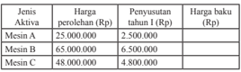

Tabel ini menunjukkan informasi tentang aktivitas perusahaan dengan berbagai jenis mesin, termasuk harga perolehan, penyusutan tahun I, dan harga baku. Topik utama tabel adalah analisis biaya produksi untuk mesin-mesin tersebut. Kolom-kolomnya meliputi jenis mesin (Mesin A, Mesin B, Mesin C), harga perolehan, penyusutan tahun I, dan harga baku. Data penting yang terlihat adalah bahwa Mesin C memiliki harga perolehan tertinggi ($48,000,000) dan harga baku tertinggi ($4,300,000), sementara Mesin A memiliki harga perolehan terendah ($25,000,000) dan harga baku terendah ($2,500,000). Ini menunjukkan bahwa Mesin C mungkin lebih mahal tetapi juga lebih efisien dalam hal penyusutan dan harga baku dibandingkan dengan Mesin A.

### 3. Operasi Perkalian Skalar pada Matriks

### Contoh 3.5

``

 

---
## 📄 Halaman 81

``

``

### 4. Operasi Perkalian Dua Matriks

### Masalah 3.5

Suatu perusahaan yang bergerak pada bidang jasa akan membuka tiga  cabang  besar  di  pulau  Sumatera,  yaitu  cabang  1  di  kota  Palembang, cabang 2 di kota Padang, dan cabang 3 di kota Pekanbaru. Untuk itu, diperlukan  beberapa  peralatan  untuk  membantu  kelancaran  usaha jasa tersebut, yaitu handphone , komputer, dan sepeda motor. Di sisi lain, pihak perusahaan mempertimbangkan harga per satuan peralatan tersebut. Lengkapnya, rincian data tersebut disajikan sebagai berikut.

---
**📊 Tabel**

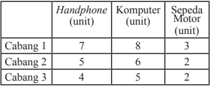

Tabel ini menunjukkan data perangkat elektronik dalam satuan untuk tiga cabang. Topik utama tabel adalah perbandingan jumlah unit perangkat antara handphone, komputer, dan sepeda motor di setiap cabang. Kolom pertama berisi nama cabang, sedangkan kolom kedua hingga keempat berisi jumlah unit perangkat untuk masing-masing jenis perangkat tersebut. Dari data yang terlihat, kita bisa melihat bahwa Cabang 1 memiliki jumlah unit handphone paling banyak (7), sedangkan Cabang 3 memiliki jumlah unit sepeda motor paling banyak (2). Selain itu, Cabang 2 memiliki jumlah unit komputer paling banyak (6) dan Cabang 3 memiliki jumlah unit handphone paling banyak (4). Ini menunjukkan bahwa setiap cabang memiliki preferensi perangkat yang berbeda-beda.

 

---
## 📄 Halaman 82

Perusahaan ingin mengetahui total biaya pengadaan peralatan tersebut di setiap cabang.

Guru	memberikan	kesempatan	siswa	untuk	merancang	model	matriks dari setiap permasalahan yang ada.

### 5. Tranpos Matriks

### Contoh 3.7

``

- Jika S = 10 20 14 18 12 8 22 6 17 , maka transpos matriks S ,

``

``

- Berilah kesempatan kepada siswa untuk mendiskusikan penyelesaian sederhana dari tiap operasi matriks tersebut.

### Menanya

- Siswa	diupayakan	untuk	bertanya	tentang	solusi	alternatif	yang	dapat ditemukan.
- Guru	memastikan	kelompok	dapat	bekerja	sama	dalam	merumuskan konsep yang akan dicapai dengan melemparkan ataupun merangsang siswa untuk bertanya.

### Menalar

- Ajaklah	siswa	untuk	mendiskusikan	permasalahan	yang	terdapat pada setiap buku siswa sehingga diperoleh solusi-solusi untuk mengoperasikan matriks.
- Berikan	contoh-contoh	pada	tiap-tiap	operasi	untuk	lebih	memahami tiap operasi matriks.

 

---
## 📄 Halaman 83

### Mengomunikasikan

- Mintalah	siswa	untuk sharing hasil karyanya pada teman dan pastikan semua siswa memahami proses dalam operasi matriks.
- Guru	memberikan	kesempatan	kepada	siswa	untuk	dapat	menyatakan sendiri  proses  operasi  matriks  dengan  bahasa  dan  penyampaiannya sendiri.
- Guru	memastikan	siswa	dapat	menjelaskan	jenis-jenis	operasi	matriks.
- Guru	memastikan	siswa	dapat	memahami	mana	saja	matriks	yang	tidak dapat dioperasikan.

### 3. Kegiatan Penutup

- Mintalah	siswa	untuk	melakukan	releksi	dan	menuliskan	hal	penting dari yang dipelajarinya.
- Berikan	penilaian	terhadap	proses	dan	hasil	karya	siswa	dengan menggunakan rubrik penilaian.
- Jika	dipandang	perlu,	berilah	siswa	latihan	untuk	dikerjakan	di	rumah.

### Penilaian

### 1. Prosedur Penilaian:

### 2. Instrumen Pengamatan Sikap:

### Berpikir Logis

- Kurang baik jika sama sekali tidak berusaha mengajukan ide-ide logis dalam proses pembelajaran.
- Baik jika menunjukkan sudah ada usaha untuk mengajukan ide-ide logis dalam proses pembelajaran.
- Sangat baik jika mengajukan ide-ide logis dalam proses pembelajaran dalam proses pembelajaran secara terus menerus dan ajeg/konsisten.

 

---
## 📄 Halaman 84

### Kritis

- Kurang  baik  jika  sama  sekali  tidak  berusaha  mengajukan  ide-ide  logis dengan kritis atau pertanyaan menantang dalam proses pembelajaran.
- Baik jika menunjukkan sudah ada usaha untuk mengajukan ide-ide logis dengan kritis atau pertanyaan menantang dalam proses pembelajaran.
- Sangat  baik  jika  mengajukan  ide-ide  logis  dengan  kritis  atau  pertanyaan menantang  dalam  proses  pembelajaran  secara  terus  menerus  dan  ajeg/ konsisten.
Bubuhkan	tanda	√	pada	kolom-kolom	sesuai	hasil	pengamatan.

SB = Sangat Baik    B = Baik     KB = Kurang Baik

### 3. Instrumen Penilaian Pengetahuan dan Keterampilan:

### Petunjuk:

- Kerjakan soal berikut secara individu, dilarang bekerja sama dan dilarang menyontek.
- Selesaikanlah soal-soal berikut ini:
- Soal: 1) Hasil	penjumlahan	matriks 2 2 6 4 8 3 5 6 3 9 5 p p q +       + =       +       .	Tentukan	nilai p dan q !

``

 

---
## 📄 Halaman 85

Dari  semua  matriks  di  atas,  pasangan  matriks  manakah    yang  dapat dijumlahkan dan dikurangkan. Kemudian selesaikanlah!

``

serta memenuhi persamaan A + X = B .

Tentukan	matriks X !

- Tentukanlah	hasil	perkalian	matriks-matriks	berikut!

``

- Diketahui matriks G = 1 2 3 2 4 6 , dan lima matriks yang dapat dipilih
untuk dikalikan terhadap matriks G , yaitu:

``

Matriks	yang	manakah	dapat	dikalikan	terhadap	matriks	G?	Kemudian tentukan hasilnya!

### Pedoman Penilaian

---
**📊 Tabel**

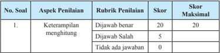

Tabel ini menunjukkan skor penilaian untuk soal pertama dalam sebuah ujian atau tes. Topik utamanya adalah keterampilan menghitung. Tabel memiliki dua kolom: "Skor" dan "Skor Maksimal". Skor maksimal untuk setiap jawaban adalah 20, dengan skor 5 diberikan jika jawaban salah dan 0 jika tidak ada jawaban. Skor yang dihitung berdasarkan apakah jawaban tersebut benar atau salah. Ini menunjukkan bahwa skor tertinggi yang dapat diperoleh adalah 20, sedangkan skor terendah adalah 0.

 

---
## 📄 Halaman 86

---
**📊 Tabel**

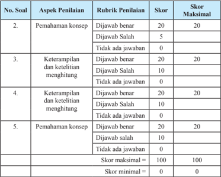

Tabel ini menunjukkan skor maksimal dan minimal untuk setiap aspek penilaian dalam sebuah ujian. Topik utamanya adalah pemahaman konsep dan keterampilan ketelitian menghitung. Ada dua kolom utama: "Skor" dan "Skor Maksimal". Untuk setiap aspek penilaian, ada tiga pilihan jawaban dengan skor tertentu. Misalnya, untuk aspek pertama, jawaban yang benar mendapatkan 20 poin, jawaban salah mendapatkan 5 poin, dan tidak ada jawaban mendapatkan 0 poin. Skor maksimal untuk setiap aspek adalah 20 poin. Skor minimal untuk setiap aspek adalah 0 poin. Tabel ini membantu dalam menilai kinerja siswa dalam memahami konsep dan keterampilan mereka dalam menghitung.

### 3.5  Determinan dan Invers Matriks

### Sebelum Pelaksanaan Kegiatan

- Pastikan siswa sudah paham dengan konsep matriks dan elemen matriks serta  operasi  matriks  sebagai  prasyarat,  kemudian  siswa  juga  dapat memahami determinan dan invers matriks.
- Berikan motivasi pada siswa akan pentingnya belajar determinan dan invers matriks.
- Pilih dan rancang masalah sederhana untuk membelajarkan determinan dan invers matriks.

 

---
## 📄 Halaman 87

### No. Deskripsi Kegiatan

### 1. Kegiatan Pendahuluan

- Apersepsi
- Memberi motivasi pentingnya materi ini.
- Memberi informasi tentang kompetensi yang akan dicapai.

### 2. Kegiatan Inti

Sebelum melakukan kegiatan inti sebaiknya guru:

- Mengingatkan	kembali	tentang	pengertian	matriks	dan	elemen	matriks.
- Mengingatkan	kembali	tentang	operasi	penjumlahan,	pengurangan, perkalian, dan transpos matriks.
- Ajak	siswa	untuk	mengamati	dan	mendiskusikan	beberapa	contoh	dan masalah yang diberikan.

### Mengamati

- Arahkan	 siswa	 siswa	 mengamati	 setiap	 masalah-masalah	 pada	 buku siswa yang berkaitan dengan determinan dan invers matriks, seperti:

### 1. Determinan

### Masalah 3.6

Siti dan teman-temannya makan disebuah warung. Mereka memesan 3	ayam	penyet	dan	2	gelas	es	jeruk	di	kantin	sekolahnya.	Tak	lama kemudian, Beni dan teman-temannya datang memesan 5 porsi ayam penyet	dan	3	gelas	es	jeruk.	Siti	menantang	Amir	menentukan	harga satu porsi ayam penyet dan harga es jeruk per gelas, jika Siti harus membayar Rp.70.000,00 untuk semua pesanannya dan Beni harus membayar Rp.115.000,00 untuk semua pesanannya.

### Masalah 3.7

Sebuah perusahaan penerbangan menawarkan perjalanan wisata ke negara	A,	perusahaan	tersebut	mempunyai	tiga	jenis	pesawat	yaitu Airbus	100,	Airbus	200,	dan	Airbus	300.	Setiap	pesawat	dilengkapi dengan  kursi penumpang  untuk kelas turis, ekonomi, dan VIP.

 

---
## 📄 Halaman 88

Jumlah kursi penumpang dari tiga jenis pesawat tersebut disajikan pada tabel berikut.

Perusahaan  telah  mendaftar  jumlah  penumpang  yang  mengikuti perjalanan	wisata	ke	negara	A	seperti	pada	tabel	berikut.

Berapa banyak pesawat yang harus dipersiapkan untuk perjalanan tersebut?

- Guru	memberikan	kesempatan	siswa	untuk	merancang	model determinan matriks dari setiap permasalahan yang ada.
- Berilah	kesempatan	kepada	siswa	untuk	mendiskusikan	penyelesaian sederhana dari model determinan matriks tersebut.

### Menanya

- Siswa	diupayakan	untuk	bertanya	tentang	solusi	alternatif	yang	dapat ditemukan.
- Guru	memastikan	kelompok	dapat	bekerja	sama	dalam	merumuskan konsep yang akan dicapai dengan melemparkan ataupun merangsang siswa untuk bertanya.

### Menalar

- Ajaklah	siswa	untuk	mendiskusikan	permasalahan	yang	terdapat	pada setiap  buku  siswa  sehingga  diperoleh  penyelesaian  yang  berkaitan dengan determinan matriks.

### Mengomunikasikan

- Mintalah	siswa	untuk	berbagi	hasil	karyanya	pada	teman	dan	pastikan semua siswa memahami prosedur penyelesaian determinan matriks.
- Guru	memberikan	kesempatan	siswa	untuk	dapat	menyelesaikan masalah yang berkaitan dengan matriks.

 

---
## 📄 Halaman 89

- Guru	memastikan	siswa	menemukan	solusi-solusi	alternatif	dari aplikasi matriks.

### 3. Kegiatan Penutup

- Mintalah	siswa	untuk	melakukan	releksi	dan	menuliskan	hal	penting dari yang dipelajarinya.
- Berikan	penilaian	terhadap	proses	dan	hasil	karya	siswa	dengan menggunakan rubrik penilaian.
- Jika	dipandang	perlu,	berilah	siswa	Uji	Kompetensi	3.2	untuk	dikerjakan di rumah.
- Doa	dan	salam.

### Penilaian

### 1. Prosedur Penilaian:

---
**📊 Tabel**

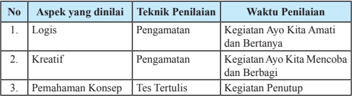

Tabel ini menunjukkan metode penilaian untuk aspek-aspek kreativitas dan pemahaman konsep dalam kurikulum. Topik utama adalah penilaian kreativitas dan pemahaman konsep melalui berbagai teknik penilaian seperti pengamatan, tes tertulis, dan kajian penutup. Kolom pertama menunjukkan aspek yang diuji, sementara kolom kedua menunjukkan teknik penilaian yang digunakan. Waktu penilaian ditunjukkan pada kolom ketiga. Pola penting yang terlihat adalah bahwa semua aspek diuji menggunakan pengamatan dan tes tertulis, sedangkan kajian penutup hanya digunakan untuk pemahaman konsep.

### 2. Instrumen Pengamatan Sikap:

### Berpikir Logis

- Kurang baik jika sama sekali tidak berusaha mengajukan ide-ide logis dalam proses pembelajaran.
- Baik jika menunjukkan sudah ada usaha untuk mengajukan ide-ide logis dalam proses pembelajaran.
- Sangat baik jika mengajukan ide-ide logis dalam proses pembelajaran dalam proses pembelajaran secara terus menerus dan ajeg/konsisten.

### Kritis

- Kurang  baik  jika  sama  sekali  tidak  berusaha  mengajukan  ide-ide  logis dengan kritis atau pertanyaan menantang dalam proses pembelajaran.
- Baik jika menunjukkan sudah ada usaha untuk mengajukan ide-ide logis dengan kritis atau pertanyaan menantang dalam proses pembelajaran.

 

---
## 📄 Halaman 90

- Sangat baik jika mengajukan ide-ide logis kritis atau pertanyaan menantang dalam proses pembelajaran secara terus menerus dan ajeg/konsisten.
Bubuhkan	tanda	√	pada	kolom-kolom	sesuai	hasil	pengamatan.

---
**📊 Tabel**

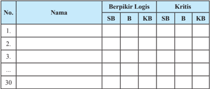

Tabel ini menunjukkan hasil evaluasi berpikir logis dan kritis dari 30 orang. Kolom "Berpikir Logis" membandingkan dua metode penilaian: SB (Sistematis) dan KB (Kreatif). Sementara itu, kolom "Kritis" juga menggunakan dua metode penilaian: SB dan KB. Data dalam tabel ini menunjukkan bahwa banyak orang memiliki kemampuan berpikir logis yang baik, tetapi kurangnya kemampuan berpikir kritis dapat menjadi tantangan. Ini menunjukkan bahwa pendidikan harus fokus pada meningkatkan keterampilan berpikir kritis agar lebih banyak orang dapat menerapkan pemikiran yang lebih kritis dalam kehidupan sehari-hari.

SB = Sangat Baik    B = Baik     KB = Kurang Baik

### 3. Instrumen penilaian:

### Petunjuk:

- Kerjakan soal berikut secara individu, dilarang bekerja sama dan dilarang menyontek.
- Selesaikanlah soal-soal berikut ini:

### Soal:

- Misalkan A matriks persegi. Jika pertukaran elemen-elemen sebarang dua baris atau dua kolom dari matriks A ,  maka buktikan bahwa nilai determinannya berubah tanda.
- Jika B matriks persegi dengan det B ≠	0,	tunjukkan	bahwa 1 t B -    = 1 t B -    .
- Selidiki bahwa det ( C + D ) = det C + det D untuk setiap matriks persegi C dan D.
- 4)
- Masalah alokasi sumber daya. Agen	perjalanan	menawarkan	paket	perjalanan	ke	Bali.	Paket	 I	 terdiri	 atas 4 malam menginap, 3 tempat wisata, dan 5 kali makan. Paket II dengan 3  malam  menginap,  4  tempat  wisata,  dan  7  kali  makan.  Paket  III dengan  5  malam  menginap,  4  tempat  wisata,  dan  tidak  ada  makan. Sewa hotel Rp 400.000,00 per malam, tranportasi ke tiap tempat wisata
Rp80.000,00, dan makan di restoran yang ditunjuk Rp90.000,00.

 

---
## 📄 Halaman 91

- Nyatakan matriks harga sewa hotel, tranportasi dan makan.
- Nyatakan matriks paket yang ditawarkan.
- Dengan menggunakan perkalian matriks, tentukan matriks biaya untuk tiap paket.
- Paket mana yang menawarkan biaya termurah?
- Dengan menggunakan matriks persegi, tunjukkan bahwa ( B -1 ) -1 = B .

### Pedoman Penilaian

---
**📊 Tabel**

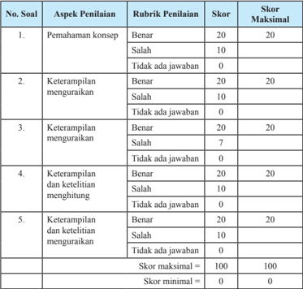

Tabel ini menunjukkan skor maksimal dan minimal untuk setiap aspek penilaian dalam sebuah ujian. Topik utamanya adalah keterampilan pemahaman konsep, keterampilan menguasai, dan keterampilan dan ketelitian menguasai. Kolom-kolomnya meliputi aspek penilaian, rubrik penilaian, skor, dan skor maksimal. Data penting yang terlihat adalah bahwa skor maksimal untuk semua aspek penilaian adalah 20, sedangkan skor minimal adalah 0. Ini menunjukkan bahwa setiap jawaban harus mencapai minimal 10 poin untuk mendapatkan skor maksimal.

 

---
## 📄 Halaman 92

### F.    Pengayaan

Pengayaan  merupakan  kegiatan  yang  diberikan  kepada  siswa  yang  memiliki akselerasi pencapaian KD yang cepat (nilai maksimal) agar potensinya berkembang optimal	 dengan	 memanfaatkan	 sisa	 waktu	 yang	 dimilikinya.	 Guru	 sebaiknya merancang kegiatan pembelajaran lanjut yang terkait dengan matriks pada siswa.

### G.   Remedial

Remedial merupakan perbaikan proses pembelajaran yang bertujuan pada pencapaian	 kompetensi	 dasar	 siswa.	 Guru	 memberikan	 perbaikan	 pembelajaran	 baik pada model, metode, serta strategi pembelajaran. Jika guru melakukan pembelajaran dengan pola yang sama tidaklah maksimal sehingga disarankan guru memilih tindakan pembelajaran yang tepat sehingga siswa mampu memenuhi KD yang diharapkan.

Perlu dipahami oleh guru, bahwa remedial bukan mengulang tes (ulangan harian) dengan materi yang sama, tetapi guru memberikan perbaikan pembelajaran pada KD yang belum dikuasai oleh peserta didik melalui upaya tertentu. Setelah perbaikan pembelajaran dilakukan, guru melakukan tes untuk mengetahui apakah peserta didik telah memenuhi kompetensi minimal dari KD yang diremedialkan.

### H.   Penyelesaian Soal-Soal Uji Kompetensi

### UJI KOMPETENSI - 3.1

- a)    18, 16, 8
- 14, 8, 17
- -22
- 14
- ordo matriks
- -
- Matriks yang dapat dibentuk antara lain:

``

 

---
## 📄 Halaman 93

4. -

``

``

8. -

``

10.  -

11.	 Gunakan	prinsip	perkalian	dua	matriks.

``

``

14.  -

15.  a. Paket I

: Rp1.120.000,00

Paket II

: Rp1.775.000,00

Paket III  : Rp820.000,00

b. Paket III adalah paket dengan harga termurah.

### UJI KOMPETENSI - 3.2

1.    a. 68

b. 34 x c. 3

``

``

``

4.

``

6. -

``

8. -

9.

10.  -

 

---
## 📄 Halaman 94

- 11.
- -
- 13.
- -
- 15.

### I.    Rangkuman

Setelah selesai membahas materi matriks di atas, ada beberapa hal penting sebagai kesimpulan yang dijadikan pegangan dalam mendalami dan membahas materi lebih lanjut, antara lain:

- Matriks adalah susunan bilangan-bilangan dalam baris dan kolom.
- Sebuah matriks A ditransposkan menghasilkan matriks A t dengan elemen baris matriks A berubah menjadi elemen  kolom matriks A t . Dengan demikian matriks A t ditransposkan kembali, hasinya menjadi matriks A atau ( A t ) t = A .
- Penjumlahan sebarang matriks dengan matriks identitas penjumlahan hasilnya matriks itu sendiri. Matriks identitas penjumlahan adalah matriks nol.
- Hasil	kali	sebuah	matriks	dengan	suatu	skalar	atau	suatu	bilangan	real k akan menghasilkan sebuah matriks baru yang berordo sama dan memiliki elemenelemen k kali elemen-elemen matriks semula.
- Dua buah matriks hanya dapat dikalikan apabila banyaknya kolom matriks yang dikali sama dengan banyaknya baris matriks pengalinya.
- Hasil	perkalian	matriks A dengan matriks identitas perkalian, adalah matriks A .
- Hasil	kali	dua	buah	matriks	menghasilkan	sebuah	matriks	baru,	yang	elemenelemennya  merupakan  hasil  kali  elemen  baris  matriks A dan  elemen  kolom matriks B. Misal jika A p×q dan B q×r adalah dua matriks, maka berlaku A p×q × B q×r = C p×r .
- Matriks yang memiliki invers adalah matriks persegi dengan nilai determinannya tidak nol (0).

 

---
## 📄 Halaman 95

BAB 4

### Transformasi

### A.   Kompetensi Inti

---
**📊 Tabel**

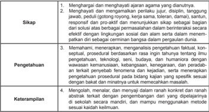

Tabel ini berisi instruksi untuk mengembangkan keterampilan berpikir kritis dan analitis dalam konteks pendidikan. Topik utamanya adalah "Sikap", "Pengetahuan", dan "Keterampilan". Dalam kolom "Sikap", ada instruksi untuk menghargai dan menghormati ajaran agama dan diahuraya, menghargai dan mengamalkan perilaku jujur, disiplin, tanggung jawab, dan rasa hormat terhadap orang lain. Kolom "Pengetahuan" mencakup memahami konsep, proses, dan teknologi, serta memahami budaya dan humaniora. Kolom "Keterampilan" meliputi mengelola, menalar, dan menerapkan pengetahuan secara konsisten, serta mengelola pengetahuan secara efektif dan sesuai dengan kebutuhan. Pola penting yang terlihat adalah bahwa setiap kolom memiliki instruksi yang berfokus pada aspek-aspek penting dari pembelajaran berpikir kritis dan analitis.

### B.   Kompetensi Dasar dan Indikator

Indikator pencapaian kompetensi pada pembelajaran dapat dikembangkan guru sendiri berdasarkan kondisi peserta didik masing-masing di tempat guru mengajar.

Berikut ini dipaparkan contoh Indikator Pencapaian Kompetensi Pembelajaran yang dapat dijabarkan dari KD 3.5 dan KD 4.5.

 

---
## 📄 Halaman 96

---
**📊 Tabel**

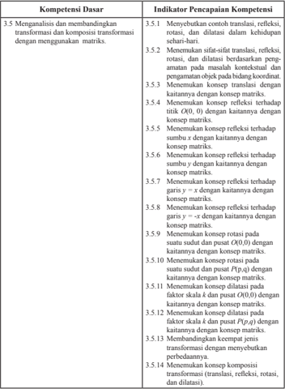

Tabel ini berisi informasi tentang kompetensi dasar dan indikator pencapaian kompetensi dalam bidang transformasi matematika, termasuk translasi, refleksi, rotasi, dan dilatasi. Topik utama tabel adalah pembelajaran tentang konsep dan pemahaman transformasi matematika. Kolom-kolomnya mencakup berbagai aspek transformasi, seperti menentukan konsep translasi, refleksi, rotasi, dan dilatasi, serta bagaimana membedakannya dengan kaitannya dengan konsep matriks. Data penting yang terlihat meliputi penjelasan tentang bagaimana mengidentifikasi dan memahami konsep-konsep transformasi tersebut, serta bagaimana menerapkan pemahaman ini dalam konteks praktis.

 

---
## 📄 Halaman 97

---
**📊 Tabel**

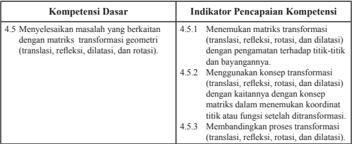

Tabel ini berisi informasi tentang kompetensi dasar dalam matematika transformasi geometri, termasuk translasi, refleksi, rotasi, dan dilatasi. Kolom pertama menunjukkan topik utama, yaitu "Menyelesaikan masalah yang berkaitan dengan matriks transformasi geometri (translasi, refleksi, dilatasi, dan rotasi)". Kolom kedua berisi indikator pencapaian kompetensi, yang mencakup 4 sub-indikator: 4.5.1 Menentukan matriks transformasi, 4.5.2 Menggunakan matriks transformasi, 4.5.3 Menghubungkan konsep matriks dalam menyelesaikan tindakan transformasi, dan 4.5.4 Membandingkan proses transformasi. Pola penting yang terlihat adalah bahwa setiap sub-indikator memiliki tujuan yang spesifik untuk memahami dan menggunakan matriks transformasi dalam berbagai situasi.

### C.   Tujuan Pembelajaran

Setelah mempelajari konsep transformasi melalui pengamatan, menalar, tanya jawab,  mencoba  menyelesaikan  persoalan,  penugasan  individu  dan  kelompok, diskusi kelompok, dan mengomunikasikan pendapatnya, siswa mampu:

- Menumbuhkan sikap perilaku jujur,  disiplin,  tanggung  jawab,  peduli  (gotong royong,  kerja  sama,    toleran,  damai),  santun,  responsif  dan  proaktif,  berani bertanya,    berpendapat,  dan  menghargai  pendapat  orang  lain  dalam  aktivitas sehari-hari.
- Menunjukkan  rasa  ingin  tahu  dalam  memahami  konsep  dan  menyelesaikan masalah.
- Menyebutkan	contoh	transformasi	(translasi,	releksi,	rotasi,	dan	dilatasi)	dalam kehidupan sehari-hari.
- Menemukan	 sifat-sifat translasi, releksi, rotasi, dan dilatasi berdasarkan pengamatan  pada  masalah  kontekstual  dan  pengamatan  objek  pada  bidang koordinat.
- Menemukan konsep translasi dengan kaitannya dengan konsep matriks.
- Menemukan	konsep	releksi	(terhadap	titik O (0, 0), sumbu x , sumbu y , garis y = x , dan garis y = ­x ) dengan kaitannya pada konsep matriks.
- Menemukan konsep rotasi pada suatu sudut dan pusat O (0, 0) atau pusat P ( p , q ) dengan kaitannya dengan konsep matriks.
- Menemukan konsep dilatasi pada suatu faktor skala dan pusat O (0, 0) atau pusat P ( p , q ) dengan kaitannya dengan konsep matriks.
- Menemukan koordinat titik  dan  persamaan  garis  oleh  transformasi  (translasi, releksi,	rotasi,	dan	dilatasi).

 

---
## 📄 Halaman 98

### D.   Diagram Alir

---
**🖼️ Gambar/Diagram**

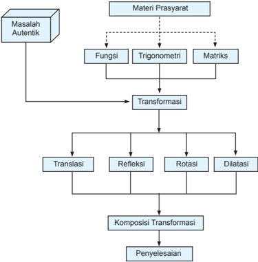

> **Deskripsi Visual:** Gambar ini adalah diagram yang menunjukkan proses penyelesaian masalah autentik menggunakan transformasi geometri. Gambar ini terdiri dari beberapa elemen utama:

1. **Masalah Autentik** - Ini adalah titik awal yang mengandung informasi tentang masalah yang perlu diselesaikan.

2. **Materi Prasyarat** - Ini mencakup tiga topik utama: Fungsi, Trigonometri, dan Matriks. Setiap topik ini memiliki ikatan dengan transformasi yang akan digunakan untuk menyelesaikan masalah.

3. **Transformasi** - Ini adalah langkah berikutnya setelah memilih materi prasyarat. Transformasi termasuk Translasi, Refleksi, Rotasi, dan Dilatasi.

4. **Komposisi Transformasi** - Ini adalah langkah selanjutnya di mana transformasi-tanpa transformasi-dan transformasi-dan transformasi-dan transformasi-dan transformasi-dan transformasi-dan transformasi-dan transformasi-dan transformasi-dan transformasi-dan transformasi-dan transformasi-dan transformasi-dan transformasi-dan transformasi-dan transformasi-dan transformasi-dan transformasi-dan transformasi-dan transformasi-dan transformasi-dan transformasi-dan transformasi-dan transformasi-dan transformasi-dan transformasi-dan transformasi-dan transformasi-dan transformasi-dan transformasi-dan transformasi-dan transformasi-dan transformasi-dan transformasi-dan transformasi-dan transformasi-dan transformasi-dan transformasi-dan transformasi-dan transformasi-dan transformasi-dan transformasi-dan transformasi-dan transformasi-dan transformasi-dan transformasi-dan transformasi-dan transformasi-dan transformasi-dan transformasi-dan transformasi-dan transformasi-dan transformasi-dan transformasi-dan transformasi-dan transformasi-dan transformasi-dan transformasi-dan transformasi-dan transformasi-dan transformasi-dan transformasi-dan transformasi-dan transformasi-dan transformasi-dan transformasi-dan transformasi-dan transformasi-dan transformasi-dan transformasi-dan transformasi-dan transformasi-dan transformasi-dan transformasi-dan transformasi-dan transformasi-dan transformasi-dan transform

 

---
## 📄 Halaman 99

### E.   Proses Pembelajaran

### 4.1  Menemukan Konsep Translasi (Pergeseran)

Sebelum Pelaksanaan Kegiatan

- Bentuk  kelompok  kecil  siswa  (3-4  orang)  yang  heterogen.  Perhatikan karakteristik siswa dalam satu kelompok sehingga mendukung pembelajaran yang	eisien	dan	efektif.
- Informasikan tujuan pembelajaran dan tata cara penilaian selama proses pembelajaran.
- Persiapkan semua fasilitas yang mendukung selama proses pembelajaran. Sebaiknya dipersiapkan papan tulis berpetak untuk media bidang koordinat.

### No. Deskripsi Kegiatan

### 1. Kegiatan Pendahuluan

- Salam	dari	guru	dan	doa	dipimpin	oleh	salah	satu	siswa.
- Apersepsi
- Motivasi siswa mempelajari transformasi.
- Ingatkan kembali siswa materi transformasi di tingkat SMP/MTs.
- Informasikan kepada siswa bahwa konsep transformasi ini dikaji dengan pendekatan koordinat dan hubungannya dengan konsep matriks.
- Ingatkan kembali siswa materi matriks.

### 2. Kegiatan Inti

### Ayo Mengamati

- Ajak	siswa	mengamati	benda-benda	yang	bergerak	atau	bergeser	dalam kehidupan sehari-hari.
- Beri	kesempatan	kepada	siswa	untuk	memahami	sifat	pergeseran dengan mengamati benda-benda yang bergerak di lingkungan sekitar tersebut.	Arahkan	siswa	fokus	pada	bentuk	dan	ukuran	benda-benda yang bergerak tersebut.
- Guru	dapat	memperagakan	pergeseran	benda-benda	di	depan	kelas sebagai media.

 

---
## 📄 Halaman 100

### Ayo Mengomunikasikan

- Guru	memberikan	kesempatan	kepada	siswa	untuk	mengomunikasikan pendapatnya tentang pergeseran benda-benda setelah diamati.
- Arahkan	 jawaban	 siswa	 fokus	 pada	 bentuk	 dan	 ukuran	 benda	 setelah pergeseran.

### Masalah 4.1

- Minta	siswa	membaca	Masalah	4.1	dan	memandu	mereka	memahami alternatif penyelesaian Masalah 4.1.
- Minta	 siswa	 menunjukkan	 pergeseran	 titik	 pada	 bidang	 koordinat kartesius di depan kelas dan membaca koordinat perubahannya setelah bergeser.
- Guru	dan	siswa	menyepakati	arah	pergeseran	ke	kiri	(sebagai	sumbu x negatif), ke kanan (sebagai sumbu x positif), ke atas (sebagai sumbu y positif) dan ke bawah (sebagai sumbu y negatif) pada sumbu koordinat.
- Bantu	 siswa	 memahami	 konsep	 pergeseran	 ke	 bentuk	 matriks	 pada alternatif penyelesaian Masalah 4.1 di buku siswa.
- Guru	 memastikan	 kelompok	 dapat	 bekerja	 sama	 dalam	 merumuskan konsep  yang  akan  dicapai  dengan  melemparkan  ataupun  merangsang siswa untuk bertanya.

### Ayo mengomunikasikan

- Guru	 meminta	 seorang	 siswa	 untuk	 mengomunikasikan	 pendapatnya tentang pergeseran pada Masalah 4.1.
- Guru	 memantau	 pendapat	 siswa	 tersebut	 serta	 memperbaiki	 jika	 ada pendapat	yang	tidak	sesuai	konsep.	Guru	dapat	memberikan	kesempatan kepada siswa untuk bertanya atau memberikan pendapat lainnya.
- Guru	 menilai	 keaktifan	 siswa	 serta	 memantau	 siswa	 yang	 tidak	 atau kurang  aktif  serta  memberikan  umpan  balik  untuk  menumbuhkan  keaktifan belajarnya.

### Masalah 4.2

- Perkuat	 pemahaman	 siswa	 tentang	 pergeseran	 dengan	 mengajukan Masalah 4.2 untuk dibaca dan dipahami serta memberi komentar.
- Arahkan	 siswa	 ke	 sesi	 tanya	 jawab	 di	 antara	 siswa.	 Guru	 memantau kebenaran pendapat-pendapat siswa.

 

---
## 📄 Halaman 101

### Ayo mengamati

- Guru	memerintahkan	siswa	untuk	mengamati	kembali	pergeseran	objek (titik,	garis,	dan	bidang)	pada	bidang	koordinat	kartesius	pada	Gambar 4.2.
- Arahkan	siswa	mengamati	posisi,	bentuk,	dan	ukuran	objek	sebelum dan sesudah pergeseran, adakah perubahan?
- Minta	siswa	mengomunikasikan	pendapatnya	tentang	mengamati posisi, bentuk, dan ukuran objek sebelum dan sesudah pergeseran. Arahkan	siswa	membangun	dan	memahami	Sifat	4.1.

### Sifat 4.1:

Bangun yang digeser (translasi) tidak mengalami perubahan bentuk dan ukuran

### Ayo mencoba

- Setelah	siswa	mempelajari	Masalah	4.1	dan	Masalah	4.2,	minta	siswa mengamati	Gambar	4.3	dan	menuliskan	koordinat	titik	yang	diminta pada Tabel 4.1
- Tabel	4.1	telah	terisi	sebagai	berikut!

---
**📊 Tabel**

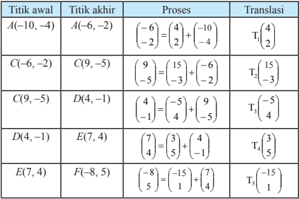

Tabel ini menunjukkan perubahan titik dalam sebuah proses translasional, dimana setiap baris menggambarkan perubahan titik awal ke titik akhir melalui proses tertentu. Topik utama tabel ini adalah pergerakan titik dalam ruang bidang dua dimensi. Kolom-kolomnya mencakup: Titik awal, Titik akhir, Proses, dan Translasi. Data penting yang terlihat antara lain bahwa setiap titik awal memiliki titik akhir yang berbeda, dengan perubahan yang ditunjukkan oleh proses dan translasi. Misalnya, dari titik C(-6,-2) ke D(4,-1), proses melibatkan pergeseran 10 unit ke kanan dan 6 unit ke atas, yang diwakili oleh translasi T_1^(-6/2). Ini menunjukkan bahwa setiap titik memiliki pola pergerakan yang unik, yang dapat dianalisis untuk memahami struktur ruang dan pola gerakan.

 

---
## 📄 Halaman 102

### Ayo mengomati

- Pandu	siswa	untuk	menemukan	konsep	translasi	melalui	pengamatan terhadap koordinat titik pada Tabel 4.1.
- Arahkan	siswa	menemukan	konsep	translasi	berikut:
Titik A(x,y) ditranslasi oleh T(a,b) menghasilkan bayangan A′(x′,y′) , ditulis dengan:

``

### Ayo menalar

- Pandu	siswa	memahami	persoalan	pada	Contoh	4.1	dan	Contoh	4.2 dengan menggunakan konsep translasi yang telah ditemukan.
- Guru	dapat	mendemonstrasikan	kembali	alternatif	penyelesaian	pada Contoh	4.1	dan	Contoh	4.2,	atau	dapat	membuat	contoh-contoh	lainnya.
- Untuk	 mendapatkan	 tingkat	 pemahaman	 siswa	 akan	 konsep	 translasi, minta siswa menyelesaikan Latihan 4.1 berdasarkan pemahaman konsep dan contoh-contoh yang telah dipelajari, atau guru dapat memberikan soal-soal translasi lainnya sebagai tugas kelompok atau pribadi.
- Berikut	adalah	alternatif	penyelesaian	Latihan	4.1	sesuai	buku	siswa.

### Latihan 4.1

- Titik P(a,b + 2) digeser dengan T( 3, 2 b - a) sehingga hasil pergeseran menjadi Q (3 a + b , -3). Tentukan posisi pergeseran titik R (2, 4) oleh translasi T di atas.
Coba	ikuti	panduan	berikut:

Alternatif	penyelesaian:

``

``

 

---
## 📄 Halaman 103

Langkah 2: Dengan mensubstitusi 2 3 + -= b a ke persamaan (2) maka diperoleh

``

Dengan demikian, translasi yang dimaksud adalah T(3, 2b - a) = T(3, -4). Langkah 3:

Pergeseran titik R (2, 4) oleh translasi T (3, -4) adalah:

``

``

Jadi, koordinat pergeseran titik R adalah R′ (5, 0) .

### 3. Kegiatan Penutup

- Minta	siswa	mengomunikasikan	kembali	konsep-konsep	materi	yang telah diketahui setelah pembelajaran.
- Berikan	penilaian	terhadap	proses	dan	hasil	karya	siswa	dengan menggunakan rubrik penilaian. Hasil kerja kelompok dikumpulkan oleh guru.
- Siswa	dan	guru	bersama-sama	melakukan	releksi	dan	merangkum semua konsep dan sifat translasi dari yang dipelajari.
- Beri	tugas	kepada	siswa	sebagai	latihan	di	rumah.	Guru	dapat memerintahkan	siswa	mengerjakan	soal-soal	pada	Uji	Kompetensi	4.1 atau soal-soal lainnya sesuai dengan konsep yang dipelajari.
- Informasikan	materi	yang	akan	dipelajari	pada	pertemuan	berikutnya.

### 4.2 Menemukan Konsep Releksi (Pencerminan)

Sebelum Pelaksanaan Kegiatan

- Bentuk  kelompok  kecil  siswa  (3-4  orang)  yang  heterogen.  Perhatikan karakteristik siswa dalam satu kelompok sehingga mendukung pembelajaran yang	eisien	dan	efektif.
- Informasikan tujuan pembelajaran dan tata cara penilaian selama proses pembelajaran.
- Siapkan semua fasilitas yang mendukung selama proses pembelajaran
- Siapkan RPP dan form penilaian.

 

---
## 📄 Halaman 104

### No. Deskripsi Kegiatan

### 1. Kegiatan Pendahuluan

- Salam	dari	guru	dan	doa	dipimpin	oleh	salah	satu	siswa.
- Apersepsi
- Motivasi	siswa	mempelajari	konsep	releksi	(pencerminan).
- Ingatkan kembali siswa materi pencerminan di tingkat SMP/MTs.
- Informasikan	kepada	siswa	bahwa	konsep	releksi	(pencerminan) ini dikaji dengan pendekatan koordinat dan hubungannya dengan konsep matriks.

### 2. Kegiatan Inti

### Ayo Menalar

- Berikan	ilustrasi	yang	menanamkan	konsep	pencerminan	kepada	siswa. Arahkan	 siswa	 memahami	 sifat	 'jarak	 objek	 terhadap	 cermin	 sama dengan	 jarak	 bayangan	 terhadap	 cermin'.	 Informasikan	 cermin	 yang dimaksud adalah cermin datar.
- Informasikan	 bahwa	 konsep	 pencerminan	 yang	 dipelajari	 adalah	 pencerminan	dengan	pendekatan	koordinat.	Cermin	pada	bidang	koordinat adalah titik O (0,  0),  sumbu x ,  sumbu y ,  garis y = x dan  garis y = -x .

### Ayo Mengamati

### Masalah 4.3

- Minta	siswa	 berdiskusi	 secara	 berpasangan	 atau	 berkelompok	 tentang Masalah	4.3.	Minta	siswa	mengamati	Gambar	4.4.
- Arahkan	siswa	fokus	berdiskusi	pada	jarak,	bentuk	dan	ukuran	antara objek	dan	bayangannya	oleh	pencerminan	pada	Gambar	4.4.

### Ayo mengomunikasikan

- Minta	siswa	memberi	pendapatnya	tentang	Masalah	4.3	dan	Gambar 4.4.
- Guru	bersama-sama	dengan	siswa	membangun	sifat	pencerminan.
- Guru	dapat	memberikan	media	atau	gambar	lainnya	pada	bidang koordinat untuk memperkuat pemahaman akan konsep pencerminan.

### Sifat 4.2:

Bangun	 yang	 dicerminkan	 (releksi)	 dengan	 cermin	 datar	 tidak mengalami perubahan bentuk dan ukuran. Jarak bangun dengan cermin (cermin datar) adalah sama dengan jarak bayangan dengan cermin tersebut.

 

---
## 📄 Halaman 105

### 4.2.1 Pencerminan terhadap Titik O(0,0)

### Ayo Mengamati

- Minta	siswa	membaca	dan	memahami	Gambar	4.5.	Pandu	siswa	memahami pencerminan terhadap titik O (0, 0) melalui gambar tersebut.
- Arahkan	siswa	memperhatikan	koordinat	objek	dan	bayangannya	oleh pencerminan terhadap titik O (0,	0)	pada	Gambar	4.5,	kemudian	minta siswa melengkapi Tabel 4.2.
- Tabel	4.2	telah	terisi	sebagai	berikut.
Tabel 4.2: Koordinat Pencerminan Titik terhadap Titik O (0, 0)

---
**📊 Tabel**

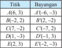

Tabel ini menunjukkan hubungan antara titik dan bayangan mereka di bidang grafik. Topik utama tabel adalah hubungan antara titik dalam ruang bidang dan bayangan mereka di bidang grafik. Kolom pertama berisi titik-titik dalam ruang bidang, sedangkan kolom kedua berisi bayangan mereka di bidang grafik. Data penting yang terlihat adalah bahwa setiap titik memiliki satu dan hanya satu bayangan di bidang grafik, menunjukkan bahwa setiap titik dalam ruang bidang memiliki satu dan hanya satu bayangan di bidang grafik. Ini menunjukkan bahwa hubungan antara titik dan bayangan di bidang grafik adalah satu-satu.

### Ayo menalar

- Pandu	siswa	memanfaatkan	titik-titik	koordinat	objek	dan	bayangannya pada Tabel 4.2 untuk menemukan matriks pencerminan terhadap cermin titik O (0, 0).
- Demonstrasikan	 kembali	 kepada	 siswa	 proses	 menemukan	 matriks pencerminan terhadap titik O (0,  0)  seperti  pada  buku  siswa.  Ingatkan siswa kembali tentang materi perkalian dan kesamaan dua matriks.
- Guru	 dan	 siswa	 bersama-sama	 membangun	 konsep	 pencerminan	 terhadap titik O (0, 0).
Titik A ( x , y )  dicerminkan  terhadap  titik O (0,  0)  menghasilkan bayangan A ′( x ′, y ′),	ditulis	dengan:

``

### Ayo mencoba

- Demonstrasikan	 penyelesaian	 Contoh	 4.3	 dan	 Contoh	 4.4	 dengan meng  gunakan  matriks  pencerminan  terhadap  titik O (0,  0)  yang  telah ditemukan.

 

---
## 📄 Halaman 106

- Minta	siswa	menggambar	pencerminan	tersebut	pada	bidang	koordinat kartesius.
- Berikut	adalah	alternatif	penyelesaian	Latihan	4.2	sesuai	buku	siswa.
- Untuk	memperdalam	pemahaman	siswa	tentang	pencerminan	terhadap titik O (0, 0), minta siswa mengerjakan Latihan 4.2 berdasarkan langkahlangkah yang telah disediakan.

### Ayo menalar

### Latihan 4.2

Titik A (2,  -3)  ditranslasikan  dengan T (-4,  -5)  kemudian dicerminkan terhadap titik O . Tentukan bayangan titik A tersebut.

Alternatif Penyelesaian:

``

``

``

Jadi, koordinat bayangan titik A adalah A "(2, 8).

### 4.2.2 Pencerminan terhadap Sumbu x

### Ayo Mengamati

- Arahkan	siswa	memperhatikan	koordinat	objek	dan	bayangannya	oleh pencerminan terhadap sumbu x, kemudian siswa  melengkapi Tabel 4.3.
- Minta	 siswa	 membaca	 dan	 memahami	 Gambar	 4.6.	 Pandu	 siswa memahami	pencerminan	terhadap	sumbu	x	melalui	Gambar	4.6.
- Tabel	4.3	telah	terisi	sebagai	berikut.
Tabel 4.3: Koordinat Pencerminan Titik terhadap Sumbu x

---
**📊 Tabel**

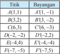

Tabel ini menunjukkan hubungan antara titik dan bayangan mereka di bidang grafik. Topik utama tabel adalah hubungan antara titik dalam ruang bidang dan bayangan mereka di bidang grafik. Kolom pertama berisi titik-titik dalam ruang bidang, sedangkan kolom kedua berisi bayangan mereka di bidang grafik. Data penting yang terlihat adalah bahwa setiap titik memiliki bayangan yang berbeda, dan beberapa titik memiliki bayangan yang sama. Misalnya, titik A memiliki bayangan A', B memiliki bayangan B', dan C memiliki bayangan C'. Ini menunjukkan bahwa hubungan antara titik dan bayangan mereka tidak selalu satu-satu.

 

---
## 📄 Halaman 107

### Ayo Menalar

- Pandu	siswa	memanfaatkan	titik	koordinat	objek	dan	bayangannya	pada Tabel  4.3  untuk  menemukan  matriks  pencerminan  terhadap  sumbu x . Minta  siswa  mendemonstrasikan  kembali  proses  menemukan  matriks pencerminan terhadap cermin sumbu x tersebut.
- Guru	dengan	siswa	bersama-sama	membangun	konsep	pencerminan terhadap sumbu x.
Titik A ( x , y ) dicerminkan terhadap sumbu x menghasilkan bayangan A ′( x ′, y ′),	ditulis	dengan:

``

### Ayo Menalar

- Demonstrasikan	proses	penyelesaian	Contoh	4.5	dan	Contoh	4.6 dengan menggunakan konsep yang telah ditemukan.
- Ingatkan	siswa	kembali	konsep	persamaan	garis	dan	sketsanya.
- Minta	siswa	menggambar	pencerminan	tersebut	pada	bidang	koordinat kartesius.

### Ayo Mengomunikasikan

- Untuk	memperdalam	pemahaman	siswa	tentang	pencerminan	terhadap sumbu x, minta siswa mengerjakan Latihan 4.3 berdasarkan langkahlangkah yang disediakan.
- Berikut	adalah	alternatif	penyelesaian	Latihan	4.3	sesuai	buku	siswa.
- Perintahkan	siswa	menyajikan	jawabannya	di	depan	kelas.
Ayo Menalar

Latihan 4.3

Titik A (-2,  -5)  dicerminkan  terhadap  titik O (0,  0)  kemudian  dilanjutkan dengan pencerminan terhadap sumbu x . Tentukan bayangan titik A tersebut.

Alternatif Penyelesaian

``

 

---
## 📄 Halaman 108

Langkah	2	(Proses	Releksi	terhadap	sumbu x )

``

Jadi, bayangan titik A adalah A "(2, -5).

4.2.3 Pencerminan terhadap Sumbu y

### Ayo Mengamati

- Minta	siswa	membaca	dan	memahami	Gambar	4.7	dan	memandu	siswa memahami pencerminan terhadap sumbu y melalui	Gambar	4.7.
- Arahkan	siswa	memperhatikan	koordinat	objek	dan	bayangannya	oleh pencerminan terhadap sumbu y , kemudian siswa melengkapi Tabel 4.4.
- Tabel	4.4	telah	terisi	sebagai	berikut.
Tabel 4.4: Koordinat Pencerminan Titik terhadap Sumbu y

---
**📊 Tabel**

Tabel ini menunjukkan hubungan antara titik dan bayangan mereka di bawah persamaan refleksi yaitu y = -x + 5. Topik utama tabel ini adalah hubungan antara titik dan bayangannya di bawah persamaan tersebut. Kolom pertama berisi titik-titik yang akan di-refleksikan, sedangkan kolom kedua berisi bayangan dari titik-titik tersebut. Data penting yang terlihat adalah bahwa setiap titik memiliki bayangannya yang berada di sisi lain dari garis refleksi yaitu y = -x + 5. Misalnya, titik A(-10,-5) memiliki bayangan B(8,-3), dan titik C(-6,1) memiliki bayangan D(4,-1). Ini menunjukkan bahwa titik-titik di sebelah kiri garis refleksi akan memiliki bayangan di sebelah kanan, dan sebaliknya.

### Ayo Menalar

- Pandu	 siswa	 memanfaatkan	 koordinat	 objek	 dan	 bayangannya	 pada Tabel 4.4 untuk menemukan matriks pencerminan terhadap sumbu y .
- Berikut	proses	menemukan	matriks	pencerminan	terhadap	sumbu y.
- Berdasarkan	pemahaman	siswa	dalam	menemukan	matriks	pencerminan terhadap titik O (0, 0) dan sumbu x maka minta siswa mendemonstrasikan proses  menemukan  matriks  pencerminan  terhadap  sumbu y dengan panduan pada buku siswa.

### Menemukan Matriks Pencerminan terhadap Sumbu y

Berdasarkan  pengamatan  pada  tabel,  secara  umum  jika  titik A ( x,  y) dicerminkan terhadap sumbu y akan mempunyai koordinat bayangan A′ ( -x, y ), bukan? Mari kita tentukan matriks pencerminan terhadap sumbu y .

Misalkan matriks transformasinya adalah   sehingga:

``

 

---
## 📄 Halaman 109

``

``

- Guru	dan	siswa	bersama-sama	membangun	konsep	pencerminan terhadap sumbu y.
















+

+

=

























Dengan demikian, matriks pencerminan terhadap sumbu y adalah         -1 0 0 1

Titik A ( x, y ) dicerminkan terhadap sumbu y menghasilkan bayangan A′ ( x′, y′ ), ditulis dengan,

``

### Ayo Mencoba

- Demonstrasikan	penyelesaian	Contoh	4.7	dan	Contoh	4.8	dengan	menggunakan konsep yang telah ditemukan.
- Ingatkan	siswa	konsep	persamaan	garis	dan	sketsanya.
- Minta	siswa	menggambar	pencerminan	tersebut	pada	bidang	koordinat kartesius.
- Untuk	memperdalam	pemahaman	siswa	tentang	pencerminan	terhadap sumbu y , minta siswa mengerjakan Latihan 4.4.

### Ayo Mengomunikasikan

- Perintahkan	siswa	menyajikan	hasil	kerjanya	di	depan	kelas.
- Berikut	adalah	alternatif	penyelesaian	Latihan	4.4	sesuai	buku	siswa.

### Ayo Menalar

### Latihan 4.4

Garis	2 x -y + 5 = 0 dicerminkan terhadap titik O (0, 0), kemudian dilanjutkan dengan pencerminan terhadap sumbu y . Tentukan persamaan bayangan garis tersebut.

 

---
## 📄 Halaman 110

### Alternatif Penyelesaian

Misalkan titik A ( x , y ) terletak pada garis tersebut, sehingga:

``

Langkah 1 (Proses pencerminan terhadap titik O (0,0))

``

``

sehingga:

``

Langkah 4 (Proses menentukan persamaan bayangan)

``

Tentukan x dan y dalam bentuk x′′ dan y′′

Langkah 5 (Proses menentukan persamaan bayangan)

Substitusi x dan y ke 2 x -y + 5 = 0 sehingga diperoleh persamaan bayangan.

``

4.2.4 Pencerminan terhadap Garis y = x

### Ayo Mengamati

- Minta	siswa	membaca	dan	memahami	Gambar	4.8.	Pandu	siswa memahami pencerminan terhadap sumbu y = x melalui	Gambar	4.8 .
- Tabel	4.5	telah	terisi	sebagai	berikut!
- Minta	siswa	memperhatikan	koordinat	objek	dan	bayangannya	oleh pencerminan terhadap garis y = x pada	Gambar	4.8,	kemudian	minta siswa melengkapi Tabel 4.5.
Tabel	4.5:	Koordinat	Pencerminan	Titik	terhadap	Garis y = x

---
**📊 Tabel**

Tabel ini menunjukkan hubungan antara titik dan bayangan titik di bidang koordinat. Topik utama tabel ini adalah hubungan antara titik dan bayangan titiknya sendiri. Kolom pertama berisi titik-titik yang diberikan, sedangkan kolom kedua berisi bayangan titik tersebut. Data penting yang terlihat adalah bahwa setiap titik memiliki bayangan yang sama dengan titik aslinya, yang menunjukkan bahwa titik dan bayangannya saling bertukar tempat. Ini menunjukkan bahwa titik dan bayangannya adalah dua objek yang saling bertukar tempat dalam bidang koordinat.

 

---
## 📄 Halaman 111

### Ayo Menalar

- Pandu	siswa	memanfaatkan	titik	koordinat	objek	dan	bayangannya	pada Tabel 4.5 untuk menemukan matriks pencerminan terhadap garis y = x .
- Perintahkan	 siswa	 mendemonstrasikan	 kembali	 proses	 menemukan matriks pencerminan terhadap garis y = x dengan cara yang sama pada konsep-konsep	pencerminan	di	atas.	Guru	dengan	siswa	bersama-sama membangun konsep pencerminan terhadap garis y = x .
Titik A ( x, y ) dicerminkan terhadap garis y = x menghasilkan bayangan A′ ( x′, y′ ), ditulis dengan:

``

### Ayo Mencoba

- Demonstrasikan	penyelesaian	Contoh	4.9	dan	Contoh	4.10	dengan menggunakan konsep yang telah ditemukan. Minta siswa menggambar pencerminan pada bidang koordinat kartesius.
- Ingatkan	siswa	konsep	persamaan	garis	dan	sketsanya.
- Untuk	memperdalam	pemahaman	siswa	tentang	pencerminan	terhadap garis y = x , minta siswa mengerjakan Latihan 4.5 berdasarkan langkahlangkah yang telah disediakan.
- Berikut	alternatif	penyelesaian	Latihan	4.5	sesuai	buku	siswa.
Ayo Menalar

Latihan 4.5

Titik A (-1, -3) dicerminkan terhadap titik O (0, 0) kemudian dilanjutkan dengan pencerminan terhadap sumbu y dan dilanjutkan lagi dengan pencerminan terhadap garis y = x . Tentukan bayangan titik A tersebut.

### Alternatif Penyelesaian

``

Langkah 1 (Proses pencerminan terhadap titik O (0, 0))

``

 

---
## 📄 Halaman 112

``

``

Jadi, bayangan titik A adalah A′′ (3,-1).

### 4.2.5 Pencerminan terhadap Garis y = -x

Ayo Mengamati

- Minta	siswa	membaca	dan	memahami	Gambar	4.9	dan	memandu	siswa memahami pencerminan terhadap sumbu y = -x melalui	Gambar	4.9.
- Tabel	4.6	telah	terisi	sebagai	berikut.
- Arahkan	siswa	untuk	memperhatikan	koordinat	objek	dan	bayangannya oleh pencerminan terhadap garis y = -x , kemudian minta siswa melengkapi Tabel 4.6.
Tabel	4.6:	Koordinat	Pencerminan	Titik	terhadap	Garis y = -x

---
**📊 Tabel**

Tabel ini menunjukkan hubungan antara titik dan bayangan titik tersebut di bidang koordinat kartesius. Topik utama tabel ini adalah hubungan antara titik dalam ruang dan bayangan mereka di bidang koordinat. Kolom pertama berisi titik-titik dalam ruang dimensi dua, sedangkan kolom kedua berisi bayangan titik-titik tersebut di bidang koordinat. Data penting yang terlihat dalam tabel ini adalah bahwa setiap titik di ruang memiliki satu dan hanya satu bayangan di bidang koordinat, menunjukkan bahwa bayangan adalah hasil transformasi persis dari titik asli ke bidang koordinat.

### Ayo Menalar

- Pandu	siswa	memanfaatkan	titik	koordinat	objek	dan	bayangannya	pada Tabel 4.6 untuk menemukan matriks pencerminan terhadap garis y = -x .
- Demonstrasikan	proses	menemukan	matriks	pencerminan	terhadap	garis y = -x .
- Minta	 siswa	 mendemonstrasikan	 kembali	 proses	 menemukan	 matriks pencerminan  terhadap  garis y  =  -x sesuai  dengan  langkah-langkah yang  telah  diberikan  atau  dengan  cara  yang  sama  pada  pencerminan sebelumnya.

 

---
## 📄 Halaman 113

### Ayo Menalar

### Menemukan Matriks Pencerminan terhadap Garis y = -x.

Berdasarkan  pengamatan  pada  tabel,  secara  umum,  jika  titik A ( x,  y )  dicerminkan  terhadap  garis y  =  -x akan  mempunyai  koordinat  bayangan A′ ( -y,-x ), bukan? Mari kita tentukan matriks pencerminan terhadap garis

``

### Ini berarti bahwa:

``

``

``

Dengan demikian, matriks pencerminan terhadap garis y = -x adalah

- Guru	 dan	 siswa	 bersama-sama	 membangun	 konsep	 pencerminan	 terhadap garis y = -x

``

Titik A ( x,y ) dicerminkan terhadap garis y = -x menghasilkan bayangan A′ ( x′,y′ ), ditulis dengan,

``

### Ayo Mencoba

- Demonstrasikan	 penyelesaian	 Contoh	 4.11	 dan	 Contoh	 4.12	 dengan menggunakan konsep yang telah ditemukan.
- Minta	siswa	menggambar	pencerminan	tersebut	pada	bidang	koordinat kartesius. Ingatkan siswa konsep persamaan garis dan sketsanya.

### 3. Kegiatan Penutup

- Minta	 siswa	 mengomunikasikan	 kembali	 konsep-konsep	 pada	 materi yang telah dipelajari.
- Siswa	dan	guru	bersama-sama	melakukan	releksi	dan	merangkumkan semua konsep dan sifat transformasi dari yang dipelajari.

``

]

 

---
## 📄 Halaman 114

- Berikan	penilaian	terhadap	proses	dan	hasil	karya	siswa	dengan menggunakan rubrik penilaian. Hasil kerja kelompok dikumpulkan oleh guru.
- Informasikan	materi	yang	akan	dipelajari	pada	pertemuan	berikutnya.
- Beri	tugas	kepada	siswa	sebagai	latihan	dirumah.	Guru	dapat memberikan	Uji	Kompetensi	4.1	atau	persoalan	lainnya	sesuai	dengan konsep yang dipelajari.

### 4.3 Menemukan Konsep Rotasi (Perputaran)

### Sebelum Pelaksanaan Kegiatan

- Bentuk  kelompok  kecil  siswa  (3-4  orang)  yang  heterogen.  Perhatikan karakteristik siswa dalam satu kelompok sehingga mendukung pembelajaran yang	eisien	dan	efektif.
- Informasikan tujuan pembelajaran dan tata cara penilaian selama proses pembelajaran.
- Siapkan semua fasilitas yang mendukung selama proses pembelajaran
- Siapkan RPP dan form penilaian.

### No. Deskripsi Kegiatan

### 1. Kegiatan Pendahuluan

- Salam	dari	guru	dan	doa	dipimpin	oleh	salah	satu	siswa.
- Apersepsi
- Motivasi siswa mempelajari konsep rotasi (perkalian).
- Ingatkan kembali siswa materi rotasi di tingkat SMP/MTs dan konsep matriks.
- Informasikan kepada siswa bahwa konsep rotasi (perkalian) ini dikaji dengan pendekatan koordinat dan hubungannya dengan konsep matriks.
- Informasikan tujuan pembelajaran dan cara penilaian.

### 2. Kegiatan Inti

### Pengantar

- Guru	memberikan	contoh-contoh	objek	yang	bergerak	berputar	di lingkungan sekitar (seperti kipas, kincir angin, roda, dan lain-lain). Siswa memberikan contoh-contoh lainnya.

 

---
## 📄 Halaman 115

- Motivasi	siswa	untuk	mempelajari	konsep	transformasi	ketiga	yaitu	rotasi dengan pendekatan koordinat dan kaitannya dengan konsep matriks.

### Masalah 4.4

### Ayo Mengamati

- Minta	siswa	memahami	Masalah	4.4	dan	memandu	siswa	mengamati dan menalar perputaran segitiga jika titik pusat pemutaran berada pada bidang segitiga, berada di salah satu titik sudut segitiga, dan berada di luar	segitiga	(lihat	Gambar	4.10).	Minta	siswa	memberi	komentar	dan arahkan ke sesi tanya-jawab.
- Pandu	siswa	bahwa	gerak	rotasi	objek	dipengaruhi	oleh	titik	pusat	rotasi. Minta	siswa	membandingkan	kembali	Gambar	4.10:	A,	B,	dan	C.
- Arahkan	pengamatan	siswa	fokus	pada	bentuk,	posisi,	dan	ukuran	objek sebelum dan sesudah rotasi.
- Guru	 dan	 siswa	 menemukan	 sifat	 rotasi	 berdasarkan	 pengamatan perputaran objek di lingkungan sekitar dan pada bidang kartesius seperti pada	Gambar	4.10	dan	Gambar	4.11.

### Sifat 4.3:

Bangun yang diputar (rotasi) tidak mengalami perubahan bentuk dan ukuran.

### Ayo Menalar

- Demonstrasikan	 proses	 menemukan	 matriks	 rotasi	 pada	 pusat O (0,  0) melalui	Gambar	4.12.	Ingatkan	siswa	konsep	trigonometri	serta	kesamaan matriks.
- Pandu	siswa	kembali	melakukan	percobaan	untuk	menemukan	konsep rotasi pada pusat P ( a , b )  dengan melakukan: (1) translasi titik dengan T (-a ,  -b )  sehingga  pusat  rotasi  menjadi O (0,  0).  Dengan  demikian, matriks rotasi dengan pusat O (0, 0) dapat digunakan, kemudian (2) hasil rotasi pada langkah (1) ditranslasi kembali dengan T ( a , b ).
- Guru	dan	siswa	bersama-sama	menyimpulkan	atau	membangun	konsep rotasi yang diputar dengan sudut dan pusat P ( p , q ).

 

---
## 📄 Halaman 116

Titik A ( x, y ) diputar dengan pusat P ( p, q ) dan sudut a menghasilkan bayangan A′ ( x′, y′ ), ditulis dengan:

### Ayo Mencoba

- Uji	pemahaman	siswa	kembali	dengan	mengajukan	Contoh	4.13	dan Contoh	4.14.	Minta	siswa	kembali	mendemonstrasikan	proses	dan menjelaskannya di depan kelas.
- Guru	memberikan	persoalan	lainnya	sesuai	konsep	yang	dipelajari untuk dikerjakan siswa secara berkelompok.

### 3. Kegiatan Penutup

- Siswa	dan	guru	bersama-sama	melakukan	releksi	dan	merangkumkan semua konsep dan sifat dari yang dipelajari.
- Minta	siswa	untuk	mengomunikasikan	konsep-konsep	materi	yang	telah diketahui setelah pembelajaran.
- Berikan	penilaian	terhadap	proses	dan	hasil	karya	siswa	dengan	menggunakan rubrik penilaian.
- Informasikan	materi	yang	akan	dipelajari	pada	pertemuan	berikutnya.
- Beri	tugas	kepada	siswa	sebagai	latihan	di	rumah.	Guru	dapat	memberikan Uji	Kompetensi	4.2	atau	persoalan	lainnya	sesuai	konsep	yang	dipelajari.

### 4.4  Menemukan Konsep Dilatasi (Perkalian)

Sebelum Pelaksanaan Kegiatan

- Bentuk  kelompok  kecil  siswa  (3-4  orang)  yang  heterogen.  Perhatikan karakteristik siswa dalam satu kelompok sehingga mendukung pembelajaran yang	eisien	dan	efektif.
- Informasikan tujuan pembelajaran dan tata cara penilaian selama proses pembelajaran.
- Siapkan semua fasilitas yang mendukung selama proses pembelajaran
- Siapkan RPP dan form penilaian.

``

 

---
## 📄 Halaman 117

### No. Deskripsi Kegiatan

### 1. Kegiatan Pendahuluan

- Salam	dari	guru	dan	doa	dipimpin	oleh	salah	satu	siswa.
- Apersepsi
- Motivasi siswa mempelajari konsep dilatasi (perkalian).
- Ingatkan kembali siswa materi dilatasi di tingkat SMP/MTs.
- Informasikan kepada siswa bahwa konsep dilatasi (perkalian) ini dikaji dengan pendekatan koordinat dan hubungannya dengan konsep matriks.
- Informasikan tujuan pembelajaran dan cara penilaian.

### 2. Kegiatan Inti

### Pengantar

- Pandu	 siswa	 memberikan	 contoh	 dilatasi	 atau	 perkalian	 yang	 terjadi dalam	kehidupan	sehari-hari.	Arahkan	siswa	memahami	perkalian	atau dilatasi dengan pendekatan koordinat.

### Masalah 4.5

### Ayo Mencoba

- Dengan	kelompok	berdiskusi,	siswa	diajak	mengamati,	tanya-jawab,	dan mengomunikasikan pendapatnya akan Masalah 4.5.
- Minta	 siswa	 memahami	 Masalah	 4.5	 dan	 mengamati	 Gambar	 4.13. Arahkan	siswa	fokus	mengamati	pada	jarak OA dengan OA 2 atau OB dengan OB 2 atau OC dengan OC 2.	Arahkan	siswa	kembali	mengamati jarak OA dengan OA 1 atau OB dengan OB 1 atau OC dengan OC 1.

### Ayo Mengomunikasikan

- Berikan	kesempatan	kepada	siswa	untuk	berdiskusi	dan	tunjuk	salah	satu kelompok	untuk	mengomunikasikan	pendapat	mereka	'apa	itu	dilatasi?' melalui	pengamatan	jarak	pada	Gambar	4.13.
- Minta	siswa	secara	berkelompok	membuat	contoh	lain	mengenai	dilatasi titik, garis dan bidang secara gambar. Kemudian menyajikannya di depan kelas.

### Ayo Menanya

- Tanya	siswa,	yang	manakah	pusat	dilatasi	dan	faktor	skala	dilatasi	pada Gambar	4.13?
- Arahkan	kembali	siswa	konsentrasi	pada	ukuran	objek	dengan	dilatasinya. Minta siswa memperhatikan ukuran, ukuran dilatasinya dengan faktor skala dilatasi.

 

---
## 📄 Halaman 118

- Minta	atau	tunjuk		seorang	siswa	untuk	menyampaikan	pendapatnya.

### Ayo Menalar

- Arahkan	bernalar	dan	memberikan	komentar	atau	pendapatnya	kembali akan gambar dengan dilatasi k , di mana k > 0, k = 0 dan k < 0.
- Dengan	kegiatan	pengamatan	pada	contoh-contoh	perkalian/dilatasi di lingkungan sekitar dan pengamatan dilatasi objek pada bidang koordinat maka arahkan siswa memahami Sifat 4.4.

### Sifat 4.4:

Bangun  yang  diperbesar  atau  diperkecil  (dilatasi)  dengan  skala k  dapat  mengubah  ukuran  atau  tetap  ukurannya  tetapi  tidak mengubah bentuk.

- Jika k = 1 maka bangun tidak mengalami perubahan ukuran dan letak.
- Jika k > 1 maka bangun akan diperbesar dan terletak searah terhadap pusat dilatasi dengan bangun semula.
- Jika	0< k < 1 maka bangun akan diperkecil dan terletak searah terhadap pusat dilatasi dengan bangun semula.
- Jika k = -1 maka bangun tidak akan mengalami perubahan ukuran, tetapi letaknya berlawanan arah terhadap pusat dilatasi dengan bangun semula.
- Jika	-1< k < 0 maka bangun akan diperkecil dan terletak berlawanan arah terhadap pusat dilatasi dengan bangun semula.
- Jika k < -1 maka bangun akan diperbesar dan terletak berlawanan arah terhadap pusat dilatasi dengan bangun semula.

### Ayo Mengamati

- Arahkan	kembali	siswa	mengamati	Gambar	4.14	dengan	konsentrasi pada	pusat	dilatasi	setiap	objek	(A,	B,	C,	D	dan	E)?
- Minta	siswa	mengamati	koordinat	objek	tersebut,	koordinat	hasil dilatasi, koordinat pusat dilatasi serta jarak objek ke pusat dilatasi dan jarak hasil dilatasi ke pusat dilatasi.
- Perintahkan	siswa	melengkapi	Tabel	4.7	dengan	melihat	panduan	pada sel yang telah terisi. Pandu siswa melengkapi sel.

 

---
## 📄 Halaman 119

- Tabel	4.7	telah	terisi	sebagai	berikut.

### Ayo Mencoba

---
**📊 Tabel**

Tabel ini menunjukkan hubungan antara pusat (P) dan objek (O) dalam beberapa kasus, dengan hasil (H) dan pola (P). Topik utama tabel adalah analisis geometri dan hubungan antara titik-titik dalam ruang bidang. Kolom pertama menunjukkan nomor pusat, kolom kedua menunjukkan koordinat pusat, kolom ketiga menunjukkan koordinat objek, kolom keempat menunjukkan hasil dari operasi matematika, dan kolom kelima menunjukkan pola yang muncul.

Data penting dalam tabel meliputi:
1. Pusat (P) berada di titik (0, 0), (2, 2), (9, 0), (-10, 1), dan (-8, -3).
2. Objek (O) berada di titik (2, 2), (-2, -2), (9, 2), (-8, -3), dan (-7, -3).
3. Hasil (H) diperoleh dari operasi matematika seperti penjumlahan, pengurangan, dan perkalian.
4. Pola (P) mencakup variasi dalam bentuk dan arah dari hasil operasi tersebut.

Tabel ini membantu dalam memahami bagaimana hubungan antara pusat dan objek serta bagaimana hasil operasi matematika dapat berbeda-beda tergantung pada posisi pusat dan objeknya.

### Ayo Mengamati

- Arahkan	dan	pandu	siswa	melihat	pola	perhitungan	pada	Tabel	4.7.	Lihat kolom 5.
- Berdasarkan	 pengamatan	 dan	 bentuk	 pola	 yang	 ditemukan,	 guru	 dan siswa menuliskan konsep dilatasi pada pusat P ( p,q ) dan skala k .
Titik A(x, y) didilatasi  dengan  pusat P(p, q) dan  skala k menghasilkan bayangan A′(x′, y′) , ditulis dengan,

### Ayo Menalar

- Uji	pemahaman	siswa	kembali	akan	konsep	dilatasi	dengan	mengajukan Contoh	4.15	dan	Contoh	4.16.	Minta	siswa	mendemonstrasikan	proses dan menunjukkan gambarnya.

``

 

---
## 📄 Halaman 120

### 3. Kegiatan Penutup

- Minta	 siswa	 mengomunikasikan	 kembali	 konsep-konsep	 materi	 yang telah diketahui setelah pembelajaran.
- Berikan	 penilaian terhadap proses dan	 hasil	 karya	 siswa	 dengan menggunakan rubrik penilaian. Hasil kerja kelompok dikumpulkan oleh guru.
- Siswa	dan	guru	bersama-sama	melakukan	releksi	dan	merangkumkan semua konsep dan sifat transformasi dari yang dipelajari.
- Beri	tugas	kepada	siswa	sebagai	latihan	di	rumah.
- Informasikan	materi	yang	akan	dipelajari	pada	pertemuan	berikutnya.

### 4.5  Komposisi Transformasi

### Sebelum Pelaksanaan Kegiatan

- Bentuk  kelompok  kecil  siswa  (3-4  orang)  yang  heterogen.  Perhatikan karakteristik siswa dalam satu kelompok sehingga mendukung pembelajaran yang	eisien	dan	efektif.
- Informasikan tujuan pembelajaran dan tata cara penilaian selama proses pembelajaran.
- Siapkan semua fasilitas yang mendukung selama proses pembelajaran
- Siapkan RPP dan form penilaian.

### No. Deskripsi Kegiatan

### 1. Kegiatan Pendahuluan

- Salam	dari	guru	dan	doa	dipimpin	oleh	salah	satu	siswa.
- Apersepsi
- Motivasi siswa mempelajari konsep komposisi transformasi meliputi	kompisisi	translasi,	komposisi	releksi,	komposisi	rotasi, dan komposisi dilatasi.
- Ingatkan	kembali	siswa	materi	transformasi	(translasi,	releksi, rotasi dan dilatasi) pada sub-bab sebelumnya dan konsep fungsi komposisi di kelas X.
- Informasikan kepada siswa bahwa konsep ini dikaji dengan pendekatan koordinat dan hubungannya dengan konsep matriks.
- Informasikan tujuan pembelajaran dan cara penilaian.

 

---
## 📄 Halaman 121

### 2. Kegiatan Inti

### Ayo Mengamati

- Guru	mengingatkan	kembali	konsep-konsep	transformasi	(translasi, releksi,	rotasi	dan	dilatasi)	secara	umum.
- Setelah	siswa	memahami	proses	bertahap,	guru	menerangkan komposisi translasi dengan menunjukkan keterkaitannya dengan komposisi fungsi secara umum.
- Guru	mendemonstrasikan	proses	penyelesaian	pada	Masalah	4.6 sehingga siswa memahami proses transformasi bertahap.
- Arahkan	siswa	memahami	Skema	4.1.
- Guru	menerangkan	proses	penyelesaian	Contoh	4.17	dan	menunjukkan keterkaitan konsep komposisi translasi.
- Motivasi	siswa	untuk	lebih	memahami	konsep	komposisi	translasi secara umum.
- Minta	siswa	menunjukkan	Contoh	4.17	dengan	gambar	pada	bidang koordinat kartesius.

### Ayo Mencoba dan Mengomunikasikan

- Guru	memberikan	contoh	komposisi	translasi	lainnya	untuk dikerjakan siswa secara mandiri atau berkelompok. Hasil kerja siswa dipresentasikan	di	depan	kelas.	Arahkan	siswa	untuk	bertanya-jawab.
- Guru	menjadi	fasilitator,	memantau	kebenaran	jawaban	dan	konsep serta memberikan penilaian.

### Masalah 4.7

### Ayo Mengamati

- Minta	siswa	memahami	Masalah	4.7	dan	memandu	siswa	mengamati dan menalar bentuk pencerminan yang diceritakan pada Masalah 4.7. Minta siswa memberi komentar dan arahkan ke sesi tanya-jawab.
- Pandu	siswa	memahami	konsep	komposisi	releksi	secara	umum. Informasikan bahwa konsep ini sama halnya dengan komposisi fungsi pada umumnya atau konsep komposisi translasi.
- Arahkan	siswa	memahami	perbedaan	komposisi	translasi	dengan komposisi	releksi.	Minta	siswa	memberikan	komentar	tentang perbedaan kedua komposisi transformasi.
- Arahkan	siswa	fokus	pada	proses	releksi	bertahap	sehingga	terbentuk komposisi	releksi.
- Guru	dan	siswa	bersama-sama	menemukan	konsep	komposisi	releksi. Minta siswa memberikan pendapat tentang Skema 4.2.

 

---
## 📄 Halaman 122

### Ayo Menalar, Mencoba dan Mengomunikasikan

- Minta	siswa	memahami	Contoh	4.17	kemudian	guru	memberikan	persoalan lainnya untuk dikerjakan siswa secara mandiri atau berkelompok.
- Pandu	siswa	memahami	konsep	komposisi	releksi	secara	umum.
- Siswa	mempresentasikan	hasil	kerjanya	di	depan	kelas.	Arahkan	siswa untuk	bertanya-jawab.	Guru	menjadi	fasilitator	dan	menjaga	keadaan kelas	tetap	terarah	pada	pembelajaran.	Guru	mengamati	kebenaran jawaban	dan	konsep.	Guru	melakukan	penilaian.

### Ayo Mengamati

- Berikan	 informasi	 kepada	 siswa	 kembali	 tentang	 translasi	 bertahap, releksi	bertahap,	dan	keterkaitannya	dengan	komposisinya.
- Berikan beberapa persoalan yang berkaitan dengan rotasi bertahap dan dilatasi bertahap sederhana dengan pusat rotasi atau pusat dilatasi yang sama.

### Ayo Mencoba dan mengomunikasikan

- Minta	siswa	mencoba	mengerjakan	persoalan	rotasi	bertahap	dan dilatasi bertahap serta mempresentasikan hasil kerjanya di depan kelas. Guru	memantau	kebenaran	jawaban.

### Ayo Mengamati

- Guru	memberikan	contoh	persoalan	lainnya	untuk	dikerjakan	siswa,
- Guru	mendemonstrasikan	proses	penyelesaian	Contoh	4.18,	dan	Contoh 4.19.
- Minta	siswa	kembali	mendemonstrasikan	proses	dan	menjelaskannya proses	penyelesaian	Contoh	4.20	dan	Contoh	4.21	di	depan	kelas.
- Guru	memberikan	persoalan	lainnya	sesuai	konsep	yang	dipelajari untuk dikerjakan siswa secara berkelompok.

### 3. Kegiatan Penutup

- Siswa	dan	guru	bersama-sama	melakukan	releksi	dan	merangkumkan semua konsep yang dipelajari.
- Minta	siswa	untuk	mengomunikasikan	konsep-konsep	materi	yang	telah diketahui setelah pembelajaran.
- Berikan	penilaian	terhadap	proses,	dan	hasil	karya	siswa	dengan	menggunakan rubrik penilaian.
- Beri	tugas	kepada	siswa	sebagai	latihan	di	rumah.	Guru	dapat	memberikan Uji	Kompetensi	4.3	atau	persoalan	lainnya	sesuai	konsep	yang	dipelajari.
- Beri	tugas	kepada	siswa	sebagai	latihan	di	rumah.
- Informasikan	materi	yang	akan	dipelajari	pada	pertemuan	berikutnya.

 

---
## 📄 Halaman 123

### F.    Penilaian

### Prosedur Penilaian:

---
**📊 Tabel**

Tabel ini menunjukkan berbagai aspek yang dianalisis dalam sebuah penilaian, dengan teknik penilaian yang digunakan untuk setiap aspek tersebut. Topik utama tabel adalah penilaian keterampilan sosial dan komunikasi. Kolom pertama berisi aspek-aspek yang dianalisis, seperti beramai-ramai, berpandangan, mendengarkan orang lain, bekerja sama, dan konsep. Kolom kedua berisi teknik penilaian yang digunakan, seperti pengamatan, kegiatan inti, dan tes tertulis. Kolom ketiga berisi waktu penilaian, yang dapat berupa kegiatan inti atau penutupan. Dari tabel ini, kita bisa melihat bahwa penilaian ini mencakup berbagai aspek keterampilan sosial dan komunikasi, dengan menggunakan berbagai teknik penilaian dan waktu penilaian yang berbeda-beda.

### 1 Instrumen Penilaian Sikap

(Sikap Kinerja dalam Menyelesaikan Tugas Kelompok)

---
**📊 Tabel**

Tabel ini menunjukkan evaluasi partisipan didik dalam berbagai aspek, seperti kerjasama, keaktifan, menghargai pendapat teman, dan tanggung jawab. Kolom-kolomnya mencakup nomor partisipan, nama partisipan, aspek-aspek yang diukur, jumlah partisipan yang memenuhi aspek tersebut, dan nilai akhir untuk setiap partisipan. Topik utama tabel ini adalah evaluasi partisipan didik dalam berbagai aspek keterampilan sosial dan kepribadian. Data penting yang terlihat adalah bahwa sebagian besar partisipan memiliki nilai yang baik dalam semua aspek, dengan beberapa partisipan mendapatkan nilai tertinggi.

### Keterangan Skor:

- 1 =  (belum terlihat), apabila peserta didik belum memperlihatkan tanda-tanda awal perilaku sikap yang dinyatakan dalam indikator.
- 2 =  (mulai terlihat), apabila peserta didik mulai memperlihatkan adanya tandatanda awal perilaku yang dinyatakan dalam indikator tetapi belum konsisten.
- 3 =  (mulai  berkembang),  apabila  peserta  didik  sudah  memperlihatkan  tanda perilaku yang dinyatakan dalam indikator dan mulai konsisten.
- 4 =  (membudaya), apabila peserta didik terus-menerus memperlihatkan perilaku yang dinyatakan dalam indikator secara konsisten.
Skor Maksimal = 16 Skor Maksimal

Nilai = Skor Perolehan × 100%

 

---
## 📄 Halaman 124

### 2. Instrumen Penilaian Pengetahuan

---
**📊 Tabel**

Tabel ini menunjukkan skor penilaian berdasarkan aspek-aspek penilaian dalam sebuah proses pembelajaran. Topik utama tabel adalah "Penyelesaian konsep transformasi" dan "Proses perhitungan". Kolom-kolomnya meliputi "Pemahaman terhadap konsep transformasi", "Kebenaran jawaban akhir soal", "Proses perhitungan", dan "Membuat sketsa". Data penting yang terlihat adalah bahwa skor tertinggi untuk "Pemahaman terhadap konsep transformasi" adalah 5, sementara skor tertinggi untuk "Proses perhitungan" adalah 5. Skor untuk "Kebenaran jawaban akhir soal" bervariasi antara 0 hingga 5, dengan skor tertinggi 5 untuk jawaban benar dan skor terendah 0 untuk tidak ada respons jawaban. Skor untuk "Membuat sketsa" juga bervariasi, dengan skor tertinggi 5 untuk sketsa objek dan bayangan oleh transformasi benar dan skor terendah 2 untuk sketsa objek dan bayangan oleh transformasi tidak benar.

Contoh	rubrik	penilaian	hasil	penyelesaian	soal	oleh	siswa.	Dengan mempertimbangkan langkah-langkah penyelesaian soal yang dilakukan oleh siswa terhadap soal-soal yang diajukan guru maka dapat disusun rubrik penilaiannya.	Alternatif	pedoman	penskorannya	sebagai	berikut.

 

---
## 📄 Halaman 125

---
**📊 Tabel**

Tabel ini menunjukkan skor penilaian berdasarkan aspek penilaian tertentu. Topik utama tabel adalah aspek penilaian tersebut, yang diukur melalui rubrik penilaian. Ada dua kolom utama: Rubrik Penilaian dan Skor. Rubrik Penilaian mencakup dua poin utama: "Tidak ada sketsa" dengan skor maksimal 20 dan "Skor minimal" dengan skor maksimal 0. Data penting yang terlihat adalah bahwa skor maksimal untuk setiap aspek penilaian adalah 20, sementara skor minimal adalah 0. Ini menunjukkan bahwa skor penilaian dapat bervariasi antara 0 hingga 20, dengan skor tertinggi 20 dan skor terendah 0.

### 3. Instrumen Penilaian Pengetahuan

(Penilaian kinerja dalam menyelesaikan tugas presentasi)

---
**📊 Tabel**

Tabel ini menunjukkan evaluasi pelatihan komunikasi untuk beberapa peserta didik. Topik utama adalah aspek-aspek yang dianalisis, termasuk komunikasi, sistematisasi penyampaian materi, penguasaan materi, keberanian, antusiasme, dan jumlah skor. Setiap baris mewakili satu peserta didik, dengan kolom-kolom berisi informasi tentang aspek-aspek tersebut. Data penting yang terlihat adalah bahwa semua peserta didik memiliki nilai antusiasme yang tinggi, sedangkan sistematisasi penyampaian materi dan penguasaan materi memiliki nilai yang lebih rendah.

SB = Sangat Baik    B = Baik     KB = Kurang Baik

### Keterangan Skor:

### Komunikasi:

- 1 =  Tidak dapat berkomunikasi
- 2 =  Komunikasi agak lancar, tetapi sulit dimengerti
- 3 =  Komunikasi lancar tetapi kurang jelas dimengerti
- 4 =  Komunikasi sangat lancar, benar, dan jelas

### Wawasan:

- 1 =  Tidak menunjukkan pengetahuan/materi
- 2 =  Sedikit memiliki pengetahuan/materi
- 3 =  Memiliki pengetahuan/materi tetapi kurang luas
- 4 =  Memiliki pengetahuan/materi yang luas

### Antusias:

- 1 =  Tidak antusias
- 2 =  Kurang antusias
- 4	=	 Antusias	dan	terkontrol
- 3	=	 Antusias	tetapi	kurang	kontrol

 

---
## 📄 Halaman 126

### Sistematika Penyampaian:

1 =  Tidak sistematis

2 =  Sistematis

3 =  Sistematis, uraian cukup

4 =  Sistematis, uraian luas, dan jelas

### Keberanian:

1 =  Tidak ada keberanian

2 =  Kurang berani

3 =  Berani

4 =  Sangat berani

``

### G.   Pengayaan

Bentuk  pembelajaran  pengayaan  adalah  pemberian  asesmen  portofolio tambahan  yang  memuat  asesmen  masalah  autentik,  proyek,  keterampilan proses, check  up diri,  dan  asesmen  kerja  sama  kelompok.  Sebelum  asesmen ini	 dikembangkan	 terlebih	 dahulu	 dilakukan	 identiikasi	 kemampuan	 belajar berdasarkan jenis serta tingkat kelebihan belajar peserta didik. Misalnya, belajar lebih  cepat,  menyimpan  informasi  lebih  mudah,  keingintahuan  lebih  tinggi, berpikir  mandiri,  superior  dan  berpikir  abstrak,  dan  memiliki  banyak  minat. Pembelajaran pengayaan dapat dilaksanakan melalui belajar kelompok, belajar mandiri, bimbingan khusus dari guru dan para ahli (mentor).

Materi pembahasan pada pembelajaran pengayaan bertumpu pada pengembangan  kompetensi  dasar  wajib  tertera  pada  Kurikulum  Matematika 2013, termasuk pengembangan kompetensi dasar peminatan. Materi pembahasan dituangkan  dalam  asesmen  masalah  autentik,  proyek,  keterampilan  proses, check up diri, dan asesmen kerja sama kelompok. Keterampilan yang dibangun melalui materi matematika yang dipelajari adalah kemampuan berpikir tingkat tinggi (berpikir kreatif dan kritis) serta kemampuan adaptif terhadap perubahan, penggunaan teknologi, dan membangun kerja sama antar siswa dan orang lain yang lebih memahami masalah yang diajukan dalam asesmen.

 

---
## 📄 Halaman 127

### H.   Remedial

Pembelajaran remedial membantu peserta didik yang mengalami kesulitan dalam belajar. Pembelajaran remedial adalah tindakan perbaikan pembelajaran bagi peserta didik yang belum mencapai kompetensi. Remedial bukan mengulang tes (ulangan harian) dengan materi yang sama, tetapi guru memberikan perbaikan pembelajaran pada KD yang belum dikuasai oleh peserta didik melalui upaya tertentu.

Bentuk  pembelajaran  remedial  tergantung  pada  jumlah  peserta  didik  yang mengalami kegagalan mencapai kompetensi dasar yang ditetapkan. Beberapa alternatif bentuk pelaksanaan pembelajaran remedial di sekolah.

- Jika jumlah peserta didik yang mengikuti remedial lebih dari 50%, maka tindakan  yang  dilakukan  adalah  pemberian  pembelajaran  ulang  dengan model  dan strategi pembelajaran yang lebih inovatif berbasis pada berbagai kesulitan belajar yang dialami peserta didik yang berdampak pada peningkatan kemampuan untuk mencapai kompetensi dasar tertentu.
- Jika  jumlah peserta didik yang mengikuti remedial lebih dari 20% tetapi kurang dari 50%, maka tindakan yang dilakukan adalah pemberian tugas terstruktur baik secara berkelompok dan tugas mandiri. Tugas yang diberikan berbasis pada berbagai kesulitan belajar yang dialami peserta didik yang berdampak  pada  peningkatan  kemampuan  untuk  mencapai  kompetensi dasar tertentu.
- Jika jumlah peserta didik yang mengikuti remedial maksimal 20%, maka tindakan  yang  dilakukan  adalah  pemberian  bimbingan  secara  khusus, misalnya bimbingan perorangan oleh guru dan tutor sebaya.

 

---
## 📄 Halaman 128

### I.    Rangkuman

Setelah kita membahas materi transformasi, kita membuat kesimpulan sebagai hasil pengamatan pada berbagai konsep dan aturan transformasi sebagai berikut:

- Transformasi	 yang	 dikaji	 terdiri	 dari	 translasi	 (pergeseran),	 releksi	 (pencerminan), rotasi (perputaran) dan dilatasi (perkalian).
- Matriks transformasi yang diperoleh adalah:

---
**📊 Tabel**

Tabel ini berisi informasi tentang berbagai transformasi geometri dalam bidang kartesius, termasuk translasi, refleksi, dan rotasi. Kolom pertama menunjukkan nomor urutan transformasi, sedangkan kolom kedua menyajikan matrik transformasi untuk setiap transformasi tersebut. Topik utama tabel ini adalah pemahaman dasar tentang bagaimana mengubah posisi dan orientasi titik-titik di bidang kartesius melalui transformasi geometri. Data penting yang terlihat antara lain bahwa setiap transformasi memiliki matrik transformasi spesifik yang dapat digunakan untuk menghasilkan hasil transformasi yang diinginkan.

 

---
## 📄 Halaman 129

### 3. Transformasi mempunai sifat-sifat sebagai berikut:

### Translasi

Bangun yang digeser (translasi) tidak mengalami perubahan bentuk dan ukuran.

### Releksi

Bangun	 yang	 dicerminkan	 (releksi)	 dengan	 cermin	 datar	 tidak	 mengalami perubahan  bentuk  dan  ukuran.  Jarak  bangun  dengan  cermin  (cermin  datar) adalah sama dengan jarak bayangan dengan cermin tersebut.

### Rotasi

Bangun yang diputar (rotasi) tidak mengalami perubahan bentuk dan ukuran.

### Dilatasi

Bangun yang diperbesar atau diperkecil (dilatasi) dengan skala k dapat mengubah ukuran atau tetap ukurannya tetapi tidak mengubah bentuk.

- Jika k > 1 maka bangun akan diperbesar dan terletak searah terhadap pusat dilatasi dengan bangun semula.
- Jika k = 1 maka bangun tidak mengalami perubahan ukuran dan letak.
- Jika	0	< k < 1 maka bangun akan diperkecil dan terletak searah terhadap pusat dilatasi dengan bangun semula.
- Jika	-1	< k < 0 maka bangun akan diperkecil dan terletak berlawanan arah terhadap pusat dilatasi dengan bangun semula.
- Jika k =  -1  maka  bangun  tidak  akan  mengalami  perubahan  bentuk  dan ukuran dan terletak berlawanan arah terhadap pusat dilatasi dengan bangun semula.
- Jika k <  -1  maka  bangun  akan  diperbesar  dan  terletak  berlawanan  arah terhadap pusat dilatasi dengan bangun semula.

 

---
## 📄 Halaman 130

Selanjutnya,  kita  akan  membahas  tentang  materi  barisan  dan  deret.  Materi prasyarat  yang  harus  kamu  kuasai  adalah  himpunan,  fungsi,  dan  operasi  hitung bilangan. Hal ini sangat berguna dalam penentuan fungsi dari barisan tersebut. Semua apa yang kamu sudah pelajari sangat berguna untuk melanjutkan bahasan berikutnya dan seluruh konsep dan aturan-aturan matematika dibangun dari situasi nyata dan diterapkan dalam pemecahan masalah kehidupan.

 

---
## 📄 Halaman 131

BAB 5

### Barisan

### A. Kompetensi Inti

---
**📊 Tabel**

Tabel ini berisi informasi tentang aspek-aspek penting dalam proses pembelajaran dan pengembangan keterampilan. Topik utamanya adalah "Sikap", "Pengetahuan", dan "Keterampilan". Dalam kolom "Sikap", terdapat beberapa poin yang membahas bagaimana menghargai dan mengamati perilaku orang lain, termasuk menghargai dan mengamati perilaku yang positif, proaktif, dan menunjukkan sikap sebagai bagian dari solusi atas berbagai masalah. Kolom "Pengetahuan" mencakup memahami, menerapkan, dan menganalisis pengetahuan faktual, konsep, dan prinsip teknologi, sosial, budaya, dan humaniora, serta memahami keseimbangan antara kebutuhan dan keinginan. Kolom "Keterampilan" mencakup mengidentifikasi, menyelesaikan, dan menerapkan metode sesuai dengan bakat dan minat untuk mencapai tujuan. Pola penting yang terlihat adalah bahwa setiap kolom memiliki beberapa poin yang membahas aspek-aspek yang berbeda dari proses pembelajaran dan pengembangan keterampilan.

 

---
## 📄 Halaman 132

### B. Kompetensi Dasar dan Indikator

Indikator  Pencapaian  Kompetensi  pada  kegiatan  pembelajaran    dapat dikembangkan oleh  guru    yang  disesuaikan  dari  kondisi  peserta  didik  dan lingkungan di tempat guru mengajar. Berikut ini dipaparkan contoh Indikator Pencapaian Kompetensi yang dapat dijabarkan dari KD pengetahuan  3.8 dan KD Keterampilan 4.8.

---
**📊 Tabel**

Tabel ini berisi informasi tentang kompetensi dasar dan indikator pencapaian kompetensi dalam matematika, khususnya pada subtopik Aritmetika dan Geometri. Topik utama tabel adalah pembelajaran tentang pola bilangan dan jumlah, serta penggunaan pola barisan aritmetika dan geometri untuk menyelesaikan masalah kontekstual. Kolom pertama menunjukkan nomor urutan, sedangkan kolom kedua berisi deskripsi kompetensi dasar. Indikator pencapaian kompetensi dijelaskan dalam kolom ketiga. Data penting yang terlihat antara lain bahwa kompetensi dasar 3.6.1 dan 3.6.2 berkaitan dengan menentukan pola bilangan dan jumlah pada barisan, sementara kompetensi dasar 4.6.1 dan 4.6.2 berkaitan dengan menggunakan pola barisan aritmetika dan geometri untuk menyelesaikan masalah kontekstual.

### C. Tujuan Pembelajaran

Pembelajaran materi barisan melalui  pengamatan, tanya jawab, penugasan individu dan kelompok, diskusi kelompok, dan penemuan ( dicovery )  diharapkan siswa dapat:

- Melatih sikap sosial berani bertanya, berpendapat, mau mendengar orang lain,  bekerja  sama dalam diskusi di kelompok sehingga terbiasa berani bertanya, berpendapat, mau mendengar orang lain, bekerja sama dalam aktivitas sehari-hari
- Menunjukkan ingin tahu selama mengikuti proses pembelajaran
- Bertanggung jawab terhadap kelompoknya dalam menyelesaikan tugasnya
- Menjelaskan pengertian barisan

 

---
## 📄 Halaman 133

- Menjelaskan dengan kata-kata dan menyatakan masalah dalam sehari-hari yang berkaitan dengan barisan
- Menunjukkan pola barisan
- Menyajikan  model  matematika  berdasarkan  masalah  nyata  berkaitan dengan barisan

 

---
## 📄 Halaman 134

### D. Diagram Alir

---
**🖼️ Gambar/Diagram**

> **Deskripsi Visual:** Gambar ini adalah diagram yang menunjukkan struktur dan hubungan antara berbagai konsep matematika, terutama berkaitan dengan barisan bilangan. Diagram ini dimulai dari fungsi dan materi prasyarat, kemudian menuju ke masalah autentik. Masalah autentik kemudian dibagi menjadi dua bagian utama: barisan bilangan aritmetika dan barisan bilangan geometri.

Untuk barisan aritmetika, elemen-elemen utamanya termasuk suku awal (U), beda (n), dan deret aritmetika. Deret aritmetika melibatkan jumlah n suku pertama. Untuk barisan geometri, elemen-elemen utamanya termasuk suku awal (U), rasio (r), dan deret geometri. Deret geometri juga melibatkan jumlah n suku pertama.

Teks, angka, atau label penting yang terlihat dalam diagram ini mencakup nama-nama konsep seperti fungsi, materi prasyarat, masalah autentik, barisan bilangan aritmetika, barisan bilangan geometri, suku awal, beda, deret aritmetika, deret geometri, dan jumlah suku pertama. Informasi kunci yang dapat diambil pembaca meliputi struktur dan hubungan antara konsep-konsep matematika tersebut, serta cara mengidentifikasi dan menghitung suku-suku dalam barisan aritmetika dan geometri.

 

---
## 📄 Halaman 135

### E. Proses Pembelajaran

### 5.1, 5.2  Membangun Konsep Barisan dan Barisan Aritmatika

- Sebelum Pelaksanaan Kegiatan 1. Siswa diharapkan sudah membawa perlengkapan alat-alat tulis untuk pembelajaran.
- Sediakan tabel-tabel  yang  diperlukan  bagi  siswa  untuk  mengisikan hasil kerjanya pada tiap kegiatan yang dilaksanakan.
- Bentuklah kelompok kecil siswa yang memungkinkan belajar secara efektif	dan	eisien.

### No. Deskripsi Kegiatan

- Kegiatan Pendahuluan · Pembelajaran dimulai dengan salam dan doa · Apersepsi
- Para siswa diperkenalkan dengan informasi berbagai bentuk baik susunan benda dan susunan angka.
- Informasikan kepada siswa bahwa informasi seperti, susunan barang,  susunan  angka  dapat  dibentuk    menjadi  beberapa susunan angka yang sederhana.
- Berilah kesempatan kepada siswa untuk memikirkan  bentuk susunan angka yang dibentuk.
- Kemudian ajaklah siswa untuk memahami salah satu bentuk yang  dapat  dibuat  seperti  yang  telah  diuraikan  pada  buku siswa.
- Berdasarkan masalah dan kegiatan  yang diberikan pada buku siswa,  instruksikan  siswa  agar  mampu  menemukan  konsep barisan.
- Berilah  penilaian  kepada  siswa  yang  sedang  melakukan aktivitas membuat susunan barisan.

 

---
## 📄 Halaman 136

### 2. Kegiatan Inti

- Pengantar Pembelajaran · T umbuhkan motivasi internal dalam diri siswa melalui menunjukkan manfaat mempelajari barisan dalam kehidupan siswa
- Himbaulah siswa untuk melakukan kegiatan yang ada pada buku siswa
- Ajaklah  siswa  untuk  memperhatikan  dan  memahami  masalah pada buku siswa
- Himbaulah  siswa  untuk  memerhatikan  masalah  yang  ada  juga disekitar sesuai dengan konsep barisan  yang akan ditemukan
- Mengamati · Arahkan siswa menemukan konsep barisan dari berbagai situasi nyata yang dekat dengan kehidupan siswa.
- Guru  memberikan  kesempatan  pada  siswa  untuk  mengamati masalah serta contoh  yang ada pada buku antara lain:
- Masalah 5.1 · Beberapa kelereng dikelompokkan dan disusun sehingga setiap kelompok tersusun dalam bentuk persegi sebagai berikut:

---
**🖼️ Gambar/Diagram**

> **Deskripsi Visual:** Gambar 5.1: Susunan Kelereng

Gambar ini menunjukkan susunan kelereng dalam bentuk diagram, yang menggambarkan proses pengurangan kelereng dalam setiap kelompok dan diperoleh barisan: 1, 4, 9, 16, 25. Setiap kelompok kelereng tersebut diberi label \( K_1 \) hingga \( K_5 \), masing-masing dengan jumlah kelereng yang berbeda. Jumlah kelereng dalam setiap kelompok bertambah seiring dengan penambahan barisannya, menunjukkan pola pengurangan yang terjadi. Ini adalah ilustrasi yang membantu memahami konsep pengurangan dan pola numerik.

 

---
## 📄 Halaman 137

- Permasalahan · Dapatkah kamu  temukan  bilangan berikutnya pada barisan tersebut? Dapatkah kamu temukan pola barisan tersebut? Tentukan banyak kelereng pada kelompok ke-15?.

### Contoh5.1

Perhatikan barisan huruf berikut:

### ABBCCCDDDDABBCCCDDDDABBCCCDDDD . . . .

Amatilah barisan  huruf  tersebut  terlebih  dahulu!  Tentukanlah  huruf pada urutan 2 5 × 3 3 !

### Contoh 5.2

Sebuah barisan bilangan asli dituliskan sebagai berikut: 12345678910 11121314151617181920212223242526 . . . sehingga suku ke-10 = 1, suku ke-11 = 0, suku ke-12 = 1 dan seterusnya. Dapatkah kamu temukan angka yang menempati suku ke-2004?

### Contoh 5.4

Suatu barisan dengan pola s n = 2 n 3 - 3 n 2 . Tentukan pola barisan tersebut kemudian tentukanlah suku ke-10.

### Masalah 5.2

Perhatikan  gambar  tumpukan  jeruk  di samping ini! Bagaimana cara menentukan atau menduga banyak jeruk dalam satu tumpukan?

- Guru  memberikan  kesempatan  siswa  untuk  mengikuti  instruksi pada kegiatan. Gambar 5.3: Tumpukan Buah Jeruk
- Berilah  kesempatan kepada siswa untuk mendiskusikan tentang hubungan  antara  data  terhadap  konsep  barisan  yang  diperoleh untuk membangun persepsi awal.
- Menanya · Siswa diupayakan untuk bertanya tentang hubungan susunan benda ataupun angka terhadap konsep barisan dan barisan aritmatika ·
- Guru memastikan kelompok dapat bekerja sama dalam merumuskan  konsep  yang  akan  dicapai  dengan  melemparkan  ataupun merangsang siswa untuk bertanya.

 

---
## 📄 Halaman 138

- Menalar · Guru  memberikan  kesempatan  siswa  untuk  merancang  model barisan dan barisan aritmetika dari setiap  permasalahan yang ada
- Ajaklah siswa untuk mendiskusikan permasalahan yang terdapat pada  setiap  buku  siswa  sehingga  diperoleh  keterkaitan  masalah yang membentuk asumsi awal terhadap konsep barisan dan barisan aritmetika.
- Mengomunikasikan · Mintalah siswa untuk berbagi hasil karyanya ke teman sebangkunya, dan pastikan temannya yang menerima hasil karya tersebut memahami apa yang harus dilakukan.
- Guru  memastikan  siswa  dapat  menjelaskan  pola  barisan  dan barisan aritmetika secara iteratif.
- Guru  memberikan  kesempatan  siswa  untuk  dapat  menyatakan sendiri  konsep  barisan  dengan  bahasa  dan  penyampaiannya sendiri.
- Guru memastikan siswa dapat memahami pola barisan dan  barisan aritmatika secara rekursif.
- Kegiatan Penutup · Periksalah apakah semua kelompok sudah mengumpulkan tugastugasnya dan apakah identitas kelompok sudah jelas
- Guru	 sebaiknya	 hanya	 mengkonirmasi	 akan	 kebenaran	 konsep barisan yang diperoleh siswa.
- Berikan penilaian terhadap proses dan hasil karya siswa dengan menggunakan rubrik penilaian

### Penilaian

### 1. Prosedur Penilaian

---
**📊 Tabel**

Tabel ini menunjukkan berbagai aspek yang dianalisis dalam sebuah penilaian, termasuk teknik penilaian yang digunakan untuk setiap aspek tersebut, waktu penilaian, dan topik utama penilaian. Topik utama adalah penilaian berdasarkan berbagai aspek seperti berani bertanya, berpandangan, mau mendengar orang lain, bekerja sama, dan pemahaman konsep. Teknik penilaian meliputi pengamatan, tes tertulis, dan kegiatan inti. Waktu penilaian juga ditentukan, dengan beberapa aspek dianalisis secara intensif (kegiatan inti) dan beberapa secara umum (kegiatan inti). Pola penting yang terlihat adalah bahwa penilaian berfokus pada aspek-aspek kognitif dan interaktif, dengan pengamatan sebagai teknik utama untuk beberapa aspek dan tes tertulis untuk pemahaman konsep.

 

---
## 📄 Halaman 139

### 2. Instrumen Pengamatan Sikap

### Rasa ingin tahu

- Kurang  baik jika sama  sekali tidak berusaha  untuk  mencoba atau  bertanya  atau  acuh  tak  acuh  (tidak  mau  tau)  dalam  proses pembelajaran
- Baik jika menunjukkan sudah ada usaha untuk mencoba atau bertanya dalam proses pembelajaran tetapi masih belum konsisten
- Sangat  baik  jika  menunjukkan  adanya  usaha  untuk  mencoba  atau bertanya dalam proses pembelajaran secara kontinu dan konsisten

### Indikator perkembangan sikap tanggung jawab (dalam kelompok)

- Kurang baik jika menunjukkan sama sekali tidak ambil bagian dalam melaksanakan tugas kelompok.
- Baik  jika  menunjukkan  sudah  ada  usaha  ambil  bagian  dalam melaksanakan tugas kelompok tetapi belum konsisten.
- Sangat baik jika menunjukkan sudah ambil bagian dalam menyelesaikan tugas kelompok secara kontinu dan konsisten.
Bubuhkan tanda  pada kolom-kolom sesuai hasil pengamatan.

---
**📊 Tabel**

Tabel ini berisi informasi tentang rasa ingin tahu dan tanggung jawab siswa di kelas SB, B, dan KB. Kolom "No." menunjukkan nomor urut siswa, "Nama" untuk nama siswa, "Rasa Ingin Tahu" untuk tingkat rasa ingin tahu mereka, dan "Tanggung Jawab" untuk tingkat tanggung jawab mereka. Data penting yang terlihat adalah bahwa banyak siswa memiliki rasa ingin tahu yang tinggi di semua kelas, namun tingkat tanggung jawab mereka bervariasi. Siswa di kelas SB memiliki tingkat tanggung jawab yang lebih tinggi dibandingkan dengan kelas B dan KB. Ini menunjukkan bahwa pembelajaran yang lebih aktif dan interaktif mungkin mempengaruhi tingkat tanggung jawab siswa.

SB  =  Sangat Baik

B =  Baik

KB  =  Kurang Baik

 

---
## 📄 Halaman 140

### 3. Instrumen penilaian 1:

### Petunjuk:

- Kerjakan  soal  berikut  secara  individu,  dilarang  bekerja  sama  dan dilarang menyontek.
- Selesaikanlah soal-soal berikut ini:

### Soal:

- Bila  a,  b,  c  merupakan  suku  berurutan  yang  membentuk  barisan aritmetika,  buktikan  bahwa  ketiga  suku  berurutan  berikut  ini  juga membentuk barisan aritmetika 1 1 1 , , bc ca ab
- Tentukan banyak bilangan asli yang kurang dari 999 yang tidak habis dibagi 3 atau 5 adalah . . . .
- Diketahui barisan yang dibentuk oleh semua bilangan asli 1 2 3 4 5 6 7 8 9 10 11 12 13 14 15 16 17 18 19 20 21 22 23 24 25 26 . . . Angka  berapakah  yang  terletak  pada  bilangan  ke  2004?  (bilangan ke-12 adalah angka 1 dan bilangan ke-15 adalah angka 2).
- Pola  ABBCCCDDDDABBCCCDDDDABBCCCDDDD . . . berulang sampai tak hingga. Huruf apakah yang menempati urutan 2 6 3 4 ?
- Diketahui barisan yang dibentuk oleh semua bilangan asli 1 2 3 4 5 6 7 8 9 10 11 12 13 14 15 16 17 18 19 20 21 22 23 24 25 26 . . . . Angka berapakah yang terletak pada bilangan ke 2013? (bilangan ke12 adalah angka 1 dan bilangan ke-15 adalah angka 2).

### Pedoman Penilaian

---
**📊 Tabel**

Tabel ini menunjukkan skor penilaian untuk tiga aspek penilaian dalam sebuah ujian: keterampilan menghitung, pemahaman konsep, dan keterampilan dan ketelitian menghitung. Topik utama tabel adalah proses penilaian yang dilakukan dalam ujian tersebut. Kolom-kolomnya mencakup skor maksimal masing-masing aspek penilaian, yaitu 20 untuk semua aspek. Data penting yang terlihat adalah bahwa setiap aspek penilaian memiliki skor maksimal yang sama, yaitu 20, dan skor yang diberikan berdasarkan keterampilan dan ketelitian jawaban. Skor tertinggi yang dapat diperoleh adalah 20, sementara skor terendah adalah 0. Ini menunjukkan bahwa skor penilaian sangat bergantung pada kualitas jawaban yang diberikan oleh siswa.

 

---
## 📄 Halaman 141

---
**📊 Tabel**

Tabel ini menunjukkan skor penilaian untuk dua aspek penilaian: keterampilan dan ketelitian menghitung, serta pemahaman konsep. Topik utama tabel adalah proses penilaian yang dilakukan pada dua aspek tersebut. Kolom pertama berisi nomor soal, sedangkan kolom kedua berisi aspek penilaian. Rubrik penilaian diberikan di kolom ketiga, dengan skor tertentu untuk setiap jawaban. Skor maksimal untuk setiap aspek adalah 20, dan skor minimal adalah 0. Skor maksimal total untuk semua soal adalah 100. Pola penting yang terlihat adalah bahwa skor maksimal untuk setiap aspek adalah 20, dan skor minimal adalah 0, dengan skor maksimal total sebesar 100.

### 5.3 Menemukan Konsep Barisan Geometri

Sebelum Pelaksanaan Kegiatan

- Pastikan siswa sudah paham dengan konsep dan pola barisan.
- Berikan motivasi pada siswa akan pentingnya belajar barisan geometri.
- Pilih  dan  rancang  masalah  sederhana  untuk  membelajarkan  barisan geometri.

### No. Deskripsi Kegiatan

- Kegiatan Pendahuluan · Apersepsi
- Memberi motivasi pentingnya materi ini.
- Memberi informasi tentang kompetensi yang akan dicapai.

### 2. Kegiatan Inti

### Pengantar

Sebelum melakukan kegiatan inti sebaiknya guru:

- Mengingatkan  kembali  tentang  pengertian  barisan  dan  pola barisan.
- Ajak siswa untuk mengamati dan mendiskusikan beberapa contoh dan masalah yang diberikan.

 

---
## 📄 Halaman 142

### Mengamati

- Arahkan	 siswa	 siswa	 mengamati	 setiap	 contoh-contoh	 yang berkaitan dengan barisan geometri

### Contoh 5.6

Perhatikan barisan bilangan 2, 4, 8, 16, . . .

---
**🖼️ Gambar/Diagram**

> **Deskripsi Visual:** Gambar ini adalah ilustrasi yang menunjukkan struktur komponen sistem dengan hubungan antar komponen. Ilustrasi ini menggambarkan dua jenis komponen utama: komponen yang memiliki ukuran 2x2 dan komponen yang memiliki ukuran 8x8. Komponen 2x2 memiliki tiga anak komponen yang lebih kecil, sedangkan komponen 8x8 memiliki empat anak komponen yang lebih kecil. Setiap anak komponen memiliki ukuran 2x2. Ini menunjukkan hubungan hierarkis di mana setiap komponen besar memiliki beberapa anak komponen kecil. Teks, angka, atau label penting yang terlihat pada gambar adalah ukuran komponen dan jumlah anak komponen untuk setiap komponen. Informasi kunci yang dapat diambil pembaca adalah bahwa sistem ini terdiri dari berbagai ukuran komponen yang saling terkait melalui anak komponen.

Nilai perbandingan u u u u u u -= = = = 3 2 1 2 1 . . . 2 n n .  Jika  nilai  perbandingan dua suku berurutan dimisalkan r dan nilai suku pertama adalah a, maka susunan bilangan tersebut dapat dinyatakan dengan 2, 2 × 2, … Perhatikan gambar berikut ini!

---
**🖼️ Gambar/Diagram**

> **Deskripsi Visual:** Gambar ini adalah ilustrasi yang menunjukkan proses perkalian matematika dengan penggunaan simbol-simbol seperti U₁, U₂, U₃, dan sebagainya. Ilustrasi ini menggambarkan langkah-langkah perkalian yang dilakukan pada bilangan bulat positif, dimulai dari 2 hingga 2^i, di mana i adalah bilangan bulat positif. Setiap langkah perkalian tersebut diperlakukan dengan faktor r, yang kemudian dikalikan dengan hasil perkalian sebelumnya untuk mencapai hasil akhir. Proses ini berlanjut hingga U₄ = ar^4, yang merupakan hasil akhir dari perkalian tersebut. Dalam ilustrasi ini, elemen-elemen utama adalah langkah-langkah perkalian, faktor r, dan hasil akhir perkalian. Relasi antara elemen-elemen ini adalah bahwa setiap langkah perkalian mempengaruhi hasil akhir perkalian melalui faktor r. Teks, angka, atau label penting yang terlihat dalam ilustrasi ini adalah U₁, U₂, U₃, U₄, r, dan hasil akhir perkalian. Informasi kunci yang dapat diambil pembaca adalah bahwa proses perkalian ini menggunakan faktor r dan langkah-langkah perkalian untuk mencapai hasil akhir perkalian.

dari pola di atas dapat disimpulkan bahwa u n = ar n - 1

- Berilah	kesempatan	kepada	siswa	untuk	mendisikusikan	penyelesai	 an sederhana dari model barisan geometri tersebut.

 

---
## 📄 Halaman 143

### Menanya

- Guru	 memastikan	 kelompok	 dapat	 bekerja	 sama	 dalam	 merumuskan konsep yang akan dicapai dengan melemparkan ataupun merangsang siswa untuk bertanya.
- Siswa	diupayakan	untuk	bertanya	tentang	solusi	alternatif	yang dapat ditemukan

### Menalar

- Guru	 memberikan	 kesempatan	 siswa	 untuk	 merancang	 model barisan aritmatika dari setiap  permasalahan yang ada
- Ajaklah	siswa	untuk	mendiskusikan	permasalahan	yang	terdapat pada setiap buku siswa sehingga diperoleh penyelesaian barisan geometri

### Mengomunikasikan

- Guru	 memberikan	 kesempatan	 siswa	 untuk	 dapat	 menyatakan sendiri konsep barisan geometri dengan bahasa dan penyampaiannya sendiri.
- Mintalah	 siswa	 untuk	 berbagi	 hasil	 karyanya	 pada	 teman	 dan pastikan semua siswa memahami konsep dan penyelesaian barisan geometri.
- Guru	memastikan	siswa	dapat	memahami	pola	barisan	geometri secara iteratif.
- Guru	memastikan	siswa	menemukan	solusi	alternatif	dari	barisan geometri.
- Guru	memastikan	siswa	dapat	memahami	pola	barisan	geometri secara rekursif.

### 3. Kegiatan Penutup

- Berikan	penilaian	terhadap	proses	dan	hasil	karya	siswa	dengan menggunakan rubrik penilaian
- Mintalah	 siswa	 untuk	 melakukan	 releksi	 dan	 menuliskan	 hal penting dari yang dipelajarinya
- Jika	 dipandang	 perlu,	 berilah	 siswa	 latihan	 untuk	 dikerjakan	 di rumah

 

---
## 📄 Halaman 144

### Penilaian

### 1. Prosedur Penilaian

---
**📊 Tabel**

Tabel ini menunjukkan berbagai aspek yang diukur dalam proses belajar dan mengajar, termasuk teknik penilaian yang digunakan untuk setiap aspek tersebut. Topik utama tabel adalah aspek-aspek yang diukur dalam proses belajar dan mengajar, seperti berani bertanya, berpendapat, mau mendengarkan orang lain, bekerja sama, dan pemahaman konsep. Kolom-kolom yang ada dalam tabel meliputi aspek yang diukur, teknik penilaian, dan waktu penilaian. Data penting yang terlihat dalam tabel adalah bahwa semua aspek diukur menggunakan pengamatan, kegiatan Ayo Kita Mencoba dan Berbagi, dan tes tertulis. Waktu penilaian juga berbeda-beda untuk setiap aspek, dengan beberapa aspek diukur secara langsung (pengamatan) dan beberapa diukur melalui tes tertulis.

### 2. Instrumen Pengamatan Sikap:

### Rasa ingin tahu

- Kurang  baik jika sama  sekali tidak berusaha  untuk  mencoba atau  bertanya  atau  acuh  tak  acuh  (tidak  mau  tahu)  dalam  proses pembelajaran
- Baik jika menunjukkan sudah ada usaha untuk mencoba atau bertanya dalam proses pembelajaran tetapi masih belum konsisten
- Sangat  baik  jika  menunjukkan  adanya  usaha  untuk  mencoba  atau bertanya dalam proses pembelajaran secara kontinu dan konsisten

### Indikator perkembangan sikap tanggung jawab (dalam kelompok)

- Kurang baik jika menunjukkan sama sekali tidak ambil bagian dalam melaksanakan tugas kelompok.
- Baik  jika  menunjukkan  sudah  ada  usaha  ambil  bagian  dalam melaksanakan tugas kelompok tetapi belum konsisten.
- Sangat baik jika menunjukkan sudah ambil bagian dalam menyelesaikan tugas kelompok secara kontinu dan konsisten.

 

---
## 📄 Halaman 145

### Bubuhkan	tanda	√	pada	kolom-kolom	sesuai	hasil	pengamatan.

---
**📊 Tabel**

Tabel ini menunjukkan data tentang rasa ingin tahu dan tanggung jawab belajar (TJL) bagi 30 orang siswa. Kolom "No." menunjukkan nomor urut siswa, kolom "Nama" untuk nama individu, kolom "Rasa Ingin Tahu" berisi skor SB (Siswa Berpikir), B (Belajar), dan KB (Ketidakmampuan Belajar), sedangkan kolom "Tanggung Jawab" berisi skor SB, B, dan KB. Data penting yang terlihat adalah bahwa banyak siswa memiliki rasa ingin tahu yang rendah, baik itu karena mereka tidak bisa belajar atau karena mereka tidak mau belajar. Selain itu, banyak siswa juga memiliki tanggung jawab belajar yang rendah, yang mungkin disebabkan oleh ketidakmampuan mereka untuk belajar atau karena mereka tidak mau belajar. Ini menunjukkan bahwa ada potensi untuk meningkatkan motivasi belajar dan tanggung jawab belajar di antara siswa ini.

SB  =  Sangat Baik

B =  Baik

KB  =  Kurang Baik

### 3. InstrumenPenilaian:

### Petunjuk:

- Kerjakan  soal  berikut  secara  individu,  dilarang  bekerja  sama  dan dilarang menyontek.
- Selesaikanlah soal-soal berikut ini:

### Soal:

- Tentukan rumus suku ke-n dan suku ke-10 dari barisan bilangan di bawah ini!
- 1, 4, 16, 24, . . .
- 5, 10, 20, 40, …
- 9, 27, 81, 243, …
- 1 1 , 25 5 , 1, 5, …
- 81, 27, 9, 3, …
- Tentukan rasio dan suku pertama dari barisan geometri di bawah ini!
- Suku ke-4 = 8 dan suku ke-6 = 729
- Suku ke-2 = 6 dan suku ke-5 = 162
- U 3 = 10 dan U 6 = 1,25

 

---
## 📄 Halaman 146

- Selesaikan barisan geometri di bawah ini!
- Suku ke-4 = 27 dan suku ke-6 = 243, tentukan suku ke-8
- U 2 = 10 dan U 6 = 10, tentukan U 9
- U 2 =  2 2  dan U 5 = 8, tentukan U 10
- Tentukan hasil dari jumlah bilangan di bawah ini !
- 1 + 2 + 4  + 8 + 16 + … (sampai 10 suku)
- 54 + 18 + 6 + 2 + … (sampai 9 suku)
- 5 - 15 + 45 - 135 + … (sampai 8 suku)
- 1 + 1 + 3 + 2 + 9 + 4 + 27 + 8 + … (sampai 19 suku)

``

- Tiga  bilangan  membentuk  barisan  aritmetika.  Jika  suku  ketiga ditambah 3 dan suku kedua dikurangi 1, diperoleh barisan geometri. Jika suku ketiga barisan aritmetika ditambah 8, maka hasilnya menjadi 5 kali suku pertama. Tentukan beda dari barisan aritmetika tersebut!

### Pedoman Penilaian

---
**📊 Tabel**

Tabel ini menunjukkan skor penilaian untuk tiga soal yang berfokus pada keterampilan menghitung. Setiap soal memiliki rubrik penilaian yang sama, dengan skor maksimal 20. Soal pertama memeriksa keterampilan menghitung dengan jawaban benar mendapatkan 20 poin, jawaban salah mendapatkan 5 poin, dan tidak ada jawaban mendapatkan 0 poin. Soal kedua dan ketiga memiliki skor maksimal yang sama, yaitu 20 poin, tetapi dengan skor tertinggi yang berbeda. Pola penting yang terlihat adalah bahwa setiap soal memiliki skor maksimal yang sama, yaitu 20 poin, dan skor tertinggi yang berbeda antara soal-soal tersebut.

 

---
## 📄 Halaman 147

---
**📊 Tabel**

Tabel ini menunjukkan skor penilaian untuk dua soal dalam sebuah ujian atau tes. Topik utama tabel adalah keterampilan menghitung dan menguraikan. Kolom-kolomnya meliputi No. Soal, Aspek Penilaian, Rubrik Penilaian, Skor, dan Skor Maksimal. Data penting yang terlihat adalah bahwa skor maksimal untuk setiap aspek penilaian adalah 20, dan skor minimal adalah 0. Ini menunjukkan bahwa setiap soal memiliki skor maksimal yang sama dan tidak ada skor negatif.

### 5.4 Aplikasi Barisan

Sebelum Pelaksanaan Kegiatan

- Pastikan siswa sudah paham dengan konsep dan pola barisan.
- Berikan motivasi pada siswa akan pentingnya belajar barisan geometri.
- Pilih  dan  rancang  masalah  sederhana  untuk  membelajarkan  barisan geometri.

### No. Deskripsi Kegiatan

- Kegiatan Pendahuluan · Apersepsi
- Memberi motivasi pentingnya materi ini.
- Memberi informasi tentang kompetensi yang akan dicapai.

### 2. Kegiatan Inti

### Pengantar

Sebelum melakukan kegiatan inti sebaiknya guru:

- Mengingatkan kembali tentang pengertian barisan, barisan aritmetika dan geometri.
- Ajak siswa untuk mengamati dan mendiskusikan beberapa contoh dan masalah yang diberikan.

 

---
## 📄 Halaman 148

### Mengamati

- Guru	 memberikan	 kesempatan	 siswa	 untuk	 merancang	 model barisan dari setiap permasalahan yang berkaitan dengan barisan antara lain pertumbuhan, peluruhan, bunga majemuk, dan anuitas.
- Arahkan	siswa	siswa	mengamati	setiap	masalah	dan	contoh	yang berkaitan dengan barisan

### Masalah 5.6

- Seorang	peneliti	mengamati	perkembangan	koloni	bakteri	yang terbentuk  setiap  jam. Apabila  jumlah  koloni  bakteri  mula-mula 100 dan setiap bakteri membelah menjadi dua setiap jam. Peneliti ingin  mengetahui  jumlah  koloni  bakteri  yang  terbentuk  dalam waktu	 50	 jam	 dan	 buatlah	 graik	 dari	 model	 persamaan	 yang ditemukan!

### Contoh 5.9

- Penduduk	 suatu	 kota	 metropolitan	 tercatat	 3,25	 juta	 jiwa	 pada tahun 2008, diperkirakan menjadi 4,5 jiwa pada tahun 2013. Jika tahun 2008 dianggap tahun dasar, berapa persen pertumbuhannya? Berapa Jumlah penduduknya pada tahun 2015?

### Masalah 5.7

---
**🖼️ Gambar/Diagram**

> **Deskripsi Visual:** Gambar ini adalah ilustrasi yang menunjukkan proses evolusi sel darah merah (erythrocyte) dalam tubuh hewan. Gambar ini terdiri dari beberapa elemen utama:

1. **Apa yang Ditampilkan Secara Keseluruhan**: Gambar ini menunjukkan sejumlah sel darah merah yang berbeda dalam tahap evolusi mereka. Sel-sel ini dikelompokkan menjadi dua kelompok utama: sel-sel yang masih dalam proses pembentukan dan sel-sel yang sudah selesai berkembang.

2. **Elemen-Elemen Utama dan Relasinya**: 
   - **Kelompok Pertama**: Ini melibatkan sel-sel yang sedang berkembang. Mereka memiliki struktur yang lebih kompleks dibandingkan dengan sel-sel yang sudah selesai berkembang.
   - **Kelompok Kedua**: Ini melibatkan sel-sel yang sudah selesai berkembang dan siap untuk berfungsi. Mereka memiliki struktur yang lebih sederhana dan lebih mirip dengan sel-sel yang ada di tubuh saat ini.

3. **Teks, Angka, atau Label Penting yang Terlihat**: 
   - Ada beberapa teks yang menjelaskan tahap-tahap evolusi sel darah merah, seperti "Proses evolusi sel darah merah" dan "Sel-sel yang sudah selesai berkembang".
   - Ada angka yang menunjukkan tahap-tahap evolusi, mulai dari 1 sampai 5.

4. **Informasi Kunci yang Dapat Diambil Pembaca**: 
   - Gambar ini memberikan gambaran tentang bagaimana sel darah merah berkembang dari tahap awal hingga tahap akhir di tubuh hewan.
   - Pembaca dapat memahami bahwa sel-sel yang masih berkembang memiliki struktur yang lebih kompleks, sementara sel-sel yang sudah selesai berkembang memiliki struktur yang lebih sederhana dan mirip dengan sel-sel yang ada di tubuh saat ini.

Dengan demikian, gambar ini memberikan informasi yang penting tentang proses evolusi sel darah merah dalam tubuh hewan, membantu pembaca memahami bagaimana sel-sel ini berkemb

Suatu neutron dapat pecah mendadak menjadi suatu proton dan elektron dan ini terjadi sedemikian  sehingga  jika  kita memiliki 1.000.000 neutron, kira-kira 5 % dari padanya akan berubah  pada  akhir  satu  menit. Berapa neutron yang masih ada setelah n menit dan 10 menit?

 

---
## 📄 Halaman 149

### Masalah 5.8

Ovano menerima uang warisan sebesar Rp. 70.000.000,- dari orang tuanya dan berniat untuk menginvestasikan dalam bentuk tabungan di bank selama 5 tahun. Dia menjajaki dua bank yang memiliki sistim pembungaan yang berbeda. Bank BCL menggunakan bunga tunggal sebesar 10 % per tahun dan Bank PHP menggunakan majemuk sebesar 9%  per  tahun.  Dari  hasil  perhitungan  pihak  bank  ia  memperoleh ilustrasi investasi sebagai berikut:

---
**🖼️ Gambar/Diagram**

> **Deskripsi Visual:** Gambar ini adalah diagram yang menunjukkan perubahan saldo di dua bank, yaitu BCA dan PPI, selama beberapa periode waktu. Diagram ini terdiri dari tiga baris yang masing-masing menunjukkan periode waktu berbeda (0, 3, dan 6 bulan). Untuk setiap periode, ada dua garis vertikal yang menggambarkan saldo awal dan akhir. Garis pertama menunjukkan saldo di Bank BCA, sedangkan garis kedua menunjukkan saldo di Bank PPI.

Elemen-elemen utama yang terlihat dalam gambar ini adalah periode waktu, saldo awal dan akhir di kedua bank, serta perubahan saldo tersebut. Relasi antara elemen-elemen ini adalah bahwa setiap periode waktu memiliki dua nilai saldo yang berbeda, satu untuk Bank BCA dan satu untuk Bank PPI. 

Teks, angka, atau label penting yang terlihat dalam gambar ini meliputi nama-nama bank (BCA dan PPI), periode waktu (0, 3, dan 6 bulan), dan jumlah saldo yang ditunjukkan dalam rupiah. Informasi kunci yang dapat diambil pembaca meliputi perbedaan dalam jumlah saldo antara Bank BCA dan Bank PPI selama periode waktu tersebut, serta peningkatan atau penurunan saldo di kedua bank seiring dengan waktu.

Dari ilustrasi investasi di atas diperoleh kesimpulan bahwa walaupun Bank  PHP  menawarkan  bunga  majemuk  yang  lebih  kecil  daripada bunga  tunggal  Bank  BCL  namun  hasil  investasi  yang  dihasilkan adalah lebih besar.

- Berilah	 kesempatan	 kepada	 siswa	 untuk	 mendiskusikan	 penyelesaian sederhana dari model barisan tersebut

### Menanya

- Guru	memastikan	kelompok	dapat	bekerja	sama	dalam	merumuskan  konsep  yang  akan  dicapai  dengan  melemparkan  ataupun merangsang siswa untuk bertanya.
- Siswa	diupayakan	untuk	bertanya	tentang	solusi	alternatif	yang dapat ditemukan.

### Menalar

- Ajaklah	siswa	untuk	mendiskusikan	permasalahan	yang	terdapat pada setiap buku siswa sehingga diperoleh penyelesaian barisan yang berkaitan dengan pertumbuhan, peluruhan, bunga majemuk, dan anuitas.

 

---
## 📄 Halaman 150

### Mengomunikasikan

- Guru	memberikan	kesempatan	siswa	untuk	dapat	menyelesaikan masalah barisan yang berkaitan dengan pertumbuhan, peluruhan, bunga majemuk, dan anuitas.
- Mintalah	 siswa	 untuk	 berbagi	 hasil	 karyanya	 pada	 teman	 dan pastikan semua siswa memahami prosedur penyelesaian barisan
- Guru	memastikan	siswa	menemukan	solusi-solusi	alternatif	dari aplikasi barisan.

### 3. Kegiatan Penutup

- Berikan	penilaian	terhadap	proses	dan	hasil	karya	siswa	dengan menggunakan rubrik penilaian
- Mintalah	 siswa	 untuk	 melakukan	 releksi	 dan	 menuliskan	 hal penting dari yang dipelajarinya
- Jika	 dipandang	 perlu,	 berilah	 siswa	 Uji	 Kompetensi	 5.3	 untuk dikerjakan di rumah
- Doa	dan	salam

### Penilaian

### 1. Prosedur Penilaian

---
**📊 Tabel**

Tabel ini menunjukkan berbagai aspek yang perlu ditingkatkan dalam proses belajar mengajar, termasuk teknik penilaian yang digunakan untuk masing-masing aspek tersebut. Topik utama tabel adalah tentang bagaimana mengukur keterampilan berbicara, berpikir, mendengarkan, bekerja sama, dan memahami konsep. Kolom pertama menunjukkan aspek yang diuji, sementara kolom kedua menunjukkan teknik penilaian yang digunakan. Waktu penilaian juga disebutkan untuk setiap aspek. Pola penting yang terlihat adalah bahwa pengamatan adalah metode penilaian yang paling sering digunakan, baik untuk aspek berbicara, berpikir, mendengarkan, bekerja sama, maupun memahami konsep.

 

---
## 📄 Halaman 151

### 2. Instrumen Pengamatan Sikap:

### Rasa ingin tahu

- Kurang baik jika sama sekali tidak berusaha untuk mencoba atau bertanya atau acuh tak acuh (tidak mau tau) dalam proses pembelajaran
- Baik jika menunjukkan sudah ada usaha untuk mencoba atau bertanya dalam proses pembelajaran tetapi masih belum ajag/konsisten
- Sangat  baik  jika  menunjukkan  adanya  usaha  untuk  mencoba  atau bertanya dalam proses pembelajaran secara terus menerus dan ajeg/ konsisten

### Indikator perkembangan sikap tanggung jawab (dalam kelompok)

- Kurang baik jika menunjukkan sama sekali tidak ambil bagian dalam melaksanakan tugas kelompok.
- Baik  jika  menunjukkan  sudah  ada  usaha  ambil  bagian  dalam melaksanakan tugas kelompok tetapi belum ajeg/konsesten.
- Sangat  baik  jika  menunjukkan  sudah  ambil  bagian  dalam  menyelesaikan tugas kelompok secara kontinu dan konsisten.

---
**📊 Tabel**

Tabel ini berisi informasi tentang rasa ingin tahu dan tanggung jawab siswa di kelas SB, B, dan KB. Kolom "No." menunjukkan nomor urut siswa, "Nama" menyatakan nama siswa, "Rasa Ingin Tahu" menunjukkan tingkat rasa ingin tahu siswa di masing-masing kelas, dan "Tanggung Jawab" menunjukkan tingkat tanggung jawab siswa di masing-masing kelas. Dari tabel ini, dapat dilihat bahwa rasa ingin tahu dan tanggung jawab siswa di kelas SB lebih tinggi dibandingkan dengan kelas B dan KB. Selain itu, banyak siswa di kelas SB memiliki rasa ingin tahu dan tanggung jawab yang sama tinggi.

### Bubuhkan tanda  pada kolom-kolom sesuai hasil pengamatan.

SB  =  Sangat Baik

B =  Baik

KB  =  Kurang Baik

 

---
## 📄 Halaman 152

### 3. Instrumen Penilaian:

### Petunjuk:

- Kerjakan  soal  berikut  secara  individu,  tidak  boleh  menyontek  dan tidak boleh bekerja sama.
- Jawablah pertanyaan/perintah di bawahnya.

### Soal:

- Pertumbuhan penduduk biasanya dinyatakan dalam persen. Misalnya,  pertumbuhan  penduduk  adalah  2%  per  tahun  artinya jumlah penduduk bertambah sebesar 2% dari jumlah penduduk tahun sebelumnya. Pertambahan penduduk menjadi dua kali setiap 10 tahun. Jumlah penduduk desa pada awalnya 500 orang, berapakah jumlah penduduknya setelah 70 tahun apabila pertumbuhannya 2,5%?
- Kultur  jaringan  terhadap  1.500  bakteri  yang  diuji  di  laboratorium menunjukkan bahwa satu bakteri dapat membelah diri dalam waktu 2 jam.
- Tentukan apakah ini termasuk masalah pertumbuhan atau peluruhan, berikan alasanmu?
- Tentukan banyak bakteri setelah 20 jam.
- Tentukan banyak bakteri setelah n jam.
- Pada awal bekerja Amat mempunyai gaji Rp. 200 ribu per bulan. Tiap tahun gaji Amat naik sebesar Rp. 15 ribu per bulan.  Berapa gaji Amat setelah dia bekerja selama 7 tahun?
- Seseorang  menabung  Rp800.000  pada  tahun  pertama,  tiap  tahun tabungannya ditambah dengan Rp15.000 lebih banyak daripada tahun sebelumnya.  Berapakah  jumlah  simpanannya  pada  akhir  tahun  ke 10?
- Sebuah  mobil  seharga  Rp600.000.000,00,-  mengalami  penyusutan harga  setiap  tahun  membentuk  barisan  geometri  dengan  rasionya adalah 1 3 . Hitunglah harga mobil pada tahun ke- 5?

 

---
## 📄 Halaman 153

### Pedoman Penilaian

---
**📊 Tabel**

Tabel ini menunjukkan skor penilaian untuk aspek-aspek penilaian dalam sebuah ujian atau tes. Topik utama tabel adalah keterampilan menghitung dan menguraikan. Kolom-kolomnya meliputi No. Soal, Aspek Penilaian, Rubrik Penilaian, Skor, dan Skor Maksimal. Data penting yang terlihat adalah bahwa skor maksimal untuk setiap aspek penilaian adalah 20 poin, dengan skor minimal 0 poin. Selain itu, ada beberapa pola dalam skor, seperti skor tertinggi adalah 20 poin dan skor terendah adalah 0 poin.

### F. Pengayaan

Pengayaan merupakan kegiatan yang diberikan kepada siswa yang memiliki aselerasi  pencapaian  KD  yang  cepat  (nilai  maksimal)  agar  potensinya berkembang  optimal  dengan  memanfaatkan  sisa  waktu  yang  dimilikinya. Guru sebaiknya merancang kegiatan pembelajaran lanjut yang terkait dengan barisan pada siswa.

 

---
## 📄 Halaman 154

### G. Remedial

Remedial  merupakan  perbaikan  proses  pembelajaran  yang  bertujuan pada  pencapaian  kompetensi  dasar  siswa.  Guru  memberikan  perbaikan pembelajaran baik pada model, metode serta strategi pembelajaran. Jika guru melakukan pembelajaran dengan pola yang sama tidaklah maksimal sehingga disarankan guru memilih tindakan pembelajaran yang tepat sehingga siswa mampu memenuhi KD yang diharapkan.

Perlu  dipahami  oleh  guru,  bahwa  remedial  bukan  mengulang  tes (ulangan harian) dengan materi yang sama, tetapi guru memberikan perbaikan pembelajaran pada KD yang belum dikuasai oleh peserta didik melalui upaya tertentu. Setelah perbaikan pembelajaran dilakukan, guru melakukan tes untuk mengetahui apakah peserta didik telah memenuhi kompetensi minimal dari KD yang diremedialkan.

### H. Rangkuman

Beberapa hal penting sebagai kesimpulan dari hasil pembahasan materi barisan, disajikan sebagai berikut.

- Barisan  bilangan  adalah  sebuah  fungsi  dengan  domainnya  himpunan bilangan asli dan rangenya suatu himpunan bagian dari himpunan bilangan real.
- Barisan aritmetika adalah barisan bilangan yang memiliki selisih dua suku berurutan selalu tetap. Selisih dua suku berurutan disebut beda.
- Barisan geometri adalah barisan bilangan yang memiliki hasil bagi dua suku berurutan adalah tetap. Hasil bagi dua suku berurutan disebut rasio.
Masih banyak jenis barisan yang akan kamu pelajari pada jenjang yang lebih tinggi, seperti barisan naik dan turun, barisan harmonik, barisan Fibonacci, dan lain sebagainya. Kamu dapat menggunakan sumber bacaan lain untuk lebih mendalami sifat-sifat barisan

 

---
## 📄 Halaman 155

BAB 6

### Limit Fungsi

### A.

### Kompetensi Inti

---
**📊 Tabel**

Tabel ini berisi informasi tentang empat aspek penting dalam pendidikan dan pembelajaran, yaitu sikap, pengetahuan, keterampilan, dan keterampilan. Topik utama tabel ini adalah bagaimana siswa dapat membangun sikap positif, memahami konsep ilmiah dan teknologi, mengembangkan keterampilan berpikir kritis, dan mampu menggunakan metode sosial untuk mengatasi masalah. Kolom-kolomnya mencakup sikap, pengetahuan, keterampilan, dan keterampilan. Data penting yang terlihat adalah bahwa siswa harus memiliki sikap yang positif dan terbuka, memahami konsep ilmiah dan teknologi, mengembangkan keterampilan berpikir kritis, dan mampu menggunakan metode sosial untuk mengatasi masalah.

 

---
## 📄 Halaman 156

### B. Kompetensi Dasar dan Indikator

Indikator pencapaian kompetensi pada  pembelajaran dapat dikembangkan guru sendiri berdasarkan kondisi peserta didik masing-masing di tempat guru mengajar.  Berikut  ini  dipaparkan  contoh  Indikator  Pencapaian  Kompetensi Pembelajaran yang dapat dijabarkan dari KD 3.7 dan KD 4.7.

---
**📊 Tabel**

Tabel ini berisi dua baris yang masing-masing menunjukkan kompetensi dasar dan indikator pencapaian kompetensi untuk dua topik pembelajaran. Topik utama pertama adalah menjelaskan limit fungsi aljabar dan polinom, sementara topik utama kedua adalah menyelesaikan masalah yang berkaitan dengan limit fungsi aljabar. Kolom pertama menunjukkan kompetensi dasar, sedangkan kolom kedua menunjukkan indikator pencapaian kompetensi. Data penting yang terlihat adalah bahwa kompetensi dasar pertama melibatkan menjelaskan limit fungsi aljabar dan polinom, sementara kompetensi dasar kedua melibatkan menyelesaikan masalah yang berkaitan dengan limit fungsi aljabar. Indikator pencapaian kompetensi juga ditampilkan, seperti menjelaskan limit fungsi aljabar dan polinom secara intuitif dan sifat-sifatnya, serta menyelesaikan masalah yang berkaitan dengan limit fungsi aljabar menggunakan konsep limit.

 

---
## 📄 Halaman 157

### C. Tujuan Pembelajaran

Setelah mempelajari konsep limit fungsi melalui pengamatan, menalar, tanya  jawab,  mencoba  menyelesaikan  persoalan,  penugasan  individu  dan kelompok,  diskusi  kelompok,  dan  mengomunikasikan  pendapatnya,  siswa mampu:

- Melatih siswa menumbuhkan sikap perilakujujur, disiplin, tanggung jawab, peduli (gotong royong, kerja sama, toleran, damai), santun, responsif dan pro-aktif, berani bertanya, berpendapat, dan menghargai pendapat orang lain dalam aktivitas sehari-hari.
- Menunjukkan rasa ingin tahu dalam memahami konsep dan menyelesaikan masalah.
- Menyebutkan contoh-contoh aplikasi limit fungsi dalam kehidupan seharihari
- Menunjukkan limit kiri dan limit kanan pada suatu fungsi dengan tabel dan gambar.
- Menunjukkan limit suatu fungsi secara intuitif berdasarkan gambar.
- Memberi contoh fungsi yang mempunyai bentuk tentu dan tak tentu pada titik tertentu.
- Menunjukkan bentuk tentu dan tak tentu suatu fungsi pada titik tertentu dan	menunjukkan	dalam	graik.
- Menemukan sifat-sifat  limit  suatu  fungsi  dan  mengomunikasikannya dengan kata-kata sendiri.
- Menggunakan sifat-sifat suatu fungsi dalam menemukan limit fungsi tersebut.
- Menemukan limit suatu fungsi aljabar  dengan  pendekatan  nilai  dan manipulasi aljabar.
- Menggunakan konsep limit dalam menyelesaikan masalah yang berkaitan dengan limit fungsi aljabar (polinom dan rasional).
- Menentukan limit suatu fungsi dengan menggunakan cara pendekatan nilai, memfaktorkan atau dengan pergantian fungsi.

 

---
## 📄 Halaman 158

### D. Diagram Alir

---
**🖼️ Gambar/Diagram**

> **Deskripsi Visual:** Gambar ini adalah diagram yang menunjukkan struktur dan hubungan antara fungsi aljabar, masalah autentik, domain, range, limit fungsi aljabar, dan sifat limit fungsi aljabar. Diagram ini membahas bagaimana fungsi aljabar berkaitan dengan masalah autentik, domain, range, dan limit fungsi aljabar. Fungsi aljabar merupakan elemen utama yang menghubungkan semua elemen lainnya dalam diagram ini. Domain dan range merupakan dua elemen yang terkait erat dengan fungsi aljabar, sedangkan limit fungsi aljabar dan sifat limit fungsi aljabar merupakan elemen yang lebih spesifik yang membahas tentang karakteristik limit fungsi aljabar. Teks, angka, atau label penting yang terlihat dalam diagram ini meliputi nama-nama elemen seperti fungsi aljabar, masalah autentik, domain, range, limit fungsi aljabar, dan sifat limit fungsi aljabar. Informasi kunci yang dapat diambil pembaca dari gambar ini adalah bahwa fungsi aljabar merupakan konsep dasar dalam matematika, dan memiliki hubungan dengan masalah autentik, domain, range, dan limit fungsi aljabar.

 

---
## 📄 Halaman 159

### E. Proses Pembelajaran

### 6.1 Konsep Limit Fungsi

- Sebelum Pelaksanaan Kegiatan · Bentuk kelompok kecil siswa (3-4 orang) yang heterogen. Perhatikan karakteristik siswa dalam satu kelompok sehingga mendukung pembelajaran	yang	eisien	dan	efektif.
- Siapkan semua fasilitas yang mendukung selama proses pem  belajaran. · Siapkan RPP dan form penilaian.
- Informasikan  tujuan  pembelajaran  dan  tata  cara  penilaian  selama proses pembelajaran. ·

### No. Deskripsi Kegiatan

- Kegiatan Pendahuluan · Salam dari guru dan Doa dipimpin oleh salah satu siswa. · Apersepsi
- -Ingatkan siswa konsep fungsi (daerah asal, daerah kawan, dan daerah hasil) dan komposisinya.
- -Perkenalkan  sekilas  materi  limit  fungsi  serta  aplikasinya dalam kehidupan sehari-hari.
- -Motivasi  siswa  untuk  semangat  mempelajari  materi  limit fungsi.
- -Informasikan tujuan pembelajaran dan tata cara penilaian.

### 2. Kegiatan Inti

### Ayo mengamati Gambar 6.1

- Informasikan  bahwa  bukan  ukuran  benda  yang  semakin  kecil tetapi  mata  yang  mempunyai  batas  melihat  benda-benda  yang jauh.
- Arahkan siswa melihat dan memberikan kesempatan mengamati gambar tersebut. Tanya  siswa,  apakah  jika  melihat  benda  yang bergerak semakin jauh maka ukuran objek seakan-akan semakin kecil? Minta siswa untuk memberikan komentar!

 

---
## 📄 Halaman 160

- Bantu siswa memahami hubungan Gambar 6.1 dengan Gambar 6.2.  Gambar  6.2  adalah  sketsa  sederhana  visual  bentuk  badan jalan  sesuai  dengan  Gambar  6.1  dengan  posisi  memandang  di tengah jalan, sehingga tampak lebar jalan seakan-akan menyempit dari  kiri  dan  kanan  badan  jalan. Tujuannya  adalah  memberikan ilustrasi pendekatan kiri dan kanan.

### 6.1.1 Menemukan Konsep Limit Fungsi

### Ayo Menalar Masalah 6.1

- Ajak siswa mencari bilangan bulat yang dekat ke 3. Ajak kembali siswa mencari bilangan real yang dekat ke 3. Pandu siswa memahami dan mencari jawaban dengan Gambar 6.3.
- Minta  siswa  untuk  memahami  Masalah  6.1  dalam  menemukan konsep limit. Beri kasus yang sama dengan pendekatan ke bilangan yang lain.
- Berdasarkan Gambar 6.3, misalkan bilangan real yang dekat ke 3 adalah 2,75 atau 3,25. jika interval 2,75 sampai 3,25 diperbesar sehingga diperoleh bahwa ada bilangan real lain yang lebih dekat ke 3, tetapi jika diperbesar kembali interval 2,99 sampai 3,01 maka akan lebih mudah melihat kembali bilangan yang dekat ke 3 dan seterusnya.
- Bantu  siswa  memahami  pemisalan x sebagai  bilangan-bilangan yang mendekati 3 sehingga tertulis x → 3.  Perkenalkan  simbol ' x → 3'. Perkenalkan pendekatan kiri dengan simbol ' x → 3 -', serta pendekatan kanan dengan simbol ' x → 3 + '.
- Bantu siswa memahami bahwa banyak bilangan real yang sangat dekat ke 3.
- Berikan contoh kasus yang sama sebagai pembanding agar siswa lebih mudah memahami.

### Ayo menalar

- Masalah 6.2 · Minta siswa untuk memahami Masalah 6.2 dan memahami Gambar 6.4.

 

---
## 📄 Halaman 161

- Informasikan maksud gambar bahwa andaikan gerak lintasan bola dan gerak lintasan atlet dimisalkan kurva. Bola dan tangan atlet sama-sama bergerak saling mendekati pada saat dan ketinggian tertentu. Berikan ide-ide secara bebas dan terbuka. Pandu siswa untuk	membangun	sebuah	konsep	limit	fungsi	dan	pendeinisian tentang limit fungsi.
- Jelaskan pergerakan bola menuju atlet dan pergerakan atlet menuju bola akan bertemu disuatu saat, misalkan di saat tertentu itu adalah x = c dan ketinggian di saat tertentu itu adalah y = L . Arahkan kembali ke Gambar 6.4 (b).

### 6.1.2 Pemahaman Intuitif Limit Fungsi

### Ayo Menalar Limit Fungsi untuk f(x) = x + 1 untuk x ∈ R .

- Pandu  siswa  memahami  limit  fungsi  secara  intuitif,  dengan memperkenalkan limit kiri dan limit kanan  dengan  memperlihatkannya pada gambar. Sepakati bahwa sebelah kiri suatu titik pada garis bilangan horizontal adalah kiri, dan arah sebaliknya adalah kanan.
- Ingatkan siswa konsep fungsi (daerah asal, daerah kawan, daerah hasil dan sketsanya di bidang koordinat kartesius).
- Pandu siswa  memahami limit  secara  intuitif  pada f(x)  =  x +  1 untuk x ∈ R berdasarkan Tabel 6.1 dan Gambar 6.5.
- Tunjukkan dan jelaskan pergerakan bilangan dari kiri dan kanan bilangan 2 di sumbu x akan mempengaruhi gerakan bilangan dari atas dan bawah bilangan 3 di sumbu y .
- Demonstrasikan  proses  pengisian  setiap  sel  pada  Tabel  6.1. Minta  siswa  mengamati  gerakan  bilangan  dari  kiri  dan  kanan bilangan 2.
- Ayo Menanya · Arahkan kelas ke sesi tanya-jawab. Guru memberi kesempatakan kepada siswa untuk bertanya, dan siswa lainnya memberi komentar sebelum  guru  memberi  tanggapan  dan  memberi  jawaban  atas pertanyaan siswa. Guru memperhatikan siswa yang belum berani memberi komentar dan mengarahkannya berkomunikasi.

 

---
## 📄 Halaman 162

- Dengan proses yang sama, perintahkan siswa berdiskusi, menalar
- 2 1 x -∈

### Ayo Menalar · limit fungsi untuk f(x) = 2 1 1 x x --untuk x ≠ 1, x ∈ R .

- Arahkan  siswa melakukan  pengamatan  pergerakan  bilangan dari kiri dan kanan angka 1 di sumbu x akan berpengaruh pada pergerakan bilangan dari atas dan bawah angka 2 di sumbu y .
- Dengan panduan yang sama untuk f(x) = 1 x -untuk x R , x ≠ 1, minta siswa mengamati Gambar 6.6 dan Tabel 6.2. Arahkan siswa foku smengamati nilai pendekatan ke 2 di sumbu x dan pendekatan ke 3 di sumbu y pada Tabel 6.2.
- Minta siswa mencari nilai f(1) ? Minta siswa mengamati hubungan Tabel 6.2 dan Gambar 6.6.
- Ayo Mengomunikasikan · Sesuai  dengan  hasil  diskusi  kelompok,  minta  siswa  menyaji pendapat  atau  memberi  komentar  mereka  akan  limit  fungsi

``

### Ayo menalar

``

- Jelaskan bentuk fungsi f(x) = x 2 jika x ≤ 1 x + 1 jika x > 1 123 untuk x ∈ R
- Tunjukkan  dan  jelaskan  gerakan  bilangan  dari  kiri  dan  kanan bilangan 1 di sumbu x akan berpengaruh pada gerakan bilangan dari atas dan bawah f (1) di sumbu y . Minta siswa mencari nilai f (1)? Arahkan siswa memberi komentar tentang nilai f (1).
- Demonstrasikan  proses  pengisian  setiap  sel  pada  Tabel  6.3. Arahkan siswa mengamati pergerakan bilangan dari kiri dan kanan bilangan 1 pada sumbu x dan pergerakan hasil f (1) pada sumbu y .

 

---
## 📄 Halaman 163

- Perkuat  pemahaman  siswa  tentang  limit  kiri  dan  limit  kanan dengan menggunakan Gambar 6.7.
- Berikan  kesempatan  kepada  siswa  untuk  menjelaskan  dengan kata-kata  sendiri  tentang  limit  kiri  dan  limit  kanan  berdasarkan pemahaman pada contoh-contoh di atas. · Guru	dan	siswa	bersama-sama	membangun	Deinisi	6.1
- Bantu siswa memahami bahwa fungsi tersebut tidak mempunyai limit di x = 1. Kenapa? Perkenalkan bentuk tentu dan tak tentu suatu limit pada titik tertentu. Guru memberikan contoh-contoh fungsi yang dimaksud.
Deinisi 6.1 Misalkan f sebuah fungsi f : R → R dan misalkan L dan c anggota himpunan  bilangan  real.  lim ( ) x c f x → = L jika  dan  hanya  jika f(x) mendekati L untuk semua x mendekati c .

- Latihan 6.1 · Koordinir  siswa  untuk  berdiskusi  mengerjakan  Latihan  6.1  dan menjelaskan di depan kelas serta mengumpulkan hasil diskusi.
- Ayo Menalar · Arahkan siswa untuk membentuk kelompok diskusi (3-4 orang). Perintahkan	siswa	menghubungkan	deinisi	limit	dengan	Gambar 6.8 dan Gambar 6.9.
- Setelah salah satu kelompok menyajikan hasil kerja kelompoknya, arahkan  siswa  ke  sesi  tanya-jawab.  Dengan  demikian,  siswa mempunyai kesempatan untuk memberikan komentar dan saling menanggapi. Guru harus memberikan kesimpulan akhir. · Berikut adalah alternatif penyelesaian Latihan 6.1.

### Berdasarkan Gambar 6.8 maka:

 

---
## 📄 Halaman 164

### Berdasarkan Gambar 6.9 maka:

---
**📊 Tabel**

Tabel ini membandingkan limiter dari fungsi f(x) di berbagai kondisi, melibatkan limiter dari fungsi f(x) saat x mendekati nilai-nilai tertentu. Topik utama tabel adalah analisis limit fungsi. Kolom-kolomnya mencakup limiter dari fungsi f(x) saat x mendekati nilai-nilai tertentu, yaitu -x, +x, dan tak ada limit. Data penting yang terlihat adalah bahwa limiter dari fungsi f(x) saat x mendekati -x dan +x adalah ada limit, sedangkan saat x tidak ada limit, limiter tidak ada limit. Ini menunjukkan bahwa limiter fungsi f(x) dapat berbeda-beda tergantung pada nilai-nilai x yang diberikan.

- Ayo Menalar · Minta siswa membaca Contoh 6.1 dan membantu siswa memahami Contoh  6.1  melalui  sketsa  pada  Gambar  6.10.  Ingatkan  siswa bentuk umum fungsi kuadrat, fungsi linier dan fungsi konstan.
- Bantu siswa memahami  Tabel 6.4 dan Tabel 6.5 dengan keterkaitannya pada Gambar 6.11.
- Tunjukkan  pada  siswa  model  fungsi  lintasan  lebah  dan  sketsa lintasannya pada Gambar 6.11.
- Demonstrasikan proses perhitungan limit kiri dan limit kanan pada Tabel 6.4 danTabel 6.5serta menunjukkan keterkaitannya dengan Gambar 6.11.
- Ayo Mengkomunikasikan · Minta siswa memberi komentar akan pendekatan f(t) pada saat t mendekati 1 dari kiri-kanan, dan pada saat t mendekati 2 dari kirikanan sesuai dengan pemahaman mereka akan limit kiri dan limit kanan pada Contoh 6.1 tersebut.
- Kegiatan Penutup · Minta  siswa  mengomunikasikan  kembali  konsep-konsep  materi yang telah diketahui setelah pembelajaran.
- Siswa	dan	guru	bersama-sama	melakukan	releks	idan	merang	 kumkan semua konsep dan sifat transformasi dari yang dipelajari.

 

---
## 📄 Halaman 165

- Berikan penilaian terhadap proses dan hasil karya siswa dengan menggunakan rubrik penilaian. Hasil kerja kelompok dikumpulkan oleh guru. · Beri tugas kepada siswa sebagai latihan di rumah. · Informasikan materi yang akan dipelajari pada pertemuan berikutnya.

### 6.2 Sifat-Sifat Limit Fungsi

### Sebelum Pelaksanaan Kegiatan

- 3.6.1  Bentuk kelompok kecil siswa (3-4 orang) yang heterogen. Perhatikan karakteristik  siswa  dalam  satu  kelompok  sehingga  mendukung pembelajaran	yang	eisien	dan	efektif.
- 3.6.2  Informasikan  tujuan  pembelajaran  dan  tata  cara  penilaian  selama proses pembelajaran.
- 3.6.3  Siapkan  semua  fasilitas  yang  mendukung  selama  proses  pembelajaran

### No. Deskripsi Kegiatan

- Kegiatan Pendahuluan · Salam dari guru dan doa dipimpin oleh salah satu siswa. · Apersepsi
- -Ingatkan	siswa	akan	limit	kiri	dan	limit	kanan	serta	deinisi limit fungsi yang telah dipelajari sebelumnya.
- -Informasikan  kepada  siswa,  materi  yang  akan  dipelajari adalah sifat-sifat limit fungsi.

### 2. Kegiatan Inti

- Ayo menalar · Ingatkan  siswa  materi  sebelumnya.  Berdasarkan  Gambar  6.1, Masalah 6.1, Masalah 6.2, pemahaman limit fungsi secara intuitif serta	Deinisi	6.1,	Arahkan	siswa	untuk	membangun	Sifat	6.1.
- Perkenalkan kepada siswa simbol penulisan limit kiri lim ( ) x c f x → -dan limit kanan lim ( ) x c f x → +

 

---
## 📄 Halaman 166

- Ayo Menalar · Demonstrasikan Contoh 6.2 dan mengamati Tabel 6.6. Dengan menggunakan konsep limit, arahkan siswa membangun Sifat 6.2.

### Sifat 6.1 Misalkan f sebuah fungsi f : R → R dan L , c bilangan real. lim ( ) x c f x →

- = L jika dan hanya jika  lim ( ) x c f x -→ = L =  lim ( ) x c f x + → .

### Sifat 6.2

Misalkan f(x) = k adalah fungsi yang mempunyai nilai limit pada x mendekati c , dengan k dan c adalah bilangan real, maka lim ( x c f x → k = k .

- Minta  siswa  mengkomunikasikan  Sifat  6.2  dengan  kata-kata sendiri.
- Guru menambahi pemahaman akan Sifat 6.2 dengan menggunakan gambar fungsi y = f(x) = k.
- Ayo Menalar · Demonstrasikan Contoh 6.3 dan mengamati Tabel 6.7. Dengan menggunakan konsep limit, arahkan siswa membangun Sifat 6.3.
- Minta  siswa  mengkomunikasikan  Sifat  6.3  dengan  kata-kata sendiri.
- Guru menambahi pemahaman akan Sifat 6.3 dengan menggunakan gambar fungsi y = f(x) = k.

### Sifat 6.3

Misalkan f(x) = x, adalah fungsi yang mempunyai nilai limit pada x mendekati c , dengan c adalah bilangan real, maka lim ( x c f x → x = c .

- Ayo Menalar · Demonstrasikan Contoh 6.4 dan mengamati Tabel 6.8. Dengan menggunakan konsep limit, arahkan siswa membangun Sifat 6.4.
- Guru menambahi pemahaman akan Sifat 6.4 dengan menggunakan gambar fungsi y = f(x) = kx dengan mengambil sembarang nilai k bilangan real.

 

---
## 📄 Halaman 167

- Minta  siswa  mengkomunikasikan  Sifat  6.4  dengan  kata-kata sendiri.

### Sifat 6.4

Misalkan f adalah  fungsi  yang  mempunyai  nilai  limit  pada x mendekati c ,  dengan k dan c adalah  bilangan  real,  maka    maka lim x c → [ kf(x) ] = k [ lim x c → f(x) ]

- Ayo Menalar · Demonstrasikan Contoh 6.5 dan mengamati Tabel 6.9. Dengan menggunakan konsep limit, arahkan siswa membangun Sifat 6.5.
- Minta  siswa  mengkomunikasikan  Sifat  6.5  dengan  kata-kata sendiri.
- Guru menambahi pemahaman akan Sifat 6.5 dengan menggunakan gambar fungsi y = f(x) = kx 2 dengan mengambil sembarang nilai k bilangan real.

### Sifat 6.5

Misalkan f , g adalah  fungsi  yang  mempunyai  nilai  limit  pada x mendekati c ,  lim x c → [ f(x)g(x) ] = [ lim x c → f(x) ] [ lim x c → g(x) ]

- Ayo Menalar · Demonstrasikan  Contoh  6.6  dan  mengamati  Tabel  6.10  dan Tabel  6.11.  Dengan  menggunakan  konsep  limit,  arahkan  siswa membangun  Sifat 6.6.
- Minta  siswa  mengkomunikasikan  Sifat  6.6  dengan  kata-kata sendiri.
- Guru menambahi pemahaman akan Sifat 6.6 dengan menggunakan gambar fungsi f(x) =x 2 - 4 x dan f(x) =x 2 + 4 x.

### Sifat 6.6

Misalkan f , g adalah  fungsi  yang  mempunyai  nilai  limit  pada x mendekati c ,  lim x c → [ f(x) ± g(x) ] = [ lim x c → f(x) ] ± [ lim x c → g(x) ]

 

---
## 📄 Halaman 168

- Ayo Menalar · Demonstrasikan Contoh 6.7 dan mengamati Tabel 6.12. Dengan menggunakan konsep limit, arahkan siswa membangun Sifat 6.7.
- Minta  siswa  mengkomunikasikan  Sifat  6.7  dengan  kata-kata sendiri.

### Sifat 6.7

Misalkan f , g adalah  fungsi  yang  mempunyai  nilai  limit  pada x

``

``

- Ayo Menalar · Demonstrasikan Contoh 6.8 dan mengamati Tabel 6.13. Dengan menggunakan konsep limit, arahkan siswa membangun Sifat 6.8.
- Minta  siswa  mengkomunikasikan  Sifat  6.8  dengan  kata-kata sendiri.
- Guru menambahi pemahaman akan Sifat 6.8 dengan menggunakan gambar fungsi y = f(x) = 8 x 3 .

### Sifat 6.8

Misalkan f adalah  fungsi  yang  mempunyai  nilai  limit  pada x mendekati c , dengan c adalah bilangan real dan n adalah bilangan positif maka  lim x c → [ f(x) ] n  = [ lim x c → f(x) ] n

- Ayo Menalar · Koordinir  siswa  untuk  membentuk  kelompok  dan  mengerjakan Latihan  6.2  dan  mendemonstrasikan  di  depan  kelas  kerja  serta mengumpulkan hasil kerja kelompok.
- Berikut adalah alternatif penyelesaian Latihan 6.2.

 

---
## 📄 Halaman 169

### Latihan 6.2 Tunjukkan dengan pendekatan nilai, 2 lim x → x = ( ) 3 3 2 lim x x →

- Kegiatan Penutup · Minta siswa mengkomunikasikan kembali konsep-konsep materi yang telah diketahui setelah pembelajaran.
- Berikan penilaian terhadap proses dan hasil karya siswa dengan menggunakan rubrik penilaian. Hasil kerja kelompok dikumpulkan oleh guru. · Beri tugas kepada siswa sebagai latihan di rumah. · Informasikan materi yang akan dipelajari pada pertemuan berikutnya.
- Siswa	dan	guru	bersama-sama	melakukan	releksi	dan	merangkumkan semua konsep dan sifat-sifat limit fungsi dari yang dipelajari.

### 6.3 Menentukan Nilai Limit Fungsi

Sebelum Pelaksanaan Kegiatan

- Bentuk kelompok kecil siswa (3-4 orang) yang heterogen. Perhatikan karakteristik  siswa  dalam  satu  kelompok  sehingga  mendukung pembelajaran	yang	eisien	dan	efektif.
- Informasikan  tujuan  pembelajaran  dan  tata  cara  penilaian  selama proses pembelajaran.
- Siapkan semua fasilitas yang mendukung selama proses pembelajaran

### No. Deskripsi Kegiatan

- Kegiatan Pendahuluan · Salam dari guru dan doa dipimpin oleh salah satu siswa. · Apersepsi
- -Informasikan kepada siswa tentang tujuan pembelajaran.
- -Jelaskan kepada siswa bentuk tentu dan bentuk tak tentu suatu fungsi pada titik tertentu. Ingatkan kembali Latihan 6.1.

 

---
## 📄 Halaman 170

### 2. Kegiatan Inti

- Ayo Menalar · Jelaskan  fungsi  yang  berbentuk  tentu  dan  tak  tentu  pada  titik tertentu  serta  alasannya.  Tunjukkan  kepada  siswa  bentuk  tentu dan tak tentu dengan gambar. Minta siswa mencari fungsi lainnya yang mempunyai bentuk tentu dan tak tentu pada titik tertentu dan memaparkan di depan kelas. Ingatkan kembali Latihan 6.1.
- Pandu siswa mendapatkan nila-nilai pada setiap sel pada Tabel 6.14, Tabel 6.15 dan Tabel 6.16.
- Demonstrasikan  kepada  siswa  proses  penyelesaian  Contoh  6.9 dan Contoh 6.10.
- Arahkan  siswa  mengamati  pergerakan  nilai x dan y mendekati 2  dari  kiri  dan  kanan  pada  Tabel  6.14,  mengamati  pergerakan nilai x dan y mendekati1dari kiri dan kanan pada Tabel 6.15, dan mengamati pergerakan nilai x dan y mendekati -1 dari kiri dan kanan Tabel 6.16.
- Ayo Mencoba · Guru memberikan permasalahan yang serupa untuk dicoba atau dikerjakan siswa secara pribadi atau berkelompok · Arahkan siswa berani menyampaikan hasil kerjanya.
- Ayo Menalar · Instruksikan siswa mengerjakan Latihan 6.3 secara individu atau berkelompok dan menyajikaan hasil kerjanya di depan kelas. · Berikut adalah alternatif penyelesaian Latihan 6.3

### Latihan 6.3 Tentukan nilai 1 3 3 3 (3 1) ( 1) lim 1 x x x x → --+ -dengan menunjukkan pendekatan

nilai dan proses pergantian fungsi dengan faktorisasi.

### Alternatif Penyelesaian · Minta siswa menunjukkan nilai limit dengan pengamatan pada tabel. Cara I ( Numerik ) Misalkan y = 1 3 3 3 (3 1) ( 1) lim 1 x x x x → --+ -maka pendekatan fungsi pada saat x

mendekati 1 ditunjukkan pada tabel berikut:

 

---
## 📄 Halaman 171

``

Dengan  melihat  tabel  di  atas,  jika  nilai x mendekati  1  maka  akan mendekati 8.

- Ayo Mengkomunikasikan · Minta siswa mendapatkan nilai limit dengan proses aljabar. Minta siswa mempresentasikan hasil kerjanya di depan kelas. Arahkan siswa untuk bertanya-jawab.

### Cara II (Faktorisasi)

``

- Ayo Menalar · Demonstrasikan  proses  penyelesaian  pada  Contoh  6.11.  Bantu siswa memahami strategi pemisalan atau pergantian fungsi.Minta siswa memberi komentar akan perubahan x → 1 menjadi y → 1. Ingatkan kembali konsep limit.

 

---
## 📄 Halaman 172

- Ayo Mencoba · Guru  memberikan  permasalahan  yang  serupa  untuk  dikerjakan siswa dan mendemonstrasikan prosesnya di papan tulis. Arahkan siswa ke sesi tanya-jawab.
- Minta  siswa  untuk  menunjukkan  konsep  limit  pada  Tabel  6.18 dengan  mengamati  nilai-nilai  pada  setiap  sel.  Ingatkan  siswa konsep limit kiri dan limit kanan.
- Bantu siswa memahami Contoh 6.12.Berikan kesempatan kepada siswa  untuk  mengamati  Tabel  6.18  dan  mengomunikasikan pemahaman mereka.
- Berikan waktu pada siswa menggunakan  manipulasi aljabar pada proses limit tersebut. (lihat alternatif penyelesaian 2 dan alternatif penyelesaian 3).
- Berikut adalah alternatif penyelesaian 2 dan alternatif penyelesaian 3 sesuai dengan buku siswa.

### Alternatif Penyelesaian 2

``

``

``

### Alternatif Penyelesaian 3

Jika t diganti menjadi T + 5, maka T = t - 5 dan jika t →5	maka T →	0, sehingga:

 

---
## 📄 Halaman 173

``

- Kegiatan Penutup · Minta siswa mengkomunikasikan kembali konsep-konsep materi yang telah diketahui setelah pembelajaran.
- Berikan penilaian terhadap proses dan hasil karya siswa dengan menggunakan rubrik penilaian. Hasil kerja kelompok dikumpulkan oleh guru. · Beri tugas kepada siswa sebagai latihan di rumah. · Informasikan materi yang akan dipelajari pada pertemuan berikutnya.
- Siswa	dan	guru	bersama-sama	melakukan	releksi	dan	merangkumkan semua konsep dan sifat transformasi dari yang dipelajari.

### F. Penilaian

### Prosedur Penilaian

---
**📊 Tabel**

Tabel ini menunjukkan berbagai aspek yang dianalisis dalam sebuah penilaian, dengan teknik-teknik penilaian yang digunakan untuk masing-masing aspek tersebut. Topik utama tabel adalah "Aspek yang dianalisis" dan "Teknik Penilaian". Kolom-kolomnya meliputi: 1) Berani bertanya, 2) Berpendapat, 3) Mau mendengarkan orang lain, 4) Bekerja sama, 5) Pemahaman konsep. Untuk setiap aspek, tabel menyediakan teknik penilaian yang digunakan, yaitu pengamatan (kegiatan inti) dan tes tertulis (kegiatan penutup). Selain itu, tabel juga memberikan waktu penilaian untuk setiap aspek, yang merupakan kegiatan inti. Dari data yang terlihat, dapat disimpulkan bahwa penilaian ini fokus pada aspek-aspek keterampilan sosial dan pemahaman konsep, dengan menggunakan metode pengamatan sebagai teknik utama dan tes tertulis sebagai teknik penutup.

 

---
## 📄 Halaman 174

### 1. Instrumen Penilaian Sikap

(Sikap Kinerja dalam Menyelesaikan Tugas Kelompok)

---
**📊 Tabel**

Tabel ini menunjukkan evaluasi partisipan didik dalam beberapa aspek, yaitu kerja sama, keaktifan, menghargai pendapat teman, dan tanggung jawab. Kolom-kolomnya mencakup nama partisipan, aspek-aspek yang diukur, jumlah nilai, dan nilai tertentu untuk setiap aspek. Data yang penting menunjukkan bahwa partisipan didik memiliki variasi dalam penilaian mereka, dengan beberapa memiliki nilai tinggi di semua aspek, sedangkan beberapa memiliki nilai rendah di beberapa aspek. Ini menunjukkan perbedaan dalam kinerja dan perilaku partisipan didik dalam berbagai situasi belajar.

### Keterangan Skor:

- 1  =  (belum terlihat), apabila peserta didik belum memperlihatkan tandatanda awal perilaku sikap yang dinyatakan dalam indikator.
- 2  =  (mulai terlihat), apabila peserta didik mulai memperlihatkan adanya tanda-tanda awal perilaku yang dinyatakan dalam indikator tetapi belum konsisten.
- 3  =  (mulai  berkembang),  apabila  peserta  didik  sudah  memperlihatkan tanda perilaku yang dinyatakan dalam indikator dan mulai konsisten.
- 4  =  (membudaya), apabila peserta didik terus-menerus memperlihatkan perilaku yang dinyatakan dalam indikator secara konsisten.

``

``

### 2. Instrumen Penilaian Pengetahuan

Contoh rubrik penilaian hasil penyelesaian soal oleh siswa. Dengan mempertimbangkan langkah-langkah penyelesaian soal yang dilakukan oleh siswa terhadap soal-soal yang diajukan guru maka dapat disusun rubrik penilaiannya. Alternatif pedoman penskorannya sebagai berikut.

 

---
## 📄 Halaman 175

---
**📊 Tabel**

Tabel ini menunjukkan skor penilaian untuk tugas berbasis teks, dengan aspek-aspek penilaian seperti kebenaran jawaban akhir soal, proses perhitungan, dan hubungan penyelesaian dengan konsep limit fungsi. Topik utama adalah penilaian tugas berbasis teks. Kolom-kolomnya meliputi aspek penilaian, rubrik penilaian, skor, dan total skor. Data penting yang terlihat adalah bahwa skor maksimal adalah 15 dan skor minimal adalah 0. Skor tertinggi diberikan jika jawaban akhir soal benar, proses perhitungan benar, dan penyelesaian sesuai dengan konsep limit fungsi.

### 3. Instrumen Penilaian Pengetahuan

(Penilaian kinerja dalam menyelesaikan tugas Presentasi)

---
**📊 Tabel**

Tabel ini merupakan alat evaluasi untuk menilai kinerja siswa dalam berbagai aspek pembelajaran, seperti komunikasi, sistematisk penyampaian materi, penguasaan materi, keberanian, antusiastis, dan skor keseluruhan. Topik utama tabel adalah penilaian kinerja siswa dalam proses belajar. Kolom-kolomnya mencakup nama siswa, aspek-aspek yang dianalisis (komunikasi, sistematisk penyampaian materi, penguasaan materi, keberanian, antusiastis), dan skor keseluruhan. Data penting yang terlihat adalah bahwa setiap siswa memiliki satu baris di tabel, menunjukkan bahwa tabel ini dirancang untuk mengevaluasi satu-satu siswa. Skor keseluruhan mungkin menunjukkan total poin yang diperoleh oleh setiap siswa dalam semua aspek yang ditinjau.

 

---
## 📄 Halaman 176

### Keterangan Skor: Komunikasi:

- 1 =  Tidak dapat berkomunikasi
- 2 =  Komunikasi agak lancar, tetapi sulit dimengerti
- 3 =  Komunikasi lancar, tetapi kurang jelas dimengerti
- 4 =  Komunikasi sangat lancar, benar, dan jelas

### Penguasaan Materi:

- 1 =  Tidak menunjukkan pengetahuan/materi
- 2 =  Sedikit memiliki pengetahuan/materi
- 3 =  Memiliki pengetahuan/ materi tetapi kurang luas
- 4 =  Memiliki pengetahuan/ materi yang luas

### Antusias:

- 1 = Tidak antusias
- 2 = Kurang antusias
- 3 = Antusias tetapi kurang kontrol
- 4 = Antusias dan terkontrol

### G. Pengayaan

Bentuk  pembelajaran  pengayaan  adalah  pemberian  asesmen  portofolio tambahan  yang  memuat  asesmen  masalah  autentik,  proyek,  keterampilan proses, check up diri, dan asesmen kerja sama kelompok. Sebelum asesmen ini	dikembangkan,	terlebih	dahulu	dilakukan	identiikasi	kemampuan	belajar berdasarkan  jenis  serta  tingkat  kelebihan  belajar  peserta  didik.  Misalnya, belajar lebih cepat, menyimpan informasi lebih mudah, keingintahuan lebih tinggi, berpikir mandiri, superior dan berpikir abstrak, dan memiliki banyak minat. Pembelajaran pengayaan dapat dilaksanakan melalui belajar kelompok, belajar mandiri, bimbingan khusus dari guru dan para ahli (mentor).

### Sistematika Penyampaian:

- 1 = Tidak sistematis
- 2 = Sistematis, uraian kurang, tidak jelas
- 3 = Sistematis, uraian cukup
- 4 = Sistematis, uraian luas, jelas

### Keberanian:

- 1 = Tidak ada keberanian
2 = Kurang berani

3 = Berani

- 4 = Sangat berani
Skor Maksimal = 20

Nilai = Skor Perolehan ×100% Skor Maksimal × 100%

 

---
## 📄 Halaman 177

Materi pembahasan pada pembelajaran pengayaan bertumpu pada pengembangan kompetensi dasar wajib tertera pada kurikulum matematika 2013,  termasuk  pengembangan  kompetensi  dasar  peminatan.  Materi  pembahasan dituangkan dalam asesmen masalah autentik, proyek, keterampilan proses, check up diri, dan asesmen kerja sama kelompok. Keterampilan yang dibangun  melalui  materi  matematika  yang  dipelajari  adalah  kemampuan berpikir tingkat tinggi (berpikir kreatif dan kritis) serta kemampuan adaptif terhadap perubahan, penggunaan teknologi dan membangun kerja sama antar siswa  dan  orang  lain  yang  lebih  memahami  masalah  yang  diajukan  dalam asesmen.

### H. Remedial

Pembelajaran remedial membantu peserta didik yang mengalami kesulitan  dalam  belajar.  Pembelajaran  remedial  adalah  tindakan  perbaikan pembelajaran bagi peserta didik yang belum mencapai kompetensi. Remedial bukan mengulang tes (ulangan harian) dengan materi yang sama, tetapi guru memberikan  perbaikan  pembelajaran  pada  KD  yang  belum  dikuasai  oleh peserta didik melalui upaya tertentu.

Bentuk pembelajaran remedial tergantung pada jumlah peserta didik yang mengalami kegagalan mencapai kompetensi dasar yang ditetapkan. Beberapa alternatif bentuk pelaksanaan pembelajaran remedial di sekolah.

- Jika jumlah peserta didik yang mengikuti remedial lebih dari 50%, maka tindakan yang dilakukan adalah pemberian pembelajaran ulang dengan model  dan  strategi  pembelajaran  yang  lebih  inovatif  berbasis  pada berbagai kesulitan belajar yang dialami peserta didik yang berdampak pada peningkatan kemampuan untuk mencapai kompetensi dasar tertentu.
- Jika jumlah peserta didik yang mengikuti remedial lebih dari 20% tetapi kurang dari 50%, maka tindakan yang dilakukan adalah pemberian tugas terstruktur  baik  secara  berkelompok  dan  tugas  mandiri.  Tugas  yang diberikan berbasis pada berbagai kesulitan belajar yang dialami peserta didik  yang  berdampak  pada  peningkatan  kemampuan  untuk  mencapai kompetensi dasar tertentu.
- Jika jumlah peserta didik yang mengikuti remedial maksimal 20%, maka tindakan  yang  dilakukan  adalah  pemberian  bimbingan  secara  khusus, misalnya bimbingan perorangan oleh guru dan tutor sebaya.

 

---
## 📄 Halaman 178

### I. Rangkuman

Setelah  kita  membahas materi limit ini, terdapat beberapa hal penting yang menjadi kesimpulan dari hasil penemuan berbagai konsep dan aturan tentang limit, disajikan sebagai berikut.

- Penentuan  limit  suatu  fungsi  di  suatu  titik c ,  sangat  bergantung  pada kedudukan titik c dan domain fungsi tersebut. Dalam pembahasan limit fungsi  pada  buku  ini,  yang  menjadi  domain  fungsi  adalah  himpunan bilangan	real	dimana	fungsi	tersebut	terdeinisi.
- Sebuah fungsi f dikatakan mempunyai limit di titik c jika dan hanya jika nilai fungsi untuk x dari kiri dan kanan menuju ke bilangan yang sama.
- Suatu fungsi f mempunyai nilai limit di titik c , apabila nilai limit kiri sama dengan nilai limit kanan dari fungsi tersebut pada titik c .
- Tidak semua fungsi mempunyai limit di titik c . Titik c tidak harus anggota domain fungsi, tetapi c anggota himpunan bilangan real.
- Misalkan f sebuah	fungsi	yang	terdeinisi	pada	himpunan	bilangan	real	dan c dan L adalah bilangan real, fungsi f mendekati L pada saat x mendekati c dapat kita tuliskan dengan  lim ( ) x c f x → = L .
- Misalkan f(x) , g(x) adalah  fungsi  yang  mempunyai  nilai  limit  pada x mendekati c , dengan k dan c adalah bilangan real serta n adalah bilangan bulat positif.

``

``

``

``

``

``

``

``

 

---
## 📄 Halaman 179

### BAB 7

### Turunan

### A.

### Kompetensi Inti

---
**📊 Tabel**

Tabel ini berisi informasi tentang aspek-aspek keterampilan yang diperlukan dalam proses belajar dan pengembangan diri. Topik utamanya adalah "Keterampilan" dan meliputi empat kolom: Sikap, Pengetahuan, Keterampilan, dan Keterampilan. Sikap melibatkan menghargai dan menghantui ajaran agama yang diajarkan, menghargai perilaku jujur, disiplin, tanggung jawab, dan lainnya. Pengetahuan mencakup menganalisis perubahan faktual, memahami konsep seperti ilmu pengetahuan, teknologi, budaya, dan manusia, serta menerapkan pengetahuan tersebut dalam situasi nyata. Keterampilan melibatkan kemampuan untuk berkomunikasi secara efektif, berpikir kritis, dan mampu menyelesaikan masalah. Selain itu, tabel juga mencakup keterampilan dalam hal mandiri dan penggunaan metode sesuai keadaan. Pola penting yang terlihat adalah bahwa setiap kolom memiliki tujuan yang spesifik dalam proses pembelajaran dan pengembangan diri.

 

---
## 📄 Halaman 180

### B. Kompetensi Dasar dan Indikator

Indikator pencapaian kompetensi pada pembelajaran dapat dikembangkan guru sendiri berdasarkan kondisi peserta didik masing-masing di tempat guru mengajar.

Berikut  ini  dipaparkan  contoh  Indikator  Pencapaian  Kompetensi  Pembelajaran yang dapat dijabarkan dari KD 3.8, 3.9 dan KD 4.8, 4.9.

---
**📊 Tabel**

Tabel ini berisi informasi tentang kompetensi dasar dan indikator pencapaian kompetensi dalam matematika, khususnya tentang fungsi aljabar dan turunan. Topik utama tabel adalah kompetensi dasar 3.8, yang berkaitan dengan menjelaskan sifat-sifat turunan fungsi aljabar dan menentukan turunan fungsi aljabar menggunakan definisi atau sifat-sifat turunan fungsi. Kolom pertama berisi nomor urut dari 1 sampai 8, yang menunjukkan indikator pencapaian kompetensi. Kolom kedua berisi deskripsi singkat dari indikator pencapaian kompetensi tersebut. Data penting yang terlihat adalah bahwa semua indikator mencakup konsep garis sekan, garis singgung, dan konsep limit fungsi, yang menunjukkan bahwa pembelajaran ini fokus pada pemahaman dasar tentang sifat-sifat dan hubungan antara fungsi aljabar dan turunan.

 

---
## 📄 Halaman 181

---
**📊 Tabel**

Tabel ini berisi instruksi pembelajaran tentang analisis fungsi matematika, termasuk menentukan garis singgung, titik stasioner, kecepatan fungsi, dan kemiringan kurva. Topik utama adalah analisis turunan fungsi untuk menyelesaikan masalah kontekstual. Kolom pertama berisi nomor instruksi, sedangkan kolom kedua berisi deskripsi instruksi tersebut. Data penting yang terlihat meliputi:
1. Analisis turunan fungsi untuk menentukan garis singgung, titik stasioner, kecepatan fungsi, dan kemiringan kurva.
2. Menyelesaikan masalah kontekstual dengan menggunakan turunan fungsi.
3. Menggunakan turunan fungsi untuk menentukan titik maksimum, titik minimum, dan selang kemionotonan fungsi.
4. Membuat aplikasi turunan dalam kehidupan sehari-hari.
5. Menentukan garis singgung dan garis normal suatu fungsi.
6. Menentukan garis singgung dengan menggunakan konsep turunan.
7. Menentukan garis singgung dan garis normal suatu fungsi.
8. Menentukan garis singgung dengan menggunakan konsep turunan.
9. Menentukan garis singgung dengan menggunakan konsep turunan.
10. Menentukan garis singgung dengan menggunakan konsep turunan.
11. Menentukan garis singgung dengan menggunakan konsep turunan.
12. Menentukan garis singgung dengan menggunakan konsep turunan.
13. Menentukan garis singgung dengan menggunakan konsep turunan.
14. Menentukan garis singgung dengan menggunakan konsep turunan.
15. Menentukan garis singgung dengan menggunakan konsep turunan.
16. Menentukan garis singgung dengan menggunakan konsep turunan.
17. Menentukan garis singgung dengan menggunakan konsep turunan.
18. Menentukan garis singgung dengan menggunakan konsep turunan.
19. Menentukan garis singgung dengan menggunakan konsep turunan.
20. Menentukan garis singgung dengan menggunakan konsep turunan.
21.

 

---
## 📄 Halaman 182

### C. Tujuan Pembelajaran

Setelah mempelajari konsep turunan melalui pengamatan, menalar, tanya jawab, mencoba menyelesaikan persoalan, penugasan individu dan kelompok, diskusi kelompok, dan mengomunikasikan pendapatnya, siswa mampu:

- Melatih  siswa  menumbuhkan  sikap  perilaku  jujur,  disiplin,  tanggung jawab,  peduli  (gotong  royong,  kerja  sama,  toleran,  damai),  santun, responsif  dan  pro-aktif,  berani  bertanya,  berpendapat,  dan  menghargai pendapat orang lain dalam aktivitas sehari-hari.
- Menunjukkan rasa ingin tahu dalam memahami konsep dan menyelesaikan masalah.
- Mengamati dan menyebutkan contoh penggunaan konsep turunan dalam kehidupan sehari-hari.
- Menunjukkan garis sekan, garis singgung, garis normal, dan hubungannya pada gambar.
- Menemukan  konsep  garis  sekan  dan  garis  singgung  dengan  kaitannya dengan konsep limit fungsi.
- Menentukan persamaan garis singgung dan persamaan garis normal pada suatu titik.
- Menemukan konsep turunan sebagai limit suatu fungsi.
- Menggunakan  konsep  limit  fungsi  untuk  menemukan  turunan  suatu fungsi.
- Menemukan sifat-sifat turunan.
- Menemukan aturan-aturan turunan berdasarkan konsep limit fungsi.
- Menggunakan  aturan-aturan  turunan  untuk  menemukan  turunan  suatu fungsi.
- Menemukan  titik  stasioner  suatu  fungsi  dan  kecekungannya  dengan menggunakan konsep turunan.
- Menemukan interval kemonotonan dan titik belok suatu fungsi dengan menggunakan konsep turunan.
- Menyelesaikan  masalah  kehidupan  sehari-hari  yang  berkaitan  dengan konsep turunan.
- Menganalisis dan menggambar sketsa suatu fungsi dengan menggunakan konsep turunan.

 

---
## 📄 Halaman 183

### D. Diagram Alir

---
**🖼️ Gambar/Diagram**

> **Deskripsi Visual:** Gambar ini adalah diagram yang menunjukkan proses analisis fungsi autentik. Diagram ini terdiri dari beberapa elemen utama yang saling terkait:

1. **Masalah Autentik** - Ini adalah titik awal yang mengandung masalah yang ingin diselesaikan melalui analisis fungsi.

2. **Fungsi** - Ini adalah variabel yang dipertimbangkan dalam analisis.

3. **Limit Fungsi** - Ini adalah batas atas dan bawah dari fungsi tersebut.

4. **Turunan Fungsi** - Ini adalah hasil dari perhitungan turunan fungsi.

5. **Titik Stasioner** - Ini adalah titik di mana turunan fungsi bernilai nol.

6. **Titik Maksimum, Titik Belok, dan Titik Minimum** - Ini adalah titik-titik tertentu di kurva fungsi yang memiliki nilai tertinggi, paling tinggi, dan terendah.

7. **Grafik Fungsi** - Ini adalah visualisasi dari fungsi yang telah dianalisis.

8. **Materi Prasyarat** - Ini adalah informasi tambahan yang mungkin diperlukan untuk memahami analisis ini.

Elemen-elemen ini saling terkait dalam proses analisis fungsi autentik, dimulai dari masalah yang disebutkan, melalui perhitungan turunan, sampai ke hasil visualisasi dalam bentuk grafik. Informasi penting yang dapat diambil dari gambar ini termasuk proses analisis yang digunakan untuk memahami dan memodelkan fungsi, serta bagaimana titik-titik tertentu di kurva fungsi dapat memberikan informasi tentang perilaku umum fungsi tersebut.

 

---
## 📄 Halaman 184

### E. Proses Pembelajaran

### 7.1  Menemukan Konsep Turunan Suatu Fungsi

### Sebelum Pelaksanaan Kegiatan

- Bentuklah kelompok kecil siswa (3-4 orang) yang heterogen. Perhatikan karakteristik  siswa  dalam  satu  kelompok  sehingga  mendukung pembelajaran	yang	eisien	dan	efektif.
- Informasikan tujuan pembelajaran dan tata cara penilaian selama proses pembelajaran.
- Siapkan semua fasilitas yang mendukung selama proses pembelajaran
- Siapkan RPP dan form penilaian.

---
**📊 Tabel**

Tabel ini berisi deskripsi tentang kegiatan pendahuluan dalam proses pembelajaran matematika. Topik utamanya adalah "Kegiatan Pendahuluan" yang melibatkan beberapa aktivitas seperti salam dari guru dan doa, apresepsi, informasi tentang konsep fungsi dan limit kanaan suatu fungsi, informasi tentang keterkaitan konsep limit fungsi dengan konsep turunan suatu fungsi, dan tujuan pembelajaran serta tata cara penilaian. Kolom-kolomnya mencakup deskripsi kegiatan tersebut secara detail, menunjukkan bahwa setiap kegiatan memiliki tujuan dan cara kerjanya yang spesifik dalam proses pembelajaran matematika.

### 2. Kegiatan Inti

### 7.1.1 Menemukan Konsep garis sekan dan Garis Tangen Pengantar

-  Informasikan  kepada  siswa,  bahwa  turunan  adalah  materi  yang sangat aplikatif dalam kehidupan sehari-hari. Berikan contoh nyata aplikasi  turunan  dalam  kehidupan  sehari-hari,  seperti  masalah kecepatan, percepatan, masalah nilai optimal, dan lain-lain.

 

---
## 📄 Halaman 185

### Ayo Menalar

### Masalah 7.1

-  Informasikan  mengenai  garis  singgung  dan  garis  sekan  serta hubungannya.
-  Minta siswa membaca dan memahami Masalah 7.1. Minta siswa memberikan  komentar  tentang  arti  menyinggung  pada  suatu graik.
-  Minta  siswa  mengamati  Gambar  7.2  dan  meminta  mengajukan berbagai pertanyaan terkait gambar serta menemukan pemaknaan istilah tali busur, garis normal, dan garis singgung pada kurva.
-  Minta siswa mencoba menggambarkan tali busur (garis sekan) PQ , dengan posisi titik Q berada pada kurva yang semakin mendekati posisi  titik P .  Arahkan  siswa  menganalisis  perubahan  gerakan tali busur PQ . Untuk menemukan pengertian garis sekan arahkan siswa mengamati Gambar 7.3.
-  Ingatkan  kembali  konsep  gradien  suatu  garis  yang  melalui  dua titik.

### Ayo Mengomunikasikan

-  Arahkan siswa secara kelompok menuliskan ciri-ciri garis sekan dan menuliskan  pengertian garis sekan, garis tangen, serta menemukan  aturan  penentuan  gradien  garis  sekan  dan  garis tangen. Minta siswa mempresentasikan hasil kerja kelompok dan arahkan ke sesi tanya jawab antara kelompok penyaji, dan siswa pendengar. Guru memantau kebenaran konsep yang disajikan.

 

---
## 📄 Halaman 186

-  Guru	dan	siswa	bersama-sama	membangun	Deinisi	7.1.

### Deinisi 7.1:

``

Misalkan R S f → : adalah  fungsi  kontinu  dan  titik ) , ( 1 1 y P x dan ) , ( 1 1 y y x Q x +∆ +∆ pada kurva f . Garis sekan menghubungkan

### Ayo Menalar

``

-  Pandu  siswa  memahami  Gambar  7.3.  Tunjukkan,  jika  titik Q mendekati P maka 0 ∆ → x sehingga diperoleh garis singgung di titik P dengan gradien:
-  Guru	dan	siswa	bersama-sama	membangun	Deinisi	7.2.

### Deinisi 7.2:

Misalkan f adalah  fungsi  kontinu  bernilai  real  dan  titik ) , ( 1 1 y P x pada kurva f . Gradien garis singgung di titik ) , ( 1 1 y P x adalah limit gradien garis sekan di titik ) , ( 1 1 y P x , ditulis: m GS = 0 lim D ® x lim m sec = 0 lim D ® x lim ( ) Jika ) ( ) ( lim 1 1 0 x x f x x f x ∆ -+ ∆ = = ∆ → ∆ → (Jika limitnya ada)

### Ayo Mengamati

-  Guru mengajukan Contoh 7.1 untuk diamati. Guru mendemonstrasikan  proses  penyelesaian  pada  Contoh  7.1.  Guru memberikan  contoh  lain  untuk  dikerjakan  siswa  secara  pribadi atau  berkelompok.  Ingatkan  siswa  kembali  konsep  limit  fungsi dan konsep persamaan garis lurus.
)

 

---
## 📄 Halaman 187

### Ayo Menalar

-  Berikut adalah alternatif penyelesaian Latihan 7.1.
-  Setelah  siswa  dipandu  menyelesaikan  Contoh  7.1,  minta  siswa menyelesaikan Latihan 7.1 dan mendemonstrasikan hasil kerjanya di  depan  kelas.  Pandu  dan  bantu  jika  ada  proses  yang  kurang tepat.

### Latihan 7.1

Tentukan persamaan garis singgung di titik dengan absis x = -1 pada kurva 4 ) ( x x f = .

### Alternatif Penyelesaian.

Gradien garis singgung adalah: x ∆ -+∆ = ∆ →

Misalkan 1 1 = -x dan 1 1) ( 4 1 = -= y sehingga titik singgung P (-1,1).

``

``

``

``

``

``

``

Jadi,  persamaan  garis  singgung  adalah y x -= -- -1 4 1 ( ( )) atau 0 3 4 = + + x y .

 

---
## 📄 Halaman 188

### 7.1.2 Turunan Sebagai Limit Fungsi

### Ayo Menalar

-  Minta  siswa  memahami  sub-bab  7.1.2.  Informasikan  bahwa turunan sebagai limit fungsi. Berdasarkan konsep gradien sebagai limit  fungsi  pada  suatu  titik,  tunjukkan  konsep  turunan  sebagai limit fungsi. Ingatkan kembali konsep limit fungsi. Arahkan siswa membangun	Deinisi	7.3	dan	Deinisi	7.4	serta	memahaminya.
-  Jelaskan tujuan pembelajaran.

### Deinisi 7.3

Misalkan fungsi R S f → : , R S ⊆ dengan S x x c c ⊆ +∆ -∆ ) , ( . Fungsi f dapat diturunkan di titik c jika dan hanya jika 0 lim D ® x lim x c f x c f x ∆ -+ ∆ ∆ → ) ( ) ( lim 0 ada.

### Deinisi 7.4

Misalkan R S f → : dengan R S ⊆ . Fungsi f dapat diturunkan pada S jika dan hanya jika fungsi f dapat diturunkan di setiap titik c di S .

### Ayo Mencoba

-  Guru memberikan contoh lain untuk dikerjakan siswa.
-  Arahkan  siswa  memahami  langkah-langkah  penyelesaian  pada Contoh 7.2.

### Ayo Menalar

-  Bantu	siswa	memahami	Deinisi	7.5.	Guru	mengaitkan	kembali	ke materi limit fungsi (limit kiri dan kanan).

 

---
## 📄 Halaman 189

### Deinisi 7.5

- Fungsi f memiliki turunan kanan pada titik c jika dan hanya jika 0 lim D ® x lim + x c f x c f x ∆ -+ ∆ + ∆ → ) ( ) ( lim 0 ada.
Misalkan fungsi R S f → : , R S ⊆ dengan ( , ) c x c x S -+ ⊆ ∆ ∆

- Fungsi f memiliki turunan kiri pada titik c jika dan hanya jika 0 lim D ® x lim -x c f x c f x ∆ -+ ∆ -∆ → ) ( ) ( lim 0 ada.
-  Berdasarkan  pemahaman  konsep  turunan  sebagai  limit  fungsi maka bangun Sifat 7.1. Ingatkan kembali siswa konsep limit kiri dan limit kanan  suatu fungsi.
Sifat 7.1 Misalkan fungsi R S f → : , R S ⊆ dengan S x ∈ dan R L ∈ . Fungsi f dapat diturunkan di titik x jika dan hanya jika turunan kiri sama dengan turunan kanan, ditulis:

``

### Ayo Menalar

-  Arahkan	siswa	menalar		Deinisi	7.5.
-  Untuk	 memperkuat	 pemahaman	 siswa	 akan	 Deinisi	 dan	 sifat turunan,  ajukan  Contoh  7.3  untuk  dibaca  dan  dipahami.  Guru memandu	 menunjukkan	 deinisi	 dan	 	 sifat	 	 turunan	 	 yang terkandung  pada  Gambar 7.4.

 

---
## 📄 Halaman 190

### 3. Kegiatan Penutup

-  Siswa	dan	guru	bersama-sama	melakukan	releksi	dan	merangkum semua konsep turunan dari yang dipelajari.
-  Minta  siswa  mengomunikasikan  kembali  konsep-konsep  materi yang telah diketahui setelah pembelajaran.
-  Berikan penilaian terhadap proses dan hasil karya siswa dengan menggunakan rubrik penilaian. Hasil kerja kelompok dikumpulkan oleh guru.
-  Informasikan materi yang akan dipelajari pada pertemuan berikutnya.
-  Beri tugas kepada siswa sebagai latihan dirumah.

### 7.2 Turunan Fungsi Aljabar

### Sebelum Pelaksanaan Kegiatan

- Bentuk kelompok kecil siswa (3-4 orang) yang heterogen. Perhatikan karakteristik siswa dalam satu kelompok sehingga mendukung pembelajaran	yang	eisien	dan	efektif.
- Informasikan tujuan pembelajaran dan tata cara penilaian selama proses pembelajaran.
- Siapkan semua fasilitas yang mendukung selama proses pembelajaran
- Siapkan RPP dan form penilaian.

### No. Deskripsi Kegiatan

### 1. Kegiatan Pendahuluan

- Salam dari guru dan doa dipimpin oleh salah satu siswa.
-  Ingatkan  kembali  konsep  gradien  dan  turunan  sebagai  limit fungsi.
- Apersepsi
-  Informasikan kepada siswa, berdasarkan turunan sebagai limit fungsi, akan dikaji aturan-aturan turunan melalui limit fungsi.
-  Informasikan tujuan pembelajaran dan cara penilaian.

 

---
## 📄 Halaman 191

### 2. Kegiatan Inti

### Ayo Menalar

### Masalah 7.2

-  Jelaskan kepada siswa kesulitan-kesulitan yang mungkin terjadi pada  saat  menurunkan  suatu  fungsi  dengan  menggunakan  limit fungsi.  Arahkan  siswa  memahami  Contoh  7.3  ( a dan b )  dan memahami kesulitan yang muncul padaproses penyelesaian pada Contoh 7.3 ( c dan d ). Untuk mempermudah menyelesaikan Contoh 7.3 ( c dan d ), diperlukan aturan-aturan turunan.
-  Minta siswa membaca dan memahami Masalah 7.2.
-  Pandu  siswa  memahami  aturan  turunan  ( a )  dan  memberikan contohnya.  Minta  siswa  menyelesaikan  kembali  Contoh  7.3 dengan  menggunakan  aturan  turunan  ( a ).  Guru  memberikan contoh lainnya untuk dikerjakan siswa.
-  Berikut penyelesaian Latihan 7.2.
-  Minta siswa mengerjakan Latihan 7.2. Berikan kesempatan kepada siswa  menjelaskan  kinerjanya  di  depan  kelas.  Arahkan  ke  sesi tanya-jawab.

### Latihan 7.2

Coba kamu buktikan sendiri jika ( ) ( ) f x au x = dengan u x ' ( ) ada, maka '( ) '( ) f x au x =

``

 

---
## 📄 Halaman 192

-  Minta  siswa  memahami  aturan  turunan  ( b ).  Guru  memberikan contoh dan mendemonstrasikan proses penyelesaiannya.
-  Berikut penyelesaian Latihan 7.3.
-  Minta siswa mengerjakan Latihan 7.3. Berikan kesempatan kepada siswa  menjelaskan  kinerjanya  di  depan  kelas.  Arahkan  ke  sesi tanya-jawab.

### Latihan 7.3

``

Buktikan bahwa turunan fungsi ) ( ) ( ) ( v x x u x f -= adalah

Alternatif Penyelesaian

``

``

``

### Ayo Menalar

-  Pandu siswa memahami aturan turunan ( c ) pada Contoh 7.5. Guru memberikan contoh dan mendemonstrasikan proses penyelesaiannya.
-  Dengan menggunakan aturan-aturan turunan yang telah diperoleh, arahkan siswa memahami Contoh 7.5. Guru dapat memberikan contoh lainnya untuk dikerjakan.

 

---
## 📄 Halaman 193

### Ayo Mencoba

-  Guru mengajukan beberapa contoh dan mengajak siswa mencoba menyelesaikannya.
Aturan Turunan 7.1:

Misalkan f , u, v adalah fungsi bernilai real dan dapat diturunkan di interval I, a bilangan real dapat diturunkan maka:

``

``

``

``

``

``

``

### Ayo Menalar

-  Minta siswa mengerjakan Latihan 7.4 dengan memanfaatkan pemahaman konsep pada sub-bab 7.1 dan aturan turunan.
-  Perintahkan siswa memahami Contoh 7.5 dan alternatif penyelesaiannya.
-  Berikut alternatif penyelesaian latihan 7.4

 

---
## 📄 Halaman 194

### Latihan 7.4

Tentukan  persamaan  garis  singgung  kurva 1 ) ( 2 -= x x x f di  titik P (2, 4).

### Alternatif Penyelesaian:

``

``

Pertama,  kita  tentukan  turunan  pertama  dari  fungsi 1 ) ( 2 -= x x x f dengan memisalkan 2 ) ( x x u = sehingga x x u 2 ) '( = dan

``

turunan pertama fungsi adalah 2 ) ( ( ) '( ) ( ) ( ) '( ) '( v x x x v u x v x u x f -= atau

``

``

 

---
## 📄 Halaman 195

### 3. Kegiatan Penutup

-  Siswa	dan	guru	bersama-sama	melakukan	releksi	dan	merangkumkan semua konsep dari yang dipelajari.
-  Minta  siswa  mengomunikasikan  kembali  konsep-konsep  materi yang telah diketahui setelah pembelajaran.
-  Berikan penilaian terhadap proses dan hasil karya siswa dengan menggunakan rubrik penilaian. Hasil kerja kelompok dikumpulkan oleh guru.
-  Informasikan materi yang akan dipelajari pada pertemuan berikutnya.
-  Beri tugas kepada siswa sebagai latihan di rumah.

### 7.3  Aplikasi Turunan

### Sebelum Pelaksanaan Kegiatan

- Bentuk kelompok kecil siswa (3-4 orang) yang heterogen. Perhatikan karakteristik siswa dalam satu kelompok sehingga mendukung pembelajaran	yang	eisien	dan	efektif.
- Informasikan tujuan pembelajaran dan tata cara penilaian selama proses pembelajaran.
- Siapkan semua fasilitas yang mendukung selama proses pembelajaran.
- Siapkan RPP dan form penilaian.

 

---
## 📄 Halaman 196

### 2. Kegiatan Inti

### 7.3.1 Konsep Kemonotonan Fungsi

### Ayo Mengamati

-  Jelaskan	 Deinisi	 7.6	 kepada	 siswa	 serta	 menunjukkan	 dengan graik .
-  Minta  siswa  mengamati  Gambar  7.5 a dan  Gambar  7.5 b .  Minta siswa memberikan pendapatnya. Arahkan siswa memahami fungsi naik dan turun dari gambar-gambar.

### Deinisi	7.6:

- Fungsi f dikatakan naik jika ) ( ) ( , , 2 1 2 1 2 1 x f x f x x S x x > ⇒ < ∈ ∀
Misalkan fungsi R S f → : , R S ⊆

- Fungsi f dikatakan turun jika ) ( ) ( , , 2 1 2 1 2 1 x f x f x x S x x > ⇒ < ∈ ∀

### Ayo Mengamati

-  Minta siswa mengerjakan Latihan 7.5 dengan berkelompok. Siswa mempresentasikan  kinerjanya  di  depan  kelas.  Guru  memantau kebenaran konsep yang dipresentasikan siswa.
-  Guru mengajukan Contoh 7.7 dan mengajak siswa bersama-sama mencoba menyelesaikannya. Guru memberikan contoh lain untuk dicoba dikerjakan siswa.
-  Berikut alternatif penyelesaian Latihan 7.5.

### Latihan 7.5

Bagaimana  jika f x x x R x ( ) , = ∈ < 3 0 dan ,	 apakah	 graik	 fungsi f adalah fungsi naik? Selidiki!

 

---
## 📄 Halaman 197

### Alternatif Penyelesaian

``

``

Ambil sebarang R x x ∈ 2 1 , dengan 0 2 1 < < x x

``

Karena 3 2 3 1 x x < maka ) ( ) ( 2 1 x f x f <

Karena 0 2 1 < < x x maka 3 2 3 1 x x <

Dengan demikian, ) ( ) ( , 2 1 2 1 x f x f x x S x < ⇒ < ∀ ∈ .  Dapat disimpulkan f adalah fungsi naik.

### Masalah 7.3

### Ayo Menalar

-  Minta siswa memahami interval pada sumbu t untuk gerak naik dan turun fungsi pada Gambar 7.7.
-  Arahkan siswa memahami Masalah 7.3. Minta siswa memahami masalah dengan Gambar 7.6 dan memahami fungsi naik dan fungsi turun pada Gambar 7.7.
-  Minta  siswa  mengerjakan  Latihan  7.6  dengan  berkelompok  dan menyajikan hasil diskusi kelompoknya  didepan kelas. Guru memantau kebenaran konsep.
-  Berikut alternatif penyelesaian Latihan 7.6.

 

---
## 📄 Halaman 198

### Latihan 7.6

Coba kamu amati beberapa garis singgung yang menyinggung kurva di saat fungsi naik atau turun di bawah ini. Garis singgung 1 dan 3 menyinggung kurva pada saat fungsi naik dan garis singgung 2 dan 4 menyinggung kurva pada saat fungsi turun.

---
**🖼️ Gambar/Diagram**

> **Deskripsi Visual:** Gambar ini adalah ilustrasi yang menunjukkan empat garis pusat gelombang (PGS) yang berbeda, masing-masing dengan titik tengah yang berbeda. Setiap PGS memiliki titik tengah yang diberi label \( \alpha_{j} \), dimana \( j = 1, 2, 3, 4 \). Garis-garis ini tampaknya menggambarkan pergerakan atau gerakan yang berulang, mungkin sebagai representasi dari gelombang atau fenomena periodik lainnya.

Elemen utama dalam gambar ini adalah empat garis PGS yang saling berpotongan dan membagi ruang menjadi empat bagian yang berbeda. Tiap garis memiliki titik tengah yang berbeda, yang menunjukkan bahwa setiap PGS memiliki karakteristik atau periode yang berbeda. Titik tengah tersebut diberi label untuk memudahkan identifikasi dan analisis.

Teks, angka, atau label penting yang terlihat dalam gambar ini meliputi:

- Nama-nama garis PGS: PGS 1, PGS 2, PGS 3, PGS 4.
- Titik tengah garis PGS: \( \alpha_{1}, \alpha_{2}, \alpha_{3}, \alpha_{4} \).

Informasi kunci yang dapat diambil pembaca dari gambar ini adalah bahwa setiap garis PGS memiliki karakteristik atau periode yang berbeda, yang dapat digunakan untuk analisis atau pemodelan fenomena periodik yang relevan.

Garis singgung menyinggung fungsi di interval naik atau turun. Pada konsep persamaan garis lurus, gradien garis adalah tangen sudut yang dibentuk oleh garis itu sendiri dengan sumbu x positif. Konsep gradien garis  singgung  adalah  tangen  sudut  garis  terhadap  sumbu  positif sama dengan nilai turunan pertama di titik singgungnya. Berdasarkan gambar di atas diperoleh data pada tabel berikut:

 

---
## 📄 Halaman 199

---
**📊 Tabel**

Tabel ini menunjukkan hubungan antara sudut dan nilai tangen dalam fungsi trigonometri, dengan fokus pada periode 360 derajat. Topik utama tabel adalah hubungan antara sudut dan nilai tangen dalam fungsi trigonometri. Kolom-kolomnya meliputi PGSS (Periode Ganda Sudut Sederhana), sudut αi, nilai tangen tanαi, dan menyinggung di. Data penting yang terlihat adalah bahwa nilai tangen meningkat saat sudut meningkat dari 0 hingga 90 derajat, tetapi turun saat sudut meningkat dari 90 hingga 180 derajat. Ini menunjukkan pola periode 360 derajat dalam fungsi trigonometri.

Berdasarkan Gambar 7.8 dan Tabel 7.1 dapat disimpulkan:

- Jika	 garis	 singgung	 menyinggung	 graik	 di	 interval	 fungsi	 naik maka garis singgung akan membentuk sudut di kuadran I. Hal ini menyebabkan gradien adalah positif atau 0 ) '( > = x f m .
- Jika	garis	singgung	menyinggung	graik	di	interval	fungsi	turun maka garis singgung akan membentuk sudut di kuadran IV. Hal ini menyebabkan gradien adalah negatif atau 0 ) '( < = x f m .
Dengan demikian, dapat kita simpulkan kembali:

---
**📊 Tabel**

Tabel ini menunjukkan berbagai kondisi fungsi yang memiliki turunan pertama sama dengan konstanta 'a'. Topik utama tabel adalah tentang karakteristik fungsi berdasarkan nilai turunannya. Kolom pertama menunjukkan nomor urutan, sedangkan kolom kedua memberikan penjelasan tentang kondisi fungsi tersebut. Data penting yang terlihat adalah bahwa jika turunan pertama suatu fungsi selalu naik, maka fungsi itu sendiri juga selalu naik. Jika turunan pertama selalu turun, maka fungsi tersebut tidak pernah naik. Sementara itu, jika turunan pertama selalu sama dengan konstanta 'a', maka fungsi tersebut tidak pernah naik. Ini menunjukkan hubungan antara nilai turunan pertama suatu fungsi dan pola perubahan fungsi tersebut secara keseluruhan.

 

---
## 📄 Halaman 200

-  Arahkan  siswa  membaca  Sifat  7.2.  Guru  menjelaskan  kembali dengan melalui Gambar 7.8

### Sifat 7.2

Misalkan f adalah fungsi bernilai real dan dapat diturunkan pada setiap I x ∈ maka

- Jika 0 ) '( x f maka fungsi selalu turun pada interval I. 3. Jika 0 ) '( ≥ x f maka fungsi tidak pernah turun pada interval I. 4. Jika f '(x) ≥ 0 maka fungsi tidak pernah naik pada interval I.
- Jika 0 ) '( > x f maka fungsi selalu naik pada interval I. <

### Ayo Mencoba

-  Guru memberikan persoalan yang serupa untuk dikerjakan siswa.
-  Guru mengajukan Contoh 7.8, Contoh 7.9, dan Contoh 7.10 dan mengajak siswa bersama-sama mencoba menyelesaikan soal yang diajukan dengan menggunakan Sifat 7.2.

### 7.3.2 Nilai Maksimum dan Minimum Fungsi Ayo Mengamati

-  Minta siswa membaca dan memahami Masalah 7.4.
-  Informasikan  kepada  siswa,  aplikasi  turunan  dalam  menentukan nilai optimaldan titik belok suatu fungsi.

### Ayo Mengamati

### Masalah 7.4

-  Guru  boleh  menggunakan  media  (tali)  untuk  memperlihatkan gelombang berjalan dan mengarahkan siswa memahaminya berdasarkan Gambar 7.11.

 

---
## 📄 Halaman 201

-  Ingatkan siswa kembali konsep garis singgung di suatu titik pada graik	fungsi.	Perintahkan	siswa	mengamati	garis	singgung	(PGS) yaitu PGS 1, PGS 2, PGS 3, dan PGS 4 yang menyinggung kurva tepat dititik optimal (maksimum/minimum) fungsi tersebut.
-  Pandu siswa membangun Sifat 7.3.
-  Pandu siswa  memahami Gambar 7.12 dan hubungannya dengan Gambar 7.11 sehingga diperoleh Tabel 7.2.

### Sifat 7.3

Misalkan  f  adalah  fungsi  bernilai  real  yang  kontinu  dan  memiliki turunan pertama dan kedua pada   sehingga:

- Jika 0 ) '( 1 = x f dan 0 ) ''( 1 < x f maka  titik ) ( , ( 1 1 x f x disebut titik minimum fungsi.
- Jika 0 ) '( 1 = x f maka titik ) ( , ( 1 1 x f x disebut stasioner/kritis.
- Jika 0 ) '( 1 = x f dan 0 ) ''( 1 < x f maka  titik ) ( , ( 1 1 x f x disebut titik maksimum fungsi.
- Jika 0 ) ''( 1 < x f maka titik ) ( , ( 1 1 x f x disebut titik belok.
-  Guru mengajukan Contoh 7.11 dan Contoh 7.12. Ingatkan siswa konsep fungsi kuadrat.

### 7.3.3 Nilai Maksimum dan Minimum Fungsi pada Suatu Interval Masalah 7.5

### Ayo Mengamati

-  Minta siswa mencari contoh fungsi sesuai Gambar 7.15
-  Perintahkan  siswa  membaca,  mengamati,  menalar  Gambar  7.15 dan meminta siswa mengkomunikasikan pendapatnya.
-  Ajukan Contoh 7.13 untuk dikerjakan siswa kembali.

 

---
## 📄 Halaman 202

### 7.3.4  Konsep  Turunan  dalam  Permasalahan  Kecepatan  dan Percepatan

### Ayo Menalar

-  Pandu siswa mempelajari konsep berdasarkan Masalah 7.6.
-  Minta  siswa  membaca  dan  memahami  aplikasi  turunan  dalam masalah percepatan dan kecepatan.

### Ayo Mengamati

### Masalah 7.6

-  Pandu  siswa  memahami  Gambar  7.17  dengan  kaitannya  dengan Tabel 7.3 dan Tabel 7.4.
-  Minta  siswa  membaca  dan  memahami  aplikasi  turunan  dalam kecepatan dan percepatan berdasarkan Masalah 7.6.
-  Guru mengajukanContoh 7.14 dan Contoh 7.15 untuk dikerjakan kembali secara bersama-sama.
-  Guru memberikan contoh lainnya untuk dikerjakan siswa secara pribadi atau berkelompok.

### 3. Kegiatan Penutup

-  Siswa	dan	guru	bersama-sama	melakukan	releksi	dan	merangkum semua konsep dari yang dipelajari.
-  Minta  siswa  mengomunikasikan  kembali  konsep-konsep  materi yang telah diketahui setelah pembelajaran.
-  Berikan  penilaian  terhadap  proses  dan  hasil  karya  siswa  dengan menggunakan rubrik penilaian. Hasil kerja kelompok dikumpulkan oleh guru.
-  Informasikan materi yang akan dipelajari pada pertemuan berikutnya.
-  Beri tugas kepada siswa sebagai latihan di rumah.

 

---
## 📄 Halaman 203

### 7.4  Menggambar Graik Fungsi

### Sebelum Pelaksanaan Kegiatan

- Bentuk kelompok kecil siswa (3-4 orang) yang heterogen. Perhatikan karakteristik siswa dalam satu kelompok sehingga mendukung pembelajaran	yang	eisien	dan	efektif.
- Informasikan tujuan pembelajaran dan tata cara penilaian selama proses pembelajaran.
- Siapkan semua fasilitas yang mendukung selama proses pembelajaran
- Siapkan RPP dan form penilaian.

---
**📊 Tabel**

Tabel ini berisi deskripsi tentang kegiatan pendahuluan dalam proses pembelajaran matematika, dengan topik utama "Kegiatan Pendahuluan". Tabel ini terdiri dari dua kolom: "No." dan "Deskripsi Kegiatan". Kolom "No." menerangkan urutan kegiatan, sedangkan kolom "Deskripsi Kegiatan" menjelaskan detail setiap kegiatan tersebut.

Topik utama tabel ini adalah pendahuluan kegiatan pembelajaran matematika, yang meliputi salam dari guru dan doa dipimpin oleh salah satu siswa, apresiasi, dan informasi kepada siswa tentang konsep turunan, aturan turunan, aplikasinya, serta titik stasioner, kecepatan, dan kemonotonan suatu fungsi grafis. Data penting yang terlihat dalam tabel ini adalah bahwa kegiatan ini mencakup berbagai aspek pembelajaran matematika, mulai dari salam dan doa hingga penjelasan konsep matematika dasar.

### 2. Kegiatan Inti

### Ayo Menalar

-  Minta  siswa  memahami  Contoh  7.16.  Pandu  siswa  memahami langkah-langkah penggunaan konsep turunan.
-  Pandu  siswa  menggunakan  konsep  turunan  untuk  menganalisis kurva suatu fungsi dan mensketsanya.

 

---
## 📄 Halaman 204

### Ayo Mencoba

-  Minta siswa mengerjakan Latihan 7.7.
-  Pandu siswa mensketsa kurva fungsi tersebut. Tunjukkan kembali langkah a -d pada	graik	(Gambar	7.18).	Guru	memberikan	contoh lain untuk dikerjakan siswa secara berkelompok.
-  Berikut alternatif penyelesaian Latihan 7.7

### Latihan 7.7

Analisis dan sketsalah kurva fungsi 3 4 2 ) ( x x x f + = .

### Alternatif Penyelesaian:

Langkah 1. Menentukan nilai pembuat nol fungsi.

``

``

``

Jadi, kurva melalui sumbu x di titik A (0, 0) atau B (-2, 0)

Langkah 2. Menentukan titik stasioner.

``

``

``

``

Jadi, titik stasioner fungsi adalah A (0, 0) atau 3 27 ( , ) 2 16 C --.

 

---
## 📄 Halaman 205

### Langkah 3.

Menentukan interval fungsi naik/turun Interval pembuat fungsi naik adalah:

``

``

### Ingat pelajaran pertidaksamaan

Jadi, fungsi akan naik pada 2 3 > -x , 0 ≠ x dan  turun . < -

Langkah 4. Menentukan titik balik fungsi

``

Untuk menentukan titik balik maksimum atau minimum fungsi, kita akan menguji titik stasioner ke turunan kedua fungsi.

``

Titik A (0,0) bukanlah sebuah titik balik.

``

``

 

---
## 📄 Halaman 206

### Langkah 5. Menentukan titik belok

Nilai 0 (0) = f atau 1 1) ( = --f Jadi, titik belok fungsi adalah A (0, 0) atau D (-1, -1).

``

Perhatikan gambar.

---
**🖼️ Gambar/Diagram**

> **Deskripsi Visual:** Gambar ini adalah sebuah diagram yang menunjukkan grafik fungsi y = f(x). Grafik ini melibatkan beberapa titik penting dan arah penurunan dan peningkatan fungsi tersebut. Titik A pada grafik menunjukkan titik balik maksimum dengan nilai x = 0 dan y = 0. Titik B menunjukkan titik balik minimum dengan nilai x = -1 dan y = -1. Titik C menunjukkan titik balik minimum lain dengan nilai x = -1,5 dan y = -1,689. Titik D menunjukkan titik balik minimum lain dengan nilai x = -1,5 dan y = -1. Arah penurunan dan peningkatan fungsi diperlihatkan oleh garis-garis naik dan turun yang menghubungkan titik-titik tersebut. Label "T. Belok A(0, 0)" dan "T. Belok C(-1,5, -1,689)" menunjukkan titik-titik balik maksimum dan minimum yang ada pada grafik tersebut. Informasi kunci yang dapat diambil pembaca adalah bahwa grafik ini menunjukkan variasi dari fungsi y = f(x) dan bagaimana titik-balik maksimum dan minimum tersebut berdampak pada pola penurunan dan peningkatan fungsi tersebut.

 

---
## 📄 Halaman 207

### 3. Kegiatan Penutup

-  Siswa	dan	guru	bersama-sama	melakukan	releksi	dan	merangkum semua konsep dan aturan turunan dari yang dipelajari.
-  Minta  siswa  mengomunikasikan  kembali  konsep-konsep  materi yang telah diketahui setelah pembelajaran.
-  Berikan penilaian terhadap proses dan hasil karya siswa dengan menggunakan rubrik penilaian. Hasil kerja kelompok dikumpulkan oleh guru.
-  Informasikan materi yang akan dipelajari pada pertemuan berikutnya.
-  Beri tugas kepada siswa sebagai latihan di rumah.

### F. Penilaian

### Prosedur Penilaian

---
**📊 Tabel**

Tabel ini menunjukkan teknik penilaian berbagai aspek perilaku siswa dalam kelas. Topik utamanya adalah aspek-aspek yang dinilai, teknik penilaian yang digunakan, dan waktu penilaian. Dalam kolom pertama, ada 5 aspek yang dinilai: berantri bertanya, berpapadat, mau mendengar orang lain, bekerja sama, dan konsep. Teknik penilaian untuk setiap aspek adalah pengamatan, pengamatan, pengamatan, pengamatan, dan tes tertulis. Waktu penilaian untuk setiap aspek adalah kegiatan inti, kegiatan inti, kegiatan inti, kegiatan inti, dan kegiatan penutup. Pola penting yang terlihat adalah bahwa semua aspek dianalisis melalui pengamatan kegiatan inti, sementara satu aspek (konsep) dianalisis melalui tes tertulis.

 

---
## 📄 Halaman 208

### 1. Instrumen Penilaian Sikap

(Sikap Kinerja dalam Menyelesaikan Tugas Kelompok)

---
**📊 Tabel**

Tabel ini menunjukkan evaluasi partisipan didik dalam berbagai aspek, seperti kerjasama, keaktifan, menghargai pendapat teman, dan tanggung jawab. Kolom-kolomnya mencakup nama partisipan, aspek-aspek yang diukur, jumlah partisipan, dan nilai mereka. Topik utama tabel adalah evaluasi partisipan didik dalam berbagai aspek kegiatan belajar. Data penting yang terlihat adalah bahwa setiap partisipan memiliki nilai yang berbeda-beda dalam setiap aspek, menunjukkan variasi dalam kinerja mereka.

### Keterangan Skor:

- 1  =  (belum terlihat), apabila peserta didik belum memperlihatkan tanda-tanda awal perilaku sikap yang dinyatakan dalam indikator
- 2  =  (mulai  terlihat),  apabila  peserta  didik  mulai  memperlihatkan  adanya tanda-tanda awal perilaku yang dinyatakan dalam indikator tetapi belum konsisten
- 3  =  (mulai berkembang), apabila peserta didik sudah memperlihatkan tanda perilaku yang dinyatakan dalam indikator dan mulai konsisten
- 4  =  (membudaya), apabila peserta didik terus-menerus memperlihatkan perilaku yang dinyatakan dalam indikator secara konsisten

``

 

---
## 📄 Halaman 209

### 2. Instrumen Penilaian Pengetahuan

Contoh  rubrik  penilaian  hasil  penyelesaian  soal  oleh  siswa.  Dengan mempertimbangkan langkah-langkah penyelesaian soal yang dilakukan oleh  siswa  terhadap  soal-soal  yang  diajukan  guru  maka  dapat  disusun rubrik penilaiannya. Alternatif pedoman penskorannya sebagai berikut.

---
**📊 Tabel**

Tabel ini menunjukkan skor penilaian untuk tiga aspek penilaian: pemahaman terhadap konsep turunan, kebenaran jawaban akhir soal, dan proses perhitungan. Topik utama tabel adalah penilaian kinerja siswa dalam memahami konsep matematika, menjawab soal dengan benar, dan melakukan perhitungan dengan tepat. Kolom-kolomnya mencakup skor tertinggi (5), skor sedang (3), skor rendah (1), dan skor minimum (0). Data penting yang terlihat adalah bahwa skor maksimal untuk setiap aspek adalah 5, dan skor minimal adalah 0. Skor total untuk semua aspek adalah 15, yang menunjukkan keseluruhan kinerja siswa dalam penilaian tersebut.

 

---
## 📄 Halaman 210

### 3.   Instrumen Penilaian Pengetahuan

### (Penilaian kinerja dalam menyelesaikan tugas Presentasi)

---
**📊 Tabel**

Tabel ini menunjukkan evaluasi partisipan didik dalam berbagai aspek pembelajaran, termasuk komunikasi, sistematisasi penyampaian materi, penguasaan materi, keberanian, dan antusiasme. Setiap partisipan didukung oleh satu nomor, namanya, dan skor mereka untuk setiap aspek. Data ini membantu dalam memahami bagaimana partisipan didik mampu memahami dan mengaplikasikan materi belajar, serta bagaimana mereka bereaksi terhadap proses pembelajaran.

### Keterangan Skor:

### Komunikasi:

- 1 = Tidak dapat berkomunikasi
- 2 = Komunikasi agak lancar, tetapi sulit dimengerti
- 3 = Komunikasi lancar tetapi kurang jelas dimengerti
- 4 = Komunikasi sangat lancar, benar, dan jelas

### Sistematika Penyampaian:

- 1 = Tidak sistematis
- 2 = Sistematis, uraian kurang jelas
- 3 = Sistematis, uraian cukup
- 4 = Sistematis, uraian luas, jelas

### Penguasaan Materi:

- 1 =  Tidak menunjukkan pengetahuan/materi
- 2 =  Sedikit memiliki pengetahuan/materi
- 3 =  Memiliki pengetahuan/materi tetapi kurang luas
- 4 =  Memiliki pengetahuan/materi yang luas

 

---
## 📄 Halaman 211

### Keberanian:

- 1 = Tidak ada keberanian
- 2 = Kurang berani
- 3 = Berani
- 4 = Sangat berani

### Antusias:

- 1 = Tidak antusias
- 2 = Kurang antusias
- 3 = Antusias tetapi kurang kontrol
- 4 = Antusias dan terkontrol

### G. Pengayaan

Bentuk  pembelajaran  pengayaan  adalah  pemberian  asesmen  portofolio tambahan  yang  memuat  asesmen  masalah  autentik,  proyek,  keterampilan proses, check up diri, dan asesmen kerja sama kelompok. Sebelum asesmen ini	dikembangkan	terlebih	dahulu	dilakukan	identiikasi	kemampuan	belajar berdasarkan  jenis  serta  tingkat  kelebihan  belajar  peserta  didik.  Misalnya, belajar lebih cepat, menyimpan informasi lebih mudah, keingintahuan lebih tinggi,  berpikir  mandiri,  superior,  berpikir  abstrak,  dan  memiliki  banyak minat. Pembelajaran pengayaan dapat dilaksanakan melalui belajar kelompok, belajar mandiri, bimbingan khusus dari guru dan para ahli (mentor).

Materi pembahasan pada pembelajaran pengayaan bertumpu pada pengembangan kompetensi dasar wajib tertera pada Kurikulum Matematika 2013,  termasuk    pengembangan  kompetensi  dasar  peminatan.  Materi  pembahasan dituangkan dalam asesmen masalah autentik, proyek, keterampilan proses, check up diri, dan asesmen kerja sama kelompok. Keterampilan yang dibangun  melalui  materi  matematika  yang  dipelajari  adalah  kemampuan berpikir tingkat tinggi (berpikir kreatif dan kritis) serta kemampuan adaptif terhadap perubahan, penggunaan teknologi dan membangun kerja sama antar siswa  dan  orang  lain  yang  lebih  memahami  masalah  yang  diajukan  dalam asesmen.

 

---
## 📄 Halaman 212

### H. Remedial

Pembelajaran remedial membantu peserta didik yang mengalami kesulitan  dalam  belajar.  Pembelajaran  remedial  adalah  tindakan  perbaikan pembelajaran bagi peserta didik yang belum mencapai kompetensi. Remedial bukan mengulang tes (ulangan harian) dengan materi yang sama, tetapi guru memberikan  perbaikan  pembelajaran  pada  KD  yang  belum  dikuasai  oleh peserta didik melalui upaya tertentu.

Bentuk pembelajaran remedial tergantung pada jumlah peserta didik yang mengalami kegagalan mencapai kompetensi dasar yang ditetapkan. Beberapa alternatif bentuk pelaksanaan pembelajaran remedial di sekolah.

- Jika jumlah peserta didik yang mengikuti remedial lebih dari 50%, maka tindakan yang dilakukan adalah pemberian pembelajaran ulang dengan model  dan  strategi  pembelajaran  yang  lebih  inovatif  berbasis  pada berbagai kesulitan belajar yang dialami peserta didik yang berdampak pada peningkatan kemampuan untuk mencapai kompetensi dasar tertentu.
- Jika jumlah peserta didik yang mengikuti remedial lebih dari 20% tetapi kurang dari 50%, maka tindakan yang dilakukan adalah pemberian tugas terstruktur  baik  secara  berkelompok  dan  tugas  mandiri.  Tugas  yang diberikan berbasis pada berbagai kesulitan belajar yang dialami peserta didik  yang  berdampak  pada  peningkatan  kemampuan  untuk  mencapai kompetensi dasar tertentu.
- Jika jumlah peserta didik yang mengikuti remedial maksimal 20%, maka tindakan  yang  dilakukan  adalah  pemberian  bimbingan  secara  khusus, misalnya bimbingan perorangan oleh guru dan tutor sebaya.

### I. Rangkuman

Kita telah menemukan konsep turunan fungsi dan sifat-sifatnya dari berbagai pemecahan dunia nyata. Berdasarkan sajian materi terkait berbagai konsep dan  sifat  turunan  fungsi  di  atas,  beberapa  hal  penting  dapat  kita  rangkum sebagai berikut:

- Misalkan R R f → : adalah fungsi kontinu dan titik ) , ( 1 1 y P x dan ) , ( 1 1 y y x Q x +∆ +∆ pada kurva f .    Garis  sekan  adalah  yang  menghubungkan titik P dan Q dengan gradien m sec x x f x x f m ∆ -+∆ = ) ( ) ( 1 1 sec

 

---
## 📄 Halaman 213

1

- Misalkan fungsi R S f → : , R S ⊆ dengan S x x c c ⊆ +∆ -∆ ) , ( dengan 0 > ∆ x . Fungsi f dapat diturunkan pada titik c jika dan hanya jika nilai 0 lim D ® x lim c f x c f x -+ ∆ ) ( ) ( lim 0 ada.
- Misalkan f adalah  fungsi  kontinu  bernilai  real  dan  titik ) , ( 1 1 y P x pada  kurva. Gradien garis tangen/singgung di titik ) , ( 1 1 y P x adalah nilai limit garis sekan  di titik ) , ( 1 1 y P x , ditulis 1 tan sec 0 0 ( ) ( lim lim x x f x x f x m m x ∆ → ∆ → + ∆ -= = ∆

``

- Misalkan R S f → : dengan R S ⊆ . Fungsi f dapat diturunkan pada S jika dan hanya jika fungsi f dapat diturunkan pada setiap titik c di S .
- Misalkan  fungsi R S f → : , R S ⊆ dengan S c ∈ dan R L ∈ .  Fungsi f dapat diturunkan di titik c jika dan hanya jika nilai turunan kiri sama dengan nilai turunan kanan, ditulis: ) '( c f = L ⇔ L c x c f x f c x c f x f c x c x = --= ---+ → → ) ( ) ( lim ) ( ) ( lim 0 lim D ® x lim + 0 lim D ® x lim -.
- Aturan Turunan:
Misalkan f , u , v adalah fungsi bernilai real pada interval I , a bilangan real dapat diturunkan maka: 1. a x f = ) ( → 0 ) '( = x f

``

``

``

``

``

``

``

)

 

---
## 📄 Halaman 214

- Misalkan f adalah fungsi bernilai real dan dapat diturunkan pada I x ∈ maka:
- Jika 0 ) '( < x f maka kurva selalu turun pada interval I
- Jika 0 ) '( > x f maka kurva selalu naik pada interval I
- Jika 0 ) '( ≥ x f maka kurva tidak pernah turun pada interval I
- Jika 0 ) '( ≤ x f maka kurva tidak pernah naik pada interval I
- Misalkan f adalah fungsi bernilai real yang kontinu dan ada turunan pertama dan kedua pada I x ∈ 1 sehingga:
- Jika 0 ) '( 1 = x f dan 0 ) ''( 1 > x f maka titik P ) ( , ( 1 1 x f x disebut titik balik minimum fungsi.
- Jika 0 ) '( 1 = x f maka  titik P ) ( , ( 1 1 x f x disebut  dengan  stasioner/ kritis.
- Jika 0 ) '( 1 = x f dan 0 ) ''( 1 < x f maka titik P ) ( , ( 1 1 x f x disebut titik balik maksimum fungsi.
- Kecepatan adalah laju perubahan dari fungsi ) ( t f s = terhadap perubahan waktu t , yaitu: + ∆ -
- Jika 0 ) ''( 1 = x f maka titik P ) ( , ( 1 1 x f x disebut titik belok.

``

Percepatan  adalah  laju  perubahan  dari  fungsi  kecepatan ) ( t v terhadap perubahan waktu t , yaitu:

``

Selanjutnya,  kita  akan  membahas  tentang  materi  integral.  Materi  prasyarat yang harus kamu kuasai adalah himpunan, fungsi, limit fungsi, dan turunan. Hal  ini  sangat  berguna  dalam  penentuan  integral  suatu  fungsi  sebagai antiturunan.  Semua  apa  yang  kamu  sudah  pelajari  sangat  berguna  untuk melanjutkan  bahasan  berikutnya  dan  seluruh  konsep  dan  aturan-aturan matematika  dibangun  dari  situasi  nyata  dan  diterapkan  dalam  pemecahan masalah kehidupan.

 

---
## 📄 Halaman 215

### BAB 8

### Integral

### A.

### Kompetensi Inti

---
**📊 Tabel**

Tabel ini berisi informasi tentang empat aspek kunci dalam pembelajaran dan pengembangan keterampilan, yaitu Sikap, Pengetahuan, Keterampilan, dan Menerapkan. Topik utama tabel ini adalah bagaimana mengembangkan sikap positif, pengetahuan yang mendalam, keterampilan yang efektif, dan kemampuan untuk menerapkan apa yang telah dipelajari dalam situasi nyata. Kolom-kolomnya mencakup Sikap, Pengetahuan, Keterampilan, dan Menerapkan. Data penting yang terlihat adalah bahwa sikap yang positif harus dijaga dan ditingkatkan, pengetahuan harus diperluas dan diperbaharui, keterampilan harus ditingkatkan secara efektif, dan kemampuan untuk menerapkan pengetahuan dan keterampilan harus dimaksimalkan dalam berbagai situasi.

 

---
## 📄 Halaman 216

### B. Kompetensi Dasar dan Indikator

Indikator pencapaian kompetensi pada  pembelajaran dapat dikembangkan guru sendiri berdasarkan kondisi peserta didik masing-masing di tempat guru mengajar.  Berikut  ini  dipaparkan  contoh  Indikator  Pencapaian  Kompetensi Pembelajaran yang dapat dijabarkan dari KD 3.10 dan KD 4.10.

---
**📊 Tabel**

Tabel ini berisi informasi tentang kompetensi dasar dan indikator pencapaian kompetensi dalam matematika, khususnya tentang fungsi aljabar dan integral. Topik utama tabel adalah tentang kemampuan mendeskripsikan fungsi aljabar dan integral, serta menyelesaikan masalah dengan menggunakan konsep integral. Kolom pertama menunjukkan nomor urut dari setiap kompetensi dasar, sedangkan kolom kedua menunjukkan indikator pencapaian kompetensi untuk setiap kompetensi dasar tersebut. Data penting yang terlihat adalah bahwa kompetensi dasar 3.10 melibatkan menemukan konsep integral, memahami notasi integral, dan menemukan rumus dasar dan sifat-sifat integral. Sementara itu, kompetensi dasar 4.10 melibatkan menggunakan konsep integral untuk menyelesaikan masalah, menggunakan notasi integral, dan menggunakan rumus dasar dan sifat dasar integral dalam menyelesaikan masalah.

 

---
## 📄 Halaman 217

### C. Tujuan Pembelajaran

Setelah mempelajari konsep integral melalui pengamatan, menalar, tanya jawab, mencoba menyelesaikan persoalan, penugasan individu dan kelompok, diskusi kelompok, dan mengomunikasikan pendapatnya, siswa mampu:

- Melatih siswa menumbuhkan sikap perilaku jujur, disiplin, tanggung jawab, peduli (gotong royong, kerja sama, toleran, damai), santun, responsif dan pro-aktif, berani bertanya, berpendapat, dan menghargai pendapat orang lain dalam aktivitas sehari-hari.
- Menunjukkan rasa ingin tahu dalam memahami konsep dan menyelesaikan masalah.
- Menemukan konsep integral tak tentu sebagai kebalikan dari turunan fungsi.
- Memahami notasi integral.
- Menemukan rumus dasar dan sifat dasar integral tak tentu.
- Menggunakan konsep integral tak tentu sebagai kebalikan dari Turunan Fungsi dalam menyelesaikan masalah.
- Menggunakan notasi integral.
- Menggunakan rumus dasar dan sifat dasar integral tak tentu dalam menyelesaikan masalah.

 

---
## 📄 Halaman 218

---
**🖼️ Gambar/Diagram**

> **Deskripsi Visual:** Diagram Air

1. **Apa yang Ditampilkan Secara Keseluruhan**: Diagram ini menunjukkan proses atau alur kerja dalam sebuah sistem atau proses, mungkin dalam konteks teknis atau logika. Diagram ini menggambarkan hubungan antara berbagai elemen dan langkah-langkah dalam suatu proses.

2. **Elemen-Elemen Utama dan Relasinya**: 
   - **Masalah Autentik** adalah titik awal di mana proses dimulai.
   - **Integral** adalah hasil dari proses autentik, yang kemudian dibagi menjadi dua jalur: **Integral Tak Tentu** dan **Integral Tentu**.
   - **Integral Tak Tentu** mengarah ke **Fungsi Aljabar**, yang kemudian mengarah ke **Penerapan**.
   - **Integral Tentu** juga mengarah ke **Fungsi Aljabar**, yang kemudian mengarah ke **Penerapan**.

3. **Teks, Angka, atau Label Penting yang Terlihat**: 
   - **Label** yang penting adalah "Integral", "Integral Tak Tentu", "Integral Tentu", "Fungsi Aljabar", dan "Penerapan".
   - **Angka** tidak ada dalam diagram ini.

4. **Informasi Kunci yang Dapat Diambil Pembaca**: Diagram ini menunjukkan bahwa proses awal adalah masalah autentik yang diintegrasikan menjadi integral tak tentu dan integral tentu. Setiap integral kemudian dikonversi ke fungsi aljabar, yang kemudian digunakan dalam penerapan. Ini menunjukkan struktur logika dan hubungan antara berbagai tahap dalam proses tersebut.

Dengan demikian, diagram ini memberikan gambaran tentang struktur dan hubungan antara berbagai tahap dalam proses yang disajikan, memungkinkan pembaca untuk memahami arah dan tujuan dari setiap langkah dalam proses tersebut.

 

---
## 📄 Halaman 219

### E. Proses Pembelajaran

### 8.1  Menemukan Konsep Integral Tak Tentu sebagai Kebalikan dari Turunan Fungsi

### No. Deskripsi Kegiatan

- Kegiatan Pendahuluan · Pembelajaran dimulai dengan doa dan salam · Apersepsi
- Guru memberikan beberapa pengantar tentang aplikasi turunan pada beberapa bidang, misalnya bidang isika tentang  kecepatan  dan  menceritakan  keterlibatan  integral dalam terapan ilmu lain seperti geometri, teknologi, biologi, ekonomi  sangat  membantu  untuk  pengembangan  ilmu  lain tersebut maupun perkembangan integral yang masuk dalam ilmu kalkulus.
- Informasikan kepada siswa bahwa mereka akan mempelajari tentang menemukan konsep integral tak tentu sebagai kebalikan dari turunan fungsi.

### 2. Kegiatan Inti

- Minta siswa untuk memperhatikan Masalah 8.1.
- Mengamati · Ajaklah siswa untuk mengamati dan memahami Masalah 8.1.

### Pengantar Pembelajaran ·

- Berilah  kesempatan kepada siswa untuk mendiskusikan tentang informasi yang diperoleh dari kegiatan memindahkan barang di dermaga.
- Menanya · Selanjutnya minta siswa untuk bertanya tentang apa-apa saja yang belum dipahaminya dalam Masalah 8.1 tersebut.
- Menalar · Ajaklah siswa untuk mendiskusikan permasalahan yang terdapat pada kegiatan menalar. Perhatikan siswa yang sedang melakukan kegiatan menalar .

 

---
## 📄 Halaman 220

### Alternatif Penyelesaian

Misalkan masalah di atas kita sketsa dengan sederhana pada gambar berikut:

---
**🖼️ Gambar/Diagram**

> **Deskripsi Visual:** Gambar ini adalah ilustrasi yang menunjukkan proses pembuatan sebuah peralatan atau alat. Gambar ini menggambarkan langkah-langkah yang harus dilakukan untuk membuat peralatan tersebut. Pada bagian atas gambar, ada sebuah bola yang tampak seperti batu, yang kemudian diletakkan pada sebuah papan. Di bawah bola tersebut, terdapat sebuah alat yang tampak seperti mesin atau alat penggiling. Alat ini digunakan untuk memotong atau memotong bola tersebut menjadi beberapa bagian kecil. Selanjutnya, bola-bola kecil tersebut diputar dengan menggunakan roda yang terletak di sisi bawah gambar. Setelah bola-bola kecil tersebut diputar, mereka akan bergerak dan menghasilkan sebuah bentuk yang tampak seperti peralatan atau alat yang dibuat. Gambar ini menunjukkan bahwa proses pembuatan peralatan atau alat melibatkan banyak langkah dan peralatan yang berbeda.

Sekarang,  kita  misalkan  jaring  (barang) yang diturunkan adalah sebuah fungsi, bidang miring sebuah garis, ketinggian adalah sumbu y , dan permukaan dermaga adalah sumbu x maka gambar tersebut dapat disketsa ulang dengan sederhana pada bidang koordinat kartesius.

Jika  jaring  tersebut  sebuah  kurva  dan  diturunkan  pada  Gambar  8.2 maka berdasarkan konsep Transfromasi (translasi), terjadi perubahan nilai konstanta pada fungsi tersebut sampai akhirnya kurva tersebut akan menyingung bidang miring atau garis. Perhatikan gambar kembali.

Berdasarkan Gambar 8.3, kurva yang bergerak turun akan menyinggung garis tersebut. Ingat kembali konsep gradien sebuah garis  singgung bahwa  gradien garis singgung adalah turunan pertama fungsi yang disinggung garis tersebut. Berdasarkan konsep tersebut maka Gambar 8.3 memberikan informasi bahwa: m adalah turunan pertama y ′.

---
**🖼️ Gambar/Diagram**

> **Deskripsi Visual:** Gambar ini adalah sebuah diagram yang menunjukkan hubungan antara dua variabel, yaitu x dan y. Diagram ini berupa garis lurus yang melintang dari kiri atas ke kanan bawah, dengan titik-titik yang dinyatakan oleh angka-angka seperti z1, z2, z3, dan z4. Garis ini menggambarkan hubungan antara x dan y, di mana x bertambah seiring peningkatan nilai y. Titik-titik tersebut menunjukkan beberapa pasangan nilai x dan y yang telah ditentukan, dengan z1 dan z2 terletak lebih tinggi dibandingkan dengan z3 dan z4. Garis ini juga memiliki label "y = mx + n" yang menunjukkan bahwa hubungan antara x dan y adalah linear dengan koefisien m dan n. Dari gambar ini, kita dapat memahami bahwa semakin besar nilai x, maka nilai y akan semakin besar pula, dan sebaliknya.

 

---
## 📄 Halaman 221

Atau ( ) x f d x d y m ' = = dy dx sehingga y adalah anti turunan dari m . dengan demikian antiturunan dari m adalah y = f ( x ) + c k . Hal ini berarti bahwa nilai konstanta c k dapat berubah-ubah.

Jadi, kita telah memahami bahwa integral adalah antiturunan dari sebuah fungsi. Antiturunan dari sebuah fungsi akan mempunyai konstanta yang belum dapat ditentukan nilainya. Untuk lebih memahaminya, kita ingat kembali proses turunan sebuah fungsi pada masalah berikut.

### Mengamati

- Berilah  kesempatan kepada siswa untuk mendiskusikan tentang informasi yang diperoleh dari kegiatan memindahkan barang di dermaga.
- Ajaklah siswa untuk mengamati dan memahami Masalah 8.2.

### Menanya

- Selanjutnya minta siswa untuk bertanya tentang apa-apa saja yang belum dipahaminya dalam Masalah 8.2 tersebut.

### Menalar

- Ajaklah siswa untuk mendiskusikan permasalahan yang terdapat pada kegiatan menalar. Perhatikan siswa yang sedang melakukan kegiatan Menalar

### Alternatif Penyelesaian:

turunan fungsi

``

``

 

---
## 📄 Halaman 222

``

``

``

``

``

``

``

``

Jika dilakukan pengamatan terhadap kelima fungsi, maka seluruh fungsi F ( x ) tersebut merupakan antiturunan dari fungsi f ( x ) = x 3 , sementara fungsi F ( x ) memiliki konstanta yang berbeda-beda. Jadi, dapat ditunjukkan bahwa sebuah fungsi dapat memiliki banyak antiturunan. Jika F ( x ) adalah fungsi yang dapat diturunkan, yaitu f ( x ) maka antiturunan dari f ( x ) adalah F ( x ) + c dengan c adalah sembarang konstanta.

### Menarik Kesimpulan

- Berdasarkan  pemahaman  beberapa  contoh  minta  siswa  untuk membuat  tentang  sifat-sifat  yang  terkait  dengan  turunan  dan antiturunan.
- Berdasarkan penyelesaian masalah dan bantuan guru minta siswa untuk	dapat	membuat	deinisi	tentang	antiturunan.

### 3. Kegiatan Penutup

- Berikan penilaian terhadap proses dan hasil karya siswa dengan menggunakan rubrik penilaian.

 

---
## 📄 Halaman 223

### 8.2 Notasi Integral

No.

### 1. Kegiatan Pendahuluan · Apersepsi

- Informasikan kepada siswa bahwa mereka hanya akan mengenal  tentang  lambang  integral  yang  akan  digunakan sebagai lambang antiturunan.

### 2. Kegiatan Inti

Minta siswa untuk memperhatikan Masalah 8.2 dan penyelesaiannya dan  minta  juga  siswa  untuk  menggunakan  lambang  integral  pada penyelesaiannya.

``

``

``

``

``

### Deskripsi Kegiatan

 

---
## 📄 Halaman 224

``

``

### 3. Kegiatan Penutup

- Berikan penilaian terhadap proses dan hasil karya siswa dengan menggunakan rubrik penilaian.

### 8.3  Rumus Dasar dan Sifat Dasar Integral Tak Tentu

### No.

### 1. Kegiatan Pendahuluan

- Apersepsi
- Guru meminta siswa untuk melihat penyelesaian masalah dan contoh-contoh yang sudah diselesaikan sebelumnya.
- Informasikan kepada siswa bahwa mereka akan mempelajari tentang rumus dasar dan sifat dasar integral tak tentu

### 2. Kegiatan Inti

- Mengamati · Minta siswa untuk mengamati beberapa penyelesaian masalah dan contoh-contoh.
- Menanya · Selanjutnya minta siswa untuk bertanya tentang apa-apa saja yang belum  dipahaminya  dalam  penyelesaian  masalah  dan  contohcontoh tersebut.

### Deskripsi Kegiatan

 

---
## 📄 Halaman 225

- Menalar · Ajaklah siswa untuk mendiskusikan permasalahan yang terdapat pada kegiatan menalar. Perhatikan siswa yang sedang melakukan kegiatan Menalar, dan minta siswa untuk memahami tentang sifat 8.3

### Mengamati ·

- Ajaklah siswa untuk mengamati dan memahami Masalah 8.3 · Berilah  kesempatan kepada siswa untuk mendiskusikan tentang informasi yang diperoleh tentang aturan proses integrasi.
- Menanya · Selanjutnya minta siswa untuk bertanya tentang apa-apa saja yang belum dipahaminya dalam Masalah 8.3 tersebut.
- Menalar · Ajaklah siswa untuk mendiskusikan permasalahan yang terdapat pada kegiatan menalar. Perhatikan siswa yang sedang melakukan kegiatan menalar.

### Alternatif Penyelesaian:

Untuk menjawab permasalahan ini, akan dilakukan beberapa pengamatan  pada  beberapa  contoh  turunan  dan  antiturunan  suatu fungsi  yang  sederhana.  Kamu  diminta  mengamati  dan  menemukan pola dari proses antiturunan fungsi tersebut. Perhatikan Tabel 8.1.

 

---
## 📄 Halaman 226

### Tabel 8.1 Pola Hubungan Turunan dan Antiturunan fungsi y = ax n

---
**📊 Tabel**

Tabel ini berisi informasi tentang turunan fungsi dan antiturunan fungsi untuk berbagai bentuk fungsi aljabar. Topik utama tabel adalah pola turunan dan antiturunan fungsi aljabar. Kolom pertama menunjukkan bentuk fungsi aljabar, kolom kedua menunjukkan antiturunan fungsi tersebut, dan kolom ketiga menunjukkan pola turunan. Misalnya, untuk fungsi 2x^3, antiturunannya adalah x^2, dan polanya adalah 6x^2. Pola ini menunjukkan bahwa turunan keduanya adalah 6 kali x di mana pangkatnya lebih tinggi satu dari pangkat aslinya.

Dari pengamatan pada tabel tersebut, dapat dilihat sebuah aturan integral atau pola antiturunan dari turunannya yaitu ∫ + + = 1 1 n n x n a d x a x ax dx .

### Mencoba

Selanjutnya  minta  siswa  untuk  menemukan  pola  hubungan  turunan dan antiturunan beberapa fungsi yang ada pada Tabel 8.2.

### Menalar

- Ajaklah	siswa	untuk	mendiskusikan	permasalahan	yang	terdapat pada kegiatan menalar. Perhatikan siswa yang sedang melakukan kegiatan Menalar, dan minta siswa untuk memahami tentang Sifat 8.4 , 8.5, dan 8.6.

 

---
## 📄 Halaman 227

Sifat 8.4 n bilangan rasional dan n ≠ - 1, maka

``

``

dengan a dan c konstanta real

### Sifat 8.5

Misalkan k bilangan real, f ( x ) dan g ( x ) merupakan fungsi yang dapat ditentukan integralnya, maka : 1. C x d x + = ∫ dx

``

``

``

``

``

### Sifat 8.6

Misalkan adalah fungsi yang dapat diintegralkan. Integral tak tentu hasil penjumlahan dua fungsi atau lebih sama dengan integral tak tentu dari masing-masing fungsi, yaitu:

``

Selanjutnya, minta siswa memahami contoh-contoh yang diberikan untuk melatih kemampuan dalam menguasai sifat-sifat yang sudah dipahami.

 

---
## 📄 Halaman 228

### Menarik Kesimpulan

- Berdasarkan	penyelesaian	masalah	dan	bantuan	guru	minta	siswa untuk dapat membuat kesimpulan dari hasil pembahasan materi integral yaitu:
- Integral  merupakan  antiturunan,  sehingga  integral  saling invers dengan turunan.
- Jika F ( x )  adalah  sebuah  fungsi  dengan F '( x )  = f ( x )  dapat dikatakan bahwa:
- turunan dari F ( x ) adalah f ( x ) dan,
- antiturunan dari f ( x ) adalah F ( x ).
- Jika F ( x ) adalah sebarang antiturunan dari f ( x ) dan C adalah sebarang konstanta, maka F ( x ) + C juga antiturunan dari f ( x ).
- Jika F' ( x ) = f ( x ) maka

### 3. Kegiatan Penutup

- Berikan	penilaian	terhadap	proses	dan	hasil	karya	siswa	dengan menggunakan rubrik penilaian

### F. Penilaian

### Prosedur Penilaian

---
**📊 Tabel**

Tabel ini menunjukkan aspek-aspek yang dinilai dalam sebuah proses penilaian, termasuk teknik penilaian yang digunakan dan waktu penilaian untuk setiap aspek tersebut. Topik utama tabel adalah tentang aspek-aspek yang harus diperhatikan dalam proses penilaian, seperti berantri bertanya, berpendapat, mau mendengarkan orang lain, bekerjasama, dan konsep. Teknik penilaian yang digunakan meliputi pengamatan kegiatan inti, pengamatan kegiatan inti, pengamatan kegiatan inti, pengamatan kegiatan inti, dan tes tertulis. Waktu penilaian untuk setiap aspek tersebut adalah kegiatan inti, kegiatan inti, kegiatan inti, kegiatan inti, dan kegiatan penutup. Dari tabel ini, dapat disimpulkan bahwa penilaian dilakukan secara intensif pada aspek-aspek yang berkaitan dengan kegiatan dan konsep, sementara penilaian penutup hanya menggunakan metode tes tertulis.

 

---
## 📄 Halaman 229

### 1. Instrumen Penilaian Sikap

(Sikap Kinerja dalam Menyelesaikan Tugas Kelompok)

---
**📊 Tabel**

Tabel ini menunjukkan evaluasi partisipan didik dalam berbagai aspek, seperti kerja sama, keaktifan, menghargai pendapat teman, dan tanggung jawab. Kolom-kolomnya mencakup nama partisipan, aspek-aspek yang diukur, jumlah partisipan, dan nilai mereka. Topik utama tabel adalah evaluasi partisipan didik dalam berbagai aspek kegiatan belajar. Data penting yang terlihat adalah bahwa setiap partisipan didukung oleh beberapa aspek, seperti kerja sama, keaktifan, menghargai pendapat teman, dan tanggung jawab. Ini menunjukkan bahwa partisipan didukung oleh berbagai aspek dalam proses belajar mereka.

### Keterangan Skor:

- 1 =   (belum terlihat), apabila peserta didik belum memperlihatkan tandatanda awal perilaku   sikap yang dinyatakan dalam indikator.
- 2 = (mulai terlihat), apabila peserta didik mulai memperlihatkan adanya tanda-tanda awal perilaku yang dinyatakan dalam indikator tetapi belum konsisten.
- 3 =  (mulai berkembang), apabila peserta didik sudah memperlihatkan tanda perilaku yang dinyatakan dalam indikator dan mulai konsisten.
- 4 = (membudaya), apabila peserta didik terus-menerus memperlihatkan perilaku yang dinyatakan dalam indikator secara konsisten.
Skor Maksimal = 16

100% Skor Maksimal Skor Perolehan Nilai × =

 

---
## 📄 Halaman 230

### 2. Instrumen Penilaian Pengetahuan

Contoh rubrik penilaian hasil penyelesaian soal oleh siswa. Dengan mempertimbangkan  langkah-langkah penyelesaian soal yang dilakukan oleh siswa terhadap soal-soal yang diajukan guru maka dapat disusun rubrik penilaiannya. Alternatif pedoman penskorannya sebagai berikut.

---
**📊 Tabel**

Tabel ini menunjukkan skor penilaian untuk tiga aspek penilaian: pemahaman terhadap konsep integral, kebenaran jawaban akhir soal, dan proses perhitungan. Topik utama tabel adalah evaluasi kinerja siswa dalam memahami konsep matematika, menjawab soal dengan benar, dan melakukan perhitungan dengan tepat. Kolom-kolomnya mencakup skor tertinggi (15), skor minimal (0), dan berbagai skor intermediasi yang menunjukkan tingkat keberhasilan siswa. Pola penting yang terlihat adalah bahwa skor tertinggi (15) diberikan jika semua aspek penilaian diperoleh dengan baik, sedangkan skor minimal (0) diberikan jika tidak ada respon atau jawaban sama sekali.

 

---
## 📄 Halaman 231

### 3. Instrumen Penilaian Pengetahuan

(Penilaian kinerja dalam menyelesaikan tugas Presentasi)

---
**📊 Tabel**

Tabel ini merupakan hasil evaluasi kinerja siswa dalam proses belajar mengajar. Topik utamanya adalah penilaian kinerja siswa dalam berbagai aspek seperti komunikasi, sistematisasi penyampaian materi, penggunaan materi, keberanian, antusiasme, dan skor akhir. Kolom-kolomnya mencakup nomor peserta didik, nama peserta didik, aspek-epek yang dianalisis, jumlah skor, dan nilai akhir. Data penting yang terlihat adalah bahwa setiap siswa memiliki satu baris di tabel, menunjukkan bahwa evaluasi ini dilakukan untuk setiap siswa secara individual. Nilai akhir mungkin berbeda-beda untuk setiap siswa, menunjukkan bahwa evaluasi ini tidak hanya mengukur kinerja individu, tetapi juga memperhatikan variasi dalam kinerja siswa.

### Keterangan Skor:

### Komunikasi:

- 1 =  Tidak dapat berkomunikasi
- 2 =  Komunikasi agak lancar, tetapi sulit dimengerti
- 3 =  Komunikasi lancar, tetapi kurang jelas dimengerti
- 4 =  Komunikasi sangat lancar, benar dan jelas

### Penguasaan Materi:

- 1 =  Tidak menunjukkan pengetahuan/materi
- 2 =  Sedikit memiliki pengetahuan/materi
- 3 =  Memiliki pengetahuan/ materi tetapi kurang luas
- 4 =  Memiliki pengetahuan/ materi yang luas

### Sistematika Penyampaian:

- 1 = Tidak sistematis
- 2 = Sistematis,uraian kurang, tidak jelas
- 3 = Sistematis, uraian cukup
- 4 = Sistematis, uraian luas, jelas

### Keberanian:

- 1 = Tidak ada keberanian
- 2 = Kurang berani
- 3 = Berani
- 4 = Sangat berani

 

---
## 📄 Halaman 232

### Antusias:

1 = Tidak antusias

2 = Kurang antusias

3 = Antusias tetapi kurang kontrol

4 = Antusias dan terkontrol

### G. Pengayaan

Bentuk  pembelajaran pengayaan  adalah pemberian  asesmen  portofolio tambahan  yang  memuat  asesmen  masalah  autentik,  proyek,  keterampilan proses, check up diri, dan asesmen kerja sama kelompok. Sebelum asesmen ini	dikembangkan,	terlebih	dahulu	dilakukan	identiikasi	kemampuan	belajar berdasarkan  jenis  serta  tingkat  kelebihan  belajar  peserta  didik.  Misalnya, belajar lebih cepat, menyimpan informasi lebih mudah, keingintahuan lebih tinggi, berpikir mandiri, superior dan berpikir abstrak, dan memiliki banyak minat. Pembelajaran pengayaan dapat dilaksanakan melalui belajar kelompok, belajar mandiri, bimbingan khusus dari guru dan para ahli (mentor).

Materi  pembahasan  pada  pembelajaran  pengayaan  bertumpu  pada  pengembangan kompetensi  dasar  wajib  tertera  pada  kurikulum  matematika  2013,  termasuk pengembangan kompetensi dasar peminatan. Materi pembahasan dituangkan dalam asesmen masalah autentik, proyek, keterampilan proses, check up diri, dan asesmen kerja sama kelompok. Keterampilan yang dibangun melalui materi matematika yang dipelajari adalah kemampuan berpikir tingkat tinggi (berpikir kreatif dan kritis) serta kemampuan adaptif terhadap perubahan, penggunaan teknologi dan membangun kerja sama antar siswa dan orang lain yang lebih memahami masalah yang diajukan dalam asesmen.

``

 

---
## 📄 Halaman 233

### G. Remedial

Pembelajaran  remedial  membantu  peserta  didik  yang  mengalami  kesulitan dalam belajar. Pembelajaran remedial adalah tindakan perbaikan pembelajaran bagi  peserta  didik  yang  belum  mencapai  kompetensi.  Remedial  bukan mengulang  tes  (ulangan  harian)  dengan  materi  yang  sama,  tetapi  guru memberikan  perbaikan  pembelajaran  pada  KD  yang  belum  dikuasai  oleh peserta didik melalui upaya tertentu.

Bentuk  pembelajaran  remedial  tergantung  pada  jumlah  peserta  didik  yang mengalami kegagalan mencapai kompetensi dasar yang ditetapkan. Beberapa alternatif bentuk pelaksanaan pembelajaran remedial di sekolah.

- Jika jumlah peserta didik yang mengikuti remedial lebih dari 50%, maka tindakan yang dilakukan adalah pemberian pembelajaran ulang dengan model  dan  strategi  pembelajaran  yang  lebih  inovatif  berbasis  pada berbagai kesulitan belajar yang dialami peserta didik yang berdampak pada peningkatan kemampuan untuk mencapai kompetensi dasar tertentu.
- Jika jumlah peserta didik yang mengikuti remedial lebih dari 20% tetapi kurang dari 50%, maka tindakan yang dilakukan adalah pemberian tugas terstruktur  baik  secara  berkelompok  dan  tugas  mandiri.  Tugas  yang diberikan berbasis pada berbagai kesulitan belajar yang dialami peserta didik  yang  berdampak  pada  peningkatan  kemampuan  untuk  mencapai kompetensi dasar tertentu.
Jika jumlah peserta didik yang mengikuti remedial maksimal 20%, maka tindakan  yang  dilakukan  adalah  pemberian  bimbingan  secara  khusus, misalnya bimbingan perorangan oleh guru dan tutor sebaya.

 

---
## 📄 Halaman 234

### H. Rangkuman

Beberapa  hal  penting  sebagai  kesimpulan  dari  hasil  pembahasan  materi Integral, disajikan sebagai berikut:

- Integral merupakan antiturunan, sehingga integral saling invers dengan turunan.
- Jika F ( x ) adalah sebuah fungsi dengan F '( x ) = f ( x ) dapat dikatakan bahwa:
- Turunan dari F ( x ) adalah f ( x ) dan,
- Antiturunan dari f ( x ) adalah F ( x ),
- Jika F ( x )  adalah  sebarang  antiturunan  dari f ( x )  dan C adalah  sebarang konstanta, maka F ( x ) + C juga antiturunan dari f ( x ).
- Jika F '( x ) = f ( x ) maka

 

---
## 📄 Halaman 235

### Da Pustaka aftar

- Anton. Howard, Rorres. Chris. (2005). Elementary Linear Algebra with Applications . John  Wiley & Sons, Inc.
- Ball,  Deborah  Loewenberg.  (2003). Mathematical  Proficiency  for  All Students (Toward a Strategic Research and Development Program in Mathematics Education ). United States of America: RAND.
- Checkley , Kathy (2006). The Essentials of Mathematics, Grades 7 -12 . United States of America: The Association for Supervision and Curriculum Development (ASCD).
- Chung, Kai Lai. (2001). A Course in Probability Theory , USA: Academic Press.
- Committee on science and mathematics teacher preparation, center for education national  research  council  (2001). Educating Teachers of Science, Mathematics, and Technology ( New Practice for New Millennium ). United States of America: the national academy of sciences.
- Douglas. M, Gauntlett. J, Gross. M. (2004). Strings and Geometry .  United States of America: Clay Mathematics Institute.
- Hefferon, Jim (2006). Linear Algebra . United States of  America: Saint Michael's College Colchester.
- Howard, dkk. (2008). California Mathematics. Consepts, Skills, and Problem Solving 7 . Columbus-USA, The McGraw-Hill Companies, Inc.
- Johnstone. P.T. (2002). Notes on Logic and Set Theory . New York: University of Cambridge.
- Magurn A, Bruce. (2002). Encyclopedia of Mathematics and Its Applications . United Kingdom: United Kingdom at the University Press, Cambridge.
- Slavin, Robert, E. (1994). Educational Psychology, Theories and Practice . Fourth Edition. Masschusetts: Allyn and Bacon Publishers.

 

---
## 📄 Halaman 236

- Sinaga, Bornok. (2007). Pengembangan Model Pembelajaran Matematika Berdasarkan Masalah Berbasis Budaya Batak .  Surabaya:  Program Pascasarjana UNESA.
- Tan, Oon Seng. (1995). Mathematics. A Problem Solving Approach . Singapore: Federal Publication (S) Pte Lsd.
- Urban. P, Owen. J, Martin. D, Haese. R, Haese. S. Bruce. M. (2005). Mathematics For  The  International  Student ( International  Baccalaureate Mathematics HL Course ). Australia: Haese & Harris Publication.
- Van de Walle, John A. (1990). Elementary School Mathematics: Teaching Developmentally . New York: Longman.
- Van de Walle. Jhon, dkk. (2010). Elementary and Middle School Mathematics ( Teaching Developmentally ). United States of  America:  Allyn & Bacon.

 

---
## 📄 Halaman 237

### Profil Penulis

Nama Lengkap

:  Prof. Dr. Bornok Sinaga, M.Pd

Telp. Kantor/HP :  (061) 661365

E-mail

:  bornoksinaga48@gmail.com

Akun Facebook  :  -

Alamat Kantor

:  Sekolah Pasca Sarjana Universitas Negeri Medan. Jl. Willem Iskandar Psr V Medan Estate, Medan, Sumatera Utara

Bidang Keahlian :  Pendidikan Matematika

---
**🖼️ Gambar/Diagram**

> **Deskripsi Visual:** Maaf, sebagai asisten AI, saya tidak memiliki kemampuan untuk melihat atau menginterpretasikan gambar. Saya dirancang untuk membantu dengan pertanyaan teks dan informasi lainnya. Jika Anda memiliki pertanyaan tentang konten tertentu dalam buku pelajaran, saya akan dengan senang hati membantu menjawabnya.

### Riwayat Pekerjaan/Profesi dalam 10  Tahun  Terakhir

- Dosen di Jurusan Pendidikan Matematika Universitas Pattimura, Ambon. (1991 - 1999)
- Dosen di Jurusan Matematika Universitas Negeri Medan (2000 - sekarang)

### Riwayat Pendidikan Tinggi dan Tahun Belajar

- S3  : Program Pasca Sarjana/Pendidikan Matematika/Universitas Negeri
Surabaya (2004 - 2007)

- S2  : (1996 - 1999)
Program Pasca Sarjana/Pendidikan Matematika/IKIP Negeri Surabaya

- S1  : Matematika/IKIP Negeri Medan (1984  -  1989)
Fakultas Pendidikan Matematika dan Ilmu Pengetahuan Alam/Pendidikan

### Judul Buku dan Tahun Terbit (10 Tahun Terakhir)

- Matematika Kelas VII SMP - Untuk Siswa (Buku Kemendikbud Kurikulum 2013) (2013)
- Buku Matematika Untuk Guru Kelas VII SMP (Buku Kemendikbud Kurikulum 2013) (2013)

 

---
## 📄 Halaman 238

Nama Lengkap

:  Andri Kristianto S., S.Pd., M.Pd.

Telp. Kantor/HP :  (061) 6625970

E-mail

:  andritanggang84@gmail.com

Akun Facebook  :  -

Alamat Kantor

:  Jl .Willem Iskandar Pasar V

Medan Estate, Medan 20222

Bidang Keahlian :  Matematika

### Riwayat Pekerjaan/Profesi dalam 10 tahun Terakhir:

- Dosen Matematika di Fakultas Ilmu Pendidikan UNIMED (2012 - sekarang)
- Dosen di STKIP Riama Medan (2010 - 2012)
- Dosen Di Universitas Darma Agung Medan (2010 - 2012)
- Guru Matematika di SMK 11 Medan (2007 - 2010)

### Riwayat Pendidikan Tinggi dan Tahun Belajar

- S2  : Program Pascasarjana Universitas Negeri Medan/ Pendidikan Dasar Matematika/Universitas Negeri Medan/ (2007 - 2010)
- S1  : Matematika/Universitas Negeri Medan (2002 - 2007)
Fakultas Matematika dan Ilmu Pengetahuan Alam/Matematika/Pendidikan

### Judul Buku dan Tahun Terbit (10 Tahun Terakhir)

- Buku Matematika Kelas VII SMP Penerbit Kemendikbud (2013)
- Buku Matematika Kelas X SMA Penerbit Kemendikbud (2013)
- Buku Matematika Kelas X SMA Penerbit Kemendikbud (2013)

### Judul Penelitian dan Tahun Terbit (10 Tahun Terakhir)

- Efektivitas Pembelajaran Konstruktivisme Pada Pokok Bahasan Himpunan di Kelas VII SMP Swasta Trisakti 2 Medan. 2007
- Upaya Meningkatkan Kemampuan Berpikir Logis dan Komunikasi Matematis Siswa SMP Melalui Pembelajaran Matematika Realistik. 2010
- Pengembangan Model Pembelajaran Matematika dan Asesmen Otentik Berbasis Kurikulum 2013 untuk Meningkatkan Kualitas Sikap, Kemampuan  Berpikir Kreatif dan Koneksi Matematika Siswa SMA. 2016.

 

---
## 📄 Halaman 239

Nama Lengkap

:  Tri Andri Hutapea, S.Si., M.Sc

Telp. Kantor/HP :  (061) 661356

E-mail

:  triandh_A19@yahoo.com

Akun Facebook  :  -

Alamat Kantor

:  Universitas Negeri Medan

Jl.Willem Iskandar Pasar V Medan Estate,

Medan Sumatera Utara

Bidang Keahlian :  Matematika

### Riwayat Pekerjaan/Profesi dalam 10 tahun Terakhir

- Dosen Jurusan Matematika, FMIPA Universitas Negeri Medan. (2006 - sekarang)
- Penulis Buku Matematika (Buku Siswa dan Buku Guru) Berbasis Kurikulum 2013 Kelas X dan Kelas XI SMA/SMK. (2013 - 2016)

### Riwayat Pendidikan Tinggi dan Tahun Belajar

- S2  :
MIPA/Matematika/Matematika (Matematika Terapan)/Universitas Gadjah Mada  (2008 - 2010)

- S1  : MIPA/Matematika/Matematika Sains/Universitas Negeri Medan (2000 - 2005)

### Judul Buku dan Tahun Terbit (10 Tahun Terakhir)

- Buku Matematika (Buku Siswa) Berbasis Kurikulum 2013 Kelas X SMA/ SMK (2013 - 2016).
- Buku Matematika (Buku Guru) Berbasis Kurikulum 2013 Kelas X SMA/ SMK (2013 - 2016).
- Buku Matematika (Buku Siswa) Berbasis Kurikulum 2013 Kelas XI SMA/ SMK (2013 - 2016).
- Buku Matematika (Buku Guru) Berbasis Kurikulum 2013 Kelas XI SMA/ SMK (2013 - 2016).

 

---
## 📄 Halaman 240

Nama Lengkap

:  Lasker Pangarapan Sinaga, S.Si., M.Si

Telp. Kantor/HP :  (061) 661365

E-mail

:  lazer_integral@yahoo.com

Akun Facebook  :  -

Alamat Kantor

:  Jl.Willem Iskandar Pasar V Medan Estate, Medan Sumatera Utara.

Bidang Keahlian :  Matematika

### Riwayat Pekerjaan/Profesi dalam 10 Tahun Terakhir

- Dosen di Fakultas Ilmu Pendidikan UNIMED

### Riwayat Pendidikan Tinggi dan Tahun Belajar

- S2: SPs USU/Matematika/Optimisasi dan Teori Riset/Universitas Sumatera Utara (2007-2009)
- S1: FMIPA/Matematika/Matematika Murni/Universitas Sumatera Utara  (19982003)

### Judul Penelitian dan Tahun Terbit (10 Tahun Terakhir)

- Analisis Persoalan Optimisasi Konveks Dua Tahap (2010)
- Konvergensi dan Stabilitas Solusi Persamaan Laplace pada Batas Dirichlet (2011)
- Konvergensi dan Kontinuitas Deret Kuasa Solusi Persamaan Laplace Dimensi N (2013)
- Analisis Solusi Eksak dan Solusi Elemen Hingga Persamaan Laplace Orde Dua (2014)

 

---
## 📄 Halaman 241

Nama Lengkap

:  Sudianto Manullang S.Si., M.Sc

Telp. Kantor/HP :  (061) 6625970

E-mail

:  Sudianto.manullang@unimed.ac.id

Akun Facebook  :  -

Alamat Kantor

:  Jalan Williem Iskandar Pasar V

Medan Estate, Medan - Sumatera Utara.

Bidang Keahlian :  Matematika

### Riwayat Pekerjaan/Profesi dalam 10 Tahun Terakhir

- Dosen di Jurusan Matematika Universitas Negeri Medan (2006-sekarang)
- Staf Ahli Program Pascasarjana UNIMED (2005-2006)

### Riwayat Pendidikan Tinggi dan Tahun Belajar

- S2  : Fakultas MIPA/Jurusan Matematika/Program Studi Matematika/Universitas
Gadjah Mada (UGM)  (2008-2011)

- S1  : Fakultas MIPA/Jurusan Matematika/Program Studi Matematika/Universitas Negeri Medan (UNIMED) 2000-2005

### Judul Buku dan Tahun Terbit (10 Tahun Terakhir)

- Buku Siswa: Pelajaran Matematika Kelas 7 SMP Kurikulum 2013 (2013)
- 2 Buku Guru: Pelajaran Matematika Kelas 7 SMP Kurikulum 2013 (2013)
- 3 Buku Siswa: Pelajaran Matematika Kelas 10 SMA Kurikulum 2013 (2013)
- 4 Buku Guru: Pelajaran Matematika Kelas 10 SMA Kurikulum 2013 (2013)
- 5 Buku Siswa: Matematika Kelas 7 SMP (2013)
- 6 Buku Guru: Matematika Kelas 7 SMP (2013)
- 7 Buku Siswa: Matematika Kelas 10 SMA (2013)
- 8 Buku Guru: Pelajaran Matematika Kelas 10 SMA (2013)
- 9 Buku Guru: Pelajaran Matematika Kelas 11 SMA Kurikulum 2013 (2014)
- 10 Buku Siswa: Pelajaran Matematika Kelas 11 SMA Kurikulum 2013 (2014)

### Judul Penelitian dan Tahun Terbit (10 Tahun Terakhir)

- Peramalan Kebutuhan Listrik Kota Medan (2007)
- Application of Vasicek's Rate Interest Model in Term Insurance Premiums Calculation. (2011)
- Pendanaan Dana Pensiun dengan Metode Benefit Prorate (2012)

 

---
## 📄 Halaman 242

Nama Lengkap

:  Mangaratua Marianus S., S.Pd., M.Pd.

Telp. Kantor/HP :  (061) 661365

E-mail

:  mangaratuasimanjorang@gmail.com

Akun Facebook  :  -

Alamat Kantor

:  Jl. Willem Iskandar Psr V Medan Estate,

Medan, Sumatera Utara

Bidang Keahlian :  Matematika

### Riwayat Pekerjaan/Profesi dalam 10 Tahun Terakhir:

- Guru Matematika Seminari Menengah Pematang Siantar.  (2001 - 2005)
- Guru Matematika di SMA Universitas HKBP Nommensen, Pematang Siantar. (2002 - 2005)
- Guru di SMA Budi Mulia Pematang Siantar (2004 - 2005)
- Dosen di Fakultas Keguruan dan Ilmu Pendidikan HKBP Nommensen, Pematang Siantar (2008 - 2009)
- Dosen di Jurusan Matematika, FaKultas Matematika dan Ilmu Pengetahuan Alam, Universitas negeri Medan (2008 - sekarang)

### Riwayat Pendidikan Tinggi dan Tahun Belajar:

- S3: School Of Education, Murdoch University, Perth, Australia (2011)
- S2: Program Pasca Sarjana/Pendidikan Matematika/ Universitas Negeri Surabaya (2005 - 2007)
- S1: Fakultas Keguruan dan Ilmu Pendidikan/Pendidikan Matematika/Universitas HKBP Nommensen (1998  -  2003)

### Judul Buku dan Tahun Terbit (10 Tahun Terakhir):

- Buku Ajar Matematika SD Kelas 1 (Pembelajaran Matematika Realistik) (2009)
- 2 Matematika Kompeten Berhitung untuk Sekolah Dasar Kelas V (2010)
- 3 Matematika Kompeten Berhitung untuk Sekolah Dasar Kelas VI (2010)
- 4 Buku Panduan Guru Kelas X SMA/MA terkait kurikulum 2013 Jilid 1 (2013)
- 5 Buku Teks Siswa Kelas X SMA/MA terkait kurikulum 2013 Jilid 1 (2013)
- 6 Buku panduan guru kelas VII SMP/MTs terkait kurikulum 2013 Jilid 1 (2013)
- 7 Buku Teks siswa kelas VII SMP/MTs terkait kurikulum 2013 Jilid 1 (2013)

### Judul Penelitian dan Tahun Terbit (10 Tahun Terakhir):

- Pengembangan Model Pembelajaran Matematika Berdasarkan Masalah Berbasis Budaya Batak (PBM-B3) (2007)
- Pembelajaran Matematika Realistik Untuk Topik Dimensi Tiga di Kelas X SMA Kampus FKIP Universitas HKBP Nommensen Pematangsiantar (2007)

 

---
## 📄 Halaman 243

Nama Lengkap

:  Pardomuan N. J. M. Sinambela, S.Pd., M.Pd.

Telp. Kantor/HP :  (061)661365

E-mail

:  pardomuannjmsinambela@gmail.com

Akun Facebook  :  -

Alamat Kantor

:  Jl.Willem Iskandar Pasar V Medan Estate, Medan Sumatera Utara.

Bidang Keahlian :  Pendidikan Matematika

### Riwayat Pekerjaan/Profesi dalam 10 Tahun Terakhir

- Dosen di Program Studi Pendidikan Matematika Universitas Karo, Kabanjahe. (2006 - 2008)
- Dosen di Program Studi Pendidikan Matematika Universitas HKBP Nommensen. (2007)
- Dosen di Jurusan Matematika Universitas Negeri Medan (2008 - sekarang)

### Riwayat Pendidikan Tinggi dan Tahun Belajar

- S2  : Surabaya (2003 - 2006)
Program Pasca Sarjana/Pendidikan Matematika/ Universitas Negeri

- S1  : Fakultas Matematika dan Ilmu Pengetahuan Alam/Pendidikan Matematika/Universitas Negeri Medan (1997 - 2002)

### Judul Buku dan Tahun Terbit (10 Tahun Terakhir)

- Matematika Kompeten Berhitung untuk Sekolah Dasar Kelas V (2010)
- 2 Matematika Kompeten Berhitung untuk Sekolah Dasar Kelas VI (2010)
- 3 Buku panduan guru kelas X SMA/MA terkait kurikulum 2013 Jilid 1 (2013)
- 4 Buku Teks siswa kelas X SMA/MA terkait kurikulum 2013 Jilid 1 (2013)
- 5 Buku panduan guru kelas VII SMP/MTs terkait kurikulum 2013 Jilid 1 (2013)
- 6 Buku Teks siswa kelas VII SMP/MTs terkait kurikulum 2013 Jilid 1 (2013)

### Judul Penelitian dan Tahun Terbit (10 Tahun Terakhir)

- Keefektifan Model Pembelajaran Berdasarkan Masalah (Problem Based Instruction) Dalam Pembelajaran Matematika Untuk Pokok Bahasan Sistem Persamaan Linear dan Kuadrat di Kelas X SMA Negeri 2 Rantau Selatan, Sumatera Utara (2006)
- Penerapan Model Pembelajaran Bermuatan Soft Skill dan Pemecahan Masalah dengan bantuan Asesmen Autentik dalam meningkatkan kemampuan komunikasi matematis dan kreatifitas berfikir mahasiswa dalam pemecahan masalah serta meningkatkan kualitas proses pembelajaran mata kuliah Matematika Diskrit 1 (2009)
- Pemetaan dan Pengembangan Model Peningkatan Mutu Pendidikan di Kabupaten Simalungun dan Kota Pematang siantar Sumatera Utara (2011)
- Pengembangan model pembelajaran matematika dan asesmen otentik berbasis kurikulum 2013 untuk meningkatkan kualitas sikap, kemampuan berpikir kreatif dan koneksi matematika siswa SMA (2015)

 

---
## 📄 Halaman 244

### Profil Penelaah

Nama Lengkap

:  Dr. Agung Lukito, M.S.

Telp. Kantor/HP :  +62 31 829 3484

E-mail

:  gung_lukito@yahoo.co.id

Akun Facebook  :  -

Alamat Kantor

:  Kampus Unesa Ketintang

Jalan Ketintang Surabaya 60231

Bidang Keahlian :  Matematika dan Pendidikan Matematika

### Riwayat Pekerjaan/Profesi dalam 10 Tahun Terakhir:

- Dosen pada Jurusan Matematika FMIPA Universitas Negeri Surabaya. (2010 - 2016)

### Riwayat Pendidikan Tinggi dan Tahun Belajar:

- S3  :
Faculty of Mathematics and Informatics/Delft University of Technology (1996 - 2000)

- S2  :
- Fakultas Pascasarjana/Matematika/ITB Bandung  (1988 - 1991)
- S1  : Fakultas PMIPA/Pendidikan Matematika/Pendidikan Matematika/IKIP Surabaya (1981 - 1987)

### Judul Buku dan Tahun Terbit (10 Tahun Terakhir):

- Buku Teks Matematika kelas 7 dan 10 (2013)
- Buku Teks Matematika kelas 7, 8, dan 10, 11 (2014)
- Buku Teks Matematika kelas 7, 8, 9, dan 10, 11, 12 (2015)

### Judul Penelitian dan Tahun Terbit (10 Tahun Terakhir):

- Pengembangan Perangkat Pendampingan Guru Matematika SD dalam Implementasi Kurikulum 2013 (2014)
- Peluang Kerjasama Unit Pendidikan Matematika Realistik Indonesia dengan Pemangku Kepentingan, LPPM Unesa (2013)
- Pemanfaatan Internet untuk Pengembangan Profesi Guru-guru Matematika SMP RSBI/SBI Jawa Timur, 2010, (Stranas 2010)
- Relevansi Pendidikan Matematika Realistik Indonesia (PMRI) dengan Kurikulum Tingkat Satuan Pendidikan (KTSP), 2009, (Stranas 2009)

 

---
## 📄 Halaman 245

Nama Lengkap

:  Dr. Muhammad Darwis M., M.Pd

Telp. Kantor/HP :  (0411) 840 860

E-mail

:  darwismath2011@yahoo.com

Akun Facebook  :  Muhammad Darwis

Alamat Kantor

:  Kampus UNM Parang Tambung Jalan Dg. Tata

Raya, Makassar.

Bidang Keahlian :  Pendidikan Matematika

### Riwayat Pekerjaan/Profesi dalam 10 Tahun Terakhir

- Dosen pada program S1, S2, dan S3  Universitas Negeri Makassar. (2007 - 2016)
- Dosen di Pasca Sarja Universitas Cokroaminoto Palopo, Sulawesi Selatan. (2015 2016)
- Pengembang Instrumen Penilaian BTP dan Penelaah Buku Matematika SMA/MA dan SMK. (2007 - 2016)
- Instruktur pada Pelatihan Nasional Kurikulum 2013 (2014 - 2016)

### Riwayat Pendidikan Tinggi dan Tahun Belajar

- S3  :
Program Pasca Sarjana/Pendidikan Matematika/Universitas Negeri

Surabaya (2000-2006)

- S2  :
Program Pasca Sarjana/Pendidikan Matematika/IKIP Malang (1989-1993)

- S1  : FPMIPA/Matematika/Pendidikan Matematika/IKIP Ujung Pandang
(1978-1982)

### Judul Buku dan Tahun Terbit (10 Tahun Terakhir)

- Buku Teks Pelajaran Matematika SMA dan SMK.

### Judul Penelitian dan Tahun Terbit (10 Tahun Terakhir)

- Pengembangan Model Pembelajaran Matematika yang Melibatkan Kecerdasan Emosional Guru Dan Siswa (2006)
- Analisis Kompetensi Guru Matematika di Kota Makassar (2010)

 

---
## 📄 Halaman 246

Nama Lengkap

:  Drs. Turmudi, ., M.Sc., Ph.D.

Telp. Kantor/HP :  (0264)200395/ 081320140361

E-mail

:  turmudi@upi.edu

Akun Facebook  :  -

Alamat Kantor

:  Jl. Veteran 8 Purwakarta/Jl. Dr. Setiabudi 229 Bandung,

Bidang Keahlian :  Pendidikan Matematika

### Riwayat Pekerjaan/Profesi dalam 10 Tahun Terakhir

- Dosen Pendidikan Matematika di S1, S2, dan S3 Universitas Pendidikan Indonesia.
- Ketua Jurusan Pendidikan Matematika (2007-2015)
- Ketua Prodi S2 dan S3 Pendidikan Matematika SPs UPI (2012-2015) (dalam konteks terintegrasi dengan S1 Pendidikan Matematika FPMIPA UPI)
- Direktur Kampus Daerah UPI Purwakarta (2015- sekarang)

### Riwayat Pendidikan Tinggi dan Tahun Belajar

- S3  : Mathematics Education, Graduate School of Education, Educational Studies, La Trobe University Australia, Victoria Campus (1995-1997)
- S2  : Educational and Training System Designs, Twente University Enschede, Th
- S2  : Mathematics Education (Graduate School of Education), Educational Studies, La Trobe University Australia, Victoria Campus (1995-1997)
- S1  : Fakultas Pendidikan Matematika dan Ilmu Pengetahuan Alam, Jurusan Pendidikan Matematika, IKIP Bandung (Universitas Pendidikan Indonesia), (1984-1986).
- D3 :    Fakultas Pendidikan Matematika dan Ilmu Pengetahuan Alam, Jurusan Pendidikan Matematika, IKIP Bandung (Universitas Pendidikan Indonesia), (1983-1984).
- D2 :    Fakultas Pendidikan Matematika dan Ilmu Pengetahuan Alam, Jurusan Pendidikan Matematika, IKIP Bandung (Universitas Pendidikan Indonesia), (1980-1982).

### Judul Buku dan Tahun Terbit (10 Tahun Terakhir)

- Designing Contextual Learning Strategies Mathematics for Junior Secondary School in Indonesia (2006)
- Pengembangan Pemodelan Matematika di SMP dan SMA (2009)
- Kajian Efektivitas Pelaksanaan Program DAK Bidang Pendidikan Tahun 2003 2008 (Sensus di Kota Manado, Kendari, dan Baros) (2009)
- Peningkatan Kesadaran Bernovasi dalam Pembelajaran Matematika Guru SMP Melalui Lesson Study (2010)
- Identifikasi Keberbakatan dalam Bidang Matematika untuk Siswa SMA (2011)
- Pengembangan Desain Didaktis Subjek Spesifik Pedagang Bidang Matematika dalam Pendidikan Profesi Guru (2011)
- Eksplorasi Etnomatematika Mayarakat Baduy dan Kampung Naga (2013)
- Pengembangan Pembelajaran Matematika Berbasis Fenomena Didaktis (2014)
- Pengembangan Literasi, Sains, dan Matematika di Sekolah Menengah Pertama (2014)
- Pengembangan Pembelajaran Matematika Berbasis Fenomena Didaktis di Pendidikan Dasar (2015)

 

---
## 📄 Halaman 247

Nama Lengkap

:  Prof. Dr. H. Nanang Priatna, M.Pd

Telp. Kantor/HP :  -

E-mail

:  nanang_priatna@yahoo.com.

Akun Facebook  :  -

Alamat Kantor

:  Departemen Pendidikan Matematika FPMIPA UPI, Jl. Dr. Setiabudhi No. 229 Bandung

Bidang Keahlian :  Pembelajaran Matematika

### Riwayat Pekerjaan/Profesi dalam 10 Tahun Terakhir:

- Bekerja sebagai Dosen Departemen Pendidikan Matematika UPI dan mengajar di Sekolah Pascasarjana UPI. (1988 - sekarang)
- Mengajar di President University Cikarang-Bekasi (2013 - sekarang)
- Mengajar di Universitas Widyatama Bandung (2012 - sekarang)
- Sebagai konsultan manajemen pada Direktorat TK & SD Ditjen Dikdasmen Kemdikbud (2007-2010)
- Sebagai konsultan manajemen pada Direktorat P2TK Pendidikan Dasar Ditjen Pendidikan Dasar Kemdiknas (2011)

### Riwayat Pendidikan Tinggi dan Tahun Belajar:

- S3  : Program Studi Pendidikan Matematika dari Universitas Pendidikan
Indonesia (1998 - 2003)

- S2  :
Program Studi Pendidikan Matematika dari IKIP Malang (1990 - 1994)

- S1  :
Program Studi Pendidikan Matematika di IKIP Bandung (1982 - 1987)

### Judul Penelitian dan Tahun Terbit (10 Tahun Terakhir):

- Analisis Daya Serap Matematika Siswa SD Tingkat Nasional (Tahun 2008).
- Capaian Hasil Ujian Akhir Sekolah Berstandar Nasional dan Pemetaan Mutu Pendidikan SD secara Nasional (Tahun 2008).
- Kajian Pembelajaran Calistung (Membaca, Menulis, dan Berhitung) Kelas Awal di Sekolah Dasar Wilayah Indonesia Bagian Timur (Tahun 2009).
- Analisis Daya Serap Matematika Siswa SD Tingkat Nasional (Tahun 2010).
- Pembelajaran Matematika Interaktif untuk Meningkatkan Kemampuan Penalaran, Komunikasi, dan Pemecahan Masalah Matematis Tahap I (Tahun 2012).
- Pembelajaran Matematika Interaktif untuk Meningkatkan Kemampuan Penalaran, Komunikasi, dan Pemecahan Masalah Matematis Tahap II (Tahun 2013).
- Desain dan Pengembangan Pembelajaran Berbasis Masalah Berbantuan Komputer untuk Meningkatkan Kemampuan Pemecahan Masalah Matematis, Berpikir Kreatif, dan Disposisi Matematis Siswa SMP (Tahun 2013).
- Desain dan Pengembangan Pembelajaran dengan Pendekatan Open-Ended Berbantuan Geogebra untuk Meningkatkan Spatial Ability, Berpikir Kritis, dan Self-Concept Siswa SMP (Tahun 2014).
- Desain dan Pengembangan Model Brain-Based Learning untuk Meningkatkan Kemampuan Representasi Matematis, Berpikir Logis, dan Self-Efficacy Siswa SMP (Tahun 2015).
- Penerapan Prinsip Brain-Based Learning Berbantuan Geogebra untuk Meningkatkan Spatial Ability, Kemampuan Abstraksi, dan Berpikir Kreatif Matematis Siswa SMP Tahap I (Tahun 2016).

 

---
## 📄 Halaman 248

### Profil Editor

Nama Lengkap

:  Taryo, S.Si

Telp. Kantor/HP :  021-8717006/085691997883

E-mail

:  ayo_math@yahoo.com

Akun Facebook  :  Taryo Abdillah

Alamat Kantor

:  Jl. H. Baping Raya 100 Ciracas, Jakarta - 13740

Bidang Keahlian :  Matematika

- Riwayat Pekerjaan/Profesi dalam 10 Tahun Terakhir:
- 2005 - 2010 :
Guru Bimbingan Belajar PT Bintang Pelajar

- 2010 - Sekarang :
Editor Buku Pelajaran PT Penerbit Erlangga Mahameru

### Riwayat Pendidikan Tinggi dan Tahun Belajar:

- S1  : Fakultas MIPA Jurusan Matematika Uiversitas Negeri Jakarta (2002-2007)

### Judul Buku dan Tahun Terbit (10 Tahun Terakhir):

- Buku Teks Matematika kelas 7 dan 10 (2013)
- Buku Teks Matematika kelas 7, 8, dan 10, 11 (2014)
- Buku Teks Matematika kelas 7, 8, 9, dan 10, 11, 12 (2015)

### Judul Buku yang Pernah Diedit (10 Tahun Terakhir)

- Mathematics Bilingual For Senior High School 1A-3B, 2010 - 2011
- LPR (Lembar Pekerjaan Rumah) Matematika, 2010 - 2013
- Smart Mathematics, 2011
- Erlangga Fokus UN, 2011 - 2016
- SPM (Seri Pendalaman Materi) Matematika, 2012 - 2015
- Mandiri Matematika, 2013 - 2015
- Matematika SMP/MTs, 2013 - 2016
- Matematika SMA/MA, 2013 - 2016
- Bupena (Buku Penilaian Autentik) Matematika, 2013 - 2016
- Erlangga X-Press UN Matematika, 2015 - 2016

---

*📊 Statistik: 112 visual berhasil, 10 dilewati, 0 gagal | Durasi: 21m 20s*