# Salinan Matematika Kelas XI BS press

*Diekstrak: 17 May 2026, 16:00*

---

---
## 📄 Halaman 1

---
**🖼️ Gambar/Diagram**

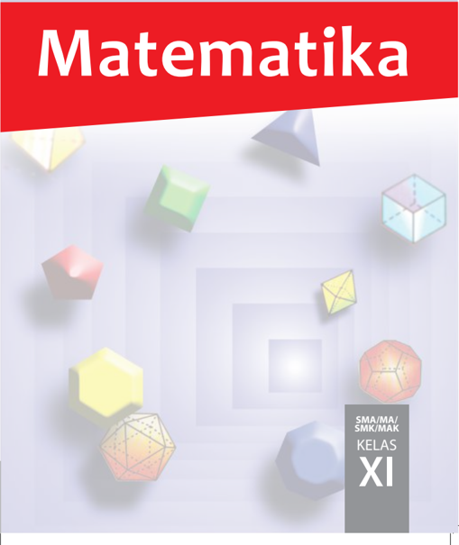

> **Deskripsi Visual:** Gambar dari buku pelajaran matematika kelas XI menampilkan berbagai bentuk geometri dimensi tiga, seperti segiempat, segitiga, dan segiempat tiga sisi. Gambar ini menggunakan warna-warna cerah untuk menonjolkan setiap bentuk, menciptakan efek visual yang menarik. Di bagian bawah, terdapat tulisan "SMA/MA/SMK/MIAK KELAS XI" yang menunjukkan tujuan penggunaan buku ini. Elemen-elemen utama dalam gambar adalah berbagai bentuk geometri yang disusun secara rapi, menunjukkan hubungan antara bentuk-bentuk tersebut dalam konteks matematika. Teks penting yang muncul adalah judul buku "Matematika" yang berada di bagian atas dengan warna merah yang mencolok, serta informasi tentang kelas dan sekolah yang ditujukan pada bagian bawah.

 

---
## 📄 Halaman 2

### Hak Cipta © 2017 pada Kementerian Pendidikan dan Kebudayaan Dilindungi Undang-Undang

Disklaimer: Buku ini merupakan buku siswa yang dipersiapkan Pemerintah dalam rangka implementasi Kurikulum 2013. Buku siswa ini disusun dan ditelaah oleh berbagai pihak di bawah koordinasi Kementerian Pendidikan dan Kebudayaan, dan dipergunakan dalam tahap awal penerapan Kurikulum 2013. Buku ini merupakan 'dokumen hidup' yang senantiasa diperbaiki,  diperbaharui,  dan  dimutakhirkan  sesuai  dengan  dinamika  kebutuhan  dan perubahan zaman. Masukan dari berbagai kalangan yang dialamatkan kepada penulis dan laman http://buku.kemdikbud.go.id atau melalui email buku@kemdikbud.go.id diharapkan dapat meningkatkan kualitas buku ini.

### Katalog Dalam Terbitan (KDT)

Indonesia. Kementerian Pendidikan dan Kebudayaan.

Matematika / Kementerian Pendidikan dan Kebudayaan.-- . Edisi Revisi Jakarta: Kementerian Pendidikan dan Kebudayaan, 2017.

viii, 336 hlm. : ilus. ; 25 cm.

Untuk SMA/MA/SMK/MAK Kelas XI ISBN  978-602-427-114-5 (jilid lengkap)

ISBN  978-602-427-116-9 (jilid 2)

- Matematika -  Studi dan Pengajaran
- Kementerian Pendidikan dan Kebudayaan
I. Judul

510

Penulis

:  Sudianto Manullang, Andri Kristianto S., Tri Andri Hutapea, Lasker Pangarapan Sinaga, Bornok Sinaga, Mangaratua Marianus S., Pardomuan N. J. M. Sinambela,

Penelaah

:   Agung Lukito, Muhammad Darwis M., Turmudi, Nanang Priatna,

Pereview

:  Sri Mulyaningsih

Penyelia Penerbitan

:  Pusat Kurikulum dan Perbukuan, Balitbang, Kem en dikbud.

Cetakan Ke-1, 2014 ISBN 978-602-282-105-2 (Jilid 2a) 978-602-282-106-9 (Jilid 2b)

Cetakan Ke-2, 2017 ( E disi R evisi)

 

---
## 📄 Halaman 3

### Kata Pengantar

Anak-anak kami, Generasi Muda harapan bangsa ...

Sesungguhnya, kami gurumu punya cita-cita dan harapan dari hasil belajar kamu. Kami berkeinginan membelajarkan kamu pada setiap ruang dan waktu. Tetapi itu tidak mungkin, karena ruang dan waktu membatasi pertemuan kita. Namun demikian, ruang dan waktu bukan penghambat bagi kita mendalami ilmu pengetahuan. Pakailah buku ini sebagai salah satu sumber belajarmu. Apa yang ada dalam buku ini cukup bermanfaat untuk mempelajari matematika, dan untuk keberhasilan kamu menuju jenjang pendidikan yang lebih tinggi.

Matematika  adalah  hasil  abstraksi  (pemikiran)  manusia  terhadap  objek-objek di sekitar kita dan menyelesaikan masalah yang terjadi dalam kehidupan, sehingga dalam mempelajarinya kamu harus memikirkannya kembali, bagaimana pemikiran para  penciptanya  terdahulu.  Belajar  matematika  sangat  berguna  bagi  kehidupan. Cobalah  membaca  dan  pahami  materinya  serta  terapkan  untuk  menyelesaikan masalah-masalah kehidupan di lingkunganmu. Kamu punya kemampuan, kami yakin kamu pasti bisa melakukannya.

Buku  ini  diawali  dengan  pengajuan  masalah  yang  bersumber  dari  fakta  dan lingkungan  budaya  siswa  terkait  dengan  materi  yang  akan  diajarkan.  Tujuannya agar kamu mampu menemukan konsep dan prinsip matematika melalui pemecahan masalah yang diajukan dan mendalami sifat-sifat yang terkandung di dalamnya yang sangat berguna untuk memecahkan masalah kehidupan. Tentu, penemuan konsep dan prinsip matematika tersebut dilakukan oleh kamu dan teman-teman dalam kelompok belajar dengan bimbingan guru. Coba lakukan tugasmu, mulailah berpikir, bertanya, berdiskusi, berdebat dengan orang/teman yang lebih memahami masalah. Ingat …!!!, tidak ada hasil tanpa usaha dan perbuatan.

Asahlah  pemahaman  kamu  dengan  memecahkan  masalah  dan  tugas  yang tersedia. Di sana ada masalah autentik/nyata dan teka-teki untuk memampukan kamu berpikir logis, cermat, jujur dan tangguh menghadapi masalah. Terapkan pengetahuan yang telah kamu miliki, cermati apa yang diketahui, apa yang ditanyakan, konsep dan rumus mana yang akan digunakan untuk menyelesaikan. Semuanya sangat berguna bagi kamu.

Selamat  belajar,  semoga  buku  ini  bermanfaat  dan  dapat  membantu  kamu kompeten bermatematika dan memecahkan masalah kehidupan.

Tim Penulis

 

---
## 📄 Halaman 4

### Daftar Isi

28

29

 

---
## 📄 Halaman 6

8

 

---
## 📄 Halaman 8

 

---
## 📄 Halaman 9

BAB 1

### Induksi Matematika

A.

Kompetensi Dasar dan Pengalaman Belajar

---
**📊 Tabel**

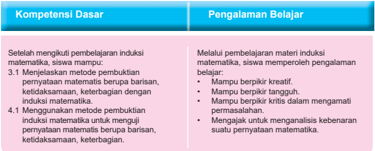

Tabel ini membahas dua kompetensi dasar yang penting dalam pembelajaran matematika: kompetensi dasar 4.1 tentang metode pembuktian induksi matematika dan pengalaman belajar melalui pembelajaran induksi matematika. Kompetensi dasar ini mencakup dua bagian utama: setelah menguji pembelajaran induksi matematika, siswa dapat memperoleh pemahaman tentang metode pembuktian induksi matematika; dan siswa dapat mempelajari materi induksi matematika melalui pengalaman belajar. Pengalaman belajar ini melibatkan berbagai aspek seperti kreativitas, kritik, dan pemahaman kebutuhan siswa dalam mempelajari matematika. Topik utama tabel ini adalah pembelajaran matematika, dengan fokus pada metode pembuktian induksi dan pengalaman belajar yang relevan.

Istilah Penting

- Induksi
- Langkah Awal ( Basic Steps )
- Langkah Induksi ( Induction Step )

 

---
## 📄 Halaman 10

### B. Diagram Alir

---
**🖼️ Gambar/Diagram**

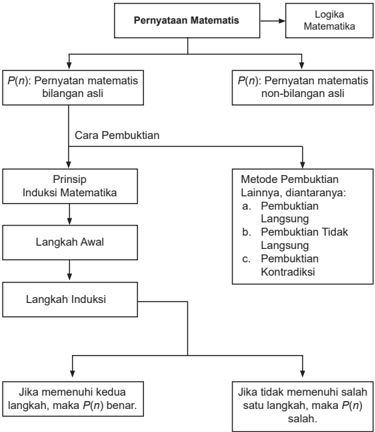

> **Deskripsi Visual:** Gambar ini adalah diagram yang menunjukkan proses pembuktian matematika. Diagram ini terdiri dari beberapa elemen utama:

1. Pernyataan Matematis: Ini adalah bagian awal diagram yang mencakup dua jenis pernyataan matematis: pernyataan bilangan asli dan pernyataan non-bilangan asli.

2. Cara Pembuktian: Ini adalah bagian kedua dari diagram yang mencakup tiga metode pembuktian: Prinsip Induksi Matematika, Langkah Awal, dan Langkah Induksi.

3. Prinsip Induksi Matematika: Ini adalah metode pertama yang ditunjukkan dalam diagram.

4. Langkah Awal: Ini adalah langkah pertama dalam proses pembuktian.

5. Langkah Induksi: Ini adalah langkah kedua dalam proses pembuktian.

6. Jika memenuhi kedua langkah, maka P(n) benar: Ini adalah kondisi akhir yang ditunjukkan dalam diagram.

7. Jika tidak memenuhi salah satu langkah, maka P(n) salah: Ini adalah kondisi alternatif yang ditunjukkan dalam diagram.

8. Metode Pembuktian Lainnya: Ini adalah bagian ketiga dari diagram yang mencakup tiga metode lainnya: Pembuktian Langsung, Pembuktian Tidak Langsung, dan Pembuktian Kontradiksi.

Informasi kunci yang dapat diambil pembaca melalui diagram ini adalah bahwa proses pembuktian matematika melibatkan berbagai metode dan langkah-langkah, termasuk prinsip induksi matematika, langkah awal, dan langkah induksi. Diagram ini juga menunjukkan bahwa ada beberapa metode pembuktian alternatif selain prinsip induksi matematika.

 

---
## 📄 Halaman 11

### C. Materi Pembelajaran

### 1.1  Pengantar Induksi Matematika

Perhatikan ilustrasi berikut ini.

---
**🖼️ Gambar/Diagram**

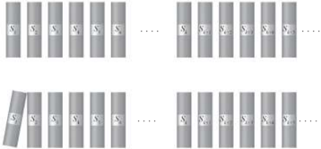

> **Deskripsi Visual:** Gambar ini adalah ilustrasi yang menunjukkan dua barisan batang dengan simbol "S" dan "Y". Barisan pertama berisi tiga batang "S" dan empat batang "Y", sedangkan barisan kedua berisi empat batang "S" dan tiga batang "Y". Simbol "S" dan "Y" tampaknya memiliki arti spesifik dalam konteks yang tidak disebutkan dalam gambar tersebut. Teks, angka, atau label penting lainnya tidak terlihat dalam gambar ini. Informasi kunci yang dapat diambil pembaca melalui gambar ini adalah bahwa ada dua barisan yang mungkin menggambarkan dua jenis atau kondisi yang berbeda, dengan setiap barisan memiliki jumlah batang yang berbeda.

- Dari ilustrasi pada Gambar 1.1, papan manakah yang jatuh jika papan S 1 dijatuhkan ke arah S 2 ?
- Jika terdapat 100 susunan papan mengikuti pola seperti pada ilustrasi di atas, apakah papan ke S 100 juga akan jatuh?
Dari  ilustrasi  di  atas,  dapat  dibayangkan  bahwa  menjatuhkan  papan S 1 ke arah S 2 pasti papan yang paling ujung, sebut papan S n (untuk setiap n bilangan asli), juga jatuh. Dengan kata lain dapat dinyatakan bahwa jika papan S 1 jatuh maka papan S 15 juga jatuh bahkan papan S n juga jatuh.

- Bentuklah  kelompok  belajar!  Lalu,  pikirkan  masalah  kontekstual yang polanya mirip dengan ilustrasi Gambar 1.1. Paparkan hasil yang kalian peroleh di hadapan teman-temanmu.
Mari kita cermati masalah-masalah berikut ini.

 

---
## 📄 Halaman 12

### Masalah 1.1

Tanpa menggunakan alat bantu hitung, rancang formula yang memenuhi pola penjumlahan bilangan mulai 1 hingga 20.

Kemudian, uji kebenaran formula yang ditemukan sedemikian sehingga berlaku  untuk  penjumlahan  bilangan  mulai  dari  1  hingga n ,  dengan n bilangan asli.

### Alternatif  Penyelesaian:

- Pola yang terdapat pada, yaitu:
- Selisih dua bilangan yang berurutan selalu sama yaitu 1.

``

Artinya  terdapat  sebanyak  10  pasang  bilangan  yang  jumlahnya  sama dengan 21.

``

- Untuk mengetahui pola yang terdapat pada 1 + 2 + 3 + . . . + n , untuk n bilangan asli, perlu dipilih  sebarang n > 20 . Misalnya kita pilih n = 200. Sekarang, kita akan menyelidiki apakah pola yang terdapat pada 1 + 2 + 3
- . . . + 18 + 19 + 20 berlaku pada 1 + 2 + 3 + . . . + 198 + 199 + 200?
- Selisih dua bilangan yang berurutan selalu sama yaitu 1.
- Hasil (1 + 200) = (2 +199) = (3 + 198) = (4 + 197) = . . . = (100 +101) = 201.
- Artinya terdapat sebanyak 100 pasang bilangan yang jumlahnya sama dengan 201.

``

Dengan demikian untuk sebarang n bilangan  asli  yang  genap,  kamu  dapat menentukan jumlah bilangan berurutan mulai dari 1 hingga n .

- Dengan Masalah 1.1, coba kamu pikirkan bagaimana formula yang kamu gunakan untuk menjumlahkan bilangan berurutan mulai 1 hingga n , dengan n sebarang  bilangan  asli  yang  ganjil.  Bandingkan  cara  kamu  temukan dengan  temanmu.  Pastikan  cara  yang  kamu  peroleh  merupakan  cara paling singkat.
- Coba kamu temukan formula untuk pola, untuk sebarang n bilangan asli.

 

---
## 📄 Halaman 13

### Masalah 1.2

Tanpa menggunakan alat bantu hitung, rancang formula yang memenuhi pola  1 2 +  2 2 +  3 2 +  .  .  .  +  10 2 .  Kemudian,  uji  formula  tersebut  untuk menghitung 1 2 + 2 2 + 3 2 + . . . + 30 2 .

### Alternatif Penyelesaian:

Menjumlahkan 1 2  + 2 2 + 3 2 + . . . + 10 2 berarti kita menjumlahkan 10 bilangan kuadrat yang pertama, yaitu 1 + 4 + 9 + 16 + 25 + . . . + 64 + 81 + 100. Mari kita cermati tabel berikut ini .

### n Jumlah n bilangan kuadrat yang pertama

``

``

``

``

``

``

``

Setelah kamu lengkapi Tabel 1.1, temukan pola untuk:

- Penjumlahan berurut bilangan kuadrat mulai dari 1 2 hingga 30 2 . Kemudian hitung hasilnya.
- Penjumlahan berurut bilangan kuadrat mulai dari 1 2 hingga 50 2 . Kemudian hitung hasilnya.

 

---
## 📄 Halaman 14

- Penjumlahan  berurut  bilangan  kuadrat  mulai  dari  1 2 hingga n 2 .  Uji kebenaran  formula  yang  kamu  peroleh.  Bandingkan  hasil  yang  kamu peroleh dengan temanmu!

### Pertanyaan Kritis!!!

``

Rancang formula yang berlaku untuk  penjumlahan bilangan tersebut. Kemudian buktikan kebenaran formula yang kamu peroleh.

Dari ilustrasi pada Gambar 1.1, Masalah 1.1, dan Masalah 1.2 menjelaskan atau menemukan suatu konsep/prinsip/sifat yang berlaku umum atas konsep/ prinsip/sifat yang berlaku khusus. Pola seperti itu sering disebut prinsip induksi matematika. Jadi, induksi matematika digunakan untuk membuktikan suatu konsep/prinsip/sifat  berlaku  umum  atas  konsep/prinsip/sifat  yang  berlaku khusus.

### 1.2  Prinsip Induksi  Matematika

Induksi matematika merupakan teknik pembuktian yang baku dalam matematika. Melalui induksi Matematika, kita dapat mengurangi langkah pembuktian yang sangat rumit untuk menemukan suatu kebenaran dari pernyataan  matematis  hanya  dengan sejumlah langkah terbatas yang cukup mudah. Prinsip induksi matematika memiliki  efek  domino  (jika  domino disusun berjajar dengan jarak tertentu, saat satu ujung domino dijatuhkan ke arah donimo  lain,  maka  semua domino akan jatuh satu per satu). Coba perhatikan Gambar 1.2

 

---
## 📄 Halaman 15

Mungkin pada saat masa kecil, kamu pernah bermain seperti pada Gambar 1.2 tanpa disadari ada konsep matematika yang telah kita gunakan pada permainan tersebut. Apakah kamu masih memiliki permainan lain yang menggunakan konsep induksi matematika?

### Catatan Historis

Pertama mengetahui penggunaan induksi matematis adalah dalam karya  matematis  abad  ke-16 Francesco  Maurolico (1494-1575). Maurolico menulis secara ekstensif pada karya-karya matematika klasik  dan  membuat  banyak  kontribusi  kepada  geometri  dan optik.  Dalam  bukunya Arithmeticorum  Libri  Duo, Maurolico menyajikan berbagai sifat-sifat bilangan bulat bersama-sama dengan bukti dari sifat-sifat ini. Untuk bukti beberapa sifat ini ia mengemukakan  metode  induksi  matematis.  Penggunaan  induksi matematis pertamanya dalam buku ini adalah untuk membuktikan bahwa  jumlah  dari n bilangan  bulat  positif  ganjil  pertama  sama dengan n 2 .

Ingat, dengan induksi matematika dapat melakukan pembuktian kebenaran suatu  pernyataan  matematika  yang  berhubungan  dengan  bilangan  asli, bukan untuk menemukan formula. Prinsip induksi matematika dinyatakan pada Prinsip 1.1.

### Prinsip 1.1 Induksi Matematika

Misalkan P( n )  merupakan suatu pernyataan bilangan asli. Pernyataan P( n ) benar jika memenuhi langkah berikut ini:

- Langkah Awal ( Basic Step ): P(1) benar.
- Langkah  Induksi  ( Induction  Step ):  Jika  P( k )  benar,  maka P( k + 1) benar, untuk setiap k bilangan asli.
Pada  proses  pembuktian  dengan  Prinsip  Induksi  Matematika,  untuk langkah awal tidak selalu dipilih untuk n = 1, n = 2, atau n = 3, tetapi dapat dipilih sebarang nilai n sedemikian sehingga dapat mempermudah supaya proses langkah awal dipenuhi. Selanjutnya, yang ditemukan pada langkah awal merupakan modal untuk langkah induksi. Artinya, jika P (1) benar, maka P (2) benar; jika P (2) benar maka P (3) benar; demikian seterusnya

 

---
## 📄 Halaman 16

hingga disimpulkan P ( k ) benar. Dengan menggunakan P( k ) benar, maka akan  ditunjukkan P ( k +  1)  benar.  Jika P ( n )  memenuhi  kedua  prinsip induksi  matematika, maka formula P ( n )  terbukti benar. Jika salah satu dari kedua prinsip tidak dipenuhi, maka formula P ( n ) salah.

Mari kita cermati masalah berikut ini.

### Masalah 1.3

Misalkan suatu  ATM  menyediakan layanan penarikan uang tunai untuk pecahan  Rp20.000,00  dan  Rp50.000,00.  Berapakah  jumlah  kelipatan penarikan dengan jumlah minimal yang dapat diambil  pelanggan  melalui ATM tersebut adalah Rp40.000,00?

### Alternatif  Penyelesaian:

Dengan  menggunakan  induksi    matematika,  harus  kita  tunjukkan  bahwa Prinsip  1.1  dipenuhi  untuk  penarikan  Rp n yang  merupakan  kelipatan Rp40.000,00 dengan n merupakan bilangan asli.

- Langkah awal
Untuk  mengeluarkan  uang  sejumlah  Rp40.000,00,  ATM  bekerja  dan mengeluarkan 2 lembar uang Rp20.000,00.

- Jadi, untuk n = 2, maka benar ATM dapat mengeluarkan sejumlah uang kelipatan Rp40.000,00.
- Langkah Induksi
Dengan demikian, untuk setiap jumlah uang kelipatan Rp40.000,00, ATM dapat mengeluarkan sejumlah uang yang diperlukan pelanggan. Artinya, untuk mengeluarkan Rp n ,  dengan n adalah kelipatan Rp40.000,00 dan n bilangan asli dapat digunakan e lembar uang Rp20.000,00. Akibatnya dapat  disimpulkan  bahwa P ( k )  benar.  Kita  akan  menunjukkan  bahwa P ( k +  1)  juga  benar,  yaitu  untuk  mengeluarkan  uang  sejumlah  ( k +  1)    kelipatan uang  Rp40.000,00  dapat  menggunakan  uang  pecahan  Rp20.000,00 dan/atau Rp50.000,00.

 

---
## 📄 Halaman 17

Selain itu, terdapat dua kemungkinan, yaitu:

- Misalkan ATM kehabisan uang pecahan Rp50.000,00, maka untuk mengeluarkan  uang senilai  Rp n menggunakan  pecahan  uang Rp20.000,00. Karena minimal 40.000, setidaknya harus menggunakan dua lembar uang pecahan Rp 20.000,00. Dengan mengganti dua lembar uang Rp 20.000,00 sebagai pengganti satu lembar Rp50.000,00 akan menjadikan uang yang dikeluarkan ATM sebanyak Rp ( n + k ), dengan k senilai Rp10.000,00.
- ii) Misalkan ATM mengeluarkan uang senilai Rp n ,  dengan sedikitnya satu  lembar  pecahan  Rp50.000,00.  Dengan  mengganti  satu  lembar pecahan Rp50.000,00 dengan tiga lembar pecahan uang Rp20.000,00 akan menjadikan uang yang dikeluarkan ATM sebesar Rp ( n + k ), dengan k senilai Rp10.000,00.
Dengan demikian terbukti  bahwa  jika P ( k )  benar,  maka P ( k +  1)  juga benar.

Jadi, untuk Masalah 1.3,  terbukti bahwa pola penarikan uang tunai melalui ATM memenuhi prinsip induksi matematika.

Sekarang  mari  kita  cermati  contoh-contoh  pembuktian  dengan  induksi matematika berikut ini.

### Contoh 1.1

Buktikan dengan induksi matematika bahwa jumlah n bilangan ganjil positif yang pertama sama dengan n 2 .

### Alternatif Penyelesaian:

Tentu kamu mengetahui pola bilangan ganjil positif, yaitu: 2 n -  1,  untuk n bilangan asli.

Sedemikian sehingga akan ditunjukkan bahwa:

``

``

``

Untuk membuktikan kebenaran formula P ( n ), kita harus menyelidiki apakah P ( n ) memenuhi prinsip induksi matematika, yaitu langkah awal dan langkah induksi.

 

---
## 📄 Halaman 18

### a) Langkah awal:

Untuk n = 1, maka P (1) = 1 = 1 2 = 1. Jadi P (1) benar.

### b) Langkah Induksi:

Karena P (1) benar, maka P (2) juga benar, hingga dapat diperoleh untuk n = k ,

``

Akan ditunjukkan untuk bahwa untuk n = k + 1, sedemikian sehingga P ( k + 1) = 1 + 3 + 5 + 7 + . . . + (2( k + 1) - 1) = ( k + 1) 2 adalah suatu pernyataan yang benar.

Karena P ( k ) = 1 + 3 + 5 + 7 + . . . + (2 k - 1) = k 2 adalah pernyataan yang benar, maka

``

Jika kedua ruas ditambahkan dengan (2 k + 1), akibatnya

``

Jadi,  dengan P ( k ) ditemukan P ( k + 1).

Dengan demikian terbukti bahwa: 1 + 3 + 5 + 7 + . . . + (2 n - 1) = n 2 adalah benar, untuk setiap n bilangan asli.

Karena formula P ( n ) = 1 + 3 + 5 + 7 + . . . + (2 n - 1) = n 2 , memenuhi kedua prinsip  induksi  matematika,  maka    jumlah n bilangan  ganjil  positif  yang pertama sama dengan n 2 adalah benar, dengan n bilangan asli.

### Contoh 1.2

Gunakan induksi matematika untuk membuktikan bahwa:

``

untuk setiap n bilangan bulat positif.

### Alternatif  Penyelesaian:

``

Kali ini, sudah cukup jelas makna pernyataan yang akan dibuktikan dengan menggunakan induksi matematika. Oleh karena itu, akan ditunjukkan bahwa pernyataan P ( n ) memenuhi langkah awal dan langkah induksi.

 

---
## 📄 Halaman 19

- a)
Langkah Awal: Untuk n = 0, diperoleh, 1 = 2 0 + 1 - 1. Jadi P (0) benar.

- Langkah Induksi:
Pada  langkah  awal  diperoleh P (0)  benar,  akibatnya P (1)  benar,  1  +  2 = 2 1 + 1 - 1.

Oleh karena itu disimpulkan bahwa, untuk n = k ,

``

Selanjutnya akan ditunjukkan, jika P ( k ) benar, maka P ( k + 1) juga benar. Dari P ( k ) kita peroleh,

``

Kemudian kedua ruas ditambahkan 2 k + 1 , akibatnya

``

Diperoleh bahwa P ( k + 1) = 1 + 2 + 2 2 + 2 3 + 2 4 + . . . + 2 k + 1 = 2 ( k + 1) + 1 - 1 adalah benar, untuk setiap k bilangan bulat positif.

Karena P ( n ) = 1 + 2 + 2 2 + 2 3 + 2 4 + . . . + 2 n = 2 n + 1  - 1 memenuhi kedua prinsip induksi matematika, maka formula P ( n ) = 1 + 2 + 2 2 + 2 3 + 2 4 + . . . + 2 n = 2 n + 1 - 1 adalah benar, dengan n bilangan bulat psotif.

### Contoh 1.3

``

Untuk setiap bilangan asli, dengan n ≥ 1 berlaku:

Buktikan dengan induksi matematika

### Alternatif  Penyelesaian:

``

Akan ditunjukkan bahwa P ( n ) memenuhi prinsip induksi matematika, yaitu langkah awal dan langkah induksi.

 

---
## 📄 Halaman 20

### a) Langkah Awal:

Untuk n = 2, kita peroleh

``

``

Dengan demikian, diperoleh bahwa P (2) adalah benar.

### b) Langkah Induksi:

Karena P (2) benar, maka P (3) benar, hingga disimpulkan

``

Akan ditunjukkan, jika P ( k ) benar, maka P ( k + 1) benar.

Jika kedua ruas ditambahkan ( ) ( ) ( ) ( ) 1 1 1 2 1 1 1 k k k k = + ⋅ + + ⋅ + +     , diperoleh

``

``

``

``

``

kedua  prinsip  induksi  matematika,  maka  formula  tersebut  adalah  formula yang benar.

 

---
## 📄 Halaman 21

### Uji Kompetensi 1.1

- Untuk  setiap  rumusan P ( n )  yang  diberikan,  tentukan  masing-masing P ( n + 1).
- P ( n ) = 5 ( 1) n n + ,
- P ( n ) = 3 ( 2)( 3) n n + + ,
- P ( n ) = 2 2 ( 1) 4 n n -,
- P ( n ) = 2 2 2( 1) n n + .
- Rancang formula yang memenuhi setiap pola berikut ini.
- 2 + 4 + 6 + 8 + . . . + 2 n ,
- 2 + 7 + 12 + 17 + 22 + . . . + (5 n - 3),

``

``

- Dari soal nomor 2, ujilah kebenaran formula yang kamu temukan dengan menggunakan prinsip induksi matematika.
Untuk  soal nomor 4 - nomor 10, gunakan prinsip induksi matematika untuk membuktikan kebenaran setiap formula yang diberikan. ( n bilangan asli)

``

- a m . a n = a m + n , untuk setiap m , n bilangan asli. [Petunjuk: pilih sembarang m bilangan asli]
- Untuk a , b bilangan real tak nol,

``

``

``

 

---
## 📄 Halaman 22

### 1.3 Bentuk-Bentuk Penerapan Induksi Matematika

### 1.3.1  Penerapan Induksi Matematika pada Barisan Bilangan

### Masalah 1.4

Misalkan u i menyatakan suku ke i suatu barisan bilangan asli, dengan i = 1, 2, 3, . . . , n .

Diberikan barisan bilangan asli, 2, 9, 16, 23, 30, 37, 44, 51, . . . .

Rancang suatu formula untuk menghitung suku ke 1.000 barisan bilangan tersebut. Ujilah kebenaran formula yang diperoleh dengan menggunakan induksi matematika.

### Alternatif Penyelesaian:

Terlebih dahulu kita mengkaji barisan bilangan asli yang diberikan, bahwa untuk n =  1    maka u 1 =  2;  untuk n =  2  maka u 2 =  9;  untuk n =  3  maka u 3 =  16;  demikian  seterusnya.  Artinya  kita  harus  merancang  suatu  formula sedemikian  sehingga  formula  tersebut  dapat  menentukan  semua  suku-suku barisan bilangan tersebut. Mari kita telaah hubungan antara n dengan sukusuku barisan bilangan 2, 9, 16, 23, 30, 37, 44, 51, . . . yang dideskripsikan pada Gambar 1.3.

---
**🖼️ Gambar/Diagram**

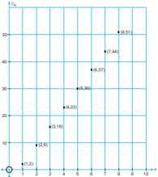

> **Deskripsi Visual:** Gambar ini adalah diagram yang menunjukkan data statistik berupa nilai-nilai yang diperoleh dari beberapa tes atau ujian. Diagram ini terdiri dari garis vertikal (x-axis) dan garis horizontal (y-axis), dengan titik-titik yang menunjukkan nilai-nilai tersebut. Garis vertikal mungkin menunjukkan periode waktu atau skala lainnya, sementara garis horizontal mungkin menunjukkan skala nilai atau skala lainnya.

Elemen utama dalam diagram ini adalah titik-titik yang menunjukkan nilai-nilai yang diperoleh. Titik-titik ini terhubung oleh garis-garis yang membentuk pola atau trend. Garis-garis ini membantu dalam memahami hubungan antara nilai-nilai tersebut dan bagaimana mereka berubah seiring waktu atau skala lainnya.

Teks, angka, atau label penting yang terlihat dalam diagram ini meliputi nama-nama tes atau ujian, nilai-nilai yang diperoleh, dan posisi titik-titik pada garis-garis. Informasi kunci yang dapat diambil pembaca meliputi tren atau pola dalam data, perbedaan antara nilai-nilai yang diperoleh, dan kemungkinan hubungan antara nilai-nilai tersebut dan faktor-faktor lainnya yang mungkin berhubungan.

Dalam paragraf ini, saya telah menjelaskan bahwa gambar ini adalah diagram yang menunjukkan data statistik berupa nilai-nilai yang diperoleh dari beberapa tes atau ujian. Diagram ini terdiri dari garis vertikal dan garis horizontal, dengan titik-titik yang menunjukkan nilai-nilai tersebut. Garis-garis ini membantu dalam memahami hubungan antara nilai-nilai tersebut dan bagaimana mereka berubah seiring waktu atau skala lainnya. Informasi kunci yang dapat diambil pembaca meliputi tren atau pola dalam data, perbedaan antara nilai-nilai yang diperoleh, dan kemungkinan hubungan antara nilai-nilai tersebut dan faktor-faktor lainnya yang mungkin berhubungan.

 

---
## 📄 Halaman 23

Dari Gambar 1.3, tampak jelas bahwa sebaran titik-titik ( n , u n )  diwakilkan oleh suatu fungsi linear, kita misalkan u n = an + b , dengan n bilangan asli dan a dan b bilangan real tak nol.

- Dengan demikian, · jika n = 1 maka u 1 = a. (1) + b ↔ a + b = 2 (1) · jika n = 2 maka u 3 = a. (3) + b ↔ 3 a + b = 16 (2)
Dengan  pengalaman  belajar  menyelesaikan  persamaan  linear  dua  variabel, dari Persamaan (1) dan (2) diperoleh a = 7 dan b = -5.

Jadi formula untuk barisan bilangan asli, 2, 9, 16, 23, 30, 37, 44, 51, . . . adalah u n = 7 n - 5.

Nah, sebelum kita menentukan nilai u 1000 , harus diuji kebenaran formula yang diperoleh, tentunya menggunakan induksi matematika.

- a)
Kita simpulkan bahwa P (4), dalam hal ini u adalah benar.

Langkah awal Untuk n = 4, maka u 4 = 7(4) - 5 = 23. 4

### b) Langkah Induksi

Karena P (4) = u 4 benar, maka P (5) = u 5 benar.

Secara umum disimpulkan bahwa P ( k ) = u k = 7 k - 5 adalah benar.

Dengan menggunakan P ( k ) = u k , akan ditunjukkan bahwa P ( k + 1) = u k + 1 = 7( k + 1) - 5.

Jika u k = 7 k - 5, maka dapat dituliskan sebanyak n suku barisan bilangan asli yang mengikuti pola bertambah 7, yaitu: 2, 9, 16, 23, 30, 37, 44, 51, . . . (7 k - 5).

Dengan demikian, jika kita  menuliskan  sebanyak  ( k +  1)  suku  barisan bilangan asli yang mengikuti pola bertambah 7, yaitu: 2, 9, 16, 23, 30, 37, 44, 51, . . . (7 k - 5), (7 k + 2).

Akibatnya, suku ke ( k + 1) pola bilangan tersebut adalah u k + 1 = 7 k + 2 = 7( k + 1) - 5.

Jadi terbukti bahwa P ( k + 1) = u k + 1 = 7( k + 1) - 5 = 7 k + 2 adalah benar, dengan k adalah bilangan asli.

Karena, formula u n =  7 n -  5  memenuhi kedua prinsip induksi matematika, maka disimpulkan bahwa  adalah formula yang benar untuk barisan bilangan asli 2, 9, 16, 23, 30, 37, 44, 51, . . . .

Dengan demikian u 1.000 = 7(1.000) - 5 = 6.995.

Dengan pengalaman belajar yang kamu peroleh pada penyelesaian Masalah 1.4, mari kita selesaikan Contoh 1.4.

 

---
## 📄 Halaman 24

Diberikan barisan bilangan asli, 3, 5, 8, 12, 17, 23, 30, 38, . . . .

Selidiki  suatu  formula  yang  memenuhi  pola  barisan  tersebut.  Sebelum menentukan suku ke 1.999, terlebih dahulu uji kebenaran formula yang kamu peroleh dengan menggunakan induksi matematika.

### Alternatif  Penyelesaian:

Analog dengan konsep yang diberikan pada Masalah 1.3, berikut ini dijelaskan melalui Gambar 1.4, sebaran titik yang dibentuk oleh n dan suku-suku barisan bilangan asli 3, 5, 8, 12, 17, 23, 30, 38, . . . .

Dengan mencermati Gambar 1.4 dan pengalaman kamu belajar fungsi kuadrat pada saat kelas X, bahwa sebaran titik-titik ( n , u n )  dapat  dihampiri  dengan suatu fungsi kuadrat. Kita misalkan fungsi kuadratnya, u n = an 2 + bn + c , untuk setiap n bilangan asli dan a , b , dan c bilangan real tak nol.

Melalui fungsi tersebut, diperoleh

- jika n = 2 maka u 2 = a.(2 2 ) + b. (2) + c ↔ 4 a + 2 b + c = 5 (2*)
- jika n = 1 maka u 1 = a.(1 2 ) + b. (1) + c ↔ a + b + c = 3 (1*)
- jika n = 3 maka u 3 = a.(3 2 ) + b. (3) + c ↔ 9 a + 3 b + c = 8 (3*)

 

---
## 📄 Halaman 25

Dengan pengalaman belajar sistem persamaan linear tiga variabel yang telah kamu tuntaskan di kelas X,  dengan mudah kamu menemukan nilai a , b , dan c yang memenuhi persamaan (1*), (2*), dan (3*), yaitu a = 1 2 , b = 1 2 ,  dan

``

Akibatnya,  fungsi  kuadrat  yang  mewakili  pasangan  titik n dan u n ,  adalah + 2.

``

Sekarang,  mari  kita  uji  kebenaran  formula  tersebut  dengan  menggunakan induksi matematika.

- Langkah awal

``

Dengan demikian, P (2) = u 2 =  5 adalah benar.

- Langkah induksi
Karena P (2) = u 2 =  5 benar, maka P (3) = u 3 =  8 juga benar.

Akibatnya, disimpulkan bahwa P ( k ) = u k = 1 2 k 2 + 1 2 k + 2 adalah benar, untuk  setiap k bilangan  asli.  Dengan  menggunakan P ( k )  = u k = 1 2 k 2 + 1 2 k + 2, akan ditunjukkan bahwa P ( k + 1) = u ( k + 1) = 1 2 ( k + 1) 2 + 1 2 ( k + 1)

+ 2, juga benar.

Dengan menggunakan P ( k ) = u k = 1 2 k 2 + 1 2 k sebanyak k

``

+ 2, kita dapat menuliskan suku barisan bilangan yang mengikuti pola 3, 5, 8, 12, 17, 23, + 2).

Akibatnya, jika kita tuliskan sebanyak ( k + 1) suku-suku barisan bilangan tersebut, kita peroleh, 3, 5, 8, 12, 17, 23, 30, 38, 47, . . ., ( 1 2 k 2 + 1 2 k + 2),

``

Dengan demikian diperoleh suku ke ( k

``

+  1)  barisan  bilangan  tersebut, + 1) + 2.

``

 

---
## 📄 Halaman 26

Karena formula P ( n ) = u n = 1 2 n 2 + 1 2 n + 2 memenuhi kedua prinsip induksi matemati, maka formula tersebut adalah benar, untuk setiap n bilangan asli. Dengan ditemukan u 1.999 = 1 2 (1.999) 2 + 1 2 (1.999) + 2 (pastikan kamu tidak menggunakan alat bantu hitung untuk menentukan).

### 1.3.2  Penerapan Induksi Matematika pada Keterbagian

Sebelum kita mengkaji lebih jauh tentang penerapan induksi matematika, perlu ditegaskan makna keterbagian dalam hal ini, yaitu  habis dibagi bukan hanya dapat dibagi. Tentu kamu dapat membedakan dapat dibagi dan habis dibagi.  Misalnya,  36  habis  dibagi  3,  tetapi  36  tidak  habis  dibagi  oleh  7. Pada  subbab  ini,  kita  akan  mengkaji  bagaimana  penerapan  prinsip  induksi matematika pada konsep keterbagian suatu formula bilangan asli.

Mari kita cermati masalah berikut ini.

### Contoh 1.5

Dengan induksi matematika, tunjukkan bahwa 11 n - 6 habis dibagi 5, untuk n bilangan asli.

### Alternatif Penyelesaian:

Kita misalkan P ( n ) = 11 n - 6, dengan n bilangan asli.

Pada contoh ini kita harus menunjukkan bahwa 11 n - 6 dapat dituliskan sebagai bilangan kelipatan 5. Akan ditunjukkan bahwa P ( n ) memenuhi kedua prinsip induksi matematika.

- Langkah Awal
Kita dapat memilih n = 3, sedemikian sehingga, 11 3 - 6 = 1.325 dan 1.325 habis dibagi 5, yaitu 1.325 = 5(265).

Dengan demikian P (3) habis dibagi 5.

- Langakah Induksi
Karena P (3) benar, maka P (4) benar, sedemikian sehingga disimpulkan P ( k ) = 11 k - 6 benar, untuk k bilangan asli. Selanjutnya akan dibuktikan bahwa jika P ( k ) = 11 k - 6 habis dibagi 5, maka P ( k + 1) = 11 ( k + 1) - 6 habis dibagi 5.

- b)

 

---
## 📄 Halaman 27

Karena 11 k -  6  habis dibagi 5, maka dapat kita misalkan 11 k -  6  = 5 m , untuk m bilangan bulat positif. Akibatnya, 11 k = 5 m + 6.

``

Dengan demikian P ( k + 1) = 11 ( k + 1) - 6 dapat dinyatakan sebagai kelipatan 5, yaitu 5(11 m + 12).

Jadi benar bahwa P ( k + 1) = 11 ( k + 1) - 6 habis dibagi 5.

Karena P ( n )  =  11 n -  6  memenuhi kedua prinsip induksi matematika, maka terbukti P ( n ) = 11 n - 6 habis dibagi 5, untuk n bilangan asli.

### Contoh 1.6

Untuk n bilangan  asli, x ≠ y ,  buktikan  dengan  induksi  matematika  bahwa x n - y n habis dibagi ( x - y ).

### Alternatif  Penyelesaian:

Misalkan P ( n ) = x n - y n .

Untuk membuktikan P ( n ) = x n - y n habis dibagi ( x - y ), artinya P ( n ) dapat dituliskan sebagai kelipatan x - y .  Oleh karena itu, akan ditunjukkan P ( n ) = x n - y n memenuhi kedua prinsip induksi matematika.

- a)
- Langkah Awal
Untuk n = 1, sangat jelas bahwa x - y = ( x - y ) × 1. Demikian halnya untuk n = 2 diperoleh bahwa x 2 - y 2 = ( x - y )( x + y ). Artinya jelas bahwa P (2) = x 2 - y 2 habis dibagi ( x - y ).

- Langkah Induksi
Pada bagian langkah induksi, kita peroleh bahwa P (2) benar. Karena P (2) benar, maka P (3) juga benar. Namun, perlu kita selidiki pola hasil bagi yang  diperoleh untuk n ≥ 3.

- Untuk n = 3, maka x 3 -y 3 = ( x - y )( x 2 + xy + y 2 ).
- Untuk n = 4, maka x 4 -y 4 = ( x - y )( x 3 + x 2 y + xy 2 + y 3 ).
- Untuk n = 5, maka x 5 -y 5 = ( x - y )( x 4 + x 3 y + x 2 y 2 + xy 3 + y 4 ).

 

---
## 📄 Halaman 28

Dari pola tersebut, tentu kamu dapat menyimpulkan pola hasil bagi yang akan ditemukan, sedemikian sehingga kita dapat menyimpulkan bahwa untuk n = k ,  maka P ( k ) = x k - y k = ( x - y )( x k 1 y 0 + x k - 2 y 1 + x k - 3 y 2 + . . . + x 0 y k - 1 ).

Oleh karena itu, disimpulkan bahwa P ( k ) = x k - y k habis dibagi x -y . Selain itu, juga dapat kita simpulkan bahwa P ( k - 1) = x k 1 - y k 1 juga habis dibagi ( x - y ), (kenapa?).

Untuk mempermudah dalam penulisan, kita misalkan

``

Akibatnya, x k = ( r )( q ) + y k dan y k = x k - ( r )( q ).

``

``

Dari  Persamaan (1.a) dan (1.b),  diperoleh,

``

Oleh karena itu, x k + 1 -y k + 1 = ( x + y )( r )( q ) - ( x )( y )[ x k - 1 -y k - 1 ].

] juga habis

( x + y )( r )( q ) habis dibagi ( x - y ) karena r = x -y , dan [ x k - 1 -y k - 1 dibagi ( x -y ), maka ( x + y )( r )( q ) - ( x )( y )[ x k - 1 -y k - 1 ] habis dibagi ( x - y ). Dengan demikian, P ( k + 1) = x k + 1 - y k + 1 habis dibagi ( x - y ).

Karena P ( n )  = x n -  y n memenuhi kedua prinsip  induksi  matematika,  maka terbukti bahwa P ( n ) = x n - y n habis dibagi ( x - y ), dengan x ≠ y dan n bilangan asli.

### 1.3.3  Penerapan Induksi Matematika pada Ketidaksamaan (Ketaksamaan)

Pada  subbab  ini,  kita  memperluas  kajian  penerapan  Prinsip  Induksi Matematika  dalam  formula  yang  dinyatakan  dalam  bentuk  ketidaksamaan matematik.  Untuk lebih jelasnya mari kita cermati contoh berikut ini.

 

---
## 📄 Halaman 29

### Contoh 1.7

Buktikan bahwa 1 2 + 2 2 + 3 2 + . . . + n 2 > 3 3 n , untuk setiap n bilangan asli.

### Alternatif  Penyelesaian:

``

Akan ditunjukkan bahwa P ( n ) memenuhi kedua prinsip induksi matematika.

- Langkah Awal

``

- Langkah Induksi

``

Demikian seterusnya hingga dapat disimpulkan bahwa untuk n = k

``

``

Karena 1 2 + 2 2 + 3 2 + . . . + k 2 > 3 3 k , jika kedua ruas ditambahkan ( k + 1) 2 ,

``

``

``

Padahal 3 ( 1) 3 2 3 k k + + + = 3 3 ( 1) 3 2 ( 1) 3 3 3 k k k + + + + > , untuk setiap k bilangan bulat positif.

``

 

---
## 📄 Halaman 30

Dengan demikian terbukti bahwa, P ( k +  1)  =  1 2 +  2 2 +  3 2 +  .  .  .  + k 2

``

``

Karena P ( n ) = 1 2 + 2 2 + 3 2 + . . . + n 2 > 3 3 n memenuhi kedua prinsip induksi matematika, maka formula P ( n ) = 1 2 + 2 2 + 3 2 + . . . + n 2 > 3 3 n adalah benar, untuk setiap n bilangan asli.

### Contoh 1.8

Diberikan x 1 = 1 dan x n + 1 = 1 2 n x + , n

``

Buktikan bahwa x n < 4, untuk setiap n bilangan asli. ≥ 1.

### Alternatif  Penyelesaian: Dengan x 1 = 1, kita dapat menentukan nilai untuk setiap x n , n ≥ 1. + ≥

Akan ditunjukkan bahwa P ( n ) = x n < 4 dengan x n + 1 = 1 2 n x , x 1 = 1, n 1 memenuhi kedua prinsip induksi matematika.

- Langkah Awal

``

``

Dengan demikian terbukti bahwa P (2) = x 2 = 3 < 4.

- Langkah Induksi

``

diperoleh P (3) benar.

Dengan cara yang sama, karena P (4) benar maka P (5) benar. Demikian

``

``

ditunjukkan bahwa x x k k + + = + < 2 1 1 2 4 . .

Jika kita mengkaji lebih jauh hubungan antar suku-suku barisan x i , dapat dituliskan bahwa:

``

 

---
## 📄 Halaman 31

``

``

· 

- Jika k = m , maka x x m m + = + < + = 1 1 2 1 2 9 4 4 , untuk setiap m bilangan asli.

``

Akibatnya diperoleh bahwa P ( ) k x x x k k k + = = = + < + + + 1 1 2 4 1 1 2 1

``

( ) + . ( ) +

kedua prinsip induksi matematika, sedemikian sehingga P ( n ) benar.

Untuk  pembahasan  baik  masalah  maupun  contoh    yang  dikaji  mulai  Sub bab 1.2, ditemukan bahwa setiap formula yang diberikan/ada selalu terbukti kebenarannya dengan menggunakan induksi matematika. Akan tetapi, apakah benar untuk setiap formula yang diberikan selalu memenuhi kedua prinsip induksi matematika? Mari kita cermati kasus berikut ini.

### Contoh 1.9

Dengan  menggunakan  induksi  matematika,  selidiki  kebenaran  pernyataan, untuk setiap bilangan asli, P ( n ) = n 2 -n + 41 adalah bilangan prima.

### Alternatif  Penyelesaian:

Sebelumnya kamu sudah mengetahui konsep bilangan prima. Untuk menyelidiki kebenaran pernyataan P ( n ) = n 2 -n + 41 adalah bilangan prima, akan  dikaji  apakah  pernyataan  tersebut  memenuhi  kedua  prinsip  induksi matematika.

 

---
## 📄 Halaman 32

### Langkah Awal

Untuk menyelidiki pernyataan P ( n ), kita tidak cukup hanya menyelidiki untuk n = 1, n = 2. Mari kita cermati yang disajikan pada tabel berikut.

---
**📊 Tabel**

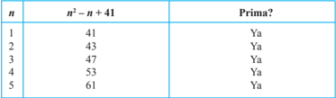

Tabel ini menunjukkan hasil perhitungan untuk beberapa nilai n, di mana n² - n + 41 diperhitungkan. Dari data yang diberikan, kita dapat melihat bahwa untuk setiap n yang diberikan (1, 2, 3, 4, 5), hasil perhitungan n² - n + 41 selalu memberikan bilangan prima. Ini menunjukkan bahwa pola atau hubungan antara n dan n² - n + 41 selalu menghasilkan bilangan prima. Topik utama tabel ini adalah pengecekan apakah suatu bilangan prima atau tidak berdasarkan hasil perhitungan n² - n + 41 untuk beberapa nilai n. Kolom-kolom yang ada adalah n, n² - n + 41, dan Prima?. Data atau pola penting yang terlihat adalah bahwa untuk setiap n yang diberikan, n² - n + 41 selalu memberikan bilangan prima.

Pada  Tabel  1.2,  penyelidikan  telah  dilakukan  bahkan  hingga n =  5,  dan semuanya  merupakan  bilangan  prima.  Namun,  ada n bilangan  asli  yang mengakibatkan P ( n ) bukan bilangan prima, yaitu n = 41.

Karena langkah awal dari prinsip induksi matematika tidak dipenuhi, maka disimpulkan bahwa P ( n )  = n 2 -n +  41,  untuk setiap n bilangan asli bukan merupakan formula bilangan prima.

### Uji Kompetensi 1.2

- Buktikan bahwa pernyataan berikut ini adalah salah.
- Jika n bilangan asli, maka terdapat paling sedikit satu bilangan prima p sedemikian sehingga n < p < n + 6,
- Jika a , b , c , d merupakan bilangan bulat positif sedemikian sehingga a 2 + b 2 = c 2 + d 2 , maka a = c atau a = d .
Sertakan alasan untuk setiap jawaban yang kamu berikan.

- Rancang suatu formula untuk setiap pola barisan yang diberikan.
- 5, 13, 21, 29, 37, 45, . . .
- 6, 15, 30, 51, 78, 111, . . .
- 0, 6, 16, 30, 48, 70, . . .
Jelaskan alasan untuk setiap formula yang kamu peroleh.

- -2, 1, 6, 13, 22, 33, . . .
- -1, 8, 23, 44, 71, 104, . . .

 

---
## 📄 Halaman 33

- Selidiki kebenaran setiap pernyataan matematis berikut ini.
- 3 2 + 4 2 = 5 2 3 3 + 4 3 + 5 3 = 6 3
- Untuk setiap n bilangan  asli, P ( n )  = n 2 +  21 n +  1  adalah  bilangan prima.
- Untuk soal nomor 2, buktikan formula yang ditemukan dengan menggunakan induksi matematika.
- Diketahui n ∈ N ,  gunakan prinsip induksi matematika, untuk membuktikan sifat-sifat berikut.
- ( ab ) n = a n .b n ,

``

- n a b       = n n a b ,
- Diketahui x 1 > 0, x 2 > 0, x 3 > 0, . . . , x n > 0, maka log ( x 1 . x 2 . x 3 .  ...  . x n ) = log x 1 + log x 2 + log x 3 + . . . + log x n

``

- x ( y 1 + y 2 + y 3 + . . . + y n ) = xy 1 + xy 2 + xy 3 + ... + xy n .
Untuk soal nomor 6 - nomor 15, gunakan induksi matematika untuk membuktikan setiap formula yang diberikan.

- x n - 1 habis dibagi oleh x - 1, x ≠ 1, n bilangan asli.

``

- Salah satu faktor dari n 3 + 3 n 2 + 2 n adalah 3, n bilangan asli.
- Salah satu faktor dari 2 2 n - 1 + 3 2 n - 1 adalah 5, n bilangan asli.
- 41 n - 14 n adalah kelipatan 27.
- 4007 n - 1 habis dibagi 2003, n bilangan asli.
- 2002 n+ 2 + 2003 2 n + 1 habis dibagi 4005.
- Diberikan a > 1, buktikan a n > 1, n bilangan asli.

 

---
## 📄 Halaman 34

- Diketahui 0 < a < 1, buktikan 0 < a n < 1, n bilangan bulat positif.
- Untuk setiap n bilangan asli, buktikan bahwa 1 + 2 2 2 2 1 1 1 1 1 ... 2

### Soal Projek

Diberikan tiga tiang yang di dalamnya disusun sebanyak n piringan berlubang, dengan ukuran piringan terbesar berada paling bawah tumpukan, kemudian disusun hingga piringan paling kecil berada paling atas. Misalnya seluruh tumpukan piringan ada pada tiang pertama dan akan dipindahkan ke salah satu tiang, dengan aturan bahwa setiap pemidahan piringan harus tersusun dengan piringan kecil harus berada di atas piringan yang lebih besar.

Berapa  kali  pemidahan n piringan  tersebut  sedemikian  sehingga seluruh piringan berada pada  satu tiang yang lain.

Selesaikan masalah di atas. Jelaskan proses yang kamu temukan di depan guru dan temanmu. Pastikan cara yang kamu peroleh merupakan cara yang paling efektif.

### D. Penutup

Beberapa hal penting yang diperlukan dari pembelajaran Induksi Matematika adalah sebagai berikut:

- Salah  satu  dasar  berpikir  dalam  matematika  ialah  penalaran  deduktif. Berbeda dengan penalaran deduktif, penalaran induktif bergantung pada pengerjaan dengan kajian yang berbeda dan pembentukan/perancangan suatu formula melalui indikasi-indikasi untuk setiap pengamatan.
- Penalaran induksi merupakan penarikan kesimpulan dari berbagai kajiankajian atau fakta yang valid.
- Prinsip induksi matematika merupakan suatu alat yang dapat digunakan membuktikan suatu jenis pernyataan matematis. Dengan mengasumsikan P ( n ) sebagai pernyataan bilangan asli yang benar.
- Pernyataan bilangan asli P ( n )  dikatakan terbukti benar menurut prinsip induksi matematika jika memenuhi kedua prinsip induksi matematika.

``

 

---
## 📄 Halaman 35

- Untuk  langkah  awal  prinsip  induksi  matematika,  pengujian P ( n )  harus mempertimbangkan nilai n yang besar. Hal ini diperlukan untuk menjamin kebenaran P ( n ).
- Jika salah satu dari prinsip induksi matematika tidak dipenuhi oleh suatu pernyataan P ( n ), maka P ( n ) salah, untuk setiap n bilangan asli.
Penguasaan  kamu  terhadap  prinsip  induksi  matematika  sangat  diperlukan pada saat kamu akan mempelajari konsep barisan dan deret bilangan. Selain itu, jika kamu berminat mempelajari teknik informasi dan kajian komputer, prinsip induksi matematika merupakan salah satu materi prasyarat.

 

---
## 📄 Halaman 36

BAB 2

### Program Linear

A.

Kompetensi Dasar dan Pengalaman Belajar

---
**📊 Tabel**

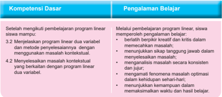

Tabel ini membahas kompetensi dasar dan pengalaman belajar dalam pembelajaran program linear. Topik utamanya adalah tentang pengetahuan dan keterampilan yang diperlukan untuk memahami dan menerapkan metode program linear. Kolom "Kompetensi Dasar" mencakup empat poin utama: setelah mengikuti pembelajaran program linear siswa dapat menentukan solusi, menjalankan program linear dua variabel, menyelesaikan perselisihan dengan menggunakan masalah kontekstual, dan menyelesaikan masalah kontekstual yang berbentuk dengan program linear dua variabel. Sementara itu, kolom "Pengalaman Belajar" mencakup empat langkah yang harus dilalui siswa untuk memahami konsep tersebut, yaitu belajar, menyelesaikan masalah, menyelesaikan masalah, dan menyelesaikan masalah. Pola penting yang terlihat adalah bahwa pembelajaran program linear melibatkan pemahaman konsep, penyelesaian masalah, dan praktik dalam situasi kontekstual.

### Istilah Penting

- Kendala/Keterbatasan ( Constraint )
- Optimum (Maksimum atau minimum)
- Daerah Layak, Daerah Jawab, Daerah Penyelesai  an
- Garis Selidik
- Titik Optimum

 

---
## 📄 Halaman 37

### B. Diagram Alir

---
**🖼️ Gambar/Diagram**

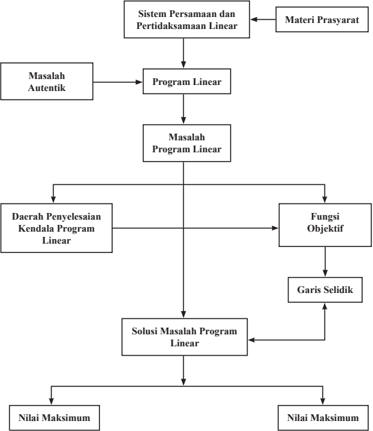

> **Deskripsi Visual:** Gambar ini adalah diagram yang menunjukkan proses analisis sistem persamaan dan pertidaksamaan linear. Diagram ini terdiri dari berbagai elemen yang saling terkait, mulai dari masalah autentik hingga solusi maksimum. Pertama, masalah autentik didefinisikan sebagai masalah yang ingin diselesaikan. Kemudian, masalah ini dikonversi menjadi program linear. Setelah itu, program linear dikonversi menjadi masalah program linear. Daerah penyelesaian kendala program linear kemudian ditentukan melalui fungsi objektif dan garis sedia. Solusi masalah program linear kemudian diperoleh melalui nilai maksimum. Jadi, diagram ini menggambarkan langkah-langkah analisis sistem persamaan dan pertidaksamaan linear secara sistematis dan detail.

 

---
## 📄 Halaman 38

### C. Materi Pembelajaran

### 2.1  Pertidaksamaan Linear Dua Variabel

Konsep persamaan dan sistem persamaan linear dua variabel sudah kamu pelajari. Dalam pertidaksamaan, prinsip yang ada pada persamaan juga kita gunakan dalam menyelesaikan pertidaksamaan atau  sistem  pertidaksamaan linear dua variabel. Prinsip yang dimaksud adalah menentukan nilai variabel yang memenuhi pertidaksamaan atau sistem pertidaksamaan linear tersebut.

Dalam kehidupan sehari-hari, banyak kita jumpai kasus yang melibatkan pembatasan  suatu  hal.  Contohnya,  lowongan  kerja  mensyaratkan  pelamar dengan batas usia tertentu, batas nilai cukup seorang pelajar agar dinyatakan lulus dari ujian, dan batas berat bersih suatu kendaraan yang diperbolehkan oleh dinas perhubungan. Perhatikan beberapa masalah pertidaksamaan berikut.

### Masalah 2.1

Santi  berbelanja  di  toko  peralatan  sekolah  dengan  uang  yang  tersedia Rp250.000,00. Harga setiap barang di toko tersebut telah tersedia di daftar harga barang sehingga Santi dapat memperkirakan peralatan sekolah apa saja  yang  sanggup  dia  beli  dengan  uang  yang  dia  miliki.  Berdasarkan daftar harga, jika Santi membeli 2 seragam sekolah dan 3 buku maka dia masih mendapatkan uang kembalian. Dapatkah kamu memodelkan harga belanjaan Santi tersebut?

### Alternatif Penyelesaian:

Dengan memisalkan harga seragam sekolah = x dan harga buku = y maka permasalahan di atas dapat dimodelkan sebagai berikut:

Santi membeli 2 seragam sekolah dan 3 buku dan mendapatkan uang kembalian mempunyai arti 2 x + 3 y < 250.000. (2a)

 

---
## 📄 Halaman 39

Untuk menentukan himpunan penyelesaian (2a), kita pilih x dan y yang memenuhi (2a). Selengkapnya kita sajikan pada tabel berikut.

---
**📊 Tabel**

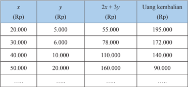

Tabel ini menunjukkan hubungan antara jumlah uang yang diberikan (x) dengan jumlah uang kembali yang didapat (y). Kolom pertama menunjukkan jumlah uang yang diberikan dalam rupiah (Rp), kolom kedua menunjukkan jumlah uang kembali yang didapat dalam rupiah, kolom ketiga menunjukkan hasil kali dua kali jumlah uang yang diberikan dengan jumlah uang kembali yang didapat, dan kolom keempat menunjukkan jumlah uang kembali yang didapat dalam rupiah. Data penting yang terlihat adalah bahwa semakin banyak uang yang diberikan, semakin banyak uang kembali yang didapat, tetapi ada batas tertentu di mana jumlah uang kembali tidak meningkat lagi.

Tabel di atas masih dapat dilanjut hingga tak hingga banyaknya nilai x dan y yang memenuhi (2a).

- Untuk  mengisi  tabel  di  atas,  berikan  penjelasan  jika x =  0  dan y = 90.000.
- Menurut kamu,  berapa harga paling mahal satu baju dan harga paling mahal satu buku  yang mungkin dibeli oleh Santi? Berikan penjelasan untuk jawaban yang kamu berikan.
Dengan  demikian  pasangan  nilai x dan y yang  memenuhi  (2a),  dapat  kita tuliskan dalam himpunan dan terdapat banyak nilai x dan y yang memenuhi pertidaksamaan 2 x +  3 y <  250.000,  tetapi  kamu  harus  mempertimbangkan nilai x dan y dengan realita yang ada.

Secara  geometris,  himpunan  penyelesaian  di  atas,  diilustrasikan  sebagai berikut.

 

---
## 📄 Halaman 40

---
**🖼️ Gambar/Diagram**

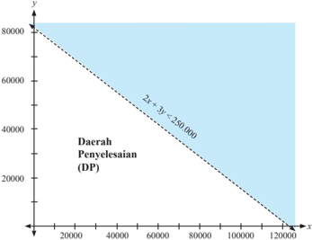

> **Deskripsi Visual:** Gambar ini adalah diagram, yang menunjukkan hubungan antara dua variabel, x dan y, dengan batas penyelesaian (DP) yang ditentukan oleh persamaan 2x + 3y ≤ 250.000. Gambar ini menggambarkan daerah di mana nilai x dan y harus memenuhi persamaan tersebut untuk mencapai DP. Elemen utama dalam gambar ini adalah garis diagonal yang menghubungkan titik-titik pada sumbu x dan y, serta titik-titik di mana garis tersebut berakhir. Garis tersebut membentuk sebuah daerah di mana semua titik (x, y) yang terletak di dalamnya akan memenuhi persamaan 2x + 3y ≤ 250.000. Informasi kunci yang dapat diambil dari gambar ini adalah bahwa nilai x dan y harus berada di dalam daerah yang dibatasi oleh garis tersebut untuk mencapai DP.

### Keterangan gambar:

- Daerah yang tidak diarsir adalah daerah yang memenuhi.
- Garis putus - putus bermakna, tanda pertidaksamaan ' > ' atau '<' bukan ' ≤ ' atau ' ≥ '. Untuk pertidaksamaan yang menggunakan tanda ' ≤ ' atau ' ≥ ',	graik	garisnya	berupa	garis	lurus.
- Tentunya kamu tahu, alasannya kenapa garis putus-putus tersebut hanya di kuadran I.
Dalam  buku  ini,  untuk  semua  graik  persamaan  linear  atau  sistem pertidaksamaan linear, Daerah Bersih merupakan daerah penyelesaian pertidaksamaan atau sistem pertidaksamaan yang dikaji.

 

---
## 📄 Halaman 41

Dengan	 melihat	 spasi	 pada	 graik	 di	 atas,	 kita	 dapat	 menemukan	 tak hingga banyaknya pasangan x dan y yang terletak pada daerah yang memenuhi. Misalnya x =  100.000,  dan y =  10.000,  sedemikian  sehingga  menjadikan pertidaksamaan  (2a)  bernilai  benar,  karena  200.000  +  30.000  =  230.000 < 250.000. Tentunya, kamu dapat memilih titik yang tak hingga banyaknya yang terdapat pada daerah penyelesaian.

### Masalah 2.2

Pak  Rianto, seorang  petani  di  desa  Magelang,  memiliki  lahan berbentuk persegi panjang seluas 600 m 2 . Dia hendak menanam jagung dan kentang di lahan tersebut. Karena tidak selalu tersedia modal yang cukup, Pak Rianto tidak memungkinkan untuk mengolah seluruh lahannya, akan tetapi dia ingin lahannya lebih luas ditanami kentang. Tentukan luas lahan yang mungkin untuk ditanam jagung dan kentang.

### Alternatif Penyelesaian:

Misalkan p = luas lahan yang ditanami jagung (m 2 )

q = luas lahan yang ditanami kentang (m 2 ).

Dengan demikian, luas lahan yang ditanami jagung ditambah dengan luas lahan yang ditanami kentang kurang dari atau sama dengan 600 m 2 , dan lahan yang  ditanami  kentang  lebih  luas  dari  lahan  yang  ditanami  jagung,  secara matematik dituliskan:

``

``

Dengan pengalaman menyelesaikan Masalah 2.1, diharapkan kita akan mudah  menentukan  semua  nilai p dan q yang  memenuhi  (2b)  dan  (2c). Selengkapnya disajikan pada tabel berikut.

---
**📊 Tabel**

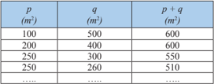

Tabel ini menunjukkan hubungan antara dua variabel, yaitu panjang persegi (p) dan luas persegi (q). Variabel p dinyatakan dalam satuan meter persegi (m²), sedangkan q dinyatakan dalam satuan luas persegi (m²). Dari tabel tersebut, dapat dilihat bahwa panjang persegi (p) selalu sama dengan 250 m², sedangkan luas persegi (q) berubah-ubah. Pola yang terlihat adalah bahwa setiap kali panjang persegi (p) meningkat, luas persegi (q) turun seiringnya. Ini menunjukkan bahwa luas persegi (q) adalah hasil dari pengurangan panjang persegi (p) dari suatu nilai awal yang konstan.

 

---
## 📄 Halaman 42

Tabel  2.2  dapat  kamu  lanjutkan,  karena  tak  hingga  banyaknya  nilai p dan q yang  memenuhi  (2b)  dan  (2c).  Secara  geometri,  himpunan  penyelesaian pertidaksamaan 600 ≤ + q p dan q p > 0, disajikan pada gambar berikut.

---
**🖼️ Gambar/Diagram**

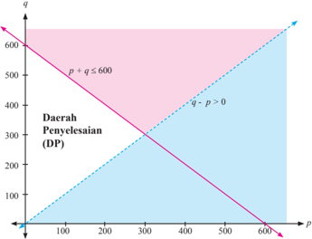

> **Deskripsi Visual:** Gambar ini adalah diagram, yang menunjukkan hubungan antara dua variabel, p dan q, dalam dua daerah penyelesaian (DP) berbeda. Daerah DP atas dinyatakan oleh persamaan p + q ≤ 600, sementara daerah DP bawah dinyatakan oleh persamaan p - q > 0. Di antara kedua daerah tersebut, terdapat garis pembatas yang menghubungkan titik-titik (0, 600) dan (600, 0), yang menunjukkan bahwa jika p = 600, maka q = 0, dan sebaliknya. Garis ini juga membentuk sudut 45 derajat dengan sumbu-x dan sumbu-y, menunjukkan bahwa untuk setiap increment pada salah satu variabel, increment pada variabel lainnya sama. Label "Daerah Penyelesaian (DP)" menunjukkan bahwa daerah yang ditunjukkan oleh garis tersebut adalah daerah penyelesaian dari persamaan-persamaan tersebut.

Sekali  lagi,  diingatkan  kembali  bahwa  daerah  yang  bersih  atau  daerah yang tidak diarsir adalah daerah yang memenuhi. Kita dapat mengambil suatu titik yang terdapat pada daerah penyelesaian, misalnya titik (100, 480), maka menjadi pertidaksamaan p + q ≤ 600 bernilai benar, karena 100 + 480 = 580 < 600. Tentunya kamu dapat menuliskan titik yang tak hingga banyaknya yang terdapat di daerah penyelesaian dan memenuhi p + q ≤ 600 dan q > p .

 

---
## 📄 Halaman 43

### Masalah 2.3

Harlen, mengikuti ujian AKPOL pada tahun 2014. Sistem ujian yang selektif dan kompetetif, mengharuskan setiap peserta ujian harus memiliki nilai	gabungan	tes	tertulis	dan	tes	isik	minimal	65,	dengan	bobot	0,6	untuk nilai	tes	tertulis	dan	0,4	tes	isik.	Namun,	untuk	setiap	tes	harus	memiliki nilai minimal 55.

Nyatakanlah  masalah  ini  dalam  simbol  matematik  dan  tentukanlah himpunan penyelesaiannya.

### Alternatif Penyelesaian:

Misalkan r = nilai tes tertulis yang diperoleh Harlen

- s =	nilai	tes	isik	yang	diperoleh	Harlen.
Diketahui bahwa bobot untuk setiap nilai tes berturut-turut adalah 0,6 dan 0,4. Untuk	dinyatakan	lulus,	maka	nilai	gabungan	tes	tertulis	dan	isik	yang	diraih Harlen minimal 65, secara matematik dapat dituliskan:

``

Nilai variabel r dan s yang memenuhi (2d), dinyatakan pada tabel berikut.

---
**📊 Tabel**

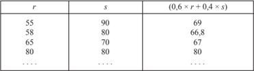

Tabel ini menunjukkan hubungan antara dua variabel: r (rata-rata) dan s (standar deviasi). Variabel r berada di kolom pertama, sedangkan s berada di kolom kedua. Kolom ketiga menampilkan hasil perkalian 0,6 x r + 0,4 x s. Dari data yang diberikan, dapat dilihat bahwa semakin tinggi nilai r, maka nilai hasil perkalian tersebut juga meningkat. Namun, ada perbedaan kecil antara nilai r dan hasil perkalian tersebut. Misalnya, saat r = 55, hasil perkalian adalah 69, sedangkan saat r = 80, hasil perkalian menjadi 80. Ini menunjukkan bahwa ada pola korelasi positif antara r dan hasil perkalian tersebut, tetapi tidak sempurna karena ada perbedaan kecil.

Tentunya, kamu dapat meneruskan mengisi Tabel 2.3, karena terdapat tak hingga banyaknya nilai r dan s yang memenuhi (2d).

 

---
## 📄 Halaman 44

Secara geometris, himpunan penyelesaian diilustrasikan sebagai berikut.

s

---
**🖼️ Gambar/Diagram**

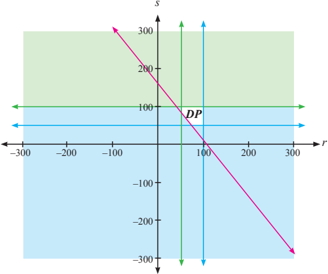

> **Deskripsi Visual:** Gambar ini adalah diagram, yang menunjukkan hubungan antara dua variabel, r (radius) dan s (suhu), dalam skala logaritmik. Diagram ini terdiri dari dua garis: satu untuk r dan satu untuk s. Garis r berada di sebelah kanan dan mengarah ke atas, sedangkan garis s berada di sebelah kiri dan mengarah ke bawah. Titik DP pada kedua garis tersebut menunjukkan koordinat (100, 100). Di bagian atas, garis merah menunjukkan bahwa suhu (s) meningkat dengan semakin besar radius (r), sementara garis biru menunjukkan bahwa suhu (s) menurun dengan semakin besar radius (r). Ini menunjukkan bahwa suhu (s) dan radius (r) memiliki hubungan negatif.

Jika	melihat	daerah	penyelesaian	pada	graik	di	atas,	seakan-akan	hanya sedikit pasangan titik yang terdapat pada daerah penyelesaian tersebut. Hal ini, yang	menegaskan	bahwa	tidak	cukup	yang	memberikan	graik	atau	gambar untuk  bukti  atau  jawaban  untuk  suatu  masalah.  Tetapi,  kita  masih  dapat memilih titik-titik pada daerah penyelesaian sedemikian sehingga menjadikan pertidaksamaan (2c) bernilai benar, misalnya r = 75,5 dan s = 70,2 akibatnya [(0,6) × (75,5)] + [(0,4) × (70,2)] = 73,38 ≥ 65.

Tentunya masih banyak masalah kontekstual yang dapat kita modelkan menjadi pertidaksamaan linear dua variabel. Nah, dari Masalah 2.1, Masalah 2.2,	dan	Masalah	2.3	dapat	kita	simpulkan	deinisi	pertidaksamaan	linear	dua variabel.

 

---
## 📄 Halaman 45

a, b

c

: konstanta ( c ∈ R )

x, y

: variabel ( x, y ∈ R )

---
**🖼️ Gambar/Diagram**

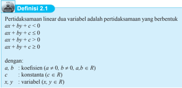

> **Deskripsi Visual:** Gambar ini adalah ilustrasi yang menunjukkan definisi pertidaksamaan linear dua variabel dalam buku pelajaran matematika. Ilustrasi ini menggambarkan tiga bentuk pertidaksamaan linear dua variabel: pertidaksamaan linear dengan tanda kurang sama dengan (≤), pertidaksamaan linear dengan tanda lebih besar sama dengan (≥), dan pertidaksamaan linear dengan tanda lebih besar (>). Setiap bentuk pertidaksamaan tersebut dinyatakan dalam bentuk aljabar ax + by + c ≤ 0, ax + by + c ≥ 0, dan ax + by + c > 0, masing-masing dengan koefisien a ≠ 0, b ≠ 0, dan konstanta c ∈ R. Variabel x dan y juga dinyatakan sebagai anggota himpunan real (R). Teks pada gambar memberikan penjelasan tentang definisi pertidaksamaan linear dua variabel, sementara angka dan label pentingnya mencakup koefisien, konstanta, dan variabel dalam bentuk aljabar. Informasi kunci yang dapat diambil pembaca meliputi definisi dan bentuk-bentuk pertidaksamaan linear dua variabel serta hubungan antara koefisien, konstanta, dan variabel dalam setiap bentuk pertidaksamaan.

Perlu kamu ingat bahwa untuk setiap pertidaksamaan linear dua variabel, pada umumnya, memiliki himpunan penyelesaian yang tak hingga banyaknya.

### Contoh 2.1

Tentukan himpunan penyelesaian dan gambarkan graik untuk setiap pertidaksamaan di bawah ini.

- -2 x + y > 5, untuk x dan y semua bilangan real b. 4 x - 5 y ≤ 30, dengan 10 < x < 30 dan 10 < y < 30 untuk x dan y semua bilangan real. c. x + 3 y ≥ 30, untuk x dan y semua bilangan real.
- Alternatif Penyelesaian: a. Dengan menguji nilai-nilai x dan y yang memenuhi 5 2 > + -y x , maka dapat ditemukan banyak pasangan x dan y yang memenuhi pertidaksamaan.

 

---
## 📄 Halaman 46

Ilustrasi  himpunan  penyelesaian,  jika  dikaji  secara  geometris  disajikan pada gambar berikut.

---
**🖼️ Gambar/Diagram**

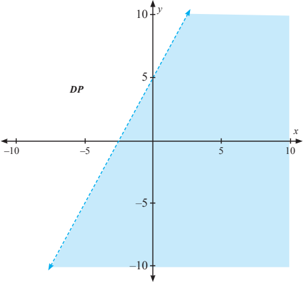

> **Deskripsi Visual:** Gambar ini adalah diagram, yang menunjukkan sebuah daerah di bidang koordinat dengan garis DP sebagai sumbu x dan y. Daerah ini terdiri dari segi tiga berbentuk trapesium dengan sisi-sisi yang terletak di antara garis x = -5, x = 5, y = -5, dan y = 10. Garis DP membentuk sudut 45 derajat dengan sumbu x dan y. Di bagian atas daerah tersebut, ada titik (0, 10) dan titik (-5, 5), sedangkan di bagian bawah ada titik (5, -5). Label "DP" diletakkan di bagian atas daerah tersebut. Ini mungkin digunakan untuk menggambarkan hubungan antara dua variabel atau untuk memvisualisasikan suatu fungsi atau persamaan.

Dari gambar diperoleh bahwa terdapat titik yang tak hingga banyaknya (daerah yang tidak diarsir)  yang  memenuhi  -2 x + y >  5.  Kali  ini, melalui	graik,	kita	dapat	memilih	sembarang	titik,	misalnya	titik	(-5,	0), sedemikian sehingga -2(-5) + 0 = 10 > 5 adalah pernyataan benar.

- Untuk menentukan himpunan penyelesaian pertidaksamaan 4 5 30 x y -≤ , dengan 10 30 < < x dan 10 30 < < y , kita harus menguji setiap nilai x dan y yang memenuhi 4 5 30 x y -≤ . Misalnya kita ambil x = 11 dan y = 11, maka 4 11 5 11 11 30 . . -= -≤ adalah suatu pernyataan yang benar. Tetapi terdapat  banyak  titik  yang  memenuhi  pertidaksamaan  pertidaksamaan 4 5 30 x y -≤ ,  dengan 10 30 < < x dan 10 30 < < y ,  bukan?  Himpunan penyelesaian bagian b) ini, jika kita ilustrasikan seperti gambar berikut.

 

---
## 📄 Halaman 47

---
**🖼️ Gambar/Diagram**

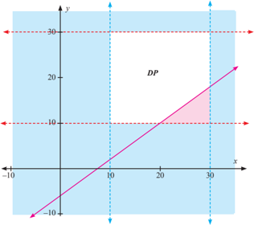

> **Deskripsi Visual:** Gambar ini adalah sebuah diagram linear yang menunjukkan hubungan antara dua variabel, yaitu x dan y. Diagram ini berbentuk segi empat dengan garis diagonal yang menghubungkan titik-titik pada sumbu-x dan sumbu-y. Titik-titik tersebut menunjukkan beberapa pasang nilai x dan y yang diberikan dalam tabel di bawah diagram.

Elemen utama yang ditampilkan adalah garis diagonal yang menghubungkan titik-titik pada sumbu-x dan sumbu-y. Garis ini menunjukkan hubungan linear antara kedua variabel tersebut. Di bagian atas diagram, terdapat teks "DP" yang mungkin merujuk pada nama diagram atau topik yang dipelajari.

Angka-angka yang penting dalam diagram meliputi titik-titik pada garis diagonal, yang menunjukkan nilai-nilai x dan y. Angka-angka ini membantu pembaca untuk memahami skala dan interval pada sumbu-x dan sumbu-y.

Informasi kunci yang dapat diambil dari gambar ini adalah bahwa ada hubungan linear antara variabel x dan y, dan nilai-nilai tersebut dapat digunakan untuk membuat prediksi atau analisis data.

Meskipun nilai x dan y sudah dibatasi, masih terdapat titik yang tak hingga banyaknya (semua titik yang terdapat di daerah penyelesaian) yang memenuhi pertidaksamaan. Misalnya titik (12,5 , 13,2), mengakibatkan 4(12,5) - 5(13,2) = -4 ≤ 30 adalah suatu pernyataan benar.

- Pertidaksamaan x +  3 y ≥ 30,  artinya  kita  harus  memikirkan bilangan x dan y sedemikian sehingga x + 3 y paling kecil 30. Jelasnya, tak hingga banyaknya bilangan x dan y yang memenuhi x + 3 y ≥ 30, secara lengkap dituliskan;
Himpunan Penyelesaian = {(0, 10), (-10, 15), (31, 0), (50, -6), . . . .}. Secara  geometri,  himpunan  penyelesaian  di  atas  digambarkan  sebagai berikut.

 

---
## 📄 Halaman 48

---
**🖼️ Gambar/Diagram**

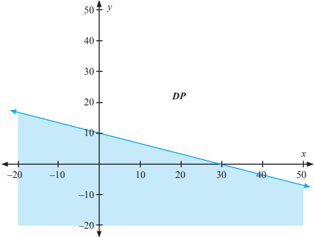

> **Deskripsi Visual:** Gambar ini adalah diagram, yang menunjukkan hubungan antara dua variabel, x dan y, dalam bentuk garis lurus. Garis ini melambangkan hubungan linear antara kedua variabel tersebut. Di bagian atas, terdapat label "DP" yang mungkin merujuk pada domain atau daerah penampang. Garis ini bergerak dari titik (0, 20) ke titik (-20, -20), menunjukkan bahwa saat x bertambah, y turun seiring dengan perubahan tersebut. Label "x" dan "y" menunjukkan posisi kedua variabel di sumbu-x dan sumbu-y, masing-masing. Informasi kunci yang dapat diambil dari gambar ini adalah bahwa ada hubungan linear negatif antara x dan y, dengan koefisien korelasi negatif yang signifikan.

### Pertanyaan Kritis !!!

- Apakah semua pertidaksamaan memiliki himpunan penyelesaian? Berikan penjelasan atas jawaban kamu.
- Misalkan diberikan suatu himpunan penyelesaian suatu pertidaksamaan yang disajikan pada suatu graik, bagaimana	 caranya	 membentuk pertidaksamaan yang memenuhi himpunan penyelesaian tersebut?

### 2.2  Program Linear

Setiap  orang  yang  hendak  mencapai  tujuan,  pasti  memiliki  kendalakendala yang berkaitan dengan tujuan tersebut. Misalnya, seorang petani ingin memanen padinya sebanyak-banyak, tetapi kendala cuaca dan hama terkadang tidak  dengan  mudah  dapat  diatasi.  Seorang  pedagang  ingin  memperoleh keuntungan  sebesar-besarnya  tetapi  terkendala  dengan  biaya  produksi  atau biaya  pengangkutan  atau  biaya  perawatan  yang  besar.  Masalah-masalah kontekstual ini, akan menjadi bahan kajian kita selanjutnya.

Mari kita mulai dengan masalah transmigrasi berikut ini.

 

---
## 📄 Halaman 49

### Masalah 2.4

Sekelompok tani transmigran mendapatkan 10 hektar tanah yang dapat ditanami  padi,  jagung,  dan  palawija  lain.  Karena  keterbatasan  sumber daya petani harus menentukan berapa bagian yang harus ditanami padi dan berapa bagian yang harus ditanami jagung, sedangkan palawija lainnya ternyata  tidak  menguntungkan.  Untuk  suatu  masa  tanam,  tenaga  yang tersedia hanya 1.550 jam-orang, pupuk juga terbatas, tak lebih dari 460 kilogram, sedangkan air dan sumber daya lainnya cukup tersedia. Diketahui pula bahwa untuk menghasilkan 1 kuintal padi diperlukan 10 jam-orang tenaga dan 5 kilogram pupuk, dan untuk 1 kuintal jagung diperlukan 8 jam-orang tenaga dan 3 kilogram pupuk. Kondisi tanah memungkinkan menghasilkan 50 kuintal padi per hektar atau 20 kuintal jagung per hektar. Pendapatan petani dari 1 kuintal padi adalah Rp40.000,00 sedang dari 1 kuintal jagung Rp30.000,00 dan dianggap bahwa semua hasil tanamnya selalu habis terjual.

Masalah  bagi  petani  ialah  bagaimanakah  rencana  produksi  yang memaksimumkan  pendapatan  total? Artinya  berapa  hektar  tanah  harus ditanami padi dan berapa hektar tanah harus ditanami jagung

### Perumusan Masalah:

Mari kita mengkaji jika hasil padi dan jagung dinyatakan per kuintal. Berdasarkan masalah di atas, diketahui bahwa setiap 1 hektar menghasilkan 50 kuintal padi. Artinya, untuk 1 kuintal padi diperlukan 0,02 hektar. Demikian juga, untuk 1 kuintal jagung diperlukan 0,05 hektar.

Cermati angka-angka yang tersaji pada tabel berikut ini!

---
**📊 Tabel**

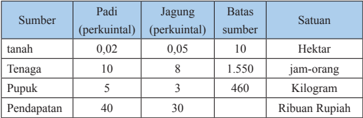

Tabel ini menunjukkan informasi tentang sumber daya tanah, tenaga kerja, pupuk, dan pendapatan dalam suatu sistem pertanian. Topik utama tabel adalah analisis sumber daya pertanian. Kolom-kolomnya meliputi sumber (tanah, tenaga kerja, pupuk, dan pendapatan), jumlah perkualitasannya, batas sumbernya, dan satuan ukur. Data penting yang terlihat adalah bahwa tanah memiliki nilai tertinggi dalam jumlah perkualitasannya, sedangkan pendapatan memiliki nilai tertinggi dalam batas sumbernya. Ini menunjukkan bahwa dalam sistem ini, tanah memiliki nilai ekonomi tertinggi dibandingkan dengan tenaga kerja, pupuk, dan pendapatan.

 

---
## 📄 Halaman 50

### Catatan:

- Satuan  jam-orang  ( man-hour )  adalah  banyak  orang  kali  banyak  jam bekerja.
- Kita  anggap  (asumsi)  bahwa  setiap  transmigran  memiliki  tenaga  dan waktu yang relatif sama.
- Air  dianggap  berlimpah  sehingga  tidak  menjadi  kendala/keterbatasan. Jika ada kendala air maka satuannya adalah banyak jam membuka saluran tersier untuk mengalirkan air ke sawah.
- Batas ketersediaan dalam soal ini kebetulan semuanya berupa batas atas.

### Alternatif Penyelesaian:

Besarnya pendapatan kelompok petani dipengaruhi banyak (kuintal) padi dan jagung yang diproduksi. Tentunya, besar pendapatan tersebut merupakan tujuan kelompok tani, tetapi harus mempertimbangkan keterbatasan sumber (luas tanah, tenaga dan pupuk).

- Misalkan x : banyak kuintal padi yang diproduksi oleh kelompok tani
- y : banyak kuintal jagung yang diproduksi oleh kelompok tani.
Untuk memperoleh pendapatan terbesar, harus dipikirkan keterbatasanketerbatasan berikut:

- Banyak hektar tanah yang diperlukan untuk x kuintal padi dan untuk y kuintal jagung tidak boleh melebihi 10 hektar.
- Untuk ketersediaan waktu (jam-orang) tiap-tiap padi dan jagung hanya tersedia waktu tidak lebih dari 1.550 jam-orang.
- Jumlah pupuk yang tersedia untuk padi dan jagung tidak lebih dari 460 kilogram.
- Dengan  semua  keterbatasan  (kendala)  (a),  (b),  dan  (c),  kelompok  tani ingin  mengharapkan  pendapatan  Rp40.000,00  dan  Rp30.000,00  untuk setiap kuintal padi dan jagung.
- Dari uraian keterbatasan atau kendala pada bagian (a), (b), dan (c) dan tujuan pada bagian (d), bersama temanmu, coba rumuskan model matematika yang mendeskripsikan kondisi yang dihadapi kelompok tani tersebut.

 

---
## 📄 Halaman 51

Melihat uraian di atas, masalah kelompok tani transmigran dapat diubah bentuk menjadi suatu sistem pertidaksamaan linear dua variabel. Pemecahan sistem	tersebut	dapat	dikerjakan	dengan	metode	graik	(dibahas	pada	subbab berikutnya). Hal ini merupakan pengembangan konsep pertidaksamaan linear satu variabel yang telah kamu pelajari pada Kelas X.

Adapun  model  matematika  untuk  masalah  ini,  adalah  suatu  sistem pertidak  samaan linear dua variabel sebagai berikut:

``

Karena luas tanah/lahan, banyak waktu, dan banyak pupuk tidak mungkin negatif, kendala ini sebagai kendala nonnegatif, yaitu:

``

Secara geometris, kendala (1) dan (2) dapat digambarkan sebagai berikut.

---
**🖼️ Gambar/Diagram**

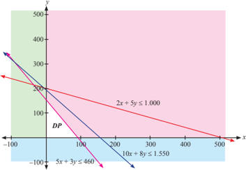

> **Deskripsi Visual:** Gambar ini adalah diagram yang menunjukkan beberapa garis dan titik pada sebuah bidang koordinat. Diagram ini terdiri dari tiga garis: 2x + 5y ≤ 1000, 5x + 3y ≤ 460, dan 10x + 8y ≤ 1550. Garis-garis ini membentuk beberapa area berbeda pada bidang koordinat, masing-masing dengan warna berbeda. Titik DP tampaknya merupakan titik potensial untuk analisis atau perhitungan. Garis-garis tersebut menggambarkan batasan-batasan dalam suatu masalah matematika, mungkin dalam konteks optimasi atau penyelesaian sistem persamaan linear. Informasi kunci yang dapat diambil dari gambar ini meliputi batasan-batasan yang diberikan oleh setiap garis, serta posisi titik DP yang mungkin memiliki nilai maksimum atau minimum dalam konteks yang diberikan.

 

---
## 📄 Halaman 52

Adapun	 langkah-langkah	 untuk	 menggambarkan	 graik	 di	 atas	 adalah sebagai berikut:

- Gambarkan setiap pertidaksamaan sebagai suatu persamaan garis lurus. Namun,  jika  tanda  pertidaksamaan  menggunakan  tanda  '<'  atau  '>', maka garisnya putus-putus.
- Setiap  garis  akan  membagi  dua  bidang  kartesius,  untuk  menentukan daerah penyelesaian, ambil sembarang titik di salah satu bagian bidang tadi, misalnya titik A . Kemudian ujian kebenaran pertidaksamaan dengan menggunakan titik A .  Jika  pertidaksamaan bernilai benar, maka bidang asal  titik A merupakan  daerah  penyelesaian.  Jika  bernilai  salah,  maka bidang yang bukan asal titik A merupakan daerah penyelesaian.
- Ulangi  langkah  1  dan  2  untuk  semua  pertidaksamaan  yang  telah dirumuskan.  Kemudian,  perhatikan  irisan  atau  daerah  yang  memenuhi untuk setiap pertidaksamaan yang diberikan.
- Perhatikan syarat non - negatif untuk setiap variabel. Nilai variabel tidak selalu positif .
Untuk  pendapatan,  tentu  dimaksimumkan  dan  sebaliknya  untuk  biaya tentu  diminimumkan.  Untuk  masalah  ini,  kelompok  tani  tentu  hendak memaksimumkan  pendapatan,  melalui  memperbanyak  kuintal  padi  dan jagung yang dijual berturut-turut Rp40.000,00 dan Rp30.000,00. Rumusan ini disebut sebagai fungi tujuan; sebut Z ( x , y ). Secara matematik dituliskan:

Maksimumkan: Z ( x , y ) = 40 x + 30 y (dalam satuan ribuan rupiah) (3)

Dengan daerah penyelesaian yang disajikan pada Gambar 2.7, kita harus dapat menentukan nilai maksimum fungsi Z ( x , y ). Untuk menyelesaikan ini, kita akan bahas pada subbab berikutnya.

Selain masalah transmigrasi, berikut ini kita kaji bagaimana model matematika masalah produksi suatu perusahaan.

 

---
## 📄 Halaman 53

### Masalah 2.5

Perusahaan 'Galang Jaya' memproduksi alat-alat barang elektronik, yaitu  transistor,  kapasitor,  dan  resistor.  Perusahaan  harus  mempunyai persediaan paling sedikit  200  resistor,  120  transistor,  dan  150  kapasitor,  yang diproduksi melalui 2 mesin, yaitu: mesin A, untuk setiap satuan jam kerja hanya mampu memproduksi 20 resistor, 10 transistor, dan 10 kapasitor; mesin B, untuk setiap satuan jam kerja hanya mampu memproduksi 10 resistor, 20 transistor, dan 30 kapasitor. Jika keuntungan untuk setiap unit yang diproduksi mesin A dan mesin B berturut-turut adalah Rp50.000,00 dan Rp120.000,00.

Bentuklah model matematika masalah perusahaan Galang Jaya.

### Alternatif Penyelesaian:

Semua data yang diketahui pada masalah ini, kita sajikan pada tabel berikut.

Dengan memisalkan x

: banyak unit barang yang diproduksi mesin A y : banyak unit barang yang diproduksi mesin B.

Dengan demikian kita dapat menuliskan model matematika yang menggambarkan kondisi pada Tabel 2.5, yaitu:

``

 

---
## 📄 Halaman 54

Karena  banyak  barang  yang  diproduksi  tidak  mungkin  negatif,  maka  kita dapat menuliskan:

``

Artinya,  untuk  memenuhi  persediaan,  mungkin  saja  mesin  A  tidak berproduksi atau mesin B yang tidak berproduksi.

Secara  geometri,  kondisi  kendala  persedian  dan  kendala  non-negatif, disajikan pada gambar berikut.

---
**🖼️ Gambar/Diagram**

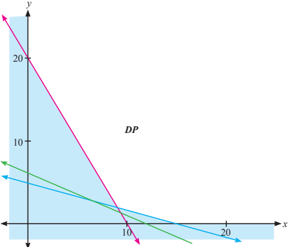

> **Deskripsi Visual:** Gambar ini adalah diagram yang menunjukkan hubungan antara dua variabel, yaitu variabel x dan y. Diagram ini berupa garis lurus dengan titik-titik yang menghubungkan dua titik pada sumbu x dan y. Titik-titik tersebut diberi label dengan nilai-nilai spesifik, seperti (0, 20) dan (10, 10). Garis ini menunjukkan bahwa ada hubungan linear antara kedua variabel tersebut, dengan koefisien korelasi positif. Label "DP" tampak di bagian atas diagram, mungkin merujuk pada nama diagram atau topik yang dipelajari. Teks, angka, atau label penting lainnya tidak terlihat dalam gambar ini.

Untuk  menggambarkan  sistem  pertidaksamaan  (1*)  dan  (2*),  ikuti langkah-langkah yang diberikan di atas. Berbeda dengan Masalah 2.4, sistem pertidaksamaan (1*) dan (2*), mempunyai daerah penyelesaian berupa suatu daerah yang tidak terbatas ( unbounded area ).

Selanjutnya,  kita  dapat  menuliskan  fungsi  tujuan  atau  fungsi  sasaran masalah  ini, yaitu  pemilik  perusahaan  tentunya  ingin  memaksimalkan keuntungan. Dengan demikian, dapat kita tuliskan:

 

---
## 📄 Halaman 55

### Fungsi Tujuan

Maksimumkan:

``

Jadi, untuk daerah penyelesaian yang diilustrasikan pada Gambar 2.8 di atas, kita akan menentukan nilai maksimum fungsi f ( x , y ). Hal ini akan kita kaji pada subbab berikutnya.

Dari tiga ciri di atas, dapat kita simpulkan masalah program linear dua variabel dirumuskan sebagai berikut:

### Deinisi 2.2

Masalah program linear dua variabel adalah menentukan nilai x 1 , x 2 yang memaksimumkan (atau meminimumkan) fungsi tujuan,

``

Namun, dalam kajian program linear tidak hanya untuk dua variabel saja, tetapi ada juga kajian program linear tiga variabel bahkan untuk n variabel. Untuk tiga variabel atau lebih dibutuhkan pengetahuan lanjutan tentang teknik menyelesaikan sistem persamaan atau pertidaksamaan linear.

Selain  bentuk  umum  program  linear  dua  variabel  di  atas,  kita  juga menyimpul  kan konsep tentang daerah penyelesaian, sebagai berikut.

 

---
## 📄 Halaman 56

### Deinisi 2.3

(Daerah Layak/Daerah Penyelesaian/Daerah Optimum) Daerah penyelesaian masalah program linear merupakan himpunan semua titik ( x , y ) yang memenuhi kendala suatu masalah program linear.

Untuk memantapkan pengetahuan dan keterampilan kamu dalam menggambar  kan  sistem  pertidaksamaan  yang  memenuhi  suatu  masalah program linear, mari kita cermati pembahasan soal berikut ini.

### Contoh 2.2

Gambarkan daerah penyelesaian sistem pertidaksamaan berikut ini.











``

``

### Alternatif Penyelesaian:

Untuk menggambarkan daerah penyelesaian setiap pertidaksamaan pada sistem di atas, dapat dimulai dengan menggambar satu per satu pertidaksamaan yang  diketahui.  Tentu,  semua  daerah  penyelesaian  tersebut  nanti  harus disajikan dalam satu bidang koordinat kartesius.

 

---
## 📄 Halaman 57

- Daerah  penyelesaian  untuk  sistem  pertidaksamaan  (a)  di  atas,  adalah sebagai berikut. y
- Daerah  penyelesaian  untuk  sistem  pertidaksamaan  (b)  di  atas,  adalah sebagai berikut: y

---
**🖼️ Gambar/Diagram**

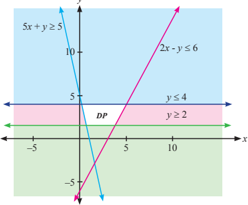

> **Deskripsi Visual:** Gambar ini adalah sebuah diagram yang menunjukkan beberapa garis lurus dan titik potong mereka pada bidang koordinat. Diagram ini terdiri dari tiga garis utama: 5x + y ≥ 5, 2x - y ≤ 6, dan y ≤ 4. Garis 5x + y ≥ 5 berada di atas sumbu x, sedangkan garis 2x - y ≤ 6 berada di bawah sumbu x. Garis y ≤ 4 berada di atas semua garis lainnya dan berada di bawah sumbu y.

Titik potong antara garis 5x + y = 5 dan garis 2x - y = 6 diberi label DP. Titik ini merupakan titik potong kedua garis tersebut dan juga merupakan titik potong antara garis 5x + y = 5 dan garis y = 4.

Informasi kunci yang dapat diambil dari gambar ini meliputi:

1. Titik potong antara garis 5x + y = 5 dan garis 2x - y = 6.
2. Titik potong antara garis 5x + y = 5 dan garis y = 4.
3. Titik potong antara garis 2x - y = 6 dan garis y = 4.
4. Garis-garis tersebut membentuk area yang ditutupi oleh garis-garis tersebut, yang mungkin merupakan daerah solusi untuk suatu pertanyaan matematika.

---
**🖼️ Gambar/Diagram**

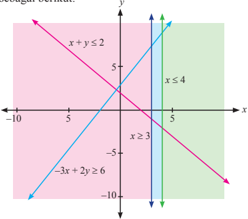

> **Deskripsi Visual:** Gambar ini adalah sebuah diagram grafik yang menunjukkan beberapa garis dan titik pada bidang koordinat. Diagram ini terdiri dari dua garis utama: satu garis merah dan satu garis biru. Garis merah melalui titik (0, 2) dan (2, 0), sementara garis biru melalui titik (0, -5) dan (5, 0). Selain itu, ada juga garis hijau yang melalui titik (0, 5) dan (4, 0).

Elemen-elemen utama yang ditampilkan dalam diagram ini adalah garis merah, garis biru, garis hijau, dan titik-titik di mana garis tersebut bertemu. Garis merah dan garis biru membentuk sebuah segitiga di bagian atas dan bagian bawah diagram, sedangkan garis hijau membentuk segitiga di bagian tengah.

Teks, angka, atau label penting yang terlihat dalam diagram ini meliputi titik-titik koordinat (0, 2), (2, 0), (0, -5), (5, 0), (0, 5), dan (4, 0). Angka-angka ini menunjukkan koordinat titik-titik di mana garis tersebut berakhir.

Informasi kunci yang dapat diambil pembaca dari gambar ini adalah bahwa diagram ini mungkin digunakan untuk menggambarkan hubungan antara dua variabel atau untuk menunjukkan batas-batas dari suatu fungsi atau persamaan.

Jadi, tidak ada nilai x dan y yang memenuhi sistem pertidaksamaan b). Hal ini, perlu dicatat, bahwa tidak semua masalah memiliki penyelesaian.

 

---
## 📄 Halaman 58

### Uji Kompetensi 2.1

- Tanpa	menggambarkan	graik,	tentukan	himpunan	penyelesaian	(jika	ada) setiap pertidaksamaan di bawah ini.
- 2 1 9 2 ≥ -y x
- 0 6 ≥ -y x

``

- 4 5 2 ≥ y x

``

- ax + by ≥ c , a , b , c , bilangan positif
- Untuk soal No.1, gambarkan setiap pertidaksamaan untuk menentukan daerah penyelesaian (jika ada).
- Untuk	 setiap	 graik	 di	 bawah	 ini,	 tentukan	 pertidaksamaan	 yang	 tepat memenuhi daerah penyelesaian.
- PT  Lasin  adalah  suatu  pengembang  perumahan  di  daerah  pemukiman baru. PT tersebut memiliki tanah seluas 12.000 meter persegi berencana akan  membangun  dua  tipe  rumah,  yaitu  tipe  mawar  dengan  luas  130 meter persegi dan tipe melati dengan luas 90 m 2 . Jumlah rumah yang akan dibangun tidak lebih 150 unit. Pengembang merancang laba tiap-tiap tipe rumah Rp2.000.000,00 dan Rp1.500.000,00.

---
**🖼️ Gambar/Diagram**

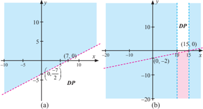

> **Deskripsi Visual:** Gambar (a) adalah diagram garis yang menunjukkan hubungan antara dua variabel, x dan y. Garis tersebut melalui titik (0, -5/2) dan (2, 0), dengan koefisien arah 1/2. Ini menunjukkan bahwa untuk setiap unit penambahan pada x, y meningkatkan sebesar 1/2 unit. Gambar (b) adalah diagram garis yang menunjukkan hubungan antara dua variabel, x dan y. Garis tersebut melalui titik (0, -2) dan (15, 0), dengan koefisien arah 1/7. Ini menunjukkan bahwa untuk setiap unit penambahan pada x, y meningkatkan sebesar 1/7 unit. Dua gambar ini menunjukkan hubungan antara dua variabel dan bagaimana perubahan pada salah satu variabel mempengaruhi perubahan pada variabel lainnya.

 

---
## 📄 Halaman 59

Modelkan permasalahan di atas! Kemudian gambarkan daerah penyelesaian untuk sistem pertidaksamaannya.

- Gambarkan daerah penyelesaian setiap sistem pertidaksamaan di bawah ini.
- 2 x + y ≥ 24 x ≥ 5
- 2 y ≤ 5 - 6 x 1 ≤ y ≤ 6
- Perhatikan	graik-graik	di	bawah	ini.
Nyatakan pertidaksamaan-pertidaksamaan yang memenuhi setiap daerah yang memenuhi.

---
**🖼️ Gambar/Diagram**

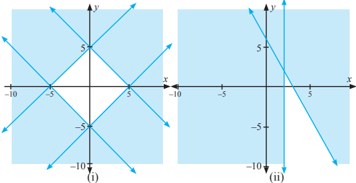

> **Deskripsi Visual:** Gambar (i) adalah sebuah diagram garis yang menunjukkan hubungan antara dua variabel, x dan y. Diagram ini terdiri dari dua garis lurus yang berpotongan di titik asal koordinat. Garis pertama melalui titik (-5, 5) dan (5, -5), sementara garis kedua melalui titik (-5, -5) dan (5, 5). Ini menunjukkan bahwa kedua variabel tersebut memiliki hubungan linear negatif.

Gambar (ii) adalah sebuah grafik yang menunjukkan hubungan antara dua variabel, x dan y. Grafik ini terdiri dari satu garis lurus yang melalui titik asal koordinat. Garis ini melambangkan bahwa variabel x dan y memiliki hubungan linear positif.

Kedua gambar ini menunjukkan bahwa hubungan antara dua variabel dapat dinyatakan dengan garis lurus. Garis ini menunjukkan bahwa ada hubungan linear antara variabel x dan y. Garis pertama menunjukkan hubungan linear negatif, sedangkan garis kedua menunjukkan hubungan linear positif.

- Seorang  atlet  diwajibkan  makan  dua  jenis  tablet  setiap  hari.  Tablet pertama mengandung 5 unit vitamin A dan 3 unit vitamin B, sedangkan tablet kedua mengandung 10 unit vitamin A dan 1 unit vitamin B. Dalam satu hari, atlet itu memerlukan 20 unit vitamin A dan 5 unit vitamin B. Harga tiap-tiap 1 tablet, Rp1.500,00 dan Rp2.000,00.
Modelkan	masalah	di	atas.	Kemudian	gambarkan	graik	model	matematikanya untuk menemukan daerah penyelesaian.

 

---
## 📄 Halaman 60

- Untuk	setiap	graik	di	bawah	ini,	tentukan	sistem	pertidaksamaan	yang memenuhi daerah penyelesaian yang diberikan.
- Sebuah  toko  bunga  menjual  2  macam  rangkaian  bunga.  Rangkaian  I memerlukan  10  tangkai  bunga  mawar  dan  15  tangkai  bunga  anyelir, Rangkaian II memerlukan 20 tangkai bunga mawar dan 5 tangkai bunga anyelir. Persediaan bunga mawar dan bunga anyelir masing-masing 200 tangkai dan 100 tangkai. Rangkaian I dijual seharga Rp 200.000,00 dan Rangkaian II dijual seharga Rp100.000,00 per rangkaian.

---
**🖼️ Gambar/Diagram**

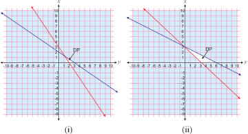

> **Deskripsi Visual:** Gambar ini adalah sebuah diagram yang menunjukkan hubungan antara dua variabel, yaitu variabel x dan y. Diagram ini terdiri dari dua bagian yang disebutkan sebagai (i) dan (ii). Variabel x dinyatakan pada sumbu horizontal, sedangkan variabel y dinyatakan pada sumbu vertikal.

Pada bagian (i), grafik menunjukkan hubungan linear antara x dan y. Dari grafik ini, kita dapat melihat bahwa semakin besar nilai x, maka nilai y akan semakin kecil. Ini menunjukkan bahwa ada hubungan negatif antara kedua variabel tersebut.

Sementara itu, pada bagian (ii), grafik menunjukkan hubungan antara x dan y yang tidak linear. Grafik ini menunjukkan bahwa ada hubungan positif antara kedua variabel tersebut. Semakin besar nilai x, maka nilai y juga semakin besar.

Dalam kedua grafik ini, terdapat beberapa titik yang penting. Titik A pada grafik (i) menunjukkan bahwa saat x = 0, y = 5. Sementara itu, titik B pada grafik (ii) menunjukkan bahwa saat x = 0, y = 10. Ini menunjukkan bahwa ada perbedaan dalam nilai awal dari kedua grafik tersebut.

Secara keseluruhan, gambar ini menunjukkan hubungan antara dua variabel, x dan y, dengan dua jenis grafik yang berbeda. Grafik linear menunjukkan hubungan negatif antara kedua variabel, sementara grafik non-linear menunjukkan hubungan positif antara kedua variabel tersebut.

Modelkan masalah di atas dalam bentuk model matematika. Kemudian gambarkan	graik	model	matematikanya.

- Perhatikan masalah yang dihadapi seorang penjaja buah-buahan berikuti ini. Pak  Benni,  seorang  penjaja  buah-buahan  yang  menggunakan  gerobak menjual  apel  dan  pisang.  Harga  pembelian  apel  Rp18.000,00  tiap kilogram dan pisang Rp8.000,00 tiap kilogram. Beliau hanya memiliki modal Rp2.000.000,00 sedangkan muatan gerobak tidak lebih dari 450 kilogram. Padahal keuntungan tiap kilogram apel 2 kali keuntungan tiap kilogram pisang.
Tentukan	tiga	titik	yang	terdapat	pada	graik	daerah	penyelesaian	masalah ini.

 

---
## 📄 Halaman 61

### 2.3  Menentukan Nilai Optimum dengan Garis Selidik (Nilai Maksimum atau Nilai Minimum)

Untuk  menyelesaikan  masalah  program  linear  dua  variabel,  dengan metode graik akan dapat ditentukan himpunan penyelesaian sistem pertidaksamaannya.  Setelah  kita  sudah  memahami  menggambarkan  daerah penyelesaian suatu sistem pertidaksamaan, kita tinggal memahami bagaimana cara menentukan nilai fungsi tujuan di daerah penyelesaian.

Nilai suatu fungsi sasaran ada dua kemungkinan, yaitu bernilai maksimum atau minimum. Istilah nilai minimum atau nilai maksimum, disebut juga nilai optimum  atau  nilai  ekstrim.  Jadi,  pembahasan  kita  selanjutnya  bagaimana konsep  menentukan  nilai  optimum  suatu  fungsi  tujuan  dari  suatu  masalah program linear.

Mari kita cermati kajian berikut ini.

### Masalah 2.6

Suatu	 pabrik	 farmasi	 menghasilkan	 dua	 jenis	 kapsul	 obat	 lu	 yang diberi  nama  Fluin  dan  Fluon.  Tiap-tiap  kapsul  memuat  tiga  unsur (ingredient) utama dengan kadar kandungannya tertera dalam Tabel 2.6. Menurut	dokter,	seseorang	yang	sakit	lu	akan	sembuh	jika	dalam	tiga	hari (secara rata-rata) minimal menelan 12 grain aspirin, 74 grain bikarbonat dan  24  grain  kodein.  Jika  harga  Fluin  Rp500,00  dan  Fluon  Rp600,00 per	 kapsul,	 bagaimana	rencana	(program)	pembelian	seorang	pasien	lu (artinya berapa kapsul Fluin dan berapa kapsul Fluon harus dibeli) supaya cukup untuk menyembuhkannya dan meminimumkan ongkos pembelian total?

---
**📊 Tabel**

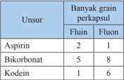

Tabel ini menunjukkan informasi tentang berbagai obat yang terdiri dari unsur kimia dan jumlah per kapsulnya. Topik utama tabel adalah jenis obat dan jumlah per kapsulnya. Kolom pertama berisi nama obat seperti Aspirin, Bikorbonat, dan Kodeine. Kolom kedua berisi jumlah per kapsul untuk setiap obat tersebut. Data penting yang terlihat adalah bahwa Aspirin memiliki 2 per kapsul, Bikorbonat memiliki 5 per kapsul, dan Kodeine memiliki 1 per kapsul. Ini menunjukkan bahwa bikorbonat memiliki jumlah per kapsul paling banyak dibandingkan dengan obat lainnya.

 

---
## 📄 Halaman 62

### Alternatif Penyelesaian:

Data pada masalah di atas, dapat disajikan seperti tabel berikut ini.

---
**📊 Tabel**

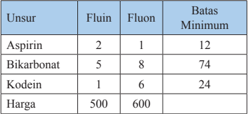

Tabel ini menunjukkan informasi tentang harga dan batas minimum untuk beberapa obat-obatan. Topik utama tabel adalah perbandingan harga dan batas minimum untuk Aspirin, Bikarbonat, dan Kodein. Kolom "Fluin" menunjukkan jumlah unit yang dibutuhkan untuk mencapai batas minimum, sedangkan kolom "Fluon" menunjukkan jumlah unit yang diperlukan untuk mencapai harga tertinggi. Data penting yang terlihat adalah bahwa Aspirin memerlukan 2 unit untuk mencapai batas minimum, sedangkan Kodein memerlukan 6 unit untuk mencapai harga tertinggi. Ini menunjukkan bahwa Kodein memiliki harga yang lebih tinggi dibandingkan dengan Aspirin.

Dengan tabel tersebut, dapat kita misalkan:

x

: banyak kapsul Fluin yang dibeli

y : banyak kapsul Fluon yang dibeli.

Selanjutnya, kita dengan mudah menemukan bentuk masalah program linear masalah di atas.

``

dan meminimumkan Z ( x , y ) = 5 x + 6 y (dalam ratusan rupiah). (b)

Sebelum kita menentukan nilai minimum fungsi Z ( x , y ), terlebih dahulu kita	gambarkan	graik	sistem	pertidaksamaan	(a),	untuk	menemukan	daerah penyelesaian.

### Informasi

Software Autograph merupakan salah satu software yang digunakan untuk menggambarkan daerah penyelesaian suatu sistem pertidaksamaan linear. Autograph juga	dapat	digunakan	untuk	menggambarkan	berbagai	graik fungsi, misalnya fungsi kuadrat dan fungsi logaritma.

 

---
## 📄 Halaman 63

---
**🖼️ Gambar/Diagram**

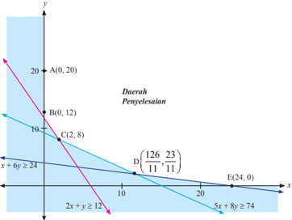

> **Deskripsi Visual:** Gambar ini adalah diagram yang menunjukkan dua garis lurus dan sebuah daerah penyelesaian. Garis lurus pertama adalah x + 6y ≥ 24, yang melalui titik A(0, 20) dan B(0, 12). Garis lurus kedua adalah 2x + y ≥ 12, yang melalui titik C(2, 8) dan D(26/11, 23/11). Daerah penyelesaian terletak antara kedua garis tersebut dan berada di bawah garis x + 6y = 24 dan di atas garis 2x + y = 12. Titik E(24, 0) merupakan titik potensial untuk penyelesaian yang ideal. Informasi kunci yang dapat diambil pembaca adalah bahwa daerah penyelesaian terletak antara kedua garis tersebut dan berada di bawah garis x + 6y = 24 dan di atas garis 2x + y = 12.

Daerah penyelesaian sistem (a) berupa suatu area tak terbatas ( unbounded area ).  Untuk  menentukan  nilai  minimum  fungsi Z ( x , y )  =  5 x +  6 y (dalam ratusan  rupiah),  artinya  kita  harus  menemukan  satu  titik  (dari  tak  hingga banyak titik  yang  terdapat  pada  daerah  penyelesaian)  sedemikian  sehingga menjadikan nilai fungsi menjadi yang terkecil di antara yang lain.

Untuk menemukan koordinat titik A hingga E , kamu sudah mempelajari pada saat SMP dan SMA kelas X. Tentunya, jika kita memeriksa nilai fungsi Z ( x , y ) = 5 x + 6 y pada kelima titik itu, bukanlah sesuatu hal yang salah, bukan? Hasilnya disajikan pada tabel berikut.

 

---
## 📄 Halaman 64





Menurut Tabel 2.8, nilai minimum fungsi adalah Z ( x , y ) = 5 x + 6 y adalah 5.800, dan titik yang membuat fungsi tujuan bernilai minimum adalah titik C (2, 8). Pertanyaannya,  apakah  ini  nilai  minimum  fungsi  di  daerah  penyelesaian? Untuk memastikannya, kita selidiki nilai fungsi Z ( x , y ) = 5 x + 6 y pada daerah penyelesaian, dengan cara menggeser (ke kiri atau ke kanan; ke atas atau ke bawah). Kita namakan garis k = 5 x + 6 y sebagai garis selidik, untuk k bilangan real. Seperti ditunjukkan pada gambar berikut ini.

---
**🖼️ Gambar/Diagram**

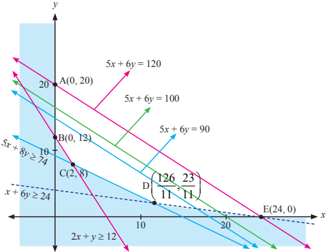

> **Deskripsi Visual:** Gambar ini adalah sebuah diagram yang menunjukkan hubungan antara dua variabel, x dan y, melalui beberapa titik pada garis-garis yang membentuk sistem persamaan linear. Diagram ini terdiri dari berbagai garis dengan persamaan yang berbeda-beda, seperti 5x + 6y = 120, 5x + 6y = 100, 5x + 6y = 90, 5x + 6y ≥ 74, dan 2x + y ≥ 12. Setiap garis tersebut menggambarkan batas-batas dari nilai-nilai x dan y yang memenuhi persamaan tersebut. Titik-titik A(0, 20), B(0, 12), C(2, 8), D(11, 7), dan E(24, 0) menunjukkan koordinat-koordinat tertentu di mana garis-garis tersebut bertemu atau melewati. Garis-garis ini membentuk pola yang menunjukkan hubungan antara dua variabel tersebut, serta memberikan informasi tentang batas-batas nilai-nilai yang mungkin terjadi dalam konteks tersebut.

 

---
## 📄 Halaman 65

Misalnya, kita pilih 3 titik yang terdapat pada daerah penyelesaian, yaitu titik P (6, 10), Q (8, 10), dan R (12, 10), sedemikian sehingga terbentuk garis 5 x + 6 y = 90, 5 x + 6 y = 100, dan 5 x + 6 y = 120, seperti yang disajikan pada Gambar 2.12.

Karena kita ingin menentukan nilai minimum fungsi, maka garis = 5 x + 6 y = 90 digeser ke bawah hingga ditemukan nilai minimum fungsi, yaitu 5.800, pada titik (2, 8).

Jadi,	agar	seorang	pasien	lu	sembuh,	harus	mengkomsumsi	2	kapsul	luin dan	8	kapsul	luon	dengan	biaya	Rp5.800,00.

Untuk  membantu  kamu  semakin  memahami  penentuan  nilai  optimum suatu  fungsi  tujuan  dengan  garis  selidik,  mari  kita  selesaikan  masalah kelompok tani transmigran (Masalah 2.4)

### Contoh 2.3

``

``

``

Maksimumkan: Z ( x , y ) = 4 x + 3 y (dalam puluh ribu rupiah). (4*)

Kita akan menentukan banyak hektar tanah yang seharusnya ditanami padi dan jagung agar pendapatan kelompok tani tersebut maksimum.

### Alternatif Penyelesaian:

Pada  pembahasan  Masalah  2.4,  kita  sudah  menggambarkan  daerah penyelesaian sistem (3*). Mari kita cermati lagi gambar tersebut.

Kita sudah menempatkan garis selidik 4 x + 3 y = k pada daerah penyelesaiannya.

 

---
## 📄 Halaman 66

---
**🖼️ Gambar/Diagram**

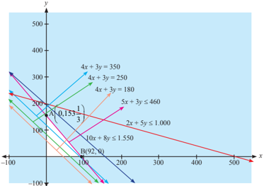

> **Deskripsi Visual:** Gambar ini adalah sebuah diagram grafik yang menunjukkan beberapa garis persamaan dalam bidang koordinat. Diagram ini menggambarkan berbagai persamaan linear dalam bentuk garis, dengan titik-titik potensial di mana garis tersebut bertemu. Setiap garis memiliki persamaan yang berbeda, seperti 4x + 3y = 350, 4x + 3y = 250, 4x + 3y = 180, 5x + 3y ≤ 460, 2x + 5y ≤ 1000, dan 10x + 8y ≤ 1550. Garis-garis ini membentuk poligon di area tertentu pada grafik, yang menunjukkan daerah yang memenuhi setiap persamaan. Titik potensial di mana garis-garis tersebut bertemu diberi label, seperti (0, 153/3) untuk garis 4x + 3y = 350. Informasi penting lainnya termasuk titik-titik potensial di mana garis-garis tersebut bertemu, yang menunjukkan daerah yang memenuhi setiap persamaan.

Misalnya kita pilih 3 titik yang terdapat pada daerah penyelesaian, misalnya A(30,  20),  B(80,  10),  dan  C(40,  30),  sedemikian  sehingga  terbentuk  garis 4 x + 3 y = 180, 4 x + 3 y = 250, dan 4 x + 3 y = 350, seperti yang disajikan pada Gambar 2.13. Karena kita ingin menentukan nilai maksimum fungsi tujuan, maka garis 4 x + 3 y = 350 digeser ke atas hingga ditemukan nilai maksimum

``

Jadi, untuk memaksimumkan pendapatan, petani harus memproduksi 1 153 3 kuintal  jagung  tidak  perlu  memproduksi  padi.  Dengan  demikian  petani memperoleh pendapatan maksimalnya sebesar Rp460.000,00.

Bandingkan masalah berikut ini dengan Masalah 2.6

 

---
## 📄 Halaman 67

### Masalah 2.7

Apakah  kamu  pernah  melihat  tanaman  hias  seperti  di  bawah  ini? Tahukah kamu berapa harga satu tanaman hias tersebut?

---
**🖼️ Gambar/Diagram**

> **Deskripsi Visual:** Gambar ini adalah ilustrasi yang menunjukkan dua jenis tanaman berbeda. Pada sisi kiri, terdapat tanaman dengan daun berwarna merah dan hijau yang tampak seperti poinsettia, yang biasanya digunakan sebagai dekorasi Natal. Sementara itu, pada sisi kanan, terdapat tanaman dengan daun berwarna hijau dan batang yang tumbuh tegak, mungkin merupakan spesies tanaman hias lainnya.

Elemen utama dalam gambar ini adalah dua jenis tanaman yang berbeda. Tanaman poinsettia di sisi kiri memiliki daun berwarna merah dan hijau yang mencolok, sedangkan tanaman di sisi kanan memiliki daun hijau dan batang yang tumbuh tegak. Relasi antara kedua elemen ini adalah bahwa mereka merupakan dua jenis tanaman yang berbeda, masing-masing dengan ciri-ciri unik mereka sendiri.

Teks, angka, atau label penting yang terlihat dalam gambar ini tidak ada. Namun, informasi kunci yang dapat diambil pembaca adalah bahwa gambar ini menunjukkan dua jenis tanaman berbeda, yaitu tanaman poinsettia dan tanaman lainnya dengan daun hijau dan batang yang tumbuh tegak. Ini memberikan pemahaman tentang variasi dalam bentuk dan warna daun tanaman hias.

Setiap  enam  bulan,  seorang  pemilik  usaha  tanaman  hias  memesan tanaman hias dari agen besar; Aglaonema (A) dan Sansevieria (S) yang berturut-turut memberi laba sebesar Rp5.000.000,00 dan Rp3.500.000,00 per unit yang  terjual.  Dibutuhkan  waktu  yang  cukup  lama  untuk menghasilkan satu tanaman hias dengan kualitas super. Oleh karena itu agen besar memiliki aturan bahwa setiap pemesanan tanaman hias A paling sedikit 20% dari seluruh pesanan tanaman hias lain. Pemilik usaha tanaman hias memiliki lahan yang hanya cukup untuk 10 tanaman hias A saja atau 15 tanaman hias S. Dalam keadaan demikian, berapa banyak tanaman hias A dan S sebaiknya dipesan (per semester) jika diketahui bahwa pada akhir semester tanaman hias lama pasti habis terjual dan pemilik usaha tersebut ingin memaksimumkan laba total?

### Alternatif Penyelesaian:

Untuk memudahkan kita dalam membahas masalah ini,

misalkan x

: banyak tanaman hias A yang dipesan

y : banyak tanaman hias S yang dipesan.

Pernyataan  'Oleh  karena  itu  agen  besar  memiliki  aturan  bahwa  setiap pemesanan tanaman hias A paling sedikit 20% dari seluruh pesanan tanaman hias lain', dapat dituliskan sebagai berikut.

``

 

---
## 📄 Halaman 68

Untuk memperoleh laba, pemilik harus mempertimbangan keterbatasan lahan sebagai daya tampung untuk tiap-tiap tanaman hias.

Misal, L

:  luas kebun tanaman hias,

L x

:  luas kebun yang diperlukan untuk 1 tanaman hias A,

L y

:  luas kebun yang diperlukan untuk 1 tanaman hias S.

Sesuai  keterangan  pada  masalah  di  atas,  luas  kebun  hanya  dapat menampung  10  tanaman  hias  A  atau  15  tanaman  hias  S.  Pernyataan  ini, dimodelkan sebagai berikut:

``

Tentu luas kebun yang diperlukan untuk x banyak tananam hias A dan y banyak tanaman hias S tidak melebihi luas kebun yang ada. Oleh karena itu, dapat dituliskan;

``

Selanjutnya, pemilik kebun mengharapkan laba sebesar Rp5.000.000,00 dari 1 tanaman hias A yang terjual dan Rp3.500.000,00 dari 1 tanaman hias S yang terjual. Oleh karena itu, untuk sebanyak x tanaman hias A yang terjual dan sebanyak y tanaman hias S yang terjual, maka dapat dituliskan sebagai laba total pemilik kebun, yaitu:

``

Jadi secara lengkap, model matematika masalah program linear pemilik kebun tanaman hias dinyatakan sebagai berikut.

``

Dengan fungsi tujuan:

Maksimumkan: Z = 5 x + 3,5 y (dalam juta rupiah).

 

---
## 📄 Halaman 69

Selanjutnya, kita akan menentukan daerah penyelesaian sistem pertidaksamaan linear (1.1). Tentunya, diharapkan keterampilan kamu dalam menggambarkan daerah penyelesaian sistem tersebut sudah  makin meningkat. Sekaligus juga, kamu  harus makin terampil dalam memilih titik dalam daerah penyelesaian untuk menentukan nilai maksimum fungsi tujuan.

Adapun	graik	daerah	penyelesaian	sistem	(1.1)	disajikan	pada	gambar	berikut ini.

---
**🖼️ Gambar/Diagram**

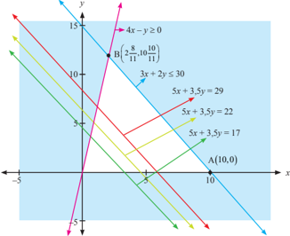

> **Deskripsi Visual:** Gambar ini adalah sebuah diagram yang menunjukkan beberapa garis lurus dengan titik-titik penyeberangan yang berbeda. Diagram ini tampaknya merupakan bagian dari materi matematika, mungkin tentang pemodelan grafik atau sistem persamaan linier. Garis-garis tersebut memiliki persamaan yang ditulis di atas mereka, seperti "4x - y ≥ 0", "3x + 2y ≤ 30", dan sebagainya. Titik A dan B pada diagram ini tampaknya merupakan titik penyeberangan antara dua garis, yang mungkin merupakan titik-titik ekstrem dalam konteks soal-soal yang diberikan. Garis-garis ini membentuk pola yang menunjukkan hubungan antara variabel x dan y dalam setiap persamaan. Informasi penting lainnya yang dapat diambil dari gambar ini adalah bahwa garis-garis tersebut menggambarkan batas-batas dari area yang memenuhi persamaan-persamaan tersebut, yang bisa digunakan untuk menyelesaikan masalah-masalah matematika seperti pemodelan grafik atau pemecahan sistem persamaan.

Dengan  mengambil  tiga  titik  yang  terdapat  pada  daerah  penyelesaian, misalnya  titik  (2,  2),  (3,  2),  dan  (3,  4),  sehingga  menghasilkan  garis  5 x + 3,5 y = 17, 5 x + 3,5 y = 22, dan 5 x + 3,5 y = 29, seperti yang disajikan pada Gambar  2.15.  Untuk  menentukan  nilai  maksimum  fungsi Z =  5 x +  3,5 y , berarti kita menggeser garis 5 x + 3,5 y = 29 ke atas, hingga ditemukan nilai maksimum, yaitu Z =  51.818.181,8181  atau  sekitar  Rp51.818.200,00  pada titik B 2 8 11 10 10 11 , .      

 

---
## 📄 Halaman 70

Namun, pada kenyataannya, ditemukannya titik 8 10 2 ,10 11 11 B       sebagai  titik optimum masalah di atas mengakibatkan hal yang tidak mungkin terjadi untuk menemukan 8 2 11 tanaman hias A dan 10 10 11 tanaman hias S. Artinya, kita harus menemukan nilai x dan y ( x , y bilangan bulat positif).

- Dalam kertas berpetak, di dalam daerah penyelesaian cermati titik-titik yang  dekat  dengan  titik 8 10 2 ,10 11 11 B       .  Tetapi  titik  yang  kita  inginkan, yaitu ( x , y ) harus untuk x dan y merupakan bilangan bulat positif.
- Bandingkan hasil yang kamu peroleh jika menggunakan konsep pembulatan bilangan untuk menentukan pembulatan titik 8 10 2 ,10 11 11 B      
Sebagai petunjuk buat kamu, nilai optimum fungsi sasaran adalah Rp50.000.000,00 dengan banyak tanaman hias A dan S, masing-masing 3 unit dan 10 unit.

Dari  pembahasan  Masalah  2.7  ini,  ternyata  metode  garis  selidik  tidak akurat  menemukan  nilai  optimum  fungsi  tujuan.  Namun,  pada  umumnya, metode garis selidik dapat menemukan nilai maksimum atau nilai minimum suatu fungsi tujuan. Tetapi, kamu harus lebih kritis lagi dalam memecahkan masalah-masalah  program  linear  yang  mengharuskan  penyelesaian  berupa bilangan bulat positif.

Dari  pembahasan  Masalah  2.6,  Masalah  2.7,  dan  Contoh  2.3,  kita  dapat mendeinisikan	garis	selidik,	yaitu:

### Deinisi 2.4

Garis	 selidik	 adalah	 graik	 persamaan	 fungsi	 sasaran/tujuan	 yang digunakan untuk menentukan solusi optimum (maksimum atau minimum) suatu masalah program linear.

 

---
## 📄 Halaman 71

Untuk  menentukan  persamaan  garis  selidik k = C 1 x 1 + C 2 x 2 dengan k bilangan real, kita memilih minimal dua titik ( x 1 , y 1 ) dan ( x 2 , y 2 ) yang terdapat di  daerah  penyelesaian.  Dengan  dua  titik  tersebut,  nilai  optimum  fungsi sasaran dapat ditemukan melalui pergeseran (ke atas atau ke bawah; ke kanan atau ke kiri) garis selidik di daerah penyelesaian.

Masalah 2.7 mengingatkan kita bahwa tidak selamanya penentuan nilai optimum dengan menggunakan garis selidik. Terdapat beberapa kasus yang memerlukan  ketelitian  yang  tinggi  dalam  menyelesaikan  masalah  program linear.

### 2.4  Beberapa Kasus Daerah Penyelesaian

Dari beberapa masalah yang telah dibahas di atas, masalah program linear memiliki nilai optimum (maksimum atau minimum) terkait dengan eksistensi daerah  penyelesaian.  Oleh  karena  itu  terdapat  tiga  kondisi  yang  akan  kita selidiki, yaitu:

- tidak memiliki daerah penyelesaian
- memiliki  daerah penyelesaian (fungsi tujuan hanya  memiliki  nilai maksimum atau hanya memiliki nilai minimum)
- memiliki daerah penyelesaian (fungsi tujuan memiliki nilai maksimum dan minimum).

### 1) Tidak memiliki daerah penyelesaian

Mari kita cermati, Gambar 2.16 Diberikan sistem:

Untuk setiap a , b , c , p , q , dan t ∈ R

``

- Selidiki	hubungan	antar	koeisien	variabel x dan y serta konstanta c dan t pada sistem tersebut, hingga kamu menemukan syarat bahwa suatu sistem pertidaksamaan linear tidak memiliki daerah penyelesaian.

 

---
## 📄 Halaman 72

---
**🖼️ Gambar/Diagram**

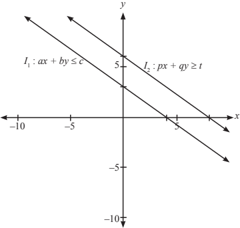

> **Deskripsi Visual:** Gambar ini adalah sebuah diagram yang menunjukkan dua garis lurus: I₁ dan I₂. Garis I₁ dinyatakan dengan persamaan ax + by ≤ c, sedangkan garis I₂ dinyatakan dengan persamaan px + qy ≥ t. Kedua garis tersebut berada di bidang koordinat xy. Garis I₁ bergerigi ke atas dan ke kanan, sementara garis I₂ bergerigi ke bawah dan ke kiri. Garis I₁ memiliki titik potong dengan sumbu x pada koordinat (-5,0) dan titik potong dengan sumbu y pada koordinat (0,5). Garis I₂ memiliki titik potong dengan sumbu x pada koordinat (-10,0) dan titik potong dengan sumbu y pada koordinat (0,-5). Label "I₁" dan "I₂" masing-masing menunjukkan garis yang berbeda. Teks, angka, atau label penting lainnya tidak ada dalam gambar ini. Informasi kunci yang dapat diambil pembaca adalah bahwa kedua garis tersebut merupakan representasi dari dua persamaan linier, dan mereka menunjukkan hubungan antara variabel x dan y dalam konteks matematika.

### 2) Memiliki daerah penyelesaian (fungsi sasaran hanya memiliki nilai maksimum atau hanya memiliki nilai minimum)

Graik	berikut	ini,	mendeskripsikan	bahwa	walaupun	kendala	suatu program  linear  memiliki  daerah  penyelesaian,  ternyata  belum  tentu memiliki nilai fungsi sasaran.

### Mari kita cermati.

- Dari Gambar 2.17, tentukan sistem pertidaksamaan yang bersesuaian dengan	graik	daerah	penyelesaian	seperti	pada	gambar.
Selanjutnya, dengan sistem pertidaksamaan yang telah kamu temukan, misalnya diketahui fungsi tujuan;

- Maksimumkan:
Z ( x , y ) = mx + ny ; m, n ∈ R +

- Minimumkan:
Z ( x , y ) = mx + ny ; m, n ∈ R +

- Dengan  demikian,  tentu  kamu  dapat  menemukan  kondisi  suatu program  linear  yang  memiliki  daerah  penyelesaian  tetapi  fungsi tujuannya  hanya  memiliki  nilai  minimum  dan  tidak  memiliki  nilai maksimum (kenapa?).

 

---
## 📄 Halaman 73

- Rancang  suatu  sistem  pertidaksamaan  linear  dua  variabel,  yang memiliki daerah penyelesaian tetapi fungsi tujuannya hanya memiliki nilai maksimum. Berikan penjelasan, kenapa fungsi tujuannya tidak memiliki nilai minimum. y
- Memiliki daerah penyelesaian (fungsi tujuan memiliki nilai maksimum dan minimum)

---
**🖼️ Gambar/Diagram**

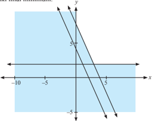

> **Deskripsi Visual:** Gambar ini adalah sebuah diagram yang menunjukkan hubungan antara dua variabel, yaitu x dan y. Diagram ini berbentuk parabola dengan sumbu x berada di bawah sumbu y. Di bagian atas, sumbu y memiliki titik nol (0,0) dan titik maksimum pada koordinat (0,5). Sumbu x juga memiliki titik nol (0,0) dan titik minimum pada koordinat (-5,0). Dua garis diagonal melintasi diagram ini, masing-masing menghubungkan titik (0,5) dan (-5,0), serta titik (0,-5) dan (5,0). Garis pertama memiliki sudut tajam sekitar 45 derajat, sedangkan garis kedua memiliki sudut tajam sekitar 135 derajat. Label "x" dan "y" diletakkan di sisi horizontal dan vertikal respektif, menunjukkan bahwa x adalah variabel horizontal dan y adalah variabel vertikal.

``

merupakan	kendala	yang	bersesuaian	dengan	graik	daerah	penyelesaian pada Gambar 2.18 berikut.

- Misalnya, diberikan fungsi sasaran berikut ini:
- Maksimumkan:

``

- Minimumkan: Z = 3 x + 2 y

 

---
## 📄 Halaman 74

Dengan  teliti,  coba  kamu  tentukan  nilai  maksimum  dan  minimum fungsi sasaran tersebut. Bandingkan hasil yang kamu temukan dengan temanmu. y

---
**🖼️ Gambar/Diagram**

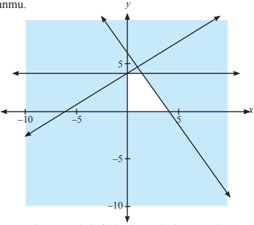

> **Deskripsi Visual:** Gambar ini adalah sebuah diagram yang menunjukkan hubungan antara dua variabel, yaitu variabel x dan y. Diagram ini berbentuk parabola dengan sumbu x berada di sebelah kiri dan sumbu y di sebelah kanan. Variabel x dinyatakan pada sumbu horizontal, sedangkan variabel y dinyatakan pada sumbu vertikal. Di titik koordinat (0, 5) terdapat titik puncak parabola, yang menunjukkan bahwa nilai maksimum dari variabel y adalah 5. Selain itu, ada beberapa titik lain di diagram yang menunjukkan nilai-nilai lain dari variabel y untuk beberapa nilai dari variabel x. Teks, angka, atau label penting yang terlihat dalam diagram ini meliputi titik-titik koordinat, sumbu-sumbu, dan nilai-nilai yang ditunjukkan oleh titik-titik tersebut. Informasi kunci yang dapat diambil pembaca dari gambar ini adalah bahwa hubungan antara variabel x dan y adalah fungsi kuadrat, dan nilai maksimum dari variabel y adalah 5.

### Pertanyaan Kritis!!!

Diketahui sistem pertidaksamaan linear suatu masalah program linear.

``

a , b , c , p , q , dan t merupakan bilangan real, dan c < t .

Selidiki syarat agar sistem pertidaksamaan linear tersebut:

- tidak memiliki daerah penyelesaian;
- memiliki daerah penyelesaian;
- memiliki daerah penyelesaian berupa suatu garis atau segmen garis;
- memiliki daerah penyelesaian hanya satu titik.

 

---
## 📄 Halaman 75

- Rani  dan  Ratu  menjalankan  suatu  bisnis  kecil,  mereka  bekerja  sama untuk menghasilkan blus dan rok. Untuk menyelesaikan 1 blus, Rani dan Ratu harus bekerja sama selama 1 jam. Untuk menyelesaikan 1 rok, Rani harus bekerja 1 jam dan Ratu harus bekerja 0,5 jam. Setiap hari, Ratu hanya mampu menyediakan 7 jam kerja, dan Ratu hanya 5 jam. Mereka hendak membuat blus dan rok yang sama banyaknya. Mereka mendapat keuntungan Rp80.000,00 untuk setiap blus dan Rp60.000,00 untuk setiap rok (Anggap semua blus dan rok habis terjual).
- Rancang model matematikanya.
- Berapa  banyak  blus  dan  rok  yang  selesaikan  mereka?  Berapa keuntungan maksimal yang mereka peroleh?
- Suatu perusahaan transportasi harus mendistribusikan 1200 paket (yang besarnya sama) melalui dua truk pengangkut. Truk 1 memuat 200 paket untuk  setiap  pengangkutan  dan  truk  2  memuat  80  paket  untuk  setiap pengangkutan.  Biaya  pengangkutan  untuk  truk  1  dan  truk  2  masingmasing  Rp400.000,00  dan  Rp200.000,00.  Padahal  biaya  yang  tersedia untuk mengangkut 1200 paket hanya Rp3.000.000,00. Hitunglah biaya minimal biaya pengangkutan paket tersebut.
- Perusahaan  'SABAR  JAYA',  suatu  perusahaan  jasa,  memiliki  2  tipe karyawan.  Karyawan  tipe  A  digaji  sebesar  Rp135.000,00  per  minggu dan  karyawan  tipe  B  digaji  sebesar  Rp270.000,00  per  minggu.  Pada suatu proyek memerlukan 110 karyawan, tetapi paling sedikit sebanyak 40 karyawan tipe B yang bekerja. Selain itu, untuk setiap proyek, aturan perusahaan mengharuskan banyak karyawan tipe B paling sedikit 0,5 dari banyak karyawan tipe A. Hitunglah banyak karyawan tipe A dan karyawan tipe B pada perusahaan tersebut.
- Selesaikan Masalah 2.5.

 

---
## 📄 Halaman 76

- Gambarkan daerah penyelesaian untuk setiap kendala masalah program linear berikut ini.
- x + 4 y 30; -5 x + y 5;   6 x -y 0; 5 x + y ≤ 50; x - 5 y ≤ 0
- x - 4 y ≤ 0; x -y ≤ 2; -2 x + 3 y ≤ 6; x ≤ 10 ≤ ≤ ≥
- x + 4y ≤ 30; -5x + y ≤ 5;  6x y ≥ 0; 5 x + y ≤ 50; x + 5 y ≤ 0
- Jika diberikan fungsi, hitung nilai maksimum dan nilai minimum fungsi (jika ada) untuk setiap sistem pertidaksamaan pada Soal No.5.
- Perhatikan gambar di bawah ini.

---
**🖼️ Gambar/Diagram**

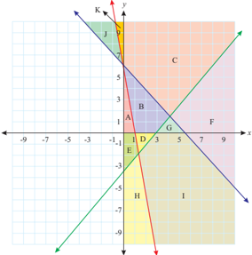

> **Deskripsi Visual:** Gambar ini adalah sebuah diagram yang menunjukkan hubungan antara dua garis sejajar di bidang koordinat. Garis sejajar tersebut melintasi beberapa titik pada grid, menciptakan beberapa segitiga dan persegi panjang. Titik-titik ini diberi label A sampai J, dengan warna-warna yang berbeda untuk setiap segitiga dan persegi panjang. Garis sejajar tersebut memiliki sumbu x dan y, dengan titik-titik di sisi kanan dan kiri masing-masing garis. Informasi penting lainnya termasuk teks yang memberikan informasi tentang posisi dan ukuran segitiga dan persegi panjang, serta angka yang menunjukkan koordinat titik-titik tersebut. Diagram ini digunakan untuk membantu memahami konsep geometri dan hubungan antara garis sejajar.

Tentukan sistem pertidaksamaan yang memenuhi jika setiap label daerah merupakan daerah penyelesaian.

- Rancang  suatu  sistem  pertidaksamaan  yang  memenuhi  setiap  daerah penyelesaian-penyelesaian berikut ini.
- berbentuk segitiga sama sisi di kuadran pertama
- berbentuk trapesium di kuadran kedua
- berbentuk jajargenjang di kuadran keempat

 

---
## 📄 Halaman 77

- Pesawat penumpang mempunyai tempat duduk 48 kursi. Setiap penumpang kelas utama boleh membawa bagasi maksimum 60 kilogram sedangkan kelas ekonomi maksimum 20 kg. Pesawat hanya dapat membawa bagasi maksimum 1440 kg. Harga tiket kelas utama Rp 150.000,00 dan kelas ekonomi Rp100.000,00. Supaya pendapatan dari penjualan tiket pada saat pesawat penuh mencapai maksimum, tentukan jumlah tempat duduk kelas utama.
- Tentukan  titik    yang  mengakibatkan  fungsi  linear ( ) 4 2 , --= y x y x f bernilai optimum (maksimum atau minimum) jika daerah asal dibatasi sebagai berikut 1 1 ≤ ≤ -x ; 1 1 ≤ ≤ -y . (Periksa nilai fungsi di beberapa titik  daerah  asal  dan  periksa  bahwa  nilai  optimum  tercapai  pada  suatu titik sudut daerah asal).
- Cermati pertidaksamaan ax + by ≥ c . Untuk  menentukan  daerah  penyelesaian  pada  bidang  koordinat,  selain dengan	menggunakan	uji	titik,	selidiki	hubungan	tanda	koeisien x dan y terhadap daerah penyelesaian (bersih) pertidaksamaan.

### Soal Proyek

Setiap manusia memiliki keterbatasan akan tenaga, waktu, dan tempat. Misalnya, dalam aktivitas belajar yang kamu lakukan setiap hari tentu kamu memiliki keterbatasan dengan waktu belajar di rumah, serta waktu yang kamu perlukan untuk membantu orang tuamu. Di sisi lain, kamu juga membutuhkan waktu yang cukup untuk istirahat setelah  kamu  melakukan  aktivitas  belajar  dan  aktivitas  membantu orang tua.

Dengan  kondisi  tersebut,  rumuskan  model  matematika  untuk masalah waktu yang kamu perlukan setiap hari, hingga kamu dapat mengetahui waktu istirahat yang kamu peroleh setiap hari (minggu).

Selesaikan proyek di atas dalam waktu satu minggu.

Susun hasil kinerja dalam suatu laporan, sehingga  kamu, temanmu, dan gurumu dapat memahami dengan jelas.

 

---
## 📄 Halaman 78

### D. Penutup

Beberapa  hal  penting  yang  perlu  dirangkum  terkait  dengan  konsep program linear.

- Konsep program linear  didasari  oleh  konsep  persamaan  dan  pertidaksamaan bilangan real, sehingga sifat-sifat persamaan linear dan pertidaksamaan linear  dalam  sistem  bilangan  real  banyak  digunakan  sebagai  pedoman dalam menyelesaikan suatu masalah program linear.
- Model matematika merupakan cara untuk menyelesaikan masalah kontekstual. Pembentukan model tersebut dilandasi oleh konsep berpikir logis  dan  kemampuan  bernalar  keadaan  masalah  nyata  ke  bentuk matematika.
- Dua atau lebih pertidaksamaan linear dua variabel dikatakan membentuk kendala  program  linear  linear  jika  dan  hanya  jika  variabel-variabelnya saling terkait dan variabel yang sama memiliki nilai yang sama sebagai penyelesaian setiap pertidaksamaan linear pada sistem tersebut. Sistem pertidaksamaan ini disebut sebagai kendala.
- Fungsi tujuan/sasaran (fungsi objektif) merupakan tujuan suatu masalah program linear, yang juga terkait dengan sistem pertidaksamaan program linear.
- Nilai-nilai variabel ( x , y ) disebut sebagai himpunan penyelesaian pada  masalah  suatu  program  linear  jika  nilai  ( x , y )  memenuhi  setiap pertidaksamaan yang terdapat pada kendala program linear.
- Suatu	fungsi	objektif	terdeinisi	pada	daerah	penyelesaian	suatu	masalah program linear. Fungsi objektif memiliki nilai jika sistem kendala memiliki daerah penyelesaian atau irisan.
- Konsep sistem pertidaksamaan dan persamaan linear berlaku juga untuk sistem kendala masalah program linear. Artinya jika sistem tersebut tidak memiliki solusi, maka fungsi sasaran tidak memiliki nilai.

 

---
## 📄 Halaman 79

- Garis selidik merupakan salah satu cara untuk menentukan nilai objektif suatu fungsi sasaran masalah program linear dua variabel. Garis selidik ini merupakan persamaan garis fungi sasaran, ax + by = k , yang digeser di sepanjang daerah penyelesaian untuk menentukan nilai maksimum atau minimum suatu fungsi sasaran masalah program linear.
Penguasaan kamu tentang program linear akan memfasilitasi kamu untuk mampu menyelesaikan  masalah-masalah  dalam  dunia  ekonomi,  kesehatan, dan  bidang  lainnya.  Untuk  masalah-masalah  dalam  kehidupan  sehari-hari yang berbentuk nonlinear akan dikaji pada aplikasi turunan.

 

---
## 📄 Halaman 80

### BAB 3

### Matriks

### Kompetensi Dasar dan Pengalaman Belajar

### Kompetensi Dasar

Setelah mengikuti pembelajaran matriks, siswa mampu:

- 3.3 Menjelaskan matriks dan kesamaan matriks dengan menggunakan masalah kontekstual  dan melakukan operasi pada matriks yang meliputi penjumlahan, pengurangan, perkalian skalar, dan perkalian, serta transpose.
- 3.4 Menganalisis sifat-sifat  determinan  dan invers matriks berordo 2 × 2 dan 3 × 3.
- 4.3 Menyelesaikan masalah kontekstual yang berkaitan dengan matriks dan operasinya.
- 4.4 Menyelesaikan masalah yang berkaitan dengan determinan dan invers matriks berordo 2 × 2 dan 3 × 3.

### Istilah Penting

### Pengalaman Belajar

Melalui pembelajaran materi matriks, siswa mem  peroleh pengalaman belajar:

- Melatih berpikir kritis dan kreatif.
- Berkolaborasi, bekerja sama menyelesaikan masalah.
- Berpikir independen mengajukan ide secara bebas dan terbuka.
- Mengamati aturan susunan objek.
- Entry matriks
- Ordo matriks
- Operasi matriks
- Determinan matriks
- Invers matriks
- Identitas
- Transpose

 

---
## 📄 Halaman 81

### B. Diagram Alir

---
**🖼️ Gambar/Diagram**

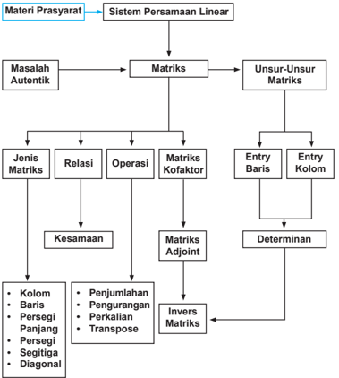

> **Deskripsi Visual:** Gambar ini adalah diagram yang menunjukkan struktur dan hubungan antara materi prasyarat sistem persamaan linear. Diagram ini terdiri dari beberapa elemen utama yang saling terkait:

1. **Materi Prasyarat** - Ini adalah titik awal yang mengarah ke sistem persamaan linear.
2. **Sistem Persamaan Linear** - Ini adalah titik akhir yang mengarah ke materi prasyarat.
3. **Matriks** - Ini adalah titik tengah yang menghubungkan materi prasyarat dengan sistem persamaan linear.
4. **Unsur-Unsur Matriks** - Ini adalah sub-kategori dari matriks yang mencakup entry baris, entry kolom, determinan, dan lain-lain.
5. **Jenis Matriks** - Ini adalah sub-kategori dari matriks yang mencakup kolom, baris, persegi panjang, persegi, segitiga, dan diagonal.
6. **Relasi** - Ini adalah sub-kategori dari matriks yang mencakup penjumlahan, pengurangan, perkalian, transpose, dan lain-lain.
7. **Operasi** - Ini adalah sub-kategori dari matriks yang mencakup matriks koefisien, matriks adjoint, invers matriks, dan lain-lain.

Teks, angka, atau label penting yang terlihat dalam diagram ini meliputi "Materi Prasyarat", "Sistem Persamaan Linear", "Matriks", "Unsur-Unsur Matriks", "Jenis Matriks", "Relasi", "Operasi", "Determinan", "Entry Baris", "Entry Kolom", "Kolom", "Baris", "Persegi Panjang", "Persegi", "Segitiga", "Diagonal", "Penjumlahan", "Pengurangan", "Perkalian", "Transpose", "Invers Matriks".

Informasi kunci yang dapat diambil pembaca meliputi struktur dan hubungan antara materi prasyarat sistem persamaan linear, jenis-jenis matriks, operasi pada matriks, dan hubungan antara matriks dengan sistem persamaan linear.

 

---
## 📄 Halaman 82

### C. Materi Pembelajaran

### 3.1 Membangun Konsep Matriks

Coba kamu perhatikan  susunan  benda-benda  di  sekitar  kamu!  Sebagai contoh, susunan buku di meja, susunan buku di lemari, posisi siswa berbaris di lapangan, susunan keramik lantai, dan lain-lain.

Tentu kamu dapat melihat susunan tersebut dapat berupa pola baris atau kolom, bukan? Bentuk susunan berupa baris dan kolom akan melahirkan konsep matriks yang akan kita pelajari. Sebagai contoh lainnya adalah susunan angka dalam bentuk tabel. Pada tabel terdapat baris atau kolom, banyak baris atau kolom bergantung pada ukuran tabel tersebut. Ini sudah merupakan gambaran dari sebuah matriks. Agar kamu dapat segera menemukan konsepnya, mari perhatikan beberapa gambaran dan permasalahan berikut ini!

Sebagai gambaran awal mengenai matriks, mari cermati uraian berikut. Diketahui harga tiket masuk suatu museum berikut ini.

 

---
## 📄 Halaman 83

Data tersebut, dapat disajikan kembali tanpa harus di dalam tabel seperti berikut:

``

Bentuk penulisan tersebut, menunjukkan terdapat 2 baris dan dua kolom.

### Masalah 3.1

Seorang wisatawan lokal hendak berlibur ke beberapa tempat wisata yang  ada  di  Pulau  Jawa.  Untuk  memaksimalkan  waktu  liburan,  dia mencatat jarak antara kota-kota tersebut sebagai berikut.

Bandung - Semarang

367 km

Semarang - Yogyakarta

115 km

Bandung - Yogyakarta

428 km

Dapatkah kamu membuat susunan jarak antar kota tujuan wisata tersebut jika wisatawan tersebut memulai perjalanannya dari Bandung! Kemudian berikan makna setiap angka dalam susunan tersebut.

### Alternatif Penyelesaian:

Wisatawan akan memulai perjalanannya dari Bandung ke kota-kota wisata di Pulau Jawa. Jarak antarkota tujuan wisata dituliskan sebagai berikut.

 

---
## 📄 Halaman 84

Berdasarkan tampilan di atas, dapat dilihat jarak antarkota tujuan wisata dengan  membaca  data  dari  baris  ke  kolom.  Susunan  tersebut  dapat  juga dituliskan sebagai berikut.

``

Susunan jarak antarkota di Pulau Jawa ini terdiri dari 3 baris dan 3 kolom.

### Kegiatan 3.1

Agar lebih memahami matriks mari lakukan kegiatan berikut ini.

- Bentuklah kelompok yang masing-masing beranggotakan 3-4 orang.
- Wawancaralah setiap anggota kelompok untuk mendapatkan informasi nilai siswa terhadap tiga mata pelajaran yang diminatinya.
- Sajikan data yang diperoleh dalam bentuk tabel seperti di bawah ini.
- Sajikan pula data tersebut dalam bentuk matriks dan jelaskan.

---
**📊 Tabel**

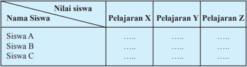

Tabel ini menunjukkan data nilai siswa dalam tiga pelajaran berbeda: Pelajaran X, Pelajaran Y, dan Pelajaran Z. Topik utama tabel adalah penilaian akademik siswa. Kolom-kolomnya mencakup nama-nama siswa dan nilai-nilai mereka dalam setiap pelajaran. Data penting yang terlihat adalah bahwa siswa A mendapatkan nilai tertinggi di Pelajaran X dan Pelajaran Z, sedangkan siswa B mendapatkan nilai tertinggi di Pelajaran Y. Sementara itu, siswa C memiliki nilai yang lebih rendah di semua pelajaran. Ini menunjukkan variasi dalam performa akademik siswa dalam setiap pelajaran.

### Deinisi 3.1

Matriks adalah susunan bilangan yang diatur menurut aturan baris dan kolom dalam suatu jajaran berbentuk persegi atau persegi panjang. Susunan bilangan itu diletakkan di dalam kurung biasa '( )' atau kurung siku '[ ]'.

 

---
## 📄 Halaman 85

Matriks diberi nama dengan menggunakan huruf kapital, seperti A , B , C , dan lain-lain. Selain memiliki baris dan kolom, matriks juga memiliki entry yaitu setiap anggota dalam matriks tersebut. Entry suatu matriks dinotasikan dengan huruf kecil seperti a , b , c , ... dan biasanya disesuaikan dengan nama matriksnya.

### Masalah 3.2

Manager  supermarket  ingin  menata  koleksi  barang  yang  tersedia. Ubahlah  bentuk  susunan  barang  di  supermarket  di  bawah  ini  menjadi matriks dan tentukan entry-entrynya.

---
**🖼️ Gambar/Diagram**

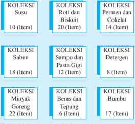

> **Deskripsi Visual:** Gambar ini adalah diagram yang menunjukkan berbagai koleksi produk dalam toko. Diagram ini terdiri dari tiga baris dan lima kolom, masing-masing menggambarkan koleksi produk berbeda. Setiap baris menggambarkan koleksi produk dengan jumlah item yang berbeda, mulai dari Susu (10 item), Roti dan Biskuit (20 item), Sabun (18 item), Sampo dan Pasta Gigi (12 item), Minyak Goreng (22 item), Beras dan Tepung (6 item), dan Bumbu (17 item). Kolom-kolom tersebut menunjukkan bahwa setiap koleksi memiliki jumlah item yang berbeda-beda, mencerminkan variasi dalam produk yang tersedia di toko tersebut. Teks, angka, atau label penting yang terlihat pada gambar ini adalah nama-nama koleksi produk dan jumlah item dalam setiap koleksi. Informasi kunci yang dapat diambil pembaca adalah bahwa toko ini menyediakan berbagai koleksi produk dengan jumlah item yang berbeda-beda, mencakup susu, roti dan biskuit, sabun, sampo dan pasta gigi, minyak goreng, beras dan tepung, serta bumbu.

 

---
## 📄 Halaman 86

### Alternatif Penyelesaian:

Gambar  di  atas mendeskripsikan  susunan  barang-barang pada rak supermarket yang terdiri atas tiga baris dan tiga kolom. Bentuk matriks dari susunan barang tersebut dapat dinyatakan sebagai berikut.

---
**🖼️ Gambar/Diagram**

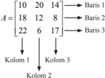

> **Deskripsi Visual:** Gambar ini adalah diagram yang menunjukkan hubungan antara kolom dan baris dalam sebuah tabel. Diagram ini terdiri dari tiga baris dan dua kolom, dengan angka-angka yang menunjukkan jumlah elemen dalam setiap baris dan kolom. Elemen-elemen utama yang ditampilkan adalah angka-angka tersebut, yang menggambarkan jumlah elemen dalam setiap baris dan kolom. Teks, angka, atau label penting yang terlihat adalah angka-angka tersebut, yang menggambarkan jumlah elemen dalam setiap baris dan kolom. Informasi kunci yang dapat diambil pembaca adalah bahwa diagram ini menunjukkan hubungan antara kolom dan baris dalam sebuah tabel, dengan angka-angka yang menunjukkan jumlah elemen dalam setiap baris dan kolom.

Misalkan  pada  matriks A di  atas,  entry-entrynya  dinyatakan  dengan a , dan umumnya entry-entry dari suatu matriks diberi tanda indeks, misalnya a ij yang artinya entry dari matriks A yang terletak pada baris i dan kolom j . Maka koleksi susu yang terdapat pada baris ke-1, kolom ke-1 dapat dinyatakan a 11 = 10. Koleksi barang yang terdapat pada baris ke-2, kolom ke-3 adalah koleksi detergen yang dinyatakan pula dengan a 23 =  8  dan  untuk  selanjutnya  entry matriks A dapat dinyatakan dengan:

``

Maka entry matriks A dapat dinyatakan sebagai berikut.

``

 

---
## 📄 Halaman 87

Secara induktif, entry matriks di atas dapat dibentuk menjadi:



---
**🖼️ Gambar/Diagram**

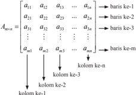

> **Deskripsi Visual:** Gambar ini adalah diagram matematika yang menunjukkan struktur dari matriks. Matriks ini diberi nama \( A_{m\times n} \), yang berarti memiliki \( m \) baris dan \( n \) kolom. Setiap elemen dalam matriks disimbolkan oleh \( a_{ij} \), di mana \( i \) adalah indeks baris dan \( j \) adalah indeks kolom. Gambar ini menunjukkan bahwa matriks ini memiliki \( m \) baris dan \( n \) kolom, dengan setiap elemen matriks disajikan dalam bentuk tabel. Teks, angka, atau label penting yang terlihat meliputi nama matriks \( A_{m\times n} \), indeks baris \( i \), indeks kolom \( j \), dan elemen matriks \( a_{ij} \). Informasi kunci yang dapat diambil pembaca meliputi ukuran matriks (jumlah baris dan kolom), struktur matriks, dan cara penyajian elemen-elemen matriks.

a ij

:  entry matriks pada baris ke- i dan kolom ke- j dengan, i = 1, 2, 3, .., m ; dan j = 1, 2, 3, …, n .

m × n

:  menyatakan  ordo  matriks A dengan m adalah  banyak  baris  dan n banyak kolom matriks A .

### Contoh 3.1

Teguh,  siswa  kelas  IX  SMA  Panca  Budi,  akan  menyusun  anggota keluarganya berdasarkan umur dalam bentuk matriks. Dia memiliki Ayah, dan Ibu, berturut-turut berumur 46 tahun dan 43 tahun. Selain itu dia juga memiliki kakak dan adik, secara berurut, Ningrum (22 tahun), Sekar (19 tahun), dan Wahyu (12 tahun). Dia sendiri berumur 14 tahun.

Berbekal dengan materi yang dia pelajari  di  sekolah  dan  kesungguhan dia dalam  berlatih,  dia  mampu  mengkreasikan  susunan  matriks  yang merepresentasikan umur anggota keluarga Teguh sebagai berikut (berdasarkan urutan umur dalam keluarga Teguh).

``

Matriks T 2 × 3 adalah matriks persegi panjang dengan berordo 2 × 3.



 

---
## 📄 Halaman 88

### ii. Alternatif susunan II

``

Matriks T 3×2 adalah matriks persegi panjang berordo 3 × 2.

Dapatkah kamu menciptakan susunan matriks, minimal dua cara dengan cara yang berbeda? Kamu perlu memikirkan cara lain yang lebih kreatif!

### 3.2  Jenis-Jenis Matriks

Contoh 3.1 di atas menyajikan beberapa variasi ordo matriks yang merepresentasi  kan umur anggota keluarga Teguh. Secara detail, berikut ini akan disajikan jenis-jenis matriks.

### a. Matriks Baris

Matriks baris adalah matriks yang terdiri atas satu baris saja. Biasanya, ordo matriks seperti ini adalah 1 × n , dengan n banyak kolom pada matriks tersebut.

``

``

### b. Matriks Kolom

Matriks  kolom  adalah  matriks  yang  terdiri  atas  satu  kolom  saja. Matriks  kolom  berordo m ×  1,  dengan m banyak  baris  pada  matriks tersebut. Perhatikan matriks kolom berikut ini!

1 yang merepresentasikan umur

``

``

matriks  baris  berordo  1  ×  2  yang  merepresentasikan umur orang tua Teguh.

matriks  baris  berordo  1  ×  4  yang  merepresentasikan  umur  Teguh  dan  saudaranya.

 

---
## 📄 Halaman 89

``

kedua orang tua Teguh dan ketiga saudaranya.

``

### c. Matriks Persegi Panjang

Matriks persegi panjang adalah matriks yang banyak barisnya tidak sama dengan banyak kolomnya. Matriks seperti ini memiliki ordo m × n .

``

### d. Matriks Persegi

Matriks persegi adalah matriks yang mempunyai banyak baris dan kolom sama. Matriks ini memiliki ordo n × n .

matriks persegi berordo 2 × 2 yang merepresentasikan umur orang tua Teguh dan kedua kakaknya.

``

Tinjaulah matriks persegi berordo 4 × 4 di bawah ini.

``

Diagonal utama suatu matrik adalah semua entry matriks yang terletak pada garis diagonal dari sudut kiri atas ke sudut kanan bawah. Diagonal samping  matriks  adalah  semua  entry  matriks  yang  terletak  pada  garis diagonal dari sudut kiri bawah ke sudut kanan atas.

,  matriks  persegi  panjang  berordo  2  ×  3  yang merepresentasikan umur anggota keluarga Teguh.

``

matriks  persegi  panjang  berordo  3  ×  2  yang merepresentasikan umur semua anggota keluarga Teguh.

 

---
## 📄 Halaman 90

### e. Matriks Segitiga

Mari kita perhatikan matriks F berordo 4 × 4. Terdapat pola susunan pada suatu matriks persegi, misalnya:

``

atau jika polanya seperti berikut ini.

``

Matriks persegi yang berpola seperti matriks F atau G disebut  matriks segitiga.

Jadi,  matriks  segitiga  merupakan  suatu  matriks  persegi  berordo n  ×  n dengan entry-entry matriks di bawah atau di atas diagonal utama semuanya bernilai nol.

### f. Matriks Diagonal

Dengan  memperhatikan  konsep  pada  matriks  segitiga  di  atas,  jika kita cermati kombinasi pola tersebut pada suatu matriks pesegi, seperti matriks berikut ini:





``

 

---
## 📄 Halaman 91



---
**🖼️ Gambar/Diagram**

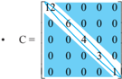

> **Deskripsi Visual:** Gambar ini adalah diagram, yang menunjukkan struktur matematika dalam bentuk matriks. Matriks ini terdiri dari elemen-elemen berbentuk nol kecuali pada posisi (0,0) dan (1,1), yang memiliki nilai 1. Diagram ini menunjukkan bahwa matriks ini adalah matriks diagonal dengan diagonal utama yang meliputi dua elemen bernilai 1 dan sisanya bernilai nol. Ini menunjukkan bahwa matriks tersebut adalah matriks diagonal dengan diagonal utama yang meliputi dua elemen bernilai 1 dan sisanya bernilai nol. Ini menunjukkan bahwa matriks tersebut adalah matriks diagonal dengan diagonal utama yang meliputi dua elemen bernilai 1 dan sisanya bernilai nol. Ini menunjukkan bahwa matriks tersebut adalah matriks diagonal dengan diagonal utama yang meliputi dua elemen bernilai 1 dan sisanya bernilai nol. Ini menunjukkan bahwa matriks tersebut adalah matriks diagonal dengan diagonal utama yang meliputi dua elemen bernilai 1 dan sisanya bernilai nol. Ini menunjukkan bahwa matriks tersebut adalah matriks diagonal dengan diagonal utama yang meliputi dua elemen bernilai 1 dan sisanya bernilai nol. Ini menunjukkan bahwa matriks tersebut adalah matriks diagonal dengan diagonal utama yang meliputi dua elemen bernilai 1 dan sisanya bernilai nol. Ini menunjukkan bahwa matriks tersebut adalah matriks diagonal dengan diagonal utama yang meliputi dua elemen bernilai 1 dan sisanya bernilai nol. Ini menunjukkan bahwa matriks tersebut adalah matriks diagonal dengan diagonal utama yang meliputi dua elemen bernilai 1 dan sisanya bernilai nol. Ini menunjukkan bahwa matriks tersebut adalah matriks diagonal dengan diagonal utama yang meliputi dua elemen bernilai 1 dan sisanya bernilai nol. Ini menunjukkan bahwa matriks tersebut adalah matriks diagonal dengan diagonal utama yang meliputi dua elemen bernilai 1 dan sisanya bernilai nol. Ini menunjukkan bahwa matriks tersebut adalah matriks diagonal dengan diagonal utama yang



maka matriks persegi dengan pola 'semua entrynya bernilai nol, kecuali entry diagonal utama tidak semua nol' disebut matriks diagonal.

### g. Matriks Identitas

Mari kita cermati kembali matriks persegi dengan pola seperti matriks berikut ini.

``

``

``

Cermati pola susunan angka 1 dan 0 pada ketiga matriks persegi di atas. Jika pola tersebut terdapat suatu matriks persegi, yaitu semua entry diagonal utama semua bernilai positif 1, disebut matriks identitas. Matriks identitas dinotasikan sebagai I berordo n × n .

### h. Matriks Nol

Jika entry suatu matriks semuanya bernilai nol, seperti berikut:

``

``

``

maka disebut matriks nol.

 

---
## 📄 Halaman 92

### 3.3  Kesamaan Dua Matriks

Perhatikan untuk matriks berikut ini.

``

``

Kedua matriks pada contoh a dan b adalah sama. Entry masing-masing matriks  juga  sama,  bukan?  Bagaimana  dengan  ordo  kedua  matriks?  Dari kedua contoh di atas tampak bahwa entry-entry seletak dari kedua matriks yang berordo sama mempunyai nilai yang sama.

Nah bagaimana untuk matriks berikut ini?

``

serta

``

Menurut kamu apakah matriks-matrik di atas sama? Apakah kedua matriks memiliki  ordo  yang  sama? Apakah  entry-entry  seletak  dari  kedua  matriks mempunyai nilai yang sama? Jika kalian telah memahami kasus di atas maka kita dapat menyatakan kesamaan matriks jika memenuhi sifat berikut ini.

### Deinisi 3.2

Matriks A dan matriks B dikatakan sama ( A = B ) jika dan hanya jika:

- Ordo matriks A sama dengan ordo matriks B .
- Setiap entry yang seletak pada matriks A dan matriks B mempunyai nilai yang sama, a ij = b ij (untuk semua nilai i dan j ).

 

---
## 📄 Halaman 93

Untuk lebih mendalami kesamaan matrik mari perhatikan contoh berikut.

### Contoh 3.2

Tentukanlah nilai a , b , c , dan d yang memenuhi matriks P t  = Q , dengan

``

### Alternatif Penyelesaian:

Karena P merupakan matriks berordo 2 × 3, maka P t merupakan matriks berordo 2 × 3. Matriks Q merupakan matriks berordo 2 × 3. Oleh karena itu berlaku kesamaan matriks P t  = Q .

``

``

Dari kesamaan di atas, kita temukan nilai a, b, c, dan d sebagai berikut.

- 3 b = 3 maka b = 1, dan  2 c = 6 maka c = 3.
- 2 a - 4 = -4 maka a = 0.
- Karena a = 0 maka d = -3.
Jadi, a = 0, b = 1, c = 3, dan d = -3.

 

---
## 📄 Halaman 94

### 3.4  Operasi pada Matriks

### 3.4.1  Operasi Penjumlahan Matriks

### Masalah 3.3

Toko kue berkonsep waralaba ingin mengembangkan usaha di dua kota yang berbeda. Manajer produksi ingin mendapatkan data biaya yang akan diperlukan. Biaya untuk masing-masing kue seperti pada tabel berikut.

### Tabel Biaya Toko di Kota A (dalam Rupiah)

### Tabel Biaya Toko di Kota B (dalam Rp)

Berapa total biaya yang diperlukan oleh kedua toko kue?

### Alternatif Penyelesaian:

Jika kita misalkan matriks biaya di Kota A, sebagai matriks A dan matriks biaya di Kota B sebagai matriks B , maka matriks biaya kedua toko disajikan sebagai berikut.

``

Total biaya yang dikeluarkan oleh untuk kedua toko kue tersebut dapat diperoleh sebagai berikut.

- ♦ Total	biaya	bahan	untuk	bika	ambon	=	1.200.000	+	1.700.000	=	2.900.000
- ♦ Total	biaya	bahan	untuk brownies = 1.000.000 + 1.500.000 = 2.500.000

 

---
## 📄 Halaman 95

- ♦ Total	biaya chef untuk brownies = 2.000.000 + 3.000.000 = 5.000.000
- ♦ Total	biaya chef untuk bika ambon = 3.000.000 + 3.500.000 = 6.500.000
Keempat total biaya tersebut  dinyatakan  dalam  matriks  adalah  sebagai berikut.

### Total Biaya Untuk Kedua Toko (dalam Rupiah)

Total  biaya  pada  tabel  di  atas  dapat  ditentukan  dengan  menjumlahkan matriks A dan B .

``

Penjumlahan kedua matriks biaya di atas dapat dioperasikan diakibatkan kedua matriks biaya memiliki ordo yang sama, yaitu 2 × 2. Seandainya ordo kedua  matriks  biaya  tersebut  berbeda,  kita  tidak  dapat  melakukan  operasi penjumlahan terhadap kedua matriks.

Nah,	melalui	pembahasan	di	atas,	tentunya	dapat	dideinisikan	penjumlahan dua matriks dalam konteks matematis.

### Deinisi 3.3

Misalkan A dan B adalah matriks berordo m × n dengan entry-entry a ij dan b ij . Matriks C adalah jumlah matriks A dan matriks B , ditulis C = A + B , apabila matriks C juga berordo m × n dengan entry-entry ditentukan oleh:

``

 

---
## 📄 Halaman 96

Catatan: Dua  matriks  dapat  dijumlahkan  hanya  jika  memiliki  ordo  yang sama dan ordo matriks hasil penjumlahan dua matriks adalah sama dengan ordo matriks yang dijumlahkan.

Perhatikan  contoh-contoh  berikut  untuk  lebih  memahami  penjumlahan matriks.

### Contoh 3.3

``

``

``

Berdasarkan sifat kesamaan dua matriks, maka diperoleh:

``

``

``

Maka diperoleh nilai x = 10 dan y = 0.

 

---
## 📄 Halaman 97

``

``

Matriks O dalam hal ini adalah matriks nol berordo 3 × 3, karena matriks tersebut akan dijumlahkan dengan matriks T berordo 3 × 3 juga.

``

### 3.4.2  Operasi Pengurangan Matriks

Sebagai gambaran awal mengenai operasi pengurangan dua matriks, mari kita cermati contoh masalah berikut ini.

 

---
## 📄 Halaman 98

### Masalah 3.4

Sebuah  pabrik  tekstil  hendak  menyusun  tabel  aktiva  mesin  dan penyusutan  mesin  selama  1  tahun  yang  dinilai  sama  dengan  10%  dari harga perolehan sebagai berikut:

---
**📊 Tabel**

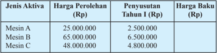

Tabel ini menunjukkan informasi tentang harga perolehan dan penyetoran untuk tiga jenis mesin: Mesin A, Mesin B, dan Mesin C. Topik utama tabel adalah perbandingan harga perolehan, penyetoran, dan harga baku untuk setiap mesin tersebut. Kolom-kolom yang ada meliputi Jenis Aktiva (Mesin A, Mesin B, Mesin C), Harga Perolehan (Rp), Penyetoran I (Rp), dan Harga Baku (Rp). Data penting yang terlihat adalah bahwa Mesin C memiliki harga perolehan tertinggi (48.000.000) dan penyetoran I tertinggi (4.800.000), sementara Mesin A memiliki harga perolehan terendah (25.000.000) dan penyetoran I terendah (2.500.000). Ini menunjukkan perbedaan signifikan dalam harga perolehan dan penyetoran antara mesin-mesin tersebut.

Lengkapilah tabel tersebut dengan menggunakan matriks!

### Alternatif Penyelesaian:

``

``

Untuk mencari harga baku pada tabel tersebut adalah

``

Rumusan  penjumlahan  dua  matriks  di  atas  dapat  kita  terapkan  untuk memahami konsep pengurangan matriks A dengan matriks B .

 

---
## 📄 Halaman 99

Misalkan A dan B adalah matriks-matriks berordo m × n. Pengurangan matriks A dengan matriks B dideinisikan	sebagai	jumlah	antara	matriks A dengan matriks B . Ingat, Matriks B adalah lawan dari matriks B . Ditulis:

``

Matriks  dalam  kurung  merupakan  matriks  yang  entrynya  berlawanan dengan setiap entry yang bersesuaian matriks B .

### Contoh 3.4

``

``

``

Jika ada, tentukan pengurangan-pengurangan matriks berikut ini.

- Y - X

### Alternatif Penyelesaian:

Matriks X dan Y memiliki ordo yang sama, yaitu berordo 3 × 2, sedangkan matriks Z berordo 3 × 3. Oleh karena itu, menurut aturan pengurangan dua matriks, hanya bagian i) saja yang dapat ditentukan, ii) dan iii) tidak dapat dioperasikan, (kenapa)?

``

- ii) Y - Z
- iii) X - Z

 

---
## 📄 Halaman 100

Dari  pemahaman  contoh  di  atas,  pengurangan  dua  matriks  dapat  juga dilakukan  dengan  mengurangkan  langsung  entry-entry  yang  seletak  dari kedua matriks tersebut, seperti yang berlaku pada penjumlahan dua matriks, yaitu: A -B = [ a ij ] - [ b ij ].

### 3.4.3  Operasi Perkalian Skalar pada Matriks

Dalam aljabar matriks, bilangan real k sering disebut sebagai skalar. Oleh karena itu perkalian real terhadap matriks juga disebut sebagai perkalian skalar dengan matriks.

Sebelumnya, pada kajian pengurangan dua matriks, A - B = A + (-B ), (-B ) dalam hal ini sebenarnya hasil kali bilangan -1 dengan semua entry matriks B . Artinya, matriks (B ) dapat kita tulis sebagai:

``

Secara umum, perkalian skalar dengan matriks dirumuskan sebagai berikut. Misalkan A adalah suatu matriks berordo m × n dengan entry-entry a ij dan k adalah suatu bilangan real. Matriks C adalah hasil perkalian bilangan real k terhadap matriks A , dinotasikan C = k.A , bila matriks C berordo m × n dengan entry-entrynya ditentukan oleh:

c ij = k.a ij (untuk semua i dan j ).

### Contoh 3.5

``

``

 

---
## 📄 Halaman 101

``

``

``

Selanjutnya, untuk M suatu matriks berordo m × n , p dan q bilangan real, tunjukkan bahwa ( p + q ) M = p.M + q.M . Silakan diskusikan!

``

Di sisi lain, jika matriks P dan Q merupakan dua matriks berordo sama, dan c adalah bilangan real, maka c .( P - Q ) = c.P - c.Q . Tentunya hasil c .( P - Q ) sama dengan c.P - c.Q . (Tunjukkan!)

Kita dapat memahami bahwa:

``

Jika kita mengalikan hasil p dengan q.L

``

, maka kita akan peroleh:

``

``

 

---
## 📄 Halaman 102

Karena p dan q adalah skalar, ternyata dengan mengalikan p dengan q terlebih dahulu, kemudian mengalikannya dengan matriks L , merupakan langkah lebih efektif untuk menyelesaikan p .( q.L ).

Sekarang,  untuk  matriks M berordo m × n , p dan q adalah  skalar anggota himpunan bilangan real, tolong kamu tunjukkan bahwa: p × ( q × L ) = ( p × q ) × L .

### 3.4.4  Operasi Perkalian Dua Matriks

### Masalah 3.5

Suatu perusahaan yang bergerak pada bidang jasa akan membuka tiga cabang besar di pulau Sumatera, yaitu cabang 1 di kota Palembang, cabang 2 di kota Padang, dan cabang 3 di kota Pekanbaru. Untuk itu, diperlukan beberapa peralatan untuk membantu kelancaran usaha jasa tersebut, yaitu handphone ,  komputer, dan sepeda motor. Di sisi lain, pihak perusahaan mempertimbangkan  harga  per  satuan  peralatan  tersebut.  Lengkapnya, rincian data tersebut disajikan sebagai berikut.

---
**📊 Tabel**

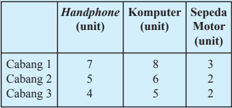

Tabel ini menunjukkan jumlah unit perangkat elektronik di tiga lokasi: Cabang 1, Cabang 2, dan Cabang 3. Topik utama tabel adalah jumlah unit perangkat elektronik di setiap cabang. Kolom-kolomnya meliputi "Handphone", "Komputer", dan "Sepeda Motor". Dari data yang diberikan, kita dapat melihat bahwa Cabang 1 memiliki jumlah unit perangkat tertinggi untuk semua jenis perangkat, sedangkan Cabang 3 memiliki jumlah unit terendah untuk semua jenis perangkat. Selain itu, Cabang 2 memiliki jumlah unit perangkat yang paling berimbang antara tiga jenis perangkat tersebut.

Harga

Handphone

(juta)

Harga Komputer

(juta)

Harga Sepeda

Motor (juta)

Perusahaan ingin mengetahui total biaya pengadaan peralatan tersebut di setiap cabang.

2

5

15

 

---
## 📄 Halaman 103

### Alternatif Penyelesaian:

Tidaklah  sulit  menyelesaikan  persoalan  di  atas.  Tentunya  kamu  dapat men  jawabnya. Sekarang, kita akan menyelesaikan masalah tersebut dengan menggunakan konsep matriks.

``

yang merepresentasikan harga per unit setiap peralatan.

Untuk  menentukan  total  biaya  pengadaan  peralatan  tersebut  di  setiap cabang, kita peroleh sebagai berikut.

### · Cabang 1

Total biaya  =  (7 unit handphone × 2 juta) + (8 unit komputer × 5 juta) + (3 unit sepeda motor 15 juta).

= Rp99.000.000,00

- Cabang 2
Total biaya  =  (5 unit handphone × 2 juta) + (6 unit komputer × 5 juta) + (2 unit sepeda motor × 15 juta) = Rp70.000.000,00

### •

- Cabang 3
Total biaya  =  (4 unit handphone × 2 juta) + (5 unit komputer × 5 juta) + (2 unit sepeda motor × 15 juta) = Rp63.000.000,00

Jadi total biaya pengadaan peralatan di setiap unit dinyatakan dalam matriks berikut.

``

 

---
## 📄 Halaman 104

Dapat kita cermati dari perkalian di atas, bahwa setiap entry baris pada matriks C berkorespondensi satu-satu dengan setiap entry kolom pada matriks D . Seandainya terdapat satu saja entry baris ke-1 pada matriks C tidak memiliki pasangan dengan entry kolom ke-1 pada matriks D , maka operasi perkalian terhadap  kedua  matriks  itu  tidak  dapat  dilakukan.  Jadi,  dapat  disimpulkan operasi perkalian terhadap dua matriks dapat dilakukan jika banyak baris pada matriks C sama dengan banyak kolom pada matriks D . Banyak perkalian akan berhenti jika setiap entry baris ken pada matriks C sudah dikalikan dengan setiap entry kolom ken pada matriks D .

Secara matematis, kita dapat menyatakan perkalian dua matriks sebagai berikut. Misalkan matriks A m×n dan  matriks B n×p ,  matriks A dapat dikalikan dengan matriks B jika  banyak baris matriks A sama dengan banyak kolom matriks B . Hasil perkalian matriks A berordo m × n terhadap matriks B berordo n × p adalah suatu matriks berordo m × p .  Proses menentukan entry-entry hasil perkalian dua matriks dipaparkan sebagai berikut.

``

Jika C adalah matriks hasil perkalian matriks A m×n terhadap matriks B n×p dan dinotasikan C = A.B , maka

- Matriks C berordo m × p .
- Entry-entry  matriks C pada  baris  kei dan  kolom  kej ,  dinotasikan c ij , diperoleh dengan cara mengalikan entry baris kei dari matriks A terhadap entry kolom kej dari matriks B , kemudian dijumlahkan. Dinotasikan

``

Mari kita pelajari contoh-contoh di bawah ini, untuk memudahkan kita mengerti akan konsep di atas!

 

---
## 📄 Halaman 105

### Contoh 3.6

``

``

Matriks hasil perkalian matriks A dan matriks B :

``

Sekarang,  tentukan  hasil  perkalian  matriks B terhadap  matriks A . Kemudian,  simpulkan  apakah  berlaku  atau  tidak  sifat  komutatif  pada perkalian matriks? Berikan alasanmu!

- Mari kita tentukan hasil perkalian matriks . Dengan

``

``



``

Dengan  menggunakan  hasil  diskusi  yang  kamu  peroleh  pada  contoh 2 3 4  

2

0





dapat dikalikan terhadap

 

---
## 📄 Halaman 106

### 3.4.1  Tranpose Matriks

Misalkan  ada  perubahan  pada  posisi  entry-entry  matriks  seperti  entry baris ke-1 pada matriks B menjadi entry kolom ke-1 pada matriks B t , setiap entry  baris  ke-2  pada  matriks  menjadi  entry  kolom  ke-2  pada  matriks B t , demikian seterusnya, hingga semua entry baris pada matriks B menjadi entry kolom pada matriks B t . Hal inilah yang menjadi aturan menentukan transpose matriks suatu matriks.

Transpose dari matriks A berordo m × n adalah matriks yang diperoleh dari matriks A dengan menukar entry baris menjadi entry kolom dan sebaliknya, sehingga berordo n × m . Notasi transpose matriks A m×n adalah A t m×n .

### Contoh 3.7

``

Dari pembahasan contoh di atas, dapat kita pahami perubahan ordo matriks. Misalnya, jika matriks awal berordo m × n , maka transpose matriks berordo n × m .

 

---
## 📄 Halaman 107

### Coba kamu pikirkan.

- Mungkinkah suatu matriks sama dengan transpose matriksnya sendiri? Berikan alasanmu!
- Periksa apakah ( A t + B t ) = ( A + B ) t untuk setiap matriks A dan B berordo m × n ?

### Uji Kompetensi 3.1

``

Sebutkan entry matriks yang terletak pada:

- baris ke-2;
- kolom ke-3;
- baris ke-3 dan kolom ke-1;
- baris ke-1 dan kolom ke-3.
- Berikan sistem persamaan linear berikut:

``

### Nyatakanlah:

- matriks	koeisien	sistem	persamaan	linear	tersebut;
- ordo matriks yang terbentuk.
- Buatlah matriks yang terdiri atas 5 baris dan 3 kolom dengan entrynya adalah 15 bilangan prima yang pertama.

 

---
## 📄 Halaman 108

- Untuk matriks-matriks berikut tentukan pasangan-pasangan matriks yang sama.
- Misalkan matriks A = 2 2 3 5 p +       dan B  = 6 6 3 p q     +   .  Bila  3 A = B , tentukan nilai p dan q !

``

- Diketahui 16 2 3 2 4 14 12 p q q r s r p s -+     =     + -    . Tentukan nilai p, q, r, dan s .
- Jika  diketahui  matriks 2 2 3 5 p +       + 6 6 3 p q     +   = 4 8 9 5       ,  tentukan nilai p dan q !
- Diketahui matriks-matriks

``

Dari  semua  matriks  di  atas,  pasangan  matriks  manakah  yang  dapat dijumlahkan dan dikurangkan. Kemudian selesaikanlah!

- Jika A = 3 2 3 2 4 6       , B = 3 5 7 4 10 9      - ,  dan X suatu  matriks  berordo
- 2 × 3 serta memenuhi persamaan A + X = B , tentukan matriks X !
- Tentukanlah hasil perkalian matriks-matriks berikut!

``

 

---
## 📄 Halaman 109

``

``

``

- Diketahui matriks G = 1 2 3 2 4 6       dan lima matriks yang dapat dipilih

``

- Diketahui transpose matriks A = 2 4 6 7 9 11 12 14 16           . Tentukanlah:
Matriks yang manakah dapat dikalikan terhadap matriks G ?  Kemudian tentukan hasilnya!

- matriks A
- nilai x dan y jika x = a 23 + 4 a 33 - 6 dan y = a 23 2 + 4 a 33 2 .

``

- Tentukan transpose dari matriks T !
- Jika R t  = T , tentukanlah nilai a , b , c , d , e , dan f !

 

---
## 📄 Halaman 110

### 14. Diketahui matriks-matriks berikut.

``

Jika M L K -= 2 3 , tentukan nilai-nilai x, y, z dan α .

``

Syarat apakah yang harus dipenuhi supaya matriks A sama dengan matriks X ? Jelaskan.

 

---
## 📄 Halaman 111

### Soal Proyek

Temukan  contoh  penerapan  matriks  dalam  Ilmu  Komputer, bidang  Ilmu  Fisika,  Kimia,  dan  Teknologi  Farmasi.  Selanjutnya coba terapkan berbagai konsep dan aturan matriks dalam menyusun buku teks di sebuah perpustakaan. Pikirkan bagaimana susunan buku teks, seperti: buku Matematika, Fisika, Biologi, Kimia, dan IPS dari berbagai jenisnya (misalnya jenis buku Matematika  tersedia buku Aljabar,  Geometri,  Statistika,  dan  lain-lain)  tampak  pada  susunan baris  dan  kolom  suatu  matriks.  Kamu  dapat  membuat pengkodean dari buku-buku tersebut agar para pembaca dan yang mencari buku tertentu mudah untuk menemukannya.

Buat laporan hasil kerja kelompokmu dan hasilnya disajikan di depan kelas.

### 3.5 Determinan dan Invers Matriks 3.5.1  Determinan Matriks

### Masalah 3.6

Siti  dan  teman-temannya makan di kantin sekolah. Mereka memesan 3 ayam penyet dan 2 gelas es jeruk di kantin sekolahnya. Tak lama kemudian, Beni dan teman-temannya datang memesan 5 porsi ayam penyet dan 3 gelas es jeruk. Siti menantang Amir menentukan harga satu porsi ayam penyet dan harga es jeruk per gelas, jika Siti harus membayar Rp70.000,00 untuk semua pesanannya dan Beni harus membayar Rp115.000,00 untuk semua pesanannya.

### Alternatif Penyelesaian:

### Cara I

Petunjuk:  Ingat  kembali  materi  sistem  persamaan  linear  yang  sudah  kamu pelajari. Buatlah sistem persamaan linear dari masalah tersebut, lalu selesaikan dengan matriks.

Misalkan x

= harga ayam penyet per porsi y = harga es jeruk per gelas

 

---
## 📄 Halaman 112

Sistem persamaan linearnya:  3 x + 2 y = 70.000

``

Dalam bentuk matriks adalah sebagai berikut.

``

Mengingat kembali bentuk umum persamaan linear.

``

``

Ingat kembali bagaimana menentukan himpunan penyelesain  SPLDV. Tentunya kamu mampu menunjukkannya.

### Cara II

``

Oleh karena itu, nilai x dan y pada persamaan (3.2), dapat ditulis menjadi:

``

 

---
## 📄 Halaman 113

Kembali  ke  persamaan  (3.1),  dengan  menerapkan  persamaan  (3.3),  maka diperoleh:

``

Jadi, harga ayam penyet satu porsi adalah Rp20.000,00 dan harga es jeruk satu gelas adalah Rp5.000,00.

Notasi Determinan

Misalkan matriks A = a b c d . Determinan dari matriks A

``

``

### 3.5.2  Sifat-Sifat Determinan Misalkan matriks A = 3 4 2 1     --  dan matriks B = 3 4 2 1 --    --  det A = | A | = 3 4 2 1 --= -3 + 8 = 5 det B = | B | = 3 4 2 1 ----= 3 - 8 = -5 Jadi | A | × | B | = -25

``

 

---
## 📄 Halaman 114

``

``

Sifat 3.1 Misalkan matriks A dan B berordo m × m dengan m ∈ N . Jika det A = | A | dan det B = | B |, maka | AB |= | A |.| B |

``

### Contoh 3.8

Tunjukkan bahwa | A.B | = | A |.| B |!

### Alternatif Penyelesaian:

Sebelum kita menentukan determinan A.B , mari kita tentukan terlebih dahulu matriks A.B , yaitu:

Dengan matriks A.B tersebut kita peroleh | A.B | = 19 28 20 28 = -28.

``

Sekarang akan kita bandingkan dengan nilai | A |.| B |. Dengan matriks A = 4 5 2 6       maka | A | = 14, dan B = 1 2 3 4       maka | B | = -2.

Nilai | A |.| B | = 14.(-2) = -28

Jadi, benar bahwa | A.B | = | A |.| B | = -28.

 

---
## 📄 Halaman 115

### Soal Tantangan

- Selidiki apakah | A.B.C | = | A |.| B |.| C | untuk setiap matriks-matriks A, B, dan C berordo n × n .
- Jika matriks A adalah matriks persegi dan k adalah skalar, coba telusuri nilai determinan matriks k.A .

### Contoh 3.9

``

Matriks P ordo  2  ×  2  dengan P = a b c d       dimana a,  b,  c,  d ∈ R .  Jika

### Alternatif Penyelesaian:

Jika P a b c d =       ,	dan	determinannya	adalah	α,	maka	berlaku

``

Entry matriks Q memiliki hubungan dengan matriks P , yaitu: q 21 = hasil kali skalar x terhadap p 21 -hasil kali skalar s terhadap p 11 q 22 = hasil kali skalar x terhadap p 22 -hasil kali skalar s terhadap p 12 .

Tujuan kita sekarang adalah mereduksi matriks Q menjadi kelipatan matriks P .

Adapun langkah-langkahnya adalah sebagai berikut:

``

 

---
## 📄 Halaman 116

Entry baris 1 matriks Q = entry baris 1 matriks P . Mereduksi dalam hal ini adalah mengoperasikan entry baris 2 matriks Q menjadi entry baris 2 matriks P .

Jadi, q 21 dapat dioperasikan menjadi: q s q q 21 11 21 ( ) = + * . , akibatnya kita peroleh:

``

``

Menurut sifat determinan matriks (silakan minta penjelasan lebih lanjut dari Guru Matematika), maka:

``

Jadi Q x = α .

Soal Tantangan Misal matriks P adalah matriks berordo 3 × 3, dengan | P | = a dan matriks Q berordo 3 × 3 dan mengikuti pola seperti contoh di atas. Tentukan determinan matriks Q .

Perhatikan  kembali  matriks A di  atas  dan  ingat  kembali  menentukan transpose sebuah matriks yang sudah dipelajari, dan  matriks  transpose  dari  matriks A adalah

``

``

 

---
## 📄 Halaman 117

Perhatikan dari hasil perhitungan det A dan det A t . Diperoleh det A = det A t .

Sifat 3.2 Misalkan matriks A dan B berordo m × m dengan m ∈ N . Jika det A = | A | dan det A t = | A t |, maka | A | = | A t |

Coba buktikan sifat berikut setelah kamu mempelajari invers matriks.

Sifat 3.3 Misalkan matriks A dan B berordo m × m dengan m ∈ N .

``

### Masalah 3.7

Sebuah  perusahaan  penerbangan  menawarkan  perjalanan  wisata  ke negara A, perusahaan tersebut mempunyai tiga jenis pesawat yaitu Airbus 100, Airbus 200, dan Airbus 300. Setiap pesawat dilengkapi dengan kursi penumpang untuk kelas turis, ekonomi, dan VIP. Jumlah kursi penumpang dari tiga jenis pesawat tersebut disajikan pada tabel berikut.

Perusahaan  telah  mendaftar  jumlah  penumpang  yang  mengikuti perjalanan wisata ke negara A seperti pada tabel berikut.

Berapa  banyak  pesawat  yang  harus  dipersiapkan  untuk  perjalanan tersebut?

 

---
## 📄 Halaman 118

### Alternatif Penyelesaian:

Untuk memudahkan kita menyelesaikan masalah ini, kita misalkan:

x = banyaknya pesawat Airbus 100

y = banyaknya pesawat Airbus 200

z = banyaknya pesawat Airbus 300

``

Sebelum  ditentukan  penyelesaian  masalah  di  atas,  terlebih  dahulu  kita periksa apakah matriks A adalah matriks nonsingular.

Ada beberapa cara untuk menentukan det A , antara lain Metode Sarrus. Cara tersebut sebagai berikut.

``

``

Untuk matriks pada Masalah 3.7,

``

``

 

---
## 📄 Halaman 119

Analog  dengan  persamaan  (2),  kita  akan  menggunakan  determinan matriks untuk menyelesaikan persoalan di atas.

``

``

``

Oleh karena itu, banyak pesawat Airbus 100 yang disediakan sebanyak 3 unit, banyak pesawat Airbus 200 yang disediakan sebanyak 1 unit, banyak pesawat Airbus 300 yang disediakan sebanyak 2 unit.

### 3.5.3  Invers Matriks

Perhatikan  Masalah  3.7  di  atas.  Kamu  dapat  menyelesaikan  masalah tersebut  dengan  cara  berikut.  Perhatikan  sistem  persamaan  linear  yang dinyatakan dalam matriks berikut,

``

Karena A adalah matriks nonsingular, maka matriks A memiliki invers. Oleh karena itu, langkah kita lanjutkan menentukan matriks X .

``

 

---
## 📄 Halaman 120







``

``

``

Ditemukan  jawaban  yang  sama  dengan  cara  I.  Akan  tetapi,  perlu pertimbangan pemilihan cara yang digunakan menyelesaikan persoalannya.

Misalkan A dan B adalah matriks yang memenuhi persamaan berikut.

``

Persoalannya adalah bagaimana menentukan matriks X pada persamaan (1)?

Pada teori dasar matriks, bahwa tidak ada operasi pembagian pada matriks tetapi yang ada adalah invers matriks atau kebalikan matriks.

Misalkan A matriks persegi  berordo 2 × 2. A = a b c d       .  Invers matriks A , dinotasikan A -1 : A -1 = 1 ( . . ) d b c a a d b c -  ⋅   --  , dengan a.d ≠ b.c.

d b c a -     - disebut adjoin matriks A dan dinotasikan Adjoin A .

Salah satu sifat invers matriks adalah A -1 .A = A.A -1 = I.

Akibatnya	persamaan	(1)	dapat	dimodiikasi	menjadi:

A -1 .A.X = A -1 B . (semua ruas dikalikan A -1 ).

( A -1 .A ). X  = A -1 B

``

``

Rumusan ini berlaku secara umum, dengan syarat det A ≠ 0 .

 

---
## 📄 Halaman 121

### Deinisi 3.4

- Matriks A disebut matriks nonsingular, apabila det A 0. · Matriks A disebut matriks singular apabila det A ≠ 0.
Misalkan A sebuah matriks persegi dengan ordo n × n , n ∈ N ≠

- A -1 disebut  invers  matriks A jika  dan  hanya  jika AA -1 = A -1 A = I . I adalah matriks identitas perkalian matriks.

### Masalah 3.8

Agen perjalanan Sumatera Holidays menawarkan paket perjalanan ke Danau Toba, yaitu menginap di Inna Parapat Hotel, transportasi ke tiap tempat  wisata,  dan  makan  di  Singgalang  Restaurant.  Paket  perjalanan yang ditawarkan yaitu Paket I terdiri 4 malam menginap, 3 tempat wisata, dan 5 kali makan dengan biaya Rp2.030.000,00. Paket II dengan 3 malam menginap, 4 tempat wisata, dan 7 kali makan dengan biaya Rp1.790.000,00. Paket III dengan 5 malam menginap, 5 tempat wisata, dan 4 kali makan dengan biaya Rp2.500.000,00. Berapakah biaya sewa hotel tiap malam, transportasi, dan makan?

### Alternatif Penyelesaian:

### Misalkan:

x = biaya sewa hotel y = biaya untuk transportasi

z = biaya makan

 

---
## 📄 Halaman 122

Dalam bentuk matriks adalah seperti berikut:

``

a. Determinan untuk matriks masalah 3.8 di atas:

``

``

``

``

``

 

---
## 📄 Halaman 123

Oleh karena itu, biaya sewa hotel tiap malam adalah Rp400.000,00 biaya transportasi adalah Rp60.000,00 dan biaya makan adalah Rp50.000,00.

Cobalah kamu menyelesaikan masalah tersebut dengan cara menentukan invers matriks. Mintalah bimbingan dari gurumu.

### Metode Kofaktor

Terlebih  dahulu  kamu  memahami  tentang  minor  suatu  matriks.  Minor suatu matriks A dilambangkan dengan Mij adalah determinan matriks bagian dari A yang diperoleh dengan cara menghilangkan entry-entry pada baris kei dan kolom kej .

Jika A adalah sebuah matriks persegi berordo n × n , maka minor entry a ij yang dinotasikan dengan Mij ,	dideinisikan	sebagai	determinan	dari	submatriks A berorde ( n - 1) × ( n - 1) setelah baris kei dan kolom kej dihilangkan.

``

``

Minor entry a 11 adalah determinan

``

``

M 11 , M 12 , dan M 13 merupakan submatriks hasil ekspansi baris ke-1 dari matriks A . Kofaktor suatu entry baris kei dan kolom kej dari matriks A dilambangkan: k ij = (-1) i+j  |M ij | = (-1) ij det( Mij )

``

``

 

---
## 📄 Halaman 124

``

Dari  masalah  di  atas  diperoleh  matriks  kofaktor A dengan  menggunakan rumus:

``

Matriks adjoin dari matriks A adalah transpose dari kofaktor-kofaktor matriks tersebut, dilambangkan dengan Adj ( A ) = ( k ij ) t , yaitu:

``

 

---
## 📄 Halaman 125

Dari masalah 2.10 di atas, diperoleh invers matriks A . Dengan rumus:

``

``

``

Berdiskusilah dengan temanmu satu kelompok, coba tunjukkan bahwa

AA -1 = A -1 A = I , dengan I adalah matriks identitas 3 × 3.

Bentuk matriks permasalahan 3.8 adalah seperti berikut:

``

Bentuk ini dapat kita nyatakan dalam bentuk persamaan AX = B . Untuk memperoleh matriks X yang  entry-entrynya  menyatakan  biaya  sewa  hotel, biaya transportasi, dan biaya makan, kita kalikan matriks A -1 ke ruas kiri dan ruas kanan persamaan AX = B , sehingga diperoleh:

``

``

``

 

---
## 📄 Halaman 126

Hasil  yang  diperoleh  dengan  menerapkan  cara  determinan  dan  cara invers, diperoleh hasil yang sama, yaitu; biaya sewa hotel tiap malam adalah Rp400.000,00;  biaya  transportasi  adalah  Rp60.000,00;  dan  biaya  makan adalah Rp50.000,00.

### 3.5.4  Sifat-Sifat Invers Matriks

``

``

Perhatikan uraian di atas diperoleh bahwa ( A -1 ) -1 = A .

Sifat 3.4 Misalkan matriks A berordo n  ×  n dengan n ∈ N ,  det( A ) ≠ 0.  Jika A -1 adalah invers matriks A , maka ( A -1 ) -1 = A .

``

``

 

---
## 📄 Halaman 127

``

``

``

``

Dari perhitungan di atas diperoleh AB B A ( ) = ---1 1 1 .

Sifat 3.5 Misalkan matriks A dan B berordo n × n dengan n ∈ N , det A ≠	0	dan	det B	≠	0.	Jika	A -1 dan B -1 adalah invers matriks A dan B, maka ( AB ) -1 = B -1 A -1.

- Coba kamu diskusikan dengan temanmu satu kelompok, apakah ( AB ) -1 = A -1 B -1 . Jika tidak, beri alasannya!

 

---
## 📄 Halaman 128

### Uji Kompetensi 3.2

- Tentukan determinan matriks berikut ini.

``

- 4 2 3 7 x x -     

``

``

- Selidiki bahwa det. K n = (det K ) n , untuk setiap:

``

``

- Tentukanlah z yang memenuhi persamaan berikut!

``

- Tentukanlah z yang memenuhi persamaan berikut:

``

``

- ---maka tentukan nilai z sehingga
determinan P sama dengan determinan Q .

 

---
## 📄 Halaman 129

- Selidiki bahwa det C + D = det C + det D , untuk setiap matriks C dan D merupakan matriks persegi.
- Entry baris ke-1 suatu matriks persegi adalah semuanya nol. Tentukanlah determinan matriks tersebut!
- Periksalah  kebenaran  setiap  pernyataan  berikut  ini.  Berikanlah  contoh penyangkal untuk setiap pernyataan yang tidak berlaku!
- det 2 A = 2.det A
- | A | = | A | 2
- det I + A = 1 + det A
Untuk matriks A merupakan matriks persegi.

- Matriks-matriks P dan Q adalah matriks berordo n  ×  n dengan PQ ≠ QP . Apakah det PQ = det QP ? Jelaskan!
- Diketahui matriks R adalah matriks berordo n × n dengan entry kolom ke-1  semuanya  nol.  Tentukanlah  determinan  matriks  tersebut.  Berikan juga contohnya!
- Diberikan suatu sistem persamaan linear dua variabel.

``

Tentukanlah  nilai x dan y yang  memenuhi  sistem  tersebut  dengan menggunakan konsep matriks.

- Sebuah  toko  penjual  cat  eceran  memiliki  persediaan  tiga  jenis  cat eksterior yaitu reguler, deluxe, dan commercial . Cat-cat tersebut tersedia dalam empat pilihan warna yaitu: biru, hitam, kuning, dan coklat. Banyak penjualan cat (dalam galon) selama satu minggu dicatat dalam matriks R , sedangkan inventaris toko pada awal minggu dalam matriks S berikut ini.

 

---
## 📄 Halaman 130

- Tentukan inventaris toko pada akhir minggu
- Jika toko menerima kiriman stok baru yang dicatat dalam matriks T , tentukan inventaris toko yang baru.
- Tunjukkan bahwa ( ABCD ) -1 = D -1 , C -1 , B -1 , A -1 !
- Adakah suatu matriks yang inversnya adalah diri sendiri?

``

### D. Penutup

Setelah telah selesai membahas materi matriks di atas, ada beberapa hal penting sebagai kesimpulan yang dijadikan pegangan dalam mendalami dan membahas materi lebih lanjut, antara lain:

- Matriks adalah susunan bilangan-bilangan dalam baris dan kolom.
- Sebuah matriks A ditransposekan menghasilkan matriks A t dengan entry baris matriks A berubah menjadi entry kolom matriks A t . Dengan demikian matriks A t ditransposekan kembali, hasilnya menjadi matriks A atau ( A t ) t = A .
- Penjumlahan  sebarang  matriks  dengan  matriks  identitas  penjumlahan hasilnya matriks itu sendiri. Matriks identitas penjumlahan adalah matriks nol.
- Hasil kali sebuah matriks dengan suatu skalar atau suatu bilangan real k akan menghasilkan sebuah matriks baru yang berordo sama dan memiliki entry-entry k kali entry-entry matriks semula.

 

---
## 📄 Halaman 131

- Dua buah matriks hanya dapat dikalikan apabila banyaknya kolom matriks yang dikali sama dengan banyaknya baris matriks pengalinya.
- Hasil  perkalian  matriks A dengan  matriks  identitas  perkalian,  hasilnya adalah matriks A .
- Hasil  kali  dua  buah  matriks  menghasilkan  sebuah  matriks  baru,  yang entry-entrynya merupakan hasil kali entry baris matriks A dan entry kolom matriks B .  Misal  jika A p×q dan B q×r adalah  dua  matriks,  maka  berlaku A p×q ×  B q×r =  C p×r .
- Matriks  yang  memiliki  invers  adalah  matriks  persegi  dengan  nilai determinannya tidak nol (0).

 

---
## 📄 Halaman 132

BAB 4

### Transformasi

### Kompetensi Dasar dan Pengalaman Belajar

---
**📊 Tabel**

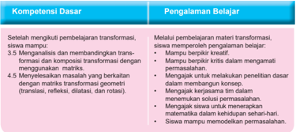

Tabel ini membahas kompetensi dasar dan pengalaman belajar dalam pembelajaran transformasi geometri. Topik utamanya adalah tentang pemahaman dan penggunaan transformasi seperti translasi, refleksi, dilatasi, dan rotasi melalui matematika. Dalam kolom "Kompetensi Dasar", disebutkan bahwa siswa harus mampu setelah mengikuti pembelajaran transformasi, memiliki pemahaman dasar tentang transformasi dan komposisi transformasi dengan menggunakan matrika. Siswa juga diharapkan untuk mampu menentukan transformasi yang berkaitan dengan matris transformasi geometri, seperti translasi, refleksi, dilatasi, dan rotasi. Sedangkan dalam kolom "Pengalaman Belajar", disebutkan bahwa siswa harus mampu melakukan kritik dalam memahami permasalahan, membuat model matematika, menggabungkan konsep, mengukur kesamaan dalam kehidupan sehari-hari, dan mampu memodelkan permasalahan. Pola penting yang terlihat adalah bahwa pembelajaran transformasi geometri tidak hanya berfokus pada pengetahuan teori, tetapi juga pada praktik dan penggunaan matematika dalam kehidupan sehari-hari.

### Istilah Penting

- Translasi
- Releksi
- Rotasi
- Dilatasi
- Komposisi Transformasi

 

---
## 📄 Halaman 133

### B. Diagram Alir

---
**🖼️ Gambar/Diagram**

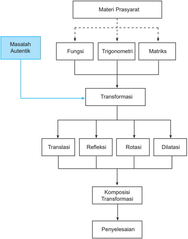

> **Deskripsi Visual:** Gambar ini adalah diagram yang menunjukkan struktur pemecahan masalah matematika, khususnya dalam bidang transformasi geometri. Diagram ini memperlihatkan langkah-langkah yang harus dilalui untuk menyelesaikan sebuah masalah autentik. Pada awalnya, ada materi prasyarat seperti fungsi, trigonometri, dan matriks. Setelah itu, masalah autentik diberikan sebagai input. Dari sini, proses transformasi dimulai dengan translasi, refleksi, rotasi, dan dilatasi. Setiap transformasi memiliki efek yang berbeda pada objek yang akan diubah. Setelah semua transformasi selesai, hasilnya dikomposisi untuk mencapai solusi akhir. Diagram ini sangat membantu dalam memahami proses pemecahan masalah dan bagaimana transformasi-dan komposisi-transformasi digunakan untuk mencapai solusi.

 

---
## 📄 Halaman 134

### C. Materi Pembelajaran

Pada  bab  ini,  kita  akan  membahas  konsep  transformasi  seperti  translasi (pergeseran), releksi (pencerminan), rotasi (perputaran), dan dilatasi (perkalian) serta komposisinya dengan pendekatan koordinat. Untuk mempelajari	materi	ini,	kamu	diharapkan	sudah	memahami	konsep	matriks dan	mengingat	kembali	materi	transformasi	yang	telah	kamu	pelajari	di	SMP.

### 4.1  Menemukan Konsep Translasi (Pergeseran)

Coba	kamu	amati	benda-benda	yang	bergerak	di	sekitar	kamu.	Benda-benda tersebut	hanya	berubah	posisi	tanpa	mengubah	bentuk	dan	ukuran.	Sebagai contoh,	kendaraan	yang	bergerak	di	jalan	raya,	pesawat	terbang	yang	melintas di	udara,	bahkan	diri	kita	sendiri	yang	bergerak	kemana	saja.	Nah,	sekarang kita	akan	membahas	pergerakan	objek	tersebut	dengan	pendekatan	koordinat. Kita	asumsikan	bahwa	pergerakan	ke	arah	sumbu x positif adalah ke kanan, pergerakan	ke	arah	sumbu x negatif	adalah	ke	kiri,	pergerakan	ke	arah	sumbu y positif	 adalah	ke	atas,	dan	pergerakan	ke	arah	sumbu y negatif adalah ke bawah.

### Masalah 4.1

Titik A (4,-3)	bergerak	ke	kiri	6	langkah	dan	ke	bawah	1	langkah,	kemudian dilanjutkan	kembali	bergerak	ke	kiri	3	langkah	dan	ke	atas	3	langkah.	Coba kamu	 sketsa	 pergerakan	 titik	 tersebut	 pada	 bidang	 koordinat	 kartesius. Dapatkah	kamu	temukan	proses	pergerakan	titik	tersebut?

 

---
## 📄 Halaman 135

### Alternatif Penyelesaian:

Bila	Masalah	4.1	disajikan	dalam	koordinat	kartesius	maka	diperoleh	gambar berikut.	Perhatikan	gambar!

---
**🖼️ Gambar/Diagram**

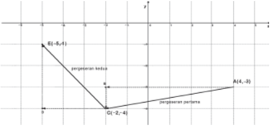

> **Deskripsi Visual:** Gambar ini adalah sebuah diagram yang menunjukkan hubungan antara dua titik, E1 dan A, serta garis yang menghubungkannya. Diagram ini terdiri dari tiga elemen utama: garis E1-A, garis E1-G1, dan garis G1-A. Garis E1-A merupakan garis yang menghubungkan titik E1 dengan titik A, sedangkan garis E1-G1 dan G1-A masing-masing menghubungkan titik E1 dengan titik G1 dan G1 dengan titik A. Garis-garis ini membentuk sebuah segitiga. Di bagian atas, terdapat teks yang menyebutkan "pergerakan kedua" dan "pergerakan percobaan", yang mungkin merujuk pada dua jenis pergerakan atau proses yang dilakukan dalam konteks ini. Di bagian bawah, terdapat teks yang menyebutkan "E1(-8,-4)", "G1(-2,-4)", dan "A(4,-3)", yang mungkin merujuk pada koordinat-koordinat dari titik-titik tersebut. Informasi kunci yang dapat diambil pembaca adalah bahwa ada tiga titik yang berbeda (E1, G1, dan A) dan bahwa mereka terhubung oleh beberapa garis.

``

Keterangan gambar:

Pergeseran	 1.	 Posisi	 awal	 titik	 adalah A (4,-3),	 kemudian	 bergerak	 ke	 kiri 6	 langkah	 dan	 ke	 bawah	 1	 langkah,	 sehingga	 posisi	 berubah	 di	 koordinat C (-2,-4). Hal ini berarti:

Pergeseran 2. Posisi sementara titik adalah C (-2,-4)	dan	mengalami	pergeseran selanjutnya	yaitu	bergeser	ke	kiri	3	langkah	dan	ke	atas	3	langkah,	sehingga pada gambar tampak di posisi koordinat E (-5,-1).	Hal	ini	berarti:

``

Jadi, posisi akhir titik A (4,-3)	berada	di	titik E (-5,-1).

 

---
## 📄 Halaman 136

---
**🖼️ Gambar/Diagram**

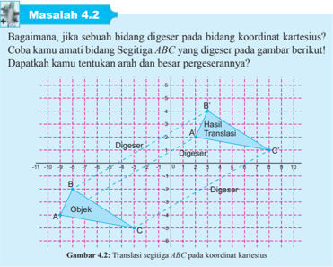

> **Deskripsi Visual:** Gambar 4.2 pada buku pelajaran ini adalah ilustrasi yang menunjukkan proses translasi segitiga ABC pada koordinat kartesius. Gambar ini menggambarkan objek segitiga ABC sebelum dan sesudah digeser ke posisi B'C'D'. Elemen utama yang ditampilkan adalah segitiga ABC sebelum digeser, segitiga B'C'D' setelah digeser, dan garis-garis yang menunjukkan arah dan besar pergeseran. Teks penting yang terlihat meliputi "Objek", "Hasil Translasi", "Digeser", dan "Digeser". Informasi kunci yang dapat diambil pembaca adalah bahwa segitiga ABC telah digeser ke posisi B'C'D' dengan arah dan besar pergeseran yang ditunjukkan oleh garis-garis pada gambar.

### Alternatif Penyelesaian:

Posisi	awal	titik	adalah A (-9,	-4), B (-8,	-2)	dan C (-3,	-5),	kemudian	masingmasing	bergeser	ke	kanan	11	langkah	dan	ke	atas	6	langkah,	sehingga	posisi berubah	dikoordinat A ′(2,	2), B ′(3,	4)	dan C ′(8,	1)	sesuai	gambar.	Hal	ini	dapat dituliskan	sebagai:

Tampak pada gambar arah pergeseran titik A , B , dan C ke posisi titik A ′, B ′ dan C ′.	 Secara	analitik,	semua	titik-titik	pada	bidang	segitiga	tersebut	akan ikut	 bergeser,	 bukan?	Mari	kita	tentukan	arah	dan	besar	pergeseran	bidang tersebut.

``

Berdasarkan	 pengamatan	 pada	 pergeseran	 objek-objek	 di	 sekitar	 kita	 dan pergeseran	 objek-objek	 di	 bidang	 koordinat	 kartesius	 (Masalah	 4.1	 dan Masalah	4.2),	dapat	disimpulkan	sifat	translasi	berikut:

 

---
## 📄 Halaman 137

### Sifat 4.1

Bangun	yang	digeser	(translasi)	tidak	mengalami	perubahan	bentuk	dan ukuran.

Selanjutnya,	 kita	 akan	 menemukan	 konsep	 translasi	 dan	 kaitannya	 dengan konsep	matriks.	Kita	amati	kembali	pergeseran	titik-titik	pada	Masalah	4.1 dan	Masalah	4.2	serta	pada	gambar	berikut:

---
**🖼️ Gambar/Diagram**

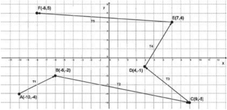

> **Deskripsi Visual:** Gambar ini adalah sebuah diagram yang menunjukkan pergerakan sekelompok objek dalam ruang bidang dua dimensi. Diagram ini terdiri dari beberapa titik yang dinyatakan dengan huruf besar (A, B, C, D, E, F) dan angka yang menunjukkan koordinat mereka. Titik-titik ini mewakili posisi objek dalam waktu tertentu.

Elemen utama dalam diagram ini adalah titik-titik tersebut, yang masing-masing menunjukkan lokasi objek pada titik waktu tertentu. Relasi antara elemen-elemen ini adalah bahwa setiap titik menggambarkan posisi objek pada saat tertentu, dan arah dan panjang garis yang menghubungkan titik-titik tersebut menunjukkan gerakan objek dari satu titik ke titik lain.

Teks, angka, atau label penting yang terlihat dalam diagram ini meliputi nama-nama titik (A, B, C, D, E, F), koordinat-koordinat titik, dan teks yang menjelaskan arah dan panjang gerakan objek. Informasi kunci yang dapat diambil pembaca meliputi lokasi awal dan akhir objek, serta arah dan kecepatan gerak mereka.

Dalam paragraf satu, saya akan menjelaskan semua elemen dan informasi yang ada dalam diagram ini secara detail.

Amati	pergeseran	setiap	titik	pada	Gambar	4.3!Perhatikan	arah	pergeseran	titiktitik	tersebut!	Kita	tentukan	koordinat	masing-masing	titik	dan	menuliskannya pada	tabel	di	bawah	ini.	Coba	kamu	lengkapi	Tabel	4.1!

---
**📊 Tabel**

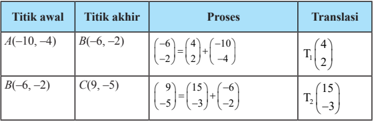

Tabel ini menunjukkan proses translasi pada titik-titik dalam bidang kartesius. Topik utama tabel adalah tentang pergerakan titik di bidang kartesius melalui translasi. Kolom-kolomnya mencakup titik awal, titik akhir, proses, dan translasi. Data penting yang terlihat antara lain bahwa setiap titik dipergerakkan ke titik baru dengan menggunakan rumus matematika yang disajikan dalam proses. Translasi ini menunjukkan arah dan jarak titik yang dipergerakkan, seperti titik A(-10,-4) yang dipergerakkan menjadi B(-6,-2) dengan transisi 4 unit ke kanan dan 2 unit ke atas.

 

---
## 📄 Halaman 138

---
**📊 Tabel**

Tabel ini mungkin menunjukkan hubungan antara dua set variabel, yaitu C dan D, E, dan F. Kolom pertama berisi variabel C, kemudian berurutan ke kolom kedua hingga kelima, yang masing-masing berisi variabel D, E, dan F. Data dalam tabel ini tampaknya menggambarkan hubungan antara variabel-variabel tersebut, mungkin dalam konteks statistik atau analisis data. Topik utama tabel ini mungkin adalah studi hubungan antara variabel-variabel tersebut, dengan fokus pada bagaimana mereka saling berkaitan satu sama lain.

Berdasarkan	pengamatan	pada	tabel,	secara	umum	diperoleh	konsep:

Titik A ( x , y )  ditranslasi  oleh T ( a , b )  menghasilkan  bayangan A '( x ', y '), ditulis	dengan,

``

``

Mari	kita	gunakan	konsep	translasi	tersebut	untuk	menentukan	hasil	translasi titik	dan	fungsi y = f ( x )	pada	beberapa	contoh	berikut.

### Contoh 4.1

Titik A (2,  3)  ditranslasikan  dengan  matriks  translasi T (-3,	 4),	 tentukan bayangan A !

### Alternatif Penyelesaian:

``

``

Bayangan A adalah A '(-1,	7)

 

---
## 📄 Halaman 139

### Contoh 4.2

Garis k dengan persamaan 2 x - 3 y +	4	=	0	ditranslasi	dengan	matriks	translasi T (-1,	-3).	Tentukanlah	bayangan	garis k tersebut!

### Alternatif Penyelesaian:

``

Misalkan	titik A ( x , y )	memenuhi	persamaan k sedemikian sehingga:

Dengan	mensubstitusi x dan y ke garis k maka	ditemukan	persamaan	garis k setelah	ditranslasi,	yaitu

``

### Latihan 4.1

Titik P ( a , b + 2) digeser dengan T (3, 2 b -a ) sehingga hasil pergeseran menjadi Q (3 a + b ,	-3).	Tentukan	posisi	pergeseran	titik R (2, 4) oleh translasi T di atas.

### Alternatif penyelesaian:

Coba	ikuti	panduan	berikut:

Langkah 1:

``

``

``

 

---
## 📄 Halaman 140

Langkah 2:

Dengan	mensubstitusi a = ... ke persamaan (2) maka diperoleh nilai b = . . . Dengan	demikian,	translasi	yang	dimaksud	adalah T (3,2 b -a ) = T (..., ...).

Langkah 3:

Pergeseran titik R (2,4) oleh translasi T adalah:

``

``

Jadi, koordinat pergeseran titik R adalah R '(..., ...).

### 4.2  Menemukan Konsep Releksi (Pencerminan)

Setelah	kamu	menemukan	konsep	translasi,	kamu	akan	belajar	menemukan konsep	releksi	atau	pencerminan.	Kita	mulai	dengan	mengamati	pencerminan objek-objek	dalam	kehidupan	sehari-hari.	Coba	kamu	amati	dirimu	pada	saat bercermin	(pada	cermin	datar).	Tentu	saja,	 kamu	pernah	melihat	bayangan dirimu	di	cermin,	seperti	contoh	bayangan	dirimu	di	permukaan	air,	bayangan dirimu	di	kaca,	dan	lain-lain.	Kalau	kamu	amati,	jarak	dirimu	ke	cermin	akan sama	dengan	jarak	bayanganmu	ke	cermin.	Sekarang,	kita	juga	akan	mencoba mempelajari	 konsep	 pencerminan	 dengan	 pendekatan	 koordinat.	 Kita	 akan mengamati	pencerminan	objek	pada	bidang	koordinat,	dengan	itu	diasumsikan bahwa	titik O (0,0)	dan	garis	(sumbu x ,	sumbu y , y = x , y = -x ) adalah sebagai cermin.

### Masalah 4.3

Perhatikan	 gambar	 berikut!	 Coba	 kamu	 amati	 objek	 yang	 dicerminkan terhadap	sumbu y pada	bidang	koordinat	kartesius.	Kamu	terfokus	pada jarak	objek	ke	cermin	dan	jarak	bayangan	ke	cermin	serta	bentuk/ukuran objek dan bayangan.

 

---
## 📄 Halaman 141

---
**🖼️ Gambar/Diagram**

> **Deskripsi Visual:** Gambar 4.4 ini adalah sebuah diagram yang menunjukkan refleksi objek terhadap sumbu y. Gambar ini terdiri dari dua bagian: bagian atas menunjukkan refleksi objek terhadap sumbu x, sedangkan bagian bawah menunjukkan refleksi objek terhadap sumbu y. Di bagian atas, sumbu x diberi label "B1" dan "B2", sementara sumbu y diberi label "A1" dan "A2". Di bagian bawah, sumbu x diberi label "C1" dan "C2", sementara sumbu y diberi label "D1" dan "D2". Informasi kunci yang dapat diambil pembaca adalah bahwa gambar ini menunjukkan dua jenis refleksi objek terhadap sumbu x dan y, serta bagaimana posisi objek berubah setelah refleksi tersebut.

Apakah	 hasil	 pengamatanmu?	 Tentu	 saja,	 bentuk	 dan	 ukuran	 objek	 dan bayangannya	 tidak	 berubah,	 jarak	 objek	 ke	 cermin	 sama	 dengan	 jarak bayangannya	ke	cermin.	Berdasarkan	pengamatan	pada	Masalah	4.3	maka secara	induktif	diperoleh	sifat	pencerminan	sebagai	berikut.

### Sifat 4.2

Bangun	yang	dicerminkan	(releksi)	dengan	cermin	datar	tidak	mengalami perubahan	bentuk	dan	ukuran.	Jarak	bangun	dengan	cermin	(cermin	datar) adalah	sama	dengan	jarak	bayangan	dengan	cermin	tersebut.

 

---
## 📄 Halaman 142

Perhatikan	konsep-konsep	pencerminan	dengan	pendekatan	koordinat	berikut ini.

### 4.2.1  Pencerminan Terhadap Titik O (0,0)

Kita	 akan	 menemukan	 konsep	 pencerminan	 terhadap	 titik O (0,0)	 dengan melakukan	 eksperimen.	 Kamu	 amati	 pencerminan	 titik-titik	 pada	 gambar berikut.

---
**🖼️ Gambar/Diagram**

> **Deskripsi Visual:** Gambar ini adalah sebuah diagram yang menunjukkan koordinat-persimpangan (Cartesian) dari beberapa titik dalam bidang koordinat. Diagram ini terdiri dari dua sumbu: sumbu x dan y, yang bertujuan untuk menentukan posisi titik dalam ruang. Titik-titik tersebut diberi label A, B, C, D, E, dan F, masing-masing dengan koordinat tertentu.

Elemen utama yang ditampilkan adalah titik-titik tersebut, yang memiliki koordinat yang berbeda-beda. Relasi antara titik-titik ini adalah bahwa mereka semua berada di dalam bidang koordinat dan memiliki koordinat yang berbeda, yang menunjukkan bahwa setiap titik memiliki posisi unik dalam ruang.

Teks, angka, atau label penting yang terlihat meliputi nama-nama titik (A, B, C, D, E, F), serta koordinat-koordinat mereka (misalnya, A(6,3), B(-2,-2), C(-7,2), dll.). Informasi kunci yang dapat diambil pembaca adalah bahwa diagram ini menunjukkan posisi beberapa titik dalam bidang koordinat, dan bahwa setiap titik memiliki koordinat yang berbeda-beda.

Perhatikan	koordinat	titik	dan	bayangannya	setelah	dicerminkan	terhadap	titik O (0,0)	 pada	 gambar	 berikut	 tersebut!	Tuliskan	 koordinat	 titik-titik	 tersebut dan	bayangannya	pada	tabel	di	bawah	ini!

---
**📊 Tabel**

Tabel ini menunjukkan hubungan antara titik-titik dan koordinat bayangan mereka di bidang peta. Topik utama tabel ini adalah hubungan geometri antara titik dan koordinat bayangan mereka. Kolom pertama berisi nama-nama titik seperti A, B, C, D, E, dan F, sedangkan kolom kedua berisi koordinat bayangan mereka. Data penting yang terlihat adalah bahwa setiap titik memiliki koordinat bayangan yang berlawanan dengan koordinat aslinya, yaitu jika koordinat asli positif, koordinat bayangan negatif dan sebaliknya. Ini menunjukkan bahwa tabel ini mungkin digunakan untuk memahami konsep tentang bayangan geometri dalam bidang peta.

 

---
## 📄 Halaman 143

Berdasarkan	pengamatan	pada	tabel,	secara	umum	jika	titik A ( x , y )	dicerminkan terhadap titik O (0,0)	akan	mempunyai	koordinat	bayangan A '(-x ,-y ),	bukan? Mari	 kita	 tentukan	 matriks	 pencerminan	 terhadap	 titik	 O(0,0).	 Misalkan

``

Dengan kesamaan matriks, 1 dan 0 x ax by a b -= + ⇔ =-=

Dengan	demikian,	matriks	pencerminan	terhadap	titik O (0,0)	adalah 1 0 0 1 -   -  .

``

Titik A ( x , y )	dicerminkan	terhadap	titik O (0,	0)	menghasilkan	bayangan A '( x ', y '),	ditulis	dengan,

### Contoh 4.3

Titik A (1,	4)	dicerminkan	terhadap	titik	asal O (0,	0),	tentukan	bayangan A !

### Alternatif Penyelesaian:

``

``

Bayangan A adalah A '(-1,	-4)

``

 

---
## 📄 Halaman 144

### Contoh 4.4

Sebuah	garis	dengan	persamaan	-2 x + 4 y -	1	=	0	dicerminkan	terhadap	titik asal O (0,	0).	Tentukan	persamaan	bayangan	garis	tersebut!

### Alternatif Penyelesaian:

``

Misalkan	titik A ( x , y )	memenuhi	persamaan	-2 x + 4 y -	1	=	0	sedemikian sehingga:

``

``

``

Jika	x	dan	y	disubstitusi	ke	garis	maka	ditemukan	bayangannya	yaitu:

``

### Latihan 4.2

Titik A (2, -3) ditranslasikan dengan T (-4,	-5)	kemudian	dicerminkan	terhadap titik O .	Tentukan	bayangan	titik A tersebut.

``

Langkah	1	(Proses	translasi)

Langkah	2	(Proses	Releksi)

``

``

Jadi, bayangan titik A adalah A "(…, …)

 

---
## 📄 Halaman 145

### 4.2.2  Pencerminan Terhadap Sumbu x

Kita	 akan	 mencoba	 	 menemukan	 konsep	 pencerminan	 terhadap	 sumbu x dengan	melakukan	pengamatan	pada	pencerminan	titik-titik.	Secara	induktif, kita	akan	menemukan	pola.	Perhatikan	gambar	berikut!

---
**🖼️ Gambar/Diagram**

> **Deskripsi Visual:** Gambar ini adalah sebuah diagram yang menunjukkan hubungan antara dua variabel, x dan y, melalui beberapa titik data. Diagram ini terdiri dari garis x dan garis y yang saling berpotongan, membentuk sebuah grid. Titik-titik data tersebut dinyatakan dengan koordinat (x, y) dan diberi label A sampai F. Setiap titik memiliki warna unik untuk membedakannya. Garis diagonal yang menghubungkan titik-titik ini menunjukkan pola atau trend antara kedua variabel tersebut. Label "Grafik Bimbingan" tampak di bagian bawah diagram, menunjukkan bahwa ini adalah sebuah diagram bimbingan. Informasi kunci yang dapat diambil dari gambar ini adalah hubungan antara variabel x dan y serta pola atau trend yang mungkin ada antara kedua variabel tersebut.

Coba	kamu	amati	pencerminan	beberapa	titik	terhadap	sumbu x pada koordinat kartesius	di	atas,	kemudian	kamu	tuliskan	titik	tersebut	beserta	bayangannya pada	tabel	di	bawah	ini!

---
**📊 Tabel**

Tabel ini menunjukkan hubungan antara titik-titik pada bidang koordinat dengan titik-titik yang dinyatakan sebagai bayangan mereka setelah dilakukan transformasi. Kolom pertama berisi nama-nama titik asli seperti A, B, C, D, E, dan F, sedangkan kolom kedua berisi nama-nama titik bayangan mereka, yaitu A', B', C', D', E', dan F'. Data penting yang terlihat adalah bahwa setiap titik asli memiliki satu dan hanya satu titik bayangan yang sesuai dengan aturan transformasi yang digunakan. Ini menunjukkan bahwa transformasi tersebut mungkin merupakan perpindahan, pengurangan, atau perubahan skala, tetapi tidak ada dua titik yang memiliki bayangan yang sama.

 

---
## 📄 Halaman 146

Berdasarkan	pengamatan	pada	tabel,	secara	umum,	jika	titik A ( x , y )	 dicerminkan terhadap	 sumbu x akan	 mempunyai	 koordinat	 bayangan A '( x ,  -y ),	 bukan? Mari	kita	tentukan	matriks	pencerminan	terhadap	sumbu x .	Misalkan	matriks

``

Dengan kesamaan matriks: 1 dan 0 x ax by a b = + ⇔ = =

``

Dengan	demikian,	matriks	pencerminan	terhadap	sumbu x adalah 1 0 0 1

``

Titik A ( x , y )	 dicerminkan	 terhadap	 sumbu x menghasilkan  bayangan A '( x ', y '),	ditulis	dengan,

``

Perhatikan	 penerapan	 konsep	 pencerminan	 terhadap	 sumbu x pada	 contoh berikut!

### Contoh 4.5

Jika titik A (-3,	3)	dicerminkan	terhadap	sumbu x maka	tentukan	bayangan titik	tersebut!

 

---
## 📄 Halaman 147

### Alternatif Penyelesaian:

``

Jadi, bayangan titik A adalah A '(-3, -3)

### Contoh 4.6

Jika  garis  3 x -  2 y -	 5	 =	 0	 dicerminkan	 terhadap	 sumbu x maka	 tentukan bayangan	garis	tersebut!

### Alternatif Penyelesaian:

``

Misalkan	titik A ( x , y )	memenuhi	persamaan	3 x - 2 y -	5	=	0	sehingga,

Dengan	 mensubstitusi x dan y ke	 garis	 maka	 ditemukan	 bayangannya, 3( x ) -2(y )	-5	=	0	atau	3 x + 2 y -	5	=	0

### Latihan 4.3

Titik	A(-2,	-5)	dicerminkan	terhadap	titik O kemudian	dilanjutkan	dengan pencerminan	terhadap	sumbu x .	Tentukan	bayangan	titik A tersebut.

### Alternatif Penyelesaian:

``

 

---
## 📄 Halaman 148

Langkah	1	(Proses	Releksi	terhadap	titik O )

``

Langkah	2	(Proses	Releksi	terhadap	sumbu x )

``

Jadi, bayangan titik A adalah A" (…, …)

### 4.2.3  Pencerminan Terhadap Sumbu y

Kembali	kita	akan	mengamati	pola	koordinat	titik-titik	dan	bayangannya	oleh pencerminan	 terhadap	 sumbu	 y.	 Dengan	 demikian,	 kita	 akan	 menemukan konsep	pencerminan	terhadap	sumbu	y.	Perhatikan	gambar	berikut!

---
**🖼️ Gambar/Diagram**

> **Deskripsi Visual:** Gambar ini adalah diagram yang menunjukkan hubungan antara dua variabel, yaitu x dan y. Diagram ini terdiri dari beberapa titik yang dinyatakan dengan huruf besar (A, B, C, D, E, F) dan angka yang menunjukkan nilai-nilai x dan y untuk setiap titik tersebut. Titik-titik ini terhubung oleh garis-garis yang menggambarkan hubungan antara kedua variabel tersebut.

Elemen-elemen utama yang ditampilkan dalam gambar ini adalah titik-titik yang dinyatakan dengan huruf besar dan angka, serta garis-garis yang menghubungkan titik-titik tersebut. Garis-garis ini membantu dalam memahami hubungan antara kedua variabel tersebut.

Teks, angka, atau label penting yang terlihat dalam gambar ini meliputi nama-nama titik (A, B, C, D, E, F), nilai-nilai x dan y untuk setiap titik, dan garis-garis yang menghubungkan titik-titik tersebut.

Informasi kunci yang dapat diambil pembaca dari gambar ini adalah hubungan antara kedua variabel tersebut, yaitu hubungan antara nilai-nilai x dan y untuk setiap titik. Ini dapat digunakan untuk analisis statistik atau untuk memahami hubungan antara dua variabel tersebut.

Coba	kamu	amati	pencerminan	beberapa	titik	terhadap	sumbu y pada koordinat kartesius	di	atas,	kemudian	kamu	tuliskan	titik	tersebut	beserta	bayangannya pada	tabel	di	bawah	ini!

 

---
## 📄 Halaman 149

---
**📊 Tabel**

Tabel ini menunjukkan koordinat bayangan beberapa titik dalam sebuah konstruksi geometri. Topik utama tabel adalah tentang hubungan antara titik asli dan titik bayangan mereka setelah dilakukan transformasi. Kolom pertama berisi nama-nama titik, sedangkan kolom kedua berisi koordinat bayangan mereka. Data penting yang terlihat adalah bahwa setiap titik memiliki koordinat bayangannya yang berbeda, menunjukkan bahwa transformasi tersebut mungkin melibatkan pergeseran, pengelipatan, atau rotasi.

Berdasarkan	pengamatan	pada	tabel,	secara	umum	jika	titik A ( x , y )	 dicerminkan terhadap	sumbu y akan	mempunyai	koordinat	bayangan A '(-x , y ).	Misalkan

``

``

``

Dengan kesamaan matriks, -x = ax + by ⇔ a = . . . . dan b y = cx + dy ⇔ c = . . . . dan d = . . . .

Dengan	demikian,	matriks	pencerminan	terhadap	sumbu y adalah

...

...

...

...









Titik A ( x , y )	 dicerminkan	 terhadap	 sumbu y menghasilkan  bayangan A '( x ', y '),	ditulis	dengan,

``





 

---
## 📄 Halaman 150

### Contoh 4.7

Jika titik A (-3,	-4)	dicerminkan	terhadap	sumbu y maka	tentukanlah	bayangan titik	tersebut!

### Alternatif Penyelesaian:

``

``

Jadi, bayangan titik A adalah A '(3,-4)

### Contoh 4.8

Jika  garis  3 x -  2 y -	 5	 =	 0	 dicerminkan	 terhadap	 sumbu y maka	 tentukan bayan gan	garis	tersebut!

### Alternatif Penyelesaian:

Misalkan	titik A ( x , y )	memenuhi	persamaan	3 x - 2 y -	5	=	0	sehingga,

``

Dengan	 mensubstitusi x dan y ke	 garis	 maka	 ditemukan	 bayangannya, 3(x ) - 2( y )	-5	=	0	atau	3 x + 2 y +	5	=	0

### Latihan 4.4

Garis 2 x -y +	5	=	0	dicerminkan	terhadap	titik O (0,0)	kemudian	dilanjutkan dengan	pencerminan	terhadap	sumbu y .	Tentukan	persamaan	bayangan	garis tersebut.

 

---
## 📄 Halaman 151

### Alternatif Penyelesaian:

Misalkan	titik A ( x , y )	terletak	pada	garis	tersebut,	sehingga:

``

Langkah	1	(Proses	pencerminan	terhadap	titik O (0,	0))

``

Langkah	2	(Proses	pencerminan	terhadap	sumbu y )

``

``

Langkah	4	(Proses	menentukan	persamaan	bayangan)

Tentukan x dan y dalam	bentuk x dan y

``

Langkah	5	(Proses	menentukan	persamaan	bayangan)

Substitusi x dan y ke 2 x -y +	5	=	0	sehingga	diperoleh	persamaan	bayangan.

``

### 4.2.4  Pencerminan Terhadap Garis y = x

Kita	 akan	 mencoba	 menemukan	 konsep	 pencerminan	 terhadap	 garis y = x dengan	melakukan	pengamatan	pada	pencerminan	titik-titik.	Secara	induktif, kita	akan	menemukan	pola.	Perhatikan	gambar	berikut!

 

---
## 📄 Halaman 152

---
**🖼️ Gambar/Diagram**

> **Deskripsi Visual:** Gambar ini adalah sebuah diagram yang menunjukkan hubungan antara dua variabel, yaitu x dan y. Diagram ini berupa garis lurus yang melintasi titik asal (0,0) dan memiliki koordinat titik-titik penting seperti A(5,-1), B(-5,3), C(2,3), D(4,2), E(4,2), F(4,5), G(13,-2), H(1,-8), I(1,-8), J(3,5). Garis tersebut menggambarkan hubungan antara kedua variabel tersebut, dengan garis tersebut menunjukkan bahwa untuk setiap nilai x, ada satu dan hanya satu nilai y yang sesuai. Ini menunjukkan bahwa hubungan antara kedua variabel tersebut adalah fungsi.

Coba	 kamu	 amati	 pencerminan	 beberapa	 titik	 terhadap	 garis y = x pada koordinat	kartesius	di	atas,	kemudian	kamu	tuliskan	koordinat	titik	tersebut beserta	bayangannya	pada	tabel	di	bawah	ini!

---
**📊 Tabel**

Tabel ini menunjukkan koordinat bayangan titik-titik dalam sebuah sistem koordinat. Topik utama tabel ini adalah hubungan antara titik asli dan titik bayangan mereka setelah dilakukan transformasi. Kolom pertama berisi nama-nama titik, sedangkan kolom kedua berisi koordinat bayangan mereka. Data penting yang terlihat adalah bahwa setiap titik memiliki koordinat bayangannya sendiri-sendiri, menunjukkan bahwa setiap titik asli memiliki koordinat bayangan yang unik. Ini menunjukkan bahwa transformasi bayangan adalah satu-satu, tidak ada dua titik yang memiliki koordinat bayangan yang sama.

Berdasarkan	pengamatan	pada	tabel,	secara	umum	jika	titik A ( x , y )	 dicerminkan terhadap garis y = x akan	 mempunyai	koordinat	bayangan A '( y , x ),	 bukan? Mari	kita	tentukan	matriks	pencerminan	terhadap	garis y = x .	Misalkan	matriks

``

 

---
## 📄 Halaman 153

Dengan kesamaan matriks, y = ax + by ⇔ a =	0	dan b =	1 x = cx + dy ⇔ c =	1	dan d =	0 Dengan	demikian,	matriks	pencerminan	terhadap	garis y = x adalah 0 1 1 0      

Titik A ( x , y )	 dicerminkan	 terhadap	 garis y = x menghasilkan  bayangan A '( x ', y '),	ditulis	dengan,

Dimana	matriks	pencerminan	terhadap	garis y = x adalah 0 1 1 0       .

### Contoh 4.9

Jika titik A (-1,	2)	dicerminkan	terhadap	garis y = x maka	tentukanlah	bayangan titik	tersebut!

``

Jadi, bayangan titik A adalah A '(2,	-1)

### Contoh 4.10

Jika garis 4 x - 3 y +	1	=	0	dicerminkan	terhadap	garis y = x maka	tentukan bayangan	garis	tersebut!

``

 

---
## 📄 Halaman 154

### Alternatif Penyelesaian:

``

Misalkan	titik A ( x , y )	memenuhi	persamaan	4 x - 3 y +	1	=	0	sehingga,

``

Dengan	 mensubstitusi x dan y ke	 garis	 maka	 ditemukan	 bayangannya, 4( y ) -3( x )	+	1	=	0	atau	-3( x ) + 4 y +	1	=	0

### Latihan 4.5

Titik A (-1,	-3)	dicerminkan	terhadap	titik O (0,	0)	kemudian	dilanjutkan	dengan pencerminan	 terhadap	 sumbu y dan	 dilanjutkan	 lagi	 dengan	 pencerminan terhadap garis y = x .	Tentukan	bayangan	titik A tersebut.

### Alternatif Penyelesaian:

``

Langkah	1	(Proses	pencerminan	terhadap	titik O (0,0))

Langkah	2	(Proses	pencerminan	terhadap	sumbu y )

``

``

``

Langkah	3	(Proses	pencerminan	terhadap	garis y = x )

Jadi, bayangan titik A adalah A '''(…, …)

 

---
## 📄 Halaman 155

### 4.2.5  Pencerminan Terhadap Garis y = -x

Kita	akan	mencoba	menemukan	konsep	pencerminan	terhadap	garis y =  -x dengan	melakukan	pengamatan	pada	pencerminan	titik-titik.	Secara	induktif, kita	akan	menemukan	pola.	Perhatikan	gambar	berikut!

---
**🖼️ Gambar/Diagram**

> **Deskripsi Visual:** Gambar ini adalah sebuah diagram yang menunjukkan hubungan antara dua variabel, yaitu x dan y, melalui beberapa titik koordinat. Diagram ini terdiri dari garis lurus yang menghubungkan beberapa titik pada sumbu-x dan sumbu-y. Titik-titik tersebut diberi label dengan koordinat (x, y), seperti A(4, -1), B(2, 2), C(3, 5), D(-6, 1), E(3, 5), dan F(1, 5). Garis lurus ini menunjukkan pola atau hubungan antara kedua variabel tersebut. Label "GAMBAR" dan "y = x" juga terlihat di bagian bawah diagram, menunjukkan bahwa diagram ini mungkin merupakan bagian dari materi pelajaran matematika tentang hubungan antara dua variabel.

Coba	kamu	amati	pencerminan	beberapa	titik	terhadap	garis y = -x pada koordinat	kartesius	di	atas,	kemudian	kamu	tuliskan	koordinat	titik	tersebut beserta	bayangannya	pada	tabel	di	bawah	ini!

---
**📊 Tabel**

Tabel ini menunjukkan hubungan antara titik-titik dalam bidang kartesius dengan bayangannya di bidang lain. Topik utama tabel ini adalah hubungan geometri antara titik dan bayangannya. Kolom pertama berisi nama-nama titik seperti A, B, C, D, E, dan kolom kedua berisi bayangannya masing-masing. Data penting yang terlihat adalah bahwa setiap titik memiliki bayangannya yang berbeda, menunjukkan bahwa bayangan tidak selalu sama dengan titik aslinya. Titik A memiliki bayangannya A' dengan koordinat (4, -1), sedangkan titik B memiliki bayangannya B' dengan koordinat (-2, 3). Ini menunjukkan bahwa bayangan dapat memiliki koordinat yang berbeda dari titik aslinya.

Berdasarkan	 pengamatan	 pada	 tabel,	 secara	 umum	 jika	 titik A ( x , y ) dicerminkan	 terhadap	 garis y =  -x akan	 mempunyai	 koordinat	 bayangan A '(-y ,  -x ),	 bukan?	 Mari	 kita	 tentukan	 matriks	 pencerminan	 terhadap	 garis y = -x .	Misalkan	matriks	transformasinya	adalah a b C c d   =     sehingga,

 

---
## 📄 Halaman 156

``

Dengan kesamaan matriks, ⇔

``

Titik A ( x , y )	 dicerminkan	terhadap	garis y =  -x menghasilkan bayangan A '( x ', y '),	ditulis	dengan,

### Contoh 4.11

Jika titik A (1,	2)	dicerminkan	terhadap	garis y = -x maka	tentukanlah	bayangan titik	tersebut!

### Alternatif Penyelesaian:

Jadi, bayangan titik A adalah A '(-2,-1)

``

### Contoh 4.12

Jika garis 4 x - 3 y +	1	=	0	dicerminkan	terhadap	garis y = -x maka	tentukan bayangan	garis	tersebut!

``

 

---
## 📄 Halaman 157

### Alternatif Penyelesaian:

``

Misalkan	titik	A( x , y )	memenuhi	persamaan	4 x - 3 y +	1	=	0	sehingga:

Dengan	 mensubstitusi x dan y ke	 garis	 maka	 ditemukan	 bayangannya, 4(y ) - 3(x )	+	1	=	0	atau		3 x - 4 y +	1	=	0.

### 1. Perhatikan	gambar!

---
**🖼️ Gambar/Diagram**

> **Deskripsi Visual:** Gambar ini adalah sebuah diagram yang menunjukkan hubungan antara empat konsep matematika: Studya, Gambar, Rumus, dan Ilustrasi. Diagram ini dibagi menjadi empat bagian, masing-masing menunjukkan konsep tersebut dengan warna berbeda dan simbol yang berbeda.

1. Studya (warna biru) menunjukkan konsep studi atau penelitian, dengan simbol garis lurus yang mengarah ke kanan.
2. Gambar (warna merah) menunjukkan konsep visual atau visualisasi, dengan simbol lingkaran yang mengandung huruf "G".
3. Rumus (warna hijau) menunjukkan konsep matematika atau rumus, dengan simbol segitiga yang mengandung huruf "R".
4. Ilustrasi (warna ungu) menunjukkan konsep visual atau visualisasi, dengan simbol lingkaran yang mengandung huruf "I".

Elemen-elemen utama adalah konsep-konsep tersebut, yang saling terhubung melalui simbol dan warna yang berbeda. Teks, angka, atau label penting tidak terlihat dalam gambar ini.

Informasi kunci yang dapat diambil pembaca adalah bahwa Studya, Gambar, Rumus, dan Ilustrasi adalah empat konsep yang saling terkait dalam konteks matematika dan penelitian. Studya dan Rumus memiliki simbol yang sama, yang menunjukkan bahwa mereka memiliki hubungan yang kuat. Sementara itu, Gambar dan Ilustrasi juga memiliki simbol yang sama, yang menunjukkan bahwa mereka memiliki hubungan yang kuat pula.

Berdasarkan	gambar,	tentukan	translasi	T	yang	menggeser	masing-masing objek	tersebut!

 

---
## 📄 Halaman 158

- Tunjukkan	dengan	gambar	pada	bidang	koordinat	kartesius,	pergeseran objek	berikut	oleh	translasi T :
- Ruas	garis AB dengan A (-1,	1)	dan B (2, -3) ditranslasi oleh T (-2, 4)
- Titik A (-3, -4) ditranslasi oleh T (5,	7)
- Segitiga ABC dengan A (-3,	 -1), B (-1,	 2),	 dan C (0,	 -4)	 ditranslasi oleh T (5,	5)
- Lingkaran	dengan	pusat	di P (1,	 -1)	 dan	 radius	 2	 satuan	 ditranslasi oleh T (5,	-5)
- Garis 2 y - 3 x +	6	=	0	ditranslasi	oleh T (4,	-1)
- Tentukan	koordinat	hasil	pergeseran	titik	oleh	translasi T berikut:
- Titik B (1,	-3)	oleh	translasi T 1 (-2,	-4)	dilanjutkan	dengan	translasi T 2 (-2, -4)
- Titik A (-2,	5)	oleh	translasi T 1 (-1,	-3)	dilanjutkan	dengan	translasi T 2 (0,	5)
- Titik C (-3,  2)  oleh  translasi T 1 (-1,	 5)	 dilanjutkan	 dengan	 translasi T 2 (-1,4)
- Titik D (1,	 3)	 oleh	 translasi T 1 (1,	 3)	 dilanjutkan	 dengan	 translasi T 2 (1,	3)
- Titik D (4,	 5)	 oleh	 translasi T 1 (-1,	 -2)	 dilanjutkan	 dengan	 translasi T 2 (-1,	-3)
- Tentukan	koordinat	titik	asal	oleh	translasi	T	berikut.
- Titik B ( x , y ) ditranslasi oleh T (1,	5)		menjadi B '(-10,	-2)
- Titik A ( x , y ) ditranslasi oleh T (-1,	-6)		menjadi A '(7,	-4)
- Titik C ( x , y ) ditranslasi oleh T (-4, 6)  menjadi C '(10,	-3)
- Titik E ( x , y ) ditranslasi oleh T (-1,	-6)		menjadi E '(1,	6)
- Titik D ( x , y ) ditranslasi oleh T (-5,	-9)		menjadi D '(5,	9)
- Dengan	 menggunakan	 konsep,	 tentukan	 hasil	 pergeseran	 fungsi-fungsi berikut	oleh	translasi T .
- Garis 2 y - 3 x +	6	=	0	ditranslasi	oleh T (4,	-1)
- Garis y = 2 ditranslasi oleh T (1,	-1)
- Parabola y = x 2 - 3 x + 2 ditranslasi oleh T (2,	1)
- Parabola x = y 2 - 2 x - 2 ditranslasi oleh T (-2, 2)
- Lingkaran x 2 + y 2 - 2 x + 2 y -	3	=	0	ditranslasi	oleh T (-3, -2)

 

---
## 📄 Halaman 159

- Tunjukkan	 dengan	 gambar	 pencerminaan	 objek	 pada	 bidang	 koordinat kartesius	berikut:
- Titik B (-1,	-2)	dicerminkan	terhadap	titik	sumbu x
- Titik A (3,	-4)	dicerminkan	terhadap	titik O (0,	0)
- Titik C (-5,	2)	dicerminkan	terhadap	titik	sumbu y
- Titik E (2,	4)	dicerminkan	terhadap	titik	sumbu y =	-x
- Titik D (1,	-5)	dicerminkan	terhadap	titik	sumbu y = x
- Ruas	garis	AB	dengan A (-2,	-1)	dan B (2,	5)	dicerminkan	terhadap titik O (0,	0)
- Garis 2 y - 3 x +	6	=	0	dicerminkan	terhadap	sumbu y
- Segitiga ABC dengan A (-3,	-1), B (-1,	2)	dan C (0,	-4)	dicerminkan terhadap	sumbu x
- Parabola y = x 2 +	6	dicerminkan	terhadap	garis y = x
- Garis y = 2 x +	3	dicerminkan	terhadap y =	-x
- Dengan	menggunakan	konsep	releksi,	tentukan	hasil	pencerminan	fungsifungsi	berikut!
- Garis 2 y - 3 x +	6	=	0	dicerminkan	terhadap	sumbu x .
- Garis y =	2	dicerminkan	terhadap	titik O (0,	0)
- Parabola y = x 2 - 3 x +	2	dicerminkan	terhadap	sumbu y .
- Lingkaran x 2 + y 2 -  2 x +  2 y -	 3	 =	 0	 dicerminkan	 terhadap	 garis y =	-x .
- Parabola x = y 2 - 2 y -	2	dicerminkan	terhadap	garis y = x .

### 4.3  Menemukan Konsep Rotasi (Perputaran)

Coba	kamu	amati	lingkungan	sekitarmu!	Objek	apa	yang	bergerak	berputar? Banyak	 contoh	 objek	 yang	 bergerak	 berputar,	 seperti:	 jarum	 jam	 bergerak berputar	menunjukkan	angka,	kincir	angin,	kipas	angin,	dan	lain-lain.	Pada kesempatan	 ini,	 kita	 akan	 membahas	 gerak	 berputar	 (rotasi)	 suatu	 objek dengan	sudut	putaran	dan	pusat	putaran	pada	bidang	koordinat.	Perhatikan Gambar!

 

---
## 📄 Halaman 160

### Masalah 4.4

### Coba	kamu	perhatikan	gambar	berikut!

---
**🖼️ Gambar/Diagram**

> **Deskripsi Visual:** Gambar A adalah ilustrasi yang menunjukkan proses rotasi objek. Gambar ini terdiri dari tiga bagian utama:

1. **Pertama**: Gambar A menunjukkan objek yang sedang berputar di sekitar pusat. Objek tersebut terletak di tengah-tengah gambar, dengan pusat rotasi yang jelas.

2. **Kedua**: Di sebelah kanan, gambar C menunjukkan hasil rotasi objek. Objek yang sama tampak lebih kecil dan berada di sudut kanan atas gambar, menunjukkan arah putaran objek.

3. **Ketiga**: Gambar B menunjukkan sambungan antara objek dan pusat rotasi. Sambungan ini menunjukkan bahwa objek berputar sekitar pusat yang sama.

Elemen-elemen utama dalam gambar ini adalah objek, pusat rotasi, hasil rotasi, dan sambungan. Relasi antara elemen-elemen ini adalah bahwa objek berputar sekitar pusat rotasi, yang menghasilkan hasil rotasi objek yang lebih kecil dan berada di sudut yang berbeda. Sambungan antara objek dan pusat rotasi menunjukkan hubungan posisi objek terhadap pusat rotasi.

Teks, angka, atau label penting yang terlihat dalam gambar ini adalah nama objek, pusat rotasi, hasil rotasi, dan sambungan. Informasi kunci yang dapat diambil pembaca adalah bahwa objek berputar sekitar pusat rotasi, menghasilkan hasil rotasi yang lebih kecil dan berada di sudut yang berbeda, serta sambungan antara objek dan pusat rotasi menunjukkan hubungan posisi objek terhadap pusat rotasi.

Berikan	komentarmu	tentang	perputaran	setiap	objek	tersebut!

Pada	 gambar	 terdapat	 tiga	 objek	 (segitiga)	 yang	 diputar	 dengan	 sudut putaran	tertentu.	Hasil	putaran	akan	bergantung	pada	pusat	putaran	dan	besar sudut	putaran,	bukan.	Gambar	A	adalah	putaran	objek	dengan	sudut	putaran berada	pada	objek	itu	sendiri.	Gambar	B	adalah	putaran	objek	dengan	pusat berada	di	ujung/pinggir	objek	itu	sendiri	dan	Gambar	C	menunjukkan	putaran objek	 dengan	 pusat	 putaran	 berada	 di	 luar	 objek	 itu.	 Namun,	 bentuk	 dan ukuran	objek	tidak	berubah	setelah	mengalami	rotasi.

 

---
## 📄 Halaman 161

### Perhatikan	gambar	berikut!

---
**🖼️ Gambar/Diagram**

> **Deskripsi Visual:** Gambar ini adalah ilustrasi yang menunjukkan konsep trigonometri dalam bidang koordinat kartesius. Gambar ini menggambarkan dua lingkaran berbeda dengan pusat di titik asal (0,0) dan garis-garis yang membentuk sudut-sudut di antara mereka. Lingkaran pertama memiliki jari-jari 5 dan lingkaran kedua memiliki jari-jari 7. Dua garis yang menghubungkan titik-titik di kedua lingkaran tersebut membentuk sudut-sudut yang berbeda.

Elemen utama dalam gambar ini adalah dua lingkaran dengan jari-jari masing-masing 5 dan 7, serta dua garis yang menghubungkan titik-titik di kedua lingkaran tersebut. Relasi antara elemen-elemen ini adalah bahwa garis-garis tersebut membentuk sudut-sudut yang berbeda di antara lingkaran-lingkaran tersebut.

Teks, angka, atau label penting yang terlihat dalam gambar ini meliputi ukuran jari-jari lingkaran (5 dan 7), dan sudut-sudut yang dibentuk oleh garis-garis tersebut. Informasi kunci yang dapat diambil pembaca adalah bahwa gambar ini menunjukkan hubungan antara jari-jari lingkaran dan sudut-sudut yang dibentuk oleh garis-garis tersebut dalam bidang koordinat kartesius.

Dengan	demikian,	secara	induktif	diperoleh	sifat	rotasi	sebagai	berikut:

### Sifat 4.3

Bangun	yang	diputar	(rotasi)	tidak	mengalami	perubahan	bentuk	dan	ukuran.

Berikutnya,	 kita	 akan	 melakukan	 percobaan	 kembali	 untuk	 mendapatkan konsep	rotasi.	Perhatikan	pergerakan	titik	pada	gambar	berikut:

---
**🖼️ Gambar/Diagram**

> **Deskripsi Visual:** Gambar ini adalah sebuah diagram yang menunjukkan konsep rotasi dalam bidang geometri. Diagram ini melibatkan tiga titik: A, B, dan C, yang masing-masing dinyatakan dengan koordinat (x, y) dan (x', y'). Titik A diberi label "A(x, y)", "A'(x', y')", dan "A(ρcosφ, ρsinφ)". Titik B diberi label "B(ρcosφ, ρsinφ)", dan titik C diberi label "C(ρcosφ, ρsinφ)". Titik O diberi label "O". Titik A dan B berada pada garis horisontal, sedangkan titik C berada pada garis vertikal. Garis horisontal dan vertikal tersebut membentuk sudut 90 derajat. Titik A dan B juga berada pada garis yang melengkung, yang menggambarkan pola rotasi. Garis ini melengkung dari titik A ke titik B dan kemudian ke titik C. Garis ini juga memiliki label "Hassl Rotateli" dan "Objekt". Garis ini juga memiliki label "Alpazos, skala". Ini menunjukkan bahwa gambar ini adalah diagram yang menunjukkan konsep rotasi dalam bidang geometri.

 

---
## 📄 Halaman 162

Kamu	masih	ingat	konsep	trigonometri,	bukan?	Pada	segitiga OCA , koordinat objek adalah A ( r cos a , r sin a ).	Diputar	sebesar	sudut β dan	Pusat O (0,	0) sehingga  posisi  objek  menjadi  di  koordinat A '( r cos( a  + β ), r sin( a  + β) ). Dengan	demikian,	kita	akan	mencoba	mencari	konsep	rotasi.

``

``

``

Ini berarti cos , sin a b β β = = -dan sin , cos c d β β = =

``

Dengan	demikian,	matriks	rotasi	sebesar	sudut β dan	pusat	rotasi O (0,	0)	adalah

Bagaimana	jika	pusat	rotasi	di	titik P ( p , q )?	Kamu	boleh	menggeser	(translasi) terlebih	 dahulu	 pusat	 rotasi	 ke	 titik O (0,	 0)	 kemudian	 terjadi	 proses	 rotasi kemudian	ditranslasi	kembali	sejauh	pusat	rotasi	sebelumnya.

Titik A ( x , y )	 diputar	 dengan	 pusat P ( p , q )	 dan	 sudut a menghasilkan bayangan A '( x ', y '),	ditulis	dengan,

``

 

---
## 📄 Halaman 163

Matriks rotasi dengan sudut a (berlawanan arah jarum jam) adalah cos sin sin cos a a a a -      .

Ingat,	 sudut a dihitung	 berlawanan	 arah	 jarum	 jam,	 sebaliknya	 adalah	 a (searah	jarum	jam).

### Contoh 4.13

Jika titik A (-2,	3)	dirotasi	dengan	pusat O (0,	0)	dan	sudut	90 0 berlawanan	arah jarum	jam	maka	tentukanlah	bayangan	titik	tersebut!

### Alternatif Penyelesaian:

``

Jadi, bayangan titik A adalah A '(-3,-2)

### Contoh 4.14

Jika garis x -2 y +	3	=	0	dirotasi	dengan	pusat P (1,	-1)	dan	sudut	180 0 searah jarum	jam	maka	tentukanlah	bayangan	garis	tersebut!

### Alternatif Penyelesaian:

``

Misalkan	titik A ( x , y )	memenuhi	persamaan x - 2 y +	3	=	0	sehingga,

 

---
## 📄 Halaman 164

``

Dengan	 mensubstitusi x dan y ke	 garis	 maka	 ditemukan	 bayangannya, (2 x ) - 2(y -	2)	+	3	=	0	atau x - 2 y -	9	=	0.

``

### 4.4  Menemukan Konsep Dilatasi (Perkalian)

Coba	 kamu	 berikan	 contoh	 perkalian	 (dilatasi)	 yang	 terjadi	 di	 lingkungan sekitarmu?	Sebagai	contoh,	balon	yang	ditiup	akan	mengembang,	karet	gelang dapat	direnggang,	dan	lain-lain.	Semua	itu	membicarakan	perkalian	ukuran objek.  Tetapi,  pada  kesempatan  ini,  kita  akan  membahas  konsep  perkalian objek dengan pendekatan koordinat.

---
**🖼️ Gambar/Diagram**

> **Deskripsi Visual:** Gambar 4.13 dalam buku pelajaran ini menunjukkan proses dilatasi objek pada pusat O(0, 0). Gambar ini terdiri dari dua bagian: bagian atas menunjukkan objek asli dengan titik-titik A, B, C, dan D, sementara bagian bawah menunjukkan objek dilatasi pertama dan kedua. Titik-titik tersebut dinyatakan dengan label seperti "objek" dan "dilatasi objek". Terdapat juga teks yang memberikan penjelasan tentang skala dilatasi, yaitu "persisalan skala 1" dan "persisalan skala 2". Elemen-elemen utama dalam gambar ini adalah objek asli dan objek dilatasi, serta informasi tentang skala dilatasi. Label penting yang terlihat meliputi nama objek dan skala dilatasi. Informasi kunci yang dapat diambil pembaca meliputi ukuran objek asli dan objek dilatasi, serta skala dilatasi yang digunakan.

 

---
## 📄 Halaman 165

Jika	 diamati,	 kamu	 melihat	 ukuran	 objek	 akan	 semakin	 besar	 dengan perkalian	 skala	 2.	 Kemudian,	 jarak	 OA2	 adalah	 dua	 kali	 OA,	 jarak	 OB2 adalah	dua	kali	OB		dan	jarak	OC2	adalah	dua	kali	OC.	Tetapi	bangun	setelah perkalian	 dengan	 faktor	 skala	 -1	 mempunyai	 besar	 dan	 ukuran	 yang	 sama tetapi	mempunyai	arah	yang	berlawanan.	Perhatikan	juga,	jarak	OA1	sama dengan	jarak	OA,	jarak	OB1	adalah	sama	dengan	jarak	OB		dan	jarak	OC1 adalah	sama	dengan	jarak	OC.

Hal	 ini	 berarti,	 untuk	 melakukan	 perkalian/dilatasi,	 dibutuhkan	 unsur faktor	perkalian	dan	pusat	perkalian.

Dengan	mengamati	perkalian	objek,	dapat	diambil	kesimpulan	sebagai berikut:

### Sifat 4.4

Bangun	yang	diperbesar	atau	diperkecil	(dilatasi)	dengan	skala k dapat mengubah	ukuran	atau	tetap	ukurannya	tetapi	tidak	mengubah	bentuk.

-  Jika k =	 1	 maka	bangun	tidak	mengalami	perubahan	ukuran	dan letak.
-  Jika k >	1	maka	bangun	akan	diperbesar	dan	terletak	searah	terhadap pusat	dilatasi	dengan	bangun	semula.
-  Jika	 0	 < k <	 1	 maka	 bangun	 akan	 diperkecil	 dan	 terletak	 searah terhadap	pusat	dilatasi	dengan	bangun	semula.
-  Jika k =	-1	maka	bangun	tidak	akan	mengalami	perubahan	bentuk dan	 ukuran	 dan	 terletak	 berlawanan	 arah	 terhadap	 pusat	 dilatasi dengan	bangun	semula.
-  Jika	-1	< k <	 0	 maka	 bangun	akan	diperkecil	dan	terletak	berlawanan arah	terhadap	pusat	dilatasi	dengan	bangun	semula.
-  Jika k <	-1	maka	bangun	akan	diperbesar	dan	terletak	berlawanan arah	terhadap	pusat	dilatasi	dengan	bangun	semula.
'

 

---
## 📄 Halaman 166

Berikutnya,	amati	dilatasi	titik-titik	pada	gambar	berikut.

---
**🖼️ Gambar/Diagram**

> **Deskripsi Visual:** Gambar ini adalah ilustrasi yang menunjukkan proses perbandingan antara objek dan hasil pada dua pusat berbeda, yaitu pusat P(10,1) dan pusat O(0,0). Ilustrasi ini menggunakan garis lurus untuk menggambarkan hubungan antara objek dan hasil pada kedua pusat tersebut. Garis lurus yang menghubungkan objek dengan hasil pada pusat P(10,1) diberi label A, sedangkan garis lurus yang menghubungkan objek dengan hasil pada pusat O(0,0) diberi label B. Garis lurus yang menghubungkan hasil dengan objek pada pusat P(10,1) diberi label C, sedangkan garis lurus yang menghubungkan hasil dengan objek pada pusat O(0,0) diberi label D. Garis lurus yang menghubungkan hasil dengan objek pada pusat P(10,1) diberi label E, sedangkan garis lurus yang menghubungkan hasil dengan objek pada pusat O(0,0) diberi label F. Informasi kunci yang dapat diambil pembaca adalah bahwa ada dua pusat berbeda yang digunakan untuk membandingkan objek dan hasil, serta bahwa ada beberapa garis lurus yang menghubungkan objek dan hasil pada kedua pusat tersebut.

Kamu	amati	titik	pusat,	objek,	dan	hasil	dilatasi	objek.	Amati	juga	jarak	objek ke	pusat	dan	jarak	hasil	dilatasi	ke	pusat	pada	bidang	koordinat	di	atas.

Coba	 kamu	 lengkapi	 tabel	 berikut	 dan	 tentukan	 pola	 atau	 konsep	 melalui langkah-langkah	berikut!

---
**📊 Tabel**

Tabel ini menunjukkan hubungan antara pusat objek dan hasil dari operasi matematika tertentu. Topik utama tabel adalah hubungan antara pusat objek dan hasil dari operasi matematika seperti penjumlahan dan pengurangan. Kolom-kolom yang ada meliputi No., Pusat, Objek, Hasil, dan Pola. Data penting yang terlihat adalah bahwa hasil dari operasi matematika seringkali berupa bilangan bulat atau desimal dengan beberapa angka setengah. Pola yang terlihat adalah bahwa hasil dari operasi matematika seringkali memiliki struktur yang sederhana dan mudah dihitung.

 

---
## 📄 Halaman 167

Secara	indukif,	diperoleh	kesimpulan	berikut:

Titik A ( x , y )	 didilatasi	 dengan	 pusat P ( p , q )  dan  skala k menghasilkan bayangan A '( x ', y '),	ditulis	dengan,

### Contoh 4.15

Jika titik A (-2,	3)	didilatasi	dengan	pusat O (0,	0)	dan	skala	3	maka	tentukanlah bayangan	titik	tersebut!

### Alternatif Penyelesaian:

``

Jadi, bayangan titik A adalah A '(-6,	9)

### Contoh 4.16

Jika garis 2 x - 4 y +	3	=	0	didilatasi	dengan	pusat P (1,	-1)	dan	skala	-2	maka tentukanlah	bayangan	garis	tersebut!

### Alternatif Penyelesaian:

``

Misalkan	titik A(x , y )	memenuhi	persamaan	2 x - 4 y +	3	=	0	sehingga,

``

``

``

 

---
## 📄 Halaman 168

Dengan	 mensubstitusi x dan y ke	 garis	 maka	 ditemukan	 bayangannya, --

``

### Uji Kompetensi 4.2

- Tentukan	koordinat	titik-titik	oleh	rotasi R dengan	sudut	α	dan	pusat P serta arah rotasi sebagai	berikut:
- Tentukan	bentuk	persamaan	oleh	dilatasi R dengan	sudut	α	dan	pusat P serta	arah	rotasi	sebagai	berikut:

---
**📊 Tabel**

Tabel ini berisi informasi tentang titik-titik di bidang koordinat dengan sudut dan arah yang ditentukan. Topik utama tabel adalah hubungan antara titik-titik, sudut, arah, dan pusat koordinat. Kolom-kolomnya meliputi No., Titik, Sudut, Arah, dan Pusat. Data penting yang terlihat adalah bahwa semua titik memiliki sudut 90 derajat, 180 derajat, 270 derajat, atau 45 derajat, yang menunjukkan bahwa mereka berada pada garis-garis utama di bidang koordinat. Selain itu, arah yang ditentukan juga menunjukkan bahwa semua titik berada di arah berlawanan arah jarum jam kecuali titik E, yang berada di arah searah jarum jam. Pusat koordinat untuk setiap titik diberikan sebagai (x, y), yang menunjukkan posisi titik tersebut dalam sistem koordinat.

---
**📊 Tabel**

Tabel ini menunjukkan hubungan antara fungsi aljabar dan karakteristik geometris mereka, seperti sudut dan arah. Topik utama tabel adalah karakteristik geometris fungsi aljabar. Kolom-kolomnya meliputi "No.", "Fungsi", "Sudut", "Arah", dan "Pusat". Data penting yang terlihat termasuk bahwa semua fungsi memiliki sudut 90 derajat ke arah searah jarum jam, kecuali satu yang memiliki sudut 270 derajat ke arah berlawanan arah jarum jam. Selain itu, beberapa fungsi memiliki pusat koordinat tertentu, seperti (0,0), (1,1), (2,-1), (-2,3), dan (-1,-2). Ini menunjukkan bahwa pola hubungan antara fungsi dan karakteristik geometris mereka dapat dilihat dengan membandingkan nilai-nilai tersebut.

 

---
## 📄 Halaman 169

- Tentukan	koordinat	titik-titik	oleh	dilatasi D dengan skala k dan	pusat P berikut:
- Tentukan	bentuk	persamaan	oleh	dilatasi D dengan skala k dan	pusat P berikut:
- Titik A (2,	3)	di	rotasi	sejauh	270 0 pada	pusat O (0,	0)	kemudian	dilanjutkan dengan	 dilatasi	 pada	 skala	 -2	 dengan	 pusat	 dilatasi P (1,	 -1).	 Sketsa transformasi	tersebut	dan	tentukan	koordinat	akhir	titik A .

---
**📊 Tabel**

Tabel ini menunjukkan hubungan antara titik-titik dalam bidang koordinat dengan skala dan pusat dari garis lurus yang melalui titik tersebut. Topik utama tabel adalah hubungan antara titik, skala, dan pusat garis lurus. Kolom-kolomnya mencakup No., Titik, Skala, dan Pusat. Data penting yang terlihat adalah bahwa setiap titik memiliki skala yang berbeda (k = 2, k = -2, k = 3, k = -1, k = 2), dan setiap titik juga memiliki pusat yang berbeda (P(0,0), P(1,1), P(2,-1), P(-2,3), P(-1,-2)). Ini menunjukkan bahwa skala dan pusat garis lurus dapat berubah-ubah tergantung pada titik yang diberikan.

---
**📊 Tabel**

Tabel ini menunjukkan hubungan antara fungsi aljabar, skala, dan pusat dari grafiknya. Topik utama tabel adalah hubungan antara fungsi aljabar dan geometri. Kolom-kolom yang ada adalah No., Fungsi, Skala, dan Pusat. Data penting yang terlihat adalah bahwa setiap fungsi memiliki skala yang berbeda (k), dan setiap fungsi memiliki pusat yang berbeda (P). Misalnya, fungsi 2y - 3x + 6 = 0 memiliki skala k = 2 dan pusat P(0, 0), sedangkan fungsi y = x^2 - 2x + 6 memiliki skala k = 3 dan pusat P(2, -1). Ini menunjukkan bahwa skala dan pusat dari grafik fungsi aljabar dapat berubah tergantung pada fungsi tersebut.

 

---
## 📄 Halaman 170

### 4.5  Komposisi Transformasi

Selanjutnya,	kita	akan	membahas	komposisi	transformasi.	Ingat,	transformasi merupakan	 fungsi	 sehingga	 konsep	 komposisi	 transformasi	 sama	 halnya dengan	komposisi	fungsi	pada	umumnya	yang	telah	kamu	pelajari	sebelumnya di kelas X.

---
**🖼️ Gambar/Diagram**

> **Deskripsi Visual:** Gambar ini adalah diagram yang menunjukkan hubungan antara tiga objek atau variabel: A, B, dan C. Diagram ini menggunakan lingkaran untuk menggambarkan hubungan antara objek-objek tersebut. Lingkaran pertama, A, memiliki dua arah panah menuju B dan C, menunjukkan bahwa A mungkin merupakan input ke B dan C. Lingkaran kedua, B, memiliki satu arah panah menuju C, menunjukkan bahwa B mungkin merupakan output dari A dan masuk ke C. Lingkaran ketiga, C, memiliki satu arah panah menuju B, menunjukkan bahwa C mungkin merupakan output dari B dan masuk ke A.

Elemen utama dalam diagram ini adalah lingkaran dengan arah panah yang menunjukkan hubungan antara objek-objek tersebut. Arah panah ini membantu pembaca memahami arah data atau informasi yang bergerak dari satu objek ke objek lainnya.

Teks, angka, atau label penting yang terlihat dalam diagram ini adalah nama-nama objek (A, B, C) dan arah panah yang menunjukkan hubungan antara mereka. Label "g o f" tampak di bagian bawah diagram, yang mungkin merujuk pada fungsi atau operasi tertentu yang melibatkan objek-objek ini.

Informasi kunci yang dapat diambil pembaca dari diagram ini adalah bahwa ada hubungan arah data atau informasi yang bergerak dari A ke B, dari B ke C, dan dari C ke A. Ini menunjukkan bahwa ada proses atau operasi yang melibatkan semua tiga objek tersebut.

Berdasarkan	gambar	di	atas,	 fungsi f memetakan anggota domain ke tepat satu	 anggota	 kodomain	 pertama	 (Himpunan B ),	 kemudian	 fungsi	 g	 akan melanjutkan	pemetaan	ke	anggota	kodomain	kedua	(Himpunan C ).	Sementara fungsi	 komposisi ( g  f ) akan	 memetakan	 anggota	 domain	 (Himpunan A ) secara	langsung	ke	kodomain	kedua	(Himpunan C ).	Sekarang,	bagaimana	jika fungsinya	berupa	transformasi	geometri	seperti	translasi,	releksi,	rotasi	dan dilatasi?	Coba	kamu	pahami	masalah	berikut:

### Masalah 4.6

Misalkan	sembarang	titik A ( x , y ) ditranslasikan dengan T 1 ( a 1 , b 1 )	kemudian dilanjutkan	dengan	translasi T 2 ( a 2 , b 2 ).	 Tentukan	 koordinat	 akhir	 titik A tersebut!

 

---
## 📄 Halaman 171

### Alternatif Penyelesaian:

``

Sesuai	dengan	konsep	translasi,	maka	persoalan	ini	dapat	diselesaikan	secara bertahap.Namun,	 proses	 translasi	 bertahap	 ini	 dapat	 melahirkan	 konsep komposisi	translasi.	Coba	kamu	amati!

Proses	komposisi	translasi	tersebut	dapat	kamu	lihat	pada	skema	berikut:

---
**🖼️ Gambar/Diagram**

> **Deskripsi Visual:** Gambar ini adalah diagram yang menunjukkan hubungan antara dua transformasi matematika, yaitu $T_1$ dan $T_2$. Gambar ini terdiri dari tiga bagian utama:

1. Bagian atas: Menunjukkan transformasi $T_2$ dengan parameter $a_2$, $b_2$, dan $c_2$. Ini mungkin merupakan transformasi persamaan kuadrat atau fungsi lain yang melibatkan koordinat $x'$ dan $y'$.

2. Bagian tengah: Menunjukkan transformasi $T_1$ dengan parameter $a_1$, $b_1$, dan $c_1$. Ini mungkin merupakan transformasi persamaan kuadrat atau fungsi lain yang melibatkan koordinat $x$ dan $y$.

3. Bagian bawah: Menunjukkan hasil transformasi $A''(x'', y'')$ setelah dilakukan $T_2 \circ T_1$. Ini mungkin merupakan hasil transformasi yang diperoleh setelah diterapkan kedua transformasi tersebut pada fungsi asli $A(x, y)$.

Elemen-elemen utama dalam gambar ini adalah dua transformasi $T_1$ dan $T_2$, serta hasil transformasi $A''(x'', y'')$. Relasi antara elemen-elemen ini adalah bahwa $A''(x'', y'')$ adalah hasil dari menggabungkan kedua transformasi $T_2$ dan $T_1$ pada fungsi asli $A(x, y)$. 

Teks, angka, atau label penting yang terlihat dalam gambar ini adalah $T_1$, $T_2$, $a_1$, $b_1$, $c_1$, $a_2$, $b_2$, $c_2$, $x'$, $y'$, $x''$, $y''$, dan $A(x, y)$. Informasi kunci yang dapat diambil pembaca adalah bahwa ada hubungan kompleks antara dua transformasi matematika dan bagaimana hasil transformasi tersebut dapat dihitung dengan menggunakan parameter-parameter tersebut.

 

---
## 📄 Halaman 172

Secara	umum,	matriks	komposisi	translasi	dituliskan	sebagai	berikut:

Jika matriks translasi T 1 adalah a b       dan matriks translasi T 2 adalah c d       maka matriks komposisi translasi T 1  T 2 atau T 2  T 1 dituliskan, 1 2 1 2 T T T T M M M = +  = a b       + c d       2 1 2 1 T T T T M M M = +  = c d       + a b      

### Contoh 4.17

Titik A (6,	-8)	ditranslasikan	dengan T 1 (-3,	2)	kemudian	dilanjutkan	dengan translasi T 2 (-4,	-1).	Tentukan	koordinat	akhir	titik A tersebut!

### Alternatif Penyelesaian:

``

Posisi akhir titik A menjadi A ′′(-1,	-7).

 

---
## 📄 Halaman 173

### Masalah 4.7

Coba	kamu	amati	cermin	di	tukang	cukur	(atau	salon).	Di	depan	kita	ada cermin	dan	di	belakang	kita	juga	terdapat	cermin.	Jadi,	kamu	memiliki bayangan	di	cermin	di	depanmu	dan	di	belakangmu,	bukan?	Jika	kamu amati	 lebih	 lanjut,	 bayanganmu	 di	 cermin	 depan	 akan	 mempunyai bayangan	juga	di	cermin	belakang	dan	sebaliknya.	Hal	ini	menunjukkan terjadi	pencerminan	bertahap	dengan	dirimu	sebagai	objek.	Nah,	ini	akan melahirkan	 konsep	 komposisi	 releksi.	 Mari	 kita	 turunkan	 formulanya secara	umum.

Misalkan	 sembarang	 titik A ( x , y )	 direleksikan	 dengan C 1 dilanjutkan dengan	releksi	terhadap C 2 dimana	matriks	releksi C 1 adalah a b c d       dan matriks	releksi C 2 adalah e f g h       .	Dapatkah	kamu	menemukan	konsep komposisi	releksi?

### Alternatif Penyelesaian:

``

Dengan	melakukan	pencerminan	bertahap	maka:

``

 

---
## 📄 Halaman 174

Proses	di	atas	dapat	dilihat	pada	skema	berikut:

---
**🖼️ Gambar/Diagram**

> **Deskripsi Visual:** Gambar ini adalah diagram yang menunjukkan hubungan antara dua fungsi, A' dan A", serta dua operasi komutatif, C_1 dan C_2. Gambar ini memperlihatkan bahwa fungsi A' dan A" memiliki hubungan komutatif dengan operasi C_1 dan C_2. Fungsi A' dan A" masing-masing memiliki domain x' dan x", sedangkan C_1 dan C_2 memiliki domain y'. Dalam diagram ini, garis lurus menghubungkan fungsi A' dan A" dengan operasi C_1 dan C_2, menunjukkan bahwa operasi komutatif tersebut berlaku untuk kedua fungsi tersebut. Label penting dalam gambar ini meliputi nama-nama fungsi dan operasi, serta domain mereka. Informasi kunci yang dapat diambil pembaca adalah bahwa operasi komutatif C_1 dan C_2 berlaku untuk kedua fungsi A' dan A".

Secara	umum,	matriks	komposisi	releksi	dituliskan	sebagai	berikut:

``

### Contoh 4.18

Garis 2 x -	8 y -	3	=	0	dicerminkan	dengan C 1  C 2 di mana C 1 adalah	cermin terhadap	 sumbu x dan C 2 adalah	 cermin	 terhadap	 garis y =  -x .	 Tentukan persamaan	bayangan	garis	tersebut!

 

---
## 📄 Halaman 175

### Alternatif Penyelesaian:

``

Misalkan	titik A ( x , y )	memenuhi	persamaan	garis	sehingga	berdasarkan	konsep komposisi	releksi	yang	telah	ditemukan:

``

Dengan kesamaan matriks maka diperoleh x =  -x '  dan y = y '  sehingga persamaan bayangan garis menjadi 2(x )	-	8( y )	-	3	=	0	atau	-2 x -	8 y -	3	=	0.

Konsep	 komposisi	 translasi	 dan	 komposisi	 releksi	 sama	 halnya	 dengan konsep	komposisi	rotasi	dan	komposisi	dilatasi.	Dengan	menggunakan	konsep komposisi	fungsi	maka	komposisi	rotasi	atau	komposisi	dilatasi	merupakan proses	bertahap	fungsi	rotasi	atau	fungsi	dilatasi.

### Masalah 4.8

Misalkan	titik A ( x , y )	diputar	dengan	pusat O (0,	0)	dan	sudut a 1 dilanjutkan rotasi	 dengan	 pusat O (0,	 0)	 dan	 sudut a 2 menghasilkan  bayangan A ′′( x ′′, y ′′).	Dapatkah	kamu	bangun	formula	komposisi	rotasi?

 

---
## 📄 Halaman 176

### Alternatif Penyelesaian:

Masalah	ini	adalah	komposisi	rotasi	dengan	pusat	yang	sama,	yaitu	di O (0,	0).

``

``

Perhatikan	skema	komposisi	rotasi	berikut!

 

---
## 📄 Halaman 177

Dengan	demikian,	diperoleh	formula	untuk	komposisi	rotasi	pada	pusat	putar O(0,0)	sebagai	berikut:

Jika 1 2 1[ , ] 2[ , ] dan O O a R R a adalah	 rotasi	 sebesar	 α 1 pada	 sudut O (0,	 0)	 dan rotasi	sebesar	α 2 pada	sudut O (0,	0)	dengan	maka	matriks	komposisi	rotasi ditulis,

``

### Contoh 4.19

Perhatikan contoh-contoh berikut!

Titik A ( a , b )  dirotasi  dengan 1 2 R R  dimana R 1 adalah	 rotasi	 dengan	sudut 180°	 berlawanan	 arah	 jarum	 jam	 pada	 pusat O (0,	 0)	 dan R 2 adalah  rotasi dengan	sudut	90°	berlawanan	arah	jarum	jam	pada	pusat P ( b , 2 a ).	Tentukan posisi akhir titik A tersebut!

### Alternatif Penyelesaian:

Dengan	konsep	fungsi	komposisi	maka:

``

 

---
## 📄 Halaman 178

``

Jadi, posisi akhir titik A tersebut	adalah A ′(3 b ,3 a ).

### Contoh 4.20

Garis 2 x -y -	3	=	0	dirotasi	dengan R 1  R 1 dimana R 1 adalah rotasi dengan sudut	90°	berlawanan	arah	jarum	jam	pada	pusat P (1,	2).	Tentukan	persamaan posisi	akhir	garis	tersebut!

### Alternatif Penyelesaian:

Misalkan	titik	memenuhi	garis	tersebut	sehingga:

``

Dengan kesamaan matriks maka diperoleh x = -x ' + 2 dan y = -y ' + 4 sehingga persamaan garis menjadi 2(x + 2) - (y +	4)	-	3	=	0	atau	-2 x + y -	3	=	0.

 

---
## 📄 Halaman 179

### Masalah 4.9

Misalkan	titik A ( x , y )	didilatasi	dengan	pusat O (0,	0)	dan	faktor	skala k 1 dilanjutkan	 dilatasi	 dengan	 pusat O (0,	 0)	 dan	 faktor	 skala k 2 diperoleh koordinat hasil dilatasi A ′′( x ′′, y ′′).	 Dengan	cara	yang	sama	pada	konsep komposisi	 pada	 transformasi	 sebelumnya,	 temukan	 konsep	 komposisi dilatasi	pada	pusat	yang	sama	yaitu	di O (0,	0)!

### Alternatif Penyelesaian: 1 1 2 2 ' ' " ' ' " ' ' x x x D k y y y x x x D k y y y         = =                         = =                 dengan	mensubstitusi 1 1 ' ' x x x D k y y y         = =                 diperoleh, 2 1 2 1 2 1 2 1 " " ( ) x x x D D k k y y y x x D D k k y y           ==                             =             

Perhatikan	skema!

D

[

0,

k

2

]



[

]

[

]

 

---
## 📄 Halaman 180

Dengan	demikian,	formula	untuk	komposisi	dilatasi	pada	pusat O (0,	0)	adalah:           ==

``

Jika titik A ( x , y )	dirotasi	berturut-turut	oleh 1 1[ , ] O k D dan 2 2[ , ] O k D maka,                      

### Contoh 4.21

Titik A (3,	5)	didilatasi	dengan D 1  D 2 dimana D 1 adalah dilatasi dengan faktor skala	3	pada	pusat O (0,	 0)	 dan D 2 adalah	 dilatasi	 dengan	 faktor	 skala	 2	 pada	 pusat P (2,	1).Tentukan	koordinat	akhir	titik	A	tersebut!

### Alternatif Penyelesaian:

``

Dengan	menggunakan	konsep	komposisi	dilatasi,	maka:

Jadi, koordinat akhir titik A tersebut	adalah A ′(14,	28)

### Contoh 4.22

Jika D k adalah	dilatasi	kek dengan faktor skala 1 k k + pada	pusat O (0,	0)	maka tentukan	dilatasi	titik A (-11,	55)	oleh D 1  D 2  D 3  . . .  D 10 .

 

---
## 📄 Halaman 181

### Alternatif Penyelesaian:

``

Dengan	menggunakan	konsep	komposisi	dilatasi	pada	pusat	yang	sama	maka:

``

Jadi, posisi akhir titik A tersebut	setelah	dilatasi	adalah A ′(-1,	5).

### Uji Kompetensi 4.3

- Dengan	konsep	komposisi	transformasi,	tentukan	koordinat	titik A setelah ditranslasi	berikut:
- Titik A (1,	-2)	ditranslasikan	dengan T 1 (-1,	12)	kemudian	dilanjutkan dengan translasi T 2 (-2,	-10).
- Titik C (1,	 5)	 ditranslasikan	 dengan T 2  T 1 dimana T 1 (3,  4)  dan T 2 (4,	-9).
- Titik B (1,	4)	ditranslasikan	dengan T 1 (-3,	2)	kemudian	dilanjutkan dengan translasi T 2 (4,	3),	dilanjutkan	lagi	dengan	translasi T 3 (-2,	-3).

 

---
## 📄 Halaman 182

- Titik D (-10,	25)	ditranslasikan	dengan T 1  T 2 dimana T 1 (-2,	-4)	dan T 2 (1,	-5).
- Titik E (-1,	8)	ditranslasikan	dengan T 2  T 1  T 2 dimana T 1 (2,	-1)	dan T 2 (-1,	-2).
- Dengan	konsep	komposisi	transformasi,	tentukan	persamaan	suatu	objek setelah	ditranslasi	berikut:
- Garis  2 x -  3 y -	 4	 =	 0	 ditranslasikan	 dengan T 1 (1,	 2)	 kemudian dilanjutkan	dengan	translasi T 2 (2,	-1).
- Garis	x + 3 y -	5	=	0	ditranslasikan	dengan T 1  T 2 dimana T 1 (-3,	2) dan T 2 (-2,	3).
- Garis  -3 x -	 5 y +	 15	 =	 0	 ditranslasikan	 dengan T 1 (3,	 4)	 kemudian dilanjutkan	dengan	translasi T 2 (4,	5),	dilanjutkan	lagi	dengan	translasi T 3 (-5,-6).
- Parabola y - 2 x 2  + 3 x -	4	=	0	ditranslasikan	dengan T 2  T 1 dimana T 1 (-2,	-2)	dan T 2 (1,	-1).
- Parabola 2 y = 2 x 2 - 4 x -	1	ditranslasikan	dengan T 1  T 1  T 2 dimana T 1 (2,	-1)	dan T 2 (-1,	-2).
- Jika C 1 adalah	pencerminan	terhadap	titik O (0,	0), C 2 adalah	pencerminan terhadap	sumbu x , C 3 adalah	pencerminan	terhadap	sumbu y , C 4 adalah pencerminan	terhadap	garis y = x ,  dan C 5 adalah	pencerminan	terhadap garis y =	 -x maka	 tentukan	 koordinat	 bayangan	 titik	 oleh	 komposisi pencerminan	berikut:
- Titik A (2,	2)	dicerminkan	dengan C 2  C 1
- Titik C (-4,	6)	dicerminkan	dengan C 3  C 4
- Titik B (12,	-2)	dicerminkan	dengan C 1  C 2
- Titik D (-5,	9)	dicerminkan	dengan C 5  C 2  C 3
- Titik E (-1,	-3)	dicerminkan	dengan C 4  C 1  C 5

 

---
## 📄 Halaman 183

- Jika C 1 adalah	pencerminan	terhadap	titik O (0,	0), C 2 adalah	pencerminan terhadap	sumbu x , C 3 adalah	pencerminan	terhadap	sumbu y , C 4 adalah pencerminan	terhadap	garis y = x ,  dan C 5 adalah	pencerminan	terhadap garis y =	 -x maka	 tentukan	 koordinat	 bayangan	 objek	 oleh	 komposisi pencerminan	berikut:
- Garis 2 x + 4 y -	7	=	0	dicerminkan	dengan C 1  C 2
- Garis	-3 x + 2 y +	6	=	0	dicerminkan	dengan C 5  C 5  C 4
- Garis x + 3 y +	5	=	0	dicerminkan	dengan C 3  C 5
- Parabola y = -x 2 + 3 x -	2	dicerminkan	dengan C 1  C 4
- Parabola y + 2 x 2 -	5 x +	6	=	0	dicerminkan	dengan C 2  C 3  C 4
- Jika R 1 adalah	rotasi	sejauh	90°	berlawanan	arah	jarum	jam	dengan	pusat O (0,	0), R 2 adalah	rotasi	sejauh	270°	berlawanan	arah	jarum	jam	dengan pusat O (0,	0), R 3 adalah	rotasi	sejauh	180°	searah	jarum	jam	dengan	pusat P (1,	-1),	dan R 4 adalah	rotasi	sejauh	90°	searah	jarum	jam	dengan	pusat P (1,	-1)	maka	tentukan	posisi	objek	oleh	komposisi	rotasi	berikut:
- Titik A (2,	-2)	dirotasi	dengan R 1  R 2
- Titik C (8,	-6)	dirotasi	dengan R 3  R 4
- Titik B (-8,	2)	dirotasi	dengan R 2  R 1
- Garis x +	9 y -	3	=	0	dirotasi	dengan R 2  R 1
- Parabola 2 y = 2 x 2 - 3 x + 4 dirotasi dengan R 4  R 3
- Temukan	formula	komposisi	rotasi R 1  R 2 terhadap titik A ( x , y ) dimana adalah	rotasi	dengan	sudut	θ 1 dan	pusat	rotasi P 1 ( a , b ) dan R 2 adalah rotasi dengan	sudut	θ 2 dan	pusat	dilatasi P 2 ( c , d ).
- Jika R k adalah	rotasi	ke-k	sejauh	90°	searah	jarum	jam	dengan	masingmasing	pada	pusat O (0,	0)maka	tentukan	rotasi	titik A (-2,	-4)	oleh R 1  R 2  R 3  . . .  R 10 .

 

---
## 📄 Halaman 184

- Jika D 1 adalah	dilatasi	dengan	faktor	skala	2	pada	pusat O (0,	0), D 2 adalah dilatasi	dengan	faktor	skala	3	pada	pusat O (0,	0), D 3 adalah dilatasi dengan faktor	skala	-2	pada	pusat P (-1,	-1),	dan D 4 adalah dilatasi dengan faktor skala	4	pada	pusat P (-1,	-1)	maka	tentukan	posisi	objek	oleh	komposisi dilatasi	berikut:
- Titik A (12,	-4)	didilatasi	dengan D 1  D 2
- Titik C (-1,	2)	didilatasi	dengan D 1  D 4
- Titik B (-3,	4)	didilatasi	dengan D 3  D 4
- Garis 3 x + 2 y -	1	=	0	didilatasi	dengan D 2  D 1
- Parabola 3 y = 2 x 2 -	1	didilatasi	dengan D 4  D 3
- Temukan	formula	komposisi	dilatasi D 1  D 2 terhadap titik A ( x , y ) dimana D 1 adalah dilatasi dengan faktor skala k 1 dan	pusat	dilatasi P 1 ( a , b ) dan D 2 adalah dilatasi dengan faktor skala k 2 dan	pusat	dilatasi P 2 ( c , d ).
- Jika D k adalah	 dilatasi	 kek dengan  faktor  skala h pada	 pusat P (1,	 -1) maka	tentukan	dilatasi	titik A (-2,	-4)	oleh D 1  D 2  D 2  . . .  D 10 .

 

---
## 📄 Halaman 185

### D. Penutup

Setelah	kita	membahas	materi	transformasi,	kita	membuat	kesimpulan	sebagai hasil	 pengamatan	 pada	 berbagai	 konsep	 dan	 aturan	 transformasi	 sebagai berikut:

- Transformasi	 yang	 dikaji	 terdiri	 dari	 translasi	 (pergeseran),	 releksi (pencerminan), rotasi (perputaran) dan dilatasi (perkalian) serta komposisinya.
- Matriks	transformasi	yang	diperoleh	adalah:

---
**📊 Tabel**

Tabel ini berisi informasi tentang berbagai transformasi geometri, termasuk translasi, refleksi, rotasi, dan dilatasi. Kolom "Transformasi" menyajikan jenis transformasi tersebut, sementara kolom "Matriks Transformasi" menunjukkan matriks yang digunakan untuk menggambarkan setiap transformasi. Topik utama tabel ini adalah pemahaman tentang bagaimana transformasi-dan matriks transformasi dapat digunakan untuk mengubah posisi dan orientasi titik-titik di ruang bidang. Data penting yang terlihat meliputi bahwa translasi menggunakan matriks 2x2 dengan dua elemen, refleksi menggunakan matriks 2x2 dengan elemen yang berbeda, rotasi menggunakan matriks 2x2 dengan elemen yang berubah sesuai sudut rotasi, dan dilatasi menggunakan matriks 3x3 dengan elemen yang berbeda.

 

---
## 📄 Halaman 186

=

+

### 3. Transformasi	mempunyai	sifat-sifat	sebagai	berikut:

### Translasi

### Releksi

Bangun	yang	digeser	(translasi)	tidak	mengalami	perubahan	bentuk	dan ukuran.

Bangun	yang	dicerminkan	(releksi)	dengan	cermin	datar	tidak	mengalami perubahan	bentuk	dan	ukuran.	Jarak	bangun	dengan	cermin	(cermin	datar) adalah	sama	dengan	jarak	bayangan	dengan	cermin	tersebut.

### Rotasi

Bangun	 yang	 diputar	 (rotasi)	 tidak	 mengalami	 perubahan	 bentuk	 dan ukuran.

### Dilatasi

-  Jika k >	1	maka	bangun	akan	diperbesar	dan	terletak	searah	terhadap pusat	dilatasi	dengan	bangun	semula.
Bangun	yang	diperbesar	atau	diperkecil	(dilatasi)	dengan	skala	k	dapat mengubah	ukuran	atau	tetap	ukurannya	tetapi	tidak	mengubah	bentuk.

-  Jika k =	1	maka	bangun	tidak	mengalami	perubahan	ukuran	dan	letak.
-  Jika	-	1	< k <	0	maka	bangun	akan	diperkecil	dan	terletak	berlawanan arah	terhadap	pusat	dilatasi	dengan	bangun	semula.
-  Jika	 0	 < k <	 1	 maka	 bangun	 akan	 diperkecil	 dan	 terletak	 searah terhadap	pusat	dilatasi	dengan	bangun	semula.
-  Jika k = -1	 maka	 bangun	 tidak	 akan	 mengalami	 perubahan	 bentuk dan	ukuran	dan	terletak	berlawanan	arah	terhadap	pusat	dilatasi	dengan bangun	semula.
-  Jika k < -1	 maka	bangun	akan	diperbesar	dan	terletak	berlawanan arah	terhadap	pusat	dilatasi	dengan	bangun	semula.

 

---
## 📄 Halaman 187

Selanjutnya,	 kita	 akan	 membahas	 tentang	 materi	 barisan	 dan	 deret. Materi	 prasyarat	 yang	 harus	 kamu	 kuasai	 adalah	 himpunan,	 fungsi,	 dan operasi	 hitung	 bilangan.	 Hal	 ini	 sangat	 berguna	 dalam	 penentuan	 fungsi dari	 barisan	 tersebut.	 Semua	apa	yang	kamu	sudah	pelajari	sangat	berguna untuk	melanjutkan	bahasan	berikutnya	dan	seluruh	konsep	dan	aturan-aturan matematika	 dibangun	 dari	 situasi	 nyata	 dan	 diterapkan	 dalam	 pemecahan masalah	kehidupan.

 

---
## 📄 Halaman 188

### BAB 5

### Barisan

### Kompetensi Dasar dan Pengalaman Belajar

### Kompetensi Dasar

Setelah mengikuti pembelajaran barisan, siswa mampu:

- 3.6 Menggeneralisasi pola bilangan dan jumlah pada barisan Aritmetika dan Geometri.
- 4.6 Menggunakan pola barisan Aritmetika dan Geometri untuk menyajikan dan menyelesaikan masalah kontekstual (termasuk pertumbuhan, peluruhan, bunga majemuk, dan anuitas)

### Istilah Penting

### Pengalaman Belajar

Melalui pembelajaran materi barisan , siswa memperoleh pengalaman belajar:

- Menemukan konsep dan pola barisan melalui pemecahan masalah autentik.
- Berkolaborasi memecahkan masalah aktual dengan pola interaksi sosial kultur.
- Berpikir tingkat tinggi (berpikir kritis, kreatif) dalam menyelidiki dan mengaplikasikan konsep dan pola barisan  dalam memecahkan masalah autentik.
- Pola Bilangan
- Beda
- Rasio
- Aritmetika
- Geometri

 

---
## 📄 Halaman 189

### B. Diagram Alir

---
**🖼️ Gambar/Diagram**

> **Deskripsi Visual:** Gambar ini adalah diagram yang menunjukkan struktur dan hubungan antara fungsi, materi prasyarat, dan beberapa konsep matematika. Diagram ini dibagi menjadi dua bagian utama: "Fungsi" dan "Materi Prasyarat". Untuk setiap bagian, ada beberapa elemen yang disebutkan.

Pertama, pada bagian "Fungsi", ada dua baris yang berisi teks "Masalah Autentik" dan "Barisan Bilangan". "Masalah Autentik" kemungkinan merupakan topik utama yang akan dipelajari, sementara "Barisan Bilangan" mungkin merupakan sub-topik yang lebih spesifik.

Kedua, pada bagian "Materi Prasyarat", ada dua baris yang berisi teks "Suku awal", "Rasio", dan "Suku ke-n". Ini mungkin merujuk pada konsep-konsep dasar yang diperlukan untuk memahami fungsi dan materi prasyarat tersebut.

Selanjutnya, ada dua baris yang berisi teks "Barisan Aritmetika" dan "Barisan Geometri". Ini mungkin merujuk pada dua jenis barisan yang akan dipelajari selanjutnya.

Terakhir, ada dua baris yang berisi teks "Deret Aritmetika" dan "Deret Geometri". Ini mungkin merujuk pada dua jenis deret yang akan dipelajari selanjutnya.

Teks, angka, atau label penting yang terlihat dalam diagram ini meliputi "U", "n", "s", "u", "Suku awal", "Rasio", "Suku ke-n", "Jumlah n suku pertama", dan "Jumlah n suku pertama". Ini mungkin merujuk pada konsep-konsep matematika yang akan dipelajari dalam bab ini.

Informasi kunci yang dapat diambil pembaca dari gambar ini adalah bahwa ada dua jenis fungsi (autentik dan bilangan) yang akan dipelajari, serta ada dua jenis barisan (aritmetika dan geometri) dan dua jenis deret (aritmetika dan geometri) yang akan dipelajari.

 

---
## 📄 Halaman 190

### C. Materi Pembelajaran

### 5.1  Menemukan Pola Barisan

Amati dan kritisi masalah nyata kehidupan yang dapat dipecahkan secara arif dan kreatif melalui proses matematisasi. Dalam proses pembelajaran barisan, berbagai konsep dan aturan matematika terkait barisan akan ditemukan melalui pemecahan masalah, melihat pola susunan bilangan, menemukan berbagai strategi sebagai alternatif pemecahan masalah.

Perhatikan ilustrasi berikut. Data uang saku seorang anak sekolah setiap hari  adalah  Rp10.000,00  dan  untuk  menumbuhkan  niat    menabung  orang tuanya menambahkan sebesar Rp1.000,00 tiap harinya.

Jika uang saku tersebut disusun dengan bilangan-bilangan maka kita akan memperoleh susunan bilangan seperti berikut.

``

Perhatikan bilangan tersebut mempunyai keteraturan dari urutan pertama, kedua, ketiga, keempat, dan seterusnya, yaitu bilangan berikutnya diperoleh dari bilangan sebelumnya ditambah 1.000. Bilangan-bilangan yang disusun berurut dengan aturan tertentu seperti itulah dikenal dengan nama barisan bilangan .

Konsep tentang fungsi akan kita gunakan dalam penerapan menemukan pola dari barisan, karena barisan merupakan suatu fungsi dengan domain bilangan bulat  positif  dan  range  bilangan  real.  Materi  tentang  fungsi  sudah  dipelajari di	Bab	3	kelas	10.	Pada	bab	tersebut	dituliskan	deinisi	fungsi	yaitu	Misalkan A dan B himpunan, Fungsi f dari A ke B adalah suatu aturan pengaitan yang memasangkan setiap anggota himpunan A dengan tepat satu anggota himpunan B .  Jika  kita  perhatikan  sebuah  barisan  maka suku ken dengan n merupakan bilangan bulat positif disebut sebagai domain akan berpasangan terhadap rumus suku ken dari barisan itu dan disebut range, yang merupakan bilangan real.

 

---
## 📄 Halaman 191

Misalkan barisan bilangan ditulis lambang U untuk menyatakan urutan suku-  sukunya maka bilangan pertama ditulis U (1) atau U 1 , bilangan kedua ditulis U (2) atau U 2 , dan seterusnya. Maka kita dapat membuat aturan pengaitan seperti berikut ini.

Dari pasangan di atas diperoleh bentuk umum barisan bilangan adalah U 1 , U 2 , U 3 , ..., U n , ... Dengan U n = f(n) yang disebut dengan rumus umum suku ken dari barisan bilangan. Untuk memahami barisan dan pola barisan mari perhatikan masalah-masalah berikut ini.

---
**🖼️ Gambar/Diagram**

> **Deskripsi Visual:** Gambar 5.1 menunjukkan susunan kelereng yang dikelompokkan menjadi empat setiap kelompok dengan jumlah kelereng masing-masing berturut-turut yaitu 1, 4, 9, dan 16. Setiap kelompok tersebut diberi label \( K_1 \), \( K_2 \), \( K_3 \), dan \( K_4 \) masing-masing. Jumlah kelereng pada setiap kelompok ditunjukkan dengan angka di bawah setiap kelompok. Gambar ini menggambarkan hubungan antara jumlah kelereng dalam setiap kelompok dan jumlah kelereng total yang ada dalam setiap kelompok. Informasi penting yang dapat diambil dari gambar ini adalah bahwa jumlah kelereng dalam setiap kelompok berurutan dan jumlah kelereng total dalam setiap kelompok juga berurutan sesuai dengan urutan jumlah kelereng dalam setiap kelompok.

 

---
## 📄 Halaman 192

### Permasalahan:

Dapatkah  kamu  temukan  bilangan  berikutnya  pada  barisan  tersebut? Dapatkah kamu temukan pola barisan tersebut? Tentukan banyak kelereng pada kelompok ke-15?

### Alternatif Penyelesaian:

- Kemungkinan metode yang dapat digunakan adalah membuat susunan benda berikutnya dan menghitung kembali banyak kelereng pada susunan itu. Alternatif	penyelesaian	ini	tidak	eisien	karena	harus	menyusun	kembali banyak kelereng untuk kelompok berikutnya.
- Alternatif penyelesaian lainnya adalah menemukan pola barisan tersebut. Perhatikan tabel berikut dan lengkapilah!

---
**📊 Tabel**

Tabel ini menunjukkan informasi tentang kelompok kelereng dan pola mereka. Topik utama tabel adalah kelompok kelereng dan pola yang terkait dengan jumlah kelereng dalam setiap kelompok. Kolom "Kelompok" menunjukkan nomor kelompok kelereng, mulai dari K1 hingga Kn. Kolom "Banyak Kelereng" menunjukkan jumlah kelereng dalam setiap kelompok. Kolom "Pola" menunjukkan pola yang mungkin terkait dengan jumlah kelereng dalam setiap kelompok. Misalnya, untuk kelompok K1, jumlah kelereng adalah 1, dan polanya adalah 1 = 1 x 1. Untuk kelompok K2, jumlah kelereng adalah 4, dan polanya adalah 4 = 2 x 2. Pola lainnya tidak jelas karena tidak ada data yang disediakan.

Dengan pola barisan pada tabel  yang  kamu  lengkapi  di  atas,  dapatkah kamu menentukan bilangan berikutnya? Berapakah bilangan untuk kelompok ke-15?

 

---
## 📄 Halaman 193

Apakah  mungkin  ada  pola  lain  untuk  menyelesaikan  masalah  di  atas? Coba kamu lengkapi tabel berikut.

---
**📊 Tabel**

Tabel ini menunjukkan urutan penambahan kelas (kelompok) dalam suatu sistem pembelajaran, dengan jumlah kelas yang bertambah seiring waktu. Topik utama tabel adalah proses pembentukan kelompok belajar. Kolom "Banyak Kelereng" menunjukkan jumlah kelas yang dibentuk pada setiap tahap, sedangkan kolom "Pola" menunjukkan pola atau tren dalam jumlah kelas tersebut. Data penting yang terlihat adalah bahwa jumlah kelas pertama (K1) hanya satu, kemudian meningkat menjadi empat (K2), lalu menjadi delapan (K3), dan seterusnya. Pola yang tampak adalah bahwa jumlah kelas bertambah secara eksponensial, masing-masing kali dua kali lipat dari jumlah kelas sebelumnya. Ini menunjukkan bahwa sistem pembentukan kelompok belajar ini mungkin menggunakan metode yang memungkinkan jumlah kelas untuk berkembang secara signifikan, mungkin untuk mencapai tujuan tertentu seperti meningkatkan efisiensi pembelajaran atau memenuhi kebutuhan siswa.

Bagaimana pola barisan dari tabel yang kamu lengkapi di atas? Dapatkah kamu menentukan bilangan berikutnya? Berapakah bilangan untuk kelompok ke-15?

Kamu dapat dengan mudah menentukan bilangan-bilangan berikutnya pada sebuah barisan bilangan jika dapat menemukan pola barisannya. Silahkan pelajari pola barisan pada beberapa contoh berikut.

### Contoh 5.1

Perhatikan barisan huruf berikut:

### ABBCCCDDDDABBCCCDDDDABBCCCDDDD...

Amatilah barisan huruf tersebut terlebih dahulu! Tentukanlah huruf pada urutan 2 5 × 3 3 !

### Alternatif Penyelesaian:

Pertama, kita perlihatkan urutan setiap huruf pada barisan, sebagai berikut.

A

B

B

C

C

C

D

D

D

D

A

B

B

C

C

C

D

D

D

D

...

1

2

3

4

5

6

7

8

9

10

11

12

13

14

15

16

17

18

19

20

...

 

---
## 📄 Halaman 194

Jika kamu amati dengan teliti, kelompok huruf ABBCCCDDDD pada urutan 1  sampai  10  berulang,  bukan?  Perulangan  kelompok  huruf  terjadi  pada  setiap kelipatan 10 huruf pertama. Jadi, huruf pada urutan 1 sama dengan huruf pada urutan 11, urutan 21, urutan 31, dan seterusnya.

Kedua, huruf pada urutan 2 5 × 3 3 adalah huruf pada urutan 32 × 27  = 864 atau  864 = 860 + 4 = 86 × 10 + 4 sehingga perulangan kelompok huruf tersebut mengalami perulangan sebanyak 86 kali. Dengan demikian, huruf pada urutan ke-864 sama dengan huruf pada urutan ke-4 atau C, bukan? Perhatikan tabel di bawah ini!

---
**📊 Tabel**

Tabel ini menunjukkan urutan huruf dalam alfabet Indonesia, dimulai dari huruf A hingga huruf D. Kolom pertama menunjukkan urutan huruf ke-1 sampai ke-20, sedangkan kolom kedua menunjukkan huruf yang sesuai dengan urutannya. Data penting yang terlihat adalah bahwa huruf A muncul sebanyak 5 kali, B muncul 4 kali, C muncul 3 kali, dan D muncul 6 kali. Ini menunjukkan bahwa huruf D lebih sering muncul dibandingkan huruf lainnya dalam urutan tersebut.

### Contoh 5.2

Sebuah  barisan  bilangan  asli  dituliskan  sebagai  berikut:  12345678910111 21314151617181920212223242526... sehingga suku ke-10 = 1, suku ke-11 = 0, suku ke-12 = 1, dan seterusnya. Dapatkah kamu temukan angka yang menempati suku ke-2004?

 

---
## 📄 Halaman 195

### Alternatif Penyelesaian:

Mari kita amati kembali barisan tersebut, sebagai berikut.

u n menyatakan suku ken pada barisan dengan n = 1, 2, 3, 4, ...

Kita akan mencari angka yang menempati suku ke-2004 dengan menghitung banyak suku pada bilangan satuan, puluhan, dan ratusan sebagai berikut.

### Langkah 1.

Mencari banyak suku pada barisan bilangan satuan (1 sampai 9):

``

Banyak suku pada barisan bilangan satuan adalah 1 × 9 = 9 suku.

### Langkah 2.

Mencari banyak suku pada barisan bilangan puluhan (10 sampai 99)

``

...

``

Banyak suku pada barisan bilangan puluhan adalah 9 × 20 = 180 suku. Jadi, banyak suku pada barisan 1 sampai 99 adalah 9 + 180 = 189 suku.

### Langkah 3.

Mencari banyak suku pada barisan bilangan puluhan (100 sampai 999) Jika ratusan (1 sampai 6)

``

...

``

Banyak suku untuk barisan bilangan ratusan dengan ratusan 1 sampai 6 adalah 6 × 10 × 30 = 1800 suku.

 

---
## 📄 Halaman 196

Jadi terdapat sebanyak 9 + 180 + 1800 = 1989 suku pada barisan bilangan 1 sampai dengan 699 sehingga suku ke-1989 adalah 9. Suku berikutnya (suku ke-1990) adalah barisan bilangan dengan ratusan 7 sebagai berikut.

Angka pada suku ke-2004 adalah 4.

### Contoh 5.3

Tentukan pola barisan pada 1 1 1 1 1 1 1 , , , , , , ..., 2 6 12 20 30 42 9900 . Tentukanlah banyak suku pada barisan tersebut.

### Alternatif Penyelesaian:

Jika u n adalah suku ken sebuah barisan dengan = 1, 2, 3,... maka barisan di atas disajikan dalam tabel berikut.

---
**📊 Tabel**

Tabel ini menunjukkan urutan suku ke-1 hingga suku ke-5 dari deret kuadrat invers (1/n^2) dengan nilai-nilai masing-masing suku dan polanya. Topik utama tabel adalah urutan suku dari deret kuadrat invers. Kolom pertama berisi nomor suku (u_n), kolom kedua berisi nilai-nilai masing-masing suku, dan kolom ketiga berisi pola atau rumus untuk mencari setiap suku. Data penting yang terlihat adalah bahwa setiap suku dinyatakan sebagai 1/n^2, di mana n adalah nomor suku. Pola yang jelas adalah bahwa setiap suku diperoleh dengan membagi 1 dengan jumlah kuadrat dari nomor suku tersebut. Misalnya, suku ke-1 adalah 1/1^2 = 1/1, suku ke-2 adalah 1/2^2 = 1/4, dan seterusnya.

``

``

``

 

---
## 📄 Halaman 197

---
**📊 Tabel**

Tabel ini menunjukkan urutan suku ke-n dalam deret kuadrat prima, dimulai dari 1/42 hingga suku ke-n dengan nilai yang dinyatakan sebagai 1/(n^2 + n). Pola dalam tabel ini menunjukkan bahwa setiap suku ke-n dalam deret ini dapat dihitung menggunakan rumus 1/(n^2 + n), di mana n adalah bilangan bulat positif. Dalam tabel tersebut, kita melihat bahwa suku pertama adalah 1/42, yang merupakan hasil dari 1/(6+6). Selanjutnya, kita melihat bahwa suku kedua adalah 1/30, yang merupakan hasil dari 1/(5+5). Ini menunjukkan bahwa setiap suku dalam deret ini adalah hasil dari pembagian 1 dengan jumlah dua angka yang sama, yaitu 6 dan 5 untuk suku pertama dan kedua, masing-masing. Pola ini terus berlanjut hingga suku ke-n, yang merupakan hasil dari pembagian 1 dengan jumlah dua angka yang sama, yaitu n dan n. Dengan demikian, tabel ini menunjukkan bahwa deret kuadrat prima memiliki pola yang konsisten dan dapat dihitung dengan rumus 1/(n^2 + n).

``

Diskusikan dengan temanmu mengapa yang digunakan n = 99?

Jika s n adalah jumlah n suku pertama dari sebuah barisan dengan n = 1, 2, 3, ... maka dari barisan di atas disajikan dalam tabel berikut.

---
**📊 Tabel**

Tabel ini menunjukkan urutan suku-suku dalam suatu deret aritmatika dengan nilai setiap suku. Kolom pertama berisi nomor suku (s1, s2, s3, dsb), kolom kedua berisi jumlah suku-suku yang diperlukan untuk mencapai suku tersebut, dan kolom ketiga berisi nilai setiap suku. Dari tabel ini, kita dapat melihat bahwa setiap suku dihitung dengan menambahkan suku sebelumnya dengan konstanta k. Misalnya, suku ke-2 adalah hasil penjumlahan suku ke-1 dengan konstanta k, suku ke-3 adalah hasil penjumlahan suku ke-2 dengan konstanta k, dan seterusnya. Pola yang terlihat adalah bahwa setiap suku meningkat secara proporsional dengan jumlah suku yang diperlukan untuk mencapainya.

 

---
## 📄 Halaman 198

Berdasarkan  tabel  di  atas, s 1 , s 2 , s 3 ,  ..., s n ,  ...  yaitu 1 2 3 4 5 99 2 3 4 5 6 100 , , , , ,..., ,... adalah sebuah barisan dengan pola 1 n n s n = + .

``

Jika s n adalah jumlah n suku pertama dari sebuah barisan dengan n = 1, 2, 3, ... atau s n = u 1 + u 2 + u 3 + ... + u n-1 + u n dan s n-1 = u 1 + u 2 + u 3 + ... + u n-1 maka s n = s n-1 + u n atau u n = s n -s n-1 .

### Contoh 5.4

Suatu barisan dengan pola s n = 2n 3 - 3 n 2 . Tentukan pola barisan tersebut kemudian tentukanlah suku ke-10.

### Alternatif Penyelesaian:

Dengan rumus u n = s n -s n-1 maka dapat ditentukan s n = 2n 3 - 3 n 2 atau

``

``

``

``

``

Pola barisan tersebut adalah 2 6 12 5 n u n n = -+ sehingga:

``

``

Jadi, suku ke-10 pada barisan tersebut adalah 485.

 

---
## 📄 Halaman 199

### 5.2  Menemukan Konsep Barisan Aritmetika

Pada subbab di atas, kita telah membicarakan masalah pola dari barisan bilangan  secara  umum.  Berikutnya,  kita  akan  belajar  menemukan  konsep barisan aritmetika.

### Masalah 5.2

### Alternatif Penyelesaian:

Jika diperhatikan gambar di atas, maka diperoleh susunan dari beberapa jeruk. Jeruk itu dapat disusun membentuk sebuah piramida.

Jumlah jeruk  pada  bagian  bawah  tumpukan  akan  lebih  banyak  dibandingkan pada  susunan  paling  atas.  Misalkan  susunan  jeruk  tersebut  disederhanakan menjadi sebuah susunan segitiga, seperti gambar di bawah ini.

Perhatikan gambar tumpukan jeruk di samping ini! Bagaimana cara menentukan atau  menduga  banyak  jeruk  dalam  satu tumpukan?

 

---
## 📄 Halaman 200

- Mengapa harus dengan susunan segitiga, coba lakukan dengan susunan segi empat. Apa yang kamu temukan?
- Banyaknya  bulatan  yang  tersusun  dari  setiap  kelompok  dapat  dituliskan dengan bilangan, yaitu 1, 3, 6, 10, 15. Bilangan tersebut membentuk barisan. Perhatikan polanya pada Gambar 5.4:
Ternyata  beda  antara  setiap  dua  bilangan  yang  berdekatan  membentuk barisan yang baru yaitu 2, 3, 4, 5,... Perhatikan skema berikut.

---
**🖼️ Gambar/Diagram**

> **Deskripsi Visual:** Gambar ini adalah diagram yang menunjukkan hubungan antara beberapa objek atau konsep. Diagram ini terdiri dari beberapa elemen utama yang terhubung oleh garis lurus, masing-masing dengan angka dan label yang berbeda. Setiap elemen memiliki tanda (+) di sebelahnya, yang mungkin menunjukkan penambahan atau peningkatan. Garis lurus menghubungkan setiap elemen ke elemen lainnya, menunjukkan hubungan atau interaksi antara mereka.

Elemen utama dalam diagram ini adalah 1, 3, 6, 10, dan 15. Mereka masing-masing memiliki tanda (+) di sebelahnya, yang menunjukkan bahwa mereka mungkin merupakan bagian dari suatu sistem atau struktur yang lebih besar. Garis lurus yang menghubungkan elemen-elemen ini menunjukkan bahwa mereka saling terkait atau tergantung satu sama lain.

Teks, angka, atau label penting yang terlihat dalam diagram ini adalah angka 1, 3, 6, 10, dan 15, serta tanda (+) di sebelah setiap elemen. Informasi kunci yang dapat diambil pembaca dari diagram ini adalah bahwa ada lima elemen utama yang saling terhubung melalui garis lurus, dan setiap elemen memiliki tanda (+) yang mungkin menunjukkan penambahan atau peningkatan.

Secara keseluruhan, gambar ini menunjukkan hubungan antara lima elemen utama yang saling terhubung melalui garis lurus, dengan tanda (+) yang mungkin menunjukkan penambahan atau peningkatan. Ini mungkin menunjukkan struktur atau sistem yang lebih besar, dengan elemen-elemen tersebut sebagai bagian dari itu.

Beda setiap dua bilangan yang berdekatan pada barisan 2, 3, 4, 5,... adalah tetap yaitu 1. Dengan demikian barisan 2, 3, 4, 5,... disebut ' Barisan Aritmetika ' dan barisan 1, 3, 6, 10, 15, ... disebut ' Barisan Aritmetika Tingkat Dua '.

- Coba kamu bentuk sebuah barisan aritmetika tingkat tiga?

### Masalah 5.3

Perhatikan masalah disamping! Jika  tinggi  satu  anak  tangga  adalah 20  cm,  berapakah  tinggi  tangga  jika terdapat 15 anak tangga? Tentukanlah pola barisannya!

 

---
## 📄 Halaman 201

### Alternatif Penyelesaian

Untuk  menentukan  tinggi  tangga  maka  permasalahan  di  atas  diurutkan menjadi:

---
**🖼️ Gambar/Diagram**

> **Deskripsi Visual:** Gambar ini adalah diagram yang menunjukkan proses iteratif dalam perhitungan matematika. Diagram ini terdiri dari beberapa blok yang masing-masing mengandung operasi matematika seperti penjumlahan dan pengurangan. Setiap blok memiliki input (u_n) dan output (u_{n+1}), serta sebuah teks yang menjelaskan operasi yang dilakukan pada setiap iterasi. Angka-angka seperti 20, 20, 20, 20, 20, 20, 20, 20, 20, 20, 20, 20, 20, 20, 20, 20, 20, 20, 20, 20, 20, 20, 20, 20, 20, 20, 20, 20, 20, 20, 20, 20, 20, 20, 20, 20, 20, 20, 20, 20, 20, 20, 20, 20, 20, 20, 20, 20, 20, 20, 20, 20, 20, 20, 20, 20, 20, 20, 20, 20, 20, 20, 20, 20, 20, 20, 20, 20, 20, 20, 20, 20, 20, 20, 20, 20, 20, 20, 20, 20, 20, 20, 20, 20, 20, 20, 20, 20, 20, 20, 20, 20, 20, 20, 20, 20, 20, 20, 20, 20, 20, 20, 20, 20,

Dari uraian di atas, ditemukan susunan bilangan 20, 40, 60, 80,…

``

Cermati pola bilangan u n =20 n , sehingga u 15 =15 × 20 = 300.

Berarti tinggi tangga tersebut sampai anak tangga yang ke-15 adalah 300 cm.

### Masalah 5.4

Lani, seorang perajin batik di Gunung Kidul. Ia dapat menyelesaikan 6 helai  kain  batik  berukuran  2,4  m  ×  1,5  m  selama  1  bulan.  Permintaan kain batik terus bertambah sehingga Lani harus menyediakan 9 helai kain batik pada bulan kedua, dan 12 helai pada bulan ketiga. Dia menduga, jumlah kain batik untuk bulan berikutnya akan 3 lebih banyak dari bulan sebelumnya.  Dengan  pola  kerja  tersebut,  pada  bulan  berapakah  Lani menyelesaikan 63 helai kain batik?

 

---
## 📄 Halaman 202

### Alternatif  Penyelesaian

Dari masalah di atas, dapat dituliskan jumlah kain batik sejak bulan pertama seperti di bawah ini.

Bulan  I :

u 1 = a = 6

Bulan II :

u 2 = 6 + 1.3 = 9

Bulan III :

u 3 = 6 + 2.3 = 12

Bulan IV :

u 4 = 6 + 3.3 = 15

Demikian seterusnya bertambah 3 helai kain batik untuk bulan-bulan berikutnya sehingga bulan ken : u n = 6 + ( n - 1).3  ( n merupakan bilangan asli).

Sesuai dengan pola di atas, 63 helai kain batik selesai dikerjakan pada bulan ken . Untuk menentukan n , dapat diperoleh dari,

``

``

Jadi, pada bulan ke-20, Lani mampu menyelesaikan 63 helai kain batik.

Jika beda antara dua bilangan berdekatan dinotasikan ' b ', maka pola susunan bilangan  6, 9, 12, 15, …, dapat dituliskan u n = a + ( n - 1).b

### Deinisi 5.1

Barisan aritmetika adalah barisan bilangan yang beda setiap dua suku yang berurutan adalah sama.

Beda, dinotasikan ' b ' memenuhi pola berikut.

``

n : bilangan asli sebagai nomor suku, u n adalah suku ken .

Berdasarkan	deinisi	di	atas	diperoleh	bentuk	umum	barisan	aritmetika	sebagai berikut.

``

Setiap dua suku yang berurutan pada barisan aritmetika memiliki beda yang sama, maka diperoleh

``

 

---
## 📄 Halaman 203

``

### Sifat 5.1

Jika u 1 , u 2 , u 3 , u 4 , u 5 , …, u n merupakan suku-suku barisan aritmetika. Suku ken barisan tersebut dinyatakan sebagai berikut.

``

a = u 1 = suku pertama barisan aritmetika, b = beda barisan aritmetika.

### Masalah 5.5

Setiap hari Siti menabungkan sisa uang jajannya. Uang yang ditabung setiap hari selama enam hari mengikuti pola barisan aritmetika dengan suku pertama a = 500 dan beda b = 500.

Bagaimana cara mengetahui banyaknya uang Siti yang ditabung pada hari ke-6?

### Alternatif Penyelesaian:

Penyelesaian Masalah 5.5 dapat dilakukan dengan membuat barisan aritmetika dari uang yang ditabung Siti kemudian menentukan suku terakhirnya.

---
**🖼️ Gambar/Diagram**

> **Deskripsi Visual:** Gambar ini adalah diagram yang menunjukkan struktur komponen sistem. Struktur ini terdiri dari beberapa blok yang disusun dalam baris horizontal. Setiap blok memiliki label 'u' dan angka '500' di bawahnya, yang mungkin menunjukkan jumlah input atau output dari blok tersebut. Ada juga blok dengan label 'u' dan angka '5000', yang mungkin menunjukkan jumlah input atau output yang lebih besar. Blok-blok ini terhubung oleh garis lurus, yang menunjukkan bahwa mereka saling berinteraksi atau berkomunikasi. Teks, angka, atau label penting lainnya tidak ada pada gambar ini. Informasi kunci yang dapat diambil pembaca adalah bahwa struktur ini mungkin merupakan bagian dari suatu sistem yang memiliki beberapa input dan output, dan mungkin memiliki skala yang berbeda untuk setiap input atau output.

Karena u = a + ( n - 1) b maka u

`n 6 = 500 + 5(500) = 500 + 2.500 = 3.000`

= ( a + 5 b )

Berarti tabungan Siti pada hari ke-6 adalah Rp3.000,00.

 

---
## 📄 Halaman 204

### Contoh 5.5

- Tentukan suku ken barisan di bawah ini!
- 1, 2, 3, 4, 5, 6, … tentukan suku ke-15!
- 4, 1, - 2, - 5, - 8, … tentukan suku ke-18!

### Alternatif Penyelesaian:

- 1, 2, 3, 4, 5, 6, …
Dari barisan bilangan tersebut, diketahui bahwa

``

``

``

``

- Suku ke-4 barisan aritmetika adalah 19 dan suku ke-7 adalah 31. Tentukan suku ke-50.

### Alternatif Penyelesaian:

``

``

 

---
## 📄 Halaman 205

- Suatu barisan dengan rumus suku ken adalah U n = 2 n 2 - 2.
- Tentukan lima suku pertama barisan tersebut.
- Tentukan n jika barisan tersebut yang bernilai 510.
- Bila a , b , c merupakan suku berurutan yang membentuk barisan aritmetika, buktikan bahwa ketiga suku berurutan berikut ini juga membentuk barisan aritmetika 1 1 1 , , !

``

- Semua bilangan genap positif dikelompokkan sebagai berikut. (2), (4, 6), (8, 10, 12), (14, 16, 18, 20), (22, 24, 26, 28, 30), . . . tentukan bilangan yang terletak di tengah pada kelompok ke 15.
- Tentukan  banyak  bilangan  asli  yang  kurang  dari  999  yang  tidak  habis dibagi 3 atau 5 adalah . . . .
- Diketahui a + ( a + 1) + ( a + 2) + . . . + 50 = 1.139 Jika a bilangan bulat positif maka tentukan nilai a .
- Diketahui barisan yang dibentuk oleh semua bilangan asli 1 2 3  4 5 6 7 8 9 10 11 12 13 14 15 16 17 18 19 20 21 22 23 24 25 26 … Angka berapakah yang terletak pada bilangan ke 2004? (bilangan ke-12 adalah angka 1 dan bilangan ke-15 adalah angka 2).
- Pola ABBCCCDDDDABBCCCDDDDABBCCCDDDD ... berulang sampai tak hingga. Huruf apakah yang menempati urutan 2 6 3 4 ?
- Diketahui barisan yang dibentuk oleh semua bilangan asli 1 2 3  4 5 6 7 8 9 10 11 12 13 14 15 16 17 18 19 20 21 22 23 24 25 26 … Angka berapakah yang terletak pada bilangan ke-2013? (bilangan ke-12 adalah angka 1 dan bilangan ke-15 adalah angka 2)
- Perhatikan susunan balok berikut.

 

---
## 📄 Halaman 206

- Tentukan berapa banyak balok yang dibutuhkan pada susunan ke-10.
- Tentukan pula susunan balok yang ke-100.
- Suatu perusahaan minuman kaleng pada bulan Januari 2012 memproduksi 40.000  minuman  kaleng.  Setiap  bulan  perusahaan  tersebut  menaikkan produksinya secara tetap sebanyak 250 kaleng. Berapa banyak minuman kaleng yang diproduksi perusahaan sampai akhir bulan Juni 2013?

### Proyek

Himpunlah  minimal  tiga  masalah  penerapan  barisan  aritmetika  dalam bidang	isika,	teknologi	informasi,	dan	masalah	nyata	di	sekitarmu.	Ujilah berbagai konsep dan aturan barisan  aritmetika di dalam pemecahan masalah tersebut. Buatlah laporan hasil kerjamu dan sajikan di depan kelas!

### 5.3  Menemukan Konsep Barisan Geometri

### Contoh 5.6

Perhatikan barisan bilangan 2, 4, 8, 16, …

...

Nilai  perbandingan 3 2 1 2 1 ... 2 n n u u u u u u -= = = = . Jika nilai  perbandingan  dua suku berurutan dimisalkan r dan nilai suku pertama adalah a , maka susunan bilangan tersebut dapat dinyatakan dengan 2, 2 × 2, 2 × 2 × 2, …

 

---
## 📄 Halaman 207

### Perhatikan gambar berikut ini!

---
**🖼️ Gambar/Diagram**

> **Deskripsi Visual:** Gambar ini adalah ilustrasi yang menunjukkan proses perpangkatan (exponentiation) pada bilangan bulat positif. Ilustrasi ini terdiri dari dua bagian utama: sebelah kiri adalah urutan bilangan bulat positif yang bertambah dengan setiap langkah, sedangkan sebelah kanan adalah hasil perpangkatan dari setiap bilangan tersebut.

Elemen utama dalam ilustrasi ini meliputi:
1. Bilangan bulat positif yang bertambah dari 2 hingga 64.
2. Hasil perpangkatan dari setiap bilangan tersebut.
3. Proses perpangkatan menggunakan tanda x untuk menunjukkan perpangkatan.

Teks, angka, atau label penting yang terlihat dalam ilustrasi ini meliputi:
- Angka-angka yang menunjukkan bilangan bulat positif dan hasil perpangkatan.
- Tanda x yang digunakan untuk menunjukkan perpangkatan.

Informasi kunci yang dapat diambil pembaca dari gambar ini adalah bahwa setiap bilangan bulat positif diperpangkatkan dengan jumlah 2, 3, 4, 5, dan seterusnya, dan hasil perpangkatan tersebut juga diperpangkatkan dengan jumlah yang sama. Ini menunjukkan hubungan antara bilangan bulat positif dan hasil perpangkatan mereka.

dari pola di atas dapat disimpulkan bahwa u n = ar n -1

### Contoh 5.7

---
**🖼️ Gambar/Diagram**

> **Deskripsi Visual:** Gambar ini adalah ilustrasi yang menunjukkan susunan bilangan 1, 1/2, 1/4, 1/8, ..., yang menggambarkan proses pengurangan nilai bilangan tersebut. Ilustrasi ini menggunakan bentuk persegi dengan panjang sisi yang berturut-turut berkurang menjadi setengah dari sebelumnya. Setiap persegi memiliki label bilangan yang sesuai dengan nilai yang dinyatakan. Jumlah persegi yang ada menunjukkan jumlah bilangan dalam susunan tersebut. Label "1" pada persegi pertama menunjukkan bahwa bilangan awal adalah 1. Label "1/2" pada persegi kedua menunjukkan bahwa setelah pengurangan nilai, bilangan menjadi setengah dari sebelumnya. Proses ini terus berlanjut hingga persegi terakhir yang hanya memiliki label "1/16". Dari gambar ini, kita dapat memahami bahwa setiap kali bilangan dikurangi menjadi setengah, jumlah bilangan tersebut juga akan berkurang menjadi setengah. Ini merupakan contoh dari proses eksponensial dalam matematika.

...

Nilai perbandingan 3 2 1 2 1 1 2 ... . n n u u u u u u -= = = = Jika nilai perbandingan dua suku berurutan dimisalkan r dan nilai suku pertama adalah a ,  maka susunan bilangan tersebut dapat dinyatakan dengan 1 1 1 1 1 1 1 2 2 2 4 2 8 2 1,1 , , , ,...                        

 

---
## 📄 Halaman 208

### Perhatikan gambar berikut!

---
**🖼️ Gambar/Diagram**

> **Deskripsi Visual:** Gambar ini adalah diagram yang menunjukkan sifat geometri suatu bilangan dengan perpangkatan. Gambar ini menggambarkan bagaimana suatu bilangan a dikalikan dengan dirinya sendiri sebanyak n kali untuk mencapai hasil akhir u. Setiap kali a dikalikan dengan dirinya sendiri, hasilnya diberi label r. Dari a hingga ar^n-1, setiap elemen memiliki relasi perkalian dengan elemen sebelumnya. Jumlah elemen pada setiap baris menunjukkan jumlah kali a dikalikan dengan dirinya sendiri. Teks, angka, atau label penting yang terlihat meliputi a, r, n, dan u. Informasi kunci yang dapat diambil pembaca adalah bahwa diagram ini menunjukkan sifat geometri suatu bilangan dengan perpangkatan dan bagaimana hasil akhir diperoleh dengan perkalian diri diri.

### Sehingga: · u 1 = a = 1

``

``

``

Dari pola di atas, tentunya dengan mudah kamu pahami bahwa,

``

``

### Contoh 5.8

Seorang anak memiliki selembar kertas. Berikut ini disajikan satu bagian kertas.

Ia melipat kertas tersebut menjadi dua bagian yang sama besar. Kertas terbagi menjadi 2 bagian yang sama besar.

 

---
## 📄 Halaman 209

Kertas yang sedang terlipat ini, kemudian dilipat dua kembali olehnya. Kertas terbagi menjadi 4 bagian yang sama besar.

Ia terus melipat dua kertas yang sedang terlipat sebelumnya. Setelah melipat, ia selalu membuka hasil lipatan dan mendapatkan kertas tersebut terbagi menjadi 2 bagian sebelumnya. Sekarang, perhatikan bagian kertas tersebut yang membentuk sebuah barisan bilangan.

Setiap dua suku berurutan dari barisan bilangan tersebut memiliki perbandingan yang sama, yaitu 3 2 1 2 1 ... 2. n n u u u u u u -= = = = Barisan bilangan ini disebut barisan geometri .

 

---
## 📄 Halaman 210

### Deinisi 5.2

Barisan geometri adalah barisan bilangan yang nilai pembanding (rasio) antara dua suku yang berurutan selalu tetap.

Rasio, dinotasikan r merupakan nilai perbandingan dua suku berdekatan.

``

### Sifat 5.2

Jika u 1 , u 2 , u 3 ,  …, u n merupakan susunan suku-suku barisan geometri, dengan u 1 = a dan r : rasio, maka suku ken dinyatakan

``

### Uji Kompetensi 5.2

- Untuk  memeriksa  sebuah  barisan  merupakan  barisan  geometri  apakah cukup  hanya  dengan  menentukan  rasio  dua  suku  berturutan?  Jelaskan dengan menggunakan contoh!
- Tentukan rumus suku ken dan suku ke-10 dari barisan bilangan di bawah ini!
- 1, 4, 16, 24, …
- 5, 10, 20, 40, …
- 9, 27, 81, 243, …

``

``

- Tentukan rasio dan suku pertama dari barisan geometri di bawah ini!
- Suku ke-4 = 8 dan suku ke-6 = 729
- Suku ke-2 = 6 dan suku ke-5 = 162
- U 3 = 10 dan U 6 = 1,25
- Selesaikan barisan geometri di bawah ini!
- Suku ke-4 = 27 dan suku ke-6 = 243, tentukan suku ke-8
- U 2 = 10 dan U 6 = 10, tentukan U 9
- U 2 = 2 2 dan U 5 = 8, tentukan U 10

 

---
## 📄 Halaman 211

- Tentukan hasil dari jumlah bilangan di bawah ini !

``

``

``

``

``

- Tiga bilangan membentuk barisan aritmetika. Jika suku ketiga ditambah 3 dan suku kedua dikurangi 1, diperoleh barisan geometri. Jika suku ketiga barisan aritmetika ditambah 8, maka hasilnya menjadi 5 kali suku pertama. Tentukan beda dari barisan aritmetika tersebut!
- Tiga bilangan positif membentuk barisan geometri dengan rasio r >1. Jika suku tengah ditambah 4, maka terbentuk sebuah barisan aritmetika yang jumlahnya 30. Tentukan hasil kali dari ketiga bilangan tersebut!
- Sebuah  bola  jatuh  dari  ketinggian  8m  dan  memantul  kembali  dengan ketinggian 3 5 kali tinggi sebelumnya. Pemantulan ini berlangsung terus menerus hingga bola berhenti. Berapakah jarak lintasan seluruhnya ?
- Jika barisan x 1 , x 2 , x 3 , … memenuhi x 1 + x 2 + x 3 + ... + x n = n 3 , untuk semua n bilangan asli, maka x 100 = ...
- Jumlah m suku pertama barisan aritmetika adalah p dan jumlah m suku terakhir barisan aritmetika tersebut adalah q . Tentukan jumlah 4 m suku pertama barisan tersebut.

### Proyek

Himpunlah minimal tiga buah masalah penerapan barisan dan deret geometri dalam	bidang	isika,	teknologi	informasi,	dan	masalah	nyata	di	sekitarmu. Ujilah  berbagai  konsep  dan  aturan  barisan  dan  deret  aritmetika  di  dalam pemecahan masalah tersebut. Buatlah laporan hasil kerjamu dan sajikan di depan kelas!

 

---
## 📄 Halaman 212

### 5.4  Aplikasi Barisan

### 5.4.1  Pertumbuhan

### Masalah 5.6

Seorang peneliti mengamati perkembangan koloni bakteri yang terbentuk setiap jam. Apabila jumlah koloni bakteri mula-mula 100 dan setiap bakteri membelah  menjadi  dua  setiap  jam.  Peneliti  ingin  mengetahui  jumlah koloni  bakteri  yang  terbentuk  dalam  waktu  50  jam  dan  buatlah graik  dari model persamaan yang ditemukan!

### Alternatif Penyelesaian:

### Misalkan:

K (0)

= 100 = Jumlah koloni bakteri mula-mula

K (50)

= Jumlah koloni bakteri setelah 50 jam

K ( n )

= Jumlah koloni bakteri setelah n jam

n

= Lamanya waktu berkembang

Karena bakteri membelah menjadi dua maka untuk waktu 50 jam kita dapat membuat tabel perkembangannya seperti berikut ini.

---
**📊 Tabel**

Tabel ini menunjukkan perkembangan jumlah koloni bakteri seiring berjalannya waktu dalam jam-jam tertentu. Kolom pertama menunjukkan waktu dalam jam, mulai dari 1 hingga n. Kolom kedua menunjukkan jumlah koloni bakteri yang ada setiap jam tersebut. Kolom ketiga menunjukkan pola biangan yang digunakan untuk menghitung jumlah koloni bakteri. Dari tabel ini, kita dapat melihat bahwa jumlah koloni bakteri meningkat secara eksponensial setiap jamnya. Misalnya, jika pada jam pertama ada 200 koloni bakteri, maka pada jam kedua akan ada 400 koloni bakteri (2 kali lipat), pada jam ketiga akan ada 800 koloni bakteri (2 kali lipat lagi), dan seterusnya. Ini menunjukkan bahwa jumlah koloni bakteri meningkat dengan cepat dan secara eksponensial setiap jamnya.

Dari  hasil  pengamatan  pada  tabel  di  atas,  kita  dapat  membuat  hubungan antara pertumbuhan jumlah bakteri ( K ) yang terbentuk terhadap perubahan waktu ( n )  dengan  model  matematika  yang  sesuai  untuk  jumlah  koloni  bakteri  yang terbentuk setelah n jam tersebut, yaitu …?

 

---
## 📄 Halaman 213

### Contoh 5.9

Penduduk suatu kota metropolitan tercatat 3,25 juta jiwa pada tahun 2008, diperkirakan menjadi 4,5 jiwa pada tahun 2013. Jika tahun 2008 dianggap tahun  dasar,  berapa  persen  pertumbuhannya?  Berapa  jumlah  penduduknya pada tahun 2015?

### Alternatif Penyelesaian:

Persentase pertumbuhan penduduk:

``

Jadi, persentase pertumbuhan penduduknya 6,73%. Jumlah penduduk pada tahun 2015.

``

Jadi, jumlah penduduk kota metropolitan pada tahun 2015 sebanyak 5,13 juta.

### 5.4.2  Peluruhan

### Masalah 5.7

Suatu neutron dapat pecah mendadak menjadi  suatu  proton  dan  elektron  dan  ini terjadi sedemikian sehingga jika kita memiliki 1.000.000 neutron, kira-kira 5% dari padanya akan berubah pada akhir satu menit. Berapa neutron yang masih ada setelah n menit dan 10 menit?

---
**🖼️ Gambar/Diagram**

> **Deskripsi Visual:** Gambar ini adalah ilustrasi yang menunjukkan proses reproduksi sel dalam sistem endokrin. Ilustrasi ini menggambarkan berbagai tahap dari siklus reproduksi sel, mulai dari pertumbuhan sel, hingga pembelahan sel dan pembentukan sel baru. Elemen utama dalam gambar ini meliputi sel-sel endokrin, tubuh sel, dan struktur-fungsi mereka. Relasi antara elemen-elemen ini sangat jelas, dengan sel-sel endokrin yang memproduksi hormon dan tubuh sel yang mempertahankan dan memperbarui sel-sel tersebut. Teks, angka, atau label penting yang terlihat mencakup nama-nama organ dan fungsi-fungsinya, serta penjelasan tentang tahap-tahap reproduksi sel. Informasi kunci yang dapat diambil pembaca meliputi bagaimana sistem endokrin bekerja untuk mempertahankan keseimbangan hormon dalam tubuh dan bagaimana proses reproduksi sel berperan dalam itu.

 

---
## 📄 Halaman 214

### Alternatif Penyelesaian:

Misalnya banyak neutron adalah M dan  persentase  peluruhan  (penyusutan) sebesar p % tiap menit, maka:

Banyak neutron semula = M

``

Banyak neutron setelah n menit = 100 1 p M  

``

Banyak neutron setiap menitnya membentuk barisan geometri

``

``

Jadi, neutron yang masih ada setelah n menit adalah 1.000.000 (0,95) n dan neutron yang masih ada setelah 10 menit adalah 598.412.

 

---
## 📄 Halaman 215

### 5.4.3  Bunga Majemuk

### Masalah 5.8

Ovano  menerima  uang  warisan  sebesar  Rp70.000.000,00  dari  orang tuanya  dan  berniat  untuk  menginvestasikan  dalam  bentuk  tabungan di  bank selama 5 tahun. Dia menjajaki dua bank yang memiliki sistem pembungaan  yang  berbeda.  Bank  BCL  menggunakan  bunga  tunggal sebesar 10% per tahun dan Bank PHP menggunakan majemuk sebesar 9% per tahun. Dari hasil perhitungan pihak bank ia memperoleh ilustrasi investasi sebagai berikut.

---
**📊 Tabel**

Tabel ini menunjukkan perubahan saldo uang dan bunga di dua bank, Bank BCL dan Bank PHP, selama lima tahun. Topik utama tabel adalah perubahan keuangan bank tersebut. Kolom-kolomnya meliputi tahun, bunga, dan saldo uang. Data penting yang terlihat adalah bahwa kedua bank memiliki saldo awal yang sama sebesar Rp700.000.000,00 dan bunga awal yang sama sebesar Rp7.000.000,00. Selama lima tahun, saldo uang Bank BCL meningkat secara konsisten hingga mencapai Rp105.000.000,00 pada tahun ke-5, sementara saldo uang Bank PHP meningkat hingga mencapai Rp892.964,14 pada tahun ke-5. Ini menunjukkan bahwa Bank BCL memiliki peningkatan yang lebih signifikan dibandingkan dengan Bank PHP.

Dari ilustrasi investasi di atas diperoleh kesimpulan bahwa walaupun Bank PHP menawarkan bunga majemuk yang lebih kecil daripada bunga tunggal Bank BCL namun hasil investasi yang dihasilkan adalah lebih besar.

Untuk dapat menemukan penyebab perbedaan bunga majemuk dan tunggal di atas, mari perhatikan masalah-masalah berikut.

### Masalah 5.9

Di suatu pameran elektronik Odi mendapatkan dua brosur dari dua toko yang berbeda yang menawarkan kredit laptop berkualitas tinggi. Laptop seharga Rp10.000.000,00 tersebut dapat diangsur selama 5 tahun. Toko OLS menawarkan suku bunga tunggal dan toko Lazadul menawarkan suku bunga majemuk yang masing-masing sebesar 4% per tahun.

 

---
## 📄 Halaman 216

Setelah  menghitung  secara  cermat  Odi  mendapatkan  tabel  angsuran  sebagai berkut.

---
**📊 Tabel**

Tabel ini menunjukkan perubahan saldo uang tunai di kedua toko, Toko OLS dan Toko Lajadzi, selama periode waktu tertentu. Topik utama tabel adalah perubahan saldo uang tunai di kedua toko tersebut. Kolom-kolom yang ada meliputi tahun, anggaran, dan saldo uang tunai. Data penting yang terlihat adalah bahwa kedua toko memiliki saldo awal yang sama yaitu Rp10.000.000,00. Selama periode waktu, saldo uang tunai di Toko OLS meningkat secara konsisten seiring dengan penambahan investasi, sedangkan saldo uang tunai di Toko Lajadzi cenderung stabil tetapi masih meningkat. Pola penting lainnya adalah bahwa total investasi di kedua toko mencapai Rp2.100.000,00 setelah beberapa periode.

dengan hasil perhitungan di atas akhirnya Odi memilih untuk membeli laptop tersebut pada Toko OLS.

Dari kedua masalah di atas dapat kita rumuskan pola barisan bunga majemuk yakni:

Misal  diberikan  modal  awal/pokok M yang  diinvestasikan  dengan  bunga i per  periode.  Besar  modal  pada  periode  ken ( Mn )  dapat  dihitung  dengan  cara berikut.

``

Maka besar modal pada waktu n yang diinvestasikan menjadi:

### Contoh 5.10

Yusuf seorang pelajar SMA kelas XI senang menabung uang. Selama ini dia berhasil menabung uangnya sejumlah Rp1.000.000,- di sebuah bank dengan bunga  10%  per  tahun.  Berapa  lama  Yusuf  menyimpan  uang  tersebut  agar menjadi Rp1.464.100,-

``

 

---
## 📄 Halaman 217

### Alternatif Penyelesaian:

Diketahui: Modal awal ( M 0 ) = 1.000.000,- dan besar uang tabungan setelah sekian tahun ( Mn ) = 1.464.100, besar bunga yang disediakan bank untuk satu tahun adalah 10% = 0,1.

Ditanya:  Berapa  tahun  ( n )  Yusuf  menabung  agar  uangnya  menjadi  ( Mn )  = 1.464.100.

Perhatikan  pola  pertambahan  jumlah  uang Yusuf  setiap  akhir  tahunnya  pada tabel berikut.

---
**📊 Tabel**

Tabel ini menunjukkan perkembangan total uang dan bunga yang dihasilkan dari investasi sejumlah Rp1.000.000,- dengan bunga tahunan 10% selama empat tahun. Topik utama tabel adalah perhitungan total uang dan bunga setelah setiap tahun. Kolom-kolomnya meliputi tahun awal (0), jumlah uang awal, bunga tahunan, total uang setelah setahun, dan total uang setelah empat tahun. Data penting yang terlihat adalah bahwa setiap tahun, jumlah uang meningkat sebesar 10% dari jumlah uang sebelumnya, sementara bunga tetap konstan sebesar 10%. Total uang setelah empat tahun mencapai Rp1.464.100,-, yang merupakan hasil dari penambahan bunga sebesar Rp333.100,- pada tahun keempat.

Dari tabel di atas, jelas kita lihat bahwa Yusuf harus menabung selama 4 tahun agar mempunyai uang sebesar Rp1.464.100,-.

### 5.4.4  Anuitas

Anuitas  bukan  hal  yang  baru  dalam  kehidupan  ekonomi  semisal  sistem pembayaran  sewa  rumah,  atau  angsuran  kredit  (motor,  rumah,  bank,  dll) atau pun uang tabungan kita di bank yang setiap bulan mendapatkan bunga, semuanya merupakan contoh konkret dari anuitas.

### Ada dua macam anuitas, yaitu:

- Anuitas  pasti  yaitu  anuitas  yang  tanggal  pembayarannya  mulai  dan terakhirnya pasti. Contoh: KPR, kredit bank, kredit mobil, dll.
- Anuitas tidak pasti, yaitu anuitas yang jangka pembayarannya tidak pasti. Contohnya pembayaran santunan asuransi kecelakaan.

 

---
## 📄 Halaman 218

Misalkan modal sebesar M dipinjamkan tunai ( cash ), dengan suku bunga i per  periode  waktu  dan  harus  dilunasi  dalam n anuitas  setiap  periode  waktu. Sebagai  catatan,  besarnya  anuitas  selalu  tetap.  Bagaimana  cara  menentukan besar anuitas? Misalkan M adalah modal yang dipinjamkan secara tunai dengan suku bunga i (dalam persentase) dan anuitasnya A .  Kita  dapat  membuat gambaran perhitungan anuitas A sebagai berikut.

---
**🖼️ Gambar/Diagram**

> **Deskripsi Visual:** Gambar ini adalah diagram yang menunjukkan struktur waktu keuangan dalam bentuk grafik. Diagram ini menggambarkan perubahan nilai M (mungkin merupakan simbol untuk investasi atau aset) seiring dengan waktu dalam periode n. Untuk setiap periode, nilai M berada pada tingkat A, tetapi ada perbedaan dalam jumlah periode yang diperlukan untuk mencapai nilai tersebut. Periode pertama membutuhkan waktu 0, periode kedua membutuhkan waktu 1, dan seterusnya. Ini menunjukkan bahwa nilai M akan meningkat seiring dengan waktu, namun dengan penurunan yang semakin lambat. Grafik ini juga menunjukkan bahwa setiap periode memiliki nilai M yang lebih rendah dibandingkan periode sebelumnya, yang menunjukkan bahwa nilai investasi atau aset tersebut akan menurun seiring dengan waktu.

Dari ilustrasi di atas dapat dibentuk pembayaran anuitas untuk waktu:

Anuitas pertama  :

`M A i 1 1 = + ( )`

Anuitas kedua :

`M A i A i 2 2 1 1 = + ( ) + ( + )`

Anuitas ketiga     :

`M A i A i A i 2 2 3 1 1 1 = + ( ) + ( + ) + ( + )`

Anuitas ke- n :

`M A i A i A i A i n n = + ( ) + ( + ) + ( + ) + + ( + ) 1 1 1 1 2 3 `

`M A i i i n = + ( ) + ( + ) + + 1 1 1 1 1 1 2 ( ) + + ( + )         3 1 1  i n`

 

---
## 📄 Halaman 219

``

diperoleh:

``

Sehingga Anuitas ken menjadi:

``

Dengan:

A = besar anuitas

M = modal/total pinjaman

i = tingkat suku bunga

n = banyaknya anuitas

### Contoh 5.11

Ibu  Depi  membeli  sebuah  sepeda  motor  dari  dealer  yang  menggunakan sistem  anuitas  pada  pembayaran  kreditnya.  Harga  motor  tersebut  adalah Rp10.000.000,00 dengan menggunakan tingkat suku bunga 4% per tahun. Ibu Depi berencana melunaskan kreditnya dengan 6 kali anuitas. Hitunglah besar anuitas yang dibayarkan oleh Ibu Depi?

 

---
## 📄 Halaman 220

### Alternatif Penyelesaian:

Dari masalah tersebut dapat diketahui :

M = Rp10.000.000,00 ;

Maka besar anuitasnya:

``

Maka besar anuitas yang dibayarkan tiap pembayarannya sebesar Rp1.907.619,00.

### Uji Kompetensi 5.3

- Kultur jaringan terhadap 1.500 bakteri yang diuji di laboratorium menunjukkan bahwa satu bakteri dapat membelah diri dalam waktu 2 jam.
- Tentukan apakah ini termasuk masalah pertumbuhan atau peluruhan, berikan alasanmu?
- Tentukan banyak bakteri setelah 20 jam.
- Tentukan banyak bakteri setelah n jam.
- Pertumbuhan penduduk biasanya dinyatakan dalam persen. Misalnya, pertumbuhan penduduk adalah 2% per tahun artinya jumlah penduduk bertambah sebesar 2% dari jumlah penduduk tahun sebelumnya. Pertambahan  penduduk menjadi dua kali setiap 10 tahun. Jumlah penduduk desa pada awalnya 500 orang, berapakah jumlah penduduknya setelah 70 tahun apabila pertumbuhannya 2,5%?
- Misalnya, pertumbuhan ekonomi suatu negara sebesar 5% per tahun artinya terjadi pertambahan Produk Domestik Bruto (PDB) sebesar 5% dari PDB tahun sebelumnya. Berdasarkan analisis, ekonomi Indonesia akan

``

 

---
## 📄 Halaman 221

- mengalami pertumbuhan sebesar 6.5% per tahun selama tiga tahun ke depan. Tentukan PDB pada tahun ketiga apabila PDB tahun ini PDB-nya sebesar 125 triliun rupiah.
- Kenaikan	 harga barang-barang disebut inlasi. Berdasarkan analisis, ekonomi	Indonesia	akan	mengalami	inlasi	sebesar	8%	per	tahun	selama 5 tahun mendatang. Apabila harga emas sekarang ini adalah Rp200.000,00 per gram, tentukan harga emas tersebut empat tahun lagi!
- Pada percobaan di sebuah laboratorium, temperatur benda diamati setiap menit. Setelah 13 menit suhunya 7º C dan setelah 19 menit suhunya  15ºC. Tentukan kenaikan suhu per menitnya!
- Keuntungan  seorang  pedagang  asongan  bertambah  setiap  bulan  dengan jumlah yang sama. Bila keuntungan sampai bulan keempat Rp30.000,00 dan sampai bulan kedelapan Rp172.000,00 maka keuntungan sampai bulan ke-18?
- Pada awal bekerja Amat mempunyai gaji Rp200.000,00 per bulan. Tiap tahun  gaji Amat  naik  sebesar  Rp15.000,00  per  bulan.  Berapa  gaji Amat setelah dia bekerja selama 7 tahun?
- Seseorang menabung sejumlah uang di bank dan mendapat bunga majemuk 10% setahun. Satu tahun sesudah menabung dan setiap tahun berikutnya, diambil  Rp100.000,00  untuk  keperluan  hidupnya.  Berapakah  uang  yang harus ditabung sehingga setiap tahun ia dapat mengambil Rp100.000,00?
- Seseorang  menabung  Rp800.000,00  pada  tahun  pertama.  Tiap  tahun tabungannya ditambah dengan Rp15.000,00 lebih banyak daripada tahun sebelumnya. Berapakah jumlah simpanannya pada akhir tahun ke-10?
- Bakteri membelah menjadi 2 bagian setiap 4 jam. Jika pada pukul 12.00 banyaknya bakteri 1.000 ekor, Berapa banyaknya bakteri pada pukul 20.00 untuk hari yang sama?

 

---
## 📄 Halaman 222

- Suatu bola jatuh dari ketinggian 72 meter, kemudian memantul di tanah dan memantul kembali 80% dari tinggi semula, begitu seterusnya sampai dengan 6 pantulan. Berapa tinggi bola pada pantulan ke-6?
- Pada malam tahun baru sebuah organisasi sosial melakukan kegiatan amal berupa pertunjukkan kesenian tradisional dalam rangka membantu korban bencana alam erupsi Sinabung, ruangan tempat duduk untuk para penonton dibagi  atas  beberapa  baris.  Masing-masing  baris  terdiri  dari  200  tempat duduk. Harga karcis baris terdepan Rp150.000,00 per orang dan harga kacis baris paling belakang sebesar Rp50.000,00 per orang. Selisih harga karcis untuk tiap baris itu sama. Jika semua karcis habis terjual maka panitia berharap akan memperoleh uang sebesar Rp120.000.000,00. Berapakah harga karcis per orang dari sebelum baris paling belakang?
- Pada akhir tahun 2005 jumlah penduduk sebuah kota 225.000 jiwa. Jika jumlah penduduk bertambah 20% tiap tahun, maka tentukan jumlah penduduk pada akhir tahun 2010?
- Badan Pusat Statistik memperkirakan bahwa angka kelahiran bayi di desa Suka Senang setiap bulannya, dari bulan Januari hingga Desember, selama tahun 2008 dapat dinyatakan dengan barisan bilangan 2, 6, 18,… . Nilai suku ke-1, ke-2, sampai ke-12 menyatakan jumlah bayi yang lahir pada bulan Januari, Februari, sampai Desember. Berdasarkan ilustrasi tersebut,
- Sebuah mobil seharga Rp600.000.000,00,- mengalami penyusutan harga setiap  tahun  membentuk  barisan  geometri  dengan  rasionya  adalah 1 3 . Hitunglah harga mobil pada tahun ke-5!

 

---
## 📄 Halaman 223

### D. Penutup

Beberapa  hal  penting  sebagai  kesimpulan  dari  hasil  pembahasan  materi barisan, disajikan sebagai berikut.

- Barisan bilangan adalah sebuah fungsi dengan domainnya himpunan bilangan asli dan rangenya suatu himpunan bagian dari himpunan bilangan real.
- Barisan aritmetika adalah barisan bilangan yang memiliki beda dua suku berurutan selalu tetap.
- Barisan geometri adalah barisan bilangan yang memiliki hasil bagi dua suku berurutan adalah tetap. Hasil bagi dua suku berurutan disebut rasio.
- Masih banyak jenis barisan yang akan kamu pelajari pada jenjang yang lebih tinggi, seperti barisan naik dan turun, barisan harmonik, barisan Fibonacci, dan lain sebagainya. Kamu dapat menggunakan sumber bacaan lain untuk lebih mendalami sifat-sifat barisan.

 

---
## 📄 Halaman 224

### Limit Fungsi

Kompetensi Dasar dan Pengalaman Belajar

---
**📊 Tabel**

Tabel ini membahas kompetensi dasar dan pengalaman belajar yang relevan dengan matematika, khususnya tentang fungsi dan limit. Topik utama adalah bagaimana siswa dapat menyelesaikan masalah matematika yang berkaitan dengan limit fungsi. Dalam kolom "Kompetensi Dasar", disebutkan tujuh kompetensi dasar yang harus dikuasai oleh siswa, yaitu:
1. Menentukan limit fungsi aljabar (fungsi polinom dan fungsi rasional) secara intuitif dan sifat-sifatnya, menerangkan eksplisit.
2. Menyelesaikan masalah yang berkaitan dengan limit fungsi aljabar.
3. Menjelaskan limit fungsi aljabar (fungsi polinom dan fungsi rasional) secara intuitif dan sifat-sifatnya, menerangkan eksplisit.
4. Menyelesaikan masalah yang berkaitan dengan limit fungsi aljabar.
5. Menjelaskan limit fungsi aljabar (fungsi polinom dan fungsi rasional) secara intuitif dan sifat-sifatnya, menerangkan eksplisit.
6. Menyelesaikan masalah yang berkaitan dengan limit fungsi aljabar.
7. Menjelaskan limit fungsi aljabar (fungsi polinom dan fungsi rasional) secara intuitif dan sifat-sifatnya, menerangkan eksplisit.

Kolom "Pengalaman Belajar" menyajikan beberapa hal yang harus dilakukan siswa untuk memenuhi kompetensi dasar tersebut, seperti:
- Mampu berpikir kritis dalam mengamati permasalahan.
- Mampu menemukan solusi permasalahan.
- Mengakui kesalahan tim dalam menemukan solusi permasalahan.
- Mampu memodelkan permasalahan.

Data atau pola penting yang terlihat adalah bahwa semua kompetensi dasar memiliki tujuan yang sama, yaitu menjelaskan limit fungsi aljabar (fungsi polinom dan fungsi rasional) secara intuitif dan sifat-sifatnya, menerangkan eksplisit. Selain itu, semua kom

### Istilah Penting

- limit fungsi
- pendekatan (kiri dan kanan)
- bentuk tentu
- bentuk tak tentu

 

---
## 📄 Halaman 225

### B. Diagram Alir

---
**🖼️ Gambar/Diagram**

> **Deskripsi Visual:** Gambar ini adalah diagram yang menunjukkan struktur dan hubungan antara fungsi, masalah autentik, domain, range, limit fungsi aljabar, dan sifat limit fungsi aljabar. Diagram ini membahas bagaimana fungsi mempengaruhi masalah autentik, yang kemudian mengarah ke domain dan range. Domain dan range merupakan bagian dari fungsi aljabar, yang juga melibatkan limit fungsi aljabar. Limit fungsi pada suatu titik dan sifat limit fungsi aljabar adalah elemen-elemen penting yang ditunjukkan dalam diagram ini. Jadi, diagram ini memberikan pemahaman tentang struktur dan hubungan antara berbagai konsep matematika, termasuk fungsi, masalah autentik, domain, range, limit fungsi aljabar, dan sifat limit fungsi aljabar.

 

---
## 📄 Halaman 226

### C. Materi Pembelajaran

Dalam  kehidupan  sehari-hari,  berbagai  permasalahan  yang  kita  hadapi dapat  melahirkan  berbagai  konsep  matematika.  Dengan  ditemukan  konsep umum matematika maka kita mampu menyelesaikan kembali permasalahan yang serupa. Sebagai contoh, pengamatan yang dilakukan pada respon tubuh yang sedang alergi terhadap suatu zat dengan tingkat dosis obat antibiotik. Berdasarkan  data  yang  diperoleh,  memungkinkan  ditemukan  suatu  model batas dosis pemakaian antibiotik tersebut. Dengan demikian, masalah alergi yang serupa dapat diatasi bila terjadi kembali. Percobaan yang kita lakukan adalah sebuah konsep pendekatan terhadap solusi permasalahan tersebut. Jadi, konsep dapat kita peroleh dengan mengamati, mencoba, menganalisis data, dan menarik kesimpulan. Perhatikan ilustrasi berikut.

---
**🖼️ Gambar/Diagram**

> **Deskripsi Visual:** Gambar ini adalah foto yang menunjukkan jalan raya yang luas dengan empat jalur lalu lintas. Di sepanjang jalan, terdapat pohon-pohon kecil dan beberapa pohon besar yang tampak berada di tepi jalan. Langit cerah dengan beberapa awan kecil terlihat di atas jalan. Jalan ini tampak tenang dan tidak ada kendaraan yang melintas. 

Elemen utama dalam gambar ini adalah jalan raya yang memiliki empat jalur lalu lintas, pohon-pohon kecil dan besar di tepi jalan, serta langit cerah dengan awan kecil. Relasi antara elemen-elemen ini adalah bahwa jalan raya menjadi pusat perhatian dan merupakan objek utama dalam gambar, sementara pohon-pohon dan langit menjadi elemen dekoratif yang memberikan nuansa alam pada gambar tersebut.

Teks, angka, atau label penting yang terlihat dalam gambar ini adalah jumlah jalur lalu lintas (empat) dan kondisi jalan yang tenang tanpa kendaraan. Informasi kunci yang dapat diambil pembaca adalah bahwa gambar ini mungkin digunakan untuk menggambarkan konsep tentang jalan raya, lalu lintas, atau lingkungan alam.

Seseorang memandang di kejauh  an jalan raya yang lurus. Dia melihat kendaraan yang melintas bergerak  semakin  jauh  dan  ukuran kendaraan juga seakan-akan semakin kecil. Ini menandakan bahwa kita mempunyai jarak pandang yang terbatas. Bukan hanya jarak pandang yang mempunyai batas, melainkan banyak hal seperti, ambang  batas  pendengaran,  batas kemampuan  memikul  beban,  batas kemampuan masyarakat membeli barang tertentu, dan lain-lain.

Jadi,  kita  akan  memulai  pelajaran  ini  dengan  mengkaji  istilah  'batas' terlebih  dahulu.  Kasus-kasus  apa  saja  dalam  kehidupan  sehari-hari  yang mempunyai  keterbatasan?  Coba  amati!  Sebagai  contoh,  ambang  batas pendengaran, batas kemampuan memikul beban, batas kemampuan masyarakat membeli barang tertentu, dan lain-lain.

 

---
## 📄 Halaman 227

Mari kita kaji lebih jauh Gambar 6.1 di atas. Misalkan kita lukis kembali badan jalan tersebut lebih sederhana pada Gambar 6.2.

### 6.1 Konsep Limit Fungsi 6.1.1  Menemukan Konsep Limit Fungsi

Untuk memperjelas kata 'batas' atau 'limit' pada ilustrasi di atas, kita akan mencoba mencari pengertian atau konsep limit tersebut dengan mengamati permasalahan berikut.

### Masalah 6.1

Jika  ada  pertanyaan: Bilangan  bulat  manakah  yang  terdekat  ke bilangan 3 ? Tentu saja dengan mudah kita menjawab yaitu bilangan 2 atau 4, bukan? Tetapi, jika pertanyaan diubah menjadi: Bilangan realmanakah yang terdekat ke bilangan 3? Tentu tak berhingga banyaknya bilangan real yang dekat ke bilangan 3, tetapi bilangan manakah yang terdekat ke 3?

Secara  visual  pada  gambar,  badan  jalan  semakin sempit untuk jarak pandang semakin jauh. Perhatikan,  jarak  bahu  jalan  dari  kiri  dan  kanan menyempit menuju tengah jalan. Ada batas ukuran lebar jalan menyempit dari kiri dan kanan ke tengah jalan  sesuai  dengan  sudut  pandang  kita  terhadap jalan  tersebut.  Berdasarkan  ilustrasi  tersebut,  kita membicarakan kata 'batas' atau 'limit'.

 

---
## 📄 Halaman 228

### Alternatif Penyelesaian:

Mari kita kaji melalui garis bilangan berikut. Perhatikan gambar!

---
**🖼️ Gambar/Diagram**

> **Deskripsi Visual:** Gambar 6.3 adalah ilustrasi limit sebagai pendekatan nilai, yang menunjukkan dua garis vertikal dengan titik-titik di antara mereka. Garis pertama diberi label "Perbesaran" dan berada di sebelah kanan, sedangkan garis kedua diberi label "Perbesaran" dan berada di sebelah kiri. Titik-titik di antara kedua garis tersebut menunjukkan beberapa nilai yang disajikan dalam bentuk angka. Gambar ini menggunakan warna hitam dan putih untuk membedakan antara dua garis dan titik-titik. Informasi kunci yang dapat diambil dari gambar ini adalah bahwa ada dua jenis perbesaran yang disajikan dalam bentuk nilai, yaitu perbesaran yang lebih besar dan perbesaran yang lebih kecil, serta bahwa nilai-nilai tersebut dinyatakan dalam bentuk angka.

Pada garis bilangan pertama, misalkan jawaban akan pertanyan tersebut adalah  2,75  atau  3,25,  tetapi  itu  bukan  jawaban  yang  paling  tepat  untuk pertanyaan tersebut. Pada garis bilangan kedua, diperoleh bilangan terdekat adalah 2,99 atau 3,01. Namun jawaban tersebut juga masih kurang tepat karena pada  garis  bilangan  ketiga  tampak  bilangan  2,9999  atau  3,0001.  Apakah bilangan 2,9999 atau 3,0001 adalah jawaban yang tepat terhadap pertanyaan di atas? Tentu tidak, karena masih banyak lagi bilangan yang lain yang dekat ke angka 3. Jadi, apakah pengertian dekat pada masalah ini?

Pada garis bilangan, dapat dilihat sekelompok bilangan real mendekati 3  dari  kiri  dan  sekelompok  bilangan  real  lainnya  mendekati  3  dari  kanan. Namun hanya ada satu bilangan yang terdekat ke 3 dari kiri dan kanan. Jika dimisalkan x sebagai  variabel  yang  dapat  menggantikan  bilangan-bilangan yang mendekati 3 tersebut maka x akan disebut mendekati 3 (dituliskan x → 3). Jika x adalah semua bilangan yang mendekati 3 dari kiri maka dituliskan x →3 -dan sebaliknya jika x adalah semua bilangan-bilangan yang mendekati 3 dari kanan maka dituliskan x →3 + .

 

---
## 📄 Halaman 229

### Masalah 6.2

Seorang atlet bola voli sedang melakukan gerakan smash terhadap bola yang telah diover menuju ke arahnya. Atlet tersebut melompat dan  bergerak  menuju  bola  sehingga  pada  saat  tertentu  dia  akan menyentuh bola pada ketinggian tertentu, bukan? Atlet tersebut hanya dapat menyentuh bola, jika ketinggian tangannya meraih bola sama dengan ketinggian bola. Jika kita amati kasus ini dengan pendekatan koordinat,  dapatkah  kamu  sketsa  detik-detik  pergerakan  bola  dan atlet sampai tangan atlet menyentuh bola? Kita sketsa bersama-sama. Perhatikan gambar!

---
**🖼️ Gambar/Diagram**

> **Deskripsi Visual:** Gambar ini adalah ilustrasi yang menunjukkan sebuah pertandingan sepak bola. Ilustrasi ini menggambarkan dua pemain sepak bola yang sedang bermain di lapangan. Pemain yang berada di depan tampaknya sedang mencoba untuk melempar bola ke arah pemain yang berada di belakang. Pemain di belakang tampaknya sedang berusaha untuk menerima atau menghentikan bola tersebut.

Elemen-elemen utama dalam gambar ini meliputi dua pemain sepak bola, bola, dan lapangan sepak bola. Pemain yang berada di depan tampaknya sedang bergerak ke arah bola, sementara pemain di belakang tampaknya sedang berusaha untuk menghentikan atau memblokir bola tersebut. Lapangan sepak bola tampaknya berada di latar belakang dengan garis-garis yang menunjukkan posisi pemain dan jalur permainan.

Teks, angka, atau label penting yang terlihat dalam gambar ini tidak ada. Namun, informasi kunci yang dapat diambil pembaca adalah bahwa ini adalah pertandingan sepak bola dan dua pemain sedang berusaha untuk mengendalikan bola.

### Alternatif Penyelesaian:

Dari  gambar  dapat  dilihat,  bahwa  bola  yang  dipukul  ke  daerah  lawan, disambut oleh salah satu atlet sehingga bola dan atlet bergerak saling mendekati dengan arah yang berlawanan sehingga keduanya bertemu atau bersentuhan (titik  temu)  pada  saat  tertentu  (titik c ).  Gerakan  bola  semakin  dekat  dan sangat dekat ke titik temu, demikian juga atlet bergerak semakin dekat dan sangat dekat ke titik temu. Titik temu keduanya menunjukkan ketinggian bola (titik L ) dan atlet adalah sama.

Berdasarkan Masalah 6.2, mari kita kaji lebih jauh gerakan objek tersebut dengan memisalkan gerakan membentuk kurva atau sebuah fungsi. Dengan demikian, kita akan lebih memahami konsep limit secara intuitif.

 

---
## 📄 Halaman 230

- 6.1.2  Pemahaman Intuitif Limit Fungsi 1. Amati fungsi f ( x ) = x + 1 untuk x ∈ R . Kita tentukan nilai fungsi f ( x ) = x + 1 pada saat x mendekati 2 dengan memisalkan y = f ( x ).

### Perhatikan sketsa berikut:

---
**🖼️ Gambar/Diagram**

> **Deskripsi Visual:** Gambar ini adalah diagram yang menunjukkan hubungan antara variabel x dan y. Diagram ini terdiri dari dua sumbu: sumbu x dan sumbu y. Sumbu x berada di sisi kiri dan merujuk pada nilai-nilai dari variabel x, sedangkan sumbu y berada di sisi atas dan merujuk pada nilai-nilai dari variabel y.

Elemen utama dalam diagram ini adalah titik-titik yang menggambarkan pasangan (x, y) dari data yang diberikan. Setiap titik di diagram menunjukkan nilai x dan y yang sesuai dengan pasangannya. Titik-titik ini membentuk pola yang menunjukkan hubungan antara variabel x dan y.

Teks, angka, atau label penting yang terlihat dalam diagram ini meliputi:

1. Judul diagram: "Hubungan antara Variabel x dan y"
2. Sumbu x: Label "Variabel x" dan skala yang menunjukkan batas-batas nilai x
3. Sumbu y: Label "Variabel y" dan skala yang menunjukkan batas-batas nilai y
4. Titik-titik data: Menunjukkan pasangan (x, y) dari data yang diberikan

Informasi kunci yang dapat diambil pembaca dari gambar ini adalah bahwa ada hubungan linear antara variabel x dan y, dengan garis lurus yang menghubungkan titik-titik tersebut. Ini menunjukkan bahwa setiap kali nilai x meningkat, nilai y juga meningkat secara proporsional.

Jika kita amati tabel dan sketsa di atas maka ada beberapa hasil pengamatan, sebagai berikut.

- Terdapat tak berhingga bilangan real yang mendekati 2.
- Setiap titik di sumbu x (daerah asal) mempunyai pasangan di sumbu y ( daerah hasil ).
- Setiap nilai pada fungsi mendekati 3 pada saat x mendekati 2.
- Tampak bahwa pendekatan ada dari kiri dan kanan pada tabel dan sketsa.
Secara matematika, nilai-nilai fungsi f ( x ) = x + 1 mendekati 3 pada saat x mendekati 2. Hal ini dapat dinyatakan 2 lim( 1) 3 x x → + = .

 

---
## 📄 Halaman 231

- Amati fungsi f ( x ) = 2 1 1 x x --untuk x ∈ R , x ≠ 1.
Misalkan y = 2 1 1 x x --= ( 1)( 1) 1 x x x + --= x + 1 untuk x ≠ 1. Nilai fungsi f ( x )

untuk mendekati 1 dapat dilihat pada tabel berikut.

Pada tabel  dapat  dilihat  nilai f ( x ) akan mendekati 2 pada saat x mendekati 1 dan nilai fungsi tidak tentu pada x = 1. Secara matematika dituliskan

``

### Perhatikan gambar!

---
**🖼️ Gambar/Diagram**

> **Deskripsi Visual:** Gambar ini adalah diagram yang menunjukkan hubungan antara variabel x dan y. Diagram ini terdiri dari dua garis vertikal, masing-masing menunjukkan nilai perpenduksi untuk dua variabel, yaitu variabel pertama dengan nilai perpenduksi 7 dan variabel kedua dengan nilai perpenduksi 5. Garis horizontal menghubungkan titik-titik pada kedua garis tersebut, menunjukkan nilai perpenduksi total yang berbeda-beda. Garis diagonal dari kiri atas ke kanan bawah menunjukkan hubungan linear antara variabel x dan y. Di bagian atas, terdapat teks "p(x)F(x)" yang mungkin merujuk pada fungsi atau model yang digunakan dalam analisis ini. Label "x" dan "y" menunjukkan variabel yang dipertimbangkan dalam analisis ini. Informasi kunci yang dapat diambil pembaca adalah bahwa ada hubungan linear antara variabel x dan y, dan nilai perpenduksi total dapat diperoleh melalui pengukuran garis diagonal.

 

---
## 📄 Halaman 232

``

x mendekati 1 dapat dilihat pada tabel berikut.

``

Berdasarkan tabel di atas, nilai fungsi f ( x ) akan mendekati 1 pada saat x mendekati 1 dari kiri sementara nilai f ( x ) mendekati 2 pada saat x mendekati 1 dari kanan.

### Perhatikan gambar!

---
**🖼️ Gambar/Diagram**

> **Deskripsi Visual:** Gambar ini adalah sebuah grafik yang menunjukkan dua fungsi matematika: f(x) = x² dan f(x) = x + 1. Grafik pertama, yaitu f(x) = x², adalah sebuah parabola yang melengkung ke bawah dan melintasi sumbu x pada titik asal (0,0). Grafik kedua, yaitu f(x) = x + 1, adalah sebuah garis sejajar dengan sumbu x, dengan titik potong dengan sumbu y pada titik (0,1).

Elemen-elemen utama dalam gambar ini adalah dua grafik tersebut, yaitu parabola f(x) = x² dan garis f(x) = x + 1. Kedua grafik tersebut saling berpotongan di titik (0,1), yang merupakan titik potong kedua grafik tersebut.

Teks, angka, atau label penting yang terlihat dalam gambar ini adalah titik-titik potong antara kedua grafik tersebut, yaitu (0,1), dan titik-titik di sumbu x dan y yang menunjukkan koordinat-koordinat dari titik-titik tersebut.

Informasi kunci yang dapat diambil pembaca dari gambar ini adalah bahwa fungsi f(x) = x² memiliki nilai maksimum pada titik (0,0), sedangkan fungsi f(x) = x + 1 adalah fungsi linear dengan nilai-nilai yang meningkat seiring dengan penambahan nilai x.

y

``

 

---
## 📄 Halaman 233

Dengan demikian fungsi f ( x ) = x 2 jika x ≤ 1 x + 1 jika x > 1 123 tidak memiliki limit pada saat x mendekati 1.

Perhatikan	deinisi	limit	fungsi	berikut!

### Deinisi 6.1

Misalkan f sebuah fungsi f : R → R dan misalkan L dan c anggota himpunan bilangan real.

lim ( ) x c f x → = L jika dan hanya jika f ( x ) mendekati L untuk semua x mendekati c .

### Catatan:

- lim ( ) x c f x → = L dibaca limit fungsi f ( x ) untuk x mendekati c adalah L .
- Kita menyatakan bahwa f ( x ) mendekati L ketika x mendekati c yang terdeinisi	pada	selang/interval	yang	memuat c kecuali mungkin di c sendiri.
- Limit  fungsi  mempunyai  sifat: lim ( ) x c f x → = L jika  dan  hanya  jika lim ( ) x c f x -→ = L = lim ( ) x c f x + → .

### Latihan 6.1

Coba kamu diskusikan kasus berikut! Perhatikan dan amati beberapa gambar berikut dengan langkah-langkah pengamatan sebagai berikut.

- Tentukan titik-titik x yang mendekati c dari kiri dan kanan!
- Tentukan nilai fungsi f ( x ) untuk x yang mendekati c dari kiri dan kanan!
- Kemudian amati nilai-nilai f ( x ) dari kiri dan kanan.
- Tentukan  nilai 3 lim ( ) x f x -→-, 3 lim ( ) x f x + →-, 1 lim ( ) x f x -→ , 1 lim ( ) x f x + → , 4 lim ( ) x f x -→ ,  dan 4 lim ( ) x f x + → pada  gambar  berikut!  Kemudian  tentukan  nilai f ( -3 ) ,  f ( 1 ),dan f ( 4 ) pada gambar berikut! Kemudian tentukan nilai f ( -3 ), f ( 1 ), dan f ( 4 )!

 

---
## 📄 Halaman 234

---
**🖼️ Gambar/Diagram**

> **Deskripsi Visual:** Gambar ini adalah sebuah diagram yang menunjukkan grafik fungsi f(x). Grafik ini melambangkan perubahan nilai fungsi f(x) seiring dengan perubahan nilai x. Dalam diagram ini, x dinyatakan pada sumbu horizontal (horizontal axis), sedangkan y dinyatakan pada sumbu vertikal (vertical axis).

Grafik ini memiliki beberapa titik penting:
1. Titik tertinggi pada grafik mencapai nilai 5.5 pada x = -3.
2. Titik terendah pada grafik mencapai nilai 2 pada x = 4.
3. Titik di mana grafik mencapai nilai 3 pada x = 1.

Informasi kunci yang dapat diambil dari gambar ini adalah bahwa fungsi f(x) memiliki nilai maksimum sebesar 5.5 pada x = -3 dan nilai minimum sebesar 2 pada x = 4. Grafik ini juga menunjukkan bahwa fungsi ini memiliki nilai tertinggi sebelum x = 1 dan nilai terendah setelah x = 1.

- Gambar manakah yang disebut mempunyai limit pada saat x mendekati c ? Jelaskan jawabanmu!

---
**🖼️ Gambar/Diagram**

> **Deskripsi Visual:** Gambar A adalah sebuah diagram yang menunjukkan pola fungsi kuadrat dengan akar-akar positif. Gambar B adalah sebuah grafik yang menunjukkan pola fungsi eksponensial dengan penurunan yang sangat cepat. Gambar C adalah sebuah diagram yang menunjukkan pola fungsi kuadrat dengan akar-akar negatif. Gambar D adalah sebuah grafik yang menunjukkan pola fungsi eksponensial dengan peningkatan yang sangat cepat. Semua gambar ini menunjukkan pola fungsi yang berbeda-beda dan memiliki karakteristik unik masing-masing.

 

---
## 📄 Halaman 235

### Contoh 6.1

Seekor  lebah  diamati  sedang  hinggap di tanah pada sebuah lapang  an. Pada keadaan dan interval waktu tertentu, misalkan lebah tersebut terbang mengikuti fungsi berikut:

``

Coba kamu	 tunjukkan graik lintasan

terbang lebah tersebut dan analisis gerak lebah pada waktu t = 1 dan t = 2!

### Alternatif Penyelesaian:

Perhatikan gambar dari ilustrasi masalah di atas.

---
**🖼️ Gambar/Diagram**

> **Deskripsi Visual:** Gambar ini adalah diagram yang menunjukkan fungsi f(t) sebagai fungsi dari waktu t. Diagram ini terdiri dari empat titik penting:

1. Titik A(2,5) menunjukkan bahwa pada waktu t = 2, nilai fungsi f(t) mencapai nilai maksimum 5.
2. Titik B(2,5) menunjukkan bahwa pada waktu t = 2, nilai fungsi f(t) mencapai nilai minimum 5.
3. Titik C(2,5) menunjukkan bahwa pada waktu t = 2, nilai fungsi f(t) mencapai nilai tengah 5.
4. Titik D(2,5) menunjukkan bahwa pada waktu t = 2, nilai fungsi f(t) mencapai nilai tengah 5.

Elemen-elemen utama yang ditampilkan dalam diagram ini adalah fungsi f(t), waktu t, dan nilai-nilai fungsi tersebut. Relasi antara elemen-elemen ini adalah bahwa nilai fungsi f(t) berubah seiring dengan perubahan waktu t. Informasi kunci yang dapat diambil pembaca adalah bahwa fungsi f(t) memiliki nilai maksimum dan minimum pada waktu t = 2, dan nilai tengah pada waktu t = 2.

``

pada saat mendekati t = 1 dan t =2 dilihat pada tabel berikut.

 

---
## 📄 Halaman 236

Dari pengamatan pada tabel, dapat dilihat bahwa y mendekati 5 pada saat t mendekati 1 dan y mendekati 5 pada saat t mendekati 2. Dengan perhitungan limit fungsi diperoleh:

I. Untuk t mendekati 1 1 lim t -→ (-5 t 2 + 10 t ) = 5  (makna t → 1 -adalah nilai t yang mendekati 1 dari kiri)

(makna t 1 + adalah nilai t yang mendekati 1 dari kanan)

1 lim t + → 5 = 5 →

Diperoleh, 1 lim t -→ (-5 t 2 + 10 t ) = 5 = 1 lim t + → 5. Dengan demikian, fungsi lintasan lebah mempunyai limit sebesar 5 pada saat t mendekati 1.

II.  Untuk t mendekati 2 2 lim t -→ = 5 (makna t → 2 -adalah nilai t yang mendekati 2 dari kiri)

2 lim t + → (-5 t + 15) = 5 (makna t → 2 + adalah nilai t yang mendekati 2 dari kanan)

Diperoleh, 2 lim t -→ 5 = 5 = 2 lim t + → (-5 t + 15). Dengan demikian, fungsi lintasan lebah mempunyai limit sebesar 5 pada saat t mendekati 2.

### 6.2  Sifat-Sifat Limit Fungsi

Berdasarkan uraian ilustrasi, masalah, dan contoh di atas, secara induktif diperoleh sifat berikut.

 

---
## 📄 Halaman 237

``

### Sifat 6.1

Kita akan merumuskan sifat-sifat limit fungsi aljabar.

### Contoh 6.2

Jika f ( x ) =  k dengan k bilangan  real  maka  tentukan  nilai f ( x )  pada  saat x mendekati 1.

### Alternatif Penyelesaian:

Misalkan y = f ( x ) sehingga nilai fungsi disajikan pada tabel berikut.

Tabel 6.6: Nilai f ( x ) = k pada saat x

mendekati 1

Jika x mendekati 1 dari kiri dan kanan maka nilai y akan mendekati k . Secara matematika, ditulis 1 lim x -→ k = k = 1 lim x + → k atau 1 lim x → k = k (berdasarkan Sifat 6.1).

### Sifat 6.2

Misalkan f ( x ) =  k adalah  fungsi  yang  mempunyai  nilai  limit  pada x mendekati c , dengan k dan c adalah bilangan real, maka lim x c → k = k

### Contoh 6.3

Jika f ( x ) = x maka tentukan nilai f ( x ) pada saat x mendekati 1.

 

---
## 📄 Halaman 238

### Alternatif Penyelesaian:

Misalkan y = f ( x ) = x sehingga nilai fungsi disajikan pada tabel berikut.

Jika x mendekati 1 dari kiri dan kanan maka nilai y akan mendekati 2.

Secara matematika, ditulis 1 lim x -→ x = 1 = 1 lim x + → x atau 1 lim x → x = 1 (berdasarkan Sifat 6.1).

### Sifat 6.3

Misalkan f ( x ) =  x ,  adalah  fungsi  yang  mempunyai  nilai  limit  pada x mendekati c , dengan c adalah bilangan real, maka lim x c → x = c

### Contoh 6.4

Jika f ( x ) = kx dengan k adalah konstan maka nilai pendekatan f ( x ) pada saat x mendekati 1.

### Alternatif Penyelesaian:

Misalkan y = f ( x ) = kx sehingga nilai fungsi disajikan pada tabel berikut.

Kita dapat amati 1 lim x -→ kx = k = 1 lim x + → kx atau 1 lim x → kx = k

Jika diuraikan maka:

``

 

---
## 📄 Halaman 239

### Sifat 6.4

Misalkan f adalah fungsi yang mempunyai nilai limit pada x mendekati c , dengan c adalah bilangan real, maka  maka lim x c → [ kf ( x )] = k [ lim x c → f ( x )]

### Contoh 6.5

Jika f ( x ) = kx 2 dengan k adalah konstan maka nilai pendekatan f ( x ) pada saat x mendekati 1.

### Alternatif Penyelesaian:

Misalkan y = f ( x ) = kx 2 sehingga nilai fungsi disajikan pada tabel berikut.

Tabel 6.9: Nilai pendekatan f ( x ) = kx 2  dengan k adalah konstan pada saat x mendekati 1

Kita dapat amati 1 lim x -→ kx 2 = k = 1 lim x + → kx 2 atau 1 lim x → kx 2 = k. Bila diuraikan prosesnya maka,

``

atau

``

atau

``

 

---
## 📄 Halaman 240

### Sifat 6.5

Misalkan f , g adalah fungsi yang mempunyai nilai limit pada x mendekati c , lim x c → [ f ( x ) g ( x )] = [ lim x c → f ( x )] [ lim x c → g ( x )]

### Contoh 6.6

- Jika f ( x ) =  x 2 -  4 x maka  tentukan  nilai  pendekatan f ( x ) pada  saat x mendekati 1.

### Alternatif Penyelesaian:

Misalkan y = f ( x ) = x 2 -  4 x sehingga nilai fungsi disajikan pada tabel berikut.

Tabel 6.10: Nilai f ( x ) = x 2 - 4 x pada saat x

mendekati 1

Kita dapat amati 1 lim x -→ [ x 2 - 4 x ] = -3 = 1 lim x + → [ x 2 - 4 x ] atau 1 lim x → [ x 2 - 4 x ] = -3. Bila diuraikan proses dengan kaitannya dengan 1 lim x → x 2 = 1 dan 1 lim x → 4 x = 4 maka,

``

- Jika f ( x ) =x 2 + 4 x maka tentukan nilai f ( x ) pada saat x mendekati 1.

### Alternatif Penyelesaian:

 

---
## 📄 Halaman 241

Kita dapat amati 1 lim x -→ [ x 2  + 4 x ] = 5 = 1 lim x + → [ x 2  + 4 x ] atau 1 lim x → [ x 2 + 4 x ] = 5. Bila diuraikan proses dengan kaitannya dengan 1 lim x → x 2 = 1 dan 1 lim x → 4 x = 4 maka,

``

### Sifat 6.6

Misalkan f , g adalah fungsi yang mempunyai nilai limit pada x mendekati c , lim x c → [ f ( x ) ± g(x) ] = [ lim x c → f ( x )] ± [ lim x c → g ( x )]

### Contoh 6.7

``

### Alternatif Penyelesaian:

``

Misalkan y = f ( x ) = 2 2 4 2 x x x x + + sehingga nilai fungsi disajikan pada tabel berikut.

 

---
## 📄 Halaman 242

Kita  dapat  amati 1 lim x -→ 2 2 4 2 x x x x + + =  1,67  = 1 lim x + → 2 2 4 2 x x x x + + atau 1 lim x → 2 2 4 2 x x x x + +

= 1,67. Bila diuraikan proses dengan kaitannya dengan 1 lim x → [ x 2 + 4 x ] = 5 dan

``

``

### Sifat 6.7

Misalkan f , g adalah fungsi yang mempunyai nilai limit pada x mendekati c

``

### Contoh 6.8

Jika f ( x ) = 8 x 3 maka tentukan nilai f ( x ) pada saat x mendekati 1.

### Alternatif Penyelesaian:

Misalkan y = f ( x ) = 8 x 3 sehingga nilai fungsi disajikan pada tabel berikut.

Tabel 6.13:

Nilai f ( x ) = 8 x 3 pada saat x mendekati 1

Kita dapat amati 1 lim x -→ 8 x 3 = 8 = 1 lim x + → 8 x 3 atau 1 lim x → 8 x 3 = 8. Bila diuraikan proses dengan kaitannya dengan 1 lim x → 2 x = 2 maka,

,    

 

---
## 📄 Halaman 243

``

### Sifat 6.8

Misalkan f adalah fungsi yang mempunyai nilai limit pada x mendekati c , dengan c adalah bilangan real dan n adalah bilangan positif.

``

Tunjukkan dengan pendekatan nilai 2 lim x → x = ( ) 3 3 2 lim x x → !

### Latihan 6.2

### Uji Kompetensi 6.1

- Tunjukkan dengan pendekatan nilai pada limit fungsi berikut:

``

``

``

 

---
## 📄 Halaman 244

2. Tunjukkan  dengan  gambar  dan  pendekatan  nilai  fungsi  pada  saat pendekatan ke 2 dari kiri dan kanan:

- 2 lim x → x = 2
- 2 lim x → 6 x = 12
- 2 lim x → (6 + x ) = 8
3. Tunjukkan pada gambar berikut, fungsi y = f ( x )  mempunyai nilai limit atau tidak pada saat x mendekati c ! Berikan alasan!

---
**🖼️ Gambar/Diagram**

> **Deskripsi Visual:** Gambar ini adalah sebuah diagram yang menunjukkan grafik fungsi y = f(x) pada bidang koordinat x-y. Grafik ini menunjukkan pola pertumbuhan yang memiringkan ke atas sebelum mencapai puncak pada titik x = e, kemudian menurun menuju sumbu y. Titik puncak tersebut merupakan titik maksimum dari fungsi tersebut. Grafik ini menunjukkan bahwa fungsi ini memiliki nilai maksimum pada titik x = e dan nilai minimum pada titik x = 0. Label "x" dan "y" menunjukkan koordinat x dan y pada grafik. Informasi kunci yang dapat diambil dari gambar ini adalah bahwa fungsi y = f(x) memiliki nilai maksimum pada x = e dan nilai minimum pada x = 0, serta pola pertumbuhan yang memiringkan ke atas sebelum mencapai puncak.

---
**🖼️ Gambar/Diagram**

> **Deskripsi Visual:** Gambar ini adalah sebuah grafik yang menunjukkan hubungan antara variabel x dan y. Grafik ini berupa kurva yang melintasi titik (0,0) dan mencapai puncak pada titik (e, f(e)), di mana e adalah konstanta Euler. Kurva ini menunjukkan bahwa fungsi y = f(x) memiliki nilai maksimum pada titik tersebut. Grafik ini juga menunjukkan bahwa fungsi ini memiliki nilai nol pada x = 0 dan meningkat menjadi positif setelah titik tersebut. Label "x" dan "y" menunjukkan bahwa x adalah variabel indeks dan y adalah variabel dependen. Label "e" menunjukkan bahwa e adalah konstanta Euler. Informasi kunci yang dapat diambil pembaca adalah bahwa fungsi y = f(x) memiliki nilai maksimum pada titik (e, f(e)) dan nilai nol pada x = 0.

---
**🖼️ Gambar/Diagram**

> **Deskripsi Visual:** Gambar ini adalah sebuah grafik yang menunjukkan hubungan antara variabel x dan y melalui fungsi f(x). Grafik ini berbentuk parabola yang membentuk suatu lembah dengan titik puncak pada titik (c, f(c)). Variabel x dinyatakan pada sumbu horizontal, sedangkan y dinyatakan pada sumbu vertikal. Titik (0, 0) merupakan titik awal di mana fungsi f(x) bernilai nol. Dari titik tersebut, fungsi f(x) meningkat hingga mencapai nilai maksimum pada titik (c, f(c)) dan kemudian mulai menurun. Ini menunjukkan bahwa fungsi f(x) memiliki nilai maksimum pada titik tertentu, yang disebut titik ekstrem maksimum.

d.

---
**🖼️ Gambar/Diagram**

> **Deskripsi Visual:** Gambar ini adalah sebuah diagram yang menunjukkan grafik fungsi y=f(x). Gambar ini menggambarkan kurva yang melintasi sumbu x pada titik (0, c) dan memiliki puncak pada titik (e, f(e)). Kurva ini menunjukkan bahwa fungsi tersebut memiliki nilai maksimum pada titik e. Selain itu, kurva ini juga menunjukkan bahwa fungsi tersebut memiliki nilai nol pada titik (0, 0) dan nilai negatif pada titik (c, f(c)). Ini menunjukkan bahwa fungsi tersebut memiliki nilai nol pada titik (0, 0) dan nilai negatif pada titik (c, f(c)). Ini menunjukkan bahwa fungsi tersebut memiliki nilai nol pada titik (0, 0) dan nilai negatif pada titik (c, f(c)). Ini menunjukkan bahwa fungsi tersebut memiliki nilai nol pada titik (0, 0) dan nilai negatif pada titik (c, f(c)). Ini menunjukkan bahwa fungsi tersebut memiliki nilai nol pada titik (0, 0) dan nilai negatif pada titik (c, f(c)). Ini menunjukkan bahwa fungsi tersebut memiliki nilai nol pada titik (0, 0) dan nilai negatif pada titik (c, f(c)). Ini menunjukkan bahwa fungsi tersebut memiliki nilai nol pada titik (0, 0) dan nilai negatif pada titik (c, f(c)). Ini menunjukkan bahwa fungsi tersebut memiliki nilai nol pada titik (0, 0) dan nilai negatif pada titik (c, f(c)). Ini menunjukkan bahwa fungsi tersebut memiliki nilai nol pada titik (0, 0) dan nilai negatif pada titik (c, f(c)). Ini menunjukkan bahwa fungsi tersebut memiliki nilai nol pada titik (0, 0) dan nilai negatif pada titik (c, f(c)). Ini menunjukkan bahwa fungsi tersebut memiliki nilai nol pada titik (0, 0) dan nilai negatif pada titik (c, f(c)). Ini menunjukkan bahwa fungsi tersebut memiliki nilai nol pada titik (0, 0) dan nilai negatif pada titik (c, f(c)). Ini menunjukkan bahwa fungsi tersebut memiliki nilai nol pada titik (0, 0) dan

---
**🖼️ Gambar/Diagram**

> **Deskripsi Visual:** Gambar ini adalah sebuah diagram yang menunjukkan hubungan antara variabel x dan y. Diagram ini berbentuk parabola dengan sumbu x berada di sebelah kanan dan sumbu y berada di sebelah kiri. Titik puncak parabola terletak pada titik (e, 0), yang menunjukkan bahwa saat x = e, y memiliki nilai nol. Sumbu x memotong parabola pada titik (e, 0) dan mengarah ke kanan. Sumbu y memotong parabola pada titik (0, 0) dan mengarah ke bawah. Di bagian atas, terdapat garis vertikal yang menunjukkan titik e sebagai titik potong sumbu x. Teks, angka, atau label penting yang terlihat dalam gambar adalah titik-titik potongan sumbu x dan y serta garis vertikal yang menunjukkan titik e. Informasi kunci yang dapat diambil pembaca adalah bahwa saat x = e, y memiliki nilai nol, dan bahwa grafik ini mungkin merupakan representasi dari fungsi kuadrat atau fungsi lain yang memiliki titik puncak pada titik tersebut.

f.

---
**🖼️ Gambar/Diagram**

> **Deskripsi Visual:** Gambar ini adalah sebuah grafik yang menunjukkan fungsi y = f(x) pada bidang koordinat x-y. Grafik ini menunjukkan pola pertumbuhan yang sangat cepat untuk fungsi tersebut, dengan asumsi bahwa fungsi ini memiliki suku pertama positif dan suku kedua negatif. Pada titik x = e, fungsi mencapai nilai maksimum. Grafik ini menunjukkan bahwa fungsi ini memiliki sifat eksponensial dan mempunyai asimptot horizontal pada y = 0. Label "e" pada grafik menunjukkan bahwa nilai e adalah titik tertentu di mana fungsi mencapai nilai maksimum. Ini adalah gambar yang sangat penting dalam matematika dan fisika, karena menunjukkan bagaimana fungsi eksponensial bekerja dan bagaimana asimptot dapat digunakan untuk mengukur batas atas atau bawah dari suatu fungsi.

- 2 lim x → 6 x 2 = 24
- 2 lim x → 6 x = 3.

 

---
## 📄 Halaman 245

- Jika L , K adalah  bilangan  real  dan lim x c → f ( x ) =  L , lim x c → g ( x ) =  K maka tentukan:

``

``

``

- Tunjukkan dengan gambar, nilai pendekatan dari fungsi-fungsi berikut:
- 2 2 4 lim 2 x x x → --
- Deinisi 2.2 a. 2 lim x → ( x + 2)
- 0 2 lim x x x →

``

``

- Tuliskan dan tunjukkan sifat-sifat limit yang mana saja dapat digunakan untuk menyelesaikan limit fungsi berikut?
- 1 lim x → (3 x 2 - 4)
- 1 lim x → 4 4 x x -+
- 1 lim x → (2 x - 1) 4 .

 

---
## 📄 Halaman 246

### 6.3  Menentukan Nilai Limit Fungsi

Pada  bagian  ini,  kita  akan  menentukan  nilai  limit  suatu  fungsi  aljabar dengan menggunakan metode ataupun strategi. Perlu kamu ingat, fungsi dapat terdeinisi	pada x = c ,	dan	dapat	juga	tidak	terdeinisi	pada	saat x = c . Untuk ∞

itu,  nilai f ( c )  akan mempunyai bentuk tak tentu, seperti 0 0 , ∞ ,	 ∞	 -	 ∞,	 ∞ ∞ dan lain-lain. Bentuk-bentuk ini bukan nilai limit fungsi yang dimaksud. Oleh karena itu, misi kita adalah mencari bentuk tentu dari limit fungsi tersebut. Perhatikan langkah-langkah berikut:

- Substitusikan x = c ke fungsi f ( x ) sehingga diperoleh f(c) = L . ( L = nilai tentu).
- Jika L merupakan salah satu bentuk tak tentu maka kita harus mencari bentuk  tentu  limit  fungsi  tersebut  dengan  memilih  strategi:  mencari beberapa titik pendekatan, dan memfaktorkan.
Berikut	adalah	contoh	fungsi	yang	terdeinisi	atau	tidak	terdeinisi	pada suatu pendekatan tertentu.

- Fungsi f ( x ) = x 3  + 1 mempunyai bentuk tentu pada x = 1 karena f (1) = 2. Dengan demikian, nilai limit fungsi pada x = 1 adalah 2.
- Fungsi f ( x ) = 4 2 1 1 x x --mempunyai bentuk tak tentu pada x = 1 dan x = -1

``

untuk mencari nilai limit fungsi pada x = 1 dan x = -1.

Perhatikan beberapa contoh soal dan penyelesaian berikut.

``

### Contoh 6.9

### Alternatif Penyelesaian:

``

ditunjukkan pada tabel berikut:

 

---
## 📄 Halaman 247

Pada tabel, fungsi y = f ( x ) akan mendekati 0,25 untuk x mendekati 2.

### Cara II (Faktorisasi)

Perhatikan  bahwa f (2) = 0 0 adalah  bentuk  tak  tentu  sehingga  diperlukan strategi pergantian dengan faktorisasi sebagai berikut:

``

``

### Contoh 6.10

Nilai fungsi tersebut adalah bentuk tak tentu pada absis 1 dan -1 sehingga perlu strategi pergantian dengan faktorisasi!

### Alternatif Penyelesaian:

Cara I ( Numerik ) Jika y  = 1 4 2 1 lim 1 x x x →---maka  pendekatan  fungsi  pada  saat x mendekati  1  dan  -1

ditunjukkan pada tabel berikut:

``

 

---
## 📄 Halaman 248

Dengan  melihat  tabel-tabel  di  atas,  jika x mendekati  1  maka f ( x )    akan mendekati 2 dan jika x mendekati -1 maka f ( x ) akan mendekati 2.

### Cara II (Faktorisasi)

``

karena x ≠ 1 dan x ≠ 1

``

### Latihan 6.3

Tentukan nilai 1 3 3 3 (3 1) ( 1) lim 1 x x x x → --+ -dengan menunjukkan pendekatan nilai dan proses pergantian fungsi dengan faktorisasi.

 

---
## 📄 Halaman 249

### Cara I ( Numerik )

Petunjuk

- Lengkapilah tabel di bawah ini.
- Amati  pergerakan  nilai  dari  kiri  dan  kanan  pada  saat  mendekati  1  di sumbu x.
- Amati pergerakan nilai dari kiri dan kanan pada saat mendekati f (1) di sumbu y .
- Tentukan nilai limit fungsi.
Misalkan y = 1 3 3 3 (3 1) ( 1) lim 1 x x x x → --+ -maka pendekatan fungsi pada saat x men- dekati 1 ditunjukkan pada tabel berikut:

``

``

Langkah  1.  Jabarkan  fungsi-fungsi  di  pembilang  dan  faktorkan  fungsi  di penyebut

``

``

Langkah 2. Faktorkan fungsi di pembilang

``

``

 

---
## 📄 Halaman 250

### Contoh 6.11

``

Alternatif penyelesaian: Dengan memisalkan x = y 15  maka x → 1 menjadi y → 1 sehingga: 1 5 3 15 lim 1 x x x x → --= 1 5 3 15 15 15 15 lim 1 y y y y → --= 1 3 5 lim 1 y y y y → --= 1 3 (1 )(1 ) lim 1 y y y y y → + --= 1 3 lim (1 ) y y y → + karena y ≠ 1 =   1(2) atau 2.

### Contoh 6.12

Sebuah  bidang  logam  dipanaskan  di  bagian  tengah  dan  memuai  sehingga mengalami pertambahan luas sebagai fungsi waktu f ( t ) = 0,25 t 2 + 0,5 t (cm 2 ). Tentukan kecepatan perubahan pertambahan luas bidang tersebut pada saat t = 5 menit.

### Alternatif penyelesaian 1:

Kecepatan  perubahan  pertambahan  luas  adalah  besar  pertambahan  luas dibandingkan dengan besar selisih waktu. Perhatikan tabel!

 

---
## 📄 Halaman 251

Dengan melihat tabel di atas, pada saat t mendekati	5	maka	∆ t mendekati 0 dan f(t) akan mendekati 3 (cm 2 /menit).

### Alternatif Penyelesaian 2: (Dikerjakan sebagai Latihan)

``

``

### Alternatif Penyelesaian 3: (Dikerjakan sebagai Latihan)

Petunjuk: Jika t diganti menjadi T + 5.

 

---
## 📄 Halaman 252

### Uji Kompetensi 6.2

- Selidiki fungsi tersebut mempunyai limit atau tidak, berikan alasan!

``

``

``

``

``

- Dengan menggunakan strategi, tentukan nilai limit fungsi berikut:

``

``

``

``

``

 

---
## 📄 Halaman 253

- Sketsa dan analisis limit fungsi di x = -1 dan x = 1

``

``

``

``

``

``

- Sebuah garis y - 2 x - 3 = 0 menyinggung kurva y = x 2 + x + 2.
- Coba  kamu  tunjukkan  koordinat  pendekatan  kedua  kurva  (titik singgung). Gunakan strategi numerik untuk mendapatkannya!
- Carilah metode lain untuk mendapatkan titik singgung tersebut!
- Sketsalah permasalahan tersebut!
- Tentukan nilai limit fungsi berikut!

``

``

``

 

---
## 📄 Halaman 254

- Tentukan nilai limit fungsi berikut dengan menggunakan dua atau lebih metode penyelesaian! Bandingkan jawaban yang Anda peroleh!

``

- Jika f ( x ) = 3 x 2  maka tentukan 0 ( 2 ) ( ) lim h f x h f x h → + -

``

- Jika fungsi f ( x ) memenuhi 2013 ( ) 2 2 f x f x         --= x maka tentukan nilai 2013 2013 3 ( ) lim 2013 x f x x →         -.

### D. Penutup

Setelah  kita  membahas  materi  limit  ini,  terdapat  beberapa  hal  penting yang menjadi kesimpulan dari hasil penemuan berbagai konsep dan aturan tentang limit, disajikan sebagai berikut.

- Penentuan  limit  suatu  fungsi  di  suatu  titik c ,  sangat  bergantung  pada kedudukan titik c dan domain fungsi tersebut. Dalam pembahasan limit fungsi  pada  buku  ini,  yang  menjadi  domain  fungsi  adalah  himpunan bilangan	real	dimana	fungsi	tersebut	terdeinisi.
- Sebuah fungsi f dikatakan mempunyai limit di titik c jika dan hanya jika nilai fungsi untuk x dari kiri dan kanan menuju ke bilangan yang sama.
- Suatu fungsi f mempunyai nilai limit di titik c , apabila nilai limit kiri sama dengan nilai limit kanan dari fungsi tersebut pada titik c .
- Tidak semua fungsi mempunyai limit di titik c . Titik c tidak harus anggota domain fungsi, tetapi c anggota himpunan bilangan real.
- Misalkan f sebuah	fungsi	yang	terdeinisi	pada	himpunan	bilangan	real	dan c dan L adalah bilangan real, fungsi f mendekati L pada saat x mendekati c dapat kita tuliskan dengan lim ( ) x c f x → = L .

 

---
## 📄 Halaman 255

- Misalkan f ( x ), g(x) adalah  fungsi  yang  mempunyai  nilai  limit  pada x mendekati c , dengan k dan c adalah bilangan real serta n adalah bilangan bulat positif.
- lim ( x c f x → k = k
- lim ( x c f x → x = c

``

- lim ( ) lim ( ) x c x c kf x k f x → →           =

``

``

``

``

Selanjutnya, kita akan membahas tentang materi turunan. Materi prasyarat yang  harus  kamu  kuasai  adalah  himpunan,  fungsi,  operasi  hitung  bilangan dan pengukuran serta limit fungsi. Hal ini sangat berguna dalam penentuan turunan suatu fungsi, nilai stasioner, nilai optimal sebuah fungsi, titik belok, dan sebagainya. Pada jenjang yang lebih tinggi, kamu harus menguasai fungsi yang kontinu dan diskontinu. Semua apa yang kamu sudah pelajari sangat berguna  untuk  melanjutkan  bahasan  berikutnya  dan  seluruh  konsep  dan aturan-aturan matematika dibangun dari situasi nyata dan diterapkan dalam pemecahan masalah kehidupan.

 

---
## 📄 Halaman 256

### BAB 7

### Turunan

### Kompetensi Dasar dan Pengalaman Belajar

### Kompetensi Dasar

Setelah mengikuti pembelajaran turunan siswa mampu:

- 3.8 Menjelaskan sifat-sifat turunan fungsi aljabar  dan menentukan turunan fungsi aljabar mengguna  kan deinisi atau sifatsifat turunan fungsi.
- 3.9 Menganalisis  keberkaitan turunan pertama fungsi dengan nilai maksimum, nilai minimum, dan selang kemonotonan fungsi, serta kemiring  an garis singgung kurva.
- 4.8 Menyelesaikan masalah yang berkaitan dengan turunan fungsi aljabar.
- 4.9 Menggunakan turunan pertama fungsi untuk menentukan titik maksimum, titik minimum, dan selang kemonotonan fungsi, serta ke  miringan garis singgung kurva, persamaan garis singgung, dan garis normal kurva berkaitan dengan masalah kontekstual.

### Istilah Penting

### Pengalaman Belajar

Melalui pembelajaran materi turunan, siswa memperoleh pengalaman belajar:

- Terlatih berpikir kritis, kreatif dalam menganalisis permasalahan.
- Bekerjasama dalam tim dalam menemukan solusi permasalahan melalui pengamatan, diskusi, dan menghargai pendapat dalam saling memberikan argumen.
- Terlatih melakukan penelitian dasar terhadap penemuan konsep.
- Mengkomunikasikan karakteristik masalah autentik yang pemecahannya terkait turunan.
- Merancang model matematika dari sebuah permasalahan autentik yang berkaitan dengan turunan.
- Menyelesaikan model matematika untuk menganalisis dan mendapatkan solusi permasalahan yang diberikan.
- Menuliskan dengan kata-katanya sendiri konsep turunan berdasarkan ciri-ciri yang dituliskan sebelumnya.
- Membuktikan sifat-sifat dan aturan matematika yang berkaitan dengan turunan berdasarkan konsep yang sudah dimiliki.
- Gradien
- Garis tangen/singgung
- Stasioner
- Fungsi naik/turun
- Maksimum/minimum
- Titik belok

 

---
## 📄 Halaman 257

### B. Diagram Alir

---
**🖼️ Gambar/Diagram**

> **Deskripsi Visual:** Gambar ini adalah diagram yang menunjukkan proses analisis fungsi autentik. Diagram ini terdiri dari beberapa elemen utama yang saling terkait:

1. **Masalah Autentik** - Ini adalah titik awal yang mengandung masalah yang ingin diselesaikan melalui analisis fungsi.

2. **Fungsi** - Ini adalah variabel yang dipertimbangkan dalam analisis.

3. **Limit Fungsi** - Ini adalah batas atas dan bawah dari fungsi tersebut.

4. **Turunan Fungsi** - Ini adalah hasil dari perhitungan turunan fungsi.

5. **Titik Stasioner** - Ini adalah titik di mana turunan fungsi bernilai nol.

6. **Titik Maksimum, Titik Belok, dan Titik Minimum** - Ini adalah titik-titik tertentu di kurva fungsi yang memiliki nilai tertinggi, paling tinggi, dan terendah.

7. **Grafik Fungsi** - Ini adalah visualisasi dari fungsi yang telah dianalisis.

8. **Materi Prasyarat** - Ini adalah informasi tambahan yang mungkin diperlukan untuk memahami analisis ini.

Elemen-elemen ini saling terkait dalam proses analisis fungsi autentik, dimulai dari masalah yang disebutkan, melalui perhitungan turunan, sampai ke hasil visualisasi dalam bentuk grafik. Informasi penting yang dapat diambil dari gambar ini termasuk proses analisis yang digunakan untuk memahami dan memodelkan fungsi, serta bagaimana titik-titik tertentu di kurva fungsi dapat memberikan informasi tentang perilaku umum fungsi tersebut.

 

---
## 📄 Halaman 258

### C. Materi Pembelajaran

Setelah kamu memahami konsep limit fungsi pada bab sebelumnya, kamu akan mempelajari konsep turunan. Ingat, konsep limit fungsi digunakan pada bab ini.

### 7.1  Menemukan Konsep Turunan Fungsi

Turunan merupakan salah satu dasar atau fondasi dalam analisis dan sangat aplikatif untuk membantu memecahkan suatu permasalahan dalam kehidupan sehari-hari. Untuk itu, kamu diharapkan mampu memahami berbagai konsep dan prinsip turunan fungsi. Kemonotonan, kecekungan, pengoptimalan, titik belok,  dan  lain  sebagainya  dapat  dianalisis  dengan  menggunakan  konsep turunan. Untuk menemukan konsep turunan, kita akan mencoba mengamati berbagai permasalahan nyata dan mempelajari beberapa kasus dan contohnya. Kita memulainya dengan menemukan konsep garis tangen atau garis singgung.

### 7.1.1  Menemukan Konsep Garis Sekan dan Garis Tangen

Coba  kamu  amati  dan  cermati  berbagai  masalah  nyata  yang  diajukan, bermanfaat  sebagai  sumber  abstraksi  kita  dalam  menemukan  konsep  dan hubungan antara garis sekan atau tali busur dan garis singgung.

### Masalah 7.1

Seorang pemain ski meluncur kencang di permukaan bukit es. Dia meluncur turun, kemudian  naik mengikuti lekukan permukaan es sehingga di suatu saat, dia melayang ke udara dan turun kembali ke permukaan. Perhatikan gambar di samping.

---
**🖼️ Gambar/Diagram**

> **Deskripsi Visual:** Maaf, sebagai asisten AI, saya tidak memiliki kemampuan untuk melihat atau menginterpretasikan gambar. Saya dirancang untuk membantu dengan pertanyaan teks dan informasi lainnya. Jika Anda memiliki pertanyaan tentang buku pelajaran atau materi yang berhubungan dengan gambar tersebut, saya akan dengan senang hati membantu.

 

---
## 📄 Halaman 259

### Permasalahan

Secara analitik, misalkan bahwa bukit es diasumsikan sebagai kurva, pemain ski diasumsikan sebuah garis yang tegak lurus ke papan ski serta papan ski adalah sebuah garis lurus lainnya. Dapatkah kamu tunjukkan hubungan kedua garis tersebut?

### Alternatif Penyelesaian:

Coba  kamu  amati  gambar  di  bawah  ini.  Misalkan  permasalahan  di  atas ditampilkan dalam bentuk gambar berikut.

---
**🖼️ Gambar/Diagram**

> **Deskripsi Visual:** Gambar ini adalah sebuah diagram yang menunjukkan hubungan antara variabel x dan y dalam konteks analisis statistik. Diagram ini terdiri dari garis normal, garis sekan/tali bursa, garis singgung, dan titik P(x_1, y_1) yang merupakan titik koordinat tertentu pada grafik tersebut. Garis normal menggambarkan pola umum dari data, sedangkan garis sekan/tali bursa menunjukkan perubahan yang signifikan dalam nilai y dengan perubahan kecil pada x. Garis singgung menunjukkan kurva yang paling tepat untuk menggambarkan hubungan antara x dan y. Titik P(x_1, y_1) merupakan titik koordinat yang penting karena merupakan titik koordinat tertentu pada grafik tersebut. Informasi kunci yang dapat diambil pembaca adalah bahwa grafik ini digunakan untuk memahami hubungan antara dua variabel dan bagaimana garis normal, sekan/tali bursa, dan garis singgung dapat digunakan untuk mengukur dan memahami pola data tersebut.

Posisi tegak pemain terhadap papan ski adalah sebuah garis yang disebut garis normal. Papan ski yang menyinggung permukaan bukit es di saat melayang ke udara adalah sebuah garis yang menyinggung kurva disebut garis singgung. Jadi, garis singgung tegak lurus dengan garis normal. Bagaimana hubungan garis singgung dengan kurva?

Misalkan pemain ski bergerak dari titik Q ( x 2 , y 2 ) dan melayang ke udara pada titik P ( x 1 , y 1 ) sehingga ia bergerak dari titik Q mendekati titik P . Semua garis yang menghubungkan titik Q dan P disebut tali busur atau garis sekan dengan -

``

 

---
## 📄 Halaman 260

Coba  kamu  amati  proses  matematis  berikut.  Misalkan x 2 = x 1 + D x dan y 2 = y 1 + D y , jika D x semakin kecil maka Q akan bergerak mendekati P (Jika D x → 0 maka Q → P ).

Perhatikan kembali gambar!

---
**🖼️ Gambar/Diagram**

> **Deskripsi Visual:** Gambar ini adalah sebuah diagram yang menunjukkan hubungan antara dua variabel, x dan y, serta bagaimana garis sekan dan garis lingkung menghubungkan kedua variabel tersebut. Gambar ini terdiri dari beberapa elemen utama:

1. Titik P(x1, y1) dan Q(x2, y2) yang menunjukkan dua titik pada garis sekan.
2. Garis sekan yang melalui titik P dan Q.
3. Garis lingkung yang melalui titik P dan Q.
4. Garis sekan yang melalui titik P dan garis lingkung yang melalui titik Q.

Elemen-elemen ini saling terkait dengan hubungan antara x dan y. Garis sekan menggambarkan hubungan linear antara x dan y, sementara garis lingkung menggambarkan hubungan non-linear. Titik P dan Q menunjukkan dua titik pada garis sekan dan garis lingkung, masing-masing dengan koordinat (x1, y1) dan (x2, y2).

Informasi kunci yang dapat diambil pembaca adalah bahwa hubungan antara x dan y bisa berupa linear atau non-linear, dan bahwa garis sekan dan garis lingkung dapat digunakan untuk mengukur perubahan nilai y terhadap perubahan nilai x.

Jika y = f ( x ) maka gradien garis sekan PQ adalah:

``

### Deinisi 7.1

Misalkan f R R : → adalah  fungsi  kontinu  dan  titik P x y ( , ) 1 1 dan Q x x y y ( , ) 1 1 + + ∆ ∆ pada kurva f . Garis sekan menghubungkan titik P dan

``

 

---
## 📄 Halaman 261

Amati kembali gambar di atas. Jika titik Q mendekati P maka D x → 0 sehingga diperoleh garis singgung di titik P dengan gradien:

``

### Deinisi 7.2

Misalkan f adalah fungsi kontinu bernilai real dan titik P ( x 1 , y 1 ) pada kurva f . Gradien garis singgung di titik P ( x 1 , y 1 ) adalah limit gradien garis sekan  di  titik P ( x 1 , y 1 ),  ditulis: m m f x x f x x GS x x = = + -→ → lim lim ( ) ( ) sec ∆ ∆ ∆ ∆ 0 0 1 1 . (Jika limitnya ada)

### Contoh 7.1

Tentukan persamaan garis singgung di titik dengan absis x =  2  pada  kurva f x x ( ) = 2 .

### Alternatif Penyelesaian:

Misalkan x 1 = 2 dan y 1 = (2) 2 = 4 sehingga titik singgung di P (2, 4).

``

``

``

``

``

``

Jadi, persamaan garis singgung adalah y - 4 = 4( x - 2) atau y - 4 x + 4 = 0.

 

---
## 📄 Halaman 262

### Latihan 7.1

Tentukan persamaan garis singgung di titik dengan absis x = -1 pada kurva f ( x ) = x 4 .

### Alternatif Penyelesaian:

Misalkan x 1 = -1 dan y 1 = . . . sehingga titik singgung di P ( .… , ….). Jadi, gradien garis singgung adalah: m f x x f x x x = + -→ lim ( ) ( ) ∆ ∆ ∆ 0 1 1

``

``

``

Ingat penjabaran [A 2 - B 2 = (A + B)(A - B)]

``

``

``

``

Jadi, persamaan garis singgung adalah y - (. . .) = (. . .)( x - (. . .)).

### 7.1.2  Turunan Sebagai Limit Fungsi

Setelah kita kaji konsep garis sekan, garis normal dan garis singgung maka selanjutnya, kita akan mempelajari lebih dalam konsep garis singgung untuk mendapatkan konsep turunan.

Coba kamu perhatikan dan amati kembali Gambar 7.3. Jika x 2 = x 1 + D x dan y 2 = y 1 + D y maka titik Q akan bergerak mendekati P untuk D x semakin kecil sedemikian gradien garis singgung di titik P disebut turunan fungsi pada titik

``

 

---
## 📄 Halaman 263

Jika f kontinu maka titik P dapat berada di sepanjang kurva sehingga turunan suatu fungsi pada setiap x dalam daerah asal adalah:

``

Turunan fungsi dapat ditulis dengan,

Notasi Newton

`f '( x ) atau y`

`'`

(Turunan pertama fungsi).

Notasi Leibniz

`df x dx ( ) atau dy dx`

(Turunan pertama fungsi).

Misalkan fungsi f : S → R , S ⊆ R dengan ( c -D x , c + D x ) ⊆ S . Fungsi f dapat diturunkan di titik c jika dan hanya jika ada lim ( ) ( ) ∆ ∆ ∆ x f c x f c x → + -0 .

### Deinisi 7.3

### Deinisi 7.4

Misalkan f : S → R dengan S ⊆ R . Fungsi f dapat diturunkan pada S jika dan hanya jika fungsi f dapat diturunkan di setiap titik c di S .

### Contoh 7.2

Tentukan turunan fungsi y = x 2 .

### Alternatif Penyelesaian:

``

``

``

 

---
## 📄 Halaman 264

### Deinisi 7.5

- Fungsi f memiliki  turunan  kanan  pada  titik c jika  dan  hanya  jika 0 lim D ® x lim + ada. △x
Misalkan fungsi f : S → R , S ⊆ R dengan ( c -D x , c + D x ) ⊆ S

- Fungsi f memiliki  turunan  kiri  pada  titik c jika  dan  hanya  jika 0 lim D ® x lim -ada. △x
Berdasarkan pembahasan masalah di atas, suatu fungsi akan dapat diturunkan pada suatu titik jika memenuhi sifat berikut.

### Sifat 7.1

Misalkan fungsi f : S → R , S ⊆ R dengan x ∈ S dan L ∈ R .  Fungsi f dapat diturunkan di titik x jika dan hanya jika turunan kiri sama dengan turunan kanan, ditulis,

``

### Keterangan:

- lim ( ) ( ) ∆ ∆ ∆ x f x x f x x → + + -0 adalah turunan fungsi f di titik x yang didekati dari kanan pada domain S .
- lim ( ) ( ) ∆ ∆ ∆ x f x x f x x → -+ -0 adalah turunan fungsi f di titik x yang didekati dari kiri pada domain S .

### Contoh 7.3

Sketsa	graik	fungsi f ( x ) = | x |  dan coba amati dengan cermat turunan fungsi tersebut pada titik O (0,0).

 

---
## 📄 Halaman 265

### Alternatif Penyelesaian:

Perhatikan gambar!

---
**🖼️ Gambar/Diagram**

> **Deskripsi Visual:** Gambar ini adalah sebuah grafik yang menunjukkan fungsi f(x) = |x|. Grafik ini terdiri dari dua bagian: bagian atas menunjukkan grafik fungsi f(x) = x dan bagian bawah menunjukkan grafik fungsi f(x) = -x. Kedua grafik tersebut berada pada sumbu y dengan nilai maksimum sebesar 10 dan nilai minimum sebesar -10. Sumbu x memiliki interval dari -10 hingga 10. Dari grafik ini, kita dapat melihat bahwa fungsi f(x) = |x| adalah fungsi yang memiliki nilai absolut dari x.

Berdasarkan konsep turunan maka x x f x x f x f x D -+D = D → ) ( ) ( lim ) '( 0 0 lim D ® x lim jika limitnya ada.

``

- Jika x ≥ 0 maka f ( x ) = x sehingga:
- Jika x <0 maka f x x ( ) = -sehingga:

``

Coba kamu amati proses tersebut, nilai limit kiri dan nilai limit kanan tidak sama sehingga turunan fungsi f ( x ) = | x | di titik x = 0 tidak ada atau fungsi tidak dapat diturunkan di x = 0 .

 

---
## 📄 Halaman 266

### 7.2  Turunan Fungsi Aljabar

Mari kita temukan aturan-aturan turunan suatu fungsi berdasarkan limit fungsi yang telah dijelaskan sebelumnya. Coba pelajari permasalahan berikut.

### Masalah 7.2

Coba kamu amati dan bandingkan proses penyelesaian turunan dengan menggunakan limit fungsi berikut.

### Contoh 7.4

- Jika f ( x ) = x
- Jika f ( x ) = x

``

``

``

``

 

---
## 📄 Halaman 267

``

Dari keempat contoh di atas, kesimpulan apa yang kamu peroleh? Terdapat kesulitan dan membutuhkan strategi aljabar untuk melanjutkan proses pada Contoh c dan Contoh d. Untuk mengatasi masalah serupa, diperlukan aturan turunan suatu fungsi. Berikut akan dikaji aturan-aturan suatu turunan.

- Turunan fungsi f ( x ) = ax n , untuk n bilangan asli.
(Gunakan Binomial Newton)

``

 

---
## 📄 Halaman 268

### Latihan 7.2

Coba kamu buktikan sendiri jika f ( x ) = au ( x ) dan u′ ( x ) ada, maka f ' ( x ) = au′ ( x ).

- Turunan fungsi f ( x ) = u ( x ) + v ( x ) dengan u '( x ) dan v '( x ) ada.

``

### Latihan 7.3

Buktikan bahwa turunan fungsi f ( x ) = u ( x ) -v ( x ) adalah f '( x ) = u '( x ) -v '( x ).

### Contoh 7.5

Tentukan turunan fungsi-fungsi berikut!

``

### Alternatif Penyelesaian:

``

``

### Alternatif Penyelesaian:

``

``

``

``

 

---
## 📄 Halaman 269

- Turunan fungsi f ( x ) = [ u ( x )] n dengan u '( x ) ada, n bilangan asli.

``

``

``

``

``

``

``

``

``

``

``

``

)

 

---
## 📄 Halaman 270

### Aturan Turunan 7.1:

Misalkan f , u , v adalah fungsi bernilai real dan dapat diturunkan di interval I, a bilangan real dapat diturunkan maka:

``

Dengan menggunakan aturan turunan tersebut, gradien garis singgung suatu kurva akan lebih mudah ditentukan. Perhatikan contoh berikut!

### Contoh 7.6

Tentukan turunan f ( x ) = (2 x 2 - 3 x ) 4 .

### Alternatif Penyelesaian:

Misalkan u ( x ) = 2 x 2 - 3 x sehingga u '( x ) = 4 x - 3

``

``

### Latihan 7.4

Tentukan persamaan garis singgung kurva 2 ( ) 1 x f x x = -di titik P (2, 4).

### Alternatif Penyelesaian:

Langkah 1. Menemukan titik singgung

``

 

---
## 📄 Halaman 271

Langkah 2. Mencari gradien garis singgung:

``

``

``

Langkah 3: Menemukan persamaan garis singgung

Gradien  garis  singgung  kurva  di  titik P (2,  4)  adalah f '( x )  =  .  .  .  sehingga persamaan garis singgung tersebut adalah y - (. . .) = (. . .)( x - (. . .)).

### Uji Kompetensi 7.1

- Dengan  menggunakan  konsep  limit  fungsi,  tentukan  gradien  garis singgung fungsi berikut.

``

``

- Tentukan persamaan garis singgung dan persamaan garis normal di titik dengan absis x = 1 pada setiap fungsi berikut. Petunjuk: carilah gradien persamaan garis singgung dengan menggunakan limit fungsi.

``

``

``

``

``

``

 

---
## 📄 Halaman 272

- Garis k menyinggung fungsi f ( x ) di titik P ( a , b ). Tentukan titik singgung P tersebut pada masing - masing garis singgung dan fungsi berikut:
- Garis k : 2 x - 4 x + 3 = 0 menyinggung fungsi f ( x ) = 2 x 2
- Garis k : -x + 2 y - 3 = 0 menyinggung fungsi f ( x ) = -4 x 2 + 2 x

``

- Garis k : 2 x -y - 5 = 0 menyinggung fungsi f ( x ) = x 3 - 10 x
- Garis k : -2 x + y - 3 = 0 menyinggung fungsi 1 2 1 3 1 ) ( 2 3 + -= x x x f .
- Dengan  menggunakan  konsep  turunan,  tentukan  turunan  dari  fungsifungsi berikut.
- f ( x ) = x -3

``

- f ( x ) = x 3 (2 x + 1) 5

``

``

``

``

``

``

- Tentukan persamaan garis singgung kurva y = f ( x ) di titik P (-1, 1) pada masing-masing fungsi berikut. Petunjuk: carilah gradien persamaan garis singgung dengan menggunakan konsep turunan.

``

``

 

---
## 📄 Halaman 273

### 7.3  Aplikasi Turunan

Konsep  turunan  digunakan  untuk  menentukan  interval  fungsi  naik/turun, keoptimalan fungsi, dan titik belok suatu kurva.

### 7.3.1  Konsep Kemonotonan Fungsi

Bangunan  yang  tinggi  dengan  lantai  bertingkat  selalu  difasilitasi  dengan eskalator  atau lift .  Gerakan lift dan  eskalator  saat  naik  dapat  diilustrasikan sebagai fungsi naik. Demikian juga gerakan lift dan eskalator saat turun dapat diilustrasikan	sebagai	fungsi	turun.	Amatilah	keempat	graik	fungsi	di	bawah ini dan coba tuliskan ciri-ciri fungsi naik dan fungsi turun sebagai ide dasar untuk	mendeinisikan	fungsi	naik	dan	fungsi	turun.

---
**🖼️ Gambar/Diagram**

> **Deskripsi Visual:** Gambar 7.5a menunjukkan empat jenis kurva fungsi, masing-masing dengan deskripsi singkat di bawahnya:

1. Kurva fungsi naik (Gambar 7.5a): Ini adalah kurva yang melambungkan ke atas sepanjang garis x. Kurva ini menunjukkan bahwa nilai fungsi f(x) meningkat seiring peningkatan x.

2. Kurva fungsi turun (Gambar 7.5b): Ini adalah kurva yang melambungkan ke bawah sepanjang garis x. Kurva ini menunjukkan bahwa nilai fungsi f(x) menurun seiring peningkatan x.

3. Kurva fungsi naik (Gambar 7.5c): Ini adalah kurva yang melambungkan ke atas sepanjang garis x. Kurva ini menunjukkan bahwa nilai fungsi f(x) meningkat seiring penurunan x.

4. Kurva fungsi turun (Gambar 7.5d): Ini adalah kurva yang melambungkan ke bawah sepanjang garis x. Kurva ini menunjukkan bahwa nilai fungsi f(x) menurun seiring penurunan x.

Elemen-elemen utama yang ditampilkan dalam gambar ini adalah kurva fungsi dan deskripsi singkat untuk setiap jenis kurva. Relasi antara elemen-elemen ini adalah bahwa setiap jenis kurva memiliki bentuk yang berbeda dan menunjukkan arah perubahan nilai fungsi f(x) terhadap perubahan x. Teks, angka, atau label penting yang terlihat adalah deskripsi singkat untuk setiap jenis kurva. Informasi kunci yang dapat diambil pembaca adalah bahwa kurva fungsi dapat berupa naik, turun, atau bergerak sepanjang garis x.

Dari	contoh	graik	fungsi	naik	dan	fungsi	turun	di	atas,	mari	kita	deinisikan fungsi naik dan turun sebagai berikut.

 

---
## 📄 Halaman 274

### Deinisi 7.6:

- Fungsi f dikatakan naik jika " x 1 , x 2 ∈ S , x 1 < x 2 ⇒ f ( x 1 ) < f ( x 2 )
Misalkan fungsi f : S → R , S ⊆ R

- Fungsi f dikatakan turun jika " x 1 , x 2 ∈ S , x 1 < x 2 ⇒ f ( x 1 ) > f ( x 2 )

### Contoh 7.7

Tunjukkan	graik	fungsi f ( x ) = x 3 , x ∈ R dan x > 0 adalah fungsi naik.

### Alternatif Penyelesaian: f ( x ) = x 3 , x ∈ R dan x > 0

``

Ambil sebarang x 1 , x 2 ∈ R dengan 0 < x 1 < x 2 ⇒

Karena 0 < x 1 < x 2 maka x 1 3 < x 2 3

Karena x 1 3 < x 2 3  maka f ( x 1 ) < f ( x 2 ) Dengan demikian " x ∈ S , x 1 < x 2 ⇒ f ( x 1 ) < f ( x 2 ). Dapat disimpulkan f adalah fungsi naik.

### Latihan 7.5

Bagaimana jika f ( x ) = x 3 , x ∈ R dan x <	0,	apakah	graik	fungsi f adalah fungsi naik? Selidiki!

### Masalah 7.3

Lumba-lumba berenang di lautan bebas. Terkadang,  lumba-lumba berenang  mengikuti  kapal  yang  melaju  di  sekitarnya.  Seorang  nelayan melihat  seekor  lumba-lumba  sedang  berenang  mengikuti  kecepatan perahu mereka. Gerakan lumba-lumba berperiode timbul dan tenggelam di permukaan air laut. Misalkan, lumba-lumba kembali ke permukaan setiap 15 detik dan tampak di permukaan selama 3 detik.

Coba kamu sketsa pergerakan lumba-lumba tersebut dalam 2 periode? Tentukan  interval  waktu  agar  lumba-lumba  tersebut  bergerak  naik  atau turun!

 

---
## 📄 Halaman 275

### Alternatif Penyelesaian:

---
**🖼️ Gambar/Diagram**

> **Deskripsi Visual:** Gambar 7.6c adalah sketsa pergerakan lumba-lumba dalam pengamatan tertentu. Gambar ini terdiri dari dua bagian: bagian atas menunjukkan sketsa gerakan lumba-lumba melalui garis waktu (t), sementara bagian bawah menunjukkan penjelasan teks tentang periode naik dan turun.

Elemen utama dalam gambar ini adalah garis waktu (t) yang berjalan vertikal dan menghubungkan titik-titik yang menunjukkan posisi lumba-lumba pada setiap waktu. Garis ini membentuk pola gelombang yang menunjukkan pergerakan lumba-lumba dalam suatu periode waktu.

Teks pada bagian bawah gambar memberikan penjelasan tentang periode naik dan turun. Ini mencakup tiga periode: pertama, kedua, dan ketiga. Setiap periode ini ditandai dengan teks "naik" atau "turun", yang menunjukkan arah gerakan lumba-lumba selama periode tersebut.

Informasi kunci yang dapat diambil pembaca adalah bahwa lumba-lumba dalam pengamatan ini memiliki pola gerakan yang bergelombang, dengan periode naik dan turun yang berulang-ulang. Pola ini menunjukkan bahwa lumba-lumba tersebut mungkin sedang bergerak dalam lingkungan yang memiliki faktor-faktor yang berubah-ubah, seperti air laut yang bergerak atau suhu lingkungan yang berubah.

Dengan demikian, gambar ini memberikan gambaran umum tentang pola gerakan lumba-lumba dalam suatu lingkungan tertentu, serta informasi tentang periode naik dan turun yang mereka alami.

Berdasarkan sketsa di atas, lumba-lumba bergerak turun di interva 0 7 5 < < t , atau 16 5 25 5 , , < < t atau 34 5 36 , < < t dan bergerak naik di interval 7 5 16 5 , , < < t atau 25 5 34 5 , , < < t .

### Latihan 7.6

Coba kamu amati beberapa garis singgung yang menyinggung kurva di saat fungsi naik atau turun di bawah ini. Garis singgung 1 dan 3 menyinggung kurva pada saat fungsi naik dan garis singgung 2 dan 4 menyinggung kurva pada saat fungsi turun.

 

---
## 📄 Halaman 276

---
**🖼️ Gambar/Diagram**

> **Deskripsi Visual:** Gambar ini adalah ilustrasi yang menunjukkan sebuah fungsi y = f(x) dalam bentuk grafik sinusoidal. Grafik ini terdiri dari empat garis yang mewakili periode (T) dan fase (φ) dari fungsi sinusoidal. Setiap garis memiliki label dengan nama "PGS1", "PGS2", "PGS3", dan "PGS4". Garis PGS1 dan PGS3 berada pada posisi tertinggi dan terendah, sementara PGS2 dan PGS4 berada di tengah-tengah. Angka-angka seperti "s1" dan "s2" tampak di sepanjang garis, mungkin merujuk pada periode atau fase tertentu. Informasi kunci yang dapat diambil dari gambar ini adalah bahwa grafik sinusoidal memiliki periode dan fase yang dapat diperkirakan melalui analisis garis-garis tersebut.

Amati dan dapatkan  konsep  fungsi  naik  dan  fungsi  turun  dengan  panduan berikut.

### Langkah 1

Amati sudut yang dibentuk keempat garis singgung, kemudian tentukan di kuadran berapa keempat sudut terletak.

### Langkah 2

Ingat, gradien garis adalah tangen sudut yang dibentuk oleh garis itu sendiri dengan sumbu x positif.

Tentukan nilai tangen setiap sudut. (Ingat konsep trigonometri)

Lengkapi tabel berikut.

---
**📊 Tabel**

Tabel ini menunjukkan analisis fungsi kuadrat (PGS) berdasarkan suatu persamaan kuadrat. Kolom pertama menunjukkan nomor PGS, sedangkan kolom kedua sampai kelima menunjukkan nilai-nilai tangen dari koefisien-koefisien persamaan kuadrat tersebut. Kolom keempat menunjukkan nilai-nilai tangen dari hasil perhitungan f(x), yang merupakan hasil substitusi x dengan nilai-nilai tangen dari kolom ketiga. Kolom kelima menunjukkan nilai-nilai tangen dari hasil perhitungan f'(x), yang merupakan hasil derivasi dari f(x). Kolom keenam menunjukkan kuartil dari nilai-nilai tangen tersebut, yang digunakan untuk menentukan apakah fungsi tersebut naik atau turun. Topik utama tabel ini adalah analisis fungsi kuadrat dan cara mengidentifikasi kuartil dari nilai-nilai tangen.

=

 

---
## 📄 Halaman 277

Coba kamu amati Gambar 7.8 dan Tabel 7.1! Apakah kamu melihat konsep fungsi naik/turun. Berikan kesimpulanmu!

### Sifat 7.2

Misalkan f adalah fungsi bernilai real dan dapat diturunkan pada setiap x ∈ I maka

- Jika f '( x ) > 0 maka fungsi selalu naik pada interval I.
- Jika f '( x ) < 0 maka fungsi selalu turun pada interval I. ≥
- Jika f '( x ) 0 maka fungsi tidak pernah turun pada interval I. 4. Jika f '( x ) ≤ 0 maka fungsi tidak pernah naik pada interval I.

### Contoh 7.8

Tentukan interval fungsi f ( x ) = x 2 agar fungsi naik.

### Alternatif Penyelesaian:

Berdasarkan konsep, syarat fungsi naik adalah f '( x ) > 0

f '( x ) = 2 x > 0 sehingga x > 0 Jadi, fungsi akan naik pada interval { x | x > 0, x ∈ R }

### Contoh 7.9

Tentukan interval fungsi naik dan turun dari fungsi f ( x ) = x 4 - 2 x 2 .

### Alternatif Penyelesaian:

Pembuat nol dari f '( x ):

``

``

Dengan menggunakan interval.

 

---
## 📄 Halaman 278

Jadi, kurva fungsi tersebut akan naik pada interval -1 < x < 0, atau x > 1 tetapi turun pada interval x < -1 atau 0 < x < 1. Perhatikan sketsa kurva f ( x ) = x 4 - 2 x 2 berikut.

---
**🖼️ Gambar/Diagram**

> **Deskripsi Visual:** Gambar ini adalah sebuah diagram yang menunjukkan grafik fungsi kuadrat \( f(x) = x^2 - 2x^2 \). Diagram ini terdiri dari dua bagian: bagian atas menunjukkan grafik fungsi \( y = x^2 \), sedangkan bagian bawah menunjukkan grafik fungsi \( y = -x^2 \).

Elemen utama dalam diagram ini adalah dua parabola yang bergerigi-gigi. Parabola atas (fungsi \( y = x^2 \)) memiliki sumbu simetri y=0 dan memotong sumbu x pada titik (-1, 1) dan (1, 1). Parabola bawah (fungsi \( y = -x^2 \)) memiliki sumbu simetri y=0 dan memotong sumbu x pada titik (-1, -1) dan (1, -1).

Teks, angka, atau label penting yang terlihat dalam diagram ini meliputi:

- Titik potongan antara kedua parabola pada sumbu x.
- Titik maksimum dan minimum pada kedua parabola.
- Sumbu simetri y=0 untuk kedua parabola.

Informasi kunci yang dapat diambil pembaca dari gambar ini adalah bahwa fungsi \( f(x) = x^2 - 2x^2 \) sama dengan fungsi \( f(x) = -x^2 \), yang menunjukkan bahwa kedua fungsi tersebut memiliki grafik yang mirip tetapi berada di sisi lain dari sumbu x.

### Contoh 7.10

Tentukan interval fungsi naik x x x f -= 2 ) ( .

### Alternatif Penyelesaian:

Masih ingatkah kamu syarat numerus ) ( P x adalah P ( x )	 ≥	 0.	 Jadi,	 syarat numerus x x x f -= 2 ) ( adalah x 2 -x ≥	0.	Ingatlah	kembali	cara-cara	menyelesai  kan pertidaksamaan.

``

``

Dengan menggunakan interval.

``

Jadi, syarat numerus bentuk akar di atas adalah x ≤ 0 atau x ≥ 1 Berdasarkan konsep, sebuah fungsi akan naik jika f '( x ) > 0 sehingga: -

 

---
## 📄 Halaman 279

---
**🖼️ Gambar/Diagram**

> **Deskripsi Visual:** Gambar ini adalah sebuah grafik yang menunjukkan kurva fungsi f(x) = √(x² - x). Grafik ini terdiri dari dua bagian: bagian atas yang menunjukkan kurva naik dan bagian bawah yang menunjukkan kurva turun. Kurva naik terletak di atas sumbu y dan kurva turun terletak di bawah sumbu y. Titik nol pada sumbu x terletak di sebelah kiri dari titik asal, sedangkan titik maksimum terletak di sebelah kanan dari titik asal. Label "naik" dan "turun" diberikan untuk menggambarkan arah kurva pada masing-masing bagian.

### 7.3.2  Nilai Maksimum atau Minimum Fungsi

Setelah menemukan konsep fungsi naik dan turun, kita lanjutkan pembelajaran ke  permasalahan  maksimum  dan  minimum  serta  titik  belok  suatu  fungsi. Aplikasi yang akan dibahas adalah permasalahan titik optimal fungsi dalam interval terbuka dan tertutup, titik belok, dan permasalahan kecepatan maupun percepatan.

 

---
## 📄 Halaman 280

### Masalah 7.4

Seorang anak menarik sebuah tali dan kemudian membuat gelombang dari tali dengan menghentakkan tali tersebut ke atas dan ke bawah. Dia melihat bahwa  gelombang  tali  memiliki  puncak  maksimum  maupun  minimum. Dapatkah kamu menemukan konsep nilai maksimum ataupun minimum dari sebuah fungsi?

### Alternatif Penyelesaian:

Gradien  garis  singgung  adalah  tangen  sudut  yang  dibentuk  oleh  garis  itu sendiri dengan sumbu x positif atau turunan pertama dari titik singgungnya.

---
**🖼️ Gambar/Diagram**

> **Deskripsi Visual:** Gambar ini adalah sebuah diagram yang menunjukkan empat pola gerakan sistem (PGS) berbeda. Setiap PGS memiliki titik maksimum (max) dan minimum (min), serta titik-titik kritis (x1, x2, x3, x4). Diagram ini menunjukkan bahwa setiap PGS memiliki dua fase: fase naik dan fase turun. Fase naik dimulai dari titik maksimum dan berakhir di titik kritis, sementara fase turun dimulai dari titik kritis dan berakhir di titik minimum. Juga, setiap PGS memiliki garis vertikal yang menunjukkan nilai fungsi f(x) pada titik tertentu. Ini menunjukkan bahwa setiap PGS memiliki nilai maksimum dan minimum yang berbeda. Dari gambar ini, kita dapat mengambil informasi bahwa setiap PGS memiliki struktur yang berbeda dan memiliki karakteristik yang berbeda.

Coba kamu amati gambar di atas. Garis singgung (PGS 1, PGS 2, PGS 3 dan PGS 4) adalah garis horizontal y = c ,  dengan c konstan. Garis singgung ini mempunyai gradien nol ( m = 0). Keempat garis singgung menyinggung kurva di titik puncak dengan absis x = x 1 , x = x 2 , x = x 3 , dan x = x 4 sehingga f '( x 1 ) = 0, f '( x 2 ) = 0, f '( x 3 ) = 0, dan f '( x 4 ) = 0. Dari pengamatan, dapat disimpulkan bahwa suatu  fungsi  akan  mencapai  optimal  (maksimum/minimum)  jika m = f '( x ) = 0. Titik yang memenuhi f '( x ) = 0 disebut titik stasioner. Bagaimana hubungan antara titik stasioner dengan turunan kedua fungsi?

 

---
## 📄 Halaman 281

### Perhatikan gambar!

---
**🖼️ Gambar/Diagram**

> **Deskripsi Visual:** Gambar ini adalah ilustrasi yang menunjukkan berbagai jenis grafik sederhana (PGS) dalam matematika analitik. Ilustrasi ini mencakup empat jenis PGS: PGSA, PGSc, PGSp, dan PGSD. Setiap jenis PGS memiliki bentuk yang unik dan menunjukkan pola yang berbeda dalam fungsi f(x). PGSA adalah grafik dengan satu titik minimum, PGSc adalah grafik dengan satu titik maksimum, PGSp adalah grafik dengan dua titik minimum, dan PGSD adalah grafik dengan dua titik maksimum. Setiap grafik memiliki titik-titik tertentu yang dinyatakan oleh x1, x2, x3, dan x4. Grafik PGSp dan PGSD juga memiliki garis pensil yang menunjukkan garis singgung yang melalui titik-titik tersebut. Ini menunjukkan bahwa setiap grafik memiliki garis pensil yang melalui titik-titik tertentu, yang merupakan bagian penting dari analisis grafik.

Jika y 1 = f '( x 1 ) maka titik A ( x 1 , y 1 ) adalah titik maksimum pada Gambar 7.12 sehingga titik dengan absis x = x 1 adalah titik stasioner karena f '( x 1 ) = 0. Garis singgung kurva dengan gradien M pada fungsi m = f '( x 1 ) menyinggung di titik x = x 1 membentuk sudut sehingga nilai tangen sudut bernilai negatif atau M = m ' = f "( x 1 ) < 0. Dengan kata lain, titik A ( x 1 , y 1 ) adalah titik maksimum jika f '( x 1 ) = 0 dan f "( x 1 ) < 0.

Kesimpulan:  Jika M adalah  gradien  garis  singgung  kurva f '( x 1 )  maka M = f "( x )  sehingga hubungan turunan kedua dengan titik stasioner disajikan pada tabel berikut.

---
**📊 Tabel**

Tabel ini menunjukkan hubungan antara graden (M) dengan jenis titik (f(x)) dan pergerakan kurva dalam grafik fungsi. Topik utama tabel adalah analisis grafik fungsi dan pergerakan kurva berdasarkan nilai graden. Kolom-kolomnya meliputi graden M, jenis titik f(x), dan pergerakan kurva. Data penting yang terlihat adalah bahwa jika graden M positif dan jenis titik f(x) maksimum, maka pergerakan kurva adalah Naik-Max-Turun. Jika graden M negatif dan jenis titik f(x) minimum, maka pergerakan kurva adalah Turun-Min-Turun. Sementara itu, jika graden M nol dan jenis titik f(x) maksimum, maka pergerakan kurva adalah Turun-Belok-Turun. Ini menunjukkan bahwa pergerakan kurva sangat bergantung pada nilai graden dan jenis titik fungsi tersebut.

 

---
## 📄 Halaman 282

### Sifat 7.3

Misalkan f adalah fungsi bernilai real yang kontinu dan memiliki turunan pertama dan kedua pada x 1 ∈ I sehingga:

- Jika f '( x 1 ) = 0 maka titik ( x 1 , f ( x 1 )) disebut stasioner/kritis
- Jika f '( x 1 ) = 0 dan f "( x 1 ) > 0 maka titik ( x 1 , f ( x 1 )) disebut titik minimum fungsi
- Jika f '( x 1 ) = 0 dan f "( x 1 ) < 0 maka titik ( x 1 , f ( x 1 )) disebut titik maksimum fungsi
- Jika f "( x 1 ) = 0 maka titik ( x 1 , f ( x 1 )) disebut titik belok.

### Contoh 7.11

Tentukan titik balik fungsi kuadrat f ( x ) = x 2 - 4 x + 3.

### Alternatif Penyelesaian 1 (Berdasarkan Konsep Fungsi Kuadrat):

Dengan mengingat konsep fungsi kuadrat. Suatu fungsi f ( x )  = ax 2 + bx + c mempunyai titik balik ) 4 , 2 ( a D a b B --dimana fungsi mencapai maksimum untuk a < 0 dan mencapai minimum untuk a > 0 sehingga fungsi f ( x ) = x 2 - 4 x + 3 mempunyai titik balik minimum pada B B ( ( ) , ( ) ( )( ) ( ) ) ( , ) -----= -4 2 1 4 4 1 3 4 1 2 1 2 (1)(3) .

### Alternatif Penyelesaian 2 (Berdasarkan Konsep Turunan):

Dengan menggunakan konsep turunan maka fungsi f ( x )  = x 2 -  4 x +  3  mempunyai stasioner: f '( x ) = 2 x - 4 = 0 atau x = 2 sehingga titik stasioner adalah B (2, -1). Mari kita periksa keoptimalan fungsi dengan melihat nilai turunan keduanya pada titik tersebut, yaitu f "(2) = 2 > 0 atau disebut titik minimum. Jadi, titik balik fungsi kuadrat f ( x ) = x 2 - 4 x + 3 adalah minimum di B (2, -1).

 

---
## 📄 Halaman 283

---
**🖼️ Gambar/Diagram**

> **Deskripsi Visual:** Gambar ini adalah sebuah grafik yang menunjukkan fungsi kuadrat f(x) = x^2 - 6x + 5. Grafik ini berbentuk parabola yang melengkung ke atas, dengan asimptot horizontal y = 0. Titik puncak grafik terletak pada titik (3, -4), yang merupakan maksimum dari fungsi tersebut. Garis singgung pada titik puncak tersebut memiliki sudut tajam, menunjukkan bahwa fungsi ini mencapai nilai maksimum pada titik tersebut. Label "Titik Puncak" dan "Sudut Tajam" diberikan untuk memberikan penjelasan tentang posisi dan karakteristik grafik.

### Contoh 7.12

Seorang  anak  berencana  membuat  sebuah  tabung  dengan  alas  berbentuk lingkaran  dengan  bahan  yang  berbeda.  Tabung  yang  akan  dibuat  harus mempunyai volume 43.120 cm 3 . Biaya pembuatan alas adalah Rp150,00 per cm 2 , biaya pembuatan selimut tabung adalah Rp40,00 per cm 2 sementara biaya pembuatan atap adalah Rp50,00 per cm 2 . Berapakah biaya minimal yang harus disediakan anak tersebut?

### Alternatif Penyelesaian:

---
**🖼️ Gambar/Diagram**

> **Deskripsi Visual:** Gambar ini adalah ilustrasi yang menunjukkan proses konversi dari bentuk tabung ke bentuk silinder. Gambar ini terdiri dari dua bagian utama: bagian atas yang menunjukkan bentuk tabung dengan diameter 5 cm dan tinggi 10 cm, serta bagian bawah yang menunjukkan bentuk silinder dengan diameter 6 cm dan tinggi 10 cm.

Elemen-elemen utama dalam gambar ini adalah tabung dan silinder. Tabung memiliki diameter 5 cm dan tinggi 10 cm, sedangkan silinder memiliki diameter 6 cm dan tinggi 10 cm. Relasi antara kedua bentuk ini adalah bahwa mereka memiliki tinggi yang sama (10 cm), namun diameter tabung lebih kecil dibandingkan dengan diameter silinder.

Teks, angka, atau label penting yang terlihat pada gambar ini adalah ukuran diameter dan tinggi untuk kedua bentuk tabung dan silinder. Informasi kunci yang dapat diambil pembaca melalui gambar ini adalah bahwa konversi dari bentuk tabung ke bentuk silinder memerlukan penambahan diameter dan tidak mengubah tinggi.

Mari kita sketsa tabung yang akan dibuat. Misalkan r adalah  radius  alas  dan  atap tabung, t adalah tinggi tabung, dan p = 22 7 .

``

 

---
## 📄 Halaman 284

Biaya  = (Luas alas × biaya alas) + (Luas selimut × biaya selimut) + (Luas atap × biaya atap)

``

``

Atau dapat dituliskan:

``

``

Karena B "( r ) = 3 8.800 2(3.449.600) 7 r + dan B "(14) > 0 maka titik optimum (minimum) Biaya minimum

``

Jadi, biaya minimum yang harus disediakan adalah Rp 369.600,00.

``

 

---
## 📄 Halaman 285

### 7.3.3  Nilai Maksimum dan Minimum Fungsi pada Suatu Interval

### Masalah 7.5

Coba kamu amati dan bandingkan posisi titik maksimum dan minimum dari keempat gambar berikut.

---
**🖼️ Gambar/Diagram**

> **Deskripsi Visual:** Gambar A adalah sebuah diagram yang menunjukkan grafik fungsi y = f(x). Grafik ini melambangkan kurva yang bergerak sepanjang sumbu x dan y. Kurva tersebut memiliki dua titik maksimum (max) dan dua titik minimum (min), serta beberapa titik penurunan. Titik-titik ini menunjukkan titik-titik tertentu di mana fungsi mencapai nilai tertinggi atau terendah.

Gambar B adalah grafik yang lebih kompleks dibandingkan Gambar A. Ini menunjukkan grafik fungsi y = f(x) dengan beberapa garis horizontal yang menunjukkan interval-nilai tertentu. Grafik ini juga menunjukkan bahwa fungsi ini memiliki beberapa titik maksimum dan minimum, seperti yang ditunjukkan oleh titik-titik maksima dan minimum pada sumbu y.

Gambar C adalah grafik yang mirip dengan Gambar B, tetapi dengan beberapa perbedaan. Grafik ini menunjukkan bahwa fungsi memiliki lebih banyak titik maksimum dan minimum dibandingkan Gambar B. Ini juga menunjukkan bahwa garis horizontal yang menunjukkan interval-nilai tertentu lebih banyak dibandingkan Gambar B.

Gambar D adalah grafik yang menunjukkan grafik fungsi y = f(x) dengan beberapa garis horizontal yang menunjukkan interval-nilai tertentu. Grafik ini juga menunjukkan bahwa fungsi ini memiliki beberapa titik maksimum dan minimum, seperti yang ditunjukkan oleh titik-titik maksima dan minimum pada sumbu y.

Kesimpulan apa yang kamu peroleh?

 

---
## 📄 Halaman 286

### Alternatif Penyelesaian

Daerah asal fungsi pada Gambar A tidak dibatasi, dan konsep ini telah kita bahas pada Masalah 7.4. Daerah asal (domain) fungsi pada (B, C dan D) telah dibatasi  sehingga  keoptimalan  fungsi  harus  dianalisis  apakah  berada  pada daerah tersebut. Dengan demikian, gambar A adalah posisi titik maksimum/ minimum lokal sebuah fungsi dan ketiga gambar lainnya adalah posisi titik maksimum atau minimum global/lokal sebuah fungsi pada daerah tertutup. Nilai  maksimum  dan  minimum  fungsi  tidak  hanya  bergantung  pada  titik stasioner fungsi tersebut tetapi bergantung juga pada daerah asal fungsi.

### Contoh 7.13

Sebuah partikel diamati pada interval waktu (dalam menit) tertentu berbentuk kurva f ( t ) = t 3 - 9 t 2 + 24 t - 16 pada 0 ≤ t ≤ 6. Tentukan nilai optimal pergerakan partikel tersebut.

### Alternatif Penyelesaian: Daerah asal fungsi adalah { t |0 ≤ t ≤ 6}

Titik stasioner f '( t ) = 0

f ( t ) = t 3 - 9 t 2 + 24 t - 16 sehingga f '( t ) = 3( t 2 - 6 t + 8) = 0 dan f "( t ) = 6 t - 18 f '( t ) = 3( t - 2)( t - 4) = 0 t = 2 → f (2) = 4 dan t = 4 → f (4) = 0 Karena daerah asal { t |0 ≤ t ≤ 6} dan absis t = 2, t = 4 ada dalam daerah asal sehingga: t = 0 → f (0) = -16 dan t = 6 → f (6) = 20.

Nilai minimum keempat titik adalah -16 sehingga titik minimum kurva pada daerah  asal  adalah A (0,  -16)  dan  nilai  maksimum  keempat  titik  adalah  20 sehingga titik maksimum kurva pada daerah asal adalah B (6, 20).

 

---
## 📄 Halaman 287

### Perhatikan gambar.

---
**🖼️ Gambar/Diagram**

> **Deskripsi Visual:** Gambar ini adalah diagram yang menunjukkan hubungan antara variabel Q (dalam liter) dengan variabel P (dalam liter). Diagram ini terdiri dari dua garis: satu untuk Q dan satu untuk P. Garis Q melambangkan hubungan antara jumlah liter Q dengan jumlah liter P, sedangkan garis P melambangkan hubungan sebaliknya.

Elemen utama dalam diagram ini adalah titik-titik maksimum dan minimum untuk setiap variabel. Titik maksimum untuk Q terletak pada titik (Q2; 4), sementara titik maksimum untuk P terletak pada titik (P2; -16). Titik minimum untuk Q terletak pada titik (Q1; 0), sementara titik minimum untuk P terletak pada titik (P1; 0).

Teks, angka, atau label penting yang terlihat dalam diagram ini meliputi:

- Titik maksimum Q2: 4
- Titik maksimum P2: -16
- Titik minimum Q1: 0
- Titik minimum P1: 0

Informasi kunci yang dapat diambil pembaca dari gambar ini adalah bahwa ada dua titik maksimum dan dua titik minimum dalam hubungan antara Q dan P. Titik maksimum Q2: 4 dan P2: -16 mungkin menunjukkan titik optimal dalam konteks yang diberikan, sementara titik minimum Q1: 0 dan P1: 0 mungkin menunjukkan titik tidak optimal atau batas-batas operasional.

### 7.3.4  Konsep Turunan Dalam Permasalahan Kecepatan dan Percepatan

Secara	arti	isis,	konsep	turunan	yang	berkaitan	dengan	fungsi	naik	atau	turun, nilai optimal maksimum atau minimum serta titik belok berhubungan dengan kecepatan dan percepatan suatu fungsi. Amati dan pelajarilah permasalahan berikut!

### Masalah 7.6

Seorang  pembalap  melakukan  latihan  di  sebuah  arena  balap.  Dia melaju kencang meninggalkan garis start dengan kecepatan yang diatur dengan baik.  Di  setiap  belokan  lintasan,  dia  menurunkan  kecepatannya  tetapi berharap dengan secepat mungkin kembali menaikkan kecepatan setelah meninggalkan setiap titik belokan. Demikian dia berlatih dan mendekati titik inish . Apakah kamu dapat menemukan hubungan jarak lintasan dan kecepatan? Dapatkah kamu jelaskan ilustrasi di atas berdasarkan konsep turunan?

 

---
## 📄 Halaman 288

### Alternatif Penyelesaian:

Misalkan lintasan arena balap tersebut adalah lintasan siklis, yaitu garis awal (start)	dan	garis	akhir	(inish)	adalah	sama.	Garis	awal	berarti	garis	tersebut ditinggalkan  atau  bergerak  dijauhi  sementara  garis  akhir  berarti  garis  yang didekati.

### Perhatikan gambar berikut:

---
**🖼️ Gambar/Diagram**

> **Deskripsi Visual:** Gambar ini adalah diagram yang menunjukkan proses atau tahapan dalam suatu proses atau tugas. Diagram ini berbentuk seperti sebuah lingkaran yang melintang, dengan titik awal (Start) dan titik akhir (Finish) yang jelas. Di tengah-tengah diagram, ada beberapa titik penting yang diberi label A sampai F, masing-masing menunjukkan tahap atau langkah dalam proses tersebut.

Elemen utama dalam diagram ini adalah titik-titik A sampai F, yang masing-masing menunjukkan tahap atau langkah dalam proses. Titik A merupakan titik awal, sedangkan titik F merupakan titik akhir. Titik B, C, D, E, dan F masing-masing menunjukkan tahap atau langkah dalam proses yang berbeda-beda.

Teks, angka, atau label penting yang terlihat dalam diagram ini adalah label A sampai F, yang menunjukkan tahap atau langkah dalam proses. Label lain yang juga penting adalah Start dan Finish, yang menunjukkan titik awal dan akhir proses.

Informasi kunci yang dapat diambil pembaca dari gambar ini adalah bahwa proses atau tugas yang ditunjukkan dalam diagram ini melibatkan beberapa tahap atau langkah yang berbeda-beda, dari tahap awal hingga tahap akhir.

Jarak lintasan merupakan fungsi waktu atau s = f ( t ). Dengan demikian, daerah asal fungsi adalah waktu t ≥ 0 karena dihitung sejak diam. Setiap titik pada lintasan  akan  didekati  dan  dijauhi  sehingga  ada  peranan  kecepatan v ( t ). Untuk titik yang dijauhi berarti kecepatan positif (ditambah), dan titik yang akan didekati berarti kecepatan negatif (dikurang).

Jadi, bergerak semakin menjauhi ataupun semakin mendekati berarti terjadi laju perubahan dari lintasan, yaitu:

``

 

---
## 📄 Halaman 289

Pergerakan pembalap pada lintasan di titik belok diperlambat atau dipercepat, sehingga posisi percepatan adalah sebagai berikut.

Jadi,  bergerak  dipercepat  atau  diperlambat  berhubungan dengan kecepatan. Percepatan a ( t ) adalah laju perubahan dari kecepatan, yaitu:

``

### Contoh 7.14

Pada pengamatan tertentu, sebuah partikel bergerak mengikuti sebuah pola yang merupakan fungsi jarak s atas waktu t , yaitu s ( t ) = t 4 - 6 t 2 + 12. Tentukanlah panjang lintasan dan kecepatan pada saat percepatannya konstan.

### Alternatif Penyelesaian:

Diketahui :

s ( t ) = t 4 - 6 t 2 + 12

Ditanya :

s ( t ) dan v ( t ) pada saat a ( t ) = 0

Proses penyelesaian

Kecepatan adalah turunan pertama dari fungsi

``

Percepatan adalah turunan pertama dari kecepatan

``

Jadi, percepatan akan konstan pada saat t = 1 sehingga:

``

``

``

 

---
## 📄 Halaman 290

Sebuah  bidang  logam  dipanaskan  di  bagian  tengah  dan  memuai  sehingga mengalami pertambahan luas sebagai fungsi waktu f ( t ) = 0,25 t 2 + 0,5 t (cm 2 ). Tentukan kecepatan perubahan pertambahan luas bidang tersebut pada saat t = 5 menit.

### Alternatif penyelesaian pertama (dengan Numerik):

Kecepatan  perubahan  pertambahan  luas  adalah  besar  pertambahan  luas dibandingkan dengan besar selisih waktu.

### Perhatikan tabel!

---
**📊 Tabel**

Tabel ini menunjukkan perubahan nilai f(t) dengan waktu t berbeda-beda. Kolom pertama menunjukkan waktu t, sedangkan kolom kedua menunjukkan perbedaan waktu (Δt = t - 5). Kolom ketiga menunjukkan perubahan nilai f(t), sedangkan kolom keempat menunjukkan perbandingan perubahan nilai f(t) dengan Δt. Topik utama tabel ini adalah analisis perubahan fungsi f(t) dengan waktu t berbeda-beda. Data penting yang terlihat adalah bahwa perubahan nilai f(t) semakin kecil dengan waktu t yang lebih dekat ke 5, yang menunjukkan bahwa fungsi f(t) mungkin memiliki nilai konstan di sekitar waktu t = 5.

D

 

---
## 📄 Halaman 291

Dengan melihat tabel di atas, pada saat t mendekati	5	maka	∆ t mendekati 0 dan f ( t ) akan mendekati 3 (cm 2 /menit).

### Alternatif Penyelesaian kedua (dengan konsep Limit):

``

### Alternatif Penyelesaian ketiga (dengan konsep Turunan):

``

Kecepatan perubahan pertambahan luas bidang tersebut pada saat t = 5 menit adalah 3 (cm 2 /menit).

### 7.4  Menggambar Graik Fungsi

Berdasarkan  konsep  turunan  yang  diperoleh  di  atas,  maka  kita  dapat menggambar kurva suatu fungsi dengan menganalisis titik stasioner, fungsi naik atau turun, titik optimalnya (maksimum atau minimum) dan titik belok. Perhatikan dan pelajarilah contoh berikut.

 

---
## 📄 Halaman 292

Dengan menggunakan konsep turunan, analisis kurva fungsi f ( x ) = x 2 - 2 x .

### Alternatif Penyelesaian:

- Menentukan titik stasioner ( f '( x ) = 0)

``

- = 1
Titik stasioner P (1, -1)

- Menentukan interval fungsi naik/turun
Fungsi naik pada ( f '( x ) > 0)

``

Fungsi turun pada ( f '( x

``

- > 1 ) < 0) < 1
- Menentukan titik belok ( f "( x ) = 0)

``

- Menentukan titik optimum
Uji titik stasioner ke turunan kedua fungsi f "( x ) = 2 > 0 disebut titik minimum di P (1, -1).

---
**🖼️ Gambar/Diagram**

> **Deskripsi Visual:** Gambar ini adalah sebuah diagram yang menunjukkan grafik fungsi kuadrat dengan dua titik ekstrem. Grafik ini melambangkan dua fungsi kuadrat berbeda, yaitu Turunan dan Narko, yang dinyatakan oleh x = t dan x ≥ t, masing-masing memiliki karakteristik yang berbeda. Titik minimum pada grafik ini terletak di titik (x, y) dengan nilai x = -1 dan y = 0. Grafik ini juga menunjukkan bahwa fungsi Turunan memiliki nilai positif untuk semua x > t, sedangkan fungsi Narko memiliki nilai negatif untuk semua x < t. Ini menunjukkan bahwa fungsi Turunan meningkat seiring peningkatan x, sementara fungsi Narko menurun seiring peningkatan x.

 

---
## 📄 Halaman 293

### Latihan 7.7

Analisis dan sketsa kurva fungsi f ( x ) = x 4 + 2 x 3 .

Langkah 1.  Tentukan nilai pembuat nol fungsi atau f ( x ) = 0.

Langkah 2.  Tentukan titik stasioner atau f '( x ) = 0.

Langkah 3.  Tentukan interval fungsi naik f '( x ) > 0 atau fungsi turun f '( x ) < 0.

Langkah 4.  Tentukan jenis titik balik fungsi dengan menganalisis kecekungan fungsi.

Langkah 5.  Tentukan titik belok atau f "( x ) = 0.

Langkah 6.  Tentukan beberapa titik bantu.

### Uji Kompetensi 7.2

- Jika adalah turunan pertama fungsi x dan adalah  turunan  keduanya,  maka  tentukan  turunan  kedua  fungsi-fungsi berikut. [f'(x)]= f"(x) X dx

``

- Tentukan titik balik fungsi-fungsi berikut!

``

``

``

``

``

``

 

---
## 📄 Halaman 294

- Tentukan titik belok fungsi-fungsi berikut!

``

``

``

``

``

- Analisis  dan  sketsa  bentuk  kurva  dari  fungsi-fungsi  berikut  dengan menunjukkan interval fungsi naik/turun, titik maksimum/minimum dan titik belok!

``

``

``

``

``

- Analisis (fungsi naik/turun, maksimum/minimum, titik belok) kurva dari suatu fungsi berdasarkan sketsa turunan pertamanya berikut.
a.

---
**🖼️ Gambar/Diagram**

> **Deskripsi Visual:** Gambar ini adalah sebuah diagram yang menunjukkan fungsi f(x) pada interval x = -5 hingga x = 5. Diagram ini berupa garis lurus horizontal dengan titik-titik data yang menunjukkan nilai-nilai fungsi f(x) untuk beberapa nilai x. Garis tersebut melalui titik (0, 3), (1, 3), (2, 3), (3, 3), (4, 3), dan (5, 3). Ini menunjukkan bahwa fungsi f(x) memiliki nilai konstan sebesar 3 untuk semua nilai x dalam interval tersebut. Label "f(x)" diletakkan di atas garis, sementara label "x" diletakkan di bawah garis. Teks, angka, atau label penting lainnya tidak ada selain informasi tentang fungsi dan interval yang ditunjukkan.

 

---
## 📄 Halaman 295

---
**🖼️ Gambar/Diagram**

> **Deskripsi Visual:** Gambar tersebut adalah sebuah ilustrasi yang menunjukkan tiga jenis grafik fungsi yaitu a), b), dan d). Grafik a) adalah sebuah grafik fungsi kuadrat dengan sumbu x dan y yang berada pada grid. Grafik b) adalah sebuah grafik fungsi trigonometri dengan sumbu x dan y yang berada pada grid. Grafik d) adalah sebuah grafik fungsi polinomial dengan sumbu x dan y yang berada pada grid. Setiap grafik memiliki titik-titik tertentu yang menunjukkan nilai fungsi untuk setiap nilai x. Grafik a) menunjukkan bahwa fungsi kuadrat memiliki nilai maksimum atau minimum di titik tertentu. Grafik b) menunjukkan bahwa fungsi trigonometri memiliki periode dan periodik. Grafik d) menunjukkan bahwa fungsi polinomial memiliki kurva yang bergelombang. Jadi, gambar ini menunjukkan tiga jenis grafik fungsi yang berbeda dan bagaimana mereka berfungsi.

 

---
## 📄 Halaman 296

- Seorang  anak  menggambar  sebuah  kurva  tertutup  setengah  lingkaran dengan  diameter  28  cm.  Lalu,  dia  berencana  membuat  sebuah  bangun segi empat di dalam kurva tersebut dengan masing-masing titik sudut segi empat menyinggung keliling kurva.
- Sketsalah kurva tertutup setengah lingkaran tersebut.
- Buatlah  segi  empat  yang  mungkin  dapat  dibuat  dalam  kurva. Sebutkanlah jenis-jenis segi empat yang dapat dibuat.
- Hitunglah luas masing-masing segi empat yang diperoleh.
- Segi empat yang manakah yang mempunyai luas terbesar? Carilah luas  segi  empat  terbesar  yang  dapat  dibuat  dalam  kurva  tersebut dengan menggunakan konsep differensial.
- Sebuah segi empat OABC dibuat pada daerah yang dibatasi oleh sumbu x , sumbu y dan kurva fungsi y = ( x - 1) 2 . Jika O adalah titik asal koordinat, A pada sumbu x , B pada kurva dan C pada sumbu y maka tentukanlah persamaan garis singgung dan persamaan garis normal di titik B agar luas OABC maksimum. Sketsalah permasalahan di atas.
- Seorang karyawan berencana akan tinggal di rumah kontrakan setelah dia diterima bekerja di sebuah pabrik. Untuk menghemat biaya pengeluaran, ia  berharap  dapat  tinggal  di  kontrakan  yang  tidak  jauh  dari  tempat  dia bekerja dan uang sewa kontrakan yang juga mendukung. Jika dia tinggal x km dari tempat bekerja maka biaya transportasi adalah c rupiah per km
- per tahun. Biaya kontrakan adalah 1 + x b per tahun (dalam rupiah), dengan
b dan c adalah konstanta bernilai real positif dan b > c . Dapatkah kamu tentukan biaya minimum pengeluaran karyawan tersebut?

 

---
## 📄 Halaman 297

### D. Penutup

Kita telah menemukan konsep turunan fungsi dan sifat-sifatnya dari berbagai pemecahan dunia nyata. Berdasarkan sajian materi terkait berbagai konsep dan  sifat  turunan  fungsi  di  atas,  beberapa  hal  penting  dapat  kita  rangkum sebagai berikut:

- ,
- Misalkan f : R → R adalah fungsi kontinu dan titik P ( x 1 , y 1 ) dan Q ( x 1 + D x y 1 + D y ) pada kurva f .  Garis sekan adalah yang menghubungkan titik P dan Q dengan gradien m sec x x f x x f m D -+D = ) ( ) ( 1 1 sec
- Misalkan f adalah fungsi kontinu bernilai real dan titik P ( x 1 , y 1 ) pada kurva. Gradien garis  tangen/singgung  di  titik P ( x 1 , y 1 )  adalah  nilai  limit  garis sekan  di titik P ( x 1 , y 1 ), ditulis . mt tan 二 △x→0 lim m sec 二 △x→0 lim △x
- Misalkan fungsi f : S → R , S ⊆ R dengan ( c -D x , c + D x ) ⊆ S dengan D x > 0. Fungsi f dapat diturunkan pada titik c jika dan hanya jika nilai 0 lim D ® x lim x c f x c f x D -+ D D → ) ( ) ( lim 0 ada.
- Misalkan f : S → R dengan S ⊆ R . Fungsi f dapat diturunkan pada S jika dan hanya jika fungsi f dapat diturunkan pada setiap titik c di S .
- → ⊆ ∈ ∈
- Misalkan fungsi f : S R , S R dengan c S dan L R . Fungsi f dapat diturunkan di titik c jika  dan  hanya  jika  nilai  turunan  kiri  sama  dengan  nilai  turunan kanan, ditulis: f '( c ) = L ⇔ L c x c f x f c x c f x f c x c x = --= ---+ → → ) ( ) ( lim ) ( ) ( lim 0 lim D ® x lim + 0 lim D ® x lim -.

 

---
## 📄 Halaman 298

### 6. Aturan Turunan:

Misalkan f , u , v adalah fungsi bernilai real pada interval I , a bilangan real dapat diturunkan maka:

``

``

``

``

``

``

``

``

.

- Misalkan f adalah fungsi bernilai real dan dapat diturunkan pada x ∈ I maka
- Jika f '( x ) < 0 maka kurva selalu turun pada interval I
- Jika f '( x ) > 0 maka kurva selalu naik pada interval I
- Jika f '( x ) ≥ 0 maka kurva tidak pernah turun pada interval I d. Jika f '( x ) ≤ 0 maka kurva tidak pernah naik pada interval I.
- Misalkan f adalah  fungsi  bernilai  real  yang  kontinu  dan  ada  turunan pertama dan kedua pada x 1 ∈ I sehingga:
- Jika f '( x 1 ) = 0 maka titik P ( x 1 , f ( x 1 )) disebut dengan stasioner/kritis.
- Jika f '( x 1 ) = 0 dan f "( x 1 ) > 0 maka titik P ( x 1 , f ( x 1 )) disebut titik balik minimum fungsi.
- Jika f '( x 1 ) = 0 dan f "( x 1 ) < 0 maka titik P ( x 1 , f ( x 1 )) disebut titik balik maksimum fungsi.
- Jika f "( x 1 ) = 0 maka titik P ( x 1 , f ( x 1 )) disebut titik belok.

 

---
## 📄 Halaman 299

- Kecepatan adalah laju perubahan dari fungsi s = f ( t ) terhadap perubahan waktu t , yaitu:

``

Percepatan  adalah  laju  perubahan  dari  fungsi  kecepatan v ( t )  terhadap perubahan waktu t , yaitu:

``

Selanjutnya,  kita  akan  membahas  tentang  materi  integral.  Materi  prasyarat yang harus kamu kuasai adalah himpunan, fungsi, limit fungsi, dan turunan. Hal  ini  sangat  berguna  dalam  penentuan  integral  suatu  fungsi  sebagai antiturunan.  Semua  apa  yang  kamu  sudah  pelajari  sangat  berguna  untuk melanjutkan  bahasan  berikutnya  dan  seluruh  konsep  dan  aturan-aturan matematika  dibangun  dari  situasi  nyata  dan  diterapkan  dalam  pemecahan masalah kehidupan.

 

---
## 📄 Halaman 300

BAB 8

### Integral

### Kompetensi Dasar dan Pengalaman Belajar

### Kompetensi Dasar

Setelah mengikuti pembelajaran integral siswa mampu:

- 3.10   Mendeskripsikan integral taktentu (antiturunan) fungsi aljabar dan menganalisis sifat-sifatnya berdasarkan sifat-sifat turunan fungsi.
- 4.10   Menyelesaikan masalah yang berkaitan dengan integral taktentu (antiturunan) fungsi aljabar.
- 3.13.  Mendeskripsikan integral tak tentu (antiturunan) fungsi aljabar dan menganalisis sifat-sifatnya berdasarkan sifat-sifat turunan fungsi serta menentukan anti turunan fungsi aljabar dengan menggunakan sifat-sifat anti turunan fungsi.
- 4.13.  Menyelesaikan masalah yang berkaitan dengan integral tak tentu (antiturunan) fungsi aljabar.
Istilah Penting

### Pengalaman Belajar

Melalui proses pembelajaran integral, siswa memi  liki pengalaman belajar sebagai berikut.

- menemukan konsep integral melalui pemecahan masalah autentik;
- berkolaborasi memecahkan masalah aktual dengan pola interaksi sosial kultur;
- berpikir tingkat tinggi (berpikir kritis, kreatif) dalam menyelidiki dan mengaplikasikan konsep integral dalam memecahkan masalah autentik.
- Integral tak tentu
- Fungsi aljabar
- Derivatif
- Antiderivatif

 

---
## 📄 Halaman 301

---
**🖼️ Gambar/Diagram**

> **Deskripsi Visual:** Berdasarkan gambar yang Anda berikan, ini adalah sebuah diagram alir yang menunjukkan proses integrasi dan penyelesaian masalah autentik. Diagram ini terdiri dari beberapa elemen utama:

1. **Masalah Autentik** - Ini adalah titik awal di mana masalah autentik dinyatakan.
2. **Integral** - Ini adalah langkah pertama dalam proses integrasi, yang mungkin melibatkan pemecahan masalah atau penggunaan teknik matematika.
3. **Integral Tak Tentu** - Ini adalah hasil dari langkah integral, yang mungkin melibatkan integrasi tak tentu untuk mencari fungsi yang sesuai.
4. **Fungsi Aljabar** - Ini adalah hasil dari langkah integral tak tentu, yang mungkin melibatkan penggunaan fungsi aljabar untuk menggambarkan solusi.
5. **Penerapan** - Ini adalah langkah akhir di mana solusi yang telah dibuat diterapkan pada situasi aslinya.

Elemen-elemen ini saling terkait melalui jalur arah yang ditunjukkan oleh garis-garis di diagram tersebut. Teks, angka, atau label penting yang terlihat dalam diagram ini adalah "Integral", "Integral Tak Tentu", "Fungsi Aljabar", dan "Penerapan". Informasi kunci yang dapat diambil pembaca adalah bahwa proses ini melibatkan integrasi, penggunaan fungsi aljabar, dan kemudian penerapan solusi pada situasi aslinya.

 

---
## 📄 Halaman 302

### C. Materi Pembelajaran

Setelah  mempelajari  konsep  turunan,  kamu  akan  mempelajari  konsep integral  sebagai  kebalikan  dari  turunan  fungsi.  Dengan  demikian,  kamu akan memahami hubungan turunan dan integral. Keterlibatan integral sangat menentukan perkembangan ilmu kalkulus bahkan juga sangat berpengaruh dalam ilmu lain seperti geometri, teknologi, biologi, ekonomi dan lain-lain. Menurut sejarah, orang yang pertama kali mengemukakan tentang ide integral adalah Archimedes yang merupakan seorang ilmuwan bangsa Yunani yang berasal dari Syracusa (287 - 212 SM). Archimedes menggunakan ide integral tersebut untuk mencari luas daerah suatu lingkaran, luas daerah yang dibatasi oleh parabola, tali busur, dan sebagainya. Prinsip-prinsip dan teknik integrasi dikembangkan terpisah oleh Isaac Newton dan Gottfried Leibniz pada akhir abad  ke-17.  Menurut  sejarah  pengembangan  kalkulus  juga  diperani  oleh George Friederick Benhard Riemann (1826 - 1866).

### 8.1 Menemukan Konsep Integral Tak Tentu sebagai Kebalikan dari Turunan Fungsi

Mari	 kita	 ingat	 kembali	 konsep	 aplikasi	 turunan	 pada	 bidang	 isika. Kecepatan adalah turunan pertama dari fungsi jarak dan percepatan adalah turunan  pertama  dari  fungsi  kecepatan.  Bila  kita  berpikir  kembali  tentang aplikasi ini, bagaimana hubungan kecepatan jika percepatan yang diketahui. Hal ini mempunyai pemikiran terbalik dengan turunan, bukan? Nah, konsep inilah yang akan kita pelajari, yang disebut dengan integral.

Kita  akan  dibahas  tentang  arti  dari 'antiturunan' (anti derivatif), 'integral tak tentu' , dan beberapa hal dasar yang pada akhirnya membantu kita untuk menemukan teknik yang sistematik dalam menentukan suatu fungsi jika turunannya diketahui.

 

---
## 📄 Halaman 303

### Masalah 8.1

Di    pelabuhan    selalu    terjadi    bongkar    muat    barang    dari    kapal ke  dermaga dengan menggunakan mesin pengangkat/pemindah barang. Barang  dalam  jaring  diangkat  dan  diturunkan  ke  dermaga.  Terkadang barang diturunkan ke sebuah bidang miring agar mudah dipindahkan ke tempat  yang  diharapkan.  Dari  permasalahan  ini,  dapatkah  kamu  sketsa perpindahan barang tersebut? Dapatkah kamu temukan hubungan masalah ini dengan konsep turunan (Ingat pelajaran Turunan pada Bab 7)

### Alternatif Penyelesaian:

Misalkan masalah di atas kita sketsa dengan sederhana pada gambar berikut:

---
**🖼️ Gambar/Diagram**

> **Deskripsi Visual:** Gambar ini adalah ilustrasi yang menunjukkan proses pengolahan air menggunakan pompa. Gambar ini menggambarkan sebuah pompa yang diletakkan di atas sebuah bangku, dengan pipa air yang mengalir ke bawah. Di sebelah kanan, ada sebuah tabung air yang tampaknya digunakan untuk menyimpan air. Ilustrasi ini menunjukkan bahwa pompa digunakan untuk memompa air dari tabung ke pipa, yang kemudian mengalir ke tempat lain. Ini menunjukkan bahwa pompa berfungsi sebagai alat untuk mengangkat dan mengalirkan air.

Sekarang,  kita  misalkan  jaring  (barang) yang diturunkan adalah sebuah fungsi, bidang miring sebuah garis, ketinggian adalah sumbu y , dan permukaan dermaga adalah sumbu x maka gambar tersebut dapat disketsa ulang dengan sederhana pada bidang koordinat kartesius.

 

---
## 📄 Halaman 304

---
**🖼️ Gambar/Diagram**

> **Deskripsi Visual:** Gambar ini adalah diagram yang menunjukkan hubungan antara dua variabel: harian dan budang murni. Diagram ini berbentuk parabola dengan sumbu x menggambarkan jumlah harian (dalam satuan tertentu) dan sumbu y menggambarkan jumlah budang murni (juga dalam satuan tertentu). Pada titik awal, diagram menunjukkan bahwa setiap harian menghasilkan sejumlah budang murni tertentu. Namun, semakin banyak harian yang diberikan, semakin banyak budang murni yang dihasilkan, menunjukkan pola linear positif. Ini menunjukkan bahwa ada hubungan linier antara harian dan budang murni, dengan perubahan harian yang signifikan menyebabkan perubahan budang murni yang signifikan pula. Label pada diagram tidak jelas, tetapi dapat dianggap sebagai informasi tambahan untuk membantu pemahaman tentang hubungan antara variabel tersebut.

Jika jaring tersebut sebuah kurva dan diturunkan pada Gambar 8.2 maka berdasarkan konsep Transformasi (translasi), terjadi perubahan nilai konstanta pada  fungsi  tersebut  sampai  akhirnya  kurva  tersebut  akan  menyinggung bidang miring atau garis. Perhatikan gambar 8.3!

Berdasarkan  gambar  tersebut,  kurva  yang  bergerak  turun  akan  menyinggung garis tersebut dengan konstanta n . Dengan demikian, kita akan menggunakan konsep  gradien  suatu  garis  singgung  untuk  menemukan  hubungan  turunan dan integral. Ingat kembali konsep gradien garis singgung yang kamu pelajari pada materi Turunan. Gradien garis singgung suatu fungsi pada suatu titik adalah nilai turunan pertama fungsi yang disinggung garis tersebut pada titik singgungnya.  Berdasarkan  konsep  tersebut  maka  Gambar  8.3  memberikan informasi bahwa m adalah turunan pertama fungsi y = f ( x ).

 

---
## 📄 Halaman 305

Secara  notasi  matematika  dituliskan m dy dx f x = = ( ) sehingga y = f ( x ) disebut  anti  turunan  dari m .  Dengan  demikian  anti  turunan  dari m adalah y = f ( x ) + c . Hal ini berarti bahwa nilai konstanta c dapat berubah-ubah. Jadi, integral adalah antiturunan dari sebuah fungsi.

### Masalah 8.2

Tentukan turunan fungsi-fungsi berikut.

``

``

``

``

Dapatkan  kamu  tentukan  turunan  fungsi-fungsi  tersebut?  Coba  kamu turunkan fungsi-fungsi tersebut kemudian amatilah turunan nilai konstantanya! Hubungkan  kembali  fungsi awal dengan turunannya serta  anti  turunannya!  Buatlah  kesimpulan  dari  hasil  pengamatan  dari penyelesaian yang kamu peroleh! (petunjuk: turunan fungsi F ( x )  adalah F' ( x ) = f ( x ) = y' )

### Alternatif Penyelesaian:

Turunan fungsi:

``

``

``

``

``

``

 

---
## 📄 Halaman 306

``

``

``

Jika dilakukan pengamatan terhadap kelima fungsi, maka seluruh fungsi F ( x ) merupakan antiturunan dari fungsi f ( x ) = x 3 , sementara fungsi F ( x ) memiliki konstanta yang berbeda-beda. Jadi, dapat ditunjukkan bahwa sebuah fungsi dapat memiliki banyak antiturunan dengan konstanta yang berbeda.

Secara induktif dapat diambil kesimpulan bahwa jika F ( x ) adalah fungsi yang dapat diturunkan, yaitu f ( x ) maka antiturunan dari f ( x ) adalah F ( x ) + c dengan c adalah sembarang konstanta.

### Deinisi 8.1

Untuk  fungsi f : R → R dan F : R → R disebut antiturunan dari f jika dan hanya jika F x f x x R '( ) ( ), = ∀ ∈ .

 

---
## 📄 Halaman 307

### Contoh 8.1

Jika m = 2 x - 4 adalah gradien garis singgung dari sembarang kurva f ( x ) maka tunjukkan bahwa terdapat banyak fungsi f ( x ) yang memenuhi.

### Alternatif Penyelesaian:

Dengan mengingat konsep gradien suatu garis singgung dengan turunan bahwa gradien adalah turunan pertama fungsi tersebut maka 4 2 -= = x d x d y m dy dx .

Berdasarkan	Deinisi	8.1	maka y adalah antiturunan dari gradien 4 2 -= x d x d y dy dx sehingga dengan konsep turunan maka y = x 2 -  4 x + c dengan c adalah konstanta bernilai real. Perhatikan gambar berikut!

Pada Gambar 8.4 terdapat banyak garis yang sejajar dengan garis singgung suatu kurva, yang berarti terdapat banyak kurva yang disinggung oleh masingmasing garis tersebut. Ingat kembali konsep garis lurus dan persamaannya.

### Contoh 8.2

``

 

---
## 📄 Halaman 308

### Alternatif Penyelesaian:

Berdasarkan hasil turunan y terhadap x ,  maka nilai y haruslah mengandung unsur x 4 , karena mengingat aturan turunan, yaitu jika y = ax n maka y' = anx n - 1 .

``

### Sifat 8.1

Proses  menemukan y dari dy dx merupakan  kebalikan  dari  sebuah  proses turunan  dan dinamakan antiturunan.

### Sifat 8.2

Jika F ( x ) adalah sebuah fungsi dengan F' ( x ) = f ( x ) dapat dikatakan bahwa

- turunan F ( x ) adalah f ( x ) dan
- antiturunan dari f ( x ) adalah F ( x ).

### Contoh 8.3

Carilah antiturunan dari

``

``

``

### Alternatif Penyelesaian:

``

- Turunan dari x 5 pastilah mengandung unsur x 4 sehingga d dx x x ( ) 5 4 5 = dan 4 5 5 1 x x d x d  =      d dx .

 

---
## 📄 Halaman 309

- Turunan dari x 4  pastilah mengandung unsur x 3 sehingga d dx x x ( ) 4 3 4 = dan               4 4 1 2 x d x d d dx =       4 4 2 x d x d d dx =       4 2 1 x d x d d dx = 3 2 x . = = .

``

- Berdasarkan soal diperoleh bahwa 2 1 1 -= x x sementara 2 1 2 1 2 1 - =      x x d x d d dx ,

``

``

Jadi, antiturunan dari y 1 ' adalah x y 2

### Uji Kompetensi 8.1

- Tentukan antiturunan dari fungsi-fungsi berikut:

``

``

``

``

e. f ( x ) = ax, untuk a bilangan real.

- Tentukan antiturunan dari fungsi-fungsi berikut:

``

``

``

- f ( x ) = ax n + m , untuk a bilangan real dan m + n bilangan bulat, m + n ≠ 1.

 

---
## 📄 Halaman 310

- Tentukan antiturunan dari fungsi-fungsi f ( x ) berikut:

``

``

``

- Tentukan antiturunan f ( x )  dengan memanfaatkan turunan fungsi g ( x )  di bawah ini!

``

``

- Jika f ( x ) = ( x + 2) 3 dan g ( x ) = ( x + 2) 4
- Jika f ( x ) = ( x - 2) -5 dan g ( x ) = ( x - 2) -4 .
- Jika  gradien m suatu  persamaan  garis  singgung  terhadap  fungsi f ( x ) memenuhi m = x 2  - 1. Tunjukkan dengan gambar bahwa terdapat banyak fungsi f ( x ) yang memenuhi gradien tersebut.

### 8.2 Notasi Integral

Kita  telah  banyak  membahas  tentang  turunan  dan  antiturunan  serta hubungannya pada beberapa fungsi yang sederhana. Pada kesempatan ini, kita akan menggunakan sebuah notasi operator antiturunan tersebut. Antiturunan dari  sebuah  fungsi f ( x )  ditulis  dengan  menggunakan  notasi  ' ∫ '  (baca: integral).

Perhatikan kembali Masalah 8.2. Alternatif penyelesaian tersebut, dapat dituliskan kembali dengan menggunakan notasi integral.

``

``

 

---
## 📄 Halaman 311

``

``

``

``

``

``

``

``

``

``

``

### Contoh 8.4

``

 

---
## 📄 Halaman 312

### Alternatif Penyelesaian:

``

### 8.3 Rumus Dasar dan Sifat Dasar Integral Tak Tentu

Berdasarkan pengamatan pada beberapa contoh, jika semua fungsi yang hanya dibedakan oleh nilai konstantanya diturunkan maka akan menghasilkan fungsi turunan yang sama sehingga bila diintegralkan akan mengembalikan fungsi  turunan  tersebut  ke  fungsi  semula  tetapi  dengan  konstanta c .  Nilai konstanta c akan  dapat  ditentukan  bila  diketahui  titik  yang  dilalui  oleh fungsi asal tersebut. Titik asal ( intial value ) dapat disubstitusi ke fungsi hasil antiturunan sehingga nilai c dapat ditentukan.

Perhatikan Contoh 8.2, Jika f ( x ) turunan dari F ( x ) dengan f ( x ) = x 3  maka diperoleh F ( x ) = ∫ x 3 dx = 1 4 x 4 + c dengan c adalah konstanta. Secara induktif, dapat disimpulkan:

### Sifat 8.3

Jika F ( x ) adalah fungsi dengan F' ( x ) = f ( x ) maka ∫ f ( x ) dx = F ( x ) + c.

### Contoh 8.5

Diberikan turunan fungsi F ( x ) dibawah ini kemudian tentukanlah ∫ F ( x ) dx

- F ( x ) = x 6

``

- F ( x ) = 2 x
- F ( x ) = x 4 + x 3 .

 

---
## 📄 Halaman 313

### Alternatif Penyelesaian:

- F ( x ) = x 6  maka F' ( x ) = 6 x 5 , sehingga ∫ 6 x 5 dx = x 6 + c.

``

``

- F ( x ) = x 4 + x 3  maka F' ( x ) = 4 x 3 + 3 x 2 , sehingga ∫ 4 x 3 + 3 x 2 dx = x 4 + x 3 + c.

### Masalah 8.3

Pada konsep turunan, kita dapat memperoleh aturan turunan dengan menggunakan  konsep  limit  fungsi  sehingga  proses  penurunan  sebuah fungsi  dapat  dilakukan  dengan  lebih  sederhana  dan  cepat.  Bagaimana dengan konsep integral suatu fungsi? Adakah aturan yang dapat dimiliki agar proses integrasi suatu fungsi atau mengembalikan fungsi turunan ke fungsi semula dapat dilakukan dengan cepat?

### Alternatif Penyelesaian:

Untuk menjawab permasalahan ini, akan dilakukan beberapa pengamatan pada beberapa contoh turunan dan antiturunan suatu fungsi yang sederhana. Kamu diminta mengamati dan menemukan pola dari proses antiturunan fungsi tersebut. Perhatikan Tabel 8.1

 

---
## 📄 Halaman 314

---
**📊 Tabel**

Tabel ini berisi informasi tentang turunan fungsi dan antiturunan fungsi untuk berbagai bentuk fungsi aljabar. Topik utama tabel adalah tentang cara menghitung turunan dan antiturunan fungsi aljabar. Kolom pertama menunjukkan jenis fungsi aljabar, kolom kedua menunjukkan antiturunan fungsi tersebut, dan kolom ketiga menunjukkan pola atau rumus umum untuk menghitung turunan fungsi tersebut. Data penting yang terlihat meliputi bahwa turunan dari fungsi \(x^n\) adalah \(\frac{1}{n}x^{n-1}\), antiturunan dari \(2x^2\) adalah \(\frac{2}{x+1}\), dan pola umum untuk turunan fungsi \(ax^n\) adalah \(\frac{a}{n}x^{n-1}\).

Dari pengamatan pada tabel tersebut, dapat dilihat sebuah aturan integral atau  pola  antiturunan  dari  turunannya  yaitu ∫ + + = 1 1 n n x n a d x a x ax dx dengan n bilangan rasional. Menurutmu, apakah ada syarat n yang harus dipenuhi pada aturan integrasi tersebut?

Coba kamu lakukan kembali percobaan berikut seperti pada Tabel 8.1. Amati dan dapatkan kembali kebenaran aturan integrasi di atas.

 

---
## 📄 Halaman 315

---
**📊 Tabel**

Tabel ini berisi informasi tentang turunan fungsi dan antiturunan fungsi untuk berbagai bentuk fungsi aljabar. Topik utama tabel adalah tentang cara menghitung turunan dan antiturunan fungsi aljabar. Kolom pertama menunjukkan turunan fungsi (f'(x)), kolom kedua menunjukkan antiturunan fungsi (F(x)), dan kolom ketiga menunjukkan pola atau bentuk umum dari antiturunan tersebut. Data penting yang terlihat termasuk bahwa turunan dari x^n adalah nx^(n-1), antiturunan dari -3x^2/2 adalah -x^2, antiturunan dari 0,5x^3 + 1,25x^1,5 + 2,5x^1,5 adalah 0,5x^2 + 0,25x^0,5 + 2,5x^0,5, dan antiturunan dari 2x^3 adalah 6x^2. Pola-pola ini membantu dalam memahami hubungan antara turunan dan antiturunan fungsi aljabar.

Dari hasil pengamatanmu pada Tabel 8.2, dapatkah kamu tentukan syarat n pada y = ax n agar pola integrasi tersebut berlaku secara umum? Apa yang kamu peroleh pada tiga baris terakhir pada Tabel 8.2? Buatlah sebuah kesimpulan dari hasil pengamatanmu.

Dengan adanya aturan tersebut, proses penyelesaian soal pada Contoh 8.4 dapat  lebih  sederhana. Amati  kembali  proses  penyelesaian  contoh  tersebut pada Contoh 8.6 dan Contoh 8.7 berikut!

Contoh 8.6

Tentukan nilai ∫ 4 x 3 + 2 x 2 dx.

 

---
## 📄 Halaman 316

### Alternatif Penyelesaian:

``

Jadi, dengan menggunakan aturan tersebut, tidak perlu untuk mengetahui terlebih dahulu fungsi awalnya, tetapi cukup diketahui fungsi turunannya.

### Jika fungsi F ( x )  = ∫ 3 x 3 +  2 x 2 -x +  1 dx melalui titik A 1 12 1,   -    maka tentukanlah nilai F ( x )! Contoh 8.7

### Alternatif Penyelesaian:

Jika fungsi melalui titik A 1 12 1,   artinya F (1) = 1 12 sehingga diperoleh:

``

``

Dengan demikian, berdasarkan pengamatan pada tabel di atas, dapat ditarik kesimpulan akan aturan sebuah integrasi, sebagai berikut:

Untuk n bilangan rasional dan n ≠ -1 dengan a dan c konstanta real, maka

### Sifat 8.4

``

``

 

---
## 📄 Halaman 317

### Contoh 8.8

### Hitunglah integral berikut!

``

``

``

``

### Alternatif Penyelesaian:

``

``

 

---
## 📄 Halaman 318

``

``

### Sifat 8.5

Misalkan k bilangan  real, f ( x )  dan g ( x )  merupakan  fungsi  yang  dapat ditentukan integralnya, maka :

``

``

``

``

``

``

### Contoh 8.9

Tentukanlah hasil dari

``

``

``

 

---
## 📄 Halaman 319

### Alternatif Penyelesaian:

``

``

 

---
## 📄 Halaman 320

``

### Contoh 8.10

Diketahui fungsi biaya marginal dalam memproduksi suatu barang setiap bulan adalah M dC dQ Q C = = + 2 6 3 . Tentukan fungsi biaya total dalam satu bulan!

Dengan:

Q = banyak produksi ( Quantity )

C = biaya produksi ( Total Cost )

MC = biaya marginal ( Marginal Cost ).

 

---
## 📄 Halaman 321

### Alternatif Penyelesaian:

``

Tentukan fungsi y = F ( x ) dari persamaan diferensial 2 2 x dy y x dx = -dengan y = 1 di x = 1.

### Contoh 8.11

### Alternatif Penyelesaian:

### Langkah 1.

Ubah bentuk persamaan diferensial tersebut menjadi:

``

``

``

 

---
## 📄 Halaman 322

Langkah 2. Dengan mengintegralkan kedua ruas diperoleh:

``

``

Karena y = 1 di x = 1 maka 1 2 c y x --= + atau c = 1.

Langkah 3. Dengan mensubstitusi titik awal ke 1 2 c y x -

Jadi, fungsi tersebut adalah --= + = .

### Sifat 8.6

Misalkan f 1 ( x ), f 2 ( x ),  .  .  .  , f n ( x )  adalah  fungsi  yang  dapat  diintegralkan. Integral tak tentu hasil penjumlahan dua fungsi atau lebih sama dengan integral tak tentu dari masing-masing fungsi, yaitu:

``

``

 

---
## 📄 Halaman 323

### Contoh 8.12

Tentukanlah nilai dari ∫ (3 x 6 - 2 x 2 + 1) dx.

### Alternatif Penyelesaian:

``

### Contoh 8.13

Carilah nilai f ( x ) jika f' ( x ) = x 3 - 4 x 2 + 3 dan f (0) = 1.

### Alternatif Penyelesaian:

``

### Masalah 8.4

Konsep antiturunan atau integral banyak berperan dalam menyelesaikan permasalahan	 dalam	 bidang	 isika.	 Pada	 isika	 juga	 banyak	 diperankan oleh  konsep  turunan,  contohnya  adalah  permasalahan  kecepatan  dan percepatan. Dengan mengingat integral adalah balikan dari turunan, maka dapatkah  kamu  temukan  hubungan  konsep  turunan  dan  integral  dalam permasalahan  kecepatan  dan  percepatan?  Coba  kamu  tunjukkan  peran integrasi pada hubungan besaran tersebut?

 

---
## 📄 Halaman 324

### Alternatif Penyelesaian:

Ingat kembali konsep yang telah diuraikan pada materi turunan. Pergerakan sebuah objek yang semakin menjauhi ataupun semakin mendekati berarti ada terjadi perubahan pergerakan pada lintasan, sehingga kecepatan adalah laju perubahan dari lintasan terhadap perubahan waktu, yaitu:

``

Pergerakan dipercepat atau diperlambat berhubungan dengan kecepatan objek  tersebut,  yaitu  terjadi  perubahan  kecepatan  kendaraan.  Percepatan adalah laju perubahan kecepatan terhadap perubahan waktu, yaitu:

``

``

t = waktu s ( t )  = fungsi lintasan

v ( t )  = fungsi kecepatan a ( t )  = fungsi percepatan.

### Masalah 8.5

Jika  diketahui  percepatan  sebuah  benda  yang  bergerak  pada  garis koordinat  adalah a ( t )  =  -2 t 2 +  3 t +  1.  Tentukanlah  fungsi  posisi  benda tersebut.

### Alternatif Penyelesaian:

Dengan menggunakan konsep di atas maka :

``

``

 

---
## 📄 Halaman 325

### Kemudian

``

``

``

``

### Uji Kompetensi 8.2

### 1. Selesaikanlah !

- Jika 2 1 x y = ,  carilah dy dx kemudian  tentukan  nilai d x x ∫ -2 1 dan ∫ d x x 2 1 2 .
- Jika y = x 8 , carilah dy dx kemudian tentukan x dx 7 ≡ dan 2 7 x dx ≡ . .

``

``

``

 

---
## 📄 Halaman 326

``

### 3. Tentukan nilai dari:

``

### 4. Buktikan!

``

``

Petunjuk:  anggap F ( x )  merupakan  antiturunan  dari f ( x )  dan G ( x ) merupakan antiturunan dari g ( x ). Selanjutnya, carilah d dx ( F ( x ) + G ( x )).

 

---
## 📄 Halaman 327

- Tentukan nilai dari:

``

``

- x ∫ -( x + 1) 3 dx.
- Selesaikanlah integral berikut!

``

- 2 3 3 1 x dx x   -    ∫

``

- Tentukan nilai y jika:

``

``

``

``

``

- Carilah nilai f ( x ) jika:

``

``

``

- 2 3 2 x dx x   -    ∫ .
- 2 2 3 x dx x -∫

 

---
## 📄 Halaman 328

- Selesaikan persamaan-persamaan diferensial berikut:

``

``

- Tentukan persamaan fungsi implisit F ( x , y ) = 0 yang melalui titik (2, - 1) dan gradien garis singgung di setiap titik ( x , y )	pada	graiknya	ditentukan
- Tentukan  persamaan  fungsi f ,  jika  fungsi y = f ( x )	 terdeinisi	 untuk x >  0  melalui  titik  (4,  0)  dan  gradien  garis  singgungnya  di  setiap  titik

``

``

- Tentukan persamaan fungsi f jika	graik	fungsi y = f ( x ) melalui titik (1, 2) dan gradien garis singgung di setiap titiknya ditentukan oleh persamaan y ' = 1 - 16 x -4 , x ≠ 0.
- Sebuah objek berjalan sepanjang suatu garis koordinat menurut percepatan a (dalam centimeter per detik) dengan kecepatan awal v 0 (dalam centimeter per detik) dan jarak s 0 (dalam centimeter). Tentukan kecepatan v beserta jarak berarah s setelah 2 detik.

``

``

``

``

``

### Soal Proyek

Kumpulkan masalah tentang penerapan integral  tak  tentu  dari  fungsi aljabar  dalam  berbagai  bidang  maupun  masalah  nyata  yang  ada  di sekitarmu.  Ujilah  sifat-sifat  dan  rumus  dasar  tentang  integral  tak  tentu di  dalam  pemecahan  masalah  tersebut,  kemudian  buatlah  laporan  hasil karyamu untuk disajikan di depan kelas.

 

---
## 📄 Halaman 329

### D.    Penutup

Beberapa hal penting sebagai kesimpulan dari hasil pembahasan materi Integral, disajikan sebagai berikut:

- Integral merupakan antiturunan, sehingga integral saling invers dengan turunan.
- Jika F ( x ) adalah sebuah fungsi dengan F' ( x ) = f ( x ) dapat dikatakan bahwa:
- Turunan dari F ( x ) adalah f ( x ) dan
- Antiturunan dari f ( x ) adalah F ( x )
- Jika F ( x )  adalah  sebarang  antiturunan  dari f ( x )  dan c adalah  sebarang konstanta, maka F ( x ) + c juga antiturunan dari f ( x ).
- Jika F' ( x ) = f ( x ) maka ∫ f ( x ) dx = F ( x ) + c .

 

---
## 📄 Halaman 330

### D aftar P ustaka

- Anton.  Howard,  Rorres.  Chris.  (2005). Elementary  Linear  Algebra  with Applications . John  Wiley & Sons, Inc.
- Ball, Deborah Loewenberg. (2003). Mathematical Proiciency for All Students (Toward a  Strategic  Research  and  Development  Program  in  Mathematics Education ). United States of America: RAND.
- Checkley , Kathy (2006). The Essentials of Mathematics, Grades 7 -12 . United States  of  America:  The  Association  for  Supervision  and  Curriculum Development (ASCD).
- Chung, Kai Lai.  (2001). A  Course  in  Probability  Theory ,  USA: Academic Press.
- Committee on  science  and  mathematics  teacher  preparation,  center  for  education national  research  council  (2001). Educating Teachers of Science, Mathematics,  and  Technology  (New  Practice  for  New  Millennium) . United States of America: the national academy of sciences.
- Douglas. M, Gauntlett. J, Gross. M. (2004). Strings  and  Geometry .  United States of America: Clay Mathematics Institute.
- Hefferon,  Jim  (2006). Linear  Algebra .  United  States  of  America:  Saint Michael's College Colchester.
- Howard, dkk. (2008). California Mathematics. Consepts, Skills, and Problem Solving 7 . Columbus-USA, The McGraw-Hill Companies, Inc.
- Johnstone. P.T. (2002). Notes on Logic and Set Theory . New York: University of Cambridge.
- Magurn A, Bruce. (2002). Encyclopedia of Mathematics and Its Applications . United Kingdom: United Kingdom at the University Press, Cambridge.
- Slavin,  Robert,  E.  (1994). Educational Psychology, Theories and Practice . Fourth Edition. Masschusetts: Allyn and Bacon Publishers.
- Sinaga,  Bornok.  (2007). Pengembangan  Model  Pembelajaran  Matematika Berdasarkan  Masalah  Berbasis  Budaya  Batak .  Surabaya:  Program Pascasarjana UNESA.

 

---
## 📄 Halaman 331

- Tan, Oon Seng. (1995). Mathematics.  A  Problem  Solving  Approach .  Singapore: Federal Publication (S) Pte Lsd.
- Urban.  P,  Owen.  J,  Martin.  D,  Haese.  R,  Haese.  S.  Bruce.  M.  (2005). Mathematics  for  The  International  Student ( International Baccalaureate Mathematics HL Course ). Australia: Haese & Harris Publication.
- Van  de  Walle,  John A.  (1990). Elementary  School  Mathematics:  Teaching Developmentally . New York: Longman.
- Van de Walle. Jhon, dkk. (2010). Elementary and Middle School Mathematics ( Teaching  Developmentally ).  United  States  of  America:  Allyn  & Bacon.

 

---
## 📄 Halaman 332

### Profil Penulis

Nama Lengkap

:  Prof. Dr. Bornok Sinaga, M.Pd

Telp. Kantor/HP :  (061) 661365

E-mail

:  bornoksinaga48@gmail.com

Akun Facebook  :  -

Alamat Kantor

:  Sekolah Pasca Sarjana Universitas Negeri Medan. Jl. Willem Iskandar Psr V Medan Estate, Medan, Sumatera Utara

Bidang Keahlian :  Pendidikan Matematika

### Riwayat Pekerjaan/Profesi dalam 10  Tahun  Terakhir

- Dosen di Jurusan Pendidikan Matematika Universitas Pattimura, Ambon. (1991 - 1999)
- Dosen di Jurusan Matematika Universitas Negeri Medan (2000 - sekarang)

### Riwayat Pendidikan Tinggi dan Tahun Belajar

- S3  : Program Pasca Sarjana/Pendidikan Matematika/Universitas Negeri Surabaya (2004 - 2007)
- S2  : Program Pasca Sarjana/Pendidikan Matematika/IKIP Negeri Surabaya
(1996 - 1999)

- S1  : Matematika/IKIP Negeri Medan (1984  -  1989)
Fakultas Pendidikan Matematika dan Ilmu Pengetahuan Alam/Pendidikan

### Judul Buku dan Tahun Terbit (10 Tahun Terakhir)

- Matematika Kelas VII SMP - Untuk Siswa (Buku Kemendikbud Kurikulum 2013) (2013)
- Buku Matematika Untuk Guru Kelas VII SMP (Buku Kemendikbud Kurikulum 2013) (2013)

 

---
## 📄 Halaman 333

Nama Lengkap

:  Andri Kristianto S., S.Pd., M.Pd.

Telp. Kantor/HP :  (061) 6625970

E-mail

:  andritanggang84@gmail.com

Akun Facebook  :  -

Alamat Kantor

:  Jl .Willem Iskandar Pasar V

Medan Estate, Medan 20222

Bidang Keahlian :  Matematika

### Riwayat Pekerjaan/Profesi dalam 10 tahun Terakhir:

- Dosen Matematika di Fakultas Ilmu Pendidikan UNIMED (2012 - sekarang)
- Dosen di STKIP Riama Medan (2010 - 2012)
- Dosen Di Universitas Darma Agung Medan (2010 - 2012)
- Guru Matematika di SMK 11 Medan (2007 - 2010)

### Riwayat Pendidikan Tinggi dan Tahun Belajar

- S2  : Program Pascasarjana Universitas Negeri Medan/ Pendidikan Dasar Matematika/Universitas Negeri Medan/ (2007 - 2010)
- S1  : Matematika/Universitas Negeri Medan (2002 - 2007)
Fakultas Matematika dan Ilmu Pengetahuan Alam/Matematika/Pendidikan

### Judul Buku dan Tahun Terbit (10 Tahun Terakhir)

- Buku Matematika Kelas VII SMP Penerbit Kemendikbud (2013)
- Buku Matematika Kelas X SMA Penerbit Kemendikbud (2013)
- Buku Matematika Kelas X SMA Penerbit Kemendikbud (2013)

### Judul Penelitian dan Tahun Terbit (10 Tahun Terakhir)

- Efektivitas Pembelajaran Konstruktivisme Pada Pokok Bahasan Himpunan di Kelas VII SMP Swasta Trisakti 2 Medan. 2007
- Upaya Meningkatkan Kemampuan Berpikir Logis dan Komunikasi Matematis Siswa SMP Melalui Pembelajaran Matematika Realistik. 2010
- Pengembangan Model Pembelajaran Matematika dan Asesmen Otentik Berbasis Kurikulum 2013 untuk Meningkatkan Kualitas Sikap, Kemampuan  Berpikir Kreatif dan Koneksi Matematika Siswa SMA. 2016.

 

---
## 📄 Halaman 334

Nama Lengkap

:  Tri Andri Hutapea, S.Si., M.Sc

Telp. Kantor/HP :  (061) 661356

E-mail

:  triandh_A19@yahoo.com

Akun Facebook  :  -

Alamat Kantor

:  Universitas Negeri Medan

Jl.Willem Iskandar Pasar V Medan Estate,

Medan Sumatera Utara

Bidang Keahlian :  Matematika

### Riwayat Pekerjaan/Profesi dalam 10 tahun Terakhir

- Dosen Jurusan Matematika, FMIPA Universitas Negeri Medan. (2006 - sekarang)
- Penulis Buku Matematika (Buku Siswa dan Buku Guru) Berbasis Kurikulum 2013 Kelas X dan Kelas XI SMA/SMK. (2013 - 2016)

### Riwayat Pendidikan Tinggi dan Tahun Belajar

- S2  :
MIPA/Matematika/Matematika (Matematika Terapan)/Universitas

Gadjah Mada  (2008 - 2010)

- S1  : MIPA/Matematika/Matematika Sains/Universitas Negeri Medan (2000 - 2005)

### Judul Buku dan Tahun Terbit (10 Tahun Terakhir)

- Buku Matematika (Buku Siswa) Berbasis Kurikulum 2013 Kelas X SMA/ SMK (2013 - 2016).
- Buku Matematika (Buku Guru) Berbasis Kurikulum 2013 Kelas X SMA/ SMK (2013 - 2016).
- Buku Matematika (Buku Siswa) Berbasis Kurikulum 2013 Kelas XI SMA/ SMK (2013 - 2016).
- Buku Matematika (Buku Guru) Berbasis Kurikulum 2013 Kelas XI SMA/ SMK (2013 - 2016).

 

---
## 📄 Halaman 335

Nama Lengkap

:  Lasker Pangarapan Sinaga, S.Si., M.Si

Telp. Kantor/HP :  (061) 661365

E-mail

:  lazer_integral@yahoo.com

Akun Facebook  :  -

Alamat Kantor

:  Jl.Willem Iskandar Pasar V Medan Estate,

Medan Sumatera Utara.

Bidang Keahlian :  Matematika

### Riwayat Pekerjaan/Profesi dalam 10 Tahun Terakhir

- Dosen di Fakultas Ilmu Pendidikan UNIMED

### Riwayat Pendidikan Tinggi dan Tahun Belajar

- S2: SPs USU/Matematika/Optimisasi dan Teori Riset/Universitas Sumatera Utara (2007-2009)
- S1: FMIPA/Matematika/Matematika Murni/Universitas Sumatera Utara  (19982003)

### Judul Penelitian dan Tahun Terbit (10 Tahun Terakhir)

- Analisis Persoalan Optimisasi Konveks Dua Tahap (2010)
- Konvergensi dan Stabilitas Solusi Persamaan Laplace pada Batas Dirichlet (2011)
- Konvergensi dan Kontinuitas Deret Kuasa Solusi Persamaan Laplace Dimensi N (2013)
- Analisis Solusi Eksak dan Solusi Elemen Hingga Persamaan Laplace Orde Dua (2014)

 

---
## 📄 Halaman 336

Nama Lengkap

:  Sudianto Manullang S.Si., M.Sc

Telp. Kantor/HP :  (061) 6625970

E-mail

:  Sudianto.manullang@unimed.ac.id

Akun Facebook  :  -

Alamat Kantor

:  Jalan Williem Iskandar Pasar V

Medan Estate, Medan - Sumatera Utara.

Bidang Keahlian :  Matematika

### Riwayat Pekerjaan/Profesi dalam 10 Tahun Terakhir

- Dosen di Jurusan Matematika Universitas Negeri Medan (2006-sekarang)
- Staf Ahli Program Pascasarjana UNIMED (2005-2006)

### Riwayat Pendidikan Tinggi dan Tahun Belajar

- S2  :
Fakultas MIPA/Jurusan Matematika/Program Studi Matematika/Universitas Gadjah Mada (UGM)  (2008-2011)

- S1  : Fakultas MIPA/Jurusan Matematika/Program Studi Matematika/Universitas
Negeri Medan (UNIMED) 2000-2005

### Judul Buku dan Tahun Terbit (10 Tahun Terakhir)

- Buku Siswa: Pelajaran Matematika Kelas 7 SMP Kurikulum 2013 (2013)
- 2 Buku Guru: Pelajaran Matematika Kelas 7 SMP Kurikulum 2013 (2013)
- 3 Buku Siswa: Pelajaran Matematika Kelas 10 SMA Kurikulum 2013 (2013)
- 4
- Buku Guru: Pelajaran Matematika Kelas 10 SMA Kurikulum 2013 (2013)
- 5 Buku Siswa: Matematika Kelas 7 SMP (2013)
- 6 Buku Guru: Matematika Kelas 7 SMP (2013)
- 7 Buku Siswa: Matematika Kelas 10 SMA (2013)
- 8 Buku Guru: Pelajaran Matematika Kelas 10 SMA (2013)
- 9 Buku Guru: Pelajaran Matematika Kelas 11 SMA Kurikulum 2013 (2014)
- 10 Buku Siswa: Pelajaran Matematika Kelas 11 SMA Kurikulum 2013 (2014)

### Judul Penelitian dan Tahun Terbit (10 Tahun Terakhir)

- Peramalan Kebutuhan Listrik Kota Medan (2007)
- Application of Vasicek's Rate Interest Model in Term Insurance Premiums Calculation. (2011)
- Pendanaan Dana Pensiun dengan Metode Benefit Prorate (2012)

 

---
## 📄 Halaman 337

Nama Lengkap

:  Mangaratua Marianus S., S.Pd., M.Pd.

Telp. Kantor/HP :  (061) 661365

E-mail

:  mangaratuasimanjorang@gmail.com

Akun Facebook  :  -

Alamat Kantor

:  Jl. Willem Iskandar Psr V Medan Estate,

Medan, Sumatera Utara

Bidang Keahlian :  Matematika

### Riwayat Pekerjaan/Profesi dalam 10 Tahun Terakhir:

- Guru Matematika Seminari Menengah Pematang Siantar.  (2001 - 2005)
- Guru Matematika di SMA Universitas HKBP Nommensen, Pematang Siantar. (2002 - 2005)
- Guru di SMA Budi Mulia Pematang Siantar (2004 - 2005)
- Dosen di Fakultas Keguruan dan Ilmu Pendidikan HKBP Nommensen, Pematang Siantar (2008 - 2009)
- Dosen di Jurusan Matematika, FaKultas Matematika dan Ilmu Pengetahuan Alam, Universitas negeri Medan (2008 - sekarang)

### Riwayat Pendidikan Tinggi dan Tahun Belajar:

- S3: School Of Education, Murdoch University, Perth, Australia (2011)
- S2: Program Pasca Sarjana/Pendidikan Matematika/ Universitas Negeri Surabaya (2005 - 2007)
- S1: Fakultas Keguruan dan Ilmu Pendidikan/Pendidikan Matematika/Universitas HKBP Nommensen (1998  -  2003)

### Judul Buku dan Tahun Terbit (10 Tahun Terakhir):

- Buku Ajar Matematika SD Kelas 1 (Pembelajaran Matematika Realistik) (2009)
- 2 Matematika Kompeten Berhitung untuk Sekolah Dasar Kelas V (2010)
- 3 Matematika Kompeten Berhitung untuk Sekolah Dasar Kelas VI (2010)
- 4 Buku Panduan Guru Kelas X SMA/MA terkait kurikulum 2013 Jilid 1 (2013)
- 5 Buku Teks Siswa Kelas X SMA/MA terkait kurikulum 2013 Jilid 1 (2013)
- 6 Buku panduan guru kelas VII SMP/MTs terkait kurikulum 2013 Jilid 1 (2013)
- 7 Buku Teks siswa kelas VII SMP/MTs terkait kurikulum 2013 Jilid 1 (2013)

### Judul Penelitian dan Tahun Terbit (10 Tahun Terakhir):

- Pengembangan Model Pembelajaran Matematika Berdasarkan Masalah Berbasis Budaya Batak (PBM-B3) (2007)
- Pembelajaran Matematika Realistik Untuk Topik Dimensi Tiga di Kelas X SMA Kampus FKIP Universitas HKBP Nommensen Pematangsiantar (2007)

 

---
## 📄 Halaman 338

Nama Lengkap

:  Pardomuan N. J. M. Sinambela, S.Pd., M.Pd.

Telp. Kantor/HP :  (061)661365

E-mail

:  pardomuannjmsinambela@gmail.com

Akun Facebook  :  -

Alamat Kantor

:  Jl.Willem Iskandar Pasar V Medan Estate, Medan Sumatera Utara.

Bidang Keahlian :  Pendidikan Matematika

### Riwayat Pekerjaan/Profesi dalam 10 Tahun Terakhir

- Dosen di Program Studi Pendidikan Matematika Universitas Karo, Kabanjahe. (2006 - 2008)
- Dosen di Program Studi Pendidikan Matematika Universitas HKBP Nommensen. (2007)
- Dosen di Jurusan Matematika Universitas Negeri Medan (2008 - sekarang)

### Riwayat Pendidikan Tinggi dan Tahun Belajar

- S2  :
- Program Pasca Sarjana/Pendidikan Matematika/ Universitas Negeri
Surabaya (2003 - 2006)

2. S1  : Fakultas Matematika dan Ilmu Pengetahuan Alam/Pendidikan Matematika/Universitas Negeri Medan (1997 - 2002)

### Judul Buku dan Tahun Terbit (10 Tahun Terakhir)

- Matematika Kompeten Berhitung untuk Sekolah Dasar Kelas V (2010)
- 2 Matematika Kompeten Berhitung untuk Sekolah Dasar Kelas VI (2010)
- 3 Buku panduan guru kelas X SMA/MA terkait kurikulum 2013 Jilid 1 (2013)
- 4 Buku Teks siswa kelas X SMA/MA terkait kurikulum 2013 Jilid 1 (2013)
- 5 Buku panduan guru kelas VII SMP/MTs terkait kurikulum 2013 Jilid 1 (2013)
- 6 Buku Teks siswa kelas VII SMP/MTs terkait kurikulum 2013 Jilid 1 (2013)

### Judul Penelitian dan Tahun Terbit (10 Tahun Terakhir)

- Keefektifan Model Pembelajaran Berdasarkan Masalah (Problem Based Instruction) Dalam Pembelajaran Matematika Untuk Pokok Bahasan Sistem Persamaan Linear dan Kuadrat di Kelas X SMA Negeri 2 Rantau Selatan, Sumatera Utara (2006)
- Penerapan Model Pembelajaran Bermuatan Soft Skill dan Pemecahan Masalah dengan bantuan Asesmen Autentik dalam meningkatkan kemampuan komunikasi matematis dan kreatifitas berfikir mahasiswa dalam pemecahan masalah serta meningkatkan kualitas proses pembelajaran mata kuliah Matematika Diskrit 1 (2009)
- Pemetaan dan Pengembangan Model Peningkatan Mutu Pendidikan di Kabupaten Simalungun dan Kota Pematang siantar Sumatera Utara (2011)
- Pengembangan model pembelajaran matematika dan asesmen otentik berbasis kurikulum 2013 untuk meningkatkan kualitas sikap, kemampuan berpikir kreatif dan koneksi matematika siswa SMA (2015)

 

---
## 📄 Halaman 339

### Profil Penelaah

Nama Lengkap

:  Dr. Agung Lukito, M.S.

Telp. Kantor/HP :  +62 31 829 3484

E-mail

:  gung_lukito@yahoo.co.id

Akun Facebook  :  -

Alamat Kantor

:  Kampus Unesa Ketintang

Jalan Ketintang Surabaya 60231

Bidang Keahlian :  Matematika dan Pendidikan Matematika

### Riwayat Pekerjaan/Profesi dalam 10 Tahun Terakhir:

- Dosen pada Jurusan Matematika FMIPA Universitas Negeri Surabaya. (2010 - 2016)

### Riwayat Pendidikan Tinggi dan Tahun Belajar:

- S3  :
Faculty of Mathematics and Informatics/Delft University of Technology (1996 - 2000)

- S2  :
Fakultas Pascasarjana/Matematika/ITB Bandung  (1988 - 1991)

- S1  : Surabaya (1981 - 1987)
Fakultas PMIPA/Pendidikan Matematika/Pendidikan Matematika/IKIP

### Judul Buku dan Tahun Terbit (10 Tahun Terakhir):

- Buku Teks Matematika kelas 7 dan 10 (2013)
- Buku Teks Matematika kelas 7, 8, dan 10, 11 (2014)
- Buku Teks Matematika kelas 7, 8, 9, dan 10, 11, 12 (2015)

### Judul Penelitian dan Tahun Terbit (10 Tahun Terakhir):

- Pengembangan Perangkat Pendampingan Guru Matematika SD dalam Implementasi Kurikulum 2013 (2014)
- Peluang Kerjasama Unit Pendidikan Matematika Realistik Indonesia dengan Pemangku Kepentingan, LPPM Unesa (2013)
- Pemanfaatan Internet untuk Pengembangan Profesi Guru-guru Matematika SMP RSBI/SBI Jawa Timur, 2010, (Stranas 2010)
- Relevansi Pendidikan Matematika Realistik Indonesia (PMRI) dengan Kurikulum Tingkat Satuan Pendidikan (KTSP), 2009, (Stranas 2009)

 

---
## 📄 Halaman 340

Nama Lengkap

:  Dr. Muhammad Darwis M., M.Pd

Telp. Kantor/HP :  (0411) 840 860

E-mail

:  darwismath2011@yahoo.com

Akun Facebook  :  Muhammad Darwis

Alamat Kantor

:  Kampus UNM Parang Tambung Jalan Dg. Tata

Raya, Makassar.

Bidang Keahlian :  Pendidikan Matematika

### Riwayat Pekerjaan/Profesi dalam 10 Tahun Terakhir

- Dosen pada program S1, S2, dan S3  Universitas Negeri Makassar. (2007 - 2016)
- Dosen di Pasca Sarja Universitas Cokroaminoto Palopo, Sulawesi Selatan. (2015 2016)
- Pengembang Instrumen Penilaian BTP dan Penelaah Buku Matematika SMA/MA dan SMK. (2007 - 2016)
- Instruktur pada Pelatihan Nasional Kurikulum 2013 (2014 - 2016)

### Riwayat Pendidikan Tinggi dan Tahun Belajar

- S3  :
Program Pasca Sarjana/Pendidikan Matematika/Universitas Negeri Surabaya (2000-2006)

- S2  :
Program Pasca Sarjana/Pendidikan Matematika/IKIP Malang (1989-1993)

- S1  :
FPMIPA/Matematika/Pendidikan Matematika/IKIP Ujung Pandang (1978-1982)

### Judul Buku dan Tahun Terbit (10 Tahun Terakhir)

- Buku Teks Pelajaran Matematika SMA dan SMK.

### Judul Penelitian dan Tahun Terbit (10 Tahun Terakhir)

- Pengembangan Model Pembelajaran Matematika yang Melibatkan Kecerdasan Emosional Guru Dan Siswa (2006)
- Analisis Kompetensi Guru Matematika di Kota Makassar (2010)

 

---
## 📄 Halaman 341

Nama Lengkap

:  Drs. Turmudi, ., M.Sc., Ph.D.

Telp. Kantor/HP :  (0264)200395/ 081320140361

E-mail

:  turmudi@upi.edu

Akun Facebook  :  -

Alamat Kantor

:  Jl. Veteran 8 Purwakarta/Jl. Dr. Setiabudi 229 Bandung,

Bidang Keahlian :  Pendidikan Matematika

### Riwayat Pekerjaan/Profesi dalam 10 Tahun Terakhir

- Dosen Pendidikan Matematika di S1, S2, dan S3 Universitas Pendidikan Indonesia.
- Ketua Jurusan Pendidikan Matematika (2007-2015)
- Ketua Prodi S2 dan S3 Pendidikan Matematika SPs UPI (2012-2015) (dalam konteks terintegrasi dengan S1 Pendidikan Matematika FPMIPA UPI)
- Direktur Kampus Daerah UPI Purwakarta (2015- sekarang)

### Riwayat Pendidikan Tinggi dan Tahun Belajar

- S3  : Mathematics Education, Graduate School of Education, Educational Studies, La Trobe University Australia, Victoria Campus (1995-1997)
- S2  : Educational and Training System Designs, Twente University Enschede, Th
- S2  : Mathematics Education (Graduate School of Education), Educational Studies, La Trobe University Australia, Victoria Campus (1995-1997)
- S1  : Fakultas Pendidikan Matematika dan Ilmu Pengetahuan Alam, Jurusan Pendidikan Matematika, IKIP Bandung (Universitas Pendidikan Indonesia), (1984-1986).
- D3 :    Fakultas Pendidikan Matematika dan Ilmu Pengetahuan Alam, Jurusan Pendidikan Matematika, IKIP Bandung (Universitas Pendidikan Indonesia), (1983-1984).
- D2 :    Fakultas Pendidikan Matematika dan Ilmu Pengetahuan Alam, Jurusan Pendidikan Matematika, IKIP Bandung (Universitas Pendidikan Indonesia), (1980-1982).

### Judul Buku dan Tahun Terbit (10 Tahun Terakhir)

- Designing Contextual Learning Strategies Mathematics for Junior Secondary School in Indonesia (2006)
- Pengembangan Pemodelan Matematika di SMP dan SMA (2009)
- Kajian Efektivitas Pelaksanaan Program DAK Bidang Pendidikan Tahun 2003 2008 (Sensus di Kota Manado, Kendari, dan Baros) (2009)
- Peningkatan Kesadaran Bernovasi dalam Pembelajaran Matematika Guru SMP Melalui Lesson Study (2010)
- Identifikasi Keberbakatan dalam Bidang Matematika untuk Siswa SMA (2011)
- Pengembangan Desain Didaktis Subjek Spesifik Pedagang Bidang Matematika dalam Pendidikan Profesi Guru (2011)
- Eksplorasi Etnomatematika Mayarakat Baduy dan Kampung Naga (2013)
- Pengembangan Pembelajaran Matematika Berbasis Fenomena Didaktis (2014)
- Pengembangan Literasi, Sains, dan Matematika di Sekolah Menengah Pertama (2014)
- Pengembangan Pembelajaran Matematika Berbasis Fenomena Didaktis di Pendidikan Dasar (2015)

 

---
## 📄 Halaman 342

Nama Lengkap

:  Prof. Dr. H. Nanang Priatna, M.Pd

Telp. Kantor/HP :  -

E-mail

:  nanang_priatna@yahoo.com.

Akun Facebook  :  -

Alamat Kantor

:  Departemen Pendidikan Matematika FPMIPA UPI, Jl. Dr. Setiabudhi No. 229 Bandung

Bidang Keahlian :  Pembelajaran Matematika

### Riwayat Pekerjaan/Profesi dalam 10 Tahun Terakhir:

- Bekerja sebagai Dosen Departemen Pendidikan Matematika UPI dan mengajar di Sekolah Pascasarjana UPI. (1988 - sekarang)
- Mengajar di President University Cikarang-Bekasi (2013 - sekarang)
- Mengajar di Universitas Widyatama Bandung (2012 - sekarang)
- Sebagai konsultan manajemen pada Direktorat TK & SD Ditjen Dikdasmen Kemdikbud (2007-2010)
- Sebagai konsultan manajemen pada Direktorat P2TK Pendidikan Dasar Ditjen Pendidikan Dasar Kemdiknas (2011)

### Riwayat Pendidikan Tinggi dan Tahun Belajar:

- S3  : Program Studi Pendidikan Matematika dari Universitas Pendidikan Indonesia (1998 - 2003)
- S2  :
Program Studi Pendidikan Matematika dari IKIP Malang (1990 - 1994)

- S1  :
Program Studi Pendidikan Matematika di IKIP Bandung (1982 - 1987)

### Judul Penelitian dan Tahun Terbit (10 Tahun Terakhir):

- Analisis Daya Serap Matematika Siswa SD Tingkat Nasional (Tahun 2008).
- Capaian Hasil Ujian Akhir Sekolah Berstandar Nasional dan Pemetaan Mutu Pendidikan SD secara Nasional (Tahun 2008).
- Kajian Pembelajaran Calistung (Membaca, Menulis, dan Berhitung) Kelas Awal di Sekolah Dasar Wilayah Indonesia Bagian Timur (Tahun 2009).
- Analisis Daya Serap Matematika Siswa SD Tingkat Nasional (Tahun 2010).
- Pembelajaran Matematika Interaktif untuk Meningkatkan Kemampuan Penalaran, Komunikasi, dan Pemecahan Masalah Matematis Tahap I (Tahun 2012).
- Pembelajaran Matematika Interaktif untuk Meningkatkan Kemampuan Penalaran, Komunikasi, dan Pemecahan Masalah Matematis Tahap II (Tahun 2013).
- Desain dan Pengembangan Pembelajaran Berbasis Masalah Berbantuan Komputer untuk Meningkatkan Kemampuan Pemecahan Masalah Matematis, Berpikir Kreatif, dan Disposisi Matematis Siswa SMP (Tahun 2013).
- Desain dan Pengembangan Pembelajaran dengan Pendekatan Open-Ended Berbantuan Geogebra untuk Meningkatkan Spatial Ability, Berpikir Kritis, dan Self-Concept Siswa SMP (Tahun 2014).
- Desain dan Pengembangan Model Brain-Based Learning untuk Meningkatkan Kemampuan Representasi Matematis, Berpikir Logis, dan Self-Efficacy Siswa SMP (Tahun 2015).
- Penerapan Prinsip Brain-Based Learning Berbantuan Geogebra untuk Meningkatkan Spatial Ability, Kemampuan Abstraksi, dan Berpikir Kreatif Matematis Siswa SMP Tahap I (Tahun 2016).

 

---
## 📄 Halaman 343

### Profil Editor

Nama Lengkap

:  Taryo, S.Si

Telp. Kantor/HP :  021-8717006/085691997883

E-mail

:  ayo_math@yahoo.com

Akun Facebook  :  Taryo Abdillah

Alamat Kantor

:  Jl. H. Baping Raya 100 Ciracas, Jakarta - 13740

Bidang Keahlian :  Matematika

- Riwayat Pekerjaan/Profesi dalam 10 Tahun Terakhir:
- Riwayat Pendidikan Tinggi dan Tahun Belajar:
- S1  : Fakultas MIPA Jurusan Matematika Uiversitas Negeri Jakarta (2002-2007)
- 2005 - 2010 :
Guru Bimbingan Belajar PT Bintang Pelajar

- 2010 - Sekarang :
Editor Buku Pelajaran PT Penerbit Erlangga Mahameru

### Judul Buku dan Tahun Terbit (10 Tahun Terakhir):

- Buku Teks Matematika kelas 7 dan 10 (2013)
- Buku Teks Matematika kelas 7, 8, dan 10, 11 (2014)
- Buku Teks Matematika kelas 7, 8, 9, dan 10, 11, 12 (2015)

### Judul Buku yang Pernah Diedit (10 Tahun Terakhir)

- Mathematics Bilingual For Senior High School 1A-3B, 2010 - 2011
- LPR (Lembar Pekerjaan Rumah) Matematika, 2010 - 2013
- Smart Mathematics, 2011
- Erlangga Fokus UN, 2011 - 2016
- SPM (Seri Pendalaman Materi) Matematika, 2012 - 2015
- Mandiri Matematika, 2013 - 2015
- Matematika SMP/MTs, 2013 - 2016
- Matematika SMA/MA, 2013 - 2016
- Bupena (Buku Penilaian Autentik) Matematika, 2013 - 2016
- Erlangga X-Press UN Matematika, 2015 - 2016

 

---
## 📄 Halaman 344

---
**🖼️ Gambar/Diagram**

> **Deskripsi Visual:** Gambar ini adalah ilustrasi yang menunjukkan pesan anti-narkoba. Gambar tersebut terdiri dari dua bagian utama:

1. Bagian atas: Ini berupa tulisan "NARKOBA" yang besar dan berwarna biru dengan garis putih di sekelilingnya. Di bawahnya, ada kalimat "membuat Anda lemah, mereka membuat masa depan Anda MUSNAH" yang ditulis dalam huruf besar dan berwarna kuning.

2. Bagian bawah: Ini berupa garis putih yang membentuk lingkaran di sekeliling tulisan.

Elemen-elemen utama dalam gambar ini adalah:
- Tulisan "NARKOBA" yang besar dan berwarna biru.
- Kalimat "membuat Anda lemah, mereka membuat masa depan Anda MUSNAH" yang ditulis di bawah tulisan utama.
- Garis putih yang membentuk lingkaran di sekeliling tulisan.

Informasi kunci yang dapat diambil pembaca dari gambar ini adalah pesan kuat tentang bahaya narkoba dan dampak negatifnya terhadap kehidupan seseorang, termasuk masa depan mereka.

---

*📊 Statistik: 144 visual berhasil, 23 dilewati, 0 gagal | Durasi: 29m 46s*