# Salinan PJOK Kelas XI BG press

*Diekstrak: 17 May 2026, 16:30*

---

---
## 📄 Halaman 1

---
**🖼️ Gambar/Diagram**

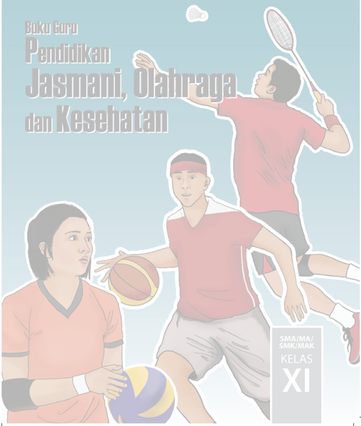

> **Deskripsi Visual:** Gambar dari buku pelajaran ini adalah ilustrasi. Dalam gambar tersebut, terdapat dua karakter yang sedang bermain olahraga. Karakter pertama sedang memegang bola basket, sedangkan karakter kedua sedang berusaha menendang bola voli. Kedua karakter tersebut mengenakan pakaian olahraga yang sama, yaitu seragam merah dan putih dengan topi hitam. Latar belakang gambar adalah warna biru muda yang memberikan kesan tenang dan sehat. Di bagian atas gambar terdapat tulisan "Buku Guru Pendidikan Jasmani, Olahraga dan Kesehatan" serta informasi tentang kelas dan sekolah yang membahas materi ini.

 

---
## 📄 Halaman 2

### Hak Cipta © 2017 pada Kementerian Pendidikan dan Kebudayaan Dilindungi Undang-Undang

Disklaimer: Buku ini merupakan buku guru yang dipersiapkan Pemerintah dalam rangka implementasi Kurikulum 2013. Buku guru ini disusun dan ditelaah oleh berbagai pihak di bawah koordinasi Kementerian Pendidikan dan Kebudayaan, dan dipergunakan dalam tahap awal penerapan Kurikulum 2013. Buku ini merupakan 'dokumen hidup' yang senantiasa diperbaiki,  diperbaharui,  dan  dimutakhirkan  sesuai  dengan  dinamika  kebutuhan  dan perubahan zaman. Masukan dari berbagai kalangan yang dialamatkan kepada penulis dan laman http://buku.kemdikbud.go.id atau melalui email buku@kemdikbud.go.id diharapkan dapat meningkatkan kualitas buku ini.

### Katalog Dalam Terbitan (KDT)

Indonesia. Kementerian Pendidikan dan Kebudayaan.

Pendidikan Jasmani, Olahraga dan Kesehatan : buku guru/ Kementerian Pendidikan dan Kebudayaan.-- . Edisi Revisi Jakarta : Kementerian Pendidikan dan Kebudayaan, 2017.

viii, 136 hlm. : ilus. ; 25 cm.

Untuk SMA/MA/SMK/MAK Kelas XI ISBN 9 78-602-427-134-3 (Jilid Lengkap) ISBN  978-602-427-136-7 ( Jilid 2 )

- PJOK-- Studi dan Pengajaran
- Kementerian Pendidikan dan Kebudayaan
I. Judul

613.7

Penulis

:  Sumaryoto dan Soni Nopembri.

Penelaah

: Agus Mahendra, Sugito Adi Warsito, Suroto dan Taufiq hidayah.

Pereview Guru

: Jakbar Simanjuntak.

Penyelia Penerbitan : Pusat Kurikulum dan Perbukuan, Balitbang, Kem en dikbud.

Cetakan Ke-1, 2014 ISBN 978-602-282-470-1 (Jilid 2) Cetakan Ke-2, 2017 (Edisi Revisi ) Disusun dengan huruf Minion Pro , 11pt.

 

---
## 📄 Halaman 3

### Kata Pengantar

Kurikulum 2013 dirancang untuk memperkuat kompetensi peserta didik dari sisi pengetahuan, keterampilan, dan sikap secara utuh.Keutuhan tersebut menjadi dasar dalam perumusan kompetensi dasar tiap mata pelajaran, sehingga kompetensi dasar tiap mata pelajaran mencakup kompetensi dasar kelompok sikap, kompetensi dasar kelompok pengetahuan, dan kompetensi dasar kelompok keterampilan. Semua mata pelajaran dirancang mengikuti rumusan tersebut.

Pembelajaran Pendidikan Jasmani, Olahraga dan Kesehatan (PJOK) untuk Kelas XI SMA/ SMK yang disajikan dalam buku ini juga tunduk pada ketentuan tersebut. PJOK bukan mata pelajaran olahraga sebagaimana dipahami selama ini dan juga bukan materi pembelajaran yang  dirancang  hanya  untuk  mengasah  kompetensi  keterampilan  olahraga  peserta  didik. PJOK adalah mata pelajaran yang membekali peserta didik dengan kemampuan untuk memiliki kebugaran dan keterampilan jasmani yang bermanfaat dalam kehidupan sehari-hari. Memiliki tujuan supaya peserta didik dapat memperoleh perubahan perilaku gerak, perilaku berolahraga dan perilaku sehat.Pada akhirnya aktivitas jasmani dibarengi dengan sikap yang sesuai sehingga hasil yang diperoleh adalah optimal.

Pembelajarannya dirancang berbasis aktivitas terkait dengan sejumlah jenis gerak jasmani/ olahraga dan usaha-usaha menjaga kesehatan yang sesuai untuk peserta didik Kelas XI SMA/ SMK. Aktivitas-aktivitas tersebut dirancang untuk membuat peserta didik terbiasa melakukan gerak jasmani dan berolahraga dengan senang hati karena merasa perlu melakukannya dan sadar akan pentingnya menjaga kesehatan jasmani baik melalui gerak jasmani dan olahraga maupun dengan memperhatikan faktor-faktor kesehatan yang memengaruhinya.

Buku ini menjabarkan usaha minimal yang harus dilakukan peserta didik untuk mencapai kompetensi yang diharapkan. Sesuai dengan pendekatan yang digunakan dalam Kurikulum 2013, peserta didik diajak menjadi berani untuk mencari sumber belajar lain yang tersedia dan terbentang luas di sekitarnya. Peran guru dalam meningkatkan dan menyesuaikan daya serap peserta didik dengan ketersediaan kegiatan pada buku ini sangat penting. Guru dapat memperkayanya dengan kreasi dalam bentuk kegiatan-kegiatan lain yang sesuai dan relevan yang bersumber dari lingkungan sosial dan alam.

Sebagai edisi pertama, buku ini sangat terbuka dan perlu terus dilakukan perbaikan dan penyempurnaan. Untuk itu, kami mengundang para pembaca memberikan kritik, saran dan masukan untuk perbaikan dan penyempurnaan pada edisi berikutnya. Atas kontribusi tersebut, kami ucapkan terima kasih. Mudah-mudahan kita dapat memberikan yang terbaik bagi kemajuan dunia pendidikan dalam rangka mempersiapkan generasi seratus tahun Indonesia Merdeka (2045).

Jakarta, November 2016

Penulis

 

---
## 📄 Halaman 4

### DAFTAR ISI

 

---
## 📄 Halaman 5

v

 

---
## 📄 Halaman 7

### PETUNJUK PENGGUNAAN BUKU

Pengertian  pendidikan  jasmani  adalah  suatu  proses  terjadinya  adaptasi  dan pembelajaran secara organik, neuromuscular, intelektual, sosial, kultural, emosional, dan estetika yang dihasilkan dari proses pemilihan berbagai aktivitas jasmani yang dilakukan dengan cara memanfaatkan pengalaman dan pelatihan. Secara substansi bidang  pendidikan  jasmani  adalah  kinerja  gerak.  Oleh  karenanya,  pengembangan mata  pelajaran  PJOK  meliputi  pendidikan  jasmani  melalui  pengenalan  olahraga dan kesehatan, permainan bola besar; permainan bola kecil; atletik; beladiri; senam lantai;  aktivitas  gerak  berirama;  aktivitas  kebugaran  jasmani;  aktivitas  air;  untuk mencapai  derajat  kebugaran  jasmani;  manfaat  aktivitas  fisik  teratur,  bahaya  HIV AIDS dan pencegahannya, dan pola hidup sehat, digunakan untuk mencapai tujuan pembelajaran pendidikan jasmani.

### 1.  Pendidikan Jasmani

Aktivitas jasmani yang dipilih untuk mencapai kompetensi dalam pendidikan jasmani adalah melalui berbagai aktivitas jasmani dan olahraga yang dipilih dan disesuaikan  dengan  tujuan  kebutuhan,  kapabilitas  dan  karakteristik  yang  ingin dicapai  peserta  didik.  Aktivitas  jasmani  yang  wajar,  aktivitas  jasmani  untuk rekreasi dan aktivitas jasmani untuk olahraga atau prestasi. Kegiatan yang dipilih dipusatkan pada aktivitas jasmani yang dapat mengaktifkan otot besar, gerak dasar dan gerakan fisik pada permainan dan olahraga.

### 2.  Olahraga

Olahraga  adalah  aktivitas  jasmani  yang  dilakukan  dengan  tujuan  untuk memelihara  kesehatan  dan  memperkuat  otot-otot  tubuh.  Kegiatan  ini  dapat dilakukan sebagai kegiatan yang menghibur, menyenangkan atau juga dilakukan dengan tujuan untuk meningkatkan prestasi.

### 3.  Kesehatan

Kesehatan dikaitkan dengan upaya penjagaan kesehatan diri dan lingkungan yang sesuai dengan tujuan, kapabilitas, dan karakteristik peserta didik. Pendidikan kesehatan meliputi usaha yang dilakukan untuk meningkatkan kemampuan hidup sehat  dan  derajat  kesehatan  peserta  didik  sedini  mungkin.  Kesehatan  dicapai melalui aktifias jasmani dan aktivitas penjagaan kesehatan jasmani lainnya.

Pendidikan Jasmani merupakan bagian integral dari pendidikan yang dilakukan melalui aktivitas olahraga dan pengenalan penjagaan kesehatan. Sehingga, dalam pembelajaran, olahraga dan kesehatan adalah kesatuan yang tidak bisa dipisahkan dengan pendidikan jasmani. PJOK bukan pembelajaran olahraga, dan bukan juga tentang  kesehatan,  tetapi  sebagai  bagian  dari  pendidikan  jasmani.  Jika  selama ini  guru  lebih  banyak  mengajarkan olahraga, bukan pendidikan jasmani, maka kesalahan  ini  harus  diperbaiki.  Pendidikan  jasmani  adalah  dasar  bagi  peserta

 

---
## 📄 Halaman 8

didik  untuk  memiliki  kemampuan  gerak  dasar  yang  akan  menjadikan  mereka memiliki keterampilan gerak yang bermanfaat dalam kehidupan sehari-hari, serta membiasakan gaya hidup aktif dan sehat untuk jangka panjang. Selanjutnya, dasar gerak dan keterampilan gerak dalam olahraga yang diberikan dalam pembelajaran PJOK akan memberikan manfaat kepada peserta didik, untuk mahir melakukan kegiatan  olahraga  yang  disukainya.  Pendidikan  jasmani  menjadi  pembelajaran bagi peserta didik untuk memiliki gaya hidup sehat dan aktif.

 

---
## 📄 Halaman 9

### Bab I Pendahuluan

### A. Latar Belakang

Mata pelajaran Pendidikan Jasmani, Olahraga, dan Kesehatan (yang selanjutnya disebut PJOK) dipandang sebagai mata pelajaran pilihan yang kurang menarik, bahkan dianggap tidak penting dan dirasakan kurang bermanfaat bagi perkembangan  akademik.  Pemahaman  terhadap  isi,  makna,  dan  tujuan  mata pelajaran  PJOK  belum  dipahami  secara  mendalam.  Prinsip  pembelajaranpun, belum  memberi  manfaat  bagi  perkembangan  kejiwaan  peserta  didik.  Bahkan, pelajaran  PJOK  seringkali  dimasukkan  ke  dalam  kelompok  mata  pelajaran tambahan atau pelengkap saja. Padahal, konsep pelajaran PJOK yang masuk dalam kelompok B struktur kurikulum 2013, merupakan kelompok mata pelajaran yang kontennya dikembangkan oleh pusat dan dilengkapi dengan konten kearifan lokal yang  dikembangkan  oleh  pemerintah  daerah.  Pelajaran  PJOK  adalah  sebagai bagian  dari  pencapaian  kompetensi  dasar  pendidikan  jasmani,  olahraga  dan kesehatan.  Dalam  stuktur  PJOK  dengan  alokasi  waktu  pelajaran  3  jam  setiap minggu, dimana alokasi waktu jam pembelajaran setiap kelas merupakan jumlah minimal  yang  dapat  ditambah  sesuai  dengan  kebutuhan  peserta  didik,  mata pelajaran pendidikan jasmani, olahraga dan kesehatan ini diintegrasikan dengan pengembangan budaya lokal, hal ini berarti budaya lokal yang berkatian dengan konteks gerak dapat dimasukkan ke dalam kompetensi inti dan kompetensi dasar yang sudah ada, namun apabila tidak dapat diintegrasikan ke dalam kompetensi dasar  yang  ada,  maka  daerah/sekolah  dapat  merumuskan  kompetensi  dasar tersendiri.  Mata  pelajaran  PJOK  memiliki  konten  yang  memberi  sumbangan mengembangkan kompetensi gerak dan gaya hidup sehat, dan memberi warna pada  pendidikan  karakter  bangsa.  Pembelajaran  PJOK  dengan  kearifan  lokal akan memberi apresiasi terhadap multikultural yaitu mengenal permainan dan olahraga tradisional yang berakar dari budaya suku bangsa Indonesia dan dapat memberi sumbangan pada pembentukan karakter.

Pendidikan  jasmani,  olahraga,  dan  kesehatan  pada  penjelasan  UndangUndang Sistem Pendidikan Nasional pasal 37 UU dituliskan, bahwa bahan kajian pendidikan  jasmani,  dan  olahraga  dimaksudkan  untuk  membentuk  karakter peserta didik agar sehat jasmani dan rohani, dan menumbuhkan rasa sportivitas.

 

---
## 📄 Halaman 10

Pendidikan  jasmani,  olahraga,  dan  kesehatan  ditekankan  untuk  mendorong pertumbuhan fisik, perkembangan psikis, keterampilan motorik, pengetahuan dan penalaran, penghayatan nilai-nilai (sikap mental, emosional, sportivitas, spiritual, dan sosial), serta pembiasaan pola hidup sehat yang bermuara untuk merangsang pertumbuhan dan perkembangan kualitas fisik dan psikis yang seimbang. Selain tujuan  utama  tersebut  dimungkinkan  adanya  tujuan  pengiring,  tetapi  porsinya tidak dominan.

Sesuai dengan penjelasan tersebut Freeman  (2007: 27-28)  menyatakan bahwa pendidikan jasmani menggunakan aktivitas jasmani untuk menghasilkan peningkatan  secara  menyeluruh  terhadap  kualitas  fisik,  mental,  dan  emosional peserta didik. Pendidikan jasmani memperlakukan setiap peserta didik sebagai satu kesatuan yang utuh, tidak lagi menganggap individu sebagai pemilik jiwa dan raga yang terpisah, sehingga di antaranya dianggap dapat saling mempengaruhi. Pendidikan  jasmani  merupakan  bidang  kajian  yang  luas  yang  sangat  menarik dengan  titik  berat  pada  peningkatan  pergerakan  manusia  ( human  movement ). Pendidikan  jasmani  menggunakan  aktivitas  jasmani  sebagai  wahana  untuk mengembangkan setiap individu  secara  menyeluruh,  mengembangkan  pikiran, tubuh, dan jiwa menjadi satu kesatuan, hingga secara konotatif dapat disampaikan bahwa 'suara pikiran adalah suara tubuh' .

Sementara itu, Marilyn M. Buck dan kawan-kawan (2007:15) menerjemahkan pendidikan jasmani sebagai kajian, praktik, dan apresiasi atas seni dan ilmu gerak manusia ( human movement ). Pendidikan jasmani merupakan bagian dari proses pendidikan secara keseluruhan. Gerak merupakan sifat alamiah dan merupakan ciri  dasar  eksistensi  manusia sebagai mahluk hidup. Pendidikan jasmani bukan merupakan bidang kajian yang tertutup. Perubahan yang terjadi di masyarakat, perubahan  teknologi,  pemeliharaan  kesehatan,  dan  pendidikan  secara  umum membawa dampak bagi kualitas program pendidikan jasmani.

Hakikatnya pendidikan jasmani, olahraga, dan kesehatan diberikan di sekolah untuk membentuk 'insan yang berpendidikan secara jasmani ( physically educated person)'. National Standards for Physical Education (NASPE) sebagaimana yang dikutip oleh Michel W . Metzler (2005:14) menggambarkan sosok ini dengan syarat dapat  memenuhi  standar:  (1)  Mendemonstrasikan  kemampuan  keterampilan motorik dan pola gerak yang diperlukan untuk menampilkan berbagai aktivitas fisik,  (2)  Mendemonstrasikan  pemahaman  akan  konsep  gerak,  prinsip-prinsip, strategi, dan taktik sebagaimana yang mereka terapkan dalam pembelajaran dan kinerja berbagai aktivitas fisik, (3) Berpartisipasi secara regular dalam aktivitas fisik, (4) Mencapai dan memelihara peningkatan kesehatan dan derajat kebugaran, (5) Menunjukkan tanggung jawab personal dan sosial berupa respek terhadap diri sendiri dan orang lain dalam suasana aktivitas fisik, dan (6) Menghargai aktivitas fisik  untuk  kesehatan,  kesenangan,  tantangan,  ekspresi  diri,  dan  atau  interaksi sosial.

 

---
## 📄 Halaman 11

Berangkat  dari  pandangan  yuridis  dan  akademis  tersebut,  maka  dapat disimpulkan  bahwa  pendidikan  jasmani,  olahraga,  dan  kesehatan  merupakan bagian integral dari pendidikan secara keseluruhan, bertujuan untuk mengembangkan  aspek  kebugaran  jasmani,  keterampilan  gerak,  keterampilan berfikir  kritis,  keterampilan  sosial,  penalaran,  stabilitas  emosional,  tindakan moral, aspek pola hidup sehat dan pengenalan lingkungan bersih melalui aktivitas jasmani,  olahraga  dan  kesehatan  terpilih  yang  direncanakan  secara  sistematis dalam rangka mencapai tujuan pendidikan nasional.

Mengingat  tantangan  yang  berat  bagi  seorang  guru  pendidikan  jasmani, olahraga,  dan  kesehatan  untuk  menjalankan  profesinya  dalam  Implementasi Kurikulum 2013. Maka Kurikulum 2013 dikembangkan dengan penyempurnaan pola pikir, sebagai berikut:

- Pola pembelajaran yang berpusat pada guru menjadi pembelajaran berpusat pada  peserta  didik.  Peserta  didik  harus  memiliki  pilihan-pilihan  terhadap materi yang dipelajari untuk memiliki kompetensi yang sama;
- Pola pembelajaran satu arah (interaksi guru-peserta didik) menjadi pembelajaran interaktif (interaktif guru-peserta didik-masyarakat lingkungan alam, sumber/media lainnya);
- Pola  pembelajaran  terisolasi  menjadi  pembelajaran  secara  jejaring  (peserta didik  dapat  menimba  ilmu  dari  siapa  saja  dan  dari  mana  saja  yang  dapat dihubungi serta diperoleh melalui internet);
- Pola  pembelajaran  pasif  menjadi  pembelajaran  aktif-mencari  (pembelajaran peserta  didik  aktif  mencari  semakin  diperkuat  dengan  model  pembelajaran pendekatan sains);
- Pola belajar sendiri menjadi belajar kelompok (berbasis tim);
- Pola pembelajaran alat tunggal menjadi pembelajaran berbasis alat multimedia;
- Pola  pembelajaran  berbasis  massal  menjadi  kebutuhan  pelanggan  ( users ) dengan  memperkuat  pengembangan  potensi  khusus  yang  dimiliki  setiap peserta didik;
- Pola pembelajaran ilmu pengetahuan tunggal ( monodiscipline ) menjadi pembelajaran ilmu pengetahuan jamak ( multidisciplines ); dan
- Pola pembelajaran pasif menjadi pembelajaran kritis.

 

---
## 📄 Halaman 12

### B. Standar Kompetensi Lulusan Pendidikan Dasar dan Menengah

Undang-Undang Dasar Negara Republik Indonesia Tahun 1945 Pasal 31 ayat(3) mengamanatkan  bahwa  pemerintah  mengusahakan  dan  menyelenggarakan satu sistem pendidikan nasional, yang meningkatkan keimanan dan ketakwaan serta akhlak mulia dalam rangka mencerdaskan kehidupan bangsa, yang diatur dengan undang-undang. Atas dasar amanat tersebut telah diterbitkan UndangUndang  Nomor  20  Pasal  2  Tahun  2003  tentang  Sistem  Pendidikan  Nasional, bahwa  pendidikan  nasional  berdasarkan  Pancasila  dan  Undang-Undang  Dasar Negara Republik Indonesia Tahun 1945. Sedangkan Pasal 3 menegaskan bahwa pendidikan  nasional  berfungsi  mengembangkan  kemampuan  dan  membentuk watak  serta  peradaban  bangsa  yang  bermartabat  dalam  rangka  mencerdaskan kehidupan bangsa, bertujuan untuk mengembangkan potensi peserta didik agar menjadi  manusia  yang  beriman  dan  bertakwa  kepada  Tuhan  Yang  Maha  Esa, berakhlak  mulia,  sehat,  berilmu,  cakap,  kreatif,  mandiri,  dan  menjadi  warga negara yang demokratis serta bertanggung jawab.

Untuk  mewujudkan  tujuan  pendidikan  nasional  tersebut  diperlukan  profil kualifikasi  kemampuan  lulusan  yang  dituangkan  dalam  standar  kompetensi lulusan.  Dalam  penjelasan  Pasal  35  Undang-Undang  Nomor  20  Tahun  2003 disebutkan bahwa standar kompetensi lulusan merupakan kualifikasi kemampuan lulusan yang mencakup sikap, pengetahuan, dan keterampilan peserta didik yang harus  dipenuhinya  atau  dicapainya  dari  suatu  satuan  pendidikan  pada  jenjang pendidikan  dasar  dan  menengah.  Kompetensi  Lulusan  SMA/MA/SMK/MAK/ SMALB/Paket  C  memiliki  sikap,  pengetahuan,  dan  keterampilan  berdasarkan Permendikbud No. 54 tahun 2013 sebagai berikut:

---
**📊 Tabel**

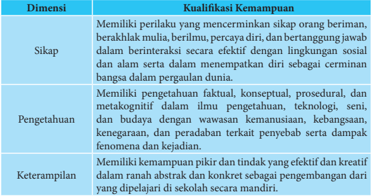

Tabel ini membahas tentang kualifikasi kemampuan yang diperlukan untuk menjadi individu berpengetahuan dan berpengaruh di masyarakat. Topik utamanya adalah kualifikasi kemampuan, yang terdiri dari tiga dimensi: sikap, pengetahuan, dan keterampilan. Sikap meliputi memiliki perilaku yang mencerminkan sikap orang beriman, berkahulul ma'ulim, berilmu, berpura-pura diri, dan bertanggung jawab dalam berinteraksi secara efektif dengan lingkungan sosial dan alam serta dalam menempatkan diri sebagai cerminan bangsa dalam pergaulan dunia. Pengetahuan meliputi pemahaman konsep, metakognitif, dan budaya dengan wawasan kemanusiaan, kebangsaan, kemerdekaan, dan peradaban terkait penyebab serta dampak fenomena dan kejadian. Keterampilan meliputi kemampuan pikiran dan tindakan yang efektif dan kreatif dalam rangkaian abstrak dan konkrit sebagai pengembangan dari yang dipelajari di sekolah secara mandiri. Pola penting yang terlihat adalah bahwa setiap dimensi memiliki tujuan dan standar yang harus dicapai oleh individu agar dapat berperan secara optimal dalam masyarakat.

 

---
## 📄 Halaman 13

### C. Penjabaran Kompetensi Inti dalam Kompetensi Dasar PJOK Kelas XI

Kompetensi inti dirancang seiring dengan meningkatnya usia peserta didik  pada  kelas  tertentu.  Melalui  kompetensi  inti,  integrasi  vertikal  berbagai kompetensi dasar pada kelas yang berbeda dapat dijaga. Rumusan kompetensi inti menggunakan notasi sebagai berikut:

- Kompetensi Inti-1 (KI-1) untuk kompetensi inti sikap spiritual;
- Kompetensi Inti-2 (KI-2) untuk kompetensi inti sikap sosial;
- Kompetensi Inti-3 (KI-3) untuk kompetensi inti pengetahuan; dan
- Kompetensi Inti-4 (KI-4) untuk kompetensi inti keterampilan
Untuk  memperkuat  keterlaksanaan  kurikulum  2013  agar  tidak  mengalami penyimpangan  dalam  implementasinya  pemerintah  mengeluarkan  Peraturan Menteri Pendidikan dan Kebudayaan Nomor 69 tahun 2013 Tentang Kerangka dasar dan struktur kurikulum Sekolah Menengah Atas/Madrasah Aliyah untuk kelas XI adalah sebagai berikut :

### KOMPETENSI INTI 1 (SIKAP SPIRITUAL)

- Menghayati dan mengamalkan ajaran agama yang dianutnya

### KOMPETENSI INTI 2 (SIKAP SOSIAL)

- Menunjukkan perilaku jujur, disiplin, tanggung jawab, peduli (gotong royong, kerja sama, toleransi, damai), santun, responsif dan proaktif sebagai bagian dari solusi atas berbagai permasalahan dalam berinteraksi secara aktif dengan lingkungan sosial dan alam serta menempatkan diri sebagai cerminan bangsa dan pergaulan dunia.

### Keterangan:

- Pembelajaran  Sikap  Spiritual  dan  Sikap  Sosial  dilaksanakan  secara  tidak langsung ( indirect  teaching )  melalui  keteladanan, ekosistem pendidikan, dan proses pembelajaran Pengetahuan dan Keterampilan
- Guru mengembangkan Sikap Spiritual dan Sikap Sosial dengan memperhatikan karakteristik, kebutuhan, dan kondisi peserta didik

 

---
## 📄 Halaman 14

- Evaluasi terhadap Sikap Spiritual dan Sikap Sosial dilakukan sepanjang proses pembelajaran berlangsung, dan berfungsi sebagai pertimbangan guru dalam mengembangkan karakter peserta didik lebih lanjut

### KOMPETENSI INTI 3 (PENGETAHUAN)

- Memahami, menerapkan, dan menganalisis pengetahuan faktual, konseptual, prosedural, dan metakognitif berdasarkan rasa ingin tahunya tentang ilmu pengetahuan, teknologi, seni, budaya, dan humaniora dengan wawasan kemanusiaan, kebangsaan, kenegaraan, dan peradaban terkait penyebab fenomena dan kejadian, serta menerapkan pengetahuan prosedural pada bidang kajian yang spesifik sesuai dengan bakat dan minatnya untuk memecahkan masalah

### KOMPETENSI INTI 4 (KETERAMPILAN)

- Mengolah, menalar, dan menyaji dalam ranah konkret dan ranah abstrak terkait dengan pengembangan dari yang dipelajarinya di sekolah secara mandiri, bertindak secara efektif dan kreatif, serta mampu menggunakan metoda sesuai kaidah keilmuan

---
**📊 Tabel**

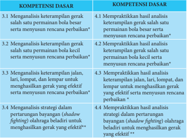

Tabel ini berisi informasi tentang kompetensi dasar yang harus dipelajari oleh siswa dalam pembelajaran matematika. Topik utamanya adalah analisis keterampilan gerak bola dalam berbagai situasi, termasuk analisis keterampilan gerak bola baik secara vertikal maupun horizontal. Tabel ini dibagi menjadi dua kolom: Kolom 1 berisi topik-topik analisis keterampilan gerak bola, sedangkan Kolom 2 berisi praktikasi analisis tersebut. Data penting yang terlihat adalah bahwa setiap topik analisis memiliki praktikasi yang sesuai, menunjukkan bahwa siswa harus tidak hanya mempelajari konsep, tetapi juga mampu melakukan praktik untuk memperbaiki keterampilan mereka.

 

---
## 📄 Halaman 15

---
**📊 Tabel**

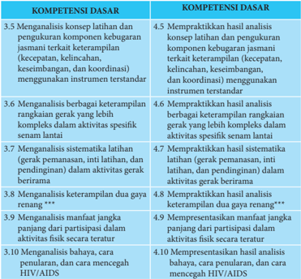

Tabel ini berisi kumpulan kompetensi dasar yang berkaitan dengan analisis dan pengukuran keterampilan fisik, kesehatan, dan perilaku. Topik utamanya adalah tentang keterampilan gerak dan perilaku fisik, termasuk analisis keterampilan latihan, keseimbangan, koordinasi, dan perilaku kesehatan seperti HIV/AIDS. Kolom pertama berisi nama kompetensi dasar, sedangkan kolom kedua berisi deskripsi atau penjelasan tentang kompetensi tersebut. Data penting yang terlihat adalah bahwa setiap kompetensi dasar memiliki satu atau lebih subkompetensi yang menjelaskan bagaimana kompetensi dasar tersebut dapat diaplikasikan dalam praktik. Misalnya, kompetensi dasar 3.5 melibatkan analisis keterampilan latihan dan pengukuran kebugaran jasmani, sementara kompetensi dasar 4.5 melibatkan praktikasi hasil analisis keterampilan latihan dan pengukuran kebugaran jasmani.

- *)   Sekolah dapat memilih salah satu permainan dan olahraga yang dapat dilakukan di sekolah sesuai dengan sarana dan prasarana yang ada di sekolah
- **)  Pembelajaran aktivitas beladiri selain pencak silat dapat juga aktivitas bela diri lainnya (karate, judo, taekwondo, dan lain-lain) disesuaikan dengan situasi dan kondisi sekolah
- ***)  Sekolah  dapat  memilih  aktivitas  air  yang  dapat  dilakukan  di  sekolah  sesuai  dengan  sarana  dan prasarana, situasi serta kondisi sekolah.
Empat Kompetensi Inti (KI) yang kemudian dijabarkan menjadi 20 Kompetensi Dasar  (KD)  itu  merupakan  bahan  kajian  yang  akan  ditransformasikan  dalam kegiatan pembelajaran selama satu tahun (dua semester) yang terurai dalam 38 minggu.  Agar  kegiatan  pembelajaran  itu  tidak  terasa  terlalu  panjang  maka  38 minggu itu dibagi menjadi dua semester, semester pertama dan semester kedua. Setiap semester terbagi menjadi 19 minggu, sehingga alokasi waktu yang tersedia adalah 3 x 45 menit x 19 minggu/semester.

 

---
## 📄 Halaman 16

### D. Konsep Dasar Pembelajaran

### 1.  Karakteristik Pembelajaran PJOK

Pembelajaran merupakan proses yang interaktif antara guru dengan peserta didik. Pembelajaran melibatkan multi pendekatan dengan menggunakan teknologi  yang  akan  membantu  memecahkan  permasalahan  faktual/riil  di dalam  kelas.  Ada  tiga  komponen  dalam  definisi  pembelajaran,  yaitu:  pertama, pembelajaran adalah suatu proses, bukan sebuah produk, sehingga nilai tes dan tugas  adalah  ukuran  pembelajaran,  tetapi  bukan  proses  pembelajaran.  Kedua, pembelajaran adalah perubahan dalam pengetahuan, keyakinan, perilaku/sikap. Perubahan  ini  memerlukan  waktu,  terutama  ketika  pembentukan  keyakinan, perilaku  dan  sikap.  Guru  tidak  boleh  menafsirkan  kekurangan  peserta  didik dalam  pemahaman  sebagai  kekurangan  dalam  pembelajaran,  karena  mereka memerlukan  waktu  untuk  mengalami  perubahan.  Ketiga,  Pembelajaran  bukan sesuatu yang dilakukan kepada peserta didik, tetapi sesuatu yang mereka kerjakan sendiri. Kualitas pembelajaran PJOK dipengaruhi oleh empat komponen: peluang untuk belajar, konten yang sesuai, intruksi yang tepat, serta penilaian peserta didik dan pembelajaran.

Pendidikan jasmani mengandung makna pendidikan menggunakan aktivitas jasmani untuk menghasilkan peningkatan secara menyeluruh terhadap kualitas fisik,  mental,  dan  emosional  peserta  didik.  Kata  aktivitas  jasmani  mengandung makna pembelajaran adalah berbasis aktivitas fisik. Kata olahraga mengandung makna  aktivitas  jasmani  yang  dilakukan  dengan  tujuan  untuk  memelihara kesehatan dan memperkuat otot-otot tubuh. Kegiatan ini dapat dilakukan sebagai kegiatan  yang  menghibur,  menyenangkan  atau  juga  dilakukan  dengan  tujuan untuk meningkatkan prestasi. Sementara kualitas fisik, mental dan emosional di sini bermakna, pembelajaran PJOK membuat peserta didik memiliki kesehatan yang baik, kemampuan fisik, memiliki pemahaman yang benar, memiliki sikap yang  baik  tentang  aktivitas  fisik,  sehingga  sepanjang  hidupnya  mereka  akan memiliki gaya hidup sehat dan aktif.

Berdasarkan  uraian  tersebut,  secara  substansi  PJOK  mengandung  aktivitas jasmani, olahraga, dan kesehatan. Dimana tujuan utama PJOK adalah meningkatkan life-long  physical  activity dan  mendorong  perkembangan  fisik, psikologis dan sosial peserta didik. Jika ditelaah lebih lanjut, tujuan ini mendorong perkembangan motivasi diri untuk melakukan aktivitas fisik, memperkuat konsep diri,  belajar  bertanggung jawab dan keterampian kerjasama. Peserta didik akan belajar  mandiri,  mengambil  keputusan  dalam  proses  pembelajaran,  belajar bertanggung  jawab  dengan  diri  dan  orang  lain.  Proses  menuju  memiliki  rasa tanggung jawab ini setahap demi setahap beralih dari guru kepada peserta didik.

 

---
## 📄 Halaman 17

### 2.  Petunjuk Khusus dan Sistematika Pembelajaran

Peraturan Pemerintah Republik Indonesia Nomor 71 tahun 2013 Tentang Buku teks  pelajaran  dan  buku  guru  untuk  pendidikan  dasar  dan  menengah  sebagai sarana untuk menunjang keterlaksanaan Kurikulum 2013. Buku ini merupakan buku pegangan guru untuk mengelola pembelajaran terutama dalam memfasilitasi peserta didik untuk memahami materi dan mengamalkan. Materi ajar yang ada pada buku teks pelajaran pendidikan jasmani, olahraga dan kesehatan akan diajarkan selama satu tahun, yang dibagi dalam dua semester. Sesuai dengan desain waktu dan materi setiap bab, maka setiap bab akan diselesaikan dalam waktu 4 minggu pembelajaran. Agar pembelajaran itu lebih efektif dan terarah, maka setiap minggu rencana pelaksanaan pembelajaran dirancang yang minimal meliputi (1) Tujuan Pembelajaran, (2) Materi dan Proses Pembelajaran, (3) Penilaian, (4) Pengayaan, dan (Remedial), ditambah Interaksi Guru dan Orang Tua.

Pelaksanaan Pembelajaran didasarkan pada pemahaman tentang KI dan KD. Guru  pendidikan  jasmani,  olahraga  dan  kesehatan  yang  mengajarkan  materi tersebut hendaknya:

- Memberikan  motivasi  dan  mendorong  peserta  didik  secara  aktif  ( active learning ) untuk mencari sumber dan contoh-contoh konkrit dari lingkungan sekitar.  Guru  harus  mengkondisikan  situasi  belajar  yang  memungkinkan peserta  didik  melakukan  observasi  dan  refleksi.  Observasi  dapat  dilakukan dengan  berbagai  cara,  misalnya  membaca  buku  dengan  kritis,  menganalisis dan mengevaluasi sumber-sumber;
- Rangsangan kepada peserta didik untuk berpikir kritis dengan memberikan pertanyaan-pertanyaan dan mengajukan pertanyaan di setiap pembelajaran;
- Melaksanakan pembelajaran secara perorangan, berpasangan, dan berkelompok, dengan formasi berbanjar atau lingkaran.
- Melaksanakan pembelajaran dengan frekuensi pengulangan gerak yang cukup untuk setiap peserta didik.
Guru pendidikan jasmani olahraga kesehatan (PJOK) perlu memperhatikan sistematika pembelajaran sebagai berikut:

### a.  Kegiatan Pendahuluan

Kegiatan pendahuluan yang dapat dilakukan oleh guru antara lain:

- Guru mengumpulkan peserta didik pada suatu tempat tertentu, kemudian membariskannya dalam syaf, setengah lingkaran atau bentuk variasi lain sesuai dengan keadaan.
- Guru mengucapkan salam kepada peserta didik.
- Salah  satu  peserta  didik  memimpin  dan  mengajak  peserta  didik  untuk berdoa terlebih dahulu.

 

---
## 📄 Halaman 18

- Salah  satu  peserta  didik  memimpin  dan  mengajak  seluruh  peserta  didik untuk menyanyikan lagu kebangsaan Indonesia Raya.
- Guru  menanyakan  kondisi  kesehatan  peserta  didik  secara  umum  dan memastikan  bahwa  semua  peserta  didik  dalam  keadaan  sehat,  dan  bagi peserta  didik  yang  mengalami  gangguan  kesehatan  serius  seperti  asma, jantung dan penyakit kronis lainnya harus diperlakukan secara khusus.
- Guru  melakukan  apersepsi  berupa  penyampaian  tujuan  pembelajaran kepada  peserta  didik  dengan  cara  yang  menyenangkan  sehingga  peserta didik terdorong untuk ikut pembelajaran dengan semangat.
- Salah  seorang  peserta  didik  yang  dianggap  mampu,  memimpin  dan melakukan pemanasan. Pemanasan berfungsi  untuk  meningkatkan  suhu tubuh sehingga tubuh terutama otot dan sendi dapat bekerja secara maksimal dan mengurangi tingkat resiko cedera serta membangun kepercayaan diri dan rasa nyaman ketika bergerak. Pemanasan dilakukan dengan aktivitas yang  menyenangkan  dan  berkaitan  erat  dengan  kegiatan  inti  yang  akan dilakukan.

### b.  Kegiatan Inti

Pada  kegiatan  inti,  secara  umum,  guru  pendidikan  jasmani  olahraga kesehatan (PJOK) melakukan hal-hal sebagai berikut:

- Selama  kegiatan  inti  pembelajaran,  perilaku  peserta  didik  harus  dalam pengamatan dan diamati serta diberikan perbaikan terhadap penyimpangan perilaku peserta didik dengan cara yang santun.
- Guru melakukan diskusi dengan para peserta didik untuk mengeksplorasi pengetahuan awal tentang materi yang akan disampaikan.
- Dalam  pembelajaran  keterampilan  gerak  yang  umum,  guru  tidak  harus mencontohkan  terlebih  dahulu,  biarkan  anak  bereksplorasi  sendiri  dan menemukan cara yang tepat untuk mereka secara individual, dan untuk keterampilan gerak spesifik guru dapat mendemonstrasikannya terlebih dahulu.
- Kegiatan pembelajaran dilakukan dari yang mudah ke yang sulit, dari yang sederhana ke yang kompleks, serta dari yang ringan ke yang berat.
- Pada saat peserta didik melakukan gerakan, guru mengawasi dan memperbaiki  kesalahan-kesalahan  gerakan  yang  dilakukan  oleh  peserta didik, di samping itu juga amati perkembangan perilaku anak.

### c.  Kegiatan akhir

Pada kegiatan akhir,  yang  harus  dilakukan  oleh  guru  antara  lain  sebagai berikut:

- Melakukan  tanya-jawab  dengan  peserta  didik  yang  berkenaan  dengan materi pembelajaran yang telah diberikan.

 

---
## 📄 Halaman 19

- Melakukan pelemasan dan pendinginan yang dipimpin oleh guru atau oleh salah seorang peserta didik yang dianggap mampu, dan menjelaskan kepada peserta didik tujuan dan manfaat melakukan pelemasan dan pendinginan setelah  melakukan  aktivitas  fisik/olahraga  yaitu  agar  dapat  melemaskan otot-otot dan mengembalikan kondisi tubuh ke keadaan semula.
- Menginformasikan tentang materi (ujian, materi terkait, materi lain) pada pertemuan berikutnya
- Setelah melakukan aktivitas olahraga sebaiknya seluruh peserta didik dan guru berdoa dan bersalaman.

### 3. Penggunaan Pendekatan Ilmiah ( Scientific ).

Proses pembelajaran pada Kurikulum 2013 untuk semua jenjang pendidikan dilaksanakan  dengan  menggunakan  pendekatan  ilmiah  ( scientific  approach ). Proses pembelajaran harus menyentuh tiga ranah, yaitu sikap ( attitude ), keterampilan ( skill ),  dan  pengetahuan ( knowledge ).  Dalam proses pembelajaran berbasis pendekatan ilmiah, ranah sikap menggamit transformasi substansi atau materi ajar agar peserta didik tahu tentang ''mengapa'' .

Ranah  keterampilan  menggamit  transformasi  substansi  atau  materi  ajar agar  peserta  didik  tahu  tentang  ''bagaimana'' .  Ranah  pengetahuan  menggamit transformasi  substansi  atau  materi  ajar  agar  peserta  didik  tahu  tentang  'apa' . Hasil akhirnya adalah peningkatan dan keseimbangan antara kemampuan untuk menjadi manusia yang baik ( soft  skills )  dan  manusia  yang  memiliki  kecakapan dan pengetahuan untuk hidup secara layak ( hard skills )  dari peserta didik yang meliputi  aspek  kompetensi  sikap,  keterampilan  dan  pengetahuan.  Kurikulum 2013  menekankan  pada  dimensi  pedagogik  modern  dalam  pembelajaran  yaitu menggunakan pendekatan ilmiah.

Pendekatan  ilmiah  ( scientific  approach )  dalam  pembelajaran  sebagaimana dimaksud meliputi mengamati, menanya, menalar, mencoba,  membentuk jejaring untuk semua mata pelajaran. Pendekatan pembelajaran dapat dikatakan sebagai  pendekatan  ilmiah  apabila  memenuhi  7  (tujuh)  kriteria  pembelajaran berikut; pertama, materi pembelajaran berbasis pada fakta atau fenomena yang dapat dijelaskan dengan logika atau penalaran tertentu, bukan sebatas kira-kira, khayalan, legenda, atau dongeng semata. Kedua, penjelasan guru, respon peserta didik, dan interaksi edukatif guru peserta didik terbebas dari prasangka yang serta merta, pemikiran subjektif, atau penalaran yang menyimpang dari alur berpikir logis. Ketiga, mendorong dan menginspirasi peserta didik berpikir secara kritis, analitis, dan tepat dalam mengidentifikasi, memahami, memecahkan masalah, dan mengaplikasikan materi pembelajaran. Keempat, mendorong dan menginspirasi peserta didik mampu berpikir hipotetik dalam melihat perbedaan, kesamaan, dan tautan sama lain dari materi pembelajaran. Kelima, mendorong dan menginspirasi peserta  didik  mampu  memahami,  menerapkan,  dan  mengembangkan  pola

 

---
## 📄 Halaman 20

berpikir  yang  rasional  dan  objektif  dalam  merespon  materi  pembelajaran. Keenam, berbasis pada konsep, teori, dan fakta empiris yang dapat dipertanggung jawabkan. Ketujuh, tujuan pembelajaran dirumuskan secara sederhana dan jelas, namun menarik sistem penyajiannya.

Pendekatan ilmiah dalam pembelajaran meliputi antara lain:

- Mengamati  dalam  pembelajaran  dilakukan  dengan  menempuh  langkahlangkah  seperti  menentukan  objek  apa  yang  akan  diobservasi,  membuat pedoman  observasi  sesuai  dengan  lingkup  objek  yang  akan  diobservasi, menentukan secara jelas data apa yang perlu diobservasi baik primer maupun sekunder, menentukan /letak objek yang akan diobservasi, menentukan secara jelas  bagaimana  observasi  akan  dilakukan  untuk  mengumpulkan  data  agar berjalan mudah dan lancar, menentukan cara dan melakukan pencatatan atas hasil observasi seperti menggunakan buku catatan-kameratape recorder -video perekam dan alat tulis lainnya.
- Menanya.  Guru  yang  efektif  mampu  menginspirasi  peserta  didik  untuk meningkatkan dan mengembangkan ranah sikap, keterampilan, dan pengetahuannya. Pada saat guru bertanya, pada saat itu pula dia membimbing atau memandu peserta didiknya belajar dengan baik. Ketika guru menjawab pertanyaan  peserta  didiknya,  ketika  itu  pula  dia  mendorong  asuhannya  itu untuk  menjadi  penyimak  dan  pembelajar  yang  baik.  kriteria  pertanyaan yang  baik  adalah  singkat  dan  jelas,  menginspirasi  jawaban,  memiliki  fokus, bersifat probing atau divergen ,  bersifat validatif atau penguatan, memberikan kesempatan  peserta  didik  untuk  berpikir  ulang,  merangsang  peningkatan tuntutan kemampuan kognitif dan merangsang proses interaksi.
- Mencoba. Dimaksudkan untuk mengembangkan berbagai ranah tujuan belajar, yaitu sikap, keterampilan dan pengetahuan. Aktivitas pembelajaran yang nyata antara lain: 1) menentukan tema atau topik sesuai dengan kompetensi dasar menurut tuntutan kurikulum, 2) mempelajari cara-cara penggunaan alat dan bahan yang tersedia dan harus disediakan, 3) mempelajari dasar teoritis yang relevan  dan  hasil  eksperimen  sebelumnya,  4)  melakukan  dan  mengamati percobaan, 5) mencatat fenomena yang terjadi, menganalisis, dan menyajikan data, 6) menarik simpulan atas hasil percobaan; dan 7) membuat laporan.
- Menalar. Istilah menalar dalam kerangka proses pembelajaran dengan pendekatan ilmiah yang dianut dalam Kurikulum 2013 untuk menggambarkan bahwa guru dan peserta didik merupakan pelaku aktif. Titik tekannya tentu dalam banyak hal dan situasi peserta didik harus lebih aktif daripada guru. Penalaran adalah proses berpikir yang logis dan sistematis atas fakta empiris yang  dapat  diobservasi  untuk  memperoleh  simpulan  berupa  pengetahuan. Terdapat dua cara menalar, yaitu penalaran induktif dan penalaran deduktif. Penalaran  induktif  merupakan  cara  menalar  dengan  menarik  simpulan

 

---
## 📄 Halaman 21

dari  fenomena  atau  atribut  khusus  untuk  hal-hal  yang  bersifat  umum.  Jadi, menalar secara induktif adalah proses penarikan simpulan dari kasus-kasus yang  berisifat  nyata  secara  individual  atau  spesifik  menjadi  simpulan  yang bersifat umum. Kegiatan menalar secara induktif lebih banyak berpijak pada observasi inderawi atau pengamatan empirik. Penalaran deduktif merupakan cara menalar dengan menarik simpulan dari pernyataan atau fenomena yang bersifat umum menuju pada hal yang bersifat khusus. Pola penalaran deduktif dikenal dengan pola silogisme (kategorial, hipotesis dan alternatif).

- Komunikasi yaitu: mengkomunikasikan hasil percobaan.

### 4.  Penyiapan Sarana dan Prasana

Pembelajaran PJOK memerlukan sarana dan prasana untuk mencapai tujuan pembelajaran. Sehingga tercapai tujuan pembelajaran PJOK secara aman, efektif dan  efisien.  Penyediaan  sumber  daya  fisik  yang  memadai  termasuk  fasilitas, peralatan  dan  pemeliharaan  dapat  membantu  dalam  mempengaruhi  sikap  dan menunjang keberhasilan program. Dalam pembelajaran PJOK, fasilitas yang harus tersedia bagi peserta didik yang terlibat dalam aktivitas otot besar yang melibatkan memanjat, melompat, melompat-lompat, menendang, melempar, melompat dan menangkap, dan mereka juga terlibat dalam kegiatan keterampilan motorik dan permainan lainnya.

Guru  sebagai  salah  satu  sumber  pembelajaran  juga  dapat  menggunakan berbagai sumber pembelajaran lain untuk menambah wawasan peserta didik dalam pembelajaran. Buku terutama buku panduan guru dan peserta didik penjasorkes SMA kelas XI. Selain itu, guru juga dapat menggunakan sumber pembelajaran dari video, media cetak, media elektronik, atau internet.

Secara ideal, aktivitas pembelajaran harus menggunakan sarana dan prasarana yang  sesuai.  Akan  tetapi,  jika  sekolah  tidak  memiliki/menyediakan  sarana  dan prasarana,  kreativitas  guru  sangat  diperlukan  untuk  memodifikasi  sarana  dan prasarana pembelajaran PJOK. Demikian juga, guru dapat menyesuaikan aktivitas yang dipilih, sesuai dengan ketersediaan sarana dan prasarana, dan tetap melakukan pembelajaran yang sesuai untuk mencapai kompetensi yang diharapkan. Apabila sekolah telah memiliki sarana yang standar dan lengkap, diharapkan juga guru dapat  memodifikasi  sarana  tersebut  untuk  menyesuaikan  dengan  peserta  didik yang memiliki kemampuan kurang atau di bawah rata-rata.

### 5.  Keamanan dan Keselamatan dalam Pembelajaran

Hal terpenting dalam pembelajaran PJOK adalah terpenuhinya aspek dalam prosedur keamanan dan keselamatan. Peserta didik harus dapat melakukan atau unjuk kerja dengan aman dan selamat, sesuai kompetensi yang diharapkan, dan terjadi peningkatan keterampilan sesuai dengan tantangan melakukan unjuk kerja gerak. Peserta didik juga belajar untuk menilai kerja yang mereka lakukan dan

 

---
## 📄 Halaman 22

juga menilai rekannya. Selain itu, peserta didik juga harus mampu beradaptasi, memodifikasi  dan  meningkatkan  kemampuannya.  Karena  itu  perlu  diketahui prosedur keamanan dan keselamatan dalam pembelajaran pendidikan jasmani, untuk memastikan  peserta didik melakukan  aktivitas pendidikan jasmani dan  olahraga  dengan  aman  dan  selamat.  Keamanan  dan  keselamatan  dalam pembelajaran meliputi penggunaan sarana dan prasarana dan pelaksanaan suatu gerakan/keterampilan tertentu.

Dalam pembelajaran PJOK, Kepala sekolah dan Guru harus menjamin hal-hal berikut::

- Sekolah  memiliki  standar  pencegahan  dan  penjagaan  keselamatan  untuk meminimalkan resiko dalam pembelajaran PJOK
- Seluruh  alat  yang  dipergunakan  dalam  pembelajaran  PJOK  adalah  aman, secara rutin diperiksa, diperbaiki dan dirawat
- Memiliki catatan perawatan dan perbaikan alat
- Guru  harus  memiliki  kualifikasi  dan  pengalaman  sebagai  guru  pendidikan jasmani
- Segala  hal  yang  berpotensi  untuk  mengganggu  dan  menimbulkan  resiko diidentifikasi dalam manajemen resiko
- Guru memiliki pengetahuan dan keterampilan P3K

### 6.  Remedial dan Pengayaan

Kegiatan remedial adalah kegiatan yang ditujukan untuk membantu peserta didik yang mengalami  kesulitan dalam menguasai materi pelajaran yang diberikan. Dalam  kaitannya dengan proses pembelajaran, fungsi kegiatan remedial adalah: (1) memperbaiki cara belajar peserta didik, (2) meningkatkan peserta  didik  terhadap  kelebihan  dan  kekurangan  dirinya,  (3)  menyesuaikan pembelajaran dengan karakteristik peserta didik, (4) mempercepat penguasaan peserta didik terhadap materi pelajaran, (5) membantu mengatasi kesulitan dalam aspek  sosial  dan  pribadi  peserta  didik.  Kegiatan  remedial  dapat  dilaksanakan sebelum kegiatan pembelajaran biasa untuk membantu peserta didik yang diduga akan mengalami kesulitan ( preventif ), setelah kegiatan pembelajaran biasa untuk membantu peserta didik yang mengalami kesulitan belajar (kuratif), atau selama berlangsungnya  kegiatan pembelajaran biasa.  Langkah-langkah  yang  harus ditempuh dalam kegiatan remedial adalah: (1) analisis hasil diagnosis kesulitan belajar,  (2)  menemukan  penyebab  kesulitan,  (3)  menyusun  rencana  kegiatan remedial, (4) melaksanakan kegiatan remedial, dan (5) menilai kegiatan remedial.

Kegiatan  pengayaan  adalah  suatu  kegiatan  yang  diberikan  kepada  peserta didik  kelompok  cepat  agar  mereka  dapat  mengembangkan  potensinya  secara optimal dengan memanfaatkan sisa waktu yang dimilikinya. Kegiatan pengayaan dilaksanakan dengan tujuan memberikan kesempatan kepada peserta didik untuk

 

---
## 📄 Halaman 23

memperdalam penguasaan materi pelajaran yang berkaitan dengan tugas belajar yang sedang dilaksanakan sehingga tercapai tingkat perkembangan yang optimal. Tugas  yang  dapat  diberikan  guru  pada  peserta  didik  yang  mengikuti  kegiatan pengayaan di antaranya adalah memberikan kesempatan menjadi tutor sebaya, mengembangkan latihan praktis dari materi yang sedang dibahas, membuat hasil karya, melakukan suatu proyek, membahas masalah, atau mengerjakan permainan yang  harus  diselesaikan  peserta  didik.  Apapun  kegiatan  yang  dipilih  guru, hendaknya  kegiatan  pengayaan  tersebut  menyenangkan  dan  mengembangkan kemampuan kognitif tinggi sehingga mendorong peserta didik untuk mengerjakan tugas  yang  diberikan.  Dalam  memilih  dan  melaksanakan  kegiatan  pengayaan, guru harus memperhatikan (1) faktor peserta didik, baik faktor minat maupun faktor psikologis lainnya, (2) faktor manfaat edukatif, dan (3) faktor waktu.

### 7.  Penilaian

Penilaian  oleh  pendidik  merupakan  suatu  proses  yang  dilakukan  melalui langkah-langkah perencanaan, penyusunan alat penilaian, pengumpulan informasi melalui sejumlah bukti yang menunjukkan pencapaian kompetensi peserta didik, pengolahan, dan pemanfaatan informasi tentang pencapaian kompetensi peserta didik. Penilaian tersebut dilakukan melalui berbagai teknik/cara, seperti penilaian unjuk kerja ( performance ),  penilaian  sikap  (observasi),  penilaian tertulis ( paper and pencil test ), penilaian projek, penilaian produk, penilaian melalui kumpulan hasil kerja/karya peserta didik ( portfolio ).

Penilaian  pencapaian  kompetensi  baik  formal  maupun  informal  diadakan dalam  suasana  yang  menyenangkan,  sehingga  memungkinkan  peserta  didik menunjukkan  apa  yang  dipahami  dan  mampu  dikerjakannya.  Pencapaian kompetensi  seorang  peserta  didik  dalam  periode  waktu  tertentu  dibandingkan dengan hasil yang dimiliki peserta didik tersebut sebelumnya dan tidak dianjurkan untuk dibandingkan dengan peserta didik lainnya. Dengan demikian peserta didik tidak merasa dihakimi oleh pendidik tetapi dibantu untuk mencapai kompetensi atau indikator yang diharapkan.

Penilaian hasil belajar peserta didik mencakup kompetensi sikap, pengetahuan, dan  keterampilan  yang  dilakukan  secara  berimbang  sehingga  dapat  digunakan untuk menentukan posisi relatif setiap peserta didik terhadap standar yang telah ditetapkan. Cakupan penilaian merujuk pada ruang lingkup materi, kompetensi mata pelajaran/kompetensi muatan/kompetensi program, dan proses. Teknik dan instrumen yang digunakan untuk penilaian kompetensi sikap, pengetahuan, dan keterampilan sebagai berikut:

### a.  Penilaian kompetensi sikap

Pendidik melakukan penilaian kompetensi sikap melalui observasi, penilaian diri,  penilaian  'teman sejawat'( peer  evaluation )  oleh  peserta  didik

 

---
## 📄 Halaman 24

dan  jurnal.  Instrumen  yang  digunakan  untuk  observasi,  penilaian  diri,  dan penilaian  antar  peserta  didik  adalah  dapat  berbentuk  daftar  cek  atau  skala penilaian  ( rating  scale )  yang  disertai  rubrik,  sedangkan  pada  jurnal  berupa catatan pendidik yang dapat digunakan sebagai berikut:

- Observasi merupakan tehnik penilaian yang dilakukan secara berkesinambungan  dengan  menggunakan  indera,  baik  secara  langsung maupun  tidak  langsung  dengan  menggunakan  pedoman  observasi  yang berisi sejumlah indikator perilaku yang diamati.
- Jurnal merupakan catatan pendidik di dalam dan di luar kelas yang berisi informasi hasil pengamatan tentang kekuatan dan kelemahan peserta didik yang berkaitan dengan sikap dan perilaku.

### b.  Penilaian Kompetensi Pengetahua n

Pendidik menilai kompetensi pengetahuan melalui tes tulis, tes lisan, dan penugasan.

- Instrumen tes tulis berupa soal pilihan ganda, isian, jawaban singkat, benarsalah,  menjodohkan,  dan  uraian.  Instrumen  uraian  dilengkapi  pedoman penskoran.
- Instrumen tes lisan berupa daftar pertanyaan.
- Instrumen  penugasan  berupa  pekerjaan  rumah  dan/atau  projek  yang dikerjakan secara individu atau kelompok sesuai dengan karakteristik tugas.

### c.  Penilaian Kompetensi Keterampilan

Pendidik menilai kompetensi keterampilan melalui penilaian kinerja, yaitu penilaian yang menuntut peserta didik mendemonstrasikan suatu kompetensi tertentu  dengan  menggunakan tes praktik,  projek,  dan  penilaian  portofolio. Instrumen yang digunakan berupa daftar cek atau skala penilaian ( rating scale ) yang dilengkapi rubrik.

- Tes praktik adalah penilaian yang menuntut respon berupa keterampilan melakukan suatu aktivitas atau perilaku sesuai dengan tuntutan kompetensi.
- Projek  adalah  tugas-tugas  belajar  ( learning  tasks )  yang  meliputi  kegiatan perancangan,  pelaksanaan,  dan  pelaporan  secara  tertulis  maupun  lisan dalam waktu tertentu.
- Penilaian portofolio adalah penilaian yang dilakukan dengan cara menilai kumpulan seluruh karya peserta didik dalam bidang tertentu yang bersifat reflektif-integratif untuk mengetahui minat, perkembangan, prestasi, dan/ atau kreativitas peserta didik dalam kurun waktu tertentu. Karya tersebut dapat berbentuk tindakan nyata yang mencerminkan kepedulian peserta didik terhadap lingkungannya.

 

---
## 📄 Halaman 25

### Bab II Pembelajaran Menganalisis Keterampilan Gerak Permainan Bola Besar

Bab ini membahas tentang permainan bola besar, guru dapat memilih jenis permainan bola besar sesuai dengan kondisi sekolah dan karakateristik peserta didik.

### A. Kompetensi Dasar dan Indikator Pembelajaran

Kompetensi dasar dan indikator pembelajaran analisis kategori keterampilan gerak permainan bola besar adalah sebagai berikut:

---
**📊 Tabel**

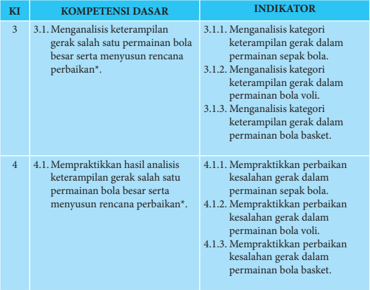

Tabel ini berisi informasi tentang kompetensi dasar dan indikator untuk dua topik utama: analisis keterampilan gerak dan praktikasi hasil analisis tersebut. Topik pertama, "Menganalisis keterampilan gerak salah satu permainan bola besar serta menyusun rencana perbaikan", mencakup tiga indikator: mengenali kategori keterampilan gerak dalam permainan sepak bola, bola voli, dan bola basket. Topik kedua, "Mempraktekkan hasil analisis keterampilan gerak salah satu permainan bola besar serta menyusun rencana perbaikan", mencakup tiga indikator: mempraktekkan perbaikan kesalahan gerak dalam permainan sepak bola, bola voli, dan bola basket. Pola penting yang terlihat adalah bahwa setiap topik memiliki tiga indikator yang berbeda, menunjukkan bahwa pembelajaran harus melibatkan pemahaman dan praktik dalam berbagai aspek permainan bola.

 

---
## 📄 Halaman 26

### B. Tujuan Pembelajaran

Setelah mengikuti kegiatan pembelajaran ini, peserta didik diharapkan mampu:

- Memiliki kesadaran tentang arti penting merawat tubuh sebagai wujud syukur terhadap Tuhan Yang Maha Esa.
- Menunjukkan perilaku bertanggung jawab terhadap pemeliharaan sarana dan prasarana pembelajaran permainan sepak bola, bola voli, dan bola basket.
- Menunjukkan perilaku santun dan toleransi selama bermain permainan sepak bola, bola voli, dan bola basket.
- Menganalisis dan mempraktikkan keterampilan gerak permainan sepak bola dengan menunjukkan nilai sportivitas, kerjasama, dan disiplin.
- Menganalisis  dan  mempraktikkan  keterampilan  gerak  permainan  bola  voli dengan menunjukkan nilai sportivitas, kerjasama, dan disiplin.
- Menganalisis dan mempraktikkan keterampilan gerak permainan bola basket dengan menunjukkan nilai sportivitas, kerjasama, dan disiplin.

### C. Aktivitas Pembelajaran

### 1.  Aktivitas  Pembelajaran  Analisis  Kategori  Keterampilan  Gerak  Permainan Sepak bola

Pembelajaran permainan sepak bola dapat dilakukan dengan aktivitas berpasangan dan berkelompok sebagai berikut:

### a.  Aktivitas Pembelajaran Berpasangan

Alat : bola plastik/bola standar

Formasi : berhadapan/berpasangan

- Tugaskan  peserta  didik  untuk  membuat  barisan  dan  saling  berhadapan secara berpasang-pasangan dengan jarak 3-5 meter. Masing-masing pasangan mendapatkan satu bola.
- Tugaskan  kepada  peserta  didik  untuk  menendang  bola  ke  depan  (a), kemudian pasangan berlari ke depan untuk mengontrol bola (b), menendang kembali bola ke depan sekitar 2-3 meter (a), pasangan berlari kembali ke depan untuk mengontrol bola (b), begitu seterusnya hingga jarak yang telah ditentukan guru.
- Pertanyakan kepada peserta didik: apakah dengan merubah titik perkenaan bola dengan kaki akan merubah jalannya bola?, apakah dengan merubah titik tumpu akan merubah kecepatan dan jalannya bola?, apakah distribusi kekuatan  menendang  mempengaruhi  jalannya  bola?,  Dan  pertanyaan lainnya.
- Tugaskan peserta didik untuk mengeksplorasi pertanyaan tersebut melalui praktik menendang bola secara berpasangan.

 

---
## 📄 Halaman 27

- Setelah peserta didik merasakan ada kemajuan dengan kaki kanan lakukan gerakan menendang bola mengguankan kaki kiri.
- Guru  juga  menyampaikan  arti  penting  kerjasama  dan  disiplin  selama melakukan aktivitas belajar tersebut.
- Tugaskan  peserta  didik  melaksanakan  rencana  perbaikan  dari  aktivitas yang baru saja dilakukan baik sendiri, bersama teman atau  guru  untuk  perbaikan aktivitas  gerakan  yang  akan datang sesuai ketentuan gerakan yang ada.
- Selama peserta didik melakukan eksplorasi gerak, guru menilai kemajuan yang diperoleh oleh peserta didik, baik dari segi pengetahuan, sikap, maupun keterampilan.
- Aktivitas  belajar  ini  seperti nampak pada gambar 2.1.
Variasi: setelah peserta didik teramati mengalami kemajuan menendang bola menggunakan  kaki  bagian  dalam,  tugaskan  mereka  mengunakan  punggung kaki bagian dalam dan luar, dan juga tugaskan mereka untuk melakukan gerak menendang sambil bergerak maju-mundur, ke kiri - ke kanan, menyerong. Agar kegiatan menarik bagi peserta didik, aktivitas belajar ini dapat dikembangkan lagi oleh guru.

### b.  Aktivitas Pembelajaran Kelompok

Alat

: bola plastik/bola standar

Tempat bermain  : lapangan dengan ukuran 9 x 9 meter.

Formasi

: berkelompok bebas

- Tugaskan kepada peserta didik untuk membuat kelompok sebanyak 6 orang
- Tugaskan kepada peserta didik untuk menentukan 2 orang sebagai pemain penerima  bola,  2  orang  sebagai  pemain  bertahan,  dan  2  orang  sebagai pemain penyerang.
- Tugaskan kepada peserta didik yang bertugas sebagai pemain penyerang untuk  membawa  bola  dan  berusaha  memberikan  bola  kepada  pemain penerima  bola,  pemain  bertahan  berusaha  merebut  bola  dari  pemain penyerang  dan  menghalangi  bola  agar  tidak  sampai  kepada  pemain penerima  bola.  Apabila  bola  berhasil  diterima  oleh  pemain  penerima bola maka pemain penerima berganti menjadi pemain bertahan, pemain bertahan  menjadi  pemain  penyerang,  dan  pemain  penyerang  menjadi pemain penerima bola.

 

---
## 📄 Halaman 28

- Tugaskan  peserta  didik  untuk  menerapkan  berbagai  keterampilan  gerak permainan sepak bola dengan menerapkan nilai sportivitas, kerjasama, dan disiplin.
- Tugaskan peserta didik melaksanakan rencana perbaikan dari aktivitas yang baru saja dilakukan baik sendiri, bersama teman atau guru untuk perbaikan aktivitas gerakan yang akan datang sesuai ketentuan gerakan yang ada.
- Selama peserta didik melakukan eksplorasi gerak, guru menilai kemajuan yang diperoleh oleh peserta didik.
- Aktivitas belajar ini seperti nampak pada gambar 2.2.

---
**🖼️ Gambar/Diagram**

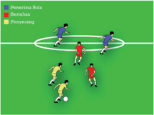

> **Deskripsi Visual:** Gambar ini adalah ilustrasi yang menunjukkan posisi pemain sepak bola dalam sebuah pertandingan. Ilustrasi ini menggambarkan tiga pemain berbeda warna: pemain bola (biru), pemain bertahan (merah), dan pemain penyandang (kuning). Pemain bola berada di tengah kotak hijau, menunjukkan bahwa mereka memiliki bola. Pemain bertahan berada di sekitar pemain bola, menunjukkan bahwa mereka berada dalam posisi untuk bertahan. Pemain penyandang berada di sekitar pemain bertahan, menunjukkan bahwa mereka berada dalam posisi untuk menyandang bola. Ilustrasi ini menunjukkan posisi pemain dalam sebuah pertandingan sepak bola dan bagaimana mereka berinteraksi satu sama lain.

Kategori keterampilan gerak permainan sepak bola lainnya seperti: keterampilan gerak menghentikan/mengontrol, menggiring, dan menembak bola ke gawang di rancang seperti aktivitas pembelajaran di atas. Guru dapat mengembangkannya lagi  sesuai  dengan  karakteristik  dan  kebutuhan  peserta  didik  serta  keadaan lingkungan sekolah.

### 2. Aktivitas Pembelajaran Analisis Kategori Keterampilan Gerak Permainan Bola Voli

Pembelajaran permainan bola voli dapat dilakukan dengan aktivitas berpasangan dan kelompok. Berikut contoh aktivitas belajar untuk keterampilan gerak passing dalam permainan bola voli:

- Aktivitas Pembelajaran berpasangan
- Tugaskan peserta didik untuk saling berpasangan (satu bola oleh dua orang) dipisahkan oleh net/jaring.
- Tugaskan  peserta  didik  untuk  melakukan  permulaan  permainan  dengan lemparan.
Alat

: bola plastik, bola karet, atau bola standar bola voli

Tempat bermain  : lapangan dan pembatas/net

Formasi

: berhadapan/berpasangan

 

---
## 📄 Halaman 29

- Tugaskan peserta didik untuk berupaya saling memindahkan bola melewati net/jaring dengan passing bawah atau atas. Tekankan juga bahwa selama bola belum menyentuh lantai, bola dinyatakan dalam permainan (bola hidup) dan  peserta  didik  yang  lebih  dulu  mengumpulkan  angka  15  dinyatakan sebagai  pemenang,  kecuali deuce ,  maka  siswa  yang  mendapatkan  nilai selisih dua yang menang.
- Pertanyakan kepada peserta didik: apakah perkenaan bola dengan lengan/ tangan  akan  berpengaruh  pada  pergerakan  bola,  apakah  fungsi  passing dalam  permainan  bola  voli,  apakah  posisi  tubuh  berpengaruh  terhadap hasil passing?, dan pertanyaan lainnya.
- Tugaskan  peserta  didik  untuk  mengeksplorasi  pertanyaan-pertanyaan tersebut dengan melakukan praktik passing berpasangan.
- Perhatikan bahwa peserta didik dapat merasakan kemajuan dalam melakukan passing.
- Guru  juga  menyampaikan  arti  penting  kerjasama,  disiplin,  dan  saling menghargai selama melakukan aktivitas belajar tersebut.
- Tugaskan peserta didik melaksanakan rencana perbaikan dari aktivitas yang baru saja dilakukan baik sendiri, bersama teman atau guru untuk perbaikan aktivitas gerakan yang akan datang sesuai ketentuan gerakan yang ada.
- Selama peserta didik melakukan eksplorasi gerak, guru menilai kemajuan yang  diperoleh  oleh  peserta  didik,  baik  dari  segi  pengetahuan,  sikap, maupun keterampilan.
- 10)Aktivitas belajar ini seperti nampak pada gambar 2.3.

---
**🖼️ Gambar/Diagram**

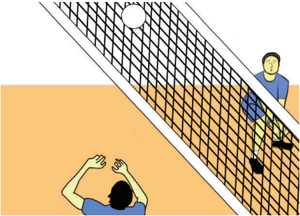

> **Deskripsi Visual:** Gambar ini adalah ilustrasi yang menunjukkan pertandingan voli. Gambar ini menggambarkan dua pemain voli yang sedang bermain di lapangan voli. Pemain di depan tampak sedang mencoba untuk menendang bola ke arah pemain di belakang. Net voli terlihat jelas di tengah-tengah gambar, memisahkan kedua pemain. Latar belakang tampak seperti lapangan voli dengan pencahayaan yang cukup baik. Pemain di depan menggunakan tangan untuk menendang bola, sementara pemain di belakang tampak berada di posisi siap untuk menerima bola. Ini menunjukkan skenario serangan dan blok dalam permainan voli.

 

---
## 📄 Halaman 30

### b. Aktivitas Pembelajaran Kelompok

Alat

: bola plastik, bola karet, atau bola standar bola voli

Tempat bermain  : lapangan lebar 3 meter dan pembatas/net

Formasi

: berkelompok

- Tugaskan  peserta  didik  untuk  membuat  kelompok  (satu  kelompok  tiga orang).
- Tugaskan  peserta  didik  untuk  memulai  permainan  dengan  lemparan, kemudian menugaskan mereka untuk berupaya memindahkan bola dengan passing bawah atau atas. Tegaskan pula bahwa setiap kelompok hanya boleh menyentuh bola tiga kali dan setiap anggota kelompok harus menyentuh bola  dan  selama  bola  belum  menyentuh  lantai,  bola  dinyatakan  dalam permainan (bola hidup).
- Tugaskan peserta didik untuk menghitung perolehan angka secara jujur pada kelompoknya dengan ketentuan kelompok yang lebih dulu mengumpulkan angka  15  dinyatakan  sebagai  pemenang,  kecuali deuce ,  maka  regu  yang mendapatkan nilai selisih dua yang menang.
- Tugaskan  peserta  didik  untuk  menerapkan  berbagai  keterampilan  gerak dengan benar dan menerapkan nilai sportivitas, kejujuran, kerjasama, dan disiplin.
- Tugaskan peserta didik melaksanakan rencana perbaikan dari aktivitas yang baru saja dilakukan baik sendiri, bersama teman atau guru untuk perbaikan aktivitas gerakan yang akan datang sesuai ketentuan gerakan yang ada.
- Selama  peserta  didik  melakukan  aktivitas  belajar  tersebut,  guru  menilai kemajuan yang diperoleh oleh peserta didik.
- Aktivitas belajar ini seperti nampak dalam gambar 2.4.

---
**🖼️ Gambar/Diagram**

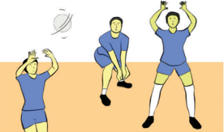

> **Deskripsi Visual:** Gambar ini adalah ilustrasi yang menunjukkan dua orang pemain sepak bola sedang bermain. Pemain di sebelah kiri sedang berusaha mencetak gol dengan memukul bola ke arah gawang yang ditandai dengan lingkaran putih. Pemain di sebelah kanan sedang berdiri di depan gawang, mengejar bola untuk menghindari gol. Kedua pemain tersebut memakai seragam biru dengan lengan panjang dan celana pendek. Latar belakangnya adalah lapangan sepak bola dengan garis-garis yang menunjukkan area permainan. Ilustrasi ini menunjukkan aksi pertandingan sepak bola dan fokus pada tindakan mencetak gol dan menjaga gawang.

 

---
## 📄 Halaman 31

Kategori keterampilan gerak permainan bola voli lainnya seperti: keterampilan  gerak  servis,  smash,  dan  blocking  dirancang  seperti  aktivitas pembelajaran di atas. Guru juga dapat mengembangkannya lagi sesuai dengan karakteristik dan kebutuhan peserta didik serta keadaan lingkungan sekolah.

### 3. Aktivitas Pembelajaran Analisis Kategori Keterampilan Gerak Permainan Bola basket

Pembelajaran permainan bola basket dapat dilakukan dengan aktivitas belajar berpasangan dan kelompok. Berikut contoh aktivitas belajar untuk keterampilan gerak mengoper dan menggiring bola dalam permainan bola basket:

- Aktivitas Pembelajaran Berpasangan
- Tugaskan  peserta  untuk  mencari  teman  satu  pasangan  dan  berikan  satu bola untuk setiap pasangan.
- Tugaskan salah satu peserta didik untuk menggiring bola hingga batas garis lapangan yang ditentukan.
- Tugaskan peserta didik lain atau pasangannya untuk merebut bola dengan cara membayangi pasangannya yang sedang menggiring bola.
- Pertanyakan  kepada  peserta:  bagaimanakah  cara  menggiring  bola  agar bola  tidak  terebut  oleh  lawan?,  manakah  yang  lebih  efektif  menggiring bola sambil berjalan atau berlari?, apakah posisi badan dan tangan dapat berpengaruh pada cara menggiring bola?, dan pertanyaan lainnya.
- Tugaskan kepada peserta didik untuk mengekplorasi pertanyaan-pertanyaan tersebut sambil melakukan aktivitas belajar berpasangan.
- Perhatikan bahwa peserta didik dapat merasakan kemajuan dalam melakukan menggiring bola.
- Tugaskan peserta didik untuk melakukan menggiring bola dengan gerakan yang benar dan menerapkan disiplin, percaya diri, dan saling menghargai saat melakukan aktivitas belajar berpasangan.
- Tugaskan peserta didik melaksanakan rencana perbaikan dari aktivitas yang baru saja dilakukan baik sendiri, bersama teman atau guru untuk perbaikan aktivitas gerakan yang akan datang sesuai ketentuan gerakan yang ada.
- Selama  peserta  didik  melakukan  aktivitas  belajar  tersebut,  guru  menilai kemajuan yang diperoleh oleh peserta didik.
- 10)Aktivitas belajar ini seperti nampak pada gambar 2.5.
Alat

: bola karet/bola basket standar

Tempat bermain  : lapangan

Formasi

: berpasangan (satu lawan satu)

 

---
## 📄 Halaman 32

---
**🖼️ Gambar/Diagram**

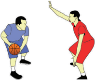

> **Deskripsi Visual:** Gambar ini adalah ilustrasi yang menunjukkan dua orang pemain bola basket sedang bermain. Pemain di sebelah kiri memegang bola basket dan tampaknya sedang bergerak untuk melempar atau melakukan gerakan dribbling. Sementara itu, pemain di sebelah kanan tampaknya sedang berdiri dengan posisi yang siap untuk bertahan atau melakukan tindakan balas. Ilustrasi ini menunjukkan situasi pertandingan basket yang seru dan dinamis, dengan fokus pada gerakan dan strategi pemain. Teks, angka, atau label penting tidak terlihat dalam gambar ini. Informasi kunci yang dapat diambil pembaca adalah bahwa ini adalah pertandingan basket dan ada dua pemain yang sedang bermain.

### b. Aktivitas Belajar Kelompok

Alat

: bola karet/bola basket standar

Tempat bermain  : setengah lapangan bola basket dan ring basket

Formasi

: berkelompok

- Tugaskan  peserta  didik  untuk  membuat  kelompok  dengan  jumlah  enam orang dan bagi dalam dua tim, yaitu tim penyerang dan bertahan.
- Tugaskan  kepada  peserta  didik  yang  berperan  sebagai  penyerang  untuk menguasai bola dengan menggunakan teknik mengoper bola setinggi dada, dengan pantulan, dan dengan satu tangan.
- Tugaskan  kepada  peserta  didik  yang  berperan  sebagai  pemain  bertahan untuk berusaha menggagalkan penyerangan yang dilakukan tiga penyerang dengan segala cara tanpa melanggar aturan.
- Jelaskan kepada peserta didik untuk mematuhi aturan. Jika dalam waktu 5 menit tim penyerang tidak bisa mencetak angka lebih dari sepuluh bola maka tim menyerang dianggap gagal/kalah dan bergantian peran dengan yang bertahan.
- Pertanyakan  kepada  peserta  didik:  apakah  mengoper  bola  dengan  baik dapat menguasai bola lebih lama?, pada keadaan yang seperti apa mengoper bola setinggi dada, dengan pantulan dan dengan satu tangan dilakukan?, kemanakah  bergerak  apabila  tidak  mendapatkan  bola?,  dan  pertanyaan lainya.
- Tugaskan kepada peserta didik untuk mengekplorasi pertanyaan-pertanyaan dengan melakukan aktivitas belajar kelompok tersebut.
- Perhatikan bahwa peserta didik mengalami kemajuan dalam keterampilan gerak mengoper bola.

 

---
## 📄 Halaman 33

- Tugaskan  kepada  peserta  didik  untuk  melakukan  berbagai  keterampilan gerak dalam permainan bola basket dan menerapkan kejujuran, kerjasama, saling menghargai, toleransi, dan sportivitas.
- Tugaskan peserta didik melaksanakan rencana perbaikan dari aktivitas yang baru saja dilakukan baik sendiri, bersama teman atau guru untuk perbaikan aktivitas gerakan yang akan datang sesuai ketentuan gerakan yang ada.
- 10)Selama  peserta  didik  melakukan  aktivitas  belajar  tersebut,  guru  menilai kemajuan yang diperoleh oleh peserta didik.
- 11)Aktivitas belajar ini seperti nampak pada gambar 2.6.

---
**🖼️ Gambar/Diagram**

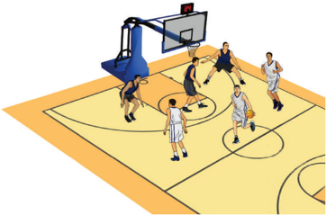

> **Deskripsi Visual:** Gambar ini adalah ilustrasi yang menunjukkan pertandingan bola basket. Gambar ini menggambarkan beberapa pemain basket bermain di lapangan basket. Pemain-pemain tersebut sedang bergerak dan berinteraksi dengan bola. Di sebelah kanan, ada dua pemain yang sedang berlari menuju bola, sementara pemain lainnya berdiri di sekitar area lapangan. Di tengah, ada pemain yang sedang mencoba untuk memukul bola ke arah temannya. Di sebelah kiri, ada dua pemain yang sedang berdiri dan tampaknya sedang menunggu aksi selanjutnya. Di atas lapangan, terdapat papan basket dengan tabung penyeberangan yang menunjukkan skor. Seluruh gambar ini menunjukkan suasana pertandingan yang seru dan kompetitif.

Kategori keterampilan gerak permainan  bola  basket lainnya seperti: keterampilan menembak bola ke ring dirancang seperti aktivitas pembelajaran di atas. Guru juga dapat mengembangkannya lagi sesuai dengan karakteristik dan kebutuhan peserta didik serta keadaan lingkungan sekolah.

 

---
## 📄 Halaman 34

### D. Pelaksanaan Penilaian

### 1.  Penilaian Pengetahuan

Setelah mempelajari materi kategori keterampilan gerak permainan bola besar, peserta  didik  mengerjakan  tugas  dengan  penuh  rasa  tanggung  jawab  dengan menjawab berbagai  pertanyaan  yang  berhubungan  dengan  analisis  dan  konsep kategori  keterampilan  gerak  permainan  sepak  bola,  bola  voli,  dan  bola  basket. Berikut contoh rubrik untuk penilaian pengetahuan

---
**📊 Tabel**

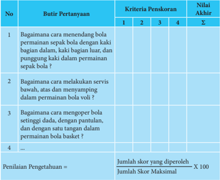

Tabel ini berisi butir pertanyaan tentang teknik dan keterampilan dalam bermain sepak bola dan bola basket. Kolom 1 menunjukkan nomor butir pertanyaan, kolom 2-4 menunjukkan kriteria penyesoran (1, 2, 3, dan 4), dan kolom 5 menunjukkan nilai akhir untuk setiap butir pertanyaan. Topik utama tabel adalah teknik dan keterampilan dalam bermain sepak bola dan bola basket. Data penting yang terlihat adalah bahwa setiap butir pertanyaan memiliki empat kriteria penyesoran, dan nilai akhir ditentukan dengan mengalikan jumlah skor yang diperoleh dengan jumlah skor maksimal.

### Keterangan  :

Nilai 1

: jika komponen jawaban kurang secara kualitas dan kuantitas

Nilai 2

: jika komponen jawaban cukup secara kualitas dan kuantitas

Nilai 3

: jika komponen jawaban baik secara kualitas dan kuantitas

Nilai 4

: jika komponen jawaban sangat baik secara kualitas dan kuantitas

 

---
## 📄 Halaman 35

### 2.  Penilaian Keterampilan

Penilaian aspek keterampilan dilakukan terhadap kesempurnaan/keterampilan sikap/cara melakukan proses suatu gerakan (penilaian proses). Tugaskan peserta didik untuk melakukan keterampilan-keterampilan gerak dalam permainan sepak bola, bola voli, dan bola basket, kemudian buatlah rubrik penilaian keterampilan seperti contoh berikut:

---
**📊 Tabel**

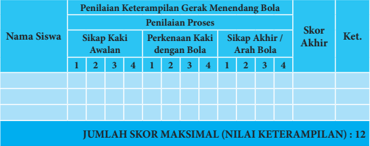

Tabel ini menunjukkan hasil penilaian keterampilan gerak mendendang bola bagi beberapa siswa. Topik utamanya adalah keterampilan gerak mendendang bola, yang diukur melalui sikap awal, perkembangan sikap, dan sikap akhir setelah latihan. Kolom-kolomnya mencakup nama siswa, sikap awal, perkembangan sikap, sikap akhir, skor akhir, dan ketentuan. Data penting yang terlihat adalah bahwa siswa 1 memiliki sikap awal yang baik (2), kemudian meningkat menjadi 3 setelah latihan, dan akhirnya menjadi 4 setelah latihan selesai. Siswa 2 memiliki sikap awal yang lebih rendah (1), kemudian meningkat menjadi 2 setelah latihan, dan akhirnya menjadi 3 setelah latihan selesai. Siswa 3 memiliki sikap awal yang sangat rendah (1), kemudian meningkat menjadi 2 setelah latihan, dan akhirnya menjadi 3 setelah latihan selesai. Siswa 4 memiliki sikap awal yang sangat rendah (1), kemudian meningkat menjadi 2 setelah latihan, dan akhirnya menjadi 3 setelah latihan selesai. Skor akhir untuk semua siswa adalah 4, yang menunjukkan bahwa mereka berhasil meningkatkan keterampilan gerak mendendang bola setelah latihan.

### kriteria penilaian:

- 1 = kurang terampil
- 2 = cukup terampil
- 3 = terampil
- 4 = lebih terampil
Penilaian keterampilan

### 3. Penilaian Sikap

Penilaian  aspek  sikap  (sikap)  dilakukan  dengan  pengamatan  atau  observasi selama mengikuti kegiatan belajar mengajar. Pengamatan dalam proses penilaian dilakukan  saat  peserta  didik  pembelajaran  permainan  bola  besar.  Aspek-aspek yang  dinilai  meliputi:  kerjasama,  tanggung  jawab,  sportivitas,  disiplin,  dan toleransi, dengan cara mencatat perilaku yang menonjol positif dan negatif yang dapat  digunakan  sebagai  pertimbangan  guru  dalam  mengembangkan  karakter peserta didik.

Jumlah skor yang diperoleh

=

Jumlah skor maksimal

X 100

 

---
## 📄 Halaman 36

---
**📊 Tabel**

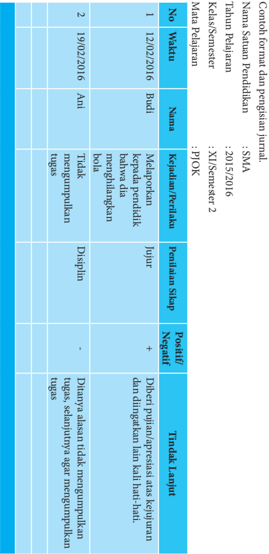

Tabel ini menunjukkan informasi tentang sertifikasi pendidikan untuk seorang guru di Indonesia. Topik utamanya adalah tentang sertifikasi dan pengesahan pendidikan. Tabel ini terdiri dari kolom "No", "Waktu", "Nama", "Kehadiran Pendidikan", "Penilaian SISIP", dan "Poin/BB". Data penting yang terlihat meliputi tanggal 12 Desember 2016 sebagai tanggal penilaian pertama, nama yang diberikan adalah Ani, dan penilaian SISIPnya adalah Negatif. Selain itu, tabel juga mencakup informasi tentang kehadiran pendidikan, penilaian SISIP, dan poin/BB yang diberikan.

 

---
## 📄 Halaman 37

### E. Pelaksanaan Remedial dan Pengayaan

Pelaksanaan  remedial  dilakukan  apabila  terdapat  siswa  mendapatkan  nilai kurang dari KKM (75) atau pada kategori kurang (60-74) dan kurang sekali (< 60). Sedangkan, pengayaan dapat dilakukan pada siswa yang telah mendapatkan nilai baik (85-94) dan sangat baik (95-100). Remedial dan pengayaan dapat dilakukan pada aspek pengetahuan, sikap, dan keterampilan. berikut contoh format remedial dan pengayaan.

---
**📊 Tabel**

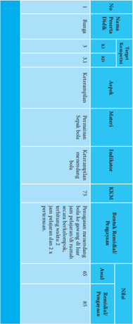

Tabel ini menunjukkan informasi tentang program pelatihan dan pengembangan profesional di sebuah organisasi. Topik utamanya adalah tentang proses pelatihan dan pengembangan profesional, termasuk jenis program, durasi, dan metode pelaksanaan. Kolom-kolom yang ada meliputi: Nomor Program, Nama Program, Topik Pelatihan, Topik Pengembangan, Indikator, KRS/AN, Durasi Program, Analis, dan Penulis. Data penting yang terlihat adalah bahwa banyak program memiliki durasi antara 65 hingga 73 hari, dengan beberapa program memiliki durasi lebih lama. Ini menunjukkan bahwa organisasi berfokus pada pembelajaran dan pengembangan profesional yang cukup intensif untuk setiap peserta.

 

---
## 📄 Halaman 38

### ' Motivator terbaik dalam hidup ini adalah diri sendiri. '

- Bambang Pamungkas

 

---
## 📄 Halaman 39

### Bab III Pembelajaran Menganalisis Kategori Keterampilan Gerak Permainan Bola Kecil

Dalam bab ini membahas tentang permainan bola kecil, guru dapat memilih jenis permainan bola kecil sesuai dengan kondisi sekolah.

### A. Kompetensi Dasar dan Indikator Pembelajaran

Kompetensi dasar dan indikator pembelajaran analisis kategori keterampilan gerak permainan bola kecil adalah sebagai berikut:

---
**📊 Tabel**

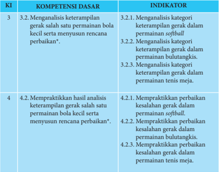

Tabel ini berisi informasi tentang kompetensi dasar dan indikator untuk dua topik utama: 3.2 Mengamati keterampilan gerak salah satu pemain bola kecil serta menyusun rencana perbaikan, dan 4.2 Mempraktekkan hasil analisis keterampilan gerak salah satu pemain bola kecil serta menyusun rencana perbaikan. Kolom-kolomnya mencakup kategori keterampilan gerak dalam berbagai jenis olahraga seperti softball, bulutangkis, dan tenis meja. Indikator-indikator tersebut meliputi mempraktekkan perbaikan kesalahan gerak dalam masing-masing jenis olahraga tersebut. Pola penting yang terlihat adalah bahwa tabel ini membahas analisis dan praktik perbaikan keterampilan gerak dalam berbagai jenis olahraga, dengan fokus pada pemain bola kecil.

 

---
## 📄 Halaman 40

### B. Tujuan Pembelajaran

Setelah mengikuti kegiatan pembelajaran ini, peserta didik diharapkan mampu:

- Memiliki kesadaran tentang arti penting merawat tubuh sebagai wujud syukur terhadap Tuhan Yang Maha Esa.
- Menunjukkan perilaku bertanggung jawab terhadap pemeliharaan sarana dan prasarana pembelajaran permainan softball , bulutangkis dan tenis meja.
- Menunjukkan  perilaku  santun  dan  toleransi  selama  bermain  permainan softball , bulutangkis dan tenis meja.
- Menganalisis  dan  mempraktikkan  keterampilan  gerak  permainan softball dengan menunjukkan nilai sportivitas, kerjasama, dan disiplin.
- Menganalisis dan mempraktikkan keterampilan gerak permainan bulutangkis dengan menunjukkan nilai sportivitas, kerjasama, dan disiplin.
- Menganalisis dan mempraktikkan keterampilan gerak permainan tenis meja dengan menunjukkan nilai sportivitas, kerjasama, dan disiplin.

### C. Aktivitas Pembelajaran

### 1.  Pembelajaran Analisis Kategori Keterampilan Gerak Permainan Softball

Pembelajaran permainan softball dapat dilakukan dengan aktivitas berpasangan dan berkelompok sebagai berikut:

Pembelajaran  permainan softball ,  pengorganisasian  siswa  dapat  dilakukan dengan aktivitas individual, berpasangan, dan berkelompok.

### a.  Aktivitas Pembelajaran Individual

Alat

: bola plastik, bola tenis (modifikasi), bola standar softball , bet softball

Tempat

: lapangan

Formasi

: individual

- Tugaskan  peserta  didik  untuk  melakukan  pemanasan  terlebih  dahulu sebelum melakukan aktivitas yang lebih berat
- Tugaskan  peserta  didik  melempar  dan  menangkap  bola  sendiri  sesuai teknik melempar dan menangkap bola.
- Tugaskan peserta didik memukul bola menggunakan pemukul sendiri dari bola yang dilambungkan sendiri.
- Pertanyakan kepada peserta didik, apakah dengan merubah titik perkenaan pukulan pada bola akan merubah jalannya bola, apakah dengan merubah titik tumpu akan merubah kecepatan dan jalannya bola, apakah distribusi kekuatan memukul, melempar mempengaruhi jalannya bola, dan pertanyaan lainnya.

 

---
## 📄 Halaman 41

- Tugaskan peserta didik untuk mengeksplorasi pertanyaan tersebut melalui praktik melempar, menangkap dan memukul bola.
- Tugaskan peserta didik melaksanakan rencana perbaikan dari aktivitas yang baru saja dilakukan baik sendiri, bersama teman atau guru untuk perbaikan aktivitas gerakan yang akan datang sesuai ketentuan gerakan yang ada.
- Setelah peserta didik merasakan ada kemajuan gerak melempar, menangkap dan memukul kembangkan dengan berbagai variasi lemparan, menangkap dan memukul.
- Selama peserta didik melakukan eksplorasi gerak, guru menilai kemajuan yang diperoleh oleh peserta didik.
Variasi: setelah  peserta  didik  teramati  mengalami  kemajuan  lemparan, menangkap dan memukul, tugaskan mereka mengunakan variasi melempar, menangkap dan memukul, dan juga tugaskan mereka untuk melakukan gerak lemparan, menangkap dan memukul sambil bergerak maju-mundur, ke kiri ke kanan, menyerong.

### b. Aktivitas Pembelajaran Berpasangan

Alat

: bola plastik, bola tenis (modifikasi), bola standar softball , bet softball

Tempat

: lantai yang rata/lapangan rumput

Formasi

: berhadapan berpasangan

- Tugaskan  peserta  didik  untuk  melakukan  pemanasan  terlebih  dahulu sebelum melakukan aktivitas yang lebih berat
- Tugaskan peserta didik berdiri berhadapan jarak 3 - 5 meter
- Tugaskan peserta didik saling melempar, menangkap dan memukul.
- Pertanyakan kepada peserta didik, apakah dengan merubah titik perkenaan bola  saat  melempar,  menangkap, memukul akan merubah jalannya bola, apakah dengan merubah titik tumpu akan merubah kecepatan dan jalannya bola,  apakah  distribusi  kekuatan  melempar,  menangkap  dan  memukul mempengaruhi jalannya bola, dan pertannyaan lainnya.
- Tugaskan peserta didik untuk mengeksplorasi pertanyaan tersebut melalui praktik melempar, menangkap dan memukul bola secara berapasangn.
- Setelah peserta didik merasakan ada kemajuan dengan kaki kanan lakukan gerakan melempar, menangkap dan memukul bola menggunakan variasi.
- Tugaskan peserta didik melaksanakan rencana perbaikan dari aktivitas yang baru saja dilakukan baik sendiri, bersama teman atau guru untuk perbaikan aktivitas gerakan yang akan datang sesuai ketentuan gerakan yang ada.
- Guru menyampaikan arti penting kerjasama dan disiplin selama berlatih.

 

---
## 📄 Halaman 42

- Selama peserta didik melakukan eksplorasi gerak, guru menilai kemajuan yang diperoleh oleh peserta didik.
Variasi:  setelah  peserta  didik  teramati  mengalami  kemajuan  melempar, menangkap  dan  memukul  bola  menggunakan  berbagai  teknik,  tugaskan mereka mengunakan macam macam variasi, dan juga tugaskan mereka untuk melakukan gerak melempar, menangkap dan memukul sambil bergerak majumundur, ke kiri - ke kanan, menyerong.

Agar kegiatan menarik bagi peserta didik, formasi ini dapat dikembangkan lagi oleh guru, sepert formasi segi empat, segi lima, atau segi enam.

### c. Aktivitas Pembelajaran Berkelompok

Alat

: bola tenis (modifikasi), bola standar softball , bet softball

Tempat

: lapangan

Formasi

: sesuai aturan posisi pemain softball

- Tugaskan peserta didik membuat tim, yang terdiri dari 10 orang satu tim atau sesuai jumlah siswa yang ada.
- Tugaskan peserta didik bermain softball menerapkan berbagai keterampilan gerak permainan softball dengan menerapkan nilai sportivitas, kerjasama, dan disiplin.
- Tugaskan peserta didik melaksanakan rencana perbaikan dari aktivitas yang baru saja dilakukan baik sendiri, bersama teman atau guru untuk perbaikan aktivitas gerakan yang akan datang sesuai ketentuan gerakan yang ada.
- Selama peserta didik melakukan eksplorasi gerak, guru menilai kemajuan yang diperoleh oleh peserta didik.
- Buatlah dua regu yang sama banyak. Satu regu sebagai pemukul dan regu lainnya sebagai penjaga.
- Regu yang mendapat giliran memukul, setiap pemain mendapat kesempatan 3 kali memukul. Jika pukulan yang pertama atau kedua sudah baik, pemukul harus segera lari ke base pertama.
- Urutan pemukul ditentukan oleh nomor urut yang telah ditentukan sebelum permainan dimulai.
- Tiap-tiap base hanya  boleh  diisi  oleh  seorang  pemain  pemukul,  di  mana pemukul pertama tidak boleh dilalui pemukul kedua dan seterusnya.
- Pemain bebas mengadakan gerakan selama bola dalam permainan, kecuali bila pitcher sudah siap untuk melempar bola kepada pemukul.
- 10)Pada  waktu  akan  di  'tik'  pelari  tidak  boleh  menghindar  dengan  berlari keluar atau ke dalam dari batas yang telah ditentukan.
- 11)Setiap  pelari  dengan  pukulan  yang  baik  dapat  kembali  dengan  selamat melampaui home base mendapat nilai 1.

 

---
## 📄 Halaman 43

### 12)Lama bermain ditentukan dengan inning dan lamanya permainan softball adalah 7 inning /babak.

### 13)Perhatikan gambar 3.7.

---
**🖼️ Gambar/Diagram**

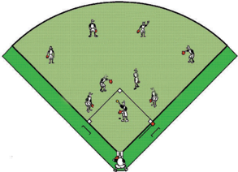

> **Deskripsi Visual:** Gambar ini adalah ilustrasi yang menunjukkan pertandingan sepak bola. Gambar ini menggambarkan posisi pemain pada lapangan sepak bola dan posisi bola. Pemain-pemain berada di berbagai area lapangan, dengan beberapa pemain berada di tengah lapangan, sedangkan pemain lainnya berada di pinggir lapangan. Bola tampaknya sedang berada di tengah lapangan, menunjukkan bahwa pertandingan sedang berlangsung. Ilustrasi ini mungkin digunakan untuk membantu pemahaman tentang struktur lapangan sepak bola dan posisi pemain dalam pertandingan tersebut.

Kategori keterampilan gerak permainan softball lainnya seperti: keterampilan  gerak  memegang  bat/pemukul  dan  memukul  bola  dirancang seperti  aktivitas  pembelajaran  di  atas.  Guru  dapat  mengembangkannya lagi  sesuai  dengan karakteristik dan kebutuhan peserta didik serta keadaan lingkungan sekolah.

### 2.  Pembelajaran Analisis Kategori Keterampilan Gerak Permainan bulutangkis

Pembelajaran  Kategori  Keterampilan  Gerak  Permainan  bulutangkis  dapat dilakukan individu dan berpasangan.

### a.  Aktivitas Pembelajaran Individu

- Berbarislah dengan berbanjar sesuai jumlah yang ada.
- Simpanlah 10 buah shuttlecock pada jarak 4-5 meter.
- Lakukan lari ditempat.
- Ambilah shuttlecock dengan lari bolak-balik maju dan mundur.

---
**🖼️ Gambar/Diagram**

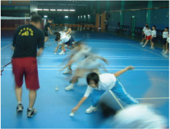

> **Deskripsi Visual:** Gambar ini adalah foto yang menunjukkan sebuah pertandingan bulu tangkis. Gambar ini menampilkan beberapa pemain bulu tangkis yang sedang bermain di lapangan dengan latar belakang arena olahraga yang terlihat jelas. Pemain-pemain tersebut sedang bergerak aktif, menunjukkan posisi mereka saat bermain. Di sekitar lapangan, terlihat beberapa penonton yang sedang menyaksikan pertandingan. Gambar ini menunjukkan hubungan antara pemain dan penonton serta antara pemain dengan lapangan. Teks, angka, atau label penting tidak terlihat pada gambar ini. Informasi kunci yang dapat diambil pembaca adalah bahwa ada pertandingan bulu tangkis sedang berlangsung dan banyak penonton yang menyaksikannya.

 

---
## 📄 Halaman 44

- Ambilah shuttlecock dengan lari bolak-balik menyamping kiri dan kanan
- Lakukan  aktivitas  secara  berulang-ulang  dengan  mempraktikkan  gerak langkah berurutan, bergantian, dan kaki lebar dan loncatan.
- Tugaskan peserta didik melaksanakan rencana perbaikan dari aktivitas yang baru saja dilakukan baik sendiri, bersama teman atau guru untuk perbaikan aktivitas gerakan yang akan datang sesuai ketentuan gerakan yang ada.
- Perhatikan gambar 3.8.

### b.  Aktivitas Pembelajaran Berpasangan

- Carilah teman pasangan.
- Saling berhadapan dengan dibatasi net.
- Lakukan secara bergantian servis panjang dan pendek.
- Lakukan  aktivitas  tersebut  secara  berulang-ulang  sampai  waktu  yang ditentukan guru.
- Tugaskan peserta didik melaksanakan rencana perbaikan dari aktivitas yang baru saja dilakukan baik sendiri, bersama teman atau guru untuk perbaikan aktivitas gerakan yang akan datang sesuai ketentuan gerakan yang ada.
- Semakin banyak kalian melakukan servis akan semakin dapat menguasai gerak servis.
- Perhatikan gambar 3.9.
Kategori keterampilan gerak permainan bulutangkis lainnya seperti: keterampilan gerak memegang  raket  ( grip ),  gerak  langkah  kaki ( footwork ),  servis  (pendek  dan  panjang),  dan pukulan/strokes  ( lob,  choop ,  maupun smash ) dirancang seperti aktivitas pembelajaran di atas. Guru  dapat  mengembangkannya  lagi  sesuai dengan  karakteristik  dan  kebutuhan  peserta didik serta keadaan lingkungan sekolah.

### 3.  Pembelajaran Analisis Kategori Keterampilan Gerak Permainan Tenis meja

Pembelajaran  Kategori  Keterampilan  Gerak  Permainan  tenis  meja  dapat dilakukan individu dan berpasangan.

### a.  Aktivitas Pembelajaran Individu

- Rapatkan meja dengan tembok.
- Bersiaplah di depan meja tersebut.
- Lakukan pukulan secara terus-menerus dengan memantulkan pada tembok.

 

---
## 📄 Halaman 45

- Pukulan dapat dilakukan dengan forehand , backhand , dan lurus.
- Lakukan aktivitas  tersebut  secara  berulang-ulang  dan  bergantian  dengan temanmu sampai batas waktu yang ditentukan guru.
- Tugaskan peserta didik melaksanakan rencana perbaikan dari aktivitas yang baru saja dilakukan baik sendiri, bersama teman atau guru untuk perbaikan aktivitas gerakan yang akan datang sesuai ketentuan gerakan yang ada.
- Perhatikan gambar 3.10.

### b.  Aktivitas Pembelajaran Berpasangan

- Carilah teman sebagai pasangan belajar.
- Mulailah permainan dengan servis.
- Hitunglah permainan hingga mencapai angka tertinggi 11, kecuali terjadi perpanjangan dengan dua angka.
- Pemenangnya  yang  berhasil  mencapai  angka  tertinggi  terlebih  dahulu sesuai aturan yang ada.
- Perhatikan gambar 3.11.

---
**🖼️ Gambar/Diagram**

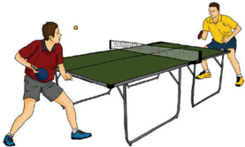

> **Deskripsi Visual:** Gambar ini adalah ilustrasi yang menunjukkan dua orang bermain tenis meja. Gambar ini menggambarkan pertandingan tenis meja antara dua pemain. Pemain di sebelah kiri menggunakan raket dan memegang bola dengan tangan kanannya, sedangkan pemain di sebelah kanan menggunakan raket dan memegang bola dengan tangan kannya. Kedua pemain tersebut sedang berada di dekat net meja, menunjukkan bahwa mereka sedang bermain di area yang dikenal sebagai "dalam" atau "dekat net". Net meja tampak jelas dan berwarna hijau, menunjukkan bahwa itu adalah bagian dari permainan tenis meja. Pemain di sebelah kiri memiliki rambut pendek dan memakai pakaian olahraga merah dan putih, sementara pemain di sebelah kanan memiliki rambut panjang dan memakai pakaian olahraga kuning dan putih. Ini menunjukkan bahwa mereka adalah pemain yang berbeda dalam pertandingan.

 

---
## 📄 Halaman 46

Kategori keterampilan gerak permainan  tenis meja lainnya seperti: keterampilan gerak memegang bet dan pukulan dirancang seperti aktivitas pembelajaran  di  atas.  Guru  dapat  mengembangkannya  lagi  sesuai  dengan karakteristik dan kebutuhan peserta didik serta keadaan lingkungan sekolah.

### D. Pelaksanaan Penilaian

### 1.  Penilaian Pengetahuan

Setelah  mempelajari  materi  kategori  keterampilan  gerak  permainan softball , peserta didik mengerjakan tugas kelompok dengan penuh rasa tanggung jawab menjawab berbagai  pertanyaan  yang  berhubungan  dengan  analisis  dan  konsep kategori  keterampilan  gerak  permainan softball .  Berikut  contoh  rubrik  untuk penilaian pengetahuan

---
**📊 Tabel**

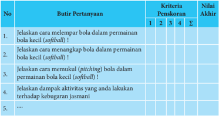

Tabel ini berisi informasi tentang kriteria penilaian untuk beberapa pertanyaan tentang permainan bola kecil (softball). Topik utama tabel adalah tentang cara melempar, menangkap, dan melakukan pitch (pukulan) bola dalam permainan softball. Tabel memiliki kolom dengan judul "No.", "Butuh Pertanyaan", "Kriteria Peniskaran", dan "Nilai Akhir". Kolom "No." memberikan nomor urutan pertanyaan, "Butuh Pertanyaan" menyatakan pertanyaan yang harus dijawab, "Kriteria Peniskaran" menunjukkan kriteria penilaian yang harus dipenuhi, dan "Nilai Akhir" menampilkan nilai akhir setelah memenuhi semua kriteria. Data penting yang terlihat adalah bahwa setiap pertanyaan memiliki empat kriteria penilaian, dan setiap kriteria memiliki skor tertentu. Tabel ini membantu siswa untuk memahami bagaimana menyelesaikan tugas dan mendapatkan nilai yang baik.

Jumlah skor yang diperoleh

Penilaian pengetahuan

=

X 100

Jumlah skor maksimal

### Keterangan:

Nilai 1

: jika komponen jawaban kurang secara kualitas dan kuantitas

Nilai 2

: jika komponen jawaban cukup secara kualitas dan kuantitas

Nilai 3

: jika komponen jawaban baik secara kualitas dan kuantitas

Nilai 4

: jika komponen jawaban sangat baik secara kualitas dan kuantitas

 

---
## 📄 Halaman 47

### 2.  Penilaian Keterampilan

Penilaian aspek keterampilan dilakukan terhadap kesempurnaan/keterampilan sikap/cara  melakukan  proses  suatu  gerakan  (penilaian  proses).  Berikut  contoh rubrik penilaian keterampilan:

---
**📊 Tabel**

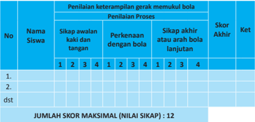

Tabel ini menunjukkan hasil penilaian keterampilan gerak memukul bola pada proses pelajaran. Topik utamanya adalah keterampilan memukul bola dalam konteks proses belajar. Tabel memiliki kolom berikut: Nama Siswa, Sikap awal kaki dan tangan, Perkenaan dengan bola, Sikap akhir atau arah bola lanjutan, dan Skor Akhir. Data penting yang terlihat adalah bahwa setiap siswa memiliki skor akhir yang berbeda-beda, dengan skor maksimal 12. Ini menunjukkan variasi dalam kemampuan masing-masing siswa dalam memukul bola.

Jumlah skor yang diperoleh

Penilaian keterampilan =

Jumlah skor maksimal

### 3. Penilaian Sikap

Penilaian  aspek  sikap  (sikap)  dilakukan  dengan  pengamatan  atau  observasi selama mengikuti kegiatan belajar mengajar. Pengamatan dalam proses penilaian dilakukan saat peserta didik melakukan pembelajaran permainan softball . Aspekaspek  yang  dinilai  meliputi:  kerjasama,  tanggung  jawab,  menghargai  teman, disiplin, dan toleransi. Hasil pengamatan dicatat dalam bentuk jurnal mengenai perilaku positif dan negatif yang dapat digunakan sebagai pertimbangan dalam mengembangkan karakter peserta didik

X 100

 

---
## 📄 Halaman 48

---
**📊 Tabel**

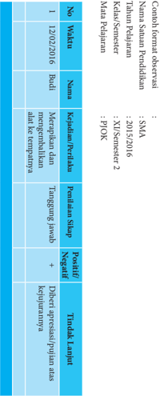

Tabel ini merupakan observasi yang dilakukan oleh seorang siswa pada mata pelajaran FJOK (Fisika Jurnal Kelas 10) di SMA Negeri 5 Malang pada tahun pelajaran 2015/2016. Observasi ini dilakukan selama dua minggu, mulai tanggal 12 Desember 2016 hingga 30 Desember 2016. Tabel ini terdiri dari kolom-kolom berikut: No, Waktu, Namanya, Kepadaan Pendidikan, Tanggapan Jawabannya, dan Tindak Lanjut. Data penting yang terlihat dalam tabel ini adalah bahwa siswa menunjukkan pengetahuan dan pemahaman yang positif tentang materi FJOK, namun masih ada beberapa kesulitan yang perlu diperbaiki. Tindak lanjut yang disarankan adalah untuk lebih banyak mempraktekkan materi FJOK dan mencari bantuan jika ada pertanyaan yang sulit.

 

---
## 📄 Halaman 49

### E. Pelaksanaan Remedial dan Pengayaan

Pelaksanaan  remedial  dilakukan  apabila  terdapat  siswa  mendapatkan  nilai kurang dari KKM (75) atau pada kategori kurang (60-74) dan kurang sekali (< 60). Sedangkan, pengayaan dapat dilakukan pada siswa yang telah mendapatkan nilai baik (85-94) dan sangat baik (95-100). Remedial dan pengayaan dapat dilakukan pada aspek pengetahuan, sikap, dan keterampilan. Berikut contoh format remedial dan pengayaan.

 

---
## 📄 Halaman 50

---
**📊 Tabel**

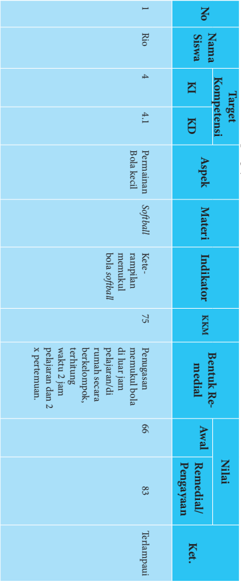

Tabel ini menunjukkan data evaluasi kompetensi siswa dalam mata pelajaran Bahasa Inggris. Topik utama adalah penilaian berdasarkan keterampilan berbahasa Inggris (K1) dan keterampilan berbahasa Inggris (K2). Kolom-kolomnya meliputi nomor siswa, nama siswa, target kompetensi, aspek, materi, indikator, KKN, nilai, asal, dan ket. Data penting yang terlihat adalah bahwa siswa dengan nomor 4 memiliki nilai 83 untuk aspek "Penggunaan bahasa Inggris dalam percakapan", yang merupakan aspek penting dalam penilaian berbahasa Inggris. Siswa ini juga memiliki nilai 75 untuk aspek "Penggunaan bahasa Inggris dalam membaca dan menulis", yang menunjukkan kemampuan mereka dalam memahami dan menuliskan teks dalam bahasa Inggris.

 

---
## 📄 Halaman 51

### Bab IV Pembelajaran Menganalisis Keterampilan Gerak Aktivitas Jalan, Lari, Lompat, Lempar

Dalam bab ini membahas tentang aktivitas atletik, guru dapat memilih jenis aktivitas atletik sesuai dengan kondisi sekolah dan karakteristik peserta didik.

### A. Kompetensi Dasar dan Indikator Pembelajaran

Kompetensi dasar dan indikator pembelajaran analisis kategori keterampilan gerak aktivitas atletik adalah sebagai berikut:

---
**📊 Tabel**

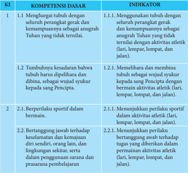

Tabel ini berisi informasi tentang kompetensi dasar dan indikator untuk dua topik utama: 1) Menghargai tubuh dengan seluruh perangkat gerak dan kemampuannya sebagai angrah Tuhan yang tidak terlilai, dan 2) Berperilaku sportif dalam bermain. Topik pertama mencakup tumbuhnya kesadaran bahwa tubuh harus dipelihara dan dibina, serta wujud sukuk kepada Sang Pencipta. Indikatornya meliputi memelihara dan membiarkan tubuh dengan cara yang sesuai dengan wujud sukuknya. Topik kedua berkaitan dengan berperilaku sportif dalam bermain, yang melibatkan menunjukkan perilaku sportif dalam aktivitas olahraga seperti lari, lempar, loncat, dan jalan. Indikatornya termasuk menunjukkan perilaku bertanggung jawab terhadap keselamatan dan kemanjaman diri sendiri, orang lain, dan lingkungan sekitar, serta dalam penggunaan alat dan prasarana pembelajaran. Data penting yang terlihat adalah bahwa tabel ini mencakup dua topik utama dan memiliki indikator yang spesifik untuk setiap topik tersebut.

 

---
## 📄 Halaman 52

---
**📊 Tabel**

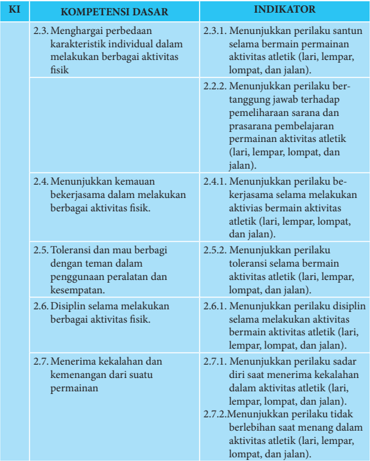

Tabel ini berisi informasi tentang kompetensi dasar dan indikator untuk aktivitas olahraga atletik. Topik utamanya adalah menghargai perbedaan, menunjukkan kemauan bekerja sama, toleransi, disiplin, dan menerima kekalahan. Kolom-kolomnya meliputi KI (Kompetensi Dasar), Indikator, dan Sub-Kompetensi Dasar. Data penting yang terlihat adalah bahwa semua kompetensi dasar memiliki sub-kompetensi dasar yang mencakup berbagai aktivitas olahraga seperti lari, lempar, lompat, dan jalan. Ini menunjukkan bahwa tabel ini dirancang untuk membantu siswa memahami berbagai aspek dari olahraga atletik dan bagaimana mereka dapat mengembangkan keterampilan tersebut.

 

---
## 📄 Halaman 53

---
**📊 Tabel**

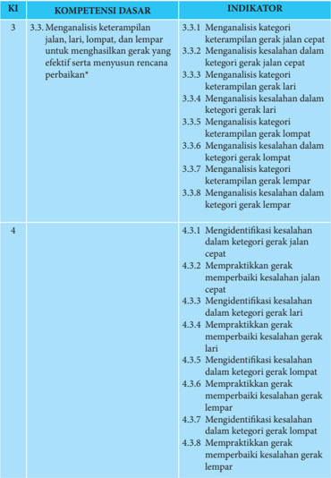

Tabel ini berisi informasi tentang kompetensi dasar dan indikator untuk dua topik: 3.3 Mengenalisis keterampilan gerak dan 4 Mengidentifikasi kesalahan dalam gerak. Topik utama adalah mengenali dan memperbaiki kesalahan dalam berbagai jenis gerakan seperti jalan, lari, lompat, dan lempar. Kolom pertama menunjukkan nomor kompetensi dasar, sedangkan kolom kedua menunjukkan indikator yang harus dicapai. Data penting yang terlihat adalah bahwa setiap kompetensi dasar memiliki beberapa indikator yang harus dicapai, misalnya dalam topik 3.3, ada 8 indikator yang harus dicapai untuk mengenalisis keterampilan gerak. Ini menunjukkan bahwa pembelajaran harus mencakup banyak aspek dan tidak hanya satu hal saja.

 

---
## 📄 Halaman 54

### B. Tujuan Pembelajaran

Setelah mengikuti kegiatan pembelajaran ini, peserta didik diharapkan mampu:

- Memiliki kesadaran tentang arti penting merawat tubuh sebagai wujud syukur terhadap Tuhan Yang Maha Esa.
- Menunjukkan perilaku bertanggung jawab terhadap pemeliharaan sarana dan prasarana pembelajaran permainan aktivitas atletik (lari, lempar, lompat, dan jalan).
- Menunjukkan  perilaku  santun  dan  toleransi  selama  aktivitas  atletik  (lari, lempar, lompat, dan jalan).
- Menganalisis  dan  mempraktikkan  keterampilan  gerak  aktivitas  atletik  (lari, lempar, lompat, dan jalan) dengan menunjukkan nilai sportivitas, kerjasama, dan disiplin.

### C. Aktivitas Pembelajaran

### 1.  Pembelajaran Analisis Kategori Keterampilan Gerak Jalan.

Pembelajaran  gerak  jalan/jalan cepat  dan  pengorganisasian  siswa  dapat dilakukan dengan aktivitas individual, berpasangan, dan berkelompok.

### a.  Aktivitas Pembelajaran Berkelompok

- Siswa berkelompok dengan anggota 3-5 orang atau secukupnya
- Salah satu siswa memberi aba-aba start jalan/jalan cepat.
- Dua kelompok saling bergantian yang satu melakukan start dan yang lainnya memberi aba-aba untuk belajar start berdiri dan belajar teknik jalan/jalan cepat menempuh jarak jangan terlalu jauh dengan benar.
- Dan  seterusnya  saling  merasakan  dan  melakukan start dan  melakukan teknik jalan/jalan cepat dengan baik dan benar.
- Tugaskan peserta didik melaksanakan rencana perbaikan dari aktivitas yang baru saja dilakukan baik sendiri, bersama teman atau guru untuk perbaikan aktivitas gerakan yang akan datang sesuai ketentuan gerakan yang ada.

---
**📊 Tabel**

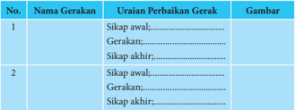

Tabel ini berisi informasi tentang gerakan dan uraian perbaikan untuk dua jenis gerakan tertentu. Topik utama tabel adalah tentang perbaikan gerakan, yang melibatkan sikap awal, gerakan, dan sikap akhir. Kolom pertama menunjukkan nomor urutan, sedangkan kolom kedua berisi nama gerakan. Kolom ketiga menyajikan uraian perbaikan untuk setiap gerakan, sementara kolom keempat menampilkan gambaran visual dari setiap uraian tersebut. Data penting yang terlihat adalah bahwa tabel ini membahas dua jenis gerakan, dengan uraian perbaikan yang disertakan untuk setiap jenis tersebut.

 

---
## 📄 Halaman 55

### b.  Aktivitas Pembelajaran Berkelompok

- Siswa saling berkelompok dengan anggota 3-5 siswa atau secukupnya
- Salah  satu  siswa  memberi aba-aba cara memasuki garis finish jalan/jalan cepat
- Dua kelompok saling bergantian yang satu melakukan cara memasuki garis finish dan yang lainnya mengoreksi gerakan dengan benar.
- Dan  seterusnya  saling  merasakan  dan  melakukan  cara  memasuki  garis finish jalan/jalan cepat dengan baik dan benar.
- Tugaskan peserta didik melaksanakan rencana perbaikan dari aktivitas yang baru saja dilakukan baik sendiri, bersama teman atau guru untuk perbaikan aktivitas gerakan yang akan datang sesuai ketentuan gerakan yang ada.

---
**📊 Tabel**

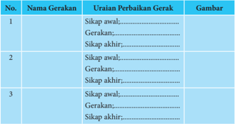

Tabel ini berisi informasi tentang perbaikan gerakan tangan dalam berbagai posisi. Topik utamanya adalah perbaikan sikap dan gerakan tangan. Kolom pertama menunjukkan nomor urutan perbaikan, kolom kedua berisi nama perbaikan, kolom ketiga berisi uraian perbaikan, dan kolom keempat berisi gambar. Data penting yang terlihat adalah bahwa setiap perbaikan memiliki uraian yang spesifik untuk sikap awal, gerakan, dan sikap akhirnya. Ini membantu dalam memahami proses perbaikan secara detail.

### 2.  Pembelajaran Analisis Kategori keterampilan Gerak Lari

Pembelajaran gerak lari dan pengorganisasian siswa dapat dilakukan dengan aktivitas individual, berpasangan, dan berkelompok.

### a.  Aktivitas Pembelajaran berkelompok

- Siswa berkelompok dengan anggota 3-5 orang atau secukupnya
- Salah satu siswa memberi aba-aba start berdiri lari jarak menengah
- Dua  kelompok  saling  bergantian  yang  satu  melakukan start berdiri  dan yang lainnya memberi aba-aba untuk belajar start berdiri dan belajar teknik lari jarak menengah menempuh jarak jangan terlalu jauh dengan benar.

 

---
## 📄 Halaman 56

- Dan seterusnya  saling  merasakan  dan  melakukan start berdiri dan melakukan teknik lari jarak menengah dengan baik dan benar.
- Tugaskan peserta didik melaksanakan rencana perbaikan dari aktivitas yang baru saja dilakukan baik sendiri, bersama teman atau guru untuk perbaikan aktivitas gerakan yang akan datang sesuai ketentuan gerakan yang ada.

---
**📊 Tabel**

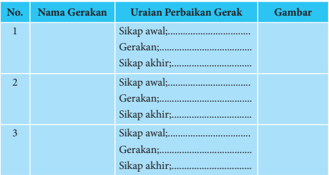

Tabel ini berisi informasi tentang perbaikan gerakan, yang terdiri dari kolom "No.", "Nama Gerakan", "Uraian Perbaikan Gerak", dan "Gambar". Topik utama tabel adalah perbaikan gerakan, yang melibatkan uraian perbaikan untuk tiga jenis gerakan: sikap awal, gerakan, dan sikap akhir. Setiap baris menunjukkan satu jenis gerakan dengan uraian perbaikan yang spesifik untuk setiap sikap awal, gerakan, dan sikap akhir. Gambar yang disertakan mungkin digunakan untuk visualisasi atau penjelasan lebih lanjut tentang perbaikan tersebut.

### b.  Aktivitas Pembelajaran berkelompok

- Siswa saling berkelompok dengan anggota 3-5 siswa atau secukupnya
- Salah  satu  siswa  memberi  aba-aba  cara  memasuki  garis finish lari  jarak menengah
- Dua kelompok saling bergantian yang satu melakukan cara memasuki garis finish dan yang lainnya mengoreksi gerakan dengan benar.
- Dan  seterusnya  saling  merasakan  dan  melakukan  cara  memasuki  garis finish lari jarak menengah dengan baik dan benar.
- Tugaskan peserta didik melaksanakan rencana perbaikan dari aktivitas yang baru saja dilakukan baik sendiri, bersama teman atau guru untuk perbaikan aktivitas gerakan yang akan datang sesuai ketentuan gerakan yang ada.

---
**📊 Tabel**

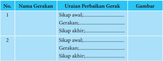

Tabel ini berisi informasi tentang sikap awal dan gerakan dalam sebuah proses perbaikan gergasi. Topik utamanya adalah sikap awal dan gerakan dalam perbaikan gergasi. Kolom pertama menunjukkan nomor urutan, kolom kedua berisi nama gerakan, kolom ketiga berisi uraian perbaikan gergasi, dan kolom keempat berisi gambar. Data penting yang terlihat adalah bahwa sikap awal dan gerakan berbeda-beda untuk setiap nomor urutan, dan gambar juga berbeda-beda untuk setiap nomor urutan. Ini menunjukkan bahwa proses perbaikan gergasi memerlukan pemahaman yang mendalam tentang sikap awal dan gerakan yang tepat untuk setiap jenis gergasi.

 

---
## 📄 Halaman 57

### 3.  Pembelajaran  Analisis  Kategori  Keterampilan  Gerak  Lempar  (lempar lembing, tolak peluru).

Pembelajaran gerak tolak peluru dan pengorganisasian siswa dapat dilakukan dengan aktivitas individual, berpasangan, dan berkelompok.

### a.  Aktivitas Pembelajaran berkelompok

- Kedua kaki dibuka selebar bahu (kanan dan kiri) rileks.
- Siswa  baris berbanjar  kebelakang/bershaf  atau  sesuai  jumlah  siswa  yang ada.
- Lakukan (lempar lembing, tolak peluru) secara bergantian, atau sesuai abaaba menurut hitungan dengan benar dan baik.
- Kelompok yang berhasil yaitu yang berhasil melakukan (lempar lembing, tolak peluru) sesuai tujuan (lempar lembing, tolak peluru) itu dengan baik dan benar.
- Pembelajaran gerak (lempar lembing, tolak peluru) dan pengorganisasian siswa  dapat  dilakukan  dengan  aktivitas  individual,  berpasangan,  dan berkelompok.
- Tugaskan peserta didik melaksanakan rencana perbaikan dari aktivitas yang baru saja dilakukan baik sendiri, bersama teman atau guru untuk perbaikan aktivitas gerakan yang akan datang sesuai ketentuan gerakan yang ada.

---
**📊 Tabel**

Tabel ini berisi informasi tentang perbaikan gerakan, dimulai dengan kolom "No.", "Nama Gerakan", "Uraian Perbaikan Gerakan", dan "Gambar". Topik utama tabel adalah perbaikan gerakan, yang melibatkan penjelasan tentang sikap awal, gerakan, dan sikap akhir untuk setiap gerakan. Data penting yang terlihat adalah bahwa tabel ini mencakup tiga jenis gerakan, masing-masing dengan uraian perbaikan yang spesifik dan gambar yang menunjukkan bagaimana gerakan tersebut dilakukan. Ini membantu dalam memahami dan menguasai teknik-teknik gerakan yang diperlukan dalam konteks tertentu.

 

---
## 📄 Halaman 58

### 4.  Pembelajaran  Analisis  Kategori  Keterampilan  Gerak  Lompat  (lompat jauh, lompat tinggi).

Pembelajaran gerak Lompat (lompat jauh, lompat tinggi) dan pengorganisasian siswa dapat dilakukan dengan aktivitas individual, berpasangan, dan berkelompok.

### a.  Aktivitas Pembelajaran berkelompok

- Kedua kaki dibuka selebar bahu (kanan dan kiri) rileks.
- Siswa  baris berbanjar kebelakang atau sesuai jumlah siswa yang ada dan perlengkapan yang tersedia.
- Lakukan Lompat (lompat jauh, lompat tinggi) secara bergantian, atau sesuai aba-aba menurut hitungan dengan benar dan baik.
- Kelompok yang berhasil  yaitu  yang  berhasil  melakukan  Lompat  (lompat jauh, lompat tinggi) sesuai tujuan Lompat (lompat jauh, lompat tinggi) itu dengan baik dan benar.
- Pembelajaran gerak Lompat (lompat jauh, lompat tinggi) dan pengorganisasian siswa dapat dilakukan dengan  aktivitas individual, berpasangan, dan berkelompok.
- Tugaskan peserta didik melaksanakan rencana perbaikan dari aktivitas yang baru saja dilakukan baik sendiri, bersama teman atau guru untuk perbaikan aktivitas gerakan yang akan datang sesuai ketentuan gerakan yang ada.

---
**📊 Tabel**

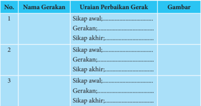

Tabel ini berisi informasi tentang uraian perbaikan gerakan, yang terdiri dari tiga baris dengan judul "No.", "Nama Gerakan", dan "Uraian Perbaikan Gerakan". Setiap baris memiliki kolom untuk menunjukkan sikap awal, gerakan, dan sikap akhir dari setiap gerakan. Gambar juga disertakan untuk visualisasi. Topik utama tabel ini adalah perbaikan gerakan, yang melibatkan pengecekan sikap awal, gerakan, dan sikap akhir setiap gerakan. Data penting yang terlihat adalah bahwa setiap baris memiliki tiga kolom yang berbeda untuk menunjukkan sikap awal, gerakan, dan sikap akhir dari setiap gerakan.

Kategori  keterampilan  gerak  aktivitas  atletik  keterampilan  gerak  jalan/jalan cepat,lari, lempar, dan lompat di rancang seperti aktivitas pembelajaran di atas. Guru dapat mengembangkannya lagi sesuai dengan karakteristik dan kebutuhan peserta didik serta keadaan lingkungan sekolah.

 

---
## 📄 Halaman 59

### D. Pelaksanaan Penilaian

### 1.  Penilaian Pengetahuan

Setelah  mempelajari  materi  kategori  keterampilan  gerak  Aktivitas  atletik, peserta didik mengerjakan tugas kelompok dengan penuh rasa tanggung jawab menjawab berbagai  pertanyaan  yang  berhubungan  dengan  analisis  dan  konsep kategori keterampilan  gerak  aktivitas atletik.  Berikut  contoh  rubrik  untuk penilaian pengetahuan

---
**📊 Tabel**

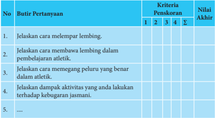

Tabel ini berisi pertanyaan-pertanyaan tentang atletik dan kebugaran jasmani, dengan kriteria pengevaluasi yang mencakup empat kriteria (1, 2, 3, dan 4) dan nilai akhir untuk setiap pertanyaan. Topik utama tabel adalah tentang melempar lembing, membawa lembing dalam pembelajaran atletik, memegang peluru yang benar dalam atletik, dan dampak aktivitas yang dilakukan terhadap kebugaran jasmani. Kolom-kolomnya meliputi nomor pertanyaan, butir pertanyaan, kriteria pengevaluasi, dan nilai akhir. Data penting yang terlihat adalah bahwa pertanyaan-pertanyaan tersebut mencakup berbagai aspek atletik dan kebugaran jasmani, dan nilai akhir untuk setiap pertanyaan dapat mencapai maksimal 4.

Jumlah skor yang diperoleh

Penilaian pengetahuan =

Jumlah skor maksimal

### Keterangan:

Nilai 1

: jika komponen jawaban kurang secara kualitas dan kuantitas

Nilai 2

: jika komponen jawaban cukup secara kualitas dan kuantitas

Nilai 3

: jika komponen jawaban baik secara kualitas dan kuantitas

Nilai 4

: jika komponen jawaban sangat baik secara kualitas dan kuantitas

### 2.  Penilaian Keterampilan

Penilaian aspek keterampilan dilakukan terhadap kesempurnaan/keterampilan sikap/cara  melakukan  proses  suatu  gerakan  (penilaian  proses).  Berikut  contoh rubrik penilaian keterampilan:

X 100

 

---
## 📄 Halaman 60

---
**📊 Tabel**

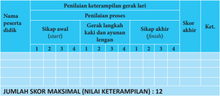

Tabel ini menunjukkan proses penilaian keterampilan gerak lari untuk satu peserta didik. Topik utamanya adalah penilaian keterampilan gerak lari, yang melibatkan sikap awal (start), proses gerak lari kaki dan ayunan lengan, dan sikap akhir (finish). Kolom-kolomnya mencakup skor awal, skor proses, skor akhir, dan ketentuan. Data penting yang terlihat adalah bahwa jumlah skor maksimal adalah 12, dengan skor awal, proses, dan akhir masing-masing berada di rentang 1 hingga 4. Ini menunjukkan bahwa penilaian ini menggunakan skala tertinggi 4 untuk setiap aspek penilaian.

Kriteria penilaian:

- 1 = kurang terampil
- 2 = cukup terampil
- 3 = terampil
- 4 = lebih terampil
Penilaian keterampilan

### 3.  Penilaian Sikap

Penilaian aspek sikap (sikap) dilakukan dengan pengamatan selama mengikuti kegiatan  belajar  mengajar.  Pengamatan  dalam  proses  penilaian  dilakukan  saat peserta  didik  pembelajaran  aktivitas  atletik.  Aspek-aspek  yang  dinilai  meliputi: kerjasama, tanggung jawab, menghargai teman, disiplin, dan toleransi. Berikan tanda cek (✓) pada kolom yang sudah disediakan, setiap peserta peserta didik menunjukkan atau menampilkan sikap yang diharapkan. Tiap sikap yang dicek (✓) dengan rentang skor antara 1 sampai dengan 4 dengan kriteria sebagai berikut:

- 4 = sangat baik
- 3 = baik
- 2 = cukup
- 1 = kurang
Jumlah skor yang diperoleh

=

Jumlah skor maksimal

X 100

 

---
## 📄 Halaman 61

### Contoh rubrik penilaian sikap

Jumlah skor yang diperoleh

Penilaian keterampilan =

Jumlah skor maksimal

### 4.  Rekapitulasi penilaian aktivitas atletik

---
**📊 Tabel**

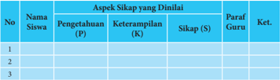

Tabel ini menunjukkan aspek sikap yang dilakukan oleh beberapa siswa dalam sebuah kegiatan belajar. Topik utama tabel adalah aspek sikap, yang meliputi pengetahuan (P), keterampilan (K), dan sikap (S). Kolom-kolom yang ada dalam tabel adalah Nama Siswa, Pengetahuan (P), Keterampilan (K), Sikap (S), Paraf Guru, dan Ket. Data atau pola penting yang terlihat dalam tabel ini adalah bahwa setiap siswa memiliki satu baris di tabel, dan mereka diberikan nilai untuk pengetahuan, keterampilan, dan sikap mereka. Selain itu, para guru juga memberikan paraf untuk setiap siswa, yang mungkin berisi komentar atau ulasan tentang perilaku atau prestasi siswa tersebut.

### Keterangan

- Mendapat nilai Sangat Baik
- , jika skor antara = 95 - 100
- Mendapat nilai Baik , jika skor antara
= 85 - 94

- Mendapat nilai Cukup , jika skor antara = 75 - 84
- Mendapat nilai Kurang , jika skor antara = 60 - 74
- Mendapat nilai Kurang
- Sekali, jika skor antara < 60
X 100

 

---
## 📄 Halaman 62

### E. Pelaksanaan Remedial dan Pengayaan

Pelaksanaan  remedial  dilakukan  apabila  terdapat  siswa  mendapatkan  nilai kurang dari KKM (75) atau pada kategori kurang (60-74) dan kurang sekali (< 60). Sedangkan, pengayaan dapat dilakukan pada siswa yang telah mendapatkan nilai baik (85-94) dan sangat baik (95-100). Remedial dan pengayaan dapat dilakukan pada aspek pengetahuan, sikap, dan keterampilan. Berikut contoh format remedial dan pengayaan.Contoh format remedial/pengayaan:

 

---
## 📄 Halaman 63

---
**📊 Tabel**

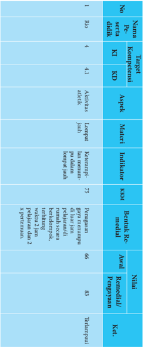

Tabel ini menunjukkan informasi tentang penilaian kompetensi siswa dalam mata pelajaran Matematika. Topik utama tabel adalah penilaian kompetensi siswa dalam menguasai konsep dan metode matematika. Kolom-kolom yang ada meliputi nomor soal (No.), nomor pendaftaran siswa (Roo), nomor kelas (Kl), dan nomor subtopik (KD). Data penting yang terlihat adalah nilai akhir siswa sebesar 83, dengan penilaian terhadap kompetensi matematika sebesar 66 dan penilaian terhadap kompetensi keterampilan sebesar 85. Siswa ini dinyatakan telah memenuhi persyaratan untuk lulus dalam mata pelajaran tersebut.

 

---
## 📄 Halaman 64

---
**🖼️ Gambar/Diagram**

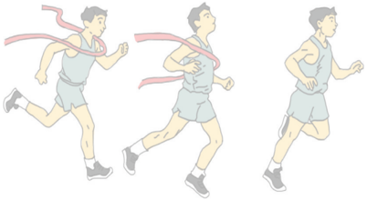

> **Deskripsi Visual:** Gambar ini adalah ilustrasi yang menunjukkan seorang atlet lari berlari dengan menggunakan teknik jalan yang tepat. Ilustrasi ini mencakup tiga posisi berbeda dari gerakan lari tersebut. Atlet tersebut memegang pita warna merah yang menunjukkan jalur atau garis yang harus dilewati saat berlari. Pada setiap posisi, atlet tersebut menunjukkan posisi tubuhnya yang berbeda-beda untuk menghindari kecelakaan dan meningkatkan efisiensi gerakan.

Elemen utama dalam gambar ini meliputi atlet lari, pita merah, dan posisi tubuh atlet. Pita merah menunjukkan jalur atau garis yang harus dilewati saat berlari. Posisi tubuh atlet pada setiap posisi menunjukkan teknik jalan yang tepat untuk menghindari kecelakaan dan meningkatkan efisiensi gerakan.

Teks, angka, atau label penting yang terlihat dalam gambar ini adalah posisi tubuh atlet pada setiap posisi dan pita merah yang menunjukkan jalur atau garis yang harus dilewati saat berlari.

Informasi kunci yang dapat diambil pembaca dari gambar ini adalah pentingnya teknik jalan yang tepat dalam olahraga lari untuk menghindari kecelakaan dan meningkatkan efisiensi gerakan.

---
**🖼️ Gambar/Diagram**

> **Deskripsi Visual:** Gambar ini adalah diagram yang menunjukkan struktur atau konten dari buku pelajaran untuk kelas XI SMA/MA/SMK/MAK. Diagram ini terdiri dari beberapa bagian yang berbeda, masing-masing menunjukkan sebagian dari materi yang akan dipelajari oleh siswa. Bagian paling atas menunjukkan jumlah halaman buku, yaitu 56 halaman. Di bawah itu, ada beberapa bagian yang menunjukkan topik-topik utama yang akan dipelajari, seperti "Buku Guru", "Kelas XI", "SMA/MA/SMK/MAK". Setiap bagian ini memiliki warna yang berbeda untuk menunjukkan bahwa mereka merupakan bagian yang berbeda dari buku tersebut. Diagram ini memberikan gambaran umum tentang struktur dan isi buku pelajaran tersebut.

 

---
## 📄 Halaman 65

### BAB V Pembelajaran Menganalisis Strategi Pertarungan Bayangan Olahraga Beladiri (Pencaksilat)

Bab ini membahas tentang aktivitas strategi pertarungan bayangan olahraga beladiri (pencaksilat), guru dapat menyesuaikan aktivitas beladiri dengan kondisi sekolah, karakteristik peserta didik, dan lingkungan sekitar sekolah.

### A. Kompetensi Dasar dan Indikator Pembelajaran

Kompetensi dasar dan indikator pembelajaran analisis kategori keterampilan gerak aktivitas beladiri adalah sebagai berikut:

---
**📊 Tabel**

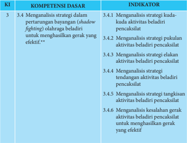

Tabel ini berisi informasi tentang kompetensi dasar yang berkaitan dengan analisis strategi dalam pertarungan bayangan (shadow fighting) oleh para beladiri untuk mencapai gerak yang efektif. Topik utama tabel adalah "Menganalisis strategi dalam pertarungan bayangan". Kolom-kolomnya meliputi KI (Kompetensi Dasar), Indikator, dan Sub-Indikator. Data penting yang terlihat adalah bahwa tabel mencakup 6 sub-indikator yang membahas berbagai aspek analisis strategi, seperti kuda-kuda aktivitas beladiri pencakskat, pukulan aktivitas beladiri pencakskat, strategi elakan aktivitas beladiri pencakskat, tendangan aktivitas beladiri pencakskat, tangkisan aktivitas beladiri pencakskat, dan keselalan gerak aktivitas beladiri pencakskat. Ini menunjukkan bahwa tabel ini fokus pada analisis strategi secara mendalam dalam konteks pertarungan bayangan.

 

---
## 📄 Halaman 66

---
**📊 Tabel**

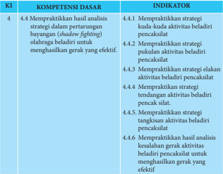

Tabel ini berisi informasi tentang kompetensi dasar 4.4 dalam bidang analisis strategi pertarungan bayangan (shadow fighting) untuk memperbaiki gerak yang efektif. Topik utama tabel adalah praktikasi strategi dalam pertarungan bayangan, yang meliputi kuda-kuda aktivitas beladiri pencak silat, penekanan strategi dalam aktivitas beladiri pencak silat, dan tindakan strategis dalam aktivitas beladiri pencak silat. Indikator-indikator tersebut mencakup praktik strategi kuda-kuda, penekanan strategi dalam aktivitas beladiri pencak silat, tindakan strategis dalam aktivitas beladiri pencak silat, dan praktik strategi tangkisan dalam aktivitas beladiri pencak silat. Data penting yang terlihat adalah bahwa tabel ini mencakup berbagai aspek praktik strategi dalam pertarungan bayangan, mulai dari kuda-kuda hingga tangkisan, dengan tujuan untuk meningkatkan efektivitas gerak dalam beladiri pencak silat.

### B. Tujuan Pembelajaran

Setelah mengikuti kegiatan pembelajaran ini, peserta didik diharapkan mampu:

- Memiliki kesadaran tentang arti penting merawat tubuh sebagai wujud syukur terhadap Tuhan Yang Maha Esa.
- Menunjukkan perilaku bertanggung jawab terhadap pemeliharaan sarana dan prasarana pembelajaran aktivitas beladiri pencaksilat.
- Menunjukkan  perilaku  santun  dan  toleransi  selama  beraktivitas  beladiri pencaksilat.
- Menganalisis  dan  mempraktikkan  keterampilan  gerak  strtaegi  kuda-kuda dalam  aktivitas  beladiri  pencaksilat  dengan  menunjukkan  nilai  sportivitas, kerjasama, dan disiplin.
- Menganalisis dan mempraktikkan keterampilan gerak strategi pukulan dalam aktivitas beladiri pencaksilat dengan menunjukkan nilai sportivitas, kerjasama, dan disiplin.
- Menganalisis  dan  mempraktikkan keterampilan gerak strategi  elakan  dalam aktivitas beladiri pencaksilat dengan menunjukkan nilai sportivitas, kerjasama, dan disiplin.

 

---
## 📄 Halaman 67

- Menganalisis  dan  mempraktikkan  keterampilan  gerak  strategi  tendangan dalam  aktivitas  beladiri  pencaksilat  dengan  menunjukkan  nilai  sportivitas, kerjasama, dan disiplin.
- Menganalisis dan mempraktikkan keterampilan gerak strategi tangkisan dalam aktivitas beladiri pencaksilat dengan menunjukkan nilai sportivitas, kerjasama, dan disiplin.
- Menganalisis  dan  mempraktikkan  strategi  pertarungan  bayangan  dalam aktivitas beladiri pencaksilat dengan menunjukkan nilai sportivitas, kerjasama, dan disiplin.

### C. Aktivitas Pembelajaran

### 1.  Aktivitas Pembelajaran Analisis Kategori Keterampilan Gerak Aktivitas Beladiri Pencaksilat

Pembelajaran aktivitas beladiri pencaksilat dapat dilakukan dengan aktivitas berpasangan atau pertarungan bayangan. Berikut contoh aktivitas belajar beladiri pencaksilat secara berpasangan/pertarungan bayangan:

### a.  Aktivitas Pembelajaran Gerak Pukulan dan Elakan

Tempat

: aula/ hall dengan matras/lantai yang empuk

Formasi

: berhadapan/berpasangan

- Tugaskan  kepada  peserta  didik  untuk  berpasangan  dan  berdiri  saling berhadapan  dengan  jarak  satu  lengan,  berdiri  dengan  sikap  kuda-kuda kanan/kiri depan.
- Tugaskan kepada salah satu peserta didik maju kaki kanan pukul tangan kanan  dan  peserta  didik  yang  lain  mundur  kaki  kiri  elakan  (kuda-kuda belakang).
- Tugaskan  kepada  salah  satu  peserta  didik  maju  kaki  kiri  pukul  tangan kiri  dan  peserta  didik  yang  lain  mundur  kaki  kanan  elakan  (kuda-kuda belakang).
- Tugaskan kepada salah satu peserta didik maju kaki kanan pukul tangan kanan dan peserta didik yang lain mundur kaki kanan elakan (kuda-kuda belakang).
- Tugaskan  salah  satu  peserta  maju  kaki  kanan  pukul  tangan  kanan  dan peserta didik yang lain kaki kiri geser ke samping kiri elakan (kuda-kuda samping kiri).
- Setelah peserta didik mengerti dan memahami gerakan tersebut, gunakan aba-aba/hitungan untuk melakukan setiap gerakan.

 

---
## 📄 Halaman 68

- Pertanyakan kepada peserta didik: seberapa cepat pukulan dilakukan agar lawan tidak mampu mengelak?, kapan pukulan lurus, tegak, bandul, dan melingkar  dilakukan?,  jenis  elakan  apa  yang  cocok  untuk  menghindari pukulan lurus, tegak, bandul, dan melingkar?, dan pertanyaan lainnya.
- Tugaskan kepada peserta didik untuk mengeksplorasi pertanyaanpertanyaan tersebut dalam melakukan aktivitas belajar.
- Tugaskan  pula  kepada  peserta  didik  untuk  melakukan  aktivitas  belajar berpasangan dengan menerapkan nilai sportivitas, kerjasama, dan disiplin dalam melakukan aktivitas belajar.
- Tugaskan  peserta  didik  melaksanakan  rencana  perbaikan  dari  aktivitas yang  baru  saja  dilakukan  baik  sendiri,  bersama  teman  atau  guru  untuk menghasilkan gerak yang efektif sesuai ketentuan gerakan yang ada.
- Selama  peserta  didik  melakukan  aktivitas  belajar  tersebut,  guru  menilai kemajuan yang diperoleh oleh peserta didik.
Variasi: setelah peserta didik teramati mengalami kemajuan dalam melakukan pukulan  dan  elakan,  tugaskan  mereka  untuk  mengunakan  tendangan  dan tangkisan, dan juga tugaskan mereka untuk melakukan berbagai variasi gerakan pukulan, tendangan, tangkisan dan elakan. Agar kegiatan menarik bagi peserta didik, aktivitas belajar ini dapat dikembangkan lagi oleh guru.

Kategori  keterampilan  gerak  aktivitas  beladiri  lainnya  seperti:  tendangan dan  tangkisan  dirancang  seperti  aktivitas  pembelajaran  di  atas.  Guru  dapat mengembangkannya lagi sesuai dengan karakteristik dan kebutuhan peserta didik serta keadaan lingkungan sekolah.

### D. Pelaksanaan Penilaian

### 1.  Penilaian Pengetahuan

Setelah mempelajari materi kategori keterampilan gerak dan strategi pertarungan bayangan aktivitas beladiri pencaksilat, para peserta didik mengerjakan tugas dengan penuh rasa tanggung jawab dengan menjawab berbagai pertanyaan. Berikut contoh rubrik untuk penilaian pengetahuan

---
**📊 Tabel**

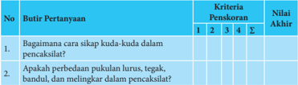

Tabel ini berisi pertanyaan tentang sikap kuda-kuda dalam pencaksikan, dengan kriteria pengevaluasi yang mencakup empat kriteria: 1, 2, 3, dan 4. Pertanyaan pertama bertujuan untuk mengetahui bagaimana sikap kuda-kuda dalam pencaksikan, sementara pertanyaan kedua bertujuan untuk memeriksa apakah perbedaan pukulan lurus, tegak, bandul, dan melingkar dalam pencaksikan. Data yang diberikan menunjukkan bahwa nilai akhir pertanyaan pertama adalah 2, sedangkan nilai akhir pertanyaan kedua adalah 5. Topik utama tabel ini adalah sikap kuda-kuda dalam pencaksikan dan penilaian kualitasnya.

 

---
## 📄 Halaman 69

---
**📊 Tabel**

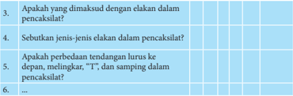

Tabel ini berisi pertanyaan-pertanyaan tentang elakan dalam pencaksilat, yang merupakan cabang olahraga pencak silat. Topik utama tabel adalah jenis-jenis elakan dan perbedaan tendangan lurus ke depan, melingkar, "I", dan samping dalam pencaksilat. Kolom pertama adalah nomor pertanyaan, sedangkan kolom kedua dan ketiga adalah jawaban yang diberikan. Data penting yang terlihat adalah bahwa semua pertanyaan memiliki jawaban yang diberikan, menunjukkan bahwa tabel ini mungkin digunakan sebagai alat untuk mempelajari atau menguji pemahaman tentang elakan dalam pencaksilat.

Jumlah skor yang diperoleh

=

Jumlah skor maksimal

Penilaian pengetahuan

### Keterangan:

Nilai 1

: jika komponen jawaban kurang secara kualitas dan kuantitas

Nilai 2

: jika komponen jawaban cukup secara kualitas dan kuantitas

Nilai 3

: jika komponen jawaban baik secara kualitas dan kuantitas

Nilai 4

: jika komponen jawaban sangat baik secara kualitas dan kuantitas

### 2.  Penilaian Keterampilan

Penilaian aspek keterampilan dilakukan terhadap kesempurnaan/keterampilan sikap/cara melakukan proses suatu gerakan (penilaian proses). Tugaskan peserta didik untuk melakukan keterampilan-keterampilan gerak dalam aktivitas beladiri pencaksilat seperti sikap kuda-kuda, pukulan, tendangan, elakan, dan tangkisan, kemudian buatlah rubrik penilaian keterampilan seperti contoh berikut:

---
**🖼️ Gambar/Diagram**

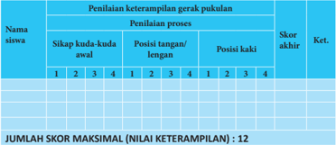

> **Deskripsi Visual:** Gambar ini adalah tabel yang menunjukkan skor keterampilan gerak pukulan siswa berdasarkan penilaian proses mereka. Tabel tersebut terdiri dari kolom yang mencakup nama siswa, sikap kuda-kuda awal, posisi tangan/lengan, posisi kaki, dan skor akhir. Setiap siswa memiliki empat sikap kuda-kuda awal, dua posisi tangan/lengan, dan dua posisi kaki, yang kemudian diberikan skor dari 1 hingga 4. Skor maksimal untuk setiap siswa adalah 12, yang ditentukan oleh jumlah skor tertinggi yang diberikan pada posisi tangan/lengan dan posisi kaki.

Elemen-elemen utama dalam tabel ini adalah nama siswa, sikap kuda-kuda awal, posisi tangan/lengan, posisi kaki, dan skor akhir. Relasi antara elemen-elemen ini adalah bahwa setiap siswa memiliki empat sikap kuda-kuda awal, dua posisi tangan/lengan, dan dua posisi kaki, yang kemudian diberikan skor dari 1 hingga 4. Teks, angka, atau label penting yang terlihat dalam tabel ini meliputi nama siswa, sikap kuda-kuda awal, posisi tangan/lengan, posisi kaki, dan skor akhir.

Informasi kunci yang dapat diambil pembaca dari tabel ini adalah skor keterampilan gerak pukulan setiap siswa, yang ditentukan oleh jumlah skor tertinggi yang diberikan pada posisi tangan/lengan dan posisi kaki. Ini memberikan gambaran tentang seberapa baik siswa mampu melakukan gerakan pukulan dengan tepat dan efektif.

X 100

 

---
## 📄 Halaman 70

### Kriteria penilaian:

- 1 = kurang terampil
- 2 = cukup terampil
- 3 = terampil
- 4 = lebih terampil
Penilaian keterampilan

### 3.  Penilaian Sikap

Penilaian aspek sikap (sikap) dilakukan dengan pengamatan selama mengikuti kegiatan  belajar  mengajar.  Pengamatan  dalam  proses  penilaian  dilakukan  saat peserta didik melakukan pembelajaran aktivitas pertarungan bayangan olahraga beladiri  (pencaksilat).  Aspek-aspek  yang  dinilai  meliputi:  kerjasama,  tanggung jawab,  menghargai  teman,  disiplin,  dan  toleransi.  Hasil  pengamatan  tentang perilaku positif/negatif peserta didik dicatat dalam bentuk jurnal yang nantinya dapat digunakan guru dalam mengembangkan karakter peserta didik.

Jumlah skor yang diperoleh

=

Jumlah skor maksimal

X 100

 

---
## 📄 Halaman 71

---
**📊 Tabel**

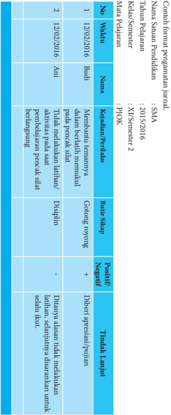

Tabel ini menunjukkan data tentang pelaporan kinerja pelajar untuk semester 2 tahun akademik 2015/2016. Topik utamanya adalah evaluasi kinerja pelajar dalam dua mata pelajaran: MATA PELAJARAN 1 dan MATA PELAJARAN 2. Tabel terdiri dari kolom-kolom berikut:

1. No: Nomor urut pelaporan.
2. Waktu: Waktu pelaporan (12/02/2016).
3. Nama: Nama pelajar.
4. Kehadiran/Pendudukan: Kehadiran atau penduduk pelajar.
5. Bahasa: Bahasa yang diajarkan.
6. Nilai: Nilai yang diberikan oleh guru.
7. Tindak Lanjut: Tindakan yang dilakukan oleh pelajar sesuai dengan nilai yang diberikan.

Data penting yang terlihat:
- Pelajar yang kehadiran rendah (kurang dari 80%) menerima tindakan khusus seperti diskusi dengan guru atau peningkatan keterampilan bahasa.
- Beberapa pelajar mendapatkan nilai yang sangat rendah, yang mungkin memerlukan tindakan lebih lanjut seperti konseling atau bimbingan khusus.
- Tindakan pelajar yang diberikan mencakup diskusi, peningkatan keterampilan, dan peningkatan keterampilan bahasa.

 

---
## 📄 Halaman 72

### E. Pelaksanaan Remidial dan Pengayaan

Pelaksanaan  remedial  dilakukan  apabila  terdapat  siswa  mendapatkan  nilai kurang dari KKM (75) atau pada kategori kurang (60-74) dan kurang sekali (< 60). Sedangkan, pengayaan dapat dilakukan pada siswa yang telah mendapatkan nilai baik (85-94) dan sangat baik (95-100). Remedial dan pengayaan dapat dilakukan pada aspek pengetahuan, sikap, dan keterampilan. berikut contoh format remedial dan pengayaan.

 

---
## 📄 Halaman 73

---
**📊 Tabel**

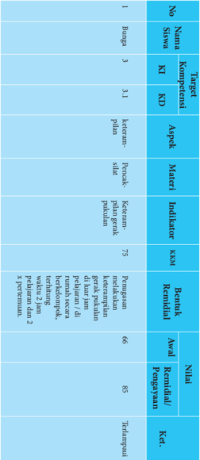

Tabel ini menunjukkan data tentang penilaian kompetensi siswa dalam mata pelajaran Bahasa Indonesia. Topik utamanya adalah keterampilan penulisan, dengan fokus pada kemampuan menulis artikel. Tabel terdiri dari kolom berikut: Target Kompetensi, No, Nama Siswa, KI, KD, Appek, Materi, Indikator, KKM, Bank Rendah/Perangkat, Awal Penilaian, Penyertaan, dan Nilai. Data penting yang terlihat adalah bahwa seorang siswa bernama Bengko mendapatkan nilai 75 untuk keterampilan penulisan artikel, sementara siswa lainnya mendapatkan nilai 66 dan 85. Ini menunjukkan variasi dalam penilaian, dengan beberapa siswa mendapatkan nilai lebih tinggi dibandingkan dengan yang lain.

 

---
## 📄 Halaman 74

---
**🖼️ Gambar/Diagram**

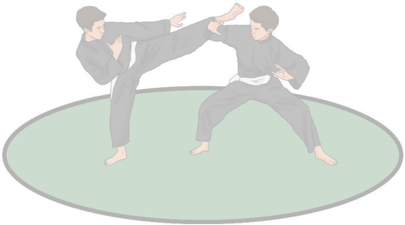

> **Deskripsi Visual:** Gambar ini adalah ilustrasi yang menunjukkan dua orang melakukan teknik beladiri. Dua orang tersebut berada di atas lantai hijau dengan latar belakang putih. Pria pertama sedang melakukan gerakan kick dengan kaki kanan ke arah kiri, sementara pria kedua berdiri dengan posisi tangan di depan tubuh dan kaki di belakang. Kedua orang tersebut mengenakan seragam hitam dengan sabuk biru di pinggul. Gambar ini menunjukkan teknik beladiri yang melibatkan gerakan kaki dan tangan untuk menjaga kekuatan dan kontrol saat berlatih.

 

---
## 📄 Halaman 75

### BAB VI Pembelajaran Menganalisis Konsep Latihan Dan Pengukuran Kebugaran Jasmani Terkait Keterampilan Gerak

Bab ini membahas tentang kebugaran jasmani, guru dapat memilih berbagai latihan dan pengukuran kebugaran jasmani yang sesuai dengan kondisi sekolah dan karakteristik peserta didik.

### A. Kompetensi Dasar dan Indikator Pembelajaran

Kompetensi dasar dan indikator pembelajaran menganalisis konsep pengukuran kebugaran jasmani adalah sebagai berikut:

---
**📊 Tabel**

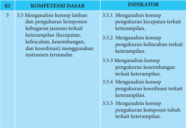

Tabel ini berisi informasi tentang kompetensi dasar yang harus dipenuhi oleh siswa dalam menguji keterampilan mereka. Topik utamanya adalah "Menganalisis konsep pengukuran komponen jasmani terkait keterampilan". Tabel ini terdiri dari dua kolom: KI (Kompetensi Dasar) dan Indikator. Kolom KI mencakup 5 subtopik, yaitu menganalisis konsep pengukuran kecepatan, kecepatan kelincahan, keseimbangan, koordinasi, dan komposisi tubuh. Setiap subtopik tersebut memiliki indikator yang menunjukkan bagaimana siswa harus dapat melakukan analisis konsep tersebut menggunakan instrumen tertentu. Misalnya, untuk subtopik menganalisis kecepatan, indikatornya adalah "menganalisis konsep pengukuran kecepatan terkait keterampilan". Ini menunjukkan bahwa siswa harus mampu menguji dan memahami bagaimana kecepatan berperan dalam keterampilan tertentu.

 

---
## 📄 Halaman 76

---
**📊 Tabel**

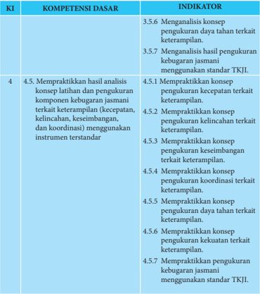

Tabel ini berisi informasi tentang kompetensi dasar dan indikator yang harus dipraktikkan oleh siswa dalam menguasai konsep dan pengukuran kebugaran jasmani. Topik utama tabel adalah mempraktekkan analisis konsep latihan dan pengukuran komponen kebugaran jasmani, termasuk kecepatan, kelincahan, keseimbangan, dan koordinasi. Kolom-kolomnya meliputi KI (Kompetensi Integritas), KOMPETENSI DASAR, dan INDIKATOR. Data penting yang terlihat adalah bahwa siswa harus mampu melakukan analisis konsep dan pengukuran berbagai komponen kebugaran jasmani dengan menggunakan standar TKJL. Ini menunjukkan bahwa pembelajaran fokus pada praktik dan penilaian yang sesuai dengan standar yang ditetapkan.

### B. Tujuan Pembelajaran

Setelah mengikuti kegiatan pembelajaran ini, peserta didik diharapkan mampu:

- Memiliki kesadaran tentang arti penting merawat tubuh sebagai wujud syukur terhadap Tuhan Yang Maha Esa.
- Menunjukkan perilaku bertanggungjawab terhadap pemeliharaan sarana dan prasarana pembelajaran menganalisis konsep pengukuran kebugaran jasmani.
- Menunjukkan  perilaku  santun  dan  toleransi  selama  menganalisis  konsep pengukuran kebugaran jasmani.

 

---
## 📄 Halaman 77

- Menganalisis dan mempraktikkan konsep pengukuran kecepatan tubuh terkait keterampilan dengan menunjukkan nilai sportivitas, kerjasama, dan disiplin.
- Menganalisis  dan  mempraktikkan  konsep  pengukuran  kelincahan  terkait keterampilan dengan menunjukkan nilai sportivitas, kerjasama, dan disiplin.
- Menganalisis dan mempraktikkan konsep pengukuran keseimbangan terkait keterampilan dengan menunjukkan nilai sportivitas, kerjasama, dan disiplin.
- Menganalisis dan mempraktikkan konsep pengukuran koordinasi tubuh terkait keterampilan dengan menunjukkan nilai sportivitas, kerjasama, dan disiplin.
- Menganalisis dan mempraktikkan konsep pengukuran power terkait keterampilan dengan menunjukkan nilai sportivitas, kerjasama, dan disiplin.
- Menganalisis dan mempraktikkan konsep pengukuran daya tahan dan kekuatan terkait  keterampilan  dengan  menunjukkan  nilai  sportivitas,  kerjasama,  dan disiplin.
- Menganalisis dan mempraktikkan pengukuran kebugaran jasmani menggunakan standar TKJI dengan menunjukkan nilai sportivitas, kerjasama, dan disiplin.

### C. Aktivitas Pembelajaran

### 1.  Aktivitas Pembelajaran Analisis Konsep Pengkuran Kebugaran Jasmani

Pembelajaran analisis konsep pengukuran kebugaran jasmani dapat dilakukan dengan aktivitas berpasangan dan berkelompok sebagai berikut:

### a.  Aktivitas Pembelajaran Berpasangan

Alat

: peluit/ stopwatch /kapur/alas busa

Tempat

: aula/ hall /ruangan yang memadai

Formasi

: berpasangan

- Tugaskan  peserta  didik  untuk  mencari  pasangan  sehingga  berpasangpasangan.
- Tugaskan kepada peserta didik untuk melakukan latihan kebugaran jasmani yang  meliputi:  latihan power ,  kecepatan,  dan  kelincahan,  keseimbangan, koordinasi secara berpasangan.
- Tugaskan pula kepada peserta didik untuk melakukan pengukuran terhadap komponen-komponen kebugaran jasmani yang dilatihkan tersebut dengan tes pengukuran yang telah tersedia dalam buku peserta didik.
- Tanyakan kepada peserta didik: apakah bentuk latihan yang efektif untuk meningkatkan kelincahan?, bagaimana mengukur kemampuan kelincahan?, bentuk-bentuk  latihan  seperti  apa  yang  dapat  meningkatkan  kecepatan, keseimbangan, koordinasi?, dan pertannyaan lainnya.

 

---
## 📄 Halaman 78

- Tugaskan peserta didik untuk mengeksplorasi pertanyaan dengan melakukan latihan dan pengukuran setiap komponen kebugaran jasmani.
- Tugaskan peserta didik untuk melakukan latihan dan pengukuran komponen  kebugaran  jasmani  dengan  menerapkan  nilai  kerjasama  dan disiplin.
- Tugaskan kepada setiap peserta didik untuk mempresentasikan hasil latihan kebugaran jasmani masing-masing di depan kelas.
- Selama peserta didik melakukan aktivitas belajar, guru menilai kemajuan yang  diperoleh  oleh  peserta  didik,  baik  dari  segi  pengetahuan,  sikap, maupun keterampilan.
Variasi: Agar kegiatan menarik bagi peserta didik, aktivitas belajar ini dapat dikembangkan lagi, baik oleh peserta didik sendiri maupun guru. Misalkan melakukan latihan komponen-komponen kebugaran jasmani dengan berbagai bentuk latihan yang sesuai karakteristik dan kebutuhan peserta didik

### b.  Aktivitas Pembelajaran Kelompok mengukur Kebugaran Jasmani

Alat

: peluit/ stopwatch /kapur/alas busa

Tempat

: lapangan

Formasi

: berkelompok

- Tugaskan kepada peserta didik untuk membuat kelompok sebanyak 5-6 orang
- Tugaskan kepada peserta didik untuk membuat lapangan untuk setiap butir tes yang terdapat dalam TKJI usia 16-19 tahun.
- Tugaskan  kepada  peserta  didik  untuk  menentukan  peran  sebagai  testi (orang yang dites), testor (orang yang mengetes), dan pencatat hasil.
- Tugaskan kepada peserta didik untuk melakukan pengukuran kebugaran jasmani melalui rangkaian TKJI untuk usia 16-19 tahun dengan bergantian peran.
- Tugaskan peserta didik untuk menerapkan nilai kerjasama, kejujuran, dan disiplin.
- Setelah  semua peserta didik melakukan pengukuran terhadap kebugaran jasmaninya masing-masing, guru menugaskan untuk menganalisis hasilnya dengan kategori yang terdapat dalam TKJI.
- Tugaskan  kepada  setiap  peserta  didik  untuk  mempresentasikan  hasil pengukuran komponen kebugaran jasmani masing-masing di depan kelas.
- Selama  peserta  didik  melakukan  pengukuran  kebugaran  jasmani,  guru menilai kemajuan yang diperoleh oleh peserta didik.

 

---
## 📄 Halaman 79

### D. Pelaksanaan Penilaian

### 1.  Penilaian Pengetahuan

Setelah  mempelajari  materi  analisis  konsep  pengukuran  kebugaran  jasmani, para  peserta  didik  mengerjakan  tugas  dengan  penuh  rasa  tanggungjawab dengan  menjawab  berbagai  pertanyaan  yang  berhubungan  dengan  analisis konsep pengukuran kebugaran jasmani. Berikut contoh rubrik untuk penilaian pengetahuan

---
**📊 Tabel**

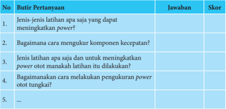

Tabel ini berisi pertanyaan dan jawaban tentang latihan untuk meningkatkan power otot dan kecepatan komponen. Topik utama adalah latihan untuk meningkatkan power otot dan kecepatan komponen. Kolom "No" menunjukkan nomor pertanyaan, "Butir Pertanyaan" menyajikan pertanyaan, "Jawaban" menyediakan jawaban, dan "Skor" menunjukkan skor untuk setiap jawaban. Data penting yang terlihat adalah bahwa pertanyaan 1 dan 2 bertujuan untuk meningkatkan power otot, sedangkan pertanyaan 3 dan 4 bertujuan untuk meningkatkan kecepatan komponen.

Jumlah skor yang diperoleh

Penilaian pengetahuan

=

X 100

Jumlah skor maksimal

### Keterangan:

Nilai 1

: jika komponen jawaban kurang secara kualitas dan kuantitas

Nilai 2

: jika komponen jawaban cukup secara kualitas dan kuantitas

Nilai 3

: jika komponen jawaban baik secara kualitas dan kuantitas

Nilai 4

: jika komponen jawaban sangat baik secara kualitas dan kuantitas

 

---
## 📄 Halaman 80

### 2.  Penilaian Keterampilan

Penilaian  aspek  keterampilan  dilakukan  terhadap  keterampilan  latihan  dan pengukuran  untuk  setiap  komponen  kebugaran  jasmani.  Tugaskan  peserta didik untuk melakukan latihan dan pengukuran komponen kebugaran jasmani, kemudian buatlah rubrik penilaian keterampilan seperti contoh berikut:

---
**📊 Tabel**

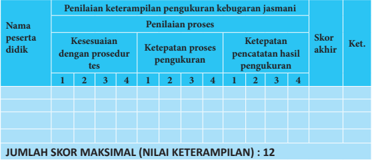

Tabel ini menunjukkan hasil penilaian keterampilan pengukuran kebugaran jasmani bagi seorang peserta didik. Topik utama tabel adalah keterampilan proses pengukuran kebugaran jasmani. Tabel dibagi menjadi dua bagian: penilaian proses dan penilaian keterampilan. Untuk setiap proses pengukuran, peserta didik diberikan skor dari 1 hingga 4 berdasarkan ketepatan dengan prosedur tes, ketepatan proses pengukuran, dan ketepatan pencatatan hasil pengukuran. Skor akhir ditentukan sebagai jumlah skor maksimal yang dapat diperoleh, yaitu 12. Data penting yang terlihat adalah bahwa peserta didik memiliki skor tertinggi pada proses pengukuran kebugaran jasmani, yaitu 4, sedangkan skor terendahnya pada proses pencatatan hasil pengukuran, yaitu 3.

Kriteria penilaian:

- 1 = kurang terampil
- 2 = cukup terampil
- 3 = terampil
- 4 = lebih terampil
Penilaian keterampilan

### 3.  Penilaian Sikap

Penilaian aspek sikap (sikap) dilakukan dengan pengamatan selama mengikuti kegiatan  belajar  mengajar.  Pengamatan  dalam  proses  penilaian  dilakukan  saat peserta didik pembelajaran kebugaran jasmani. Aspek-aspek yang dinilai meliputi: kerjasama, tanggung jawab, kejujuran, disiplin, dan toleransi. Hasil pengamatan tentang  perilaku  positif/negatif  peserta  didik  dicatat  dalam  bentuk  jurnal  yang dapat digunakan guru dalam mengembangkan karakter peserta didik.

Jumlah skor yang diperoleh

=

Jumlah skor maksimal

X 100

 

---
## 📄 Halaman 81

---
**🖼️ Gambar/Diagram**

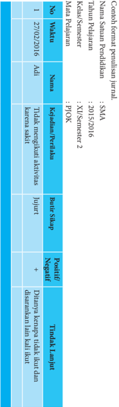

> **Deskripsi Visual:** Gambar ini adalah diagram yang menunjukkan data tentang status kesehatan fisik dan mental seorang individu selama periode tertentu. Diagram ini terdiri dari dua bagian utama: bagian atas berisi informasi tentang nama, tanggal, dan jenis kelamin, sementara bagian bawah berisi informasi tentang status kesehatan fisik dan mental.

Elemen utama yang terlihat dalam diagram ini meliputi:
1. Nama individu (tidak disebutkan dalam gambar)
2. Tanggal (27/02/2016)
3. Jenis kelamin (tidak disebutkan dalam gambar)
4. Status kesehatan fisik (Tidak meringkuk aktivitas)
5. Status kesehatan mental (Tidak mampu berjalan karena sakit)

Informasi kunci yang dapat diambil pembaca meliputi:
- Tanggal pengumpulan data (27/02/2016)
- Status kesehatan fisik dan mental individu pada saat itu
- Kondisi kesehatan fisik dan mental yang mempengaruhi kemampuan berjalan

Diagram ini digunakan untuk menggambarkan kondisi kesehatan individu pada waktu tertentu, membantu dalam analisis dan perencanaan perawatan kesehatan.

 

---
## 📄 Halaman 82

### E. Pelaksanaan Remedial dan Pengayaan

Pelaksanaan remedial dilakukan apabila terdapat peserta didik mendapatkan nilai kurang dari KKM (75) atau pada kategori kurang (60-74) dan kurang sekali (<  60).  Sedangkan,  pengayaan  dapat  dilakukan  pada  peserta  didik  yang  telah mendapatkan nilai baik (85-94) dan sangat baik (95-100). Remedial dan pengayaan dapat dilakukan pada aspek pengetahuan, sikap, dan keterampilan. berikut contoh format remedial dan pengayaan.

 

---
## 📄 Halaman 83

---
**📊 Tabel**

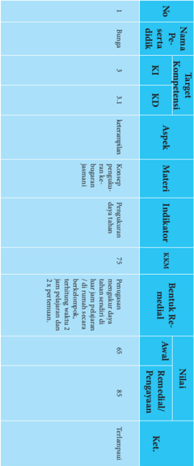

Tabel ini menunjukkan detail evaluasi pembelajaran untuk subjek Bahasa Inggris pada tingkat SD. Topik utama adalah "Keterampilan Berbicara", yang terbagi menjadi 3 subtopik: 1) Keterampilan Berbicara, 2) Keterampilan Berbicara dengan Penggunaan Pengucapan, dan 3) Keterampilan Berbicara dengan Penggunaan Pengucapan dan Penggunaan Pengucapan. Setiap subtopik memiliki kriteria (KI), kompetensi (KD), aspek (Aspek), materi (Materi), indikator (Indikator), dan rentang rekomendasi (Rentang Rekomendasi). Data yang penting meliputi nilai awal, nilai akhir, dan peningkatan nilai. Tabel ini membantu dalam pengawasan pembelajaran dan evaluasi kemajuan siswa dalam berbicara dalam bahasa Inggris.

 

---
## 📄 Halaman 84

---
**🖼️ Gambar/Diagram**

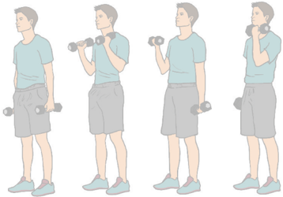

> **Deskripsi Visual:** Gambar ini adalah ilustrasi yang menunjukkan seorang pria sedang melakukan latihan dengan menggunakan dumbbell. Gambar ini menggambarkan tiga posisi berbeda dari gerakan latihan tersebut. Pada setiap posisi, pria tersebut memegang dumbbell di setiap tangan dan melibatkan otot-otot tubuhnya. Ilustrasi ini menunjukkan langkah-langkah yang perlu dilakukan untuk melakukan latihan tersebut dengan benar dan efektif. Ini adalah ilustrasi yang baik untuk membantu pembaca memahami cara melakukan latihan tersebut.

 

---
## 📄 Halaman 85

### BAB VII Pembelajaran Menganalisis Keterampilan Gerak Aktivitas Spesifik Senam Lantai

Dalam  bab  ini membahas  tentang  kategori keterampilan gerak  senam ketangkasan,  guru  dapat  memilih  jenis  kategori  keterampilan  gerak  aktivitas spesifik senam lantai / senam ketangkasan sesuai dengan kondisi sekolah.

### A. Kompetensi Dasar dan Indikator Pembelajaran

Kompetensi dasar dan indikator pembelajaran analisis kategori keterampilan gerak aktivitas spesifik senam lantai / senam ketangkasan adalah sebagai berikut:

---
**📊 Tabel**

Tabel ini berisi informasi tentang kompetensi dasar yang harus dipelajari oleh siswa dalam aktivitas senam lantai. Topik utama tabel adalah "Menganalisis berbagai keterampilan gerakan yang lebih kompleks dalam aktivitas spesifik senam lantai." Tabel ini terdiri dari dua kolom: "KOMPETENSI DASAR" dan "INDIKATOR". Kolom "KOMPETENSI DASAR" mencakup empat baris yang masing-masing menunjukkan keterampilan gerakan yang harus dipelajari, yaitu:
1. Menganalisis kategori gerak tumpuan kaki senam ketangkasan menggunakan peti lompat.
2. Menganalisis kategori gerak tumpuan senam ketangkasan menggunakan peti lompat.
3. Menganalisis kategori gerak tumpuan kaki senam ketangkasan menggunakan peti lompat.
4. Menganalisis kategori gerak pendaratan senam ketangkasan menggunakan peti lompat.

Indikator pada setiap baris tersebut menjelaskan bagaimana siswa harus melakukan analisis kategori gerakan tersebut. Misalnya, untuk indikator pertama, siswa harus menganalisis kategori gerak tumpuan kaki senam ketangkasan menggunakan peti lompat. Ini berarti siswa harus mempelajari cara melakukan gerakan tumpuan kaki senam ketangkasan dengan menggunakan peti lompat. Indikator-indikator lainnya memiliki tujuan yang sama, yaitu memberikan panduan tentang bagaimana siswa harus melakukan analisis kategori gerakan secara tepat dan efektif.

 

---
## 📄 Halaman 86

---
**📊 Tabel**

Tabel ini berisi informasi tentang kompetensi dasar (KD) yang harus dipraktikkan oleh siswa dalam aktivitas senam ketangkasan. Topik utama tabel adalah tentang mempraktekkan gerak yang lebih kompleks dalam aktivitas spesifik senam ketangkasan. Kolom-kolom yang ada meliputi KI (Kompetensi Dasar), KD, dan Indikator. Data penting yang terlihat adalah bahwa setiap KD memiliki beberapa indikator yang harus dipenuhi untuk mencapai kompetensi tersebut. Misalnya, KD 4.6.1 tentang mengidentifikasi jenis kesalahan gerak tumpuan kaki senantiasa ketangkasan menggunakan peti lompat, dan KD 4.6.2 tentang memperbaiki kesalahan dalam gerak tumpuan kaki senantiasa ketangkasan menggunakan peti lompat. Ini menunjukkan bahwa setiap KD memiliki indikator yang spesifik untuk dipenuhi agar siswa dapat mempraktekkan gerak yang lebih kompleks dalam aktivitas senam ketangkasan.

### B. Tujuan Pembelajaran

Setelah mengikuti kegiatan pembelajaran ini, peserta didik diharapkan mampu:

- Memiliki kesadaran tentang arti penting merawat tubuh sebagai wujud syukur terhadap Tuhan Yang Maha Esa.
- Menunjukkan perilaku bertanggungjawab terhadap pemeliharaan sarana dan prasarana pembelajaran keterampilan gerak senam ketangkasan.
- Menunjukkan  perilaku  santun  dan  toleransi  selama  melakukan  aktivitas keterampilan gerak senam ketangkasan.

 

---
## 📄 Halaman 87

- Menganalisis  dan  mempraktikkan  keterampilan  gerak  senam  ketangkasan (lompat  kangkang)  dengan  menunjukkan  nilai  sportivitas,  kerjasama,  dan disiplin.
- Menganalisis  dan  mempraktikkan  keterampilan  gerak  senam  ketangkasan (lompat  jongkok)  dengan  menunjukkan  nilai  sportivitas,  kerjasama,  dan disiplin.

### C. Aktivitas Pembelajaran

### 1.  Pembelajaran Analisis Kategori Keterampilan Gerak Senam Ketangkasan Lompat Kangkang

Pembelajaran keterampilan gerak senam ketangkasan, pengorganisasian siswa dapat dilakukan dengan aktivitas individual, berpasangan, dan berkelompok.

### a.  Aktivitas Pembelajaran Berkelompok

- Buat kelompok 5-6 orang.
- Masing-masing kelompok mendapatkan empat buah kardus bekas.
- Secara bergantian/urutan lompati sebuah kardus dengan kaki mengangkang.
- Secara bergantian/urutan lompati dua buah kardus dengan kaki mengangkang.
- Secara bergantian/urutan lompati tiga kardus dengan kaki mengangkang.
- Secara bergantian/urutan lompati empat kardus dengan kaki mengangkang.
- Saat melewati kardus tangan jangan menyentuh kardus.
- Saat mendarat usahakan dengan kedua kaki yang mengeper.
- Lakukan aktivitas tersebut terus-menerus secara bergantian/urutan sampai batas waktu yang ditentukan guru.
- 10)Perhatikan gambar 7.12

---
**🖼️ Gambar/Diagram**

> **Deskripsi Visual:** Gambar ini adalah ilustrasi yang menunjukkan proses pembuatan makanan. Gambar ini menggambarkan tiga orang yang sedang bekerja di sebuah dapur. Pada bagian atas, ada dua orang yang sedang memasak di atas meja dapur. Sementara itu, di bagian bawah, ada seorang pria yang sedang memotong sayuran dengan alat pemotong. Semua elemen ini saling terkait dan membentuk suatu proses yang berkelanjutan dalam pembuatan makanan. Teks, angka, atau label penting tidak terlihat pada gambar ini. Informasi kunci yang dapat diambil pembaca adalah bahwa ada tiga orang yang sedang bekerja dalam proses pembuatan makanan.

 

---
## 📄 Halaman 88

### b.  Aktivitas Pembelajaran Berpasangan

- Pilih teman yang seimbang denganmu.
- Berdiri rapat ke arah gerakan, minta temanmu melakukan posisi membungkuk dengan cara membuka kaki selebar bahu dan kedua tangan ditempelkan di lutut.
- Ambil langkah mundur 5 langkah dari posisi temanmu.
- Satu  langkah  sebelum  temanmu  tolakkan  kaki  kedua  ke  depan  atas bersamaan menumpukan kedua telapak tangan diatas punggung temanmu.
- Saat  terjadi  dorongan  ke  atas  kaki,  tungkai  dibuka  lebar-lebar  hingga melewati temanmu.
- Kedua kaki dirapatkan kembali sebelum penurunan.
- Pendaratan dilakukan dengan urutan ujung kaki, lalu seluruh kaki, lutut ditekuk.
- Lakukan aktivitas tersebut secara bergantian.
- Perhatikan gambar 7.13.

---
**🖼️ Gambar/Diagram**

> **Deskripsi Visual:** Gambar ini adalah ilustrasi yang menunjukkan berbagai jenis permainan olahraga yang umum ditemukan di lapangan sepak bola. Gambar ini mencakup beberapa elemen utama:

1. **Pertama**: Gambar ini menunjukkan berbagai permainan olahraga yang umum dilakukan di lapangan sepak bola, termasuk sepak bola, futsal, sepak bola basket, dan sepak bola voli.

2. **Elemen Utama dan Relasinya**: 
   - **Sepak Bola**: Dapat dilihat di bagian tengah dan kanan atas gambar.
   - **Futsal**: Terlihat di bagian kiri atas gambar.
   - **Sepak Bola Basket**: Terlihat di bagian bawah kanan gambar.
   - **Sepak Bola Volly**: Terlihat di bagian bawah kiri gambar.

3. **Teks, Angka, atau Label Penting**: 
   - Ada beberapa teks yang mungkin menyertakan nama-nama permainan atau informasi tambahan tentang setiap permainan, namun tidak dapat dilihat secara jelas dalam gambar ini.

4. **Informasi Kunci yang Dapat Diambil Pembaca**: 
   - Gambar ini memberikan gambaran umum tentang berbagai jenis permainan olahraga yang umum dilakukan di lapangan sepak bola, menunjukkan bahwa lapangan sepak bola dapat digunakan untuk berbagai jenis olahraga yang berbeda.

Dengan demikian, gambar ini menggambarkan berbagai jenis permainan olahraga yang umum dilakukan di lapangan sepak bola, menunjukkan fleksibilitas lapangan tersebut dalam mendukung berbagai jenis olahraga.

### c.  Aktivitas Pembelajaran Berkelompok

- Buat kelompok 5-6 orang.
- Siapkan tiga buah peti lompat yang tingginya bertahap.
- Lakukan melompati secara kangkang peti lompat yang pendek.
- Lakukan melompati secara kangkang peti lompat yang sedang.
- Lakukan melompati secara kangkang peti lompat yang tinggi.
- Saat melewati peti lompat, kedua tangan dapat menumpu di pangkal atau di ujung peti lompat untuk melakukan lompat kangkang/lompat jongkok.
- Saat mendarat usahakan dengan kedua kaki yang mengeper.

 

---
## 📄 Halaman 89

- Lakukan aktivitas tersebut terus-menerus secara bergantian sampai batas waktu yang ditentukan guru
- Perhatikan gambar 7.14.
Kategori keterampilan gerak senam ketangkasan lainnya seperti: keterampilan gerak lompat jongkok dirancang seperti aktivitas pembelajaran di atas. Guru dapat mengembangkannya lagi sesuai dengan karakteristik dan kebutuhan peserta didik serta keadaan lingkungan sekolah.

### D. Pelaksanaan Penilaian

### 1.  Penilaian Pengetahuan

Setelah mempelajari materi kategori keterampilan gerak senam ketangkasan, peserta  didik  mengerjakan  tugas  kelompok  dengan  penuh  rasa  tanggungjawab menjawab berbagai  pertanyaan  yang  berhubungan  dengan  analisis  dan  konsep kategori  keterampilan  gerak  senam  ketangkasan.  Berikut  contoh  rubrik  untuk penilaian pengetahuan

---
**📊 Tabel**

Tabel ini berisi dua pertanyaan yang harus dijawab dengan kriteria pengevaluasi 1 hingga 4, kemudian ditambahkan nilai akhir untuk setiap pertanyaan. Topik utama tabel adalah tentang cara melakukan keterampilan gerakan senam ketangkasan. Kolom-kolom yang ada adalah No, Pertanyaan, Kriteria Penkesaran, dan Nilai Akhir. Data penting yang terlihat adalah bahwa pertanyaan pertama memerlukan penilaian pada empat kriteria, sedangkan pertanyaan kedua hanya memerlukan penilaian pada tiga kriteria. Nilai akhir untuk pertanyaan pertama adalah 3, sedangkan untuk pertanyaan kedua adalah 2.

 

---
## 📄 Halaman 90

---
**📊 Tabel**

Tabel ini berisi pertanyaan tentang keterampilan dan kegiatan yang berkaitan dengan kebugaran jasmani. Topik utamanya adalah tentang cara melakukan pembelajaran keterampilan gerak seperti ketangkasan, kompetensi kangkang, dan lompatan jongkok. Tabel ini juga mencakup pertanyaan tentang dampak aktivitas yang dilakukan terhadap kebugaran jasmani. Kolom-kolomnya meliputi nomor pertanyaan, butir pertanyaan, kriteria penckoran, dan nilai akhir. Data penting yang terlihat adalah bahwa pertanyaan-pertanyaan tersebut dirancang untuk mengevaluasi pemahaman siswa tentang keterampilan gerak dan dampaknya terhadap kebugaran jasmani.

### Keterangan:

Nilai 1

: jika komponen jawaban kurang secara kualitas dan kuantitas

Nilai 2

: jika komponen jawaban cukup secara kualitas dan kuantitas

Nilai 3

: jika komponen jawaban baik secara kualitas dan kuantitas

Nilai 4

: jika komponen jawaban sangat baik secara kualitas dan kuantitas

### 2.  Penilaian Keterampilan

Penilaian aspek keterampilan dilakukan terhadap kesempurnaan / keterampilan sikap/cara melakukan proses suatu gerakan senam ketangkasan (penilaian proses). Berikut contoh rubrik penilaian keterampilan:

 

---
## 📄 Halaman 91

Kriteria penilaian:

- 1 = kurang terampil
- 2 = cukup terampil
- 3 = terampil
- 4 = lebih terampil
Penilaian keterampilan

### 3.  Penilaian Sikap

Penilaian aspek sikap (sikap) dilakukan dengan pengamatan selama mengikuti kegiatan  belajar  mengajar.  Pengamatan  dalam  proses  penilaian  dilakukan  saat peserta didik mengikuti aktivitas senam ketangkasan. Aspek-aspek yang dinilai meliputi: kerjasama, tanggung jawab, menghargai teman, disiplin, dan toleransi. Hasil  pengamatan  tentang  perilaku  positif/negatif  peserta  didik  dicatat  dalam bentuk  jurnal  yang  dapat  digunakan  guru  dalam  mengembangkan  karakter peserta didik.

Jumlah skor yang diperoleh

=

Jumlah skor maksimal

X 100

 

---
## 📄 Halaman 92

---
**📊 Tabel**

Tabel ini merupakan catatan pengujian untuk mata pelajaran PJK (Pendidikan Jasmani dan Kesehatan) di SMA pada semester 2 tahun 2015/2016. Topik utama tabel adalah evaluasi kinerja siswa dalam mata pelajaran tersebut. Kolom-kolom yang ada meliputi nomor, waktu, nama siswa, keadaan/pendapat siswa tentang kecerdasan diri, tindakan lanjut yang dilakukan oleh guru, dan penilaian positif atau negatif. Data penting yang terlihat adalah bahwa beberapa siswa merasa tidak berbeda dengan kecerdasan diri mereka, sementara yang lainnya menunjukkan perubahan yang signifikan setelah mendapatkan bimbingan.

 

---
## 📄 Halaman 93

### E. Pelaksanaan Remedial dan Pengayaan

Pelaksanaan  remedial  dilakukan  apabila  terdapat  siswa  mendapatkan  nilai kurang dari KKM (75) atau pada kategori kurang (60-74) dan kurang sekali (< 60). Sedangkan, pengayaan dapat dilakukan pada siswa yang telah mendapatkan nilai baik (85-94) dan sangat baik (95-100). Remedial dan pengayaan dapat dilakukan pada aspek pengetahuan, sikap, dan keterampilan. Berikut contoh format remedial dan pengayaan.

 

---
## 📄 Halaman 94

---
**📊 Tabel**

Tabel ini menunjukkan data tentang penilaian kompetensi siswa dalam mata pelajaran Bahasa Inggris. Topik utama tabel adalah penilaian kompetensi siswa dalam berbagai aspek seperti keterampilan, kemampuan berbahasa, dan materi pembelajaran. Kolom-kolom yang ada meliputi nomor siswa, nama siswa, KI (Kesulitan Instruksional), KD (Kompetensi Dasar), aspek penilaian, materi pembelajaran, indikator penilaian, rentang rekomendasi nilai, analisis remedial/pengayaan, dan nilai akhir. Data penting yang terlihat adalah bahwa sebagian besar siswa memiliki nilai yang baik, dengan rentang rekomendasi nilai antara 66 hingga 83. Siswa dengan nilai tertinggi adalah siswa nomor 1, yang memiliki nilai 83 untuk aspek "Keterampilan berbahasa". Sementara itu, siswa nomor 4 memiliki nilai 75 untuk aspek "Materi pembelajaran". Analisis remedial/pengayaan menunjukkan bahwa beberapa siswa memerlukan perbaikan pada aspek "Keterampilan berbahasa" dan "Materi pembelajaran".

 

---
## 📄 Halaman 95

### BAB VIII Pembelajaran Menganalisis Sistimatika Latihan Keterampilan Aktivitas Gerak Berirama

Bab ini membahas tentang aktivitas gerak ritmik, guru dapat memilih jenis aktivitas gerak berirama / ritmik sesuai dengan kondisi sekolah dan karakateristik peserta didik.

### A. Kompetensi Dasar dan Indikator Pembelajaran

Kompetensi dasar dan indikator pembelajaran analisis kategori keterampilan gerak aktivitas gerak berirama / ritmik adalah sebagai berikut:

---
**📊 Tabel**

Tabel ini berisi informasi tentang kompetensi dasar yang berkaitan dengan analisis sistematis latihan gerak. Topik utamanya adalah tentang keterampilan dan latihan gerak, termasuk gerakan pemanasan, inti latihan, dan pendenginan. Kolom-kolomnya mencakup indikator-indikator yang menunjukkan tingkat kemampuan dalam menganalisis kategori keterampilan gerak. Data penting yang terlihat adalah bahwa tabel memfokuskan pada analisis sistematis latihan gerak, yang melibatkan pemahaman tentang keterampilan gerak, baik secara individu maupun kombinasi, serta bagaimana mereka berinteraksi dalam aktivitas gerak berirama. Ini menunjukkan bahwa tabel ini bertujuan untuk membantu pembelajaran dan pengembangan keterampilan gerak secara sistematis.

 

---
## 📄 Halaman 96

---
**📊 Tabel**

Tabel ini berisi informasi tentang kompetensi dasar yang harus dipraktikkan oleh siswa dalam aktivitas gerak berirama. Topik utamanya adalah "Mempraktekkan hasil sistematika latihan (gerak pemanasan, inti latihan, dan pendinginan) dalam aktivitas gerak berirama." Tabel dibagi menjadi dua kolom: "KOMPETENSI DASAR" dan "INDIKATOR". Kolom "KOMPETENSI DASAR" mencakup empat poin utama, yaitu:
1. Mempraktekkan perbaikan kesalahan rangkaian gerak ritimik langkah kaki.
2. Mempraktekkan perbaikan kesalahan rangkaian gerak ritimik ayunan lengan.
3. Mempraktekkan perbaikan kesalahan rangkaian gerak ritimik kombinasi langkah kaki dan ayunan lengan.
4. Mempraktekkan perbaikan kesalahan sistematika latihan (gerak pemanasan, inti latihan, dan pendinginan) dalam aktivitas gerak berirama.

Indikator untuk setiap poin di atas dapat dilihat di kolom "INDIKATOR", yang menunjukkan tindakan-tindakan spesifik yang harus dilakukan oleh siswa untuk memperbaiki kesalahan-kesalahan tersebut. Misalnya, untuk poin pertama, indikatornya adalah "Mempraktekkan perbaikan kesalahan rangkaian gerak ritimik langkah kaki." Ini menunjukkan bahwa siswa harus melakukan latihan tertentu untuk memperbaiki kesalahan dalam rangkaian gerak ritimik langkah kaki mereka.

### B. Tujuan Pembelajaran

Setelah mengikuti kegiatan pembelajaran ini, peserta didik diharapkan mampu:

- Memiliki kesadaran tentang arti penting merawat tubuh sebagai wujud syukur terhadap Tuhan Yang Maha Esa.
- Menunjukkan perilaku bertanggungjawab terhadap pemeliharaan sarana dan prasarana pembelajaran aktivitas gerak berirama (ritmik).
- Menunjukkan perilaku santun dan toleransi selama beraktivitas gerak ritmik.
- Menganalisis dan mempraktikkan  keterampilan rangkaian gerak ritmik langkah kaki dengan menunjukkan nilai sportivitas, kerjasama, dan disiplin.
- Menganalisis dan mempraktikkan keterampilan rangkaian gerak ritmik ayunan lengan dengan menunjukkan nilai sportivitas, kerjasama, dan disiplin.
- Menganalisis  dan  mempraktikkan  keterampilan  rangkaian  gerak  kombinasi gerak langkah kaki dan ayunan lengan dengan menunjukkan nilai sportivitas, kerjasama, dan disiplin.

 

---
## 📄 Halaman 97

### C. Aktivitas Pembelajaran

### 1.  Aktivitas Pembelajaran Analisis Kategori Keterampilan Gerak Ritmik

Pembelajaran gerak lari dan pengorganisasian peserta didik dapat dilakukan dengan aktivitas individual, berpasangan, dan berkelompok.

### a.  Aktivitas Pembelajaran Gerak Ritmik Berkelompok

Alat

: Tape/VCD/DVD musik

Tempat

: Aula/Hall/ruangan

Formasi

: berkelompok bebas

- Tugaskan kepada peserta didik untuk membuat kelompok dengan jumlah 5-6 orang.
- Tugaskan kepada peserta didik mempelajari dan berdikusi tentang lembar kerja yang berisi gerakan-gerakan ritmik langkah kaki, ayunan lengan dan kombinasinya.
- Tugaskan peserta didik untuk melakukan semua gerakan berirama (ritmik) dimulai dari pemanasan, latihan inti, dan gerakan penutup / pendinginan yang ada dalam lembar kerja dengan irama hitungan secara harmonis.
- Perhatikan bahwa peserta didik telah mengalami kemajuan dalam melakukan gerakan-gerakan berirama di kelompoknya masing-masing.
- Tugaskan kepada peserta didik untuk melakukan gerakan-gerakan ritmik dengan irama musik yang mereka pilih dengan menerapkan nilai kerjasama, disiplin dan sportivitas.
- Tugaskan  peserta  didik  untuk  mempresentasikan  hasil  diskusi  kelompok dan kreasi gerakan ritmik yang telah mereka pelajari.
- Selama  peserta  didik  melakukan  aktivitas  belajar  tersebut,  guru  menilai kemajuan yang diperoleh oleh peserta didik.
Kategori  keterampilan  gerak  ritmik  langkah  kaki,  ayunan  lengan  dan kombinasinya  dapat  pula  dirancang  dengan  menugaskan  peserta  untuk membuat  kreasi  rangkaian  gerak  dengan  kreativitas  mereka  sendiri  dan irama musik yang mereka pilih sendiri. Guru dapat pula mengembangkannya lagi  sesuai  dengan  karakteristik  dan  kebutuhan  peserta  didik  serta  keadaan lingkungan sekolah.

 

---
## 📄 Halaman 98

### D. Pelaksanaan Penilaian

### 1. Penilaian Pengetahuan

Setelah mempelajari materi keterampilan rangkain gerak ritmik, para peserta didik  mengerjakan tugas dengan penuh rasa tanggungjawab dengan menjawab berbagai pertanyaan yang berhubungan dengan analisis dan konsep keterampilan rangkaian  gerak  untuk  dikumpulkan  menjadi portfolio .  Berikut  contoh  rubrik untuk penilaian pengetahuan

---
**📊 Tabel**

Tabel ini berisi pertanyaan tentang prosedur melakukan gerak ritmisik langkah kaki dan ayunan lengan, dengan kriteria penskoran yang mencakup empat aspek: 1) Keterampilan teknis, 2) Keterampilan koordinasi, 3) Keterampilan konsistensi, dan 4) Keterampilan keseluruhan. Setiap pertanyaan dihakimi dengan skor tertentu, dan nilai akhir ditentukan dengan menghitung total skor dari semua pertanyaan. Topik utama tabel adalah tentang pemahaman dan kemampuan melakukan gerak ritmisik secara efektif.

Jumlah skor yang diperoleh

Penilaian pengetahuan

=

X 100

Jumlah skor maksimal

### Keterangan:

Nilai 1

: jika komponen jawaban kurang secara kualitas dan kuantitas

Nilai 2

: jika komponen jawaban cukup secara kualitas dan kuantitas

Nilai 3

: jika komponen jawaban baik secara kualitas dan kuantitas

Nilai 4

: jika komponen jawaban sangat baik secara kualitas dan kuantitas

 

---
## 📄 Halaman 99

### 2. Penilaian Keterampilan

Penilaian aspek keterampilan dilakukan terhadap kesempurnaan/keterampilan sikap/cara melakukan proses suatu gerakan (penilaian proses). Tugaskan peserta didik untuk melakukan keterampilan rangkaian gerak ritmik secara berkelompok, kemudian berikan nilai satu persatu peserta didik dalam kelompok itu. Berikut contoh rubrik penilaian keterampilan rangkaian gerak ritmik:

---
**📊 Tabel**

Tabel ini menunjukkan skor akhir penilaian keterampilan gerak ritimik untuk para peserta didik. Topik utama tabel adalah penilaian proses dan penilaian rangkaian gerak ritimik. Kolom-kolomnya meliputi nama peserta didik, skor akhir, dan ketentuan. Data penting yang terlihat adalah bahwa skor maksimal adalah 12, dengan skor tertinggi mencapai 4 dan skor terendah mencapai 1. Tabel ini membantu dalam membandingkan keterampilan gerak ritimik peserta didik dan memberikan pemahaman tentang tingkat keahlian mereka dalam hal ini.

Kriteria penilaian:

- 1 = kurang terampil
- 2 = cukup terampil
- 3 = terampil
- 4 = lebih terampil
Penilaian keterampilan

### 3. Penilaian Sikap

Penilaian aspek sikap (sikap) dilakukan dengan pengamatan selama mengikuti kegiatan  belajar  mengajar.  Pengamatan  dalam  proses  penilaian  dilakukan  saat peserta  didik  melakukan  aktivitas  gerak  berirama/ritmik.  Aspek-aspek  yang dinilai  meliputi:  kerjasama,  tanggung  jawab,  menghargai  teman,  disiplin,  dan toleransi. Hasil pengamatan tentang perilaku positif/negatif peserta didik dicatat dalam bentuk jurnal yang dapat digunakan guru dalam mengembangkan karakter peserta didik.

Jumlah skor yang diperoleh

=

Jumlah skor maksimal

X 100

 

---
## 📄 Halaman 100

---
**📊 Tabel**

Tabel ini merupakan catatan format pengujian journal yang diperlukan untuk SMA, semester 2, mata pelajaran PJKD. Tabel ini mencakup kolom No, Waktu, Nama, Kehadiran Pelajar, dan Komentar Pengajar. Data penting yang terlihat meliputi tanggal pengujian 12/02/2016, nama pelajar yang mengikuti ujian, keterangan kehadiran pelajar (dengan label positif atau negatif), dan komentar pengajar tentang keterampilan pelajar dalam menjawab pertanyaan. Tabel ini membantu dalam memantau kinerja pelajar dan memberikan feedback kepada pengajar.

 

---
## 📄 Halaman 101

### E. Pelaksanaan Remedial dan Pengayaan

Pelaksanaan remedial dilakukan apabila terdapat peserta didik mendapatkan nilai kurang dari KKM (75) atau pada kategori kurang (60-74) dan kurang sekali (<  60).  Sedangkan,  pengayaan  dapat  dilakukan  pada  peserta  didik  yang  telah mendapatkan nilai baik (85-94) dan sangat baik (95-100). Remedial dan pengayaan dapat dilakukan pada aspek pengetahuan, sikap, dan keterampilan. berikut contoh format remedial dan pengayaan:-

 

---
## 📄 Halaman 102

---
**📊 Tabel**

Tabel ini menunjukkan detail evaluasi peserta didik dalam mata pelajaran Bahasa Indonesia. Topik utamanya adalah pengetahuan dan keterampilan berbicara dalam bahasa Indonesia. Tabel ini terdiri dari kolom-kolom seperti No Peserta Didik, Bunga KI, Kompetensi, Target, Aspek, Materi, Indikator, Berita Rekap, Nilai, dan Keterangan. Data penting yang terlihat antara lain bahwa peserta didik harus mampu menjawab pertanyaan dengan benar dan tepat dalam bahasa Indonesia, mencakup pengetahuan dan keterampilan berbicara dalam bahasa Indonesia. Nilai tertinggi yang diberikan adalah 85, sementara nilai terendah adalah 65. Tabel ini membantu guru untuk memantau kemajuan peserta didik dalam mempraktekkan berbagai aspek bahasa Indonesia.

 

---
## 📄 Halaman 103

### BAB IX Pembelajaran Menganalisis Keterampilan Gerak Aktivitas Gaya Renang

Dalam bab ini membahas tentang keterampilan gerak aktivitas renang, guru dapat memilih jenis keterampilan gerak aktivitas renang sesuai dengan kondisi sekolah.

### A. Kompetensi Dasar dan Indikator Pembelajaran

Kompetensi dasar dan indikator pembelajaran analisis keterampilan aktivitas renang adalah sebagai berikut:

---
**📊 Tabel**

Tabel ini berisi informasi tentang kompetensi dasar yang berkaitan dengan renang, dimulai dari keterampilan gaya bebas hingga gaya kupu-kupu. Topik utama tabel adalah keterampilan renang dan pengaruhnya terhadap kesehatan tubuh. Kolom pertama menunjukkan nomor KI (Kompetensi Integritas) dan nomor 3.8. Kolom kedua berisi nama kompetensi dasar, seperti menganalisis keterampilan gaya bebas renang. Kolom ketiga berisi indikator yang mencakup analisis keterampilan renang gaya bebas, gaya punggung, gaya dada, gaya kupu-kupu, serta pengaruh aktivitas renang terhadap kesehatan tubuh. Data penting yang terlihat adalah bahwa tabel ini mencakup berbagai gaya renang dan fokus pada analisis keterampilan serta dampaknya pada kesehatan.

 

---
## 📄 Halaman 104

---
**📊 Tabel**

Tabel ini berisi informasi tentang kompetensi dasar yang harus dipraktikkan oleh individu dalam melakukan analisis keterampilan renang. Topik utamanya adalah "4.8.1 Mempraktekkan keterampilan dasar renang gaya bebas", "4.8.2 Mempraktekkan keterampilan dasar renang gaya punggung", "4.8.3 Mempraktekkan keterampilan dasar renang gaya dada", "4.8.4 Mempraktekkan keterampilan dasar renang gaya kupu-kupu", dan "4.8.5 Mempresentasikan pengaruh aktivitas renang terhadap kesehatan/kebugaran tubuh". Indikator-indikator ini mencakup berbagai aspek keterampilan renang, mulai dari gaya bebas hingga gaya kupu-kupu, serta dampak positifnya terhadap kesehatan dan kebugaran.

### B. Tujuan Pembelajaran

Setelah mengikuti kegiatan pembelajaran ini, peserta didik diharapkan mampu:

- Memiliki kesadaran tentang arti penting merawat tubuh sebagai wujud syukur terhadap Tuhan Yang Maha Esa.
- Menunjukkan perilaku bertanggungjawab terhadap pemeliharaan sarana dan prasarana pembelajaran keterampilan gerak aktivitas renang.
- Menunjukkan  perilaku  santun  dan  toleransi  selama  melakukan  aktivitas keterampilan gerak aktivitas renang.
- Menganalisis dan mempraktikkan keterampilan gerak aktivitas renang (gaya bebas) dengan menunjukkan nilai sportivitas, kerjasama, dan disiplin.
- Menganalisis dan mempraktikkan keterampilan gerak aktivitas renang (gaya punggung) dengan menunjukkan nilai sportivitas, kerjasama, dan disiplin.
- Menganalisis dan mempraktikkan keterampilan gerak aktivitas renang (gaya dada) dengan menunjukkan nilai sportivitas, kerjasama, dan disiplin.
- Menganalisis dan mempraktikkan keterampilan gerak aktivitas renang (gaya kupu-kupu) dengan menunjukkan nilai sportivitas, kerjasama, dan disiplin.
- Menganalisis dan mempraktikkan keterampilan gerak aktivitas renang dengan menunjukkan nilai sportivitas, kerjasama, dan disiplin.

 

---
## 📄 Halaman 105

### C. Aktivitas Pembelajaran

### 1.  Aktivitas Pembelajaran Analisis Keterampilan Gerak Mengapung

### a.  Aktivitas Pembelajaran Individual

- Tugaskan  peserta  didik  masuk  ke  kolam  dangkal  (satu  meter)  untuk melakukan hal-hal sebagai berikut :
- Berlutut dengan menggerak-gerakan lengan di bawah permukaan air.
- Berpegangan pada pegangan khusus di sisi kolam untuk maju mundur serta menjauhi dan mendekati dinding.
- Mencari  tangga  masuk  kolam  yang  terendam  dalam  air,  meletakkan kedua tangan di atas permukaan tangga dengan menghadap ke bawah dan  kepala  menghadap  ke  dinding  kolam,  kemudian  apungkan  kaki terjulur  ke  belakang  sehingga  tubuh  akan  merasakan  mengapung  di permukaan air, kemudian lakukan naik turun di anak tangga sebanyak 5-6 kali.
- Berpegangan  di  pinggir  kolam  renang,  kemudian  togok  dan  tungkai diluruskan/diangkat ke permukaan air, kemudian mengambang dengan posisi  telungkup,  tangan  lurus  ke  depan,  dan  kepala  terangkat  dari permukaan air.
- Coba analisa gerakan-gerakan yang dilakukan tadi bisa menyebabkan posisi badan menjadi mengapung.
- Untuk dapat mengapung tugaskan kepada peserta didik melakukan hal-hal sebagai berikut :
- Tangan berpegangan pada tiang atau parit dinding kolam, angkat kaki hingga tubuh dalam posisi telungkup, dan gerakkan kedua kaki turun naik berulang-ulang maka tubuh merasakan mengambang di permukaan air.
- Berlatih  mengapung  dengan  tangan  memegang  papan  luncur  masuk ke  dalam  air.  Saat  tangan  memegang  papan  luncur,  angkatlah  kedua kaki  hingga  mengambang  telungkup  maka  tubuh  akan  merasakan mengambang di permukaan air.
- Pertanyakan  kepada  peserta  didik,  apakah  yang  dimaksud  dengan  titik apung benda? kenapa badan kita bisa mengapung di air? dan pertannyaan lainnya.
- Tugaskan peserta didik untuk mengeksplorasi pertanyaan tersebut melalui praktik masuk kedalam air, mengapung dan berenang.
- Setelah peserta didik merasakan ada kemajuan dalam pengenalan air dan mengapung, kembangkan dengan berbagai variasi gerakan yang melibatkan anggota tubuh lain dalam bentuk permainan / perlombaan.

 

---
## 📄 Halaman 106

- Selama peserta didik melakukan eksplorasi gerak, guru menilai kemajuan yang diperoleh oleh peserta didik.
Variasi:  setelah  peserta  didik  teramati  mengalami  kemajuan  pengenalan air dan mengapung, tugaskan mereka mengunakan variasi gerakan, dan juga tugaskan mereka untuk melakukan gerak mengapung sambil bergerak majumundur dan ke kiri - ke kanan.

### 2.  Aktivitas  Pembelajaran  Renang  (gaya  bebas,  dada,  punggung,  kupukupu)

### a.  Aktivitas Pembelajaran Individual

- Tugaskan  peserta  didik  untuk  melakukan  gerakan  tangan  dalam  renang (gaya bebas, dada, punggung, kupu-kupu) dengan benar
- Tugaskan peserta didik untuk melakukan gerakan kaki dalam renang (gaya bebas, dada, punggung, kupu-kupu) dengan benar
- Tugaskan peserta didik untuk melakukan gerakan cara mengambil napas (gaya bebas, dada, punggung, kupu-kupu) dengan benar.
- Tugaskan  peserta  didik  untuk  melakukan  kombinasi  gerakan  tangan, gerakan kaki, gerakan ambil napas dan koordinasinya dalam renang (gaya bebas, dada, punggung, kupu-kupu) dengan benar.
- Tugaskan  peserta  didik  untuk  melakukan  gerakan  tangan,  gerakan  kaki, gerakan ambil napas menggunakan alat bantu seperti pelampung dan alat bantu lainnya dengan benar.
- Pertanyakan kepada peserta didik, apakah yang dimaksud dengan gerakan streamline , resistor gerakan, pakaian yang sesuai untuk gerakan renang, dan pertannyaan lainnya.
- Tugaskan peserta didik untuk mengeksplorasi pertanyaan tersebut melalui praktik masuk ke dalam air, mengapung dan berenang.
- Setelah peserta didik merasakan ada kemajuan dalam pengenalan air dan mengapung, dan berenang kembangkan dengan berbagai variasi gerakan yang melibatkan anggota tubuh lain dalam bentuk permainan / perlombaan.
- Selama peserta didik melakukan eksplorasi gerak, guru menilai kemajuan yang diperoleh oleh peserta didik.
Variasi: setelah peserta didik teramati mengalami kemajuan pengenalan air dan mengapung dan berenang, tugaskan mereka mengunakan variasi gerakan, dan juga tugaskan mereka untuk melakukan gerak renang (gaya bebas, dada, punggung, kupu-kupu) sambil bergerak maju.

 

---
## 📄 Halaman 107

Jenis keterampilan gerak dalam renang seperti gerakan kaki, gerakan tangan, sikap ambil napas, koordinasi semuanya (gerakan tangan, gerakan kaki, tubuh, cara  ambil  napas)  di  air  dapat  dirancang  untuk  renang  gaya  bebas,  gaya  dada, gaya punggung, dan gaya kupu-kupu. Guru dapat mengembangkannya lagi sesuai karakteristik dan kebutuhan peserta didik.

### D. Pelaksanaan Penilaian

### 1.  Penilaian Pengetahuan

Setelah mempelajari materi keterampilan gerak aktivitas renang, peserta didik mengerjakan  tugas  kelompok  dengan  penuh  rasa  tanggungjawab  menjawab berbagai pertanyaan yang berhubungan dengan analisis dan konsep keterampilan gerak aktivitas renang. Berikut contoh rubrik untuk penilaian pengetahuan

---
**📊 Tabel**

Tabel ini berisi kriteria penilaian untuk aktivitas renang yang melibatkan keterampilan gerak. Kolom pertama menunjukkan nomor pertanyaan, sementara kolom kedua sampai ke kolom kelima berisi kriteria penilaian dengan skor 1 hingga 4. Kolom keenam menunjukkan nilai akhir yang dihitung dari total skor dari semua kriteria. Topik utama tabel ini adalah keterampilan gerak renang, termasuk keterampilan gaya bebas, gaya punggung, dan dampaknya terhadap kebugaran jasmani. Data penting yang terlihat adalah bahwa setiap pertanyaan memiliki empat kriteria penilaian, dan nilai akhir ditentukan oleh jumlah skor dari semua kriteria tersebut.

Jumlah skor yang diperoleh

=

Jumlah skor maksimal

Penilaian pengetahuan

### Keterangan:

Nilai 1

: jika komponen jawaban kurang secara kualitas dan kuantitas

Nilai 2

: jika komponen jawaban cukup secara kualitas dan kuantitas

Nilai 3

: jika komponen jawaban baik secara kualitas dan kuantitas

Nilai 4

: jika komponen jawaban sangat baik secara kualitas dan kuantitas

X 100

 

---
## 📄 Halaman 108

### 2.  Penilaian Keterampilan

Penilaian aspek keterampilan dilakukan terhadap kesempurnaan / keterampilan sikap / cara melakukan proses suatu gerakan (penilaian proses) renang. Berikut contoh rubrik penilaian keterampilan:

---
**🖼️ Gambar/Diagram**

> **Deskripsi Visual:** Gambar tersebut adalah diagram tabel yang menunjukkan skor akhir penilaian keterampilan gerak renang gaya bebas siswa. Diagram ini terdiri dari kolom dan baris yang berisi informasi tentang nama siswa, penilaian gerakan lengah, penilaian proses, pengambilan napas, dan skor akhir. Setiap baris menggambarkan penilaian individu siswa, sementara kolom menyediakan informasi tentang berbagai aspek penilaian. Skor maksimal untuk setiap aspek penilaian adalah 12, dengan skor tertinggi 4 dan skor terendah 1. Teks, angka, atau label penting yang terlihat termasuk nama siswa, skor akhir, dan penilaian proses. Informasi kunci yang dapat diambil pembaca meliputi skor akhir setiap siswa, skor maksimal untuk setiap aspek penilaian, dan detail penilaian individu.

---
**📊 Tabel**

Tabel ini menunjukkan hasil penilaian keterampilan gerak renang gaya bebas bagi seorang siswa. Topik utama tabel adalah penilaian keterampilan renang gaya bebas, yang mencakup dua aspek utama: penilaian gerakan lengkungan dan penilaian proses renang. Dalam kolom "Gerakan lengkungan", nilai diberikan untuk empat aspek utama: gerakan lengan (dari 1 hingga 4), gerakan kaki (dari 1 hingga 4), pengambilan napas (dari 1 hingga 4), dan skor akhir (dari 1 hingga 4). Kolom "Penilaian proses" juga memperlihatkan skor untuk empat aspek: gerakan lengan, gerakan kaki, pengambilan napas, dan skor akhir. Skor maksimal untuk setiap aspek adalah 4, sehingga total skor maksimal untuk penilaian keterampilan renang gaya bebas adalah 12. Data penting yang terlihat adalah bahwa siswa ini mendapatkan skor tertinggi pada aspek pengambilan napas dengan skor 4, sedangkan skor terendahnya adalah pada aspek gerakan kaki dengan skor 1.

Kriteria penilaian:

- 1 = kurang terampil
- 2 = cukup terampil
- 3 = terampil
- 4 = lebih terampil

### 3.  Penilaian Sikap

Penilaian aspek sikap (sikap) dilakukan dengan pengamatan selama mengikuti kegiatan  belajar  mengajar.  Pengamatan  dalam  proses  penilaian  dilakukan  saat peserta  didik  melakukan  pembelajaran  aktivitas  gerak  aktivitas  renang.  Aspekaspek  yang  dinilai  meliputi:  kerjasama,  tanggung  jawab,  menghargai  teman, disiplin, dan toleransi. Hasil pengamatan tentang perilaku positif/negatif peserta  didik  dicatat  dalam  bentuk  jurnal  yang  dapat  digunakan  guru  dalam mengembangkan karakter peserta didik.

Jumlah skor yang diperoleh

Penilaian keterampilan =

Jumlah skor maksimal

X 100

 

---
## 📄 Halaman 109

---
**🖼️ Gambar/Diagram**

> **Deskripsi Visual:** Gambar ini adalah diagram tabel yang menunjukkan informasi tentang penilaian jurusan untuk mata pelajaran PDKK (Pendidikan Kewarganegaraan dan Kebudayaan) pada tahun pelajaran 2015/2016. Tabel ini terdiri dari kolom dan baris yang berisi data tentang mata pelajaran, waktu pelaksanaan, subjek, keadaan perilaku, batas, dan penilaian. Kolom "No." mengandung nomor urut, "Waktu" menunjukkan tanggal pelaksanaan, "Subjek" menyatakan subjek yang diperiksa, "Keadaan Perilaku" mencakup tingkat keadaan perilaku siswa, "Batas" menunjukkan batas waktu untuk melaksanakan tugas, dan "Penilaian" menyatakan nilai yang diberikan oleh guru. Teks penting lainnya termasuk "Tidak Lanjut" dan "Diberikan pujian/apresiasi", yang mungkin merujuk pada kondisi tertentu di mana siswa tidak diberikan pujian atau apresiasi.

---
**📊 Tabel**

Tabel ini menunjukkan informasi tentang mata pelajaran PDIK (Pendidikan Inovatif dan Kreatif) di SMA XI Sains Terpadu 2 untuk tahun pelajaran 2015/2016. Topik utama tabel adalah mata pelajaran PDIK dan informasi tentang kehadiran, tugas, dan evaluasi siswa. Kolom-kolom utamanya meliputi nomor waktunya, nama waktunya, kehadiran siswa, tugas yang diberikan, dan evaluasi siswa. Data penting yang terlihat antara lain bahwa siswa harus memahami konsep dalam melestarikan gerakan renang, menjalankan tugas dengan baik, dan mendapatkan nilai positif atau negatif berdasarkan kinerja mereka.

 

---
## 📄 Halaman 110

### E. Pelaksanaan Remedial dan Pengayaan

Pelaksanaan  remedial  dilakukan  apabila  terdapat  siswa  mendapatkan  nilai kurang  dari  KKM  (75)  atau  pada  kurang  (60-74)  dan  kurang  sekali  (<  60). Sedangkan, pengayaan dapat dilakukan pada siswa yang telah mendapatkan nilai baik (85-94) dan sangat baik (95-100). Remedial dan pengayaan dapat dilakukan pada aspek pengetahuan, sikap, dan keterampilan. Berikut contoh format remedial dan pengayaan.

 

---
## 📄 Halaman 111

---
**📊 Tabel**

Tabel ini menunjukkan detail evaluasi kinerja siswa dalam mata pelajaran Bahasa Indonesia. Topik utama adalah kompetensi 4.8, yaitu "Menulis Cerita Rendang". Tabel ini terdiri dari kolom-nomor, nama siswa, KKI (Kode Kurikulum Indonesia), KD (Kode Materi), Aspek, Materi, Indikator, KKN (Kegiatan Kewarganegaraan Nasional), dan nilai. Data penting yang terlihat adalah bahwa siswa dengan nomor 1 memiliki nilai 75 untuk kompetensi tersebut, sedangkan siswa dengan nomor 2 mendapatkan nilai 83. Ini menunjukkan perbedaan tingkat keterampilan menulis cerita rendang antara dua siswa tersebut.

 

---
## 📄 Halaman 112

---
**🖼️ Gambar/Diagram**

> **Deskripsi Visual:** Gambar ini adalah ilustrasi yang menunjukkan seorang pria tengah berenang menggunakan teknik renang layar. Gambar ini menggambarkan posisi tubuh pria yang terletak di atas permukaan air dengan kedua tangan berada di depan tubuh dan kedua kaki berada di belakang. Tubuh pria tampak rata dan mulutnya terbuka sedikit, menunjukkan bahwa dia sedang berenang dengan tenang. Ilustrasi ini mungkin digunakan untuk membantu pembaca memahami bagaimana teknik renang layar bekerja dan bagaimana posisi tubuh yang tepat saat berenang.

 

---
## 📄 Halaman 113

### BAB X Pembelajaran Manfaat Aktivitas Fisik Teratur

Bab ini membahas  tentang kesehatan pribadi, guru dapat melakukan pembelajaran  sesuai  dengan  kondisi  sekolah,  karakateristik  peserta  didik,  dan lingkungan budaya sekolah masing-masing.

### A. Kompetensi Dasar dan Indikator Pembelajaran

Kompetensi dasar dan indikator pembelajaran menganalisis dan merencanakan kesehatan pribadi adalah sebagai berikut:

---
**📊 Tabel**

Tabel ini berisi informasi tentang kompetensi dasar yang harus dipenuhi oleh peserta didik dalam bidang kesehatan fisik. Topik utamanya adalah analisis manfaat jangka panjang dari partisipasi dalam aktivitas fisik secara teratur. Tabel dibagi menjadi dua kolom: KI (Kompetensi Dasar) dan Indikator. Kolom KI mencakup empat poin utama, yaitu mengidentifikasi manfaat jangka panjang dari partisipasi dalam aktivitas fisik secara teratur, mengidentifikasi kesehatan tubuh secara umum, mengevaluasi rencana program kesehatan untuk 1 bulan, dan menganalisis ketercapaian program kesehatan pribadi. Indikator pada setiap poin tersebut memberikan detail lebih lanjut tentang apa yang harus dilakukan peserta didik untuk memenuhi kompetensi tersebut.

 

---
## 📄 Halaman 114

---
**📊 Tabel**

Tabel ini berisi informasi tentang kompetensi dasar yang harus dipenuhi oleh siswa dalam mempresentasikan manfaat jangka panjang dari partisipasi dalam aktivitas fisik secara teratur. Topik utama tabel adalah "Mempresentasikan manfaat jangka panjang dari partisipasi dalam aktivitas fisik secara teratur". Tabel dibagi menjadi dua kolom: KI (Kompetensi Dasar) dan Indikator. Kolom KI mencakup empat poin utama, yaitu 4.12.1, 4.12.2, 4.12.3, dan 4.12.4. Indikator masing-masing poin tersebut menunjukkan bagaimana siswa dapat memenuhi kompetensi dasar tersebut. Misalnya, 4.12.1 melibatkan presentasi manfaat jangka panjang dari partisipasi dalam aktivitas fisik secara teratur, sedangkan 4.12.4 melibatkan menyesuaikan ketercapaiannya program kesehatan pribadi. Pola penting yang terlihat adalah bahwa setiap poin memiliki indikator yang spesifik untuk memastikan bahwa siswa telah memahami dan dapat mempresentasikan manfaat jangka panjang dari partisipasi dalam aktivitas fisik secara teratur.

### B. Tujuan Pembelajaran

Setelah mengikuti kegiatan pembelajaran ini, peserta didik diharapkan mampu:

- Memiliki kesadaran tentang arti penting merawat tubuh sebagai wujud syukur terhadap Tuhan Yang Maha Esa.
- Menunjukkan  perilaku  bertanggungjawab  terhadap  tugas  yang  diberikan selama belajar menganalisis dan merencanakan kesehatan pribadi.
- Menunjukkan perilaku santun dan toleransi selama belajar menganalisis dan merencanakan kesehatan pribadi.
- Mengidentifikasi  dan  mempresentasikan  kesehatan  tubuh  secara  umum dengan menunjukkan nilai kerjasama dan disiplin.
- Menganalisis  dan  menyusun  rencana  program  kesehatan  dalam  bentuk program  latihan  untuk  1  bulan  dengan  menunjukkan  nilai  kerjasama  dan disiplin.
- Menganalisis dan menyusun ketercapaian program kesehatan dengan menunjukkan nilai kerjasama dan disiplin.
- Menganalisis dan mempresentasikan manfaat melakukan aktivitas fisik secara teratur dengan menunjukkan nilai kerjasama dan disiplin.

 

---
## 📄 Halaman 115

### C. Aktivitas Pembelajaran

### 1.  Aktivitas Pembelajaran Memahami  manfaat  jangka  panjang  dari partisipasi dalam aktivitas fisik secara teratur

Pembelajaran menganalisis dan merencakan kesehatan pribadi dapat dilakukan dengan aktivitas berkelompok sebagai berikut:

### a.  Aktivitas Pembelajaran Berkelompok

Alat

: komputer/laptop dan LCD Projektor

Tempat

: ruangan kelas

Formasi

: berkelompok

- Tugaskan peseta didik untuk membuat kelompok dengan jumlah 5-6 orang untuk setiap kelompok.
- Tugaskan  kepada  peserta  didik  untuk  menentukan  ketua  kelompoknya secara demokratis.
- Tugaskan  peserta  didik  untuk  berdiskusi  manfaat  jangka  panjang  dari partisipasi aktif aktivitas fisik secara teratur
- Tugaskan  peserta  didik  untuk  berdiskusi  dengan  teman  satu  kelompok tentang materi kesehatan pribadi yang meliputi pola makan, istirahat, dan aktivitas seperti yang terdapat dalam buku siswa.
- Tugaskan peserta didik untuk berdikusi dalam kelompok dengan menerapkan nilai kerjasama, toleransi, santun, dan displin.
- Tugaskan peserta didik untuk membuat program kesehatan pribadi masingmasing dalam media komputer dengan menggunakan program power point presentation.
- Agar  kreativitas  para  peserta  didik  tumbuh,  tugaskan  mereka  secara individual meskipun bekerja dalam kelompok.
- Tugaskan  peserta  didik  untuk  mempresentasikan  program  kesehatan pribadinya masing-masing di depan kelas dengan aturan-aturan tertentu.
- Tugaskan peserta didik untuk melaksanakan dan mematuhi semua program kesehatan pribadi yang telah mereka buat.
- 10)Selama  peserta  didik  presentasi  dan  diskusi,  guru  menilai  peserta  didik yang aktif dan mendorong yang tidak aktif untuk bertanya dan menjawab.
Variasi:  Agar  kegiatan  menarik  bagi  peserta  didik,  aktivitas  belajar  ini dapat dikembangkan lagi oleh guru sesuai dengan karakteristik dan kebutuhan peserta didik serta sarana prasarana yang tersedia di sekolah.

 

---
## 📄 Halaman 116

### D. Pelaksanaan Penilaian

### 1.  Penilaian Pengetahuan

Setelah mempelajari materi menganalisis dan merencakan kesehatan pribadi, para peserta didik mengerjakan tugas dengan penuh rasa tanggungjawab dengan menjawab berbagai pertanyaan yang berhubungan dengan manfaat jangka panjang dari  partisipasi  aktif  aktivitas  fisik  secara  teratur  untuk  dikumpulkan  menjadi fortopolio. Berikut contoh rubrik untuk penilaian pengetahuan

---
**📊 Tabel**

Tabel ini berisi pertanyaan dan jawaban tentang faktor-faktor yang mempengaruhi kesehatan pribadi, komponen-komponen makanan dan minuman yang harus diperhatikan dalam mengatur zat gizi di dalam tubuh, tingkatkan aktivitas jasmani atau olahraga, dan penyesuaian terhadap kebiasaan buruk. Topik utama tabel adalah kesehatan pribadi dan manajemen nutrisi. Kolom pertama berisi nomor pertanyaan, kolom kedua berisi pertanyaan, dan kolom ketiga berisi jawaban. Data penting yang terlihat adalah bahwa setiap pertanyaan memiliki skor yang ditentukan, menunjukkan bahwa tabel ini mungkin digunakan sebagai alat evaluasi atau ujian.

Jumlah skor yang diperoleh

Penilaian pengetahuan

=

X 100

Jumlah skor maksimal

 

---
## 📄 Halaman 117

### Keterangan:

Nilai 1

: jika komponen jawaban kurang secara kualitas dan kuantitas

Nilai 2

: jika komponen jawaban cukup secara kualitas dan kuantitas

Nilai 3

: jika komponen jawaban baik secara kualitas dan kuantitas

Nilai 4

: jika komponen jawaban sangat baik secara kualitas dan kuantitas

### 2.  Penilaian Keterampilan

Penilaian  aspek  keterampilan  dilakukan  terhadap  keterampilan  berdiskusi, presentasi,  dan  pembuatan  program  kesehatan  pribadi.  Tugaskan  peserta  didik untuk berdiskusi, presentasi membuat program kesehatan pribadi selama 1 bulan, kemudian buatlah rubrik penilaian keterampilan seperti contoh berikut:

---
**🖼️ Gambar/Diagram**

> **Deskripsi Visual:** Gambar tersebut adalah diagram tabel yang menunjukkan skor akhir penilaian keterampilan berdiskusi siswa. Diagram ini terdiri dari kolom dan baris yang mencakup nama siswa, penilaian keterampilan berdiskusi, dan skor akhir. Setiap siswa memiliki tiga penilaian: keaktifan mengungkapkan pendapat, keaktifan bertanya, dan keaktifan menjawab. Skor akhir untuk setiap penilaian diberikan skala 1 hingga 4, dengan skor maksimal 12 untuk seluruh penilaian. Teks, angka, atau label penting yang terlihat termasuk nama-nama siswa, skor akhir, dan deskripsi penilaian. Informasi kunci yang dapat diambil pembaca meliputi skor akhir setiap siswa, penilaian mereka dalam berbagai aspek diskusi, dan total skor maksimal yang dapat dicapai.

---
**📊 Tabel**

Tabel ini menunjukkan penilaian keterampilan berdiskusi siswa dengan skor akhir yang ditentukan berdasarkan ketepatan menjawab pertanyaan, keaktifan bertanya, dan keaktifan mengungkapkan pendapat. Topik utama tabel adalah penilaian keterampilan berdiskusi siswa. Kolom-kolomnya meliputi nama siswa, penilaian keterampilan berdiskusi, penilaian proses, dan skor akhir. Data penting yang terlihat adalah bahwa setiap siswa memiliki skor akhir yang berbeda-beda, dengan skor maksimal 12. Skor akhir ditentukan berdasarkan ketepatan menjawab pertanyaan, keaktifan bertanya, dan keaktifan mengungkapkan pendapat.

Kriteria penilaian:

- 1 = kurang terampil
- 2 = cukup terampil
- 3 = terampil
- 4 = lebih terampil

 

---
## 📄 Halaman 118

### 3.  Penilaian Sikap

Penilaian aspek sikap (sikap) dilakukan dengan pengamatan selama mengikuti kegiatan  belajar  mengajar.  Pengamatan  dalam  proses  penilaian  dilakukan  saat peserta  didik  melakukan  diskusi  tentang  kesehatan  pribadi.  Aspek-aspek  yang dinilai  meliputi:  kerjasama,  tanggung  jawab,  menghargai  teman,  disiplin,  dan toleransi. Hasil pengamatan tentang perilaku positif/negatif peserta didik dicatat dalam  bentuk  jurnal  yang  dapat  digunakan  sebagai  pertimbangan  guru  dalam mengembangkan karakter peserta didik.

 

---
## 📄 Halaman 119

---
**🖼️ Gambar/Diagram**

> **Deskripsi Visual:** Gambar tersebut adalah sebuah tabel yang berisi informasi tentang penilaian akademik siswa SMA. Tabel ini terdiri dari kolom-kolom yang mencakup nama siswa, mata pelajaran, tanggal pelaporan, kelas/sesetelan, dan beberapa kolom lainnya yang berisi detail tentang penilaian. Kolom-kolom ini membahas tentang status penilaian (SMP, SP, SPK, PDK), kapan penilaian dilakukan (12/02/2016), kondisi penilaian (memperhatikan nilai basis lebih dari sepuluh poin), dan apakah penilaian diteruskan atau ditutup. Teks, angka, atau label penting yang terlihat dalam tabel ini meliputi nama-nama siswa, tanggal pelaporan, dan kondisi penilaian. Informasi kunci yang dapat diambil pembaca meliputi status penilaian, tanggal pelaporan, dan kondisi penilaian yang diberikan kepada siswa.

---
**📊 Tabel**

Tabel ini merupakan format pengujian journal untuk mata pelajaran XIX Semester 2 di SMA Negeri 5 Surabaya. Topik utama tabel adalah tentang penilaian kelayakan siswa untuk melanjutkan pendidikan di tingkat lebih tinggi. Tabel ini terdiri dari kolom No, Waktu, Siswa, Kehadiran Pendidikan, Penilaian, dan Tindak Lanjut. Data penting yang terlihat antara lain bahwa pada tanggal 12/02/2016, siswa dengan nomor 1 telah memperoleh nilai 80% dan dinyatakan lulus. Sementara itu, siswa dengan nomor 2 dinyatakan tidak lulus karena kehadiran pendasarnya kurang dari 75%.

 

---
## 📄 Halaman 120

### E. Pelaksanaan  Remedial dan Pengayaan

Pelaksanaan  remedial  dilakukan  apabila  terdapat  siswa  mendapatkan  nilai kurang dari KKM (75) atau pada kategori kurang (60-74) dan kurang sekali (< 60). Sedangkan, pengayaan dapat dilakukan pada siswa yang telah mendapatkan nilai baik (85-94) dan sangat baik (95-100). Remedial dan pengayaan dapat dilakukan pada aspek pengetahuan, sikap, dan keterampilan. berikut contoh format remedial dan pengayaan.

 

---
## 📄 Halaman 121

---
**📊 Tabel**

Tabel ini menunjukkan detail evaluasi kinerja siswa dalam mata pelajaran Bahasa Indonesia. Topik utama adalah pengetahuan dan pemahaman bahasa, dengan fokus pada penggunaan bahasa dalam berkomunikasi. Kolom-kolom utamanya meliputi nomor siswa, nama siswa, kompetensi inti (KI), kompetensi dasar (KD), aspek, materi, indikator, KKN, bentuk rekapitulasi, nilai awal, nilai perbaikan, dan nilai akhir. Data penting menunjukkan bahwa siswa memiliki kemampuan dalam menggunakan bahasa dalam berkomunikasi, namun masih memerlukan perbaikan untuk meningkatkan pengetahuan dan pemahaman lebih lanjut.

 

---
## 📄 Halaman 122

---
**🖼️ Gambar/Diagram**

> **Deskripsi Visual:** Gambar ini adalah ilustrasi yang menunjukkan seorang individu sedang melakukan pose yoga. Gambar ini menggambarkan posisi yang sering dikenal sebagai "Warrior Pose" atau "Virabhadrasana". Pada gambar tersebut, individu tersebut berdiri dengan kedua kaki berada di atas matras yoga, kaki kanan dan kiri terbuka ke arah luar, tangan di depan dan belakang mereka, dan tubuh mereka terbuka ke arah luar. Ini menunjukkan bahwa mereka sedang berusaha untuk meningkatkan keseimbangan, kekuatan, dan ketahanan mereka. Ilustrasi ini mungkin digunakan dalam buku pelajaran yoga untuk membantu pembaca memahami dan melaksanakan pose ini dengan benar.

 

---
## 📄 Halaman 123

### BAB XI Pembelajaran Menganalisis Bahaya, Penularan Dan Pencegahan Penyakit HIV/AIDS

Bab  ini  membahas  tentang  penyakit  HIV/AIDS,  guru  dapat  melakukan pembelajaran  sesuai  dengan  kondisi  sekolah,  karakateristik  peserta  didik,  dan lingkungan budaya sekolah masing-masing.

### A. Kompetensi Dasar dan Indikator Pembelajaran

Kompetensi dasar dan indikator pembelajaran memahami penyakit HIV/AIDS adalah sebagai berikut:

---
**📊 Tabel**

Tabel ini berisi informasi tentang kompetensi dasar dan indikator untuk topik HIV/AIDS. Topik utama adalah menganalisis bahaya, cara penularan, dan cara mencegah HIV/AIDS. Kolom pertama menunjukkan nomor kompetensi dasar (3.10 dan 4.10), sedangkan kolom kedua menunjukkan kompetensi dasar tersebut. Kolom ketiga menunjukkan indikator untuk setiap kompetensi dasar. Data penting yang terlihat adalah bahwa tabel ini mencakup analisis bahaya, penularan, dan pencegahan HIV/AIDS, serta presentasi hasil analisis. Ini menunjukkan bahwa tabel ini bertujuan untuk memberikan pemahaman mendalam tentang HIV/AIDS kepada pembaca.

 

---
## 📄 Halaman 124

### B. Tujuan Pembelajaran

Setelah mengikuti kegiatan pembelajaran ini, peserta didik diharapkan mampu:

- Memiliki kesadaran tentang arti penting merawat tubuh sebagai wujud syukur terhadap Tuhan Yang Maha Esa.
- Menunjukkan  perilaku  bertanggungjawab  terhadap  tugas  yang  diberikan selama belajar memahami penyakit HIV/AIDS.
- Menunjukkan perilaku santun dan toleransi selama belajar memahami penyakit HIV/AIDS.
- Menjelaskan dan mempresentasikan bahaya HIV/AIDS terhadap tubuh dengan menunjukkan nilai kerjasama dan disiplin.
- Menjelaskan  dan  mempresentasikan  pola  penularan  HIV/AIDS  dengan menunjukkan nilai kerjasama dan disiplin.
- Menjelaskan  dan  mempresentasikan  cara  pencegahan  HIV/AIDS  dengan menunjukkan nilai kerjasama dan disiplin.
- Menjelaskan  dan  mempresentasikan  Tes  HIV  dengan  menunjukkan  nilai kerjasama dan disiplin.

### C. Aktivitas Pembelajaran

### 1.  Aktivitas Pembelajaran Memahami memahami penyakit HIV/AIDS

Pembelajaran memahami dampak seks bebas dapat dilakukan dengan aktivitas berkelompok sebagai berikut:

### a.  Aktivitas Pembelajaran berkelompok

Alat

: komputer/laptop dan LCD Projektor

Tempat

: ruangan kelas

Formasi

: berkelompok

- Tugaskan peseta didik untuk membuat kelompok dengan jumlah 5-6 orang untuk setiap kelompok.
- Tugaskan  kepada  peserta  didik  untuk  menentukan  ketua  kelompoknya secara demokratis.
- Tugaskan  peserta  didik  untuk  berdiskusi  dengan  teman  satu  kelompok tentang bahaya, pola penularan, cara pencegahan HIV/AIDS, dan tes HIV seperti yang terdapat dalam buku siswa.
- Tugaskan peserta didik untuk berdikusi dalam kelompok dengan menerapkan nilai kerjasama, toleransi, santun, dan displin.
- Tugaskan  peserta  didik  untuk  membuat  urutan  dan  penjelasan  bahaya, pola  penularan,  cara  pencegahan  HIV/AIDS,  dan  tes  HIV  dalam  media komputer dengan menggunakan program power point presentation .

 

---
## 📄 Halaman 125

- Agar  kreativitas  para  peserta  didik  tumbuh,  tugaskan  mereka  untuk menambahkan  foto  atau  video  mendidik  yang  berhubungan  dengan presentasinya.
- Tugaskan  peserta  didik  untuk  mempresentasikan  hasil  diskusi  kelompokknya di depan kelas dengan aturan-aturan tertentu.
- Selama  peserta  didik  presentasi  dan  diskusi,  guru  menilai  peserta  didik yang aktif dan mendorong yang tidak aktif untuk bertanya dan menjawab.
Variasi:  Agar  kegiatan  menarik  bagi  peserta  didik,  aktivitas  belajar ini  dapat  dikembangkan  lagi  oleh  guru  sesuai  dengan  karakteristik  dan kebutuhan peserta didik serta sarana prasarana yang tersedia di sekolah.

### D. Pelaksanaan Penilaian

### 1.  Penilaian Pengetahuan

Setelah  mempelajari  materi  memahami  penyakit  HIV/AIDS,  para  peserta didik  mengerjakan tugas dengan penuh rasa tanggungjawab dengan menjawab berbagai  pertanyaan  yang  berhubungan  dengan  penyakit  HIV/AIDS.  Berikut contoh rubrik untuk penilaian pengetahuan

---
**📊 Tabel**

Tabel ini berisi pertanyaan dan jawaban tentang penularan HIV/AIDS, dengan skor untuk setiap jawaban. Topik utama tabel adalah pengetahuan dasar tentang HIV/AIDS, termasuk bahaya penyakitnya, cara penularannya, gejalanya, proses penularannya, risiko tertularnya, hal-hal yang tidak menularkan, cara pencegahan, dan tes HIV. Kolom pertama berisi pertanyaan, sedangkan kolom kedua berisi jawaban. Skor ditampilkan di kolom ketiga. Data penting yang terlihat adalah bahwa setiap jawaban memiliki skor, menunjukkan bahwa setiap jawaban harus diberikan skor sesuai dengan kebenaran jawabannya.

Jumlah skor yang diperoleh

Penilaian pengetahuan

=

X 100

Jumlah skor maksimal

 

---
## 📄 Halaman 126

### Keterangan:

Nilai 1

: jika komponen jawaban kurang secara kualitas dan kuantitas

Nilai 2

: jika komponen jawaban cukup secara kualitas dan kuantitas

Nilai 3

: jika komponen jawaban baik secara kualitas dan kuantitas

Nilai 4

: jika komponen jawaban sangat baik secara kualitas dan kuantitas

### 2.  Penilaian Keterampilan

Penilaian aspek keterampilan dilakukan terhadap keterampilan berdiskusi dan presentasi. Tugaskan peserta didik untuk berdiskusi dan presentasi tentang materi penyakit  HIV/AIDS,  kemudian  buatlah  rubrik  penilaian  keterampilan  seperti contoh berikut:

---
**📊 Tabel**

Tabel ini menunjukkan penilaian keterampilan diskusi tentang HIV/AIDS bagi seorang siswa. Tabel dibagi menjadi kolom untuk nama siswa, penilaian keaktifan mendiskusikan, penilaian proses, dan skor akhir. Skor maksimal untuk setiap penilaian adalah 4, sehingga total skor maksimal untuk keterampilan ini adalah 12. Data penting yang terlihat adalah bahwa siswa dengan nomor 1 memiliki skor tertinggi di semua bidang, sementara siswa lainnya memiliki skor yang lebih rendah. Ini menunjukkan bahwa siswa tersebut mungkin lebih aktif dan berpartisipasi dalam diskusi tentang HIV/AIDS dibandingkan dengan teman-temannya.

Kriteria penilaian:

- 1 = kurang terampil
- 2 = cukup terampil
- 3 = terampil
- 4 = lebih terampil

 

---
## 📄 Halaman 127

### 3. Penilaian Sikap

Penilaian aspek sikap (sikap) dilakukan dengan pengamatan selama mengikuti kegiatan  belajar  mengajar.  Pengamatan  dalam  proses  penilaian  dilakukan  saat peserta didik berdiskusi HIV/AIDS. Aspek-aspek yang dinilai meliputi: kerjasama, tanggung  jawab,  menghargai  teman,  disiplin,  dan  toleransi.  Hasil  pengamatan tentang  perilaku  positif/negatif  peserta  didik  dicatat  dalam  bentuk  jurnal  yang dapat digunakan sebagai pertimbangan dalam mengembangkan karakter peserta didik.

 

---
## 📄 Halaman 128

---
**🖼️ Gambar/Diagram**

> **Deskripsi Visual:** Gambar tersebut adalah sebuah tabel yang berisi informasi tentang penilaian akhir (Penj) untuk mata pelajaran XIAK Semester 2 di SMA. Tabel ini terdiri dari kolom dan baris yang berfungsi sebagai struktur data yang memuat informasi tentang nomor penilaian, tanggal penilaian, nama mahasiswa, keadaan penilaian, batas nilai, penilaian, dan komentar penilaian. Kolom "No" mengandung nomor penilaian yang bertambah setiap kali penilaian dilakukan. Kolom "Waktu" menunjukkan tanggal penilaian, sedangkan kolom "Nama" mencantumkan nama mahasiswa yang dinyatakan dalam format huruf kapital. Kolom "Keadaan Penilaian" menyatakan kondisi penilaian seperti "Negatif" atau "Positif". Kolom "Batasi Nilai" menunjukkan batas maksimal nilai yang dapat diberikan, sementara kolom "Penilaian" menunjukkan nilai yang diberikan oleh penilai. Kolom "Komentar Penilaian" menyediakan ruang untuk penilai untuk memberikan komentar atau ulasan tentang penilaian tersebut. Dengan demikian, tabel ini membantu dalam proses penilaian akhir yang objektif dan transparan.

---
**📊 Tabel**

Tabel ini merupakan catatan pengujian journal yang dilakukan pada tahun 2015/2016 di SMA XPKK Semester 2. Topik utamanya adalah penilaian kesehatan mental siswa terkait HIV/AIDS. Tabel ini terdiri dari kolom No, Waktu, Nama, Kondisi Perilaku, Reaksi Shap, Pencayaan diri, dan Tindak Lanjut. Data penting yang terlihat adalah bahwa pada tanggal 12/02/2016, seorang siswa dengan kondisi perilaku mempercepatkan basis kecemasan dan stres mengenai penyakit HIV/AIDS menunjukkan reaksi shap positif dan pencayaan diri negatif. Tindak lanjut yang diberikan adalah dibekukan pujian apresiasi.

 

---
## 📄 Halaman 129

### E. Pelaksanaan Remedial dan Pengayaan

Pelaksanaan  remedial  dilakukan  apabila  terdapat  siswa  mendapatkan  nilai kurang dari KKM (75) atau pada kategori kurang (60-74) dan kurang sekali (< 60). Sedangkan, pengayaan dapat dilakukan pada siswa yang telah mendapatkan nilai baik (85-94) dan sangat baik (95-100). Remedial dan pengayaan dapat dilakukan pada aspek pengetahuan, sikap, dan keterampilan. berikut contoh format remedial dan pengayaan:

 

---
## 📄 Halaman 130

 

---
## 📄 Halaman 131

### DAFTAR PUSTAKA

DAFTAR PUSTAKA

- Adang Suherman, Yudha M. Saputra, Yudha Hendrayana, 2001. Pembelajaran Atletik: Pendekatan Permainan dan Kompetisi. Jakarta. Dirjen Dikdasmen dan Direktorat Jenderal Olahraga.
- Agus Mukholid, 2007. Pendidikan Jasmani Olahraga dan Kesehatan. SMA Kelas X. Surakarta. Yudhistira.
- Agus Mukholid, 2007. Pendidikan Jasmani Olahraga dan Kesehatan. SMA Kelas XI. Surakarta. Yudhistira.
- Ahmad Y. Satrio. 2007. Senam. Bandung: Indah Jaya Adipratama.
- Ambler, Vic. 1982. Petunjuk untuk Para Pelatih dan Pemain Bola Basket. Bandung: Pionir.
- Amung Makmum, Toto Subroto, 2001. Bola Voli : Pendekatan Keterampilan Taktis dalam Pembelajaran. Jakarta. Dirjen Dikdasmen dan Direktorat Jenderal Olahraga.
- David G. Thomas, 1996. Renang Tingkat Pemula. Jakarta. Raja Grafindo Persada.
- David G. Thomas, 1996. Renang Tingkat Mahir. Jakarta. Raja Grafindo Persada.
- Depdikbud,  Pencaksilat,  Direktur  Jenderal  Pendidikan  Tinggi  Proyek  Pembinaan Tenaga Kependidikan, Jakarta 1992.
- Depdiknas. 2007. Kamus Besar Bahasa Indonesia Edisi Ketiga. Jakarta: Balai Pustaka.
- Depdiknas.  2013.  Standar  Isi  Kurikulum  2013,  Untuk  Sekolah  Menengah  Atas. Jakarta: Pusat Kurikulum dan Perbukuan Kemdikbud.
- FIBA, official Basketball Rulles, 2009.
- Haller, David. 2007. Belajar Berenang. Jakarta: CV . Pioner Jaya.
- Haris. Ridwan. 2000. Permainan Bola Basket. Bandung: Fakultas Pendidikan Olahraga dan Kesehatan, Universitas Pendidikan Indonesia.
- Hendrayana, Yudi. 2003. Permainan Atletik. Bandung: Fakultas Pendidikan Olahraga dan Kesehatan, Universitas Pendidikan Indonesia.

 

---
## 📄 Halaman 132

- Herman  Subarjah,  2001.  Bulu  Tangkis  :  Pendekatan  Keterampilan  Taktis  dalam Pembelajaran. Jakarta. Dirjen Dikdasmen dan Direktorat Jenderal Olahraga.
- HT. Sukarna, 2001. Senam Ritmik : Bentuk-bentuk Tugas ajar dan Pembelajarannya. Jakarta. Dirjen Dikdasmen dan Direktorat Jenderal Olahraga.
- Hussein,  Muhammad Adam. 2009. Penyakit Menular Seksual Penyebab Dari Seks Bebas. Sukabumi :www.dewaster.co.cc
- Irianto, Kus dan Kusno Waluyo. 2004. Gizi dan Pola Hidup Sehat. Bandung: Yama Widya.
- Karnadi, Indik. 1997. Metodik Renang. Bandung: Fakultas Pendidikan Olahraga dan Kesehatan, Institut Keguruan dan Ilmu Pendidikan.
- Ki  Moh  Djoemali,  1985.  Pelajaran  Pencaksilat  Nasional  Untuk  SMTP .  Indonesia, Yogyakarta.
- Kosasih,  Engkos.  1993.  Olahraga  Teknik  &  Program  Latihan.  Jakarta:  Akademika Pressindo.
- LEVEL I IAAF, 2002, Pedoman Mengajar Atletik , IAAF - RDC JAKARTA.
- Lutan, Rusli. 2001. Olahraga dan Etika: Fair Play. Jakarta: Direktorat Pemberdayaan Ilmu Pengetahuan dan Teknologi DITJORA DEPDIKNAS.
- Luxbacher Joseph A. 2004. Sepak Bola. Jakarta: Rajagrafindo Persada.
- Midgley, Rud. 2000. Ensiklopedi Olahraga. Semarang: Dahara Prize.
- Muhajir, 2004. Pendidikan Jasmani Teori dan Praktik, Untuk SMA kelas X, Jakarta. Erlangga.
- Muhajir, 2004. Pendidikan Jasmani Teori dan Praktik, Untuk SMA kelas XI, Jakarta. Erlangga.
- Muhammad Kartono. 1975. Pertolongan Pertama. Jakarta. Gramedia.
- Muhayar, Marhadi (2009) Bahaya Seks Bebas. makalah-artikel.blogspot.com.
- Murni,  Muhammad.  2005.  Renang.  Jakarta,  Departemen  Pendidikan  Nasional, Direktorat Jenderal Pendidikan Dasar dan Menengah.

 

---
## 📄 Halaman 133

- Nurhasan, 1994. Tes dan Pengukuran Pendidikan Olahraga. Bandung : FPOK - UPI Bandung.
- Nursalam.  2006.  Asuhan  Keperawatan  pada  Pasien  Terinfeksi  HIV/AIDS.  Jakarta: Salemba Empat.
- Pusat Kesegaran Jasmani dan Rekreasi. 1999. Tes Kesegaran Jasmani Indonesia untuk Remaja Umur 16 - 19 Tahun. Jakarta: Departemen Pendidikan Nasional RI.
- Maryun  Sudirohadiprojo,  1982.  Pelajaran  Pencaksilat,  Jakarta.  Bharata  Karya Aksara.
Rezyka, Dhiania. 2007. Renang. Bandung: Indah Jaya Adipratama.

Rolex, Leo. tt. Peraturan Permainan Bola Voli Internasional. PP . PBVSI.

Rosyidahcharum (2009) Free Sex Dalam Tinjauan Psikologi. rosyidah charum's blog.

Santoso,  Soegeng  dan  Ranti,  Anne.  2004.  Kesehatan  dan  Gizi.  Jakarta:  PT.  Rineka Cipta.

Shita, Santi. 2008. Narkoba. Bandung: Shakti Adiluhung.

- Thea,  Beker.  1987.  Tenis  Meja  Pelajaran  dan  Perlengkapan  Teknik  pelaksanaan. Jakarta: PT Rosda Jaya Putra.
- Tim penyusunan Bahan Ajar. 2010. Buku Bahan Ajar Pendidikan Jasmani, Olahraga dan Kesehatan. Bogor: PPPPTK Penjas & BK.
- Tomoliyus, 2001. Pendekatan Keterampilan Taktis dalam Pembelajaran Bola Basket. Jakarta. Dirjen Dikdasmen dan Direktorat Jenderal Olahraga.
- Young Son, R.M. 1996. Buku-buku P3K. Terjemahan: Hadyana, AP. Jakarta: Penerbit Arcan.
Internet www.akademi-renang.com

www.antaranews.com www.google.co.id

www.wikipedia.com

 

---
## 📄 Halaman 134

http://pessek.com/pengetian-seks-bebas-dan-dampak-seks-bebas.html http://sinauwerno-werno.blogspot.com/2012/09/gerak-dasar-permainan-softball. html

http://sugiartha26.wordpress.com/2010/11/13/pengertian-free-sex-dandampaksosial/

http://zenc.wordpress.com/2007/06/13/napza-narkotika-psikotropika-danrokokzat-aditif/

http://sinta97.blogspot.com/2013/02/sejarah-renang-gaya-punggung.html

 

---
## 📄 Halaman 135

### Profil Penulis

Nama Lengkap  :  Soni Nopembri

Telp. Kantor/HP :

081578773058

E-mail

:   soni.nopembri@gmail.com

Akun Facebook :  Soni Nopembri

Alamat Kantor

:   Jl Kolombo No.1, Karangmalang,

Yogyakarta

Bidang Keahlian:  Teori Bermain dan Pembelajaran

Permainan dalam Pendidikan Jasmani

### Riwayat pekerjaan/profesi dalam 10 tahun terakhir:

- Dosen Jurusan Pendidikan Olahraga Fakultas Ilmu Keolahragaan Universitas Negeri Yogyakarta (2003-2016)

### Riwayat Pendidikan Tinggi dan Tahun Belajar:

- S3: Graduate School of Human-environment Studies/Department of Behavioural and Health Sciences/Sport and Exercise Sciences dan Kyushu University, Japan (2014 - in progress)
- S2: Sekolah Pasca Sarjana/Pendidikan Olahraga dan Universitas Pendidikan Indonesia  (2006 - 2008)
- S1: Fakultas Ilmu Keolahragaan/Pendidikan Olahraga/Program studi Pendidikan Jasmani, Kesehatan, dan Rekreas dan Universitas Negeri Yogyakarta  (1998 - 2002)

### Judul Buku dan Tahun Terbit (10 Tahun Terakhir):

- Pendidikan Jasmani Olahraga Kesehatan untuk siswa SD/MI kelas V. (2008);
- Pendidikan Jasmani Olahraga Kesehatan untuk Siswa SMP/MTS kelas VII (2008).
- Pendidikan Jasmani Olahraga dan Kesehatan untuk SD Kelas 1 - 6 (2009)
- Olahraga dan Bencana (Kontribusi Olahraga dalam Pemulihan Pasca Bencana) (2011)
- Model Pembelajaran Pendidikan Jasmani: Fokus pada Pendekatan Taktik (2012)

### Judul Penelitian dan Tahun Terbit (10 Tahun Terakhir):

- Korelasi antara sikap mahasiswa terhadap profesi guru dan kebiasaan belajar dengan prestasi belajar mahasiswa PJKR FIK UNY (2002)
- Keterampilan Bermain Tenis Meja (2004)
- Faktor-Faktor yang Mendukung dan menghambat Dosen FIK UNY melakukan Penelitian (2004)
- Pemetaan Kompetensi Internet Dosen dan Mahasiswa (Penelitian Awal Inisiasi Internet-Assisted Learning  di FIK UNY) (2005)
- Deskripsi Sarana Prasarana Pendidikan Jasmani di Sekolah Menengah Pertama dan Atas se-Daerah Istimewa Yogyakarta. (2006)
- Analisis Perbandingan Kurikulum Pendidikan Jasmani Sekolah Dasar di Indonesia dan Malaysia berdasarkan International Standards for Physical Education and Sport For School Children
- Model Pengembangan Keterampilan Sosial melalui Olahraga Futsal (Studi Interaksi Sosial pada Masyarakat yang Berpartisipasi dalam Olahraga Futsal) (2008)

 

---
## 📄 Halaman 136

- Perbandingan Penerapan Gaya Mengajar Mosston dan Model Pembelajaran Metzler dalam Pendidikan jasmani (Meta Analisis Hasil-hasil Penelitian) (2009)
- Studi Kelayakan Kurikulum Program Studi Pendidikan Jasmani Kesehatan dan Rekreasi FIK UNY Tahun 2009 Berdasarkan Pandangan Stakeholders (2009)
- Pengkajian Sistem Pembinaan Prestasi Olahraga Karate Di Daerah Istimewa Yogyakarta (2009)
- Peningkatan Income Generate Warga Masyarakat Miskin Kabupaten Bantul Pasca Gempa Melalui Pendidikan Life Skill Masase dan Jahit Bola Handmade Standar Internasional (2009)
- Identifikasi Penerapan Olahraga Terapi dari Kawasan Asia (Qigong, Taichi, Ayurveda, Meditasi, Seni Olahraga Pernapasan) di Propinsi DIY (2009)
- Pengembangan Model Relaksasi Holistik (Kombinasi Yoga, Taichi, Makoho, dan Olah Pernafasan) untuk mengurangi Stress (2010)
- Interprestasi Guru Pendidikan Jasmani Terhadap Model Teaching Games for Undesrtanding (sebuah Penelitian Berbasis Masyarakat pada Guru Pendidikan Jasmani SMA) (2010)
- Pengaruh Pembelajaran Pendekatan Taktik (TGfU) Terhadap Pengembangan Aspek Kognitif Siswa dalam Pendidikan Jasmani: Sebuah Meta-Analisis (2010)
- Pengaruh permainan Target terhadap konsep diri mahasiswa PJKR (2011)
- Pengembangan Model Pemulihan Trauma Pasca Bencana melalui Olahraga bagi Anak-anak Korban Erupsi Merapi (2011)
- Perilaku Hidup Sehat Para Lansia Korban Bencana Erupsi Merapi (2011)
- Analisis Penerapan Model Teaching Games for Understanding Sebagai Model Kurikulum Pendidikan Guru Pendidikan Jasmani Pada Kurikulum Prodi PJKR 2009 (2011)
- Tingkat Pengetahuan Mahasiswa Prodi PJKR FIK UNY Terhadap Model Pembelajaran Pendekatan Taktik (Teaching Games For Understanding) (2012)
- Analisis Kebutuhan Pembelajaran Pendidikan Jasmani Olahraga Kesehatan Berbasis Integrated Physical Education Di Sekolah Dasar (2012)
- Pengembangan MAJEDA untuk Optimalisasi Tumbuh Kembang Anak Taman Kanak-kanak (2012)
- Analisis Kebutuhan Guru dan Siswa Sekolah Dasar Terhadap Pengembangan Keterampilan Sosial Melalui Pendidikan Jasmani Dan Olahraga (2013)
- Pengembangan MAJEDA untuk Optimalisasi Tumbuh Kembang Anak Taman Kanak-kanak (2013)
- Analisis Kesesuaian Model Integrated Physical Education dengan Konsep Kurikulum 2013 Mata Pelajaran Penjasorkes Sekolah Dasar (2013)
- Pemetaan Bidang Keahlian Dosen Fakultas Ilmu Keolahragaan Universitas Negeri Yogyakarta Berdasarkan Pengembangan Ilmu Keolahragaan (Sports Sciences) (2013)
- Pengembangan Program Pendidikan Jasmani dan Olahraga Untuk Meningkatkan Keterampilan Sosial Anak di Daerah Rawan Bencana Erupsi Merapi (2014)
- Pemetaan Kompetensi Dasar Mata Pelajaran Penjasorkes Berdasarkan Tema dan Integrasinya dengan Mata Pelajaran Lain Di Sekolah Dasar (2014)
- Pengembangan MAJEDA untuk Optimalisasi Tumbuh Kembang Anak Taman Kanak-kanak (2014)

 

---
## 📄 Halaman 137

### Profil Penulis

Nama Lengkap  :  Sumaryoto, M.Pd

Telp. Kantor/HP :   081328782172

E-mail

:   sumaryoto.mario@gmail.com

Akun Facebook :  Sumaryoto Mario

Alamat Kantor

:   Jl. Yos Sudarso 7 Yogyakarta

Bidang Keahlian:   Guru PJOK

- Riwayat pekerjaan/profesi dalam 10 tahun terakhir:
- 2010 - 2016: Guru PJOK di SMA Negeri 3 Yogyakarta.
- Riwayat Pendidikan Tinggi dan Tahun Belajar:
- S2: PPS Universitas Negeri Yogyakarta (UNY) Jurusan Manajemen Pendidikan masuk 2004 lulus 2006.
- S1: Fakultas Pendidikan Olahraga dan Kesehatan (FPOK) jurusan Pendidikan Olahraga Universitas Negeri Yogyakarta masuk tahun 1992 lulus 1997.
- Judul Buku dan Tahun Terbit (10 Tahun Terakhir):
Tidak ada

- Judul Penelitian dan Tahun Terbit (10 Tahun Terakhir):
Tidak ada

 

---
## 📄 Halaman 138

### Profil Penelaah

Nama Lengkap  :  Drs. Agus Mahendra, MA.

Telp. Kantor/HP :   022-/08122013078

E-mail

:   agusmhndr@yahoo.com

Akun Facebook :  Agus Mahendra

Alamat Kantor

:   Departemen POR Fakultas Pendidikan Olahraga dan Kesehatan (FPOK) Universitas Pendidikan Indonesia (UPI) Jl. Dr. Setiabudhi No. 229, Bandung

Bidang Keahlian:  Pendidikan Jasmani dan Olahraga

### Riwayat pekerjaan/profesi dalam 10 tahun terakhir:

- Pembantu Dekan Bidang Akademik dan Kemahasiswaan, FPOK UPI, Tahun 20042008 dan 2009 -2010
- Asisten Deputi (Asdep) Penerapan IPTEK Keolahragaan, Kemenpora RI Tahun 20112014,
- Anggota BSANK (Badan Standardisasi dan Akreditasi Nasional Keolahragaan), Tahun 2015-2019
- Ketua Bidang Litbang KONI Jabar Periode 2008 - 2010.
- Komisi Teknik Artistik Putra PB Persani. Tahun 2000 - 2004.

### Riwayat Pendidikan Tinggi dan Tahun Belajar:

- S2: Elementary Physical Education, College of Education, The University of IOWA, USA (1994 - 1995)
- S1: Jurusan Pendidikan Olahraga FKIK IKIP Bandung (1981-1988)

### Judul Buku yang Pernah ditelaah(10 Tahun Terakhir):

- Buku Pendidikan Jasmani, Olahraga dan Kesehatan SMA, Kelas 1 s/d Kelas 3, Graffindo. 2006.
- Buku Pendidikan Kecakapan Hidup (Life Skills Education)  Melalui PJOK. BBE Project. Direktorat PMK Depdikbud. 2007.
- Buku Teks Teori Belajar Motorik, FPOK UPI. 2007.
- Buku: Musik dan Gerak: Dasar Pembelajaran Aktivitas Ritmik di Sekolah Dasar. Bintang WarliArtika. Bandung. 2015
- Buku: Filsafat Pendidikan Jasmani: Dasar-Dasar Pembelajaran Penjas Di Sekolah Dasar. Bintang WarliArtika. Bandung. 2015.
- Buku: Permainan Anak dan Tradisional. Bintang WarliArtika. Bandung.  2015.

### Judul Penelitian dan Tahun Terbit (10 Tahun Terakhir):

- Pengembangan Model Penjas Berbasis Pemecahan Masalah Gerak (Movement Problem-Based Learning): Suatu Community-Based Action Researchdi SMK Kota Bandung. Proyek Hibah Kompetitif UPI. Bandung. 2007 (Ketua Peneliti).
- Penelitian Tindakan Olahraga dalam Pendampingan Gizi Atlet PRIMA Cabor Renang Menuju Asian Games 2013 Incheon. Program Hibah Kemenpora RI. 2013
- Review on the Relationship of Physical Education  and Health Education in Indonesia. Penelitian Mandiri. 2015.

 

---
## 📄 Halaman 139

### Profil Penelaah

Nama Lengkap  :  Dr. Sugito Adi Warsito, M.Pd

Telp. Kantor/HP :   085217181081

E-mail

:   sugito72@yahoo.com

Akun Facebook :  sugitoadi@facebook.com

Alamat Kantor

:   Jl. Raya Parung-Bogor No. 420 Lebakwangi Parung Bogor, Jawa Barat

Bidang Keahlian:  Pendidikan Jasmani, Olahraga, dan Kesehatan

### Riwayat pekerjaan/profesi dalam 10 tahun terakhir:

- Staf pada Bidang Program di PPPPTK Penjas dan BK Kemdikbud, Parung Bogor, Tahun 2002 - 2004.
- Instruktur Pelatihan Guru Pendidikan Jasmani, Olahraga, dan Kesehatan di PPPPTK Penjas dan BK Kemdikbud, Parung Bogor, Tahun 2004 - 2009.
- Widyaiswara pada PPPPTK Penjas dan BK Kemdikbud, Parung Bogor Tahun 2010 sekarang.

### Riwayat Pendidikan Tinggi dan Tahun Belajar:

- S3:   Program Studi Pendidikan Olahraga, Universitas Negeri Jakarta (2009 - 2013)
- S2:   Program Studi Pendidikan Olahraga, Universitas Negeri Jakarta  (2006 - 2009)
- S1:   Jurusan Pendidikan Olahraga, Fakultas Pendidikan Olahraga, Universitas Negeri Jakarta  (1992 - 1998)

### Judul Buku yang Pernah ditelaah(10 Tahun Terakhir):

- Buku Teks dan Buku Guru Mata Pelajaran Pendidikan Jasmani, Olahraga, dan Kesehatan Sekolah Menengah Pertama Kelas IX, Tahun 2015.
- Buku Teks dan Buku Guru Mata Pelajaran Pendidikan Jasmani, Olahraga, dan Kesehatan Sekolah Menengah Atas Kelas XI, Tahun 2015.

### Judul Penelitian dan Tahun Terbit (10 Tahun Terakhir):

- Penguasaan Konsep Kepenjasan dan Profesionalisme Guru Pendidikan Jasmani, Olahraga, dan Kesehatan, Tahun 2013.
Lahir di Madiun, 11 Agustus 1972. Menikah dan dikaruniai 2 anak. Saat ini menetap di Tangerang Selatan, Banten. Aktif di organisasi senam nasional dan Asian Gymnastics Union sebagai pengurus dan international aerobic gymnastics judges member, beberapa kali mengikuti international dan intercontinental judge courses, serta menjadi judge pada world cup, world championships, dan world games di berbagai negara Asia, Eropa, dan Amerika

 

---
## 📄 Halaman 140

### Profil Penelaah

Nama Lengkap  :  Drs. Suroto, M.A., Ph.D.

Telp. Kantor/HP :   0318296260/ 081331573321

E-mail

:   suroto2004@yahoo.com/ suroto@unesa.ac.id

Akun Facebook :  -

Alamat Kantor

:   LPPM Unesa, Gedung G1, Kampus Ketintang, Jalan

Ketintang Surabaya, 60231 Jawa Timur

Bidang Keahlian:   Pendidikan Jasmani.

### Riwayat pekerjaan/profesi dalam 10 tahun terakhir:

- Dosen FIK dan PPs Unesa (1990-Sekarang)
- Kaprodi S2 Pendidikan Olahraga dan S3 Ilmu Keolahragaan PPs Unesa (2012-2013)
- Sekretaris LPPM Unesa (2012-2016)

### Riwayat Pendidikan Tinggi dan Tahun Belajar:

- S3:   Doctoral Program of Institute of Health and Sport Sciences, University of Tsukuba, Japan, masuk 2001 - lulus 2005
- S2:   Master Degree Program of Health Physical Education and Recreation, Graduate School, The Ohio State University, USA, masuk 1994 - lulus 1995
- S1:   Jurusan Pendidikan Olahraga FPOK IKIP Surabaya, masuk 1984 - lulus1989

### Judul Buku yang Pernah ditelaah(10 Tahun Terakhir):

- Mulai tahun 2009-2012 menelaan Buku Teks dan Non-teks PJOK yang diklola oleh Puskurbuk Kemdikbud
- Mulai tahun 2013-2016 menelaan Buku Teks Kurikulum 2013 kelas IX dan XII

### Judul Penelitian dan Tahun Terbit (10 Tahun Terakhir):

- 2006-2009 - Tingkat kemajuan pendidikan jasmani Indonesia (Survei nasional di bawah kendali Asdep Ordik Kemenpora
- 2007 - Model pembelajaran IU-07-1 diselenggaran dengan biaya Balitbang Kemdiknas
- 2009 - Perbandingan kompetensi guru PJOK senior dan junior, diselenggaran dengan biaya Komnas Penjasor Kemenpora
- 2013-2015 - Peningkatan keterampilan mengajar guru PJOK SD melalu lesson study, dibiaya dari Hibah Bersaing Ditlitabmas, Kembdikbud
- 2016 - Pengembangan alat ukur dan alat pengambangan keterampilan guru PJOK, dibiaya dari Hibah UPT DRPM Dikti, Kemristekdikti
Lahir di Banyuwangi, 7 September 1965. Menikah dan dikaruniai 1 anak. Saat ini menetap di Sidoarjo Jawa Timur.

 

---
## 📄 Halaman 141

### Profil Penelaah

Nama Lengkap  :  dr. Taufiq hidayah.M.Kes

Telp. Kantor/HP :   024 8508007 / 08156502087

E-mail

:   fikhidayah@gmail.com

Akun Facebook :  -

Alamat Kantor :   gd. F. Kampus Fakultas Ilmu Keoalhragaan Unnes Semarang Bidang Keahlian:  Pendidikan Jasmani.

### Riwayat pekerjaan/profesi dalam 10 tahun terakhir:

- 2010 - sekarang: Dosen Ilmu Keolahragaan FIK UNNES SEMARANG
- 2013 - Sekarang Pengurus Komite Olahraga Nasional Indonesia Jawa Tengah

### Riwayat Pendidikan Tinggi dan Tahun Belajar:

- S3:   Program Pasca Sarjana/ Pendidikan Olahraga / Unnes Semarang (tahun masuk 2008- tahun lulus 2013)
- S2:   Program Pascasarjana/Ilmu Kesehatan Olahraga/ Unair Surabaya (tahun masuk  1995-  tahun lulus 1998)
- S1:  Fakultas Pendidikan Olahraga dan Kesehatan / Pendidikan Olahraga / IKIP Semarang (tahun masuk 1987-  tahun lulus 1992)

### Judul Buku yang Pernah ditelaah(10 Tahun Terakhir):

- Buku Teks Biomekanika
- Buku ajar PJOK
- Buku Pembinaan karakter Mahasiswa

### Judul Penelitian dan Tahun Terbit (10 Tahun Terakhir):

- Pengembangan alat ukur tes postur (2009)
- Pengembangan teknologi sensor gerak untuk pengukuran ketepztan, kecepatan lemparan bola.(2010)
- Pengembangan smart ball sebagai alat ukur dinamika bola (2012)
Lahir di Brebes, 21 Juli 1967 . Menikah dan dikaruniai 2 anak. Saat ini menetap di Semarang. Aktif di organisasi Keolahragaan di Jawa Tengah, Terlibat di berbagai kegiatan di bidang pendidikan dan Keolahragaan, beberapa kali menjadi narasumber di berbagai seminar tentang pembinaan olahraga, kesehatan olahraga, sport tourism dan menjadi pembicara pada konferensi internasional di Langkawi Malaysia, dan menjadi tim monitoring dalam event olahraga Sea Games 2013 Myanmar, Asian Games 2014 di Incheon Korea, Sea games 2015 Singapura

 

---
## 📄 Halaman 142

### Profil Penelaah

Nama Lengkap  :   dr. Taufiq hidayah.M.Kes

Telp. Kantor/HP :    024 8508007 / 08156502087

E-mail

:    fikhidayah@gmail.com

Akun Facebook :  -

Alamat Kantor :    gd. F. Kampus Fakultas Ilmu Keoalhragaan Unnes Semarang Bidang Keahlian:   Pendidikan Jasmani.

### Riwayat pekerjaan/profesi dalam 10 tahun terakhir:

- 2010 - sekarang: Dosen Ilmu Keolahragaan FIK UNNES SEMARANG
- 2013 - Sekarang Pengurus Komite Olahraga Nasional Indonesia Jawa Tengah

### Riwayat Pendidikan Tinggi dan Tahun Belajar:

- S3:   Program Pasca Sarjana/ Pendidikan Olahraga / Unnes Semarang (tahun masuk 2008- tahun lulus 2013)
- S2:   Program Pascasarjana/Ilmu Kesehatan Olahraga/ Unair Surabaya (tahun masuk  1995-  tahun lulus 1998)
- S1:  Fakultas Pendidikan Olahraga dan Kesehatan / Pendidikan Olahraga / IKIP Semarang (tahun masuk 1987-  tahun lulus 1992)

### Judul Buku yang Pernah ditelaah(10 Tahun Terakhir):

- Buku Teks Biomekanika
- Buku ajar PJOK
- Buku Pembinaan karakter Mahasiswa

### Judul Penelitian dan Tahun Terbit (10 Tahun Terakhir):

- Pengembangan alat ukur tes postur (2009)
- Pengembangan teknologi sensor gerak untuk pengukuran ketepztan, kecepatan lemparan bola.(2010)
- Pengembangan smart ball sebagai alat ukur dinamika bola (2012)
Lahir di Brebes, 21 Juli 1967 . Menikah dan dikaruniai 2 anak. Saat ini menetap di Semarang. Aktif di organisasi Keolahragaan di Jawa Tengah, Terlibat di berbagai kegiatan di bidang pendidikan dan Keolahragaan, beberapa kali menjadi narasumber di berbagai seminar tentang pembinaan olahraga, kesehatan olahraga, sport tourism dan menjadi pembicara pada konferensi internasional di Langkawi Malaysia, dan menjadi tim monitoring dalam event olahraga Sea Games 2013 Myanmar, Asian Games 2014 di Incheon Korea, Sea games 2015 Singapura

 

---
## 📄 Halaman 143

### Pro f il Ilustrator

Nama Lengkap  :  Syndhi Renolarisa, S.Des

Telp. Kantor/HP :   08118861010

E-mail

:   syndhirenolarisa@gmail.com

Akun Facebook :  Syndhi Renolarisa

Alamat Kantor

:   Jl. Kapten Tendean no.88 C

Bidang Keahlian:  Desain Komunikasi Visual

### Riwayat Pekerjaan/Profesi dalam 10 Tahun Terakhir:

- 2010 - 2012
: Freelance Illustrator & Graphic Designer

- 2011-2013
: Freelance Logo Designer

- 2013
: Internship Desainer Grafis, PT Astra International Tbk

- 4.
2013 - sekarang  : Freelance Layout Design & Illustrator, Pusat Kurikulum dan Perbukuan

- 2014 -2016
: Quality Control & Censorship Officer, PT Indonusa Telemedia, TransVision

- 2016
: Quality Control & Censorship, UseeTV - PT Telkom Indonesia

### Riwayat Pendidikan Tinggi dan Tahun Belajar:

- S1: Desain Komunikasi Visual (2009-2013)

### Karya/Pameran/Eksibisi dan Tahun Pelaksanaan (10 Tahun Terakhir):

- Pameran Tugas Akhir, Sekolah Tinggi Media Komunikasi Trisakti (2013)
- Pameran 'PAKEM' Sekolah Tinggi Media Komunikasi Trisakti (2014)

### Buku yang Pernah dibuat Ilustrasi dan Tahun Pelaksanaan (10 tahun terakhir):

- 2013: Ilustrasi Buku cerita anak 'Legenda Sungai Landak' Tugas Akhir
- 2013: Desain Sampul Buku Teks Kurikulum 2013, Mata Pelajaran Pendidikan Pancasila dan Kewarganegaraan Kelas 7, 8 dan 10
- 2013: Ilustrasi Buku Teks Kurikulum 2013 Mata Pelajaran PJOK (Pendidikan Jasmani, Olahraga dan Kesehatan) Kelas 8, 9 dan 12
- 2016: Ilustrasi Buku Teks Kurikulum, 2013 Mata Pelajaran PJOK (Pendidikan Jasmani Olahraga dan Kesehatan) Kelas 11
- 2016: Ilustrasi Buku Teks Kurikulum 2013, Mata Pelajaran Agama Hindu Kelas 6
- 2016: Desain Sampul Buku Teks Kurikulum 2013, Mata Pelajaran PJOK (Pendidikan Jasmani, Olahraga dan Kesehatan) Kelas 11
Lahir di Jakarta, 10 November 1992. Portofolio dapat dilihat di:

https://www.behance.net/syndhirenolarisa https://www.linkedin.com/in/syndhirenolarisa

 

---
## 📄 Halaman 144

### Profil Illustrator

Nama Lengkap  :  Priyo Trilaksono, S.Des

Telp. Kantor/HP :   08988877870

E-mail

:   priyotrilaksono@gmail.com

Akun Facebook :  Priyo Trilaksono

Alamat Kantor

:   Jalan Kejayaan 1 Jakarta Pusat

Bidang Keahlian:  Desain Komunikasi Visual

### Riwayat Pekerjaan/Profesi dalam 10 Tahun Terakhir:

- 2013 : Internship JWT Ad
- 2014 - sekarang : Illustrator PT. Karya Sahabat Global (Bestfren)
- 2016 : Freelance designer PT. CID

### Riwayat Pendidikan Tinggi dan Tahun Belajar:

- S1: Desain Komunikasi Visual (2009-2013)
- Karya/Pameran/Eksibisi dan Tahun Pelaksanaan (10 Tahun Terakhir):
- Pameran Tugas Akhir, Sekolah Tinggi Media Komunikasi Trisakti (2013)
- Pameran 'PAKEM' Sekolah Tinggi Media Komunikasi Trisakti (2014)

### Buku yang Pernah dibuat Ilustrasi dan Tahun Pelaksanaan (10 tahun terakhir):

- Ilustrasi YAUDS comic (2015)
- Ilustrasi Buku Kurikulum 2013 Mata Pelajaran Bahasa Inggris Kelas 10
Lahir di Bogor, 29 Agustus 1991. Saat ini bekerja di sebuah perusahaan yang bergerak di bidang Digital Startup dan freelance graphic designer.

---

*📊 Statistik: 89 visual berhasil, 19 dilewati, 0 gagal | Durasi: 16m 3s*