# Salinan PJOK Kelas XI BS press

*Diekstrak: 17 May 2026, 16:46*

---

---
## 📄 Halaman 1

---
**🖼️ Gambar/Diagram**

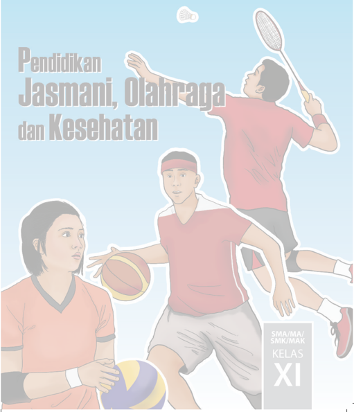

> **Deskripsi Visual:** Gambar dari buku pelajaran ini adalah ilustrasi yang menampilkan dua siswa sedang bermain olahraga. Siswa di depan sedang memegang bola voli, sementara siswa di belakang sedang memegang bola basket. Keduanya mengenakan seragam olahraga merah dan putih, dengan siswa di belakang juga menggunakan topi olahraga. Latar belakangnya cerah dengan warna biru, menunjukkan suasana lapangan olahraga. Di atas gambar tersebut terdapat teks "Pendidikan Jasmani, Olahraga dan Kesehatan" serta informasi tentang kelas XI SMA/MA/SMK/MAK. Ini menunjukkan bahwa gambar ini digunakan untuk membantu pembelajaran tentang olahraga dan kesehatan di tingkat sekolah menengah atas.

 

---
## 📄 Halaman 2

### Hak Cipta © 2017 pada Kementerian Pendidikan dan Kebudayaan Dilindungi Undang-Undang

Disklaimer: Buku  ini  merupakan  buku siswa yang dipersiapkan  Pemerintah  dalam rangka implementasi Kurikulum 2013. Buku siswa ini  disusun dan ditelaah oleh berbagai pihak  di  bawah koordinasi Kementerian Pendidikan dan Kebudayaan, dan dipergunakan dalam tahap awal  penerapan  Kurikulum  2013.  Buku  ini  merupakan  'dokumen  hidup' yang senantiasa diperbaiki,  diperbaharui,  dan  dimutakhirkan  sesuai  dengan  dinamika kebutuhan dan perubahan  zaman.  Masukan  dari  berbagai  kalangan  yang  dialamatkan kepada penulis dan laman http://buku.kemdikbud.go.id atau melalui email buku@kemdikbud.go.id diharapkan dapat meningkatkan kualitas buku ini.

### Katalog Dalam Terbitan (KDT)

Indonesia. Kementerian Pendidikan dan Kebudayaan.

Pendidikan Jasmani, Olahraga dan Kesehatan /Kementerian Pendidikan dan

Kebudayaan.--  .  Edisi  Revisi  Jakarta  :  Kementerian  Pendidikan  dan  Kebudayaan,  2017. x, 294 hlm. : ilus. ; 25 cm.

Untuk SMA/MA/SMK/MK Kelas XI ISBN  978-602-427-130-5 (Jilid lengkap) ISBN  978-602-427-132-9 ( Jilid 2 )

- PJOK -- Studi dan Pengajaran
- Kementerian Pendidikan dan Kebudayaan
I. Judul

613.7

Penulis

Penelaah

Pereview Guru

:  Sumaryoto dan Soni Nopembri

:  Agus Mahendra, Sugito Adi Warsito, Suroto dan Taufiq hidayah

: Jakbar Sim

Penyelia Penerbitan : Pusat Kurikulum dan Perbukuan, Balitbang, Kem en dikbud.

Cetakan Ke-1, 2014  ISBN 978-602-282-466-4 (Jilid 2a)

ISBN 978-602-282-467-1 (Jilid 2b) Cetakan Ke-2, 2016 (Edisi Revisi)

Disusun dengan huruf Minion Pro, 11pt.

 

---
## 📄 Halaman 3

### Kata Pengantar

Kurikulum  2013  dirancang  untuk  memperkuat  kompetensi  peserta  didik  dari  sisi pengetahuan,  keterampilan,  dan  sikap  secara  utuh.  Keutuhan  tersebut  menjadi  dasar dalam  perumusan  kompetensi  dasar  tiap  mata  pelajaran,  sehingga  kompetensi  dasar  tiap mata  pelajaran  mencakup  kompetensi  dasar  kelompok  sikap,  kompetensi  dasar  kelompok pengetahuan, dan kompetensi dasar kelompok keterampilan. Semua mata pelajaran dirancang mengikuti rumusan tersebut.

Pembelajaran Pendidikan Jasmani, Olahraga dan Kesehatan (PJOK) untuk Kelas XI SMA/ SMK yang disajikan dalam buku ini juga tunduk pada ketentuan tersebut. PJOK bukan mata pelajaran olahraga sebagaimana dipahami selama ini dan juga bukan materi pembelajaran yang  dirancang  hanya  untuk  mengasah  kompetensi  keterampilan  olahraga  peserta  didik. PJOK  adalah  mata  pelajaran  yang  membekali  peserta  didik  dengan  kemampuan  untuk memiliki kebugaran dan keterampilan jasmani yang bermanfaat dalam kehidupan sehari-hari. Memiliki tujuan supaya peserta didik dapat memperoleh perubahan perilaku gerak, perilaku berolahraga dan perilaku sehat.Pada akhirnya aktivitas jasmani dibarengi dengan sikap yang sesuai sehingga hasil yang diperoleh adalah optimal.

Pembelajarannya dirancang berbasis aktivitas terkait dengan sejumlah jenis gerak jasmani/ olahraga dan usaha-usaha menjaga kesehatan yang sesuai untuk peserta didik Kelas XI SMA/ SMK. Aktivitas-aktivitas tersebut dirancang untuk membuat peserta didik terbiasa melakukan gerak jasmani dan berolahraga dengan senang hati karena merasa perlu melakukannya dan sadar akan pentingnya menjaga kesehatan jasmani baik melalui gerak jasmani dan olahraga maupun dengan memperhatikan faktor-faktor kesehatan yang memengaruhinya.

Buku ini menjabarkan usaha minimal yang harus dilakukan peserta didik untuk mencapai kompetensi yang diharapkan. Sesuai dengan pendekatan yang digunakan dalam Kurikulum 2013, peserta didik diajak menjadi berani untuk mencari sumber belajar lain yang tersedia dan terbentang luas di sekitarnya. Peran guru dalam meningkatkan dan menyesuaikan daya serap peserta didik dengan ketersediaan kegiatan pada buku ini sangat penting. Guru dapat memperkayanya dengan kreasi dalam bentuk kegiatan-kegiatan lain yang sesuai dan relevan yang bersumber dari lingkungan sosial dan alam.

Sebagai edisi pertama, buku ini sangat terbuka dan perlu terus dilakukan perbaikan dan penyempurnaan.  Untuk  itu,  kami  mengundang  para  pembaca  memberikan  kritik,  saran dan masukan untuk perbaikan dan penyempurnaan pada edisi berikutnya. Atas kontribusi tersebut, kami ucapkan terima kasih. Mudah-mudahan kita dapat memberikan yang terbaik bagi  kemajuan  dunia  pendidikan  dalam  rangka  mempersiapkan  generasi  seratus  tahun Indonesia Merdeka (2045).

### Penulis

 

---
## 📄 Halaman 4

### DAFTAR ISI

iv

 

---
## 📄 Halaman 6

vi

 

---
## 📄 Halaman 10

8

x

 

---
## 📄 Halaman 11

### Bab I Menganalisis Keterampilan Gerak Permainan Bola Besar

---
**🖼️ Gambar/Diagram**

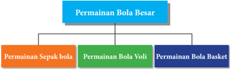

> **Deskripsi Visual:** Gambar ini adalah diagram yang menunjukkan struktur hierarkis dari permainan bola besar. Diagram ini terdiri dari satu cabang utama yang disebut "Permainan Bola Besar" dan tiga cabang anak yang disebut "Permainan Sepak bola", "Permainan Bola Voli", dan "Permainan Bola Basket". Setiap cabang anak memiliki warna yang berbeda untuk membedakannya. Teks pada diagram ini tidak menyediakan informasi tambahan selain nama-nama permainan tersebut. Ini menunjukkan bahwa diagram ini bertujuan untuk memberikan pemahaman tentang struktur dan klasifikasi permainan bola besar.

### A. Analisis Keterampilan Gerak Permainan Sepak bola

### 1. Permainan Sepak bola

Pernahkah kalian bermain sepak bola? Permainan Sepak bola dimainkan di lapangan  oleh  dua  regu  atau  dua  kesebelasan  yang  saling  berhadapan.  Tujuan permainan  sepak  bola  adalah  memasukkan  bola  ke  gawang  lawan  sebanyakbanyaknya  dan  mempertahankan  daerah  sendiri  dari  serangan  lawan  dengan aturan tertentu. Karakteristik permainan adalah memainkan  bola  dengan menggunakan kaki ataupun dengan seluruh anggota tubuh kecuali lengan/tangan, khusus penjaga gawang boleh menggunakan lengan/tangan di daerah gawangnya. Manfaat bermain sepak bola diantaranya dapat menjaga kebugaran tubuh apabila dilakukan secara teratur, menjalin kerjasama bermain sepak bola, menumbuhkan kejujuran, dan menambah pengetahuan serta keterampilan. Keterampilan gerak dalam permainan sepak bola adalah: menendang/ passing / shooting ,  mengontrol/ controlling , menggiring/ dribbling , dan menyundul/ heading bola.

Pendidikan Jasmani Olahraga dan Kesehatan

 

---
## 📄 Halaman 12

### 2. Analisis Keterampilan Gerak Menendang Bola

Keterampilan  gerak  menendang  bola  dapat  dilakukan  dengan  kaki  bagian dalam, punggung kaki, dan punggung kaki bagian luar.

### a.  Menendang Bola dengan Kaki Bagian Dalam

Cobalah kalian lakukan dan analisis keterampilan gerak menendang bola menggunakan kaki bagian dalam dengan urutan gerakan sebagai berikut:

- Sikap berdiri dengan posisi badan lurus di belakang bola.
- Salah satu kaki menumpu di samping bola dengan ujung kaki mengarah ke depan serta lutut sedikit ditekuk dan badan agak condong ke depan.
- Kaki dibuka keluar sehingga mata kaki mengarah ke depan bola.
- Pandangan dipusatkan pada bola yang akan  ditendang  dan  kedua  lengan  menjaga keseimbangan.
- Kaki tendang ditarik ke belakang, kemudian diayunkan ke depan mengenai bola dengan menggunakan kaki bagian dalam tepat pada titik pusat tendangan hingga bola bergerak ke depan.
- Gerakan selanjutnya diikuti oleh gerak lanjut dari  kaki  tendang  yang  diimbangi  anggota tubuh lainnya.
- Perhatikan gambar 1.1.
Kesalahan-kesalahan yang sering terjadi ketika melakukan gerak menendang bola dengan kaki bagian dalam, yaitu: sikap badan kaku, kaki tumpu tidak di samping bola, kaki tendang tidak stabil, badan kurang condong ke depan, dan tidak diikuti gerak lanjut.

### b.  Menendang Bola Menggunakan Punggung Kaki Bagian Dalam

Cobalah kalian lakukan dan analisis keterampilan gerak menendang bola menggunakan punggung kaki bagian dalam dengan urutan gerakan sebagai berikut:

- Sikap berdiri di belakang bola.
- Kaki tumpu harus di samping bola dengan jarak satu kepal tangan.

---
**🖼️ Gambar/Diagram**

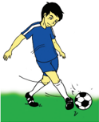

> **Deskripsi Visual:** Gambar ini adalah ilustrasi yang menunjukkan seorang pemain sepak bola sedang melakukan tendangan. Gambar ini menggambarkan tindakan sepak bola yang umum dilihat dalam pertandingan sepak bola. Pemain tersebut berada di tengah lapangan dengan bola berada di depan kakinya. Kaki kanannya yang sedang bergerak untuk memukul bola, sementara kaki lainnya berada di belakang untuk menjaga keseimbangan. Latar belakangnya adalah lapangan hijau yang biasanya digunakan untuk pertandingan sepak bola.

Elemen utama dalam gambar ini adalah pemain sepak bola, bola, dan lapangan. Pemain sepak bola adalah subjek utama yang sedang melakukan tindakan tendangan. Bola adalah objek yang menjadi fokus dalam aksi tersebut. Lapangan hijau adalah tempat di mana semua aksi berlangsung.

Teks, angka, atau label penting tidak ada dalam gambar ini karena ia hanya menggambarkan tindakan sepak bola tanpa informasi tambahan. Namun, informasi kunci yang dapat diambil dari gambar ini adalah bahwa pemain sepak bola sedang melakukan tendangan dan lapangan hijau adalah tempat pertandingan sepak bola.

Dalam satu paragraf yang informatif, gambar ini menunjukkan seorang pemain sepak bola sedang melakukan tendangan di lapangan hijau. Pemain tersebut menggunakan kaki kanannya untuk memukul bola, sementara kaki lainnya berada di belakang untuk menjaga keseimbangan. Lapangan hijau adalah tempat pertandingan sepak bola. Tidak ada teks, angka, atau label penting dalam gambar ini, namun informasi kunci yang dapat diambil adalah bahwa pemain sepak bola sedang melakukan tendangan dan lapangan hijau adalah tempat pertandingan sepak bola.

2

 

---
## 📄 Halaman 13

- Badan  sedikit  condong  ke  depan,  kedua  lengan  rileks  untuk  menjaga keseimbangan dan pandangan dipusatkan ke bola.
- Pada  saat  kaki  tendang  mengayun  ke  depan,  kaki mengarah ke bola, pergelangan kaki di titik tengah, ujung kaki selangkah ke samping bawah bola.
- Bola ditendang tepat pada sasaran titik pusat tendangan  dengan  perkenaan  pada  punggung  kaki bagian dalam.
- Sikap akhir tendangan diikuti oleh gerak lanjut kaki tendang yang diikuti anggota badan seluruhnya.
- Perhatikan gambar 1.2.
Kesalahan-kesalahan yang sering terjadi ketika melakukan gerak menendang bola menggunakan punggung  kaki  bagian  dalam,  yaitu:  sikap  badan  kaku, kaki  tumpu  tidak  di  samping  bola,  kaki  tendang  tidak stabil, badan kurang condong ke depan, dan tidak diikuti gerak lanjut. dalam

---
**🖼️ Gambar/Diagram**

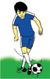

> **Deskripsi Visual:** Gambar ini adalah ilustrasi yang menunjukkan seorang pemain sepak bola sedang melakukan teknik dribbling dengan bola di lapangan. Gambar ini menggambarkan tindakan fisik dan teknik sepak bola yang penting dalam pertandingan.

1. **Apa yang ditampilkan secara keseluruhan**: Gambar ini menunjukkan seorang pemain sepak bola yang sedang bergerak di lapangan. Pemain tersebut sedang menggunakan kaki kanannya untuk memegang bola dan menggerakkan bola ke arah yang berbeda.

2. **Elemen-elemen utama dan relasinya**: 
   - **Pemain sepak bola**: Ini adalah elemen utama yang terlihat dalam gambar. Pemain tersebut sedang bergerak dan menggunakan kaki kanannya untuk memegang dan menggerakkan bola.
   - **Bola sepak**: Bola ini merupakan objek utama yang digunakan oleh pemain untuk bermain sepak bola. Pemain sedang menggunakan bola untuk melakukan teknik dribbling.
   - **Lapangan sepak bola**: Latar belakang gambar menunjukkan lapangan sepak bola yang biasanya terdiri dari dua lini yang berbeda warna (biasanya hijau dan merah). Lapangan ini merupakan tempat dimana pertandingan sepak bola dilakukan.

3. **Teks, angka, atau label penting yang terlihat**: Dalam gambar ini, tidak ada teks, angka, atau label yang terlihat. Gambar hanya menunjukkan tindakan pemain sepak bola dan bola sepak.

4. **Informasi kunci yang dapat diambil pembaca**: Gambar ini memberikan informasi tentang teknik dribbling dalam sepak bola. Ini menunjukkan bagaimana pemain harus menggunakan kaki mereka untuk memegang dan menggerakkan bola dengan efektif. Gambar ini juga membantu pemahaman tentang posisi dan gerakan yang diperlukan dalam pertandingan sepak bola.

Dengan demikian, gambar ini adalah ilustrasi yang sangat informatif tentang teknik dribbling dalam sepak bola, menunjukkan posisi pemain dan gerakan yang diperlukan untuk mengelola bola dengan efektif.

### c.  Menendang Bola Menggunakan Punggung Kaki

Cobalah kalian lakukan dan analisis keterampilan gerak menendang bola menggunakan punggung kaki dengan urutan gerakan sebagai berikut:

---
**🖼️ Gambar/Diagram**

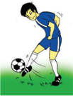

> **Deskripsi Visual:** Gambar ini adalah ilustrasi yang menunjukkan seorang pemain sepak bola sedang melakukan tendangan. Gambar ini menggambarkan tindakan sepak bola yang umum dilihat dalam pertandingan sepak bola. Pemain tersebut berada di tengah lapangan dengan bola yang sedang dipukul oleh kakinya. Latar belakangnya adalah lapangan sepak bola hijau dengan garis-garis yang menunjukkan area permainan.

Elemen-elemen utama dalam gambar ini meliputi pemain sepak bola, bola, dan lapangan sepak bola. Pemain sepak bola terlihat memegang bola dengan kedua tangannya dan sedang berusaha untuk melempar atau memukul bola ke arah yang tepat. Bola tampak besar dan berwarna putih dengan garis merah yang menunjukkan titik tekanan. Lapangan sepak bola tampak hijau dengan garis-garis yang menunjukkan area permainan.

Teks, angka, atau label penting yang terlihat dalam gambar ini adalah angka 7 yang terdapat pada baju pemain sepak bola. Angka ini mungkin menunjukkan nomor pemain atau tim yang dimainkan oleh pemain tersebut.

Informasi kunci yang dapat diambil pembaca dari gambar ini adalah bahwa pemain sepak bola sedang berusaha untuk mencetak gol atau memberikan tendangan kepada rekan setimnya. Ini menunjukkan bahwa sepak bola adalah olahraga yang memerlukan keterampilan dan koordinasi serta kemampuan untuk bermain tim.

- Sikap berdiri di belakang bola.
- Letakkan  kaki  tumpu  di  samping  bola  dengan jarak satu kepal tangan.
- Kaki tendang ke belakang lurus dengan bola dan pandangan ke arah tendangan.
- Kaki  tendang  diayunkan  ke  belakang  kemudian ayunkan ke depan menyentuh bola sekuatkuatnya dengan perkenaan pada punggung kaki.
- Sikap akhir dari tendangan diikuti dengan gerak lanjut  kaki  tendang  dan  diikuti  oleh  anggota tubuh lainnya.
- Perhatikan gambar 1.3.
Kesalahan-kesalahan yang sering terjadi ketika melakukan gerak menendang bola dengan punggung kaki bagian dalam, yaitu sikap badan kaku, kaki tumpu tidak  di  samping  bola,  kaki  tendang  tidak  stabil,  badan  kurang  condong  ke depan, dan tidak diikuti gerak lanjut.

 

---
## 📄 Halaman 14

### d.  Aktivitas pembelajaran Menendang Bola

Cobalah kalian lakukan aktivitas belajar satu dan dua untuk mempelajari keterampilan gerak menendang bola:

### 1)  Aktivitas Pembelajaran I

- Buatlah barisan dengan berpasang-pasangan.
- Masing-masing pasangan mendapatkan satu bola.
- Jarak antara masing-masing pasangan tersebut adalah 3-5 meter.
- Bola ditendang ke depan (a), kemudian pasangan berlari ke depan untuk mengontrol  bola  (b),  menendang  kembali  bola  ke  depan  sekitar  2-3 meter (a), pasangan berlari kembali ke depan untuk mengontol bola (b), begitu seterusnya hingga jarak yang telah ditentukan guru.
- Aktivitas ini dilakukan terus menerus dengan jarak 30 - 40 meter.
- Susunlah rencana perbaikan dari aktivitas yang baru saja dilakukan baik sendiri, bersama teman atau guru  untuk  perbaikan  aktivitas gerakan yang akan datang sesuai ketentuan gerakan yang ada.
- Perhatikan gambar 1.4.

### 2)  Aktivitas Pembelajaran II

- Buatlah kelompok masing-masing 6 orang
- Buat lapangan dengan ukuran 9 x 9 meter.
- Tentukan 2 orang sebagai pemain penerima bola, 2 orang sebagai pemain bertahan, dan 2 orang sebagai pemain penyerang.
- Pemain  penyerang  membawa  bola  dan  berusaha  memberikan  bola kepada pemain penerima bola, pemain bertahan berusaha merebut bola dari pemain penyerang dan menghalangi bola agar tidak sampai kepada pemain penerima bola.
- Apabila bola berhasil diterima oleh pemain penerima bola maka pemain penerima berganti menjadi pemain bertahan, pemain bertahan menjadi pemain penyerang, dan pemain penyerang menjadi pemain penerima bola.
- Susunlah rencana perbaikan dari aktivitas yang baru saja dilakukan baik sendiri,  bersama  teman  atau  guru  untuk  perbaikan  aktivitas  gerakan yang akan datang sesuai ketentuan gerakan yang ada.
- Perhatikan gambar 1.5.
4

 

---
## 📄 Halaman 15

---
**🖼️ Gambar/Diagram**

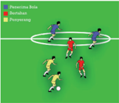

> **Deskripsi Visual:** Gambar ini adalah ilustrasi yang menunjukkan pertandingan sepak bola. Ilustrasi ini menggambarkan dua tim bermain sepak bola, dengan pemain berada di lapangan yang berbentuk segi empat. Tim satu berada di sisi kanan dan tim lain di sisi kiri. Setiap pemain memiliki warna yang berbeda untuk membedakan tim mereka. Pemain bergerak aktif di lapangan, menunjukkan pergerakan dan posisi mereka saat bermain sepak bola.

Elemen utama dalam gambar ini meliputi pemain sepak bola, lapangan sepak bola, dan posisi mereka. Pemain-pemain tersebut diperlihatkan dalam posisi yang berbeda, menunjukkan aktivitas mereka saat bermain. Lapangan sepak bola tampak jelas dengan garis-garis yang menunjukkan area permainan.

Teks, angka, atau label penting tidak ada dalam gambar ini karena ia hanya berupa ilustrasi. Namun, informasi kunci yang dapat diambil dari gambar ini adalah struktur dan posisi pemain dalam sebuah pertandingan sepak bola. Ini membantu pemahaman tentang bagaimana sepak bola dimainkan dan bagaimana pemain berinteraksi satu sama lain dalam pertandingan tersebut.

### 3. Analisis Keterampilan Gerak Mengontrol Bola

### a.  Mengontrol Bola Menggunakan Telapak Kaki

Cobalah kalian lakukan dan analisis keterampilan gerak mengontrol bola menggunakan telapak kaki dengan urutan gerakan sebagai berikut:

- Sikap berdiri.
- Dekati bola yang sedang bergerak.
- Hentikan bola dengan telapak kaki.
- Telapak kaki ditarik ke belakang bersamaan dengan datangnya bola.
Perhatikanlah kesalahan-kesalahan yang sering terjadi ketika mengontrol bola menggunakan telapak kaki, yaitu: badan kaku, kaki yang menahan tidak rileks, dan kaki lainnya kurang menjaga keseimbangan.

 

---
## 📄 Halaman 16

### b.  Aktivitas Pembelajaran Mengontrol Bola Menggunakan telapak kaki

Kalian  lakukan  aktivitas  belajar  ini  secara  berpasangan  untuk  belajar keterampilan gerak mengontrol bola menggunakan  telapak kaki dapat dilakukan melalui aktivitas sebagai berikut:

- Peserta didik membuat barisan dengan berpasang-pasangan.
- Masing-masing pasangan mendapatkan satu bola.
- Jarak antara masing-masing pasangan tersebut adalah 3-5 meter.
- Bola  dikuasai  satu  peserta  didik  secara  bergantian  dengan  pasangannya, sedangkan  peserta  didik  pasangannya  mengontrol  bola  menggunakan telapak kaki yang telah dipelajari sebelumnya
- Aktivitas  ini  dilakukan  terus  menerus  sehingga  setiap  pasangan  dapat melakukan semua gerakan mengontrol bola menggunakan telapak kaki.
- Susunlah rencana perbaikan dari aktivitas yang baru saja dilakukan baik sendiri, bersama teman atau guru untuk perbaikan aktivitas gerakan yang akan datang sesuai ketentuan gerakan yang ada.

### c.  Mengontrol Bola Menggunakan Punggung Kaki

Cobalah kalian lakukan dan analisis keterampilan gerak mengontrol bola dengan punggung kaki dengan urutan gerakan sebagai berikut:

- Sikap berdiri kemudian bergerak ke arah bola.
- Angkat kaki ke depan atas untuk menghentikan bola  menggunakan  punggung  kaki  di  bawah bola melambung.
- Tahan  bola  dengan  menggunakan  punggung kaki dengan sedikit sentuhan atau tarikan.
- Jatuhkan bola di antara kedua kaki.
- Perhatikan gambar 1.7.
Perhatikanlah kesalahan-kesalahan yang sering terjadi  ketika  mengontrol  bola  menggunakan punggung  kaki,  yaitu:  badan  kaku,  kaki  yang menahan  tidak  rileks,  dan  kaki  yang  menahan bola tidak digerakkan/ditarik ke belakang.

6

---
**🖼️ Gambar/Diagram**

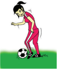

> **Deskripsi Visual:** Gambar ini adalah ilustrasi yang menunjukkan seorang pemain sepak bola sedang melakukan teknik dribbling dengan bola. Gambar ini menggambarkan tindakan fisik dan teknik sepak bola yang penting dalam permainan tersebut.

1. **Apa yang ditampilkan secara keseluruhan**: Gambar ini menunjukkan seorang pemain sepak bola yang sedang bergerak untuk memegang bola dengan teknik dribbling. Pemain tersebut tampak berada di lapangan sepak bola hijau, dengan latar belakang yang menunjukkan cahaya matahari yang cerah.

2. **Elemen-elemen utama dan relasinya**: 
   - **Pemain sepak bola**: Ini adalah elemen utama yang menunjukkan subjek utama dari gambar.
   - **Bola sepak**: Ini adalah objek utama yang digunakan oleh pemain untuk melakukan dribbling.
   - **Lapangan sepak bola**: Ini adalah tempat di mana permainan dilakukan dan merupakan bagian dari konteks yang relevan.

3. **Teks, angka, atau label penting yang terlihat**: Dalam gambar ini, tidak ada teks, angka, atau label yang jelas. Namun, jika ada, mereka mungkin akan memberikan informasi tambahan tentang teknik dribbling atau posisi pemain.

4. **Informasi kunci yang dapat diambil pembaca**: Gambar ini membantu pembaca memahami teknik dribbling dalam sepak bola, yang melibatkan gerakan tangan dan kaki pemain untuk mengendalikan bola dengan efektif. Ini juga menunjukkan pentingnya kecepatan dan kontrol dalam permainan sepak bola.

Dengan demikian, gambar ini menggambarkan tindakan teknis yang penting dalam sepak bola, sementara juga menunjukkan aspek fisik dan teknik yang diperlukan untuk bermain sepak bola dengan efektif.

 

---
## 📄 Halaman 17

### d.  Mengontrol Bola dengan Dada

Cobalah kalian lakukan dan analisis keterampilan gerak mengontrol bola menggunakan dada dengan urutan gerakan sebagai berikut:

- Sikap berdiri dan mengamati bola yang melayang dengan cermat.
- Bergerak maju untuk menjemput bola.
- Busungkan dada sehingga terbuka lebar dan kedua tangan melebar dalam posisi yang seimbang.
- Tahan bola tepat di dada dengan sedikit sentuhan atau tarikan ke belakang.
- Perhatikan gambar 1.8.
Perhatikanlah kesalahan-kesalahan yang sering terjadi ketika mengontrol bola dengan dada, yaitu:  badan  kaku,  kaki  tidak  dibuka,  dada  tidak dibusungkan  dan  lengan/tangan  tidak  terbuka,  dan tidak ada gerakan menjemput bola.

---
**🖼️ Gambar/Diagram**

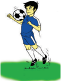

> **Deskripsi Visual:** Gambar ini adalah ilustrasi yang menunjukkan seorang pemain sepak bola sedang melakukan gerakan tendangan. Gambar ini menggambarkan tindakan yang kompleks dan membutuhkan keahlian dalam sepak bola. Pemain tersebut sedang berdiri dengan posisi yang tepat untuk tendangan, dengan bola yang diletakkan di depannya. Kaki kanan yang sedang menekan bola menunjukkan bahwa pemain sedang siap untuk melakukan tendangan. Latar belakang yang sederhana fokus pada pemain dan bola, memberikan kesan yang jelas tentang tindakan yang sedang dilakukan.

Elemen-elemen utama dalam gambar ini meliputi pemain sepak bola, bola, dan latar belakang. Pemain sepak bola adalah subjek utama yang menunjukkan tindakan dan keahlian dalam olahraga tersebut. Bola yang diletakkan di depan pemain menunjukkan objek yang penting dalam pertandingan sepak bola. Latar belakang yang sederhana tidak mengganggu fokus pada pemain dan bola, sehingga membuat gambar menjadi lebih mudah dipahami.

Teks, angka, atau label penting dalam gambar ini tidak ada. Namun, informasi kunci yang dapat diambil pembaca meliputi posisi pemain, posisi bola, dan tindakan yang sedang dilakukan. Ini membantu pembaca memahami konteks dan tujuan dari tindakan tersebut dalam pertandingan sepak bola.

Dengan demikian, gambar ini menggambarkan tindakan tendangan sepak bola yang kompleks dan membutuhkan keahlian, dengan pemain yang siap dan bola yang siap untuk tindakan tersebut.

### e. Mengontrol Bola Menggunakan Paha

Cobalah kalian lakukan dan analisis keterampilan gerak mengontrol bola menggunakan paha dengan urutan gerakan sebagai berikut:

- Sikap berdiri dan mengamati bola yang melayang di udara.
- Bergerak ke arah datangnya bola.
- Tempatkan  tubuh  di  bawah  datangnya  bola dalam posisi seimbang.
- Angkat  salah  satu  kaki  dan  tekuk  lutut  hingga bidang datar paha berada tepat di bawah lambungan bola.
- Hentikan bola melalui sedikit sentuhan dengan paha.
- Jatuhkan bola di antara kedua kaki.
- Perhatikan gambar 1.9.
Perhatikanlah kesalahan-kesalahan yang sering terjadi ketika mengontrol bola menggunakan paha adalah badan kaku, kaki tidak tidak diangkat, paha tidak dalam bidang datar, dan tidak ada gerakan menjemput bola.

---
**🖼️ Gambar/Diagram**

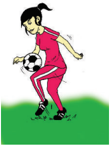

> **Deskripsi Visual:** Gambar ini adalah ilustrasi yang menunjukkan seorang pemain sepak bola sedang bermain. Gambar ini menggambarkan tindakan pemain yang sedang memukul bola dengan kaki kanannya. Pemain tersebut berada di lapangan sepak bola hijau, dengan latar belakang yang menunjukkan bentuk lapangan sepak bola yang umum ditemui dalam olahraga sepak bola.

Elemen-elemen utama dalam gambar ini meliputi pemain sepak bola, bola sepak, dan lapangan sepak bola. Pemain sepak bola terlihat sedang bergerak untuk memukul bola, sementara bola sepak tampak berada di tengah-tengah gerakan pemain. Lapangan sepak bola juga terlihat dengan jelas, menunjukkan bentuk dan ukuran lapangan yang biasanya digunakan dalam pertandingan sepak bola.

Teks, angka, atau label penting tidak terlihat dalam gambar ini karena gambar hanya menggambarkan tindakan pemain sepak bola tanpa adanya teks atau angka yang menambahkan informasi spesifik. Namun, informasi kunci yang dapat diambil dari gambar ini adalah bahwa pemain sepak bola sedang bermain dan memukul bola dengan kaki kanannya, yang merupakan tindakan umum dalam permainan sepak bola.

 

---
## 📄 Halaman 18

### f.  Mengontrol Bola Menggunakan Perut

Cobalah kalian lakukan dan analisis keterampilan gerak mengontrol bola menggunakan perut yang dilakukan apabila posisi bola melayang di udara atau bola pantulan dari tanah dengan urutan gerakan sebagai berikut:

---
**🖼️ Gambar/Diagram**

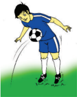

> **Deskripsi Visual:** Gambar ini adalah ilustrasi yang menunjukkan seorang pemain sepak bola sedang melakukan tendangan. Gambar ini menggambarkan tindakan sepak bola yang umum dilihat dalam pertandingan sepak bola. Pemain tersebut berada di tengah lapangan dengan bola berada di depannya, menunjukkan bahwa dia sedang berusaha mencetak gol. Latar belakangnya adalah lapangan hijau yang biasanya digunakan untuk pertandingan sepak bola.

Elemen-elemen utama dalam gambar ini adalah pemain sepak bola, bola, dan lapangan. Pemain sepak bola adalah subjek utama yang sedang bergerak dan berusaha mencetak gol. Bola berada di depan pemain, menunjukkan posisi dan arah tendangan. Lapangan hijau menjadi latar belakang yang menunjukkan tempat pertandingan.

Teks, angka, atau label penting tidak ada dalam gambar ini karena ia hanya menggambarkan tindakan sepak bola tanpa informasi tambahan. Namun, informasi kunci yang dapat diambil pembaca adalah bahwa ini adalah sebuah tendangan sepak bola, yang merupakan salah satu tindakan penting dalam pertandingan sepak bola.

Dalam satu paragraf yang informatif, gambar ini menunjukkan seorang pemain sepak bola sedang melakukan tendangan. Pemain tersebut berada di tengah lapangan dengan bola berada di depannya, menunjukkan bahwa dia sedang berusaha mencetak gol. Latar belakangnya adalah lapangan hijau yang biasanya digunakan untuk pertandingan sepak bola. Elemen-elemen utama dalam gambar ini adalah pemain sepak bola, bola, dan lapangan. Teks, angka, atau label penting tidak ada dalam gambar ini. Informasi kunci yang dapat diambil pembaca adalah bahwa ini adalah sebuah tendangan sepak bola, yang merupakan salah satu tindakan penting dalam pertandingan sepak bola.

- Sikap berdiri dan mengamati pergerakan bola yang melayang.
- Bergerak ke depan untuk menjemput bola.
- Tahan bola menggunakan perut dengan sentuhan  atau  menarik  perut  ke  belakang sambil menjaga keseimbangan.
- Jatuhkanlah bola di antara kedua kaki.
- Perhatikan gambar 1.10.
Perhatikanlah kesalahan-kesalahan yang sering terjadi ketika mengontrol bola menggunakan perut adalah badan  kaku, perut tidak rileks, kedua tangan tidak dibuka, dan tidak ada gerakan menjemput bola.

### g.  Aktivitas pembelajaran Mengontrol Bola

Kalian  lakukanlah  aktivitas  belajar  ini  secara  berpasangan  untuk  belajar keterampilan gerak mengontrol bola dapat dilakukan melalui aktivitas sebagai berikut:

- Peserta didik membuat barisan dengan berpasang-pasangan.
- Masing-masing pasangan mendapatkan satu bola.
- Jarak antara masing-masing pasangan tersebut adalah 3-5 meter.
- Bola  ditendang/dilambungkan  ke  depan  oleh  salah  satu  peserta  didik, sedangkan  peserta  didik  pasangannya  mengontrol  bola  dengan  bagian tubuh yang telah dipelajari sebelumnya
- Aktivitas  ini  dilakukan  terus  menerus  sehingga  setiap  pasangan  dapat melakukan semua gerakan mengontrol bola.
- Susunlah rencana perbaikan dari aktivitas yang baru saja dilakukan baik sendiri, bersama teman atau guru untuk perbaikan aktivitas gerakan yang akan datang sesuai ketentuan gerakan yang ada.
- Perhatikan gambar 1.11.
8

 

---
## 📄 Halaman 19

### 4. Analisis Keterampilan Gerak Menggiring Bola

Menggiring bola merupakan salah satu keterampilan gerak dalam permainan sepak  bola  yang  berfungsi  untuk  menguasai  bola.  Menggiring  bola  dilakukan dengan cara membawa bola menggunakan kaki, baik di daerah sendiri maupun daerah lawan. Menggiring bola dapat dilakukan dengan punggung kaki bagian dalam bagian luar.

### a.  Menggiring Bola Menggunakan Punggung Kaki Bagian Dalam

Cobalah kalian lakukan dan analisis keterampilan gerak menggiring bola menggunakan punggung kaki bagian dalam dengan urutan gerakan sebagai berikut:

- Berdiri  dengan  posisi  badan  agak  condong  ke depan,  punggung  kaki  bagian  dalam  dekat  bola, lutut sedikit ditekuk dan kaki kiri digunakan untuk bertumpu.
- Letakkan kaki tumpu di samping bola dengan lutut dan kedua lengan menjaga keseimbangan.
- Bergerak ke depan dengan punggung kaki bagian dalam dan bola selalu bersentuhan.
- Usahakan kedua kaki selalu dekat dengan bola dan sesuaikan irama langkah dengan bola.
- Perhatikan gambar 1.12
Perhatikanlah kesalahan-kesalahan yang sering terjadi ketika menggiring bola menggunakan punggung kaki bagian dalam, yaitu: badan kaku dan

---
**🖼️ Gambar/Diagram**

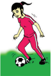

> **Deskripsi Visual:** Gambar ini adalah ilustrasi yang menunjukkan seorang pemain sepak bola sedang bermain. Gambar ini menggambarkan tindakan pemain yang sedang memukul bola dengan kaki kanannya. Pemain tersebut berada di lapangan sepak bola yang tampak jelas dengan latar belakang hijau. Ilustrasi ini menunjukkan aktivitas fisik dan permainan sepak bola.

Elemen-elemen utama dalam gambar ini meliputi pemain sepak bola, bola sepak, dan lapangan sepak bola. Pemain sepak bola terlihat sedang bergerak aktif, menunjukkan kecepatan dan kekuatan dalam permainan. Bola sepak tampak berada di tengah-tengah gerakan pemain, menunjukkan bahwa ia sedang dalam proses mencetak gol atau melakukan serangan. Lapangan sepak bola tampak luas dan hijau, menunjukkan kondisi lapangan yang baik untuk permainan.

Teks, angka, atau label penting tidak ada dalam gambar ini karena ia hanya menggambarkan tindakan pemain sepak bola tanpa informasi tambahan. Namun, informasi kunci yang dapat diambil pembaca adalah bahwa permainan sepak bola melibatkan gerakan fisik yang cepat dan strategis, serta kekuatan dan kecepatan dalam mencetak gol atau serangan.

tidak condong ke depan, kedua lengan tidak rileks, salah satu atau kedua kaki terlalu jauh dengan bola, lutut tidak ditekuk, dan kaki dan bola terlalu jarang bersentuhan.

### b.  Menggiring Bola Menggunakan Punggung Kaki Bagian Luar

Cobalah kalian lakukan dan analisis keterampilan gerak menggiring bola menggunakan punggung kaki bagian luar dengan gerakan sebagai berikut:

- Berdiri  dengan  salah  satu  kaki  ditempatkan  di  depan  menggunakan pergelangan  kaki  sedikit  diputar  ke  dalam,  lutut  agak  ditekuk,  dan  kaki lainnya sebagai tumpuan.
- Sikap  badan  sedikit  condong  ke  depan  dan  berat  badan  berada  di  kaki belakang dengan kedua lengan rileks.

 

---
## 📄 Halaman 20

- Bergerak ke depan dengan perkenaan punggung kaki bagian luar dan bola selalu bersentuhan.
- Usahakan  kedua  kaki  selalu  dekat  dengan  bola dan sesuaikan irama langkah dengan bola.
- Perhatikan Gambar 1.13.
Perhatikanlah  kesalahan-kesalahan  yang  sering terjadi ketika menggiring bola menggunakan punggung kaki bagian luar, yaitu: badan kaku dan tidak condong ke depan, kedua lengan tidak rileks, salah satu atau kedua kaki terlalu jauh dengan bola, lutut tidak ditekuk, dan kaki dan bola terlalu jarang bersentuhan.

### c.  Aktivitas pembelajaran Menggiring Bola

Kalian  lakukanlah  aktivitas  belajar  ini  untuk  belajar  keterampilan  gerak menggiring bola yang digabungkan dengan menendang bola ke gawang sebagai berikut:

### 1)  Aktivitas pembelajaran I

- Peserta didik berbaris berbanjar ke belakang dan memegang bola.
- Peserta  didik  menggiring  bola  ke  depan  dengan  melewati  rintangan yang  diletakkan  sejajar  dengan  gawang  sebanyak  5  rintangan  (jarak setiap rintangan 2 meter).
- Pada rintangan terakhir atau ketika memasuki garis 16 meter (daerah gawang), peserta didik menendang bola ke gawang.
- Setelah menendang bola ke gawang, peserta didik mengambil kembali bola itu, kemudian berbaris di belakang barisan semula.
- Susunlah  rencana  perbaikan  dari aktivitas yang baru saja dilakukan baik  sendiri,  bersama  teman  atau guru untuk perbaikan aktivitas gerakan  yang  akan  datang  sesuai ketentuan gerakan yang ada.
- Perhatikan Gambar 1.14.

---
**🖼️ Gambar/Diagram**

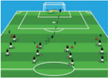

> **Deskripsi Visual:** Gambar ini adalah ilustrasi yang menunjukkan pertandingan sepak bola. Ilustrasi ini menggambarkan posisi pemain pada lapangan sepak bola dengan detail yang cukup. Pemain-pemain berada di berbagai area lapangan, mulai dari penyerang yang berada di tengah lapangan hingga pemain bertahan yang berada di sepanjang garis gawang. Ilustrasi ini juga menunjukkan posisi bola yang sedang dimainkan oleh pemain tengah. Label dan teks pada ilustrasi ini tidak jelas, tetapi tampaknya menunjukkan nama-nama pemain dan tim yang berpartisipasi dalam pertandingan tersebut. Informasi kunci yang dapat diambil dari gambar ini adalah bahwa pertandingan ini sedang berlangsung dan semua pemain telah berada di posisi mereka masing-masing untuk memainkan permainan.

10

---
**🖼️ Gambar/Diagram**

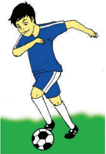

> **Deskripsi Visual:** Gambar ini adalah ilustrasi yang menunjukkan seorang pemain sepak bola sedang melakukan tendangan. Gambar ini menggambarkan tindakan sepak bola yang umum dilihat dalam pertandingan sepak bola. Pemain tersebut berada di tengah lapangan dengan bola berada di depannya. Kaki kanannya yang sedang bergerak ke arah bola menunjukkan bahwa ia sedang memperkuat tendangan. Latar belakangnya adalah lapangan sepak bola hijau dengan garis-garis yang menunjukkan area permainan. 

Elemen-elemen utama dalam gambar ini adalah pemain sepak bola, bola, dan lapangan sepak bola. Pemain sepak bola adalah subjek utama yang sedang melakukan tindakan tendangan. Bola berada di depan pemain dan merupakan objek yang penting dalam aksi tersebut. Lapangan sepak bola menjadi latar belakang yang memberikan konteks tentang tempat dan situasi di mana tindakan ini terjadi.

Teks, angka, atau label penting tidak ada dalam gambar ini karena ia hanya menggambarkan tindakan sepak bola tanpa informasi tambahan. Namun, informasi kunci yang dapat diambil pembaca melalui gambar ini adalah bahwa pemain sedang melakukan tendangan sepak bola dan posisi bola di depannya.

 

---
## 📄 Halaman 21

### 2)  Aktivitas pembelajaran II

- Peserta didik berbaris berbanjar ke belakang dan memegang bola.
- Peserta  didik  menggiring  bola  ke  depan dengan melewati rintangan yang diletakkan sejajar dengan gawang sebanyak 5 rintangan (jarak setiap rintangan 2 meter).
- Pada  rintangan  terakhir,  bola  dioperkan kepada teman yang berdiri di daerah garis  16  meter,  kemudian  teman  tersebut mengoperkan  kembali  bola  itu  ke  depan dan peserta didik yang menggiring bola tadi langsung menendang bola ke gawang.
- Setelah menendang bola ke gawang, peserta didik tersebut menggantikan peserta didik yang  mengoperkan  bola  yang  berada  di daerah garis 16 meter.
- Peserta  didik  yang  mengoperkan  bola  yang  berada  di  daerah  garis 16  meter  mengambil  bola  dari  gawang  dan  masuk  ke  barisan  paling belakang untuk melakukan aktivitas yang sama.
- Susunlah rencana perbaikan dari aktivitas yang baru saja dilakukan baik sendiri,  bersama  teman  atau  guru  untuk  perbaikan  aktivitas  gerakan yang akan datang sesuai ketentuan gerakan yang ada.
- Perhatikan gambar 1.15.

---
**🖼️ Gambar/Diagram**

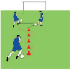

> **Deskripsi Visual:** Gambar ini adalah ilustrasi yang menunjukkan seorang pemain sepak bola sedang bermain dengan menggunakan tendangan jarak jauh. Gambar ini menggambarkan posisi pemain di tengah lapangan, dengan bola berada di depannya dan tendangan jarak jauh yang diletakkan di belakangnya. Pemain tersebut tampak sedang berusaha untuk mencetak gol dengan menggunakan tendangan jarak jauh. 

Elemen-elemen utama dalam gambar ini meliputi pemain sepak bola, bola, tendangan jarak jauh, dan lapangan sepak bola. Pemain sepak bola adalah elemen utama yang memperlihatkan tindakan dan posisi saat bermain. Bola merupakan objek yang digunakan dalam pertandingan sepak bola dan terletak di tengah-tengah pemain. Tendangan jarak jauh adalah alat yang digunakan oleh pemain untuk mencetak gol. Lapangan sepak bola adalah tempat dimana pertandingan berlangsung.

Teks, angka, atau label penting tidak ada dalam gambar ini karena gambar hanya menggambarkan posisi pemain dan objek dalam pertandingan sepak bola tanpa informasi tambahan. Informasi kunci yang dapat diambil pembaca adalah bahwa pemain sedang berusaha mencetak gol dengan menggunakan tendangan jarak jauh.

### 5. Analisis Keterampilan Gerak Menyundul Bola

Keterampilan Gerak menyundul bola ( heading ) adalah suatu upaya mengambil bola yang melayang di udara dengan menggunakan kepala/dahi. Perkenaan bola pada kepala saat melakukan sundulan adalah dahi, karena dari merupakan bagian kepala yang terkuat. Menyundul bola dapat dilakukan dengan awalan dan tanpa awalan.

### a.  Menyundul Bola Menggunakan Awalan

Cobalah kalian lakukan dan analisis keterampilan gerak menyundul bola menggunakan awalan dengan urutan gerakan sebagai berikut:

- Berdiri dalam posisi seimbang menghadap arah datangnya bola.
- Pandangan mengarah datangnya bola.

 

---
## 📄 Halaman 22

- Bergerak mendekati bola setelah berjarak kirakira satu meter antara kepala dan bola, lalu melompat untuk melakukan sundulan dengan menguatkan leher.
- Sundulan bola dilakukan dengan dahi.
- Mendarat dengan tumpuan kedua kaki sedikit ditekuk/mengeper.
- Perhatikan gambar 1.16.
Perhatikanlah kesalahan-kesalahan yang sering terjadi  ketika  menyundul  bola  dengan  awalan, yaitu: badan kaku dan tidak seimbang, pandangan tidak  pada  bola,  tidak  bergerak  mendekati  bola, dan perkenaan tidak pada kening/dahi.

### b.  Menyundul Bola Tanpa Awalan

Cobalah kalian lakukan dan analisis keterampilan gerak menyundul bola tanpa awalan dapat dilakukan dengan urutan gerakan sebagai berikut:

- Berdiri dalam posisi seimbang menghadap ke arah datangnya bola.
- Kedua kaki dibuka sejajar bahu dan pandangan ke arah datangnya bola.
- Kedua lengan terbuka ke samping tetapi rileks.
- Bergerak mendekati bola dan lakukan sundulan dengan menguatkan leher.
- Sundulan bola dilakukan dengan dahi.
- Perhatikan gambar 1.17.
Perhatikanlah kesalahan-kesalahan yang sering terjadi ketika menyundul bola tanpa awalan, yaitu: badan kaku dan tidak seimbang, pandangan tidak pada bola,  tidak  bergerak  mendekati  bola,  kedua lengan tidak rileks, dan perkenaan tidak pada dahi.

---
**🖼️ Gambar/Diagram**

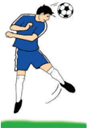

> **Deskripsi Visual:** Gambar ini adalah ilustrasi yang menunjukkan seorang pemain sepak bola sedang melakukan tendangan. Gambar ini menggambarkan tindakan sepak bola yang umum dilihat dalam pertandingan sepak bola. Pemain tersebut berada di tengah permainan, dengan posisi tubuh yang menunjukkan kekuatan dan kecepatan dalam tendangan. Latar belakangnya adalah lapangan sepak bola hijau, yang menunjukkan bahwa gambar ini mungkin digunakan untuk tujuan edukatif atau demonstrasi teknik sepak bola.

Elemen-elemen utama dalam gambar ini meliputi pemain sepak bola, bola sepak, dan lapangan sepak bola. Pemain sepak bola terlihat memegang bola dengan kedua tangan dan sedang berusaha melempar atau menendangnya. Bola sepak tampak jelas di tengah-tengah pemain, menunjukkan fokus pada aksi tendangan. Lapangan sepak bola hijau membentuk latar belakang, menunjukkan bahwa gambar ini mungkin digunakan untuk tujuan edukatif atau demonstrasi teknik sepak bola.

Teks, angka, atau label penting tidak terlihat dalam gambar ini karena ia hanya berupa ilustrasi. Namun, informasi kunci yang dapat diambil pembaca termasuk teknik tendangan yang digunakan oleh pemain sepak bola, posisi tubuh pemain saat tendangan, dan alat yang digunakan dalam pertandingan sepak bola.

Dalam satu paragraf yang informatif, gambar ini menunjukkan seorang pemain sepak bola sedang melakukan tendangan. Pemain tersebut berada di tengah permainan, dengan posisi tubuh yang menunjukkan kekuatan dan kecepatan dalam tendangan. Latar belakangnya adalah lapangan sepak bola hijau, yang menunjukkan bahwa gambar ini mungkin digunakan untuk tujuan edukatif atau demonstrasi teknik sepak bola.

### c.  Aktivitas pembelajaran Gerak Menyundul Bola

Lakukanlah aktivitas belajar ini untuk belajar keterampilan gerak menyundul bola sebagai berikut:

- Peserta didik saling berpasangan dengan jarak 3-5 meter.
- Salah satu peserta didik memegang dan melambungkan bola kepada peserta didik pasangannya yang dalam posisi siap dan menyundul.
- Peserta didik menyundul bola dengan perkenaan dahi.
12

---
**🖼️ Gambar/Diagram**

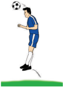

> **Deskripsi Visual:** Gambar ini adalah ilustrasi yang menunjukkan seorang pemain sepak bola sedang melakukan teknik tendangan jarak jauh. Gambar ini menggambarkan langkah-langkah yang harus dilakukan oleh pemain untuk mencetak gol dengan tendangan jarak jauh. Pemain tersebut berdiri di atas lapangan dengan bola sepak di tangan kanannya. Kaki kanan pemain tersebut telah memukul bola ke udara, sementara kaki kiri masih berada di tanah. Ini menunjukkan bahwa pemain tersebut sedang dalam proses melakukan tendangan jarak jauh.

Elemen-elemen utama dalam gambar ini meliputi pemain sepak bola, bola sepak, dan lapangan sepak bola. Pemain sepak bola terletak di tengah-tengah gambar, sedangkan bola sepak berada di atas kaki kanannya. Lapangan sepak bola tampak di sekitar pemain dan bola, menunjukkan bahwa aksi ini terjadi di lapangan sepak bola.

Teks, angka, atau label penting tidak ada dalam gambar ini karena gambar hanya menggambarkan aksi sepak bola tanpa informasi tambahan seperti nama pemain atau nomor jersey.

Informasi kunci yang dapat diambil pembaca adalah bahwa gambar ini menunjukkan teknik tendangan jarak jauh dalam sepak bola, yang merupakan salah satu teknik penting dalam permainan sepak bola.

 

---
## 📄 Halaman 23

- Lakukan menyundul bola dengan awalan dan tanpa awalan.
- Lakukan  secara  bergantian  sampai batas waktu yang ditentukan guru.
- Susunlah rencana perbaikan dari aktivitas  yang  baru  saja  dilakukan baik  sendiri,  bersama  teman  atau guru untuk perbaikan aktivitas gerakan  yang  akan  datang  sesuai ketentuan gerakan yang ada.
- Perhatikan gambar 1.18.

### 6. Ringkasan

Permainan  sepak  bola  merupakan  permainan  yang  banyak  memerlukan penguasaan  keterampilan  gerak.  Keterampilan  gerak  dalam  sepak  bola  adalah menendang  ,  mengontrol,  menggiring,  dan  menyundul  bola.  Keterampilan gerak dalam permainan sepak bola dapat dianalisis dan dikembangkan dengan cara  mempelajari  urutan  gerakan  yang  benar  serta  menggabungkan  beberapa keterampilan gerak dalam suatu aktivitas gerak, baik secara berpasangan maupun berkelompok. Hal ini dilakukan agar para peserta didik dapat mengembangkan keterampilan  gerak  dan  berkomunikasi  dengan  peserta  didik  lain  sehingga terjalinnya kerjasama, disiplin, toleransi, dan menerima kekalahan dan kemenangan  dalam  permainan.  Sebelum,  selama,  dan  sesudah  melakukan permainan  sepak  bola  sebaiknya  peserta  didik  berdoa  dan  bersyukur  kepada Tuhan atas segala anugrah yang telah diberikan.

### 7. Penilaian

### a.  Pengetahuan

Pengetahuan  peserta  didik  akan  dinilai  melalui  tes  tertulis  maupun penugasan  tentang  hasil  kerja  kajian  konsep,  dan  prinsip  permainan  sepak bola.

### b.  Sikap

Sikap peserta didik selama mengikuti pelajaran permainan sepak bola akan dinilai melalui observasi sikap/perilaku peserta didik yang meliputi tanggung jawab,  toleransi,  disiplin,  kerjasama,  menerima  kekalahan  dan  kemenangan yang  menjunjung  tinggi  sportifitas  yang  dapat  digunakan  guru  sebagai pertimbangan dalam mengembangkan karakter peserta didik lebih lanjut.

### c.  Keterampilan

 

---
## 📄 Halaman 24

Keterampilan  peserta  didik  akan  dinilai  melalui  unjuk  kerja  selama mengikuti pembelajaran permainan sepak bola yang meliputi: (1) keterampilan, (2) pengambilan keputusan, (3) dukungan, dan (4) penampilan bermain.

### B. Analisis Keterampilan Gerak Permainan Bola voli

### 1. Permainan Bola voli

Permainan bola voli merupakan permainan beregu menggunakan bola besar yang  dimainkan  oleh  dua  regu  saling  berhadapan,  masing-masing  regu  enam orang.  Setiap  regu  diperbolehkan  memainkan  bola  di  daerah  pertahanannya sebanyak-banyaknya  tiga  kali  pukulan.  Permainan  bola  voli  adalah  permainan yang berbentuk memukul bola di udara hilir mudik di atas net , dengan maksud dapat menjatuhkan bola di dalam petak lawan untuk mencari kemenangan dalam permainan.  Memvoli  dan  memantulkan  bola  ke  udara  harus  mempergunakan bagian tubuh mana saja, asalkan dengan pantulan yang sempurna (tidak ganda). Keterampilan gerak dalam permainan bola voli antara lain adalah keterampilan gerak servis (tangan bawah dan tangan atas) passing atas dan bawah, smash , dan block /bendungan (tunggal dan berkawan).

### 2. Analisis Keterampilan Gerak Servis

Servis  adalah  suatu  upaya  seorang  pemain  untuk  menyeberangkan  bola melewati atas net dari luar garis belakang lapangannya yang merupakan awalan dari  suatu  serangan.  Servis  dapat  dilakukan  dengan  cara  dari  bawah  dan  atas. Berikut cara melakukan servis tersebut.

### a.  Analisis Keterampilan Gerak Servis Bawah

Cobalah  kalian  lakukan  dan  analisis  keterampilan  gerak  servis  bawah melalui urutan gerakan sebagai berikut:

- Berdiri di luar garis belakang menghadap ke jaring.
- Salah satu kaki di depan, kaki lainnya di belakang.
- Tangan kiri memegang bola di bawah depan badan dan tangan kanan siap memukul bola atau sebaliknya.
- Badan sedikit bungkuk ke depan dan lutut kaki depan agak ditekuk begitu juga dengan kaki kanan.
- Lambungkan  bola  oleh  tangan  kiri  lebih  kurang  30  cm,  bersamaan  itu tangan kanan memukul dengan gerakan mengayun dari belakang bawah ke depan hingga bola melayang melewati atas net /jaring.
- Perhatikan gambar 1.19.

---
**🖼️ Gambar/Diagram**

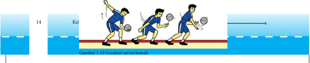

> **Deskripsi Visual:** Gambar ini adalah ilustrasi yang menunjukkan teknik servis dalam olahraga badminton. Gambar ini terdiri dari tiga bagian:

1. Bagian pertama menunjukkan posisi pemain saat melakukan servis. Pemain berada di dekat dinding lapangan dengan bola yang sedang dipukul ke udara.

2. Bagian kedua menunjukkan gerakan tangan pemain saat melakukan servis. Tangan kanan pemain mengangkat bola ke udara sementara tangan kiri memegang raket untuk menangkap bola.

3. Bagian ketiga menunjukkan posisi bola saat servis selesai. Bola berada di atas permukaan lapangan dengan jarak yang cukup jauh dari pemain.

Elemen-elemen utama dalam gambar ini adalah pemain, bola, dan raket. Pemain berada di tengah-tengah gambar, sedangkan bola dan raket terletak di sekitar mereka. Relasi antara elemen-elemen ini adalah pemain menggunakan raket untuk memukul bola ke udara, yang kemudian mencapai posisi tertentu di atas lapangan.

Teks, angka, atau label penting yang terlihat dalam gambar ini adalah "Grafik 1.19 Gekuasa servis halus" yang terletak di bawah gambar. Ini menunjukkan bahwa gambar ini merupakan bagian dari buku pelajaran tentang teknik servis dalam badminton.

Informasi kunci yang dapat diambil pembaca dari gambar ini adalah teknik dasar servis dalam olahraga badminton, termasuk posisi pemain, gerakan tangan, dan posisi bola setelah servis.

 

---
## 📄 Halaman 25

Perhatikanlah  kesalahan-kesalahan  yang  sering  terjadi  ketika  melakukan gerak  servis  bawah,  yaitu  sikap  badan  kaku,  kedua  kaki  sejajar  dan  tidak ditekuk, badan kurang membungkuk, lambungan bola terlalu tinggi, tangan yang memukul kurang diayun ke belakang, dan tidak diikuti gerakan lanjutan.

### b.  Analisis Keterampilan Gerak Servis Atas

Cobalah kalian lakukan dan analisis keterampilan gerak servis atas melalui urutan gerakan sebagai berikut:

- Berdiri dengan salah satu kaki agak ke depan (terbuka) menghadap jaring.
- Tangan  kiri  memegang  bola  dan  tangan  kanan  siap  memukul  atau sebaliknya.
- Lambungkan  bola  lebih  kurang  dari  60  cm  di  atas  depan  kepala  dan pandangan dipusatkan pada bola.
- Ayunkan lengan yang akan memukul dari belakang ke atas kemudian ke depan secara serentak.
- Pukul bola menggunakan telapak tangan.
- Gerakan  lanjutan  ke  depan  bagi  tangan  yang  memukul  diikuti  dengan melangkahkan kaki yang berada di belakang.
- Perhatikan gambar 1.20.

---
**🖼️ Gambar/Diagram**

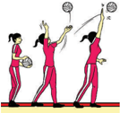

> **Deskripsi Visual:** Gambar ini adalah ilustrasi yang menunjukkan tiga orang bermain bola voli. Gambar ini menggambarkan tindakan olahraga yang seru dan aktif. Pada gambar tersebut, dua orang bermain di lapangan voli sementara orang ketiga menyaksikan pertandingan. Orang pertama sedang memukul bola ke arah orang kedua, sementara orang ketiga sedang berdiri di belakang mereka, menunggu bola untuk menerima atau memukul. Semua orang tampak bersemangat dan terlibat dalam permainan. Ini menunjukkan bahwa olahraga voli adalah aktivitas yang memerlukan koordinasi dan kecepatan.

Perhatikanlah  kesalahan-kesalahan  yang  sering  terjadi  ketika  melakukan gerak  servis  atas,  yaitu  sikap  badan  kaku,  kedua  kaki  sejajar  dan  tidak membuka, lambungan bola terlalu tinggi, tangan yang memukul kurang diayun ke belakang, dan tidak diikuti gerakan lanjutan.

 

---
## 📄 Halaman 26

### c.  Analisis Keterampilan Gerak Servis Menyamping

Cobalah  kalian  lakukan  dan  analisis  keterampilan  servis  menyamping melalui urutan gerakan sebagai berikut:

- Posisi berdiri kedua kaki sedikit dibuka menyamping ke arah net /jarring
- Tangan kiri memegang bola dan tangan kanan siap untuk memukul.
- Lambungkan  bola  ke  atas  dengan  tangan  kiri  di  atas  bahu,  bersamaan dengan gerakan itu ayunkan lengan/tangan yang akan memukul.
- Pukul dari samping ke belakang dengan telapak tangan terbuka mengarah ke bola.
- Melewati atas kepala menuju lambungan bola untuk melakukan pukulan pada bola.
- Setelah melakukan servis dilanjutkan dengan gerak lanjut dari tangan pukul yang diikuti oleh anggota tubuh lainnya.
- Perhatikan gambar 1.21.

---
**🖼️ Gambar/Diagram**

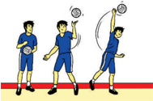

> **Deskripsi Visual:** Gambar ini adalah ilustrasi yang menunjukkan tiga orang pemain sepak bola sedang bermain. Pada gambar tersebut, elemen-elemen utama termasuk dua pemain yang sedang bergerak untuk mencoba menendang bola ke arah lawan, serta pemain ketiga yang sedang berdiri di belakang mereka, tampaknya menunggu posisi untuk bertindak. Teks, angka, atau label penting tidak ada pada gambar ini, namun informasi kunci yang dapat diambil pembaca adalah bahwa ini adalah pertandingan sepak bola antara dua tim, dengan pemain-pemain yang sedang berusaha untuk mencetak gol.

Perhatikanlah  kesalahan-kesalahan  yang  sering  terjadi  ketika  melakukan gerak  servis  menyamping,  yaitu  sikap  badan  kaku,  kedua  kaki  tidak  sejajar, badan tidak menyamping, lambungan bola terlalu tinggi, tangan yang memukul kurang diayun, dan tidak diikuti gerakan lanjutan.

### d.  Aktivitas Pembelajaran Keterampilan Gerak Servis

Cobalah  kalian  lakukan  aktivitas  belajar  di  bawah  ini  untuk  belajar keterampilan gerak servis bawah, atas, dan menyamping:

- Berdiri secara berpasangan (satu bola untuk dua orang) di belakang garis lapangan.
- Salah satu peserta didik melakukan servis bawah, atas, dan menyamping dengan berusaha melewati net /jaring.
- Peserta didik yang lain (pasangan) menangkap bola di daerah lapangannya.
16

 

---
## 📄 Halaman 27

- Bergantian  melakukan  servis  dan  menangkap  bola  hingga  waktu  yang ditentukan oleh guru.
- Susunlah rencana perbaikan dari aktivitas yang baru saja dilakukan baik sendiri, bersama teman atau guru untuk perbaikan aktivitas gerakan yang akan datang sesuai ketentuan gerakan yang ada.
- Perhatikan gambar 1.22.

---
**🖼️ Gambar/Diagram**

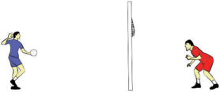

> **Deskripsi Visual:** Gambar ini adalah ilustrasi yang menunjukkan dua orang pemain voli bermain di lapangan. Pemain di sebelah kiri sedang memukul bola voli dengan tangan kanannya, sementara pemain di sebelah kanan sedang berdiri di depan pagar untuk menangkap bola. Ilustrasi ini menunjukkan aktivitas permainan voli dan posisi pemain saat pertandingan. Teks, angka, atau label penting tidak ada pada gambar ini. Informasi kunci yang dapat diambil pembaca adalah bahwa ini adalah gambar ilustrasi permainan voli dan posisi pemain saat bermain.

### 3. Analisis Keterampilan Gerak Passing

### a.  Analisis Keterampilan Gerak Passing Bawah

Cobalah  kalian  lakukan  dan  analisis  keterampilan  gerak passing bawah melalui urutan gerakan sebagai berikut:

- Berdiri seimbang dengan kedua kaki dibuka selebar bahu dan salah satu kaki di depan.
- Lutut sedikit ditekuk dan badan agak condong ke depan.
- Pandangan ke arah bola
- Kedua lengan dirapatkan dan lurus ke depan bawah.
- Ayunkan kedua lengan secara bersama-sama lurus ke atas depan bersamaan dengan meluruskan kedua lutut.
- Perkenaan pada kedua tangan
- Sikap akhir adanya gerak lanjut dari lengan yang diikuti anggota tubuh lainnya.
- Perhatikan gambar 1.23.

---
**🖼️ Gambar/Diagram**

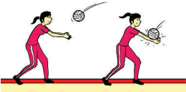

> **Deskripsi Visual:** Gambar ini adalah ilustrasi yang menunjukkan dua orang siswa sedang bermain badminton. Gambar ini menggambarkan pertarungan badminton antara dua pemain yang berada di lapangan dengan latar belakang merah. Pemain pertama menggunakan raket yang lebih besar dan lebih tinggi, sementara pemain kedua menggunakan raket yang lebih kecil dan lebih rendah. Kedua pemain tampak bergerak aktif dan fokus pada bola yang mereka coba tembus. Ilustrasi ini menunjukkan posisi dan gerakan yang tepat saat bermain badminton, serta perbedaan teknik yang digunakan oleh dua pemain.

 

---
## 📄 Halaman 28

Perhatikanlah  kesalahan-kesalahan  yang  sering  terjadi  ketika  melakukan gerak passing bawah, yaitu: sikap badan kaku, berdiri tidak seimbang karena kedua  kaki  tidak  dibuka,  lutut  tidak  ditekuk,  kedua  lengan  kurang  rapat, ayunan lengan dan meluruskan lutut tidak bersamaan, perkenaan bola tidak pada kedua tangan, dan tidak diikuti gerak lanjutan.

### b.  Analisis Keterampilan Gerak Passing Atas

Cobalah kalian lakukan dan analisis keterampilan gerak passing atas dapat dilakukan melalui urutan gerakan sebagai berikut:

- Berdiri seimbang dengan tumpuan kedua kaki dan salah satu kaki di depan.
- Pandangan diarahkan pada bola.
- Badan sedikit condong ke depan.
- Kedua tangan terbuka di atas depan kepala dengan siku bengkok ke samping.
- Telapak tangan terbuka dan jari-jari tangan direnggangkan, kedua ibu jari berdekatan.
- Dorong bola ke atas dengan menggunakan pangkal jari-jari tangan diikuti dengan gerakan meluruskan kedua siku dan kedua lutut diluruskan sehingga badan lurus.
- Sikap akhir merupakan gerak lanjut dari kedua lengan diikuti oleh anggota tubuh lainnya.
- Perhatikan gambar 1.24.

---
**🖼️ Gambar/Diagram**

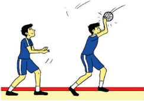

> **Deskripsi Visual:** Gambar ini adalah ilustrasi yang menunjukkan dua orang pemain sepak bola sedang bermain. Pemain di sebelah kiri sedang berdiri dengan posisi yang siap untuk bertahan, sementara pemain di sebelah kanan sedang mencoba mencetak gol dengan mengambil bola dari langit. Ilustrasi ini menunjukkan aksi pertandingan sepak bola dan interaksi antara dua pemain. Elemen-elemen utama termasuk dua pemain, bola sepak bola, dan lapangan sepak bola. Teks, angka, atau label penting tidak ada pada gambar ini. Informasi kunci yang dapat diambil pembaca adalah bahwa ada pertandingan sepak bola sedang berlangsung dan dua pemain sedang berinteraksi dalam upaya mencetak gol.

Kelas XI SMA/MA/SMK/MAK

 

---
## 📄 Halaman 29

Perhatikanlah  kesalahan-kesalahan  yang  sering  terjadi  ketika  melakukan gerak passing atas, yaitu: sikap badan kaku, berdiri tidak seimbang karena kedua kaki tidak dibuka dan sejajar, lutut tidak ditekuk, kedua lengan tidak berada di atas depan kepala, perkenaan bola tidak pada jari-jari tangan, dorongan tidak bersamaan dengan meluruskan siku dan lutut, dan tidak diikuti gerak lanjutan.

### c.  Aktivitas Pembelajaran Keterampilan Gerak Passing

### 1)  Aktivitas pembelajaran I

Cobalah  lakukan  aktivitas  belajar  satu  di  bawah  ini  untuk  belajar keterampilan gerak passing bawah dan atas:

- Peserta didik saling berpasangan (satu bola oleh dua orang) dipisahkan oleh net /jaring.
- Permulaan permainan diawali dengan lemparan.
- Para  peserta  didik  berupaya  saling  memindahkan  bola  melewati net / jarring dengan passing bawah atau atas.
- Selama bola belum menyentuh lantai, bola dinyatakan dalam permainan (bola hidup).
- Peserta didik yang dapat menjatuhkan bola di daerah lawannya mendapat angka satu.
- Peserta  didik  yang  lebih  dulu  mengumpulkan  angka  15  dinyatakan sebagai pemenang, kecuali deuce , maka peserta didik yang mendapatkan nilai selisih dua yang menang.
- Susunlah rencana perbaikan dari aktivitas yang baru saja dilakukan baik sendiri,  bersama  teman  atau  guru  untuk  perbaikan  aktivitas  gerakan yang akan datang sesuai ketentuan gerakan yang ada.
- Perhatikan gambar 1.25.

---
**🖼️ Gambar/Diagram**

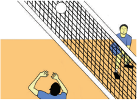

> **Deskripsi Visual:** Gambar ini adalah ilustrasi yang menunjukkan pertandingan voli di lapangan. Gambar ini menggambarkan dua pemain voli yang sedang bermain. Pemain di depan tampak sedang mencoba memukul bola ke arah pemain di belakang. Net yang berwarna putih dengan garis hitam memisahkan kedua pihak. Latar belakang tampak seperti lapangan voli dengan lantai berlapis kayu dan dinding yang berwarna abu-abu. Di bagian atas gambar, ada tulisan "Pertandingan Voli" yang menunjukkan topik gambar ini.

 

---
## 📄 Halaman 30

### 2)  Aktivitas pembelajaran II

Cobalah  lakukan  aktivitas  belajar  satu  di  bawah  ini  untuk  belajar keterampilan gerak passing bawah dan atas:

- Peserta didik dibagi dalam kelompok (satu kelompok tiga orang).
- Lapangan  dengan  lebar  3  meter, net dapat  menggunakan  tali/tambah yang direntangkan sepanjang lapangan.
- Permulaan permainan diawali dengan lemparan.
- Setiap  kelompok  berupaya  untuk  memindahkan  bola  dengan  passing bawah atau atas.
- Setiap kelompok hanya boleh menyentuh bola tiga kali.
- Selama bola belum menyentuh dinding lantai, bola dinyatakan dalam permainan (bola hidup).
- kelompok yang dapat menjatuhkan bola di daerah lawannya mendapat angka satu.
- Peserta  yang  lebih  dulu  mengumpulkan  angka  15  dinyatakan  sebagai pemenang, kecuali deuce , maka regu yang mendapatkan nilai selisih dua yang menang.
- Susunlah rencana perbaikan dari aktivitas yang baru saja dilakukan baik sendiri,  bersama  teman  atau  guru  untuk  perbaikan  aktivitas  gerakan yang akan datang sesuai ketentuan gerakan yang ada.
- Perhatikan gambar 1.26.

---
**🖼️ Gambar/Diagram**

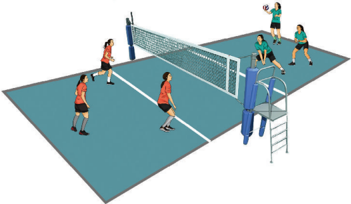

> **Deskripsi Visual:** Gambar ini adalah ilustrasi yang menunjukkan pertandingan voli di lapangan. Lapangan voli terbagi menjadi dua area berbeda oleh net yang melengkung. Di area depan, ada empat pemain yang sedang bermain, dengan dua di sisi kanan dan dua di sisi kiri. Mereka semua mengenakan seragam berwarna merah dan putih, menunjukkan bahwa mereka berada dalam tim yang sama. Di area belakang, ada dua pemain lagi yang sedang berdiri di pinggir lapangan, tampaknya menunggu untuk bertindak. Net yang melengkung memisahkan kedua area tersebut, dengan pemain di belakang tampaknya berada di area yang lebih tinggi. Gambar ini menunjukkan aktivitas dan posisi pemain dalam pertandingan voli, serta bagaimana net memisahkan dua area bermain.

Kelas XI SMA/MA/SMK/MAK

 

---
## 📄 Halaman 31

### 4. Analisis Keterampilan Gerak Smash

Smash adalah usaha memukul bola untuk melakukan  serangan  keras  yang  ditujukan pada  pertahanan  lawan.  Cobalah  kalian lakukan  dan  analisis  keterampilan  gerak smash melalui urutan gerakan sebagai berikut.

- Berdiri  menghadap net /jaring  dengan jarak 2-3 langkah.
- Ambil awalan dengan langkah lebar dan datar.
- Kedua  lengan  diayunkan  ke  belakang dan pandangan ke arah bola.
- Lakukan  tolakan  dengan  menekuk  kedua  lutut  kemudian  lanjutkan  dengan loncatan.
- Ayunkan lengan yang akan memukul ke depan dan punggung melenting ke belakang.
- Bola dipukul dengan lengan terjulur, telapak tangan terbuka, dan menaungi bola dengan melecutkan pergelangan tangan.
- Pendaratan dilakukan dengan kedua kaki secara bersamaan dan lutut mengeper.
- Perhatikan Gambar 1.27.
Perhatikanlah kesalahan-kesalahan yang sering terjadi ketika melakukan gerak smash, yaitu: sikap badan kaku, berdiri terlalu dekat dengan net /jaring,  awalan langkah  terlalu  banyak  dan  lebar,  tolakan  tidak  menekuk  lutut,  lengan  tidak terayun ke depan pada saat akan memukul bola, dan pendaratan tidak dilakukan dengan lutut mengeper.

### a.  Aktivitas pembelajaran keterampilan Gerak Smash

Coba kalian lakukan aktivitas belajar ini untuk belajar keterampilan gerak smash :

- Peserta didik berkelompok sebanyak 3 orang. satu kelompok mendapatkan satu bola.
- Satu  peserta  didik  sebagai  penangkap  bola,  satu  peserta  didik  sebagai pengumpan, dan satu peserta didik sebagai smasher .
- Peserta didik penangkap bola berada di daerah lapangan yang terpisahkan net /jaring dengan peserta didik sebagai pengumpan dan smasher .

---
**🖼️ Gambar/Diagram**

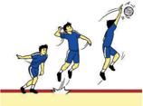

> **Deskripsi Visual:** Gambar ini adalah ilustrasi yang menunjukkan pertandingan sepak bola. Gambar ini menggambarkan dua pemain sepak bola bermain di lapangan. Pemain yang berada di depan tampak sedang mencoba memukul bola dengan kaki, sementara pemain di belakang tampak sedang berusaha untuk menghentikan bola tersebut. Ilustrasi ini menunjukkan interaksi antara pemain dan bola serta posisi mereka di lapangan.

Elemen-elemen utama dalam gambar ini adalah pemain sepak bola, bola, dan lapangan sepak bola. Pemain sepak bola terdiri dari dua orang yang sedang bermain, sedangkan bola tampak di tengah-tengah mereka. Lapangan sepak bola tampak luas dan terlihat jelas, menunjukkan bahwa ini adalah pertandingan sepak bola profesional.

Teks, angka, atau label penting yang terlihat dalam gambar ini tidak ada. Namun, informasi kunci yang dapat diambil pembaca melalui gambar ini adalah bahwa ini adalah pertandingan sepak bola dan posisi pemain dan bola di lapangan.

 

---
## 📄 Halaman 32

- Peserta didik smasher melambungkan bola kepada peserta didik pengumpan kemudian mengumpankan bola dengan passing atas/bawah mendekati net / jaring.
- Peserta didik smasher memukul bola melewati dan diarahkan pada peserta didik penangkap bola yang berada di seberang net /jaring.
- Peserta  didik  penangkap  berupaya  untuk  menangkap  bola  dan  berganti menjadi smasher setelah melakukan smash .
- Peserta  didik smasher berganti  menjadi  pengumpan  dan  peserta  didik pengumpan berganti menjadi penangkap bola.
- Begitu seterusnya hingga waktu yang ditentukan guru.
- Aktivitas ini juga menggabungkan keterampilan gerak passing dan smash .
- 10)Susunlah  rencana  perbaikan  dari aktivitas yang baru saja dilakukan baik  sendiri,  bersama  teman  atau guru untuk perbaikan aktivitas gerakan  yang  akan  datang  sesuai ketentuan gerakan yang ada.
- Perhatikan gambar 1.28.

---
**🖼️ Gambar/Diagram**

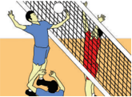

> **Deskripsi Visual:** Gambar ini adalah ilustrasi yang menunjukkan pertandingan voli. Gambar ini menggambarkan dua pemain voli yang sedang bermain. Pemain di sebelah kiri menggunakan tangan untuk menangkap bola, sementara pemain di sebelah kanan sedang berusaha untuk menendang bola ke arah pemain di sebelah kiri. Net voli tampak jelas di tengah gambar, dengan pemain di setiap sisi net yang berada dalam posisi siap bertarung. Di bawah net, ada beberapa penonton yang sedang menyaksikan pertandingan. Gambar ini menunjukkan interaksi antara pemain dan net serta antara pemain dan penonton dalam konteks pertandingan voli.

### 5. Analisis Keterampilan Gerak Membendung ( Blocking )

Bendungan  ( Blocking )  adalah  upaya  menggagalkan  serangan  ( smash )  dari pihak lawan dengan cara membentangkan satu atau kedua lengan di atas jaring sambil  meloncat. Blocking dapat  dibedakan  menjadi Blocking tangan  aktif  dan pasif. Cara membendung dapat dilakukan oleh satu orang, dua orang, atau tiga orang, tergantung kuat atau tidaknya serangan ( smash ) dari lawan.

Cobalah kalian lakukan dan analisis keterampilan gerak bendungan/ blocking melalui urutan gerakan sebagai berikut:

- Berdiri menghadap net /jaring.
- Amati bola dan pemain lawan.
- Meloncat dari posisi agak jongkok kedua tangan di depan atas setinggi bahu.
- Julurkan kedua tangan ke atas untuk menghadang dan menutup bola yang dipukul.
- Mendaratlah dengan kedua kaki secara bersamaan dan lutut mengeper.
22

 

---
## 📄 Halaman 33

Perhatikanlah kesalahan-kesalahan yang sering terjadi ketika melakukan gerak bendungan/ blocking , yaitu: sikap badan kaku, berdiri tidak menghadap net /jaring, awalan loncat kurang maksimal karena tolakan tidak menekuk lutut, kedua tangan tidak berada di atas depan, kedua tangan kurang dijulurkan melewati net /jaring, dan pendaratan tidak dilakukan dengan lutut mengeper.

### a.  Aktivitas pembelajaran Keterampilan Gerak Bendungan ( Blocking )

Cobalah kalian lakukan aktivitas belajar di bawah ini untuk belajar gerak bendungan/ blocking :

- Peserta didik berkelompok sebanyak 3 orang. satu kelompok mendapatkan satu bola.
- Satu peserta didik sebagai pembendung/ blocker , satu peserta didik sebagai pengumpan, dan satu peserta didik sebagai smasher .
- Peserta  didik  pembendung/ blocker berada di daerah lapangan yang terpisahkan net /jaring  dengan  peserta  didik  sebagai  pengumpan  dan smasher .
- Peserta didik smasher melambungkan bola kepada peserta didik pengumpan kemudian mengumpankan bola dengan passing atas/bawah mendekati net / jaring. Peserta didik smasher memukul bola melewati.
- Peserta didik pembendung/ blocker berupaya untuk membendung bola dan berganti menjadi smasher setelah melakukan bendungan.
- Peserta  didik smasher berganti  menjadi pengumpan dan peserta didik pengumpan berganti menjadi pembendung/ blocker .
- Begitu seterusnya hingga waktu yang ditentukan guru.
- Aktivitas ini juga menggabungkan keterampilan  gerak passing , smash ,  dan bendungan/ blocking .
- Susunlah rencana perbaikan dari aktivitas yang  baru  saja  dilakukan  baik  sendiri, bersama teman atau guru untuk perbaikan aktivitas gerakan yang akan datang sesuai ketentuan gerakan yang ada.
- Perhatikan gambar 1.30.

---
**🖼️ Gambar/Diagram**

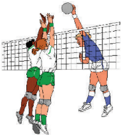

> **Deskripsi Visual:** Gambar ini adalah ilustrasi yang menunjukkan pertandingan voli antara dua tim. Gambar ini menggambarkan dua pemain voli yang sedang berusaha mencetak bola ke gawang lawan. Pemain di sebelah kiri menggunakan tangan untuk mencoba mencetak bola, sementara pemain di sebelah kanan sedang berusaha melindungi bola dengan menggunakan tangan. Dua pemain lainnya tampaknya sedang berada di posisi bertahan, menunggu aksi selanjutnya. Ilustrasi ini menunjukkan interaksi tim dalam pertandingan voli, termasuk gerakan fisik dan strategi yang digunakan oleh pemain untuk mencetak bola ke gawang.

 

---
## 📄 Halaman 34

### 6. Ringkasan

Permainan bola voli adalah permainan yang berupaya memukul bola di udara hilir mudik di atas net /jaring, dengan maksud dapat menjatuhkan bola pada daerah kosong lapangan lawan. Keterampilan gerak dalam permainan bola voli meliputi keterampilan gerak servis (bawah, atas, dan menyamping), passing atas dan bawah, smash , dan bendungan ( blocking ). Keterampilan gerak dalam permainan bola voli dapat dikembangkan melalui aktivitas belajar secara individu, berpasangan dan berkelompok.  Pada  saat  belajar  keterampilan  gerak  bola  voli  perlu  diterapkan pula sikap yang baik, seperti: sportif, bekerjasama, toleransi, disiplin, menerima kekalahan dan kemenangan.

### 7. Penilaian

### a.  Pengetahuan

Pengetahuan peserta didik akan dinilai melalui portfolio , tes tertulis maupun penugasan tentang hasil kerja kajian konsep, dan prinsip permainan bola voli.

### b.  Sikap

Sikap peserta didik selama mengikuti pelajaran permainan bola voli akan dinilai melalui Observasi sikap/perilaku peserta didik yang meliputi tanggung jawab,  toleransi,  disiplin,  kerjasama,  menerima  kekalahan  dan  kemenangan yang menjunjung tinggi sportifitas yang dapat digunakan sebagai pertimbangan guru dalam mengembangkan karakter peserta didik lebih lanjut.

### c.  Keterampilan

Keterampilan  peserta  didik  akan  dinilai  melalui  unjuk  kerja  selama mengikuti pembelajaran permainan bola voli yang meliputi (1) keterampilan, (2) pengambilan keputusan, (3) dukungan, dan (4) penampilan bermain.

### C. Analisis Keterampilan Gerak Permainan Bola basket

### 1. Permainan Bola Basket

Permainan  bola  basket  adalah  suatu  permainan  yang  dimainkan  oleh  dua regu  putra  maupun  putri,  yang  masing-masing  regu  terdiri  dari  lima  orang pemain. Tujuan permainan basket adalah membuat angka sebanyak-banyaknya dengan cara memasukkan bola ke basket/keranjang lawan dan mencegah pemain lawan untuk membuat angka/memasukkan bola ke basket/keranjang regu kita.

Kelas XI SMA/MA/SMK/MAK

 

---
## 📄 Halaman 35

Dalam  memainkan  bola  setiap  pemain  boleh  mendorong  bola,  memukul  bola dengan  telapak  tangan  terbuka,  melemparkan  bola,  menggelundungkan  atau menggiring bola ke segala arah dalam lapangan permainan. Keterampilan gerak dalam  permainan  bola  basket  adalah  mengoper/ passing ,  menggiring/ dribbling , menembak ke ring / shooting , menumpu satu kaki/ pivot .

Bola  basket  termasuk  jenis  permainan  yang  kompleks  gerakannya.  Artinya gerakannya  terdiri  dan  gabungan  unsur-unsur  gerak  yang  terkoordinir  rapi, sehingga dapat bermain dengan baik. Tujuan permainan bola basket memasukkan bola  ke  keranjang  lawan  dan  menjaga  keranjang  sendiri  agar  tidak  kemasukan bola. Untuk dapat memainkan bola dengan baik perlu melakukan keterampilan gerakan dengan baik. Pada permainan bola basket, gerakan yang efektif dan efisien perlu didasarkan pada penguasaan keterampilan gerak yang baik.

### 2. Analisis Keterampilan Gerak Mengoper Bola

### a.  Analisis Mengoper Bola Setinggi Dada

Cobalah  kalian  lakukan  dan  analisis  keterampilan  gerak  mengoper  bola setinggi dada melalui urutan gerakan sebagai berikut:

- Berdiri kedua kaki dibuka selebar bahu dan salah satu kaki berada di depan.
- Pandangan lurus ke arah sasaran.
- Bola dipegang dengan kedua tangan di depan dada dan posisi siku ditekuk mendekati badan.
- Dorong  bola  dengan  meluruskan  lengan  dan  ibu  jari  diputar  ke  bawah sehingga tangan lurus dan lecutan pegelangan tangan.
- Langkahkan kaki belakang untuk gerakan lanjutan agar badan seimbang.
- Perhatikan gambar 1.31.

---
**🖼️ Gambar/Diagram**

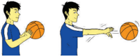

> **Deskripsi Visual:** Gambar ini adalah ilustrasi yang menunjukkan dua orang pemain bola basket sedang bermain. Pada gambar pertama, salah satu pemain memegang bola basket dengan tangan kanannya, sedangkan pada gambar kedua, pemain tersebut telah mengambil bola dengan menggunakan teknik dribbling. Ilustrasi ini menunjukkan proses dasar dalam olahraga basket, yaitu memegang dan mengambil bola. Elemen-elemen utama dalam gambar ini adalah dua pemain, bola basket, dan teknik dribbling. Informasi kunci yang dapat diambil dari gambar ini adalah bahwa pemain harus memiliki kemampuan untuk memegang dan mengambil bola dengan tepat saat bermain basket.

Perhatikanlah  kesalahan-kesalahan  yang  sering  terjadi  ketika  melakukan gerak mengoper bola setinggi dada, yaitu: saat berdiri kaki tidak membuka, kaki sejajar, bola tidak dipegang dengan kedua tangan, dorongan bola kurang maksimal, dan tidak ada gerakan lanjutan.

### b.  Analisis Mengoper Bola dengan Pantulan

Pendidikan Jasmani Olahraga dan Kesehatan

 

---
## 📄 Halaman 36

Cobalah  kalian  lakukan  dan  analisis  keterampilan  gerak  mengoper  bola dengan pantulan melalui urutan gerakan sebagai berikut:

- Berdiri kedua kaki dibuka selebar bahu dan salah satu kaki berada di depan.
- Kedua tangan memegang bola dan salah satu  tangan  ditempatkan  di  belakang bola.
- Dorong  bola  ke  arah  bawah  sehingga memantul ke lantai/tanah.
- Langkahkan kaki belakang untuk gerakan lanjutan agar badan seimbang.
- Perhatikan gambar 1.32.
Perhatikanlah  kesalahan-kesalahan  yang  sering  terjadi  ketika  melakukan gerak mengoper bola dengan pantulan, yaitu: saat berdiri kaki tidak membuka, kaki sejajar, satu tangan tidak memegang bola di bagian belakang, dorongan bola kurang maksimal, memantulkan bola terlalu dekat dengan diri sendiri dan penerima, serta tidak ada gerakan lanjutan.

### c.  Analisis Mengoper Bola dengan Satu Tangan

Cobalah  kalian  lakukan  dan  analisis  keterampilan  gerak  mengoper  bola dengan satu tangan melalui urutan gerakan sebagai berikut:

- Berdiri kedua kaki dibuka selebar bahu dan salah satu kaki berada di depan.
- Salah satu tangan memegang bola.
- Pindahkan berat badan ke belakang kemudian dorong bola ke atas dengan mengayunkan tangan ke depan atas.
- Lepaskan bola ketika tangan lurus ke depan.
- Langkahkan kaki belakang untuk gerakan lanjutan agar badan seimbang.
- Perhatikan gambar 1.33.

---
**🖼️ Gambar/Diagram**

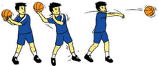

> **Deskripsi Visual:** Gambar ini adalah ilustrasi yang menunjukkan tiga orang pemain bola basket sedang bermain. Pada gambar tersebut, elemen utama adalah tiga pemain basket yang sedang bergerak dan memegang bola. Relasi antara mereka adalah bahwa mereka sedang bermain bola basket bersama-sama. Teks, angka, atau label penting yang terlihat pada gambar ini tidak ada karena gambar hanya menggambarkan tindakan pemain basket tanpa teks atau angka tambahan. Informasi kunci yang dapat diambil pembaca adalah bahwa ini adalah gambar ilustrasi tentang permainan bola basket.

Kelas XI SMA/MA/SMK/MAK

---
**🖼️ Gambar/Diagram**

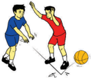

> **Deskripsi Visual:** Gambar ini adalah ilustrasi yang menunjukkan dua orang pemain bola basket bermain di lapangan. Pemain di sebelah kiri mengenakan seragam biru dengan logo tim, sedangkan pemain di sebelah kanan mengenakan seragam merah. Mereka sedang bergerak untuk mencoba memukul bola basket yang berada di tengah lapangan. Ilustrasi ini menunjukkan aksi pertandingan bola basket, dengan pemain yang berusaha untuk mencuri bola dan melepaskan bola ke temannya. Label "Bola Basket" tampak jelas pada bola yang sedang dipukul oleh pemain. Informasi kunci yang dapat diambil dari gambar ini adalah bahwa pertandingan bola basket sedang berlangsung dan permainan dimainkan di lapangan olahraga.

 

---
## 📄 Halaman 37

Perhatikanlah  kesalahan-kesalahan  yang  sering  terjadi  ketika  melakukan gerak  mengoper  bola  dengan  satu  tangan,  yaitu:  saat  berdiri  kaki  tidak membuka,  kaki  sejajar,  tangan  kurang  maksimal  dalam  memegang  bola, dorongan bola kurang maksimal, dan tidak ada gerakan lanjutan.

### d.  Analisis  Mempraktikkan  Gerak  Mengoper  Bola  dalam  Bentuk Bermain

Coba  lakukan  aktivitas  belajar  di  bawah  ini  untuk  belajar  keterampilan gerak mengoper bola setinggi dada, dengan pantulan, dan dengan satu tangan:

- Permainan ini dimainkan oleh satu kelompok (enam orang).
- Penyerang harus berupaya untuk menguasai bola selama mungkin dengan menggunakan teknik mengoper bola setinggi dada, dengan pantulan, dan dengan satu tangan.
- Pemain bertahan sebisa mungkin menggagalkan penyerangan yang di lakukan tiga penyerang dengan segala cara tanpa melanggar aturan.
- Jika  dalam  waktu  5  menit tim penyerang tidak bisa mencetak  angka  lebih  dari sepuluh bola maka tim menyerang  di  anggap  gagal/ kalah  dan  bergantian  peran dengan yang bertahan.
- Perhatikan gambar 1.34.

---
**🖼️ Gambar/Diagram**

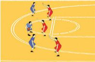

> **Deskripsi Visual:** Gambar ini adalah ilustrasi yang menunjukkan pertandingan bola basket. Gambar ini menggambarkan beberapa pemain basket bermain di lapangan basket dengan latar belakang warna kuning. Pemain-pemain tersebut terdiri dari dua tim, satu tim berpakaian biru dan lainnya berpakaian merah. Mereka sedang bergerak dan berinteraksi dalam pertandingan. Ilustrasi ini menunjukkan posisi dan gerakan pemain saat mereka bermain basket. Label "B" pada gambar mungkin merujuk pada titik tertentu di lapangan basket atau nama tim. Informasi kunci yang dapat diambil dari gambar ini adalah bahwa ini adalah pertandingan bola basket antara dua tim, dan pemain-pemain sedang bergerak dan berinteraksi dalam pertandingan tersebut.

### 3. Analisis Keterampilan Gerak Menggiring Bola

Cobalah lakukan dan analisis keterampilan gerak menggiring bola melalui urutan gerakan sebagai berikut:

- Berdiri dengan badan sedikit condong ke depan.
- Salah satu kaki di depan dengan lutut sedikit ditekuk.
- Pegang bola dengan dua tangan di samping badan.
- Pandangan ke depan atau kepala lawan.
- Pantulkan bola dengan satu tangan dengan teratur.
- Saat bola bergerak ke atas, telapak tangan menerima bola dan usahakan mengikuti gerak bola ke atas (usahakan perkenaan tangan dan bola tidak bersuara).

---
**🖼️ Gambar/Diagram**

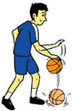

> **Deskripsi Visual:** Gambar ini adalah ilustrasi yang menunjukkan seorang pemain bola basket sedang melakukan gerakan dribbling. Gambar ini menggambarkan tindakan dasar dalam olahraga basket, yaitu memegang bola dengan baik dan menggerakkan bola dengan jari-jari tangan. Pemain tersebut menggunakan tangan kanan untuk mengendalikan bola, sementara tangan kiri digunakan untuk menjaga keseimbangan dan mengurangi kemungkinan kecelakaan. Ilustrasi ini membantu pembaca memahami posisi tubuh dan teknik yang diperlukan saat melakukan dribbling dalam permainan basket.

 

---
## 📄 Halaman 38

- Cobalah lakukan dengan berjalan, lari pelan, dan lari agak cepat.

### h.  Perhatikan gambar 1.35

Perhatikanlah kesalahan-kesalahan yang sering terjadi ketika melakukan gerak menggiring bola, yaitu: saat berdiri salah satu kaki tidak berada di depan, pantulan bola ke bawah terlalu keras, pantulan tidak teratur, pandangan terlalu menunduk, dan telapak tangan terlalu kaku.

### a.  Aktivitas pembelajaran Keterampilan Gerak Menggiring Bola

Coba  kalian  lakukan  aktivitas  belajar  di  bawah  ini  untuk  belajar  gerak menggiring bola:

- Permainan ini dimainkan secara berpasangan.
- Satu pasangan mendapatkan satu bola.
- Salah  satu  peserta  didik  berusaha  menggiring  bola  hingga  batas  garis lapangan yang ditentukan.
- Peserta didik yang lain berupaya merebut bola dengan cara membayangi peserta didik pasangannya yang sedang menggiring bola.
- Lakukan aktivitas tersebut secara bergantian  hingga  waktu  yang  telah ditentukan oleh gurumu.
- Susunlah rencana perbaikan dari aktivitas yang baru saja dilakukan baik sendiri, bersama teman atau guru untuk perbaikan aktivitas gerakan yang akan datang  sesuai  ketentuan  gerakan  yang ada.
- Perhatikan gambar 1.36.

---
**🖼️ Gambar/Diagram**

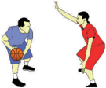

> **Deskripsi Visual:** Gambar ini adalah ilustrasi yang menunjukkan dua orang pemain bola basket bermain. Pemain di sebelah kiri sedang memegang bola basket dan tampak siap untuk melakukan gerakan, sementara pemain di sebelah kanan sedang berdiri dengan posisi yang menunjukkan siap untuk bertahan atau menghentikan pergerakan pemain di sebelah kiri. Ilustrasi ini menunjukkan konsep pertarungan dalam olahraga basket, dengan fokus pada posisi dan gerakan pemain. Teks, angka, atau label penting tidak ada dalam gambar ini. Informasi kunci yang dapat diambil pembaca adalah tentang pertarungan dalam olahraga basket dan posisi pemain saat bermain.

### 4. Analisis Keterampilan Gerak Menembak Bola ke Ring/Keranjang

### a.  Analisis Menembak Bola dengan Satu Tangan

Cobalah kalian lakukan dan analisis keterampilan gerak menembak bola dengan satu tangan melalui urutan gerakan sebagai berikut:

- Sikap  awal  berdiri  tegak  menghadap  ring/keranjang,  salah  satu  kaki  di depan dengan rileks.
- Peganglah bola dengan dua tangan.
- Dorong  bola  ke  depan  atas  dari  bahu  sebelah  kanan,  dengan  sedikit memutar lengan ke arah bawah kanan sebelah luar, sehingga sebagian besar berat  bola  terletak  di  permukaan  jari-jari  dan  hampir  di  seluruh  telapak tangan kanan/kiri.
28

 

---
## 📄 Halaman 39

---
**🖼️ Gambar/Diagram**

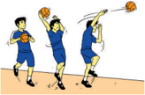

> **Deskripsi Visual:** Gambar ini adalah ilustrasi yang menunjukkan tiga pemain bola basket bermain di lapangan. Pemain pertama sedang melempar bola ke arah pemain kedua, sementara pemain ketiga berada di posisi untuk menerima bola. Ilustrasi ini menunjukkan aksi permainan basket yang seru dan dinamis. Pemain-pemain tersebut dikenali dengan pakaian olahraga basket yang berwarna biru dan putih. Lapangan basket tampak jelas dengan garis-garis yang menunjukkan area permainan. Ilustrasi ini menggambarkan situasi yang sering terjadi dalam pertandingan basket, yaitu saat pemain melakukan tendangan atau lemparan. Ini juga menunjukkan hubungan antara pemain dalam tim, dimana setiap pemain memiliki peran dan posisi yang spesifik dalam pertandingan.

- Tangan  kiri/kanan  membantu  agar bola tidak jatuh sebelum dilemparkan atau ditembakkan.
- Pada saat akan melepaskan tembakan, tekuk kedua lutut serta tariklah bola sedikit  ke  belakang  dengan  irama gerakan menolak tembakan.
- Setelah  bola  lepas,  pindahkan  berat badan ke kaki depan dan melangkah.
- Perhatikan gambar 1.37.
Perhatikanlah  kesalahan-kesalahan  yang  sering  terjadi  ketika  melakukan gerak menembak bola dengan satu tangan, yaitu: saat berdiri salah satu kaki tidak berada di depan, dorongan bola kurang kuat dan tidak ke arah depan atas,  tangan  yang  menembak terlalu kaku, lutut kurang ditekuk ketika akan melepaskan bola, dan tidak ada gerakan lanjutan.

### b.  Analisis Menembak Bola dengan Dua Tangan dan Loncatan

Cobalah kalian lakukan dan analisis keterampilan gerak menembak bola dengan dua tangan dan loncatan melalui urutan gerakan sebagai berikut:

- Berdiri, badan agak condong dengan kaki dibuka selebar bahu.
- Kedua telapak tangan memegang bola membentuk huruf 'W' di depan dada.
- Pandangan ke ring
- Angkat bola ke atas kepala bagian depan, kemudian tekuk kedua lutut.
- Lepaskan bola ke arah ring bersamaan dengan  meluruskan  kedua  lutut  dan sedikit loncatan.
- Lecutkan  kedua  tangan  dan  mendaratlah dengan  mengeperkan  kedua  lutut  dan salah satu kaki di depan.
- Perhatikan gambar 1.38.

---
**🖼️ Gambar/Diagram**

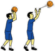

> **Deskripsi Visual:** Gambar ini adalah ilustrasi yang menunjukkan dua orang pemain bola basket sedang bermain. Pada gambar tersebut, elemen utama adalah dua pemain basket yang sedang bergerak untuk melempar bola ke arah tembok. Pemain di sebelah kiri sedang berdiri dengan posisi yang menunjukkan bahwa dia akan melempar bola, sementara pemain di sebelah kanan sedang berjalan menuju bola yang telah dilempar oleh pemain di sebelah kiri.

Elemen-elemen lain yang penting dalam gambar ini meliputi bola basket, tembok, dan pakaian olahraga yang digunakan oleh pemain. Bola basket tampak besar dan berwarna merah, sedangkan tembok tampak lebih kecil dan berwarna putih. Pakaian olahraga yang digunakan oleh pemain tampak jelas dan berwarna biru.

Teks, angka, atau label penting tidak ada dalam gambar ini karena gambar hanya menggambarkan aksi langsung tanpa teks atau angka tambahan. Informasi kunci yang dapat diambil dari gambar ini adalah tentang permainan basket dan posisi pemain saat mereka bermain.

Dalam satu paragraf yang informatif, gambar ini menunjukkan dua pemain basket sedang bermain dan melempar bola ke arah tembok. Pemain di sebelah kiri sedang berdiri dan menunjukkan tindakan melempar, sementara pemain di sebelah kanan sedang berjalan menuju bola. Bola basket berwarna merah dan tembok berwarna putih tampak jelas. Pakaian olahraga yang digunakan oleh pemain tampak jelas dan berwarna biru.

Perhatikanlah  kesalahan-kesalahan  yang  sering  terjadi  ketika  melakukan gerak menembak bola dengan dua tangan dan loncatan, yaitu: saat berdiri kaki tidak dibuka, dorongan bola kurang kuat dan tidak ke arah depan atas, tangan yang menembak terlalu kaku, lutut kurang ditekuk ketika akan melepaskan bola, tidak ada loncatan, dan tidak ada gerakan lanjutan.

 

---
## 📄 Halaman 40

### c.  Analisis Lay-up

Cobalah  kalian  lakukan  dan  analisis  keterampilan  gerak lay-up melalui urutan gerakan sebagai berikut:

- Berdiri dengan jarak 3-4 meter dari ring dan arahkan pandangan ke ring basket.
- Pegang bola dengan kedua tangan.
- Langkah tungkai dan kaki mengikuti irama langkah kanan-kiri-kanan atau kirikanan-kiri mendekati ring (lihat gambar 1.39).
- Bersamaan dengan langkah tungkai-kaki tersebut ayun bola  kearah  depan  atas  ketika mendekati ring.
- Ayunkan  tungkai-kaki  ketika langkah terakhir atau sudah di dekat ring dan lutut ditekuk.

---
**🖼️ Gambar/Diagram**

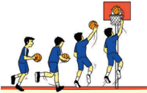

> **Deskripsi Visual:** Gambar ini adalah ilustrasi yang menunjukkan pertandingan bola basket antara dua tim. Gambar ini menggambarkan beberapa pemain bermain bola basket di lapangan. Pemain-pemain tersebut sedang bergerak dan berusaha mencetak poin dengan memukul bola ke arah tembok basket. Ilustrasi ini menunjukkan beberapa elemen penting seperti pemain, bola, tembok basket, dan lapangan basket. Informasi kunci yang dapat diambil dari gambar ini adalah bahwa ada pertandingan bola basket sedang berlangsung dan pemain-pemain sedang berusaha mencetak poin.

- Ketika  sudah  berada  di  dekat ring,  dorong  dan  lepaskan  bola ke ring dengan salah satu tangan bersamaan dengan loncatan kedua kaki.
- Mendaratlah dengan kedua kaki dan  lutut  sedikit  mengeper  dan ikuti dengan langkah kaki untuk menjaga keseimbangan.
- Perhatikan gambar 1.39.
Perhatikanlah  kesalahan-kesalahan  yang  sering  terjadi  ketika  melakukan gerak lay-up ,  yaitu: langkah kaki tidak teratur, tangan dan kaki kurang harmonis saat  mendekati  ring,  langkah  kaki  terlalu  lebar,  bola  tidak  terkuasai  dengan baik sehingga terlepas dari tangan, tidak ada loncatan, dan tidak ada gerakan lanjutan setelah bola lepas.

30

 

---
## 📄 Halaman 41

### d.  Aktivitas pembelajaran Keterampilan Gerak Menembak Bola ke Ring/Keranjang

Coba  lakukan  aktivitas  belajar  di  bawah  ini  untuk  belajar  keterampilan gerak menembak bola ke ring/keranjang:

- Permainan ini dimainkan secara berkelompok (lima orang).
- Dua orang sebagai pemain bertahan dan tiga orang sebagai penyerang
- Gunakan setengah lapangan dengan satu ring basket sebagai sasaran.
- Penyerang yang lebih banyak dari pemain bertahan berupaya mencetak poin sebanyak-banyaknya  ke  ring  basket  dengan  menggunakan  keterampilan gerakan menembak bola dengan satu tangan, dua tangan, dan lay-up.
- Pemain bertahan sebisa mungkin menggagalkan penyerangan yang dilakukan tiga penyerang dengan segala cara tanpa melanggar aturan.
- Jika dalam waktu 5 menit tim penyerang tidak bisa mencetak angka lebih dari sepuluh bola maka tim menyerang dianggap gagal/kalah dan bergantian peran dengan dua orang yang bertahan.
- Susunlah rencana perbaikan dari aktivitas yang baru saja dilakukan baik sendiri, bersama teman atau guru untuk perbaikan aktivitas gerakan yang akan datang sesuai ketentuan gerakan yang ada.
- Perhatikan gambar 1.41.

---
**🖼️ Gambar/Diagram**

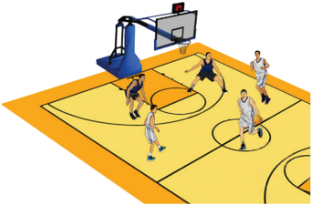

> **Deskripsi Visual:** Gambar ini adalah ilustrasi yang menunjukkan pertandingan bola basket. Gambar ini menggambarkan sepak bola basket yang sedang berlangsung di lapangan basket. Di tengah lapangan, ada sepuluh pemain yang sedang bermain. Mereka semua memegang bola dan tampak siap untuk melakukan tindakan selanjutnya. Pemain yang berada di depan lapangan tampak lebih besar dan lebih jelas dibandingkan dengan pemain lainnya. Di atas atap lapangan, terdapat papan basket dengan tabung yang menunjukkan skor. Skor saat ini adalah 0-0. Di sebelah kanan, terdapat penanda waktu yang menunjukkan bahwa pertandingan sedang berlangsung. Seluruh gambar ini menunjukkan kegiatan olahraga yang intens dan kompetitif.

 

---
## 📄 Halaman 42

### 5. Ringkasan

Keterampilan gerak dalam permainan bola basket meliputi: mengoper bola, menggiring  bola,  dan  menembak  bola  ke  ring/keranjang.  Keterampilan  gerak mengoper bola dapat dilakukan dengan setinggi dada, pantulan, dan dengan satu tangan.  Keterampilan  gerak  menggiring  bola  dapat  dilakukan  sambil  berjalan, berlari, dan maneuver-manuver tertentu sesuai dengan kebutuhan saat bermain. Keterampilan gerak menembak bola ke ring/keranjang dapat dilakukan dengan satu  tangan,  dua  tangan  dan  loncatan,  serta lay-up .  Semua  keterampilan  gerak dapat dikembangkan melalui permainan-permainan sederhana sebelum bermain bola basket yang sesungguhnya. Para peserta didik dapat melakukan analisis dan juga identifikasi terhadap berbagai kesalahan-kesalahan yang sering terjadi ketika melakukan suatu keterampilan gerak.

### 6. Penilaian

### a.  Pengetahuan

Pengetahuan  peserta  didik  akan  dinilai  melalui  tes  tertulis  maupun penugasan  tentang  hasil  kerja  kajian  konsep,  dan  prinsip  permainan  sepak bola, bola basket, bola voli.

### b.  Sikap

Sikap peserta didik selama mengikuti pelajaran permainan bola basket akan dinilai melalui observasi sikap/perilaku peserta didik yang meliputi tanggung jawab,  toleransi,  disiplin,  kerjasama,  menerima  kekalahan  dan  kemenangan yang menjunjung tinggi sportifitas yang dapat digunakan sebagai pertimbangan guru dalam mengembangkan karakter peserta didik lebih lanjut.

### c.  Keterampilan

Keterampilan  peserta  didik  akan  dinilai  melalui  unjuk  kerja  selama mengikuti  pembelajaran  permainan  sepak  bola,  bola  basket,  bola  voli  yang meliputi (1) keterampilan, (2) pengambilan keputusan, (3) dukungan, dan (4) penampilan bermain.

Kelas XI SMA/MA/SMK/MAK

 

---
## 📄 Halaman 43

### Bab II Menganalisis Keterampilan Gerak Permainan Bola Kecil

---
**🖼️ Gambar/Diagram**

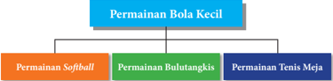

> **Deskripsi Visual:** Gambar ini adalah diagram yang menunjukkan struktur hierarki permainan bola kecil. Diagram ini terdiri dari satu cabang utama yang disebut "Permainan Bola Kecil" yang memanjang ke tiga cabang anak berikutnya, yaitu "Permainan Softball", "Permainan Bulutangkis", dan "Permainan Tenis Meja". Setiap cabang anak tersebut memiliki warna yang berbeda untuk menandakan perbedaan jenis permainan. Teks pada diagram ini memberikan informasi tentang jenis-jenis permainan yang termasuk dalam kategori "Permainan Bola Kecil". Label "Permainan Bola Kecil" berada di atas semua cabang anak, sementara label cabang anak berada di bawahnya. Ini membantu pembaca untuk memahami hubungan antara cabang utama dan cabang anak serta jenis-jenis permainan yang termasuk dalam kategori tersebut.

Manusia tidak akan lepas dari kebutuhan dasar yang namanya bergerak. Karena dengan  bergerak  tubuh  menjadi  sehat,  kebutuhan  hidup  yang  lainnya  terpenuhi selanjutnya  kita  bisa  menjadi  senang.  Untuk  itu  marilah  berolahraga.  Salah  satu media/alat  untuk  memenuhi  kebutuhan  gerak  tersebut  adalah  permainan  softball, bulutangkis, dan tenis meja yang sedikit akan kita bahas berikut ini.

### A.  Analisis Keterampilan Gerak Permainan Softball

### 1. Permainan Softball

Permainan Softball termasuk permainan beregu yang  dapat dikelompokkan ke dalam permainan bola pukul. Permainan softball dimainkan oleh 9 orang pemain dan bermain dalam 7 inning , yaitu masing-masing regu mendapat giliran menjadi pemain  bertahan  dan  menyerang  masing-masing  7  kali.  Pergantian  ini  akan dilakukan apabila regu bertahan berhasil mematikan pemain dari regu penyerang sebanyak 3 orang. Cara memainkannya ialah seorang pemukul melakukan pukulan terhadap bola yang dilemparkan oleh pitcher (pelempar bola). Bola dipukul dengan menggunakan  alat  pukul  ( bet ).  Pelempar  bola  bertugas  dari  tengah  lapangan, dimana anggota regunya bertugas juga di tiga home base , empat di luar lapangan dan satu di home plate . Seorang pemukul, harus berhasil mengelilingi semua base sebelum bola mengenai base yang ditujunya. Pemukul dapat menolak lemparan bola yang dirasa tidak sesuai.

Pendidikan Jasmani Olahraga dan Kesehatan

 

---
## 📄 Halaman 44

### 2. Analisis Keterampilan Gerak Memegang Bet /Pemukul

Cobalah  kalian  lakukan  dan  analisis  keterampilan  gerak  memegang bet / pemukul dengan urutan gerakan sebagai berikut:

- Kayu pemukul dipegang erat dengan dua tangan saling merapat.
- Sendi  antara  kedua  dan  ketiga  jari-jari  tangan  yang  di  atas  segaris  dengan pertengahan ruas ketiga jari tangan yang ada di bawahnya
- Posisi  pegangan  senyaman  mungkin  untuk  melakukan  pukulan.  ada  3  cara yang dapat dilakukan untuk memegang tongkat/ stick softball , yaitu:
- Pegangan bawah: tongkat dipegang dekat bonggol.
- Pegangan tengah: tongkat dipegang dengan posisi tangan bawah 2,5 cm/ 5 cm dari bonggol.
- Pegangan atas: tongkat dipegang dengan posisi tangan bawah 7,5 cm/ 10 cm dari bonggol.
- Perhatikan Gambar 2.1.

---
**🖼️ Gambar/Diagram**

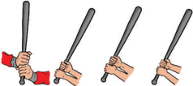

> **Deskripsi Visual:** Gambar ini adalah ilustrasi yang menunjukkan tiga orang yang sedang bermain sepak bola. Ilustrasi ini menggambarkan tindakan aktif dan interaksi antara pemain sepak bola. Pada setiap gambar, pemain sepak bola diperlihatkan dengan posisi yang berbeda, menunjukkan gerakan dan posisi mereka saat bermain. Ilustrasi ini menggunakan warna-warna yang cerah untuk menonjolkan pemain dan bola sepak bola. Teks atau angka tidak ada pada gambar ini, namun informasi kunci yang dapat diambil pembaca adalah bahwa ini adalah ilustrasi tentang sepak bola dan tindakan pemain sepak bola.

Perhatikan kesalahan-kesalahan yang sering terjadi ketika memegang tongkat pemukul, yaitu: pegangan kurang kuat, tidak fokus dalam memegang, memegang tidak sesuai tujuan dalam memukul, dan posisi lengan kaku.

### 3. Analisis Keterampilan Gerak Memukul

Cobalah  kalian  lakukan  dan  analisis  keterampilan  gerak  memukul  dengan urutan gerakan sebagai berikut:

- Sikap awal peganglah pemukul sesuai dengan cara memegang pemukul.
- Sikap badan sedikit membungkuk, diarahkan pada lemparan bola.
- Kaki dibuka senyaman mungkin.
- Ayunkan kedua lengan ke belakang diikuti sedikit putaran badan.
- Ketika bola datang, segera ayunkan kembali kedua lengan dan tangan sehingga bola dan pemukul bertubrukan.
34

 

---
## 📄 Halaman 45

- Arahkan pukulan ke bawah, menyusur tanah/mendatar, atau melambung jauh ke belakang.
- Pada akhir pukulan diikuti badan sedikit memutar sebagai gerakan lanjutan.
- Perhatikan gambar 2.2.

---
**🖼️ Gambar/Diagram**

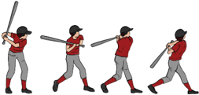

> **Deskripsi Visual:** Gambar ini adalah ilustrasi yang menunjukkan proses permainan sepak bola. Ilustrasi ini menggambarkan dua pemain sepak bola sedang berlari dan mencoba memukul bola dengan tongkat mereka. Pemain pertama sedang berjalan ke arah bola yang sedang bergerak ke arahnya, sementara pemain kedua sedang berjalan ke arah bola yang sedang bergerak ke arahnya. Kedua pemain tersebut menggunakan tongkat mereka untuk mencoba memukul bola. Ilustrasi ini menunjukkan bahwa sepak bola adalah olahraga yang memerlukan keterampilan dan koordinasi tubuh.

Perhatikan  kesalahan-kesalahan  yang  sering  terjadi  ketika  memukul  bola softball , yaitu: pegangan kurang kuat, tidak fokus pada bola, ayunan kedua lengan kurang maksimal, posisi badan kaku, arah pukulan tidak jelas, dan tidak ada gerak lanjut.

### 4. Analisis Keterampilan Gerak Melempar Bola

Keterampilan melempar bertujuan untuk melemparkan bola ke teman satu tim dalam bermain. Ada beberapa macam lemparan, yaitu: melempar bola rendah, lurus, dan tinggi.

### a.  Analisis Melempar Bola Rendah

Cobalah  kalian  lakukan  dan  analisis  keterampilan  gerak  melempar  bola rendah dengan urutan gerakan sebagai berikut:

- Sikap awal berdiri.
- Tangan kanan memegang bola.
- Pandangan ke arah sasaran/teman.
- Kedua kaki sejajar agak dibuka.
- Bungkukkan badan.
- Tangan ke bawah belakang lurus, arah lemparan bola ke depan menyusur tanah.
- Saat lemparan ikuti langkah salah satu kaki ke depan.
- Perhatikan gambar 2.3.

 

---
## 📄 Halaman 46

---
**🖼️ Gambar/Diagram**

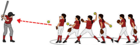

> **Deskripsi Visual:** Gambar ini adalah ilustrasi yang menunjukkan proses permainan sepak bola. Gambar ini menggambarkan dua tim bermain sepak bola di lapangan. Tim pertama berdiri di sisi lapangan, sedangkan tim kedua berada di tengah lapangan. Tim pertama memiliki pemain yang sedang bergerak menuju bola yang sedang dijatuhkan oleh pemain tim kedua. Pemain-pemain tim kedua tampak berada dalam posisi siap untuk menerima bola. Ilustrasi ini menunjukkan tindakan serangan tim pertama ke tim kedua melalui tendangan bola. Label "Tendangan Bola" dan "Pemain Siap Menerima" menunjukkan bahwa ini adalah bagian dari permainan sepak bola. Informasi kunci yang dapat diambil dari gambar ini adalah bahwa sepak bola adalah olahraga yang memerlukan koordinasi tim dan strategi untuk mencapai tujuan.

Perhatikan kesalahan-kesalahan yang sering terjadi ketika melempar bola rendah softball ,  yaitu: memegang bola kurang fokus, pandangan tidak fokus, badan kurang bungkuk, lemparan dan langkah kaki tidak bersamaan.

### b.  Analisis Melempar Bola Lurus

Cobalah  kalian  lakukan  dan  analisis  keterampilan  gerak  melempar  bola lurus dengan urutan gerakan sebagai berikut:

- Sikap awal berdiri.
- Kedua kaki dibuka selebar bahu.
- Posisi badan tegak.
- Pandangan diarahkan pada sasaran/teman.
- Tangan kanan memegang bola dan kaki kiri mendukungnya.
- Bersamaan  dengan  langkah  kaki  kiri,  lengan  lempar  ditarik  ke  belakang samping kepala, dan badan sedikit condong ke belakang.
- Lempar  bola  ke  depan  lurus  kurang  lebih  meluncur  setinggi  dada/bahu penerima bola yang dibantu dengan melecutkan pergelangan tangan lempar.
- Lemparan diakhiri  gerak  lanjut  dari  tangan  lempar  yang  diikuti  anggota tubuh lainnya.
- Perhatikan gambar 2.4.

---
**🖼️ Gambar/Diagram**

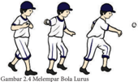

> **Deskripsi Visual:** Gambar 2.4 ini merupakan ilustrasi yang menunjukkan teknik melempar bola lurus dalam olahraga sepak bola. Gambar ini menggambarkan tiga posisi pemain sepak bola yang sedang melempar bola ke arah yang sama. Pemain pertama berdiri dengan posisi kaki yang seimbang, menunjukkan bahwa ia siap untuk melempar bola. Pemain kedua dan ketiga berada di belakang pemain pertama, menunjukkan bahwa mereka telah melonggarkan bola ke pemain pertama. Elemen-elemen utama dalam gambar ini adalah pemain sepak bola, bola, dan posisi mereka saat melempar bola. Relasi antara elemen-elemen ini adalah pemain sepak bola yang berada di depan dan melonggarkan bola ke pemain yang berada di belakang. Teks, angka, atau label penting yang terlihat dalam gambar ini adalah nama "Gambar 2.4 Melempar Bola Lurus" yang terletak di bagian atas gambar. Informasi kunci yang dapat diambil pembaca adalah teknik melempar bola lurus dalam sepak bola dan posisi pemain saat melakukan melempar bola.

Perhatikan kesalahan-kesalahan yang sering terjadi ketika melempar bola dalam softball ,  yaitu:  sikap  badan  kaku,  ayunan  lengan  kurang  kuat,  badan kaku dan tidak seimbang, tidak ada lecutan saat akhir lemparan, dan tidak diikuti gerak lanjut.

36

Kelas XI SMA/MA/SMK/MAK

 

---
## 📄 Halaman 47

### c.  Analisis Melempar Bola Tinggi

Cobalah  kalian  lakukan  dan  analisis  keterampilan  gerak  melempar  bola tinggi dengan urutan gerakan sebagai berikut:

- Sikap awal berdiri.
- Kedua kaki dibuka selebar bahu, badan agak tegak
- Pandangan ke arah pada sasaran lempar/teman.
- Tangan kanan memegang bola dan tangan kiri mendukungnya.
- Gerak melempar bersamaan dengan langkah kaki kiri ke depan, lentingkan badan ke belakang tangan, lemparan diluruskan ke belakang bawah lurus bola diarahkan ke sasaran;
- Lemparan bola ke atas dengan mengayunkan tangan lempar dari belakang bawah menuju ke atas yang dibantu dengan melecutkan pergelangan tangan yang melempar;
- Sikap  akhir  dengan  gerak  lanjutan  dari  tangan  lempar  lurus  ke  depan, dibantu dengan gerak ikutan anggota tubuh lainnya.
- Perhatikan gambar 2.5.
Perhatikan kesalahan-kesalahan yang sering terjadi ketika melempar bola tinggi  dalam softball ,  yaitu:  sikap  badan  kaku,  ayunan  lengan  kurang  kuat, memegang  bola  tidak  sesuai,  kedua  kaki  kurang  membuka,  arah  lemparan tidak ke atas depan, badan kaku dan tidak seimbang, dan tidak ada gerak lanjut.

### d.  Analisis Melambungkan Bola ( pitching )

Melambungkan  bola  biasanya  dilakukan  seorang  pelambung  ( pitcher ). Bola yang dilemparkan dengan baik ialah bola yang berada di atas home base di antara lutut dengan bahu si pemukul. jika bola dilemparkan dengan baik maupun tidak, umpire mengatakan strike . Apabila bola dilemparkan salah, yaitu tidak berada di atas home base antara lutut dan bahu si pemukul, dinamakan ball .

Cobalah  kalian  lakukan  dan  analisis  keterampilan  gerak  melambungkan bola melalui gerakan sebagai berikut:

- Sikap awal berdiri dengan salah satu kaki di depan.
- Bola dipegang di depan badan, pandangan ke arah pemukul.

 

---
## 📄 Halaman 48

- Tangan yang memegang bola diputar ke atas, ke belakang lalu ke depan.
- Sebelum tangan kembali ke sikap awal, lepaskan bola ke depan saat tangan kanan di samping badan.
- Akhiri gerakan kaki kanan ke depan, berat badan dibawa ke depan.
Perhatikan kesalahan-kesalahan yang sering terjadi ketika melambungkan bola dalam softball adalah sikap badan kaku, cara melempar bola yang kurang pas/tidak masuk daerah pukulan,  kaki/badan kurang rileks dan seimbang, dan tidak ada gerak lanjut.

### 5. Analisis Keterampilan gerak Menangkap Bola

Menangkap bola pada softball menggunakan alat yang diberi nama sarung/ glove. Menangkap bola bertujuan untuk menerima bola dari teman atau satu tim dalam bermain. Ada beberapa macam menangkap bola, yaitu: menangkap bola rendah, menangkap bola lurus, dan menangkap bola tinggi.

### a.  Analisis Menangkap Bola Rendah

Cobalah kalian lakukan dan analisis keterampilan gerak menangkap bola rendah melalui gerakan sebagai berikut:

- Sikap awal badan menghadap ke arah datangnya bola kedua kaki sedikit dirapatkan.
- Pandangan ke arah datangnya bola.
- Badan dibungkukkan ke depan.
- Kedua telapak tangan menghadap ke bola membentuk mangkuk.
- Tangan kiri menangkap  bola  diikuti tangan kanan menutup glove setelah bola ditangkap.
- Perhatikan gambar 2.7.
Perhatikan kesalahan-kesalahan yang sering terjadi ketika menangkap bola rendah softball ,  yaitu: badan kaku, pandangan tidak mengarah ke datangnya bola, badan kurang bungkuk, kedua telapak tangan terlalu rapat, dan kedua tangan kurang harmonis dalam menyambut datangnya bola.

38

 

---
## 📄 Halaman 49

### b.  Analisis Menangkap Bola Lurus

Cobalah kalian lakukan dan analisis keterampilan gerak menangkap bola lurus melalui gerakan sebagai berikut:

- Sikap  awal  menghadap  ke  arah  datangnya  bola, kedua  kaki  dibuka  selebar  bahu  dan  lutut  agak ditekuk.
- Posisi badan agak condong ke depan kedua tangan dicondongkan lurus ke depan.
- Kedua  telapak  tangan  menghadap  ke  arah  bola membentuk mangkuk.
- Gerakan diarahkan pada bola yang datang.
- Usahakan bola masuk di antara dua tapak tangan, tutup dengan jari-jari dan tarik ke arah dada untuk meredam kecepatan bola.
- Perhatikan gambar 2.8.
Perhatikan kesalahan-kesalahan yang sering terjadi ketika menangkap bola rendah softball ,  yaitu: badan kaku, pandangan tidak mengarah ke datangnya bola, badan kurang bungkuk, kedua telapak tangan terlalu rapat, dan kedua tangan kurang harmonis dalam menyambut datangnya bola.

### c.  Analisis Menangkap Bola Tinggi

Cobalah kalian lakukan dan analisis keterampilan gerak menangkap bola tinggi melalui gerakan sebagai berikut:

- Sikap awal menghadap ke arah bola datang kedua kaki dibuka selebar bahu dan lutut agak ditekuk.
- Posisi badan tegak lurus kedua tangan dicondongkan lurus ke atas depan.
- Kedua telapak tangan menghadap ke atas dengan membentuk mangkuk.
- Gerak ikutan diarahkan pada bola yang datang.
- Usahakan bola masuk di antara dua tapak tangan tutup dengan jari-jari dan tarik ke bawah untuk meredam kecepatan bola.
- Perhatikan gambar 2.9.
Perhatikan kesalahan-kesalahan yang sering terjadi ketika menangkap bola rendah softball ,  yaitu: badan kaku, pandangan tidak mengarah ke datangnya bola, badan kurang bungkuk, kedua telapak tangan terlalu rapat, dan kedua tangan kurang harmonis dalam menyambut datangnya bola.

 

---
## 📄 Halaman 50

### 6. Aktivitas Pembelajaran Melalui Permainan Softball Sederhana

Setelah kalian melakukan dan menganalisis berbagai keterampilan gerak dalam permainan softball , sekarang cobalah lakukan aktivitas belajar berikut ini:

- Lakukan pembelajaran gerak permainan softball terdiri dari gerakan memegang pemukul yang benar, melempar dan menangkap bola lengkap dengan segala variasinya,  memukul  dan  menangkap  bola  lengkap  dengan  segala  varasinya baik sendiri, berpasangan maupun beregu.
- Buatlah  dua  regu  yang  sama  banyak,  satu  regu  sebagai  pemukul  dan  regu lainnya sebagai penjaga.
- Regu yang mendapat giliran memukul, setiap pemain mendapat kesempatan 3 kali memukul. Jika pukulan yang pertama atau kedua sudah baik, pemukul harus segera lari ke base pertama.
- Urutan pemukul ditentukan oleh nomor urut yang telah ditentukan sebelum permainan dimulai.
- Tiap-tiap  base  hanya  boleh  diisi  oleh  seorang  pemain  pemukul,  di  mana pemukul pertama tidak boleh dilalui pemukul kedua dan seterusnya.
- Pemain bebas mengadakan gerakan selama bola dalam permainan, kecuali bila pitcher sudah siap untuk melempar bola kepada pemukul.
- Pada waktu akan di 'tik' pelari tidak boleh menghindar dengan berlari keluar atau ke dalam dari bet as yang telah ditentukan.
- Setiap  pelari  dengan  pukulan  yang  baik  dapat  kembali  dengan  selamat melampaui home base mendapat nilai 1.
- Lama bermain ditentukan dengan inning dan  lamanya  permainan  softball adalah 7 inning /babak.
- Susunlah rencana perbaikan dari aktivitas yang baru saja dilakukan baik sendiri, bersama teman atau guru untuk perbaikan aktivitas gerakan yang akan datang sesuai ketentuan gerakan yang ada.
- Perhatikan gambar 2.10.

---
**🖼️ Gambar/Diagram**

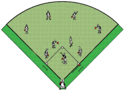

> **Deskripsi Visual:** Gambar ini adalah ilustrasi yang menunjukkan sebuah lapangan sepak bola dengan beberapa pemain bermain. Lapangan terdiri dari dua bagian: area permainan hijau dan area pertahanan merah. Di area permainan, ada beberapa pemain yang sedang bergerak, sementara di area pertahanan, ada beberapa pemain yang tampak berpose untuk menyerang. Ilustrasi ini mungkin digunakan untuk menjelaskan konsep dasar dalam sepak bola, seperti posisi pemain dan strategi pertahanan.

---
**🖼️ Gambar/Diagram**

> **Deskripsi Visual:** Gambar ini adalah diagram horizontal yang menunjukkan distribusi kelas XI SMA/MA/SMK/MAK. Diagram ini dibagi menjadi dua bagian utama: bagian atas berwarna biru muda menunjukkan kelas XI SMA/MA/SMK/MAK sebanyak 40 orang, sedangkan bagian bawah berwarna biru tua menunjukkan kelas XI SMA/MA/SMK/MAK sebanyak 60 orang. Jumlah total kelas XI SMA/MA/SMK/MAK adalah 100 orang. Label "Kelas XI SMA/MA/SMK/MAK" terletak di tengah-tengah diagram, menggambarkan topik yang ditampilkan. Teks, angka, atau label penting lainnya tidak ada pada gambar ini. Informasi kunci yang dapat diambil pembaca adalah bahwa ada total 100 kelas XI SMA/MA/SMK/MAK dengan distribusi seimbang antara kelas SMA dan MA/SMK/MAK.

 

---
## 📄 Halaman 51

### 7. Ringkasan

Permainan Softball termasuk permainan beregu yang dapat dikelompokkan ke dalam permainan bola pukul. Keterampilan gerak dalam permainan softball yang perlu  diketahui dan dikuasai adalah keterampilan memegang tongkat (pemukul), memukul,  melempar  dan  menangkap  bola.  Memegang bet /pemukul  dapat dilakukan dengan pegangan bawah: tongkat dipegang dekat bonggol, pegangan tengah: tongkat dipegang dengan posisi tangan bawah 2,5 cm/ 5 cm dari bonggol, dan  pegangan  atas:  tongkat  dipegang  dengan  posisi  tangan  bawah  7,5  cm/  10 cm  dari  bonggol.  Memukul  bola  dapat  diarahkan  ke  bawah,  menyusur  tanah/ mendapat, dan melambung tinggi ke atas. Melempar bola dapat dilakukan dengan bola  rendah,  lurus,  tinggi,  dan  lambungan  bola  untuk  pengumpan  ( pitcher ). Menangkap bola disesuaikan dengan arah bola yang datang, yaitu: bola rendah, lurus,  dan  tinggi.  Semua  keterampilan  gerak  dalam  permainan softball dapat dipelajari dan laksanakan dalam permainan softball sederhana.

### 8. Penilaian

### a.  Pengetahuan

Pengetahuan  kalian  akan  dinilai  melalui,  tes  tertulis  maupun  penugasan tentang kerja kajian konsep, dan prinsip berbagai keterampilan gerak dalam permainan softball .

### b.  Sikap

Sikap  kalian  selama  mengikuti  pelajaran  permainan Softball akan  dinilai melalui  observasi  sikap/perilaku  yang  meliputi:  tanggung  jawab,  toleransi, disiplin, kerjasama, menerima kekalahan dan kemenangan yang menjunjung tinggi  sportifitas  yang  dapat  digunakan  sebagai  pertimbangan  guru  dalam mengembangkan karakter peserta didik lebih lanjut.

### c.  Keterampilan

Keterampilan  kalian  akan  dinilai  melalui  unjuk  kerja  selama  mengikuti pembelajaran  permainan Softball yang  meliputi:  pengamatan  keterampilan gerak dan penampilan bermain.

 

---
## 📄 Halaman 52

### B.  Analisis Keterampilan Gerak Permainan Bulutangkis

### 1. Mengenal Permainan Bulutangkis

Bulutangkis  adalah  suatu  aktivitas  permainan  yang  menggunakan  sebuah raket dan shuttlecock yang dipukul melewati sebuah net .  Permainan ini berlaku untuk putra dan putri dengan bentuk tunggal ( single ), ganda ( double ), dan ganda campuran ( mixed double ). Inti permainan ini adalah memukul cock ( shutllecock ) di  lapangan lawan melalui atas net (jaring).  Jaring  ini  membatasi  kedua  bagian lapangan dimana para pemain berdiri dan melakukan gerakan-gerakan tipuan. Permainan bulutangkis dapat dimainkan di dalam atau di luar  ruangan, di atas lapangan  yang  dibatasi  dengan  garis-garis  dalam  ukuran  panjang  dan  lebar tertentu. Lapangan dibagi dua sama besar dan dipisahkan oleh net yang teregang di tiang net yang ditanam di pinggir lapangan. Alat yang dipergunakan adalah raket sebagai  alat  pemukul  dan shuttlecock sebagai  bola  yang  dipukul.  Keterampilan gerak  dalam  permainan  bulutangkis,  meliputi:  keterampilan  memegang  raket ( grip ),  keterampilan menempatkan posisi, langkah kaki ( footwork )  dan pukulan ( strokes ) yang meliputi: servis, pukulan forehand , pukulan backhand , pukulan lob , serta pukulan smash .

### 2. Analisis Keterampilan gerak Memegang Raket (Grip)

Ada beberapa macam pegangan raket dalam permainan bulutangkis. Cobalah kalian lakukan dan analisis keterampilan gerak memegang raket di bawah ini:

### a.  Pegangan Cara Inggris ( English Grip )

Raket dipegang dengan permukaan raket menghadap ke kiri dan ke kanan, hingga  bagian  tepi  raket  lurus  dengan  ujung  huruf  V  yang  dibentuk  oleh pangkal ibu jari dan pangkal telunjuk. Perhatikan gambar 2.11

Perhatikan kesalahan-kesalahan yang sering terjadi ketika memegang raket cara Inggris, yaitu:  pegangan kurang kuat, posisi tangan tidak seperti menja bet tangan, pegangan tidak dilakukan oleh pangkal ibu jari dan pangkal telunjuk, dan pergelangan tangan terlalu kaku.

---
**🖼️ Gambar/Diagram**

> **Deskripsi Visual:** Gambar ini adalah ilustrasi yang menunjukkan sebuah raket bulu tangkis. Gambar ini menggambarkan raket bulu tangkis dengan detail yang jelas, termasuk bagian tangan pengguna, tali pengikat, dan struktur dasar raket. Raket tersebut tampak kokoh dan dirancang untuk memungkinkan pemain melakukan gerakan yang kuat dan akurat saat bermain. Ilustrasi ini mungkin digunakan dalam buku pelajaran untuk membantu siswa memahami bagaimana cara menggunakan alat olahraga ini dengan benar.

Kelas XI SMA/MA/SMK/MAK

 

---
## 📄 Halaman 53

### b.  Pegangan Backhand (Backhand Grip)

Raket dipegang dengan permukaan raket menghadap ke kiri dan ke kanan, tetapi raket diputar dengan putaran ke kanan, hingga ibu jari pemegang raket melekat atau menumpu pada bagian yang lebar daripada handle . Perhatikan gambar 2.12.

Perhatikan kesalahan-kesalahan yang sering terjadi ketika memegang raket cara backhand ,  yaitu: pegangan kurang kuat, posisi tangan telungkup, ibu jari tidak melekat di handle ,  dan pergelangan tangan terlalu kaku.

### c.  Pegangan 'Gebuk/Geblek Kasur' atau Panci-Goreng ( Frying Pan Grip )

Raket dipegang dengan permukaan raket menghadap ke kiri dan ke kanan, tetapi raket diputar dengan putaran ke kiri, hingga muka raket menghadap ke bawah/atas. Perhatikan gambar 2.13.

Perhatikan kesalahan-kesalahan yang  sering  terjadi  ketika  memegang raket cara 'gebuk kasur' , yaitu: pegangan  kurang  kuat,  posisi  tangan tidak telungkup, ibu jari tidak melekat di handle , muka raket tidak menghadap ke bawah/atas, dan pergelangan tangan terlalu kaku.

### 3. Analisis Keterampilan Gerak Langkah kaki ( Footwork )

### a.  Gerak Langkah Kaki ( footwork )

Langkah kaki merupakan modal pokok untuk dapat memukul bola dengan tepat.  Langkah  kaki  yang  ringan  dan  luwes  akan  memudahkan  seseorang bergerak  ke  tempat  bola  datang  dan bersiap untuk memukul. Cobalah kalian lakukan dan analisi macam-macam langkah sebagai berikut:

- Langkah berurutan, baik untuk langkah ke depan, samping ataupun  ke  belakang.  Kaki  kanan dan  kiri  bergerak  berturutan  atau berdampingan.  Perhatikan  gambar 2.14.

---
**🖼️ Gambar/Diagram**

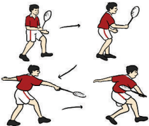

> **Deskripsi Visual:** Gambar ini adalah ilustrasi yang menunjukkan proses permainan tenis. Gambar ini menggambarkan empat langkah berbeda dalam serangan serangan tenis. Pada bagian atas, pemain tengah berpose untuk menyerang bola dengan teknik serangan. Di bawahnya, tampak pemain tengah sedang bergerak ke arah bola yang ditekuk oleh pemain di sebelahnya. Gambar ini juga menunjukkan posisi pemain tengah saat bola dilempar ke arahnya. Setiap langkah ini menunjukkan pergerakan dan posisi pemain dalam permainan tenis. Informasi penting yang dapat diambil dari gambar ini adalah bahwa permainan tenis melibatkan serangan serangan dan gerakan cepat.

 

---
## 📄 Halaman 54

- Langkah bergantian atau bersilang (seperti berlari), kaki kanan dan kaki kiri bergantian melangkah. Perhatikan gambar 2.15.
- Langkah lebar dengan loncatan, satu atau  dua  langkah  kecil  dan  diakhiri dengan  langkah  lebar  dengan  jalan meloncat. Perhatikan gambar 2.16.
Perhatikan kesalahan yang sering terjadi ketika langkah kaki/ footwork dalam  bulutangkis    adalah  sikap  badan kaku, langkah kaki/ footwork yang kurang pas, kaki/badan kurang rileks dan seimbang, dan tidak ada gerak lanjut.

---
**🖼️ Gambar/Diagram**

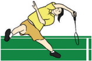

> **Deskripsi Visual:** Gambar ini adalah ilustrasi yang menunjukkan seorang atlet bereaksi dengan cepat saat bermain badminton. Gambar ini menggambarkan tindakan yang kompleks dan dinamis, yang mencerminkan kecepatan dan keahlian dalam olahraga tersebut.

Pertama, gambar ini menunjukkan atlet yang sedang bergerak, dengan tubuh yang terbuka dan ekspresi wajah yang menunjukkan ketegangan dan fokus. Atlet tersebut sedang memegang raket badminton dengan kedua tangan dan tampaknya sedang berusaha untuk menendang atau menangkap bola.

Elemen-elemen utama dalam gambar ini meliputi atlet, raket badminton, dan lapangan badminton. Atlet adalah subjek utama yang memperlihatkan tindakan aktif dan dinamis. Raket badminton digunakan oleh atlet untuk melakukan gerakan dan merupakan alat penting dalam olahraga ini. Lapangan badminton tampak sebagai latar belakang yang menunjukkan skema dan ukuran lapangan yang umum digunakan dalam olahraga ini.

Teks, angka, atau label penting tidak terlihat dalam gambar ini karena ia hanya berupa ilustrasi. Namun, informasi kunci yang dapat diambil dari gambar ini adalah bahwa atlet sedang bermain badminton dengan intensitas tinggi, menunjukkan kecepatan dan keahlian dalam olahraga tersebut.

### b.  Aktivitas pembelajaran Gerak Langkah Kaki

Cobalah kalian lakukan aktivitas belajar untuk keterampilan gerak langkah kaki/ footwork dalam bulutangkis di bawah ini:

- Baris berbanjar sesuai jumlah yang ada.
- Simpanlah  10  buah shuttlecock pada  jarak  4-5 meter.
- Lakukan lari di tempat.
- Ambilah shuttlecock dengan lari bolak-balik maju dan mundur.
- Ambilah shuttlecock dengan lari bolak-balik menyamping kiri dan kanan
- Lakukan aktivitas secara berulang-ulang.
44

---
**🖼️ Gambar/Diagram**

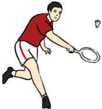

> **Deskripsi Visual:** Gambar ini adalah ilustrasi yang menunjukkan seorang pemain tenis bereaksi untuk menghentikan bola dengan menggunakan racket. Gambar ini menunjukkan beberapa elemen penting:

1. **Apa yang Ditampilkan Secara Keseluruhan**: Gambar ini menampilkan seorang pemain tenis yang sedang bergerak untuk menghentikan bola dengan menggunakan racket.

2. **Elemen-Elemen Utama dan Relasinya**: 
   - **Pemain Tenis**: Pemain tenis tersebut memiliki posisi yang menunjukkan gerakan aktif untuk menghentikan bola.
   - **Racket**: Racket yang dimegang oleh pemain tersebut digunakan untuk menghentikan bola.
   - **Bola**: Bola tenis yang sedang bergerak menuju pemain tersebut.
   - **Lampiran**: Pada gambar ini juga terlihat lampiran yang menunjukkan posisi bola saat akan mengenai racket.

3. **Teks, Angka, atau Label Penting yang Terlihat**: 
   - **Teks**: Teks tidak ada pada gambar ini.
   - **Angka**: Ada angka yang mungkin menunjukkan skor pertandingan, namun tidak jelas dalam gambar ini.
   - **Label**: Label tidak ada pada gambar ini.

4. **Informasi Kunci yang Dapat Diambil Pembaca**: 
   - Gambar ini menunjukkan situasi yang sering terjadi dalam permainan tenis, yaitu pemain bereaksi untuk menghentikan bola dengan menggunakan racket.
   - Ini menunjukkan pentingnya kecepatan dan keterampilan dalam bermain tenis.

Dengan demikian, gambar ini menunjukkan seorang pemain tenis bereaksi untuk menghentikan bola dengan menggunakan racket, menunjukkan situasi yang sering terjadi dalam permainan tenis.

 

---
## 📄 Halaman 55

- Susunlah rencana perbaikan dari aktivitas yang baru saja dilakukan baik sendiri, bersama teman atau guru untuk perbaikan aktivitas gerakan yang akan datang sesuai ketentuan gerakan yang ada.
- Perhatikan gambar 2.17.

### 4. Analisis Keterampilan Gerak Servis Panjang

### a.  Gerak Servis Panjang

Servis dalam bulutangkis sangat penting, oleh karena itu para pemain harus bisa menguasai cara melakukan servis dengan baik dan berbagai variasi. Sikap dan cara yang benar dalam memukul servis adalah:

- Bola servis harus masuk di area lapangan servis lawan.
- Posisi kaki tidak menginjak garis saat servis.
- Posisi bola yang akan dipukul tidak boleh lebih tinggi dari pusar pemain yang akan melakukan servis.
- Gerak lanjut ( follow through ) sangat diperlukan agar siap untuk melakukan pukulan berikutnya.
Cobalah  sekarang  kalian  lakukan  dan  analisis  keterampilan  gerak  servis panjang melalui urutan gerakan sebagai berikut:

- Sikap awal berdiri
- Kedua kaki dibuka salah satu berada di depan rileks.
- Tangan kiri memegang kok, tangan kanan memegang raket.
- Ayunkan raket dari belakang bawah atas dan lepaskan kok hingga terjadi persentuhan.
- Kok harus melambung tinggi.
- Lakukan berulang-ulang melewati net .
- Perhatikan gambar 2.18.
Kesalahan yang sering terjadi ketika melakukan  servis dalam  bulutangkis adalah sikap badan kaku, footwork lam bet , tergesa-gesa, servis terlalu panjang atau terlalu pendek, kaki/badan kurang rileks dan seimbang, dan tidak diikuti gerak lanjut.

---
**🖼️ Gambar/Diagram**

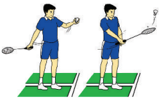

> **Deskripsi Visual:** Gambar ini adalah ilustrasi yang menunjukkan dua orang bermain tenis. Gambar ini menggambarkan posisi dan gerakan mereka saat bermain. Pada gambar tersebut, elemen utama adalah dua orang pemain tenis yang sedang bermain. Mereka menggunakan raket dan bola untuk bermain. Posisi mereka tampak jelas, dengan salah satu pemain berdiri di depan dan yang lain berdiri di belakang. Juga ada papan lapangan yang tampak jelas di latar belakang. Teks, angka, atau label penting tidak terlihat pada gambar ini. Informasi kunci yang dapat diambil pembaca adalah bahwa gambar ini menunjukkan aktivitas olahraga tenis dan posisi pemain saat bermain.

 

---
## 📄 Halaman 56

### 5. Analisis Keterampilan Gerak Servis Pendek

### a.  Gerak servis pendek

Servis dalam bulutangkis sangat penting, oleh karena itu para pemain harus bisa menguasai cara melakukan servis dengan baik dan berbagai variasi.    Sikap dan cara yang benar dalam memukul servis adalah:

- Berdiri 10 cm dari garis servis pendek.
- Kaki kanan di depan, berat badan tertumpu pada kaki kanan.
- Tangan kiri memegang kok, tangan kanan memegang raket.
- Ayunkan raket dan lepaskan kok hingga terjadi persentuhan.
- Persentuhan terjadi di bawah pinggang dan sasarannya garis servis pendek.
- Perhatikan gambar 2.19.
Perhatikan kesalahan yang sering terjadi ketika servis pendek dalam bulutangkis adalah  sikap  badan  kaku,  cara memukul bola yang kurang pas/tidak  masuk  daerah  servis, cara memegang raket, cara memegang shuttlecock yang kurang benar, kaki/badan kurang rileks dan seimbang, dan tidak diikuti gerak lanjutan.

---
**🖼️ Gambar/Diagram**

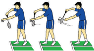

> **Deskripsi Visual:** Gambar ini adalah ilustrasi yang menunjukkan proses pembuatan makanan. Gambar ini terdiri dari tiga langkah yang disajikan secara berurutan. Pada langkah pertama, seorang pria sedang memegang telur di atas piring. Pada langkah kedua, ia menggiling telur dengan alat penggiling. Pada langkah ketiga, ia menambahkan bahan lain ke dalam telur yang telah digiling tersebut. Ilustrasi ini menunjukkan proses pembuatan makanan yang sederhana dan mudah dipahami.

### 6. Analisis Keterampilan Gerak Pukulan Lob

Pukulan lob dalam bulutangkis sangat penting, oleh karena itu pemain harus bisa menguasai cara melakukan pukulan lob dengan baik dan berbagai variasi agar dapat mengatur serangan. Sikap dan cara yang benar dalam memukul adalah:

- Posisi  siap,  kaki  kiri  di  depan  kaki  kanan  di belakang.
- Pandangan ke arah datangnya kok.
- Raket di belakang kepala, siku dan bahu harus di atas.
- Persentuhan terjadi di depan atas kepala.
- Sasaran adalah garis belakang.
46

---
**🖼️ Gambar/Diagram**

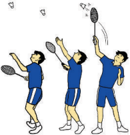

> **Deskripsi Visual:** Gambar ini adalah ilustrasi yang menunjukkan tiga orang bermain tenis meja. Setiap orang memiliki alat permainan yang sama, yaitu racket dan bola. Mereka tampak berada di lapangan yang berwarna hijau dengan garis putih sebagai batas area permainan. Di atas mereka, ada beberapa pukulan yang kelihatan seperti udara, menunjukkan gerakan dan kecepatan saat bermain. Gambar ini menunjukkan aktivitas olahraga yang seru dan membutuhkan keterampilan teknis.

 

---
## 📄 Halaman 57

- Gerak  lanjut  ( follow  through )  sangat  diperlukan  agar  siap  untuk  melakukan pukulan berikutnya.
- Perhatikan Gambar 2.20.
Perhatikan kesalahan yang sering terjadi ketika  melakukan lob dalam bulutangkis adalah sikap badan kaku, cara memukul bola lob yang kurang pas, cara memegang raket, kaki/badan kurang rileks dan seimbang, dan tidak diikuti gerak lanjutan.

### 7. Analisis Keterampilan Gerak choop dalam Bulutangkis

Pukulan choop dapat dilakukan melalui gerakan sebagai berikut:

- Posisi siap, kaki kiri di depan kaki kanan di belakang.
- Pandangan ke arah datangnya shuttlecock .
- Raket  di  belakang  kepala,  siku  dan  bahu harus di atas.
- Persentuhan  terjadi di depan atas kepala.
- Sasaran adalah daerah paling depan dekat net pertahan lawan.
- Perhatikan gambar 2.21.

---
**🖼️ Gambar/Diagram**

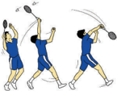

> **Deskripsi Visual:** Gambar ini adalah ilustrasi yang menunjukkan proses penggunaan alat olahraga seperti badminton. Gambar ini terdiri dari tiga langkah yang menunjukkan langkah-langkah berbeda dalam teknik memukul bola. Langkah pertama menunjukkan pemain memegang raket dengan posisi yang benar, sementara langkah kedua menunjukkan gerakan memukul bola dengan tepat. Langkah ketiga menunjukkan posisi pemain setelah memukul bola, menunjukkan bahwa pemain telah berhasil mengendalikan bola dengan tepat. Ilustrasi ini membantu pembaca memahami bagaimana melakukan teknik memukul bola dalam olahraga badminton.

Perhatikan  kesalahan  yang  sering  terjadi  ketika  melakukan choop dalam bulutangkis adalah sikap badan kaku, cara memukul bola choop yang kurang pas, cara memegang raket, kaki/badan kurang rileks dan seimbang, dan tidak diikuti gerak lanjutan.

### 8. Analisis Keterampilan Gerak Pukulan Smash

Pukulan smash dalam bulutangkis sangat penting, oleh karena itu para pemain harus bisa menguasai cara melakukan pukulan smash dengan baik dan berbagai variasi  agar  dapat  mengatur  serangan.  Pukulan smash dapat  dilakukan  melalui gerakan sebagai berikut:

---
**🖼️ Gambar/Diagram**

> **Deskripsi Visual:** Gambar 7.22 menunjukkan teknik serangan badminton yang dikenal sebagai "Geyakap Badminton Smash". Gambar ini menggambarkan tiga posisi pemain badminton dalam serangan yang berbeda. Pada posisi pertama, pemain tengah sedang bergerak menuju bola dengan sementara pemain kanan dan kiri berdiri di belakang. Pada posisi kedua, pemain tengah telah mencoba memukul bola ke arah pemain kanan dan kiri, sementara pemain kanan dan kiri berada di belakang. Pada posisi ketiga, pemain tengah telah berhasil memukul bola ke arah pemain kanan dan kiri, sementara pemain kanan dan kiri berada di belakang. Gambar ini menunjukkan bahwa teknik serangan ini melibatkan gerakan cepat dan akurat untuk memukul bola ke arah lawan.

 

---
## 📄 Halaman 58

- Posisi siap, kaki kiri di depan kaki kanan di belakang.
- Pandangan ke arah datangnya kok.
- Raket di belakang kepala, siku dan bahu harus di atas.
- Persentuhan terjadi di depan atas kepala.
- Sasaran adalah daerah kosong pertahanan lawan.
- Pukulan harus dengan power yaitu kuat dan cepat.
- Perhatikan gambar 2.22.
Kesalahan yang sering terjadi ketika melakukan pukulan smash bulutangkis adalah sikap badan kaku, langkah kaki/ footwork yang  kurang pas, tergesa-gesa, servis  terlalu  lemah  sehingga  nyangkut  atau  terlalu  kuat  sehingga  keluar,  kaki/ badan kurang rileks dan seimbang, dan tidak diikuti gerak lanjut.

### 9. Aktivitas Pembelajaran Keterampilan Gerak Bulutangkis

Setelah peserta didik mencoba  dan melakukan pembelajaran berbagai keterampilan  dalam  permainan  bulutangkis  (memegang  raket  dengan  benar, langkah  kaki/ footwork ,  melakukan  servis, smash,  lob,  dropshot,  choop dengan segala  variasinya  dan  lain  sebagainya)  baik  sendiri,  berpasangan  atau  bermain dengan lawan, peserta didik dapat memulai bermain bulutangkis  dengan aturan sederhana sebagai berikut:

- Peserta didik berpasangan.
- Mulailah permainan, pemain yang berada pada lapangan servis sebelah kanan memberikan  servis  pada  lawannya  pada  lapangan  yang  separuh  lagi  secara menyilang atau diagonal.
- Melakukan  servis  atau  menerima  servis  dan  kaki  berada  di  atas  garis  atau kedua kaki tidak berhubungan (tidak di atas lantai) sampai shuttlecock dipukul. Setiap shuttlecock yang jatuh di atas garis bet as dianggap baik dan masuk.
- Hitunglah permainan hingga mencapai angka tertinggi 11, kecuali terjadi perpanjangan dengan dua angka.
- Pemenangnya  adalah  peserta  didik  yang berhasil mencapai angka tertinggi terlebih dahulu.
- Susunlah rencana perbaikan dari aktivitas yang baru saja dilakukan baik sendiri, bersama teman atau guru untuk perbaikan aktivitas  gerakan  yang  akan  datang  sesuai ketentuan gerakan yang ada.
- Perhatikan gambar 2.23.
48

---
**🖼️ Gambar/Diagram**

> **Deskripsi Visual:** Gambar ini adalah ilustrasi yang menunjukkan pertandingan bulu tangkis. Gambar ini menggambarkan dua pasangan pemain yang sedang bermain di lapangan bulu tangkis. Setiap pasangan terdiri dari satu pria dan satu wanita. Pemain laki-laki menggunakan raket bulu tangkis dan memegang bola bulu tangkis, sementara pemain perempuan menggunakan raket bulu tangkis dan memegang bola bulu tangkis. Lapangan bulu tangkis terbagi menjadi dua bagian dengan garis tengah yang menjadikan area permainan. Di setiap sisi lapangan, terdapat penanda posisi pemain yang berbeda-beda. Gambar ini menunjukkan posisi pemain saat mereka bermain, dengan pemain laki-laki berada di sisi kanan dan pemain perempuan berada di sisi kiri. Ini menunjukkan bahwa pertandingan tersebut adalah pertandingan sepasang, biasanya dikenal sebagai "double" dalam bahasa Inggris. Gambar ini juga menunjukkan posisi pemain saat mereka bermain, dengan pemain laki-laki berada di sisi kanan dan pemain perempuan berada di sisi kiri. Ini menunjukkan bahwa pertandingan tersebut adalah pertandingan sepasang, biasanya dikenal sebagai "double" dalam bahasa Inggris.

 

---
## 📄 Halaman 59

Perhatikan kesalahan yang sering terjadi ketika bermain bulutangkis adalah sikap badan kaku, langkah kaki/ footwork yang  kurang pas,  tergesa-gesa, servis terlalu  lemah  sehingga  nyangkut  atau  terlalu  kuat  sehingga  keluar,  kaki/badan kurang rileks dan seimbang, dan tidak diikuti gerak lanjut.

### 10. Ringkasan

Bulutangkis adalah suatu permainan yang menggunakan raket dan shuttlecock yang dipukul melewati net .  Inti  permainan ini adalah memasukkan shuttlecock (bola bulu) di lapangan lawan melalui atas net (jaring). Bulutangkis adalah permainan yang mudah dilakukan mengingat raketnya yang ringan, serta bola yang berjalan lurus dan teratur tanpa putaran. Keterampilan dasar dalam permainan bulutangkis yang meliputi: langkah kaki ( footwork ) dan pukulan ( strokes ) perlu dipelajari dan dikuasai agar dapat bermain bulutangkis dengan baik.

### 11. Penilaian

### a.  Pengetahuan

Pengetahuan  kalian  akan  dinilai  melalui  tes  tertulis  maupun  penugasan tentang kerja kajian konsep, dan prinsip berbagai keterampilan gerak dalam permainan Bulutangkis.

### b.  Sikap

Sikap  peserta  didik  selama  mengikuti  pelajaran  permainan  Bulutangkis akan  dinilai  melalui  observasi  sikap/perilaku  peserta  didik  yang  meliputi tanggung  jawab,  toleransi,  disiplin,  kerjasama,  menerima  kekalahan  dan kemenangan yang menjunjung tinggi sportifitas yang dapat digunakan sebagai pertimbangan guru dalam mengembangkan karakter peserta didik lebih lanjut.

### c.  Keterampilan

Keterampilan peserta didik akan dinilai  melalui  unjuk  kerja  selama  mengikuti pembelajaran  permainan  Bulutangkis  yang  meliputi  (1)  keterampilan,  (2) pengambilan keputusan, (3) dukungan, dan (4) penampilan bermain.

 

---
## 📄 Halaman 60

### C.  Analisis Keterampilan Gerak Permainan Tenis meja

### 1. Mengenal Aktivitas Permainan Tenis meja

Permainan tenis meja adalah suatu aktivitas permainan yang menggunakan meja sebagai tempat untuk memantulkan bola. Bola yang dipukul tersebut harus melewati net yang  dipasang  pada  bagian  tengah  lapangan/meja.  Permainan  ini berlaku  untuk  putra  maupun  putri  dengan  bentuk  tunggal  ( single )  dan  ganda ( double )  dan  ganda campuran ( mixed double ).  Permainan tenis meja atau yang lebih dikenal dengan istilah lain yaitu Ping Pong merupakan olahraga unik dan bersifat rekreatif. Oleh karena itu, permainan ini sangat digemari oleh segala usia. Mengingat  keunikan  permainan  tersebut,  maka    untuk  penguasaannya  perlu pengamatan, kelincahan, dan reflek yang baik dari setiap pemain. Permainan tenis meja memerlukan keterampilan-keterampilan agar dapat bermain dengan baik. Keterampilan tersebut antara lain adalah pegangan bet dan pukulan.

### 2. Analisis Keterampilan Gerak Memegang Bet /Pemukul

### a.  Pegangan bet

Pada  permainan  tenis  meja,  pegangan bet terdiri  atas:  pegangan  tangkai pena ( penholder grip ) dan pegangan ja bet tangan ( Shakehand Grip ).

- Pegangan Tangkai Pena ( Penholder Grip )
Pegangan  ini  digunakan  oleh  pemain  tipe  menyerang  dan  pukulan forehand drive merupakan basis atau satu-satunya selama dalam pertandingan.

Perhatikan  kesalahan  yang  sering  terjadi  ketika  memegang bet dalam tenis meja adalah sikap badan kaku, cara memegang bet yang kurang pas/ tidak sesuai peruntukannya, kaki/badan kurang rileks dan seimbang, dan tidak diikuti gerak lanjutan.

Kelas XI SMA/MA/SMK/MAK

 

---
## 📄 Halaman 61

### 2)  Pegangan Ja bet Tangan ( Shakehand Grip )

Pegangan ini menyerupai orang ja bet tangan. Di sini pun timbul berbagai variasi, misalnya ada yang jari telunjuknya lurus dan ada juga yang bengkok. Sedangkan, ketiga jari tangan lainnya melingkar  pada bagian tangkai.

Perhatikan  kesalahan  yang  sering  terjadi  ketika  memegang bet dalam tenis meja adalah sikap badan kaku, cara memegang bet yang kurang pas/ tidak sesuai peruntukannya, kaki/badan kurang rileks dan seimbang, dan tidak diikuti gerak lanjutan.

### 3. Analisis Keterampilan Gerak Pukulan Servis

### a.  Gerak Pukulan Servis Tenis meja

Pukulan  servis  adalah  pukulan  (serangan)  pertama    untuk  memulai permainan. Jenis pukulan servis terdiri  atas:

### 1) Forehand servis

Forehand servis dapat dilakukan melalui gerakan sebagai berikut:

- Pemain  dalam  posisi  siap,  kedua  kaki  dibuka  selebar  bahu,  dan  lutut ditekuk  lebih  kurang  45  derajat.  Badan  sedikit  condong    ke  depan, tangan kiri memegang bola dengan telapak tangan terbuka dan tangan kanan memegang bet yang siap untuk memukul dengan permukaan bet mengarah ke depan.
- Dengan bahu menghadap ke arah sasaran, lambungkan bola sedikit ke atas di depan badan pada saat bola turun dari titik tertinggi lambung.
- Ayunkan bet ke  depan lurus dengan permukaan bet mengarah  ke  depan. Bola dipukul dengan cara  memukul  ke  dalam dengan bet .

---
**🖼️ Gambar/Diagram**

> **Deskripsi Visual:** Gambar ini adalah ilustrasi yang menunjukkan dua orang pemain tenis meja berpose untuk menunjukkan teknik atau posisi mereka. Pada gambar tersebut, elemen utama adalah dua orang pemain tenis meja yang sedang berpose dengan posisi tubuh yang berbeda. Pada gambar tersebut juga ada beberapa elemen lain seperti meja tenis meja, bola tenis meja, dan tangan pemain. Informasi kunci yang dapat diambil pembaca adalah bahwa gambar ini mungkin digunakan untuk mengajar atau memperkenalkan teknik atau posisi dalam olahraga tenis meja.

 

---
## 📄 Halaman 62

Kesalahan yang sering terjadi ketika melakukan pukulan forehand servis dalam tenis meja adalah sikap badan kaku, cara memegang bet yang kurang pas/tidak sesuai peruntukannya,  lambungan bola tidak pas, pukulan bet ke bola tidak pas, kaki/badan kurang rileks dan seimbang, dan tidak diikuti gerak lanjutan.

### 2) Backhand Servis

Backhand servis dilakukan dengan posisi bet dari samping kiri lapangan, punggung tangan menghadap ke meja dengan gerakan sebagai berikut:

---
**🖼️ Gambar/Diagram**

> **Deskripsi Visual:** Gambar ini adalah ilustrasi yang menunjukkan tiga situasi berbeda dalam olahraga tenis. Pada gambar pertama, seorang pemain sedang memegang bola pingpong dengan tangan yang tampaknya sedang mempersiapkan serangan. Gambar kedua menunjukkan pemain tengah dalam posisi untuk menghentikan bola dengan menggunakan tangan. Gambar ketiga menampilkan pemain yang sedang bermain di lapangan dengan bola dan raket tenis. Setiap elemen ini memiliki hubungan dengan permainan tenis, dimana pemain memegang bola dan raket, serta melakukan gerakan-gerakan yang relevan seperti memukul dan menghentikan bola. Teks, angka, atau label penting tidak ada dalam gambar ini, namun informasi kunci yang dapat diambil adalah bahwa semua situasi ini terkait dengan permainan tenis.

- Permulaan ini diawali dari sikap melangkah menyamping, dengan kaki kanan agak ke depan, berat badan di kaki kanan, badan agak condong ke  depan.  Tangan  yang  memegang bet menyilang  di  samping  badan, siku ditekuk, punggung lengan bagian luar mengarah ke depan, tangan kanan memegang bola, di depan atas dada.
- Bola dipukul ke depan menggunakan punggung bet dengan dorongan ke depan hingga bola memantul dan menyeberangi net .
- Gerak lanjut ( follow  through ) sangat diperlukan agar siap  untuk melakukan pukulan berikutnya.
Kesalahan yang sering terjadi ketika melakukan backhand servis  dalam tenis meja adalah sikap badan kaku, cara memegang bet yang kurang pas/ tidak sesuai peruntukannya,  lambungan bola tidak pas, pukulan bet ke bola tidak  pas, kaki/badan kurang rileks dan seimbang, dan tidak diikuti gerak lanjutan.

### 4. Analisis Keterampilan Gerak Pukulan Forehand

Pukulan Forehand tenis  meja  sangat  penting,  oleh  karena  itu  para  pemain harus bisa menguasai cara melakukan pukulan Forehand tenis meja dengan baik dan berbagai variasi agar dapat mengatur serangan. Sikap dan cara yang benar dalam memukul Forehand tenis meja adalah:

- Posisi siap, kaki kiri di depan kaki kanan di belakang.
- Pandangan ke arah datangnya bola.
52

 

---
## 📄 Halaman 63

- Bet di depan samping badan.
- Persentuhan terjadi di depan badan sebelah kanan.
- Sasaran adalah meja daerah belakang silang.
Perhatikan kesalahan yang sering terjadi ketika pukulan Forehand tenis meja adalah sikap badan kaku, langkah kaki/ footwork yang kurang pas,  tergesa-gesa,  kaki/badan kurang rileks dan seimbang, dan tidak diikuti gerak lanjut.

---
**🖼️ Gambar/Diagram**

> **Deskripsi Visual:** Gambar ini adalah ilustrasi yang menunjukkan seorang pemain tenis meja sedang bermain. Gambar ini menggambarkan tindakan pemain yang sedang memukul bola meja dengan raketnya. Pemain tersebut berdiri di atas lapangan meja yang berwarna hijau, dan latar belakangnya adalah langit biru cerah. Pemain tersebut mengenakan seragam olahraga yang berwarna biru dan putih, serta sepasang sandal yang sesuai dengan aktivitas olahraga tersebut.

Elemen-elemen utama dalam gambar ini meliputi pemain tenis meja, raket, bola meja, dan lapangan meja. Pemain tenis meja adalah elemen utama yang paling dominan dalam gambar ini, karena ia adalah subjek utama dari gambar tersebut. Raket dan bola meja juga merupakan elemen-elemen penting yang membantu menunjukkan konteks aktivitas pemain tersebut. Lapangan meja menjadi latar belakang yang memberikan informasi tentang tempat di mana permainan tersebut dilakukan.

Teks, angka, atau label penting tidak terlihat dalam gambar ini, karena gambar hanya menggambarkan tindakan pemain dan tidak memiliki teks atau angka yang menunjukkan informasi spesifik lainnya.

Informasi kunci yang dapat diambil pembaca dari gambar ini adalah bahwa pemain tenis meja sedang bermain dan menggunakan raket untuk memukul bola meja. Ini menunjukkan bahwa gambar ini mungkin digunakan sebagai ilustrasi untuk menjelaskan cara bermain tenis meja atau untuk menunjukkan teknik pemukulan bola meja.

### 5. Analisis Keterampilan Gerak Pukulan Backhand

Pada prinsipnya pukulan forehand hampir sama dengan backhand . Perbedaannya, pada posisi kaki pada pukulan forehand , kaki sebelah kiri berada sedikit di depan, sedangkan  pada pukulan backhand kaki kanan berada sedikit di sebelah depan. Pukulan Backhand tenis meja sangat penting, oleh karena itu pemain  harus  bisa  menguasai  cara  melakukan  pukulan Backhand tenis  meja dengan baik dan berbagai variasi agar dapat mengatur serangan. Sikap dan cara yang benar dalam memukul Backhand tenis meja adalah:

- Posisi siap kedua kaki terbuka selebar bahu, lutut sedikit ditekuk, badan sedikit condong ke depan, pandangan ke arah bola, tangan siap untuk memukul bola dengan membentuk siku 90 derajat.
- Gerakan memukul segera dilakukan setelah bola mencapai titik tertinggi dalam pantulan. Bola akan dipukul dari sudut sebelah kanan, dengan sudut pukulan (terbuka pukulan dari sebelah kiri apabila memukul dengan tangan kanan).
- Pada  pukulan  terakhir  tangan  yang  memukul  tidak  menjulur  jauh,  tetapi berhenti dengan membentuk sudut siku 60 derajat. Berat badan beralih pada kaki sebelah kiri.

---
**🖼️ Gambar/Diagram**

> **Deskripsi Visual:** Gambar ini adalah ilustrasi yang menunjukkan seorang pemain tenis meja sedang memukul bola meja dengan raket. Gambar ini menggambarkan tindakan aktif dan teknik bermain tenis meja. Pemain tersebut dikenali oleh pakaian olahraga biru dan raket merah yang digenggam dengan baik. Bola meja tampak bergerak ke arah pemain, menunjukkan bahwa ia sedang dalam proses serangan. Ilustrasi ini mungkin digunakan untuk membantu pembaca memahami posisi dan gerakan dalam permainan tenis meja.

 

---
## 📄 Halaman 64

Perhatikan  kesalahan  yang  sering  terjadi  ketika  pukulan backhand tenis  meja adalah sikap badan kaku, langkah kaki/ footwork yang kurang pas,  tergesa-gesa, kaki/ badan kurang rileks dan seimbang, dan tidak diikuti gerak lanjut.

### 6. Analisis Keterampilan Gerak Pukulan Lurus ( drive stroke )

Pukulan lurus yang keras dengan gerakan tangan bebas, yang hasil pukulan ini  bola  akan  melayang  dengan  kecepatan  tinggi.  Pukulan  ini  dapat  dibedakan menjadi  dua  yaitu fore-hand  drive dan back-hand  drive .  Pukulan  ini  dapat dilakukan melalui gerakan sebagai berikut:

- Dalam  posisi  siap  kedua  kaki  dibuka  lebih  lebar  dari  bahu.  Tangan  pukul membentuk sudut 160 derajat dan tangan lain mengimbanginya. Pandangan ditujukan pada arah datangnya bola.
- Begitu bola datang, bet digerakkan ke atas dengan bantuan gerakan siku dari 160 derajat menjadi 90 derajat kemudian bola dipukul pada saat bola mencapai titik tertinggi pantulan. Sikap akhir kembali ke posisi siap.

---
**🖼️ Gambar/Diagram**

> **Deskripsi Visual:** Gambar ini adalah ilustrasi yang menunjukkan seorang pemain tenis meja sedang bermain. Gambar ini menggambarkan posisi dan gerakan pemain dalam permainan tersebut. Pemain tersebut sedang berdiri di pinggir meja dengan posisi tangan yang menunjukkan bahwa dia sedang memukul bola meja. Warna dan detail pada pakaian pemain serta meja tenis meja juga dapat dilihat dalam gambar ini.

Elemen-elemen utama dalam gambar ini meliputi pemain tenis meja, meja tenis meja, dan bola meja. Pemain tenis meja merupakan subjek utama dan terletak di tengah gambar. Meja tenis meja tampak di sekitar pemain dan bola meja tampak di atas meja. Relasi antara elemen-elemen ini adalah pemain yang berada di atas meja dan bola meja yang berada di atas meja.

Teks, angka, atau label penting tidak ada dalam gambar ini karena gambar hanya menggambarkan posisi dan gerakan pemain tanpa informasi tambahan seperti teks atau angka.

Informasi kunci yang dapat diambil pembaca adalah bahwa gambar ini menunjukkan seorang pemain tenis meja sedang bermain dan posisi dan gerakan pemain tersebut.

Perhatikan kesalahan yang sering terjadi ketika pukulan lurus tenis meja adalah sikap badan kaku, langkah kaki/ footwork yang kurang pas, tergesa-gesa,  pukulan kurang kuat, pukulan tidak lurus, kaki/badan kurang rileks dan seimbang, dan tidak diikuti gerak lanjut.

54

 

---
## 📄 Halaman 65

### 7. Aktivitas Pembelajaran Permainan Tenis meja

Setelah peserta didik mencoba  dan melakukan pembelajaran berbagai keterampilan dalam permainan tenis meja (memegang bet dengan benar, servis, memukul dengan benar, smash, counter smash ) dengan segala variasinya, peserta didik dapat memulai bermain tenis meja  dengan aturan sederhana sebagai berikut:

- Peserta didik berpasangan.
- Mulailah permainan dengan servis secara menyilang atau lurus.
- Hitunglah  permainan  hingga  mencapai  angka  tertinggi  11,  kecuali  terjadi perpanjangan dengan dua angka.
- Pemenangnya yang berhasil mencapai angka tertinggi terlebih dahulu sesuai aturan yang ada.
- Susunlah  rencana  perbaikan  dari  aktivitas  yang  baru  saja  dilakukan  baik sendiri, bersama teman atau guru untuk perbaikan aktivitas gerakan yang akan datang sesuai ketentuan gerakan yang ada.

---
**🖼️ Gambar/Diagram**

> **Deskripsi Visual:** Gambar ini adalah ilustrasi yang menunjukkan dua orang pemain tenis meja sedang bermain. Gambar ini menggambarkan pertandingan tenis meja dengan detail yang jelas. Pemain di sebelah kiri menggunakan tongkat untuk menendang bola meja, sementara pemain di sebelah kanan menggunakan tongkat untuk menendang bola meja ke arah pemain di sebelah kiri. Net meja terlihat jelas di tengah-tengah, membagi lapangan menjadi dua bagian. Kedua pemain tampak siap untuk bertindak, menunjukkan suasana kompetitif dan fokus mereka pada pertandingan. Ini menunjukkan bahwa gambar ini adalah ilustrasi yang digunakan untuk membantu pembaca memahami konsep dasar tenis meja.

 

---
## 📄 Halaman 66

### 8. Ringkasan

Permainan  tenis  meja  adalah  suatu  jenis  permainan  yang  menggunakan meja sebagai tempat untuk memantulkan bola. Bola yang dipukul tersebut harus melewati net yang  dipasang  pada  bagian  tengah  lapangan/meja.  Permainan  ini berlaku  untuk  putra  maupun  putri  dengan  bentuk  tunggal  ( single )  dan  ganda ( double ) dan ganda campuran ( mixed double ). Permainan tenis meja memerlukan keterampilan  memegang bet dan  pukulan.  Pegangan bet terdiri  atas:  pegangan tangkai  pena  ( penholder grip )  dan  Pegangan  ja bet tangan  ( Shakehand  Grip ). Pukulan dalam permainan tenis meja terdiri atas pukulan servis, pukulan forehand , pukulan backhand , dan pukulan smash .

### 9. Penilaian

### a.  Pengetahuan

Pengetahuan  peserta  didik  akan  dinilai  melalui  dan  tes  tertulis  maupun penugasan tentang kerja kajian konsep dan prinsip permainan tenis meja.

### b.  Sikap

Sikap peserta didik selama mengikuti pelajaran permainan tenis meja akan dinilai melalui observasi sikap/perilaku peserta didik yang meliputi tanggung jawab,  toleransi,  disiplin,  kerjasama,  Menerima  kekalahan  dan  kemenangan yang menjunjung tinggi sportifitas yang dapat digunakan sebagai pertimbangan guru dalam mengembangkan karakter peserta didik lebih lanjut.

### c.  Keterampilan

Keterampilan  peserta  didik  akan  dinilai  melalui  unjuk  kerja  selama mengikuti pembelajaran permainan tenis meja yang meliputi: tes keterampilan dan penampilan bermain.

---
**🖼️ Gambar/Diagram**

> **Deskripsi Visual:** Gambar ini adalah diagram horizontal yang menunjukkan distribusi kelas antara SMA/MA/SMK/MAK. Diagram ini dibagi menjadi dua bagian utama: bagian atas berwarna biru muda menunjukkan kelas XI SMA/MA/SMK/MAK sebanyak 56 orang, sedangkan bagian bawah berwarna biru tua menunjukkan kelas lainnya. Dalam diagram ini, warna-warna digunakan untuk membedakan antara kelas-kelas tersebut, dengan warna biru muda untuk kelas XI SMA/MA/SMK/MAK dan warna biru tua untuk kelas lainnya. Teks "Kelas XI SMA/MA/SMK/MAK" terletak di bagian atas diagram, sementara angka 56 menunjukkan jumlah siswa kelas XI SMA/MA/SMK/MAK. Diagram ini memberikan gambaran umum tentang distribusi kelas di sekolah tersebut.

 

---
## 📄 Halaman 67

### Bab III Menganalisis Keterampilan Gerak Aktivitas Jalan, Lari, Lompat, Lempar

---
**🖼️ Gambar/Diagram**

> **Deskripsi Visual:** Gambar ini adalah diagram yang menunjukkan struktur organisasi Atletik dalam buku pelajaran. Diagram ini terdiri dari satu cabang utama yang diberi label "Atletik" dan tiga cabang anak yang diberi label "Jalan", "Lari", dan "Lompat". Cabang "Lompat" juga memiliki sub-cabang "Lempar". Teks, angka, atau label penting yang terlihat pada gambar adalah label-label tersebut. Informasi kunci yang dapat diambil pembaca adalah bahwa Atletik terdiri dari cabang-cabang seperti Jalan, Lari, Lompat, dan Lempar.

Atletik adalah salah satu cabang olahraga tertua yang telah dilakukan oleh manusia sejak zaman purba hingga sekarang, karena gerakan - gerakan yang terdapat dalam cabang  olahraga  atletik  seperti  berjalan,  berlari,  melempar,  dan  melompat  adalah gerakan yang dilakukan oleh manusia dalam kehidupannya sehari - hari.

### A.  Analisis Keterampilan Gerak Jalan

### 1. Analisis Aktivitas Olahraga Jalan

Pengertian  jalan  cepat  adalah  gerak  maju  dengan  melangkah  tanpa  adanya hubungan  terputus  dengan  tanah.  Setiap  kali  melangkah  kaki  depan  harus menyentuh  tanah  sebelum  kaki  belakang  meninggalkan  tanah.  Atau  dalam periode satu langkah di mana satu kaki harus berada di tanah, maka kaki itu harus diluruskan  (tidak  bengkok  pada  lutut)  dan  kaki  menumpu  dalam  posisi  tegak lurus atau vetikal.

- Perbedaan Jalan dan Lari
- Jalan =  sewaktu kita melakukan jalan, badan kita tidak ada saat melayang di udara.
Lari  =  sewaktu kita melakukan lari, badan kita ada saat melayang di udara.

Pendidikan Jasmani Olahraga dan Kesehatan

 

---
## 📄 Halaman 68

### 2)  Yang harus diperhatikan dalam jalan/jalan cepat :

### a)  Perhatikan togok

Saat bergerak maju badannya cenderung lebih condong ke depan atau ke belakang oleh karenanya untuk mempertahankan badan tetap tegak dan pundak  jangan  terangkat  pada  waktu  lengan  mengayun  yang  berakibat anggota badan bagian atas terasa cepat lelah.

### b)  Posisi kepala

Saat gerakan maju seorang pejalan cepat sebagian besar menggelengkan kepalanya ke kiri dan ke kanan. Namun gerakan tersebut hendaknya tidak mengganggu lajunya gerak jalan tersebut.

### c)  Kaki waktu melangkah

Kaki melangkah lurus ke depan satu garis dengan garis khayal dari badan si pejalan/garis khayal di antara kedua ujung kaki (jari-jari) segaris, tidak ke luar atau ke dalam. Pada saat menumpu tumit harus mendarat lebih dahulu terus bergerak ke arah depan secara teratur.

### d)  Gerakan lengan dan bahu

Gerakan  lengan  mengayun  dari  muka  ke  belakang  dan  siku  ditekuk tidak kurang dari sembilan puluh derajat kondisi ini dipertahankan dengan tidak mengganggu keseimbangan serta mengayun rileks.

---
**🖼️ Gambar/Diagram**

> **Deskripsi Visual:** Gambar ini adalah ilustrasi yang menunjukkan teknik latihan yang melibatkan gerakan tubuh untuk meningkatkan postur dan keseimbangan. Gambar ini mencakup berbagai posisi tubuh yang diperlakukan, mulai dari posisi kepala, leher, punggung, lengan, dan kaki. Setiap bagian tubuh memiliki peran khusus dalam teknik latihan tersebut. Misalnya, kepala harus ditekuk ke depan dengan mata fokus pada titik tertentu di depan tubuh, sementara leher harus ditekuk ke belakang. Punggung harus ditekan ke bawah dan ke atas secara alami, sementara lengan harus bergerak dengan lembut dan bebas. Kaki harus ditekan ke bawah dan ke atas secara alami juga. Selain itu, ada beberapa instruksi yang ditulis di sekitar gambar, seperti "Hold your head high!", "Focus your eyes to the front of you.", dan "Keep your chin pointed to the ground." Ini membantu pembaca memahami dan mengikuti teknik latihan tersebut dengan tepat.

Kelas XI SMA/MA/SMK/MAK

 

---
## 📄 Halaman 69

### 2. Analisis Keterampilan gerak olahraga jalan cepat

---
**🖼️ Gambar/Diagram**

> **Deskripsi Visual:** Gambar 3.2. Rangkaiannya Gerakan Langkah Jalan Cepat adalah ilustrasi yang menunjukkan langkah-langkah jalan cepat dengan detail gerakan setiap bagian tubuh. Gambar ini terdiri dari dua bagian: bagian pertama menunjukkan langkah kaki yang bergerak ke depan (double support), sementara bagian kedua menunjukkan langkah kaki yang bergerak ke belakang (single support). Setiap langkah melibatkan dua tahap, yaitu tahap double support dan single support. Elemen-elemen utama dalam gambar ini adalah posisi tubuh saat berjalan, posisi kaki saat berjalan, dan posisi tangan saat berjalan. Relasi antara elemen-elemen ini adalah bahwa setiap langkah berjalan melibatkan kombinasi dari double support dan single support. Teks, angka, atau label penting yang terlihat pada gambar ini adalah nama gambar (Gambar 3.2) dan judul (Rangkaiannya Gerakan Langkah Jalan Cepat). Informasi kunci yang dapat diambil pembaca adalah bagaimana langkah-langkah jalan cepat dilakukan dan bagaimana posisi tubuh dan kaki saat berjalan.

### 1) Melakukan teknik jalan cepat

Berikut tahap-tahap keterampilan teknik yang digunakan pada jalan cepat:

### a)  Fase Tumpuan dua kaki

Ini  terjadi  pada  suatu  saat  yang  sangat pendek pada saat kedua kaki berada/ menyentuh tanah, pada saat akhir fase dorong bersama dengan awal fase tarikan. Fase tarikan ini lebih lama dan menyebabkan gerakan pilin/ berlawanan antara bahu dan pinggul.

Kesalahan yang sering terjadi ketika melakukan fase tumpuan dua kaki jalan cepat adalah sikap badan kaku, langkah kaki/ footwork yang  kurang  pas,  tergesa-gesa,  lutut nekuk, masih terlihat lari/ada saat melayang di udara, kaki/badan kurang rileks dan seimbang, dan tidak diikuti gerak lanjut.

### b)  Fase Tarikan

Segera setelah fase terdahulu selesai, gerak tarikan mulai. Ini dilakukan oleh kaki depan akibat dari kerja tumit dan inersia dari titik gravitasi badan. Fase ini selesai apabila badan ada di atas kaki penopang.

Kesalahan yang sering terjadi ketika melakukan  fase  tarikan  jalan  cepat  adalah sikap badan kaku, langkah kaki/ footwork yang kurang pas, tergesa-gesa, langkah kecil-kecil, masih terlihat lari,  kaki/badan  kurang  rileks dan seimbang, dan tidak diikuti gerak lanjut.

---
**🖼️ Gambar/Diagram**

> **Deskripsi Visual:** Gambar ini adalah ilustrasi yang menunjukkan dua orang berjalan dengan gaya yang berbeda. Pada gambar tersebut, elemen utama adalah dua orang yang sedang berjalan, salah satu menggunakan gaya yang lebih cepat dan efisien (disebut dengan gaya "Lying Down"), sementara yang lain menggunakan gaya yang lebih lambat dan melibatkan gerakan yang lebih banyak (disebut dengan gaya "Standing Up"). Ilustrasi ini mungkin digunakan untuk membantu pembaca memahami perbedaan antara kedua gaya berjalan tersebut dan bagaimana mereka mempengaruhi kecepatan dan energi yang dibutuhkan. Teks, angka, atau label penting tidak terlihat pada gambar ini, namun informasi kunci yang dapat diambil pembaca adalah bahwa gaya berjalan yang berbeda memiliki dampak yang berbeda pada kecepatan dan energi yang dibutuhkan.

 

---
## 📄 Halaman 70

### c)  Fase Relaksasi

Ini adalah fase tengah antara selesainya fase tarikan dan awal dari fase dorongan kaki. Pinggang ada pada bidang yang sama dengan bahu sedang lengan adalah vertikal dan paralel di samping badan.

Kesalahan yang sering terjadi ketika melakukan fase relaksasi jalan cepat adalah sikap badan kaku, langkah kaki/ footwork yang kurang pas, tergesagesa, masih terlihat lari, kaki/badan kurang rileks dan seimbang, dan tidak diikuti gerak lanjut.

### d)  Fase Dorongan

Bila fase terdahulu selesai dan bila titik pusat gravitasi badan mengambil alih  kaki  tumpu,  kaki  yang  baru  saja  menyelesaikan  gerak  tarikan  mulai mengambil alih gerak dorongan, sedang kaki yang lain bergerak maju dan mulai diluruskan, ada jangkauan gerak yang lebar dalam mana pinggang berada pada sisi yang sama, maju searah, memungkinkan fleksibilitas yang besar,  dan  memberi  kaki  dorong  waktu  yang  lebih  lama  bekerja  dengan meluruskan pergelangan kaki, dan lengan melakukan fungsi pengimbangan secara diametris berlawanan dengan kaki.

Kesalahan yang sering terjadi ketika melakukan jalan cepat adalah sikap badan kaku, footwork lambat, ada saat melayang di udara, kontak dengan tanah tidak terpelihara, dan  tidak  ada  gerak  lanjutannya. Perhatikanlah  kesalahan-kesalahan yang  sering  terjadi  dan  lakukanlah keterampilan yang  sesuai  dengan tujuan dari  jalan cepat tersebut.

60

 

---
## 📄 Halaman 71

### 2) Aktivitas pembelajaran gerakan jalan cepat.

Guru memberikan penjelasan tentang teknik jalan cepat melalui informasi secara  lisan,  gambar,  mengenalkan  gerakan  dan  peserta  didik  mengamati, memperhatikan  penjelasan  dan  demontrasi  gerakan.  Coba  Anda  lakukan aktivitas belajar keterampilan jalan cepat melalui aktivitas sebagai berikut:

### a)  Aktivitas pembelajaran latihan pertama : Belajar Natural/Alami

- Mengenal  peraturan  dan  suatu  model  teknis kasar.
- Berjalan  dengan  tempo  semakin  meningkat, jangan berubah menjadi berlari.
- Melangkah dengan nyaman dan berjalan tinggi dengan suatu irama yang halus minimal 100 m.
- Susunlah rencana  perbaikan  dari aktivitas yang baru saja dilakukan baik sendiri, bersama teman  atau  guru  untuk  perbaikan  aktivitas
- gerakan yang akan datang sesuai ketentuan gerakan yang ada.
- Tujuan : untuk memperkenalkan gerak berjalan.

### b)  Aktivitas pembelajaran latihan kedua : Lomba Jalan Cepat.

- Seperti pada latihan 1, tetapi dorongan lebih besar dari kaki belakang, meregangkan pinggang dan kaki ke depan pada tiap langkah
- Pertahankan  kontak  dan  lutut  lurus,  mendarat  dengan  jari-jari  kaki menunjuk ke atas.
- Susunlah rencana perbaikan dari aktivitas yang baru saja dilakukan baik sendiri,  bersama  teman  atau  guru  untuk  perbaikan  aktivitas  gerakan yang akan datang sesuai ketentuan gerakan yang ada.
- Tujuan :   untuk mengembangkan dorongan kaki belakang yang lebih kuat dan menambah pangjang langkah.

---
**🖼️ Gambar/Diagram**

> **Deskripsi Visual:** Gambar ini adalah ilustrasi yang menunjukkan seorang atlet lari berjalan dengan posisi tubuh yang berbeda-beda dalam satu gerakan. Ilustrasi ini menggambarkan proses gerakan lari yang melibatkan berbagai tahap gerakan seperti berjalan, berlari, dan berhenti. Setiap posisi tubuh yang ditampilkan menunjukkan perubahan posisi dan keadaan tubuh saat atlet bergerak. Ilustrasi ini membantu pembaca memahami bagaimana tubuh manusia bekerja ketika melakukan aktivitas fisik seperti lari.

 

---
## 📄 Halaman 72

### c)  Aktivitas pembelajaran latihan ketiga : Berjalan Di Atas Garis

- Seperti latihan 2, namun berjalan di atas garis sehingga setiap langkah adalah pada garis.
- Melangkah  menyilang  garis  (menyebakan  pemindahan  berat  ke  atas pinggang penopang setelah kehilangan kontak dengan tanah).
- Susunlah rencana perbaikan dari aktivitas yang baru saja dilakukan baik sendiri,  bersama  teman  atau  guru  untuk  perbaikan  aktivitas  gerakan yang akan datang sesuai ketentuan gerakan yang ada.
- Tujuan : untuk mengembangkan gerak rotasi pinggang yang sempurna.

### d)  Aktivitas  pembelajaran  latihan  keempat  :  Latihan-Latihan  Mobillitas Khusus

- Jalan-cepat dengan kecepatan sedang dengan  lengan lengan direntang ke samping, ke depan, dalam gerakan baling-baling.
- Kombinasikan latihan di atas, termasuk menyilang garis.
- Susunlah rencana perbaikan dari aktivitas yang baru saja dilakukan baik sendiri,  bersama  teman  atau  guru  untuk  perbaikan  aktivitas  gerakan yang akan datang sesuai ketentuan gerakan yang ada.
- Tujuan : mengembangkan fleksibilitas bahu dan pinggang.

---
**🖼️ Gambar/Diagram**

> **Deskripsi Visual:** Gambar ini adalah ilustrasi yang menunjukkan dua orang berjalan dengan posisi tubuh yang sama. Ilustrasi ini mungkin digunakan untuk membantu pembaca memahami gerakan atau posisi tubuh saat berjalan. Elemen utama dalam gambar ini adalah dua orang yang sedang berjalan, dengan posisi tubuh mereka yang sama. Teks, angka, atau label penting tidak ada dalam gambar ini. Informasi kunci yang dapat diambil pembaca adalah bahwa gambar ini mungkin digunakan untuk membantu memahami bagaimana posisi tubuh saat berjalan.

 

---
## 📄 Halaman 73

### e)  Aktivitas pembelajaran latihan kelima : Jalan Cepat yang Divariasikan

---
**🖼️ Gambar/Diagram**

> **Deskripsi Visual:** Gambar ini adalah ilustrasi yang menunjukkan perbedaan antara lari cepat dan lambat. Ilustrasi ini terdiri dari dua bagian yang berbeda. Bagian pertama menunjukkan lari cepat dengan jarak 20-30 meter, sedangkan bagian kedua menunjukkan lari lambat dengan jarak 70-80 meter. Jarak ini diperlihatkan dengan garis lurus yang menghubungkan dua posisi seseorang yang sedang berlari. 

Elemen-elemen utama dalam gambar ini adalah dua posisi seseorang yang sedang berlari, jarak yang ditunjukkan (20-30 meter dan 70-80 meter), dan garis lurus yang menghubungkan kedua posisi tersebut. Garis lurus ini menunjukkan bahwa lari cepat dan lambat memiliki perbedaan dalam jarak yang mereka jalani.

Teks, angka, atau label penting yang terlihat dalam gambar ini adalah angka yang menunjukkan jarak lari cepat (20-30 meter) dan lambat (70-80 meter). Angka ini sangat penting karena memberikan informasi tentang perbedaan dalam jarak lari cepat dan lambat.

Informasi kunci yang dapat diambil pembaca dari gambar ini adalah bahwa lari cepat dan lambat memiliki perbedaan dalam jarak yang mereka jalani. Lari cepat dilakukan dengan jarak 20-30 meter, sedangkan lari lambat dilakukan dengan jarak 70-80 meter. Ini menunjukkan bahwa lari cepat lebih ringan dan cepat dibandingkan dengan lari lambat.

- Langkah bervariasi dengan jarak 100 m.
- Dikombinasi posisi lengan yang berbeda-beda (misal: 20-30 m lengan ke depan, kemudian lengan digunakan dengan benar).
- Susunlah rencana perbaikan dari aktivitas yang baru saja dilakukan baik sendiri,  bersama  teman  atau  guru  untuk  perbaikan  aktivitas  gerakan yang akan datang sesuai ketentuan gerakan yang ada.
- Tujuan :untuk mengadaptasi/membiasakan teknik dengan tingkat kecepatan yang berbeda-beda.

### f)  Aktivitas pembelajaran latihan keenam : Jalan-Cepat Jarak-Jauh.

---
**🖼️ Gambar/Diagram**

> **Deskripsi Visual:** Gambar ini adalah ilustrasi yang menunjukkan sebuah lapangan olahraga dengan latar belakang biru. Ilustrasi ini menggambarkan dua orang atlet berlari di sepanjang lintasan oval yang berada di tengah lapangan. Di sisi kanan, ada tanda "600M" yang menunjukkan jarak yang harus ditempuh oleh atlet tersebut. Di sisi kiri, ada tanda "Final Start" yang menunjukkan posisi dimana atlet harus mulai lari. Ilustrasi ini digunakan untuk menjelaskan tentang permainan lari 600 meter dalam olahraga.

- Jalan-cepat minimal di atas 400 m.
- Berkonsentrasilah untuk memelihara teknik yang sah dari pada kecepatan.
- Susunlah rencana perbaikan dari aktivitas yang baru saja dilakukan baik sendiri,  bersama  teman  atau  guru  untuk  perbaikan  aktivitas  gerakan yang akan datang sesuai ketentuan gerakan yang ada.
- Tujuan : guna memelihara teknik di bawah kondisi kelelahan.
Pendidikan Jasmani Olahraga dan Kesehatan

 

---
## 📄 Halaman 74

### 3. Ringkasan

Pengertian  jalan  cepat  adalah  gerak  maju  dengan  melangkah  tanpa  adanya hubungan  terputus  dengan  tanah.  Setiap  kali  melangkah  kaki  depan  harus menyentuh  tanah  sebelum  kaki  belakang  meninggalkan  tanah.    Atau  dalam periode satu langkah di mana satu kaki harus berada di tanah, maka kaki itu harus diluruskan  (tidak  bengkok  pada  lutut)  dan  kaki  menumpu  dalam  posisi  tegak lurus atau vetikal. Bedanya kalau jalan yaitu  sewaktu kita melakukan jalan, badan kita tidak ada saat melayang di udara, sedangkan saat lari,  badan kita ada saat melayang di udara.

### 4. Penilaian

### 1) Pengetahuan

Pengetahuan  peserta  didik  akan  dinilai  melalui  dan  tes  tertulis  maupun penugasan tentang hasil kerja kajian konsep dan prinsip pembelajaran  jalan cepat.

### 2) Sikap

Sikap  peserta  didik  selama  mengikuti  pelajaran  jalan  cepat  akan  dinilai melalui  observasi  sikap/perilaku  peserta  didik  yang  meliputi  sportivitas, tanggung  jawab,  toleransi,  disiplin,  kerjasama,  menerima  kekalahan  dan kemenangan yang menjunjung tinggi sportifitas yang dapat digunakan sebagai pertimbangan guru dalam mengembangkan karakter peserta didik lebih lanjut.

### 3) Keterampilan

Keterampilan peserta didik akan dinilai melalui unjuk kerja keterampilan jalan cepat yang meliputi (1) persiapan awalan, (2) fase tumpuan ganda, (3) fase tarikan/dorongan, (4) fase istirahat dan (5) hasil jalan cepat.

### B.  Analisis Keterampilan Gerak Lari

### 1. Analisis  keterampilan gerak Lari jarak Pendek

Lari jarak pendek adalah berlari dengan kecepatan penuh sepanjang jarak yang harus ditempuh, atau sampai jarak yang telah ditentukan. Lari jarak pendek terdiri dari lari 100 m, 200 m, 400 m. Secara teknis sama, yang membedakan hanyalah pada  penghematan  penggunaan  tenaga,  karena  perbedaan  jarak  yang  harus ditempuh.  Makin  jauh  jarak  yang  harus  ditempuh  makin  banyak  tenaga  yang harus dibutuhkan.

---
**🖼️ Gambar/Diagram**

> **Deskripsi Visual:** Gambar ini adalah diagram yang menunjukkan distribusi kelas XI SMA/MA/SMK/MAK dalam bentuk garis lurus. Diagram ini dibagi menjadi dua bagian utama: bagian atas berwarna biru muda dengan teks "Kelas XI SMA/MA/SMK/MAK" dan bagian bawah berwarna biru tua dengan teks "64". Garis lurus putih menghubungkan kedua bagian tersebut, menunjukkan bahwa semua kelas XI SMA/MA/SMK/MAK tergabung dalam satu kelas. Teks dan angka penting yang terlihat pada gambar ini adalah "Kelas XI SMA/MA/SMK/MAK" dan "64", yang mungkin merujuk pada jumlah total kelas atau jumlah siswa yang terdaftar dalam kelas tersebut. Informasi kunci yang dapat diambil pembaca adalah bahwa semua kelas XI SMA/MA/SMK/MAK tergabung dalam satu kelas, dan jumlah total kelas adalah 64.

 

---
## 📄 Halaman 75

Dalam  belajar  lari  jarak  pendek/ sprint ,  beberapa  hal  yang  harus  dipelajari tahap-tahapnya yaitu:

### a.  Analisis Gerak Start jongkok

Gambar  tahap-tahap start jongkok  yang  harus  diketahui  adalah  sebagai berikut:

Lari jarak pendek dibagi dalam empat phase :

### 1)  Posisi ' BERSEDIA '

Dalam posisi 'Bersedia' pelari telah siap di start blok dan mengambil sikap/posisi awal.

---
**🖼️ Gambar/Diagram**

> **Deskripsi Visual:** Gambar ini adalah ilustrasi yang menunjukkan proses instalasi lantai kayu. Gambar ini menggambarkan langkah-langkah instalasi lantai kayu dengan detail. Pada bagian atas, terdapat diagram yang menunjukkan posisi dan ukuran kayu yang digunakan untuk memperkuat lantai. Di bawah diagram tersebut, terdapat gambar seorang pekerja sedang memasang kayu pada lantai. Pekerja tersebut menggunakan alat berat untuk memasang kayu dan menempelkannya ke lantai. Gambar ini membantu pembaca memahami proses instalasi lantai kayu dengan jelas dan detail.

### Sifat - sifat teknis :

- Blok depan ditem`patkan 1,5 panjang kaki di belakang garis start .
- Blok belakang dipasang 1,5 panjang kaki di belakang blok depan.
- Blok depan biasanya dipasang lebih datar.
- Blok belakang biasanya dipasang lebih curam.

### Posisi 'BERSEDIA'

Tujuan

:  mengambil sikap start

posisi-awal yang layak.

Sifat - sifat teknis :

- Kedua kaki dalam keadaan menyentuh tanah .
- Lutut kaki belakang terletak di tanah.

 

---
## 📄 Halaman 76

- Kedua tangan diletakkan di tanah, terpisah selebar bahu lebih sedikit, jari-jari tangan menyirip ke samping/dilengkungkan.
- Kepala dalam keadaan datar dengan punggung, sedang mata menatap lurus ke bawah.
Kesalahan  yang  sering  terjadi  ketika start jongkok  lari  jarak  pendek adalah sikap badan kaku, cara ayunan tangan/kaki yang kurang pas,  badan kurang condong ke depan, pinggang kurang tinggi atau terlalu rendah, kaki ayun maupun tumpu lurus semua atau ditekuk semua, dan tidak diikuti gerak lanjut. Bayangkan dan lakukanlah keterampilan yang sesuai dengan tujuan gerak dari start jongkok lari jarak pendek tersebut. Usahakan untuk menghindari kesalahan-kesalahan yang sering terjadi.

### 2)  Posisi ' SIAAAP '

Dalam posisi 'Siaaap' pelari telah bergerak ke suatu posisi start yang optimal.

Tujuan :  untuk  bergerak  masuk  ke  posisi start yang  optimal  dan dipertahankan.

Sifat - sifat teknis :

- Lutut-lutut ditekan ke belakang.
- Lutut kaki-depan ada dalam posisi  membentuk  sudut  sikusiku
- Lutut  kaki-belakang  membentuk sudut antara 120 - 140 derajat.
- Pinggang sedikit diangkat tinggi dari pada bahu, tubuh sedikit condong ke depan.
- Bahu sedikit lebih maju ke depan dari ke dua tangan.

---
**🖼️ Gambar/Diagram**

> **Deskripsi Visual:** Gambar ini adalah ilustrasi yang menunjukkan seorang pria sedang berlari dengan posisi tubuh yang menunjukkan gerakan olahraga. Ilustrasi ini menggambarkan bagaimana tubuh manusia saat bergerak, dengan fokus pada posisi lutut, kaki, dan lengan yang menunjukkan gerakan berlari. Ilustrasi ini menggunakan warna-warna yang cerah untuk menonjolkan bagian-bagian tubuh yang bergerak, seperti putih untuk kulit dan hitam untuk tulang dan jaringan. Ilustrasi ini juga menggunakan garis dan titik untuk menunjukkan gerakan dan posisi tubuh saat berlari. Informasi kunci yang dapat diambil dari gambar ini adalah bagaimana tubuh manusia bergerak saat berlari dan bagaimana posisi tubuh yang tepat saat berlari untuk meningkatkan efisiensi dan kecepatan.

### 3)  Gerakan/ Phase dorongan ( drive ). Saat aba-aba 'YAA ' atau bunyi pistol.

Dalam tahap dorongan,  pelari meninggalkan start -blok dan melakukan/ membuat langkah pertama lari.

66

---
**🖼️ Gambar/Diagram**

> **Deskripsi Visual:** Gambar ini adalah diagram yang menunjukkan struktur pendidikan di Indonesia untuk kelas XI SMA/MA/SMK/MAK. Diagram ini terdiri dari dua bagian utama: bagian atas yang menunjukkan berbagai program pendidikan tingkat SMA/MA/SMK/MAK, dan bagian bawah yang menunjukkan kelas XI sebagai level akhir dari setiap program tersebut. Jarak antara kedua bagian ini menunjukkan hubungan antara kelas XI dengan program pendidikan tingkat SMA/MA/SMK/MAK. Teks, angka, atau label penting yang terlihat pada gambar ini adalah "Kelas XI SMA/MA/SMK/MAK" yang menunjukkan tujuan dari diagram ini. Informasi kunci yang dapat diambil pembaca adalah bahwa kelas XI adalah level akhir dari setiap program pendidikan tingkat SMA/MA/SMK/MAK.

 

---
## 📄 Halaman 77

Tujuan :  untuk meninggalkan start -blok  dan  untuk  mempersiapkan pembuatan langkah lari pertama.

Sifat - sifat teknis :

- Badan diluruskan dan diangkat pada saat kedua kaki menekan keras pada start -blok.
- Kedua tangan diangkat dari tanah bersamaan untuk kemudian diayun bergantian.
- Kaki belakang mendorong kuat/ singkat, dorongan kaki depan sedikit tidak kuat/keras namun lebih lama.
- Kaki belakang diayun ke depan dengan cepat sedangkan badan condong ke depan.
- Lutut  dan  pinggang  keduanya  diluruskan  penuh  pada  saat  akhir dorongan
Kesalahan  yang  sering  terjadi  ketika start jongkok  lari  jarak  pendek adalah sikap badan kaku, cara ayunan tangan/kaki yang kurang pas,  badan kurang condong ke depan, pinggang kurang tinggi atau terlalu rendah, kaki ayun maupun tumpu lurus semua atau ditekuk semua, dan tidak diikuti gerak lanjut. Bayangkan dan lakukanlah keterampilan yang sesuai dengan tujuan gerak dari start jongkok lari jarak pendek tersebut. Usahakan untuk menghindari kesalahan-kesalahan yang sering terjadi.

### 4) Phase Lari percepatan/akselerasi

Dalam phase lari percepatan, menambah kecepatan lari dan membuat/ melakukan transisi ke gerakan berlari.

---
**🖼️ Gambar/Diagram**

> **Deskripsi Visual:** Gambar ini adalah ilustrasi yang menunjukkan proses gerakan seorang atlet lari. Gambar ini terdiri dari sepuluh posisi yang menunjukkan langkah-langkah berjalan seorang atlet. Setiap posisi menunjukkan posisi tubuh atlet saat ia bergerak, mulai dari posisi awal hingga akhir. Elemen-elemen utama dalam gambar ini adalah posisi tubuh atlet, posisi kaki, dan posisi tangan. Relasi antara elemen-elemen ini adalah bahwa setiap posisi menunjukkan langkah berbeda yang dilakukan oleh atlet. Teks, angka, atau label penting yang terlihat dalam gambar ini adalah posisi tubuh atlet dan posisi kaki. Informasi kunci yang dapat diambil pembaca adalah bagaimana atlet melakukan langkah berjalan dan bagaimana posisi tubuh dan kaki berubah seiring dengan langkah tersebut.

 

---
## 📄 Halaman 78

68

Sifat - sifat teknis :

- Kaki depan ditempatkan dengan cepat pada telapak kaki untuk membuat langkah pertama.
- Condong badan ke depan dipertahankan.
- Tungkai-tungkai bawah dipertahankan selalu paralel dengan tanah saat pemulihan ( recovery ).
- Panjang langkah dan frekuensi gerak langkah meningkat dengan setiap langkah.
- Badan ditegakkan setelah jarak 20 - 30 meter.

### b.  Analisis Gerak Lari

Tiap langkah terdiri dari suatu phase topang (yang dapat dirinci menjadi satu phase topang depan dan satu phase -dorong) dan suatu phase layang (yang dirinci menjadi phase -ayun-depan dan satu phase pemulihan).

Dalam phase topang  badan  pelari  adalah  diperlambat  (topang-depan) kemudian dipercepat ( phase dorong/ drive ).

Dalam phase -layang,  kaki  bebas  mengayun  mendahului  badan sprinter dan diluruskan untuk persiapan sentuh tanah (ayunan ke depan ) sedangkan yang  paling  akhir  kaki  topang  dibengkokkan  dan  diayun  ke  badan sprinter (pemulihan/ recovery ).

### 1) Phase Topang Depan dan Dorong ( drive )

Tujuan  :  untuk  memperkecil  hambatan  saat  sentuh-tanah  dan  untuk memaksimalkan dorongan ke depan.

---
**🖼️ Gambar/Diagram**

> **Deskripsi Visual:** Gambar ini adalah ilustrasi yang menunjukkan dua posisi berbeda dari seorang atlet lari. Ilustrasi ini menggambarkan dua posisi berbeda dari seorang atlet lari, dimana posisi 1 menunjukkan posisi awal dengan kaki depan yang ditekuk dan kaki belakang yang ditekan ke tanah, sedangkan posisi 2 menunjukkan posisi tengah dengan kaki depan yang ditekan ke tanah dan kaki belakang yang ditekuk. Posisi 3 menunjukkan posisi akhir dengan kaki depan yang ditekan ke tanah dan kaki belakang yang ditekan ke tanah. Ilustrasi ini membantu pembaca memahami mekanisme gerakan lari dan bagaimana posisi tubuh berubah saat berlari.

Kelas XI SMA/MA/SMK/MAK

 

---
## 📄 Halaman 79

Sifat - sifat teknis :

- Mendarat pada telapak kaki (1).
- Lutut  kaki-topang  bengkok  harus  minimal  pada  saat  amortisasi;  kaki ayun adalah dipecepat (2).
- Pinggang, sendi lutut dan mata-kaki dari kaki-topang harus diluruskan kuat-kuat pada saat bertolak.
- Paha kaki ayun naik dengan cepat ke suatu posisi horizontal (3).

### 2) Phase Layang

---
**🖼️ Gambar/Diagram**

> **Deskripsi Visual:** Gambar ini adalah ilustrasi yang menunjukkan proses gerakan seorang atlet lari. Gambar ini terdiri dari empat langkah yang menunjukkan pergerakan atlet dari posisi awal hingga akhir. Atlet berjalan dengan posisi badan tegak, kaki yang diangkat dan yang ditekuk, serta tangan yang ditekan ke samping. Elemen-elemen utama dalam gambar ini meliputi atlet, lingkungan lari, dan posisi tubuh atlet. Relasi antara elemen-elemen tersebut adalah bahwa atlet bergerak dari posisi awal ke akhir melalui posisi tubuh yang berubah-ubah. Teks, angka, atau label penting yang terlihat dalam gambar ini adalah posisi tubuh atlet pada setiap langkah. Informasi kunci yang dapat diambil pembaca adalah bagaimana atlet melakukan gerakan lari dan bagaimana posisi tubuhnya berubah-ubah selama proses tersebut.

Tujuan  :  Untuk  memaksimalkan  dorongan  ke  depan  dan  untuk mempersiapkan    suatu  penempatan  kaki  yang  efektif  saat sentuh-tanah.

### Sifat - sifat teknis :

- Lutut  kaki  ayun  bergerak  ke  depan  dan  ke  atas  (untuk  meneruskan dorongan dan menambah panjang langkah) (1).
- Lutut  kaki  topang  bengkok  dalam  pada phase pemulihan  (untuk mencapai suatu bandul pendek) (2).
- Ayunan lengan aktif namun rileks.
- Berikutnya kaki topang bergerak ke belakang (untuk memperkecil gerak menghambat pada saat sentuh tanah) (3).

### 3)  Gerakan langkah kaki :

- Langkah kaki panjang dan dilakukan secepat mungkin. Pendaratan kaki (tumpuan) selalu pada ujung telapak kaki, lutut sedikit dibengkokkan.
- Ayunan lengan dilakukan dari belakang ke depan secara berganti-ganti dengan siku sedikit dibengkokkan.
- Posisi badan condong ke depan secara wajar, serta otot sekitar leher dan rahang tetap rileks dengan kepala dan punggung  dalam posisi segaris. Pada saat lari mulut tertutup rapat, pandangan ke depan lintasan.

 

---
## 📄 Halaman 80

Kesalahan yang sering terjadi ketika lari jarak pendek adalah sikap badan kaku, cara ayunan tangan/kaki yang kurang pas,  badan kurang condong ke depan, menapak sampai telapak kaki dan tumit, kaki ayun maupun tumpu kurang konstan gerakannya, dan tidak diikuti gerak lanjut. Bayangkan dan lakukanlah keterampilan yang sesuai dengan tujuan gerak lari jarak pendek tersebut.  Usahakan  untuk  menghindari  kesalahan-kesalahan  yang  sering terjadi.

### c.  Analisis Gerak Memasuki Garis Finish

Memasuki  garis finish merupakan  suatu  hal  yang  sangat  penting  untuk mencapai  sukses. Keterlambatan  persekian  detik  memasuki  garis finish sangatlah rugi.

Teknik memasuki garis finish :

- Membusungkan dada ke depan, saat menjelang garis finish .
- Menjatuhkan salah satu bahu ke depan bawah, saat masih dalam posisi lari.
Yang dilarang adalah :

- tidak  boleh  meloncat  pada  saat memasuki garis finish ,
- tidak boleh menggapai pita finish dengan tangan, dan
- tidak boleh berhenti mendadak di garis finish .
Kesalahan yang sering terjadi

---
**🖼️ Gambar/Diagram**

> **Deskripsi Visual:** Gambar ini adalah ilustrasi yang menunjukkan dua orang atlet berlari dengan posisi tubuh yang sama namun posisi kaki berbeda. Ilustrasi ini mungkin digunakan untuk menjelaskan konsep tentang gerakan kaki saat berlari atau teknik olahraga tertentu. Elemen utama dalam gambar ini adalah dua orang atlet yang sedang berlari, posisi tubuh mereka yang sama tetapi posisi kaki mereka berbeda. Teks, angka, atau label penting tidak ada dalam gambar ini. Informasi kunci yang dapat diambil pembaca adalah bahwa posisi kaki berbeda dapat mempengaruhi gerakan dan kecepatan berlari.

ketika memasuki garis finish lari jarak pendek adalah sikap badan kaku, cara ayunan  tangan/kaki  yang  kurang  pas,    badan  kurang  condong  ke  depan, meloncat,  mengurangi  kecepatan,  tangan  berusaha  meraih  pita,    dan  tidak diikuti  gerak  lanjut.  Bayangkan  dan  lakukanlah  keterampilan  yang  sesuai dengan tujuan gerak lari jarak pendek tersebut. Usahakan untuk menghindari kesalahan-kesalahan yang sering terjadi.

### d.  Aktivitas pembelajaran Keterampilan Gerak Lari

Setelah peserta didik menerima  penjelasan tentang teknik gerak lari melalui informasi  secara  lisan,  gambar,  demontrasi  gerakan,  berikutnya  silahkan lakukan beberapa aktivitas berikut ini:

### 1)  Aktivitas  pembelajaran pertama : Start , dari Posisi yang Berbeda-beda.

70

Kelas XI SMA/MA/SMK/MAK

 

---
## 📄 Halaman 81

- Dari posisi di atas dilanjutkan bergerak ke posisi lari dan melakukan lari percepatan (akselerasi)
- Dapat dilakukan secara individu atau berpasangan (satu atlet mengejar atlet lain).
- Susunlah rencana perbaikan dari aktivitas yang baru saja dilakukan baik sendiri,  bersama  teman  atau  guru  untuk  perbaikan  aktivitas  gerakan yang akan datang sesuai ketentuan gerakan yang ada.
- Tujuan : untuk meningkatkan konsentrasi dan akselerasi.

### 2)  Aktivitas pembelajaran kedua : Start berdiri dengan suatu tanda

---
**🖼️ Gambar/Diagram**

> **Deskripsi Visual:** Gambar ini adalah ilustrasi yang menunjukkan proses gerakan seseorang saat berlari. Ilustrasi ini menggambarkan langkah-langkah yang dilakukan oleh seorang atlet saat berlari, mulai dari posisi awal hingga posisi akhir. Elemen utama dalam gambar ini meliputi tubuh manusia, lengan, kaki, dan posisi tubuh yang berubah seiring dengan gerakan berlari. Relasi antara elemen-elemen ini sangat jelas, dengan tubuh manusia yang bergerak secara beraturan dan kaki yang bergerak mengikuti gerakan lengan. Teks, angka, atau label penting tidak ada dalam gambar ini karena ia hanya menggambarkan proses gerakan secara visual. Informasi kunci yang dapat diambil pembaca adalah bahwa gerakan berlari melibatkan kombinasi gerakan lengan dan kaki yang beraturan untuk memaksimalkan kecepatan dan ketahanan.

- Gunakan  suatu  variasi  tanda-tanda start :  bisa  lewat  pendengaran ( audible ),  lewat  pandangan  ( visual )  dan  bisa  lewat  sentuhan/rabaan ( tractile )
- Susunlah rencana perbaikan dari aktivitas yang baru saja dilakukan baik sendiri,  bersama  teman  atau  guru  untuk  perbaikan  aktivitas  gerakan yang akan datang sesuai ketentuan gerakan yang ada.
- Tujuan : untuk mengembangkan konsentrasi dan reaksi.
- Aktivitas pembelajaran ketiga : Start berdiri dengan Variasi

---
**🖼️ Gambar/Diagram**

> **Deskripsi Visual:** Gambar ini adalah ilustrasi yang menunjukkan proses gerakan seorang atlet lari. Gambar ini terdiri dari tiga langkah yang menunjukkan perubahan posisi tubuh atlet saat berlari. 

1. **Apa yang ditampilkan secara keseluruhan**: Gambar ini menunjukkan proses gerakan seorang atlet lari dalam tiga langkah berbeda. Setiap langkah menunjukkan perubahan posisi tubuh atlet, mulai dari posisi awal hingga akhir.

2. **Elemen-elemen utama dan relasinya**: 
   - **Langkah pertama**: Atlet berdiri dengan posisi normal, dengan kedua kaki berada pada garis start.
   - **Langkah kedua**: Atlet mulai bergerak dengan melangkah ke depan, memperpanjang lutut dan mengangkat kaki belakang.
   - **Langkah ketiga**: Atlet mencapai posisi akhir dengan lutut yang ditekuk dan kaki belakang yang sudah berada di depan.

3. **Teks, angka, atau label penting yang terlihat**: 
   - Teks tidak ada dalam gambar ini.
   - Angka atau label penting tidak ada dalam gambar ini.

4. **Informasi kunci yang dapat diambil pembaca**: 
   - Proses gerakan seorang atlet lari dalam tiga langkah berbeda.
   - Perubahan posisi tubuh atlet saat berlari.
   - Langkah-langkah yang harus dilakukan untuk berlari dengan benar.

Dengan melihat gambar ini, pembaca dapat memahami proses gerakan seorang atlet lari dalam tiga langkah berbeda dan memahami perubahan posisi tubuh yang terjadi selama proses tersebut.

Gambar 3.25 Latihan start berdiri dengan variasi

- Start menjatuh tanpa aba - aba (1).
- Start berdiri dari suatu posisi badan condong ke depan (2).
- Start berdiri dari berdiri  satu tangan ke atas satu tangan di bawah (3).
- Susunlah rencana perbaikan dari aktivitas yang baru saja dilakukan baik sendiri,  bersama  teman  atau  guru  untuk  perbaikan  aktivitas  gerakan yang akan datang sesuai ketentuan gerakan yang ada.
- Tujuan : melatih mengangkat badan dan lari akselerasi.

 

---
## 📄 Halaman 82

### 4 )  Aktivitas pembelajaran keempat : Posisi ' Bersediaaa'

Sr

- Tempatkan dan pasang start -blok.
- Jelaskan dan demontrasikan unsur-unsur kunci dari posisi awal.
- Latihan dengan dikoreksi oleh guru atau teman.
- Susunlah rencana perbaikan dari aktivitas yang baru saja dilakukan baik sendiri,  bersama  teman  atau  guru  untuk  perbaikan  aktivitas  gerakan yang akan datang sesuai ketentuan gerakan yang ada.
- Tujuan : untuk memperkenalkan posisi ' bersediaa '.

### 5)  Aktivitas pembelajaran kelima : Posisi ' Siaaap'

- Jelaskan dan tunjukan posisi 'Siaaap' pada start itu.
- Latihan perubahan  antara posisi 'Besediaaa' dan 'Siaaap' tanpa melakukan lari ( start ).
- Koreksi oleh guru atau teman.
- Susunlah rencana perbaikan dari aktivitas yang baru saja dilakukan baik sendiri,  bersama  teman  atau  guru  untuk  perbaikan  aktivitas  gerakan yang akan datang sesuai ketentuan gerakan yang ada.
- Tujuan : Mengenalkan posisi 'Siaaap' pada start .
- Aktivitas pembelajaran keenam : Urutan Gerak Keseluruhan.
72

Kelas XI SMA/MA/SMK/MAK

 

---
## 📄 Halaman 83

- Lakukan start dan lari sprint 10-30 m dengan aba-aba dan tanpa aba-aba
.

- Gunakan lintasan yang berbeda-beda, lurus, tikungan, dengan dan tanpa lawan lari.
- Atur variasi, lama waktu antara 'siaaap' dan tembakan pistol.
- Susunlah rencana perbaikan dari aktivitas yang baru saja dilakukan baik sendiri,  bersama  teman  atau  guru  untuk  perbaikan  aktivitas  gerakan yang akan datang sesuai ketentuan gerakan yang ada.
- Tujuan  :  untuk  merangkaikan phase -phase sebagai  suatu  urutan  gerak keseluruhan (penuh).
- Aktivitas pembelajaran ketujuh : Latihan - Latihan Dasar.
Gunakan latihan-latihan dasar untuk menyelesaikan latihan-pemanasan:

- Tumit tendangan pantat
- Berjingkat-jingkat.
- Lutut angkat tinggi-tinggi.
- Lutut angkat tinggi kaki diluruskan.
- Susunlah rencana perbaikan dari aktivitas yang baru saja dilakukan baik sendiri,  bersama  teman  atau  guru  untuk  perbaikan  aktivitas  gerakan yang akan datang sesuai ketentuan gerakan yang ada.
- Tujuan : Mengembangkan ketangkasan dasar lari.
- Aktivitas pembelajaran kedelapan : Latihan/ Drill-Drill Dasar.

---
**🖼️ Gambar/Diagram**

> **Deskripsi Visual:** Gambar ini adalah ilustrasi yang menunjukkan latihan dasar 3,30 yang digunakan dalam olahraga sepak bola. Gambar ini menggambarkan dua posisi pemain sepak bola yang bergerak dalam arah yang berbeda. Pada posisi pertama, dua pemain berdiri dengan posisi kaki yang berlawanan, sementara pada posisi kedua, mereka bergerak ke arah yang sama. Ilustrasi ini menunjukkan bagaimana pemain harus bergerak saat melakukan latihan dasar ini untuk meningkatkan koordinasi dan kecepatan gerakan mereka.

 

---
## 📄 Halaman 84

74

- Latihan-latihan kombinasi dan variasi
- Latihan transisi dan latihan kombinasi (lihat gambar).
- Drill gerakan lengan.
- Latihan ' ins dan out ' (masuk dan keluar).
- Susunlah rencana perbaikan dari aktivitas yang baru saja dilakukan baik sendiri,  bersama  teman  atau  guru  untuk  perbaikan  aktivitas  gerakan yang akan datang sesuai ketentuan gerakan yang ada.
- Tujuan : untuk mengembangkan kecakapan sprint dan koordinasi.

### 9)  Aktivitas pembelajaran kesembilan : Lari-lari dengan Tahanan

---
**🖼️ Gambar/Diagram**

> **Deskripsi Visual:** Gambar ini adalah ilustrasi yang menunjukkan tiga orang lari berlomba-lomba. Ilustrasi ini menunjukkan bahwa mereka sedang berlari dengan cepat dan fokus pada tujuan mereka. Setiap orang memiliki posisi yang berbeda, yang menunjukkan bahwa mereka sedang berlari dengan gaya yang berbeda. Ilustrasi ini juga menunjukkan bahwa mereka sedang berlari di atas tanah yang datar dan bersih. Ini menunjukkan bahwa mereka sedang berlari dalam kondisi yang baik dan tidak ada hambatan yang signifikan.

Gambar 3.31 Lari-lari dengan Tahanan

- Gunakan tahanan dari mitra-latih atau suatu alat penahan.
- Jangan melebih-lebihkan tahanan.
- Pastikan  kaki-topang  diluruskan  sepenuhnya  dan  kontak  (dengan tanah) sesingkat mungkin.
- Susunlah rencana perbaikan dari aktivitas yang baru saja dilakukan baik sendiri,  bersama  teman  atau  guru  untuk  perbaikan  aktivitas  gerakan yang akan datang sesuai ketentuan gerakan yang ada.
- Tujuan : untuk mengembangkan phase dorong dan kekuatan khusus.

### 1 0) Aktivitas pembelajaran kesepuluh : Lari Mengejar

---
**🖼️ Gambar/Diagram**

> **Deskripsi Visual:** Gambar ini adalah ilustrasi yang menunjukkan proses perjalanan seorang atlet lari. Gambar ini terdiri dari beberapa langkah yang menunjukkan gerakan tubuh atlet saat berlari. Atlet tersebut memegang batang sepeda untuk membantu gerakan lari. Langkah pertama menunjukkan atlet yang sedang berjalan dengan posisi tubuh yang rileks. Langkah kedua menunjukkan atlet yang mulai bergerak lebih cepat dengan mengangkat kaki kanan ke depan. Langkah ketiga menunjukkan atlet yang sedang berlari dengan posisi tubuh yang tegak dan kaki yang ditekuk. Langkah keempat menunjukkan atlet yang sedang berlari dengan posisi tubuh yang tegak dan kaki yang ditekuk. Langkah kelima menunjukkan atlet yang sedang berlari dengan posisi tubuh yang tegak dan kaki yang ditekuk. Langkah keenam menunjukkan atlet yang sedang berlari dengan posisi tubuh yang tegak dan kaki yang ditekuk. Teks, angka, atau label penting yang terlihat pada gambar ini adalah posisi tubuh atlet saat berlari dan posisi kaki yang ditekuk atau ditekan. Informasi kunci yang dapat diambil pembaca adalah bagaimana posisi tubuh dan posisi kaki yang ditekuk atau ditekan saat berlari.

Gambar 3.32 Lari Mengejar

- Gunakan sepotong tongkat atau tali (1,5 m ).
- Berlarilah jogging sebaris.

 

---
## 📄 Halaman 85

- Pelari depan melepaskan tongkat/tali untuk memulai pengejaran.
- Susunlah rencana perbaikan dari aktivitas yang baru saja dilakukan baik sendiri,  bersama  teman  atau  guru  untuk  perbaikan  aktivitas  gerakan yang akan datang sesuai ketentuan gerakan yang ada.
- Tujuan : untuk mengembangkan kecepatan reaksi dan percepatan lari.

 

---
## 📄 Halaman 84

---
**🖼️ Gambar/Diagram**

> **Deskripsi Visual:** Gambar ini adalah diagram yang menunjukkan struktur pendidikan tingkat SMA/MA/SMK/MBAK untuk kelas XI. Diagram ini terdiri dari dua bagian utama: bagian atas yang menunjukkan berbagai program studi (SMA, MA, SMK, MBAK) dan bagian bawah yang menunjukkan kelas XI. Bagian atas diagram ini diberi garis lurus yang menghubungkan semua program studi tersebut, menunjukkan hubungan antara mereka. Bagian bawah diagram ini diberi garis lurus yang menghubungkan kelas XI dengan setiap program studi, menunjukkan bahwa setiap kelas XI memiliki pilihan untuk memilih salah satu program studi. Teks, angka, atau label penting yang terlihat pada gambar ini adalah nama-nama program studi dan kelas XI. Informasi kunci yang dapat diambil pembaca adalah bahwa setiap kelas XI memiliki pilihan untuk memilih salah satu dari empat program studi yang tersedia.

 

---
## 📄 Halaman 85

### 1 1) Aktivitas pembelajaran kesebelas : Lari Percepatan

---
**🖼️ Gambar/Diagram**

> **Deskripsi Visual:** Gambar ini adalah ilustrasi yang menunjukkan dua orang lari berjalan di sepanjang jalan lurus panjang. Jalan tersebut memiliki ukuran 20 meter dan didekorasi dengan garis putih yang menghubungkan titik awal dan akhir jalan. Di sebelah kiri jalan, ada seorang pria berlari dengan posisi yang lebih tinggi, sedangkan di sebelah kanan jalan, ada seorang wanita berlari dengan posisi yang lebih rendah. Dua orang tersebut tampak bergerak maju ke arah yang sama, menunjukkan bahwa mereka sedang berlari bersama-sama. Gambar ini menunjukkan hubungan antara kedua orang tersebut dan bagaimana mereka bergerak dalam lingkungan yang sama.

Gambar 3.33 Lari Percepatan

- Buatlah marka untuk menandai zona 6 m.
- Satu teman belajar  menunggu di ujung zona .
- Percepatan lari bila pelari yang datang mencapai zona .
- Susunlah rencana perbaikan dari aktivitas yang baru saja dilakukan baik sendiri,  bersama  teman  atau  guru  untuk  perbaikan  aktivitas  gerakan yang akan datang sesuai ketentuan gerakan yang ada.
- Tujuan : untuk mengembangkan  lari percepatan dan kecepatan maksimum.

### 1 2) Aktivitas pembelajaran keduabelas : Start - Lari Layang Sprint 20 M.

---
**🖼️ Gambar/Diagram**

> **Deskripsi Visual:** Gambar ini adalah ilustrasi yang menunjukkan tiga orang lari berbeda gaya. Ilustrasi ini menggambarkan tiga posisi lari yang berbeda, masing-masing dengan gaya lari yang berbeda. Pada gambar pertama, orang tersebut sedang berlari dengan gaya lari tradisional, dengan kaki yang bergerak secara bersamaan. Pada gambar kedua, orang tersebut sedang berlari dengan gaya lari pendek, dengan kaki yang bergerak secara bergantian. Pada gambar ketiga, orang tersebut sedang berlari dengan gaya lari panjang, dengan kaki yang bergerak secara bergantian namun lebih jauh. Ilustrasi ini menunjukkan perbedaan gaya lari dalam olahraga lari dan bagaimana mereka mempengaruhi kecepatan dan efisiensi lari.

Gambar 3.34 Start Layang Lari Sprint

- Tandailah zona 20 m .
- Gunakan lari awalan 20-30 m.
- Lari menembus zona dengan kecepatan maksimum.
- Susunlah rencana perbaikan dari aktivitas yang baru saja dilakukan baik sendiri,  bersama  teman  atau  guru  untuk  perbaikan  aktivitas  gerakan yang akan datang sesuai ketentuan gerakan yang ada.
- Tujuan : untuk mengembangkan kecepatan maksimum.

 

---
## 📄 Halaman 86

### 2. Analisis keterampilan gerak Lari jarak Menengah

### a.  Mengenal aktivitas lari jarak menengah

Gerakan lari jarak menengah ( 800 m, 1500 m, dan 3000 m ) sedikit berbeda dengan gerakan lari jarak pendek ( sprint ).  Akan  tetapi,  pada  garis  besarnya perbedaan ini terutama pada cara kaki menapak. Pada lari jarak menengah, kaki menapak pada ujung tumit kaki dan menolak dengan ujung kaki. Adapun pada lari jarak pendek, menapak dengan ujung-ujung kaki, tumit sedikit sekali menyentuh  tanah.  Di  samping  itu,  lari  jarak  menengah  dilakukan  dengan gerakan-gerakan lebih ekonomis untuk menghemat tenaga.

Dalam  lari  jarak  menengah,  pelaksanaan start nya  dilakukan  dengan menggunakan start berdiri,  yang  aba-abanya  hanya  'bersedia'  dan  'ya' . Dikatakan start berdiri karena pelaksanaannya dilakukan dengan berdiri.

- Hal-hal penting yang harus diperhatikan dalam lari jarak menengah:
- Badan harus selalu rileks selama lari.
- Lengan diayunkan dan tidak terlalu tinggi seperti pada lari jarak pendek.
- Badan condong ke depan.
- Langkah tetap dengan tekanan pada ayunan kaki ke depan.
- Penguasaan pada kecepatan lari, kondisi fisik serta daya tahan.
- Latihan  terus-menerus  (teratur,  terukur,  maju  berkelanjutan)  untuk mengembangkan daya tahan umum dan regenerasi/pemulihan.
- Latihan  interval  extensif  dan  intensif.  Ekstensif  latihan  menekankan pada daya tahan umum sedangkan intensif latihan menekankan pada daya tahan khusus.
- Latihan fartlek ( speed  play )  adalah  latihan  yang  dilaksanakan  di  alam terbuka,  peserta  didik  bebas  untuk  bermain-main  dengan  kecepatan kita sendiri, serta memvariasikan kecepatan tempo larinya.
- Hal-hal yang dianggap tidak sah dalam lari jarak menengah yaitu :
- Melakukan kesalahan start lebih dari 3 kali
- Memasuki lintasan pelari lain
- Mengganggu pelari  lain
- Keluar dari lintasan
- Terbukti  memakai obat perangsang
- Petunjuk-petunjuk dalam lari jarak menengah:
- Berlarilah di sisi lintasan yang paling dalam dari lintasan.
- Secepat mungkin  mengambil  posisi  sebagai pelari terdepan atau mengikuti pelari terdepan
76

---
**🖼️ Gambar/Diagram**

> **Deskripsi Visual:** Gambar ini adalah diagram yang menunjukkan struktur pendidikan tingkat SMA/MA/SMK/MBAK untuk kelas XI. Diagram ini terdiri dari dua bagian utama: bagian atas yang menunjukkan berbagai program studi (SMA, MA, SMK, MBAK) dan bagian bawah yang menunjukkan kelas XI. Jarak antara kedua bagian tersebut menunjukkan hubungan antara program studi dengan kelas XI. Teks pada gambar tidak menyebutkan nama-nama program studi atau kelas, tetapi diagram ini memberikan gambaran umum tentang struktur pendidikan tingkat SMA/MA/SMK/MBAK untuk kelas XI.

 

---
## 📄 Halaman 87

- Kalau ingin melampaui lawan lakukanlah secepatnya.
- Usahakan berlari dengan kecepatan yang 'tetap' mulai dari start sampai kurang 200 m dari garis finish , dan berusaha untuk mengejar lawan atau meninggalkan lawan, serta melakukan lari cepat terakhir kira-kira 50 meter menjelang finish .
- Dalam keadaan yang terjepit, misalnya di muka dan di samping tertutup oleh  lawan  perlambat  sedikit  menjelang  sampai  di  bagian  yang  lurus, dan kemudian secepatnya melampaui lawan sampai kira-kira 5 meter di depannya sampai garis finish .
- Petugas atau juri dalam lomba lari jarak menengah terdiri atas :
- Starter , yaitu petugas yang memberangkatkan perlari
- Recall Starter yaitu petugas yang mengecek atau memanggil para pelari
- Timer yaitu petugas pencatat waktu
- Pengawas  lintasan  yaitu  petugas  yang  berdiri  pada  tempat  tertentu dan  bertugas  mengawasi  pelari  apabila  melakukan  kesalahan  dan pelanggaran
- Juri kedatangan yaitu petugas pencatat kedatangan pelari yang pertama sampai dengan terakhir dan menentukan ranking/urutan kejuaraan
- Juri pencatat hasil yaitu petugas pencatat hasil setelah pelari memasuki garis finish

### b.  Analisis Keterampilan gerak start berdiri lari jarak menengah

Teknik  atau  gaya  lari  jarak  menengah  merupakan  masalah  individual. Meskipun benar bahwa terdapat bentuk ideal yang menghasilkan keseimbangan sempurna antara kecepatan maksimum  dan gaya menghemat tenaga, permasalahannya tetap ditentukan oleh individu yang bersangkutan. Teknik lari  yang akan dibahas adalah teknik start ,  teknik lari dan teknik memasuki garis finish .

### 1)  Aktivitas pembelajaran gerak start berdiri

Teknik start yang umum digunakan oleh pelari jarak menengah adalah start berdiri.

Cara melakukan start berdiri sebagai berikut :

- Sikap permulaan, yaitu waktu aba-aba 'bersedia' , pelari maju ke depan dengan menempatkan salah satu kaki depan di belakang garis start .
- Badan condong ke depan.
- Kedua lengan tergantung lemas dengan siku sedikit agak dibengkokkan.
- Pada waktu aba-aba 'ya' atau bila dalam perlombaan mendengar bunyi tembakan  pistol start ,  maka  pelari  berlari  secepat-cepatnya  dengan

 

---
## 📄 Halaman 88

78

- menolakan dan melangkahkan kaki kanan ke depan, bersamaan dengan mengayunkan tangan kiri ke depan dan tangan kanan ke belakang.
- Susunlah rencana perbaikan dari aktivitas yang baru saja dilakukan baik sendiri,  bersama  teman  atau  guru  untuk  perbaikan  aktivitas  gerakan yang akan datang sesuai ketentuan gerakan yang ada.

---
**🖼️ Gambar/Diagram**

> **Deskripsi Visual:** Gambar ini adalah ilustrasi yang menunjukkan seorang atlet lari berlari dengan posisi tubuh yang bergerak. Ilustrasi ini menunjukkan proses gerakan tubuh saat berlari, mulai dari posisi awal hingga posisi akhir. Elemen utama dalam gambar ini meliputi atlet lari, posisi tubuh yang bergerak, dan lingkungan sekitar yang menunjukkan kecepatan dan gaya berlari. Teks, angka, atau label penting tidak ada dalam gambar ini karena ia hanya menggambarkan proses gerakan secara visual. Informasi kunci yang dapat diambil pembaca adalah bagaimana tubuh manusia bergerak saat berlari dan bagaimana posisi tubuh berubah selama proses tersebut.

Kesalahan yang sering terjadi ketika start berdiri  lari  jarak  menengah adalah sikap badan kaku, cara ayunan tangan/kaki yang kurang pas,  kaki/ badan kurang rileks dan seimbang, dan tidak diikuti gerak lanjut. Bayangkan dan lakukanlah keterampilan yang sesuai dengan tujuan gerak dari start berdiri lari jarak  menengah  tersebut.  Usahakan  untuk  menghindari kesalahan-kesalahan yang sering terjadi.

### 2 )  Aktivitas pembelajaran start berdiri lari jarak menengah  dalam bentuk bermain.

Coba lakukan aktivitas belajar simulasi gerakan start berdiri lari jarak menengah sesuai kondisi yang ada yaitu :

- Peserta didik berkelompok dengan anggota 3-5 orang atau secukupnya
- Salah  satu  peserta  didik  memberi  aba-aba start berdiri  lari  jarak menengah
- Dua  kelompok  saling  bergantian  yang  satu  melakukan start berdiri dan yang lainnya memberi aba-aba untuk belajar start berdiri lari jarak menengah dengan benar.
- Dan seterusnya saling merasakan dan melakukan start berdiri lari jarak menengah.
- Susunlah rencana perbaikan dari aktivitas yang baru saja dilakukan baik sendiri,  bersama  teman  atau  guru  untuk  perbaikan  aktivitas  gerakan yang akan datang sesuai ketentuan gerakan yang ada.
Kelas XI SMA/MA/SMK/MAK

 

---
## 📄 Halaman 89

### c.  Analisis Keterampilan gerak lari jarak menengah

### 1)  Aktivitas pembelajaran lari jarak menengah

Gerakan teknik lari jarak menengah pada dasarnya sama atau hampir sama  dengan  gerakan  teknik  lari  jarak  pendek.  Namun,  pada  lari  jarak menengah, pelari pada waktu berlari harus mampu berlari cepat dan lebih lama.

Cara melakukan lari jarak menengah sebagai berikut :

- Pada saat akan menapakkan kaki pada tanah atau lintasan, dimulai dari ujung kaki ke tumit dan terus menolak lagi dengan ujung kaki.
- Kesalahan  yang  sering  terjadi  ketika  melakukan  lari  jarak  menengah adalah  sikap  badan  kaku,  langkah  kaki/ footwork yang  kurang  pas, tergesa-gesa,  lari terlalu cepat atau terlalu lambat, kaki/badan kurang rileks  dan  seimbang,  dan  tidak  diikuti  gerak  lanjut.  Perhatikanlah kesalahan-kesalahan  yang  sering  terjadi  dan  lakukanlah  keterampilan yang sesuai dengan tujuan dari melakukan lari jarak menengah tersebut.
- Pengangkatan lutut sewaktu berlari tidak terlalu tinggi, atau lebih rendah bila dibanding dengan lari jarak pendek.
- Gerakan lengan lebih ringan, artinya tidak sekuat seperti pada lari jarak pendek dan dengan langkah konstan (jangkauan langkah tetap) terkoordinasi.

---
**🖼️ Gambar/Diagram**

> **Deskripsi Visual:** Gambar ini adalah ilustrasi yang menunjukkan dua orang lari di atas sebuah alat berjalan otomatis. Ilustrasi ini menggambarkan aktivitas olahraga lari yang sering dilakukan oleh individu untuk meningkatkan kebugaran fisik. Dua orang lari tersebut tampak aktif dan bergerak dengan cepat, menunjukkan bahwa mereka sedang berlari dengan intensitas tinggi. Alat berjalan otomatis yang digunakan sebagai latar belakang menambah nuansa dinamis pada gambar, menunjukkan bahwa aktivitas lari ini bisa dilakukan di mana saja dan kapan saja. Gambar ini mungkin digunakan dalam buku pelajaran untuk membantu pembaca memahami konsep tentang kebugaran fisik dan manfaat olahraga lari.

 

---
## 📄 Halaman 90

80

---
**🖼️ Gambar/Diagram**

> **Deskripsi Visual:** Gambar 3.88 menunjukkan tiga posisi gerakan kaki seseorang saat berlari ke arah depan, yaitu topang, layang, dan topang lagi. Gambar ini merupakan ilustrasi yang digunakan untuk menjelaskan mekanisme gerakan kaki dalam berlari. Pada posisi topang, kaki depan berada di atas kaki belakang, sedangkan pada posisi layang, kedua kaki berada di atas satu sama lain. Sementara itu, pada posisi topang lagi, kaki depan kembali berada di atas kaki belakang. Elemen-elemen utama dalam gambar ini adalah posisi kaki dan posisi tubuh seseorang saat berlari. Relasi antara elemen-elemen ini adalah bahwa posisi kaki yang berubah menggambarkan perubahan posisi tubuh seseorang saat berlari. Teks, angka, atau label penting yang terlihat dalam gambar ini adalah posisi kaki dan posisi tubuh seseorang saat berlari. Informasi kunci yang dapat diambil pembaca adalah bagaimana posisi kaki dan posisi tubuh seseorang berubah saat berlari.

Gambar 3.38 Gerak langkah kaki lari jarak menengah

- Lengan digerakan atau diayun mulai dari bahu, dengan gerakan agak ke samping sedikit dari bahu itu.
- Posisi  badan  agak  condong  ke  depan,  tetapi  jangan  kaku  (rileks)  dan pandangan ke depan.
- Susunlah rencana perbaikan dari aktivitas yang baru saja dilakukan baik sendiri,  bersama  teman  atau  guru  untuk  perbaikan  aktivitas  gerakan yang akan datang sesuai ketentuan gerakan yang ada.
Kesalahan yang sering terjadi ketika teknik lari jarak menengah adalah sikap badan kaku, cara ayunan tangan/kaki yang kurang pas,  kaki/badan kurang  rileks  dan  seimbang,  dan  tidak  diikuti  gerak  lanjut.  Bayangkan dan lakukanlah keterampilan yang sesuai dengan tujuan gerak dari teknik lari  jarak  menengah  tersebut.  Usahakan  untuk  menghindari  kesalahankesalahan yang sering terjadi.

### 2)  Aktivitas pembelajaran keterampilan lari jarak menengah  dalam bentuk bermain.

Coba  lakukan  aktivitas  belajar  simulasi  gerakan  teknik  lari  jarak menengah sesuai kondisi yang ada yaitu :

- Peserta  didik  saling  berkelompok  dengan  anggota  3-5  orang  atau secukupnya
- Salah  satu  peserta  didik  memberi  aba-aba start berdiri  lari  jarak menengah
- Dua kelompok saling bergantian yang satu melakukan start berdiri dan yang lainnya memberi aba-aba untuk belajar teknik lari jarak menengah menempuh jarak jangan terlalu jauh.
- Dan  seterusnya  saling  merasakan  dan  melakukan  teknik  lari  jarak menengah.
- Susunlah rencana perbaikan dari aktivitas yang baru saja dilakukan baik sendiri,  bersama  teman  atau  guru  untuk  perbaikan  aktivitas  gerakan yang akan datang sesuai ketentuan gerakan yang ada.

 

---
## 📄 Halaman 91

### d.  Analisis Keterampilan gerak memasuki  garis finish lari jarak menengah

### 1)  Aktivitas pembelajaran  cara memasuki garis finish lari jarak menengah yaitu:

Memasuki garis finish merupakan suatu hal yang sangat penting untuk mencapai sukses dalam lari. Keterlambatan persekian detik memasuki garis finish sangatlah rugi.

Cara  melakukan  gerakan  memasuki  garis finish lari  jarak  menengah sebagai berikut :

- Lari terus tanpa mengubah sikap lari.
- Dada maju, kedua tangan lurus ke belakang rileks.
- Salah satu bahu maju ke depan (dada diputar ke salah satu sisi).
- Kepala ditundukkan, kedua tangan di ayun ke belakang
- Membusungkan dada ke depan, saat menjelang garis finish .
- Frekuensi kaki dipercepat, langkah diperlebar.
- Jangan melakukan gerakan melompat pada saat memasuki garis finish .
- Perhatian dipusatkan pada garis finish .
- Apabila ada pita finish jangan berusaha meraih dengan tangan.
- Jangan berhenti mendadak setelah melewati garis finish .
- Susunlah rencana perbaikan dari aktivitas yang baru saja dilakukan baik sendiri,  bersama  teman  atau  guru  untuk  perbaikan  aktivitas  gerakan yang akan datang sesuai ketentuan gerakan yang ada.

---
**🖼️ Gambar/Diagram**

> **Deskripsi Visual:** Gambar ini adalah ilustrasi yang menunjukkan dua orang atlet berlari di lapangan. Ilustrasi ini menggambarkan pertarungan antara dua atlet dalam suatu pertandingan lari. Atlet di sebelah kiri mengenakan seragam merah dan tengah melompat ke arah atlet di sebelah kanan yang mengenakan seragam biru. Atlet di sebelah kanan tampak sedang berlari dengan posisi tubuh yang tegak dan kaki yang terlihat sedang bergerak. Di sisi kiri, atlet berpose dengan tangan di depan dan kaki yang sedang bergerak, menunjukkan gerakan lari. Ilustrasi ini menunjukkan kontras antara kedua atlet dalam pertarungan mereka.

Kesalahan  yang  sering  terjadi  ketika  memasuki  garis finish lari  jarak menengah adalah sikap badan kaku, memperlambat kecepatan, meloncat, tangan  berusaha  meraih  pita  garis finish ,  cara  ayunan  tangan/kaki  yang kurang pas,  kaki/badan kurang rileks dan seimbang, dan tidak diikuti gerak lanjut. Bayangkan dan lakukanlah keterampilan yang sesuai dengan tujuan gerak cara memasuki garis finish lari  jarak menengah tersebut. Usahakan untuk menghindari kesalahan-kesalahan yang sering terjadi.

 

---
## 📄 Halaman 92

### 2 )  Aktivitas pembelajaran cara memasuki garis finish lari jarak menengah dalam bentuk bermain.

Coba lakukan aktivitas belajar simulasi cara memasuki garis finish lari jarak menengah sesuai kondisi yang ada yaitu :

- Peserta didik saling berkelompok dengan anggota 3-5 peserta didik atau secukupnya
- Salah satu peserta didik memberi aba-aba cara memasuki garis finish lari jarak menengah
- Dua kelompok saling bergantian yang satu melakukan cara memasuki garis finish dan yang lainnya mengoreksi gerakan.
- Dan seterusnya saling merasakan dan melakukan cara memasuki garis finish lari jarak menengah.
- Susunlah rencana perbaikan dari aktivitas yang baru saja dilakukan baik sendiri,  bersama  teman  atau  guru  untuk  perbaikan  aktivitas  gerakan yang akan datang sesuai ketentuan gerakan yang ada.

### 3. Ringkasan

Lari  jarak  menengah  termasuk  salah  satu  nomor  lari  dalam  atletik.  nomor lari  yang  termasuk  lari  jarak  menengah  adalah  lari  menempuh  jarak  800  m, 1500 m, dan 3000 meter. Nomor ini dipertandingkan baik dalam event daerah, regional,  nasional,  maupun  international.  Nomor  lari  ini  menggunakan start berdiri. Beberapa keterampilan yang perlu untuk diketahui dan dikuasai adalah keterampilan dalam melakukan start , keterampilan dalam lari, serta keterampilan dalam memasuki garis finish .

### 4. Penilaian

### a.  Pengetahuan

Pengetahuan  peserta  didik  akan  dinilai  melalui,  tes  tertulis  maupun penugasan tentang hasil kerja kajian konsep, dan prinsip lari jarak menengah.

### b.  Sikap

Sikap peserta didik selama mengikuti pelajaran lari jarak menengah akan dinilai melalui observasi sikap/perilaku peserta didik yang meliputi tanggung jawab,  toleransi,  disiplin,  kerjasama,  menerima  kekalahan  dan  kemenangan yang menjunjung tinggi sportifitas yang dapat digunakan sebagai pertimbangan guru dalam mengembangkan karakter peserta didik lebih lanjut.

### c.  Keterampilan

Keterampilan  peserta  didik  akan  dinilai  melalui  unjuk  kerja  selama mengikuti pembelajaran lari jarak menengah yang meliputi (1) keterampilan, (2) pengambilan keputusan, (3) dukungan, dan (4) penampilan bermain.

 

---
## 📄 Halaman 93

### C. Analisis Keterampilan Gerak Lompat

### 1. Analisis Keterampilan Gerak Lompat Jauh

Melompat adalah gerakan-gerakan yang sering kita lakukan setiap hari. Baik itu lompat jauh maupun lompat tinggi untuk jarak yang sempit/rendah maupun melompat untuk jarak yang lebar/tinggi. Agar gerakan-gerakan melompat yang kita  efektif,  efisien  dan  bermanfat  kita  perlu  mempelajarinya  dengan  baik  dan benar.

### a.  Mengenal aktivitas olahraga atletik Lompat Jauh

Tujuan  lompat  jauh  adalah  melompat  sejauh-jauhnya.  Pelompat  harus dapat mempertahankan sikap melayang selama mungkin di udara hingga ke pendaratan. Lompat jauh biasanya membutuhkan fasilitas seperti bak lompat jauh berisi pasir, lintasan lari, papan tolakan, dan tempat pendaratan. Lintasan untuk lari awalan panjang 30-40 m dan lebar 1,22 m harus rata serta tidak licin. Panjang papan tolakan 1,22 m, lebar 20 cm, dan tebal 10 cm. Papan tolakan harus  dicat  putih  dan  harus  rata  dengan  tanah  serta  ditanam  sekurangkurangnya  1  m  dari  depan  bak  pasir  pendaratan.  Lebar  tempat  pendaratan minimum 1,22 m. Jarak garis tolakan sampai akhir tempat lompatan minimal 10 m. Permukaan tempat mendarat harus sama tinggi atau datar dengan sisi atas papan tolakan.

---
**🖼️ Gambar/Diagram**

> **Deskripsi Visual:** Gambar ini adalah ilustrasi yang menunjukkan tindakan bermain bola sepak di lapangan. Gambar ini menggambarkan empat orang pemain yang sedang bermain sepak bola. Mereka semua sedang bergerak dan berusaha untuk mencetak gol. Pemain pertama sedang berjalan ke arah bola, sementara pemain kedua sedang berlari untuk memperbaiki posisi. Pemain ketiga sedang berjalan dengan bola di tangan, sedangkan pemain keempat sedang berjalan dengan bola di lengan. Semua pemain tampak bersemangat dan berusaha keras untuk mencetak gol. Ini menunjukkan bahwa sepak bola adalah olahraga yang memerlukan kerja keras dan komunikasi tim.

### b.  Analisis Keterampilan gerak lompat jauh

### 1)  Melakukan teknik lompat jauh

Gerakan lompat jauh secara umum terbagi menjadi tahap awalan, tahap tolakan,  sikap  melayang,  dan  pendaratan.  Pada  tahap  sikap  melayang, lompat jauh memiliki tiga sikap/gaya, yaitu gaya menggantung ( hang  style ), gaya jongkok ( squat ), dan berjalan di udara ( walking in the air ). Peserta didik dapat memilih gaya yang dianggap mudah dan sesuai dengan kemampuan.

 

---
## 📄 Halaman 94

84

### a)  Tahap Awalan

- Berdiri pada jarak 30 - 40 m dari papan tolakan/bak pasir.
- Berlari cepat mulai dari awal hingga pada saat langkah-langkah akhir, gerakan  langkah  diperpanjang  tanpa  mengurangi  kecepatan  lari untuk persiapan melakukan tolakan.
Kesalahan yang sering terjadi ketika lari awalan lompat jauh adalah sikap  badan  kaku,  langkah  kaki/ footwork yang  kurang  pas,    tergesagesa, lari tidak dengan kecepatan maksimal, lari belok-belok, mengubah kecepatan  lari,  menjelang  balok  tumpuan  kecepatan  dikurangi,  kaki/ badan kurang rileks dan seimbang, dan tidak diikuti gerak lanjut.

### b)  Tahap Tolakan

- Tolakan harus dilakukan tepat pada papan tolakan dengan menggunakan satu kaki yang terkuat.
- Tumpuan tolakan menggunakan ujung telapak kaki dengan menghentak tanah, lutut sedikit dibengkokkan dengan pinggang sedikit ke depan serta kaki mengayun ke depan.
- Tolakan  harus  kuat  dan  cepat  saat titik pusat gravitasi melewati kaki.
- Kedua  lengan  diayunkan  ke  depan untuk menjaga keseimbangan.
- Pandangan  mengarah  pada  tempat pendaratan dalam tolakan.
Kesalahan  yang  sering  terjadi  ketika  melakukan  tolakan  lompat jauh adalah sikap badan kaku, langkah kaki/ footwork yang kurang pas, tergesa-gesa, menumpu melebihi balok tumpu, menumpu dengan dua kaki,  menumpu  tidak  dengan  kaki  yang  terkuat,  kaki/badan  kurang rileks dan seimbang, dan tidak diikuti gerak lanjut.

 

---
## 📄 Halaman 95

### c)  Tahap sikap saat melayang di udara

Sikap melayang di udara dipertahankan selama mungkin dan posisi tubuh  membentuk  garis  parabola.  Gaya  yang  digunakan  tergantung pada  pelompat.  Sikap  saat  melayang  di  udara  dapat  dilakukan  dengan menggunakan gaya/cara sebagai berikut:

### (1)  Gaya jongkok

- (a) Posisi  badan  jongkok  agak  sedikit  ke  depan  dan  pandangan  ke tempat pendaratan.
- (b)  Kedua lengan lurus ke depan, sejajar dengan bahu dan  siku sedikit dibengkokkan.
- (c) Kedua  tungkai  dalam  posisi  menggantung,  lutut  ditekuk  dan telapak kaki menghadap bawah.

---
**🖼️ Gambar/Diagram**

> **Deskripsi Visual:** Gambar 3.43 menunjukkan gerakan gaya jangkrik dalam buku pelajaran. Gambar ini adalah ilustrasi yang menggambarkan langkah-langkah gerakan jangkrik dalam berlari. Pada gambar, ada seorang pemain jangkrik yang sedang berlari dengan posisi tubuh yang berubah dari satu langkah ke langkah berikutnya. Elemen utama dalam gambar meliputi pemain jangkrik, langkah-langkah berlari, dan posisi tubuh yang berubah. Relasi antara elemen-elemen tersebut adalah bahwa setiap langkah berlari diikuti oleh perubahan posisi tubuh pemain jangkrik. Teks, angka, atau label penting dalam gambar tidak ada karena gambar hanya menggambarkan gerakan secara visual tanpa teks atau angka tambahan. Informasi kunci yang dapat diambil pembaca adalah bagaimana gerakan jangkrik dalam berlari dan bagaimana posisi tubuh pemain berubah dari satu langkah ke langkah berikutnya.

Kesalahan yang sering terjadi ketika melakukan lompat jauh gaya jongkok adalah sikap badan kaku, langkah kaki/ footwork kurang pas, tergesa-gesa, melayang terlalu tinggi, gayanya tidak jelas, kaki/badan kurang rileks dan seimbang, dan tidak diikuti gerak lanjut.

### (2)  Gaya menggantung ( hang style )

- (a) Pandangan ke arah pendaratan.
- (b)  Kedua lengan mengarah ke atas.
- (c) Kedua kaki dalam sikap menggantung.

---
**🖼️ Gambar/Diagram**

> **Deskripsi Visual:** Gambar ini adalah ilustrasi yang menunjukkan proses gerakan seorang atlet berlari. Gambar ini menggambarkan langkah-langkah yang dilakukan oleh atlet saat berlari, mulai dari posisi awal hingga akhir. Elemen utama dalam gambar ini meliputi atlet, lantai, dan langkah-langkah yang dilakukan. Atlet tampak bergerak dengan kuat dan efisien, menunjukkan keahlian dalam olahraga berlari. Langkah-langkah yang ditunjukkan dalam gambar ini membantu pembaca memahami mekanisme gerakan seorang atlet saat berlari. Informasi kunci yang dapat diambil dari gambar ini adalah bagaimana atlet melakukan langkah-langkah yang tepat untuk berlari dengan efisien dan cepat.

Kesalahan  yang  sering  terjadi  ketika  melakukan  lompat  jauh gaya menggantung adalah sikap badan kaku, langkah kaki/ footwork kurang pas, tergesa-gesa, melayang terlalu tinggi, gayanya tidak jelas, kaki/badan kurang rileks dan seimbang, dan tidak diikuti gerak lanjut.

 

---
## 📄 Halaman 96

86

### (3)  Gaya berjalan di udara

Gaya  ini  agak  sulit  untuk  dipelajari,  tetapi  akan  mendapatkan hasil lompatan yang lebih baik daripada gaya lainnya. Cara melayang di udara dalam gaya berjalan adalah sebagai berikut.

- (a) Tolakan yang kuat dan dinamis setelah tolakan kaki ayun  dibawa ke depan, ke bawah, dan ke belakang.
- (b)  Kaki tolak membuat gerak yang berlawanan ke depan
- (c) Langkah jalan yang khas.
- (d)  Lengan  kiri  mengikuti  irama  kebalikannya  dengan  gerak  kaki sebagai persiapan.
- (e) Kaki  ayun,  dibawa  ke  belakang,  kaki  ditekuk    hingga  hampir menyentuh pantat  kemudian berayun ke depan mendekati kaki lainnya.
- (f) Kaki  bagian  bawah  diangkat  untuk  dapat  mendarat  secara bersama-sama.

---
**🖼️ Gambar/Diagram**

> **Deskripsi Visual:** Gambar ini adalah ilustrasi yang menunjukkan proses gerakan seorang atlet lari. Ilustrasi ini menggambarkan berbagai posisi atlet saat berlari, mulai dari posisi awal hingga akhir. Atlet tersebut diperlihatkan dengan posisi tubuh yang bergerak, tangan dan kaki yang terlihat aktif, serta posisi badan yang menunjukkan kecepatan dan ketegangan. Ilustrasi ini membantu pembaca memahami bagaimana atlet melakukan gerakan saat berlari.

Kesalahan yang sering terjadi ketika melakukan lompat jauh gaya berjalan  di  udara  adalah  sikap  badan  kaku,  langkah  kaki/ footwork kurang pas, tergesa-gesa, melayang terlalu tinggi, gayanya tidak jelas, kaki/badan kurang rileks dan seimbang, dan tidak diikuti gerak lanjut.

### d)  Tahap Mendarat

- Kedua kaki diluruskan ke depan rapat, lutut agak ditekuk, dan telapak kaki mengarah ke pendaratan.
- Posisi badan dibawa ke depan, dan pandangan ke tempat pendaratan.
- Kedua lengan lurus ke depan dengan lutut agak dibengkokkan.
- Kedua kaki mendarat secara bersamaan dalam posisi seimbang  dan mengeper.

---
**🖼️ Gambar/Diagram**

> **Deskripsi Visual:** Gambar ini adalah ilustrasi yang menunjukkan dua orang yang sedang berlari. Ilustrasi ini menunjukkan dua karakter yang bergerak dengan cepat, masing-masing dengan posisi yang berbeda. Karakter pertama sedang berlari ke arah kanan sementara karakter kedua berlari ke arah kiri. Kedua karakter tersebut memiliki pakaian yang sama dan tampak seperti mereka sedang berlari dalam suatu lomba atau perayaan. Ilustrasi ini menunjukkan gerakan dan kecepatan yang diperlukan untuk berlari dengan baik.

 

---
## 📄 Halaman 97

Kesalahan  yang  sering  terjadi  ketika  melakukan  pendaratan lompat jauh adalah sikap badan kaku, langkah kaki/ footwork yang kurang  pas,  tergesa-gesa,  mendarat  tidak  dengan  dua  kaki,  badan tidak terdorong ke depan setelah mendarat, setelah mendarat kembali ke  balok  tumpu  melewati  bak  pasir,  kaki/badan  kurang  rileks  dan seimbang, dan tidak diikuti gerak lanjut.

### e)  Melakukan gerakan lompat jauh secara keseluruhan

Peserta  didik  melakukan  gerakan  lompat  jauh  secara  keseluruhan mulai dari awalan (ancang-ancang), tolakan, sikap melayang di udara, dan  mendarat.  Peserta  didik  boleh  memilih  gaya  melayang  di  udara sesuai dengan kemampuannya masing-masing.

Kesalahan yang sering terjadi ketika melakukan lompat jauh adalah sikap badan kaku, footwork lambat, tergesa-gesa, menolak melebihi balok tumpu, menolak dengan dua kaki, gerakan melayang tidak kombinasi ke depan dan ke atas, mendarat dengan satu kaki, dan tidak ada gerak lanjutannya. Perhatikanlah kesalahan-kesalahan yang sering terjadi dan lakukanlah  keterampilan  yang  sesuai  dengan  tujuan  dari  melakukan lompat jauh tersebut.

### 2)  Aktivitas pembelajaran lompat jauh.

Coba  Anda  lakukan  pembelajaran  keterampilan  lompat  jauh  melalui aktivitas sebagai berikut:

- Sikap badan siap dan rileks di lintasan awalan.
- Peserta didik baris 2 berbanjar ke belakang atau sesuai jumlah peserta didik yang ada.
- Dilakukan  bergantian  di  lapangan  berumput  atau  di  bak  pasir  untuk lompat jauh.
- Lakukan lompat jauh (awalan, tolakan, melayang di udara, pendaratan) secara bergantian, atau sesuai sesuai aba-aba menurut hitungan.
- Kelompok yang berhasil yaitu yang berhasil lompat jauh sesuai tujuan/aturan.
- Lakukan lompat jauh (awalan, tolakan, melayang di udara, pendaratan) secara bergantian, dengan gaya jalan di udara, gaya jongkok, gaya tegak.

 

---
## 📄 Halaman 98

- Susunlah rencana perbaikan dari aktivitas yang baru saja dilakukan baik sendiri,  bersama  teman  atau  guru  untuk  perbaikan  aktivitas  gerakan yang akan datang sesuai ketentuan gerakan yang ada.

### c.  Ringkasan

Lompat jauh  bertujuan untuk melompat sejauh-jauhnya. Pelompat harus dapat mempertahankan sikap melayang selama mungkin di udara hingga ke pendaratan. Gerakan lompat jauh secara umum terbagi menjadi tahap awalan, tahap tolakan, sikap melayang, dan pendaratan. Pada tahap sikap melayang, lompat jauh memiliki tiga sikap/gaya, yaitu gaya menggantung ( hang style ), gaya jongkok ( squat ), dan berjalan di udara ( walking in the air ).

### d.  Penilaian

### 1)  Pengetahuan

Pengetahuan peserta didik akan dinilai melalui dan tes tertulis maupun penugasan  tentang  hasil  kerja  kajian  konsep  dan  prinsip  pembelajaran lompat jauh.

### 2)  Sikap

Sikap peserta didik selama mengikuti pelajaran lompat jauh akan dinilai melalui  observasi  sikap/perilaku  peserta  didik  yang  meliputi  sportivitas, tanggung  jawab,  toleransi,  disiplin,  kerjasama,  Menerima  kekalahan  dan kemenangan  yang  menjunjung  tinggi  sportifitas  yang  dapat  digunakan sebagai pertimbangan guru dalam mengembangkan karakter peserta didik lebih lanjut.

### 3)  Keterampilan

Keterampilan peserta didik akan dinilai melalui unjuk kerja keterampilan lompat jauh yang meliputi (1) awalan, (2) tumpuan, (3) sikap melayang di udara, (4) mendarat, dan (5) hasil lompatan.

---
**🖼️ Gambar/Diagram**

> **Deskripsi Visual:** Gambar ini adalah diagram horizontal yang menunjukkan distribusi kelas XI SMA/MA/SMK/MAK. Diagram ini dibagi menjadi dua bagian utama: bagian atas berwarna biru muda dengan teks "88" dan bagian bawah berwarna biru tua dengan teks "Kelas XI SMA/MA/SMK/MAK". Bagian atas menunjukkan jumlah siswa yang ditempatkan di kelas XI SMA/MA/SMK/MAK, sementara bagian bawah menunjukkan kelas tersebut secara keseluruhan. Teks "Kelas XI SMA/MA/SMK/MAK" memberikan informasi tentang kelas yang ditampilkan dalam diagram ini. Diagram ini membantu dalam memahami perbandingan antara jumlah siswa yang ditempatkan di kelas XI SMA/MA/SMK/MAK dan kelas tersebut secara keseluruhan.

 

---
## 📄 Halaman 99

### 2. Analisis Keterampilan Gerak Lompat Tinggi

Melompat adalah gerakan-gerakan yang sering kita lakukan setiap hari. Baik itu lompat jauh maupun lompat tinggi untuk jarak yang sempit/rendah maupun melompat  untuk    jarak  yang  lebar/tinggi.  Agar  gerakan-gerakan  melompat yang  kita  lakukan  dapat  efektif,  efisien  dan  bermanfat  kita  perlu  menguasai/ mempelajarinya dengan baik dan benar.

### a.  Mengenal aktivitas olahraga  atletik lompat tinggi

Tujuan lompat tinggi adalah melompat setinggi-tingginya dengan menggunakan  cara  yang  benar.  Alat  dan  perlengkapan  yang  berhubungan dengan nomor lompat tinggi adalah  lintasan awalan, mistar, tiang lompat, dan tempat  mendarat/matras/kasur  tebal/spon.  Lintasan  awalan  lari  panjangnya minimal  15  m,  harus  rata  dan  tidak  licin.  Mistar  dapat  dibuat  dari  kayu, metal atau fiber yang berbentuk bulat atau segitiga dan berdiameter minimal 25 mm - 30 mm dengan  permukaan datar atau rata. Kedua ujung berguna untuk meletakkan  pada tiang penopang. Panjang mistar minimal 3,64 m dan maksimal 10 m. Beratnya minimal 2,2 kg. Kedua tiang yang digunakan untuk penopang mistar harus kuat dan kukuh serta cukup tinggi dan dapat digunakan untuk mistar dengan jarak 5-10 cm. Tempat mendarat berukuran 4 x 5 m dan dapat ditutup dengan matras atau karet busa sebagai alas pendaratan.

### b.  Analisa Keterampilan gerak  lompat tinggi

### 1)  Melakukan teknik lompat tinggi

Ada beberapa gaya lompat tinggi, yaitu gaya berguling, gaya telentang/ flop , dan gaya gunting. Ketiga gaya itu memiliki gerakan yang sama, tetapi berbeda pada saat tubuh berada di atas mistar. Pada kesempatan ini peserta didik belajar gerakan lompat tinggi dengan menggunakan gaya berguling. Berikut tahapan gerakannya:

### a)  Tahap Awalan (ancang-ancang)

Awalan  yang  digunakan  dalam  lompat  tinggi  adalah  lari  dengan langkah  ganjil  7,  9,  dan  15.  Langkah-langkah  itu  harus  aktif  dan terkontrol. Tujuan awalan adalah untuk membentuk kecepatan optimum dan menempatkan  badan  siap  untuk  bertumpu/bertolak. Berikut gerakan tahap awalan (ancang-ancang):

- Gerakan ancang - ancang  7 - 9 langkah progresif dan percepatan terkontrol.
- Arah awalan lari bisa dari depan mistar atau agak menyerong.
- Hentakan kaki untuk langkah pertama adalah telapak kaki.

 

---
## 📄 Halaman 100

90

---
**🖼️ Gambar/Diagram**

> **Deskripsi Visual:** Gambar ini adalah ilustrasi yang menunjukkan proses perjalanan seorang atlet lari dalam suatu pertandingan. Ilustrasi ini menggambarkan empat tahap penting dalam perjalanan atlet tersebut:

1. **Apa yang Ditampilkan Secara Keseluruhan**: Gambar ini menunjukkan sebuah pertandingan lari, mungkin dalam konteks olahraga sekolah atau kompetisi lokal. Atlet berlari dengan tekun dan fokus, menunjukkan kejujuran dan dedikasi mereka.

2. **Elemen-Elemen Utama dan Relasinya**: 
   - **Atlet**: Ini adalah elemen utama yang terlihat dalam gambar. Atlet berlari dengan posisi yang kuat dan ekspresi yang tegas.
   - **Lampu Sorot**: Lampu sorot menunjukkan arah dan posisi atlet saat berlari, membantu menunjukkan arah dan kecepatan.
   - **Pengawas**: Pengawas tampak di belakang atlet, menunjukkan bahwa ada penonton atau pengawas yang menyaksikan pertandingan.

3. **Teks, Angka, atau Label Penting yang Terlihat**: 
   - **Angka**: Ada angka yang mungkin menunjukkan posisi atau nomor atlet, tetapi tidak jelas apa itu.
   - **Label**: Label "Pertandingan Lari" mungkin digunakan untuk memberikan konteks tentang apa yang terjadi dalam gambar.

4. **Informasi Kunci yang Dapat Diambil Pembaca**: 
   - **Tujuan**: Tujuan utama gambar ini adalah untuk menunjukkan proses dan kejujuran dalam olahraga lari.
   - **Motivasi**: Motivasi yang diperlihatkan oleh atlet dalam berlari dengan tekun dan fokus.
   - **Konteks**: Konteks yang diberikan oleh pengawas dan lampu sorot menunjukkan bahwa ini adalah suatu pertandingan yang serius dan disaksikan oleh orang lain.

Dengan demikian, gambar ini efektif dalam menunjukkan proses dan motivasi dalam olahraga lari, sambil juga memberikan konteks tentang pertandingan yang sedang berlangsung.

Kesalahan yang sering terjadi ketika melakukan lari awalan lompat tinggi  adalah  sikap  badan  kaku,  langkah  kaki/ footwork kurang  pas, tergesa-gesa, lari terlalu cepat, awalan terlalu jauh atau dekat, menumpu tidak  dengan  kaki  terkuat,  menumpu  dengan  dua  kaki,  kaki/badan kurang rileks dan seimbang, dan tidak diikuti gerak lanjut.

### b)  Tahap Persiapan

Pada langkah-langkah terakhir titik  pusat  badan  ( centre  of  grafity ) direndahkan dengan pembengkokan kaki dalam-dalam langkah panjang dengan lincah dan pasti. Kaki yang dibengkokkan pada langkah sebelum terakhir memungkinkan gerak maju kaki tolak. Berikut gerakan persiapan:

- Titik pusat badan diturunkan secukupnya dalam langkah kedua dan terakhir dengan bantuan kaki dibengkokkan.
- Frekuensi langkah ditingkatkan terus-menerus.
- Kaki bebas ditarik ke belakang.
- Kaki penolak/penumpu ditarik ke depan-atas kemudian diluruskan ke depan guna mempersiapkan untuk sentuh-tanah/ pendaratan.
- Badan dipertahankan agar tetap tegak.

---
**🖼️ Gambar/Diagram**

> **Deskripsi Visual:** Gambar ini adalah ilustrasi yang menunjukkan proses pembuatan makanan. Gambar ini menggambarkan langkah-langkah yang dilakukan dalam memasak makanan. Pada bagian atas, ada seorang pria sedang memotong sayuran dengan pisau. Di bawahnya, ada seorang wanita yang sedang memasak daging di wajan. Selanjutnya, ada seorang anak kecil yang sedang memasak sayuran di wajan lainnya. Setelah itu, ada seorang pria yang sedang memasak sayuran di wajan lainnya. Terakhir, ada seorang wanita yang sedang memasak daging di wajan lainnya. Semua elemen ini saling terhubung dan membentuk proses pembuatan makanan. Teks, angka, atau label penting yang terlihat pada gambar ini adalah nama-nama alat masak seperti pisau, wajan, dan sebagainya. Informasi kunci yang dapat diambil pembaca adalah bahwa proses pembuatan makanan melibatkan berbagai langkah dan peralatan yang berbeda.

Kesalahan  yang  sering  terjadi  ketika  melakukan  persiapan  lompat tinggi  adalah  sikap  badan  kaku,  langkah  kaki/ footwork kurang  pas, tergesa-gesa, masih bingung menempatkan kaki ayun dan kaki tumpu, awalan  terlalu  jauh,  menumpu  tidak  dengan  kaki  terkuat,  menumpu dengan  dua  kaki,  kaki/badan  kurang  rileks  dan  seimbang,  dan  tidak diikuti gerak lanjut.

 

---
## 📄 Halaman 101

### c)  Tahap Tolakan kaki

Kaki tolak didorong  kuat ke depan dengan mengajukan pinggang. Dari  sinilah  gerak  mengangkat  dimulai  dengan  titik  berat  badan melewati atas kaki penolak, sedangkan kaki ayun bergerak ke depan dan kaki tolak mulai mengayunkan gerak ke atas dengan meluruskan lutut. Saat titik berat badan berada di atas kaki penopang dan kaki  penolak diluruskan ke depan secara vertikal, lengan diayunkan ke atas dengan ketinggian sebahu dan menarik tubuh ke atas. Berikut gerakan tolakan kaki:

- Hentakan kaki adalah aktif dan cepat dengan suatu gerak ke bawah dan ke belakang.
- Kaki penolak didorong kuat ke depan pada tumit, jadi memajukan pinggang dan menghasilkan badan condong ke belakang dengan lengan berada jauh di belakang.
- Titk berat badan melewati atas kaki penolak.
- Kaki  ayun  yang  sedikit  bengkok bergerak ke depan kaki penolak.
- Gerak kaki ayun ke atas yang kuat dengan tendangan kaki meluruskan lutut.
- Kaki  penolak  diluruskan  ke  depan secara vertikal.
- Lengan  diproyeksikan  ke  depan  atas  dan  di  cek  ketinggian  bahu dengan menarik tubuh ke atas.

---
**🖼️ Gambar/Diagram**

> **Deskripsi Visual:** Gambar ini adalah ilustrasi yang menunjukkan seorang atlet berlari dengan cepat melalui jalur lari. Ilustrasi ini menggambarkan aktivitas olahraga yang intens dan membutuhkan kecepatan serta keseimbangan. Atlet tersebut sedang berlari dengan posisi tubuh yang tegak, tangan di depan dan belakang, serta kaki yang terjepit pada jalur lari. Ilustrasi ini menunjukkan bahwa atlet tersebut sedang berusaha mencapai tujuan lari yang lebih cepat. Ini juga menunjukkan bahwa atlet tersebut memiliki kekuatan dan kecepatan yang tinggi untuk bisa berlari dengan cepat.

Kesalahan yang sering terjadi ketika melakukan tolakan kaki lompat tinggi  adalah  sikap  badan  kaku,  langkah  kaki/ footwork kurang  pas, tergesa-gesa,  menumpu tidak dengan kaki terkuat,  menumpu dengan dua  kaki,  kaki/badan  kurang  rileks  dan  seimbang,  dan  tidak  diikuti gerak lanjut.

 

---
## 📄 Halaman 102

### d)  Tahap melayang di atas mistar

Pada saat berada di atas mistar, kaki depan sedikit dibengkokkan dan mulailah gerak penutupan ( draping action )  dengan lengan bahu,  dan kepala bersama-sama menukik saat memutar pinggang dan kaki  penolak dibuka ke belakang dan ke atas berikut gerakan melayang di atas mistar dengan menggunakan gaya guling ( straddle )

- Kaki depan dibengkokkan sedikit.
- Gerak penutupan menggunakan lengan sesuai bersama-sama dengan  menukiknya  bahu  dan kepala.
- Pada  saat  bersamaan  pinggang memutar dan kaki penolak dibuka ke belakang dan atas.
Kesalahan  yang  sering  terjadi  ketika  melakukan  melayang  di  atas mistar  lompat  tinggi  adalah  sikap  badan  kaku,  langkah  kaki/ footwork kurang  pas,  tergesa-gesa,  kaki  belakang  tidak  segera  diangkat  setelah kaki  depan  melewati  mistar,  tangan  menyentuh  mistar,  kaki/badan kurang rileks dan seimbang, dan tidak diikuti gerak lanjut.

### e)  Tahap Pendaratan

Pendaratan dimulai pada sisi kanan tubuh mengguling dengan bahu. Tujuannya adalah untuk menghindari cidera. Pendaratan dilakukan pada sisi tubuh dan mengguling terhadap bahu.

Kesalahan yang sering terjadi ketika melakukan pendaratan lompat tinggi  adalah  sikap  badan  kaku,  tergesa-gesa,  kaki  belakang  tidak diangkat  tinggi  sehingga  bisa  menyentuh  mistar,  mendarat  dengan tangan,  dan  tidak  ada  gerak  lanjutannya.  Perhatikanlah  kesalahankesalahan yang sering terjadi dan lakukanlah keterampilan yang sesuai dengan tujuan dari lompat tinggi tersebut.

---
**🖼️ Gambar/Diagram**

> **Deskripsi Visual:** Gambar ini adalah ilustrasi yang menunjukkan dua orang atlet berlari di atas lantai yang dipisahkan oleh garis putih. Atlet di sebelah kiri sedang berlari dengan posisi badan tegak, sementara atlet di sebelah kanan sedang berlari dengan posisi badan melengkung ke depan. Kedua atlet memiliki posisi yang sama pada tinggi tubuh, tetapi posisi mereka di atas lantai berbeda. Ilustrasi ini mungkin digunakan untuk menjelaskan konsep tentang gerakan atletik atau teknik berlari.

Kelas XI SMA/MA/SMK/MAK

 

---
## 📄 Halaman 103

### f)  Melakukan gerakan lompat  tinggi secara keseluruhan

Peserta didik melakukan gerakan lompat tinggi secara kesuluruhan mulai  dari  tahap  awalan  (ancang-ancang),  persiapan,  tolakan  kaki, melayang di atas mistar, dan pendaratan. Peserta didik menggunakan gaya  guling  ketika  tahap  melayang  di  udara.  Berikut  gerakan  secara keseluruhan lompat tinggi menggunakan gaya guling.

---
**🖼️ Gambar/Diagram**

> **Deskripsi Visual:** Gambar ini adalah ilustrasi yang menunjukkan seorang siswa sedang berlatih atletik dengan melakukan gerakan push-up. Gambar ini menggambarkan aktivitas fisik yang melibatkan tubuh secara keseluruhan, termasuk otot punggung, lengan, dan kaki. Siswa tersebut sedang berada di atas bar, menunjukkan posisi yang diperlukan untuk melakukan push-up. Ilustrasi ini menekankan pentingnya kebugaran dan kesehatan fisik dalam pendidikan olahraga.

Kesalahan yang sering terjadi ketika melakukan  lompat  tinggi  adalah  sikap  badan kaku, footwork lambat,  tergesa-gesa,  menolak tidak dengan kaki terkuat, menolak dengan dua kaki, saat di atas mistar kaki ayun tidak diangkat dengan cepat sehingga menyentuh mistar, mendarat dengan tangan, dan tidak ada gerak lanjutannya. Perhatikanlah kesalahan-kesalahan yang sering terjadi dan lakukanlah keterampilan yang  sesuai  dengan  analisa  gerak  dan  tujuan dari melakukan lompat tinggi tersebut.

### 2)  Aktivitas pembelajaran lompat tinggi.

Coba lakukan aktivitas pembelajaran keterampilan lompat tinggi melalui aktivitas sebagai berikut:

- Kedua kaki dibuka selebar bahu (depan dan belakang) rileks.
- Peserta  didik  berbanjar  ke  belakang  atau  sesuai  jumlah  peserta  didik yang ada.
- Lakukan lompat tinggi secara bergantian, atau sesuai aba-aba.
- Boleh  tidak  dengan  mistar  dulu  atau  penekanan  pada  cara  menolak, mengangkat  kaki  ayun,  dan  posisi  di  atas  mistar  serta  pendaratan. Dilakukan di atas lapangan rumput, mendarat di bak pasir atau dengan matras spon yang tebal.
- Kelompok yang berhasil yaitu yang berhasil lompat tinggi sesuai tujuan tolakan itu dengan baik dan benar.

 

---
## 📄 Halaman 104

- Susunlah rencana perbaikan dari aktivitas yang baru saja dilakukan baik sendiri,  bersama  teman  atau  guru  untuk  perbaikan  aktivitas  gerakan yang akan datang sesuai ketentuan gerakan yang ada.

### c.  Ringkasan

Lompat  tinggi bertujuan untuk  melompat  setinggi-tingginya  dengan menggunakan cara yang benar. Gerakan lompat tinggi dengan menggunakan gaya berguling sisi, gaya gunting dan gaya flop dapat dilakukan melalui beberapa tahapan yaitu : awalan lari (ancang-ancang), persiapan, tolakan kaki, melayang di atas mistar, dan pendaratan.

### d.  Penilaian

### 1)  Pengetahuan

Pengetahuan peserta didik akan dinilai melalui dan tes tertulis maupun penugasan  tentang  hasil  kerja  kajian  konsep  dan  prinsip  pembelajaran lompat tinggi.

### 2)  Sikap

Sikap peserta didik selama mengikuti pelajaran lompat tinggi akan dinilai melalui  observasi  sikap/perilaku  peserta  didik  yang  meliputi  sportivitas, tanggung  jawab,  toleransi,  disiplin,  kerjasama,  menerima  kekalahan  dan kemenangan  yang  menjunjung  tinggi  sportifitas  yang  dapat  digunakan sebagai pertimbangan guru dalam mengembangkan karakter peserta didik lebih lanjut.

### 3)  Keterampilan

Keterampilan peserta didik akan dinilai melalui unjuk kerja keterampilan lompat  tinggi  yang  meliputi  (1)  persiapan  awalan,  (2)  tolakan  kaki,  (3) melayang di atas mistar, (4) pendaratan, dan (5) hasil lompatan.

---
**🖼️ Gambar/Diagram**

> **Deskripsi Visual:** Gambar ini adalah diagram horizontal yang menunjukkan perbandingan jumlah siswa antara kelas XI SMA/MA/SMK/MAK. Diagram ini dibagi menjadi dua bagian utama: bagian atas berwarna biru muda menunjukkan jumlah siswa sebanyak 94, sedangkan bagian bawah berwarna biru tua menunjukkan jumlah siswa yang lebih banyak. Dalam diagram ini, warna biru muda dan biru tua digunakan untuk membedakan antara keduanya, sementara garis putih membentuk batas antara kedua bagian tersebut. Teks "Kelas XI SMA/MA/SMK/MAK" terletak di atas diagram, memberikan konteks tentang kelas yang dibahas. Angka 94 dan jumlah siswa yang lebih banyak tampak jelas pada bagian atas diagram. Informasi kunci yang dapat diambil pembaca adalah bahwa ada perbedaan jumlah siswa antara kelas XI SMA/MA/SMK/MAK, dengan kelas yang memiliki jumlah siswa lebih banyak memiliki lebih banyak siswa dibandingkan kelas yang memiliki jumlah siswa sebanyak 94.

 

---
## 📄 Halaman 105

### D. Analisis Keterampilan Gerak Lempar

### 1. Analisis Keterampilan Gerak Lempar Lembing

Lempar  lembing  adalah  salah  satu  nomor  lempar  dalam  cabang  olahraga atletik. Tujuan lempar lembing adalah mengukur hasil lemparan sejauh mungkin sesuai tatacara tertentu.

Gerak Lempar lembing dirinci menjadi tahap-tahap berikut ini :

- Cara memegang lembing
Cara  memegang  lembing  pada  pegangannya  agar  dapat  memegang  dengan kuat dan nyaman.

- Cara membawa lembing
Cara membawa lembing ketika sikap siap akan melempar lembing.

- Lari ancang - ancang
Dalam tahap ancang-ancang, pelempar dan lembing dalam gerakan dipercepat/ akselerasi.

- Lima langkah berirama
Dalam tahap gerak '5 langkah berirama' pelempar dalam gerakan dipercepat lebih lanjut dan pelempar mempersiapkan tahap pelepasan lembing.

- Melepas lemparan ( adalah bagian dari 5 langkah berirama )
Dalam tahap pelepasan lembing dihasilkan kecepatan tambahan dan ditransfer kepada lembing sebelum dilepaskan.

- Pemulihan ( recovery )
Dalam  tahap  pemulihan,  pelempar  menahan  dan  menghindari  berbuat kesalahan.

 

---
## 📄 Halaman 106

Secara lebih lengkapnya sebagai berikut :

### 1) Analisis Cara Memegang Lembing

---
**🖼️ Gambar/Diagram**

> **Deskripsi Visual:** Gambar ini adalah ilustrasi yang menunjukkan tiga posisi tangan manusia saat memegang benda. Ilustrasi ini menggambarkan tiga posisi berbeda: posisi 1 dengan tangan yang lebih dekat ke bawah, posisi 2 dengan tangan yang lebih dekat ke tengah, dan posisi 3 dengan tangan yang lebih dekat ke atas. Setiap posisi menunjukkan bagaimana tangan manusia dapat memegang benda dengan cara yang berbeda-beda. Ilustrasi ini membantu dalam pemahaman tentang teknik memegang benda yang tepat dan efektif.

Tujuannya untuk memegang lembing dengan kuat dan nyaman. Lembing terletak  secara  diagonal  di  tangan.  Telapak  tangan  menghadap  ke  atas  dan tangan memegang lembing dalam keadaan rileks.

### a)  Pegangan dengan ibu jari dan telunjuk (gambar 1).

Cara Finlandia: Pertama lembing diletakkan pada telapak tangan dengan ujung  atau  mata  lembing  serong  hampir  menuju  arah  badan.  Kemudian jari tengah memegang tepian atau pangkal ujung dari tali bagian belakang (dilingkarkan, dibantu dengan ibu jari diletakkan pada tepi belakang dari pegangan dan pada badan lembing. Jari telunjuk harus lemas ke belakang membantu menahan badan lembing. Sedangkan jari-jari yang lainnya turut memegang lilitan pegangan di atasnya dalam keadaan lemas. Dengan cara Finlandia  ini,  jari  tengah  dan  ibu  jari  yang  memegang  peranan  penting untuk mendorong tali pegangan pada saat melempar.

### b)  Pegangan dengan ibu jari dan jari-jari tengah (gambar 2).

Cara Amerika: Pertama lembing diletakkan pada telapak tangan, dengan ujung atau mata lembing serong hampir menuju ke arah badan. Kemudian jari telunjuk memegang tepian atau pangkal dari ujung tali bagian belakang lembing, dibantu dengan ibu jari diletakkan pada tepi belakang dari pegangan dan pada badan lembing serta dalam keadaan lurus. Sedangkan ketiga jari lainya  berimpit  dan  renggang  dengan  jari  telunjuk  turut  membantu  dan menutupi lilitan tali lembing. Jadi dengan pegangan cara Amerika ini jari telunjuk dan ibu jari memegang peranan mendorong tali pegangan lembing pada saat melempar

96

 

---
## 📄 Halaman 107

### c)  Pegangan dengan telunjuk dan jari-jari tengah (gambar 3).

Cara Menjepit: Caranya hanya  menjepitkan lembing di antara dua jari tengah dan jari telunjuk, sedangkan jari jari lainnya memegang biasa.

Kesalahan yang sering terjadi ketika memegang lembing adalah tidak memegang dengan cara yang baik dan nyaman, pegangan kurang kuat,   dan tidak  diikuti  gerak  lanjut.  Bayangkan  dan  lakukanlah  keterampilan  yang sesuai dengan tujuan gerak dari lempar lembing tersebut. Usahakan untuk menghindari kesalahan-kesalahan yang sering terjadi.

### 2) Analisis Cara Membawa Lembing

Yaitu cara membawa lembing ketika sikap siap akan melempar lembing.

### a)  Membawa lembing di atas pundak

Lembing  dipegang  di  atas  pundak  di  samping  kepala  dengan  mata lembing  serong  ke  atas,  siku  tangan  dilipat  atau  ditekuk  menuju  depan. Cara ini digunakan oleh para pelempar yang menggunakan awalan gaya jangkit (hop-step) pada waktu akan melempar.

---
**🖼️ Gambar/Diagram**

> **Deskripsi Visual:** Gambar ini adalah ilustrasi yang menunjukkan seorang pria sedang berdiri dengan posisi tubuh yang menunjukkan kebingungan atau kekhawatiran. Pria tersebut menggenggam pipi dengan tangan kanan, menunjukkan tanda ketakutan atau penasaran. Ilustrasi ini mungkin digunakan untuk menjelaskan konsep tentang emosi manusia, seperti kekhawatiran atau kebingungan, dalam konteks pembelajaran.

 

---
## 📄 Halaman 108

### b)  Membawa lembing di bawah

Membawa  lembing  di  bawah  adalah  dengan  lengan  kanan  lurus  ke bawah, mata lembing menuju serong ke atas dan ekornya menuju serong ke bawah hampir dekat dengan tanah.

### c)  Membawa lembing di depan dada.

Mata  lembing  menuju  serong  ke  bawah  sedangkan  ekornya  menuju serong ke atas melewati pundak sebelah kanan.

Kelas XI SMA/MA/SMK/MAK

98

 

---
## 📄 Halaman 109

Kesalahan  yang  sering  terjadi  ketika  membawa  lembing  adalah  tidak membawa  dengan  cara  yang  baik  dan  nyaman,  pegangan  kurang  kuat, lembing masih goyang ke kanan kiri atau ke atas bawah, dan tidak diikuti gerak lanjut. Bayangkan dan lakukanlah keterampilan yang sesuai dengan tujuan gerak dari membawa lembing tersebut. Usahakan untuk menghindari kesalahan-kesalahan yang sering terjadi.

### 3)  Analisis Sikap Awalan

Lari Ancang-Ancang/awalan. Tujuannya untuk mempercepat gerakan pelempar dan lembing. Dalam lempar lembing ada dua macam awalan yang sering digunakan, yaitu : awalan silang ( cross-step )  dan awalan jangkit ( hop-step ).  Lempar lembing yang  mempergunakan  awalan  silang  ( cross-step )  lebih  dikenal  dengan  lempar lembing  gaya  silang,  sedangkan  lempar  lembing  yang  mempergunakan  awalan jingkat ( hop-step ) lebih dikenal dengan lempar lembing gaya jingkat.

---
**🖼️ Gambar/Diagram**

> **Deskripsi Visual:** Gambar ini adalah ilustrasi yang menunjukkan seorang atlet berlari dengan memegang pucuk panah. Gambar ini menggambarkan proses persiapan dan pelaksanaan lompat panah. Atlet berjalan dengan posisi tubuh yang tegak, tangan di depannya mengepalai pucuk panah yang diletakkan di ujung jari. Tubuh atlet tampak siap untuk melompat dan melepaskan pucuk panah ke udara. Ilustrasi ini menunjukkan langkah-langkah penting dalam olahraga lompat panah, mulai dari persiapan hingga pelaksanaan.

- Lembing dipegang horisontal/mendatar di atas bahu.
- Bagian atas lembing adalah setinggi kepala.
- Lengan diupayakan tetap tenang-stabil (tidak bergerak kemuka ke belakang)
- Lari-percepatan adalah relax, terkontrol dan berirama (6-12 langkah)
- Lari percepatan sampai mencapai kecepatan optimum, dipertahankan atau ditingkatkan dalam lari ' lima-langkah berirama' .
Kesalahan yang sering terjadi ketika lari awalan membawa lembing adalah tidak membawa dengan cara yang baik dan nyaman, pegangan kurang kuat, lembing  masih  goyang  ke  kanan  kiri  atau  ke  atas  bawah,  dan  tidak  diikuti gerak  lanjut.  Bayangkan  dan  lakukanlah  keterampilan  yang  sesuai  dengan tujuan  gerak  dari  lari  awalan  membawa  lembing  tersebut.  Usahakan  untuk menghindari kesalahan-kesalahan yang sering terjadi.

 

---
## 📄 Halaman 110

### 4) Analisis Lima Langkah Berirama

- Phase Lari 5 Langkah Berirama (Penarikan). Tujuannya guna menempatkan lembing dengan betul untuk dilempar.

---
**🖼️ Gambar/Diagram**

> **Deskripsi Visual:** Gambar ini adalah ilustrasi yang menunjukkan proses pembuatan senjata panah. Gambar ini terdiri dari empat langkah yang disajikan secara berurutan dari kiri ke kanan. Setiap langkah menunjukkan bagaimana senjata panah dibuat dengan menggunakan bahan-bahan seperti bambu, baja, dan tali. Langkah pertama menunjukkan pembentukan bambu menjadi batang panah, langkah kedua menunjukkan penambalan bambu menjadi bentuk panah, langkah ketiga menunjukkan penggunaan baja untuk memperkuat ujung panah, dan langkah keempat menunjukkan penggunaan tali untuk mengikat panah. Ilustrasi ini membantu pembaca memahami proses pembuatan senjata panah dengan detail dan jelas.

Gambar 3.61 Lima langkah berirama lempar lembing

### Sifat-sifat teknis :

- Penarikan (lembing) dimulai pada saat kaki kiri mendarat.
- Bahu kiri menghadap ke arah lemparan, lengan kiri ditahan di depan untuk keseimbangan
- Lengan yang melempar diluruskan ke belakang pada waktu langkah 1 dan 2.
- Lengan pelempar  setinggi bahu  atau sedikit lebih tinggi setelah penarikan.
- Ujung/mata-lembing dekat dengan kepala.
- Phase Lari  '5  Langkah Berirama' (Langkah Impuls). Tujuannya untuk menempatkan  dan  mempersiapkan  badan  untuk  pelepasan  lembing ( delivery ).

### Sifat-sifat teknis :

Dorongan adalah aktif dan datar dari telapak kaki kiri (tidak kehilangan kecepatan).

- Lutut kanan diayunkan ke depan (bukan ke atas).
- Badan condong ke belakang : kaki dan badan menyusul lembing.

 

---
## 📄 Halaman 111

- Bahu kiri dan kepala menghadap arah lemparan.
- Poros lengan pelempar dan poros bahu adalah paralel.
- Langkah impuls adalah lebih panjang dari pada langkah pelepasan

### c) Phase Pelepasan  ( Delivery )  Lembing. Tujuannya untuk memindahkan kecepatan dari kaki-kaki ke badan.

---
**🖼️ Gambar/Diagram**

> **Deskripsi Visual:** Gambar ini adalah ilustrasi yang menunjukkan dua orang atlet berlari dengan cepat. Ilustrasi ini menunjukkan perbedaan gaya berlari antara dua atlet tersebut. Atlet di sebelah kiri menggunakan gaya berlari tradisional dengan kaki yang bergerak secara bergantian, sementara atlet di sebelah kanan menggunakan gaya berlari modern dengan kaki yang bergerak secara bersamaan. Ilustrasi ini juga menunjukkan posisi tubuh kedua atlet saat berlari, dengan atlet di sebelah kiri memiliki tubuh yang lebih tegak dan atlet di sebelah kanan memiliki tubuh yang lebih melengkung. Ilustrasi ini membantu pembaca memahami perbedaan gaya berlari dan bagaimana posisi tubuh yang berbeda dapat mempengaruhi kecepatan dan keseimbangan saat berlari.

### Sifat-Sifat Teknis :

- Kaki kanan ditempatkan datar pada suatu yang akut ke arah lemparan.
- Kaki-kaki telah menyusul badan.
- Poros-poros bahu, lembing dan pinggang adalah paralel.
- Lutut kanan dan pinggang didorong ke depan secara aktif.
- Lengan pelempar tetap diluruskan.

### d) Phase Pelepasan Lembing. Tujuannya  untuk memindahkan kecepatan dari badan ke bahu.

---
**🖼️ Gambar/Diagram**

> **Deskripsi Visual:** Gambar ini adalah ilustrasi yang menunjukkan dua posisi seorang atlet berlari dengan tongkat panjat. Posisi Power menunjukkan atlet yang sedang bergerak dengan tongkat panjat di depan tubuh, sementara Posisi Lengkungan menunjukkan atlet yang sedang bergerak dengan tongkat panjat di belakang tubuh. Ilustrasi ini digunakan untuk memperjelas bagaimana posisi tubuh dan tongkat panjat yang tepat saat melakukan gerakan berlari dengan tongkat panjat.

Gambar 3.64 Phase pelepasan (posisi power ) lempar lembing

### Sifat-Sifat Teknis :

- Penempatan kaki kiri adalah aktif dan solid/kokoh

 

---
## 📄 Halaman 112

- Sisi kiri diseimbangkan
- Badan diangkat dan ada gerakan memutar melingkari kaki kiri.
- Otot-otot pada bagian depan badan dibuat pra-tegang yang kuat dalam 'posisi lengkung'
- Bahu tangan pelempar didorong ke depan
- Siku lengan pelempar berputar ke dalam, telapak tangan tetap ke atas.
Kesalahan  yang  sering  terjadi  ketika  akan  melepas  lembing  adalah tidak melepas dengan cara yang baik dan nyaman, pegangan kurang kuat, lembing masih goyang ke kanan kiri atau ke atas bawah, melepas dengan sudut terlalu besar atau kecil, dan tidak diikuti gerak lanjut. Bayangkan dan lakukanlah  keterampilan  yang  sesuai  dengan  tujuan  gerak  dari  melepas lembing tersebut. Usahakan untuk menghindari kesalahan-kesalahan yang sering terjadi.

### 5) Analisis Gerakan Lempar

### a) Phase Pelepasan/ delivery

Tujuannya untuk memindahkan kecepatan dari bahu/lengan ke lembing.

---
**🖼️ Gambar/Diagram**

> **Deskripsi Visual:** Gambar ini adalah ilustrasi yang menunjukkan proses latihan atlet panjat tebing. Gambar ini menggambarkan dua posisi atlet panjat tebing yang berbeda. Posisi pertama menunjukkan atlet yang sedang bergerak naik ke atas dengan menggunakan tali pendukung, sementara posisi kedua menunjukkan atlet yang telah mencapai puncak dan memegang tali pendukung untuk melanjutkan gerakan. Ilustrasi ini membantu pembaca memahami langkah-langkah dan teknik yang digunakan dalam olahraga panjat tebing.

### Sifat-Sifat Teknis :

- Siku kanan ditarik ke depan dan ke atas di samping kepala.
- Badan bergerak ke depan.
- Siku lengan pelempar diluruskan secara explosif .
- Sisi  kiri  badan  dihalangi  dengan  kaki  kiri  yang  kokoh  dan  siku  yang dibengkokkan dekat dengan badan.
- Kaki kanan memelihara kontak dengan tanah sampai lembing dilepaskan.

---
**🖼️ Gambar/Diagram**

> **Deskripsi Visual:** Gambar ini adalah diagram yang menunjukkan informasi tentang kelas XI SMA/MA/SMK/MAK. Diagram ini terdiri dari dua bagian utama: bagian atas berwarna biru dengan teks "Kelas XI SMA/MA/SMK/MAK" dan bagian bawah berwarna biru muda dengan angka "102". Bagian atas menggambarkan jumlah siswa yang terdaftar dalam kelas tersebut, sementara bagian bawah menunjukkan jumlah siswa yang telah absen. Dari gambar ini, kita dapat mengambil informasi bahwa ada 102 siswa yang terdaftar dalam kelas XI SMA/MA/SMK/MAK, dan sejumlah sisanya telah absen.

 

---
## 📄 Halaman 113

### b)  Phase Pelepasan/ delivery .

Tujuannya untuk mentransfer kecepatan dari bahu/lengan ke lembing.

---
**🖼️ Gambar/Diagram**

> **Deskripsi Visual:** Gambar ini adalah ilustrasi yang menunjukkan proses pembuatan panah. Gambar ini terdiri dari beberapa elemen utama:

1. **Pembuatan Panah**: Gambar ini menunjukkan langkah-langkah pembuatan panah, mulai dari memilih bahan (3) hingga menggantungkan panah pada pohon (1).

2. **Elemen Utama dan Relasinya**: 
   - **Bahan**: Dapat dilihat sebagai elemen utama pertama dalam proses pembuatan panah.
   - **Memotong Bahan**: Langkah berikutnya dimana bahan dipotong menjadi panah.
   - **Menyusun Bahan**: Setelah itu, bahan dibentuk menjadi bentuk panah.
   - **Menggantungkan Panah**: Langkah terakhir dimana panah disimpan pada pohon.

3. **Teks, Angka, atau Label Penting**:
   - **Angka 1**: Menunjukkan langkah awal pembuatan panah.
   - **Angka 3**: Menunjukkan bahan utama yang digunakan dalam pembuatan panah.

4. **Informasi Kunci**:
   - Gambar ini memberikan gambaran tentang proses pembuatan panah secara visual, menjelaskan langkah-langkah yang perlu dilakukan untuk membuat panah.
   - Informasi ini sangat berguna bagi pembaca yang ingin memahami bagaimana cara membuat panah dengan tepat.

Dengan demikian, gambar ini merupakan ilustrasi yang efektif untuk menjelaskan proses pembuatan panah, dengan menggunakan elemen-elemen seperti bahan, langkah-langkah pembuatan, dan penjelasan visual yang jelas.

### Sifat-sifat teknis :

- Kaki kanan memutar pada sisi luarnya dan ditarik ke belakang (1)
- Badan sedikit miring ke kiri, bahu kanan langsung di atas kaki kiri (2) (3)
- Lengan  pelempar  harus  sedekat  mungkin  vertikal  pada  saat  lembing dilepaskan (3).

### c) Phase Lari '5 Langkah Berirama' (Penempatan Kaki)

Tujuannya  untuk  menciptakan  kecepatan  dan  memindahkannya  ke lembing.

---
**🖼️ Gambar/Diagram**

> **Deskripsi Visual:** Gambar ini adalah diagram yang menunjukkan proses gerakan tangan manusia saat memukul bola dalam sepak bola. Diagram ini dibagi menjadi dua bagian: bagian kiri untuk tangan kanan dan bagian kanan untuk tangan kiri. Setiap bagian menggambarkan langkah-langkah gerakan tangan dari awal hingga akhir.

Elemen utama dalam diagram ini meliputi posisi tangan pada setiap langkah, teks "t", "le", "ri", "i", "r", "i", "l", "i", "r", "i", "l", "i", "r", "i", "l", "i", "r", "i", "l", "i", "r", "i", "l", "i", "r", "i", "l", "i", "r", "i", "l", "i", "r", "i", "l", "i", "r", "i", "l", "i", "r", "i", "l", "i", "r", "i", "l", "i", "r", "i", "l", "i", "r", "i", "l", "i", "r", "i", "l", "i", "r", "i", "l", "i", "r", "i", "l", "i", "r", "i", "l", "i", "r", "i", "l", "i", "r", "i", "l", "i", "r", "i", "l", "i", "r", "i", "l", "i", "r", "i", "l", "i", "r", "i", "l", "i", "r", "i", "l", "i", "r", "i", "l", "i", "r", "i", "l", "i", "r", "i", "l", "i", "r", "i", "l", "i", "r", "i", "l", "i", "r", "i", "l", "i", "r", "i", "l", "i", "r", "i", "l", "i", "r", "i", "l", "i", "r

### Sifat-sifat teknis :

- Lari '5 langkah berirama' : - penarikan, - langkah impuls, - pelepasan.
- Kecepatan meningkat sampai tingkat optimum (tergantung atas kemampuan individu).

 

---
## 📄 Halaman 114

Kesalahan  yang  sering  terjadi  ketika  akan  melempar  lembing  adalah tidak melempar dengan cara yang baik dan nyaman, pegangan kurang kuat, lembing masih goyang ke kanan kiri atau ke atas bawah, melempar dengan sudut terlalu besar atau kecil, dan tidak diikuti gerak lanjut. Bayangkan dan lakukanlah keterampilan yang sesuai dengan tujuan gerak dari melempar lembing tersebut. Usahakan untuk menghindari kesalahan-kesalahan yang sering terjadi.

### 6) Analisis Sikap Akhir

Phase Pemulihan  ( Recovery ).  Tujuannya  untuk  menghentikan  gerakan badan ke depan dan menghindari berbuat kesalahan.

Sifat-Sifat Teknis :

- Kaki-kaki ditukar dengan cepat setelah pelepasan lembing.
- Kaki kanan dibengkokkan.
- Badan bagian atas diturunkan.
- Kaki kiri diayun ke belakang.
- Jarak antara kaki dari kaki penahan ke garis batas lempar adalah 1,5 - 2 meter.

---
**🖼️ Gambar/Diagram**

> **Deskripsi Visual:** Gambar ini adalah ilustrasi yang menunjukkan dua orang atlet berlari dengan bola panjat. Gambar ini menggambarkan aktivitas olahraga yang melibatkan gerakan dan kecepatan. Atlet di sebelah kiri sedang berlari dengan bola panjat yang diletakkan di atas kepala mereka, sementara atlet di sebelah kanan sedang berlari dengan bola panjat yang diletakkan di depan mereka. Kedua atlet tersebut tampak sangat fokus dan bersemangat dalam melakukan latihan mereka. Ilustrasi ini menunjukkan bagaimana atlet harus bergerak dan berlatih untuk memenangkan pertandingan bola panjat.

Kesalahan yang sering terjadi ketika akan melempar lembing adalah tidak melempar dengan cara yang baik dan nyaman, pegangan kurang kuat,   lembing masih goyang ke kanan kiri atau ke atas bawah, melempar dengan sudut terlalu besar  atau  kecil,  dan  tidak  diikuti  gerak  lanjut.  Bayangkan  dan  lakukanlah keterampilan yang sesuai dengan tujuan gerak dari melempar lembing tersebut. Usahakan untuk menghindari kesalahan-kesalahan yang sering terjadi.

 

---
## 📄 Halaman 115

### 7) Aktivitas pembelajaran Keterampilan Gerak Lempar Lembing

Guru  memberikan  penjelasan  tentang  teknik  lempar  lembing  melalui informasi secara lisan, gambar, demontrasi gerakan dan peserta didik mengamati, memperhatikan penjelasan dan mendemontrasi gerakan.

Formasi untuk latihan keterampilan melempar:

### a)  Aktivitas pembelajaran Latihan pertama : Lempar Depan

---
**🖼️ Gambar/Diagram**

> **Deskripsi Visual:** Gambar ini adalah ilustrasi yang menunjukkan dua posisi manusia berjalan dengan berat badan yang berbeda. Pada gambar pertama, manusia berat badan rendah (sekitar 3-4 meter) berjalan dengan posisi lutut yang lebih tegak, sementara pada gambar kedua, manusia berat badan yang lebih tinggi (sekitar 7-8 meter) berjalan dengan posisi lutut yang lebih melengkung. Ilustrasi ini menunjukkan bagaimana perubahan postur tubuh saat berjalan bergantung pada berat badan.

- Perkenalkan lembing, pegangan/grip dan tindakan keamanan
- Cara menarik lembing, memegang tinggi di atas kepala, menunjuk ke atas tanah dengan usaha suatu sudut dangkal.
- Condong badan ke belakang, menambah jarak , ujung dari lembing yang menancap harus menunjuk ke pelempar.
- Susunlah rencana perbaikan dari aktivitas yang baru saja dilakukan baik sendiri,  bersama  teman  atau  guru  untuk  perbaikan  aktivitas  gerakan yang akan datang sesuai ketentuan gerakan yang ada.
- Tujuan : untuk mempercepat lembing sepanjang suatu jalur lurus.

 

---
## 📄 Halaman 116

### b)  Aktivitas pembelajaran Latihan kedua : Lempar Dengan Berdiri

- Berdiri kaki terpisah 60-90 cm, kaki-kaki menunjuk ke arah lemparan
- Tarik lembing, pertahankan telapak berada di atas tinggi bahu
- Angkat sedikit kaki kiri untuk mengawali gerakan, pertahankan berat badan pada kaki kanan yang bengkok/ditekuk.
- Susunlah rencana perbaikan dari aktivitas yang baru saja dilakukan baik sendiri,  bersama  teman  atau  guru  untuk  perbaikan  aktivitas  gerakan yang akan datang sesuai ketentuan gerakan yang ada.
- Tujuan : untuk melempar dari posisi power .
- Aktivitas pembelajaran Latihan ketiga : Lari '3 Langkah Berirama' dan Lempar
- Mulailah dengan kaki kanan ke depan dan lembing ditarik.
- Melangkah  dengan  kaki  kiri  ke  kiri  (seluruh  telapak)  dan  doronglah ke  langkah  impuls  kaki  mempercepat  satu  sesudah  yang  lain)  dan diteruskan dengan lemparan.
- Susunlah rencana perbaikan dari aktivitas yang baru saja dilakukan baik sendiri,  bersama  teman  atau  guru  untuk  perbaikan  aktivitas  gerakan yang akan datang sesuai ketentuan gerakan yang ada.
- Tujuan  :    Untuk  memperkenalkan  langkah  impuls  dan  rangkaikan dengan  posisi power .
Kelas XI SMA/MA/SMK/MAK

 

---
## 📄 Halaman 117

### d)  Aktivitas  pembelajaran  Latihan  keempat  :  Lari  '  5  Langkah  '  dan Melempar

- Mulailah dengan berdiri kaki tertutup dengan lembing dalam ditarik, langkah pertama dengan kanan.
- Mulai  dengan  2  langkah  jalan  (nanti  2  langkah  lari  )  dan  3  langkah berirama.
- Gunakan marka antara untuk tanda start dan hitung irama : 1 - 2 - 3  4/5
- Susunlah rencana perbaikan dari aktivitas yang baru saja dilakukan baik sendiri,  bersama  teman  atau  guru  untuk  perbaikan  aktivitas  gerakan yang akan datang sesuai ketentuan gerakan yang ada.
- Tujuan : untuk mengembangkan gerakan ' 5 langkah berirama'

### e)  Aktivitas    pembelajaran  Latihan  kelima  :  Lari  Ancang-Ancang  dan Penarikan

Gambar 3.73 Formasi Aktivitas Latihan Lari Ancang-ancang dan Penarikan

- Berlatih  penarikan  lembing  dengan  berjalan  kemudian  dengan  larikecil/ jogging .
- Gunakan  titik  observasi/pengamat  dari  samping  dan  belakang  guna mengontrol posisi lembing.
- Tetaplah  lari  ancang-ancang  dengan  marka start dan  marka  antara, tambahkan 5-langkah berirama kemudian.
- Susunlah rencana perbaikan dari aktivitas yang baru saja dilakukan baik sendiri,  bersama  teman  atau  guru  untuk  perbaikan  aktivitas  gerakan yang akan datang sesuai ketentuan gerakan yang ada.
- Tujuan  :  untuk  memperkenalkan  penarikan  lembing  dan  diimbangi dengan lari ancang-ancang dengan lari 5-langkah berirama.

 

---
## 📄 Halaman 118

### f)  Aktivitas  pembelajaran Latihan keenam : Urutan Gerak Keseluruhan

Gambar 3.74 Formasi Aktivitas Latihan Lembing Gerak Keseluruhan

- Sempurnakan urutan pengontrolan dan mengoreksi posisi power .
- Sempurnakan urutan dengan sebuah lembing ringan.
- Sempurnakan urutan dengan menggunakan alat berbeda (misal: 200 600gr bola lempar/batu)
- Susunlah rencana perbaikan dari aktivitas yang baru saja dilakukan baik sendiri,  bersama  teman  atau  guru  untuk  perbaikan  aktivitas  gerakan yang akan datang sesuai ketentuan gerakan yang ada.
- Tujuan : untuk merangkaikan phase -phase ke dalam suatu gerakan yang lengkap sempurna

### 2. Analisis Keterampilan Gerak Lempar Cakram

Lempar  cakram    adalah  salah  satu  cabang  olahraga  atletik.  Tujuan  lempar cakram adalah mengukur hasil lemparan sejauh mungkin sesuai tatacara tertentu.

Secara  umum  gerakan  lempar  cakram  terbagi  dalam  lima  tahap  :  cara memegang cakram, ayunan, putaran, melepas cakram dan  pemulihan.

### a.  Analisis Cara Memegang Cakram

Untuk dapat melempar cakram yang sesungguhnya diperlukan cara memegang yang baik dan benar, yakni:

### 1)  Cara Pertama

Cakram dipegang dengan empat jari terbuka, ruas-ruas ujung jari menekuk menutupi pinggiran cakram, sedangkan ibu jari  letaknya  bebas  pada cakram.

Kelas XI SMA/MA/SMK/MAK

 

---
## 📄 Halaman 119

### 2)  Cara Kedua

Cakram dipegang dengan empat jari, jari telunjuk dan tengah dirapatkan, ruas-ruas ujung jari menekuk pinggiran cakram, sedang ibu jari letaknya bebas pada cakram.

Gambar 3.77 Cara memegang cakram

Sifat-sifat teknis :

- (a) Cakram dipegang pada sendi akhir dari jari-jari. ( 1 )
- (b)  Jari-jari dibuka/sebar pada pinggiran cakram.
- (c) Pergelangan-tangan rilex dan lurus. ( 2 )
- (d)  Cakram bersandar pada dasar telapak tangan. ( 2 )
- (e) Ibu jari menempel pada cakram. ( 3 )
Kesalahan  yang  sering  terjadi  ketika  memegang  cakram  adalah  tidak memegang dengan cara yang baik dan nyaman, pegangan kurang kuat,   dan tidak  diikuti  gerak  lanjut.  Bayangkan  dan  lakukanlah  keterampilan  yang sesuai dengan tujuan gerak dari lempar cakram tersebut. Usahakan untuk menghindari kesalahan-kesalahan yang sering terjadi.

### b.  Analisis Sikap Awalan

### 1) Phase Ayunan

Dalam tahap ayunan, gerakan dimulai dan si pelempar bergerak masuk ke posisi untuk memutar.

 

---
## 📄 Halaman 120

Tujuan  :  Untuk  mempersiapkan  gerakan  putar  dengan  memutar  dan untuk memberi pra-tegangan pada badan, bahu dan lengan.

### Sifat-sifat teknis :

- (a) Punggung menghadap arah lemparan.
- (b)  Kaki-kaki terpisah selebar bahu, lutut sedikit ditekuk.
- (c) Berat-badan pada telapak kedua kaki.
- (d)  Cakram  diayun  ke  belakang  dan  di  belakang  naik  sampai  proyeksi vertikal dari tumit kiri.
- (e) Badan diputar pada waktu yang sama.
- (f) Lengan diupayakan agar berada tetap setinggi bahu.
Kesalahan yang sering terjadi ketika melakukan ayunan cakram adalah tidak mengayun dengan cara yang benar dan baik, pegangan kurang kuat, dan  tidak  diikuti  gerak  lanjut.  Bayangkan  dan  lakukanlah  keterampilan yang  sesuai dengan tujuan gerak dari mengayun cakram tersebut. Usahakan untuk menghindari kesalahan-kesalahan yang sering terjadi.

### 2) Phase Memutar (bagian 1)

Dalam tahap memutar, gerakan-gerakan dipercepat dan badan bagian bawah berputar mendahului bagian atas badan, menghasilkan pra-tegangan.

Tujuan: Untuk mempercepat gerakan pelempar dan cakram dan untuk mempersiapkan untuk bagian yang tanpa pendukung.

### Sifat-Sifat Teknis :

- (a) Lutut  kiri,  lengan  dan  telapak  kaki  diputar  secara  aktif  dan  serentak searah dengan lemparan.
- (b)  Berat badan dipindahkan di atas kaki kiri yang ditekuk.
- (c) Bahu pelempar diupayakan ada di belakang badan.
- (d)  Kaki kanan diayun rendah dan lebar melewati lingkaran-lempar
Kelas XI SMA/MA/SMK/MAK

 

---
## 📄 Halaman 121

### 3) Phase Memutar (bagian 2)

---
**🖼️ Gambar/Diagram**

> **Deskripsi Visual:** Gambar ini adalah ilustrasi yang menunjukkan proses gerakan seorang atlet lari. Gambar ini terdiri dari tiga langkah berbeda dalam gerakan lari. Atlet tersebut sedang berlari dengan posisi tubuh yang tegak dan kaki yang bergerak maju. Ilustrasi ini menunjukkan bagaimana atlet menggunakan otot-otot tubuhnya untuk melompati dan bergerak dengan cepat.

Elemen utama dalam gambar ini adalah atlet lari, yang terlihat dalam tiga posisi berbeda. Relasi antara elemen-elemen ini adalah bahwa setiap posisi menunjukkan tahap berbeda dari gerakan lari. Atlet berada di tengah-tengah gambar, dengan posisi tubuh yang tegak dan kaki yang bergerak maju ke depan.

Teks, angka, atau label penting tidak ada dalam gambar ini karena ia hanya menggambarkan gerakan secara visual tanpa teks atau angka tambahan.

Informasi kunci yang dapat diambil pembaca adalah bahwa gambar ini menunjukkan proses lari yang melibatkan gerakan kaki, posisi tubuh, dan gerakan otot-otot. Ini dapat membantu pembaca memahami bagaimana atlet melakukan gerakan lari dengan efisien dan cepat.

Tujuan : Untuk mempercepat pelempar dan cakram serta membangun pra-tegangan di dalam badan.

Sifat-sifat teknis :

- (a) Kaki  kiri  mendorong  ke  depan  ketika  jari-jarinya  menunjuk  ke  arah lemparan.
- (b)  Lakukan  lompatan  datar  dengan  pelurusan  yang  tak  penuh  dari pendorong.
- (c) Lengan pelempar ada di atas setinggi pinggang dan di belakang badan.
- (d)  Kaki kanan mendarat dengan aktif pada telapak kaki, memutar ke dalam seperti biasa.
- (e) Lengan kiri ditahan menyilang dada.
- (f) Kaki kiri melintas melewati lutut kanan dalam perjalanan ke lingkaranlempar bagian depan.

### 4) Phase Memutar (penempatan kaki)

Tujuan: Untuk menyediakan dukungan bagi posisi badan yang benar.

- (a) Kaki-kaki ditempatkan lebih lebar dari bahu, putaran ke kiri pada telapak kaki ( 1 )
- (b)  Kaki kanan berayun keluar menuju ke pusat lingkaran ( 2 ).
- (c) Kaki kanan ditempatkan pada kaki pusat lingkaran, kaki kiri mendarat segera setelah kaki kanan. ( 3 )
Pendidikan Jasmani Olahraga dan Kesehatan

111

 

---
## 📄 Halaman 122

### (d)  Posisi power meliputi separo dari lingkaran (Posisi Tumit Jari-jari) ( 4 ).

Kesalahan yang sering terjadi ketika melakukan phase memutar cakram adalah tidak memutar  dengan cara yang benar dan baik, pegangan kurang kuat,   dan tidak diikuti gerak lanjut. Bayangkan dan lakukanlah keterampilan yang  sesuai dengan tujuan gerak dari memutar cakram tersebut. Usahakan untuk menghindari kesalahan-kesalahan yang sering terjadi.

### c.  Analisis Gerakan Lempar

### 1) Phase Melepaskan Cakram

Dalam tahap melepas cakram diperoleh tambahan kecepatan dan yang dipindahkan ke cakram sebelum dilepaskan.

Tujuan: Untuk memelihara momentum dan memulai gerak percepatan akhir cakram.

Sifat-Sifat Teknis :

- (a) Kaki kanan ditekuk.
- (b)  Kaki kanan diputar segera ke arah lemparan.
- (c) Lengan kiri menunjuk ke arah belakang lingkaran-lempar .
- (d)  Cakram ada setinggi kepala.
- (e) Kaki kiri mendarat segera setelah kaki kanan.

### 2) Phase Melepaskan Cakram

---
**🖼️ Gambar/Diagram**

> **Deskripsi Visual:** Gambar ini adalah ilustrasi yang menunjukkan proses latihan olahraga sepak bola. Gambar ini menggambarkan seorang pemain sepak bola sedang bergerak melalui lingkaran yang menunjukkan gerakan dan posisi tubuh saat melakukan tendangan. Ilustrasi ini mencerminkan konsep tentang kecepatan, koordinasi, dan teknik dalam olahraga sepak bola.

Elemen utama dalam gambar ini adalah pemain sepak bola yang tengah bergerak melalui lingkaran. Lingkaran tersebut menunjukkan gerakan dan posisi tubuh pemain saat melakukan tendangan. Pada bagian atas gambar, ada tulisan "Tendangan" yang menunjukkan topik utama dari gambar ini.

Informasi kunci yang dapat diambil pembaca dari gambar ini adalah bahwa latihan olahraga sepak bola memerlukan kecepatan, koordinasi, dan teknik yang tepat untuk melakukan tendangan dengan efektif. Gambar ini juga menunjukkan bagaimana pemain harus bergerak dan berposisi dengan benar saat melakukan tendangan.

Kelas XI SMA/MA/SMK/MAK

 

---
## 📄 Halaman 123

Tujuan: untuk memulai gerak percepatan akhir.

Sifat-Sifat Teknis :

- (a) Berat badan ditumpukan kaki kanan yang bengkok/ditekuk.
- (b)  Poros bahu ada di atas kaki kanan.
- (c) Kaki-kaki ada dalam posisi tumit-jari-jari.
- (d)  Cakram terlihat di belakang badan (dari pandangan samping)

### 3) Phase Melepaskan Cakram

Bagian 3 : Percepatan Utama

---
**🖼️ Gambar/Diagram**

> **Deskripsi Visual:** Gambar ini adalah ilustrasi yang menunjukkan proses latihan atlet lari. Gambar ini menggambarkan empat langkah berbeda dalam gerakan lari. Setiap langkah melibatkan perubahan posisi tubuh atlet, mulai dari posisi awal dengan kaki depan berada di depan, kemudian kaki belakang yang ditekuk ke depan, lalu kaki depan yang ditekuk ke belakang, dan akhirnya kaki belakang yang ditekuk ke depan lagi. Setiap langkah ini dilakukan secara berurutan untuk mencapai kecepatan dan keseimbangan yang optimal dalam lari. Ilustrasi ini membantu pembaca memahami mekanisme dasar gerakan lari dan bagaimana atlet harus bergerak untuk mencapai hasil terbaik dalam olahraga tersebut.

Gambar 3.84 Phase melepaskan cakram

Tujuan: untuk memindahkan kecepatan dari pelemparan ke cakram.

Sifat-sifat teknis :

- (a) Kaki kanan diputir/dipilin dan diluruskan secara explosif.
- (b)  Pinggang kanan memutar ke arah depan lingkaran-lempar.
- (c) Sisi  kiri  badan dihalangi oleh pelurusan kaki kiri dan memasang siku kiri yang ditekuk rapat dengan badan.
- (d)  Berat badan digeser dari kanan ke kiri.
- (e) Lengan pelempar ditarik setelah kedua kaki membuat kontak dengan tanah dan pinggang telah berputar.
- (f) Cakram  meninggalkan  tangan  pada  atau  sedikit  di  bawah  ketinggian bahu (bahu adalah paralel)
Kesalahan  yang  sering  terjadi  ketika  melakukan phase melepaskan cakram adalah tidak memutar  dengan cara yang benar, pegangan kurang kuat, kaki dan tagan tidak menjaga keseimbangan   dan tidak diikuti gerak lanjut. Bayangkan dan lakukanlah keterampilan yang  sesuai dengan tujuan gerak  dari  melepaskan  cakram  tersebut.  Usahakan  untuk  menghindari kesalahan-kesalahan yang sering terjadi.

 

---
## 📄 Halaman 124

### d.  Analisis Sikap Akhir

Phase Pemulihan ( Recovery )

Dalam tahap pemulihan, si pelempar menahan dan menghindari perbuatan pelanggaran.

Tujuan: Untuk menyeimbangkan pelempar dan mencegah perbuatan kesalahan.

Sifat-sifat teknis :

- Kaki-kaki  ditukar  dengan  cepat  setelah cakram lepas.
- Kaki ditekuk.
- Badan bagian atas diturunkan.
- Kaki kiri diayun ke belakang.
Kesalahan yang sering terjadi ketika melakukan phase pemulihan lempar cakram adalah tidak memutar  dengan cara yang benar dan baik, pegangan kurang kuat,  tidak bisa menjaga keseimbangan, dan tidak diikuti gerak lanjut. Bayangkan  dan  lakukanlah  keterampilan  yang    sesuai  dengan  tujuan  gerak dari phase pemulihan lempar cakram tersebut. Usahakan untuk menghindari kesalahan-kesalahan yang sering terjadi.

### e.  Aktivitas pembelajaran Keterampilan Gerak Lempar Cakram

Guru  memberikan  penjelasan  tentang  teknik  lempar  cakram  melalui informasi secara lisan, gambar, demontrasi gerakan dan peserta didik mengamati, memperhatikan penjelasan dan mendemontrasikan gerakan.

Formasi untuk  Berlatih Melempar

---
**🖼️ Gambar/Diagram**

> **Deskripsi Visual:** Gambar ini adalah ilustrasi yang menunjukkan hubungan antara waktu (3-6 bulan) dengan jenis makanan (buah, sayur, dan protein). Ilustrasi ini terdiri dari tiga baris vertikal, setiap baris menunjukkan waktu 3-6 bulan. Di atas setiap baris ada tanda panah merah yang menunjukkan arah waktu dari kiri ke kanan. Setiap baris memiliki tiga ikon berbeda yang mewakili jenis makanan: buah (tanda lingkaran hijau), sayur (tanda bunga hijau), dan protein (tanda bunga hijau dengan garis putih).

Elemen utama dalam gambar ini adalah tiga baris vertikal yang menggambarkan waktu 3-6 bulan, tiga ikon makanan yang menunjukkan jenis makanan, dan tiga tanda panah merah yang menunjukkan arah waktu. Teks, angka, atau label penting yang terlihat dalam gambar ini adalah "3-6 M" yang menunjukkan waktu 3-6 bulan.

Informasi kunci yang dapat diambil pembaca dari gambar ini adalah bahwa pada waktu 3-6 bulan, anak-anak harus diberikan makanan yang berbeda-beda untuk mendukung pertumbuhan dan perkembangan mereka. Ini mencakup buah, sayur, dan protein sebagai sumber nutrisi penting.

Kelas XI SMA/MA/SMK/MAK

114

---
**🖼️ Gambar/Diagram**

> **Deskripsi Visual:** Gambar ini adalah ilustrasi yang menunjukkan dua orang atlet berlari di lapangan. Ilustrasi ini menggambarkan aktivitas olahraga lari dan bergerak, yang merupakan bagian penting dari latihan fisik dan olahraga. Atlet di sebelah kiri sedang berlari dengan posisi tubuh yang tegak, sementara atlet di sebelah kanan sedang berlari dengan posisi tubuh yang lebih melengkung. Ilustrasi ini menunjukkan perbedaan gaya berlari antara dua atlet tersebut, yang mungkin merupakan bagian dari analisis teknik olahraga. Label atau teks pada gambar tidak ada, sehingga fokus utama pada visualisasi gerakan dan posisi atlet. Informasi kunci yang dapat diambil dari gambar ini adalah bahwa aktivitas lari memerlukan keseimbangan antara kekuatan dan fleksibilitas, serta posisi tubuh yang tepat untuk efisiensi dan kenyamanan selama berlari.

 

---
## 📄 Halaman 125

1

### 1)  Aktivitas  pembelajaran pertama : Perkenalan

- (a) Mengenal cakram, cara memegang/ grip dan tindakan keamanan
- (b)  Gulingkan cakram di tanah ke mitra-latih/pasangannya, melepaskannya dengan telujuk.
- (c) Robah cara menggulingkan dengan melemparkannya ke udara.
- (d)  Susunlah rencana perbaikan dari aktivitas yang baru saja dilakukan baik sendiri,  bersama  teman  atau  guru  untuk  perbaikan  aktivitas  gerakan yang akan datang sesuai ketentuan gerakan yang ada.
- (e) Tujuan: untuk membiasakan dengan cakram dan belajar memutarnya dengan benar.

### 2)  Aktivitas pembelajaran kedua : Lemparan Ke Depan dari Berdiri

- (a) Mulailah dengan kaki paralel (1) atau dari posisi kangkang.
- (b)  Memutar ke belakang, menggunakan kaki untuk percepatan, berhenti memutar dan melempar.
- (c) Gunakan alat yang lain (ring, bola-medis ringan), melempar ke sasaran.
- (d)  Susunlah rencana perbaikan dari aktivitas yang baru saja dilakukan baik sendiri,  bersama  teman  atau  guru  untuk  perbaikan  aktivitas  gerakan yang akan datang sesuai ketentuan gerakan yang ada.
- (e) Tujuan: untuk belajar melempar lurus dari suatu gerak percepatan memutar/rotasi.
2

 

---
## 📄 Halaman 126

### 3)  Aktivitas pembelajaran ketiga : Lemparan Berdiri Menyamping

- (a) Mulailah  dengan  bahu  kiri  menuju  arah  lemparan,  kaki  terpisah  1,5 lebar bahu.
- (b)  Ayun cakram ke belakang, berputar dengan poros kaki kanan.
- (c) Putar tumit kanan ke luar sambil mendorong pinggang kanan ke depan, halangi dengan kaki kiri.
- (d)  Susunlah rencana perbaikan dari aktivitas yang baru saja dilakukan baik sendiri,  bersama  teman  atau  guru  untuk  perbaikan  aktivitas  gerakan yang akan datang sesuai ketentuan gerakan yang ada.
- (e) Tujuan:  belajar  menggunakan  kaki  kanan,  aktivitas  pinggang  dan gerakan menghalangi.

---
**🖼️ Gambar/Diagram**

> **Deskripsi Visual:** Gambar ini adalah ilustrasi yang menunjukkan langkah-langkah latihan olahraga sepak bola. Gambar ini terdiri dari beberapa sketsa yang menggambarkan posisi dan gerakan pemain sepak bola saat bermain. Setiap sketsa menunjukkan posisi tubuh pemain, posisi bola, dan posisi lingkaran yang menunjukkan area lapangan sepak bola. Elemen-elemen utama dalam gambar ini meliputi pemain sepak bola, bola sepak bola, dan lingkaran yang menunjukkan area lapangan sepak bola. Teks, angka, atau label penting yang terlihat dalam gambar ini tidak ada karena gambar hanya menggambarkan posisi dan gerakan pemain sepak bola tanpa menggunakan teks atau angka. Informasi kunci yang dapat diambil pembaca dari gambar ini adalah bagaimana pemain sepak bola harus bergerak dan berada di posisi yang tepat saat bermain sepak bola.

### 4)  Aktivitas pembelajaran  keempat : Lemparan Berdiri dari Posisi Power

---
**🖼️ Gambar/Diagram**

> **Deskripsi Visual:** Gambar ini adalah ilustrasi yang menunjukkan seorang atlet lari berlari di lintasan. Ilustrasi ini menggambarkan langkah-langkah yang harus dilakukan oleh atlet saat berlari. Atlet tersebut memulai dengan posisi kaki yang tegak, kemudian melangkah ke depan dengan kaki yang lebih tinggi, dan akhirnya melangkah ke belakang dengan kaki yang lebih rendah. Ilustrasi ini menunjukkan proses yang perlu dilalui oleh atlet saat berlari untuk mencapai kecepatan dan keseimbangan yang baik.

- (a) Mulailah dengan punggung menghadap ke arah lemparan.
- (b)  Awalilah lemparan dengan gerakan yang kuat dari pinggang kanan yang memutar ke depan.
- (c) Ayunkan cakram ke belakang, ke atas dengan telapak tangan ke bawah (gerakan ini jangan diputus)
- (d)  Susunlah rencana perbaikan dari aktivitas yang baru saja dilakukan baik sendiri,  bersama  teman  atau  guru  untuk  perbaikan  aktivitas  gerakan yang akan datang sesuai ketentuan gerakan yang ada.
- (e) Tujuan :  untuk belajar aktivitas dari kaki kanan, pemutaran kaki, pinggang dan bahu.

 

---
## 📄 Halaman 127

### 5)  Aktivitas pembelajaran kelima : Lemparan Satu Putaran

- (a) Mulailah  dari  luar  lingkaran  menghadap  ke  arah  lemparan  dengan cakram di belakang badan.
- (b)  Melangkah masuk lingkaran dengan putaran kaki kiri ke dalam (menunjuk ke kiri).
- (c) Putarlah ke depan pada kaki kiri, teruskan dengan kaki kanan aktif ke dalam posisi power , dan lempar.
- (d)  Susunlah rencana perbaikan dari aktivitas yang baru saja dilakukan baik sendiri,  bersama  teman  atau  guru  untuk  perbaikan  aktivitas  gerakan yang akan datang sesuai ketentuan gerakan yang ada.
- (e) Tujuan: untuk memperkenalkan satu putaran penuh.

### 6)  Aktivitas pembelajaran keenam : Urutan Gerak Keseluruhan

---
**🖼️ Gambar/Diagram**

> **Deskripsi Visual:** Gambar ini adalah ilustrasi yang menunjukkan berbagai posisi dan gerakan seorang atlet sepak bola saat bermain. Ilustrasi ini mencakup berbagai pose yang menunjukkan teknik dan strategi bermain sepak bola, mulai dari gerakan dasar seperti melompat dan mengambil bola hingga posisi yang lebih kompleks seperti melakukan tendangan jarak jauh. Setiap posisi diilustrasikan dengan detail yang memperlihatkan posisi tubuh, posisi bola, dan posisi pemain lainnya. Ilustrasi ini juga menunjukkan posisi dan gerakan tangan dan kaki yang digunakan untuk mengontrol bola dan melakukan tendangan. Informasi penting yang dapat diambil dari gambar ini adalah bahwa sepak bola adalah olahraga yang memerlukan keterampilan dan teknik yang kompleks, serta posisi dan gerakan yang tepat untuk sukses dalam bermain.

- (a) Lakukan urutan gerak yang lengkap dengan mengontrol dan mengoreksi posisi power .
- (b)  Lakukan dengan cakram yang lebih ringan.
- (c) Lakukan dengan alat berbeda (misal: ring, bola medis, ban motor bekas).
- (d)  Susunlah rencana perbaikan dari aktivitas yang baru saja dilakukan baik sendiri,  bersama  teman  atau  guru  untuk  perbaikan  aktivitas  gerakan yang akan datang sesuai ketentuan gerakan yang ada.
- (e) Tujuan:  untuk  merangkaikan phase-phase ke  dalam  suatu  gerakan  yang lengkap sempurna.

 

---
## 📄 Halaman 128

### 3. Analisis Keterampilan Gerak Tolak Peluru

### a.  Mengenal aktivitas olahraga atletik tolak peluru

Meskipun cabang olahraga ini  termasuk  event  atau  nomor  lempar,  akan tetapi istilah yang dipergunakan bukan 'lempar peluru' tetapi 'tolak peluru' . Hal ini sesuai dengan peraturan tentang cara melepaskan peluru, ialah dengan cara  mendorong  atau  menolak  dan  bukan  melempar.  Istilah  dalam  Bahasa Inggrisnya adalah the short put .

Dalam pembelajaran tolak peluru di lapangan terlebih dahulu peserta didik diperkenalkan dengan cara sebagai berikut :

### 1)  Pengenalan peluru dalam pembelajaran :

- Peluru dipegang dengan satu tangan dan dipindahkan ke tangan yang lain.
- Peluru dipegang dengan tangan kanan dan diletakkan di bahu dengan cara yang benar.
- Peluru dipegang oleh tangan dengan sikap berdiri agak membungkuk, kemudian  kedua  tangan  yang  memegang  peluru  diayunkan  ke  arah belakang dan peluru digelindingkan ke depan.

---
**🖼️ Gambar/Diagram**

> **Deskripsi Visual:** Gambar ini adalah ilustrasi yang menunjukkan proses perubahan bentuk tubuh seseorang saat berolahraga. Ilustrasi ini menggambarkan langkah-langkah yang dilakukan oleh seorang pemain bola basket dalam melakukan gerakan untuk melepaskan bola ke temannya. Pada bagian atas, pemain memegang bola dengan tangan kanan dan mengepalinya ke arah tengah tubuh. Kemudian, ia melompat ke depan dan melepaskan bola ke temannya dengan tangan kiri. Ilustrasi ini menunjukkan langkah-langkah yang harus diikuti dalam melakukan gerakan tersebut, serta posisi tubuh dan tangan yang digunakan. Informasi penting yang dapat diambil dari gambar ini adalah bahwa gerakan ini memerlukan koordinasi antara kedua tangan dan kaki, serta kekuatan fisik yang cukup untuk melepaskan bola dengan tepat.

Kesalahan yang sering terjadi ketika pengenalan tolak peluru  adalah sikap  badan  kaku,  langkah  kaki/ footwork kurang  pas,  memegang  peluru kurang hati-hati, masih ada gerakan melempar peluru, tergesa-gesa,  kaki/ badan kurang rileks dan seimbang, dan tidak diikuti gerak lanjut.

### 2)  Pengenalan cara memegang peluru dalam pembelajaran

### a)  Cara memegang peluru

Peluru diletakkan pada ujung telapak tangan. Jari-jari tangan terbuka menutupi peluru, ibujari tangan menjaga peluru agar tidak tergelincir ke dalam, dan kelingking menjaga peluru agar tidak tergelincir keluar.

 

---
## 📄 Halaman 129

Cara memegang peluru ada tiga macam, yaitu :

- Jari-jari  agak  renggang.  Jari  kelingking  ditekuk  berada  di  samping peluru,  sehingga  dapat  membantu  untuk  menahan  supaya  peluru tidak    mudah  tergeser  dari  tempatnya.  Untuk  menggunakan  cara ini penolak peluru harus memiliki jari-jari yang kuat dan panjangpanjang (seperti gambar A).
- Jari-jari  agak  rapat,  ibu  jari  di  samping,  jari  kelingking  berada  di samping  belakang  peluru.  Jari  kelingking  selain  berfungsi  untuk menahan jangan sampai peluru mudah bergeser, juga ditolakkan. Cara  ini  lebih  banyak  dipakai  dari  pada  cara  pertama  (seperti gambar B)
- Bagi  mereka  yang  tangannya  agak  kecil  dan  jari-jarinya  pendek, dapat menggunakan cara ketiga ini, yaitu jari-jari seperti pada cara yang  kedua  tetapi  lebih  renggang.  Kelingking  di  belakang  peluru sehingga dapat ikut menolak peluru, ibu jari untuk menahan geseran ke  samping.  Oleh  karena  tangan  pelempar  kecil  dan  berjari-jari pendek, peluru diletakkan hampir pada seluruh lekuk tangan (seperti gambar C).

---
**🖼️ Gambar/Diagram**

> **Deskripsi Visual:** Gambar 3.9-4 adalah ilustrasi yang menunjukkan tiga posisi tangan seseorang yang menggenggam pehuru. Gambar ini terdiri dari tiga bagian yang disebut A, B, dan C. Setiap bagian menunjukkan tangan yang menggenggam pehuru dengan cara yang berbeda. Bagian A menunjukkan tangan yang menggenggam pehuru dengan kedua jari, bagian B menunjukkan tangan yang menggenggam pehuru dengan satu jari, dan bagian C menunjukkan tangan yang menggenggam pehuru dengan dua jari. Ilustrasi ini digunakan untuk menjelaskan berbagai cara menggenggam pehuru dan memahami posisi tangan yang tepat saat menggenggam pehuru.

Kesalahan yang sering terjadi ketika memegang peluru  adalah sikap badan  kaku,  langkah  kaki/ footwork kurang  pas,  memegang  peluru kurang  hati-hati,  masih  ada  gerakan  melempar  peluru,  tergesa-gesa, kaki/badan kurang rileks dan seimbang, dan tidak diikuti gerak lanjut.

 

---
## 📄 Halaman 130

### b)  Cara menempatkan peluru pada bahu

Sebuah peluru yang sudah dipegang ditempatkan di antara tulang selangka  dengan  rahang  bagian  bawah.  Peluru  bagian  atas  sedikit menempel tulang rahang bawah.

- Peluru ditempelkan pada leher di bawah rahang.
- Posisi siku tangan membentuk sudut  90 derajat dengan badan.
Kesalahan  yang  sering  terjadi  ketika  meletakkan    peluru    di  bahu adalah  sikap  badan  kaku,  langkah  kaki/ footwork yang  kurang  pas, memegang peluru kurang hati-hati, masih ada gerakan melempar peluru, tangan tidak siku, meletakkan peluru tidak di pangkal bahu tapi terlepas dari bahu, tergesa-gesa, kaki/badan kurang rileks dan seimbang, dan tidak diikuti gerak lanjut.

---
**🖼️ Gambar/Diagram**

> **Deskripsi Visual:** Gambar ini adalah ilustrasi yang menunjukkan dua orang laki-laki berpose untuk olahraga tinju. Ilustrasi ini menggambarkan posisi tubuh mereka saat mereka bergerak untuk melakukan gerakan tinju. Pada gambar tersebut, elemen utama adalah dua orang laki-laki yang sedang berlatih tinju. Mereka berada di dua posisi yang berbeda, salah satunya berdiri dengan posisi kaki yang seimbang dan tangan yang siap untuk menendang, sementara yang lain berdiri dengan posisi kaki yang lebih dekat dan tangan yang siap untuk menendang. Ilustrasi ini juga menunjukkan posisi tubuh mereka yang menunjukkan kekuatan dan ketangkasan dalam melakukan gerakan tinju. Teks, angka, atau label penting tidak ada pada gambar ini karena ia hanya menggambarkan posisi tubuh dua orang laki-laki berpose untuk olahraga tinju. Informasi kunci yang dapat diambil pembaca adalah bahwa gambar ini menunjukkan dua orang laki-laki berpose untuk olahraga tinju dan posisi tubuh mereka yang menunjukkan kekuatan dan ketangkasan dalam melakukan gerakan tinju.

### b.  Analisa Keterampilan gerak tolak peluru gaya menyamping

Pada dasarnya ada dua gaya tolak peluru yang dikategorikan keterampilan gerak  dalam  tolak  peluru,  yaitu  gaya  menyamping  dan  membelakangi/gaya O'Brian.  Tujuan  tolak  peluru  adalah  menolakkan  peluru  sejauh-jauhnya  ke depan dengan menggunakan satu tangan.

### 1)  Analisis Tolak peluru gaya menyamping

### a)  Melakukan teknik tolak peluru gaya menyamping

Cara menolak peluru dengan awalan penyamping ( Ortodoks ) adalah sebagai berikut :

### (1) Sikap permulaan

Dalam gaya menyamping, arah sasaran dengan bahu kiri menghadap  ke  samping,  ke  arah sasaran. Kedua kaki dibuka selebar bahu, tangan kanan memegang peluru dan  menempelkannya antara tulang  rahang  dan  selangka  siku yang  mengarah ke samping bawah, dan  lengan  kiri  mengimbanginya dalam posisi yang wajar.

---
**🖼️ Gambar/Diagram**

> **Deskripsi Visual:** Gambar ini adalah ilustrasi yang menunjukkan dua orang melakukan gerakan olahraga. Ilustrasi ini menggambarkan dua orang yang sedang berlari dengan posisi tubuh mereka yang sama. Mereka sedang bergerak ke arah yang berlawanan, menunjukkan gerakan lari yang kuat dan energik. Ilustrasi ini menggunakan warna-warna yang cerah untuk menonjolkan tubuh dan gerakan mereka. Teks atau angka tidak ada pada gambar ini, namun elemen-elemen utamanya adalah dua orang yang sedang berlari dan posisi mereka yang sama. Informasi kunci yang dapat diambil dari gambar ini adalah bahwa mereka sedang melakukan gerakan olahraga yang intens dan energik.

 

---
## 📄 Halaman 131

Kesalahan  yang  sering  terjadi  ketika  sikap  awal  akan  menolak tolak peluru  adalah sikap badan kaku, langkah kaki/ footwork kurang pas, memegang peluru kurang hati-hati, masih ada gerakan melempar peluru, tergesa-gesa,  kaki/badan kurang rileks dan seimbang, dan tidak diikuti gerak lanjut.

### (2) Gerakan tolakan

Lakukan gerak pendahuluan dengan kaki kiri. Gerak pendahuluan dilakukan dengan  kaki kiri diayunkan  lurus ke samping  kiri secara  bersamaan  dengan  men'jingkrak'kan  kaki  kanan.  Gerakan 'jingkrak'  serendah-rendahnya  segaris  dengan  arah  tolakan  dan mendarat dengan kaki kanan lebih dahulu  setelah kaki kiri mendarat dengan cepat dan kuat dengan  tekukan lutut kaki kanan diluruskan yang  disertai  sedikit  putaran    badan  ke  arah  kiri,  kemudian  berat badan dipindahkan ke kaki kiri yang masih sedikit ditekuk. Tangan kanan mulai diluruskan ke arah tolakan, kemudian peluru dilepaskan dengan dibantu kekuatan  lecutan pergelangan tangan dan jari-jari tangan.

Kesalahan yang sering terjadi ketika sikap awal akan dan setelah menolak  tolak  peluru    adalah  sikap  badan  kaku,  langkah  kaki/ footwork kurang pas, memegang peluru kurang hati-hati, masih ada gerakan  melempar  peluru,  tergesa-gesa,    kaki/badan  kurang  rileks dan seimbang, dan tidak diikuti gerak lanjut.

---
**🖼️ Gambar/Diagram**

> **Deskripsi Visual:** Gambar ini adalah ilustrasi yang menunjukkan proses gerakan badan seseorang saat berlari. Gambar ini terdiri dari empat langkah yang menunjukkan langkah-langkah berlari dengan detail yang jelas. Setiap langkah memiliki posisi tubuh yang berbeda-beda, mulai dari posisi awal dengan kaki di atas lantai, kemudian langkah pertama dengan kaki belakang yang ditekan, langkah kedua dengan kaki depan yang ditekan, dan langkah ketiga dengan kaki belakang yang dilepaskan. Ilustrasi ini membantu pembaca memahami bagaimana cara berlari dengan benar dan efisien.

 

---
## 📄 Halaman 132

### (3) Sikap akhir

Kaki kanan langkah pendek dan kaki kiri diayunkan ke belakang untuk menjaga keseimbangan lengan kanan. Tolakan mengarah ke depan atas dan dalam sikap rileks.

---
**🖼️ Gambar/Diagram**

> **Deskripsi Visual:** Gambar ini adalah ilustrasi yang menunjukkan seorang karakter laki-laki bergerak dalam posisi berlari. Ilustrasi ini terdiri dari sepuluh gambar yang menggambarkan langkah-langkah gerakan karakter tersebut. Setiap gambar menunjukkan posisi tubuh karakter yang berbeda, mulai dari posisi awal hingga akhir gerakan berlari. Elemen-elemen utama dalam gambar ini meliputi karakter laki-laki dengan rambut panjang, pakaian seragam, dan latar belakang yang sederhana. Teks, angka, atau label penting tidak ada dalam gambar ini karena ia hanya menggambarkan gerakan karakter tanpa teks atau angka tambahan. Informasi kunci yang dapat diambil pembaca adalah tentang gerakan berlari dan posisi tubuh karakter dalam berbagai tahap gerakan.

Kesalahan  yang  sering  terjadi  ketika  melakukan  tolak  peluru gaya  menyamping    adalah  sikap  badan  kaku, footwork lambat, tergesa-gesa, peluru tidak pada pangkal bahu, dan tidak ada gerak lanjutannya. Perhatikanlah kesalahan-kesalahan yang sering terjadi dan lakukanlah keterampilan yang sesuai dengan  tujuan dari melakukan tolak peluru gaya menyamping tersebut.

### b)  Aktivitas pembelajaran tolak peluru gaya menyamping.

Coba  lakukan  aktivitas  belajar  keterampilan  tolak  peluru  gaya menyamping melalui aktivitas sebagai berikut:

- Kedua kaki dibuka selebar bahu (kanan dan kiri) rileks.
- Peserta didik baris 2 berbanjar ke belakang atau sesuai jumlah peserta didik yang ada.
- Lakukan  tolak  peluru  gaya  menyamping  secara  bergantian,  atau sesuai aba-aba menurut hitungan.
- Kelompok  yang  berhasil  yaitu  yang  berhasil  menolak  peluru  gaya menyamping sesuai tujuan tolakan itu dengan baik.
- Susunlah rencana perbaikan dari aktivitas yang baru saja dilakukan baik  sendiri,  bersama  teman  atau  guru  untuk  perbaikan  aktivitas gerakan yang akan datang sesuai ketentuan gerakan yang ada.
Perhatikanlah kesalahan-kesalahan yang sering terjadi dan lakukanlah keterampilan yang sesuai dengan tujuan gerak tolak peluru gaya menyamping.

 

---
## 📄 Halaman 133

### c.  Analisa  Keterampilan  gerak  tolak  peluru  gaya  membelakangi/gaya O'Brian

### 1)  Melakukan teknik tolak peluru gaya membelakangi/gaya O'Brian.

Cara menolak peluru dengan awalan gaya membelakangi/gaya O'Brian adalah sebagai  berikut :

### a)  Sikap permulaan

Ambil awalan dengan membelakangi  arah tolakan,  kemudian membungkukkan badan ke depan dan bertumpu pada kaki  kanan dan lutut ditekuk, kaki kiri diangkat lurus menuju arah tolakan.

### b)  Sikap pelaksanaan/menolak peluru gaya membelakangi

- Tarik  kaki  kanan  ke  belakang  ke  arah  tolakan  secepat-cepatnya, kemudian kenakan kaki kiri pada papan tolakan dengan badan tetap membungkuk serta tangan kiri diluruskan ke atas secara rileks, dan pandangan ke bawah.
- Gerakan  meluncur  ke  belakang  dengan  diawali  penekukan  kaki kanan untuk ber'jingkrak' rendah ke belakang yang disertai ayunan sepakan kaki kiri jauh ke belakang. Ketika sikap badan benar-benar condong ke depan, mulailah pendaratan kaki kanan. Setelah ber'jingkrak' , kemudian disusul kaki kiri, badan segera  berputar ke kiri serong ke atas, kemudian berat badan  dipindahkan ke kaki kiri yang masih ditekuk, dan tangan kanan  diarahkan ke sudut tolakan, kemudian  peluru  dilepaskan  dengan  dibantu  kekuatan  lecutan pergelangan tangan dan jari-jari tangan.

---
**🖼️ Gambar/Diagram**

> **Deskripsi Visual:** Gambar ini adalah ilustrasi yang menunjukkan langkah-langkah latihan olahraga sepak bola. Gambar ini terdiri dari beberapa sketsa yang menggambarkan posisi dan gerakan pemain sepak bola saat bermain. Setiap sketsa menunjukkan langkah-langkah yang harus dilakukan oleh pemain untuk melakukan tendangan jarak jauh. Elemen-elemen utama dalam gambar ini meliputi posisi pemain, posisi bola, dan posisi kaki yang digunakan untuk melakukan tendangan. Teks, angka, atau label penting tidak ada dalam gambar ini karena ia hanya menggambarkan langkah-langkah secara visual. Informasi kunci yang dapat diambil pembaca adalah bahwa gambar ini menggambarkan langkah-langkah yang harus dilakukan oleh pemain sepak bola untuk melakukan tendangan jarak jauh.

 

---
## 📄 Halaman 134

### c)  Sikap akhir

Kaki kanan diangkat pendek ke depan dan kaki kiri diayunkan ke belakang untuk menjaga keseimbangan.

Kesalahan  yang  sering  terjadi  ketika  melakukan  tolak  peluru  gaya membelakangi  adalah sikap badan kaku, footwork lambat, tergesa-gesa, peluru  tidak  pada  pangkal  bahu,  ada  gerakan  melempar  peluru,  dan tidak  ada  gerak  lanjutannya.  Perhatikanlah  kesalahan-kesalahan  yang sering terjadi dan lakukanlah keterampilan yang sesuai dengan tujuan dari melakukan tolak peluru gaya membelakangi tersebut.

### 2)  Aktivitas pembelajaran tolak peluru gaya membelakangi.

Coba lakukan aktivitas belajar keterampilan tolak peluru gaya membelakangi melalui aktivitas sebagai berikut:

- Kedua kaki dibuka selebar bahu (kanan dan kiri) rileks.
- Peserta didik baris 2 berbanjar ke belakang atau sesuai jumlah peserta didik yang ada.
- Lakukan tolak peluru gaya membelakangi secara bergantian dari depan, atau sesuai aba-aba menurut hitungan.
- Kelompok yang berhasil yaitu yang berhasil menolak peluru gaya membelakangi sesuai tujuan tolakan itu dengan baik.
- Susunlah rencana perbaikan dari aktivitas yang baru saja dilakukan baik sendiri, bersama teman atau guru untuk perbaikan  aktivitas  gerakan  yang  akan datang  sesuai  ketentuan  gerakan  yang ada.
Perhatikanlah kesalahan-kesalahan yang sering terjadi dan lakukanlah keterampilan gerak yang sesuai dengan tujuan gerak dari tolak peluru gaya membelakangi.

---
**🖼️ Gambar/Diagram**

> **Deskripsi Visual:** Gambar ini adalah diagram yang menunjukkan informasi tentang kelas XI SMA/MA/SMK/MAK. Diagram ini terdiri dari dua bagian utama yang berbeda warna:

1. Bagian atas (warna biru muda) menunjukkan jumlah siswa yang mengikuti kelas XI SMA/MA/SMK/MAK sebanyak 124 orang.
2. Bagian bawah (warna biru tua) menunjukkan jumlah siswa yang tidak mengikuti kelas XI SMA/MA/SMK/MAK.

Elemen-elemen utama dalam diagram ini adalah jumlah siswa yang mengikuti dan tidak mengikuti kelas XI SMA/MA/SMK/MAK. Relasi antara kedua elemen ini adalah bahwa total siswa yang ada adalah 124 orang, dengan 124 orang tersebut termasuk dalam kelas XI SMA/MA/SMK/MAK.

Teks, angka, atau label penting yang terlihat dalam diagram ini adalah "Kelas XI SMA/MA/SMK/MAK" yang menunjukkan topik yang dibahas dalam diagram ini, serta angka 124 yang menunjukkan jumlah siswa yang mengikuti kelas tersebut.

Informasi kunci yang dapat diambil pembaca dari gambar ini adalah bahwa sebanyak 124 siswa mengikuti kelas XI SMA/MA/SMK/MAK, dan diagram ini memberikan gambaran tentang distribusi siswa antara kelas yang mengikuti dan tidak mengikuti kelas tersebut.

 

---
## 📄 Halaman 135

### 4. Ringkasan

Pada  dasarnya  ada  dua  gaya  tolak  peluru  yang  dikategorikan  keterampilan gerak  dalam  tolak  peluru,  yaitu  gaya  menyamping  dan  membelakangi/gaya O'Brian. Tujuan tolak peluru adalah menolakkan peluru sejauh-jauhnya ke depan/ sektor tolakan dengan menggunakan satu tangan. Meskipun cabang olahraga ini termasuk event atau nomor lempar, akan tetapi istilah yang dipergunakan bukan 'lempar  peluru'  tetapi  'tolak  peluru' .  Hal  ini  sesuai  dengan  peraturan  tentang cara melepaskan peluru, ialah dengan cara mendorong atau menolak dan bukan melempar. Istilah dalam Bahasa Inggrisnya adalah the short put.

### 5. Penilaian

### a.  Pengetahuan

Pengetahuan  peserta  didik  akan  dinilai  melalui  tes  tertulis  maupun penugasan tentang hasil kerja kajian konsep, dan prinsip tolak peluru.

### b.  Sikap

Sikap peserta didik selama mengikuti pelajaran lari jarak menengah akan dinilai melalui observasi sikap/perilaku peserta didik yang meliputi tanggung jawab,  toleransi,  disiplin,  kerjasama,  menerima  kekalahan  dan  kemenangan yang menjunjung tinggi sportifitas sebagai pertimbangan guru dalam mengembangkan karakter peserta didik lebih lanjutnya.

### c.  Keterampilan

Keterampilan  peserta  didik  akan  dinilai  melalui  unjuk  kerja  selama mengikuti pembelajaran lari jarak menengah yang meliputi (1) keterampilan, (2) pengambilan keputusan, (3) dukungan, dan (4) penampilan bermain.

 

---
## 📄 Halaman 136

### ' Motivator terbaik dalam hidup ini adalah diri sendiri. '

-Bambang Pamungkas

 

---
## 📄 Halaman 137

### Bab IV Menganalisis Strategi Pertarungan Bayangan Olahraga Beladiri (Pencaksilat)

---
**🖼️ Gambar/Diagram**

> **Deskripsi Visual:** Gambar ini adalah diagram yang menunjukkan struktur organisasi beladiri pencaksilat dalam buku pelajaran. Diagram ini terdiri dari tiga bagian utama: Sikap Kuda-kuda, Pukulan dan Tendangan, dan Elakan dan Tangkisan. Sikap Kuda-kuda berada di bagian atas, menggambarkan posisi yang paling tinggi dalam struktur ini. Di bawahnya, ada dua bagian yang lebih rendah, masing-masing menunjukkan sikap dan teknik pencaksilat. Jaringan antara elemen-elemen ini menunjukkan hubungan hierarkis dan komponen yang saling terkait dalam beladiri pencaksilat. Teks, angka, atau label penting yang terlihat pada gambar ini adalah nama-nama bagian beladiri tersebut dan hubungan antar mereka. Informasi kunci yang dapat diambil pembaca adalah bahwa beladiri pencaksilat terdiri dari tiga bagian utama dengan hubungan hierarkis yang jelas antara mereka.

### A.  Mengenal Beladiri Pencaksilat

Pencaksilat merupakan olahraga beladiri asli Indonesia yang harus dilestarikan. Untuk  itu  mari  kita  mempelajarinya  dengan  baik  dan  benar.  Karena  banyak sekali nilai-nilai luhur  didalamnya yang wajib  diketahui dan dilaksanakan  oleh generasi kita maupun generasi yang akan datang. Aspek tersebut adalah: (1) Aspek Mental Spiritual: Pencaksilat membangun dan mengembangkan kepribadian dan karakter mulia seseorang. (2) Aspek Seni Budaya: Istilah Pencak  pada umumnya menggambarkan  bentuk  seni  tarian  pencaksilat,  dengan  musik  dan  busana tradisional. (3) Aspek Bela Diri: Istilah silat, cenderung menekankan pada aspek kemampuan teknis bela diri pencaksilat. (4) Aspek Olahraga: Ini berarti bahwa aspek fisik dalam pencaksilat ialah penting. Pesilat mencoba menyesuaikan pikiran dengan  olah  tubuh.  Aspek  olahraga  meliputi  pertandingan  dan  demonstrasi bentuk-bentuk jurus, baik untuk tunggal, ganda atau regu.

Pencaksilat  merupakan  beladiri  yang  memiliki  sistem  sikap  dan  gerak  yang terencana,  terorganisir,  terarah,  terkoordinasi  dan  terkendali.  Secara  umum pencaksilat bercirikan mempergunakan seluruh bagian tubuh dan anggota badan sebagai alat penyerangan dan pembelaan diri, dapat dilakukan dengan atau tanpa alat (senjata), dan tidak memerlukan senjata tertentu, tetapi benda apapun dapat dijadikan sebagai senjata. Secara khusus pencaksilat bercirikan sikap tenang, lemas dan waspada, tidak hanya mengandalkan kekuatan atau tenaga, tetapi menggunakan

Pendidikan Jasmani Olahraga dan Kesehatan

 

---
## 📄 Halaman 138

kelentukan, kelincahan, kecepatan dan ketepatan, lebih memperhatikan posisi dan perubahan pemindahan berat badan, dan memanfaatkan serangan/tenaga lawan, sehingga  mengeluarkan  tanaga  seefisien  mungkin.  Di  samping  itu,  pencaksilat mempunyai 4 aspek sebagai  satu  kesatuan  yaitu:  Aspek  akhlak,  aspek  beladiri, aspek seni dan aspek olahraga. Sebagai aspek beladiri, pencaksilat dapat berfungsi untuk menghindari diri dari segala bahaya baik secara jasmani dan rohani.

---
**🖼️ Gambar/Diagram**

> **Deskripsi Visual:** Gambar ini adalah ilustrasi yang menunjukkan dua orang yang sedang berlatih karate. Gambar ini menggambarkan posisi dan gerakan mereka dalam pertarungan karate. Pada gambar tersebut, elemen utama adalah dua orang yang sedang bergerak dengan posisi yang sama, menunjukkan bahwa mereka sedang berlatih seragam atau teknik seragam. Elemen-elemen lainnya meliputi latar belakang hijau yang menunjukkan lapangan latihan, serta posisi kaki dan tangan mereka yang menunjukkan teknik seragam yang mereka gunakan. Teks, angka, atau label penting tidak ada pada gambar ini. Informasi kunci yang dapat diambil pembaca adalah bahwa gambar ini menunjukkan pertarungan karate dan posisi yang digunakan oleh para pemainnya.

### B. Analisis Keterampilan Gerak Sikap Kuda-kuda

### 1. Analisis Kuda-kuda Depan

Cobalah  lakukan  dan  analisis  keterampilan  gerak  sikap  kuda-kuda  depan melalui tahapan gerakan sebagai berikut:

- Sikap berdiri.
- Posisi  kaki  di  depan  ditekuk  dan  kaki  belakang lurus
- Telapak kaki belakang serong ke luar.
- Berat badan ditumpukan pada kaki depan
- Badan tegap dan pandangan ke depan.
- Kedua tangan bersiap di depan dada.
- Perhatikan gambar 4.2
Perhatikanlah  kesalahan-kesalahan  yang  sering terjadi  ketika  melakukan  gerak  sikap  kuda-kuda depan dalam beladiri pencaksilat yaitu: sikap badan kaku, kaki kurang dibuka, posisi kaki kurang kuat, dan berat badan tidak ditumpu di kaki depan.

 

---
## 📄 Halaman 139

### 2. Analisis Kuda-kuda Belakang

Cobalah lakukan dan analisis keterampilan gerak sikap kuda-kuda belakang melalui tahapan gerakan sebagai berikut:

- Berdiri dengan bertumpu pada kaki belakang.
- Tumit  yang dipakai sebagai tumpuan  lurus dengan panggul
- Condongkan badan ke depan.
- Kaki depan jinjit dengan menapak dengan tumit atau ujung kaki.
- Kedua tangan bersiap di depan.
- Perhatikan gambar 4.3
Perhatikanlah kesalahan-kesalahan yang sering terjadi  ketika  melakukan  gerak  sikap  kuda-kuda belakang  dalam  beladiri  pencaksilat  yaitu:  sikap badan  kaku,  berat  badan  tidak  ditumpu  di  kaki belakang,  badan  kurang  condong,  dan  tumit  dan panggul tidak lurus.

### 3. Analisis Kuda-kuda Tengah

Cobalah  lakukan  dan  analisis  keterampilan gerak  sikap  kuda-kuda  tengah  melalui  tahapan gerakan sebagai berikut:

- Berdiri dengan kaki dibuka lebar.
- Kedua lutut ditekuk sehingga titik berat badan berada di tengah.
- Kedua tangan bersiap di depan dada.
- Perhatikan gambar 4.4.
Perhatikanlah kesalahan-kesalahan yang sering terjadi  ketika  melakukan  gerak  sikap  kuda-kuda tengah dalam beladiri pencaksilat yaitu: sikap badan kaku, berat badan tidak ditumpu pada kedua kaki, dan kaki kurang dibuka lebar.

 

---
## 📄 Halaman 140

### 4. Analisis Kuda-kuda Samping

Cobalah  lakukan  dan  analisis  keterampilan gerak  sikap  kuda-kuda  samping  melalui  tahapan gerakan sebagai berikut:

- Berdiri dengan kaki dibuka lebar.
- Salah satu kaki ditekuk dan kaki yang lain lurus ke samping.
- Berat badan ditumpukan pada kaki yang ditekuk.
- Bahu sejajar atau segaris dengan kaki.
- Kedua tangan bersiap di depan dada.
- Perhatikan gambar 4.5.
Perhatikanlah kesalahan-kesalahan yang sering terjadi ketika melakukan gerak sikap  kuda-kuda  samping  dalam  beladiri  pencaksilat  yaitu:  sikap  badan  kaku, berat badan tidak ditumpu pada kaki yang ditekuk, dan kaki kurang dibuka lebar.

### 5. Analisis Kuda-kuda Silang Depan

Cobalah lakukan dan analisis keterampilan gerak  sikap  kuda-kuda  depan  melalui  tahapan gerakan sebagai berikut:

- Berdiri  tegak  lurus  dengan  salah  satu  kaki  di depan.
- Salah satu kaki ke depan atau ke belakang kaki yang lain.
- Berat badan ditumpukan pada salah satu kaki, kaki yang lain ringan sentuhan dengan ibu atau ujung jari kaki.
- Kedua tangan bersiap di depan dada.
- Perhatikan gambar 4.6.
Perhatikanlah kesalahan-kesalahan yang sering terjadi ketika melakukan gerak sikap kuda-kuda silang depan dalam beladiri pencaksilat yaitu: sikap badan kaku, berat  badan  tidak  ditumpu  pada  salah  satu  kaki,  kaki  terlalu  membuka,  dan badan kurang seimbang.

 

---
## 📄 Halaman 141

### 6. Analisis Kuda-kuda Silang Belakang

Cobalah  lakukan  dan  analisis  keterampilan  gerak  sikap  kuda-kuda  depan melalui tahapan gerakan sebagai berikut:

- Berdiri menyamping
- Salah satu kaki berada di belakang dengan keadaan menyilang dan kaki ditumpukan ke belakang.
- Badan tetap lurus agar tetap seimbang.
- Kedua tangan bersiap di depan bawah dan atas.
- Perhatikan gambar 4.7
Perhatikanlah  kesalahan-kesalahan  yang  sering terjadi  ketika  melakukan  gerak  sikap  kuda-kuda silang  belakang  dalam  beladiri  pencaksilat  yaitu: sikap  badan  kaku,  kaki  terlalu  membuka  dan  tidak menyilang, dan badan tidak seimbang.

### 7. Aktivitas Pembelajaran Gerak Sikap Kuda-kuda

Coba lakukan aktivitas belajar di bawah ini untuk belajar keterampilan gerak sikap kuda-kuda:

- Dua siswa berdiri berhadapan dengan jarak satu lengan, berdiri dengan sikap tegak.
- Salah satu siswa melakukan kuda-kuda depan, siswa yang lain memberikan aba-aba dan mengoreksi.
- Salah satu siswa melakukan kuda-kuda belakang, siswa yang lain memberikan aba-aba dan mengoreksi.
- Salah satu siswa melakukan kuda-kuda tengah, siswa yang lain memberikan aba-aba dan mengoreksi.
- Salah satu siswa melakukan kuda-kuda samping, siswa yang lain memberikan aba-aba dan mengoreksi.
- Salah satu siswa melakukan  kuda-kuda  silang depan, siswa yang lain memberikan aba-aba dan mengoreksi.
- Salah  satu  siswa  melakukan  kuda-kuda  silang  belakang,  siswa  yang  lain memberikan aba-aba dan mengoreksi.
- Lakukan gerakan-gerakan tersebut secara bergantian.
- Lakukan gerakan-gerakan sendiri maupun berpasangan pertarungan bayangan beladiri pencaksilat dengan menggunakan sikap kuda-kuda untuk menghasilkan gerak efektif dan efisien.
- Perhatikan gambar 4.8.

 

---
## 📄 Halaman 142

---
**🖼️ Gambar/Diagram**

> **Deskripsi Visual:** Gambar ini adalah ilustrasi yang menunjukkan tiga orang yang sedang berlatih pencak silat. Ilustrasi ini menunjukkan posisi tubuh mereka yang kuat dan tajam, serta gerakan yang dinamis. Setiap orang memiliki seragam pencak silat yang sama, dengan lencana merah di pinggul mereka. Ilustrasi ini menunjukkan hubungan antara posisi tubuh dan gerakan mereka, serta bagaimana mereka berinteraksi satu sama lain dalam latihan tersebut. Teks, angka, atau label penting tidak ada pada gambar ini. Informasi kunci yang dapat diambil pembaca adalah bahwa mereka sedang berlatih pencak silat dan posisi mereka menunjukkan kekuatan dan kecepatan dalam gerakan mereka.

### C. Analisis Keterampilan Gerak Pukulan

### 1. Analisis Pukulan Lurus

Cobalah  lakukan  dan  analisis  keterampilan  gerak  pukulan  lurus  melalui tahapan gerakan sebagai berikut:

- Sikap kaki kuda-kuda kiri depan
- Kedua  belah tangan bersiap depan dada, tangan yang akan memukul jari-jarinya mengepal.
- Telapak kaki kanan dan kiri sejajar (pararel).
- Tangan  kanan  memukul  dengan  mengubah kepalan telungkup.
- Lakukan dengan mengubah/mengganti posisi kaki dan tangan yang memukul.
- Perhatikan gambar 4.9
Perhatikanlah kesalahan-kesalahan yang sering  terjadi  ketika  melakukan  gerak  pukulan lurus dalam beladiri pencaksilat yaitu: sikap badan kaku, kaki kurang dibuka, posisi kaki kurang kuat, badan tidak seimbang, pukulan kurang kuat, dan tangan tidak mengepal terlungkup.

---
**🖼️ Gambar/Diagram**

> **Deskripsi Visual:** Gambar ini adalah ilustrasi yang menunjukkan seorang pria sedang berlatih karate. Gambar ini menggambarkan posisi tangan dan tubuh yang menunjukkan gerakan karate. Pria tersebut sedang berdiri dengan posisi kaki yang rata, tangan di depannya, dan bentuk tubuh yang tegak. Ini menunjukkan bahwa ia sedang mempraktekkan gerakan dasar karate.

Elemen utama dalam gambar ini adalah pria yang sedang berlatih karate. Ia memiliki posisi tubuh yang tegak dan tangan yang menunjukkan gerakan karate. Ini menunjukkan bahwa ia sedang mempraktekkan gerakan dasar karate.

Teks, angka, atau label penting tidak ada dalam gambar ini karena gambar hanya menggambarkan posisi tubuh dan gerakan tanpa teks atau angka tambahan.

Informasi kunci yang dapat diambil pembaca adalah bahwa gambar ini menunjukkan seorang pria sedang berlatih karate dengan posisi tubuh yang tegak dan tangan yang menunjukkan gerakan karate. Ini menunjukkan bahwa ia sedang mempraktekkan gerakan dasar karate.

 

---
## 📄 Halaman 143

### 2. Analisis Pukulan Bandul

Cobalah  lakukan  dan  analisis  keterampilan  gerak  pukulan  bandul  melalui tahapan gerakan sebagai berikut:

- Sikap kaki kuda-kuda tengah.
- Kedua  belah  tangan  menyilang  depan  dada, tangan yang akan memukul jari-jarinya mengepal.
- Ayunkan tangan yang memukul ke depan dengan kepalan telungkup.
- T angan yang satu lagi tetap menutup badan sendiri.
- Lakukan dengan mengubah/mengganti tangan yang memukul.
- Perhatikan gambar 4.10.

---
**🖼️ Gambar/Diagram**

> **Deskripsi Visual:** Gambar ini adalah ilustrasi yang menunjukkan seorang pria sedang berlatih pencak silat. Gambar ini menggambarkan posisi tubuh yang kuat dan tajam, dengan kedua tangan berada di depan tubuh dan lutut yang ditekuk ke bawah. Pria tersebut memegang posisi yang menunjukkan kekuatan dan ketekunan dalam olahraga pencak silat.

Elemen utama dalam gambar ini adalah posisi tubuh pria pencak silat. Ini mencerminkan gerakan dan postur yang penting dalam olahraga pencak silat. Pria tersebut tampak sangat fokus dan siap untuk melakukan gerakan selanjutnya dalam latihan.

Teks, angka, atau label penting tidak ada dalam gambar ini karena ia hanya menggambarkan posisi tubuh dan tidak memiliki informasi tambahan.

Informasi kunci yang dapat diambil pembaca adalah bahwa gambar ini menunjukkan posisi tubuh yang penting dalam olahraga pencak silat, yang merupakan salah satu bentuk seni bela diri tradisional asal Indonesia.

Perhatikanlah kesalahan-kesalahan yang sering terjadi ketika melakukan gerak pukulan bandul dalam beladiri pencaksilat yaitu: sikap kuda-kuda tengah kurang baik, kaki kurang dibuka, posisi kaki kurang kuat, badan tidak seimbang, ayunan/ pukulan kurang kuat, dan tangan yang memukul tidak mengepal.

### 3. Analisis Pukulan Tegak

Cobalah lakukan dan analisis keterampilan gerak pukulan  tegak melalui tahapan  gerakan  sebagai berikut:

- Sikap kaki kuda-kuda tengah.
- Kedua belah tangan bersiap depan dada, tangan yang akan memukul jari-jarinya mengepal.
- Tangan  kanan  memukul  ke  depan  dengan  kepala tegak.
- Tangan  yang  satu  lagi  tetap  menutup  badan sendiri.
- Lakukan dengan mengubah/mengganti  posisi kaki dan tangan yang memukul.
- Perhatikan gambar 4.11
Perhatikanlah kesalahan-kesalahan yang sering terjadi ketika melakukan gerak pukulan tegak dalam beladiri pencaksilat yaitu: sikap kuda-kuda tengah kurang baik, kaki kurang dibuka, posisi kaki kurang kuat, badan tidak seimbang, pukulan kurang kuat, dan tangan yang memukul tidak mengepal tegak.

 

---
## 📄 Halaman 144

### 4. Analisis Pukulan Melingkar

Cobalah  lakukan  dan  analisis  keterampilan  gerak pukulan bandul melalui tahapan gerakan sebagai berikut:

- Sikap kaki kuda-kuda tengah.
- Kedua tangan menyilang di depan dada, tangan yang akan memukul jari-jarinya mengepal.
- Ayunkan  tangan  yang  memukul  secara  melingkar dari sisi kiri-depan-kanan dengan kepalan tegak.
- Tangan yang satu lagi tetap menutup badan sendiri.
- Lakukan dengan mengubah/mengganti tangan yang memukul.
- Perhatikan gambar 4.12.

---
**🖼️ Gambar/Diagram**

> **Deskripsi Visual:** Gambar ini adalah ilustrasi yang menunjukkan seorang pria sedang berlatih seni bela diri. Gambar ini menggambarkan posisi tangan dan tubuh yang menunjukkan gerakan serangan atau serangan dalam seni bela diri. Pria tersebut memegang tangan kanan ke depan dengan jari-jari terbuka dan tangan kiri menghadap ke bawah. Tubuhnya tampak siap untuk melakukan serangan atau serangan. Ilustrasi ini mungkin digunakan sebagai contoh atau penjelasan tentang teknik tertentu dalam seni bela diri.

Perhatikanlah kesalahan-kesalahan yang sering terjadi ketika melakukan gerak pukulan  melingkar  dalam  beladiri  pencaksilat  yaitu:  sikap  kuda-kuda  tengah kurang baik, kaki kurang dibuka, posisi kaki kurang kuat, badan tidak seimbang, ayunan/pukulan kurang kuat, dan tangan yang memukul tidak mengepal tegak.

### 5. Aktivitas Pembelajaran Gerak Pukulan

Cobalah lakukan aktivitas belajar di bawah ini untuk belajar gerak pukulan yang dikombinasikan dengan elakan dalam beladiri pencaksilat:

- Dua siswa berdiri berhadapan dengan jarak satu lengan, berdiri dengan sikap kuda-kuda kanan/kiri depan.
- Salah satu siswa maju kaki kanan pukul tangan kanan, siswa yang lain mundur kaki kiri elakan (kuda-kuda belakang).
- Salah satu siswa maju kaki kiri pukul tangan kiri, siswa yang lain mundur kaki kanan elakan (kuda-kuda belakang).
- Salah satu siswa maju kaki kanan pukul tangan kanan, siswa yang lain mundur kaki kanan elakan (kuda-kuda belakang).
- Salah satu siswa maju kaki kanan pukul tangan kanan, siswa yang lain kaki kiri geser ke samping kiri elakan (kuda-kuda samping kiring).
- Lakukan secara bergantian
- Lakukan gerakan-gerakan sendiri maupun berpasangan pertarungan bayangan beladiri  pencaksilat  dengan  menggunakan  bermacam  gerak  pukulan  untuk menghasilkan gerak efektif dan efisien.
- Perhatikan gambar 4.13.

 

---
## 📄 Halaman 145

---
**🖼️ Gambar/Diagram**

> **Deskripsi Visual:** Gambar ini adalah ilustrasi yang menunjukkan dua orang yang sedang berlatih seni bela diri. Ilustrasi ini menggambarkan posisi dan gerakan mereka dalam pertarungan. Dua orang tersebut memegang posisi yang sama, dengan tangan mereka berada di depan dan belakang mereka, menunjukkan bahwa mereka sedang bergerak untuk melawan lawan mereka. Ilustrasi ini menunjukkan posisi dan gerakan yang penting dalam seni bela diri, serta bagaimana mereka harus bergerak untuk melawan lawan mereka. Ini juga menunjukkan bahwa mereka harus berada dalam posisi yang sama untuk melawan lawan mereka.

### D. Analisis Keterampilan Gerak Tendangan

### 1. Analisis Tendangan Lurus ke Depan

Cobalah lakukan dan analisis keterampilan gerak tendangan lurus ke depan melalui tahapan gerakan sebagai berikut:

- Kaki kuda-kuda kiri.
- Kaki kanan ditendangkan ke depan hentakan telapak kaki sejajar dengan bahu
- Kedua  tangan  berada  di  depan  dada  sebagai penyeimbang.
- Perhatikan gambar 4.14
Perhatikanlah kesalahan-kesalahan yang sering terjadi  ketika  melakukan  gerak  tendangan  lurus ke  depan  dalam  beladiri  pencaksilat  yaitu:  sikap kuda-kuda kiri  kurang  baik,  tidak  ada  hentakan telapak kaki, hentakan tidak sejajar dengan bahu, dan badan tidak seimbang.

---
**🖼️ Gambar/Diagram**

> **Deskripsi Visual:** Gambar ini adalah ilustrasi yang menunjukkan seorang pria sedang melakukan gerakan beladiri. Gambar ini menggambarkan posisi tubuh yang kuat dan tajam, dengan lutut yang ditekuk ke depan dan kaki yang ditekuk ke belakang. Pria tersebut memegang kaki yang ditekuk ke belakang dengan tangan, menunjukkan teknik beladiri yang kompleks dan membutuhkan kekuatan serta keterampilan. Ilustrasi ini mungkin digunakan untuk membantu pembaca memahami dan melatih teknik beladiri yang ditunjukkan.

 

---
## 📄 Halaman 146

### 2. Analisis Tendangan Melingkar

Cobalah lakukan dan analisis keterampilan gerak tendangan melingkar melalui tahapan gerakan sebagai berikut:

- Kaki kuda-kuda kiri.
- Kaki  kanan  ditendangkan  ke  depan  dengan hentakan punggung kaki.
- Kedua tangan berada di depan dada sebagai penyeimbang.
- Perhatikan gambar 4.15.
Perhatikanlah kesalahan-kesalahan yang sering terjadi ketika melakukan gerak tendangan melingkar dalam beladiri pencaksilat yaitu: sikap kuda-kuda kiri kurang baik, tidak ada hentakan punggung kaki, dan badan tidak seimbang.

### 3. Analisis Tendangan 'T'

Cobalah  lakukan  dan  analisis  keterampilan  gerak  tendangan  'T'  melalui tahapan gerakan sebagai berikut:

- Kaki kuda-kuda kiri.
- Kaki  kanan  ditendangkan  dari  samping  ke depan dengan hentakan telapak kaki.
- Kedua  tangan  berada  di  depan  dada  sebagai penyeimbang.
- Perhatikan gambar 4.16.
Perhatikanlah kesalahan-kesalahan yang sering terjadi  ketika  melakukan  gerak  tendangan  'T' dalam beladiri pencaksilat yaitu: sikap kuda-kuda kiri  kurang  baik,  tidak  ada  hentakan  punggung kaki, dan badan tidak seimbang.

---
**🖼️ Gambar/Diagram**

> **Deskripsi Visual:** Gambar ini adalah ilustrasi yang menunjukkan seorang pria sedang melakukan gerakan beladiri. Gambar ini menggambarkan posisi tubuh yang kuat dan tajam, dengan lutut yang ditekuk ke depan dan kaki yang ditekuk ke belakang. Pria tersebut memegang lengan kanannya di depan tubuhnya, sementara lengan kanan lainnya berada di belakang tubuhnya. Ini menunjukkan bahwa ia sedang dalam posisi siap untuk melakukan serangan atau gerakan beladiri. Ilustrasi ini mungkin digunakan sebagai contoh atau penjelasan tentang teknik beladiri tertentu dalam buku pelajaran.

---
**🖼️ Gambar/Diagram**

> **Deskripsi Visual:** Gambar ini adalah ilustrasi yang menunjukkan seorang pria berpose untuk melakukan gerakan silat. Pria tersebut mengenakan seragam hitam dengan lencana biru di pinggangnya, menunjukkan bahwa ia mungkin merupakan seorang penjaga keamanan atau petugas keamanan. Ilustrasi ini menunjukkan posisi tubuh yang kuat dan siap untuk bertempur, dengan lutut yang ditekuk dan kaki yang ditekan ke arah depan. Ini menunjukkan bahwa ilustrasi ini mungkin digunakan untuk tujuan edukasi atau motivasi dalam konteks keamanan atau seni bela diri.

 

---
## 📄 Halaman 147

### 4. Analisis Tendangan Samping

Cobalah lakukan dan analisis keterampilan gerak tendangan samping melalui tahapan gerakan sebagai berikut:

- Kaki kuda-kuda kiri.
- Kaki  kanan  ditendangkan  ke  depan  dengan punggung kaki.
- Kedua tangan  berada  di  depan  dada  sebagai penyeimbang.
- Perhatikan gambar 4..
Perhatikanlah kesalahan-kesalahan yang sering terjadi ketika melakukan gerak tendangan samping dalam beladiri pencaksilat yaitu: sikap  kuda-kuda  kiri  kurang    baik,  tendangan tidak  dengan  punggung  kaki,  dan  badan  tidak seimbang.

### 5. Aktivitas Pembelajaran Gerakan Tendangan

Coba  lakukan  aktivitas  belajar  padanan  untuk  belajar  keterampilan  gerak tendangan dalam beladiri pencaksilat:

- Carilah pasangan temanmu yang seimbang.
- Berdiri berhadapan dengan jarak satu lengan, sikap kuda-kuda depan.
- Salah  satu  siswa  menendang  dengan  kaki  kanan,  siswa  yang  lain  mengelak dengan elakan bawah.
- Salah  satu  siswa  menendang  dengan  kaki  kanan,  siswa  yang  lain  mengelak dengan elakan samping.
- Salah  satu  siswa  menendang  dengan  kaki  kanan,  siswa  yang  lain  mengelak dengan elakan lurus/berputar.
- Salah  satu  siswa  menendang  dengan  kaki  kanan,  siswa  yang  lain  mengelak dengan elakan atas/loncatan.
- Lakukan gerakan-gerakan sendiri maupun berpasangan pertarungan bayangan beladiri  pencaksilat  dengan  menggunakan  sikap  gerak  menendang  untuk menghasilkan gerak efektif dan efisien.
- Perhatikan gambar 4.

---
**🖼️ Gambar/Diagram**

> **Deskripsi Visual:** Gambar ini adalah ilustrasi yang menunjukkan seorang pria sedang melakukan gerakan kick dalam seni bela diri. Gambar ini menggambarkan posisi tubuh yang kuat dan tajam, dengan lutut yang ditekuk dan kaki yang ditekan ke arah luar. Pria tersebut memakai seragam hitam dengan lengan dan kaki yang terlihat rapi, serta sebuah pita biru yang menandakan tingkat keahlian bela dirinya. Ilustrasi ini menunjukkan bagaimana posisi tubuh yang tepat dan teknik yang benar dalam melakukan kick dalam seni bela diri.

 

---
## 📄 Halaman 148

---
**🖼️ Gambar/Diagram**

> **Deskripsi Visual:** Gambar ini adalah ilustrasi yang menunjukkan dua orang yang sedang berlatih karate. Gambar ini menggambarkan pertempuran antara dua orang yang memakai seragam hitam dengan lengan dan kaki yang berwarna putih. Pada gambar tersebut, salah satu orang sedang melakukan gerakan kick ke arah punggung orang lain. Latar belakang gambar adalah lantai yang berwarna biru dan merah, yang mungkin merupakan area latihan karate.

Elemen-elemen utama dalam gambar ini adalah dua orang yang sedang berlatih karate, lantai yang berwarna biru dan merah, serta gerakan kick yang dilakukan oleh salah satu orang. Relasi antara elemen-elemen ini adalah bahwa kedua orang berada di atas lantai yang berwarna biru dan merah, dan mereka sedang bergerak untuk melatih karate.

Teks, angka, atau label penting yang terlihat dalam gambar ini tidak ada karena gambar hanya menggambarkan adegan tanpa teks atau angka tambahan.

Informasi kunci yang dapat diambil pembaca dari gambar ini adalah bahwa ada dua orang sedang berlatih karate, salah satu orang sedang melakukan kick ke arah punggung orang lain, dan mereka berada di atas lantai yang berwarna biru dan merah.

### E. Analisis Keterampilan Gerak Elakan

Elakan  adalah  pembelaan  dengan  sikap  kaki  tidak  berpindah  tempat  atau kembali ke tempat semula. Keterampilan gerak elakan dalam pencaksilat terdiri atas:

### 1. Analisis Elakan Bawah

Cobalah  lakukan  dan  analisis  keterampilan  gerak  elakan  bawah  melalui tahapan gerakan sebagai berikut:

- Sikap kuda-kuda depan.
- Rendahkan tubuh dengan cara lutut ditekuk tanpa kaki.
- Sikap tangan waspada.
- Perhatikan gambar 4.
Perhatikanlah  kesalahan-kesalahan  yang  sering  terjadi ketika  melakukan  gerak  elakan  bawah  dalam  beladiri pencaksilat  yaitu:  sikap  kuda-kuda  depan  kurang  baik, tubuh kurang rendah, dan tangan tidak siap.

 

---
## 📄 Halaman 149

### 2. Analisis Elakan Atas

Cobalah lakukan dan analisis keterampilan gerak elakan atas melalui tahapan gerakan sebagai berikut:

- Sikap kuda-kuda depan
- Angkat kedua kaki dengan sikap tungkai ditekuk.
- Sikap tangan tetap waspada.
- Mendarat dengan kedua kaki saling menyusul.
- Perhatikan gambar 4.20
Perhatikanlah kesalahan-kesalahan yang sering terjadi  ketika  melakukan  gerak  elakan  atas  dalam  beladiri pencaksilat  yaitu:  sikap  kuda-kuda  depan  kurang  baik, tubuh  kurang  terangkat,  kedua  kaki  tidak  ditekuk  saat mengangkat, tangan tidak siap, dan mendarat dengan kedua kaki secara bersamaan.

### 3. Analisis Elakan Samping

Cobalah  lakukan  dan  analisis  keterampilan  gerak  elakan  samping  melalui tahapan gerakan sebagai berikut:

- Sikap kuda-kuda tengah.
- Pindahkan berat  badan  ke  samping  kiri/kanan dengan mengubah  sikap kuda-kuda tengah menjadi kuda-kuda samping.
- Sikap tangan tetap waspada.
- Perhatikan gambar 4.21
Perhatikanlah kesalahan-kesalahan yang sering terjadi  ketika  melakukan  gerak  elakan  samping dalam beladiri  pencaksilat  yaitu:  sikap  kuda-kuda tengah kurang baik, berat badan tidak dipindahkan ke kiri/kanan, dan tangan tidak siap.

 

---
## 📄 Halaman 150

### 4. Analisis Elakan Lurus/Berputar dalam Posisi Kuda-kuda Depan

Cobalah lakukan dan analisis keterampilan gerak elakan lurus/berputar dalam posisi kuda-kuda depan melalui tahapan gerakan sebagai berikut:

- Sikap kuda-kuda depan
- Condongkan badan ke belakang.
- Sikap tangan waspada.
- Perhatikan gambar 4.22
Perhatikanlah  kesalahan-kesalahan  yang  sering  terjadi ketika melakukan gerak elakan lurus/berputar dalam posisi kuda-kuda  depan  dalam  beladiri  pencaksilat  yaitu:  sikap kuda-kuda depan kurang baik, badan tidak  dicondongkan ke depan, dan tangan tidak siap.

### 5. Aktivitas Pembelajaran Gerak Elakan

Coba  lakukan  aktivitas  belajar  padanan  untuk  belajar  keterampilan  gerak elakan dalam beladiri pencaksilat:

- Carilah pasangan temanmu yang seimbang.
- Berdiri berhadapan dengan jarak satu lengan, sikap kuda-kuda depan.
- Salah  satu  siswa  memukul  tangan  kanan,  siswa  yang  lain  mengelak  dengan elakan bawah.
- Salah  satu  siswa  memukul  tangan  kanan,  siswa  yang  lain  mengelak  dengan elakan samping.
- Salah  satu  siswa  memukul  tangan  kanan, siswa  yang  lain  mengelak  dengan  elakan lurus/berputar.
- Salah  satu  siswa  menendang  kaki  bawah kanan,  siswa  yang  lain  mengelak  dengan elakan atas/loncatan.
- Lakukan gerakan-gerakan sendiri maupun berpasangan pertarungan bayangan beladiri  pencaksilat  dengan menggunakan sikap  gerak  elakan  untuk  menghasilkan gerak efektif dan efisien.
- Perhatikan gambar 4.23

---
**🖼️ Gambar/Diagram**

> **Deskripsi Visual:** Gambar ini adalah ilustrasi yang menunjukkan dua orang yang sedang berlatih bela diri. Gambar ini menggambarkan pertempuran antara dua orang yang menggunakan gerakan-gerakan bela diri. Pada gambar tersebut, salah satu orang sedang melakukan serangan dengan tangan kanan, sementara orang lain bereaksi dengan gerakan balasan. Ilustrasi ini menunjukkan konsep dasar bela diri dan bagaimana orang-orang harus bereaksi saat bertarung. Ini juga menunjukkan pentingnya latihan dan keterampilan dalam bela diri.

 

---
## 📄 Halaman 151

### F. Analisis Keterampilan Gerak Tangkisan

Tangkisan  adalah  pembelaan  dengan  mengadakan  kontak  langsung  dengan serangan. Tangkisan dalam pencaksilat terdiri atas: tangkisan dalam, luar, atas, dan bawah. Marilah kita pelajari satu persatu mecam-macam tangkisan tersebut.

### 1. Analisis Tangkisan Dalam

Cobalah lakukan dan analisis keterampilan gerak  tangkisan  dalam  melalui  tahapan  gerakan sebagai berikut:

- Sikap kuda-kuda tengah
- Kedua tangan bersiap di depan.
- Tarik salah satu tangan dari depan luar ke dalam sejajar bahu.
- Posisi tubuh seimbang.
- Perhatikan gambar 4.24

---
**🖼️ Gambar/Diagram**

> **Deskripsi Visual:** Gambar ini adalah ilustrasi yang menunjukkan seorang pria sedang berlatih karate. Gambar ini menggambarkan posisi tanding yang umum digunakan dalam karate, dengan lutut ditekuk ke depan dan kaki ditekuk ke belakang. Pria tersebut juga sedang memegang lengan kanan dengan tangan yang ditekuk ke bawah dan lengan kiri yang ditekuk ke atas. Ini menunjukkan posisi tanding yang sering digunakan dalam teknik karate seperti "Ushiro Gari" atau "Ushiro Gari". Ilustrasi ini mungkin digunakan sebagai contoh atau penjelasan tentang teknik tanding dalam karate.

Perhatikanlah kesalahan-kesalahan yang sering terjadi ketika melakukan gerak tangkisan dalam beladiri pencaksilat yaitu: sikap kuda-kuda tengah kurang baik, kedua tangan tidak siap di depan, tarikan salah satu tangan kurang kuat, dan posisi badan kurang seimbang.

### 2. Analisis Tangkisan Luar

Cobalah  lakukan  dan  analisis  keterampilan  gerak  tangkisan  luar  melalui tahapan gerakan sebagai berikut:

- Sikap kuda-kuda tengah
- Kedua tangan bersiap di depan.
- Tarik  salah  satu  tangan  dari  dalam  depan  ke  luar sejajar bahu.
- Posisi tubuh seimbang.
- Perhatikan gambar 4.25
Perhatikanlah kesalahan-kesalahan yang sering terjadi  ketika  melakukan  gerak  tangkisan  luar  beladiri pencaksilat  yaitu:  sikap  kuda-kuda  tengah  kurang  baik, kedua  tangan  tidak  siap  di  depan,  tarikan  salah  satu tangan kurang kuat, dan posisi badan kurang seimbang.

 

---
## 📄 Halaman 152

### 3. Analisis Tangkisan Atas

Cobalah  lakukan  dan  analisis  keterampilan  gerak  tangkisan  atas  melalui tahapan gerakan sebagai berikut:

- Sikap kuda-kuda depan
- Kedua tangan bersiap di depan.
- Tarik  salah  satu  tangan  dari  dari  bawah  ke  atas  sehingga kepala terlindungi dari serangan.
- Posisi tubuh seimbang.
- Perhatikan gambar 4.26
Perhatikanlah kesalahan-kesalahan yang sering terjadi ketika  melakukan  gerak  tangkisan  atas  beladiri  pencaksilat yaitu: sikap kuda-kuda depan kurang baik, kedua tangan tidak siap di depan, tarikan salah satu tangan kurang kuat, dan posisi badan kurang seimbang.

### 4. Analisis Tangkisan Bawah

Cobalah  lakukan  dan  analisis  keterampilan  gerak  tangkisan  atas  melalui tahapan gerakan sebagai berikut:

- Sikap kuda-kuda tengah
- Kedua tangan bersiap di depan.
- Tarik salah satu tangan dari atas ke bawah.
- Posisi tubuh seimbang.
- Perhatikan gambar 4.27
Perhatikanlah kesalahan-kesalahan yang sering terjadi  ketika  melakukan  gerak  tangkisan  bawah beladiri pencaksilat yaitu: sikap kuda-kuda tengah kurang  baik,  kedua  tangan  tidak  siap  di  depan, tarikan  salah  satu  tangan  kurang  kuat,  dan  posisi badan kurang seimbang.

---
**🖼️ Gambar/Diagram**

> **Deskripsi Visual:** Gambar ini adalah ilustrasi yang menunjukkan seorang pria sedang berlatih seni bela diri. Gambar ini menggambarkan posisi tubuh yang kuat dan tajam, dengan tangan di depan dan lutut di bawah. Pria tersebut memegang posisi yang menunjukkan kekuatan dan ketekunan dalam latihan seni bela diri. Ilustrasi ini mungkin digunakan untuk membantu pembaca memahami posisi dan gerakan dalam latihan seni bela diri.

 

---
## 📄 Halaman 153

### 5. Aktivitas Pembelajaran Tangkisan

Coba  lakukan  aktivitas  belajar  padanan  untuk  belajar  keterampilan  gerak tangkisan dalam beladiri pencaksilat:

- Carilah teman pasangan yang seimbang.
- Berdiri saling berhadapan dengan jarak satu lengan.
- Salah satu siswa memukul tangan kanan, siswa yang lain melakukan tangkisan dalam.
- Salah satu siswa memukul tangan kanan, siswa yang lain melakukan tangkisan luar.
- Salah  satu  siswa  memukul  tangan  kanan  atas,  siswa  yang  lain  melakukan tangkisan atas.
- Salah satu siswa menendang kaki kanan, siswa yang lain melakukan tangkisan bawah.
- Lakukan gerakan-gerakan sendiri maupun berpasangan pertarungan bayangan beladiri  pencaksilat  dengan  menggunakan  sikap  gerakan  macam-macam tangkisan untuk menghasilkan gerak efektif dan efisien.
- Perhatikan gambar 4.28

---
**🖼️ Gambar/Diagram**

> **Deskripsi Visual:** Gambar ini adalah ilustrasi yang menunjukkan berbagai teknik pertempuran dalam sebuah buku pelajaran. Gambar ini menggambarkan berbagai posisi dan gerakan yang digunakan dalam pertempuran, mulai dari gerakan tangan hingga gerakan tubuh. Setiap teknik tersebut disajikan dengan detail untuk memperjelas cara melakukan gerakan tersebut. Elemen-elemen utama dalam gambar ini meliputi posisi tubuh, posisi tangan, dan posisi kaki. Relasi antara elemen-elemen ini sangat penting untuk memahami cara melakukan teknik pertempuran. Teks, angka, atau label penting tidak terlihat dalam gambar ini karena ia hanya berupa ilustrasi. Informasi kunci yang dapat diambil pembaca adalah berbagai teknik pertempuran yang ada dalam buku pelajaran ini dan bagaimana cara melakukan setiap teknik tersebut.

 

---
## 📄 Halaman 154

### G. Ringkasan

Pencaksilat mempunyai empat aspek sebagai satu kesatuan yaitu: aspek akhlak, aspek beladiri, aspek seni dan aspek olahraga. Sebagai aspek beladiri, pencaksilat bertujuan menghindari diri dari segala bahaya baik secara jasmani dan rohani. Berbagai  keterampilan  yang  diperlukan  dalam  pencaksilat  adalah  sikap  kudakuda,  serangan  (pukulan  dan  tendangan),  Pembelaan  (elakan  dan  tangkisan). Aktivitas belajar keterampilan gerak beladiri pencaksilat dapat dilakukan secara berpasangan (padanan).

### H. Penilaian

### 1.  Pengetahuan

Pengetahuan akan dinilai melalui tes tertulis maupun penugasan tentang hasil kerja kajian konsep dan prinsip beladiri pencaksilat.

### 2.  Sikap

Sikap selama mengikuti pelajaran beladiri Pencaksilat akan dinilai melalui Observasi  sikap/perilaku  siswa  yang  meliputi  sportivitas,  tanggung  jawab, toleransi,  disiplin,  kerjasama,  menerima  kekalahan  dan  kemenangan  yang menjunjung tinggi sportifitas yang dapat digunakan untuk pertimbangan guru dalam mengembangkan karakter peserta didik lebih lanjut.

### 3.  Keterampilan

Keterampilan akan dinilai melalui unjuk kerja keterampilan dasar beladiri yang meliputi (1) sikap kuda-kuda, (2) pukulan, (3) tendangan, (4) elakan, dan (5) tangkisan.

 

---
## 📄 Halaman 155

### Bab V Menganalisis Konsep Latihan dan Pengukuran  Kebugaran Jasmani Terkait Keterampilan Gerak

### 'Mensana in Corpore Sano'

### artinya Di dalam tubuh yang sehat terdapat jiwa yang kuat.

Ungkapan tersebut tentu benar jika kita dalam keadaan sehat dan bugar. Untuk itu  mari  kita  menjaga  kebugaran  jasmani  kita.  Manfaat  yang  bisa  kita  dapatkan bila  kebugaran  jasmani  kita  bagus  adalah  :  (1)  mencegah  terjadinya  obesitas,  (2) mencegah terjadinya penyakit jantung, (3) mencegah terjadinya penyakit diabetes, (4) menurunkan tekanan darah tinggi, (5) menambah kecerdasan otak, (6) menurunkan resiko terserang kanker, (7) membuat awet muda, (8) meningkatkan kualitas fisik

### A.  Analisis Keterampilan Kebugaran Jasmani

Kebugaran jasmani adalah kemampuan seseorang dalam melakukan aktivitas keseharian  tanpa  mengalami  kelelahan  yang  berarti,  dan  masih  mempunyai cadangan sisa tenaga untuk melakukan aktivitas yang lain. Cholik dan Maksum (2007:51). Konsep kebugaran jasmani sekarang dapat dibedakan menjadi kebugaran yang berkaitan dengan kesehatan dan yang berkaitan dengan unjuk kerja  ( performance ).  Kebugaran  yang  berkaitan  dengan  kesehatan  antara  lain ditentukan  oleh  empat  komponen  kebugaran  jasmani,  yaitu:  (1)  daya  tahan jantung,  paru-paru,  dan  peredaran  darah,  (2) komposisi tubuh, (3) kekuatan dan daya tahan otot, dan (4) kelenturan sendi dan otot. Komponen  kebugaran  yang  berkaitan  dengan kesehatan tersebut akan membantu mengurangi kemungkinan  terjadinya  penyakit  degeneratif dan  keadaan  yang  berkaitan  dengan  aktivitas jasmani, seperti: penyakit jantung koroner, obesitas (kegemukan), dan kelelahan sendi dan otot.

---
**🖼️ Gambar/Diagram**

> **Deskripsi Visual:** Gambar ini adalah ilustrasi yang menunjukkan berbagai jenis olahraga yang dapat dilakukan di rumah. Gambar tersebut terdiri dari empat orang yang sedang melakukan aktivitas fisik. Pada bagian kiri atas, seorang wanita sedang bersepeda di alat fitnes, sementara di bagian tengah, seorang pria sedang berjalan kaki di alat fitnes yang mirip dengan sepeda. Di bagian kanan atas, seorang wanita sedang berlari di alat fitnes yang mirip dengan roda mobil. Terakhir, di bagian bawah, seorang pria sedang berlari di alat fitnes yang mirip dengan roda mobil. Setiap alat fitnes memiliki desain yang unik dan dirancang untuk meningkatkan kesehatan dan kebugaran. Gambar ini menunjukkan bahwa ada banyak pilihan alat fitnes yang dapat digunakan untuk melakukan berbagai jenis olahraga di rumah.

 

---
## 📄 Halaman 156

Kebugaran  jasmani  sangat  penting  dalam  kehidupan  sehari-hari  agar  kita terhindar  dari  penyakit  yang  selalu  membayangi  kehidupan.  Agar  bermanfaat, dalam usaha peningkatan kesehatan harus dilakukan latihan secara teratur  dan benar sesuai dengan kondisi tubuh. Ada beberapa hal yang  perlu diperhatikan sehubungan dengan latihan kebugaran jasmani, yaitu sebagai berikut:

### a.  Persiapan

- Dua jam sebelum latihan kita harus sudah makan.
- Tidur cukup.
- Latihan menggunakan pakaian olahraga yang menyerap keringat dan bisa melakukan gerakan dengan leluasa serta menutup aurat.

### b.  Pelaksanaan Latihan

- Pemanasan dilakukan di awal latihan.
- Latihan dilakukan dengan prinsip FITT, yang meliputi Frekuensi, Intensitas, Tempo (lamanya), dan Tipe (Jenis) latihan.
- Frekuensi latihan
Frekuensi latihan berhubungan dengan seberapa seringnya melakukan latihan. Latihan harus dilaksanakan paling sedikit 3 kali dalam seminggu. Untuk  memperbaiki  atau  mempertahankan  kebugaran  jasmani  dan sebanyak- banyaknya 5 kali dalam satu minggu, misalnya Senin, Selasa, Rabu, Jumat,  dan Sabtu.

- Intensitas latihan
Intensitas  latihan  menunjukkan  seberapa  banyak  latihan  yang  harus kita lakukan. Misalkan latihan ketelenturan dapat dilakukan sebanyak 20 kali hitungan selama 2 kali balikan. Contoh lainnya adalah seberapa banyak latihan push-up yang  harus  kita  lakukan  untuk  meningkatkan kekuatan otot lengan dan tangan.

- Tempo (lama) Latihan
Latihan dapat dikatakan bermanfaat untuk kesehatan dan dapat meningkatkan kebugaran jasmani jika dilaksanakan 15 menit hingga 30 menit, atau tergantung dari tujuan latihan yang ingin ditingkatkan.

- Tipe (jenis) latihan
Jenis  latihan  berkaitan  dengan  macam-macam  latihan  yang  dapat digunakan sesuai dengan tujuan yang diinginkan. Misalnya siswa ingin meningkatkan  kekuatan  otot  perut,  maka  jenis  latihan  yang  sesuai adalah latihan sit-up .

 

---
## 📄 Halaman 157

### c. Penutup

- Melakukan latihan ringan untuk tujuan relaksasi dan kembalinya otot ke kondisi semula.
- Diimbangi dengan pola hidup yang sehat seperti asupan gizi seimbang, pola aktivitas dan istirahat teratur, serta lingkungan yang sehat.

### B. Analisis Keterampilan Gerak Kebugaran Jasmani Terkait Keterampilan

### 1. Melakukan Gerak Kebugaran Jasmani

Bentuk-bentuk latihan kebugaran jasmani yang berhubungan dengan keterampilan antara lain sebagai berikut :

### 1) Analisis Latihan Kecepatan

Bentuk-bentuk latihan untuk meningkatkan kecepatan antara lain:

### a) Lari cepat dengan jarak 40 dan 60 meter.

Tujuannya: melatih kecepatan gerakan seseorang.

Cara melakukannya adalah sebagai berikut:

- Berdiri di belakang garis start dengan sikap badan tegak dan kedua kaki dibuka.
- Kedua tangan di samping badan dengan sikap berlari.
- Lari di tempat, makin lama makin cepat sambil mengangkat paha tinggi-tinggi.
- Setelah ada aba-aba peluit, lari secepat-cepatnya menempuh jarak

---
**🖼️ Gambar/Diagram**

> **Deskripsi Visual:** Gambar ini adalah ilustrasi yang menunjukkan tiga atlet lari berlari di medan lari. Gambar ini menggambarkan pertarungan antara atlet-ataut tersebut dalam suatu perlombaan lari. Atlet-ataut tersebut tampak bergerak dengan cepat dan kuat, menunjukkan kecepatan dan kekuatan mereka. Medan lari tampak rata dan lapang, dengan garis finish yang jelas. Gambar ini juga menunjukkan posisi atlet-ataut tersebut, dengan satu di depan, satu di belakang, dan satu di tengah. Ini menunjukkan bahwa mereka semua berusaha keras untuk mencapai finish. Teks, angka, atau label penting tidak ada pada gambar ini. Informasi kunci yang dapat diambil pembaca adalah bahwa ini adalah pertarungan lari antara tiga atlet, dan mereka semua berusaha keras untuk mencapai finish.

Kesalahan yang sering terjadi ketika melakukan lari menempuh jarak 60 meter adalah sikap badan kaku, kurang hati-hati, tergesa-gesa,  lari tidak dengan kecepatan maksimal, kaki/badan kurang rileks dan seimbang, dan tidak diikuti gerak lanjut.

 

---
## 📄 Halaman 158

### b)  Lari  dengan  mengubah-ubah  kecepatan  (mulai  lambat  makin  lama makin cepat).

### c)  Lari naik bukit ( Up hill) .

Tujuannya: mengembangkan kekuatan dinamis ( dynamic strength ) otototot tungkai. Dynamic strengt h juga bisa dikembangkan dengan lari di air dangkal, pasir, salju, atau lapangan yang empuk/berlumpur.

### d)  Lari menuruni bukit ( Down hill ).

Tujuannya: melatih kecepatan frekuensi gerak kaki, lebih baik lagi kalau ada angin dari belakang.

### e)  Lari menaiki tangga gedung.

Perhatikan  setiap  gerakan  dalam  gerak  kebugaran  jasmani,  kemudian perhatikan pula kesalahan-kesalahan yang sering terjadi. Kesalahan yang sering  terjadi  ketika  gerak  kebugaran  jasmani  adalah  sikap  badan  kaku, gerak anggota badan yang tidak sesuai anatomi dan fisiologi, cara ayunan tangan/kaki yang kurang pas,  kaki/badan kurang rileks dan seimbang, dan tidak  diikuti  gerak  lanjut.  Bayangkan  dan  lakukanlah  keterampilan  yang sesuai dengan analisa gerak dan tujuan gerak dari gerak kebugaran jasmani tersebut.  Usahakan  untuk  menghindari  kesalahan-kesalahan  yang  sering terjadi.

### 2) Analisis Latihan Peningkatan Kelincahan

Kelincahan ( agility ) adalah kemampuan seseorang untuk dapat mengubah arah dengan cepat dan tepat pada waktu bergerak tanpa kehilangan keseimbangan. Kelincahan berkaitan dengan tingkat kelentukan. Tanpa kelentukan yang baik seseorang tidak dapat bergerak dengan lincah. Selain itu, faktor  keseimbangan  sangat  berpengaruh  terhadap  kemampuan  kelincahan seseorang.

Bentuk-bentuk  latihan  kelincahan,  antara  lain:  lari  bolak-balik  ( shuttlerun ), lari belok-belok ( zig-zag ), dan jongkok-berdiri ( squat thrust ).

### a)  Latihan mengubah gerak tubuh arah lurus ( shuttle run )

Tujuannya: melatih mengubah gerak tubuh arah lurus.

Cara melakukannya adalah sebagai berikut:

- Lari bolak-balik dilakukan secepat mungkin sebanyak 6-8 kali (jarak 4-5 meter).
- Setiap kali sampai pada suatu titik sebagai batas, pelari harus secepatnya berusaha mengubah arah untuk berlari menuju titik larinya.
Kelas XI SMA/MA/SMK/MAK

 

---
## 📄 Halaman 159

- Perlu  diperhatikan  bahwa  jarak  antara  kedua  titik  tidak  boleh  terlalu jauh,  dan  jumlah  ulangan  tidak  terlampau  banyak,  sehingga  menyebabkan kelelahan bagi pelari.
- Dalam latihan ini yang diperhatikan ialah kemampuan mengubah arah dengan cepat pada waktu bergerak.
Kesalahan yang sering terjadi ketika melakukan  lari shuttle run adalah  sikap  badan  kaku, kurang  hati-hati, tergesa-gesa, lari tidak dengan sungguhsungguh, kaki/badan kurang rileks  dan  seimbang,  dan  tidak diikuti gerak lanjut.

### b) Latihan lari belok-belok ( zig-zag)

Tujuannya: melatih mengubah gerak tubuh arah berkelok-kelok.

Cara melakukannya adalah sebagai berikut:

- Latihan  ini  dilakukan  dengan  cara  berlari  bolak  -  balik  dengan  cepat sebanyak 2-3 kali diantara beberapa titik (misalnya 4-5 titik)
- Arah setiap titik sekitar dua meter.
Kesalahan yang sering terjadi ketika melakukan lari belok-belok adalah sikap  badan  kaku,  kurang  hati-hati,  tergesa-gesa,    lari  tidak  sungguhsungguh, kaki/badan kurang rileks dan seimbang, dan tidak diikuti gerak lanjut.

 

---
## 📄 Halaman 160

### c) Latihan mengubah posisi tubuh/ jongkok-berdiri ( squat-thrust )

Tujuannya: melatih mengubah posisi tubuh (jongkok dan berdiri tegak).

Cara melakukannya adalah sebagai berikut:

- Jongkok sambil menumpukan kedua lengan di lantai.
- Pandangan ke arah depan.
- Lemparkan  kedua  kaki  belakang  sampai  lurus  dengan  sikap  badan telungkup dalam keadaan terangkat.
- Dengan  serentak,  kedua  kaki  ditarik  ke  depan,  kemudian  kembali  ke tempat semula.
- Latihan dilakukan berulang-ulang dengan gerakan yang sama.

---
**🖼️ Gambar/Diagram**

> **Deskripsi Visual:** Gambar ini adalah ilustrasi yang menunjukkan langkah-langkah melakukan push-up. Gambar ini terdiri dari beberapa langkah yang disertai dengan penjelasan tentang posisi tubuh dan gerakan yang harus dilakukan. Setiap langkah ditandai dengan petunjuk arah yang menunjukkan posisi tubuh saat melakukan push-up. Ilustrasi ini membantu pembaca memahami langkah-langkah yang perlu dilakukan untuk melakukan push-up dengan benar dan aman.

Kesalahan  yang  sering  terjadi  ketika  melakukan squat  thrust adalah sikap badan kaku, kurang hati-hati, tergesa-gesa,  melakukan tidak dengan sungguh-sungguh,  kaki/badan  kurang  rileks  dan  seimbang,  dan  tidak diikuti gerak lanjut.

### d)  Latihan kelincahan bereaksi

Tujuannya: melatih kelincahan dalam melakukan suatu reaksi gerakan.

Cara melakukannya adalah sebagai berikut:

- Berdiri  dengan sikap ancang-ancang, kedua lengan di samping badan dengan siku bengkok, perhatikan aba-aba peluit.
- Bunyi peluit pertama, lari ke depan secepat-cepatnya.
- Bunyi peluit kedua, lari mundur secepat-cepatnya.
- Bunyi peluit ketiga, lari ke samping kiri secepat-cepatnya.
- Bunyi peluit keempat, lari ke samping kanan secepat-cepatnya.
- Latihan  ini  dilakukan  terus-menerus  secara  berangkai  tanpa  berhenti dahulu.

 

---
## 📄 Halaman 161

### 3) Analisis Latihan keseimbangan

- Keseimbangan statik/diam adalah kemampuan mempertahankan posisi anggota tubuh tertentu untuk tidak berubah atau tidak bergerak.
Latihan keseimbangan dapat dilakukan dengan cara mengurangi atau memperkecil  bidang  tumpuan.  Latihan  keseimbangan  adalah  latihan/ bentuk  sikap  badan  dalam  keadaan  seimbang  baik  pada  sikap  berdiri, duduk, maupun jongkok.

- Latihan keseimbangan dengan meniru sikap pesawat terbang.
Tujuan : melatih kekuatan otot-otot tungkai dan menjaga keseimbangan

### Cara melakukan :

- Berdiri tegak, kedua kaki rapat dan kedua tangan di samping badan.
- Rentangkan kedua lengan, badan dibungkukkan ke depan.
- Angkat salah satu kaki perlahanlahan  lurus  ke  belakang,  hingga badan dan kaki membentuk satu  garis  horizontal,  sedangkan kepala  tetap  menengadah  (sikap pesawat terbang)
- Setelah  seimbang,  angkat  tumit kaki tumpu dan pertahankan posisi ini selama 8 hitungan.
- Lakukan dengan kaki tumpu yang berbeda.
- Berdiri dengan satu kaki jinjit

---
**🖼️ Gambar/Diagram**

> **Deskripsi Visual:** Gambar ini adalah ilustrasi yang menunjukkan seorang pria sedang melakukan gerakan yoga. Gambar ini menggambarkan posisi tubuh yang sangat detail, termasuk posisi tangan, kaki, dan badan. Pria tersebut sedang berdiri dengan kedua tangan di depannya dan kedua kaki di belakangnya, menunjukkan posisi yang sering digunakan dalam yoga untuk meningkatkan keseimbangan dan kekuatan. Ilustrasi ini mungkin digunakan dalam buku pelajaran yoga untuk memberikan gambaran visual tentang posisi yang harus diikuti dalam melakukan gerakan yoga tersebut.

Tujuan : melatih kekuatan otot-otot tungkai dan menjaga keseimbangan

- Latihan keseimbangan mengangkat salah satu kaki dari sikap kayang
Tujuan  :  melatih  kekuatan  otot-otot  tungkai,  punggung,  dan  lengan, serta menjaga keseimbangan.

### Cara melakukan :

- Tidur telentang, kaki terbuka dan lutut ditekuk, telapak kaki menapak di lantai, kedua telapak tangan berada di sisi telinga, siku mengarah ke atas.
- Angkat badan dengan cara menolakkan kedua lengan hingga lurus dan kedua kaki juga diluruskan bersamaan (posisi kayang).
- Angkat salah  satu  kaki  lurus  ke  atas,  pertahankan  posisi  selama  8 hitungan.
- Lakukan dengan kaki tumpuan yang berbeda.

 

---
## 📄 Halaman 162

- Keseimbangan dinamik/bergerak adalah kemampuan untuk mempertahankan tubuh agar tidak jatuh pada saat sedang melakukan gerakan.
- Latihan keseimbangan dari sikap berdiri kemudian jongkok.
Tujuan: melatih kekuatan otot-otot tungkai dan menjaga keseimbangan.

### Cara melakukan:

- Berdiri tegak, kedua kaki rapat, dan kedua tangan di pinggang.
- Angkat  salah  satu  kaki  perlahan-lahan  lurus  ke  depan  hingga membentuk sudut 90 derajat dengan kaki yang lain.
- Perlahan-lahan bengkokkan lutut kaki tumpu hingga jongkok dan tahan sebentar.
- Berdiri lagi dengan posisi salah satu kaki tetap lurus ke depan.
- Lakukan dengan tumpuan kaki yang berbeda.
- Latihan keseimbangan dari berdiri dengan satu kaki dan kaki yang lain disilangkan di lutut.
Tujuan: melatih kekuatan otot-otot tungkai dan menjaga keseimbangan.

### Cara melakukan :

- Gerakan 1, angkat dan tekuklah kaki kanan ke dalam, pertahankan selama mungkin.
- Gerakan  2,  tekuklah  kaki  kanan  ke  luar,  pertahankan  selama mungkin.
- Lakukan berulang ulang dengan kaki bergantian.
- Latihan keseimbangan dari sikap berdiri dilanjutkan berjalan.
Tujuan: melatih kekuatan otot-otot tungkai dan menjaga keseimbangan. Contoh latihannya adalah

- Berdiri di balok titian dilanjutkan berjalan pelan-pelan sampai ujung
- Dilakukan dengan berulang-ulang dengan tetap menjaga keseimbangan
- Berjalan di atas balok kayu selebar 10 cm, sepanjang 10 m
- Latihan keseimbangan dari sikap duduk.
Tujuan: melatih kekuatan otot-otot tungkai dan menjaga keseimbangan Cara melakukan:

- Duduk terlunjur dan kedua kaki rapat lurus ke depan.
- Dari  sikap  duduk,  angkat  kedua  kaki  bersamaan  ke  atas  sehingga membentuk huruf  V, pertahankan posisi selama 8 hitungan.

---
**🖼️ Gambar/Diagram**

> **Deskripsi Visual:** Gambar ini adalah diagram yang menunjukkan informasi tentang kelas XI SMA/MA/SMK/MAK. Diagram ini terdiri dari dua bagian utama: bagian atas berwarna biru muda dengan teks "152" dan "Kelas XI SMA/MA/SMK/MAK", serta bagian bawah berwarna biru tua yang tampak seperti garis lurus. Garis ini mungkin menunjukkan durasi atau jarak waktu tertentu. Teks dan angka "152" mungkin merujuk pada nomor kelas atau tahun ajaran, sementara "Kelas XI SMA/MA/SMK/MAK" menunjukkan kelas yang diperlakukan dalam konteks ini. Informasi kunci yang dapat diambil pembaca adalah bahwa ada kelas XI yang termasuk dalam program SMA/MA/SMK/MAK, dan diagram ini mungkin digunakan untuk menggambarkan struktur atau struktur organisasi tersebut.

 

---
## 📄 Halaman 163

### 4) Analisis Latihan koordinasi

Koordinasi  adalah  kemampuan  seseorang  mengintegrasikan  berbagai gerakan  yang  berbeda  ke  dalam  pola  gerakan  tunggal  secara  efektif  atau kemampuan tubuh untuk melakukan gerakan secara tepat, cermat, dan efisien. Koordinasi meliputi:  mata - tangan, mata - kaki, tangan - kaki, mata - tangan - kaki, telinga - mata - kaki, dan seterusnya.

### a)  Latihan koordinasi gerakan sendi pinggul, pinggang, dan lutut.

Tujuannya : koordinasi gerakan sendi pinggul, pinggang dan lutut

Cara melakukannya :

- Mula-mula berdiri tegak, kedua kaki dirapatkan dan kedua tangan di samping badan.
- Kemudian  beringkukkan  badan  ke  depan,  kedua  kaki  lurus,  kepala ditundukkan dan telapak tangan menyentuh tanah.
- Lalu  hitungan  kedua,  berjongkok,  tumit  di  angkat  dan  kedua  tangan lurus ke depan sejajar dengan bahu.
- Hitungan ketiga, kembali ke posisi yang pertama.

---
**🖼️ Gambar/Diagram**

> **Deskripsi Visual:** Gambar ini adalah ilustrasi yang menunjukkan langkah-langkah melakukan gerakan fisik, mungkin seperti latihan yoga atau pilates. Gambar ini terdiri dari beberapa langkah yang disertai dengan petunjuk arah (dengan garis merah) untuk menunjukkan arah gerakan tubuh. Setiap langkah dilengkapi dengan gambar posisi tubuh yang berbeda, mulai dari posisi awal hingga akhir gerakan. Elemen-elemen utama termasuk posisi tubuh yang berubah seiring proses gerakan, petunjuk arah yang membantu memahami cara melakukan gerakan, dan posisi awal dan akhir gerakan yang menunjukkan perubahan posisi tubuh selama proses tersebut. Informasi kunci yang dapat diambil pembaca meliputi langkah-langkah yang harus diikuti untuk melakukan gerakan tersebut, serta posisi tubuh yang harus dijaga selama proses tersebut.

 

---
## 📄 Halaman 164

- Koordinasi mata dengan tangan yang berhubungan dengan kemampuan memilih suatu  obyek  dan  mengkoordinasikannya  (obyek  yang  dilihat dengan gerakan-gerakan yang diatur).
Tujuannya : koordinasi gerakan tangan, mata dan juga kaki.

Cara melakukannya :

- Permainan melambungkan dan menangkap bola.
- Tangan  kiri  melambungkan  satu bola dan tangan kanan menangkap bola atau sebaliknya.
- Semula  dengan  memainkan  satu bola kemudian meningkat dengan dua dan tiga bola.

---
**🖼️ Gambar/Diagram**

> **Deskripsi Visual:** Gambar ini adalah ilustrasi yang menunjukkan seorang pria sedang melakukan juggling dengan beberapa bola. Gambar ini menggambarkan tindakan yang melibatkan gerakan dan koordinasi fisik manusia. Pada gambar tersebut, elemen utama adalah tangan pria yang sedang memegang bola-bola berwarna-warni, serta bola-bola itu sendiri. Relasi antara elemen-elemen ini adalah bahwa tangan pria adalah alat yang digunakan untuk memegang bola-bola, dan bola-bola tersebut adalah objek yang diperlakukan oleh tangan tersebut. Teks, angka, atau label penting tidak ada pada gambar ini karena ia hanya menggambarkan tindakan tanpa teks atau angka tambahan. Informasi kunci yang dapat diambil pembaca adalah bahwa gambar ini menunjukkan aktivitas yang memerlukan keterampilan dan koordinasi, yaitu juggling.

### (2) Permainan melempar dan menangkap bola

- memantulkan bola tenis ke tembok dengan tangan kanan kemudian menangkapnya lagi dengan tangan kiri,
- memantulkan bola  tenis  ke  tembok  dengan  tangan  kiri  kemudian menangkapnya lagi dengan tangan kanan,
- melempar  ke  atas  bola  tenis  dengan  tangan  kanan,  kemudian menangkap kembali dengan tangan kiri,
- melempar ke atas bola tenis dengan tangan kiri, kemudian menangkap kembali dengan tangan kanan dan sebaliknya.

---
**🖼️ Gambar/Diagram**

> **Deskripsi Visual:** Gambar ini adalah ilustrasi yang menunjukkan seorang anak sedang memegang bola di atas kepala. Anak tersebut berdiri dengan posisi badan yang tegak, tangan di atas kepala, dan bola tampak besar dibandingkan dengan tubuh anak. Ilustrasi ini mungkin digunakan untuk menggambarkan konsep tentang tinggi atau ukuran dalam matematika atau fisika.

Elemen utama dalam gambar ini meliputi anak, bola, dan latar belakang yang datar. Anak berada di tengah gambar, sedangkan bola berada di atas kepala anak. Latar belakang tampak seperti dinding putih yang datar, memberikan kontras yang jelas antara anak dan bola.

Teks, angka, atau label tidak ada dalam gambar ini. Namun, informasi kunci yang dapat diambil dari gambar ini adalah bahwa anak sedang berusaha mencapai atau memegang bola yang lebih besar dari tubuhnya, yang bisa menjadi konteks untuk diskusi tentang ukuran atau tinggi dalam pendidikan matematika atau fisika.

 

---
## 📄 Halaman 165

### (3) Permainan koordinasi mata dan kaki.

Tujuannya: koordinasi gerakan kaki, mata dan tangan untuk menjaga keseimbangan.

- Yang berhubungan dengan kemampuan melakukan sesuatu gerakan berdasarkan  penglihatan  dan  gerak  anggota  badan  bagian  bawah, misalnya menendang bola.

### 5) Analisis Latihan Daya Ledak ( eksplosif power )

Daya  ledak  yaitu  kemampuan  seseorang  mengerahkan/mengeluarkan tenaga-sebanyak-banyaknya dalam waktu yang sangat singkat. Jadi, daya ledak merupakan perpaduan antara kekuatan dan kecepatan yang dimiliki seseorang. Tujuan: membiasakan otot-otot lokal atau anggota tubuh tertentu mempunyai kekuatan maksimal dalam melaksanakan gerakan sesuai kebutuhannya.

Dalam pendidikan jasmani, daya ledak ini sangat diperlukan misalnya dalam cabang olahraga lempar lembing, lempar cakram, bola basket, dan sebagainya. Seorang  pelari  cepat  ketika  berada  dalam  aba-aba  'siap'  dan  bersiap  untuk melakukan  start,  pasti  membutuhkan  kekuatan  otot-otot  tungkai  dan  daya ledak untuk bisa melakukan start.

Bentuk-bentuk  latihan  untuk  meningkatkan  daya  ledak  ( power )  adalah sebagai berikut:

### a)  Analisis  melompat  dengan  dua  kaki  untuk  melatih  daya  ledak  otot tungkai:

- Vertical jump (meloncat ke atas),
Gerakannya adalah sebagai berikut:

- (a) Gerakan satu adalah posisi kaki berdiri lurus dilanjutkan posisi siap untuk melompat lurus ke atas.
- (b)  Gerakan  kedua  adalah  angkat  tubuh  ke  atas  dengan  meluruskan kedua lutut.
- (c) Gerakan dilakukan turun naik secara berulang-ulang  sebanyak 2 x 8 hitungan.

---
**🖼️ Gambar/Diagram**

> **Deskripsi Visual:** Gambar ini adalah ilustrasi yang menunjukkan langkah-langkah melakukan gerakan fizikal seperti bentuk badan saat melakukan push-up. Gambar ini menggambarkan dua posisi badan yang berbeda: posisi awal dengan lutut terbuka dan posisi akhir dengan lutut bergeser ke depan. Ilustrasi ini menggunakan warna-warna dasar untuk menunjukkan perubahan posisi tubuh selama gerakan tersebut. Teks atau label tidak ada pada gambar ini, namun elemen-elemen utamanya adalah posisi tubuh manusia dan perubahan posisinya selama melakukan push-up. Informasi kunci yang dapat diambil dari gambar ini adalah bahwa push-up melibatkan pergerakan tubuh dari posisi awal ke posisi akhir, yang melibatkan penurunan dan kembali ke posisi awal.

 

---
## 📄 Halaman 166

- Front jump (meloncat ke depan) dengan dua kaki,
- (a) Gerakan satu adalah posisi kaki berdiri lurus dilanjutkan posisi siap untuk melompat lurus ke depan atas.
- (b)  Gerakan kedua adalah angkat tubuh ke atas dengan menekuk kedua lutut melewati cone / kardus.
- (c) Gerakan dilakukan turun naik secara berulang-ulang  sebanyak 2 x 8 hitungan.
- Side jump (meloncat ke samping),
- (a) Gerakan satu adalah posisi kaki berdiri lurus dilanjutkan posisi siap untuk melompat lurus ke kanan atau ke kiri.
- (b)  Gerakan kedua adalah angkat tubuh ke atas dengan menekuk kedua lutut melewati cone/kardus.
- (c) Gerakan dilakukan turun naik ke kanan atau ke kiri secara berulangulang  sebanyak 2 x 8 hitungan.

---
**🖼️ Gambar/Diagram**

> **Deskripsi Visual:** Gambar ini adalah ilustrasi yang menunjukkan berbagai jenis olahraga yang dapat dilakukan untuk meningkatkan kebugaran fisik. Ilustrasi ini terdiri dari lima gambar yang masing-masing menunjukkan jenis olahraga yang berbeda. Gambar pertama menunjukkan seorang pria melakukan gerakan push-up, yang merupakan olahraga yang intens untuk otot dada dan bahu. Gambar kedua menunjukkan seorang wanita melakukan gerakan squat, yang merupakan olahraga yang intens untuk otot perut dan bahu. Gambar ketiga menunjukkan seorang wanita melakukan gerakan arm curl, yang merupakan olahraga yang intens untuk otot lengan. Gambar keempat menunjukkan seorang wanita melakukan gerakan lunges, yang merupakan olahraga yang intens untuk otot perut dan bahu. Gambar kelima menunjukkan seorang wanita melakukan gerakan jump rope, yang merupakan olahraga yang intens untuk otot kaki dan perut. Setiap gambar memiliki elemen-elemen yang penting seperti posisi tubuh, gerakan, dan alat yang digunakan. Informasi kunci yang dapat diambil pembaca adalah bahwa ada banyak jenis olahraga yang dapat dilakukan untuk meningkatkan kebugaran fisik.

---
**🖼️ Gambar/Diagram**

> **Deskripsi Visual:** Gambar ini adalah foto yang menunjukkan seorang atlet melakukan latihan fitnes dengan menggunakan platform bergaya box. Atlet tersebut sedang berjalan kaki di atas platform, menunjukkan kekuatan dan keseimbangan fisik. Platform bergaya box terbuat dari kayu dan memiliki beberapa tingkat yang berbeda untuk meningkatkan tantangan latihan. Latar belakang terlihat seperti sebuah lapangan olahraga dengan lantai berwarna merah dan kuning, serta dinding putih. Di sekeliling platform, terdapat beberapa benda olahraga lainnya, seperti bola dan alat latihan lainnya. Gambar ini menunjukkan bagaimana latihan fitnes dapat dilakukan dengan menggunakan alat-alat yang tersedia di rumah atau lapangan olahraga.

 

---
## 📄 Halaman 167

### b)  Analisis squat jump dengan kaki kanan dan kiri secara bergantian posisi di depan atau dibelakang

Tujuan latihan squat jump adalah untuk melatih kekuatan otot tungkai dan pinggul. Gerakannya adalah sebagai berikut:

- Pada latihan permulaan dilakukan dengan sikap jongkok dengan salah satu  kaki  jinjit  dan  kedua  telapak  tangan  dikaitkan  kepala    bagian belakang dan pandangan lurus ke depan.
- Gerakan satu meloncat tegak ke atas dan kembali ke sikap jongkok.
- Gerakan dua meloncat tegak ke atas dan kembali ke sikap jongkok.
- Gerakan itu harus dilakukan secara berulang-ulang hingga 2 x 4 hitungan

---
**🖼️ Gambar/Diagram**

> **Deskripsi Visual:** Gambar ini adalah ilustrasi yang menunjukkan dua posisi tubuh manusia dalam gerakan yoga. Ilustrasi ini menggambarkan dua orang yang sedang melakukan gerakan yoga, salah satunya berdiri dengan tangan di depan dan kaki di belakang, sementara yang lain berdiri dengan tangan di belakang dan kaki di depan. Ilustrasi ini menunjukkan posisi tubuh yang penting dalam yoga, seperti posisi kaki dan tangan yang digunakan untuk melatih postur tubuh dan keseimbangan. Ilustrasi ini juga menunjukkan posisi tubuh yang penting dalam yoga, seperti posisi kaki dan tangan yang digunakan untuk melatih postur tubuh dan keseimbangan. Ilustrasi ini juga menunjukkan posisi tubuh yang penting dalam yoga, seperti posisi kaki dan tangan yang digunakan untuk melatih postur tubuh dan keseimbangan. Ilustrasi ini juga menunjukkan posisi tubuh yang penting dalam yoga, seperti posisi kaki dan tangan yang digunakan untuk melatih postur tubuh dan keseimbangan.

Kesalahan yang sering terjadi ketika melakukan squat jump adalah sikap badan kaku, kurang hati-hati, badan tidak sampai atas atau sampai bawah, tangan lepas dari belakang kepala, loncatan tidak maksimal, kepala selalu bergerak, tergesa-gesa,  kaki/badan kurang rileks dan seimbang, dan tidak diikuti gerak lanjut.

### c)  Analisis Lompat jongkok

- Gerakan  satu  adalah  posisi  kaki  jongkok,  kedua  tangan  terkait  di belakang kepala dilanjutkan posisi siap untuk melompat ke depan.
- Gerakan kedua adalah angkat tubuh ke atas dengan meluruskan kedua lutut.
- Gerakan dilakukan turun naik secara berulang-ulang  sebanyak 2 x 8 hitungan.

 

---
## 📄 Halaman 168

---
**🖼️ Gambar/Diagram**

> **Deskripsi Visual:** Gambar ini adalah ilustrasi yang menunjukkan seorang siswa sedang berlatih olahraga badminton. Gambar ini menggambarkan langkah-langkah dasar dalam teknik serangan badminton. Siswa memulai dengan posisi badan yang tegak, tangan di depan tubuh, dan kaki berada pada posisi yang siap untuk melompat. Kemudian, siswa melompat ke atas menggunakan kaki belakang dan mengejar bola dengan raket. Setelah mencapai bola, siswa menekan bola ke arah lawan dengan menggunakan kaki depan dan raket. Ilustrasi ini membantu pembaca memahami langkah-langkah dasar dalam teknik serangan badminton.

### d)  Analisis angkat beban

Pelaksanaanya adalah mengangkat besi/beban dengan berat disesuaikan dengan kebutuhan. Cara mengangkat beban yaitu dilakukan berulang-ulang dengan cepat. Perlu diingat bahwa penentuan jumlah/berat beban jangan terlalu berat, agar beban dapat diangkat dengan benar dan berulang - ulang.

Lamanya melakukan latihan dibagi dalam beberapa pengulangan dan dilakukan dalam beberapa sesi. Misalnya dalam 5 sesi masing-masing sesi 8 kali ulangan.

---
**🖼️ Gambar/Diagram**

> **Deskripsi Visual:** Gambar ini adalah ilustrasi yang menunjukkan berbagai posisi latihan dengan dumbbell (gantungan tangan). Ilustrasi ini menggambarkan langkah-langkah latihan yang berbeda menggunakan dumbbell, mulai dari posisi awal hingga posisi akhir setelah melakukan gerakan. Setiap posisi dilukiskan dengan detail, memperlihatkan bagaimana tubuh harus diletakkan untuk melakukan latihan tersebut. Ilustrasi ini membantu pembaca memahami cara melakukan latihan dengan benar dan efektif.

Kesalahan yang sering terjadi ketika melakukan latihan beban  adalah sikap badan kaku, kurang hati-hati, badan tidak sampai atas atau sampai bawah, kaki dan kepala selalu bergerak, tergesa-gesa, kaki/badan kurang rileks dan seimbang, dan tidak diikuti gerak lanjut.

Kelas XI SMA/MA/SMK/MAK

 

---
## 📄 Halaman 169

Ada  sistem  latihan  yang  harus  diperhatikan  saat  melakukan  latihan beban, antara lain sebagai berikut:

- Sistem set ( set system ).  Sistem latihan ini dilakukan dengan menggunakan 8 s/d 12 repetisi sebanyak 3 set.
- Sistem  superset  ( superset  system ),  pelaksanaannya  dilakukan  dengan cara setiap bentuk latihan disusul dengan bentuk latihan antagonisnya, misalnya latihan biceps , kemudian latihan triceps (otot lengan).
- Split routines . Pelaksanaanya hanya melatih tubuh bagian atas, kemudian melatih tubuh bagian bawah.

### 6) Mempraktikkan gerak kebugaran jasmani  dalam bentuk bermain

Melakukan simulasi gerakan gerak kebugaran jasmani sesuai kondisi yang ada yaitu :

- Siswa saling berkelompok dengan anggota 3-5 atau secukupnya sesuai gerak kebugaran jasmani yang akan dilakukan.
- Guru memberi contoh dan aba-aba gerak kebugaran jasmani
- Dua  kelompok  saling  bergantian  yang  satu  melakukan  gerak  kebugaran jasmani dan yang lainnya memberi aba-aba untuk belajar gerak kebugaran jasmani atau latihan yang bisa dilakukan sendiri tidak perlu menunggu abaaba, contohnya lari.
- Lakukan gerakan-gerakan sendiri maupun berpasangan komponen kebugaran jasmani terkait keterampilan dengan menggunakan instrumen terstandar.
- Dan seterusnya saling merasakan dan melakukan gerak kebugaran jasmani dengan baik dan benar.

 

---
## 📄 Halaman 170

### C. Ringkasan

Kebugaran yang berkaitan dengan kesehatan antara lain ditentukan oleh empat komponen, yaitu: (1) daya tahan jantung, paru-paru, dan peredaran darah, (2) komposisi  tubuh,  (3)  kekuatan  dan  daya  tahan  otot,  dan  (4)  kelenturan  sendi dan otot. Bentuk-bentuk latihan kebugaran jasmani yang berhubungan dengan kesehatan  diantaranya  adalah  bentuk  latihan  kekuatan  otot  dan  fleksibilitas (kelenturan). Kekuatan adalah kemampuan seseorang untuk melakukan gerakan dengan  menggunakan  beban,  misalnya  mendorong  dan  mengangkat.  Secara berulang-ulang, latihan kekuatan dapat dilakukan push-up, sit-up, back-up ,  dan squat  jump .  Kelenturan  adalah  kelembutan  otot  dan  kemampuannya  untuk meregang cukup jauh. Latihan kelenturan dapat dilakukan dengan cara statis dan latihan dinamis/ritmis.

### D. Penilaian

### a.  Pengetahuan

Pengetahuan  siswa  akan  dinilai  melalui  tes  tertulis  maupun  penugasan tentang  hasil  kerja  kajian  konsep  dan  prinsip  kebugaran  jasmani  yang berhubungan dengan kesehatan yang meliputi antara lain kekuatan otot dan kelenturan.

### b.  Sikap

Sikap siswa selama mengikuti pelajaran lompat tinggi akan dinilai melalui observasi  sikap/perilaku  siswa  yang  meliputi  sportivitas,  tanggung  jawab, toleransi, disiplin, dan kerjasama yang didapat digunakan sebagai pertimbangan dalam mengembangkan karakter peserta didik.

### c.  Keterampilan

Keterampilan  siswa  akan  dinilai  melalui  unjuk  kerja  kebugaran  jasmani yang berhubungan  dengan  keterampilan  melalui tes yang meliputi tes kecepatan, kelincahan, keseimbangan, koordinasi, kekuatan otot, daya tahan, dan kelenturan.

---
**🖼️ Gambar/Diagram**

> **Deskripsi Visual:** Gambar ini adalah diagram yang menunjukkan distribusi jumlah siswa dalam kelas XI SMA/MA/SMK/MAK. Diagram ini terdiri dari dua bagian utama: bagian atas berwarna biru muda dengan teks "160" dan bagian bawah berwarna biru tua dengan teks "Kelas XI SMA/MA/SMK/MAK". Bagian atas menunjukkan jumlah total siswa yang diperkirakan ada di kelas tersebut, sedangkan bagian bawah menunjukkan kelas-kelas yang termasuk dalam kelas XI. Teks "Kelas XI SMA/MA/SMK/MAK" memberikan informasi tentang kelas-kelas yang termasuk dalam kelas XI. Dari gambar ini, kita dapat mengambil informasi bahwa total jumlah siswa di kelas XI adalah 160 orang dan kelas-kelas yang termasuk dalam kelas XI adalah SMA/MA/SMK/MAK.

 

---
## 📄 Halaman 171

### Bab VI Menganalisis Keterampilan Gerak Aktivitas Spesifik Senam Lantai

---
**🖼️ Gambar/Diagram**

> **Deskripsi Visual:** Gambar ini adalah diagram yang menunjukkan struktur dari senam ketangkasan peti lompat. Diagram ini dibagi menjadi dua bagian utama: Loncat Kangkang dan Loncat Jongkok. Senam Ketangkasan Peti Lompat merupakan topik utama yang dikelompokkan menjadi dua subtopik utama tersebut. Ini menunjukkan bahwa senam ketangkasan peti lompat melibatkan dua teknik utama dalam melakukan gerakan tersebut. Diagram ini membantu pembaca memahami struktur dan hubungan antara teknik-teknik ini dalam senam ketangkasan peti lompat.

Senam  merupakan  salah  satu  aktivitas  jasmani  yang  menyenangkan.  Setiap gerak kehidupan kita senantiasa berhubungan dengan gerakan senam. Apabila kita melakukan  senam  ketangkasan,  tubuh  kita  akan  terasa  lebih  kuat  dan  terampil. Semakin banyak kita melakukan senam ketangkasan seperti lompat kangkang dan jongkok akan membuat kita lebih percaya diri dan berani menghadapi tantangan. Cobalah  lakukan  senam  ketangkasan  yang  menggunakan  peti  lompat.  Aktivitas senam menggunakan peti lompat sangat memungkinkan akan memberikan landasan pembentukan  dan  pengembangan  karakter  keberanian,  kepercayaan  diri,  dan ketangkasan. Siswa akan merasa senang dan bangga pada diri sendiri jika berhasil melakukan  gerakan  loncat  pada  peti  lompat,  sehingga  akan  menumbuhkan  rasa percaya diri pada kemampuan diri sendiri.

### A. Analisis Keterampilan Gerak Loncat Kangkang

### 1. Analisa Loncat Kangkang

Loncat  kangkang  adalah  jenis  loncatan  yang  dilakukan  menggunakan  peti lompat dengan posisi badan agar sedikit condong ke depan dan membuka kedua kakinya (kangkang) pada saat melewati peti lompat.

Pendidikan Jasmani Olahraga dan Kesehatan

161

 

---
## 📄 Halaman 172

### 2. Analisa Gerak Loncat Kangkang

### a.  Analisis Loncat Kangkang Tumpuan Pangkal Peti Lompat

Cobalah lakukan dan analisis keterampilan gerak loncat kangkang tumpuan pangkal peti lompat melalui tahapan gerakan sebagai berikut:

- Berdiri dengan jarak tertentu dari peti lompat
- Awalan dengan lari cepat
- Tolakan kedua kaki rapat
- Gapai bagian pangkal peti lompat dengan kedua lengan lurus atau sedikit siku sedikit ditekuk
- Tahanlah gerak bahu untuk melaju ke depan
- Badan keadaan lurus atau sedikit melengkung
- Saat  terjadi  dorongan  ke  atas  kaki,  tungkai  dibuka  lebar-lebar  hingga melewati peti lompat
- Kedua kaki dirapatkan kembali sebelum penurunan
- Pendaratan dilakukan dengan urutan ujung kaki, lalu seluruh kaki, lutut ditekuk panggul dibungkukkan, dan berdiri tegak
- 10)Pandangan ke depan untuk menjaga keseimbangan
- 11)Perhatikan gambar 6.1

---
**🖼️ Gambar/Diagram**

> **Deskripsi Visual:** Gambar ini adalah ilustrasi yang menunjukkan proses latihan olahraga. Gambar ini menggambarkan empat orang atlet berlari kecil di sekitar sebuah meja kayu. Setiap atlet memiliki posisi yang berbeda, mulai dari berlari dengan kaki di depan, kaki di belakang, dan berlari dengan kaki di samping. Atlet yang berlari dengan kaki di depan tampak sedang bergerak maju, sedangkan yang berlari dengan kaki di belakang tampak sedang bergerak mundur. Atlet yang berlari dengan kaki di samping tampak sedang bergerak sejajar dengan arah mereka. Ilustrasi ini menunjukkan variasi gerakan lari yang dapat dilakukan oleh atlet dalam latihan olahraga.

### Tumpuan Pangkal Peti Lompat

Perhatikanlah kesalahan-kesalahan dalam keterampilan gerak loncat kangkang tumpuan pangkal peti lompat, yaitu: awalan lari kurang cepat, tolakan kedua kaki tidak bersamaan, peti lompat tidak tercapai dengan baik, tumpuan tidak pada pangkal peti lompat, tahanan tangan di peti lompat kurang kuat, kedua tungkai kurang dibuka sehingga menyentuh peti, pendaratan kedua kaki kurang bersamaan dan tidak berurutan, dan pandangan tidak ke depan.

Kelas XI SMA/MA/SMK/MAK

 

---
## 📄 Halaman 173

### b.  Analisis Loncat Kangkang Tumpuan Ujung Peti Lompat

Cobalah kalian lakukan dan analisis keterampilan gerak loncat kangkang ujung peti lompat melalui tahapan gerakan sebagai berikut:

- Berdiri dengan jarak tertentu dari peti lompat
- Awalan dengan lari cepat
- Tolakan kedua kaki rapat.
- Gapai bagian ujung peti lompat dengan kedua lengan lurus atau sedikit siku sedikit ditekuk.
- Tahanlah gerak bahu untuk melaju ke depan.
- Badan keadaan lurus atau sedikit melengkung.
- Saat  terjadi  dorongan  ke  atas  kaki,  tungkai  dibuka  lebar-lebar  hingga melewati peti lompat.
- Kedua kaki dirapatkan kembali sebelum penurunan.
- Pendaratan dilakukan dengan urutan ujung kaki, lalu seluruh kaki, lutut ditekuk panggul dibungkukkan, dan berdiri tegak.
- 10)Pandangan ke depan untuk menjaga keseimbangan.
- 11)Perhatikan gambar 6.2

---
**🖼️ Gambar/Diagram**

> **Deskripsi Visual:** Gambar ini adalah ilustrasi yang menunjukkan proses penggunaan alat bantu perjalanan (alat bantu perjalanan) untuk membantu seseorang berjalan dengan lebih mudah. Gambar ini terdiri dari beberapa langkah yang menunjukkan bagaimana alat bantu perjalanan digunakan. Setiap langkah menunjukkan posisi tubuh seseorang yang sedang menggunakan alat bantu perjalanan tersebut. Elemen-elemen utama dalam gambar ini meliputi posisi tubuh seseorang, alat bantu perjalanan, dan posisi kaki seseorang. Teks, angka, atau label penting yang terlihat dalam gambar ini tidak ada karena gambar hanya menggambarkan proses penggunaan alat bantu perjalanan tanpa teks atau angka tambahan. Informasi kunci yang dapat diambil pembaca dari gambar ini adalah bahwa alat bantu perjalanan dapat membantu seseorang berjalan dengan lebih mudah dan mempercepat proses perjalanan mereka.

Perhatikanlah kesalahan-kesalahan dalam keterampilan gerak loncat kangkang tumpuan ujung peti lompat, yaitu: awalan lari kurang cepat, tolakan kedua kaki tidak bersamaan, peti lompat tidak tercapai dengan baik, tumpuan tidak  pada  ujung  peti  lompat,  tahanan  tangan  di  peti  lompat  kurang  kuat, kedua tungkai kurang dibuka sehingga menyentuh peti, pendaratan kedua kaki kurang bersamaan dan tidak berurutan, dan pandangan tidak ke depan.

 

---
## 📄 Halaman 174

### 3. Aktivitas Pembelajaran Gerak Loncat Kangkang

Coba kalian lakukan aktivitas belajar di bawah ini untuk belajar gerak loncat kangkang:

### a.  Aktivitas pembelajaran Meloncati Kardus

- Buat kelompok 5-6 orang
- Masing-masing kelompok mendapatkan empat buah kardus bekas
- Secara bergantian/urutan loncati sebuah kardus dengan kaki mengangkang
- Secara bergantian/urutan loncati dua buah kardus dengan kaki mengangkang
- Secara bergantian/urutan loncati tiga kardus dengan kaki mengangkang
- Secara bergantian/urutan loncati empat kardus dengan kaki mengangkang
- Saat melewati kardus tangan jangan menyentuh kardus
- Saat mendarat usahakan dengan kedua kaki yang mengeper
- Lakukan aktivitas tersebut terus-menerus secara bergantian/urutan sampai batas waktu yang ditentukan guru
- Perhatikan gambar 6.3.

---
**🖼️ Gambar/Diagram**

> **Deskripsi Visual:** Gambar ini adalah ilustrasi yang menunjukkan proses gerakan tubuh seseorang saat berlari. Gambar ini menggambarkan tiga tahap gerakan: pertama, orang tersebut berdiri dengan posisi normal; kedua, orang tersebut mulai bergerak dengan melompat ke atas; dan ketiga, orang tersebut mencapai puncak gerakan dan mulai turun. Ilustrasi ini menggunakan warna-warna cerah untuk menonjolkan perubahan posisi tubuh dan gerakan. Teks, angka, atau label penting tidak ada dalam gambar ini karena ia hanya menggambarkan gerakan tanpa informasi tambahan. Informasi kunci yang dapat diambil pembaca adalah bahwa gerakan berlari melibatkan kombinasi gerakan badan seperti melompat dan turun.

### b.  Aktivitas pembelajaran Meloncati Teman

- Buat kelompok 5-6 orang.
- Berbarislah dengan jarak antara 1-2 meter dan menghadap arah yang sama.
- Semua siswa membungkuk kecuali siswa yang paling belakang.
- Siswa yang paling belakang meloncati secara kangkang satu persatu siswa yang membungkuk di depannya.
- Setelah  semua  siswa  terlewati  di  bagian  paling  depan  siswa  tersebut membungkuk.
Kelas XI SMA/MA/SMK/MAK

 

---
## 📄 Halaman 175

- Kemudian  siswa  yang  ada  paling  belakang  meloncati  kembali  secara kangkang satu persatu siswa yang membungkuk di depannya.
- Saat melewati punggung teman tekanan tangan jangan terlalu keras.
- Saat mendarat usahakan dengan kedua kaki yang mengeper.
- Lakukan aktivitas tersebut terus-menerus secara bergantian sampai semua siswa dapat melakukan.
- Perhatikan gambar 6.4.

---
**🖼️ Gambar/Diagram**

> **Deskripsi Visual:** Gambar ini adalah ilustrasi yang menunjukkan berbagai jenis permainan olahraga yang umum ditemukan di lapangan sepak bola. Gambar ini mencakup beberapa elemen utama:

1. **Pertama**: Gambar ini menunjukkan berbagai permainan olahraga yang umum dilakukan di lapangan sepak bola, termasuk sepak bola, futsal, sepak bola basket, dan sepak bola voli.

2. **Elemen Utama dan Relasinya**: 
   - **Sepak Bola**: Dapat dilihat di bagian tengah dan kiri atas gambar.
   - **Futsal**: Terlihat di bagian kanan atas gambar.
   - **Sepak Bola Basket**: Terlihat di bagian bawah kanan gambar.
   - **Sepak Bola Volly**: Terlihat di bagian bawah kiri gambar.

3. **Teks, Angka, atau Label Penting**: 
   - Ada beberapa teks yang mungkin menyertakan nama-nama permainan atau informasi tambahan tentang setiap permainan, namun tidak dapat dilihat secara jelas dalam gambar ini.

4. **Informasi Kunci yang Dapat Diambil Pembaca**: 
   - Gambar ini memberikan gambaran umum tentang berbagai jenis permainan olahraga yang umum dilakukan di lapangan sepak bola, menunjukkan bahwa lapangan sepak bola dapat digunakan untuk berbagai jenis olahraga yang berbeda.

Dengan demikian, gambar ini menggambarkan berbagai jenis permainan olahraga yang umum dilakukan di lapangan sepak bola, menunjukkan fleksibilitas lapangan tersebut dalam mendukung berbagai jenis olahraga.

### c.  Aktivitas pembelajaran Meloncati Peti Lompat Bertahap

- Buat kelompok 5-6 orang.
- Siapkan tiga buah peti lompat yang tingginya bertahap.
- Lakukan meloncati secara kangkang peti lompat yang pendek.
- Lakukan meloncati secara kangkang peti lompat yang sedang.
- Lakukan meloncati secara kangkang peti lompat yang tinggi.
- Saat melewati peti lompat, kedua tangan dapat menumpu di pangkal atau di ujung peti lompat.
- Saat mendarat usahakan dengan kedua kaki yang mengeper.
- Lakukan aktivitas tersebut terus-menerus secara bergantian sampai batas waktu yang ditentukan
- Perhatikan gambar 6.5.

 

---
## 📄 Halaman 176

### 4. Ringkasan

Loncat  kangkang  merupakan  loncatan  yang  dilakukan  menggunakan  peti lompat  dengan  posisi  badan  membuka  kedua  kakinya  (kangkang)  pada  saat melewati peti lompat. Loncat kangkang dapat dilakukan pada tumpuan pangkal dan  ujung  peti  lompat.  Agar  dapat  melakukan  loncat  kangkang  kalian  dapat melakukan  aktivitas  belajar  meloncati  susunan  kardus,  meloncati  teman  yang membungkuk, dan meloncati peti lompat dengan ketinggian secara bertahap.

### 5. Penilaian

### a.  Pengetahuan

Pengetahuan  siswa  akan  dinilai  melalui  tes  tertulis  maupun  penugasan tentang  hasil  kerja  kajian  konsep  dan  prinsip  senam  ketangkasan  yang berhubungan dengan kesehatan yang meliputi kekuatan otot dan kelenturan.

### b.  Sikap

Sikap  siswa  selama  mengikuti  aktivitas  senam  ketangkasan  akan  dinilai melalui observasi  sikap/perilaku  siswa  yang  meliputi  sportivitas,  tanggungjawab, toleransi, disiplin, dan kerjasama yang dapat digunakan sebagai pertimbangan guru dalam mengembangkan karakter peserta didik.

### c.  Keterampilan

Keterampilan  siswa  akan  dinilai  melalui  unjuk  kerja  senam  ketangkasan yang  berhubungan  dengan  kesehatan  melalui  tes  yang  meliputi  tes  loncat kangkang.

### B. Analisis Keterampilan Gerak Loncat Jongkok

### 1. Analisis Loncat Jongkok

Loncat  jongkok  adalah  jenis  loncatan  yang  dilakukan  menggunakan  peti lompat dengan posisi badan jongkok pada saat melewati peti lompat.

### 2. Analisis Gerak Loncat Jongkok

Cobalah  lakukan  dan  analisis  keterampilan  gerak  loncat  jongkok  melalui tahapan gerakan sebagai berikut:

- Awalan lari cepat
- Tolakan kedua kaki rapat
- Pegang peti lompat dengan kedua lengan lurus atau sedikit bengkok
- Tahan  kedua  tangan  di  atas  peti  lompat  dengan  kecenderungan  gerak  bahu melaju ke depan.

 

---
## 📄 Halaman 177

- Posisi badan lurus atau sedikit melengkung
- Ketika  kedua  tangan  menolak,  kedua  lutut  segera  ditarik  ke  dada  sehingga menjongkok
- Badan dan lengan terangkat ke atas depan karena dorongan kedua lengan
- Bahu dan pinggul segera membuka kembali untuk mendarat
- Pendaratan  dilakukan  dengan  urutan  ujung  kaki,  lalu  seluruh  kaki,  lutut ditekuk dan pinggul dibungkukkan, berdiri tegak
- Pandangan ke depan untuk menjaga keseimbangan
- Perhatikan gambar 6.6

 

---
## 📄 Halaman 176

---
**🖼️ Gambar/Diagram**

> **Deskripsi Visual:** Gambar ini adalah diagram horizontal yang menunjukkan informasi tentang Kelas XI SMA/MA/SMK/MAK. Diagram ini terdiri dari dua bagian utama: bagian atas berisi teks "Kelas XI SMA/MA/SMK/MAK" dan bagian bawah berisi garis putih dengan warna biru di atasnya. Garis putih tersebut mungkin merujuk pada suatu titik waktu atau durasi tertentu, sementara warna biru mungkin merujuk pada suatu kategori atau kelas yang lebih tinggi. Teks dan angka tidak ada di dalam gambar ini, sehingga informasi kunci yang dapat diambil pembaca hanya melalui penafsiran konteks dan interpretasi.

 

---
## 📄 Halaman 177

Perhatikanlah kesalahan-kesalahan dalam keterampilan gerak loncat kangkang tumpuan ujung peti lompat, yaitu: awalan lari kurang cepat, tolakan kedua kaki tidak bersamaan, peti lompat tidak tercapai dengan baik, tahanan tangan di peti lompat  kurang  kuat,  kedua  tungkai  tidak  ditarik  mendekati  dada  saat  tangan menolak,  pendaratan  kedua  kaki  kurang  bersamaan  dan  tidak  berurutan,  dan pandangan tidak ke depan.

### 3. Aktivitas Pembelajaran Loncat Jongkok

### a.  Aktivitas pembelajaran Meloncati Peti Lompat Bertahap

Coba  lakukan  aktivitas  belajar  di  bawah  ini  untuk  belajar  gerak  loncat jongkok:

- Buat kelompok 5-6 orang
- Siapkan tiga buah peti lompat yang tingginya bertahap
- Lakukan meloncati secara jongkok peti lompat yang pendek
- Lakukan meloncati secara jongkok peti lompat yang sedang
- Lakukan meloncati secara jongkok peti lompat yang tinggi
- Saat melewati peti lompat, kedua tangan dapat menumpu di pangkal atau di ujung peti lompat
- Saat mendarat usahakan dengan kedua kaki yang mengeper
- Lakukan aktivitas tersebut terus-menerus secara bergantian sampai batas waktu yang ditentukan guru
- Perhatikan gambar 6.7

 

---
## 📄 Halaman 178

### 4. Ringkasan

Loncat jongkok adalah jenis loncatan yang dilakukan menggunakan peti lompat dengan posisi badan jongkok pada saat melewati peti lompat. Rangkain loncat jongkok sama dengan loncat kangkang hanya saja yang membedakan adalah sikap kaki saat melewati peti lompat harus keadaan jongkok atau menarik kedua tungkai sedekat mungkin dengan dada. Belajar loncat jongkok dapat dilakukan dengan meloncati peti lompat yang memiliki ketinggian secara bertahap dari mulai yang pendek, sedang, sampai tinggi. Kalian dapat melakukan aktivitas belajar tersebut di rumah dengan menggunakan peti yang kuat dan ketinggianya sama.

### 5. Penilaian

### a.  Pengetahuan

Pengetahuan  kalian  akan  dinilai  melalui  tes  tertulis  maupun  penugasan tentang hasil kerja kajian konsep dan prinsip senam ketangkasan yang yang meliputi loncat kangkang dan loncat jongkok.

### b.  Sikap

Sikap kalian selama mengikuti pelajaran aktivitas senam ketangkasan loncat kangkang  dan  loncat  jongkok  akan  dinilai  melalui  observasi  sikap/perilaku yang  meliputi  sportivitas,  tanggungjawab,  toleransi,  disiplin,  dan  kerjasama yang  dapat  digunakan  sebagai  pertimbangan  guru  dalam  mengembangkan karakter peserta didik.

### c.  Keterampilan

Keterampilan kalian akan dinilai melalui unjuk kerja senam ketangkasan melalui tes pengamatan/observasi loncat kangkang dan loncat jongkok.

---
**🖼️ Gambar/Diagram**

> **Deskripsi Visual:** Gambar ini adalah diagram yang menunjukkan distribusi jumlah siswa dalam berbagai kelas di SMA/MA/SMK/MAK. Diagram ini terdiri dari dua bagian utama: bagian atas menunjukkan jumlah siswa yang masuk ke kelas XI SMA/MA/SMK/MAK, sementara bagian bawah menunjukkan jumlah siswa yang masuk ke kelas XII SMA/MA/SMK/MAK. Jumlah siswa yang masuk ke kelas XI lebih banyak dibandingkan dengan kelas XII. Label "Kelas XI SMA/MA/SMK/MAK" dan "Kelas XII SMA/MA/SMK/MAK" diletakkan di bagian atas dan bawah masing-masing bagian, masing-masing menunjukkan jumlah siswa yang masuk ke kelas tersebut. Informasi kunci yang dapat diambil pembaca adalah bahwa ada lebih banyak siswa yang masuk ke kelas XI dibandingkan dengan kelas XII.

 

---
## 📄 Halaman 179

### Bab VII Menganalisis Sist e matika Latihan Keterampilan Aktivitas Gerak Berirama

Tubuh kita terdiri atas banyak sendi dan mampu melakukan berbagai gerakan. Gerakan mulai dari kepala hingga kaki dapat kita lakukan dengan serasi dan harmonis. Dalam melakukan aktivitas gerak berirama selalu diiringi musik. Irama musik dalam aktivitas  gerak  berirama  berfungsi  sebagai  panduan  gerak,  pemberi  motivasi,  dan semangat untuk melakukan gerak berirama.

Beberapa manfaat melakukan gerak berirama bagi tubuh: Membakar timbunan lemak yang ada di dalam tubuh; mengkoordinasikan posisi otot yang tidak tepat pada posisi  semestinya;  memberikan  keseimbangan  bagi  organ-organ  tubuh;  membuat tubuh  menjadi  lebih  bugar;  menjaga  kesehatan  dan  stamina  tubuh;  menyehatkan mental; meningkatkan kerja jantung; melenturkan dan menguatkan otot-otot tubuh; memperbaiki bentuk otot lengan, otot paha, otot perut dan otot dada.

### A.  Analisis Keterampilan Gerak berirama

### 1. Analisis Gerak berirama Langkah Kaki

### a. Analisis Gerak Langkah Kaki Depan-Belakang

Cobalah lakukan dan analisis gerak langkah kaki depan-belakang melalui tahapan gerakan sebagai berikut:

- Badan  tegak,  kedua  kaki  rapat,  dan  lengan  lurus  di  samping  badan pandangan ke depan
- Pada hitungan satu, langkahkan tungkai kiri ke depan satu langkah
- Pada hitungan dua, tarik tungkai kanan dan dekatkan pada tungkai kiri
- Pada hitungan tiga, langkahkan tungkai kanan ke belakang
- Pada hitungan empat, tarik tungkai kiri dan dekatkan pada tungkai kanan
- Lakukan gerakan tersebut secara berulang-ulang sebanyak 4x4 hitungan
- Kembali ke sikap semula
- Perhatikan gambar 7.1
Pendidikan Jasmani Olahraga dan Kesehatan

 

---
## 📄 Halaman 180

---
**🖼️ Gambar/Diagram**

> **Deskripsi Visual:** Gambar ini adalah ilustrasi yang menunjukkan seorang siswa berjalan dengan posisi tubuh yang benar. Ilustrasi ini menggambarkan langkah-langkah yang perlu dilakukan untuk memperbaiki postur tubuh. Siswa diperlihatkan berjalan dengan posisi badan tegak, lutut sedikit melengkung, dan kaki berada pada garis tengah. Ilustrasi ini juga menunjukkan bagaimana posisi tangan dan kepala saat berjalan. Ini merupakan ilustrasi yang sangat bermanfaat untuk membantu siswa memahami dan menerapkan teknik postur yang benar saat berjalan.

Perhatikan  kesalahan-kesalahan  dalam  melakukan  gerak  langkah  kaki depan-belakang yaitu: badan kurang tegak dan kaku, hitungan dan langkah kurang sesuai atau tidak harmonis.

### b.  Analisis Gerak Langkah Kaki Samping

Cobalah lakukan dan analisis gerak langkah kaki samping melalui tahapan gerakan sebagai berikut:

- Badan tegak, kedua kaki rapat, dan lengan lurus di samping badan
- Pada hitungan satu, langkahkan tungkai kiri ke samping kiri
- Pada hitungan dua, tarik ujung kaki kanan di dekat kaki kiri
- Pada hitungan tiga, langkahkan tungkai kanan ke arah kanan
- Pada hitungan empat, tarik ujung kaki kiri di dekat kaki kanan
- Kembali pada sikap semula
- Lakukan gerakan tersebut secara berulang-ulang sebanyak 4x4 hitungan.
- Perhatikan gambar 7.2
Perhatikan  kesalahan-kesalahan  dalam  melakukan  gerak  langkah  kaki depan-belakang yaitu: badan kurang tegak dan kaku, hitungan dan langkah kurang sesuai atau tidak harmonis.

Kelas XI SMA/MA/SMK/MAK

 

---
## 📄 Halaman 181

### c.  Analisis Gerak Langkah Kaki Lurus Depan

Cobalah  lakukan  dan  analisis  gerak  langkah  kaki  lurus  depan  melalui tahapan gerakan sebagai berikut:

- Badan tegak, kedua kaki rapat, kedua lengan lurus di samping badan, dan pandangan ke depan
- Pada hitungan satu, rentangkan tungkai kanan ke depan
- Pada hitungan dua, kembali ke sikap awal
- Pada hitungan tiga, rentangkan tungkai kiri ke depan
- Pada hitungan empat, kembali ke sikap awal
- Lakukan gerakan tersebut secara berulang-ulang sebanyak 4x4 hitungan
- Perhatikan gambar 7.3

---
**🖼️ Gambar/Diagram**

> **Deskripsi Visual:** Gambar ini adalah ilustrasi yang menunjukkan seorang siswa sedang berjalan dengan posisi tubuh yang benar. Ilustrasi ini menggambarkan langkah-langkah yang perlu dilakukan untuk memastikan postur tubuh yang baik saat berjalan. Siswa tersebut diperlihatkan berjalan dengan kaki di atas lutut, tangan di samping tubuh, dan kepala tegak. Ilustrasi ini juga menunjukkan bagaimana posisi badan harus diatur agar tidak terjadi leher panjang atau lutut terlalu tinggi. Ini merupakan ilustrasi yang sangat berguna untuk membantu siswa memahami dan menerapkan teknik berjalan yang benar.

Perhatikan kesalahan-kesalahan dalam melakukan gerak langkah kaki lurus depan yaitu: badan kurang tegak dan kaku, hitungan dan langkah kurang sesuai atau tidak harmonis, kaki tidak lurus.

### d.  Analisis Gerak Langkah Kaki Lurus Belakang

Cobalah lakukan dan analisis gerak langkah kaki lurus belakang melalui tahapan gerakan sebagai berikut:

- Badan  tegak,  kaki  dibuka  selebar  bahu,  kedua  lengan    lurus  merapatkan badan
- Pada hitungan satu, langkahkan tungkai kiri ke depan
- Pada hitungan dua, tarik ujung kaki kanan dan dekatkan pada telapak kaki kiri
- Pada hitungan tiga, ayunkan kaki kanan lurus ke belakang
- Pada hitungan empat, turunkan kembali kaki pada posisi semula
- Lakukan  gerakan  tersebut  secara  berulang-ulang  dan  kaki  bergantian sebanyak 4x8 hitungan
- Perhatikan gambar 7.4

 

---
## 📄 Halaman 182

Perhatikan kesalahan-kesalahan dalam melakukan gerak langkah kaki lurus belakang yaitu: badan kurang tegak dan kaku, hitungan dan langkah kurang sesuai atau tidak harmonis, kaki tidak lurus.

### e.  Analisis Gerak Langkah Kaki Angkat Lurus

Cobalah  lakukan  dan  analisis  gerak  langkah  kaki  angkat  lurus  melalui tahapan gerakan sebagai berikut:

- Badan tegak, kedua kaki rapat, dan kedua lengan lurus disamping badan
- Pada hitungan satu, langkahkan tungkai kiri ke depan
- Pada hitungan dua, langkahkan tungkai kanan ke depan
- Pada  hitungan  tiga,  langkahkan  tungkai  kiri  ke  depan,  kemudian  angkat dan tekuk lutut kiri sehingga ujung kaki mengarah ke bawah, rapatkan kaki kiri dan kanan
- Pada hitungan empat, letakkan kaki kanan ke belakang kaki kiri, kemudian ayunkan kaki kiri lurus ke depan
- Lakukan gerakan tersebut secara berulang-ulang sebanyak 4 x 8 hitungan dengan bergantian kaki
- Perhatikan gambar 7.5

---
**🖼️ Gambar/Diagram**

> **Deskripsi Visual:** Gambar ini adalah ilustrasi yang menunjukkan seorang siswa sedang berjalan dengan posisi tubuh yang baik. Ilustrasi ini menggambarkan langkah-langkah yang harus diikuti untuk memperbaiki postur tubuh. Setiap langkah dalam ilustrasi menunjukkan posisi tubuh yang berbeda, mulai dari posisi awal hingga akhir. Ilustrasi ini menggunakan warna-warna yang cerah untuk menonjolkan bagian-bagian tubuh yang perlu diperhatikan. Teks pada ilustrasi tidak ada, namun elemen-elemen seperti posisi tubuh, langkah-langkah, dan posisi kaki menunjukkan informasi penting tentang postur tubuh yang baik.

Perhatikan kesalahan-kesalahan dalam melakukan gerak langkah kaki lurus belakang yaitu: badan kurang tegak dan kaku, hitungan dan langkah kurang sesuai atau tidak harmonis, saat mengangkat kaki lutut tidak tekuk dan ujung kaki tidak mengarah ke bawah, saat mengayun ke depan kaki tidak lurus.

 

---
## 📄 Halaman 183

### f.  Analisis Gerak Langkah Kaki Ayunan Silang Depan

Cobalah  lakukan  dan  analisis  gerak  langkah  kaki  ayunan  silang  depan melalui tahapan gerakan sebagai berikut:

- Badan tegak, kemudian langkahkan tungkai kiri dengan kedua lengan  lurus disamping badan
- Pada hitungan satu, langkahkan tungkai kanan ke depan
- Pada hitungan dua, ayunkan tungkai kanan ke samping kiri kaki kanan
- Hitungan tiga, ayunkan tungkai kanan ke samping kanan kaki kiri, dengan lutut ditekuk sehingga ujung kaki mengarah ke bawah
- Hitungan empat, kembali ke posisi semula
- Lakukan  gerakan  tersebut  secara  beulang-ulang  sebanyak  4x8  hitungan dengan bergantian kaki
- Perhatikan gambar 7.6
Perhatikan  kesalahan-kesalahan  dalam  melakukan  gerak  langkah  kaki ayunan silang depan yaitu: badan kurang tegak dan kaku, hitungan dan langkah kurang sesuai atau tidak harmonis, saat mengayun lutut tidak tekuk dan ujung kaki tidak mengarah ke bawah, ayunan tidak menyilang di depan.

### 2. Analisis Gerak Berirama Ayunan Lengan

### a.  Analisis Gerak Putaran Lengan

Cobalah lakukan dan analisis gerak putaran lengan melalui tahapan gerakan sebagai berikut:

- Badan tegak, kaki rapat kedua lengan lurus ke depan
- Pada hitungan satu, putar lengan kiri ke belakang
- Pada hitungan dua, putar kembali lengan kiri ke depan
- Pada hitungan tiga, putar lengan kanan ke belakang
- Pada hitungan empat, putar kembali lengan kanan ke depan.
- Lakukan gerakan itu sebanyak 6x8 hitungan
- Perhatikan gambar 7.7

 

---
## 📄 Halaman 184

---
**🖼️ Gambar/Diagram**

> **Deskripsi Visual:** Gambar ini adalah ilustrasi yang menunjukkan proses pembuatan makanan. Gambar ini terdiri dari beberapa langkah yang disajikan secara visual untuk memperjelas proses pembuatan makanan tersebut. Langkah pertama menunjukkan seseorang yang sedang menggiling bahan-bahan dengan alat giling. Langkah kedua menunjukkan seseorang yang sedang menghaluskan bahan-bahan menggunakan mesin halus. Langkah ketiga menunjukkan seseorang yang sedang mengocok adonan dengan alat adonan. Langkah keempat menunjukkan seseorang yang sedang mengisi kue dengan bahan-bahan. Langkah kelima menunjukkan seseorang yang sedang mengemas kue. Setiap langkah ini memiliki relasi dengan langkah-langkah sebelumnya dan setelahnya dalam proses pembuatan makanan tersebut. Teks, angka, atau label penting yang terlihat pada gambar ini adalah nama-nama alat yang digunakan dalam proses pembuatan makanan tersebut. Informasi kunci yang dapat diambil pembaca adalah bahwa proses pembuatan makanan melibatkan berbagai langkah yang harus dilakukan secara bertahap untuk mencapai hasil akhir yang diinginkan.

Perhatikan  kesalahan-kesalahan  dalam  melakukan  gerak  putaran  lengan yaitu: badan kurang tegak dan kaku, hitungan dan putaran kurang sesuai atau tidak harmonis, dan putaran lengan tidak maksimal.

### b.  Analisis Gerak Putaran Kedua Lengan Bersamaan

Cobalah  lakukan  dan  analisis  gerak  putaran  kedua  lengan  bersamaan melalui tahapan gerakan sebagai berikut:

- Badan tegak, kaki rapat dan kedua lengan lurus ke depan
- Pada hitungan satu, putar kedua lengan ke arah belakang
- Pada hitungan dua, putar kedua lengan ke kanan.
- Pada hitungan tiga, putar kedua lengan ke belakang
- Pada hitungan empat, kembali ke sikap semula
- Lakukan gerakan tersebu sebanyak 6 x 8 hitungan
- Perhatikan gambar 7.8

---
**🖼️ Gambar/Diagram**

> **Deskripsi Visual:** Gambar ini adalah ilustrasi yang menunjukkan proses gerakan tubuh manusia saat berlari. Ilustrasi ini menggambarkan empat orang yang sedang berlari, dengan posisi tubuh mereka yang berbeda-beda untuk menunjukkan gerakan yang berbeda. Setiap orang memiliki posisi yang berbeda, mulai dari posisi yang lebih tegak hingga posisi yang lebih terbuka, yang menunjukkan berbagai tahap gerakan saat berlari. Ilustrasi ini juga menunjukkan posisi tangan dan kaki mereka, yang sangat penting untuk menunjukkan bagaimana tubuh manusia bekerja ketika berlari. Teks, angka, atau label penting tidak ada pada gambar ini, sehingga fokus utama adalah pada penjelasan visual tentang proses berlari. Informasi kunci yang dapat diambil pembaca adalah bahwa berlari melibatkan banyak aspek fisik, termasuk gerakan tubuh, posisi tangan dan kaki, dan kemampuan untuk bergerak dengan efisien.

Perhatikan  kesalahan-kesalahan  dalam  melakukan  gerak  putaran  kedua lengan bersamaan yaitu: badan kurang tegak dan kaku, hitungan dan putaran kurang sesuai atau tidak harmonis, dan putaran lengan tidak maksimal dan tidak bersamaan.

Kelas XI SMA/MA/SMK/MAK

 

---
## 📄 Halaman 185

### c.  Analisis Gerak Ayunan Lengan Lurus Atas Bawah

Cobalah lakukan dan analisis gerak ayunan lengan lurus atas bawah melalui tahapan gerakan sebagai berikut:

- Badan berdiri, kaki dibuka lebar (kangkang), dan  kedua tangan direntangkan
- Pada hitungan satu, luruskan lengan kiri ke atas di samping telinga, lengan kanan ke bawah silang di depan badan
- Pada  hitungan  dua,  luruskan  lengan  kanan  ke  atas  di  samping  telinga, lengan kiri ke bawah silang di depan badan
- Pada hitungan tiga, seperti pada hitungan satu
- Pada hitungan empat, seperti pada hitungan dua
- Lakukan gerakan tersebut secara berulang-ulang sebanyak 4 x 8 hitungan
- Perhatikan gambar 7.9

---
**🖼️ Gambar/Diagram**

> **Deskripsi Visual:** Gambar ini adalah ilustrasi yang menunjukkan langkah-langkah melakukan gerakan olahraga seperti latihan senam. Gambar ini terdiri dari empat posisi yang menunjukkan pergerakan tangan dan tubuh seseorang saat melakukan gerakan senam. Setiap posisi menunjukkan langkah berbeda dalam gerakan tersebut. Elemen utama dalam gambar ini adalah posisi tubuh dan tangan yang menunjukkan gerakan yang dilakukan. Relasi antara elemen-elemen ini adalah bahwa setiap posisi menunjukkan langkah berbeda dalam gerakan senam. Teks, angka, atau label penting yang terlihat dalam gambar ini adalah posisi tubuh dan tangan yang menunjukkan gerakan yang dilakukan. Informasi kunci yang dapat diambil pembaca adalah langkah-langkah melakukan gerakan senam yang ditunjukkan dalam gambar ini.

Perhatikan  kesalahan-kesalahan  dalam  melakukan  gerak  ayunan  lengan lurus atas bawah yaitu: badan kurang tegak dan kaku, kaki kurang membuka, hitungan dan gerakan lengan kurang sesuai atau tidak harmonis, dan kedua lengan kurang lurus.

### d.  Analisis Gerak Putaran Kedua Lengan Depan Badan

Cobalah  lakukan  dan  analisis  gerak  putaran  kedua  lengan  depan  badan melalui tahapan gerakan sebagai berikut:

- Badan berdiri tegak, kaki dibuka selebar bahu, dan kedua tangan di samping kanan
- Pada hitungan satu, putar kedua lengan di depan badan ke kiri
- Pada hitungan dua, putar kembali kedua lengan di depan badan ke kanan
- Pada hitungan tiga, seperti hitungan satu
- Pada hitungan empat, seperti hitungan dua
- Lakukan gerakan tersebut sebanyak 4 x 8 hitungan
- Perhatikan gambar 7.10

 

---
## 📄 Halaman 186

---
**🖼️ Gambar/Diagram**

> **Deskripsi Visual:** Gambar ini adalah ilustrasi yang menunjukkan proses perubahan bentuk tubuh seseorang saat berjalan. Ilustrasi ini mencakup empat posisi yang menunjukkan langkah-langkah berjalan. Setiap posisi menunjukkan bagaimana tubuh bergerak dari posisi awal ke posisi akhir. Elemen utama yang terlihat meliputi posisi tubuh manusia, tangan, kaki, dan ekspresi wajah. Relasi antara elemen-elemen tersebut menunjukkan gerakan yang teratur dan sistematis saat berjalan. Teks, angka, atau label penting tidak ada dalam gambar ini, namun informasi kunci yang dapat diambil adalah bahwa berjalan melibatkan gerakan yang kompleks dan sistematis dari berbagai bagian tubuh.

Perhatikan  kesalahan-kesalahan  dalam  melakukan  gerak  putaran  kedua lengan  depan  badan  yaitu:  badan  kurang  tegak  dan  kaku,  kaki  kurang membukan,  hitungan  dan  putaran  kurang  sesuai  atau  tidak  harmonis,  dan putaran lengan tidak maksimal.

### e.  Analisis Gerak Putaran Lengan dan Badan

Cobalah  lakukan  dan  analisis  gerak  putaran  lengan  dan  badan  melalui tahapan gerakan sebagai berikut:

- Badan berdiri tegak, kaki dibuka selebar bahu dan kedua lengan di samping kanan/kiri
- Pada hitungan satu, ayunkan kedua lengan ke atas sambil memutar badan setengah lingkaran ke kiri.
- Pada hitungan dua, putar badan seperempat ke kiri dan putar lengan melalui kiri ke samping.
- Pada hitungan tiga, seperti hitungan satu.
- Pada hitungan empat, seperti hitungan dua.
- Lakukan gerakan tersebut secara berulang-ulang sebanyak 4 x 8 hitungan.
- Perhatikan gambar 7.11.

---
**🖼️ Gambar/Diagram**

> **Deskripsi Visual:** Gambar ini adalah ilustrasi yang menunjukkan proses gerakan tubuh manusia dalam berlari. Gambar ini terdiri dari empat langkah yang menunjukkan perubahan posisi tubuh saat berlari. Setiap langkah melibatkan pergerakan tangan dan kaki yang berbeda-beda untuk menghasilkan gerakan berlari yang efisien.

Elemen utama dalam gambar ini adalah tubuh manusia yang terbagi menjadi empat langkah berlari. Setiap langkah menunjukkan perubahan posisi tangan dan kaki yang berbeda-beda. Langkah pertama menunjukkan posisi awal dengan kedua tangan di depan dan kaki di belakang. Langkah kedua menunjukkan tangan yang ditarik ke atas dan kaki yang ditekuk ke depan. Langkah ketiga menunjukkan tangan yang ditarik ke atas dan kaki yang ditekuk ke depan. Langkah keempat menunjukkan tangan yang ditarik ke atas dan kaki yang ditekuk ke depan.

Teks, angka, atau label penting yang terlihat dalam gambar ini adalah tidak ada. Informasi kunci yang dapat diambil pembaca adalah bagaimana tubuh manusia melakukan gerakan berlari dengan tepat dan efisien.

Perhatikan  kesalahan-kesalahan  dalam  melakukan  gerak  putaran  lengan dan badan yaitu: badan kurang tegak dan kaku, hitungan dan putaran kurang sesuai atau tidak harmonis, putaran lengan dan badan tidak maksimal.

Kelas XI SMA/MA/SMK/MAK

 

---
## 📄 Halaman 187

### B. Analisis Sist e matika Latihan Aktivitas Gerak Berirama

Proses dalam aktivitas gerak berirama secara teratur meliputi tahap pemanasan, tahap gerakan inti (aerobik), dan tahap  pendinginan. Berikut ini tahap - tahap dalam gerak berirama:

### 1. Tahap Pemanasan ( warming up )

Gerakan pemanasan sangat penting sebelum kita melakukan gerakan inti, akan tetapi terkadang dilalaikan, sehingga mengakibatkan otot sakit (cedera).

Pemanasan mempunyai  tujuan penting, yaitu:

- Menyiapkan dan memanaskan otot-otot anggota tubuh
- Meningkatkan suhu tubuh dan denyut nadi sehingga mempersiapkan diri agar siap menuju ke aktivitas utama, yaitu aktivitas latihan
- Meningkatkan  elastisitas  otot  dan  ligamen  di  sekitar  persendian  untuk mengurangi resiko cedera
Pemanasan terdiri dari latihan ringan untuk 3-5 menit, didahului oleh kegiatan penguluran/ stretching otot-otot  tubuh  dan  dilanjutkan  dengan gerakan dinamis pemanasan. Pola yang kedua yaitu kebalikan dari pola pertama dimana seseorang melakukan pemanasan dinamis dulu kemudian dilanjutkan dengan melakukan kegiatan penguluran/ stretching otot-otot tubuh.

Dalam tahap ini, pemilihan gerakan harus dilakukan dan dilaksanakan secara sistematis, runtut dan konsisten. Misalnya, apabila gerakan tersebut dimulai dari kepala, maka urutannya adalah kepala, leher, lengan, dada, pinggang dan kaki. Begitu pula sebaliknya. Contoh-contoh gerakannya antara lain adalah :

- Kepala menengok ke kiri dan kanan secara bergantian, dengan dorongan tangan pada pipi
- Kepala  ditahan  ke  bawah  depan    atau  ke atas dengan kedua tangan atau sebaliknya
- Tangan  kiri  diluruskan  ke  arah  kanan, kemudian  tangan  kanan  memegang  siku kiri. Begitu seterusnya bergantian.
- Melebarkan kedua kaki, membungkukkan badan dengan kedua tangan saling mengenggam.  Kemudian  digerakan  ke bawah  dan ke belakang tubuh bergantian. Gambar 7.12 Gerakan Kepala Gerak Berirama
- Melebarkan  kedua  kaki,  lalu  kedua  tangan  saling  mengenggam.  Setelah  itu badan di goyangkan ke kanan dan ke kiri secara bergantian.
- Kaki kiri diangkat dan ditekan ke arah perut, dengan posisi kaki ditekuk dan ditahan dengan tangan. Dilakukan secara bergantian kaki kanan dan kiri.

 

---
## 📄 Halaman 188

### 2. Tahap Inti (Gerak Berirama/Ritmik

Tahap ini merupakan inti dari gerakan berirama/ritmik. Model gerakan pada tahap ini diawali gerakan yang ringan dengan gerakan pelan menuju gerakan yang lebih cepat/kuat. Umumnya dalam tahap ini gerakannya diulang 2-5 kali ulangan.

Gerakan inti di dalam gerak berirama/senam ritmik terdiri dari beberapa unsur gerakan melompat, memutar badan,  lari-lari kecil dan variasi gerakan anggota badan  lainnya.  Gerakan  inti  dalam  gerak  berirama/senam  ritmik  bermanfaat untuk  melatih  kekuatan  otot  dan  kekuatan  tubuh,  melatih  kelentukan  dan kelenturan  tubuh,  melatih  kelincahan  tubuh,  dan  mengkoordinasikan  gerakan otot-otot tubuh dan persendian.

Dalam melaksanakan gerakan  di  latihan  inti,  rentang  denyut  nadi  ( training zone ) harusnya berkisar 60% -85 % dari Denyut Nadi Maksimal (DNM) seseorang dalam  satu  menit.  Salah  satu  indikator  bahwa  latihan  telah  memenuhi  tujuan/ target  adalah  dengan  mengetahui  denyut  nadi  telah  mencapai training  zone . Denyut  nadi  yang  dimiliki  oleh  setiap  orang  berbeda,  tergantung  dari  tingkat usia seseorang. Berikut ini adalah rumus untuk mencari Denyut Nadi Maksimal (DNM) seseorang:

DNM untuk orang terlatih (atlet) = 220 - Usia (tahun).

Untuk menghitung (DNM) orang awam/bukan atlet adalah DNM = 200 - Usia (tahun). Dalam gerak berirama, latihan inti dilakukan selama 25 - 55 menit.

Cara melakukan gerak berirama/ritmik :

### a. Gerakan-gerakan tangan

- Mengangkat tangan ke depan, ke atas, ke samping, ke belakang
- Gerakan tangan membuka dan menyilang
- Mendorong dan memompa ke depan, ke atas, dan ke samping
- Gerakan tangan meninju, ke depan, ke  samping,  ke  atas,  ke  bawah,  dan menyilang
- Gerakan mengayun satu tangan atau dua tangan
- Tepukan, antara lain kedua tangan menepuk, tangan menepuk paha, bahu, dan lain sebagainya.

### b. Gerakan-gerakan kaki

- Berjalan di tempat
- Berbaris
- Melangkah satu atau dua langkah
- Melompat satu kaki atau dua kaki ke samping, ke depan, dan ke belakang
- Mengangkat lutut
- Tendangan, ke belakang, ke depan, dan ke samping

 

---
## 📄 Halaman 189

- 7)
- Gerakan menggeser kaki, menyeret kaki, dan lain sebagainya.

 

---
## 📄 Halaman 188

---
**🖼️ Gambar/Diagram**

> **Deskripsi Visual:** Gambar ini adalah diagram yang menunjukkan informasi tentang kelas XI SMA/MA/SMK/MAK. Diagram ini terdiri dari dua bagian utama: bagian atas berwarna biru dengan teks "Kelas XI SMA/MA/SMK/MAK" dan bagian bawah berwarna biru muda dengan garis putih yang menghubungkan kedua bagian tersebut. Garis putih ini tampaknya menunjukkan hubungan atau perbandingan antara kelas XI SMA/MA/SMK/MAK dengan kelas lainnya. Teks "178" tampaknya merupakan jumlah kelas yang disebutkan, mungkin merujuk pada total jumlah kelas yang ada. Diagram ini digunakan untuk memberikan gambaran umum tentang struktur atau jumlah kelas di sekolah tersebut.

 

---
## 📄 Halaman 189

Gerakan-gerakan dalam gerak berirama latihan inti antara lain seperti :

- Menekuk tangan ke atas kepala, setelah itu tangan diayunkan ke atas dan ke bawah.
- Tangan kiri ditekuk, kemudian diayunkan secara bergantian ke atas. Dengan gerakan menyerong  dari atas ke kanan dan sebaliknya.
- Menekuk  kedua  tangan  secara  horizontal  tepat  di  depan  dada,  kemudian ditarik ke belakang dan ke depan dada secara kontinyu.
- Menekuk kedua tangan secara vertikal, dengan disejajarkan searah dada. Kemudian kedua menarik kedua tangan ke arah belakang dan menariknya lagi sejajar arah dada.
- Meluruskan tangan kiri dan menekuk tangan kanan memegang tangan kiri. Kemudian kaki kiri diangkat searah tangan kiri. Setelah itu dengan bertumpu pada kaki kanan, mulai bergerak turun naik. Gerakan tersebut dilakukan secara bergantian.
- Menekuk kedua telapak tangan dan diayunkan ke depan. Kemudian kaki kiri di arahkan ke belakang bersamaan dan dilakukan sebaliknya.
- Mengarahkan tangan kiri ditekuk di depan perut. Kemudian menekuk tangan kanan dan diarahkan ke belakang perut. Setelah itu mengangkat kaki kanan dan  menjatuhkannya,  dengan  ditumpu  ujung  kaki.  Gerakan  ini  dilakukan berulang dan bergantian.

### 3. Tahap Pendingingan ( Cooling down )

Tahap ketiga dari aktivitas gerak berirama /ritmik  disebut tahap pendinginan atau ' cooling down' yang memerlukan sedikitnya waktu 5 menit. Pada tahap ini harus tetap  bergerak,  tetapi  cukup  pelan  untuk  membiarkan  detak  jantung  menurun secara berangsur-angsur. Hal terpenting pada akhir latihan gerak berirama/ritmik ialah  perlunya  untuk  tetap  bergerak  agar  darah  dapat  dipompakan  dari  sekitar kaki menuju pusat sistem peredaran darah. Perubahan dan penurunan tingkatan secara bertahap tersebut berguna untuk menghindari penumpukan asam laktat yang akan menyebabkan kelelahan dan rasa pegal pada bagian tubuh tertentu.

Gerakan pendinginan di dalam senam ritmik bermanfaat untuk melenturkan otot-otot  tubuh,  mengatur  pernafasan,  dan  menenangkan  atau  mendinginkan kondisi tubuh.

Gerakan-gerakan dalam gerak berirama latihan  pendinginan antara lain :

- Menekuk kaki kiri ke belakang dengan kedua tangan memegang erat. Dilakukan secara bergantian pada kedua kaki.
- Menekuk kaki kanan sedangkan kaki kiri diluruskan. Kemudian mencondongkan badan ke kanan dan menekuk tangan kanan. Setelah ditekuk

 

---
## 📄 Halaman 190

- diletakkan pada paha kanan, sedangkan tangan kiri menghadap ke atas lurus dan agak dicondongkan. Gerakan dilakukan bergantian kanan dan kiri.
- Menarik badan ke belakang lewat kanan, kemudian menggandengkan kedua tangan  dan  diletakan  sejajar  searah  dada.  Gerakan  ini  dilakukan  secara bergantian.
- Meluruskan  tangan  kanan  dan  kiri  ,  kemudian  saling  dihadapkan  atas  dan bawah. Setelah itu digerakkan bergantian.
- Menekuk kepala ke arah kanan, dengan tangan kanan memegang kepala dan ditempelkan ke pundak. Lakukan bergantian kanan dan kiri.
- Mengangkat dan menurunkan kedua tangan secara perlahan-lahan.
- Kaki  kanan  ditekuk  ke  belakang  kemudian  tangan  memegang  kaki  ditarik dengan kuat dan sebaliknya.
- Badan ditarik ke belakang lewat kiri sedangkan kedua tangan bergandengan diletakkan sejajar dengan dada dan sebaliknya.
- Tangan kanan lurus , dibalik ke bawah lalu tangan kiri menarik telapak tangan dari tangan kanan dan sebaliknya.
- Kepala  ditekuk  ke  kiri  sedangkan  tangan  kiri  memegang  kepala  kemudian sedikit ditarik dan sebaliknya.
Itulah beberapa contoh gerakan gerak berirama, yang harus dilakukan. Secara bergantian kanan dan kiri anggota badan kita. Gerak berirama dapat dilakukan setiap hari, diwaktu pagi hari ketika udara masih segar. Gerak berirama ini bila dilakukan dengan benar dan teratur, akan membawa efek positif  bagi kesehatan kita.

### C. Aktivitas Pembelajaran Sist e matika Latihan Gerak Berirama

Aktivitas pembelajaran sistimatika latihan gerak berirama dapat dimulai dari gerakan  pemanasan,  gerakan  inti  dan  latihan  penutup.  Baik  itu  dari  gerakan langkah kaki dan ayunan lengan.

Gerak langkah kaki dan ayunan lengan dapat digabungkan sehingga menjadi harmonis  dan  indah  untuk  dilakukan.  Cobalah  lakukan  aktivitas  belajar  yang menggabungkan gerak langkah kaki dan ayunan lengan dapat disesuaikan dengan irama musik/lagu:

- Buatlah kelompok 5-6 orang
- Masing-masing kelompok terdiri dari putra dan putri
- Pilihlah pemimpin kelompok yang dianggap mampu
- Pelajarilah  aktivitas  belajar  di  bawah  ini,  kemudian  lakukan  bersama-sama dengan kelompok sampai semua anggota kelompok dapat melakukan:

 

---
## 📄 Halaman 191

### a)  Aktivitas pembelajaran I

- Badan tegak, kedua kaki rapat, dan kedua lengan lurus ke depan
- Pada hitungan 1-2, putar lengan kiri ke belakang, dengan  disertai melangkahkan kaki kiri ke belakang satu langkah
- Pada hitungan 3-4, putar kembali lengan kiri ke depan dan rapatkan kembali kaki kiri ke depan
- Pada hitungan 5-6, putar lengan kanan ke belakang dengan disertai langkah kaki kanan ke belakang
- Pada Hitungan 7-8, putar kembali lengan kanan ke depan dengan disertai melangkahkan kaki kanan ke depan
- Lakukan gerakan tersebut secara berulang-ulang sebanyak 6 x 8 hitungan.
- Perhatikan gambar 7.13

---
**🖼️ Gambar/Diagram**

> **Deskripsi Visual:** Gambar ini adalah ilustrasi yang menunjukkan seorang guru sedang mengajar siswa dalam sebuah kelas. Ilustrasi ini mencakup berbagai elemen penting:

1. **Apa yang Ditampilkan Secara Keseluruhan**: Gambar ini menunjukkan seorang guru yang sedang berdiri di depan kelas, memegang papan tulis dan menunjukkan tangan untuk menunjukkan konsep matematika. Di belakang guru, terdapat beberapa siswa yang sedang mendengarkan dan mengikuti guru.

2. **Elemen-Elemen Utama dan Relasinya**: Guru adalah elemen utama yang dominan dalam gambar ini. Guru berdiri di depan kelas, menunjukkan tangan untuk menunjukkan konsep matematika. Siswa-siswa di belakang guru tampak mengikuti dan mendengarkan guru dengan teliti. Papan tulis dan papan projektor juga menjadi elemen penting, digunakan oleh guru untuk menunjukkan konsep matematika.

3. **Teks, Angka, atau Label Penting yang Terlihat**: Teks dan angka tidak langsung terlihat dalam gambar ini, tetapi elemen-elemen seperti papan tulis dan papan projektor mungkin memiliki teks atau angka yang relevan dengan materi yang diajarkan.

4. **Informasi Kunci yang Bisa Dibaca Pembaca**: Gambar ini memberikan informasi tentang proses pembelajaran matematika di kelas. Guru sedang mengajar konsep matematika kepada siswa, menggunakan papan tulis dan papan projektor sebagai alat visual. Siswa-siswa tampak aktif dan mengikuti guru dengan teliti.

Dengan demikian, gambar ini menunjukkan proses pembelajaran matematika di kelas, dengan guru yang menggunakan papan tulis dan papan projektor sebagai alat visual untuk menjelaskan konsep matematika kepada siswa.

### b) Aktivitas pembelajaran II

- Badan tega, kedua kaki rapat, dan kedua lengan lurus ke depan
- Pada  hitungan  1-2,  putar  kedua  lengan  ke  arah  belakang,  kemudian langkahkan kaki kiri ke belakang
- Pada  hitungan  3-4,  putar  kedua  lengan  ke  kanan,  kemudian  langkahkan kaki kiri dan rapatkan dengan kaki kanan
- Pada hitungan 5-6, putar kedua lengan ke belakang, kemudian langkahkan kaki kanan ke belakang
- Pada hitungan 7-8, putar kedua lengan ke depan, kemudian rapatkan kaki kanan dengan kaki kiri
- Lakukanlah gerakan tersebut secara berulang sebanyak 6 x 8 hitungan.
- Perhatikan gambar 7.14

---
**🖼️ Gambar/Diagram**

> **Deskripsi Visual:** Gambar ini adalah ilustrasi yang menunjukkan seorang pria melakukan gerakan olahraga yang disebut "squat". Ilustrasi ini menggambarkan langkah-langkah yang harus dilakukan untuk melakukan squat dengan benar. Pada gambar, kita melihat posisi tubuh yang ideal saat melakukan squat, mulai dari posisi awal (gambar 1) hingga akhir (gambar 8). Setiap langkah menunjukkan perubahan posisi tubuh yang berbeda-beda, mulai dari posisi awal yang tegak, kemudian perlahan turun ke posisi squat, dan akhirnya kembali ke posisi awal. Ilustrasi ini sangat membantu dalam memahami langkah-langkah yang harus dilakukan saat melakukan squat dengan benar.

 

---
## 📄 Halaman 192

### c)  Aktivitas pembelajaran  III

- Badan tegak, kedua kaki rapat, dan kedua lengan lurus ke depan
- Pada hitungan 1-2, putar kedua lengan ke belakang, kemudian langkahkan kaki kiri dengan lutut ditekuk
- Pada  hitungan  3-4,  putar  kedua  lengan  ke  depan,  kemudian  langkahkan tungkai kanan dua langkah ke depan
- Pada hitungan 5-6, putar kedua lengan ke belakang, dan kaki kanan mundur ke belakang dua langkah
- Pada hitungan 7-8, putar kembali dua lengan ke belakang, dan kaki  kiri maju dua langkah ke belakang
- Lakukan gerakan tersebut secara berulang-ulang sebanyak 6 x 8 hitungan.
- Perhatikan gambar 7.15

### d) Aktivitas pembelajaran  IV

- Badan  berdiri,  kedua  kaki  membuka  (kangkang),  dan  kedua  lengan direntangkan
- Pada hitungan satu, luruskan lengan kiri ke atas di samping telinga, lengan kanan ke bawah silang di depan badan, dan pindahkan berat badan ke kaki kiri
- Pada hitungan dua, pindahkan berat badan ke kaki kanan disertai dengan rneluruskan lengan kiri ke bawah silang di depan badan
- Pada hitungan tiga, seperti hitungan satu
- Pada hitungan empat, seperti hitungan dua
- Lakukan gerakan tersebut secara berulang-ulang sebanyak 4 x 8 hitungan.
- Perhatikan gambar 7.16

---
**🖼️ Gambar/Diagram**

> **Deskripsi Visual:** Gambar ini adalah ilustrasi yang menunjukkan seorang siswa sedang melakukan gerakan olahraga. Ilustrasi ini menggambarkan langkah-langkah gerakan yang dilakukan oleh siswa, mulai dari posisi awal hingga akhir. Siswa tersebut berdiri dengan kedua tangan di depan tubuh dan kaki siku di bawah lutut. Kemudian, siswa melangkah ke depan dengan kaki siku di bawah lutut dan tangan di depan tubuh. Proses ini terus dilakukan sampai siswa mencapai posisi akhir dengan kedua tangan di depan tubuh dan kaki siku di bawah lutut.

Elemen-elemen utama dalam gambar ini adalah siswa, gerakan olahraga, dan posisi tubuh. Siswa adalah subjek utama yang memperlihatkan gerakan olahraga. Gerakan olahraga ini terdiri dari langkah-langkah yang dilakukan oleh siswa, mulai dari posisi awal hingga akhir. Posisi tubuh siswa juga menjadi elemen penting dalam gambar ini, karena ia menunjukkan posisi tubuh saat melakukan gerakan olahraga.

Teks, angka, atau label penting yang terlihat dalam gambar ini adalah tidak ada. Informasi kunci yang dapat diambil pembaca dari gambar ini adalah tentang gerakan olahraga yang dilakukan oleh siswa dan posisi tubuh saat melakukan gerakan tersebut.

Kelas XI SMA/MA/SMK/MAK

 

---
## 📄 Halaman 193

### e)  Aktivitas pembelajaran V

- Badan berdiri, kaki dibuka lebar (kangkang), dan kedua tangan di samping kanan
- Pada hitungan 1-2, putar kedua lengan di depan badan ke kiri, pindahkan berat badan ke kiri, dan langkahkan kaki kiri dua langkah ke kiri
- Pada hitungan  3-4, putar  kembali kedua lengan di depan  badan  ke kanan, pindahkan  berat badan  ke kanan,  dan  langkahkan  kaki  kanan dua langkah ke kanan
- Lakukan gerakan tersebut secara berulang-ulang sebanyak 4 x 8 hitungan
- Perhatikan gambar 7.17

### f)  Aktivitas pembelajaran VI

- Badan berdiri, kedua kaki dibuka lebar (kangkang), dan kedua lengan di samping badan
- Pada hitungan satu, ayunkan kedua lengan ke atas sambil memutar badan setengah lingkaran ke kiri, tarik kaki kanan  dan rapatkan pada kaki kiri, dan kedua lengan  luruskan ke atas
- Pada  hitungan  dua,  langkahkan  kaki  kanan  ke  depan,  putar  badan seperempat ke kiri, dan putar lengan melalui kiri ke samping
- Pada hitungan tiga, seperti hitungan satu
- Pada hitungan empat, seperti hitungan dua
- Lakukan gerakan tersebut secara berulang-ulang sebanyak 2 x 4 hitungan.
- Perhatikan gambar 7.18
- Lakukanlah seluruh gerakan bersama kelompok sehingga harmonis
- Pilihlah  lagu  yang  sukai  dan  lakukan  gerakan  langkah  kaki  dan  ayunan lengan tersebut dengan kelompok

---
**🖼️ Gambar/Diagram**

> **Deskripsi Visual:** Gambar ini adalah ilustrasi yang menunjukkan proses pembuatan roti. Gambar ini terdiri dari empat langkah yang disajikan secara berurutan dari kiri ke kanan. Setiap langkah menunjukkan tindakan yang berbeda dalam proses pembuatan roti. 

Elemen utama dalam gambar ini adalah tangan manusia yang sedang melakukan tindakan-tindakan yang berkaitan dengan pembuatan roti. Teks, angka, atau label penting tidak ada dalam gambar ini karena ia hanya menggambarkan proses secara visual tanpa teks atau angka.

Informasi kunci yang dapat diambil pembaca dari gambar ini adalah bahwa ada empat langkah dalam proses pembuatan roti dan setiap langkah melibatkan tindakan yang berbeda. Ini menunjukkan bahwa pembuatan roti memerlukan beberapa langkah yang harus dilakukan secara bertahap untuk mencapai hasil akhir yang diinginkan.

 

---
## 📄 Halaman 194

### D. Ringkasan

Aktivitas gerak ritmik adalah salah satu bentuk aktivitas yang menggabungkan gerakan  ayunan  lengan,  langkah  kaki,  dan  gerakan  anggota  tubuh  lainnya disesuaikan dengan irama hitungan/musik/lagu. Prinsip yang harus diperhatikan dalam aktivitas gerak ritmik adalah (1) kesesuaian irama antara gerakan lengan, kaki dan irama koordinasi semuanya, (2) kelenturan tubuh, dan (3) kontinuitas gerakan. Pertama-tama yang harus dipelajari adalah gerak langkah kaki, kemudian dilanjutkan dengan gerak ayunan/putaran lengan, dan gerakan gabungan langkah kaki dan ayunan lengan. Belajar dengan berkelompok 5-6 orang akan memudahkan dalam mempelajari setiap gerakan.

### E. Penilaian

### a.  Pengetahuan

Pengetahuan akan dinilai melalui tes tertulis maupun penugasan tentang hasil kerja kajian konsep dan prinsip aktivitas gerak berirama yang berhubungan dengan kesehatan yang meliputi koordinasi gerakan ayunan lengan dan langkah kaki.

### b.  Sikap

Sikap selama mengikuti pelajaran aktivitas gerak ritmik akan dinilai melalui observasi  sikap/perilaku  siswa  yang  meliputi  sportivitas,  tanggung  jawab, toleransi, disiplin, dan kerjasama yang dapat digunakan sebagai pertimbangan guru dalam mengembangkan peserta didik.

### c.  Keterampilan

Keterampilan  akan  dinilai  melalui  unjuk  kerja  aktivitas  gerak  berirama yang berhubungan dengan kesehatan melalui tes yang meliputi tes aktivitas gerak  berirama  (gerakan  ayunan  lengan  dan  langkah  kaki  serta  koordinasi semuanya) baik secara individu maupun kelompok.

---
**🖼️ Gambar/Diagram**

> **Deskripsi Visual:** Gambar ini adalah diagram yang menunjukkan distribusi jumlah siswa dalam berbagai kelas di SMA/MA/SMK/MAK. Diagram ini terdiri dari dua bagian utama: bagian atas menunjukkan jumlah siswa yang masuk ke kelas XI SMA/MA/SMK/MAK sebanyak 184 orang, dan bagian bawah menunjukkan jumlah siswa yang masuk ke kelas XI SMA/MA/SMK/MAK sebanyak 185 orang. Jumlah total siswa yang masuk ke kelas XI SMA/MA/SMK/MAK adalah 369 orang. Label "Kelas XI SMA/MA/SMK/MAK" diletakkan di tengah-tengah diagram untuk memberikan konteks tentang kelas yang ditampilkan. Informasi kunci yang dapat diambil pembaca adalah bahwa ada sedikit perbedaan dalam jumlah siswa yang masuk ke kelas XI SMA/MA/SMK/MAK, yaitu hanya 1 orang lebih banyak di bagian bawah dibandingkan dengan bagian atas.

 

---
## 📄 Halaman 195

### Bab VIII Keterampilan Gerak

### Menganalisis Kategori Aktivitas Gaya Renang

---
**🖼️ Gambar/Diagram**

> **Deskripsi Visual:** Gambar ini adalah diagram yang menunjukkan struktur organisasi renang dalam buku pelajaran. Diagram ini terdiri dari satu cabang utama yang diberi nama "RENANG" dan tiga cabang anak yang masing-masing diberi nama "Gaya Bebas", "Gaya Dada", dan "Gaya Kupu-kupu". Cabang "Gaya Punggung" tidak ada dalam diagram ini.

1. Apa yang ditampilkan secara keseluruhan: Gambar ini menunjukkan struktur organisasi renang dalam buku pelajaran, dengan cabang utama "RENANG" dan tiga cabang anak yang masing-masing berisi gaya renang tertentu.

2. Elemen-elemen utama dan relasinya: Cabang utama "RENANG" memiliki tiga cabang anak yang masing-masing berisi gaya renang: "Gaya Bebas", "Gaya Dada", dan "Gaya Kupu-kupu". Cabang "Gaya Punggung" tidak ada dalam diagram ini.

3. Teks, angka, atau label penting yang terlihat: Nama-nama gaya renang seperti "Gaya Bebas", "Gaya Dada", "Gaya Punggung", dan "Gaya Kupu-kupu" serta nama cabang utama "RENANG".

4. Informasi kunci yang dapat diambil pembaca: Gambar ini memberikan informasi tentang struktur organisasi renang dalam buku pelajaran, menunjukkan bahwa renang dibagi menjadi empat gaya utama: Gaya Bebas, Gaya Dada, Gaya Punggung, dan Gaya Kupu-kupu.

Tanah  air  kita  atau  lingkungan  kita  terdapat  banyak  penampakan  alami  dan buatan yaitu air, seperti: waduk/bendungan, danau, sungai, dan lautan. Seperti halnya ikan,  tubuh  kita  dapat  bergerak  dalam  air  apabila  kita  melakukankanya  dengan gerakan-gerakan yang baik dan memenuhi prinsip-prinsip bergerak di air. Berenang merupakan salah satu aktivitas di air yang menyenangkan yang dapat menyesuaikan gerakan kita dengan sifat-sifat air. Marilah kita mencoba melakukan aktivitas renang dengan berbagai gaya seperti: gaya bebas, gaya dada, dan gaya punggung serta gaya kupu-kupu/ dolphin .

### A.  Mengenal Aktivitas Gerak Renang

Tujuan  berenang  tidak  semata-mata  untuk  mencapai  prestasi,  tetapi  untuk mencapai tujuan yang lebih luas di antaranya adalah untuk : pembentukan dan pengembangan fisik, pembinaan hidup sehat, pemeliharaan kesegaran jasmani, dan peningkatan kapasitas tubuh.  Namun lebih dari itu banyak hal-hal positif yang bisa kita rasakan langsung atau tidak langsung kalau kita menguasai berenang.

### 1. Manfaat Renang Bagi Tubuh

### a.  Meningkatkan kualitas jantung dan peredaran darah

Jantung merupakan organ tubuh yang memompa darah agar mengalir ke seluruh tubuh, sedangkan darah tersebut mengangkut sari - sari makanan dan oksigen sehingga terjadi proses pembakaran serta menghasilkan energi yang diperlukan untuk bergerak.

Pendidikan Jasmani Olahraga dan Kesehatan

185

 

---
## 📄 Halaman 196

### b.  Meningkatkan kapasitas vital paru-paru

Paru-paru  berfungsi  untuk  mengambil  oksigen  yang  sangat  diperlukan dalam proses oksidasi (pembakaran). Renang akan melatih kerja paru - paru dan  meningkatkan  kemampuan  paru-paru  untuk  mengambil  oksigen  yang banyak. Dengan terpenuhinya oksigen maka proses pembakaran dalam tubuh menjadi lancar sehingga energi yang diperlukan dapat terpenuhi.

### c.  Mempengaruhi otot menjadi berisi

Ketika  berenang  akan  terjadi  gerakan  otot  yang  dinamis  dan  otot  akan bekerja terus menerus. Hal ini akan membuat serabut otot bertambah banyak dan bertambah kuat. Sehingga otot - otot tubuh akan kelihatan lebih berisi/ padat.

### 2. Hal-hal yang Harus diperhatikan dalam Renang

### a.  Yang harus dilakukan sebelum berenang :

- Melakukan  pemanasan  untuk  mencegah  terjadinya  kejang  -  kekang otot  pada  saat  berenang.  Pemanasan  senam  bisa  dilakukan  dengan  cara menggerak - gerakan badan (senam kecil) atau dengan berlari - lari kecil.
- Mandi pada air pancuran yang tersedia sebelum masuk ke kolam renang. Hal  ini  dimaksudkan  untuk  memastikan  bahwa  tubuh  dalam  keadaan bersih dan tubuh dapat menyesuaikan dengan suhu air.
- Latihlah  irama  kaki  terlebih  dahulu,  sebelum  bentuk  -  bentuk  latihan lainnya.
- Ukurlah kemampuan diri atau disesuaikan dengan kemampuannya.
- Memakai pakaian renang yang berwarna (tidak putih) karena air kolam dapat menyebabkan pakaian berwarna putih berubah menjadi kekuning - kuningan (mangkak)
- Berjalan - jalan terlebih dahulu di dalam kolam dengan ke dalaman yang cocok merupakan kesenangan yang menarik.
- Jangan berenang dalam keadaan perut kosong atau terlalu kenyang. Karena dalam berenang diperlukan banyak tenaga dan apabila perut terlalu kenyang maka beban tubuh menjadi lebih berat.

### b.  Yang harus dilakukan sesudah berenang :

- Membasuh mata agar bersih dari kotoran. Hal ini perlu dilakukan karena air di dalam kolam renang biasanya kotor dan mengandung kaporit.
- Jika telinga kemasukan air, diusahakan air bisa keluar kembali sambil loncat - loncat atau dengan cara yang lain.
- Keringkan pakaian renang di tempat yang teduh (tidak panas)
- Istirahat cukup
- Makan cukup

---
**🖼️ Gambar/Diagram**

> **Deskripsi Visual:** Gambar ini adalah diagram yang menunjukkan informasi tentang Kelas XI SMA/MA/SMK/MAK. Diagram ini terdiri dari dua bagian utama: bagian atas yang berisi teks "Kelas XI SMA/MA/SMK/MAK" dan bagian bawah yang berupa garis putih dengan warna dasar biru. Garis putih tersebut tampaknya menggambarkan batas atau perbedaan antara dua kelompok atau kelas yang disebutkan di atasnya. Teks di bagian atas diagram memberikan informasi tentang kelas yang akan dipelajari, sedangkan garis putih dan warna biru mungkin digunakan untuk membedakan antara kelas-kelas tersebut. Namun, tanpa informasi tambahan, tidak dapat diketahui lebih lanjut tentang konten atau tujuan dari diagram ini.

 

---
## 📄 Halaman 197

### c.  Perbedaan setiap gaya renang

### 1)  Membedakan Renang Gaya Bebas dengan Gaya Punggung

Ada banyak perbedaan yang terjadi antara renang gaya bebas dengan renang gaya punggung. Perbedaan tersebut antara lain :

### a)  Posisi Badan

Dalam renang gaya bebas, posisi badan harus horisontal, walaupun kaki  masih  cukup  dalam  di  dalam  air,  sedangkan  pada  renang  gaya pungung,  posisi  badan  terlentang.  Untuk  mempertahankan  posisi tersebut, ada beberapa hal yang perlu diperhatikan :

- Dada, bahu, dan panggul berada di dalam air
- Wajah berada sedikit di atas permukaan air sehingga dapat leluasa untuk mengambil nafas
- Kedua  kaki  lebih  rendah  dari  punggung  dan  secara  bergantian menendang air.

### b)  Gerakan Kaki

Gerakan  kaki  pada  gaya  punggung  pada  prinsipnya  sama  dengan gerakan kaki pada gaya bebas, hanya dalam posisi terbalik.

Bentuk-bentuk latihan gerakan kaki :

- Duduk  di  pinggir  kolam  kedua  kaki  diluruskan  ke  dalam  air, kemudian lakukan gerakan kaki
- Dengan posisi terlentang, kedua tangan memegang pinggir kolam
- Dengan posisi terlentang menggunakan pelampung

### c)  Pernafasan

Pengambilan  nafas  gaya  punggung  sangat  berbeda  dengan  gaya bebas. Pengambilan nafas gaya punggung lebih mudah karena mulut dan hidung selalu di atas permukaan air, tinggal mengatur waktunya saja.

### 2)  Membedakan Renang Gaya Bebas dengan Gaya Kupu-Kupu

Pola renang gaya bebas mempunyai persamaan dan perbedaan dengan pola renang gaya kupu-kupu. Persamaan terletak pada teknik meluncurnya. Sedangkan perbedaannya terletak pada gerakan lengan. Gerakan lengan :

- Pada renang gaya bebas terdapat 3 macam gerakan lengan, yaitu gerakan menarik ( pull ), mendorong ( push ), dan istirahat ( recovery ).
- Pada saat renang gaya kupu-kupu, terdapat dua macam gerakan renang, yaitu saat lengan di atas air dan di bawah air.

 

---
## 📄 Halaman 198

### 3)  Membedakan Renang Gaya Bebas Dengan Gaya Dada

Yang  membedakan  gaya  bebas  dengan  gaya  dada  adalah  dari  teknik gerakan  kaki.  Adapun  cara  untuk  melakukan  gerakan  kaki  pada  renang gaya dada adalah:

- Tarik  kedua  kaki  mendekati  pinggul,  kedua  paha  agak  terbuka,  putar pergelangan kaki menghadap keluar dan siap mendorong
- Dorongkan kedua kaki secara bersamaan ke belakang agak menyamping hingga membentuk setengah lingkaran di bawah permukaan air.

### 3. Prinsip Berenang

### a.  Prinsip Psikologis

Terdapat  beberapa  unsur  yang  harus  ada  pada  diri  anak  dalam  belajar berenang sehingga anak dapat menguasainya dengan cepat dan baik. Unsur itu adalah:

- Kesenangan (kegembiraan),
- Keberanian,
- Kepercayaan diri, dan
- Keuletan.

### b.  Prinsip Mengapung.

Teori menyatakan bahwa sebuah kapal yang bermuatan ringan akan mudah ditarik atau didorong di dalam air. Begitu pun, seorang perenang yang ringan akan mudah mengapung di atas air jika dibandingkan dengan perenang yang lebih berat daya mengapungnya. Perenang memiliki bermacam-macam bentuk tubuh, ukuran tulang, perkembangan otot, berat badan, jaringan lemak, dan kapasitas  paru-paru,  yang  semua  itu  mempengaruhi  gaya  apung  dan  posisi apung seseorang.

Bagi  perenang  pemula,  cara  mengapung  di  permukaan  air  sulit  untuk dilakukan. Untuk dapat mengapung dibutuhkan waktu yang cukup lama dalam berlatih. Ada beberapa cara untuk latihan mengapung, yaitu sebagai berikut:

### 1)  Masuk dalam air

Belajar renang sebaiknya dilakukan di dalam kolam yang dangkal yaitu setinggi kurang lebih satu meter. Untuk berlatih mengapung  dengan  masuk    dalam  air, lakukan hal berikut ini:

- Berlututlah dengan menggerakgerakan lengan di bawah permukaan air.
Kelas XI SMA/MA/SMK/MAK

---
**🖼️ Gambar/Diagram**

> **Deskripsi Visual:** Gambar ini adalah ilustrasi yang menunjukkan seorang anak sedang bermain air di kolam renang. Ilustrasi ini menggambarkan aktivitas fisik dan hiburan yang dilakukan oleh anak-anak. Anak tersebut sedang berenang dengan senang hati, menunjukkan kebahagiaan dan kecerdasan fizikal. Ilustrasi ini juga menunjukkan lingkungan sekitar kolam renang yang indah dengan air jernih dan pohon-pohon di sekelilingnya. Ini menunjukkan bahwa aktivitas berenang adalah salah satu cara yang menyenangkan untuk menjaga kesehatan dan keseimbangan fisik.

 

---
## 📄 Halaman 199

- Berpeganglah pada pegangan khusus di sisi kolam dan tariklah tubuh maju mundur serta menjauhi dan mendekati dinding.
- Carilah tangga masuk kolam yang terendam dalam air, letakkan kedua tangan  di  atas  permukaan  tangga  dengan  menghadap  ke  bawah  dan kepala menghadap ke dinding kolam, kemudian apungkanlah kakimu terjulur  ke  belakang  sehingga  tubuh  aka  merasakan  melayang  di permukaan air, kemudian lakukan gerakan naik turun di anak tangga sebanyak 5-6 kali.
- Berjongkoklah di tangga menghadap kolam. Tolakan kedua kaki  pada tangga,  kemudian  mengambanglah  dengan  posisi  telungkup,  tangan lurus ke depan, dan kepala terangkat dari permukaan air.

---
**🖼️ Gambar/Diagram**

> **Deskripsi Visual:** Gambar ini adalah ilustrasi yang menunjukkan seorang pria sedang berenang dengan menggunakan peralatan renang. Gambar ini menggambarkan bagaimana cara berenang yang benar dan efektif. Pria tersebut sedang berenang dengan posisi tubuh yang rata, dengan kedua tangan di depan dan kedua kaki di belakang. Peralatan renang seperti perahu renang dan pelampung yang digunakan untuk memperkuat tubuh dan meningkatkan kecepatan berenang. Gambar ini juga menunjukkan bagaimana posisi tubuh yang benar dapat meningkatkan kesehatan dan kenyamanan saat berenang. Informasi penting yang dapat diambil dari gambar ini adalah bahwa berenang dengan posisi yang benar dan menggunakan alat-alat yang tepat dapat meningkatkan kesehatan dan kenyamanan saat berenang.

---
**🖼️ Gambar/Diagram**

> **Deskripsi Visual:** Gambar ini adalah ilustrasi yang menunjukkan dua orang bermain bola sepak di lapangan. Ilustrasi ini menggambarkan dua orang pemain yang sedang bermain sepak bola di lapangan hijau. Pemain pertama berada di posisi yang lebih tinggi, sedangkan pemain kedua berada di posisi yang lebih rendah. Kedua pemain tersebut sedang berusaha mencetak gol dengan menggunakan bola sepak. Ilustrasi ini menunjukkan bahwa sepak bola adalah olahraga yang memerlukan koordinasi dan kecepatan serta kemampuan untuk mencetak gol.

### 2)  Mengapung

Latihan mengapung dapat dilakukan sebagai berikut :

- Tangan berpegangan pada tiang atau parit dinding kolam, angkat  kaki hingga  tubuh  dalam  posisi  telungkup,  dan  tt  kedua  kaki    turun  naik berulang-ulang maka tubuh merasakan mengambang di permukaan air.
- Berlatih  mengapung  dengan  tangan  memegang  papan  luncur  masuk ke  dalam  air.  Saat  tangan  memegang  papan  luncur,  angkatlah  kedua kaki  hingga  mengambang  telungkup  maka  tubuh  akan  merasakan mengambang di permukaan air.

 

---
## 📄 Halaman 200

---
**🖼️ Gambar/Diagram**

> **Deskripsi Visual:** Gambar ini adalah ilustrasi yang menunjukkan tiga orang berenang di kolam renang. Ilustrasi ini menunjukkan tiga orang yang sedang berenang dengan posisi tubuh yang berbeda. Mereka tampak sedang bergerak dengan cara yang sama, tetapi posisi tubuh mereka berbeda-beda. Ilustrasi ini menunjukkan bahwa berenang membutuhkan keseimbangan dan kekuatan tubuh. Ilustrasi ini juga menunjukkan bahwa berenang bisa dilakukan oleh orang-orang dari berbagai usia dan tingkat kebugaran.

### c.  Prinsip meluncur

Setelah dapat mengapung di atas permukaan air, latihan berikutnya adalah latihan meluncur, caranya sebagai berikut :

### 1)  Meluncur dengan menolakkan kaki pada dinding

Badan berdiri dengan punggung menghadap ke dinding (sisi kolam) dan merapat, kemudian turunkan bahu ke dalam air sehingga hanya kepalanya yang berada di permukaan air. Angkatlah satu kaki dengan menekan ke dinding,  dan  tolakkan  salah  satu  kaki  pada  dinding  hingga  mendorong tubuh  ke  depan.  Kemudian,  tarik  napas  dan  kepala  ke  dalam  air,  dan tekankan kaki  hingga  tubuh  terdorong  ke  depan  hingga  badan  terapung dalam posisi   tengkurap. Dalam posisi tersebut kaki tidak bergerak.

### 2)  Meluncur dengan menggunakan papan luncur.

Berlatih menggerakan kaki dengan menggunakan papan luncur dilakukan dengan cara sebagai berikut. Peganglah papan luncur di depan di atas permukaan  air, bersamaan  dengan  mengangkat  kedua  kaki di permukaan air hingga posisi tubuh berada di permukaan air. Kemudian, gerakan  kaki  turun  naik  hingga  badan  bergerak  ke  depan  meluncur. Perhatikan,  gerakan  kaki  itu  bukan  pada  pergelangan  kaki,  melainkan dimulai dari pinggul.

---
**🖼️ Gambar/Diagram**

> **Deskripsi Visual:** Gambar ini adalah ilustrasi yang menunjukkan seorang pria sedang berenang dengan gaya punggung. Gambar ini menggambarkan bagaimana tubuh manusia bergerak saat berenang dengan menggunakan otot-otot di perut dan lengan. Ilustrasi ini membantu pembaca memahami mekanisme gerakan tubuh saat berenang dengan gaya punggung. Elemen utama dalam gambar ini meliputi tubuh pria, air, dan lingkungan berenang. Relasi antara elemen-elemen tersebut adalah bahwa tubuh pria berada di atas permukaan air, sementara lingkungan berenang melengkapi suasana keseluruhan. Teks, angka, atau label penting tidak ada dalam gambar ini karena ia hanya menggambarkan posisi tubuh dan gaya berenang. Informasi kunci yang dapat diambil pembaca adalah bagaimana tubuh manusia bergerak saat berenang dengan gaya punggung.

Kelas XI SMA/MA/SMK/MAK

 

---
## 📄 Halaman 201

### 3). Meluncur diawali dengan loncatan

Badan berjongkok di tepi kolam. Kedua lengan lurus di samping telinga, kemudian  meloncat  dengan  menukik  ke  dalam  air  hingga  posisi  tubuh mengambang lurus di permukaan air. Biarkanlah tubuh dengan sendirinya maju atau terdorong ke depan.

---
**🖼️ Gambar/Diagram**

> **Deskripsi Visual:** Gambar ini adalah foto yang menunjukkan sebuah lapangan renang indoor dengan berbagai peserta renang sedang berlatih. Lapangan renang terbagi menjadi beberapa area dengan jalur renang berwarna merah dan biru. Di sepanjang tepi lapangan renang, terdapat banyak orang yang sedang berdiri atau berjalan-jalan, mungkin sebagai atlet atau pengawas. Di belakang lapangan renang, terlihat beberapa papan tulis dan papan informasi, serta beberapa kursi yang tampaknya digunakan untuk penonton atau pemantau. Gambar ini menunjukkan aktivitas olahraga renang yang intensif dan kompetitif, dengan peserta renang yang berkompetisi dan pengawas yang memantau kegiatan mereka.

Gambar 8.6 Meluncur diawali dengan Loncatan

### B. Analisis Keterampilan Gerak Renang Gaya Bebas

### 1. Mengenal Aktivitas Gerak Renang Gaya Bebas

Renang merupakan salah satu aktivitas di kolam (air) yang diatur sedemikian rupa  sehingga  menghasilkan  suatu  gerakan  yang  teratur.  Renang  terdiri  atas empat gaya, yaitu gaya bebas, gaya dada, gaya punggung dan gaya kupu-kupu. Pada mulanya gaya yang dipertandingkan adalah gaya dada. Kemudian gaya baru yang pertama dikenal adalah side arm stroke atau side stroke yang merupakan gaya ganti. Gaya ini kemudian dikenal dengan nama over arm side stroke . Pada renang modern sekarang ini, gaya-gaya renang yang diperlombakan adalah gaya bebas, gaya dada, gaya kupu-kupu, gaya punggung, gaya ganti perorangan, dan gaya ganti estafet.

### 2. Analisis Keterampilan Gerak Renang Gaya Bebas

### a. Melakukan gerak renang gaya bebas

Bentuk-bentuk latihan gerak renang Gaya Bebas yang berhubungan dengan kesehatan antara lain sebagai berikut :

### 1)  Posisi badan di atas air

Posisi  badan  di  atas  air  harus sejajar  mungkin  di  permukaan  air ( streamline ),  yaitu  keadaan  tubuh rileks. Posisi badan yang salah akan mengurangi kecepatan berenang. Ada  pendapat  mengatakan  bahwa

 

---
## 📄 Halaman 202

perenang harus dapat mengangkat tubuhnya setinggi mungkin di atas air sehingga hambatan dapat sedikit dikurangi.

---
**🖼️ Gambar/Diagram**

> **Deskripsi Visual:** Gambar ini adalah ilustrasi yang menunjukkan seorang pria berenang dengan gaya pemanjat. Gambar ini menggambarkan bagaimana cara berenang dengan gaya pemanjat, yang melibatkan gerakan tangan dan kaki yang bergerak secara bergantian untuk memompa air dan meluncurkan tubuh ke atas.

Elemen utama dalam gambar ini adalah tubuh pria yang sedang berenang, tangan dan kaki yang bergerak, dan air yang membentuk latar belakang. Teks, angka, atau label penting tidak ada dalam gambar ini karena ia hanya menggambarkan posisi dan gerakan tubuh saat berenang.

Informasi kunci yang dapat diambil pembaca adalah bahwa gaya pemanjat adalah salah satu gaya berenang yang melibatkan gerakan tangan dan kaki yang bergerak secara bergantian untuk memompa air dan meluncurkan tubuh ke atas.

### 2)  Gerakan Kaki

Gerakan kaki harus diatur sedemikian rupa agar menghasilkan suatu  gerakan  kaki  yang  benar  karena  fungsi  gerakan  kaki  sebagai  alat keseimbangan, sedangkan gerakan maju ke depan sebagian besar ditentukan oleh tangan. Perhatikan gerakan kaki gaya bebas.

Catatan  penting  :  Seorang  perenang  yang  kepala,  bahu,  pinggul  dan kakinya terlalu bergoyang ke samping akan merugikan,  sebab hal itu akan menarik separuh air  dalam perjalanan.

---
**🖼️ Gambar/Diagram**

> **Deskripsi Visual:** Gambar ini adalah ilustrasi yang menunjukkan sejumlah tangan berbeda dalam posisi berbeda. Ilustrasi ini menggambarkan berbagai bentuk dan posisi tangan manusia, mulai dari tangan yang ditemukan di atas kepala hingga tangan yang ditemukan di bawah kaki. Setiap tangan memiliki warna yang berbeda untuk menunjukkan perbedaan struktur atau fungsi. Ilustrasi ini mungkin digunakan untuk membantu pembaca memahami konsep tentang anatomi tangan atau bagaimana tangan manusia dapat berfungsi dalam berbagai posisi.

### Keterangan gambar:

- Gerakan kaki turun naik ke bawah dan ke atas ± 18 inci. Kaki kiri melakukan pukulan ke bawah dan kaki kanan pada puncaknya melakukan pukulan ke atas.
- Tungkai kiri, tanpa menekuk lutut mulai bergerak ke atas dengan rileks, dan kaki kanan mulai melakukan pukulan ke bawah dengan mendorong kaki ke belakang bawah dengan punggung telapak kaki dengan diikuti tekukan lututnya.
- Kaki kiri digerakan ke atas dengan lutut ditekuk, kaki kanan mulai ke bawah dengan kuat, dan paha dipaksa bergerak ke bawah, kemudian lutut mulai diluruskan.
Kelas XI SMA/MA/SMK/MAK

 

---
## 📄 Halaman 203

- Kaki  kiri  mendekati  akhir  gerakan  ke  atas  dan  mulai  menekuk  lutut ketika hampir selesai dilakukan pukulan ke bawah.
- Paha kiri mulai digerakan ke bawah, lutut ditekuk, dan kaki kiri ke atas kaki kanan dan setelah selesai pukulan ke bawah, lutut diluruskan.
- Kaki kiri dengan lutut ditekuk siap mulai melakukan pukulan ke bawah dan  lutut kaki kanan yang lurus akan mulai melakukan pukulan ke atas.
- Kaki kiri dalam mendorong meneruskan pukulan ke atas dengan lurus dan  rileks.
- Pada  tahap  menolong kaki kiri  hampir  selesai,  kemudian  lutut  kanan ditekuk.
- Lutut kiri mulai lurus sempurna ketika tekukan lutut kanan bertambah.
- Kedua  kaki  sekarang  berada  pada  jarak  maksimumnya  dan  siklus gerakan kaki hampir mulai.

### 3)  Gerakan Lengan

Gerakan  lengan  dalam  gaya  bebas  dibagi  menjadi  tiga  tahap,  yaitu gerakan menarik, mendorong, dan istirahat.

### a)  Gerakan menarik ( pull )

Untuk  memulai  gerakan  menarik,  tangan  dimasukkan  ke  dalam air.  Gerakan  menarik  ( pull )  dilakukan  setelah  siku  masuk  di  dalam air  sampai  tangan  mencapai  bidang  vertikal.  Sesudah  itu,  dilanjutkan gerakan mendorong sampai lengan lurus ke belakang. Setelah gerakan mendorong, dilanjutkan istirahat, yaitu setelah lengan lurus ke belakang dengan  mengangkat  siku  keluar  dari  permukaan  air  dengan  diikuti lengan bawah dan jari-jari rileks, digeser dari belakang ke depan dekat

 

---
## 📄 Halaman 204

luar permukaan air dan dekat pada badan. Irama gerakan recovery harus sama dengan irama pull dan push setelah siku mendekati kepala, jari-jari dimasukkan ke dalam air di sebelah muka kepala.

### b)  Gerakan mendorong ( push )

Gerakan  tangan  mendorong  ( push )  harus dilakukan dengan kuat dan arahnya dari depan ke  belakang  sampai  tangan  di    bawah  dada. Dengan tenaga yang kuat, tangan didorongkan ke belakang hingga siku lurus dan telapak tangan menghadap ke belakang, Kemudian, siku ditarik ke atas rileks dan digeser ke depan pelan-pelan seirama dengan lengan yang lain. Pada saat siku ditarik  sampai  segaris  dengan  bahu,  telapak tangan  dan  jari-jari  tangan  mengikuti  gerakan siku  tersebut.  Setelah  itu,  telapak  tangan  dan jari-jari  digeser  ke  depan  lebih  awal  dari  siku sampai berada di depan kepala dengan telapak

tangan mengarah ke belakang dan jari-jari menuju ke bawah.

- Gerakan istirahat ( recovery )
- Pada waktu istirahat
- (a) Siku harus selalu lebih tinggi dari bagian lengan yang lain
- (b)  Lengan harus rileks
- (c) Telapak tangan tetap menghadap ke belakang
- (d)  Jari-jari tetap mengarah ke bawah dan rileks
- (e) Irama gerakan harus sama dengan irama gerakan menarik dari lengan yang lain
- Pada waktu menarik
- (a) Lengan ditarik silang di bawah dada dengan kuat
- (b)  Siku tetap, sedangkan kaki bengkok
- (c) Siku tidak boleh keluar terlalu jauh dari garis vertikal bahu

 

---
## 📄 Halaman 205

### 4)  Gerakan bernafas renang  gaya bebas

Bernafas merupakan suatu hal yang sangat penting pada waktu sedang berenang  hingga  kita  dapat  berenang  dengan  baik  sesuai  dengan  tujuan yang diinginkan. Pengambilan nafas pada saat berenang dapat dilakukan ke samping kiri atau kanan  tergantung pada kebiasaan perenang. Pengambilan nafas akhir gerakan dilakukan dengan menariknya dari lengan. Selanjutnya, muka dimasukkan ke dalam air sebelum melakukan  gerak istirahat. Teknik bernafas pada renang gaya bebas adalah sebagai berikut :

- Palingkan muka ke samping sebagian atau seluruhnya dengan mulut keluar dari permukaan air.
- Kemudian, ambillah udara sebanyak-banyaknya melalui mulut atau hidung dan keluarkan napas secara perlahan-lahan setelah muka masuk ke dalam air. Cara itu sebagai pernafasan ritmis.
- Pengambilan nafas secara eksklusif, yaitu mengambil udara melalui mulut dan hidung sebanyak-banyaknya dan mengeluarkan udara diluar air melalui mulut dan hidung sesaat sebelum pengambilan udara berikutnya dimulai.
Perhatikan  setiap  gerakan  dalam  gerak  renang  gaya  bebas,  kemudian perhatikan pula kesalahan-kesalahan yang sering terjadi. Kesalahan yang sering terjadi ketika renang gaya bebas adalah sikap badan kaku, badan tidak streamline , anggota badan bergerak ke samping tidak kedepan, cara ayunan tangan/kaki kurang pas, kaki/badan kurang rileks dan seimbang, dan tidak diikuti gerak lanjut. Bayangkan dan lakukanlah keterampilan yang sesuai tujuan  gerak  renang  gaya  bebas  tersebut.  Usahakan  untuk  menghindari kesalahan-kesalahan yang sering terjadi.

### b.  Aktivitas pembelajaran 1

Cobalah lakukan dan analisis keterampilan gerak renang gaya bebas berikut ini:

- Peserta didik saling berkelompok dengan anggota 3-5 orang atau secukupnya
- Lakukan  tahap  demi  tahap  gerakan  keterampilan  renang  gaya  bebas dari  gerakan  tangan,  gerakan  kaki,  gerakan  ambil  nafas,  serta  gerakan keterampilan kombinasi ketiganya
- Peserta didik yang mampu/guru memberi contoh dan menganalisa gerak renang gaya bebas dengan benar.

 

---
## 📄 Halaman 206

- Kalian dapat melakukan bagian gerakan renang gaya bebas tersebut dengan waktu tertentu atau tergantung dengan penguasaan gerak yang anda kuasai
- Peserta didik yang melakukan gerakan renang maupun yang menganalisa gerak melakukannya itu dengan sunguh-sungguh dengan menerapkan nilai kerjasama, sportivitas, toleransi, santun, dan displin
- Pergantian  peran  yang  melakukan  gerakan  dan  yang  menganalisa  dapat dilakukan untuk memberikan kesempatan pada semuanya
- Peserta didik berkelompok dan berdiskusi tentang kegiatan yang baru saja dilakukan. Guru bertugas mengevaluasi tentang kegiatan siswa tersebut
- Tujuannya adalah penekanan pada analisa gerak renang gaya bebas dengan benar
Perhatikan gambar:

---
**🖼️ Gambar/Diagram**

> **Deskripsi Visual:** Gambar ini adalah ilustrasi yang menunjukkan tiga orang berenang dalam kolam renang. Ilustrasi ini menggambarkan posisi tubuh mereka saat berenang, dengan kedua tangan dan kaki mereka terangkum dalam gerakan yang sama. Setiap orang memiliki posisi yang sedikit berbeda, tetapi semua mereka tampak berada di atas permukaan air. Ilustrasi ini mungkin digunakan untuk membantu pembaca memahami mekanisme berenang atau untuk mengajarkan tentang teknik berenang. Teks, angka, atau label penting tidak terlihat dalam gambar ini. Informasi kunci yang dapat diambil pembaca adalah bahwa berenang melibatkan gerakan tubuh yang konsisten dan efisien untuk menggerakkan diri di air.

### c.  Aktivitas pembelajaran 2

Cobalah lakukan dan analisis keterampilan gerak renang gaya bebas berikut ini:

- Peserta didik saling berkelompok dengan anggota 3-5 atau secukupnya
- Bermain polo air antara dua regu dengan menggunakan gerak renang gaya bebas
- Peserta didik yang mampu/guru memberi contoh dan aba-aba gerak renang gaya bebas
- Tujuannya  adalah  penekanan  pada  gerak  renang  gaya  bebas  bukan memasukkan bola pada polo airnya.
- Dan seterusnya saling merasakan dan melakukan gerak renang gaya bebas dengan baik dan benar.

---
**🖼️ Gambar/Diagram**

> **Deskripsi Visual:** Gambar ini adalah diagram horizontal yang menunjukkan informasi tentang Kelas XI SMA/MA/SMK/MAK. Diagram ini terdiri dari dua bagian utama: bagian atas berisi teks "Kelas XI SMA/MA/SMK/MAK" dan bagian bawah berisi garis putih dengan warna biru yang menunjukkan batas antara dua kelas tersebut. Garis putih ini tampaknya mengindikasikan bahwa ada perbedaan atau perubahan yang terjadi antara kedua kelas tersebut. Teks dan angka pada diagram ini tidak mencerminkan informasi spesifik tentang kelas tersebut, tetapi lebih banyak digunakan untuk memvisualisasikan konsep atau perbandingan antara kedua kelas tersebut.

 

---
## 📄 Halaman 207

### 3. Ringkasan

Renang merupakan salah satu aktivitas di kolam (air) yang diatur sedemikian rupa sehingga menghasilkan suatu gerakan yang teratur. Gerakan tersebut adalah koordinasi  dari    gerakan  kaki,  gerakan  tangan,  anggota  tubuh  lain,  cara  ambil nafas.  Tujuan berenang tidak semata-mata untuk mencapai prestasi, tetapi untuk mencapai tujuan yang lebih luas, di antaranya adalah untuk :

- pembentukan dan pengembangan fisik,
- pembinaan hidup sehat,
- pemeliharaan kesegaran jasmani, dan
- peningkatan kapasitas tubuh.

### 4. Penilaian

### a.  Pengetahuan

Pengetahuan  peserta  didik  akan  dinilai  melalui  tes  tertulis  maupun penugasan tentang hasil kerja kajian konsep dan prinsip aktivitas renang yang berhubungan  dengan  kesehatan  yang  meliputi  manfaat  renang,  komponen gerak renang, hal-hal yang terkait dengan renang gaya bebas khususnya.

### b.  Sikap

Sikap peserta didik selama mengikuti pelajaran aktivitas renang akan dinilai melalui  Observasi  sikap/perilaku  peserta  didik  yang  meliputi  sportivitas, tanggung  jawab,  toleransi,  disiplin,  dan  kerjasama  yang  dapat  digunakan sebagai pertimbangan guru dalam mengembangkan karakter peserta didik.

### c.  Keterampilan

Keterampilan peserta didik akan dinilai melalui unjuk kerja aktivitas gerak renang  gaya  bebas  yang  berhubungan  dengan  kesehatan  melalui  tes  yang meliputi tes aktivitas renang (gerakan tangan, gerakan kaki, sikap ambil nafas dan koordinasi semuanya).

### C. Analisis Keterampilan Gerak Renang Gaya Dada

### 1. Mengenal Aktivitas Gerak Renang Gaya Dada

Renang gaya dada ( chest stroke ) atau gaya katak adalah berenang dengan posisi dada menghadap ke permukaan air. Kedua belah kaki menendang ke arah luar sementara kedua belah tangan diluruskan di depan. Kedua belah tangan dibuka ke samping seperti gerakan membelah air agar badan maju lebih cepat ke depan. Gerakan  tubuh  meniru  gerakan  katak  sedang  berenang  sehingga  disebut  gaya katak. Pernapasan dilakukan ketika mulut berada di permukaan air, setelah satu

 

---
## 📄 Halaman 208

kali gerakan tangan-kaki atau dua kali gerakan tangan-kaki. Gaya dada merupakan gaya  berenang  paling  populer  untuk  renang  rekreasi.  Posisi  tubuh  stabil  dan kepala dapat berada di luar air dalam waktu yang lama. Dalam pelajaran berenang, perenang pemula belajar gaya dada atau gaya bebas.

### 2. Analisis Keterampilan Gerak Renang Gaya Dada

---
**🖼️ Gambar/Diagram**

> **Deskripsi Visual:** Gambar ini adalah ilustrasi yang menunjukkan dua orang berenang di air. Ilustrasi ini menggambarkan dua karakter yang sedang berenang dengan gaya pemanah. Karakter pertama menggunakan gaya pemanah tradisional dengan kedua tangan bergerak ke depan dan belakang, sementara karakter kedua menggunakan gaya pemanah modern dengan kedua tangan bergerak searah. Ilustrasi ini juga menunjukkan perbedaan dalam gaya berenang antara dua karakter tersebut.

Elemen-elemen utama dalam gambar ini adalah dua karakter berenang, gaya pemanah tradisional dan modern, serta perbedaan gaya berenang. Relasi antara elemen-elemen ini adalah bahwa kedua karakter berenang dalam air, namun gaya mereka berbeda-beda. 

Teks, angka, atau label penting yang terlihat dalam gambar ini adalah gaya pemanah tradisional dan modern, serta perbedaan gaya berenang. Informasi kunci yang dapat diambil pembaca adalah bahwa ada perbedaan dalam gaya berenang antara dua karakter, yaitu gaya pemanah tradisional dan modern.

### a.  Melakukan gerak renang gaya Dada

Bentuk-bentuk latihan gerak renang gaya dada yang berhubungan dengan kesehatan antara lain sebagai berikut :

### 1)  Gerakan kaki

- Kaki ditekuk (lutut dibengkokkan ke dalam/ditekuk).
- Kemudian tendangkan/luruskan kaki dengan posisi kedua kaki terbuka (kaki kiri dan kaki kanan saling berjauhan).
- Masih  dalam  posisi  kaki  lurus,  kemudian  kaki  dirapatkan  (sampai telapak kaki kiri dan kanan agak bersentuhan, ini akan menambah daya dorong).
- Ulangi langkah di atas dengan urutan tekuk, tendang, rapatkan, tekuk, tendang,  rapatkan.  Jadi  urutan  gerakan  kaki  gaya  dada  ini  :  tekuk, tendang, rapatkan.

---
**🖼️ Gambar/Diagram**

> **Deskripsi Visual:** Gambar ini adalah ilustrasi yang menunjukkan berbagai jenis renang. Ilustrasi ini mencakup lima orang yang sedang berenang dengan posisi yang berbeda. Setiap orang memiliki gaya renang yang berbeda, mulai dari gaya punggung, gaya dada, hingga gaya punggung dengan tangan di depan. Setiap orang juga memiliki posisi tubuh yang berbeda, seperti kepala yang tertutup, kepala yang terbuka, dan posisi tangan yang berbeda. Ilustrasi ini menunjukkan bahwa ada banyak cara untuk berenang dan setiap orang memiliki gaya renang yang unik.

---
**🖼️ Gambar/Diagram**

> **Deskripsi Visual:** Gambar ini adalah diagram yang menunjukkan distribusi jumlah siswa dalam berbagai kelas di SMA/MA/SMK/MAK. Diagram ini terdiri dari dua bagian utama: bagian atas menunjukkan jumlah siswa yang masuk ke kelas XI SMA/MA/SMK/MAK sebanyak 198 orang, dan bagian bawah menunjukkan distribusi siswa tersebut di antara kelas XI SMA/MA/SMK/MAK. Jumlah siswa yang masuk ke kelas XI SMA/MA/SMK/MAK ini diberikan sebagai teks di bagian atas diagram. Label "Kelas XI SMA/MA/SMK/MAK" digunakan untuk mengidentifikasi kelas-kelas yang ada dalam diagram ini. Informasi kunci yang dapat diambil pembaca adalah bahwa total jumlah siswa yang masuk ke kelas XI SMA/MA/SMK/MAK adalah 198 orang, dan distribusi siswa tersebut di antara kelas XI SMA/MA/SMK/MAK tidak disebutkan dalam gambar ini.

 

---
## 📄 Halaman 209

### 2)  Gerakan tangan

- Posisi  awal,  kedua  tangan  lurus  di  atas  kepala  (kedua  telapak  tangan saling bertemu dan menempel).
- Kemudian tarik tangan ke samping kanan dan kiri, tetapi tidak perlu terlalu ke samping (cukup tarik ke samping selebar bahu dan selebihnya tarik ke bawah).
- Luruskan tangan kembali.
- Dan  ulangi  dengan  urutan  luruskan  tangan  di  atas  kepala,  gerakan tangan ke samping kiri dan kanan,
Jadi urutan gerakan tangan gaya dada ini : luruskan tangan di atas kepala, gerakan tangan ke samping kiri dan kanan.

Gerakan kombinasi tangan, kaki dan pengambilan nafas dilakukan ketika gerakan tangan ke samping kiri dan kanan, kemudian kepala mendongak ke atas sambil mengambil nafas.

### Tips :

- Ketika mulai belajar tangan berpegangan pada pinggir kolam, kemudian gerakan kaki seperti di atas. Lakukan sampai lancar.
- Kemudian peserta didik bisa meminta seorang teman untuk memegangi tangan anda, sehingga bisa menyeberangi kolam dengan menggerakan kaki  dan  tangan  tetap  dipegangi.  Untuk  anak-anak,  orang  tua/pelatih renang bisa melakukan ini.
- Catatan : kaki seringkali tidak mengapung di permukaan air, melainkan terlalu ke bawah. Hal ini dikarenakan kepala tidak masuk ke dalam air. Oleh karena itu saat berlatih  kaki ini sekaligus dijadikan sebagai sarana untuk  berlatih gerakan kepala untuk mengambil nafas nantinya. Hal ini dilakukan dengan cara memasukkan kepala ke dalam air selama belajar gerakan kaki dan menaikkan kepala hanya bila mau mengambil nafas.
- Setelah lancar, maka sekarang kita agak ke tengah kolam. Kemudian kita mengapungkan badan (seperti posisi meluncur) dan gerakan kaki gaya dada seperti di atas sampai ke pinggir kolam, lakukan sampai lancar.
- Setelah itu sekarang mulai belajar menggerakan tangan. Lakukan 2 atau 3 kali gerakan kaki, kemudian  baru gerakan tangan gaya dada seperti di atas. Begitu seterusnya, lakukan sampai lancar.

 

---
## 📄 Halaman 210

### 3)  Mengambil nafas

Setelah cukup lancar, maka mulailah belajar mengambil nafas. Ketika tangan bergerak ke samping, maka naikan kepala sedikit ke atas permukaan air dan langsung ambil nafas. Lakukan sampai lancar.  Gerakan tangan dan kaki dilakukan bergantian.

Kemudian berlatihlah  lebih ke tengah dan berenang untuk mencapai pinggir  kolam.  Lakukan terus sampai bisa selebar kolam renang. Setelah lancar, mulailah perbaiki renang gaya dada Anda. Gerakan kaki dan tangan bergantian yaitu 1 kali gerakan kaki, 1 kali gerakan tangan  dan ambil nafas. Gerakan tangan jangan terlalu lebar, melainkan agak ke bawah (hal ini akan memberikan dorongan yang lebih kuat sekaligus memudahkan pengambilan nafas).

### Catatan:

Untuk menambah speed /kecepatan dalam renang gaya dada, perlu diperhatikan:

- Gerakan  tangan  jangan  terlalu  ke  samping,  melainkan  cukup  selebar bahu dan ditarik ke bawah. Setelah siku tangan sampai sekitar tulang rusuk,  kedua  tangan  langsung  diluruskan  kembali  ke  depan  dengan posisi telapak tangan kanan dan kiri menempel.
- Gerakan kaki ketika menendang cukup lebar dan ketika kaki diluruskan, usahakan telapak kaki kanan dan kiri agak menyatu/menempel.
- Yang    juga  sangat  penting    adalah  gerakan  tangan  dan  kaki  harus bergantian. Ketika tangan bergerak mendayung ke bawah, telapak kaki kanan dan kiri dalam kondisi diam sejenak (lurus). Demikian juga ketika kaki ditekuk dan ditendangkan, kedua tangan lurus ke depan (dengan posisi telapak kanan dan kiri menyatu).
- Yang  sangat  berpengaruh  dalam speed /kecepatan  dalam  renang  gaya dada adalah:
- Ketepatan gerakan kaki.
- Koordinasi gerakan kaki dan tangan yang harus saling bergantian.
Kelas XI SMA/MA/SMK/MAK

200

 

---
## 📄 Halaman 211

---
**🖼️ Gambar/Diagram**

> **Deskripsi Visual:** Gambar ini adalah ilustrasi yang menunjukkan dua jenis gaya renang: gaya dedali dan gaya pembalikan. Ilustrasi ini memperlihatkan dua orang pelari renang berada di atas air dengan posisi tubuh yang berbeda. Di sebelah kiri, ada tanda "Tendangan gaya dedali" yang menunjukkan posisi tubuh saat melakukan tendangan gaya dedali, sementara di sebelah kanan ada tanda "Pembalikan gaya dedali" yang menunjukkan posisi tubuh saat melakukan pembalikan gaya dedali. Ilustrasi ini membantu pembaca memahami perbedaan posisi tubuh saat melakukan tendangan dan pembalikan gaya dedali dalam renang.

Perhatikan  setiap  gerakan  dalam  gerak  renang  gaya  dada,  kemudian perhatikan pula kesalahan-kesalahan yang sering terjadi. Kesalahan yang sering  terjadi  ketika  gerak  renang  gaya  dada  adalah  sikap  badan  kaku, badan  tidak streamline ,  cara  ayunan  tangan/kaki  yang  kurang  pas,  kaki/ badan kurang rileks dan seimbang, dan tidak diikuti gerak lanjut.

Bayangkan dan lakukanlah keterampilan yang sesuai dengan tujuan dari gerak renang gaya dada tersebut. Usahakan untuk menghindari kesalahankesalahan yang sering terjadi.

### b.  Aktivitas pembelajaran 1

Cobalah lakukan dan analisis keterampilan gerak renang gaya dada berikut ini:

- Peserta didik saling berkelompok dengan anggota 3-5 orang atau secukupnya
- Lakukan  tahap  demi  tahap  gerakan  keterampilan  renang  gaya  dada dari  gerakan  tangan,  gerakan  kaki,  gerakan  ambil  nafas,  serta  gerakan keterampilan kombinasi ketiganya.
- Peserta didik yang mampu/guru memberi contoh dan menganalisa gerak renang gaya dada dengan benar.
- Kalian dapat melakukan bagian gerakan renang gaya dada tersebut dengan waktu tertentu atau tergantung dengan penguasaan gerak yang anda kuasai.
- Peserta didik yang melakukan gerakan renang maupun yang menganalisa gerak melakukannya itu dengan sunguh-sungguh dengan menerapkan nilai kerjasama, sportivitas, toleransi, santun, dan displin.
- Pergantian  peran  yang  melakukan  gerakan  dan  yang  menganalisa  dapat dilakukan untuk memberikan kesempatan pada semuanya.
- Peserta didik berkelompok dan berdiskusi tentang kegiatan yang baru saja dilakukan. Guru bertugas mengevaluasi tentang kegiatan siswa tersebut.
- Tujuannya adalah penekanan pada analisa gerak renang gaya dada dengan benar.

 

---
## 📄 Halaman 212

### Perhatikan gambar:

---
**🖼️ Gambar/Diagram**

> **Deskripsi Visual:** Gambar ini adalah ilustrasi yang menunjukkan tiga orang berenang dalam air. Ilustrasi ini menunjukkan tiga orang yang sedang berenang dengan posisi tubuh yang berbeda. Mereka semua menggunakan renang punggung, tetapi posisi mereka berbeda. Pada bagian atas, salah satu orang sedang berenang dengan posisi kepala dan leher menghadap ke bawah, sementara orang lain berada di tengah dan bagian bawah tubuh mereka tampak lebih terbuka. Pada bagian bawah, orang yang berada di tengah memiliki posisi yang lebih terbuka, sedangkan orang yang berada di bagian bawah memiliki posisi yang lebih terbuka lagi. Ilustrasi ini menunjukkan berbagai posisi tubuh saat berenang dan bagaimana posisi tubuh dapat berbeda-beda dalam berenang.

### c.  Aktivitas pembelajaran 2

Mempraktikkan gerak renang gaya dada dalam bentuk bermain Melakukan simulasi gerakan gerak renang gaya dada sesuai kondisi yang ada yaitu:

- Peserta didik saling berkelompok dengan anggota 3-5 atau secukupnya
- Bermain polo air antara dua regu dengan menggunakan gerakan renang gaya dada
- Peserta didik yang mampu/guru memberi contoh dan aba-aba gerak renang gaya dada
- Tujuannya adalah penekanan pada gerak renang gaya dada bukan memasukkan bola pada polo airnya.
- Dua kelompok saling bergantian yang satu melakukan gerak renang gaya dada dan yang lainnya memberi aba-aba untuk belajar gerak renang gaya dada dengan benar.
- Dan seterusnya saling merasakan dan melakukan gerak renang gaya dada dengan baik dan benar.

### 3. Ringkasan

Renang merupakan salah satu aktivitas di kolam (air) yang diatur sedemikian rupa sehingga menghasilkan suatu gerakan yang teratur. Gerakan tersebut adalah koordinasi dari  gerakan kaki, gerakan tangan, anggota tubuh yang lain, cara ambil nafas.  Tujuan berenang tidak semata-mata untuk mencapai prestasi, tetapi untuk mencapai tujuan yang lebih luas, di antaranya adalah untuk :

- Pembentukan dan pengembangan fisik,
- Pembinaan hidup sehat,
- Pemeliharaan kesegaran jasmani, dan
- Peningkatan kapasitas tubuh.
Kelas XI SMA/MA/SMK/MAK

 

---
## 📄 Halaman 213

### 4. Penilaian

### a.  Pengetahuan

Pengetahuan  peserta  didik  akan  dinilai  melalui  tes  tertulis  maupun penugasan  tentang  hasil  kerja  kajian  konsep  dan  prinsip  aktivitas  renang gaya dada yang berhubungan dengan kesehatan yang meliputi gerakan  kaki, gerakan tangan, sikap ambil nafas dan koordinasi semuanya.

### b.  Sikap

Sikap peserta didik selama mengikuti pelajaran aktivitas renang akan dinilai melalui  Observasi  sikap/perilaku  peserta  didik  yang  meliputi  sportivitas, tanggung  jawab,  toleransi,  disiplin,  dan  kerjasama  yang  dapat  digunakan sebagai pertimbangan guru dalam mengembangkan karakter peserta didik.

### c.  Keterampilan

Keterampilan peserta didik akan dinilai melalui unjuk kerja aktivitas renang yang  berhubungan  dengan  kesehatan  melalui  tes  yang  meliputi  tes  aktivits renang  (gerakan  tangan,  gerakan  kaki,  sikap  ambil  nafas  dan  koordinasi semuanya).

### D. Analisis Keterampilan Gerak Renang Gaya Punggung

### 1. Mengenal Aktivitas Gerak Renang gaya Punggung

Gaya punggung adalah gaya berenang yang sudah dikenal sejak zaman kuno. Pertama kali diperlombakan di Olimpiade Paris 1900, gaya punggung merupakan gaya renang tertua yang diperlombakan setelah gaya bebas.

### 2. Analisis Keterampilan Gerak Renang Gaya Punggung

### a.  Melakukan gerak renang gaya Punggung

Gaya  punggung  adalah  berenang dengan  posisi  punggung  menghadap ke  permukaan  air.  Gerakan  kaki  dan tangan serupa dengan gaya bebas, tapi  dengan  posisi  tubuh  telentang  di permukaan  air.  Kedua  belah  tangan secara  bergantian  digerakan  menuju pinggang  seperti  gerakan  mengayuh. Mulut  dan  hidung  berada  di  luar  air sehingga mudah mengambil atau membuang  napas  dengan  mulut  atau hidung.

 

---
## 📄 Halaman 214

Sewaktu berenang gaya punggung, posisi wajah berada di atas air sehingga perenang  hanya  melihat  atas  dan  tidak  bisa  melihat  ke  depan.  Sewaktu berlomba, perenang memperkirakan dinding tepi kolam dengan menghitung jumlah gerakan kayuhan tangan.

Berbeda dari sikap start perenang gaya bebas, gaya dada, atau gaya kupukupu  yang  dilakukan  di  atas  balok  start,  perenang  gaya  punggung  sewaktu berlomba melakukan start dari dalam kolam. Perenang menghadap ke dinding kolam  dengan  kedua  belah  tangan  memegang  besi  pegangan.  Kedua  lutut ditekuk  di  antara  kedua  belah  lengan,  sementara  kedua  belah  telapak  kaki bertumpu di dinding kolam.

---
**🖼️ Gambar/Diagram**

> **Deskripsi Visual:** Gambar ini adalah foto yang menunjukkan sekelompok atlet renang sedang berada di area start untuk kompetisi renang. Gambar ini menunjukkan beberapa elemen penting:

1. **Apa yang Ditampilkan Secara Keseluruhan**: Gambar ini menampilkan atlet renang yang sedang berada di area start untuk kompetisi renang. Mereka semua sedang berada di sepanjang garis start dengan posisi yang sama.

2. **Elemen-Elemen Utama dan Relasinya**: 
   - **Atlet Renang**: Ada beberapa atlet renang yang terlihat dalam gambar. Mereka semua memiliki topi renang dan posisi yang sama.
   - **Garis Start**: Garis start yang jelas dan terlihat di sepanjang area start.
   - **Lampu Merah**: Ada lampu merah yang menunjukkan posisi start.
   - **Papan Nomor**: Papan nomor yang menunjukkan nomor start masing-masing atlet.

3. **Teks, Angka, atau Label Penting yang Terlihat**:
   - **Nomor Start**: Ada beberapa nomor start yang ditunjukkan pada papan nomor.
   - **Lampu Merah**: Ada lampu merah yang menunjukkan posisi start.

4. **Informasi Kunci yang Dapat Diambil Pembaca**: Gambar ini menunjukkan bahwa ini adalah kompetisi renang dan setiap atlet memiliki posisi start yang sama. Ini membantu pembaca memahami struktur dan prosedur start dalam kompetisi renang.

Dengan demikian, gambar ini menunjukkan atlet renang yang sedang berada di area start untuk kompetisi renang, dengan elemen-elemen seperti atlet renang, garis start, lampu merah, dan papan nomor yang penting.

Adapun gerakan-gerakan tangan, kaki, dan sikap ambil nafas adalah sebagai berikut:

### 1)  Gerakan Kaki

- Tangan  terjulur  penuh  ke  sebelah  atas  kepala.  Kaki  kanan  dan  kiri digerakan  naik  turun  secara  bergantian  (seperti  orang  yang  sedang berjalan/seperti gaya bebas tetapi dengan posisi wajah menghadap ke atas). Atau ayunan kaki vertikal, bergantian.
- Dengan  kepala  rileks  hingga  kedua  telinga  terendam  air,  juga  perlu dipertahankan pinggul terangkat; jangan sampai pinggul jatuh hingga posisi setengah duduk.

---
**🖼️ Gambar/Diagram**

> **Deskripsi Visual:** Gambar ini adalah ilustrasi yang menunjukkan dua posisi berenang yang berbeda. Pada gambar sebelah kiri, penjelasan tentang posisi berenang "bentuk kapal" diberikan dengan penekanan pada bagian tubuh yang bergerak di atas air. Di sisi kanan, penjelasan tentang posisi berenang "tangan di bawah" juga diberikan, menekankan pada bagian tangan yang terdorong di bawah air. Kedua posisi ini menunjukkan cara-cara berenang yang berbeda untuk memanfaatkan gaya aerodinamis dan gaya geser untuk meningkatkan kecepatan dan efisiensi berenang.

Kelas XI SMA/MA/SMK/MAK

204

 

---
## 📄 Halaman 215

- Pergelangan  kaki  lemas  sehingga  telapak  kaki  lentur  bergerak    sesuai tekanan air, telapak kaki tertekuk sewaktu kaki  diayun ke bawah dan lurus sewaktu kaki diayun  ke atas.
- Pada ayunan ke bawah, lutut harus lurus, dan di ayunkan kaki sampai telapak kaki sekitar 51 sentimeter dari permukaan.
- Saat menggerakan kaki ke atas mulai dari pinggul, biarkan lutut sedikit tertekuk  Pertahankan  posisi  lutut  sedikit  tertekuk  tersebut  dengan stabil saat meneruskan ayunan kaki ke atas, mendorong ke atas dan ke belakang dengan punggung telapak kaki.
- Pergelangan kaki lemas sepenuhnya.Tekanan pada gerakan ke atas. Lutut tidak menembus permukaan air. Bentuk gunungan air, bukan semburan air.
- Kaki digerakan bergantian dengan cukup cepat agar arah renang tidak berbelok/melenceng.

---
**🖼️ Gambar/Diagram**

> **Deskripsi Visual:** Gambar ini adalah ilustrasi yang menunjukkan posisi tubuh seseorang dalam gerakan renang. Ilustrasi ini menggambarkan bagaimana tubuh manusia bergerak saat berenang dengan menggunakan teknik pemanasan badan (warm-up). Ilustrasi ini mencakup beberapa elemen penting:

1. **Apa yang Ditampilkan Secara Keseluruhan**: Gambar ini menunjukkan posisi tubuh seseorang yang sedang berenang. Tubuh berada dalam posisi yang terbuka dan relaks, dengan kedua tangan di depan dan kedua kaki di belakang.

2. **Elemen-Elemen Utama dan Relasinya**: 
   - **Tubuh**: Dapat dilihat secara keseluruhan, dengan tubuh berada dalam posisi yang terbuka.
   - **Tangan**: Dua tangan terlihat di depan tubuh, tampaknya sedang melakukan gerakan untuk mempersiapkan tubuh untuk gerakan berenang.
   - **Kaki**: Kedua kaki terlihat di belakang tubuh, tampaknya sedang berada dalam posisi yang siap untuk gerakan berenang.
   - **Posisi Tubuh**: Posisi tubuh yang terbuka dan relaks menunjukkan bahwa seseorang sedang dalam proses pemanasan badan sebelum berenang.

3. **Teks, Angka, atau Label Penting yang Terlihat**: 
   - **Teks**: Tidak ada teks yang terlihat pada gambar ini.
   - **Angka**: Tidak ada angka yang terlihat pada gambar ini.
   - **Label**: Tidak ada label yang terlihat pada gambar ini.

4. **Informasi Kunci yang Bisa Diambil Pembaca**: 
   - Gambar ini memberikan gambaran tentang teknik pemanasan badan yang umum digunakan saat berenang.
   - Ini juga menunjukkan bagaimana tubuh harus berada dalam posisi yang siap untuk gerakan berenang.
   - Ilustrasi ini dapat membantu pembaca memahami bagaimana melakukan pemanasan badan sebelum berenang dengan benar.

Dengan demikian, gambar ini adalah ilustrasi yang sangat informatif, menunjukkan

### 2)  Gerakan Tangan

- Cara melakukan kayuhan tangan gaya punggung  mulai dengan meluncur terlentang,  tangan  terjulur  di  sebelah  atas  kepala  dan  telapak  tangan menghadap  keluar.
- Tangan kanan diputar keluar, telapak terlungkup
- Miringkan  tubuh  sedikit  ke  satu  sisi  dan  salah  satu  paha  agak  lebih tenggelam ke air.
- Putar  lengan  bawah  keluar  sehingga  telapak  tangan  menghadap  ke bawah, seolah-olah ingin menjangkau pinggir kolam.
- Kayuh dengan lengan yang tertekuk; pergelangan tangan diluruskan

 

---
## 📄 Halaman 216

---
**🖼️ Gambar/Diagram**

> **Deskripsi Visual:** Gambar ini adalah ilustrasi yang menunjukkan seorang pria berenang dengan posisi telanjang. Ilustrasi ini menggambarkan bagaimana tubuh manusia bergerak saat berenang. Pada bagian atas, pria tersebut menunjukkan posisi tubuh yang relatif lurus, dengan kedua tangan dan kaki terbuka untuk memperkuat gerakan. Di bagian tengah, tubuh pria tampak lebih melengkung, menunjukkan gerakan pernapasan dan penggerakan otot-otot dalam proses berenang. Di bagian bawah, tubuh pria tampak lebih melengkung lagi, menunjukkan gerakan pernapasan yang lebih intens dan penggerakan otot-otot yang lebih aktif. Ilustrasi ini membantu pembaca memahami mekanisme dasar berenang dan bagaimana tubuh manusia bergerak dalam air.

- Sekarang tekuk pergelangan tangan ke depan agar telapak tangan berada dalam posisi untuk melakukan tekanan langsung ke belakang, ke arah kaki.
- Biarkan  siku  setinggi  mungkin  (sejauh  mungkin  ke  depan)  saat  akan mengayuh. Tekuk siku agar lengan berada dalam posisi untuk melakukan tekanan langsung  ke arah belakang, ke arah telapak kaki.
- Saat  lengan    tegak  lurus  dengan  tubuh  dalam  posisi  untuk  mengayuh, kembali luruskan pergelangan tangan yang lain.
- Pada titik ini lengan dan telapak tangan mestinya sekitar 30 centimeter di bawah permukaan air dan sejajar dengan permukaan air.
- Sekarang dalam posisi optimum untuk melakukan dorongan pada air ke arah belakang.
- Biarkan  siku tertekuk  saat  mulai mengayuh ke arah telapak kaki dengan seluruh bagian tangan.
- Lengan depan dan telapak tangan mestinya naik sedikit ke arah permukaan air pada waktu mengayuh, telapak tangan harus pada ke dalaman sekitar sepuluh sentimeter pada waktu melewati bahu.
- Saat tangan melewati bahu, mulai luruskan siku dan lemaskan pergelangan  tangan. Tekanan air akan menekuk telapak tangan ke belakang. Pertahankan tangan dalam posisi tegak lurus dengan garis kayuhan selama mungkin.
- Saat tangan hampir terjulur penuh, putar seluruh lengan ke posisi telapak tangan tertelungkup dan tekan ke  bawah. Gunakan tekanan  tangan ke arah bawah ini membantu memiringkan tubuh ke arah yang berlawanan dan mengangkat bahu untuk pemulihan tangan.
Kelas XI SMA/MA/SMK/MAK

 

---
## 📄 Halaman 217

- Siku tetap lurus tapi biarkan pergelangan tangan benar-benar lemas saat mulai mengangkat lengan dari air. Pulihkan tangan dengan lurus, telapak terlungkup
- Saat  tangan  melewati  ketinggian  bahu  dalam  tahap  pemulihan,  putar seluruh lengan sehingga ujung-ujung jarinya menunjuk ke luar, menjauh tubuh. Julurkan lengan sejauh mungkin ke depan, saat mulai memiringkan  tubuh  ke  sisi  tersebut  kembali  dan  tangan  dalam  air, telapak  tangan  terlungkup,  siap  untuk  memulai  kayuhan  berikutnya. Lemaskan pergelangan tangan, putar lengan ke luar
- Tangan yang sebelah melakukan gerakan yang serupa, mulai mengayuh saat memiringkan tubuh ke  sisi tangan tersebut saat memulai pemulaian tangan yang lain.
- Posisi kedua lengan harus selalu berlawanan: saat satu tangan  sedang menyelesaikan kayuhan maka tangan yang lain harus sedang memasuki air. Paha dan kepala harus tetap terangkat sehingga telinga tetap terendam air.  Jangan    kepala  ikut  berputar  ke  samping  pada  saat  memiringkan tubuh. Pandangan terus ke atas.

 

---
## 📄 Halaman 218

208

- Lakukan dengan irama teratur dan konstan
- Rangkaian gerakan keseluruhan sebagai berikut:
Perhatikan setiap gerakan dalam gerak renang  gaya  punggung,  kemudian  perhatikan pula  kesalahan-kesalahan  yang  sering  terjadi. Kesalahan yang sering terjadi ketika gerak renang gaya punggung adalah sikap badan kaku, badan tidak streamline , gerak anggota badan yang terlalu  miring,  cara  ayunan  tangan/kaki  kurang pas,  kaki/badan kurang rileks dan seimbang, dan tidak diikuti gerak lanjut.

Bayangkan dan lakukanlah keterampilan yang sesuai  dengan  tujuan  gerak  dari  renang  gaya punggung tersebut. Usahakan untuk menghindari kesalahan-kesalahan yang sering terjadi.

### 3)  Gerakan Kombinasi Tangan, Kaki  dan Mengambil Nafas

Kaki dan tangan terus bergerak seperti pada point  di atas. Dengan gaya ini,  tidak akan ada kesulitan dalam pengambilan nafas karena wajah kita berada di atas permukaan air. Mungkin yang jadi masalah adalah apakah kita sudah sampai ujung kolam atau belum, karena kita tidak bisa melihatnya (mata kita menghadap ke atas). Hal ini bisa di atasi dengan menghitung perkiraan jumlah gerakan kayuhan tangan.

### Tips :

- Posisi kaki jangan terlalu di permukaan air, melainkan agak ke dalam masuk  ke  air  (hal  ini  akan  membantu  kecepatan  juga  memudahkan kepala tetap berada di atas)
- Kaki  terus  bergerak,  jangan  berhenti  (hal  ini  agar  arah  renang  kita  tidak melenceng/berbelok).
- Telapak kaki agak diluruskan sedemikian rupa sehingga menjadi lurus/sejajar dengan tulang kaki
- Posisi kedua kaki berdekatan satu dengan yang lainnya.
- Dagu agak didekatkan ke dada, hal ini akan membantu kecepatan dalam berenang.
- Gerakan tangan ketika masuk ke dalam air, maka sisi telapak tangan yang masuk ke dalam air terlebih dulu secara miring. (hal ini akan memperkecil tahanan dari air).
Kelas XI SMA/MA/SMK/MAK

 

---
## 📄 Halaman 219

### b.  Aktivitas pembelajaran 1.

Mempraktikkan gerak renang gaya punggung dalam bentuk bermain Melakukan simulasi gerakan gerak renang gaya punggung sesuai kondisi yang ada yaitu:

- Lakukan Latihan gerakan Ayunan Kaki Renang Gaya Punggung
- (a) Ayunan kaki gaya punggung, papan pelampung pada paha.
Dalam posisi terlentang dengan memegang sebuah papan pelampung secara memanjang dirapatkan di perut (sisi depan) dengan kedua lengan di atasnya dan  jari-jari mencengkeram bagian bawah papan tersebut. Lengan  harus  tetap  lurus  sehingga  bagian  bawah  papan  pelampung selalu berada pada pertengahan paha. Ayunkan kaki, lutut dan telapak kaki tetap terendam dan paha tetap tertekan papan.

---
**🖼️ Gambar/Diagram**

> **Deskripsi Visual:** Gambar ini adalah ilustrasi yang menunjukkan seorang wanita berenang menggunakan gaya punggung. Gambar ini menggambarkan posisi tubuh wanita saat berenang dengan kaki bergerak ke depan dan belakang sambil memegang lengan untuk membantu gerakan. Warna-warni yang digunakan dalam gambar mencerminkan kebersihan dan keamanan saat berenang. Ilustrasi ini mungkin digunakan sebagai bagian dari buku pelajaran untuk menjelaskan teknik berenang atau bahkan untuk mengajarkan tentang kesehatan dan aktivitas fisik.

### (b)  Ayunan kaki gaya punggung, papan di sebelah atas kepala

Terlentang di air dengan kedua lengan terjulur lurus di sebelah atas kepala.  Pegang sebuah papan pelampung dengan kedua tangan.  Kepala berada di tengah-tengah lengan dan telinga tetap terendam, paha tetap terangkat, lalu ayunkan kaki, lutut dan telapak kaki tetap dalam air, tapi coba untuk membuat gunungan air di atas telapak kaki. Jika mungkin tandai  dengan  bendera  putar  haluan  gaya  punggung  melintang  pada jarak 5 meter dari dinding ujung kolam.

- (c) Ayunan kaki gaya punggung, tangan saling berpegangan
Dengan bantuan bendera putar haluan gaya punggung, posisi tubuh terlentang  dengan  kedua  lengan  dijulurkan  ke  sebelah  atas  kepala, tangan disilangkan serta telapak kaki terendam.

Penekanan  pada  gerakan  menyiduk  air  ke  atas.  Coba  membentuk gunungan  air  secara  konsisten  di  atas  telapak  kaki,  ayunkan  kaki  ke permukaan tapi jangan  sampai  menembusnya. Jika mencapai ujung kolam, pegang pinggiran kolam, lakukan tolakan dan kembali ke posisi tangan berpegangan.

 

---
## 📄 Halaman 220

---
**🖼️ Gambar/Diagram**

> **Deskripsi Visual:** Gambar ini adalah ilustrasi yang menunjukkan seorang pria berenang dengan posisi badan yang terbuka dan kaki terbuka. Ilustrasi ini mungkin digunakan untuk menjelaskan konsep tentang gerakan badan saat berenang atau teknik berenang tertentu. 

1. Apa yang ditampilkan secara keseluruhan: Gambar ini menampilkan seorang pria berenang dengan posisi badan terbuka dan kaki terbuka.

2. Elemen-elemen utama dan relasinya: Pria berenang adalah elemen utama, dengan posisi badan terbuka dan kaki terbuka sebagai elemen yang terkait langsung dengan gerakan berenang. Ilustrasi ini mungkin digunakan untuk menunjukkan bagaimana posisi badan yang tepat dapat membantu dalam berenang dengan efektif.

3. Teks, angka, atau label penting yang terlihat: Dalam gambar ini, tidak ada teks, angka, atau label yang terlihat. Namun, jika gambar tersebut merupakan bagian dari buku pelajaran, mungkin ada informasi tambahan yang diberikan melalui teks atau angka di luar gambar.

4. Informasi kunci yang dapat diambil pembaca: Pembaca dapat memahami bahwa posisi badan yang terbuka dan kaki terbuka adalah bagian penting dari teknik berenang. Ini juga dapat membantu mereka memahami bagaimana posisi badan yang tepat dapat membantu dalam berenang dengan efektif.

- Peserta didik saling berkelompok dengan anggota 3-5 atau secukupnya
- Peserta  didik  yang  mampu/Guru  memberi  contoh  dan  aba-aba  gerakan kaki, gerakan tangan, gerakan ambil nafas, gerakan koordinasi renang gaya punggung
- Dua kelompok saling bergantian yang satu melakukan gerak renang gaya punggung dan yang lainnya memberi aba-aba dan mengoreksi untuk belajar gerak renang gaya punggung dengan benar.
- Dan  seterusnya  saling  merasakan  dan  melakukan  gerak  renang  gaya punggung dengan baik dan benar.

### c.  Aktivitas pembelajaran 2

Cobalah lakukan dan analisis keterampilan gerak renang gaya punggung berikut ini:

- Peserta didik saling berkelompok dengan anggota 3-5 orang atau secukupnya
- Lakukan tahap demi tahap gerakan keterampilan renang gaya punggung dari  gerakan  tangan,  gerakan  kaki,  gerakan  ambil  nafas,  serta  gerakan keterampilan kombinasi ketiganya.
- Peserta didik yang mampu/guru memberi contoh dan menganalisa gerak renang gaya punggung dengan benar.
- Kalian  dapat  melakukan  bagian  gerakan  renang  gaya  punggung  tersebut dengan  waktu  tertentu  atau  tergantung  dengan  penguasaan  gerak  yang anda kuasai.
- Peserta didik yang melakukan gerakan renang maupun yang menganalisa gerak melakukannya itu dengan sunguh-sungguh dengan menerapkan nilai kerjasama, sportivitas, toleransi, santun, dan displin.
- Pergantian  peran  yang  melakukan  gerakan  dan  yang  menganalisa  dapat dilakukan untuk memberikan kesempatan pada semuanya.

 

---
## 📄 Halaman 221

- Peserta didik berkelompok dan berdiskusi tentang kegiatan yang baru saja dilakukan. Guru bertugas mengevaluasi tentang kegiatan siswa tersebut.
- Tujuannya  adalah  penekanan  pada  analisa  gerak  renang  gaya  punggung dengan benar.

### Perhatikan gambar:

---
**🖼️ Gambar/Diagram**

> **Deskripsi Visual:** Gambar ini adalah ilustrasi yang menunjukkan tiga orang berenang di air. Ilustrasi ini menggambarkan situasi ketika orang-orang tersebut sedang berenang dengan posisi tubuh mereka yang berbeda-beda. Pada bagian atas, ada dua orang yang berenang dengan posisi badan mereka yang lebih tegak, sementara yang ketiga berenang dengan posisi badan yang lebih melengkung. Ilustrasi ini menunjukkan variasi dalam gaya berenang dan posisi tubuh yang digunakan oleh individu saat berenang. Teks, angka, atau label penting tidak terlihat pada gambar ini. Informasi kunci yang dapat diambil pembaca adalah bahwa berenang memerlukan variasi dalam gaya dan posisi tubuh untuk mempertahankan kestabilan dan kemampuan berenang yang efektif.

 

---
## 📄 Halaman 222

### 3. Ringkasan

Renang  merupakan  salah  satu  aktivitas  di  kolam  (air)  yang  dilakukan sedemikian  rupa  sehingga  menghasilkan  suatu  gerakan  yang  teratur.  Gerakan tersebut adalah koordinasi dari  gerakan kaki, gerakan tangan, gerak badan, dan cara ambil nafas.  Tujuan berenang tidak semata-mata untuk mencapai prestasi, tetapi untuk mencapai tujuan yang lebih luas, di antaranya adalah untuk :

- pembentukan dan pengembangan fisik,
- pembinaan hidup sehat,
- pemeliharaan kesegaran jasmani, dan
- peningkatan kapasitas tubuh.

### 4. Penilaian

### a.  Pengetahuan

Pengetahuan  peserta  didik  akan  dinilai  melalui  tes  tertulis  maupun penugasan tentang hasil kerja kajian konsep dan prinsip aktivitas renang yang berhubungan dengan kesehatan yang meliputi gerakan  kaki, gerakan tangan, gerak badan, sikap ambil nafas dan koordinasi semuanya.

### b.  Sikap

Sikap  peserta  didik  selama  mengikuti  pelajaran  aktivitas  renang  akan dinilai melalui bservasi sikap/perilaku peserta didik yang meliputi sportivitas, tanggung  jawab,  toleransi,  disiplin,  dan  kerjasama  yang  dapat  digunakan sebagai pertimbangan guru dalam mengembangkan karakter peserta didik.

### c.  Keterampilan

Keterampilan  peserta  didik  akan  dinilai  melalui  unjuk  kerja  aktivitas renang  yang  berhubungan  dengan  kesehatan  melalui  tes  yang  meliputi  tes aktivits renang (gerakan tangan, gerakan kaki, gerak badan, sikap ambil nafas dan koordinasi semuanya).

---
**🖼️ Gambar/Diagram**

> **Deskripsi Visual:** Gambar ini adalah diagram yang menunjukkan informasi tentang kelas XI SMA/MA/SMK/MAK. Diagram ini terdiri dari dua bagian utama: bagian atas berwarna biru muda dengan teks "212 Kelas XI SMA/MA/SMK/MAK" dan bagian bawah berwarna biru tua dengan garis putus-putus. Bagian atas menggambarkan jumlah siswa yang mendaftar ke kelas XI SMA/MA/SMK/MAK, sementara bagian bawah mungkin menunjukkan informasi lain seperti rasio antara siswa laki-laki dan perempuan atau informasi tentang program studi yang ditawarkan. Teks, angka, atau label penting yang terlihat dalam gambar adalah "212" yang menunjukkan jumlah siswa, dan "Kelas XI SMA/MA/SMK/MAK" yang memberikan konteks tentang kelas yang ditampilkan. Informasi kunci yang dapat diambil pembaca adalah bahwa ada 212 siswa yang mendaftar ke kelas XI SMA/MA/SMK/MAK.

 

---
## 📄 Halaman 223

### E. Analisis Keterampilan Gerak Renang Gaya Kupu-kupu

### 1. Mengenal Aktivitas Gerak Renang Gaya Kupu-kupu

Gaya  kupu-kupu  adalah  salah  satu  gaya  berenang  dengan  posisi  dada menghadap ke permukaan air. Kedua belah lengan secara bersamaan ditekan ke bawah dan digerakan ke arah luar sebelum diayunkan ke depan. Sementara kedua belah kaki secara bersamaan menendang ke bawah dan ke atas seperti gerakan sirip ekor ikan atau lumba-lumba. Udara dihembuskan kuat-kuat dari mulut dan hidung sebelum kepala muncul dari air, dan udara dihirup lewat mulut ketika kepala berada di luar air.

Merupakan gaya yang paling baru dan  paling sukar serta membutuhkan waktu yang cukup untuk dipelajari. Dibandingkan gaya renang lainnya, berenang gaya kupu-kupu  memerlukan  kekuatan  yang    besar  dari  perenang.  Jadi  diharapkan akan lebih baik hasilnya untuk belajar renang gaya kupu-kupu jika siswa sudah menguasai renang gaya bebas, gaya dada, dan gaya punggung.

Perenang tercepat gaya kupu-kupu dapat berenang lebih cepat dari perenang gaya bebas. Kecepatan renang gaya kupu-kupu didapat dari ayunan kedua belah tangan secara bersamaan.

Berbeda dari gaya bebas, gaya dada, dan gaya punggung yang umumnya dapat mudah dikuasai, pemula perlu waktu lebih lama untuk mempelajari koordinasi gerakan  tangan  dan  kaki  dalam  gaya  kupu-kupu.  Sebagian  besar  pemula  juga menganggap gaya kupu-kupu sebagai gaya tersulit untuk dipelajari. Dibandingkan ketiga gaya berenang lainnya, teknik gerakan yang buruk dalam gaya kupu-kupu tidak dapat ditutupi dengan besarnya tenaga yang dikeluarkan perenang.

### 2. Analisis Keterampilan Gerak Renang Gaya Kupu-kupu

Pendidikan Jasmani Olahraga dan Kesehatan

 

---
## 📄 Halaman 224

### a.  Melakukan gerak renang gaya kupu-kupu

### 1) Gerakan Kaki

- Posisi  awal,  kaki  dan  paha  dengan posisi lurus. Lutut tidak boleh ditekuk. Juga kedua telapak kaki dalam posisi agak berdekatan (agak rapat) satu sama lainnya.
- Kemudian gerakan kedua kaki secara bersamaan sedikit ke atas permukaan air.
- Kemudian jatuhkan ke dua kaki secara bersamaan ke bawah, sehingga memunculkan  dorongan  ke  depan, pinggul akan terdorong dan naik ke depan.
- Ulangi langkah b - c di atas

---
**🖼️ Gambar/Diagram**

> **Deskripsi Visual:** Gambar ini adalah ilustrasi yang menunjukkan seorang anak bermain dengan mainan. Ilustrasi ini menggambarkan anak berdiri di atas sebuah platform, memegang dua bola besar di tangan kanannya dan kiriannya. Anak tersebut tampak senang dan aktif, menunjukkan aktivitas fisik yang positif. Ilustrasi ini mungkin digunakan untuk membantu anak belajar tentang gerakan, keseimbangan, dan kegiatan fisik.

Perhatikan  juga  pinggul/pantat  agak  bergerak  ke  atas,  sehingga  akan memberikan  gaya  dorong  ke  depan  yang  lebih  besar.  Jadi  kekuatan sebenarnya adalah di gerakan pinggul, bukan di kaki.

### 2) Gerakan Tangan

- Posisi awal, kedua tangan lurus di atas kepala (kedua telapak tangan berdekatan, tapi tidak perlu menempel satu dengan yang lainnya)
- Kemudian  tarik  kedua  tangan  ke bawah secara bersamaan. Terus tarik sampai ke belakang.
- Kemudian angkat kedua tangan secara bersamaan keluar dari permukaan air dan ayunkan kembali depan.
- Ulangi langkah a - c di atas

### Perhatikan:

Ketika  menjatuhkan  tangan  ke  air, maka  seolah-olah  ibu  jari  menyentuh permukaan air lebih dulu (telapak tangan agak menghadap ke luar).

---
**🖼️ Gambar/Diagram**

> **Deskripsi Visual:** Gambar ini adalah ilustrasi yang menunjukkan langkah-langkah berenang dalam gaya pemanah. Ilustrasi ini terdiri dari sepuluh gambar yang menggambarkan proses berenang dengan detail. Setiap gambar menunjukkan posisi tubuh pemanah saat berenang dalam posisi berbaring, dengan perubahan posisi tangan dan kaki yang menunjukkan gerakan berenang. Elemen utama dalam ilustrasi ini adalah posisi tubuh pemanah, tangan, dan kaki yang bergerak secara berurutan untuk menunjukkan langkah-langkah berenang. Teks, angka, atau label penting tidak ada dalam gambar ini karena ia hanya berupa ilustrasi. Informasi kunci yang dapat diambil pembaca adalah langkah-langkah dasar berenang dalam gaya pemanah dan bagaimana posisi tubuh berubah selama proses berenang.

 

---
## 📄 Halaman 225

### 3)  Gerakan Kombinasi Tangan, Kaki dan Mengambil Nafas

Gerakan kaki seperti pada point 1) di atas. Kemudian gerakan kedua tangan ke bawah secara bersamaan. Pada waktu gerakan tangan ke bawah inilah saat kita sedikit menaikkan kepala ke atas untuk mengambil nafas. Gerakan kaki dan tangan dilakukan bergantian.

---
**🖼️ Gambar/Diagram**

> **Deskripsi Visual:** Gambar ini adalah ilustrasi yang menunjukkan berbagai teknik renang. Ilustrasi ini terdiri dari beberapa sketsa dan foto yang menunjukkan berbagai posisi dan gerakan renang. Di bagian atas, terdapat teks yang menjelaskan jenis-jenis renang, seperti freestyle, backstroke, butterfly, dan sidestroke. Setiap jenis renang memiliki sketsa yang menunjukkan posisi tubuh dan cara melompat ke air. Beberapa foto menampilkan renang dengan detail lebih lanjut, seperti gerakan tangan dan kaki. Informasi penting yang dapat diambil dari gambar ini adalah bahwa ada empat jenis renang utama dan setiap jenis memiliki cara khusus untuk melakukan gerakan.

Perhatikan setiap gerakan dalam gerak renang gaya kupu-kupu, kemudian perhatikan pula kesalahan-kesalahan yang sering terjadi. Kesalahan yang sering terjadi ketika gerak renang gaya kupu-kupu adalah sikap badan kaku, badan tidak streamline , gerak anggota badan yang miring ke kanan dan ke kiri, cara ayunan tangan/kaki yang kurang pas,  kaki/badan kurang rileks dan seimbang, dan tidak diikuti gerak lanjut. Bayangkan dan lakukanlah keterampilan yang sesuai dengan tujuan gerak dari gerak renang gaya kupukupu  tersebut.  Usahakan  untuk  menghindari  kesalahan-kesalahan  yang sering terjadi.

### Tips belajar renang gaya kupu-kupu :

- Awalnya mungkin peserta didik hanya kuat 1/2 lebar kolam, teruskan belajar  dan  berlatih.  Jangan  khawatir  karena  memang  gaya  ini  yang paling  berat.  Semakin  sering  peserta  didik  belajar  dan  berlatih,  maka Anda akan semakin bisa.
- Bila dirasa terlalu berat, Anda bisa memulai belajar dengan melakukan 2  putaran/pukulan  gerakan  kaki,  baru  kemudian  diikuti  1  kayuhan/ pukulan gerakan tangan.
- Setelah cukup lancar, maka mulai perbaikilah gaya ini dengan memperbaiki start awal gaya kupu. Kepala ditekuk agak ke bawah (dagu agak menempel ke dada) dan gerakan pinggul lebih dulu, sehingga kaki terangkat  dan  lecutkan/tendangkan  kaki  dengan  posisi  lurus  sejauh

 

---
## 📄 Halaman 226

mungkin ke belakang. Gerakan kaki jangan dilakukan secara berlebihan. Setelah itu baru gerakan tangan.

Berikutnya,  gerakan  kaki  selalu  dimulai  dari  pinggul.  Untuk  membantu gerakan pinggul agak naik ke atas, kepala bisa ditekuk ke bawah (dagu agak ditempelkan ke dada).

- Posisikan tubuh selalu di permukaan air, jangan terlalu dalam.
- Agar lebih cepat dan gerakan lebih stabil, lakukan 2 - 3 set gerakan kaki dan tangan baru kemudian menaikkan kepala untuk mengambil nafas.
- Kesempatan kepala untuk naik ke atas permukaan air sangatlah sedikit dan sebentar (tidak seperti gaya dada), karena itu manfaatkanlah sebaik mungkin.
- Ketika  kepala  sedang  tidak  ke  atas  permukaan  air  untuk  bernafas, pastikan posisi dagu agak menempel ke dada. Ini akan menambah daya luncur gaya kupu menjadi lebih kuat.
- Seringkali sewaktu tangan berada di dalam air, gerakan tangan membentuk seperti huruf S. Hal ini dimaksudkan untuk memberikan dorongan  yang  lebih  kuat  ke  depan.  Tetapi  ada  juga  guru  yang mengajarkan gerakan tangan biasa saja, sehingga gerakan tangan bisa lebih cepat dan kuantitas gerakan tangannya lebih banyak.

### b.  Aktivitas pembelajaran 1

Mempraktikkan gerak renang gaya kupu-kupu dalam bentuk bermain.

Melakukan simulasi gerakan gerak renang gaya kupu-kupu sesuai kondisi yang ada yaitu:

- Peserta didik saling berkelompok dengan anggota 3-5 atau secukupnya
- Peserta didik yang mampu/guru memberi contoh dan aba-aba gerak renang gaya kupu-kupu
- Dua kelompok saling bergantian yang satu melakukan gerak renang gaya kupu-kupu (gerakan kaki,  gerakan  tangan,  pinggang/pinggul/badan,  saat ambil nafas, dan koordinasi semuanya) dan yang lainnya memberi aba-aba/ mengoreksi untuk belajar gerak renang gaya kupu-kupu dengan benar.
- Dan seterusnya saling merasakan dan melakukan gerak renang gaya kupukupu dengan baik dan benar.

---
**🖼️ Gambar/Diagram**

> **Deskripsi Visual:** Gambar ini adalah diagram yang menunjukkan informasi tentang kelas XI SMA/MA/SMK/MAK. Diagram ini terdiri dari dua bagian utama: bagian atas berwarna biru muda dengan teks "216 Kelas XI SMA/MA/SMK/MAK" dan bagian bawah berwarna biru tua dengan garis putus-putus (dashed line). Bagian atas menggambarkan jumlah siswa yang mendaftar ke kelas XI SMA/MA/SMK/MAK, sementara bagian bawah mungkin menunjukkan informasi tambahan seperti distribusi kelas atau informasi lain yang relevan. Teks dan angka penting dalam diagram ini adalah "216", yang menunjukkan jumlah siswa yang mendaftar ke kelas tersebut. Informasi kunci yang dapat diambil pembaca melalui gambar ini adalah bahwa ada 216 siswa yang mendaftar ke kelas XI SMA/MA/SMK/MAK.

 

---
## 📄 Halaman 227

### c.  Aktivitas pembelajaran 2

Cobalah lakukan dan analisis keterampilan gerak renang gaya kupu-kupu berikut ini:

- Peserta didik saling berkelompok dengan anggota 3-5 orang atau secukupnya
- Lakukan tahap demi tahap gerakan keterampilan renang gaya kupu-kupu dari  gerakan  tangan,  gerakan  kaki,  gerakan  ambil  nafas,  serta  gerakan keterampilan kombinasi ketiganya.
- Peserta didik yang mampu/guru memberi contoh dan menganalisa gerak renang gaya kupu-kupu dengan benar.
- Kalian dapat melakukan bagian gerakan renang gaya kupu-kupu tersebut dengan  waktu  tertentu  atau  tergantung  dengan  penguasaan  gerak  yang anda kuasai.
- Peserta didik yang melakukan gerakan renang maupun yang menganalisa gerak melakukannya itu dengan sunguh-sungguh dengan menerapkan nilai kerjasama, sportivitas, toleransi, santun, dan displin.
- Pergantian  peran  yang  melakukan  gerakan  dan  yang  menganalisa  dapat dilakukan untuk memberikan kesempatan pada semuanya.
- Peserta didik berkelompok dan berdiskusi tentang kegiatan yang baru saja dilakukan. Guru bertugas mengevaluasi tentang kegiatan siswa tersebut.
- Tujuannya adalah penekanan pada analisa gerak renang gaya kupu-kupu dengan benar.
Perhatikan gambar:

---
**🖼️ Gambar/Diagram**

> **Deskripsi Visual:** Gambar ini adalah ilustrasi yang menunjukkan tiga orang berenang di kolam renang. Ilustrasi ini menunjukkan tiga orang yang sedang berenang dengan posisi tubuh yang berbeda. Pada bagian atas, ada dua orang yang sedang berenang dengan posisi tubuh yang lebih tegak, sementara pada bagian bawah, ada satu orang yang sedang berenang dengan posisi tubuh yang lebih melengkung. Ilustrasi ini menunjukkan variasi dalam gaya berenang dan posisi tubuh saat berenang.

 

---
## 📄 Halaman 228

### 3. Ringkasan

Renang  merupakan  salah  satu  aktivitas  di  kolam  (air)  yang  dilakukan sedemikian  rupa  sehingga  menghasilkan  suatu  gerakan  yang  teratur.  Gerakan tersebut adalah koordinasi dari  gerakan kaki, gerakan tangan, gerak badan, dan cara ambil nafas.  Tujuan berenang tidak semata-mata untuk mencapai prestasi, tetapi untuk mencapai tujuan yang lebih luas, di antaranya adalah untuk :

- pembentukan dan pengembangan fisik,
- pembinaan hidup sehat,
- pemeliharaan kesegaran jasmani, dan
- peningkatan kapasitas tubuh.

### 4. Penilaian

### a.  Pengetahuan

Pengetahuan  peserta  didik  akan  dinilai  melalui  tes  tertulis  maupun penugasan tentang hasil kerja kajian konsep dan prinsip aktivitas renang yang berhubungan dengan kesehatan yang meliputi gerakan  kaki, gerakan tangan, gerak badan, sikap ambil nafas dan koordinasi semuanya.

### b.  Sikap

Sikap peserta didik selama mengikuti pelajaran aktivitas renang akan dinilai melalui  Observasi  sikap/perilaku  peserta  didik  yang  meliputi  sportivitas, tanggung  jawab,  toleransi,  disiplin,  dan  kerjasama  yang  dapat  digunakan sebagai pertimbangan guru dalam mengembangkan karakter peserta didik.

### c.  Keterampilan

Keterampilan  peserta  didik  akan  dinilai  melalui  unjuk  kerja  aktivitas renang  yang  berhubungan  dengan  kesehatan  melalui  tes  yang  meliputi  tes aktivits renang (gerakan tangan, gerakan kaki, gerak badan, sikap ambil nafas dan koordinasi semuanya).

---
**🖼️ Gambar/Diagram**

> **Deskripsi Visual:** Gambar ini adalah diagram yang menunjukkan informasi tentang kelas XI SMA/MA/SMK/MAK. Diagram ini terdiri dari dua bagian utama: bagian atas berwarna biru muda dengan teks "218 Kelas XI SMA/MA/SMK/MAK" dan bagian bawah berwarna biru tua dengan garis putus-putus (dashed line). Bagian atas menggambarkan jumlah siswa yang mendaftar ke kelas XI SMA/MA/SMK/MAK, sementara bagian bawah mungkin menunjukkan informasi tambahan seperti distribusi kelas atau informasi lain yang relevan. Teks dan angka penting dalam diagram ini adalah "218", yang menunjukkan jumlah siswa yang mendaftar ke kelas tersebut. Informasi kunci yang dapat diambil pembaca melalui gambar ini adalah bahwa ada 218 siswa yang mendaftar ke kelas XI SMA/MA/SMK/MAK.

 

---
## 📄 Halaman 229

### Bab IX Manfaat Aktivitas Fisik Teratur

Kesehatan  merupakan  bagian  yang  utama  dari  kehidupan  kita,  karena  itu  kita harus menjaga/memelihara sebaik-baiknya. Kesehatan pribadi adalah kesehatan yang berhubungan dengan diri kita sendiri, dan lingkungan disekitar kita. Oleh sebab itu kesehatan pribadi perlu kita pelajari karena hal ini sangat penting dalam meningkatkan kesehatan individu/pribadi.  Hal-hal  yang  mempengaruhi  kesehatan  pribadi  antara lain adalah aktivitas fisik/olahraga, pola makan (gizi), istirahat, dan penyakit.

---
**🖼️ Gambar/Diagram**

> **Deskripsi Visual:** Gambar ini adalah ilustrasi yang menunjukkan hubungan antara olahraga dan kesehatan. Gambar ini terdiri dari dua bagian utama: seorang pria berlari di sebelah kiri dan beberapa buah sayuran dan buah di sebelah kanan. Pada bagian kiri, pria tersebut sedang berlari dengan cepat, menunjukkan aktivitas fisik. Di sebelah kanan, ada beberapa buah sayuran dan buah yang tampak segar dan sehat, yang mungkin merujuk pada makanan sehat yang penting untuk kesehatan.

Elemen-elemen utama dalam gambar ini adalah pria berlari dan buah-buahan. Pria berlari menunjukkan aktivitas fisik yang penting untuk kesehatan, sementara buah-buahan menunjukkan makanan sehat yang dapat membantu menjaga kesehatan. Relasi antara kedua elemen ini adalah bahwa olahraga seperti berlari dapat meningkatkan kesehatan tubuh, dan makanan sehat seperti buah-buahan dapat membantu menjaga kesehatan secara umum.

Teks, angka, atau label penting yang terlihat dalam gambar ini adalah "Health" yang terletak di atas buah-buahan. Ini mungkin merujuk pada kesehatan secara umum dan bagaimana olahraga dan makanan sehat dapat membantu menjaga kesehatan.

Informasi kunci yang dapat diambil pembaca dari gambar ini adalah bahwa olahraga dan makanan sehat sangat penting untuk menjaga kesehatan. Olahraga seperti berlari dapat meningkatkan kesehatan tubuh, sementara makanan sehat seperti buah-buahan dapat membantu menjaga kesehatan secara umum.

### A. Analisis Beberapa hal  yang Mempengaruhi Kesehatan Pribadi

Banyak faktor yang mempengaruhi kesehatan pribadi. Salah satunya adalah pola hidup sehat. Pola hidup sehat adalah gaya hidup yang memperhatikan segala aspek  kondisi  kesehatan.  Mulai  dari  aspek  makanan,  minuman,  nutrisi  yang dikonsumsi  dan  perilaku  sehari-hari.  Baik  itu  dalam  sebuah  rutinitas  olahraga yang tentu akan  menjaga kondisi kesehatan dan juga akan menghindarkan dari segala hal yang bisa jadi penyebab penyakit bagi tubuh. Seperti itulah kurang lebih pengertian pola hidup sehat.

 

---
## 📄 Halaman 230

Kesehatan adalah dambaan kita semua. Untuk hidup sehat tentunya kita akan menjalankan  sebuah  aktivitas  rutin  dengan  memperhatikan  gaya  hidup  sehat. Kekayaan  tidak  akan  ada  artinya  bila  kita  masih  terjebak  dalam  kondisi  atau situasi sakit baik itu karena virus penyakit atau pun karena tingkah laku kita yang tidak memperhatikan kondisi badan. Marilah kita bahas pola hidup sehat ditinjau dari berbagai segi:

### 1. Pola Aktivitas Fisik Setiap Hari

Aktivitas fisik adalah melakukan pergerakan anggota tubuh yang menyebabkan pengeluaran tenaga yang sangat penting bagi pemeliharaan kesehatan fisik, mental, dan mempertahankan kualitas hidup agar tetap sehat dan bugar sepanjang hari. Jenis aktivitas fisik yang dapat dilakukan sehari-hari yaitu: belajar, berjalan kaki, berkebun, kerja di taman, mencuci pakaian, mencuci mobil, mengepel lantai, naik turun tangga, dan lainnya. Sedangkan jenis olahraga yang bisa dilakukan yaitu: push-up , lari ringan, bermain bola, berenang, senam, bermain tenis, yoga, fitness dan angkat beban/berat, atau aktivitas lainnya.

Melakukan aktivitas fisik dilakukan secara teratur paling sedikit 30 menit dalam sehari, dapat meningkatkan kesehatan jantung, paru-paru serta alat tubuh lainnya. Jika kegiatan ini dilakukan setiap hari secara teratur, terukur, maju berkelanjutan maka dalam waktu 3 bulan ke depan akan terasa hasilnya. Beberapa hal terkait aktivitas fisik:

### a. Mengapa aktivitas fisik/Olahraga itu penting

Tubuh manusia dibuat untuk banyak bergerak. Aktivitas/olahraga membuat otot  dan  rangka  tubuh  bergerak,  denyut  jantung  meningkat  sehingga  darah beserta  oksigen  dan  nutrisi  bisa  disalurkan  dengan  baik  ke  seluruh  tubuh. Jarang berolahraga membuat distribusi oksigen ke seluruh tubuh terganggu. Dampaknya, otot tubuh akan kekurangan oksigen sehingga membuat badan terasa  pegal-pegal  dan  kaku.  Kekurangan  oksigen  juga  membuat  kerja  otak tidak maksimal sehingga mudah pusing dan susah konsentrasi. Mari ubah gaya hidup kita segera ke arah yang sehat, selagi masih banyak kesempatan.

### b. Aktivitas fisik dapat digolongkan menjadi tiga tingkatan

Aktivitas fisik  yang sesuai untuk remaja sebagai berikut:

### 1) Aktivitas Ringan.

Kegiatan  ini  hanya  memerlukan  sedikit  tenaga  dan  biasanya  tidak menyebabkan perubahan dalam pernapasan atau ketahanan ( endurance ). Contoh:  berjalan  kaki,  menyapu  lantai,  mencuci  baju/piring,  mencuci kendaraan, berdandan, duduk, les di sekolah, les di luar sekolah, mengasuh adik, nonton TV, aktivitas bermain playstation, bermain komputer, belajar di rumah, dan duduk santai.

220

Kelas XI SMA/MA/SMK/MAK

 

---
## 📄 Halaman 231

### 2) Aktivitas Sedang

Aktivitas ini membutuhkan tenaga intens atau terus menerus, gerakan otot  yang  berirama  atau  kelenturan  ( flexibility ).  Contoh:  berlari  kecil, tenismeja, berenang, bermain dengan hewan peliharaan, bersepeda, bermain musik, jalan cepat.

### 3) Aktivitas Berat

Aktivitas ini biasanya berhubungan dengan olahraga dan membutuhkan kekuatan ( strength ),  dan  membuat  berkeringat.  Contoh:  berlari,  bermain sepakbola, senam aerobik, beladiri (misalnya: karate, taekwondo, pencaksilat), dan aktifitas fisik berat lainnya.

---
**🖼️ Gambar/Diagram**

> **Deskripsi Visual:** Gambar ini adalah foto yang menunjukkan keluarga sedang berjalan-jalan di jalan. Keluarga terdiri dari dua orang dewasa, satu anak perempuan, dan satu anak laki-laki. Orang dewasa tampak berjalan dengan posisi yang rapi, sementara anak-anak tampak lebih leluasa dan bermain di sepanjang jalan. Latar belakangnya adalah jalan yang tampak tenang dan hijau, menunjukkan suasana yang damai dan sehat.

Elemen-elemen utama dalam gambar ini adalah keluarga, jalan, dan alam sekitar. Keluarga terdiri dari dua orang dewasa dan dua anak, yang tampak aktif dan bahagia. Jalan yang mereka jalani tampak lebar dan nyaman, dengan tanah yang halus dan berlubang. Alam sekitar tampak hijau dan tenang, dengan pohon-pohon yang tinggi dan berdaun.

Teks, angka, atau label penting tidak terlihat dalam gambar ini. Namun, informasi kunci yang dapat diambil pembaca adalah bahwa gambar ini menunjukkan aktivitas fisik keluarga, yang dapat membantu meningkatkan kesehatan dan kebahagiaan.

### c. Manfaat jangka panjang dari partisipasi aktif  aktivitas  fisik  secara teratur diantaranya :

### 1) Mengontrol  Berat Badan

Aktivitas  secara  teratur  dapat  membantu  mencegah  kelebihan  berat badan atau membantu mempertahankan penurunan berat badan. Aktivitas fisik dapat membakar kalori. Semakin tinggi intensitas aktivitas, semakin banyak kalori yang dibakar.

Jika  tidak  punya  waktu  untuk  berolahraga  secara  teratur,  lakukan aktivitas kecil dalam hidup kita sehari-hari, misalnya menggunakan tangga bukan lift atau menambah kesibukan fisik di rumah, hal ini sudah cukup untuk menambah aktifitas fisik kita. Akan tetapi, tetap saja akan lebih baik jika  kita  meluangkan sedikit waktu untuk berjalan-jalan, bersepeda, atau berlari dalam skala ringan.

Cara terbaik  untuk  menurunkan  berat  badan  adalah  melakukan olahraga  atau  aktif  secara  fisik.  Studi  menunjukkan  bahwa  aktivitas  fisik yang dilakukan secara rutin mungkin tidak cukup untuk menurunkan berat badan, tetapi kegiatan fisik sangat aktif mampu membakar  energi  hingga sekitar  2500  kkal/minggu. Dan ini akan sangat efektif untuk mengontrol berat badan dalam jangka panjang.

 

---
## 📄 Halaman 232

### 2) Meningkatkan Semangat, Memperbaiki suasana hati/Mengurangi Stress

Berjalan kaki selama 30 menit dapat membantu mengurangi stress dan emosional. Aktivitas fisik merangsang berbagai bahan kimia otak yang dapat membuat lebih bahagia dan lebih santai, dan lebih baik dalam penampilan serta dapat meningkatkan rasa percaya diri kita.

Bayangkan bahwa  kita perlu satu 'suntikan' untuk suasana hati yang lebih baik dalam kehidupan  sehari-hari. Berolahraga di tempat senam atau berjalan cepat selama 30 menit dapat membantu memperbaiki suasana hati kita. Aktivitas fisik merangsang produksi berbagai bahan kimia dalam otak yang berhubungan dengan perasaan bahagia dan relaksasi. Perlahan-lahan hal ini memberi perasaan yang  lebih baik dan juga memperbaiki penampilan kita, yang pada akhirnya akan dapat meningkatkan rasa percaya diri.

### 3) Meningkatkan energi

Aktivitas  fisik  yang  teratur  dapat  meningkatkan  kekuatan  otot  dan meningkatkan daya tahan tubuh. Latihan dan aktivitas fisik memberikan oksigen dan nutrisi ke jaringan dan membantu sistem kardiovaskular untuk bekerja  lebih  efisien.  Ketika  jantung  dan  paru-paru  bekerja  lebih  efisien, akan memiliki lebih banyak energi untuk menyelesaikan pekerjaan seharihari.

### 4) Memperbaiki kualitas tidur

Aktivitas  fisik  secara  teratur    akan  membantu  kita  untuk  tidur  lebih mudah dan/ atau lebih cepat. Hanya saja, usahakan untuk tidak berolahraga pada waktu yang terlalu larut malam, karena ketegangan yang kita rasakan segera setelah itu dapat menyebabkan hasil yang berlawanan.

### 5) Memperlancar sistim reproduksi

Aktivitas fisik yang teratur membuat tubuh lebih bugar dan lebih siap melakukan  aktivitas  fisik  serta  mengurangi  stress.  Diantara  penyebab utama disfungsi sistim reproduksi adalah keletihan, stress dan gangguan kesehatan yang mungkin dapat dicegah dengan berolahraga secara teratur. Pria  yang  berolahraga  secara  teratur  cenderung  tidak  memiliki  masalah dengan disfungsi sistim reproduksi dari pada pria yang tidak berolahraga.

Selain efek positif secara fisik/ragawi, berolahraga secara teratur memiliki efek  positif  secara  psikis/mental  terhadap  kesehatan  yaitu  kesadaran menerapkan pola hidup sehat.

### 6) Menyenangkan

Aktivitas fisik dapat menjadi cara yang menyenangkan untuk menghabiskan waktu. Ini memberi kesempatan untuk bersantai, menikmati

 

---
## 📄 Halaman 233

alam  atau  hanya  melakukan  kegiatan  yang  membuat  bahagia.  Aktivitas fisik juga dapat membantu  terhubung dengan keluarga atau teman dalam pengaturan sosial yang menyenangkan.

Manfaatkan setiap kesempatan di rumah untuk mengingatkan tentang pentingnya  melakukan  aktivitas  fisik  secara  teratur.  Bersama  anggota keluarga  sering  melakukan  aktivitas  fisik  secara  bersama,  misalnya  jalan pagi bersama, membersihkan rumah secara bersama-sama, dll.

### 7) Mengurangi risiko terkena penyakit kronis.

Aktivitas fisik secara teratur  mampu  meningkatkan  kadar kolesterol HDL   (yang disebut sebagai 'kolesterol  baik'), dan menurunkan tingkat trigliserida    yang    berbahaya  bagi  tubuh.    Selanjutnya,    aktivitas  fisik secara teratur mampu meningkatkan aliran darah dalam pembuluh darah. Sehingga  dapat  mengurangi    kekhawatiran  kita  akan    stroke,  sindrom metabolik, diabetes tipe 2, depresi, berbagai jenis kanker dan arthritis.

### 8) Meningkatkan kebugaran.

Aktivitas    fisik  secara  teratur    memperkuat  otot  dan  meningkatkan pasokan oksigen dan nutrisi  ke  jaringan,  sehingga  sistem  kardiovaskular bekerja  lebih  efisien.  Ketika    jantung  dan  paru-paru  bekerja  100%  dari potensi mereka, maka kelelahan yang akan terasa umumnya akan berkurang secara signifikan. Kebugaran kita dapatkan.

### 9) Menyehatkan jantung dan pembuluh darah

Aktifitas  fisik secara teratur/berolahraga memompa darah  lebih cepat (untuk  sementara)  sehingga  membantu  menguatkan  otot  jantung  dan pembuluh darah, serta melancarkan aliran darah. Berolahraga juga dapat mengurangi kelebihan lemak tubuh, kolesterol, dan trigliserida dalam tubuh yang berpotensi mengganggu kesehatan jantung dan pembuluh darah.

### 10) Meningkatkan ketahanan fisik

Orang yang biasa melakukan aktifitas  fisik secara teratur/berolahraga mempunyai daya tahan fisik yang lebih lama untuk bekerja.

### 11) Mencegah gangguan Mmetabolisma

Gangguan metabolisma seringkali disebabkan ketidakseimbangan biokimia tubuh seperti glukosa, kolesterol, trigliserida, asam urat, sodium,  dsb.  Padahal  dalam  kadar  normal,  zat-zat  tersebut  diperlukan untuk membantu metabolisma. Olahraga secara teratur dapat membantu memperbaiki keseimbangan biokimia tubuh.

 

---
## 📄 Halaman 234

### 12) Membuat awet muda

Aktifitas  fisik secara teratur/berolahraga membantu melancarkan aliran darah yang membawa oksigen dan membuang racun (detoksifikasi) pada seluruh tubuh sehingga membuat kulit segar dan halus.

### 13) Meningkatkan imunitas (kekebalan) tubuh

Aktifitas fisik secara teratur/olahraga teratur dapat membantu meningkatkan  ketahanan  tubuh  terhadap  penyakit  batuk,  influenza,  dan penyakit lainnya yang berhubungan dengan saluran pernapasan.

### 14) Penurunan risiko penyakit kardiovaskular

Penelitian yang dilakukan selama beberapa tahun pada laki-laki setengah baya dan wanita menunjukkan manfaat olahraga dalam menurunkan risiko penyakit  kardiovaskular.  Penyakit  kardiovaskular  telah  dilaporkan  telah menurun sekitar 20% sampai 35% pada pria dan wanita yang melaporkan melakukan  peningkatan  tingkat  aktivitas  fisik  saat  orang-orang  dengan tingkat yang sangat rendah aktivitas fisik menunjukkan peningkatan risiko penyakit kardiovaskular sampai sebatas 95%. Ini adalah pencegahan primer penyakit  jantung.  Pencegahan  sekunder  juga  dilaporkan  untuk  pasien dengan  penyakit  jantung.  Aktivitas  fisik  minimal  dengan  mengeluarkan energi  sekitar  1600  kkal  sampai  2.200  kkal  menunjukkan  penghentian perkembangan  penyakit  jantung  koroner  dan  pengurangan  plak  pada pasien penyakit jantung.

### 15) Menurunkan resiko diabetes

Studi  menunjukkan  bahwa  risiko  terkena  diabetes  tipe  2  berkurang dengan  peningkatan  aktivitas  fisik.  Risiko  diabetes  tipe  2  sangat  tinggi pada  mereka  yang  kelebihan  berat  badan  akibat  perubahan  gaya  hidup. Dokter menyarankan aktivitas fisik yang dilakukan dengan cukup intens hingga berkeringat dapat mengurangi risiko pengembangan diabetes tipe 2. Penurunan berat  badan  yang  dilakukan  dengan  jalan  perubahan  pola makan/diet  sehat    yang  digabungkan  dengan  aktivitas  fisik  yang  intens dapat  menurunkan  risiko  diabetes  pada  pasien  kelebihan  berat  badan. Lakukan  aktivitas  fisik  secara  intens  minimal  150  menit  per  minggu dianjurkan bagi orang berlebihan berat badan. Untuk pencegahan sekunder bagi orang-orang yang sudah didiagnosis menderita diabetes, disarankan setidaknya melakukan aktivitas olahraga berjalan 2 jam per minggu. Hal ini telah dilaporkan evektif dalam mengurangi resiko kematian akibat diabetes hingga sebesar 39% - 54% dalam banyak kasus. Studi menunjukkan bahwa olahraga latihan aerobik evektif dapat mengurangi resiko diabetes.

Kelas XI SMA/MA/SMK/MAK

 

---
## 📄 Halaman 235

### 16) Mengurangi risiko kanker

Aktivitas fisik yang dilakukan secara teratur telah disampaikan evektif mengurangi  resiko kanker tertentu,  seperti kanker usus besar dan kanker payudara. Pria atau perempuan yang aktif secara fisik telah menunjukkan penurunan risiko sekitar 30% sampai 40% pada kanker usus besar,  dan 20% sampai 30% pengurangan kasus kanker payudara pada wanita. Ada bukti bahwa kambuhnya kanker dan kematian juga akan melambat dengan adanya  aktivitas  fisik  secara  teratur.  Studi  pada  pasien  pada  pengobatan kanker menunjukkan tingkat kelangsungan hidup yang meningkat hingga 73% pada pasien dengan aktivitas fisik yang cukup.

### 17) Mengurangi risiko Osteoporosis dan Memperkuat Tulang

Osteoporosis adalah gangguan tulang degeneratif yang sering dikatakan dialami oleh pria atau wanita paruh baya. Namun Osteoporosis lebih banyak terjadi  pada  wanita  dibandingkan  pada  dengan  pria.  Penelitian  tentang hubungan antara osteoporosis dan olahraga/aktifitas fisik mengungkapkan bahwa, khususnya latihan ketahanan menunjukkan peningkatan kepadatan mineral  tulang.  Oleh  karena  itu  dapat  mengurangi  risiko  osteoporosis terutama  pada  pria  atau  wanita  paruh  baya  dan  perempuan  usia  lanjut. Aktivitas fisik juga telah dilaporkan mengurangi risiko patah tulang yang sering mempengaruhi usia. Orang yang aktif secara fisik memiliki risiko lebih rendah patah tulang, dibandingkan dengan orang secara fisik tidak aktif. Aktifitas  fisik secara teratur/olahraga dapat meningkatkan  penyerapan kalsium oleh tulang.

### 18) Peningkatan kesehatan psikologis

Kesehatan  psikologis  atau  mental  seseorang  juga  tak  kalah  penting dibanding dengan kesehatan fisik. Olahraga teratur juga telah dilaporkan efektif untuk mengurangi stres, kecemasan dan depresi. Hubungan antara aktivitas  fisik  dan  mental    tidak  ada  hubungannya  dengan  standar  sosial atau ekonomi, tua atau muda atau jenis kelamin. Pola ini diamati terutama pada wanita dan pria 40 tahun keatas yang aktif secara fisik.

### 19) Meningkatkan kesehatan otak

Terlepas  dari  kesehatan  mental  di  atas,  kesehatan  otak  juga  berperan penting  untuk  kesehatan  secara  keseluruhan.  Studi  telah  menunjukkan bahwa  kesehatan  otak  dapat  ditingkatkan  dengan  aktivitas  fisik,    dan hasil  dari  aktivitas  fisik  dapat  diwujudkan  pada  tahap  kehidupan  yang mempengaruhi kesehatan otak. Sedang untuk aktivitas fisik yang dilakukan sejak  usia  dini,    memiliki  manfaat  seperti  perbaikan  pembelajaran  dan kinerja mental, stimulasi neurogenesis, peningkatan resistensi interferensi otak dan perbaikan dalam proses plastisitas otak.

 

---
## 📄 Halaman 236

### d. Aktivitas fisik/Olahraga yang Benar

Menurut  para  pakar  olahraga,    olahraga  tak  ubahnya  seperti  pakaian. 'Olahraga sifatnya tailor-made, artinya disesuaikan perorang dan tujuannya. Apakah tujuannya berolahraga sebagai karier seperti atlet atau sekadar menjaga kebugaran?' .

Ada 3 cara mudah untuk mengetahui apakah olahraga yang kita lakukan cocok atau tidak:

- Pertama, cek denyut nadi  setiap pagi ketika bangun tidur.
Denyut  nadi  normal  adalah  60  kali  per  menit.  Jika  setelah  melakukan olahraga, Anda menemukan jumlah denyut pagi hari bertambah, berarti ada yang salah dengan jenis atau intensitas olahraga yang dilakukan.

- 2)
- Kedua, apa yang kita rasakan ketika bangun pagi ?
Jika badan sakit dan malah jadi malas beraktivitas, berarti ada yang salah.

- Ketiga, lakukan pemeriksaan tekanan darah dan suhu tubuh dengan rutin
Lalu, bandingkan hasilnya sebelum dan sesudah berolahraga. Jika hasilnya berbeda, berarti ada yang salah dalam berolahraga.

### e. Porsi (takaran) aktivitas fisik/Olahraga

Para  pakar  olahraga,  menyarankan  bagi  orang  dewasa  yang  sehat  untuk mendapatkan 2,5 jam latihan aerobik umum setiap minggu, kemudian juga mendapatkan latihan penguatan otot untuk yang dua hari atau lebih. Pedoman ini  bahkan  memungkinkan  untuk  dibagi  menjadi  segmen  10  menit,  disela hari-hari  sibuk  Anda.  Misalnya,  Anda  berjalan  kaki  selama  10  menit,  tiga kali  dalam  sehari  dan  lima  hari  dalam  seminggu,  untuk  mengurangi  risiko mengembangkan penyakit yang sedang maupun berat.

### f. Penyakit kronis yang bisa muncul disebabkan kurang aktivitas fisik/ olahraga

### 1) Tekanan Darah Tinggi

Ada  keterkaitan  yang  jelas  antara  asupan  garam,  dan  tekanan  darah tinggi, yang selanjutnya bisa mengarah kepada penyakit jantung. Diet yang tinggi natrium dalam garam cenderung meningkatkan tekanan darah dan meningkatkan risiko penyakit kardiovaskular lainnya. Tekanan darah tinggi meningkatkan risiko terkena serangan jantung, stroke, serta kondisi medis lainnya.

Aktivitas fisik/olahraga teratur membantu membuat jantung lebih kuat sehingga mampu memompa darah lebih efisien ke seluruh tubuh. Ketika jantung  tidak  dibiasakan  bekerja  keras  memompa  darah  maka  kekuatan arteri dan tekanan darah lebih rendah.  Penyakit lainnya yang bisa timbul adalah stroke dan ginjal.

 

---
## 📄 Halaman 237

### 2) Sindrom Metabolik

Kurangnya  olahraga  dan  kelebihan  berat  badan  selanjutnya  akan meningkatkan  risiko  penyakit  yang  umum  ditimbulkan  oleh  obesitas, seperti sindrom metabolik dan diabetes. Sindrom metabolik adalah kondisi yang menggambarkan gabungan dari satu atau lebih dari faktor yang tak sehat, seperti lemak yang mengumpul di sekitar pinggang, tekanan darah tinggi, kadar kolesterol darah yang tidak sehat, serta gula darah yang tinggi. Aktivitas fisik bermanfaat untuk membakar kelebihan kalori, mengurangi gula darah, dan mengurangi risiko tubuh untuk mengembangkan sindrom metabolik.

### 3) Masalah kesehatan tulang dan otot

Aktivitas  fisik  atau  olahraga  yang  dilaksanakan  secara  teratur  juga bermanfaat  memperkuat  tulang  dan  otot,  mengurangi  risiko  cedera. Otot yang kuat membantu kita untuk melakukan tugas-tugas sehari-hari dengan baik, dan meningkatkan daya tahan tubuh kita. Kekuatan fisik yang diperoleh  dari  olahraga  juga  membantu  tubuh  mencegah  cedera  akibat jatuh dengan meningkatkan keseimbangan dan stabilitas. Tulang yang kuat sedikit  rentan  terhadap  fraktur.  Mengembangkan  pola  latihan  yang  kuat selama hidup untuk tetap aktif, akan mencegah patah tulang pinggul pada usia tua nanti. Kurang olahraga bisa  membuat  tulang menjadi semakin lemah  yang  berdampak  pada  osteoporosis.  Penyakit  ini  menyebabkan tulang mudah patah.

### 4) Beresiko terkena kanker ganas

Olahraga mengurangi resiko kanker usus besar dengan cara mempercepat makanan melalui sistem pencernaan, yang akan mengurangi waktu organ pencernaan  terpapar  racun  dalam  limbah  atau  kotoran.  Olahraga  berat akan  mengurangi  paparan  terhadap  sirkulasi  esterogen  dalam  jaringan payudara, sehingga akan menurunkan risiko bisa terkena penyakit kanker ganas  jenis  ini.  Para  peneliti  mengaitkan  beberapa  jenis  kanker,  seperti kanker  payudara,  kanker  pankreas  dan  kanker  usus  besar,  dan  diabetes, efektif bisa dikurangi dengan melakukan olahraga secara teratur.

### 5) Sakit jantung

Olahraga membantu menurunkan kadar Low-Density Lipoprotein (LDL) atau  'kolesterol  jahat'  dan  meningkatkan  kadar  kolesterol High-Density Lipoproteins (HDL)  atau  'kolesterol  baik' ,  yang  membantu  melindungi kita dari penyakit jantung. Kadar LDL yang tinggi juga berisiko terhadap berbagai penyakit kardiovaskuler.

 

---
## 📄 Halaman 238

### 6) Obesitas

Menurut  WHO,  kurang  olahraga  memiliki  risiko  dua  kali  terkena obesitas. Penyakit yang berhubungan dengan obesitas diantaranya penyakit jantung, hipertensi, diabetes, dan gangguan tidur.

### 7) Diabetes Tipe 2

Dua faktor risiko yang bisa mengembangkan diabetes adalah kelebihan berat badan dan kurangnya aktivitas fisik. Komplikasi diabetes antara lain penyakit ginjal, jantung, masalah mata, dan kerusakan saraf.

Diabetes  melitus  tipe  2  atau  sering  juga  disebut  dengan Non Insuline Dependent Diabetes Melitus (NIDDM) merupakan penyakit diabetes yang disebabkan  oleh  karena  terjadinya  resistensi  tubuh  terhadap  efek  insulin yang  diproduksi  oleh  sel  beta  pankreas.  Keadaan  ini  akan  menyebabkan kadar  gula  dalam  darah  menjadi  naik  tidak  terkendali.  Kegemukan  dan riwayat keluarga diduga merupakan faktor resiko terjadinya penyakit ini. Diabetes tipe 2 pada mulanya di atasi dengan meningkatkan aktivitas fisik teratur/olahraga dan modifikasi diet

### 8) Depresi

Olahraga atau aktivitas yang mengeluarkan keringat dapat meredakan depresi. Olahraga dapat  menyeimbangkan hormon antara endoktrin dan sistem saraf.

### 2. Pola dan Kebiasaan Makan

Pola  makan  adalah  cara  yang  ditempuh  seseorang  atau  sekelompok  orang untuk memilih makanan dan mengkonsumsinya sebagai reaksi terhadap pengaruh fisiologis,  psikologis,  budaya  dan  sosial.  Pola  makan  memiliki  tiga  komponen penting  yaitu:  Jenis,  Frekuensi,  dan  jumlah.  Bicara  tentang  jenis,  di  Indonesia mengenal  pola  Makanan  Pokok,  Lauk  Hewani,  Lauk  Nabati,  Sayur  dan  Buah.

Sedangkan frekuensi, sangat tergantung kelompok  umur.  Khusus  untuk  umur  di  atas  1 tahun, pola frekuensi makan  adalah 3 kali makanan  utama,  dan  2  kali  makanan  selingan. Pola  ini  berlaku  untuk  kelompok  masyarakat yang sehat, sedangkan bagi mereka yang menjalani diet khusus tentu memiliki pola tersendiri. Pola makan berdasarkan jumlah menggunakan  acuan  Angka  Kecukupan  Gizi (AKG).  Setiap  orang  sebaiknya  menggunakan AKG  sebagai  acuan  tentang  seberapa  banyak makanan  yang  harus  dikonsumsi  oleh  dirinya sendiri.

---
**🖼️ Gambar/Diagram**

> **Deskripsi Visual:** Gambar ini adalah diagram yang menunjukkan pola makan sehat. Diagram ini terdiri dari beberapa lapisan yang menggambarkan berbagai jenis makanan dan jumlahnya yang dianjurkan dalam diet sehat. Lapisan paling atas menunjukkan makanan yang paling sehat, seperti sayuran hijau, buah-buahan, dan produk susu, sementara lapisan bawah menunjukkan makanan yang lebih rendah kandungan gizi, seperti makanan olahan dan makanan berlemak. Di tengah-tengah diagram ada beberapa elemen penting lainnya, seperti angka yang menunjukkan jumlah makanan yang dianjurkan setiap hari, dan teks yang memberikan informasi tentang manfaat masing-masing jenis makanan. Dari gambar ini, kita dapat memahami bahwa pola makan sehat harus mencakup berbagai jenis makanan dengan jumlah yang sesuai dan mengurangi konsumsi makanan yang tidak sehat.

 

---
## 📄 Halaman 239

Kebiasaan  makan  berbeda  dengan  pola  makan,  kebiasaan  makan  sifatnya sangat personal. Kita mungkin memiliki kebiasaan makan makanan pokok dalam bentuk nasi tapi tapi orang lain justru memiliki kebiasaan makan makanan pokok dalam bentuk jagung. Bahkan dalam keluarga, setiap anggota keluarga memiliki kebiasaan  makan  yang  berbeda-beda,  baik  dari  segi  jenis,  frekuensi  maupun jumlah. Sebagai contoh: seorang bapak memiliki kebiasaan sarapan  jam 09.00 di kantor, tapi anaknya justru sarapan sebelum berangkat ke sekolah pukul 06.00.

Meskipun mereka memiliki pola yang sama yaitu: makan makanan utama 3 kali sehari. Bicara  tentang  jumlah,  seseorang  memiliki kebiasaan makan 2 potong ikan akan tetapi orang  lain  mungkin  cukup  1  potong  saja. Jadi  kesimpulannya  pola  makan  sifatnya lebih  formal,  berlaku  secara  umum  dan dijadikan sebagai pedoman. Sedangkan kebiasaan makan lebih personal dan terbentuk berdasarkan selera dan ketersediaan makanan  di  tingkat  rumah tangga.

---
**🖼️ Gambar/Diagram**

> **Deskripsi Visual:** Gambar ini adalah ilustrasi yang menunjukkan sebuah topi tradisional dengan detail yang rinci. Topi tersebut terbuat dari bahan yang tampak seperti wol hijau dan putih, dengan pola yang menyerupai daun daun. Di tengah topi, terdapat satu bola putih yang tampak seperti bunga atau bunga musim semi. Ilustrasi ini menunjukkan bagaimana topi tersebut dibuat dan bagaimana detailnya yang mencerminkan keindahan dan keunikan budaya lokal.

Elemen-elemen utama dalam gambar ini adalah topi, bola putih, dan pola daun hijau. Topi merupakan objek utama yang menonjol, sedangkan bola putih dan pola daun hijau berfungsi untuk memberikan detail dan nuansa estetika pada topi tersebut. Relasi antara elemen-elemen ini adalah bahwa bola putih berada di tengah topi, sementara pola daun hijau membentuk lapisan di sekitar topi.

Teks, angka, atau label penting tidak terlihat dalam gambar ini karena ia hanya menggambarkan topi tanpa teks atau angka tambahan. Namun, informasi kunci yang dapat diambil pembaca melalui gambar ini adalah bahwa topi tersebut memiliki desain yang unik dan menunjukkan keindahan dan keunikan budaya lokal.

Pola makan yang baik adalah pengaturan makan yang sesuai dengan kebutuhan tubuh kita. Pola makan yang harus memperhatikan tiga komponen penting yaitu: jenis, frekuensi, dan jumlah:

### a. Jenis Makanan

Jenis  makanan  berhubungan  zat  gizi  yang  terkandung  dalam  makanan tersebut.  Ada  lima  macam  zat  gizi  utama,  yaitu:  karbohidrat/hidrat  arang, lemak,  protein,  vitamin,  dan  mineral.  Selain  itu  terdapat  pula  dua  zat  gizi lagi,  yaitu:  air  dan  Oksigen.  Kedua  zat  ini  seringkali  tidak  disadari  peranan pentingnya bagi tubuh  dan bagi tubuh makluk hidup lainnya. Berikut ini jenis dan fungsi zat gizi dalam berbagai jenis makanan

---
**📊 Tabel**

Tabel ini membahas peran dan fungsi dari tiga zat gizi utama: protein, lemak, dan karbohidrat dalam diet manusia. Protein merupakan zat penting untuk pembentukan jaringan tubuh, seperti otot, tulang, dan sel-sel tubuh lainnya. Lemak juga berperan penting dalam diet, terutama sebagai sumber tenaga yang penting untuk kesehatan kulit, dan juga sebagai zat yang membantu mempertahankan tekanan darah. Karbohidrat, sebagian besar berasal dari makanan yang diolah, adalah sumber utama energi bagi tubuh. Pola ini menunjukkan bahwa semua tiga zat gizi ini memiliki peran penting dalam menjaga kesehatan dan keberlanjutan tubuh.

 

---
## 📄 Halaman 240

---
**📊 Tabel**

Tabel ini menyajikan informasi tentang zat gizi yang penting untuk kesehatan tubuh manusia, termasuk mineral, vitamin, dan air. Topik utama tabel adalah fungsi dan jenis makanan yang mengandung zat tersebut. Kolom-kolom utama adalah ZAT GIZI, FUNGSI, dan JENIS MAKANAN. Data penting yang terlihat meliputi: Mineral seperti Kalsium dan Besi memiliki fungsi penting dalam pembentukan tulang dan gigi, serta peningkatan protein dalam tubuh. Vitamin seperti Vitamin A, B1 (Thiamine), B2 (Riboflavin), B6, B12, dan asam folat memiliki peran dalam pertumbuhan, kekuatan tulang, dan sistem imun. Sementara itu, air merupakan komponen esensial dalam tubuh untuk menjaga keseimbangan cairan dan fungsi organ-organ.

Kelas XI SMA/MA/SMK/MAK

 

---
## 📄 Halaman 241

### b. Frekuensi Makan

Frekuensi  makan adalah jumlah makan dalam sehari-hari baik kualitatif dan kuantitatif.  Secara alamiah makanan diolah dalam tubuh melalui alat-alat pencernaan mulai dari mulut sampai usus halus. Lama makanan dalam lambung tergantung sifat dan jenis makanan. Jika rata-rata, umumnya lambung kosong antara 3-4 jam. Oleh karena itu, pembagian jam makan yang tetap adalah:

- Pada Jam 04.00 pagi - jam 12.00 lambung bekerja untuk membuang kotoran. Oleh karena itu jam-jam ini, yang paling baik adalah makan makanan yang berserat, jus buah, atau makanan yang dapat membantu proses pengeluaran makanan.
- Pada Jam 12.00 - 20.00 adalah saat dimana tubuh kita menyerap makanan dengan baik. Oleh karena itu, sangat baik jika mengkonsumsi makanan yang kaya akan protein, vitamin, dan makanan-makanan bergizi lainnnya. Bahkan, karbohidrat seimbang dianjurkan untuk dikonsumsi pada jam-jam ini.
- Pada  Jam  20.00  -  04.00  adalah  waktu  dimana  tubuh  kita  mencerna makanan.  Oleh  karena  itu  jam-jam  ini,  kita  jangan  memperberat  kerja lambung dengan makan makanan yang berkarbohidrat tinggi. Konsumsilah makanan mengenyangkan yang bernutrisi dan rendah gula.

### c. Jumlah Makanan

Jumlah makanan tergantung dari kandungan jumlah kalori dalam setiap makanan yang kita makan. Jumlah kalori dalam makanan sebaiknya disesuaikan dengan  kebutuhan  tubuh  kita.  Kalori  adalah  satuan  unit  yang  digunakan untuk  mengukur  nilai  energi  yang  diperoleh  tubuh  ketika  mengkonsumsi makanan/minuman. Untuk memastikan agar kebutuhan nilai gizi tercukupi dengan baik, sebaiknya anda melihat kadar kalori pada makanan/minuman yang  dikonsumsi.  Kandungan  Kalori  di  dalam  makanan  dapat  ditentukan oleh kandungan-kandungan gizi seperti lemak, karbohidrat, dan protein yang terkandung di dalam makanan itu sendiri. Lemak menghasilkan kalori paling banyak, yaitu 9 kalori/gram. Sedangkan, karbohidrat dan protein mengandung 4  kalori  setiap  gramnya.  Makanan  yang  mengandung  banyak  lemak  adalah makanan yang mengandung tinggi kalori.  Sebaliknya,  yang  memiliki  kalori rendah adalah buah-buahan dan sayur-sayuran karena mengandung banyak serat dan kadar airnya tinggi.

### 3. Pola Istirahat

Istirahat yang baik tentunya akan membuat tubuh menjadi senantiasa bugar dalam menjalani aktivitas sehari-hari. Istirahat dapat memulihkan kembali tubuh kita setelah melakukan aktivitas keseharian. Istirahat bagi tubuh kita ada berbagai macamnya,  yaitu  tidur,  bersantai,  perubahan  dalam  aktifitas,  menghilangkan

 

---
## 📄 Halaman 242

segala  tekanan-tekanan  kerja  atau  masalah-masalah  lainnya.  Berjalan  di  udara segar, bermain tenis, menjernihkan pikiran, semuanya dapat menenangkan otototot.

Faktor  terpenting  dalam  istirahat  adalah  tidur.  Kegiatan  sehari-hari  yang melelahkan berakibat pada kebutuhan istirahat yang sesuai untuk melawan segala kepenatan dan kelelahan tersebut. Studi menunjukkan bahwa setelah tidur yang cukup, otak kita kembali berfungsi dengan sangat baik. Salah satu hormon yang penting  dalam  aktivitas  istirahat  kita  adalah  kortisol,  dimana  waktu  produksi tertingginya  adalah  dari  waktu  tengah  malam  hingga  di  waktu  pagi  (pagipagi  sekali).  Kortisol  memainkan  peranan  yang  besar  dalam  membantu  kita menghadapi/tekanan  yang  kita  hadapi  setiap  hari,  mengurangi  rasa  penat  dan peradangan.

Pada saat tidur, semua otot beristirahat dan sistem saraf dibebaskan dari segala ketegangan, kekerasan yang sering terjadi tiap-tiap hari. Inilah saatnya dimana tubuh memperbaiki dirinya. Cara meningkatkan tidur yang baik adalah dengan memperhatikan:

- Waktu tidur yang dianggap baik adalah selama 7-8 jam. Namun kini waktu itu tak lagi menjadi patokan. Selama kualitas tidur itu baik, tak peduli lama atau sebentar,
- Cara terbaik untuk meningkatkan tidur yang baik adalah dengan melakukan olahraga secara teratur.
- Jangan menyatukan ruang tidur dengan ruang kerja atau belajar.
- Pilih  waktu  yang  tetap  untuk  tidur dan bangun di pagi hari, bahkan di akhir pekan dan waktu libur.
- Aturlah kegiatan-kegiatan/aktivitas sehari-hari  secara  rutin,  termasuk kebiasaan makan.
- Hindari makan terlalu malam.
- Hindari  alkohol,  kafein  (kopi,  teh, coklat) dan obat-obat lain.
- Hindari bekerja terlalu berat, karena dapat memacu hormon kortisol, yang akan mempersiapkan tubuh melakukan kegiatan.
- Akhiri hari  dengan  santai  dan  hindari  program-program  TV  yang  menegangkan, bacaan dan argumen-argumen.
- Lakukan jalan-jalan di waktu senggang, ambil nafas panjang di udara jernih.

 

---
## 📄 Halaman 243

- Baringkan tubuh di tempat yang nyaman, dan sedikit demi sedikit kendurkan setiap bagian tubuh sambil membayangkan tempat yang menyenangkan.
- Lakukan mandi air hangat, bukan air panas.
- Ruangan  tidur  haruslah  sejuk,  penuh  dengan  udara  segar,  dan  sehening mungkin.
- Pastikan  cukup  mengonsumsi magnesium dan kalsium, mineral yang dapat membantu menghilangkan stres dan mencegah depresi.
- Lakukan latihan-latihan penenangan untuk menenangkan pikiran.
- Jika belum bisa tidur jangan berlama-lama berbaring di atas tempat tidur. Lebih baik bangun dan lakukan aktivitas lain. Hindari tempat tidur sebelum merasa terkantuk.
Tidur adalah suatu pemulih yang besar. Tidur dapat memulihkan sel-sel otot, hati, ginjal, tulang sumsum, perut dan otak. Tidur juga mempersiapkan, kecepatan akurasi dan efisiensi secara fisik dan mental. Tidur akan melenyapkan kepenatan dan juga salah satu penyegar otak yang alami. Pada saat seseorang tidur sel kulit terbagi,  membuat  sel-sel  baru  dua  kali  lebih  cepat  pada  saat  seseorang  terjaga, sehingga  membuat  seseorang  dapat  terlihat  muda  lebih  lama.  Terakhir  yang terpenting adalah berdoalah sebelum tidur.

### 4. Penyakit

Penyakit  adalah  suatu  keadaan  tidak  normal  dari  tubuh  atau  pikiran  yang menyebabkan ketidaknyamanan, disfungsi atau kesukaran terhadap orang yang dipengaruhinya.  Penyakit  dibedakan  pada penyakit menular, penyakit tidak menular, dan  penyakit  kronis.  Penyakit  menular adalah penyakit yang disebabkan oleh kuman  yang  menyerang  tubuh  manusia. Kuman dapat berupa virus, bakteri, amuba, atau  jamur.  Beberapa  jenis  penyakit  yang menular adalah anthrax, beguk, batuk rejan  ( pertusis ),  beri-beri,  cacingan,  cacar air ( varicella ), campak, chikungunya, demam campak, demam berdarah, demam kelenjar, diare, disentri amuba,  eritema

infektiosum  ( parvovirus  b19 ),  hepatitis  a,  hepatitis  b,  hepatitis  c,  impetigo, influenza, kolera, lepra, malaria, penyakit meningokokus, penyakit tangan, kaki dan mulut, rabies, radang lambung dan usus, rubeola, rubella, tetanus, tuberkulosis, kutu, konjungtivitis, kurap, kudis, skarlatina, flu burung, dan hiv. Penyakit tidak menular adalah penyakit yang tidak disebabkan oleh kuman, tetapi disebabkan

 

---
## 📄 Halaman 244

karena adanya problem fisiologis atau metabolisme pada jaringan tubuh manusia. Penyakit-penyakit  tersebut  contohnya  adalah  batuk,  seriawan,  sakit  perut,  dan sebagainya.  Penyakit  kronis  adalah  penyakit  yang  berlangsung  sangat  lama. Beberapa penyakit kronis yang sering menyebabkan kematian kepada penderitanya antara lain: aids, serangan jantung, kanker, stroke, diabetes, dan lain sebagainya.

### 5. Kebiasaan Buruk bagi Kesehatan

Ada beberapa kebiasaan buruk yang dapat berpengaruh terhadap kesehatan atau dapat mengakibatkan gangguan pada kesehatan pribadi. Kebiasaan itu adalah:

- Merokok atau hidup dengan perokok. Merokok berbahaya bagi jantung anda. Merokok bisa memicu pembekuan darah, yang dapat memblokir aliran darah ke  jantung,  dan  memberikan  kontribusi  untuk  penumpukan  plak  di  arteri. Merokok bisa menyebabkan berbagai macam penyakit
- Waktu untuk tidur  tidak  cukup.  Kurang  tidur  dapat  menyebabkan  masalah kesehatan serius, seperti: konsentrasi menurun, menyebabkan depresi, mempengaruhi kesehatan kulit, dll.
- Konsumsi alkohol. Kelebihan alkohol dikaitkan dengan  risiko  yang  lebih  besar  daripada  tekanan darah tinggi, kadar lemak darah yang tinggi, dan  gagal  jantung.  Selain  itu,  kalori  ekstra  dapat menyebabkan kenaikan berat badan, ancaman bagi kesehatan jantung.
- Malas untuk berolahraga. Melakukan olahraga minimal 30 menit setiap hari sangat penting untuk kesehatan saat ini dan jangka panjang.
- Memiliki teman  dengan  kebiasaan yang buruk. Orang-orang  di  sekitar  sangat  berpengaruh,  selalu berusaha untuk menjaga diri untuk menolak sesuatu yang tidak sehat dan menghindari pengaruh orang lain.
- Bekerja  ketika  sakit.  Memaksakan  diri  untuk  terus bekerja  ketika  sedang  sakit  akan  memperburuk kesehatan dan sudah pasti hasilnya tidak produktif.
- Stres  dan  depresi.  Karena  cemas  yang  berlebihan  akan beresiko terserang penyakit jantung.
- Tidur mendengkur. Mengabaikan dengkuran lebih dari sekedar gangguan kecil, mendengkur ternyata bisa menjadi tanda dari sesuatu yang lebih serius yaitu penyakit  obstruktif sleep  apnea .  Gangguan  ini,  ditandai  dengan  pernapasan yang  terganggu  saat  tidur,  dapat  menyebabkan  tekanan  darah  melambung tinggi.

---
**🖼️ Gambar/Diagram**

> **Deskripsi Visual:** Gambar ini adalah diagram yang menunjukkan berbagai jenis racun dan bahaya yang bisa terjadi jika mereka masuk ke dalam tubuh manusia. Diagram ini dibagi menjadi beberapa bagian yang masing-masing menunjukkan jenis racun berbeda seperti racun kimia, racun organik, racun biotik, racun radioaktif, dan racun kimia organik. Setiap jenis racun tersebut diilustrasikan dengan gambar yang jelas dan mudah dipahami. Di bagian bawah, ada tulisan "SEMUA RACUN JADI SATU" yang menunjukkan bahwa semua jenis racun memiliki potensi bahaya yang sama jika tidak dikelola dengan baik. Selain itu, ada juga informasi tentang bagaimana cara mengidentifikasi dan menghindari racun-racun tersebut. Gambar ini sangat membantu untuk memahami bahaya racun dan pentingnya menjaga kesehatan dengan benar.

Kelas XI SMA/MA/SMK/MAK

 

---
## 📄 Halaman 245

- Kurang bersantai. Bersantai merupakan salah satu kenikmatan hidup. Waktu bersantai sejenak akan lebih waspada dan lebih termotivasi
- Tidak percaya pada diri sendiri dan rendah diri. Biasanya orang yang memiliki sikap mental yang seperti ini sering terlibat pada hubungan yang buruk. Baik itu  dalam  lingkungan  pergaulannya  maupun  dalam  keluarganya.  Perasaan rendah  diri  menyebabkan  proses  penyembuhan  untuk  setiap  penyakit  pada dirinya akan terhambat, meskipun  hanya sekedar menderita sakit flu ringan.
- Mengabaikan rasa sakit biasanya sering dialami oleh wanita yang sibuk bekerja, mengasuh anak-anak, mengatur dan membersihkan rumah pada umumnya akan berpikir rasa sakit yang mereka alami disebabkan oleh kelelahan, sehingga sering diabaikan. Walau wanita lebih sering pergi ke dokter daripada pria, pada umumnya, mereka tidak terlalu memperhatikan kesehatan sendiri.
- Berlama-lama menonton tv, duduk selama berjam-jam di depan televisi dapat meningkatkan resiko serangan jantung dan stroke , bahkan walaupun jika anda berolahraga secara teratur.
- Meminum minuman berkarbonasi (s oft drink, pop soda, coke , minuman soda, cola ). Minuman bersoda tidak memiliki nilai gizi, selain dari gula. Kandungan gizi  itu  sangat  tidak  berarti  dibanding  dengan  harga  softdrink  yang  mahal. Anak-anak yang diberi banyak minuman berkarbonasi dan makanan manis lain  sering  bermasalah  pada  gigi  pada  usia  dini.  Minuman  bersoda  sangat buruk bagi orang dengan gangguan pencernaan asam atau lambung.
- Makan berlebih kelebihan berat badan merupakan faktor risiko utama untuk penyakit jantung dan mengalami kegemukan atau obesitas.

### B.  Aktivitas Pembelajaran Merencanakan Program Aktivitas Fisik Teratur

### 1. Melakukan Perencanaan Aktivitas Fisik/Olahraga yang Teratur

Aktivitas  jasmani/olahraga  teratur  dapat  dilakukan  dengan  menggunakan prinsip Frekuensi, Intensitas, Time dan Type (FITT)

- Frekuensi aktivitas jasmani/olahraga yang tepat adalah tiga hingga lima kali setiap minggu.
- Intensitasnya  60-80  persen  dari  denyut  nadi  maksimal.  Menghitung  denyut nadi maksimal adalah 220 dikurangi usia.
- Waktu ( time ), idealnya lakukan olahraga 25 - 45 menit tanpa henti.
- Tipe aktivitas fisik terbagi berdasarkan intensitas dan dibutuhkan atau tidaknya keterampilan. Contohnya olahraga renang membutuhkan keterampilan dengan intensitas  yang  variatif.  Berbeda  dengan jogging yang  tidak  membutuhkan keterampilan.  Olahraga  yang  bersifat  aerobik  bisa  dilakukan  dengan  jalan kaki  atau  bersepeda  (statis).  Sedangkan  latihan  kekuatan  otot  bisa  dengan

 

---
## 📄 Halaman 246

- c.
melakukan sit-up atau push-up . Untuk peregangan bisa dilakukan sebelum dan sesudah dua jenis latihan.

Baca dan pelajarilah Rumus FITT tersebut di atas, kemudian buatlah program latihan  aktivitas  fisik/olahraga  sederhana  yang  mengacu  pada  rumus  tersebut. Berikut contoh program latihan aktivitas jasmani/olahraga sederhana:

- Frekuensi latihan 3 kali seminggu setiap hari Selasa, Kamis, dan Minggu.
- Intensitas 60-80 % dikalikan 200 sama dengan 120 - 160 denyut permenit.
- Waktu setiap sore pukul 16.00 - 1x7.00
- Tipe latihan aktivitas jasmani/olahraga adalah lari pelan ( jogging ).

### 2. Mengatur perencanaan Pola Makan dengan Menghitung Kebutuhan Kalori Harian Tubuh

Pola  Makan  dapat  diatur  sesuai  dengan  kebutuhan  tubuh.  Oleh  karena  itu, diperlukan  cara  untuk  menghitung  asupan  kalori  ke  dalam  tubuh  agar  efektif digunakan sebagai energi penggerak tubuh. Penghitungan kebutuhan kalori dapat dilakukan dengan cara sebagai berikut:

- Hitunglah Angka Metabolisme Basal (AMB) dengan rumus:
AMB = 0,9 kkal x berat badan (dalam kg) x 24 jam

- Hitunglah kebutuhan energi harian, yaitu dengan mengalikan AMB dengan variabel  dari  aktivitas  fisik  yang  dilakukan.  Aktivitas  dan  variabel  yang dilakukan adalah sebagai berikut:
- Ringan  = 1,55
- Sedang  = 1,70
- Berat = 2,00
Contoh menghitung kalori Sebagai peserta didik dengan aktivitas ringan (yang sebagian besar waktunya dihabiskan dengan belajar dan main komputer), berat badan A adalah 60 kg. Berapa kebutuhan energi harian dari A? AMB = 0,9 kkal x 60 kg x 24 jam = 1296 Kebutuhan energi harian (kategori ringan) = 1,55 x 1296 = 2008,8 kkal

- Hitunglah kebutuhan kalori kalian dalam sehari dengan menggunakan rumus tersebut di atas, kemudian diskusikan dengan teman dan guru.

### 3. Mengatur Perencanaan Pola Istirahat

- Cobalah buat jadwal kegiatan sehari-hari mulai dari bangun hingga tidur lagi. Berikut contoh jadwal kegiatan sehari-hari:

 

---
## 📄 Halaman 247

- Aturlah waktu istirahat kalian dengan mengikuti pola kegiatan harian tersebut. Upayakan agar waktu istirahat sesuai dengan prinsip pola istirahat yang baik seperti yang telah dijelaskan di atas.
- Patuhilah  semua  kegiatan  harian  yang  sudah  kalian  buat  terutama  waktu istirahat.
- Diskusikan hasil pembuatan kegiatan harian kalian bersama teman atau guru.

 

---
## 📄 Halaman 246

 

---
## 📄 Halaman 247

---
**📊 Tabel**

Tabel ini menunjukkan jadwal harian seorang siswa pada hari Senin. Topik utamanya adalah rutinitas sehari-hari, mulai dari tidur hingga belajar. Kolom "Pukul" menunjukkan waktu, sedangkan kolom "Hari Senin" berisi keterangan tentang apa yang dilakukan pada setiap waktu tersebut. Data penting yang terlihat adalah bahwa siswa tidur pada pukul 21.00-04.30, sholat subuh pada pukul 05.00-05.15, belajar dari pukul 08.30-09.30 dan 10.30-11.15, makan dan berangkat sekolah pada pukul 11.15-11.00, belajar lagi pada pukul 17.00-17.30, dan sholat magrib pada pukul 19.00-20.00. Ini menunjukkan bahwa siswa memiliki banyak aktivitas sehari-hari, termasuk belajar, makan, berangkat sekolah, dan sholat.

---
**📊 Tabel**

Tabel ini menunjukkan jadwal harian untuk hari Selasa, yang mencakup berbagai aktivitas mulai dari tidur hingga belajar. Topik utama adalah rutinitas sehari-hari seseorang, termasuk waktu tidur, sholat, makan, belajar, dan aktivitas lainnya. Kolom "Pukul" menunjukkan waktu, sedangkan kolom "Keterangan" memberikan deskripsi tentang apa yang dilakukan pada setiap waktu tersebut. Data penting yang terlihat adalah bahwa seseorang biasanya tidur pada malam hari, sholat pada pagi, belajar selama siang hari, dan makan dan berangkat sekolah pada pagi hari. Selain itu, ada waktu untuk mandi, belajar lagi, dan makan siang.

 

---
## 📄 Halaman 248

### C. Ringkasan

Kesehatan merupakan bagian yang utama dari kehidupan kita, karena itu kita harus menjaga/memelihara sebaik-baiknya. Kesehatan pribadi adalah kesehatan yang berhubungan dengan diri sendiri dan lingkungan sekitar. Oleh karena itu, kesehatan pribadi sangat penting dalam meningkatkan kesehatan secara umum. Hal-hal  yang  mempengaruhi  kesehatan  pribadi  adalah  pola  makan,  aktivitas jasmani /olahraga,  pola  istirahat,  dan  penyakit.  Selain  itu,  perlu  dihindari  pula kebiasaan-kebiasaan  buruk  yang  dapat  mengganggu  kesehatan  pribadi,  seperti: merokok,  kurang  tidur,  makan  berlebihan,  dan  sebagainya.  Kesehatan  pribadi dapat dijaga dan dipelihara dengan merencanakan dan melaksanakan program kesehatan  pribadi  yang  dibuat  sendiri.  Program  kesehatan  pribadi  tersebut meliputi pola makan yang baik dengan menghitung kebutuhan kalori setiap hari, melakukan aktivitas jasmani/olahraga dengan teratur menggunakan acuan FITT, dan mengatur pola istirahat dengan membuat jadwal kegiatan harian.

### D. Penilaian

### 1. Pengetahuan

Pengetahuan kalian akan dinilai melalui portofolio dan tes tertulis berupa tulisan/hasil kerja kajian konsep dan prinsip kesehatan pribadi yang meliputi pola makan, aktivitas jasmani/olahraga, dan istirahat.

### 2. Sikap

Sikap  kalian  selama  mengikuti  pelajaran  kesehatan  pribadi  akan  dinilai melalui  observasi  sikap/perilaku  yang  meliputi  sportivitas,  tanggungjawab, toleransi, disiplin, dan kerjasama yang dapat digunakan sebagai pertimbangan guru dalam mengembangkan karakter peserta didik.

### 3. Keterampilan

Keterampilan akan dinilai melalui petunjuk kerja/presentasi/diskusi kesehatan pribadi melalui tes observasi keterampilan pemaparan /presentasi kesehatan pribadi.

---
**🖼️ Gambar/Diagram**

> **Deskripsi Visual:** Gambar ini adalah diagram yang menunjukkan distribusi jumlah siswa dalam berbagai kelas di SMA/MA/SMK/MAK. Diagram ini terdiri dari dua bagian utama: bagian atas menunjukkan jumlah siswa yang masuk ke kelas XI SMA/MA/SMK/MAK, sementara bagian bawah menunjukkan jumlah siswa yang tidak masuk ke kelas tersebut. Jumlah siswa yang masuk ke kelas XI SMA/MA/SMK/MAK mencapai 238 orang, sedangkan jumlah siswa yang tidak masuk mencapai 0 orang. Ini menunjukkan bahwa semua siswa yang mendaftar telah berhasil masuk ke kelas XI SMA/MA/SMK/MAK.

 

---
## 📄 Halaman 249

### Bab X Menganalisis Bahaya, Penularan dan Pencegahan Penyakit HIV/AIDS

AIDS adalah singkatan dari Acquired Immune Deficiency Syndrome yaitu penyakit yang  disebabkan  oleh  virus  HIV  ( Human  Immunodeficiency  Virus ).  Penyakit  ini bukan penyakit  keturunan  atau  diwarisi.  Ia  menyerang  kekebalan  tubuh  ( immune system ),  yaitu  sistem  pertahanan  alami  tubuh  tehadap  serangan  organisme  yang merupakan musuh. Penyakit ini mengakibatkan berkurangnya  kemampuan tubuh dalam memerangi infeksi. Penyakit AIDS sampai saat ini  masih menjadi ancaman terbesar  bagi  kesehatan  penduduk  dunia.  Proses  penularan  yang  begitu  cepat  dan belum ada yang bisa menahan laju perkembangan  AIDS dalam tubuh.

### A. Pengertian Penyakit HIV/AIDS

### 1. Virus HIV ( Human Immunodeficiency Virus )

---
**🖼️ Gambar/Diagram**

> **Deskripsi Visual:** Gambar ini adalah diagram yang menunjukkan tahapan-tahapan dalam penyebaran HIV/AIDS. Diagram ini dibagi menjadi dua bagian utama: bagian atas menunjukkan tahapan awal infeksi HIV (terutama pada orang dewasa) dan bagian bawah menunjukkan tahapan akhir infeksi HIV yang lebih serius.

Elemen utama dalam diagram ini meliputi:

1. Tahapan awal infeksi HIV (terutama pada orang dewasa):
   - Masa tertentu setelah infeksi HIV (window period)
   - Masa 2 minggu hingga 6 bulan (dalam kasus HIV positif)
   - Masa 3-10 tahun (dalam kasus HIV negatif)

2. Tahapan akhir infeksi HIV yang lebih serius:
   - Masa tertentu setelah infeksi HIV (terutama pada anak-anak)
   - Masa 1-2 tahun

Teks, angka, atau label penting yang terlihat dalam diagram ini mencakup:
- "HIV" dan "AIDS"
- "Window period (Rumah Jembatan)"
- "Masa tertentu setelah infeksi HIV"
- "Masa 2 minggu hingga 6 bulan (dalam kasus HIV positif)"
- "Masa 3-10 tahun (dalam kasus HIV negatif)"
- "Masa tertentu setelah infeksi HIV"
- "Masa 1-2 tahun"

Informasi kunci yang dapat diambil pembaca meliputi:
- Tahapan awal infeksi HIV yang dapat dikenali oleh gejala seperti demam, lelah, dan kelemahan.
- Waktu yang diperlukan untuk munculnya gejala AIDS setelah infeksi HIV.
- Pentingnya tes HIV sejak dini untuk pencegahan dan pengobatan yang efektif.

sumber: http://www.siklushivaids.com

Gambar 10.1 Pengertian Dasar Penyakit HIV/AIDS

HIV adalah virus atau jasad renik yang sangat kecil yang menyerang sistem kekebalan tubuh manusia. Bentuk HIV seperti binatang bulu babi (binatang laut) yang  berbulu  tegak  dan  tajam.  Tubuh  manusia  mempunyai  sel-sel  darah  putih yang berfungsi untuk melawan dan  membunuh bibit-¬bibit atau kuman-kuman penyakit  yang  masuk  ke  dalam  tubuh  nanusia.  Dengan  demikian  sel-sel  darah

 

---
## 📄 Halaman 250

putih melindungi seseorang dari jatuh sakit. Inilah yang disebut kekebalan tubuh manusia, yang merupakan daya tahan tubuh seseorang.

Seseorang yang terinfeksi oleh HIV , maka virus ini akan menyerang sel darah putih. Selanjutnya akan merusak dinding sel darah putih untuk masuk ke dalam sel dan merusak bagian yang memegang peranan pada kekebalan tubuh. Sel darah putih yang telah dirusak tersebut menjadi lemah dan tidak lagi mampu  melawan kuman-kuman  penyakit.  Lambat-laun  sel  darah  putih  yang  sehat  akan  sangat berkurang.  Akibatnya,  kekebalan  tubuh  orang  tersebut  menjadi  menurun  dan akhirnya sangat mudah terserang penyakit.

Seseorang yang terinfeksi oleh HIV , berarti mengidap HIV di dalam tubuhnya, disebut 'HIV+'  (baca: HIV positif) atau pengidap HIV . Orang yang telah terinfeksi

HIV  dalam  beberapa  tahun  pertama  belum menunjukkan gejala apapun. Sehingga secara fisik  kelihatan  tidak  berbeda  dengan  orang lain yang sehat.  Namun  dia  mempunyai potensi  sebagai  sumber  penularan,  artinya dapat  menularkan  virus  kepada  orang  lain. Setelah periode 7 hingga 10 tahun, atau jika kekebalan  tubuhnya  sudah  sangat  melemah karena berbagai infeksi lain, seorang pengidap HIV  mulai  menunjukkan  gejala-gejala  dan tanda-tanda bermacam-macam penyakit yang  muncul  karena  rendahnya  daya  tahan tubuh. Pada keadaan ini orang tersebut disebut sebagai penderita AIDS.

### 2. Penyakit AIDS

AIDS singkatan dari Acquired Immune Deficiency Syndrome . Syndrome yang bahasa Indonesia-nya adalah Sindroma, merupakan kumpulan gejala dan tanda penyakit. Deficiency dalam bahasa Indonesia berarti kekurangan. Immune berarti kekebalan,  sedangkan  Acquired  berarti  diperoleh  atau  didapat.  Dalam  hal  ini, 'diperoleh'  mempunyai  pengertian  bahwa  AIDS  bukan  penyakit  keturunan. Seseorang menderita AIDS bukan karena keturunan dari penderita AIDS, tetapi karena  terjangkit  atau  terinfeksi  virus  penyebab  AIDS.  Oleh  karena  itu,  AIDS dapat diartikan sebagai kumpulan tanda dan gejala penyakit akibat hilangnya atau menurunnya sistem kekebalan tubuh seseorang. AIDS merupakan fase terminal (akhir) dari infeksi HIV .

Telah disebutkan bahwa seorang pengidap HIV daya tahan tubuhnya terganggu sehingga  mudah  terserang  penyakit,  bahkan  serangan  sesuatu  penyakit  yang untuk  orang  lain  dapat  digolongkan  sebagai  penyakit  ringan,  bagi  seorang

 

---
## 📄 Halaman 251

pengidap HIV  atau penderita AIDS penyakit tersebut dapat menjadi berat, bahkan dapat menimbulkan kematian. Misalnya penyakit influensa, pada orang sehat  penyakit  ini,  akan  sembuh dengan  sendirinya  dalam  waktu kurang lebih satu minggu, meskipun tidak diobati sama sekali asalkan penderita makan, tidur dan istirahat yang cukup.

Sedangkan pada pengidap HIV dan penderita AIDS, penyakit influensa ini akan menetap lebih lama bahkan semakin parah pada waktu tertentu. Seorang penderita AIDS dapat meninggal oleh penyakit infeksi lain yang menyerang dirinya akibat kekebalan tubuhnya yang terganggu (disebut infeksi oportunistik).

### B. Bahaya Penyakit HIV/AIDS

Bahaya Besar Penyakit HIV/AIDS, yaitu:

- AIDS  merupakan  kumpulan  gejala  penyakit  yang  disebabkan  oleh  virus HIV yang mudah menular dan mematikan. Virus tersebut merusak system kekebalan  tubuh  manusia,  dengan  akibat  turunnya/hilangnya  daya  tahan tubuhnya sehingga mudah terjangkit dan meninggal karena penyakit infeksi, kanker  lainnya.  Dan  sampai  saat  ini  belum  ditemukan  vaksin  pencegahnya atau obat untuk penyembuhannya.
- Kematian. Menurut perhitungan WHO (1992) tidak kurang dari 3 orang di seluruh dunia terkena infeksi virus AIDS setiap menitnya. Dan yang mengerikan adalah jumlah penderita 70% adalah kalangan pemuda/usia produktif.
- Serangan  bagi  anak  muda.  Kelompok  resiko  tinggi  terjangkitnya  penyakit bahaya  ini  adalah  homoseksual,  heteroseksual,  promiskuitas  (Perkawinan lebih dari satu), penggunaan jarum suntik pecandu narkotik dan free sex serta orang-orang yang mengabaikan nilai-nilai moral, etik, dan agama (khususnya para remaja/generasi muda usia 13-25 tahun).
- Tidak bermoral. Pola dan gaya hidup barat sebagai konsekuensi modernisasi, industrialisasi, dan kemajuan ilmu pengetahuan dan teknologi, telah menyebabkan perubahan-perubahan nilai kehidupan yang cenderung mengabaikan nilai-nilai moral, etik, dan agama, termasuk nilai-nilai hubungan seksual antar individu.
- Permasalahan lain yang berdampak sangat tinggi bagi penularan virus AIDS adalah remaja yang meninggalkan rumah tanpa izin dan menjadi anak jalanan,

 

---
## 📄 Halaman 252

dan  tuna  susila  yang  melakukan  seksual  aktif  dan  pecandu  narkoba  secara bebas dan tidak terjaga kebersihan/kesehatannya.

---
**🖼️ Gambar/Diagram**

> **Deskripsi Visual:** Gambar ini adalah ilustrasi yang menunjukkan dua simbol gender berbeda, satu dengan warna merah dan satu dengan warna biru, yang menggambarkan konsep peran gender. Simbol merah dan biru tersebut tampaknya bergerak menuju satu arah, mungkin menunjukkan konsep peran gender yang saling melengkapi atau saling mempengaruhi. Di bagian atas, ada tulisan "STOP PerGaUlan Beboqis" yang tampaknya merupakan peringatan atau pesan penting. Di bawahnya, ada tulisan "ViRuSmNU bukAN uNTuKKu" yang tampaknya merupakan pernyataan atau teks tambahan yang tidak jelas maksudnya. Gambar ini mungkin digunakan untuk membahas konsep peran gender dalam konteks sosial atau budaya tertentu.

- Bunuh Diri. Jika seseorang menderita penyakit ini, maka akan menimbulkan depresi yang mendalam, semangat hidup rendah dan hilang kepercayaan diri. Permasalahan  ini  telah  banyak  memakan  korban  jiwa,  sebab  dari  merekamereka  yang  terjangkit  penyakit  ini  selalu  mengakhiri  penyakit  yang  di deritanya dengan bunuh diri.
- Gila.  Orang  yang  Hilang  kepercayaan  diri,  banyak  dijauhi  orang  karena penyakit yang dideritanya ini akan menimbulkan stress yang begitu berat, jika stress  yang  diderita  terus  dibiarkan  maka  akan  menyebabkan  kegilaan  alias tidak mempunyai kesadaran normal.
Kelas XI SMA/MA/SMK/MAK

 

---
## 📄 Halaman 253

### C. Penularan Penyakit HIV/AIDS

HIV  bertahan  lebih  lama  di  luar  tubuh  manusia  hanya  bila  darah  yang mengandung HIV tersebut masih dalam keadaan belum mengering. HIV juga mudah mati oleh air panas, sabun dan bahan pencuci hama lain. Karena HIV cepat mati di luar tubuh manusia, maka HIV tidak dapat menular lewat udara seperti virus lainnya, misalnya virus influenza. Virus influensa dapat hidup di udara bebas di sekeliling kita, sehingga penularan influensa dapat terjadi melalui udara.

Di dalam tubuh manusia, HIV terdapat pada cairan-cairan tubuh, yaitu: darah, air  mani,  cairan  vagina  (cairan  kemaluan wanita). Telah terbukti, bahwa ketiga cairan  di  atas  inilah  yang  dapat  menularkan  HIV .  Maksudnya,  penularan  akan terjadi  jika  salah  satu  atau  lebih  dari  ketiga  cairan  itu  tercemar  oleh  HIV ,  dan kemudian masuk ke aliran darah orang yang belum tertular. Selain di dalam ketiga cairan yang telah disebutkan di atas, HIV juga dapat ditemukan dalam jumlah yang sangat kecil di dalam air mata, air liur, cairan otak, keringat, dan air susu ibu (ASI). Namun sampai sekarang belum ada bukti bahwa HIV dapat ditularkan melalui cairan- cairan tersebut.

### 1. Cara Penularan HIV/AIDS

Penularan terjadi bila ada kontak atau percampuran dengan cairan tubuh yang mengandung HIV, yaitu melalui:

- Hubungan seksual dengan seseorang yang mengidap HIV. Hubungan seksual ini bisa homoseksual maupun heteroseksual.
- Alat jarum suntik atau alat tusuk lainnya (akupuntur, tindik, tato) yang tercemar oleh HIV. Oleh sebab itu pemakaian jarum suntik secara bersama sama oleh para pecandu narkotika akan mudah menularkan HIV diantara mereka bila salah satu diantaranya seorang pengidap HIV .
- Ibu hamil yang mengidap HIV kepada bayi yang dikandungnya.

 

---
## 📄 Halaman 254

### 2. Gejala Penularan HIV/AIDS

Gejala  penularan  HIV/AIDS  terjadi  beberapa  hari  atau  beberapa  minggu setelah  terinfeksi  HIV ,  seseorang  mungkin  akan  menjadi  sakit  dengan  gejalagejala seperti flu, yaitu:

- Demam
- Rasa lemah dan lesu
- Sendi- sendi terasa nyeri
- Batuk
- Nyeri tenggorokan
Gejala-gejala ini hanya berlangsung beberapa hari atau beberapa minggu saja, lalu hilang dengan sendirinya.

Gejala Selanjutnya adalah memasuki tahap di mana sudah mulai timbul gejalagejala yang mirip yang dengan gejala-gejala penyakit lain, yaitu:

- Demam berkepanjangan
- Penurunan berat badan ( lebih dari 10% dalam waktu 3 hari)
- Kelemahan tubuh yang mengganggu/menurunkan aktivitas fisik sehari-hari
- Pembengkakan kelenjar di leher, lipat paha, dan ketiak
- Diare atau mencret terus menerus tanpa sebab yang jelas
- Batuk dan sesak nafas lebih dari 1 bulan secara terus menerus
- Kulit gatal dan bercak-bercak merah kebiruan
Gejala-gejala di atas ini memang tidak khas, karena dapat juga terjadi pada penyakit-  penyakit  lain.  Namun  gejala-gejala  ini  menunjukkan  sudah  adanya kerusakan pada sistem kekebalan tubuh.

Gejala  penurunan  kekebalan  tubuh  di  tandai  dengan  mudahnya  diserang penyakit  lain,  dan  disebut  infeksi  oportunistik.  Maksudnya  adalah  penyakit yang disebabkan baik oleh virus lain, bakteri, jamur, atau parasit (yang bisa juga hidup dalam tubuh kita), yang bila sistem kekebalan tubuh baik kuman ini dapat

Kelas XI SMA/MA/SMK/MAK

 

---
## 📄 Halaman 255

dikendalikan oleh tubuh. Pada tahap ini pengidap HIV telah berkembang menjadi penderita AIDS. Gejala AIDS yang timbul adalah:

- Radang paru
- Radang saluran pencernaan
- Radang karena jamur di mulut dan kerongkongan
- Kanker kulit
- TBC
- Gangguan susunan saraf
Pada umumnya penderita AIDS akan meninggal dunia sekitar 2 tahun setelah gejala AIDS ini muncul.

### 3. Perjalanan Infeksi HIV dalam Tubuh Manusia

Untuk memahami cara kerja HIV dalam tubuh manusia  kita  perlu memahami sistem  kekebalan  tubuh  manusia  sebagaimana  digambarkan  dalam  ilustrasi gambar  berikut:

### Penjelasan :

- Kekebalan tubuh menggambarkan tentang fungsi sel darah putih dalam tubuh seseorang sebagai sistem kekebalan tubuh dalam menghadapi serangan kuman, virus, dan lainnya.  Manusia dengan imunitas atau sistem kekebalan tubuh yang sehat mampu memerangi infeksi dan bakteri karena adanya sel darah putih dalam tubuh yang mampu memerangi bibit penyakit yang masuk. Sel darah putih bekerja memerangi berbagai jenis bibit penyakit yang ditemuinya dalam tubuh agar seseorang tetap sehat. Cara kerja sel darah putih adalah dengan memanggil bala bantuan sel lainnya guna memerangi infeksi secara langsung, atau dengan memproduksi bahan kimia yang kita kenal dengan nama antibodi

 

---
## 📄 Halaman 256

guna menetralisir bibit penyakit itu. Bila virus masuk ke dalam tubuh, maka sel darah putih akan berusaha melumpuhkan bibit penyakit tersebut.  Misalnya, virus influenza, diare dan batuk akan dilumpuhkan oleh sel darah putih.

- Berbeda dengan virus lainnya, HIV  adalah virus yang tidak  mudah dilumpuhkan oleh sel darah putih. Apabila masuk ke dalam tubuh kita justru HIV yang akan melumpuhkan sel darah putih, terutama menyerang CD4 dan menggunakannya untuk memperbanyak HIV dalam tubuh pengidap sehingga tubuh tidak mampu melawan penyakit lain yang masuk. Sel CD4 adalah jenis sel darah putih atau limfosit. CD4 adalah bagian dari sel darah putih manusia yang menjadi sasaran penyerangan HIV apabila HIV masuk ke dalam darah manusia,  sel  CD4  inilah  yang  digunakan  oleh  HIV  untuk  memperbanyak dirinya. Jumlah CD4 pada seorang sehat adalah sekitar 500 - 1500 sel/mm3 darah.
- Menurut  teori  yang  telah  diterima  secara  luas,  HIV  menyerang  sel  darah putih  (khususnya  yang  dinamakan  CD4)  yang  berperan  menjaga  kekebalan tubuh manusia. CD4 adalah pemimpin yang memegang komando mengatur pertahanan  sistem  kekebalan  tubuh  manusia  karena  kemampuannya  yang baik  untuk  berkomunikasi  dengan  sel  lain.  Bila  ada  bibit  penyakit  masuk maka CD4 sebagai komandan yang memberikan tugas pada sel-sel lain untuk memerangi bibit penyakit tersebut hingga tuntas. Kehadiran CD4 sangatlah dibutuhkan dalam menjaga kesehatan tubuh manusia, karena itu tubuh secara terus-menerus memproduksinya untuk membantu  memerangi  berbagai infeksi.  HIV  masuk  ke  dalam  tubuh  secara  diam-diam  dan  seolah-olah dia  adalah salah satu bala tentara CD4.  Namun, kemudian HIV menyusup molekul reseptor CD4 agar HIV bisa masuk ke dalam CD4. Setelah masuk, HIV lalu membajak genetika sel CD4 tersebut dengan diam-diam kemudian menggunakan CD4 sebagai tempat HIV memperbanyak dirinya. Akibatnya yang terjadi adalah meningkatnya produksi HIV secara massal.  Keadaan ini menyebabkan banyak CD4 yang rusak dan mati. Semakin banyak CD4 yang rusak dan mati dan semakin banyak HIV yang diproduksi, artinya semakin sedikit jumlah CD4 dalam tubuh kita, yang mengakibatkan sistem kekebalan tubuh  manusia  perlahan-lahan  semakin  lemah  untuk  dapat  melawan  bibit penyakit yang masuk menyerang tubuh.
- HIV  memakan  waktu  lama  sebelum  menampakkan  diri.    Ia  bersembunyi dalam  CD4  dalam  waktu  yang  cukup  lama  sebelum  mulai  dengan  pesat memperbanyak diri dalam jumlah sangat banyak serta merusak CD4.  Dengan bersembunyi  dalam  sel  CD4  itu  pulalah  ia  dapat  menghindari  serangan antibodi yang sudah beredar dalam darah dan yang berusaha membunuhnya karena  CD4  tidak  dapat  membunuh  dirinya  sendiri.    Cara  sembunyi  HIV yang seperti ini berakhir ketika sudah cukup banyak sel darah putih dalam tubuh manusia yang dirusaknya dan jumlah HIV dalam darah sudah cukup
246

Kelas XI SMA/MA/SMK/MAK

 

---
## 📄 Halaman 257

banyak untuk melumpuhkan kemampuan manusia untuk memerangi penyakit yang kemudian tubuh mulai memproduksi antibody HIV untuk memberikan perlawanan pada HIV walaupun perlawanan ini tidak efektif bagi HIV .

Saat  HIV  sudah  masuk  ke  dalam  tubuh  manusia,  maka  dimulailah  masa inkubasi yang cukup lama, yaitu antara 7 sampai 10 tahun. Masa inkubasi dari suatu penyakit adalah masa antara masuknya suatu bibit penyakit ke dalam tubuh (infeksi) sampai mulainya orang tersebut menunjukkan tanda-tanda dan gejalagejala sakitnya.

Fase perkembangan perjalanan HIV di dalam tubuh manusia secara umum dibagi dalam empat (4) fase, yaitu:

### a) Fase Window Period (Periode Jendela)

Pada  fase  ini  seseorang  yang  telah  terinfeksi  HIV  sama  sekali  tidak menunjukkan  gejala  apapun.  Beberapa  kejadian  yang  bisa  dialami  seorang pengidap  HIV  pada  fase  ini  antara  lain  adalah  beberapa  gejala  flu  (pusing, lemas,  agak  demam,  lain  lain).  Hal  ini  biasanya  terjadi  antara  2-4  minggu setelah seseorang terinfeksi HIV .  Pada fase periode jendela ini di dalam darah pengidap HIV belum terbentuk antibodi HIV sehingga apabila darahnya di tes  dengan  jenis  tes  yang  cara  kerjanya  adalah  mencari  antibodi  HIV  maka hasil tes akan negatif. Fase periode jendela ini bisa berlangsung selama sekitar 3 bulan sampai 6 bulan dari saat terinfeksi HIV .

Pada infeksi atau masuknya HIV ke dalam tubuh manusia dikenal adanya periode  jendela  ( Window Period ).  Y aitu  masa  di  mana  orang  tersebut  telah terinfeksi  HIV ,  tetapi  bila  dilakukan  pemeriksaan  darahnya  maka  belum menunjukkan hasil apa-apa (masih negatif)  yang  berarti  zat  anti  (antibodi) terhadap HIV  belum  dapat terdeteksi oleh pemeriksaan laboratorium. Periode jendela ini biasanya berlangsung antara 1-6 bulan dari sejak mulainya infeksi.  Namun  satu  hal  yang  perlu  diingat  adalah  bahwa  sejak  masuknya HIV, seseorang telah menjadi pengidap HIV dan ia dapat menularkan HIV sepanjang hidupnya.

Sehingga  walaupun  dalam  masa  periode  jendela,  orang  tersebut  sudah menjadi sumber penularan. Ia dapat menularkan virusnya kepada orang lain pada  setiap  kesempatan  yang  memungkinkan  terjadinya  penularan  itu.  Bila digambarkan maka skema perjalanan infeksi HIV adalah sebagai berikut :

---
**🖼️ Gambar/Diagram**

> **Deskripsi Visual:** Gambar ini adalah diagram yang menunjukkan hubungan antara infeksi HIV dan AIDS serta efek statistik antara 5-15. Diagram ini terdiri dari tiga titik utama: Infeksi HIV, Infeksi AIDS, dan Statistik Antara 5-15. Infeksi HIV dimulai dengan tahap awal, kemudian berlanjut ke tahap AIDS, dan akhirnya mencapai tahap statistik antara 5-15. Setiap tahap memiliki ikon yang menunjukkan kondisi tersebut. Untuk Infeksi HIV, ikon berupa lingkaran kosong dengan tulisan "HIV". Untuk Infeksi AIDS, ikon berupa lingkaran kosong dengan tulisan "AIDS". Untuk Statistik Antara 5-15, ikon berupa lingkaran kosong dengan tulisan "Statistik Antara 5-15". Teks, angka, atau label penting yang terlihat pada gambar adalah "Tahap awal", "Tahap AIDS", dan "Statistik Antara 5-15". Informasi kunci yang dapat diambil pembaca adalah bahwa infeksi HIV dapat berkembang menjadi AIDS dan bahwa ada statistik tentang infeksi HIV dan AIDS.

Pendidikan Jasmani Olahraga dan Kesehatan

 

---
## 📄 Halaman 258

Pada infeksi HIV , dari mulai masuknya HIV ke dalam tubuh sampai timbulnya gejala-gejala AIDS berlangsung cukup lama yaitu seperti telah disebutkan, antara 7 sampai 10 tahun. Selama 7 sampai 10 tahun ini orang tersebut disebut pengidap HIV, yang disebut juga ODHA (Orang Dengan HIV/AIDS). Pengidap HIV ini tampak  seperti  orang  sehat  lainnya,  karena  belum  adanya  gejala  sakit  apapun. Namun walaupun demikian, ía dapat menularkan HIV kepada orang lain.

Selanjutnya setelah periode 7-10 tahun ini dilalui barulah timbul gejala-gejala AIDS, dan orang tersebut disebut penderita AIDS. Gejala-gejala dan tanda-tanda sakit  munculnya  secara  bertahap,  bertambah  lama  bertambah  berat  sampai akhirnya penderita meninggal dunia.

### b)  Fase Asimptomatik atau Tanpa Gejala

Pada fase ini seorang pengidap HIV tidak menunjukkan gejala sama sekali. Perlahan-lahan jumlah CD4 dalam darah menurun karena diserang oleh HIV. Kadang ada keluhan berkaitan dengan pembengkakan di kelenjar getah bening, tempat dimana sel darah putih diproduksi.

- Fase Simptomatik atau Bergejala
Pada  fase  ini  seseorang  yang  mengidap  HIV  akan  mengalami  gejala-gejala ringan,  namun tidak  mengancam nyawanya, seperti: demam yang bertahan lebih  dari  sebulan,  menurunnya  berat  badan  lebih  dari  10  %,  diare  selama sebulan  (konsisten  atau  terputus-putus),  berkeringat  di  malam  hari,  batuk lebih dari sebulan dan gejala kelelahan yang berkepanjangan ( fatigue ).  Sering kali  gejala-gejala  dermatitis  mulai  muncul  pada  kulit,  infeksi  pada  mulut dimana lidah sering terlihat dilapisi oleh lapisan putih, herpes, dan lainnya. Kehadiran  satu  atau  lebih  tanda-tanda  terakhir  ini  menunjukkan  seseorang sudah berpindah dari tahap infeksi HIV menuju AIDS.   Bila hitungan CD4 turun drastis di bawah 200 sel/mm3 maka pada umumnya gejala menjadi kian parah sehingga membutuhkan perawatan yang lebih intensif.

- Fase AIDS
Pada fase ini seorang pengidap HIV telah menunjukkan gejala-gejala AIDS.  Ini menyangkut tanda-tanda yang khas AIDS, yaitu adanya infeksi oportunistik (penyakit yang muncul karena kekebalan tubuh manusia sudah sangat lemah) seperti: Pneumocytis Carinii (PCP) atau radang paru-paru, Candidiasis atau jamur,  Sarkoma  Kaposis  atau  kanker  kulit,  Tuberkulosis  (TB),  berat  badan menurun drastis, diare tanpa henti, dan penyakit lainnya yang berakibat fatal. Gangguan  syaraf  juga  sering  dilaporkan,  diantaranya:  hilangnya  ketajaman daya  ingat,  timbulnya  gejala  gangguan  mental  (dementia),  dan  perubahan perilaku  secara  progresif.    Disfungsi  kognitif  sering  terjadi,  dengan  tanda awal diantaranya adalah tremor (gemetar tubuh) serta kelambanan bergerak. Hilangnya kemampuan melihat dan paraplegia (kelumpuhan kaki) juga bisa timbul di fase ini.

Kelas XI SMA/MA/SMK/MAK

 

---
## 📄 Halaman 259

Perjalanan  cepat  atau  lamanya  perkembangan  HIV  pada  seorang  pengidap HIV  sangatlah  bersifat  individual.    Setiap  orang  sangat  mungkin    mengalami kejadian atau gejala yang berlainan. Secara umum,  pesatnya perkembangan dari HIV positif ke arah AIDS tergantung pada berbagai faktor: riwayat medis, status kekebalan tubuh atau immunitas, adanya infeksi lain, perawatan yang diperoleh dan  lain-lain.    Di  samping  itu,  gizi  dan  kebersihan  lingkungan  hidupnya  juga berpengaruh pada taraf  kesehatannya secara umum.  Polusi udara dan udara yang lembab tanpa ventilasi yang memadai, dapat dengan cepat menurunkan kesehatan paru-paru pengidap HIV.  Pola makan yang kurang sehat dan gizi yang buruk juga dapat memperburuk kesehatan dari orang yang HIV positif.

Menurut WHO, awalnya diperkirakan hanya sebagian kecil dari mereka yang terinfeksi HIV akan menunjukkan gejala AIDS.  Namun kini ditemukan bahwa sekitar 20% dari mereka yang HIV positif akan berkembang menjadi AIDS dalam waktu 10 tahun setelah terinfeksi.  Sedangkan 50% lainnya, dalam waktu 15 tahun.

Berdasarkan  keterangan  di  atas,  seseorang  bisa  saja  terkena  HIV  dan  tidak menunjukkan gejala apapun ( Asymptomatic ) dalam waktu yang cukup lama (3-10 tahun). Karenanya, kita tidak bisa mendeteksi apakah seseorang adalah pengidap HIV atau tidak berdasarkan penampilan fisiknya saja.  Meskipun seseorang tidak menunjukkan gejala apapun, ia sudah dapat menularkan HIV pada orang lain. Seringkali  orang  tersebut  tidak  menyadari  dirinya  sudah  terkena  HIV .  Lebih jauh lagi, meskipun ia sudah tahu dirinya mengidap HIV , mungkin ia tidak bisa membuka statusnya dengan mudah karena tidak yakin terhadap reaksi orang lain.

### 4. Perilaku Berisiko Tinggi

Orang-orang yang memiliki perilaku berisiko tinggi menularkan atau tertular HIV artinya orang-orang yang mempunyai kemungkinan besar terkena infeksi HIV  atau  menularkan  HIV  dikarenakan  perilakunya.  Mereka  yang  memiliki perilaku berisiko tinggi itu adalah:

- Wanita dan laki-laki yang berganti-ganti pasangan dalam melakukan hubungan seksual, dan pasangannya.
- Wanita dan pria tuna susila, serta pelanggan mereka.
- Orang-orang yang melakukan hubungan seksual yang tidak wajar, seperti hubungan seks melalui dubur (anal) dan mulut misalnya pada homo seksual dan biseksual.
- Penyalahgunaan narkotika dengan suntikan, yang menggunakan jarum suntik secara bersama (bergantian).

 

---
## 📄 Halaman 260

### 5. Hal-hal yang Tidak Menularkan HIV

Sebagaimana telah disebutkan, HIV mudah mati di luar tubuh manusia. Oleh sebab itu HIV tidak dapat ditularkan melalui kontak sosial sehari-hari seperti:

- Bersenggolan dengan pengindap HIV
- Berjabat tangan
- Penderita AIDS bersin atau batuk-batuk di depan kita
- Sama-sama berenang di kolam renang
- Menggunakan WC yang sama dengan pengindap HIV
- Melalui gigitan nyamuk dan serangga lainnya

### D. Pencegahan Penyakit HIV/AIDS

Sampai saat ini belum ada obat untuk menyembuhkan maupun vaksin untuk mencegah  penyakit  ini. Upaya-upaya  pencegahan  harus  dikaitkan  dengan bagaimana penularan AIDS dapat terjadi, yang telah dibicarakan sebelumnya.

### 1. Pencegahan Penularan Melalui Hubungan Seksual

Telah  kita  ketahui  bahwa  infeksi  HIV  terutama  terjadi  melalui  hubungan seksual. Oleh sebab itu pencegahan  penularan  melalui hubungan  seksual memegang peranan paling penting. Untuk itu setiap orang perlu memiliki perilaku seksual yang aman dan bertanggungjawab, yaitu:

- Tidak melakukan hubungan seksual sebelum menikah ( Abstinence ). Hubungan seksual hanya dilakukan melalui pernikahan yang sah.
- Bila  telah  menikah, hanya mengadakan hubungan seksual dengan pasangan sendiri, yaitu suami atau isteri sendiri. Tidak mengadakan hubungan seksual di luar nikah.
- Bila  salah  satu  pasangan  sudah  terinfeksi  HIV  maka  dalam  melakukan hubungan seksual harus menggunakan kondom secara benar dan konsisten. Ketiga konsep pencegahan di atas ini dikenal dengan istilah ABCE ( Abstinence, Be faithful, Condom, Education ).
- Mempertebal  iman  dan  takwa  agar  tidak  terjerumus  ke  dalam  hubungan hubungan  seksual diluar nikah.

 

---
## 📄 Halaman 261

### 2. Pencegahan Penularan Melalui Darah

Penularan HIV melalui darah menuntut kita untuk berhati-hati dalam berbagai tindakan yang berhubungan dengan darah maupun produk darah dan plasma.

### a.  Transfusi darah

Harus  dipastikan  bahwa  darah  yang  digunakan  untuk  transfusi  tidak tercemar HIV. Perlu dianjurkan pada seseorang yang HIV (+) atau mengindap virus  HIV  dalam  darahnya,  untuk  tidak  menjadi  donor  darah.  Begitu  pula dengan  mereka  yang  mempunyai  perilaku  berisiko  tinggi,  misalnya  sering melakukan hubungan seks dengan berganti-ganti pasangan.

### b.  Penggunaan produk darah dan plasma

Sama halnya dengan darah yang digunakan untuk transfusi, maka terhadap produk darah dan plasma (cairan darah) harus dipastikan tidak tercemar HIV .

### c.  Penggunaan alat suntik, dan alat lain yang dapat melukai kulit

Penggunaan  alat-alat  seperti,  jarum  suntik,  alat  cukur,  alat  tusuk  untuk tindik,  perlu  memperhatikan  masalah  sterilisasinya.  Tindakan  desinfeksi dengan pemanasan atau larutan desinfektan merupakan tindakan yang sangat penting untuk dilakukan.

### 3. Pencegahan Penularan dari Ibu kepada Anak

Seorang    ibu  yang  terinfeksi  HIV ,  risiko  penularan  terhadap  janin  yang dikandungnya  atau  bayinya  cukup  besar,  kemungkinannva  sebesar  30-40  %. Risiko itu akan semakin besar bila si ibu telah terkena atau menunjukkan gejala AIDS. Oleh karena itu, bagi seorang ibu yang sudah terinfeksi HIV dianjurkan untuk mempertimbangkan kembali tentang kehamilan. Risiko bagi bayi terinfeksi HIV melalui susu ibu sangat kecil, sehingga tetap dianjurkan bagi si ibu untuk tetap menyusukan bayi dengan ASI-nya.

Melihat  kondisi-kondisi  di  atas,  yang  bisa  kita  lakukan  untuk  pencegahan penyebaran HIV adalah berperilaku yang bertanggung jawab baik bagi diri kita sendiri maupun orang lain, dan berperilaku sesuai dengan tuntutan norma agama dan sosial  yang  berlaku  dimasyarakat.  Di  samping  itu,  menyebarkan  informasi tentang  HIV  /  AIDS  adalah  cara  lain  untuk  melindungi  teman,  keluarga,  dan lingkungan dari penyebaran HIV/AIDS. Hal ini dapat diwujudkan dalam kegiatan sederhana:

- Berikan  informasi  yang  benar  dan  tepat  yang  sudah  anda  terima  kepada lingkungan anda sendiri. Misalnya: keluarga, teman-teman, tetangga dan lain-lain.
- Jika  dalam  percakapan  sehari-hari  anda  mendengar  informasi  yang  salah tentang HIV/AIDS, langsung diperbaiki dengan cara yang benar.

 

---
## 📄 Halaman 262

Dalam lingkungan sekolah antar institusi pendidikan :

- Mengusulkan  adanya diskusi dan seminar atau kegiatan lainnya yang berhubungan dengan kegiatan pencegahan HIV/AIDS.
- Mengadakan  kegiatan  lain  yang  berkaitan  dengan  masalah  HIV/AIDS, misalnya lomba poster, lomba mengarang, dan lain sebagainya.
Dari uraian di atas, kita mengetahui bahwa ada beberapa hal penting dalam mengurangi risiko terjadinya penularan HIV/AIDS:

- Tidak melakukan hubungan seks, bagi yang belum nikah.
- Selalu  menghindarkan  diri  dari  penggunaan  obat-obat  terlarang  (narkotik, heroin, ganja, dan  lain-lain).
- Menjauhkan diri dari minuman yang bisa memabukkan.
- Sebaiknya  tidak  menggunakan  alat-alat  seperti  alat  suntik,  alat  tindik,  alat tatto, pisau cukur, atau sikat gigi bersama orang lain.
- Selalu membersihkan  (mensterilkan) peralatan medis atau non medis, khususnva yang berhubungan dengan cairan tubuh manusia.

### E. Pengobatan Penyakit AIDS

Sampai sekarang belum ada obat yang tepat untuk menyembuhkan penderita AIDS  secara total. Pengobatan  yang  dibutuhkan  seorang penderita  AIDS diperlukan tidak saja untuk melawan infeksi sampingan yang muncul, tetapi juga untuk mencegah komplikasi virus ini lebih lanjut dan untuk memperbaiki fungsi tubuh  penderita  akibat  sistem  kekebalannya  yang  sudah  rusak.  Ada  beberapa jenis  obat  yang  telah  ditemukan  yang  berfungsi  hanya  untuk  menghambat perkembangan virus HIV. Obat-obat tersebut adalah:

- AZT ( Azidothimidine ).
- DDI ( Dideoxynosine ).
- DDC ( Dideoxycytidine ).
Akan tetapi obat AZT, DDI, DDC ini belum menjamin proses penyembuhan. Ini mungkin hanya memperpanjang hidup penderita untuk 1 atau 2 tahun saja. Karena sampai sekarang belum ada obat yang dapat membunuh virus ini secara total.  Demikian  juga  cara  perawatan  yang  optimal  untuk  menyempurnakan kembali sistem kekebalan penderita AIDS belum ditemukan. Penelitian-penelitian menemukan vaksin dan obat AIDS terus dilakukan oleh para dokter, terutama di negara-negara maju namun di samping itu pengindap HIV atau penderita AIDS membutuhkan  cara  perawatan  /pengobatan  lain  yaitu  psikoterapi,  konseling, keluarga dan terapi kelompok.

Kelas XI SMA/MA/SMK/MAK

 

---
## 📄 Halaman 263

### F. TES HIV

Tes  HIV  adalah  suatu  tes  darah  yang  khusus  dipakai  untuk  memastikan seseorang  telah  terinfeksi  HIV  atau  tidak.  Terjadinya  infeksi  HIV  ini  dapat dideteksi dengan mengetes adanya zat anti atau disebut anti bodi terhadap HIV di dalam darah seseorang. Oleh sebab itu, tes semacam ini secara lengkap disebut tes antibodi HIV , walaupun kadang orang sering menyebut Tes HIV saja.  Jadi, tes ini tidak untuk melihat adanya virus dalam darah penderita. Tes jenis inilah yang umumnya dipakai untuk penyaringan darah donor sebelum transfusi darah diberikan.  Walaupun  demikian,  terdapat  juga  tes  untuk  mengetahui  adanya partikel virus atau HIV itu sendiri, atau disebut antigen, yang dilakukan untuk tujuan tertentu.

Bila tubuh kemasukan suatu bibit penyakit, baik itu suatu bakteri, virus, atau lainnya (ini semua disebut antigen) maka tubuh kita akan membuat zat anti untuk melawan antigen tersebut. Zat anti ini disebut antibodi, yang keberadaannya di dalam darah dapat dideteksi dengan pemeriksaan menggunakan zat-zat tertentu (yang disebut reagensia). Tubuh membutuhkan waktu tertentu untuk membentuk antibodi, yang kemudian dapat terdeteksi dengan pemeriksaan laboratorium.

Pada infeksi HIV , adanya antibodi yang dapat terdeteksi dengan pemeriksaan laboratorium ini adalah setelah 1 sampai 6 bulan seseorang terinfeksi atau tertular HIV. Sedangkan sebelum waktu ini, permeriksaan darah tidak akan menunjukkan adanya antibodi HIV (disebut hasil tes negatif) walaupun sebenarnya di dalam tubuhnya sudah ada HIV. Periode inilah yang dikenal dengan sebutan periode jendela (window period). Walaupun pemeriksaan darahnya masih negatif namun orang tersebut sudah dapat menularkan HIV kepada orang lain.

 

---
## 📄 Halaman 264

### 1. Macam-macam Tes Untuk Mendeteksi Infeksi HIV

Dikenal dua macam tes yang saat ini sering dipakai untuk menentukan adanya antibodi HIV, yaitu :

- Tes secara Elisa ( Enzyme Linked Immunosorbent Assay ).
- Tes secara Immunobloot atau Western Bloot .
Pemeriksaan  adanya  antibodi  terhadap  HIV  secara  Elisa  dipakai  untuk penyaringan adanya infeksi HIV atau skrining darah donor transfusi darah. Hasil positif dari tes Elisa ini, yang artinya kemungkinan ada antibodi terhadap HIV , masih perlu dipastikan dengan pemeriksaan lanjutan melalui tes secara Western Bloot . Pemeriksaan secara Western Bloot ini lebih spesifik terhadap HIV , walaupun lebih  mahal  dan  lebih  sulit  dilakukan.  Oleh  sebab  itu  cara Western Bloot tidak digunakan untuk penyaringan, tetapi seperti telah disebutkan, digunakan untuk memastikan hasil tes Elisa.

### 2. Hasil Tes HIV

- Hasil tes positif (+) berarti seseorang mempunyai antibodi (zat anti) terhadap virus HIV, dengan demikian ia tentu telah terinfeksi HIV . Hasil positif ini juga berarti, orang tersebut dapat menularkan HIV kepada orang lain.
- Hasil tes negatif dapat berarti:
- Orang tersebut tidak terinfeksi HIV
- Orang tersebut terinfeksi HIV , tetapi tes tersebut dilakukan pada 'periode jendela' yaitu masa 1-6 bulan sejak orang tersebut terinfeksi HIV . Tubuh masih belum membentuk anti bodi, oleh karena anti bodi baru terbentuk 1-6 bulan setelah infeksi.
- Hasil tes Elisa yang positif, harus dipastikan  dengan cara Western Bloot
- Bila  hasil  tes  negatif,  maka  untuk  memastikan,  tes  diulangi  lagi  setelah  3-6 bulan.

### 3. Penerapan Tes HIV

Tes  HIV wajib dilakukan terhadap darah transfusi, alat tubuh atau jaringan tubuh,  sel  telur  atau  sperma  yang  disumbangkan  atau  didonorkan.  Namun  tes HIV sebaiknya dilakukan pada mereka yang:

- Mempunyai perilaku berisiko tinggi.
- Pernah menjalani transfusi darah beberapa tahun yang lalu.
- Tidak sembuh-sembuh dari gejala demam, batuk  atau diare yang lama.
- Mengalami penurunan berat badan yang  banyak tanpa sebab-sebab yang jelas.
- Orang yang kuatir sudah tertular HIV .

---
**🖼️ Gambar/Diagram**

> **Deskripsi Visual:** Gambar ini adalah diagram horizontal yang menunjukkan distribusi siswa dalam berbagai kelas di SMA/MA/SMK/MAK. Diagram ini terdiri dari dua bagian utama: bagian atas dengan warna biru gelap dan bagian bawah dengan warna biru muda. Bagian atas menunjukkan jumlah siswa yang berada di kelas XI SMA/MA/SMK/MAK sebanyak 254 orang. Bagian bawah menunjukkan jumlah siswa yang berada di kelas XII SMA/MA/SMK/MAK, yang lebih banyak dibandingkan dengan kelas XI, namun tidak disebutkan angkanya dalam gambar ini.

Elemen-elemen utama dalam gambar ini adalah jumlah siswa di setiap kelas dan warna yang digunakan untuk membedakan antara kelas XI dan XII. Teks, angka, atau label penting yang terlihat adalah "Kelas XI SMA/MA/SMK/MAK" dan "Kelas XII SMA/MA/SMK/MAK". Informasi kunci yang dapat diambil pembaca adalah bahwa ada total 254 siswa di kelas XI dan jumlah siswa di kelas XII lebih banyak daripada kelas XI, namun tidak disebutkan jumlahnya.

 

---
## 📄 Halaman 265

### 4. Manfaat Tes HIV

- Diketahuinya  status  HIV  (positif  /  negatif),  apalagi  bila  tes  dilakukan  lebih dini berarti adanya infeksi diketahui sejak dini. Dengan demikian dapat segera dimulai upaya-upaya perawatan agar gejala AIDS tidak segera muncul.
- Namun  di  samping  manfaat  ini,  ada  juga  dampak  negatif  yang  mungkin diderita oleh sebagian orang sebagai akibat tes HIV . Bagi mereka yang diberi tahu hasil tes HIV-nya positif, merasakan adanya masalah yang berat sehingga dapat  terjadi  gangguan  emosi,  rasa  terpukul  yang  hebat  juga  dapat  terjadi, karena adanya stigmatisasi terhadap mereka, berupa tindakan diskriminasi atas berbagai hal, seperti tempat tinggal/perumahan, pekerjaan, pendidikan atau lain-lain serta penderita mungkin dikucilkan. Oleh sebab itulah informasi yang benar dan tepat perlu disebarluaskan di kalangan masyarakat dan di semua sektor kehidupan, agar stigmatisasi, dan diskriminasi terhadap pengidap HIV tidak terjadi.

### 5. Persyaratan Tes HIV

Agak berbeda dari tes-tes atau pemeriksaan laboratorium lainnya maka ada persyaratan khusus untuk  menjalani tes HIV , yaitu:

- Harus dilaksanakan dengan sukarela
- Seseorang yang akan di tes harus diberikan informasi yang lengkap dan benar mengenai tes HIV. Sesudah memahami benar-benar mengenai tes, maka harus memberikan persetujuan tertulis ( informed consent )
- Kepada  orang  yang  akan  menjalani  tes  harus  diberikan  konseling  sebelum tes dan sesudah tes. Konseling ini dimaksudkan antara lain untuk membantu mempersiapkan  mental  penderita  dan  mengatasi  masalah  yang  mungkin dihadapi
- Hasil tes dirahasiakan

### G. Aktivitas Pembelajaran Menganalisis Bahaya, Penularan dan Pencegahan Penyaki HIV/AIDS

Cobalah  kalian  baca  dan  pelajari  semua  hal  tentang  bahaya,  penularan,  dan pencegahan HIV/AIDS di atas, kemudian lakukan aktivitas pembelajaran berikut ini:

- Buatlah kelompok 5-6 orang.
- Tentukanlah ketua kelompok secara demokratis.
- Amati dan carilah segala sesuatu yang berhubungan dengan bahaya, penularan, dan  pencegahan  HIV/AIDS  dari  berbagai  sumber,  baik  di  internet,  buku, majalah, surat kabar dan sebagainya.

 

---
## 📄 Halaman 266

- Diskusikan  dengan  teman  satu  kelompok  tentang  bahaya,  penularan,  dan pencegahan  HIV/AIDS.  Usahakan  setiap  anggota  kelompok  memberikan pendapatnya.
- Buatlah urutan dan penjelasan bahaya, penularan, dan pencegahan HIV/AIDS. Usahakan ditambahkan foto atau video yang berhubungan.
- Presentasikan hasil diskusi tersebut di depan kelas dengan mengikuti pentunjuk yang ditentukan guru.

### H. Ringkasan

HIV  yaitu  virus  atau  jasad  renik  yang  sangat  kecil  yang  menyerang  sistem kekebalan tubuh manusia. Bentuk HIV seperti binatang bulu babi (binatang laut) yang berbulu tegak dan tajam. Dengan demikian sel-sel darah putih melindungi seseorang  dari  jatuh  sakit.  Inilah  yang  disebut  kekebalan  tubuh  manusia,  yang merupakan daya tahan tubuh seseorang. Jika seseorang terinfeksi oleh HIV maka virus ini akan menyerang sel darah putih. Selanjutnya ia akan merusak dinding sel darah putih untuk masuk ke dalam sel dan merusak bagian yang memegang peranan pada kekebalan tubuh. Sel darah putih yang telah dirusak tersebut menjadi lemah, dan tidak lagi mampu  melawan kuman-kuman penyakit. Lambat-laun sel darah putih yang sehat akan sangat berkurang. Akibatnya, kekebalan tubuh orang tersebut menjadi menurun dan akhirnya ia sangat mudah terserang penyakit.

### I. Penilaian

### 1.  Pengetahuan

Pengetahuan kalian akan dinilai melalui tes tertulis maupun penugasan tentang hasil kerja kajian konsep dan prinsip bahaya, penularan, dan pencegahan HIV/ AIDS  yang  berhubungan  dengan  kesehatan  yang  meliputi  presentasi  tentang HIV/AIDS.

### 2. Sikap

Sikap kalian selama mengikuti pelajaran/presentasi tentang bahaya, penularan, dan pencegahan  HIV/AIDS  dinilai  melalui observasi sikap/perilaku yang meliputi: tanggungjawab, toleransi, disiplin, dan kerjasama yang dapat digunakan sebagai pertimbangan guru dalam mengembangkan karakter peserta didik.

### 3.  Keterampilan

Keterampilan  kalian  akan  dinilai  melalui  unjuk  kerja/presentasi  pemaparan tentang  bahaya,  penularan,  dan  pencegahan  HIV/AIDS  yang  berhubungan dengan kesehatan melalui tes observasi keterampilan presentasi dan pemaparan tentang bahaya, penularan, dan pencegahan HIV/AIDS.

 

---
## 📄 Halaman 267

### GLOSARIUM

aktivitas ritmik rangkaian gerak manusia yang dilakukan dalam ikatan pola irama, disesuaikan dengan perubahan tempo, atau semata-mata gerak ekspresi tubuh mengikuti iringan musik.

block adalah teknik memukul bola dengan gerakan menghentikan atau membendung bola dengan sikap bet tertutup.

atletik pertandingan, perlombaan, pergulatan, atau perjuangan. O rang yang melakukannya dinamakan 'athleta (atlet).

back stroke saving action suatu aksi penyelamatan korban tenggelam dengan cara berenang terlentang menggunakan kaki gaya dada.

backward roll guling ke belakang.

base tempat hinggap pada permainan softball bench press latihan daya tahan otot dengan cara berbaring di atas bangku sementara beban berada di atas dada.

berdiri dengan tangan sikap tegak dengan bertumpu pada kedua tangan atau tegak atas kedua tangan dengan siku-siku lurus, kedua kaki rapat dan lurus ke atas.

block aktif pada saat melakukan block tangan pemain digerakkan dengan kuat dan lengan dekat sekali dengan net.

block out gerakan yang dilakukan dengan tujuan untuk menutup pergerakan lawan.

block merupakan benteng pertahanan yang utama untuk menahan serangan lawan.

bolabasket olahraga yang dimainkan oleh dua regu yang saling memasukkan bola ke keranjang lawan dengan tangan.

bolavoli suatu cabang olahraga berbentuk mem-volley bola di udara hilir mudik di atas jaring atau net, dengan maksud dapat menjatuhkan bola di dalam petak lapangan lawan untuk mencari kemenangan dalam bermain bulutangkis cabang olahraga yang termasuk ke dalam kelompok olahraga permainan.  permainan bulutangkis dapat dimainkan di dalam maupun di luar lapangan, di atas lapangan yang dibatasi dengan garis-garis dalam ukuran panjang dan lebar tertentu.

cara memegang raket suatu cara untuk menerima dan mengembalikan segala macam pukulan dengan mudah dan bebas.

catcher penjaga belakang dalam permainan softball cedera cacat atau luka sedikit akibat olahraga atau kecelakaan

 

---
## 📄 Halaman 268

center pemain basket yang bertugas membendung tembakan lawan, melakukan rebound, dan menjadi sasaran operan teman seregu ketika berada di daerah pertahanan lawan.

chop teknik memukul bola dengan gerakan seperti menebang pohon dengan kapak atau disebut juga gerakan membacok.

circuit training salah satu bentuk latihan yang lazim digunakan untuk mengukur tingkat kebugaran jasmani.

cross pukulan menyilang.

cross step langkah silang persiapan melempar pada  lempar lembing atau proses peralihan.

daya tahan kemampuan bertahan terhadap segala pengaruh dari luar yang dapat merugikan double permainan ganda pada bulutangkis.

double play pemain ganda drive pukulan yang dilakukan dengan menerbangkan shuttlecock secara mendatar, ke-tinggiannya menyusur di atas net dan penerbangannya sejajar dengan lantai.

dropshot pukulan irisan yang membuat bola jatuh di belakang net dengan hampir tidak memantul.

elakan usaha pembelaan yang dilakukan dengan sikap kaki yang tidak berpindah tempat atau kembali ke tempat semula.

estafet biasanya diterapkan pada bidang olahraga lari atau renang. lomba beregu

Kelas XI SMA/MA/SMK/MAK

dengan cara pembagian jarak tempuh di antara para peserta, pada akhir bagiannya masing-masing menyerahkan benda (misalnya tongkat) pada peserta berikutnya.

fartlek latihan yang dilakukan di alam terbuka dengan suasana alam yang tidak membosankan.

fiba federation international de basketball amateur fifa federation international de football assosiation

fig federation internationale de gymnastiqua fina federation international nation amateur

fleksibilitas kelentukan.

floating service jenis servis dimana jalannya bola tidak mengandung putaran (bola bergerak mengapung atau mengambang).

formasi susunan atau barisan sebagai pola penyerangan atau pertahanan forward pemain basket yang bertugas menyusup ke pertahanan lawan.

forward roll guling ke depan.

gerak tipu dengan bola tekniknya adalah seperti gerak tipu badan (gerak tipu tanpa bola), namun menggunakan bola.

gizi zat makanan pokok yang diperlukan bagi pertumbuhan glove sarung tangan tebal dan terbuat dari kulit

 

---
## 📄 Halaman 269

grip teknik memegang raket.

guard pemain basket yang berfungsi menjaga daerah belakang.

guling belakang menggulingkan badan ke belakang, dimana posisi badan tetap harus membulat, yaitu kaki dilipat, lutut tetap melekat di dada, kepala ditundukkan sampai dagu melekat di dada.

guling ke depan berguling ke depan atas bagian belakang badan (tengkuk, punggung, pinggang dan panggul bagian belakang).

guling lenting suatu gerakan melenting badan ke atas-depan yang disebabkan oleh lemparan kedua kaki dan tolakan kedua tangan.

hand stand gerak  senam lantai dengan berdiri menggunakan tangan.

handspring gerak melentingkan tangan dan badan, diawali gerak menumpu dengan kedua tangan, melemparkan kaki dan melentingkan tangan dan badan sehingga terlempar hingga posisi mendarat dengan kedua kaki.

hindaran suatu usaha pembelaan dengan cara memindahkan bagianbagian badan yang menjadi sasaran serangan, dengan melangkah atau memindahkan kaki.

hop step langkah jingkat.

iaaf nternational athletic amateur federation ibf international badminton federation

infeksi terkena/ketularan penyakit, peradangan.

ittf international table tennis federation ivbf nternational volley ball federation

jump shot salah satu variasi teknik tembakan dalam permainan bola basket.

kangkang celah di antara pangkal kedua paha; jarak antara kaki yang terbuka kebugaran hal tentang sehat dan segar

kebugaran jasmani kesanggupan dan kemampuan tubuh melakukan penyesuaian (adaptasi) terhadap pembebasan fisik yang diberikan kepadanya (dari kerja yang dilakukan sehari-hari) tanpa menimbulkan kelelahan yang berlebihan yang berarti.

kecepatan kemampuan untuk menempuh suatu jarak dalam waktu yang sesingkat-singkatnya.

kekuatan perihal kuat, tentang tenaga kekuatan otot komponen yang sangat penting untuk meningkatkan kondisi fisik secara keseluruhan.

kekuatan kemampuan otot untuk melakukan kontraksi guna membangkitkan ketegangan terhadap suatu tahanan.

kelenturan keleluasaan atau kemudahan gerakan, terutama pada otot-otot persendian kelincahan sifat-sifat lincah

 

---
## 📄 Halaman 270

kuda-kuda posisi kaki tertentu, sebagai dasar tumpuan untuk melakukan sikap dan gerakan bela-serang.

lari jarak pendek (sprint) suatu cara lari dimana pelari harus menempuh jarak tertentu (100 m, 200 m, dan 400 m) dengan kecepatan semaksimal mungkin.

lari estafet lari sambung atau lari berantai.

latihan bermain kegiatan yang diambil dari bagian-bagian kecil dalam situasi permainan atau pertandingan.

lay up tembakan yang dilakukan dalam jarak dekat dari ring dan didahului dengan gerakan dua langkah.

lemparan ke dalam lemparan yang terjadi apabila  saat permainan sepak bola sedang berlangsung, bola keluar meninggalkan lapangan permainan dari daerah sisi lapangan.

lenting mengenyal seperti karet lintasan jalan yang dilintasi atau dilalui (ambil contoh lintasan lari dan renang)

lob pukulan melengkung ke atas, bola jatuh pada bagian belakang bidang permainan.

melempar mengoper bola dan menangkap berarti menerima bola melempar bola ke dalam dilakukan apabila bola keluar melalui garis samping lapangan permainan meluncur gerak perpindahan tubuh dengan bergerak maju ke depan dan posisi tubuh lurus ke depan.

260

Kelas XI SMA/MA/SMK/MAK

memukul bola salah satu teknik dalam permainan kasti yang dilakukan oleh regu penyerang dengan melakukan pukulan terhadap bola yang dilemparkan oleh pelambung.

menangkap bola lambung suatu usaha dari pemain untuk dapat menguasai bola dengan glove terhadap bola yang melambung (fly ball), baik dari hasil pukulan ataupun lemparan bola dari teman.

menangkap bola suatu usaha yang dilakukan oleh pemain untuk dapat menguasai bola dengan tangan dan hasil pukulan ataupun lemparan teman.

menggiring bola salah satu cara yang diperbolehkan oleh peraturan untuk membawa lari bola ke segala arah.

menyundul bola dilakukan dengan sikap berdiri dengan kaki tetap di atas tanah atau sambil melompat ke udara.

obesitas penumpukan lemak yang berlebihan di dalam badan (kegemukan yang berlebihan)

p3k pertolongan pertama pada kecelakaan pasi persatuan atletik seluruh indonesia

passing permainan bolavoli mengoperkan bola kepada teman seregunya dengan teknik tertentu, sebagai langkah awal untuk menyusun pola serangan kepada regu lawan.

pbsi persatuan bulutangkis seluruh indonesia pbvsi persatuan bolavoli seluruh indonesia

 

---
## 📄 Halaman 271

pencak gerak dasar beladiri yang terikat pada peraturan dan digunakan dalam belajar, latihan dan pertunjukan.

perbasi persatuan bolabasket seluruh indonesia pergerakan tubuh proses atau cara memainkan gerakan tubuh

persani persatuan senam indonesia physical fitness kesanggupan dan kemampuan untuk melakukan pekerjaan dengan efisien tanpa menimbulkan kelelahan yang berarti.

prsi persatuan renang seluruh indonesia psikologis bersifat kejiwaan

pssi persatuan sepak bola seluruh indonesia ptmsi persatuan tenis meja seluruh indonesia

pukulan drive panjang pukulan drive yang dihasilkan dengan mengarahkan shuttlecock ke daerah belakang lapangan lawan dan gunanya untuk mendesak posisi lawan agar tertekan ke belakang.

pukulan dropshot pukulan yang tepat melampaui jaring, dan langsung jatuh ke sisi lapangan lawan.

pukulan lob suatu pukulan dalam permainan bulutangkis yang dilakukan dengan tujuan untuk menerbangkan shuttlecock setinggi mungkin mengarah jauh ke belakang garis lapangan.

pukulan net pukulan pendek yang dilakukan di depan net dan diarahkan ke depan net di daerah lawan.

pukulan smash salah satu pukulan yang sering menghasilkan nilai secara langsung.

push teknik memukul bola dengan gerakan mendorong dan sikap bet terbuka.  push biasanya digunakan untuk mengembalikan pukulan-pukulan push itu sendiri dan pukulan-pukulan chop.

rebound istilah di mana seorang pemain menangkap atau mendapatkan bola pantul yang tidak berhasil masuk yang ditembakkan oleh pemain lain.

receiver penerima bola.

recovery kesembuhan (sembuhnya); penemuan kembali renang gaya bebas gaya yang dilakukan perenang selain dari gaya dada, gaya kupu-kupu, gaya punggung dan sewaktu berenang sudah sampai ujung kolam (berbalik), perenang bisa menyentuh dinding kolam dengan apa saja dari badan perenang.

reposisi pengaturan kembali posisi.

rjp suatu cara penyelamatan korban  yang kehilangan napas dan denyut nadi.

sangga serangan dengan  satu atau dua telapak  tangan  terbuka  dengan perkenaan sisi telapak tangan pada pencak silat.

 

---
## 📄 Halaman 272

screen gerakan pemain penyerang untuk membebaskan teman dari penjagaan lawan.

senam alat senam dengan gerakan dan disertai alat bantu senam artistic sebagai senam yang menggabungkan aspek tumbling dan akrobatik untuk mendapatkan efekefek artistik dari gerakan-gerakan yang dilakukan pada alat-alat.

senam irama senam dengan gerakan yang mengikuti irama lagu senam lantai satu dari rumpun senam. sesuai dengan istilah lantai, maka gerakan-gerakan/bentuk latihannya dilakukan di lantai.

senam ritmik gerakan senam yang dilakukan dalam irama musik, atau latihan bebas yang dilakukan secara berirama.

senam salah satu cabang olahraga yang mengandalkan aktivitas tertentu baik sebagai olahraga sendiri maupun untuk cabang olahraga lain.

sepakbola suatu permainan yang dilakukan dengan jalan menyepak bola kian-kemari untuk diperebutkan di antara pemain-pemain, yang mempunyai tujuan untuk memasukkan bola ke gawang lawan dan mempertahankan gawang tersebut agar tidak kemasukkan bola.

server penerima servis.

service teknik memukul bola untuk menyajikan bola pertama ke dalam permainan dengan cara memantulkan

Kelas XI SMA/MA/SMK/MAK

terlebih dahulu bola tersebut ke meja (tenis meja) penyaji, kemudian dipukul, dan bola harus melewati atas net dan akhirnya memantul di meja lawan.

servis pukulan permulaan untuk memainkan bola (dalam permainan bola voli, tenis, tenis meja dan bulu tangkis)

servis tangan bawah servis yang sangat sederhana dan diajarkan terutama untuk pemain pemula. gerakannya lebih alamiah dan tenaga yang dibutuhkan tidak terlalu besar.

sikap cara berdiri, kuda-kuda dalam olahraga beladiri sikap pasang suatu sikap siaga untuk melakukan pembelaan atau serangan yang berpola dan dilakukan pada awal serta akhir dari rangkaian gerak.

sit up olahraga untuk kekuatan otot perut smash pukulan dengan sangat keras dan menukik ke bawah

start melayang start yang dilakukan dari posisi berlari.

strategi rencana yang dengan cermat mengenal kegiatan untuk mencapai sasaran khusus stress gangguan/kekacauan mental dan emosional yang disebabkan oleh faktor luar, ketegangan

taktik rencana atau tindakan yang bersistem untuk mencapai tujuan teknik non-visual penerimaan tongkat dengan cara tidak melihat.

 

---
## 📄 Halaman 273

teknik visual penerimaan tongkat dengan cara melihat.

tendangan bebas tendangan yang dilakukan bebas oleh pemain tanpa gangguan pemain lawan.

tendangan penalti tendangan yang diberikan jika pemain lawan bertahan melakukan pelanggaran di kotak pinalti.

tenismeja cabang olahraga yang dimainkan di dalam gedung (indoor game) oleh dua pemain atau empat pemain. cara memainkannya dengan menggunakan raket yang dilapisi karet untuk memukul bola celluloid melewati jaring yang tergantung di atas meja yang dikaitkan pada dua tiang jarring.

tigersprong gerak senam menyerupai loncat harimau.

### tujuan permainan bolabasket

memasukkan bola ke keranjang lawan dan menjaga keranjang sendiri agar tidak kemasukkan bola.

### tujuan permainan sepak bola

memasukkan bola sebanyak-banyaknya ke gawang lawan, oleh karena itu, regu yang paling banyak memasukkan bola adalah regu pemenangnya.

tusukan serangan pada pencak silat menggunakan jari tangan dengan posisi jari merapat.

virus mikroorganisme yang tidak dapat dilihat dengan menggunakan mikroskop biasa, hanya dapat dilihat dengan menggunakan mikroskop elektron, merupakan penyebab dan penular penyakit.

wasit pemimpin dalam sebuah pertandingan zone defence strategi pertahanan pada sepakbola dimana pemain bertahan menjaga daerah pertahanan yang telah ditentukan oleh pelatih.

 

---
## 📄 Halaman 274

### b. Gawang

Gawang sepak bola harus ditancapkan di tengah-tengah garis belakang dari kedua tim. Gawang terbuat dari besi, kayu, atau bahan yang lain dengan ukuran Tinggi 2,44 meter, Lebar 7,32 meter, Diameter tiang dan palang 12 centimeter, dan Mata jaring   l0 centimeter

### c. Bola

Bola terbuat dari kulit atau bahan yang sejenis dan bentuknya bulat dengan ukuran :

- 1). Berat
: 396-453 gram

- 2). Lingkaran
: 68 - 71 cm

- 3). Wama dasar
: harus putih dan memiliki dua warna yang kontras

264

Kelas XI SMA/MA/SMK/MAK

### LAMPIRAN

### PERATURAN PERMAINAN SEPAK BOLA -----------------------------------

### a. Lapangan

Lapangan sepak bola berbentuk empat persegi panjang dengan ukuran Panjang 100-110  meter,  Lebar  64-75  meter,  Lingkaran  tengah  berjari-jari  9,15  meter, Daerah gawang 18,35 x 5,5 meter, Daerah tendangan hukuman 40,32 x 16,5 meter, Titik tendangan hukuman 11 meter.

---
**🖼️ Gambar/Diagram**

> **Deskripsi Visual:** Gambar ini adalah ilustrasi yang menunjukkan struktur dan komponen suatu sistem teknologi. Gambar ini memperlihatkan beberapa elemen utama yang terkait dengan sistem tersebut, termasuk:

1. **Struktur Dasar**: Gambar ini menunjukkan bagaimana struktur dasar sistem tersebut, yang mencakup beberapa komponen utama seperti panel, kabel, dan perangkat keras lainnya.

2. **Komponen Utama**: 
   - **Panel**: Ini adalah bagian utama yang mungkin berisi kontrol, monitor, atau perangkat keras lainnya.
   - **Kabel**: Kabel-kabel yang menghubungkan komponen-komponen tersebut, menunjukkan hubungan antara mereka.
   - **Perangkat Keras**: Ini bisa berupa komputer, perangkat keras lainnya, atau perangkat yang digunakan untuk mengoperasikan sistem.

3. **Teks dan Angka Penting**:
   - Ada teks yang memberikan penjelasan tentang setiap komponen, seperti "Panel", "Kabel", dan "Perangkat Keras".
   - Ada angka yang mungkin menunjukkan urutan atau nomor komponen, namun tidak jelas apa yang dimaksud oleh angka-angka tersebut.

4. **Informasi Kunci**:
   - Gambar ini memberikan gambaran umum tentang bagaimana sistem tersebut dirancang dan bagaimana komponen-komponennya bekerja bersama-sama.
   - Informasi ini penting bagi pembaca untuk memahami bagaimana sistem tersebut bekerja dan bagaimana komponen-komponennya saling terkait.

Dengan demikian, gambar ini membantu pembaca memahami struktur dan fungsi sistem teknologi secara umum, serta bagaimana komponen-komponennya bekerja bersama-sama.

 

---
## 📄 Halaman 275

### d. Perlengkapan Pemain

- 1). Setiap  pemain  harus  berpakaian  olahraga  dengan  nomor  dan  bercelana pendek.
- 2). Setiap pemain harus memakai sepatu khusus sepak bola.
- 3). Setiap pemain tidak diperbolehkan memakai barang yang dapat membahayakan, seperti cincin dan gelang

### e. Jumlah Pemain

- 1). Jumlah pemain setiap regu 11 orang termasuk satu orang penjaga gawang.
- 2). Jumlah pemain cadangan dari setiap regu adalah tujuh orang

### f.    Wasit

Pertandingan sepak bola dipimpin oleh satu orang wasit dan dibantu dua orang penjaga garis.

### g.   Lamanya Permainan

- Lamanya permainan sepak bola 2 x 45 menit yang dibagi menjadi dua      babak, masing-masing 45 menit, dengan diselingi waktu istirahat 15 menit.
- Jika dalam pertandingan berakhir seri, akan diberikan tambahan waktu selama 2 x 15 menit.
- Setelah perpanjangan waktu selama 2x15 menit, keadaan masih seri (berimbang) akan diadakan adu penalti.

### h.   Permulaan Permainan

Permainan dimulai dengan suatu tendangan permulaan ( kick  off )  dari    titik tengah  lapangan  oleh  satu  orang  pemain  dari  satu  kesebelasan  yang  mendapat kesempatan untuk melakukan tendangan permulaan setelah wasit meniup peluit, permainan  dimulai.  Tendangan  permulaan  bola  harus  melewati  garis  tengah walaupun hanya beberapa sentimeter.

### i.   Off Side

Pemain  dinyatakan  offside  apabila  bola  yang  dimainkan  berada  lebih  dekat dengan  garis  gawang  lawan  dan  di  belakang  hanya  terdapat  penjaga  gawang. Sementara itu, bola juga sedang dioper ke arah garis gawang lawan  oleh temannya sendiri, kecuali saat throw in, tendangan bebas langsung.

### j.    T endangan Bebas

Tendangan bebas dapat dilakukan secara langsung, bola ditendang ke gawang lawan atau tidak langsung (dikirim kepada teman terlebih dahulu).

 

---
## 📄 Halaman 276

### k.   Hukuman Penalti

Tendangan hukuman penalti dilakukan dari titik penalti yang berjarak 11  m ke arah gawang. Tendangan penalti dilakukan oleh satu orang pemain  dan posisi penjaga gawang harus di garis gawang di bawah mistar gawang  yang dijaganya. Hukuman itu  dilakukan  jika  terdapat  salah  satu  pemain    bertahan  melakukan kesalahan di daerah gawang.

### l. Hands Ball

Seorang pemain dinyatakan hands ball jika lengannya menyentuh bola.

Hukumannya adalah

- 1). tendangan bebas, jika tangan pemain  menyentuh  bola  di  luar daerah gawangnya sendiri;
- 2). tendangan penalti, jika  pemain bertahan dan tangannya menyentuh bola di daerah gawangnya sendiri.

### m. Lemparan ke Dalam

Lemparan  ke  dalam  dilakukan  oleh  satu  orang  pemain  dari  garis  samping tempat bola itu keluar melalui garis samping. Lemparan ke dalam dilemparkan dengan dua tangan.

### n. Tendangan Sudut

Tendangan  sudut  dilakukan  dari  sudut  lapangan  oleh  satu  orang  pemain. Terjadinya tendangan sudut karena pemain bertahan menyentuh bola dan bola keluar melalui garis belakang.

### o. Tendangan Gawang

Tendangan gawang dilakukan dari titik daerah gawang oleh seorang pemain bertahan atau penjaga gawang. Hal itu dilakukan jika penyerang menendang bola keluar lapangan melalui garis gawang

### SEJARAH PERMAINAN BOLAVOLI -------------------------------------------

Permainan  bola  voli  diciptakan  oleh  William  C,  Morgan  guru  pendidikan jasmani Young Man Christian's Ascociation (YMCA) bertempat di Massachusset Amerika pada tahun 1895.

Awal perkembangan permainan bola voli adalah ketika berlangsungnya  perang dunia pertama, hingga menyebar keseluruh dunia.

Terutama  dibenua  Eropa,  Bangsa  Indonesia  mengenal  permainan  bola  voli pada  waktu  penjajahan.    Perkembangannya  cukup  pesat  hingga  muncullah

266

Kelas XI SMA/MA/SMK/MAK

 

---
## 📄 Halaman 277

perkumpulan bola voli di kota-kota besar seperti  Surabaya, memiliki  klub (IVOS), Bandung (ILOBA), dan Jakarta  (Peruji).

Pada  tahun  1948  dibentuk  organisasi  bola  voli  dunia  vang  diberi  nama Internationale  Volley  Ball  Federation  (IVBF).  Sedangkan  Persatuan  Bola  Voli Seluruh Indonesia (PBVSI) dibentuk tahun 1955.

### PERATURAN PERMAINAN BOLA VOLI -------------------------------------

### a.  Lapangan

Lapangan  permainan  bola  voli  berbentuk  empat  persegi  panjang  dengan ukuran sebagai berikut :

- Panjang
:18meter

- Lebar
: 9 meter

- Garis lapangan      : 5 cm
- Sedangkan  bagi  lapangan  terbuka  harus  dilengkapi  dengan  daerah  bebas (bebas dari rintangan), yaitu dari garis samping selebar 2 meter, dari    garis belakang sepanjang 3 meter, dan dari permukaan lantai setinggi 7  meter.
- Sedangkan untuk lapangan tertutup (indoor), daerah bebasnya adalah dari garis samping: 5 meter, dari garis belakang sepanjang 8 meter, dan  dari permukaan lapangan (lantai) setinggi 12,5 meter.

---
**🖼️ Gambar/Diagram**

> **Deskripsi Visual:** Gambar ini adalah ilustrasi yang menunjukkan pertandingan basket dalam sebuah lapangan basket. Ilustrasi ini memperlihatkan dua tim bermain basket di lapangan dengan posisi pemain yang jelas. Lapangan basket memiliki ukuran yang ditentukan oleh aturan, seperti panjang 24,6 meter dan lebar 15,24 meter. Ilustrasi juga menunjukkan posisi bola basket, peralatan permainan seperti ring basket dan papan basket, serta posisi penonton di tribun.

Elemen-elemen utama dalam ilustrasi ini meliputi:
1. Pemain-pemain basket yang sedang bermain.
2. Lapangan basket dengan ukuran yang ditentukan.
3. Ring basket dan papan basket.
4. Penonton di tribun.
5. Peralatan permainan seperti bola basket.

Teks, angka, atau label penting yang terlihat dalam ilustrasi ini meliputi:
- Ukuran lapangan basket (24,6 meter x 15,24 meter).
- Posisi pemain dalam pertandingan.
- Label untuk posisi penonton di tribun.

Informasi kunci yang dapat diambil pembaca dari ilustrasi ini adalah tentang struktur dan ukuran lapangan basket, posisi pemain saat bermain, dan posisi penonton di tribun. Ini membantu pembaca memahami bagaimana pertandingan basket berlangsung dan bagaimana struktur lapangan yang digunakan.

### b. Jaring (net)

Jaring (net) terbuat dari anyaman benang atau bahan yang sejenis dan berbentuk empat  persegi  panjang dengan ukuran berikut :

- Panjang
: 9,5 meter

- Lebar
:  l,0 meter

- Mata jaring
:  10 cm2

 

---
## 📄 Halaman 278

Bagian atas dan samping jaring harus dilengkapi oleh pita putih yang lebarnya 5 cm.

Tinggi jaring untuk putra    : 2,44meter

Tinggi jaring untuk  putri    : 2,24 meter

### c.  Antena

Antena  terbuat  dari  fiberglass  atau  bahan  yang  sejenis  yang  bersifat  lentur dan cat berwarna belang kontras dan masing-masing ruas luarnya 10 cm. Warna merah hitam (masing-masing berukuran 10 cm).   Antena mempunyai ukuran:

- Panjang
: l,80meter

- Diameter : 1 cm

---
**🖼️ Gambar/Diagram**

> **Deskripsi Visual:** Gambar ini adalah diagram yang menunjukkan proses sampling jaring dalam ilmu ekologi. Diagram ini terdiri dari dua bagian utama: pita sampling jaring dan pita atap jaring. Pita sampling jaring berukuran 10 cm dan terletak di tengah-tengah diagram, sedangkan pita atap jaring berukuran 10 cm dan terletak di bawah pita sampling jaring. Di pita sampling jaring, terdapat warna merah hitam (masaging) yang mengisi ukuran 10 cm. Warna merah hitam ini menunjukkan bahwa setiap 10 cm pada pita sampling jaring memiliki ukuran yang sama. Ini menunjukkan bahwa sampling jaring dilakukan dengan cara yang sama di seluruh panjang pita sampling jaring.

### d.  Bola

Berdasarkan pada peraturan, permukaan bola harus bulat, dibuat dari bahan yang  lunak  atau  dari  kulit  dan  berbentuk  bulat  serta  bagian  dalamnya  terbuat dari bahan karet. Bola harus berwama tunggal yang terang (putih) dan memiliki ukuran berikut :

- Diameter
: 65 cm - 67 cm

- Berat
: 250 gram - 280 gram

- Tekanan udara
: 0,48 kg/cm2 - 0,52 kg/cm2

- Banyak jalur
: 12-18 jalur

268

Kelas XI SMA/MA/SMK/MAK

 

---
## 📄 Halaman 279

### e. Perlengkapan Pemain

Para  pemain  diharuskan  memakai  kostum  bernomor  punggung  dan  dada, bercelana pendek, dan bersepatu olahraga.

### f.  Jumlah Pemain

Setiap regu berjumlah enam orang dan jumlah pemain cadangan enam orang.

### g. Penggeseran Pemain

Bila regu penerima servis memenangkan permainan maka pemainnya diberi hak untuk berpindah satu posisi dengan cara bergeser searah jarum jam, misalnya posisi satu melakukan servis, posisi 6 bergeser ke posisi 5.

### h. Lama Permainan

Lama permainan ditentukan oleh set, dalam satu set jumlah poinnya 15 poin atau 25 poin (rally point) yang harus dimenangkan oleh setiap regunya. Terkecuali jika  terjadi  deuce    14  :  14  (24  :  24).  Untuk  menentukan  pemenang  dalam  satu pertandingan dapat menggunakan sistem:

- 1). two winning set (dua set langsung kemenangan), dan
- 2). three winning set (tiga set langsung kemenangan).

### i. Pemimpin  Pertandingan

Jalannya pertandingan bola voli dipimpin oleh:

- satu orang wasit pemimpin pertandingan (wasit pertama) dan satu orang wasit pembantu (wasit kedua),
- empat orang penjaga garis, dan
- satu orang petugas pencatat hasil.

### j. Peraturan Permainan

- Setiap regu berhak memainkan bola sebanyak-banyaknya tiga kali.
- Seorang  pemain  tidak  boleh  memainkan  bola  lebih  dari  satu  kali  berturutturut.

 

---
## 📄 Halaman 280

- Regu yang melakukan servis jika memenangkan permainan berhak menambah satu angka/poin.
- Bola  dalam  permainan  hidup  selama  bola  itu  belum  menyentuh  tanah, dinding, atau benda lainnya.

### k.  Sistem Rally Point

- Sistem rally point adalah suatu sistem pertandingan yang jumlah setiap setnya adalah 25 angka kecuali terjadi angka 24 : 24 (deuce).
- Setiap  regu  lawan  atau  bertahan  melakukan  kesalahan  atau  pelanggaran ketika  sedang  memainkan bola maka regu yang tidak melakukan kesalahan memperoleh tambahan satu angka.

### l.  Sistem Libero

Sistem libero adalah suatu sistem pertandingan di mana setiap bola pertama harus diambil oleh pemain yang dipercaya menjadi libero di lapangan.

### SEJARAH PERMAINAN BOLA BASKET --------------------------------------

Permainan bola basket yang kita kenal sekarang ini diciptakan oleh Dr. James A. Naismith pada tahun 1891 atas anjuran Dr. Luther Halsey Gulick. Dr. Luther menganjurkan  kepada  Dr.  Naismith  untuk  menciptakan  permainan  baru  yang dapat  dimainkan  di  dalam  gedung,  mudah  dimainkan,  mudah  dipelajari  dan menarik.

Pada mulanya Dr. Naismith menggunakan keranjang sebagai sasarannya. Oleh karena itu permainan baru itu dinamakan ' basket ball ' . T ernyata permainan baru ini mendapat sambutan baik dan dengan cepat berkembang ke seluruh dunia. Pada tahun 1924 permainan bola basket didemontrasikan pada Olimpiade di Perancis. Pada tanggal 21 Juni 1932 atas prakarsa Dr. Elmer Beny, direktur sekolah olahraga di  Jeneva  diadakan  konferensi  bola  basket.  Dalam  konferensi  ini  terbentuklah Federasi Bola Basket Internasional yang diberi nama Federation Internationale de Basketball Amateur (FIBA).

Pada tahun 1936 untuk pertama kali permainan bola basket dipertandingkan dalam Olimpiade di Jerman, yang diikuti oleh 21 negara. Permainan bola basket masuk ke Indonesia setelah Perang Dunia ke-II dan dibawa oleh para perantau Cina. Pada PON  I di Surakarta bola basket telah masuk dalam acara pertandingan. Pada tanggal 23 Oktober 1951 berdirilah Persatuan Basket ball Seluruh Indonesia (PERBASI).  Tahun  1953  PERBASI  diterima  menjadi  anggota  FIBA,  dan  tahun 1955  perpanjangan  PERBASI  diubah  menjadi  Persatuan  Bola  Basket  Seluruh Indonesia dengan singkatan tetap PERBASI.

Untuk  meningkatkan  latihan  mengoper  dan  menerima  bola  dengan  dua tangan setinggi dada, lemparan dengan satu tangan, mendribel, menembak bola ke  keranjang  dengan melayang dan di tempat, terlebih dahulu seorang pemain

 

---
## 📄 Halaman 281

(siswa) harus menguasai teknik- teknik dasar permainan bolabasket.

Adapun  bentuk-bentuk  latihan  untuk  meningkatkan  latihan  di  atas,  akan diuraikan dalam bagian ini.

### PERATURAN PERMAINAN BOLA BASKET ---------------------------------

### A.  Lapangan

---
**🖼️ Gambar/Diagram**

> **Deskripsi Visual:** Gambar ini adalah ilustrasi yang menunjukkan layout lapangan bola basket. Lapangan dibagi menjadi dua bagian utama: area dalam (dalam kotak biru) dan area luar (dalam kotak merah). Area dalam terdiri dari tiga bagian: area tengah (yang berisi lingkaran putih), area depan (yang berada di sebelah kanan dari lingkaran putih), dan area belakang (yang berada di sebelah kiri dari lingkaran putih). Area luar juga terdiri dari tiga bagian: area tengah (yang berada di sebelah kanan dari lingkaran putih), area depan (yang berada di sebelah kiri dari lingkaran putih), dan area belakang (yang berada di sebelah kiri dari lingkaran putih).

Elemen-elemen utama yang ditampilkan adalah lingkaran putih di tengah lapangan, yang merupakan titik pusat lapangan. Lingkaran putih tersebut memisahkan area dalam dan area luar. Di sekeliling lingkaran putih ada garis-garis yang menunjukkan posisi penembakan poin (three-point line), free-throw line, dan center line.

Teks, angka, atau label penting yang terlihat pada gambar meliputi:

1. Lingkaran putih di tengah lapangan.
2. Garis-garis yang menunjukkan posisi penembakan poin, free-throw line, dan center line.
3. Nama-nama area dalam dan area luar lapangan.

Informasi kunci yang dapat diambil pembaca meliputi struktur dan ukuran lapangan bola basket, posisi penembakan poin, dan posisi free-throw line. Gambar ini sangat berguna untuk pemahaman dasar tentang struktur lapangan bola basket dan posisi penting dalam permainan.

---
**🖼️ Gambar/Diagram**

> **Deskripsi Visual:** Gambar ini menunjukkan sebuah ring basket dengan detail teknis dan ukuran. Gambar ini termasuk dalam kategori ilustrasi karena menggambarkan objek fisik dengan detail. Gambar ini memperlihatkan struktur ring basket yang terdiri dari dua bagian utama: bagian atas yang berupa lingkaran dan bagian bawah yang berupa kotak. Bagian atas memiliki diameter 0,85 meter dan tinggi 0,85 meter, sedangkan bagian bawah memiliki panjang 1,2 meter, lebar 0,8 meter, dan tinggi 2,75 meter. Dalam gambar ini juga terdapat beberapa elemen penting seperti garis dan titik yang menunjukkan posisi dan ukuran objek. Informasi kunci yang dapat diambil dari gambar ini adalah ukuran dan struktur ring basket yang digunakan dalam olahraga basket.

---
**🖼️ Gambar/Diagram**

> **Deskripsi Visual:** Gambar ini adalah diagram yang menunjukkan struktur dan ukuran sebuah bangunan. Diagram ini menggambarkan bagian-bagian utama bangunan, termasuk tinggi total bangunan (1,80 m), tinggi atap (1,2 m), dan panjang sisi bangunan (0,59 m). Di bagian bawah, ada penjelasan tentang ketinggian bangunan yang mencakup ketinggian atap dan ketinggian bangunan sendiri. Label "ketinggian bangunan" dan "ketinggian atap" menunjukkan bahwa ketinggian bangunan mencakup keduanya. Informasi ini penting untuk memahami struktur dan ukuran bangunan tersebut.

 

---
## 📄 Halaman 282

### B.  Regu

Tiap regu terdiri dari :

- Tidak lebih dan 10 orang anggota regu yang memenuhi syarat untuk bermain 2 x 20 menit.
- Tidak lebih dan 12 anggota regu yang memenuhi syarat untuk bermain 2 x 20 menit atau untuk turnamen dimana dalam setiap regu harus bermain lebih dan 3 pertandingan.
- Seorang pelatih dan assisten pelatih
- Seorang kapten diambil dari salah seorang anggota regu yang memenuhi syarat untuk bermain

### C.  Pemain dan cadangan (Pengganti)

- Lima orang dan setiap regu berada di dalam lapangan selama pertandingan dan dapat diadakan pergantian pemain sesuai dengan ketentuan yang ada.
- Seragam para pemain terdiri dan: baju kaos dan celana pendek yang berwarna sama, baik bagian depan maupun bagian belakang (yang bergaris-garis tidak diperbolehkan).
- Setiap pemain harus diberi nomor yang berukuran ± 20 cm pada bagian depan dan belakang baju kaos.

### D.  Ketentuan tentang waktu

Waktu Pertandingan ( Playing Time )

- Masa (waktu) suatu pertandingan yaitu 2 x 20 menit atau 4 x 12 menit.
- Masa istirahat di antara babak berlangsung selama 10 menit atau 15 menit.

### E. Time-out yang diberikan :

Time-out harus diberikan berdasarkan ketentuan ketentuan berikut:

- Untuk pertandingan dengan waktu 2 x 20 menit, 2 kali kesempatan time-out untuk  setiap  regu  selama  babak  pertama  pertandingan  berlangsung,  3  kali kesempatan  time-out  untuk  setiap  regu  selama  babak  kedua  pertandingan berlangsung dan 1 kali time-out setiap babak tambahan.
- Untuk pertandingan 4 x 12 menit, 3 kali kesempatan time-out diberikan pada tiap-tiap babak (dua periode) selama permainan berlangsung dan 1 kali timeout untuk tiap bahak tambahan.

### F. Peraturan permainan

### a.  Awal permainan

- Pertandingan tidak dapat dimulai  jika salah satu regu belum di lapangan dengan 5 orang pemain yang siap untuk bermain.
- Pertandingan resmi dimulai saat wasit dengan memegang bola, melangkah ke lingkaran tengah untuk melaksanakan jump-ball (bola loncat).
- Pertandingan dimulai dengan bola loncat di lingkaran tengah.

---
**🖼️ Gambar/Diagram**

> **Deskripsi Visual:** Gambar ini adalah diagram yang menunjukkan distribusi jumlah siswa dalam berbagai kelas di SMA/MA/SMK/MAK. Diagram ini terdiri dari dua bagian utama: bagian atas menunjukkan jumlah siswa yang masuk ke kelas XI SMA/MA/SMK/MAK, sementara bagian bawah menunjukkan jumlah siswa yang tidak masuk ke kelas tersebut. Jumlah siswa yang masuk ke kelas XI SMA/MA/SMK/MAK sebanyak 272 orang, sedangkan jumlah siswa yang tidak masuk sebanyak 0 orang. Ini menunjukkan bahwa semua siswa yang mendaftar telah berhasil masuk ke kelas XI SMA/MA/SMK/MAK.

 

---
## 📄 Halaman 283

### b.  Kedudukan bola

- Bola berada dalam permainan pada saat:
- Bola dilepaskan dari tangan wasit
- Pada saat lemparan bebas, wasit memberikan bola kepada pemain yang akan melaksanakan lemparan bebas.
- Pada  saat-saat throw-in dari  luar  garis  bebas  bola  berada  di  tangan pemain yang akan melaksanakan throw-in (lemparan ke dalam).
- Bola menjadi mati:
- Terjadi goal atau lemparan bebas yang sah
- Wasit meniup peluitnya ketika bola ada dalam permainan (hidup)
- Secara jelas bahwa bola tidak akan masuk ke jaring pada saat melakukan tembakan bebas.

### c. Bola loncat

- Bola  loncat  terjadi  bila  wasit  melakukan  lemparan  bola  ke  atas  di  antara kedua pemain yang berlawanan.
- Supaya bola loncat itu sah, bola itu harus ditepis dengan tangan oleh seorang atau kedua pemain yang melakukan loncatan.
- Bola loncat harus dilaksanakan di lingkaran tengah antara dua pemain yang mana  saja  dan  masing-masing  regu  yang  berlawanan  dan  ditunjuk  oleh kapten regu.
- Peloncat hanya boleh menepis bola sebanyak 2 kali dan setelah itu tidak boleh  menyentuh bola sampai bola tersebut disentuh oleh salah  seorang dari 8 pemain lainnya atau telah jatuh ke lantai atau menyentuh jaring atau papan pantul dalam hal ini, ada 4 kali kemungkinan sentuhan oleh kedua peloncat pada saat bola loncat berlangsung.
- Ke-8 pemain lainnya tetap berdiri di luar lingkaran sampai bola ditepis.
- Bila bola tidak ditepis oleh salah seorang atau kedua peloncat atau bila bola menyentuh  lantai  tanpa  ditepis  oleh  seorang  atau  kedua  peloncat,  maka bola loncat harus diulangi.

### d. Cara memainkan bola

- Dalam permainan bola basket, bola dimainkan dengan tangan.
- Berdiri  dengan bola, dengan sengaja menendang bola atau meninju bola merupakan  pelanggaran,  Yang  disebut  dengan  menendang  bola  ialah menampar atau menahannya dengan lutut, tiap bagian dari kaki bagian atas kaki / bagian bawah.
- Menyentuh bola dengan kaki tanpa sengaja bukan merupakan pelanggaran.

### e. Kontrol bola

- Seorang pemain disebut sedang mengontrol bola bila mana:
- Ia sedang memegang atau memantul-mantulkan bola dalam  permainan
- Saat ia dalam posisi akan melakukan lemparan ke dalam.

 

---
## 📄 Halaman 284

- Suatu regu sedang mengontrol bola, apabila:
- Salah  seorang  pemain  dari  regu  tersebut  sedang  dalam  keadaan menguasai bola.
- Bola dioperkan di antara pemain dari regu tersebut.

### f. Bola masuk & poin yang akan didapatkan

- Perolehan angka terjadi pada saat bola hidup masuk ke keranjang dari atas atau masuk ketika mengoper bola.
- Goal  yang  terjadi  di  lapangan  diberi  nilai  untuk  regunya  yang  sedang melakukan serangan ke jaring sebagai berikut:
- Goal dari lemparan bebas dihitung 1 angka.
- Goal dari lapangan dihitung 2 angka.
- Goal yang dibuat dari daerah 3 angka dihitung 3 angka.
- Bila salah satu regu tidak sengaja membuat goal dan lapangan ke jaringnya sendiri,  angkanya  akan  dicatat  sebagai  goal  yang  dibuat  oleh  kapten lawannya.
- Jika regu dengan sengaja membuat goal dijaringnya sendiri, maka hal itu merupakan suatu pelanggaran dan tidak dihitung.
- Jika seorang pemain dengan tidak sengaja menyebabkan bola masuk jaring dari  bawah,  permainan  dilanjutkan  dengan  bola  loncat  antara  2  pemain yang berlawanan.
- Jika seorang pemain dengan sengaja menyebabkan bola masuk dari bawah jaring, maka hal itu merupakan suatu pelanggaran.
- Lemparan ke dalam dari luar lapangan
- Lemparan bola ke dalam yang dilakukan dari luar lapangan atau di belakang garis akhir di ujung lapangan di mana goal itu terjadi.
- Menyusul  sebuah  pelanggaran  atau  pergantian  pemain  dan  permainan harus dimulai lagi dengan lemparan ke dalam dari luar garis.
- Pemain yang akan melempar bola ke dalam harus berdiri dari luar garis seperti yang ditentukan oleh wasit di tempat yang paling dekat dengan titik tempat kejadian pelanggaran atau di tempat saat permainan dihentikan.

### h.   Pembatasan

Pemain yang harus melakukan lemparan ke dalam tidak boleh melanggar ketentuan berikut:

- Menyentuh bola di lapangan sebelum disentuh pemain lain.
- Melangkah ke lapangan sebelum atau sambil melepas bola.
- Menahan bola lebih dan 5 detik.
- Melempar bola melewati papan pantul kepada pemain lain di lapangan.
- Melempar bola dari lapangan depan kepada anggota dari satu regu yang ada di lapangan belakang.

 

---
## 📄 Halaman 285

- Bola menyentuh daerah luar lapangan/menyentuh tiang penyangga jaring atau memasukkan bola ke jaring sebelum dioper kepada pemain di lapangan untuk lemparan ke dalam.

 

---
## 📄 Halaman 284

 

---
## 📄 Halaman 285

### PERMAINAN BULUTANGKIS --------------------------------------------------

Bulutangkis  merupakan  cabang  olahraga  yang  sangat  popular  di  Indonesia, olahraga ini hampir dimainkan oleh seluruh kalangan dipelosok tanah air.

Banyak sudah prestasi yang terukir dan mengharumkan nama bangsa Indonesia di dunia internasional. Karena itu pemerintah sangat besar perhatiannya terhadap olahraga  bulutangkis  ini.  Salah  satu  usaha  yang  dilakukannya  adalah  dengan memasukan  cabang  olahraga  ini  kedalam  kurikulum  pendidikan  mulai  dari tingkat Sekolah Dasar sampai Perguruan Tinggi.

Dengan  masuknya  olahraga  bulutangkis  kedalam  kurikulum  pendidikan  di Indonesia  diharapkan  proses  pemasalan,  pembibitan  dan  prestasi  dapat  terus berjalan, sehingga prestasi olahraga ini dapat terus dipertahankan.

### Sejarah Olahraga Bulutangkis

Olahraga bulutangkis di Indonesia merupakan cabang olahraga yang digemari oleh seluruh lapisan masyarakat, disamping sepak bola, bola   volley, dan beberapa cabang olahraga yang lain. Perkembangan yang nyata dimulai sejak tahun 1958, dimana untuk  pertama kalinya Indonesia mengikuti kejuaraan dunia dan sekaligus muncul sebagai pemenang dengan merebut Piala Thomas. Kejuaraan ini     dimulai sejak tahun 1949, untuk memperebutkan piala bergilir dari Sir George Thomas, yang sampai sekarang dikenal dengan kejuaraan Thomas  Cup, sebagai lambang supremasi bulutangkis dunia untuk beregu putra yang diadakan setiap 2 tahun sekali.

Sedangkan untuk beregu putri, memperebutkan piala bergilir dari  Mrs. H.S. Uber, yang pertama kali diselenggarakan pada tahun 1957, dan  dikenal sampai sekarang  dengan  kejuaraan  Uber  Cup.  Kejuaraan  ini  diadakan  setiap  2  tahun sekali, dan negara yang pertama kali meraih Piala Uber adalah Amerika Serikat.

Bulutangkis  memang jenis  olahraga  yang  sangat  cocok  untuk  semua  orang, laki-laki  atau  wanita,  tua,  muda,  dan  anak-anak.  Hal  itu  disebabkan  oleh mudahnya  permainan  ini  dilakukan,  alat  pemukulnya  ringan,  bola  gampang dipukul, dapat dimainkan di luar maupun di dalam  ruangan. Jenis pukulannya bermacam-macam,  peraturan  permainannya    cukup  sederhana.  Namun  untuk dapat menjadi seorang pemain yang baik dibutuhkan      ketekunan, kemauan yang kuat, penguasaan teknik dan taktik, penguasaan langkah kaki, dan pengalaman latihan maupun pertandingan yang cukup lama.

Hal  ini  disebabkan  didalam  permainan  bulutangkis,  variasi  pukulannya beraneka ragam. Bola dapat dipukul sekeras-kerasnya dengan seluruh kekuatan,

 

---
## 📄 Halaman 286

tetapi dapat pula dipukul selembut-lembutnva dengan menggunakan kehalusan perasaan.

Pukulan-pukulan yang hanyak dilakukan dengan gerakan-gerakan pergelangan langan secara cepat  dapat dengan tiba-tiba mengubah arah, hingga variasi gerakan ini  dapat    melahirkan  jenis-jenis  pukulan  tipuan  yang sangat membingungkan. Diperlukan kerja kaki yang cepat dan rapi untuk dapat mengejar bola yang  simpang siur dalam permaian, kecepatan reaksi mata, dan reaksi gerak sangat diperlukan. Oleh karenanya dalam waktu yang singkat badan dapat   menjadi lelah, karena seluruh  otot,  jantung,  dan  paru-paru  harus  bekerja  keras  untuk  mengimbangi gerakan bola. Keuletan, ketabahan, daya tahan,   kekuatan. kecepatan, kecermatan, keluwesan, dan akal bercam pur menjadi  satu di dalam permainan ini. Tetapi justru inilah yang menjadikan   bulutangkis semakin menarik.

Menurut sejarah, bulutangkis berasal dari permainan vang bernama Poona dan berasal dari India. Oleh beberapa pewira tentara kerajaan Inggris yang menjajah India pada waktu itu, pernainan ini dibawa ke Inggris dan dikembangkan di sana. Pada tahun 1873,  permainan ini dimainkan di taman istana milik Duke de Beaufort di Badminton Gloucester Shore, hingga karenanya permainan ini kemudian diberi nama badminton.  Badminton atau bulutangkis kemudian berkembang dibanyak negara dan masuk ke Indonesia dibawa oleh orang-orang Belanda.

Karena sudah cukup luas perkembangannya, maka perlu didirikan organisasi internasional  untuk  mengatur  kegiatan  bulutangkis  internasional    dan  diberi nama  International  Badminton  Federation  (IBF)  pada  tanggal    5  Juli  1934, yang beranggotakan persatuan-persatuan bulutangkis dari  beberapa negara. Di Indonesia, dibentuk organisasi induk tingkat nasional yaitu Persatuan Bulutangkis Seluruh Indoncsia(PBSl) pada tanggal 5 Mei 1951. Kemudian pada tahun 1953, Indonesia m`enjadi anggota IBF dan dengan demikian berhak untuk mengikuti pertandingan-pertandingan internasional.

Adapun pertandingan-pertandingan internasional yang penting di antaranya:

### a. Kejuaraan All  England

Merupakan  kejuaraan  perorangan dan telah diadakan sejak permulaan abad ke-20.  Hingga  kini  merupakan  arena  pertandingan  yang  paling  menarik  dan diikuti oleh hampir semua pemain terbaik dunia.

### b. Kejuaraan Dunia yang Resmi (World Badminton Championship)

Untuk  pertama  kalinya  diadakan  pada  tahun  1977  bertempat  di  Malmoe (Swedia), merupakan kejuaraan perorangan.

### c. Kejuaraan Asia (Asia Badminton Championship)

Terdiri  dari  kelompok  yunior  dan  senior  (beregu  dan  perorangan)  dan diselenggarakan  oleh  Asian  Badmiton  Conferderation  (ABC),  meliputi  seluruh kawasan Asia.

276

Kelas XI SMA/MA/SMK/MAK

 

---
## 📄 Halaman 287

### d. Kejuaraan Dunia Beregu

### Terdiri dari:

- 1). Untuk beregu putra disebut Thomas Cup Championship.
- 2). Untuk beregu wanita disebut Uber Cup Championship
- 3). Untuk beregu campuran disebut Sudirman Cup
- Kejuaraan Asian Games, Sea Games, Olimpiade dan lain-lain.

### FASILITAS DAN PERLENGKAPAN PERMAINAN BULUTANGKIS  ------

### a. Lapangan

Lapangan bulutangkis dapat dibuat di luar maupun di dalam ruangan. Namun, pertandingan resmi harus dilakukan di dalam ruangan, mengingat faktor cuaca yang  sangat  mempengaruhi  jalannya  permainan,  maka  lantai  lapangan  dapat dibuat dari:

- Lantai tanah atau pasir (umumnya lapangan di luar ruangan)
- Lantai semen atau tegel (hard court)
- Lantai kayu (wooden courf)
- Lantai dengan karpet sintesis (porta court)
Lapangan permainan bulutangkis  berbentuk  empat  persegi  panjang  dengan ukuran:

- Panjang
:   13,40 m

- Lebar
:   6,10 m

- Lebar masing-masing garis (lines) :   0,05 m

---
**🖼️ Gambar/Diagram**

> **Deskripsi Visual:** Gambar ini adalah ilustrasi yang menunjukkan detail teknis sebuah lapangan tenis. Ilustrasi ini mencakup beberapa elemen penting:

1. **Lapangan Tenis**: Gambar menunjukkan bagian atas lapangan tenis dengan garis-garis yang mengindikasikan area permainan. Ada dua garis putih yang membentuk kotak besar di tengah lapangan, yang merupakan area permainan.

2. **Net**: Di tengah lapangan, terdapat net yang memisahkan dua sisi lapangan. Net memiliki ukuran yang spesifik, dengan panjang 18.9 meter dan lebar 0.914 meter.

3. **Papan Permainan**: Di sebelah kanan gambar, terdapat papan permainan yang menunjukkan ukuran lapangan tenis. Papan ini menunjukkan bahwa panjang lapangan adalah 18.9 meter dan lebar adalah 9.14 meter.

4. **Garis Garis**: Terdapat beberapa garis yang menunjukkan posisi pemain dan zona permainan. Garis putih membentuk kotak besar di tengah lapangan, sedangkan garis merah menunjukkan zona yang tidak boleh dilalui oleh pemain.

5. **Label dan Angka**: Gambar ini juga menunjukkan label dan angka yang memberikan informasi spesifik tentang ukuran lapangan. Label "18.9 m" dan "9.14 m" menunjukkan panjang dan lebar lapangan.

6. **Informasi Penting**: Gambar ini sangat informatif untuk pemahaman tentang ukuran dan struktur lapangan tenis, serta posisi pemain dalam permainan.

Dengan demikian, gambar ini memberikan gambaran yang jelas tentang struktur dan ukuran lapangan tenis, serta posisi pemain dalam permainan.

### b. net / jaring

- Panjang
: 6,10 m

- Lebar
- : 0,75 m
- Tinggi :1,525 m
- Sepanjang tepi net diberi pita yang lebarnya:0,05 m. Warna jaring gelap.

 

---
## 📄 Halaman 288

### c. Tiang Net ( Posts )

Tinggi  tiang  net  1,55  m  dari  lantai,  dibuat  dari  bahan  yang  cukup  untuk menahan tarikan tali net hingga menjadi tegang. Pemasangan harus tepat di atas garis samping untuk double, atau bila tidak mungkin dan terpaksa dipasang di luarnya maka di tempat tiang net yang seharusnya berada diberi pengganti dengan pita putih (kertas, kain) atau kayu tipis tegak lurus dari pita net hingga ke lantai. Penampang tiang bulat dan bergaris tengah 3,8 cm.

### d. Raket

Raket  merupakan  alat  pemukul  yang  sangat  ringan  dan  kuat.  Raket  ada beberapa macam, yaitu dari kayu seluruhnya, kepala kayu dengan batang logam, atau  seluruhnya  logam.  Biasanya  kekuatan,  daya  tahan  serta  kenyamanan dipakainya tergantung dari kualitasnya.

Beratnya kurang dari 150 gram (tulisan Under -5 pada beberapa raket artinya kurang dari 5 ons, dimana 1 ons = 28,25 gram). Panjang 68 cm, lebar kepala 23 cm. Jenis-jenis raket:

- Raket yang berat di bagian atas (kepala), cocok untuk pemain yang bertipe penyerang.
- Raket yang berat di bagian pegangan ( handle ), cocok untuk bermain rally dan tipuan.
- Raket yang seimbang cocok untuk pemain " allround " (serba bisa).
Pemeliharaan raket sangat penting, yaitu dengan selalu membersihkan setiap habis  dipakai,  sedang  raket  yang  berkepala  kayu  harus  dipress  dan  kemudian disimpan di tempat yang kering.

---
**🖼️ Gambar/Diagram**

> **Deskripsi Visual:** Gambar ini adalah ilustrasi yang menunjukkan sebuah raket bulu tangkis. Gambar ini menggambarkan raket dengan detail yang cukup jelas. Raket tersebut memiliki bagian tangan yang dilapisi dengan bahan yang lembut untuk memudahkan penggunaan, dan bagian tengah yang terbuat dari baja dengan lapisan plastik untuk meningkatkan kekuatan dan ketahanan. Di bagian tengah raket, terdapat kawat yang membentuk pola seperti kotak-kotak, yang merupakan bagian penting dari raket bulu tangkis untuk menangkap bola dan mengirimkannya ke lawan. Selain itu, ada juga bagian yang menunjukkan bagian pinggir raket yang melengkapi bentuknya. Gambar ini memberikan gambaran yang jelas tentang struktur dan komponen utama raket bulu tangkis, serta bagaimana mereka bekerja sama untuk menciptakan alat permainan yang efektif.

### e. Shuttlecocks (Bola)

Shuttlecocks terdiri  dari  bagian  kepala  dan  bulu. Shuttlecocks yang  baik menggunakan gabus sebagai kepalanya dan dibungkus  dengan kulit yang tipis dan kuat. Bulu angsa lebih baik, sebab dapat  mengurangi lajunya bola serta memberi keseimbangan yang lebih mantap. Yang terpenting karakteristik terbangnya sama. Plastik meskipun tahan lama tetapi kurang nyaman dipakai hingga tidak begitu

Kelas XI SMA/MA/SMK/MAK

 

---
## 📄 Halaman 289

### populer.

Shuttlecocks berukuran:

- Panjang bulu bola
:   60-70 mm

- Diameter gabus
:   25-28 mm

- Garis tengah ujung lingkaran bulu :   54 mm
- Jumlah bulu
:   14-16 helai

- Berat bola
:   4,73 - 5,50 gram

Shuttlecocks

### OLAHRAGA TENIS MEJA -------------------------------------------------------

Mengenai cabang olahraga tenis meja ini sebenarnya dan dari mana asalnya, kapan,  dan  siapa  yang  pertama  kali  menemukannya  tidaklah  diketahui  secara pasti.

Pada  permulaan  abad  ke-20,  permainan  ini  mulai  berkembang  dan  mulai mendapat sambutan yang baik terutama di negara Inggris dan benua Eropa pada umumnya.

Mengenai sarana yang dipergunakan sedikit demi sedikit mengalami perubahan. Pertama kali bentuk yang dipergunakan mengalami perubahan semacam raket bulutangkis dengan menggunakan tali permanen  sebagai tali senarnya. Jadi, tali ini harus selalu dipanaskan terlebih dahulu sebelum dipergunakan agar berkembang menjadi lebih tegang.

Adapun bolanya yang dipergunakan terbuat dari selluloid. Jadi tidak menggunakan  bola  tenis  dan  setiap  kali  menyentuh  meja  dan  raket  selalu menimbulkan  bunyi  ping  pong.  Jadi  nama  ping  pong  ini  boleh  jadi  karena perkenaan antara bola dengan meja dan raket.

Khususnya  di  Indonesia,  cabang  olahraga  tenis  meja  ini  baru  dikenal  pada tahun  1930.  Pada  masa  itu  hanya  dilakukan  di  balai-balai  pertemuan  orang Belanda sebagai suatu permainan rekreasi. Begitu pula bangsa pribumi yang boleh ikut  hanya  terdiri  dari  golongan  tertentu  yaitu  keluarga  pamong  yang  menjadi anggota dari balai pertemuan tersebut.

Baru  pada  tanggal  5  Oktober  1951,  beberapa  tokoh  tenis  meja  Indonesia

 

---
## 📄 Halaman 290

mendirikan apa yang disebut Persatuan Ping Pong Seluruh Indonesia (PPPSI). Tahun 1958 dalam konggresnya di Surakarta  dirubah menjadi Persatuan Tenis Meja Seluruh Indonesia (PTMSI).

Tahun 1960 masuk Federasi tenis Meja Asia dan tahun l961 PTMSI telah pula diterima menjadi anggota penuh dari Federasi Tenis Meja Intemasional atau ITTF (Interational Table Tenis Federation).

### FASILITAS DAN PERLENGKAPAN TENIS MEJA  ----------------------------

### a.  Meja

Meja  harus  terbuat  dari  kayu  keras  berbentuk  empat  persegi  panjang  dengan ukuran :

- Panjang
:  2,74 m

- Lebar
:  1,52 m

- Tebal meja
:  3cm

- Lebar garis sisi
:  1 cm

- Tinggi meja dari lantai
:  76 cm

---
**🖼️ Gambar/Diagram**

> **Deskripsi Visual:** Gambar ini menunjukkan sebuah meja dengan ukuran yang diberikan dalam tabel. Gambar ini termasuk dalam jenis ilustrasi karena ia menggambarkan objek fisik secara visual. Meja tersebut memiliki panjang 2.74 meter, lebar 1.525 meter, dan tinggi 0.76 meter. Dalam gambar ini, elemen utama adalah meja itu sendiri, yang terdiri dari dua papan meja yang dipisahkan oleh tiang-tiang yang membentuk dasar meja. Tiang-tiang ini memiliki panjang sekitar 1.525 meter dan tinggi 0.76 meter. Teks, angka, atau label penting yang terlihat pada gambar ini adalah ukuran-ukuran yang diberikan untuk meja tersebut, yaitu panjang 2.74 meter, lebar 1.525 meter, dan tinggi 0.76 meter. Informasi kunci yang dapat diambil pembaca adalah ukuran-ukuran yang diberikan untuk meja tersebut, yang dapat digunakan untuk membandingkan atau merancang meja lainnya dengan ukuran yang sama.

### b. Jaring(Net)

Panjang jaring termasuk tali penggantungnya 183 cm, tinggi jaring tersebut sepanjang  penggantungnya  diatas  permukaan  meja  15,25  cm.  Sedang  bagian bawah jaring tersebut harus rapat menyentuh bidang permainan sepanjang jaring tersebut. Net ini terpasang pada tiang yang menonjol ke luar tingginya 15,25cm.

### c. Bola

Harus mutlak berbentuk bulat, terbuat dari bahan selluloid  putih dengan ukuran:

- Berat
:   24,0 - 25,3 gram

- Diameter :   37,2-38,2 mm

### d. Bed atau Raket

---
**🖼️ Gambar/Diagram**

> **Deskripsi Visual:** Gambar ini adalah diagram yang menunjukkan distribusi jumlah siswa dalam berbagai kelas di SMA/SMK/MAK. Diagram ini terdiri dari dua bagian utama: bagian atas menunjukkan kelas XI SMA/SMK/MAK dengan jumlah siswa sebanyak 280, dan bagian bawah menunjukkan kelas XII SMA/SMK/MAK dengan jumlah siswa yang tidak disebutkan namun tampak lebih sedikit dibandingkan dengan XI. Jumlah siswa di XI SMA/SMK/MAK jauh lebih besar dibandingkan dengan XII, menunjukkan bahwa kelas XI lebih populer atau mungkin memiliki jumlah siswa yang lebih banyak. Label "Kelas XI SMA/MA/SMK/MAK" dan "Kelas XII SMA/SMK/MAK" memberikan informasi tentang kelas-kelas yang diperlihatkan dalam diagram ini.

 

---
## 📄 Halaman 291

Tidak ada ketentuan atau persyaratan mengenai ukuran, bentuk  maupun berat raket atau bed. Permukaannya harus berwarna gelap dan pudar. Bahan terbuat dari kayu untuk bidang  pemukulnya tidak bersambung, sama tebal, datar, dan kaku.

Apabila bidang pemukulnya dilapisi karet pada kedua bidangnya, maka lapisan boleh salah satu atau kedua-duanya terdiri atas :

- Karet berbintik biasa, dengan bintiknya menonjol  keluar dan tebalnya tidak melebihi 2 mm.
- Sandwich (penyelipan), terdiri atas lapisan karet busa yang dilapisi oleh karet biasa,  menonjol  keluar  maupun  ke  dalam  dengan  tebal  lapisan  pada  tiap permukaan tidak melebihi 4 mm.

---
**🖼️ Gambar/Diagram**

> **Deskripsi Visual:** Gambar ini adalah ilustrasi yang menunjukkan dua palang pingpong berwarna biru dan hijau dengan bola pingpong berwarna putih yang sedang berada di tengah kedua palang tersebut. Palang pingpong memiliki tangan yang berfungsi untuk memukul bola. Bola pingpong berada di tengah kedua palang, menunjukkan bahwa ia siap untuk dimainkan. Ilustrasi ini mungkin digunakan sebagai bagian dari buku pelajaran olahraga atau permainan untuk menggambarkan cara bermain pingpong.

### Persyaratan Suatu Lemparan lembing yang Sah :

- Lembing harus di pegang pada bagian pegangannya, dan harus di lempar lewat atas bahu atau bagian teratas dari lengan si pelempar dan harus tidak dilempar secara membandul.Gaya non orthodox tidaklah di izinkan untuk dipakai.
- Lemparan itu tidak syah apabila mata lembing tidak menggores tanah sebelum bagian lembing lainnya.
- Pelempar pada waktu membuat awalan lempar tidak boleh memotong salah satu garis atau jalur paralel.
- Lemparan tidak syah bila si pelempar menyentuh dengan bagian tubuhnya atau anggota badan garis lempar, atau garis perpanjangan (garis lempar) yang siku-siku terhadap garis paralel, atau menyentuh tanah didepan garis lempar dan garis-garis itu semua.
- Sesudah membuat gerakan awalan lempar sampai lembingnya dilepaskan dan mengudara, tidak  sekali-kali  pelempar  memutar  tubuhnya  penuh  sehingga punggungnya membelakangi sektor lemparan.
- Pelempar tidak boleh meninggalkan jalur lari awalan sebelum lembing yang dilemparkan jatuh ke tanah. Dari sikap berdiri meninggalkan jalur lari awalan dari belakang lengkung garis lempar dan garis perpanjangan.

 

---
## 📄 Halaman 292

### DAFTAR PUSTAKA

DAFTAR PUSTAKA

- Adang Suherman, Yudha M. Saputra, Yudha Hendrayana, 2001. Pembelajaran Atletik: Pendekatan Permainan dan Kompetisi. Jakarta. Dirjen Dikdasmen dan Direktorat Jenderal Olahraga.
- Agus Mukholid, 2007. Pendidikan Jasmani Olahraga dan Kesehatan. SMA Kelas X. Surakarta. Yudhistira.
- Agus Mukholid, 2007. Pendidikan Jasmani Olahraga dan Kesehatan. SMA Kelas XI. Surakarta. Yudhistira.
- Ahmad Y. Satrio. 2007. Senam. Bandung: Indah Jaya Adipratama.
- Ambler, Vic. 1982. Petunjuk untuk Para Pelatih dan Pemain Bola Basket. Bandung: Pionir.
- Amung Makmum, Toto Subroto, 2001. Bola Voli : Pendekatan Keterampilan Taktis dalam Pembelajaran. Jakarta. Dirjen Dikdasmen dan Direktorat Jenderal Olahraga.
- David G. Thomas, 1996. Renang Tingkat Pemula. Jakarta. Raja Grafindo Persada.
- David G. Thomas, 1996. Renang Tingkat Mahir. Jakarta. Raja Grafindo Persada.
- Depdikbud,  Pencaksilat,  Direktur  Jenderal  Pendidikan  Tinggi  Proyek  Pembinaan Tenaga Kependidikan, Jakarta 1992.
- Depdiknas. 2007. Kamus Besar Bahasa Indonesia Edisi Ketiga. Jakarta: Balai Pustaka.
- Depdiknas.  2013.  Standar  Isi  Kurikulum  2013,  Untuk  Sekolah  Menengah  Atas. Jakarta: Pusat Kurikulum dan Perbukuan Kemdikbud.
- FIBA, official Basketball Rulles, 2009.
- Haller, David. 2007. Belajar Berenang. Jakarta: CV . Pioner Jaya.
- Haris. Ridwan. 2000. Permainan Bola Basket. Bandung: Fakultas Pendidikan Olahraga dan Kesehatan, Universitas Pendidikan Indonesia.
- Hendrayana, Yudi. 2003. Permainan Atletik. Bandung: Fakultas Pendidikan Olahraga dan Kesehatan, Universitas Pendidikan Indonesia.
- Herman  Subarjah,  2001.  Bulu  Tangkis  :  Pendekatan  Keterampilan  Taktis  dalam Pembelajaran. Jakarta. Dirjen Dikdasmen dan Direktorat Jenderal Olahraga.
- HT. Sukarna, 2001. Senam Ritmik : Bentuk-bentuk Tugas ajar dan Pembelajarannya. Jakarta. Dirjen Dikdasmen dan Direktorat Jenderal Olahraga.

 

---
## 📄 Halaman 293

- Hussein,  Muhammad Adam. 2009. Penyakit Menular Seksual Penyebab Dari Seks Bebas. Sukabumi :www.dewaster.co.cc
- Irianto, Kus dan Kusno Waluyo. 2004. Gizi dan Pola Hidup Sehat. Bandung: Yama Widya.
- Karnadi, Indik. 1997. Metodik Renang. Bandung: Fakultas Pendidikan Olahraga dan Kesehatan, Institut Keguruan dan Ilmu Pendidikan.
- Ki  Moh  Djoemali,  1985.  Pelajaran  Pencaksilat  Nasional  Untuk  SMTP .  Indonesia, Yogyakarta.
- Kosasih,  Engkos.  1993.  Olahraga  Teknik  &  Program  Latihan.  Jakarta:  Akademika Pressindo.
- LEVEL I IAAF, 2002, Pedoman Mengajar Atletik , IAAF - RDC JAKARTA.
- Lutan, Rusli. 2001. Olahraga dan Etika: Fair Play. Jakarta: Direktorat Pemberdayaan Ilmu Pengetahuan dan Teknologi DITJORA DEPDIKNAS.
- Luxbacher Joseph A. 2004. Sepak Bola. Jakarta: Rajagrafindo Persada.
- Midgley, Rud. 2000. Ensiklopedi Olahraga. Semarang: Dahara Prize.
- Muhajir, 2004. Pendidikan Jasmani Teori dan Praktik, Untuk SMA kelas X, Jakarta. Erlangga.
- Muhajir, 2004. Pendidikan Jasmani Teori dan Praktik, Untuk SMA kelas XI, Jakarta. Erlangga.
- Muhammad Kartono. 1975. Pertolongan Pertama. Jakarta. Gramedia.
- Muhayar, Marhadi (2009) Bahaya Seks Bebas. makalah-artikel.blogspot.com.
- Murni,  Muhammad.  2005.  Renang.  Jakarta,  Departemen  Pendidikan  Nasional, Direktorat Jenderal Pendidikan Dasar dan Menengah.
- Nurhasan, 1994. T es dan Pengukuran Pendidikan Olahraga. Bandung : FPOK - UPI Bandung.
- Nursalam.  2006.  Asuhan  Keperawatan  pada  Pasien  Terinfeksi  HIV/AIDS.  Jakarta: Salemba Empat.
- Pusat Kesegaran Jasmani dan Rekreasi. 1999. Tes Kesegaran Jasmani Indonesia untuk Remaja Umur 16 - 19 Tahun. Jakarta: Departemen Pendidikan Nasional RI.
- Maryun  Sudirohadiprojo,  1982.  Pelajaran  Pencaksilat,  Jakarta.  Bharata  Karya Aksara.
- Rezyka, Dhiania. 2007. Renang. Bandung: Indah Jaya Adipratama.
- Rolex, Leo. tt. Peraturan Permainan Bola Voli Internasional. PP . PBVSI.

 

---
## 📄 Halaman 292

---
**🖼️ Gambar/Diagram**

> **Deskripsi Visual:** Gambar ini adalah diagram yang menunjukkan informasi tentang kelas XI SMA/MA/SMK/MAK. Diagram ini terdiri dari dua bagian utama yang berbeda warna:

1. Bagian atas (warna biru muda) menunjukkan jumlah siswa yang mengikuti kelas XI SMA/MA/SMK/MAK sebanyak 282 orang.
2. Bagian bawah (warna biru tua) menunjukkan jumlah siswa yang mengikuti kelas XI SMA/MA/SMK/MAK sebanyak 500 orang.

Elemen-elemen utama dalam diagram ini adalah jumlah siswa yang mengikuti kelas XI SMA/MA/SMK/MAK. Relasi antara kedua elemen ini adalah bahwa total siswa yang mengikuti kelas XI SMA/MA/SMK/MAK mencapai 782 orang, dengan 282 orang di bagian atas dan 500 orang di bagian bawah.

Teks, angka, atau label penting yang terlihat dalam diagram ini adalah jumlah siswa yang mengikuti kelas XI SMA/MA/SMK/MAK, yaitu 282 dan 500. Informasi kunci yang dapat diambil pembaca adalah bahwa ada perbedaan jumlah siswa yang mengikuti kelas XI SMA/MA/SMK/MAK antara bagian atas dan bagian bawah, serta total jumlah siswa yang mengikuti kelas ini mencapai 782 orang.

 

---
## 📄 Halaman 293

Rosyidahcharum (2009) Free Sex Dalam Tinjauan Psikologi. rosyidah charum's blog.

 

---
## 📄 Halaman 294

- Santoso,  Soegeng  dan  Ranti,  Anne.  2004.  Kesehatan  dan  Gizi.  Jakarta:  PT.  Rineka Cipta.
- Shita, Santi. 2008. Narkoba. Bandung: Shakti Adiluhung.
- Thea,  Beker.  1987.  Tenis  Meja  Pelajaran  dan  Perlengkapan  Teknik  pelaksanaan. Jakarta: PT Rosda Jaya Putra.
- Tim penyusunan Bahan Ajar. 2010. Buku Bahan Ajar Pendidikan Jasmani, Olahraga dan Kesehatan. Bogor: PPPPTK Penjas & BK.
- Tomoliyus, 2001. Pendekatan Keterampilan Taktis dalam Pembelajaran Bola Basket. Jakarta. Dirjen Dikdasmen dan Direktorat Jenderal Olahraga.
- Young Son, R.M. 1996. Buku-buku P3K. Terjemahan: Hadyana, AP. Jakarta: Penerbit Arcan.

### Internet

www.akademi-renang.com www.antaranews.com

www.google.co.id www.wikipedia.com

http://pessek.com/pengetian-seks-bebas-dan-dampak-seks-bebas.html http://sinauwerno-werno.blogspot.com/2012/09/gerak-dasar-permainan-softball.html

http://sugiartha26.wordpress.com/2010/11/13/pengertian-free-sex-dan-dampaksosial/

http://zenc.wordpress.com/2007/06/13/napza-narkotika-psikotropika-danrokok-zataditif/

http://sinta97.blogspot.com/2013/02/sejarah-renang-gaya-punggung.html

---
**🖼️ Gambar/Diagram**

> **Deskripsi Visual:** Gambar ini adalah diagram yang menunjukkan informasi tentang kelas XI SMA/MA/SMK/MAK. Diagram ini terdiri dari dua bagian utama yang berbeda warna:

1. Bagian atas (warna biru muda) menunjukkan jumlah siswa yang mengikuti kelas XI SMA/MA/SMK/MAK sebanyak 284 orang.
2. Bagian bawah (warna biru tua) menunjukkan jumlah siswa yang mengikuti kelas XI SMA/MA/SMK/MAK sebanyak 500 orang.

Elemen-elemen utama dalam diagram ini adalah jumlah siswa yang mengikuti kelas XI SMA/MA/SMK/MAK. Relasi antara kedua elemen ini adalah bahwa total siswa yang mengikuti kelas XI SMA/MA/SMK/MAK mencapai 784 orang (284 + 500).

Teks, angka, atau label penting yang terlihat dalam diagram ini adalah jumlah siswa yang mengikuti kelas XI SMA/MA/SMK/MAK, yaitu 284 dan 500. Informasi kunci yang dapat diambil pembaca adalah bahwa ada perbedaan jumlah siswa yang mengikuti kelas XI SMA/MA/SMK/MAK, dengan jumlah yang lebih besar mencapai 500 orang dibandingkan dengan jumlah yang lebih kecil mencapai 284 orang.

 

---
## 📄 Halaman 295

### Profil Penulis

Nama Lengkap  :  Soni Nopembri

Telp. Kantor/HP :

081578773058

E-mail

:   soni.nopembri@gmail.com

Akun Facebook :  Soni Nopembri

Alamat Kantor

:   Jl Kolombo No.1, Karangmalang,

Yogyakarta

Bidang Keahlian:  Teori Bermain dan Pembelajaran

Permainan dalam Pendidikan Jasmani

### Riwayat pekerjaan/profesi dalam 10 tahun terakhir:

- Dosen Jurusan Pendidikan Olahraga Fakultas Ilmu Keolahragaan Universitas Negeri Yogyakarta (2003-2016)

### Riwayat Pendidikan Tinggi dan Tahun Belajar:

- S3: Graduate School of Human-environment Studies/Department of Behavioural and Health Sciences/Sport and Exercise Sciences dan Kyushu University, Japan (2014 - in progress)
- S2: Sekolah Pasca Sarjana/Pendidikan Olahraga dan Universitas Pendidikan Indonesia (2006 - 2008)
- S1: Fakultas Ilmu Keolahragaan/Pendidikan Olahraga/Program studi Pendidikan Jasmani, Kesehatan, dan Rekreas dan Universitas Negeri Yogyakarta  (1998 - 2002)

### Judul Buku dan Tahun Terbit (10 Tahun Terakhir):

- Pendidikan Jasmani Olahraga Kesehatan untuk siswa SD/MI kelas V. (2008);
- Pendidikan Jasmani Olahraga Kesehatan untuk Siswa SMP/MTS kelas VII (2008).
- Pendidikan Jasmani Olahraga dan Kesehatan untuk SD Kelas 1 - 6 (2009)
- Olahraga dan Bencana (Kontribusi Olahraga dalam Pemulihan Pasca Bencana) (2011)
- Model Pembelajaran Pendidikan Jasmani: Fokus pada Pendekatan Taktik (2012)

### Judul Penelitian dan Tahun Terbit (10 Tahun Terakhir):

- Korelasi antara sikap mahasiswa terhadap profesi guru dan kebiasaan belajar dengan prestasi belajar mahasiswa PJKR FIK UNY (2002)
- Keterampilan Bermain Tenis Meja (2004)
- Faktor-Faktor yang Mendukung dan menghambat Dosen FIK UNY melakukan Penelitian (2004)
- Pemetaan Kompetensi Internet Dosen dan Mahasiswa (Penelitian Awal Inisiasi Internet-Assisted Learning  di FIK UNY) (2005)
- Deskripsi Sarana Prasarana Pendidikan Jasmani di Sekolah Menengah Pertama dan Atas se-Daerah Istimewa Yogyakarta. (2006)
- Analisis Perbandingan Kurikulum Pendidikan Jasmani Sekolah Dasar di Indonesia dan Malaysia berdasarkan International Standards for Physical Education and Sport For School Children
- Model Pengembangan Keterampilan Sosial melalui Olahraga Futsal (Studi Interaksi Sosial pada Masyarakat yang Berpartisipasi dalam Olahraga Futsal) (2008)

 

---
## 📄 Halaman 296

- Perbandingan Penerapan Gaya Mengajar Mosston dan Model Pembelajaran Metzler dalam Pendidikan jasmani (Meta Analisis Hasil-hasil Penelitian) (2009)
- Studi Kelayakan Kurikulum Program Studi Pendidikan Jasmani Kesehatan dan Rekreasi FIK UNY Tahun 2009 Berdasarkan Pandangan Stakeholders (2009)
- Pengkajian Sistem Pembinaan Prestasi Olahraga Karate Di Daerah Istimewa Yogyakarta (2009)
- Peningkatan Income Generate Warga Masyarakat Miskin Kabupaten Bantul Pasca Gempa Melalui Pendidikan Life Skill Masase dan Jahit Bola Handmade Standar Internasional (2009)
- Identifikasi Penerapan Olahraga Terapi dari Kawasan Asia (Qigong, Taichi, Ayurveda, Meditasi, Seni Olahraga Pernapasan) di Propinsi DIY (2009)
- Pengembangan Model Relaksasi Holistik (Kombinasi Yoga, Taichi, Makoho, dan Olah Pernafasan) untuk mengurangi Stress (2010)
- Interprestasi Guru Pendidikan Jasmani Terhadap Model Teaching Games for Undesrtanding (sebuah Penelitian Berbasis Masyarakat pada Guru Pendidikan Jasmani SMA) (2010)
- Pengaruh Pembelajaran Pendekatan Taktik (TGfU) Terhadap Pengembangan Aspek Kognitif Siswa dalam Pendidikan Jasmani: Sebuah Meta-Analisis (2010)
- Pengaruh permainan Target terhadap konsep diri mahasiswa PJKR (2011)
- Pengembangan Model Pemulihan Trauma Pasca Bencana melalui Olahraga bagi Anak-anak Korban Erupsi Merapi (2011)
- Perilaku Hidup Sehat Para Lansia Korban Bencana Erupsi Merapi (2011)
- Analisis Penerapan Model Teaching Games for Understanding Sebagai Model Kurikulum Pendidikan Guru Pendidikan Jasmani Pada Kurikulum Prodi PJKR 2009 (2011)
- Tingkat Pengetahuan Mahasiswa Prodi PJKR FIK UNY Terhadap Model Pembelajaran Pendekatan Taktik (Teaching Games For Understanding) (2012)
- Analisis Kebutuhan Pembelajaran Pendidikan Jasmani Olahraga Kesehatan Berbasis Integrated Physical Education Di Sekolah Dasar (2012)
- Pengembangan MAJEDA untuk Optimalisasi Tumbuh Kembang Anak Taman Kanak-kanak (2012)
- Analisis Kebutuhan Guru dan Siswa Sekolah Dasar Terhadap Pengembangan Keterampilan Sosial Melalui Pendidikan Jasmani Dan Olahraga (2013)
- Pengembangan MAJEDA untuk Optimalisasi Tumbuh Kembang Anak Taman Kanak-kanak (2013)
- Analisis Kesesuaian Model Integrated Physical Education dengan Konsep Kurikulum 2013 Mata Pelajaran Penjasorkes Sekolah Dasar (2013)
- Pemetaan Bidang Keahlian Dosen Fakultas Ilmu Keolahragaan Universitas Negeri Yogyakarta Berdasarkan Pengembangan Ilmu Keolahragaan (Sports Sciences) (2013)
- Pengembangan Program Pendidikan Jasmani dan Olahraga Untuk Meningkatkan Keterampilan Sosial Anak di Daerah Rawan Bencana Erupsi Merapi (2014)
- Pemetaan Kompetensi Dasar Mata Pelajaran Penjasorkes Berdasarkan Tema dan Integrasinya dengan Mata Pelajaran Lain Di Sekolah Dasar (2014)
- Pengembangan MAJEDA untuk Optimalisasi Tumbuh Kembang Anak Taman Kanak-kanak (2014)

 

---
## 📄 Halaman 297

### Profil Penulis

Nama Lengkap  :  Sumaryoto, M.Pd

Telp. Kantor/HP :   081328782172

E-mail

:   sumaryoto.mario@gmail.com

Akun Facebook :  Sumaryoto Mario

Alamat Kantor

:   Jl. Yos Sudarso 7 Yogyakarta

Bidang Keahlian:   Guru PJOK

- Riwayat pekerjaan/profesi dalam 10 tahun terakhir:
- 2010 - 2016: Guru PJOK di SMA Negeri 3 Yogyakarta.
- Riwayat Pendidikan Tinggi dan Tahun Belajar:
- S2: PPS Universitas Negeri Yogyakarta (UNY) Jurusan Manajemen Pendidikan masuk 2004 lulus 2006.
- S1: Fakultas Pendidikan Olahraga dan Kesehatan (FPOK) jurusan Pendidikan Olahraga Universitas Negeri Yogyakarta masuk tahun 1992 lulus 1997.
- Judul Buku dan Tahun Terbit (10 Tahun Terakhir)

### Tidak ada

- Judul Penelitian dan Tahun Terbit (10 Tahun Terakhir):
Tidak ada

 

---
## 📄 Halaman 298

### Profil Penelaah

Nama Lengkap  :  Drs. Agus Mahendra, MA.

Telp. Kantor/HP :   022-/08122013078

E-mail

:   agusmhndr@yahoo.com

Akun Facebook :  Agus Mahendra

Alamat Kantor

:   Departemen POR Fakultas Pendidikan Olahraga dan Kesehatan (FPOK) Universitas Pendidikan Indonesia (UPI) Jl. Dr. Setiabudhi No. 229, Bandung

Bidang Keahlian:  Pendidikan Jasmani dan Olahraga

### Riwayat pekerjaan/profesi dalam 10 tahun terakhir:

- Pembantu Dekan Bidang Akademik dan Kemahasiswaan, FPOK UPI, Tahun 20042008 dan 2009 -2010
- Asisten Deputi (Asdep) Penerapan IPTEK Keolahragaan, Kemenpora RI Tahun 20112014,
- Anggota BSANK (Badan Standardisasi dan Akreditasi Nasional Keolahragaan), Tahun 2015-2019
- Ketua Bidang Litbang KONI Jabar Periode 2008 - 2010.
- Komisi Teknik Artistik Putra PB Persani. Tahun 2000 - 2004.

### Riwayat Pendidikan Tinggi dan Tahun Belajar:

- S2: Elementary Physical Education, College of Education, The University of IOWA, USA (1994 - 1995)
- S1: Jurusan Pendidikan Olahraga FKIK IKIP Bandung (1981-1988)

### Judul Buku yang Pernah ditelaah(10 Tahun Terakhir):

- Buku Pendidikan Jasmani, Olahraga dan Kesehatan SMA, Kelas 1 s/d Kelas 3, Graffindo. 2006.
- Buku Pendidikan Kecakapan Hidup (Life Skills Education)  Melalui PJOK. BBE Project. Direktorat PMK Depdikbud. 2007.
- Buku Teks Teori Belajar Motorik, FPOK UPI. 2007.
- Buku: Musik dan Gerak: Dasar Pembelajaran Aktivitas Ritmik di Sekolah Dasar. Bintang WarliArtika. Bandung. 2015
- Buku: Filsafat Pendidikan Jasmani: Dasar-Dasar Pembelajaran Penjas Di Sekolah Dasar. Bintang WarliArtika. Bandung. 2015.
- Buku: Permainan Anak dan Tradisional. Bintang WarliArtika. Bandung.  2015.

### Judul Penelitian dan Tahun Terbit (10 Tahun Terakhir):

- Pengembangan Model Penjas Berbasis Pemecahan Masalah Gerak (Movement Problem-Based Learning): Suatu Community-Based Action Researchdi SMK Kota Bandung. Proyek Hibah Kompetitif UPI. Bandung. 2007 (Ketua Peneliti).
- Penelitian Tindakan Olahraga dalam Pendampingan Gizi Atlet PRIMA Cabor Renang Menuju Asian Games 2013 Incheon. Program Hibah Kemenpora RI. 2013
- Review on the Relationship of Physical Education  and Health Education in Indonesia. Penelitian Mandiri. 2015.

 

---
## 📄 Halaman 299

### Profil Penelaah

Nama Lengkap  :  Dr. Sugito Adi Warsito, M.Pd

Telp. Kantor/HP :   085217181081

E-mail

:   sugito72@yahoo.com

Akun Facebook :  sugitoadi@facebook.com

Alamat Kantor

:   Jl. Raya Parung-Bogor No. 420 Lebakwangi Parung Bogor, Jawa Barat

Bidang Keahlian:  Pendidikan Jasmani, Olahraga, dan Kesehatan

### Riwayat pekerjaan/profesi dalam 10 tahun terakhir:

- Staf pada Bidang Program di PPPPTK Penjas dan BK Kemdikbud, Parung Bogor, Tahun 2002 - 2004.
- Instruktur Pelatihan Guru Pendidikan Jasmani, Olahraga, dan Kesehatan di PPPPTK Penjas dan BK Kemdikbud, Parung Bogor, Tahun 2004 - 2009.
- Widyaiswara pada PPPPTK Penjas dan BK Kemdikbud, Parung Bogor Tahun 2010 sekarang.

### Riwayat Pendidikan Tinggi dan Tahun Belajar:

- S3:   Program Studi Pendidikan Olahraga, Universitas Negeri Jakarta (2009 - 2013)
- S2:   Program Studi Pendidikan Olahraga, Universitas Negeri Jakarta  (2006 - 2009)
- S1:   Jurusan Pendidikan Olahraga, Fakultas Pendidikan Olahraga, Universitas Negeri Jakarta  (1992 - 1998)

### Judul Buku yang Pernah ditelaah(10 Tahun Terakhir):

- Buku Teks dan Buku Guru Mata Pelajaran Pendidikan Jasmani, Olahraga, dan Kesehatan Sekolah Menengah Pertama Kelas IX, Tahun 2015.
- Buku Teks dan Buku Guru Mata Pelajaran Pendidikan Jasmani, Olahraga, dan Kesehatan Sekolah Menengah Atas Kelas XI, Tahun 2015.

### Judul Penelitian dan Tahun Terbit (10 Tahun Terakhir):

- Penguasaan Konsep Kepenjasan dan Profesionalisme Guru Pendidikan Jasmani, Olahraga, dan Kesehatan, Tahun 2013.
Lahir di Madiun, 11 Agustus 1972. Menikah dan dikaruniai 2 anak. Saat ini menetap di Tangerang Selatan, Banten. Aktif di organisasi senam nasional dan Asian Gymnastics Union sebagai pengurus dan international aerobic gymnastics judges member, beberapa kali mengikuti international dan intercontinental judge courses, serta menjadi judge pada world cup, world championships, dan world games di berbagai negara Asia, Eropa, dan Amerika

 

---
## 📄 Halaman 300

### Profil Penelaah

Nama Lengkap  :  Drs. Suroto, M.A., Ph.D.

Telp. Kantor/HP :   0318296260/ 081331573321

E-mail

:   suroto2004@yahoo.com/ suroto@unesa.ac.id

Akun Facebook :  -

Alamat Kantor

:   LPPM Unesa, Gedung G1, Kampus Ketintang, Jalan Ketintang Surabaya, 60231 Jawa Timur

Bidang Keahlian:   Pendidikan Jasmani.

### Riwayat pekerjaan/profesi dalam 10 tahun terakhir:

- Dosen FIK dan PPs Unesa (1990-Sekarang)
- Kaprodi S2 Pendidikan Olahraga dan S3 Ilmu Keolahragaan PPs Unesa (2012-2013)
- Sekretaris LPPM Unesa (2012-2016)

### Riwayat Pendidikan Tinggi dan Tahun Belajar:

- S3:   Doctoral Program of Institute of Health and Sport Sciences, University of Tsukuba, Japan, masuk 2001 - lulus 2005
- S2:   Master Degree Program of Health Physical Education and Recreation, Graduate School, The Ohio State University, USA, masuk 1994 - lulus 1995
- S1:   Jurusan Pendidikan Olahraga FPOK IKIP Surabaya, masuk 1984 - lulus1989

### Judul Buku yang Pernah ditelaah(10 Tahun Terakhir):

- Mulai tahun 2009-2012 menelaan Buku Teks dan Non-teks PJOK yang diklola oleh Puskurbuk Kemdikbud
- Mulai tahun 2013-2016 menelaan Buku Teks Kurikulum 2013 kelas IX dan XII

### Judul Penelitian dan Tahun Terbit (10 Tahun Terakhir):

- 2006-2009 - Tingkat kemajuan pendidikan jasmani Indonesia (Survei nasional di bawah kendali Asdep Ordik Kemenpora
- 2007 - Model pembelajaran IU-07-1 diselenggaran dengan biaya Balitbang Kemdiknas
- 2009 - Perbandingan kompetensi guru PJOK senior dan junior, diselenggaran dengan biaya Komnas Penjasor Kemenpora
- 2013-2015 - Peningkatan keterampilan mengajar guru PJOK SD melalu lesson study, dibiaya dari Hibah Bersaing Ditlitabmas, Kembdikbud
- 2016 - Pengembangan alat ukur dan alat pengambangan keterampilan guru PJOK, dibiaya dari Hibah UPT DRPM Dikti, Kemristekdikti
Lahir di Banyuwangi, 7 September 1965. Menikah dan dikaruniai 1 anak. Saat ini menetap di Sidoarjo Jawa Timur.

 

---
## 📄 Halaman 301

### Profil Penelaah

Nama Lengkap  :  dr. Taufiq hidayah.M.Kes

Telp. Kantor/HP :   024 8508007 / 08156502087

E-mail

:   fikhidayah@gmail.com

Akun Facebook :  -

Alamat Kantor :   gd. F. Kampus Fakultas Ilmu Keoalhragaan Unnes Semarang Bidang Keahlian:  Pendidikan Jasmani.

### Riwayat pekerjaan/profesi dalam 10 tahun terakhir:

- 2010 - sekarang: Dosen Ilmu Keolahragaan FIK UNNES SEMARANG
- 2013 - Sekarang Pengurus Komite Olahraga Nasional Indonesia Jawa Tengah

### Riwayat Pendidikan Tinggi dan Tahun Belajar:

- S3:   Program Pasca Sarjana/ Pendidikan Olahraga / Unnes Semarang (tahun masuk 2008- tahun lulus 2013)
- S2:   Program Pascasarjana/Ilmu Kesehatan Olahraga/ Unair Surabaya (tahun masuk  1995-  tahun lulus 1998)
- S1:  Fakultas Pendidikan Olahraga dan Kesehatan / Pendidikan Olahraga / IKIP Semarang (tahun masuk 1987-  tahun lulus 1992)

### Judul Buku yang Pernah ditelaah(10 Tahun Terakhir):

- Buku Teks Biomekanika
- Buku ajar PJOK
- Buku Pembinaan karakter Mahasiswa

### Judul Penelitian dan Tahun Terbit (10 Tahun Terakhir):

- Pengembangan alat ukur tes postur (2009)
- Pengembangan teknologi sensor gerak untuk pengukuran ketepztan, kecepatan lemparan bola.(2010)
- Pengembangan smart ball sebagai alat ukur dinamika bola (2012)
Lahir di Brebes, 21 Juli 1967 . Menikah dan dikaruniai 2 anak. Saat ini menetap di Semarang. Aktif di organisasi Keolahragaan di Jawa Tengah, Terlibat di berbagai kegiatan di bidang pendidikan dan Keolahragaan, beberapa kali menjadi narasumber di berbagai seminar tentang pembinaan olahraga, kesehatan olahraga, sport tourism dan menjadi pembicara pada konferensi internasional di Langkawi Malaysia, dan menjadi tim monitoring dalam event olahraga Sea Games 2013 Myanmar, Asian Games 2014 di Incheon Korea, Sea games 2015 Singapura

 

---
## 📄 Halaman 302

### Profil Penelaah

Nama Lengkap  :   dr. Taufiq hidayah.M.Kes

Telp. Kantor/HP :    024 8508007 / 08156502087

E-mail

:    fikhidayah@gmail.com

Akun Facebook :  -

Alamat Kantor :    gd. F. Kampus Fakultas Ilmu Keoalhragaan Unnes Semarang Bidang Keahlian:   Pendidikan Jasmani.

### Riwayat pekerjaan/profesi dalam 10 tahun terakhir:

- 2010 - sekarang: Dosen Ilmu Keolahragaan FIK UNNES SEMARANG
- 2013 - Sekarang Pengurus Komite Olahraga Nasional Indonesia Jawa Tengah

### Riwayat Pendidikan Tinggi dan Tahun Belajar:

- S3:   Program Pasca Sarjana/ Pendidikan Olahraga / Unnes Semarang (tahun masuk 2008- tahun lulus 2013)
- S2:   Program Pascasarjana/Ilmu Kesehatan Olahraga/ Unair Surabaya (tahun masuk  1995-  tahun lulus 1998)
- S1:  Fakultas Pendidikan Olahraga dan Kesehatan / Pendidikan Olahraga / IKIP Semarang (tahun masuk 1987-  tahun lulus 1992)

### Judul Buku yang Pernah ditelaah(10 Tahun Terakhir):

- Buku Teks Biomekanika
- Buku ajar PJOK
- Buku Pembinaan karakter Mahasiswa

### Judul Penelitian dan Tahun Terbit (10 Tahun Terakhir):

- Pengembangan alat ukur tes postur (2009)
- Pengembangan teknologi sensor gerak untuk pengukuran ketepztan, kecepatan lemparan bola.(2010)
- Pengembangan smart ball sebagai alat ukur dinamika bola (2012)
Lahir di Brebes, 21 Juli 1967 . Menikah dan dikaruniai 2 anak. Saat ini menetap di Semarang. Aktif di organisasi Keolahragaan di Jawa Tengah, Terlibat di berbagai kegiatan di bidang pendidikan dan Keolahragaan, beberapa kali menjadi narasumber di berbagai seminar tentang pembinaan olahraga, kesehatan olahraga, sport tourism dan menjadi pembicara pada konferensi internasional di Langkawi Malaysia, dan menjadi tim monitoring dalam event olahraga Sea Games 2013 Myanmar, Asian Games 2014 di Incheon Korea, Sea games 2015 Singapura

 

---
## 📄 Halaman 303

### Pro f il Ilustrator

Nama Lengkap  :  Syndhi Renolarisa, S.Des

Telp. Kantor/HP :   08118861010

E-mail

:   syndhirenolarisa@gmail.com

Akun Facebook :  Syndhi Renolarisa

Alamat Kantor

:   Jl. Kapten Tendean no.88 C

Bidang Keahlian:  Desain Komunikasi Visual

### Riwayat Pekerjaan/Profesi dalam 10 Tahun Terakhir:

- 2010 - 2012
: Freelance Illustrator & Graphic Designer

- 2011-2013
: Freelance Logo Designer

- 2013
: Internship Desainer Grafis, PT Astra International Tbk

- 4.
2013 - sekarang  : Freelance Layout Design & Illustrator, Pusat Kurikulum dan Perbukuan

- 2014 - 2016
: Quality Control & Censorship Officer, PT Indonusa Telemedia, TransVision

- 2016
: Quality Control & Censorship, UseeTV - PT Telkom Indonesia

### Riwayat Pendidikan Tinggi dan Tahun Belajar:

- S1: Desain Komunikasi Visual (2009-2013)

### Karya/Pameran/Eksibisi dan Tahun Pelaksanaan (10 Tahun Terakhir):

- Pameran Tugas Akhir, Sekolah Tinggi Media Komunikasi Trisakti (2013)
- Pameran 'PAKEM' Sekolah Tinggi Media Komunikasi Trisakti (2014)

### Buku yang Pernah dibuat Ilustrasi dan Tahun Pelaksanaan (10 tahun terakhir):

- 2013: Ilustrasi Buku cerita anak 'Legenda Sungai Landak' Tugas Akhir
- 2013: Desain Sampul Buku Teks Kurikulum 2013, Mata Pelajaran Pendidikan Pancasila dan Kewarganegaraan Kelas 7, 8 dan 10
- 2013: Ilustrasi Buku Teks Kurikulum 2013 Mata Pelajaran PJOK (Pendidikan Jasmani, Olahraga dan Kesehatan) Kelas 8, 9 dan 12
- 2016: Ilustrasi Buku Teks Kurikulum, 2013 Mata Pelajaran PJOK (Pendidikan Jasmani Olahraga dan Kesehatan) Kelas 11
- 2016: Ilustrasi Buku Teks Kurikulum 2013, Mata Pelajaran Agama Hindu Kelas 6
- 2016: Desain Sampul Buku Teks Kurikulum 2013, Mata Pelajaran PJOK (Pendidikan Jasmani, Olahraga dan Kesehatan) Kelas 11
Lahir di Jakarta, 10 November 1992. Portofolio dapat dilihat di:

https://www.behance.net/syndhirenolarisa https://www.linkedin.com/in/syndhirenolarisa

 

---
## 📄 Halaman 304

### Profil Illustrator

Nama Lengkap  :  Priyo Trilaksono, S.Des

Telp. Kantor/HP :   08988877870

E-mail

:   priyotrilaksono@gmail.com

Akun Facebook :  Priyo Trilaksono

Alamat Kantor

:   Jalan Kejayaan 1 Jakarta Pusat

Bidang Keahlian:  Desain Komunikasi Visual

### Riwayat Pekerjaan/Profesi dalam 10 Tahun Terakhir:

- 2013 : Internship JWT Ad
- 2014 - sekarang : Illustrator PT. Karya Sahabat Global (Bestfren)
- 2016 : Freelance designer PT. CID

### Riwayat Pendidikan Tinggi dan Tahun Belajar:

- S1: Desain Komunikasi Visual (2009-2013)
- Karya/Pameran/Eksibisi dan Tahun Pelaksanaan (10 Tahun Terakhir):
- Pameran Tugas Akhir, Sekolah Tinggi Media Komunikasi Trisakti (2013)
- Pameran 'PAKEM' Sekolah Tinggi Media Komunikasi Trisakti (2014)
- Buku yang Pernah dibuat Ilustrasi dan Tahun Pelaksanaan (10 tahun terakhir):
- Ilustrasi YAUDS comic (2015)
- Ilustrasi Buku Kurikulum 2013 Mata Pelajaran Bahasa Inggris Kelas 10
Lahir di Bogor, 29 Agustus 1991. Saat ini bekerja di sebuah perusahaan yang bergerak di bidang Digital Startup dan freelance graphic designer.

---
**🖼️ Gambar/Diagram**

> **Deskripsi Visual:** Gambar ini adalah ilustrasi yang menampilkan teks berwarna merah muda dan kuning dengan latar belakang warna-warni seperti pink, orange, dan biru. Teks utama berbunyi "HARI GINI BERTEMAN DENGAN NARKOBA, APA KATA DUNIA?" dengan perbedaan warna antara teks utama dan teks subyek. Ilustrasi ini tampaknya digunakan sebagai bagian dari sebuah kampanye edukasi atau informasi tentang bahaya narkoba.

Elemen-elemen utama dalam gambar ini meliputi:
1. Teks utama yang bertanya tentang dampak negatif narkoba.
2. Latar belakang warna-warni yang mencerminkan kecerahan dan semangat positif.
3. Warna-warna yang digunakan untuk menarik perhatian pembaca dan memberikan kesan positif.

Informasi kunci yang dapat diambil pembaca dari gambar ini adalah bahwa narkoba memiliki dampak negatif besar pada individu dan masyarakat, dan bahwa dunia membutuhkan perhatian dan pendidikan tentang bahayanya. Gambar ini juga mencerminkan upaya untuk mengajak orang untuk tidak menjadi teman narkoba.

---

*📊 Statistik: 242 visual berhasil, 80 dilewati, 0 gagal | Durasi: 47m 26s*