# Salinan PJOK Kelas XII BG press

*Diekstrak: 18 May 2026, 09:39*

---

---
## 📄 Halaman 1

### Buku Guru Pendidikan Jasmani, Olahraga, dan Kesehatan

---
**🖼️ Gambar/Diagram**

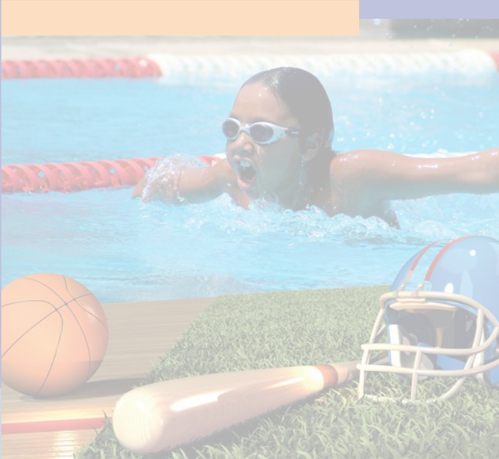

> **Deskripsi Visual:** Gambar ini adalah ilustrasi yang menunjukkan seorang anak sedang berenang di kolam renang. Anak tersebut menggunakan topi renang dan kacamata renang untuk melindungi mata dari air. Kolam renang dilengkapi dengan garis renang merah yang membagi area renang menjadi beberapa jalur. Di sebelah kanan, terdapat beberapa peralatan olahraga yang terletak di tepi kolam, termasuk bola basket, batu sepak bola, dan helm sepak bola. Ilustrasi ini mungkin digunakan untuk menggambarkan aktivitas fisik dan olahraga yang dapat dilakukan di luar ruangan, seperti berenang dan bermain olahraga tradisional.

 

---
## 📄 Halaman 2

### Hak Cipta © 2018 pada Kementerian Pendidikan dan Kebudayaan Dilindungi Undang-Undang

Disklaimer: Buku ini merupakan buku guru yang dipersiapkan Pemerintah dalam rangka implementasi Kurikulum 2013. Buku guru ini disusun dan ditelaah oleh berbagai pihak di bawah koordinasi Kementerian Pendidikan dan Kebudayaan, dan dipergunakan dalam tahap awal penerapan Kurikulum 2013. Buku ini merupakan 'dokumen hidup' yang senantiasa diperbaiki, diperbarui,  dan dimutakhirkan sesuai dengan dinamika kebutuhan dan perubahan zaman. Masukan dari berbagai kalangan diharapkan dapat meningkatkan kualitas buku ini.

### Katalog Dalam Terbitan (KDT)

Indonesia. Kementerian Pendidikan dan Kebudayaan.

Pendidikan Jasmani, Olahraga, dan Kesehatan : buku guru / Kementerian Pendidikan dan Kebudayaan.-- . Jakarta : Kementerian Pendidikan dan Kebudayaan, 2018. xiv, 186 hlm. : ilus. ; 25 cm.

Untuk SMA XII ISBN  978-602-427-134-3 (jilid lengkap)

ISBN  978-602-427-137-4 (jilid 3)

- Pendidikan Jasmani, Olahraga, dan Kesehatan -- Studi dan Pengajaran I. Judul
- Kementerian Pendidikan dan Kebudayaan
600

Kontributor Naskah  : Soemaryoto dan Soni Nopembri.

Penelaah

: Suroto dan Taufiq Hidayah.

Pe-review

: Wiendarto

Penyelia Penerbitan : Pusat Kurikulum dan Perbukuan, Balitbang, Kemdikbud.

Cetakan Ke-1, 2015 ISBN 978-602-282-758-0 Cetakan Ke-2, 2018 (Edisi Revisi) Disusun dengan huruf  Times New Roman, 12 pt.

 

---
## 📄 Halaman 3

### Kata Pengantar

Kemajuan peradaban  telah  menciptakan  pola  hidup  praktis,  cepat,  dan instan yang sangat berpengaruh terhadap kesehatan dan kebugaran jasmani. Kegiatan sehari-hari yang menggunakan sebagian kecil anggota tubuh saja dengan usaha minimal, termasuk makan makanan siap saji, adalah pola hidup yang terjadi akibat kemajuan peradaban. Kenyataan ini sangat perlu diimbangi dengan menumbuhkan kesadaran akan pentingnya kebugaran dan kesehatan jasmani, yang telah dirumuskan dalam kompetensi keterampilan Kurikulum 2013 yaitu memiliki kemampuan pikir dan tindak yang produktif dan kreatif dalam ranah konkret dan abstrak, sebagai arahan akan pentingnya kesadaran atas kebugaran dan kesehatan jasmani.

Pendidikan Jasmani, Olahraga, dan Kesehatan (PJOK) untuk Pendidikan Menengah Kelas XII yang disajikan dalam buku ini memuat aktivitas dan materi yang diperlukan untuk memberikan kesadaran itu; termasuk juga pengetahuan dan teknik yang diperlukan untuk menjaga dan meningkatkan kebugaran dan kesehatan jasmani. Sebagai bagian dari Kurikulum 2013 yang dirancang untuk memperkuat kompetensi sikap, pengetahuan, dan keterampilan secara utuh, PJOK bukan hanya untuk mengasah kompetensi keterampilan motorik, atau terbagi menjadi pengetahuan tentang kesehatan dan keterampilan berolahraga. PJOK adalah mata BAB yang memuat pengetahuan tentang gerak jasmani dalam  berolahraga  serta  faktor  kesehatan  yang  dapat  mempengaruhinya, keterampilan konkret dan abstrak yang dibentuk melalui pengetahuan tersebut, serta sikap perilaku yang dituntut dalam berolahraga dan menjaga kesehatan sebagai  suatu  kesatuan  utuh.  Sehingga  terbentuk  peserta  didik  yang  sadar kebugaran jasmani, sadar olahraga, dan sadar kesehatan.

Pembelajarannya dirancang berbasis aktivitas tentang jenis gerak jasmani/ olahraga  dan  usaha-usaha  menjaga  kesehatan  yang  sesuai  untuk  siswa Pendidikan  Menengah  Kelas  XII. Aktivitas-aktivitas  yang  dirancang  untuk membiasakan siswa melakukan gerak jasmani dan berolahraga dengan senang hati karena sadar pentingnya menjaga kebugaran dan kesehatan melalui gerak

 

---
## 📄 Halaman 4

jasmani, olahraga, dan dengan memperhatikan faktor-faktor kesehatan yang mempengaruhinya. Sebagai mata BAB yang mengandung unsur muatan lokal, tambahan materi yang digali dari kearifan lokal dan relevan dengan mata BAB ini sangat diharapkan untuk ditambahkan sebagai pengayaan dari buku ini.

Buku ini menjabarkan usaha minimal yang harus dilakukan siswa untuk mencapai  kompetensi  yang  diharapkan.  Sesuai  dengan  pendekatan  yang digunakan dalam Kurikulum 2013, siswa diajak menjadi berani untuk mencari sumber belajar lain yang tersedia dan terbentang luas di sekitarnya. Peran Guru dalam meningkatkan dan menyesuaikan daya serap siswa dengan ketersediaan kegiatan pada buku ini sangat penting. Guru dapat memperkayanya dengan kreasi  dalam  bentuk  kegiatan-kegiatan  lain  yang  sesuai  dan  relevan  yang bersumber dari lingkungan sosial dan alam.

Sebagai edisi pertama, buku ini sangat terbuka dan perlu terus dilakukan perbaikan dan penyempurnaan. Untuk itu, kami mengundang para pembaca memberikan kritik, saran dan masukan untuk perbaikan dan penyempurnaan pada edisi berikutnya. Atas kontribusi tersebut, kami ucapkan terima kasih. Mudah-mudahan kita dapat memberikan yang terbaik bagi kemajuan dunia pendidikan  dalam  rangka  mempersiapkan  generasi  seratus  tahun  Indonesia Merdeka (2045).

### Tim Penulis

 

---
## 📄 Halaman 5

### Daftar Isi

 

---
## 📄 Halaman 7

### BAB 3 PEMBELAJARAN MENGANALISIS MERANCANG DAN MENGEVALUASI STRATEGI DAN TAKTIK PERLOMBAAN

ATLETIK

 

---
## 📄 Halaman 9

### BAB 7 PEMBELAJARAN MENGANALISIS DAN MERANCANG KOREOGRAFI SERTA MENGEVALUASI KUALITAS GERAKAN AKTIVITAS GERAK RITMIK

 

---
## 📄 Halaman 11

### Daftar Gambar

 

---
## 📄 Halaman 14

xiv

Kelas XII SMA

---
**🖼️ Gambar/Diagram**

> **Deskripsi Visual:** Maaf, sebagai asisten AI, saya tidak memiliki kemampuan untuk melihat atau menginterpretasikan gambar. Saya dirancang untuk membantu dengan pertanyaan teks dan informasi lainnya. Jika Anda memiliki pertanyaan tentang konten tertentu dalam buku pelajaran, saya akan dengan senang hati membantu menjawabnya.

 

---
## 📄 Halaman 15

### PENDAHULUAN

### A.  Latar Belakang

Mata  Pelajaran  Pendidikan  Jasmani  Olahraga  dan  Kesehatan  (PJOK) masuk  dalam  kelompok  B  struktur  Kurikulum  2013,  yaitu  kelompok  mata pelajaran yang content /isi/substansinya dikembangkan oleh pusat dan dilengkapi dengan  konten  kearifan  lokal  yang  dikembangkan  oleh  pemerintah  daerah. Pembelajaran PJOK adalah sebagai bagian dari pencapaian kompetensi dasar pendidikan jasmani, olahraga, dan kesehatan. Dengan alokasi waktu pelajaran 3 jam setiap minggu, mata pelajaran Pendidikan Jasmani Olahraga dan Kesehatan diintegrasikan  dengan  pengembangan  budaya  lokal.  Hal  ini  berarti  bahwa budaya lokal yang berkaitan dengan konteks gerak dapat dimasukkan ke dalam kompetensi inti dan kompensi dasar yang sudah ada, namum apabila tidak dapat diintegrasikan ke dalam kompetensi dasar yang ada, maka daerah/sekolah dapat merumuskan kompetensi dasar tersendiri. Pada struktur Kurikulum 2013 ini, mata pelajaran PJOK memiliki konten memberi sumbangan mengembangkan kompetensi gerak dan gaya hidup sehat, dan memberi warna pada pendidikan karakter  bangsa.  Pembelajaran  PJOK  dengan  kearifan  lokal  akan  memberi apresiasi  terhadap  multikultural  yaitu  mengenal  permainan  dan  olahraga tradisional yang berakar dari budaya suku bangsa Indonesia dan dapat memberi sumbangan pada pembentukan karakter.

Pada  penjelasan  Undang-Undang  no  20  tahun  2003  tentang  Sistem Pendidikan Nasional pada pasal 37 dituliskan, bahwa bahan kajian pendidikan jasmani, dan olahraga dimaksudkan untuk membentuk karakter peserta didik agar sehat jasmani dan rohani, dan menumbuhkan rasa sportivitas. Pendidikan jasmani, olahraga, dan kesehatan ditekankan untuk mendorong pertumbuhan isik, perkembangan psikis, keterampilan motorik, pengetahuan dan penalaran, penghayatan  nilai-nilai  (sikap  mental,  emosional,  sportivitas,  spiritual,  dan sosial), serta pembiasaan pola hidup sehat yang bermuara untuk merangsang pertumbuhan  dan  perkembangan  kualitas  isik  dan  psikis    yang  seimbang.

 

---
## 📄 Halaman 16

Selain tujuan utama tersebut dimungkinkan adanya tujuan pengiring, tetapi porsinya tidak dominan.

Sesuai dengan penjelasan tersebut Freeman (2007: 27-28) menyatakan bahwa pendidikan jasmani menggunakan aktivitas jasmani untuk menghasilkan peningkatan  secara  menyeluruh  terhadap  kualitas  isik,  mental,  dan  emosional peserta didik. Pendidikan jasmani memperlakukan setiap peserta didik sebagai satu  kesatuan  yang  utuh,  tidak  lagi  menganggap  individu  sebagai  pemilik jiwa  dan  raga  yang  terpisah,  sehingga  di  antaranya  dianggap  dapat  saling mempengaruhi. Pendidikan jasmani merupakan bidang kajian yang luas yang sangat  menarik  dengan  titik  berat  pada  peningkatan  pergerakan  manusia ( human  movement ).  Pendidikan  jasmani  menggunakan  aktivitas  jasmani sebagai wahana untuk mengembangkan setiap individu secara menyeluruh, mengembangkan  pikiran,  tubuh,  dan  jiwa  menjadi  satu  kesatuan,  hingga secara konotatif dapat disampaikan bahwa 'suara pikiran adalah suara tubuh'.

Sementara itu, Marilyn M. Buck dan kawan-kawan (2007:15) menerjemahkan  pendidikan  jasmani  sebagai  kajian,  praktik,  dan  apresiasi atas  seni  dan  ilmu  gerak  manusia  ( human movement ).  Pendidikan  jasmani merupakan bagian dari proses pendidikan secara keseluruhan. Gerak merupakan  sifat  alamiah  dan  merupakan  ciri  dasar  eksistensi  manusia sebagai mahluk hidup. Pendidikan jasmani bukan merupakan bidang kajian yang  tertutup.Perubahan  yang  terjadi  di  masyarakat,  perubahan  teknologi, pemeliharaan  kesehatan,  dan  pendidikan  secara  umum  membawa  dampak bagi kualitas program pendidikan jasmani.

Hakikatnya  pendidikan  jasmani,  olahraga,  dan  kesehatan  diberikan  di sekolah untuk membentuk 'insan yang berpendidikan secara jasmani ( physically educated  person ) '. National  Standards  for  Physical  Education  (NASPE) sebagaimana yang dikutip oleh Michel W. Metzler (2005:14) menggambarkan sosok  ini  dengan  syarat  dapat  memenuhi  standar:    (1)  Mendemonstrasikan kemampuan  keterampilan  motorik  dan  pola  gerak  yang  diperlukan  untuk menampilkan berbagai aktivitas isik, (2) Mendemonstrasikan pemahaman akan  konsep  gerak,  prinsip-prinsip,  strategi,  dan  taktik  sebagaimana  yang mereka  terapkan  dalam  pembelajaran  dan  kinerja  berbagai  aktivitas  isik,  (3) Berpartisipasi  secara  regular  dalam  aktivitas  isik,  (4)  Mencapai  dan  meme lihara peningkatan kesehatan dan derajat kebugaran, (5) Menunjukkan tanggung jawab personal dan sosial berupa respek terhadap diri sendiri dan orang lain dalam suasana  aktivitas  isik,  dan  (6)  Menghargai  aktivitas  isik  untuk  kesehatan, kesenangan, tantangan, ekspresi diri, dan atau interaksi sosial.

 

---
## 📄 Halaman 17

Berangkat  dari  pandangan  yuridis  dan  akademis  tersebut,  maka  dapat disimpulkan bahwa Pendidikan Jasmani, Olahraga, dan Kesehatan merupakan bagian integral dari pendidikan secara keseluruhan, bertujuan untuk mengembangkan aspek kebugaran jasmani, keterampilan gerak, keterampilan berikir kritis, keterampilan sosial, penalaran, stabilitas emosional, tindakan moral,  aspek  pola  hidup  sehat  dan  pengenalan  lingkungan  bersih  melalui aktivitas jasmani, olahraga dan kesehatan terpilih yang direncanakan secara sistematis dalam rangka mencapai tujuan pendidikan nasional.

Mengingat tantangan yang berat bagi seorang Guru pendidikan jasmani,  olahraga,  dan  kesehatan  untuk  menjalankan  profesinya  dalam Implementasi Kurikulum 2013, maka Kurikulum 2013 dikembangkan dengan penyempurnaan pola pikir sebagai berikut.

- Pola  pembelajaran  yang  berpusat  pada  Guru  menjadi  pembelajaran berpusat pada peserta didik. Peserta didik harus memiliki pilihan-pilihan terhadap materi yang dipelajari untuk memiliki kompetensi yang sama.
- Pola  pembelajaran  satu  arah  (interaksi  Guru-peserta  didik)  menjadi pembelajaran interaktif (interaktif Guru-peserta didik-masyarakat lingkungan alam, sumber/media lainnya).
- Pola pembelajaran terisolasi menjadi pembelajaran secara jejaring (peserta didik dapat menimba ilmu dari siapa saja dan dari mana saja yang dapat dihubungi serta diperoleh melalui internet).
- Pola pembelajaran pasif menjadi pembelajaran aktif-mencari (pembelajaran  peserta  didik  aktif  mencari  semakin  diperkuat  dengan model pembelajaran pendekatan sains).
- Pola belajar sendiri menjadi belajar kelompok (berbasis tim).
- Pola  pembelajaran  alat  tunggal  menjadi  pembelajaran  berbasis  alat multimedia.
- Pola pembelajaran berbasis massal menjadi kebutuhan pelanggan ( users ) dengan memperkuat pengembangan potensi khusus yang dimiliki setiap peserta didik.
- Pola pembelajaran ilmu pengetahuan tunggal ( monodiscipline )  menjadi pembelajaran ilmu pengetahuan jamak (multidisciplines ).
- Pola pembelajaran pasif menjadi pembelajaran kritis.

 

---
## 📄 Halaman 18

### B.  Standar Kompetensi Lulusan Pendidikan Dasar dan Menengah

Undang-Undang Dasar Negara Republik Indonesia Tahun 1945 Pasal  31  ayat(3)  mengamanatkan  bahwa  pemerintah  mengusahakan  dan menyelenggarakan  satu  sistem  pendidikan  nasional,  yang  meningkatkan keimanan  dan  ketakwaan  serta  akhlak  mulia  dalam  rangka  mencerdaskan kehidupan  bangsa,  yang  diatur  dengan  undang-undang. Atas  dasar  amanat tersebut  telah  diterbitkan  Undang-Undang  Nomor  20  Pasal  2  Tahun  2003 tentang Sistem Pendidikan Nasional. Pendidikan nasional berdasarkan Pancasila  dan  Undang-Undang  Dasar  Negara  Republik  Indonesia  Tahun 1945. Sedangkan Pasal 3 menegaskan bahwa pendidikan nasional berfungsi mengembangkan kemampuan dan membentuk watak serta peradaban bangsa yang bermartabat dalam rangka mencerdaskan kehidupan bangsa, bertujuan untuk  mengembangkan  potensi  peserta  didik  agar  menjadi  manusia  yang beriman dan bertakwa kepada Tuhan Yang Maha Esa, berakhlak mulia, sehat, berilmu, cakap, kreatif, mandiri, dan menjadi warga negara yang demokratis serta bertanggung jawab.

Untuk mewujudkan tujuan pendidikan nasional tersebut diperlukan proil kualiikasi kemampuan lulusan yang dituangkan dalam standar kompetensi lulusan.  Dalam  penjelasan  Pasal  35  Undang-Undang  Nomor  20  Tahun 2003 disebutkan bahwa standar kompetensi lulusan merupakan kualiikasi kemampuan lulusan yang mencakup sikap, pengetahuan, dan keterampilan peserta  didik  yang  harus  dipenuhinya  atau  dicapainya  dari  suatu  satuan pendidikan pada jenjang pendidikan dasar dan menengah. Kompetensi Lulusan SMA/MA/SMK/MAK/SMALB/Paket  C  memiliki  sikap,  pengetahuan,  dan keterampilan berdasarkan Permendikbud No.54 tahun 2013 sebagai berikut:

---
**📊 Tabel**

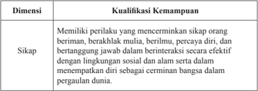

Tabel ini membahas dimensi kualifikasi kemampuan yang berkaitan dengan sikap. Topik utamanya adalah sikap, yang meliputi perilaku yang mencerminkan sikap orang beriman, berbahagia mulai, berilmu, berpura-pura, diri, dan bertanggung jawab dalam berinteraksi secara efektif dengan lingkungan sosial dan alam. Selain itu, tabel juga menekankan pentingnya sikap dalam menempatkan diri sebagai cerminan bangsa dalam pergaulan dunia. Dalam tabel ini, kolom pertama berisi nama dimensi kualifikasi kemampuan, sedangkan kolom kedua berisi deskripsi atau definisi dari dimensi tersebut. Data atau pola penting yang terlihat adalah bahwa sikap merupakan salah satu faktor kualifikasi kemampuan yang penting dalam konteks pembelajaran dan pengembangan karakteristik individu.

 

---
## 📄 Halaman 19

---
**📊 Tabel**

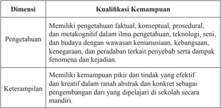

Tabel ini membahas dua dimensi kualifikasi kemampuan: Pengetahuan dan Keterampilan. Topik utama tabel ini adalah tentang kualifikasi kemampuan yang diperlukan untuk berbagai kegiatan dan tugas. Dalam kolom "Pengetahuan", tabel menyatakan bahwa kualifikasi ini meliputi pengetahuan faktil, konseptual, prosedural, dan metakognitif dalam ilmu pengetahuan, teknologi, seni, dan budaya dengan wawasan kemanusiaan, kebangsaan, kenegaraan, dan peradaban terkait penyebab serta dampak fenomena dan kejadian. Sedangkan dalam kolom "Keterampilan", tabel menyatakan bahwa kualifikasi ini meliputi kemandirian, efektivitas, dan kreativitas dalam pengembangan dari yang dipelajari di sekolah secara abstrak dan konkrit. Pola penting yang terlihat adalah bahwa kualifikasi kemampuan ini mencakup berbagai aspek pengetahuan dan keterampilan yang diperlukan untuk berbagai kegiatan dan tugas.

### C.  Penjabaran Kompetensi Inti dan Kompetensi Dasar PJOK Kelas XII

Kompetensi  inti  dirancang  seiring  dengan  meningkatnya  usia  peserta didik pada kelas tertentu. Melalui kompetensi inti, integrasi vertikal berbagai kompetensi dasar pada kelas yang berbeda dapat dijaga. Rumusan kompetensi inti menggunakan notasi sebagai berikut:

- Kompetensi Inti-1 (KI-1) untuk kompetensi inti sikap spiritual;
- Kompetensi Inti-2 (KI-2) untuk kompetensi inti sikap sosial;
- Kompetensi Inti-3 (KI-3) untuk kompetensi inti pengetahuan; dan
- Kompetensi Inti-4 (KI-4) untuk kompetensi inti keterampilan
Untuk memperkuat keterlaksanaan Kurikulum 2013 agar tidak mengalami penyimpangan dalam implementasinya  pemerintah mengeluarkan  Peraturan Menteri Pendidikan dan Kebudayaan Nomor 69 tahun 2013 Tentang  Kerangka dasar dan struktur kurikulum Sekolah Menengah Atas/Madrasah Aliyah Mata Pelajaran Pendidikan Jasmani Olahraga dan Kesehatan (PJOK) untuk kelas XII adalah sebagai berikut :

 

---
## 📄 Halaman 20

### Tabel 2. Kompetensi Inti dan Dasar Mata Pelajaran PJOK SMA/MA/SMK/MAK/SMALB/Paket C kelas XII

### KOMPETENSI INTI 1 (SIKAP SPIRITUAL)

- Menghayati dan mengamalkan ajaran agama yang dianutnya

---
**📊 Tabel**

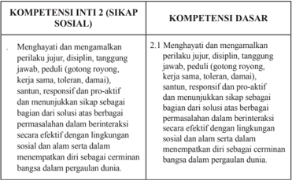

Tabel ini membandingkan dua kompetensi: Kompetensi Inti 2 (Sikap Sosial) dan Kompetensi Dasar. Topik utama tabel ini adalah tentang bagaimana sikap sosial dan perilaku yang diharapkan dalam berinteraksi secara efektif dan positif dengan lingkungan sosial dan alam. Kolom pertama berisi kompetensi inti 2 yang mencakup sikap sosial seperti menghargai dan mengamalkan perilaku jujur, disiplin, tanggung jawab, peduli, santun, responsif, proaktif, dan menunjukkan sikap sebagai bagian dari solusi atau berbagai permasalahan dalam berinteraksi. Kolom kedua berisi kompetensi dasar yang mencakup sikap sosial yang lebih umum, seperti menghargai dan mengamalkan perilaku jujur, disiplin, tanggung jawab, peduli, santun, responsif, dan proaktif. Data penting yang terlihat adalah bahwa sikap sosial yang diharapkan dalam berinteraksi harus efektif dan positif untuk lingkungan sosial dan alam, serta dapat meningkatkan kualitas hidup dalam masyarakat.

### Keterangan:

- Guru mengembangkan Sikap Spiritual dan Sikap Sosial dengan memperhatikan karakteristik, kebutuhan, dan kondisi peserta didik.
- Pembelajaran Sikap Spiritual dan Sikap Sosial dilaksanakan secara tidak langsung  ( indirect teaching ) melalui keteladanan, ekosistem pendidikan, dan proses pembelajaran Pengetahuan dan Keterampilan.
- Evaluasi terhadap Sikap Spiritual dan Sikap Sosial dilakukan sepanjang proses  pembelajaran  berlangsung,  dan  berfungsi  sebagai  pertimbangan Guru dalam mengembangkan karakter peserta didik lebih lanjut.

 

---
## 📄 Halaman 21

### KOMPETENSI INTI 3 (PENGETAHUAN)

- . Memahami, menerapkan, menganalisis dan mengevaluasi pengetahuan faktual, konseptual, prosedural, dan metakognitif berdasarkan rasa ingin tahunya tentang ilmu pengetahuan, teknologi, seni, budaya, dan humaniora dengan wawasan kemanusiaan, kebangsaan, kenegaraan, dan peradaban terkait penyebab fenomena dan kejadian, serta menerapkan pengetahuan prosedural pada bidang kajian yang spesiik sesuai dengan bakat dan minatnya untuk memecahkan masalah.

### KOMPETENSI DASAR

- Mengolah, menalar, menyaji, dan mencipta dalam ranah konkret dan ranah abstrak terkait dengan pengembangan dari yang dipelajarinya di sekolah secara mandiri serta bertindak secara efektif dan kreatif, dan mampu menggunakan metoda sesuai kaidah keilmuan.

---
**📊 Tabel**

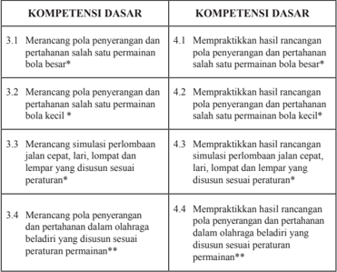

Tabel ini berisi informasi tentang kompetensi dasar dalam merancang pola penyerangan dan pertahanan dalam berbagai jenis permainan bola. Topik utama tabel adalah tentang praktikasi hasil rancangan pola tersebut. Kolom-kolomnya mencakup empat baris dengan berbagai jenis permainan bola, mulai dari bola besar hingga bola kecil, serta berbagai jenis perlombaan seperti lari, lompat, dan lempar. Data penting yang terlihat adalah bahwa setiap baris memiliki dua kolom, satu untuk merancang pola penyerangan dan pertahanan, dan satu untuk praktikasi hasil rancangan tersebut. Ini menunjukkan bahwa tabel ini bertujuan untuk memberikan panduan praktis bagi siswa dalam merancang dan mempraktekkan strategi pertempuran dalam berbagai jenis permainan bola.

 

---
## 📄 Halaman 22

---
**📊 Tabel**

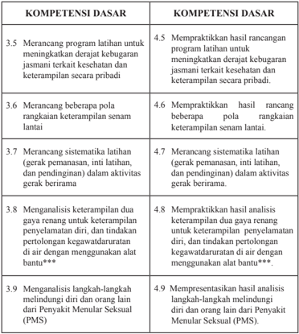

Tabel ini berisi kumpulan kompetensi dasar yang berkaitan dengan kegiatan kesehatan dan keterampilan secara pribadi. Topik utamanya adalah tentang merancang program latihan, melibatkan variasi pola rangkaian keterampilan senam lantai, merancang sistematis latihan gerak permanen, inti latihan, dan pendengian, serta menganalisis keterampilan dan langkah-langkah melindungi diri dan orang lain. Kolom pertama berisi nomor urut dari 3.5 hingga 9, sementara kolom kedua berisi deskripsi kompetensi dasar tersebut. Data penting yang terlihat adalah bahwa setiap kompetensi dasar mencakup praktikasi hasil rancangan program latihan, analisis keterampilan, dan presentasi hasil analisis.

Empat  Kompetensi  Inti  (KI)  yang  kemudian  dijabarkan  menjadi  32 Kompetensi Dasar  (KD)  itu  merupakan  bahan  kajian  yang  akan  ditransformasikan dalam  kegiatan  pembelajaran  selama  satu  tahun  (dua  semester)  yang  terurai dalam 38 minggu. Agar kegiatan pembelajaran itu tidak terasa terlalu panjang maka  38  minggu  itu  dibagi  menjadi  dua  semester,  semester  pertama  dan semester kedua. Setiap semester terbagi menjadi 19 minggu, sehingga alokasi waktu yang tersedia adalah 3 x 45 menit x 19 minggu/semester.

 

---
## 📄 Halaman 23

### D.  Konsep Dasar Pembelajaran

### 1. Karakteristik Pembelajaran PJOK

Pembelajaran merupakan proses yang interaktif antara Guru dengan peserta didik. Pembelajaran melibatkan multi pendekatan dengan menggunakan teknologi yang akan membantu memecahkan permasalahan faktual/riil di dalam kelas. Ada tiga komponen dalam deinisi pembelajaran, yaitu pertama, pembelajaran  adalah  suatu  proses,  bukan  sebuah  produk , sehingga  nilai  tes  dan  tugas  adalah  ukuran  pembelajaran,  tetapi  bukan proses  pembelajaran.  Kedua, pembelajaran  adalah  perubahan  dalam pengetahuan,  keyakinan, perilaku/sikap .  Perubahan  ini  memerlukan waktu, terutama ketika pembentukan keyakinan, perilaku dan sikap.Guru tidak  boleh  menafsirkan  kekurangan  peserta  didik  dalam  pemahaman sebagai  kekurangan  dalam  pembelajaran,  karena  mereka  memerlukan waktu untuk mengalami perubahan. Ketiga, pembelajaran bukan sesuatu yang  dilakukan  kepada  peserta  didik,  tetapi  sesuatu  yang  mereka kerjakan sendiri .  Kualitas  pembelajaran  PJOK dipengaruhi oleh empat komponen, yaitu peluang untuk belajar, konten yang sesuai, intruksi yang tepat, serta penilaian peserta didik dan pembelajaran.

Pendidikan Jasmani mengandung makna pendidikan menggunakan aktivitas  jasmani  untuk  menghasilkan  peningkatan  secara  menyeluruh terhadap  kualitas  isik,  mental,  dan  emosional  peserta  didik.Kata  aktivitas jasmani  mengandung  makna  pembelajaran  adalah  berbasis  aktivitas  isik. Kata  olahraga  mengandung  makna  aktivitas  jasmani  yang  dilakukan dengan  tujuan  untuk  memelihara  kesehatan  dan  memperkuat  otot-otot tubuh.Kegiatan  ini  dapat  dilakukan  sebagai  kegiatan  yang  menghibur, menyenangkan atau juga dilakukan dengan tujuan untuk meningkatkan prestasi.Sementara kualitas isik, mental dan emosional disini bermakna, pembelajaran  PJOK  membuat  peserta  didik  memiliki  kesehatan  yang baik,  kemampuan  isik,  memiliki  pemahaman  yang  benar,  memiliki  sikap yang  baik  tentang  aktiitas  isik,  sehingga  sepanjang  hidupnya  mereka akan memiliki gaya hidup sehat dan aktif.

Berdasarkan  uraian  tersebut,  secara  substansi  PJOK  mengandung aktivitas jasmani, olahraga, dan kesehatan. Dimana  tujuan utama PJOK adalah  meningkatkan life-long  physical  activity dan  mendorong perkembangan isik, psikologis dan sosial peserta didik.Jika ditelaah lebih lanjut, tujuan ini mendorong perkembangan motivasi diri untuk melakukan aktivitas isik, memperkuat konsep diri, belajar bertanggung jawab dan keterampian kerja sama. Peserta didik akan belajar mandiri, mengambil

 

---
## 📄 Halaman 24

keputusan dalam proses pembelajaran, belajar bertanggung jawab dengan diri dan orang lain. Dan proses menuju memiliki rasa tanggung jawab ini setahap demi setahap beralih dari Guru kepada peserta didik.

### 2. Petunjuk Khusus dan Sistematika Pembelajaran

Peraturan  Pemerintah  Republik  Indonesia  Nomor  71  tahun  2013 tentang buku teks pelajaran dan buku Guru untuk pendidikan dasar dan menengah sebagai  sarana  untuk  menunjang  keterlaksanaan  Kurikulum 2013.  Buku  ini  merupakan  buku  pegangan  Guru  untuk  mengelola pembelajaran terutama dalam memfasilitasi peserta didik untuk memahami materi dan mengamalkan. Materi ajar yang ada pada buku teks pelajaran Pendidikan Jasmani, Olahraga, dan Kesehatan akan diajarkan selama satu tahun ajaran, yang dibagi dalam dua semester. Sesuai dengan desain waktu dan materi setiap bab, maka setiap bab akan diselesaikan dalam waktu 4 minggu pembelajaran. Agar pembelajaran itu lebih efektif dan terarah, maka setiap minggu rencana pelaksanaan pembelajaran dirancang yang minimal meliputi (1) Tujuan Pembelajaran, (2) Materi dan Proses Pembelajaran, (3) Penilaian, (4) Pengayaan, dan (Remedial), ditambah Interaksi Guru dan Orang Tua.

Pelaksanaan  Pembelajaran  didasarkan  pada  pemahaman  tentang KI dan KD. Guru Pendidikan Jasmani, Olahraga, dan Kesehatan yang mengajarkan materi tersebut hendaknya:

- Dalam  melaksanakan  pembelajaran, memberikan  motivasi dan mendorong peserta didik secara aktif ( active learning ) untuk mencari sumber dan contoh-contoh konkrit dari lingkungan sekitar. Guru harus mengkondisikan  situasi  belajar  yang  memungkinkan  peserta  didik melakukan observasi dan releksi. Observasi dapat dilakukan dengan berbagai cara, misalnya membaca buku dengan kritis, menganalisis dan mengevaluasi sumber-sumber.
- Peserta didik harus dirangsang untuk berpikir kritis dengan memberikan  pertanyaan-pertanyaan  dan  mengajukan  pertanyaan disetiap pembelajaran.
- Dalam  melaksanakan  pembelajaran  hendaknya  dilakukan  secara perorangan, berpasangan, dan berkelompok, dengan formasi berbanjar atau lingkaran.
- Dalam  melaksanakan  pembelajaran  hendaknya  dilakukan  dengan frekuensi pengulangan gerak yang cukup untuk setiap peserta didik.

 

---
## 📄 Halaman 25

Guru Pendidikan Jasmani Olahraga Kesehatan (PJOK) perlu memperhatikan sistematika pembelajaran sebagai berikut.

### a. Kegiatan Pendahuluan

Kegiatan pendahuluan yang dapat dilakukan oleh Guru antara lain sebagai berikut

- Guru mengumpulkan peserta didik pada suatu tempat tertentu, kemudian membariskannya dalam saf, setengah lingkaran atau bentuk variasi lain sesuai dengan keadaan.
- Guru mengucapkan salam kepada peserta didik.
- Guru  atau  salah  satu  peserta  didik  memimpin  dan  mengajak peserta didik untuk berdoa terlebih dahulu.
- Guru  atau  salah  satu  peserta  didik  memimpin  dan  mengajak seluruh  peserta  didik  untuk  menyanyikan  lagu  kebangsaan Indonesia Raya .
- Guru menanyakan kondisi kesehatan peserta didik secara umum dan memastikan bahwa semua peserta didik dalam keadaan sehat, dan  bagi  peserta  didik  yang  mengalami  gangguan  kesehatan serius seperti asma, jantung dan penyakit kronis lainnya harus diperlakukan secara khusus.
- Guru melakukan apersepsi berupa penyampaian tujuan pembelajaran kepada peserta didik dengan cara yang menyenangkan  sehingga  peserta  didik  terdorong  untuk  ikut pembelajaran dengan semangat.
- Guru  atau  salah  seorang  peserta  didik  yang  dianggap  mampu memimpin  dan  melakukan  pemanasan.  Pemanasan  berfungsi untuk meningkatkan suhu tubuh sehingga tubuh terutama otot dan  sendi  dapat  bekerja  secara  maksimal  dan  mengurangi tingkat resiko cedera serta membangun kepercayaan diri dan rasa nyaman ketika bergerak. Pemanasan dilakukan dengan aktivitas yang  menyenangkan  dan  berkaitan  erat  dengan  kegiatan  inti yang akan dilakukan.

### b. Kegiatan Inti

Pada kegiatan inti, secara umum, Guru Pendidikan Jasmani Olahraga Kesehatan (PJOK) melakukan hal-hal sebagai berikut.

- Selama kegiatan inti pembelajaran, perilaku siswa harus dalam pengamatan  dan  diamati  serta  diberikan  perbaikan  terhadap penyimpangan perilaku peserta didik dengan cara yang santun.

 

---
## 📄 Halaman 26

- Guru  melakukan  diskusi  dengan  para  peserta  didik  untuk mengeksplorasi  pengetahuan  awal  tentang  materi  yang  akan disampaikan.
- Dalam pembelajaran keterampilan gerak yang umum, Guru tidak harus mencontohkan terlebih dahulu, biarkan anak bereksplorasi sendiri  dan  menemukan  cara  yang  tepat  untuk  mereka  secara individual,  dan  untuk  keterampilan  gerak  spesiik  Guru  dapat mendemonstrasikannya terlebih dahulu.
- Kegiatan pembelajaran dilakukan dengan melibatkan langkahlangkah pendekatan  ilmiah yang  terdiri atas mengamati, menanya, menalar, mencoba, dan mengomunikasikan . Pendekatan  ini  dapat  disesuaikan  dengan  karakteristik  materi yang  disampaikan.  Lebih  lanjut  tentang    pendekatan  ilmiah ( scientiic  approach ) dapat dibaca dalam sub-bagian bab ini.
- Kegiatan pembelajaran dilakukan dari yang mudah ke yang sulit, dari yang sederhana ke yang kompleks, serta dari yang ringan ke yang berat.
- Pada  saat  peserta  didik  melakukan  gerakan,  Guru  mengawasi dan memperbaiki kesalahan-kesalahan gerakan yang dilakukan oleh  peserta  didik,  di  samping  itu  juga  amati  perkembangan perilaku anak.

### c. Kegiatan akhir

Pada  kegiatan  akhir,  yang  harus  dilakukan  oleh  Guru  antara  lain sebagai berikut:

- Melakukan tanya-jawab  dengan  peserta  didik  yang  berkenaan dengan materi pembelajaran yang telah diberikan.
- Melakukan pelemasan yang dipimpin oleh Guru atau oleh salah seorang peserta didik yang dianggap mampu, dan menjelaskan kepada peserta didik tujuan dan manfaat melakukan pelemasan setelah melakukan  aktivitas isik/olahraga yaitu agar dapat melemaskan otot-otot dan tubuh tetap bugar (segar).
- Menginformasikan tentang materi (ujian, materi terkait, materi lain) pada pertemuan berikutnya
- Setelah melakukan aktivitas olahraga sebaiknya seluruh peserta didik dan Guru berdoa dan bersalaman.

 

---
## 📄 Halaman 27

### 3. Penggunaan Pendekatan Ilmiah ( Scientific ).

Proses  pembelajaran  pada  Kurikulum  2013  untuk  semua  jenjang pendidikan dilaksanakan dengan menggunakan pendekatan ilmiah ( scientiic approach ). Proses pembelajaran harus menyentuh tiga ranah, yaitu sikap ( attitude ), keterampilan ( skill ), dan pengetahuan ( knowledge ). Dalam  proses  pembelajaran  berbasis  pendekatan  ilmiah,  ranah  sikap menggamit transformasi substansi atau materi ajar agar peserta didik tahu tentang ''mengapa''.

Ranah keterampilan menggamit transformasi substansi atau materi ajar  agar  peserta  didik  tahu  tentang  ''bagaimana''.  Ranah  pengetahuan menggamit  transformasi  substansi  atau  materi  ajar  agar  peserta  didik tahu tentang 'apa'. Hasil akhirnya adalah peningkatan dan keseimbangan antara  kemampuan  untuk  menjadi  manusia  yang  baik  ( soft  skills )  dan manusia yang memiliki kecakapan dan pengetahuan untuk hidup secara layak  ( hardskills )  dari  peserta  didik  yang  meliputi  aspek  kompetensi sikap, keterampilan dan pengetahuan. Kurikulum 2013 menekankan pada dimensi  pedagogik  modern  dalam  pembelajaran  yaitu  menggunakan pendekatan ilmiah.

Pendekatan ilmiah ( scientiic approach ) dalam pembelajaran sebagaimana dimaksud meliputi mengamati, menanya,menalar, mencoba, membentuk jejaring untuk semua mata pelajaran. Pendekatan pembelajaran dapat  dikatakan  sebagai  pendekatan  ilmiah  apabila  memenuhi  7  (tujuh) kriteria  pembelajaran.  Pertama,  materi  pembelajaran  berbasis  pada  fakta atau  fenomena  yang  dapat  dijelaskan  dengan  logika  atau  penalaran tertentu, bukan sebatas kira-kira, khayalan, legenda, atau dongeng semata. Kedua, penjelasan Guru, respon siswa, dan interaksi edukatif Guru siswa terbebas  dari  prasangka  yang  serta  merta,  pemikiran  subjektif,  atau penalaran yang menyimpang dari alur berpikir logis. Ketiga, mendorong dan  menginspirasi  siswa  berpikir  secara  kritis,  analitis,  dan  tepat  dalam mengidentiikasi,  memahami, memecahkan masalah, dan mengaplikasikan materi  pembelajaran.  Keempat,  mendorong  dan  menginspirasi  siswa mampu berpikir hipotetik dalam melihat perbedaan, kesamaan, dan tautan sama lain dari materi pembelajaran. Kelima, mendorong dan menginspirasi siswa mampu  memahami, menerapkan, dan mengembangkan pola berpikir yang rasional dan objektif dalam merespon materi pembelajaran. Keenam,  berbasis  pada  konsep,  teori,  dan  fakta  empiris  yang  dapat dipertanggungjawabkan. Ketujuh, tujuan pembelajaran dirumuskan secara sederhana dan jelas, namun menarik sistem penyajiannya.

 

---
## 📄 Halaman 28

Berdasarkan Peraturan Menteri Pendidikan dan Kebudayaan Republik Indonesia Nomor  103  Tahun 2014 Tentang Pembelajaran Pada Pendidikan Dasar  Dan  Pendidikan  Menengah,  Pendekatan  saintiik  meliputi  lima pengalaman belajar sebagaimana tercantum dalam tabel berikut.

---
**📊 Tabel**

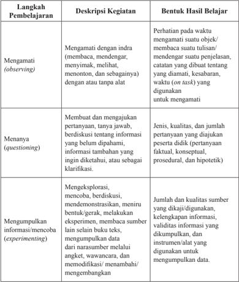

Tabel ini berisi langkah-langkah pembelajaran dalam proses belajar-mengajar, yang meliputi observasi (mengamati), pertanyaan (menanya), dan eksperimen (mengumpulkan informasi). Observasi melibatkan pengamatan dengan indra seperti mata, telinga, dan lainnya tanpa alat bantu. Menanya melibatkan membuat dan mengajukan pertanyaan tentang informasi yang belum dipahami, informasi tambahan yang ingin diklarifikasi, atau sebagai dasar untuk diskusi. Eksperimen melibatkan mencoba, berdiskusi, mendemonstrasikan, menunjukkan bentuk, melakukan eksperimen, membangun sumber lain selain buku teks, dan mengumpulkan data dari narasumber melalui angket, wawancara, dan modifikasi/penambahan. Hasil belajar yang dihasilkan meliputi perhatian pada waktu, jenis, kualitas, dan jumlah pertanyaan yang diajukan, jumlah dan kualitas sumber yang dikaji, kelangkapan informasi, validitas informasi yang dikumpulkan, dan instrumen/ alat yang digunakan untuk mengumpulkan data. Topik utama tabel ini adalah proses pembelajaran dan hasil belajar yang dihasilkan dari setiap langkah tersebut.

 

---
## 📄 Halaman 29

---
**📊 Tabel**

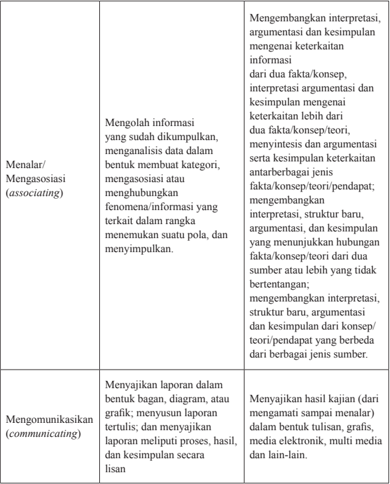

Tabel ini membahas tiga aspek kunci dalam proses penelitian: menalar/mengasosiasi, mengkomunikasikan, dan menulis laporan. Topik utama adalah bagaimana individu memproses informasi, membuat interpretasi, dan menyimpulkan hasil penelitian. Kolom pertama berisi deskripsi tugas, sedangkan kolom kedua berisi contoh atau pola penting dari tugas tersebut. Misalnya, dalam menalar/mengasosiasi, individu harus menganalisis data, membuat kategori, menggabungkan fenomena, dan menyimpulkan suatu pola. Dalam mengkomunikasikan, individu harus menyajikan laporan dalam bentuk yang jelas dan dapat dimengerti oleh audiens, baik itu dalam bentuk teks, grafik, maupun media elektronik. Pola penting lainnya meliputi kemampuan untuk membuat interpretasi, argumentasi, dan kesimpulan yang valid dari fakta dan konsep yang dianalisis.

### 4. Penyiapan Sarana dan Prasana

Pembelajaran PJOK memerlukan sarana dan prasana untuk mencapai tujuan  pembelajaran.  Sehingga  tercapai  tujuan  pembelajaran  PJOK

 

---
## 📄 Halaman 30

secara  aman,  efektif  dan  eisien.  Penyediaan  sumber  daya  isik  yang memadai termasuk fasilitas, peralatan dan pemeliharaan dapat membantu dalam mempengaruhi sikap dan menunjang keberhasilan program.Dalam pembelajaran PJOK, fasilitas yang harus tersedia bagi peserta didik yang terlibat dalam aktivitas otot besar yang melibatkan memanjat, melompat, melompat-lompat, menendang, melempar, melompat dan menangkap, dan mereka juga terlibat dalam kegiatan keterampilan motorik dan permainan lainnya.

Guru sebagai  salah  satu  sumber  pembelajaran  juga  dapat  menggunakan berbagai  sumber  pembelajaran  lain  untuk  menambah  wawasan  siswa dalam  pembelajaran.  Buku  terutama  buku  panduan  Guru  dan  siswa Penjasorkes SMA kelas XII. Selain itu, Guru juga dapat menggunakan sumber  pembelajaran  dari  video,  media  cetak,  media  elektronik,  atau internet.

Secara ideal, aktivitas  pembelajaran  menggunakan  sarana  dan prasarana  yang  sesuai.Akan  tetapi,  jika  sekolah  tidak  memiliki  dan menyediakan sarana dan prasarana, kreativitas Guru sangat diperlukan untuk memodiikasi sarana dan prasarana pembelajaran PJOK. Demikian juga,  Guru  dapat  menyesuaikan  aktivitas  yang  dipilih,  sesuai  dengan ketersediaan  sarana  dan  prasarana,  dan  tetap  melakukan  pembelajaran yang  sesuai  untuk  mencapai  kompetensi  yang  diharapkan.  Apabila sekolah telah memiliki sarana yang standar dan lengkap, diharapkan juga Guru  dapat  memodiikasi  sarana  tersebut  untuk  menyesuaikan  dengan peserta didik yang memiliki kemampuan kurang atau di bawah rata-rata.

### 5.  Keamanan dan Keselamatan dalam Pembelajaran

Hal terpenting dalam pembelajaran PJOK adalah terpenuhinya aspek dalam  prosedur  keamanan  dan  keselamatan.Peserta  didik  harus  dapat melakukan atau unjuk kerja dengan aman dan selamat, sesuai kompetensi yang  diharapkan,  dan  terjadi  peningkatan  keterampilan  sesuai  dengan tantangan melakukan  unjuk  kerja gerak.Peserta didik juga belajar untuk  menilai  kerja  yang  mereka  lakukan  dan  juga  menilai  rekannya. Selain  itu,  peserta  didik  juga  harus  mampu  beradaptasi,  memodiikasi dan meningkatkan kemampuannya.Karena itu perlu diketahui prosedur keamanan  dan  keselamatan  dalam  pembelajaran  pendidikan  jasmani, yang memiliki tujuan prosedur keamanan dan keselamatan pembelajaran

 

---
## 📄 Halaman 31

penjas  adalah  untuk  memastikan  peserta  didik  melakukan  aktivitas pendidikan jasmani dan olahraga dengan aman dan selamat. Keamanan dan keselamatan dalam pembelajaran meliputi keamanan dan keselamatan penggunaan sarana dan prasarana dan melakukan suatu gerakan/ keterampilan tertentu.

Dalam pembelajaran PJOK, Kepala sekolah dan Guru harus menjamin:

- sekolah  memiliki  standar  pencegahan  dan  penjagaan  keselamatan untuk meminimalkan resiko dalam pembelajaran PJOK;
- seluruh  alat  yang  dipergunakan  dalam  pembelajaran  PJOK  adalah aman, secara rutin diperiksa, diperbaiki dan dirawat;
- memiliki catatan perawatan dan perbaikan alat;
- Guru  harus  memiliki  kualiikasi  dan  pengalaman  sebagai  Guru pendidikan jasmani;
- segala  hal  yang  berpotensi  untuk  mengganggu  dan  menimbulkan resiko  diidentiikasi  dalam  manajemen  resiko;  dan
- Guru memiliki pengetahuan dan keterampilan P3K.

### 6.  Pengayaan dan Remedial

Kegiatan remedial adalah kegiatan yang ditujukan untuk membantu siswa yang mengalami kesulitan dalam menguasai materi pelajaran yang diberikan.Dalam kaitannya dengan proses pembelajaran, fungsi kegiatan remedial adalah: (1) memperbaiki cara belajar siswa, (2) meningkatkan siswa  terhadap  kelebihan  dan  kekurangan  dirinya,  (3)  menyesuaikan pembelajaran dengan karakteristik siswa, (4) mempercepat penguasaan siswa terhadap materi pelajaran, (5) membantu mengatasi kesulitan dalam aspek  sosial  dan  pribadi  siswa.Kegiatan  remedial  dapat  dilaksanakan sebelum kegiatan pembelajaran biasa untuk membantu siswa yang diduga akan  mengalami  kesulitan  (preventif),  setelah  kegiatan  pembelajaran biasa untuk membantu siswa yang mengalami kesulitan belajar (kuratif), atau selama berlangsungnya kegiatan pembelajaran biasa.Langkahlangkah yang harus ditempuh dalam kegiatan remedial adalah: (1) analisis hasil  diagnosis  kesulitan  belajar,  (2)  menemukan  penyebab  kesulitan, (3)  menyusun  rencana  kegiatan  remedial,(4)  melaksanakan  kegiatan remedial, dan (5) menilai kegiatan remedial.

Kegiatan  pengayaan  adalah  suatu  kegiatan  yang  diberikan  kepada  siswa kelompok cepat agar mereka dapat mengembangkan potensinya secara

 

---
## 📄 Halaman 32

optimal  dengan  memanfaatkan  sisa  waktu  yang  dimilikinya.Kegiatan pengayaan dilaksanakan dengan tujuan memberikan kesempatan kepada siswa untuk memperdalam penguasaan materi pelajaran yang berkaitan dengan tugas belajar yang sedang dilaksanakan sehingga tercapai tingkat perkembangan yang optimal.Tugas yang dapat diberikan Guru pada siswa yang  mengikuti  kegiatan  pengayaan  di  antaranya  adalah  memberikan kesempatan menjadi tutor sebaya, mengembangkan latihan praktis dari materi  yang  sedang  dibahas,  membuat  hasil  karya,  melakukan  suatu proyek,  membahas  masalah,  atau  mengerjakan  permainan  yang  harus diselesaikan  siswa.  Apapun  kegiatan  yang  dipilih  Guru,  hendaknya  kegiatan pengayaan  tersebut  menyenangkan  dan  mengembangkan  kemampuan kognitif tinggi sehingga mendorong siswa untuk mengerjakan tugas yang diberikan.Dalam memilih dan melaksanakan kegiatan pengayaan, Guru harus memperhatikan (1) faktor siswa, baik faktor minat maupun faktor psikologis lainnya, (2) faktor manfaat edukatif, dan (3) faktor waktu.

### 7. Penilaian

Penilaian  oleh  pendidik  merupakan  suatu  proses  yang  dilakukan melalui langkah-langkah perencanaan, penyusunan alat penilaian, pengumpulan  informasi  melalui  sejumlah  bukti  yang  menunjukkan pencapaian  kompetensi  peserta  didik,  pengolahan,  dan  pemanfaatan informasi tentang pencapaian kompetensi peserta didik. Penilaian tersebut dilakukan melalui berbagai teknik/cara, seperti penilaian unjuk kerja ( performance ), penilaian sikap, penilaian tertulis ( paper and pencil test ),  penilaian  projek,  penilaian  produk,  penilaian  melalui  kumpulan hasil kerja/karya peserta didik ( portfolio ), dan penilaian diri.

Penilaian  pencapaian  kompetensi  baik  formal  maupun  informal diadakan dalam suasana yang menyenangkan, sehingga memungkinkan peserta didik menunjukkan apa yang dipahami dan mampu dikerjakannya. Pencapaian  kompetensi  seorang  peserta  didik  dalam  periode  waktu tertentu dibandingkan dengan hasil yang dimiliki peserta didik tersebut sebelumnya  dan  tidak  dianjurkan  untuk  dibandingkan  dengan  peserta didik lainnya.  Dengan demikian peserta didik tidak merasa dihakimi oleh pendidik tetapi dibantu untuk mencapai kompetensi atau indikator yang diharapkan.

Penilaian  hasil  belajar  peserta  didik  mencakup  kompetensi  sikap, pengetahuan, dan keterampilan yang dilakukan secara berimbang sehingga dapat  digunakan  untuk  menentukan  posisi  relatif  setiap  peserta  didik

 

---
## 📄 Halaman 33

terhadap standar yang telah ditetapkan. Cakupan penilaian merujuk pada ruang  lingkup  materi,  kompetensi  matapelajaran/kompetensi  muatan/ kompetensi program, dan proses.Teknik dan instrumen yang digunakan untuk penilaian kompetensi sikap, pengetahuan, dan keterampilan sebagai berikut:

### a. Penilaian Kompetensi Sikap

Pendidik melakukan penilaian kompetensi sikap melalui observasi, penilaian diri, penilaian 'teman sejawat'( peer evaluation ) oleh  peserta  didik  dan  jurnal.  Instrumen  yang  digunakan  untuk observasi,  penilaian  diri,  dan  penilaian  antar  peserta  didik  adalah daftar  cek  atau  skala  penilaian  ( rating  scale )  yang  disertai  rubrik, sedangkan pada jurnal berupa catatan pendidik.

- Observasi  merupakan  teknik  penilaian  yang  dilakukan  secara berkesinambungan  dengan  menggunakan  indera,  baik  secara langsung maupun tidak langsung dengan menggunakan pedoman observasi yang berisi sejumlah indikator perilaku yang diamati.
- Penilaian diri merupakan teknik penilaian dengan cara meminta peserta didik untuk mengemukakan kelebihan dan kekurangan dirinya dalam konteks pencapaian kompetensi. Instrumen yang digunakan berupa lembar penilaian diri.
- Penilaian antarpeserta didik merupakan teknik penilaian dengan cara meminta peserta didik untuk saling menilai terkait dengan pencapaian  kompetensi.  Instrumen  yang  digunakan  berupa lembar penilaian antarpeserta didik.
- Jurnal merupakan catatan pendidik di dalam dan di luar kelas yang  berisi  informasi  hasil  pengamatan  tentang  kekuatan  dan kelemahan  peserta  didik  yang  berkaitan  dengan  sikap  dan perilaku.

### b. Penilaian  Kompetensi  Pengetahuan

Pendidik menilai kompetensi pengetahuan melalui tes tulis, tes lisan, dan penugasan.

- Instrumen  tes  tulis  berupa  soal  pilihan  ganda,  isian,  jawaban singkat, benar-salah, menjodohkan, dan uraian. Instrumen uraian dilengkapi pedoman penskoran.
- Instrumen tes lisan berupa daftar pertanyaan.
- Instrumen penugasan berupa pekerjaan rumah dan/atau projek yang dikerjakan secara individu atau kelompok sesuai dengan karakteristik tugas.

 

---
## 📄 Halaman 34

### c. Penilaian Kompetensi Keterampilan

Pendidik menilai kompetensi keterampilan melalui penilaian  kinerja,  yaitu  penilaian  yang  menuntut  peserta  didik mendemonstrasikan suatu kompetensi tertentu dengan menggunakan tes praktik, projek, dan penilaian portofolio. Instrumen yang digunakan berupa daftar cek atau skala penilaian ( rating scale ) yang dilengkapi rubrik.

- Tes  praktik  adalah  penilaian  yang  menuntut  respon  berupa keterampilan  melakukan  suatu  aktivitas  atau  perilaku  sesuai dengan tuntutan kompetensi.
- Projek adalah tugas-tugas belajar ( learning tasks ) yang meliputi kegiatan perancangan, pelaksanaan, dan pelaporan secara tertulis maupun lisan dalam waktu tertentu.
- Penilaian  portofolio  adalah  penilaian  yang  dilakukan  dengan cara menilai kumpulan seluruh karya peserta didik dalam bidang tertentu yang bersifat relektif-integratif untuk mengetahui minat, perkembangan, prestasi, dan/atau kreativitas peserta didik dalam kurun waktu tertentu. Karya tersebut dapat berbentuk tindakan nyata  yang  mencerminkan  kepedulian  peserta  didik  terhadap lingkungannya.

 

---
## 📄 Halaman 35

### BAB 1

### PEMBELAJARAN MENGANALISIS MERANCANG DAN MENGEVALUASI STRATEGI DAN TAKTIK PERMAINAN BOLA BESAR

Bab ini membahas tentang pembelajaran pola penyerangan dan pertahanan permainan bola besar. Guru dapat memilih jenis permainan bola besar sesuai dengan kondisi sekolah dan karakateristik siswa.

### A.  Kompetensi Dasar dan Indikator Pembelajaran

Kompetensi dasar dan indikator pembelajaran menganalisis, merancang, dan  mengevaluasi  taktik  dan  strategi  permainan  bola  besar  adalah  sebagai berikut.

---
**📊 Tabel**

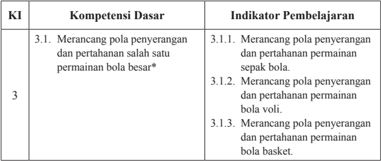

Tabel ini berisi informasi tentang kompetensi dasar dan indikator pembelajaran dalam bidang olahraga bola. Topik utama tabel adalah tentang merancang pola penyerangan dan pertahanan dalam berbagai jenis bola seperti sepak bola, voli, dan bola basket. Kolom "KI" menunjukkan indeks keterampilan (K1), sedangkan kolom "Kompetensi Dasar" menyajikan tiga poin utama: merancang pola penyerangan dan pertahanan untuk sepak bola, voli, dan bola basket. Indikator pembelajaran di kolom "Indikator Pembelajaran" memberikan detail lebih lanjut tentang setiap poin, dengan 3.1.1., 3.1.2., dan 3.1.3. masing-masing menunjukkan indikator spesifik untuk masing-masing jenis bola. Dengan demikian, tabel ini membantu dalam memahami struktur dan konten pembelajaran yang direncanakan untuk meningkatkan keterampilan pemain dalam berbagai jenis bola.

 

---
## 📄 Halaman 36

---
**📊 Tabel**

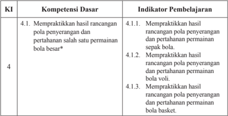

Tabel ini berisi informasi tentang kompetensi dasar dan indikator pembelajaran dalam bidang olahraga bola basket. Topik utama tabel adalah mengenai praktikasi dalam mengejar dan mempertahankan bola saat bermain basket. Kolom-kolomnya meliputi KI (Kompetensi Dasar), Kompetensi Dasar, dan Indikator Pembelajaran. Data penting yang terlihat adalah bahwa setiap kompetensi dasar memiliki beberapa indikator pembelajaran yang spesifik untuk mengejar dan mempertahankan bola dalam berbagai jenis bola basket, seperti sepak bola, bola voli, dan bola basket. Ini menunjukkan bahwa pembelajaran harus mencakup berbagai aspek dan teknik dalam berbagai jenis bola basket.

### B.  Tujuan Pembelajaran

Setelah  mengikuti  kegiatan  pembelajaran  ini, siswa  diharapkan mampu:

- memiliki kesadaran tentang arti penting gerak tubuh sebagai penghayatan dan pengamalan ajaran agamanya;
- menunjukkan perilaku jujur, disiplin, tanggung jawab, peduli (gotongroyong, kerja sama, toleran, damai), santun, responsif dan proaktif selama bermain permainan sepak bola, bola voli, dan bola basket;
- merancang pola penyerangan dan pertahanan permainan sepak bola dalam permainan sederhana;
- merancang  pola  penyerangan  dan  pertahanan  permainan  bola  voli dalam permainan sederhana;
- merancang pola penyerangan dan pertahanan permainan bola basket dalam permainan sederhana;
- melakukan hasil  rancangan  pola  penyerangan  dan  pertahanan  permainan sepak  bola  dalam  permainan  sederhana  dengan  menunjukkan  nilai sportivitas, kerja sama, dan disiplin;
- melakukan hasil  rancangan  pola  penyerangan  dan  pertahanan  permainan bola  voli  dalam  permainan  sederhanan  dengan  menunjukkan  nilai sportivitas, kerja sama, dan disiplin;
- melakukan hasil  rancangan  pola  penyerangan  dan  pertahanan  permainan bola  basket  dalam  permainan  sederhana  dengan  menunjukkan  nilai sportivitas, kerja sama, dan disiplin.

 

---
## 📄 Halaman 37

### C.  Aktivitas Pembelajaran Permainan Sepak bola

### 1. Aktivitas Pembelajaran Menganalisis Pola Penyerangan Permainan Sepak bola

Pembelajaran merancang pola penyerangan dan pertahanan permainan sepak bola dapat dilakukan dengan aktivitas belajar sebagai berikut.

### a. Aktivitas Pembelajaran I

Alat

: Bola plastik/bola standar

Tempat bermain

: Lantai yang rata/lapangan rumput 15 × 10 Meter

Formasi

: Berkelompok

- Tugaskan  kepada  siswa  untuk  membuat  kelompok  dengan masing-masing kelompok berjumlah 7 orang, kemudian tugaskan juga  siswa  untuk  menentukan 4  orang  sebagai  penyerang , 2 orang sebagai bertahan ,  dan 1 orang sebagai penjaga gawang .
- Tugaskan kepada siswa untuk menyiapkan area/lapangan dengan ukuran 15 × 10 meter dengan satu gawang.
- Tugas kepada siswa untuk bermain dengan aturan: siswa yang berperan  pemain  penyerang  berusaha  menguasai  bola  dan menyerang ke gawang, sedangkan peserta didik yang berperan sebagai  pemain  bertahan  berusaha  merebut  dan  menghalangi bola dan penjaga gawang berupaya menangkap dan menghalau bola yang datang ke gawang.
- Tentukan waktu permainan atau tergantung dengan banyaknya bola yang masuk ke gawang.
- Tugaskan  kepada  siswa  untuk  melakukan  pergantian  peran penyerang,  bertahan,  dan  penjaga  gawang  agar  memberikan kesempatan pada semuanya.
- Pertanyakan kepada peserta didik: Bagaimanakah agar penyerang dapat mencetak gol? Apakah fungsi penguasaan bola bagi penyerang?
- Tekankan kepada siswa untuk melakukan permainan itu dengan sungguh-sungguh dan menerapkan nilai sportivitas, kerja sama, toleransi, dan disiplin.
- Perhatikan gambar 1.1.

 

---
## 📄 Halaman 38

---
**🖼️ Gambar/Diagram**

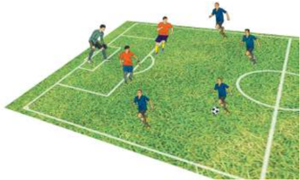

> **Deskripsi Visual:** Gambar ini adalah ilustrasi yang menunjukkan pertandingan sepak bola. Gambar ini menggambarkan sepuluh pemain sepak bola bermain di lapangan hijau dengan garis-garis yang menunjukkan area lapangan. Pemain-pemain tersebut terdiri dari lima pemain tim tuan rumah yang berada di sebelah kanan dan lima pemain tim tamu yang berada di sebelah kiri. Pemain tim tuan rumah berada di depan dan tengah lapangan, sedangkan pemain tim tamu berada di belakang dan samping lapangan. Pemain tim tuan rumah menggunakan seragam biru, sedangkan pemain tim tamu menggunakan seragam merah. Di tengah lapangan terdapat bola sepak yang sedang dimainkan oleh pemain tim tuan rumah. Gambar ini menunjukkan posisi dan gerakan pemain-pemain saat pertandingan sedang berlangsung.

Variasi: setelah  siswa  teramati  mengalami  kemajuan  dalam permainan tersebut, tugaskan kepada siswa untuk melakukan penyerangan  dari  berbagai  arah,  yaitu  kanan,  tengah,  dan  kiri. Tugaskan pula kepada siswa untuk mengidentiikasi berbagai taktik dan strategi penyerangan seperti penguasaan bola, mencetak gol,  menciptakan  dan  menggunakan  ruang  dalam  permainan  yang lakukan. Agar kegiatan menarik bagi peserta didik, aktivitas belajar ini dapat dikembangkan lagi oleh Guru.

### b. Aktivitas Pembelajaran II

Alat

: Bola plastik/bola standar

Tempat bermain

: Lapangan dengan ukuran 15 × 10 meter.

Formasi

: Berkelompok

- Tugaskan  peserta  didikan  untuk  membuat  kelompok  masingmasing 11 orang, kemudian tugaskan pula siswa untuk menentukan 6  orang  sebagai  penyerang,  4  orang  sebagai pemain bertahan , dan 1 orang sebagai penjaga gawang .
- Tugaskan siswa untuk menyiapkan area/lapangan dengan ukuran 9 × 9 meter dengan satu gawang.
- Tugaskan siswa untuk bermain dengan aturan penyerang melakukan serangan dengan menguasai bola, menciptakan dan menggunakan  ruang,  dan  mencetak  gol.  Siswa  yang  bertahan berupaya  untuk  merebut,  menghalau  bola,  dan  menggagalkan serangan  lawan.  Penjaga  gawang  berupaya  agar  gawangnya tidak kemasukan bola.

 

---
## 📄 Halaman 39

- Tekankan siswa agar melakukan permainan itu sehingga terjadi gol  ke  gawang  dengan  memastikan  yang  menjadi  penyerang menerapkan kerja sama, toleransi, dan disiplin ketika menyerang gawang.
- Tentukan waktu bermain atau dapat ditentukan dengan banyaknya bola yang masuk ke gawang.
- Tugaskan siswa untuk melakukan pergantian peran penyerang, bertahan,  dan  penjaga  gawang  agar  memberikan  kesempatan pada semuanya.
- Perhatikan gambar 1.2.

---
**🖼️ Gambar/Diagram**

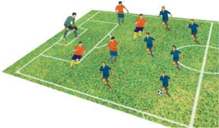

> **Deskripsi Visual:** Gambar ini adalah ilustrasi yang menunjukkan pertandingan sepak bola. Gambar ini menggambarkan dua tim bermain sepak bola di lapangan hijau dengan garis-garis yang menunjukkan posisi pemain dan area lapangan. Tim biru berada di sisi kanan dan tim merah berada di sisi kiri. Pemain-pemain tampak sedang bergerak dan berusaha mencetak gol. Ilustrasi ini menunjukkan posisi pemain, posisi bola, dan posisi area lapangan yang digunakan dalam pertandingan sepak bola. Informasi penting yang dapat diambil dari gambar ini adalah posisi pemain dan posisi bola saat pertandingan sedang berlangsung.

Variasi: setelah  siswa  teramati  mengalami  kemajuan  dalam permainan tersebut, tugaskan kepada siswa untuk melakukan penyerangan  dari  berbagai  arah,  yaitu:  Kanan,  tengah,  dan  kiri. Tugaskan pula kepada siswa untuk mengidentiikasi berbagai taktik dan strategi penyerangan seperti: penguasaan bola, mencetak gol,  menciptakan  dan  menggunakan  ruang  dalam  permainan  yang lakukan. Agar kegiatan menarik bagi peserta didik, aktivitas belajar ini dapat dikembangkan lagi oleh Guru.

Guru dapat mengembangkan pembelajaran menganalisis taktik dan strategi penyerangan dalam permainan sepak bola tersebut sesuai dengan karakteristik dan kebutuhan siswa serta keadaan lingkungan sekolah.

 

---
## 📄 Halaman 40

### 2. Aktivitas Pembelajaran Menganalisa Pola Pertahanan Permainan Sepak bola

### a. Aktivitas Pembelajaran I

Alat

: Bola plastik/bola standar

Tempat bermain

: Lantai yang rata/lapangan rumput 10 × 6 Meter

Formasi

: Berkelompok

- Tugaskan  siswa  untuk  membuat  kelompok  dengan  masingmasing kelompok berjumlah 7 orang, kemudian tugaskan pula siswa  untuk  menentukan  2  orang  sebagai  penyerang,  3  orang sebagai bertahan, dan 1 orang sebagai penjaga gawang.
- Tugaskan siswa untuk menyiapkan area/lapangan dengan ukuran 10 × 6 meter dengan satu gawang.
- Tugaskan siswa untuk bermain dengan aturan pemain penyerang berusaha  menyerang  ke  gawang,  sedangkan  pemain  bertahan berusaha untuk mempertahankan ruang, mempertahankan daerah gawang, serta merebut bola dan penjaga gawang berupaya menangkap atau menghalau bola yang datang ke gawang.
- Tentukanlah waktu bermain permainan tersebut atau dapat juga ditentukan dengan banyaknya bola yang masuk ke gawang.
- Pertanyakan  pada  siswa:  Bagaimana  cara  mempertahankan ruang secara individu dan kelompok?, Bagaimana cara mempertahankan  derah  gawang  agar  tidak  dimasuki  lawan?, Bagaimana  cara  merebut  bola  yang  bersih  tanpa  mencederai lawan?
- Tugaskan siswa untuk melakukan pergantian peran penyerang, bertahan, dan penjaga gawang agar dapat memberikan kesempatan pada semuanya.
- Tekankan siswa untuk melakukan permainan itu dengan sungguh-sungguh dan menerapkan nilai sportivitas, kerja sama, toleransi, dan disiplin.
- Perhatikan gambar 1.3.

 

---
## 📄 Halaman 41

---
**🖼️ Gambar/Diagram**

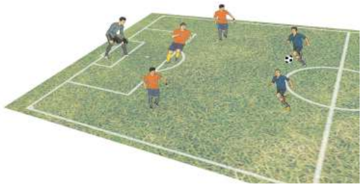

> **Deskripsi Visual:** Gambar ini adalah ilustrasi yang menunjukkan pertandingan sepak bola. Gambar ini menggambarkan beberapa pemain sepak bola bermain di lapangan sepak bola. Pemain-pemain tersebut terdiri dari dua tim dengan warna seragam yang berbeda, satu tim berwarna biru dan lainnya berwarna merah. Lapangan sepak bola tampak jelas dengan garis-garis yang menunjukkan area permainan. Pemain-pemain tampak sedang bergerak dan berusaha untuk mencetak gol. Ilustrasi ini menunjukkan aktivitas dan strategi dalam pertandingan sepak bola.

Variasi: setelah  siswa  teramati  mengalami  kemajuan  dalam permainan tersebut, tugaskan kepada siswa untuk melakukan dengan memperhatikan  dan  mengidentiikasi  berbagai  taktik  dan  strategi penyerangan seperti mempertahankan ruang, mempertahankan daerah gawang, dan merebut bola dalam permainan yang lakukan. Agar  kegiatan  menarik  bagi  siswa,  aktivitas  belajar ini  dapat dikembangkan lagi oleh Guru.

### b. Aktivitas Pembelajaran II

Alat

: Bola plastik/bola standar

Tempat bermain

: Lapangan dengan ukuran 15 × 10 meter.

Formasi

: Berkelompok

- Tugaskan  siswa  untuk  memuat  kelompok  dengan  masingmasing kelompok berjumlah 8 orang, kemudian tugaskan pula untuk menentukan 3 orang sebagai penyerang, 4 orang sebagai bertahan, dan 1 orang sebagai penjaga gawang.
- Tugaskan siswa untuk menyiapkan area/lapangan dengan ukuran 15 × 10 meter dengan satu gawang.
- Tugaskan siswa untuk bermain dengan aturan penyerang melakukan serangan ke gawang. Siswa yang bertahan berupaya untuk mempertahankan ruang, mempertahankan daerah gawang, dan merebut bola. Penjaga gawang berupaya agar gawangnya tidak kemasukan bola.
- Tekankan siswa untuk melakukan permainan itu dengan sungguh-sungguh dan menerapkan nilai sportivitas, kerja sama, toleransi, dan disiplin.

 

---
## 📄 Halaman 42

- Tentukan waktu permainan atau dapat ditentukan dengan banyaknya bola yang masuk ke gawang.
- Tugaskan siswa untuk melakukan pergantian peran penyerang, bertahan,  dan  penjaga  gawang  agar  memberikan  kesempatan pada semuanya.
- Perhatikan gambar 1.4.

---
**🖼️ Gambar/Diagram**

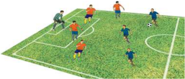

> **Deskripsi Visual:** Gambar ini adalah ilustrasi yang menunjukkan pertandingan sepak bola. Gambar ini menggambarkan beberapa pemain sepak bola bermain di lapangan sepak bola. Pemain-pemain tersebut terdiri dari dua tim dengan warna seragam yang berbeda, satu tim berwarna biru dan lainnya berwarna merah. Lapangan sepak bola tampak jelas dengan garis-garis yang menunjukkan area permainan. Pemain-pemain tampak aktif dan bergerak di lapangan, menunjukkan bahwa mereka sedang bermain sepak bola. Ilustrasi ini memberikan gambaran umum tentang pertandingan sepak bola dan bagaimana pemain-pemain berinteraksi dalam pertandingan tersebut.

Variasi: setelah  siswa  teramati  mengalami  kemajuan  dalam permainan tersebut, tugaskan kepada siswa untuk melakukan dengan memperhatikan  dan  mengidentiikasi  berbagai  taktik  dan  strategi penyerangan seperti mempertahankan ruang, mempertahankan daerah gawang, dan merebut bola dalam permainan yang lakukan. Agar kegiatan menarik bagi peserta didik, aktivitas belajar ini dapat dikembangkan lagi oleh Guru.

Guru dapat mengembangkan pembelajaran menganalisis taktik dan strategi pertahanan dalam permainan sepak bola tersebut sesuai dengan karakteristik dan kebutuhan siswa serta keadaan lingkungan sekolah.

### c. Aktivitas Pembelajaran III

Alat

: Bola plastik/bola standar

Tempat bermain

: lapangan dengan ukuran 20 × 10 meter.

Formasi

: Berkelompok

- Tugaskan siswa membuat kelompok 10 orang dibagi dalam 2 tim masing-masing 5 orang.
- Tugaskan siswa menyiapkan area/lapangan ukuran 20 × 10 meter dengan dua gawang.
- Tugaskan siswa untuk berdikusi merancang strategi dan taktik

 

---
## 📄 Halaman 43

- penyerangan yang meliputi taktik menjaga kepemilikan/ penguasaan bola, mencetak gol, menciptakan dan menggunakan ruang, serta mencetak gol dalam permainan sepak bola 5 lawan 5 di kelompoknya masing-masing
- Tugaskan  dan  tekankan  siswa  untuk  melakukan  permainan tersebut  dengan  penuh  kesungguhan  dan  menerapkan  nilai sportivitas,  kerja  sama,  disiplin,  tanggung  jawab,  menerima kekalahan dan kemenangan.
- Tentukan waktu permainan.
- Tekankan setiap kelompok memasukkan  bola ke  gawang kelompok sebanyak-banyaknya agar menjadi pemenang.
- Perhatikan gambar 1.5.

---
**🖼️ Gambar/Diagram**

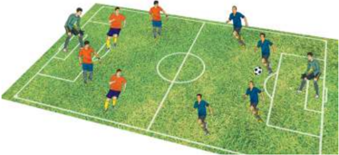

> **Deskripsi Visual:** Gambar ini adalah ilustrasi yang menunjukkan pertandingan sepak bola. Gambar ini menggambarkan beberapa pemain sepak bola bermain di lapangan hijau dengan latar belakang yang menunjukkan area lapangan sepak bola. Pemain-pemain tersebut terdiri dari dua tim yang berbeda warna, merah dan biru. Setiap pemain memiliki posisi yang jelas dan tampaknya sedang bergerak untuk mencoba mencetak gol atau mempertahankan pertahanan. Ilustrasi ini menunjukkan skema permainan sepak bola dan bagaimana pemain harus berinteraksi satu sama lain untuk mencapai tujuan mereka.

Variasi: Tugaskan siswa untuk memperhatikan kelompok yang dapat memenangkan permainan merupakan tim yang merancang pola penyerangan  yang  baik.  Semakin  banyak  suatu  tim  memasukkan bola ke gawang tim yang lain, maka semakin baik pola penyerangan yang dilakukan.

### d. Aktivitas Pembelajaran II

Alat

: Bola plastik/bola standar

Tempat bermain

: Lapangan dengan ukuran 20 × 10 meter.

Formasi

: Berkelompok

- Tugaskan siswa membuat kelompok 12 orang dibagi dalam 2 tim masing-masing 6 orang.
- Tugaskan siswa menyiapkan area/lapangan ukuran 20 × 10 meter dengan dua gawang.

 

---
## 📄 Halaman 44

- Tugaskan  siswa  berdikusi  membuat  rancangan  strategi  dan taktik pertahanan yang meliputi taktik mempertahankan ruang, mempertahankan  daerah  gawang,  dan  merebut  bola  dalam permainan sepak bola 6 lawan 6 di kelompoknya masing-masing.
- Tugaskan  dan  tekankan  siswa  untuk  melakukan  permainan tersebut  dengan  penuh  kesungguhan  dan  menerapkan  nilai sportivitas,  kerja  sama,  disiplin,  tanggungjawab,  menerima kekalahan dan kemenangan.
- Tentukan batasan waktu permainan.
- Tekankan  siswa  dalam  kelompok  untuk  memasukkan  bola ke  gawang  kelompok  lain  sebanyak-banyaknya  agar  menjadi pemenang.
- Perhatikan gambar 1.6.

---
**🖼️ Gambar/Diagram**

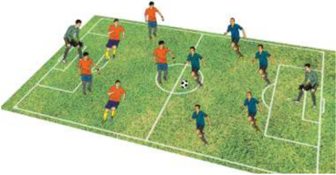

> **Deskripsi Visual:** Gambar ini adalah ilustrasi yang menunjukkan pertandingan sepak bola antara dua tim, masing-masing berwarna merah dan biru. Ilustrasi ini menampilkan beberapa elemen penting seperti pemain-pemain yang sedang bermain, bola sepak, dan posisi mereka di lapangan. Pemain-pemain tersebut tampak aktif dan bergerak dengan cepat, menunjukkan kecepatan dan kekuatan dalam pertandingan. Bola sepak tampak berada di tengah lapangan, menunjukkan bahwa saat ini sedang ada permainan. Ilustrasi ini memberikan gambaran tentang dinamika pertandingan sepak bola dan bagaimana pemain-pemain berinteraksi dalam pertandingan tersebut.

Variasi: Tugaskan  siswa  untuk  memperhatikan  kelompok  yang dapat  memenangkan  permainan  merupakan  tim  yang  merancang taktik  dan  strategi  pertahanan  yang  baik.  Semakin  sedikit  suatu tim  kemasukkan  bola,  maka  semakin  baik  taktik  pertahanan  yang dilakukan.

Guru  dapat  mengembangkan  pembelajaran  merancang  taktik  dan strategi  pertahanan  dalam  permainan  sepak  bola  tersebut  sesuai  dengan karakteristik dan kebutuhan siswa serta keadaan lingkungan sekolah.

 

---
## 📄 Halaman 45

### D.  Aktivitas Pembelajaran Permainan Bola voli

### 1. Aktivitas Pembelajaran Menganalisis dan Merancang Pola Penyerangan Permainan Bola voli

Menganalisis taktik dan strategi permainan bola voli dapat dilakukan dengan aktivitas belajar kelompok. Berikut contoh aktivitas belajar untuk keterampilan gerak passing dalam permainan bola voli.

### a. Aktivitas Pembelajaran I

Alat

: Bola plastik/bola standar bola voli

Tempat bermain

: Lapangan dan pembatas/net

Formasi

: Berkelompok

- Tugaskan  siswa  untuk  membuat  kelompok  masing-masing  7 orang,  kemudian  tugaskan  pula  untuk  menentukan 4  orang sebagai penyerang, 3 orang sebagai bertahan.
- Setelah kelompok terbentuk, kemudian siswa ditugaskan untuk menyiapkan area/lapangan dengan ukuran 14 × 5 meter dengan pembatas net.
- Siswa  ditugaskan  untuk  melakukan  permainan  bola  voli  4 lawan 3 dengan aturan bahwa pemain penyerang harus berusaha mendapatkan nilai dan menyerang ke daerah lawan, sedangkan pemain bertahan harus berusaha mengembalikan bola ke daerah lawan dan tidak jatuh di daerah sendiri.
- Tentukan waktu permainan atau juga permainan dibatasi dengan keunggulan angka tertentu pada suatu tim.
- Pertanyakan  pada  peserta  didik:  Bagaimana  cara  menyerang yang  efektif?  Bagaimana  cara  mengembalikan  bola  untuk menyerang? Apakah penyerangan memerlukan kerja sama dan komunikasi?
- Setelah batas/waktu permainan habis, dapat dilakukan pergantian peran penyerang dan bertahan agar dapat memberikan kesempatan pada semuanya.
- Tekankan siswa untuk melakukan permainan itu dengan sungguh-sungguh dan menerapkan nilai sportivitas, kerja sama, toleransi, dan disiplin.
- Perhatikan gambar 1.7.

 

---
## 📄 Halaman 46

---
**🖼️ Gambar/Diagram**

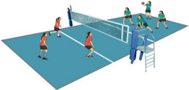

> **Deskripsi Visual:** Gambar ini adalah ilustrasi yang menunjukkan pertandingan voli di lapangan olahraga. Ilustrasi ini menggambarkan beberapa pemain voli yang sedang bermain di lapangan dengan net yang memisahkan dua sisi lapangan. Pemain di sisi kanan tampak sedang berusaha melempar bola ke sisi lain, sementara pemain di sisi kiri tampak berada di posisi untuk menerima bola. Net yang berwarna biru memisahkan dua sisi lapangan, dengan pemain di sisi kanan menggunakan tangan untuk melempar bola. Di sebelah kiri, pemain tampak berada di posisi untuk menerima bola. Ilustrasi ini menunjukkan aktivitas dan posisi pemain dalam pertandingan voli, serta peran net dalam memisahkan dua sisi lapangan.

Variasi: Tugaskan siswa untuk memperhatikan kelompok yang dapat  memenangkan  permainan  merupakan  tim  yang  merancang taktik  dan  strategi  penyerangan  permainan  bola  voli  yang  baik. Semakin  sedikit  suatu  tim  kemasukkan  bola,  maka  semakin  baik taktik pertahanan yang dilakukan.

Guru  dapat  mengembangkan  pembelajaran  merancang  taktik  dan strategi  penyerangan  dalam  permainan  bola  voli  tersebut  sesuai  dengan karakteristik dan kebutuhan siswa serta keadaan lingkungan sekolah.

### b. Aktivitas Pembelajaran II

Alat

: Bola plastik/bola standar bola voli

Tempat bermain

: Lapangan lebar 3 meter dan pembatas/net

Formasi

: Berkelompok

- Tugaskan siswa membuat kelompok berjumlah 9 orang, kemudian  tugaskan  pula  siswa  untuk  menentukan 5  orang sebagai penyerang, 4 orang sebagai bertahan.
- Setelah  kelompok  terbentuk,  tugaskan  setiap  kelompok  untuk menyiapkan area/lapangan dengan ukuran 14 × 6 meter dengan pembatas net atau tali yang direntangkan.
- Tugaskan  siswa  untuk  melakukan  permainan  dengan  aturan bahwa penyerang harus berusaha mendapatkan nilai dan menyerang ke daerah lawan, sedangkan pemain bertahan harus berusaha mengembalikan bola ke daerah lawan dan tidak jatuh di daerah sendiri.

 

---
## 📄 Halaman 47

- Tentukan waktu permainan atau dapat juga permainan dibatasi dengan keunggulan angka tertentu pada suatu tim.
- Pertanyakan pada peserta didik: Bagaimana merancang penyerangan yang efektif? Bagaimana merancang penyerangan dari sebelah kanan, tengah, dan kiri ? Apakah dalam merancang penyerangan diperlukan kerja sama dan komunikasi?
- Setelah batas/waktu permainan habis, dapat dilakukan pergantian peran penyerang dan bertahan agar dapat memberikan kesempatan pada semuanya.
- Tekankan siswa untuk melakukan permainan itu dengan sungguh-sungguh dan menerapkan nilai sportivitas, kerja sama, toleransi, dan disiplin.
- Perhatikan gambar 1.8.

---
**🖼️ Gambar/Diagram**

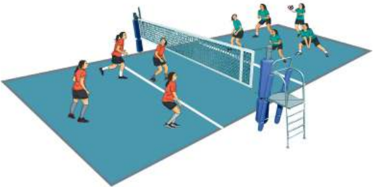

> **Deskripsi Visual:** Gambar ini adalah ilustrasi yang menunjukkan pertandingan voli di lapangan. Ilustrasi ini menggambarkan beberapa pemain voli yang sedang bermain di lapangan dengan net yang memisahkan dua sisi lapangan. Pemain-pemain tersebut terdiri dari dua tim yang berada di kedua sisi lapangan. Setiap pemain memiliki posisi yang berbeda-beda, mulai dari pemain yang berada di depan untuk mengejar bola hingga pemain yang berada di belakang untuk menyerang. Net yang berwarna putih memisahkan dua sisi lapangan, dengan garis merah yang menandai batas lapangan. Ilustrasi ini menunjukkan kegiatan aktif dan kompetitif dalam permainan voli, serta posisi dan gerakan pemain dalam pertandingan tersebut.

Variasi: Tekankan pada siswa untuk memperhatikan tim yang dapat  memenangkan  permainan  merupakan  tim  yang  merancang taktik dan strategi penyerangan yang baik. Semakin banyak suatu tim mendapatkan  angka,  maka  semakin  baik  taktik  penyerangan  yang dilakukan.

 

---
## 📄 Halaman 48

### 2. Aktivitas Pembelajaran Menganalisis dan Merancang Pola Pertahanan Permainan Bola voli

### a. Aktivitas Pembelajaran I

Alat

: Bola plastik/bola standar bola voli

Tempat bermain

: Lapangan lebar 3 meter dan pembatas/net

Formasi

: Berkelompok

- Tugaskan  siswa  untuk  membuat  kelompok  masing-masing  7 orang,  kemudian  tugaskan  pula  untuk  menentukan 3  orang sebagai penyerang, 4 orang sebagai bertahan.
- Setelah kelompok terbentuk, kemudian siswa ditugaskan untuk menyiapkan area/lapangan dengan ukuran 14 × 5 meter dengan pembatas net.
- Siswa  ditugaskan  untuk  melakukan  permainan  bola  voli  3 lawan 4 dengan aturan bahwa pemain penyerang harus berusaha menyerang daerah lawan dari berbagai arah dan pemain bertahan harus fokus berusaha mengembalikan bola ke daerah lawan dan tidak jatuh di daerah sendiri.
- Tentukan waktu permainan atau juga permainan dibatasi dengan keunggulan angka tertentu pada suatu tim.
- Pertanyakan pada peserta didik: Bagaimana cara bertahan yang efektif?  Bagaimana  mengembalikan  bola  yang  efektif  untuk pertahanan?  Apakah  pertahanan  memerlukan  kerja  sama  dan komunikasi?
- Setelah batas/waktu permainan habis, dapat dilakukan pergantian peran penyerang dan bertahan agar dapat memberikan kesempatan pada semuanya.
- Tekankan siswa untuk melakukan permainan itu dengan sungguh-sungguh dan menerapkan nilai sportivitas, kerja sama, toleransi, dan disiplin.
- Perhatikan gambar 1.9.

 

---
## 📄 Halaman 49

---
**🖼️ Gambar/Diagram**

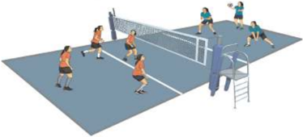

> **Deskripsi Visual:** Gambar ini adalah ilustrasi yang menunjukkan pertandingan voli di lapangan olahraga. Ilustrasi ini menggambarkan beberapa pemain voli yang sedang bermain di lapangan dengan net yang memisahkan dua sisi lapangan. Pemain-pemain tersebut terlihat bergerak aktif, menunjukkan posisi mereka untuk mengeksekusi serangan atau blok. Net yang berwarna putih dengan garis merah membentuk sudut di tengah lapangan, memisahkan dua sisi lapangan. Di sebelah kanan, ada sebuah peralatan olahraga yang tampak seperti meja atau meja olahraga, mungkin digunakan untuk latihan atau pemantauan. Ilustrasi ini menunjukkan aktivitas fisik dan kompetisi dalam olahraga voli, serta detail tentang struktur lapangan dan peralatan yang digunakan dalam pertandingan tersebut.

Variasi: Tugaskan siswa untuk memperhatikan kelompok yang dapat  memenangkan  permainan  merupakan  tim  yang  merancang taktik  dan  strategi  pertahanan  permainan  bola  voli  yang  baik. Semakin  sedikit  suatu  tim  kemasukkan  bola,  maka  semakin  baik taktik pertahanan yang dilakukan.

Guru  dapat  mengembangkan  pembelajaran  merancang  taktik  dan strategi  pertahanan  dalam  permainan  bola  voli  tersebut  sesuai  dengan karakteristik dan kebutuhan siswa serta keadaan lingkungan sekolah.

### b. Aktivitas Pembelajaran II

Alat

: Bola plastik/bola standar bola voli

Tempat bermain

: Lapangan lebar 3 meter dan pembatas/net

Formasi

: Berkelompok

- Tugaskan siswa membuat kelompok berjumlah 8 orang, kemudian  tugaskan  pula  siswa  untuk  menentukan 3  orang sebagai penyerang , 5 orang sebagai bertahan .
- Setelah  kelompok  terbentuk,  tugaskan  setiap  kelompok  untuk menyiapkan area/lapangan dengan ukuran 14 × 6 meter dengan pembatas net atau tali yang direntangkan.
- Tugaskan  siswa  untuk  melakukan  permainan  dengan  aturan bahwa penyerang harus berusaha mendapatkan nilai dan menyerang ke daerah lawan, sedangkan pemain bertahan harus berusaha mengembalikan bola ke daerah lawan dan tidak jatuh di daerah sendiri.

 

---
## 📄 Halaman 50

- Tentukan waktu permainan atau dapat juga permainan dibatasi dengan keunggulan angka tertentu pada suatu tim.
- Pertanyakan pada peserta didik: Bagaimana merancang pertahanan  yang  efektif?  Bagaimana  merancang  pertahanan untuk mengantisipasi serangan dari sebelah kanan, tengah, dan kiri?  Apakah  dalam  merancang  pertahanan  diperlukan  kerja sama dan komunikasi?
- Setelah batas/waktu permainan habis, dapat dilakukan pergantian peran penyerang dan bertahan agar dapat memberikan kesempatan pada semuanya.
- Tekankan siswa untuk melakukan permainan itu dengan sungguh-sungguh dan menerapkan nilai sportivitas, kerja sama, toleransi, dan disiplin.
- Perhatikan gambar 1.10.

---
**🖼️ Gambar/Diagram**

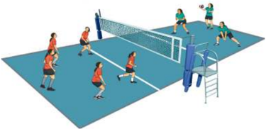

> **Deskripsi Visual:** Gambar ini adalah ilustrasi yang menunjukkan pertandingan voli di lapangan. Lapangan voli terdiri dari dua area berbeda warna biru dan merah, dengan garis net yang memisahkan kedua area tersebut. Di lapangan ini, ada delapan pemain yang sedang bermain, dengan posisi mereka yang berbeda-beda. Beberapa pemain sedang berdiri di sisi lapangan, sedangkan beberapa lainnya sedang bergerak menuju bola yang sedang dilempar oleh salah satu pemain. Pemain yang sedang bermain tampak aktif dan bersemangat, menunjukkan bahwa pertandingan sedang berlangsung dengan intensitas tinggi. Ilustrasi ini memberikan gambaran umum tentang aktivitas dan posisi pemain dalam sebuah pertandingan voli.

Variasi: Tekankan pada siswa untuk memperhatikan tim yang dapat  memenangkan  permainan  merupakan  tim  yang  merancang taktik dan strategi pertahanan yang baik. Semakin banyak suatu tim mendapatkan  angka,  maka  semakin  baik  taktik  pertahanan  yang dilakukan.

 

---
## 📄 Halaman 51

### E.  Aktivitas Pembelajaran Permainan Bola Basket

### 1. Aktivitas Pembelajaran Menganalisis dan Merancang Strategi dan Taktik Penyerangan Bola basket

Pembelajaran  menganalisis  taktik  dan  strategi  penyerangan  dan pertahanan  permainan  bola  basket  dapat  dilakukan  dengan  aktivitas belajar sebagai berikut.

### a. Aktivitas Pembelajaran I

Alat

: Bola karet/bola basket standar

Tempat bermain

: Setengah lapangan bola basket dan ring/basket

Formasi

: Berkelompok

- Tugaskan  siswa  untuk  membuat  kelompok  dengan  jumlah  5 orang untuk masing-masing kelompok.
- Tugas  siswa  untuk  membagi  kelompok  tersebut  dalam  dua bagian, yaitu: 3 orang sebagai penyerang dan 2 orang sebagai bertahan .
- Tugaskan tim penyerang (3 orang) untuk menyerang ring/basket dan tim bertahan (2 orang) mempertahankan ring/basket supaya tidak kemasukan.
- Pertanyakan kepada peserta didik: Bagaimanakah cara mencetak angka dari sebelah depan, samping kanan dan kiri ring/basket? Manakah  yang  lebih efektif mencetak angka dari depan, samping kanan atau kiri ring/basket? Apakah mencetak angka memerlukan kerja sama? dan pertanyaan lainnya.
- Tugaskan kepada siswa untuk mengekplorasi pertanyaanpertanyaan  tersebut  sambil  melakukan  aktivitas  belajar  secara berkelompok tadi.
- Perhatikan bahwa siswa dapat merasakan kemajuan dan memahami berbagai taktik dan strategi untuk menyerang.
- Tugaskan siswa untuk melakukan permainan 3 lawan 2 tersebut dengan menerapkan disiplin, percaya diri, dan saling menghargai.
- Selama siswa melakukan aktivitas belajar tersebut, Guru menilai kemajuan yang diperoleh oleh siswa.
- Aktivitas belajar ini seperti nampak pada gambar 1.11.

 

---
## 📄 Halaman 52

---
**🖼️ Gambar/Diagram**

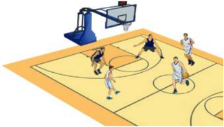

> **Deskripsi Visual:** Gambar ini adalah ilustrasi yang menunjukkan pertandingan bola basket. Gambar ini menggambarkan sepak bola basket yang sedang berlangsung di lapangan basket. Di tengah lapangan, ada dua tim yang sedang bertarung untuk mencetak poin. Tim satu berada di depan, sedangkan tim lain berada di belakang. Di sebelah kanan, ada dua pemain yang sedang bergerak menuju bola yang sedang dimainkan oleh pemain di tengah lapangan. Di sebelah kiri, ada dua pemain yang sedang berdiri dan menunggu. Di atas lapangan, terdapat tenda pengecekan skor dengan lampu merah menyala. Seluruh gambar ini menunjukkan kegiatan olahraga yang intensif dan kompetitif.

### b. Aktivitas Pembelajaran II

Alat

: Bola karet/bola basket standar

Tempat bermain

: Setengah lapangan bola basket dan ring basket

Formasi

: Berkelompok

- Tugaskan siswa untuk membuat kelompok dengan jumlah enam orang dibagi dalam dua tim , yaitu tim penyerang dan bertahan.
- Tugaskan kepada siswa yang berperan sebagai penyerang untuk merancang penyerangan ke daerah lawan agar dapat mencetak angka ke ring/basket.
- Setelah  rancangan  dibuat,  tugaskan  siswa  untuk  bermain  dan tim  penyerang  melakukan  rancangan  penyerangan  yang  telah dibuatnya
- Jelaskan kepada siswa untuk mematuhi aturan jika dalam waktu 5  menit  tim  penyerang  tidak  bisa  mencetak  angka  lebih  dari sepuluh  bola  maka  tim  menyerang  dianggap  gagal/kalah  dan bergantian peran dengan yang bertahan.
- Pertanyakan  kepada  peserta  didik:  Bagaimanakah  merancang penyerangan yang efektif? Bagaimanakah peran ketiga penyerangan dalam merancang serangan? Apakah dalam merancang  penyerangan  perlu  kerja  sama  dan  mengeluarkan pendapat? dan pertanyaan lainya.
- Tugaskan kepada siswa untuk mengekplorasi pertanyaanpertanyaan dengan melakukan aktivitas belajar kelompok tersebut.

 

---
## 📄 Halaman 53

- Tugaskan kepada siswa untuk melakukan permainan 3 lawan 3 dengan menerapkan kejujuran, kerja sama, saling menghargai, toleransi, dan sportivitas.
- Selama siswa melakukan aktivitas belajar tersebut, Guru menilai kemajuan yang diperoleh oleh siswa.
- Aktivitas belajar ini seperti nampak pada gambar 1.12.

---
**🖼️ Gambar/Diagram**

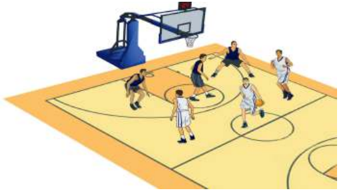

> **Deskripsi Visual:** Gambar ini adalah ilustrasi yang menunjukkan pertandingan bola basket. Gambar ini menggambarkan beberapa pemain basket yang sedang bermain di lapangan basket. Pemain-pemain tersebut terdiri dari dua tim dengan warna jersey yang berbeda. Di sebelah kanan, ada sepak bola basket yang sedang dipukul oleh salah satu pemain. Di atas lapangan, terdapat papan basket dengan ring basket yang tampaknya sedang dalam proses permainan. Di sebelah kiri, terdapat penonton yang sedang menyaksikan pertandingan. Gambar ini menunjukkan aktivitas fisik dan kompetisi dalam olahraga basket.

### 2. Aktivitas Pembelajaran Menganalisis dan Merancang Strategi dan Taktik Pertahanan Bola basket

Pembelajaran menganalisis taktik dan strategi pertahanan permainan bola basket dapat dilakukan dengan aktivitas belajar sebagai berikut:

### a. Aktivitas Pembelajaran I

Alat

: Bola karet/bola basket standar

Tempat bermain

: setangah lapangan bola basket dan ring/basket

Formasi

: Berkelompok

- Tugaskan  siswa  untuk  membuat  kelompok  dengan  jumlah  5 orang untuk masing-masing kelompok.
- Tugas  siswa  untuk  membagi  kelompok  tersebut  dalam  dua bagian, yaitu : 2 orang sebagai penyerang dan 3 orang sebagai bertahan .
- Tugaskan tim penyerang (2 orang) untuk menyerang ring/basket dan tim bertahan (3 orang) mempertahankan ring/basket supaya tidak kemasukan.

 

---
## 📄 Halaman 54

- Pertanyakan kepada peserta didik: Bagaimanakah cara mempertahankan daerah dari serangan depan, samping kanan dan kiri  ring/basket? Manakah yang lebih efektif mempertahankan ring/basket dari serangan depan, samping kanan atau kiri ring/ basket? Apakah mempertahankan ring/basket memerlukan kerja sama? dan pertanyaan lainnya.
- Tugaskan kepada siswa untuk mengekplorasi pertanyaanpertanyaan  tersebut  sambil  melakukan  aktivitas  belajar  secara berkelompok tadi.
- Perhatikan bahwa siswa dapat merasakan kemajuan dan memahami berbagai taktik dan strategi untuk menyerang.
- Tugaskan  siswa  untuk  melakukan  permainan  tersebut  dengan menerapkan disiplin, percaya diri, dan saling menghargai.
- Selama siswa melakukan aktivitas belajar tersebut, Guru menilai kemajuan yang diperoleh oleh siswa.
- Aktivitas belajar ini seperti nampak pada gambar 1.13.

---
**🖼️ Gambar/Diagram**

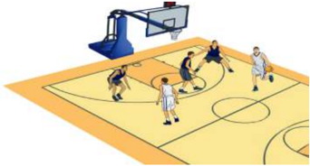

> **Deskripsi Visual:** Gambar ini adalah ilustrasi yang menunjukkan pertandingan bola basket. Gambar ini menggambarkan empat pemain basket bermain di lapangan basket. Pemain yang berada di tengah lapangan sedang berusaha melempar bola ke arah ring basket. Di sebelah kiri, ada dua pemain yang tampaknya sedang bergerak untuk bertahan atau mencoba menghentikan pergerakan pemain yang melempar. Di sebelah kanan, ada dua pemain lain yang tampaknya sedang berada dalam posisi siap untuk bertindak jika bola melewati mereka. Latar belakangnya adalah lapangan basket dengan garis dan lingkaran yang jelas. Ilustrasi ini menunjukkan aktivitas dan strategi yang digunakan dalam pertandingan bola basket.

### b. Aktivitas Pembelajaran II

Alat

: Bola karet/bola basket standar

Tempat bermain

: Setengah lapangan bola basket dan ring basket

Formasi

: Berkelompok

- Tugaskan  siswa  untuk  membuat  kelompok  dengan  jumlah 10 orang dan bagi dalam dua tim ,  yaitu  tim  penyerang  dan bertahan.
- Tugaskan kepada siswa yang berperan sebagai bertahan untuk merancang pertahanan daerah agar dapat menjauhkan bola dari ring/basket.

 

---
## 📄 Halaman 55

- Setelah rancangan dibuat, tugaskan siswa untuk bermain dan tim bertahan melakukan rancangan pertahanan yang telah dibuatnya
- Jelaskan kepada siswa untuk mematuhi aturan jika dalam waktu 5 menit tim bertahan tidak dapat menggagalkan lebih dari sepuluh bola  maka  tim  bertahan  dianggap  gagal/kalah  dan  bergantian peran dengan yang menyerang.
- Pertanyakan  kepada  peserta  didik:  Bagaimanakah  merancang pertahanan  yang  efektif?  Bagaimanakah  peran  setiap  pemain dalam merancang pertahanan? Apakah dalam merancang pertahanan diperlukan kerja sama dan mengeluarkan pendapat? dan pertanyaan lainya.
- Tugaskan kepada siswa untuk mengekplorasi pertanyaanpertanyaan dengan melakukan aktivitas belajar kelompok tersebut.
- Tugaskan kepada siswa untuk melakukan permainan 5 lawan 5 dengan menerapkan kejujuran, kerja sama, saling menghargai, toleransi, dan sportivitas.
- Selama siswa melakukan aktivitas belajar tersebut, Guru menilai kemajuan yang diperoleh oleh siswa.
- Aktivitas belajar ini seperti nampak pada gambar 1.14.

---
**🖼️ Gambar/Diagram**

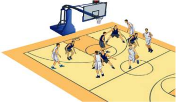

> **Deskripsi Visual:** Gambar ini adalah ilustrasi yang menunjukkan pertandingan bola basket antara dua tim. Gambar ini menggambarkan beberapa elemen penting seperti lapangan basket, papan basket, dan pemain-pemain yang sedang bermain. Pemain-pemain tersebut terdiri dari dua tim dengan warna jersey yang berbeda, yang menunjukkan bahwa mereka berada dalam posisi bertahan atau serang. Lapangan basket tampak rata dan terlihat bersih, dengan garis-garis yang jelas untuk menentukan area permainan. Papan basket tampak kokoh dan siap digunakan untuk mencetak skor. Informasi kunci yang dapat diambil dari gambar ini adalah bahwa ini adalah pertandingan bola basket yang sedang berlangsung, dengan pemain-pemain yang aktif dan posisi mereka yang menunjukkan strategi permainan mereka.

 

---
## 📄 Halaman 56

### F.  Pelaksanaan Penilaian

### 1. Penilaian Pengetahuan

Setelah mempelajari materi menganalisis, merancang, dan mengevaluasi  permainan  sepak  bola,  bola  voli,  dan  bola  basket,  para siswa diberikan tugas dan dilakukannya dengan penuh tanggung jawab dan kejujuran. Tugaskan pada siswa untuk melakukan kegiatan berikut:

- Mengamati/menonton pertandingan permainan sepak bola, bola voli, dan bola basket di televisi, internet, atau media lainnya.
- Memperhatikan pola pertahanan dan penyerangan dalam pertandingan tersebut.
- Menuliskannya dalam buku pelajaran masing-masing.
- Mendiskusikannya dengan teman satu kelas.
- Mengumpulkan hasil diskusi kepada Guru.
Penilaian  tugas/proyek  yang  dilaksanakan  siswa  dapat  dinilai  dengan menggunakan contoh rubrik penilaian sebagai berikut:

---
**📊 Tabel**

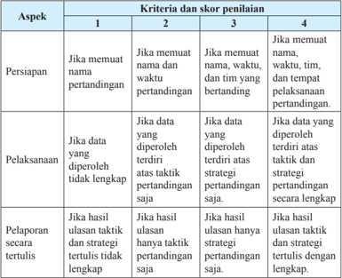

Tabel ini menunjukkan kriteria dan skor penilaian untuk aspek persiapan, pelaksanaan, dan pelaporan secara tertulis dalam sebuah pertandingan. Topik utama tabel adalah proses penilaian yang dilakukan terhadap tiga aspek tersebut. Kolom 1-4 masing-masing menunjukkan skor penilaian yang diberikan kepada setiap aspek. Data penting yang terlihat adalah bahwa skor tertinggi adalah 4, sedangkan skor terendah adalah 1. Pola penting yang terlihat adalah bahwa skor penilaian untuk setiap aspek tidak hanya bergantung pada satu kriteria saja, tetapi juga bergantung pada kombinasi beberapa kriteria. Misalnya, untuk aspek persiapan, skor tertinggi (4) diberikan jika nama dan waktu pertandingan memenuhi syarat, sementara skor terendah (1) diberikan jika data yang diperoleh tidak lengkap.

 

---
## 📄 Halaman 57

### Jumlah skor yang diperoleh

### Penilaian pengetahuan = ̶ ̶ ̶ ̶ ̶ ̶ ̶ ̶ ̶ ̶ ̶ ̶ ̶ ̶ ̶ ̶ ̶ ̶ ̶ ̶ ̶ ̶ ̶ ̶ ̶ ̶ ̶ ̶ ̶ ̶ ̶ ̶ ̶ ̶ ̶ ̶ ̶ ̶ ̶ ̶ ̶ ̶ ̶ ̶ ̶ × 100 Jumlah skor maksimal

### Keterangan:

Nilai 1  : Jika komponen jawaban kurang secara kualitas dan kuantitas.

Nilai 2  : Jika komponen jawaban cukup secara kualitas dan kuantitas.

Nilai 3  : Jika komponen jawaban baik secara kualitas dan kuantitas.

Nilai 4  : Jika komponen jawaban sangat baik secara kualitas dan kuantitas.

### 2. Penilaian Keterampilan

Penilaian aspek keterampilan dilakukan terhadap kemampuan siswa selama menganalisis, merancang, dan mengevaluasi taktik dan strategi permainan sepak bola, bola voli, dan bola basket. Penilaian keterampilan dapat dilakukan dengan cara menilai diri sendiri dan temannya. Contoh rubrik penilaian keterampilan adalah sebagai berikut.

---
**📊 Tabel**

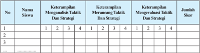

Tabel ini menunjukkan keterampilan siswa dalam mengamati, merancang, dan mengevaluasi taktik dan strategi dalam berbagai situasi. Kolom pertama menyatakan nama-nama siswa, sedangkan kolom kedua hingga kelima menunjukkan tingkat keterampilan mereka dalam masing-masing aspek. Data dalam tabel menunjukkan bahwa siswa memiliki keterampilan yang beragam, dengan beberapa siswa memiliki skor tertinggi di setiap aspek, sementara yang lain memiliki skor lebih rendah. Ini menunjukkan bahwa pembelajaran dan pengembangan keterampilan ini perlu dilakukan secara individu dan disesuaikan dengan kebutuhan setiap siswa.

### Skor :

- 4 =  Apabila siswa dapat melakukan 3 kriteria secara lengkap dengan baik dan benar.
- 3 =  Apabila siswa dapat melakukan 2 kriteria gerakan dengan baik dan benar.
- 2 =  Apabila siswa hanya dapat melakukan 1 kriteria gerakan dengan baik dan benar.
- 1 =  Apabila siswa tidak dapat melakukan/menunjukkan 3 kriteria seperti tersebut di atas.

``

 

---
## 📄 Halaman 58

### 3. Penilaian Sikap

Penilaian aspek sikap (sikap) dilakukan dengan pengamatan selama mengikuti kegiatan belajar mengajar. Pengamatan dalam proses penilaian dilakukan saat pembelajaran permainan sepak bola, bola voli, dan bola basket. Aspek-aspek yang dinilai meliputi kerja sama, tanggung jawab, sportivitas, disiplin, dan toleransi. Berikan tanda cek (√) pada kolom yang sudah disediakan, setiap peserta siswa menunjukkan atau menampilkan sikap  yang  diharapkan.  Tiap  sikap  yang  dicek  (√)  dengan  rentang  skor antara 1 sampai dengan 4 dengan kriteria sebagai berikut.

- 4=Selalu, apabila selalu melakukan sesuai pernyataan.
- 3=Sering, apabila sering melakukan sesuai pernyataan dan kadang-kadang tidak melakukan.
- 2=Kadang-kadang, apabila kadang-kadang melakukan dan sering tidak melakukan.
- 1=Tidak pernah, apabila tidak pernah melakukan.

---
**📊 Tabel**

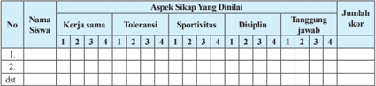

Tabel ini menunjukkan skor siswa dalam berbagai aspek sikap yang diukur, seperti kerja sama, toleransi, sportivitas, disiplin, dan tanggung jawab. Kolom pertama menunjukkan nomor siswa, sedangkan kolom kedua sampai kelima menunjukkan skor siswa dalam masing-masing aspek sikap tersebut. Data penting yang terlihat adalah bahwa siswa 1 memiliki skor tertinggi dalam aspek disiplin dengan nilai 4, sedangkan siswa 2 memiliki skor tertinggi dalam aspek sportivitas dengan nilai 4. Sementara itu, siswa 3 memiliki skor tertinggi dalam aspek kerja sama dengan nilai 4. Tabel ini membantu dalam membandingkan performa siswa dalam berbagai aspek sikap mereka.

`Jumlah skor yang diperoleh Penilaian pengetahuan = ̶ ̶ ̶ ̶ ̶ ̶ ̶ ̶ ̶ ̶ ̶ ̶ ̶ ̶ ̶ ̶ ̶ ̶ ̶ ̶ ̶ ̶ ̶ ̶ ̶ ̶ ̶ ̶ ̶ ̶ ̶ ̶ ̶ ̶ ̶ ̶ ̶ ̶ ̶ ̶ ̶ ̶ ̶ ̶ ̶ × 100 Jumlah skor maksimal`

### 4. Rekapitulasi Penilaian

Setelah semua aspek penilaian yang meliputi pengetahuan, keterampilan  dan  sikap  diketahui  pada  setiap  peserta  didik,  maka rekapitulasi penilaian dapat menggunakan contoh rubrik sebagai berikut.

 

---
## 📄 Halaman 59

---
**📊 Tabel**

Tabel ini menunjukkan hasil penilaian siswa berdasarkan tiga aspek penilaian: Pengetahuan (P), Keterampilan (K), dan Sikap (S). Setiap siswa memiliki skor, huruf, kapabilitas optimal, modus, dan predikat untuk setiap aspek penilaian. Topik utama tabel adalah penilaian siswa dalam berbagai aspek keilmuan dan sikap mereka. Kolom-kolomnya mencakup nama siswa, aspek penilaian, skor, huruf, kapabilitas optimal, modus, dan predikat. Data penting yang terlihat adalah bahwa beberapa siswa memiliki skor yang tinggi di semua aspek penilaian, sementara yang lain memiliki skor yang lebih rendah. Pola ini menunjukkan variasi dalam kemampuan dan sikap siswa dalam berbagai aspek keilmuan.

### G.  Pelaksanaan Remedial dan Pengayaan

Pelaksanaan remedial dan pengayaan dilakukan pada para siswa yang  belum  mencapai  ketuntasan  belajar.  Seperti  yang  tercantum  dalam Permendikbud  nomor  104  tahun  2014,  ketuntasan  belajar  untuk  sikap (KD pada KI-1 dan KI-2) ditetapkan dengan predikat Baik (B), sedangkan Ketuntasan Belajar untuk pengetahuan ditetapkan dengan skor rerata  2,67 dan untuk  keterampilan  ditetapkan  dengan capaian optimum 2,67. Berikut contoh format remedial dan pengayaan pada aspek keterampilan.

 

---
## 📄 Halaman 60

---
**📊 Tabel**

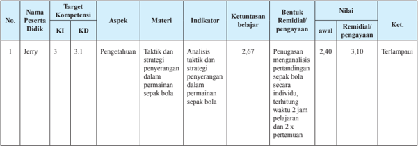

Tabel ini menunjukkan data evaluasi pengetahuan dan pemahaman peserta didik Jerry terhadap kompetensi 3.1, yaitu tentang taktik dan strategi penyeringan dalam permainan sepak bola. Kolom-kolomnya meliputi Nama Peserta Didik, Target Kompetensi, Aspek, Materi, Indikator, Ketuntasan belajar, Bentuk Remidal/pengayaan, Nilai awal, dan Nilai Remidal/pengayaan. Data penting yang terlihat adalah bahwa Jerry memiliki nilai 2,67 untuk indikator analisis taktik dan strategi penyeringan dalam permainan sepak bola, dengan nilai remidal/pengayaan 3,10. Ini menunjukkan bahwa Jerry telah memahami materi tersebut dengan baik dan dapat menerapkannya dalam situasi tertentu.

 

---
## 📄 Halaman 61

### BAB 2

### PEMBELAJARAN MENGANALISIS MERANCANG DAN MENGEVALUASI STRATEGI DAN TAKTIK PERMAINAN BOLA KECIL

Bab ini membahas tentang pembelajaran merancang pola penyerangan dan pertahanan permainan bola kecil. Guru dapat memilih jenis permainan bola kecil sesuai dengan kondisi sekolah.

### A.  Kompetensi Dasar dan Indikator Pembelajaran

Kompetensi dasar dan indikator pembelajaran merancang pola penyerangan dan pertahanan permainan bola kecil adalah sebagai berikut:

---
**📊 Tabel**

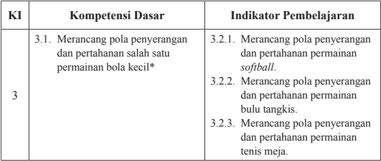

Tabel ini berisi informasi tentang kompetensi dasar dan indikator pembelajaran untuk kelas 3 dalam bidang olahraga bola kecil. Topik utama adalah merancang pola penyerangan dan pertahanan dalam berbagai jenis permainan bola kecil seperti softball, bola tangkas, dan tenis meja. Kolom "Kompetensi Dasar" mencakup tiga poin utama: merancang pola penyerangan dan pertahanan dalam permainan bola kecil, merancang pola penyerangan dan pertahanan dalam permainan softball, dan merancang pola penyerangan dan pertahanan dalam permainan bola tangkas. Sedangkan kolom "Indikator Pembelajaran" mencakup tiga indikator pembelajaran yang spesifik untuk masing-masing kompetensi dasar tersebut. Data penting yang terlihat adalah bahwa semua indikator pembelajaran tersebut berkaitan dengan merancang pola penyerangan dan pertahanan dalam berbagai jenis permainan bola kecil.

 

---
## 📄 Halaman 62

---
**📊 Tabel**

Tabel ini menunjukkan kompetensi dasar (KI) 4.1 tentang praktikasi hasil rancangan pola penyegaran dan pertahanan salah satu permainan bola kecil, dengan indikator pembelajaran yang mencakup praktikasi pola penyegaran dan pertahanan untuk permainan softball, bulu tangkis, dan tenis meja. Topik utama tabel ini adalah praktikasi teknik olahraga yang melibatkan pemain dalam mengatur dan mempertahankan posisi mereka selama pertandingan. Kolom-kolomnya mencakup KI 4.1 sebagai kompetensi dasar dan berbagai indikator pembelajaran yang spesifik untuk masing-masing permainan. Data penting yang terlihat adalah bahwa semua indikator pembelajaran tersebut berkaitan dengan praktikasi pola penyegaran dan pertahanan dalam permainan bola kecil, yang merupakan bagian integral dari latihan olahraga yang efektif.

### B.  Tujuan Pembelajaran

Setelah  mengikuti  kegiatan  pembelajaran  ini, siswa  diharapkan mampu:

- memiliki kesadaran tentang arti  penting  gerak  tubuh  sebagai  wujud penghayatan dan pengamalan ajaran agamanya;
- menunjukkan perilaku jujur, disiplin, tanggung jawab, peduli, santun, responsif dan pro-aktif selama pembelajaran permainan softball, bulu tangkis dan tenis meja;
- merancang pola penyerangan dan pertahanan permainan softball secara runtut dan sistematis;
- merancang pola penyerangan dan pertahanan permainan bulu tangkis secara runtut dan sistematis;
- merancang  pola  penyerangan  dan  pertahanan  permainan  tenis  meja secara runtut dan sistematis;
- melakukan hasil rancangan pola penyerangan dan pertahanan permainan softball dalam permainan yang dimodiikasi disertai kerja sama, jujur, dan disiplin;
nilai

- melakukan hasil rancangan pola penyerangan dan pertahanan permainan bulu tangkis dalam permainan yang dimodiikasi nilai kerja sama, jujur, dan disiplin; dan
disertai

- melakukan hasil rancangan pola penyerangan dan pertahanan permainan tenis meja dalam permainan yang dimodiikasi disertai kerja sama, jujur, dan disiplin.
nilai

 

---
## 📄 Halaman 63

### C.  Aktivitas Pembelajaran Merancang dan Mengevaluasi Strategi dan Taktik Permainan Softball

### 1. Aktivitas Pembelajaran Merancang Pola Penyerangan Permainan Softball

Pembelajaran merancang  pola penyerangan permainan softball melalui beberapa aktivitas pembelajaran sebagai berikut.

### a. Aktivitas Pembelajaran I

Alat

: Bola tenis bekas/bola softball standar dan pemukul

Tempat

: Lapangan persegi panjang dengan dua base

Formasi

: Kelompok

- Tugaskan  siswa  untuk  membuat  kelompok  7  orang  dengan pembagian 2 orang penyerang dan 5 orang sebagai bertahan.
- Tugaskan siswa untuk menyiapkan area/lapangan dengan ukuran 7 × 7 meter dengan 2 base .
- Tugaskan  siswa  yang  menjadi  penyerangan  untuk  berusaha berlari  ke base 1, base 2,  dan  kembali  ke home  base setelah memukul.
- Pertanyakan kepada peserta didik: Kemanakah arah bola dipukul agar jauh dari dari pemain bertahan dan sulit untuk ditangkap?, Bagaimana  cara  berlari  agar  selamat  sampai base 1  dan  2?, bagaimanakah mengembalikan penyerang di base 2 agar kembali ke home ?, dan pertanyaan lainnya.
- Tugaskan siswa untuk mengeksplorasi pertanyaan selama melakukan permainan.
- Setelah siswa merasakan ada kemajuan satu sama lain ditugaskan untuk  bergantian  menjadi  penyerang  dan  bertahan  sehingga semua siswa dapat melakukan.
- Selama  siswa  melakukan  permainan,  Guru  menilai  kemajuan yang diperoleh oleh siswa.
- Kegiatan seperti nampak pada gambar 2.1.

 

---
## 📄 Halaman 64

---
**🖼️ Gambar/Diagram**

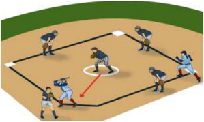

> **Deskripsi Visual:** Gambar ini adalah ilustrasi yang menunjukkan pertandingan sepak bola. Gambar ini menggambarkan beberapa pemain sepak bola berada di lapangan dengan posisi mereka yang berbeda. Pemain yang berada di tengah lapangan tampak sedang bergerak menuju bola yang diletakkan di tengah lapangan. Di sebelah kiri, ada dua pemain yang tampak sedang berjalan menuju bola, sementara dua pemain lainnya tampak berdiri di pinggir lapangan. Di sebelah kanan, ada dua pemain yang tampak sedang berjalan menuju bola. Seluruh gambar ini menunjukkan posisi dan gerakan pemain sepak bola dalam sebuah pertandingan.

### b. Aktivitas Pembelajaran II

Alat

: Bola tenis bekas/bola softball standar dan pemukul

Tempat

: Lapangan persegi panjang dengan 3 base

Formasi

: Kelompok

- Tugaskan  siswa  untuk  membuat  kelompok  6  orang  dengan pembagian 1 orang penyerang dan 5 orang sebagai bertahan .
- Tugaskan siswa untuk menyiapkan area/lapangan dengan ukuran 7 x 7 meter dengan 3 base .
- Tugaskan  siswa  yang  menjadi  penyerangan  untuk  berusaha berlari  ke base 1, base 2, base 3,  dan  selanjutnya  kembali  ke home base setelah memukul.
- Pertanyakan kepada peserta didik: Kemanakah arah bola dipukul agar  jauh  dari  pemain  bertahan  dan  sulit  untuk  ditangkap? Bagaimana  cara  berlari  agar  selamat  sampai base 1,  2  dan 3?  Bagaimanakah  mengembalikan  penyerang  di base 3  agar kembali ke home base ? dan pertanyaan lainnya.
- Tugaskan siswa untuk mengeksplorasi pertanyaan selama melakukan permainan.
- Setelah siswa merasakan ada kemajuan satu sama lain ditugaskan untuk  bergantian  menjadi  penyerang  dan  bertahan  sehingga semua siswa dapat melakukan.
- Selama  siswa  melakukan  permainan,  Guru  menilai  kemajuan yang diperoleh oleh siswa.
- Kegiatan seperti nampak pada gambar 2.2.

 

---
## 📄 Halaman 65

---
**🖼️ Gambar/Diagram**

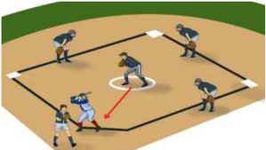

> **Deskripsi Visual:** Gambar ini adalah ilustrasi yang menunjukkan posisi pemain dalam sebuah pertandingan sepak bola. Ilustrasi ini menggambarkan dua tim bermain di lapangan dengan pemain yang berada di berbagai posisi. Pemain yang berada di tengah lapangan tampak sedang bergerak menuju bola yang diletakkan di tengah lapangan. Di sebelah kiri, ada pemain yang tampak berada di posisi penyerang, sedangkan di sebelah kanan ada pemain yang tampak berada di posisi bek. Ilustrasi ini juga menunjukkan posisi pemain yang berada di pinggir lapangan, yaitu pemain yang berada di posisi penjaga gawang dan pemain yang berada di posisi penyerang. Ilustrasi ini menunjukkan posisi pemain dalam sebuah pertandingan sepak bola dan bagaimana mereka berinteraksi dengan bola dan satu sama lain.

### c. Aktivitas Pembelajaran III

Alat

: Bola tenis bekas/bola softball standar dan pemukul

Tempat  : Lapangan persegi panjang dengan 3 base

Formasi  : Kelompok

- Tugaskan siswa untuk membuat kelompok 10 orang dengan pembagian 5 orang penyerang dan 5 orang sebagai bertahan.
- Tugaskan  siswa  untuk  menyiapkan  area/lapangan  dengan ukuran 9 × 9 meter dengan 3 base .
- Tugaskan siswa yang menjadi penyerang untuk merancang serangan dengan baik terlebih dahulu dengan berdiskusi.
- Setelah rancangan penyerangan tersusun, tugaskan siswa untuk melakukan permainan dengan mematuhi aturan: jika terjadi 3 kali mati pada kelompok penyerang, maka kelompok bertahan berganti menjadi kelompok penyerang. Begitu seterusnya sampai permainan dilakukan sebanyak 3 inning.
- Pertanyakan  kepada  peserta  didik:  Bagaimana  rancangan penyerangan agar pemukul aman lari ke base 1?, Bagaimana rancangan penyerangan agar pemukul aman lari dari base 1  ke base 2?,  Bagaimana  rancangan  penyerangan  agar pemukul dapat berlari kembali ke home base ( homerun )?, Apakah dalam setiap penyerangan diperlukan kerja sama, tanggung jawab, disiplin, dan pertanyaan lainnya.
- Tugaskan  siswa  untuk  mengeksplorasi  pertanyaan  selama melakukan permainan.
- Setelah  siswa  merasakan  ada  kemajuan  satu  sama  lain ditugaskan untuk bergantian menjadi penyerang dan bertahan sehingga semua siswa dapat melakukan.

 

---
## 📄 Halaman 66

- Selama siswa melakukan permainan, Guru menilai kemajuan yang diperoleh oleh siswa.
- Kegiatan seperti nampak pada gambar 2.3.

---
**🖼️ Gambar/Diagram**

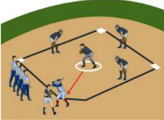

> **Deskripsi Visual:** Gambar ini adalah ilustrasi yang menunjukkan pertandingan sepak bola. Gambar ini menggambarkan dua tim bermain di lapangan sepak bola dengan pemain yang berada di posisi mereka masing-masing. Pemain tim pertama berada di sebelah kanan dan tim kedua berada di sebelah kiri. Setiap pemain memiliki posisi yang jelas dan relasi dengan pemain lainnya. Di tengah lapangan, ada sebuah bola yang sedang dimainkan oleh salah satu pemain. Di sekitar lapangan, terdapat beberapa orang penonton yang sedang menyaksikan pertandingan. Gambar ini menunjukkan bahwa sepak bola adalah olahraga yang memerlukan koordinasi dan komunikasi antara pemain dan penonton.

### 2. Aktivitas Pembelajaran Merancang Pola Pertahanan Permainan Softball

Pembelajaran merancang pola pertahanan permainan softball melalui beberapa aktivitas pembelajaran sebagai berikut.

### a. Aktivitas Pembelajaran I

Alat

: Bola tenis bekas/bola softball standar dan pemukul

Tempat

: lapangan persegi panjang dengan dua base

Formasi

: Kelompok

- Tugaskan  siswa  untuk  membuat  kelompok  7  orang  dengan pembagian 2 orang penyerang dan 5 orang sebagai bertahan.
- Tugaskan siswa untuk menyiapkan area/lapangan dengan ukuran 7 × 7 meter dengan 2 base .
- Tugaskan siswa yang bertahan untuk berusaha mematikan pelari/ penyerang di base 1 atau base 2 dengan cara mendahului masuk ke base tersebut.
- Pertanyakan kepada peserta didik: Bagaimana cara mematikan pelari/penyerang di base 1?, Bagaimana cara mematikan pelari di  base  2?,  Apakah  dalam  mematikan  pelari  diperlukan  kerja sama, tanggung jawab, dan disiplin?, dan pertanyaan lainnya.
- Tugaskan siswa untuk mengeksplorasi pertanyaan selama melakukan permainan.

 

---
## 📄 Halaman 67

- Setelah siswa merasakan ada kemajuan satu sama lain ditugaskan untuk  bergantian  menjadi  penyerang  dan  bertahan  sehingga semua siswa dapat melakukan.
- Selama  siswa  melakukan  permainan,  Guru  menilai  kemajuan yang diperoleh oleh siswa.
- Kegiatan seperti nampak pada gambar 2.4.

---
**🖼️ Gambar/Diagram**

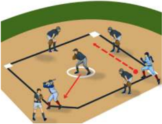

> **Deskripsi Visual:** Gambar ini adalah ilustrasi yang menunjukkan pertandingan sepak bola. Gambar ini menggambarkan dua tim bermain sepak bola di lapangan. Tim satu berada di sisi kanan dan tim lain berada di sisi kiri. Setiap pemain memiliki posisi yang jelas dan tampaknya sedang bergerak untuk mencoba mencetak gol. Lapangan sepak bola tampak jelas dengan garis-garis yang menunjukkan area permainan. Ilustrasi ini menunjukkan konsep dasar pertandingan sepak bola, termasuk posisi pemain, arah gerakan, dan struktur lapangan. Teks, angka, atau label penting tidak terlihat dalam gambar ini karena hanya ada gambar saja tanpa teks atau angka. Informasi kunci yang dapat diambil pembaca adalah bahwa ini adalah pertandingan sepak bola dan posisi pemain pada saat itu.

### b. Aktivitas Pembelajaran II

Alat

: Bola tenis bekas/bola softball standar dan pemukul

Tempat

: lapangan persegi panjang dengan 3 base

Formasi

: Kelompok

- Tugaskan  siswa  untuk  membuat  kelompok  7  orang  dengan pembagian 2 orang penyerang dan 5 orang sebagai bertahan.
- Tugaskan siswa untuk menyiapkan area/lapangan dengan ukuran 7 × 7 meter dengan 3 base .
- Tugaskan siswa yang bertahan untuk berusaha mematikan pelari/ penyerang di base 1, base 2, atau base 3 dengan cara mendahului masuk ke base tersebut bersama bola.
- Pertanyakan kepada peserta didik: Bagaimana cara mematikan pelari/penyerang di base 1? Bagaimana cara mematika pelari di base 2? Bagaimana cara mematikan pelari di base 3? Apakah dalam mematikan pelari diperlukan kerja sama, tanggung jawab, dan disiplin?, dan pertanyaan lainnya.
- Tugaskan siswa untuk mengeksplorasi pertanyaan selama melakukan permainan.

 

---
## 📄 Halaman 68

- Setelah siswa merasakan ada kemajuan satu sama lain ditugaskan untuk  bergantian  menjadi  penyerang  dan  bertahan  sehingga semua siswa dapat melakukan.
- Selama  siswa  melakukan  permainan,  Guru  menilai  kemajuan yang diperoleh oleh siswa.
- Kegiatan seperti nampak pada gambar 2.5.

---
**🖼️ Gambar/Diagram**

> **Deskripsi Visual:** Gambar ini adalah ilustrasi yang menunjukkan pertandingan sepak bola. Gambar ini menggambarkan dua tim bermain sepak bola di lapangan. Tim satu berada di sisi kanan dan tim lain berada di sisi kiri. Setiap pemain memiliki posisi yang jelas dan relasi mereka dengan bola yang sedang bergerak. Pemain yang berada di tengah lapangan tampaknya sedang berusaha untuk mencuri bola dari pemain lawan. Di sebelah kiri, ada penjaga gawang yang siap bertahan. Di sebelah kanan, ada pemain yang tampaknya sedang berusaha untuk mencetak gol. Gambar ini menunjukkan skenario pertandingan sepak bola yang seru dan dinamis.

### c. Aktivitas Pembelajaran III

Alat

: Bola tenis bekas/bola softball standar dan pemukul

Tempat

: Lapangan persegi panjang dengan 3 base

Formasi

: Kelompok

- Tugaskan  siswa  untuk  membuat  kelompok  14  orang  dengan pembagian 7 orang penyerang dan 7 orang sebagai bertahan.
- Tugaskan siswa untuk menyiapkan area/lapangan dengan ukuran 10 x 10 meter dengan 3 base .
- Tugaskan  siswa  yang  bertahan  untuk  merancang  pertahanan dengan baik terlebih dahulu dengan berdiskusi.
- Setelah rancangan penyerangan tersusun, tugaskan siswa untuk melakukan permainan dengan mematuhi aturan: Jika kelompok bertahan dapat mematikan bola kelompok penyerang sebanyak 3  kali  mati,  maka  kelompok  bertahan  dapat  berganti  menjadi

 

---
## 📄 Halaman 69

- kelompok  penyerang.  Begitu  seterusnya  sampai  permainan dilakukan sebanyak 3 inning.
- Pertanyakan kepada peserta didik: Bagaimana rancangan pertahanan  agar  dapat  mematikan  penyerang  di base 1?  Bagaimana rancangan pertahanan agar dapat mematikan penyerang di base 2? Bagaimana rancangan agar penyerang tidak dapat melakukan homerun ?  Apakah  dalam  setiap  pertahanan  diperlukan  kerja sama, tanggung jawab, disiplin, dan pertanyaan lainnya.
- Tugaskan siswa untuk mengeksplorasi pertanyaan selama melakukan permainan.
- Setelah siswa merasakan ada kemajuan satu sama lain ditugaskan untuk  bergantian  menjadi  penyerang  dan  bertahan  sehingga semua siswa dapat melakukan.
- Selama  siswa  melakukan  permainan,  Guru  menilai  kemajuan yang diperoleh oleh siswa.
- Kegiatan seperti nampak pada gambar 2.6.

---
**🖼️ Gambar/Diagram**

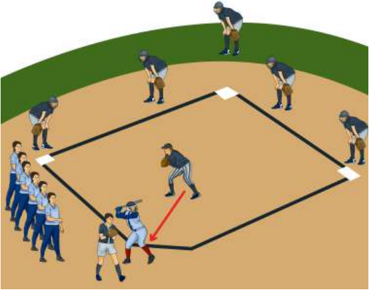

> **Deskripsi Visual:** Gambar ini adalah ilustrasi yang menunjukkan pertandingan sepak bola. Gambar ini menggambarkan dua tim bermain sepak bola di lapangan. Tim satu berada di sisi kanan dan tim lain berada di sisi kiri. Setiap pemain memiliki posisi yang jelas dan bergerak sesuai dengan permainan. Pemain yang berada di tengah lapangan tampak sedang berusaha mencetak gol. Di sebelah kiri, ada beberapa pemain yang tampak berada di posisi bertahan, sedangkan di sebelah kanan ada pemain yang tampak berada di posisi serang. Ilustrasi ini menunjukkan kegiatan dan posisi pemain dalam sebuah pertandingan sepak bola.

 

---
## 📄 Halaman 70

### D.  Aktivitas Pembelajaran Menganalisis, Merancang, dan Mengevaluasi Strategi dan Taktik Permainan Bulu Tangkis

### 1. Aktivitas Pembelajaran Merancang Pola Penyerangan Permainan Bulu tangkis

### a. Aktivitas Pembelajaran I

Alat :

Shutlecock dan Raket

Tempat

: Lapangan persegi panjang dan net

Formasi

: Kelompok

- Tugaskan siswa untuk membuat kelompok 3 orang dengan ketentuan 2 orang sebagai pemain bertahan dan 1 orang sebagai penyerang.
- Tugaskan siswa untuk menyiapkan area/lapangan dengan ukuran 4 x 8 meter dengan pembatas net di tengah lapangan.
- Tugaskan siswa yang berperan sebagai penyerang untuk berusaha menyerang  ke daerah lawan, sedangkan  pemain bertahan berusaha mengembalikan bola agar kembali ke daerah lawan dan tidak jatuh di daerah sendiri.
- Tentukan waktu bermain sesuai dengan jumlah siswa sehingga semua dapat melakukan.
- Pertanyakan kepada peserta didik: Bagaimana cara efektif menyerang? Manakah yang efektif untuk menyerang dengan smash, lob, atau drop shot? Apakah dalam setiap penyerangan diperlukan konsentrasi, disiplin, dan kerja keras?, dan pertanyaan lainnya.
- Tugaskan siswa untuk mengeksplorasi pertanyaan selama melakukan permainan.
- Setelah siswa merasakan ada kemajuan satu sama lain, tugaskan untuk  bergantian  menjadi  penyerang  dan  bertahan  sehingga semua siswa dapat melakukan.
- Selama  siswa  melakukan  permainan,  Guru  menilai  kemajuan yang diperoleh oleh siswa.
- Kegiatan seperti nampak pada gambar 2.7.

---
**🖼️ Gambar/Diagram**

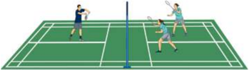

> **Deskripsi Visual:** Gambar ini adalah ilustrasi yang menunjukkan pertandingan bulu tangkis. Gambar ini menggambarkan dua pasangan pemain yang sedang bermain di lapangan bulu tangkis. Setiap pemain memiliki alat peraga bulu tangkis mereka, yaitu raket dan bola. Pemain di sisi kiri menggunakan raket merah dan pemain di sisi kanan menggunakan raket biru. Pemain di sisi kiri juga menggunakan bola merah, sedangkan pemain di sisi kanan menggunakan bola biru. Lapangan bulu tangkis terbagi menjadi dua bagian dengan garis tengah yang memisahkan kedua pemain. Ilustrasi ini menunjukkan posisi dan gerakan pemain saat bermain, serta alat peraga mereka. Informasi kunci yang dapat diambil dari gambar ini adalah bahwa pertandingan ini adalah pertandingan bulu tangkis antar pasangan, dan setiap pemain menggunakan raket dan bola yang berbeda warnanya.

 

---
## 📄 Halaman 71

### b. Aktivitas Pembelajaran II

Alat :

Shutlecock dan Raket

Tempat

: lapangan persegi panjang dan net

Formasi

: Kelompok

- Tugaskan siswa untuk berpasangan dengan menentuka 1 orang penyerang dan 1 orang sebagai bertahan.
- Tugaskan  siswa  untuk  bermain  dalam  lapangan  bulu  tangkis yang sebenarnya.
- Tugaskan siswa untuk yang menjadi penyerang untuk merancang pola penyerangan.
- Setelah  rancangan  penyerangantersusun,  tugaskan  siswa  untuk melakukan permainan bulu tangkis dengan terus berusaha menyerang ke daerah siswa yang menjadi pemain bertahan.
- Pertanyakan kepada peserta didik: Bagaimana rancangan penyerangan  yang  efektif  agar  dapat  agar  dapat  menjatuhkan shutlecock di daerah lawan? Bagaimana rancangan penyerangan dari belakang dan dekat net? Bagaimana rancangan penyerangan secara individual?  Apakah  dalam merancang penyerangan diperlukan  kerja  sama,  tanggung  jawab,  dan  disiplin?,  dan pertanyaan lainnya.
- Tugaskan siswa untuk mengeksplorasi pertanyaan selama melakukan permainan.
- Setelah siswa merasakan ada kemajuan satu sama lain ditugaskan untuk  bergantian  menjadi  penyerang  dan  bertahan  sehingga semua siswa dapat melakukan.
- Selama  siswa  melakukan  permainan,  Guru  menilai  kemajuan yang diperoleh oleh siswa.
- Kegiatan seperti nampak pada gambar 2.8.

---
**🖼️ Gambar/Diagram**

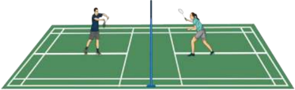

> **Deskripsi Visual:** Gambar ini adalah ilustrasi yang menunjukkan pertandingan bulu tangkis. Gambar ini menggambarkan dua pemain yang sedang bermain di lapangan bulu tangkis dengan net yang memisahkan mereka. Pemain di sisi kiri menggunakan serangkaian alat permainan seperti raket dan tangan untuk menangkap bola. Pemain di sisi kanan juga menggunakan serangkaian alat permainan yang sama. Net yang berwarna biru memisahkan kedua pemain. Lapangan bulu tangkis memiliki lantai hijau dan garis yang menandai area permainan. Gambar ini menunjukkan posisi dan gerakan pemain saat bermain, serta alat permainan yang digunakan dalam pertandingan tersebut.

 

---
## 📄 Halaman 72

### 2. Aktivitas Pembelajaran Merancang Pola Pertahanan Permainan Bulu Tangkis

### a. Aktivitas Pembelajaran I

Alat :

Shutlecock dan Raket

Tempat

: Lapangan persegi panjang dan net

Formasi

: Kelompok

- Tugaskan  siswa  untuk  membuat  kelompok  5  orang  dengan ketentuan 2 orang sebagai pemain bertahan dan 3 orang sebagai penyerang.
- Tugaskan siswa untuk menyiapkan area/lapangan dengan ukuran 4 × 8 meter dengan pembatas net di tengah lapangan.
- Tugaskan siswa yang berperan sebagai penyerang untuk berusaha menyerang  ke daerah lawan, sedangkan  pemain bertahan berusaha mengembalikan bola agar kembali ke daerah lawan dan tidak jatuh di daerah sendiri.
- Tentukan waktu bermain sesuai dengan jumlah siswa sehingga semua dapat melakukan.
- Pertanyakan  kepada  peserta  didik:  Bagaimana  cara  efektif mengembalikan  bola?  Manakah  yang  efektif  mengembalikan bola  dengan  backhand  atau forehand ?  Apakah  dalam  setiap pertahanan memerlukan  kerja  sama, tanggung  jawab, dan disiplin?, dan pertanyaan lainnya.
- Tugaskan siswa untuk mengeksplorasi pertanyaan selama melakukan permainan.
- Setelah siswa merasakan ada kemajuan satu sama lain, tugaskan untuk  bergantian  menjadi  penyerang  dan  bertahan  sehingga semua siswa dapat melakukan.
- Selama  siswa  melakukan  permainan,  Guru  menilai  kemajuan yang diperoleh oleh siswa.
- Kegiatan seperti nampak pada gambar 2.9.

---
**🖼️ Gambar/Diagram**

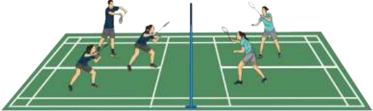

> **Deskripsi Visual:** Gambar ini adalah ilustrasi yang menunjukkan pertandingan bulu tangkis. Gambar ini menggambarkan empat pemain yang sedang bermain di lapangan bulu tangkis dengan posisi mereka yang berbeda-beda. Pemain di sisi kanan memiliki rambut pendek dan seragam biru, sedangkan pemain di sisi kiri memiliki rambut panjang dan seragam hijau. Pemain di tengah memiliki rambut pendek dan seragam biru, sedangkan pemain di sisi kiri memiliki rambut panjang dan seragam hijau. Pemain di sisi kanan memiliki rambut pendek dan seragam biru, sedangkan pemain di sisi kiri memiliki rambut panjang dan seragam hijau. Pemain di sisi kanan memiliki rambut pendek dan seragam biru, sedangkan pemain di sisi kiri memiliki rambut panjang dan seragam hijau. Pemain di sisi kanan memiliki rambut pendek dan seragam biru, sedangkan pemain di sisi kiri memiliki rambut panjang dan seragam hijau. Pemain di sisi kanan memiliki rambut pendek dan seragam biru, sedangkan pemain di sisi kiri memiliki rambut panjang dan seragam hijau. Pemain di sisi kanan memiliki rambut pendek dan seragam biru, sedangkan pemain di sisi kiri memiliki rambut panjang dan seragam hijau. Pemain di sisi kanan memiliki rambut pendek dan seragam biru, sedangkan pemain di sisi kiri memiliki rambut panjang dan seragam hijau. Pemain di sisi kanan memiliki rambut pendek dan seragam biru, sedangkan pemain di sisi kiri memiliki rambut panjang dan seragam hijau. Pemain di sisi kanan memiliki rambut pendek dan seragam biru, sedangkan pemain di sisi kiri memiliki rambut panjang dan seragam hijau. Pemain di sisi kanan memiliki rambut pendek dan seragam biru, sedangkan pemain di sisi kiri memiliki rambut panjang dan seragam

 

---
## 📄 Halaman 73

### b. Aktivitas Pembelajaran Merancang Pola Pertahanan Permainan Bulu Tangkis.

Alat :

Shutlecock dan Raket

Tempat

: Lapangan persegi panjang dan net

Formasi

: Kelompok

- Tugaskan siswa untuk berkelompok secara berpasangan dengan menentukan  1  pasangan  penyerang  dan  1  pasangan  sebagai bertahan.
- Tugaskan  siswa  untuk  bermain  dalam  lapangan  bulu  tangkis yang sebenarnya.
- Tugaskan  siswa  untuk  yang  menjadi  pemain  bertahan  untuk merancang taktik dan strategi pertahanan.
- Setelah  rancangan  pertahanan  tersusun,  tugaskan  siswa  untuk melakukan permainan bulu tangkis dengan terus berusaha menyerang ke daerah siswa yang menjadi pemain bertahan.
- Pertanyakan kepada peserta didik: Bagaimana rancangan pertahanan yang efektif agar dapat mengembalikan bola ke daerah lawan? Bagaimana rancangan pertahanan untuk mengembalikan bola lob, smash , dan dropshot ? Bagaimana rancangan pertahanan saling  bergantian  untuk double /berpasangan?  Apakah  dalam merancang pertahanan diperlukan kerja sama, tanggung jawab, dan disiplin?, dan pertanyaan lainnya.
- Tugaskan siswa untuk mengeksplorasi pertanyaan selama melakukan permainan.
- Setelah siswa merasakan ada kemajuan satu sama lain ditugaskan untuk  bergantian  menjadi  penyerang  dan  bertahan  sehingga semua siswa dapat melakukan.
- Selama  siswa  melakukan  permainan,  Guru  menilai  kemajuan yang diperoleh oleh siswa.
- Kegiatan seperti nampak pada gambar 2.10.

---
**🖼️ Gambar/Diagram**

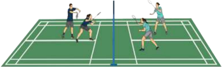

> **Deskripsi Visual:** Gambar ini adalah ilustrasi yang menunjukkan pertandingan bulu tangkis. Gambar ini menggambarkan dua pasangan pemain yang sedang bermain di lapangan bulu tangkis. Setiap pasangan terdiri dari dua orang pria yang berada di sisi yang berlawanan dari net. Net tersebut memisahkan dua sisi lapangan. Pemain-pemain tersebut sedang bergerak dan berusaha untuk melempar bola ke sisi lawan mereka. Ilustrasi ini menunjukkan aktivitas dan kompetisi dalam pertandingan bulu tangkis.

 

---
## 📄 Halaman 74

### E.  Aktivitas Pembelajaran Menganalisis, Merancang, dan Mengevaluasi Strategi dan Taktik Permainan Tenis Meja

### 1. Aktivitas Pembelajaran Menganalisis Taktik dan Strategi Permainan Tenis Meja

### a. Aktivitas Pembelajaran I

Alat

: Bola tenis meja dan bat

Tempat

: Meja tenis meja dan net

Formasi

: Kelompok

- Tugaskan  siswa  untuk  membuat  kelompok  3  orang  dengan ketentuan 2 orang sebagai pemain bertahan dan 1 orang sebagai penyerang.
- Tugaskan  siswa untuk bermain dengan  aturan: penyerang mendapatkan nilai jika dalam 5 kali pukulan,lawan tidak dapat mengembalikan bola  dan  pemain  Bertahan  mendapatkan  nilai jika  pemain bertahan dapat menahan sampai 5 pukulan lawan atau lawan tidak dapat mengembalikan ke bola
- Tugaskan siswa yang menjadi penyerang berusaha menyerang ke  daerah  lawan,  sedangkan  pemain  bertahan  hanya  berusaha mengembalikan bola agar kembali ke daerah lawan dan tidak jatuh di daerah sendiri tanpa melakukan pukulan serangan.
- Tentukan waktu bermain sesuai dengan jumlah siswa sehingga semua dapat melakukan.
- Pertanyakan  kepada  peserta  didik:  Bagaimana  cara  efektif menyerang?  Manakah  yang  efektif  untuk  menyerang  dengan forehand atau backhand dengan bola spin? Apakah dalam setiap penyerangan diperlukan konsentrasi, disiplin, dan kerja keras?, dan pertanyaan lainnya.
- Tugaskan siswa untuk mengeksplorasi pertanyaan selama melakukan permainan.
- Setelah siswa merasakan ada kemajuan satu sama lain, tugaskan untuk  bergantian  menjadi  penyerang  dan  bertahan  sehingga semua siswa dapat melakukan.
- Selama  siswa  melakukan  permainan,  Guru  menilai  kemajuan yang diperoleh oleh siswa.
- Kegiatan seperti nampak pada gambar 2.11.

 

---
## 📄 Halaman 75

---
**🖼️ Gambar/Diagram**

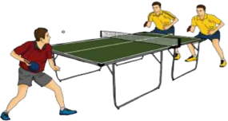

> **Deskripsi Visual:** Gambar ini adalah ilustrasi yang menunjukkan pertandingan tenis meja antara dua pemain. Gambar ini menggambarkan dua pemain sedang bermain tenis meja di lapangan yang berwarna hijau dengan garis putih sebagai batas permainan. Pemain di sebelah kiri menggunakan seragam merah dan biru, sementara pemain di sebelah kanan menggunakan seragam kuning dan biru. Kedua pemain sedang bergerak untuk menendang bola meja yang berada di tengah lapangan. Ilustrasi ini menunjukkan posisi dan gerakan pemain serta bola meja dalam pertandingan tenis meja.

### a. Aktivitas Pembelajaran II

Alat

: Bola tenis meja dan bat

Tempat

: Meja tenis meja dan net

Formasi

: Kelompok

- Tugaskan siswa untuk berkelompok secara berpasangan dengan menentukan  1  pasangan  penyerang  dan  1  pasangan  sebagai bertahan.
- Tugaskan siswa untuk yang menjadi pemain penyerang untuk merancang taktik dan strategi penyerangan.
- Setelah  rancangan  pertahanan  tersusun,  tugaskan  siswa  untuk melakukan permainan tenis meja dengan aturan penyerang mendapatkan  nilai  jika  dalam  5  pukulan,  lawan  tidak  dapat mengembalikan bola atau bola kembali tetapi tidak ke daerah lawan.
- Pertanyakan kepada peserta didik: Bagaimana rancangan penyerangan yang efektif agar dapat mematikan bola di daerah lawan? Bagaimana rancangan penyerangan melalui bola forehand dan backhand ?  Bagaimana  rancangan  penyerangan saling  bergantian  untuk double /berpasangan?  Apakah  dalam merancang penyerangan diperlukan kerja sama, tanggung jawab, dan disiplin? dan pertanyaan lainnya.
- Tugaskan siswa untuk mengeksplorasi pertanyaan selama melakukan permainan.
- Setelah siswa merasakan ada kemajuan satu sama lain ditugaskan untuk  bergantian  menjadi  penyerang  dan  bertahan  sehingga semua siswa dapat melakukan.
- Selama  siswa  melakukan  permainan,  Guru  menilai  kemajuan yang diperoleh oleh siswa.
- Kegiatan seperti nampak pada gambar 2.12.

 

---
## 📄 Halaman 76

---
**🖼️ Gambar/Diagram**

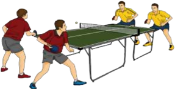

> **Deskripsi Visual:** Gambar ini adalah ilustrasi yang menunjukkan pertandingan tenis meja antara dua pasangan pemain. Gambar ini menggambarkan dua pasangan pemain sedang bermain tenis meja di lapangan yang berwarna hijau. Pemain pertama berada di sisi kanan dan memegang bola meja dengan tangan kanannya, sedangkan pemain kedua berada di sisi kiri dan memegang bola meja dengan tangan kannya. Kedua pemain tersebut sedang bergerak untuk menangkap bola meja yang sedang dilempar oleh pemain lain. Gambar ini menunjukkan posisi dan gerakan pemain dalam pertandingan tenis meja.

### 2. Aktivitas Pembelajaran Merancang Taktik dan Strategi Permainan Tenis meja

### a. Aktivitas Pembelajaran I

Alat

: Bola tenis meja dan bat

Tempat

: Meja tenis meja dan net

Formasi

: Kelompok

- Tugaskan  siswa  untuk  membuat  kelompok  5  orang  dengan ketentuan 2 orang sebagai pemain bertahan dan 3 orang sebagai penyerang.
- Tugaskan  siswa untuk bermain dengan  aturan: penyerang mendapatkan nilai jika dalam 5 kali pukulan,lawan tidak dapat mengembalikan bola  dan  pemain  Bertahan  mendapatkan  nilai jika  pemain bertahan dapat menahan sampai 5 pukulan lawan atau lawan tidak dapat mengembalikan ke bola.
- Tugaskan siswa yang menjadi penyerang berusaha menyerang ke  daerah  lawan,  sedangkan  pemain  bertahan  hanya  berusaha mengembalikan bola agar kembali ke daerah lawan dan tidak jatuh di daerah sendiri tanpa melakukan pukulan serangan.
- Tentukan waktu bermain sesuai dengan jumlah siswa sehingga semua dapat melakukan.
- Pertanyakan  kepada  peserta  didik:  Bagaimana  cara  efektif menyerang?  Manakah  yang  efektif  untuk  menyerang  dengan forehand atau backhand dengan bola spin? Apakah dalam setiap penyerangan diperlukan konsentrasi, disiplin, dan kerja keras?, dan pertanyaan lainnya.
- Tugaskan siswa untuk mengeksplorasi pertanyaan selama melakukan permainan.

 

---
## 📄 Halaman 77

- Setelah siswa merasakan ada kemajuan satu sama lain, tugaskan untuk  bergantian  menjadi  penyerang  dan  bertahan  sehingga semua siswa dapat melakukan.
- Selama  siswa  melakukan  permainan,  Guru  menilai  kemajuan yang diperoleh oleh siswa.
- Kegiatan seperti nampak pada gambar 2.12.

---
**🖼️ Gambar/Diagram**

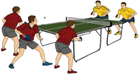

> **Deskripsi Visual:** Gambar ini adalah ilustrasi yang menunjukkan pertandingan tenis meja antara dua tim. Gambar ini menggambarkan dua tim bermain tenis meja di lapangan dengan pemain yang sedang bergerak untuk memukul bola. Pemain di setiap tim menggunakan alat permainan yang sama, yaitu meja tenis meja dan palang. Setiap pemain memiliki posisi yang berbeda-beda di lapangan, dengan beberapa pemain berdiri di depan meja dan beberapa lainnya berada di belakang. Pemain juga menggunakan teknik bermain yang berbeda, seperti memukul bola dengan tangan atau menggunakan palang. Gambar ini menunjukkan bahwa pertandingan tenis meja memerlukan keterampilan dan koordinasi fisik yang baik.

### b. Aktivitas Pembelajaran II

Alat

: Bola tenis meja dan bat

Tempat

: Meja tenis meja dan net

Formasi

: Kelompok

- Tugaskan siswa untuk berpasangan dengan menentukan 1 orang penyerang dan 1 orang sebagai bertahan.
- Tugaskan siswa yang menjadi bertahan untuk merancang taktik dan strategi pertahanan.
- Setelah rancangan penyerangan tersusun, tugaskan siswa untuk melakukan permainan tenis meja dengan aturan pemain bertahan mendapatkan nilai jika dapat menahan 5 kali pukulan serangan.
- Pertanyakan kepada peserta didik: Bagaimana rancangan pertahanan yang  efektif agar  dapat  mengembalika  bola  ke daerah  lawan?  Bagaimana  rancangan  pertahanandari  bola  spin forehand dan backhand ? Bagaimana rancangan pertahanan secara individual? Apakah dalam merancang pertahanan diperlukan kerja sama, tanggung jawab, dan disiplin? dan pertanyaan lainnya.
- Tugaskan siswa untuk mengeksplorasi pertanyaan selama melakukan permainan.
- Setelah siswa merasakan ada kemajuan satu sama lain ditugaskan untuk  bergantian  menjadi  penyerang  dan  bertahan  sehingga semua siswa dapat melakukan.

 

---
## 📄 Halaman 78

- Selama  siswa  melakukan  permainan,  Guru  menilai  kemajuan yang diperoleh oleh siswa.
- Kegiatan seperti nampak pada gambar 2.14.

---
**🖼️ Gambar/Diagram**

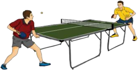

> **Deskripsi Visual:** Gambar ini adalah ilustrasi yang menunjukkan dua orang pemain tenis meja sedang bermain. Gambar ini menggambarkan pertempuran seru antara dua pemain dengan posisi mereka yang menunjukkan kecepatan dan keahlian mereka dalam memukul bola. Pemain di sebelah kiri menggunakan tongkat meja yang lebih panjang untuk memukul bola, sementara pemain di sebelah kanan menggunakan tongkat meja yang lebih pendek. Kedua pemain tersebut sedang berada di dekat meja meja tenis meja yang berwarna hijau. Gambar ini menunjukkan bahwa tenis meja adalah olahraga yang memerlukan kecepatan, keahlian, dan strategi.

### F.  Pelaksanaan Penilaian

### 1. Penilaian Pengetahuan

Setelah mempelajari materi menganalisis, merancang, dan mengevaluasi permainan softball , bulu tangkis, dan tenis meja, para siswa diberikan  tugas  dan  dilakukannya  dengan  penuh  rasa  tanggung  jawab. Tugaskan pada siswa untuk:

- mengamati/menonton pertandingan permainan softball , bulu tangkis, dan tenis meja di Televisi, Internet, atau media lainnya;
- memperhatikan pola-pola pertahanan dan penyerangan dalam pertandingan tersebut;
- menuliskannya dalam buku pelajaran masing-masing;
- mendiskusikannya dengan teman satu kelas; dan
- mengumpulkan hasil diskusi kepada Guru. Penilaian  tugas/proyek  yang  dilaksanakan  siswa  dapat  dinilai  dengan
menggunakan contoh rubrik penilaian sebagai berikut.

---
**📊 Tabel**

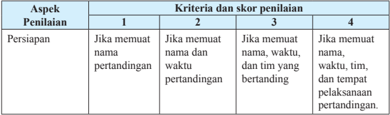

Tabel ini menunjukkan skor penilaian untuk aspek persiapan dalam konteks pertandingan. Topik utamanya adalah persiapan sebelum pertandingan dimulai. Tabel dibagi menjadi 4 kolom, masing-masing dengan skor 1 hingga 4. Kolom 1 berisi kriteria tentang nama dan waktu pertandingan, kolom 2 tentang nama, waktu, dan tim yang bertanding, kolom 3 tentang nama, waktu, tim, dan tempat pelaksanaan pertandingan. Data penting yang terlihat adalah bahwa setiap aspek penilaian memiliki skor yang berbeda-beda, menunjukkan bahwa penilaian ini cukup detail dan memerlukan perhatian pada berbagai aspek persiapan.

 

---
## 📄 Halaman 79

---
**📊 Tabel**

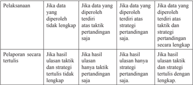

Tabel ini membahas dua aspek utama: pelaksanaan dan pelaporan secara tertulis. Dalam pelaksanaan, ada empat situasi yang dijelaskan: jika data yang diperoleh tidak lengkap, jika data yang diperoleh terdiri atas taktik pertandingan saja, jika data yang diperoleh terdiri atas strategi pertandingan saja, dan jika data yang diperoleh terdiri atas taktik dan strategi pertandingan secara lengkap. Untuk setiap situasi tersebut, tabel juga menyebutkan bagaimana hasil ulasan akan berbeda. Dalam hal pelaporan secara tertulis, tabel menunjukkan bahwa jika hasil ulasan hanya taktik pertandingan saja, maka tidak ada ulasan tentang strategi pertandingan. Namun, jika hasil ulasan hanya strategi pertandingan saja, maka tidak ada ulasan tentang taktik pertandingan. Sementara itu, jika hasil ulasan terdiri dari taktik dan strategi pertandingan secara lengkap, maka akan ada ulasan tentang kedua aspek tersebut.

### Jumlah skor yang diperoleh

̶ ̶ ̶ ̶ ̶ ̶ ̶ ̶ ̶ ̶ ̶ ̶ ̶ ̶ ̶ ̶ ̶ ̶ ̶ ̶ ̶ ̶ ̶ ̶ ̶ ̶ ̶ ̶ ̶ ̶ ̶ ̶ ̶ ̶ ̶ ̶ ̶ ̶ ̶ ̶ ̶ ̶ ̶ ̶ ̶

Jumlah skor maksimal

Penilaian pengetahuan

### Keterangan:

Nilai 1  : Jika komponen jawaban kurang secara kualitas dan kuantitas.

Nilai 2  : Jika komponen jawaban cukup secara kualitas dan kuantitas.

Nilai 3  : Jika komponen jawaban baik secara kualitas dan kuantitas.

Nilai 4  : Jika komponen jawaban sangat baik secara kualitas dan kuantitas.

### 2. Penilaian Keterampilan

Penilaian aspek keterampilan dilakukan terhadap kemampuan taktis/ penampilan bermainan siswa selama melakukan permainan softball, bulu tangkis, dan tenis meja. Evaluasi terhadap diri sendiri dan temannya dapat digunakan  untuk  penilaian  keterampilan  ini.  Contoh  rubrik  penilaian keterampilan adalah sebagai berikut.

---
**📊 Tabel**

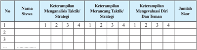

Tabel ini menunjukkan keterampilan siswa dalam menguasai taktik/strategi, merangkum taktik/strategi, dan mendorong diri dan teman mereka. Kolom pertama berisi nomor siswa, sedangkan kolom kedua hingga kelima berisi skor untuk tiga keterampilan tersebut. Data penting yang terlihat adalah bahwa siswa memiliki skor yang bervariasi dalam setiap keterampilan, dengan beberapa siswa mendapatkan skor tinggi di semua keterampilan, sementara yang lainnya memiliki skor yang lebih rendah. Ini menunjukkan bahwa siswa memerlukan latihan dan dukungan tambahan untuk meningkatkan keterampilan mereka dalam menguasai taktik/strategi, merangkum taktik/strategi, dan mendorong diri dan teman mereka.

### Skor :

- 4 =  Apabila siswa dapat melakukan 3 kriteria secara lengkap dengan baik dan benar.
- 3 =  Apabila siswa dapat melakukan 2 kriteria dengan baik dan benar.
- 2 =  Apabila siswa hanya dapat melakukan 1 kriteria dengan baik dan benar.
- 1 =  Apabila siswa tidak dapat melakukan/menunjukkan 3 kriteria seperti tersebut di atas.
=

×

100

 

---
## 📄 Halaman 80

### 3. Penilaian Sikap

Penilaian aspek sikap (sikap) dilakukan dengan pengamatan selama mengikuti kegiatan belajar mengajar. Pengamatan dalam proses penilaian dilakukan saat pembelajaran permainan softball , bulu tangkis, dan tenis meja. Aspek-aspek  yang  dinilai  meliputi  kerja  sama,  tanggung  jawab, sportivitas, disiplin, dan toleransi. Berikan tanda cek (  ) pada kolom yang sudah disediakan, setiap peserta siswa menunjukkan atau menampilkan sikap yang diharapkan. Tiap sikap yang dicek (  ) dengan rentang skor antara 1 sampai dengan 4 dengan kriteria sebagai berikut.

- 4=Selalu, apabila selalu melakukan sesuai pernyataan
- 3=Sering, apabila sering melakukan sesuai pernyataan dan kadang-kadang tidak melakukan
- 2=Ladang-kadang, apabila kadang-kadang melakukan dan sering tidak melakukan 1=Tidak pernah, apabila tidak pernah melakukan

### Contoh Rubrik Penilaian Sikap

---
**📊 Tabel**

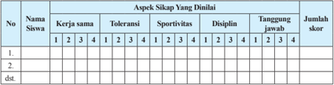

Tabel ini menunjukkan data evaluasi siswa berdasarkan aspek sikap yang dianalisis, seperti kerja sama, toleransi, sportivitas, disiplin, dan tanggung jawab. Kolom-kolomnya mencakup nomor siswa, aspek sikap yang dianalisis, dan skor yang diberikan untuk setiap aspek. Data penting yang terlihat adalah bahwa siswa memiliki skor yang bervariasi di setiap aspek, dengan beberapa siswa mendapatkan skor tinggi di beberapa aspek dan skor rendah di aspek lainnya. Ini menunjukkan bahwa evaluasi ini mungkin digunakan untuk membantu guru memahami kekuatan dan kelemahan siswa dalam berbagai aspek sikap mereka.

### Jumlah skor yang diperoleh

``

Penilaian pengetahuan = × 100 Jumlah skor maksimal

### 4. Rekapitulasi Penilaian

Setelah semua aspek penilaian yang meliputi pengetahuan, keterampilan  dan  sikap  diketahui  pada  setiap  peserta  didik,  maka rekapitulasi penilaian dapat menggunakan contoh rubrik sebagai berikut.

### Jumlah skor yang diperoleh

Penilaian pengetahuan = ̶ ̶ ̶ ̶ ̶ ̶ ̶ ̶ ̶ ̶ ̶ ̶ ̶ ̶ ̶ ̶ ̶ ̶ ̶ ̶ ̶ ̶ ̶ ̶ ̶ ̶ ̶ ̶ ̶ ̶ ̶ ̶ ̶ ̶ ̶ ̶ ̶ ̶ ̶ ̶ ̶ ̶ ̶ ̶ ̶ × 100

### Jumlah skor maksimal

 

---
## 📄 Halaman 81

---
**📊 Tabel**

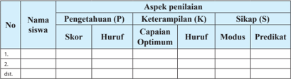

Tabel ini menunjukkan hasil penilaian siswa berdasarkan tiga aspek penilaian: Pengetahuan (P), Keterampilan (K), dan Sikap (S). Setiap siswa memiliki skor, huruf, kapasitas optimal, modus, dan predikat untuk setiap aspek penilaian tersebut. Topik utama tabel ini adalah penilaian akademik siswa, dengan kolom-kolom yang mencakup aspek-aspek penilaian tersebut. Data penting yang terlihat adalah bahwa setiap siswa memiliki skor, huruf, kapasitas optimal, modus, dan predikat untuk setiap aspek penilaian, yang menunjukkan kemampuan dan kinerja siswa dalam berbagai bidang.

---
**📊 Tabel**

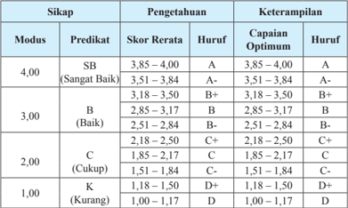

Tabel ini menunjukkan skor rerata, huruf, dan kapabilitas optimum untuk berbagai modus predikat dalam sebuah pengetahuan. Topik utama tabel adalah hubungan antara modus predikat, skor rerata, huruf, dan kapabilitas optimal. Kolom-kolomnya meliputi modus (4, 3, 2, 1), predikat (SB, B, C, K), skor rerata, huruf, dan kapabilitas optimal. Data penting yang terlihat adalah bahwa modus predikat 4 memiliki skor rerata tertinggi dan kapabilitas optimal tertinggi, sedangkan modus predikat 1 memiliki skor rerata terendah dan kapabilitas optimal terendah. Pola ini menunjukkan hubungan yang kuat antara modus predikat dan skor rerata, serta kapabilitas optimal.

### G.  Pelaksanaan Remedial dan Pengayaan

Pelaksanaan remedial dan pengayaan dilakukan pada para siswa yang  belum  mencapai  ketuntasan  belajar.  Seperti  yang  tercantum  dalam Permendikbud  nomor  104  tahun  2014,  ketuntasan  belajar  untuk  sikap (KD pada KI-1 dan KI-2) ditetapkan dengan predikat Baik (B), sedangkan Ketuntasan Belajar untuk pengetahuan ditetapkan dengan skor rerata  2,67 dan untuk  keterampilan  ditetapkan  dengan capaian optimum 2,67. Berikut contoh format remedial dan pengayaan pada aspek keterampilan.

 

---
## 📄 Halaman 82

---
**📊 Tabel**

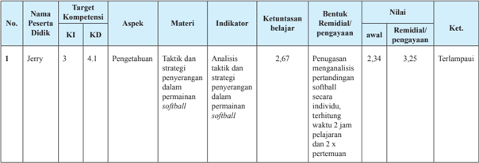

Tabel ini menunjukkan data evaluasi pembelajaran untuk peserta didik Jerry dalam aspek pengetahuan, dengan target kompetensi 3 dan keterampilan 4.1. Tabel ini mencakup berbagai aspek seperti analisis taktik dan strategi penyegaran dalam permainan softball, dengan indikator yang mencakup pengetahuan, kemampuan belajar, dan nilai awal serta nilai remisi/pengayaan. Data ini menunjukkan bahwa Jerry telah memperoleh nilai awal sebesar 2,34 dan nilai remisi/pengayaan sebesar 3,25, yang menunjukkan peningkatan yang signifikan dalam pemahaman dan pemakaian taktik dan strategi dalam permainan softball.

 

---
## 📄 Halaman 83

### BAB 3

### PEMBELAJARAN MENGANALISIS MERANCANG DAN MENGEVALUASI STRATEGI DAN TAKTIK PERLOMBAAN ATLETIK

Dalam bab ini membahas tentang merancang simulasi perlombaan jalan cepat, lari, lompat dan lempar (atletik), guru dapat memilih jenis perlombaan atletik yang sesuai dengan kondisi sekolah dan karakteristik siswa.

### A.   Kompetensi Dasar dan Indikator Pembelajaran

Kompetensi  dasar  dan  indikator  pembelajaran  merancang  simulasi perlombaan  jalan  cepat,  lari,  lompat,  dan  lempar  (atletik)  adalah  sebagai berikut:

---
**📊 Tabel**

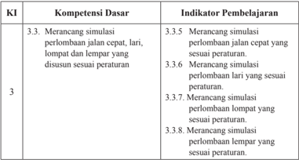

Tabel ini berisi informasi tentang kompetensi dasar dan indikator pembelajaran yang berkaitan dengan simulasi perlombaan lari, jalan cepat, dan lempar. Topik utama tabel adalah tentang kemampuan merancang simulasi perlombaan berdasarkan peraturan tertentu. Kolom-kolomnya meliputi KI (Kompetensi Integritas) 3.3, yang mencakup empat sub-kompetensi: merancang simulasi perlombaan jalan cepat, lari, lompat, dan lempar. Indikator pembelajaran untuk setiap sub-kompetensi disajikan secara detail, menunjukkan bahwa setiap sub-kompetensi memiliki tiga indikator pembelajaran yang berbeda-beda. Pola penting yang terlihat adalah bahwa setiap sub-kompetensi memiliki tiga indikator pembelajaran yang berbeda, menunjukkan bahwa pembelajaran harus dilakukan secara mendalam dan memperluas pemahaman siswa tentang berbagai aspek simulasi perlombaan tersebut.

 

---
## 📄 Halaman 84

---
**📊 Tabel**

Tabel ini berisi informasi tentang kompetensi dasar (KI) 4.3 yang berkaitan dengan simulasi perlombaan. Topik utamanya adalah praktik mempraktekkan hasil rancangan simulasi perlombaan lari, lompat, dan lempar yang disusun sesuai peraturan. Tabel ini terdiri dari dua kolom: "Kompetensi Dasar" dan "Indikator Pembelajaran". Kolom "Kompetensi Dasar" mencakup empat poin utama, yaitu melakukan hasil rancangan simulasi perlombaan lari, lompat, dan lempar dengan peraturan. Sedangkan kolom "Indikator Pembelajaran" mencakup empat indikator pembelajaran yang meliputi melakukan hasil rancangan simulasi perlombaan lari, lompat, dan lempar dengan peraturan. Data penting yang terlihat adalah bahwa semua indikator pembelajaran tersebut harus dilakukan sesuai dengan peraturan yang ditentukan.

### B.  Tujuan Pembelajaran

Setelah  mengikuti  kegiatan  pembelajaran  ini, siswa  diharapkan mampu:

- memiliki kesadaran tentang arti penting gerak tubuh sebagai penghayatan dan pengamalan ajaran agamanya,
- menunjukkan  perilaku  jujur,  disiplin,  tanggung  jawab,  peduli  (gotong royong, kerja sama, toleran, damai), santun, responsif dan pro-aktif selama pembelajaran aktivitas atletik (jalan cepat, lari, lompat, dan lempar),
- merancang  simulasi perlombaan jalan cepat dengan peraturan sederhana,
- merancang simulasi perlombaan lari dengan peraturan sederhana,
- merancang simulasi perlombaan lompat dengan peraturan sederhana,
- merancang simulasi perlombaan lempar dengan peraturan sederhana,
- melakukan hasil rancangan simulasi perlombaan jalan cepat dengan peraturan  sederhana  disertai  nilai  jujur,  disiplin,  tanggung  jawab, kerja sama, dan toleransi,
- melakukan hasil rancangan simulasi perlombaan lari dengan peraturan  sederhana  disertai  nilai  jujur,  disiplin,  tanggung  jawab, kerja sama, dan toleransi,
- melakukan  hasil  rancangan  simulasi  perlombaan  lompat  dengan peraturan  sederhana  disertai  nilai  jujur,  disiplin,  tanggung  jawab, kerja sama, dan toleransi, dan
- melakukan  hasil  rancangan  simulasi  perlombaan  lempar  dengan peraturan  sederhana  disertai  nilai  jujur,  disiplin,  tanggung  jawab, kerja sama, dan toleransi.

 

---
## 📄 Halaman 85

### C.  Aktivitas Pembelajaran Menganalisis, Merancang, dan Mengevaluasi Strategi dan Taktik Perlombaan Atletik

Pembelajaran menganalisis taktik dan strategi perlombaan atletik dan pengorganisasian siswa dapat dilakukan dengan aktivitas belajar sebagai berikut.

### 1. Aktivitas Pembelajaran I

Alat

: Peluit, bendera start/inish , dan simpai/ holahoop

Tempat

: Lintasan

Formasi

: kelompok

- Tugaskan siswa untuk membuat kelompok masing-masing berjumlah 5 orang
- Tugaskan siswa untuk membuat lintasan dengan ukuran 10 x 1 meter dengan satu simpai di inish .
- Tugaskan  siswa  untuk  berjalan  mencapai  garis inish ,  setelah  itu badan masuk simpai, lalu diletakan kembali.
- Siswa yang menjadi pejalan kedua dan seterusnya berjalan setelah simpai diletakan kembali.
- Tugaskan siswa untuk melakukannya dengan perlombaan dan jarak tertentu atau tergantung dengan luas area lintasan. Kelompok yang selesai terlebih dahulu dinyatakan pemenang.
- Pertanyakan kepada peserta didik: Bagaimana memulai startt yang  efektif?  Bagaimana  langkah  kedua  kaki  yang  efektif  ketika berjalan? bagaimana cara berjalan yang baik saat lintasan lurus dan tikungan? Apakah cara berjalan harus menyesuaikan jarak yang akan ditempuh?  Bagaimanakah  cara  efektif  agar  ayunan  lengan/tangan dapat mendukung kecepatan berjalan? Bagaimanakah cara melewati garis inish dengan efektif? Sikap apa yang perlu dikembangkan ketika melakukan perlombaan jalan cepat?
- Tekankan siswa untuk melakukan perlombaan itu dengan sungguhsungguh dan menerapkan nilai sportivitas, kerja sama, toleransi, dan disiplin.
- Aktivitas seperti pada gambar 3.1.

 

---
## 📄 Halaman 86

---
**🖼️ Gambar/Diagram**

> **Deskripsi Visual:** Gambar ini adalah ilustrasi yang menunjukkan tiga orang lari berlari di atas sebuah lapangan olahraga hijau dengan garis putih. Di sebelah kiri, ada empat lingkaran merah yang tampaknya menandai posisi start atau finish. Ilustrasi ini mungkin digunakan untuk menggambarkan konteks latihan olahraga atau permainan lari dalam pendidikan fisik. Element utama dalam gambar ini adalah tiga orang lari, lapangan olahraga hijau, garis putih, dan empat lingkaran merah. Relasi antara elemen-elemen ini adalah bahwa tiga orang lari berlari di atas lapangan olahraga hijau dengan garis putih, sementara empat lingkaran merah tampaknya menandai posisi start atau finish. Informasi kunci yang dapat diambil pembaca adalah bahwa gambar ini mungkin digunakan untuk menggambarkan konteks latihan olahraga atau permainan lari dalam pendidikan fisik.

### 2. Aktivitas Pembelajaran II.

Alat

: Peluit, bendera kecil, dan stopwatch

Tempat

: Lintasan jalan

Formasi

: Individual

- Siswa melakukan perlombaan secara individual.
- Tugaskan  setiap  siswa  untuk  merancang  taktik  dan  strategi  jalan cepatnya sendiri agar dapat bersaing dalam perlombaan tersebut.
- Setelah  siswa  merancang  taktik  dan  strategi  yang  telah  dibuatnya, lakukan  perlombaan  jalan  cepat  dengan  mengikuti  lintasan  yang ditentukan sebanyak 10 putaran.
- Tekankan  bahwa  pejalan  cepat  yang  dapat  menyelesaikan  waktu tercepat adalah pemenangnya.
- Tekankan  pada  siswa  untuk  melakukan  perlombaan  itu  dengan sungguh-sungguh  dan  menerapkan  nilai  sportivitas,  kerja  sama, toleransi, dan disiplin.
- Perhatikan gambar 3.2.

 

---
## 📄 Halaman 87

---
**🖼️ Gambar/Diagram**

> **Deskripsi Visual:** Gambar ini adalah ilustrasi yang menunjukkan lintasan olahraga oval dengan lapisan merah. Ilustrasi ini menunjukkan dua orang atlet berlari di sepanjang lintasan. Lintasan memiliki garis putih yang mengelilingi lingkaran besar dan kecil. Atlet yang pertama berjalan di sisi yang lebih lebar dari lintasan, sedangkan atlet yang kedua berjalan di sisi yang lebih sempit. Ilustrasi ini menunjukkan konsep tentang latihan olahraga dan perbandingan antara dua atlet dalam konteks olahraga.

### D.  Aktivitas Pembelajaran Merancang Simulasi Perlombaan Lari Cepat

### 1. Aktivitas Pembelajaran I

Alat

: Peluit, bendera start/inish , dan cone

Tempat

: Lintasan

Formasi   : kelompok

- Tugaskan siswa untuk berkelompok masing-masing 4 orang
- Tugaskan siswa untuk membuat lintasan dengan ukuran 30 x 1 meter dengan tanda garis start dan inish .
- Tugaskan siswa untuk berlari mencapai garis inish dan cone , setelah melewati garis inish , lalu kembali ke garis start .
- Siswa yang menjadi pelari kedua dan seterusnya dapat berlari setelah mendapat tepukan dari pelari sebelumnya.
- Tentukan jarak/banyaknya berlari atau tergantung dengan luas area lintasan.
- Tekankan pada siswa bahwa kelompok yang selesai terlebih dahulu dinyatakan pemenang.
- Pertanyakan kepada peserta didik: bagaimana cara start yang efektif agar memenangi lomba lari? Apakah koordinasi langkah kaki/tungkai dan lengan/tangan diperlukan saat berlari? Bagaimana cara efektif untuk  melewati  garis inish dan  memutar  kembali  ke  garis start ? Sikap apakah yang perlu dikembangkan ketika mengikuti lomba lari?
- Tekankan siswa untk melakukan perlombaan itu dengan sungguhsungguh dan menerapkan nilai sportivitas, kerja sama, toleransi, dan disiplin.

 

---
## 📄 Halaman 88

### i. Perhatikan gambar 3.3.

---
**🖼️ Gambar/Diagram**

> **Deskripsi Visual:** Gambar ini adalah ilustrasi yang menunjukkan dua orang atlet lari berlari di atas lapangan olahraga. Atlet di depan mengenakan topi merah dan celana biru, sedangkan atlet di belakang mengenakan topi biru dan celana merah. Lapangan olahraga terdiri dari empat garis putih yang membentuk kotak besar, dengan tiga garis putih di sisi bawah dan satu garis putih di tengah. Di sebelah kanan, ada dua papan pengaturan yang berwarna kuning dengan huruf "A" dan "B". Papan pengaturan tersebut mungkin digunakan untuk menentukan posisi start atau finish pada lomba lari ini. Gambar ini menunjukkan aktivitas fisik dan persaingan antar atlet dalam konteks olahraga.

### 2. Aktivitas Pembelajaran II

Alat

: Peluit, bendera kecil, dan stopwatch

Tempat

: Lintasan lari cepat

Formasi

: Individual

- Siswa melakukan perlombaan secara individual.
- Tugaskan siswa untuk merancang taktik dan strategi lari cepatnya agar dapat bersaing dalam perlombaan tersebut.
- Setelah siswa merancang taktik dan strategi, lakukan perlombaan lari cepat dengan mengikuti lintasan yang ditentukan.
- Tekankan  bahwa  siswa  yang  dapat  menyelesaikan  waktu  tercepat adalah pemenangnya.
- Tekankan siswa untuk melakukan perlombaan itu dengan sungguhsungguh dan menerapkan nilai sportivitas, kerja sama, toleransi, dan disiplin.
- Perhatikan gambar 3.4.

---
**🖼️ Gambar/Diagram**

> **Deskripsi Visual:** Gambar ini adalah ilustrasi yang menunjukkan tiga orang bermain sepak bola di lapangan. Lapangan berwarna merah dengan garis putih yang mengelilingi area permainan. Setiap pemain memegang bola sepak dan tampak siap untuk melakukan gerakan. Pemain di tengah memiliki posisi yang lebih dekat ke bola, sementara dua pemain di sisi lain tampak sedang bergerak menuju bola. Ilustrasi ini menunjukkan aktivitas fisik dan kompetisi dalam olahraga sepak bola.

 

---
## 📄 Halaman 89

### E.  Aktivitas Pembelajaran Merancang Simulasi Perlombaan Lompat

### 1. Aktivitas Pembelajaran I

Alat

: Peluit dan simpai

Tempat

: Lapangan

Formasi   : kelompok

- Tugaskan siswa untuk membuat kelompok masing-masing 4 orang.
- Tugaskan siswa untuk membuat lintasan dengan 4 simpai/lingkaran.
- Tugaskan siswa untuk melompat masuk ke dalam simpai ke-1 sampai simpai ke-4.
- Siswa  sebagai  pelompat  kedua  dan  seterusnya  melompat  setelah pelompat pertama selesai.
- Tentukan banyaknya simpai atau tergantung dengan luas area.
- Tekankan bahwa kelompok yang selesai terlebih dahulu dinyatakan pemenang.
- Tekankan  siswa  untuk  melakukan  aktivitas  itu  dengan  sungguhsungguh dan menerapkan nilai sportivitas, kerja sama, toleransi, dan disiplin.
- Perhatikan gambar 3.5.

---
**🖼️ Gambar/Diagram**

> **Deskripsi Visual:** Gambar ini adalah ilustrasi yang menunjukkan dua orang lari berjalan di sepanjang garis lurus. Di sisi kanan, ada beberapa lingkaran merah yang tampaknya menunjukkan posisi atau lokasi tertentu. Ilustrasi ini mungkin digunakan untuk menggambarkan konteks latihan olahraga atau perjalanan dalam buku pelajaran. Element utama termasuk dua orang lari, garis lurus, dan lingkaran merah. Teks atau angka tidak terlihat dalam gambar ini, tetapi informasi penting yang dapat diambil adalah bahwa dua orang lari sedang berlari di sepanjang garis lurus dengan lingkaran merah yang menunjukkan posisi mereka.

 

---
## 📄 Halaman 90

### 2. Aktivitas Pembelajaran II

Alat

: Peluit, simpai dan peti/kardus

Tempat

: Lapangan

Formasi   : kelompok

- Tugaskan siswa untuk membuat kelompok masing-masing 4 orang
- Tugaskan siswa untuk membuat litasan dengan 4 simpai/lingkaran.
- Tugaskan siswa untuk melompat masuk ke dalam simpai ke-1 sampai simpai ke-4 lalu melewati peti.
- Siswa  sebagai  pelompat  kedua  dan  seterusnya  melompat  setelah pelompat pertama selesai.
- Tentukan luas area dan banyak simpai dalam perlombaan.
- Tekankan  bahwa  kelompok  siswa  yang  selesai  terlebih  dahulu dinyatakan pemenang.
- Tekankan  siswa  untuk  melakukan  aktivitas  itu  dengan  sungguhsungguh dan menerapkan nilai sportivitas, kerja sama, toleransi, dan disiplin.
- Perhatikan gambar 3.6.

---
**🖼️ Gambar/Diagram**

> **Deskripsi Visual:** Gambar ini adalah ilustrasi yang menunjukkan dua orang lari berlari di sepanjang garis finish. Di sebelah kanan, ada beberapa lingkaran merah yang tampaknya menandai posisi atau tujuan lari. Di depan mereka, terdapat dua kursi kayu yang tampaknya digunakan sebagai perhentian atau tempat duduk untuk atlet setelah lari. Gambar ini menunjukkan aktivitas olahraga lari dan mungkin digunakan untuk menggambarkan konteks latihan atau perlombaan lari.

### 3. Aktivitas Pembelajaran III

Alat

: Peluit, meteran, dan bendera kecil

Tempat

: Lintasan dan bak lompat/pasir

Formasi

: Individual

- Siswa melakukan perlombaan lompat secara individual.
- Tugaskan  siswa  untuk  merancang  taktik  dan  strategi  yang  dapat dilakukan agar mendapat lompatan yang paling baik.
- Setelah siswa merancang taktik dan strategi lompat, maka perlombaan dilakukan dengan memberikan kesempatan siswa melakukan lompatan sebanyak 2 kali.

 

---
## 📄 Halaman 91

- Siswa yang melakukan lompatan terjauh dinyatakan sebagai pemenangnya.
- Tekankan siswa untuk melakukan perlombaan itu dengan sungguhsungguh dan menerapkan nilai sportivitas, kerja sama, toleransi, dan disiplin.
- Perhatikan gambar 3.7.

### F.  Aktivitas Pembelajaran Merancang Simulasi Perlombaan Lempar

### 1. Aktivitas Pembelajaran I

Alat

: Peluit dan lembing

Tempat

: Lapangan

Formasi

: Individu

- Tugaskan siswa untuk memegang lembing masing- masing
- Berikan siswa kesempatan melempar lembing sebanyak 4 kali.
- Tentukan perlombaan sesuai jenis kelamin dan banyak lembing.
- Tekankan  bahwa  lemparan  yang  terjauh  dalam  4x  kesempatan dinyatakan pemenang.
- Tekankan siswa untuk melakukan perlombaan itu dengan sungguhsungguh dan menerapkan nilai sportivitas, kerja sama, toleransi, dan disiplin.
- Perhatikan gambar 3.8.

---
**🖼️ Gambar/Diagram**

> **Deskripsi Visual:** Gambar ini adalah ilustrasi yang menunjukkan dua orang atlet berlari dengan menggunakan tongkat panjat. Gambar ini menggambarkan aktivitas olahraga yang melibatkan teknik berlari dengan tongkat panjat, yang merupakan salah satu cabang olahraga panjat dinding. 

Elemen utama dalam gambar ini adalah dua orang atlet yang sedang berlari dengan tongkat panjat. Atlet di sebelah kiri menggunakan tongkat panjat yang lebih panjang dibandingkan dengan atlet di sebelah kanan. Kedua atlet tersebut tampak sangat fokus dan berusaha maksimal untuk mencapai tujuan mereka.

Teks, angka, atau label penting tidak terlihat dalam gambar ini karena gambar hanya menggambarkan aksi langsung tanpa teks atau angka tambahan. Namun, informasi kunci yang dapat diambil dari gambar ini adalah bahwa ini adalah sebuah pertandingan atau latihan berlari dengan tongkat panjat, yang membutuhkan kecepatan, ketekunan, dan keterampilan teknis.

 

---
## 📄 Halaman 92

### 2. Aktivitas Pembelajaran II

Alat

: Peluit dan cakram

Tempat

: Lapangan

Formasi   : kelompok

- Tugaskan siswa untuk memegang cakram masing- masing
- Berikan kesempatan siswa untuk melempar cakram sebanyak 4 kali.
- Tentukan  perlombaan  sesuai  dengan  jenis  kelamin  dan  banyak cakram.
- Tentukan tinggi tali sesuai dengan kebutuhan.
- Tekankan bahwa lemparan yang terjauh dan melewati tali/net dalam 4x kesempatan dinyatakan pemenang.
- Tekankan siswa untuk melakukan perlombaan itu dengan sungguhsungguh dan menerapkan nilai sportivitas, kerja sama, toleransi, dan disiplin.
- Perhatikan gambar 3.9.

---
**🖼️ Gambar/Diagram**

> **Deskripsi Visual:** Gambar ini adalah ilustrasi yang menunjukkan dua pemain badminton sedang bermain di lapangan. Pemain di sebelah kiri menggunakan raket putih dan memukul bola ke arah pemain di sebelah kanan, yang juga menggunakan raket putih. Lapangan badminton terlihat dengan jelas, termasuk garis-garis yang mengelilingi lapangan dan net yang memisahkan kedua pemain. Pemain di sebelah kiri tampak lebih dekat ke depan, sementara pemain di sebelah kanan tampak lebih dekat ke belakang. Net yang berwarna hitam tampak jelas di tengah lapangan. Teks, angka, atau label penting tidak terlihat pada gambar ini. Informasi kunci yang dapat diambil pembaca adalah bahwa ini adalah pertandingan badminton antara dua pemain, dengan pemain di sebelah kiri menggunakan raket putih untuk memukul bola ke pemain di sebelah kanan.

### 3. Aktivitas Pembelajaran III

Alat

: Peluit, meteran, dan bendera kecil

Tempat

: Lintasan

Formasi

: Individual

- Tugaskan siswa untuk memegang cakram/lembing masing- masing
- Tugaskan siswa untuk merancang taktik dan strategi lemparan agar diperoleh jarak yang terbaik.
- Setelah  siswa  merancang  taktik  dan  strateginya,  siswa  melakukan perlombaan melempar cakram/lembing dengan memberikan kesempatan  siswa  sebanyak  masing-masing  2  kali  atau  sesuaikan dengan keadaan alat dan lapangan yang ada di sekolah.
d.

 

---
## 📄 Halaman 93

- Tekankan siswa bahwa lemparan yang terjauh dalam 2 kali kesempatan menjadi lemparan terbaik.
- Siswa yang melakukan lemparan terjauh dinyatakan pemenang.
- Tekankan siswa untuk melakukan perlombaan itu dengan sungguhsungguh dan menerapkan nilai sportivitas, kerja sama, toleransi, dan disiplin.
- Perhatikan gambar 3.10.

---
**🖼️ Gambar/Diagram**

> **Deskripsi Visual:** Gambar ini adalah ilustrasi yang menunjukkan dua jenis olahraga: sepak bola dan voli. Ilustrasi ini mencerminkan perbedaan antara kedua olahraga tersebut melalui beberapa elemen visual.

Pertama, gambar ini menunjukkan dua pemain bermain sepak bola di lapangan hijau dengan garis putih sebagai batas lapangan. Pemain tersebut sedang bergerak dan tampak siap untuk melakukan gerakan. Di sisi lain, gambar sebelah kanan menunjukkan dua pemain bermain voli di lapangan hijau dengan garis merah sebagai batas lapangan. Pemain tersebut juga sedang bergerak dan tampak siap untuk melakukan gerakan.

Elemen-elemen utama dalam gambar ini adalah dua jenis olahraga (sepak bola dan voli), dua pemain, dan dua lapangan. Relasi antara elemen-elemen ini adalah bahwa kedua olahraga tersebut dilakukan oleh dua pemain yang berada di dua lapangan yang berbeda.

Teks, angka, atau label penting yang terlihat dalam gambar ini adalah nama-nama olahraga (sepak bola dan voli) dan warna-warna yang digunakan untuk menggambarkan lapangan (hijau dengan garis putih untuk sepak bola dan hijau dengan garis merah untuk voli).

Informasi kunci yang dapat diambil pembaca dari gambar ini adalah bahwa ada dua jenis olahraga yang berbeda, yaitu sepak bola dan voli, dan bahwa kedua olahraga tersebut dilakukan oleh dua pemain yang berada di dua lapangan yang berbeda.

### G.  Pelaksanaan Penilaian

### 1. Penilaian Pengetahuan

Setelah mempelajari materi menganalisis, merancang, dan mengevaluasi perlombaan atletik, para siswa diberikan tugas dan dilakukannya dengan penuh rasa tanggung jawab. Tugaskan pada siswa untuk melakukan kegiatan berikut.

- Mengamati/menonton  perlombaan  atletik  di  televisi,  internet,  atau media lainnya;
- Memperhatikan  taktik  dan  strategi  yang  muncul  saat  para  peserta perlombaan bertanding;
- Menuliskannya dalam buku pelajaran masing-masing;
- Mendiskusikannya dengan teman satu kelas;
- Mengumpulkan hasil diskusi kepada guru; dan
- Penilaian tugas/projek yang dilaksanakan siswa dapat dinilai dengan menggunakan contoh rubrik penilaian sebagai berikut:

 

---
## 📄 Halaman 94

---
**📊 Tabel**

Tabel ini menunjukkan skor penilaian untuk tiga aspek penilaian: persiapan, pelaksanaan, dan pelaporan. Setiap aspek dibagi menjadi empat kriteria penilaian dengan skor 1 hingga 4. Persiapan melibatkan memenuhi nama pertandingan, waktu, dan tim yang berpartisipasi. Pelaksanaan mencakup keberhasilan dalam menerapkan strategi pertandingan sesuai dengan taktik yang ditentukan. Pelaporan harus menyertakan ulasan tentang taktik dan strategi yang digunakan. Skor penilaian dihitung berdasarkan jumlah skor yang diperoleh dari setiap aspek. Total skor kemudian dikalikan dengan 100 untuk mendapatkan skor akhir pengetahuan.

Jumlah skor maksimal

### Keterangan:

Nilai 1  : Jika komponen jawaban kurang secara kualitas dan kuantitas.

Nilai 2  : Jika komponen jawaban cukup secara kualitas dan kuantitas.

Nilai 3  : Jika komponen jawaban baik secara kualitas dan kuantitas.

Nilai 4  : Jika komponen jawaban sangat baik secara kualitas dan kuantitas.

 

---
## 📄 Halaman 95

### 2. Penilaian Keterampilan

Penilaian aspek keterampilan dilakukan terhadap kemampuan menganalisis,  merancang,  dan  mengevaluasi  siswa  selama  melakukan perlombaan atletik. Berikut contoh rubrik penilaian keterampilan adalah sebagai berikut.

---
**📊 Tabel**

Tabel ini menunjukkan hasil evaluasi keterampilan siswa dalam olahraga atletik. Topik utamanya adalah keterampilan dalam melakukan permainan atletik, merancang permainan atletik, dan mengevaluasi permainan atletik. Kolom-kolomnya mencakup nama siswa, keterampilan menganalisis permainan atletik, keterampilan merancang permainan atletik, keterampilan mengevaluasi permainan atletik, dan jumlah skor. Data penting yang terlihat adalah bahwa setiap siswa memiliki satu baris di tabel, dan mereka diberikan skor untuk setiap keterampilan mereka. Skor tersebut bervariasi dari 1 hingga 4, menunjukkan tingkat keahlian mereka dalam masing-masing keterampilan.

### Skor :

- 4= Apabila siswa dapat melakukan 3 kriteria secara lengkap dengan baik dan benar.
- 3= Apabila siswa dapat melakukan 2 kriteria gerakan dengan baik dan benar.
- 2= Apabila siswa hanya dapat melakukan 1 kriteria gerakan dengan baik dan benar.
- 1= Apabila siswa tidak dapat melakukan/menunjukkan 3 kriteria seperti tersebut di atas

`Jumlah skor yang diperoleh Penilaian pengetahuan = ̶ ̶ ̶ ̶ ̶ ̶ ̶ ̶ ̶ ̶ ̶ ̶ ̶ ̶ ̶ ̶ ̶ ̶ ̶ ̶ ̶ ̶ ̶ ̶ ̶ ̶ ̶ ̶ ̶ ̶ ̶ ̶ ̶ ̶ ̶ ̶ ̶ ̶ ̶ ̶ ̶ ̶ ̶ ̶ ̶ × 100`

Jumlah skor maksimal

### 3. Penilaian Sikap

Penilaian  aspek  sikap  (sikap)  dilakukan  dengan  pengamatan  selama mengikuti  kegiatan  belajar  mengajar.  Pengamatan  dalam  proses  penilaian dilakukan  saat  pembelajaran  menganalisis,  merancang,  dan  mengevaluasi perlombaan atletik. Aspek-aspek yang dinilai meliputi: kerja sama, tanggung jawab,  menghargai  teman,  disiplin,  dan  toleransi.  Berikan  tanda  cek  (  ) pada kolom yang sudah disediakan, setiap peserta siswa menunjukkan atau menampilkan  sikap  yang  diharapkan.  Tiap  sikap  yang  dicek  (  )  dengan rentang skor antara 1 sampai dengan 4 dengan kriteria sebagai berikut.

- 4 =  Selalu, apabila selalu melakukan sesuai pernyataan
- 3 =  Sering,  apabila  sering  melakukan  sesuai  pernyataan  dan  kadang-kadang tidak melakukan
- 2 =  Kadang-kadang, apabila kadang-kadang melakukan dan sering tidak melakukan
- 1 =  Tidak pernah, apabila tidak pernah melakukan

 

---
## 📄 Halaman 96

### Contoh Rubrik Penilaian Sikap

---
**📊 Tabel**

Tabel ini menunjukkan hasil evaluasi sikap siswa dalam berbagai aspek, seperti kerja sama, toleransi, sportivitas, disiplin, dan tanggung jawab. Kolom "Nama Siswa" menyajikan identitas siswa yang diuji, sedangkan kolom "Aspek Sikap Yang Dinilai" mencakup lima aspek tersebut. Data dalam tabel menunjukkan skor yang diberikan oleh penilai untuk setiap siswa dalam setiap aspek. Pola penting yang terlihat adalah bahwa semua siswa mendapatkan skor yang sama pada aspek kerja sama, sedangkan skor tertinggi pada aspek lainnya bervariasi. Ini menunjukkan bahwa penilaian ini mungkin lebih fokus pada aspek-aspek tertentu daripada yang lain.

``

### 4. Rekapitulasi Penilaian

Setelah semua aspek penilaian yang meliputi pengetahuan, keterampilan  dan  sikap  diketahui  pada  setiap  peserta  didik,  maka rekapitulasi penilaian dapat menggunakan contoh rubrik sebagai berikut:

---
**📊 Tabel**

Tabel ini menunjukkan hasil penilaian siswa dalam beberapa aspek: Pengetahuan (P), Keterampilan (K), dan Sikap (S). Setiap siswa memiliki skor, huruf, keterampilan optimum, modus, dan predikat untuk setiap aspek tersebut. Topik utama tabel adalah penilaian siswa dalam berbagai aspek keilmuan dan sikap. Kolom-kolomnya mencakup nama siswa, aspek penilaian, skor, huruf, keterampilan optimum, modus, dan predikat. Data penting yang terlihat adalah bahwa setiap siswa memiliki skor, huruf, keterampilan optimum, modus, dan predikat yang berbeda-beda untuk setiap aspek penilaian. Ini menunjukkan bahwa penilaian siswa tidak hanya berdasarkan skor, tetapi juga berdasarkan keterampilan mereka dalam berbagai aspek keilmuan dan sikap.

Rubrik rekapitulasi penilaian tersebut di atas, harus didasarkan pada tabel konversi skor dan predikat untuk setiap ranah sesuai Permendikbud Nomor 104 tahun 2014 sebagai berikut.

---
**📊 Tabel**

Tabel ini menunjukkan data tentang sikap, pengetahuan, dan keterampilan siswa dalam dua modus predikat: Sangat Baik (4,00) dan Baik (3,00). Topik utama tabel adalah evaluasi kinerja siswa dalam hal sikap, pengetahuan, dan keterampilan. Kolom-kolomnya meliputi modus, predikat, skor rerata, huruf penilaian, dan capaian optimum. Data penting yang terlihat adalah bahwa siswa dengan modus 4,00 memiliki skor rerata pengetahuan sekitar 3,85-4,00 dan keterampilan sekitar 3,85-3,84, dengan penilaian huruf A dan B+ untuk keduanya. Sementara itu, siswa dengan modus 3,00 memiliki skor rerata pengetahuan sekitar 2,85-3,17 dan keterampilan sekitar 2,51-2,84, dengan penilaian huruf B dan B-. Ini menunjukkan perbedaan signifikan dalam kinerja antara kedua modus predikat tersebut.

 

---
## 📄 Halaman 97

---
**📊 Tabel**

Tabel ini menunjukkan data statistik tentang kualitas air (Cukup) dan Kualitas Air (Kurang) pada dua kondisi: 2,00 dan 1,00. Topik utama tabel adalah kualitas air dalam dua kondisi tersebut. Kolom-kolomnya meliputi kondisi C (Cukup), C+ (Cukup Lebih Baik), D- (Kurang Lebih Kurang), D (Kurang), dan D+ (Kurang Lebih Baik). Data penting yang terlihat adalah bahwa kondisi C (Cukup) memiliki nilai rata-rata antara 1,85 dan 2,50 untuk kedua kondisi, sedangkan kondisi D (Kurang) memiliki nilai rata-rata antara 1,00 dan 1,77. Ini menunjukkan bahwa kondisi C lebih baik daripada kondisi D dalam kedua kondisi yang diperhitungkan.

### H.  Pelaksanaan Remedial dan Pengayaan

Pelaksanaan remedial dan pengayaan dilakukan pada para siswa yang  belum  mencapai  ketuntasan  belajar.  Seperti  yang  tercantum  dalam Permendikbud  nomor  104  tahun  2014,  ketuntasan  belajar  untuk  sikap (KD pada KI-1 dan KI-2) ditetapkan dengan predikat Baik (B), sedangkan Ketuntasan Belajar untuk pengetahuan ditetapkan dengan skor rerata  2,67 dan untuk  keterampilan  ditetapkan  dengan capaian optimum 2,67. Berikut contoh format remedial dan pengayaan pada aspek keterampilan.

 

---
## 📄 Halaman 98

---
**📊 Tabel**

Tabel ini menunjukkan detail evaluasi keterampilan lompat jauh peserta didik Jerry dalam konteks aktivitas olahraga atletik. Topik utama adalah penilaian keterampilan lompat jauh peserta didik Jerry dalam konteks atletik. Tabel ini terdiri dari beberapa kolom, termasuk nomor peserta didik, nama peserta didik, target kompetensi, aspek materi, materi, indikator, ketuntasan belajar, bentuk remedial/pengayaan, nilai awal, nilai remedial/pengayaan, dan ket. Data penting yang terlihat adalah bahwa Jerry telah mencapai keterampilan lompat jauh yang cukup baik, dengan nilai awal 2,34 dan nilai remedial/pengayaan 3,25. Ini menunjukkan bahwa peserta didik telah mampu meningkatkan keterampilannya dalam lompat jauh setelah mendapatkan bantuan atau pengajaran tambahan.

 

---
## 📄 Halaman 99

### BAB 4

### PEMBELAJARAN MENGANALISIS MERANCANG DAN MENGEVALUASI STRATEGI DAN TAKTIK BELA DIRI PENCAK SILAT

Bab ini membahas tentang merancang pola penyerangan dan pertahanan bela  diri  pencak  silat.  Guru  dapat  menyesuaikan  aktivitas  bela  diri  dengan kondisi sekolah, karakteristik siswa, dan lingkungan sekitar sekolah.

### A.  Kompetensi Dasar dan Indikator Pembelajaran

Kompetensi dasar dan indikator pembelajaran merancang pola penyerangan dan pertahanan bela diri pencak silat adalah sebagai berikut.

---
**📊 Tabel**

Tabel ini menunjukkan dua kompetensi dasar yang berkaitan dengan penyerangan dan pertahanan dalam olahraga sepak bola sesuai peraturan. Topik utama tabel adalah tentang bagaimana pemain dapat merancang pola penyerangan dan pertahanan yang efektif dalam bermain sepak bola. Kolom-kolomnya mencakup Indikator Pembelajaran 3.4.1 dan 4.4.1, yang masing-masing menunjukkan bagaimana pemain harus mampu merancang pola penyerangan dan pertahanan sesuai peraturan. Data penting yang terlihat adalah bahwa pemain harus mampu merancang pola penyerangan dan pertahanan dalam bela diri yang disusun sesuai peraturan, baik secara individu maupun dalam tim. Ini menekankan pentingnya pemahaman dan penggunaan peraturan sepak bola dalam setiap tindakan di lapangan.

 

---
## 📄 Halaman 100

### B.  Tujuan Pembelajaran

Setelah  mengikuti  kegiatan  pembelajaran  ini,  siswa  diharapkan mampu:

- memiliki kesadaran tentang arti penting gerak tubuh sebagai penghayatan dan pengamalan ajaran agamanya;
- menunjukkan perilaku jujur, disiplin, tanggung jawab, peduli (gotong royong, kerja sama, toleran, damai), santun, responsif dan pro-aktif selama beraktivitas bela diri pencak silat;
- merancang pola menyerang dan bertahan dalam bela diri pencak silat dengan menunjukkan nilai sportivitas, kerja sama, dan disiplin serta menerima kekalahan dan kemenangan; dan
- melakukan pola menyerang dan bertahan dalam bela diri pencak silat dengan menunjukkan nilai sportivitas, kerja sama, dan disiplin serta menerima kekalahan dan kemenangan.

### C.  Aktivitas Pembelajaran Merancang Pola Penyerangan dalam Bela Diri Pencak Silat

Pembelajaran aktivitas bela diri pencak silat dapat dilakukan dengan aktivitas berpasangan atau pertarungan bayangan. Berikut contoh aktivitas belajar bela diri pencak silat secara berpasangan/pertarungan bayangan.

### a. Aktivitas Pembelajaran I

Alat

: Pelindung tubuh dan kepala

Tempat

: Aula/ hall dengan lantai yang empuk

Formasi

: Berhadapan/berpasangan

- Tugaskan  siswa  untuk  berpasangan  dan  ditentukan  1  orang sebagai penyerang dan 1 orang sebagai bertahan.
- Tugaskan siswa untuk membuat lapangan dengan ukuran 3 x 3 meter dengan matras/lantai empuk.
- Tugaskan  siswa  yang  menjadi  penyerang  berusaha  mencari nilai sebanyak mungkin, sedangkan yang bertahan menghalangi penyerang mendapatkan nilai dengan bertahan.
- Siswa yang menjadi penyerang dan bertahan tidak boleh keluar dari lapangan permainan
- Tentukan waktu atau tergantung dengan banyaknya lapangan.
- Tugaskan siswa untuk melakukan pergantian peran penyerang dan bertahan agar memberikan kesempatan pada semuanya.

 

---
## 📄 Halaman 101

- Tegaskan siswa untuk melakukan aktivitas itu dengan sungguhsungguh dan menerapkan nilai sportivitas, kerja sama, toleransi, dan disiplin.
- Perhatikan gambar 4.1.

---
**🖼️ Gambar/Diagram**

> **Deskripsi Visual:** Gambar ini adalah ilustrasi yang menunjukkan dua orang yang sedang berlatih judo. Gambar ini menggambarkan posisi dan gerakan mereka dalam pertarungan judo. Pada gambar tersebut, salah satu orang sedang melakukan serangan dengan kaki sementara orang lain berusaha untuk melawan atau menahan serangan tersebut. Elemen-elemen utama dalam gambar ini adalah dua orang yang sedang berlatih judo, posisi mereka saat berlatih, dan gerakan mereka. Teks, angka, atau label penting tidak ada dalam gambar ini karena gambar hanya menggambarkan posisi dan gerakan tanpa teks atau angka tambahan. Informasi kunci yang dapat diambil pembaca adalah bahwa mereka sedang berlatih judo dan posisi mereka saat berlatih.

Variasi: Setelah siswa teramati mengalami kemajuan dalam melakukan penyerangan dan pertahanan, tugaskan mereka untuk mengunakan  berbagai  variasi  serangan  dan  pertahanan.Agar kegiatan menarik bagi peserta didik, aktivitas belajar ini dapat dikembangkan lagi oleh Guru.

### b. Aktivitas Pembelajaran II

Alat

: Pelindung tubuh, kepala dan box

Tempat

: Aula/ hall dengan lantai yang empuk

Formasi

: Berhadapan/berpasangan

- Tugaskan siswa untuk berpasangan dan tentukan 1 orang yang bertahan dan 1 orang yang menyerang dengan box .
- Tugaskan  siswa  yang  menjadi  penyerang  untuk  melakukan serangan keyang bertahan dengan menggunakan box .
- Tugaskan  siswa  yang  bertahan  untukberupaya  mendapatkan nilai dan bertahan.
- Tugaskan siswa untuk melakukan aktivitas itu dengan sungguhsungguh dan menerapkan nilai sportivitas, kerja sama, toleransi, dan disiplin.

 

---
## 📄 Halaman 102

- Tentukan  aktivitas  tersebut  sesuai  dengan  waktu  tertentu  atau tergantung dengan banyaknya box tersedia.
- Tugaskan siswa untuk melakukan pergantian peran penyerang dan bertahan untuk memberikan kesempatan pada semuanya.
- Perhatikan gambar 4.2.

---
**🖼️ Gambar/Diagram**

> **Deskripsi Visual:** Gambar ini adalah ilustrasi yang menunjukkan dua orang yang sedang berlatih bela diri. Pada gambar sebelah kiri, salah satu orang sedang berdiri dengan posisi tangan di depan tubuh, sementara pada gambar sebelah kanan, orang tersebut bergerak ke arah kanan dengan menggunakan sebuah peralatan bela diri. Ilustrasi ini menunjukkan proses latihan bela diri, dimana karakter utama melakukan gerakan serang dan menahan serangan. Elemen-elemen utama dalam gambar meliputi dua orang bela diri, peralatan bela diri, dan posisi mereka saat berlatih. Informasi kunci yang dapat diambil dari gambar ini adalah bahwa bela diri melibatkan gerakan fisik dan teknik tertentu untuk melindungi diri dari serangan.

Tugaskan  siswa  untuk  memperhatikan  pemain  yang  dapat memenangkan  merupakan  pemain  yang  merancang  strategi  dan taktik  penyerangan  yang  baik.  Semakin  banyak  suatu  pemain mendapatkan nilai dalam serangan semakin baik taktik penyerangan pemain tersebut

### D.  Aktivitas Pembelajaran Merancang Pola Pertahanan Bela Diri Pencak Silat

- Aktivitas Pembelajaran I
- Tugaskan  siswa  untuk  berpasangan  dengan  1  orang  sebagai penyerang dan 1 orang sebaga pemegang box
- Tugaskan siswa untuk berdikusi, penyerang bertugas membuat rancangan taktik dan strategi penyerangan yang meliputi teknik  tangan,  siku,  tendangan,  sapuan  dan  guntingan  untuk menciptakan nilai.
Alat

: Pelindung tubuh, kepala dan box

Tempat

: Aula/ hall dengan lantai yang empuk

Formasi

: Berhadapan/berpasangan

 

---
## 📄 Halaman 103

- Tugaskan  siswa  untuk  melakukan  aktivitas  tersebut  dengan penuh kesungguhan dan menerapkan nilai sportivitas, kerja sama, disiplin, tanggung jawab, menerima kekalahan dan kemenangan.
- Tugaskan siswa untuk melakukan pergantian peran penyerang dan pemegang boksuntuk memberikan kesempatan pada semuanya.
- Tentukan batasan waktu aktivitas tersebut.
- Siswa yang menjadi penyerang diharapkan mendapatkan banyak nilai.
- Perhatikan gambar 4.3

---
**🖼️ Gambar/Diagram**

> **Deskripsi Visual:** Gambar ini adalah ilustrasi yang menunjukkan seorang karakter dengan pakaian ninja. Karakter tersebut berdiri dengan posisi kaki samping dan tangan di depan tubuh, menghadap ke arah kanan. Pakaian ninja yang dikenakan oleh karakter termasuk jubah hitam dengan lengan panjang, celana pendek, dan topi ninja. Karakter juga memakai sabuk yang melingkar di pinggangnya.

Elemen-elemen utama dalam gambar ini adalah karakter ninja, pakaian ninja, dan posisi tubuh karakter. Karakter ninja ini tampak siap untuk melakukan gerakan atau pertempuran, yang dapat dilihat dari posisinya yang tegang dan tangan yang diletakkan di depan tubuh.

Teks, angka, atau label penting tidak ada dalam gambar ini karena ia hanya menggambarkan karakter dan pakaian ninja tanpa informasi tambahan.

Informasi kunci yang dapat diambil pembaca adalah bahwa karakter ini adalah seorang ninja yang siap untuk bertempur, yang dapat digunakan sebagai contoh atau model dalam konteks bela diri atau seni bela diri ninja.

### a. Aktivitas Pembelajaran II

Alat

: Pelindung tubuh dan kepala

Tempat

: Aula/ hall dengan lantai yang empuk

Formasi

: berhadapan/berpasangan

- Tugaskan siswa untuk berpasangan dan tentukan 1 orang sebagai penyerang dan 1 orang sebagai bertahan.
- Tugaskan  siswa  untuk  berdikusi  dan  yang  bertahan  membuat rancangan taktik dan strategi bertahan yang meliputi elakan dan tangkisan.
- Tugaskan  siswa  yang  bertahan  untuk  berusaha  melakukan pertahanan pertahanan aktif dan pasif.

 

---
## 📄 Halaman 104

- Tekankan  siswa  yang  menjadi  penyerang  dan  bertahan  tidak boleh keluar dari lapangan permainan
- Tentukan aktivitas tersebut tersebut sesuai dengan waktu tertentu atau tergantung dengan banyaknya lapangan.
- Tugaskan siswa untuk melakukan pergantian peran penyerang dan bertahan untuk memberikan kesempatan pada semuanya.
- Tekankan siswa untuk melakukan aktivitas itu dengan sungguhsungguh dan menerapkan nilai sportivitas, kerja sama, toleransi, dan disiplin.
- Perhatikan gambar 4.4.

---
**🖼️ Gambar/Diagram**

> **Deskripsi Visual:** Gambar ini adalah ilustrasi yang menunjukkan dua orang yang sedang berlatih judo. Gambar ini menggambarkan posisi dan gerakan mereka dalam pertarungan judo. Pada gambar tersebut, elemen utama adalah dua orang yang sedang bergerak, dengan salah satu orang melakukan serangan dengan kaki sementara orang lain bereaksi dengan posisi tubuh yang tepat. Elemen-elemen lainnya meliputi latar belakang yang menunjukkan lapangan judo dan lingkaran hijau yang menunjukkan area pertarungan. Teks, angka, atau label penting tidak ada pada gambar ini karena ia hanya menggambarkan posisi dan gerakan tanpa informasi tambahan. Informasi kunci yang dapat diambil pembaca adalah bahwa mereka sedang berlatih judo dan posisi mereka sangat penting untuk pertarungan tersebut.

Tugaskan  siswa  untuk  memperhatikan  pemain  yang  dapat menggagalkan  nilai  merupakan  pemain  yang  merancang  strategi dan  taktik  bertahan  yang  baik.  Semakin  banyak  suatu  pemain menggagalkan  nilai  dalam  serangan  semakin  baik  taktik  bertahan pemain tersebut.

 

---
## 📄 Halaman 105

### E.  Pelaksanaan Penilaian

### 1. Penilaian Pengetahuan

Agar para siswa memahami dan mengerti tentang taktik dan strategi dalam simulasi pertandingan pencak silat. Tugaskan siswa untuk melakukan kegiatan di bawah ini di rumah.

- Mengamati/menonton sebuah pertandingan pencak silat.
- Memperhatikan setiap taktik dan strategi yang muncul, baik pertahanan maupun penyerangan
- Menuliskannya hasil pengamatannya dalam buku pelajaran.
- Mendiiskusikan hasil pengamatan dengan temannya di kelas
- Mengumpulkan hasil diskusi kepada Guru.
- Penilaian tugas/proyek yang dilaksanakan siswa tersebut dapat dinilai dengan menggunakan contoh rubrik penilaian sebagai berikut.

---
**📊 Tabel**

Tabel ini menunjukkan skor penilaian untuk tiga aspek penilaian: persiapan, pelaksanaan, dan pelaporan secara tertulis. Topik utama tabel adalah evaluasi kinerja dalam pertandingan. Kolom 1-4 masing-masing menunjukkan skor penilaian yang berbeda-beda untuk setiap aspek penilaian. Data penting yang terlihat adalah bahwa skor penilaian untuk aspek persiapan lebih tinggi dibandingkan dengan aspek pelaksanaan dan pelaporan secara tertulis. Ini menunjukkan bahwa persiapan adalah aspek yang paling penting dalam proses pertandingan.

 

---
## 📄 Halaman 106

### Keterangan:

Nilai 1  : Jika komponen jawaban kurang secara kualitas dan kuantitas.

Nilai 2  : Jika komponen jawaban cukup secara kualitas dan kuantitas.

Nilai 3  : Jika komponen jawaban baik secara kualitas dan kuantitas.

Nilai 4  : Jika komponen jawaban sangat baik secara kualitas dan kuantitas.

### 2. Penilaian Keterampilan

Penilaian aspek keterampilan dilakukan terhadap kemampuan menganalisis,  merancang,  dan  mengevaluasi  siswa  selama  melakukan perlombaan atletik. Berikut contoh rubrik penilaian keterampilan adalah sebagai berikut.

---
**📊 Tabel**

Tabel ini merupakan alat evaluasi yang digunakan untuk mengevaluasi keterampilan siswa dalam berbagai aspek pendidikan, termasuk analisis taktik, strategi pencapaian sasaran, merancang taktik dan strategi pencapaian sasaran, serta menganalisis diri dan teman. Topik utama tabel ini adalah keterampilan siswa dalam berbagai aspek pendidikan. Kolom-kolom yang ada dalam tabel ini meliputi nama siswa, keterampilan analisis taktik dan strategi pencapaian sasaran, keterampilan merancang taktik dan strategi pencapaian sasaran, keterampilan menganalisis diri dan teman, dan jumlah skor. Data atau pola penting yang terlihat dalam tabel ini adalah bahwa setiap siswa memiliki skor yang berbeda-beda dalam setiap keterampilan, dan bahwa banyak siswa memiliki skor yang lebih tinggi dalam keterampilan analisis taktik dan strategi pencapaian sasaran dibandingkan dengan keterampilan merancang taktik dan strategi pencapaian sasaran.

### Skor :

- 4 =  Apabila siswa dapat melakukan 3 kriteria secara lengkap dengan baik dan benar.
- 3 =  Apabila siswa dapat melakukan 2 kriteria dengan baik dan benar.
- 2 =  Apabila siswa hanya dapat melakukan 1 kriteria gerakan dengan baik dan benar.
- 1 =  Apabila siswa tidak dapat melakukan/menunjukkan 3 kriteria seperti tersebut di atas.

`Jumlah skor yang diperoleh Penilaian pengetahuan = ̶ ̶ ̶ ̶ ̶ ̶ ̶ ̶ ̶ ̶ ̶ ̶ ̶ ̶ ̶ ̶ ̶ ̶ ̶ ̶ ̶ ̶ ̶ ̶ ̶ ̶ ̶ ̶ ̶ ̶ ̶ ̶ ̶ ̶ ̶ ̶ ̶ ̶ ̶ ̶ ̶ ̶ ̶ ̶ ̶ × 100`

Jumlah skor maksimal

### 3. Penilaian Sikap

Penilaian aspek sikap (sikap) dilakukan dengan pengamatan selama mengikuti kegiatan belajar mengajar. Pengamatan dalam proses penilaian dilakukan saat siswa pembelajaran menganalisis, merancang, dan mengevaluasi taktik dan strategi bela diri pencak silat. Aspek-aspek yang dinilai meliputi: kerja sama, sportiitas, disiplin, toleransi, dan tanggung jawab. Berikan tanda cek (  ) pada kolom yang sudah disediakan, setiap

 

---
## 📄 Halaman 107

peserta  siswa  menunjukkan  atau  menampilkan  sikap  yang  diharapkan. Tiap sikap yang dicek (  ) dengan rentang skor antara 1 sampai dengan 4 dengan criteria sebagai berikut:

- 4=Selalu, apabila selalu melakukan sesuai pernyataan
- 3=Sering, apabila sering melakukan sesuai pernyataan dan kadang-kadang tidak melakukan
- 2=Kadang-kadang, apabila kadang-kadang melakukan dan sering tidak melakukan 1=Tidak pernah, apabila tidak pernah melakukan

### Contoh Rubrik Penilaian Sikap

---
**📊 Tabel**

Tabel ini menunjukkan hasil evaluasi siswa dalam berbagai aspek sikap, termasuk kerja sama, toleransi, sportivitas, disiplin, dan tanggung jawab. Kolom "Nama Siswa" menyediakan identifikasi untuk setiap siswa yang diuji. Kolom "Kerja sama" mencakup skor dari 1 hingga 4 untuk setiap siswa, menunjukkan tingkat kerja sama mereka. Kolom "Toleransi" juga menggunakan skala 1 hingga 4 untuk mengevaluasi tingkat toleransi mereka. Kolom "Sportivitas" dan "Disiplin" memiliki skala yang sama, menunjukkan tingkat sportivitas dan disiplin masing-masing siswa. Kolom "Tanggung jawab" juga menggunakan skala 1 hingga 4 untuk mengevaluasi tingkat tanggung jawab mereka. Jumlah skor pada setiap kolom menunjukkan keseluruhan skor yang diberikan oleh pengawas untuk setiap aspek sikap tersebut. Topik utama tabel ini adalah evaluasi sikap siswa dalam berbagai aspek, dengan fokus pada penilaian mereka dalam kerja sama, toleransi, sportivitas, disiplin, dan tanggung jawab.

Jumlah skor yang diperoleh

Penilaian pengetahuan

= × 100

`̶ ̶ ̶ ̶ ̶ ̶ ̶ ̶ ̶ ̶ ̶ ̶ ̶ ̶ ̶ ̶ ̶ ̶ ̶ ̶ ̶ ̶ ̶ ̶ ̶ ̶ ̶ ̶ ̶ ̶ ̶ ̶ ̶ ̶ ̶ ̶ ̶ ̶ ̶ ̶ ̶ ̶ ̶ ̶ ̶ Jumlah skor maksimal`

### 4. Rekapitulasi Penilaian

Setelah semua aspek penilaian yang meliputi pengetahuan, keterampilan  dan  sikap  diketahui  pada  setiap  peserta  didik,  maka rekapitulasi penilaian dapat menggunakan contoh rubrik sebagai berikut.

---
**📊 Tabel**

Tabel ini menunjukkan hasil penilaian siswa berdasarkan tiga aspek penilaian: Pengetahuan (P), Keterampilan (K), dan Sikap (S). Setiap siswa memiliki skor, huruf, kapabilitas optimal, modus, dan predikat untuk setiap aspek penilaian. Topik utama tabel ini adalah evaluasi kinerja siswa dalam berbagai aspek penilaian. Kolom-kolomnya mencakup Nama Siswa, Aspek penilaian, Skor, Huruf, Kapabilitas Optimum, Modus, dan Predikat. Data penting yang terlihat adalah bahwa setiap siswa memiliki skor, huruf, kapabilitas optimal, modus, dan predikat yang berbeda-beda untuk setiap aspek penilaian. Ini menunjukkan bahwa penilaian tidak hanya mengukur tingkat pemahaman siswa tentang materi yang diajarkan, tetapi juga kapasitas mereka dalam menggunakan pengetahuan tersebut, sikap mereka, dan kemampuan mereka dalam menguasai materi tersebut.

Rubrik rekapitulasi penilaian tersebut di atas, harus didasarkan pada tabel konversi skor dan predikat untuk setiap ranah sesuai Permendikbud Nomor 104 tahun 2014 sebagai berikut.

 

---
## 📄 Halaman 108

---
**📊 Tabel**

Tabel ini menunjukkan kinerja siswa dalam berbagai modus predikat (Sangat Baik, Baik, Cukup, Kurang) terhadap pengetahuan dan keterampilan. Topik utama tabel adalah kinerja siswa dalam berbagai modus predikat terhadap pengetahuan dan keterampilan. Kolom-kolom yang ada meliputi modus, predikat, skor rerata, huruf penilaian, kapasitas optimal, dan huruf kapasitas optimal. Data penting yang terlihat adalah bahwa skor rerata untuk modus 4,000 (Sangat Baik) pada pengetahuan sebesar 3,85-4,00 dengan huruf A, sedangkan pada keterampilan sebesar 3,85-3,84 dengan huruf A-. Skor rerata untuk modus 3,000 (Baik) pada pengetahuan sebesar 2,85-3,17 dengan huruf B, sedangkan pada keterampilan sebesar 2,85-3,17 dengan huruf B-. Skor rerata untuk modus 2,000 (Cukup) pada pengetahuan sebesar 1,85-2,17 dengan huruf C, sedangkan pada keterampilan sebesar 1,85-2,17 dengan huruf C-. Skor rerata untuk modus 1,000 (Kurang) pada pengetahuan sebesar 1,00-1,17 dengan huruf D, sedangkan pada keterampilan sebesar 1,00-1,17 dengan huruf D+.

### F.  Pelaksanaan Remedial dan Pengayaan

Pelaksanaan remedial dan pengayaan dilakukan pada para siswa yang  belum  mencapai  ketuntasan  belajar.  Seperti  yang  tercantum  dalam Permendikbud  nomor  104  tahun  2014,  ketuntasan  belajar  untuk  sikap (KD pada KI-1 dan KI-2) ditetapkan dengan predikat Baik (B), sedangkan Ketuntasan Belajar untuk pengetahuan ditetapkan dengan skor rerata  2,67 dan untuk  keterampilan  ditetapkan  dengan capaian optimum 2,67. Berikut contoh format remedial dan pengayaan pada aspek keterampilan.

 

---
## 📄 Halaman 109

---
**📊 Tabel**

Tabel ini menunjukkan detail evaluasi keterampilan khusus peserta didik Jerry dalam aspek Keterampilan 3.4.1, yaitu taktik dan strategi bela diri pencak silat. Kolom-kolomnya mencakup Nama Peserta Didik (Jerry), Target Kompetensi (3.4.1), Aspek (Keterampilan), Materi (Taktik dan strategi bela diri pencak silat), Indikator (Melakukan taktik dan strategi bela diri pencak silat dalam bela diri pencak silat), Ketuntasan belajar (2,67), Bentuk Remidal/Pengayaan awal (2,34), Nilai Remidal/Pengayaan (3,25), dan Ket. (Terlampau). Data penting yang terlihat adalah bahwa Jerry telah melewati tahap awal dengan nilai 2,34 dan kemudian meningkat menjadi 3,25 setelah mendapatkan remidal/pengayaan.

 

---
## 📄 Halaman 110

### BAB 5

### PEMBELAJARAN MENGANALISIS KONSEP PENYUSUNAN PROGRAM PENINGKATAN DAN MENGEVALUASI DERAJAT KEBUGARAN JASMANI

Bab  ini  membahas  tentang  merancnag  program  peningkatan  derajat kebugaran jasmani, guru dapat memilih berbagai  bentuk latihan kebugaran jasmani  yang  terkait  kesehatan  dan  keterampilan  sesuai  dengan  kondisi sekolah dan karakateristik siswa.

### A.  Kompetensi Dasar dan Indikator Pembelajaran

Kompetensi dasar dan indikator pembelajaran merancang program latihan peningkatan derajat kebugaran jasmani adalah sebagai berikut.

---
**📊 Tabel**

Tabel ini berisi informasi tentang kompetensi dasar dan indikator pembelajaran dalam bidang kesehatan dan keterampilan. Topik utama tabel adalah tentang merancang program latihan untuk meningkatkan kebugaran jasmani secara pribadi. Kolom pertama menunjukkan nomor KI (Kompetensi Dasar) dan nomor 3.5. Kolom kedua berisi deskripsi tentang kompetensi dasar tersebut. Kolom ketiga berisi indikator pembelajaran yang harus dicapai oleh peserta didik. Data penting yang terlihat adalah bahwa indikator pembelajaran mencakup dua poin: merancang program latihan peningkatan kebugaran jasmani terkait kesehatan dan keterampilan secara individu. Ini menunjukkan bahwa pembelajaran fokus pada pengembangan kesehatan dan keterampilan fisik melalui latihan.

 

---
## 📄 Halaman 111

---
**📊 Tabel**

Tabel ini berisi informasi tentang kompetensi dasar dan indikator pembelajaran untuk kelas 4, topik utamanya adalah peningkatan derajat kebugaran jasmani. Kolom pertama menunjukkan nomor KI (Kompetensi Inti) dan nomor KJ (Kompetensi Jangka Jangka Panjang). Kolom kedua berisi deskripsi kompetensi dasar, sedangkan kolom ketiga berisi indikator pembelajaran yang harus dicapai oleh siswa. Data penting yang terlihat adalah bahwa kompetensi dasar ini melibatkan peningkatan derajat kebugaran jasmani melalui program latihan individu, termasuk peningkatan kekuatan, kelenturan, dan kecepatan. Indikator pembelajaran mencakup rancangan program latihan yang mencakup variasi teknik dan intensitas latihan untuk meningkatkan kesehatan dan keterampilan secara individual.

### B.  Tujuan Pembelajaran

Setelah mengikuti kegiatan pembelajaran ini, siswa diharapkan mampu:

- memiliki  kesadaran  tentang  arti  penting  kebugaran  dan  kesehatan tubuh sebagai penghayatan dan pengamalan ajaran agamanya;
- menunjukkan perilaku jujur, disiplin, tanggung jawab, peduli (gotong royong, kerja sama, toleran, damai), santun, responsif dan pro-aktif selama pembelajaran merancang program latihan peningkatan derajat kebugaran jasmani;
- menyusun program latihan peningkatan derajat kebugaran jasmani terkait kesehatan (daya tahan Jantung-paru-peredaran darah, kekuatan otot,  kelenturan,  dan  komposisi  tubuh)  secara  individu,  sistematis, dan terukur;
- menyusun program latihan peningkatan derajat kebugaran jasmani terkait  keterampilan  (kecepatan,  kelincahan,  daya  ledak)  secara individu, sistematis, dan terukur;
- melakukan program latihan peningkatan derajat kebugaran jasmani terkait kesehatan (daya tahan Jantung-paru-peredaran darah, kekuatan otot,  kelenturan,  dan  komposisi  tubuh)  secara  individu,  sistematis, dan terukur disertai nilai jujur, disiplin, dan tanggung jawab; dan
- melakukan program latihan peningkatan derajat kebugaran jasmani terkait  keterampilan  (kecepatan,  kelincahan,  daya  ledak)  secara individu,  sistematis,  dan  terukur  disertai  nilai  jujur,  disiplin,  dan tanggung jawab.

 

---
## 📄 Halaman 112

### C.  Aktivitas Pembelajaran Merancang Program Latihan Peningkatan Derajat Kebugaran Jasmani Terkait Kesehatan

### 1. Aktivitas Pembelajaran Merancang Program Latihan Peningkatan Daya Tahan Jantung-Paru-Peredaran Darah

Alat

: Peluit/ stopwatch /kapur/alas busa

Tempat

: Lapangan terbuka

Formasi

: Kelompok

- Tugaskan siswa untuk membuat kelompok dengan jumlah 5-6 orang.
- Tugaskan siswa untuk membuat program latihan kebugaran jasmani untuk meningkatkan daya tahan jantung-paru-peredaran darah dengan menggunakan aktivitas lari lintas alam/lari interval training / lari jarak sedang-jauh atau aktivitas lainnya yang disukai.
dan

- Pertanyakan kepada peserta didik: Apakah bentuk latihan yang lebih efektif untuk meningkatkan  daya  tahan  jantung-paru-peredaran darah?  Bagaimana untuk meningkatakan daya tahan jantung-paruperedaran  darah?  Bentuk-bentuk  latihan  seperti  apa  yang  dapat meningkatkan daya tahan jantung-paru-peredaran darah?, pertanyaan lain yang dapat dielaborasi.
- Tugaskan  siswa  untuk  menjawab  pertanyaan-pertanyaan  selama melakukan  latihan  sesuai  dengan  program  yang  sudah  disusun bersama kelompoknya.
- Tekankan  siswa  untuk  melakukan  latihan  tersebut  disertai  dengan menerapkan nilai kerja sama, disiplin, tanggung jawab, dan kejujuran.
- Tugaskan siswa untuk mempresentasikan program latihan dan hasil latihan kelompoknya.
- Perhatikan gambar-gambar di bawah ini.

---
**🖼️ Gambar/Diagram**

> **Deskripsi Visual:** Gambar ini adalah ilustrasi yang menunjukkan seorang pria sedang berlari. Ilustrasi ini menggambarkan aktivitas fisik dan kebugaran manusia. Pria tersebut memakai pakaian olahraga yang sesuai dengan kondisi lari, termasuk topi, kaos, celana pendek, dan sepatu lari. Ia tampak tenang dan fokus pada lari, menunjukkan kebugaran dan kesehatan fisik. Ilustrasi ini mungkin digunakan untuk membantu pembaca memahami konsep tentang kebugaran, latihan, atau kesehatan.

 

---
## 📄 Halaman 113

---
**🖼️ Gambar/Diagram**

> **Deskripsi Visual:** Gambar ini adalah ilustrasi yang menunjukkan dua orang lari di jalan berbatu. Gambar ini menggambarkan aktivitas olahraga lari yang sering dilakukan oleh banyak orang untuk menjaga kesehatan fisik dan mental. Dua orang lari tersebut tampak aktif dan bersemangat, dengan posisi tubuh mereka yang menunjukkan gerakan lari yang kuat dan seimbang. Latar belakang gambar menunjukkan hutan hijau yang indah, yang menambah suasana yang tenang dan damai. Ilustrasi ini mungkin digunakan sebagai contoh atau gambaran untuk membahas tentang manfaat olahraga lari, seperti peningkatan kesehatan fisik dan mental, serta manfaat lainnya.

### 2. Aktivitas Pembelajaran Merancang Program Latihan Peningkatan Kekuatan Otot

Alat

: Barbel

Tempat

: Lapangan/aula/ hall

Formasi

: Berkelompok

- Tugaskan siswa untuk membuat kelompok dengan jumlah 5-6 orang.
- Tugaskan siswa untuk membuat program latihan kebugaran jasmani untuk  meningkatkan  otot  dengan  menggunakan  aktivitas  latihan beban  seperti leg  press , chest  press ,  dan pull  over ,  atau  aktivitas latihan beban lainnya yang disukai.
- Pertanyakan  kepada  peserta  didik:  Apakah  bentuk  latihan  beban yang lebih efektif untuk meningkatkan otot? Bagaimanacara untuk meningkatkan kekuatan otot yang lebih mengena pada seluruh tubuh? Bentuk-bentuk  latihan  beban  apa  saja  yang  dapat  meningkatkan kekuatan otot tertentu?, dan pertanyaan lain yang dapat dielaborasi.
- Tugaskan  siswa  untuk  menjawab  pertanyaan-pertanyaan  tersebut selama  melakukan  latihan  kekuatan  sesuai  dengan  program  yang sudah disusun bersama kelompoknya.
- Tugaskan siswa untuk melakukan latihan kekuatan tersebut disertai dengan menerapkan nilai kerja sama, disiplin, tanggung jawab, dan kejujuran
- Tugaskan siswa untuk mempresentasikan program latihan dan hasil latihan kelompoknya.

 

---
## 📄 Halaman 114

---
**🖼️ Gambar/Diagram**

> **Deskripsi Visual:** Gambar ini adalah ilustrasi yang menunjukkan dua posisi latihan otot perut dengan menggunakan alat gym. Ilustrasi ini menggambarkan dua posisi berbeda untuk melakukan latihan otot perut, yaitu posisi duduk dan posisi berbaring. Dalam posisi duduk, otot perut tampak lebih terlihat karena posisi tubuh yang lebih tegak. Sedangkan dalam posisi berbaring, otot perut tampak lebih terlihat karena posisi tubuh yang lebih relaks dan leher yang lebih terbuka. Ilustrasi ini membantu pembaca memahami bagaimana posisi tubuh yang tepat saat melakukan latihan otot perut untuk mendapatkan hasil terbaik.

---
**🖼️ Gambar/Diagram**

> **Deskripsi Visual:** Gambar ini adalah ilustrasi yang menunjukkan dua posisi latihan dengan dumbbell (gantungan tangan). Pada gambar pertama (posisi 1), seorang pria sedang melakukan latihan otot dada dengan menggunakan dumbbell di kedua tangan, sedangkan pada gambar kedua (posisi 2), ia berada dalam posisi yang sama tetapi dengan bentuk tubuh yang berbeda. Ilustrasi ini menunjukkan perbedaan dalam posisi tubuh saat melakukan latihan, yang dapat membantu pemahaman tentang teknik dan posisi yang tepat dalam olahraga.

---
**🖼️ Gambar/Diagram**

> **Deskripsi Visual:** Gambar ini adalah ilustrasi yang menunjukkan dua orang melakukan olahraga gym. Pada gambar sebelah kiri, orang tersebut sedang melakukan gerakan bench press dengan beban di atas kepala. Sementara pada gambar sebelah kanan, orang tersebut sedang melakukan gerakan dumbbell press dengan beban di depan tubuh. Ilustrasi ini menunjukkan perbedaan posisi tubuh dan gerakan antara kedua jenis olahraga tersebut. Beberapa elemen utama yang terlihat dalam gambar termasuk posisi tubuh, posisi beban, dan posisi kaki. Informasi kunci yang dapat diambil dari gambar ini adalah bahwa kedua jenis olahraga tersebut membutuhkan kekuatan dan keseimbangan tubuh, serta perlu latihan yang tepat untuk menghindari cedera.

 

---
## 📄 Halaman 115

### 3. Aktivitas Pembelajaran Merancang Program Latihan Peningkatan Kelenturan

Alat

: Peluit

Tempat

: Lapangan/aula/ hall

Formasi

: Berkelompok

- Tugaskan siswa untuk membuat kelompok dengan jumlah 5-6 orang.
- Tugaskan siswa untuk membuat program latihan kelenturan dengan menggunakan aktivitas latihan secara dinamis/statis, seperti mencium lutut, melenturkan otot leher, atau aktivitas latihan kelenturan lainnya yang disukai dan dibutuhkannya.
- Pertanyakan kepada peserta didik: Apakah bentuk latihan kelenturan yang  efektif,  dinamis  atau  statis?  Bagaimana  porsi/dosis  latihan yang cocok dengan kondisi tubuhmu? Buatlah bentuk-bentuk latihan kelenturan dan sebutkan manfaatnya bagi otot?, dan pertanyaan lain yang dapat dielaborasi.
- Tugaskan  siswa  untuk  menjawab  pertanyaan-pertanyaan  tersebut selama melakukan latihan kelenturan sesuai dengan program yang sudah disusun bersama kelompoknya.
- Tekankan siswa untuk melakukan latihan kelenturan tersebut disertai dengan menerapkan nilai kerja sama, disiplin, tanggung jawab, dan kejujuran.
- Tugaskan siswa untuk mempresentasikan program dan hasil latihan kelompoknya.

---
**🖼️ Gambar/Diagram**

> **Deskripsi Visual:** Gambar ini adalah ilustrasi yang menunjukkan seorang wanita melakukan gerakan peregangan leher. Ilustrasi ini terdiri dari beberapa langkah yang menggambarkan langkah-langkah peregangan leher dengan tepat. Setiap langkah dilukiskan dengan detail, mulai dari posisi awal hingga akhir gerakan. Ilustrasi ini menggunakan warna-warna yang cerah untuk menonjolkan bagian-bagian tubuh yang diperlakukan, seperti leher dan punggung. Teks pada gambar tidak ada, namun elemen-elemen utama seperti posisi tubuh, gerakan, dan posisi kepala disajikan dengan jelas. Informasi kunci yang dapat diambil dari gambar ini adalah pentingnya menjaga postur tubuh yang benar dan melakukan peregangan leher secara rutin untuk mencegah masalah kesehatan pada leher.

 

---
## 📄 Halaman 116

---
**🖼️ Gambar/Diagram**

> **Deskripsi Visual:** Gambar ini adalah ilustrasi yang menunjukkan seorang siswa sedang melakukan gerakan olahraga. Ilustrasi ini menggambarkan tiga langkah dalam gerakan push-up, yang melibatkan posisi tubuh yang berbeda untuk menjalankan gerakan tersebut. Siswa memegang lengan di depan dengan jari-jari terbuka dan telapak tangan berada di bawah dada. Lengan dan tangan berada di atas paha, sementara lutut dan kaki berada di bawah paha. Ilustrasi ini menunjukkan perubahan posisi tubuh dari posisi awal ke posisi akhir dalam gerakan push-up. Ini membantu pembaca memahami langkah-langkah yang harus dilakukan dalam melakukan gerakan push-up dengan benar.

### 4. Aktivitas Pembelajaran Merancang Program Latihan Peningkatan Komposisi Tubuh

Alat :

Ballpoint dan kertas

Tempat

: Ruangan

Formasi

: Kelompok

- Tugaskan  siswa  untuk  membuat  kelompok  dengan  jumlah  5-6 orang.
- Tugaskan  siswa  untuk  membuat  program  latihan  dan  pola  makan yang sesuai untuk menyeimbangkan komposisi tubuhnya.
- Pertanyakanlah  kepada  peserta  didik: Apakah  bentuk  latihan  yang efektif untuk menurunkan/meningkatkan berat badan?  Apakah bentuk  latihan  yang  efektif  untuk  meningkatkan  tinggi  badan? Bagaimana porsi/dosis latihan yang cocok dengan kondisi tubuhmu? Bagai manakah pola makan seimbang agar dapat menyeimbangkan komposisi tubuhmu (berat dan tinggi badan)?, dan pertanyaan lain yang dapat dielaborasi.
- Tugaskan  siswa  untuk  menjawab  pertanyaan-pertanyaan  tersebut selama melakukan penyusunan beberapa latihan dan menyusun menu makanan yang sesuai dengan program yang sudah disusun bersama kelompoknya.
- Tekankan  siswa  untuk  melakukan  latihan  dan  memakan  makanan yang  sudah  disusun  menunya  di  rumah  disertai  dengan  disiplin, tanggung jawab, dan kejujuran.
- Tugaskan siswa untuk mempresentasikan hasil pelaksanaan program kelompoknya.

 

---
## 📄 Halaman 117

### D.  Aktivitas Pembelajaran Merancang Program Latihan Peningkatan Kebugaran Jasmani Terkait Keterampilan

### 1. Aktivitas Pembelajaran Merancang Program Latihan Peningkatan Kecepatan

Alat

: Peluit/ stopwatch /kapur/alas busa

Tempat

: Lapangan

Formasi

: Berkelompok

- Buatlah kelompok dengan jumlah 5-6 orang.
- Buatlah program latihan kecepatan dengan menggunakan aktivitas latihan  sesuai  dengan  prinsip  dan  benttuk  latihan  kecepatan  yang kalian suka dan butuhkan.
- Diskusikanlah  beberapa  pertanyaan  berikut  ini:  Bentuk  latihan kecepatan apa yang efektif? Bagaimana porsi/dosis latihan kecepatan yang cocok dengan kondisi tubuhmu?, Buatlah bentuk-bentuk latihan kecepatan yang bervariasi?, dan pertanyaan lain yang dikemukakan gurumu.
- Jawablah pertanyaan-pertanyaan tersebut sambil kalian melakukan latihan  kecepatan  sesuai  dengan  program  yang  sudah  disusun bersama kelompokmu.
- Lakukanlah latihan kecepatan dengan menerapkan nilai kerja sama, disiplin, tanggung jawab, dan kejujuran.
- Presentasikanlah program latihan dan hasil latihan kelompokmu di depan kelas.

### 2. Aktivitas Pembelajaran Merancang Program Latihan Peningkatan Kelincahan

Alat

: Peluit/ stopwatch

Tempat

: Lapangan

Formasi

: Berkelompok

- Tugaskan siswa untuk membuat kelompok dengan jumlah 5-6 orang.
- Tugaskan siswa untuk membuat program latihan kelincahan dengan menggunakan aktivitas latihan sesuai dengan prinsip-prinsip latihan kelincahan dan faktor-faktor yang mempengaruhinya atau aktivitas latihan kelincahan lain yang disukai dan dibutuhkan.

 

---
## 📄 Halaman 118

- Pertanyakan  kepada  siswa:  Bentuk  latihan  kelincahan  apa  yang paling  efektif?,  Bagaimana  progam  latihan  kecepatan  yang  seduai dengan kondisi tubuhmu?, Buatlah bentuk-bentuk latihan kelincahan ?, dan pertanyaan lain yang dapat dielaborasi.
- Tugaskan  siswa  untuk  menjawab  pertanyaan-pertanyaan  tersebut sambil mereka melakukan latihan kelincahan sesuai dengan program yang sudah disusun bersama kelompoknya.
- Tekankan siswa untuk melakukan latihan kelincahan dengan menerapkan nilai kerja sama, disiplin, tanggung jawab, dan kejujuran.
- Tugaskan siswa untuk mempresentasikan program dan hasil latihan kelincahan kelompoknya di depan kelas.

### 3. Aktivitas Pembelajaran Merancang Program Latihan Peningkatan Daya Ledak

Alat

: Peluit/stopwatch

Tempat

: Lapangan

Formasi

: Berkelompok

- Tugaskan siswa untuk membuat kelompok dengan jumlah 5-6 orang.
- Tugaskan siswa untuk membuat program latihan peningkatan daya ledak dengan menggunakan aktivitas latihan sesuai dengan prinsipprinsip  latihan  daya  ledak  ( power )  atau  aktivitas  latihan  lain  yang disukai dan dibutuhkan.
- Pertanyakan  kepada  siswa:  Bentuk  latihan  daya  ledak  apa  yang paling efektif?, Bagaimana menggabungkan latihan kekuatan otot  dan  kecepatan  agar  terjadi  peningkatan  daya  ledak?,  Buatlah bentuk-bentuk latihan beban untuk meningkatkan daya ledak?, dan pertanyaan lain yang dapat dielaborasi.
- Tugaskan  siswa  untuk  menjawab  pertanyaan-pertanyaan  tersebut sambil mereka melakukan latihan untuk meningkatkan daya ledak sesuai dengan program yang sudah disusun bersama kelompoknya.
- Tugaskan siswa untuk melakukan  latihan daya ledak dengan menerapkan nilai kerja sama, disiplin, tanggung jawab, dan kejujuran.
- Tugaskan siswa untuk mempresentasikan program dan hasil latihan daya ledak kelompoknya di depan kelas.

 

---
## 📄 Halaman 119

### E.  Pelaksanaan Penilaian

### 1. Penilaian Pengetahuan

Setelah  mempelajari  materi  analisis  konsep  penyusunan  program dan mengevaluasi derajat kebugaran jasmani, para siswa diarahkan untuk mengerjakan tugas belajar mandiri dengan penuh rasa tanggung jawab sebagai berikut.

- Tugaskan siswa untuk menyusun sebuah program latihan diri sendiri untuk meningkatkan kebugaran jasmani terkait kesehatan dan keterampilan.
- Tugaskan siswa unruk melakukan program latihan yang telah dibuat secara teratur dengan disertai disiplin dan tanggung jawab serta nilai kejujuran.
- Setelah  siswa  melakukan  program  latihan  tersebut  selama  kurang lebih 2 bulan, tugaskan mereka untuk melakukan evaluasi terhadap komponen-komponen kebugaran jasmani yang telah dilatih dengan menggunakan alat evaluasi yang ada dalam buku siswa.
- Tugaskan siswa untuk menganalisis hasil evaluasi kebugaran jasmaninya sendiri dan mendiskusikannya dengan teman di kelas
- Tugaskan siswa untuk mengumpulkan program dan hasil latihannya.
- Siswa  dapat  melakukan  kegiatan  tersebut  dengan  berkelompok ataupun secara individual.
Penilaian tugas/proyek yang dilaksanakan siswa dapat dinilai dengan menggunakan contoh rubrik penilaian sebagai berikut.

 

---
## 📄 Halaman 120

---
**📊 Tabel**

Tabel ini menunjukkan skor penilaian untuk program pelatihan kebugaran berdasarkan aspek-aspek penilaian seperti persiapan, pelaksanaan, dan pelaporan. Topik utama tabel adalah evaluasi program pelatihan kebugaran. Kolom-kolomnya mencakup persiapan (1), pelaksanaan (2), dan pelaporan (3). Skor penilaian ditentukan berdasarkan kriteria tertentu untuk setiap aspek penilaian. Misalnya, untuk aspek persiapan, skor 1 diberikan jika program mematuhi tujuan dan identitas, sedangkan skor 4 diberikan jika program mematuhi tujuan, identitas, deskripsi kegiatan, dan prinsip latihan. Pola penting yang terlihat adalah bahwa skor penilaian meningkat seiring dengan peningkatan kualitas program pelatihan kebugaran, dari persiapan yang baik hingga pelaporan yang lengkap dan jelas.

### Jumlah skor yang diperoleh

``

### Keterangan:

Nilai 1  : Jika komponen jawaban kurang secara kualitas dan kuantitas.

Nilai 2  : Jika komponen jawaban cukup secara kualitas dan kuantitas.

Nilai 3  : Jika komponen jawaban baik secara kualitas dan kuantitas.

Nilai 4  : Jika komponen jawaban sangat baik secara kualitas dan kuantitas.

### 2. Penilaian Keterampilan

Penilaian aspek keterampilan dilakukan terhadap kemampuan menganalisis,  merancang,  dan  mengevaluasi  siswa  selama  melakukan perlombaan atletik. Berikut contoh Rubrik penilaian keterampilan adalah sebagai berikut.

 

---
## 📄 Halaman 121

### Contoh Rubrik Penilaian Keterampilan

---
**📊 Tabel**

Tabel ini menunjukkan evaluasi kinerja siswa dalam beberapa aspek program pelajaran, termasuk kesesuaian program dengan kebutuhan diri, keteraturan dan sistematisitas program, penggunaan dan menganalisis hasil evaluasi, serta jumlah skor yang diberikan. Topik utama tabel adalah evaluasi kinerja siswa dalam program pelajaran. Kolom-kolomnya meliputi No., Nama Siswa, Kesesuaian Program Dan Kehendak Diri, Keteraturan Dan Sistematisitas Program, Menggunakan Dan Menganalisis Hasil Evaluasi, dan Jumlah Skor. Data penting yang terlihat adalah bahwa setiap siswa mendapatkan skor untuk setiap aspek evaluasi, dan jumlah skor tersebut dapat digunakan untuk menilai kinerja mereka dalam program pelajaran.

### Skor :

- 4 =  Apabila siswa dapat melakukan 3 kriteria secara lengkap dengan baik dan benar.
- 3 =  Apabila siswa dapat melakukan 2 kriteria gerakan dengan baik dan benar.
- 2 =  Apabila siswa hanya dapat melakukan 1 kriteria gerakan dengan baik dan benar.
- 1 =  Apabila siswa tidak dapat melakukan/menunjukkan 3 kriteria seperti tersebut di atas.

`Jumlah skor yang diperoleh Penilaian pengetahuan = ̶ ̶ ̶ ̶ ̶ ̶ ̶ ̶ ̶ ̶ ̶ ̶ ̶ ̶ ̶ ̶ ̶ ̶ ̶ ̶ ̶ ̶ ̶ ̶ ̶ ̶ ̶ ̶ ̶ ̶ ̶ ̶ ̶ ̶ ̶ ̶ ̶ ̶ ̶ ̶ ̶ ̶ ̶ ̶ ̶ × 100 Jumlah skor maksimal`

### 3. Penilaian Sikap

Penilaian aspek sikap (sikap) dilakukan dengan pengamatan selama mengikuti kegiatan belajar mengajar. Pengamatan dalam proses penilaian dilakukan saat siswa mengikuti pembelajaran menyusun program peningkatan dan mengevaluasi derajat kebugaran jasmani. Aspek-aspek yang dinilai meliputi: kerja sama,tanggung jawab, kejujuran, disiplin, dan ketelitian.Berikan tanda cek (  ) pada kolom yang sudah disediakan, setiap peserta  siswa  menunjukkan  atau  menampilkan  sikap  yang  diharapkan. Tiap sikap yang dicek (  ) dengan rentang skor antara 1 sampai dengan 4 dengan kriteria sebagai berikut.

- 4 =  Selalu, apabila selalu melakukan sesuai pernyataan.
- 3 =  Sering,  apabila  sering  melakukan  sesuai  pernyataan  dan  kadang-kadang tidak melakukan.
- 2 =  Kadang-kadang, apabila kadang-kadang melakukan dan sering tidak melakukan.
- 1 =  Tidak pernah, apabila tidak pernah melakukan.

 

---
## 📄 Halaman 122

### Contoh Rubrik Penilaian Sikap

---
**📊 Tabel**

Tabel ini menunjukkan hasil evaluasi siswa dalam berbagai aspek sikap, termasuk kerja sama, toleransi, sportivitas, disiplin, dan tanggung jawab. Kolom-kolomnya mencakup nomor siswa, aspek sikap yang dinilai, dan skor yang diberikan. Data penting yang terlihat adalah bahwa siswa memiliki skor yang bervariasi dalam setiap aspek, dengan beberapa siswa mendapatkan skor tinggi di beberapa aspek dan skor rendah di aspek lainnya. Ini menunjukkan bahwa evaluasi ini mungkin digunakan untuk membantu guru memahami kekuatan dan kelemahan siswa dalam berbagai aspek sikap mereka.

`Jumlah skor yang diperoleh Penilaian pengetahuan = ̶ ̶ ̶ ̶ ̶ ̶ ̶ ̶ ̶ ̶ ̶ ̶ ̶ ̶ ̶ ̶ ̶ ̶ ̶ ̶ ̶ ̶ ̶ ̶ ̶ ̶ ̶ ̶ ̶ ̶ ̶ ̶ ̶ ̶ ̶ ̶ ̶ ̶ ̶ ̶ ̶ ̶ ̶ ̶ ̶ × 100 Jumlah skor maksimal`

### 4. Rekapitulasi Penilaian

Setelah semua aspek penilaian yang meliputi pengetahuan, keterampilan  dan  sikap  diketahui  pada  setiap  peserta  didik,  maka rekapitulasi penilaian dapat menggunakan contoh rubrik sebagai berikut.

---
**📊 Tabel**

Tabel ini menunjukkan hasil penilaian siswa berdasarkan tiga aspek penilaian: Pengetahuan (P), Keterampilan (K), dan Sikap (S). Setiap baris mewakili satu siswa, dengan kolom-kolom berisi skor, huruf, kapabilitas optimal, modus, dan predikat untuk setiap aspek penilaian. Topik utama tabel adalah evaluasi kinerja siswa dalam berbagai aspek pembelajaran. Data penting yang terlihat meliputi skor yang diberikan kepada setiap siswa dalam setiap aspek penilaian, serta predikat yang diberikan berdasarkan skor tersebut.

Rubrik rekapitulasi penilaian tersebut di atas, harus didasarkan pada tabel konversi skor dan predikat untuk setiap ranah sesuai Permendikbud Nomor 104 tahun 2014 sebagai berikut.

---
**📊 Tabel**

Tabel ini menunjukkan data tentang sikap, pengetahuan, dan keterampilan siswa dalam dua modus predikat: Sangat Baik (4,00) dan Baik (3,00). Topik utama tabel adalah evaluasi kinerja siswa dalam hal sikap, pengetahuan, dan keterampilan. Kolom-kolomnya meliputi modus, predikat, skor rerata, huruf penilaian, dan capaian optimum. Data penting yang terlihat adalah bahwa siswa dengan modus 4,00 memiliki skor rerata pengetahuan sekitar 3,85-4,00 dan keterampilan sekitar 3,85-3,90, dengan penilaian huruf A dan B+ untuk pengetahuan, serta huruf A dan B untuk keterampilan. Sementara itu, siswa dengan modus 3,00 memiliki skor rerata pengetahuan sekitar 2,85-3,17 dan keterampilan sekitar 2,51-2,84, dengan penilaian huruf B dan B- untuk pengetahuan, serta huruf B dan C untuk keterampilan. Ini menunjukkan perbedaan signifikan dalam kinerja antara kedua modus predikat tersebut.

 

---
## 📄 Halaman 123

---
**📊 Tabel**

Tabel ini menunjukkan data statistik tentang kualitas air (Cukup) dan Kualitas Air (Kurang) pada dua kondisi: 2,00 dan 1,00. Topik utama tabel adalah kualitas air dalam dua kondisi tersebut. Kolom-kolomnya meliputi kondisi C (Cukup), C+ (Cukup Lebih Baik), D- (Kurang Lebih Kurang), D (Kurang), dan D+ (Kurang Lebih Baik). Data penting yang terlihat adalah bahwa kondisi C (Cukup) memiliki nilai rata-rata antara 1,85 dan 2,50 untuk kedua kondisi, sedangkan kondisi D (Kurang) memiliki nilai rata-rata antara 1,00 dan 1,77. Ini menunjukkan bahwa kondisi C lebih baik daripada kondisi D dalam kedua kondisi yang diperhitungkan.

### F.  Pelaksanaan Remedial dan Pengayaan

Pelaksanaan remedial dan pengayaan dilakukan pada para siswa yang  belum  mencapai  ketuntasan  belajar.  Seperti  yang  tercantum  dalam Permendikbud  nomor  104  tahun  2014,  ketuntasan  belajar  untuk  sikap (KD pada KI-1 dan KI-2) ditetapkan dengan predikat Baik (B), sedangkan Ketuntasan Belajar untuk pengetahuan ditetapkan dengan skor rerata  2,67 dan untuk  keterampilan  ditetapkan  dengan capaian optimum 2,67. Berikut contoh format remedial dan pengayaan pada aspek keterampilan.

 

---
## 📄 Halaman 124

---
**📊 Tabel**

Tabel ini menunjukkan data tentang penilaian keterampilan Jerry dalam program peningkatan kesehatan, dengan fokus pada aspek keterampilan dan materi yang diajarkan. Topik utama adalah penilaian keterampilan Jerry dalam membuat program latihan jantung-paru-peredaran. Kolom-kolom yang ada meliputi nomor peserta didik, target kompetensi, aspek, materi, indikator, ketuntasan belajar, bentuk remidial/pengayaan awal, nilai, dan ketentuan. Data penting yang terlihat adalah bahwa Jerry telah berhasil memperbaiki keterampilannya dalam membuat program latihan jantung-paru-peredaran, dengan peningkatan dari 2,34 menjadi 3,25.

 

---
## 📄 Halaman 125

### BAB 6

### PEMBELAJARAN MENGANALISIS, MERANCANG, DAN MENGEVALUASI RANGKAIAN SENAM LANTAI

Dalam  bab  ini  membahas  tentang  merancang  pola  rangkaian  keterampilan senam lantai, Guru dapat memilih berbagai jenis senam lantai sesuai dengan kondisi sekolah.

### A.  Kompetensi Dasar dan Indikator Pembelajaran

Kompetensi dasar dan indikator pembelajaran merancang pola rangkaian keterampilan senam lantai adalah sebagai berikut.

---
**📊 Tabel**

Tabel ini menunjukkan kompetensi dasar dan indikator pembelajaran dalam bidang senam lantai untuk kelas 3. Topik utama adalah merancang beberapa pola rangkaian keterampilan senam lantai. Kolom pertama berisi nomor KI (Kompetensi Integritas) dan nomor 3.6. Kolom kedua berisi kompetensi dasar, sedangkan kolom ketiga berisi indikator pembelajaran. Data penting yang terlihat antara lain merancang pola rangkaian gerak guling, belakang, headstand, handstand, sikap ilin, dan sikap kayang.

 

---
## 📄 Halaman 126

---
**📊 Tabel**

Tabel ini berisi informasi tentang kompetensi dasar dan indikator pembelajaran untuk kelas 4, topik utamanya adalah "Menunjukkan kemampuan gerak rancang pada rangkaian senam lantai". Kolom pertama menunjukkan nomor KI (Kompetensi Dasar) dan nomor 4.6. Kolom kedua berisi nama kompetensi dasar tersebut, sedangkan kolom ketiga berisi indikator pembelajaran yang berkaitan dengan kompetensi dasar tersebut. Data penting yang terlihat adalah bahwa semua indikator pembelajaran memiliki nomor yang sama, yaitu 4.6.x, yang menunjukkan bahwa semua indikator pembelajaran ini berkaitan dengan kompetensi dasar yang sama.

### B.  Tujuan Pembelajaran

Setelah  mengikuti  kegiatan  pembelajaran  ini,  siswa  diharapkan mampu:

- memiliki kesadaran tentang arti penting gerak tubuh sebagai wujud penghayatan dan pengamalan ajaran agamanya;
- menunjukkan  perilaku  santun  dan  toleransi  selama  melakukan aktivitas keterampilan gerak senam ketangkasan;
- menyusun pola rangkaian gerak guling depan secara runtut;
- menyusun pola rangkaian gerak guling belakang secara runtut;
- menyusun  pola  rangkaian  gerak headstand dan handstand secara runtut;
- menyusun pola rangkaian gerak sikap lilin secara runtut;
- merancang pola rangkaian gerak sikap kayang secara runtut;
- melakukan hasil rancang pola rangkaian gerak guling depan secara runtut disertai nilai sportivitas, kerja sama, dan disiplin;
- melakukan hasil rancang pola rangkain gerak guling belakang secara runtut disertai nilai sportivitas, kerja sama, dan disiplin;
- melakukan hasil rancang pola rangkain gerak headstand dan handstand secara runtut disertai nilai sportivitas, kerja sama, dan disiplin;
- melakukan  hasil  rancang  pola  rangkaian  gerak  sikap  lilin  secara runtut disertai nilai sportivitas, kerja sama, dan disiplin; dan
- melakukan hasil rancang pola rangkaian gerak sikap kayang secara runtut disertai nilai sportivitas, kerja sama, dan disiplin.

 

---
## 📄 Halaman 127

### C.  Pembelajaran Menganalisis Rangkaian Gerak Senam Lantai

### 1. Aktivitas Pembelajaran I

Alat

: Matras/alas busa

Tempat

: Ruangan/ hall

Formasi

: Berkelompok

- Tugaskan siswa untuk membuat kelompok dengan jumlah 7 orang.
- Berikan arahan siswa untuk menyiapkan matras untuk melakukan gerakan guling depan sesuai dengan jumlah siswa atau ketersediaan di sekolah.
- Tugaskan  siswa  untuk  melakukan  gerakan  guling  depan  secara bergantian dengan kelompoknya.
- Tugaskan  siswa  yang  tidak  melakukan  untuk  mengamati  gerakan guling depan temannya dari samping matras.
- Pertanyaan  kepada  peserta  didik:  Sikap  apa  yang  harus  dilakukan saat  akan  melakukan  guling  depan?  Bagaimanakah  posisi  kedua tangan  saat  melakukan  gerakan  guling  depan?  Bagaimana  posisi kedua kaki saat akan melakukan guling depan? Bagaimana kepala saat  melakukan  gerakan  guling  depan?  Bagian  tubuh  mana  yang mengenai matras saat mengguling?
- Tentukan lamanya waktu melakukan aktivitas tersebut.
- Tekankan siswa untuk melakukan kegiatan tersebut dengan disertai nilai disiplin, tanggung jawab, kejujuran, dan toleransi.
- Perhatikan gambar 6.1.

---
**🖼️ Gambar/Diagram**

> **Deskripsi Visual:** Gambar ini adalah ilustrasi yang menunjukkan seorang atlet lari berlari di atas karpet merah. Ilustrasi ini menggambarkan proses lari yang melibatkan gerakan tubuh seperti berjalan, berlari, dan berhenti. Karpet merah yang digunakan sebagai latar belakang menunjukkan bahwa atlet sedang berlari di lapangan. Ilustrasi ini mungkin digunakan untuk membantu pembaca memahami konsep dasar tentang lari dan teknik berlari.

 

---
## 📄 Halaman 128

### 2. Aktivitas Pembelajaran II

Alat

: Matras/alas busa

Tempat

: Ruangan/ hall

Formasi

: Individual

- Tugaskan  siswa  untuk  merancang  rangkaian  gerak  guling  depan mulai dari sikap awal, saat gerakan, dan sikap akhir secara individual sesuai dengan keadaan dan kondisi tubuhnya masing-masing.
- Setelah  rancangan  rangkaian  gerak  guling  depan  sudah  tersusun, tugaskan  siswa  untuk  melakukan  rangkaian  gerak  tersebut  pada matras/alas busa yang empuk yang telah dipersiapkan sebelumnya.
- Tekankan siswa untuk memperhatikan setiap rangkaian gerak yang dilakukannya sesuai kebenaran gerak.
- Tugaskan siswa untuk saling mengamati dan memberikan masukan terhadap gerakan yang telah dirancang dan dilakukan.
- Amati dan berikan pula masukan terhadap gerakan yang dirancang dan dilakukan setiap siswa.
- Tentukan waktu untuk melakukan aktivitas tersebut.
- Tekankan  siswa  untuk  saling  bergantian  dengan  temannya  dalam menggunakan matras sehingga seluruh siswa dapat melakukan.
- Tekankan  pula  siswa  untuk  melakukan  kegiatan  tersebut  dengan disertai nilai disiplin, tanggung jawab, kejujuran, dan toleransi.
- Perhatikan gambar 6.2.

---
**🖼️ Gambar/Diagram**

> **Deskripsi Visual:** Gambar ini adalah ilustrasi yang menunjukkan proses latihan fisik seorang atlet. Ilustrasi ini menggambarkan langkah-langkah yang dilakukan oleh atlet saat melakukan gerakan latihan. Langkah pertama adalah posisi awal dengan atlet berdiri tegak, tangan di depan tubuh. Kemudian, atlet melangkah ke belakang dan melompat ke atas, menunjukkan gerakan pukulan atau serangan. Setelah itu, atlet mendarat dengan posisi badan terbuka dan kaki terpisah, menunjukkan teknik pendaratan yang aman. Akhirnya, atlet mendarat dengan posisi kaki berjalan kaki dan tubuh terbuka, menunjukkan teknik pendaratan yang lebih luas dan memperkuat otot-otot tubuh. Ilustrasi ini membantu pembaca memahami langkah-langkah yang harus dilakukan dalam latihan fisik.

 

---
## 📄 Halaman 129

### D.  Pembelajaran Merancang Rangkaian Senam Lantai

### 1. Aktivitas Pembelajaran I

Alat

: Matras/alas busa

Tempat

: Ruangan/ hall

Formasi

: Berkelompok

- Tugaskan siswa untuk membuat kelompok dengan jumlah 7 orang.
- Berikan  arahan  siswa  untuk  menyiapkan  matras  untuk  melakukan gerakan guling belakang sesuai dengan jumlah siswa atau ketersediaan di sekolah
- Tugaskan  siswa  untuk  melakukan  gerakan  guling  belakang  secara bergantian dengan kelompoknya.
- Pertanyakan  kepada  peserta  didik:  Sikap  apa  yang  dilakukan  saat akan  melakukan  guling  belakang?  Bagaimanakah  posisi  kedua tangan saat melakukan gerakan guling belakang? Bagaimana posisi kedua kaki saat akan melakukan guling belakang? Bagaimana posisi kepala saat melakukan gerakan guling depan? Bagian tubuh mana yang mengenai matras saat mengguling?
- Tugaskan  siswa  yang  tidak  melakukan  untuk  mengamatigerakan guling belakang temannyayang sedang melakukan di samping matras.
- Tentukan waktu melakukan aktivitas tersebut.
- Tekankan siswa untuk melakukan kegiatan tersebut dengan disertai nilai disiplin, tanggung jawab, kejujuran, dan toleransi.
- Perhatikan gambar 6.3.

---
**🖼️ Gambar/Diagram**

> **Deskripsi Visual:** Gambar ini adalah ilustrasi yang menunjukkan proses pembuatan roti. Gambar ini menggambarkan langkah-langkah yang dilakukan dalam proses pembuatan roti, mulai dari memasak bahan-bahan hingga mengisi dan menutup roti. Ilustrasi ini mencakup berbagai elemen seperti alat-alat dapur, bahan-bahan seperti telur, gandum, dan minyak, serta langkah-langkah yang harus diikuti untuk membuat roti. Informasi penting yang dapat diambil dari gambar ini adalah bahwa proses pembuatan roti melibatkan banyak langkah dan peralatan yang berbeda.

 

---
## 📄 Halaman 130

### 2. Aktivitas Pembelajaran II

Alat

: Matras/alas busa

Tempat

: Ruangan/ hall

Formasi

: Individual

- Tugaskan siswa untuk merancang rangkaian gerak guling belakang mulai dari sikap awal, saat gerakan, dan sikap akhir secara individual sesuai dengan keadaan dan kondisi tubuhnya masing-masing.
- Setelah rancangan rangkaian gerak guling belakang sudah tersusun, tugaskan  siswa  untuk  melakukan  rangkaian  gerak  tersebut  pada matras/alas busa yang empuk yang telah dipersiapkan sebelumnya.
- Tekankan  siswa  untuk  memperhatikan  kebenaran  setiap  rangkaian gerak yang dilakukannya.
- Tugaskan siswa untuk saling mengamati dan memberikan masukan terhadap gerakan yang dirancang dan dilakukan.
- Amati  dan  berikan  pula  masukan  terhadap  gerakan-gerakan  yang dirancang dan dilakukan siswa.
- Tentukan waktu untuk melakukan aktivitas tersebut.
- Tekankan  siswa  untuk  saling  bergantian  dengan  temannya  dalam menggunakan matras sehingga seluruh siswa dapat melakukan.
- Tekankan siswa melakukan kegiatan tersebut dengan disertai  nilai disiplin, tanggung jawab, kejujuran, dan toleransi.
- Perhatikanlah gambar 6.4.

---
**🖼️ Gambar/Diagram**

> **Deskripsi Visual:** Gambar ini adalah ilustrasi yang menunjukkan proses pembuatan makanan. Gambar ini terdiri dari beberapa langkah yang disajikan secara visual. Langkah pertama menunjukkan seseorang memasak bahan-bahan di atas kompor. Setelah itu, mereka menggoreng bahan-bahan tersebut dengan minyak. Setelah itu, mereka menambahkan bumbu dan rempah-rempah untuk meningkatkan rasa. Setelah itu, mereka menggoreng bahan-bahan tersebut hingga matang. Setelah itu, mereka menambahkan air dan menunggu hingga matang. Setelah itu, mereka menggoreng bahan-bahan tersebut hingga matang. Setelah itu, mereka menambahkan air dan menunggu hingga matang. Setelah itu, mereka menggoreng bahan-bahan tersebut hingga matang. Setelah itu, mereka menambahkan air dan menunggu hingga matang. Setelah itu, mereka menggoreng bahan-bahan tersebut hingga matang. Setelah itu, mereka menambahkan air dan menunggu hingga matang. Setelah itu, mereka menggoreng bahan-bahan tersebut hingga matang. Setelah itu, mereka menambahkan air dan menunggu hingga matang. Setelah itu, mereka menggoreng bahan-bahan tersebut hingga matang. Setelah itu, mereka menambahkan air dan menunggu hingga matang. Setelah itu, mereka menggoreng bahan-bahan tersebut hingga matang. Setelah itu, mereka menambahkan air dan menunggu hingga matang. Setelah itu, mereka menggoreng bahan-bahan tersebut hingga matang. Setelah itu, mereka menambahkan air dan menunggu hingga matang. Setelah itu, mereka menggoreng bahan-bahan tersebut hingga matang. Setelah itu, mereka menambahkan air dan menunggu hingga matang. Setelah itu, mereka menggoreng bahan-bahan tersebut hingga matang. Setelah itu, mereka menambahkan air dan menunggu hingga matang. Setelah itu, mereka menggoreng bahan-bahan tersebut hingga matang. Setelah itu, mereka menambahkan air dan menunggu hingga matang. Setelah

 

---
## 📄 Halaman 131

### E.  Pembelajaran Mengevaluasi Rangkaian Gerak Senam Lantai

### 1. Aktivitas Pembelajaran I

Alat

: Matras/alas busa

Tempat

: Ruangan/ hall

Formasi

: Berpasangan

- Tugaskan siswa untukberpasangan.
- Berikan  arahan  siswa  untuk  menyiapkan  matras/alas  busa  sesuai dengan jumlah siswa atau ketersediaan di sekolah
- Tugaskan  siswa  untuk  melakukan  gerakan headstand/handstand secara bergantian dan saling membantu dengan pasangannya.
- Pertanyakan  kepada  peserta  didik:  Sikap  apa  yang  dilakukan  saat akan melakukan headstand/handstand ? Bagaimanakah posisi kedua tangan  dan  kepala  saat  melakukan  gerakan headstand/handstand ? Bagaimana  posisi  kedua  kaki  saat  akan  melakukan headstand/ handstand ?  Bagaimana  posisi  teman  yang  membantu  melakukan gerakan headstand/handstand ?  Bagian  tubuh  mana  yang  perlu dipegang/dibantu saat membantu melakukan headstand/handstand ? dan pertanyaan lain yang disampaikan Gurumu
- Tugaskan  siswa yang tidak  melakukan  untuk  mengamati  dan membantu  teman  pasangannyayang  sedang  melakukan  gerakan headstand/handstand .
- Tentukan waktu melakukan aktivitas tersebut.
- Tugaskan siswa untuk melakukan kegiatan tersebut dengan disertai nilai disiplin, tanggung jawab, kejujuran, dan toleransi.
- Perhatikan gambar 6.5.

---
**🖼️ Gambar/Diagram**

> **Deskripsi Visual:** Gambar ini adalah ilustrasi yang menunjukkan seorang guru membantu siswa melakukan gerakan yoga. Gambar ini menggambarkan tindakan belajar dan pengajaran dalam konteks fisik dan kesehatan. 

1. Apa yang ditampilkan secara keseluruhan: Gambar ini menunjukkan dua orang, guru dan siswa, sedang berada dalam posisi yoga. Guru sedang memegang kaki siswa untuk membantu dia melakukan gerakan tersebut.

2. Elemen-elemen utama dan relasinya: Guru dan siswa adalah elemen utama dalam gambar ini. Guru berada di depan siswa, memegang kaki siswa. Siswa berada di belakang guru, dengan kedua kaki terangkat ke atas.

3. Teks, angka, atau label penting yang terlihat: Dalam gambar ini, tidak ada teks, angka, atau label spesifik yang terlihat. Namun, posisi tubuh dan gerakan mereka menunjukkan bahwa ini adalah ilustrasi tentang yoga.

4. Informasi kunci yang dapat diambil pembaca: Gambar ini memberikan informasi tentang bagaimana guru membantu siswa dalam melakukan gerakan yoga. Ini juga menunjukkan hubungan antara guru dan siswa dalam proses belajar dan pengajaran.

 

---
## 📄 Halaman 132

### 2. Aktivitas Pembelajaran II

Alat

: Matras/alas busa

Tempat

: Ruangan/ hall

Formasi

: Individual

- Tugaskan siswa untuk membuat rancangan rangkaian gerak Headstand/Handstand mulai dari sikap awal, saat gerakan, dan sikap akhir secara individual sesuai dengan keadaan dan kondisi tubuhnya masing-masing.
- Setelah  rancangan  rangkaian  gerak headstand/handstand tersusun, tugaskan  siswa  untuk  melakukan  rangkaian  gerak  tersebut  pada matras/alas busa yang empuk yang telah dipersiapkan sebelumnya.
- Tekankan  siswa  untuk  memperhatikan  kebenaran  setiap  rangkaian gerak yang dilakukannya.
- Tugaskan siswa untuk saling mengamati dan memberikan masukan terhadap gerakan yang dirancang dan dilakukannya tersebut.
- Amati dan berikan pula masukan terhadap kebenaran gerakan yang dirancang dan dilakukan siswa.
- Tentukan waktu untuk melakukan aktivitas tersebut.
- Satu matras dapat digunakan oleh 4-5 orang, tekankan peserta didi untuk  saling  berbagi  tempat  dan  menjagal  jarak  dengan  temannya agar tidak saling bersentuhan/bertubrukan.
- Tekankan siswa untuk melakukan kegiatan tersebut dengan disertai nilai disiplin, tanggung jawab, kejujuran, dan toleransi.
- Perhatikan gambar 6.6.

---
**🖼️ Gambar/Diagram**

> **Deskripsi Visual:** Gambar ini adalah ilustrasi yang menunjukkan proses penurunan tingkat energi dalam sistem fisika. Ilustrasi ini terdiri dari tiga langkah yang menunjukkan perubahan energi dari bentuk potensial menjadi kinetik. Pada langkah pertama, energi potensial diperlihatkan sebagai dua orang yang berdiri dengan lutut menghadap ke bawah. Pada langkah kedua, energi potensial tersebut berubah menjadi energi kinetik saat mereka melompat dan mendarat dengan lutut menghadap ke atas. Pada langkah ketiga, energi kinetik tersebut berubah kembali menjadi energi potensial saat mereka mendarat dengan lutut menghadap ke bawah. Ilustrasi ini menunjukkan bahwa energi potensial dan kinetik dapat berubah menjadi satu sama lain dalam sistem fisika.

 

---
## 📄 Halaman 133

### F.  Aktivitas Pembelajaran Merancang Rangkaian Gerak Sikap Lilin

### 1. Aktivitas Pembelajaran I

Alat

: Matras/alas busa

Tempat

: Ruangan/ hall

Formasi

: Berpasangan

- Tugaskan siswa untuk berpasangan.
- Berikan arahan siswa untuk menyiapkan matras sesuai dengan jumlah siswa atau ketersediaan di sekolah.
- Tugaskan  siswa  untuk  melakukan  dan  saling  membantu  gerakan sikap lilin secara bergantian dengan pasangannya.
- Pertanyaankan kepada peserta didik: Sikap badan seperti apa yang diperlukan saat melakukan sikap lilin? Bagaimanakah posisi kedua tangan dan kepala saat melakukan gerakan sikap lilin? Bagaimana posisi kedua kaki saat akan melakukan sikap lilin? Bagaimana posisi teman yang membantu melakukan gerakan sikap lilin? Bagian tubuh mana yang perlu dipegang/dibantu saat membantu melakukan sikap lilin? dan pertanyaan lain yang disampaikan Gurumu.
- Tugaskan  siswa yang tidak  melakukan  untuk  mengamati  dan membantu  teman  pasangannya  yang  sedang  melakukan  gerakan sikap lilin.
- Tentukan waktu melakukan aktivitas tersebut.
- Tekankan siswa melakukan kegiatan tersebut dengan disertai  nilai disiplin, tanggung jawab, kejujuran, dan toleransi.
- Perhatikan gambar 6.7.

---
**🖼️ Gambar/Diagram**

> **Deskripsi Visual:** Gambar ini adalah ilustrasi yang menunjukkan dua orang yang sedang berlatih olahraga. Pada gambar tersebut, salah satu orang sedang melakukan gerakan latihan yang melibatkan kaki dan lutut, sementara orang lain berdiri di belakangnya, mungkin memberikan dorongan atau bantuan. Ilustrasi ini menunjukkan konsep latihan fisik dan kebugaran, dengan fokus pada gerakan kaki dan lutut sebagai bagian dari latihan tersebut.

Elemen utama dalam gambar ini adalah dua orang yang sedang berlatih olahraga. Orang pertama sedang melakukan gerakan kaki dan lutut, sementara orang kedua berdiri di belakangnya. Ini menunjukkan hubungan antara dua orang dalam proses latihan fisik. 

Teks, angka, atau label penting tidak ada dalam gambar ini karena ia hanya menggambarkan dua orang yang sedang berlatih olahraga tanpa menggunakan teks atau angka untuk menjelaskan lebih lanjut.

Informasi kunci yang dapat diambil pembaca adalah bahwa gambar ini menunjukkan latihan fisik, khususnya gerakan kaki dan lutut, serta hubungan antara dua orang dalam proses latihan tersebut.

---
**🖼️ Gambar/Diagram**

> **Deskripsi Visual:** Gambar ini adalah ilustrasi yang menunjukkan seorang guru membantu siswa melakukan gerakan olahraga. Ilustrasi ini menggambarkan situasi di mana guru sedang memandu siswa untuk melakukan gerakan kaki yang berlawanan arah. Guru menggunakan tangan kanan untuk menahan kaki siswa yang berada di atas, sementara tangan kiri mengarahkan kaki siswa yang berada di bawah. Siswa sedang berdiri dengan kaki yang berlawanan arah, menunjukkan bahwa mereka sedang melakukan gerakan olahraga seperti push-up atau gerakan yang sama.

Elemen-elemen utama dalam gambar ini meliputi guru, siswa, dan dua kaki yang berlawanan arah. Guru berada di sebelah kiri dan tengah, sedangkan siswa berada di sebelah kanan dan tengah. Kaki siswa yang berada di atas dan di bawah menunjukkan gerakan yang dilakukan oleh siswa.

Teks, angka, atau label penting tidak ada dalam gambar ini karena ia hanya menggambarkan situasi tanpa teks atau angka tambahan.

Informasi kunci yang dapat diambil pembaca adalah bahwa guru sedang memberikan dorongan kepada siswa untuk melakukan gerakan olahraga yang berlawanan arah, yang dapat membantu meningkatkan kekuatan dan keseimbangan tubuh.

 

---
## 📄 Halaman 134

### 2. Aktivitas Pembelajaran II

Alat

: Matras/alas busa

Tempat

: Ruangan/ hall

Formasi

: Individual

- Tugaskan siswa untuk membuat rancangan rangkaian gerak sikap lilin mulai dari sikap awal, saat gerakan, dan sikap akhir secara individual sesuai dengan keadaan dan kondisi tubuhnya masing-masing.
- Setelah  rancangan  rangkaian  gerak  sikap  lilin  sudah  tersusun, tugaskan  siswa  untuk  melakukan  rangkaian  gerak  tersebut  pada matras/alas busa yang empukyang telah dipersiapkan sebelumnya.
- Tekankan  siswa  untuk  memperhatikan  kebenaran  setiap  rangkaian gerak yang dilakukannya.
- Tugaskan siswa untuk saling mengamati dan memberikan masukan terhadap gerakan yang dirancang dan dilakukannya tersebut.
- Amati dan berikan pula masukan terhadap kebenaran gerakan yang dirancang dan dilakukan siswa.
- Tentukan waktu untuk melakukan aktivitas tersebut.
- Satu matras dapat digunakan oleh 4-5 orang, tugaskan siswa untuk saling berbagi tempat dan menjaga jarak dengan temannya agar tidak saling bersentuhan/bertubrukan.
- Tekankan siswa untuk melakukan kegiatan tersebut dengan disertai nilai disiplin, tanggung jawab, kejujuran, dan toleransi.
- Perhatikan gambar 6.8.

---
**🖼️ Gambar/Diagram**

> **Deskripsi Visual:** Gambar ini adalah ilustrasi yang menunjukkan seorang siswa sedang melakukan gerakan olahraga, yaitu headstand, sementara guru berdiri di belakangnya. Ilustrasi ini menggambarkan situasi praktik di kelas seni bela diri. Siswa berada di atas lantai dengan kedua tangan berada di bawah kepala dan kedua kaki berada di atas kepala, menunjukkan posisi headstand. Guru berdiri di belakang siswa, tampaknya memberikan perintah atau memberikan nasihat tentang teknik yang digunakan. Ilustrasi ini menunjukkan hubungan antara siswa dan guru dalam proses belajar dan latihan. Teks, angka, atau label penting tidak terlihat dalam gambar ini. Informasi kunci yang dapat diambil pembaca adalah bahwa siswa sedang belajar teknik headstand dalam kelas seni bela diri, dan guru berperan sebagai instruktur.

 

---
## 📄 Halaman 135

### G.  Pembelajaran Menganalisis Rangkaian Gerak Sikap Kayang

### 1. Aktivitas Pembelajaran I

Alat

: Matras/alas busa

Tempat

: Ruangan/ hall

Formasi

: Berpasangan

- Tugaskan siswa untuk berpasangan.
- Berikan  arahan  siswa  untuk  menyiapkan  matras/alas  busa  yang empuk untuk melakukan gerakan kayang sesuai dengan jumlah siswa atau ketersediaan di sekolah.
- Tugaskan siswa untuk melakukan gerakan kayang secara bergantian dengan pasangannya.
- Pertanyakan  kepada  peserta  didik:  Sikap  badan  sepertiapa  yang diperlukankayang? Bagaimanakah posisi kepala, keduatangan, badan,  dan  kedua  kaki  saat  melakukan  kayang?  Bagaimana  posisi teman  yang  membantu  melakukan  gerakan  kayang?  Bagian  tubuh mana  yang  perlu  dipegang/dibantu  saat  membantu  melakukan kayang?, dan pertanyaan lain yang disampaikan Gurumu.
- Tugaskan siswa yang tidak melakukan untuk mengamati dan membantu teman pasangannya yang sedang melakukan gerakan kayang.
- Tentukan waktu untuk melakukan aktivitas tersebut.
- Tekankan siswa untuk melakukan kegiatan tersebut dengan disertai nilai disiplin, tanggung jawab, kejujuran, dan toleransi.
- Perhatikanlah gambar 6.9.

---
**🖼️ Gambar/Diagram**

> **Deskripsi Visual:** Gambar ini adalah ilustrasi yang menunjukkan seorang siswa sedang melakukan gerakan yoga. Gambar ini menggambarkan posisi tubuh yang sering digunakan dalam yoga, dengan badan terbuka dan kaki terdorong ke bawah. Siswa tersebut sedang berdiri dengan kedua tangan berada di depan tubuh dan kedua kaki berada di belakang tubuh. Ini menunjukkan bahwa siswa sedang melakukan gerakan yang melibatkan keseimbangan dan ketegangan otot.

Elemen-elemen utama dalam gambar ini adalah siswa, posisi tubuh, dan alat yang digunakan (yoga mat). Siswa adalah subjek utama yang memperlihatkan gerakan yoga. Posisi tubuh siswa yang terbuka dan kaki terdorong ke bawah menunjukkan gerakan yoga yang dilakukan. Yoga mat yang digunakan sebagai alat untuk melakukan gerakan ini juga sangat penting dalam konteks ini.

Teks, angka, atau label penting tidak ada dalam gambar ini karena ia hanya menggambarkan posisi tubuh dan alat yang digunakan tanpa teks atau angka tambahan. Namun, informasi kunci yang dapat diambil dari gambar ini adalah bahwa siswa sedang melakukan gerakan yoga yang melibatkan keseimbangan dan ketegangan otot.

Dalam paragraf ini, saya telah menjelaskan gambar ini sebagai ilustrasi yang menunjukkan seorang siswa sedang melakukan gerakan yoga. Siswa tersebut sedang berdiri dengan kedua tangan berada di depan tubuh dan kedua kaki berada di belakang tubuh. Ini menunjukkan bahwa siswa sedang melakukan gerakan yang melibatkan keseimbangan dan ketegangan otot. Siswa adalah subjek utama yang memperlihatkan gerakan yoga. Yoga mat yang digunakan sebagai alat untuk melakukan gerakan ini juga sangat penting dalam konteks ini. Namun, informasi kunci yang dapat diambil dari gambar ini adalah bahwa siswa sedang melakukan gerakan yoga yang melibatkan keseimbangan dan ketegangan otot.

 

---
## 📄 Halaman 136

### 2. Aktivitas Pembelajaran II

Alat

: Matras/alas busa

Tempat

: Ruangan/ hall

Formasi

: Individual

- Tugaskan  siswa  untuk  membuat  rancangan  rangkaian  gerak  sikap kayang mulai dari sikap awal, saat gerakan, dan sikap akhir secara individual  sesuai  dengan  keadaan  dan  kondisi  tubuhnya  masingmasing.
- Setelah  rancangan  rangkaian  gerak  sikap  kayang  sudah  tersusun, tugaskan  siswa  untuk  melakukan  rangkaian  gerak  tersebut  pada matras/alas busa yang empuk yang telah dipersiapkan sebelumnya.
- Tugaskan  siswa  untuk  memperhatikan  kebenaran  setiap  rangkaian gerak yang dilakukannya.
- Amati dan berikan pula masukan terhadap kebenaran gerakan yang dirancang dan dilakukan siswa.
- Tentukan waktu untuk melakukan aktivitas tersebut.
- Satu matras dapat digunakan oleh 4-5 orang, tugaskan siswa untuk saling berbagi tempat dan menjaga jarak dengan temannya agar tidak saling bersentuhan/bertubrukan.
- Tekankan siswa untuk melakukan kegiatan tersebut dengan disertai nilai disiplin, tanggung jawab, kejujuran, dan toleransi.
- Perhatikan gambar 6.10.

---
**🖼️ Gambar/Diagram**

> **Deskripsi Visual:** Gambar ini adalah ilustrasi yang menunjukkan seorang siswa sedang melakukan gerakan olahraga seperti yoga atau senam. Ilustrasi ini menunjukkan dua elemen utama: siswa yang sedang bergerak dan orang dewasa yang berdiri di belakangnya. Siswa berada di atas matras yang menunjukkan bahwa ia sedang melakukan gerakan yang membutuhkan perlindungan. Orang dewasa tampaknya sebagai penonton atau pengawas. Teks, angka, atau label penting tidak ada pada gambar ini. Informasi kunci yang dapat diambil pembaca adalah bahwa gambar ini mungkin digunakan untuk mengajarkan tentang gerakan olahraga atau teknik yoga.

 

---
## 📄 Halaman 137

### H.  PelaksanaanPenilaian

### 1. Penilaian Pengetahuan

Setelah  mempelajari  seluruh  materi  menganalisis,  merancang,  dan mengevaluasi  rangkaian  gerak  senam  lantai,  siswa  mengerjakan  tugas secara individu dengan penuh rasa tanggung jawab dan kejujuran dengan melakukan kegiatan sebagai berikut.

- Tugaskan siswa untuk mengamati/menonton seseorang yang sedang melakukan gerakan senam lantai (guling depan/belakang, headstand/ handstand , dan sikap lilin dan kayang) di internet.
- Tugaskan siswa untuk memperhatikan rangkaian gerak senam lantai yang muncul dan menuliskannya dalam buku pelajaran.
- Tugaskan siswa untuk saling berdiskusi dengan temannya di kelas dan mengumpulkan hasil diskusinya ke Guru.
- Penilaian tugas/proyek yang dilaksanakan siswa dapat dinilai dengan menggunakan contoh rubrik penilaian sebagai berikut.

---
**📊 Tabel**

Tabel ini menunjukkan skor penilaian untuk tiga aspek penilaian: persiapan, pelaksanaan, dan pelaporan. Topik utama tabel ini adalah proses penilaian yang dilakukan terhadap tugas atau karya yang diberikan. Kolom-kolomnya mencakup empat skor penilaian (1 hingga 4), yang masing-masing memiliki kriteria tertentu untuk setiap aspek penilaian. Data penting yang terlihat adalah bahwa setiap aspek penilaian memerlukan beberapa kriteria untuk mendapatkan skor tertentu, seperti persiapan yang memerlukan nama pertandingan, waktu, pesenan, dan tempat pelaksanaan. Pelaksanaan juga memerlukan data yang diperoleh secara lengkap, sedangkan pelaporan harus ulasan secara tertulis. Ini menunjukkan bahwa penilaian ini sangat detail dan memerlukan perhatian pada berbagai aspek yang berbeda.

``

 

---
## 📄 Halaman 138

### Keterangan:

Nilai 1  : Jika komponen jawaban kurang secara kualitas dan kuantitas.

Nilai 2  : Jika komponen jawaban cukup secara kualitas dan kuantitas.

Nilai 3  : Jika komponen jawaban baik secara kualitas dan kuantitas.

- Nilai 4  : Jika komponen jawaban sangat baik secara kualitas dan kuantitas.

### 2. Penilaian Keterampilan

Penilaian aspek keterampilan dilakukan terhadap keterampilan dalam menganalisis,  merancang,  dan  mengevaluasi  rangkaian  gerak  senam lantai. Berikut rubrik penilaian keterampilan.

---
**📊 Tabel**

Tabel ini menunjukkan analisis gerakan siswa dalam beberapa kategori: Ketepatan Analisis Gerakan, Ketepatan Rancangan Gerakan, dan Ketepatan Penilaian Gerakan. Setiap siswa memiliki nomor urut yang berbeda, dan dalam setiap baris, terdapat informasi tentang skor mereka dalam ketiga kategori tersebut. Topik utama tabel ini adalah penilaian kinerja siswa dalam mengimplementasikan konsep analisis dan penilaian gerakan. Kolom-kolomnya mencakup nama siswa, skor dalam ketiga kategori, dan jumlah skor keseluruhan. Data penting yang terlihat adalah bahwa setiap siswa memiliki skor yang berbeda-beda dalam setiap kategori, menunjukkan variasi dalam pemahaman dan kemampuan mereka dalam mengimplementasikan konsep tersebut.

### Skor :

- 4 =  Apabila siswa dapat melakukan 3 kriteria gerakan (sikap persiapan awal gerakan, sikap saat melakukan gerakan, sikap akhir setelah melakukan gerakan) secara lengkap dengan baik dan benar.
- 3 =  Apabila siswa dapat melakukan 2 kriteria gerakan (sikap persiapan awal gerakan, atau sikap saat melakukan gerakan, atau sikap akhir setelah melakukan gerakan) dengan baik dan benar.
- 2 =  Apabila siswa hanya dapat melakukan 1 kriteria gerakan (sikap persiapan awal gerakan, atau sikap saat melakukan gerakan, atau sikap akhir setelah melakukan gerakan) dengan baik dan benar.
- 1 =  Apabila siswa tidak dapat melakukan/menunjukkan 3 kriteria seperti tersebut di atas.

`Jumlah skor yang diperoleh Penilaian pengetahuan = ̶ ̶ ̶ ̶ ̶ ̶ ̶ ̶ ̶ ̶ ̶ ̶ ̶ ̶ ̶ ̶ ̶ ̶ ̶ ̶ ̶ ̶ ̶ ̶ ̶ ̶ ̶ ̶ ̶ ̶ ̶ ̶ ̶ ̶ ̶ ̶ ̶ ̶ ̶ ̶ ̶ ̶ ̶ ̶ ̶ × 100 Jumlah skor maksimal`

 

---
## 📄 Halaman 139

### 3. Penilaian Sikap

Penilaian aspek sikap (sikap) dilakukan dengan pengamatan selama mengikuti kegiatan belajar mengajar. Pengamatan dalam proses penilaian dilakukan saat siswa melakukan pembelajaran menganalisis, merancang, dan mengevaluasi rangkaian gerak senam lantai. Aspek-aspek yang dinilai meliputi tanggung jawab, disiplin, kejujuran, keberanian, dan toleransi. Berikan tanda cek (  ) pada kolom yang sudah disediakan, setiap siswa menunjukkan atau menampilkan sikap yang diharapkan. Tiap sikap yang dicek (  ) dengan rentang skor antara 1 sampai dengan 4 dengan criteria sebagai berikut.

- 4 =  Selalu, apabila selalu melakukan sesuai pernyataan
- 3 =  Sering,  apabila  sering  melakukan  sesuai  pernyataan  dan  kadang-kadang tidak melakukan.
- 2 =  Kadang-kadang, apabila kadang-kadang melakukan dan sering tidak melakukan
- 1 =  Tidak pernah, apabila tidak pernah melakukan

### Contoh Rubrik Penilaian Sikap

---
**📊 Tabel**

Tabel ini menunjukkan hasil evaluasi sikap siswa dalam berbagai aspek, seperti kerja sama, toleransi, sportivitas, disiplin, dan tanggung jawab. Kolom pertama menunjukkan nama-nama siswa yang telah dianalisis. Kolom kedua sampai ke kolom kelima berisi skor yang diberikan untuk setiap aspek sikap tersebut. Skor 1-4 menunjukkan tingkat kebaikan atau kelemahan dalam aspek tertentu. Misalnya, siswa dengan skor 4 di aspek kerja sama mungkin sangat baik dalam bekerja sama dengan orang lain, sementara siswa dengan skor 1 mungkin kurang memahami pentingnya kerja sama. Pola penting yang terlihat adalah bahwa beberapa siswa memiliki skor yang lebih tinggi di beberapa aspek dibandingkan dengan aspek lainnya, menunjukkan variasi dalam sikap mereka.

`Jumlah skor yang diperoleh Penilaian pengetahuan = ̶ ̶ ̶ ̶ ̶ ̶ ̶ ̶ ̶ ̶ ̶ ̶ ̶ ̶ ̶ ̶ ̶ ̶ ̶ ̶ ̶ ̶ ̶ ̶ ̶ ̶ ̶ ̶ ̶ ̶ ̶ ̶ ̶ ̶ ̶ ̶ ̶ ̶ ̶ ̶ ̶ ̶ ̶ ̶ ̶ × 100 Jumlah skor maksimal`

### 4. Rekapitulasi Penilaian

Setelah semua aspek penilaian yang meliputi pengetahuan, keterampilan  dan  sikap  diketahui  pada  setiap  peserta  didik,  maka rekapitulasi penilaian dapat menggunakan contoh rubrik sebagai berikut.

 

---
## 📄 Halaman 140

---
**📊 Tabel**

Tabel ini menunjukkan hasil penilaian siswa berdasarkan aspek-aspek penilaian mereka, yaitu Pengetahuan (P), Keterampilan (K), dan Sikap (S). Setiap siswa memiliki skor, huruf, kategori optimalitas, modus, dan predikat untuk setiap aspek penilaian tersebut. Topik utama tabel ini adalah penilaian siswa dalam berbagai aspek keilmuan dan sikap mereka. Kolom-kolomnya mencakup nama siswa, aspek penilaian, skor, huruf, kategori optimalitas, modus, dan predikat. Data penting yang terlihat adalah bahwa setiap siswa memiliki skor, huruf, dan predikat yang berbeda-beda untuk setiap aspek penilaian, menunjukkan variasi dalam kemampuan dan sikap mereka.

---
**📊 Tabel**

Tabel ini menunjukkan skor rerata, huruf pengetahuan, dan keterampilan optimal untuk berbagai modus sikap (Sangat Baik, Baik, Cukup, Kurang) dalam predikat SB, B, C, dan K. Topik utama tabel adalah hubungan antara sikap dan pengetahuan/keterampilan. Kolom-kolomnya meliputi modus sikap, predikat, skor rerata, huruf pengetahuan, dan keterampilan optimal. Data penting yang terlihat adalah bahwa skor rerata dan huruf pengetahuan cenderung naik dengan meningkatnya modus sikap, sementara keterampilan optimal cenderung stabil atau turun sedikit. Ini menunjukkan bahwa sikap yang lebih baik dapat meningkatkan pengetahuan dan keterampilan secara signifikan.

### I. Pelaksanaan Remedial dan Pengayaan

Pelaksanaan remedial dan pengayaan dilakukan pada para siswa yang  belum  mencapai  ketuntasan  belajar.  Seperti  yang  tercantum  dalam Permendikbud  nomor  104  tahun  2014,  ketuntasan  belajar  untuk  sikap (KD pada KI-1 dan KI-2) ditetapkan dengan predikat Baik (B), sedangkan Ketuntasan Belajar untuk pengetahuan ditetapkan dengan skor rerata  2,67 dan untuk  keterampilan  ditetapkan  dengan capaian optimum 2,67. Berikut contoh format remedial dan pengayaan pada aspek keterampilan.

 

---
## 📄 Halaman 141

---
**📊 Tabel**

Tabel ini menunjukkan data evaluasi keterampilan peserta didik Jerry dalam aspek Keterampilan Kependidikan (K1) dan Keterampilan Kependidikan Dalam Lingkungan (KD). Topik utama tabel adalah penilaian keterampilan peserta didik dalam aspek program peningkatan kesehatan. Kolom-kolom yang ada meliputi nomor peserta didik, nama peserta didik, target kompetensi, aspek, materi, indikator, ketuntasan belajar, bentuk remedial/pengayaan awal, nilai awal, nilai remedial/pengayaan, dan ketentuan. Data penting yang terlihat adalah bahwa peserta didik Jerry memiliki nilai awal 2,67 dan nilai remedial/pengayaan 3,25, yang menunjukkan peningkatan keterampilannya dalam aspek tersebut.

 

---
## 📄 Halaman 142

### BAB 7

### PEMBELAJARAN MENGANALISIS DAN MERANCANG KOREOGRAFI SERTA MENGEVALUASI KUALITAS GERAKAN AKTIVITAS GERAK RITMIK

Bab  ini  membahas  tentang  merancang  sistematika  latihan  aktivitas  gerak berirama (ritmik), Guru dapat memilih jenis aktivitas ritmik sesuai dengan kondisi sekolah dan karakteristik siswa.

### A.  Kompetensi Dasar dan Indikator Pembelajaran

Kompetensi dasar dan indikator pembelajaran menganalisis dan merancang koreograi serta mengevaluasi kualitas gerakan aktivitas ritmik  adalah sebagai berikut.

---
**📊 Tabel**

Tabel ini berisi informasi tentang kompetensi dasar dan indikator pembelajaran untuk dua topik: merancang sistematisika latihan gerak berirama dan mempraktekkan sistematisika latihan gerak berirama. Topik utama adalah kompetensi dasar 3 dan 4, yang melibatkan merancang dan mempraktekkan sistematisika latihan gerak berirama. Kolom pertama menunjukkan nomor kompetensi dasar, sedangkan kolom kedua menunjukkan kompetensi dasar tersebut. Kolom ketiga menunjukkan indikator pembelajaran yang berkaitan dengan kompetensi dasar tersebut. Data penting yang terlihat adalah bahwa indikator pembelajaran 4.7.1 mencakup melakukan sistematisika latihan gerak berirama yang meliputi gerak langkah kaki, ayunan lengan, dan kombinasinya. Ini menunjukkan bahwa pembelajaran harus mencakup semua aspek gerak dalam sistematisika latihan tersebut.

gerak

 

---
## 📄 Halaman 143

### B.  Tujuan Pembelajaran

Setelah  mengikuti  kegiatan  pembelajaran  ini,  siswa  diharapkan mampu:

- memiliki kesadaran tentang arti penting gerak tubuh sebagai wujud penghayatan dan pengamalan ajaran agamanya;
- menunjukkan perilaku jujur, disiplin, tanggung jawab, peduli (gotong royong, kerja sama, toleran, damai), santun, responsif dan pro-aktif selama pembelajaran beraktivitas gerak ritmik;
- merancang sistematika latihan gerak berirama yang meliputi gerak langkah kaki, ayunan lengan, dan kombinasinya secara runtut dan sistematis; dan
- melakukan sistematika latihan gerak berirama yang meliputi gerak langkah kaki, ayunan lengan, dan kombinasinya secara runtut dan sistematis  disertasi  nilai  sportivitas,  kejujuran,  kerja  sama,  dan disiplin.

### C.  Mengevaluasi Kualitas Gerakan Aktivitas Gerak Ritmik

Pembelajaran  merancang  sistematika  latihan  gerak  langkah  kaki  dapat dilakukan dengan aktivitas berkelompok sebagai berikut:

### 1. Aktivitas Pembelajaran I

Alat

: Tape/VCD/DVD musik

Tempat

: Aula/ hall /ruangan

Formasi

: Berkelompok bebas

- Tugaskan siswa untuk membuat kelompok dengan masing-masing kelompok  berjumlah  6  orang,  kemudian  tentukan  masing  masing untuk melakukan gerak ritmik langkah kaki untuk dua gerakan sesuai gerak ritmik langkah kaki yang dijelaskan di atas.
- Tugaskan siswa untuk melakukan gerak ritmik langkah kaki secara berkelompok dengan memakai iringan musik/irama yang sesuai.
- Tugaskan  siswa  secara  kelompok  untuk  mempresentasikan  gerak ritmik langkah kaki di depan kelompok lain/kelas.
- Tentukan waktu/durasi untuk melakukan gerak ritmik langkah kaki setiap kelompok.

 

---
## 📄 Halaman 144

- Pertanyakan  kepada  peserta  didik:  Bagaimanakah  gerak  ritmik langkah kaki yang harmonis dengan musik/irama?
- Tekankan  kepada  siswa  untuk  melakukan  aktivitas  itu  dengan sungguh-sungguh, menerapkan nilai sportivitas, kerja sama, toleransi, dan disiplin.
- Selama  siswa  melakukan  aktivitas  belajar  tersebut,  Guru  menilai kemajuan yang diperoleh oleh siswa.

### D.  Aktivitas Pembelajaran Merancang Sistematika Latihan Gerak Ayunan Lengan

### 1. Aktivitas Pembelajaran I

Alat

: Tape/VCD/DVD musik

Tempat

: Aula/ Hall /ruangan

Formasi

: berkelompok bebas

- Tugaskan siswa untuk membuat kelompok dengan masing-masing kelompok  berjumlah  6  orang,  kemudian  tentukan  masing  masing untuk melakukan gerak ritmik langkah kaki untuk tiga gerakan sesuai gerak ritmik ayunan lengan yang dijelaskan di atas.
- Tugaskan siswa untuk melakukan gerak ritmik ayunan lengansecara berkelompok dengan memakai iringan musik/irama yang sesuai.
- Tugaskan  siswa  secara  kelompok  untuk  mempresentasikan  gerak ritmik ayunan lengan di depan kelompok lain/kelas.
- Tentukan waktu/durasi untuk melakukan gerak ritmik ayunan lengan setiap kelompok.
- Pertanyakan  kepada  peserta  didik:  Bagaimanakah  gerak  ritmik ayunan lengan yang harmonis dengan musik/irama?
- Tekankan  kepada  siswa  untuk  melakukan  aktivitas  itu  dengan sungguh-sungguh, menerapkan nilai sportivitas, kerja sama, toleransi, dan disiplin.
- Selama  siswa  melakukan  aktivitas  belajar  tersebut,  Guru  menilai kemajuan yang diperoleh oleh siswa.
- Menganalisis gerak ritmik langkah kaki, ayunan lengan dan kombinasinya  dapat  pula  dilakukan  dengan  menugaskan  siswa untuk  membuat  kreasi  rangkaian  gerak  dengan  kreativitas  mereka sendiri dan irama musik yang mereka pilih sendiri. Guru dapat pula mengembangkannya lagi sesuai dengan karakteristik dan kebutuhan siswa serta keadaan lingkungan sekolah.

 

---
## 📄 Halaman 145

### E.  Aktivitas Pembelajaran Merancang Sistematika Latihan Kombinasi

### 1. Aktivitas Pembelajaran I

Pembelajaran  merancang  koreograi  gerak  ritmik  dapat  dilakukan melalui aktivitas belajar berikut ini.

Alat

: Tape/ recorder , ampliier , laptop, speaker, gada, simpai, pita tali

Tempat

: Aula/ hall /lapangan/ruangan

Formasi

: Berkelompok

- Tugaskan siswa untuk membuat 2 kelompok masing-masing dengan jumlah 5 orang.
- Tugaskan siswa untuk berdikusi merancang koreograi gerak ritmik yang meliputi ayunan kaki, ayunan lengan dan variasinya, kesesuaian gerak dengan irama musik, penggunaan alat/fasilitas, menciptakan dan menggunakan  ruang serta hal-hal terkait gerak berirama langkah kaki dan tangan, gerak pemanasan, inti latihan, dan gerakan pendingin  (penutup)  dalam  aktivitas  gerak  ritmik  di  kelompoknya masing-masing
- Tugaskan  dan  tekankan  siswa  untuk  melakukan  aktivitas  tersebut dengan penuh kesungguhan dan menerapkan  nilai sportivitas, toleransi, kerja sama, disiplin, tanggung jawab, menerima kekalahan dan kemenangan.
- Tentukan  waktu/durasi  rancangan  koreograi  gerak  ritmik  setiap kelompok agar sesuai dengan jam pelajaran.
- Tugaskan siswa untuk mempresentasikan hasil rancangan koreograinya di depan kelompok lain/kelas.
Pembelajaran  dapat  menggunakan Project  Based  Learning (PBL)  adalah Model  pembelajaran  yang  menggunakan  projek/kegiatan  sebagai  proses pembelajaran untuk mencapai kompetensi sikap, pengetahuan dan keterampilan.Tujuannya  yaitu  memperoleh  pengetahuan  dan  ketrampilan baru, meningkatkan kemampuan pemecahan masalah projek, membuat siswa lebih aktif, mengembangkan dan meningkatkan keterampilan, meningkatkan kolaborasi.

 

---
## 📄 Halaman 146

### F.  Pelaksanaan Penilaian

### 1. Penilaian Pengetahuan

Setelah  mempelajari  materi  kategori  menganalisis  dan  merancang koreograi  serta  mengevaluasi  kualitas  gerakan  aktivitas  gerak  ritmik, para siswa mengerjakan tugas dengan penuh rasa tanggung jawab dengan menjawab berbagai pertanyaan berbentuk tertulis, lisan maupun penugasan yang berhubungan dengan analisis dan konsep kategori menganalisis dan merancang koreograi serta mengevaluasi kualitas gerakan aktivitas gerak ritmik  untuk  dikumpulkan  menjadi  portopolio.  Berikut  contoh  rubrik untuk penilaian pengetahuan.

---
**📊 Tabel**

Tabel ini berisi pertanyaan tentang prosedur melakukan gerak ritmis, kriteria penskoran, dan skor akhir untuk setiap pertanyaan. Topik utama tabel adalah tentang keterampilan gerak ritmis, termasuk langkah kaki, ayunan lengan, dan koreografis. Kolom-kolomnya meliputi nomor pertanyaan, butir pertanyaan, kriteria penskoran, dan jumlah skor. Data penting yang terlihat adalah bahwa setiap pertanyaan memiliki empat kriteria penskoran (1 hingga 4), dan total skor untuk setiap pertanyaan dapat mencapai 40 poin.

Jumlah skor yang diperoleh

Penilaian pengetahuan = ̶ ̶ ̶ ̶ ̶ ̶ ̶ ̶ ̶ ̶ ̶ ̶ ̶ ̶ ̶ ̶ ̶ ̶ ̶ ̶ ̶ ̶ ̶ ̶ ̶ ̶ ̶ ̶ ̶ ̶ ̶ ̶ ̶ ̶ ̶ ̶ ̶ ̶ ̶ ̶ ̶ ̶ ̶ ̶ ̶ × 100

Jumlah skor maksimal

### Keterangan:

Nilai 1  : Jika komponen jawaban kurang secara kualitas dan kuantitas.

Nilai 2  : Jika komponen jawaban cukup secara kualitas dan kuantitas.

Nilai 3  : Jika komponen jawaban baik secara kualitas dan kuantitas.

Nilai 4  : Jika komponen jawaban sangat baik secara kualitas dan kuantitas.

 

---
## 📄 Halaman 147

ritmik

Projek  adalah  tugas-tugas  belajar  ( learning  tasks )  yang  meliputi kegiatan perancangan, pelaksanaan, dan pelaporan secara tertulis maupun lisan dalam waktu tertentu. Tugaskan siswa untuk membuat kesimpulan diskusi  dan  presentasi  tentang  materi  menganalisis  dan  merancang koreograi serta mengevaluasi kualitas gerakan aktivitas gerak secara pribadi maupun kelompok dalam selembar kertas kerja.

Penilaian  portofolio  adalah  penilaian  yang  dilakukan  dengan  cara menilai kumpulan seluruh karya siswa dalam bidang tertentu yang bersifat relektif-integratif untuk mengetahui minat, perkembangan, prestasi, dan/ atau kreativitas siswa dalam kurun waktu tertentu. Karya tersebut dapat berbentuk tindakan nyata yang mencerminkan kepedulian siswa terhadap lingkungannya.Tugaskan siswa untuk membuat laporan lengkap tentang materi menganalisis dan merancang koreograi serta mengevaluasi kualitas gerakan aktivitas gerak ritmik secara individu.

### 2. Penilaian Keterampilan

Tes pengamatan dilakukan untuk melihat keterampilan siswa dalam menganalisi,  merancang,  dan  mengevaluasi  rangkaian  gerak  ritmik. Berikut contoh rubrik penilaian keterampilan.

---
**📊 Tabel**

Tabel ini menunjukkan analisis kinerja siswa dalam berbagai aspek gerak tubuh, mulai dari menganalisis gerak langkah kaki dan ayunan lengan hingga merancang gerak ritmis yang harmonis. Kolom-kolomnya mencakup skor yang diberikan oleh instruktur untuk setiap aspek tersebut. Topik utama tabel ini adalah pengembangan keterampilan gerak ritmis diri sendiri dan orang lain. Data penting yang terlihat adalah bahwa siswa memiliki skor yang bervariasi dalam setiap aspek, menunjukkan perbedaan kemampuan mereka dalam berbagai aspek gerak tubuh.

### Kriteria penilaian keterampilan :

- 4 =  Apabila siswa dapat melakukan 3 kriteria gerakan (pemanasan, inti, penutup) secara lengkap dengan baik dan benar.
- 3 =  Apabila siswa dapat melakukan 2 kriteria gerakan (pemanasan, inti, penutup) dengan baik dan benar.
- 2 =  Apabila  siswa  hanya  dapat  melakukan  1  kriteria  gerakan  (pemanasan,  inti, penutup) dengan baik dan benar.
- 1 =  Apabila siswa tidak dapat melakukan/menunjukkan 3 kriteria seperti tersebut di atas.

 

---
## 📄 Halaman 148

Penilaian pengetahuan

### 3. Penilaian Sikap

Penilaian aspek sikap (sikap) dilakukan dengan pengamatan selama mengikuti kegiatan belajar mengajar. Pengamatan dalam proses penilaian  dilakukan  saat  siswa  mengikuti  pembelajaran  menganalisis dan  merancang  koreograi  serta  mengevaluasi  kualitas  gerakan  aktivitas gerak  ritmiksecara  berkelompok.  Aspek-aspek  yang  dinilai  meliputi: kerja  sama,  tanggung jawab, disiplin, dan toleransi. Berikan tanda cek (√)  pada  kolom  yang  sudah  disediakan,  setiap  siswa  menunjukkan  atau menampilkan  sikap  yang  diharapkan.  Tiap  sikap  yang  dicek  (√)  dengan rentang skor antara 1 sampai dengan 4 dengan kriteria sebagai berikut.

- 4=Selalu, apabila selalu melakukan sesuai pernyataan.
- 3=Sering, apabila sering melakukan sesuai pernyataan dan kadang-kadang tidak melakukan.
- 2=Kadang-kadang, apabila kadang-kadang melakukan dan sering tidak melakukan.
1=Tidak pernah, apabila tidak pernah melakukan.

---
**📊 Tabel**

Tabel ini menunjukkan hasil evaluasi siswa berdasarkan empat aspek kinerja: kerja sama, toleransi, sportivitas, dan disiplin. Setiap siswa mendapat skor untuk setiap aspek tersebut, dengan skala 1 hingga 4. Topik utama tabel adalah evaluasi kinerja siswa dalam berbagai aspek. Kolom-kolomnya mencakup nomor siswa, aspek-aspek yang dinilai (kerja sama, toleransi, sportivitas, disiplin), dan skor yang diberikan. Data penting yang terlihat adalah bahwa setiap siswa memiliki skor untuk semua aspek, menunjukkan bahwa evaluasi ini dilakukan secara komprehensif. Selain itu, tabel ini juga menunjukkan bahwa skor tertinggi mungkin diukur pada aspek kerja sama, yang menunjukkan bahwa kemampuan kerja sama adalah aspek yang paling dianalisis dalam evaluasi ini.

`Jumlah skor yang diperoleh Penilaian pengetahuan = ̶ ̶ ̶ ̶ ̶ ̶ ̶ ̶ ̶ ̶ ̶ ̶ ̶ ̶ ̶ ̶ ̶ ̶ ̶ ̶ ̶ ̶ ̶ ̶ ̶ ̶ ̶ ̶ ̶ ̶ ̶ ̶ ̶ ̶ ̶ ̶ ̶ ̶ ̶ ̶ ̶ ̶ ̶ ̶ ̶ × 100`

Jumlah skor maksimal

### 4. Rekapitulasi Penilaian

Setelah semua aspek penilaian yang meliputi pengetahuan, keterampilan  dan  sikap  diketahui  pada  setiap  peserta  didik,  maka rekapitulasi penilaian dapat menggunakan contoh rubrik sebagai berikut:

= ̶ ̶ ̶ ̶ ̶ ̶ ̶ ̶ ̶ ̶ ̶ ̶ ̶ ̶ ̶ ̶ ̶ ̶ ̶ ̶ ̶ ̶ ̶ ̶ ̶ ̶ ̶ ̶ ̶ ̶ ̶ ̶ ̶ ̶ ̶ ̶ ̶ ̶ ̶ ̶ ̶ ̶ ̶ ̶ ̶ × 100

### Jumlah skor maksimal

 

---
## 📄 Halaman 149

---
**📊 Tabel**

Tabel ini menunjukkan hasil penilaian siswa dalam aspek penilaian, yang meliputi pengetahuan (P), keterampilan (K), dan sikap (S). Setiap baris mewakili satu siswa dengan nama, skor, huruf, capaian optimum, modus, dan predikat. Topik utama tabel adalah penilaian siswa dalam aspek-aspek tersebut. Kolom-kolomnya mencakup nama siswa, skor, huruf penilaian, capaian optimal, modus, dan predikat. Data penting yang terlihat adalah bahwa setiap siswa memiliki skor, huruf, dan predikat yang berbeda-beda, menunjukkan variasi dalam penilaian mereka.

---
**📊 Tabel**

Tabel ini menunjukkan analisis kinerja berdasarkan modus sikap, predikat, skor rerata, dan keterampilan huruf. Topik utama tabel adalah analisis kinerja siswa berdasarkan modus sikap mereka. Kolom-kolom yang ada meliputi modus (Sangat Baik, Baik, Cukup, Kurang), predikat (SB, B, C, K), skor rerata, dan keterampilan huruf. Data penting yang terlihat adalah bahwa siswa dengan modus "Sangat Baik" memiliki skor rerata tertinggi di kategori "Huruf" dan keterampilan huruf juga tinggi. Sementara itu, siswa dengan modus "Kurang" memiliki skor rerata terendah dan keterampilan huruf juga rendah. Pola umumnya menunjukkan hubungan positif antara modus sikap dan keterampilan huruf, dengan modus "Sangat Baik" memiliki keterampilan huruf terbaik.

### G.  Pelaksanaan Remedial dan Pengayaan

Pelaksanaan remedial dan pengayaan dilakukan pada para siswa yang  belum  mencapai  ketuntasan  belajar.  Seperti  yang  tercantum  dalam Permendikbud  nomor  104  tahun  2014,  ketuntasan  belajar  untuk  sikap (KD pada KI-1 dan KI-2) ditetapkan dengan predikat Baik (B), sedangkan Ketuntasan Belajar untuk pengetahuan ditetapkan dengan skor rerata  2,67 dan untuk  keterampilan  ditetapkan  dengan capaian optimum 2,67. Berikut contoh format remedial dan pengayaan pada aspek keterampilan.

 

---
## 📄 Halaman 150

---
**📊 Tabel**

Tabel ini menunjukkan data evaluasi keterampilan gerak ritmis peserta didik Jerry. Topik utamanya adalah keterampilan gerak ritmis, dengan target kompetensi 4.1. Kolom-kolom yang ada meliputi nomor peserta didik, nama peserta didik, target kompetensi, aspek, materi, indikator, ketuntasan belajar, bentuk remedial/pengayaan awal, nilai awal, nilai remedial/pengayaan, dan ket. Data penting yang terlihat adalah bahwa Jerry telah mampu melakukan gerak ayunan luar jam pelajaran di rumah secara berkelompok selama waktu 2 jam pertemuan, yang dinyatakan dengan nilai 3,25 setelah mendapatkan pengayaan.

 

---
## 📄 Halaman 151

### BAB 8

### PEMBELAJARAN MENGANALISIS KETERAMPILAN GAYA RENANG DAN PENYELAMATAN KEGAWATDARURATAN DI AIR

Bab  ini  membahas  tentang  menganalisis  keterampilan  gaya  renang  dan pertolongan  kegawatdaruratan  di  air.  Guru  dapat  memilih  jenis  dua  gaya renang yang sesuai dan dibutuhkan para siswa untuk keselamatan di air.

### A.  Kompetensi Dasar dan Indikator Pembelajaran

Kompetensi dasar dan indikator pembelajaran analisis keterampilan gaya renang, penyelamatan kegawatdaruratan di air dan tindakan lanjutan di darat adalah sebagai berikut.

---
**📊 Tabel**

Tabel ini berisi informasi tentang kompetensi dasar dan indikator pembelajaran untuk kelas 3, topik utamanya adalah tentang menganalisis keterampilan gaya renang dan tindakan pertolongan kegawatdaruratan air. Kolom pertama menunjukkan nomor KI (Kompetensi Dasar) dan nomor 3.8. Kolom kedua berisi deskripsi kompetensi dasar, sementara kolom ketiga berisi indikator pembelajaran yang mencakup dua sub-indikator: 3.8.1 tentang keterampilan renang gaya bebas dan 3.8.2 tentang tindakan pertolongan kegawatdaruratan air menggunakan alat bantu. Data penting yang terlihat adalah bahwa tabel ini membahas dua aspek utama dari kompetensi dasar tersebut, yaitu keterampilan renang dan pertolongan kegawatdaruratan air, serta bagaimana mereka diukur melalui indikator pembelajaran yang ditetapkan.

 

---
## 📄 Halaman 152

---
**📊 Tabel**

Tabel ini berisi informasi tentang kompetensi dasar dan indikator pembelajaran yang berkaitan dengan gaya renang dan kegawatdaruratan di air. Topik utama tabel adalah tentang praktik mempraktekkan hasil analisis gaya renang dan tindakan pertolongan kegawatdaruratan menggunakan alat bantu. Kolom-kolomnya meliputi KI (Kompetensi Dasar), Indikator Pembelajaran 48.1, dan Indikator Pembelajaran 48.2. Data penting yang terlihat adalah bahwa indikator pembelajaran 48.1 melibatkan melakukan renang hasil analisis gaya bebas dan dasar untuk keterampilan penyelamatan diri, sementara indikator pembelajaran 48.2 mengajarkan melakukan analisis tindakan pertolongan kegawatdaruratan di air menggunakan alat bantu. Ini menunjukkan bahwa tabel ini bertujuan untuk membantu siswa mempraktekkan keterampilan mereka dalam gaya renang dan tindakan pertolongan darurat di air.

### B.  Tujuan Pembelajaran

Setelah mengikuti kegiatan pembelajaran ini, siswa diharapkan mampu:

- memiliki kesadaran tentang arti penting gerak tubuh sebagai wujud penghayatan dan pengamalan ajaran agamanya;
- menunjukkan perilaku jujur, disiplin, tanggung jawab, peduli (gotong royong,  kerja  sama,  toleran,  damai),  santun,  responsif  dan  pro-aktif selama pembelajaran  renang dan pertolongan kegawatdaruratan di air;
- menganalisis keterampilan gerak renang gaya bebas dan dada untuk penyelamatan diri di air secara sistematis mulai  dari gerakan kaki, lengan, pengambilan nafas serta kombinasinya;
- menganalisis tindakan pertolongan kegawatdaruratan di air dengan menggunakan alat bantu secara sistematis;
- melakukan hasil analisis keterampilan gerak renang gaya bebas dan dada  untuk  penyelamatan  diri  di  air  secara  sistematis  mulai    dari gerakan kaki, lengan, pengambilan nafas serta kombinasinya;
- melakukan hasil analisis tindakan pertolongan kegawatdaruratan di air dengan menggunakan alat bantu secara sistematis.

### C.    Aktivitas  Pembelajaran Menganalisis Keterampilan Gaya Renang dan Penyelamatan Kegawatdaruratan Diri di Air

### 1. Aktivitas Pembelajaran I

Alat/media: Kolam renang, pelampung, alat-alat PPPK kolam renang

Tempat

: Ruangan pinggir kolam/di kolam

Formasi

: Individu/berkelompok

 

---
## 📄 Halaman 153

- Tugaskan  siswa  masuk  ke  kolam  dangkal  (satu  meter)  untuk melakukan hal-hal sebagai berikut.
- Berlutut dengan menggerak-gerakkan lengan di bawah permukaan air.
- Berpegangan  pada pegangan khusus di sisi kolam untuk  maju mundur serta menjauhi dan mendekati dinding.
- Mencari    tangga  masuk  kolam  yang  terendam  dalam  air, meletakkan  kedua  tangan  di  atas  permukaan  tangga  dengan menghadap ke bawah dan kepala menghadap ke dinding kolam, kemudian  apungkan kaki terjulur ke belakang sehingga tubuh akan   merasakan melayang di permukaan air, kemudian lakukan naik  turun di anak tangga sebanyak 5-6 kali.
- Berpegangan  di  pinggir  kolam  renang,  kemudian  togok  dan tungkai diluruskan/diangkat ke permukaan air, kemudian mengambang/mengapung dengan posisi telungkup, tangan lurus ke depan, dan kepala terangkat dari permukaan air.
- Untuk dapat mengapung tugaskan kepada siswa melakukan hal-hal sebagai berikut.
- Tangan  berpegangan  pada  tiang  atau  parit  dinding  kolam, angkat  kaki hingga tubuh dalam posisi telungkup, dan gerakkan kedua kaki  turun naik berulang-ulang maka tubuh merasakan mengambang di permukaan air.
- Berlatih  mengapung  dengan  tangan  memegang  papan  luncur masuk    ke  dalam  air.  Saat  tangan  memegang  papan  luncur, angkatlah  kedua  kaki  hingga  mengambang  telungkup  maka tubuh akan merasakan mengambang di permukaan air.
- Pertanyakan kepada peserta didik, Apakah yang dimaksud dengan titik apung benda?, Kenapa badan kita bisa mengapung di air?, dan pertanyaan lainnya yang terkait.
- Tugaskan  siswa  untuk  mengeksplorasi  pertanyaan  tersebut  melalui praktik masuk ke dalam air, mengapung, dan berenang.
- Setelah  siswa  merasakan  ada  kemajuan  dalam  pengenalan  air  dan mengapung,  kembangkan  dengan  berbagai  variasi  gerakan  yang melibatkan  anggota tubuh lain dalam bentuk permainan/perlombaan.
- Tekankan  kepada  siswa  untuk  melakukan  gerakan    itu  dengan sungguh-sungguh, menerapkan nilai sportivitas, kerja sama, toleransi, dan disiplin.
- Selama siswa melakukan eksplorasi gerak, Guru menilai kemajuan yang diperoleh oleh siswa.

 

---
## 📄 Halaman 154

Variasi: Setelah  siswa  teramati  mengalami  kemajuan  pengenalan air dan mengapung, tugaskan mereka mengunakan variasi gerakan, dan tugaskan  mereka  untuk  melakukan  gerak  mengapung  sambil  bergerak maju-mundur dan ke kiri - ke kanan.

### 2. Aktivitas Pembelajaran II

Aktivitas belajar siswa:

Alat/media: Kolam renang, pelampung, alat-alat PPPK kolam renang

Tempat

: Ruangan pinggir kolam/di kolam

Formasi : Individu/berkelompok

- Tugaskan siswa untuk melakukan gerakan tangan renang gaya bebas atau gaya dada dengan benar dan baik.
- Tugaskan siswa untuk melakukan gerakan kaki renang gaya bebas atau gaya dada dengan benar dan baik.
- Tugaskan  siswa  untuk  melakukan  gerakan  cara  mengambil  nafas renang gaya bebas atau gaya dada dengan benar dan baik.
- Tugaskan siswa untuk melakukan kombinasi gerakan tangan, gerakan kaki, gerakan ambil nafas dan koordinasi semuannya dalam renang gaya  bebas  atau  gaya  dada  untuk  keterampilan  penyelamatan  diri dengan benar dan baik.
- Tugaskan  siswa  untuk  melakukan  gerakan  tangan,  gerakan  kaki, gerakan  ambil  nafas  renang  gaya  bebas  atau  gaya  dada  untuk keterampilan  penyelamatan  diri  menggunakan  alat  bantu,  seperti pelampung dan alat bantu lainnya dengan benar dan baik.
- Pertanyakan kepada siswa, apakah yang dimaksud dengan gerakan streamline ,  resistor  gerakan,  gerak  laju  perenang,  hambatan  dalam berenang, pakaian yang sesuai untuk gerakan renang, dan pertanyaan lainnya yang terkait.
- Tugaskan siswa untuk mengeksplorasi pertanyaan tersebut melalui praktik masuk ke dalam air, mengapung dan berenang.
- Tekankan  kepada  siswa  untuk  melakukan  gerakan    itu  dengan sungguh-sungguh, menerapkan nilai sportivitas, kerja sama, toleransi, dan disiplin.
- Setelah  siswa  merasakan  ada  kemajuan  dalam  pengenalan  air  dan mengapung,  dan  berenang  kembangkan  dengan  berbagai  variasi gerakan yang melibatkan  anggota tubuh lain dalam bentuk permainan/ perlombaan.
- Tentukan waktu yang digunakan atau gerakan yang harus dikuasai siswa.
- Selama siswa melakukan eksplorasi gerak, Guru menilai kemajuan yang diperoleh oleh siswa.

 

---
## 📄 Halaman 155

Variasi: Setelah  siswa  teramati  mengalami  kemajuan  pengenalan air dan mengapung dan berenang, tugaskan mereka mengunakan variasi gerakan, dan juga tugaskan mereka untuk melakukan gerak renang (gaya bebas, gaya dada, gaya punggung, gaya kupu-kupu) sambil bergerak maju atau arah lainnya.

Jenis keterampilan gerak dalam renang seperti gerakan kaki, gerakan tangan, sikap ambil nafas, koordinasi semuanya (gerakan tangan, gerakan kaki, gerakan tubuh, cara ambil nafas) dan kegawatdaruratan di air dapat dirancang untuk renang gaya dada, gaya punggung, dan gaya kupu-kupu. Guru dapat mengembangkannya lagi sesuai karakteristik dan kebutuhan siswa.

### D.  Aktivitas Pembelajaran Menganalisis Penyelamatan Kegawatdaruratan di Air

### 1. Aktivitas Pembelajaran I

Siswa diarahkan untuk membaca  dan mempelajari materi yang telah disajikan  di  atas,  mulai  dari  menganalisis  Keterampilan  Penyelamatan Kegawat darutan di Air (tenggelam, kram dan tindak lanjut), kemudian lakukan aktivitas belajar berikut ini.

- Tugaskan siswa membuat kelompok 5-6 orang.
- Tugaskan membentuk ketua kelompok secara demokratis.
- Tugaskan  siswa  untuk  mengamati  dan  mencari  segala  sesuatu yang  berhubungan  dengan  tenggelam,  kram,  dan  tindak  lanjut penyelamatan di darat dari berbagai sumber, baik di internet, buku, majalah, surat kabar, dan sebagainya.
- Tugaskan  siswa  berdiskusi  dengan  teman  satu  kelompok  tentang tenggelam, kram dan tindak lanjut penyelamatan. Usahakan setiap anggota kelompok memberikan pendapatnya/pengalamannya.
- Tugaskan  siswa  berdiskusi  dengan  menerapkan  nilai  kerja  sama, toleransi, santun, dan displin.
- Tugaskan siswa berkelompok dan berdiskusi tentang kegiatan yang baru saja dilakukan. Guru bertugas mengevaluasi tentang kegiatan siswa tersebut.
- Tugaskan siswa membuat urutan dan penjelasan tentang tenggelam, kram dan tindak lanjut dalam bentuk tulisan. Usahakan ditambahkan foto atau video mendidik yang berhubungan.
- Tentukan waktu yang digunakan siswa.
- Tugaskan  siswa  mempresentasikan  hasil  diskusi  tersebut  di  depan kelas dengan mengikuti pentunjuk yang ditentukan Guru.

 

---
## 📄 Halaman 156

Pembelajaran  menggunakan  model Problem  Based  Learning (PBL) yaitu pembelajaran yang menggunakan masalah nyata yang tidak terstruktur (illstructured ) dan  bersifat  terbuka  ( open-ended )  sebagai  konteks  atau sarana bagi  siswa  untuk  mengembangkan  keterampilan  menyelesaikan masalah  dan  berpikir  kritis  serta  membangun  pengetahuan  baru.Tujuan utama  bukanlah  penyampaian  sejumlah  besar  fakta  kepada  peserta  didik, melainkan  pada  pengembangan  kemampuan  siswa  untuk  berpikir  kritis, menyelesaikan  masalah,  dan  sekaligus  mengembangkan  pengetahuannya. Juga mengembangkan kemandirian, keterampilan teknik/sosial siswa.

### E.  Pelaksanan Penilaian

### 1. Penilaian Pengetahuan

Setelah menganalisis keterampilan gaya renang, penyelamatan kegawatdaruratan di air dan tindakan lanjutan di darat, siswa mengerjakan tugas kelompok dengan penuh rasa tanggung jawab menjawab berbagai pertanyaan berbentuk tertulis, lisan maupun penugasanyang berhubungan dengan analisis dan konsep keterampilan gerak renang. Berikut contoh rubrik untuk penilaian pengetahuan.

---
**📊 Tabel**

Tabel ini merupakan bagian dari sebuah evaluasi keterampilan gerak renang yang melibatkan dua jenis aktivitas: renang bebas dan renang gaya dasar. Tabel ini mencakup enam pertanyaan yang bertujuan untuk mengevaluasi pemahaman dan keterampilan individu dalam berbagai aspek renang. Pertanyaan-pertanyaan tersebut mencakup:

1. Cara melakukan keterampilan gerak renang (gaya bebas).
2. Cara melakukan gerak keterampilan renang (gaya dasar).
3. Cara melakukan pembelajaran keterampilan gerak renang gaya punggung.
4. Dampak aktivitas keterampilan gerak renang yang dilakukan terhadap kebugaran jasmani.
5. Keterampilan gaya renang, penyelesaian kegawatdaruratan di air, dan tindakan lanjutan di darat.

Kolom-kolom dalam tabel ini mencakup empat kriteria penskoran, yaitu 1, 2, 3, dan 4. Setiap pertanyaan memiliki skor tertentu yang ditentukan oleh kriteria penskoran tersebut. Topik utama tabel ini adalah keterampilan dan pengembangan gerak renang, dengan fokus pada berbagai gaya renang dan aspek keselamatan. Data atau pola penting yang terlihat adalah bahwa setiap pertanyaan memiliki empat skor penskoran yang berbeda, menunjukkan bahwa evaluasi ini memerlukan penilaian yang mendalam dan detail.

Jumlah skor yang diperoleh

Penilaian pengetahuan = ̶ ̶ ̶ ̶ ̶ ̶ ̶ ̶ ̶ ̶ ̶ ̶ ̶ ̶ ̶ ̶ ̶ ̶ ̶ ̶ ̶ ̶ ̶ ̶ ̶ ̶ ̶ ̶ ̶ ̶ ̶ ̶ ̶ ̶ ̶ ̶ ̶ ̶ ̶ ̶ ̶ ̶ ̶ ̶ ̶ × 100

Jumlah skor maksimal

 

---
## 📄 Halaman 157

### Keterangan:

Nilai 1  : Jika komponen jawaban kurang secara kualitas dan kuantitas.

Nilai 2  : Jika komponen jawaban cukup secara kualitas dan kuantitas.

Nilai 3  : Jika komponen jawaban baik secara kualitas dan kuantitas.

Nilai 4  : Jika komponen jawaban sangat baik secara kualitas dan kuantitas.

### 2. Penilaian Keterampilan

- Tes praktik adalah penilaian yang menuntut respon berupa keterampilan melakukan suatu aktivitas atau perilaku sesuai dengan tuntutan kompetensi.Penilaian aspek keterampilan dilakukan terhadap  kesempurnaan/keterampilan  sikap/cara  melakukan  proses suatu gerakan (penilaian proses). Tugaskan siswa untuk melakukan teknik dan analisa gerakan tentang materi menganalisis keterampilan gaya  renang,  penyelamatan  kegawatdaruratan  di  air  dan  tindakan lanjutan di darat, kemudian buatlah rubrik penilaian keterampilan. Berikut contoh rubrik penilaian keterampilan.

---
**📊 Tabel**

Tabel ini menunjukkan keterampilan berbagai siswa dalam berbagai aspek olahraga air, termasuk gerakan renang, kegawatdaruratan di air, dan tindakan lanjutan di darat. Kolom-kolomnya mencakup nama siswa, keterampilan gerakan renang, keterampilan kegawatdaruratan di air, keterampilan tindakan lanjutan di darat, dan jumlah skor. Data penting yang terlihat adalah bahwa beberapa siswa memiliki keterampilan yang lebih baik dibandingkan dengan yang lain dalam setiap aspek, dan ada variasi dalam keterampilan mereka. Ini menunjukkan bahwa pembelajaran dan latihan dalam olahraga air dapat memberikan manfaat yang beragam bagi siswa.

### Kriteria penilaian keterampilan :

- 4 =  Apabila siswa dapat melakukan 3 kriteria gerakan (gerakan kaki, lengan, dan pengambilan nafas) secara lengkap dengan baik dan benar.
- 3 =  Apabila siswa dapat melakukan 2 kriteria gerakan (gerakan kaki, lengan, dan pengambilan nafas) dengan baik dan benar.
- 2 =  Apabila siswa hanya dapat melakukan 1 kriteria gerakan (gerakan kaki, lengan, dan pengambilan nafas) dengan baik dan benar.
- 1 =  Apabila siswa tidak dapat melakukan/menunjukkan 3 kriteria seperti tersebut di atas.

 

---
## 📄 Halaman 158

Penilaian pengetahuan

=

### Jumlah skor yang diperoleh

̶ ̶ ̶ ̶ ̶ ̶ ̶ ̶ ̶ ̶ ̶ ̶ ̶ ̶ ̶ ̶ ̶ ̶ ̶ ̶ ̶ ̶ ̶ ̶ ̶ ̶ ̶ ̶ ̶ ̶ ̶ ̶ ̶ ̶ ̶ ̶ ̶ ̶ ̶ ̶ ̶ ̶ ̶ ̶ ̶

### Jumlah skor maksimal

- Proyek  adalah  tugas-tugas  belajar  ( learning  tasks )  yang  meliputi kegiatan  perancangan,  pelaksanaan,  dan  pelaporan  secara  tertulis maupun lisan dalam waktu tertentu.Tugaskan siswa untuk membuat kesimpulan  diskusi  dan  presentasi  tentang  materi  menganalisis keterampilan gaya renang, penyelamatan kegawatdaruratan di air dan tindakan lanjutan di darat secara pribadi maupun kelompok dalam kertas kerja.
- Penilaian  portofolio  adalah  penilaian  yang  dilakukan  dengan  cara menilai kumpulan seluruh karya siswa dalam bidang tertentu yang bersifat  relektif-integratif  untuk  mengetahui  minat,  perkembangan, prestasi,  dan/atau  kreativitas  siswa  dalam  kurun  waktu  tertentu. Karya tersebut dapat berbentuk tindakan nyata yang mencerminkan kepedulian  siswa  terhadap  lingkungannya.Tugaskan  siswa  untuk membuat laporan lengkap tentang materi menganalisis keterampilan gaya  renang,  penyelamatan  kegawatdaruratan  di  air  dan  tindakan lanjutan di darat secara individu.

### 3. Penilaian Sikap

Penilaian aspek sikap (sikap) dilakukan dengan pengamatan selama mengikuti kegiatan belajar mengajar. Pengamatan dalam proses penilaian dilakukan saat siswa melakukan pembelajaran aktivitas gerak aktivitas renang. Aspek-aspek yang dinilai meliputi: kerja sama, tanggung jawab, menghargai teman, disiplin, dan toleransi. Berikan tanda cek (  )  pada kolom  yang  sudah  disediakan,  setiap  peserta  siswa  menunjukkan  atau menampilkan sikap yang diharapkan. Tiap sikap  yang dicek (  ) dengan rentang skor antara 1 sampai dengan 4 dengan kriteria sebagai berikut.

- 4 =  Selalu, apabila selalu melakukan sesuai pernyataan.
- 3 =  Sering,  apabila  sering  melakukan  sesuai  pernyataan  dan  kadang-kadang tidak melakukan.
- 2 =  Kadang-kadang, apabila kadang-kadang melakukan dan sering tidak melakukan.
- 1 =  Tidak pernah, apabila tidak pernah melakukan.
×

100

 

---
## 📄 Halaman 159

### Contoh Rubrik Penilaian Sikap

---
**📊 Tabel**

Tabel ini menunjukkan hasil evaluasi sikap siswa dalam beberapa aspek, termasuk kerja sama, toleransi, sportivitas, disiplin, dan tanggung jawab. Kolom pertama berisi nama-nama siswa yang telah dianalisis. Kolom kedua sampai ke kolom kelima berisi skor untuk setiap aspek sikap, dengan skor 1 hingga 4. Kolom keenam berisi jumlah skor keseluruhan untuk setiap siswa. Data penting yang terlihat adalah bahwa siswa-siswa memiliki skor yang bervariasi dalam setiap aspek, menunjukkan bahwa mereka memiliki berbagai kemampuan dan kekurangan dalam berbagai aspek sikap.

`Jumlah skor yang diperoleh Penilaian pengetahuan = ̶ ̶ ̶ ̶ ̶ ̶ ̶ ̶ ̶ ̶ ̶ ̶ ̶ ̶ ̶ ̶ ̶ ̶ ̶ ̶ ̶ ̶ ̶ ̶ ̶ ̶ ̶ ̶ ̶ ̶ ̶ ̶ ̶ ̶ ̶ ̶ ̶ ̶ ̶ ̶ ̶ ̶ ̶ ̶ ̶ × 100 Jumlah skor maksimal`

### 4. Rekapitulasi Penilaian

Setelah semua aspek penilaian yang meliputi pengetahuan, keterampilan  dan  sikap  diketahui  pada  setiap  peserta  didik,  maka rekapitulasi penilaian dapat menggunakan contoh rubrik sebagai berikut.

---
**📊 Tabel**

Tabel ini menunjukkan hasil penilaian siswa dalam aspek penilaian pengetahuan (P), keterampilan (K), dan sikap (S). Setiap baris mewakili satu siswa dengan nama, skor, huruf, capaian optimum, modus, dan predikat. Topik utama tabel adalah penilaian siswa dalam berbagai aspek keilmuan dan perilaku. Kolom-kolomnya mencakup aspek penilaian, nama siswa, skor, huruf, capaian optimum, modus, dan predikat. Data penting yang terlihat adalah bahwa setiap siswa memiliki skor, huruf, dan capaian optimum yang berbeda-beda, dengan beberapa siswa memiliki skor yang sama namun dengan huruf yang berbeda. Predikat juga berbeda untuk setiap siswa, menunjukkan tingkat keberhasilan mereka dalam setiap aspek penilaian.

 

---
## 📄 Halaman 160

Rubrik rekapitulasi penilaian tersebut di atas, harus didasarkan pada tabel konversi skor dan predikat untuk setiap ranah sesuai Permendikbud Nomor 104 tahun 2014 sebagai berikut.

---
**📊 Tabel**

Tabel ini menunjukkan analisis sikap, predikat, skor rerata, keterampilan optimal, dan huruf untuk berbagai modus atau tingkat keterampilan. Topik utama tabel adalah analisis keterampilan dan sikap individu dalam berbagai situasi. Kolom-kolomnya meliputi modus (tingkat keterampilan), predikat (sangat baik, baik, cukup, kurang), skor rerata, keterampilan optimal, dan huruf. Data penting yang terlihat adalah bahwa skor rerata dan keterampilan optimal cenderung naik dengan meningkatnya modus, sementara huruf cenderung turun. Ini menunjukkan hubungan antara tingkat keterampilan dan penilaian akhir.

### F.  Pelaksanaan Remedial dan Pengayaan

Pelaksanaan remedial dan pengayaan dilakukan pada para siswa yang  belum  mencapai  ketuntasan  belajar.  Seperti  yang  tercantum  dalam Permendikbud  nomor  104  tahun  2014,  ketuntasan  belajar  untuk  sikap (KD pada KI-1 dan KI-2) ditetapkan dengan predikat Baik (B), sedangkan Ketuntasan Belajar untuk pengetahuan ditetapkan dengan skor rerata   2,67 dan untuk   keterampilan   ditetapkan   dengan  capaian optimum 2,67. Berikut contoh format remedial dan pengayaan pada aspek keterampilan.

 

---
## 📄 Halaman 161

---
**📊 Tabel**

Tabel ini menunjukkan data perkembangan keterampilan renang gaya bebas bagi peserta didik Jerry. Topik utamanya adalah peningkatan keterampilan renang gaya bebas, dengan fokus pada aspek keterampilan koordinasi renang gaya bebas. Tabel ini terdiri dari beberapa kolom, termasuk nomor peserta didik, nama peserta didik, target kompetensi, aspek materi, indikator, ketuntasan belajar, bentuk remedial/pengayaan, nilai awal, nilai remedial/pengayaan, dan ketentuan. Data penting yang terlihat adalah bahwa Jerry telah berhasil meningkatkan keterampilannya dalam renang gaya bebas, mencapai nilai 3,25 setelah mendapatkan pengajaran tambahan.

 

---
## 📄 Halaman 162

### BAB 9

### PEMBELAJARAN MENGANALISIS DAMPAK PENANGULANGAN PENYAKIT MENULAR SEKSUAL (PMS)

Bab ini membahas tentang menganalisis perlindungan diri dan orang lain dari Penyakit Menular Seksual (PMS), Guru dapat melakukan pembelajaran sesuai  dengan  kondisi  sekolah,  karakteristik  siswa,  dan  lingkungan  budaya sekolah masing-masing.

### A.  Kompetensi Dasar dan Indikator Pembelajaran

Kompetensi dasar  dan  indikator  pembelajaran  memahami  dampak seks bebas adalah sebagai berikut.

---
**📊 Tabel**

Tabel ini berisi informasi tentang kompetensi dasar dan indikator pembelajaran yang berkaitan dengan menganalisis langkah-langkah melindungi diri dan orang lain dari Penyakit Menular Seksual (PMS). Topik utama tabel adalah kompetensi dasar 3, yang mencakup analisis perilaku melindungi diri dan orang lain dari PMS. Kolom pertama menunjukkan nomor indikator pembelajaran (KI) dan nomor kompetensi dasar (KD), sedangkan kolom kedua menyajikan deskripsi dari indikator pembelajaran tersebut. Data penting yang terlihat adalah bahwa semua indikator pembelajaran memiliki sub-indikator yang disusun secara logis, mulai dari menjelaskan penyebab PMS hingga dampaknya terhadap keluarga dan masyarakat. Ini menunjukkan bahwa pembelajaran diarahkan untuk memahami berbagai aspek dari PMS dan bagaimana mereka dapat melindungi diri dan orang lain dari bahayanya.

 

---
## 📄 Halaman 163

---
**📊 Tabel**

Tabel ini berisi informasi tentang kompetensi dasar dan indikator pembelajaran yang berkaitan dengan penyakit menular seksual (PMS). Topik utama tabel adalah mengenai pengetahuan dan keterampilan yang diperlukan untuk memahami dan menerapkan langkah-langkah kesehatan yang tepat terhadap PMS. Kolom pertama menunjukkan nomor kompetensi dasar (KI) 4.10, yang melibatkan presentasi analisis bahasa yang mendalam tentang PMS. Kolom kedua berisi indikator-indikator pembelajaran yang harus dicapai oleh peserta didik, seperti mendiskusikan penebahan penyebab PMS, dampaknya bagi penyakit menular seksual, dan pendekatan pencegahan yang efektif. Data penting yang terlihat adalah bahwa semua indikator pembelajaran tersebut berkaitan erat dengan pemahaman dan penggunaan bahasa dalam konteks PMS, menunjukkan bahwa pengetahuan bahasa menjadi faktor kunci dalam memahami dan menerapkan langkah-langkah kesehatan terkait PMS.

### B.  Tujuan Pembelajaran

Setelah  mengikuti  kegiatan  pembelajaran  ini,  siswa  diharapkan mampu:

- memiliki kesadaran tentang arti penting kesehatan tubuh dan perilaku sehari-hari sebagai penghayatan dan pengamalan ajaran agamanya;
- menunjukkan perilaku santun, kerja sama dan toleransi selama belajar langkah-langkah  perlindungan  diri  dan  orang  lain  dari  Penyakit Menular Seksual (PMS);
- menjelaskan penyebab terjadinya Penyakit Menular Seksual (PMS) secara rinci;
- menjelaskan dampak Penyakit Menular Seksual (PMS) terhadap diri sendiri, keluarga, dan masyarakat secara rinci;
- menjelaskan langkah-langkah perlindungan diri dan orang lain dari Penyakit Menular Seksual (PMS) secara rinci;
- mendiskusikan penyebab terjadinya Penyakit Menular Seksual (PMS) secara berkelompok disertai nilai kerja sama, santun, dan toleransi;
- mendiskusikan dampak Penyakit Menular Seksual (PMS) terhadap diri  sendiri,  keluarga,  dan  masyarakat  secara  berkelompok  disertai nilai kerja sama, santun, dan toleransi; dan
- mendiskusikan Pencegahan langkah-langkah perlindungan diri dan orang lain dari Penyakit Menular Seksual (PMS) secara berkelompok disertai nilai kerja sama, santun, dan toleransi.

 

---
## 📄 Halaman 164

### C.  Aktivitas Pembelajaran Siswa

### 1. Aktivitas Pembelajaran I

Alat

: Laptop, LCD, buku, alat tulis

Tempat

: Kelas atau ruangan

Formasi

: Berkelompok

- Tugaskan kepada siswa untuk membuat kelompok dengan jumlah 5-6 orang untuk setiap kelompok.
- Tugaskan kepada siswa untuk menentukan ketua kelompoknya secara demokratis.
- Tugaskan siswa untuk berdiskusi dengan teman satu kelompok tentang penyebab, dampak, dan pencegahan Penyakit Menular Seksual (PMS) seperti yang terdapat dalam buku siswa.
- Tugaskan siswa untuk berdikusi dalam kelompok dengan menerapkan nilai kerja sama, toleransi, santun, dan displin.
- Tugaskan  siswa  untuk  membuat  urutan  dan  penjelasan  penyebab, dampak,  dan  pencegahan  Penyakit  Menular  Seksual  (PMS)  dalam media komputer dengan menggunakan program power point presentation .
- Agar kreativitas siswa tumbuh, tugaskan mereka untuk menambahkan foto atau video yang berhubungan dengan presentasinya.
- Tugaskan siswa untuk mempresentasikan hasil diskusi kelompoknya di depan kelas dengan aturan-aturan tertentu.
- Selama siswa presentasi dan diskusi, Guru menilai siswa yang aktif dan mendorong yang tidak aktif untuk bertanya dan menjawab.

### 2. Aktivitas Belajar Kelompok

Hal ini dapat juga dilaksanakan aktivitas pembelajaran pemahaman terhadap materi yang sedang dipelajari dengan metode bermain peran atau drama singkat agar pada diri  siswa  lebih  tercapai  tujuan  pembelajaran yang diharapkan.

Variasi: Agar kegiatan menarik bagi peserta didik, aktivitas belajar ini dapat dikembangkan lagi oleh Guru sesuai dengan karakteristik dan kebutuhan siswa serta sarana prasarana yang tersedia di sekolah. Misalnya mengunjungi panti rehabilitasi.

 

---
## 📄 Halaman 165

Metode pembelajaran Problem Based Learning (PBL) yaitu pembelajaran yang menggunakan masalah nyata yang tidak terstruktur (ill-structured) dan bersifat  terbuka (open-ended) sebagai  konteks  atau sarana  bagi  siswa  untuk  mengembangkan  keterampilan  menyelesaikan masalah dan berpikir kritis serta membangun pengetahuan baru.Tujuan utama bukanlah penyampaian sejumlah besar fakta kepada peserta didik, melainkan pada pengembangan kemampuan siswa untuk berpikir kritis, menyelesaikan masalah, dan sekaligus mengembangkan pengetahuannya. Juga  mengembangkan  kemandirian  serta  keterampilan  teknik/sosial siswa.

### D.  Pelaksanaan Penilaian

### 1. Penilaian Pengetahuan

Setelah mempelajari materi memahami dampak dan penanggulangan Penyakit Menular Seksual (PMS), siswa mengerjakan tugas dengan penuh rasa  tanggung jawab dengan menjawab berbagai pertanyaan berbentuk tertulis, lisan maupun penugasan yang berhubungan dengan dampak dan penanggulangan Penyakit  Menular  Seksual  (PMS)  untuk  dikumpulkan menjadi portofolio. Berikut contoh rubrik untuk penilaian pengetahuan.

---
**📊 Tabel**

Tabel ini berisi pertanyaan tentang Penyakit Menular Seksual (PMS) dan bagaimana cara mencegahnya. Topik utama tabel adalah pencegahan dan dampak PMS. Kolom pertama berisi nomor pertanyaan, sedangkan kolom kedua berisi jawaban dengan skor 1 hingga 4. Data penting yang terlihat adalah bahwa setiap pertanyaan memiliki skor yang berbeda-beda, menunjukkan bahwa setiap jawaban memiliki tingkat kepastian atau kebenaran yang berbeda.

Jumlah skor yang diperoleh

= ̶ ̶ ̶ ̶ ̶ ̶ ̶ ̶ ̶ ̶ ̶ ̶ ̶ ̶ ̶ ̶ ̶ ̶ ̶ ̶ ̶ ̶ ̶ ̶ ̶ ̶ ̶ ̶ ̶ ̶ ̶ ̶ ̶ ̶ ̶ ̶ ̶ ̶ ̶ ̶ ̶ ̶ ̶ ̶ ̶ × 100

Jumlah skor maksimal

Penilaian pengetahuan

 

---
## 📄 Halaman 166

### Keterangan:

Nilai 1  : Jika komponen jawaban kurang secara kualitas dan kuantitas.

Nilai 2  : Jika komponen jawaban cukup secara kualitas dan kuantitas.

Nilai 3  : Jika komponen jawaban baik secara kualitas dan kuantitas.

Nilai 4  : Jika komponen jawaban sangat baik secara kualitas dan kuantitas.

Proyek  adalah  tugas-tugas  belajar (learning  tasks) yang  meliputi kegiatan perancangan, pelaksanaan, dan pelaporan secara tertulis maupun  lisan  dalam  waktu  tertentu.Tugaskan  siswa  untuk  membuat kesimpulan diskusi dan presentasi tentang materi memahami dampak dan penanggulangan Penyakit Menular Seksual (PMS) secara pribadi maupun kelompok dalam selembar kertas kerja.

Penilaian  portofolio  adalah  penilaian  yang  dilakukan  dengan  cara menilai kumpulan seluruh karya siswa dalam bidang tertentu yang bersifat relektif-integratif untuk mengetahui minat, perkembangan, prestasi, dan/ atau  kreativitas  siswa  dalam  kurun  waktu  tertentu.  Karya  tersebut  dapat berbentuk tindakan nyata yang mencerminkan kepedulian siswa terhadap lingkungannya.Tugaskan siswa untuk membuat laporan lengkap (sejarah ditemukannya penyakit, penularannya, penyebab, pencegahan, pengobatan) tentang materi memahami dampak dan penanggulangan Penyakit Menular Seksual (PMS) secara individu.

### 2. Penilaian Keterampilan

Tes pengamatan adalah penilaian yang dilakukan melalui pengamatan keterampilan  melakukan  suatu  aktivitas  atau  perilaku  sesuai  dengan tuntutan  kompetensi.Penilaian  aspek  keterampilan  dilakukan  terhadap keterampilan  berdiskusi  dan  presentasi.  Penilaian  dilakukan  selama siswa berdiskusi dan presentasi tentang materi memahami dampak dan penanggulangan  Penyakit  Menular  Seksual  (PMS),  kemudian  buatlah rubrik penilaian keterampilan seperti contoh berikut.

---
**📊 Tabel**

Tabel ini menunjukkan data tentang keaktifan siswa dalam sebuah proses diskusi atau debat. Kolom pertama berisi nomor urut siswa, kolom kedua berisi nama siswa, kolom ketiga dan keempat berisi skor untuk keaktifan mendengarkan pendapat dan bertanya, kolom kelima dan keenam berisi skor untuk keaktifan menjawab, dan kolom ketujuh berisi jumlah skor keseluruhan. Data penting yang terlihat adalah bahwa siswa dengan nomor urut 1 memiliki skor tertinggi dalam semua kategori, sementara siswa dengan nomor urut 3 memiliki skor terendah. Ini menunjukkan bahwa siswa dengan nomor urut 1 sangat aktif dalam proses diskusi, sedangkan siswa dengan nomor urut 3 kurang aktif.

 

---
## 📄 Halaman 167

Kriteria penilaian keterampilan:

- 1 = Kurang terampil dari segi kualitas dan kuantitas materi presentasi.
- 2 = Cukup terampil dari segi kualitas dan kuantitas materi presentasi.
- 3 = Terampil dari segi kualitas dan kuantitas materi presentasi.
- 4 = Lebih terampil dari segi kualitas dan kuantitas materi presentasi.

``

Jumlah skor maksimal

### 3. Penilaian Sikap

Penilaian aspek sikap (sikap) dilakukan dengan pengamatan selama mengikuti kegiatan belajar mengajar. Pengamatan dalam proses penilaian dilakukan saat siswa berdiskusi dan presentasi. Aspek-aspek yang dinilai meliputi  kerja  sama,  tanggung  jawab,  menghargai  teman,  disiplin,  dan toleransi.  Berikan  tanda  cek  (  )  pada  kolom  yang  sudah  disediakan, setiap  siswa  menunjukkan  atau  menampilkan  sikap  yang  diharapkan. Tiap sikap yang dicek (  ) dengan rentang skor antara 1 sampai dengan 4 dengan kriteria sebagai berikut.

- 4 =  Selalu, apabila selalu melakukan sesuai pernyataan.
- 3 =  Sering,  apabila  sering  melakukan  sesuai  pernyataan  dan  kadang-kadang tidak melakukan.
- 2 =  Kadang-kadang, apabila kadang-kadang melakukan dan sering tidak melakukan.
- 1 =  Tidak pernah, apabila tidak pernah melakukan.

### Contoh Rubrik Penilaian Sikap

---
**📊 Tabel**

Tabel ini menunjukkan data evaluasi siswa berdasarkan aspek-aspek sikap yang dianalisis, seperti kerja sama, toleransi, sportivitas, disiplin, dan tanggung jawab. Kolom-kolomnya mencakup nomor siswa, aspek sikap yang dianalisis, dan skor yang diberikan untuk setiap aspek. Data penting yang terlihat adalah bahwa siswa memiliki skor yang bervariasi di setiap aspek, dengan beberapa siswa mendapatkan skor tinggi di beberapa aspek dan skor rendah di aspek lainnya. Ini menunjukkan bahwa evaluasi ini mungkin digunakan untuk membantu guru memahami kekuatan dan kelemahan siswa dalam berbagai aspek sikap mereka.

Jumlah skor yang diperoleh

``

 

---
## 📄 Halaman 168

### 4. Rekapitulasi Penilaian

Setelah semua aspek penilaian yang meliputi pengetahuan, keterampilan  dan  sikap  diketahui  pada  setiap  peserta  didik,  maka rekapitulasi penilaian dapat menggunakan contoh rubrik sebagai berikut.

---
**📊 Tabel**

Tabel ini menunjukkan hasil evaluasi siswa dalam aspek sikap yang diuji, dengan kolom-kolom yang mencakup nama siswa, pengetahuan (P), keterampilan (K), dan sikap (S). Setiap siswa memiliki skor tertentu untuk setiap aspek tersebut. Topik utama tabel adalah evaluasi sikap siswa dalam konteks pembelajaran. Kolom-kolomnya mencakup nama siswa, pengetahuan, keterampilan, dan sikap. Data penting yang terlihat adalah bahwa beberapa siswa memiliki skor tinggi pada pengetahuan dan keterampilan, sementara beberapa memiliki skor rendah. Siswa-siswa lainnya memiliki skor yang lebih tinggi pada sikap dibandingkan dengan pengetahuan dan keterampilan.

Rubrik rekapitulasi penilaian tersebut di atas, harus didasarkan pada tabel konversi skor dan predikat untuk setiap ranah sesuai Permendikbud Nomor 104 tahun 2014 sebagai berikut.

---
**📊 Tabel**

Tabel ini menunjukkan skor rerata, huruf predikat, dan kapasitas optimal untuk berbagai modus atau tingkat keterampilan. Topik utama tabel adalah penilaian keterampilan berdasarkan skor rerata. Kolom-kolomnya meliputi modus (4, 3, 2, 1), predikat (SB, B, C, K), skor rerata, huruf predikat, dan kapasitas optimal. Data penting yang terlihat adalah bahwa skor rerata dan huruf predikat cenderung naik dengan meningkatnya modus, sementara kapasitas optimal cenderung turun. Ini menunjukkan hubungan antara tingkat keterampilan dan penilaian akhir.

 

---
## 📄 Halaman 169

### E.  Pelaksanaan Remedial dan Pengayaan

Pelaksanaan remedial dan pengayaan dilakukan pada para siswa yang  belum  mencapai  ketuntasan  belajar.  Seperti  yang  tercantum  dalam Permendikbud  nomor  104  tahun  2014,  ketuntasan  belajar  untuk  sikap (KD pada KI-1 dan KI-2) ditetapkan dengan predikat Baik (B), sedangkan Ketuntasan Belajar untuk pengetahuan ditetapkan dengan skor rerata  2,67 dan untuk  keterampilan  ditetapkan  dengan capaian optimum 2,67. Berikut contoh format remedial dan pengayaan pada aspek keterampilan.

 

---
## 📄 Halaman 170

---
**📊 Tabel**

Tabel ini menunjukkan detail evaluasi kompetensi peserta didik Jerry dalam aspek Pengetahuan dengan target 4.1. Kolom-kolomnya meliputi Nama Peserta Didik (Jerry), Target Kompetensi (4.1), Aspek (Pengetahuan), Materi (Dampak Penanggulangan Penyakit Menular Seksual (PMS) terhadap remaja), Indikator (2,67), Ketuntasan belajar (Pengetahuan pemberian soal tentang dampak penanggulangan penyakit menular seksual terhadap remaja di rumah pelajarannya di rumah terhitung waktu 2 jam pelajaran dan 2x periode), Bentuk Remedi/Pengayaan (Nilai awal 2,34, Remedi/Pengayaan 3,25, Terlampaui), dan Keterangan (Terlampau). Topik utama tabel ini adalah evaluasi kompetensi peserta didik dalam aspek pengetahuan tentang dampak penanggulangan penyakit menular seksual terhadap remaja.

 

---
## 📄 Halaman 171

### DAFTAR PUSTAKA

- Abdur Rosyid. (2009). Renang Gaya Bebas: Teknik yang Lebih Sempurna http://abdurrosyid.wordpress.com/2009/06/01/renang-gaya-bebasteknik-yang-sempurna/ , diakses pada 27 Mei 2014
- Adhi Nugroho. (2010). Teknik Menolong di Air . Tersedia online dalam  http:// belajarrenang.com/tag/pertolongan-di-air/, diakses pada 29 Mei 2014.
- Admin. (2014). Cara Melakukan Penyelamatan Kecelakaan di Air. Tersedia online dalam http://pengertianadalahdeinisi.blogspot.com/2014/03/ cara-melakukan-penyelamatan-kecelakaan.html, diakses  pada  29  Mei 2014.
- Akhmad Riyadi. (2013). Tips Menghindari Narkoba pada Remaja . Tersedia online  dalam http://jendelasuara.blogspot.com/2013/03/tipsmenghindari-narkoba-pada-remaja.html, diakses pada 22 Mei 2014.
- All about Swimming. (2008). Renang Gaya Punggung . Tersedia online dalam http://allabout-swimming.blogspot.com/2008/01/renang-gaya-punggung. html, diakses pada 27 Mei 2014.
- Anissa Cindy. (2013). Konsep dan Prinsip Gawat Darurat .  Tersedia online dalam http://www.slideshare.net/AnissaCindy/konsep-dan-prinsip-gawatdarurat-dalam-pertolongan-pasien#, diakses pada 26 Mei 2014.
- Arbi. (2011). Contoh Gerakan Senam Irama . Tersedia online dalam https:// id.answers.yahoo.com/question/index?qid=20120806062955AAzZCi1 diakses pada 11 Juni 2014.
- Ardi Kurniawan. (2011). Pencegahan dan Penanggulangan Penyalahgunaan Narkoba.  Tersedia  online  dalam http://id.shvoong.com/social-sciences/ education/1900061-pencegahan-dan-penanggulangan-penyalahgunaannarkoba/, diakses pada 31 Mei 2014, pukul 13.15.

 

---
## 📄 Halaman 172

- Aryadi Rachman. (2012). Analisis Renang Gaya Dada. Tersedia online dalam http://aryadi56.blogspot.com/2012/11/analisis-renang-gaya-dada.html , diakses pada 26 Mei2014
- Aryadi Rahman. (2012). Analisis Renang Gaya Dada . Tersedia online dalam http://aryadi56.blogspot.com/2012/11/analisis-renang-gaya-dada.html , diakses pada 5 Juni 2014
- Ayahbunda (2012) Risiko  Ibu  Hamil  Di  Usia  Muda Tersedia  dalam http:// www.ayahbunda.co.id/Artikel/gizi+dan+kesehatan/kehamilan/risiko.ibu. hamil.di.usia.muda/001/001/2192/82/3 , diakses pada 22 Mei 2014
- Basendra Samsul. (2013). Keterampilan Dasar Renang Gaya Bebas . Tersedia online dalam http://texbuk.blogspot.com/2013/06/keterampilan-dasarrenang-gaya-bebas.html, diakses pada 29 Mei 2014.
- Basendra Samsul. (2013). Pertolongan Kecelakaan di Air dengan Resusitasi Jantung dan Paru . Tersedia online dalam http://texbuk.blogspot. com/2013/11/pertolongan-kecelakaan-di-air-dengan.html, diakses  pada 29 Mei 2014.
- Belajar  Kreatif.  (2008). Tujuh  Cara  mencegah  agar  tidak  terjerumus Narkoba . Tersedia online dalam http://www.belajarkreatif.net/2013/07/7cara-mencegah-agar-tidak-terjerumus.html ,  diakses pada 22 Mei 2014.
- Bunda Anna. (2013). Proses  Terjadinya  Kehamilan .  Tersedia  online  dalam http://forum.kompas.com/perempuan/304005-proses-terjadinyakehamilan.html, diakses pada 20 Mei 2014.
- Cara  Mengatasi.net.  (2013). Pencegahan terhadap Penyakit Menular Seks . Tersedia  online  dalam http://cara-mengatasi.net/pencegahan-terhadappenyakit-menular-seks, diakses pada 13 Mei 2014.
- Daniel Marguari (2014) Apa Artinya 'AIDS'? Tersedia online dalam http:// www.aidsinfonet.org    http://spiritia.or.id/li/bacali.php?lino=101 , diakses 5 Juni 2014

 

---
## 📄 Halaman 173

- Deden Eka Pb. (2011). Pertolongan Pertama Korban Tenggelam .  Tersedia online  dalam http://pertolonganpertama-pertolonganpertama.blogspot. com/2011/02/pertolongan-pertama-korban-tenggelam.html , diakses pada 25 Mei 2014.
- Dian  Nur  Fitriasari.  (2011). Kegawatdaruratan  pada  Korban  Tenggelam . Tersedia  online  dalam http://sanchakadheeyansamarathungga.blogspot. com/2011/01/kegawat-daruratan-pada-korban-tenggelam.html , diakses pada 26 Mei 2014.
- Djamilah  Najmudin.  (2010). Optimis  HIV  Lenyap  Dari  Tubuhnya  Sebuah Kisah  Dari  Pasien  HIV .  Tersedia  online  dalam http://www.djamilahnajmuddin.com/ , diakses pada 5 Juni 2014.
- Eko.  (2012). Analisis  Gerak  Renang  Gaya  Bebas .  Tersedia  online  dalam http://eko-olahraga.blogspot.com/2012/04/analisis-gerak-renang-gayabebas.html , diakses pada 27 Mei 2014.
- Endah Hapsari  (2012) Hamil di Usia Remaja, Apa Bahayanya ?  Tersedia dalam http://www.republika.co.id/berita/gaya-hidup/info-sehat/12/09/02/ m9q4t9-hamil-di-usia-remaja-apa-bahayanya , diakses 22 Mei 2014
- Endang Zaenal Aripin. (2013). Senam Ritmik. Tersedia online dalam http:// endangza. blogspot.com/2013/07/senam-ritmik.html ,  diakses  pada  21 Juni 2014.
- Erfen Gustiawan Suwangto. (2013) UU Narkotika Melanggar HAM? .  Tersedia online dalam http://hukum.kompasiana.com/2013/01/30/pelanggaranham-dalam-uu-no-35-tahun-2009-tentang-narkotika-529834.html, diakses pada 22 Mei 2014.
- Eska  Pradana.  (2012). Analisis  Gerakan  Renang  4  Gaya .  Tersedia  online dalam http://blackelektrick.blogspot.com/2011/12/analisis-gerakanrenang-4-gaya.html, diakses pada 25 Mei 2014.

 

---
## 📄 Halaman 174

- Etja. (2007). Pertolongan Pertama pada Gawat Darurat (PPGD) .  Tersedia online  dalam http://catatanetja.wordpress.com/2007/12/26/pertolonganpertama-pada-gawat-darurat-ppgd/, diakses pada 26 Mei 2014.
- Fahrizal  Nurjulianto.  (2011). Analisa  Gerak  Renang  Gaya  Dada .  Tersedia online dalam http://fahrismarter.blogspot.com/2011/12/analisa-gerakrenang-gaya-dada.html, diakses pada 5 Juni 2014.
- Firdha Adellina. (2009). Taktik dan Strategi dalam Permainan Bola Basket . Tersedia online dalam http://planetbasketball.blogspot.com/2010/12/ taktik-dan-strategi-dalam-permainan.html, diakses pada 5 Juni 2014,
- Galih Rosydian Syah. (2009). Olahraga & Senam Aerobik .  Tersedia online dalam http://rosy46nelli.wordpress.com/2009/11/15/olahraga-senamaerobik, diakses pada 10 Juni 2014.
- Ganevo.  (2008). Taktik  Permainan  Bolavoli .  Tersedia  online  dalam http:// ganevo.wordpress.com/2008/05/13/taktik-permainan-bola-voli/ , diakses pada 5 Juni 2014.
- Herlina Ariyani. (2012). Pertolongan Pertama Kegawatdaruratan .  Tersedia online  dalam http://herlina-ariyani.blogspot.com/2012/05/pertolonganpertama-kegawatdaruratan.html, diakses pada 26 Mei 2014.
- Hikmad Arief. (2013). Cara Mengurangi Penyalahgunaan Narkoba . Tersedia online dalam http://hikmat.web.id/pendidikan-jasmani/mengurangirisiko-penyalahguna-an-narkoba/, diakses pada 22 Mei 2014.
- http://olahraga.yahubs.com/olah-raga/renang-gaya-bebas/,  diakses  pada  29 Mei2014
- Iim. (2013). Tangani Gawat Darurat Dengan Metode ABCD . Tersedia online dalam http://unej.ac.id/index.php/en/home/53-berita/icetabs/235-tanganigawat-darurat-dengan-metode-abcd.html, diakses pada 26 Mei 2014.
- Ilham  Hadi.  (2013). Keterkaitan  UU  Narkotika  dengan  UU  Psikotropika . Tersedia online dalam http://www.hukumonline.com/klinik/detail/ lt50f7931af12dc/keterkaitan-uu-narkotika-dengan-uu-psikotropika, diakses pada 22 Mei 2014.

 

---
## 📄 Halaman 175

- Imam  Khoiru.  (2012). Formasi  dalam  Sepakbola .  Tersedia  online  dalam http://khoiruimam354.blogspot.com/2012/11/formasi-dalam-sepak-bola. html, diakses pada 5 Juni 2014.
- Indah F. (2014). Senam Ritmik http://carapedia.com/senam_ritmik_info2243. html, diakses pada 11 Juni 2014.
- Jaringnews. (2013). Ciri-ciri Kehamilan Sehat . Tersedia online dalam http:// jaringnews.com/hidup-sehat/umum/36011/ciri-ciri-kehamilan-yangsehat, diakses pada 21 Mei 2014.
- Joe. (2013). Pengertian Senam  Ritmik . Tersedia online dalam http:// temukanpengertian.blogspot.com/2013/10/pengertian-senam-ritmik. html, diakses pada 11 Juni 2014.
- Juni Hartono. (2013). Senam Irama . Tersedia online dalam http:// walpaperhd99.blogspot.com/2013/09/senam-irama-makalah-olahraga. html , diakses pada 11 Juni 2014.
- KalCare (2013) Proses-Kehamilan Secara Urut Yang Wajib Anda Ketahui. Tersedia dalam http://tandatandakehamilanwanita.blogspot. com/2013/10/, diakses 20 Mei 2014.
- Khairil  Sani  (2013) Kanker  Paru-Paru  (Lung  Cancer),  Penyebab  Kanker Paru-Paru . Tersedia dalam http://www.totalkesehatananda.com/ genitalherpes1.html , diakses 13 Mei 2014
- Kurorosery. (2013). Olah Raga-Kebugaran Jasmani . Tersedia online dalam http://kurorosery.wordpress.com/2013/12/03/olah-raga-kebugaranjasmani/, diakses tanggal 5 Juni 2014.
- Libi. (2013). Resiko Kehamilan di Usia Remaja . Tersedia online dalam http:// bhebhesalimah.blogspot.com/2013/03/resiko-kehamilan-di-usia-remaja. html, diakses pada 22 Mei 2014.

 

---
## 📄 Halaman 176

- Lilis Holisah. (2014). Tahun 2014 adalah Tahun Penyelamatan Pengguna Narkoba . Tersedia online dalam http://www.dakwatuna. com/2014/02/20/46558/2014-adalah-tahun-penyelamatan-penggunanarkoba/#axzz32R56DMxn, diakses pada 22 Mei 2014.
- Lisa Aldini. (2013). Senam Ritmik (PPT) . Tersedia online dalam http://www. slideshare.net/lisa_as/ppt-senam-ritmik-28796694, diakses pada 11 Juni 2014.
- Chusaini Sariadi Rezha  Hajar Purbaya. (2013). Analisis Gerakan Renang  Gaya  Bebas.  Tersedia  online  dalam http://www.slideshare.net/ rezhahajarpurbaya/analisis-gerakan-renang-gaya-bebas, diakses pada Kamis, 5 Juni 2014.
- Manuaba. (2008). Resiko Tinggi Kehamilan di  Usia  Muda . Tersedia online dalam http://creasoft.wordpress.com/2008/04/23/resiko-tinggikehamilan-remaja-usia-muda/, diakses pada 21 Mei 2014.
- Maria Ulfah. (2013). Renang Gaya Punggung . Tersedia online dalam http:// mariiaulfah12.blogspot.com/2013/01/renang-gaya-punggung.html, diakses pada 27 Mei 2014.
- Merry  Wahyuningsih.  (2014). Ini  yang  Perlu  Dilakukan  Bila  Ada  Pasien Gawat Darurat di Sekitar Anda . Tersedia online dalam http://health.detik. com/read/2014/03/13/175346/2525052/763/ini-yang-perlu-dilakukanbila-ada-pasien-gawat-darurat-di-sekitar-anda, diakses  pada  26  Mei 2014.
- Moesha.  (2013). Senam  Ritmik .  Tersedia  online  dalam http://moesha-4. blogspot.com/2013/01/senam-ritmik.html, diakses  tanggal  6  Juni  2014, pukul 09.45.
- Muhammad Irfan. (2013) Permainan Bolavoli . Tersedia online dalam http:// total-sport24free.blogspot.com/2013/08/pengertian-permainan-bolavoli.html , diakses tanggal 5 Juni 2014, pukul 15.00
- NAUI#54061.  (2013). Paradigma  Baru  Resusitasi  Jantung  Paru  (CPR: Cardiopulmonary  Resuscitation) .  Tersedia  online  dalam http://edukasi.

 

---
## 📄 Halaman 177

- kompasiana.com/2013/09/01/paradigma-baru-resusitasi-jantung-parucpr-cardiopulmonary-resuscitation--585845.html, diakses  pada  8  Juni 2014.
- Ni  Komang  Sugiartini.  (2011). Konsep  Kegawatdaruratan  pada  Korban Tenggelam .  Tersedia  online  dalam http://nikomang-sugiartini.blogspot. com/2011/11/konsep- kegawatdaruratan-pada-korban.html, diakses pada 25 Mei 2014.
- Nurin Drias. (2012). Analisis Renang Gaya Punggung . Tersedia online dalam http://drias5.blogspot.com/2012/04/analisis-renang-gaya-punggung. html, diakses pada 27 Mei 2014.
- Omega.  (2010). Kinesiologi  Analisa  Gerak  Renang  Gaya  Dada .  Tersedia online dalam http://masnyomega.wordpress.com/2010/01/05/kinesiologianalisa-gerak-renang-gaya-dada/, diakses hari Kamis, 5 Juni 2014, pukul 14.30.
- Panduan  Olahraga.  (2013). Apa  itu  Senam  Irama .  Tersedia  online  dalam http://panduanolahraga.blogspot.com/2013/04/apa-itu-senam-irama. html, diakes pada 11 Juni 2014.
- Prahastara. (2012). Agility (Kelincahan). Tersedia  online  dalam http:// taraprahas.blogspot.com/2012/10/tes-agility.html, diakses tanggal 5 Juni 2014, pukul 15.05.
- R  Z Akbar.  (2011). Contoh Gerakan Senam Irama .  Tersedia  online  dalam http://rzakbar.wordpress.com/2011/10/16/contoh-gerakan-senam-irama, diakses pada 12-6-2014.
- Rahmad Kadaryanto. (2010). Analisis Gerak Cabang Olahraga Renang Gaya Dada .  Tersedia  online  dalam http://rahmadkadaryantok52.wordpress. com/2010/06/26/analisis-gerak-cabang-olahraga-renang-gaya-dada/, diakses pada 23-5-2014.
- Ratih  Krisdiyana.  (2010) Pola  Pertahanan  (deffensive)  dalam  Bolabasket . Tersedia online dalam http://ratihkrisdiyana.wordpress.com/2010/12/21/

 

---
## 📄 Halaman 178

pola-pertahanan-defensive-dalam-bola-basket/, diiakses  tanggal  5  Juni 2014, pukul 15.00.

- Renang FIK UNJ. (2008). Gaya Kupu-Kupu (Baterly Stroke Atau Dolphin) . Tersedia online dalam http://renang-renang.blogspot.com/2008/12/gayakupu-kupu-baterly-stroke-atau.html, diakses pada 28 Mei 2014.
- Reynaldi S Kumar. (2014). Teknik Dasar Renang Gaya Bebas Dan Renang Gaya Dada http://edukasi-pu.blogspot.com/2013/11/Teknik-RenangGaya-Bebas-Dan-Renang-Gaya-Dada.html, diakses pada 29 Mei 2014.
- Reza Afrizal. (2013) Bolavoli . Tersedia online dalam http://materipenjas12. blogspot.com/p/bahan-ajar-kelas-xii-semester-ii-tahun.html, diakses pada 5 Juni 2014.
- Rina Nur Hudaya. (2012). Kegawatdaruratan Korban Tenggelam .  Tersedia online  dalam http://rinaraka.blogspot.com/2012/11/kegawatdaruratankorban-tenggelam.html, diakses pada 25 Mei 2014.
- Riyadh  Fadhli.  (2013). Strategi  Bolavoli .  Tersedia  online  dalam http:// tmfadiel05.blogspot.com/2013/07/strategi-bolavoli.html, diakses  pada  5 Juni 2014.
- Rizky. (2011) Menghindari Bahaya Narkoba .  Tersedia  online  dalam http:// rizkycyborg.blogspot.com/2011/08/menghindari-bahaya-narkoba.html, diakses pada 22 Mei 2014.
- Rizqi Adnamazida (2013) Kenali 9 tanda kehamilan sehat! Tersedia online dalam http://www.merdeka.com/sehat/kenali-9-tanda-kehamilan-sehat. html, diakses pada 21 Mei 2014  jam 19.00 Wib
- Robby Bee. (2009). Konsep Dasar Keperawatan Gawat Darurat .  Tersedia online  dalam http://robbybee.wordpress.com/2009/02/25/konsep-dasarkeperawatan-gawat-darurat/, diakses pada 26 Mei 2014.
- Rose  Rossyitha.  (2013). Pengertian  Seksual  Transmitted  Deseases  (STD)/ Infeksi  Menular  Seksual  (PMS) .  Tersedia  online  dalam http://yoasta. blogspot.com/2012/06/pengertian-seksual-transmitted-deseases.html, diakses pada 13 Mei 2014.

 

---
## 📄 Halaman 179

- Rosmha Widiyani. (2014). Begini Cara Lakukan Resusitasi Jantung dan Paru-paru . Tersedia online dalam http://health.kompas.com/ read/2014/02/11/1801159/Begini. Cara.Lakukan.Resusitasi.Jantung.dan. Paru-paru , diakses pada 8 Juni 2014.
- Sinshe  GUNAWAN.  (2012). Artikel  Gambar  STDs  (Sexually  Transmitted Diseases): Fakta Tentang Penyakit Menular Seksual .  Tersedia  online  dalam http://www.ahliwasir.com/products/425/0/STD-Sexually-TransmittedDiseases/, diakses pada 13 Mei 2014.
- Sinta Juliyanti. (2013). Teknik Renang Gaya Punggung . Tersedia online dalam http://sinta-sport.blogspot.com/2013/03/teknik-renang-gaya-punggung. html, diakses pada 27 Mei 2014.
- Slamet Sudarsono. (2011). Penyusunan Program Pelatihan Berbeban Untuk Meningkatkan Kekuatan . Tersedia online dalam http://ejournal.utp.ac.id/ index.php/JIS/article/view/35, diakses tanggal 5 Juni 2014, pukul 15.05.
- Sucipto,  STP.  MP.  (2007) DAMPAK  PERILAKU  SEKS  BEBAS  BAGI KESEHATAN  REMAJA. Tersedia online  dalam  h ttp://halalsehat.com/ index.php/Remaja-Sukses/DAMPAK-PERILAKU-SEKS-BEBAS-BAGIKESEHATAN-REMAJA.html, diakses pada 28 Oktober 2014.
- Suyono. (2011). Modul Bahan Pelajaran Pendidikan Jasmani dan Kesehatan . Tersedia online dalam h ttp://suyonosport.blogspot.com/2011_07_01_ archive.html, diakses pada 5 Juni 2014.
- Suzana  Murni  (2014) Apa Itu Aids  ? Tersedia  online  dalam http://spiritia. or.id/li/bacali.php?lino=124 CD4, diakses pada 22 Juli 2014.
- Tarempa  (2012)  Infeksi  Menular  Seksual  Tersedia  online  dalam http:// ferdiansyahpey.blogspot.com/2012/01/infeksi-menular-seksual-1.html, diakses pada 17 Mei 2014.
- Tegar Bayu Kharisma. (2009). Pola Penyerangan Sepakbola . Tersedia online dalam http://tegartia.wordpress.com/2009/11/06/pola-penyerangansepak-bola/, diakses pada 5 Juni 2014.

 

---
## 📄 Halaman 180

- Tugino.  (2013). Senam  Ritmik .  Tersedia  online  dalam http://mastugino. blogspot.com/2013/11/senam-ritmik.html, diakses pada 11 Juni 2014.
- Ulfatul  Mardhiyah.  (2012). Ciri-ciri  Hamil  Sehat .  Tersedia  online  dalam http://ulffalophly1605.mhs.unimus.ac.id/serba-serbi/ciri-ciri-hamilsehat/, diakses pada 21 Mei 2014.
- Vemale. (2013). 25 Tips Agar Bumil dan Janin Tetap Sehat . Tersedia online dalam h ttp://www.vemale.com/relationship/ibu-bayi-dan-balita/4145025-tips-agar-bumil-dan-janin-tetap-sehat.html, diakses pada 21 Mei 2014.
- Wasis Prasetya. (2011). Pola Penyerangan dan Pola Pertahanan Bolabasket . Tersedia online dalam h ttp://ws-or.blogspot.com/2011/04/polapeyeranagn-dan-pola-  pertahanan.html, diakses  tanggal  5  Juni  2014, pukul 15.00.
- Wasis Prasetyo. (2012). Renang Gaya Bebas .  Tersedia  online  dalam http:// ws-or.blogspot.com/2012/05/renang-gaya-bebas.html, diakses tanggal 29 Mei 2014.
- Wikipedia. (2014). Senam Irama . Tersedia online dalam http://id.wikipedia. org/ wiki/Senam_irama, diakses tanggal 6 Juni 2014, pukul 09.45.
- Wisang  Geni . (2013) Weight  Training .  Tersedia  online    dalam http:// duniabeban.blogspot.com/2013/02/latihan-beban.html, diakses tanggal 28 Oktober 2014 jam 6.30 WIB
- Ya  Romadhon.  (2010)  Ancaman  Hukuman  bagi  Pengguna  dan  Pengedar Narkoba. Tersedia online dalam http://dhon2008.blogspot.com/2010/06/ ancaman-hukuman-bagi-pengguna-dan_01.html, diakses pada  5  Juni 2014.
- Yayan Triyana. (2013). Senam Ritmik . Tersedia online dalam http://triyanayt. blogspot.com/2013/03/senam-ritmik-makalah.html, diakses pada 11 Juni 2014.
- Yuli Wiristiani. (2013). Tahap-Tahap  Pertumbuhan  Janin  Pada  Masa Kehamilan . Tersedia online dalam http://seputar-ibuhamil.blogspot.

 

---
## 📄 Halaman 181

com/2013/09/tahap-tahap-pertumbuhan-janin-pada-masa.html, diakses pada 20 Mei 2014.

- Yusuf Ridwan. (2013). Strategi dan Taktik Pencaksilat . Tersedia online dalam http://kurikulum-baru.blogspot.com/2013/10/strategi-dan-taktik-pencaksilat.html#.U43QNfmSweo, diakses tanggal 5 Juni 2014.
- Zubaidah Harun Rashid (2010) Apa saja resiko hamil muda di usia 18 tahun . Tersedia online dalam https://id.answers.yahoo.com/question/index?qid= 20101230234428AA9jYqQ, diakses pada 21 Mei 2014.

 

---
## 📄 Halaman 182

### GLOSARIUM

---
**📊 Tabel**

Tabel ini berisi definisi aktivitas ritmis, atletik, back stroke saving action, backward roll base, bench press, berdiri dengan tangan, block aktif, block out, dan block. Topik utama adalah aktivitas fisik dan olahraga. Kolom pertama adalah nama aktivitas, sedangkan kolom kedua adalah deskripsi atau definisi aktivitas tersebut. Data penting yang terlihat meliputi jenis aktivitas seperti ritmis, atletik, dan teknik, serta penjelasan singkat tentang apa itu setiap aktivitas tersebut.

 

---
## 📄 Halaman 183

---
**📊 Tabel**

Tabel ini berisi definisi singkat untuk beberapa olahraga populer di Indonesia, termasuk bola basket, bola voli, bulu tangkis, catcher, cedera, center, chop, circuit training, dan cross. Topik utama tabel adalah definisi singkat dari berbagai olahraga tersebut. Kolom pertama menunjukkan nama olahraga, sedangkan kolom kedua menjelaskan definisi atau cara memainkannya. Data penting yang terlihat antara lain bahwa bola basket melibatkan dua orang yang saling mencoba melempar bola ke keranjang lawan dengan tangan, bola voli adalah suatu cabang olahraga berbentuk memetik volley bola di udara hilir dari atasan jaring atau net, dengan maksud dapat menjiuluhkan bola di dalam petak lapangan lawan untuk mencari kemenangan dalam bermain.

 

---
## 📄 Halaman 184

---
**📊 Tabel**

Tabel ini berisi definisi dan deskripsi tentang berbagai istilah dalam permainan bulu tangkis. Topik utamanya adalah istilah-istilah khusus dalam permainan tersebut. Kolom pertama berisi nama istilah, sedangkan kolom kedua berisi deskripsi atau penjelasan tentang istilah tersebut. Data penting yang terlihat antara lain bahwa istilah "Double play" merujuk pada pemain ganda yang bermain bersama-sama, "Drive" adalah pukulan yang dilakukan dengan shuttlecock secara mendarat, dan "Elakan" adalah usaha pembelaan yang dilakukan dengan sikap kaki yang tidak berpindah tempat atau kembali ke tempat semula. Selain itu, tabel juga mencakup istilah seperti "Dropshot", "Estafet", "Fartlek", "Fleksibilitas", dan "Floating service".

 

---
## 📄 Halaman 185

---
**📊 Tabel**

Tabel ini berisi deskripsi teknik-teknik olahraga basket, termasuk gerakan forward, glove, grip, guard, guling belakang, guling ke depan, guling lenteng, hand stand, dan handspring. Kolom pertama menunjukkan nama teknik, sementara kolom kedua menjelaskan definisi atau penjelasan singkat tentang teknik tersebut. Topik utama tabel ini adalah teknik-teknik dasar dalam olahraga basket, yang mencakup berbagai posisi dan gerakan yang diperlukan untuk bermain basket dengan efektif. Data penting yang terlihat meliputi jenis teknik (misalnya, forward, glove, grip, guard), peran teknik tersebut dalam pertandingan basket, dan cara kerja teknik tersebut.

 

---
## 📄 Halaman 186

yang  menjadi  sasaran  serangan,  dengan melangkah atau memindahkan kaki.

---
**📊 Tabel**

Tabel ini berisi informasi tentang berbagai aspek kesehatan dan keterampilan fisik, dengan topik utama yang meliputi kebugaran, kecepatan, kekuatan, kelenturan, dan kuda-kuda. Kolom-kolomnya mencakup berbagai aspek seperti langkah jangkitan, jump shot, kangkang, kebugaran jasmani, kecepatan, kekuatan, kekuatan otot, kekuatan, kelenturan, kuda-kuda, dan lari jarak pendek. Data penting yang terlihat antara lain bahwa jump shot melibatkan salah satu variasi teknik tembakan dalam permainan bola basket, sedangkan lari jarak pendek melibatkan posisi kaki tertentu untuk melakukan sprint.

 

---
## 📄 Halaman 187

dan 400 m) dengan kecepatan semaksimal mungkin.

---
**📊 Tabel**

Tabel ini berisi definisi dan deskripsi beberapa istilah dalam permainan bola basket, yang disusun dalam urutan alur permainan. Topik utama tabel adalah istilah-istilah yang berkaitan dengan teknik dan tindakan dalam permainan tersebut. Kolom pertama menyajikan istilah, sementara kolom kedua menjelaskan definisi atau deskripsi dari istilah tersebut. Data penting yang terlihat meliputi istilah seperti "lari estafet", "latihan", "lay up", "lemperan ke dalam", "lintasan", "lob", "melempar", "meluncur", "memukul bola", dan "menangkap bola lambang". Setiap istilah dijelaskan secara singkat, membantu pemain memahami bagaimana teknik-teknik ini digunakan dalam permainan.

 

---
## 📄 Halaman 188

yang melambung (ly ball), baik dari hasil pukulan ataupun lemparan bola dari teman.

Menangkap bola

:   suatu  usaha  yang  dilakukan  oleh  pemain untuk dapat menguasai bola dengan tangan dan hasil pukulan ataupun lemparan teman.

Menggiring bola

:   salah  satu  cara  yang  diperbolehkan  oleh peraturan  untuk  membawa  lari  bola  ke segala arah.

Menyundul bola

:   dilakukan dengan sikap berdiri dengan kaki tetap di atas tanah atau sambil melompat ke udara.

Obesitas

:   penumpukan lemak yang berlebihan di dalam badan (kegemukan yang berlebihan).

Passing permainan bola voli

: mengoperkan bola kepada teman seregunya dengan  teknik  tertentu,  sebagai  langkah awal untuk menyusun pola serangan kepada regu lawan.

Pukulan drive panjang

: pukulan drive yang dihasilkan dengan mengarahkan shuttlecock ke daerah belakang lapangan lawan dan gunanya untuk mendesak posisi lawan agar tertekan ke belakang.

Pukulan dropshot

:  pukulan yang tepat melampaui jaring, dan langsung jatuh ke sisi lapangan lawan.

Pukulan lob :

suatu pukulan dalam permainan bulu tangkis yang dilakukan dengan tujuan untuk  menerbangkan shuttlecock setinggi mungkin mengarah jauh ke belakang garis lapangan.

Pukulan net

: pukulan  pendek  yang  dilakukan  di  depan net  dan  diarahkan  ke  depan  net  di  daerah lawan.

 

---
## 📄 Halaman 189

---
**📊 Tabel**

Tabel ini berisi definisi dan penjelasan tentang beberapa istilah dalam olahraga badminton, termasuk pukulan smash, push, rebound, receiver, recovery, renang gaya bebas, reposisi, RJP, sangga, screen, senam alat, dan senam artistik. Topik utama tabel adalah istilah-istilah teknis dalam olahraga badminton. Kolom-kolomnya mencakup definisi dan penjelasan singkat untuk setiap istilah tersebut. Data penting yang terlihat meliputi bahwa pukulan smash adalah salah satu pukulan yang sering menghasilkan nilai secara langsung, push merupakan teknik memukul bola dengan gerakan mendorong dan sikap bet terbuka, rebound adalah istilah di mana seorang pemain menangkap atau mendapatkan bola pantul yang tidak berhasil masuk yang ditembangkan oleh pemain lain, dan senam artistik adalah senam yang menggabungkan aspek tumbling dan akrobatik untuk mendapatkan bantuan.

 

---
## 📄 Halaman 190

efek-efek artistik dari gerakan-gerakan yang dilakukan pada alat-alat.

Senam irama

:  senam  dengan  gerakan  yang  mengikuti irama lagu.

Senam lantai

: satu  dari  rumpun  senam.    sesuai  dengan istilah lantai, maka gerakan-gerakan/bentuk latihannya dilakukan di lantai.

Senam ritmik

: gerakan senam yang dilakukan dalam irama musik,  atau  latihan  bebas  yang  dilakukan secara berirama.

Senam

: salah satu cabang olahraga yang mengandalkan aktivitas tertentu baik sebagai olahraga  sendiri  maupun  untuk cabang olahraga lain.

Sepak bola

: suatu  permainan  yang  dilakukan  dengan jalan  menyepak  bola  kian-kemari  untuk diperebutkan di antara pemain-pemain, yang mempunyai tujuan untuk memasukkan bola ke gawang lawan dan mempertahankan gawang  tersebut  agar  tidak  kemasukkan bola.

Server

:   penerima servis.

Service

: teknik  memukul  bola  untuk  menyajikan bola  pertama  ke  dalam  permainan  dengan cara memantulkan  terlebih dahulu bola tersebut ke meja (tenis meja) penyaji, kemudian dipukul, dan bola harus melewati atas  net  dan  akhirnya  memantul  di  meja lawan.

Servis

: pukulan permulaan untuk memainkan bola (dalam  permainan  bola  voli,  tenis,  tenis meja dan bulu tangkis)

 

---
## 📄 Halaman 191

---
**📊 Tabel**

Tabel ini berisi informasi tentang berbagai teknik dan sikap dalam olahraga badminton. Topik utamanya adalah tentang servis, sikap, dan strategi dalam permainan. Kolom pertama menunjukkan jenis teknik atau sikap, sementara kolom kedua menjelaskan deskripsi atau definisi dari setiap teknik atau sikap tersebut. Data penting yang terlihat meliputi variasi dalam cara bermain seperti servis yang sangat sederhana dan dijalankan terutama untuk pemain pemula, gerakan yang lebih alami dan tenaga yang dibutuhkan tidak terlalu besar, serta teknik seperti start melayang yang dilakukan dari posisi berlari. Selain itu, tabel juga mencakup berbagai sikap seperti cara berdiri, kuda-kuda dalam olahraga beladiri, suatu sikap siaga untuk melakukan pembelatan atau serangan yang berpotensi, dan lainnya. Strategi dalam tabel mencakup rencana dengan cermat mengenai kegiatan untuk mencapai asasaran khusus, gangguan/kecemasan mental dan emosional yang disebabkan oleh faktor luar, ketegangan, dan lainnya. Teknik non-visual dan visual juga disebutkan, serta tindakan bebas dan penalti dalam permainan.

 

---
## 📄 Halaman 192

---
**📊 Tabel**

Tabel ini berisi informasi tentang tujuan permainan untuk berbagai jenis olahraga indoor, termasuk tenis meja, basket, sepak bola, virus, wasit, dan zone defense. Topik utama tabel adalah tujuan permainan dalam berbagai olahraga indoor. Kolom-kolomnya mencakup nama olahraga, tujuan permainan, dan penjelasan singkat tentang tujuan tersebut. Data penting yang terlihat meliputi bahwa tujuan permainan dalam tenis meja adalah mencoba memukul bola kecil dengan menggunakan raket, tujuan permainan dalam basket adalah memasukkan bola ke dalam keranjang lawan, dan tujuan permainan dalam sepak bola adalah memasukkan bola ke dalam gawang lawan. Selain itu, tabel juga mencakup tujuan permainan dalam virus, wasit, dan zone defense.

 

---
## 📄 Halaman 193

### Profil Penulis

Nama Lengkap  :  Sumaryoto, M.Pd

Telp. Kantor/HP :   0274-512856

E-mail

:   sumaryoto.mario@gmail.com

Akun Facebook :  -

Alamat Kantor

:   Jl. Yos Sudarso 7 Yogyakarta

Bidang Keahlian:  Guru PJOK

### Riwayat pekerjaan/profesi dalam 10 tahun terakhir:

- 2010 - 2016: Guru PJOK di SMA Negeri 3 Yogyakarta.

### Riwayat Pendidikan Tinggi dan Tahun Belajar:

- S2: PPS Universitas Negeri Yogyakarta (UNY) Jurusan Manajemen Pendidikan masuk 2004 lulus 2006.
- S1: Fakultas Pendidikan Olahraga dan Kesehatan (FPOK) jurusan Pendidikan Olahraga Universitas Negeri Yogyakarta masuk tahun 1992 lulus 1997.

### Judul Buku dan Tahun Terbit (10 Tahun Terakhir):

- Pemassalan Olahraga Tenis Lapangan untuk siswa SLTP

### Judul Penelitian dan Tahun Terbit (10 Tahun Terakhir):

- Pelaksanaan Rintisan Sekolah Nasional Bertaraf Internasional (RSNBI) 2006.

 

---
## 📄 Halaman 194

Nama Lengkap  :  Soni Nopembri

Telp. Kantor/HP :   081578773058

E-mail

:   soni.nopembri@gmail.com

Akun Facebook :  Soni Nopembri

Alamat Kantor

:   Jl. Kolombo No.1, Karangmalang, Yogyakarta

Bidang Keahlian:  Teori Bermain dan Pembelajaran Permainan dalam Pendidikan jasmani

### Riwayat pekerjaan/profesi dalam 10 tahun terakhir:

- Dosen Jurusan Pendidikan Olahraga Fakultas Ilmu Keolahragaan Universitas Negeri Yogyakarta (2003 - 2016)

### Riwayat Pendidikan Tinggi dan Tahun Belajar:

- S3: Graduate School of Human-environment Studies/Department of Behavioural and Health Sciences/Sport and Exercise Sciences dan Kyushu University, Japan (2014 - in progress)
- S2: Sekolah Pasca Sarjana/Pendidikan Olahraga dan Universitas Pendidikan Indonesia  (2006 - 2008)
- S1: Fakultas Ilmu Keolahragaan/Pendidikan Olahraga/Program studi Pendidikan Jasmani, Kesehatan, dan Rekreas dan Universitas Negeri Yogyakarta  (1998 - 2002)

### Judul Buku dan Tahun Terbit (10 Tahun Terakhir):

- 2008, Pendidikan Jasmani Olahraga Kesehatan untuk siswa SD/MI kelas V. PT. Perca
- 2008 Pendidikan Jasmani Olahraga Kesehatan untuk Siswa SMP/MTS kelas VII PT. Perca
- 2009, Pendidikan Jasmani Olahraga dan Kesehatan untuk SD Kelas 1 - 6 PT. Yudistira
- 2011, Olahraga dan Bencana (Kontribusi Olahraga dalam Pemulihan Pasca Bencana) FIK UNY
- 2012, Model Pembelajaran Pendidikan Jasmani: Fokus pada Pendekatan Taktik FIK UNY

### Judul Penelitian dan Tahun Terbit (10 Tahun Terakhir):

- 2002, Korelasi antara sikap mahasiswa terhadap profesi guru dan kebiasaan belajar dengan prestasi belajar mahasiswa PJKR FIK UNY Ketua (skripsi) Pribadi
- 2004, Keterampilan Bermain Tenis Meja Anggota DIKS Fakultas
- 2004, Faktor-Faktor yang Mendukung dan menghambat Dosen FIK UNY melakukan Penelitian Anggota DIKS Fakultas
- 2005, Pemetaan Kompetensi Internet Dosen dan Mahasiswa (Penelitian Awal Inisiasi Internet-Assisted Learning  di FIK UNY) Anggota DIKS Fakultas
- 2006, Deskripsi Sarana Prasarana Pendidikan Jasmani di Sekolah Menengah Pertama dan Atas se-Daerah Istimewa Yogyakarta. Ketua DIKS Fakultas
- 2006, Analisis Perbandingan Kurikulum Pendidikan Jasmani Sekolah Dasar di Indonesia dan Malaysia berdasarkan International Standards for Physical Education and Sport For School Children Anggota Lemlit UNY

 

---
## 📄 Halaman 195

- 2008, Model Pengembangan Keterampilan Sosial melalui Olahraga Futsal ((Studi Interaksi Sosial pada Masyarakat yang Berpartisipasi dalam Olahraga Futsal) Ketua (tesis) BPPS
- 2009, Perbandingan Penerapan Gaya Mengajar Mosston dan Model Pembelajaran Metzler dalam Pendidikan jasmani (Meta Analisis Hasil-hasil Penelitian) Ketua DIPA BLU UNY
- 2009, Studi Kelayakan Kurikulum Program Studi Pendidikan Jasmani Kesehatan dan Rekreasi FIK UNY Tahun 2009 Berdasarkan Pandangan Stakeholders Anggota IMHERE UNY
- 2009, Pengkajian Sistem Pembinaan Prestasi Olahraga Karate Di Daerah Istimewa Yogyakarta Anggota Kemenegpora RI
- 2009, Peningkatan Income Generate Warga Masyarakat Miskin Kabupaten Bantul Pasca Gempa Melalui Pendidikan Life Skill Masase dan Jahit Bola Handmade Standar Internasional Anggota Strategis Nasional 2009
- 2009, Identifikasi Penerapan Olahraga Terapi dari Kawasan Asia (Qigong, Taichi, Ayurveda, Meditasi, Seni Olahraga Pernapasan) di Propinsi DIY Anggota Lemlit UNY
- 2010, Pengembangan Model Relaksasi Holistik (Kombinasi Yoga, Taichi, Makoho, dan Olah Pernafasan) untuk mengurangi Stress Ketua Lemlit UNY
- 2010, Interprestasi Guru Pendidikan Jasmani Terhadap Model Teaching Games for Undesrtanding (sebuah Penelitian Berbasis Masyarakat pada Guru Pendidikan Jasmani SMA)  Anggota I-MHERE UNY
- 2010, Pengaruh Pembelajaran Pendekatan Taktik (TGfU) Terhadap Pengembangan Aspek Kognitif Siswa dalam Pendidikan Jasmani: Sebuah MetaAnalisis Anggota  Lemlit UNY
- 2011, Pengaruh permainan Target terhadap konsep diri mahasiswa PJKR Anggota I-MHERE UNY
- 2011, Pengembangan Model Pemulihan Trauma Pasca Bencana melalui Olahraga bagi Anak-anak Korban Erupsi Merapi Ketua DIPA Lemlit UNY
- 2011, Perilaku Hidup Sehat Para Lansia Korban Bencana Erupsi Merapi Anggota DIPA Lemlit UNY
- 2011, Analisis Penerapan Model Teaching Games for Understanding Sebagai Model Kurikulum Pendidikan Guru Pendidikan Jasmani Pada Kurikulum Prodi PJKR 2009 Ketua FIK UNY
- 2012, Tingkat Pengetahuan Mahasiswa Prodi PJKR FIK UNY Terhadap Model Pembelajaran Pendekatan Taktik (Teaching Games For Understanding) Ketua FIK UNY
- 2012, Analisis Kebutuhan Pembelajaran Pendidikan Jasmani Olahraga Kesehatan Berbasis Integrated Physical Education Di Sekolah Dasar Anggota FIK UNY
- 2012, Pengembangan MAJEDA untuk Optimalisasi Tumbuh Kembang Anak Taman Kanak-kanak Anggota DIPA LPPM UNY
- 2013, Analisis Kebutuhan Guru dan Siswa Sekolah Dasar Terhadap Pengembangan Keterampilan Sosial Melalui Pendidikan Jasmani Dan Olahraga Ketua  DIPA LPPM UNY
- 2013, Pengembangan MAJEDA untuk Optimalisasi Tumbuh Kembang Anak Taman Kanak-kanak Anggota  BOPTN
- 2013, Analisis Kesesuaian Model Integrated Physical Education dengan Konsep Kurikulum 2013 Mata Pelajaran Penjasorkes Sekolah Dasar Ketua DIPA FIK UNY

 

---
## 📄 Halaman 196

- 2013, Pemetaan Bidang Keahlian Dosen Fakultas Ilmu Keolahragaan Universitas Negeri Yogyakarta Berdasarkan Pengembangan Ilmu Keolahragaan (Sports Sciences) Anggota DIPA FIK UNY
- 2014, Pengembangan Program Pendidikan Jasmani dan Olahraga Untuk Meningkatkan Keterampilan Sosial Anak di Daerah Rawan Bencana Erupsi Merapi Ketua DIKTI
- 2014, Pemetaan Kompetensi Dasar Mata Pelajaran Penjasorkes Berdasarkan Tema dan Integrasinya dengan Mata Pelajaran Lain Di Sekolah Dasar Ketua DIPA UNY
- 2014, Pengembangan MAJEDA untuk Optimalisasi Tumbuh Kembang Anak Taman Kanak-kanak Anggota DIKTI

 

---
## 📄 Halaman 197

### Profil Penelaah

Nama Lengkap  :  Drs. Suroto, M.A., Ph.D.

Telp. Kantor/HP :   0318296260/ 081331573321

E-mail

:   suroto2004@yahoo.com/ suroto@unesa.ac.id

Akun Facebook :  -

Alamat Kantor

:   LPPM Unesa, Gedung G1, Kampus Ketintang, Jalan

Ketintang Surabaya, 60231 Jawa Timur

Bidang Keahlian:  Pendidikan Jasmani

### Riwayat pekerjaan/profesi dalam 10 tahun terakhir:

- Dosen FIK dan PPs Unesa (1990-Sekarang)
- Kaprodi S2 Pendidikan Olahraga dan S3 Ilmu Keolahragaan PPs Unesa (20122013)
- Sekretaris LPPM Unesa (2012-2016)

### Riwayat Pendidikan Tinggi dan Tahun Belajar:

- S3: Doctoral Program of Institute of Health and Sport Sciences, University of Tsukuba, Japan, masuk 2001 - lulus 2005
- S2: Master Degree Program of Health Physical Education and Recreation, Graduate School, The Ohio State University, USA, masuk 1994 - lulus 1995
- S1: Jurusan Pendidikan Olahraga FPOK IKIP Surabaya, masuk 1984 - lulus1989

### Judul Buku dan Tahun Terbit (10 Tahun Terakhir):

- Mulai tahun 2009-2012 menelaan Buku Teks dan Non-teks PJOK yang diklola oleh Puskurbuk Kmdikbud
- Mulai tahun 2013-2016 menelaan Buku Teks Kurikulum 2013 kelas IX dan XII

### Judul Penelitian dan Tahun Terbit (10 Tahun Terakhir):

- 2006-2009 - Tingkat kemajuan pendidikan jasmani Indonesia (Survei nasional di bawah kendali Asdep Ordik Kemenpora
- 2007 - Model pembelajaran IU-07-1 diselenggaran dengan biaya Balitbang Kemdiknas
- 2009 - Perbandingan kompetensi guru PJOK senior dan junior, diselenggarakan dengan biaya Komnas Penjasor Kemenpora
- 2013-2015 - Peningkatan keterampilan mengajar guru PJOK SD melalu lesson study, dibiaya dari Hibah Bersaing Ditlitabmas, Kembdikbud
- 2016 - Pengembangan alat ukur dan alat pengambangan keterampilan guru PJOK, dibiaya dari Hibah UPT DRPM Dikti, Kemristekdikti

 

---
## 📄 Halaman 198

Nama Lengkap  :  DR. Taufiq Hidayah. M. Kes.

Telp. Kantor/HP :   024 8508007 / 08156502087

E-mail

:   fikhidayah@gmail.com

Akun Facebook :  Tolib Kasan

Alamat Kantor

:   Gd. F. Kampus Fakultas Ilmu Keoalhragaan Unnes Semarang

Bidang Keahlian:  Pendidikan Jasmani dan Kesehatan Olahraga

### Riwayat pekerjaan/profesi dalam 10 tahun terakhir:

- 1.
- 2010 - sekarang: Dosen Ilmu Keolahragaan FIK UNNES SEMARANG
- 2013 - Sekarang Pengurus Komite Olahraga Nasional Indonesia Jawa Tengah

### Riwayat Pendidikan Tinggi dan Tahun Belajar:

- S3: Program Pasca Sarjana/ Pendidikan Olahraga/Unnes Semarang (tahun masuk 2008- tahun lulus 2013)
- S2: Program Pascasarjana/Ilmu Kesehatan Olahraga/Unair Surabaya (tahun masuk 1995-  tahun lulus 1998)
- S1: Fakultas Pendidikan Olahraga dan Kesehatan/Pendidikan Olahraga/IKIP Semarang (tahun masuk 1987-  tahun lulus 1992)

### Judul Buku dan Tahun Terbit (10 Tahun Terakhir):

- Buku Teks Biomekanika
- Buku ajar PJOK
- Buku Pembinaan karakter Mahasiswa

### Judul Penelitian dan Tahun Terbit (10 Tahun Terakhir):

- Pengembangan alat ukur tes postur (2009)
- Pengembangan teknologi sensor gerak untuk pengukuran ketepatan, kecepatan lemparan bola.(2010)
- Pengembangan smart ball sebagai alat ukur dinamika bola (2012)

 

---
## 📄 Halaman 199

### Profil Editor

Nama Lengkap  :  Khairul Hadziq, M.Pd

Telp. Kantor/HP :   085974555959

E-mail

:   khairulhadziq@gmail.com

Akun Facebook :  Khairul Hadziq

Alamat Kantor

:   1. Jl. Simatupang Kp. Pangarengan Rt.02/02 Ciranjang, Cianjur 43282

2. Jl. Permai 28 No.100 Margahayu Permai, Bandung 40218

Bidang Keahlian:  Penjas Orkes

### Riwayat pekerjaan/profesi dalam 10 tahun terakhir:

- 2005 - sekarang   : Guru Penjas Orkes MI Muslimin Kec.Ciranjang
- 2004 - sekarang : Pelatih Basket
- 2010 - sekarang : Penulis/Editor

### Riwayat Pendidikan Tinggi dan Tahun Belajar:

- S2: Pendidikan Olahraga Universitas Pendidikan Indonesia (2014-2016)
- S1: Pendidikan kepelatihan Olahraga Universitas Pendidikan Indonesia (19992004)

### Judul Buku dan Tahun Terbit (10 Tahun Terakhir):

- Pendidikan Jasmani Olahraga dan Kesehatan untuk SD/MI Kelas IV (2016)
- Pendidikan Jasmani Olahraga dan Kesehatan untuk SMA/SMK/MA Kelas XII (2015)
- Pendidikan Jasmani Olahraga dan Kesehatan untuk SMP/MTs Kelas VIII (2015)
- Pendidikan Jasmani Olahraga dan Kesehatan untuk SMA/SMK/MA Kelas XI (2014)
- Pendidikan Jasmani Olahraga dan Kesehatan untuk SMP/MTs Kelas VII (2013)
- Pendidikan Jasmani Olahraga dan Kesehatan untuk SMA/SMK/MA Kelas X (2013)
- Gelanggang Pendidikan Jasmani Olahraga dan Kesehatan untuk SMA/MA Kelas XI terbita Pusat Perbukuan, Kemdikbud (2010)
- Pendidikan Jasmani Olahraga dan Kesehatan untuk SD/MI Kelas III terbitan Pusat Perbukuan, Kemdiknas (2010)
- Pendidikan Jasmani Olahraga dan Kesehatan untuk SD/MI Kelas V terbitan Pusat Perbukuan, Kemdiknas (2010)

### Judul Penelitian dan Tahun Terbit (10 Tahun Terakhir):

Tidak ada.

 

---
## 📄 Halaman 200

---
**🖼️ Gambar/Diagram**

> **Deskripsi Visual:** Gambar ini adalah ilustrasi yang menunjukkan sebuah tulisan dalam bahasa Indonesia. Gambar tersebut terdiri dari beberapa elemen utama:

1. **Teks Utama**: Tulisan "KATAKAN TIDAK PADA NARKOBA" yang terletak di tengah-tengah gambar.

2. **Elemen Grafis**: Gambar ini memiliki beberapa elemen grafis yang menarik perhatian, termasuk lingkaran biru di kiri atas, kotak hijau di bawah teks, dan lingkaran kuning di kanan bawah. Selain itu, ada garis garis diagonal merah di sekitar gambar untuk memberikan efek visual yang lebih menarik.

3. **Informasi Kunci**: Tulisan "KATAKAN TIDAK PADA NARKOBA" merupakan informasi kunci yang ingin disampaikan oleh gambar ini. Ini mungkin merupakan pesan atau slogan yang digunakan dalam kampanye edukasi tentang narkoba.

4. **Penggunaan Warna**: Penggunaan warna-warna seperti biru, hijau, dan kuning membuat gambar menjadi lebih menarik dan mudah dikenali.

5. **Kontras**: Kontras antara warna-warna yang digunakan membuat gambar menjadi lebih menonjol dan mudah dibaca.

Dengan demikian, gambar ini menggunakan kombinasi tulisan, elemen grafis, dan kontras warna untuk menyampaikan pesan penting tentang narkoba.

---

*📊 Statistik: 150 visual berhasil, 5 dilewati, 0 gagal | Durasi: 22m 16s*