# Salinan PPKn Kelas XI BG press

*Diekstrak: 17 May 2026, 17:33*

---

---
## 📄 Halaman 1

### Buku Guru Pendidikan Pancasila dan Kewarganegaraan

---
**🖼️ Gambar/Diagram**

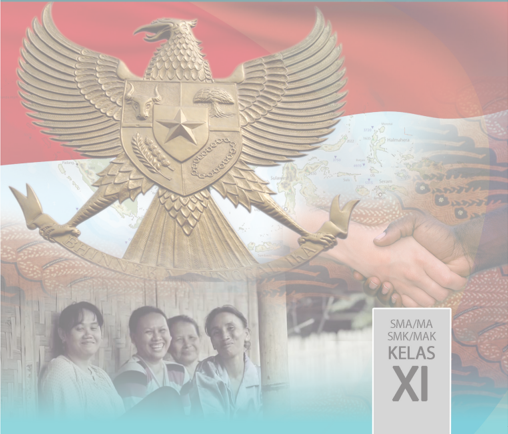

> **Deskripsi Visual:** Gambar ini adalah ilustrasi yang menampilkan empat orang siswa SMA/SMK/MAK Kelas XI. Ilustrasi ini menggambarkan tiga orang siswa yang sedang berbicara di depan sebuah bangunan tradisional, sementara yang keempat berdiri di belakang mereka. Di atas ilustrasi tersebut, terdapat lambang negara Indonesia dengan burung Garuda Pancasila yang memegang bendera merah putih. Latar belakang ilustrasi ini terlihat seperti peta dunia dengan beberapa negara yang terlihat jelas.

Elemen-elemen utama dalam gambar ini meliputi:
1. Empat orang siswa SMA/SMK/MAK Kelas XI.
2. Bangunan tradisional di depan mereka.
3. Lambang Garuda Pancasila yang memegang bendera merah putih.
4. Peta dunia dengan beberapa negara yang terlihat jelas.

Teks, angka, atau label penting yang terlihat dalam gambar ini adalah "SMA/MA SMK/MAK KELAS XI". Informasi kunci yang dapat diambil pembaca adalah bahwa gambar ini mungkin merupakan halaman atau bagian dari buku pelajaran untuk siswa SMA/SMK/MAK Kelas XI, dan menggambarkan tema pembelajaran tentang sejarah, budaya, atau politik Indonesia.

 

---
## 📄 Halaman 2

### Hak Cipta © 2017 pada Kementerian Pendidikan dan Kebudayaan

Dilindungi Undang-Undang

Disklaimer: Buku ini merupakan buku guru yang dipersiapkan Pemerintah dalam rangka implementasi Kurikulum 2013. Buku guru ini disusun dan ditelaah oleh berbagai pihak di  bawah  koordinasi  Kementerian  Pendidikan  dan  Kebudayaan,  dan  dipergunakan dalam tahap awal penerapan Kurikulum 2013. Buku ini merupakan 'dokumen hidup' yang senantiasa diperbaiki, diperbaharui,  dan dimutakhirkan sesuai dengan dinamika kebutuhan dan perubahan zaman. Masukan dari berbagai kalangan diharapkan dapat meningkatkan kualitas buku ini.

Katalog Dalam Terbitan (KDT)

- Indonesia. Kementerian Pendidikan dan Kebudayaan. Pendidikan Pancasila dan Kewarganegaraan / Kementerian Pendidikan dan Kebudayaan.--Jakarta: Kementerian Pendidikan dan Kebudayaan, 2017. vi,  274. : illus. ;  25 cm. Untuk SMA/MA/SMK/MAK Kelas XI ISBN  978-602-427-094-0 (jilid lengkap) ISBN  978-602-427-096-4 (jilid 2) 1.Pendidikan Kewarganegaraan -- Studi dan Pengajaran I. Judul II. Kementerian Pendidikan dan Kebudayaan 370.11P
:  Yusnawan Lubis dan Mohamad Sodeli

Penulis

Penelaah

:  Dr. Dadang Sundawa, Dr. Nasiwan, M.Si.,

Dr. Kokom Komalasari, M.Pd, Dr. Supandi

Pereview

:  Ucuk Yunadi

Penyelia Penerbitan

:  Pusat Kurikulum dan Perbukuan, Balitbang, Kemendikbud

Cetakan ke-1, 2014 ISBN 978-602-282-478-7 (jilid 2)

Cetakan ke-2, 2017 (Edisi Revisi)

Disusun dengan huruf Times New Roman, 11 pt

 

---
## 📄 Halaman 3

### KATA PENGANTAR

Kegiatan pembelajaran merupakan proses pendidikan yang memberikan kesempatan kepada  peserta  didik  untuk  mengembangkan  potensi  dirinya  baik  sikap,  pengetahuan maupun keterampilan yang diperlukan dalam kehidupan bermasyarakat, berbangsa dan bernegara serta berkontribusi pada kesejahteraan hidup manusia. Oleh karena itu kegiatan pembelajaran diarahkan untuk memberdayakan semua potensi peserta didik agar memiliki kompetensi yang diharapkan.

Fokus  utama  mata  pelajaran  Pendidikan  Pancasila  dan  Kewarganegaraan  (PPKn) adalah  mempersiapkan peserta  didik  untuk  dapat  berperan  sebagai  warga  negara  yang baik, yaitu warga negara yang cerdas, terampil dan berkarakter serta setia kepada bangsa dan negara Republik Indonesia dengan merefleksikannya dalam kebiasaan berpikir dan bertindak sesuai dengan Pancasila dan Undang-Undang Dasar Negara Republik Indonesia Tahun 1945.

Pembelajaran Pendidikan Pancasila dan Kewarganegaraan dirancang berbasis aktivitas terkait dengan sejumlah tema kewarganegaraan yang diharapkan dapat mendorong peserta didik  menjadi  warga  negara  yang  baik  melalui  kepedulian  terhadap  permasalahan  dan tantangan yang dihadapi masyarakat sekitarnya. Buku ini menjabarkan usaha yang harus dilakukan guru dan peserta didik untuk mencapai kompetensi yang diharapkan. Sesuai dengan pendekatan pembelajaran yang digunakan Kurikulum 2013, peserta didik diajak untuk mencari informasi dari berbagai sumber belajar  yang tersedia di sekitarnya. Peran guru  adalah  membimbing dan memfasilitasi peserta didik untuk mencapai kompetensi yang telah ditetapkan melalui berbagai aktivitas pembelajaran baik yang berlangsung di dalam kelas maupun di luar kelas.

Buku ini merupakan edisi kedua sebagai perbaikan dari edisi pertama. Buku ini sangat terbuka dan perlu terus dilakukan perbaikan demi penyempurnaan.  Apa  yang tertulis dalam buku  ini  adalah  standar  minimal.  Guru  dapat  menggunakan  dan  mengembangkannya sesuai  dengan  situasi  dan  kondisi  sekolah  masing-masing.  Semoga  buku  ini  dapat menginspirasi guru dalam melaksanakan kegiatan  pembelajaran. Kami mengajak  para pembaca  memberikan  saran  masukan  untuk  perbaikan  pada  edisi  berikutnya.  Atas kontribusi  tersebut,  kami  mengucapkan  terima  kasih.  Semoga    kita  dapat  memberikan sumbangan yang terbaik bagi dunia pendidikan demi kemajuan dan kejayaan  bangsa dan negara  Indonesia di masa yang akan datang.

Jakarta,

Tim Penulis

 

---
## 📄 Halaman 4

### DAFTAR ISI

3

6

6

9

9

 

---
## 📄 Halaman 7

### A. Maksud dan Tujuan Buku Guru

Secara  umum,  penyusunan  buku  guru  untuk  mata  pelajaran  Pendidikan Pancasila  dan  Kewarganegaraan  (PPKn)  ini  dimaksudkan  untuk  memfasilitasi para guru PPKn dalam:

- membangun  persepsi  dan  sikap  positif  terhadap  mata  pelajaran  PPKn sesuai dengan  ide, regulasi, karakteristik psikologis-pedagogis, dan fungsinya dalam konteks sistem pendidikan nasional;
- memahami secara  utuh  dan  menyeluruh  karakteristik  PPKn  Kurikulum 2013 sebagai landasan membangun pola sikap dan pola perilaku profesional sebagai guru PPKn;
- memfasilitasi tumbuhnya kesejawatan (kolegialitas) guru PPKn untuk  mewujudkan  pembelajaran  PPKn  dan  pengembangan  budaya kewarganegaraan di lingkungan satuan pendidikan dan lingkungan sosialkultural peserta didik; dan
- mengembangkan diri sebagai guru PPKn yang profesional dan dinamis dalam menyikapi dan memecahkan masalah-masalah praktis terkait visi dan misi PPKn di lingkungan satuan pendidikan.
Secara khusus, Buku  Guru  Mata Pelajaran Pendidikan Pancasila dan Kewarganegaraan ini disusun untuk hal-hal berikut.

- Memberikan pemahaman guru PPKn tentang:
- latar belakang mata pelajaran PPKn;
- misi mata pelajaran PPKn;
- substansi mata pelajaran PPKn;
- karakteristik mata pelajaran PPKn;

 

---
## 📄 Halaman 8

- strategi pembelajaran saintifik; dan
- penilaian otentik mata pelajaran PPKn.
- Meningkatkan kemampuan guru PPKn dalam:
- beradaptasi dengan tuntutan PPKn;
- melaksanakan sistem pembelajaran dan penilaian PPKn secara tepat;
- mengoptimalkan pemanfaatan media dan sumber belajar PPKn;
- memelihara dan meningkatkan profesionalitas sebagai guru PPKn;
- membangun manajemen yang mendukung sistem pembelajaran dan penilaian PPKn secara tepat.
- Menjadi acuan guru PPKn dalam:
- merancang  pembelajaran  dari  KI  dan  KD  ke  dalam  bahan  ajar, pendekatan, strategi, metode, dan model pembelajaran secara lebih inovatif,  kreatif,  efektif,  efisien  dan  sesuai  dengan  kebutuhan, kapasitas,  karakteristik  dan  sosial  budaya  daerah,  sekolah/satuan pendidikan dan peserta didik;
- mengembangkan  dan  memanfaatkan  sumber  belajar  lebih  kreatif, inovatif,  efektif,  efisien,  dan  kontekstual  sesuai  dengan  kebutuhan dan karakteristik peserta didik serta kondisi sosial budaya daerah;
- merancang  dan  melaksanakan  penilaian  kompetensi  peserta  didik (aspek  sikap,  pengetahuan,  dan  keterampilan)  secara  utuh  sesuai dengan prinsip  sahih, objektif, adil, terpadu, terbuka, menyeluruh dan berkesinambungan, sistematis, beracuan kriteria, dan akuntabel.

### B. Petunjuk Penggunaan Buku Guru

Buku ini merupakan pedoman guru dalam mengelola program pembelajaran terutama dalam memfasilitasi peserta didik untuk mendalami Pendidikan Pancasila dan Kewarganegaraan (PPKn) sebagaimana terdapat dalam buku siswa. Buku ini merupakan petunjuk teknis untuk mengoperasionalkan materi pembelajaran yang terdapat dalam buku siswa. Oleh karena itu, sudah semestinya, guru membaca dan mengimplementasikannya dalam setiap pelaksanaan proses pembelajaran.

Secara  garis  besar,  buku  guru  ini  terdiri  atas  dua  bagian,  yaitu  Bagian  I Petunjuk  Umum dan Bagian II Petunjuk Khusus Pembelajaran PPKn.  Secara

 

---
## 📄 Halaman 9

lebih rinci, ruang lingkup Buku Guru Mata Pelajaran Pendidikan Pancasila dan Kewarganegaraan adalah sebagai berikut.

- Bagian I Petunjuk Umum,  menguraikan maksud dan tujuan penyusunan  buku  guru,  petunjuk  penggunaan  buku  guru,  KI  dan KD mata pelajaran PPKn dalam Kurikulum 2013, karakteristik mata pelajaran PPKn, strategi pembelajaran PPKn, strategi dasar penilaian pembelajaran Pendidikan Pancasila dan Kewarganegaraan (PPKn)
- Bagian  II  Petunjuk  Khusus  Pembelajaran  PPKn,  menguraikan petunjuk pembelajaran tiap komptensi dasar.

### C. KI dan KD Mata Pelajaran PPKn dalam Kurikulum 2013

Mata pelajaran Pendidikan Pancasila dan Kewarganegaraan kelas XI memiliki 4 kompetensi inti dan 24 kompetensi dasar. Berbeda dengan kurikulum sebelumnya, konsep kompetensi inti ini merupakan konsep yang baru. Setiap kompetensi inti mempunyai kedudukannya masing-masing, yaitu:

- Kompetensi Inti-1 (KI-1) untuk kompetensi inti sikap spiritual;
- Kompetensi Inti-2 (KI-2) untuk kompetensi inti sikap sosial;
- Kompetensi Inti-3 (KI-3) untuk kompetensi inti pengetahuan; dan
- Kompetensi Inti-4 (KI-4) untuk kompetensi inti keterampilan.
KI-3  dan  KI-4  disajikan  melalui  pembelajaran  langsung  ( direct  teaching ), sedangkan KI-1 dan KI- 2 melalui pembelajaran tidak langsung ( indirect teaching ) yang terjadi selama proses pembelajaran.  KI-1 dan KI-2 dalam mata pelajaran PPKn ditumbuhkan sebagai akibat dari kompetensi pengetahuan dan keterampilan dalam  KI-3  dan  KI-4,  contohnya  mempelajari  hukum  menumbuhkan  sikap disiplin. Juga sebagai dampak pengiring ( mutual effect ) dari proses pembelajaran yang dirancang sehingga menumbuhkan sikap dalam KI-1 dan KI-2, contohnya proses pembelajaran dengan diskusi kelompok menumbuhkan sikap kerja sama dan toleransi.

Berikut  ini  dipaparkan  penyebaran  kompetensi  inti  dan  kompetensi  dasar selengkapnya.

 

---
## 📄 Halaman 10

### Kompetensi Inti dan Kompetensi Dasar Mata Pelajaran PPKN Kelas XI

---
**📊 Tabel**

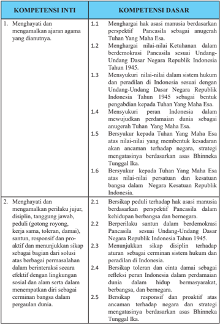

Tabel ini berisi informasi tentang kompetensi inti dan kompetensi dasar yang harus dipenuhi oleh individu dalam konteks Pancasila dan Undang-Undang Dasar Negara Republik Indonesia. Topik utama tabel adalah tentang penghayatan nilai-nilai Pancasila dan peradaban Indonesia. Kolom-kolomnya meliputi dua bagian utama: Kompetensi Inti dan Kompetensi Dasar. Kompetensi Inti mencakup tujuh poin yang melibatkan penghayatan nilai-nilai Pancasila, seperti perspektif, keberagaman, dan persatuan. Kompetensi Dasar mencakup empat poin yang lebih spesifik tentang penghayatan nilai-nilai Pancasila dalam konteks hukum, peradaban, dan strategi negara. Data penting yang terlihat adalah bahwa setiap kompetensi inti memiliki satu atau lebih kompetensi dasar yang relevan, menunjukkan hubungan antara kompetensi inti dan dasar dalam pembentukan karakteristik individu yang sesuai dengan nilai-nilai Pancasila.

 

---
## 📄 Halaman 11

---
**📊 Tabel**

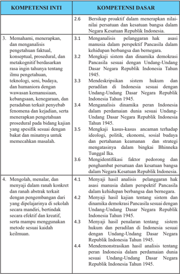

Tabel ini berisi informasi tentang kompetensi inti dan dasar yang relevan dengan pendidikan di Indonesia. Topik utamanya adalah tentang pemahaman, pengetahuan, dan keterampilan yang diperlukan untuk membangun demokrasi dan keadilan sosial. Kolom-kolomnya mencakup berbagai aspek seperti pemahaman konsep hak asasi manusia, pemahaman tentang sistem hukum dan peradilan, serta kemampuan untuk mengembangkan ideologi dan strategi dalam konteks demokrasi. Data penting yang terlihat adalah bahwa setiap kompetensi inti memiliki satu atau lebih kompetensi dasar yang mendukungnya, menunjukkan hubungan antara pemahaman teoritis dan praktis dalam pembelajaran.

 

---
## 📄 Halaman 12

---
**📊 Tabel**

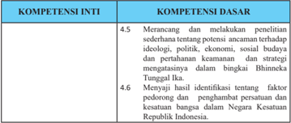

Tabel ini berisi informasi tentang kompetensi inti dan kompetensi dasar yang berkaitan dengan penelitian sederhana tentang potensi ancaman terhadap ideologi, politik, ekonomi, sosial, dan budaya di perdesaan. Topik utama tabel adalah pengetahuan tentang faktor-faktor yang mempengaruhi keadaan di desa, seperti penghambatan perekonomian dan kesetaraan bangsa. Kolom-kolomnya mencakup dua kompetensi dasar: 4.5. Merancang dan melaksanakan penelitian sederhana tentang potensi ancaman terhadap ideologi, politik, ekonomi, sosial, dan budaya di perdesaan; 4.6. Menyajikan hasil identifikasi tentang faktor-faktor penghambat perekonomian dan kesetaraan bangsa dalam negeri kesejahteraan Republik Indonesia. Data penting yang terlihat adalah bahwa tabel ini membahas dua aspek utama dari penelitian sederhana tersebut, yaitu merancang dan melaksanakan penelitian serta menyajikan hasil identifikasi faktor-faktor yang mempengaruhi keadaan di desa.

Kompetensi Inti kelas XI dijabarkan ke dalam 24 Kompetensi Dasar yang akan ditransformasikan dalam kegiatan pembelajaran satu tahun (dua semester) yang  terurai  dalam  32  minggu.  Agar  kegiatan  pembelajaran  tidak    terlalu panjang, 32 minggu itu dibagi menjadi dua semester, semester pertama dan semester kedua. Dengan demikian, waktu efektif untuk kegiatan pembelajaran mata pelajaran PPKn sebagai mata pelajaran wajib di SMA/MA dan SMK/ MAK disediakan waktu 2 x 45 menit x 32 minggu.

### D. Karakteristik  Mata  Pelajaran  Pendidikan  Pancasila dan Kewarganegaraan (PPKn)

### 1. Hakikat Mata Pelajaran Pendidian Pancasila dan Kewarganegaraan (PPKn)

Mata pelajaran Pendidikan Pancasila dan Kewarganegaraan merupakan mata pelajaran  penyempurnaan  dari  mata  pelajaran  Pendidikan  Kewarganegaraan (PKn)  yang  semula  dikenal  dalam  Kurikulum  2006.  Penyempurnaan  tersebut dilakukan  atas  dasar  pertimbangan:  (1)  Pancasila  sebagai  dasar  negara  dan pandangan  hidup  bangsa  diperankan  dan  dimaknai  sebagai  entitas  inti  yang menjadi sumber rujukan dan kriteria keberhasilan pencapaian tingkat kompetensi dan pengorganisasian dari keseluruhan ruang lingkup mata pelajaran Pendidikan Pancasila dan Kewarganegaraan; (2) substansi dan jiwa Undang-Undang Dasar Negara Republik Indonesia Tahun 1945, nilai dan semangat Bhinneka Tunggal Ika,  dan  komitmen  Negara  Kesatuan  Republik  Indonesia  ditempatkan  sebagai

 

---
## 📄 Halaman 13

bagian integral dari Pendidikan Pancasila dan Kewarganegaraan, yang menjadi wahana psikologis-pedagogis pembangunan  warga negara Indonesia yang berkarakter Pancasila.

Perubahan  tersebut  didasarkan  pada  sejumlah  masukan  penyempurnaan pembelajaran PKn menjadi PPKn yang mengemuka dalam lima tahun terakhir, antara  lain:  (1)  secara  substansial,  PKn  terkesan  lebih  dominan  bermuatan ketatanegaraan  sehingga  muatan  nilai  dan  moral  Pancasila  kurang  mendapat aksentuasi yang  proporsional; (2) secara  metodologis,  ada  kecenderungan pembelajaran  yang  mengutamakan  pengembangan  ranah  sikap  (afektif),  ranah pengetahuan  (kognitif),  dan  pengembangan  ranah  keterampilan  (psikomotorik) belum dikembangkan secara optimal dan utuh (koheren).

Selain itu, melalui penyempurnaan PKn menjadi PPKn tersebut, terkandung gagasan dan harapan untuk menjadikan PPKn sebagai salah satu mata pelajaran yang  mampu  memberikan  kontribusi  dalam  solusi  atas  berbagai  krisis  yang melanda  Indonesia, terutama krisis  multidimensional.  PPKn  sebagai  mata pelajaran yang memiliki misi mengembangkan keadaban Pancasila, diharapkan mampu membudayakan dan memberdayakan peserta didik agar menjadi warga negara yang cerdas dan baik serta menjadi pemimpin bangsa dan negara Indonesia di masa depan yang amanah, jujur, cerdas, dan bertanggung jawab.

Dalam konteks kehidupan global, Pendidikan Pancasila dan Kewarganegaraan selain  harus  meneguhkan  keadaban  Pancasila  juga  harus  membekali  peserta didik untuk hidup dalam kancah global sebagai warga dunia ( global citizenship ). Oleh  karena  itu,  substansi  dan  pembelajaran  PPKn  perlu  diorientasikan  untuk membekali warga negara Indonesia agar mampu hidup dan berkontribusi secara optimal  pada  dinamika  kehidupan  abad  ke-21.  Untuk  itu,  pembelajaran  PPKn selain mengembangkan nilai dan moral Pancasila, juga mengembangkan semua visi dan keterampilan abad ke-21 sebagaimana telah menjadi komitmen global.

Bertolak dari berbagai kajian secara filosofis, sosiologis, yuridis, dan pedagogis, mata pelajaran PPKn dalam Kurikulum 2013, secara utuh memiliki karakteristik sebagai berikut.

- Nama  mata  pelajaran  yang  semula  Pendidikan  Kewarganegaraan  (PKn) telah diubah menjadi Pendidikan Pancasila dan Kewarganegaraan (PPKn).
- Mata pelajaran PPKn berfungsi sebagai mata pelajaran yang memiliki misi pengukuhan kebangsaan dan penggerak pendidikan karakter Pancasila.

 

---
## 📄 Halaman 14

- Kompetensi dasar (KD) PPKn dalam bingkai kompetensi inti (KI) yang secara  psikologis-pedagogis  menjadi  pengintegrasi  kompetensi  peserta didik  secara  utuh  dan  koheren  dengan  penanaman,  pengembangan,  dan/ atau penguatan nilai dan moral Pancasila; nilai dan norma UUD Negara Republik Indonesia Tahun 1945; nilai dan semangat Bhinneka Tunggal Ika; serta wawasan dan komitmen Negara Kesatuan Republik Indonesia.
- Pendekatan  pembelajaran  berbasis  proses  keilmuan (scientific  approach) yang dipersyaratkan dalam Kurilukum 2013 memusatkan perhatian pada proses  pembangunan  pengetahuan  (KI-3,  keterampilan  (KI-4),  sikap spiritual (KI-1) dan sikap sosial (KI-2) melalui transformasi pengalaman empirik dan pemaknaan konseptual. Pendekatan tesebut memiliki langkah generik sebagai berikut:
- mengamati ( observing) ;
- menanya ( questioning );
- mengeksplorasi/mencoba ( exploring );
- mengasosiasi/menalar ( assosiating );
- mengomunikasikan ( communicating ).
Pada  setiap  langkah,  dapat  diterapkan  model-model  pembelajaran  yang lebih spesifik.

Dalam konteks lain, misalnya model yang diterapkan berupa model proyek seperti  Proyek  Belajar  Kewarganegaraan  yang  menuntut  aktivitas  yang kompleks, waktu yang panjang, dan kompetensi yang lebih luas. Kelima langkah generik di atas dapat diterapkan secara adaptif pada model tersebut.

- Model pembelajaran dikembangkan sesuai dengan karakteristik PPKn secara holistik/utuh dalam rangka peningkatan kualitas belajar dan pembelajaran yang berorientasi pada pengembangan karakter peserta didik sebagai warga negara yang cerdas dan baik secara utuh dalam proses pembelajaran otentik (authentic  instructional  and  authentic  learning) dalam  bingkai  integrasi Kompetensi Inti sikap, pengetahuan, dan keterampilan. Model pembelajaran mengarahkan peserta didik bersikap dan berpikir ilmiah ( scientific ), yaitu pembelajaran  yang  mendorong  dan  menginspirasi  peserta  didik  berpikir secara  kritis,  analistis,  dan  tepat  dalam  mengidentifikasi,  memahami, memecahkan masalah, dan mengaplikasikan materi pembelajaran.

 

---
## 📄 Halaman 15

- Model penilaian proses pembelajaran dan hasil  belajar  PPKn menggunakan penilaian otentik (authentic assesment). Penilaian otentik mampu menggambarkan  peningkatan  hasil  belajar  peserta  didik,  baik  dalam rangka mengobservasi, menalar, mencoba, membangun jejaring, dan lainlain.  Penilaian  otentik  cenderung  fokus  pada  tugas-tugas  kompleks  atau kontekstual, memungkinkan peserta didik untuk menunjukkan kompetensi mereka dalam pengaturan yang lebih otentik.

### 2. Tujuan Mata Pelajaran Pendidikan Pancasila dan Kewarganegaraan (PPKn)

Sesuai  dengan  PP  Nomor  32  Tahun  2013  Penjelasan  Pasal  77J  ayat  (1) ditegaskan bahwa pendidikan kewarganegaraan dimaksudkan untuk membentuk peserta didik menjadi manusia yang memiliki rasa kebangsaan dan cinta tanah air  dalam  konteks  nilai  dan  moral  Pancasila,  kesadaran  berkonstitusi  UndangUndang  Dasar  Negara  Republik  Indonesia  Tahun  1945,  nilai  dan  semangat Bhinneka Tunggal Ika, serta komitmen Negara Kesatuan Republik Indonesia.

Secara  umum,  tujuan  mata  pelajaran  Pendidikan  Pancasila  dan  Kewarganegaraan pada jenjang pendidikan dasar dan menengah adalah mengembangkan potensi  peserta  didik  dalam  seluruh  dimensi  kewarganegaraan,  yakni:  (1) sikap  kewarganegaraan  termasuk  keteguhan,  komitmen  dan  tanggung  jawab kewarganegaraan ( civic confidence, civic committment, and civic responsibility ); (2) pengetahuan kewarganegaraan ( civic knowledge ); (3) keterampilan kewarganegaraan  termasuk  kecakapan  dan  partisipasi  kewarganegaraan  ( civic competence and civic responsibility ).

Secara  khusus  tujuan  PPKn  yang  berisikan  keseluruhan  dimensi  di  atas sehingga peserta didik mampu:

- menampilkan karakter yang mencerminkan penghayatan, pemahaman, dan pengamalan nilai dan moral Pancasila secara personal dan sosial;
- memiliki komitmen  konstitusional yang  ditopang oleh sikap positif dan  pemahaman  utuh  tentang  Undang-Undang  Dasar  Negara  Republik Indonesia Tahun 1945;
- berpikir secara kritis, rasional, dan  kreatif  serta  memiliki semangat kebangsaan  dan  cinta  tanah  air  yang  dijiwai  oleh  nilai-nilai  Pancasila, Undang Undang Dasar Negara Republik Indonesia Tahun 1945, semangat Bhinneka Tunggal Ika, dan komitmen Negara Kesatuan Republik Indonesia; dan

 

---
## 📄 Halaman 16

- berpartisipasi secara aktif, cerdas, dan bertanggung jawab sebagai anggota masyarakat,  tunas  bangsa,  dan  warga  negara  sesuai  dengan  harkat  dan martabatnya sebagai makhluk ciptaan Tuhan Yang Maha Esa yang hidup bersama dalam berbagai tatanan sosial kultural.
Dengan demikian, PPKn lebih memiliki kedudukan dan fungsi sebagai berikut:

- PPKn merupakan pendidikan nilai, moral/karakter, dan kewarganegaraan khas Indonesia yang tidak sama sebangun dengan civic education di USA, citizenship education di UK, talimatul muwatanah di negara-negara Timur Tengah , education civicas di Amerika Latin.
- PPKn  sebagai  wahana  pendidikan  nilai,  moral/karakter  Pancasila  dan pengembangan  kapasitas  psikososial  kewarganegaraan  Indonesia  sangat koheren (runut dan terpadu) dengan komitmen pengembangan watak dan peradaban bangsa yang bermartabat dan perwujudan warga negara yang demokratis dan bertanggung jawab sebagaimana termaktub dalam Pasal 3 UU No. 20 Tahun 2003.

### 3. Ruang Lingkup Mata Pelajaran Pendidikan Pancasila dan Kewarganegaraan (PPKn)

Dengan  perubahan  mata  pelajaran  Pendidikan  Kewarganegaraan  (PKn) menjadi  Pendidikan  Pancasila  dan  Kewarganegaraan  (PPKn),  ruang  lingkup PPKn meliputi:

- Pancasila  sebagai  dasar  negara,  ideologi  nasional,  dan  pandangan  hidup bangsa.
- Undang-Undang  Dasar  Negara  Republik  Indonesia  Tahun  1945  sebagai hukum  dasar  tertulis  yang  menjadi  landasan  konstitusional  kehidupan bermasyarakat, berbangsa, dan bernegara.
- Negara  Kesatuan  Republik  Indonesia,  sebagai  kesepakatan  final  bentuk Negara Republik Indonesia.
- Bhinneka  Tunggal  Ika,  sebagai  wujud  filosofi  kesatuan  yang  melandasi dan  mewarnai  keberagaman  kehidupan  bermasyarakat,  berbangsa,  dan bernegara.
Ruang  lingkup  materi  PPKn  pada  SMA/MA/  SMK  kelas  XI  adalah  sebagai berikut.

- Harmonisasi hak dan kewajiban asasi manusia dalam perspektif Pancasila;
- Sistem dan dinamika demokrasi di Indonesia;

 

---
## 📄 Halaman 17

- Sistem hukum dan peradilan di Indonesia;
- Dinamika peran Indonesia dalam perdamaian dunia;
- Mewaspadai  ancaman    terhadap  kedudukan  Negara  Kesatuan  Republik Indonesia;
- Memperkukuh  persatuan  dan  kesatuan  bangsa  dalam  konteks  Negara Kesatuan Republik Indonesia (NKRI).

### E. Strategi Pembelajaran Pendidikan Pancasila dan Kewarganegaraan (PPKn)

### 1. Konsep dan Strategi Pembelajaran dalam Pembelajaran PPKn

Konsep dan strategi  pembelajaran  merupakan  salah  satu  elemen  perubahan pada  Kurikulum  2013.  Peraturan  Menteri  Pendidikan  dan  Kebudayaan  Nomor 103 Tahun  2014  tentang  Pembelajaran    pada  pendidikan  dasar  dan  menengah menguraikan secara jelas konsep dan strategi pembelajaran sebagai implementasi Kurikulum  2013.  Berikut  disampaikan  isi  konsep  dan  strategi  pembelajaran tersebut  yang  juga  menjadi  dasar  strategi  dan  model  umum  pembelajaran Pendidikan Pancasila dan Kewarganegaraan.

Secara  prinsip,  kegiatan  pembelajaran  merupakan  proses  pendidikan  yang memberikan  kesempatan  kepada  peserta  didik  untuk  mengembangkan  potensi mereka menjadi kemampuan yang makin lama makin meningkat dalam sikap, pengetahuan, dan keterampilan yang diperlukan dirinya untuk hidup dan untuk bermasyarakat,  berbangsa,  serta  berkontribusi  pada  kesejahteraan  hidup  umat manusia. Oleh karena itu, kegiatan pembelajaran diarahkan untuk memberdayakan semua potensi peserta didik agar memiliki kompetensi yang diharapkan.

Lebih  lanjut,  strategi  pembelajaran  harus  diarahkan  untuk  memfasilitasi pencapaian  kompetensi  yang  telah  dirancang  dalam  dokumen  kurikulum  agar setiap  individu  mampu  menjadi  pembelajar  mandiri  sepanjang  hayat.  Pada gilirannya,  mereka  diharapkan  menjadi  komponen  penting  untuk  mewujudkan masyarakat  belajar.  Kualitas  lain  yang  dikembangkan  kurikulum  dan  harus terealisasi dalam proses pembelajaran antara lain kreativitas, kemandirian, kerja sama, solidaritas, kepemimpinan, empati, toleransi, dan kecakapan hidup peserta didik guna membentuk watak serta meningkatkan peradaban dan martabat bangsa.

 

---
## 📄 Halaman 18

Untuk  mencapai  kualitas  yang  telah  dirancang  dalam  dokumen  kurikulum, kegiatan pembelajaran perlu menggunakan prinsip yang (1) berpusat pada peserta didik,  (2)  mengembangkan  kreativitas  peserta  didik,  (3)  menciptakan  kondisi menyenangkan dan menantang, (4) bermuatan nilai, etika, estetika, logika, dan kinestetika,  dan  (5)  menyediakan  pengalaman  belajar  yang  beragam  melalui penerapan  berbagai  strategi  dan  metode  pembelajaran  yang  menyenangkan, kontekstual, efektif, efisien, dan bermakna.

Dalam pembelajaran, peserta didik didorong untuk menemukan sendiri dan mentransformasikan informasi kompleks, mengecek informasi baru dengan yang sudah ada dalam ingatannya, dan melakukan pengembangan menjadi informasi atau kemampuan yang sesuai dengan lingkungan dan zaman tempat dan waktu ia hidup. Kurikulum 2013 menganut pandangan dasar bahwa pengetahuan tidak dapat dipindahkan begitu saja dari guru ke peserta didik. Peserta didik adalah subjek yang memiliki kemampuan untuk secara aktif mencari, mengolah, mengonstruksi, dan menggunakan pengetahuan. Untuk itu, pembelajaran harus berkenaan dengan kesempatan yang diberikan kepada peserta didik untuk mengonstruksi pengetahuan dalam proses kognitifnya. Agar benar-benar memahami dan dapat menerapkan pengetahuan, peserta didik perlu didorong untuk bekerja memecahkan masalah, menemukan segala sesuatu untuk dirinya, dan berupaya keras mewujudkan ideidenya.

Guru  memberikan  kemudahan  untuk  proses  ini,  dengan  mengembangkan suasana  belajar  yang  memberi  kesempatan  peserta  didik  untuk  menemukan, menerapkan ide-ide mereka sendiri, menjadi sadar dan secara sadar menggunakan strategi mereka sendiri untuk belajar. Guru mengembangkan kesempatan belajar kepada peserta didik untuk meniti anak tangga yang membawa peserta didik ke pemahaman yang lebih tinggi, yang semula dilakukan dengan bantuan guru tetapi makin lama makin mandiri. Bagi peserta didik, pembelajaran harus bergeser dari 'diberi tahu' menjadi 'aktif mencari tahu'.

Kurikulum 2013 mengembangkan dua modus pembelajaran, yaitu pembelajaran langsung dan pembelajaran tidak langsung. Pembelajaran langsung adalah proses pendidikan  di  mana  peserta  didik  mengembangkan  pengetahuan,  kemampuan berpikir  dan  keterampilan  psikomotorik  melalui  interaksi  langsung  dengan sumber belajar yang dirancang dalam silabus dan RPP berupa kegiatan-kegiatan pembelajaran. Dalam pembelajaran langsung tersebut, peserta didik melakukan

 

---
## 📄 Halaman 19

kegiatan belajar mengamati, menanya, mengumpulkan informasi, mengasosiasi atau menganalisis, dan mengomunikasikan apa yang sudah ditemukannya dalam kegiatan analisis. Proses pembelajaran langsung menghasilkan pengetahuan dan keterampilan langsung atau yang disebut dengan instructional effect .

Pembelajaran  tidak  langsung  adalah  proses  pendidikan  yang  terjadi  selama pembelajaran  langsung,  tetapi  tidak  dirancang  dalam  kegiatan  khusus.  Pembelajaran tidak langsung berkenaan dengan pengembangan nilai dan sikap. Berbeda dengan pengetahuan tentang nilai dan sikap yang dilakukan dalam pembelajaran langsung oleh mata pelajaran tertentu, pengembangan sikap sebagai proses pengembangan moral dan perilaku dilakukan oleh mata pelajaran dan dalam setiap kegiatan yang terjadi di kelas, sekolah, dan masyarakat. Oleh karena itu, dalam Kurikulum 2013, semua kegiatan yang terjadi selama belajar di sekolah maupun dalam kegiatan kokurikuler  dan  ekstrakurikuler  terjadi  pembelajaran  untuk  mengembangkan moral dan perilaku yang terkait dengan sikap.

Baik  pembelajaran  langsung  maupun  pembelajaran  tidak  langsung  terjadi secara terintegrasi dan tidak terpisah. Pembelajaran langsung berkenaan dengan pembelajaran  yang  menyangkut  KD  yang  dikembangkan  dari  KI-3  dan  KI-4. Keduanya (KI-3 dan KI-4) dikembangkan secara bersamaan dalam suatu proses pembelajaran dan menjadi wahana untuk mengembangkan KD pada KI-1 dan KI2. Pembelajaran tidak langsung berkenaan dengan pembelajaran yang menyangkut KD yang dikembangkan dari KI-1 dan KI-2.

### 2. Pendekatan Saintifik dalam Pembelajaran PPKn

Pendekatan  pembelajaran  dalam  Kurkulum  2013  menggunakan  pendekatan ilmiah.  Untuk  memperkuat  pendekatan  ilmiah  ( scientific  approach ),  tematik terpadu (tematik antarmata pelajaran), dan tematik (dalam suatu mata pelajaran) perlu  diterapkan  pembelajaran  berbasis  penyingkapan/penelitian (discovery/ inquiry  learning) .  Untuk  mendorong  kemampuan  peserta  didik  menghasilkan karya  kontekstual,  baik  individual  maupun  kelompok,  sangat  disarankan  guru menggunakan  pendekatan  pembelajaran  yang  menghasilkan  karya  berbasis pemecahan masalah ( project based learning) .

Pembelajaran dengan pendekatan ilmiah terdiri atas lima pengalaman belajar pokok, yaitu mengamati, menanya, mengumpulkan informasi, mengasosiasi, dan mengomunikasikan. Penjelasan kelima langkah pembelajaran scientific approach tersebut dapat diuraikan sebagai berikut.

 

---
## 📄 Halaman 20

### a.  Langkah Pertama: Mengamati

- Setiap awal pembelajaran, peserta didik melakukan kegiatan mengamati. Kegiatan mengamati dapat berupa membaca, melihat, mendengar,  dan  menyimak.  Pada  kegiatan  mengamati,  misalnya mengamati  film/gambar/foto/ilustrasi  yang  terdapat  dalam  buku PPKn Kelas XI. Kegiatan membaca, misalnya membaca teks yang ada di dalam Buku Teks Pelajaran PPKn.
- Peserta didik dapat diberikan petunjuk penting yang perlu mendapat perhatian seperti istilah, konsep, atau kejadian penting yang pengaruhnya sangat kuat yang terdapat dalam Buku Teks Pelajaran PPKn.
- Guru  dapat  menyiapkan  diri  dengan  membaca  berbagai  literatur yang berkaitan dengan materi yang disampaikan. Peserta didik dapat diberikan  contoh-contoh  yang  terkait  dengan  materi  yang  ada  di buku teks. Guru dapat memperkaya materi dengan membandingkan Buku Teks Pelajaran PPKn dengan literatur lain yang relevan.
- Untuk  mendapatkan  pemahaman  yang  lebih  komprehensif,  guru dapat menampilkan foto-foto, gambar, denah, peta,dan dokumentasi audiovisual (film) dan lain sebagainya yang relevan.

### b.  Langkah Kedua: Menanya

- Peserta didik dapat membuat pertanyaan berkaitan dengan apa yang sudah  mereka  baca  atau  amati,  mengajukan  pertanyaan  kepada guru  ataupun  kepada  sesama  temannya  ataupun  mengidentifikasi pertanyaan yang berkaitan dengan materi yang disampaikan.
- Peserta didik dapat saling bertanya jawab berkaitan dengan apa yang sudah mereka baca atau amati.
- Peserta  didik  dapat  dilatih  dalam  bertanya  dari  pertanyaan  yang faktual sampai pertanyaan yang hipotetikal (bersifat kausalitas).
- Diupayakan dalam membuat pertanyaan antara peserta didik satu  dengan  lainnya  (khususnya  teman  sebangku)  tidak  memiliki kesamaan.

### c.  Langkah Ketiga: Mengumpulkan Informasi

- Guru merancang kegiatan untuk mencari informasi lanjutan melalui bacaan  dari  sumber  lain  yang  relevan,  melakukan  observasi  atau

 

---
## 📄 Halaman 21

- wawancara  kepada  suatu  instansi/lembaga  atau  tokoh-tokoh  yang terkait  dengan  tugas  terstruktur  atau  Praktik  Belajar  Kewarganegaraan.
- Peserta didik menentukan  jenis data  yang  akan  dikumpulkan (kualitatif atau kuantitatif) dan menentukan sumber data dari buku, majalah, internet, dan sumber lainnya.
- Guru  merancang  kegiatan  untuk  melakukan  wawancara  kepada tokoh  masyarakat/instansi/lembaga  pemerintahan  yang  dianggap memahami suatu permasalahan yang sedang dikaji.

### d.  Langkah Keempat: Mengasosiasikan

- Peserta didik dapat membandingkan, mengelompokkan, menentukan hubungan  data,  menyimpulkan,  dan  menganalisis  informasi  mengenai  situasi  yang  terjadi  saat  ini  melalui  sumber  bacaan  yang terakhir  diperoleh  dengan  sumber  yang  diperoleh  dari  buku  untuk menemukan hal yang lebih mendalam.
- Peserta  didik  menarik  kesimpulan  atau  membuat  generalisasi  dari informasi yang dibaca di buku dan dari informasi yang diperoleh dari sumber lain.
- Dalam  kegiatan  mengasosiasikan,  peserta  didik  diharapkan  dapat melakukan analisis terhadap suatu permasalahan, baik secara mandiri/individual  maupun secara kelompok.

### e.  Langkah Kelima: Mengomunikasikan

- Peserta didik dapat melaporkan, menyajikan, dan mempresentasikan kesimpulan atau generalisasi dalam bentuk lisan, tertulis, atau produk lainnya.
- Peserta didik menerapkan perilaku yang diharapkan sesuai dengan tuntutan KI-4.
- Kegiatan mengomunikasikan dapat dilakukan dalam bentuk presentasi/penyajian materi/penyampaian hasil temuan, baik secara kelompok maupun mandiri.
- Kegiatan mengomunikasikan dapat dilakukan dengan menyerahkan hasil kerja (unjuk kerja) secara tertulis.
- Kegiatan mengomunikasikan dapat dilakukan dengan menyerahkan hasil wawancara (laporan observasi).

 

---
## 📄 Halaman 22

- Jika kegiatan dilakukan dalam bentuk bermain peran, peserta  didik dapat  membuat  skenario  cerita  yang  kemudian  diperankan  oleh peserta didik.
- Dalam setiap pembuatan laporan hasil observasi/wawancara/Praktik Belajar Kewarganegaraan harus disertai dengan tanda tangan orang tua (komunikasi peserta didik dengan orang tua).
Kelima pembelajaran pokok tersebut dapat dirinci  dalam  berbagai  kegiatan belajar sebagaimana tercantum dalam tabel berikut.

---
**📊 Tabel**

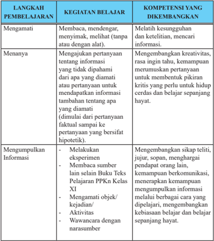

Tabel ini berisi langkah-langkah pembelajaran yang dilakukan oleh siswa dalam proses belajar mengajar. Topik utamanya adalah bagaimana siswa mempelajari dan mengembangkan kompetensi mereka melalui berbagai kegiatan belajar seperti mengamati, menanya, dan mengumpulkan informasi. Kolom-kolomnya mencakup tiga bagian utama: Langkah Pembelajaran, Kegiatan Belajar, dan Kompetensi yang Dikembangkan. Dalam setiap baris, siswa melakukan kegiatan belajar tertentu, seperti membaca, mendengar, menyimak, melihat, menanyakan pertanyaan, dan mengumpulkan informasi. Setiap kegiatan tersebut dihubungkan dengan kompetensi yang dikembangkan, seperti kemampuan untuk memahami dan menganalisis informasi, kreativitas, kemampuan berpikir kritis, dan sikap teliti dan sopan. Pola penting yang terlihat adalah bahwa setiap kegiatan belajar memiliki tujuan spesifik untuk mengembangkan kompetensi yang relevan dengan subjek studi.

 

---
## 📄 Halaman 23

---
**📊 Tabel**

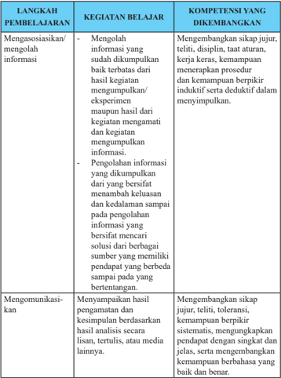

Tabel ini berisi informasi tentang langkah-langkah pembelajaran dan kompetensi yang diembangkan dalam proses belajar mengajar. Topik utama tabel adalah tentang pengembangan keterampilan analisis dan komunikasi. Kolom-kolomnya meliputi "Langkah Pembelajaran" (menggasingasikan/mengolah informasi dan mengkomunikasikan), "Kegiatan Belajar", dan "Kompetensi yang Diembangkan". Data penting yang terlihat adalah bahwa proses belajar mencakup pengolahan informasi yang dikumpulkan, penggunaan berpikiran induktif dan deduktif, serta kemampuan berpikir sistematis dan mendapatkannya dengan singkat dan jelas. Selain itu, tabel juga menunjukkan bahwa proses belajar juga melibatkan kemampuan berbahasa yang baik dan benar dalam mengkomunikasikan hasil analisis.

### 3. Model Pembelajaran PPKn

Sebagaimana disebutkan di atas, pembelajaran PPKn pada Kurikulum 2013 menggunakan  pendekatan  saintifik  atau  pendekatan  berbasis  proses  keilmuan, dengan  strategi  pembelajaran  kontekstual.    Pendekatan  saintifik  dapat  menggunakan

 

---
## 📄 Halaman 24

beberapa model pembelajaran yang merupakan suatu bentuk pembelajaran yang memiliki nama, ciri, sintaks, pengaturan, dan budaya. Model pembelajaran yang dikembangkan dalam PPKn discovery learning, inquiry learning, problem-based learning, dan project-based learning.

Discovery learning dan inquiry learning berorientasi pada penemuan, peserta didik   dituntut untuk menemukan sesuatu. Biasanya sesuatu yang ditemukan itu adalah konsep. Artinya, dengan belajar penemuan, anak-anak tidak  diberi  tahu terlebih dahulu  konsepnya, dan setelah mereka mengamati, menanya, menalar, dan mencipta serta mencoba, mereka akhirnya menemukan konsep itu. Problembased  learning adalah  pembelajaran yang menyajikan pemecahan masalah kontekstual sehingga merangsang peserta didik untuk belajar memecahkan masalah  dunia  nyata  ( real  world ). Project-based  learning menekankan  pada pemberian kesempatan kepada peserta didik untuk belajar dari kegiatan melakukan suatu proyek yang menghasilkan suatu karya melalui pengembangan pengetahuan, sikap, nilai, dan keterampilan yang berguna bagi kehidupannya di masyarakat. Model Pembelajaran dalam mata Pelajaran PPKn yang sesuai dengan pembelajaran berbasis discovery (penemuan) dan inquiry (pencarian) antara lain Pembiasaan, Keteladanan, Memanfaatkan Teknologi Informasi dan Komunikasi, dan Kajian Dokumen Historis.

Model Pembelajaran berbasis masalah ( Problem-based Learning/PBL ) diterapkan melalui Meneliti Isu Publik, Klarifikasi Nilai, Pembelajaran Berbasis Budaya, Kajian Konstitusional, Refleksi Nilai-Nilai Luhur, dan Debat Pro-Kontra.

Pembelajaran Berbasis Proyek ( Project-based Learning/PjBL )  adalah model pembelajaran yang menggunakan proyek/kegiatan sebagai media. Peserta didik melakukan  eksplorasi,  penilaian,  interpretasi,  sintesis,  dan  informasi  untuk menghasilkan  berbagai  bentuk  hasil  belajar.  Pembelajaran  Berbasis  Proyek merupakan  model  belajar  yang  menggunakan  masalah  sebagai  langkah  awal dalam  mengumpulkan  dan  mengintegrasikan  pengetahuan  baru  berdasarkan pengalamannya dalam beraktivitas secara nyata. Model Pembelajaran dalam Mata Pelajaran PPKn yang sesui dengan pembelajaran Berbasis Proyek ( Project-based Learning/PjBL )  antara  lain  Penciptaan  Suasana  Lingkungan,  Partisipasi  dalam Asosiasi,  Mengelola  Konflik,  Pengabdian  kepada  Masyarakat,  Melaksanakan Pemilihan, Proyek Belajar Kewarganegaraan, Partisipasi dalam Asosiasi, Bermain/Simulasi, Kajian Karakter Ketokohan, Mengajukan Usul dan Petisi, dan Berlatih Demonstrasi Damai.

 

---
## 📄 Halaman 25

Merujuk  pada  desain  pembelajaran  yang  sudah  dikemukakan,  berikut  ini disajikan  berbagai  model  pembelajaran  yang  menjadi  ciri  khas  mata  pelajaran PPKn.

---
**📊 Tabel**

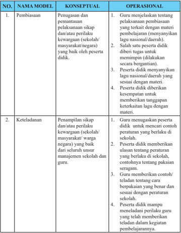

Tabel ini berisi informasi tentang dua model pembelajaran: Pembiasaan dan Keteladanan. Topik utama tabel adalah tentang pengetahuan dan keterampilan yang diperoleh peserta didik melalui proses pembelajaran. Dalam kolom konseptual, tabel menjelaskan bahwa peserta didik harus mampu menjelaskan tentang pelaksanaan pembiasaan dan/atau perilaku kewarganegaraan (sekolah/masyarakat/negara) yang baik, serta menunjukkan keteladanan dalam berbagai aspek. Di kolom operasional, tabel menyebutkan beberapa tugas yang harus dilakukan peserta didik, seperti menjelaskan tentang pelaksanaan pembiasaan, menunjukkan keteladanan, dan mampu memberikan teladan tentang perilaku yang baik. Pola penting yang terlihat adalah bahwa kedua model ini fokus pada pengembangan keterampilan dan pengetahuan peserta didik dalam hal kewarganegaraan dan perilaku yang baik.

 

---
## 📄 Halaman 26

---
**📊 Tabel**

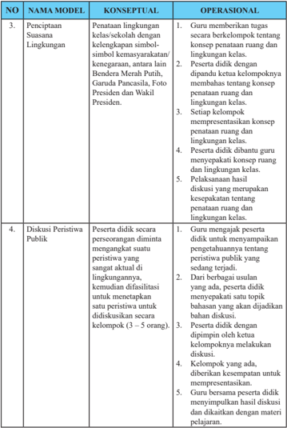

Tabel ini berisi informasi tentang proses pembelajaran di kelas, terdiri dari dua model: Penciptaan Suasana Lingkungan dan Diskusi Peristiwa Publik. Model Penciptaan Suasana Lingkungan melibatkan guru memberikan tugas kepada siswa untuk menata ruang dan lingkungan kelas secara kreatif, seperti dengan menggunakan bendera, foto presiden, dan wakil presiden. Siswa kemudian diberikan kesempatan untuk diskusikan tentang penataan ruang dan lingkungan kelas. Model Diskusi Peristiwa Publik juga melibatkan guru memberikan tugas kepada siswa untuk mengevaluasi peristiwa publik yang terjadi di lingkungan sekolah dan kemudian diskusikan hal tersebut. Siswa juga diberikan kesempatan untuk mengevaluasi peristiwa publik yang ada dan menyampaikannya kepada kelompok lain. Pola penting yang terlihat adalah bahwa kedua model ini memerlukan interaksi aktif antara guru dan siswa, serta membutuhkan keterlibatan siswa dalam menyelesaikan tugas dan diskusi.

 

---
## 📄 Halaman 27

---
**📊 Tabel**

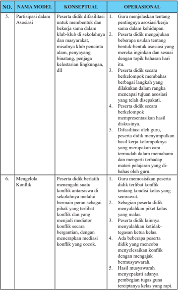

Tabel ini berisi informasi tentang partisipasi peserta didik dalam asosiasi dan mengelola konflik di sekolah. Topik utamanya adalah bagaimana peserta didik berinteraksi dengan guru dan teman-temannya dalam konteks asosiasi dan konflik. Kolom-kolomnya meliputi "Konseptual" dan "Operasional", yang masing-masing menunjukkan bagaimana aspek-aspek tersebut diuraikan secara teoritis dan praktis. Data penting yang terlihat antara lain bahwa peserta didik harus dapat menjelaskan tentang pentingnya asosiasi kerja sama dalam kehidupan, serta mempresentasikan hasil kerja kelompok mereka dalam rangka mencapai tujuan asosiasi yang telah disepakati. Selain itu, peserta didik juga harus mampu menangani konflik secara efektif, baik dalam konteks asosiasi maupun konflik antarwarga sekolah.

 

---
## 📄 Halaman 28

---
**📊 Tabel**

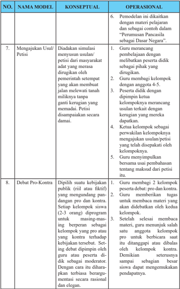

Tabel ini berisi informasi tentang proses pengajian dan pembelajaran di kelas, dengan fokus pada model-model konseptual dan operasional. Topik utama adalah pengajian usulan/petisi dan debat pro-kontra. Kolom-kolomnya meliputi nomor, nama model, konseptual, dan operasional. Data penting mencakup langkah-langkah guru dalam mengajarkan usulan/petisi, seperti membuat simulasi, membangun usulan, dan mengevaluasi petisi. Selain itu, tabel juga menyajikan langkah-langkah dalam debat pro-kontra, termasuk pembuatan kompetisi, setiap kompetisi, dan penilaian. Pola penting adalah bahwa tabel ini membahas proses belajar yang sistematis dan terstruktur, dengan langkah-langkah yang jelas untuk mengajarkan konsep-konsep tersebut.

 

---
## 📄 Halaman 29

---
**📊 Tabel**

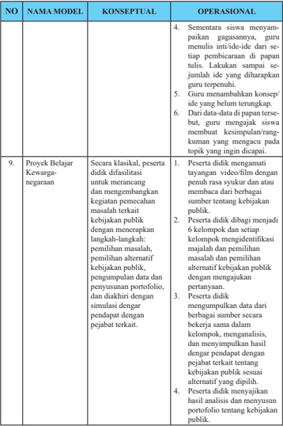

Tabel ini berisi informasi tentang konsepual dan operasional dari dua model pembelajaran: Proyek Belajar Kewarganegaraan dan Proyek Belajar Kewarganegaraan. Topik utama tabel adalah proses belajar dan pengembangan keterampilan warganegara melalui proyek. Kolom-kolomnya mencakup nama model, konseptual, dan operasional. Data penting yang terlihat antara lain bahwa kedua model memerlukan penulisan inti-ide oleh siswa, menambahkan konsep/ide baru, dan menganalisis hasil portofolio.

 

---
## 📄 Halaman 30

---
**📊 Tabel**

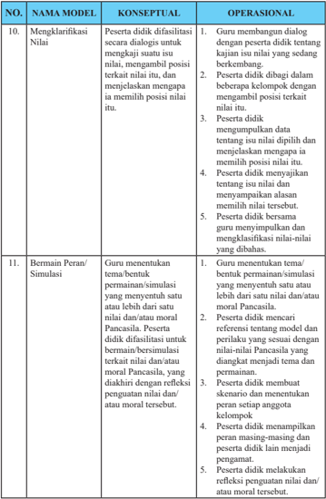

Tabel ini berisi dua kolom utama: "KONSEPTUAL" dan "OPERASIONAL". Kolom "KONSEPTUAL" menjelaskan konsep-konsep teoritis yang harus dipahami oleh peserta didik, sementara kolom "OPERASIONAL" menunjukkan tugas-tugas praktis yang harus dilakukan peserta didik untuk mempraktekkan konsep tersebut. Topik utama tabel adalah tentang pengembangan keterampilan berpikir kritis dan keterampilan berkomunikasi. Data penting yang terlihat adalah bahwa peserta didik diharapkan untuk mengklarifikasi nilai-nilai, bermain peran/simulasi, dan membuat skenario berdasarkan refleksi pengalaman moral atau pribadi.

 

---
## 📄 Halaman 31

---
**📊 Tabel**

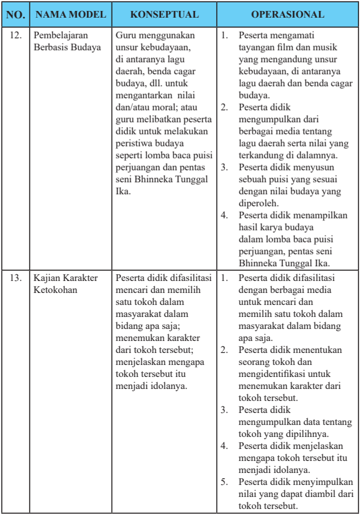

Tabel ini berisi informasi tentang pembelajaran berbasis budaya dan kajian karakter ketokohan dalam konteks pendidikan. Topik utama tabel adalah proses pembelajaran dan pengembangan karakter peserta didik melalui aktivitas budaya dan literatur. Tabel dibagi menjadi dua kolom: konseptual dan operasional. Kolom konseptual menjelaskan konsep-konsep teoritis yang dijelaskan, sementara kolom operasional menunjukkan praktik atau tindakan konkret yang dilakukan dalam proses pembelajaran tersebut. Data penting yang terlihat antara lain bahwa guru menggunakan unsur-unsur budaya dalam pembelajaran untuk menguatkan nilai-nilai budaya, peserta didik mengumpulkan dan menampilkan puisi seni Bhinneka Tunggal Ika, dan peserta didik difasilitasi untuk mencari dan memilih tokoh dalam masyarakat sebagai idola mereka.

 

---
## 📄 Halaman 32

---
**📊 Tabel**

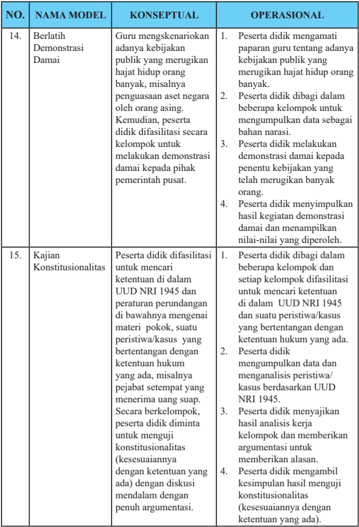

Tabel ini berisi informasi tentang dua model pembelajaran konseptual dan operasional, yaitu "Berlatih Demonstrasi Damai" dan "Kajian Konstitusionalitas". Topik utama tabel ini adalah tentang bagaimana peserta didik dapat mempraktekkan konsep-konsep teoritis dalam situasi nyata. Dalam model "Berlatih Demonstrasi Damai", peserta didik harus menggali kebijakan publik yang merugikan orang banyak, menunjukkan ketertiban, dan mampu memberikan argumentasi yang kuat. Sementara itu, dalam model "Kajian Konstitusionalitas", peserta didik harus memahami dan menerapkan prinsip-prinsip hukum konstitusional, mencari ketentuan yang relevan, dan membuat penilaian berdasarkan UUD 1945. Kolom-kolom yang ada meliputi nomor urut, nama model, kategori konseptual dan operasional, serta deskripsi detail tentang tugas-tugas yang harus dilakukan oleh peserta didik dalam setiap model tersebut. Data penting yang terlihat adalah bahwa kedua model ini memerlukan kemampuan untuk menggali dan menerapkan konsep-konsep teoritis dalam konteks nyata, serta kemampuan untuk memberikan argumentasi yang kuat dan mendalam.

 

---
## 📄 Halaman 33

---
**📊 Tabel**

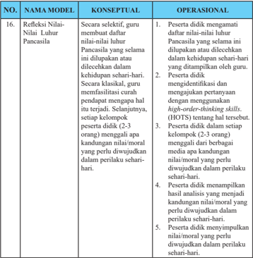

Tabel ini berisi informasi tentang refleksi Nilai-Nilai Luhur Pancasila, yang terdiri dari dua kolom: konseptual dan operasional. Kolom konseptual menjelaskan refleksi secara teoritis, sementara kolom operasional menunjukkan refleksi secara praktis. Topik utama tabel ini adalah proses refleksi guru terhadap nilai-nilai Pancasila dalam konteks kehidupan sehari-hari. Data penting yang terlihat meliputi: 1) guru memastikan bahwa nilai-nilai Pancasila diterapkan dalam kehidupan sehari-hari; 2) guru menggunakan metode klasik untuk mendidik nilai-nilai Pancasila; 3) guru menggunakan teknik think-aloud untuk mengidentifikasi pertanyaan yang relevan dengan nilai-nilai Pancasila; 4) guru menganalisis kandungan nilai-nilai Pancasila yang perlu diwujudkan dalam perilaku sehari-hari; dan 5) guru menyeimbangkan antara pemahaman teoritis dan penggunaan nilai-nilai dalam kehidupan sehari-hari.

Pemilihan model pembelajaran hendaknya mempertimbangkan hal-hal sebagai berikut: a) Tujuan pembelajaran dan  sifat materi pelajaran apakah materi itu  termasuk    ranah  sikap,  pengetahuan,  atau    keterampilan;  b)  Karakteristik kemampuan  peserta  didik  misalnya  kemampuan  membaca,  motivasi  dalam belajar,  kemampuan  dalam  penggunaan  teknologi  informasi  dan  komunikasi (TIK); c) Alokasi waktu yang tersedia; d) Sumber belajar dan media pembelajaran yang tersedia; dan e) Ketersediaan fasilitas/sarana dan prasarana  seperti kondisi ruang kelas, fasilitas perpustakaan, dan akses internet.

Pemilihan  model  pembelajaran  ditentukan  oleh  guru  mata  pelajaran  yang bersangkutan. Model pembelajaran  yang digunakan hendaknya memperhatikan identifikasi materi, yaitu tingkat kedalaman  dan  keluasan  materi dalam Kompetensi Dasar, misalnya tingkatan Pengetahuan 'memahami' berbeda dengan

 

---
## 📄 Halaman 34

tingkatan  Pengetahuan  'menganalisis'  dalam  pemilihan  model  pembelajaran. Selain itu, juga memperhatikan  materi sesuai dengan ranah sikap, pengetahuan atau keterampilan. Contoh model pembelajaran 'memahami nilai-nilai Pancasila' berbeda dengan model pembelajaran untuk 'menganalisis nilai-nilai Pancasila'.

### F. Strategi  Dasar  Penilaian  Pembelajaran  Pendidikan Pancasila dan Kewarganegaraan (PPKn)

### 1. Pengertian  Penilaian

Penilaian  adalah  proses  pengumpulan  dan  pengolahan  informasi  untuk menentukan pencapaian hasil belajar peserta didik. Berdasarkan pada Peraturan Pemerintah Nomor 32 Tahun 2013 tentang Perubahan atas Peraturan Pemerintah Nomor  19  Tahun  2005  tentang  Standar  Nasional  Pendidikan  bahwa  penilaian pendidikan pada jenjang pendidikan dasar dan menengah terdiri atas:  Penilaian hasil belajar oleh pendidik; Penilaian hasil belajar oleh satuan pendidikan; dan Penilaian  hasil  belajar  oleh  Pemerintah.  Berdasarkan  PP.  Nomor  32  Tahun 2013,  dijelaskan  bahwa  penilaian  hasil  belajar  oleh  pendidik  dilakukan  secara berkesinambungan  untuk  memantau  proses,  kemajuan  belajar  dan  perbaikan hasil  belajar  peserta  didik  secara  berkelanjutan  yang  digunakan  untuk  menilai pencapaian kompetensi peserta didik, bahan penyusunan laporan kemajuan hasil belajar,  dan  memperbaiki  proses  pembelajaran.    Berdasarkan  Permendikbud Nomor 53 Tahun 2015 tentang Penilaian Hasil Belajar oleh Pendidik dan Satuan Pendidikan pada Pendidikan Dasar dan Pendidikan Menengah, disebutkan bahwa 'Penilaian Hasil Belajar oleh Pendidik adalah proses pengumpulan informasi/data tentang capaian pembelajaran peserta didik dalam aspek sikap, aspek pengetahuan, dan  aspek  keterampilan  yang  dilakukan  secara  terencana  dan  sistematis  yang dilakukan untuk memantau proses, kemajuan belajar, dan perbaikan hasil belajar melalui penugasan dan evaluasi hasil belajar.

Fungsi penilaian hasil belajar  adalah sebagai: 1) bahan pertimbangan dalam menentukan  kenaikan  kelas;  2)  umpan  balik  dalam  perbaikan  proses  belajar mengajar; 3) meningkatkan motivasi belajar siswa; dan 4) evaluasi diri terhadap kinerja peserta didik.

Permendikbud No 66 Tahun 2013 tentang Standar Penilaian menegaskan bahwa penilaian  pendidikan  sebagai  proses  pengumpulan  dan  pengolahan  informasi

 

---
## 📄 Halaman 35

untuk  mengukur  pencapaian  hasil  belajar  peserta  didik  mencakup:  penilaian otentik, penilaian diri, penilaian berbasis portofolio, ulangan,   ulangan   harian, ulangan   tengah   semester,   ulangan   akhir semester, ujian tingkat kompetensi, ujian mutu tingkat kompetensi, ujian nasional, dan ujian sekolah/madrasah.

### 2. Pendekatan Penilaian 1)  Penilaian Otentik

Penilaian    otentik    merupakan    penilaian    yang    dilakukan    secara komprehensif  untuk  menilai  mulai  dari  masukan  ( input ) , proses , dan keluaran ( output ) pembelajaran.

Penilaian  otentik  adalah  proses  pengumpulan  informasi  oleh  guru tentang  perkembangan  dan  pencapaian  pembelajaran  yang  dilakukan oleh peserta didik melalui berbagai teknik yang mampu mengungkapkan, membuktikan atau menunjukkan secara tepat bahwa tujuan pembelajaran telah benar-benar dikuasai dan dicapai. Beberapa karakteristik penilaian otentik sebagai berikut.

- Penilaian merupakan  bagian dari proses pembelajaran, bukan terpisah dari proses pembelajaran.
- Penilaian mencerminkan hasil proses pembelajaran pada kehidupan nyata, tidak berdasarkan pada kondisi yang ada di sekolah.
- Menggunakan bermacam-macam instrumen, pengukuran dan metode yang sesuai dengan karakteristik dan esensi pengalaman belajar.
- Penilaian bersifat komprehensif dan holistik yang mencakup semua ranah sikap, pengetahuan, dan keterampilan.
- Penilaian mencakup penilaian proses pembelajaran dan hasil belajar.

### 2)  Penilaian Acuan Kriteria (PAK)

PAK  merupakan  penilaian  pencapaian  kompetensi  yang  didasarkan pada  kriteria  ketuntasan  minimal  (KKM).  KKM  merupakan  kriteria ketuntasan  belajar  minimal  yang  ditentukan  oleh  satuan  pendidikan dengan mempertimbangkan karakteristik Kompetensi Dasar yang akan dicapai, daya dukung, dan karakteristik peserta didik. Sejalan dengan ini,  guru  didorong  untuk  menerapkan  prinsip-prinsip  pembelajaran tuntas ( mastery learning ) serta tidak berorientasi pada pencapaian target kurikulum  semata.

 

---
## 📄 Halaman 36

### 3. Prinsip-Prinsip Penilaian

Penilaian  hasil  belajar  peserta  didik  pada  jenjang  pendidikan  dasar  dan menengah didasarkan pada prinsip-prinsip sebagaimana mengacu kepada Permendikbud Nomor 53 Tahun 2015 Pasal 4 sebagai berikut:

- sahih, berarti penilaian didasarkan pada data yang mencerminkan kemampuan yang diukur;
- objektif, berarti penilaian didasarkan pada prosedur dan kriteria yang jelas, tidak dipengaruhi subjektivitas penilai;
- adil, berarti penilaian tidak menguntungkan atau merugikan peserta didik karena berkebutuhan khusus serta perbedaan latar belakang agama, suku, budaya, adat istiadat, status sosial ekonomi, dan gender;
- terpadu, berarti penilaian oleh pendidik merupakan salah satu komponen yang tak terpisahkan dari kegiatan pembelajaran;
- terbuka, berarti prosedur penilaian, kriteria penilaian, dan dasar pengambilan keputusan dapat diketahui oleh pihak yang berkepentingan;
- menyeluruh dan berkesinambungan, berarti penilaian oleh pendidik mencakup semua aspek  kompetensi dengan menggunakan berbagai teknik penilaian yang sesuai, untuk memantau perkembangan kemampuan peserta didik;
- sistematis,  berarti  penilaian  dilakukan  secara  berencana  dan  bertahap dengan mengikuti langkah-langkah baku;
- beracuan  kriteria,  berarti  penilaian  didasarkan  pada  ukuran  pencapaian kompetensi yang ditetapkan; dan
- akuntabel, berarti penilaian dapat dipertanggungjawabkan, baik dari segi teknik, prosedur, maupun hasilnya.

### 4. Bentuk dan Teknik Penilaian Sikap, Pengetahuan, dan Keterampilan a.  Penilaian Sikap

### 1)  Pengertian

Penilaian  sikap  adalah  penilaian  terhadap  kecenderungan  perilaku peserta didik sebagai hasil pendidikan, baik di dalam kelas maupun di  luar  kelas.  Penilaian  sikap  memiliki  karakteristik  yang  berbeda dengan  penilaian  pengetahuan  dan  keterampilan  sehingga  teknik penilaian  yang  digunakan  juga  berbeda.  Dalam  hal  ini,  penilaian sikap  ditujukan  untuk  mengetahui  capaian  dan  membina  perilaku

 

---
## 📄 Halaman 37

serta budi pekerti peserta didik sesuai butir-butir sikap dalam Kompetensi Dasar (KD) pada Kompetensi Inti Sikap Spiritual (KI-1) dan Kompetensi Inti Sikap Sosial (KI-2).

Penilaian sikap spiritual dan sikap sosial dilakukan secara berkelanjutan oleh guru mata pelajaran, guru Bimbingan Konseling (BK), dan wali kelas dengan menggunakan observasi dan informasi lain  yang  valid  dan  relevan  dari  berbagai  sumber.  Penilaian  sikap merupakan  bagian  dari  pembinaan  dan  penanaman/pembentukan sikap  spiritual  dan  sikap  sosial  peserta  didik  yang  menjadi  tugas dari  setiap  pendidik.  Penanaman  sikap  diintegrasikan  pada  setiap pembelajaran KD dari KI-3 dan KI-4. Selain itu,  dapat  dilakukan penilaian  diri  ( self  assessment )  dan  penilaian  antarteman  ( peer assessment )  dalam  rangka  pembinaan  dan  pembentukan  karakter peserta didik, yang hasilnya dapat dijadikan sebagai salah satu data untuk konfirmasi hasil penilaian sikap oleh pendidik. Hasil penilaian sikap  selama periode satu semester ditulis dalam bentuk deskripsi yang menggambarkan perilaku peserta didik.

### 2)  Teknik Penilaian Sikap

Penilaian sikap dilakukan oleh guru mata pelajaran, guru bimbingan konseling (BK), dan wali kelas, melalui observasi yang dicatat dalam jurnal. Teknik penilaian sikap dijelaskan pada skema berikut.

---
**🖼️ Gambar/Diagram**

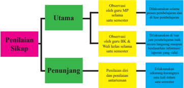

> **Deskripsi Visual:** Gambar ini adalah diagram yang menunjukkan struktur penilaian sikap dalam kurikulum. Diagram ini terdiri dari tiga bagian utama: Utama, Penunjang, dan Penilaian Sikap. 

1. **Apa yang Ditampilkan Secara Keseluruhan**: Gambar ini menggambarkan struktur penilaian sikap dalam kurikulum, yang terdiri dari tiga bagian utama: Utama, Penunjang, dan Penilaian Sikap.

2. **Elemen-Elemen Utama dan Relasinya**: 
   - **Utama**: Ini adalah bagian utama dari struktur penilaian sikap. Dalam diagram ini, elemen utama terdiri dari observasi oleh guru MP selama satu semester.
   - **Penunjang**: Bagian ini meliputi observasi oleh guru HK, Wali kelas selama satu semester, dan penilaian dari dan penilaian antarlingkungan. Setiap elemen ini memiliki hubungan dengan elemen utama, yaitu observasi oleh guru MP.
   - **Penilaian Sikap**: Ini adalah bagian terakhir dari struktur penilaian sikap. Setiap elemen penunjang memiliki hubungan dengan elemen ini, yaitu observasi oleh guru HK, Wali kelas, dan penilaian dari dan penilaian antarlingkungan.

3. **Teks, Angka, atau Label Penting yang Terlihat**: 
   - **Teks Penting**: "Utama", "Penunjang", "Penilaian Sikap".
   - **Angka Penting**: Ada angka 1, 2, dan 3 yang mungkin merujuk pada urutan atau level dalam struktur penilaian sikap.

4. **Informasi Kunci yang Bisa Diambil Pembaca**: Gambar ini memberikan gambaran tentang struktur penilaian sikap dalam kurikulum, yang terdiri dari observasi oleh guru MP, observasi oleh guru HK dan Wali kelas, serta penilaian dari dan penilaian antarlingkungan. Ini membantu pembaca memahami bagaimana sikap dianalisis dan dikembangkan dalam kurikulum tersebut.

Dengan demikian, gambar ini memberikan informasi yang penting tentang struktur penilaian sikap dalam kurik

 

---
## 📄 Halaman 38

### Berikut penjelasan Gambar 1

### a)  Observasi

Observasi  dalam  penilaian  sikap  peserta  didik  merupakan  teknik yang dilakukan secara berkesinambungan  melalui  pengamatan perilaku. Asumsinya, setiap peserta didik pada dasarnya berperilaku baik  sehingga  yang  perlu  dicatat  hanya  perilaku  yang  sangat  baik (positif) atau kurang baik (negatif) yang berkaitan dengan indikator sikap spiritual dan sikap sosial. Catatan hal-hal positif dan menonjol digunakan  untuk  menguatkan  perilaku  positif,  sedangkan  perilaku negatif  digunakan  untuk  pembinaan.  Instrumen  yang  digunakan dalam observasi adalah lembar observasi atau jurnal. Hasil observasi dicatat dalam jurnal yang dibuat selama satu semester oleh guru mata pelajaran, guru BK, dan wali kelas. Jurnal memuat catatan sikap atau perilaku peserta didik yang sangat baik atau kurang baik, dilengkapi dengan  waktu  terjadinya  perilaku  tersebut,  dan  butir-butir  sikap. Berdasarkan catatan tersebut, pendidik membuat deskripsi penilaian sikap peserta didik selama satu semester. Beberapa hal berikut yang perlu  diperhatikan  dalam  melaksanakan  penilaian  sikap  dengan teknik observasi.

- Jurnal digunakan oleh guru mata pelajaran, guru BK, dan wali kelas selama periode satu semester.
- Jurnal  oleh  guru  mata  pelajaran  dibuat  untuk  semua  peserta didik yang mengikuti mata pelajarannya. Jurnal oleh guru BK dibuat untuk semua peserta didik yang menjadi tanggung jawab bimbingannya, dan jurnal oleh wali kelas digunakan untuk satu kelas yang menjadi tanggung jawabnya.
- Hasil  observasi  guru  mata  pelajaran  dan  guru  BK  diserahkan kepada wali kelas untuk diolah lebih lanjut.
- Perilaku sangat baik atau kurang baik yang dicatat dalam jurnal tidak  terbatas  pada  butir-butir  sikap  (perilaku)  yang  hendak ditumbuhkan melalui pembelajaran yang saat itu sedang berlangsung  sebagaimana  dirancang  dalam  RPP,  tetapi  dapat mencakup  butir-butir  sikap  lainnya  yang  ditanamkan  dalam semester itu, jika butir-butir sikap tersebut muncul/ditunjukkan oleh peserta didik melalui perilakunya.

 

---
## 📄 Halaman 39

- Catatan dalam jurnal dilakukan selama satu semester sehingga ada kemungkinan dalam satu hari perilaku yang sangat baik dan/ atau kurang baik muncul lebih dari satu kali atau tidak muncul sama sekali.
- Perilaku  peserta  didik  yang  tidak  menonjol  (sangat  baik  atau kurang  baik)  tidak  perlu  dicatat  dan  dianggap  peserta  didik tersebut menunjukkan perilaku baik atau sesuai dengan norma yang diharapkan.

### Tabel 4 Contoh format dan pengisian jurnal

### guru mata pelajaran PPKn

Satuan Pendidikan

: SMA/SMK……

Tahun Pelajaran

: 2016/2017

Kelas/Semester

: XI/1

Mata Pelajaran

: PPKn

---
**📊 Tabel**

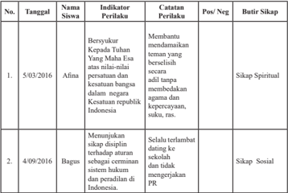

Tabel ini berisi informasi tentang perilaku siswa Afnin dan Bagus pada dua tanggal tertentu, 5 Maret 2016 dan 4 September 2016. Topik utama tabel adalah perilaku dan sikap siswa tersebut terhadap nilai-nilai nasional dan peraturan negara. Kolom-kolom yang ada meliputi tanggal, nama siswa, indikator perilaku, catatan perilaku, posisi positif atau negatif, dan butir sikap. Data penting yang terlihat adalah bahwa Afnin bersikap spiritual dengan menunjukkan kepuasan kepada Tuhan atas nilai-nilainya, sementara Bagus memiliki sikap sosial yang lebih rendah karena tidak mengikuti aturan sekolah dan tidak mengerjakan PR.

 

---
## 📄 Halaman 40

### b)  Penilaian Diri

Penilaian  diri  merupakan  teknik  penilaian  dengan  cara  meminta peserta  didik  untuk  mengemukakan  kelebihan  dan  kekurangan dirinya dalam konteks pencapaian kompetensi sikap. Instrumen yang digunakan berupa lembar penilaian diri menggunakan daftar cek atau skala penilaian ( rating scale ) yang disertai rubrik. Hasil penilaian diri peserta didik dapat digunakan sebagai data konfirmasi. Penilaian diri dapat memberi dampak positif terhadap perkembangan kepribadian peserta didik, antara lain:

- dapat menumbuhkan rasa percaya diri karena diberi kepercayaan untuk menilai diri sendiri.
- peserta  didik  menyadari  kekuatan  dan  kelemahan  diri  karena ketika  melakukan  penilaian,  dia  harus  melakukan  introspeksi terhadap kekuatan dan kelemahan yang dimiliki.
- dapat mendorong, membiasakan, dan melatih peserta didik untuk berbuat  jujur  karena  dituntut  untuk  jujur  dan  objektif  dalam melakukan penilaian.
- membentuk sikap terhadap mata pelajaran/pengetahuan.

### c)  Penilaian Antarteman

Penilaian antarteman adalah penilaian dengan cara peserta didik saling menilai perilaku temannya. Penilaian antarteman dapat mendorong: (a). objektivitas peserta didik, (b). empati, (c).  mengapresiasi keragaman/perbedaan, dan (d). refleksi diri. Sebagaimana penilaian diri, hasil penilaian antarteman  dapat digunakan  sebagai  data konfirmasi.  Instrumen  yang  digunakan  berupa  lembar  penilaian antarteman.  Kriteria  penyusunan  instrumen  penilaian  antarteman sebagai berikut.

- Sesuai dengan indikator yang akan diukur.
- Indikator dapat diukur melalui pengamatan peserta didik.
- Kriteria penilaian dirumuskan secara sederhana, namun jelas dan tidak berpotensi munculnya penafsiran makna ganda/berbeda.
- Menggunakan bahasa lugas yang dapat dipahami peserta didik.
- Menggunakan  format  sederhana  dan  mudah  digunakan  oleh peserta didik.

 

---
## 📄 Halaman 41

- Indikator menunjukkan  sikap/perilaku peserta didik dalam situasi yang nyata atau sebenarnya dan dapat diukur.
Penilaian antarteman paling cocok dilakukan pada saat peserta didik melakukan kegiatan kelompok, misalnya setiap peserta didik diminta mengamati/menilai dua orang temannya, dan dia juga dinilai oleh dua orang teman lainnya dalam kelompoknya. Contoh format penilaian lihat bagian lampiran.

### d)  Penilaian Pengetahuan

Kompetensi  pengetahuan  merupakan  kompetensi  ranah  kognitif dalam taksonomi pendidikan. Perkembangan pencapaian kompetensi pengetahuan melalui tahapan mengingat, memahami, menerapkan, menganalisis, mengevaluasi, dan menciptakan.

Pendidik    menilai    kompetensi    pengetahuan    melalui    teknik  tes tulis,  tes lisan, dan penugasan.

- Instrumen tes tulis berupa soal pilihan ganda, isian, jawaban singkat, benar salah, menjodohkan, dan uraian. Instrumen uraian dilengkapi pedoman penskoran.
- Pilihan Ganda
Soal pilihan ganda secara umum terdiri atas pertanyaan dan alternatif pilihan jawaban. Bentuk penilaian ini lebih tepat digunakan  saat  ulangan  tengah  semester,  akhir  semester, dan ujian sekolah, atau untuk latihan bagi pengayaan.

- Isian
Bentuk ini merupakan salah satu bentuk soal yang jawabannya menuntut siswa untuk melengkapi atau mengisi kata-kata  atau  kelompok  kata  yang  dihilangkan.  Soalnya disusun  seperti  kalimat  lengkap,  kemudian  dihilangkan pada bagian tertentu yang harus diisi oleh siswa. Bentuk penilaian  ini  lebih  tepat  digunakan  saat  ulangan  tengah semester,  akhir  semester,  dan  ujian  sekolah,  atau  untuk latihan bagi pengayaan.

- Jawaban Singkat
Bentuk ini merupakan salah satu bentuk soal objektif yang jawabannya menuntut siswa menjawab soal dengan singkat,

 

---
## 📄 Halaman 42

yaitu  jawabannya  dapat  berupa  satu  kata,  kelompk  kata/ frase,  simbol  matematika,  atau  angka.  Bentuk  penilaian ini  lebih  tepat  digunakan  saat  ulangan  tengah  semester, akhir semester, dan ujian sekolah, atau untuk latihan bagi pengayaan.

### d)  Benar Salah

Bentuk ini merupakan salah satu bentuk soal objektif yang setiap soalnya terdapat dua macam kemungkinan jawaban yang  berlawanan,  yaitu  benar  atau  salah.  Bentuk  soal benar-salah  biasanya  dipergunakan  untuk  menanyakan fakta, ide, dan konsepsi yang kompleks. Bentuk penilaian ini  lebih  tepat  digunakan  saat  ulangan  tengah  semester, akhir semester, dan ujian sekolah, atau untuk latihan bagi pengayaan.

### e)  Menjodohkan

Bentuk ini wujudnya terdiri atas dua kelompok atau kolom. Tugas  siswa  adalah  mencari  pasangan  yang  tepat  dalam dua kelompok itu. Biasanya, bentuk menjodohkan hanya terbatas untuk mengukur kemampuan ingatan.

### f)  Uraian

Soal  uraian  adalah  soal  yang  menuntut  jawaban  peserta tes dengan mengorganisasikan gagasan atau hal-hal yang dipelajari  dengan  cara  mengemukakan  gagasan  tersebut dalam bentuk tulisan.

Soal uraian dibagi atas uraian tertruktur dan uraian tidak terstruktur. Soal uraian terstruktur memiliki jawaban yang terbatas dan jelas. Uraian tidak terstruktur memiliki jawaban yang sangat variatif.

Bentuk soal pilihan ganda, isian, jawaban singkat, benar salah dan menjodohkan,  lebih tepat digunakan saat ulangan tengah semester, ulangan akhir semester, dan ujian sekolah, atau untuk latihan bagi pengayaan. Ulangan harian lebih tepat menggunakan soal  uraian  sehingga  dapat  mengembangkan  berpikir  divergen (beragam).

 

---
## 📄 Halaman 43

### (2)  Instrumen tes lisan berupa daftar pertanyaan.

Tes lisan adalah tes yang pelaksanaan dilakukan dengan mengadakan tanya jawab secara langsung antara pendidik dan peserta didik. Tes lisan dapat dilaksanakan dengan menggunakan pedoman pertanyaan atau tanpa pedoman pertanyaan.

- Instrumen  penugasan berupa   pekerjaan   rumah   dan/atau proyek  yang  dikerjakan  secara  individu  atau  kelompok  sesuai dengan karakteristik tugas.
Penugasan yang bertujuan untuk mencapai komptensi pengetahuan antara lain membuat kliping, mencari data, wawancara,  merangkum,  kajian  tokoh,  kajian  historis,  dan menulis gagasan,

### e)  Penilaian Keterampilan

Penilaian kompetensi keterampilan melalui penilaian kinerja, yaitu  penilaian  yang  menuntut  peserta  didik  mendemonstrasikan suatu  kompetensi  tertentu. Perkembangan pencapaian kompetensi keterampilan melalui tahapan mengamati, menanya, mencoba, mengolah, menyaji, menalar, dan mencipta.

Teknik  penilaian  kompetensi  keterampilan    menggunakan    tes praktik, proyek, dan penilaian portofolio. Instrumen yang digunakan berupa daftar cek atau skala penilaian ( rating scale ) yang dilengkapi rubrik.

### (1)  Tes Praktik

Tes  praktik  adalah  penilaian  yang  menuntut  respons  berupa keterampilan  melakukan  suatu  aktivitas  atau  perilaku  sesuai dengan  tuntutan  kompetensi.  Tes  praktik  dalam  pembelajaran PPKn antara lain melalui simulasi, tes perbuatan, dan sosiodrama.

### (2)  Proyek

Penugasan proyek adalah suatu teknik  penilaian yang menuntut peserta  didik  melakukan  kegiatan  tertentu  di  luar  kegiatan

 

---
## 📄 Halaman 44

pembelajaran di kelas. Penugasan dapat diberikan dalam bentuk individual  atau  kelompok.  Proyek  adalah  suatu  tugas  yang melibatkan  kegiatan  perencanaan,  pelaksanaan,  dan  pelaporan secara  tertulis  maupun  lisan  dalam  waktu  tertentu  umumnya menggunakan data. Penilaian proyek mencakup penilaian proses dan hasil belajar. Penugasan proyek dalam PPKn antara lain melalui proyek belajar kewarganegaraan. Penilaian proyek belajar  kewarganegaraan  dilaksanakan  pada  setiap  langkah kegiatan mulai dari identifikasi masalah sampai dengan penyajian.  Penilaian  meliputi  penilaian  proses  dan  hasil  dari kegiatan ini. Penilaian proses antara lain mencakup persiapan, kerja sama, partisipasi, koordinasi, aktivitas, dan yang lain dalam penyusunan maupun dalam presentasi hasil kerja. Penilaian hasil mencakup dokumen laporan dan presentasi laporan.

### (3)  Portofolio

Penilaian  portofolio  adalah  penilaian  yang  dilakukan  dengan cara  menilai  kumpulan  semua  karya  peserta  didik  dalam bidang tertentu    yang    bersifat    reflektif-integratif    untuk mengetahui minat,      perkembangan,      prestasi,      dan/atau kreativitas peserta didik dalam kurun waktu tertentu. Karya tersebut dapat berbentuk tindakan nyata yang mencerminkan kepedulian peserta didik terhadap lingkungannya. Penilaian portofolio dapat dilakukan  saat  menerapkan  model  pembelajaran  pengabdian masyarakat, partisipasi  kewarganegaraan,  mengajukan  usul/ petisi, partisipasi dalam asosiasi, membangun koalisi, mengelola konflik,  berlatih  empati  dan  toleransi,  kunjungan  lapangan dan  model  pembelajaran  yang  lain.  Penilaian  portofolio  dapat dilakukan untuk menilai kompetensi dasar tentang berinteraksi dengan teman dan menyaji bentuk partisipasi kewarganegaraan. Kedua kompetensi dasar ini merupakan praktik kewarganegaraan yang dapat dilaksanakan pada setiap materi pokok.

 

---
## 📄 Halaman 45

### 5. Pengolahan Hasil Penilaian

### a.  Nilai Sikap Spiritual dan Sikap Sosial

Langkah-langkah  menyusun  rekapitulasi  penilaian  sikap  untuk  satu semester.

- Wali  kelas,  guru  mata  pelajaran,  dan  guru  BK  mengelompokkan (menandai) catatan-catatan jurnal ke dalam sikap spiritual dan sikap sosial.
- Wali  kelas,  guru  mata  pelajaran,  dan  guru  BK  membuat  rumusan deskripsi  singkat  sikap  spiritual  dan  sikap  sosial  sesuai  dengan catatan-catatan jurnal untuk setiap peserta didik yang ditulis dengan kalimat positif. Deskripsi tersebut menyebutkan sikap/perilaku yang sangat baik dan/atau kurang baik dan yang perlu bimbingan.
- Wali kelas mengumpulkan deskripsi singkat (rekap) sikap dari guru mata pelajaran dan guru BK. Wali kelas menyimpulkan (merumuskan deskripsi)  capaian  sikap  spiritual  dan  sosial  setiap  peserta  didik berdasarkan  deskripsi  singkat  sikap  spiritual  dan  sosial  dari  guru mata pelajaran, guru BK, dan wali kelas yang bersangkutan.
- Deskripsi yang ditulis pada sikap spiritual dan sikap sosial adalah perilaku yang menonjol, sedangkan sikap spiritual dan sikap sosial yang  belum  mencapai  kriteria  (indikator)  dideskripsikan  sebagai perilaku yang perlu pembimbingan.
- Dalam  hal  peserta  didik  tidak  ada  catatan  apa  pun  dalam  jurnal, sikap peserta didik tersebut diasumsikan berperilaku sesuai indikator kompetensi.
- Rekap hasil observasi sikap spritual dan sikap sosial yang dilakukan oleh  wali  kelas  sebagai  deskripsi  untuk  mengisi  buku  rapor  pada kolom hasil belajar sikap.

### Rambu-rambu deskripsi pencapaian sikap:

- Sikap yang ditulis adalah sikap spritual dan sikap sosial.
- Deskripsi sikap terdiri atas keberhasilan dan/atau ketercapaian sikap yang diinginkan dan belum tercapai yang memerlukan pembinaan dan pembimbingan.
- Substansi  sikap  spiritual  adalah  hal-hal  yang  berkaitan  dengan menghayati dan mengamalkan ajaran agama yang dianutnya.

 

---
## 📄 Halaman 46

- Substansi sikap sosial adalah hal-hal yang berkaitan dengan menghayati  dan  mengamalkan  perilaku  jujur,  disiplin,  tanggung jawab,  peduli,  santun,  responsif  dan  pro-aktif  dan  menunjukkan sikap sebagai bagian dari solusi atas berbagai permasalahan dalam berinteraksi secara efektif dengan lingkungan sosial dan alam serta dalam menempatkan diri sebagai cerminan bangsa dalam pergaulan dunia.
- Hasil penilaian pencapaian sikap dalam bentuk predikat dan deskripsi.
- Predikat untuk sikap spiritual dan sikap sosial dinyatakan dengan A = sangat baik, B = baik, C = cukup, dan D = kurang. Deskripsi dalam bentuk kalimat positif, memotivasi dan bahan refleksi.
Berikut contoh kesimpulan hasil deskripsi sikap spiritual  dan sikap sosial

Sikap Spiritual:

Selalu  bersyukur  dan  berdoa  sebelum  melakukan  kegiatan serta  memiliki  toleran  pada  agama  yang  berbeda;  ketaatan beribadah mulai berkembang.

Sikap Sosial:

Memiliki  sikap  santun,  disiplin,  dan  tanggung  jawab  yang baik,  responsif  dalam  pergaulan;  sikap  kepedulian  mulai meningkat.

### b.  Nilai Pengetahuan

Nilai  pengetahuan  diperoleh  dari  hasil  penilaian  harian  selama  satu semester  untuk  mengetahui  pencapaian  kompetensi  pada  setiap  KD pada KI-3. Penilaian harian dapat dilakukan melalui tes tertulis dan/atau penugasan, maupun lisan, dan lain-lain sesuai dengan karakteristik setiap KD. Pelaksanaan penilaian harian dapat dilakukan setelah pembelajaran satu KD atau lebih. Penilaian harian dapat dilakukan lebih dari satu kali untuk KD dengan cakupan materi luas dan komplek sehingga penilaian harian tidak perlu menunggu pembelajaran KD tersebut selesai.

Hasil penilaian pengetahuan yang dilakukan oleh pendidik dengan  berbagai  teknik  penilaian  dalam  satu  semester  direkap  dan didokumentasikan pada tabel pengolahan nilai sesuai dengan KD yang

 

---
## 📄 Halaman 47

dinilai.  Jika  dalam  satu  KD  dilakukan  penilaian  lebih  dari  satu  kali, nilai akhir KD tersebut merupakan nilai rerata. Nilai akhir pencapaian pengetahuan  mata  pelajaran  tersebut  diperoleh  dengan  cara  merataratakan hasil pencapaian kompetensi setiap KD selama satu semester. Nilai akhir selama satu semester pada rapor ditulis dalam bentuk angka pada  skala  0  -  100  dan  predikat  serta  dilengkapi  dengan  deskripsi singkat kompetensi yang menonjol berdasarkan pencapaian KD selama satu semester.

### Kelas XI Semester I

---
**📊 Tabel**

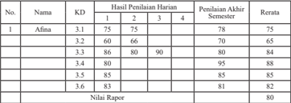

Tabel ini menunjukkan hasil penilaian akhir semester untuk sejumlah siswa di sebuah sekolah. Topik utama tabel adalah perbandingan nilai harian dan akhir semester. Kolom-kolomnya meliputi nomor siswa (No.), nama siswa, kode mata pelajaran (KD), dan hasil penilaian akhir semester. Data penting yang terlihat adalah bahwa Nilai Rapor rata-rata untuk semua siswa adalah 80, dengan perbedaan yang signifikan antara nilai harian dan akhir semester. Siswa dengan nomor 3 memiliki nilai akhir semester tertinggi, sedangkan siswa dengan nomor 2 memiliki nilai akhir semester terendah. Ini menunjukkan bahwa penilaian akhir semester lebih memperhitungkan kinerja harian daripada penilaian harian sendiri.

### Keterangan:

- Penilaian harian dilakukan oleh pendidik dengan cakupan meliputi semua indikator dari satu kompetensi dasar.
- Penilaian akhir semester merupakan kegiatan yang dilakukan oleh satuan pendidikan untuk mengukur pencapaian kompetensi peserta didik  pada  akhir  semester.  Cakupan  penilaian  meliputi  semua indikator yang merepresentasikan semua KD pada semester tersebut
- KD  3.1 dilakukan tagihan penilaian sebanyak 3 kali, nilai pengetahuan pada KD 3.1 adalah 75 + 75 + 78 = 76
- Nilai rapor = 76 + 65 + 84 + 88 + 85 + 82 = 80
6

- Contoh deskripsi kompetensi pengetahuan 'Memiliki  kemampuan  yang  sangat  baik  dalam  menganalisis dinamika peran Indonesia dalam perdamaian dunia sesuai Undang-

 

---
## 📄 Halaman 48

Undang Dasar Negara Republik Indonesia Tahun 1945 dan perlu ditingkatkan  dalam  mengkaji  sistem  dan  dinamika  demokrasi Pancasila  sesuai  dengan  Undang-Undang Dasar Negara Republik Indonesia Tahun 1945'

### c.  Nilai Keterampilan

Nilai  keterampilan  diperoleh  dari  hasil  penilaian  unjuk  kerja/kinerja/ praktik, proyek, produk, portofolio, dan bentuk lain sesuai karakteristik KD mata pelajaran. Hasil penilaian pada setiap KD pada KI-4 adalah nilai  optimal  jika  penilaian  dilakukan  dengan  teknik  yang  sama  dan objek KD yang sama. Penilaian KD yang sama yang dilakukan dengan proyek dan produk atau praktik dan produk, hasil akhir penilaian KD tersebut  dirata-ratakan.  Untuk  memperoleh  nilai  akhir  keterampilan pada  setiap  mata  pelajaran  adalah  rerata  dari  semua  nilai  KD  pada KI-4 dalam satu semester. Selanjutnya, penulisan capaian keterampilan pada rapor menggunakan angka pada skala 0 - 100 dan predikat serta dilengkapi deskripsi singkat capaian kompetensi.

Berikut  contoh  cara  pengolahan  nilai  keterampilan    yang  dilakukan melalui praktik pada KD 4.1 sebanyak 1 kali dan KD 4.2 sebanyak 2 kali. KD 4.3 dan KD 4.4 dinilai melalui satu proyek. Selain itu KD 4.4 juga dinilai melalui satu kali produk.

---
**📊 Tabel**

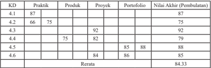

Tabel ini menunjukkan data tentang hasil praktik, proyek, dan portofolio untuk beberapa produk atau unit kerja. Topik utama tabel adalah evaluasi kinerja kerja yang dilakukan oleh tim. Kolom-kolom yang ada meliputi: KD (Kode Unit Kerja), Praktik, Proyek, Portofolio, dan Nilai Akhir (Pembulatan). Data penting yang terlihat adalah bahwa nilai akhir rata-rata untuk semua unit kerja adalah 84.33. Ini menunjukkan bahwa keseluruhan kinerja kerja tersebut cukup baik dengan rata-rata sekitar 84.33.

### Keterangan:

- Pada KD 4.1, 4.2, dan 4.3, 4.5, Nilai Akhir diperoleh berdasarkan nilai optimum. Nilai aktif untuk KD 4.4 diperoleh berdasarkan rata-

 

---
## 📄 Halaman 49

- rata  karena  menggunakan  proyek  dan  produk,  dan  4.6  diperoleh berdasarkan rata-rata proyek dan portofolio.
- Nilai akhir semester didapat dengan cara merata-ratakan nilai akhir pada setiap KD.
- Nilai rapor = 87 + 75 + 92 + 79 + 88 + 85 = 84.33 (pembulatan 84)
6

- Nilai  rapor  keterampilan  dilengkapi  deskripsi  singkat  kompetensi yang menonjol berdasarkan pencapaian KD pada KI-4 selama satu semester.
- Contoh deskripsi kompetensi keterampilan :
'Memiliki kemampuan yang sangat baik dalam mempresentasikan hasil  penalaran  tentang    sistem  hukum  dan  peradilan  di  Indonesia sesuai  dengan  Undang-Undang  Dasar  Negara  Republik  Indonesia Tahun  1945,  dan  perlu  ditingkatkan  dalam  menyaji  hasil  kajian tentang  sistem  dan  dinamika  demokrasi  Pancasila  sesuai  dengan Undang-Undang Dasar Negara Republik Indonesia Tahun 1945'

### 6. Pembelajaran Remedial dan Pengayaan

Konsekuensi dari pembelajaran tuntas adalah tuntas atau belum tuntas. Bagi peserta  didik  yang  belum  mencapai  KKM,  dilakukan  tindakan  remedial dan bagi peserta didik yang sudah mencapai atau melampaui ketuntasan belajar  dilakukan  pengayaan.  Pembelajaran  remedial  dan  pengayaan dilaksanakan untuk kompetensi pengetahuan dan keterampilan, sedangkan sikap tidak ada remedial atau pengayaan, namun menumbuhkembangkan sikap, perilaku, dan pembinaan karakter setiap peserta didik.

### a.  Bentuk Pelaksanaan Remedial

Setelah diketahui kesulitan belajar yang dihadapi peserta didik, langkah berikutnya adalah memberikan perlakuan berupa pembelajaran remedial. Bentuk-bentuk  pelaksanaan  pembelajaran  remedial  antara  lain  seperti berikut.

- Pemberian  pembelajaran  ulang  dengan  metode  dan  media  yang berbeda.  Pembelajaran  ulang  dapat  disampaikan  dengan  variasi cara penyajian, penyederhanaan tes/pertanyaan. Pembelajaran ulang dilakukan bilamana sebagian besar atau semua peserta didik belum mencapai  ketuntasan  belajar atau mengalami  kesulitan  belajar. Pendidik perlu memberikan penjelasan kembali dengan menggunakan metode dan/atau media yang lebih tepat.

 

---
## 📄 Halaman 50

- Pemberian bimbingan secara khusus, misalnya bimbingan perorangan. Dalam hal pembelajaran klasikal peserta didik tertentu mengalami kesulitan,  perlu  dipilih  alternatif  tindak  lanjut  berupa  pemberian bimbingan  secara  individual.  Pemberian  bimbingan  perorangan merupakan  implikasi  peran  pendidik  sebagai  tutor.  Sistem  tutorial dilaksanakan bilamana terdapat satu atau beberapa peserta didik yang belum berhasil mencapai ketuntasan.
- Pemberian tugas-tugas latihan secara khusus. Dalam rangka pelaksanaan  remedial,  tugas-tugas  latihan  perlu  diperbanyak  agar peserta  didik  tidak  mengalami  kesulitan  dalam  mengerjakan  tes akhir. Peserta didik perlu diberi pelatihan intensif untuk membantu menguasai kompetensi yang ditetapkan.
- Pemanfaatan tutor sebaya. Tutor sebaya adalah teman sekelas atau kakak  kelas  yang  memiliki  kecepatan  belajar  lebih.  Mereka  perlu dimanfaatkan untuk memberikan tutorial kepada rekan atau adik kelas yang mengalami kesulitan belajar. Melalui tutor sebaya diharapkan peserta didik yang mengalami kesulitan belajar akan lebih terbuka dan akrab.

### b.  Bentuk Pelaksanaan Pengayaan

Bentuk-bentuk  pelaksanaan  pembelajaran  pengayaan  dapat  dilakukan antara lain melalui:

- belajar  kelompok,  yaitu  sekelompok  peserta  didik  yang  memiliki minat tertentu diberikan pembelajaran bersama di luar jam pelajaran;
- belajar mandiri, yaitu secara mandiri peserta didik belajar mengenai sesuatu yang diminati; dan
- pembelajaran berbasis tema, yaitu memadukan kurikulum di bawah tema  besar  sehingga  peserta  didik  dapat  mempelajari  hubungan antara berbagai disiplin ilmu.

### c.  Hasil Penilaian

- Nilai remedial yang diperoleh diolah menjadi nilai akhir.
- Nilai  akhir  setelah  remedial  untuk  aspek  pengetahuan  dihitung dengan  mengganti  nilai  indikator  yang  belum  tuntas  dengan  nilai indikator hasil remedial, yang selanjutnya diolah berdasarkan rerata nilai semua KD.

 

---
## 📄 Halaman 51

- Nilai akhir setelah remedial untuk aspek keterampilan diambil dari nilai optimal KD.
- Penilaian  hasil  belajar  kegiatan  pengayaan  tidak  sama  dengan kegiatan pembelajaran biasa, tetapi cukup dalam bentuk portofolio, dan  harus  dihargai  sebagai  nilai  tambah  (lebih)  dari  peserta  didik yang normal.

### 7. Interaksi Guru dan Orang Tua

Keberhasilan pendidikan banyak dipengaruhi oleh beberapa faktor, baik faktor  internal  ataupun  faktor  eksternal.  Permendikbud  103  menjelaskan bahwa pihak-pihak yang terlibat dalam pembelajaran antara lain sebagai berikut.

- Peserta didik.
- Pendidik,  yaitu  guru  mata  pelajaran,  guru  kelas,  guru  pembina  kegiatan ekstrakurikuler.
- Tenaga kependidikan yaitu pengelola satuan pendidikan, penilai, pamong belajar, pengawas, peneliti, pengembang, pustakawan, laboran, dan teknisi sumber belajar.
- Pimpinan satuan pendidikan, yaitu kepala sekolah, wakil kepala sekolah, wali kelas.
- Dinas Pendidikan dan Kantor Kementerian Agama Provinsi dan Kabupaten/ kota sesuai dengan kewenangannya.
Orang tua juga memiliki peran dan andil yang besar dalam mensukseskan keberhasilan pendidikan nasional, termasuk dalam kegiatan pembelajaran di  sekolah.  Orang  tua  dapat  menjadi  pendorong  sukses  atau  tidaknya peserta didik dalam menempuh pendidikan. Oleh karena itu, sekolah harus melakukan  interaksi  dengan  orang  tua  mengenai  seluruh  aktivitas  dan kemajuan belajar peserta didik. Prinsipnya, pendidikan adalah pelayanan, orang tua sebagai pengguna sekolah tentunya harus mendapatkan pelayanan. Pelayanan terhadap orang tua dalam dunia pendidikan antara lain sebagai berikut.

- Mendapatkan informasi tentang program sekolah.
- Memiliki akses untuk memengaruhi kebijakan sekolah.
- Mendapatkan informasi kemajuan belajar anaknya.
- Memiliki kesempatan untuk menyampaikan harapannya tentang kemajuan belajar anaknya di sekolah.

 

---
## 📄 Halaman 52

Untuk  dapat  memperoleh  informasi  kemajuan  belajar  anaknya,  orang tua mendapatkan informasi dari guru atau wali kelas atau guru Bimbingan Konseling.  Oleh  karena  itu,  diperlukan  sebuah  informasi  khusus  yang dibuat  guru/wali  kelas  kepada  orang  tua  peserta  didik.  Orang  tua  ikut menandatangani dan memberikan komentarnya terhadap hasil belajar anak dalam  setiap  kompetensi,  baik  kompetensi  sikap,  pengetahuan  ataupun keterampilan. Apabila semua itu dilakukan, semua kegiatan pembelajaran menjadi lengkap. Adapun interaksi guru dan orang tua dapat menggunakan format di bawah ini.

---
**📊 Tabel**

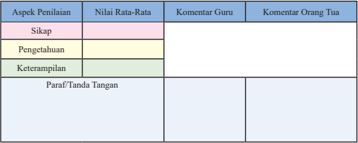

Tabel ini menunjukkan hasil penilaian siswa dalam beberapa aspek, yaitu sikap, pengetahuan, dan keterampilan. Setiap aspek memiliki nilai rata-rata yang ditentukan oleh guru dan orang tua. Guru memberikan komentar untuk setiap aspek, sementara orang tua memberikan komentar mereka sendiri. Paragraf/tanda tangan juga diisi untuk menandakan akhir penilaian. Topik utama tabel ini adalah evaluasi akademik siswa dalam berbagai aspek, dengan fokus pada sikap, pengetahuan, dan keterampilan.

 

---
## 📄 Halaman 53

Buku ini merupakan pedoman guru dalam mengelola program pembelajaran terutama dalam memfasilitasi peserta didik untuk mendalami  Pendidikan Pancasila dan Kewarganegaraan (PPKn) sebagaimana terdapat dalam buku siswa. Materi pelajaran PPKn yang terdapat pada buku siswa akan diajarkan selama 1 (satu) tahun pelajaran. Sesuai dengan desain waktu dan materi, setiap bab akan diselesaikan dalam waktu 4 minggu atau 4 kali pertemuan. Agar pembelajaran itu  lebih  efektif,  efisien  dan  sistematis,  secara  umum,  program  pembelajaran setiap pertemuan dirancang terdiri dari: (1)Kompetensi Inti (2) Kompetensi Dasar (3) Indikator Pencapaian Kompetensi, (4) Materi dan Proses Pembelajaran, (5) Penilaian, (6) Pengayaan, (7) Remedial dan (8) Interaksi Guru dan Orang tua.

### Petunjuk Pelaksanaan Pembelajaran

Berdasarkan pemahaman tentang Kompetensi Inti (KI) dan Kompetensi Dasar (KD), guru PPKn dalam pelaksanaan pembelajaran  hendaknya  memperhatikan hal-hal sebagai berikut.

- Guru diharapkan dapat mempersiapkan diri dengan membaca dari berbagai literatur atau sumber bahan ajar yang relevan dengan materi pembelajaran.
- Guru dapat menggunakan isu-isu aktual untuk dapat mengajak peserta didik dalam mengembangkan kemampuan analisis dan evaluatif dengan mengambil contoh kasus dari situasi yang berkembang saat ini.
- Untuk  mendapatkan  pemahaman  yang  lebih  komprehensif  guru  dapat menampilkan  foto-foto,  gambar,  dan  dokumentasi  audiovisual  (film)  yang relevan dengan materi pelajaran.

 

---
## 📄 Halaman 54

- Guru harus memberikan motivasi dan mendorong peserta didik secara aktif ( active  learning )  untuk  mencari  sumber  dan  contoh-contoh  konkret  dari lingkungan sekitar.
- Guru harus  menciptakan  situasi  belajar  yang  memungkinkan  peserta  didik melakukan observasi dan refleksi. Observasi dapat dilakukan dengan berbagai cara, misalnya membaca buku yang relevan disertai dengan analisis yang bersifat kritis, membuat laporan tertulis secara sederhana, melakukan wawancara  dengan  narasumber,  menonton  film  dan  lain  sebagainya  yang berkaitan dengan pembahasan materi.
- Peserta didik dirangsang untuk berpikir kritis dengan membuat pertanyaanpertanyaan berdasarkan wacana/gambar, memberikan pertanyaan-pertanyaan serta mempertahankan pendapatnya pada setiap jalannya diskusi dalam proses pembelajaran di kelas.
- Guru dapat mengaitkan konteks materi pelajaran dengan konteks lingkungan tempat  tinggal  peserta  didik  (kabupaten/kota,  provinsi,  pulau)  pada  proses pembelajaran di kelas atau di luar kelas.
- Peserta  didik  harus    selalu  dimotivasi  agar  memiliki  kemampuan    dalam mengomunikasikan hasil proses pengumpulan dan analisis data terkait dengan materi yang sedang diajarkan.
- Penggunaan  media/alat/bahan  pelajaran  hendaknya  memperhatikan  situasi dan kondisi lingkungan sekolah, khususnya ketersediaan sarana dan prasarana di  sekolah.  Jika  dipandang  perlu,  pendidik  dapat  memanfaatkan  teknologi informasi  atau  pendidik  dapat  membuat  media  pembelajaran  yang  bersifat sederhana  yang  menunjang  penguasaan  materi  pembalajaran  secara  efektif dan efisien.
- Dalam  rangka  efektivitas  dan  efisiensi  penyerapan  materi  pelajaran,  guru dapat  membagi  peserta  didik  ke  dalam  beberapa  kelompok  sesuai  dengan jumlah peserta didik dalam kelas. Kelompok yang telah ditetapkan ditugaskan untuk membuat bahan presentasi kelompok dan mempresentasikannya sesuai dengan tugas  yang telah diberikan kepadanya.
- Pelaksanaan  proyek  kewarganegaraan  yang  dilaksanakan  dalam  kelompok dalam pelaksanaannya dapat melakukan kerja sama dengan lembaga/instansi terkait sehingga peserta didik mendapatkan informasi secara lengkap. Contoh; tokoh  agama/masyarakat,  pengurus  RT/RW,  kepala  kelurahan/pemangku.

 

---
## 📄 Halaman 55

pejabat pemerintahan, dan lain sebagainya.

Perlu diperhatikan bahwa dalam uraian kegiatan, setiap bab merupakan pilihan atau contoh semata, bukan sesuatu yang bersifat mutlak harus diterapkan secara utuh oleh guru dalam kegiatan pembelajaran. Pada dasarnya, gurulah yang berhak untuk mendesain dan menentukan proses pembelajaran di kelas. Indikator pencapaian kompetensi, tujuan pembelajaran, materi pokok, pendekatan, model dan metode serta penilaian dapat disesuaikan dengan kemampuan guru, karakteristik peserta didik, sarana dan prasarana, sumber belajar serta alokasi waktu yang tersedia. Namun demikian, dalam proses pembelajaran guru harus tetap sesuai dengan Kurikulum 2013.

 

---
## 📄 Halaman 56

### Peta Materi dan Pembelajaran Bab 1

---
**🖼️ Gambar/Diagram**

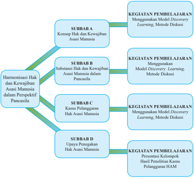

> **Deskripsi Visual:** Gambar ini adalah diagram yang menunjukkan struktur topik dan kegiatan pembelajaran dalam sebuah buku pelajaran. Diagram ini terdiri dari empat subbab (SUBBAB A, SUBBAB B, SUBBAB C, dan SUBBAB D) yang masing-masing berisi konten pembelajaran spesifik tentang Hak Asasi Manusia. Setiap subbab dihubungkan dengan kegiatan pembelajaran yang menggunakan Model Discovery Learning dan Metode Diskusi.

SUBBAB A membahas konsep hak dan kewajiban asasi manusia, sedangkan SUBBAB B fokus pada harmonisasi hak dan kewajiban asasi manusia dalam perspektif Pancasila. SUBBAB C menguraikan kasus-kasus pelanggaran hak asasi manusia, sementara SUBBAB D membahas upaya penegakan hak asasi manusia.

Keempat subbab tersebut disertai dengan kegiatan pembelajaran yang sama, yaitu penggunaan Model Discovery Learning dan Metode Diskusi. Selain itu, ada juga kegiatan pembelajaran yang lebih spesifik seperti presentasi kelompok hasil penelitian kasus pelanggaran HAM.

Dengan demikian, diagram ini memberikan gambaran jelas tentang struktur topik dan kegiatan pembelajaran yang akan dilakukan dalam buku pelajaran ini, serta bagaimana topik-topik tersebut terkait satu sama lain melalui kegiatan pembelajaran yang serupa.

 

---
## 📄 Halaman 57

### Pembelajaran Bab 1

### HARMONISASI HAK DAN KEWAJIBAN ASASI MANUSIA DALAM PERSPEKTIF PANCASILA

### A. Kompetensi Inti (KI)

- Menghayati dan mengamalkan ajaran agama yang dianutnya.
- Menghayati dan mengamalkan perilaku jujur, disiplin, tanggung jawab, peduli (gotong royong, kerja sama, toleran, damai), santun, responsif dan  pro-aktif  dan  menunjukkan  sikap  sebagai  bagian  dari  solusi  atas berbagai permasalahan dalam berinteraksi secara efektif dengan lingkungan  sosial  dan  alam  serta  dalam  menempatkan  diri  sebagai cerminan bangsa dalam pergaulan dunia.
- Memahami, menerapkan, menganalisis pengetahuan faktual, konseptual, prosedural berdasarkan rasa ingin tahunya tentang ilmu pengetahuan, teknologi, seni, budaya, dan humaniora dengan wawasan kemanusiaan, kebangsaan, kenegaraan, dan peradaban terkait penyebab fenomena dan kejadian, serta menerapkan pengetahuan prosedural pada bidang kajian yang  spesifik  sesuai  dengan  bakat  dan  minatnya  untuk  memecahkan masalah.
- Mengolah, menalar dan menyaji dalam ranah konkret dan ranah abstrak terkait dengan pengembangan dari yang dipelajarinya di sekolah secara mandiri, dan mampu menggunakan metode sesuai kaidah keilmuan.

### B. Kompetensi  Dasar  (KD)  dan  Indikator  Pencapaian Kompetensi (IPK)

---
**📊 Tabel**

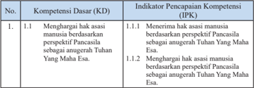

Tabel ini berisi informasi tentang kompetensi dasar (KD) dan indikator pencapaian kompetensi (IPK) yang berkaitan dengan menghargai asasi manusia berdasarkan perspektif Pancasila sebagai anugerah Tuhan Yang Maha Esa. Topik utama tabel adalah tentang bagaimana menghargai asasi manusia tersebut. Kolom pertama menunjukkan nomor urut dari KD, sedangkan kolom kedua menunjukkan KD dan IPK yang relevan. Data penting yang terlihat adalah bahwa KD 1.1.1 melibatkan menerima asasi manusia berdasarkan perspektif Pancasila sebagai anugerah Tuhan Yang Maha Esa, sementara KD 1.1.2 melibatkan menghargai asasi manusia berdasarkan perspektif Tuhan Yang Maha Esa. Ini menunjukkan bahwa tabel ini fokus pada dua aspek utama dari kompetensi dasar tersebut, yaitu menerima dan menghargai asasi manusia berdasarkan perspektif Tuhan Yang Maha Esa.

 

---
## 📄 Halaman 58

---
**📊 Tabel**

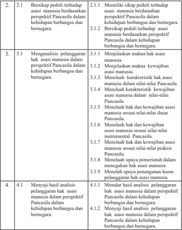

Tabel ini berisi informasi tentang analisis asas manusia dalam perspektif Pancasila dalam konteks kehidupan berbangsa dan bernegara. Topik utamanya adalah analisis hak asasi manusia tersebut. Kolom pertama menunjukkan nomor urut dari setiap subtopik, sedangkan kolom kedua berisi deskripsi singkat dari subtopik tersebut. Data penting yang terlihat antara lain bahwa setiap subtopik dibagi menjadi dua bagian: 1) Meningkatkan hak asasi manusia dan 2) Menjelaskan muka-muka hak asasi manusia. Pola yang jelas adalah bahwa setiap subtopik memiliki dua poin penjelasan yang berbeda, yang menunjukkan bahwa analisis ini mencakup berbagai aspek dari hak asasi manusia dalam konteks Pancasila.

### C. Materi Pembelajaran Bab 1

- Konsep hak dan kewajiban asasi manusia.
- Makna hak asasi manusia.
- Makna kewajiban asasi manusia.
- Substansi hak dan kewajiban asasi manusia dalam Pancasila.
- Hak dan kewajiban asasi manusia dalam nilai dasar Pancasila.

 

---
## 📄 Halaman 59

- Hak dan kewajiban asasi manusia dalam nilai instrumental Pancasila.
- Hak dan kewajiban asasi manusia dalam nilai praksis Pancasila.
- Kasus pelanggaran Hak Asasi Manusia.
- Penyebab pelanggaran Hak Asasi Manusia.
- Kasus pelanggaran Hak Asasi Manusia di Indonesia.
- Upaya penegakan Hak Asasi Manusia (HAM).
- Upaya pemerintah dalam menegakan Hak Asasi Manusia.
- Upaya penanganan kasus pelanggaran Hak Asasi Manusia.

### C. Proses Pembelajaran

### 1. Pertemuan Pertama (2 x 45 menit)

Pertemuan pertama diawali dengan mengulas isu-isu aktual yang ada di sekitar peserta didik. Pada pertemuan pertama, guru dapat menyampaikan gambaran umum materi yang akan dipelajari pada Bab 1, kegiatan apa yang akan dilaksanakan, menjelaskan pentingnya mempelajari materi ini,  bagaimana  guru  dapat  menumbuhkan  ketertarikan  peserta  didik terhadap materi yang akan dipelajari.  Setelah itu,  guru menyampaikan batasan materi apa saja yang akan dipelajari pada  Bab 1.

### a. Indikator Pencapaian Kompetensi

- Menerima  hak  asasi  manusia  berdasarkan  perspektif  Pancasila sebagai anugerah Tuhan Yang Maha Esa.
- Menghargai hak asasi manusia berdasarkan perspektif Pancasila sebagai anugerah Tuhan Yang Maha Esa.
- Memiliki  sikap  peduli  terhadap    asasi    manusia  berdasarkan perspektif Pancasila dalam kehidupan berbangsa dan bernegara.
- Bersikap peduli terhadap  asasi  manusia berdasarkan perspektif Pancasila dalam kehidupan berbangsa dan bernegara.
- Mengidentifikasi  karakteristik hak asasi manusia.
- Mengidentifikasi karakteristik kewajiban asasi manusia.
- Menjelaskan  makna hak asasi manusia.
- Menjelaskan makna kewajiban asasi manusia.
- Menalar  hasil  analisis    pelanggaran  hak    asasi  manusia  dalam perspektif Pancasila dalam kehidupan berbangsa dan bernegara.
- Menyaji  hasil  analisis    pelanggaran  hak    asasi  manusia  dalam perspektif Pancasila dalam kehidupan berbangsa dan bernegara.

 

---
## 📄 Halaman 60

### b. Materi Pembelajaran

Materi pertemuan pertama membahas Subbab  A, yaitu Konsep Hak dan Kewajiban Asasi Manusia dengan uraian materi sebagai berikut.

- Makna hak asasi manusia.
- Makna kewajiban asasi manusia.
- Karakteristik hak asasi manusia.
- Karakteristik kewajiban asasi manusia.
- Pengertian hak dan kewajiban asasi manusia.

### c. Proses Pembelajaran

Proses pembelajaran  menggunakan  pendekatan  saintifik  model pembelajaran Discovery Learning . Pelaksanaan pembelajaran secara umum dibagi  menjadi  tiga  tahapan,  yaitu    kegiatan  pendahuluan, kegiatan inti, dan kegiatan penutup.

---
**📊 Tabel**

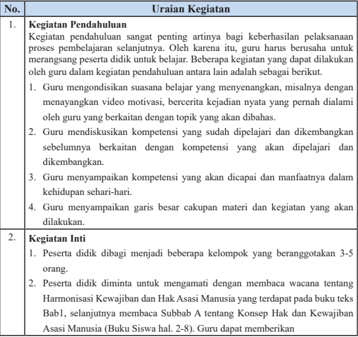

Tabel ini berisi informasi tentang pendahuluan dan inti kegiatan pelatihan. Topik utama adalah proses pembelajaran selanjutnya, dimana guru harus berusaha untuk merangsang peserta didik untuk belajar. Kegiatan pendahuluan meliputi: 1) Guru menggunakan video motivasi untuk mengejar kesiapan peserta didik; 2) Guru menyampaikan kompetensi yang telah diperoleh dan dikembangkan sebelumnya; 3) Guru menunjukkan kompetensi yang akan dicapai dan manfaatnya dalam kehidupan sehari-hari; 4) Guru menyampaikan garis besar kapan materi dan kegiatan akan dilakukan. Kegiatan inti adalah pembagian peserta didik menjadi beberapa kelompok beranggotakan 3-5 orang, dan peserta didik tidak diminta untuk membangun wacana tentang harmonisasi keawasan hak dan asasi manusia.

 

---
## 📄 Halaman 61

informasi tambahan terkait dengan wacana tersebut dengan berbagai peristiwa sejenis  di  lingkungan  peserta  didik  dan  memberikan  penekan  dengan  info kewarganegaraan tentang dasar pemikiran Undang-Undang Nomor 39 Tahun 1999 tentang Hak Asasi Manusia.

- Peserta didik secara kelompok mengidentifikasi sekaligus mencatat pertanyaan yang ingin diketahui tentang konsep hak dan kewajiban asasi manusia.
- Guru membimbing dan terus mendorong peserta didik untuk terus menggali rasa ingin tahu dengan mendalam tentang konsep  hak  dan kewajiban asasi manusia dengan mengisi daftar pertanyaan sebagai berikut.
- Guru  memberi  motivasi  dan  penghargaan  bagi  kelompok  yang  menyusun pertanyaan terbanyak dan sesuai dengan Indikator Pencapaian Kompetensi.
- Guru mengamati keterampilan peserta didik secara perorangan dan kelompok dalam menyusun pertanyaan.
- Peserta didik mencari informasi dan mendiskusikan jawaban atas pertanyaan yang disusun dan mengumpulkan informasi untuk menjawab pertanyaan yang terdapat pada Tugas Mandiri 1.1 dengan membaca sumber lain yang relevan dari buku atau internet.
- Peran guru pada  tahap ini adalah seperti berikut.
- Menyediakan berbagai sumber belajar seperti buku teks siswa dan buku referensi lain.
- Guru  menjadi  sumber  belajar  bagi  peserta  didik  dengan  memberikan konfirmasi atas jawaban peserta didik, atau menjelaskan jawaban pertanyaan kelompok yang tidak terjawab.
- Guru dapat juga menunjukkan buku atau sumber belajar lain yang dapat dijadikan referensi untuk menjawab pertanyaan.
- Peserta  didik  menghubungkan  berbagai  informasi  yang  diperoleh  untuk menganalisis persamaan dan perbedaan definisi tentang hak dan kewajiban asasi manusia dan menyimpulkan makna hak dan kewajiban asasi manusia.
- Peserta  didik  menyusun  laporan  hasil  telaah/analisisnya.  Laporan  disusun secara individu dan menjadi tugas peserta didik dan dikumpulkan pada akhir pertemuan ini.

 

---
## 📄 Halaman 62

- Peserta didik secara acak (2-3 orang) diminta untuk menyajikan hasil analisis tentang makna hak dan kewajiban asasi manusia secara lisan. Peserta didik yang lain diminta untuk menanggapi atau melengkapi hasil telaah tersebut.
- Guru memberikan konfirmasi/penguatan atas jawaban peserta didik.

### 3. Kegiatan Penutup

- Guru dan peserta didik membuat rangkuman atau simpulan kompetensi yang telah dipelajari.
- Guru  dan  peserta  didik  melakukan  refleksi  terhadap  kegiatan  yang  sudah dilaksanakan.
- Guru memberikan umpan balik terhadap proses dan hasil belajar.
- Guru menyampaikan rencana pembelajaran untuk pertemuan berikutnya.
- Guru  dan  peserta  didik  menutup  pelajaran  dengan  mengucapkan  syukur kepada Tuhan Yang Maha Esa karena pembelajaran  berlangsung aman dan tertib.

### d.  Penilaian

### 1.  Penilaian Sikap

Penilaian  sikap  terhadap  peserta  didik  dapat  dilakukan  selama proses  belajar  berlangsung.  Penilaian  dapat  dilakukan  dengan observasi. Dalam observasi, misalnya dilihat aktivitas dan tingkat perhatian peserta didik selama proses pembelajaran berlangsung. Format    penilaian  sikap  dapat  menggunakan  contoh    jurnal perkembangan sikap sebagai berikut.

### Jurnal Perkembangan Sikap

Kelas

: ……..............…….

Semester

: ……..............…….

---
**📊 Tabel**

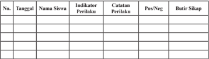

Tabel ini berisi informasi tentang perilaku siswa di kelas, dengan kolom-kolom seperti tanggal, nama siswa, indikator perilaku, catatan perilaku, posisi positif atau negatif, dan butir sikap. Topik utama tabel ini adalah pengamatan perilaku siswa dalam kegiatan belajar-mengajar. Data penting yang terlihat adalah bahwa beberapa siswa memiliki perilaku yang positif, seperti yang ditunjukkan oleh butir sikap mereka, sementara beberapa siswa memiliki perilaku yang negatif, seperti yang ditunjukkan oleh catatan perilakunya. Tabel ini membantu guru untuk memantau perkembangan perilaku siswa dan memberikan bantuan atau perbaikan sesuai dengan butir sikap yang diberikan.

 

---
## 📄 Halaman 63

### 2.  Penilaian Pengetahuan

- Guru  dapat  membuat  pertanyaan  sesuai  dengan  indikator sebagai berikut.
- Jelaskan makna hak asasi manusia!
- Jelaskan makna kewajiban asasi manusia!
- Jelaskan karakteristik hak asasi manusia!
- Jelaskan karakteristik kewajiban asasi manusia!
- Jelaskan pengertian hak dan kewajiban asasi manusia!
- Penilaian  pengetahuan  dilakukan  dalam  bentuk  penugasan, yaitu Tugas Mandiri 1.1 sebagai berikut.
- Carilah  definisi  hak  dan  kewajiban  asasi  dari  beberapa pakar. Kalian dapat menemukannya dari buku sumber lain atau media online. Tulislah hasil temuan kalian dalam tabel di bawah ini.
- Setelah kalian berhasil menemukan pendapat pakar-pakar tentang definisi hak dan kewajiban asasi, analisis persamaan dan perbedaan definisi-definisi tersebut.
- Coba kalian rumuskan sendiri definisi hak dan kewajiban asasi manusia.

### 3.  Penilaian Keterampilan

Penilaian keterampilan dilakukan guru dengan  melihat kemampuan peserta didik dalam kemampuan bertanya, kemampuan menjawab pertanyaan atau mempertahankan argumentasi kelompok, kemampuan dalam memberikan masukan/saran pada saat menyampaikan hasil telaah/analisis tentang makna hak dan kewajiban asasi manusia. Lembar penilaian penyajian dan laporan hasil  telaah  dapat  menggunakan  format  sebagaimana  terdapat pada lampiran dengan ketentuan aspek penilaian dan rubriknya dapat disesuaikan dengan situasi dan kondisi serta keperluan guru.

 

---
## 📄 Halaman 64

### 2.  Pertemuan Kedua (2 x 45 menit)

### a.  Indikator Pencapaian Kompetensi

- Menerima  hak  asasi  manusia  berdasarkan  perspektif  Pancasila sebagai anugerah Tuhan Yang Maha Esa.
- Menghargai hak asasi manusia berdasarkan perspektif Pancasila sebagai anugerah Tuhan Yang Maha Esa.
- Memiliki  sikap  peduli  terhadap    asasi    manusia  berdasarkan perspektif Pancasila dalam kehidupan berbangsa dan bernegara.
- Bersikap peduli terhadap  asasi  manusia berdasarkan perspektif Pancasila dalam kehidupan berbangsa dan bernegara.
- Mengidentifikasi hak dan kewajiban asasi manusia dalam nilainilai  dasar Pancasila.
- Mengidentifikasi  hak  dan  kewajiban  asasi  manusia  dalam  nilai instrumental sila-sila Pancasila.
- Mengidentifikasi  hak  dan  kewajiban  asasi  manusia  dalam  nilai praksis Pancasila.
- Menalar  hasil  analisis    pelanggaran  hak    asasi  manusia  dalam perspektif Pancasila dalam kehidupan berbangsa dan bernegara.
- Menyaji  hasil  analisis    pelanggaran  hak    asasi  manusia  dalam perspektif Pancasila dalam kehidupan berbangsa dan bernegara.

### b.  Materi Pembelajaran

Menganalisis  substansi  hak  dan  kewajiban  asasi  manusia  dalam Pancasila.

- Hak dan kewajiban asasi manusia dalam nilai dasar  Pancasila.
- Hak  dan  kewajiban  asasi  manusia  dalam  nilai  instrumental Pancasila.
- Hak dan kewajiban asasi manusia dalam nilai praksis Pancasila.

### c.  Proses Pembelajaran

Proses pembelajaran menggunakan  pendekatan  saintifik  model pembelajaran Discovery Learning . Pelaksanaan pembelajaran secara umum  dibagi  menjadi  tiga  tahapan  yaitu    kegiatan  pendahuluan, kegiatan inti, dan kegiatan penutup.

 

---
## 📄 Halaman 65

---
**📊 Tabel**

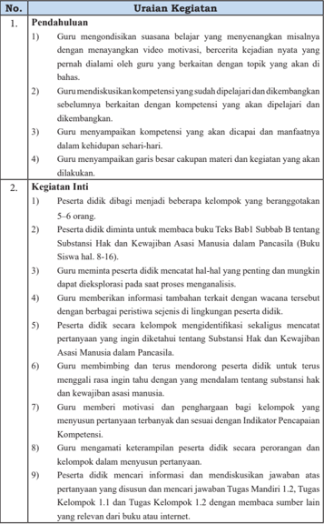

Tabel ini berisi informasi tentang proses pendahuluan dan kegiatan inti dalam sebuah kegiatan belajar mengajar. Topik utama tabel adalah "Pendahuluan" dan "Kegiatan Inti". Dalam kolom "Pendahuluan", terdapat 4 poin yang menjelaskan langkah-langkah guru dalam menyiapkan dan mengawali kegiatan belajar, seperti mendiskusikan suasana belajar, membahas kompetensi yang akan dipelajari, memberikan garis besar materi, dan menyiapkan garis besar kegiatan. Sedangkan dalam kolom "Kegiatan Inti", terdapat 9 poin yang menjelaskan tugas-tugas peserta didik dalam proses belajar, seperti membaca buku teks, mencatat hal-hal penting, memberikan informasi tambahan, membangun kelompok, memberikan motivasi, mengamati keterampilan, mendiskusikan jawaban, dan menggunakan sumber lain yang relevan dengan buku tersebut. Data penting yang terlihat adalah bahwa proses belajar ini melibatkan interaksi antara guru dan peserta didik, serta penggunaan teknologi internet sebagai sumber informasi.

 

---
## 📄 Halaman 66

- Peran guru pada  tahap ini adalah :
- Menyediakan  berbagai  sumber  belajar  seperti  buku  teks  siswa  dan buku referensi lain.
- Guru menjadi sumber belajar bagi peserta didik dengan memberikan konfirmasi  atas  jawaban  peserta  didik,  atau  menjelaskan  jawaban pertanyaan kelompok yang tidak terjawab.
- Guru  dapat  juga  menunjukkan  buku  atau  sumber  belajar  lain  yang dapat dijadikan referensi untuk menjawab pertanyaan.
- Peserta didik menghubungkan berbagai informasi yang diperoleh, untuk identifikasi jenis hak dan kewajiban asasi yang terkait dengan setiap sila Pancasila,  identifikasi  jenis  hak  dan  kewajiban  asasi  yang  diatur  dalam peraturan perundang-undangan, menganalisis solusi untuk mencegah terjadinya  pelanggaran  HAM,  mengidentifikasi  contoh-contoh  perilaku yang menunjukkan penghormatan terhadap hak asasi manusia yang dapat ditampilkan dalam berbagai lingkungan kehidupan.
- Peserta didik menyusun laporan hasil telaah/analisisnya. Laporan disusun secara individu dan menjadi tugas peserta didik dan dikumpulkan pada akhir pertemuan ini.
- Peserta didik secara acak (2 - 3 orang) diminta untuk menyajikan hasil analisis  tentang  substansi  hak  dan  kewajiban  asasi  manusia  dalam Pancasila secara lisan. Peserta didik yang lain diminta untuk menanggapi atau melengkapi hasil telaah tersebut.
- Guru memberikan konfirmasi/penguatan atas jawaban peserta didik.

### 3. Kegiatan Penutup

- Guru dan peserta didik membuat rangkuman atau simpulan kompetensi yang telah dipelajari.
- Guru dan peserta didik melakukan refleksi terhadap kegiatan yang sudah dilaksanakan.
- Guru memberikan umpan balik terhadap proses dan hasil belajar.
- Guru menugaskan peserta didik untuk mengerjakan proyek kewarganegaraan 'Mari Meneliti' (lihat Buku Teks Siswa), hasil proyek akan dipresentasikan pada pertemuan keempat.
- Guru dan peserta didik menutup pelajaran dengan mengucapkan syukur kepada Tuhan Yang Maha Esa karena pembelajaran  berlangsung aman dan tertib.

 

---
## 📄 Halaman 67

### d.  Penilaian

### 1.  Penilaian Sikap

Penilaian  sikap  terhadap  peserta  didik  dapat  dilakukan  selama proses  belajar  berlangsung.  Penilaian  dapat  dilakukan  dengan observasi.  Dalam  observasi  ini,  misalnya  dilihat  aktivitas  dan tingkat  perhatian  peserta  didik  selama  proses  pembelajaran berlangsung. Format  penilaian sikap dapat menggunakan contoh jurnal perkembangan sikap sebagai berikut.

### Jurnal Perkembangan Sikap

Kelas

: ……..............…….

Semester

: ……..............…….

---
**📊 Tabel**

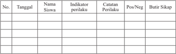

Tabel ini merupakan catatan perilaku siswa yang dilakukan pada setiap tanggal tertentu. Topik utamanya adalah pengawasan dan evaluasi perilaku siswa. Kolom-kolom yang ada meliputi tanggal, nama siswa, indikator perilaku, catatan perilaku, posisi (Pos/Neg), dan butir sikap. Data penting yang terlihat adalah bahwa tabel ini mencakup banyak tanggal dan nama siswa, menunjukkan bahwa proses pengawasan dan evaluasi perilaku siswa dilakukan secara teratur dan sistematis. Selain itu, kolom "Catatan Perilaku" dan "Butir Sikap" menunjukkan bahwa tabel ini juga digunakan untuk menyimpan detail tentang perilaku siswa dan reaksi mereka terhadap situasi tertentu.

### 2.  Penilaian Pengetahuan

- Guru  dapat  memberikan  pertanyaan  kepada  peserta  didik sesuai dengan indikator pencapaian kompetensi.
- Identifikasikan  hak  dan  kewajiban  asasi  manusia  yang terdapat dalam nilai dasar  Pancasila!
- Identifikasikan  hak  dan  kewajiban  asasi  manusia  dalam nilai instrumental  Pancasila!
- Identifikasikan  hak  dan  kewajiban  asasi  manusia  dalam nilai praksis Pancasila!
- Penilaian pengetahuan dalam bentuk penugasan, yaitu Tugas Mandiri 1.2  dan Tugas Kelompok 1.1 dan Tugas Kelompok 1.2 sebagai berikut

 

---
## 📄 Halaman 68

### 1)  Tugas Mandiri 1.2

Coba  kalian  identifikasi  jenis  hak  dan  kewajiban  asasi yang  terkait  dengan  setiap  sila  Pancasila.  Tuliskan  hasil identifikasimu dalam tabel di bawah ini dan presentasikan di depan kelas!

---
**📊 Tabel**

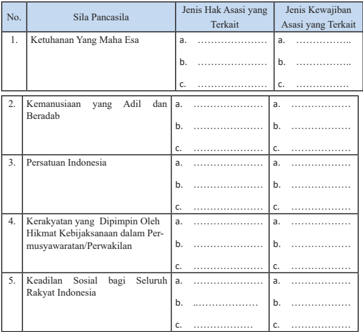

Tabel ini berisi informasi tentang sila-sila Pancasila dan hubungan antara hak asasi dan kewajiban asasi dengan setiap sila tersebut. Topik utama tabel adalah sila-sila Pancasila dan hubungannya dengan hak asasi dan kewajiban asasi. Kolom pertama adalah nomor sila Pancasila, kolom kedua adalah jenis hak asasi yang terkait, dan kolom ketiga adalah jenis kewajiban asasi yang terkait. Data penting yang terlihat adalah bahwa semua sila Pancasila memiliki hubungan dengan hak asasi dan kewajiban asasi, dan bahwa setiap sila memiliki satu atau lebih hak asasi dan kewajiban asasi yang terkaitnya.

### 1)  Tugas Kelompok 1.1

- Selain  diatur    dalam  konstitusi,  Hak  dan  Kewajiban Asasi Manusia juga diatur di dalam Undang-Undang Republik  Indonesia  Nomor  39  Tahun  1999  tentang Hak  Asasi  Manusia.  Coba  kalian  identifikasi  jenis hak dan kewajiban asasi yang diatur dalam peraturan perundang-undangan tersebut.

 

---
## 📄 Halaman 69

---
**📊 Tabel**

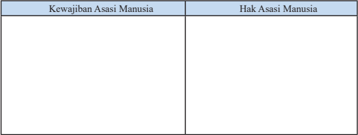

Tabel ini membandingkan kewajiban asasi manusia dengan hak asasi manusia. Topik utamanya adalah hubungan antara dua konsep ini. Kolom pertama berisi kewajiban asasi manusia, yang meliputi hak-hak dasar yang harus dimiliki oleh setiap manusia, seperti hak atas kebebasan, hak atas kesetaraan, hak atas perlindungan, dan sebagainya. Kolom kedua berisi hak asasi manusia, yang mencakup semua hak-hak dasar yang dijaga dan ditekankan oleh hukum internasional dan konvensi internasional. Data penting yang terlihat adalah bahwa kewajiban asasi manusia adalah bagian dari hak asasi manusia, dan bahwa kedua konsep ini saling berkaitan erat dalam upaya untuk menjaga dan memperjuangkan hak-hak manusia.

- Meskipun Undang-Undang Republik Indonesia Nomor 39  Tahun  1999  tentang  Hak  Asasi  Manusia  telah diberlakukan, akan tetapi masih saja terjadi berbagai kasus  pelanggaran  HAM.  Berkaitan    dengan  hal  itu, jawablah pertanyaan-pertanyaan dibawah ini:
- Siapa yang harus bertanggung jawab untuk mencegah terjadinya pelanggaran HAM?
- Apa saja solusi yang kalian ajukan untuk mencegah terjadinya pelanggaran HAM?

### 3.  Penilaian Keterampilan

Penilaian keterampilan dilakukan guru dengan melihat kemampuan peserta didik dalam, kemampuan bertanya, kemampuan menjawab pertanyaan atau mempertahankan argumentasi kelompok, kemampuan dalam memberikan masukan/saran  pada  saat  menyampaikan  hasil  telaah/analisis tentang  Makna  Hak  dan  Kewajiban  Asasi  Manusia.  Lembar penilaian penyajian dan laporan hasil telaah dapat menggunakan format  sebagaimana  terdapat  pada  lampiran  dengan  ketentuan aspek penilaian dan rubriknya  dapat disesuaikan dengan situasi dan kondisi serta keperluan guru.

### 3.  Pertemuan Ketiga (2 x 45 menit)

### a.  Indikator Pencapaian Kompetensi

- Menerima  hak  asasi  manusia  berdasarkan  perspektif  Pancasila sebagai anugerah Tuhan Yang Maha Esa.

 

---
## 📄 Halaman 70

- Menghargai hak asasi manusia berdasarkan perspektif Pancasila sebagai anugerah Tuhan Yang Maha Esa.
- Memiliki  sikap  peduli  terhadap    asasi    manusia  berdasarkan prespektif Pancasila dalam kehidupan berbangsa dan bernegara.
- Bersikap peduli terhadap  asasi  manusia berdasarkan prespektif Pancasila dalam kehidupan berbangsa dan bernegara.
- Mengidentifikasi  penyebab pelenggaran hak asasi manusia.
- Menganalisis kasus pelanggaran hak asasi manusia di Indonesia
- Menalar  hasil  analisis    pelanggaran  hak    asasi  manusia  dalam perspektif Pancasila dalam kehidupan berbangsa dan bernegara.
- Menyaji  hasil  analisis    pelanggaran  hak    asasi  manusia  dalam perspektif Pancasila dalam kehidupan berbangsa dan bernegara.

### b.  Materi Pembelajaran

Kasus pelanggaran hak asasi manusia

- Penyebab pelanggaran hak asasi manusia
- Kasus pelanggaran hak asasi manusia di Indonesia

### c.  Proses Pembelajaran

Proses pembelajaran menggunakan  pendekatan  saintifik  model Discovery Learning . Pelaksanaan pembelajaran secara umum dibagi menjadi tiga tahapan, yaitu  kegiatan pendahuluan, kegiatan inti, dan kegiatan penutup.

---
**📊 Tabel**

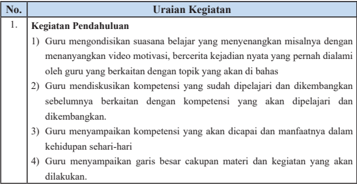

Tabel ini berisi uraian tentang kegiatan pendahuluan dalam proses pembelajaran matematika. Topik utamanya adalah "Pendahuluan" yang meliputi empat kolom: Kegiatan Pendahuluan, Uraian Kegiatan, Tujuan Pembelajaran, dan Keterampilan yang Diharapkan. Setiap kolom memiliki informasi spesifik untuk setiap kegiatan pendahuluan tersebut. Misalnya, dalam Kegiatan Pendahuluan 1, guru mendiskusikan suasan belajar yang menyenangkan misalnya dengan menanyakan video motivasi, bercerita kejadian nyata yang pernah dilalui oleh guru yang berkaitan dengan topik yang akan di bahas. Tujuan pembelajaran adalah untuk membangun keterampilan berpikir kritis dan kreatif, sementara keterampilan yang diharapkan adalah kemampuan untuk menganalisis dan merumuskan masalah matematika.

 

---
## 📄 Halaman 71

### 2. Kegiatan Inti

- Peserta  didik  diminta  untuk  membaca  buku Teks  Bab1  sub  bab  C  tentang Kasus pelanggaran hak asasi manusia
- Guru  meminta  peserta  didik  mencatat  hal-hal  yang  penting  dan  mungkin dapat dieksplorasi pada saat proses menganalisis.
- Guru memberikan informasi tambahan terkait dengan wacana tersebut dengan berbagai peristiwa sejenis dilingkungan peserta didik.
- Peserta didik secara kelompok mengidentifikasi sekaligus mencatat pertanyaan yang ingin diketahui tentangKasus pelanggaran hak asasi manusia.
- Guru membimbing dan terus mendorong peserta didik untuk terus menggali rasa ingin tahu dengan yang mendalam tentang Kasus pelanggaran hak asasi manusia.
- Guru  memberi  motivasi  dan  penghargaan  bagi  kelompok  yang  menyusun pertanyaan terbanyak dan sesuai dengan Indikator Pencapaian Kompetensi.
- Guru mengamati keterampilan peserta didik secara perorangan dan kelompok dalam menyusun pertanyaan.
- Peserta didik mencari informasi dan mendiskusikan jawaban atas pertanyaan yang disusun dan mencari jawaban Tugas mandiri 1.3, dan Tugas Kelompok
- 1.3 dengan membaca sumber lain yang relevan dari buku atau internet.
- Peran guru pada  tahap ini adalah :
- Menyediakan berbagai sumber belajar seperti buku teks siswa dan buku referensi lain.
- Guru  menjadi  sumber  belajar  bagi  peserta  didik  dengan  memberikan konfirmasi atas jawaban peserta didik, atau menjelaskan jawaban pertanyaan kelompok yang tidak terjawab.
- Guru dapat juga menunjukkan buku atau sumber belajar lain yang dapat dijadikan referensi untuk menjawab pertanyaan.
- Peserta  didik  menghubungkan  berbagai  informasi  yang  diperoleh,  untuk identifikasi penyebab pelanggaran hak asasi manusia, dan menganalisis kasus pelanggaran hak asasi manusia di Indonesia.
- Peserta  didik  menyusun  laporan  hasil  telaah/analisisnya.  Laporan  disusun secara individu dan menjadi tugas peserta didik dan dikumpulkan pada akhir pertemuan ini.
- Peserta didik secara acak (2 - 3 orang) diminta untuk menyajikan hasil analisis tentang Kasus pelanggaran hak asasi manusia. Peserta didik yang lain diminta untuk menanggapi atau melengkapi hasil analisis  tersebut.
- Guru memberikan konfirmasi/penguatan atas jawaban peserta didik.

 

---
## 📄 Halaman 72

### 3. Kegiatan Penutup

- Guru dan peserta didik membuat rangkuman atau simpulan kompetensi yang telah dipelajari
- Guru  dan  peserta  didik  melakukan  refleksi  terhadap  kegiatan  yang  sudah dilaksanakan
- Guru memberikan umpan balik terhadap proses dan hasil belajar
- Guru menugaskan peserta didik untuk mengerjakan proyek kewarganegaraan ' Mari Meneliti'( lihat Buku Teks Siswa), hasil proyek akan dipresentasikan pada pertemuan keempat.
- Guru  dan  peserta  didik  menutup  pelajaran  dengan  mengucapkan  syukur kepada Tuhan yang Maha Esa karena pembelajaran  berlangsung aman dan tertib.

### d.  Penilaian

### 1.  Penilaian Sikap

Penilaian  sikap  terhadap  peserta  didik  dapat  dilakukan  selama proses  belajar  berlangsung.  Penilaian  dapat  dilakukan  dengan observasi.  Dalam  Observasi  ini  misalnya  dilihat  aktivitas  dan tingkat  perhatian  peserta  didik  selama  proses  pembelajaran berlangsung. Format  penilaian sikap dapat menggunakan contoh jurnal perkembangan sikap sebagai berikut.

Jurnal Perkembangan Sikap

Kelas

: ……..............…….

Semester

: ……..............…….

---
**📊 Tabel**

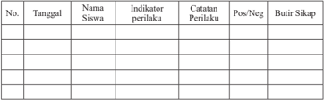

Tabel ini berisi informasi tentang perilaku siswa yang diukur melalui indikator tertentu. Topik utamanya adalah pengawasan dan evaluasi perilaku siswa. Kolom-kolomnya meliputi tanggal, nama siswa, indikator perilaku, catatan perilaku, posisi (Pos/Neg), dan butir sikap. Data penting yang terlihat adalah bahwa tabel ini digunakan untuk mengumpulkan data tentang perilaku siswa secara teratur dan mendokumentasikannya. Ini membantu guru dalam mengevaluasi perkembangan dan kemajuan siswa dalam hal perilaku mereka.

### 2.  Penilaian Pengetahuan

Penilaian  pengetahuan  dalam  bentuk  penugasan  yaitu  Tugas mandiri 1.3  dan Tugas Kelompok 1.3 sebagai berikut:

 

---
## 📄 Halaman 73

### a. Tugas mandiri 1.3

Cari faktor-faktor lainnya yang menyebabkan timbulnya pelanggaran  HAM  dengan  membaca  berbagai  macam  sumber seperti  dari  buku,  surat  kabar,  majalah  atau  internet.  Tuliskan pada tabel di bawah ini hasil temuan kalian!

---
**📊 Tabel**

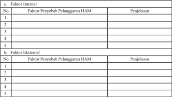

Tabel ini berisi informasi tentang faktor-faktor penyebab pelanggaran Hak Asasi Manusia (HAM) baik internal maupun eksternal. Topik utamanya adalah penyebaran pelanggaran HAM dan bagaimana mereka dapat diidentifikasi dan diatasi. Kolom-kolomnya mencakup faktor penyebab pelanggaran HAM internal dan eksternal, dengan setiap faktor disertai penjelasannya. Data penting yang terlihat meliputi faktor-faktor seperti kebijakan pemerintah, kurangnya akses ke layanan kesehatan, ketidakadilan ekonomi, dan kurangnya hukum yang kuat. Tabel ini membantu dalam memahami bagaimana situasi sosial dan politik dapat mempengaruhi pelanggaran HAM dan bagaimana mencegahnya.

### b. Tugas Kelompok 1.3

Carilah kasus- kasus pelanggaran hak asasi manusia!

---
**📊 Tabel**

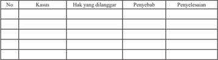

Tabel ini berisi informasi tentang kasus-kasus hukum yang dilanggar, penyebabnya, dan penyelesaiannya. Topik utamanya adalah tentang peristiwa-peristiwa hukum yang terjadi dan bagaimana mereka diselesaikan. Kolom-kolom yang ada meliputi No (Nomor), Kasus, Hak yang Dilanggar, Penyebab, dan Penyelesaian. Data penting yang terlihat adalah bahwa setiap baris menunjukkan satu kasus dengan detail tentang apa hak yang dilanggar, apa penyebabnya, dan bagaimana kasus tersebut diselesaikan. Ini membantu dalam memahami struktur dan konteks dari setiap kasus hukum yang disebutkan dalam tabel.

### 3.  Penilaian Keterampilan

Penilaian Keterampilan dilakukan guru dengan melihat kemampuan peserta didik dalam, kemampuan bertanya, kemampuan menjawab pertanyaan atau mempertahankan argumentasi kelompok, kemampuan dalam memberikan masukan/ saran pada saat menyampaikan hasil telaah/analisis tentang faktor penyebab  pelanggaran  HAM  da  n  menganalisis  kasus-kasus pelanggaran HAM. Lembar penilaian penyajian dan laporan hasil

 

---
## 📄 Halaman 74

telaah  dapat  menggunakan  format  sebagaimana  terdapat  pada lampiran dengan ketentuan aspek penilaian dan rubriknya  dapat disesuaikan dengan situasi dan kondisi serta keperluan guru.

### 4.  Pertemuan Keempat  (2 x 45 menit)

### a.  Indikator Pencapaian Kompetensi

- Menerima  hak  asasi  manusia  berdasarkan  perspektif  Pancasila sebagai anugerah Tuhan Yang Maha Esa
- Menghargai hak asasi manusia berdasarkan perspektif Pancasila sebagai anugerah Tuhan Yang Maha Esa
- Memiliki  sikap  peduli  terhadap    asasi    manusia  berdasarkan prespektif Pancasila dalam kehidupan berbangsa dan bernegara
- Bersikap peduli terhadap  asasi  manusia berdasarkan prespektif Pancasila dalam kehidupan berbangsa dan bernegara
- Mengidentifikasi  upaya pemerintah dalam menegakan hak asasi manusia.
- Menganalisis  upaya  penanganan  kasus  pelanggaran  hak  asasi manusia
- Menalar hasil analisis  upaya penanganan kasus pelanggaran hak asasi manusia .
- Menyaji  hasil  analisis    pelanggaran  hak    asasi  manusia  dalam perspektif Pancasila dalam kehidupan berbangsa dan bernegara

### b.  Materi Pembelajaran

Pertemuan keempat akan mempelajari materi Sub bab D yaitu Upaya penegakan hak asasi manusia. Dalam pertemuan ini akan membahas materi tentang:

- Upaya pencegahan pelanggaran hak asasi manusia
- Membangun    harmonisasi  hak  dan  kewajiban  asasi  manusia dalam kehidupan berbangsa dan bernegara

### c.  Proses  pembelajaran

Proses  pembelajaran  menggunakan  pendekatan  Saintifik  model Discovery Learning . Pelaksanaan pembelajaran secara umum dibagi menjadi tiga tahapan yaitu  kegiatan pendahuluan, kegiatan inti, dan kegiatan penutup.

 

---
## 📄 Halaman 75

---
**📊 Tabel**

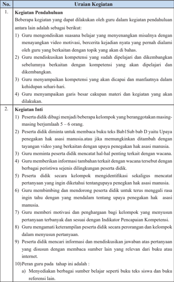

Tabel ini berisi uraian tentang kegiatan pendahuluan dan kegiatan inti yang dilakukan oleh guru dalam proses pembelajaran. Topik utama tabel adalah proses pembelajaran, yang melibatkan dua bagian utama: pendahuluan dan inti. Kolom pertama menunjukkan nomor urutan kegiatan, sedangkan kolom kedua menyajikan uraian tentang kegiatan tersebut. Data penting yang terlihat antara lain bahwa guru melakukan berbagai aktivitas seperti mendengarkan suara belajar, mendiskusikan kompetensi, memberikan motivasi, dan memperkenalkan garis besar materi. Selain itu, tabel juga mencakup beberapa kegiatan pendahuluan seperti pembagian peserta menjadi kelompok, memberikan informasi tambahan, dan memberikan motivasi bagi kelompok.

 

---
## 📄 Halaman 76

---
**📊 Tabel**

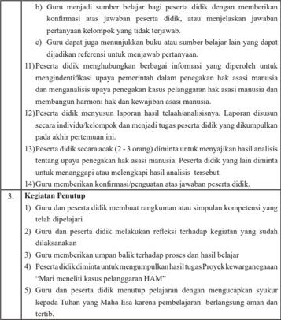

Tabel ini berisi instruksi untuk proses penilaian peserta didik dalam konteks pembelajaran. Topik utamanya adalah evaluasi kinerja peserta didik, termasuk memberikan konfirmasi atas jawaban, menunjukkan buku referensi, menghubungi pemerintah, menganalisis penerapan kasus, membuat laporan, dan memberikan penutupan. Kolom-kolomnya meliputi: a) Sumber belajar, b) Konfirmasi atas jawaban, c) Menunjukkan buku referensi, d) Menghubungi pemerintah, e) Menganalisis kasus, f) Membuat laporan, dan g) Penutupan. Data penting yang terlihat adalah bahwa peserta didik harus memberikan konfirmasi atas jawaban, menunjukkan buku referensi, menghubungi pemerintah, menganalisis kasus, membuat laporan, dan memberikan penutupan.

### b.  Penilaian

### 1.  Penilaian Sikap (penilaian diri)

Coba  sekarang kalian renungi diri masing-masing, apakah perilaku  kalian  telah  mencerminkan  warga  negara  yang  selalu menghormati  hak  asasi  manusia?  Bacalah  daftar  perilaku  di bawah ini,  kemudian  isi  kolom  kegiatan  dengan  rutinitas  yang biasa  dilakukan  (selalu,sering  ,  kadang-kadang,  tidak  pernah), serta berikan alasan dilakukannya perilaku itu. Ingat kamu harus mengisinya sesuai dengan keadaan yang sebenarnya.

 

---
## 📄 Halaman 77

---
**📊 Tabel**

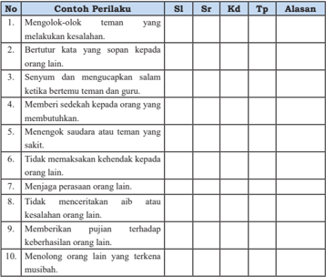

Tabel ini berisi 10 contoh perilaku yang dianggap tidak baik atau kurang sopan dalam konteks interaksi sosial. Kolom-kolomnya meliputi No (Nomor), Contoh Perilaku, SI (Sifat Interaksi), Sr (Struktur), Kd (Karakteristik), Tp (Topik), dan Alasan. Topik utama tabel adalah perilaku yang tidak sopan dan kurang sopan dalam hubungan sosial. Data penting yang terlihat adalah bahwa semua contoh perilaku tersebut berkaitan dengan perilaku yang tidak sopan dan kurang sopan dalam interaksi sosial, seperti mengolok-olok teman, bertutur kata yang sopan, menyalahkan orang lain, memberi sedekah kepada orang yang membutuhkan, menengok saudara atau teman yang sakit, tidak memaksa kehendak kepada orang lain, menjaga perasaan orang lain, tidak menerima tindakan atau kesalahan orang lain, memberikan pujiannya terhadap keberhasilan orang lain, dan menolong orang lain yang terkena musibah.

Keterangan: Sl :Selalu, Sr :Sering, Kd: Kadang-kadang, Tp:Tidak pernah.

### Pedoman Penskoran:

- Untuk pernyataan positif, yaitu nomor  2, 3, 4, 5, 6, 7, 8,9,10. Skor  4  jika  selalu,  skor  3  jika  sering,  skor  2  jika  kadangkadang, skor 1 jika tidak pernah.
- Untuk pernyataan negatif,  yaitu nomor 1. Skor  1  jika  selalu,  skor  2  jika  sering,  skor  3  jika  kadangkadang, skor 4 jika tidak pernah.

---
**📊 Tabel**

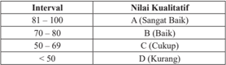

Tabel ini menunjukkan kualitas interval nilai yang diberikan dalam sebuah mata pelajaran. Topik utamanya adalah kualitas nilai yang diberikan dalam interval tertentu. Kolom pertama berisi interval-nilai, sedangkan kolom kedua berisi kualitas nilai tersebut. Data penting yang terlihat adalah bahwa interval 81-100 memiliki kualitas A (Sangat Baik), interval 70-80 memiliki kualitas B (Baik), interval 50-69 memiliki kualitas C (Cukup), dan interval di bawah 50 memiliki kualitas D (Kurang). Ini menunjukkan bahwa semakin tinggi nilai yang diberikan, semakin baik kualitasnya.

 

---
## 📄 Halaman 78

### 2.  Penilaian Pengetahuan

Penilaian  pengetahuan  dapat  menggunakan  hasil  tugas  mandiri 1.4 sebagai berikut:

- Tuliskan identifikasi kalian tentang tugas dan fungsi lembaga perlindungan hak asasi manusia  selain Komnas HAM dalam tabel di bawah ini!
- Lakukanlah  identifikasi  contoh  perilaku  yang  dapat  kalian tampilkan  se  bagai  upaya  untuk  mengharmonisasi  hak  dan kewajiban asasi manusia dalam berbagai lingkungan  yaitu, keluarga, sekolah, masyarakat, bangsa dan negara!

---
**📊 Tabel**

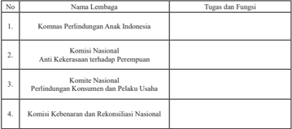

Tabel ini berisi informasi tentang lembaga-lembaga penting di Indonesia yang bertanggung jawab atas tugas-tugas khusus tertentu. Topik utama tabel adalah lembaga-lembaga yang berperan dalam mencegah dan menangani masalah spesifik seperti perlindungan anak, kekerasan terhadap perempuan, perlindungan konsumen, dan rekonstruksi nasional. Kolom-kolom yang ada adalah No., Nama Lembaga, dan Tugas dan Fungsi. Data penting yang terlihat adalah bahwa setiap lembaga memiliki tugas dan fungsi yang spesifik, seperti Komnas Perlindungan Anak Indonesia yang bertanggung jawab untuk melindungi anak, Komisi Kebenaran dan Rekonsiliasi Nasional yang bertanggung jawab untuk memperbaiki kebenaran dan rekonstruksi nasional setelah kejadian-kejadian kriminal, dan lain-lain.

### 3.  Penilaian Keterampilan

Penilaian Keterampilan dilakukan guru dengan melihat kemampuan peserta didik dalam, kemampuan bertanya, kemampuan menjawab pertanyaan atau mempertahankan argumentasi kelompok, kemampuan dalam memberikan masukan/saran  pada  saat  menyampaikan  hasil  telaah/analisis tentang lembaga perlindungan hak asasi manusia dan identifikasi contoh  perilaku  sebagai  upaya  harmonisasi  hak  dan  kewajiban asasi  manusia  dalam  berbagai  lingkungan  kehidupan.  Lembar penilaian penyajian dan laporan hasil telaah dapat menggunakan format  sebagaimana  terdapat  pada  lampiran  dengan  ketentuan aspek penilaian dan rubriknya  dapat disesuaikan dengan situasi dan kondisi serta keperluan guru.

 

---
## 📄 Halaman 79

### UJI KOMPETENSI BAB 1

Jawablah pertanyaan-pertanyaan di bawah ini secara jelas dan akurat.

- Bagaimana  keterkaitan  antara  hak  asasi  manusia  dengan  kewajiban  asasi manusia?.
- Mengapa  antara  hak  asasi  manusia  dengan  kewajiban  asasi  manusia  dalam perwujudanya harus diharmonisasikan?
- Uraikan jaminan hak asasi manusia yang terdapat dalam Pancasila.
- Apa yang akan terjadi apabila dalam proses penegakkan hak asasi manusia, Pancasila tidak dijadikan dasar atau landasan ?
- Mengapa  liberalisme  dan  sosialisme  tidak  patut  dijadikan  landasan  dalam proses penegakkan Hak Asasi Manusia di Indonesia?
- Sekarang ini begitu sering terjadi peristiwa pelanggaran HAM di masyarakat seperti  pembunuhan,  penculikan,  penyiksaan  dan  sebagainya.  Mengapa  hal tersebut bisa terjadi? Siapa yang paling bertanggung jawab untuk mengatasi persoalan tersebut? Apa peran kalian untuk menyelesaikan persoalan tersebut?

### Kunci Jawaban dan Penyekoran

---
**📊 Tabel**

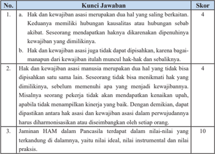

Tabel ini berisi kunci jawaban untuk beberapa pertanyaan tentang hak dan kewajiban manusia. Topik utamanya adalah hak dan kewajiban manusia, dengan kolom-kolom yang mencakup skor, kunci jawaban, dan penjelasan. Data penting yang terlihat antara lain bahwa hak dan kewajiban manusia merupakan dua hal yang saling berinteraksi, dengan hak kewajiban manusia memiliki hubungan kausalitas atau hubungan sebab akibat. Sementara itu, hak dan kewajiban asasi manusia tidak dapat dipisahkan, karena bagaimanapun dari kewajiban itu muncul hak-hak dan sebaliknya. Selain itu, hak dan kewajiban manusia juga merupakan dua hal yang tidak bisa dipisahkan sama-sama, sehingga seseorang tidak bisa memilihkan hak yang dimilikinya sendiri. Jaminan HAM dalam Pancasila terdapat dalam nilai-nilai yang terkandung di dalamnya, yaitu nilai ideal, nilai instrumental, dan nilai prakteks.

 

---
## 📄 Halaman 80

- Jaminan HAM dalam nilai Ideal Pancasila antara lain seperti berikut.
- Sila  Ketuhanan  Yang  Maha  Esa  menjamin  hak  kemerdekaan untuk  memeluk  agama,  melaksanakan  ibadah  dan  kewajiban untuk menghormati perbedaan agama.
- Sila  Kemanusiaan  yang Adil  dan  Beradab  menempatkan  hak setiap warga negara pada kedudukan yang sama dalam hukum serta memiliki kewajiban dan hak-hak yang sama  untuk mendapat jaminan dan perlindungan hukum.
- Sila Persatuan Indonesia mengamanatkan adanya unsur pemersatu di antara warga  negara dengan  semangat  rela berkorban dan menempatkan kepentingan bangsa dan negara di atas kepentingan pribadi atau golongan, hal ini sesuai dengan prinsip hak asasi manusia di mana hendaknya sesama manusia bergaul satu sama lainnya dalam semangat persaudaraan.
- Sila  Kerakyatan  yang  Dipimpin  oleh  Hikmat  Kebijaksanaan dalam Permusyawaratan/Perwakilan dicerminkan dalam kehidupan  pemerintahan,  bernegara,  dan  bermasyarakat  yang demokratis. Menghargai hak setiap warga negara untuk bermusyawarah mufakat yang dilakukan tanpa adanya tekanan, paksaan, ataupun intervensi yang membelenggu hak-hak partisipasi masyarakat.
- Sila Keadilan Sosial bagi Seluruh Rakyat Indonesia mengakui hak  milik  perorangan  dan  dilindungi  pemanfaatannya  oleh negara serta memberi kesempatan sebesar-besarnya pada masyarakat.
- Jaminan HAM dalam nilai Ideal Pancasila antara lain
- Undang-Undang Dasar Negara  Republik Indonesia Tahun 1945 terutama Pasal 28 A - 28 J.
- Ketetapan  MPR  Nomor  XVII/MPR/1998  tentang  Hak  Asasi Manusia. Di dalam Tap MPR tersebut, terdapat Piagam HAM Indonesia.
- Ketentuan dalam undang-undang organik, yaitu:
- Undang-Undang Republik Indonesia Nomor 5 Tahun 1998 tentang  Konvensi  Menentang  Penyiksaan  dan  Perlakuan atau  Penghukuman  yang  Kejam,  Tidak  Manusiawi,  atau Merendahkan Martabat Manusia.
- Undang-Undang Republik Indonesia Nomor 39 Tahun 1999 tentang Hak Asasi Manusia.

 

---
## 📄 Halaman 81

---
**📊 Tabel**

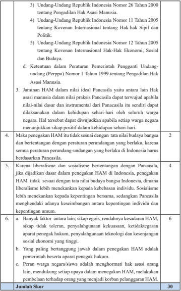

Tabel ini berisi informasi tentang Undang-Undang dan Peraturan Pemerintah yang berkaitan dengan Hak Asasi Manusia di Indonesia. Topik utamanya adalah tentang hak-hak sipil dan politik, hak-hak ekonomi sosial dan budaya, serta ketentuan dalam peraturan pemerintah tentang pengadilan hak asasi manusia. Kolom-kolomnya mencakup undang-undang tertentu, ketentuan peraturan pemerintah, dan penjelasan tentang hak-hak tersebut. Data penting yang terlihat antara lain bahwa Undang-Undang Nomor 26 Tahun 2000 tentang Pengadilan Hak Asasi Manusia merupakan salah satu undang-undang yang penting dalam konteks ini. Selain itu, tabel juga menunjukkan bahwa Undang-Undang Nomor 11 Tahun 2005 tentang Kovenan Internasional tentang Hak-hak Sipil dan Politik, serta Undang-Undang Nomor 12 Tahun 2005 tentang Kovenan Internasional Hak-Hak Ekonomi, Sosial dan Budaya, merupakan undang-undang yang berhubungan dengan hak-hak sipil dan politik.

 

---
## 📄 Halaman 82

Perolehan Nilai :

### E. Pengayaan

Kegiatan  pengayaan  merupakan  kegiatan  pembelajaran  yang  diberikan kepada peserta  didik  yang  telah  menguasai  seluruh  materi  pembelajaran yaitu  materi  pada  Bab  1  tentang  harmonisasi  hak  dan  kewajiban  asasi manusia dalam perspektif Pancasila

Pengayaan  dapat  dilakukan  dengan  beberapa  cara  dan  pilihan.  Sebagai contoh peserta didik dapat diberikan bahan bacaan yang relevan dengan materi. Peserta didik dapat diminta melakukan pengamatan di lingkungan tempat tinggalnya atau di lingkungan sekolah adakah kasus yang berhubungan dengan harmonisasi hak dan kewajiban asasi manusia  sampai saat ini belum terselesaikan dan mengapa hal ini terjadi dan upaya apa yang sebaiknya dilakukan untuk menyelesaikan kasus tersebut.

### F. Remedial

Kegiatan remedial diberikan kepada peserta didik yang belum menguasai materi pelajaran dan belum mencapai kompetensi yang telah ditentukan. Bentuk yang dilakukan antara lain peserta didik secara terencana mempelajari  Buku  Siswa  Mata  Pelajaran  PPKn  Kelas  XI  pada  bagian tertentu  yang  belum  dikuasainya.  Guru  menyediakan  soal-soal  latihan atau pertanyaan yang merujuk pemahaman kembali tentang isi Buku Teks Pelajaran PPKn Kelas XI Bab 1. Peserta didik diminta komitmennya untuk belajar  secara  disiplin  dalam  rangka  memahami  materi  pelajaran  yang belum dikuasainya. Guru kemudian mengadakan uji kompetensi kembali pada materi yang belum dikuasai peserta didik yang bersangkutan.

### G. Interaksi Guru & Orang Tua

Maksud  dari  kegiatan  ini  adalah  agar  terjalin  komunikasi  antara  guru dan  orang  tua  berkaitan  dengan  kemajuan  proses  dan  hasil  belajar  yang dilaksanakan dan dicapai peserta didik. Guru harus selalu mengingatkan

``

 

---
## 📄 Halaman 83

dan meminta peserta didik memperihatkan hasil tugas atau pekerjaan yang telah dinilai dan diberi komentar oleh guru kepada orang tua peserta didik. yaitu:

- Penilaian  sikap  selama  peserta  didik  mengikuti  proses  pembelajaran pada Bab 1.
- Penilaian pengetahuan melalui penugasan dan kegiatan uji kompetensi Bab 1.
- Penilaian  Keterampilan  melalui  pengamatan  dalam  presentasi  dan Praktik Belajar Kewarganegaraan.
Orang  tua  juga  harus  memberikan  komentar  hasil  pekerjaan  atau  tugas yang  dicapai  oleh  peserta  didik  sebagai  apresiasi  dan  komitmen  untuk bersama-sama mengantarkan peserta didik  mencapai prestasi yang lebih baik. Bentuk apresiasi orang tua ini akan menambah semangat peserta didik untuk  mempertahankan  dan  meningkatkan  keberhasilannya,  baik  dalam konteks pemahaman dan penguasaan materi pengetahuan, sikap maupun keterampilan. Hasil penilaian yang telah diparaf  atau ditandatangani guru dan  orang  tua  kemudian  disimpan  untuk  menjadi  bagian  dari  portofolio peserta didik. Untuk itu, pihak sekolah atau guru harus menyediakan format tugas/pekerjaan  peserta didik. Adapun  interaksi antarguru dan orang tua dapat menggunakan format  di bawah ini.

---
**📊 Tabel**

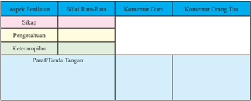

Tabel ini menunjukkan hasil evaluasi siswa dalam berbagai aspek pembelajaran, termasuk sikap, pengetahuan, keterampilan, dan paraf/tanda tangan. Topik utama tabel adalah evaluasi pembelajaran siswa. Kolom-kolomnya mencakup aspek-aspek pembelajaran yang diukur, yaitu sikap, pengetahuan, dan keterampilan. Data penting yang terlihat meliputi nilai rata-rata untuk setiap aspek, komentar guru tentang hasil evaluasi, dan komentar orang tua tentang hasil evaluasi. Tabel ini membantu guru dan orang tua memahami sejauh mana siswa telah memahami materi dan mampu menggunakan keterampilan yang diajarkan.

 

---
## 📄 Halaman 84

Sistem dan Dinamika Demokrasi Pancasila

---
**🖼️ Gambar/Diagram**

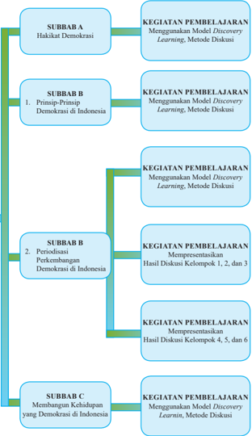

> **Deskripsi Visual:** Gambar ini adalah diagram yang menunjukkan struktur topik dan subtopik dalam sebuah bab atau modul pembelajaran. Diagram ini terdiri dari beberapa subbab yang disusun secara hierarkis, dengan subbab A berisi subbab B dan C. Setiap subbab memiliki tugas pembelajaran yang ditunjukkan dengan metode diskusi dan model discovery learning.

Elemen utama dalam diagram ini meliputi:
1. Subbab A: Hakikat Demokrasi
2. Subbab B: Prinsip-Prinsip Demokrasi di Indonesia (dilanjutkan menjadi Subbab B.1 dan Subbab B.2)
   - Subbab B.1: Perkembangan Demokrasi di Indonesia
   - Subbab B.2: Membangun Kehidupan yang Demokrasi di Indonesia

Teks penting dalam diagram ini meliputi:
- "Subbab A: Hakikat Demokrasi"
- "Subbab B: Prinsip-Prinsip Demokrasi di Indonesia"
- "Subbab B.1: Perkembangan Demokrasi di Indonesia"
- "Subbab B.2: Membangun Kehidupan yang Demokrasi di Indonesia"

Informasi kunci yang dapat diambil pembaca meliputi:
- Struktur pembelajaran yang terorganisir dengan jelas
- Topik-topik utama yang akan dipelajari
- Metode pembelajaran yang digunakan (model discovery learning, metode diskusi)
- Hubungan antara subbab dan subbab subbabnya

 

---
## 📄 Halaman 85

### Pembelajaran Bab 2

### SISTEM DAN DINAMIKA DEMOKRASI PANCASILA

### A. Kompetensi Inti (KI)

- Menghayati dan mengamalkan ajaran agama yang dianutnya.
- Menghayati dan mengamalkan perilaku jujur, disiplin, tanggung jawab, peduli (gotong royong, kerja sama, toleran, damai), santun, responsif dan  pro-aktif  dan  menunjukkan  sikap  sebagai  bagian  dari  solusi  atas berbagai permasalahan dalam berinteraksi secara efektif dengan lingkungan  sosial  dan  alam  serta  dalam  menempatkan  diri  sebagai cerminan bangsa dalam pergaulan dunia.
- Memahami, menerapkan, menganalisis pengetahuan faktual, konseptual, prosedural berdasarkan rasa ingin tahunya tentang ilmu pengetahuan, teknologi, seni, budaya, dan humaniora dengan wawasan kemanusiaan, kebangsaan, kenegaraan, dan peradaban terkait penyebab fenomena dan kejadian, serta menerapkan pengetahuan prosedural pada bidang kajian yang  spesifik  sesuai  dengan  bakat  dan  minatnya  untuk  memecahkan masalah.
- Mengolah, menalar, dan menyaji dalam ranah konkret dan ranah abstrak terkait dengan pengembangan dari yang dipelajarinya di sekolah secara mandiri, dan mampu menggunakan metode sesuai kaidah keilmuan.

### B. Kompetensi  Dasar  (KD) dan Indikator  Pencapaian Kompetensi (IPK)

---
**📊 Tabel**

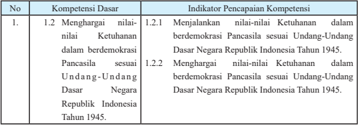

Tabel ini berisi informasi tentang kompetensi dasar dan indikator pencapaian kompetensi dalam konteks demokrasi di Indonesia. Topik utamanya adalah pengembangan nilai-nilai kewarganegaraan dalam demokrasi Pancasila sesuai Undang-Undang Dasar Negara Republik Indonesia Tahun 1945. Tabel ini terdiri dari dua kolom: kolom pertama berisi nomor dan deskripsi kompetensi dasar, sedangkan kolom kedua berisi indikator pencapaian kompetensi untuk setiap kompetensi dasar tersebut. Data penting yang terlihat adalah bahwa semua kompetensi dasar memiliki indikator pencapaian yang sama, yaitu menjalankan nilai-nilai kewarganegaraan dalam demokrasi Pancasila sesuai Undang-Undang Dasar Negara Republik Indonesia Tahun 1945. Ini menunjukkan bahwa semua kompetensi dasar memiliki tujuan yang sama dalam pembentukan karakter warga negara yang membangun dan berpartisipatif dalam demokrasi.

 

---
## 📄 Halaman 86

---
**📊 Tabel**

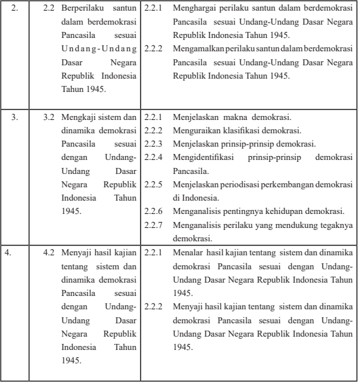

Tabel ini berisi informasi tentang peran dan tugas dari sistem Pancasila dalam berdemokrasi di Indonesia. Topik utamanya adalah tentang bagaimana Pancasila memainkan peran dalam demokrasi nasional. Tabel dibagi menjadi empat baris dengan kolom-kolom yang mencakup berbagai aspek penting seperti pengaruh Pancasila dalam berdemokrasi, pengembangan sistem dan dinamika Pancasila, serta kajian tentang Pancasila dalam konteks demokrasi. Data penting yang terlihat meliputi bahwa Pancasila telah mempengaruhi berbagai aspek demokrasi di Indonesia, termasuk pengklasifikasian demokrasi, prinsip-prinsip demokrasi, dan periode perkembangan demokrasi. Selain itu, tabel juga menunjukkan bahwa Pancasila telah mempengaruhi pendapat tentang kehidupan demokrasi dan perilaku yang mendukung keadilan dalam demokrasi.

### C. Materi Pembelajaran Bab 2

- Hakikat Demokrasi
- Makna demokrasi.
- Klasifikasi demokrasi .
- Prinsip-prinsip  demokrasi.
- Dinamika penerapan demokrasi Pancasila.
- Prinsip-prinsip demokrasi di Indonesia.
- Periodisasi perkembangan demokrasi Pancasila.

 

---
## 📄 Halaman 87

- Membangun kehidupan yang demokratis di Indonesia.
- Pentingnya kehidupan yang demokratis.
- Perilaku yang mendukung tegaknya nilai-nilai demokrasi.

### D. Proses Pembelajaran

### 1.  Pertemuan Pertama (2 x 45 menit)

Pertemuan  pertama diawali dengan mengulas isu-isu aktual yang ada disekitar peserta  didik.  Pada  pertemuan  pertama  guru  dapat  menyampaikan gambaran umum materi yang akan dipelajari pada Bab 2, kegiatan apa yang akan dilaksanakan, menjelaskan pentingnya mempelajari materi ini,  bagaimana  guru  dapat  menumbuhkan  ketertarikan  peserta  didik terhadap materi yang akan dipelajari.  Setelah itu,  guru menyampaikan batasan materi apa saja yang akan dipelajari pada  Bab 2.

### a.  Indikator Pencapaian Kompetensi

- Menjalankan  nilai-nilai Ketuhanan  dalam berdemokrasi Pancasila sesuai Undang-Undang Dasar Negara Republik Indonesia Tahun 1945.
- Menghargai  nilai-nilai Ketuhanan  dalam berdemokrasi Pancasila sesuai Undang-Undang Dasar Negara Republik Indonesia Tahun 1945.
- Menghargai perilaku santun dalam berdemokrasi Pancasila  sesuai Undang-Undang Dasar Negara Republik Indonesia Tahun 1945.
- Mengamalkan  perilaku  santun  dalam  berdemokrasi  Pancasila sesuai Undang-Undang Dasar Negara Republik Indonesia Tahun 1945. Menyimpulkan makna demokrasi.
- Menjelaskan makna demokrasi.
- Menguraikan klasifikasi demokrasi.
- Menjelaskan prinsip-prinsip  demokrasi.
- Menalar  hasil kajian tentang  sistem dan dinamika  demokrasi Pancasila sesuai dengan Undang-Undang Dasar Negara Republik Indonesia Tahun 1945.
- Menyaji  hasil  kajian  tentang    sistem  dan  dinamika    demokrasi Pancasila sesuai dengan Undang-Undang Dasar Negara Republik Indonesia Tahun 1945.

 

---
## 📄 Halaman 88

### b.  Materi Pembelajaran

Pertemuan  pertama  akan  mempelajari  materi  Subbab  A,  yaitu Hakikat Demokrasi. Pertemuan ini akan membahas materi tentang;

- Makna demokrasi.
- Klasifikasi demokrasi.
- Prinsip-prinsip demokrasi.

### c.  Proses Pembelajaran

Proses pembelajaran menggunakan  pendekatan  saintifik  model pembelajaran Discovery Learning . Pelaksanaan pembelajaran secara umum dibagi  menjadi  tiga  tahapan,  yaitu    kegiatan  pendahuluan, kegiatan inti, dan kegiatan penutup.

---
**📊 Tabel**

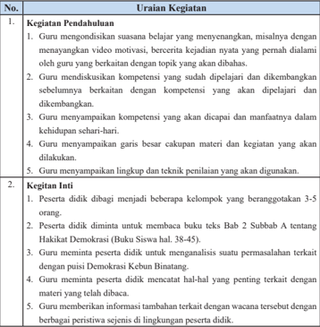

Tabel ini berisi informasi tentang proses pendahuluan dan integritas dalam pembelajaran matematika. Topik utamanya adalah pendahuluan dan integritas. Kolom pertama berisi nomor urutan kegiatan, sedangkan kolom kedua berisi uraian kegiatan tersebut. Data penting yang terlihat antara lain bahwa guru harus menyediakan suasanan yang menyenangkan, mendiskusikan kompetensi dengan siswa, menunjukkan garis besar kapan materi akan dilakukan, menyampaikan llingkup dan teknik penilaian, dan membagi peserta didik menjadi kelompok untuk analisis permasalahan.

 

---
## 📄 Halaman 89

- Peserta didik secara kelompok mengidentifikasi sekaligus mencatat pertanyaan yang ingin diketahui tentang Hakikat Demokrasi.
- Guru membimbing dan terus mendorong peserta didik untuk terus menggali rasa ingin tahu dengan yang mendalam tentang Hakikat Demokrasi.
- Guru  memberi  motivasi  dan  penghargaan  bagi  kelompok  yang  menyusun pertanyaan terbanyak dan sesuai dengan Indikator Pencapaian Kompetensi.
- Guru mengamati keterampilan peserta didik secara perorangan dan kelompok dalam menyusun pertanyaan.
- Peserta didik mencari informasi dan mendiskusikan jawaban atas pertanyaan yang disusun dan mencari jawaban Tugas Mandiri 2.1 dan Tugas Kelompok 2.1 dengan membaca sumber lain yang relevan dari buku atau internet.
- Peran guru pada  tahap ini adalah seperti berikut.
- Menyediakan berbagai sumber belajar seperti buku teks siswa dan buku referensi lain.
- Guru  menjadi  sumber  belajar  bagi  peserta  didik  dengan  memberikan konfirmasi atas jawaban peserta didik, atau menjelaskan jawaban pertanyaan kelompok yang tidak terjawab.
- Guru dapat juga menunjukkan buku atau sumber belajar lain yang dapat dijadikan referensi untuk menjawab pertanyaan.
- Peserta  didik  menghubungkan  berbagai  informasi  yang  diperoleh,  untuk menganalisis perbedaan negara demokrasi dan negara otoriter, menyimpulkan makna  sistem  demokrasi  dan  menganlisis  pelaksanaan    prinsip-prinsip demokrasi.
- Peserta  didik  menyusun  laporan  hasil  telaah/analisisnya.  Laporan  disusun secara individu dan menjadi tugas peserta didik dan dikumpulkan pada akhir pertemuan ini.
- Peserta didik secara acak (2 - 3 orang) diminta untuk menyajikan hasil analisis tentang Hakikat Demokrasi  secara lisan. Peserta didik yang lain diminta untuk menanggapi atau melengkapi hasil telaah tersebut.
- Guru memberikan konfirmasi/penguatan atas jawaban peserta didik.

### 3. Kegiatan Penutup

- Guru dan peserta didik membuat rangkuman atau simpulan kompetensi yang telah dipelajari.
- Guru  dan  peserta  didik  melakukan  refleksi  terhadap  kegiatan  yang  sudah dilaksanakan.
- Guru memberikan umpan balik terhadap proses dan hasil belajar.
- Guru memberikan tugas individu atau kelompok  untuk pertemuan berikutnya.

 

---
## 📄 Halaman 90

- 5.  Guru menyampaikan rencana pembelajaran untuk pertemuan berikutnya.
- Guru  dan  peserta  didik  menutup  pelajaran  dengan  mengucapkan  syukur kepada Tuhan Yang Maha Esa karena pembelajaran  berlangsung aman dan tertib.

### d.  Penilaian

### 1.  Penilaian Sikap

Penilaian  sikap  terhadap  peserta  didik  dapat  dilakukan  selama proses  belajar  berlangsung.  Penilaian  dapat  dilakukan  dengan observasi. Dalam observasi, misalnya dilihat aktivitas dan tingkat perhatian peserta didik selama proses pembelajaran berlangsung. Format    penilaian  sikap  dapat  menggunakan  contoh    jurnal perkembangan sikap sebagai berikut.

### Jurnal Perkembangan Sikap

Kelas

: ……..............…….

Semester

: ……..............…….

---
**📊 Tabel**

Tabel ini berisi informasi tentang perilaku siswa di sekolah, dengan kolom-kolom seperti tanggal, nama siswa, indikator perilaku, catatan perilaku, posisi positif atau negatif, dan butir sikap. Topik utama tabel ini adalah pengawasan dan evaluasi perilaku siswa. Data penting yang terlihat meliputi tanggal perilaku, nama siswa yang melakukan perilaku tersebut, indikator perilaku yang digunakan untuk menilai perilaku tersebut, catatan perilaku yang diberikan oleh guru, posisi positif atau negatif perilaku tersebut, dan butir sikap yang diberikan kepada siswa. Tabel ini membantu guru untuk memantau perkembangan perilaku siswa dan memberikan saran atau tindakan sesuai dengan hasil evaluasi tersebut.

### 2.  Penilaian Pengetahuan

Penilaian pengetahuan dilakukan dalam bentuk penugasan, yaitu Tugas Mandiri 2.1 dan Tugas Kelompok 2.1.

### Tugas Mandiri 2.1

Lakukanlah  studi  literatur  dengan  membaca  berbagai  macam buku  maupun  artikel  dari  koran  atau  internet  yang  berkaitan dengan perbedaan antara negara demokrasi dan negara otoriter. Tuliskanlah  hasil  temuan  kalian  pada  tabel  di  bawah  ini  dan informasikanlah kepada teman-teman yang lain.

 

---
## 📄 Halaman 91

---
**📊 Tabel**

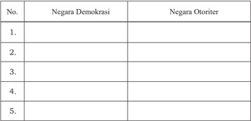

Tabel ini membandingkan dua jenis negara: Negara Demokrasi dan Negara Otoriter. Kolom pertama berisi nama-nama negara yang dianggap sebagai Negara Demokrasi, sedangkan kolom kedua berisi nama-nama negara yang dianggap sebagai Negara Otoriter. Data dalam tabel tersebut menunjukkan bahwa beberapa negara seperti Indonesia, Malaysia, dan Thailand dianggap sebagai Negara Demokrasi, sementara negara seperti Rusia, Iran, dan China dianggap sebagai Negara Otoriter. Pola penting yang terlihat adalah bahwa negara-negara yang dianggap sebagai Negara Demokrasi memiliki sistem pemerintahan yang lebih demokratis dan partisipatif, sementara negara-negara yang dianggap sebagai Negara Otoriter memiliki sistem pemerintahan yang lebih monokratis dan otoriter.

### Tugas Kelompok 2.1

- Bentuklah kelompok belajar yang terdiri atas lima orang.
- Lakukanlah pengamatan terhadap pelaksanaan prinsip-prinsip demokrasi  di  sekolah  kalian,  baik  dalam  pergaulan  antara siswa dengan siswa, siswa dengan guru/kepala sekolah, guru dengan guru atau guru dengan kepala sekolah.
- Hasil  pengamatan  kalian  dilaporkan  secara  tertulis  dalam bentuk sebuah artikel.
- Informasikan  nilai  yang  kalian  peroleh  pada  orang  tua masing-masing.

### 5.  Penilaian Keterampilan

Penilaian keterampilan dilakukan guru dengan melihat kemampuan peserta didik dalam presentasi, kemampuan bertanya, kemampuan menjawab pertanyaan atau mempertahankan argumentasi kelompok, kemampuan dalam memberikan masukan/saran  pada  saat  menyampaikan  hasil  telaah/analisis tentang  Hakikat  Demokrasi.  Lembar  penilaian  penyajian  dan laporan  hasil  telaah  dapat  menggunakan  format  sebagiamana terdapat  pada  lampiran,  dengan  ketentuan  aspek  penilaian  dan rubriknya    dapat  disesuaikan  dengan  situasi  dan  kondisi  serta keperluan guru.

 

---
## 📄 Halaman 92

### 2.  Pertemuan Kedua (2 x 45 menit)

Pertemuan kedua akan mempelajari materi Subbab B yaitu Dinamika Penerapan Demokrasi Pancasila. Pertemuan ini akan membahas prinsipprinsip demokrasi Pancasila.

### a.  Indikator Pencapaian Kompetensi

- Menjalankan  nilai-nilai Ketuhanan  dalam berdemokrasi Pancasila sesuai Undang-Undang Dasar Negara Republik Indonesia Tahun 1945.
- Menghargai  nilai-nilai Ketuhanan  dalam berdemokrasi Pancasila sesuai Undang-Undang Dasar Negara Republik Indonesia Tahun 1945.
- Menghargai perilaku santun dalam berdemokrasi Pancasila  sesuai Undang-Undang Dasar Negara Republik Indonesia Tahun 1945.
- Mengamalkan  perilaku  santun  dalam  berdemokrasi  Pancasila sesuai Undang-Undang Dasar Negara Republik Indonesia Tahun 1945.
- Mengidentifikasi prinsip-prinsip demokrasi di Indonesia.
- Mengidentifikasi  prinsip-prinsip demokrasi Pancasila.
- Menalar  hasil kajian tentang  sistem dan dinamika  demokrasi Pancasila sesuai dengan Undang-Undang Dasar Negara Republik Indonesia Tahun 1945.
- Menyaji  hasil  kajian  tentang    sistem  dan  dinamika    demokrasi Pancasila sesuai dengan Undang-Undang Dasar Negara Republik Indonesia Tahun 1945.

### b.  Materi Pembelajaran

- Prinsip-prinsip demokrasi konstitusional di Indonesia
- Prinsip-prinsip demokrasi Pancasila

### c.  Proses Pembelajaran

Proses pembelajaran menggunakan  pendekatan  saintifik  model pembelajaran Discovery Learning . Pelaksanaan pembelajaran secara umum dibagi  menjadi  tiga  tahapan,  yaitu    kegiatan  pendahuluan, kegiatan inti, dan kegiatan penutup.

 

---
## 📄 Halaman 93

### No

### 1. Kegiatan Pendahuluan

Guru  mengondisikan  suasana  belajar  yang  menyenangkan  misalnya  dengan menayangkan video motivasi, bercerita kejadian nyata yang pernah dialami oleh guru yang berkaitan dengan topik yang akan dibahas.

- Guru  mendiskusikan  kompetensi  yang  sudah  dipelajari  dan  dikembangkan sebelumnya berkaitan dengan kompetensi yang akan dipelajari dan dikembangkan.
- Guru menyampaikan kompetensi yang akan dicapai dan manfaatnya dalam kehidupan sehari-hari.
- Guru  menyampaikan  garis  besar  cakupan  materi  dan  kegiatan  yang  akan dilakukan, yaitu Prinsip-Prinsip Demokrasi di Indonesia.
- Guru menyampaikan lingkup dan teknik penilaian yang akan digunakan;
- penilaian sikap dengan observasi;
- penilaian pengetahuan dengan tes lisan dalam bentuk uraian; dan
- penilaian keterampilan  dalam bentuk  penyajian atau presentasi selama diskusi kelompok.

### 2. Kegiatan Inti

- Peserta didik dibagi menjadi 6 kelompok yang beranggotakan 5 - 6 orang, Guru membagi tema-tema diskusi sebagaimana yang telah ditentukan pada awal pembelajaran.
- Peserta didik diminta untuk mengamati dengan membaca buku Bab 2 Subbab B  tentang Dinamika Penerapan Demokrasi di Indonesia, Materi 1. PrinsipPrinsip Demokrasi di Indonesia (Buku Siswa hal. 46-52).
- Guru  meminta  peserta  didik  mencatat  hal-hal  yang  penting  terkait  dengan materi yang telah dibacanya.
- Guru memberikan informasi tambahan terkait dengan wacana tersebut dengan berbagai peristiwa sejenis di lingkungan peserta didik.
- Peserta didik secara kelompok mengidentifikasi sekaligus mencatat pertanyaan yang ingin diketahui tentang Dinamika Penerapan Demokrasi di Indonesia.
- Guru membimbing dan terus mendorong peserta didik untuk terus menggali rasa ingin tahu  dengan  yang  mendalam  tentang  Dinamika  Penerapan Demokrasi di Indonesia.
- Guru  memberi  motivasi  dan  penghargaan  bagi  kelompok  yang  menyusun pertanyaan terbanyak dan sesuai dengan Indikator Pencapaian Kompetensi.
- Guru mengamati keterampilan peserta didik secara perorangan dan kelompok dalam menyusun pertanyaan.

### Uraian Kegiatan

 

---
## 📄 Halaman 94

- Peserta didik mencari informasi dan mendiskusikan jawaban atas pertanyaan yang disusun dan mengerjakan Tugas Kelompok 2.2 dengan membaca sumber lain yang relevan dari buku atau internet.
- Peran guru pada  tahap ini adalah seperti berikut.
- Menyediakan berbagai sumber belajar seperti buku teks siswa dan buku referensi lain.
- Guru  menjadi  sumber  belajar  bagi  peserta  didik  dengan  memberikan konfirmasi atas jawaban peserta didik, atau menjelaskan jawaban pertanyaan kelompok yang tidak terjawab.
- Guru dapat juga menunjukkan buku atau sumber belajar lain yang dapat dijadikan referensi untuk menjawab pertanyaan.
- Peserta didik berdiskusi dalam kelompoknya  untuk mendapatkan pendalaman pemahaman materi tentang Prinsip-Prinsip Demokrasi di Indonesia menganalisis  dan  menyimpulkan  informasi  yang  didapat,  serta  menyajikan dalam  bentuk laporan tertulis.

### 3. Kegiatan Penutup

- Guru dan peserta didik membuat rangkuman atau simpulan kompetensi yang telah dipelajari.
- Guru  dan  peserta  didik  melakukan  refleksi  terhadap  kegiatan  yang  sudah dilaksanakan dan menyampaikan 'Penanaman kesadaran berkonstitusi'.
- Guru memberikan umpan balik terhadap proses dan hasil belajar.
- Guru menyampaikan rencana pembelajaran untuk pertemuan berikutnya.
- Guru  dan  peserta  didik  menutup  pelajaran  dengan  mengucapkan  syukur kepada Tuhan Yang Maha Esa karena pembelajaran  berlangsung aman dan tertib.

### d.  Penilaian

- Penilaian Sikap
Penilaian  sikap  terhadap  peserta  didik  dapat  dilakukan  selama proses  belajar  berlangsung.  Penilaian  dapat  dilakukan  dengan observasi. Dalam observasi, misalnya dilihat aktivitas dan tingkat perhatian peserta didik selama proses pembelajaran berlangsung. Format    penilaian  sikap  dapat  menggunakan  contoh    jurnal perkembangan sikap sebagai berikut.

 

---
## 📄 Halaman 95

### Jurnal Perkembangan Sikap

Kelas

: ……..............…….

Semester

: ……..............…….

---
**📊 Tabel**

Tabel ini berisi informasi tentang perilaku siswa di kelas, dengan kolom-kolom seperti tanggal, nama siswa, indikator perilaku, catatan perilaku, posisi positif atau negatif, dan butir sikap. Topik utama tabel ini adalah pengamatan perilaku siswa dalam kegiatan belajar-mengajar. Kolom-kolomnya membantu dalam memantau perkembangan perilaku siswa secara teratur. Data penting yang terlihat adalah bahwa beberapa siswa memiliki perilaku yang positif, sementara beberapa siswa memiliki perilaku yang negatif. Ini menunjukkan perluasan pengetahuan dan pengembangan sikap siswa dalam konteks pembelajaran.

### 2.  Penilaian Pengetahuan

Penilaian pengetahuan dilakukan dalam bentuk penugasan yaitu mengerjakan Tugas  Kelompok 2.2  sebagai berikut.

Peserta didik secara kelompok diminta untuk membaca wacana yang berjudul 'Warga  Deli Serdang dan Langkat Serentak Pilih Bupati  dan  Wakil  Bupati'  kemudian  menjawab  pertanyaan  di bawah ini.

- Menurut kalian apakah Pemilukada langsung yang dilaksanakan  pada  saat  ini  sesuai  dengan  prinsip-prinsip demokrasi Pancasila? Berikan alasan kalian.
- Kalian  tentunya  sering  mendengar  atau  membaca  berita, beberapa pelaksanaan Pemilukada langsung diakhiri dengan kericuhan antarpendukung calon kepala daerah/wakil kepala daerah.  Menurut  kalian,  apa  saja  penyebab  terjadinya  hal tersebut?
- Selain  itu,  hasil  Pemilukada  langsung  juga  banyak  yang tidak  diterima  oleh  pasangan  calon  yang  kalah.  Mereka melayangkan gugutan hasil Pemilukada ke  Mahkamah Konstitusi.  Menurut  kalian,  apa  saja  yang  menyebabkan tidak diterima hasil Pemilukada oleh pasangan calon kepala daerah/wakil  kepala  daerah  yang  kalah  dalam  pemilihan? Apakah  sikap  tidak  menerima  kekalahan  tersebut  sesuai dengan prinsip-prinsip demokrasi Pancasila? Berikan alasan kalian.

 

---
## 📄 Halaman 96

- Coba  kalian  ajukan  beberapa  solusi  untuk  menyelesaikan kekisruhan dalam pelaksanaan Pemilukada di Indonesia.

### 3.  Penilaian Keterampilan

Penilaian keterampilan dilakukan guru dengan melihat kemampuan peserta didik dalam presentasi, kemampuan bertanya, kemampuan menjawab pertanyaan atau mempertahankan argumentasi kelompok, kemampuan dalam memberikan masukan/ saran  pada  saat  menyampaikan  hasil  analisis  wacana  tentang Warga Deli Serdang dan Langkat Serentak Pilih Bupati dan Wakil Bupati.  Penyajian  dan  laporan  hasil  telaah  dapat  menggunakan format  sebagaimana  terdapat  pada  lampiran  dengan  ketentuan aspek penilaian dan rubriknya  dapat disesuaikan dengan situasi dan kondisi serta keperluan guru.

### 3.  Pertemuan Ketiga (2 x 45 menit)

Pertemuan ketiga  akan mempelajari materi Subbab B, yaitu Periodisasi Perkembangan  Demokrasi  di  Indonesia  (Buku  Siswa  hal.  52-66). Pertemuan ini akan membahas pelaksanaan demokrasi di Indonesia dari berbagai kurun waktu. Materi ini akan dibahas selama 3 kali pertemuan, yaitu pertemuan ketiga, keempat, dan kelima.

### a.  Indikator Pencapaian Kompetensi

- Menjalankan  nilai-nilai Ketuhanan  dalam berdemokrasi Pancasila sesuai Undang-Undang Dasar Negara Republik Indonesia Tahun 1945.
- Menghargai  nilai-nilai Ketuhanan  dalam berdemokrasi Pancasila sesuai Undang-Undang Dasar Negara Republik Indonesia Tahun 1945.
- Menghargai perilaku santun dalam berdemokrasi Pancasila  sesuai Undang-Undang Dasar Negara Republik Indonesia Tahun 1945.
- Mengamalkan  perilaku  santun  dalam  berdemokrasi  Pancasila sesuai Undang-Undang Dasar Negara Republik Indonesia Tahun 1945.
- Mengidentifikasi pelaksanaan demokrasi di Indonesia pada berbagai kurun waktu.
- Menganalisis  periodisasi perkembangan demokrasi di Indonesia

 

---
## 📄 Halaman 97

- Menalar  hasil kajian tentang  sistem dan dinamika  demokrasi Pancasila sesuai dengan Undang-Undang Dasar Negara Republik Indonesia Tahun 1945.
- Menyaji  hasil  kajian  tentang    sistem  dan  dinamika    demokrasi Pancasila sesuai dengan Undang-Undang Dasar Negara Republik Indonesia Tahun 1945.

### b.   Materi Pembelajaran Pertemuan Ketiga

Periodisasi Perkembangan Demokrasi di Indonesia.

- Pelaksanaan demokrasi di Indonesia pada periode 1945-1949.
- Pelaksanaan demokrasi di Indonesia pada periode 1949-1959.
- Pelaksanaan demokrasi di Indonesia pada periode 1959-1965.
- Pelaksanaan demokrasi di Indonesia pada periode 1965-1998.
- Pelaksanaan demokrasi di Indonesia pada periode 1998-sekarang.

### c.  Proses Pembelajaran

Proses pembelajaran menggunakan  pendekatan  saintifik  model pembelajaran Discovery Learning . Pelaksanaan pembelajaran secara umum dibagi  menjadi  tiga  tahapan,  yaitu    kegiatan  pendahuluan, kegiatan inti, dan kegiatan penutup.

---
**📊 Tabel**

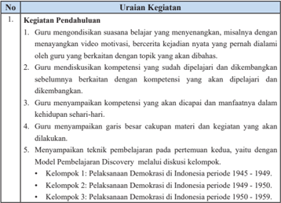

Tabel ini berisi uraian tentang kegiatan pendahuluan dalam proses pembelajaran, yang melibatkan guru dalam berbagai tugas untuk mempersiapkan dan mengarahkan proses belajar. Topik utama tabel adalah "Kegiatan Pendahuluan" yang mencakup empat kolom: 1) Kegiatan, 2) Uraian Kegiatan, 3) Kelompok 1, dan 4) Kelompok 2. Dalam uraian kegiatan, guru melakukan berbagai tugas seperti menyampaikan motivasi, mendiskusikan kompetensi, menyiapkan garis besar kapan dan apa yang akan dilakukan, serta menyiapkan teknik pembelajaran. Kelompok 1 dan 2 masing-masing memiliki uraian kegiatan yang spesifik sesuai dengan periode pelaksanaan demokrasi di Indonesia.

 

---
## 📄 Halaman 98

- Kelompok 4: Pelaksanaan Demokrasi di Indonesia periode 1959 - 1965.
- Kelompok 5: Pelaksanaan Demokrasi di Indonesia periode 1965 - 1998.
- Kelompok 6: Pelaksanaan Demokrasi di Indonesia periode 1998 - sekarang.

### 2. Kegiatan Inti

- Peserta didik dibagi menjadi 6 kelompok yang beranggotakan 5 - 6 orang. Guru membagi tema-tema diskusi sebagaimana yang telah ditentukan pada awal pembelajaran.
- Peserta didik diminta untuk mengamati dengan membaca buku Bab 2 Subbab B    tentang  Dinamika  Penerapan  Demokrasi  di  Indonesia,  pada    materi Periodisasi Perkembangan Demokrasi di Indonesia.
- Guru  meminta  peserta  didik  mencatat  hal-hal  yang  penting  terkait  dengan materi yang telah dibacanya.
- Guru memberikan informasi tambahan terkait dengan wacana tersebut dengan berbagai peristiwa sejenis di lingkungan peserta didik.
- Peserta didik secara kelompok mengidentifikasi sekaligus mencatat pertanyaan yang ingin diketahui sesuai dengan materi kelompoknya.
- Guru membimbing dan terus mendorong peserta didik untuk terus menggali rasa  ingin  tahu  dengan  yang  mendalam  tentang  Dinamika  Penerapan Demokrasi di Indonesia.
- Guru  memberi  motivasi  dan  penghargaan  bagi  kelompok  yang  menyusun pertanyaan terbanyak dan sesuai dengan Indikator Pencapaian Kompetensi.
- Guru mengamati keterampilan peserta didik secara perorangan dan kelompok dalam menyusun pertanyaan.
- Peserta didik mencari informasi dan mendiskusikan jawaban atas pertanyaan yang disusun dan mengerjakan Tugas Kelompok 2.2 dengan membaca sumber lain yang relevan dari buku atau internet.
- Peran guru pada  tahap ini adalah seperti berikut.
- Menyediakan berbagai sumber belajar seperti buku teks siswa dan buku referensi lain.
- Guru  menjadi  sumber  belajar  bagi  peserta  didik  dengan  memberikan konfirmasi atas jawaban peserta didik, atau menjelaskan jawaban pertanyaan kelompok yang tidak terjawab.
- Guru dapat juga menunjukkan buku atau sumber belajar lain yang dapat dijadikan referensi untuk menjawab pertanyaan.
- Peserta didik berdiskusi dalam kelompoknya  untuk mendapatkan pendalaman pemahaman    materi tentang Periodisasi Perkembangan  Demokrasi di Indonesia,  menganalisis dan menyimpulkan informasi yang di dapat, serta menyajikan dalam  bentuk laporan tertulis dan  bahan  presentasi.

 

---
## 📄 Halaman 99

### 3. Kegiatan Penutup

- Bersama-sama    dengan  peserta  didik  guru  memberikan  penekanan  dalam bentuk kesimpulan penting  berkaitan dengan tahapan atau  langkah-langkah penyusunan bahan presentasi yang baik.
- Memberikan evaluasi  terhadap kegiatan pembelajaran  pertemuan 3, terutama hal-hal  yang  kurang berkenan   sebagai  masukan untuk perbaikan  dalam pertemuan keempat.
- Memberi tahu peserta didik  bahwa dalam pertemuan keempat,  adalah  diskusi kelompok 1, 2, dan 3.
- Guru  dan  peserta  didik  menutup  pelajaran  dengan  mengucapkan  syukur kepada Tuhan Yang Maha Esa karena pembelajaran  berlangsung aman dan tertib.

### d.  Penilaian

### 1.  Penilaian Sikap

Penilaian  sikap  terhadap  peserta  didik  dapat  dilakukan  selama Penilaian  sikap  terhadap  peserta  didik  dapat  dilakukan  selama proses  belajar  berlangsung.  Penilaian  dapat  dilakukan  dengan observasi. Dalam observasi, misalnya dilihat aktivitas dan tingkat perhatian peserta didik selama proses pembelajaran berlangsung. Format    penilaian  sikap  dapat  menggunakan  contoh    jurnal perkembangan sikap sebagai berikut.

### Jurnal Perkembangan Sikap

Kelas

: ……..............…….

Semester

: ……..............…….

---
**📊 Tabel**

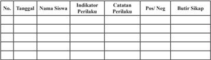

Tabel ini berisi informasi tentang perilaku siswa di kelas, dengan kolom-kolom seperti tanggal, nama siswa, indikator perilaku, catatan perilaku, posisi positif atau negatif, dan butir sikap. Topik utama tabel ini adalah pengawasan dan evaluasi perilaku siswa. Data penting yang terlihat meliputi tanggal pelaksanaan evaluasi, nama siswa yang dianalisis, indikator perilaku yang digunakan, catatan perilaku yang diberikan, posisi positif atau negatif perilaku tersebut, dan butir sikap yang disampaikan oleh siswa. Tabel ini membantu guru untuk memantau perkembangan perilaku siswa secara teratur dan memberikan saran atau bimbingan sesuai dengan hasil evaluasi.

 

---
## 📄 Halaman 100

### 2.  Penilaian Pengetahuan

Penilaian pengetahuan dilakukan dalam bentuk penugasan yaitu mengerjakan Tugas Mandiri 2.2  di bawah ini.

### Tugas Mandiri 2.2

Setelah  kalian  memahami  materi  di  atas,  coba  kalian  buat kesimpulan  mengenai  karakteristik  pelaksanaan  demokrasi  di Indonesia  pada  setiap  periodenya.  Tuliskan  kesimpulan  kalian dalam tabel di bawah ini.

---
**📊 Tabel**

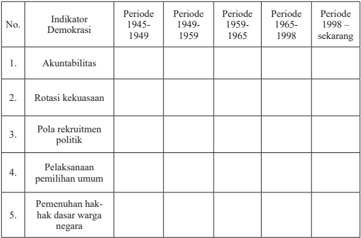

Tabel ini menunjukkan perkembangan sistem demokrasi di Indonesia selama periode 1945 hingga sekarang. Topik utamanya adalah akuntabilitas, rotasi kekuasaan, pola rekrutmen politik, pelaksanaan pemilihan umum, dan pemenuhan hak-hak dasar warga negara. Kolom-kolomnya mencakup periode 1945-1949, 1949-1959, 1959-1965, 1965-1998, dan periode sekarang. Data penting yang terlihat adalah bahwa sistem demokrasi di Indonesia telah berubah signifikan sejak awal kemerdekaan, dengan peningkatan akuntabilitas dan pemenuhan hak-hak dasar warga negara di era 1998 hingga sekarang.

### 3.  Penilaian Keterampilan

Penilaian keterampilan dilakukan guru dengan melihat kemampuan peserta didik dalam presentasi, kemampuan bertanya, kemampuan menjawab pertanyaan atau mempertahankan argumentasi kelompok, kemampuan dalam memberikan masukan/ saran pada saat menyampaikan hasil analisis tentang Periodisasi Perkembangan Demokrasi di Indonesia.  Penyajian dan laporan hasil  telaah  dapat  menggunakan  format  sebagaimana  terdapat pada lampiran dengan ketentuan aspek penilaian dan rubriknya dapat disesuaikan dengan situasi dan kondisi serta keperluan guru.

 

---
## 📄 Halaman 101

### 4.  Pertemuan Keempat  (2 x 45 menit)

Pembelajaran pertemuan keempat  adalah melanjutkan aktivitas yang telah dilaksanakan pada pertemuan ketiga sehingga indikator pencapaian kompetensi dan materi pembelajaran yang akan dicapai sama.

### a.  Indikator Pencapaian Kompetensi

- Menjalankan  nilai-nilai Ketuhanan  dalam berdemokrasi Pancasila sesuai Undang-Undang Dasar Negara Republik Indonesia Tahun 1945.
- Menghargai  nilai-nilai Ketuhanan  dalam berdemokrasi Pancasila sesuai Undang-Undang Dasar Negara Republik Indonesia Tahun 1945.
- Menghargai perilaku santun dalam berdemokrasi Pancasila  sesuai Undang-Undang Dasar Negara Republik Indonesia Tahun 1945.
- Mengamalkan  perilaku  santun  dalam  berdemokrasi  Pancasila sesuai Undang-Undang Dasar Negara Republik Indonesia Tahun 1945.
- Mengidentifikasi pelaksanaan demokrasi di Indonesia pada berbagai kurun waktu.
- Menganalisis  periodisasi perkembangan demokrasi di Indonesia.
- Menalar  hasil kajian tentang  sistem dan dinamika  demokrasi Pancasila sesuai dengan Undang-Undang Dasar Negara Republik Indonesia Tahun 1945.
- Menyaji  hasil  kajian  tentang    sistem  dan  dinamika    demokrasi Pancasila sesuai dengan Undang-Undang Dasar Negara Republik Indonesia Tahun 1945.

### b.   Materi Pembelajaran

Periodisasi Perkembangan Demokrasi di Indonesia

- Pelaksanaan demokrasi di Indonesia pada periode 1945-1949.
- Pelaksanaan demokrasi di Indonesia pada periode 1949-1959.
- Pelaksanaan demokrasi di Indonesia pada periode 1959-1965.
- Pelaksanaan demokrasi di Indonesia pada periode 1965-1998.
- Pelaksanaan demokrasi di Indonesia pada periode 1998-sekarang.

 

---
## 📄 Halaman 102

### No

### 1. Kegiatan Pendahuluan

Kegiatan  pendahuluan  sangat  penting  artinya  bagi  keberhasilan  pelaksanaan proses  pembelajaran  selanjutnya.  Oleh  karena  itu,  guru  harus  berusaha  untuk merangsang peserta didik untuk belajar. Beberapa kegiatan yang dapat dilakukan oleh guru dalam kegiatan pendahuluan antara lain adalah sebagai berikut.

- Guru mengondisikan suasana belajar yang menyenangkan misalnya dengan menayangkan video motivasi, bercerita kejadian nyata yang pernah dialami oleh guru yang berkaitan dengan topik yang akan dibahas.
- Guru  menyampaikan  garis  besar  cakupan  materi  dan  kegiatan  yang  akan dilakukan.
- Guru  menyampaikan  teknis  pembelajaran  pada  pertemuan  keempat  adalah diskusi kelompok.
- Kelompok 1: Pelaksanaan Demokrasi di Indonesia periode 1945 - 1949.
- Kelompok 2: Pelaksanaan Demokrasi di Indonesia periode 1949 - 1950.
- Kelompok 3: Pelaksanaan Demokrasi di Indonesia periode 1950 - 1959.
- Guru menyampaikan lingkup dan teknik penilaian yang akan digunakan:
- penilaian sikap dengan observasi,
- penilaian pengetahuan dengan tes lisan
- penilaian keterampilan  dalam bentuk  penyajian atau presentasi selama diskusi kelompok.

### 2. Kegiatan Inti

Presentasi hasil diskusi kelompok

### 1.  Kelompok ke-1

- Presentasi materi Pelaksanaan Demokrasi di Indonesia periode 1945 - 1949
- Pertanyaan-pertanyaan  dari  kelompok  lain  dan  jawaban  dari  kelompok penyaji.
- Kesimpulan hasil diskusi.

### c.  Proses Pembelajaran

Proses pembelajaran menggunakan  pendekatan  saintifik  model pembelajaran Discovery Learning . Pelaksanaan pembelajaran secara umum  dibagi  menjadi  tiga  tahapan  yaitu    kegiatan  pendahuluan, kegiatan inti, dan kegiatan penutup.

### Uraian Kegiatan

 

---
## 📄 Halaman 103

### 2.  Kelompok ke-2

- Presentasi Pelaksanaan Demokrasi di Indonesia periode 1949 - 1950.
- Pertanyaan-pertanyaan  dari  kelompok  lain  dan  jawaban  dari  kelompok penyaji
- Kesimpulan hasil diskusi.

### 3.  Kelompok ke-3

- Presentasi Pelaksanaan Demokrasi di Indonesia periode 1950 -  1959.
- Pertanyaan-pertanyaan  dari  kelompok  lain  dan  jawaban  dari  kelompok penyaji
- Kesimpulan hasil diskusi.
- Setiap  kelompok melakukan perbaikan-perbaikan  sesuai dengan masukanmasukan  dalam  diskusi,  kemudian    makalah    dikumpulkan  kepada  guru sebagai laporan tertulis.

### 3. Kegiatan Penutup

- Bersama-sama    dengan  peserta  didik,  guru  memberikan  penekanan  dalam bentuk kesimpulan-kesimpulan penting   yang dipelajari dalam pembelajaran pertemuan  keempat.
- Memberikan evaluasi  terhadap kegiatan pembelajaran  pertemuan keempat, terutama hal-hal yang kurang berkenan   sebagai  masukan untuk perbaikan dalam  pertemuan-pertemuan yang akan datang.
- Peserta  didik    diminta  untuk  mengerjakan  Proyek  Kewarganegaraan  'Mari Mengobservasi', yaitu melakukan pengamatan dan mengidentifikasi kegiatankegiatan rutin dalam kehidupan masyarakat di sekitarnya yang mencerminkan pelaksanaan nilai-nilai demokrasi.  Hasil  proyek  kewarganegaraan  akan dikumpulkan pada pertemuan keenam.
- Memberi tahu peserta didik  bahwa dalam pertemuan  kelima,  melanjutkan diskusi untuk  kelompok 4, 5 dan 6.

### d.  Penilaian

### 1.  Penilaian Sikap

Penilaian  sikap  terhadap  peserta  didik  dapat  dilakukan  selama proses  belajar  berlangsung.  Penilaian  dapat  dilakukan  dengan observasi. Dalam observasi, misalnya dilihat aktivitas dan tingkat perhatian peserta didik selama proses pembelajaran berlangsung. Format penilaian sikap dapat menggunakan contoh jurnal perkembangan sikap sebagai berikut.

 

---
## 📄 Halaman 104

### Jurnal Perkembangan Sikap

Kelas

: ……..............…….

Semester

: ……..............…….

---
**📊 Tabel**

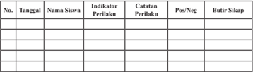

Tabel ini berisi informasi tentang perilaku siswa di kelas, dengan kolom-kolom seperti tanggal, nama siswa, indikator perilaku, catatan perilaku, posisi positif atau negatif, dan butir sikap. Topik utama tabel ini adalah pengawasan dan evaluasi perilaku siswa. Data penting yang terlihat meliputi tanggal pelaksanaan evaluasi, nama siswa yang dianalisis, indikator perilaku yang digunakan, catatan perilaku yang diberikan, posisi positif atau negatif perilaku tersebut, dan butir sikap yang disampaikan oleh siswa. Tabel ini membantu guru untuk memantau perkembangan perilaku siswa secara teratur dan memberikan feedback yang tepat.

### 2.  Penilaian Pengetahuan

Penilaian pengetahuan dilakukan dalam bentuk penugasan yaitu sama dengan tugas yang diberikan pada pertemuan ketiga  yaitu Tugas Mandiri 2.2.

### 3.  Penilaian Keterampilan

Penilaian keterampilan dilakukan guru dengan melihat kemampuan peserta didik dalam presentasi, kemampuan bertanya, kemampuan menjawab pertanyaan atau mempertahankan argumentasi kelompok, kemampuan dalam memberikan masukan/ saran pada saat menyampaikan hasil analisis tentang Periodisasi Perkembangan Demokrasi di Indonesia.  Penyajian  dan  laporan hasil  telaah  dapat  menggunakan  format  sebagaimana  terdapat pada lampiran dengan ketentuan aspek penilaian dan rubriknya dapat disesuaikan dengan situasi dan kondisi serta keperluan guru.

### 5.  Pertemuan Kelima  (2 x 45 menit)

Pertemuan kelima merupakan kelanjutan dari pembelajaran pertemuan keempat, yaitu melanjutkan presentasi hasil diskusi kelompok.

### a.  Indikator Pencapaian Kompetensi

- Menjalankan  nilai-nilai Ketuhanan  dalam berdemokrasi Pancasila sesuai Undang-Undang Dasar Negara Republik Indonesia Tahun 1945.
- Menghargai  nilai-nilai Ketuhanan  dalam berdemokrasi Pancasila sesuai Undang-Undang Dasar Negara Republik Indonesia Tahun 1945.

 

---
## 📄 Halaman 105

- Menghargai perilaku santun dalam berdemokrasi Pancasila  sesuai Undang-Undang Dasar Negara Republik Indonesia Tahun 1945.
- Mengamalkan  perilaku  santun  dalam  berdemokrasi  Pancasila sesuai Undang-Undang Dasar Negara Republik Indonesia Tahun 1945.
- Mengidentifikasi pelaksanaan demokrasi di Indonesia pada periode 1965 -1998.
- Mengidentifikasi pelaksanaan demokrasi di Indonesia pada periode 1998 - sekarang.
- Menalar  hasil kajian tentang  sistem dan dinamika  demokrasi Pancasila sesuai dengan Undang-Undang Dasar Negara Republik Indonesia Tahun 1945.
- Menyaji  hasil  kajian  tentang    sistem  dan  dinamika    demokrasi Pancasila sesuai dengan Undang-Undang Dasar Negara Republik Indonesia Tahun 1945.

### b.  Materi Pembelajaran

- Pelaksanaan demokrasi di Indonesia pada periode 1965 - 1998
- Pelaksanaan demokrasi di Indonesia pada periode 1998 - sekarang.

### c.  Proses Pembelajaran

Proses  pembelajaran  menggunakan  pendekatan  Saintifik  model pembelajaran Discovery Learning . Pelaksanaan pembelajaran secara umum dibagi  menjadi  tiga  tahapan,  yaitu    kegiatan  pendahuluan, kegiatan inti, dan kegiatan penutup.

### No Uraian Kegiatan

### 1. Kegiatan Pendahuluan

- Guru mengondisikan suasana belajar yang menyenangkan, misalnya dengan menayangkan video motivasi, bercerita kejadian nyata yang pernah dialami oleh guru yang berkaitan dengan topik yang akan dibahas.
- Guru  menyampaikan  teknis  pembelajaran  pada  pertemuan  kelima    adalah presentasi hasil diskusi kelompok.
- Kelompok 4: Pelaksanaan Demokrasi di Indonesia periode 1959 - 1965.
- Kelompok 5: Pelaksanaan Demokrasi di Indonesia periode 1965 - 1998.
- Kelompok 6: Pelaksanaan Demokrasi di Indonesia periode 1998 -  sekarang.

 

---
## 📄 Halaman 106

- Guru menyampaikan lingkup dan teknik penilaian yang akan digunakan
- penilaian sikap dengan observasi,
- penilaian pengetahuan dengan tes lisan dalam bentuk uraian.
- penilaian keterampilan  dalam bentuk  penyajian atau presentasi selama diskusi kelompok.

### 2. Kegiatan Inti

### Mengomunikasikan

Presentasi hasil diskusi

### 1.  Kelompok ke-4

- Presentasi  materi  Pelaksanaan  Demokrasi  di  Indonesia  periode  1959  1965;
- Pertanyaan-pertanyaan  dari  kelompok  lain  dan  jawaban  dari  kelompok penyaji,
- kesimpulan hasil diskusi.

### 2.  Kelompok ke-5

- Presentasi Pelaksanaan Demokrasi di Indonesia periode 1965 -  1998.
- pertanyaan-pertanyaan  dari  kelompok  lain  dan  jawaban  dari  kelompok penyaji
- kesimpulan hasil diskusi.

### 3.  Kelompok ke-6

- Presentasi Pelaksanaan Demokrasi di Indonesia periode 1998 -  sekarang.
- pertanyaan-pertanyaan  dari  kelompok  lain  dan  jawaban  dari  kelompok penyaji
- kesimpulan hasil diskusi.
- Setiap  kelompok melakukan perbaikan-perbaikan  sesuai dengan masukanmasukan  dalam  diskusi,  kemudian    makalah    dikumpulkan  kepada  guru sebagai laporan tertulis.

### 3. Kegiatan Penutup

- Bersama-sama    dengan  peserta  didik,  guru  memberikan  penekanan  dalam bentuk kesimpulan-kesimpulan penting   yang dipelajari dalam pembelajaran pertemuan 4.
- Memberikan evaluasi  terhadap kegiatan pembelajaran  pertemuan 5, terutama hal-hal  yang  kurang  berkenan      sebagai    masukan  untuk  perbaikan    dalam pertemuan-pertemuan yang akan datang.
- Menutup kegiatan dengan mengucapkan rasa syukur karena diskusi berjalan dengan lancar.

 

---
## 📄 Halaman 107

### d.  Penilaian

### 1.  Penilaian Sikap

Penilaian  sikap  terhadap  peserta  didik  dapat  dilakukan  selama proses  belajar  berlangsung.  Penilaian  dapat  dilakukan  dengan observasi. Dalam observasi, misalnya dilihat aktivitas dan tingkat perhatian peserta didik selama proses pembelajaran berlangsung. Format    penilaian  sikap  dapat  menggunakan  contoh    jurnal perkembangan sikap sebagai berikut.

### Jurnal Perkembangan Sikap

Kelas

: ……..............…….

Semester

: ……..............…….

---
**📊 Tabel**

Tabel ini merupakan catatan perilaku siswa yang dilakukan pada berbagai tanggal tertentu. Topik utamanya adalah pengawasan dan evaluasi perilaku siswa dalam kehidupan sehari-hari. Tabel ini terdiri dari beberapa kolom, yaitu tanggal, nama siswa, indikator perilaku, catatan perilaku, posisi positif atau negatif, dan butir sikap. Data penting yang terlihat adalah bahwa banyak siswa yang memiliki perilaku positif, seperti menjaga kebersihan dan menghormati orang lain. Namun, juga ada beberapa siswa yang memiliki perilaku negatif, seperti tidak menghormati guru dan teman-temannya. Selain itu, butir sikap yang diberikan menunjukkan bahwa siswa harus lebih memperhatikan perilaku mereka dan mencoba untuk menjadi lebih baik.

### 2.  Penilaian Pengetahuan

Penilaian pengetahuan dilakukan dalam bentuk penugasan yaitu Tugas Mandiri 2.2.

- Penilaian Keterampilan
Penilaian Keterampilan dilakukan guru dengan melihat kemampuan peserta didik dalam presentasi, kemampuan bertanya, kemampuan menjawab pertanyaan atau mempertahankan argumentasi kelompok, kemampuan dalam memberikan masukan/ saran pada saat menyampaikan hasil analisis tentang Periodisasi Perkembangan Demokrasi  di Indonesia. Penyajian dan laporan hasil  telaah  dapat  menggunakan  format  sebagaimana  terdapat pada lampiran dengan ketentuan aspek penilaian dan rubriknya dapat disesuaikan dengan situasi dan kondisi serta keperluan guru.

 

---
## 📄 Halaman 108

### 6.  Pertemuan Keenam  (2 x 45 menit)

Pertemuan keenam akan mempelajari materi Subbab C, yaitu Membangun Kehidupan yang Demokratis di Indonesia (Buku Siswa hal. 66-71). Pertemuan ini akan membahas pentingnya kehidupan demokrasi dan perilaku yang mendukung tegaknya nilai-nilai demokrasi.

### a.  Indikator Pencapaian Kompetensi

- Menjalankan  nilai-nilai Ketuhanan  dalam berdemokrasi Pancasila sesuai Undang-Undang Dasar Negara Republik Indonesia Tahun 1945.
- Menghargai  nilai-nilai Ketuhanan  dalam berdemokrasi Pancasila sesuai Undang-Undang Dasar Negara Republik Indonesia Tahun 1945
- Menghargai perilaku santun dalam berdemokrasi Pancasila  sesuai Undang-Undang Dasar Negara Republik Indonesia Tahun 1945.
- Mengamalkan  perilaku  santun  dalam  berdemokrasi  Pancasila sesuai Undang-Undang Dasar Negara Republik Indonesia Tahun 1945.
- Menunjukkan pentingnya kehidupan yang demokratis.
- Mengidentifikasi perilaku yang mendukung tegaknya nilai-nilai demokrasi.
- Menalar  hasil kajian tentang  sistem dan dinamika  demokrasi Pancasila sesuai dengan Undang-Undang Dasar Negara Republik Indonesia Tahun 1945.
- Menyaji  hasil  kajian  tentang    sistem  dan  dinamika    demokrasi Pancasila sesuai dengan Undang-Undang Dasar Negara Republik Indonesia Tahun 1945.

### b.  Materi Pembelajaran

- Pentingnya kehidupan yang demokratis
- Perilaku yang mendukung tegaknya nilai-nilai demokrasi

### c.  Proses Pembelajaran

Proses pembelajaran menggunakan  pendekatan  saintifik  model pembelajaran Discovery Learning. Pelaksanaan pembelajaran secara umum dibagi  menjadi  tiga  tahapan,  yaitu    kegiatan  pendahuluan, kegiatan inti, dan kegiatan penutup.

 

---
## 📄 Halaman 109

### No

### 1. Kgiatan Pendahuluan

- Guru mengondisikan suasana belajar yang menyenangkan, misalnya dengan menayangkan video motivasi, bercerita kejadian nyata yang pernah dialami oleh guru yang berkaitan dengan topik yang akan dibahas.
- Guru  mendiskusikan  kompetensi  yang  sudah  dipelajari  dan  dikembangkan sebelumnya berkaitan dengan kompetensi yang akan dipelajari dan dikembangkan.
- Guru menyampaikan kompetensi yang akan dicapai dan manfaatnya dalam kehidupan sehari-hari.
- Guru  menyampaikan  garis  besar  cakupan  materi  dan  kegiatan  yang  akan dilakukan.
- Guru menyampaikan lingkup dan teknik penilaian yang akan digunakan.

### 2. Kegiatan Inti

- Peserta didik dibagi menjadi beberapa kelompok yang beranggotakan 5 - 6 orang.
- Peserta  didik  diminta  untuk  mengamati  dengan  membaca  buku  teks  Bab  2 Subbab C tentang Membangun Kehidupan yang Demokratis di Indonesia.
- Guru memberikan informasi tambahan terkait dengan wacana tersebut dengan berbagai peristiwa sejenis di lingkungan peserta didik.
- Peserta didik secara kelompok mengidentifikasi sekaligus mencatat pertanyaan yang  ingin  diketahui  tentang  Membangun  Kehidupan  yang  Demokratis  di Indonesia.
- Guru membimbing dan terus mendorong peserta didik untuk terus menggali rasa ingin tahu dengan yang mendalam tentang Membangun Kehidupan yang Demokratis  di Indonesia.
- Guru  memberi  motivasi  dan  penghargaan  bagi  kelompok  yang  menyusun pertanyaan terbanyak dan sesuai dengan Indikator Pencapaian Kompetensi.
- Peserta didik mencari informasi dan mendiskusikan jawaban atas pertanyaan yang  disusun  dengan  membaca  sumber  lain  yang  relevan  dari  buku  atau internet.
- Peran guru pada  tahap ini adalah sebagai berikut.
- Menyediakan berbagai sumber belajar seperti buku teks siswa dan buku referensi lain.
- Guru  menjadi  sumber  belajar  bagi  peserta  didik  dengan  memberikan konfirmasi atas jawaban peserta didik, atau menjelaskan jawaban pertanyaan kelompok yang tidak terjawab.

### Uraian Kegiatan

 

---
## 📄 Halaman 110

- Guru dapat juga menunjukkan buku atau sumber belajar lain yang dapat dijadikan referensi untuk menjawab pertanyaan.
- Peserta  didik  menghubungkan  berbagai  informasi  yang  diperoleh,  untuk menunjukkan pentingnya kehidupan yang demokratis, mengidentifikasi perilaku yang mendukung tegaknya nilai-nilai demokrasi.
- Peserta  didik  menyusun  laporan  hasil  telaah/analisisnya.  Laporan  disusun secara individu dan menjadi tugas peserta didik dan dikumpulkan pada akhir pertemuan ini.
- Peserta  didik  secara  acak  (2  -  3  orang)  diminta  untuk  menyajikan  hasil diskusi tentang pentingnya kehidupan yang demokratis, dan  mengidentifikasi perilaku yang mendukung tegaknya nilai-nilai demokrasi. Peserta didik yang lain diminta untuk menanggapi atau melengkapi hasil diskusi tersebut.
- Guru memberikan konfirmasi/penguatan atas jawaban peserta didik.

### 3. Kegiatan Penutup

- Guru dan peserta didik membuat rangkuman atau simpulan kompetensi yang telah dipelajari.
- Guru  dan  peserta  didik  melakukan  refleksi  terhadap  kegiatan  yang  sudah dilaksanakan.
- Guru memberikan umpan balik terhadap proses dan hasil belajar.
- Guru meminta peserta didik mengumpulkan hasil Proyek Kewarganegaraan.
- Guru menyampaikan rencana pembelajaran untuk pertemuan berikutnya.
- Guru  dan  peserta  didik  menutup  pelajaran  dengan  mengucapkan  syukur kepada Tuhan Yang Maha Esa karena pembelajaran  berlangsung aman dan tertib.

### d.  Penilaian

### 1.   Penilaian Sikap

Penilaian  sikap  terhadap  peserta  didik  dapat  dilakukan  selama proses  belajar  berlangsung.  Penilaian  dapat  dilakukan  dengan observasi. Dalam observasi, misalnya dilihat aktivitas dan tingkat perhatian peserta didik selama proses pembelajaran berlangsung. Format    penilaian  sikap  dapat  menggunakan  contoh    jurnal perkembangan sikap sebagai berikut.

Jurnal Perkembangan Sikap

Kelas

: ……..............…….

Semester

: ……..............…….

 

---
## 📄 Halaman 111

---
**📊 Tabel**

Tabel ini merupakan catatan perilaku siswa yang dilakukan pada berbagai tanggal. Topik utamanya adalah perilaku siswa dalam kehidupan sehari-hari. Kolom-kolom yang ada meliputi tanggal, nama siswa, indikator perilaku, catatan perilaku, posisi positif atau negatif, dan butir sikap. Data penting yang terlihat adalah bahwa banyak siswa yang memiliki perilaku positif, seperti berbagi, membantu, dan berkomunikasi dengan baik. Namun, juga ada beberapa siswa yang memiliki perilaku negatif, seperti tidak menghormati orang lain atau tidak menunjukkan sikap positif. Ini menunjukkan bahwa perlu ada upaya untuk memperbaiki perilaku siswa agar lebih positif dan bermanfaat bagi diri mereka sendiri dan orang lain.

### 2.   Penilaian Pengetahuan

Penilaian pengetahuan dilakukan dalam bentuk penugasan, yaitu mengerjakan Tugas Mandiri 2.3 sebagai berikut.

### Tugas Mandiri 2.3

Coba kalian amati dan rasakan bagaimana pelaksanaan karakteristik negara demokratis  di lingkungan keluarga, sekolah masyarakat dan negara. Tulislah jawaban kalian dalam tabel di bawah ini.

---
**📊 Tabel**

Tabel ini membahas penerapan karakteristik negara demokratis dalam berbagai lingkungan, mulai dari keluarga hingga negara. Topik utamanya adalah bagaimana nilai-nilai demokrasi dapat diterapkan secara efektif di berbagai aspek kehidupan masyarakat. Dalam tabel ini, kolom "Karakteristik Negara Demokratis" menunjukkan beberapa prinsip dasar yang harus dimiliki oleh negara demokratis, seperti persamaan kedudukan dan partisipasi dalam pembuatan keputusan. Sementara itu, kolom "Penerapan dalam Lingkungan" menunjukkan bagaimana prinsip-prinsip tersebut dapat diterapkan di berbagai tingkat kehidupan, mulai dari keluarga hingga masyarakat dan negara. Data atau pola penting yang terlihat adalah bahwa prinsip-prinsip demokrasi tidak hanya berlaku pada tingkat nasional, tetapi juga di tingkat keluarga, sekolah, dan masyarakat. Ini menunjukkan bahwa demokrasi bukanlah konsep yang hanya berlaku pada tingkat pemerintahan, tetapi juga di tingkat individu dan kelompok.

### 3.  Penilaian Keterampilan

Penilaian  keterampilan  dilakukan  guru  menilai  hasil  Proyek Kewarganegaraan  'Mari  Mengobservasi'  dengan  aturan  main sebagai  berikut;

 

---
## 📄 Halaman 112

- Kerjakanlah tugas ini di luar proses pembelajaran.
- Amatilah kehidupan masyarakat di sekitar tempat tinggalmu. Kemudian, identifikasilah kegiatan-kegiatan rutin dilaksanakan  yang  mencerminkan  pelaksanaan  nilai-nilai demokrasi.
- Tulislah hasil pengamatanmu dalam tabel di bawah ini, serta laporkanlah hasil pekerjaanmu kepada guru kalian.

---
**📊 Tabel**

Tabel ini menunjukkan partisipasi masyarakat dalam berbagai jenis kegiatan. Kolom pertama berisi nomor urut untuk setiap kegiatan, sedangkan kolom kedua berisi deskripsi jenis kegiatan tersebut. Kolom ketiga berisi informasi tentang partisipasi masyarakat terhadap setiap kegiatan. Dari tabel ini, dapat dilihat bahwa partisipasi masyarakat sangat bervariasi tergantung pada jenis kegiatan. Misalnya, kegiatan yang paling banyak diikuti oleh masyarakat adalah kegiatan nomor 1, sementara kegiatan nomor 10 memiliki partisipasi masyarakat yang paling sedikit. Ini menunjukkan bahwa masyarakat lebih suka ikut serta dalam kegiatan yang lebih umum dan populer daripada kegiatan yang lebih spesifik atau kurang populer.

### e.  Uji Kompetensi Bab 2

### Jawablah  pertanyaan  di  bawah  ini  secara  singkat,  jelas,  dan akurat.

- Apa yang dimaksud dengan demokrasi?
- Jelaskan prinsip-prinsip demokrasi.
- Jelaskan soko guru demokrasi universal.
- Jelaskan  nilai  demokrasi  Pancasila  jika  dibandingkan  dengan demokrasi lainnya.
- Buktikan bahwa negara Indonesia adalah negara demokratis baik secara normatif maupun empirik.
- Kemukakan prinsip-prinsip yang perlu dilaksanakan untuk mewujudkan kehidupan yang demokratis.

 

---
## 📄 Halaman 113

### Kunci Jawaban dan Penyekoran

---
**📊 Tabel**

Tabel ini berisi informasi tentang demokrasi dan prinsip-prinsipnya dalam konteks bahasa Yunani. Topik utama adalah demokrasi dan prinsip-prinsip yang mendukungnya. Kolom pertama menunjukkan nomor soal, kolom kedua menyediakan jawaban untuk setiap soal, dan kolom ketiga memberikan skor untuk setiap jawaban. Data penting yang terlihat meliputi bahwa demokrasi berasal dari kata "demos" yang berarti rakyat dan "kratos" yang berarti pemerintahan, sehingga dapat diartikan sebagai pemerintahan rakyat. Prinsip-prinsip demokrasi meliputi menyelenggarakan perselisihan dengan damai dan secara lembaga, menjamin terselenggaranya perubahan secara damai dalam suatu masyarakat yang sedang berubah, menyelenggarakan pergantian pimpinan secara teratur, membatasi penekanan kekerasan sama minimum, mengakui serta menganggap wajah adanya keanekaragaman, dan menjamin tegaknya keadilan. Soko-guru demokrasi juga disebutkan dengan beberapa prinsip seperti keadilan rakyat, pemerintahan berdasarkan persetujuan dari yang diperintah, kekuasaan mayoritas, hak-hak minoritas, dan lain-lain. Demokrasi Pancasila memiliki nilai-nilai moral yang berbeda dengan beberapa nilai moral yang berasal dari Pancasila, seperti persamaan bagi seluruh rakyat Indonesia, kesimpulan antara hak dan kewajiban, dan pelaksanaan kebebasan yang dipertanggungjawabkan secara moral kepada Tuhan Yang Maha Esa.

 

---
## 📄 Halaman 114

---
**📊 Tabel**

Tabel ini berisi informasi tentang prinsip-prinsip demokrasi di Indonesia, termasuk definisi negara, konstitusi, dan prinsip-prinsip yang harus diterapkan. Topik utama adalah prinsip-prinsip demokrasi, seperti mewujudkannya keputusan dengan musyawarah mufakat, pengambilan keputusan, menganut persatuan nasional dan kekeluargaan, dan menunjung tinggi tujuan dan cita-nasional. Kolom-kolomnya mencakup definisi negara, prinsip demokrasi, dan prinsip-prinsip yang harus diterapkan. Data penting yang terlihat antara lain bahwa negara Indonesia memiliki konstitusi yang berlaku sejak 1945, dengan prinsip-prinsip demokrasi yang ditetapkan dalam Undang-Undang Dasar Republik Indonesia Serikat.

 

---
## 📄 Halaman 115

- menjamin  terselenggaranya  perubahan  secara  damai  dalam  suatu masyarakat yang sedang berubah;
- menyelenggarakan pergantian pimpinan secara teratur;
- membatasi pemakaian kekerasan sampai minimum;
- mengakui serta menganggap wajar adanya keanekaragaman;
- menjamin tegaknya keadilan.

### Jumlah Skor

``

### Perolehan Nilai;

### E. Pengayaan

Kegiatan  pengayaan  merupakan  kegiatan  pembelajaran  yang  diberikan kepada peserta  didik  yang  telah  menguasai  seluruh  materi  pembelajaran yaitu materi pada Bab 2 tentang sistem dan dinamika demokrasi konstitusional di Indonesia.

Pengayaan  dapat  dilakukan  dengan  beberapa  cara  dan  pilihan.  Sebagai contoh peserta didik dapat diberikan bahan bacaan yang relevan dengan materi. Peserta didik dapat diminta melakukan pengamatan di lingkungan tempat  tinggalnya  adakah  kasus  yang  berhubungan  dengan  dinamika demokrasi, misalnya kasus pilkada yang  sampai saat ini belum terselesaikan dan mengapa hal iti terjadi dan upaya apa yang sebaiknya dilakukan untuk menyelesaikan kasus tersebut.

### F. Remedial

Kegiatan remedial diberikan kepada peserta didik yang belum menguasai materi pelajaran dan belum mencapai kompetensi yang telah ditentukan. Bentuk yang dilakukan antara lain peserta didik secara terencana mempelajari  Buku  Siswa  Mata  Pelajaran  PPKn  Kelas  XI  pada  bagian tertentu  yang  belum  dikuasainya.  Guru  menyediakan  soal-soal  latihan atau pertanyaan yang merujuk pemahaman kembali tentang isi Buku Teks Pelajaran PPKn Kelas XI Bab 2. Peserta didik diminta komitmennya untuk belajar  secara  disiplin  dalam  rangka  memahami  materi  pelajaran  yang belum dikuasainya. Guru kemudian mengadakan uji kompetensi kembali pada materi yang belum dikuasai peserta didik yang bersangkutan.

40

 

---
## 📄 Halaman 116

### G. Interaksi Guru dan Orang Tua

Maksud  dari  kegiatan  ini  adalah  agar  terjalin  komunikasi  antara  guru dan  orang  tua  berkaitan  dengan  kemajuan  proses  dan  hasil  belajar  yang dilaksanakan dan dicapai peserta didik. Guru harus selalu mengingatkan dan meminta peserta didik memperlihatkan hasil tugas atau pekerjaan yang telah dinilai dan diberi komentar oleh guru kepada orang tua peserta didik, yaitu:

- Penilaian  sikap  selama  peserta  didik  mengikuti  proses  pembelajaran pada Bab 2.
- Penilaian pengetahuan melalui penugasan dan kegiatan uji kompetensi Bab 2.
- Penilaian  Keterampilan  melalui  pengamatan  dalam  presentasi  dan Praktik Belajar Kewarganegaraan.
Orang  tua  juga  harus  memberikan  komentar  hasil  pekerjaan  atau  tugas yang  dicapai  oleh  peserta  didik  sebagai  apresiasi  dan  komitmen  untuk bersama-sama mengantarkan peserta didik  mencapai prestasi yang lebih baik. Bentuk apresiasi orang tua ini akan menambah semangat peserta didik untuk  mempertahankan  dan  meningkatkan  keberhasilannya  baik  dalam kontek  pemahaman  dan  penguasaan  materi  pengetahuan,  sikap  maupun keterampilan. Hasil penilaian yang telah diparaf  atau ditandatangani guru dan orang tua, kemudian disimpan untuk menjadi bagian dari portofolio peserta didik. Untuk itu, pihak sekolah atau guru harus menyediakan format tugas/pekerjaan  peserta didik. Adapun  interaksi antarguru dan orang tua dapat menggunakan format  di bawah  ini.

---
**📊 Tabel**

Tabel ini menunjukkan hasil penilaian siswa dalam beberapa aspek, yaitu sikap, pengetahuan, dan keterampilan. Setiap aspek memiliki nilai rata-rata yang ditampilkan di kolom "Nilai Rata-Rata". Untuk setiap aspek, ada kolom "Komentar Guru" dan "Komentar Orang Tua", yang masing-masing berisi komentar dari guru dan orang tua tentang prestasi dan kemajuan siswa dalam aspek tersebut. Selain itu, tabel juga mencakup kolom "Para/Tanda Tangan", yang biasanya digunakan untuk menandatangani oleh guru atau orang tua sebagai tanda bahwa penilaian telah diberikan dan diterima. Topik utama tabel ini adalah evaluasi akademik siswa dalam beberapa aspek, dengan fokus pada perbandingan antara nilai rata-rata siswa, komentar dari guru dan orang tua, serta tanda tangan sebagai bukti penilaian.

 

---
## 📄 Halaman 117

Sistem Hukum dan Peradilan di Indonesia

Praktik Belajar Kewarganegaraan

### Peta Materi dan Pembelajaran Bab 3

### SUBBAB A

- Makna dan karakteristik hukum
- Penggolongan hukum

### SUBBAB A

- Tujuan Hukum
- Tata Hukum Republik Indonesia

### SUBBAB B

- Makna Lembaga Peradilan
- Dasar Hukum Lembaga Peradilan

### SUBBAB B

- Klasifikasi LembagaPeradilan
- Perangkat Lembaga Peradilan

### SUBBAB B

- Tingkatan Lembaga Peradilan
- Peran Lembaga Peradilan

### SUBBAB C

Menampilkan Sikap yang Sesuai dengan Hukum

### KEGIATAN PEMBELAJARAN

Menggunakan  Model pembelajaran Discovery Learning ..

### KEGIATAN PEMBELAJARAN

Menggunakan  Model pembelajaran Discovery Learning

### KEGIATAN PEMBELAJARAN

Menggunakan  Model pembelajaran Discovery Learning

### KEGIATAN PEMBELAJARAN

Menggunakan  Model pembelajaran Discovery Learning .

### KEGIATAN PEMBELAJARAN

Menggunakan  Model pembelajaran Discovery Learning .

### KEGIATAN PEMBELAJARAN

Menggunakan  Model pembelajaran Discovery Learning .

Buku Guru PPKn | 111

 

---
## 📄 Halaman 118

### Pembelajaran Bab 3

### SISTEM HUKUM DAN PERADILAN DI INDONESIA

### A. Kompetensi Inti (KI)

- Menghayati dan mengamalkan ajaran agama yang dianutnya.
- Menghayati dan mengamalkan perilaku jujur, disiplin, tanggung jawab, peduli (gotong royong, kerja sama, toleran, damai), santun, responsif dan  pro-aktif  dan  menunjukkan  sikap  sebagai  bagian  dari  solusi  atas berbagai permasalahan dalam berinteraksi secara efektif dengan lingkungan  sosial  dan  alam  serta  dalam  menempatkan  diri  sebagai cerminan bangsa dalam pergaulan dunia.
- Memahami, menerapkan, menganalisis pengetahuan faktual, konseptual, prosedural berdasarkan rasa ingin tahunya tentang ilmu pengetahuan, teknologi, seni, budaya, dan humaniora dengan wawasan kemanusiaan, kebangsaan, kenegaraan, dan peradaban terkait penyebab fenomena dan kejadian, serta menerapkan pengetahuan prosedural pada bidang kajian yang  spesifik  sesuai  dengan  bakat  dan  minatnya  untuk  memecahkan masalah.
- Mengolah, menalar, dan menyaji dalam ranah konkret dan ranah abstrak terkait dengan pengembangan dari yang dipelajarinya di sekolah secara mandiri, dan mampu menggunakan metode sesuai kaidah keilmuan.

### B. Kompetensi Dasar (KD) &  Indikator Pencapaian Kompetensi (IPK)

---
**📊 Tabel**

Tabel ini berisi informasi tentang kompetensi dasar dan indikator pencapaian kompetensi dalam sistem hukum dan peradilan Indonesia. Topik utamanya adalah tentang pemahaman dan pengenalan tentang Undang-Undang Dasar Negara Republik Indonesia 1945. Kolom-kolomnya meliputi nomor urut (NO), nomor kompetensi dasar (1.3), dan indikator pencapaian kompetensi. Data penting yang terlihat adalah bahwa kompetensi ini mencakup pengetahuan tentang sistem hukum dan peradilan Indonesia sesuai dengan Undang-Undang Dasar Negara Republik Indonesia 1945, serta pengetahuan tentang pengembangan ke Tuhan Yang Maha Esa. Ini menunjukkan bahwa tabel ini bertujuan untuk memastikan siswa memiliki pemahaman yang kuat tentang fondasi hukum dan peradilan di Indonesia.

 

---
## 📄 Halaman 119

---
**📊 Tabel**

Tabel ini berisi informasi tentang proses pengembangan hukum di Indonesia, mulai dari pembentukan Undang-Undang Dasar Negara Republik Indonesia Tahun 1945 hingga penyelesaian sistem hukum dan peradilan. Topik utama tabel meliputi pembentukan undang-undang, menunjukkan sikap disiplin terhadap aturan, mendiskripsikan sistem hukum dan peradilan, dan menyajikan hasil penelitian tentang sistem hukum dan peradilan. Kolom-kolomnya mencakup proses pembentukan undang-undang, sikap disiplin terhadap aturan, mendiskripsikan sistem hukum dan peradilan, dan menyajikan hasil penelitian. Data penting yang terlihat antara lain bahwa pembentukan undang-undang dilakukan sesuai dengan Undang-Undang Dasar Negara Republik Indonesia Tahun 1945, sikap disiplin terhadap aturan diperlakukan secara konsisten, sistem hukum dan peradilan di Indonesia mendapatkan diskripsi yang jelas, dan hasil penelitian tentang sistem hukum dan peradilan di Indonesia telah selesai.

### C. Materi Pembelajaran Bab 3

### Sistem Hukum dan Peradilan di Indonesia

- Sistem hukum di Indonesia.
- Makna dan karakteristik hukum.
- Penggolongan hukum.
- Tujuan Hukum.
- Tata Hukum Republik Indonesia.
- Mencermati Sistem Peradilan di Indonesia.
- Makna Lembaga Peradilan.
- Dasar Hukum Lembaga Peradilan.

 

---
## 📄 Halaman 120

- Klasifikasi Lembaga Peradilan.
- Perangkat Lembaga Peradilan.
- Tingkatan Lembaga Peradilan.
- Peran Lembaga Peradilan.
- Menampilkan Sikap yang Sesuai dengan Hukum.
- Perilaku yang Sesuai dengan Hukum.
- Perilaku yang Bertentangan dengan Hukum beserta Sanksinya.

### D. Proses Pembelajaran

### 1.  Pertemuan Pertama (2 x 45 menit)

Pertemuan pertama diawali dengan mengulas isu-isu aktual yang ada di sekitar peserta didik. Pada pertemuan pertama, guru dapat menyampaikan gambaran umum materi yang akan dipelajari pada Bab 3, kegiatan apa yang akan dilaksanakan, menjelaskan pentingnya mempelajari materi ini,  bagaimana  guru  dapat  menumbuhkan  ketertarikan  peserta  didik terhadap materi yang akan di pelajari.  Setelah itu,  guru menyampaikan batasan materi apa saja yang akan dipelajari pada  Bab 3.

### a.  Indikator Pencapaian Kompetensi

- Meyakini    nilai-nilai  dalam  sistem  hukum  dan  peradilan  di Indonesia sesuai dengan Undang-Undang Dasar Negara Republik Indonesia Tahun 1945 sebagai bentuk pengabdian kepada Tuhan Yang Maha Esa.
- Mensyukuri    nilai-nilai  dalam  sistem  hukum  dan  peradilan  di Indonesia sesuai dengan Undang-Undang Dasar Negara Republik Indonesia Tahun 1945 sebagai bentuk pengabdian kepada Tuhan Yang Maha Esa.
- Memiliki  sikap disiplin terhadap aturan  sebagai cerminan sistem hukum dan peradilan di Indonesia.
- Menunjukkan sikap disiplin terhadap aturan  sebagai cerminan sistem hukum dan peradilan di Indonesia
- Menganalisis makna Lembaga Peradilan.
- Menjelaskan makna hukum
- Menguraikan klasifikasi hukum
- Menalar  sistem hukum dan peradilan di Indonesia sesuai dengan Undang-Undang Dasar Negara Republik Indonesia Tahun 1945.

 

---
## 📄 Halaman 121

- Menyaji hasil penalaran  sistem hukum dan peradilan di Indonesia sesuai dengan Undang-Undang Dasar Negara Republik Indonesia Tahun 1945.

### b.  Materi Pembelajaran

Pertemuan pertama peserta didik akan mempelajari materi Subbab A, yaitu sistem hukum Indonesia. Pertemuan ini membahas materi tantang;

- Makna dan karakteristik hukum
- Klasifikasi hukum

### c.  Proses Pembelajaran

Proses pembelajaran menggunakan  pendekatan  saintifik  model pembelajaran Discovery Learning . Pelaksanaan pembelajaran secara umum dibagi  menjadi  tiga  tahapan,  yaitu    kegiatan  pendahuluan, kegiatan inti, dan kegiatan penutup.

---
**📊 Tabel**

Tabel ini berisi uraian tentang kegiatan pendahuluan dalam proses pembelajaran sistem hukum di Indonesia. Topik utamanya adalah bagaimana guru dapat mempersiapkan diri dan siswa untuk belajar sistem hukum dengan cara yang efektif. Kolom pertama menunjukkan nomor urutan kegiatan, sedangkan kolom kedua berisi deskripsi singkat tentang setiap kegiatan tersebut. Data penting yang terlihat adalah bahwa semua kegiatan ini bertujuan untuk membantu guru dan siswa dalam memahami dan menerapkan sistem hukum di Indonesia, baik itu melalui penggunaan video motivasi, analisis peraturan hukum, diskusi masalah, maupun penilaian siswa.

 

---
## 📄 Halaman 122

### 2. Kegiatan inti

- Peserta didik diminta untuk mengamati tayangan video yang berkaitan dengan Sistem Hukum dan Peradilan di Indonesia.
- Guru memberikan informasi tambahan terkait dengan tayangan  tersebut.
- Peserta didik di minta untuk  membaca buku teks Bab 3 Subbab A Sistem Hukum di Indonesia, materi 1. makna dan karakteristik hukum dan  materi  2. penggolongan hukum (Buku Siswa hal. 78-84).
- Peserta didik diminta untuk mencatat hal-hal penting dan mungkin dapat di eksplorasi pada saat proses menganalisis.
- Peserta didik secara kelompok mengidentifikasi sekaligus mencatat pertanyaan yang ingin diketahui dari apa yang telah dibacanya.
- Guru membimbing dan terus mendorong peserta didik untuk terus menggali dengan rasa ingin tahu yang mendalam tentang Sistem Hukum dan Peradilan di Indonesia dengan mengisi daftar pertanyaan.
- Guru  memberi  motivasi  dan  penghargaan  bagi  kelompok  yang  menyusun pertanyaan terbanyak dan sesuai dengan Indikator Pencapaian Kompetensi.
- Guru mengamati keterampilan peserta didik secara perorangan dan kelompok dalam menyusun pertanyaan.
- Peserta didik mencari informasi dan mendiskusikan jawaban atas pertanyaan yang disusun dan Tugas Mandiri 3.1,  Tugas Mandiri 3.2  serta Tugas Kelompok 3.1 dengan membaca sumber lain yang relevan dari buku atau internet.
- Peran guru pada  tahap ini adalah sebagai berikut.
- Menyediakan berbagai sumber belajar seperti buku teks siswa dan buku referensi lain.
- Guru  menjadi  sumber  belajar  bagi  peserta  didik  dengan  memberikan konfirmasi atas jawaban peserta didik, atau menjelaskan jawaban pertanyaan kelompok yang tidak terjawab.
- Guru dapat juga menunjukkan buku atau sumber belajar lain yang dapat dijadikan referensi untuk menjawab pertanyaan.
- Peserta didik berdiskusi dalam kelompoknya  untuk mendapatkan pendalaman pemahaman  materi, menganalisis dan menyimpulkan informasi yang didapat berkaitan  dengan  Makna  dan  Karakteristik  Hukum  serta  Penggolongan Hukum, kemudian  menyajikan dalam  bentuk laporan tertulis.
- Peserta  didik  menyusun  laporan  hasil  telaah/analisisnya.  Laporan  disusun secara individu dan dikumpulkan pada akhir pertemuan ini.

 

---
## 📄 Halaman 123

- Peserta  didik  yang  lain  diminta  untuk  menanggapi  atau  melengkapi  hasil analisis tersebut.
- Guru memberikan konfirmasi/penguatan atas jawaban peserta didik.

### 3. Kegiatan Penutup

- Guru dan peserta didik membuat rangkuman atau simpulan kompetensi yang telah dipelajari.
- Guru  dan  peserta  didik  melakukan  refleksi  terhadap  kegiatan  yang  sudah dilaksanakan.
- Guru memberikan umpan balik terhadap proses dan hasil belajar.
- Guru memberikan tugas individu atau kelompok  untuk pertemuan berikutnya.
- Guru menyampaikan rencana pembelajaran untuk pertemuan berikutnya.
- Guru  dan  peserta  didik  menutup  pelajaran  dengan  mengucapkan  syukur kepada Tuhan Yang Maha Esa karena pembelajaran  berlangsung aman dan tertib.

### d.  Penilaian

### 1.  Penilaian Sikap

Penilaian  sikap  terhadap  peserta  didik  dapat  dilakukan  selama proses  belajar  berlangsung.  Penilaian  dapat  dilakukan  dengan observasi. Dalam observasi, misalnya dilihat aktivitas dan tingkat perhatian peserta didik selama proses pembelajaran berlangsung. Format    penilaian  sikap  dapat  menggunakan  contoh    jurnal perkembangan sikap sebagai berikut.

Jurnal Perkembangan Sikap

Kelas

: ……..............…….

Semester

: ……..............…….

---
**📊 Tabel**

Tabel ini berisi informasi tentang perilaku siswa di sekolah, dengan kolom-kolom seperti tanggal, nama siswa, indikator perilaku, catatan perilaku, posisi positif atau negatif, dan butir sikap. Topik utama tabel ini adalah pengamatan perilaku siswa dan evaluasi sikap mereka. Data penting yang terlihat meliputi tanggal pengamatan, nama siswa, indikator perilaku yang digunakan untuk menilai perilaku tersebut, catatan perilaku yang diberikan oleh guru, posisi positif atau negatif perilaku tersebut, dan butir sikap yang diberikan kepada siswa. Tabel ini membantu guru untuk memantau perkembangan perilaku siswa dan memberikan saran untuk meningkatkan sikap positif mereka.

 

---
## 📄 Halaman 124

### 2.  Penilaian Pengetahuan

Tugas Mandiri 3.1

- Bacalah sumber belajar lain baik yang berasal dari media cetak maupun  online  yang  berkaitan  dengan  pengertian  hukum. Carilah tiga pengertian hukum menurut para pakar. Tuliskan dalam tabel di bawah ini dan presentasikan di hadapan temanteman yang lain.
- Berdasarkan pengertian-pengertian hukum tersebut, simpulkanlah persamaan dan perbedaan rumusan pengertian hukum  yang diungkapkan para pakar yang kalian temukan. Kemudian, coba kalian rumuskan pengertian hukum berdasarkan pemahaman kalian sendiri .................................... .................................................................................................. .................................................................................................. .................................................................................................. ..................................................................................................

### Tugas Kelompok 3.1

Carilah dua buah kasus hukum dari surat kabar atau media online. Kemudian,    tentukan  kasus  yang  kalian  temukan  termasuk  ke dalam jenis  hukum yang mana. Jangan lupa berikan alasannya dan komunikasikan kepada kelompok yang lain di depan kelas.

Tugas Mandiri 3.2

Temukanlah  kata-kata/konsep yang berkaitan  dengan  penggolongan hukum pada kotak huruf di bawah ini.

 

---
## 📄 Halaman 125

---
**🖼️ Gambar/Diagram**

> **Deskripsi Visual:** Gambar ini adalah diagram yang menunjukkan hubungan antara materi dan karakteristik fisik mereka. Di bagian atas, terdapat kolom yang berisi nama-nama materi seperti "I", "T", "R", "N", "A", "P", "S", "T", "H", "J", "K", "M", "L", "N", "U", "V", "W", "Y", "Z", "X", "C", "V", "B", "N", "M", "K", "L", "G". Di bagian bawah, terdapat baris yang berisi huruf-huruf yang mungkin merujuk pada karakteristik fisik dari materi tersebut, seperti "I", "T", "R", "N", "A", "P", "S", "T", "H", "J", "K", "M", "L", "N", "U", "V", "W", "Y", "Z", "X", "C", "V", "B", "N", "M", "K", "L", "G". Setiap huruf dalam kolom dan baris tersebut mungkin memiliki arti yang berbeda-beda, yang dapat digunakan untuk menggambarkan hubungan antara materi dan karakteristik fisik mereka.

---
**📊 Tabel**

Tabel ini menunjukkan daftar materi pelajaran yang digunakan dalam sebuah buku pelajaran. Topik utamanya adalah "MATERIAL" yang mencakup berbagai subjek seperti "TRIUSCONSTITUTUM", "NAGRHNQWERTYUIJKLTT", "TEKATEKI", "PROMOSIJBY", "ASTEUIDEU", "MAFDDUYUI", "IFTAAREV", "NGAPASPARTFIAJKP", "THSDESYRTU", "AJHADETTYURHJMHAA", "NMASFUNDA", "JUTYKYIULKGHHFGGBD", "LMMUDNEUTITSNOCUSI", dan "KUABEBIASAANAMAYP". Kolom-kolom lainnya seperti "ZXCVBNMKLG" mungkin merujuk pada huruf-huruf dalam alfabet atau kode-kode tertentu. Data atau pola penting yang terlihat adalah bahwa setiap baris memiliki nama materi yang unik dan tidak berulang, menunjukkan bahwa setiap materi tersebut merupakan bagian dari pembelajaran yang berbeda-beda.

Tuliskanlah kata-kata/konsep yang telah kalian temukan, serta carilah contohnya.

---
**📊 Tabel**

Tabel ini berisi daftar konsep hukum yang ditemukan dalam konteks privat, yang mencakup hukum perdata dan hukum perniagaan. Konsep-konsep tersebut dijelaskan dengan contoh-contoh yang relevan. Topik utama tabel ini adalah hukum privat, yang meliputi dua cabang utama: hukum perdata dan hukum perniagaan. Kolom pertama menunjukkan nomor urutan konsep yang ditemukan, sedangkan kolom kedua menyajikan contoh-contoh untuk setiap konsep tersebut. Data penting yang terlihat dalam tabel ini adalah bahwa hukum perdata dan hukum perniagaan merupakan dua cabang utama dari hukum privat, yang secara khusus disebutkan dalam tabel sebagai contoh.

 

---
## 📄 Halaman 126

### 3.  Penilaian Keterampilan

Penilaian  keterampilan  dilakukan  guru  dengan  melihat  kemampuan peserta didik dalam presentasi, kemampuan bertanya, kemampuan menjawab pertanyaan atau mempertahankan argumentasi kelompok, kemampuan dalam memberikan masukan/saran pada saat  menyampaikan hasil  telaah/analisis  tentang  tujuan  hukum. Penyajian  dan  laporan  hasil  telaah  dapat  menggunakan  format sebagaimana  terdapat  pada  lampiran,  dengan  ketentuan  aspek penilaian  dan  rubriknya    dapat  disesuaikan  dengan  situasi  dan kondisi serta keperluan guru.

### 2.  Pertemuan Kedua (2 x 45 menit)

### a.  Indikator Pencapaian Kompetensi

- Meyakini    nilai-nilai  dalam  sistem  hukum  dan  peradilan  di Indonesia sesuai dengan Undang-Undang Dasar Negara Republik Indonesia Tahun 1945 sebagai bentuk pengabdian kepada Tuhan Yang Maha Esa.
- Mensyukuri    nilai-nilai  dalam  sistem  hukum  dan  peradilan  di Indonesia sesuai dengan Undang-Undang Dasar Negara Republik Indonesia Tahun 1945 sebagai bentuk pengabdian kepada Tuhan Yang Maha Esa.
- Memiliki  sikap disiplin terhadap aturan  sebagai cerminan sistem hukum dan peradilan di Indonesia.
- Menunjukkan sikap disiplin terhadap aturan  sebagai cerminan sistem hukum dan peradilan di Indonesia.
- Menganalisis tujuan hukum.
- Menjelaskan tujuan hukum.
- Menjelaskan tata hukum Indonesia.
- Menalar  sistem hukum dan peradilan di Indonesia sesuai dengan Undang-Undang Dasar Negara Republik Indonesia Tahun 1945.
- Menyaji hasil penalaran  sistem hukum dan peradilan di Indonesia sesuai dengan Undang-Undang Dasar Negara Republik Indonesia Tahun 1945.

 

---
## 📄 Halaman 127

### b.  Materi Pembelajaran Pertemuan kedua

Sistem Hukum di Indonesia

- Tujuan Hukum
- Tata Hukum Indonesia

### c.  Proses Pembelajaran

Proses pembelajaran menggunakan  pendekatan  saintifik  model pembelajaran Discovery Learning . Pelaksanaan pembelajaran secara umum  dibagi  menjadi  tiga  tahapan,  yaitu  kegiatan  pendahuluan, kegiatan inti, dan kegiatan penutup.

### No Uraian Kegiatan

### 1. Kegiatan Pendahuluan

- Guru mengondisikan suasana belajar yang menyenangkan, misalnya dengan menayangkan video motivasi, bercerita kejadian nyata yang pernah dialami oleh guru yang berkaitan dengan topik yang akan dibahas.
- Guru  mendiskusikan  kompetensi  yang  sudah  dipelajari  dan  dikembangkan sebelumnya, yaitu Makna dan Karakteristik Hukum, Penggolongan Hukum dan mengaitkan  dengan kompetensi yang akan dipelajari dan dikembangkan pada pertemuan kedua, yaitu Tujuan  Hukum dan Tata Hukum Indonesia.
- Guru  menyampaikan  garis  besar  cakupan  materi  dan  kegiatan  yang  akan dilakukan.

### 2. Kegiatan Inti

- Peserta didik dibagi menjadi beberapa kelompok yang beranggotakan 5 - 6 orang.
- Peserta didik diminta untuk membaca wacana tentang 'Polisi Ringkus Dua Begal  Motor'  Selanjutnya,  peserta  didik  diminta  untuk  membaca  materi tentang Tata Hukum (Buku Siswa hal. 85-90).
- Guru dapat memberikan informasi tambahan terkait dengan wacana tersebut dengan berbagai peristiwa sejenis di lingkungan peserta didik.
- Peserta didik secara kelompok mengidentifikasi sekaligus mencatat pertanyaan yang ingin diketahui berkaitan dengan Tujuan Hukum dan Tata Hukum.
- Guru membimbing dan terus mendorong peserta didik untuk terus menggali rasa  ingin  tahu  dengan  yang  mendalam  tentang  Tujuan  Hukum  dan  Tata Hukum.
- Guru  memberi  motivasi  dan  penghargaan  bagi  kelompok  yang  menyusun pertanyaan terbanyak dan sesuai dengan Indikator Pencapaian Kompetensi.

 

---
## 📄 Halaman 128

- Peserta didik mencari informasi dan mendiskusikan jawaban atas pertanyaan yang disusun dan mendiskusikan pertanyaan yang berkaitan dengan wacana 'Polisi  Ringkus  Dua  Begal  Motor'  serta  mengumpulkan  informasi  untuk menjawab pertanyaan yang terdapat pada Tugas Mandiri 3.3 dengan membaca sumber lain yang relevan dari buku atau internet.
- Peran guru pada  tahap ini adalah sebagai berikut.
- Menyediakan berbagai sumber belajar seperti buku teks siswa dan buku referensi lain.
- Guru  menjadi  sumber  belajar  bagi  peserta  didik  dengan  memberikan konfirmasi atas jawaban peserta didik, atau menjelaskan jawaban pertanyaan kelompok yang tidak terjawab.
- Guru dapat juga menunjukkan buku atau sumber belajar lain yang dapat dijadikan referensi untuk menjawab pertanyaan.
- Peserta  didik  menghubungkan  berbagai  informasi  yang  diperoleh  untuk menganalisis  pertanyaan  yeng  terdapat  pada  wacana  'Polisi  Ringkus  Dua Begal Motor'  dan menyimpulkan persamaan dan perbedaan rumusan tujuan hukum  yang diungkapkan para pakar dan menyimpulkan   tujuan hukum.
- Peserta  didik  menyusun  laporan  hasil  telaah/analisisnya.  Laporan  disusun secara individu dan menjadi tugas peserta didik dan dikumpulkan pada akhir pertemuan ini.
- Peserta didik secara acak (2 - 3 orang) diminta untuk menyajikan hasil analisis tentang persamaan dan perbedaan rumusan tujuan hukum  yang diungkapkan para pakar dan menyimpulkan   tujuan hukum.
- Peserta  didik  yang  lain  diminta  untuk  menanggapi  atau  melengkapi  hasil telaah tersebut.
- Guru memberikan konfirmasi/penguatan atas jawaban peserta didik.

### 3. Kegiatan Penutup

- Guru dan peserta didik membuat rangkuman atau simpulan kompetensi yang telah dipelajari.
- Guru  dan  peserta  didik  melakukan  refleksi  terhadap  kegiatan  yang  sudah dilaksanakan.
- Guru memberikan umpan balik terhadap proses dan hasil belajar.
- Guru menyampaikan rencana pembelajaran untuk pertemuan berikutnya.
- Guru  dan  peserta  didik  menutup  pelajaran  dengan  mengucapkan  syukur kepada Tuhan Yang Maha Esa karena pembelajaran  berlangsung aman dan tertib.

 

---
## 📄 Halaman 129

### d.  Penilaian

- Penilaian Sikap
Penilaian  sikap  terhadap  peserta  didik  dapat  dilakukan  selama proses  belajar  berlangsung.  Penilaian  dapat  dilakukan  dengan observasi. Dalam observasi, misalnya dilihat aktivitas dan tingkat perhatian peserta didik selama proses pembelajaran berlangsung. Format    penilaian  sikap  dapat  menggunakan  contoh    jurnal perkembangan sikap sebagai berikut;

### Jurnal Perkembangan Sikap

Kelas

: ……..............…….

Semester

: ……..............…….

---
**📊 Tabel**

Tabel ini merupakan catatan perilaku siswa yang dilakukan pada berbagai tanggal tertentu. Topik utamanya adalah pengawasan dan evaluasi perilaku siswa dalam kehidupan sehari-hari. Tabel ini terdiri dari beberapa kolom, yaitu tanggal, nama siswa, indikator perilaku, catatan perilaku, posisi positif atau negatif, dan butir sikap. Data penting yang terlihat adalah bahwa banyak siswa yang memiliki perilaku positif, seperti menjaga kebersihan dan menghormati orang lain. Namun, juga ada beberapa siswa yang memiliki perilaku negatif, seperti tidak menghormati guru dan teman-temannya. Selain itu, butir sikap yang diberikan menunjukkan bahwa siswa harus lebih memperhatikan perilaku mereka dan mencoba untuk menjadi lebih baik.

- Penilaian pengetahuan Mengerjakan tugas Mandiri 3.3.
- Bacalah sumber belajar lain baik yang berasal dari media cetak maupun online yang berkaitan dengan tujuan hukum. Carilah tiga tujuan hukum menurut para pakar. Tuliskan dalam tabel di bawah ini dan presentasikan di hadapan teman-teman yang lain.

 

---
## 📄 Halaman 130

- Berdasarkan  rumusan  tujuan  hukum  tersebut,  simpulkanlah persamaan  dan  perbedaan  rumusan  tujuan  hukum    yang diungkapkan  para  pakar  yang  kalian  temukan.  Kemudian, coba kalian rumuskan  tujuan hukum berdasarkan pemahaman kalian sendiri.

### 3.  Penilaian Keterampilan

Penilaian  keterampilan  dilakukan  guru  dengan  melihat  kemampuan peserta didik dalam presentasi, kemampuan bertanya, kemampuan menjawab pertanyaan atau mempertahankan argumentasi kelompok, kemampuan dalam memberikan masukan/saran pada saat  menyampaikan hasil  telaah/analisis  tentang  tujuan  hukum. Penyajian  dan  laporan  hasil  telaah  dapat  menggunakan  format sebagaimana  terdapat  pada  lampiran,  dengan  ketentuan  aspek penilaian  dan  rubriknya    dapat  disesuaikan  dengan  situasi  dan kondisi serta keperluan guru.

### 3.  Pertemuan Ketiga (2 x 45 menit)

### a.  Indikator Pencapaian Kompetensi

- Meyakini    nilai-nilai  dalam  sistem  hukum  dan  peradilan  di Indonesia sesuai dengan Undang-Undang Dasar Negara Republik Indonesia Tahun 1945 sebagai bentuk pengabdian kepada Tuhan Yang Maha Esa.
- Mensyukuri    nilai-nilai  dalam  sistem  hukum  dan  peradilan  di Indonesia sesuai dengan Undang-Undang Dasar Negara Republik Indonesia Tahun 1945 sebagai bentuk pengabdian kepada Tuhan Yang Maha Esa.
- Memiliki  sikap disiplin terhadap aturan  sebagai cerminan sistem hukum dan peradilan di Indonesia.
- Menunjukkan sikap disiplin terhadap aturan  sebagai cerminan sistem hukum dan peradilan di Indonesia.
- Menyimpulkan makna lembaga hukum
- Mengidentifikasi dasar hukum Lembaga Peradilan di Indonesia
- Mengklasifikasi Lembaga Peradilan di Indonesia
- Menalar  sistem hukum dan peradilan di Indonesia sesuai dengan Undang-Undang Dasar Negara Republik Indonesia Tahun 1945.

 

---
## 📄 Halaman 131

### No

### 1. Kegiatan Pendahuluan

- Guru mengondisikan suasana belajar yang menyenangkan, misalnya dengan menayangkan video motivasi, bercerita kejadian nyata yang pernah dialami oleh guru yang berkaitan dengan topik yang akan di bahas.
- Guru mendiskusikan materi yang sudah dipelajari dan  dikembangkan sebelumnya, yaitu  Tujuan  Hukum dan Tata Hukum dan mengaitkan  dengan materi  yang akan dipelajari dan dikembangkan  pada pertemuan ketiga,  yaitu Makna Lembaga Peradilan, Dasar Hukum Lembaga Peradilan dan Klasifikasi Lembaga Peradilan.
- Guru menjelaskan tujuan dan kompetensi yang akan dicapai serta  kegiatan yang akan dilaksanakan pada petemuan ketiga.

### 2. Kegiatan Inti

- Peserta didik dibagi menjadi beberapa kelompok yang beranggotakan 5 - 6 orang.
- Peserta  didik  diminta  untuk  membaca  Subbab  B,  yaitu  Mencermati  Sistem Peradilan  di  Indonesia,  materi  Makna  Lembaga  Peradilan,  Dasar  hukum Lembaga Peradilan dan Klasifikasi Lembaga Peradilan (Buku Siswa hal. 9096).
- Peserta  didik  diminta  mencatat  hal-hal  yang  penting  dan  mungkin  dapat dieksplorasi pada saat mengumpulkan informasi.
- Menyaji hasil penalaran  sistem hukum dan peradilan di Indonesia sesuai dengan Undang-Undang Dasar Negara Republik Indonesia Tahun 1945

### b.  Materi Pembelajaran

Pertemuan  ketiga    peserta  didik  akan  mempelajari  materi  Subbab B yaitu Mencermati Sistem Peradilan di Indonesia. Pertemuan ini membahas materi tentang :

- Makna Lembaga Peradilan
- Dasar Hukum Lembaga Peradilan di Indonesia
- Klasifikasi Lembaga Peradilan di Indonesia

### c.  Proses Pembelajaran

Proses  pembelajaran  pada  pertemuan  ketiga  menggunakan  model pembelajaran Discovery Learning . Pelaksanaan pembelajaran secara umum dibagi  menjadi  tiga  tahapan,  yaitu    kegiatan  pendahuluan, kegiatan inti, dan kegiatan penutup.

### Uraian Kegiatan

 

---
## 📄 Halaman 132

- Guru dapat memberikan informasi tambahan terkait dengan wacana tersebut.
- Peserta didik secara kelompok mengidentifikasi sekaligus mencatat pertanyaan yang ingin diketahui berkaitan dengan Tujuan Hukum dan Tata Hukum.
- Guru membimbing dan terus mendorong peserta didik untuk terus menggali dengan rasa ingin tahu yang mendalam tentang tujuan hukum dan tata hukum Indonesia.
- Guru  memberi  motivasi  dan  penghargaan  bagi  kelompok  yang  menyusun pertanyaan terbanyak dan sesuai dengan Indikator Pencapaian Kompetensi.
- Guru mengamati keterampilan peserta didik secara perorangan dan kelompok dalam menyusun pertanyaan.
- Peserta didik mencari informasi dan mendiskusikan jawaban atas pertanyaan yang  disusun  dengan  membaca  sumber  lain  yang  relevan  dari  buku  atau internet.
Peran guru pada  tahap ini adalah sebagai berikut.

- Menyediakan berbagai sumber belajar seperti buku teks siswa dan buku referensi lain.
- Guru  menjadi  sumber  belajar  bagi  peserta  didik  dengan  memberikan konfirmasi atas jawaban peserta didik, atau menjelaskan jawaban pertanyaan kelompok yang tidak terjawab.
- Guru dapat juga menunjukkan buku atau sumber belajar lain yang dapat dijadikan referensi untuk menjawab pertanyaan.
- Peserta  didik  menghubungkan  berbagai  informasi  yang  diperoleh  untuk menganalisis pertanyaan yeng terdapat pada wacana 'Mencuri 3 Buah Kakao, Nenek Minah Dihukum 1 Bulan 15 Hari' dan menyimpulkan Makna Lembaga Peradilan, Dasar Hukum Peradilan dan Klasifikasi Lembaga Peradilan.
- Peserta  didik  menyusun  laporan  hasil  telaah/analisisnya.  Laporan  disusun secara kelompok.
- Peserta didik secara acak (2 - 3 orang) diminta untuk menyajikan hasil analisis pertanyaan yeng terdapat pada wacana 'Mencuri 3 Buah Kakao, Nenek Minah Dihukum 1 Bulan 15 Hari' dan menyimpulkan Makna Lembaga Peradilan, Dasar Hukum Peradilan dan Klasifikasi Lembaga Peradilan.
- Peserta  didik  yang  lain  diminta  untuk  menanggapi  atau  melengkapi  hasil analisis tersebut.
- Guru memberikan konfirmasi/penguatan atas jawaban peserta didik.

 

---
## 📄 Halaman 133

### 3. Kegiatan Penutup

- Guru dan peserta didik membuat rangkuman atau simpulan kompetensi yang telah dipelajari.
- Guru  dan  peserta  didik  melakukan  refleksi  terhadap  kegiatan  yang  sudah dilaksanakan.
- Guru memberikan umpan balik terhadap proses dan hasil belajar.
- Guru menyampaikan rencana pembelajaran untuk pertemuan berikutnya.
- Guru  dan  peserta  didik  menutup  pelajaran  dengan  mengucapkan  syukur kepada Tuhan yang Maha Esa karena pembelajaran  berlangsung aman dan tertib.

### d.  Penilaian

### 1.  Penilaian Sikap

Penilaian  sikap  terhadap  peserta  didik  dapat  dilakukan  selama proses  belajar  berlangsung.  Penilaian  dapat  dilakukan  dengan observasi. Dalam observasi, misalnya dilihat aktivitas dan tingkat perhatian peserta didik selama proses pembelajaran berlangsung. Format    penilaian  sikap  dapat  menggunakan  contoh    jurnal perkembangan sikap sebagai berikut;

Jurnal Perkembangan Sikap

Kelas

: ……..............…….

Semester

: ……..............…….

---
**📊 Tabel**

Tabel ini merupakan dokumentasi perilaku siswa dalam sebuah program pembelajaran, masing-masing siswa diwakili oleh nomor urut (No.) dan nama mereka. Tabel ini mencakup berbagai indikator perilaku yang diukur, seperti catatan perilaku, posisi positif atau negatif, dan butir sikap. Topik utama tabel ini adalah pengukuran dan penilaian perilaku siswa dalam konteks pembelajaran. Kolom-kolom yang ada meliputi tanggal, nama siswa, indikator perilaku, catatan perilaku, posisi positif atau negatif, dan butir sikap. Data penting yang terlihat adalah bahwa setiap siswa memiliki catatan perilaku yang berbeda-beda, dengan beberapa siswa memiliki catatan perilaku yang lebih positif dibandingkan dengan yang negatif. Selain itu, banyak siswa memiliki butir sikap yang positif, menunjukkan bahwa mereka mampu mengembangkan sikap positif dalam konteks pembelajaran.

### 2.  Penilaian Pengetahuan

Penilaian pengetahuan dilakukan dalam bentuk penugasan, yaitu mengerjakan Tugas Mandiri 3.4

 

---
## 📄 Halaman 134

Bacalah berita tentang 'Mencuri 3 Buah Kakao, Nenek Minah Dihukum  1    Bulan  15  hari'.  Kemudian,  jawablah  pertanyaan dibawah ini.

- Bagaimana perasaan kalian setelah membaca wacana tersebut?
- Menurut  kalian,  apa  yang  menyebabkan  terjadinya  kasus tersebut?
- Menurut kalian, apakah vonis yang dijatuhkan hakim sudah memenuhi rasa keadilan?
- Pada saat ini, sering terjadi kasus yang serupa dengan yang dialami  oleh  Nenek  Minah.  Menurut  kalian,  apa  langkah paling bijak yang harus dilakukan oleh aparat penegak hukum dalam mengatasi kasus tersebut?

### 5.  Penilaian Keterampilan

Penilaian Keterampilan dilakukan guru dengan melihat kemampuan peserta didik dalam presentasi, kemampuan bertanya, kemampuan menjawab pertanyaan atau mempertahankan argumentasi kelompok, kemampuan dalam memberikan masukan/saran  pada  saat  menyampaikan  hasil  telaah/analisis tentang Mencuri 3 Buah Kakao, Nenek Minah Dihukum 1  Bulan 15 Hari. Penyajian dan laporan hasil telaah dapat menggunakan format  sebagaimana  terdapat  pada  lampiran  dengan  ketentuan aspek penilaian dan rubriknya  dapat disesuaikan dengan situasi dan kondisi serta keperluan guru.

### 4.  Pertemuan Keempat  (2 x 45 menit)

### a.  Indikator Pencapaian Kompetensi

- Meyakini  nilai-nilai dalam sistem sistem hukum dan peradilan di Indonesia sesuai dengan Undang-Undang Dasar Negara Republik Indonesia Tahun 1945 sebagai bentuk pengabdian kepada Tuhan Yang Maha Esa.

 

---
## 📄 Halaman 135

- Mensyukuri  nilai-nilai dalam sistem sistem hukum dan peradilan di  Indonesia  sesuai  dengan  Undang-Undang  Dasar  Negara Republik  Indonesia  Tahun  1945  sebagai  bentuk  pengabdian kepada Tuhan Yang Maha Esa.
- Memiliki  sikap disiplin terhadap aturan  sebagai cerminan sistem hukum dan peradilan di Indonesia.
- Menunjukkan sikap disiplin terhadap aturan  sebagai cerminan sistem hukum dan peradilan di Indonesia
- Mengelompokkan perangkat Lembaga Peradilan di Indonesia.
- Mengidentifikasi perangkat lembaga-lembaga peradilan di Indonesia.
- Menalar  sistem hukum dan peradilan di Indonesia sesuai dengan Undang-Undang Dasar Negara Republik Indonesia Tahun 1945.
- Menyaji hasil penalaran  sistem hukum dan peradilan di Indonesia sesuai dengan Undang-Undang Dasar Negara Republik Indonesia Tahun 1945.

### b.  Materi Pembelajaran

Pertemuan keempat  peserta didik akan mempelajari materi Subbab B, yaitu Mencermati Sistem Peradilan di Indonesia. Pertemuan ini akan membahas materi tentang Pernagkat Lembaga Peradilan.

- Peradilan Umum
- Peradilan Agama
- Peradilan Tata Usaha Negara
- Peradilan Militer
- Mahkamah Konstitusi

### c.  Proses  Pembelajaran

Proses pembelajaran menggunakan  pendekatan  saintifik  model pembelajaran Discovery Learning . Pelaksanaan pembelajaran secara umum dibagi  menjadi  tiga  tahapan,  yaitu    kegiatan  pendahuluan, kegiatan inti, dan kegiatan penutup.

 

---
## 📄 Halaman 136

### No

### 1. Kegiatan Pendahuluan

- Guru mengondisikan suasana belajar yang menyenangkan, misalnya dengan menayangkan video motivasi, bercerita kejadian nyata yang pernah dialami oleh guru yang berkaitan dengan topik yang akan dibahas.
- Guru mendiskusikan materi yang sudah dipelajari dan  dikembangkan sebelumnya  yaitu    Makna  Lembaga  Peradilan,  Dasar  Hukum  Lembaga Peradilan dan Klasifikasi Lembaga Peradilan dan mengaitkan  dengan materi yang  akan  dipelajari  dan  dikembangkan    pada  pertemuan  keempat,  yaitu Perangkat Lembaga Peradilan.
- Guru menyampaikan kompetensi yang akan dicapai dan kegiatan yang akan dilaksanakan.

### 2. Kegiatan Inti

- Peserta  didik  dibagi  menjadi  beberapa  kelompok  yang  beranggotakan  5-6 orang.
- Peserta didik diminta untuk membaca materi Perangkat Lembaga Peradilan.
- Peserta  didik  diminta  mencatat  hal-hal  yang  penting  dan  mungkin  dapat dieksplorasi pada saat mengumpulkan informasi (Buku Siswa hal. 96-101).
- Guru dapat memberikan informasi tambahan terkait dengan materi tersebut.
- Peserta didik secara kelompok mengidentifikasi sekaligus mencatat pertanyaan yang ingin diketahui berkaitan dengan Perangkat Lembaga Peradilan.
- Guru membimbing dan terus mendorong peserta didik untuk terus menggali dengan rasa ingin tahu yang mendalam tentang Perangkat Lembaga Peradilan.
- Guru  memberi  motivasi  dan  penghargaan  bagi  kelompok  yang  menyusun pertanyaan terbanyak dan sesuai dengan Indikator Pencapaian Kompetensi.
- Guru mengamati keterampilan peserta didik secara perorangan dan kelompok dalam menyusun pertanyaan.
- Peserta didik mencari informasi dan mendiskusikan jawaban atas pertanyaan yang  disusun  dengan  membaca  sumber  lain  yang  relevan  dari  buku  atau internet.
Peran guru pada  tahap ini adalah sebgai berikut.

- Menyediakan berbagai sumber belajar seperti buku teks siswa dan buku referensi lain.
- Guru  menjadi  sumber  belajar  bagi  peserta  didik  dengan  memberikan konfirmasi atas jawaban peserta didik, atau menjelaskan jawaban pertanyaan kelompok yang tidak terjawab.
- Guru dapat juga menunjukkan buku atau sumber belajar lain yang dapat dijadikan referensi untuk menjawab pertanyaan.

### Uraian Kegiatan

 

---
## 📄 Halaman 137

- Peserta didik berdiskusi dalam kelompoknya  untuk mendapatkan pendalaman pemahaman    materi  tentang  Perangkat  Lembaga  Peradilan  di  Indonesia, menganalisis  dan  menyimpulkan  informasi  yang  didapat,  serta  menyajikan dalam  bentuk laporan tertulis dan  bahan  presentasi.
- Peserta  didik  menyusun  laporan  hasil  telaah/analisisnya.  Laporan  disusun secara kelompok.
- Peserta didik secara acak (2-3 orang) diminta untuk menyajikan hasil analisis tentang Perangkat Lembaga Peradilan.
- Peserta  didik  yang  lain  diminta  untuk  menanggapi  atau  melengkapi  hasil analisis tersebut.
- Guru memberikan konfirmasi/penguatan atas jawaban peserta didik.

### 3. Kegiatan Penutup

- Guru dan peserta didik membuat rangkuman atau simpulan kompetensi yang telah dipelajari.
- Guru  dan  peserta  didik  melakukan  refleksi  terhadap  kegiatan  yang  sudah dilaksanakan.
- Guru memberikan umpan balik terhadap proses dan hasil belajar.
- Guru menyampaikan rencana pembelajaran untuk pertemuan berikutnya.
- Guru  dan  peserta  didik  menutup  pelajaran  dengan  mengucapkan  syukur kepada Tuhan Yang Maha Esa karena pembelajaran  berlangsung aman dan tertib.

### d.  Penilaian

### 1.  Penilaian Sikap

Penilaian  sikap  terhadap  peserta  didik  dapat  dilakukan  selama proses  belajar  berlangsung.  Penilaian  dapat  dilakukan  dengan observasi. Dalam observasi, misalnya dilihat aktivitas dan tingkat perhatian peserta didik selama proses pembelajaran berlangsung. Format    penilaian  sikap  dapat  menggunakan  contoh    jurnal perkembangan sikap sebagai berikut.

Jurnal Perkembangan Sikap

Kelas

: ……..............…….

Semester

: ……..............…….

 

---
## 📄 Halaman 138

---
**📊 Tabel**

Tabel ini merupakan catatan perilaku siswa yang dilakukan oleh guru atau tenaga pendidikannya. Topik utamanya adalah pengawasan dan penilaian perilaku siswa dalam kegiatan belajar-mengajar. Tabel ini terdiri dari beberapa kolom, yaitu tanggal, nama siswa, indikator perilaku, catatan perilaku, posisi (Pos/Neg), dan butir sikap. Data atau pola penting yang terlihat adalah bahwa tabel ini mencakup berbagai aspek perilaku siswa, mulai dari tindakan yang positif hingga negatif, serta perubahan sikap siswa setelah diberikan kritik atau bimbingan. Ini membantu guru untuk memantau perkembangan siswa secara teratur dan memberikan bimbingan sesuai dengan hasil evaluasi tersebut.

### 2.  Penilaian pengetahuan

Penilaian  pengetahuan  dilakukan  dalam  bentuk    pertanyaan berkaitan dengan materi yang telah dibahas.

- Jelaskan perangkat peradilan umum!
- Jelaskan perangkat peradilan agama!
- Jelaskan perangkat peradilan tata usaha negara!
- Jelaskan perangkat peradilan militer!
- Jelaskan perangkat Mahkamah Konstitusi!

### 3.  Penilaian Keterampilan

Penilaian keterampilan dilakukan guru dengan melihat kemampuan peserta didik dalam presentasi, kemampuan bertanya, kemampuan menjawab pertanyaan atau mempertahankan argumentasi kelompok, kemampuan dalam memberikan masukan/saran  pada  saat  menyampaikan  hasil  telaah/analisis tentang    perangkat  Lembaga  Peradilan.  Penyajian  dan  laporan hasil  telaah  dapat  menggunakan  format  sebagaimana  terdapat pada lampiran dengan ketentuan aspek penilaian dan rubriknya dapat disesuaikan dengan situasi dan kondisi serta keperluan guru.

### 5.  Pertemuan Kelima  (2 x 45 menit)

### a.  Indikator Pencapaian Kompetensi

- Meyakini  nilai-nilai dalam sistem sistem hukum dan peradilan di Indonesia sesuai dengan Undang-Undang Dasar Negara Republik Indonesia Tahun 1945 sebagai bentuk pengabdian kepada Tuhan Yang Maha Esa.
- Mensyukuri  nilai-nilai dalam sistem sistem hukum dan peradilan di  Indonesia  sesuai  dengan  Undang-Undang  Dasar  Negara Republik  Indonesia  Tahun  1945  sebagai  bentuk  pengabdian kepada Tuhan Yang Maha Esa.

 

---
## 📄 Halaman 139

- Memiliki  sikap disiplin terhadap aturan  sebagai cerminan sistem hukum dan peradilan di Indonesia.
- Menunjukkan sikap disiplin terhadap aturan  sebagai cerminan sistem hukum dan peradilan di Indonesia.
- Mengidentifikasi perangkat lembaga  peradilan di Indonesia.
- Mengidentifikasi tingkatan Lembaga Peradilan di Indonesia.
- Mengidentifikasi peran Lembaga Peradilan di Indonesia.
- Menalar  sistem hukum dan peradilan di Indonesia sesuai dengan Undang-Undang Dasar Negara Republik Indonesia Tahun 1945.
- Menyaji hasil penalaran  sistem hukum dan peradilan di Indonesia sesuai dengan Undang-Undang Dasar Negara Republik Indonesia Tahun 1945.

### b.  Materi Pembelajaran

Pertemuan kelima  peserta didik akan mempelajari materi Subbab B, yaitu Mencermati Sistem Peradilan di Indonesia. Pertemuan ini membahas materi tentang.

- Perangkat Lembaga Peradilan di Indonesia.
- Tingkatan Lembaga Peradilan.
- Peran Lembaga Peradilan.

### c.  Proses  Pembelajaran

Proses pembelajaran menggunakan  pendekatan  saintifik  model pembelajaran Discoveri Learning . Pelaksanakaan pembelajaran secara  umum  terbagi  menjadi  kegiatan  pendahuluan,  kegiatan  inti dan kegiatan penutup.

---
**📊 Tabel**

Tabel ini berisi uraian tentang pendahuluan dalam proses pembelajaran, yang meliputi tiga kegiatan utama. Pertama, guru memberikan konteks belajar dengan menggunakan video motivasi atau cerita kejadian yang relevan dengan topik yang akan dibahas. Kedua, guru mendiskusikan materi yang sudah dipelajari dan dikembangkan sebelumnya, seperti Makna Legenda Peradilan, Dasar Hukum Legenda Peradilan, dan Klasifikasi Legenda Peradilan. Ketiga, guru menyelesaikan kompetensi yang telah dicapai dan kegiatan yang akan dilaksanakan. Topik utama tabel ini adalah pendahuluan dalam proses pembelajaran, dengan kolom-kolom yang mencakup tiga kegiatan utama tersebut. Data penting yang terlihat adalah bahwa setiap kegiatan memiliki tujuan dan tujuan yang jelas untuk membantu siswa memahami materi yang akan dipelajari.

 

---
## 📄 Halaman 140

### 2. Kegiatan Inti

- Peserta  didik  dibagi  menjadi  beberapa  kelompok  yang  beranggotakan  5-6 orang.
- Peserta didik diminta untuk membaca Bab 3 Subbab B materi 4. Perangkat Lembaga  Peradilan;  5.  Tingkatan  Lembaga  Peradilan;    6.  Peran  Lembaga Peradilan.
- Peserta  didik  diminta  mencatat  hal-hal  yang  penting  dan  mungkin  dapat dieksplorasi pada saat mengumpulkan informasi.
- Guru dapat memberikan informasi tambahan terkait dengan materi tersebut.
- Peserta didik secara kelompok mengidentifikasi sekaligus mencatat pertanyaan yang ingin diketahui berkaitan dengan Perangkat Lembaga Peradilan.
- Guru membimbing dan terus mendorong peserta didik untuk terus menggali dengan rasa ingin tahu yang mendalam tentang Perangkat Lembaga Peradilan dengan mengisi daftar pertanyaan.
- Guru  memberi  motivasi  dan  penghargaan  bagi  kelompok  yang  menyusun pertanyaan terbanyak dan sesuai dengan Indikator Pencapaian Kompetensi.
- Guru mengamati keterampilan peserta didik secara perorangan dan kelompok dalam menyusun pertanyaan.
- Peserta didik mencari informasi dan mendiskusikan jawaban atas pertanyaan yang  disusun  dengan  membaca  sumber  lain  yang  relevan  dari  buku  atau internet.
- Peran guru pada  tahap ini adalah sebagai berikut.
- Menyediakan berbagai sumber belajar seperti buku teks siswa dan buku referensi lain.
- Guru  menjadi  sumber  belajar  bagi  peserta  didik  dengan  memberikan konfirmasi atas jawaban peserta didik, atau menjelaskan jawaban pertanyaan kelompok yang tidak terjawab.
- Guru dapat juga menunjukkan buku atau sumber belajar lain yang dapat dijadikan referensi untuk menjawab pertanyaan.
- Peserta didik berdiskusi dalam kelompoknya  untuk mendapatkan pendalaman pemahaman  materi tentang Perangkat Lembaga Peradilan, Tingkatan Lembaga Peradilan, Peran Lembaga  Peradilan, menganalisis dan  menyimpulkan informasi yang didapat, serta menyajikan dalam  bentuk laporan tertulis dan bahan  presentasi.
- Peserta  didik  menyusun  laporan  hasil  telaah/analisisnya.  Laporan  disusun secara kelompok.

 

---
## 📄 Halaman 141

- Peserta didik secara acak (2-3 orang) diminta untuk menyajikan hasil analisis tentang  Perangkat  Lembaga  Peradilan  di  Indonesia,  Tingkatan  Lembaga Peradilan, Peran Lembaga Peradilan di Indonesia.
- Peserta  didik  yang  lain  diminta  untuk  menanggapi  atau  melengkapi  hasil analisis tersebut.
- Guru memberikan konfirmasi/penguatan atas jawaban peserta didik.

### 3. Kegiatan Penutup

- Guru dan peserta didik membuat rangkuman atau simpulan kompetensi yang telah dipelajari.
- Guru  dan  peserta  didik  melakukan  refleksi  terhadap  kegiatan  yang  sudah dilaksanakan.
- Guru memberikan umpan balik terhadap proses dan hasil belajar.
- Guru menyampaikan rencana pembelajaran untuk pertemuan berikutnya.
- Guru  dan  peserta  didik  menutup  pelajaran  dengan  mengucapkan  syukur kepada Tuhan Yang Maha Esa karena pembelajaran  berlangsung aman dan tertib.

### d.  Penilaian

### 1.  Penilaian Sikap

Penilaian  sikap  terhadap  peserta  didik  dapat  dilakukan  selama proses  belajar  berlangsung.  Penilaian  dapat  dilakukan  dengan observasi. Dalam observasi, misalnya dilihat aktivitas dan tingkat perhatian peserta didik selama proses pembelajaran berlangsung. Format    penilaian  sikap  dapat  menggunakan  contoh    jurnal perkembangan sikap sebagai berikut.

Jurnal Perkembangan Sikap

Kelas

: ……..............…….

Semester

: ……..............…….

---
**📊 Tabel**

Tabel ini berisi informasi tentang perilaku siswa dalam kelas, dengan kolom-kolom seperti tanggal, nama siswa, indikator perilaku, catatan perilaku, posisi positif atau negatif, dan butir sikap. Topik utama tabel ini adalah pengawasan dan evaluasi perilaku siswa di kelas. Data penting yang terlihat meliputi tanggal pelaksanaan evaluasi, nama siswa yang dianalisis, indikator perilaku yang digunakan, catatan perilaku yang diberikan, posisi positif atau negatif perilaku tersebut, dan butir sikap yang diberikan oleh guru. Tabel ini membantu guru untuk memantau perkembangan perilaku siswa secara teratur dan memberikan saran atau tindakan sesuai dengan hasil evaluasi tersebut.

 

---
## 📄 Halaman 142

### 2.  Penilaian Pengetahuan

Penilaian  pengetahuan  dengan  penugasan  dengan  mengerjakan Tugas Mandiri 3.5  sebagai berikut.

### Analisislah kasus di bawah ini!

Mabes Polri menangkap dan menahan tujuh tersangka kasus uang palsu. Dari tujuh tersangka tersebut lima di antaranya adalah anggota Badan Intelijen Negara (BIN) dan dua warga biasa atau warga sipil. Selain menangkap para tersangka, Polisi juga menyita barang bukti berupa uang palsu pecahan Rp.100.000,00 sebanyak 2.000 lembar, peralatan cetak uang palsu, serta pita cukai uang palsu.

Berdasarkan tersangka dalam kasus di atas, pengadilan manakah yang berwenang menyelesaikan kasus tersebut? Mengapa demikian?

### 3.  Penilaian Keterampilan

Penilaian  keterampilan  dilakukan  guru  dengan  melihat  kemampuan peserta didik dalam presentasi, kemampuan bertanya, kemampuan menjawab pertanyaan atau mempertahankan argumentasi kelompok, kemampuan dalam memberikan masukan/saran pada saat menyampaikan hasil telaah/analisis tentang tingkatan Lembaga Peradilan dan Peranan Lembaga Peradilan. Penyajian dan laporan hasil telaah dapat menggunakan format sebagimana terdapat  pada  lampiran,  dengan  ketentuan  aspek  penilaian  dan rubriknya    dapat  disesuaikan  dengan  situasi  dan  kondisi  serta keperluan guru.

### 6.  Pertemuan Keenam (2 x 45 menit)

### a.  Indikator Pencapaian Kompetensi.

- Meyakini    nilai-nilai  dalam  sistem  hukum  dan  peradilan  di Indonesia sesuai dengan Undang-Undang Dasar Negara Republik Indonesia Tahun 1945 sebagai bentuk pengabdian kepada Tuhan Yang Maha Esa.
- Mensyukuri    nilai-nilai  dalam  sistem  hukum  dan  peradilan  di Indonesia sesuai dengan Undang-Undang Dasar Negara Republik Indonesia Tahun 1945 sebagai bentuk pengabdian kepada Tuhan Yang Maha Esa.

 

---
## 📄 Halaman 143

### No

### 1. Kegiatan Pendahuluan

- Guru mengawali kegiatan dengan berdoa bersama peserta didik, mengondisikan suasana belajar  yang  menyenangkan, misalnya dengan menayangkan video motivasi,  bercerita  kejadian  nyata  yang  pernah  dialami  oleh  guru  yang berkaitan dengan topik yang akan di bahas.
- Guru mendiskusikan materi yang sudah dipelajari dan  dikembangkan sebelumnya,  yaitu    Perangkat  Lembaga  Peradilan,  Tingkatan  Lembaga Peradilan, Peran Lembaga Peradilan  dan mengaitkan  dengan materi  yang akan dipelajari dan dikembangkan  pada pertemuan keenam, yaitu  menampilkan sikap yang sesuai dengan hukum.
- Memiliki  sikap disiplin terhadap aturan  sebagai cerminan sistem hukum dan peradilan di Indonesia.
- Menunjukkan sikap disiplin terhadap aturan  sebagai cerminan sistem hukum dan peradilan di Indonesia.
- Mengidentifikasi contoh perilaku yang mencerminkan kepatuhan terhadap hukum.
- Mengidentifikasi  contoh perilaku melawan hukum.
- Mengidentifikasi sanksi-sanksi  terhadap pelanggaran hukum.
- Menalar  sistem hukum dan peradilan di Indonesia sesuai dengan Undang-Undang Dasar Negara Republik Indonesia Tahun 1945.
- Menyaji hasil penalaran  sistem hukum dan peradilan di Indonesia sesuai dengan Undang-Undang Dasar Negara Republik Indonesia Tahun 1945.

### b.  Materi Pembelajaran

Pertemuan keenam   peserta didik akan mempelajari materi Subbab C yaitu Menampilkan Sikap yang Sesuai dengan Hukum. Pertemuan ini membahas materi tentang;

- Perilaku yang sesuai dengan hukum.
- Perilaku yang bertentangan dengan hukum beserta sanksinya.

### c.  Proses  Pembelajaran

Proses pembelajaran menggunakan  pendekatan  saintifik  model pembelajaran Discovery Learning . Pelaksanaan pembelajaran secara umum  terbagi  menjadi  kegiatan  pendahuluan,  kegiatan  inti,  dan kegiatan penutup.

### Uraian Kegiatan

 

---
## 📄 Halaman 144

- Guru  menyampaikan  kompetensi  yang  dicapai  dan  kegiatan  yang  akan dilaksanakan.

### 2. Kegiatan Inti

- Peserta didik dibagi menjadi beberapa kelompok yang beranggotakan 5 - 6 orang.
- Peserta didik diminta untuk membaca Bab 3 Subbab C. Menampilkan Sikap yang Sesuai dengan Hukum (Buku Siswa hal. 107-113).
- Peserta  didik  diminta  mencatat  hal-hal  yang  penting  dan  mungkin  dapat dieksplorasi pada saat mengumpulkan informasi.
- Guru dapat memberikan informasi tambahan terkait dengan materi tersebut.
- Peserta didik secara kelompok mengidentifikasi sekaligus mencatat pertanyaan yang  ingin  diketahui  berkaitan  dengan  Menampilkan  Sikap  yang  Sesuai dengan Hukum.
- Guru membimbing dan terus mendorong peserta didik untuk terus menggali rasa  ingin  tahu  yang  mendalam  tentang  Menampilkan  Sikap  yang  Sesuai dengan Hukum dengan mengisi daftar pertanyaan.
- Guru  memberi  motivasi  dan  penghargaan  bagi  kelompok  yang  menyusun pertanyaan terbanyak dan sesuai dengan Indikator Pencapaian Kompetensi.
- Guru mengamati keterampilan peserta didik secara perorangan dan kelompok dalam menyusun pertanyaan
- Peserta didik mencari informasi dan mendiskusikan jawaban atas pertanyaan yang  disusun  dengan  membaca  sumber  lain  yang  relevan  dari  buku  atau internet.
Peran guru pada  tahap ini adalah sebagai berikut.

- Menyediakan berbagai sumber belajar seperti buku teks siswa dan buku referensi lain.
- Guru  menjadi  sumber  belajar  bagi  peserta  didik  dengan  memberikan konfirmasi atas jawaban peserta didik, atau menjelaskan jawaban pertanyaan kelompok yang tidak terjawab.
- Guru dapat juga menunjukkan buku atau sumber belajar lain yang dapat dijadikan referensi untuk menjawab pertanyaan.
- Peserta didik berdiskusi dalam kelompoknya  untuk mendapatkan pendalaman pemahaman    tentang  Menampilkan  Sikap  yang  Sesuai  dengan  Hukum, menganalisis  dan  menyimpulkan  informasi  yang  didapat,  serta  menyajikan dalam  bentuk laporan tertulis dan  bahan  presentasi.
- Peserta  didik  menyusun  laporan  hasil  telaah/analisisnya.  Laporan  disusun secara kelompok.

 

---
## 📄 Halaman 145

- Peserta  didik  secara  acak    diminta  untuk  menyajikan  hasil  analisis  tentang Menampilkan  Sikap  yang  Sesuai  dengan  Hukum.  Peserta  didik  yang  lain diminta untuk menanggapi atau melengkapi hasil analisis tersebut.
- Guru memberikan konfirmasi/penguatan atas jawaban peserta didik.

### 3. Kegiatan Penutup

- Guru dan peserta didik membuat rangkuman atau simpulan kompetensi yang telah dipelajari.
- Guru dan peserta didik melakukan refleksi, peserta didik diminta untuk mengisi lembar pertanyaan refleksi sebagaimana terdapat pada buku teks Bab 3.
- Peserta didik mengerjakan Uji Kompetensi Bab 3.
- Guru menyampaikan rencana pembelajaran untuk pertemuan berikutnya.
- Guru  dan  peserta  didik  menutup  pelajaran  dengan  mengucapkan  syukur kepada Tuhan Yang Maha Esa karena pembelajaran  berlangsung aman dan tertib.

### d.  Penilaian

- Penilaian Sikap
Penilaian  sikap  terhadap  peserta  didik  dapat  dilakukan  dengan penilaian diri. Guru dapat menggunakan instrumen di bawah ini.

Instrument ini untuk mengukur sejauh mana kalian telah berperilaku sesuai dengan hukum yang berlaku dalam kehidupan sehari-hari. Mari berbuat jujur dengan mengisi daftar perilaku di bawah ini dengan membubuhkan tanda ceklis ( ✓ ) pada kolom:

- Sl (selalu), apabila selalu melakukan sesuai pernyataan.
- Sr  (sering),  apabila  sering  melakukan  sesuai  dengan  pernyataan dan kadang-kadang tidak melakukan.
- Kd (Kadang-kadang), apabila kadang-kadang melakukan dan sering tidak melakukan.
- TP (tidak pernah), apabila tidak pernah melakukan

 

---
## 📄 Halaman 146

---
**📊 Tabel**

Tabel ini berisi instruksi atau sanksi yang harus diikuti oleh siswa dalam berbagai situasi kehidupan sehari-hari. Topik utamanya adalah tentang sikap dan perilaku yang diharapkan dalam berbagai lingkungan, termasuk keluarga, sekolah, masyarakat, dan bangsa. Kolom-kolomnya meliputi No (Nomor), Srik Perilaku (Sikap Perilaku), Sl (Satuan Lembaga), Sr (Satuan Rendah), Kd (Kode), TP (Tingkat Pendidikan), dan Alasan (Alasan). Data penting yang terlihat adalah bahwa siswa diharapkan untuk mematuhi aturan, menghormati orang lain, menjaga kebersihan lingkungan, dan menunjukkan sikap positif dalam berbagai situasi.

 

---
## 📄 Halaman 147

### Pedoman Penskoran:

- Keterangan : Sl : Selalu, Sr :Sering, Kd : Kadang-kadang,  Tp; Tidak Pernah.
- Skor 4 jika selalu, skor 3 jika sering, skor 2 jika kadang kadang, skor 1 jika tidak pernah.

``

### 2.  Penilaian Pengetahuan

### a.  Uji Kompetensi Bab 3

Jawablah  pertanyaan  di  bawah  ini  secara  singkat,  jelas  dan akurat!

- Kemukakan tiga pengertian hukum dari para ahli hukum yang  kamu  ketahui,  kemudian  jelaskan  letak  persamaan dan perbedaanya!
- Jelaskan pengertian tata hukum Indonesia!
- Jelaskan klasifikasi hukum berdasarkan kepustakaan ilmu hukum!
- Jelaskan perbedaan antara kompetensi absolut dan kompetensi relatif dari suatu Lembaga Peradilan!
- Jelaskan  perangkat  Lembaga  Peradilan  di  lingkungan peradilan umum,  peradilan agama, peradilan militer, peradilan tata usaha negara dan Mahkamah Konstitusi!
- Mengapa kita mesti mematuhi hukum? Jelaskan!
- Deskripsikan  contoh-contoh  perilaku  yang  menunjukkan kepatuhan terhadap hukum di lingkungan keluarga, sekolah dan masyarakat!

 

---
## 📄 Halaman 148

### Kunci Jawaban dan penyekoran

---
**📊 Tabel**

Tabel ini berisi kunci jawaban untuk beberapa pertanyaan tentang definisi hukum dari para filsuf dan ahli hukum. Topik utama tabel adalah definisi hukum dalam konteks kehidupan sosial dan peradilan. Kolom-kolomnya mencakup nama-nama pemikir filosofis dan ahli hukum yang memberikan definisi hukum, serta skor yang diberikan untuk setiap jawaban. Data penting yang terlihat adalah bahwa semua jawaban mendapatkan skor 6, menunjukkan kesamaan interpretasi mereka tentang definisi hukum.

 

---
## 📄 Halaman 149

---
**📊 Tabel**

Tabel ini berisi informasi tentang hukum dan prinsip-prinsip hukum yang relevan dengan perdata di Indonesia. Topik utama tabel adalah tentang hak-hak dan tanggung jawab dalam perdata, termasuk persamaan hukum, hak dan kewajiban dalam perdata, serta hak-hak dan tanggung jawab dalam perdata negara. Kolom-kolom yang ada meliputi 7. DRS. E. Utrech, S.H., yang membahas tentang hak-hak dan tanggung jawab dalam perdata; 2. Tata Hukum, yang membahas tentang hak-hak dan tanggung jawab dalam perdata; dan 3. Berdasarkan sunnah, yang membahas tentang hak-hak dan tanggung jawab dalam perdata. Data atau pola penting yang terlihat adalah bahwa tabel ini mencakup berbagai aspek hukum dan prinsip-prinsip hukum dalam perdata, termasuk persamaan hukum, hak dan kewajiban dalam perdata, serta hak-hak dan tanggung jawab dalam perdata negara.

 

---
## 📄 Halaman 150

- Berdasarkan tempat berlakunya, hukum dapat dibagi dalam:
- Hukum  nasional,  yaitu  hukum  yang  berlaku  dalam  wilayah suatu negara tertentu.
- Hukum  internasional,  yaitu  hukum  yang  mengatur  hubungan hukum  antar negara dalam dunia internasional.    Hukum internasional berlakunya secara universal, baik secara keseluruhan maupun terhadap negara-negara yang mengikatkan dirinya pada suatu perjanjian internasional (traktat).
- Hukum asing, yaitu hukum yang berlaku dalam wilayah negara lain.
- Hukum gereja, yaitu kumpulan-kumpulan norma yang ditetapkan oleh gereja untuk para anggota-anggotanya
- Berdasarkan bentuknya, hukum dapat dibagi dalam:
- Hukum tertulis, yang dibedakan atas dua macam sebagai berikut.
- Hukum  tertulis  yang  dikodifikasikan,  yaitu  hukum  yang disusun  secara  lengkap,  sistematis,  teratur  dan  dibukukan sehingga tidak perlu lagi peraturan pelaksanaan. Misalnya KUH Pidana, KUH Perdata dan KUH Dagang.
- Hukum  tertulis  yang  tidak  dikodifikasikan,  yaitu  hukum yang meskipun tertulis, tetapi tidak disusun secara sistematis, tidak  lengkap,  dan  masih  terpisah-pisah,  sehingga  sering masih memerlukan peraturan pelaksanaan dalam penerapan. Misalnya, undang-undang, peraturan pemerintah dan keputusan presiden.
- Hukum  tidak  tertulis,  yaitu  hukum  yang  hidup  dan  diyakini oleh warga masyarakat serta dipatuhi. Hukum ini tidak dibentuk menurut prosedur formal, tetapi  lahir  dan  tumbuh  dikalangan masyarakat itu sendiri.
- Berdasarkan waktu berlakunya, hukum dapat dibagi dalam:
- Ius  Constitutum  (hukum  positif),  yaitu  hukum  yang  berlaku sekarang  bagi  suatu  masyarakat  tertentu  dalam  suatu  daerah tertentu. Misalnya, Undang-Undang Dasar Republik Indonesia 1945,  Undang-Undang  RI  Nomor  12  Tahun  2006  tentang Kewarganegaraan Republik Indonesia.
- Ius Constituendum (hukum negatif), yaitu hukum yang diharapkan  berlaku  pada  waktu  yang  akan  datang.  Misalnya, rancangan undang-undang (RUU).

 

---
## 📄 Halaman 151

- Berdasarkan cara mempertahankanya, hukum dapat dibagi dalam:
- Hukum material, yaitu hukum yang mengatur hubungan antara anggota masyarakat yang berlaku umum tentang hal-hal yang dilarang  dan  dibolehkan  untuk  dilakukan.  Misalnya,  hukum pidana, hukum perdata, hukum dagang.
- Hukum  formal,  yaitu  hukum  yang  mengatur  bagaimana  cara mempertahankan dan melaksanakan hukum meterial. Misalnya Hukum Acara  Pidana  (KUHAP),  Hukum  Acara  Perdata  dan sebagainya.
- Berdasarkan sifatnya, hukum dapat dibagi dalam:
- Hukum  yang  memaksa,  yaitu  hukum  yang  dalam  keadaan bagaimanapun harus dan mempunyai paksaan mutlak. Misalnya,  melakukan  pembunuhan,  sanksinya  secara  paksa wajib dilaksanakan.
- Hukum yang mengatur, yaitu hukum yang dapat dikesampingkan apabila pihak-pihak yang bersangkutan telah membuat peraturan sendiri dalam suatu perjanjian. Atau, dengan kata lain, hukum yang  mengatur  hubungan  antarindividu  yang  baru  berlaku apabila  yang  bersangkutan  tidak  menggunakan  alternatif  lain yang  dimungkinkan  oleh  hukum  (undang-undang).  Misalnya ketentuan dalam pewarisan ab-intesto (pewarisan berdasarkan undang-undang), baru mungkin bisa dilaksanakan jika tidak ada surat wasiat (testamen).
- Berdasarkan wujudnya, hukum dapat dibagi dalam:
- Hukum objektif, yaitu hukum yang mengatur hubungan antara dua  orang  atau  lebih  yang  berlaku  umum.  Dengan  kata  lain, hukum  dalam  suatu  negara  yang  berlaku  umum  dan  tidak mengenai orang atau golongan tertentu.
- Hukum subjektif, yaitu hukum yang timbul dari hukum objektif dan berlaku terhadap seorang atau lebih. Hukum subjektif sering juga disebut hak.
- Berdasarkan isinya, hukum dapat dibagi dalam:
- Hukum publik, yaitu hukum yang mengatur hubungan antara  negara  dengan  individu  (warga  negara),  menyangkut kepentingan umum (publik). Hukum publik terbagi atas:
- Hukum  Pidana,  yaitu  mengatur  tentang  pelanggaran  dan kejahatan, memuat larangan dan sanksi.

 

---
## 📄 Halaman 152

---
**📊 Tabel**

Tabel ini berisi informasi tentang hukum dan kompetensi dalam konteks peradilan di Indonesia. Topik utama adalah hukum dan kompetensi, dengan dua bagian utama: hukum negara dan internasional, serta hukum pribadi. Kolom-kolomnya mencakup berbagai aspek hukum, seperti hubungan antar negara, individu, dan perusahaan, serta kompetensi absolut dan relatif. Data penting meliputi hukum negara yang mengatur hubungan antar negara, hukum pribadi yang mengatur hubungan antar individu, dan hukum internasional yang mengatur hubungan antar negara dan perusahaan. Selain itu, tabel juga mencakup kompetensi absolut dan relatif dalam konteks pengadilan, yang melibatkan kebijaksanaan dan pengetahuan dalam menjalankan tugas-tugas hukum.

 

---
## 📄 Halaman 153

---
**📊 Tabel**

Tabel ini berisi informasi tentang peraturan pengadilan tinggi dan pengadilan agama di Indonesia, termasuk perangkat pengadilan tinggi, pengadilan agama, dan PTUN (Pengadilan Tinggi Umum). Topik utama tabel adalah tentang struktur dan komposisi pengadilan tinggi dan pengadilan agama, serta peran dan fungsi PTUN dalam sistem hukum negara. Kolom-kolom yang ada meliputi jenis pengadilan (pengadilan tinggi atau pengadilan agama), perangkat pengadilan (pimpinan, anggota, panitera, dan sekretaris), serta peran dan fungsi PTUN dalam bidang penuntutan dan pendidikan. Data atau pola penting yang terlihat adalah bahwa pengadilan tinggi memiliki struktur yang lebih kompleks dibandingkan dengan pengadilan agama, dengan adanya perangkat pengadilan tinggi yang lebih tinggi dan lebih kompleks. Selain itu, PTUN juga memiliki peran penting dalam sistem hukum negara, baik dalam bidang penuntutan maupun pendidikan.

 

---
## 📄 Halaman 154

---
**📊 Tabel**

Tabel ini berisi informasi tentang Mahkamah Konstitusi Indonesia, termasuk struktur, fungsi, dan contoh perilaku yang dianjurkan untuk mahasiswa. Topik utama adalah tentang kepentingan dan tugas Mahkamah Konstitusi dalam menjaga keadilan dan kemanusiaan. Kolom-kolomnya mencakup: 1) Struktur Mahkamah Konstitusi, 2) Fungsi dan tugas Mahkamah Konstitusi, 3) Contoh perilaku yang dianjurkan dalam berbagai lingkungan. Data penting meliputi jumlah hakim, organisasi, dan tugas mereka dalam menjaga keadilan dan kemanusiaan.

 

---
## 📄 Halaman 155

- Dalam kehidupan di lingkungan bangsa dan negara, di antaranya sebagai berikut.
- Membayar pajak
- Menaati hukum yang berlaku
- Menghindari perbuatan kriminal dan pelanggaran hukum lainnya
- Menghormati aparat hukum

### TOTAL SKOR

``

### Perolehan Nilai;

### E. Pengayaan

Kegiatan  pengayaan  merupakan  kegiatan  pembelajaran  yang  diberikan kepada peserta  didik  yang  telah  menguasai  seluruh  materi  pembelajaran yaitu materi pada Bab 3 tentang Sistem Hukum dan Peradilan di Indonesia. Pengayaan ini dapat dilakukan dengan beberapa cara dan pilihan. Contoh peserta didik dapat diberikan bahan bacaan yang relevan dengan materi. Peserta didik dapat diminta melakukan pengamatan di lingkungan tempat tinggalnya adakah kasus yang berhubungan dengan sistem hukum, peradilan sampai saat ini belum terselesaikan dan mengapa hal itu terjadi, dan upaya apa yang sebaiknya dilakukan untuk menyelesaikan kasus tersebut.

### F. Remedial

Kegiatan remedial diberikan kepada peserta didik yang belum menguasai materi pelajaran dan belum mencapai kompetensi yang telah ditentukan. Bentuk  yang  dilakukan  antara  lain  peserta  didik  secara  terencana  mempelajari Buku PPKn Kelas XI pada bagian tertentu yang belum dikuasainya. Guru  menyediakan  soal-soal latihan atau pertanyaan yang merujuk pemahaman kembali tentang isi Buku PPKn Kelas XI Bab 3. Peserta didik diminta komitmennya untuk belajar secara disiplin dalam rangka memahami materi pelajaran yang belum dikuasainya. Guru kemudian mengadakan uji kompetensi kembali pada materi yang belum dikuasai peserta didik yang bersangkutan.

60

 

---
## 📄 Halaman 156

### G. Interaksi Guru & Orang tua

Maksud  dari  kegiatan  ini  adalah  agar  terjalin  komunikasi  antara  guru dan  orang  tua  berkaitan  dengan  kemajuan  proses  dan  hasil  belajar  yang dilaksanakan dan dicapai peserta didik guru harus selalu mengingatkan dan meminta peserta didik memperihatkan hasil tugas atau pekerjaan yang telah dinilai dan diberi komentar oleh guru kepada orang tua peserta didik.

- Penilaian  sikap  selama  peserta  didik  mengikuti  proses  pembelajaran pada Bab 3.
- Penilaian pengetahuan melalui penugasan dan kegiatan uji kompetensi Bab 3.
- Penilaian  Keterampilan  melalui  pengamatan  dalam  presentasi  dan Praktik Belajar Kewarganegaraan.
Orang  tua  juga  harus  memberikan  komentar  hasil  pekerjaan  atau  tugas yang  dicapai  oleh  peserta  didik  sebagai  apresiasi  dan  komitmen  untuk bersama-sama mengantarkan peserta didik  mencapai prestasi yang lebih baik. Bentuk apresiasi orang tua ini akan menambah semangat peserta didik untuk  mempertahankan  dan  meningkatkan  keberhasilannya  baik  dalam konteks pemahaman dan penguasaan materi pengetahuan, sikap maupun keterampilan. Hasil penilaian yang telah diparaf  atau ditandatangani guru dan  orang  tua  kemudian  disimpan  untuk  menjadi  bagian  dari  portofolio peserta didik. Untuk itu, pihak sekolah atau guru harus menyediakan format tugas/pekerjaan  peserta didik. Adapun  interaksi antar guru dan orang tua dapat menggunakan format di bawah ini:

---
**📊 Tabel**

Tabel ini menunjukkan hasil penilaian siswa dalam beberapa aspek: sikap, pengetahuan, dan keterampilan. Setiap aspek memiliki kolom untuk nilai rata-rata, komentar guru, dan komentar orang tua. Dalam kolom "Sikap", nilai rata-rata ditampilkan sebagai 85%, dengan komentar guru menyebutkan "Siswa sangat aktif dan berpartisipasi dalam kegiatan belajar". Sementara itu, komentar orang tua memberikan pujian tentang sikap siswa yang positif dan proaktif. Untuk aspek "Pengetahuan", nilai rata-rata adalah 78%, dengan komentar guru mengevaluasi bahwa siswa memahami materi dengan baik namun masih perlu lebih banyak latihan. Komentar orang tua juga memberikan apresiasi atas kemampuan siswa dalam memahami konsep dasar. Aspek "Keterampilan" memiliki nilai rata-rata 92%, dengan komentar guru menilai bahwa siswa mampu menggunakan keterampilan yang telah diajarkan dengan efektif. Komentar orang tua memberikan apresiasi atas kemampuan siswa dalam mengaplikasikan keterampilan tersebut. Selain itu, tabel ini juga mencakup kolom untuk paraf atau tanda tangan guru dan orang tua.

 

---
## 📄 Halaman 157

### Peta Materi dan Pembelajaran Bab 4

---
**🖼️ Gambar/Diagram**

> **Deskripsi Visual:** Gambar ini adalah diagram yang menunjukkan struktur topik dalam sebuah buku pelajaran. Diagram ini terdiri dari dua bagian utama: SUBBAB A dan SUBBAB B. SUBBAB A berisi tiga subbagian (SUBBABA) yang masing-masing membahas hubungan internasional Indonesia, peran Indonesia dalam persatuan bangsa-bangsa, dan peran Indonesia dalam ASEAN. SUBBAB B juga terdiri dari tiga subbagian yang membahas peran Indonesia dalam gerakan Non-Blok, dinamika peran Indonesia dalam perdamaian dunia, dan peran Indonesia dalam hubungan internasional.

Elemen-elemen utama dalam diagram ini adalah topik-topik yang disebutkan dalam SUBBAB A dan SUBBAB B, serta subbagian yang lebih spesifik dalam setiap bagian tersebut. Relasi antara elemen-elemen ini adalah bahwa setiap subbagian dalam SUBBAB A dan SUBBAB B merupakan bagian dari topik yang lebih besar.

Teks, angka, atau label penting yang terlihat dalam diagram ini meliputi judul topik, subtopik, dan subsubtopik. Informasi kunci yang dapat diambil pembaca meliputi struktur topik yang disajikan dalam buku pelajaran, topik-topik yang dibahas, dan subtopik yang lebih spesifik dalam setiap topik.

Dalam paragraf ini, saya akan menjelaskan gambar tersebut secara detail:

1. Gambar ini adalah diagram yang menunjukkan struktur topik dalam sebuah buku pelajaran.
2. Diagram ini terdiri dari dua bagian utama: SUBBAB A dan SUBBAB B. SUBBAB A berisi tiga subbagian (SUBBABA) yang masing-masing membahas hubungan internasional Indonesia, peran Indonesia dalam persatuan bangsa-bangsa, dan peran Indonesia dalam ASEAN. SUBBAB B juga terdiri dari tiga subbagian yang membahas peran Indonesia dalam gerakan Non-Blok, dinamika peran Indonesia dalam perdamaian dunia, dan peran Indonesia dalam hubungan internasional.
3. Elemen-elemen utama dalam diagram ini adalah topik-topik yang disebutkan dalam SUBBAB A dan SUBBAB B, serta subbagian yang lebih spesifik dalam setiap bagian tersebut. Rel

 

---
## 📄 Halaman 158

### Pembelajaran Bab 4

### DINAMIKA PERAN INDONESIA DALAM PERDAMAIAN DUNIA

### A. Kompetensi Inti (KI)

- Menghayati dan mengamalkan ajaran agama yang dianutnya.
- Menghayati dan mengamalkan perilaku jujur, disiplin, tanggung jawab, peduli (gotong royong, kerjasama, toleran, damai), santun, responsif dan pro-aktif dan menunjukkan sikap sebagai bagian dari solusi atas berbagai permasalahan  dalam  berinteraksi  secara  efektif  dengan  lingkungan sosial dan alam serta dalam menempatkan diri sebagai cerminan bangsa dalam pergaulan dunia.
- Memahami, menerapkan, menganalisis pengetahuan faktual, konseptual, prosedural berdasarkan rasa ingin tahunya tentang ilmu pengetahuan, teknologi, seni, budaya, dan humaniora dengan wawasan kemanusiaan, kebangsaan, kenegaraan, dan peradaban terkait penyebab fenomena dan kejadian, serta menerapkan pengetahuan prosedural pada bidang kajian yang  spesifik  sesuai  dengan  bakat  dan  minatnya  untuk  memecahkan masalah.
- Mengolah, menalar, dan menyaji dalam ranah konkret dan ranah abstrak terkait dengan pengembangan dari yang dipelajarinya di sekolah secara mandiri, dan mampu menggunakan metode sesuai kaidah keilmuan.

### B. Kompetensi Dasar (KD) &  Indikator Pencapaian Kompetensi (IPK)

---
**📊 Tabel**

Tabel ini berisi informasi tentang kompetensi dasar dan indikator pencapaian kompetensi yang relevan dengan pengembangan diri dan kepemimpinan di Indonesia. Topik utama tabel adalah tentang keterampilan dan pengetahuan yang diperlukan untuk menjadi pemimpin yang efektif dan berpengaruh di masyarakat. Kolom-kolom yang ada meliputi nomor urutan (NO), kompetensi dasar, dan indikator pencapaian kompetensi. Data penting yang terlihat adalah bahwa kompetensi dasar pertama adalah "Menyekperiukan peran Indonesia dalam memajukan perdamaian dunia sebagai anggaran Tuhan Yang Maha Esa." Indikator pencapaian kompetensi untuk kompetensi ini mencakup dua poin: 1) Menghargai peran Indonesia dalam memajukan perdamaian dunia sebagai anggaran Tuhan Yang Maha Esa, dan 2) Menyekperiukan peran Indonesia dalam memajukan perdamaian dunia sebagai anggaran Tuhan Yang Maha Esa. Ini menunjukkan bahwa tabel ini fokus pada keterampilan dan pengetahuan yang diperlukan untuk membangun hubungan positif antara Indonesia dan dunia, serta memahami pentingnya perdamaian global dalam konteks agama.

 

---
## 📄 Halaman 159

---
**📊 Tabel**

Tabel ini berisi 5 baris dan 4 kolom, masing-masing menunjukkan topik, deskripsi, dan data penting tentang peran Indonesia dalam perdamaian dunia sesuai Undang-Undang Dasar Negara Republik Indonesia Tahun 1945. Topik utama adalah persetujuan dan analisis peran Indonesia dalam perdamaian dunia. Kolom pertama menjelaskan topik, kolom kedua memberikan deskripsi singkat, sedangkan kolom ketiga menyajikan data atau informasi penting. Data penting meliputi persetujuan toleransi Indonesia dalam hidup bermasyarakat, hubungan internasional, dan peran Indonesia dalam ASEAN. Selain itu, tabel juga mencakup analisis peran Indonesia dalam perdamaian dunia sesuai Undang-Undang Dasar Negara Republik Indonesia Tahun 1945, termasuk mendemonstrasikan hasil analisis tentang peran Indonesia dalam perdamaian dunia tersebut.

### C. Materi Pembelajaran Bab 4

- Peran Indonesia dalam menciptakan perdamaian dunia melalui hubungan Internasional.
- Makna hubungan internasional.
- Pentingnya hubungan internasional bagi Indonesia.
- Politik luar negeri Indonesia dalam menjalin hubungan  internasional.
- Peran Indonesia dalam menciptakan perdamaian dunia melalui organisasi  Internasional.
- Peran Indonesia di Perserikatan Bangsa-Bangsa (PBB).
- Peran Indonesia dalam  ASEAN (Association of South East Asian Nation).
- Peran Indonesia dalam Gerakan Non-Blok.

 

---
## 📄 Halaman 160

### D. Proses Pembelajaran

### 1.  Pertemuan Pertama (2 x 45 menit)

Pertemuan pertama diawali dengan mengulas isu-isu aktual yang ada di sekitar peserta didik. Pada pertemuan pertama, guru dapat menyampaikan gambaran umum materi yang akan dipelajari pada Bab 4, kegiatan apa yang akan dilaksanakan, menjelaskan pentingnya mempelajari materi ini,  bagaimana  guru  dapat  menumbuhkan  ketertarikan  peserta  didik terhadap materi yang akan di pelajari.  Setelah itu,  guru menyampaikan batasan materi apa saja yang akan dipelajari pada  Bab 4.

### a.  Indikator Pencapaian Kompetensi

- Menghargai    peran  Indonesia  dalam  mewujudkan  perdamaian dunia sebagai anugerah Tuhan  Yang Maha Esa.
- Mensyukuri  peran  Indonesia  dalam  mewujudkan  perdamaian dunia sebagai anugerah Tuhan  Yang Maha Esa.
- Bersikap toleran sebagai refleksi peran Indonesia dalam perdamaian  dunia  dalam  hidup  bermasyarakat,  berbangsa  dan bernegara.
- Bersikap  cinta  damai  sebagai  refleksi  peran  Indonesia  dalam perdamaian  dunia  dalam  hidup  bermasyarakat,  berbangsa,  dan bernegara.
- Menjelaskan  makna hubungan internasional.
- Menjelaskan pentingnya hubungan internasional bagi Indonesia.
- Menalar  peran Indonesia dalam perdamaian dunia sesuai UndangUndang Dasar Negara Republik Indonesia Tahun 1945.
- Mendemonstrasikan hasil analisis tentang  peran Indonesia dalam perdamaian dunia sesuai Undang-Undang Dasar Negara Republik Indonesia Tahun 1945.

### b.  Materi Pembelajaran

Pertemuan pertama peserta didik akan mempelajari materi Subbab A,  yaitu  Peran  Indonesia  dalam  Menciptakan  Perdamaian  Dunia melalui  Hubungan  Internasional.  Pertemuan  ini  akan    membahas materi tentang;

- Makna Hubungan Internasional
- Pentingnya Hubungan Internasional bagi Indonesia

 

---
## 📄 Halaman 161

### c.  Proses Pembelajaran

Proses pembelajaran menggunakan  pendekatan  saintifik  model pembelajaran Discovery Learning . Pelaksanaan pembelajaran secara umum dibagi  menjadi  tiga  tahapan,  yaitu    kegiatan  pendahuluan, kegiatan inti, dan kegiatan penutup.

### No Uraian Kegiatan

### 1. Kegiatan Pendahuluan

- Guru mengondisikan suasana belajar yang menyenangkan, misalnya dengan memberikan motivasi atau  bercerita kejadian faktual  yang berkaitan dengan Peran Indonesia dalam Perdamaian Dunia.
- Guru  menyampaikan  kompetensi  yang  akan  dicapai,  yaitu  menganalisis dinamika peran  Indonesia  dalam  perdamaian  dunia  sesuai  Undang-Undang Dasar  Negara  Republik  Indonesia  Tahun  1945  dan  manfaatnya  dalam kehidupan sehari-hari, misalnya: Dengan mempelajari materi ini, diharapkan peserta didik akan makin  menyadari  bahwa  dalam  kehidupan  seharihari,  suatu  negara  tidak  lepas  dari  pengaruh  negara  lain;  bahwa  dalam  era globalisasi,  suatu  negara  harus  menjalin  hubungan  dan  kerja  sama  dengan dunia internasional, dll.
- Guru  menyampaikan  garis  besar  cakupan  materi,  yaitu  makna  hubungan Internasional dan Pentingnya Hubungan Internasional bagi Bangsa Indonesia.
- Guru menyampaikan kompetensi  yang akan dicapai pada pertemuan pertama.

### 2. Kegiatan Inti

- Peserta didik dibagi menjadi beberapa kelompok masing-masing berjumlah 5 - 6 orang.
- Peserta  didik  diminta  untuk    membaca  buku  teks  Bab  4  Subbab A  tentang Makna Hubungan Internasional dan Pentingnya Hubungan Internasional bagi Indonesia (Buku Siswa hal. 120-126).
- Peserta  didik  diminta  mencatat  hal-hal  penting  terkait  dengan  isi  wacana tersebut.
- Guru  dapat  menambahkan  informasi  terkait  dengan  wacana  terutama  yang berkiatan dengan konsep pengertian politik luar negeri, hubungan luar negeri, dan politik internasional.
- Peserta didik secara kelompok mengidentifikasi sekaligus mencatat pertanyaan yang ingin diketahui dari apa yang telah dibacanya.
- Guru membimbing dan terus mendorong peserta didik untuk terus menggali rasa  ingin  tahu  tentang  Makna  Hubungan  Internasional  dan  pentingnya hubungan Internasional bagi Indonesia.

 

---
## 📄 Halaman 162

- Guru  memberi  motivasi  dan  penghargaan  bagi  kelompok  yang  menyusun pertanyaan terbanyak dan sesuai dengan Indikator Pencapaian Kompetensi.
- Peserta didik mencari informasi dan mendiskusikan jawaban atas pertanyaan yang  disusun  dengan  membaca  sumber  lain  yang  relevan  dari  buku  atau internet.
Peran guru pada  tahap ini adalah sebagai berikut.

- Menyediakan berbagai sumber belajar seperti buku teks siswa dan buku referensi lain.
- Guru  menjadi  sumber  belajar  bagi  peserta  didik  dengan  memberikan konfirmasi atas jawaban peserta didik, atau menjelaskan jawaban pertanyaan kelompok yang tidak terjawab.
- Guru dapat juga menunjukkan buku atau sumber belajar lain yang dapat dijadikan referensi untuk menjawab pertanyaan.
- Peserta didik berdiskusi dalam kelompoknya  untuk mendapatkan pendalaman pemahaman  materi, menganalisis dan menyimpulkan informasi yang didapat, serta menyajikan dalam  bentuk laporan tertulis dan  bahan  presentasi.
- Peserta  didik  berdiskusi  dengan    kelompoknya    untuk  mengerjakan  Tugas Mandiri 4.1 dan Tugas Mandiri 4.2
- Peserta  didik  secara  acak  diminta  untuk  mempresentasikan  hasil  diskusi kelompoknya  dan  mempresentasikan  hasil  Tugas  Mandiri  4.1  dan  Tugas Mandiri 4.2 .
- Peserta didik diminta untuk menanggapi, memberikan masukan hasil diskusi kelompok lain.

### 3. Kegiatan Penutup

- Guru  bersama-sama    dengan  peserta  didik  memberikan  penekanan  dalam bentuk kesimpulan penting  berkaitan materi pelajaran yang telah dipelajari pada pertemuan pertama.
- Peserta didik diminta untuk mempelajari di rumah materi selanjutnya, yaitu Politik Luar Negeri Indonesia dalam Menjalin Hubungan  Internasional.
- Guru  dan  peserta  didik  menutup  pelajaran  dengan  mengucapkan  syukur kepada Tuhan Yang Maha Esa karena pembelajaran  berlangsung aman dan tertib.

### d.  Penilaian

- Penilaian Sikap
Penilaian  sikap  terhadap  peserta  didik  dapat  dilakukan  selama proses  belajar  berlangsung.  Penilaian  dapat  dilakukan  dengan

 

---
## 📄 Halaman 163

observasi. Dalam observasi, misalnya dilihat aktivitas dan tingkat perhatian peserta didik selama proses pembelajaran berlangsung. Format    penilaian  sikap  dapat  menggunakan  contoh    jurnal perkembangan sikap sebagai berikut.

### Jurnal Perkembangan Sikap

Kelas

: ……..............…….

Semester

: ……..............…….

---
**📊 Tabel**

Tabel ini merupakan catatan perilaku siswa yang dilakukan pada berbagai tanggal tertentu. Topik utamanya adalah perilaku siswa dalam berbagai situasi. Kolom-kolom yang ada meliputi tanggal, nama siswa, indikator perilaku, catatan perilaku, posisi positif atau negatif, dan butir sikap. Data penting yang terlihat adalah bahwa banyak siswa yang memiliki perilaku positif dan negatif yang berbeda-beda. Siswa-siswa juga memiliki butir sikap yang beragam sesuai dengan perilakunya.

### 2.  Penilaian Pengetahuan

Penilaian pengetahuan dalam bentuk penugasan, yaitu mengerjakan Tugas Mandiri 4.1 dan Tugas Mandiri 4.2.

### Tugas Mandiri 4.1

- Berkaitan dengan pengertian hubungan internasional, terdapat berbagai  pandangan  para  ahli  yang  mencoba  memberikan makna terhadap konsep hubungan internasional. Oleh karena itu, coba kalian identifikasi pendapat para ahli mengenai makna hubungan  internasional. Bacalah berbagai buku sumber, majalah,  koran  atau  yang  lainnya  sebagai  sumber  informasi kalian. Kemudian, tuliskan hasil identifikasi kalian pada tabel di bawah ini dan informasikan kepada teman sebangku dengan cara saling tukar hasil pekerjaan masing-masing.

 

---
## 📄 Halaman 164

- Dari definisi-definisi tentang hubungan internasional tersebut, rumusan siapakah yang paling relevan dengan konteks hubungan internasional yang dijalin oleh bangsa Indonesia? Berikan alasannya!
- Rumuskanlah definisi hubungan internasional menurut pendapat sendiri!
- Cari persamaan dan perbedaan definisi hubungan internasional yang kalian rumuskan dengan definisi yang dirumuskan teman sebangku!

### Tugas Mandiri 4.2

Identifikasi  manfaat  yang  diperoleh  bangsa  Indonesia  dengan menjalin hubungan Internasional saat ini. Tuliskan dalam tabel di bawah ini.

---
**📊 Tabel**

Tabel ini berisi informasi tentang manfaat hubungan internasional dalam berbagai bidang, mulai dari ideologi hingga pertahanan dan keamanan. Topik utama tabel adalah manfaat hubungan internasional dalam berbagai bidang. Kolom "Bidang" mencakup ideologi, politik, ekonomi, sosial budaya, dan pertahanan dan keamanan. Kolom "Manfaat Hubungan Internasional" tidak memiliki data atau pola penting yang terlihat dalam tabel tersebut.

- Penilaian Keterampilan
Penilaian  keterampilan  dilakukan  guru  dengan  melihat  kemampuan peserta didik dalam presentasi, kemampuan bertanya, kemampuan menjawab pertanyaan atau mempertahankan argumentasi kelompok, kemampuan dalam memberikan masukan/saran pada saat  menyampaikan hasil  telaah/analisis  tentang  tujuan  hukum.

 

---
## 📄 Halaman 165

Penyajian  dan  laporan  hasil  telaah  dapat  menggunakan  format sebagaimana  terdapat  pada  lampiran,  dengan  ketentuan  aspek penilaian  dan  rubriknya    dapat  disesuaikan  dengan  situasi  dan kondisi serta keperluan guru.

### 2.  Pertemuan Kedua (2 x 45 menit)

### a.  Indikator Pencapaian Kompetensi

- Menghargai    peran  Indonesia  dalam  mewujudkan  perdamaian dunia sebagai anugerah Tuhan  Yang Maha Esa.
- Mensyukuri  peran  Indonesia  dalam  mewujudkan  perdamaian dunia sebagai anugerah Tuhan  Yang Maha Esa.
- Bersikap toleran sebagai refleksi peran Indonesia dalam perdamaian  dunia  dalam  hidup  bermasyarakat,  berbangsa  dan bernegara.
- Bersikap  cinta  damai  sebagai  refleksi  peran  Indonesia  dalam perdamaian  dunia  dalam  hidup  bermasyarakat,  berbangsa  dan bernegara.
- Menganalisis makna politik luar negeri bebas aktif.
- Menganalisis latar belakang politik luar negari bebas aktif.
- Menganalisis  bentuk-bentuk  kerja  sama  yang  dikembangkan Indonesia.
- Menalar  peran Indonesia dalam perdamaian dunia sesuai UndangUndang Dasar Negara Republik Indonesia Tahun 1945.
- Mendemonstrasikan hasil analisis tentang  peran Indonesia dalam perdamaian dunia sesuai Undang-Undang Dasar Negara Republik Indonesia Tahun 1945.

### b.  Materi Pembelajaran

- Makna Politik Luar Negeri bebas aktif.
- Bentuk kerja sama yang dikembangkan Indonesia dalam hubungan internasional.

### c.  Proses Pembelajaran

Proses  pembelajaran  menggunakan  pendekatan  Saintifik  model pembelajaran Discovery Learning . Pelaksanaan pembelajaran secara umum dibagi  menjadi  tiga  tahapan,  yaitu    kegiatan  pendahuluan, kegiatan inti, dan kegiatan penutup.

 

---
## 📄 Halaman 166

No

### 1. Kegiatan Pendahuluan

- Guru  mengawali  pembelajaran  dengan  berdoa  bersama,    mengondisikan suasana belajar  yang  menyenangkan, misalnya dengan menayangkan video motivasi,  bercerita  kejadian  nyata  yang  pernah  dialami  oleh  guru  yang berkaitan dengan topik yang akan dibahas.
- Guru  mendiskusikan  kompetensi  yang  sudah  dipelajari  dan  dikembangkan sebelumnya yaitu Makna Hubungan Internasional dan Pentingnya Hubungan Internasional  bagi  Indonesia,  mengaitkan    dengan  kompetensi  yang  akan dipelajari dan dikembangkan  pada pertemuan kedua, yaitu Politik Luar Negeri Indonesia dalam Menjalin Hubungan Internasional.
- Guru  menyampaikan  garis  besar  cakupan  materi  dan  kegiatan  yang  akan dilakukan.
- Guru menyampaikan kompetensi  yang akan dicapai pada pertemuan kedua.

### 2. Kegiatan Inti

- Peserta didik dibagi kedalam kelompok 5-6 orang.
- Peserta didik diminta untuk mengamati tayangan video yang berkaitan dengan peran  Indonesia  dalam  menciptakan  perdamaian  dunia  melalui  hubungan internasional.    Guru  dapat  memanfaatkan  media  internet,  yaitu youtube sebagai media pembelajaran.
- Guru memberikan informasi tambahan terkait dengan tayangan  tersebut.
- Peserta didik diminta untuk  membaca buku teks Bab 4 Subbab A materi 3 tentang Politik Luar Negeri Indonesia dalam Menjalin Hubungan  Internasional dan  mencatat  hal-hal  penting  yang  terkait  dengan  materi  (Buku  Siswa  hal. 126-132).
- Peserta didik secara kelompok mengidentifikasi sekaligus mencatat pertanyaan yang ingin diketahui dari apa yang telah dibacanya.
- Guru membimbing dan terus mendorong peserta didik untuk terus menggali rasa ingin tahu tentang peran Indonesia dalam menciptakan  perdamaian dunia dengan mengisi daftar pertanyaan sebagai berikut.

---
**📊 Tabel**

Tabel ini mungkin merupakan bagian dari sebuah buku pelajaran yang berfokus pada topik tertentu, mungkin tentang pertanyaan-pertanyaan atau soal-soal yang harus dijawab. Kolom pertama menunjukkan nomor urutan pertanyaan, sedangkan kolom kedua berisi pertanyaan tersebut. Dalam tabel ini, kita dapat melihat bahwa ada tiga baris yang telah ditampilkan, dengan pertanyaan yang berbeda-beda. Data atau pola penting yang terlihat adalah bahwa setiap baris memiliki satu pertanyaan, dan nomor urutannya bertambah dari 1 hingga 3. Ini menunjukkan bahwa tabel ini mungkin digunakan untuk membantu siswa menjawab pertanyaan-pertanyaan secara bertahap atau mengikuti urutan yang ditentukan.

### Uraian Kegiatan

 

---
## 📄 Halaman 167

- Guru  memberi  motivasi  dan  penghargaan  bagi  kelompok  yang  menyusun pertanyaan terbanyak dan sesuai dengan Indikator Pencapaian Kompetensi.
- Guru mengamati keterampilan peserta didik secara perorangan dan kelompok dalam menyusun pertanyaan.
- Peserta didik mencari informasi dan mendiskusikan jawaban atas pertanyaan yang  disusun  dengan  membaca  sumber  lain  yang  relevan  dari  buku  atau internet.
Peran guru pada  tahap ini adalah sebagai berikut.

- Menyediakan berbagai sumber belajar seperti buku teks siswa dan buku referensi lain.
- Guru  menjadi  sumber  belajar  bagi  peserta  didik  dengan  memberikan konfirmasi atas jawaban peserta didik, atau menjelaskan jawaban pertanyaan kelompok yang tidak terjawab.
- Guru dapat juga menunjukkan buku atau sumber belajar lain yang dapat dijadikan referensi untuk menjawab pertanyaan.
- Peserta didik berdiskusi dalam kelompoknya  untuk mendapatkan pendalaman pemahaman  materi, menganalisis dan menyimpulkan informasi yang didapat, serta menyajikan dalam  bentuk laporan tertulis dan  bahan  presentasi.
- Peserta didik berdiskusi untuk mengerjakan Tugas Mandiri 4.3.
- Peserta  didik  secara  acak  diminta  untuk  mempresentasikan  hasil  diskusi kelompoknya.
- Peserta didik diminta untuk menanggapi, memberikan masukan hasil diskusi kelompok lain.

### 3. Kegiatan Penutup

- Guru  bersama-sama    dengan  peserta  didik  memberikan  penekanan  dalam bentuk kesimpulan penting  berkaitan materi pelajaran yang telah dipelajari pada pertemuan kedua.
- Guru menugaskan peserta didik untuk mengerjakan proyek kewarganegraan 'Mari melakukan studi literatur'. Peserta didik dibagi menjadi 4  kelompok besar.
- Kelompok 1: Masih relevankah pemberian hak veto kepada anggota DK PBB.
- Kelompok 2: Peran Indonesia dalam PBB.
- Kelompok 3: Peran PBB dalam mewujudkan perdamaian dunia.
- Kelompok  4:  Pengaruh  hubungan  internasional  terhadap  pembangunan bangsa.

 

---
## 📄 Halaman 168

- Guru  menginformasikan  kegiatan  yang  akan  dilaksanakan  pada  pertemuan ketiga,  yaitu  kelompok  akan  mempresentasikan  hasil  studi  literaturnya didepan kelas.
- Guru  dan  peserta  didik  menutup  pelajaran  dengan  mengucapkan  syukur kepada Tuhan Yang Maha Esa karena pembelajaran  berlangsung aman dan tertib.

### d.  Penilaian

### 1.  Penilaian Sikap

Penilaian  sikap  terhadap  peserta  didik  dapat  dilakukan  selama proses  belajar  berlangsung.  Penilaian  dapat  dilakukan  dengan observasi. Dalam observasi, misalnya dilihat aktivitas dan tingkat perhatian peserta didik selama proses pembelajaran berlangsung. Format    penilaian  sikap  dapat  menggunakan  contoh    Jurnal Perkembangan Sikap sebagai berikut.

### Jurnal Perkembangan Sikap

Kelas

: ……..............…….

Semester

: ……..............…….

---
**📊 Tabel**

Tabel ini merupakan catatan perilaku siswa yang dilakukan oleh guru atau tenaga pendidikannya. Topik utamanya adalah perilaku siswa dalam kehidupan sehari-hari di sekolah. Tabel ini terdiri dari beberapa kolom, yaitu tanggal, nama siswa, indikator perilaku, catatan perilaku, posisi positif atau negatif, dan butir sikap. Data penting yang terlihat dalam tabel ini adalah bahwa setiap siswa memiliki catatan perilaku mereka sendiri, yang mencakup berbagai aspek perilaku seperti sikap, perilaku sosial, dan perilaku belajar. Selain itu, tabel ini juga menunjukkan bahwa guru atau tenaga pendidikannya telah memberikan penilaian positif atau negatif terhadap perilaku siswa tersebut. Ini menunjukkan bahwa guru atau tenaga pendidikannya telah memperhatikan perilaku siswa dan memberikan saran atau bimbingan untuk meningkatkan sikap dan perilaku siswa.

### 2.  Penilaian Pengetahuan

Penilaian  pengetahuan  dilakukan  dengan  memberikan  Tugas Mandiri  4.3 yaitu menganalisis berita tentang  'Indonesia Dorong Terus Perdamaian dan Pembangunan Kembali Jalur Gaza' dengan wacana sebagaimana di bawah ini

Pemerintah  Indonesia turut berpartisipasi  dalam  Konferensi Internasional  untuk  Rekonstruksi  Gaza  yang  diinisiasi  oleh Pemerintah  Mesir bekerja  sama  dengan  Norwegia  (12/10).

 

---
## 📄 Halaman 169

Konferensi  diadakan  untuk  mengumpulkan  donasi  bagi  rakyat Palestina di Jalur Gaza setelah terjadi serangan Israel ke wilayah tersebut  pada  bulan  Juli  dan  Agustus  yang  lalu.  Pemerintah Indonesia  diwakili  oleh  Delegasi  RI  yang  dipimpin  oleh  Ibu Wiwiek Setyawati Firman, Staf Ahli Menteri Luar Negeri Bidang Polhukam.

Dalam pernyataannya, selain menekankan komitmen untuk terus mendukung perjuangan bangsa Palestina, ketua Delri sekali lagi juga  menyampaikan  komitmen  RI  untuk  memberikan  bantuan seperti  yang  telah  disampaikan  oleh  Presiden  RI  senilai  USD 1 Juta ketika terjadi invasi Israel ke Jalur Gaza. Indonesia juga terus berkomitmen untuk mendorong perdamaian di Palestina. Di bidang pelatihan Sumber Daya Manusia misalnya, dalam kurun waktu lima tahun terakhir, Indonesia telah menyediakan 128 jenis pelatihan  kepada  1257  warga  Palestina  dalam  kerangka    New Asian African Strategic Partnership (NAASP).

Komitmen  lainnya  dari  Indonesia  adalah  juga  berupa  bantuan pembangungan Pusat Jantung Indonesia di RS As-Shifa, Gaza, dengan kerja sama Islamic Development Bank (IDB) senilai USD 1,6  Juta.    Ketua  Delri  menyampaikan  bahwa  bantuan  kepada masyarakat Gaza tidak hanya datang dari Pemerintah Indonesia, melainkan juga dari Parlemen Indonesia yang telah memberikan bantuan senilai USD 1 Juta dalam bentuk bantuan medis pada saat invasi tahun 2012. Dalam kesempatan tersebut, Ketua Delri juga menyampaikan agar Pemerintah Mesir dapat memberikan akses yang lebih luas bagi distribusi bantuan kemanusiaan ke Jalur Gaza. Bantuan  tersebut  merupakan  bantuan  yang  dikumpulkan  oleh masyarakat  Indonesia  melalui  organisasi  relawan  dan  saat  ini  sedang dikoordinasikan oleh Kedutaan Besar Republik Indonesia di Kairo.

Bantuan  tersebut  termasuk  lima  mobil  ambulan  yang  masih menunggu  izin  dari  Kementerian  Luar  Negeri  Mesir  untuk disampaikan  ke  Jalur  Gaza  melalui  perbatasan  pintu  Rafah.

 

---
## 📄 Halaman 170

Bantuan masing-masing ambulan berasal dari Bulan Sabit Merah Indonesia  (BSMI)  Jakarta  Raya,  Pos  Keadilan  Peduli  Umat (PKPU), Aksi Cepat Tanggap (ACT) dan dua buah dari Komite Nasional  untuk  Rakyat  Palestina  (KBNRP).  Bahkan  bantuan lainnya yang telah disampaikan oleh LSM Indonesia sejak tahun 2009  mencapai  IDR  135  Miliar.  Bantuan  tersebut  disalurkan ke  masyarakat  Palestina  melalui  berbagai  macam  mekanisme antara lain pembangunan Rumah Sakit Indonesia, beasiswa bagi mahasiswa Palestina untuk belajar di Indonesia, mobil ambulan, dan makanan serta obatan-obatan.

Sumber :

http://www.kemlu.go.id

Setelah membaca wacana tersebut, peserta didik diminta untuk menjawab pertanyaan di bawah ini.

- Apa kesimpulan yang bisa kalian rumuskan setelah membaca berita di atas?
- Apabila  dikaitkan  dengan  pengamalan  Pancasila,  termasuk sila ke berapakah konstribusi bangsa Indonesia kepada perdamaian di Palestina?
- Bagaimana penilaian kalian atas peran bangsa Indonesia dalam menjalin hubungan internasional dengan negara lainnya?
- Apa saja saran  yang  bisa  kalian  ajukan  kepada  pemerintah  untuk meningkatkan  peran  bangsa  Indonesia  dalam  menciptakan perdamaian dunia melalui  hubungan internasional?

### 3.  Penilaian Keterampilan

Penilaian  keterampilan  dilakukan  guru  dengan  melihat  kemampuan peserta didik dalam presentasi, kemampuan bertanya, kemampuan menjawab pertanyaan atau mempertahankan argumentasi kelompok, kemampuan dalam memberikan masukan/saran pada saat menyampaikan hasil telaah/analisis tentang peran Indonesia

 

---
## 📄 Halaman 171

dalam  menciptakan    perdamaian  dunia.  Penyajian  dan  laporan hasil  telaah  dapat  menggunakan  format  sebagaimana  terdapat pada lampiran dengan ketentuan aspek penilaian dan rubriknya dapat disesuaikan dengan situasi dan kondisi serta keperluan guru.

### 3.  Pertemuan Ketiga (2 x 45 menit)

### a.  Indikator Pencapaian Kompetensi

- Menghargai  peran  Indonesia  dalam  mewujudkan  perdamaian dunia sebagai anugerah Tuhan  Yang Maha Esa.
- Mensyukuri  peran  Indonesia  dalam  mewujudkan  perdamaian dunia sebagai anugerah Tuhan  Yang Maha Esa.
- Bersikap toleran sebagai refleksi peran Indonesia dalam perdamaian  dunia  dalam  hidup  bermasyarakat,  berbangsa  dan bernegara.
- Bersikap  cinta  damai  sebagai  refleksi  peran  Indonesia  dalam perdamaian  dunia  dalam  hidup  bermasyarakat,  berbangsa  dan bernegara.
- Menjelaskan pengertian  organisasi internasional
- Menganalisis peran Indonesia dalam menjalin hubungan internasional melalui organisasi PBB
- Menalar  peran Indonesia dalam perdamaian dunia sesuai UndangUndang Dasar Negara Republik Indonesia Tahun 1945.
- Mendemonstrasikan hasil analisis tentang  peran Indonesia dalam perdamaian dunia sesuai Undang-Undang Dasar Negara Republik Indonesia Tahun 1945.

### b.  Materi Pembelajaran

Pertemuan ketiga akan mempelajari materi Peran Indonesia dalam Organisasi Perserikatan Bangsa-Bangsa. Pertemuan ini akan membahas materi tentang;

- Pengertian  organisasi internasional.
- Peran  Indonesia dalam menjalin hubungan  internasional melalui organisasi PBB.

 

---
## 📄 Halaman 172

### c.  Proses Pembelajaran

Proses pembelajaran pada pertemuan ketiga menggunakan pendekatan saintifik. Pelaksanaan pembelajaran secara umum dibagi menjadi tiga tahapan, yaitu  kegiatan pendahuluan, kegiatan inti, dan kegiatan penutup.

---
**📊 Tabel**

Tabel ini berisi informasi tentang kegiatan pendahuluan dan inti yang dilakukan oleh guru dalam proses pembelajaran di sekolah. Topik utama tabel adalah tentang pengembangan kompetensi guru dalam konteks Perserikatan Bangsa-Bangsa (PBB). Tabel dibagi menjadi dua bagian: Kegiatan Pendahuluan dan Kegiatan Inti. Dalam bagian Kegiatan Pendahuluan, terdapat tiga poin yang menjelaskan tugas-tugas guru, yaitu:
1. Mengawali pembelajaran dengan berdiskusi bersama siswa, mengontrol suasana belajar yang menyenangkan, dan menayangkan video motivasi.
2. Mendiskusikan kompetensi yang sudah dipelajari dan dikembangkan sebelumnya, yaitu politik haru Indonesia dalam menjalani hubungan internasional dan menganut kompetensi yang dapat dipelajari dan dikembangkan pada pertemuan ketiga.
3. Menyampaikan kompetensi yang akan dicapai pada pertemuan ketiga.

Bagian Kegiatan Inti mencakup empat poin yang menjelaskan tugas-tugas guru dalam proses pembelajaran, yaitu:
1. Menganimasi tayangan guru dalam bentuk gambar dan foto-foto atau video tentang PBB.
2. Membaca Buku Teknologi Pendidikan Kelas XI Bab 4 Subbab B Materi 1 Peran Indonesia di Perserikatan Bangsa-Bangsa (PBB).
3. Diminta untuk menentukan hal-hal penting terkait dengan materi yang dibicarakan.
4. Dalam kelompok, tidak mempresentasikan hasil studi literatur sesuai dengan topik yang telah dibagikan pada pertemuan sebelumnya.

Kelompok 1 diminta untuk memberikan hak veto kepada anggota DK PBB.
Kelompok 2 diminta untuk membahas peran Indonesia dalam PBB.
Kelompok 3 diminta untuk mewujudkan perdamaian dunia.
Kelompok 4 diminta untuk menghargai hubungan internasional terhadap pembangunan bangsa.

Setiap kelompok juga diminta untuk mengevaluasi penampilan yang disampaikan oleh kelompok

 

---
## 📄 Halaman 173

### 3. Kegiatan Penutup

- Peserta didik diminta untuk menyimpulkan materi yang telah dipelajari pada pertemuan ketiga.
- Peserta  didik    diminta  untuk  mengerjakan  Tugas  Mandiri  4.1  dan  4.2  dan dikumpulkan pada pertemuan keempat.
- Guru  dan  peserta  didik  menutup  pelajaran  dengan  mengucapkan  syukur kepada Tuhan YME karena pembelajaran  berlangsung lancar  dan tertib.

### d.  Penilaian

### 1.  Penilaian Sikap

Penilaian  sikap  terhadap  peserta  didik  dapat  dilakukan  selama proses  belajar  berlangsung.  Penilaian  dapat  dilakukan  dengan observasi. Dalam observasi, dilihat misalnya aktivitas dan tingkat perhatian peserta didik selama proses pembelajaran berlangsung. Format    penilaian  sikap  dapat  menggunakan  contoh    jurnal perkembangan sikap sebagai berikut.

Jurnal Perkembangan Sikap

Kelas

: ……..............…….

Semester

: ……..............…….

---
**📊 Tabel**

Tabel ini berisi informasi tentang perilaku siswa di kelas, dengan kolom-kolom seperti tanggal, nama siswa, indikator perilaku, catatan perilaku, posisi positif atau negatif, dan butir sikap. Topik utama tabel ini adalah pengawasan dan evaluasi perilaku siswa. Data penting yang terlihat meliputi tanggal pelaksanaan evaluasi, nama siswa yang dianalisis, indikator perilaku yang digunakan, catatan perilaku yang diberikan, posisi positif atau negatif perilaku tersebut, dan butir sikap yang disampaikan oleh siswa. Tabel ini membantu guru untuk memantau perkembangan perilaku siswa secara teratur dan memberikan feedback yang tepat.

### 2.  Penilaian Pengetahuan

Penilaian pengetahuan dengan  menilai hasil  mengerjakan Tugas Mandiri 4.1 dan Tugas Mandiri 4.2.

### 3.  Penilaian Keterampilan

Penilaian  keterampilan  dilakukan  guru  dengan  melihat  kemampuan peserta didik dalam presentasi, kemampuan bertanya, kemampuan menjawab pertanyaan atau mempertahankan argumentasi

 

---
## 📄 Halaman 174

kelompok, kemampuan dalam memberikan masukan/saran pada saat menyampaikan hasil telaah/analisis tentang peran Indonesia dalam  menciptakan    perdamaian  dunia.  Penyajian  dan  laporan hasil  telaah  dapat  menggunakan  format  sebagaimana  terdapat pada lampiran dengan ketentuan aspek penilaian dan rubriknya dapat disesuaikan dengan situasi dan kondisi serta keperluan guru

### 4.  Pertemuan Keempat (2 x 45 menit)

Pertemuan  keempat  akan  mempelajari  materi  Peran  Indonesia  dalam Organisasi  ASEAN.  Pertemuan  ini  akan  membahas  latar  belakang ASEAN dan Peran Indonesia dalam Organisasi ASEAN.

### a.  Indikator Pencapaian Kompetensi

- Menghargai    peran  Indonesia  dalam  mewujudkan  perdamaian dunia sebagai anugerah Tuhan  Yang Maha Esa.
- Mensyukuri  peran  Indonesia  dalam  mewujudkan  perdamaian dunia sebagai anugerah Tuhan  Yang Maha Esa.
- Bersikap toleran sebagai refleksi peran Indonesia dalam perdamaian  dunia  dalam  hidup  bermasyarakat,  berbangsa  dan bernegara.
- Bersikap  cinta  damai  sebagai  refleksi  peran  Indonesia  dalam perdamaian  dunia  dalam  hidup  bermasyarakat,  berbangsa  dan bernegara.
- Menganalisis latar belakang berdirinya ASEAN
- Menganalisis  peran  Indonesia  dalam  ASEAN  (Association  of South East Asian Nation)
- Menalar  peran Indonesia dalam perdamaian dunia sesuai UndangUndang Dasar Negara Republik Indonesia Tahun 1945.
- Mendemonstrasikan hasil analisis tentang  peran Indonesia dalam perdamaian dunia sesuai Undang-Undang Dasar Negara Republik Indonesia Tahun 1945.

### b.  Materi Pembelajaran

- Latar belakang berdirinya ASEAN
- Peran Indonesia dalam  ASEAN (Association of South East Asian Nation)

 

---
## 📄 Halaman 175

### c.  Proses Pembelajaran

Proses  pembelajaran  menggunakan  pendekatan  Saintifik  metode diskusi  dan  bekerja  dalam  kelompok.  Pelaksanaan  pembelajaran secara  umum  dibagi  tiga  tahapan,  yaitu    kegiatan  pendahuluan, kegiatan inti, dan kegiatan penutup.

### No Uraian Kegiatan

### 1. Kegiatan Pendahuluan

- Guru  mengawali  pembelajaran  dengan  berdoa  bersama,    mengondisikan suasana belajar yang menyenangkan, misalnya dengan menayangkan video motivasi.
- Guru  mendiskusikan  kompetensi  yang  sudah  dipelajari  dan  dikembangkan sebelumnya, yaitu Peran Indonesia dalam Perserikatan Bangsa-Bangsa (PBB) dan  mengaitkan  dengan kompetensi yang akan dipelajari dan dikembangkan pada pertemuan keempat,  yaitu Peran Indonesia dalam ASEAN.
- Guru  menyampaikan  Kompetensi  dan  indikator  kompetensi    yang  akan dicapai.

### 2. Kegiatan Inti

- Peserta didik mengamati tayangan guru dalam bentuk gambar dan foto-foto atau video   tentang peran Indonesia dalam organisasi ASEAN.
- Peserta didik membaca Buku Teks PPKn  Kelas XI Bab 4 Subbab B Materi 2. Peran Indonesia dalam ASEAN (Buku Siswa hal. 135-137).
- Peserta didik diminta untuk mencatat hal-hal penting terkait dengan materi yang dibacanya.
- Peserta didik  membuat identifikasi pertanyaan sebanyak mungkin dari wacana tersebut. Guru membimbing dan terus mendorong peserta didik untuk terus menggali rasa ingin tahu dengan pertanyaan yang mendalam tentang Peran Indonesia dalam ASEAN. Upayakan pertanyaan peserta didik mengarah pada indikator pencapaian kompetensi .
- Peserta didik dapat mengajukan pertanyaan dengan mengisi daftar pertanyaan sebagai berikut.

---
**📊 Tabel**

Tabel ini mungkin merupakan bagian dari sebuah buku pelajaran yang berfokus pada topik tertentu, mungkin tentang pertanyaan-pertanyaan atau soal-soal yang harus dijawab. Kolom pertama menunjukkan nomor urutan pertanyaan, sedangkan kolom kedua berisi pertanyaan tersebut. Dalam tabel ini, tidak ada data atau pola penting yang terlihat secara langsung, karena hanya ada satu baris kosong dengan label "dst". Ini mungkin berarti bahwa tabel ini masih dalam tahap awal pembuatan atau belum lengkap. Topik utama tabel ini mungkin berkaitan dengan proses belajar atau evaluasi, seperti menjawab pertanyaan atau menyelesaikan tugas.

 

---
## 📄 Halaman 176

- Peserta didik merumuskan hipotesis, yakni pernyataan (statemen) sebagai  jawaban  sementara  atas  pertanyaan  yang  diajukan.  Kompetensi yang  dikembangkan  adalah  kreativitas,  rasa  ingin  tahu,  dan  kemampuan merumuskan pertanyaan  untuk membentuk pikiran kritis.
- Peserta  didik  mengumpulkan  data/informasi  dari  berbagai  sumber  yaitu dengan    membaca  buku  yang  relevan    ataupun    sumber  lain  yang  relevan dari  internet;  web,  media  sosial  lainnya  untuk  menjawab  pertanyaan  atau membuktikan benar atau tidaknya hipotesis. Peran guru dalam langkah tahap ini adalah sebagai berikut.
- Menyediakan berbagai sumber belajar seperti buku teks siswa dan buku referensi lain.
- Guru  menjadi  sumber  belajar  bagi  peserta  didik  dengan  memberikan konfirmasi atas jawaban peserta didik, atau menjelaskan jawaban pertanyaan kelompok yang tidak terjawab.
- Guru dapat juga menunjukkan buku atau sumber belajar lain yang dapat dijadikan referensi untuk menjawab pertanyaan.
- Peserta didik berdiskusi dalam kelompoknya  untuk mendapatkan pendalaman pemahaman    materi,  menganalisis  dan  menyimpulkan  peran  Indonesia dalam ASEAN,  serta menyajikan dalam  bentuk laporan tertulis dan  bahan presentasi.
- Peserta didik  secara berkelompok diminta untuk menyajikan  hasil diskusi kelompok tentang peran Indonesia dalam ASEAN.
- Peserta didik dari  kelompok lain  diminta untuk menanggapi hasil  presentasi dari kelompok penyaji.  Hasil diskusi  di kumpulkan untuk di berikan penilaian.

### 3. Kegiatan Penutup

- Peserta  didik    melaporkan  kesimpulan    tentang  Peran  Indonesia  dalam ASEAN.
- Peserta didik lainnya   diminta untuk menanggapi hasil  penyajian yang telah disampaikan.
- Hasil analisis dan kesimpulan dikumpulkan untuk mendapatkan penilaian dari guru.
- Untuk pertemuan kelima Guru meminta  peserta didik diminta untuk mempresentasikan  hasil  Proyek  Kewarganegaraan  'Mari  Melakukan  Studi Literatur'
- Guru  dan  peserta  didik  menutup  pelajaran  dengan  mengucapkan  syukur kepada Tuhan YME karena pembelajaran  berlangsung lancar dan tertib.

 

---
## 📄 Halaman 177

### d.  Penilaian

### 1.  Penilaian Sikap

Penilaian  sikap  terhadap  peserta  didik  dapat  dilakukan  selama proses  belajar  berlangsung.  Penilaian  dapat  dilakukan  dengan observasi. Dalam observasi, misalnya dilihat aktivitas dan tingkat perhatian peserta didik selama proses pembelajaran berlangsung. Format    penilaian  sikap  dapat  menggunakan  contoh    jurnal perkembangan sikap sebagai berikut.

### Jurnal Perkembangan Sikap

Kelas

: ……..............…….

Semester

: ……..............…….

---
**📊 Tabel**

Tabel ini merupakan catatan perilaku siswa yang dilakukan pada berbagai tanggal tertentu. Topik utamanya adalah pengawasan dan evaluasi perilaku siswa dalam kehidupan sehari-hari. Tabel ini terdiri dari beberapa kolom, yaitu tanggal, nama siswa, indikator perilaku, catatan perilaku, posisi positif atau negatif, dan butir sikap. Data penting yang terlihat adalah bahwa banyak siswa yang memiliki perilaku positif, seperti menjaga kebersihan dan menghormati orang lain. Namun, juga ada beberapa siswa yang memiliki perilaku negatif, seperti tidak menghormati guru dan teman-temannya. Selain itu, butir sikap yang diberikan menunjukkan bahwa siswa harus lebih memperhatikan perilaku mereka dan mencoba untuk menjadi lebih baik.

### 2.  Penilaian pengetahuan

Penilaian pengetahuan dilakukan dalam bentuk tes tertulis/lisan dengan mengajukan pertanyaan sebagai berikut.

- Jelaskan latar belakang lahirnya organisasi ASEAN.
- Apa peran yang pernah dilakukan Indonesia dalam ASEAN?
- Rumuskan  kesimpulan  kalian  mengenai  efektivitas  peran Indonesia  dalam  mewujudkan  perdamaian  dunia  melalui keterlibatan dalam ASEAN!

### 3.  Penilaian Keterampilan

Penilaian keterampilan dilakukan guru dengan melihat kemampuan peserta didik dalam presentasi, kemampuan bertanya, kemampuan menjawab pertanyaan atau mempertahankan argumentasi kelompok, kemampuan dalam memberikan masukan/ saran pada saat menyampaikan hasil telaah/analisis tentang politik luar  negeri  Indonesia  dalam  menjalin  hubungan    internasional.

 

---
## 📄 Halaman 178

Penyajian  dan  laporan  hasil  telaah  dapat  menggunakan  format sebagaimana terdapat dalam lampiran, dengan ketentuan aspek penilaian  dan  rubriknya    dapat  disesuaikan  dengan  situasi  dan kondisi serta keperluan guru.

### 5.  Pertemuan Kelima  (2 x 45 menit)

Perteman  kelima  akan  membahas  materi  tentang  Peran  Indonesia dalam  Gerakan  Non-Blok.  Dalam  pertemuan  ini,  peserta  didik  akan menganalisis  latar  belakang  berdirinya  Gerakan  Non-Blok  dan  peran Indonesia dalam Gerakan Non-Blok.

### a.  Indikator Pencapaian Kompetensi

- Menghargai    peran  Indonesia  dalam  mewujudkan  perdamaian dunia sebagai anugerah Tuhan  Yang Maha Esa.
- Mensyukuri  peran  Indonesia  dalam  mewujudkan  perdamaian dunia sebagai anugerah Tuhan  Yang Maha Esa.
- Bersikap toleran sebagai refleksi peran Indonesia dalam perdamaian  dunia  dalam  hidup  bermasyarakat,  berbangsa  dan bernegara.
- Bersikap  cinta  damai  sebagai  refleksi  peran  Indonesia  dalam perdamaian  dunia  dalam  hidup  bermasyarakat,  berbangsa  dan bernegara.
- Menganalisis latar belakang berdirinya Gerakan  Non Blok.
- Menganalisis peran Indonesia dalam Gerakan Non Blok.
- Menalar  peran Indonesia dalam perdamaian dunia sesuai UndangUndang Dasar Negara Republik Indonesia Tahun 1945.
- Mendemonstrasikan hasil analisis tentang  peran Indonesia dalam perdamaian dunia sesuai Undang-Undang Dasar Negara Republik Indonesia Tahun 1945.

### b.  Materi Pembelajaran

- Latar belakang berdirinya Gerakan  Non Blok
- Peran Indonesia dalam Gerakan Non Blok

### c.  Proses Pembelajaran

Proses pembelajaran menggunakan  pendekatan  saintifik  model Discovery Learning ,  metode diskusi dan bekerja dalam kelompok. Pelaksanaan pembelajaran secara umum dibagi tiga tahapan, yaitu kegiatan pendahuluan, kegiatan inti, dan kegiatan penutup.

 

---
## 📄 Halaman 179

### No

### 1. Kegiatan Pendahuluan

- Guru  mengawali  pembelajaran  dengan  berdoa  bersama,    mengondisikan suasana belajar yang menyenangkan, misalnya dengan menayangkan video motivasi.
- Guru  mendiskusikan  kompetensi  yang  sudah  dipelajari  dan  dikembangkan sebelumnya, yaitu Peran Indonesia dalam ASEAN dan  mengaitkan  dengan kompetensi yang akan dipelajari dan dikembangkan  pada pertemuan kelima, yaitu Peran Indonesia dalam Gerkan Non-Blok.
- Guru menyampaikan kompetensi dan indikator kompetensi  yang akan dicapai serta kegiatan yang akan dilaksanakan.

### 2. Kegiatan Inti

- Peserta  didik  mengamati  tayangan  guru  dalam  bentuk  gambar/Foto-foto/ Video   tentang peran Indonesia dalam Gerakan Non-Blok.
- Peserta didik membaca Buku Teks PPKn  Kelas XI Bab 4 Subbab B Materi 3. Peran Indonesia dalam gerakan Non-Blok (Buku Siswa hal. 137-139).
- Peserta didik diminta untuk mencatat hal-hal penting terkait dengan materi yang dibacanya.
- Peserta didik  membuat identifikasi pertanyaan sebanyak mungkin dari wacana tersebut. Guru membimbing dan terus mendorong peserta didik untuk terus menggali rasa ingin tahu dengan pertanyaan yang mendalam tentang Peran Indonesia  dalam  Gerakan  Non  Blok.  Upayakan  pertanyaan  peserta  didik mengarah pada indikator pencapaian kompetensi yang akan dibahas.
- Peserta didik dapat mengajukan pertanyaan dengan mengisi daftar pertanyaan sebagai berikut.
- Peserta  didik  merumuskan  hipotesis,  yakni  pernyataan  ( statment )  sebagai jawaban sementara atas pertanyaan yang diajukan. Kompetensi yang dikembangkan adalah kreativitas, rasa ingin tahu dan kemampuan merumuskan pertanyaan  untuk membentuk pikiran kritis.
- Peserta  didik  mengumpulkan  data/informasi  dari  berbagai  sumber,  yaitu dengan  membaca buku yang relevan  ataupun  sumber lain yang relevan

---
**📊 Tabel**

Tabel ini mungkin merupakan bagian dari sebuah buku pelajaran yang berfokus pada topik tertentu, mungkin tentang pertanyaan-pertanyaan atau soal-soal yang harus dijawab. Kolom pertama menunjukkan nomor urutan pertanyaan, sedangkan kolom kedua berisi pertanyaan tersebut. Dalam tabel ini, tidak ada data yang ditampilkan, sehingga tidak dapat dilihat pola atau data spesifik. Namun, secara umum, tabel ini mungkin digunakan untuk membantu siswa atau pembaca dalam memahami dan menjawab pertanyaan-pertanyaan yang disajikan dalam buku pelajaran tersebut.

### Uraian Kegiatan

 

---
## 📄 Halaman 180

dari  internet;  web,  media  sosial  lainnya  untuk  menjawab  pertanyaan  atau membuktikan benar atau tidaknya hipotesis. Peran guru dalam langkah tahap ini adalah sebagai berikut.

- Menyediakan berbagai sumber belajar seperti buku teks siswa dan buku referensi lain.
- Guru  menjadi  sumber  belajar  bagi  peserta  didik  dengan  memberikan konfirmasi atas jawaban peserta didik, atau menjelaskan jawaban pertanyaan kelompok yang tidak terjawab.
- Guru dapat juga menunjukkan buku atau sumber belajar lain yang dapat dijadikan referensi untuk menjawab pertanyaan.
- Peserta didik berdiskusi dalam kelompoknya  untuk mendapatkan pendalaman pemahaman  materi, menganalisis dan menyimpulkan peran Indonesia dalam Gerakan Non-Blok  menyajikan dalam  bentuk laporan tertulis dan  bahan presentasi.
- Peserta didik  secara berkelompok diminta untuk menyajikan  hasil diskusi kelompok tentang Peran Indonesia dalam Gerakan Non-Blok.

### 3. Kegiatan Penutup

- Peserta didik  melaporkan kesimpulan  tentang Peran Indonesia Gerakan NonBlok.
- Peserta didik lainnya   diminta untuk menanggapi hasil  penyajian yang telah disampaikan.
- Hasil  analisis  dan  kesimpulan  di  kumpulkan  untuk  mendapatkan  penilaian dari guru.
- Peserta didik mengerjakan uji Kompetensi Bab 4.
- Guru  dan  peserta  didik  menutup  pelajaran  dengan  mengucapkan  syukur kepada Tuhan Yang Maha Esa karena pembelajaran  berlangsung lancar  dan tertib.

### d.  Penilaian

### 1.  Penilaian  Sikap

Coba  sekarang  kalian renungi  diri  masing-masing.  Apakah perilaku  kalian  telah  mendukung  upaya  untuk  Memperkukuh peran  Indonesia  dalam  pergaulan  internasional?  Bacalah  daftar perilaku  di  bawah  ini,  kemudian  isi  kolom  kegiatan  dengan rutinitas  yang  biasa  dilakukan  (selalu,  sering,  kadang-kadang, tidak pernah), serta berikan alasan dilakukannya perilaku itu. Ingat kamu harus mengisinya sesuai dengan keadaan yang sebenarnya.

 

---
## 📄 Halaman 181

---
**📊 Tabel**

Tabel ini berisi pernyataan tentang pengalaman pribadi yang relevan dengan pelajaran tentang persatuan dan kesetiaan bangsa Indonesia. Topik utamanya adalah tentang bagaimana seseorang dapat membangun rasa persatuan dan kesetiaan melalui berbagai cara, seperti partisipasi dalam usaha penanggulangan bencana alam atau konflik di negara lain, menulis status di media sosial yang isinya berkaitan dengan ajakan untuk mewujudkan perdamaian dunia, menunjukkan sikap prihatin atas permasalahan-permasalahan yang merugikan para tenaga kerja Indonesia di luar negeri, meningkatkan keterampilan berbahasa asing, dan berdiskusi dengan teman atau guru mengenai permasalahan internasional yang melibatkan Indonesia. Kolom-kolom yang ada adalah No, Pernyataan, Pengalaman Pribadi (SL, SR, KD, TP), dan Alasan. Data penting yang terlihat adalah bahwa semua pernyataan memiliki kolom Pengalaman Pribadi yang kosong, menunjukkan bahwa setiap pernyataan tersebut belum dilakukan oleh individu yang mengisi tabel ini.

Keterangan : Sl :Selalu, Sr :Sering, Kd: Kadang-kadang, Tp:Tidak pernah.

### Pedoman Penskoran :

Skor 4 jika selalu, skor 3 jika sering, skor 2 jika kadang kadang, skor 1 jika tidak pernah.

### 2.  Penilaian Pengetahuan

### a.  Uji Kompetensi Bab 4

Jawablah  pertanyaan  di  bawah  ini  secara  singkat,  jelas  dan akurat!

- Jelaskan  arti  penting  perdamaian  dunia  bagi  kemajuan sebuah negara!
- Bagaimana keterlibatan bangsa Indonesia dalam mewujudkan perdamaian dunia?

 

---
## 📄 Halaman 182

- Mengapa  bangsa  Indonesia  harus  terlibat  dalam  upaya untuk mewujudkan perdamaian dunia?
- Jelaskan  faktor-faktor  yang  menyebabkan  suatu  negara mengadakan hubungan internasional.
- Deskripsikan berbagai bentuk kerja sama yang dilakukan Indonesia dengan negara lain!

### Kunci Jawaban dan Penyekoran

---
**📊 Tabel**

Tabel ini berisi pertanyaan-pertanyaan tentang perdaerahan dan keterlibatan Indonesia dalam hubungan internasional. Topik utamanya adalah tentang perdaerahan dan bagaimana Indonesia berinteraksi dengan negara lain. Kolom-kolomnya mencakup kunci jawaban dan skor untuk setiap pertanyaan. Data penting yang terlihat adalah bahwa semua pertanyaan memiliki skor 5 kecuali pertanyaan keempat yang memiliki skor 10. Pola penting adalah bahwa semua pertanyaan mengandung faktor-faktor internal dan eksternal yang mempengaruhi hubungan antar negara.

 

---
## 📄 Halaman 183

---
**📊 Tabel**

Tabel ini berisi informasi tentang sejarah Indonesia sebagai anggota PBB dan negara-negara Asia-Afrika. Topik utamanya adalah peran Indonesia dalam organisasi internasional dan hubungan dengan negara-negara di Asia dan Afrika. Kolom-kolomnya mencakup: a) Anggota PBB, b) Prakarsa KAA, c) Keaktifan Indonesia dalam Non-Blok, d) Terlibat langsung dalam Dewan Keamanan PBB, e) Organisasi ASEAN, f) Ikut serta dalam setiap pesta internasional, dan g) Aktifitas Indonesia dalam organisasi internasional lainnya. Data penting yang terlihat adalah bahwa Indonesia menjadi anggota PBB pada tahun 1950, prakarsa KAA pada tahun 1955, keaktifan dalam Non-Blok pada tahun 1961, dan ikut serta dalam berbagai organisasi internasional.

 

---
## 📄 Halaman 184

- Menyelenggarakan hubungan diplomatik dengan berbagai negara yang ditandai dengan pertukaran perwakilan diplomatik dengan negara yang bersangkutan. Sampai saat ini, Indonesia sudah menjalin kerja sama bilateral dengan 162 negara. Sebagai wujud dari hal tersebut, di negara kita terdapat kantor Kedutaan Besar  dan  Konsulat  Jenderal  negara  lain.  Begitu  juga  dengan kantor Kedutaan Besar dan Konsulat Jenderal negara kita yang terdapat di negara lain.
Total skor

### Perolehan Nilai;

### E. Pengayaan

Kegiatan  pengayaan  merupakan  kegiatan  pembelajaran  yang  diberikan kepada peserta didik yang telah menguasai seluruh materi pembelajaran, yaitu materi pada Bab  4  tentang dinamika  peran Indonesia  dalam Perdamaian Dunia.

Dalam pengayaan ini, dapat dilakukan dengan beberapa cara dan pilihan. Sebagai contoh peserta didik dapat diberikan bahan bacaan yang relevan dengan materi. Peserta didik dapat diminta melakukan kajian konstitusional yaitu peserta didik difasilitasi untuk mencari ketentuan dalam  UUD Negara RI Tahun 1945 atau peraturan perundang-undangan lainnya yang mengatur peran Indonesia dalam mewujudkan perdamaian dunia.

### F. Remedial

Kegiatan remedial diberikan kepada peserta didik yang belum menguasai materi pelajaran dan belum mencapai kompetensi yang telah ditentukan. Bentuk yang  dilakukan  antara  lain  peserta  didik  secara  terencana  mempelajari Buku PPKn Kelas XI pada bagian tertentu yang belum dikuasainya. Guru menyediakan soal-soal latihan atau pertanyaan yang merujuk pemahaman kembali  tentang  isi  Buku  PPKn  Kelas  XI  Bab  4.  Peserta  didik  diminta komitmennya  untuk  belajar  secara  disiplin  dalam  rangka  memahami materi pelajaran yang belum dikuasainya. Guru kemudian mengadakan uji kompetensi kembali pada materi yang belum dikuasai peserta didik yang bersangkutan.

``

40

 

---
## 📄 Halaman 185

### G. Interaksi Guru & Orang Tua

Maksud  dari  kegiatan  ini  adalah  agar  terjalin  komunikasi  antara  guru dan  orang  tua  berkaitan  dengan  kemajuan  proses  dan  hasil  belajar  yang dilaksanakan  dan  dicapai  peserta  didik,  guru  harus  selalu  mengingatkan dan meminta peserta didik memperihatkan hasil tugas atau pekerjaan yang telah dinilai dan diberi komentar oleh guru kepada orang tua peserta didik.

- Penilaian sikap selama peserta didik mengikuti proses pembelajaran pada Bab 4.
- Penilaian pengetahuan melalui penugasan dan kegiatan uji kompetensi Bab 4.
- Penilaian  keterampilan  melalui  pengamatan  dalam  presentasi  dan Praktik Belajar Kewarganegaraan.
Orang  tua  juga  harus  memberikan  komentar  hasil  pekerjaan  atau  tugas yang  dicapai  oleh  peserta  didik  sebagai  apresiasi  dan  komitmen  untuk bersama-sama mengantarkan peserta didik  mencapai prestasi yang lebih baik. Bentuk apresiasi orang tua ini akan menambah semangat peserta didik untuk  mempertahankan  dan  meningkatkan  keberhasilannya  baik  dalam konteks pemahaman dan penguasaan materi pengetahuan, sikap maupun Keterampilan. Hasil penilaian yang telah diparaf  atau ditandatangani guru dan  orang  tua  kemudian  disimpan  untuk  menjadi  bagian  dari  portofolio peserta didik. Untuk itu, pihak sekolah atau guru harus menyediakan format tugas/pekerjaan  peserta didik. Adapun  interaksi antarguru dan orang tua dapat menggunakan format  di bawah   ini.

---
**📊 Tabel**

Tabel ini menunjukkan hasil penilaian siswa dalam beberapa aspek: sikap, pengetahuan, dan keterampilan. Setiap aspek memiliki nilai rata-rata yang ditampilkan dalam kolom berwarna pink. Untuk setiap aspek, ada kolom untuk komentar guru dan komentar orang tua. Kolom "Paraf/Tanda Tangan" tampak kosong, mungkin untuk menandakan bahwa tidak ada tanda tangan atau komentar tertulis yang diberikan. Topik utama tabel ini adalah evaluasi akademik siswa, dengan fokus pada perilaku, pemahaman, dan kemampuan mereka dalam berbagai bidang.

 

---
## 📄 Halaman 186

### Peta Materi dan  Pembelajaran Bab 5

---
**🖼️ Gambar/Diagram**

> **Deskripsi Visual:** Gambar ini adalah diagram yang menunjukkan struktur dan konten pembelajaran dalam sebuah program atau kurikulum. Diagram ini terdiri dari dua subbab utama: SUBBAB A dan SUBBAB B. SUBBAB A berfokus pada menelaah ancaman terhadap Integrasi Nasional, sementara SUBBAB B berfokus pada strategi mengatasi berbagai ancaman terhadap bidang Ipoeksekssbudhankam dalam menerapkan Integrasi Nasional.

Elemen utama dalam diagram ini meliputi:
1. Subbab A: Menelaah Ancaman terhadap Integrasi Nasional
   - Kegiatan Pembelajaran: Menggunakan model pembelajaran Discovery Learning
   - Kegiatan Pembelajaran: Presentasi kelompok tentang ancaman ideologi dan politik serta strategi mengatasi ancaman tersebut

2. Subbab B: Dalam Strategi mengatasi berbagai ancaman terhadap bidang Ipoeksekssbudhankam dalam menerapkan Integrasi Nasional
   - Kegiatan Pembelajaran: Menggunakan Model Pembelajaran Problem based Learning
   - Kegiatan Pembelajaran: Presentasi kelompok Proyek Kewarganegaraan

Teks, angka, atau label penting yang terlihat dalam diagram ini mencakup:
- Subbab A dan SUBBAB B sebagai titik awal diagram
- Kegiatan Pembelajaran dengan penjelasan singkat tentang model pembelajaran yang digunakan
- Angka 1 sampai 4 untuk menggambarkan urutan kegiatan pembelajaran

Informasi kunci yang dapat diambil pembaca meliputi:
- Struktur pembelajaran yang terorganisir dengan jelas
- Fokus pada pengembangan pemahaman tentang ancaman dan strategi mitigasi
- Penggunaan berbagai metode pembelajaran seperti Discovery Learning, Problem based Learning, dan Proyek Kewarganegaraan

 

---
## 📄 Halaman 187

### Pembelajaran Bab 5

### MEWASPADAI ANCAMAN TERHADAP KEDUDUKAN NKRI

### A. Kompetensi Inti (KI)

- Menghayati dan mengamalkan ajaran agama yang dianutnya.
- Menghayati  dan  mengamalkan  perilaku  jujur,  disiplin,  tanggung jawab, peduli (gotong royong, kerjasama, toleran, damai), santun, responsif dan pro-aktif dan menunjukkan sikap sebagai bagian dari solusi atas berbagai permasalahan dalam berinteraksi secara efektif dengan lingkungan sosial dan alam serta dalam menempatkan diri sebagai cerminan bangsa dalam pergaulan dunia.
- Memahami, menerapkan, menganalisis pengetahuan faktual, konseptual,  prosedural  berdasarkan  rasa  ingin  tahunya  tentang ilmu pengetahuan, teknologi, seni, budaya, dan humaniora dengan wawasan  kemanusiaan,  kebangsaan,  kenegaraan,  dan  peradaban terkait penyebab fenomena dan kejadian, serta menerapkan pengetahuan  prosedural  pada  bidang  kajian  yang  spesifik  sesuai dengan bakat dan minatnya untuk memecahkan masalah.
- Mengolah,  menalar,  dan  menyaji  dalam  ranah  konkret  dan  ranah abstrak    terkait  dengan  pengembangan  dari  yang  dipelajarinya  di sekolah  secara  mandiri,  dan  mampu  menggunakan  metode  sesuai kaidah keilmuan.

### B. Kompetensi Dasar (KD) dan Indikator Pencapaian Kompetensi (IPK)

---
**📊 Tabel**

Tabel ini berisi informasi tentang kompetensi dasar dan indikator pencapaian kompetensi yang berkaitan dengan Bhs. Tabel ini membahas dua kompetensi dasar: 1) Bersyukur kepada Tuhan yang Maha Esa atas nilai-nilai yang membentuk kesadaran akan ancaman terhadap negara, strategi mengatasiinya berdasarkan asas Bhinneka Tunggal Ika; dan 2) Menyampaikan nilai-nilai yang membentuk kesadaran akan ancaman terhadap negara, strategi mengatasiinya berdasarkan asas Bhinneka Tunggal Ika. Indikator pencapaian kompetensi untuk kedua kompetensi tersebut mencakup menunjukkan kepedulian terhadap nilai-nilai yang membentuk kesadaran akan ancaman terhadap negara, serta mampu menyampaikan strategi mengatasiannya berdasarkan asas Bhinneka Tunggal Ika.

 

---
## 📄 Halaman 188

---
**📊 Tabel**

Tabel ini berisi informasi tentang proses penyelesaian kasus-kasus ancaman yang dihadapi oleh Bhinneka Tunggal Ika. Topik utamanya adalah tentang sikap responsif dan proaktif terhadap ancaman, terutama ideologi, politik, ekonomi, sosial budaya, dan pertahanan keamanan. Tabel dibagi menjadi empat baris dengan berbagai kolom yang menjelaskan langkah-langkah penyelesaian kasus. Kolom-kolom tersebut mencakup analisis ancaman, strategi mitigasi, dan penilaian potensi ancaman. Data penting yang terlihat meliputi langkah-langkah untuk menangani ancaman ideologi, politik, ekonomi, sosial budaya, dan pertahanan keamanan, serta analisis strategi mitigasi yang dilakukan oleh Bhinneka Tunggal Ika.

 

---
## 📄 Halaman 189

### C. Materi Pembelajaran B ab 5

- Ancaman terhadap integrasi nasional
- ancaman di bidang ideologi
- ancaman di bidang politik
- ancaman di bidang ekonomi
- ancaman di bidang sosial budaya
- ancaman di bidang pertahanan dan keamanan
- Strategi dalam mengatasi berbagai ancaman terhadap bidang Ipoleksosbudhankam dalam membangun Integrasi Nasional
- Strategi mengatasi ancaman di bidang ideologi dan politik.
- Strategi mengatasi ancaman di bidang ekonomi.
- Strategi mengatasi ancaman di bidang sosial budaya.
- Strategi dalam  mengatasi ancaman  di  bidang pertahanan  dan keamanan.

### D. Proses Pembelajaran

### 1. Pertemuan Pertama (2 x 45 menit)

Pertemuan pertama diawali dengan mengulas isu-isu aktual yang ada di sekitar peserta didik. Pada pertemuan pertama, guru dapat menyampaikan gambaran umum materi yang akan dipelajari pada Bab 5, kegiatan apa yang akan dilaksanakan, menjelaskan pentingnya mempelajari materi ini, bagaimana guru dapat menumbuhkan ketertarikan peserta didik terhadap materi yang akan di pelajari.  Setelah itu,  guru menyampaikan batasan materi apa saja yang akan dipelajari pada  Bab 5.

### a. Indikator Pencapaian Kompetensi

- Meyakini nilai-nilai yang membentuk kesadaran akan ancaman terhadap negara, strategi mengatasinya berdasarkan asas Bhinneka Tunggal Ika.
- Memiliki  nilai-nilai yang membentuk kesadaran akan ancaman terhadap negara, strategi mengatasinya berdasarkan asas Bhinneka Tunggal Ika.
- Memiliki sikap responsif dan proaktif atas ancaman terhadap  negara  dan  strategi  mengatasinya  berdasarkan  asas BhinnekaTunggal Ika.

 

---
## 📄 Halaman 190

- Mengamalkan  sikap    responsif dan proaktif atas  ancaman terhadap  negara  dan  strategi  mengatasinya  berdasarkan  asas BhinnekaTunggal Ika.
- Mengidentifikasi ancaman  bidang  Ideologi
- Mengidentifikasi ancaman  bidang politik
- Mengidentifikasi ancaman bidang ekonomi
- Mengidentifikasi ancaman bidang  Sosial Budaya
- Mengidentifikasi ancaman  bidang  Pertahanan dan Keamanan
- Merancang    penelitian  sederhana  tentang  potensi    ancaman terhadap ideologi, politik, ekonomi, sosial budaya dan pertahanan keamanan  dan strategi  mengatasinya  dalam  bingkai  Bhinneka Tunggal Ika.
- Melakukan penelitian sederhana tentang potensi    ancaman terhadap ideologi, politik, ekonomi, sosial budaya dan pertahanan keamanan  dan strategi  mengatasinya  dalam  bingkai  Bhinneka Tunggal

### b. Materi Pembelajaran

Materi pada pertemuan pertama mencakup semua materi pada Bab 5, karena pada pertemuan pertama guru akan membagi tugas kepada setiap kelompok dengan uraian materi sebagai berikut.

- Ancaman di bidang  ideologi Pancasila
- Ancaman di bidang politik
- Ancaman di bidang ekonomi
- Ancaman di bidang sosial  budaya
- Ancaman di bidang  Pertahanan dan Keamanan
- Strategi untuk mengatasi berbagai ancaman terhadap ipoleksosbudhankam dalam membangun Integrasi Nasional

### c. Proses Pembelajaran

Proses pembelajaran menggunakan  pendekatan  saintifik  model pembelajaran Discovery Learning . Pelaksanaan pembelajaran secara umum  dibagi  menjadi  tiga  tahapan,  yaitu  kegiatan  pendahuluan, kegiatan inti, dan kegiatan penutup.

 

---
## 📄 Halaman 191

### No

### 1. Kegiatan Pendahuluan

- Guru meminta salah satu peserta didik untuk memimpin berdoa.
- Guru mengondisikan suasana belajar yang menyenangkan, yaitu menyanyikan lagu  Dari  Sabang  Sampai  Merauke'  ciptaan  R.  Suharjo.  dengan  penuh semangat. Setelah itu, guru meminta salah satu peserta didik untuk  menjelaskan makna yang terkandung dalam lagu tersebut.
- Guru menyampaikan kompetensi yang akan dicapai, yaitu mengkaji kasuskasus    ancaman  terhadap  Ipoleksosbudhankam  dalam  bingkai  BhinnekaTunggal Ika. dan manfaatnya dalam kehidupan sehari-hari, guru dapat mendiskusikan manfaat yang diperoleh dengan mempelajari materi, pada kompetesi dasar ini.
- Guru menyampaikan garis besar cakupan materi yaitu mewaspadai ancaman terhadap kedudukan Negara Kesatuan Republik Indonesia.
- Kegiatan  yang  akan  dilakukan  pada  pertemuan  pertama  adalah  berdiskusi dengan ketentuan sebagai berikut.

### Kelas dibagi menjadi  4 kelompok

- Kelompok 1
- Ancaman  di bidang ideologi dan politik.
- Strategi  untuk  mengatasi  ancaman  di  bidang  ideologi  dan politik.
- Kelompok 2
- Ancaman  di bidang ekonomi.
- Strategi untuk mengatasi Ancaman dibidang ekonomi.
- Kelompok 3
- Ancaman  di bidang sosial budaya.
- Strategi untuk mengatasi ancaman di bidang sosial budaya.

### d. Kelompok 4

- Ancaman  di bidang  pertahanan dan keamanan.
- Strategi untuk mengatasi ancaman di bidang  Pertahanan dan Keamanan.
- Guru menyampaikan lingkup dan teknik penilaian yang akan digunakan  yaitu penilaian  sikap,  pengetahuan  dan  keterampilan.  Penilaian  sikap  dilakukan dengan  cara  observasi  selama  proses  pembelajaran,  penilaian  pengetahuan berupa  penugasan  sedangkan  penilaian  keterampilan  berupa  kemampuan siswa dalam menyajikan hasil diskusi.

### Uraian Kegiatan

 

---
## 📄 Halaman 192

### 2. Kegitan Inti

- Peserta didik diminta untuk mengamati tayangan video yang berkaitan dengan ancaman terhadap ipoleksosbudhankam dalam bingkai BhinnekaTunggal Ika
- Guru memberikan informasi tambahan terkait dengan tayangan  tersebut.
- Peserta didik di minta untuk  membaca buku teks sesuai dengan pembagian kelompoknya.
- Peserta didik secara kelompok mengidentifikasi sekaligus mencatat pertanyaan yang ingin diketahui dari apa yang telah dibacanya.
- Guru membimbing dan terus mendorong peserta didik untuk terus menggali rasa ingin tahu yang mendalam tentang ancaman terhadap ipoleksosbudhankam dalam bingkai Bhinneka Tunggal Ika.
- Guru  memberi  motivasi  dan  penghargaan  bagi  kelompok  yang  menyusun pertanyaan terbanyak dan sesuai dengan Indikator Pencapaian Kompetensi.
- Peserta didik mencari informasi dan mendiskusikan jawaban atas pertanyaan atau masalah yang disusun dengan membaca sumber lain yang relevan dari buku atau internet.
- Peserta didik berdiskusi dalam kelompoknya  untuk mendapatkan pendalaman pemahaman  materi, menganalisis dan menyimpulkan informasi yang didapat, serta menyajikan dalam  bentuk laporan tertulis dan  bahan  presentasi

### 3. Kegiatan Penutup

- Guru  bersama-sama    dengan  peserta  didik  memberikan  penekanan  dalam bentuk kesimpulan penting  berkaitan dengan tahapan atau  langkah-langkah penyusunan makalah dan bahan presentasi yang baik.
- Memberikan evaluasi  terhadap kegiatan pembelajaran  pertemuan pertama, terutama hal-hal yang kurang berkenan   sebagai  masukan untuk perbaikan dalam  pertemuan  kedua.
- Guru  menugaskan  peserta  didik  untuk  menyelesaikan  pekerjaannya  dan memberi tahu  bahwa dalam pertemuan  kedua,  adalah  diskusi kelompok 1.
- Guru  dan  peserta  didik  menutup  pelajaran  dengan  mengucapkan  syukur kepada Tuhan YME karena pembelajaran  berlangsung aman dan tertib.

### d. Penilaian

### 1. Penilaian Sikap

Penilaian  sikap  terhadap  peserta  didik  dapat  dilakukan  selama proses  belajar  berlangsung.  Penilaian  dapat  dilakukan  dengan observasi. Dalam observasi, misalnya dilihat aktivitas dan tingkat perhatian peserta didik selama proses pembelajaran berlangsung.

 

---
## 📄 Halaman 193

Format    penilaian  sikap  dapat  menggunakan  contoh    jurnal perkembangan sikap sebagai berikut.

Jurnal Perkembangan Sikap

Kelas

: ……..............…….

Semester

: ……..............…….

---
**📊 Tabel**

Tabel ini merupakan alat pengukuran perilaku siswa yang dilakukan secara rutin. Topik utamanya adalah penilaian perilaku siswa dalam berbagai situasi. Tabel ini terdiri dari beberapa kolom, yaitu tanggal, nama siswa, indikator perilaku, catatan perilaku, posisi (Pos/Neg), dan butir sikap. Data atau pola penting yang terlihat adalah bahwa tabel ini mencakup banyak data tentang perilaku siswa, mulai dari tanggal pelaksanaan hingga butir sikap yang dihasilkan. Ini menunjukkan bahwa tabel ini digunakan untuk memantau perkembangan perilaku siswa secara teratur dan mendalam.

### 2. Pertemuan Kedua (2 x 45 menit)

Pertemuan  kedua  peserta  didik  akan  mempresentasikan  hasil  diskusi kelompok  yaitu  ancaman  bidang  ideologi  dan  politik  serta  strategi mengatasi ancaman dibidang ideologi dan politik

### a. Indikator Pencapaian Kompetensi

- Meyakini nilai-nilai yang membentuk kesadaran akan ancaman terhadap negara, strategi mengatasinya berdasarkan asas Bhinneka Tunggal Ika.
- Memiliki  nilai-nilai yang membentuk kesadaran akan ancaman terhadap negara, strategi mengatasinya berdasarkan asas Bhinneka Tunggal Ika.
- Memiliki  sikap    responsif  dan  proaktif  atas  ancaman  terhadap negara  dan  strategi  mengatasinya  berdasarkan  asas  Bhinneka Tunggal Ika.
- Mengamalkan sikap  responsif dan proaktif atas ancaman terhadap negara  dan  strategi  mengatasinya  berdasarkan  asas  Bhinneka Tunggal Ika.
- Mengidentifikasi ancaman  terhadap ideologi Pancasila.
- Menentukan strategi untuk mengatasi ancaman terhadap ideologi Pancasila dalam bingkai Bhineka Tunggal Ika.
- Merancang    penelitian  sederhana  tentang  potensi    ancaman terhadap ideologi, politik, ekonomi, sosial budaya dan pertahanan

 

---
## 📄 Halaman 194

- keamanan  dan strategi  mengatasinya  dalam  bingkai  Bhinneka Tunggal Ika.
- Melakukan  penelitian sederhana tentang potensi    ancaman terhadap ideologi, politik, ekonomi, sosial budaya dan pertahanan keamanan  dan strategi  mengatasinya  dalam  bingkai  Bhinneka Tunggal Ika.

### b. Materi Pembelajaran Pertemuan kedua

- Ancaman di bidang ideologi.
- Ancaman di bidang politik.
- Strategi  untuk  mengatasi  ancaman  terhadap  ideologi  dan politik.

### c. Proses Pembelajaran

Proses  pembelajaran  menggunakan  pendekatan  saintifik  dengan model problem based learning , yaitu meliputi kegiatan mengamati, menanya, mengumpulkan informasi, mengolah data dan mengomunikasikan. Pelaksanaan pembelajaran secara umum dibagi menjadi tiga tahapan yaitu  kegiatan pendahuluan, kegiatan inti, dan kegiatan penutup.

### No Uraian Kegiatan

### 1. Kegiatan Pendahuluan

- Guru meminta peserta didik untuk memimpin doa.
- Guru mengondisikan suasana belajar yang menyenangkan misalnya dengan memberikan motivasi yang dapat mendorong peserta didik untuk bersemangat dalam belajar atau jika memungkinkan dapat menggunakan tayangan video/ film.
- Guru  menyampaikan  kompetensi  yang  akan  dicapai,  yaitu  menganalisis kasus-kasus  ancaman terhadap Ipoleksosbudhankam dalam bingkai Bhinneka Tunggal Ika dan manfaatnya dalam kehidupan sehari-hari.
- Guru  menyampaikan garis  besar  cakupan  materi,  yaitu  ancaman  di  bidang ideologi dan politik serta strategi mengatasi ancaman di bidang ideologi dan politik (Buku Siswa hal. 148-152 dan hal. 160-161).
- Guru menyampaikan lingkup dan teknik penilaian yang akan digunakan,  yaitu penilaian  sikap,  pengetahuan  dan  keterampilan.  Penilaian  sikap  dilakukan dengan  cara  observasi  selama  proses  pembelajaran,  penilaian  pengetahuan berupa penugasan, penilaian keterampilan berupa observasi pada saat peserta didik berdiskusi.

 

---
## 📄 Halaman 195

- Menyampaikan  teknis  pembelajaran  pada  pertemuan  kedua  adalah  diskusi kelompok 1 membahas ancaman di bidang ideologi  dan politik serta strategi untuk mengatasi ancaman dibidang ideologi dan politik

### 2. Kegiatan Inti

- Kelompok ke-1, mempresentasikan  materi ancaman terhadap ideologi dan politik serta strategi untuk mengatasi ancaman di bidang ideologi dan politik.
- Kelompok lain mengajukan pertanyaan-pertanyaan kepada kelompok penyaji.
- Kelompok penyaji menjawab pertanyaan yang diajukan oleh kelompok lain.
- Kelompok penyaji memberikan kesimpulan hasil diskusi.
- Kelompok penyaji melakukan perbaikan-perbaikan  sesuai dengan masukanmasukan  dalam  diskusi,  kemudian    makalah    dikumpulkan  kepada  guru sebagai laporan tertulis setelah dilakukan perbaikan.

### Kegiatan Penutup

- Guru  bersama-sama    dengan  peserta  didik  memberikan  penekanan  dalam bentuk kesimpulan-kesimpulan penting   yang dipelajari dalam pembelajaran pertemuan kedua.
- Memberikan  evaluasi    terhadap  kegiatan  pembelajaran    pertemuan  kedua, terutama hal-hal yang kurang berkenan   sebagai  masukan untuk perbaikan dalam  pertemuan-pertemuan yang akan datang.
- Memberi tahu peserta didik  bahwa dalam pertemuan  ketiga,  melanjutkan diskusi untuk  kelompok 2.
- Guru  dan  peserta  didik  menutup  pelajaran  dengan  mengucapkan  syukur kepada Tuhan YME karena pembelajaran  berlangsung aman dan tertib

### d. Penilaian

### 1. Penilaian Sikap

Penilaian  sikap  terhadap  peserta  didik  dapat  dilakukan  selama proses  belajar  berlangsung.  Penilaian  dapat  dilakukan  dengan observasi. Dalam observasi, misalnya dilihat aktivitas dan tingkat perhatian peserta didik selama proses pembelajaran berlangsung. Format    penilaian  sikap  dapat  menggunakan  contoh    jurnal perkembangan sikap sebagai berikut.

 

---
## 📄 Halaman 196

### Jurnal Perkembangan Sikap

Kelas

: ……..............…….

Semester

: ……..............…….

---
**📊 Tabel**

Tabel ini berisi informasi tentang perilaku siswa di sekolah, dengan kolom-kolom seperti tanggal, nama siswa, indikator perilaku, catatan perilaku, posisi positif atau negatif, dan butir sikap. Topik utama tabel ini adalah pengamatan perilaku siswa dalam kehidupan sehari-hari di sekolah. Kolom-kolomnya membantu dalam memahami perilaku siswa, mengevaluasi apakah perilaku tersebut positif atau negatif, dan mencatat sikap siswa terhadap situasi tertentu. Data penting yang terlihat adalah bahwa banyak siswa memiliki perilaku yang positif, namun beberapa siswa juga memiliki perilaku yang negatif. Ini menunjukkan bahwa perlu ada upaya untuk mendukung dan memperbaiki perilaku siswa agar lebih positif.

### 2. Penilaian pengetahuan

Penilaian Pengetahuan dapat berupa penugasan yaitu mengerjakan Tugas Mandiri 5.1.

Pada saat  ini,  sering  sekali  terjadi  kasus-kasus  yang  bernuansa politik yang berpotensi melumpuhkan integrasi nasional seperti kerusuhan yang disebabkan ketidakpuasan terhadap hasil Pilkada. Sebagai salah satu upaya untuk meningkatkan kewaspadaan akan hal  tersebut,  coba  kalian  identifikasi  kasus-kasus  tersebut  dan tuliskan hasil identifikasi kalian pada tabel di bawah ini.

---
**📊 Tabel**

Tabel ini berisi informasi tentang kasus-kasus yang muncul dengan faktor penyebabnya dan dampak yang dihasilkan. Topik utamanya adalah analisis kasus dan dampak yang dihasilkan. Kolom-kolom yang ada meliputi nomor kasus (No.), jenis kasus, faktor penyebab, dan dampak yang muncul. Data penting yang terlihat adalah bahwa setiap kasus memiliki faktor penyebab yang berbeda dan dampak yang berbeda pula. Misalnya, kasus pertama mungkin disebabkan oleh faktor ekonomi dan menghasilkan dampak finansial, sedangkan kasus ke-5 mungkin disebabkan oleh faktor sosial dan menghasilkan dampak emosional. Tabel ini membantu dalam memahami hubungan antara faktor penyebab dan dampak yang dihasilkan dalam berbagai kasus.

### 3. Penilaian Keterampilan

Penilaian  keterampilan  dilakukan  guru  dengan  melihat  kemampuan peserta didik dalam presentasi, kemampuan bertanya, kemampuan menjawab pertanyaan atau mempertahankan argumentasi

 

---
## 📄 Halaman 197

kelompok, kemampuan dalam memberikan masukan/saran pada saat  menyampaikan  hasil  telaah/analisis  tentang  strategi  untuk mengatasi  ancaman  terhadap  Ideologi.  Penyajian  dan  laporan hasil  telaah  dapat  menggunakan  format  dibawah  sebagaimana terdapat  pada  lampiran  dengan  ketentuan  aspek  penilaian  dan rubriknya    dapat  disesuaikan  dengan  situasi  dan  kondisi  serta keperluan guru.

### 3. Pertemuan Ketiga  (2 x 45 menit)

Pertemuan  ketiga  peserta  didik  akan  mempresentasikan  hasil  diskusi kelompok,  yaitu ancaman bidang ekonomi dan sosial budaya serta strategi mengatasi ancaman di bidang ekonomi dan sosial budaya.

### a. Indikator Pencapaian Kompetensi

- Meyakini nilai-nilai yang membentuk kesadaran akan ancaman terhadap negara, strategi mengatasinya berdasarkan asas Bhinneka Tunggal Ika.
- Memiliki  nilai-nilai yang membentuk kesadaran akan ancaman terhadap negara, strategi mengatasinya berdasarkan asas Bhinneka Tunggal Ika.
- Memiliki  sikap    responsif  dan  proaktif  atas  ancaman  terhadap negara  dan  strategi  mengatasinya  berdasarkan  asas  Bhinneka Tunggal Ika.
- Mengamalkan sikap  responsif dan proaktif atas ancaman terhadap negara  dan  strategi  mengatasinya  berdasarkan  asas  Bhinneka Tunggal Ika.
- Mengidentifikasi ancaman  dalam bidang ekonomi.
- Menentukan  strategi  untuk  mengatasi  ancaman  dalam  bidang ekonomi untuk mewujudkan integrasi nasional.
- Mengidentifikasi ancaman  dalam bidang  sosial budaya.
- Menentukan  strategi  untuk  mengatasi  ancaman  dalam  bidang sosial budaya dalam mewujudkan integrasi nasional.
- Merancang    penelitian  sederhana  tentang  potensi    ancaman terhadap ideologi, politik, ekonomi, sosial budaya dan pertahanan keamanan  dan strategi  mengatasinya  dalam  bingkai  Bhinneka Tunggal Ika.

 

---
## 📄 Halaman 198

- Melakukan penelitian sederhana tentang potensi    ancaman terhadap ideologi, politik, ekonomi, sosial budaya dan pertahanan keamanan  dan strategi  mengatasinya  dalam  bingkai  Bhinneka Tunggal.

### b. Materi Pembelajaran

Materi pembelajaran adalah Bab 5 Subbab A, yaitu ancaman terhadap Integrasi Nasional.

- Ancaman di bidang ekonomi.
- Ancaman di bidang sosial budaya.
- Strategi mengatasi ancaman di bidang ekonomi.
- Strategi mengatasi ancaman di bidang sosial budaya.

### c. Proses  Pembelajaran

Proses  pembelajaran  menggunakan  pendekatan  saintifik  metode diskusi  dan  bekerja  dalam  kelompok.  Pelaksanaan  pembelajaran secara  umum  dibagi  tiga  tahapan,  yaitu    kegiatan  pendahuluan, kegiatan inti, dan kegiatan penutup.

---
**📊 Tabel**

Tabel ini berisi uraian tentang pendahuluan dalam proses pembelajaran, yang meliputi tujuh kegiatan penting yang dilakukan guru untuk mempersiapkan peserta didik. Topik utama tabel adalah pendahuluan dalam proses pembelajaran. Kolom pertama berisi nomor urutan kegiatan, sedangkan kolom kedua berisi uraian singkat tentang setiap kegiatan tersebut. Data penting yang terlihat adalah bahwa semua kegiatan ini bertujuan untuk mempersiapkan peserta didik agar siap untuk belajar dan menghadapi materi yang akan dijelaskan oleh guru. Kegiatan-kegiatan ini mencakup memberikan motivasi, menyiapkan materi dengan baik, mengajarkan teknik penilaian, dan membantu peserta didik untuk melanjutkan diskusi kelompok.

 

---
## 📄 Halaman 199

### 2. Kegitan Inti

### Diskusi 1 Kelompok 2

- Kelompok 2, mempresentasikan  materi ancaman dalam bidang ekonomi dan strategi untuk mengatasi ancaman dalam bidang ekonomi untuk mewujudkan integrasi nasional.
- Kelompok lain mengajukan pertanyaan-pertanyaan kepada kelompok penyaji.
- Kelompok penyaji menjawab pertanyaan yang di ajukan oleh kelompok lain.
- Kelompok penyaji memberikan kesimpulan hasil diskusi.
- Kelompok penyaji melakukan perbaikan-perbaikan  sesuai dengan masukanmasukan  dalam  diskusi,  kemudian    makalah    dikumpulkan  kepada  guru sebagai laporan tertulis setelah dilakukan perbaikan

### Diskusi 2 Kelompok 3

- Kelompok 3, mempresentasikan  materi ancaman dalam bidang sosial budaya dan  strategi  untuk  mengatasi  ancaman  dalam  bidang  sosial  budaya  untuk mewujudkan integrasi nasional.
- Kelompok lain mengajukan pertanyaan-pertanyaan kepada kelompok penyaji.
- Kelompok penyaji menjawab pertanyaan yang di ajukan oleh kelompok lain. Kelompok penyaji memberikan kesimpulan hasil diskusi.
- Kelompok penyaji melakukan perbaikan-perbaikan  sesuai dengan masukanmasukan  dalam  diskusi,  kemudian    makalah    dikumpulkan  kepada  guru sebagai laporan tertulis setelah dilakukan perbaikan.

### 3. Kegiatan Penutup

- Guru  bersama-sama    dengan  peserta  didik  memberikan  penekanan  dalam bentuk kesimpulan-kesimpulan penting   yang dipelajari dalam pembelajaran pertemuan ketiga.
- Memberikan  evaluasi    terhadap  kegiatan  pembelajaran    pertemuan  ketiga, terutama hal-hal yang kurang berkenan   sebagai  masukan untuk perbaikan.
- Memberi tahu peserta didik  bahwa dalam pertemuan  keempat melanjutkan diskusi kelompok 4.
- Guru  dan  peserta  didik  menutup  pelajaran  dengan  mengucapkan  syukur kepada Tuhan Yang Maha Esa karena pembelajaran  berlangsung aman dan tertib.

 

---
## 📄 Halaman 200

### d. Penilaian

### 1. Penilaian Sikap

Penilaian  sikap  terhadap  peserta  didik  dapat  dilakukan  selama proses  belajar  berlangsung.  Penilaian  dapat  dilakukan  dengan observasi. Dalam observasi, misalnya dilihat aktivitas dan tingkat perhatian peserta didik selama proses pembelajaran berlangsung. Format    penilaian  sikap  dapat  menggunakan  contoh    jurnal perkembangan sikap sebagai berikut.

Jurnal Perkembangan Sikap

: ……..............…….

: ……..............…….

Kelas

Semester

---
**📊 Tabel**

Tabel ini berisi informasi tentang perilaku siswa di sekolah, dengan kolom-kolom seperti tanggal, nama siswa, indikator perilaku, catatan perilaku, posisi positif atau negatif, dan butir sikap. Topik utama tabel ini adalah pengamatan perilaku siswa dalam kehidupan sehari-hari di sekolah. Kolom-kolomnya membantu dalam memahami perilaku siswa, mengevaluasi apakah perilaku tersebut positif atau negatif, dan mencatat sikap siswa terhadap situasi tertentu. Data penting yang terlihat adalah bahwa banyak siswa memiliki perilaku yang positif, namun beberapa siswa juga memiliki perilaku yang negatif. Ini menunjukkan bahwa perlu ada upaya untuk mendukung dan memperbaiki perilaku siswa agar lebih positif.

### 2. Penilaian pengetahuan

Penilaian pengetahuan dilakukan dalam penugasan dengan mengerjakan Tugas Mandiri 5.2.

Pada saat ini, di setiap daerah baik wilayah perkotaan maupun pedesaan banyak berdiri took-toko swalayan seperti supermarket dan  mini  market.  Hal  tersebut  tentu  saja  akan  berpengaruh terhadap  perekonomian  daerah  tersebut.  Selain  itu,  kehadiran supermarket  dan  mini  market  juga  akan  berpengaruh  terhadap keberadaan pasar atau warung tradisional. Berkaitan dengan hal tersebut, coba kalian lakukan analisis terhadap hal tersebut.

Analisis  saya: ……………………………………………………

……………………………………………………………………

……………………………………………………………………

………………………………………………………………...

 

---
## 📄 Halaman 201

### 3. Penilaian Keterampilan

Penilaian  keterampilan  dilakukan  guru  dengan  melihat  kemampuan peserta didik dalam presentasi, kemampuan bertanya, kemampuan menjawab pertanyaan atau mempertahankan argumentasi kelompok, kemampuan dalam memberikan masukan/saran pada saat  menyampaikan  hasil  analisis  tentang    ancaman    dibidang ekonomi dan sosial budaya dan strategi untuk mengatasi ancaman di bidang ekonomi dan sosial budaya. Penyajian dan laporan hasil analisis  dapat  menggunakan  format  sebagaimana  terdapat  pada lampiran,  dengan ketentuan aspek penilaian dan rubriknya  dapat disesuaikan dengan situasi dan kondisi serta keperluan guru.

### 4. Pertemuan Keempat (2 x 45 menit)

Pertemuan keempat  peserta didik akan mempresentasikan hasil diskusi kelompok,  yaitu ancaman bidang pertahanan dan keamanan  serta strategi mengatasi ancaman di bidang pertahanan dan keamanan.

### a. Indikator Pencapaian Kompetensi

- Meyakini nilai-nilai yang membentuk kesadaran akan ancaman terhadap negara, strategi mengatasinya berdasarkan asas Bhinneka Tunggal Ika.
- Memiliki  nilai-nilai yang membentuk kesadaran akan ancaman terhadap negara, strategi mengatasinya berdasarkan asas Bhinneka Tunggal Ika.
- Memiliki  sikap    responsif  dan  proaktif  atas  ancaman  terhadap negara  dan  strategi  mengatasinya  berdasarkan  asas  Bhinneka Tunggal Ika.
- Mengamalkan sikap  responsif dan proaktif atas ancaman terhadap negara  dan  strategi  mengatasinya  berdasarkan  asas  Bhinneka Tunggal Ika.
- Mengidentifikasi ancaman  di bidang  pertahanan keamanan.
- Menentukan strategi untuk mengatasi ancaman di bidang pertahanan keamanan.

 

---
## 📄 Halaman 202

- Merancang    penelitian  sederhana  tentang  potensi    ancaman terhadap ideologi, politik, ekonomi, sosial budaya dan pertahanan keamanan  dan strategi  mengatasinya  dalam  bingkai  Bhinneka Tunggal Ika.
- Melakukan  penelitian sederhana tentang potensi    ancaman terhadap ideologi, politik, ekonomi, sosial budaya dan pertahanan keamanan  dan strategi  mengatasinya  dalam  bingkai  Bhinneka Tunggal.

### b. Materi Pembelajaran

- Ancaman di Bidang Pertahanan dan Keamanan.
- Strategi  dalam  Mengatasi Ancaman  di  Bidang  Pertahanan  dan Keamanan.

### c. Proses  Pembelajaran

Proses  pembelajaran  menggunakan  pendekatan  saintifik  metode diskusi  dan  bekerja  dalam  kelompok.  Pelaksanaan  pembelajaran secara  umum  dibagi  tiga  tahapan  yaitu    kegiatan  pendahuluan, kegiatan inti, dan kegiatan penutup.

---
**📊 Tabel**

Tabel ini berisi instruksi pendahuluan untuk guru dalam proses pembelajaran di kelas. Topik utamanya adalah pendekatan pendidikan yang efektif untuk membangun kepercayaan antara guru dan siswa, serta strategi pengajaran yang efisien. Kolom pertama menunjukkan nomor urutan kegiatan pendahuluan, sedangkan kolom kedua berisi deskripsi singkat tentang setiap kegiatan tersebut. Data penting yang terlihat meliputi:

1. Guru harus memberikan motivasi yang mendorong siswa untuk belajar.
2. Guru harus mampu mengatasi masalah belajar dengan tepat.
3. Guru harus dapat menggunakan teknik-teknik penilaian yang efektif.
4. Guru harus mampu mengelola diskusi kelompok secara efektif.

Tabel ini membantu guru dalam merencanakan proses pembelajaran yang efektif dan mengarahkan siswa untuk belajar secara aktif dan produktif.

 

---
## 📄 Halaman 203

### 2. Kegiatan Inti

### Diskusi Kelompok 4

- Kelompok 4 mempresentasikan  materi ancaman dalam bidang pertahanan keamanan   dan strategi untuk mengatasi ancaman dalam bidang pertahanan keamanan  untuk mewujudkan integrasi nasional.
- Kelompok lain mengajukan pertanyaan-pertanyaan kepada kelompok penyaji.
- Kelompok penyaji menjawab pertanyaan yang diajukan oleh kelompok lain.
- Kelompok penyaji memberikan kesimpulan hasil diskusi.
- Kelompok penyaji melakukan perbaikan-perbaikan  sesuai dengan masukanmasukan  dalam  diskusi,  kemudian    makalah    dikumpulkan  kepada  guru sebagai laporan tertulis setelah dilakukan perbaikan.
- Setelah  diskusi  kelompok  4  selesai  dilanjutkan  diskusi  kelompok  untuk mengerjakan Tugas Tugas Kelompok 5.1.
- Salah satu  kelompok diminta untuk mempresentasikan hasil Tugas Kelompok 5.1 sedangkan kelompok lain diminta untuk menanggapinya.
- Hasil Tugas kelompok dikumpulkan untuk mendapatkan penilaian.

### 3. Kegiatan Penutup

- Bersama-sama    dengan  peserta  didik  guru  memberikan  penekanan  dalam bentuk kesimpulan-kesimpulan penting   yang dipelajari dalam pembelajaran pertemuan keempat.
- Memberikan evaluasi  terhadap kegiatan pembelajaran  pertemuan keempat, terutama hal-hal yang kurang berkenan   sebagai  masukan untuk perbaikan.
- Guru  memberi  tahu  peserta  didik    bahwa  dalam  pertemuan    kelima,  akan melakukan proyek kewarganegaraan membuat karya ilmiah, yaitu menganalisis kasus-kasus ancaman terhadap Ipoleksosbudhankam dalam bingkai Bhinneka Tunggal Ika. Peserta didik berdasarkan kesepakatan bersama  diminta untuk memilih salah satu topik yang akan dibahas di kelasnya dan membagi kelas menjadi  4  kelompok.  Setelah  dipilih  dan  dibagi  kelompok,  masing-masing diminta untuk mencari referensi yang harus dibawa pada pertemuan kelima.
- Guru  dan  peserta  didik  menutup  pelajaran  dengan  mengucapkan  syukur kepada Tuhan YME karena pembelajaran  berlangsung aman dan tertib

### e. Penilaian

### 1. Penilaian Sikap

Penilaian  sikap  terhadap  peserta  didik  dapat  dilakukan  selama proses  belajar  berlangsung.  Penilaian  dapat  dilakukan  dengan observasi. Dalam observasi, misalnya dilihat aktivitas dan tingkat

 

---
## 📄 Halaman 204

perhatian peserta didik selama proses pembelajaran berlangsung. Format    penilaian  sikap  dapat  menggunakan  contoh    jurnal perkembangan sikap sebagai berikut;

### Jurnal Perkembangan Sikap

: ……..............…….

: ……..............…….

Kelas

Semester

---
**📊 Tabel**

Tabel ini berisi informasi tentang perilaku siswa dalam kelas, dengan kolom-kolom seperti tanggal, nama siswa, indikator perilaku, catatan perilaku, posisi positif atau negatif, dan butir sikap. Topik utama tabel ini adalah pengawasan perilaku siswa di kelas. Data penting yang terlihat adalah bahwa banyak siswa memiliki perilaku yang positif, seperti mengikuti aturan kelas dan menjaga kebersihan ruang kelas. Namun, juga ada beberapa siswa yang memiliki perilaku negatif, seperti tidak mengikuti aturan kelas dan tidak menjaga kebersihan ruang kelas. Selain itu, butir sikap yang diberikan menunjukkan bahwa guru sangat memperhatikan perilaku siswa dan mencoba untuk memberikan bantuan dan dukungan kepada mereka.

### 2. Penilaian Pengetahuan

Penilaian pengetahuan dilakukan dalam bentuk penugasan yaitu mengerjakan Tugas Mandiri 5.3 dan Tugas Kelompok 5.1.

### Tugas Mandiri 5.3

Nah, setelah membaca  uraian materi di atas, coba  kamu prediksikan apa yang akan terjadi apabila ancaman-ancaman di bidang pertahanan dan keamanan tidak dapat ditanggulangi oleh negara kita. Tuliskan prediksimu pada bagian di bawah ini.

Prediksi saya adalah ……….……………………………………

……….…………………………………………………………

……………………………………………………………………

……………………………………………………………………

……………………………………………………………………

……………………………………………………………………

 

---
## 📄 Halaman 205

### Tugas Kelompok 5.1

Nah setelah kalian membaca uraian di atas, coba kalian bersama teman sebangku melakukan penilaian atas strategi yang diterapkan Bangsa Indonesia dalam menghadapi ancaman terhadap integrasi nasional! Informasikan hasil penilaian kelompok kalian kepada kelompok lainnya!

---
**📊 Tabel**

Tabel ini membahas berbagai jenis ancaman dan strategi yang dapat digunakan untuk mengatasi mereka. Topik utamanya adalah tentang cara menghadapi ancaman ideologis, politik, ekonomi, sosial-budaya, dan terhadap pertahanan dan keamanan. Dalam kolom "Bentuk Strategi", tabel menunjukkan berbagai strategi yang dapat digunakan untuk mengatasi ancaman tersebut, seperti diplomasi, ekonomi, sosial, budaya, dan militer. Sedangkan kolom "Indikator Keberhasilan" menunjukkan indikator yang dapat digunakan untuk menilai apakah strategi tersebut berhasil atau tidak. Pola penting yang terlihat adalah bahwa setiap jenis ancaman memiliki strategi dan indikator keberhasilannya sendiri-sendiri, namun semua strategi harus didasarkan pada pemahaman yang baik tentang ancaman tersebut.

### 3. Penilaian Keterampilan

Penilaian  keterampilan  dilakukan  guru  dengan  melihat  kemampuan peserta didik dalam presentasi, kemampuan bertanya, kemampuan menjawab pertanyaan atau mempertahankan argumentasi kelompok, kemampuan dalam memberikan masukan/saran pada saat menyampaikan hasil telaah/analisis tentang ancaman  dalam bidang  sosial  budaya  dan  strategi  untuk  mengatasi  ancaman dalam  bidang sosial budaya  untuk mewujudkan  integrasi nasional. Penyajian dan laporan hasil telaah dapat menggunakan format  sebagaimana  terdapat  pada  lampiran    dengan  ketentuan aspek penilaian dan rubriknya  dapat disesuaikan dengan situasi dan kondisi serta keperluan guru.

 

---
## 📄 Halaman 206

### 5. Pertemuan Kelima (2 x 45 menit)

### a. Indikator Pencapaian Kompetensi

- Meyakini nilai-nilai yang membentuk kesadaran akan ancaman terhadap negara, strategi mengatasinya berdasarkan asas Bhinneka Tunggal Ika.
- Memiliki  nilai-nilai yang membentuk kesadaran akan ancaman terhadap negara, strategi mengatasinya berdasarkan asas Bhinneka Tunggal Ika.
- Memiliki  sikap  responsif  dan  proaktif  atas  ancaman  terhadap negara  dan  strategi  mengatasinya  berdasarkan  asas  Bhinneka Tunggal Ika.
- Mengamalkan sikap  responsif dan proaktif atas ancaman terhadap negara  dan  strategi  mengatasinya  berdasarkan  asas  Bhinneka Tunggal Ika.
- Menganalisis kasus-kasus ancaman dibidang Ipoleksosbudhankam.
- Merancang    penelitian  sederhana  tentang  potensi    ancaman terhadap ideologi, politik, ekonomi, sosial budaya dan pertahanan keamanan  dan strategi  mengatasinya  dalam  bingkai  Bhinneka Tunggal Ika.
- Melakukan  penelitian sederhana tentang potensi    ancaman terhadap ideologi, politik, ekonomi, sosial budaya dan pertahanan keamanan  dan strategi  mengatasinya  dalam  bingkai  Bhinneka Tunggal Ika.

### b. Materi Pembelajaran

Merancang dan melakukan penelitian sederhana tentang kasus-kasus ancaman  terhadap  Ipoleksosbudhankam  dalam  bingkai  Bhinneka Tunggal Ika, dengan pilihan tema sebagai berikut.

- Rendahnya rasa nasionalisme di kalangan remaja.
- Rendahnya  kesadaran  generasi  muda  akan  budaya  daerah  dan budaya nasional.
- Makin meningkatnya angka kemiskinan.
- Banyaknya  remaja  yang  lebih  senang  terhadap  budaya  Barat dibandingkan budaya nasional.

 

---
## 📄 Halaman 207

### No

### 1. Kegiatan Pendahuluan

- Guru meminta salah satu peserta didik untuk memimpin doa.
- Guru mengondisikan suasana belajar yang menyenangkan, misalnya dengan memberikan motivasi yang dapat mendorong peserta didik untuk bersemangat dalam belajar atau jika memungkinkan dapat menggunakan tayangan video/ film.
- Menyampaikan teknis pembelajaran pada pertemuan kelima adalah menganalisis    kasus-kasus  ancaman  di  bidang  Ipoleksosbudhankam  sesuai dengan topik/tema yang telah dipilih.

### 2. Kegitan Inti

- Peserta  didik  memperhatikan  penjelasan  guru  tentang  berbagai  kasus  yang berkaitan  dengan  ancaman  di  bidang  ipoleksosbudhankam  yang  saat  ini melanda bangsa Indonesia khususnya generasi muda antara lain;
- Rendahnya rasa nasionalisme di kalangan remaja.
- Rendahnya  kesadaran  generasi  muda  akan  budaya  daerah  dan  budaya nasional.
- Makin meningkatnya angka kemiskinan.
- Banyaknya remaja yang lebih senang terhadap budaya Barat dibandingkan budaya nasional.
- Peserta didik diminta untuk mengajukan pertanyaan terkait dengan apa yang telah dijelaskan oleh guru.
- Peserta didik secara kelompok mencari dan mengumpulkan informasi lanjutan dengan membaca berbagai sumber yang relevan seperti internet, buku atau media massa terkait  dengan  topik  yang  telah  dipilihnya  dan  sesuai  dengan pembagian tugas kelompoknya.
- Berdiskusi dalam kelompoknya  untuk mendapatkan pendalaman pemahaman materi, menganalisis dan  menyimpulkan  informasi  yang  didapat,  serta menyajikan dalam  bentuk laporan tertulis dan  bahan  presentasi.

### c. Proses Pembelajaran

Proses  pembelajaran  menggunakan  pendekatan  saintifik,  model Problem-based  learning.  Pelaksanaan  pembelajaran  secara  umum dibagi menjadi tiga tahapan, yaitu  kegiatan pendahuluan, kegiatan inti, dan kegiatan penutup.

### Uraian Kegiatan

 

---
## 📄 Halaman 208

### 3. Kegiatan Penutup

- Guru dan peserta didik membuat rangkuman atau simpulan kompetensi yang telah dipelajari.
- Guru  dan  peserta  didik  melakukan  refleksi  terhadap  kegiatan  yang  sudah dilaksanakan.
- Guru memberikan umpan balik terhadap proses dan hasil belajar.
- Menginfromasikan bahwa pertemuan keenam adalah presentasi kelompok.
- Guru  dan  peserta  didik  menutup  pelajaran  dengan  mengucapkan  syukur kepada Tuhan YME karena pembelajaran  berlangsung tertib.

### 6. Pertemuan keenam (2 x 45 Menit)

Pertemuan keenam adalah melanjutkan kegiatan di pertemuan kelima yaitu mempresentasikan hasil Proyek Kewarganegaraan dilanjutkan dengan Uji Kompetensi Bab 5.

### a. Indikator Pencapaian Kompetensi

- Meyakini nilai-nilai yang membentuk kesadaran akan ancaman terhadap negara, strategi mengatasinya berdasarkan asas Bhinneka Tunggal Ika.
- Memiliki  nilai-nilai yang membentuk kesadaran akan ancaman terhadap negara, strategi mengatasinya berdasarkan asas Bhinneka Tunggal Ika.
- Memiliki sikap responsif dan proaktif atas ancaman terhadap  negara  dan  strategi  mengatasinya  berdasarkan  asas BhinnekaTunggal Ika.
- Mengamalkan  sikap    responsif dan proaktif atas  ancaman terhadap  negara  dan  strategi  mengatasinya  berdasarkan  asas BhinnekaTunggal Ika.
- Menganalisis kasus-kasus ancaman dibidang Ipoleksosbudhankam.
- Merancang    penelitian  sederhana  tentang  potensi    ancaman terhadap ideologi, politik, ekonomi, sosial budaya dan pertahanan keamanan  dan strategi  mengatasinya  dalam  bingkai  Bhinneka Tunggal Ika.

 

---
## 📄 Halaman 209

- Melakukan  penelitian sederhana tentang potensi    ancaman terhadap ideologi, politik, ekonomi, sosial budaya dan pertahanan keamanan  dan strategi  mengatasinya  dalam  bingkai  Bhinneka Tunggal Ika.

### b. Materi Pembelajaran

Merancang dan melakukan penelitian sederhana tentang kasus-kasus ancaman  terhadap  Ipoleksosbudhankam  dalam  bingkai  Bhinneka Tunggal Ika, dengan pilihan tema sebagai berikut;

- Rendahnya rasa nasionalisme di kalangan remaja
- Rendahnya  kesadaran  generasi  muda  akan  budaya  daerah  dan budaya nasional
- Semakin meningkatnya angka kemiskinan
- Banyaknya remaja yang lebih senang terhadap budaya Barat di bandingkan budaya nasional.

### c. Proses Pembelajaran

Proses  pembelajaran  menggunakan  pendekatan  saintifik, model Problem-based Learning , yaitu kegiatan mengomunikasikan. Pelaksanaan pembelajaran secara umum dibagi menjadi tiga tahapan, yaitu  kegiatan pendahuluan, kegiatan inti, dan kegiatan penutup.

---
**📊 Tabel**

Tabel ini berisi informasi tentang dua jenis kegiatan pendahuluan dan infotainment yang dilakukan oleh guru dalam proses pembelajaran. Topik utama tabel adalah pendahuluan dan infotainment, yang merupakan dua tahap penting dalam proses belajar. Kolom pertama menunjukkan nomor urutan kegiatan, sedangkan kolom kedua menyajikan deskripsi singkat dari setiap kegiatan tersebut. Data penting yang terlihat adalah bahwa setiap kegiatan memiliki tujuan spesifik, seperti memberikan motivasi kepada peserta didik untuk belajar secara aktif, memperkenalkan teknik penelaahan kewarganegaraan, dan menyampaikan informasi tentang proyek kewarganegaraan. Selain itu, tabel juga menunjukkan bahwa setiap kegiatan memiliki tujuan yang jelas dan dapat diimplementasikan dengan baik oleh guru.

 

---
## 📄 Halaman 210

- Kelompok  I :  Menjelaskan  masalah  secara  tertulis  dilengkapi  gambar, foto, karikatur, judul surat kabar dan ilustrasi lain disertai sumber-sumber informasinya tentang:
- Bagaimana jalannya masalah?
- Seberapa luas masalah tersebar pada bangsa dan negara?
- Mengapa masalah harus ditangani pemerintah dan haruskah seseorang bertanggung jawab memecahkan masalah?
- Adakah kebijakan tentang masalah tersebut?
- Adakah  perbedan  pendapat,  siapa  organisasi  yang  berpihak  pada masalah ini?
- Pada tingkat atau lembaga pemerintah apa yang bertanggung jawab tentang masalah ini?
- Kelompok  II : Menyampaikan  rumusan  kebijakan alternatif untuk mengatasi masalah. Menjelaskan secara tertulis dilengkapi gambar, foto, karikatur dan ilustrasi lain disertai sumber-sumber informasinya tentang:
- Kebijakan  alternatif  yang  berhasil  dihimpun  dari  berbagai  sumber informasi yang dikumpulkan.
- Kajian terhadap setiap kebijakan alternatif tersebut dengan menjawab pertanyaan kebijakan apakah yang diusulkan dan apakah keuntungan dan kerugian kebijakan tersebut.
- Kelompok  III : Mengusulkan kebijakan publik untuk mengatasi masalah dilengkapi  gambar,  foto,  karikatur,  judul  surat  kabar,  dan  ilustrasi  lain disertai sumber-sumber informasinya tentang:
- Kebijakan yang diyakini akan dapat mengatasi masalah.
- Keuntungan dan kerugian dari kebijakan tersebut.
- Kebijakan tersebut tidak melanggar peraturan perundang-undangan.
- Tingkat  atau  lembaga  pemerintah  mana  yang  harus  bertanggung jawab menjalankan kebijakan yang diusulkan.
- Kelompok  IV :  Membuat  rencana  tindakan  yang  mencakup  langkahlangkah yang dapat diambil agar kebijakan yang diusulkan diterima dan dilaksanakan oleh pemerintah. Hal ini berupa penjelasan tentang:
- Bagaimana dapat menumbuhkan  dukungan  pada individu dan kelompok  dalam  masyarakat  terhadap  rancangan  tindakan  yang diusulkan.
- Mendeskripsikan  individu  atau  kelompok  yang  berpengaruh  dalam masyarakat  yang  mungkin  hendak  mendukung  rancangan  tindakan kelas dan bagaimana kalau dapat memperoleh dukungan tersebut.

 

---
## 📄 Halaman 211

- Menggambarkan pula kelompok di masyarakat yang mungkin menentang rancangan tindakan dan bagaimana kalian dapat meyakinkan mereka untuk mendukung rencana tindakan
- Setelah salah satu kelompok mempresentasikan hasil  pekerjaan kelompoknya, kelompok  lain  diminta  untuk  memberikan  masukan  atau  pertanyaan  yang berkaitan dengan tema yang sedang dibahas.
- Hasil  kerja  kelompok  setelah  dilakukan  perbaikan    kemudian  disatukan menjadi hasil portofolio kelas.

### 3. Kegiatan Penutup

- Guru dan peserta didik membuat rangkuman atau simpulan kompetensi yang telah dipelajari.
- Guru  dan  peserta  didik  melakukan  refleksi  terhadap  kegiatan  yang  sudah dilaksanakan.
- Guru memberikan umpan balik terhadap proses dan hasil belajar.
- Melakukan penilaian diri dan Mengerjakan Uji Kompetensi Bab 5.
- Guru  dan  peserta  didik  menutup  pelajaran  dengan  mengucapkan  syukur kepada Tuhan YME karena pembelajaran  berlangsung tertib.

### d. Penilaian

### 1.  Penilaian sikap

### a. Penilaian diri

Coba  sekarang  kalian  renungi  diri  masing-masing.  Bacalah  daftar perilaku  di  bawah  ini,  kemudian  isi  kolom  kegiatan  dengan  rutinitas yang biasa dilakukan (selalu, sering, kadang-kadang, tidak pernah), serta berikan alasan dilakukannya perilaku itu. Ingat kamu harus mengisinya sesuai dengan keadaan yang sebenarnya.

---
**📊 Tabel**

Tabel ini berisi informasi tentang pengalaman pribadi seseorang dalam berbagai aspek sosial dan budaya. Topik utamanya adalah tentang perilaku dan sikap yang diharapkan dalam situasi sosial, seperti menghormati orang lain, partisipasi dalam kegiatan kerja kelompok, penggunaan produk lokal, dan penyanyikan lagu nasional dengan semangat. Kolom-kolom yang ada meliputi No, Pernyataan, Pengalaman Pribadi, dan Alasan. Data penting yang terlihat adalah bahwa semua pernyataan memiliki alasan yang tidak disebutkan, menunjukkan bahwa setiap pernyataan harus diuraikan lebih lanjut untuk memahami maksudnya.

 

---
## 📄 Halaman 212

---
**📊 Tabel**

Tabel ini berisi instruksi tentang perilaku sosial yang harus diikuti oleh individu dalam berinteraksi dengan orang lain. Topik utamanya adalah tentang etika komunikasi dan interaksi sosial. Kolom-kolomnya mencakup berbagai aspek seperti menghormati teman, melaksanakan kesepakatan, menghindari perselingkuhan, menghargai pendapat orang lain, dan menggunakan bahasa Indonesia yang baik. Data atau pola penting yang terlihat adalah bahwa setiap baris memiliki instruksi yang berbeda-beda, menunjukkan bahwa setiap situasi interaksi sosial memerlukan pengetahuan dan keterampilan yang berbeda untuk diikuti.

### Pedoman Penskoran :

- SL : Selalu, SR : Sering, KD : Kadang-kadang, TP : Tidak Pernah.
- Skor 4 jika selalu, skor 3 jika sering, skor 2 jika kadang-kadang, skor 1 jika tidak pernah.

``

---
**📊 Tabel**

Tabel ini menunjukkan kualitas interval nilai yang diberikan dalam buku pelajaran. Topik utamanya adalah penilaian kualitas nilai antara 81 hingga 100. Kolom pertama berisi interval-nilai, sedangkan kolom kedua berisi kualitasnya. Data penting yang terlihat adalah bahwa interval 81-100 diberi kualitas A (Sangat Baik), interval 70-80 diberi B (Baik), interval 50-69 diberi C (Cukup), dan interval di bawah 50 diberi D (Kurang). Ini menunjukkan bahwa semakin tinggi nilai, semakin baik kualitasnya.

### 2. Penilaian Pengetahuan

### Jawablah pertanyaan di bawah ini secara singkat, jelas, dan akurat!

- Jelaskan  posisi  silang  negara  Indonesia,  baik  dari  aspek kewilayahan maupun aspek kehidupan sosial!
- Mengapa posisi silang negara Indonesia bukan hanya merupakan potensi yang harus disyukuri, tetapi juga merupakan tantangan sekaligus ancaman bagi integrasi nasional?

 

---
## 📄 Halaman 213

- Jelaskan ancaman di bidang pertahanan dan keamanan yang paling mengancam integrasi nasional bangsa Indonesia pada saat ini?
- Mengapa ideologi Pancasila tidak bisa  dikatakan  aman  dari berbagai  macam  ancaman  dalam  pengimplementasian  nilainilainya di masyarakat!
- Dalam hidupmu selama ini tentu telah menghadapi persoalan yang memerlukan  kewaspadaan agar dirimu dan orang lain selaras.  Cobalah  perhatikan  situasi  yang    berkaitan  dengan kewaspadaan di lingkungan sekolah dan masyarakat. Apa yang akan kamu lakukan apabila terjadi tawuran? Kemukakan pula perasaanmu sebagai seorang warga negara ketika menghadapi tawuran yang terjadi di sekolah atau kampungmu?

### Kunci Jawaban dan Penyekoran

---
**📊 Tabel**

Tabel ini berisi kunci jawaban untuk beberapa pertanyaan tentang aspek kehidupan negara Indonesia. Topik utamanya adalah tentang perbedaan antara wilayah Indonesia berdasarkan aspek-aset tertentu. Kolom-kolomnya mencakup nomor pertanyaan (No.), kunci jawaban, dan skor. Data penting yang terlihat meliputi:

1. Dari aspek kewilayahan, Indonesia memiliki dua wilayah: Sumatera dan Papua.
2. Pendidukan di Indonesia berada di antara daerah berpendidikan jarak dari utara ke selatan.
3. Ideologi Indonesia terletak antara komunisme di utara dan liberalisme di selatan.
4. Demokrasi Pancasila berada di antara demokrasi rakyat di utara dan demokrasi liberal di selatan.
5. Ekonomi Indonesia berada di antara sistem ekonomi sosialis di utara dan sistem ekonomi kapitalis di selatan.
6. Masyarakat Indonesia berada di antara masyarakat sosialis di utara dan masyarakat individualis di selatan.
7. Kebudayaan Indonesia berada di antara budaya timur di utara dan budaya barat di selatan.
8. Sistem pertahanan dan keamanan Indonesia berada di antara sistem pertahanan kontinental di utara dan sistem pertahanan maritim di barat, selatan, dan timur.

Tabel ini membahas berbagai aspek kehidupan Indonesia, mulai dari politik, ekonomi, pendidikan, hingga budaya dan keamanan, dengan fokus pada perbedaan antara wilayah Indonesia berdasarkan aspek tertentu.

 

---
## 📄 Halaman 214

---
**📊 Tabel**

Tabel ini berisi 5 poin yang membahas isu-isu penting tentang Indonesia, termasuk potensi negara, ancaman militer, globalisasi, liberalisme, dan perasaan terhadap tata ruang. Topik utama adalah isu-isu yang mungkin mempengaruhi kebijakan dan kebijakan Indonesia. Kolom pertama menunjukkan nomor poin, sedangkan kolom kedua menunjukkan deskripsi poin tersebut. Data penting yang terlihat adalah bahwa setiap poin memiliki skor 5, menunjukkan bahwa setiap poin memiliki nilai yang sama.

### Perolehan Nilai

``

 

---
## 📄 Halaman 215

### 3. Penilaian Keterampilan

Penilaian  Keterampilan  dilakukan  guru  dengan  melihat  kemampuan peserta didik dalam, kemampuan bertanya, kemampuan menjawab pertanyaan atau mempertahankan argumentasi kelompok, kemampuan dalam memberikan masukan/saran pada saat menyampaikan hasil proyek kewarganegaraan menganalisis kasus-kasus  ancaman  di  bidang  Ipoleksosbudhankam.  Lembar penilaian penyajian dan laporan hasil telaah dapat menggunakan format  sebagaimana  terdapat  pada  lampiran  dengan  ketentuan aspek penilaian dan rubriknya  dapat disesuaikan dengan situasi dan kondisi serta keperluan guru.

### E. Pengayaan

Kegiatan pengayaan merupakan kegiatan pembelajaran yang diberikan kepada peserta  didik  yang  telah  menguasai  seluruh  materi  pembelajaran,  yaitu  materi pada Bab 5 tentang mewaspadai ancaman  terhadap kedudukan Negara Kesatuan Republik Indonesia

Dalam  pengayaan  ini  dapat  dilakukan  dengan  beberapa  cara  dan  pilihan. Sebagai contoh peserta didik dapat di berikan bahan bacaan yang relevan dengan materi. Peserta didik bisa juga dapat diminta melakukan pengamatan di lingkungan tempat tinggalnya adakah ancaman terhadap kedudukan NKRI, dan mengapa hal itu terjadi dan upaya apa yang sebaiknya dilakukan untuk menyelesaikan ancaman tersebut.

### F. Remedial

Kegiatan  remedial  diberikan  kepada  peserta  didik  yang  belum  menguasai materi pelajaran dan belum mencapai kompetensi yang telah ditentukan. Bentuk yang dilakukan antara lain peserta didik secara terencana mempelajari Buku PPKn Kelas XI pada bagian tertentu yang belum dikuasainya. Guru menyediakan soalsoal latihan atau pertanyaan yang merujuk pemahaman kembali tentang isi Buku PPKn Kelas XI Bab 5. Peserta didik diminta komitmennya untuk belajar secara disiplin dalam rangka memahami materi pelajaran yang belum dikuasainya. Guru kemudian mengadakan uji kompetensi kembali pada materi yang belum dikuasai peserta didik yang bersangkutan.

 

---
## 📄 Halaman 216

### G. Interaksi Guru & Orang Tua

Maksud dari kegiatan ini adalah agar terjalin komunikasi antara guru dan orang tua berkaitan dengan kemajuan proses dan hasil belajar yang dilaksanakan dan dicapai peserta didik Guru harus selalu mengingatkan dan meminta peserta didik memperlihatkan hasil tugas atau pekerjaan yang telah dinilai dan diberi komentar oleh guru kepada orang tua peserta didik.

- Penilaian  sikap  selama  peserta  didik  mengikuti  proses  pembelajaran  pada Bab 5.
- Penilaian pengetahuan melalui penugasan dan kegiatan uji kompetensi Bab 5.
- Penilaian  keterampilan  melalui  pengamatan  dalam  presentasi  dan  Praktik Belajar Kewarganegaraan.
Orang tua juga harus memberikan komentar hasil pekerjaan atau tugas yang dicapai oleh peserta didik sebagai apresiasi dan komitmen untuk bersama-sama mengantarkan peserta didik  mencapai prestasi yang lebih baik. Bentuk apresiasi orang tua ini akan menambah semangat peserta didik untuk mempertahankan dan meningkatkan keberhasilannya baik dalam konteks pemahaman dan penguasaan materi pengetahuan, sikap maupun keterampilan. Hasil penilaian yang telah di paraf  atau ditandatangani guru dan orang tua kemudian disimpan untuk menjadi bagian  dari  portofolio  peserta  didik.  Untuk  itu,  pihak  sekolah  atau  guru  harus menyediakan format tugas/pekerjaan  peserta didik. Adapun  interaksi antarguru dan orang tua dapat menggunakan format  di bawah ini.

---
**📊 Tabel**

Tabel ini menunjukkan hasil penilaian siswa dalam beberapa aspek, yaitu sikap, pengetahuan, dan keterampilan. Setiap aspek memiliki nilai rata-rata yang ditentukan oleh guru dan orang tua. Guru memberikan komentar untuk setiap aspek, sementara orang tua memberikan komentar mereka sendiri. Para/tanda tangan di bagian bawah menandakan bahwa informasi ini telah diserahkan kepada pihak terkait. Topik utama tabel ini adalah evaluasi akademik siswa dalam berbagai aspek, dengan fokus pada sikap, pengetahuan, dan keterampilan.

 

---
## 📄 Halaman 217

### Peta Materi dan  Pembelajaran Bab 6

---
**🖼️ Gambar/Diagram**

> **Deskripsi Visual:** Gambar ini adalah diagram yang menunjukkan struktur topik dan kegiatan belajar dalam sebuah buku pelajaran. Diagram ini terdiri dari empat subbab yang masing-masing terdiri dari beberapa subsubbab. Setiap subbab dan subsubbab tersebut memiliki tugas dan tujuan belajar yang spesifik.

1. **Apa yang Ditampilkan Secara Keseluruhan**: Gambar ini menunjukkan struktur topik dan kegiatan belajar dalam sebuah buku pelajaran. Struktur ini terdiri dari empat subbab utama, masing-masing terdiri dari beberapa subsubbab.

2. **Elemen-Elemen Utama dan Relasinya**: 
   - **Subbab A**: Mencakup makna persatuan dan kesatuan bangsa dalam konteks NKRI.
   - **Subbab B**: Kehidupan berenergi dalam konsep negara kesatuan Republik Indonesia (NKRI).
   - **Subbab C**: Fodorongan dan penghambatan persatuan dan kesatuan bangsa Indonesia.
   - **Subbab D**: Perilaku yang menunjukkan sikap menjaga keuntungan negara kesatuan Republik Indonesia.
   
   Setiap subbab memiliki tugas dan tujuan belajar yang spesifik, seperti menggunakan model pembelajaran discovery learning dan problem based learning.

3. **Teks, Angka, atau Label Penting yang Terlihat**: 
   - **Subbab A**: Menggunakan Model Pembelajaran Discovery Learning, Metode Diskusi.
   - **Subbab B**: Menggunakan Model Pembelajaran Discovery Learning.
   - **Subbab C**: Menggunakan Model Pembelajaran Discovery Learning.
   - **Subbab D**: Menggunakan Model Pembelajaran Problem Based Learning.
   
   Setiap subbab memiliki tugas dan tujuan belajar yang spesifik, seperti menggunakan model pembelajaran discovery learning dan problem based learning.

4. **Informasi Kunci yang Dapat Diambil Pembaca**: 
   - Struktur topik dan kegiatan belajar dalam buku pelajaran.
   - Penggunaan model pembelajaran discovery learning dan problem based learning.
   - Tujuan belajar yang spesifik untuk setiap subbab dan subsubbab.

Dengan demikian, gambar ini memberikan gambaran umum tentang struktur topik dan kegiatan

 

---
## 📄 Halaman 218

### Pembelajaran Bab 6

### MEMPERKUKUH PERSATUAN DAN KESATUAN BANGSA DALAM KONTEKS NKRI

### A.  Kompetensi Inti (KI)

- Menghayati dan mengamalkan ajaran agama yang dianutnya.
- Menghayati dan mengamalkan perilaku jujur, disiplin, tanggung jawab, peduli (gotong royong, kerja sama, toleran, damai), santun, responsif dan pro-aktif dan menunjukkan sikap sebagai bagian dari solusi atas berbagai permasalahan dalam berinteraksi secara efektif dengan lingkungan sosial dan alam serta dalam menempatkan diri sebagai cerminan bangsa dalam pergaulan dunia.
- Memahami, menerapkan, menganalisis pengetahuan faktual, konseptual, prosedural  berdasarkan  rasa  ingin  tahunya  tentang  ilmu  pengetahuan, teknologi,  seni,  budaya,  dan  humaniora  dengan  wawasan  kemanusiaan, kebangsaan, kenegaraan, dan peradaban terkait penyebab fenomena dan kejadian,  serta  menerapkan  pengetahuan  prosedural  pada  bidang  kajian yang  spesifik  sesuai  dengan  bakat  dan  minatnya  untuk  memecahkan masalah.
- Mengolah, menalar, dan menyaji dalam ranah konkret dan ranah abstrak terkait  dengan pengembangan dari yang dipelajarinya di sekolah secara mandiri, dan mampu menggunakan metode sesuai kaidah keilmuan.

### B.  Kompetensi Dasar (KD) dan Indikator Pencapaian Kompetensi (IPK)

---
**📊 Tabel**

Tabel ini berisi informasi tentang kompetensi dasar (KD) yang harus dipenuhi oleh siswa dalam menerapkan nilai-nilai persatuan dan kesatuan bangsa di Indonesia. Topik utama tabel adalah tentang persatuan dan kesatuan bangsa dalam Negara Kesatuan Republik Indonesia. Kolom-kolom yang ada meliputi nomor, indikator pencapaian kompetensi (IPK), dan tiga sub-indikator yang membahas tentang menerima nilai-nilai persatuan dan kesatuan bangsa, meyakini nilai-nilai persatuan dan kesatuan bangsa, dan memiliki nilai-nilai persatuan dan kesatuan bangsa dalam negara tersebut. Data atau pola penting yang terlihat adalah bahwa semua sub-indikator tersebut harus dipenuhi untuk mencapai IPK 1.6.

 

---
## 📄 Halaman 219

---
**📊 Tabel**

Tabel ini berisi informasi tentang kompetensi dasar (KD) dan indikator pencairan kompetensi (IPK) untuk empat topik pembelajaran. Kolom pertama menunjukkan nomor urut dari topik, sedangkan kolom kedua menyatakan topik tersebut. Setiap baris menggambarkan satu topik dengan detail tentang kompetensi dasar dan indikator pencairan kompetensi. Topik utama yang muncul dalam tabel meliputi pengembangan diri, penguatan keterampilan, dan pemahaman tentang keadilan sosial. Data penting yang terlihat adalah bahwa setiap topik memiliki beberapa indikator pencairan kompetensi yang berbeda, menunjukkan bahwa pembelajaran harus mencakup berbagai aspek untuk mencapai tujuan pembelajaran.

### C.  Materi Pembelajaran Bab 6

Memperkukuh Persatuan dan Kesatuan Bangsa dalam Konteks Negara   Kesatuan Republik Indonesia (NKRI)

- Makna Persatuan dan Kesatuan Bangsa.
- Kehidupan  Bernegara  dalam  Konsep  Negara  Kesatuan  Republik Indonesia (NKRI).

 

---
## 📄 Halaman 220

- Konsep  NKRI  menurut  Undang-Undang  Dasar  Negara  Republik Indonesia Tahun 1945.
- Keunggulan Negara Kesatuan Republik Indonesia.
- Faktor  pendorong  dan  penghambat  persatuan  dan  kesatuan  bangsa Indonesia.
- Faktor-faktor pendorong persatuan dan kesatuan bangsa.
- Faktor-faktor penghambat persatuan dan kesatuan bangsa.
- Perilaku yang menunjukkan sikap menjaga keutuhan Negara Kesatuan Republik Indonesia.

### D.  Proses Pembelajaran

### 1. Pertemuan Pertama (2 x 45 menit)

Pertemuan pertama diawali dengan mengulas isu-isu aktual yang ada di sekitar peserta  didik.  Pada  pertemuan  pertama  guru  dapat  menyampaikan  gambaran umum  materi  yang  akan  dipelajari  pada  Bab  6,  kegiatan  apa  yang  akan dilaksanakan, menjelaskan pentingnya mempelajari materi ini, bagaimana guru dapat  menumbuhkan  ketertarikan  peserta  didik  terhadap  materi  yang  akan  di pelajari.    Setelah  itu    guru  menyampaikan  batasan  materi  apa  saja  yang  akan dipelajari pada  Bab 6.

Pada pertemuan  pertama, guru juga  dapat  menyampaikan  tugas Proyek  Kewarganegaraan  'Mari  Menganalisis  Kasus'  yang  akan dipresentasikan pada pertemuan kelima.

### a. Indikator Pencapaian Kompetensi

- Menerima    nilai-nilai  persatuan  dan  kesatuan  bangsa  dalam Negara Kesatuan Republik Indonesia.
- Meyakini nilai-nilai persatuan dan kesatuan bangsa dalam  Negara Kesatuan Republik Indonesia.
- Memiliki  nilai-nilai persatuan dan kesatuan bangsa dalam  Negara Kesatuan Republik Indonesia.
- Memiliki sikap proaktif dalam menerapkan nilai-nilai persatuan dan kesatuan bangsa dalam Negara Kesatuan Republik Indonesia.
- Mengamalkan sikap proaktif dalam menerapkan nilai-nilai persatuan dan kesatuan bangsa dalam Negara Kesatuan Republik Indonesia.

 

---
## 📄 Halaman 221

- Menjelaskan makna persatuan dan kesatuan.
- Menjelaskan aspek-aspek  kehidupan bangsa dilihat dari aspek alamiah.
- Menjelaskan  aspek-aspek  kehidupan  bangsa  dilihat  dari  aspek sosial.
- Menyimpulkan  makna  wawasan  nusantara  sebagai  konsepsi nasional.
- Mengamati  faktor  pedorong  dan  penghambat  persatuan  dan kesatuan bangsa dalam Negara Kesatuan Republik Indonesia.
- Menanya  faktor  pendorong  dan  penghambat  persatuan  dan  kesatuan bangsa dalam Negara Kesatuan Republik Indonesia.

### b. Materi Pembelajaran Pertemuan Pertama

- Makna persatuan dan kesatuan
- Aspek kehidupan bangsa dilihat dari aspek alamiah
- Aspek kehidupan bangsa dilihat dari aspek sosial
- Makna Wawasan Nusantara

### c. Proses Pembelajaran

Proses pembelajaran menggunakan pendekatan saintifik model pembelajaran Discovery Learning , metode diskusi. Pelaksanaan pembelajaran secara umum dibagi menjadi tiga tahapan yaitu  kegiatan pendahuluan, kegiatan inti, dan kegiatan penutup.

---
**📊 Tabel**

Tabel ini berisi informasi tentang proses pendahuluan dalam pembelajaran matematika, dengan topik utama "Guru Mengidentifikasi Suasana Belajar". Tabel ini terdiri dari dua kolom: "No." dan "Uraian Kegiatan". Kolom "No." menerangkan urutan kegiatan, sedangkan kolom "Uraian Kegiatan" menjelaskan detail setiap kegiatan tersebut. Data penting yang terlihat meliputi:

1. Guru mengidentifikasi suasana belajar yang menyertainya misalnya dengan menanyakan motivasi video.
2. Guru menyampaikan kompetensi yang dapat dicapai, yaitu menganalisis faktor pedoman dan penghormatan persatuan dan kesetiaan bangsa di Negara Kesatuan Republik Indonesia.
3. Guru mendiskusikan manfaat mempelajari kompetensi tersebut dalam kehidupan sehari-hari, misalnya dalam mempelajari materi ini diharapkan siswa akan makin menyadari pentingnya persatuan dan kesetiaan bangsa, akan mewaspadi adanya ancaman persatuan dan kesetiaan dll.

Tabel ini membahas bagaimana guru melakukan pendahuluan dalam pembelajaran matematika dengan fokus pada identifikasi suasana belajar, penyampaian kompetensi, dan diskusi manfaat mempelajari kompetensi tersebut.

 

---
## 📄 Halaman 222

No.

### Uraian Kegiatan

- Guru  menyampaikan  garis  besar  cakupan  materi,  yaitu  makna  persatuan  dan kesatuan.
- Guru  menyampaikan  kompetensi  yang  akan  dicapai  dan  kegiatan  yang  akan dilaksanakan.

### Kegiatan Inti

- Peserta didik dibagi kedalam kelompok berjumlah 5 - 6 orang.
- Peserta  didik  diminta  untuk  mengamati  tayangan  video  yang  berkaitan  dengan Kehidupan  Bernegara  dalam  Konsep  Negara  Kesatuan  Republik  Indonesia (NKRI),  Guru  dapat  mencari  video  dengan  memanfaat  internet  yaitu Youtube sebagai media pembelajaran.
- Guru memberikan informasi tambahan terkait dengan tayangan  tersebut.
- Peserta didik diminta untuk  membaca buku teks Bab 6 Subbab A tentang makna Persatuan dan Kesatuan Bangsa (Buku Siswa hal. 176-184).
- Peserta  didik  secara  kelompok  mengidentifikasi  sekaligus  mencatat  pertanyaan yang ingin diketahui dari apa yang telah dibacanya.
- Guru membimbing dan terus mendorong peserta didik untuk terus menggali rasa ingin tahu tentang makna persatuan dan kesatuan bangsa  dengan mengisi daftar pertanyaan sebagai berikut.
- Guru  memberi  motivasi  dan  penghargaan  bagi  kelompok  yang  menyusun pertanyaan terbanyak dan sesuai dengan Indikator Pencapaian Kompetensi.
- Guru  mengamati  keterampilan  peserta  didik  secara  perorangan  dan  kelompok dalam menyusun pertanyaan.
- Peserta didik mencari informasi dan mendiskusikan jawaban atas pertanyaan yang disusun dengan membaca sumber lain yang relevan dari buku atau internet.
- Peserta  didik  berdiskusi  dalam  kelompoknya    untuk  mendapatkan  pendalaman pemahaman   materi,  menganalisis  dan  menyimpulkan  informasi  yang  didapat, serta menyajikan dalam  bentuk laporan tertulis dan  bahan  presentasi.
- Peserta didik secara acak diminta untuk mempresentasikan hasil diskusi kelompoknya.  Peserta  didik  dari  kelompok  lain  diminta  untuk  menanggapi, memberikan masukan hasil diskusi kelompok lain.

 

---
## 📄 Halaman 223

No.

### 3. Kegiatan Penutup

- Guru  bersama-sama    dengan  peserta  didik  memberikan  penekanan  dalam bentuk kesimpulan penting  berkaitan materi pelajaran yang telah dipelajari pada pertemuan pertama.
- Guru menginformasikan kegiatan yang akan dilaksanakan pada pertemuan kedua.
- Guru dan peserta didik menutup pelajaran dengan mengucapkan syukur kepada Tuhan yang Maha Esa karena pembelajaran  berlangsung aman dan tertib.

### d. Penilaian

### 1. Penilaian Sikap

Penilaian  sikap  terhadap  peserta  didik  dapat  dilakukan  selama proses  belajar  berlangsung.  Penilaian  dapat  dilakukan  dengan observasi. Dalam observasi, misalnya dilihat aktivitas dan tingkat perhatian peserta didik selama proses pembelajaran berlangsung. Format penilaian sikap dapat menggunakan contoh jurnal perkembangan sikap sebagai berikut.

Jurnal Perkembangan Sikap

Kelas

: ……..............…….

Semester

: ……..............…….

---
**📊 Tabel**

Tabel ini berisi informasi tentang perilaku siswa di kelas, dengan kolom-kolom seperti tanggal, nama siswa, indikator perilaku, catatan perilaku, posisi positif atau negatif, dan butir sikap. Topik utama tabel ini adalah pengamatan perilaku siswa dalam kegiatan belajar-mengajar. Data penting yang terlihat adalah bahwa beberapa siswa memiliki perilaku yang positif, seperti yang ditunjukkan oleh catatan "Positif" pada beberapa baris. Sementara itu, beberapa siswa memiliki perilaku yang negatif, seperti yang ditunjukkan oleh catatan "Negatif" pada beberapa baris. Selain itu, butir sikap juga memberikan gambaran tentang sikap siswa terhadap situasi yang dialami.

### 2. Penilaian Pengetahuan

Penilaian pengetahuan dengan penugasan, yaitu peserta didik  diminta  untuk  mengerjakan  Tugas  Kelompok  6.1  yaitu menganalisis wacana  tentang  Potret Perbatasan:  Tinggal di Indonesia, Menggantungkan Hidup dengan Malaysia. Setelah itu peserta didik diminta untuk menjawab pertanyaan di bawah ini.

### Uraian Kegiatan

 

---
## 📄 Halaman 224

Setelah membaca peristiwa di atas diskusikanlah dengan teman sebangku  pertanyaan-pertanyaan berikut:

- Apa  saja  penyebab  timbulnya  permasalahan  di  daerah perbatasan?
- Mengapa pembangunan belum merata sampai  ke  daerah perbatasan?
- Apakah  permasalahan  di  daerah  perbatasan  ini  dapat menimbulkan persoalan lainnya? Jika ya, apa saja bentuk persoalan yang mungkin terjadi?
- Uraikan  solusi  yang  kamu  tawarkan  kepada  pemerintah untuk mengatasi permasalahan di daerah perbatasan?

### 3. Penilaian Keterampilan

Penilaian keterampilan dilakukan guru dengan melihat kemampuan peserta didik dalam presentasi, kemampuan bertanya, kemampuan menjawab pertanyaan atau mempertahankan argumentasi kelompok, kemampuan dalam memberikan masukan/saran  pada  saat  menyampaikan  hasil  telaah/analisis tentang Makna  Persatuan dan Kesatuan Bangsa dan Penyajian dan laporan hasil telaah dapat menggunakan format sebagaimana terdapat  pada  lampiran  dengan  ketentuan  aspek  penilaian  dan rubriknya    dapat  disesuaikan  dengan  situasi  dan  kondisi  serta keperluan guru.

### 2. Pertemuan Kedua (2 x 45 menit)

### a. Indikator Pencapaian Kompetensi

- Menerima  nilai-nilai  persatuan  dan  kesatuan  bangsa  dalam Negara Kesatuan Republik Indonesia.
- Meyakini nilai-nilai persatuan dan kesatuan bangsa dalam  Negara Kesatuan Republik Indonesia.
- Memiliki sikap proaktif dalam menerapkan nilai-nilai persatuan dan kesatuan bangsa dalam Negara Kesatuan Republik Indonesia.
- Mengamalkan sikap proaktif dalam menerapkan nilai-nilai persatuan dan kesatuan bangsa dalam Negara Kesatuan Republik Indonesia.

 

---
## 📄 Halaman 225

- Menganalisis  Konsep  NKRI  menurut  Undang-Undang  Dasar Negara Republik Indonesia Tahun 1945.
- Menyimpulkan Keunggulan Negara Kesatuan Republik Indonesia.
- Menalar  hasil identifikasi    faktor pedorong dan   penghambat persatuan dan kesatuan bangsa dalam Negara Kesatuan Republik Indonesia.
- Menyaji hasil identifikasi      faktor  pedorong  dan      penghambat persatuan dan kesatuan bangsa dalam Negara Kesatuan Republik Indonesia .

### b. Materi Pembelajaran Pertemuan Kedua

Pertemuan kedua peserta didik akan mempelajari materi Subbab B yaitu Kehidupan Bernegara dalam Konsep Negara Kesatuan Republik Indonesia  (NKRI).  Pertemuan  ini  akan  membahas  konsep  Negara Kesatuan Republik Indonesia menurut UUD Negara RI tahun 1945, dan keunggulan Negara Kesatuan Republik Indonesia.

### c. Proses Pembelajaran

Proses  pembelajaran  menggunakan  pendekatan  saintifik,  Model pembelajaran Discovery Learning . Pelaksanaan pembelajaran secara umum dibagi  menjadi  tiga  tahapan,  yaitu    kegiatan  pendahuluan, kegiatan inti, dan kegiatan penutup.

---
**📊 Tabel**

Tabel ini berisi informasi tentang prosedur pendahuluan dalam proses pengajaran, terutama berkaitan dengan pemimpin doas. Topik utama tabel adalah prosedur pendahuluan guru dalam mengawali proses pembelajaran. Kolom-kolom yang ada meliputi uraian kegiatan pendahuluan, di mana setiap baris menyajikan satu jenis kegiatan pendahuluan yang dilakukan oleh guru. Data penting yang terlihat antara lain bahwa guru dapat meminta seseorang untuk tidak dipimpin doas, memberikan motivasi kepada peserta didik, menunjukkan tayangan video/film, memberikan garis besar materi yang akan dipelajari, dan memberikan linkung dan teknik penilaian yang digunakan dalam proses pembelajaran. Pola penting yang terlihat adalah bahwa semua kegiatan pendahuluan tersebut bertujuan untuk mempersiapkan peserta didik agar siap untuk belajar dan mengikuti proses pembelajaran yang akan dimulai.

 

---
## 📄 Halaman 226

No.

### 2. Kegiatan Inti

- Peserta didik dibagi ke dalam kelompok berjumlah 5- 6 orang.
- Peserta  didik  diminta  untuk  mengamati  tayangan  video  yang  berkaitan  faktor pendorong persatuan dan kesatuan bangsa Indonesia.  Guru dapat memanfaatkan media internet, yaitu Youtube sebagai media pembelajaran.
- Guru memberikan informasi tambahan terkait dengan tayangan  tersebut.
- Peserta didik diminta untuk  membaca buku teks Bab 6 Subbab B tentang Kehidupan Bernegara dalam Konsep Negara Kesatuan Republik Indonesia (NKRI) yang terdiri atas:
- Konsep NKRI menurut Undang-Undang Dasar Negara Republik Indonesia Tahun 1945,
- Keunggulan Negara Kesatuan Republik Indonesia (Buku Siswa hal. 184192)
- Peserta didik diminta untuk mencatat hal-hal penting yang terkait dengan materi.
- Peserta didik secara kelompok mengidentifikasi sekaligus mencatat pertanyaan yang ingin diketahui dari apa yang telah dibacanya.
- Guru membimbing dan terus mendorong peserta didik untuk terus menggali rasa ingin tahu tentang peran Indonesia dalam menciptakan  perdamaian dunia dengan mengisi daftar pertanyaan sebagai berikut.
- Guru memberi motivasi dan penghargaan bagi kelompok yang menyusun pertanyaan terbanyak dan sesuai dengan Indikator Pencapaian Kompetensi.
- Guru mengamati keterampilan peserta didik secara perorangan dan kelompok dalam menyusun pertanyaan.
- Peserta didik mencari informasi dan mendiskusikan jawaban atas pertanyaan yang disusun dengan membaca sumber lain yang relevan dari buku atau internet. Peran guru pada  tahap ini adalah :
- Menyediakan  berbagai  sumber  belajar  seperti  buku  teks  siswa  dan  buku referensi lain.
- Guru  menjadi  sumber  belajar  bagi  peserta  didik  dengan  memberikan konfirmasi atas jawaban peserta didik, atau menjelaskan jawaban  pertanyaan kelompok yang tidak terjawab.

### Uraian Kegiatan

 

---
## 📄 Halaman 227

No.

### Uraian Kegiatan

- Guru dapat juga menunjukkan buku atau sumber belajar lain yang dapat dijadikan referensi untuk menjawab pertanyaan.
- Peserta  didik  berdiskusi  dalam  kelompoknya    untuk  mendapatkan  pendalaman pemahaman  materi, menganalisis dan menyimpulkan informasi yang didapat, serta menyajikan dalam  bentuk laporan tertulis dan  bahan  presentasi.
- Peserta didik secara acak diminta untuk mempresentasikan hasil diskusi kelompoknya. Peserta didik diminta untuk menanggapi, memberikan masukan hasil diskusi kelompok lain.

### Kegiatan Penutup 3.

- Guru bersama-sama  dengan peserta didik memberikan penekanan dalam bentuk kesimpulan penting  berkaitan materi pelajaran yang telah dipelajari pada pertemuan kedua.
- Guru menginformasikan kegiatan yang akan dilaksanakan pada pertemuan ketiga.
- Guru  dan  peserta  didik  menutup  pelajaran  dengan  mengucapkan  syukur  kepada Tuhan yang Maha Esa karena pembelajaran  berlangsung aman dan tertib.

### d. Penilaian

### 1. Penilaian Sikap

Penilaian  sikap  terhadap  peserta  didik  dapat  dilakukan  selama proses  belajar  berlangsung.  Penilaian  dapat  dilakukan  dengan observasi. Dalam observasi, misalnya dilihat aktivitas dan tingkat perhatian peserta didik selama proses pembelajaran berlangsung. Format  penilaian  sikap  dapat  menggunakan  contoh    jurnal perkembangan sikap sebagai berikut.

### Jurnal Perkembangan Sikap

Kelas

: ……..............…….

Semester

: ……..............…….

---
**📊 Tabel**

Tabel ini berisi informasi tentang perilaku siswa di sekolah, termasuk tanggal, nama siswa, indikator perilaku, catatan perilaku, posisi positif atau negatif, dan butir sikap. Topik utama tabel adalah pengawasan dan evaluasi perilaku siswa. Kolom-kolomnya meliputi tanggal, nama siswa, indikator perilaku, catatan perilaku, posisi positif atau negatif, dan butir sikap. Data penting yang terlihat adalah bahwa tabel ini digunakan untuk mengumpulkan dan mengevaluasi perilaku siswa secara teratur, dengan mencatat indikator perilaku, catatan perilaku, posisi positif atau negatif, dan butir sikap yang relevan. Ini membantu guru dan orang tua dalam memantau perkembangan siswa dan memberikan saran atau tindakan yang diperlukan jika diperlukan.

 

---
## 📄 Halaman 228

### 2. Penilaian pengetahuan

Penilaian  pengetahuan  menggunakan  penugasan,  yaitu  peserta didik di minta untuk mengerjakan Tugas Mandiri 6.1 dan Tugas Mandiri 6.2

---
**📊 Tabel**

Tabel ini membandingkan keunggulan dan kelemahan negara Kesatuan dengan negara Serikat. Topik utamanya adalah perbandingan antara kedua sistem pemerintahan tersebut. Kolom pertama berisi nomor urut untuk setiap perbandingan, sedangkan kolom kedua dan ketiga masing-masing berisi keunggulan dan kelemahan dari kedua negara. Data penting yang terlihat adalah bahwa negara Kesatuan memiliki keunggulan dalam hal kesatuan dan stabilitas, sementara negara Serikat memiliki keunggulan dalam fleksibilitas dan adaptabilitas. Namun, negara Kesatuan juga memiliki kelemahan dalam hal ketergantungan pada satu pihak dan kurangnya fleksibilitas, sementara negara Serikat memiliki kelemahan dalam hal kesatuan dan stabilitas.

### 3. Penilaian Keterampilan

Penilaian keterampilan dilakukan guru dengan melihat kemampuan peserta didik dalam presentasi, kemampuan bertanya, kemampuan menjawab pertanyaan atau mempertahankan argumentasi kelompok, kemampuan dalam memberikan masukan/ saran pada saat menyampaikan hasil telaah/analisis tentangfaktorfaktor pendorong persatuan dan kesatuan bangsa dan penyajian dan laporan hasil telaah dapat menggunakan format sebagaimana terdapat  pada  lampiran  dengan  ketentuan  aspek  penilaian  dan rubriknya    dapat  disesuaikan  dengan  situasi  dan  kondisi  serta keperluan guru.

### 3. Pertemuan Ketiga (2 x 45 menit)

### a. Indikator Pencapaian Kompetensi

- Menerima  nilai-nilai  persatuan  dan  kesatuan  bangsa  dalam Negara Kesatuan Republik Indonesia.
- Meyakini nilai-nilai persatuan dan kesatuan bangsa dalam  Negara Kesatuan Republik Indonesia.
- Memiliki sikap proaktif dalam menerapkan nilai-nilai persatuan dan kesatuan bangsa dalam Negara Kesatuan Republik Indonesia.
- Mengamalkan sikap proaktif dalam menerapkan nilai-nilai persatuan dan kesatuan bangsa dalam Negara Kesatuan Republik Indonesia.

 

---
## 📄 Halaman 229

- Menganalisis  faktor-faktor  pendorong    persatuan  dan  kesatuan bangsa.
- Menganalisis faktor-faktor  penghambat  persatuan  dan  kesatuan bangsa.
- Menalar   hasil  analisis  faktor-faktor  pendorong    persatuan  dan kesatuan bangsa.
- Menyaji  hasil  analisis  faktor-faktor  penghambat  persatuan  dan kesatuan bangsa.

### b. Materi Pembelajaran

Pertemuan ketiga peserta didik akan mempelajari materi Subbab C, yaitu  Faktor  Pendorong  dan  Penghambat  Persatuan  dan  Kesatuan Bangsa Indonesia. Pertemuan ini akan membahas materi tentang:

- Faktor pendorong persatuan dan kesatuan bangsa Indonesia
- Faktor penghambat persatuan dan kesatuan bangsa Indonesia

### c. Proses Pembelajaran

Proses pembelajaran menggunakan  pendekatan  saintifik  model pembelajaran Discovery  Learning ,  metode  diskusi.  Pelaksanaan pembelajaran  secara  umum  dibagi  menjadi  tiga  tahapan,  yaitu kegiatan pendahuluan, kegiatan inti, dan kegiatan penutup.

---
**📊 Tabel**

Tabel ini berisi informasi tentang kegiatan pendahuluan dalam proses pembelajaran, yang terdiri dari uraian kegiatan yang dilakukan oleh guru untuk mempersiapkan peserta didik sebelum mulai belajar. Topik utama tabel adalah "Kegiatan Pendahuluan" dan "Uraian Kegiatan". Kolom pertama menunjukkan nomor urutan kegiatan, sedangkan kolom kedua berisi deskripsi singkat dari setiap kegiatan tersebut. Data penting yang terlihat adalah bahwa guru melakukan berbagai tindakan pendahuluan seperti memberikan motivasi, memberikan pengetahuan dasar materi, memberikan latihan, dan memberikan penilaian keterampilan. Ini menunjukkan bahwa guru berusaha untuk mempersiapkan peserta didik dengan baik sebelum mereka mulai belajar.

 

---
## 📄 Halaman 230

No.

### 2. Kegiatan Inti

- Peserta didik dibagi kedalam kelompok masing-masing berjumlah 5 - 6 orang atau disesuaikan dengan jumlah peserta didik dalam kelas.
- Peserta  didik  diminta  untuk  mengamati  tayangan  video  yang  berkaitan  dengan Faktor Pendorong dan Penghambat Persatuan dan Kesatuan Bangsa Indonesia.
- Guru memberikan informasi tambahan terkait dengan tayangan  tersebut.
- Peserta didik diminta untuk  membaca buku teks PPKn Bab 4 Subbab C tentang Faktor  Pendorong  dan  Penghambat  Persatuan  dan  Kesatuan  Bangsa  Indonesia (Buku Siswa hal. 192-197).
- Peserta didik diminta untuk mencatat hal-hal penting terkait dengan materi yang telah dibaca.
- Peserta  didik  secara  kelompok  mengidentifikasi  sekaligus  mencatat  pertanyaan yang ingin diketahui dari apa yang telah dibacanya.
- Guru membimbing dan terus mendorong peserta didik untuk terus menggali rasa ingin  tahu  tentang  Faktor  Pendorong  dan  Penghambat  Persatuan  dan  Kesatuan Bangsa Indonesia dengan mengisi daftar pertanyaan sebagai berikut.
- Guru memberi motivasi dan penghargaan bagi kelompok yang menyusun pertanyaan terbanyak dan sesuai dengan Indikator Pencapaian Kompetensi.
- Guru mengamati keterampilan peserta didik secara perorangan dan kelompok dalam menyusun pertanyaan.
- Peserta didik mencari informasi dan mendiskusikan jawaban atas pertanyaan yang disusun dengan membaca sumber lain yang relevan dari buku atau internet. Peran guru pada  tahap ini adalah sebagai berikut.
- Menyediakan  berbagai  sumber  belajar  seperti  buku  teks  siswa  dan  buku referensi lain.
- Guru  menjadi  sumber  belajar  bagi  peserta  didik  dengan  memberikan konfirmasi atas jawaban peserta didik, atau menjelaskan jawaban  pertanyaan kelompok yang tidak terjawab.
- Guru dapat juga menunjukkan buku atau sumber belajar lain yang dapat dijadikan referensi untuk menjawab pertanyaan.
- Peserta  didik  berdiskusi  dalam  kelompoknya    untuk  mendapatkan  pendalaman pemahaman  materi, menganalisis dan menyimpulkan informasi yang didapat, serta menyajikan dalam  bentuk laporan tertulis dan  bahan  presentasi.
- Peserta didik secara acak diminta untuk mempresentasikan hasil diskusi kelompoknya. Peserta didik diminta untuk menanggapi, memberikan masukan hasil diskusi kelompok lain.

### Uraian Kegiatan

 

---
## 📄 Halaman 231

---
**📊 Tabel**

Tabel ini berisi informasi tentang kesiapan guru untuk memberikan penekanan pada kegiatan pembelajaran yang telah dipelajari di pertemuan sebelumnya. Topik utama tabel adalah proses penekanan pada materi pelajaran. Kolom pertama berisi uraian tentang kesiapan guru, sedangkan kolom kedua berisi tindakan-tindakan yang harus dilakukan oleh guru. Data penting yang terlihat adalah bahwa guru harus bersama-sama dengan peserta didik memberikan penekanan pada materi pelajaran yang telah dipelajari, serta informasikan tentang kegiatan yang akan dilaksanakan di pertemuan keikutsertaan. Ini menunjukkan bahwa guru harus aktif dalam proses pembelajaran dan memastikan bahwa peserta didik memahami materi yang telah dipelajari sebelumnya.

### d. Penilaian

### 1. Penilaian Sikap

Penilaian  sikap  terhadap  peserta  didik  dapat  dilakukan  selama proses  belajar  berlangsung.  Penilaian  dapat  dilakukan  dengan observasi. Dalam observasi, misalnya dilihat aktivitas dan tingkat perhatian peserta didik selama proses pembelajaran berlangsung. Format    penilaian  sikap  dapat  menggunakan  contoh    jurnal perkembangan sikap sebagai berikut.

Jurnal Perkembangan Sikap

Kelas

: ……..............…….

Semester

: ……..............…….

### 2. Penilaian Pengetahuan

Penilaian pengetahuan dilakukan dalam bentuk penugasan yaitu mengerjakan Tugas Kelompok 6.2.

Lakukan wawancara dengan kepala desa atau lurah wilayah yang menjadi  tempat  tinggal  kalian.  Tanyakanlah  tentang  peristiwaperistiwa yang pernah terjadi di wilayah tersebut dan berpotensi memperlemah persatuan dan kesatuan bangsa. Laporkanlah hasil wawancara kalian dengan mengikuti format di bawah ini.

 

---
## 📄 Halaman 232

Nama desa/Kelurahan

: ………………………………

Nama kepala desa/lurah

: ………………………....……

Jenis peristiwa

: ………………………………

Kronologis peristiwa/kejadian:

Penyelesaian/solusi yang dilakukan:

Tindakan pencegahan yang dilakukan:

Rekomendasi yang diusulkan oleh kelompok:

### 3. Penilaian Keterampilan

Penilaian keterampilan dilakukan guru dengan melihat kemampuan peserta didik dalam presentasi, kemampuan bertanya, kemampuan menjawab pertanyaan atau mempertahankan argumentasi kelompok, kemampuan dalam memberikan masukan/saran  pada  saat  menyampaikan  hasil  telaah/analisis tentang faktor-faktor penghambat persatuan dan kesatuan bangsa. Penyajian  dan  laporan  hasil  telaah  dapat  menggunakan  format sebagaimana  terdapat  pada  lampiran  dengan  ketentuan  aspek penilaian  dan  rubriknya    dapat  disesuaikan  dengan  situasi  dan kondisi serta keperluan guru.

### 4. Pertemuan Keempat  (2 x 45 menit)

### a. Indikator Pencapaian Kompetensi

- Menerima    nilai-nilai  persatuan  dan  kesatuan  bangsa  dalam Negara Kesatuan Republik Indonesia.
- Meyakini nilai-nilai persatuan dan kesatuan bangsa dalam  Negara Kesatuan Republik Indonesia.
- Memiliki sikap proaktif dalam menerapkan nilai-nilai persatuan dan kesatuan bangsa dalam Negara Kesatuan Republik Indonesia.
- Mengamalkan sikap proaktif dalam menerapkan nilai-nilai persatuan dan kesatuan bangsa dalam Negara Kesatuan Republik Indonesia.
- Mengidentifikasi bentuk partisipasi masyarakat dalam memperkukuh persatuan dan kesatuan bangsa.
- Menalar hasil identifikasi faktor pedorong dan penghambat persatuan  dan  kesatuan  bangsa  dalam  Negara  Kesatuan  Republik Indonesia.

 

---
## 📄 Halaman 233

- Menyaji  hasil  identifikasi  faktor  pedorong  dan  penghambat persatuan dan kesatuan bangsa dalam Negara Kesatuan Republik Indonesia.

### b. Materi Pembelajaran

Pada  pertemuan  keempat,  peserta  didik  akan  mempelajari  materi Subbab D, yaitu perilaku yang menunjukkan sikap menjaga keutuhan Negara Kesatuan Republik Indonesia.

### c. Proses  Pembelajaran

Proses pembelajaran menggunakan  pendekatan  saintifik  model pembelajaran Discovery  Learning, metode  diskusi.  Pelaksanaan pembelajaran  secara  umum  dibagi  menjadi  tiga  tahapan  yaitu kegiatan pendahuluan, kegiatan inti, dan kegiatan penutup.

---
**📊 Tabel**

Tabel ini berisi informasi tentang proses pendahuluan dan inti dari suatu kegiatan belajar mengajar. Topik utamanya adalah pengenalan materi dan pembelajaran yang sesuai dengan standar kompetensi. Kolom pertama menunjukkan urutan kegiatan, sedangkan kolom kedua menjelaskan urusan kegiatan tersebut. Data penting yang terlihat antara lain bahwa guru meminta peserta untuk meminimin doa, guru menyandang suasan belajar yang menyesuaikan, peserta diminta untuk menjelaskan maksud terkandung dalam syair lagu, dan guru memberikan materi pelajaran pada pertemuan sebelumnya. Selain itu, peserta dibagi menjadi kelompok 5-6 orang, peserta diminta untuk tidak menggunakan tayangan video yang berisikan partisipasi masyarakat, guru memberikan informasi tambahan terkait dengan tangisan tersebut, peserta diminta untuk membaca buku tatacara Sambutan, peserta diidentifikasi sebagai pelaku yang ingin diketahui dari apa yang telah dibacanya, dan guru membimbing dan termendong peserta untuk terus menganggap partisipasi masyarakat dalam memperkuat persatuan dan kesatuan bangsa.

 

---
## 📄 Halaman 234

No.

No.

### Uraian Kegiatan

### Pertanyaan

- Bentuk partisipasi apa yang dapat dilakukan oleh masyarakat  dalam  memperkukuh  persatuan  dan kesatuan bangsa?
- Bagaimana cara membangun partisipasi masyarakat  dalam  memperkukuh  persatuan  dan kesatuan bangsa?
- Guru memberi motivasi dan penghargaan bagi kelompok yang menyusun pertanyaan terbanyak dan sesuai dengan Indikator Pencapaian Kompetensi.
- Guru mengamati keterampilan peserta didik secara perorangan dan kelompok dalam menyusun pertanyaan. Guru membimbing peserta didik untuk mencari informasi dan mendiskusikan jawaban atas pertanyaan yang sudah disusun dengan mencari berbagai sumber belajar yang relevan seperti buku referensi lain, internet atau media elektronik/cetak.
- Peserta  didik  berdiskusi  dalam  kelompoknya    untuk  mendapatkan  pendalaman pemahaman  materi, menganalisis dan menyimpulkan informasi yang didapat, serta menyajikan dalam  bentuk laporan tertulis atau  bahan  presentasi.
- Paserta didik secara acak diminta untuk mempresentasikan hasil diskusi kelompoknya.  Peserta  didik  dari  kelompok  lain  diminta  untuk  menanggapi  atau memberikan masukan.
- Guru memberikan konfirmasi jawaban dari peserta didik. Hasil diskusi kelompok dikumpulkan untuk diberi penilaian oleh guru.

### Kegiatan Penutup 3.

- Guru  dan  peserta  didik  membuat  rangkuman  atau  simpulan  materi  yang  telah dipelajari.
- Guru  dan  peserta  didik  melakukan  refleksi  terhadap  kegiatan  yang  sudah dilaksanakan.
- Guru memberikan umpan balik terhadap proses dan hasil belajar.
- Guru menginformasikan kegiatan yang akan dilaksanakan pada pertemuan kelima yaitu mengerjakan proyek kewarganegaraan.
- Guru dan peserta didik menutup pelajaran dengan mengucapkan syukur kepada Tuhan Yang Maha Esa karena pembelajaran  berlangsung  tertib.

### d. Penilaian

### 1. Penilaian Sikap

Penilaian  sikap  terhadap  peserta  didik  dapat  dilakukan  selama proses  belajar  berlangsung.  Penilaian  dapat  dilakukan  dengan

 

---
## 📄 Halaman 235

observasi. Dalam observasi, misalnya dilihat aktivitas dan tingkat perhatian peserta didik selama proses pembelajaran berlangsung. Format    penilaian  sikap  dapat  menggunakan  contoh    jurnal perkembangan sikap sebagai berikut.

Jurnal Perkembangan Sikap

Kelas

: ……..............…….

Semester

: ……..............…….

---
**📊 Tabel**

Tabel ini merupakan dokumentasi perilaku siswa dalam sebuah program pembelajaran, masing-masing siswa diwakili oleh nomor urut yang berbeda. Kolom-kolomnya meliputi tanggal pelaksanaan, nama siswa, indikator perilaku, catatan perilaku, posisi positif atau negatif, dan butir sikap. Topik utama tabel ini adalah pengawasan dan evaluasi perilaku siswa dalam proses belajar. Data penting yang terlihat adalah bahwa setiap siswa memiliki catatan perilaku yang berbeda-beda, dengan beberapa siswa mendapatkan posisi positif dan beberapa siswa mendapatkan posisi negatif. Ini menunjukkan bahwa evaluasi perilaku siswa tidak hanya mengandalkan kinerja akademis saja, tetapi juga mempertimbangkan aspek-aspek lain seperti sikap dan perilaku sosial.

### 2. Penilaian Pengetahuan

Penilaian pengetahuan dilakukan dalam bentuk penugasan, yaitu menjawab soal-soal di bawah ini.

- Apa saja yang bisa kalian lakukan untuk menjaga keutuhan negara dalam konteks kehidupan bermasyarakat?
- Apa  dampak  yang  akan  timbul  apabila  warga  negara bersikap apatis terhadap keutuhan negara?

### 3. Penilaian Keterampilan

Penilaian keterampilan dilakukan guru dengan melihat kemampuan peserta didik dalam presentasi, kemampuan bertanya, kemampuan menjawab pertanyaan atau mempertahankan argumentasi kelompok, kemampuan dalam memberikan masukan/saran  pada  saat  menyampaikan  hasil  telaah/analisis tentang faktor-faktor penghambat persatuan dan kesatuan bangsa. Penyajian  dan  laporan  hasil  telaah  dapat  menggunakan  format sebagaimana  terdapat  pada  lampiran  dengan  ketentuan  aspek penilaian  dan  rubriknya    dapat  disesuaikan  dengan  situasi  dan kondisi serta keperluan guru.

 

---
## 📄 Halaman 236

### 5. Pertemuan Kelima  (2 x 45 menit)

Pertemuan  kelima  peserta  didik  akan  mengerjakan  Proyek  Kewarganegaraan, yaitu menganalisis kasus lepasnya pulau Sipadan dan Ligitan serta perselisihan blok Ambalat.

### a. Indikator Pencapaian Kompetensi

- Menerima    nilai-nilai  persatuan  dan  kesatuan  bangsa  dalam Negara Kesatuan Republik Indonesia.
- Meyakini nilai-nilai persatuan dan kesatuan bangsa dalam  Negara Kesatuan Republik Indonesia.
- Memiliki sikap proaktif dalam menerapkan nilai-nilai persatuan dan kesatuan bangsa dalam Negara Kesatuan Republik Indonesia.
- Mengamalkan sikap proaktif dalam menerapkan nilai-nilai persatuan dan kesatuan bangsa dalam Negara Kesatuan Republik Indonesia.
- Menganalisis  faktor  pendorong  dan  penghambat  persatuan  dan kesatuan bangsa dalam Negara Kesatuan Republik Indonesia.
- Menalar  hasil identifikasi faktor  pedorong  dan  penghambat persatuan dan kesatuan bangsa dalam Negara Kesatuan Republik Indonesia.
- Menyaji  hasil identifikasi faktor  pedorong  dan  penghambat persatuan dan kesatuan bangsa dalam Negara Kesatuan Republik Indonesia.

### b. Proses  Pembelajaran

Proses  pembelajaran  menggunakan  pendekatan  Saintifik  Model pembelajaran Problem based Learning ,  metode diskusi. Pelaksanaan pembelajaran  secara  umum  dibagi  menjadi  tiga  tahapan  yaitu kegiatan pendahuluan, kegiatan inti, dan kegiatan penutup

 

---
## 📄 Halaman 237

---
**📊 Tabel**

Tabel ini berisi informasi tentang beberapa kegiatan pendahuluan yang dapat dilakukan oleh guru dalam konteks kegiatan pendahuluan antara lain. Topik utama tabel adalah tentang kegiatan pendahuluan yang dapat dilakukan guru. Kolom pertama berisi uraian kegiatan, sedangkan kolom kedua berisi deskripsi singkat tentang setiap kegiatan tersebut. Data penting yang terlihat dalam tabel ini adalah bahwa guru memiliki beberapa pilihan kegiatan pendahuluan yang dapat dilakukan, seperti memberikan motivasi kepada peserta didik, menyelesaikan proyek, dan mengerjakan kasus laporan. Selain itu, tabel juga mencakup beberapa kegiatan pendahuluan yang tidak direkomendasikan, seperti memberikan denda atau membatalkan doa.

### Kegiatan Inti 2.

- Peserta didik dibagi kedalam kelompok 5- 6 orang.
- Peserta didik diminta untuk memperhatikan penjelasan guru tentang sengketa kasus Indonesia  dan  Malaysia  masalah  Pulau  Sipadan  dan  ligitan  serta  perselisihan  blok Ambalat.
- Peserta didik diminta untuk mencatat hal-hal penting yang akan  didiskusikan, yaitu berkaitan dengan persengketaan Indonesia dengan Malaysia yang berkaitan dengan hak penguasaan atau kepemilikan atas Pulau Sipadan dan Ligitan, serta perselisihan di Blok Ambalat. Berkaitan dengan hal tesebut:
- Coba kalian uraikan kronologi terjadi persengketaan tersebut, baik yang berkaitan Pulau Sipadan dan Ligitan maupun di Blok Ambalat.
- Apakah persengketaan tersebut dapat mengancam keutuhan wilayah negara kita? Berikan alasanmu.
- Apa saja yang dilakukan pemerintah dalam mengahadapi persengketaan tersebut? Bagaiman hasilnya?
- Bagaimana  perasaanmu  ketika  tahu  bahwa  pada  akhirnya  Pulau  Sipadan  dan Ligitan lepas ke tangan Malaysia?
- Apa penyebab lepasnya Pulau Sipadan dan Ligitan lepas ke tangan Malaysia?
- Apa yang harus dilakukan oleh bangsa Indonesia baik pemerintah maupun rakyat Indonesia supaya peristiwa lepasnya Pulau Sipadan dan Ligitan lepas ke tangan Malaysia.
- Guru membimbing peserta didik untuk mencari informasi dan mendiskusikan jawaban atas pertanyaan yang sudah disusun dengan mencari dari berbagai sumber belajar yang relevan  seperti buku referensi lain, internet atau media elektronik/cetak.
- Peserta  didik  berdiskusi  dalam  kelompoknya    untuk  mendapatkan  pendalaman pemahaman  materi, menganalisis dan menyimpulkan informasi yang didapat, serta menyajikan dalam  bentuk laporan tertulis atau  bahan  presentasi.

 

---
## 📄 Halaman 238

---
**📊 Tabel**

Tabel ini berisi informasi tentang proses penutupan kelas, yang melibatkan guru dan peserta didik. Topik utamanya adalah "Kegiatan Penutup". Tabel ini terdiri dari dua kolom: "No." dan "Uraian Kegiatan". Kolom "No." menerangkan urutan kegiatan, sedangkan kolom "Uraian Kegiatan" menjelaskan apa yang dilakukan dalam setiap urutan. Data penting yang terlihat adalah bahwa setiap kegiatan memiliki tujuan spesifik, seperti refleksi terhadap kegiatan sebelumnya, memberikan umpan balik tentang proses belajar, memberikan informasi tentang kegiatan yang telah dilakukan, dan menyerahkan proyek kepada Tuhan YMEK. Ini menunjukkan bahwa proses penutupan kelas ini bertujuan untuk memfasilitasi pembelajaran yang berkelanjutan dan mempromosikan pemahaman peserta didik tentang proses belajar mereka.

### 1. Penilaian Sikap

Penilaian  sikap  terhadap  peserta  didik  dapat  dilakukan  selama proses  belajar  berlangsung.  Penilaian  dapat  dilakukan  dengan observasi. Dalam observasi, misalnya dilihat aktivitas dan tingkat perhatian peserta didik selama proses pembelajaran berlangsung. Format    penilaian  sikap  dapat  menggunakan  contoh    jurnal perkembangan sikap sebagai berikut.

Jurnal Perkembangan Sikap

Kelas

: ……..............…….

Semester

: ……..............…….

---
**📊 Tabel**

Tabel ini berisi informasi tentang perilaku siswa di kelas, dengan kolom-kolom seperti tanggal, nama siswa, indikator perilaku, catatan perilaku, posisi positif atau negatif, dan butir sikap. Topik utama tabel ini adalah pengawasan dan evaluasi perilaku siswa. Data penting yang terlihat meliputi tanggal pelaksanaan evaluasi, nama siswa yang dianalisis, indikator perilaku yang digunakan, catatan perilaku yang diberikan, posisi positif atau negatif perilaku tersebut, dan butir sikap yang disampaikan oleh siswa. Tabel ini membantu guru untuk memantau perkembangan perilaku siswa secara teratur dan memberikan feedback yang tepat.

### 2. Penilaian Pengetahuan

Penilaian pengetahuan dapat menggunakan hasil jawaban atas pertanyaan yang telah didiskusikan dalam kelompok yaitu :

- Coba kalian uraikan kronologi terjadi persengketaan tersebut,  baik  yang  berkaitan  Pulau  Sipadan  dan  Ligitan maupun di Blok Ambalat.
- Apakah persengketaan tersebut dapat mengancam keutuhan wilayah negara kita? Berikan alasanmu.

 

---
## 📄 Halaman 239

- Apa saja yang dilakukan pemerintah dalam mengahadapi persengketaan tersebut? Bagaimana hasilnya?
- Bagaimana perasaanmu ketika tahu bahwa pada akhirnya Pulau Sipadan dan Ligitan lepas ke tangan Malaysia?
- Apa penyebab lepasnya Pulau Sipadan dan Ligitan lepas ke tangan Malaysia?
- Apa  yang  harus  dilakukan  oleh  bangsa  Indonesia  baik pemerintah  maupun  rakyat  Indonesia  supaya  peristiwa lepasnya  Pulau  Sipadan  dan  Ligitan  lepas  ke  tangan Malaysia tidak terulang kembali?

### 3. Penilaian Keterampilan

Penilaian keterampilan dilakukan guru dengan melihat kemampuan peserta didik dalam presentasi, kemampuan bertanya, kemampuan menjawab pertanyaan atau mempertahankan argumentasi kelompok, kemampuan dalam memberikan masukan/saran  pada  saat  menyampaikan  hasil  telaah/analisis tentang faktor-faktor penghambat persatuan dan kesatuan bangsa. Penyajian  dan  laporan  hasil  telaah  dapat  menggunakan  format sebagaimana  terpat pada lampiran dengan  ketentuan aspek penilaian  dan  rubriknya    dapat  disesuaikan  dengan  situasi  dan kondisi serta keperluan guru.

### 6. Pertemuan Keenam (2 x 45 Menit)

Pertemuan keenam adalah mempresentasikan hasil proyek Kewarganegaraan, yaitu tentang ' Mari Menganalisis Kasus'

Pelaksanaan  kegiatan  dibagi  menjadi  tiga,  yaitu  kegiatan  pendahuluan, kegiatan inti dan kegiatan penutup.

### a. Indikator Pencapaian Kompetensi

- Menerima    nilai-nilai  persatuan  dan  kesatuan  bangsa  dalam Negara Kesatuan Republik Indonesia.
- Meyakini nilai-nilai persatuan dan kesatuan bangsa dalam  Negara Kesatuan Republik Indonesia.
- Memiliki sikap proaktif dalam menerapkan nilai-nilai persatuan dan kesatuan bangsa dalam Negara Kesatuan Republik Indonesia.

 

---
## 📄 Halaman 240

- Mengamalkan sikap proaktif dalam menerapkan nilai-nilai persatuan dan kesatuan bangsa dalam Negara Kesatuan Republik Indonesia.
- Menganalisis  faktor  pendorong  dan  penghambat  persatuan  dan kesatuan bangsa dalam Negara Kesatuan Republik Indonesia.
- Menalar    hasil  identifikasi  faktor  pedorong  dan  penghambat persatuan dan kesatuan bangsa dalam Negara Kesatuan Republik Indonesia.
- Menyaji  hasil identifikasi faktor  pedorong  dan  penghambat persatuan dan kesatuan bangsa dalam Negara Kesatuan Republik Indonesia.

### b. Materi Pembelajaran

- Faktor pendorong persatuan dan kesatuan bangsa dalam Negara Kesatuan Republik Indonesia.
- Faktor  penghambat persatuan dan kesatuan bangsa dalam Negara Kesatuan Republik Indonesia

### c. Proses Pembelajaran

---
**📊 Tabel**

Tabel ini memuat informasi tentang proses pendahuluan dan inti dari suatu kegiatan, masing-masing dengan uraian keterampilan yang diperlukan. Topik utama adalah proses pendahuluan dan inti kegiatan tersebut. Kolom pertama berisi "Kegiatan Pendahuluan" dan "Kegiatan Inti", sementara kolom kedua berisi "Uraian Keterampilan". Data penting yang terlihat antara lain bahwa proses pendahuluan melibatkan memberikan salam, menanyakan keadaan peserta, mempersilahkan peserta untuk menyampaikan kehadiran mereka, mempersilahkan peserta untuk menyampaikan apa yang telah mereka lakukan, dan mempersiapkan teknik pembelajaran. Sementara itu, proses inti melibatkan peserta secara acak dan bergantian untuk menyampaikan hasil penilaian mereka, peserta yang tidak diminta untuk memberikan tanggapan, peserta yang tidak diminta untuk menyampaikan masukannya, dan peserta yang mencatat masukan dan saran dari peserta yang tidak diminta untuk perbaikan.

 

---
## 📄 Halaman 241

### Kegiatan Penutup

- Guru membimbing peserta didik menyimpulkan materi pembelajaran melalui tanya jawab secara klasikal.
- Guru melakukan refleksi dengan peserta didik atas manfaat proses pembelajaran yang  telah  dilakukan  dan  menentukan  tindakan    yang  akan  dilakukan  berkaitan dengan partisipasi masyarakat dalam memperkukuh persatuan dan kesatuan bangsa.
- Guru  memberikan  umpan  balik  atas  proses  pembelajaran  dan  hasil  laporan kelompok.
- Mengerjakan Uji Kompetensi Bab 6.
- Guru  dan  peserta  didik  menutup  pelajaran  dengan  mengucapkan  syukur  kepada Tuhan Yang Maha Esa karena pembelajaran  berlangsung aman dan tertib.

### c. Penilaian

### 1. Penilaian Diri Sikap

Keberadaan  bangsa  dan  Negara  Kesatuan  Republik  Indonesia akan tetap terjamin, apabila seluruh warga negaranya berperilaku nasionalis  dan  patriotik.  Untuk  mengukur  sejauh  mana  kalian telah  berperilaku  nasionalis  dan    patriotik  dalam  kehidupan sehari-hari, isilah daftar gejala kontinum pelakonan dibawah ini dengan membubuhkan tanda silang (x) pada kolom:

- Sl (selalu), apabila selalu melakukan sesuai pernyataan.
- Sr (sering), apabila sering melakukan  sesuai  dengan pernyataan dan kadang-kadang tidak melakukan.
- Kd (Kadang-kadang), apabila  kadang-kadang  melakukan dan sering tidak melakukan.
- TP (tidak pernah), apabila tidak pernah melakukan.

---
**📊 Tabel**

Tabel ini menunjukkan sikap perilaku yang diharapkan dalam konteks patriotisme dan kepemilikan tanah air Indonesia. Topik utamanya adalah sikap-sikap yang dianjurkan untuk meningkatkan rasa cinta dan kepedulian terhadap negara. Kolom-kolom yang ada meliputi No, Sikap Perilaku, Sifat (SI), Kebijakan (Kd), dan Tindakan (TP). Data penting yang terlihat adalah bahwa semua sikap memiliki alasan yang mendukung, menunjukkan bahwa setiap sikap memiliki tujuan dan nilai-nilai yang sama-sama penting dalam membangun identitas nasional.

 

---
## 📄 Halaman 242

---
**📊 Tabel**

Tabel ini berisi 10 poin yang mungkin merupakan kriteria atau standar evaluasi untuk menilai kinerja siswa dalam berbagai aspek kehidupan sehari-hari. Topik utamanya berkisar pada sikap dan perilaku yang positif, seperti menghargai hasil karya sendiri, belajar giat, berusaha mengatasi kesulitan dengan gigih, berani menyatakan kebenaran, bersedia membela negara jika mendapat ancaman musuh, dan tidak berlebih-lebih ketika liburan sekolah. Kolom-kolomnya mencakup tiga bagian: "Menghargai hasil karya bangsa sendiri", "Belajar giat untuk menyongsong hari esok", dan "Berusaha mengatasi kesulitan dengan gigih". Data atau pola penting yang terlihat adalah bahwa semua poin memiliki kolom yang sama, menunjukkan bahwa setiap poin memiliki kriteria yang serupa namun mungkin memiliki persyaratan atau batasan yang berbeda-beda.

### Pedoman Penskoran :

- SL : Selalu, SR : Sering, KD : Kadang-kadang, TP : Tidak Pernah.
- Skor 4 jika selalu, skor 3 jika sering, skor 2 jika kadang-kadang, skor 1 jika tidak pernah.

``

---
**📊 Tabel**

Tabel ini menunjukkan kualitas interval nilai yang diberikan dalam buku pelajaran. Topik utamanya adalah kualitas nilai yang diberikan dalam interval 81 hingga 100, 70 hingga 80, 50 hingga 69, dan kurang dari 50. Kolom pertama berisi interval-nilai, sedangkan kolom kedua berisi kualitasnya. Data penting yang terlihat adalah bahwa interval 81-100 memiliki kualitas A (Sangat Baik), interval 70-80 memiliki kualitas B (Baik), interval 50-69 memiliki kualitas C (Cukup), dan interval kurang dari 50 memiliki kualitas D (Kurang). Ini menunjukkan bahwa semakin tinggi nilai, semakin baik kualitasnya.

### 2. Penilaian Pengetahuan

### Uji Kompetensi Bab 6

### Jawablah pertanyaan di bawah ini secara singkat, jelas, dan akurat!

- Uraikan arti penting persatuan dan kesatuan bagi bangsa Indonesia!
- Apa makna Wawasan Nusantara bagi bangsa Indonesia?
- Bagimana  perwujudan  prinsip  kesatuan  dalam  konteks kehidupan sosial?
- Apa saja yang menjadi keunggulan bangsa Indonesia?

 

---
## 📄 Halaman 243

- Bagaimana  caramu  menunjukkan  kebanggaan  sebagai Warga Negara Indonesia?
- Uraikan hal-hal yang dapat memperkuat dan memperlemah persatuan dan kesatuan bangsa Indonesia!

### Kunci jawaban dan penyekoran

---
**📊 Tabel**

Tabel ini berisi informasi tentang persetujuan dan kesetiaan warga negara Indonesia terhadap pembangunan bangsa, dengan topik utama "Persetujuan dan Kesetiaan Warga Negara Indonesia Terhadap Pembangunan Bangsa". Tabel ini terdiri dari kolom No., Kunci Jawaban, dan Skor. Kolom No. menunjukkan nomor urut soal, Kunci Jawaban menyediakan jawaban yang benar untuk setiap soal, dan Skor menunjukkan skor yang diberikan untuk setiap jawaban. Data penting yang terlihat meliputi persetujuan dan kesetiaan warga negara Indonesia terhadap pembangunan bangsa, serta skor yang diberikan untuk setiap soal.

 

---
## 📄 Halaman 244

---
**📊 Tabel**

Tabel ini berisi informasi tentang keunikan dan keunggulan budaya Indonesia, yang diuraikan melalui beberapa poin penting. Topik utama tabel adalah tentang keunikan budaya Indonesia yang mencerminkan nilai-nilai nasionalisme, keberagaman, dan keunikan geografis. Kolom-kolomnya mencakup aspek-aspek seperti kekuatan budaya, keberagaman sosial, keunikan geografis, dan keunikan budaya yang unik. Data penting yang terlihat antara lain bahwa Indonesia memiliki kekuatan budaya yang besar, memiliki keberagaman sosial yang luas, memiliki keunikan geografis yang unik, dan memiliki keunikan budaya yang unik. Selain itu, tabel juga menunjukkan bahwa Indonesia memiliki keunikan budaya yang unik karena memiliki keberagaman sosial yang luas, memiliki keunikan geografis yang unik, dan memiliki keunikan budaya yang unik.

 

---
## 📄 Halaman 245

---
**📊 Tabel**

Tabel ini berisi informasi tentang faktor-faktor yang mempengaruhi persatuan dan kesatuan negara di Indonesia. Topik utamanya adalah "Kebhinekaan/Keberagaman pada Masyarakat Indonesia" dan "Geografi". Kolom-kolomnya meliputi: 1) Kebhinekaan/Keberagaman pada Masyarakat Indonesia, 2) Geografi, 3) Munculnya Gejala Etnonisritme, dan 4) Melemahyai nilai Budaya Bangsa. Data penting yang terlihat adalah bahwa faktor-faktor tersebut memiliki skor total sebesar 50.

### Perolehan Nilai

``

 

---
## 📄 Halaman 246

### 3. Penilaian Keterampilan

Penilaian keterampilan dilakukan guru dengan melihat kemampuan peserta didik dalam presentasi, kemampuan bertanya, kemampuan menjawab pertanyaan atau mempertahankan argumentasi kelompok, kemampuan dalam memberikan masukan/saran  pada  saat  menyampaikan  hasil  analisis  kasus persengketaan Indonesia dengan Malaysia yang berkaita dengan hak penguasaan atau kepemilikan atas Pulau Sipadan dan Ligitan, serta perselisihan di Blok Ambalat. Penyajian dan laporan hasil analisis  dapat menggunakan format sebagaimana terdapat pada lampiran  dengan ketentuan aspek penilaian dan rubriknya  dapat disesuaikan dengan situasi dan kondisi serta keperluan guru.

### E.  Pengayaan

Kegiatan pengayaan merupakan kegiatan pembelajaran yang diberikan kepada peserta  didik  yang  telah  menguasai  seluruh  materi  pembelajaran  yaitu  materi pada Bab 6 tentang memperkukuh persatuan dan kesatuan bangsa dalam konteks Negara Kesatuan Republik Indonesia (NKRI).

Dalam  pengayaan  ini  dapat  dilakukan  dengan  beberapa  cara  dan  pilihan. Sebagai contoh, peserta didik dapat diberikan bahan bacaan yang relevan dengan materi.Peserta didik dapat diminta melakukan pengamatan di lingkungan tempat tinggalnya adakah upaya-upaya yang dilakukan dalam memperkukuh persatuan dan  kesatuan  bangsa,  atau  mencari  artikel  yang  terkait  dengan  persatuan  dan kesatuan bangsa.

### F. Remedial

Kegiatan  remedial  diberikan  kepada  peserta  didik  yang  belum  menguasai materi pelajaran dan belum mencapai kompetensi yang telah ditentukan. Bentuk yang dilakukan antara lain peserta didik secara terencana mempelajari Buku PPKn Kelas XI pada bagian tertentu yang belum dikuasainya. Guru menyediakan soalsoal latihan atau pertanyaan yang merujuk pemahaman kembali tentang isi Buku PPKn Kelas XI Bab 6. Peserta didik diminta komitmennya untuk belajar secara disiplin dalam rangka memahami materi pelajaran yang belum dikuasainya. Guru kemudian mengadakan uji kompetensi kembali pada materi yang belum dikuasai peserta didik yang bersangkutan.

 

---
## 📄 Halaman 247

### G.  Interaksi Guru & OrangTua

Maksud dari kegiatan ini adalah agar terjalin komunikasi antara guru dan orang tua berkaitan dengan kemajuan proses dan hasil belajar yang dilaksanakan dan dicapai peserta didik Guru harus selalu mengingatkan dan meminta peserta didik  memperlihatkan  hasil  tugas  atau  pekerjaan  yang  telah  dinilai  dan  diberi komentar oleh guru kepada orang tua peserta didik.

- Penilaian sikap selama peserta didik mengikuti proses pembelajaran pada Bab 6.
- Penilaian  pengetahuan  melalui  penugasan  dan  kegiatan  uji  kompetensi Bab 6.
- Penilaian keterampilan melalui pengamatan dalam presentasi dan  Praktik Belajar Kewarganegaraan.
Orang tua juga harus memberikan komentar hasil pekerjaan atau tugas yang dicapai oleh peserta didik sebagai apresiasi dan komitmen untuk bersama-sama mengantarkan peserta didik  mencapai prestasi yang lebih baik. Bentuk apresiasi orang tua ini akan menambah semangat peserta didik untuk mempertahankan dan meningkatkan keberhasilannya, baik dalam kontek pemahaman dan penguasaan materi pengetahuan, sikap maupun Keterampilan. Hasil penilaian yang telah di paraf  atau ditandatangani guru dan orang tua kemudian di simpan untuk menjadi bagian  dari  portofolio  peserta  didik.  Untuk  itu  pihak  sekolah  atau  guru  harus menyediakan format tugas/pekerjaan  peserta didik. Adapun  interaksi antarguru dan orang tua dapat menggunakan format  di bawah   ini:

---
**📊 Tabel**

Tabel ini menunjukkan data tentang aspek penilaian siswa, termasuk nilai rata-rata, komentar guru, dan komentar orang tua. Topik utama tabel adalah evaluasi akademik dan nonakademik siswa. Kolom-kolomnya meliputi: Aspek Penilaian (Sikap, Pengetahuan, Keterampilan), Nilai Rata-Rata, Komentar Guru, dan Komentar Orang Tua. Data penting yang terlihat adalah bahwa nilai rata-rata untuk setiap aspek penilaian berbeda-beda, dengan nilai tertinggi untuk Sikap dan nilai terendah untuk Keterampilan. Komentar guru dan orang tua juga berbeda-beda, menunjukkan perbedaan pendapat mereka tentang kinerja siswa.

 

---
## 📄 Halaman 248

### LAMPIRAN-LAMPIRAN

### Lampiran 1.

### Jurnal Perkembangan Sikap

Kelas

: ……..............…….

Semester

: ……..............…….

---
**📊 Tabel**

Tabel ini berisi informasi tentang perilaku siswa di kelas, dengan kolom-kolom seperti tanggal, nama siswa, indikator perilaku, catatan perilaku, posisi (Pos) atau negatif (Neg), dan butir sikap. Topik utama tabel ini adalah pengawasan dan evaluasi perilaku siswa. Data penting yang terlihat meliputi tanggal pelaksanaan evaluasi, nama siswa yang dianalisis, indikator perilaku yang digunakan, catatan perilaku yang diberikan, posisi atau negatifnya, dan butir sikap yang diberikan oleh guru. Tabel ini membantu guru untuk memantau perkembangan perilaku siswa secara teratur dan memberikan saran atau tindakan sesuai dengan hasil evaluasi tersebut.

### Catatan :

- Lembar   observasi ini diisi oleh guru pada saat pelaksanaan  pembelajaran.
- Observasi terhadap peserta didik dilaksanakan selama 1 (satu) semester.
- Untuk memudahkan penilaian sikap terkait dengan observasi,   pada tahap awal guru dapat menetapkan bahwa seluruh peserta didik pada dasarnya memiliki sikap  yang  baik.  Hanya  peserta  didik  yang  berkecenderungan ekstrim sangat/kurang (+/-) yang dapat menjadi fokus observasi guru dan di catat dalam jurnal.

### Lampiran 2.

### LEMBAR PENILAIAN SIKAP PENILAIAN DIRI

Nama Peserta didik

: .............................................

Kelas/Semester

: XII ….. / I

 

---
## 📄 Halaman 249

### Indikator :

- Memiliki motivasi selama proses pembelajaran dan menjelang ulangan harian.
- Penguasaan materi yang akan diujikan.
- Bekerja sama dalam menyelesaikan tugas kelompok.
- Menunjukkan  sikap  disiplin  dalam  menyelesaikan  tugas  individu  maupun kelompok.
- Menunjukkan  rasa  percaya  diri  dalam  mengemukakan  gagasan,  bertanya, atau menyajikan hasil diskusi.
- Menunjukkan  sikap  toleransi terhadap perbedaan pendapat/cara  dalam menyelesaikan masalah.
- Untuk pertanyaan 1 sampai dengan 6, tulis masing-masing huruf (A/B/C/D) sesuai dengan pendapatmu  jika :
- A = Selalu
- B = Sering
- C = Jarang
- D = Tidak pernah
- Saya  menguasai  materi  Bab/Sub-bab  yang  akan  diujikan  dalam  ulangan harian nanti.
- Saya bekerja sama dalam menyelesaikan tugas kelompok.
- Saya  menunjukkan  sikap  disiplin  dalam  menyelesaikan  tugas  individu maupun kelompok.
- Saya  menunjukkan  rasa  percaya  diri  dalam  mengemukakan  gagasan, bertanya, atau menyajikan hasil diskusi.
- Saya  menunjukkan  rasa  percaya  diri  dalam  mengemukakan  gagasan, bertanya, atau menyajikan hasil diskusi.
- Saya menunjukkan sikap toleransi terhadap perbedaan pendapat/cara dalam menyelesaikan masalah.
Pedoman Penskoran: Skor 4, jika A = Selalu, Skor 3, jika B = Sering, Skor 2, jika C = Jarang, dan  Skor 1, jika D = Tidak pernah

### Skor Perolehan :

 

---
## 📄 Halaman 250

### Lampiran 3

Contoh instrumen penilaian (lembar pengamatan) antarteman ( peer assessment ) menggunakan daftar cek ( checklist) pada waktu kerja kelompok.

### Petunjuk

- Amati perilaku 2 orang temanmu selama mengikuti kegiatan kelompok.
- Isilah kolom yang tersedia dengan tanda cek ( ✓ ) jika temanmu menunjukkan perilaku yang sesuai dengan pernyataan untuk indikator yang kamu amati atau tanda strip (-) jika temanmu tidak menunjukkan perilaku tersebut.
- Serahkan hasil pengamatan kepada bapak/ibu Guru.
Nama Teman

: 1. …………………. 2. ……………….

Nama Penilai

: ………………………………….

Kelas/Semester

: ………………………………….

 

---
## 📄 Halaman 251

### Catatan :

Pernyataan-pernyataan untuk indikator yang diamati pada format di atas merupakan contoh pernyataan tersebut bersifat positif. Pendidik dapat berkreasi membuat  sendiri  pernyataan  atau  pertanyaan  dengan  memperhatikan  kriteria instrumen penilaian antarteman.

### Lampiran 4

### Petunjuk

Lembar  ini  diisi  oleh  guru  pada  saat  diskusi  kelompok.  Lembar  ini  mencatat keefektifan  peserta  diskusi  dalam  4  (empat)  kode  nilai  akhir,  yaitu: A  (Sangat Baik), B (Baik), C (Cukup), dan K (Kurang). Pada kolom Aspek Penilaian yang terdiri dari sikap, pendapat dan bahasa, tuliskan skor angka 0 - 100 pada kolom penilaian, tuliskan Rata-Rata Skor Angka dan konversi Kode Nilainya.

---
**📊 Tabel**

Tabel ini menunjukkan hasil penilaian siswa dalam beberapa aspek penilaian, yaitu sikap, pendapat, dan bahasa. Setiap siswa memiliki satu baris di tabel ini, dengan kolom-kolom berisi informasi tentang skor angka dan nilai akhir mereka untuk setiap aspek penilaian. Topik utama tabel ini adalah evaluasi kinerja siswa dalam berbagai aspek penilaian. Data penting yang terlihat adalah bahwa setiap siswa memiliki rata-rata skor angka dan nilai akhir yang berbeda-beda, menunjukkan variasi dalam kinerja mereka.

### Keterangan:

- Sikap : kesopanan, kerja sama, semangat, toleransi meluruskan penyimpangan, dan menunjukkan sikap terpuji
- Pendapat : rasional, teliti, jelas, relevan, sistematis dan keaktifan pendapat
- Bahasa : jelas, teliti, tepat, menarik dan wajar

### LEMBAR PENILAIAN DISKUSI

 

---
## 📄 Halaman 252

### Peserta didik memperoleh nilai :

---
**📊 Tabel**

Tabel ini menunjukkan kualitas interval nilai yang diberikan dalam buku pelajaran. Topik utamanya adalah kualitas nilai yang diberikan dalam interval tertentu. Kolom pertama berisi interval-nilai, sedangkan kolom kedua berisi kualitas nilai tersebut. Data penting yang terlihat adalah bahwa interval 81-100 memiliki nilai kualitas A (Sangat Baik), interval 70-80 memiliki nilai kualitas B (Baik), interval 50-69 memiliki nilai kualitas C (Cukup), dan interval di bawah 50 memiliki nilai kualitas D (Kurang). Ini menunjukkan bahwa semakin tinggi nilai yang diberikan, semakin baik kualitasnya.

### Lampiran 5

### LEMBAR KINERJA PRESENTASI

Materi

: ……..............…….

Kelompok

: ……..............…….

---
**📊 Tabel**

Tabel ini menunjukkan hasil presentasi dari beberapa peserta didik dalam sebuah kelas. Setiap baris mewakili satu peserta didik, dengan kolom-kolom berisi kriteria penilaian seperti kreativitas, kebenaran substansi, penyajian materi, dan visual/grafis. Untuk setiap kriteria, peserta didik mendapatkan skor tertentu yang kemudian ditambahkan untuk mencapai nilai akhir mereka. Topik utama tabel ini adalah evaluasi presentasi peserta didik dalam konteks pembelajaran. Data penting yang terlihat adalah bahwa setiap peserta didik memiliki skor yang berbeda-beda dalam setiap kriteria, menunjukkan variasi dalam kualitas presentasinya.

Keterangan pengisian skor

 

---
## 📄 Halaman 253

### Keterangan:

---
**📊 Tabel**

Tabel ini menunjukkan indikator-indikator kreativitas dalam proses penulisan atau penggambaran materi. Topik utamanya adalah kreativitas dalam uraian, yang meliputi kreativitas baru dan unik, kebenaran substansi materi sesuai dengan konsep dan teori yang benar, penyesuaian materi sesuai struktur keilmuan, dan grafis yang tampilan layar dan ilustrasi. Kolom pertama berisi nomor indikator, sedangkan kolom kedua berisi deskripsi atau uraian tentang indikator tersebut. Data penting yang terlihat adalah bahwa semua indikator memiliki kriteria tertentu untuk memenuhi standar kreativitas tersebut.

### Lampiran 6

### FORMAT PENILAIAN PRAKTIK KEWARGANEGARAAN

### Petunjuk

Lembar ini diisi oleh guru atau teman selama proses penyusunan laporan oleh kelompok. Lembaran ini mencatat perilaku peserta didik secara perorangan. Pada kolom Aspek Penilaian yang terdiri dari sikap, pendapat, dan bahasa, tuliskan skor angka 0 - 100  pada kolom Penilaian, tuliskan Rata-Rata Skor Angka dan konversi Kode Nilainya.

Materi

: ……..............…….

Kelompok

: ……..............…….

Topik

: ……..............…….

 

---
## 📄 Halaman 254

---
**📊 Tabel**

Tabel ini merupakan alat untuk mengevaluasi partisipasi, sikap, kerja sama, dan skor angka peserta didik dalam sebuah kegiatan belajar. Kolom "No" menyediakan nomor urut untuk setiap peserta didik yang diuji. Kolom "Nama Peserta Didik" mencakup nama-nama peserta didik yang telah diidentifikasi. Kolom "Aspek Penilaian" memuat tiga aspek utama: Partisipasi, Sikap, dan Kerja sama. Kolom "Penilaian" menyediakan ruang untuk menuliskan rata-rata skor angka dan kode nilai untuk setiap aspek penilaian. Data penting yang terlihat adalah bahwa tabel ini dirancang untuk membandingkan perkembangan peserta didik dalam berbagai aspek penilaian, memungkinkan analisis lebih lanjut tentang kemajuan mereka dalam proses belajar.

### Keterangan:

- Partisipasi: persiapan, keaktifan kerja dan tanggung jawab melaksanakan tugas
- Sikap: menghargai pendapat orang lain, toleransi, dan antusiasme dalam mengerjakan tugas bersama anggota tim lainnya
- Kerja sama: koordinasi dengan teman, kesediaan untuk menolong orang lain dan tidak hanya terpaku pada tugas yang menjadi tanggung jawabnya

### Keterangan pengisian skor

 

---
## 📄 Halaman 255

### Lampiran 7

### LEMBAR PENILAIAN LAPORAN PRAKTIK BELAJAR KEWARGANEGARAAN

### Petunjuk:

Lembar  ini  diisi  oleh  guru  untuk  menilai  dokumen  laporan  hasil  Praktik Belajar Kewarganegaraan. Pada akhirnya, peserta didik akan mendapatkan salah satu dari 4 (empat) kode nilai akhir berikut: A (Sangat Baik), B (Baik), C (Cukup), dan  K  (Kurang).  Pada  kolom  Nilai,  tuliskan  skor  angka  0  -  100  .  Kemudian, tuliskan jumlah nilai pada kolom yang tersedia

Materi

: ……..............…….

Kelompok

: ……..............…….

Topik

: ……..............…….

---
**📊 Tabel**

Tabel ini menunjukkan aspek-aspek penilaian yang harus diperhatikan dalam sebuah laporan atau karya tulis, dengan nilai yang diberikan untuk setiap aspek tersebut. Topik utama tabel adalah "Penilaian", yang mencakup berbagai aspek seperti kelengkapan, kejelasan, sumber, data pendukung, grafik/illustrasi, dokumentasi, kesesuaian bukan flagiat, sistematis dalam laporan, penulisan bahasa, dan tanda tangan orang tua. Setiap aspek memiliki nilai yang ditentukan, dan di bawahnya terdapat kolom untuk catatan. Tabel ini membantu dalam proses penilaian dan evaluasi karya tulis, dengan memperhatikan berbagai aspek yang mungkin mempengaruhi kualitas karya tersebut.

 

---
## 📄 Halaman 256

### Keterangan pengisian skor

### Lampiran 8

### LEMBAR PENGAMATAN PRESENTASI HASIL PRAKTIK BELAJAR KEWARGANEGARAAN

### Petunjuk

Lembar ini diisi oleh guru untuk menilai perilaku peserta didik dalam presentasi laporan  Praktik  Belajar  Kewarganegaraan.  Pada  akhirnya,  peserta  didik  akan mendapatkan salah satu dari 4 (empat) kode nilai akhir berikut: A (Sangat Baik), B (Baik),  C  (Cukup),  dan  K  (Kurang).  Pada  kolom  Nilai,  tuliskan  skor  angka 0 - 100. Kemudian, tuliskan jumlah nilai pada kolom yang tersedia. Nilai Akhir didapat dengan rumus jumlah nilai yang diperoleh dibagi nilai maksimum X 4. Konversikan Nilai Akhir tersebut ke dalam Kode Nilai A, B, C atau K.

Materi

: ……..............…….

Kelompok

: ……..............…….

Topik

: ……..............…….

---
**📊 Tabel**

Tabel ini berisi aspek-aspek penilaian yang digunakan untuk menilai kinerja siswa dalam menerima dan memahami informasi, serta kemampuan mereka dalam mengekspresikan pendapat mereka dengan baik. Topik utama tabel ini adalah "Aspek Penilaian" dan "Nilai". Kolom-kolomnya meliputi: 1) Signifikansi (kebermakaan informasi), 2) Pemahaman terhadap materi, 3) Kemampuan melakukan argumentasi (alausan, usulan, mempertahankan pendapat), dan 4) Responsif (memberikan respon yang sesuai dengan permasalah/pertanyaan). Data atau pola penting yang terlihat adalah bahwa setiap aspek penilaian memiliki nilai yang dapat diberikan oleh penilai, dan setiap aspek tersebut memiliki catatan yang dapat memberikan penjelasan lebih lanjut tentang bagaimana nilai tersebut dihitung.

 

---
## 📄 Halaman 257

### Keterangan pengisian skor

---
**📊 Tabel**

Tabel ini menunjukkan kualifikasi nilai dalam interval tertentu, dengan kriteria yang ditetapkan untuk setiap interval. Topik utama tabel adalah penilaian kualitas nilai, yang diukur melalui interval angka antara 81 hingga 100. Kolom pertama berisi interval angka, sedangkan kolom kedua berisi kualifikasi nilai yang diberikan. Data penting yang terlihat adalah bahwa interval 81-100 mendapatkan kualifikasi A (Sangat Baik), interval 70-80 mendapatkan B (Baik), interval 50-69 mendapatkan C (Cukup), dan interval di bawah 50 mendapatkan D (Kurang). Ini menunjukkan bahwa semakin tinggi nilai, semakin baik kualifikasi yang diberikan.

### Lampiran 9

### Petunjuk

Format  ini  merupakan  rangkuman  penilaian  untuk  semua  kegiatan  yang  telah dilaksanakan oleh peserta didik. Jumlah Tugas/Diskusi yang dinilai tergantung pada penilaian yang dilakukan oleh guru. Jadi, pada akhir pembelajaran setiap bab, peserta didik akan mendapatkan Nilai Akhir beserta rincian dan catatan guru. Kemudian, peserta didik diminta menunjukkan format ini kepada orang tua untuk diberikan umpan balik dan paraf  pada kolom yang tersedia.

Lembar ini dapat disalin atau diadaptasi oleh guru. Kemudian, sekolah sebaiknya menfasilitasi untuk penggandaannya sesuai kebutuhan.

Nama Peserta Didik

: ……..............…….

Kelas

: ……..............…….

Materi/BAb

: ……..............…….

### FORMAT  PENILAIAN AKHIR

 

---
## 📄 Halaman 258

---
**📊 Tabel**

Tabel ini menunjukkan proses penilaian dalam sebuah program atau kursus belajar, dengan fokus pada aspek-aspek tertentu yang diukur melalui berbagai metode penilaian. Topik utama tabel adalah penilaian kualitas tugas mandiri, tugas kelompok, uji kompetensi, penilaian afektif (spiritual dan sosial), praktik belajar kewarganegaraan, serta tanda tangan orang tua. Kolom-kolomnya mencakup skor angka dan nilai kualitatif untuk setiap aspek tersebut. Data penting yang terlihat adalah bahwa setiap aspek memiliki skor angka dan nilai kualitatif yang harus ditentukan oleh penilai. Selain itu, tabel juga memuat catatan perilaku peserta didik dalam menyelesaikan tugas/diskusi dari awal sampai akhir, yang kemudian akan menjadi dasar untuk menghitung total skor dan rata-rata nilai akhir.

 

---
## 📄 Halaman 259

### INDEKS

 

---
## 📄 Halaman 261

### GLOSARIUM

- indikator perilaku yang dapat diukur dan/atau diobservasi untuk menunjukkan ketercapaian kompetensi dasar tertentu yang menjadi acuan penilaian mata pelajaran
- jurnal catatan  pendidik  di  dalam  dan  di  luar  kelas  yang  berisi  informasi  hasil pengamatan tentang kekuatan dan kelemahan peserta didik yang berkaitan dengan sikap dan perilaku
- kegiatan  pembelajaran terdiri  atas  pendahuluan,  kegiatan  inti  dan  kegiatan penutup  pendahuluan  merupakan  kegiatan  awal  dalam  suatu  pertemuan pembelajaran yang ditujukan untuk membangkitkan motivasi dan memfokuskan  perhatian  peserta  didik  untuk  berpartisipasi  aktif  dalam proses pembelajaran. Kegiatan inti merupakan proses pembelajaran untuk mencapai KD. Kegiatan pembelajaran dilakukan secara interaktif, inspiratif, menyenangkan, menantang, memotivasi peserta didik untuk berpartisipasi aktif,  serta  memberikan ruang yang cukup bagi prakarsa, kreativitas, dan kemandirian  sesuai  dengan  bakat,  minat,  dan  perkembangan  fisik  serta psikologis  peserta  didik.    Kegiatan  inti  dilakukan  melalui  Pembelajaran saintifik (mengamati, menanya, mengumpulkan informasi, mengasosiasikan dan mengomunikasikan) penutup merupakan kegiatan yang dilakukan untuk mengakhiri  aktivitas  pembelajaran  yang  dapat  dilakukan  dalam  bentuk rangkuman atau kesimpulan, penilaian dan refleksi, umpan balik, dan tindak lanjut
- kompetensi dasar kemampuan spesifik yang mencakup sikap, pengetahuan, dan keterampilan yang terkait muatan atau mata pelajaran
- kompetensi  inti gambaran secara kategorial mengenai kompetensi dalam aspek sikap, pengetahuan,   dan keterampilan yang harus dipelajari peserta didik untuk suatu jenjang sekolah, kelas dan matapelajaran
- metode  pembelajaran cara  yang  dilakukan  guru  untuk  mewujudkan  suasana belajar  dan  proses  pembelajaran agar peserta didik mencapai kompetensi dasar atau seperangkat indikator yang telah ditetapkan
- observasi teknik  penilaian  yang  dilakukan  secara  berkesinambungan  dengan menggunakan indra, baik secara langsung maupun   tidak   langsung   dengan menggunakan pedoman observasi yang berisi sejumlah indikator perilaku yang diamati

 

---
## 📄 Halaman 262

- penilaian proses  pengumpulan  dan  pengolahan  informasi  untuk  mengukur pencapaian hasil belajar peserta didik
- penilaian autentik proses pengumpulan informasi oleh guru tentang perkembangan dan pencapaian pembelajaran yang dilakukan oleh peserta didik melalui berbagai teknik yang mampu mengungkapkan, membuktikan atau  menunjukkan  secara  tepat  bahwa  tujuan  pembelajaran  telah  benarbenar dikuasai dan dicapai
- penilaian antarpeserta didik teknik penilaian dengan cara meminta peserta didik untuk saling menilai terkait dengan pencapaian kompetensi sikap tertentu
- penilaian  diri teknik  penilaian  dengan  cara  meminta  peserta  didik  untuk mengemukakan kelebihan dan kekurangan dirinya dalam konteks pencapaian kompetensi sikap
- penilaian  portofolio penilaian  berkelanjutan  yang  didasarkan  pada  kumpulan informasi  yang  menunjukkan  perkembangan  kemampuan  peserta  didik dalam satu periode tertentu. Informasi tersebut dapat berupa karya peserta didik dari proses pembelajaran yang dianggap terbaik oleh peserta didik
- penilaian proyek merupakan kegiatan penilaian terhadap suatu tugas yang harus diselesaikan dalam periode/waktu tertentu
- penilaian  unjuk  kerja penilaian  yang  dilakukan  dengan  mengamati  kegiatan peserta didik dalam melakukan sesuatu.
- peserta didik anggota masyarakat yang berusaha mengembangkan potensi diri melalui  proses  pembelajaran  yang  tersedia  pada  jalur,  jenjang,  dan  jenis pendidikan tertentu
- rencana pelaksanaan pembelajaran (RPP) rencana pembelajaran yang dikembangkan secara rinci dari suatu materi pokok atau tema tertentu yang mengacu pada silabus
- sikap  spiritual sikap  yang  terkait  dengan  pembentukan  peserta  didik  yang beriman dan bertakwa
- sikap sosial sikap  yang terkait dengan pembentukan peserta didik yang berakhlak mulia, mandiri, demokratis, dan bertanggung jawab
- tujuan pembelajaran gambaran proses dan hasil belajar yang diharapkan dicapai oleh peserta didik sesuai dengan kompetensi dasar
- Undang-Undang Dasar Negara Republik Indonesia Tahun 1945 hukum dasar tertulis  ( basic  law ),  konstitusi  pemerintahan  Negara  Kesatuan  Republik Indonesia saat ini.

 

---
## 📄 Halaman 263

### DAFTAR PUSTAKA

- Affandi, Idrus dan Karim Suryadi. 2008. Hak Asasi Manusia (HAM). Jakarta: Universitas Terbuka
- Bakry, Noor Ms. 2009. Pendidikan Kewarganegaraan. Yogyakarta: Pustaka Pelajar
- Budiardjo, Miriam. 2008. Dasar-dasar Ilmu Politik. Jakarta: Gramedia Pustaka Utama
- Budimansyah, Dasim. 2002. Model Pembelajaran dan Penilaian Portofolio. Bandung: Genesindo
- Busroh, Abu Daud. 2009. Ilmu Negara. Jakarta: Bumi Aksara
- Chamim, Asykuri Ibn. 2003. Pendidikan Kewarganegaraan; Menuju Kehidupan yang Demokratis dan Berkeadaban. Yogyakarta: Majelis Diklitbang PP Muhammadiyah
- Dahl, Robert A. 1992. Demokrasi dan Para Pengkritiknya. Jakarta: Yayasan obor Indonesia
- Darmawan, Cecep. 2002. Pergumulan Demokrasi; Beberapa Catatan Kritis. Bandung: Pustaka Aulia Press
- Gaffar, Affan. 2004. Politik Indonesia; Transisi Menuju Demokrasi. Yogyakarta: Pustaka Pelajar
- Huntington, Samuel P. 1997. Gelombang Demokrasi Ketiga. Jakarta: Pustaka Utama Grafiti
- Ismail, Taufik. 2004. Katastrofi Mendunia; Marxisme, Leninisma, Stalinisma, Maoisme, Narkoba. Jakarta: Yayasan Titik Infinitum
- Kaelan. 2012. Problem Epistemologis Empat Pilar Berbangsa dan Bernegara. Yogyakarta: Paradigma
- Kansil, C.S.T.1992. Pengantar Ilmu Hukum dan Tata Hukum Indonesia. Jakarta: Balai Pustaka
- Kansil, C.S.T dan Christine S.T Kansil. 2001. Ilmu Negara. Jakarta: Pradnya Paramita.
- Khor, Martin. 2003. Globalisasi Perangkap Negara-Negara Selatan. Yogyakarta: Cinderelas Pustaka Rakyat Cerdas

 

---
## 📄 Halaman 264

- Komalasari, Kokom. 2010. Pembelajaran Konstekstual; Konsep dan Aplikasinya. Bandung: PT Refika Aditama
- Komalasari, Kokom dan Yusnawan Lubis. 2008. Pendidikan Pancasila: Panduan bagi Para Politisi. Surabaya: Lentera Cendekia
- Kusnardi, Mohammad dan Hermaily Ibrahim. (1983). Pengantar Hukum Tata Negara. Jakarta: Pusat Studi Hukum Tata Negara Fakultas Hukum Universitas Indonesia
- Makarao, Mohammad Taufik. 2004. Hukum Acara Pidana dalam Teori dan Praktek. Jakarta: Ghalia Indonesia
- Moeljatno. 2003. Kitab Undang-Undang Hukum Pidana. Jakarta: Bumi Aksara
- Latif, Yudi. 2012. Negara Paripurna; Historisitas, Rasionalitas, dan Aktualitas Pancasila. Jakarta: PT Gramedia Pustaka Utama
- Lemhanas. 1997. Wawasan Nusantara. Jakarta: PT Balai Pustaka
- ______. 1997. Ketahanan Nasional. Jakarta: PT Balai Pustaka
- Lubis, Yusnawan. 2009. Pengaruh Pendidikan Kewarganegaraan Terhadap Tingkat Kesadaran Berkonstitusi Warga Negara Muda. Tesis pada Program Studi Pendidikan Kewarganegaraan Sekolah Pascasarjana Universitas Pendidikan Indonesia: tidak diterbitkan
- MPR RI. 2012. Panduan Pemasyarakatan Undang-Undang Dasar Negara Republik Indonesia Tahun 1945 Sesuai dengan Urutan Bab,  Pasal dan Ayat. Jakarta: Sekretariat Jenderal MPR RI
- _________.2012 . Bahan Tayangan Materi Sosialisasi Undang-Undang dasar Negara Republik Indonesia Tahun 1945. Jakarta: Sekretariat Jenderal MPR RI
- _________.2012. Empat Pilar Kehidupan Berbangsa dan Bernegara. Jakarta: Sekretariat Jenderal MPR RI
- NN. 2013. Pidato Bung Karno Tanggal 1 Juni 1945. [Online] Tersedia: http:// xa.yimg.com/kq/groups. html [15 Oktober 2013]
- Pasaribu, Rowland Bismark F. 2013. Kewarganegaraan. [Online] Tersedia: http:// rowlandpasaribu.wordpress.com . Html [2 Oktober 2013]
- Plano, Jack C. 1994. Kamus Analisa Politik. Jakarta: Raja Grafindo Persada
- Republik Indonesia. 2002. Undang-Undang Dasar Negara Republik Indonesia Tahun 1945. Jakarta: Sinar Grafika

 

---
## 📄 Halaman 265

- _________.  1998. Ketetapan  MPR  Nomor  XVII/MPR/1998  tentang  Hak Asasi Manusia. [Online]. Tersedia: http://www.mpr.go.id .  Html [12    September 2013]
- _________. 1997. Undang-Undang RI Nomor 31 tahun 1997 tentang Peradilan Militer. [Online]. Tersedia: http://www.dpr.go.id . Html [12  September 2013]
- _________. 1998. Undang-Undang RI Nomor 9 tahun 1998 tentang Kemerdekaan Menyampaikan Pendapat di Muka Umum. [Online]. Tersedia: http://www. dpr.go.id . Html [12  September 2013]
- _________. 2000. Undang-Undang RI Nomor 26 Tahun 2000 tentang Pengadilan Hak  Asasi  Manusia. [Online].  Tersedia: http://www.dpr.go.id .  Html [12 September 2013]
- _________. 2003. Undang-Undang RI Nomor 24 tahun 2003 tentang Mahkamah Konstitusi. [Online]. Tersedia: http://www.dpr.go.id .  Html [12  September 2013]
- _________. 2004. Undang-Undang RI 34 Tahun 2004 tentang Tentara Nasional Indonesia . [Online]. Tersedia: http://www.dpr.go.id . Html [12  September 2013]
- _________. 2009. Undang-Undang RI Nomor 3 Tahun 2009 tentang Perubahan Kedua Atas Undang-Undang Nomor 14 Tahun 1985 Tentang Mahkamah Agung. [Online]. Tersedia: http://www.dpr.go.id . Html [12  September 2013]
- _________. 2009. Undang-Undang RI Nomor 27 Tahun 2009 tentang Majelis Permusyawaratan Rakyat, Dewan Perwakilan Rakyat, Dewan Perwakilan Daerah, dan Dewan Perwakilan Rakyat Daerah. [Online]. Tersedia: http:// www.dpr.go.id . Html [12  September 2013]
- _________. 2009. Undang-Undang RI Nomor 48 tahun 2009 tentang Kekuasaan Kehakiman. [Online]. Tersedia: http://www.dpr.go.id . Html [12  September 2013]
- _________. 2009. Undang-Undang RI Nomor 49 Tahun 2009 tentang Perubahan Atas  Undang-Undang  Nomor  2  Tahun  1986  Tentang  Peradilan  Umum. [Online]. Tersedia: http://www.dpr.go.id . Html [12  September 2013]
- _________. 2009. Undang-Undang RI Nomor 50 Tahun 2009 tentang Perubahan Kedua  Atas  Undang-Undang  Nomor  5  Tahun  1989  Tentang  Peradilan Agama. [Online].  Tersedia: http://www.dpr.go.id .  Html [12    September 2013]
- _________. 2009. Undang-Undang RI Nomor 51 Tahun 2009 tentang Perubahan

 

---
## 📄 Halaman 266

- Kedua  Atas  Undang-Undang  Nomor  5  Tahun  1986  Tentang  Peradilan Tata  Usaha  Negara. [Online].  Tersedia: http://www.dpr.go.id .  Html [12 September 2013]
- _________. 2011. Undang-Undang RI Nomor 2 Tahun 2011 tentang Perubahan Atas Undang-Undang Nomor 2 Tahun 2008 Tentang Partai Politik . [Online]. Tersedia: http://www.dpr.go.id . Html [12  September 2013]
- Rais, M.A. 1986. Pengantar dalam Demokrasi dan Proses Politik. Jakarta: LP3ES
- Rush, Michael dan Phillip Althof.  2003. Pengantar Sosiologi Politik. Jakarta: Raja Grafindo Persada
- Sanusi, Ahmad. 2006. 'Memberdayakan Masyarakat dalam Pelaksanaan 10 Pilar Demokrasi'  dalam Pendidikan  Nilai  Moral  dalam  Dimensi  Pendidikan Kewarganegaraan. Bandung: Laboratorium Pendidikan Kewarganegaraan FPIPS UPI.
- Simanjuntak,  DH.  2011. Tinjauan  Umum  tentang  Perlindungan  Hukum  dan Kontrak  Franchise. [  Online]  Tersedia: http://www.repository.usu.ac.id . Html [14 November 2013]
- Soeharyo, Sulaeman dan Nasri Efendi. 2001. Sistem Penyelenggaraan Pemerintah Negara Republik Indonesia. Jakarta: Lembaga Administrasi Negara
- Soekanto, Soerjono. 2002. Faktor-faktor Yang Mempengaruhi Penegakan Hukum. Jakarta. PT Raja Grafindo Persada
- Somardi. 2007. 'Hukum dan Penegakan Hukum' dalam Materi dan Pembelajaran PKn SD. Jakarta: Universitas Terbuka
- Sumaatmadja,  Nursid.  2006. Manusia  dalam  Konteks  Sosial,  Budaya  dan Lingkungan Hidup. Bandung: Alfabeta
- Sundawa, Dadang. 2007. 'Kerangka Sosial Budaya Masyarakat Indonesia dan Kebanggan sebagai  Bangsa  Indonesia'  dalam Materi  dan  Pembelajaran PKn SD. Jakarta: Universitas Terbuka
- Syafiie, Inu Kencana. 2002. Sistem Politik Indonesia. Bandung: PT Refika  Aditama
- Taniredja,  Tukiran  dan  Kawan-kawan.  2009. Pendidikan  Kewarganegaraan. Bandung: Alfabeta
- Wuryan, Sri  dan  Syaifullah.  2006. Ilmu  Kewarganegaraan. Bandung: Laboratorium Pendidikan Kewarganegaraan Universitas Pendidikan Indonesia.

 

---
## 📄 Halaman 267

### Profil Penulis

Nama Lengkap  :  Yusnawan Lubis

Telp. Kantor/HP :   (0265) 331359/0813 23251478

E-mail

:   yusnawan.lubis@gmail.com

Akun Facebook :  Yusnawan Lubis

Alamat Kantor

:   Jalan Mancogeh No.26 Kota Tasikmalaya

Jawa Barat

Bidang Keahlian:  PPKn

### Riwayat pekerjaan/profesi dalam 10 tahun terakhir:

- 2012 - sekarang: Dosen Mata Kuliah Pendidikan Pancasila dan Pendidikan Kewarganegaraan di Puskom Amik Hass.
- 2009 - sekarang: Guru Mata Pelajaran PPKn di SMKN 1 Tasikmalaya.
- 2008 - sekarang: Tutor Mata Kuliah Pembelajaran PKN di SD dan Materi/ Pembelajaran PKn di SD pada Program Pendidikan Dasar Universitas Terbuka UPBJJ Bandung.

### Riwayat Pendidikan Tinggi dan Tahun Belajar:

- S2: Program Studi Pendidikan Kewarganegaraan (PKn) - Sekolah Pascasarjana Universitas Pendidikan Indonesia (2007 - 2009)
- S1: Jurusan Pendidikan Moral Pancasila dan Kewarganegaraan (PMPKn) Fakultas Pendidikan Ilmu Pengetahuan Sosial - Universitas Pendidikan Indonesia (2002 - 2006)

### Judul Buku dan Tahun Terbit (10 Tahun Terakhir):

- Memahami Pendidikan Kewarganegaraan Untuk SD/MI Kelas I diterbitkan oleh PT Arfino Raya Tahun 2008
- Memahami Pendidikan Kewarganegaraan Untuk SD/MI Kelas II diterbitkan oleh PT Arfino Raya Tahun 2008
- Memahami Pendidikan Kewarganegaraan Untuk SD/MI Kelas III diterbitkan oleh PT Arfino Raya Tahun 2008
- Memahami Pendidikan Kewarganegaraan Untuk SD/MI Kelas IV diterbitkan oleh PT Arfino Raya Tahun 2008
- Memahami Pendidikan Kewarganegaraan Untuk SD/MI Kelas V diterbitkan oleh PT Arfino Raya Tahun 2008
- Memahami Pendidikan Kewarganegaraan Untuk SD/MI Kelas VI diterbitkan oleh PT Arfino Raya Tahun 2008
- Pendidikan  Kewarganegaraan  untuk  SMA/MA/SMK  Kelas  X  diterbitkan  oleh Kementerian Pendidikan dan Kebudayaan Republik Indonesia Tahun 2010
- Pendidikan  Kewarganegaraan  untuk  SMA/MA/SMK  Kelas  XI  diterbitkan  oleh Kementerian Pendidikan dan Kebudayaan Republik Indonesia Tahun 2010
- Pendidikan  Kewarganegaraan  untuk  SMA/MA/SMK  Kelas  XII  diterbitkan  oleh Kementerian Pendidikan dan Kebudayaan Republik Indonesia Tahun 2010
- Pendidikan  Pancasila  dan  Kewarganegaraan  untuk  SMA/MA/SMK/MAK  Kelas  XI diterbitkan  oleh  Kementerian  Pendidikan  dan  Kebudayaan  Republik  Indonesia Tahun 2014
- Pendidikan  Pancasila  dan  Kewarganegaraan  untuk  SMA/MA/SMK/MAK Kelas XII diterbitkan  oleh  Kementerian  Pendidikan  dan  Kebudayaan  Republik  Indonesia Tahun 2015

 

---
## 📄 Halaman 268

- Pendidikan Pancasila dan Kewarganegaraan untuk SMP/MTs Kelas IX diterbitkan oleh Kementerian Pendidikan dan Kebudayaan Republik Indonesia Tahun 2015
- Pendidikan  Pancasila  dan  Kewarganegaraan  untuk  SMA/MA/SMK/MAK  Kelas  XI diterbitkan  oleh  Kementerian  Pendidikan  dan  Kebudayaan  Republik  Indonesia Tahun 2016
- Pendidikan  Pancasila  dan  Kewarganegaraan  untuk  SMA/MA/SMK/MAK Kelas XII diterbitkan  oleh  Kementerian  Pendidikan  dan  Kebudayaan  Republik  Indonesia Tahun 2016

### Judul Penelitian dan Tahun Terbit (10 Tahun Terakhir):

- Pengaruh Pendidikan Kewarganegaraan terhadap Kesadaran Berkonstitusi Warga Negara Muda (Studi deskriptif analitis terhadap siswa SMA di Kota Tasikmalaya) Tahun 2009
- Upaya Meningkatkan Keterampilan Berpikir Kritis Siswa SMK Melalui Pembelajaran Berbasis  Isu-isu  kontoversial  (Penelitian  Tindakan  Kelas  Pada  Siswa  Kelas  X Akuntansi 2, SMKN 1 Tasikmalaya) Tahun 2014

### Informasi Lain dari Penulis:

Penulis lahir di Tasikmalaya, pada tanggal 27 Juli 1983. Menikah dan dikaruniai 2 orang anak. Selain sebagai pendidik, penulis juga aktif sebagai pengurus MGMP PPKn tingkat Provinsi Jawa Barat. Penulis juga banyak terlibat dalam berbagai kegiatan pelatihan dan seminar baik tingkat nasional maupun internasional. Pada Tahun 2014, penulis ikut serta dalam kegiatan Continuous Profesional Development Program For West Java Teachers  di Adelaide, Australia.

 

---
## 📄 Halaman 269

### Profil Penulis

Nama Lengkap  :  H. Mohamad Sodeli

Telp. Kantor/HP :   021-8615286/081318966713

E-mail

:   sodelisman44jkt@yahoo.co.id

Akun Facebook :  Mohamad Sodeli

Alamat Kantor

:   Jln. Delima 4 Perumnas Klender

Jakarta Timur

Bidang Keahlian:  PPKn

### Riwayat pekerjaan/profesi dalam 10 tahun terakhir:

- Guru Mata Pelajaran PPKn
- 2007 - 2013 dan 2016: Wakil Kepala sekolah.

### Riwayat Pendidikan Tinggi dan Tahun Belajar:

- S2 : Program Studi Pendidikan  Ilmu Pengetahuan Sosial Program Pasca Sarjana Universitas Indraprasta PGRI Jakarta ( 2012 lulus 2015).
- S1:  Fakultas  Pendidikan  Ilmu  Pengetahuan  Sosial  Jurusan  PMP-Kn  IKIP  Jakarta (1990 - 1995).
- Judul Buku dan Tahun Terbit (10 Tahun Terakhir):
- Buku Teks Pelajaran Pendidikan Kewarganegaraan (PKn) untuk SMA Kelas XI (2017).

### Judul Penelitian dan Tahun Terbit (10 Tahun Terakhir):

- Pengaruh Minat Belajar  dan  Persepsi  Siswa  Pada  Kompetensi    Profesional  guru Terhadap Prestasi Belajar Pendidikan Pancasila dan Kewarganegaraan (Survei pada SMA Negeri di Kecamatan Duren Sawit Jakarta Timur)

### Informasi Lain dari Penulis:

Lahir di Tegal, 5 Maret  1971. Menikah dan dikaruniai 3 anak. Saat ini menetap di Bekasi. Aktif di organisasi profesi Guru yaitu PGRI DKI Jakarta sebagai anggota kelompok kerja advokasi  Guru  dan  pernah  menjadi  Ketua  MGMP  PKn  Provinsi  DKI  Jakarta  periode 2010 - 2014. Terlibat di berbagai kegiatan di bidang pendidikan, beberapa kali menjadi narasumber pada Pelatihan Instruktur Nasional Kurikulum 2013 yang diselenggarakan Kementerian Pendidikan  dan kebudayaan.

 

---
## 📄 Halaman 270

### Profil Penelaah

Nama Lengkap  :  Dr. Dadang Sundawa, M.Pd.

Telp. Kantor/HP :   022 2013163 / 08122171079

E-mail

:   d_sundawa@yahoo.com

Akun Facebook :  sundawadadang@yahoo.com

Alamat Kantor

:   Jl. DR. Setiabudhi 229 Bandung

Bidang Keahlian:  Pendidikan Kewarganegaraan (PKn)

### Riwayat pekerjaan/profesi dalam 10 tahun terakhir:

- 2015 - sekarang: Pengembang Panduan Tendik Berprestasi di Direktorat Tendik.
- 2001 - sekarang: Pengembang Kurikulum di Direktorat PSMP.
- 1988 - sekarang: PNS (Dosen UPI di Bandung)

### Riwayat Pendidikan Tinggi dan Tahun Belajar:

- S3: Prodi PKn di SPS UPI Bandung (2008-2011)
- S2: Prodi IPS Pendidikan Dasar IKIP Bandung (1995 - 1997)
- S1: Prodi PKn-Hukum IKIP Bandung (1981 - 1986)

### Judul Buku dan Tahun Terbit (10 Tahun Terakhir):

- Buku IPS SD tahun 2006
- PPKn SD tahun 2006
- PPKn SMP
- PPKn SMA
- PKn SMP Kurikulum 2013
- PKn SMA Kurikulum 2013
- Materi dan Pembelajaran PKn
- Konsep Dasar PKn
- PPKn SMP Kurikulum 2013
- PPKn SMA Kurikulum 2013

### Judul Penelitian dan Tahun Terbit (10 Tahun Terakhir):

- Dampak Sertifikasi Guru Melalui Jalur Penilaian Portofolio  Terhadap Pengembangan Kompetensi Kewarganegaraan Guru Pkn Di Kota Bandung, 2009
- Penyuluhan Hukum Dan Ham Untuk  Perlindungan  Hak-Hak Perempuan Dalam Rumah Tangga Di Kecamatan Dayeuhkolot Kabupaten Bandung, 2009
- Membangun Kelas Pendidikan Kewarganegaraan Sebagai Laboratorium Pendidikan Demokrasi, 2010
- Pengembangan Model Penyuluhan AIDDA (Awareness, Interest, Desire, Decision, dan Action) Untuk Mengatasi Kekerasan Anak di Kecamatan Rongga Kabupaten Bandung, tahun 2013
- Metode Pembelajaran Klik Berbasis Mind Map dalam Memanfaatkan Cara Kerja Otak Sebagai Mesin Asosiasi Untuk Mengatasi Kesulitan Belajar Mahasiswa Pada Mata Kuliah Pengantar Ilmu Hukum, tahun 2013
- Pengembangan Model Penyuluhan AIDDA (Awareness, Interest, Desire, Decision, dan Action) Untuk Mengatasi Perilaku Menyimpang dalam Membuang Sampah Pada Kalangan Siswa di Bandung, tahun 2014
- Metode Pembelajaran Klik Berbasis Mind Map dalam Memanfaatkan Cara Kerja Otak Sebagai Mesin Asosiasi Untuk Mengatasi Kesulitan Belajar Mahasiswa Pada Mata Kuliah Hukum Pidana, 2014

 

---
## 📄 Halaman 271

- Persepsi Dan Pemahaman Guru Peserta Plpg Ips Terhadap Penerapan Pendekatan Saintifik Pada Kurikulum 2013, 2014
- Pendidikan  Pembangunan  Berkelanjutan  Melalui  Green  Constitution  Dalam Meningkatkan Kesadaran Berkonstitusi Mahasiswa, 2015

### Informasi Lain dari Penulis:

Lahir di Indramayu, 15 Mei 1960, menikah dan dikarunia 2 anak, Saat ini menetap di Bandung, aktif di oeganisasi profesi AP3NKI. Terlibat di berbagai kegiatan di bidang pendidikan,  seperti  pengembang  Kurikulum  SMP  di  Direktorat  PSMP,  menyusun berbagai panduan tenaga pendidikan berprestasi di Dirjen GTK, beberapakali menjadi nara sumber nasional kurikulum 2013 dan Ke-PKn-an.

 

---
## 📄 Halaman 272

### Profil Penelaah

Nama Lengkap  :  Dr. Nasiwan, M.Si.

Telp. Kantor/HP :   (0274) 586168 ext.247 / 081578007988

E-mail

:   nasiwan3@gmail.com

Akun Facebook :  Raden Nasiwan

Alamat Kantor

:   Fakultas Ilmu Sosial UNY, Kampus Karangmalang,

Yogyakarta

Bidang Keahlian:  Politik

### Riwayat pekerjaan/profesi dalam 10 tahun terakhir:

- 2015: Penelaah Buku PKn SMP SMA Puskurbuk.
- 2005 - 2015: Reviewer Buku Ajar Puskurbuk.
- 2002 - 2016: Dosen pada Fakultas Ilmu Sosial UNY.

### Riwayat Pendidikan Tinggi dan Tahun Belajar:

- S3: Fakultas Ilmu Sosial dan Politik UGM (2007-2014)
- S2: Fakultas Ilmu Sosial dan Politik UGM (1999 - 2001)
- S1: IKIP Negeri Yogyakarta (1990 - 1994)

### Judul Buku dan Tahun Terbit (10 Tahun Terakhir):

- Teori-Teori Politik/Penerbit: Onbak Yogyakarta 2012
- Dasar-dasar Ilmu Politik/Penerbit: Onbak Yogyakarta 2013
- Filsafat Ilmu Sosial/Penerbit: Fistrans Institute FIS UNY 2014
- Indigenousasi Ilmu Sosial/Penerbit: Fistrans Institute FIS UNY 2012
- Seri Teori Sosial Indonesia/Penerbit: UNY Press 2016

### Judul Penelitian dan Tahun Terbit (10 Tahun Terakhir):

- Model Pengembangan Ilmu Sosial Profetik 2014-2015
- Dilema Transformasi Partai Keadilan Sejahtera 2015
- Pengaruh Diskursus Ilmu Sosial pada Dinamika Keilmuan Sosial di FIS UNY 20132014

### Informasi Lain dari Penulis:

Lahir  di  Tambak,  17  April  1965.  Saat  ini  menetap  di  Yogyakarta.  Aktif  di  organisasi HISPISI(Himpunan Sarjana Pendidikan Ilmu Sosial Indonesia).

 

---
## 📄 Halaman 273

### Profil Penelaah

Nama Lengkap  :  Dr. Kokom Komalasari, M.Pd.

Telp. Kantor/HP :   022-2013163/08122174034

E-mail

:   komsari36@yahoo.co.id

Akun Facebook :  komsari36@yahoo.co.id

Alamat Kantor

:   Departemen PKn FPIPS Universitas Pendidikan Indonesia, Gedung FPIPS Lt. 2. UPI Jl. Dr. Setiabudhi No. 229 Bandung. 40154

Bidang Keahlian:  Pembelajaran Pendidikan Kewarganegaraan (PKn)

### Riwayat pekerjaan/profesi dalam 10 tahun terakhir:

- 2001 - sekarang: Dosen Departemen Pendidikan Kewarganegaraan, Fakultas Pendidikan Ilmu Pengetahuan Sosial, Universitas Pendidikan \ Indonesia.
- 2012 - 2014: Anggota Satuan Penjaminan Mutu (SPM) Universitas Pendidikan Indonesia.
- 2010 - sekarang: Instruktur Pendidikan dan Latihan Profesi Guru (PLPG)
- 2011 - sekarang: Penilai Buku Non Teks Pelajaran bidang Pendidikan Kewarganegaraan, Pusat Kurikulum dan Perbukuan Kemendikbud.

### Riwayat Pendidikan Tinggi dan Tahun Belajar:

- S3:  Sekolah  Pascasarjana/Program  Studi  Pendidikan  IPS  Konsentrasi  Pendidikan Kewarganegaraan/Universitas Pendidikan Indonesia (2005-2009)
- S2:  Sekolah  Pascasarjana/Program  Studi  Pendidikan  Luar  Sekolah/IKIP  Bandung (1996 - 1999)
- S1:  Fakultas  Pendidikan  Ilmu  Pengetahuan  Sosial/  Jurusan  Pendidikan  Moral Pancasila dan Kewarganegaraan/ IKIP Bandung (1990 - 1995)

### Judul Buku dan Tahun Terbit (10 Tahun Terakhir):

- Buku Pendidikan Kewarganegaraan untuk SMP/MTs dan SMA/MA, Penerbit Swasta di Bandung.
- Building Civic Competences in Global Era Through Civic Education: Problem and Prospect, Bandung: Laboratorium Pendidikan Kewarganegaraan Universitas Pendidikan Indonesia, (2009).
- Pendidikan  Karakter:  Nilai  Inti  Bagi  Upaya  Pembinaan  Kepribadian  Bangsa, Bandung:  Widya  Aksara  Press  dan  laboratorium  PKn  Universitas  Pendidikan Indonesia. (2011).

### Judul Penelitian dan Tahun Terbit (10 Tahun Terakhir):

- Peningkatan  Kemampuan  Berpikir  Kritis  Siswa  dalam  Pelajaran    Pendidikan Kewarganegaraan  melalui Penerapan Model Controversial Issues di kelas XII-IPA 1 SMAN 1 Lembang Kabupaten Bandung, (2007).
- Perlindungan Hak-Hak Pembantu Rumah Tangga (Studi Kasus pada Yayasan Sosial Purna Karya Kota Bandung)' , (2007).
- Pengaruh  Pembelajaran  Kontekstual  terhadap  Kompetensi  Kewarganegaraan Siswa SMP di Jawa Barat' , (2009).
- Resosialisasi Anak Jalanan (Studi pada Rumah Singgah di Kota Bandung), (2009).
- Manajemen SDM-Dosen dalam Meningkatkan Mutu Pendidikan di UPI, (2010).

 

---
## 📄 Halaman 274

- Pengembangan Model Pembelajaran Kontekstual Berbasis Living Values Activity untuk Pembentukan Karakter Mahasiswa, (2011).
- Nilai-Nilai dalam Cerita Silat Kho Ping Hoo dan Pengaruhnya terhadap Pembentukan Karakter, (2011).
- Pengembangan  Karakter  Siswa  SMP  melalui  Model  Pembelajaran  Kontekstual Berbasis Living Values Activity, ( 2012).
- Penggunaan Wayang  Golek  sebagai  Sumber  Belajar  IPS  untuk  Pengembangan Nilai-Nilai Sosial Budaya Siswa SMP , (2012).
- Model Integrasi Living Values Education dalam Perkuliahan  untuk Pengembangan Karakter Mahasiswa, (2012).
- Implementasi   Pendidikan    Karakter      dan  Pengaruhnya terhadap Pembentukan Karakter Mahasiswa di Universitas Pendidikan Indonesia, (2012).
- Model Pembelajaran PKn Berbasis Living Values Education  untuk Pengembangan Karakter Mahasiswa, (2013).
- Model  Pembelajaran  PKn  Berbasis  Budaya  untuk    Pengembangan  Karakter Mahasiswa, (2013).
- Pengembangan  Living  Values  Education  dalam  Pembelajaran,  Habituasi,  dan Ekstrakurikuler  untuk  Pembentukan  Karakter  Peserta  Didik,  (multitahun,  20132014).
- Model  Pembelajaran  Indiginasi  dalam  IPS  untuk  Pengembangan  Wawasan Multikultural Mahasiswa, (2013).
- Bahan Ajar PKn Berbasis Nilai-Nilai Kehidupan (Living Values) untuk Mengembangkan Karakter Mahasiswa, (2014).
- Analisis Kebutuhan Kurikulum Program Sarjana, Magister, dan Doktor pada PKn terintegrasi, (2015).
- Pengembangan  Multimedia  Interaktif  dalam  pembelajaran  PKn  Berbasis  Nilai Untuk Permbentukan Karakter Mahasiswa, (2015).
- Pengembangan  Model  Buku  Teks  PPKn  SMP  Berbasis  Living  Values  Education untuk Pembentukan Karakter Peserta Didik, (mulltitahun, 2015-2016).
- Pengembangan Nilai-Nilai Multikulturalisme dalam Buku Teks Sejarah Indonesia SMA/MA, (mulltitahun, 2015-2016).

### Informasi Lain dari Penulis:

Lahir di Tasikmalaya, 01 Oktober 1972. Menikah dan dikaruniai 2 anak. Saat ini menetap di Bandung. Terlibat aktif dalam berbagai kegiatan, di antaranya mengikuti program Short Overseas Elementary Education Training Program di Huazhong Normal University, China (2010), peneliti bidang pembelajaran PKn dan pendidikan karakter (UPI, DP2M Dikti  Kemendikbud, dan Kemenristek dan Dikti),  penulis artikel jurnal nasional dan internasional, penyaji dalam seminar nasional dan internasional, di antaranya The 3th World Conference on Teaching Learning and Educational Leadership, Brussels, Belgia (2012), instruktur dalam berbagai workshop terkait Pembelajaran PKn (metode/model, media, dan penilaian), penulis buku referensi, diantaranya 'Pembelajaran Kontekstual' , dan penulis buku teks Pendidikan Kewarganegaraan SMP dan SMA (2007).

 

---
## 📄 Halaman 275

### Profil Penelaah

Nama Lengkap  :  Drs. Supandi, M.Pd

Telp. Kantor/HP :   0341-532100/HP 081233453008

E-mail

:   supandip4tk@yahoo.co.id

Akun Facebook :  supandip4tk

Alamat Kantor

:   Jl. Raya Arhanud - Pendem Kec. Junrejo Kota Batu

Bidang Keahlian:  Widyaiswara Madya Bidang keahlian PPKn

### Riwayat pekerjaan/profesi dalam 10 tahun terakhir:

- Widyaiswara Madya (gol. IV/B) P4TK PKn dan IPS Batu

### Riwayat Pendidikan Tinggi dan Tahun Belajar:

- S2:  Fakultas  Pendidikan  Progam  Pascasarjana  Jurusan  Teknologi  Pembelajaran Universitas Negeri Malang (2001 - 2003)
- S1: Fakultas Ilmu Sosial Jurusan PMP/KN IKIP PGRI Kota Malang (1980 - 1984)

### Judul Buku dan Tahun Terbit (10 Tahun Terakhir):

- Penelaah sekaligus Penulis Model Pengintegrasian Pendidikan Antikorupsi pada Mata Pelajaran PKn SD, SMP Tahun 2009, 2010, 2011, 2012, 2013, 2014, 2015
- Penelaah  sekaligus  Penulis  Model  Pengintegrasian  Pendidikan  Lalu  Lintas  pada Mata Pelajaran PKn SD, SMP Tahun 2011, 2012, 2013, 2014, 2015
- Penelaah  sekaligus  Penulis  Model  Pengintegrasian  Pendidikan  Lalu  Lintas  pada Mata Pelajaran PKn SD, SMP Tahun  2011, 2012, 2013, 2014, 2015 berdasarjab MOU Kapolri dan Kemdikbud Tahun 2010
- Penelaah  sekaligus  Penulis  Model  Pengintegrasian  Pendidikan  Antikrupsi  pada Mata Pelajaran PPKn SD, SMP dan SMA Berdasarkan Kurikulum 2013 Tahun 2016,
- Penelaah  sekaligus  Penulis  Model  Pengintegrasian  Pendidikan  Lalu  Lintas  pada Mata Pelajaran PPKn SD, SMP dan SMA Berdasarkan Kurikulum 2013 Tahun 2016dst.
- Penelaah Buku Guru dan Siswa Mata Pelajaran PPKn SMP Kelas VIII dan SMA Kelas XI Tahun 2016 Berdasarkan Kurikulum 2013 di Puskurbuk Tahun 2016.

### Judul Penelitian dan Tahun Terbit (10 Tahun Terakhir):

Tidak Ada

### Informasi Lain dari Penulis:

Supandi, Lahir di Magetan, 13 Desember 1957. Menikah dengan Mudjiati, dan dikaruniai 3 anak. Saat ini menetap di Malang. Aktif di organisasi profesi Widyaiswara.

- Penulis Bahan Pelatihan dan sekaligus sebagai Instruktur Nasional Latihan Kerja Instruktur PPKn SD, SMP, SMA Direktorat Jenderal Mandikdasmen Tahun 1994 hingga 2001.
- Penulis dan Narasumber Model Pembelajaran Portofolio SD SMP dan SMA Tahun 2001 hingga 2004.
- Dewan Juri Bela Negara tingkat SMK Tahun 2007, 2008, 2009, 2010.
- Dewan Juru Guru Berprestasi Tingkat Nasional Tahun 2010, 2011, 2012, 2013, 2014 dan 2015.
- Dewan  Juru  Lomba  Kesadaran  Berkonstitusi  Tingkat Nasional  Tahun  2014 Direktorat SMP Ditjen Dikdas Tahun 2014.
- Dewan  Juru  Lomba  Kesadaran  Berkonstitusi  Tingkat  Nasional  Tahun  2014  di Mahkamah Konstitusi.

 

---
## 📄 Halaman 276

- Seleksi dan Dewan Juri Lomba Inovasi Pembelajaran SMP Tingkat Nasional tahun 2012, 2013, 2014 dan 2015 Direktorat SMP Ditjen Dikdas.
- Narasumber  Workshop  Tingkat  Nasional  Pembinaan  Pendidikan  Antikorupsi Melalui Model Pengintegrasian ke Mata Pelajaran PKn SD,dan SMP  2009, 2010, 2011, 2012, 2013 dan 2014.
- Penulis Materi Pelatihan Implementasi Kurikulum 2013 Mata Pelajaran PPKn SMP Tahun 2014/2015.
- Narasumber Implementasi Kurikulum 2013 tahun 2013, 2014 dan 2015.
- Penyusun Soal Uji Kompetensi Awal Guru Mata Pelajaran PPKn SMP Tahun 2014.
- Penyusun soal UKG guru Mata Pelajaran PPKn SMP Tahun 2015.
- Penulis Modul Pelatihan Pasca UKG Mata Pelajaran PPKn SMP Tahun 2015/2016.
- Penulis berbagai Bahan Ajar Pendidikan dan Pelatihan (Diklat) Mata Pelajaran PKn dan IPS di P4TK PKn dan IPS Sejak tahun 1990 - hingga sekarang.
- Penulis  dan  Narasumber  Pembelajaran  berbasis  Deep  Dialogue  and  Critical Thinking pada Pembalajaran PKn dan IPS SD, SMP, dan SMP Tahun 1996 - 1998.

 

---
## 📄 Halaman 277

### Profil Editor

Nama Lengkap  :  Drs. Hendytio Rumbiono

Telp. Kantor/HP :   085718196428

E-mail

:   hendymedelina@gmail.com

Akun Facebook :  Hendytio Rumbiono

Alamat Kantor

:   -

Bidang Keahlian:  Editor

### Riwayat pekerjaan/profesi dalam 10 tahun terakhir:

- 2010-2016: Koordinator Penilaian Buku Nonteks Pelajaran di Pusat Kurikulum dan Petbukuan, Balitbang, Kemdikbud
- 2010-2016:  Staf  Bidang  Perbukuan,  Pusat  Kurikulum  dan  Perbukuan,  Balitbang, Kemdikbud
- 1989-2010: Staf bidangPengendalian Mutu Buku di Pusat Perbukuan, Depdikbud

### Riwayat Pendidikan Tinggi dan Tahun Belajar:

- S1: Fakultas Ilmu Sosial dan Ilmu Politik/Jurusan Administrasi Negara/Universitas Diponegoro- Semarang (1979 - 1987)
- Judul Buku dan Tahun Terbit (10 Tahun Terakhir):
- PPKn XI
- PPKn IX

### Judul Penelitian dan Tahun Terbit (10 Tahun Terakhir):

Tidak Ada

### Informasi Lain dari Penulis:

Lahir di Pekanbaru, 16 Agustus 1958. Menikah dan dikaruniai 2 anak. Pernah mengikuti Training  for  Trainers  in  Textbook  Writing  di  Recsam-Malaysia  selama  tiga  bulan. Aktif dalam berbagai kegiatan di bidang perbukuan sebagai pelatih penulisan buku teks  pelajaran  dan  buku  nonteks  pelajaran.  Menjadi  narasumber  penulisan  buku muatan lokal bahasa Inggris untuk SD di Jayapura, yang diselenggarakan oleh Dinas Pendidikan  Provinsi  Papua.  Narasumber  penulisan  naskah  buku  teks  pelajaran  SD berbasis  kearifan  lokal 'Kulababong'  di  Maumere-  Sikkayang  diselenggarakan  oleh organisasi  internasional  Wahana  Visi  Indonesia.  Narasumber  dalam  penulisan  buku tentang  literasi  keuangan  untuk  siswa  SD-SMA  yang  diselenggarakan  oleh  Otoritas Jasa  Keuangan  (OJK).  Pernah  menjadi  pemimpin  redaksi  majalah  triwulan 'Buletin Pusat Perbukuan' . Saat ini tinggal di Tangerang Selatan.

 

---
## 📄 Halaman 278

Catatan:

..................................................................................................................

..................................................................................................................

..................................................................................................................

..................................................................................................................

..................................................................................................................

..................................................................................................................

..................................................................................................................

..................................................................................................................

..................................................................................................................

..................................................................................................................

..................................................................................................................

..................................................................................................................

..................................................................................................................

..................................................................................................................

..................................................................................................................

..................................................................................................................

..................................................................................................................

..................................................................................................................

..................................................................................................................

..................................................................................................................

..................................................................................................................

..................................................................................................................

..................................................................................................................

..................................................................................................................

..................................................................................................................

..................................................................................................................

..................................................................................................................

..................................................................................................................

..................................................................................................................

..................................................................................................................

..................................................................................................................

..................................................................................................................

..................................................................................................................

..................................................................................................................

..................................................................................................................

..................................................................................................................

 

---
## 📄 Halaman 279

Catatan:

..................................................................................................................

..................................................................................................................

..................................................................................................................

..................................................................................................................

..................................................................................................................

..................................................................................................................

..................................................................................................................

..................................................................................................................

..................................................................................................................

..................................................................................................................

..................................................................................................................

..................................................................................................................

..................................................................................................................

..................................................................................................................

..................................................................................................................

..................................................................................................................

..................................................................................................................

..................................................................................................................

..................................................................................................................

..................................................................................................................

..................................................................................................................

..................................................................................................................

..................................................................................................................

..................................................................................................................

..................................................................................................................

..................................................................................................................

..................................................................................................................

..................................................................................................................

..................................................................................................................

..................................................................................................................

..................................................................................................................

..................................................................................................................

..................................................................................................................

..................................................................................................................

..................................................................................................................

..................................................................................................................

 

---
## 📄 Halaman 280

### Hari gini berteman dengan narkoba, Hari gini berteman dengan narkoba,

---
**🖼️ Gambar/Diagram**

> **Deskripsi Visual:** Gambar ini adalah sebuah logo atau desain grafis yang menampilkan teks dalam bahasa Indonesia dengan gaya grafis sederhana. Gambar ini terdiri dari dua baris teks utama yang ditulis dalam huruf besar dan berwarna putih pada latar belakang hitam. Huruf pertama "APA" terletak di bagian atas, sedangkan "KATA?" dan "DUNIA" terletak di bawahnya. Di sebelah kanan, terdapat sebuah tanda tanya besar yang menggambarkan tanya-tanya tentang apa yang ditulis di atasnya.

Elemen-elemen utama dalam gambar ini adalah teks dan tanda tanya besar. Teks tersebut membentuk pertanyaan yang menarik perhatian, mungkin bertujuan untuk menciptakan rasa penasaran atau ingin mengetahui jawaban dari pertanyaan tersebut. Tanda tanya besar yang besar dan berwarna putih memberikan sentuhan visual yang menonjol dan memperkuat konsep pertanyaan yang ditawarkan oleh teks.

Informasi kunci yang dapat diambil dari gambar ini adalah bahwa ini mungkin merupakan logo atau identitas visual dari sebuah buku pelajaran atau program edukasi yang fokus pada pertanyaan-pertanyaan umum atau konten yang menarik minat pembaca. Teks "APA KATA DUNIA?" menunjukkan bahwa program ini mungkin mencoba untuk menjawab pertanyaan-pertanyaan umum atau mengeksplorasi aspek-aspek dari dunia yang belum diketahui oleh banyak orang.

---

*📊 Statistik: 146 visual berhasil, 3 dilewati, 0 gagal | Durasi: 25m 6s*