# Salinan PPKn Kelas XI BS press

*Diekstrak: 17 May 2026, 17:58*

---

---
## 📄 Halaman 1

### Pendidikan Pancasila dan Kewarganegaraan

---
**🖼️ Gambar/Diagram**

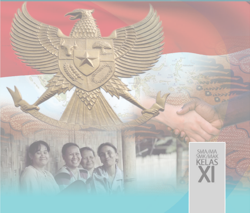

> **Deskripsi Visual:** Gambar ini adalah ilustrasi yang menampilkan empat orang siswa SMA/MA/SMK/IAAK Kelas XI berdiri di depan sebuah bangunan dengan latar belakang bendera Indonesia. Di atas mereka terdapat patung Garuda Pancasila, simbol nasional Indonesia. Gambar ini menunjukkan hubungan antara pendidikan formal di Indonesia dan identitas nasional melalui penggunaan Garuda Pancasila sebagai lambang negara.

Elemen-elemen utama dalam gambar ini adalah empat siswa yang tampak senang dan bersemangat, patung Garuda Pancasila yang megah, dan bendera Indonesia yang memenuhi bagian belakang. Siswa-siswa tampak berpose untuk foto bersama, menunjukkan semangat belajar dan persaudaraan. Patung Garuda Pancasila yang besar dan megah menjadi simbol nasional yang kuat, menunjukkan bahwa pendidikan di Indonesia tidak hanya mengedepankan pengetahuan, tetapi juga identitas nasional.

Teks, angka, atau label penting yang terlihat pada gambar ini adalah "SMA/MA SMK/IAAK KELAS XI", yang menunjukkan bahwa gambar ini mungkin merupakan bagian dari buku pelajaran atau materi belajar untuk siswa-siswi kelas XI di sekolah-sekolah tersebut. Label ini memberikan konteks bahwa gambar ini berkaitan dengan pendidikan formal di Indonesia.

Informasi kunci yang dapat diambil pembaca adalah bahwa gambar ini menunjukkan hubungan antara pendidikan formal di Indonesia dan identitas nasional melalui penggunaan Garuda Pancasila sebagai lambang negara. Ini menunjukkan bahwa pendidikan di Indonesia tidak hanya mengedepankan pengetahuan, tetapi juga identitas nasional dan patriotisme.

 

---
## 📄 Halaman 2

### Hak Cipta © 2017 pada Kementerian Pendidikan dan Kebudayaan Dilindungi Undang-Undang

Disklaimer: Buku  ini  merupakan  buku  siswa  yang  dipersiapkan  Pemerintah  dalam  rangka implementasi Kurikulum 2013. Buku siswa ini disusun dan ditelaah oleh berbagai pihak di bawah koordinasi  Kementerian  Pendidikan  dan  Kebudayaan,  dan  dipergunakan  dalam  tahap  awal penerapan Kurikulum 2013. Buku ini merupakan 'dokumen hidup' yang senantiasa diperbaiki, diperbaharui,  dan  dimutakhirkan  sesuai  dengan  dinamika  kebutuhan  dan  perubahan  zaman. Masukan dari berbagai kalangan diharapkan dapat meningkatkan kualitas buku ini.

Katalog Dalam Terbitan (KDT)

Indonesia. Kementerian Pendidikan dan Kebudayaan.

Pendidikan Pancasila dan Kewarganegaraan / Kementerian Pendidikan dan Kebudayaan. -- Jakarta: Kementerian Pendidikan dan Kebudayaan, 2017.

x, 230. : illus. ;  25 cm.

Untuk SMA/MA/SMK/MAK Kelas XI ISBN  978-602-427-090-2 (jilid lengkap)

ISBN  978-602-427-092-6 (jilid 2)

- Pendidikan Pancasila Kewarganegaraan -- Studi dan Pengajaran
- Kementerian Pendidikan dan Kebudayaan
I. Judul

370.11P

:  Yusnawan Lubis dan Mohamad Sodeli

Penulis

Penelaah

:  Dr. Dadang Sundawa, Dr. Nasiwan, M.Si.,

Dr. Kokom Komalasari, M.Pd, Dr. Supandi

Pereview

:  Ucuk Yunadi

Penyelia Penerbitan

:  Pusat Kurikulum dan Perbukuan, Balitbang, Kemendikbud

Cetakan ke-1, 2014  ISBN 978-602-282-474-9 (Jilid 2a)

ISBN 978-602-282-475-6 (Jilid 2b) Cetakan ke-2, 2017 (Edisi Revisi)

Disusun dengan huruf Times New Roman, 11 pt

 

---
## 📄 Halaman 3

### KATA PENGANTAR

Fokus  utama  mata  pelajaran  Pendidikan  Pancasila  dan  Kewarganegaraan (PPKn) adalah mempersiapkan kalian selaku peserta didik untuk dapat berperan sebagai  warga  negara  yang  baik,  yaitu  warga  negara  yang  cerdas,  terampil  dan berkarakter  serta  setia  kepada  bangsa  dan  negara  Republik  Indonesia  dengan merefleksikannya dalam kebiasaan berpikir dan bertindak sesuai dengan Pancasila dan Undang-Undang Dasar Negara Republik Indonesia Tahun 1945.  Selain itu, PPKn dapat mengembangkan kemampuan kalian untuk dapat:

- berpikir  kritis,  rasional  dan  kreatif  dalam  menghadapi  berbagai  masalah kewarganegaraan;
- berpartisipasi secara aktif dan bertanggung jawab, serta bertindak secara cerdas dalam kegiatan bermasyarakat, berbangsa dan bernegara;
- berkembang secara positif dan demokratis untuk membentuk diri berdasarkan pada karakter-karakter masyarakat Indonesia agar dapat hidup secara berdampingan dengan sesama; dan
- berinteraksi dengan bangsa lain dalam percaturan dunia secara langsung atau tidak langsung dengan memanfaatkan teknologi informasi
Berkaitan  dengan  hal  tersebut,  buku  PPKn  ini  ditulis  untuk  membantu mewujudkan pembentukan warga negara yang baik melalui proses pembelajaran di  sekolah.  Selain  itu,  buku  ini  diharapkan  dapat  memberikan  kontribusi  dalam penanaman nilai dan moral  dalam mengadapi era globalisasi, sehingga identitas kebangsaan dan kepribadian Indonesia tetap melekat dalam diri kalian.

Buku ini disusun berdasarkan kurikulum 2013. Pembahasan materi pembelajaran PPKn  mencakup  Pancasila,  Undang-Undang  Dasar  Negara  Republik  Indonesia Tahun  1945,  Negara  Kesatuan  Republik  Indonesia,  dan  Bhinneka  Tunggal  Ika. Materi disajikan dengan menggunakan bahasa yang mudah dimengerti oleh kalian dan  disesuaikan  dengan  tingkat  perkembangan  psikologis  kalian  yang  sekarang duduk di kelas XI.

Pembelajaran  PPKn  dalam  Kurikulum  2013  lebih  menekankan  pada penguasaan  kompetensi  spritual,  sosial,  pengetahuan  dan  keterampilan.  Nah, karakteristik tersebut semuanya terdapat dalam buku ini, sehingga  sangatlah tepat jika kalian menjadikannya sebagai salah satu sumber belajar di sekolah ataupun di luar sekolah.

Akhirnya, penulis sampaikan Selamat Membaca dan Mempelajari Buku ini! Semoga kalian termasuk kategori warga negara yang baik.

Jakarta,  Januari  2017 Yusnawan Lubis dan Mohamad Sodeli

 

---
## 📄 Halaman 4

### DAFTAR ISI

 

---
## 📄 Halaman 6

### DAFTAR GAMBAR

Gambar 1.1 :

Menuntut ilmu merupakan salah satu bentuk perwujudan hak asasi

manusia -

Gambar 1.2 :

Kerja bakti merupakan s alah satu bentuk perwujudan kewajiban asasi manusia -

Gambar 1.3 :

Gotong royong sebagai perwujudan sila Persatuan Indonesia mengandung  nilai-nilai  penghormatan  terhadap h ak a sasi m anusia -

Gambar 1.4 :

Lembaga peradilan merupakan salah satu instrumen penegakan h ak dan k ewajiban a sasi m anusia -

Gambar 1.5 :

Hidup rukun menjamin terwujudnya keseimbangan antara hak dan kewajiban asasi manusia -

Gambar 1.6

Pencemaran lingkungan yang disebabkan limbah pabrik merupakan salah satu bentuk pelanggaran HAM -

Gambar 2.1 :

Perwujudan demokrasi di berbagai lingkungan -

Gambar 2.2

:

Abraham Lincoln; Presiden Amerika yang ke-16 (1861-1865) terkenal sebagai peletak konsep dasar demokrasi -

Gambar 2.3

:

Peradilan yang merdeka merupakan perwujudan dari prinsip-

prinsip Demokrasi Pancasila -

Gambar 2.4

:

Para pejuang dalam perang kemerdekaan -

Gambar 2.5

:

Dekrit Presiden 5 Juli 1959 merupakan awal bergulirnya Demokrasi Terpimpin -

Gambar 2.6 :

Pelantikan BJ. Habibie sebagai Presiden RI ke-3 -

Gambar 3.1 :

Gedung pengadilan sebagai salah satu tempat bagi setiap warga n egara yang mencari keadilan -

Gambar 3.2 :

Para pengguna jalan wajib mematuhi peraturan lalu lintas -

Gambar 3.3 :

Keputusan hakim dapat dijadikan sebagai salah satu sumber hukum -

Gambar 3.4

:

Proklamasi kemerdekaan tanggal 17 Agustus 1945 merupakan tanda berakhirnya hukum kolonial diganti dengan hukum nasional -

Gambar 3.5 :

Proses penyelesaian masalah di Mahkamah Konstitusi RI -

Gambar 3.6 :

Suasana persidangan di pengadilan agama -

Gambar 3.7 :

Para Hakim Konstitusi -

Gambar 3.8 : Para hakim agung Mahkamah Agung menjadi benteng terakhir pencari keadilan -

diharapkan

Gambar 4.1 :

Indonesia mempunyai peran yang sangat penting dalam menciptakan perdamaian di kawasan Asia Tenggara -

 

---
## 📄 Halaman 7

Gambar 4.2 :

Suasana Konferensi Asia Afrika Tahun 1955 menjadi bukti hubungan internasional yang dijalankan bangsa Indonesia di awal kemerdekaan -

Gambar 4.3

:

Presiden Soekarno menjadi salah satu tokoh pendiri gerakan non-blok yang merupakan perwujuda n politik luar negeri yang bebas aktif -

Gambar 4.4 :

TNI menjadi bagian dari misi perdamaian dunia -

Gambar 4.5

:

Suasana Pengibaran Bendera Merah Putih untuk pertama kalinya di markas Perserikatan Bangsa-Bangsa -

Gambar 4.6 :

Suasana Penandatanganan Deklarasi Bangkok sebagai awal pendirian ASEAN -

Gambar 4.7

:

Tokoh-tokoh penggagas Gerakan Non b lok yaitu Soekarno, Josep Broz Tito, Gamal Abdul Naser, Pandit Jawaharlal Nehru, dan Kwame Nkrumah -

Gambar 5.1

:

Tindakan anarkis menjadi ancaman bagi b angsa Indonesia dalam bidang politik -

Gambar 5.2

:

Berbagai merek handphone mudah ditemukan di Indonesia -

Gambar 5.3 :

Para Pahlawan Revolusi yang menjadi  korban akibat Pemberontakan PKI -

Gambar 5.4 :

Pertanian merupakan potensi besar bangsa Indonesia dalam menghadapi ancaman globalisasi ekonomi -

Gambar 5.5 :

Perwujudan kemanunggalan TNI/Polri dan rakyat -

Gambar 6.1 :

Pembacaan Teks Proklamasi o leh Ir. Soekarno -

Gambar 6.2 :

Slogan satu nusa, satu bangsa, satu bahasa dapat memperkukuh persatuan dan kesatuan bangsa -

Gambar 6.3 :

Suku-suku bangsa yang ada di Indonesia merupakan suatu kesatuan yang tidak dapat dipisahkan -

Gambar 6.4 :

Peta perbatasan RI-Mala y sia di Nunukan -

Gambar 6.5 :

Keindahan alam menjadi salah satu keunggulan yang dimiliki oleh bangsa Indonesia -

Gambar 6.6 :

Pertentangan dan kerusuhan timbul sebagai akibat dari lunturnya semangat persatuan dan kesatuan -

Gambar 6.7 :

Gotong royong merupakan cerminan perilaku yang dapat memperkukuh persatuan dan kesatuan bangsa -

 

---
## 📄 Halaman 8

### KEUNGGULAN BUKU

Buku Pendidikan Pancasila dan Kewarganegaraan (PPKn) ini merupakan buku pegangan  dalam proses pembelajaran. Buku ini banyak sekali  manfaatnya bagi peserta didik dan guru. Bagi peserta didik, buku ini menjadi sarana memperoleh wawasan yang diperlukan untuk menjadi warga negara yang baik. Sedangkan bagi guru, buku ini dapat dijadikan sebagai panduan dalam melaksanaan proses pembelajaran baik di dalam maupun di luar lingkungan sekolah.

Buku  ini  merupakan  jawaban  atas  tuntutan  buku  pelajaran  yang berkualitas,  yaitu  buku  pelajaran  yang  tidak  hanya  memaparkan  materi, akan tetapi membelajarkan siswa tentang materi. Buku ini mengembangkan kompetensi kewarganegaraan kalian melalui pendekatan scientific dimana melalui  buku  ini  dalam  proses  pembelajaran  kalian  didorong  untuk selalu  mengamati,  menanya,  mengumpulkan  data,  mengasosiasikan  dan mengkomunikasikan.

Buku ini dikemas secara sistematis dan menarik serta ditujukan untuk meningkatkan  kreatifitas  kalian.  Bahasa  yang  dipergunakan  merupakan bahasa yang mudah dipahami oleh kalian. Dengan kata lain, bahasa yang dipergunakan  bukanlah  bahasa  yang  kaku,  tetapi  bahasa  yang  fleksibel serta bersahabat dengan kalian.

Apa saja yang terdapat dalam buku ini? Di dalam buku ini disajikan berbagai macam rubrik yang mendorong kalian untuk aktif dalam setiap rangkaian proses pembelajaran. Adapun sistematika yang terdapat dalam buku ini diantaranya sebagai berikut:

- Pengantar. Bagian ini  terdapat  pada  awal  setiap  bab  yang  berfungsi memberikan gambaran awal mengenai materi pembelajaran yang akan kalian pelajari. Pada bagian ini kalian akan disuguhi gambar atau lagu yang tentunya akan semakin mendorong kalian untuk lebih tahu lagi materi yang dipelajari pada bab tersebut.
- Materi Pembelajaran. Bagian ini berisi paparan materi pembelajaran  yang  harus  kalian  pelajari.  Materi  pembelajaran disajikan  dengan  menarik  yang  didukung  oleh  gambar-gambar yang relevan serta contoh-contoh yang bersumber dari peristiwaperistiwa yang  terjadi di lingkungan  sekitar  kalian.  Materi pembelajaran ini dilengkapi dengan rubrik Info Kewarganegaraan yang berisi tentang informasi-informasi tambahan yang tentunya akan  memperluas  cakrawala  berpikir  kalian.  Selain  itu  juga terdapat rubrik Penanaman Kesadaran Berkonstitusi, yang berisi

 

---
## 📄 Halaman 9

tentang nilai-nilai yang sifatnya penting dan mendasar yang akan mengarahkan  kalian  dalam  pergaulan  di  berbagai  lingkungan kehidupan.

- Tugas Mandiri dan Kelompok. Bagian ini mengajak kalian  berlatih  baik  secara  mandiri  atau  berkelompok  untuk menyelesaikan  berbagai  tugas  dengan  cara  membaca  berbagai literatur/buku, menganalisis suatu kasus, melakukan pengamatan terhadap  berbagai  peristiwa  yang  sedang  terjadi  di  lingkungan sekitar serta melakukan wawancara dengan para tokoh masyarakat atau aparatur negara.
- Refleksi. Melalui  bagian  ini  kalian  diajak  untuk  mengevaluasi diri  serta  merenungkan  apa  saja  saja  yang  telah  kalian  berikan atau lakukan untuk kemajuan bangsa dan negara.
- Rangkuman. Untuk  mempermudah  kalian  dalam  memahami materi pembelajaran, buku ini juga dilengkapi dengan rangkuman yang merupakan intisari materi pembelajaran dalam satu bab.
- Uji  Kompetensi. Bagian  ini  berfungsi  untuk  mengukur  sejauh mana kompetensi yang telah kalian kuasai setelah mempelajari materi  pembelajaran  pada  satu  bab  dengan  menjawab  berbagai soal yang terdapat dalam bagian ini.
- Penilaian Sikap. Bagian  ini  untuk  mengukur  kesesuaian  sikap dan perilaku kalian sebagai warga negara yang baik. Pada bagian ini kalian diajak untuk menilai diri sendiri, memberikan argumen atas  nilai  yang  kalian  tetapkan  serta  mengklarifikasi  nilai-nilai yang berkembang dimasyarakat melalui wacana yang dibaca.
- Proyek  Kewarganegaraan. Untuk  melatih  kecakapan  kalian dalam mengolah potensi berpikir kritis, pada bagian ini kalian akan diajak untuk mengerjakan seperangkat tugas untuk meningkatkan keterampilan kalian sebagai warga negara. Tugas-tugas tersebut dikemas dalam bentuk penelitian sederhana, analisis kasus, debat, menulis artikel dan bermain peran atau simulasi.
- Program  Pengayaan. Bagian  ini  mengarahkan  kalian  untuk mengetahui  lebih  jauh  materi  lain  yang  relevan,  tetapi  tidak dibahas pada bab tersebut..
- Indeks. Bagian  ini  berisi  istilah-istilah  dan  nama  tokoh-tokoh yang penting untuk diketahui oleh kalian.

 

---
## 📄 Halaman 10

- Glosarium. Bagian  ini  melengkapi  buku  supaya  kalian  tidak bingung ketika menemukan berbagai kata asing atau kata yang sulit dipahami, sehingga mempermudah kalian untuk memahami materi secara keseluruhan.
Dengan membaca buku ini, cakrawala berpikir kalian sebagai warga negara tentunya  akan  semakin  luas  serta  kompetensi  yang  dimiliki  juga  akan semakin bertambah banyak dan baik kualitasnya.

 

---
## 📄 Halaman 11

### Harmonisasi Hak dan Kewajiban Asasi Manusia dalam Perspektif Pancasila

Selamat ya, kalian sekarang sudah duduk di kelas XI.  Kesuksesan itu sangat bergantung pada usaha kalian, terutama dalam mengatasi berbagai tantangan dan rintangan yang kalian hadapi di kelas XI akan semakin berat. Oleh karena itu, kalian harus meningkatkan kuantitas dan kualitas belajar. Jangan lupa senantiasa berdoa  kepada  Tuhan  Yang  Maha  Esa  dengan  sungguh-sungguh  setiap  akan memulai dan mengakhiri aktivitas sehari-hari, termasuk kegiatan pembelajaran.

Pada  awal  pembelajaran  PPKn  di  kelas  XI,  kalian  akan  diajak  menelaah harmonisasi hak dan kewajiban asasi manusia dalam perspektif Pancasila. Nah, sebelum kalian menelaah hal tersebut, coba kalian cermati wacana di bawah ini!

### Wapres: Harmonisasikan Kewajiban dan Hak Asasi Manusia

Jakarta (ANTARA Aceh) - Wakil Presiden Jusuf Kalla menginginkan berbagai pihak dapat mengharmonisasikan antara kewajiban dan hak asasi manusia karena setiap orang juga wajib untuk tidak melakukan sesuatu yang melanggar hak orang lain. 'Untuk HAM (Hak Asasi Manusia), orang sering tidak lengkap dalam pemahamannya,' kata Jusuf  Kalla  saat  memberikan  pengarahan  kepada  peserta  Rapat Koordinasi Kebijakan Perencanaan dan Penganggaran Kementerian Hukum dan HAM di Istana Wapres, Jakarta, Selasa.

Wapres mengingatkan bahwa orang kerap lupa di pasal 28J UUD NRI  Tahun  1945  ayat  (1)  disebutkan  bahwa  'setiap  orang  wajib menghormati hak asasi manusia orang lain dalam tertib kehidupan bermasyarakat,  berbangsa  dan  bernegara'.  Selain  itu,  ayat  (2) menyebutkan  'dalam  menjalankan  hak  dan  kebebasannya,  setiap orang  wajib  tunduk  kepada  pembatasan  yang  ditetapkan  dengan undang-undang dengan maksud semata-mata untuk menjamin pengakuan serta penghormatan atas hak dan kebebasan orang lain

 

---
## 📄 Halaman 12

dan untuk memenuhi tuntutan yang adil sesuai dengan pertimbangan moral,  nilai-nilai  agama,  keamanan  dan  ketertiban  umum  dalam suatu  masyarakat  demokratis'.  Dengan  demikian,  ujar  Wapres, maka kalau orang berdemonstrasi dengan menguasai jalan sehingga tidak ada pengguna jalan yang bisa melewatinya adalah sama saja melanggar hak orang lain yang ingin menggunakan jalan tersebut. 'Harus  ditegakkan  dua-duanya,  kewajiban  dan  hak  asasi,'  kata Wakil Presiden Jusuf Kalla.

Jusuf Kalla juga berpendapat bahwa  banyaknya  aturan tidak mengakibatkan suatu negara dapat maju, tetapi yang lebih penting lagi adalah bagaimana penegakan aturan itu benar-benar dilaksanakan dengan  baik  dan  benar.  Ia  mengemukakan,  tugas  yang  diemban Kementerian  Hukum  dan  HAM  juga  luar  biasa  besar  dan  dapat dikatakan sebagai penjaga pilar demokrasi. 'karena itu perlu dijaga independensi. Tanpa penjagaan terhadap lalu lintas demokrasi, maka demokrasi itu juga tidak bisa berjalan,' katanya.

Wapres  juga  menginginkan  adanya  orientasi  yang  benar-benar memerlukan kekompakan dan profesionalisme dari seluruh jajaran baik dari atas maupun sampai bawah dari Kemenkumham.

Sumber :

http://aceh.antaranews.com/berita/24679a

Nah, setelah kalian membaca wacana tersebut coba tuliskan semua hal yang kalian pikirkan atau pertanyakan dalam tabel di bawah ini!

### A. Konsep Hak dan Kewajiban Asasi Manusia

---
**📊 Tabel**

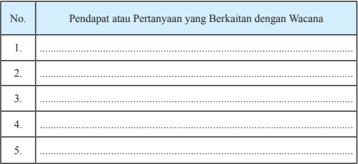

Tabel ini berisi 5 baris yang masing-masing menunjukkan pendapat atau pertanyaan yang berkaitan dengan wacana tertentu. Topik utama tabel ini adalah "Pendapat atau Pertanyaan yang Berkaitan dengan Wacana". Kolom pertama diberi nomor untuk memudahkan pengecekan. Data atau pola penting yang terlihat adalah bahwa setiap baris memiliki satu pendapat atau pertanyaan yang spesifik tentang wacana tersebut. Ini menunjukkan bahwa tabel ini dirancang untuk membantu pembaca memahami berbagai sudut pandang atau pertanyaan yang mungkin muncul terkait dengan wacana yang disebutkan.

 

---
## 📄 Halaman 13

### 1. Makna Hak Asasi Manusia

Pada bagian ini kalian akan diajak untuk menelaah makna hak asasi manusia. Hal ini bertujuan agar supaya kalian dapat mendefinisikan dan memaknai setiap hak yang dimiliki. Untuk dapat memahami pengertian hak asasi manusia, ada baiknya kalian perhatikan fakta berikut dengan saksama.

- Orang dilarang menghilangkan nyawa orang lain atau nyawanya sendiri sekali pun. Jika terbukti melakukannya negara akan mengenakan tindakan hukum.
- Tidak  ada  satu  bangsa  pun  di  dunia  ini  yang  rela  dijajah  bangsa  lain. Negara-negara yang pernah dijajah pun selalu berusaha membebaskan diri dari belenggu penjajahan tersebut.
- Tiada  seorang  manusia  pun  yang  ingin  hidup  sengsara.  Ia  akan  selalu berusaha mencapai kesejahteraan bagi dirinya lahir maupun batin.
Dapatkah kalian menangkap makna ketiga fakta tersebut di atas? Jika kalian menyimaknya dengan saksama, dapatlah dipahami bahwa pada diri manusia selalu melekat tiga hal, yakni hidup, kebebasan dan kebahagiaan .  Ketiga hal tersebut merupakan sesuatu yang sangat mendasar yang harus dimiliki oleh manusia. Tanpa ketiga hal tersebut manusia akan hidup tanpa arah, bahkan tidak akan menjadi seutuhnya.  Sesuatu  yang  mendasar  itu dalam pengertian lain disebut hak asasi. Dengan demikian, secara sederhana hak  asasi  manusia  itu  adalah  hak  dasar manusia menurut kodratnya.

Menurut  Undang-Undang  RI  Nomor 39 tahun 1999, hak asasi manusia adalah seperangkat  hak  yang  melekat pada  hakikat  dan  keberadaan  manusia sebagai makhluk Tuhan Yang Maha Esa dan merupakan anugerah-Nya yang  wajib  dihormati,  dijunjung  tinggi dan dilindungi oleh negara, hukum, Pemerintah, dan setiap orang demi kehormatan  serta  perlindungan  harkat dan martabat manusia.

Info Kewarganegaraan

Dasar pemikiran pembentukan Undang-Undang RI Nomor 39 tahun 1999 tentang HAM diantaranya:

- Tuhan YME adalah pencipta alam semesta
- Manusia dianugerahi jiwa, bentuk struktur, kemampuan, kemauan serta berbagai kemampuan oleh Penciptanya untuk menjamin kelangsungan hidupnya.
- Hak asasi manusia tidak boleh dilenyapkan oleh siapa pun dalam keadaan apa pun.

 

---
## 📄 Halaman 14

Jan  Materson ,  anggota  Komisi  Hak  Asasi  Manusia  Perserikatan  BangsaBangsa mengartikan HAM sebagai hak-hak yang melekat dalam diri manusia, dan tanpa hak itu manusia tidak dapat hidup sebagai manusia . Dari pengertian tersebut, maka pada hakikatnya dalam HAM terkandung dua makna:

- HAM merupakan hak alamiah yang melekat dalam diri setiap manusia sejak ia dilahirkan ke dunia. Hak alamiah adalah hak yang sesuai dengan kodrat manusia sebagai insan merdeka yang berakal budi dan berperikemanusiaan. Tidak ada seorang pun yang diperkenankan merampas hak tersebut dari tangan pemiliknya. Hal ini tidak berarti bahwa HAM bersifat mutlak tanpa pembatasan  karena  batas  HAM  seseorang    adalah  HAM  yang  melekat pada orang lain. Bila HAM dicabut dari tangan pemiliknya, manusia akan kehilangan eksistensinya sebagai manusia.
- HAM merupakan instrumen atau alat untuk menjaga harkat dan martabat manusia sesuai dengan kodrat kemanusiannya yang  luhur. Tanpa HAM manusia  tidak  akan  dapat  hidup  sesuai  dengan  harkat  dan  martabat kemanusiannya sebagai makhluk Tuhan yang paling sempurna.

---
**🖼️ Gambar/Diagram**

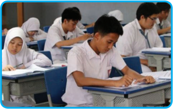

> **Deskripsi Visual:** Gambar ini adalah foto yang menunjukkan beberapa siswa sedang belajar di ruang kelas. Siswa-siswa tersebut duduk di meja belajar berwarna biru dengan kursi yang sama warna. Mereka semua mengenakan seragam sekolah putih dengan lengan panjang dan topi hitam. Beberapa siswa sedang menulis di buku tulis mereka, sementara yang lain tampaknya sedang mendengarkan instruksi dari guru. Ruangan kelas tampak tenang dan teratur, dengan lampu yang menyala menyebabkan suasana yang tenang dan fokus.

Sumber:

http://siapbelajar.com

Dibandingkan dengan hak-hak yang lain, hak asasi manusia memiliki ciri-ciri khusus sebagai berikut:

- Hakiki, artinya hak asasi manusia adalah adalah hak asasi  semua umat manusia yang sudah ada sejak lahir.

 

---
## 📄 Halaman 15

- Universal, artinya  hak  asasi  manusia  berlaku  untuk  semua  orang  tanpa memandang status, suku bangsa, gender atau perbedaan lainnya.
- Tidak dapat dicabut, artinya hak asasi manusia tidak dapat dicabut atau diserahkan kepada pihak lain.
- Tidak dapat dibagi, artinya semua orang berhak mendapatkan semua hak, apakah hak sipil dan politik, atau hak ekonomi, sosial dan budaya.
Hak asasi manusia merupakan hak  yang dimiliki oleh manusia, yang tidak dapat dilanggar dan dipisahkan. Hak asasi manusia bersumber pada pokok pikirannya yang terdapat dalam kitab suci yang menyatakan bahwa manusia diciptakan Tuhan dengan hak dan kewajiban yang sama. Tuhan melarang memperlakukan manusia dengan sewenang-wenang. Tuhan tidak membeda-bedakan manusia dari warna kulit, kaya dan miskin. Tuhan membedakan manusia dari tingkat keimanan dan ketaqwaannya. Sebenarnya yang membedakan manusia karena warna kulit, kaya dan miskin adalah manusia itu sendiri. Dengan demikian, Tuhan sendiri mengakui dan menjamin keberadaan hak asasi manusia tersebut.

Pengakuan terhadap hak asasi manusia pada hakikatnya merupakan penghargaan  atau  pengakuan  terhadap  segala  potensi  dan  harga  diri  manusia menurut kodratnya. Kendati pun demikian, tidaklah boleh kita  lupakan  bahwa hakikat  tadi  tidak  hanya  mengundang  hak  untuk  menikmati  kehidupan  secara kodrati.  Sebab  dalam  hakikat  kodrati  itupun  terkandung  kewajiban  pada  diri manusia tersebut. Tuhan memberikan kepada manusia sejumlah hak dasar tadi dengan kewajiban membina dan menyempurnakannya.

### 2. Makna Kewajiban Asasi Manusia

Coba kalian amati gambar di bawah ini.

Sumber: www. minfaaang.blogspot.com dan gmsrw12.blogspot.com

Gambar 1.2 Kerja bakti merupakan salah satu bentuk perwujudan kewajiban asasi manusia

 

---
## 📄 Halaman 16

Dua  peristiwa  di  atas  memberikan  gambaran  bahwa  selain  mendapatkan hak,  setiap orang juga mempunyai kewajiban. Kalian tentunya juga mempunyai kewajiban. Sebagai seorang anak, kalian harus melaksanakan perintah orang tua, misalnya membantu membersihkan lingkungan rumah. Sebagai seorang pelajar, kalian dituntut untuk mematuhi tata tertib sekolah, misalnya melaksanakan tugas piket  kebersihan.  Sebagai  anggota  masyarakat,  kalian  juga  harus  mematuhi norma-norma yang berlaku  di  masyarakat,  misalnya  ikut  serta  dalam  kegiatan kerja bakti. Begitu pula sebagai warga negara, kalian juga mempunyai kewajiban untuk melaksanakan semua ketentuan atau peraturan perundang-undangan yang berlaku, misalnya membayar pajak.

Kewajiban  secara  sederhana  dapat  diartikan  sebagai  segala  sesuatu  yang harus dilaksanakan dengan penuh tanggung jawab. Dengan demikian, kewajiban asasi dapat diartikan sebagai kewajiban dasar setiap manusia.  Ketentuan pasal 1 ayat (2) Undang-Undang RI Nomor 39 Tahun 1999 tentang Hak Asasi Manusia menyatakan, kewajiban dasar manusia adalah seperangkat kewajiban yang apabila tidak dilaksanakan, tidak memungkinkan terlaksananya dan tegaknya hak asasi manusia.

Hak dan kewajiban asasi merupakan dua hal yang saling berkaitan. Keduanya memiliki hubungan kausalitas atau hubungan sebab-akibat. Seseorang mendapatkan haknya dikarenakan dipenuhinya kewajiban yang dimiliki. Misalnya, seorang pekerja  mendapatkan  upah,  setelah  dia  melaksanakan  pekerjaan  yang  menjadi kewajibannya.  Selain  itu,  hak  yang  didapatkan  seseorang  sebagai  akibat  dari kewajiban yang dipenuhi oleh orang lain. Misalnya, seorang pelajar mendapatkan ilmu  pengetahuan  pada  mata  pelajaran  tertentu,  sebagai  salah  satu  akibat  dari dipenuhinya kewajiban oleh guru yaitu melaksanakan kegiatan pembelajaran di kelas.

Hak dan kewajiban asasi juga tidak dapat dipisahkan, karena bagaimana pun dari kewajiban itulah muncul hak-hak dan sebaliknya. Akan tetapi, sering terjadi pertentangan karena hak dan kewajiban tidak seimbang. Misalnya, setiap warga negara memiliki hak dan kewajiban untuk mendapatkan penghidupan yang layak, akan  tetapi,  pada  kenyataannya  banyak  warga  negara  yang  belum  merasakan kesejahteraan dalam menjalani kehidupannya. Hal ini disebabkan oleh terjadinya ketidakseimbangan antara hak dan kewajiban. Jika keseimbangan itu tidak ada maka akan terjadi kesenjangan sosial yang berkepanjangan.

 

---
## 📄 Halaman 17

### Tugas Mandiri 1.1

- Carilah definisi hak dan kewajiban asasi dari beberapa pendapat pakar. Kalian dapat menemukannya dari buku sumber lain atau media online . Tulislah hasil temuan kalian dalam tabel di bawah ini.
No

1.

2.

3.

- Setelah kalian berhasil menemukan pendapat para pakar tentang definisi hak dan kewajiban asasi manusia, analisislah persamaan dan perbedaan definisi- definisi tersebut.
………………………………………………………………………………

………………………………………………………………………………

………………………………………………………………………………

………………………………………………………………………………

………………………………………………………………………………

………………………………………………………………………………

………………………………………………………………………………

………………………………………………………………………………

- Coba kalian rumuskan sendiri definisi hak dan kewajiban asasi manusia.
………………………………………………………………………………

………………………………………………………………………………

………………………………………………………………………………

………………………………………………………………………………

………………………………………………………………………………

………………………………………………………………………………

………………………………………………………………………………

………………………………………………………………………………

Nama Pakar/Ahli

Definisi Hak Asasi

Manusia

Definisi Kewajiban

Asasi Manusia

 

---
## 📄 Halaman 18

### B. Substansi Hak dan Kewajiban Asasi Manusia dalam Pancasila

Salah  satu  karakteristik  hak  dan  kewajiban  asasi  manusia  adalah  bersifat universal. Artinya,  hak  dan  kewajiban  asasi  merupakan  sesuatu  yang  dimiliki dan wajib dilakukan oleh setiap manusia di dunia tanpa membeda-bedakan suku bangsa,  agama,  ras,  maupun  golongan.  Oleh  karena  itu,  setiap  negara  wajib menegakkan hak asasi manusia. Akan tetapi, karakteristik penegakan hak asasi manusia berbeda-beda antara negara yang satu dengan negara lainnya. Ideologi, kebudayaan, dan nilai-nilai khas yang dimiliki suatu negara akan memengaruhi pola penegakan hak asasi manusia di suatu negara. Contohnya di Indonesia, dalam proses penegakan hak asasi manusia berlandaskan kepada ideologi negara yaitu Pancasila, yang selalu mengedepankan keseimbangan antara hak dan kewajiban.

Pancasila  merupakan ideologi  yang  mengedepankan nilai-nilai  kemanusian. Pancasila  sangat  menghormati  hak  dan  kewajiban  asasi  setiap  warga  negara maupun  bukan  warga  negara  Indonesia.  Bagaimana  Pancasila  menjamin  itu semua? Pancasila menjamin hak dan kewajiban asasi manusia melalui nilai-nilai yang terkandung di dalamnya. Nilai-nilai Pancasila dapat dikategorikan menjadi tiga, yaitu nilai dasar, nilai instrumental, dan nilai praksis. Ketiga kategori nilai Pancasila  tersebut  mengandung  jaminan  atas  hak  asasi  manusia,  sebagaimana dipaparkan berikut ini.

### 1. Hak dan kewajiban Asasi Manusia dalam Nilai Dasar Pancasila

Nilai  dasar  berkaitan  dengan  hakikat    kelima  sila  Pancasila  yaitu:  nilai Ketuhanan  Yang  Maha  Esa,  nilai  Kemanusiaan  yang  Adil  dan  Beradab,  nilai Persatuan Indonesia, nilai Kerakyatan yang dipimpin oleh hikmat kebijaksanaan dalam permusyawaratan/perwakilan, dan nilai Keadilan sosial bagi seluruh rakyat Indonesia.  Nilai-nilai  dasar  tersebut  bersifat  universal,  sehingga  di  dalamnya terkandung cita-cita, tujuan, serta nilai-nilai yang baik dan benar. Nilai dasar ini bersifat tetap dan melekat pada kelangsungan hidup negara.

Hubungan antara hak dan kewajiban asasi manusia dengan Pancasila dapat dijabarkan secara singkat sebagai berikut.

- Ketuhanan Yang Maha Esa menjamin hak kemerdekaan untuk memeluk agama, melaksanakan ibadah dan kewajiban untuk menghormati perbedaan agama.

 

---
## 📄 Halaman 19

- Kemanusiaan yang adil dan beradab menempatkan hak setiap warga negara pada kedudukan yang sama dalam hukum serta memiliki kewajiban dan hak-hak yang sama untuk mendapat jaminan dan perlindungan hukum.
- Persatuan  Indonesia  mengamanatkan  adanya  unsur  pemersatu  di  antara warga negara dengan semangat gotong royong, saling membantu, saling menghormati, rela berkorban, dan menempatkan kepentingan bangsa dan negara di atas kepentingan pribadi atau golongan. Hal ini sesuai dengan prinsip hak asasi manusia bahwa hendaknya sesama manusia bergaul satu sama lainnya dalam semangat persaudaraan.
- Kerakyatan yang dipimpin oleh hikmat kebijaksanaan dalam permusyawaratan perwakilan  dicerminkan  dalam  kehidupan  pemerintahan,  bernegara,  dan bermasyarakat yang demokratis. Menghargai hak setiap warga negara untuk bermusyawarah mufakat yang dilakukan tanpa adanya tekanan, paksaan, atau pun intervensi yang membelenggu hak-hak partisipasi masyarakat.
- Keadilan sosial bagi seluruh rakyat Indonesia mengakui hak milik perorangan dan  dilindungi  pemanfaatannya  oleh  negara  serta  memberi  kesempatan sebesar-besarnya pada masyarakat.

---
**🖼️ Gambar/Diagram**

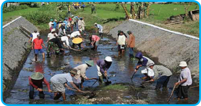

> **Deskripsi Visual:** Gambar ini adalah foto yang menunjukkan sekelompok orang sedang bekerja di sebuah area pertanian. Area tersebut tampaknya sedang dalam proses perbaikan atau penanaman tanaman. Orang-orang tersebut menggunakan berbagai alat seperti sapu, pucuk, dan tangan untuk melakukan pekerjaan. Latar belakangnya adalah sawah dengan tanah yang berwarna cokelat kehijauan, menunjukkan bahwa area ini sedang dalam tahap pertanian. Di sepanjang tepi sawah, terlihat jalan atau jalan raya yang tampaknya digunakan untuk menghubungkan wilayah ini dengan tempat lain. Gambar ini menunjukkan aktivitas pertanian dan perbaikan sawah, serta menekankan pentingnya kerja sama dan penggunaan alat yang tepat dalam proses pertanian.

Sumber:

http://indonesiaexpat.biz/other/gotong-royong/

Gambar 1.3 Gotong royong sebagai perwujudan sila Persatuan Indonesia mengandung nilai-nilai penghormatan terhadap hak asasi manusia

### Tugas Mandiri 1.2

Coba kalian identifikasi jenis hak dan kewajiban asasi manusia yang terkait dengan setiap sila Pancasila. Tuliskan hasil identifikasimu dalam tabel di bawah ini dan presentasikan di depan kelas!

 

---
## 📄 Halaman 20

---
**📊 Tabel**

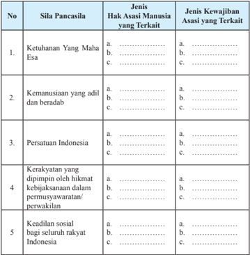

Tabel ini membahas hubungan antara sila Pancasila dengan hak asasi manusia dan kewajiban asasi di Indonesia. Topik utamanya adalah hubungan antara sila Pancasila dengan hak asasi manusia dan kewajiban asasi. Kolom pertama berisi sila Pancasila, kolom kedua berisi jenis-jenis hak asasi manusia yang terkait, dan kolom ketiga berisi jenis-jenis kewajiban asasi yang terkait. Data penting yang terlihat adalah bahwa semua sila Pancasila memiliki hubungan dengan hak asasi manusia dan kewajiban asasi, dengan beberapa sila Pancasila memiliki lebih dari satu jenis hak asasi manusia atau kewajiban asasi yang terkait.

### 2. Hak dan Kewajiban Asasi Manusia dalam Nilai Instrumental Pancasila

Nilai instrumental merupakan penjabaran dari nilai-nilai dasar Pancasila. Nilai instrumental sifatnya lebih khusus dibandingkan dengan nilai dasar. Dengan kata lain, nilai instrumental merupakan pedoman pelaksanaan kelima sila Pancasila. Perwujudan  nilai  instrumental  pada  umumnya  berbentuk  ketentuan-ketentuan konstitusional  mulai  dari  Undang-Undang  Dasar  Negara  Republik  Indonesia Tahun 1945 sampai dengan peraturan daerah.

Hak  dan  kewajiban  asasi  manusia  juga  dijamin  dan  diatur  oleh  nilai-nilai instrumental Pancasila. Adapun, peraturan perundang-undangan yang menjamin hak asasi manusia di antaranya sebagai berikut.

 

---
## 📄 Halaman 21

- Undang-Undang  Dasar  Negara    Republik  Indonesia  Tahun  1945  terutama Pasal 28 A - 28 J.
- Ketetapan  MPR  Nomor  XVII/MPR/1998  tentang  Hak  Asasi  Manusia.  Di dalam Tap MPR tersebut terdapat Piagam HAM Indonesia.
- Ketentuan dalam undang-undang organik, yaitu:
- Undang-Undang  Republik  Indonesia  Nomor  5  Tahun  1998  tentang Konvensi Menentang Penyiksaan dan Perlakuan atau Penghukuman yang Kejam, Tidak Manusiawi, atau Merendahkan Martabat Manusia.
- Undang-Undang Republik Indonesia Nomor 39 Tahun 1999 tentang Hak Asasi Manusia.
- Undang-Undang  Republik  Indonesia  Nomor  26  Tahun  2000  tentang Pengadilan Hak Asasi Manusia.
- Undang-Undang  Republik  Indonesia  Nomor  11  Tahun  2005  tentang Kovenan Internasional tentang Hak-hak Sipil dan Politik.
- Undang-Undang  Republik  Indonesia  Nomor  12  Tahun  2005  tentang Kovenan Internasional Hak-hak Ekonomi, Sosial dan Budaya.
- Ketentuan dalam Peraturan Pemerintah Pengganti Undang-undang (Perppu) Nomor 1 Tahun 1999 tentang Pengadilan Hak Asasi Manusia.
- Ketentuan dalam Peraturan Pemerintah.
- Peraturan Pemerintah Nomor 2 Tahun 2002 tentang Tata Cara Perlindungan terhadap Korban dan Saksi dalam pelanggaran Hak Asasi Manusia yang Berat.
- Peraturan Pemerintah Nomor 3 tahun 2002 tentang Kompensasi, Restitusi, Rehabilitasi terhadap Korban Pelanggaran Hak Asasi Manusia Berat.
- Ketentuan dalam Keputusan Presiden (Kepres).
- Keputusan Presiden Nomor 50 Tahun 1993 tentang Komisi Nasional Hak Asasi Manusia.
- Keputusan Presiden Nomor  83 Tahun 1998 tentang Pengesahan Konvensi Nomor  87 tentang Kebebasan Berserikat dan Perlindungan untuk Berorganisasi.
- Keputusan Presiden Nomor  31  Tahun 2001 tentang Pembentukan Pengadilan HAM pada Pengadilan Negeri Jakarta Pusat, Pengadilan Negeri Surabaya, Pengadilan Negeri Medan, dan Pengadilan Negeri Makassar.

 

---
## 📄 Halaman 22

---
**🖼️ Gambar/Diagram**

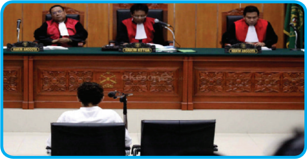

> **Deskripsi Visual:** Gambar ini adalah foto yang menunjukkan proses sidang di mahkamah. Di tengah-tengah, terdapat meja besar dengan tiga hakim yang duduk di kursi hakim. Mereka mengenakan jaket hitam berwarna emas dan topi hakim. Hakim di tengah sedang memegang mikrofon, menunjukkan bahwa mereka sedang menyampaikan pernyataan atau memberikan penjelasan. Di sebelah kanan hakim, terdapat seorang anggota tim hukum yang sedang berdiri dan mendengarkan. Di sebelah kiri hakim, terdapat seorang anggota tim hukum yang juga berdiri dan mendengarkan. Di depan hakim, terdapat dua komputer yang digunakan untuk mencatat dan memproses data selama sidang. Gambar ini menunjukkan bahwa proses sidang di mahkamah melibatkan banyak pihak, termasuk hakim, anggota tim hukum, dan pengacara.

Sumber:

http://www.elsam.or.id

- Keputusan Presiden Nomor 96 Tahun 2001 tentang Perubahan Keppres Nomor  53  Tahun  2001  tentang  Pembentukan  Pengadilan  Hak  Asasi Manusia Ad Hoc pada Pengadilan Negeri Jakarta Pusat.
- Keputusan Presiden Nomor Nomor 40 Tahun 2004 tentang Rencana Aksi Nasional Hak Asasi Manusia Indonesia Tahun 2004 - 2009

### Tugas Kelompok 1.1

- Selain diatur  dalam konstitusi, hak dan kewajiban asasi manusia juga diatur di dalam Undang-Undang Republik Indonesia Nomor 39 Tahun 1999 tentang Hak Asasi Manusia. Coba kalian identifikasi jenis hak dan kewajiban asasi yang diatur dalam peraturan perundang-undangan tersebut.

---
**📊 Tabel**

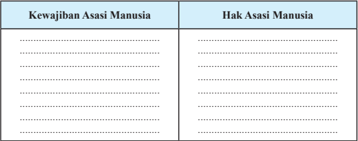

Tabel ini membandingkan kewajiban asasi manusia dengan hak asasi manusia. Topik utama tabel ini adalah perbandingan antara dua konsep ini. Kolom pertama berisi kewajiban asasi manusia, sedangkan kolom kedua berisi hak asasi manusia. Data penting yang terlihat dalam tabel ini adalah bahwa kewajiban asasi manusia adalah tanggung jawab individu untuk melindungi diri sendiri dan orang lain, sementara hak asasi manusia adalah kebebasan dan perlindungan yang diberikan oleh negara bagi setiap warganya.

 

---
## 📄 Halaman 23

- Meskipun Undang-Undang Republik Indonesia Nomor 39 Tahun 1999 tentang Hak Asasi Manusia telah diberlakukan, akan tetapi masih saja terjadi berbagai kasus  pelanggaran  HAM.  Berkaitan    dengan  hal  itu,  jawablah  pertanyaan- pertanyaan dibawah ini!
- Siapa yang harus bertanggung jawab untuk mencegah terjadinya pelanggaran HAM?
.......................................................................................................................

.......................................................................................................................

.......................................................................................................................

.......................................................................................................................

- Apa  saja  solusi  yang  dapat  kalian  ajukan  untuk  mencegah  terjadinya pelanggaran HAM?
.......................................................................................................................

.......................................................................................................................

.......................................................................................................................

.......................................................................................................................

### 3. Hak dan Kewajiban Asasi Manusia dalam Nilai Praksis Sila-Sila Pancasila

Nilai  praksis  merupakan  realisasi  nilai-nilai  instrumental  suatu  pengalaman dalam kehidupan sehari-hari. Nilai praksis Pancasila senantiasa berkembang dan selalu dapat dilakukan perubahan dan perbaikan sesuai perkembangan zaman dan aspirasi masyarakat. Hal tersebut dikarenakan Pancasila merupakan ideologi yang terbuka.

Sumber:

http://manadonyaman.wordpress.com

 

---
## 📄 Halaman 24

Hak  asasi  manusia  dalam  nilai  praksis  Pancasila  dapat  terwujud  apabila nilai-nilai dasar dan instrumental Pancasila itu sendiri dapat dilaksanakan dalam kehidupan sehari-hari oleh seluruh warga negara. Hal tersebut dapat diwujudkan apabila setiap warga negara menunjukkan sikap positif dalam kehidupan seharihari. Adapun, sikap positif tersebut di antaranya dapat kalian  lihat dalam tabel di bawah ini.

---
**📊 Tabel**

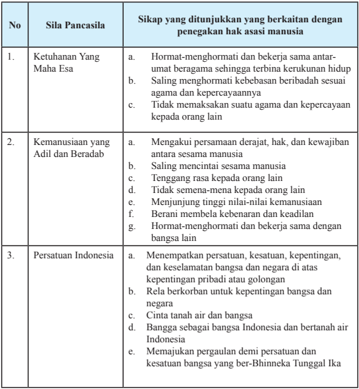

Tabel ini membahas sila Pancasila dan sikap yang ditunjukkan oleh masyarakat Indonesia untuk memenuhi hak asasi manusia. Topik utama adalah ketuhanan yang maha esa, kemanusiaan yang adil dan beradab, serta persatuan Indonesia. Kolom pertama menunjukkan sila Pancasila, sementara kolom kedua menunjukkan sikap yang ditunjukkan oleh masyarakat untuk memenuhi hak asasi manusia. Data penting yang terlihat adalah bahwa semua sila Pancasila memiliki sikap yang mencakupi hak asasi manusia, seperti ketuhanan yang maha esa yang melibatkan hormat-menghormati dan bekerja sama dengan orang lain, kemanusiaan yang adil dan beradab yang melibatkan saling menghormati kebebasan sesuai dengan kepercayaan, dan persatuan Indonesia yang melibatkan rela berkabung untuk kepentingan bangsa dan negara.

 

---
## 📄 Halaman 25

---
**📊 Tabel**

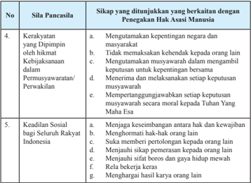

Tabel ini memperlihatkan hubungan antara sila Pancasila dengan sikap yang ditunjukkan oleh berbagai hak asasi manusia. Topik utamanya adalah hubungan antara sila Pancasila dengan hak asasi manusia. Kolom pertama menunjukkan sila Pancasila, sedangkan kolom kedua menunjukkan sikap yang ditunjukkan oleh berbagai hak asasi manusia. Data penting yang terlihat adalah bahwa sikap-sikap seperti menghormati hak-hak orang lain, menjauhi sikap penyelewengan, dan menghargai hasil karya orang lain sesuai dengan sila Pancasila yang berkaitan dengan hak asasi manusia. Ini menunjukkan bahwa sila Pancasila tidak hanya tentang nilai-nilai moral, tetapi juga tentang bagaimana mewujudkannya dalam kehidupan sehari-hari.

### Tugas Kelompok 1.2

Identifikasikan  contoh-contoh  perilaku  yang  menunjukkan  penghormatan terhadap hak asasi manusia yang dapat ditampilkan dalam berbagai lingkungan kehidupan. Tuliskan hasil identifikasi kalian dalam tabel di bawah ini! Bandingkan dengan hasil identifikasi kelompok lainnya.

---
**📊 Tabel**

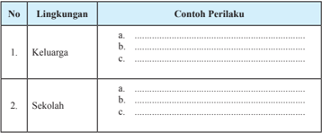

Tabel ini berisi contoh perilaku yang dianjurkan dalam dua lingkungan: keluarga dan sekolah. Topik utamanya adalah tentang bagaimana seseorang dapat membangun hubungan yang positif dan bermanfaat di kedua lingkungan tersebut. Dalam kolom "Lingkungan", terdapat dua baris yang masing-masing menunjukkan contoh perilaku yang sesuai dengan lingkungan tersebut. Untuk kolom "Contoh Perilaku", terdapat tiga baris untuk setiap lingkungan, masing-masing menunjukkan contoh perilaku yang bisa dilakukan oleh individu dalam lingkungan tersebut. Pola penting yang terlihat adalah bahwa baik di keluarga maupun di sekolah, ada beberapa perilaku yang harus dilakukan untuk membangun hubungan yang positif dan bermanfaat.

 

---
## 📄 Halaman 26

---
**📊 Tabel**

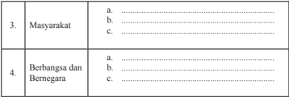

Tabel ini berisi informasi tentang dua topik utama: Masyarakat dan Berbangsa dan Bernegara. Topik pertama, Masyarakat, terdiri dari tiga baris dengan label "a", "b", dan "c". Topik kedua, Berbangsa dan Bernegara, juga terdiri dari tiga baris dengan label "a", "b", dan "c". Data atau pola penting yang terlihat adalah bahwa setiap topik memiliki tiga poin yang disebutkan dalam tabel tersebut. Ini menunjukkan bahwa tabel ini mungkin digunakan untuk memberikan informasi atau panduan tentang bagaimana masyarakat dan berbangsa dan bernegara dapat dikelola atau dijelaskan.

### C. Kasus Pelanggaran Hak Asasi Manusia

### 1. Penyebab Pelanggaran Hak Asasi Manusia

Dalam kehidupan sehari-hari, kalian tentunya sering mendengar dan melihat peristiwa-peristiwa seperti pembunuhan, perampokan yang disertai pembunuhan, penyiksaan,  dan  sebagainya.  Selain  itu,  mungkin  saja  kalian  pernah  melihat seorang  pembantu  rumah  tangga  yang  dicaci  maki  oleh  majikannya  karena melakukan sebuah kesalahan, seorang siswa yang dihardik oleh teman-temannya, dan sebagainya. Semua peristiwa itu merupakan peristiwa pelanggaran HAM.

Setiap manusia pasti mempunyai hak asasi, akan tetapi  hak asasi yang dimiliki oleh manusia dibatasi oleh hak asasi manusia lainnya. Dengan demikian, tidak ada seorang pun yang diperbolehkan untuk melanggar hak asasi orang lain. Akan tetapi, dalam kenyataannya manusia suka lupa diri, bahwa di sekitarnya terdapat manusia yang mempunyai kedudukan yang sama dengan dirinya. Namun dengan ketamakannya, manusia sering melabrak hak asasi sesamanya dengan alasan yang tidak jelas.

Pelanggaran HAM disebabkan oleh faktor-faktor berikut.

- Faktor internal, yaitu dorongan untuk melakukan pelanggaran HAM yang berasal dari diri pelaku pelanggar HAM, di antaranya sebagai berikut.
- Sikap egois atau terlalu mementingkan diri sendiri Sikap ini akan menyebabkan seseorang untuk selalu menuntut haknya, sementara kewajibannya sering diabaikan. Seseorang yang mempunyai sikap seperti ini akan menghalalkan segala cara agar supaya haknya dapat terpenuhi, meskipun caranya tersebut dapat melanggar hak orang lain.

 

---
## 📄 Halaman 27

### 2) Rendahnya kesadaran HAM

Hal ini akan menyebabkan pelaku pelanggaran HAM  berbuat seenaknya. Pelaku tidak mau tahu bahwa orang lain pun mempunyai hak  asasi  yang  harus  dihormati.  Sikap  tidak  mau  tahu  ini  berakibat munculnya perilaku atau tindakan penyimpangan terhadap hak asasi manusia.

### 3) Sikap tidak toleran

Sikap ini akan menyebabkan munculnya saling tidak menghargai dan tidak menghormati atas kedudukan atau keberadaan orang lain. Sikap ini pada akhirnya akan mendorong orang untuk melakukan diskriminasi kepada orang lain.

- Faktor eksternal yaitu faktor-faktor di luar diri manusia yang mendorong seseorang  atau  sekelompok  orang  melakukan  pelanggaran  HAM,  di antaranya sebagai berikut.
- Penyalahgunaan kekuasaan
Di dalam masyarakat terdapat berbagai macam kekuasaan. Kekuasaan ini  tidak  hanya  menunjuk  pada  kekuasaan  pemerintah,  tetapi  juga bentuk-bentuk kekuasaan lain. Salah satu contohnya adalah kekuasaan di dalam perusahaan. Para pengusaha yang tidak memperdulikan hakhak buruhnya jelas melanggar hak asasi manusia. Oleh karena itu, setiap penyalahgunaan kekuasaan mendorong timbulnya pelanggaran HAM.

- Ketidaktegasan aparat penegak hukum
Aparat  penegak  hukum  yang  tidak  bertindak  tegas  terhadap  setiap pelanggaran HAM, tentu saja akan mendorong timbulnya pelanggaran HAM  lainnya.  Penyelesaian  kasus  pelanggaran  HAM  yang  tidak tuntas  akan  menjadi  pemicu  bagi  munculnya  kasus-kasus  lain.    Para pelaku pelanggaran HAM tidak akan merasa jera, karena mereka tidak menerima sanksi yang tegas atas perbuatannya itu. Selain hal tersebut, aparat  penegak  hukum  yang  bertindak  sewenang-wenang  juga  dapat dikategorikan  sebagai  bentuk  pelanggaran  HAM  dan  dapat  menjadi contoh yang tidak baik. Hal ini dapat mendorong timbulnya pelanggaran HAM yang oleh masyarakat pada umumnya.

 

---
## 📄 Halaman 28

### 3) Penyalahgunaan teknologi

Kemajuan teknologi dapat memberikan pengaruh yang positif, tetapi bisa juga memberikan pengaruh negatif bahkan dapat memicu timbulnya kejahatan. Kalian tentunya pernah mendengar terjadinya kasus penculikan yang berawal dari pertemanan dalam jejaring sosial. Kasus tersebut menjadi bukti apabila pemanfaatan kemajuan teknologi tidak sesuai aturan, tentu hal ini akan menjadi penyebab timbulnya pelangaran HAM. Selain itu, kemajuan teknologi dalam bidang produksi ternyata dapat menimbulkan dampak negatif, misalnya munculnya pencemaran lingkungan yang bisa mengakibatkan terganggunya kesehatan manusia.

www.indotekhnoplus.com

Gambar 1.6 Pencemaran lingkungan yang disebabkan limbah pabrik merupakan salah satu bentuk pelanggaran HAM

### 4)

- Kesenjangan sosial dan ekonomi yang tinggi
Kesenjangan menggambarkan terjadinya ketidakseimbangan yang mencolok  di  dalam  kehidupan  masyarakat.  Pemicunya  adalah  perbedaan tingkat kekayaan atau jabatan yang dimiliki. Apabila hal tersebut dibiarkan akan  menimbulkan  terjadinya  pelanggaran  HAM,  misalnya  perbudakan, pelecehan, perampokan bahkan pembunuhan.

 

---
## 📄 Halaman 29

### Tugas Mandiri 1. 3

Faktor-faktor pelanggaran HAM di atas hanya sebagian kecil saja, tentu saja masih banyak  faktor  lain  yang  menjadi  pemicu  timbulnya  pelanggaran  HAM.  Oleh karena itu, coba kalian cari faktor-faktor lainnya yang menyebabkan timbulnya pelanggaran HAM dengan membaca berbagai macam sumber seperti dari buku, surat  kabar,  majalah  atau  internet.  Tuliskan  hasil  temuan  kalian  pada  tabel  di bawah ini.

---
**📊 Tabel**

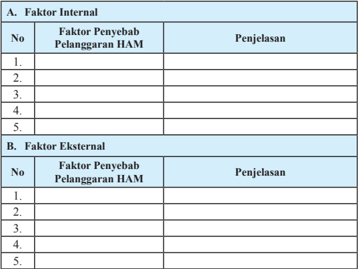

Tabel ini membahas faktor-faktor internal dan eksternal yang dapat menyebabkan pelanggaran HAM (Hak Asasi Manusia). Topik utama tabel ini adalah penjelasan tentang penyebab pelanggaran HAM dari sisi internal dan eksternal. Dalam kolom "No", tabel ini mencatat berbagai faktor penyebab tersebut. Untuk kolom "Faktor Penyebab Pelanggaran HAM", tabel ini memberikan penjelasan singkat tentang setiap faktor. Data atau pola penting yang terlihat adalah bahwa tabel ini mencakup sejumlah besar faktor penyebab pelanggaran HAM dari sisi internal dan eksternal, yang menunjukkan bahwa pelanggaran HAM bisa disebabkan oleh berbagai aspek yang berbeda.

### 2. Kasus Pelanggaran Hak Asasi Manusia di Indonesia

Di Indonesia, meskipun pemerintah telah mengeluarkan peraturan perundangundangan  mengenai  HAM  namun  pelanggaran  HAM  tetap  selalu  ada,  baik yang dilakukan oleh pemerintah maupun oleh masyarakat sendiri. Pelanggaranpelanggaran tersebut merupakan cerminan telah terjadi kelalaian atas pelaksanaan kewajiban asasi manusia. Padahal, sudah sangat jelas  bahwa setiap hak asasi itu disertai  dengan  kewajiban  asasi  yaitu  kewajiban  untuk  menghormati  hak  asasi orang lain dan kewajiban untuk patuh pada peraturan perundang-undangan yang berlaku.

 

---
## 📄 Halaman 30

Berikut ini beberapa contoh kasus pelanggaran HAM yang pernah terjadi di Indonesia.

- Kerusuhan Tanjung Priok tanggal 12 September 1984. Dalam kasus ini 24 orang tewas, 36 orang luka berat, dan 19 orang luka ringan. Keputusan majelis  hakim  terhadap  kasus  ini  menetapkan  14  terdakwa  seluruhnya dinyatakan bebas.
- Penyerbuan  kantor  Partai  Demokrasi  Indonesia  tanggal  27  Juli  1996. Dalam kasus  ini  lima  orang  tewas,  149  orang  luka-luka,  dan  23  orang hilang.  Keputusan  majelis  hakim  terhadap  kasus  ini  menetapkan  empat terdakwa dinyatakan bebas dan satu orang terdakwa divonis 2 (dua) bulan 10 hari.
- Penembakan mahasiswa Universitas Trisakti pada tanggal 12 Mei 1998. Dalam kasus ini 4  (empat) orang mahasiswa tewas. Mahkamah Militer yang menyidangkan kasus ini memvonis dua terdakwa dengan hukuman 4 (empat) bulan penjara, empat terdakwa divonis 2 - 5 bulan penjara dan sembilan orang terdakwa divonis penjara 3 - 6 tahun.
- Tragedi  Semanggi I pada tanggal 13 November 1998. Dalam kasus ini enam orang mahasiswa tewas. Kemudian terjadi lagi tragedi Semanggi II pada tanggal 24 September 1999 yang mengakibatkan seorang mahasiswa tewas.
- Penculikan aktivis pada 1997/1998. Dalam kasus ini 23 orang dinyatakan hilang  (9  orang  di  antaranya  telah  dibebaskan,  dan  13  orang  belum ditemukan sampai saat ini.).

### Tugas Kelompok 1.3

Nah, setelah kalian membaca uraian di atas, kalian kerjakanlah tugas-tugas berikut ini.

- Carilah  kasus-kasus  pelanggaran  HAM  lainnya  dari  berbagai  macam sumber seperti buku, surat kabar, majalah, dan internet. Kemudian lakukan analisis terhadap kasus-kasus tersebut dengan mengisi tabel di bawah ini kemudian kalian presentasikan di depan kelas.

 

---
## 📄 Halaman 31

---
**📊 Tabel**

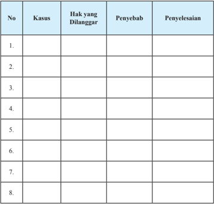

Tabel ini berisi informasi tentang kasus-kasus hukum yang dilanggar, penyebabnya, dan cara penyelesaiannya. Topik utamanya adalah tentang analisis dan pemecahan masalah hukum. Kolom-kolom yang ada meliputi nomor kasus, jenis kasus (tidak disebutkan detail), hak-hak yang dilanggar, penyebab masalah, dan cara penyelesaian. Data penting yang terlihat menunjukkan bahwa tabel ini mungkin digunakan untuk mempelajari atau mengorganisir informasi tentang kasus-kasus hukum, baik itu kasus-kasus yang telah diselesaikan maupun yang masih berlangsung.

- Pelanggaran hak asasi manusia terjadi juga  di lingkungan sekitar tempat tinggal kalian seperti di keluarga, sekolah, ataupun masyarakat. Nah, coba kalian identifikasi bentuk pelanggaran HAM yang terjadi di lingkunganlingkungan tersebut. Tulislah hasil temuan kalian pada tabel di bawah ini dan informasikan kepada teman yang lain.

 

---
## 📄 Halaman 32

---
**📊 Tabel**

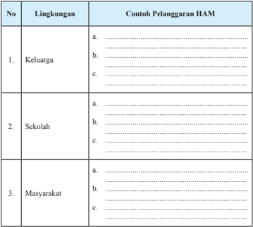

Tabel ini berisi contoh pelanggaran Hak Asasi Manusia (HAM) dalam tiga lingkungan: keluarga, sekolah, dan masyarakat. Topik utamanya adalah pelanggaran HAM di berbagai aspek kehidupan manusia. Kolom "Lingkungan" menunjukkan tempat pelanggaran HAM tersebut terjadi, sedangkan kolom "Contoh Pelanggaran HAM" berisi contoh spesifik yang terjadi di setiap lingkungan tersebut. Data penting yang terlihat adalah bahwa pelanggaran HAM dapat terjadi di mana saja, mulai dari rumah tangga hingga masyarakat luas, dan melibatkan berbagai aspek kehidupan seperti kesehatan, pendidikan, dan hak-hak sosial lainnya.

### D. Upaya Penegakan Hak Asasi Manusia (HAM)

### 1. Upaya Pemerintah dalam Menegakkan HAM

Semua  negara  di  dunia  sepakat  untuk  menyatakan  penghormatan  terhadap nilai-nilai hak asasi manusia yang universal melalui berbagai upaya penegakan HAM. Akan tetapi, pelaksanaan hak asasi manusia dapat saja berbeda antara satu negara dengan negara lain. Ideologi, kebudayaan, dan nilai-nilai khas yang dimiliki suatu bangsa akan memengaruhi sikap dan perilaku hidup berbangsa. Misalnya di Indonesia, semua perilaku hidup berbangsa diukur dari kepribadian Indonesia yang  tentu  saja  berbeda  dengan  bangsa  lain.  Bangsa  Indonesia  dalam  proses penegakan HAM tentu saja mengacu pada Pancasila dan Undang-Undang Dasar Negara  Republik  Indonesia  Tahun  1945  serta  peraturan  perundang-undangan

 

---
## 📄 Halaman 33

lainnya. Dengan kata lain, penegakan HAM di Indonesia tidak berorientasi pada pemahaman  HAM  liberal  dan  sekuler  yang  tidak  selaras  dengan  makna  sila pertama yaitu Ketuhanan Yang Maha Esa.

Selain mengacu pada peraturan perundang-undangan nasional, proses penegakan HAM di Indonesia juga mengacu kepada ketentuan-ketentuan hukum internasional  yang  pada  dasarnya  memberikan  wewenang  luar  biasa  kepada setiap negara. Berkaitan dengan hal tersebut, Idrus Affandi dan Karim Suryadi menegaskan  bahwa  bangsa  Indonesia  dalam  proses  penegakan  HAM  sangat mempertimbangkan dua hal di bawah ini.

- Kedudukan negara Indonesia sebagai negara yang berdaulat baik secara hukum, sosial,  maupun  politik  harus  dipertahankan  dalam  keadaan  apa pun sesuai dengan prinsip-prinsip yang dianut dalam piagam PBB.
- Dalam pelaksanaannya, pemerintah harus tetap mengacu kepada ketentuan-ketentuan  hukum  internasional  mengenai  HAM.  Kemudian menyesuaikan dan memasukkannya ke dalam sistem hukum nasional serta menempatkannya sedemikian rupa sehingga merupakan bagian yang tidak terpisahkan dari sistem hukum nasional.
Pemerintah  Indonesia  dalam  proses  penegakan  HAM  ini  telah  melakukan langkah-langkah strategis, di antaranya sebagai berikut.

### a. Pembentukan Komisi Nasional Hak Asasi Manusia (Komnas HAM)

Komnas HAM dibentuk pada 7 Juni 1993 melalui Keppres Nomor 50 Tahun 1993.  Keberadaan  Komnas  HAM  selanjutnya  diatur  dalam  Undang-Undang RI  Nomor  39  Tahun  1999  tentang  Hak  Asas  Manusia  pada  pasal  75  sampai dengan pasal 99. Komnas HAM merupakan lembaga negara mandiri setingkat lembaga negara lainnya yang berfungsi sebagai lembaga pengkajian, penelitian, penyuluhan, pemantauan, dan mediasi HAM. Komnas HAM beranggotakan 35 orang yang dipilih oleh DPR berdasarkan usulan Komnas HAM dan ditetapkan oleh presiden. Masa jabatan anggota Komnas HAM selama lima tahun dan dapat diangkat lagi hanya untuk satu kali masa jabatan.

Komnas HAM mempunyai wewenang sebagai berikut.

- Melakukan perdamaian pada kedua belah pihak yang bermasalah.
- Menyelesaikan masalah secara konsultasi maupun negosiasi.
- Menyampaikan  rekomendasi  atas  suatu  kasus  pelanggaran  hak  asasi manusia kepada pemerintah dan DPR untuk ditindaklanjuti.

 

---
## 📄 Halaman 34

- Memberi saran kepada pihak yang bermasalah untuk menyelesaikan sengketa di pengadilan.
Setiap warga  negara  yang  merasa hak asasinya dilanggar boleh melakukan pengaduan kepada Komnas HAM. Pengaduan tersebut harus disertai dengan alasan, baik secara tertulis maupun lisan dan identitas pengadu yang benar.

### Tugas Mandiri 1.4

Selain Komisi Nasional Hak Asasi Manusia, di Indonesia juga terdapat  komisi  nasional  lainnya  yang berkaitan  dengan  HAM  yaitu  Komnas Perlindungan  Anak  Indonesia  (KPAI), Komisi Nasional Anti Kekerasaan terhadap Perempuan, dan Komite Nasional  Perlindungan  Konsumen  dan Pelaku  Usaha,  serta  Komisi  Kebenaran dan Rekonsiliasi Nasional (KKRN). Nah,

### Info Kewarganegaraan

Dalam hubungannya dengan penegakan HAM, Pancasila mengajarkan hal-hal berikut.

- Sesungguhnya Tuhan YME adalah pencipta alam semesta.
- Manusia adalah makhluk Tuhan YME yang mendapat anugerah-Nya berupa kehidupan, kebebasan, dan harta milik.
- Sebagai makhluk yang mempunyai martabat luhur, manusia mengemban kewajiban hidupnya yaitu:
- Berterima kasih, berbakti, dan bertakwa kepada-Nya.
- Mencintai sesama manusia.
- Memelihara dan menghargai hak hidup, hak kemerdekaan, dan hak memiliki sesuatu.
- Menyadari pelaksanaan hukum yang berlaku.
tugas  kalian  adalah  mengidentifikasi  tugas  dan  fungsi  dari  lembaga-lembaga tersebut. Tuliskan identifikasi kalian dalam tabel di bawah ini.

---
**📊 Tabel**

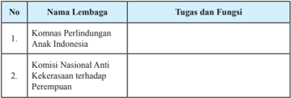

Tabel ini berisi informasi tentang dua lembaga penting di Indonesia, yaitu Komnas Perlindungan Anak Indonesia dan Komisi Nasional Anti Kekerasan terhadap Perempuan. Topik utama tabel adalah tugas dan fungsi dari kedua lembaga tersebut. Kolom pertama menunjukkan nomor urut, sedangkan kolom kedua berisi nama lembaga. Kolom ketiga menyajikan tugas dan fungsi masing-masing lembaga. Dari tabel ini, dapat dilihat bahwa Komnas Perlindungan Anak Indonesia bertanggung jawab untuk melindungi dan memperjuangkan hak-hak anak di Indonesia, sementara Komisi Nasional Anti Kekerasan terhadap Perempuan bertugas untuk mencegah dan menegakkan hukum terhadap kekerasan terhadap perempuan.

 

---
## 📄 Halaman 35

---
**📊 Tabel**

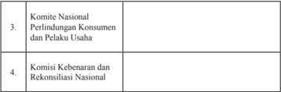

Tabel ini berisi informasi tentang dua lembaga penting di Indonesia: Komite Nasional Perlindungan Konsumen dan Pelaku Usaha (Komnas Perkuda) dan Komisi Kebenaran dan Rekonsiliasi Nasional (KKN). Topik utama tabel ini adalah tentang organisasi-organisasi yang bertanggung jawab untuk melindungi konsumen dan memperbaiki kebenaran dalam masyarakat. Kolom pertama menunjukkan nama lembaga, sedangkan kolom kedua tidak memiliki data atau informasi. Pola penting yang terlihat adalah bahwa kedua lembaga ini memiliki peran penting dalam menjaga keadilan dan kesejahteraan masyarakat, dengan fokus pada perlindungan konsumen dan penyelesaian masalah kebenaran.

### b. Pembentukan Instrumen HAM.

Instrumen  HAM  merupakan  alat  untuk  menjamin  proses  perlindungan  dan penegakan  hak  asasi  manusia.  Instrumen  HAM  biasanya  berupa  peraturan perundang-undangan dan lembaga-lembaga penegak hak asasi manusia, seperti Komisi  Nasional  Hak Asasi  Manusia  (Komnas  HAM)  dan  Pengadilan  HAM. Instrumen  HAM  yang  berupa  peraturan  perundang-undangan  dibentuk  untuk menjamin kepastian hukum serta memberikan arahan dalam proses penegakan HAM. Adapun  peraturan  perundang-undangan  yang  dibentuk  untuk  mengatur masalah HAM sebagai berikut.

- Pada amandemen kedua Undang-Undang Dasar Negara Republik Indonesia Tahun 1945 telah ditetapkan satu bab tambahan dalam batang tubuh yaitu bab XA yang berisi mengenai hak asasi manusia, melengkapi pasal-pasal yang lebih dahulu mengatur mengenai masalah HAM.
- Dalam Sidang Istimewa MPR 1998 dikeluarkan Ketetapan MPR mengenai hak asasi manusia yaitu TAP MPR Nomor XVII/MPR/1998.
- Ditetapkannya Piagam HAM Indonesia pada tahun 1998.
- Diundangkannya  Undang-Undang  RI  Nomor  39  Tahun  1999  tentang  Hak Asasi Manusia, yang diikuti dengan dikeluarkannya Perpu Nomor 1 Tahun 1999 tentang pengadilan HAM yang kemudian ditetapkan menjadi sebuah undang-undang,  yaitu  Undang-Undang  RI  Nomor  26  Tahun  2000  tentang Pengadilan HAM.
- Ditetapkannya  peraturan  perundang-undangan  tentang  perlindungan  anak yaitu:
- Undang-Undang RI Nomor 3 Tahun 1997 tentang Pengadilan Anak,
- Undang-Undang RI Nomor 23 Tahun 2002 tentang Perlindungan Anak, dan
- Undang-Undang  RI  Nomor  11  Tahun  2012  tentang  Sistem  Peradilan Anak.

 

---
## 📄 Halaman 36

- Meratifikasi instrumen HAM internasional selama tidak bertentangan dengan Pancasila dan Undang-Undang Dasar Negara Republik Indonesia Tahun 1945. Instrumen HAM internasional yang diratifikasi di antaranya sebagai berikut.
- Konvensi  Jenewa  12 Agustus  1949.  Telah  diratifikasi  dengan  UndangUndang RI Nomor 59 Tahun 1958.
- Konvensi Tentang Hak Politik Kaum Perempuan (Convention of Political Rights of Women) .  Telah diratifikasi dengan Undang-Undang RI Nomor 68 Tahun 1958.
- Konvensi  tentang  Penghapusan  Segala  Bentuk  Diskriminasi  terhadap Perempuan  ( Convention  on  the  Elmination  of  Discrimination  againts Women) .  Telah  diratifikasi  dengan  Undang-Undang  RI  Nomor  7  Tahun 1984.
- Konvensi  Hak  Anak (Convention  on  the  Rights  of  the  Child). Telah diratifikasi dengan Keputusan Presiden Nomor 36 Tahun 1990.
- Konvensi Pelarangan Pengembangan, Produksi dan Penyimpanan Senjata Biologis dan beracun serta pemusnahannya (Convention on the Prohibition of  the  Development,  Production  and  Stockpilling  of  Bacteriological (Biological) and Toxin Weapons  and  on  their Destruction) . Telah diratifikasi dengan Keputusan Presiden Nomor 58 Tahun 1991.
- Konvensi Internasional terhadap Anti Apartheid dalam Olahraga (International Convention Againts Apartheid in Sports) . Telah diratifikasi dengan Undang-Undang RI Nomor 48 Tahun 1993.
- Konvensi Menentang Penyiksaan dan Perlakuan atau Penghukuman Lain yang  Kejam,  Tidak  Manusiawi,  atau  Merendahkan  Martabat  Manusia (Convention  Against  Torture  and  Other  Cruel,  Inhuman  or  degreeling Treatment or Punishment) . Telah diratifikasi dengan Undang-Undang RI Nomor 5 Tahun 1998.
- Konvensi Organisasi Buruh Internasional Nomor 87 Tahun 1998 tentang Kebebasan  Berserikat  dan  Perlindungan  Hak  untuk  Berorganisasi (ILO Convention  No.  87,  1998  Concerning  Freedom  of  Association  and Protection of the Rights to Organise) . Telah diratifikasi dengan Keputusan Presiden Nomor 83 Tahun 1998.
- Konvensi Internasional tentang Penghapusan Semua Bentuk Diskriminasi Rasial (Convention on the Elemination of Racial Discrimination) . Telah diratifikasi dengan Undang-Undang RI Nomor 29 Tahun 1999.

 

---
## 📄 Halaman 37

- Kovenan Internasional tentang Hak-Hak Sipil dan Politik (International Covenant on Civil and Political Rights). Telah diratifikasi dengan UndangUndang RI Nomor 11 tahun 2005.
- Kovenan  Internasional  Hak-Hak  Ekonomi,  Sosial  dan  Budaya (International  Covenant  on  Economic,  Social  and  Cultural  Rights.) Telah diratifikasi dengan Undang-Undang RI Nomor 12 tahun 2005.

### c. Pembentukan Pengadilan HAM

Pengadilan HAM dibentuk berdasarkan Undang-Undang RI Nomor 26 Tahun 2000. Pengadilan HAM adalah pengadilan khusus terhadap pelanggaran HAM berat yang diharapkan dapat melindungi hak asasi manusia, baik perseorangan maupun masyarakat. Pengadilan HAM menjadi dasar bagi penegakan, kepastian hukum, keadilan dan perasaan aman, baik perseorangan maupun masyarakat.

Pengadilan  HAM  bertugas  dan  berwenang  memeriksa  dan  memutuskan perkara pelanggaran hak asasi manusia yang berat. Di samping itu, berwenang memeriksa dan memutus perkara pelanggaran HAM yang dilakukan oleh warga negara Indonesia dan terjadi di luar batas teritorial wilayah Indonesia.

### 2. Upaya Penanganan Kasus Pelanggaran Hak Asasi Manusia

### a. Upaya Pencegahan Pelanggaran Hak Asasi Manusia

Mencegah lebih baik daripada mengobati. Pernyataan itu tentunya sudah sering kalian dengar. Pernyataan tersebut sangat relevan dalam proses penegakan HAM. Tindakan  terbaik  dalam  penegakan  HAM  adalah  dengan  mencegah  timbulnya semua  faktor  penyebab  pelanggaran  HAM. Apabila  faktor  penyebabnya  tidak muncul pelanggaran HAM pun dapat diminimalisir atau bahkan dihilangkan.

Berikut  ini  tindakan  pencegahan  yang  dapat  dilakukan  untuk  mengatasi berbagai kasus pelanggaran HAM.

- Menegakkan  supremasi hukum  dan  demokrasi. Pendekatan  hukum dan  pendekatan  dialogis  harus  dikemukakan  dalam  rangka  melibatkan partisipasi  masyarakat  dalam  kehidupan  berbangsa  dan  bernegara.  Para pejabat penegak hukum harus memenuhi kewajiban dengan memberikan pelayanan yang baik dan adil kepada masyarakat, memberikan perlindungan  kepada  setiap  orang  dari  perbuatan  melawan  hukum,  dan menghindari  tindakan  kekerasan  yang  melawan  hukum  dalam  rangka menegakkan hukum.

 

---
## 📄 Halaman 38

- Meningkatkan  kualitas  pelayanan  publik  untuk  mencegah  terjadinya berbagai bentuk pelanggaran HAM oleh pemerintah.
- Meningkatkan pengawasan dari masyarakat dan lembaga-lembaga politik terhadap setiap upaya penegakan HAM yang dilakukan oleh pemerintah.
- Meningkatkan penyebarluasan prinsip-prinsip HAM kepada masyarakat melalui lembaga pendidikan formal (sekolah/perguruan tinggi) maupun  non-formal  (kegiatan-kegiatan  keagamaan  dan  kursus-kursus). Meningkatkan profesionalisme lembaga keamanan dan pertahanan negara.
- Meningkatkan kerja sama yang harmonis antarkelompok atau golongan dalam  masyarakat  agar  mampu  saling  memahami  dan  menghormati keyakinan dan pendapat masing-masing

### b. Membangun Harmonisasi Hak dan Kewajiban Asasi Manusia

Hak  dan  kewajiban  asasi  manusia  merupakan  dua  hal  yang  tidak  dapat dipisahkan satu sama lain. Seseorang tidak dapat menikmati hak yang dimilikinya, sebelum memenuhi apa yang yang menjadi kewajibannya. Misalnya, dalam proses pembelajaran di sekolah, kalian tidak akan mendapatkan pemahaman yang baik dalam sebuah pelajaran apabila tugas-tugas dalam mata pelajaran tersebut tidak kalian  kerjakan.  Kemudian, seorang pekerja tidak akan mendapatkan kenaikan upah  apabila  tidak  menampilkan  kinerja  yang  baik.  Dengan  demikian,  dapat dipastikan  antara  hak  asasi  dan  kewajiban  asasi  dalam  perwujudannya  harus diharmonisasikan atau diseimbangkan oleh setiap orang.

Bagaimana  caranya  mengharmonisasikan  hak  dan  kewajiban  asasi  dalam kehidupan sehari-hari? Salah satu cara untuk mengharmonisasikan hak dan  kewajiban  asasi  manusia  dalam  kehidupan  sehari-hari  adalah  dengan menghindarkan diri kita dari sikap egois atau terlalu mementingkan diri sendiri. Sikap  egois  dapat  menyebabkan  seseorang  untuk  selalu  menuntut  haknya, sementara  kewajibannya  sering  diabaikan.  Seseorang  yang  mempunyai  sikap egois  akan  menghalalkan  segala  cara  agar  haknya  dapat  terpenuhi,  meskipun caranya dapat melanggar hak orang lain.

Upaya untuk mengharmonisasikan hak dan kewajiban asasi manusia merupakan salah  satu  bentuk  dukungan  terhadap  penegakan  HAM  yang  dilakukan  oleh pemerintah. Sebagai warga negara dari bangsa dan negara yang beradab sudah sepantasnya sikap dan perilaku kita mencerminkan sosok manusia beradab yang selalu  menghormati  keberadaan  orang  lain  secara kaffah .  Sikap  tersebut  dapat

 

---
## 📄 Halaman 39

kalian  tampilkan  dalam  perilaku  di  lingkungan  keluarga,  sekolah,  masyarakat, bangsa, dan negara.

Lakukanlah identifikasi contoh perilaku yang dapat kalian tampilkan, sebagai bentuk upaya untuk mengharmonisasikan hak dan kewajiban asasi manusia.

### 1. Di lingkungan keluarga

- Meghormati dan menyayangi adik atau kakak
b.

…………………………………………………………………………

c.

…………………………………………………………………………

d.

…………………………………………………………………………

e.

…………………………………………………………………………

### 2. Di lingkungan sekolah

- Tidak memaksakan kehendak kepada teman atau guru
b.

…………………………………………………………………………

c.

…………………………………………………………………………

d.

…………………………………………………………………………

e.

…………………………………………………………………………

- Di lingkungan masyarakat
- Tidak menghardik pengemis atau kaum dhu'afa lainnya
b.

…………………………………………………………………………

c.

…………………………………………………………………………

d.

…………………………………………………………………………

e.

…………………………………………………………………………

- Di lingkungan bangsa dan negara
- Memahami dan menaati setiap instrumen HAM yang berlaku
b.

…………………………………………………………………………

c.

…………………………………………………………………………

d.

…………………………………………………………………………

e.

……………………………………………………………………

 

---
## 📄 Halaman 40

### Refleksi

Setelah  kalian  menganalisis  kasus-kasus  pelanggaran  HAM  yang  dikaitkan dengan Pancasila, tentunya kalian semakin meyakini bahwa betapa pentingnya Pancasila untuk dijadikan dasar dalam proses penegakan hak asasi manusia. Nah, coba  sekarang  renungkanlah  hal-hal  berikut  serta  cobalah  berikan  jawabannya dengan penuh kejujuran.

- Dalam kenyataannya, manakah yang lebih sering kalian dahulukan antara hak dan kewajiban?
- Pernahkah kalian melalaikan kewajiban? Apabila pernah, jenis kewajiban apa yang sering kalian lalaikan?
- Hal apa yang sudah kalian lakukan sebagai bentuk penghargaan terhadap hak asasi manusia?

### Rangkuman

### 1. Kata Kunci

Kata kunci yang harus kalian pahami dalam mempelajari materi pada  bab  ini  adalah hak  asasi  manusia,  kewajiban  asasi manusia,  Pancasila,  nilai  dasar,  nilai  instrumental,  nilai praksis.

### 2. Intisari Materi

- Hak asasi manusia adalah seperangkat hak yang melekat pada hakikat dan keberadaan manusia sebagai makhluk Tuhan Yang Maha Esa dan merupakan anugerah-Nya yang wajib dihormati, dijunjung tinggi dan dilindungi oleh negara, hukum, pemerintah, dan  setiap  orang  demi  kehormatan  serta  perlindungan  harkat dan martabat manusia.
- Kewajiban  secara  sederhana  dapat  diartikan  sebagai  segala sesuatu yang harus dilaksanakan dengan penuh tanggung jawab. Dengan  demikian,  kewajiban  asasi  dapat  diartikan  sebagai kewajiban dasar setiap manusia.  Berdasarkan ketentuan pasal 1 ayat (2) Undang-Undang RI Nomor 39 Tahun 1999 tentang Hak  Asasi  Manusia,  kewajiban  dasar  manusia  merupakan seperangkat kewajiban yang apabila tidak dilaksanakan, tidak memungkinkan terlaksana dan tegaknya hak asasi manusia.
- Hak  dan  kewajiban  asasi  merupakan  dua  hal  yang  saling berkaitan. Keduanya memiliki hubungan kausalitas atau hubungan sebab-akibat. Seseorang mendapatkan haknya dikarenakan dipenuhinya kewajiban yang dimilikinya.

 

---
## 📄 Halaman 41

- Pancasila merupakan ideologi yang mengedepankan nilai-nilai kemanusiaan. Dengan kata lain, Pancasila sangat menghormati hak  asasi  setiap  warga  negara  maupun  bukan  warga  negara Indonesia. Semua sila Pancasila mengandung nilai-nilai penghormatan atas hak asasi manusia.
- Jaminan serta pengaturan hak dan kewajiban  asasi manusia oleh Pancasila dapat dilihat dari nilai-nilainya yang terdiri atas nilai dasar, nilai instrumental, dan nilai praksis.
- Hak dan kewajiban asasi manusia dalam nilai dasar Pancasila terletak  pada  ketentuan  setiap  sila  Pancasila,  yang  kemudian dijabarkan  dalam  nilai  instrumental  yang  berupa  ketentuan peraturan perundang-undangan tentang hak asasi manusia, yang diimplementasikan dalam praktik kehidupan sehari-hari.
- Salah satu cara untuk mengharmonisasikan hak dan kewajiban asasi  manusia  dalam  kehidupan  sehari-hari  adalah  dengan menghindarkan diri dari sikap egois atau terlalu mementingkan diri sendiri.

### Penilaian Diri

### 1. Penilaian Sikap

Nah,  coba  sekarang  kalian  renungi  diri  masing-masing.  Apakah  perilaku kalian  telah  mencerminkan  warga  negara  yang  selalu  menghormati  hak asasi  manusia?  Bacalah  daftar  perilaku  di  bawah  ini,  kemudian  beri  tanda ceklist ( ✓ ) pada kolom selalu, sering , kadang-kadang, dan tidak pernah, serta berikan  alasan  dilakukannya  perilaku  itu.  Ingat,  kalian  harus  mengisinya sesuai keadaan yang sebenarnya.

---
**📊 Tabel**

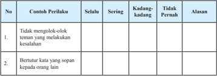

Tabel ini berisi informasi tentang perilaku individu terhadap teman dan orang lain, dengan kolom-kolom seperti "Selalu", "Sering", "Kadang-kadang", dan "Tidak Pernah". Topik utama tabel adalah perilaku sosial dan interaksi antar individu. Data penting yang terlihat adalah bahwa individu sering mengakui perilaku negatif teman mereka, tetapi tidak sering bertutur kata sopan kepada orang lain. Ini menunjukkan adanya perbedaan dalam perilaku sosial antara dua aspek tersebut.

 

---
## 📄 Halaman 42

---
**📊 Tabel**

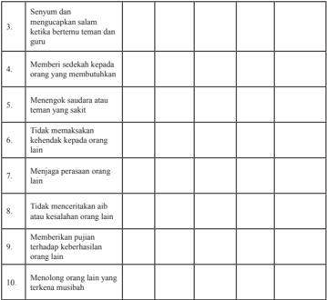

Tabel ini berisi 10 poin yang mungkin merupakan kriteria atau standar untuk menilai perilaku sosial positif. Topik utamanya adalah bagaimana seseorang dapat berinteraksi dengan orang lain secara positif dan bermanfaat. Kolom-kolomnya mencakup berbagai aspek seperti salam hangat, membantu orang yang membutuhkan, menghargai teman sakit, tidak memaksa keharusan pada orang lain, menjaga perasaan orang lain, tidak merusak hubungan, memberikan pujian, dan membantu orang yang terkena cedera. Data atau pola penting yang terlihat adalah bahwa semua poin memiliki nilai positif, menunjukkan bahwa setiap perilaku yang dimaksudkan untuk bermanfaat dan positif.

Apabila jawaban kalian 'kadang-kadang' atau 'tidak pernah' pada kolom perilakuperilaku tersebut di atas, kalian sebaiknya mulai mengubah sikap dan perilaku kalian agar menjadi lebih baik. Sebaliknya, apabila jawaban kalian 'selalu' atau 'sering' pertahankanlah dan wujudkan sikap tersebut dalam kehidupan seharihari.

### 2. Pemahaman Materi

Dalam mempelajari materi pada bab ini, tentu saja ada materi yang dengan mudah kalian pahami, ada juga yang sulit kalian pahami. Oleh karena itu, lakukanlah penilaian diri atas pemahaman kalian terhadap materi pada bab ini dengan memberikan tanda ceklist ( ✓ ) pada kolom sangat paham, paham sebagian, belum paham.

 

---
## 📄 Halaman 43

---
**📊 Tabel**

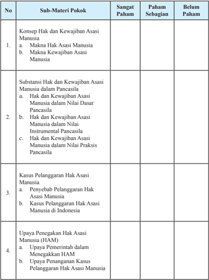

Tabel ini berisi informasi tentang sub-materi pokok hak asasi manusia dalam kurikulum pendidikan. Kolom "Sangat Paham" menunjukkan bahwa materi tersebut telah dipahami dengan baik oleh siswa, sedangkan kolom "Paham Sebagian" menunjukkan bahwa materi tersebut dipahami sebagian saja. Kolom "Belum Paham" menunjukkan bahwa materi tersebut belum dipahami oleh siswa. Topik utama tabel adalah Hak Asasi Manusia, yang diuraikan melalui beberapa sub-topik seperti makna hak asasi manusia, substansi hak dan kewajiban atas hak asasi manusia dalam Pancasila, kasus pelanggaran hak asasi manusia, dan upaya penegakan hak asasi manusia (HAM). Data penting yang terlihat adalah bahwa materi yang paling banyak dipahami oleh siswa adalah sub-topik tentang makna hak asasi manusia, sementara materi yang paling sulit dipahami adalah kasus pelanggaran hak asasi manusia.

Apabila  pemahaman  kalian  berada  pada  kategori sangat  paham mintalah materi  pengayaan  kepada  guru  untuk  menambah  wawasan  kalian. Apabila pemahaman kalian berada pada kategori paham sebagian dan belum paham coba bertanyalah kepada guru serta mintalah penjelasan lebih lengkap, agar kalian cepat memahami materi pembelajaran yang sebelumnya kurang atau belum dipahami.

 

---
## 📄 Halaman 44

### Proyek Kewarganegaraan

### Petunjuk .

### 1. Persiapan

- Bentuklah kelompok yang anggotanya terdiri atas tiga sampai dengan lima orang.
- Tentukan pokok permasalahan yang akan diteliti yang berkaitan dengan pelanggaran HAM yang terjadi di lingkungan sekitar tempat tinggal kalian.
- Tentukan responden/orang yang akan diteliti atau diwawancara.
- Susunlah pedoman pengamatan atau wawancara.

### 2. Pelaksanaan

- Amatilah kehidupan masyarakat di sekitar tempat penelitian.
- Lakukanlah identifikasi mengenai pelanggaran HAM yang terjadi di sekitar tempat penelitian.
- Lakukanlah wawancara dengan ketua RT/RW, pelaku, korban atau orang-orang yang dianggap tahu terjadinya pelanggaran HAM tersebut.
- Catatlah setiap hasil pengamatan dan wawancara yang telah dilakukan.

### 3. Pelaporan

- Laporkanlah hasil pengamatan kalian ke dalam format di bawah ini.

---
**📊 Tabel**

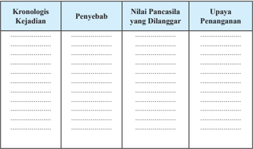

Tabel ini berisi informasi tentang kejadian, penyebab, nilai Pancasila yang dilanggar, dan upaya penanganan. Topik utamanya adalah tentang peristiwa-peristiwa yang melanggar nilai-nilai Pancasila di Indonesia. Kolom-kolomnya mencakup kronologis kejadian, penyebab, nilai Pancasila yang dilanggar, dan upaya penanganan. Data penting yang terlihat adalah bahwa banyak kejadian yang melanggar nilai-nilai Pancasila seperti kekerasan, korupsi, dan ketidakadilan sosial. Upaya penanganan juga sangat bervariasi, mulai dari pendidikan moral hingga tindakan hukum.

### Mari Meneliti

 

---
## 📄 Halaman 45

- Berdasarkan data yang terkumpul, coba kalian membuat poster yang berisi ajakan kepada masyarakat untuk menghindari perbuatan yang berpotensi melanggar hak asasi manusia.

### Uji Kompetensi  Bab 1

### Jawablah pertanyaan-pertanyaan di bawah ini secara jelas dan akurat.

- Bagaimana keterkaitan antara hak asasi manusia dengan kewajiban asasi manusia?
- Mengapa antara hak asasi manusia dengan kewajiban asasi manusia dalam perwujudannya harus diharmonisasikan?
- Uraikan jaminan hak asasi manusia yang terdapat dalam Pancasila!
- Apa yang akan terjadi apabila dalam proses penegakan hak asasi manusia, Pancasila tidak dijadikan dasar atau landasan?
- Mengapa liberalisme dan sosialisme tidak patut dijadikan landasan dalam proses penegakan hak asasi manusia di Indonesia?
- Sekarang ini begitu sering terjadi peristiwa  pelanggaran  HAM  di masyarakat seperti pembunuhan, penculikan, penyiksaan dan sebagainya. Mengapa hal tersebut dapat terjadi? Siapa yang paling bertanggung jawab untuk mengatasi persoalan tersebut?  Apa peran kalian untuk menyelesaikan persoalan tersebut?

 

---
## 📄 Halaman 46

### Sistem dan Dinamika Demokrasi Pancasila

Kompetensi  kalian  pada  saat  ini  tentu  saja  semakin  berkembang  setelah mempelajari  satu  bab  awal  pada  buku  ini.  Kompetensi  tersebut  dapat  kalian jadikan  sebagai  modal  berharga  dalam  memahami  materi  pembelajaran  pada bab berikutnya, termasuk materi pada bab dua ini. Itu semua merupakan karunia Tuhan Yang Maha Esa yang harus disyukuri dengan cara meningkatkan kualitas belajar kalian secara terus menerus.

Pada  bagian  ini  kalian  akan  diajak  untuk  mendalami  materi  tentang  sistem dan dinamika demokrasi di Indonesia. Setelah mempelajari materi ini, diharapkan kalian  mampu  merasakan  manfaat  pelaksanaan  demokratisasi  di  negara  kita. Sebagai langkah awal dalam mempelajari materi pada bab ini, coba kalian amati gambar 2.1 di bawah ini.

Dokumen Kemdikbud

 

---
## 📄 Halaman 47

Apa yang kalian pikirkan setelah melihat gambar di atas? Peristiwa di atas merupakan perwujudan dari sikap demokratis. Bagaimana perwujudan dari sikap tersebut?

Coba  kalian  amati  kehidupan  dalam  keluarga  masing-masing?  Apakah dalam  membahas  segala  permasalahan,  misalnya  pembagian  kerja,  peraturan keluarga, pilihan sekolah dilakukan melalui musyawarah? Apakah kalian diberi kebebasan untuk mengemukakan pendapat dalam musyawarah tersebut? Apabila dalam  keluarga  kalian  senantiasa  melakukan  musyawarah  untuk  membahas suatu  persoalan,  apabila  semua  anggota  keluarga  diberikan  kebebasan  untuk mengemukakan  pendapat,  serta  apabila  anggota  keluarga  saling  menghormati pendapat berarti keluarga kalian telah menerapkan sikap demokratis.

Demikian  pula  halnya  di  sekolah,  apabila  guru  dalam  proses  pembelajaran senantiasa memberi kesempatan kepada kalian untuk bertanya, berdiskusi, dan mengemukakan pendapat di sekolah kalian telah berkembang sikap demokratis. Begitu pula di lingkungan masyarakat, apabila setiap permasalahan diselesaikan dengan musyawarah mufakat masyarakat tersebut sudah mengembangkan sikap demokrastis.

Dalam lingkup negara, apabila sebuah negara melaksanakan pemilihan umum secara  jujur  dan  adil  negara  tersebut  telah  menerapkan  demokrasi.  Selain  itu, apabila negara juga memberikan kebebasan berpendapat kepada warga negaranya dalam negara tersebut demokrasi telah dibudayakan, artinya nilai-nilai demokrasi telah dipahami dan diamalkan dalam kehidupan berbangsa dan bernegara.

### A. Hakikat Demokrasi

### 1. Makna Demokrasi

Memahami makna demokrasi sangat penting dilakukan, supaya kalian tidak terjebak  kepada  penafsiran  yang  salah  dalam  mengartikan  demokrasi.  Jika kalian salah dalam menafsirkan makna demokrasi maka dalam mewujudkannya pun akan salah. Nah, untuk membantu kalian memahami makna demokrasi dan budaya demokrasi berikut ini disajikan puisi karya Taufik Ismail dalam bukunya yang berjudul Katastrofi Mendunia Marxisma, Leninisma, Stalinisma, Maoisma, Narkoba halaman 282 - 285. Simaklah dan maknailah.

 

---
## 📄 Halaman 48

### Demokrasi Kebun Binatang

Mari kita pergi ke kebun binatang bersama-sama,

Karena kita ingin mendengar gagasan pimpinan baru kota para hewan itu.

Pimpinan baru kebun binatang ingin mereposisi sebuah kandang dan kandang itu kandang yang penting posisinya.

Kandang itu berpagar kawat yang cantik ornamennya, Tinggi oleh siapa pun tak terlompati, Kekar oleh siapa pun  tak tergoyahkan,

Luasnya sepuluh hektar,

Di dalamya  ada danau, gua, padang rumput dan belukar.

Penduduk kandang itu kambing, kelinci, kijang, kucing, kuda, kerbau, keledai, anjing, domba, sapi, gajah, rusa, monyet, perkutut, burung hantu, dan jerapah. Pak kepala kebun binatang berminat benar memasukkan serigala ke dalam kandang besar itu, karena katanya sudah 34 tahun lamanya makhluk ini berada di luar sana.

Alasannya adalah bahwa demokrasi hewan harus ditegakkan, Termasuk demokrasi serigala.

Menurut serigala, ukuran demokrasi adalah 'sama-sama hewan'

Dan gagasan ini dengan gigih didukung kepala kebun binatang.

Ke-17 hewan lainnya itu tak setuju.

Menurut mereka, definisi demokrasi adalah 'sama-sama hewan yang tidak memakan satu sama lain, tidak memangsa satu sama lain'.

Pak kepala, ganjilnya, tak menerima logika ini dan tetap memihak definisi demokrasi serigala.

Keesokan  harinya,  selepas  acara  makan  pagi  para  penghuni  kebun binatang, dia membawa seekor hewan berkaki empat ke depan kandang itu.

'kalian tengoklah makhluk penyabar ini. Perhatikan bulunya yang bersih berkilat, telinganya yang lemas terkulai dan bahasa badannya yang sopan. Nah kan dia   jinak dan baik hati,' kata pak kepala,

Ke-17 hewan berteriak. 'Lho, itu kan serigala yang memakai jaket kulit kambing dan memakai telinga kambing palsu.' seru mereka. 'Biar menyamar  seperti apa, pak kepala, kami tetap kenal betul bau keringat badannya.'

Dua puluh empat jam kemudian, kepala kebun binatang datang ke depan pintu kandang  dan menuntun lagi makhluk itu. 'saya minta kalian dengan hati terbuka memperhatikan ciptaan Tuhan ini. Perhatikan tingkah lakunya yang mandiri, matanya yang bening dan suci, ekspresi luhurnya budi pekerti. Nah bukankah dia jinak dan baik hati?'tanyanya.

Ke-17 hewan penghuni kandang bersorak. 'Yaaah, itu kan serigala menyamar lagi, yang memakai rompi bulu domba, dan memakai tanduk domba palsu.'seru

 

---
## 📄 Halaman 49

mereka. 'Biar menyamar seperti apa, pak kepala, biar bulunya wol putih seperti domba Australia, kami tetap kenal gigi dan taringnya yang runcing-runcing itu.' Kepala kebun bintang tampak kesal, gerahamnya gemeletuk  dan wajahnya mulai memerah.´'Bagaimana   kalian ini, kok tidak menghormati demokrasi serigala? Hargailah hak asasi hewan, artinya, jangan mengucilkan hewan apapun,'katanya.............. .

Setelah kalian membaca puisi di atas, coba kalian jawab pertanyaan-pertanyaan di bawah ini.

- Mengapa istilah demokrasi maknanya beranekaragam?
- Dapatkah kita memaksakan pemahaman tentang demokrasi kepada orang lain? Berikan alasanmu.
- Coba kalian identifikasi/temukan nilai-nilai apa saja yang terdapat dalam puisi di atas.
- Dari  nilai-nilai  yang  sudah  diidentifikasikan,  nilai-nilai  apa  saja  yang pantas dan tidak pantas untuk dilakukan dalam kehidupan sehari-hari?
Apabila  kalian  cermati,  kondisi  yang  diutarakan  dalam  puisi  di  atas  mirip dengan  kondisi  yang  terjadi  saat  ini.  Di  saat  orang  saling  berebut  pandangan mengenai arti demokrasi, tiap orang mengemukakan sudut pandang berbeda yang tidak jarang tidak mau menerima sudut pandang orang lain. Tidak jarang ada orang atau kelompok yang mendasarkan arti demokrasi dari sudut agama, politik dan sebagainya. Oleh karena itu, pada bagian ini akan diuraikan pengertian demokrasi secara sistematis mulai dari asal kata sampai pada taraf pelaksanaannya.

Kata demokrasi berasal dari dua kata dalam bahasa Yunani, yaitu demos yang berarti rakyat, dan kratos/cratein yang berarti pemerintahan sehingga demokrasi dapat diartikan sebagai pemerintahan rakyat. Kata ini kemudian diserap menjadi salah satu kosa kata dalam bahasa Inggris yaitu democracy. Konsep demokrasi menjadi sebuah kata kunci dalam bidang ilmu politik. Hal ini menjadi wajar sebab demokrasi saat  ini  disebut-sebut  sebagai  indikator  perkembangan  politik  suatu negara.

Kebanyakan  orang  mungkin  sudah  terbiasa  dengan  istilah  demokrasi,  tapi tidak menutup kemungkinan masih ada yang salah dalam mempersepsikan istilah demokrasi. Bahkan tidak hanya itu, konsep demokrasi bisa saja disalahgunakan

 

---
## 📄 Halaman 50

### Info Kewarganegaraan

Salah satu pilar demokrasi adalah prinsip trias politica yang membagi ketiga kekuasaan politik negara (legislatif, eksekutif,  dan  yudikatif)  untuk diwujudkan dalam tiga jenis lembaga negara yang saling lepas  (independen)  dan  berada dalam  peringkat yang  sejajar satu sama lain. Kesejajaran dan  independensi  ketiga  jenis lembaga  negara  ini  diperlukan agar  ketiga  lembaga  negara  ini dapat saling mengawasi  dan saling  mengontrol  berdasarkan prinsip checks and balances.

oleh  para  penguasa  terutama  penguasa yang otoriter untuk memperoleh dukungan rakyat agar kekuasaannya tetap langgeng.

Menurut Kamus Besar Bahasa Indonesia , demokrasi merupakan istilah politik yang berarti pemerintahan rakyat. Hal tersebut dapat diartikan bahwa dalam sebuah negara demokrasi kekuasaan  tertinggi  berada  di  tangan rakyat  dan  dijalankan  langsung  oleh rakyat  atau  wakil-wakil  yang  mereka pilih di bawah sistem pemilihan  bebas.

Dalam pandangan Abraham Lincoln, demokrasi  adalah  suatu  sistem  pemerintahan dari  rakyat,  oleh  rakyat,  dan  untuk  rakyat. Artinya, rakyat dengan serta merta mempunyai kebebasan  untuk  melakukan  semua  aktivitas kehidupan  termasuk  aktivitas politik tanpa adanya  tekanan  dari  pihak  mana  pun,  karena pada hakikatnya yang berkuasa adalah rakyat untuk kepentingan bersama. Dengan demikian, sebagai  sebuah  konsep  politik,  demokrasi  adalah landasan  dalam  menata  sistem  pemerintahan negara yang terus berproses ke arah yang lebih baik. Dalam proses tersebut, rakyat diberi peran penting  dalam  menentukan    atau  memutuskan berbagai hal yang  menyangkut  kehidupan bersama sebagai sebuah bangsa dan negara.

 

---
## 📄 Halaman 51

### Info Kewarganegaraan

Penerapan demokrasi di Indonesia didasari oleh sila Kerakyatan yang dipimpin oleh hikmat kebijaksanaan dalam permusyawaratan/perwakilan yang dijiwai oleh sila Ketuhanan Yang  Maha  Esa,  Kemanusiaan yang adil dan beradab, Persatuan Indonesia, serta menjiwai  sila Keadilan sosial bagi seluruh rakyat Indonesia.

Kebebasan dan demokrasi sering dipakai secara timbal balik, tetapi keduanya  tidak  sama.  Sebagai  suatu konsep, demokrasi   adalah seperangkat gagasan dan prinsip  tentang kebebasan yang juga mencakup seperangkat praktik yang terbentuk  melalui sejarah panjang dan sering berliku-liku. Pendeknya, demokrasi adalah pelembagaan dari kebebasan.  Artinya,    kebebasan  yang dimiliki rakyat diatur dan  diarahkan oleh  sebuah  lembaga  kekuasaan  yang sumber kekuasaannya berasal dari rakyat dan dijalankan sendiri oleh rakyat sehingga kebebasan yang mereka miliki dapat  dilaksanakan  secara  bertanggung  jawab  dan  tidak  melanggar  kebebasan yang dimiliki orang lain.

.

### Tugas Mandiri 2.1

Lakukanlah studi literatur dengan membaca berbagai macam buku maupun artikel dari koran atau internet yang berkaitan dengan perbedaan antara negara demokrasi dengan negara otoriter. Tuliskanlah hasil temuan kalian pada tabel di bawah ini dan informasikanlah kepada teman-teman yang lain.

---
**📊 Tabel**

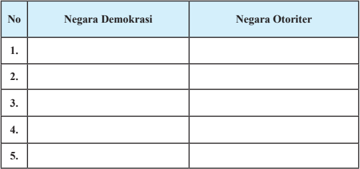

Tabel ini membandingkan dua jenis negara: Negara Demokrasi dan Negara Otoriter. Kolom pertama berisi nama-nama negara yang termasuk dalam kedua kategori tersebut. Data di tabel menunjukkan bahwa beberapa negara seperti Indonesia, Malaysia, dan Thailand termasuk dalam kategori Negara Demokrasi, sementara negara seperti Rusia, Iran, dan China termasuk dalam kategori Negara Otoriter. Pola penting yang terlihat adalah bahwa negara-negara dengan sistem demokrasi memiliki tingkat partisipasi dan kebebasan politik yang lebih tinggi dibandingkan dengan negara otoriter yang memiliki kontrol pemerintahan yang lebih kuat dan kurangnya kebebasan.

 

---
## 📄 Halaman 52

### 2. Klasifikasi Demokrasi

Demokrasi telah dijadikan sebagai sistem politik yang dianut oleh sebagian besar negara di dunia. Meskipun demikian, dalam pelaksanaannya berbeda-beda bergantung dari sudut pandang masing-masing. Keanekaragaman sudut pandang inilah  yang  membuat  demokrasi  dapat  dikenal  dari  berbagai  macam  bentuk. Berikut ini dipaparkan beberapa macam bentuk demokrasi.

### a. Berdasarkan titik berat perhatiannya

Dilihat dari titik berat yang menjadi perhatiannya, demokrasi dapat dibedakan ke dalam tiga bentuk.

- Demokrasi  formal, yaitu    suatu  demokrasi  yang  menjunjung  tinggi persamaan  dalam bidang politik, tanpa disertai upaya untuk mengurangi atau menghilangkan kesenjangan dalam bidang ekonomi. Bentuk demokrasi ini dianut oleh negara-negara liberal.
- Demokrasi  material, yaitu  demokrasi  yang  dititikberatkan  pada  upaya menghilangkan perbedaan dalam bidang ekonomi, sedangkan persamaan dalam bidang politik kurang diperhatikan bahkan kadang-kadang dihilangkan. Bentuk demokrasi ini dianut oleh negara-negara komunis
- Demokrasi gabungan, yaitu bentuk demokrasi yang mengambil kebaikan serta membuang keburukan dari bentuk demokrasi formal dan material. Bentuk demokrasi ini dianut oleh negara-negara non-blok.

### b. Berdasarkan ideologi

Berdasarkan ideologi yang menjadi landasannya, demokrasi dapat dibedakan ke dalam dua bentuk.

- Demokrasi konstitusional atau demokrasi liberal ,  yaitu  demokrasi yang didasarkan pada kebebasan atau individualisme. Ciri khas pemerintahan demokrasi  konstitusional  adalah  kekuasaan  pemerintahannya  terbatas dan tidak diperkenankan banyak melakukan campur tangan dan bertindak sewenang-wenang  terhadap  rakyatnya.  Kekuasaan  pemerintah  dibatasi oleh konstitusi.
- Demokrasi rakyat atau demokrasi proletar, yaitu demokrasi yang didasarkan pada paham marxisme-komunisme . Demokrasi rakyat mencitacitakan kehidupan yang tidak mengenal kelas sosial. Manusia dibebaskan dari  keterikatannya  kepada  pemilikan  pribadi  tanpa  ada  penindasan serta paksaan. Akan tetapi, untuk mencapai masyarakat tersebut, apabila

 

---
## 📄 Halaman 53

diperlukan, dapat dilakukan dengan cara paksa atau kekerasan. Menurut Mr. Kranenburg demokrasi rakyat lebih mendewakan pemimpin. Sementara menurut pandangan Miriam Budiardjo, komunisme tidak hanya merupakan  sistem  politik,  tetapi  juga  mencerminkan  gaya  hidup  yang berdasarkan nilai-nilai tertentu.  Negara merupakan alat untuk mencapai komunisme dan kekerasaan dipandang sebagai alat yang sah.

### c. Berdasarkan proses penyaluran kehendak rakyat

Menurut    cara  penyaluran  kehendak  rakyat,  demokrasi  dapat  dibedakan  ke dalam dua bentuk.

- 1). Demokrasi  langsung, yaitu  paham  demokrasi  yang  mengikutsertakan setiap  warga  negaranya  dalam  permusyawaratan  untuk  menentukan kebijaksanaan umum negara atau undang-undang secara langsung.
- 2). Demokrasi  tidak  langsung, yaitu  paham  demokrasi  yang  dilaksanakan melalui  sistem  perwakilan.  Penerapan  demokrasi  seperti  ini  berkaitan dengan  kenyataan  suatu  negara  yang  jumlah  penduduknya  semakin banyak,  wilayahnya  semakin  luas,  dan  permasalahan  yang  dihadapinya semakin rumit dan kompleks. Demokrasi tidak langsung atau demokrasi perwakilan biasanya dilaksanakan melalui pemilihan umum.

### 3. Prinsip-Prinsip  Demokrasi

Berbicara mengenai demokrasi tidak akan terlepas dari pembicaraan tentang kekuasaan  rakyat.  Seperti  yang  diungkapkan  pada  bagian  sebelumnya  bahwa demokrasi merupakan pemerintahan dari rakyat, oleh rakyat, dan untuk rakyat. Secara eksplisit ditegaskan bahwa rakyatlah pemegang kekuasaan yang sebenarnya

Demokrasi  sebagai  sistem  politik  yang  saat  ini  dianut  oleh  sebagian  besar negara di dunia tentu saja memiliki prinsip-prinsip  yang berbeda dengan sistem yang lain.  Henry  B.  Mayo sebagaimana dikutip oleh Miriam Budiardjo dalam bukunya yang berjudul Dasar-Dasar Ilmu Politik mengungkapkan prinsip dari demokrasi yang akan mewujudkan suatu sistem politik yang demokratis. Adapun, prinsip-prinsip tersebut sebagai berikut.

- Menyelesaikan perselisihan dengan damai dan secara melembaga.
- Menjamin terselenggaranya perubahan secara damai dalam suatu masyarakat yang sedang berubah.
- Menyelenggarakan pergantian pimpinan secara teratur.

 

---
## 📄 Halaman 54

- Membatasi pemakaian kekerasan sampai minimum.
- Mengakui serta menganggap wajar adanya keanekaragaman.
- Menjamin tegaknya keadilan.
Kemudian,  menurut  Alamudi    sebagaimana  dikutip  oleh  Sri  Wuryan  dan Syaifullah dalam bukunya yang berjudul Ilmu Kewarganegaraan ,  suatu  negara dapat disebut berbudaya demokrasi apabila memiliki soko guru demokrasi sebagai berikut.

- Kedaulatan rakyat.
- Pemerintahan berdasarkan persetujuan dari yang diperintah.
- Kekuasaan mayoritas.
- Hak-hak minoritas.
- Jaminan hak-hak asasi manusia.
- Pemilihan yang bebas dan jujur.
- Persamaan di depan hukum.
- Proses hukum yang wajar.
- Pembatasan pemerintahan secara konstitusional.
- Pluralisme sosial, ekonomi, dan politik.
- Nilai-nilai toleransi, pragmatisme, kerja sama dan mufakat
Prinsip-prinsip  demokrasi  yang  diuraikan  di  atas  sesungguhnya  merupakan nilai-nilai  yang  diperlukan  untuk  mengembangkan  suatu  bentuk  pemerintahan yang demokratis. Berdasarkan prinsip-prinsip inilah, sebuah pemerintahan yang demokratis dapat ditegakkan. Sebaliknya, tanpa prinsip-prinsip tersebut, bentuk pemerintah yang demokratis akan sulit ditegakkan.

### Tugas Kelompok 2.1

- Bentuklah kelompok belajar yang terdiri atas lima orang.
- Lakukanlah pengamatan terhadap pelaksanaan prinsip-prinsip demokrasi di sekolah kalian, baik dalam pergaulan antara siswa dengan siswa, siswa dengan  guru/kepala  sekolah,  guru  dengan  guru  maupun  guru  dengan kepala sekolah.
- Laporan  hasil  pengamatan  kalian  secara  tertulis  dalam  bentuk  sebuah artikel.
- Informasikan nilai yang kalian peroleh pada orang tua masing-masing.

 

---
## 📄 Halaman 55

### B. Dinamika Penerapan Demokrasi Pancasila

### 1. Prinsip-Prinsip Demokrasi di Indonesia

Bagi bangsa Indonesia, pilihan yang tepat dalam menerapkan paham demokrasi adalah  dengan Demokrasi Pancasila. Paham Demokrasi Pancasila sangat sesuai dengan  kepribadian bangsa yang digali dari tata nilai sosial budaya sendiri. Hal itu  telah  dipraktikkan  secara  turun-temurun  jauh  sebelum  Indonesia  merdeka. Kenyataan  ini    dapat  kita  lihat  pada  kehidupan  sebagian  besar  masyarakat Indonesia yang menerapkan 'musyawarah mufakat' dan 'gotong royong' dalam menyelesaikan masalah-masalah bersama yang terjadi di sekitarnya.

Apa sebenarnya Demokrasi Pancasila itu? Pada hakikatnya rumusan Demokrasi Pancasila tercantum dalam sila keempat Pancasila, yaitu Kerakyatan yang dipimpin oleh hikmat kebijaksanaan dalam permusyawaratan/perwakilan. Rumusan tersebut pada dasarnya merupakan rangkaian totalitas yang terkait erat antara satu sila dan sila yang lainnya (bulat dan utuh). Hal tersebut senada dengan yang diungkapkan oleh Notonegoro yang menyatakan Demokrasi Pancasila adalah kerakyatan yang dipimpin oleh hikmat kebijaksanaan dalam permusyawaratan/ perwakilan yang ber-Ketuhanan Yang Maha Esa, yang berperikemanusiaan yang adil  dan  beradab,  yang  mempersatukan Indonesia, dan yang berkeadilan sosial bagi seluruh rakyat Indonesia.

Bagaimana dengan prinsip Demokrasi Pancasila?  Ahmad Sanusi mengutarakan 10  pilar  demokrasi  konstitusional  Indonesia  menurut  Pancasila  dan  UndangUndang Dasar Negara Republik Indonesia Tahun 1945.

- Demokrasi yang Berketuhanan Yang Maha Esa .  Seluk  beluk  sistem serta perilaku dalam menyelenggarakan kenegaraan RI harus taat asas,  konsisten,  atau  sesuai  dengan  nilai-nilai  dan  kaidah-kaidah  dasar Ketuhanan Yang Maha Esa.
- Demokrasi dengan kecerdasan . Mengatur dan menyelenggarakan demokrasi  menurut  Undang-Undang  Dasar  Negara  Republik  Indonesia Tahun  1945  itu  bukan  dengan  kekuatan  naluri,  kekuatan  otot,  atau kekuatan  massa  semata-mata.  Pelaksanaan  demokrasi  itu  justru  lebih menuntut kecerdasan rohaniah, kecerdasan aqliyah ,  kecerdasan rasional, dan kecerdasan emosional.

 

---
## 📄 Halaman 56

- Demokrasi yang berkedaulatan rakyat .  Kekuasaan  tertinggi  ada  di  tangan rakyat.    Secara  prinsip,  rakyatlah  yang  memiliki/memegang  kedaulatan itu. Dalam batas-batas tertentu kedaulatan rakyat itu dipercayakan kepada wakil-wakil rakyat di MPR (DPR/DPD) dan DPRD.
- Demokrasi dengan rule of law . Hal ini mempunyai empat makna penting. Pertama, kekuasaan  negara  Republik  Indonesia  harus  mengandung, melindungi,  serta mengembangkan kebenaran hukum ( legal truth ) bukan demokrasi ugal-ugalan, demokrasi dagelan, atau demokrasi manipulatif. Kedua, kekuasaan  negara  memberikan  keadilan  hukum  ( legal  justice ) bukan  demokrasi  yang  terbatas  pada  keadilan  formal  dan  pura-pura. Ketiga, kekuasaan  negara  menjamin  kepastian  hukum  ( legal  security ) bukan demokrasi yang membiarkan kesemrawutan atau anarki.
Keempat, kekuasaan negara mengembangkan manfaat atau kepentingan hukum (legal  interest ),  seperti  kedamaian  dan  pembangunan,  bukan demokrasi yang justru mempopulerkan fitnah dan hujatan atau menciptakan perpecahan, permusuhan, dan kerusakan.

- Demokrasi dengan pemisahan kekuasaan negara . Demokrasi menurut Undang-Undang  Dasar  Negara  Republik  Indonesia  Tahun  1945  bukan saja  mengakui  kekuasaan  negara  Republik  Indonesia  yang  tidak  tak terbatas secara hukum, melainkan juga demokrasi itu dikuatkan dengan pembagian kekuasaan negara dan diserahkan kepada badan-badan negara yang bertanggung jawab. Jadi, demokrasi menurut Undang-Undang Dasar Negara Republik Indonesia Tahun 1945 mengenal semacam pembagian dan  pemisahan  kekuasaan (division  and  separation  of  power) ,  dengan sistem pengawasan dan perimbangan (check and balances).
- Demokrasi  dengan  hak  asasi  manusia .  Demokrasi  menurut  UndangUndang Dasar Negara Republik Indonesia Tahun 1945 mengakui hak asasi manusia yang tujuannya bukan saja menghormati hak-hak asasi manusia, melainkan terlebih-lebih untuk meningkatkan martabat dan derajat manusia seutuhnya.
- Demokrasi  dengan  pengadilan  yang  merdeka. Demokrasi  menurut Undang-Undang Dasar Negara Republik Indonesia Tahun 1945 menghendaki diberlakukannya sistem pengadilan yang merdeka (independen) yang memberi peluang seluas-luasnya kepada semua

 

---
## 📄 Halaman 57

pihak yang berkepentingan untuk mencari dan menemukan hukum yang seadil-adilnya.  Di  muka  pengadilan  yang  merdeka  penggugat  dengan pengacaranya, penuntut umum  dan  terdakwa  dengan  pengacaranya mempunyai hak yang sama untuk mengajukan konsideran (pertimbangan), dalil-dalil, fakta-fakta, saksi, alat pembuktian, dan petitumnya.

Sumber: www. vhrmedia.com Gambar 2.3 Peradilan yang merdeka merupakan perwujudan dari prinsip-prinsip Demokrasi Pancasila

- Demokrasi  dengan  otonomi  daerah . Otonomi  daerah merupakan pembatasan  terhadap  kekuasaan  negara,  khususnya  kekuasaan  legislatif dan  eksekutif  di  tingkat  pusat,  dan  lebih  khusus  lagi  pembatasan  atas kekuasaan presiden. Undang-Undang Dasar Negara Republik Indonesia Tahun  1945  secara  jelas  memerintahkan  dibentuknya  daerah-daerah otonom pada  provinsi dan kabupaten/kota. Dengan peraturan pemerintah, daerah-daerah otonom itu dibangun dan disiapkan untuk mampu mengatur dan menyelenggarakan urusan-urusan pemerintahan sebagai urusan rumah tangganya sendiri yang diserahkan oleh pemerintah pusat kepada pemerintah daerah.
- Demokrasi  dengan  kemakmuran .  Demokrasi  itu  bukan  hanya  soal kebebasan  dan  hak,  bukan  hanya  soal  kewajiban  dan  tanggung  jawab, bukan pula hanya soal mengorganisir kedaulatan rakyat atau pembagian kekuasaan  kenegaraan.  Demokrasi  itu  bukan  pula  hanya  soal  otonomi daerah dan keadilan hukum. Sebab bersamaan dengan itu semua, demokrasi menurut Undang-Undang Dasar Negara Republik Indonesia Tahun 1945

 

---
## 📄 Halaman 58

itu ternyata ditujukan untuk membangun negara kemakmuran ( welfare  state )  oleh  dan  untuk sebesar-besarnya kemakmuran rakyat Indonesia.

- Demokrasi yang berkeadilan sosial . Demokrasi menurut Undang-Undang Dasar Negara Republik  Indonesia  Tahun  1945 menggariskan keadilan sosial di antara berbagai kelompok, golongan, dan lapisan masyarakat. Tidak ada golongan, lapisan, kelompok, satuan, atau organisasi yang jadi anak emas, yang diberi berbagai keistimewaan atau hakhak khusus.
Apa sebenarnya yang menjadi karakter utama Demokrasi  Pancasila? Karakter utama Demokrasi Pancasila adalah  sila  keempat,  yaitu Kerakyatan yang dipimpin oleh hikmat kebijaksanaan

### Penanaman Kesadaran Berkonstitusi

Inti dari demokrasi adalah kedaulatan rakyat, artinya rakyat  mempunyai  kekuasaan penuh untuk mengelola negara, sehingga kemajuan sebuah negara merupakan tanggung jawab seluruh rakyatnya. Oleh  karena  itu,  dalam  negara demokratis,  setiap  rakyat  atau warga negara berkewajiban untuk:

- menghargai dan menjunjung tinggi hukum;
- menjunjung  tinggi  ideologi dan konstitusi negara;
- mengutamakan kepentingan negara;
- ikut  serta  dalam  berbagai bentuk kegiatan politik;
- mengisi  kemerdekaan  dan aktif dalam pembangunan.
dalam  permusyawaratan/perwakilan. Dengan  kata  lain,  Demokrasi  Pancasila mengandung tiga karakter utama, yaitu kerakyatan, permusyawaratan, dan hikmat kebijaksanaan.

Tiga karakter tersebut sekaligus berkedudukan sebagai cita-cita luhur penerapan demokrasi di Indonesia. Cita-cita kerakyatan merupakan bentuk penghormatan kepada rakyat Indonesia dengan memberi kesempatan kepada rakyat Indonesia untuk berperan atau terlibat dalam proses pengambilan keputusan yang dilakukan oleh  pemerintah.  Cita-cita  permusyawaratan  memancarkan  keinginan  untuk mewujudkan negara persatuan yang dapat mengatasi paham perseorangan atau golongan.  Adapun, cita-cita hikmat kebijaksanaan merupakan keinginan bangsa Indonesia bahwa demokrasi yang diterapkan di Indonesia merupakan demokrasi yang didasarkan pada nilai-nilai ketuhanan, perikemanusiaan, persatuan, permusyawaratan, dan keadilan.

 

---
## 📄 Halaman 59

Untuk menambah pemahaman kalian mengenai nilai yang dikandung dalam Demokrasi Pancasila, simaklah ilustrasi berikut.

Seorang tukang judi mengatakan bahwa masalah judi adalah halal karena urusan judi merupakan urusan  usaha  manusia  untuk  mencari  nafkah. Pendapat  tersebut  itu  bijak  dan  benar  menurut dirinya  sebagai  manusia.  Tetapi  apakah  kalian yakin    bahwa  Tuhan  merestui  perbuatan  judi seperti yang dikatakan manusia tadi. Jawabannya, tidak.  Tuhan  tidak  merestui  perbuatan  judi,  apapun alasannya. Kalau demikian, perbuatan judi tidak mengandung nilai  hikmat. Jika  demikian  maka bertentangan dengan nilai Demokrasi Pancasila.

Dari ilustrasi tersebut, tergambar oleh  kita  bahwa  Demokrasi  Pancasila memiliki  nilai  lebih  jika  dibandingkan dengan  demokrasi  di  negara  lain.  Apa nilai lebihnya? Demokrasi Pancasila mengandung beberapa nilai moral yang bersumber  dari  Pancasila,  yaitu  sebagai berikut.

- Persamaan  bagi  seluruh  rakyat Indonesia.
- Keseimbangan antara hak dan kewajiban.
- Pelaksanaan kebebasan yang dipertanggungjawabkan secara moral kepada Tuhan Yang Maha Esa, diri sendiri, dan orang lain.
- Mewujudkan rasa keadilan sosial.
- Pengambilan  keputusan  dengan musyawarah mufakat.
- Mengutamakan  persatuan  nasional dan kekeluargaan.
- Menjunjung tinggi tujuan dan cita-cita nasional.

### Info Kewarganegaraan

Demokrasi Pancasila men  dasar­ kan diri pada paham kekeluargaan dan kegotongroyongan yang ditujukan untuk:

- kesejahteraan rakyat,
- mendukung unsur­unsur kesadaran ber­Ketuhanan Yang maha Esa,
- menolak atheisme,
- menegakkan kebenaran yang berdasarkan budi pekerti yang luhur,
- m e n g e m b a n g k a n kepribadian Indonesia,
- menciptakan  keseimbangan perikehidupan individu dan masyarakat, jasmani dan rohani, lahir dan batin, hubungan  manusia  dengan sesamanya  dan  hubungan manusia dengan Tuhannya.

 

---
## 📄 Halaman 60

Demikianlah  beberapa  nilai  lebih  Demokrasi  Pancasila  yang  merupakan corak khas budaya demokrasi di Indonesia. Pelaksanaanya bagaimana? Tentunya berpulang kepada kemauan kita sendiri. Apakah kita mempunyai kemauan untuk melaksanakannya dalam menyelesaikan suatu persoalan atau tidak?

### Tugas Kelompok 2.2

Bacalah berita di bawah ini. Kemudian diskusikanlah pertanyaan-pertanyaannya dengan teman sebangku.

### Warga Deli Serdang dan Langkat Serentak Pilih Bupati dan Wakil Bupati

Merdeka.com -  Warga Kabupaten Deliserdang dan Kabupaten Langkat di Sumut hari ini, Rabu (23/10/2013), memilih calon bupati  dan  wakil  bupati  untuk  periode  2014-2019.  Mereka menggunakan hak suaranya di ribuan TPS yang disediakan.

Para pemilih mengaku ikut memilih karena berharap ada perubahan  ke  arah  lebih  baik  di  Deliserdang.  'Ini  kan  lima tahun  sekali.  Jangan  sampai  golput  yang  menang.  Kalau banyak yang memberikan suara, calon terpilih nanti jadi benarbenar  mendapat  legitimasi,'  kata Ahmad  Zuhdi  (28),  warga Jalan Kenari Raya, Perumnas Mandala, Kelurahan Kenangan, Percut Sei Tuan, yang memilih di TPS 29.

Perubahan  juga  diharapkan  Desta  Tarigan,  yang  datang bersama keluarganya ke lokasi TPS 15 di Kelurahan Delitua, Kecamatan Namorambe. 'Saya juga berharap terjadi perubahan, walaupun saya pesimis,' ucapnya.

Berdasarkan pantauan, proses pencoblosan di TPS berlangsung  lancar.  Warga  mendatangi  lokasi-lokasi  yang ditetapkan sejak pagi. Hingga menjelang siang, warga terlihat masih berdatangan.

Berdasarkan Daftar Pemilih Tetap (DPT), jumlah pemilih  di  Deliserdang  1.485.326  jiwa.  Mereka  diberi  hak memilih  11  pasangan  calon  bupati  dan  wakil  bupati.  Lima pasangan kandidat dicalonkan partai politik, enam pasangan calon  lainnya  maju  dari  jalur  perseorangan.  Sementara  itu, Pemilukada  Langkat  juga  digelar  hari  ini.  Empat  pasangan calon  bupati  dan  wakil  bupati  akan  memperebutkan  suara 698.300 pemilih dalam DPT.

Sumber: http://www.merdeka.com

 

---
## 📄 Halaman 61

- Menurut kalian apakah Pilkada yang dilaksanakan pada  saat  ini  sesuai  dengan  prinsip-prinsip  Demokrasi Pancasila? Berikan alasan kalian.
- Kalian tentunya sering mendengar atau membaca berita. Beberapa pelaksanaan Pilkada diakhiri dengan kericuhan antarpendukung calon kepala daerah/wakil kepala daerah. Menurut kalian apa saja penyebab terjadinya hal tersebut?
- Selain itu, hasil Pilkada juga banyak yang tidak diterima oleh  pasangan  calon  yang  kalah.  Mereka  melayangkan gugutan hasil Pilkada ke Mahkamah Konstitusi. Menurut kalian apa saja yang menyebabkan tidak diterimanya hasil Pilkada oleh pasangan calon kepala daerah/wakil kepala daerah yang kalah dalam pemilihan? Apakah sikap tidak menerima  kekalahan  tersebut sesuai dengan  prinsipprinsip Demokrasi Pancasila? Berikan alasan kalian.
- Coba kalian ajukan beberapa solusi untuk menyelesaikan kekisruhan dalam pelaksanaan Pilkada di Indonesia.

### 2. Periodisasi Perkembangan Demokrasi Pancasila

Pada bagian sebelumnya telah dibahas secara singkat karakteristik demokrasi Indonesia.  Hal  ini  secara  otomatis  akan  memunculkan  suatu  anggapan  dalam benak kita bahwa negara kita adalah negara demokrasi. Akan tetapi, muncul suatu pertanyaan apakah benar negara kita adalah negara demokrasi? Untuk menjawab pertanyaan tersebut, kita dapat menggunakan sudut pandang normatif dan empirik.

Dalam sudut  pandang  normatif,  demokrasi  merupakan  sesuatu  yang  secara ideal hendak dilakukan  atau diselenggarakan oleh sebuah negara, seperti misalnya kita  mengenal  ungkapan 'pemerintahan  dari  rakyat,  oleh  rakyat,  dan  untuk rakyat'. Ungkapan normatif  tersebut biasanya diterjemahkan dalam konstitusi pada  masing-masing  negara,  misalnya  dalam  Undang-Undang  Dasar  Negara Republik Indonesia Tahun 1945 bagi pemerintahan Republik Indonesia. Apakah secara normatif, negara kita sudah memenuhi kriteria sebagai negara demokrasi? Jawabannya tentu saja sudah.

Dalam perjalanan sejarah ketatanegaraan negara kita, semua konstitusi yang pernah berlaku menganut prinsip demokrasi. Hal ini dapat dilihat misalnya dalam ketentuan-ketentuan berikut.

 

---
## 📄 Halaman 62

- Dalam  Pasal  1  Ayat  (2)  UUD    1945  (sebelum  diamandemen)  berbunyi 'kedaulatan  adalah  di  tangan  rakyat,  dan  dilakukan  sepenuhnya  oleh Majelis Permusyawaratan Rakyat'.
- Dalam  Pasal  1  Ayat  (2)  UUD  Negara  Republik  Indonesia  Tahun  1945 (setelah diamandemen) berbunyi 'kedaulatan berada di tangan rakyat dan dilaksanakan menurut Undang-Undang Dasar'.
- Dalam konstitusi Republik Indonesia Serikat, Pasal 1:
- Ayat  (1)  berbunyi 'Republik  Indonesia  Serikat  yang  merdeka  dan berdaulat  ialah suatu negara hukum yang demokrastis dan berbentuk federasi'
- Ayat (2) berbunyi 'Kekuasaan kedaulatan Republik Indonesia Serikat dilakukan oleh pemerintah bersama-sama Dewan Perwakilan Rakyat dan Senat'

### d. Dalam UUDS 1950 Pasal 1:

- Ayat (1) berbunyi ' Republik Indonesia yang merdeka dan berdaulat ialah suatu negara hukum yang demokratis dan berbentuk kesatuan'
- Ayat (2) berbunyi 'Kedaulatan Republik Indonesia adalah di tangan rakyat dan dilakukan oleh pemerintah bersama-sama dengan Dewan Perwakilan rakyat'
Dari keempat konstitusi tersebut, kita dapat melihat secara jelas bahwa secara normatif Indonesia adalah negara demokrasi. Akan tetapi, yang menjadi persoalan apakah konstitusi tersebut melahirkan suatu sistem yang demokratis? Nah, untuk melihat apakah suatu sistem pemerintahan adalah sistem yang demokratis atau tidak, dapat dilihat dari indikator-indikator yang dirumuskan oleh Affan Gaffar berikut ini.

- Akuntabilitas. Dalam demokrasi, setiap pemegang jabatan  yang dipilih oleh rakyat  harus dapat mempertanggungjawabkan  kebijaksanaan yang hendak  dan  telah  ditempuhnya.  Tidak  hanya  itu,  ia  juga    harus  dapat mempertanggungjawabkan    ucapan  atau  kata-katanya,  serta  yang  tidak kalah pentingnya adalah perilaku dalam kehidupan  yang pernah, sedang, bahkan  yang  akan  dijalaninya.  Pertanggungjawaban  itu    tidak  hanya menyangkut dirinya, tetapi juga  menyangkut keluarganya dalam arti luas, yaitu perilaku anak dan isterinya, juga sanak keluarganya terutama yang berkaitan dengan jabatannya.
- Rotasi  kekuasaan. Dalam  demokrasi,  peluang  akan  terjadinya  rotasi kekuasaan  harus ada dan dilakukan secara teratur dan damai. Jadi, tidak hanya satu orang  yang selalu memegang jabatan, sementara peluang orang lain  tertutup sama sekali.

 

---
## 📄 Halaman 63

- Rekrutmen politik yang terbuka. Untuk memungkinkan terjadinya rotasi kekuasaan,  diperlukan    satu  sistem    rekrutmen    politik  yang  terbuka. Artinya, setiap orang yang memenuhi syarat untuk  mengisi suatu jabatan politik    yang  dipilih  rakyat  mempunyai  peluang  yang  sama    dalam melakukan  kompetisi untuk mengisi jabatan politik tersebut.
- Pemilihan  umum. Dalam  suatu negara  demokrasi,  pemilu  dilaksanakan secara  teratur.  Pemilu  merupakan  sarana  untuk  melaksanakan  rotasi kekuasaan dan rekrutmen politik. Setiap warga negara yang sudah dewasa mempunyai  hak  untuk  memilih  dan  dipilih  dan  bebas  menggunakan haknya tersebut  sesuai dengan kehendak hati nuraninya. Dia bebas untuk menentukan partai atau  calon  mana  yang  akan  didukungnya,  tanpa  ada rasa  takut  atau  paksaan  dari  orang  lain.  Pemilih  juga  bebas  mengikuti segala  macam  akitivitas  pemilihan  seperti  kampanye  dan  menyaksikan penghitungan suara.
- Pemenuhan  hak-hak dasar. Dalam suatu negara yang demokratis, setiap warga  negara  dapat  menikmati    hak-hak  dasar  mereka  secara  bebas, termasuk  di  dalamnya  hak  untuk  menyatakan  pendapat,  hak  untuk berkumpul dan berserikat, serta hak untuk menikmati pers yang bebas.
Kelima  indikator  di  atas  merupakan  elemen  umum    dari  demokrasi  yang menjadi ukuran dari sebuah negara demokratis. Dari indikator-indikator tersebut, apakah semuanya sudah diterapkan di Indonesia? Untuk menjawab pertanyaan tersebut, kita dapat melihatnya dari alur sejarah politik di Indonesia, yaitu pada pemerintahan masa revolusi kemerdekaan Indonesia, pemerintahan parlementer, pemerintahan demokrasi terpimpin, pemerintahan Orde Baru, dan pemerintahan orde reformasi. Mengapa demikian? Karena pada masa-masa tersebut demokrasi sebagai  sistem  pemerintahan  Republik  Indonesia  mengalami  perkembangan yang fluktuatif. Dengan berdasarkan pada indikator-indikator yang disebutkan di atas, berikut ini dipaparkan perkembangan demokrasi pada masa-masa tersebut, sehingga pada akhirnya kita dapat menjawab sendiri pertanyaan apakah Indonesia negara demokrasi atau bukan?

### a. Pelaksanaan Demokrasi di Indonesia pada Periode 1945 - 1949

Kalau kita mengikuti risalah sidang Badan Penyelidik Usaha-Usaha Persiapan Kemerdekaan Indonesia, maka kita akan melihat begitu besarnya komitmen para pendiri bangsa ini untuk mewujudkan demokrasi politik di Indonesia. Muhammad

 

---
## 📄 Halaman 64

Yamin dengan beraninya memasukkan asas peri kerakyatan dalam usulan dasar negara Indonesia merdeka. Ir. Soekarno dengan penuh keyakinan memasukkan asas  mufakat  atau  demokrasi  dalam  usulannya  tentang  dasar  negara  Indonesia merdeka yang kemudian diberi nama Pancasila. Keyakinan mereka yang sangat besar tersebut timbul karena dipengaruhi oleh latar belakang pendidikan mereka. Mereka percaya bahwa demokrasi bukan merupakan sesuatu yang hanya  terbatas pada komitmen, tetapi juga merupakan sesuatu yang perlu diwujudkan.

Pada masa pemerintahan revolusi kemerdekaan (1945 - 1949), pelaksanaan demokrasi  baru  terbatas  pada  berfungsinya  pers  yang  mendukung  revolusi kemerdekaan. Adapun, elemen-elemen demokrasi  yang lain belum sepenuhnya terwujud,  karena  situasi    dan  kondisi  yang  tidak  memungkinkan.  Hal  ini dikarenakan  pemerintah  harus  memusatkan  seluruh  energinya  bersama-sama rakyat untuk mempertahankan kemerdekaan dan menjaga kedaulatan negara, agar negara kesatuan tetap hidup.

Sumber:

Buku 30 Tahun Indonesia Merdeka

Partai-partai politik tumbuh dan berkembang dengan cepat. Tetapi, fungsinya yang paling utama adalah ikut serta memenangkan revolusi kemerdekaan dengan menanamkan  kesadaran  untuk  bernegara  serta  menanamkan    semangat  anti penjajahan.  Karena  keadaan  yang  tidak  mengizinkan,  pemilihan  umum  belum dapat  dilaksanakan  sekali  pun  hal  itu  telah  menjadi  salah  satu  agenda  politik utama.

Meskipun  tidak  banyak  catatan  sejarah  yang  menyangkut  perkembangan demokrasi pada periode ini, akan tetapi pada periode tersebut telah diletakkan hal-

 

---
## 📄 Halaman 65

hal mendasar bagi perkembangan demokrasi di Indonesia untuk masa selanjutnya. Pertama, pemberian hak-hak politik secara menyeluruh. Para pembentuk negara sudah sejak semula mempunyai komitmen yang sangat besar terhadap demokrasi sehingga  begitu  mereka  menyatakan  kemerdekaan  dari  pemerintah  kolonial Belanda, semua warga negara yang sudah dianggap dewasa  memiliki hak politik yang sama, tanpa ada diskriminasi yang bersumber dari ras, agama, suku, dan kedaerahan. Kedua, presiden yang secara konstitusional memiliki kemungkinan untuk  menjadi  seorang  diktator,  dibatasi  kekuasaanya  ketika  Komite  Nasional Indonesia Pusat (KNIP) dibentuk untuk menggantikan parlemen. Ketiga, dengan maklumat Wakil  Presiden,  dimungkinkan  terbentuknya  sejumlah  partai  politik yang kemudian menjadi peletak dasar bagi sistem kepartaian di Indonesia untuk masa-masa selanjutnya dalam sejarah kehidupan politik kita.

### b. Pelaksanaan Demokrasi di Indonesia pada Periode 1949 - 1959

Periode  kedua  pemerintahan  negara  Indonesia  merdeka  berlangsung  dalam rentang  waktu  antara  tahun  1949  sampai  1959.  Pada  periode  ini  terjadi  dua kali pergantian undang-undang dasar. Pertama, pergantian UUD 1945 dengan Konstitusi RIS pada rentang waktu 27 Desember 1949 sampai dengan 17 Agustus 1950.  Dalam  rentang  waktu  ini,  bentuk  negara  kita  berubah  dari  kesatuan menjadi  serikat,  sistem  pemerintahan  juga  berubah  dari  presidensil  menjadi quasi  parlementer. Kedua, pergantian  Konstitusi  RIS  dengan  Undang-Undang Dasar Sementara 1950 pada rentang waktu 17 Agutus 1950 sampai dengan 5 Juli 1959.  Pada  periode  pemerintahan  ini  bentuk  negara  kembali  berubah  menjadi negara kesatuan dan sistem pemerintahan menganut sistem parlementer. Dengan demikian,  dapat  disimpulkan  bahwa  pada  periode  1949  sampai  dengan  1959, negara kita menganut demokrasi parlementer.

Masa demokrasi parlementer merupakan masa yang semua elemen demokrasinya dapat  kita  temukan  perwujudannya    dalam  kehidupan  politik  di Indonesia. Pertama, lembaga perwakilan rakyat atau parlemen memainkan peranan yang sangat tinggi  dalam proses politik yang berjalan. Perwujudan kekuasaan parlemen ini diperlihatkan  dengan adanya sejumlah mosi tidak percaya kepada pihak  pemerintah    yang  mengakibatkan    kabinet  harus  meletakkan  jabatannya meskipun  pemerintahannya  baru  berjalan  beberapa  bulan,  seperti  yang  terjadi pada Ir. Djuanda Kartawidjaja yang diberhentikan dengan mosi tidak percaya dari parlemen.

 

---
## 📄 Halaman 66

Kedua, akuntabilitas  (pertanggungjawaban)  pemegang  jabatan    dan  politisi pada umumnya sangat tinggi. Hal ini dapat terjadi karena berfungsinya parlemen dan  juga  sejumlah  media  massa  sebagai  alat  kontrol  sosial.  Sejumlah  kasus jatuhnya  kabinet  pada  periode  ini    merupakan  contoh  konkret  dari  tingginya akuntabilitas tersebut.

Ketiga, kehidupan  kepartaian  boleh  dikatakan  memperoleh  peluang  yang sebesar-besarnya untuk berkembang  secara  maksimal.  Dalam  periode  ini, Indonesia menganut sistem multipartai. Pada periode ini, hampir 40 partai politik terbentuk dengan tingkat otonomi  yang sangat tinggi dalam proses rekrutmen, baik  pengurus  atau  pimpinan  partainya  maupun  para  pendukungnya.  Campur tangan pemerintah dalam hal rekrutmen boleh dikatakan tidak ada sama sekali. Setiap partai bebas memilih ketua dan segenap anggota pengurusnya.

Keempat, sekali  pun  pemilihan  umum  hanya  dilaksanakan  satu  kali  yaitu pada  1955,  tetapi  pemilihan  umum  tersebut  benar-benar  dilaksanakan  dengan prinsip demokrasi. Kompetisi antarpartai politik berjalan sangat intensif dan fair, serta yang tidak kalah pentingnya adalah setiap pemilih dapat menggunakan hak pilihnya  dengan bebas tanpa ada tekanan atau rasa takut.

Kelima, masyarakat pada umumnya  dapat merasakan bahwa hak-hak dasar mereka tidak dikurangi sama sekali, sekalipun tidak semua warga negara dapat memanfaatkannya  dengan  maksimal.  Hak  untuk  berserikat  dan  berkumpul dapat diwujudkan dengan jelas, dengan terbentuknya sejumlah partai politik dan organisasi peserta pemilihan umum. Kebebasan pers juga dirasakan dengan baik. Demikian juga dengan kebebasan berpendapat. Masyarakat mampu melakukannya tanpa ada rasa takut untuk menghadapi risiko, sekalipun mengkritik pemerintah dengan  keras.  Sebagai  contoh  adalah  yang  dilakukan  oleh  Dr.  Halim,  mantan Perdana  Menteri,  yang  menyampaikan  surat  terbuka  dan  mengeluarkan  semua isi hatinya dengan kritikan yang sangat tajam  terhadap sejumlah langkah yang dilakukan Presiden Soekarno. Surat tersebut tertanggal 27 Mei 1955. Petikan isi surat tersebut adalah sebagai berikut.

Dikarenakan hubungan kita selama tiga atau empat tahun yang terbatas pada satu atau dua pertemuan setahun…, saya terpanggil untuk  menggunakan  bentuk  'surat  terbuka'ini  guna  meminta perhatian Saudara terhadap keadaan sekarang ini, yang saya yakini bukan hanya luar biasa pelik, tapi telah hampir menjadi ledakan.

 

---
## 📄 Halaman 67

Mungkin Saudara sudah mengetahui hal-hal ingin saya sebutkan di  sini  atau  yang  sudah  saya  sampaikan  kepada  saudara  untuk diperhatikan.  Walaupun  demikian,  saya  rasa  perlu  hal-hal  itu dinyatakan kembali, karena saya tidak adanya langkah-langkah yang ditempuh   untuk memperbaiki keadaan ini. Sebaliknya, keadaankeadaan buruk  yang berlangsung di negeri kita sekarang setiap hari semakin buruk.

Akhirnya,  saya  ingin  menyatakan,  bahwa  saya  gembira  ketika mendengar Saudara menyatakan bahwa pengembalian Irian Barat ke Indonesia merupakan 'obsesi' bagi Saudara. Tetapi saya akan lebih  gembira  lagi  kalau  saya  mendengar  Saudara  menyatakan bahwa kesejahteraan rakyat juga menjadi obsesi Saudara.

Saya  berharap,  Saudara  membaca  surat  ini  dengan  semangat kejujuran.

(dikutif dari buku Politik Indonesia; Transisi Menuju Demokrasi karangan Affan Gaffar,2004:15-16)

Setelah kalian menelaah surat tersebut, nilai-nilai apa saja yang terkandung dalam surat tersebut yang dapat kalian teladan dalam kehidupan sehari-hari?

Keenam, dalam masa pemerintahan parlementer, daerah-daerah memperoleh otonomi yang cukup bahkan otonomi yang seluas-luasnya dengan asas desentralisasi sebagai landasan untuk berpijak  dalam  mengatur  hubungan kekuasaan antara pemerintah pusat pemerintah daerah.

Keenam indikator tersebut merupakan ukuran dalam pelaksanaan demokrasi pada  masa  pemerintahan  parlementer. Akan  tetapi,  pelaksanaan  tersebut  tidak berumur panjang. Demokrasi parlementer hanya bertahan selama sembilan tahun seiring dengan dikeluarkannya dekrit oleh Presiden Soekarno pada tanggal 5 Juli 1959 yang membubarkan Konstituante dan kembali kepada UUD 1945. Presiden menganggap  bahwa  demokrasi  parlementer  tidak  sesuai  dengan  kepribadian bangsa  Indonesia  yang  dijiwai  oleh  semangat  gotong  royong  sehingga  beliau menganggap  bahwa  sistem  demokrasi  ini  telah  gagal  mengadopsi  nilai-nilai kepribadian bangsa Indonesia.

Pertanyaan yang kemudian muncul adalah mengapa demokrasi parlementer mengalami kegagalan? Banyak sekali para ahli mencoba menjawab pertanyaan tersebut. Dari sekian banyak jawaban tersebut, ada beberapa hal yang dinilai tepat untuk menjawab pertanyaan tersebut.

 

---
## 📄 Halaman 68

Pertama, munculnya usulan presiden yang dikenal dengan konsepsi Presiden untuk membentuk pemerintahan yang bersifat gotong royong yang melibatkan semua kekuatan politik yang ada termasuk Partai Komunis Indonesia. Melalui konsepsi  ini  Presiden  membentuk  Dewan  Nasional  yang  melibatkan  semua organisasi politik dan organisasi kemasyarakatan. Konsepsi Presiden dan Dewan Nasional ini mendapat tantangan yang sangat kuat dari sejumlah partai politik terutama  Masyumi  dan  Partai  Syarikat  Islam.  Mereka  menganggap  bahwa pembentukan Dewan Nasional merupakan pelanggaran yang sangat fundamental terhadap konstitusi negara karena lembaga tersebut tidak dikenal dalam konstitusi.

Kedua, Dewan Konstituante mengalami jalan buntu untuk mencapai kesepakatan merumuskan ideologi nasional, karena tidak tercapainya titik temu antara  dua  kubu  politik,  yaitu  kelompok  yang  menginginkan  Islam  sebagai ideologi negara dan kelompok lain yang menginginkan Pancasila sebagai ideologi negara.  Ketika voting dilakukan, ternyata suara mayoritas yang diperlukan tidak pernah tercapai.

Ketiga, dominannya politik aliran sehingga membawa konsekuensi terhadap pengelolaan  konflik. Akibat  politik  aliran  tersebut,    setiap  konflik  yang  terjadi cenderung meluas melewati batas wilayah yang pada akhirnya membawa dampak yang sangat negatif terhadap stabilitas politik.

Keempat, basis  sosial  ekonomi  yang  masih  sangat  lemah.  Struktur  sosial yang dengan tegas membedakan  kedudukan masyarakat secara langsung tidak  mendukung  keberlangsungan  demokrasi.  Akibatnya,  semua  komponen masyarakat  sulit  dipersatukan,  sehingga  hal  tersebut  mengganggu  stabilitas pemerintahan yang berdampak pada begitu mudahnya pemerintahan yang sedang berjalan dijatuhkan atau diganti sebelum masa jabatannya selesai.

### c. Pelaksanaan Demokrasi di Indonesia pada Periode 1959 - 1965

Kinerja Dewan Konstituante yang berlarut-larut membawa Indonesia ke dalam persoalan politik yang sangat pelik. Negara dilingkupi oleh kondisi yang serba tidak  pasti,  karena  landasan  konstitusional  tidak  mempunyai  kekuatan  hukum yang tetap, karena hanya bersifat sementara. Selain itu juga, situasi seperti ini memberi pengaruh yang besar terhadap situasi keamanan nasional yang sudah membahayakan persatuan dan kesatuan nasional.

Presiden Soekarno sebagai kepala negara melihat situasi ini sangat membahayakan bila terus dibiarkan. Oleh karena itu, untuk mengeluarkan bangsa

 

---
## 📄 Halaman 69

ini dari persoalan yang teramat pelik ini, Presiden Soekarno menerbitkan suatu dekrit pada tanggal 5 Juli 1959 yang selanjutnya dikenal dengan sebutan Dekrit Presiden 5 Juli 1959. Dalam dekrit tersebut, Presiden menyatakan pembubaran Dewan Konstituante  dan  kembali  kepada  Undang-Undang  Dasar  1945.  Dekrit Presiden tersebut  mengakhiri  era  demokrasi  parlementer,  yang  kemudian  membawa dampak yang sangat besar  dalam kehidupan politik nasional. Era baru demokrasi dan pemerintahan Indonesia mulai dimasuki, yaitu suatu konsep demokrasi yang oleh Presiden Soekarno disebut sebagai Demokrasi Terpimpin. Maksud konsep terpimpin ini, dalam pandangan Presiden Soekarno adalah dipimpin oleh hikmat kebijaksanaan dalam permusyawaratan dan perwakilan.

---
**🖼️ Gambar/Diagram**

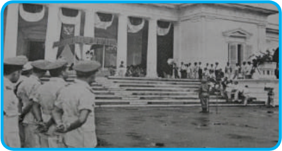

> **Deskripsi Visual:** Gambar ini adalah foto yang menunjukkan upacara peresmian bangunan atau gedung besar. Gambar ini menampilkan beberapa elemen penting:

1. **Pertama**: Gambar ini menunjukkan upacara peresmian bangunan atau gedung besar.
2. **Elemen Utama dan Relasinya**: 
   - **Orang-orang**: Ada beberapa orang yang sedang berdiri di depan bangunan, tampaknya sebagai tamu undangan atau pemimpin.
   - **Bangunan**: Bangunan tersebut tampak megah dengan ornamen yang indah dan pintu utama yang terbuka.
   - **Ornamen**: Ornamen-ornamen besar ditempatkan di atas bangunan, menambah keindahan dan kebesaran bangunan.
   - **Pintu Utama**: Pintu utama bangunan tampak terbuka, menunjukkan bahwa upacara telah dimulai atau akan dimulai.
   - **Orang-orang di Depan**: Orang-orang tampak berdiri dengan posisi yang rapi, menunjukkan bahwa upacara ini diadakan dengan serius dan resmi.

3. **Teks, Angka, atau Label Penting yang Terlihat**: 
   - Teks tidak terlihat dalam gambar ini, sehingga tidak ada informasi tertulis yang dapat dilihat.
   - Angka atau label penting juga tidak ada dalam gambar ini.

4. **Informasi Kunci yang Dapat Diambil Pembaca**: 
   - Upacara peresmian bangunan atau gedung besar sedang berlangsung.
   - Bangunan tersebut tampak megah dan indah, menunjukkan bahwa upacara ini penting dan signifikan.
   - Orang-orang yang hadir tampak berada dalam posisi yang rapi, menunjukkan bahwa upacara ini diadakan dengan serius dan resmi.

Dengan demikian, gambar ini menunjukkan upacara peresmian bangunan atau gedung besar yang dihadiri oleh beberapa tamu undangan atau pemimpin, dengan bangunan yang megah dan indah menjadi pusat perhatian.

Sumber:

Buku 30 Tahun Indonesia Merdeka

Demokrasi  terpimpin  merupakan  pembalikan  total  dari  proses  politik  yang berjalan pada masa demokrasi parlementer. Adapun karakteristik yang utama dari perpolitikan pada era demokrasi terpimpin sebagai berikut.

Pertama, mengaburnya sistem kepartaian. Kehadiran partai-partai politik bukan untuk mempersiapkan diri dalam rangka mengisi jabatan politik di pemerintah (karena pemilihan umum tidak pernah dijalankan), tetapi lebih merupakan elemen penopang dari tarik ulur kekuatan antara lembaga kepresidenan, Angkatan Darat ,dan Partai Komunis Indonesia.

Kedua, dengan  terbentuknya  Dewan  Perwakilan  Rakyat  Gotong  Royong, peranan  lembaga  legislatif  dalam  sistem  politik  nasional  menjadi  sedemikian lemah.  DPR-GR  tidak  lebih  hanya  merupakan  instrumen    politik  lembaga

 

---
## 📄 Halaman 70

kepresidenan. Proses rekrutmen politik untuk lembaga ini pun ditentukan oleh presiden.

Ketiga, hak  dasar  manusia  menjadi  sangat  lemah.  Kritik  dan  saran  dari lawan-lawan politik Presiden tidak banyak diberikan. Mereka tidak mempunyai keberanian untuk menentangnya.

Keempat, masa  demokrasi  terpimpin  membuat  kebebasan  pers  berkurang. Sejumlah surat kabar dan majalah dilarang terbit oleh pemerintah seperti misalnya Harian  Abadi yang  berafiliasi  dengan  Masyumi  dan Harian  Pedoman yang berafiliasi dengan PSI.

Kelima, sentralisasi  kekuasaan  semakin  dominan  dalam  proses  hubungan antara  pemerintah  pusat  dan  daerah.  Daerah-daerah  memiliki  otonomi  yang terbatas.

Dari lima karakter di atas, kita dapat menyimpulkan bahwa pada era demokrasi terpimpin  terdapat  penyimpangan-penyimpangan  terhadap  demokrasi.  Hal  ini tidak terlepas dari kondisi Indonesia yang baru merdeka.

### d. Pelaksanaan  Demokrasi di Indonesia pada Periode 1965 - 1998

Era  baru  dalam  pemerintahan  dimulai  setelah  melalui  masa  transisi  yang singkat yaitu antara tahun 1966 - 1968, ketika Jenderal Soeharto dipilih menjadi Presiden  Republik  Indonesia.  Era  yang  kemudian  dikenal  sebagai  Orde  Baru dengan  konsep Demokrasi  Pancasila. Visi  utama  pemerintahan  Orde  Baru  ini adalah untuk melaksanakan Pancasila dan UUD 1945 secara murni dan konsekuen dalam setiap aspek kehidupan masyarakat Indonesia.

Dengan visi tersebut, Orde Baru memberikan secercah harapan bagi rakyat Indonesia. Rakyat Indonesia mengharapkan adanya perubahan-perubahan politik menjadi lebih demokratis. Harapan tersebut tentu saja ada dasarnya. Orde Baru dipandang mampu mengeluarkan bangsa ini keluar dari keterpurukan.

Harapan rakyat tersebut tidak sepenuhnya terwujud. Karena, sebenarnya tidak ada perubahan yang substantif dari kehidupan politik Indonesia. Dalam perjalanan politik  pemerintahan  Orde  Baru,  kekuasaan  presiden  merupakan  pusat  dari seluruh proses politik di Indonesia. Lembaga kepresidenan merupakan pengontrol utama  lembaga  negara  lainnya,  baik  yang  bersifat  suprastruktur  (DPR,  MPR, DPA, BPK, dan MA) maupun yang bersifat infrastruktur (LSM, partai politik,

 

---
## 📄 Halaman 71

dan sebagainya). Selain itu juga, Presiden Soeharto mempunyai sejumlah legalitas yang tidak dimiliki oleh siapa pun seperti Pengemban Supersemar, Mandataris MPR, Bapak Pembangunan, dan Panglima Tertinggi ABRI.

Dari uraian di atas, kita dapat menggambarkan bahwa pelaksanaan Demokrasi  Pancasila  masih  jauh  dari harapan. Pelaksanaan nilai-nilai Pancasila secara murni dan konsekuen hanya dijadikan  alat politik  penguasa  belaka. Kenyataan yang terjadi Demokrasi Pancasila sama dengan kediktatoran. Untuk lebih jelasnya, berikut ini dipaparkan karakteristik Demokrasi Pancasila masa Orde Baru yang berdasarkan  pada  indikator  demokrasi yang telah dikemukakan sebelumnya.

Pertama, rotasi  kekuasaan  eksekutif boleh dikatakan sangat kecil terjadi. Kecuali pada jajaran yang lebih rendah, seperti gubernur, bupati/walikota, camat,  dan  kepala  desa.  Kalaupun  ada perubahan,  selama  pemerintahan  Orde Baru  hanya  terjadi  pada  jabatan  wakil presiden, sementara pemerintahan secara esensial masih tetap sama.

Kedua, rekrutmen politik bersifat tertutup.  Rekrutmen  politik  merupakan proses pengisian jabatan politik di dalam penyelenggaraan pemerintah negara,  baik  untuk  lembaga  eksekutif (pemerintah pusat maupun daerah), legislatif (MPR, DPR, dan DPRD) maupun  lembaga  yudikatif  (Mahkamah Agung).  Dalam  negara  yang  menganut

### Penanaman Kesadaran Berkonstitusi

Inti  dari  Demokrasi  Pancasila  adalah demokrasi yang berlandaskan Ke­ rakyatan yang dipimpin oleh hikmat kebijaksanaan dalam permusyawaratan/ perwakilan. Oleh karena itu, setiap warga  negara,  termasuk  kalian  harus memperhatikan hal­hal berikut.

- Tidak boleh memaksakan kehendak kepada orang lain.
- Mengutamakan musyawarah dalam mengambil keputusan untuk kepentingan bersama.
- Musyawarah untuk mencapai mufakat diliputi oleh semangat kekeluargaan.
- Menghormati dan menjunjung tinggi setiap keputusan yang dicapai sebagai hasil musyawarah.
- Dengan iktikad baik dan rasa tanggung jawab menerima dan melaksanakan hasil keputusan musyawarah.
- Di dalam musyawarah diutamakan kepentingan bersama di atas kepentingan pribadi dan golongan.
- Musyawarah dilakukan dengan akal sehat dan sesuai dengan hati nurani yang luhur.
- Keputusan yang diambil harus dapat dipertanggungjawabkan secara moral kepada Tuhan Yang Maha Esa, menjunjung tinggi harkat dan martabat manusia, nilai­nilai kebenaran dan keadilan mengutamakan persatuan dan kesatuan demi kepentingan bersama.
- Memberikan kepercayaan kepada wakil­wakil yang dipercayai untuk melaksanakan pemusyawaratan.

 

---
## 📄 Halaman 72

sistem pemerintahan yang demokratis, semua warga negara  yang mampu  dan memenuhi syarat  mempunyai peluang yang sama untuk mengisi jabatan politik tersebut. Akan  tetapi,  yang  terjadi  di  Indonesia  pada  masa  Orde  Baru,  sistem rekrutmen politik tersebut bersifat tertutup, kecuali anggota DPR yang berjumlah 400 orang dipilih melalui pemilihan umum. Pengisian jabatan tinggi negara seperti Mahkamah Agung,  Dewan  Pertimbangan  Agung,  dan  jabatan-jabatan  lainnya dalam  birokrasi  dikontrol  sepenuhnya  oleh  lembaga  kepresidenan.  Demikian juga dengan anggota badan legislatif. Anggota DPR sejumlah 100 orang dipilih melalui  proses  pengangkatan  dengan  surat  keputusan  presiden.  Sementara  itu dalam  kaitannya  dengan  rekrutmen  politik  lokal  (seperti  gubernur  dan  bupati/ walikota), masyarakat di daerah tidak mempunyai peluang untuk ikut menentukan pemimpin mereka. Kata akhir tentang siapa yang akan menjabat diputuskan oleh presiden. Jelas, sistem rekrutmen seperti itu sangat bertentangan dengan semangat demokrasi.

Ketiga, Pemilihan  Umum.  Pada  masa  pemerintahan  Orde  Baru,  pemilihan umum telah dilangsungkan sebanyak enam kali dengan frekuensi  yang  teratur setiap lima tahun sekali. Tetapi, kalau kita amati kualitas pelaksanaan pemilihan umum  tersebut  masih  jauh  dari  semangat  demokrasi.  Pemilihan  umum  tidak melahirkan persaingan yang sehat.

Keempat, pelaksanaan hak dasar warga negara. Sudah bukan menjadi rahasia umum lagi, bahwa dunia internasional sering menyoroti politik Indonesia berkaitan erat dengan perwujudan jaminan hak asasi manusia. Masalah   kebebasan pers sering muncul ke permukaan. Persoalan mendasar adalah selalu adanya campur tangan  birokrasi  yang  sangat  kuat.  Selama  pemerintahan  Orde  Baru,  sejarah pengekangan  kebebasan  pers  terulang  kembali  seperti  yang  terjadi  pada  masa Orde Lama. Beberapa media massa seperti Tempo , Detik , dan Editor dicabut surat izin penerbitannya atau dengan kata lain dibreidel setelah mereka mengeluarkan laporan investigasi tentang berbagai masalah penyelewengan yang dilakukan oleh pejabat-pejabat negara.

Selain  itu,  kebebasan  berpendapat  menjadi  barang  langka  dan  mewah. Pemerintah  melalui  kepanjangan  tangannya  (aparat  keamanan)  memberikan ruang  yang  terbatas  kepada  masyarakat  untuk  berpendapat.  Pemberlakuan Undang-Undang  Subversif  membuat  posisi  pemerintah  semakin  kuat  karena tidak ada kontrol dari rakyat. Rakyat menjadi takut untuk berpendapat mengenai

 

---
## 📄 Halaman 73

kebijakan yang diambil oleh pemerintah. Tidak jarang pemerintah memenjarakan dan mencekal orang-orang yang mengkritisi kebijakannya.

Keempat  indikator  di  atas  menjadi  catatan  hitam  perjalanan  demokrasi di  Indonesia.  Akankah  masa-masa  pahit  ini  kembali  terulang?  Jawabannya dikembalikan kepada semua elemen bangsa ini.

### e. Pelaksanaan Demokrasi di Indonesia pada Periode 1998 - sekarang

Penyimpangan-penyimpangan  yang  terjadi  pada  masa  pemerintahan  Orde Baru pada akhirnya membawa Indonesia pada krisis multidimensi yang diawali dengan badai krisis  moneter  yang  tidak  kunjung  reda.  Krisis  moneter  tersebut membawa akibat pada terjadinya krisis politik, tingkat kepercayaan rakyat terhadap pemerintah begitu kecil. Tidak hanya itu, kerusuhan-kerusuhan terjadi hampir di semua belahan bumi Nusantara ini. Akibatnya bisa ditebak, pemerintahan Orde Baru  di  bawah  pimpinan  Presiden  Soeharto  (meskipun  kembali  terpilih  dalam Sidang Umum MPR bulan Maret tahun 1998) terperosok ke dalam kondisi yang diliputi oleh berbagai tekanan politik, baik dari luar maupun dalam negeri. Dari dunia internasional, terutama Amerika Serikat, secara terbuka meminta Presiden Soeharto  mundur  dari  jabatannya  sebagai  presiden.  Dari  dalam  negeri,  timbul gerakan massa yang dimotori oleh mahasiswa menuntut Presiden Soeharto mundur dari  jabatannya.  Tekanan  dari  massa  mencapai  puncaknya  ketika  tidak  kurang dari 15.000 mahasiswa mengambil alih Gedung DPR/MPR yang mengakibatkan proses politik nasional  praktis lumpuh. Sekalipun Presiden Soeharto menawarkan berbagai  langkah,  antara  lain reshuffle (perombakan)  kabinet  dan  membentuk Dewan Reformasi, akan tetapi Presiden Soeharto tidak punya pilihan lain kecuali mundur dari jabatannya.

Akhirnya pada hari Kamis tanggal 21 Mei 1998, Presiden Soeharto bertempat di  Istana  Merdeka  Jakarta  menyatakan  berhenti  sebagai  Presiden  dan  dengan menggunakan pasal 8 UUD 1945, Presiden Soeharto segera mengatur agar Wakil Presiden Habibie disumpah sebagai penggantinya di hadapan Mahkamah Agung. DPR tidak dapat berfungsi karena gedungnya diambil alih oleh mahasiswa. Saat itu,  kepemimpinan  nasional  segera  beralih  dari  Soeharto  ke  Habibie.  Hal  ini merupakan jalan baru demi terbukanya proses demokratisasi di Indonesia. Kendati diliputi oleh kontroversi tentang status hukumnya, pemerintahan Presiden Habibie mampu bertahan selama satu tahun.

 

---
## 📄 Halaman 74

Dalam masa pemerintahan Presiden Habibie inilah muncul beberapa indikator pelaksanaan demokrasi di Indonesia. Pertama, diberikannya ruang kebebasan pers sebagai ruang publik untuk berpartisipasi dalam berbangsa dan bernegara. Kedua, diberlakukannya sistem multipartai dalam pemilu tahun 1999. Habibie dalam hal ini  sebagai  Presiden  Republik  Indonesia  membuka  kesempatan  kepada  rakyat untuk berserikat dan berkumpul sesuai dengan ideologi dan aspirasi politiknya.

Sumber:

kepustakaan-presiden.pnri.go.id

Gambar 2.6

Pelantikan BJ. Habibie sebagai Presiden RI ke-3

Dua hal yang dilakukan Presiden Habibie di atas merupakan fondasi yang kuat bagi pelaksanaan demokrasi Indonesia pada masa selanjutnya. Demokrasi yang diterapkan negara kita pada era reformasi ini adalah Demokrasi Pancasila. Tentu saja dengan karakteristik yang berbeda dengan Orde Baru dan sedikit mirip dengan demokrasi parlementer tahun 1950 - 1959. Pertama, pemilu yang dilaksanakan jauh lebih demokratis dari yang sebelumnya. Sistem pemilu yang terus berkembang memberikan jalan bagi rakyat untuk menggunakan hak politiknya dalam pemilu, bahkan puncaknya pada tahun 2004 rakyat dapat langsung memilih wakilnya di lembaga legislatif dan presiden/wakil presiden pun dipilih secara langsung. Tidak hanya itu, mulai tahun 2005 kepala daerah pun (gubernur dan bupati/walikota) dipilih  langsung  oleh  rakyat. Kedua, rotasi  kekuasaan  dilaksanakan  mulai  dari pemerintah pusat sampai pada tingkat desa. Ketiga, pola rekrutmen politik untuk

 

---
## 📄 Halaman 75

pengisian  jabatan  politik  dilakukan  secara  terbuka.  Setiap  warga  negara  yang mampu  dan  memenuhi  syarat  dapat  menduduki  jabatan  politik  tersebut  tanpa adanya diskriminasi. Keempat, sebagian besar hak dasar rakyat dapat terjamin seperti adanya kebebasan menyatakan pendapat, kebebasan pers, dan sebagainya.

Kondisi demokrasi Indonesia saat ini dapat diibaratkan sedang menuju ke arah kesempurnaan. Akan tetapi jalan terjal menuju itu tentu saja selalu menghadang. Tugas kita adalah mengawal demokrasi ini supaya teraplikasikan dalam seluruh aspek kehidupan.

### Tugas Mandiri 2.2

Setelah kalian memahami materi di atas, coba kalian buat kesimpulan mengenai karakteristik pelaksanaan demokrasi di Indonesia pada setiap periodenya. Tuliskan kesimpulan kalian dalam tabel di bawah ini.

---
**📊 Tabel**

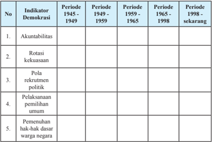

Tabel ini menunjukkan perkembangan demokrasi di Indonesia dari periode 1945 hingga sekarang, dengan fokus pada lima indikator: akuntabilitas, rotasi kekuasaan, pola rekrutmen politik, pelaksanaan pemilu, dan penuh hak-hak warga negara. Topik utama adalah perubahan demokrasi di Indonesia selama periode tersebut. Kolom-kolomnya mencakup periode 1945-1949, 1949-1959, 1959-1965, 1965-1998, dan periode sekarang. Data penting yang terlihat adalah bahwa akuntabilitas dan rotasi kekuasaan telah meningkat secara signifikan sejak 1949, sementara pola rekrutmen politik dan pelaksanaan pemilu masih belum mencapai standar yang diharapkan. Penuh hak-hak warga negara juga belum sepenuhnya terwujud.

 

---
## 📄 Halaman 76

### C. Membangun Kehidupan yang Demokratis di Indonesia

### 1. Pentingnya Kehidupan yang Demokratis

Setelah  kalian  membaca  dan  memahami  uraian  materi  sebelumnya,  coba kalian pikirkan apakah negara kita merupakan negara yang demokratis? Mengapa kehidupan  demokratis  itu  penting?  Nah,  untuk  menjawab  pertanyaan  tersebut, pahamilah uraian materi berikut ini.

Pada hakikatnya sebuah negara dapat disebut sebagai negara yang demokratis, apabila  di  dalam  pemerintahan  tersebut  rakyat    memiliki  persamaan  di  depan hukum,  memiliki kesempatan untuk berpartisipasi dalam pembuatan keputusan, dan memperoleh pendapatan yang layak karena terjadi distribusi pendapatan yang adil, serta memiliki kebebasan yang bertanggung jawab. Mari kita uraikan makna masing-masing.

### a. Persamaan kedudukan di muka hukum

Hukum itu mengatur bagaimana seharusnya penguasa bertindak, bagaimana  hak  dan  kewajiban  dari  penguasa  dan  juga  rakyatnya.  Rakyat memiliki  kedudukan  yang  sama  di  depan  hukum.  Artinya,  hukum  harus dijalankan  secara adil dan benar. Hukum tidak boleh pandang bulu. Siapa saja yang bersalah dihukum sesuai ketentuan yang berlaku. Untuk menciptakan hal  itu  harus  ditunjang  dengan  adanya  aparat  penegak  hukum  yang  tegas dan bijaksana, bebas dari pengaruh  pemerintahan yang berkuasa, dan berani menghukum siapa saja yang bersalah.

### b. Partisipasi dalam pembuatan keputusan

Dalam negara yang menganut sistem politik demokrasi, kekuasaan tertinggi berada di tangan rakyat dan pemerintahan dijalankan berdasarkan kehendak rakyat.  Aspirasi  dan  kemauan  rakyat  harus  dipenuhi  dan  pemerintahan dijalankan berdasarkan konstitusi yang merupakan arah dan pedoman dalam melaksanakan  hidup  bernegara.  Para  pembuat  kebijakan  memperhatikan seluruh aspirasi rakyat yang berkembang. Kebijakan yang dikeluarkan harus dapat  mewakili  berbagai  keinginan  masyarakat  yang  beragam.  Sebagai contoh,  ketika  rakyat  berkeinginan  kuat  untuk  menyampaikan  pendapat  di muka umum maka pemerintah dan DPR menetapkan undang-undang yang mengatur penyampaian pendapat di muka umum.

 

---
## 📄 Halaman 77

### c. Distribusi pendapatan secara adil

Dalam negara demokrasi, semua bidang dijalankan dengan berdasarkan prinsip  keadilan  termasuk  di  dalam  bidang  ekonomi.  Semua  warga  negara berhak memperoleh pendapatan yang layak. Pemerintah wajib memberikan bantuan kepada fakir dan miskin atau mereka yang berpendapatan rendah. Akhir-akhir ini pemerintah menjalankan program pemberian bantuan langsung  tunai.  Hal  tersebut  dilakukan  dalam  upaya  membantu  para  fakir miskin.    Pada  kesempatan  lain,  pemerintah  terus  giat  membuka  lapangan kerja  agar  masyarakat  dapat  memperoleh  penghasilan.  Dengan  programprogram tersebut diharapkan terjadi distribusi pendapatan yang adil di antara masyarakat Indonesia.

### d. Kebebasan yang bertanggung jawab

Dalam sebuah negara yang demokratis, terdapat empat kebebasan yang sangat  penting,  yaitu  kebebasan  beragama,  kebebasan  pers,  kebebasan mengeluarkan  pendapat,  dan  kebebasan  berkumpul.  Empat  kebebasan  ini merupakan  hak  asasi  manusia  yang  harus  dijamin  keberadaannya  oleh negara. Akan tetapi dalam pelaksanaannya mesti bertanggung jawab, artinya kebebasan yang dimiliki oleh setiap warga negara tidak boleh bertentangan dengan  norma-norma  yang  berlaku.  Dengan  kata  lain,  kebebasan  yang dikembangkan  adalah  kebebasan  yang  tidak  tak  terbatas,  yaitu  kebebasan yang dibatasi oleh aturan dan kebebasan yang dimiliki orang lain.

Setelah kalian memahami karakteristik negara yang demokratis, coba kalian bayangkan jika kalian tidak diperlakukan sama di depan hukum. Kalian tentunya merasa diperlakukan tidak adil dan kepercayaan kalian terhadap lembaga-lembaga peradilan  menjadi  menurun  atau  bahkan  tidak  ada.  Bayangkan  pula  apabila anggota  masyarakat  tidak  diberi  kesempatan  yang  sama  untuk  mendapatkan pekerjaan dan memperoleh penghidupan yang layak. Pengangguran akan semakin meningkat serta fakir miskin bertambah banyak jumlahnya dan mereka semakin terlantar kehidupannya.

Demikian  pula  halnya  dalam  kehidupan  sehari-hari    di  keluarga,  sekolah, dan  masyarakat.  Apa  yang  kalian  rasakan  seandainya  kalian  tidak  diberi kesempatan berbicara di  depan  orang  tua  kalian.  Segala  aturan  keluarga  harus kalian ikuti  tanpa  dimusyawarahkan terlebih dahulu. Jika di kelas kalian, guru tidak memberi kesempatan untuk bertanya, mengemukakan pendapat, berdiskusi

 

---
## 📄 Halaman 78

maka  pemahaman  kalian  terhadap  pelajaran  menjadi  kurang  optimal.  Dalam masyarakat, apabila penyelesaian perkara tidak dilakukan melalui musyawarah, maka masyarakat akan 'main hakim sendiri' dan pengambilan kebijakan dilakukan sewenang-wenang, akibatnya suasana  di  lingkungan  masyarakat  menjadi  tidak nyaman dan tidak aman.

Dalam  lingkup  kehidupan  berbangsa  dan  bernegara,  seandainya  tidak  ada pemilihan umum untuk memilih presiden dan wakil presiden, maka tentu saja tidak akan terwujud kebebasan warga negara untuk memilih pemimpinnya. Bayangkan pula  seandainya  warga  negara  tidak  diberi  kesempatan  untuk  berpartisipasi dalam pembuatan kebijakan pemerintah, maka kebijakan yang dibuat pemerintah cenderung  akan  sewenang-wenang.  Artinya,  kebijakan  tersebut  tidak  sesuai dengan aspirasi warga negara.

Berdasarkan  uraian  di  atas  dapat  dipahami  bahwa  kehidupan  demokratis penting dikembangkan dalam berbagai kehidupan. Seandainya kehidupan yang demokratis  tidak  terlaksana,  maka  asas  kedaulatan  rakyat  tidak  berjalan,  tidak ada jaminan hak-hak asasi manusia, tidak ada persamaan di depan hukum. Jika demikian tampaknya kita akan semakin jauh  dari tujuan mewujudkan masyarakat adil dan makmur berdasarkan Pancasila.

### Tugas Mandiri 2.3

Coba kalian amati dan rasakan bagaimana pelaksanaan karakteristik negara demokratis  di lingkungan keluarga, sekolah, masyarakat, dan negara. Tulislah jawaban kalian dalam tabel di bawah ini.

---
**📊 Tabel**

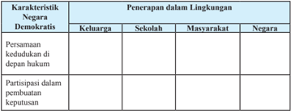

Tabel ini menunjukkan bagaimana negara-negara di berbagai tingkat masyarakat (keluarga, sekolah, masarakat, dan negara) menerapkan karakteristik negara demokratis, yaitu persamaan kedudukan dan partisipasi dalam pembuatan keputusan. Dalam keluarga, persamaan kedudukan sudah terwujud secara alami karena semua anggota keluarga memiliki hak dan tanggung jawab yang sama. Di sekolah, partisipasi dalam pembuatan keputusan lebih terbatas, dengan siswa hanya berperan sebagai penerima informasi dan pendidikan. Di masarakat, partisipasi menjadi lebih luas, tetapi masih terbatas oleh tingkat kesadaran politik dan akses informasi. Di tingkat negara, partisipasi paling luas dan melibatkan semua elemen masyarakat dalam proses pembuatan keputusan.

 

---
## 📄 Halaman 79

---
**📊 Tabel**

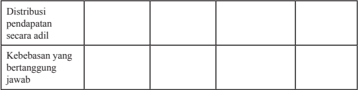

Tabel ini berisi informasi tentang dua aspek penting dalam sistem ekonomi dan hukum: distribusi pendapatan secara adil dan kebebasan yang bertanggung jawab. Topik utama tabel ini adalah tentang bagaimana sistem ekonomi harus meratakan pembagian pendapatan dan bagaimana masyarakat harus bertanggung jawab atas tindakannya. Dalam kolom pertama, ada dua baris kosong yang menunjukkan bahwa distribusi pendapatan secara adil dan kebebasan yang bertanggung jawab adalah dua aspek yang harus diperhatikan dalam sistem ekonomi. Kolom kedua dan ketiga kosong juga menunjukkan bahwa tidak ada data atau pola penting yang dapat diambil dari tabel ini.

### 2. Perilaku yang Mendukung Tegaknya Nilai-Nilai Demokrasi

Demokrasi tidak mungkin terwujud, jika tidak didukung oleh masyarakatnya. Pada  dasarnya  tumbuhnya  budaya  demokrasi  disebabkan  karena  rakyat  tidak senang  dengan  tindakan  yang  sewenang-wenang,  baik  dari  pihak  penguasa maupun dari rakyat sendiri. Oleh karena itu, kehidupan yang demokratis hanya mungkin  dapat  terwujud  ketika  rakyat  menginginkan    terwujudnya  kehidupan tersebut.

Bagaimana caranya supaya kita dapat menjalankan kehidupan yang demokratis? Untuk  menjalankan  kehidupan  demokratis,  kita  bisa  memulainya  dengan  cara menampilkan beberapa prinsip di bawah ini dalam kehidupan sehari-hari, yaitu:

- membiasakan diri untuk berbuat sesuai dengan aturan main atau hukum yang berlaku;
- membiasakan diri untuk bertindak demokratis dalam segala hal;
- membiasakan diri untuk menyelesaikan persoalan dengan musyawarah;
- membiasakan  diri  untuk  mengadakan  perubahan  secara  damai  tidak dengan kekerasan;
- membiasakan  diri  untuk  memilih  pemimpin  melalui  cara-cara  yang demokratis;
- selalu menggunakan akal sehat dan hati nurani dalam musyawarah;
- selalu  mempertanggungjawabkan  hasil  keputusan  musyawarah  kepada Tuhan Yang Maha Esa, masyarakat, bangsa, dan negara bahkan diri sendiri;
- menuntut hak setelah melaksanakan kewajiban;
- menggunakan kebebasan dengan rasa tanggung jawab;
- menghormati hak orang lain dalam menyampaikan pendapat;
- membiasakan diri memberikan kritik yang bersifat membangun.
Kalian  sebagai  generasi  penerus  bangsa  dan  sebagai  ujung  tombak  dalam usaha menegakkan nilai-nilai demokrasi, sudah semestinya mendemonstrasikan peran serta kalian dalam usaha mewujudkan kehidupan yang demokratis. Paling

 

---
## 📄 Halaman 80

tidak,  kalian  mencoba  membiasakan  hidup  demokratis  di  lingkungan  keluarga dan di lingkungan sekolah maupun masyarakat tempat kalian tinggal, sehingga pada  akhirnya  berkembang  menuju  kehidupan  berbangsa  dan  bernegara  yang demokratis.  Nah,  sekarang  coba  kalian  tuliskan  contoh-contoh  perilaku  kalian yang mencerminkan upaya menegakkan nilai-nilai demokrasi.

### a. Dalam kehidupan di lingkungan keluarga

- Tidak memaksakan kehendak kepada anggota keluarga yang lain
2)  ……………………………………………………………………………

3)  ……………………………………………………………………………

4)  ……………………………………………………………………………

5)  ……………………………………………………………………………

- Dalam kehidupan di lingkungan sekolah
- Aktif dalam kegiatan diskusi kelas
2)  ……………………………………………………………………………

3)  ……………………………………………………………………………

4)  ……………………………………………………………………………

5)  ……………………………………………………………………………

- Dalam kehidupan di lingkungan masyarakat
- Ikut serta dalam kegiatan kerja bakti membersihkan lingkungan
2)  ……………………………………………………………………………

3)  ……………………………………………………………………………

4)  ……………………………………………………………………………

5)  ……………………………………………………………………………

- Dalam kehidupan di lingkungan bangsa dan bernegara
- Mendukung kelancaran proses pemilihan umum
2)  ……………………………………………………………………………

3)  ……………………………………………………………………………

4)  ……………………………………………………………………………

5)  ……………………………………………………………………………

### Refleksi

Setelah  kalian  mempelajari  materi  demokrasi,  tentunya  kalian  semakin paham  betapa  pentingnya  mewujudkan  nilai-nilai  demokrasi  dalam  kehidupan

 

---
## 📄 Halaman 81

sehari-hari. Coba kalian renungkan. Sudah sejauhmanakah kalian melaksanakan nilai-nilai demokrasi dalam kehidupan sehari-hari? Coba uraikanlah dalam satu paragraf perwujudan nilai-nilai demokrasi yang kalian lakukan dalam kehidupan sehari-hari.

……………………………………………………………………………………

……………………………………………………………………………………

……………………………………………………………………………………

……………………………………………………………………………………

……………………………………………………………………………………

……………………………………………………………………………………

……………………………………………………………………………………

### Rangkuman

### 1. Kata Kunci

Kata  kunci  yang  harus  kalian  pahami  dalam  mempelajari  materi pada bab ini adalah demokrasi, prinsip demokrasi, dan Demokrasi Pancasila.

### 2. Intisari Materi

- Dalam  pandangan  Abraham  Lincoln,  demokrasi  adalah  suatu sistem pemerintahan dari rakyat, oleh rakyat, dan untuk rakyat. Artinya,  rakyat  dengan  serta  merta  mempunyai  kebebasan untuk melakukan semua aktivitas kehidupan termasuk aktivitas politik tanpa adanya tekanan dari pihak mana pun, karena pada hakikatnya  yang  berkuasa  adalah  rakyat  untuk  kepentingan bersama.
- Pada umumnya menurut Henry B. Mayo demokrasi mengandung prinsip-prinsip sebagai berikut, menyelesaikan perselisihan dengan  damai  dan  melembaga;  menjamin  terselenggaranya perubahan secara  damai  dalam  suatu  masyarakat  yang  sedang berubah; menyelenggarakan pergantian pimpinan secara teratur;  menghindari  penggunaan  kekerasan;  mengakui  serta menganggap  wajar  adanya  keanekaragaman;  dan  menjamin tegaknya keadilan.

 

---
## 📄 Halaman 82

- Inti dari Demokrasi  Pancasila adalah sila keempat, yaitu Kerakyatan  yang  dipimpin  oleh  hikmat  kebijaksanaan  dalam permusyawaratan/perwakilan. Jadi, Demokrasi Pancasila adalah demokrasi yang dikendalikan oleh dua nilai yaitu nilai hikmat dan nilai bijak.
- Pada  hakikatnya  sebuah  negara  dapat  disebut  sebagai  negara yang demokratis apabila di dalam pemerintahan tersebut rakyat memiliki persamaan di muka hukum,  memiliki kesempatan untuk berpartisipasi  dalam  pembuatan  keputusan,  dan  memperoleh pendapatan yang layak melalui distribusi pendapatan yang adil.

### Penilaian Diri

### 1. Penilaian Sikap

Nah, coba sekarang kalian amati diri masing-masing. Apakah perilaku kalian telah  mencerminkan  warga  negara  yang  baik  atau  belum?  Mari  berbuat  jujur dengan mengisi daftar perilaku di bawah ini dengan membubuhkan tanda ceklist ( ✓ ) pada kolom selalu, sering, kadang-kadang, dan tidak pernah.

---
**📊 Tabel**

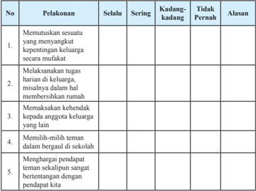

Tabel ini berisi informasi tentang perilaku anak dalam menghormati dan memperlakukan anggota keluarga dengan baik. Topik utamanya adalah tentang bagaimana anak-anak menghormati dan memperlakukan anggota keluarga mereka. Kolom-kolomnya meliputi "Selalu", "Sering", "Kadang-kadang", dan "Tidak Pernah". Data penting yang terlihat adalah bahwa anak-anak sering melakukan semua perilaku tersebut, sedangkan mereka kadang-kadang tidak melakukan beberapa perilaku seperti memutuskan sesuatu yang menyangkut kepentingan keluarga secara mufakat. Ini menunjukkan bahwa anak-anak sering menghormati dan memperlakukan anggota keluarga mereka dengan baik, tetapi masih ada kesempatan untuk meningkatkan perilaku mereka dalam hal-hal tertentu.

 

---
## 📄 Halaman 83

---
**📊 Tabel**

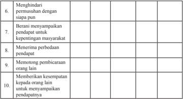

Tabel ini berisi 10 poin yang mungkin merupakan bagian dari sebuah skala atau kriteria untuk menilai tingkat partisipasi atau partisipan dalam suatu proses. Topik utamanya berkisar pada aspek-aspek yang penting dalam partisipasi sosial dan demokratis. Kolom-kolomnya mencakup berbagai aspek seperti menghindari permasalahan dengan siapa pun, berani menyampaikan pendapat untuk kepentingan masyarakat, menerima perbedaan pendapat, memotong pembicaraan orang lain, dan memberikan kesempatan kepada orang lain untuk menyampaikan pendapatnya. Data atau pola penting yang terlihat adalah bahwa setiap poin memiliki kolom kosong di bawahnya, yang mungkin berarti bahwa informasi atau penilaian tentang setiap poin tersebut belum disediakan atau belum diperiksa.

Apabila  jawaban  kalian  'kadang-kadang'  atau  'tidak  pernah'  pada  kolom perilaku-perilaku tersebut di atas, kalian sebaiknya mulai mengubah sikap dan perilaku  kalian  agar  menjadi  lebih  baik.  Sebaliknya,  apabila  jawaban  kalian 'selalu'  atau  'sering',  pertahankanlah  dan  wujudkan  sikap  tersebut  dalam kehidupan sehari-hari.

### 2. Pemahaman Materi

Dalam mempelajari materi pada bab ini, tentu saja ada materi yang dengan mudah kalian pahami, ada juga yang sulit kalian pahami. Oleh karena itu, lakukanlah penilaian diri atas pemahaman kalian terhadap materi pada bab ini dengan memberikan tanda ceklist ( ✓ )  pada kolom paham sekali, paham sebagian, dan belum paham.

---
**📊 Tabel**

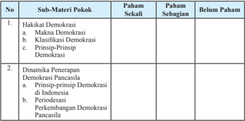

Tabel ini memuat informasi tentang pemahaman siswa terhadap sub-materi pokok dalam pembelajaran demokrasi di Indonesia. Topik utama adalah hakikat demokrasi dan dinamika penerapan demokrasi Pancasila. Kolom "Paham Sekali" menunjukkan tingkat pemahaman siswa yang sangat baik, sedangkan "Paham Sebagian" menunjukkan tingkat pemahaman yang sedang. Kolom "Belum Paham" menunjukkan tingkat pemahaman yang masih rendah. Data penting yang terlihat adalah bahwa sebagian besar siswa memiliki pemahaman yang cukup baik terhadap hakikat demokrasi, tetapi masih banyak yang belum sepenuhnya memahami prinsip-prinsip demokrasi di Indonesia dan perkembangan demokrasi Pancasila. Ini menunjukkan bahwa masih ada ruang untuk peningkatan pemahaman dan pemahaman lebih mendalam tentang demokrasi di Indonesia.

 

---
## 📄 Halaman 84

- Membangun Kehidupan yang Demokrasi  di Indonesia
- Pentingnya Kehidupan yang Demokratis
- Perilaku yang Mendukung Tegaknya Nilai-Nilai Demokrasi
Apabila pemahaman kalian berada pada kategori paham sekali mintalah materi  pengayaan  kepada  guru  untuk  menambah  wawasan  kalian. Apabila pemahaman kalian berada pada kategori paham sebagian dan belum paham coba bertanyalah kepada guru serta mintalah penjelasan lebih lengkap, supaya kalian cepat memahami materi pembelajaran yang sebelumnya kurang atau belum dipahami.

### Proyek Kewarganegaraan

### Mari Mengobservasi

### Aturan Main

- Kerjakanlah tugas ini di luar proses pembelajaran.
- Amatilah  kehidupan  masyarakat  di  sekitar  tempat  tinggal.  Kemudian identifikasilah kegiatan-kegiatan rutin dilaksanakan yang mencerminkan pelaksanaan nilai-nilai demokrasi.
- Tulislah  hasil  pengamatan kalian dengan menuliskannya dalam tabel di bawah ini, serta laporkanlah hasil pekerjaan kalian kepada guru kalian.

---
**📊 Tabel**

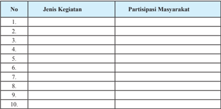

Tabel ini berisi informasi tentang partisipasi masyarakat dalam berbagai jenis kegiatan. Kolom pertama menunjukkan nomor urut kegiatan, sedangkan kolom kedua menunjukkan jenis kegiatan tersebut. Data dalam tabel ini menunjukkan bahwa partisipasi masyarakat sangat tinggi dalam beberapa kegiatan, seperti kegiatan sosial, edukasi, dan olahraga. Namun, untuk beberapa kegiatan lainnya, partisipasi masyarakat lebih rendah. Ini menunjukkan bahwa partisipasi masyarakat dapat bervariasi tergantung pada jenis kegiatan yang dilakukan.

 

---
## 📄 Halaman 85

### Uji Kompetensi Bab 2

### Jawablah pertanyaan di bawah ini secara singkat, jelas, dan akurat.

- Apa yang dimaksud dengan demokrasi?
- Jelaskan macam-macam demokrasi!
- Jelaskan soko guru Demokrasi universal!
- Jelaskan bahwa nilai demokrasi Pancasila lebih unggul jika dibandingkan dengan demokrasi lainnya!
- Buktikan bahwa negara Indonesia adalah negara demokratis, baik secara normatif maupun empirik!
- Kemukakan prinsip-prinsip yang perlu dilaksanakan untuk mewujudkan kehidupan yang demokratis!

 

---
## 📄 Halaman 86

### Sistem Hukum dan Peradilan d i Indonesia

Selamat ya, kalian akan mempelajari bab tiga dari buku ini. Setelah mempelajari dua  bab  sebelumnya,  tentunya  pengetahuan  dan  pemahaman  kalian  semakin meningkat. Hal tersebut tentu saja harus diikuti pula oleh sikap dan perilaku kalian yang semakin baik. Pada bab ini kalian akan diajak untuk menganalisis sistem hukum dan peradilan di Indonesia berdasarkan Undang-Undang Dasar Negara Republik Indonesia Tahun 1945.

Perhatikanlah gambar di bawah ini.

www.primaironline.com

Gambar 3.1 Gedung pengadilan sebagai salah satu tempat bagi setiap warga negara yang mencari keadilan

Pengadilan  Negeri  merupakan  salah  satu  wujud  dari  kekuasaan  kehakiman yang  berlaku  di  Indonesia.  Kekuasaan  kehakiman  merupakan  elemen  penting dalam konsep negara hukum yang diberlakukan di Indonesia.

Konsekuensi  dari  ditetapkannya  negara  kita  sebagai  negara  hukum  adalah bahwa segala kehidupan kenegaraan selalu berdasarkan kepada hukum. Untuk menjaga dan mengawasi bahwa hukum itu berlaku dengan efektif tanpa adanya

 

---
## 📄 Halaman 87

pelanggaran-pelanggaran  serta  menegakkan  keadilan,  maka  di  negara  kita dibentuklah lembaga peradilan. Lembaga peradilan merupakan sarana bagi semua pencari keadilan untuk mendapatkan perlakuan yang semestinya di depan hukum.

### A. Sistem Hukum di Indonesia

### 1. Makna dan Karakteristik Hukum

Seorang  filsuf  pernah  mengatakan  bahwa  hukum  itu  ibarat  pagar  di  kebun binatang. Mengapa orang berani pergi berkunjung ke kebun binatang? Karena ada pagar yang membatasi antara liarnya kehidupan binatang dengan para pengunjung. Jika tidak ada pagar yang memisahkan pengunjung dengan binatang, tentu saja tidak akan ada orang yang berani masuk ke kebun binatang. Para pengunjung dapat menikmati kehidupan binatang dengan aman karena ada pagar yang membatasi mereka dengan binatang buas tersebut.

Demikianlah  hukum  itu  pada  hakikatnya  merupakan  pagar  pembatas,  agar kehidupan manusia aman dan damai. Coba bayangkan jika seandainya di negara kita ini tidak ada hukum. Dapat diperkirakan, kesemrawutan akan terjadi dalam segala hal, mulai dari kehidupan pribadi sampai pada kehidupan berbangsa dan bernegara. Sebagai contoh, kalau seandainya  tidak ada peraturan lalu lintas, kita tidak  akan  dapat  memperkirakan  ke  arah  mana  seorang  pengendara  kendaraan bermotor akan berjalan, di sebelah kiri atau kanan. Pada saat lampu  menyala merah apakah pengendara akan berhenti atau jalan? Dengan adanya peraturan lalu lintas, maka para pengendara kendaraan bermotor harus berjalan di sebelah kiri. Jika  lampu pengatur lalu lintas berwarna merah, maka semua kendaraan harus berhenti. Arus lalu lintas menjadi tertib dan keselamatan orang pun dapat terjamin.

 

---
## 📄 Halaman 88

Dari uraian di atas kita dapat menarik kesimpulan bahwa hukum itu merupakan aturan,  tata  tertib, dan kaidah  hidup. Akan  tetapi,  sampai  saat  ini  belum  ada kesepakatan  yang  pasti  tentang  rumusan  arti  hukum.  Untuk  merumuskan pengertian hukum tidaklah mudah, karena hukum itu  meliputi banyak segi dan bentuk sehingga satu pengertian tidak mungkin mencakup  keseluruhan segi dan bentuk hukum.

Selain itu, setiap orang  atau ahli akan  memberikan arti yang berlainan sesuai dengan sudut pandang masing-masing yang akan menonjolkan  segi-segi tertentu dari  hukum.  Hal  ini  sesuai  dengan  pendapat  Van  Apeldorn  bahwa  'definisi tentang  hukum    adalah  sangat  sulit  untuk  dibuat  karena  tidak  mungkin  untuk mengadakannya  sesuai  kenyataan'.  Akan  tetapi  meskipun  sulit  merumuskan definisi yang baku mengenai hukum,  di dalam hukum terdapat beberapa unsur, di antaranya sebagai berikut.

- Peraturan mengenai tingkah laku manusia dalam pergaulan masyarakat.
- Peraturan itu dibuat dan ditetapkan oleh badan-badan resmi yang berwajib.
- Peraturan itu bersifat memaksa.
- Sanksi terhadap pelanggaran peraturan tersebut adalah tegas.
Adapun yang menjadi karakteristik dari hukum adalah adanya perintah dan larangan; perintah atau larangan tersebut harus dipatuhi oleh semua orang.

Hukum berlaku di masyarakat  dan ditaati oleh masyarakat  karena hukum memiliki sifat memaksa dan mengatur. Hukum dapat memaksa seseorang untuk menaati tata tertib yang berlaku di dalam masyarakat  dan terhadap orang yang tidak  menaatinya  akan  diberikan  sanksi  yang  tegas.  Dengan  demikian,  suatu ketentuan hukum mempunyai tugas berikut.

- Menjamin kepastian hukum bagi setiap orang di dalam masyarakat.
- Menjamin ketertiban, ketenteraman, kedamaian, keadilan, kemakmuran, kebahagian, dan kebenaran.
- Menjaga  jangan  sampai  terjadi  perbuatan  'main  hakim  sendiri'  dalam pergaulan masyarakat.

### Tugas Mandiri 3.1

- Bacalah sumber belajar lain baik yang berasal dari media cetak maupun online yang berkaitan dengan pengertian hukum. Carilah tiga pengertian hukum  menurut  para  pakar.  Tuliskan  dalam  tabel  di  bawah  ini  dan presentasikan di hadapan teman-teman yang lain.

 

---
## 📄 Halaman 89

No.

1.

2.

3.

- Berdasarkan pengertian-pengertian hukum tersebut, simpulkanlah persamaan dan perbedaan rumusan pengertian hukum  yang diungkapkan para  pakar  yang  kalian  temukan.  Kemudian,  coba  kalian  rumuskan pengertian hukum berdasarkan pemahaman kalian sendiri.
.......................................................................................................................

.......................................................................................................................

.......................................................................................................................

.......................................................................................................................

.......................................................................................................................

.......................................................................................................................

.......................................................................................................................

### 1. Penggolongan  Hukum

Hukum  mengatur  seluruh  aspek  kehidupan  manusia.  Mengingat  aspek kehidupan manusia sangat luas, sudah barang tentu ruang lingkup atau cakupan hukum pun begitu luas. Untuk itu, perlu dilakukan penggolongan atau pengklasifikasian.

Berdasarkan  kepustakaan  ilmu  hukum,  hukum  dapat  digolongkan  sebagai berikut.

### a. Berdasarkan sumbernya

- Hukum undang-undang, yaitu hukum yang tercantum dalam peraturan perundang-undangan.
- Hukum  kebiasaan,  yaitu  hukum  yang  terletak  dalam  aturan-aturan kebiasaan.
- Hukum traktat, yaitu hukum yang ditetapkan oleh negara-negara di dalam suatu perjanjian antarnegara (traktat).
- Hukum  yurisprudensi,  yaitu  hukum  yang  terbentuk  karena  keputusan hakim.
Nama Pakar

Rumusan Pengertian Hukum

 

---
## 📄 Halaman 90

### b. Berdasarkan tempat  berlaku­ nya

- 1).  Hukum nasional, yaitu hukum yang berlaku dalam wilayah suatu negara tertentu.
- 2).  Hukum internasional, yaitu hukum yang mengatur hubungan hukum antarnegara dalam dunia internasional.  Hukum internasional berlakunya secara universal, baik secara keseluruhan maupun terhadap negaranegara yang mengikatkan dirinya pada suatu perjanjian internasional (traktat).
- 3).  Hukum asing, yaitu hukum yang berlaku dalam wilayah negara lain.
Keputusan hakim sebagai salah satu sumber hukum

### Info Kewarganegaraan

Kodifikasi adalah pembukuan jenis-jenis hukum tertentu dalam kitab undangundang secara sistematis dan lengkap dengan tujuan untuk memperoleh kepastian hukum, penyederhanaan hukum, dan kesatuan hukum. Contoh kodifikasi hukum.

### a. Di Eropa

- Corpus Iuris Civilis (mengenai hukum perdata) yang diusahakan oleh Kaisar Justinianus pada tahun 527-565
- Code Civil (mengenai hukum perdata) yang diusahakan oleh Kaisar Napoleon pada tahun 1604

### b. Di Indonesia

- Kitab Undang-Undang Hukum Sipil (1 Mei 1848)
- Kitab Undang-Undang Hukum Dagang (1 Mei 1848)
- Kitab Undang-Undang Hukum Pidana (1 Januari 1918)
- 4).  Hukum  gereja,  yaitu  kumpulan-kumpulan  norma  yang  ditetapkan  oleh gereja untuk para anggotanya

 

---
## 📄 Halaman 91

### c. Berdasarkan bentuknya

- Hukum tertulis, yang dibedakan atas dua macam berikut
- Hukum  tertulis  yang  dikodifikasikan,  yaitu  hukum  yang  disusun secara  lengkap,  sistematis,  teratur,  dan  dibukukan  sehingga  tidak perlu  lagi  peraturan  pelaksanaan.  Misalnya,  KUH  Pidana,  KUH Perdata, dan KUH Dagang.
- Hukum tertulis  yang  tidak  dikodifikasikan  yaitu  hukum  yang  meskipun tertulis,  tetapi  tidak  disusun  secara  sistematis,  tidak  lengkap,  dan masih terpisah-pisah sehingga sering masih memerlukan peraturan pelaksanaan dalam penerapan. Misalnya undang-undang, peraturan pemerintah, dan keputusan presiden.
- Hukum tidak tertulis, yaitu hukum yang hidup dan diyakini oleh warga masyarakat serta  dipatuhi  dan  tidak  dibentuk  menurut  prosedur  formal, tetapi lahir dan tumbuh di kalangan masyarakat itu sendiri.

### d. Berdasarkan waktu berlakunya

- Ius Constitutum (hukum positif), yaitu hukum yang berlaku sekarang bagi suatu masyarakat tertentu dalam suatu daerah tertentu. Misalnya, UndangUndang  Dasar  Republik  Indonesia  Tahun  1945,  Undang-Undang  RI Nomor 12 Tahun 2006 tentang Kewarganegaraan Republik Indonesia.
- Ius Constituendum (hukum negatif), yaitu hukum yang diharapkan berlaku pada waktu yang akan datang. Misalnya, rancangan undang-undang (RUU).

### e. Berdasarkan cara mempertahankannya

- Hukum material, yaitu hukum yang mengatur hubungan antara anggota masyarakat  yang  berlaku  umum  tentang  hal-hal  yang  dilarang  dan dibolehkan  untuk  dilakukan.  Misalnya,  hukum  pidana,  hukum  perdata, hukum dagang, dan sebagainya.
- Hukum formal, yaitu hukum yang mengatur bagaimana cara mempertahankan dan melaksanakan hukum material. Misalnya, Hukum Acara Pidana (KUHAP), Hukum Acara Perdata, dan sebagainya.

### f. Berdasarkan sifatnya

- Hukum  yang  memaksa,  yaitu  hukum  yang  dalam  keadaan  bagaimana pun  juga  harus  dan  mempunyai  paksaan  mutlak.  Misalnya,  melakukan pembunuhan maka sanksinya secara paksa wajib dilaksanakan.

 

---
## 📄 Halaman 92

- Hukum yang mengatur, yaitu hukum yang dapat dikesampingkan  apabila pihak-pihak  yang  bersangkutan  telah  membuat  peraturan  sendiri  dalam suatu perjanjian. Atau dengan kata lain, hukum yang mengatur hubungan antarindividu yang baru berlaku apabila yang bersangkutan tidak menggunakan alternatif lain  yang dimungkinkan oleh hukum (undangundang).  Misalnya,  ketentuan  dalam  pewarisan ab­intesto (pewarisan berdasarkan undang-undang), baru mungkin bisa dilaksanakan jika tidak ada surat wasiat (testamen).

### g. Berdasarkan wujudnya

- Hukum objektif, yaitu hukum yang mengatur hubungan antara dua orang atau  lebih  yang  berlaku  umum.  Dengan  kata  lain,  hukum  dalam  suatu negara  yang  berlaku  umum  dan  tidak  mengenai  orang  atau  golongan tertentu.
- Hukum  subjektif,  yaitu  hukum  yang  timbul  dari  hukum  objektif  dan berlaku terhadap seorang atau lebih. Hukum subjektif sering juga disebut hak.

### h. Berdasarkan isinya

- Hukum  publik,  yaitu  hukum  yang  mengatur  hubungan  antara  negara dengan individu (warga negara), menyangkut kepentingan umum (publik). Hukum publik terbagi atas:
- Hukum Pidana, yaitu mengatur tentang pelanggaran dan kejahatan, memuat larangan dan sanksi.
- Hukum Tata Negara, yaitu mengatur hubungan antara negara dengan bagian-bagiannya.
- Hukum  Tata  Usaha  Negara  (administratif),  yaitu  mengatur  tugas kewajiban pejabat negara.
- Hukum Internasional, yaitu mengatur hubungan antar negara, seperti hukum  perjanjian  internasional,  hukum  perang  internasional,  dan sebagainya.
- Hukum privat (sipil), yaitu hukum yang mengatur hubungan antara individu satu dengan individu lain, termasuk negara sebagai pribadi. Hukum privat terbagi atas:

 

---
## 📄 Halaman 93

- Hukum Perdata, yaitu hukum yang mengatur hubungan antarindividu secara  umum.  Contoh,  hukum  keluarga,  hukum  kekayaan,  hukum waris, hukum perjanjian, dan hukum perkawinan.
- Hukum Perniagaan (dagang), yaitu hukum yang mengatur hubungan antarindividu dalam perdagangan. Contoh, hukum tentang jual beli, hutang piutang, pendirian perusahaan dagang, dan sebagainya.

### Tugas Kelompok 3.1

Carilah dua buah kasus hukum dari surat kabar atau media online . Kemudian, tentukan kasus yang kalian temukan termasuk ke dalam jenis hukum yang mana. Jangan lupa berikan alasannya dan komunikasikan kepada kelompok yang lain di depan kelas.

### Tugas Mandiri 3.2

Temukanlah kata-kata/konsep  yang berkaitan dengan penggolongan hukum pada kotak huruf di bawah ini.

---
**📊 Tabel**

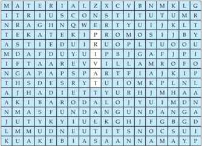

Tabel ini menunjukkan daftar materi pelajaran yang digunakan dalam sebuah kelas. Kolom pertama berisi nama-nama materi seperti "MATERIA", "ALZ", "XYZ", "C", "VBN", "NM", "KLG", dan "G". Baris pertama berisi nama-nama subjek seperti "TRIUSCON", "STITUTUM", "RAGHNQWERTYUIJ", "TEKATEIKPROMOSIJ", "ASTIEDUIRUOPLTUOOU", "MADFADUYUIPBJGAF", "FTAAAREVVII", "NGAPAPPSPARTFFIAJK", "THSDESRYTUOMKP", "AJHADIEETTYURHJM", "AKIBARODALOJUYIMDN", "NMASFUNDAUNGANDANGA", "JUTYKYIULKHJEGBG", "LMMUDNEUTTYSNOCS", "KUAKEBBIASANNA", dan "AMYP". Dari tabel ini, dapat dilihat bahwa setiap materi memiliki beberapa subjek yang berbeda, yang mungkin merupakan bagian dari pembelajaran yang lebih lanjut atau sub-topik dari materi tersebut.

 

---
## 📄 Halaman 94

Tuliskanlah kata-kata/konsep yang telah kalian temukan, serta carilah contohnya.

---
**📊 Tabel**

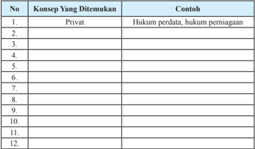

Tabel ini berisi daftar konsep hukum yang ditemukan dalam buku pelajaran, dengan kolom "No." untuk nomor urutan, "Konsep Yang Ditemukan" untuk nama konsep, dan "Contoh" untuk contoh-contoh yang berkaitan dengan konsep tersebut. Topik utama tabel ini adalah hukum-hukum yang terkait dengan aspek-aspek privat, seperti hukum perdata dan hukum perniagaan. Data penting yang terlihat adalah bahwa tabel ini mencakup 12 konsep hukum yang berbeda, masing-masing dengan contoh yang relevan. Ini menunjukkan bahwa pembelajaran tentang hukum privat dalam buku pelajaran ini dilakukan secara sistematis dan meliputi berbagai aspek hukum yang berkaitan dengan aspek-aspek privat.

### 3. Tujuan Hukum

Baca dan cermati berita di bawah ini.

### Polisi Ringkus Dua Begal Motor

DEPOK  -  Anggota  Polsek  Sukmajaya  meringkus  dua  pembegal sepeda motor. Masing-masing berinisial D (19) dan IS (18). Mereka dibekuk  di  wilayah  Boulevard  Kota  Kembang,  Grand  Depok  City (GDC), Kecamatan Cilodong, Kota Depok, Minggu (1/2) dini hari. Penangkapan dilakukan saat pelaku hendak beraksi terhadap seorang laki-laki dan seorang perempuan yang sedang duduk di pinggir jalan GDC. Saat itu, terdapat tiga sepeda motor berputar-putar. Salah satu pelaku  mengancam  dengan  mengacungkan  senjata  tajam  ke  arah korban. Selanjutnya, pelaku berusaha membawa kabur motor korban, setelah korban diancam akan dibacok.

'Pada saat bersamaan, korban berteriak minta tolong. Anggota Buru Sergap (Buser) Polsek Sukmajaya yang sebelumnya sudah melakukan pengintaian terkait maraknya pelaku begal pengendara sepeda motor menangkap penjahat tersebut,'  tutur  Kapolresta  Depok,  Komisaris Besar Ahmad Subarkah, Minggu siang.

Menurut  Subarkah,  pelaku  D  berusaha  melawan  menggunakan senjata tajam jenis sangkur saat hendak ditangkap. Hal itu membuat

 

---
## 📄 Halaman 95

polisi  akhirnya  mengeluarkan  tembakan  peringatan,  selanjutnya menyergap dua pelaku. Hingga saat ini, pembegal motor yang sudah diringkus  menjadi  tiga  orang.  Sebelumnya  tersangka  Masduki, yang  juga  beraksi  di  wilayah  Tangerang,  ditangkap  di  Jalan  KSU Kecamatan Sukmajaya.

### Marak

Sebelumnya,  Sabtu  (31/1)  dini  hari,  pembegal  juga  menggasak motor seorang perempuan pedagang sayur-mayur bernama Kartumi (32)  di  Jalan  Raya  Krukut,  Kecamatan  Limo,  Kota  Depok.  Selain kehilangan sepeda motor Jupiter MX bernomor polisi B 6003 GZB, korban dijatuhkan ke sungai. Pelaku begal yang berjumlah lima orang menodongkan senjata tajam kepada korban. 'Saya sempat ditodong senjata  tajam  dan  didorong  ke  sungai,'  ujar  Kartumi  saat  melapor ke petugas Sentra Pelayanan Kepolisian (SPK) Polres Kota Depok, Sabtu.

Meski  sempat  ditodong  dan  didorong  ke  sungai,  Kartumi  masih selamat. Namun, ia harus kehilangan sepeda motornya yang dibawa kabur kawanan pelaku begal yang berjumlah sekitar lima orang.

Kejadian yang dialami Kartumi menambah panjang daftar pembegalan di Kota Depok selama Januari 2015. Sebelumnya, telah terjadi dua peristiwa  serupa.  Keduanya  mengakibatkan  korban  tewas.  Para korban yang tewas di Jalan Juanda dan Jalan Margonda Raya adalah pemilik  motor  yang  mencoba  melawan  untuk  mempertahankan sepeda motornya.

Maraknya kasus begal sepeda motor di Depok akhir-akhir ini menjadi pembicaraan  hangat  di  kalangan  warga.  Tidak  sedikit  masyarakat yang takut menggunakan sepeda motor pada malam hari. Padahal, beberapa waktu lalu, Polresta Depok mengklaim, saat ini pihaknya telah  meningkatkan  jumlah  personel  untuk  patroli  malam  hari. 'Warga tidak perlu takut karena polisi sudah menyebarkan anggota, baik yang berpakaian dinas maupun pakaian biasa, di sejumlah lokasi yang  kami  nilai  rawan,'  ucap  Kepala  Urusan  Subbagian  Humas Polresta Depok, Inspektur Dua (Ipda) Bagus Suwandi.

Meski demikian, Bagus mengimbau, warga pengguna sepeda motor sebaiknya menghindari berhenti di tempat-tempat sepi pada malam hari.  Kalaupun  terpaksa  harus  berhenti,  diharuskan  mencari  lokasi yang ramai dengan keberadaan warga lain.

Sumber :

http://sinarharapan.co/news/read/150202021/

 

---
## 📄 Halaman 96

Setelah kalian membaca wacana di atas, jawablah pertanyaan-pertanyaan di bawah ini.

- Bagaimana perasaan kalian setelah membaca wacana tersebut?
.................................................................................................................

.................................................................................................................

.................................................................................................................

.................................................................................................................

.................................................................................................................

- Menurut kalian, apa yang menyebabkan terjadinya kasus tersebut?
.................................................................................................................

.................................................................................................................

.................................................................................................................

.................................................................................................................

.................................................................................................................

- Apa saja aturan yang dilanggar oleh pelaku pembegalan tersebut?
.................................................................................................................

.................................................................................................................

.................................................................................................................

.................................................................................................................

.................................................................................................................

- Bagaimana solusi yang dapat kalian ajukan kepada pihak kepolisian untuk mencegah terulangnya kasus tersebut?
.................................................................................................................

.................................................................................................................

.................................................................................................................

.................................................................................................................

.................................................................................................................

Aksi  para  begal  motor  merupakan  salah  satu  bentuk  pelanggaran  hukum yang sangat meresahkan masyarakat. Kita patut mengapresiasi atau memberikan penghargaan  kepada  para  petugas  kepolisian  yang  berhasil  meringkus  para pembegal  motor  tersebut  sehingga  ketenteraman  dan  ketertiban  di  masyarakat betul-betul dapat terwujud.

Keberhasilan  para  petugas  kepolisian  tersebut  merupakan  perwujudan  dari tujuan adanya hukum. Apa sebenarnya yang menjadi tujuan hukum itu? Tujuan ditetapkannya hukum bagi suatu negara adalah untuk menegakkan kebenaran dan keadilan,    mencegah  tindakan  yang  sewenang-wenang,    melindungi  hak  asasi manusia, serta menciptakan suasana yang tertib, tenteram  aman, dan damai.

 

---
## 📄 Halaman 97

Dengan  adanya  suasana  aman  dan  tenteram  serta  tertib  di  kalangan  umat manusia, maka segala kepentingan manusia dapat dilindungi oleh hukum, dari tindakan  yang  merugikan,  mengingat  kepentingan  manusia  sering  kali  saling berbenturan. Untuk itulah negara mempunyai tugas menjaga tata tertib masyarakat dan berkewajiban melindungi segenap bangsa dan seluruh tanah air Indonesia. Negara  juga  mempunyai  wewenang  menegakkan  hukum  dan  memberi  sanksi hukum kepada yang melanggarnya.

### Tugas Mandiri 3.3

- Bacalah sumber belajar lain baik yang berasal dari media cetak maupun online yang  berkaitan  dengan  tujuan  hukum.  Carilah  tiga  tujuan  hukum  menurut para pakar. Tuliskan dalam tabel di bawah ini dan presentasikan di hadapan teman-teman yang lain.
- Berdasarkan  rumusan  tujuan  hukum  tersebut,  simpulkanlah  persamaan dan perbedaan rumusan tujuan hukum  yang diungkapkan para pakar yang kalian temukan. Kemudian coba kalian rumuskan  tujuan hukum berdasarkan pemahaman kalian sendiri.

---
**📊 Tabel**

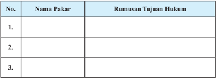

Tabel ini berisi informasi tentang nama-nama pakar dan rumusan tujuan hukum mereka. Topik utama tabel ini adalah tentang pakar-pakar yang telah berkontribusi dalam bidang hukum. Kolom pertama berisi nama-nama pakar tersebut, sedangkan kolom kedua berisi rumusan tujuan hukum masing-masing pakar. Data penting yang terlihat adalah bahwa tabel ini mencakup tiga pakar, dengan nama-namanya tidak disebutkan dan rumusan tujuan hukum juga tidak disebutkan secara spesifik. Ini menunjukkan bahwa tabel ini mungkin masih dalam tahap awal pengumpulan data atau belum lengkap.

................................................................................................................

................................................................................................................

................................................................................................................

................................................................................................................

.................................................................................................................

.................................................................................................................

### 4. Tata Hukum Indonesia

Pada mata pelajaran bahasa, baik bahasa Indonesia maupun bahasa Inggris, kalian pasti pernah mempelajari tata bahasa. Nah, di dalam hukum pun dikenal

 

---
## 📄 Halaman 98

istilah tata hukum . Dalam pelajaran Pendidikan Pancasila dan Kewarganegaraan banyak dibahas mengenai tata hukum terutama tata hukum Indonesia.

Sebagai  suatu  negara  yang  merdeka,  Negara  Kesatuan  Republik  Indonesia mempunyai tata hukum sendiri. Tata hukum suatu negara mencerminkan kondisi objektif dari negara yang bersangkutan sehingga tata hukum suatu negara berbeda dengan negara lainnya. Tata hukum negara kita berbeda dengan tata hukum negara lainnya.

Proklamasi Kemerdekaan tanggal 17 Agustus 1945 merupakan tanda berakhirnya hukum kolonial diganti dengan hukum nasional

Tata hukum merupakan hukum positif atau hukum yang berlaku di suatu negara pada saat sekarang. Tata hukum bertujuan untuk mempertahankan, memelihara, dan melaksanakan tertib hukum  bagi masyarakat suatu negara sehingga dapat  dicapai  ketertiban  di  negara  tersebut.  Tata  hukum  Indonesia  merupakan keseluruhan  peraturan  hukum  yang  diciptakan  oleh  negara  dan  berlaku  bagi seluruh  masyarakat  Indonesia  yang  berpedoman  pada  Undang-Undang  Dasar Negara Republik Indonesia Tahun 1945. Pelaksanaan tata hukum tersebut dapat dipaksakan oleh alat-alat negara yang diberi kekuasaan.

Tata  hukum  Indonesia  ditetapkan  oleh  masyarakat  hukum  Indonesia.  Oleh karena itu,  tata hukum Indonesia baru ada ketika negara Indonesia diproklamirkan pada tanggal 17 Agustus 1945. Hal tersebut dapat dilihat dalam pernyataan berikut.

- Proklamasi Kemerdekaan: 'Kami bangsa Indonesia dengan ini menyatakan Kemerdekaan Indonesia'.
- Pembukaan  Undang-Undang  Dasar  Negara  Republik  Indonesia  Tahun 1945:  ' Atas  berkat  rakhmat  Allah  Yang  Maha  Kuasa  dan  dengan

 

---
## 📄 Halaman 99

didorongkan oleh keinginan luhur, supaya berkehidupan kebangsaan yang bebas, maka rakyat Indonesia menyatakan dengan ini kemerdekaannya. Kemudian daripada itu…. disusunlah Kemerdekaan Kebangsaan Indonesia  itu  dalam  suatu  Undang­Undang  Dasar  Negara  Indonesia, yang  terbentuk  dalam  suatu  susunan  Negara  Republik  Indonesia  yang berkedaulatan rakyat dengan berdasarkan….

Dua hal di atas mengandung arti sebagai berikut.

- Menjadikan Indonesia sebagai negara yang merdeka dan berdaulat.
- Pada saat itu juga menetapkan tata hukum Indonesia. Di dalam UndangUndang Dasar  itulah tercantum tata hukum Indonesia.
Undang-Undang Dasar Negara Republik Indonesia Tahun 1945 hanya memuat ketentuan dasar dan merupakan rangka dari tata hukum Indonesia. Masih banyak ketentuan-ketentuan  yang  harus  ditetapkan  lebih  lanjut  dalam  undang-undang organik. Oleh karena itu, sampai sekarang masih terdapat ketentuan hukum yang merupakan  produk  hukum  kolonial,  misalnya  Kitab  Undang-Undang    Hukum Pidana dan Kitab Undang-Undang Hukum Perdata.

### B. Mencermati Sistem Peradilan di Indonesia

### 1. Makna Lembaga Peradilan

Setelah mempelajari sistem hukum dari berbagai aspek, pada bagian ini kalian akan diajak untuk menelaah lembaga negara yang mengawasi pelaksanaan dari suatu kaidah hukum. Lembaga ini sering disebut sebagai lembaga peradilan, yang merupakan wahana bagi setiap rakyat yang mencari keadilan untuk mendapatkan haknya sesuai dengan ketentuan hukum yang berlaku.

Berbicara mengenai lembaga peradilan nasional, tidak dapat terlepas dari  konsep  kekuasaan  negara.  Kekuasaan  yang  dimaksud  adalah  kekuasaan kehakiman. Di Indonesia, perwujudan kekuasaan kehakiman ini diatur sepenuhnya dalam Undang-Undang RI Nomor 48 Tahun 2009 tentang Kekuasaan Kehakiman, yang merupakan penyempurnaan dari Undang-Undang RI Nomor 14 Tahun 1970 tentang Pokok-Pokok Kekuasaan Kehakiman.

Kekuasaan kehakiman di Indonesia dilakukan oleh Mahkamah Agung. Badan peradilan yang berada di bawah Mahkamah Agung meliputi badan peradilan yang berada di lingkungan peradilan umum, peradilan agama, peradilan militer, dan

 

---
## 📄 Halaman 100

peradilan tata usaha negara, serta oleh sebuah Mahkamah Konstitusi. Lembagalembaga tersebut berperan sebagai penegak keadilan dan dibersihkan dari setiap intervensi/campur tangan, baik dari lembaga legislatif, eksekutif maupun lembaga lainnya.

Proses peradilan dilaksanakan di sebuah tempat yang dinamakan pengadilan. Dengan demikian, terdapat perbedaan antara konsep peradilan dengan pengadilan. Peradilan menunjuk pada proses mengadili perkara sesuai dengan kategori perkara yang diselesaikan. Adapun, pengadilan menunjuk pada tempat untuk mengadili perkara  atau  tempat  untuk  melaksanakan  proses  peradilan  guna  menegakkan hukum.

Dari  uraian  di  atas  dapat  dirumuskan  bahwa  lembaga  peradilan    nasional sama artinya dengan pengadilan negara yaitu lembaga yang dibentuk oleh negara sebagai  bagian  dari  otoritas  negara  di  bidang  kekuasaan  kehakiman  dengan sumber hukumnya peraturan perundang-undangan yang berlaku di dalam negara.

Pengadilan secara umum mempunyai tugas untuk mengadili perkara menurut hukum dengan tidak membeda-bedakan  orang. Pengadilan tidak boleh menolak untuk memeriksa, mengadili, dan memutus suatu perkara yang diajukan dengan dalih  bahwa  hukum  tidak  ada  atau  kurang.  Pengadilan  wajib  memeriksa  dan mengadili setiap perkara peradilan yang masuk.

### 2. Dasar Hukum Lembaga Peradilan

Adapun  yang  menjadi  dasar  hukum  terbentuknya  lembaga-lembaga peradilan nasional sebagai berikut.

- Pancasila terutama sila kelima, yaitu 'Keadilan sosial bagi seluruh rakyat Indonesia'
- Undang-Undang  Dasar  Negara  Republik  Indonesia  Tahun  1945  Bab  IX Pasal 24 Ayat (2) dan (3)
- Kekuasaan  kehakiman  dilakukan  oleh  sebuah  Mahkamah  Agung dan badan peradilan yang berada di bawahnya dalam lingkungan peradilan umum, lingkungan peradilan agama, lingkungan peradilan militer,  lingkungan  peradilan  tata  usaha  negara,  dan  oleh  sebuah Mahkamah Konstitusi
- Badan­badan  lain  yang  fungsinya  berkaitan  dengan  kekuasaan kehakiman diatur dalam undang­undang.
- Undang-Undang RI Nomor 3 Tahun 1997 tentang Pengadilan Anak
- Undang-Undang RI Nomor 31 Tahun 1997 tentang Peradilan Militer
- Undang-Undang RI Nomor 26 Tahun 2000 tentang Pengadilan HAM

 

---
## 📄 Halaman 101

- Undang-Undang RI Nomor 14 Tahun 2002 tentang Pengadilan Pajak
- Undang-Undang RI Nomor 24 Tahun 2003 tentang Mahkamah Konstitusi
- Undang-Undang RI Nomor 5 Tahun 2004 tentang Perubahan Atas UndangUndang Nomor 14 Tahun 1985 Tentang Mahkamah Agung
- Undang-Undang RI Nomor 8 Tahun 2004 tentang Perubahan Atas UndangUndang Nomor 2 Tahun 1986 Tentang Peradilan Umum
- Undang-Undang RI Nomor 9 Tahun 2004 tentang Perubahan Atas UndangUndang Nomor 7 Tahun 1986 Tentang Peradilan Tata Usaha Negara
- Undang-Undang RI Nomor 3 Tahun 2006 tentang Perubahan Atas UndangUndang Nomor 5 Tahun 1989 Tentang Peradilan Agama
- Undang-Undang RI Nomor 3 Tahun 2009 tentang Perubahan Kedua Atas Undang-Undang Nomor 14 Tahun 1985 Tentang Mahkamah Agung
- Undang-Undang  RI  Nomor  46  Tahun  2009  tentang  Pengadilan  Tindak Pidana Korupsi
- Undang-Undang RI Nomor 48 Tahun 2009 tentang Kekuasaan Kehakiman
- Undang-Undang RI Nomor 49 Tahun 2009 tentang Perubahan Kedua Atas Undang-Undang Nomor 2 Tahun 1986 Tentang Peradilan Umum
- Undang-Undang RI Nomor 50 Tahun 2009 tentang Perubahan Kedua Atas Undang-Undang Nomor 5 Tahun 1989 Tentang Peradilan Agama
- Undang-Undang  RI  Nomor  51  Tahun  2009  tentang  Perubahan  Kedua Atas Undang-Undang Nomor 7 Tahun 1986 Tentang Peradilan Tata Usaha Negara
- Undang-Undang RI Nomor 8 Tahun 2011 Tentang Perubahan Atas UndangUndang Nomor 24 Tahun 2003 Tentang Mahkamah Konstitusi.
Peraturan  perundang-undangan  di  atas  menjadi  pedoman  bagi  lembagalembaga peradilan dalam melaksanakan tugas dan wewenangnya sebagai lembaga yang  melaksanakan  kekuasaan  kehakiman  secara  bebas  tanpa  ada  intervensi/ campur  tangan  dari  siapa  pun.  Nah,  tugas  kita  adalah  mengawasi  kinerja  dari lembaga-lembaga  tersebut  serta  memberikan  masukan  jika  dalam  kinerjanya belum optimal supaya lembaga-lembaga tersebut merasa dimiliki oleh rakyat.

### 3. Klasifikasi Lembaga Peradilan

Pada  bagian  sebelumnya  kalian  telah  menelaah  hakikat  lembaga  peradilan. Nah, pada bagian ini kalian akan diajak untuk menelusuri klasifikasi atau macammacam lembaga peradilan yang ada di Indonesia.

 

---
## 📄 Halaman 102

Dalam pasal 18 Undang-Undang RI Nomor 48 Tahun 2009 tentang Kekuasaan Kehakiman  disebutkan  bahwa  ' Kekuasaan  kehakiman  dilakukan  oleh  sebuah Mahkamah  Agung  dan  badan  peradilan  yang  berada  di  bawahnya  dalam lingkungan peradilan umum, lingkungan peradilan agama, lingkungan peradilan militer,  lingkungan  peradilan  tata  usaha  negara,  dan  oleh  sebuah  Mahkamah Konstitusi' .

Dari ketentuan di atas, sesungguhnya badan peradilan nasional dapat diklasifikasikan sebagai berikut.

- Lembaga peradilan di bawah Mahkamah Agung
- Peradilan Umum, yang meliputi:
- Pengadilan Negeri berkedudukan di ibu kota kabupaten atau kota dan
- Pengadilan  Tinggi berkedudukan di ibu kota provinsi.
- Peradilan Agama yang terdiri atas:
- Pengadilan Agama yang berkedudukan di ibu kota kabupaten atau kota.
- Pengadilan Tinggi Agama yang berkedudukan di ibu kota provinsi.
- Peradilan Militer, terdiri atas:
- Pengadilan Militer,
- Pengadilan Militer Tinggi,
- Pengadilan Militer Utama, dan
- Pengadilan Militer Pertempuran.
- Peradilan Tata Usaha Negara yang terdiri atas:
- Pengadilan  Tata  Usaha  Negara  yang  berkedudukan  di  ibu  kota kabupaten atau kota, dan
- Pengadilan Tinggi Tata Usaha Negara yang berkedudukan di ibu kota provinsi.

 

---
## 📄 Halaman 103

### b. Mahkamah Konstitusi

Sumber:

www.mahkamah konstitusi.go.id

Gambar 3.5

Proses penyelesaian masalah di Mahkamah Konstitusi RI

Badan-badan  peradilan  di  atas  merupakan  sarana  bagi  rakyat  pencari keadilan  untuk  mendapatkan  haknya  di  dalam  lapangan  peradilan  nasional. Badan-badan tersebut mempunyai fungsi tersendiri sesuai dengan kompetensi  nya. Kompetensi sebuah lembaga peradilan terdiri dari:

- Kompetensi  absolut ,  yaitu  kompetensi  yang  berkaitan  dengan  tugas  dan wewenangnya  untuk mengadili suatu perkara. Misalnya penyelesaian perkara  perceraian  bagi  penduduk  yang  beragama  Islam,  maka  yang berwenang untuk menyelesaikannya adalah peradilan agama. Tindak pidana yang dilakukan oleh anggota TNI, disidangkan di pengadilan militer.
- Kompetensi relatif , yaitu kompetensi yang berkaitan dengan wilayah hukum atau  wilayah  tugas  suatu  badan  peradilan.  Misalnya  pengadilan  negeri, wilayah  hukumnya  hanya  meliputi  satu  kabupaten  atau  kota  dan  hanya berwenang menyidangkan perkara hukum yang terjadi di wilayah hukumnya.

### Tugas Mandiri 3.4

Bacalah berita di bawah ini.

### Mencuri 3 Buah Kakao, Nenek Minah Dihukum 1 Bulan 15 Hari

Banyumas - Nenek Minah (55) tak pernah menyangka perbuatan isengnya memetik 3 buah kakao di perkebunan milik PT Rumpun Sari Antan (RSA)

 

---
## 📄 Halaman 104

akan  menjadikannya  sebagai  pesakitan  di  ruang  pengadilan.  Bahkan untuk perbuatannya itu dia diganjar 1 bulan 15 hari penjara dengan masa percobaan 3 bulan.

Ironi hukum di Indonesia ini berawal saat Minah sedang memanen kedelai di lahan garapannya di Dusun Sidoarjo, Desa Darmakradenan, Kecamatan Ajibarang, Banyumas, Jawa Tengah, pada 2 Agustus lalu. Lahan garapan Minah ini juga dikelola oleh PT RSA untuk menanam kakao. Ketika sedang asyik memanen kedelai, mata tua Minah tertuju pada 3 buah kakao yang sudah ranum. Dari sekadar memandang, Minah kemudian memetiknya untuk disemai sebagai bibit di tanah garapannya. Setelah dipetik, 3 buah kakao itu tidak disembunyikan melainkan digeletakkan begitu saja di bawah pohon kakao. Tidak lama berselang, lewat seorang mandor perkebunan kakao PT RSA. Mandor itu pun bertanya, siapa yang memetik buah kakao itu. Dengan polos, Minah mengaku hal itu perbuatannya. Minah pun diceramahi bahwa tindakan itu tidak boleh dilakukan karena sama saja mencuri.

Sadar  perbuatannya  salah,  Minah  meminta  maaf  pada  sang  mandor  dan berjanji tidak akan melakukannya lagi. 3 Buah kakao yang dipetiknya pun dia serahkan kepada mandor tersebut. Minah berpikir semua beres dan dia kembali bekerja. Namun dugaannya meleset. Peristiwa kecil itu ternyata berbuntut  panjang.  Sebab  seminggu  kemudian  dia  mendapat  panggilan pemeriksaan dari polisi. Proses hukum terus berlanjut sampai akhirnya dia harus duduk sebagai seorang terdakwa kasus pencuri di Pengadilan Negeri (PN)  Purwokerto.  Hari  ini,  Kamis  (19\/11\/2009),  majelis  hakim  yang dipimpin  Muslih  Bambang  Luqmono SH memvonisnya 1 bulan 15 hari dengan masa percobaan selama 3 bulan. Minah dinilai terbukti secara sah dan meyakinkan melanggar pasal 362 KUHP tentang pencurian.

Selama persidangan yang dimulai pukul 10.00 WIB, Nenek Minah terlihat tegar.  Sejumlah  kerabat,  tetangga,  serta  aktivis  LSM  juga  menghadiri sidang itu untuk memberikan dukungan moril.

### Hakim Menangis

Pantauan detikcom, suasana persidangan Minah berlangsung penuh keharuan.  Selain  menghadirkan  seorang  nenek  yang  miskin  sebagai terdakwa,  majelis  hakim  juga  terlihat  agak  ragu  menjatuhkan  hukum. Bahkan  ketua  majelis  hakim,  Muslih  Bambang  Luqmono  SH,  terlihat menangis saat membacakan vonis. 'Kasus ini kecil, namun sudah melukai banyak orang,' ujar Muslih.

Vonis  hakim  1  bulan  15  hari  dengan  masa  percobaan  selama  3  bulan disambut gembira keluarga, tetangga, dan para aktivis LSM yang mengikuti

 

---
## 📄 Halaman 105

sidang  tersebut.  Mereka  segera  menyalami  Minah  karena  wanita  tua  itu tidak harus merasakan dinginnya sel tahanan.

Sumber:

http://news.detik.com/berita/1244955/

Setelah kalian membaca wacana di atas, jawablah pertanyaan-pertanyaan di bawah ini.

- Bagaimana perasaan kalian setelah membaca wacana tersebut?
.................................................................................................................

.................................................................................................................

.................................................................................................................

.................................................................................................................

.................................................................................................................

- Menurut kalian, apa yang menyebabkan terjadinya kasus tersebut?
.................................................................................................................

.................................................................................................................

.................................................................................................................

.................................................................................................................

.................................................................................................................

- Menurut kalian, apakah vonis yang dijatuhkan hakim sudah memenuhi rasa keadilan?
.................................................................................................................

.................................................................................................................

.................................................................................................................

.................................................................................................................

.................................................................................................................

- Pada saat ini, sering terjadi kasus yang serupa dengan yang dialami oleh nenek Minah. Menurut kalian, apa langkah  paling bijak yang harus dilakukan oleh aparat penegak hukum dalam mengatasi kasus tersebut?
.................................................................................................................

.................................................................................................................

.................................................................................................................

.................................................................................................................

.................................................................................................................

- Perangkat Lembaga Peradilan
Setelah kalian mempelajari klasifikasi dari lembaga peradilan nasional sudah barang  tentu  kalian  mempunyai  gambaran  bahwa  begitu  banyaknya  sarana untuk mencari keadilan. Nah, untuk menjalankan tugas dan fungsinya di bidang

 

---
## 📄 Halaman 106

kekuasan  kehakiman,  setiap  lembaga  peradilan  mempunyai  alat  kelengkapan atau  perangkatnya.  Pada  bagian  ini,  kalian  akan  diajak  untuk  mengidentifikasi perangkat dari lembaga-lembaga peradilan tersebut.

### a. Peradilan Umum

Pada  awalnya  peradilan  umum  diatur  dalam  Undang-Undang  RI  Nomor  2 Tahun 1986. Setelah dinilai tidak sesuai lagi dengan perkembangan dan kebutuhan hukum  masyarakat  dan  kehidupan  ketatanegaraan  menurut  Undang-Undang Dasar Negara Republik Indonesia Tahun 1945, undang-undang ini diubah dengan Undang-Undang RI Nomor 8 Tahun 2004 tentang perubahan atas Undang-Undang RI Nomor 2 Tahun 1986 tentang Peradilan Umum dan Undang-Undang RI Nomor 49 Tahun 2009 tentang Perubahan Kedua Atas Undang-Undang Nomor 2 Tahun 1986  Tentang  Peradilan  Umum.  Berdasarkan  undang-undang  ini,  kekuasaan kehakiman di lingkungan peradilan umum dilaksanakan oleh Pengadilan Negeri, Pengadilan Tinggi, dan Mahkamah Agung.

### 1) Pengadilan Negeri

Pengadilan Negeri mempunyai daerah hukum yang meliputi wilayah kabupaten atau kota dan berkedudukan di ibu kota kabupaten/kota. Pengadilan Negeri dibentuk berdasarkan keputusan presiden. Untuk menjalankan tugas dan fungsinya, Pengadilan Negeri mempunyai perangkat yang terdiri atas pimpinan (yang terdiri dari seorang ketua dan seorang wakil ketua), hakim (yang merupakan pejabat  pelaksana  kekuasaan  kehakiman),  panitera    (yang  dibantu  oleh  wakil panitera, panitera muda, dan panitera muda pengganti), sekretaris, dan juru sita (yang dibantu oleh juru sita pengganti)

### 2) Pengadilan  Tinggi

Pengadilan Tinggi merupakan pengadilan tingkat banding. Perangkat Pengadilan Tinggi terdiri atas pimpinan, hakim anggota, panitera, dan sekretaris. Pimpinan Pengadilan Tinggi terdiri atas seorang ketua ketua dan seorang wakil ketua. Hakim anggota anggota Pengadilan Tinggi adalah hakim tinggi. Pengadilan Tinggi dibentuk dengan undang-undang.

### b. Peradilan Agama

Peradilan  agama  diatur  dalam  Undang-Undang  RI  Nomor  7  Tahun  1989 tentang Peradilan Agama dan Undang-Undang RI Nomor 3 Tahun 2006 tentang Perubahan Atas Undang-Undang Nomor 5 Tahun 1989 Tentang Peradilan Agama

 

---
## 📄 Halaman 107

serta Undang-Undang RI Nomor 50 Tahun 2009 tentang Perubahan Kedua Atas Undang-Undang  Nomor  5  Tahun  1989  Tentang  Peradilan  Agama.  Kekuasaan kehakiman di lingkungan peradilan agama dilaksanakan oleh Pengadilan Agama dan  Pengadilan  Tinggi  Agama.  Kekuasaan  kehakiman  pada  peradilan  agama berpuncak pada Mahkamah Agung.

---
**🖼️ Gambar/Diagram**

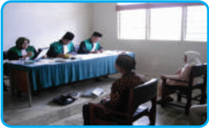

> **Deskripsi Visual:** Gambar ini menunjukkan sebuah ruangan yang tampak seperti ruang pertemuan atau kantor kecil. Di sebelah kiri, ada tiga orang yang sedang berbicara di meja panjang yang dilapisi dengan lencana biru. Mereka tampaknya sedang mengadakan diskusi atau presentasi. Di sebelah kanan, ada dua orang yang duduk di kursi, tampaknya mendengarkan atau menunggu. Ruangan ini memiliki dinding putih dan terdapat jendela kecil di sudut kanan atas. Meja di tengah memiliki beberapa dokumen dan barang lainnya. Teks, angka, atau label penting tidak terlihat dalam gambar ini. Informasi kunci yang dapat diambil adalah bahwa ini mungkin merupakan tempat untuk pertemuan atau rapat internal.

Sumber:

www.alvahandayani.files.wordpress.com

Gambar 3.6 Suasana persidangan di pengadilan agama

### 1) Pengadilan Agama

Pengadilan  agama  berkedudukan  di  ibu  kota  kabupaten/kota  dan  daerah hukumnya meliputi wilayah kabupaten atau kota. Pengadilan agama merupakan pengadilan tingkat pertama dan dibentuk berdasarkan keputusan presiden (kepres). Perangkat atau alat kelengkapan pengadilan agama terdiri atas pimpinan, hakim anggota,  panitera,  sekretaris,  dan  juru  sita.  Pimpinan  pengadilan  agama  terdiri atas  seorang  ketua  dan  seorang  wakil  ketua.  Hakim  dalam  pengadilan  agama diangkat dan diberhentikan oleh presiden selaku kepala negara atas usul Menteri Agama berdasarkan persetujuan ketua Mahkamah Agung. Ketua dan wakil ketua pengadilan agama diangkat dan diberhentikan oleh Menteri Agama berdasarkan persetujuan ketua Mahkamah Agung. Wakil ketua dan hakim pengadilan agama diangkat sumpahnya oleh ketua pengadilan agama.

### 2) Pengadilan Tinggi Agama

Pengadilan  tinggi  agama  berkedudukan  di  ibu  kota  provinsi  dan  daerah hukumnya  meliputi  wilayah  provinsi.  Pengadilan  tinggi  agama  merupakan pengadilan tingkat banding. Perangkat atau alat kelengkapan pengadilan tinggi

 

---
## 📄 Halaman 108

agama terdiri atas pimpinan, hakim anggota, panitera, dan sekretaris. Pimpinan pengadilan tinggi agama terdiri atas seorang ketua dan seorang wakil ketua.  Ketua Pengadilan  Tinggi  Agama  diambil  sumpahnya  oleh  ketua  Mahkamah  Agung. Hakim anggota pengadilan tinggi agama adalah hakim tinggi. Wakil ketua dan hakim pengadilan tinggi agama diambil sumpahnya oleh ketua pengadilan tinggi agama.

### c. Peradilan Militer

Peradilan  militer  diatur  dalam  Undang-Undang  RI  Nomor  31  Tahun  1997. Dalam undang-undang tersebut, yang dimaksud dengan pengadilan adalah badan yang melaksanakan kekuasaan kehakiman di lingkungan peradilan  militer  yang meliputi Pengadilan Militer, Pengadilan Militer Tinggi, Pengadilan Militer Utama, dan Pengadilan Militer Pertempuran.

Dalam peradilan  militer  dikenal  adanya  oditurat  yaitu  badan  di  lingkungan TNI yang melakukan kekuasaan pemerintahan negara di bidang penuntutan dan penyidikan  berdasarkan  pelimpahan  dari  Panglima  TNI.  Oditurat  terdiri  atas oditurat  militer,  oditurat  militer  tinggi,  oditurat  jenderal,  dan  oditurat  militer pertempuran.

### d. Peradilan Tata Usaha Negara

Pada awalnya, peradilan tata usaha negara diatur dalam Undang-Undang RI Nomor 5 Tahun 1986, kemudian undang-undang tersebut diubah dengan UndangUndang  RI  Nomor  9  Tahun  2004  tentang  Perubahan  atas  Undang-Undang  RI Nomor 5 Tahun 1986 tentang  Peradilan Tata  Usaha  Negara,  serta  diubah  lagi dengan Undang-Undang RI Nomor 51 Tahun 2009 tentang Perubahan Kedua Atas Undang-Undang Nomor 7 Tahun 1986 Tentang Peradilan Tata Usaha Negara.

Kekuasaan kehakiman di lingkungan peradilan tata usaha negara dilaksanakan oleh pengadilan tata usaha negara dan pengadilan tinggi tata usaha negara.

### 1) Pengadilan Tata Usaha Negara

Pengadilan tata usaha negara berkedudukan di ibu kota kabupaten atau kota dan  daerah  hukumnya  meliputi  wilayah  kabupaten  atau  kota.  Pengadilan  tata usaha  negara  merupakan  pengadilan  tingkat  pertama.  Pengadilan  tata  usaha negara dibentuk berdasarkan keputusan presiden. Perangkat atau alat kelengkapan pengadilan  tata  usaha  negara  terdiri  atas  pimpinan,  hakim  anggota,  panitera, sekretaris,  dan  juru  sita.  Pimpinan  pengadilan  terdiri  atas  seorang  ketua  dan

 

---
## 📄 Halaman 109

seorang  wakil  ketua.  Hakim  pengadilan  adalah  pejabat  yang  melaksanakan kekuasaan kehakiman yang diangkat dan diberhentikan oleh presiden atas usul ketua  Mahkamah Agung.  Wakil ketua dan hakim pengadilan tata usaha negara diambil sumpahnya oleh ketua pengadilan tata usaha negara.

### 2) Pengadilan Tinggi Tata Usaha Negara

Pengadilan tinggi tata  usaha  negara  berkedudukan  di  ibu  kota  provinsi  dan daerah  hukumnya  meliputi  wilayah  provinsi.  Pengadilan  tinggi  tata  usaha negara merupakan pengadilan tingkat banding. Perangkat atau alat kelengkapan pengadilan tinggi tata usaha negara terdiri atas pimpinan, hakim anggota, panitera, dan sekretaris.  Pimpinan pengadilan tinggi tata usaha negara terdiri atas seorang ketua dan seorang wakil ketua. Ketua pengadilan tinggi tata usaha negara diambil sumpahnya oleh ketua Mahkamah Agung. Hakim anggota pengadilan ini adalah hakim tinggi. Wakil ketua dan hakim pengadilan tinggi tata usaha negara diambil sumpahnya oleh ketua pengadilan tinggi tata usaha negara. Info Kewarganegaraan

### e. Mahkamah Konstitusi

Mahkamah Konstitusi merupakan perwujudan  dari  pasal  24  C  UndangUndang Dasar Negara Republik Indonesia Tahun 1945. Lebih lanjut Mahkamah Konstitusi diatur dalam Undang-Undang  RI  Nomor  24  Tahun 2003 tentang Mahkamah Konstitusi dan Undang-Undang  RI Nomor  8  Tahun 2011  Tentang  Perubahan  Atas  UndangUndang Nomor 24 Tahun 2003 Tentang Mahkamah Konstitusi.

Mahkamah  Konstitusi  terdiri  dari  9 (sembilan)  orang  hakim  konstitusi  yang diajukan  masing-masing  3  (tiga)  orang oleh DPR,  presiden,  dan  Mahkamah Agung dan ditetapkan dengan Keputusan Presiden.  Susunan  organisasinya  terdiri

Perbedaan peradilan sipil dan militer dapat ditinjau dari dua aspek.

- Fungsi. Pengadilan sipil berfungsi sebagai penyelenggara peradilan sipil guna menegakkan hukum dan keadilan bagi rakyat sipil, sedangkan peradilan militer diperuntukkan bagi anggota militer/TNI.
- Pejabat yang berwenang sebagai penuntut umum. Dalam pengadilan sipil pejabat yang berwenang bertindak sebagai penuntut umum disebut jaksa, sedangkan dalam peradilan militer disebut oditur.

 

---
## 📄 Halaman 110

atas seorang Ketua merangkap anggota, seorang Wakil Ketua merangkap anggota, dan 7 (tujuh) anggota hakim konstitusi.

Untuk kelancaran tugas Mahkamah Konstitusi dibantu oleh sebuah Sekretariat Jenderal dan Kepaniteraan, yang susunan organisasi, fungsi, tugas, dan wewenangnya diatur lebih lanjut dengan Keputusan Presiden atas usul Mahkamah Konstitusi.

Gambar 3.7. Para Hakim Konstitusi.

Masa jabatan hakim konstitusi adalah 5 (lima) tahun dan dapat dipilih kembali hanya untuk satu kali masa jabatan. Ketua dan Wakil ketua dipilih dari dan oleh hakim  konstitusi  untuk  masa  jabatan  3  (tiga)  tahun.  Hakim  konstitusi  adalah pejabat negara.

### 5. Tingkatan Lembaga Peradilan

Pada bagian ini kalian akan diajak untuk menelaah tingkatan lembaga peradilan di  Indonesia.  Sebagaimana  telah  kalian  pelajari  sebelumnya  bahwa  lembaga peradilan dimiliki oleh setiap wilayah yang ada di Indonesia. Lembaga-lembaga tersebut tentunya tidak semuanya berkedudukan sejajar, akan tetapi ditempatkan secara hierarki (bertingkat-tingkat) sesuai dengan peran dan fungsinya.

Adapun tingkatan lembaga peradilan adalah sebagai berikut.

### a. Pengadilan Tingkat Pertama (Pengadilan Negeri)

Pengadilan tingkat pertama dibentuk berdasarkan keputusan presiden. Pengadilan  tingkat  pertama  mempunyai  kekuasaan  hukum  yang  meliputi  satu wilayah kabupaten/kota.

 

---
## 📄 Halaman 111

Fungsi  pengadilan  tingkat  pertama  adalah  memeriksa    tentang  sah  atau tidaknya  penangkapan  atau  penahanan  yang  diajukan  oleh  tersangka,  keluarga atau kuasanya kepada ketua pengadilan dengan menyebutkan alasan-alasannya. Wewenang pengadilan tingkat pertama adalah memeriksa dan memutuskan sesuai dengan ketentuan yang diatur dalam undang-undang, khususnya tentang dua hal berikut.

- Sah atau tidaknya penangkapan, penahanan, penghentian penyidikan, atau penghentian tuntutan.
- Ganti  kerugian  dan/atau  rehabilitasi  bagi  seseorang  yang  perkaranya dihentikan pada tingkat penyidikan atau tuntutan.

### b. Pengadilan Tingkat Kedua

Pengadilan tingkat kedua disebut juga pengadilan tinggi yang dibentuk dengan undang-undang.  Daerah  hukum  pengadilan  tinggi  pada  dasarnya  meliputi  satu provinsi.

Pengadilan tingkat kedua berfungsi sebagai berikut.

- Menjadi  pimpinan  bagi  pengadilan-pengadilan  negeri  di  dalam  daerah hukumnya.
- Melakukan  pengawasan  terhadap  jalannya  peradilan  di  dalam  daerah hukumnya dan menjaga supaya peradilan itu diselesaikan dengan saksama dan wajar.
- Mengawasi dan meneliti perbuatan para hakim pengadilan negeri di daerah hukumnya.
- Untuk kepentingan negara dan keadilan, pengadilan tinggi dapat memberi peringatan, teguran, dan petunjuk yang dipandang perlu kepada pengadilan negeri dalam daerah hukumnya.
Adapun wewenang pengadilan tingkat kedua adalah sebagai berikut.

- Mengadili  perkara  yang  diputus  oleh  pengadilan  negeri  dalam  daerah hukumnya yang dimintakan banding.
- Berwenang untuk memerintahkan pengiriman berkas-berkas perkara dan surat-surat  untuk  diteliti  dan  memberi  penilaian  tentang  kecakapan  dan kerajinan hakim.

 

---
## 📄 Halaman 112

### c. Kasasi oleh Mahkamah Agung

Mahkamah Agung berkedudukan sebagai puncak semua peradilan dan sebagai pengadilan tertinggi untuk semua lingkungan peradilan dan memberi pimpinan kepada pengadilan-pengadilan yang bersangkutan. Mahkamah Agung merupakan salah  satu  pelaku  kekuasaan  kehakiman  sebagaimana  yang  dimaksud  dalam Undang-Undang  Dasar  Negara  Republik  Indonesia  Tahun  1945.  Mahkamah Agung diatur oleh Undang-Undang RI Nomor 5 Tahun 2004 tentang Perubahan atas Undang-Undang RI Nomor 14 Tahun 1985 tentang Mahkamah Agung dan Undang-Undang RI Nomor 3 Tahun 2009 tentang Perubahan Kedua Atas UndangUndang Nomor 14 Tahun 1985 Tentang Mahkamah Agung.

Berdasarkan  Undang-Undang  RI  Nomor  5  Tahun  2004,  perangkat  atau kelengkapan Mahkamah Agung terdiri atas pimpinan, hakim anggota, panitera, dan  sekretaris.  Pimpinan  dan  hakim  anggota  Mahkamah Agung  adalah  hakim agung. Pimpinan Mahkamah Agung terdiri atas seorang ketua, dua orang wakil ketua, dan beberapa orang ketua muda. Wakil ketua Mahkamah Agung terdiri atas wakil ketua bidang yudisial dan wakil ketua bidang nonyudisial.

Dalam  hal  kasasi,  yang  menjadi  wewenang  Mahkamah  Agung  adalah membatalkan atau menyatakan tidak sah putusan hakim pengadilan tinggi karena putusan  itu  salah  atau  tidak  sesuai  dengan  undang-undang.  Hal  tersebut  dapat terjadi karena alasan berikut.

- Lalai memenuhi syarat-syarat yang diwajibkan oleh perundangundangan yang mengancam kelalaian itu dengan batalnya perbuatan yang bersangkutan.
- Melampaui batas wewenang.
- Salah menerapkan atau karena melanggar ketentuan hukum yang berlaku.

### 6. Peran Lembaga Peradilan

Bagian  ini  akan  memberikan  gambaran  kepada  kalian  mengenai  peranan lembaga  peradilan  dalam  menjalankan  kekuasaannya.  Dengan  mengetahui  hal tersebut,  kita  sebagai  subjek  hukum  dapat  mengawasi  dan  mengontrol  kinerja dari lembaga-lembaga peradilan. Berikut ini peran dari masing-masing lembaga peradilan.

 

---
## 📄 Halaman 113

### a. Lingkungan Peradilan Umum

Kekuasaan  kehakiman  di  lingkungan  peradilan  umum  dilaksanakan  oleh pengadilan negeri, pengadilan tinggi, dan Mahkamah Agung. Pengadilan negeri berperan  dalam  proses  pemeriksaan,  memutuskan,  dan  menyelesaikan  perkara pidana  dan  perdata  di  tingkat  pertama.  Pengadilan  tinggi  berperan  dalam menyelesaikan perkara pidana dan perdata pada tingkat kedua atau banding. Di samping itu, pengadilan tinggi juga berwenang mengadili di tingkat pertama dan terakhir  apabila  ada  sengketa  kewenangan  mengadili  antara  pengadilan  negeri dalam daerah hukumnya.

---
**🖼️ Gambar/Diagram**

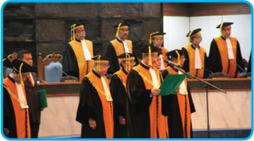

> **Deskripsi Visual:** Gambar ini adalah foto yang menunjukkan sebuah acara wisuda di mana beberapa orang mahasiswa sedang mengambil sertifikat mereka. Mahasiswa tersebut mengenakan seragam wisuda dengan topi hitam dan jas berwarna oranye. Di sebelah kanan, ada seorang mahasiswa yang sedang membacakan sertifikat kepada mahasiswa lain. Latar belakang tampak seperti gedung perkuliahan dengan kursi dan meja. Gambar ini menunjukkan kegembiraan dan kebanggaan mahasiswa setelah lulus dari program studi mereka.

Sumber :

www.mahkamahagung.go.id.

Mahkamah Agung mempunyai kekuasaan tertinggi dalam lapangan peradilan di  Indonesia.  Mahkamah  Agung  berperan  dalam  proses  pembinaan  lembaga peradilan yang berada di bawahnya. Mahkamah Agung mempunyai kekuasaan dan  kewenangan  dalam    pembinaan,  organisasi,  administrasi,  dan  keuangan pengadilan. Dalam pasal 20 ayat (2) Undang-Undang RI Nomor 48 Tahun 2009, disebutkan bahwa Mahkamah Agung mempunyai wewenang berikut.

- Mengadili  pada  tingkat  kasasi  terhadap  putusan  yang  diberikan  pada tingkat  terakhir  oleh  pengadilan  di  semua  lingkungan  peradilan  yang berada di bawah Mahkamah Agung.

 

---
## 📄 Halaman 114

- Menguji peraturan perundang-undangan di bawah undang-undang terhadap undang-undang.
- Kewenangan lainnya yang diberikan undang-undang, seperti memberikan pertimbangan  hukum  kepada  presiden  dalam  permohonan  grasi  dan rehabilitasi.

### b. Lingkungan Peradilan Agama

Kekuasaan kehakiman di lingkungan peradilan agama dilakukan oleh pengadilan  agama.  Berdasarkan  pasal  49  Undang-Undang  RI  Nomor  3  Tahun 2006,  pengadilan  agama  bertugas  dan  berwenang  memeriksa,  memutus,    dan menyelesaikan  perkara  di  tingkat  pertama  antara  orang-orang  yang  beragama Islam di bidang perkawinan, waris, wasiat, hibah, wakaf, zakat, infaq, shadaqah, dan ekonomi syari'ah.

### c. Lingkungan Peradilan Tata Usaha Negara

Peradilan tata usaha negara berperan dalam proses penyelesaian sengketa tata usaha  negara.  Sengketa  tata  usaha  negara  adalah  sengketa  yang  timbul  dalam bidang tata usaha negara antara orang atau badan hukum perdata dengan badan atau  pejabat  tata  usaha  negara,  baik  di  pusat  maupun  di  daerah  sebagai  akibat dari dikeluarkannya keputusan tata usaha negara, termasuk sengketa kepegawaian berdasarkan peraturan perundang-undangan yang berlaku.

### d. Lingkungan Peradilan Militer

Peradilan militer berperan dalam menyelenggarakan proses peradilan dalam lapangan hukum pidana, khususnya bagi pihak-pihak berikut.

- Anggota TNI.
- Seseorang  yang  menurut  undang-undang  dapat  dipersamakan  dengan anggota TNI.
- Anggota  jawatan  atau  golongan  yang  dapat  dipersamakan  dengan  TNI menurut undang-undang.
- Seseorang  yang  tidak  termasuk  ke  dalam  angka  1),  2),  dan  3),  tetapi menurut keputusan Menteri Pertahanan dan Keamanan yang ditetapkan berdasarkan persetujuan Menteri Hukum dan Perundang-undangan  harus diadili oleh pengadilan militer.

 

---
## 📄 Halaman 115

### e. Mahkamah Konstitusi

Mahkamah Konstitusi merupakan salah satu lembaga negara yang melakukan kekuasaan  kehakiman  yang  merdeka  untuk  menyelenggarakan  peradilan  guna menegakkan  hukum  dan  keadilan.  Mahkamah  Konstitusi  Republik  Indonesia mempunyai 4 (empat) kewenangan dan 1 (satu) kewajiban sebagaimana diatur dalam Undang-Undang Dasar 1945.

Mahkamah Konstitusi berwenang mengadili pada tingkat pertama dan terakhir yang putusannya bersifat final untuk perkara-perkara berikut.

- Menguji undang-undang terhadap Undang-Undang Dasar Negara Republik Indonesia Tahun 1945.
- Memutus  sengketa  kewenangan  lembaga  negara  yang  kewenangannya diberikan oleh Undang-Undang Dasar Negara Republik Indonesia Tahun 1945.
- Memutus pembubaran partai politik.
- Memutus perselisihan tentang hasil pemilihan umum.
Mahkamah Konstitusi wajib memberikan putusan atas pendapat DPR bahwa

### Presiden dan/atau Wakil Presiden diduga:

- telah melakukan pelanggaran hukum berupa pengkhianatan terhadap negara, korupsi, penyuapan, dan tindak pidana berat lainnya,
- perbuatan tercela, dan/atau
- tidak lagi memenuhi  syarat  sebagai  presiden  dan/atau  wakil  presiden sebagaimana  dimaksud  dalam  Undang-Undang  Dasar  Negara  Repbulik Indonesia Tahun 1945.

### Tugas mandiri 3.5

Analisislah kasus di bawah ini!

Mabes Polri menangkap dan menahan tujuh tersangka kasus uang palsu. Dari tujuh tersangka tersebut lima di antaranya adalah anggota Badan Intelijen Negara (BIN) dan dua warga biasa atau warga sipil. Selain menangkap para tersangka, polisi juga menyita barang bukti berupa uang palsu pecahan Rp. 100.000,00 sebanyak 2000 lembar, peralatan cetak uang palsu, serta pita cukai uang palsu.

Berdasarkan tersangka dalam kasus di atas, pengadilan manakah yang berwenang menyelesaikan kasus tersebut? Mengapa demikian?

 

---
## 📄 Halaman 116

### C. Menampilkan Sikap yang Sesuai dengan Hukum

Setiap anggota masyarakat mempunyai berbagai kepentingan, baik kepentingan yang sama maupun berbeda.  Tidak jarang di masyarakat perbedaan kepentingan sering  menimbulkan  pertentangan  yang menyebabkan  timbulnya  suasana  yang tidak  tertib  dan  tidak  teratur.  Dengan demikian untuk mencegah timbulnya ketidaktertiban dan ketidakteraturan dalam masyarakat diperlukan sikap positif  untuk  menaati  setiap  norma  atau hukum yang berlaku di masyarakat.

Pada  bagian  ini  kalian  akan  diajak untuk  mempelajari  sikap  yang  sesuai dengan hukum. Setelah mempelajari bagian  ini,  diharapkan  kalian  mampu menunjukkan contoh sikap taat terhadap hukum; menganalisis macam-macam perbuatan yang bertentangan dengan hukum; dan menganalisis macam-macam sanksi  yang  sesuai  dengan  hukum  yang berlaku.

### Info Kewarganegaraan

Menurut Soerjono Soekanto, kesadaran hukum sebenarnya merupakan kesadaran atau nilai-nilai yang terdapat di dalam diri manusia tentang hukum yang ada atau tentang hukum yang diharapkan ada yang dipengaruhi oleh:

- pengetahuan tentang hukum yang berlaku;
- pemahaman terhadap isi hukum yang berlaku;
- sikap terhadap hukum yang berlaku; dan
- pola perilaku menurut hukum yang berlaku.

### 1. Perilaku yang Sesuai dengan Hukum

Setelah kalian mengetahui makna hukum dan peranan dari lembaga peradilan, sudah saatnya kalian mengaktualisasikan pengetahuan kalian tentang hal  tersebut  dalam  kehidupan  sehari-hari.  Sambil  kalian  mengaktualisasikan pengetahuan kalian tersebut, melalui ini kalian  akan dibimbing dan diajak untuk mengidentifikasi perbuatan-perbuatan yang sesuai dengan hukum yang berlaku.

Dalam kehidupan bermasyarakat, berbangsa, dan bernegara, kita tidak akan dapat mengabaikan semua aturan atau hukum  yang berlaku. Sebagai makhluk sosial yang selalu    berinteraksi   dengan   lingkungan   sekitarnya, kita senantiasa akan membentuk suatu komunitas bersama guna menciptakan lingkungan yang aman, tertib, dan damai. Untuk menuju hal tersebut, diperlukan suatu kebersamaan dalam hidup dengan menaati peraturan atau hukum yang tertulis maupun tidak tertulis.

 

---
## 📄 Halaman 117

Ketaatan  atau  kepatuhan  terhadap  hukum  yang  berlaku  merupakan  konsep nyata dalam diri seseorang yang diwujudkan  dalam  perilaku  yang   sesuai   dengan sistem hukum yang berlaku.  Tingkat kepatuhan hukum yang diperlihatkan oleh seorang warga negara secara langsung menunjukkan  tingkat kesadaran hukum yang dimilikinya. Kepatuhan hukum mengandung arti bahwa seseorang memiliki kesadaran:

- memahami dan menggunakan peraturan perundangan yang berlaku;
- mempertahankan tertib hukum yang ada; dan
- menegakkan kepastian hukum.
Adapun  ciri-ciri  seseorang  yang  berperilaku  sesuai  dengan  hukum  yang berlaku dapat dilihat dari perilaku yang diperbuatnya seperti:

- disenangi oleh masyarakat pada umumnya;
- tidak menimbulkan kerugian bagi diri sendiri dan orang lain;
- tidak menyinggung perasaan orang lain;
- menciptakan keselarasan;
- mencerminkan sikap sadar hukum; dan
- mencerminkan kepatuhan terhadap hukum.
Perilaku yang mencerminkan sikap patuh terhadap hukum harus kita tampilkan dalam kehidupan sehari di lingkungan keluarga, sekolah, masyarakat, bangsa, dan negara.  Berkaitan  dengan  hal  tersebut,  lakukanlah  identifikasi  contoh  perilaku yang dapat kalian tampilkan yang mencerminkan kepatuhan terhadap hukum.

- Dalam kehidupan di lingkungan keluarga, di antaranya:
- mematuhi perintah orang tua
2)

…………………………………………………………………………

3)

…………………………………………………………………………

4)

…………………………………………………………………………

5)

…………………………………………………………………………

- Dalam kehidupan di lingkungan sekolah, di antaranya:
- tidak mencontek ketika sedang ulangan
2)

…………………………………………………………………………

3)

…………………………………………………………………………

4)

…………………………………………………………………………

5)

…………………………………………………………………………

- Dalam kehidupan di lingkungan masyarakat, di antaranya:
- ikut serta dalam kegiatan kerja bakti
2)

…………………………………………………………………………

3)

…………………………………………………………………………

 

---
## 📄 Halaman 118

4)

…………………………………………………………………………

5)

………………………………………………………………………

- Dalam kehidupan di lingkungan bangsa dan negara, di antaranya:
- membayar pajak
2)

…………………………………………………………………………

3)

…………………………………………………………………………

4)

…………………………………………………………………………

5)

………………………………………………………………………

### 2. Perilaku yang Bertentangan dengan Hukum Beserta Sanksinya a. Macam-Macam Perilaku yang Bertentangan dengan Hukum

Selain mengetahui perilaku yang sesuai dengan hukum yang berlaku, kalian juga mesti mengetahui perilaku yang bertentangan dengan hukum yang berlaku, agar kalian tidak melakukan perilaku tersebut. Oleh karena itu, pada bagian ini kalian  akan  diajak  untuk  mengidentifikasi  perilaku  yang  bertentangan  dengan hukum.

Perilaku yang  bertentangan dengan  hukum  timbul  sebagai  akibat dari rendahnya kesadaran hukum. Ketidakpatuhan terhadap hukum dapat disebabkan oleh dua hal yaitu:

- pelanggaran hukum oleh si pelanggar sudah dianggap sebagai kebiasaan bahkan kebutuhan; dan
- hukum yang berlaku sudah tidak sesuai lagi dengan tuntutan kehidupan.
Saat  ini  kita  sering  melihat  berbagai  pelanggaran  hukum  banyak  terjadi  di negara ini. Hampir setiap hari kita mendapatkan informasi mengenai terjadinya tindakan  melawan  hukum,  baik  yang  dilakukan  oleh  masyarakat  maupun  oleh aparat  penegak  hukum  itu  sendiri.  Berkaitan  dengan  hal  tersebut,  lakukanlah identifikasi  contoh  perilaku  melawan  hukum  yang  harus  kalian  hindari  dalam kehidupan di lingkungan keluarga, sekolah, masyarakat, bangsa, dan negara.

- Dalam lingkungan keluarga, di antaranya:
- mengabaikan perintah orang tua
b)

……………………………………………………………………………

c)

……………………………………………………………………………

d)

……………………………………………………………………………

e)

……………………………………………………………………………

- Dalam lingkungan sekolah, di antaranya
- mencontek ketika ulangan
b)

……………………………………………………………………………

c)

……………………………………………………………………………

 

---
## 📄 Halaman 119

### b. Macam-Macam Sanksi

Pernahkah  kalian  melihat  tayangan  iklan  layanan  masyarakat  di  televisi yang menggambarkan seorang wasit sepak bola ragu untuk memberikan kartu peringatan  kepada  pemain  yang  melakukan  pelanggaran. Apakah  kartu  merah yang akan diberikan atau kartu kuning. Keragu-raguan wasit itu merupakan satu bukti penegakan sanksi yang tidak tegas.

Peristiwa  serupa  sering  kali  kita  saksikan  dalam  kehidupan  sehari-hari. Misalnya,  mengapa  sopir  angkutan  kota  yang  tidak  sungkan-sungkan  berhenti menunggu penumpang pada tempat yang jelas-jelas dilarang berhenti? Penyebabnya karena petugas tidak tegas menindaknya. Bila peristiwa seperti itu dibiarkan, tidak ditindak oleh petugas maka lama-kelamaan dianggap sebagai  hal yang biasa. Dengan kata lain, jika suatu perbuatan dilakukan berulang-ulang, tidak ada sanksi, walaupun melanggar aturan maka akhirnya perbuatan itu dianggap sebagai norma. Seperti kebiasaan sopir angkutan kota tadi, karena perbuatannya itu tidak ada yang menindak maka akhirnya menjadi hal yang biasa saja.

Hal  yang  sama  dapat  juga  menimpa  kalian.  Misalnya,  jika  siswa  yang melanggar tata tertib sekolah dibiarkan begitu saja, tanpa ada sanksi tegas maka esok lusa pelanggaran akan menjadi hal yang biasa. Perilaku yang bertentangan dengan  hukum  menimbulkan  dampak  negatif  bagi  kehidupan  pribadi  maupun kehidupan bermasyarakat. Ketidaknyamanan dan ketidakteraturan tentu saja akan selalu  meliputi  kehidupan  kita  jika  hukum  sering  dilanggar  atau  tidak  ditaati. Untuk mencegah terjadinya tindakan pelanggaran terhadap norma atau hukum maka dibuatlah sanksi dalam setiap norma atau hukum tersebut.

 

---
## 📄 Halaman 120

Sanksi  terhadap  pelanggaran  itu  amat  banyak  ragamnya,  misalnya  sanksi hukum, sanksi sosial, dan sanksi  psikologis. Sifat dan jenis sanksi dari setiap norma atau hukum berbeda satu sama lain. Akan tetapi, dari segi tujuannya sama yaitu  untuk  mewujudkan  ketertiban  dalam  masyarakat.  Berikut  ini  sanksi  dari norma-norma yang berlaku di masyarakat.

---
**📊 Tabel**

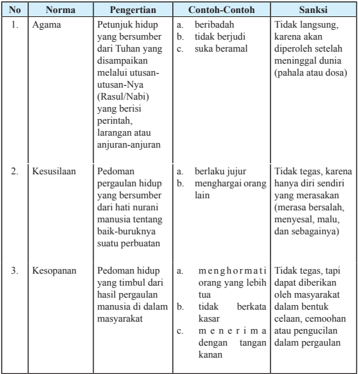

Tabel ini berisi norma-norma moral yang harus diikuti oleh individu dalam masyarakat, termasuk agama, kesusilaan, dan kesopanan. Norma-norma ini mencakup berbagai perilaku yang dianjurkan dan dilarang, seperti beribadah, berjujur, menghargai orang lain, dan menghormati orang yang lebih tua. Setiap norma memiliki contoh-contoh perilaku yang baik dan buruk, serta sanksi yang akan diberikan jika tidak mematuhi norma tersebut. Topik utama tabel ini adalah norma-norma moral yang harus diikuti dalam masyarakat, dengan kolom-kolom yang mencakup norma, pengertian, contoh-contoh, dan sanksi. Data penting yang terlihat adalah bahwa setiap norma memiliki contoh-contoh perilaku yang baik dan buruk, serta sanksi yang akan diberikan jika tidak mematuhi norma tersebut.

 

---
## 📄 Halaman 121

---
**📊 Tabel**

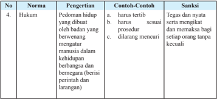

Tabel ini berisi informasi tentang hukum pedoman hidup yang dibuat oleh badan yang berwenang mengatur manusia dalam kehidupan berkelompok dan negara. Topik utamanya adalah tentang tindakan yang dilarang dan harus dihindari. Kolom-kolomnya meliputi nomor urut (No.), norma, pengertian, contoh-cantleh, dan sanksi. Data penting yang terlihat adalah bahwa tindakan seperti terbit, sesuai prosedur, dan tidak dilarang harus dilakukan dengan tegas dan niat baik, serta harus memakai bagai setiap orang tanpa kecuali. Ini menunjukkan bahwa tabel ini bertujuan untuk memberikan panduan dan sanksi terhadap perilaku yang tidak sesuai dengan norma yang ditetapkan.

(Sumber: Diolah dari berbagai sumber)

Dalam tabel di atas disebutkan bahwa sanksi norma hukum adalah tegas dan nyata. Hal tersebut mengandung pengertian sebagai berikut.

- Tegas berarti  adanya  aturan  yang  telah  dibuat  secara  material.  Misalnya, dalam hukum pidana mengenai sanksi diatur dalam pasal 10 KUHP. Dalam pasal  tersebut  ditegaskan  bahwa  sanksi  pidana  berbentuk  hukuman  yang mencakup:
- a).  Hukuman Pokok, yang terdiri atas:
- hukuman mati
- hukuman  penjara  yang  terdiri  dari  hukuman  seumur  hidup  dan hukuman sementara waktu (setinggi-tingginya 20 tahun dan sekurangkurangnya 1 tahun)
- b).  Hukuman Tambahan, yang terdiri:
- pencabutan hak-hak tertentu
- perampasan (penyitaan) barang-barang tertentu
- pengumuman keputusan hakim
- Nyata  berarti  adanya  aturan  yang  secara  material  telah  ditetapkan  kadar hukuman berdasarkan perbuatan yang dilanggarnya. Contoh: pasal 338 KUHP, menyebutkan 'barang siapa sengaja merampas nyawa orang lain, diancam, karena pembunuhan, dengan pidana penjara paling lama lima belas tahun'.
Jika sanksi hukum diberikan oleh negara, melalui lembaga-lembaga peradilan, sanksi sosial diberikan oleh masyarakat. Misalnya dengan menghembuskan desasdesus, cemoohan, dikucilkan dari pergaulan, bahkan yang paling berat diusir dari lingkungan masyarakat setempat.

Jika sanksi hukum maupun sanksi sosial tidak juga mampu mencegah orang melakukan perbuatan melanggar aturan, ada satu jenis sanksi lain, yakni sanksi psikologis. Sanksi psikologis dirasakan dalam batin kita sendiri. Jika seseorang

 

---
## 📄 Halaman 122

melakukan pelanggaran terhadap peraturan, tentu saja di dalam batinnya ia akan merasa bersalah. Selama hidupnya ia akan dibayang-bayangi oleh kesalahannya itu.  Hal  ini  akan  sangat  membebani  jiwa  dan  pikiran  kita.  Sanksi  inilah  yang merupakan gerbang terakhir yang dapat mencegah seseorang melakukan pelanggaran terhadap aturan.

### Tugas Kelompok 3.2

Lakukan wawancara dengan Kapolsek atau anggota polisi lainnya di wilayah tempat kalian tinggal! Tanyakan hal-hal sebagai berikut.

- Jumlah kasus yang ditangani oleh Polsek setempat
- Jenis kasus yang ditangani
- Penanganan kasus tersebut
- Jenis sanksi yang akan diterima oleh pihak-pihak yang terlibat
Laporkan hasil wawancara tersebut secara tertulis dan presentasikan di depan kelas!

### Refleksi

Setelah kalian mempelajari materi sistem hukum dan peradilan di Indonesia, tentunya kalian semakin memahami bahwa sebagai warga negara, kalian harus mematuhi setiap hukum yang berlaku. Coba kalian renungkan sikap dan perilaku kalian dalam kehidupan sehari-hari. Apakah kalian pernah melakukan pelanggaran hukum dan bagaimana seharusnya?

---
**📊 Tabel**

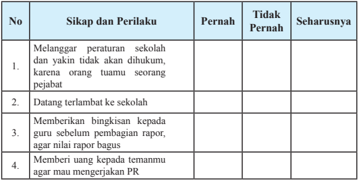

Tabel ini menunjukkan sikap dan perilaku siswa yang pernah dilakukan, tidak pernah dilakukan, dan seharusnya dilakukan. Topik utamanya adalah tentang perilaku yang baik dan buruk di sekolah. Kolom-kolomnya meliputi "No", "Sikap dan Perilaku", "Pernah", "Tidak Pernah", dan "Seharusnya". Data penting yang terlihat adalah bahwa sikap seperti melanggar peraturan sekolah, datang terlambat ke sekolah, memberikan uang kepada temanmu agar mengerjakan PR, dan memberikan bingkisan kepada guru sebelum pembagian rapor sering dilakukan oleh siswa, sedangkan sikap lainnya seperti datang tepat waktu, memberikan bingkisan kepada guru setelah pembagian rapor, dan memberikan uang kepada temanmu untuk membayar biaya sekolah sering tidak dilakukan oleh siswa. Ini menunjukkan bahwa sikap-sikap yang baik seperti datang tepat waktu dan memberikan bingkisan kepada guru setelah pembagian rapor lebih disukai oleh siswa daripada sikap-sikap yang kurang baik seperti melanggar peraturan sekolah dan memberikan uang kepada temanmu untuk membayar biaya sekolah.

 

---
## 📄 Halaman 123

---
**📊 Tabel**

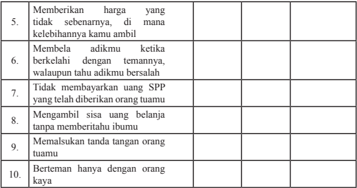

Tabel ini berisi 10 poin yang mungkin merujuk pada perilaku atau sikap yang dianggap tidak baik dalam situasi sosial. Topik utamanya adalah tentang perilaku yang tidak etis atau tidak sopan dalam hubungan sosial. Kolom pertama mungkin berisi deskripsi perilaku tersebut, sedangkan kolom kedua dan ketiga mungkin berisi penilaian positif atau negatif terhadap perilaku tersebut. Data atau pola penting yang terlihat adalah bahwa semua poin memiliki penilaian negatif, menunjukkan bahwa semua perilaku tersebut dianggap tidak baik dalam situasi sosial.

### Rangkuman

### 1. Kata Kunci

Kata  kunci  yang  harus  kalian  pahami  dalam  mempelajari  materi pada  bab  ini  adalah hukum,  sistem  hukum,  tujuan  hukum, penggolongan  hukum,  peradilan,  pengadilan,  dan  kepatuhan hukum.

### 2. Intisari Materi

- Sesuatu  disebut  hukum  jika  mengandung  unsur-unsur:  peraturan mengenai  tingkah  laku  manusia  dalam  pergaulan  masyarakat; peraturan itu dibuat dan ditetapkan oleh badan-badan resmi yang berwajib;  peraturan  itu  bersifat  memaksa;  dan  sanksi  terhadap pelanggaran peraturan tersebut adalah tegas. Adapun yang menjadi karakteristik dari hukum adalah adanya perintah dan larangan, serta perintah atau larangan tersebut harus dipatuhi oleh semua orang.
- Kekuasaan  kehakiman  di  Indonesia  dilakukan  oleh  Mahkamah Agung. Badan peradilan yang berada di bawah Mahkamah Agung meliputi  badan  peradilan  yang  berada  di  lingkungan  peradilan umum, peradilan agama, peradilan militer, dan peradilan tata usaha negara, serta oleh sebuah Mahkamah Konstitusi. Lembaga-lembaga tersebut  berperan  sebagai  penegak  keadilan  dan  dibersihkan  dari

 

---
## 📄 Halaman 124

- setiap  intervensi,  baik  dari  lembaga  legislatif,  eksekutif,  maupun lembaga lainnya.
- Lembaga  peradilan  nasional  sama  artinya  dengan  pengadilan negara  yaitu  lembaga  yang  dibentuk  oleh  negara  sebagai  bagian dari otoritas negara di bidang kekuasaan kehakiman dengan sumber hukumnya peraturan perundang-undangan yang berlaku di dalam negara.
- Tingkatan  lembaga  peradilan  terdiri  dari  tiga tingkatan yaitu pengadilan tingkat pertama yang berkedudukan di ibu kota wilayah  kabupaten  atau  kota,  pengadilan  tingkat  kedua/banding yang berkedudukan di ibu kota wilayah provinsi, dan kasasi oleh Mahkamah Agung.
- Ketaatan atau kepatuhan terhadap hukum yang berlaku merupakan konsep nyata dalam diri seseorang yang diwujudkan dalam perilaku yang sesuai dengan sistem hukum yang berlaku.  Tingkat kepatuhan hukum yang diperlihatkan oleh seorang warga negara, secara  langsung  menunjukkan    tingkat  kesadaran  hukum  yang dimilikinya. Kepatuhan hukum mengandung arti bahwa seseorang memiliki kesadaran untuk memahami dan menggunakan peraturan perundangan  yang  berlaku;  mempertahankan  tertib  hukum  yang ada; dan menegakkan kepastian hukum.
- Adapun ciri-ciri seseorang yang berperilaku sesuai dengan hukum yang berlaku dapat dilihat dari perilaku yang diperbuatnya: disenangi oleh masyarakat pada umumnya, tidak menimbulkan kerugian bagi diri sendiri dan orang lain, tidak menyinggung perasaan orang lain, menciptakan keselarasan, mencerminkan sikap sadar hukum, dan mencerminkan kepatuhan terhadap hukum.

### Penilaian Diri

### 1. Penilaian Sikap

Untuk mengukur sejauhmana kalian telah berperilaku sesuai dengan hukum yang  berlaku  dalam  kehidupan  sehari-hari,  mari  berbuat  jujur  dengan  mengisi daftar perilaku di bawah ini dengan membubuhkan tanda ceklis ( ✓ ) pada kolom selalu, sering, kadang-kadang, dan tidak pernah.

 

---
## 📄 Halaman 125

---
**📊 Tabel**

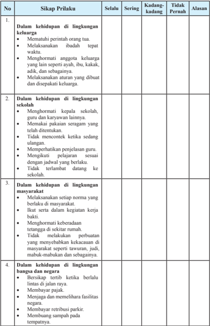

Tabel ini berisi informasi tentang sikap perilaku yang diharapkan dalam berbagai lingkungan hidup, termasuk keluarga, sekolah, masyarakat, dan bangsa dan negara. Topik utamanya adalah sikap dan perilaku yang diharapkan dalam berbagai situasi. Kolom-kolomnya meliputi "Selalu", "Sering", "Tidak Pernah", dan "Alasan". Data penting yang terlihat adalah bahwa sikap seperti mematuhi aturan, menghormati orang lain, dan menjaga kebersihan harus selalu dilakukan dalam semua situasi. Selain itu, tabel juga mencakup aspek-aspek seperti menghargai waktu, menghargai peran orang tua, dan menjaga kebersihan lingkungan.

 

---
## 📄 Halaman 126

Apabila jawaban kalian 'kadang-kadang' atau 'tidak pernah' pada kolom perilaku-perilaku tersebut di atas, kalian sebaiknya mulai mengubah sikap dan perilaku kalian agar menjadi lebih baik. Sebaliknya, apabila jawaban kalian 'selalu'  atau  'sering',  pertahankanlah  dan  wujudkan  sikap  tersebut  dalam kehidupan sehari-hari.

### 2. Pemahaman Materi

Dalam mempelajari materi pada bab ini, tentu saja ada materi yang dengan mudah kalian pahami, ada juga yang sulit kalian pahami. Oleh karena itu, lakukanlah penilaian diri atas pemahaman kalian terhadap materi pada bab ini dengan memberikan tanda ceklist ( ✓ )  pada kolom paham sekali, paham sebagian, dan belum paham.

---
**📊 Tabel**

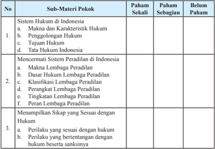

Tabel ini memuat informasi tentang pemahaman siswa terhadap sub-materi pokok dalam kurikulum pendidikan hukum di Indonesia. Topik utama adalah sistem hukum, sistem peradilan, dan sikap sesuai dengan hukum. Kolom "Paham Sekali" menunjukkan tingkat pemahaman siswa yang paling rendah, sedangkan "Paham Sebagian" menunjukkan tingkat pemahaman yang sedang. Kolom "Belum" menunjukkan siswa belum sepenuhnya memahami materi tersebut. Data penting yang terlihat adalah bahwa banyak siswa masih memerlukan penjelasan lebih lanjut untuk memahami materi tersebut, terutama dalam sub-topik seperti makna hukum, pengolongan hukum, tujuan hukum, sistem peradilan, dan sikap sesuai dengan hukum.

Apabila pemahaman kalian berada pada kategori paham sekali mintalah materi  pengayaan  kepada  guru  untuk  menambah  wawasan  kalian. Apabila pemahaman kalian berada pada kategori paham sebagian dan belum paham coba bertanyalah kepada guru serta mintalah penjelasan lebih lengkap, agar kalian cepat memahami materi pembelajaran yang sebelumnya kurang atau belum dipahami.

 

---
## 📄 Halaman 127

### Proyek Kewarganegaraan

- Bentuklah  Kelompok  Pelajar  Sadar  Hukum  di  sekolah  kalian.  Berilah nama kelompok kalian agar menjadi kebanggaan dan identitas kelompok.
- Susunlah kegiatan dari kelompok kalian sebagai perwujudan meningkatkan kesadaran  hukum  pelajar  seperti  penyuluhan  hukum,  gerakan  tertib  di kantin,  gerakan  tertib  sampah,  dan  sebagainya.  Kegiatan  yang  dipilih disesuaikan dengan kebutuhan lingkungan sekolah kalian.
- Susunlah jadwal dan pembagian tugas seluruh anggota kelompok.
- Laksanakan kegiatan sesuai rencana dengan penuh tanggung jawab.
- Diskusikan hasil kegiatan kalian dan buatlah kesimpulan atas keberhasilan kegiatan.
- Susunlah  laporan  kegiatan  secara  tertulis  dan  sajikan  di  depan  kelas melalui pameran kelas atau bentuk lain.

### Uji Kompetensi Bab 3

### Jawablah pertanyaan di bawah ini secara singkat, jelas, dan akurat!

- Kemukakan  tiga  pengertian  hukum  dari  para  ahli  hukum  yang  kalian ketahui, kemudian jelaskan letak persamaan dan perbedaannya!
- Jelaskan pengertian tata hukum Indonesia!
- Jelaskan klasifikasi hukum berdasarkan kepustakaan ilmu hukum!
- Jelaskan perbedaan antara kompetensi absolut dan kompetensi relatif dari suatu lembaga peradilan!
- Jelaskan  perangkat  lembaga  peradilan  di  lingkungan  peradilan  umum, peradilan  agama,  peradilan  militer,  peradilan  tata  usaha  negara  dan Mahkamah Konstitusi!
- Mengapa kita mesti mematuhi hukum? Jelaskan!
- Deskripsikan contoh-contoh perilaku yang menunjukkan kepatuhan terhadap hukum di lingkungan keluarga, sekolah, masyarakat, dan negara!

 

---
## 📄 Halaman 128

### Dinamika Peran Indonesia dalam Perdamaian Dunia

Selamat  ya,  kalian  sekarang  sudah  memasuki  semester  dua  di  kelas  XI. Semester ini sangat menentukan langkah kalian untuk dapat naik ke kelas XII. Nah, di semester dua ini materi pembelajaran untuk mata pelajaran Pendidikan Pancasila  dan  Kewarganegaraan  (PPKn)  akan  semakin  memberikan  tantangan kepada kalian untuk senantiasa belajar dengan penuh kesungguhan.

Pada  awal  semester  dua  ini,  kalian  akan  diajak  untuk  menyusuri  dinamika peran Indonesia dalam perdamaian dunia. Pada akhir pembelajaran bab ini, kalian diharapkan dapat menganalisis dinamika peran Indonesia dalam perdamaian dunia sesuai dengan Undang-Undang Dasar Negara Republik Indonesia Tahun 1945.

---
**🖼️ Gambar/Diagram**

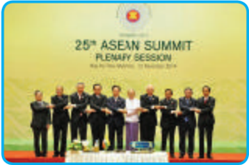

> **Deskripsi Visual:** Gambar ini adalah foto yang menunjukkan para pemimpin negara-negara anggota ASEAN yang sedang berdiri bersama-sama di depan podium. Di atas mereka terdapat tulisan "25th ASEAN Summit Plenary Session" dengan tanggal "16-17 November 2019". Pada bagian bawah, ada beberapa nama negara yang tertera sebagai anggota ASEAN. Gambar ini menunjukkan kebersamaan dan kerjasama antara negara-negara anggota ASEAN dalam menghadapi isu-isu global.

Gambar 4.1 Indonesia mempunyai peran yang sangat penting dalam menciptakan perdamaian di kawasan Asia Tenggara.

 

---
## 📄 Halaman 129

Salah satu tujuan nasional Indonesia sebagaimana tercantum dalam alinea ke-4 Pembukaan Undang-Undang Dasar Negara Republik Indonesia Tahun 1945 adalah ikut melaksanakan ketertiban dunia yang berdasarkan kemerdekaan, perdamaian abadi,  dan  keadilan  sosial.  Salah  satu  konsekuensi  dari  tujuan  tersebut  adalah bangsa Indonesia harus senantiasa berperan serta dalam menciptakan perdamaian dunia. Hal tersebut dikarenakan bangsa Indonesia merupakan bagian dari seluruh umat manusia di dunia sehingga sudah seharusnya bangsa Indonesia berada pada barisan terdepan dalam upaya menciptakan perdamaian dunia.

Gambar  4.1  di  atas  merupakan  contoh  peristiwa  ketika  bangsa  Indonesia menjalin  kerja  sama  dengan  bangsa  lain  dalam  wadah  negara-negara  Asia Tenggara (ASEAN). Kerja sama tersebut merupakan wujud dari peran Indonesia dalam menciptakan perdamaian dunia.

### A. Peran Indonesia dalam Menciptakan Perdamaian Dunia melalui Hubungan Internasional

### 1. Makna Hubungan Internasional

Menurut  kalian  apa  yang  akan terjadi jika seandainya negara kita tidak  menjalin  hubungan  dengan negara lain? Tentu semuanya pasti sepakat,  kita  akan  dikucilkan  dari pergaulan bangsa-bangsa di dunia. Hal  ini  tentunya  akan  merugikan seluruh kehidupan bangsa. Bangsa Indonesia  tidak  bisa  berinteraksi dengan sesamanya yang berada di negara  lain.  Selain  itu,  kita  akan buta  terhadap  hal-hal  yang  terjadi di negara lain yang pada hakikatnya merupakan sumber pengetahuan bagi kita.

### Info Kewarganegaraan

Komponen-komponen yang harus ada dalam hubungan internasional, antara lain:

- politik internasional (international politics),
- studi tentang peristiwa internasional (the study of foreign affair),
- hukum internasional (international law),
- organisasi Adminitrasi Internasional (international organization of administration).
Hubungan internasional merupakan salah satu jawaban bagi persoalan yang dialami  oleh  suatu  negara.  Ketika  suatu  negara  mengalami  kekurangan  dalam suatu  bidang,  misalnya  kekurangan  tenaga  ahli  untuk  membangun  negerinya

 

---
## 📄 Halaman 130

maka melalui hubungan internasional negara tersebut mampu mengatasi persoalan tersebut  dengan  meminta  bantuan  dari  negara  lain.  Oleh  karena  itu  hubungan internasional mempunyai kedudukan yang sangat penting dalam kehidupan suatu negara yang beradab.

Berkaitan  dengan  hal  tersebut  apa  sebenarnya  hubungan  internasional  itu? Mencakup  apa  saja  hubungan  tersebut?  Untuk  menjawab  pertanyaan  tersebut ada baiknya kalian kaji uraian pada bagian ini yang akan mengupas makna dari hubungan internasional.

Secara  umum  hubungan  internasional  diartikan    sebagai  hubungan  yang bersifat  global  yang  meliputi  semua hubungan yang terjadi dengan melampaui batas-batas ketatanegaraan. Konsepsi hubungan internasional oleh para ahli sering dianggap sama atau dipersamakan dengan konsepsi politik luar negeri, hubungan luar negeri, dan politik internasional. Ketiga konsep tersebut sebenarnya memiliki makna  yang  berbeda  satu  sama  lain,  akan  tetapi  mempunyai  persamaan  yang cukup mendasar dalam hal ruang lingkupnya yang melampaui batas-batas negara (lingkup internasional). Untuk memperluas pemahaman kalian, berikut dipaparkan makna dari ketiga konsep tersebut.

- Politik  luar  negeri adalah  seperangkat  cara/kebijakan  yang  dilakukan oleh suatu negara untuk mengadakan hubungan dengan negara lain dengan tujuan untuk tercapainya tujuan negara serta kepentingan nasional negara yang bersangkutan.
- Hubungan luar negeri adalah keseluruhan hubungan yang dijalankan oleh suatu negara dengan semua pihak yang tidak tunduk pada kedaulatannya.
- Politik internasional adalah politik antarnegara yang mencakup kepentingan  dan  tindakan  beberapa  atau  semua  negara  serta  proses interaksi antarnegara maupun antarnegara dengan organisasi internasional.

### Tugas Mandiri 4.1

- Berkaitan  dengan  pengertian  hubungan  internasional,  terdapat  berbagai pandangan para ahli yang mencoba memberikan definisi terhadap konsep hubungan internasional. Oleh karena itu, coba kalian identifikasi pendapat para  ahli  mengenai  definisi  hubungan  internasional.  Bacalah  berbagai buku sumber, majalah, koran, atau yang lainnya sebagai sumber informasi kalian. Kemudian tuliskan hasil identifikasi kalian pada tabel di bawah ini.

 

---
## 📄 Halaman 131

Informasikan hasil identifikasi kalian dengan teman sebangku dengan cara saling tukar hasil pekerjaan masing-masing.

---
**📊 Tabel**

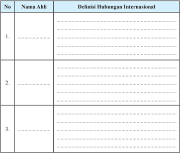

Tabel ini berisi definisi hubungan internasional yang disusun berdasarkan nama ahli yang masing-masing memberikan penjelasan tentang konsep tersebut. Topik utama tabel adalah definisi hubungan internasional, yang diuraikan melalui kolom "Nama Ahli" dan "Definisi Hubungan Internasional". Dalam setiap baris, nama ahli tersebut memberikan penjelasan singkat tentang hubungan internasional, yang mencakup berbagai aspek seperti hubungan antar negara, perdagangan internasional, diplomasi, dan sebagainya. Data penting yang terlihat adalah bahwa tabel ini menunjukkan bahwa definisi hubungan internasional dapat bervariasi tergantung pada pemahaman dan konteks masing-masing ahli.

- Dari  definisi-definisi  tentang  hubungan  internasional  tersebut,  rumusan siapakah yang paling relevan dengan konteks hubungan internasional yang dilakukan oleh bangsa Indonesia? Berikan alasannya.
......................................................................................................................

......................................................................................................................

......................................................................................................................

......................................................................................................................

............................................................................................................

- Rumuskanlah definisi hubungan internasional menurut pendapat sendiri.
......................................................................................................................

......................................................................................................................

......................................................................................................................

 

---
## 📄 Halaman 132

......................................................................................................................

...........................................................................................................

- Cari persamaan dan perbedaan definisi hubungan internasional yang kalian rumuskan dengan definisi yang dirumuskan teman sebangku.
......................................................................................................................

......................................................................................................................

......................................................................................................................

......................................................................................................................

...........................................................................................................

### 2. Pentingnya Hubungan Internasional bagi Indonesia

Suatu bangsa yang merdeka tidak dapat hidup sendiri tanpa bantuan dari negara lain. Untuk menjaga kelangsungan hidup dan mempertahankan kemerdekaannya, negara tersebut membutuhkan dukungan dari negara lain. Nah, untuk mendapatkan dukungan tersebut, suatu negara harus mengadakan hubungan yang baik dengan negara lain. Misalnya, ketika awal kemerdekaan, bangsa Indonesia membutuhkan pengakuan dan dukungan dari negara lain. Oleh karena itu, para pendiri negara menjalin  hubungan dengan India, Australia, Amerika Serikat, Belgia, Mesir, dan sebagainya. Alhasil, kemerdekaan Negara Indonesia mendapatkan dukungan dari negara-negara lain di dunia.

---
**🖼️ Gambar/Diagram**

> **Deskripsi Visual:** Gambar ini adalah ilustrasi yang menunjukkan sebuah pertemuan atau rapat di sebuah gedung konferensi. Ilustrasi ini menggambarkan suasana rapat dengan banyak orang yang duduk di meja panjang di sepanjang ruangan. Di tengah-tengah, ada seorang pria yang berdiri di podium, mungkin sedang memberikan pidato atau presentasi. Sejumlah lampu menyala di atas meja, menambahkan nuansa formal dan serius pada suasana rapat tersebut. Ilustrasi ini menunjukkan hubungan antara pemimpin atau narasumber (pria berdiri) dan para peserta rapat (orang-orang duduk). Teks, angka, atau label penting tidak terlihat dalam gambar ini. Informasi kunci yang dapat diambil pembaca adalah bahwa ini adalah suatu pertemuan formal atau rapat penting di mana seseorang sedang memberikan pidato atau presentasi kepada para peserta.

Gambar 4.2 Suasana Konferensi Asia Afrika Tahun 1955 menjadi bukti hubungan internasional yang dijalankan bangsa Indonesia di awal kemerdekaan

 

---
## 📄 Halaman 133

Suatu  negara  dapat  menjalin hubungan dengan negara lain manakala kemerdekaan dan kedaulatannya telah diakui secara de facto dan de  jure oleh negara lain.  Perlunya  kerja  sama  dalam bentuk hubungan internasional antara lain karena faktor-faktor berikut.

- Faktor internal, yaitu adanya kekhawatiran terancamnya kelangsungan hidup kesananya, baik melalui kudeta maupun intervensi dari negara lain.

### Info Kewarganegaraan

Ruang lingkup hubungan internasional terletak dalam dua bidang.

- Bidang publik , yang meliputi politik internasional, politik luar negeri, pertahanan dan keamanan, hukum internasional, diplomasi, organisasi internasional, dan kejahatan internasional.
- Bidang privat , meliputi ekonomi dan moneter internasional, ilmu pengetahuan, dan turisme (kepariwisataan)
- Faktor ekternal, yaitu ketentuan hukum alam yang tidak dapat dipungkiri bahwa suatu negara tidak dapat berdiri sendiri tanpa bantuan dan kerja sama dengan negara lain. Ketergantungan tersebut terutama dalam upaya memecahkan masalah-masalah ekonomi, politik, hukum, sosial budaya, pertahanan, dan keamanan.
Bagaimana  hubungan  internasional  yang  dibangun  oleh  bangsa  Indonesia? Apa arti penting hubungan internasional bagi bangsa Indonesia? Pola hubungan internasional yang dibangun oleh bangsa Indonesia dapat dilihat dari kebijakan politik luar negeri Indonesia. Bangsa Indonesia dalam membina hubungan dengan negara lain menerapkan prinsip politik luar negeri yang bebas aktif dan diabdikan bagi kepentingan nasional, terutama kepentingan pembangunan di segala bidang serta ikut melaksanakan  ketertiban dunia  yang  berdasarkan  kemerdekaan, perdamaian abadi dan keadilan sosial.

Pembangunan  hubungan  internasional  bangsa  Indonesia  ditujukan  untuk peningkatan  persahabatan  dan  kerja  sama  bilateral,  regional,  dan  multilateral melalui  berbagai  macam  forum  sesuai  dengan  kepentingan  dan  kemampuan nasional.  Selain  itu,  bagi  bangsa  Indonesia,  hubungan  internasional  diarahkan untuk hal-hal berikut.

 

---
## 📄 Halaman 134

- Pembentukan  satu  negara  Republik  Indonesia  yang  berbentuk  negara kesatuan dan negara kebangsaan yang demokratis.
- Pembentukan  satu  masyarakat  yang  adil  dan  makmur  secara  material ataupun spiritual dalam wadah Negara Kesatuan Republik Indonesia.
- Pembentukan satu persahabatan yang baik antara Republik Indonesia dan semua negara di dunia, dasar kerja sama  adalah membentuk satu dunia baru yang bersih dari imperialisme dan kolonialisme menuju perdamaian dunia yang sempurna .
- Mempertahankan kemerdekaan bangsa dan menjaga keselamatan negara.
- Memperoleh barang-barang yang diperlukan dari luar untuk memperbesar kemakmuran rakyat, apabila barang-barang itu tidak atau belum dihasilkan sendiri.
- Meningkatkan  perdamaian  internasional,  karena  hanya  dalam  keadaan damai Indonesia dapat membangun dan memperoleh syarat-syarat yang diperlukan untuk memperbesar kemakmuran rakyat.
- Meningkatkan persaudaraan segala bangsa sebagai pelaksanaan cita-cita yang tersimpul di dalam Pancasila, dasar dan filsafah negara kita.
Berdasarkan uraian di atas dapat disimpulkan bahwa untuk mencapai tujuan yang  diharapkan  dari  pelaksanaan  hubungan  internasional,  bangsa  Indonesia harus senantiasa meningkatkan kualitas kerja sama internasional yang dibangun dengan negara lain. Untuk mencapai hal tersebut, bangsa Indonesia harus mampu meningkatkan kualitas dan kinerja aparatur luar negeri agar mampu melakukan diplomasi  yang pro-aktif dalam segala bidang untuk membangun citra positif Indonesia  di  dunia  internasional.  Selain  itu,  juga  harus  mampu  memberikan perlindungan dan pembelaan terhadap warga negara dan kepentingan Indonesia, serta memanfaatkan setiap peluang bagi kepentingan nasional.

### Tugas Mandiri 4.2

Identifikasilah manfaat  yang  diperoleh bangsa  Indonesia  dengan  menjalin hubungan internasional saat ini. Tuliskan dalam tabel di bawah ini.

 

---
## 📄 Halaman 135

---
**📊 Tabel**

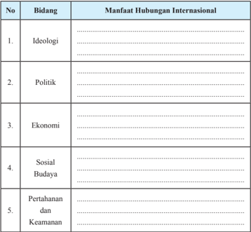

Tabel ini berisi informasi tentang manfaat hubungan internasional dalam berbagai bidang, mulai dari ideologi hingga pertahanan dan keamanan. Topik utama tabel adalah manfaat hubungan internasional dalam berbagai aspek kehidupan. Kolom-kolomnya mencakup ideologi, politik, ekonomi, sosial budaya, dan pertahanan dan keamanan. Data penting yang terlihat adalah bahwa hubungan internasional memiliki manfaat yang signifikan dalam berbagai bidang, menunjukkan bahwa hubungan internasional memiliki dampak yang luas dan mendalam pada kehidupan masyarakat.

### 3. Politik Luar Negeri Indonesia dalam Menjalin Hubungan  Internasional

Hubungan yang dijalin oleh suatu negara dengan negara lain, tentu saja tidak dapat dilepaskan dari tata pergaulan antarnegara. Jika dalam pergaulan manusia dalam lingkungan tetangga ada yang dinamakan tata krama pergaulan, maka dalam pergaulan  antarnegara  pun  terdapat  hal  yang  sama.  Setiap  negara  mempunyai kebijakan  politiknya  masing-masing.  Kebijakan  politik  masing-masing  negara dalam pergaulan internasional dinamakan politik luar negeri.

Berkaitan dengan hal tersebut, bentuk kerja sama dan perjanjian internasional yang dilakukan oleh bangsa Indonesia merupakan perwujudan dari politik luar negeri Indonesia. Selain itu, politik luar negeri juga memberikan corak atau warna tersendiri bagi kerja sama dan perjanjian internasional yang dilakukan oleh suatu negara. Apa sebenarnya politik luar negeri bangsa Indonesia?

Untuk mengetahui corak politik luar negeri Indonesia, coba kalian perhatikan Pembukaan  Undang-Undang  Dasar  Negara  Republik  Indonesia  Tahun  1945

 

---
## 📄 Halaman 136

alinea  keempat,  tentang  tujuan  negara, '...ikut  melaksanakan  ketertiban  dunia yang  berdasarkan  kemerdekaan,  perdamaian  abadi,  dan  keadilan  sosial'. Pernyataan  tersebut  mengindikasikan  bahwa  politik  luar  negeri  kita  memiliki corak tertentu. Pemikiran para pendiri negara ( founding fathrers ) yang dituangkan dalam  Pembukaan  Undang-Undang  Dasar  Negara  Republik  Indonesia  Tahun 1945  tersebut didasari oleh kenyataan bahwa sebagai negara yang baru merdeka, kita dihadapkan pada lingkungan pergaulan dunia yang dilematis.

Pada awal pendirian negara Republik Indonesia, kita dihadapkan pada satu situasi dunia yang dikuasai oleh dua kekuatan negara adidaya sebagai akibat dari

Perang Dunia II. Dua kekuatan tersebut adalah Blok  Barat di  bawah  kendali Amerika Serikat dengan mengusung ideologi liberal. Kekuatan lainnya dikuasai oleh  Blok Timur yang dipimpin oleh Uni Soviet dengan mengusung ideologi  komunis.  Kenyataan  ini  sangat berpengaruh  kepada  negara Indonesia yang baru saja merdeka dan tengah berupaya keras mempertahankan kemerdekaanya dari rongrongan Belanda   yang  ingin kembali menjajah Indonesia.  Kondisi  demikian  mau  tidak mau  memaksa  bangsa  Indonesia  untuk menentukan sikap, walaupun usianya masih sangat muda. Sikap bangsa Indonesia tersebut tertuang dalam rumusan politik luar negeri Indonesia.

### Info Kewarganegaraan

Tujuan politik luar negeri Indonesia menurut Muhammad Hatta:

- Mempertahankan kemerdekaan bangsa dan menjaga keselamatan negara.
- Memperoleh barang-barang yang diperlukan dari luar untuk memperbesar kemakmuran rakyat.
- Meningkatkan perdamaian internasional.
- Meningkatkan persaudaraan segala bangsa sebagai pelaksanaan cita-cita yang tersimpul dalam Pancasila, dasar dan filsafah negara kita.
Pemerintah Indonesia yang pada waktu itu dipimpin oleh Ir. Soekarno sebagai Presiden  dan  Drs.  Muhammad  Hatta  sebagai  Wakil  Presiden  pada  tanggal  2 September  1948  di  hadapan  Badan  Pekerja  Komite  Nasional  Indonesia  Pusat mengumumkan pendirian politik luar negeri Indonesia yang antara lain berbunyi '... tetapi  mestikah  kita,  bangsa  Indonesia  yang  memperjuangkan  kemerdekaan bangsa  dan  negara  kita  hanya  harus  memilih  antara pro-Rusia  atau  proAmerika? Apakah tak ada pendirian lain yang harus kita ambil dalam mengejar cita-cita kita?'.

 

---
## 📄 Halaman 137

Sumber: Buku 30 Tahun Indonesia Merdeka

Gambar 4.3 Presiden Soekarno menjadi salah satu tokoh pendiri gerakan non-blok yang merupakan perwujuda n politik luar negeri yang bebas aktif

Pemerintah  Indonesia  pada  waktu  itu  berpendapat  bahwa  pendirian  yang harus diambil tidak menjadikan negara kita terjebak dalam kepentingan dua blok tersebut. Negara kita tidak mau menjadi objek dalam pertarungan politik antara dua blok tersebut.  Negara  kita  harus  menjadi  subjek  yang  berhak  menentukan sikap sendiri dan memperjuangkan tujuan sendiri, yaitu merdeka seutuhnya tanpa ada rongrongan dari negara lain. Dalam kesempatan itu Drs. Muhammad Hatta menyampaikan pidatonya dengan judul yang sangat menarik, yaitu Mendayung antara Dua Karang . Pidato tersebut kemudian dirumuskan lagi secara eksplisit sebagai  prinsip  bebas  aktif,  yang  kemudian  menjadi  corak  politik  luar  negeri Indonesia sampai sekarang. Dengan demikian, dapat disimpulkan bahwa politik luar negeri Indonesia bersifat bebas aktif.

Sifat politik luar negeri inilah yang mewarnai pola kerja sama bangsa Indonesia dengan  negara  lain.  Dengan  kata  lain,  Indonesia  selalu  menitikberatkan  pada peran atau kontribusi yang dapat diberikan oleh bangsa Indonesia bagi kemajuan peradaban dan perdamaian dunia.

Hal ini dapat dilihat dari peristiwa-peristiwa di bawah ini yang dengan jelas menggambarkan bentuk kerja sama yang dikembangkan bangsa Indonesia.

- Indonesia  menjadi  anggota  Perserikatan  Bangsa-bangsa  (PBB)  yang ke-60  pada  tanggal  28  September  1950.  Meskipun  pernah  keluar  dari keanggotaan PBB pada tanggal 7 Januari 1965 sebagai bentuk protes atas diterimanya Malaysia menjadi anggota tidak tetap Dewan Keamanan PBB,

 

---
## 📄 Halaman 138

- akan  tetapi  pada  tanggal  28  September  1966  Indonesia  masuk  kembali menjadi anggota PBB dan tetap sebagai anggota yang ke-60
- Memprakarsai  penyelenggaraan  Konferensi  Asia-Afrika  (KAA)  pada tahun 1955 yang melahirkan semangat dan solidaritas negara-negara AsiaAfrika yang kemudian melahirkan Dasasila Bandung.
- Keaktifan Indonesia sebagai salah satu pendiri Gerakan Non-Blok (GNB) pada  tahun  1961,  bahkan  pada  tahun  1992  dalam  Konferensi  NegaraNegara Non-Blok yang berlangsung di Jakarta, Indonesia ditunjuk menjadi Ketua  GNB. Melalui GNB ini secara langsung Indonesia telah turut serta meredakan ketegangan perang dingin antara Blok Barat dan Blok Timur.
- Terlibat langsung dalam misi perdamaian Dewan Keamanan PBB dengan mengirimkan  Pasukan  Garuda  ke  negara-negara  yang  dilanda  konflik seperti  Konggo,  Vietnam,  Kamboja,  Bosnia,  dan  sebagainya.  Bahkan pada tahun 2007, Indonesia ditetapkan menjadi anggota tidak tetap Dewan Kemanan PBB.
- Indonesia menjadi salah satu pendiri  ASEAN (Assosiaciation of South-East Asian Nation) yaitu organisasi negara-negara di kawasan Asia Tenggara, bahkan Sekretariat   Jenderal ASEAN berada di Jakarta.
- Ikut  serta  dalam  setiap  pesta  olah  raga  internasional  mulai  dari  SEA Games, Asian Games, Olimpiade, dan sebagainya.
- Indonesia  aktif  juga  dalam  beberapa  organisasi  internasional  lainnya, misalnya Organisasi Konferensi Islam (OKI), Organisasi Negara-Negara Pengekspor  Minyak  (OPEC),  dan  Kerja  sama  Ekonomi  Asia  Pasifik (APEC).

 

---
## 📄 Halaman 139

- Menyelenggarakan  hubungan  diplomatik  dengan  berbagai  negara  yang ditandai  dengan  pertukaran  perwakilan  diplomatik  dengan  negara  yang bersangkutan.  Sampai  saat  ini,  Indonesia  sudah  menjalin  kerja  sama bilateral dengan 162 negara. Sebagai wujud dari hal tersebut, di negara kita  terdapat  kantor  kedutaan  besar  dan  konsulat  jenderal  negara  lain. Begitu juga dengan kantor Kedutaan Besar dan Konsulat Jenderal negara kita yang terdapat di negara lain.

### Tugas Mandiri 4.3

Bacalah berita di bawah ini.

### Indonesia Dorong Terus Perdamaian dan Pembangunan Kembali Jalur Gaza

Pemerintah Indonesia turut berpartisipasi dalam Konferensi Internasional untuk Rekonstruksi Gaza yang diinisiasi oleh Pemerintah Mesir bekerja sama dengan Norwegia (12/10). Konferensi diadakan untuk mengumpulkan donasi bagi rakyat Palestina di Jalur Gaza setelah terjadi serangan Israel ke wilayah tersebut pada bulan Juli  dan  Agustus  yang  lalu.  Pemerintah  Indonesia  diwakili  oleh Delegasi RI yang dipimpin oleh Ibu Wiwiek Setyawati Firman, Staf Ahli Menteri Luar Negeri Bidang Polhukam.

Dalam  pernyataannya,  selain  menekankan  komitmen  untuk  terus mendukung perjuangan bangsa Palestina, ketua Delri sekali lagi juga menyampaikan  komitmen  RI  untuk  memberikan  bantuan  seperti yang telah disampaikan oleh Presiden RI senilai USD 1 Juta ketika terjadi invasi Israel ke Jalur Gaza. Indonesia juga terus berkomitmen untuk  mendorong  perdamaian  di  Palestina.  Di  bidang  pelatihan Sumber  Daya  Manusia  misalnya,  dalam  kurun  waktu  lima  tahun terakhir,  Indonesia  telah  menyediakan  128  jenis  pelatihan  kepada 1257 warga Palestina dalam kerangka New Asian African Strategic Partnership (NAASP).

Komitmen  lainnya  dari  Indonesia  adalah  juga  berupa  bantuan pembangungan  Pusat  Jantung  Indonesia  di  RS  As-Shifa,  Gaza,

 

---
## 📄 Halaman 140

dengan kerja sama Islamic  Development Bank (IDB) senilai  USD 1,6  Juta.    Ketua  Delri  menyampaikan  bahwa  bantuan  kepada masyarakat Gaza tidak hanya datang dari Pemerintah Indonesia saja, melainkan  juga  dari  Parlemen  Indonesia  yang  telah  memberikan bantuan senilai USD 1 Juta dalam bentuk bantuan medis pada saat invasi  tahun  2012.  Dalam  kesempatan  tersebut,  Ketua  Delri  juga menyampaikan  agar  Pemerintah  Mesir  dapat  memberikan  akses yang lebih luas bagi distribusi bantuan kemanusiaan ke Jalur Gaza. Bantuan tersebut merupakan  bantuan yang dikumpulkan oleh masyarakat Indonesia melalui organisasi relawan dan saat ini sedang dikoordinasikan oleh Kedutaan Besar Republik Indonesia di Kairo.

Bantuan  tersebut  termasuk  lima  mobil  ambulans  yang  masih  menunggu izin dari Kementerian Luar Negeri Mesir untuk disampaikan ke Jalur Gaza melalui perbatasan pintu Rafah. Bantuan ambulans berasal dari Bulan Sabit Merah Indonesia (BSMI) Jakarta Raya, Pos Keadilan Peduli  Umat  (PKPU), Aksi  Cepat  Tanggap  (ACT)  dan  dua  buah dari  Komite  Nasional  untuk  Rakyat  Palestina  (KBNRP).  Bahkan bantuan lainnya yang telah disampaikan oleh LSM Indonesia sejak tahun 2009 mencapai IDR 135 Milyar. Bantuan tersebut disalurkan ke masyarakat Palestina melalui berbagai macam mekanisme antara lain pembangunan Rumah Sakit Indonesia, beasiswa bagi mahasiswa Palestina untuk belajar di Indonesia, mobil ambulans, dan makanan serta obatan-obatan.

Sumber :

http://www.kemlu.go.id

Setelah kalian membaca berita di atas jawablah pertanyaan-pertanyaan di bawah ini.

- Apa kesimpulan yang dapat kalian rumuskan setelah membaca berita di atas?
- ........................................................................................................................... ........................................................................................................................... ........................................................................................................................... ........................................................................................................................... ...........................................................................................................................
- Apabila dikaitkan dengan pengamalan Pancasila, termasuk kedalam sila ke berapakah kontribusi bangsa Indonesia terhadap perdamaian di Palestina?

 

---
## 📄 Halaman 141

...........................................................................................................................

...........................................................................................................................

...........................................................................................................................

...........................................................................................................................

...........................................................................................................................

- Bagaimana  penilaian  kalian  atas  peran  bangsa  Indonesia  dalam  menjalin hubungan internasional dengan negara lainnya?
...........................................................................................................................

...........................................................................................................................

...........................................................................................................................

...........................................................................................................................

...........................................................................................................................

- Apa saja saran yang dapat kalian ajukan kepada pemerintah untuk meningkatkan peran bangsa Indonesia dalam menciptakan perdamaian dunia melalui  hubungan internasional?
...........................................................................................................................

...........................................................................................................................

...........................................................................................................................

...........................................................................................................................

...........................................................................................................................

### B. Peran Indonesia dalam Menciptakan Perdamaian Dunia melalui Organisasi Internasional

Apa yang kalian bayangkan ketika mendengar istilah organisasi internasional? Pernahkah kalian menganggap bahwa organisasi internasional itu adalah organisasi sosial? Jika pernah, anggapan kalian itu tidak sepenuhnya salah dan juga tidak  sepenuhnya  benar.  Organisasi  internasional  mempunyai  berbagai  macam corak. Ada yang bercorak politis, sosial, ekonomi, budaya, dan sebagainya. Apa sebenarnya organisasi internasional itu?

Secara umum organisasi internasional dapat diartikan sebagai  organisasi yang berkedudukan  sebagai  subjek  hukum  internasional  dan  mempunyai  kapasitas untuk  membuat  perjanjian  internasional.  Karena  merupakan  subjek  hukum internasional,  organisasi  internasional  mempunyai  hak  dan  kewajiban  yang ditetapkan dalam konvensi-konvensi internasional.

Organisasi internasional pada umumnya beranggotakan negara-negara. Akan tetapi, meskipun demikian, tidak menutup kemungkinan organisasi internasional terdiri  dari  berbagai  badan  hukum  atau  badan  usaha,  bergantung  dari  sifat

 

---
## 📄 Halaman 142

organisasi  tersebut.  Bagaimana keterlibatan bangsa Indonesia dalam organisasi Internasional?

Indonesia terlibat dalam berbagai organisasi internasional. Hal tersebut sebagai perwujudan  dari  komitmen  bangsa  Indonesia  dalam  menciptakan  perdamaian dunia. Nah, untuk menambah wawasan kalian, berikut dipaparkan peran Indonesia dalam beberapa organisasi Internasional.

### 1. Peran Indonesia di Perserikatan Bangsa-Bangsa (PBB)

Indonesia  resmi  menjadi  anggota  PBB  ke-60  pada  tanggal  28  September 1950 dengan suara bulat dari para negara anggota. Hal tersebut terjadi kurang dari setahun setelah pengakuan kedaulatan oleh Belanda melalui Konferensi Meja Bundar.  Indonesia  dan  PBB  memiliki  keterikatan  sejarah  yang  kuat  mengingat kemerdekaan Indonesia diproklamasikan pada tahun 1945, tahun yang sama ketika PBB didirikan. Sejak tahun itu pula PBB secara konsisten mendukung Indonesia untuk menjadi negara yang merdeka, berdaulat, dan mandiri. Peran PBB terhadap Indonesia  pada  masa  revolusi  fisik  cukup  besar  seperti  ketika  terjadi Agresi Militer Belanda I, Indonesia dan  Australia mengusulkan agar persoalan Indonesia dibahas dalam sidang umum PBB. Selanjutnya, PBB membentuk Komisi Tiga Negara yang membawa Indonesia-Belanda ke meja Perundingan Renville. Ketika terjadi Agresi militer Belanda II, PBB membentuk UNCI yang mempertemukan Indonesia-Belanda dalam Perundingan Roem Royen.

Sumber:Buku 30 Tahun Indonesia

Gambar 4.5 Suasana Pengibaran kalinya di markas Perserikatan Bangsa-Bangsa .

 

---
## 📄 Halaman 143

Pemerintah RI mengutus Lambertus Nicodemus Palar sebagai Wakil Tetap RI yang  pertama  di  PBB.  Duta  Besar  Palar  bahkan  telah  memiliki  peran  besar dalam  usaha  mendapatkan  pengakuan  internasional  terhadap  kemerdekaan Indonesia pada saat konflik antara Belanda dan Indonesia pada tahun 1947. Duta Besar Palar memperdebatkan posisi kedaulatan Indonesia di PBB dan di Dewan Keamanan. Pada saat itu palar hanya sebagai 'peninjau' di PBB karena Indonesia belum menjadi anggota pada saat itu. Pada saat berpidato di muka Sidang Majelis Umum PBB ketika Indonesia diterima sebagai anggota PBB, Duta Besar Palar berterima kasih kepada para pendukung Indonesia dan berjanji bahwa Indonesia akan melaksanakan kewajibannya sebagai anggota PBB. Posisi Wakil Tetap RI dijabatnya hingga tahun 1953.

Sebagai  negara  anggota  PBB,  Indonesia  terdaftar  dalam  beberapa  lembaga di  bawah  naungan  PBB.  Misalnya,  ECOSOC  (Dewan  Ekonomi  dan  Sosial), ILO  (Organisasi  Buruh  Internasional),  maupun  FAO  (Organisasi  Pangan  dan Pertanian). Salah satu prestasi Indonesia di PBB adalah saat Menteri Luar Negeri Adam  Malik  menjabat  sebagai  ketua  sidang  Majelis  Umum  PBB  untuk  masa sidang tahun 1974.

Indonesia  juga  terlibat  langsung  dalam  pasukan  perdamaian  PBB.  Dalam hal  ini  Indonesia  mengirimkan  Pasukan  Garuda  untuk  mengemban  misi perdamaian  PBB  di  berbagai  negara  yang  mengalami  konflik.  Pencapaian Indonesia  di  Dewan  Keamanan  (DK)  PBB  adalah  ketika  pertama  kali  terpilih sebagai anggota tidak tetap DK PBB periode 1974-1975. Indonesia terpilih untuk kedua kalinya menjadi anggota tidak tetap DK PBB untuk periode 1995-1996. Dalam keanggotaan Indonesia di DK PBB pada periode tersebut, Wakil Tetap RI Nugroho Wisnumurti tercatat dua kali menjadi Presiden DK-PBB. Terakhir, Indonesia terpilih untuk ketiga kalinya sebagai anggota tidak tetap DK PBB untuk masa bakti 2007-2009. Proses pemilihan dilakukan Majelis Umum PBB melalui pemungutan suara dengan perolehan 158 suara dukungan dari keseluruhan 192 negara anggota yang memiliki hak pilih.

Di Komisi Hukum Internasional PBB/ International Law Commission (ILC),  Indonesia  mencatat  prestasi  dengan  terpilihnya  mantan  Menlu  Mochtar Kusumaatmadja sebagai anggota ILC pada periode 1992-2001. Pada pemilihan terakhir yang berlangsung pada Sidang Majelis Umum PBB ke-61, Duta Besar Nugroho  Wisnumurti  terpilih  sebagai  anggota  ILC  periode  2007-2011,  setelah

 

---
## 📄 Halaman 144

bersaing dengan 10 kandidat lainnya dari Asia, dan terpilih kembali untuk masa tugas 2012-2016.

Indonesia  merupakan  salah  satu  anggota  pertama  Dewan  HAM  dari  47 negara anggota PBB lainnya yang dipilih pada tahun 2006. Indonesia kemudian terpilih kembali menjadi anggota Dewan HAM untuk periode 2007-2010 melalui dukungan 165 suara negara anggota PBB.

### 2. Peran Indonesia dalam  ASEAN (Association of South East Asian Nation)

Indonesia sebagai bagian dari Asia Tenggara khususnya dan dunia umumnya, menyadari  pentingnya  hubungan  kerja  sama  dengan  negara-negara  lain  di berbagai  belahan  bumi.  Hal  ini  sesuai  dengan  yang  tertuang  dalam  tujuan negara  sebagaimana  yang  tercantum  dalam  Pembukaan  UUD  1945,  yaitu  ikut melaksanakan ketertiban dunia, perdamaian abadi, dan keadilan sosial.

Untuk  mewujudkan  tujuan  tersebut, Indonesia  banyak  berperan  aktif  dalam berbagai organisasi internasional, terutama di kawasan  Asia Tenggara. Selain itu, Indonesia juga menjalin kerja sama  bilateral  dengan  beberapa  negara secara khusus. Dalam menjalin hubungan internasional, Indonesia menggunakan politik luar negeri yang bebas aktif. Bebas,  artinya  bangsa  Indonesia  bebas menentukan sikap yang berkaitan dengan dunia internasional. Aktif, artinya Indonesia berperan serta secara aktif dalam memperjuangkan terciptanya perdamaian dunia dan berpartisipasi dalam mengatasi ketegangan internasional.

Indonesia  adalah  negara  terbesar  di AsiaTenggara  dan  memegang  peranan penting dalam hal keamanan dan stabilitas  di  Asia  Tenggara.  Indonesia

### Info Kewarganegaraan

Prinsip-prinsip utama ASEAN adalah sebagai berikut.

- Menghormati kemerdekaan, kedaulatan, kesamaan, integritas wilayah nasional, dan identitas nasional setiap negara.
- Hak untuk setiap negara untuk memimpin kehadiran nasional bebas daripada campur tangan, subversif atau koersi pihak luar.
- Tidak mencampuri urusan dalam negeri sesama negara anggota.
- Penyelesaian perbedaan atau perdebatan dengan damai
- Menolak penggunaan kekuatan yang mematikan.
- Kerja sama efektif antara anggota.

 

---
## 📄 Halaman 145

mempunyai  peranan  besar  dalam  membentuk  kesepakatan  untuk  menciptakan stabilitas regional dan perdamaian. Misalnya, Indonesia telah mengambil peran utama dalam membantu proses pemulihan kembali demokrasi di Kamboja. Selain itu, Indonesia menjadi perantara dalam perdamaian di Filipina Selatan.

Indonesia  sangat  berperan  aktif  dalam  organisasi ASEAN.  Sebagai  sesama negara dalam satu kawasan, satu ras, satu rumpun, hubungan negara-negara di AsiaTenggara seperti layaknya kakak beradik. Menyadari akan hal itu, Indonesia menjadi salah satu negara pemrakarsa berdirinya ASEAN.

Peran Indonesia dalam ASEAN hingga saat ini tidak pernah surut. Bahkan, ASEAN menjadi prioritas utama dalam politik luar negeri Indonesia. Indonesia selalu  aktif  berpartisipasi  dalam  setiap  penyelenggaraan  Konferensi  Tingkat Tinggi (KTT) atau pertemuan-pertemuan ASEAN. Indonesia sering menjadi tuan rumah dalam acara-acara penting ASEAN. Di antaranya adalah sebagai berikut.

### a.  KTT ASEAN pertama

KTT ini diselenggarakan di Bali pada tanggal 24 Februari 1976. Dalam KTT ini dihasilkan dua dokumen penting ASEAN.

- 1).  Deklarasi ASEAN Bali Concord I, berisi  berbagai program yang akan menjadi kerangka kerja sama ASEAN selanjutnya. Kerja sama ini meliputi bidang politik, ekonomi, sosial, budaya, dan keamanan.
- 2).  Perjanjian persahabatan dan kerja sama. Dalam perjanjian ini disepakati prinsip-prinsip dasar dalam hubungan satu sama lain. Prinsip ini antara lain tidak campur tangan urusan dalam negeri satu sama lain, menyelesaikan perselisihan  dengan  cara  damai,  dan  menolak  penggunaan  ancaman/ kekerasan.
- Pertemuan informal pemimpin negara ASEAN pertama.
Pertemuan  diselenggarakan  di  Jakarta  pada  tanggal  30  November  1996. Pertemuan ini merupakan tindak lanjut dari keputusan yang dihasilkan dalam KTT ke-5 ASEAN di Bangkok pada bulan Desember 1995.

### c.  KTT ASEAN kesembilan

KTT kesembilan diselenggarakan di Bali tanggal 7 Oktober 2003. Dalam KTT ini dihasilkan Deklarasi ASEAN Bali Concord II, sebagai kelanjutan dari Bali Concord I 1976. Bali Concord II berfungsi memperkuat Visi ASEAN 2020. Dalam Bali Concord II  ditetapkan  Komunitas  ASEAN  yang didasarkan atas tiga  pilar  yaitu  Komunitas  Keamanan ASEAN (ASC), Komunitas Ekonomi ASEAN (AEC), dan Komunitas Sosial Budaya ASEAN (ASCC).

 

---
## 📄 Halaman 146

Sumber:Buku 30 Tahun Indonesia Merdeka Gambar 4.6 Suasana Penandatanganan Deklarasi Bangkok sebagai awal pendirian ASEAN

Negara-negara ASEAN menyepakati gedung sekretariat ASEAN bertempat di  Jakarta.  Di  gedung  inilah  Sekretaris  Jenderal  ASEAN  bertugas.  Tiga  orang tokoh dari Indonesia  yang  pernah  menjabat  sebagai  Sekretaris Jenderal ASEAN adalah H. R. Dharsono (1977-1978), Umarjadi Nyotowijono (1978-1979), dan Rusli Noor (1989-1992).

### 3. Peran Serta Indonesia dalam Gerakan Non-Blok

Bagi  Indonesia,  Gerakan  Non-Blok  (GNB)  merupakan  wadah  yang  tepat bagi negara-negara berkembang untuk memperjuangkan cita-citanya dan untuk itu Indonesia senantiasa berusaha secara konsisten dan aktif membantu berbagai upaya kearah pencapaian tujuan dan prinsip-prinsip Gerakan Non-Blok.

GNB mempunyai arti yang khusus bagi bangsa Indonesia yang dapat dikatakan lahir sebagai negara netral, yang tidak memihak. Hal tersebut tercermin dalam Pembukaan Undang-Undang Dasar Negara Republik Indonesia Tahun 1945 yang menyatakan bahwa kemerdekaan adalah hak segala bangsa, dan oleh sebab itu maka penjajahan di  atas  dunia  harus  dihapuskan  karena  tidak  sesuai  dengan perikemanusiaan dan perikeadilan .  Selain itu, diamanatkan pula bahwa Indonesia

 

---
## 📄 Halaman 147

ikut melaksanakan ketertiban dunia yang berdasarkan kemerdekaan, perdamaian abadi, dan keadilan sosial.   Kedua mandat tersebut juga merupakan falsafah dasar GNB.

---
**🖼️ Gambar/Diagram**

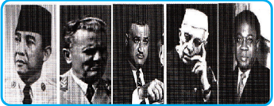

> **Deskripsi Visual:** Gambar ini adalah foto yang menampilkan lima tokoh berbeda. Setiap tokoh memiliki penampilan unik dan posisi yang berbeda. Tokoh pertama tampak paling depan dan berdiri teguh, sedangkan tokoh kedua tampak lebih kecil dan tampak seperti sedang berbicara. Tokoh ketiga tampak sedang berdiri dengan posisi yang lebih teguh, sedangkan tokoh keempat tampak sedang berdiri dengan posisi yang lebih teguh. Tokoh kelima tampak sedang berdiri dengan posisi yang lebih teguh.

Sumber: www.narm.org

Gambar 4.7 Tokoh-tokoh penggagas Gerakan Non-Blok yaitu Soekarno, Josep Broz Tito, Gamal Abdul Naser, Pandit Jawaharlal Nehru, dan Kwame Nkrumah

Sesuai  dengan  politik  luar  negeri  yang  bebas  dan  aktif,  Indonesia  memilih untuk menentukan jalannya sendiri dalam upaya membantu tercapainya perdamaian  dunia  dengan  mengadakan  persahabatan  dengan  segala  bangsa. Sebagai perwujudan dari politik luar negeri yang bebas dan aktif, selain sebagai salah satu negara pendiri GNB, Indonesia juga senantiasa setia dan memegang teguh prinsip-prinsip dan aspirasi GNB. Sikap ini secara konsisten ditunjukkan Indonesia  dalam  kiprahnya  pada  masa  kepemimpinan  Indonesia  pada  tahun 1992-1995.

Selama  tiga  tahun  dipimpin  Indonesia,  banyak  kalangan  menyebut  GNB berhasil memainkan peran penting dalam percaturan politik global. Lewat Jakarta Message , Indonesia memberi warna baru pada gerakan ini dengan meletakkan titik berat kerja sama pada pembangunan ekonomi. Akan tetapi, meskipun demikian, politik  dan  keamanan  negara-negara  sekitar  tetap  menjadi  perhatian.  Dengan kontribusi positifnya selama ini, Indonesia dipercaya untuk turut menyelesaikan berbagai  konflik  regional,  antara  lain  konflik  berdarah  di  Kamboja,  gerakan separatis Moro di Filipina, dan sengketa di Laut Cina Selatan.

Meskipun  sekarang  Indonesia  tidak  lagi  menjabat  sebagai  pimpinan  GNB, namun  tidak  berarti  bahwa  penanganan  oleh  Indonesia  terhadap  berbagai permasalahan penting GNB akan berhenti atau mengendur.  Sebagai anggota GNB,

 

---
## 📄 Halaman 148

Indonesia  akan  tetap  berupaya  menyumbangkan  peranannya  untuk  kemajuan GNB dimasa yang akan datang dengan mengoptimalkan pengalaman yang telah didapat selama menjadi Ketua GNB.

### Tugas Kelompok 4.1

- Coba kalian lakukan identifikasi mengenai oraganisasi internasional lainnya yang  diikuti  oleh  Indonesia.  Kemudian  analisis  peran  Indonesia  dalam organisasi tersebut terutama yang berkaitan dengan upaya untuk menciptakan perdamaian dunia. Tuliskan hasil identifikasi dan analisis kalian dalam tabel di bawah ini.
- Rumuskan  kesimpulan  kalian  mengenai  efektifitas  peran  Indonesia  dalam mewujudkan perdamaian dunia melalui keterlibatan dalam berbagai organisasi internasional.

---
**📊 Tabel**

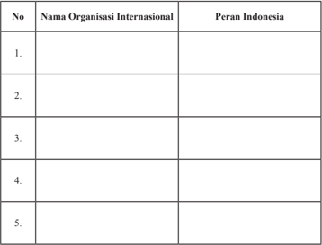

Tabel ini berisi informasi tentang peran Indonesia dalam beberapa organisasi internasional. Topik utamanya adalah peran Indonesia dalam organisasi internasional. Kolom pertama berisi nomor urut untuk setiap organisasi, kolom kedua berisi nama organisasi tersebut, dan kolom ketiga berisi deskripsi peran Indonesia dalam organisasi tersebut. Dari tabel ini, dapat dilihat bahwa Indonesia memiliki peran aktif dalam beberapa organisasi internasional, seperti Organisasi Pemuda Dunia (World Youth Organization), Organisasi Pendidikan Dunia (World Education Organization), dan lain-lain. Namun, tabel ini tidak menyediakan detail lebih lanjut tentang peran Indonesia dalam organisasi-organisasi tersebut.

………………………………………………………………………………

………………………………………………………………………………

………………………………………………………………………………

………………………………………………………………………………

………………………………………………………………………………

…………………………………………………………………………...........

 

---
## 📄 Halaman 149

### Refleksi

Setelah  kalian  mempelajari  materi  tentang  dinamika  peran  Indonesia  dalam perdamaian  dunia,  tentunya  kalian  semakin  paham  bahwa  kedudukan  bangsa Indonesia  sangat  penting  dalam  pergaulan  internasional  demi  menegakkan perdamaian dunia. Upaya Indonesia untuk ikut berperan serta dalam perwujudan perdamaian  dunia  tentunya  akan  efektif  jika  didukung  oleh  warga  negaranya. Coba kalian  renungkan! Apa  saja  bentuk  dukungan  yang  dapat  kalian  berikan terhadap upaya bangsa Indonesia dalam mewujudkan perdamaian dunia?

---
**📊 Tabel**

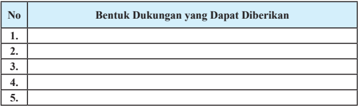

Tabel ini berisi informasi tentang berbagai bentuk dukungan yang dapat diberikan dalam konteks tertentu. Topik utamanya adalah tentang jenis-jenis dukungan yang bisa digunakan untuk mendukung suatu usaha atau proyek. Kolom pertama menunjukkan nomor urut dari setiap bentuk dukungan tersebut, sementara kolom kedua menyajikan deskripsi singkat dari masing-masing bentuk dukungan tersebut. Data atau pola penting yang terlihat adalah bahwa tabel ini mencakup minimal lima jenis dukungan, yang menunjukkan bahwa ada banyak pilihan dukungan yang tersedia untuk berbagai situasi.

### Rangkuman

### 1. Kata Kunci

Kata kunci yang harus kalian kuasai dalam mempelajari materi pada bab ini adalah perdamaian dunia, hubungan internasional, dan organisasi internasional.

### 2. Intisari Materi

- Keterlibatan  Indonesia  dalam  mewujudkan  perdamaian  dunia dilakukan  melalui  hubungan  internasional  dan  keterlibatannya dalam berbagai organisasi internasional.
- Secara umum  hubungan  internasional  diidentifikasi sebagai hubungan yang bersifat  global  yang  meliputi  semua  hubungan yang terjadi dengan melampaui batas-batas ketatanegaraan.
- Perlunya kerja  sama  dalam  bentuk  hubungan  internasional antara  lain  karena  faktor-faktor  berikut.  Faktor  internal,  yaitu adanya kekhawatiran terancamnya kelangsungan hidup negara, baik melalui kudeta maupun intervensi dari negara lain. Faktor eksternal, yaitu ketentuan hukum alam yang tidak dapat dipungkiri bahwa suatu negara tidak dapat berdiri sendiri tanpa bantuan dan kerja sama dengan negara lain. Ketergantungan tersebut terutama dalam  upaya  memecahkan  masalah-masalah  ekonomi,  politik,

 

---
## 📄 Halaman 150

- hukum, sosial budaya, pertahanan, dan keamanan.
- Secara  umum,  organisasi  internasional  dapat  diartikan  sebagai organisasi  bukan  negara  yang  berkedudukan  sebagai  subjek hukum internasional dan mempunyai kapasitas untuk membuat perjanjian internasional.
- Indonesia  terlibat  dalam  berbagai  organisasi  internasional.  Hal tersebut  sebagai  perwujudan  dari  komitmen  bangsa  Indonesia dalam menciptakan perdamaian dunia.

### Penilaian Diri

### 1. Penilaian Sikap

Nah,  coba  sekarang  kalian  renungi  diri  masing-masing.  Apakah  perilaku kalian telah mendukung upaya untuk memperkukuh peran Indonesia dalam pergaulan internasional? Bacalah daftar perilaku di bawah ini, kemudian isi kolom kegiatan dengan rutinitas yang biasa dilakukan (selalu, sering, kadangkadang, tidak pernah), serta berikan alasan dilakukannya perilaku itu. Ingat, kamu harus mengisinya sesuai dengan keadaan yang sebenarnya.

---
**📊 Tabel**

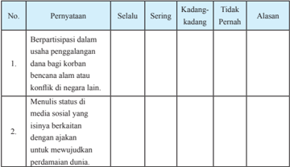

Tabel ini berisi informasi tentang partisipasi individu dalam berbagai aktivitas sosial dan budaya. Topik utamanya adalah bagaimana seseorang berpartisipasi dalam usaha penggalangan dana bagi korban bencana alam atau konflik di negara lain, serta bagaimana mereka menulis status di media sosial yang isinya berkaitan dengan ajakan untuk mewujudkan perdamaian dunia. Kolom-kolomnya meliputi "Selalu", "Sering", "Kadang-kadang", dan "Tidak Pernah". Data penting yang terlihat adalah bahwa tidak ada individu yang sering atau selalu berpartisipasi dalam usaha penggalangan dana bagi korban bencana alam atau konflik di negara lain, sedangkan sebagian besar individu sering atau kadang-kadang menulis status di media sosial yang isinya berkaitan dengan ajakan untuk mewujudkan perdamaian dunia.

 

---
## 📄 Halaman 151

---
**📊 Tabel**

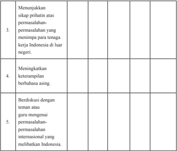

Tabel ini berisi tiga topik utama yang berkaitan dengan permasalahan internasional yang melibatkan Indonesia. Kolom pertama menunjukkan tugas-tugas yang harus dilakukan, sedangkan kolom kedua hingga kelima menampilkan informasi tentang keterampilan atau pengetahuan yang diperlukan untuk menyelesaikan tugas tersebut. Topik utama tabel ini adalah "Menangani Permasalahan Internasional", dan data penting yang terlihat adalah bahwa setiap tugas memerlukan keterampilan berbahasa asing dan kemampuan berdiskusi dengan teman atau guru.

Apabila  jawaban  kalian  'kadang-kadang'  atau  'tidak  pernah'  pada  kolom perilaku-perilaku tersebut di atas, kalian sebaiknya mulai mengubah sikap dan perilaku  kalian  agar  menjadi  lebih  baik.  Sebaliknya,  apabila  jawaban  kalian 'selalu'  atau  'sering',  pertahankanlah  dan  wujudkan  sikap  tersebut  dalam kehidupan sehari-hari.

### 2. Pemahaman Materi

Dalam mempelajari materi pada bab ini, tentu saja ada materi yang dengan mudah kalian pahami, ada juga yang sulit kalian pahami. Oleh karena itu, lakukanlah penilaian diri atas pemahaman kalian terhadap materi pada bab ini dengan memberikan tanda ceklist ( ✓ ) pada kolom paham sekali, paham sebagian, belum paham.

 

---
## 📄 Halaman 152

---
**📊 Tabel**

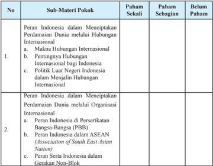

Tabel ini berisi informasi tentang peran Indonesia dalam menciptakan perdamaian dunia melalui hubungan internasional dan organisasi internasional. Topik utama adalah peran Indonesia dalam menciptakan perdamaian dunia melalui hubungan internasional, yang terbagi menjadi dua sub-materi pokok: a) Pentingnya Hubungan Internasional bagi Indonesia dan b) Politik Luar Negeri Indonesia dalam Menjalin Hubungan Internasional. Selain itu, tabel juga membahas peran Indonesia dalam menciptakan perdamaian dunia melalui organisasi internasional, yaitu a) Peran Indonesia di Perserikatan Bangsa-Bangsa (PBB) dan b) Peran Indonesia dalam ASEAN (Association of Southeast Asian Nations). Kolom-kolom yang ada dalam tabel adalah "Paham Sekali", "Paham Sebagian", dan "Belum Paham". Data atau pola penting yang terlihat adalah bahwa banyak siswa belum sepenuhnya memahami konsep ini, dengan sebagian besar siswa hanya paham sebagian saja.

Apabila  pemahaman  kalian  berada  pada  kategori paham  sekali mintalah materi  pengayaan  kepada  guru  untuk  menambah  wawasan  kalian. Apabila pemahaman kalian berada pada kategori paham sebagian dan belum paham coba bertanyalah kepada guru serta mintalah penjelasan lebih lengkap, supaya kalian cepat memahami materi pembelajaran yang sebelumnya kurang atau belum dipahami.

### Proyek Kewarganegaraan

### Mari Melakukan Studi Literatur

### Petunjuk!

- Kelas dibagi kedalam 4 kelompok besar.
- Siswa  mencari  informasi  yang  dibutuhkan  secara  bekerja  sama  dalam kelompoknya masing-masing.
- Setiap kelompok memilih literatur (buku, jurnal, majalah, koran, buletin dan internet)  yang memuat topik berikut.

 

---
## 📄 Halaman 153

- Masih  relevankan  pemberian  hak  veto  kepada  anggota  tetap  Dewan Keamanan PBB.
- Peran Indonesia dalam PBB.
- Peran PBB dalam mewujudkan perdamaian dunia.
- Pengaruh hubungan internasional terhadap pembangunan bangsa.
- Setiap kelompok mengkaji dan mencatat informasi yang didapat melalui studi  literatur  (buku,  jurnal,  majalah,  koran,  buletin  dan  internet)  yang dipilih yang berkaitan dengan materi yang dibelajarkan.
- Setiap kelompok harus membuat laporan hasil studi literaturnya.
- Setiap kelompok mempresentasikan laporan hasil studi literaturnya secara panel dalam diskusi kelas.
- Setiap kelompok menanggapi setiap pemaparan laporan yang dilontarkan oleh kelompok lain.
- Setiap  kelompok  menyimpulkan  laporan  hasil  studi  literaturnya  setelah mendapatkan masukan dari kelompok lain.

### Uji Kompetensi Bab 4

### Jawablah pertanyaan di bawah ini secara singkat, jelas, dan akurat!

- Jelaskan arti penting perdamaian dunia bagi kemajuan sebuah negara.
- Bagaimana keterlibatan bangsa Indonesia dalam mewujudkan perdamaian dunia?
- Mengapa bangsa Indonesia harus terlibat dalam upaya untuk mewujudkan perdamaian dunia?
- Jelaskan  faktor-faktor  yang  menyebabkan  suatu  negara  mengadakan hubungan internasional.
- Deskripsikan berbagai bentuk kerja sama yang dilakukan Indonesia dengan negara lain.

 

---
## 📄 Halaman 154

### Mewaspadai Ancaman t erhadap Kedudukan Negara Kesatuan Republik Indonesia

Aku cinta Indonesia! Kalimat itulah yang harus selalu kita gaungkan sebagai warga negara Indonesia. Kalimat tersebut bukan hanya untuk digaungkan, tetapi harus dibuktikan dalam kehidupan sehari-hari. Sebagai warga negara yang baik, kita tidak perlu mencari-cari alasan mengapa kita harus mencintai dan menjunjung tinggi  Indonesia,  karena  mencintai  dan  menjunjung  tinggi  negara  itu  sudah menjadi kewajiban  kita sebagai warga negara Indonesia. Bersyukurlah kepada Tuhan Yang Maha Esa apabila dalam diri kita, kecintaan kepada negara semakin hari semakin besar, karena itu semua merupakan anugerah Tuhan yang amat besar.

Nah, untuk semakin meyakinkan kecintaan kita kepada Indonesia, coba kalian nyanyikan bersama-sama lagu 'Dari Sabang Sampai Merauke' ciptaan R. Suharjo. Nyanyikanlah dengan penuh semangat.

### Dari Sabang Sampai Merauke

Dari Sabang sampai Merauke

Berjajar  pulau-pulau

Sambung menyambung menjadi satu Itulah Indonesia Indonesia tanah airku Aku berjanji padamu Menjunjung tanah airku Tanah airku Indonesia

 

---
## 📄 Halaman 155

Apa  makna  yang  terkandung  dalam  lagu  tersebut?  Tentu  saja  kalian  akan menyimpulkan  bahwa  dalam  lagu  tersebut  ditegaskan  begitu  luasnya  wilayah negara  kita.  Selain  itu,  Indonesia  mempunyai  karakteristik  wilayah  yang  unik, yaitu sebagai negara kepulauan terbesar di dunia. Hal itu memberikan konsekuensi bahwa keanekaragaman atau kebhinnekaan merupakan sebuah hal yang tidak bisa dihindari dalam kehidupan bangsa Indonesia yang meliputi kebhinnekaan suku bangsa, bahasa, adat istiadat, dan sebagainya.

Kebhinnekaan yang terjadi di Indonesia merupakan sebuah potensi sekaligus tantangan. Dikatakan sebagai sebuah potensi, karena hal tersebut akan membuat bangsa kita menjadi bangsa yang besar dan memiliki kekayaan yang melimpah, baik kekayaan alam maupun kekayaan budaya yang dapat menarik minat para wisatawan asing untuk mengunjungi Indonesia. Kebhinnekaan bangsa Indonesia juga merupakan sebuah tantangan bahkan ancaman. Dengan adanya kebhinnekaan tersebut mudah membuat rakyat Indonesia berbeda pendapat yang dapat membuat emosinya  lepas  kendali,  mudah  tumbuhnya  perasaan  kedaerahan  yang  sempit yang sewaktu-waktu dapat menjadi ledakan yang mengancam integrasi nasional atau persatuan dan kesatuan bangsa. Oleh karena itu, segenap warga negara mesti mewaspadai segala bentuk ancaman yang dapat memecah belah bangsa Indonesia dengan  senantiasa  mendukung  segala  upaya  atau  strategi  pemerintah  dalam mengatasi berbagai acaman tersebut.

Pada bab ini kalian akan diajak untuk mendalami strategi dalam membangun integrasi nasional sehingga pada akhirnya nanti kalian diharapkan dapat mengenali berbagai macam jenis ancaman bagi integrasi bangsa Indonesia dan menganalisis strategi  yang  diterapkan  bangsa  Indonesia  dalam  mengatasi  ancaman-ancaman tersebut.

### A. Menelaah Ancaman terhadap Integrasi Nasional

Kalian tentunya pernah melihat peta dunia. Dalam peta tersebut kalian dapat menunjukkan posisi Indonesia yang berada di tengah-tengah dunia, dilewati garis khatulistiwa, diapit oleh dua benua yaitu Asia dan Australia, serta berada di antara dua samudera yaitu Samudera Hindia dan Pasifik. Kondisi tersebut menunjukkan bahwa wilayah Indonesia berada pada posisi silang  sangat strategis.

 

---
## 📄 Halaman 156

Perlu kalian ketahui, bahwa posisi silang negara Indonesia tidak hanya meliputi aspek kewilayahan saja, melainkan meliputi pula aspek-aspek kehidupan sosial, antara lain sebagai berikut.

- Penduduk Indonesia berada di antara daerah berpenduduk padat di belahan  utara  dan  daerah berpenduduk jarang di belahan selatan.
- Ideologi  Indonesia  terletak antara komunisme dan liberalisme.
- Demokrasi Pancasila berada di antara demokrasi rakyat di utara (Asia daratan bagian utara) dan demokrasi liberal di selatan.

### Info Kewarganegaraan

Dalam membangun integrasi nasional, Bangsa Indonesia selalu dihadapkan pada ATHG, yaitu:

- Ancaman, merupakan suatu hal atau usaha yang bersifat mengubah atau merombak kebijaksanaan yang dilakukan secara konsepsional, kriminal, serta politik.
- Tantangan, merupakan suatu hal atau usaha yang bertujuan atau bersifat menggugah kemampuan
- Hambatan, merupakan suatu hal atau usaha berasal dari diri sendiri yang bertujuan melemahkan atau menghalangi secara tidak konsepsional
- Gangguan, merupakan usaha dari luar yang bertujuan melemahkan atau menghalangi secara tidak konsepsional.
- Ekonomi Indonesia  berada di antara sistem ekonomi sosialis di utara dan sistem ekonomi kapitalis di selatan.
- Masyarakat Indonesia berada di antara masyarakat sosialis di utara dan masyarakat individualis di selatan.
- Kebudayaan Indonesia  berada  di  antara  kebudayaan  timur  di  utara  dan kebudayaan barat di selatan.
- Sistem  pertahanan  dan  keamanan  Indonesia  berada  di  antara  sistem pertahanan kontinental di utara dan sistem pertahanan maritim di barat, selatan, dan timur.
Posisi  silang  Indonesia  sebagaimana  diuraikan  di  atas  merupakan  sebuah potensi  sekaligus  ancaman  bagi  integrasi  nasional.  Dikatakan  sebuah  potensi karena akan memberikan dampak positif bagi kemajuan bangsa Indonesia serta akan  memperkukuh  keberadaan  Indonesia  sebagai  negara  yang  tidak  dapat

 

---
## 📄 Halaman 157

disepelekan perannya dalam menunjang kemajuan serta terciptanya perdamaian dunia. Akan tetapi, posisi silang ini juga menjadikan Indonesia sebagai negara yang tidak terbebas dari ancaman yang dapat memecah belah bangsa.

Apa sebenarnya yang menjadi ancaman bagi integrasi nasional? Ancaman bagi integrasi nasional tersebut datang dari luar maupun dari dalam negeri Indonesia sendiri  dalam  berbagai  dimensi  kehidupan,  seperti  ideologi,  politik,  ekonomi, sosial budaya, serta pertahanan dan keamanan. Ancaman tersebut biasanya berupa ancaman militer dan non-militer.  Nah,  untuk  menjawab  rasa  penasaran  kalian, berikut ini diuraikan secara singkat ancaman yang dihadapi Bangsa Indonesia.

### 1. Ancaman di Bidang Ideologi

Sebelum kalian  mencermati  uraian  materi  pada  bagian  ini,  bacalah  wacana berikut ini.

### Komunisme Masih Mengancam

Pancasila  sebagai  sebuah  ideologi  bangsa  Indonesia  masih  rawan terhadap berbagai ancaman. Salah satunya dari paham komunisme yang bersembunyi di balik semboyan demokrasi.

Budayawan Taufik Ismail menuturkan, upaya sejumlah pihak untuk mengganti  Pancasila  dengan  ideologi  komunis  telah  berulangkali terjadi  di  Indonesia  terhitung  sejak  1926,  1946,  1948  dan  1965. Beruntung  setiap  aksinya,  Indonesia  berhasil  diselamatkan  Tuhan YME dan keteguhan  masyarakat  menjalankan  Pancasila  sehingga upaya tersebut gagal. Meski tidak lagi muncul sebagai sebuah partai karena tidak diperbolehkan lagi, kata Taufik, namun ideologi komunis hingga kini masih ada dan berkembang di Indonesia.  'Masih ada, memang tidak  muncul  sebagai  partai  karena  tidak  diperbolehkan. Akan tetapi sebagai ide masih, dalam suasana yang liberalistis dan demokratis  seperti  sekarang,'  ujar  Taufik  saat  menjadi  pembicara dalam seminar Hari Kesaktian Pancasila dengan tema Menegakkan Pancasila di Universitas Mercu Buana, Rabu (1/10/2014).

Dalam penafsiran demokrasi misalnya, kelompok tersebut menganggap semua hal bisa dibentuk termasuk mewujudkan

 

---
## 📄 Halaman 158

ideologi  komunis.  'Semua cara mereka lakukan untuk itu, meski tidak seluruhnya nyata tapi sangat terasa keberadaannya. Karenanya, peran  negara  sangat  penting  dengan  memegang  teguh  undangundang,'  ujarnya.    Dia  mengibaratkan  paham  komunisme  seperti penyakit  menular  yang  terus  menyebarkan  pengaruhnya.    Hal  ini, lanjut dia, harus dicegah, bila tidak maka banyak yang akan menjadi korban.

Berdasarkan  penelitian  literatur  yang  dilakukannya  dalam  kurun waktu  74  tahun,  penyebaran  paham  komunis  di  76  negara  telah membunuh  120  juta  manusia. Artinya,  sebanyak  4.500  orang  per hari dibunuh.  'Tidak ada ideologi di dunia seperti itu, Hitler saja kalah  karena  cuma  1/3.  Ini  bukan  ideologi  tapi  penyakit  menular. Kita menolak penyakit menular yang jahat. Makanya harus dicegah dan dilarang,' katanya.

Pelarangan  ini  tidak  bisa  dikatakan  melanggar  hak  asasi  manusia sebab,  negara  harus  menjamin  keselamatan  rakyatnya.    Di  Italia, partai fasis dilarang. Begitu juga di Jerman yang melarang paham nazi  dan  komunis.  Taufik  menegaskan,  negara  punya  tanggung jawab  menjelaskan  dampak  dari  paham  komunis  kepada  generasi penerus  bangsa.  Salah  satunya  melalui  pendidikan.    Kurangnya pemahaman generasi muda terhadap paham komunis, tambah Taufik, karena belum maksimalnya sistem pendidikan yang ada.  'Saya tidak menyalahkan anak muda, wong literatur dan pengajarnya terbatas, sejarah bukan tidak diajarkan, tetap diajarkan tapi hendaknya materi ini disempurnakan,' kata penyair ini.

Pengamat politik  Heri  Budianto  mengatakan,  bukan  hanya  paham komunisme  yang  harus  diwaspadai,  tapi  juga  kapitalisme  dan liberalisme.  Paham tersebut memengaruhi pola pikir dan perilaku masyarakat tanpa  disadari.  Hal  itu  dapat  dilihat  dari  perubahan  perilaku dan  sikap  nasionalisme.  'Ancaman  terhadap  ideologi  Pancasila

 

---
## 📄 Halaman 159

akan selalu datang dalam bentuk beragam. Kalau komunisme jadi ancaman maka kapitalis dan imprealisme juga musuh kita. Di era sekarang ini yang menjadi sasaran tembak adalah mind set kita. Ini bentuk penjajahan baru,' kata dia.

Direktur PolcoMM Institute ini menyadari, kurangnya pemahaman generasi  sekarang  terhadap  bahaya  komunisme  karena  informasi yang mereka terima tidak bersifat faktual. 'Perlu ada pembenahan sistem pendidikan utamanya kurikulum agar pemahaman terhadap sesuatu itu utuh,' paparnya.

Sumber:

http://nasional.sindonews.com/read/907099/12/

Tuliskan komentar kalian terhadap informasi yang disampaikan melalui wacana tersebut.

……………………………………………………………………………

……………………………………………………………………………

……………………………………………………………………………

……………………………………………………………………………

……………………………………………………………………………

Wacana tersebut menegaskan bahwa komunisme menjadi salah satu ancaman terhadap  ideologi  Pancasila,  meskipun  Indonesia  telah  menolak  dengan  tegas paham  komunis. Akan  tetapi,  apabila  ancaman  tersebut  tidak  segera  di  atasi, bukan tidak mungkin komunisme akan kembali berkembang pesat di Indonesia.

Apakah  ancaman  terhadap  Pancasila  hanya  dari  komunisme?  Tentu  saja tidak.  Bangsa  Indonesia  belum  sepenuhnya  terbebas  dari  pengaruh  paham lainnya, misalnya pengaruh liberalisme. Saat ini kehidupan masyarakat Indonesia cenderung  mengarah  pada  kehidupan  liberal  yang  menekankan  pada  aspek kebebasan  individual.  Sebenarnya,  liberalisme  yang  disokong  oleh  Amerika Serikat tidak hanya memengaruhi bangsa Indonesia, akan tetapi hampir semua negara di dunia. Hal ini sebagai akibat dari era globalisasi. Globalisasi ternyata mampu meyakinkan masyarakat Indonesia bahwa liberalisme dapat  membawa manusia ke arah kemajuan dan kemakmuran. Tidak jarang hal ini memengaruhi

 

---
## 📄 Halaman 160

pikiran masyarakat Indonesia untuk tertarik pada ideologi tersebut. Akan tetapi, pada  umumnya,  pengaruh  yang  diambil  justru  yang  bernilai  negatif,  misalnya gaya  hidup  yang  diliputi  kemewahan,  pergaulan  bebas,  dan  sebagainya.    Hal tesebut tentu saja apabila tidak diatasi akan menjadi ancaman bagi kepribadian bangsa Indonesia yang sesungguhnya.

### 2. Ancaman di Bidang Politik

Ancaman di bidang politik dapat bersumber dari luar negeri maupun dalam negeri. Dari luar negeri, ancaman di bidang politik dilakukan oleh suatu negara dengan melakukan tekanan politik terhadap Indonesia. Intimidasi, provokasi, atau blokade politik merupakan bentuk ancaman non-militer berdimensi politik yang sering kali digunakan oleh pihak-pihak lain untuk menekan negara lain. Ke depan, bentuk  ancaman  yang  berasal  dari  luar  negeri  diperkirakan  masih  berpotensi terhadap  Indonesia.  Untuk  itu,  diperlukan  peran  dari  fungsi  pertahanan  nonmiliter untuk menghadapinya.

Sumber:

www.zonadamai.com

Ancaman  yang  berdimensi politik yang bersumber dari dalam negeri dapat  berupa  penggunaan  kekuatan  dalam  bentuk  pengerahan  massa  untuk menumbangkan pemerintah yang berkuasa. Bentuk lain yang digunakan adalah menggalang kekuatan politik untuk melemahkan kekuasaan pemerintah. Selain

 

---
## 📄 Halaman 161

itu, ancaman separatisme merupakan bentuk lain dari ancaman politik yang timbul dari dalam negeri. Sebagai bentuk ancaman politik, separatisme dapat menempuh pola perjuangan politik tanpa senjata dan perjuangan bersenjata. Pola perjuangan tidak bersenjata sering ditempuh untuk menarik simpati masyarakat internasional. Oleh  karena  itu,  separatisme  sulit  dihadapi  dengan  menggunakan  kekuatan militer. Hal ini membuktikan bahwa ancaman di bidang politik memiliki tingkat risiko yang besar yang dapat mengancam kedaulatan, keutuhan, dan keselamatan bangsa.

### Tugas Mandiri 5.1

Pada saat ini, sering sekali terjadi kasus-kasus bernuansa politik yang berpotensi melumpuhkan integrasi nasional seperti kerusuhan yang disebabkan ketidakpuasan terhadap hasil pilkada. Sebagai salah satu upaya untuk meningkatkan kewaspadaan akan hal tersebut, coba kalian identifikasi kasus-kasus tersebut dan tuliskan hasil identifikasi kalian pada tabel di bawah ini.

---
**📊 Tabel**

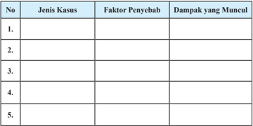

Tabel ini berisi informasi tentang kasus-kasus yang muncul dengan faktor penyebabnya dan dampak yang dihasilkan. Topik utamanya adalah analisis kasus dan dampak yang dihasilkan. Kolom-kolom yang ada meliputi No., Jenis Kasus, Faktor Penyebab, dan Dampak yang Muncul. Data penting yang terlihat adalah bahwa tabel ini mencakup lima kasus, dengan faktor penyebab dan dampak yang berbeda untuk setiap kasus tersebut. Ini menunjukkan bahwa analisis kasus dapat memberikan pemahaman yang lebih baik tentang hubungan antara faktor penyebab dan dampak yang dihasilkan.

### 3. Ancaman di Bidang Ekonomi

Pada saat ini ekonomi suatu negara tidak dapat berdiri sendiri. Hal tersebut merupakan bukti nyata dari pengaruh globalisasi. Dapat dikatakan, saat ini tidak ada lagi negara yang mempunyai kebijakan ekonomi yang tertutup dari pengaruh negara lainnya.

Globalisasi  perekonomian  merupakan  suatu  proses  kegiatan  ekonomi  dan perdagangan ketika negara-negara di seluruh dunia menjadi satu kekuatan pasar

 

---
## 📄 Halaman 162

yang  semakin  terintegrasi  dengan tanpa rintangan batas teritorial negara.  Globalisasi  perekonomian mengharuskan penghapusan seluruh batasan dan hambatan terhadap  arus  modal,  barang,  dan jasa.  Ketika  globalisasi  ekonomi terjadi, batas-batas suatu negara akan menjadi kabur dan keterkaitan antara  ekonomi  nasional  dengan perekonomian internasional akan semakin erat. Globalisasi perekonomian di satu pihak akan membuka peluang pasar produk dari dalam negeri ke pasar internasional secara kompetitif. Sebaliknya, juga membuka peluang  masuknya  produk-produk global  ke  dalam  pasar  domestik.

### Info Kewarganegaraan

Ekonomi kerakyatan sangat menghindari hal-hal berikut.

- Sistem Free fight liberalism yang hanya  menguntungkan  pelaku ekonomi liberal.
- Sistem etatisme , dalam arti negara beserta aparatur negara  bersifat  dominan  dan mematikan  potensi  dan  daya kreasi unit-unit ekonomi di luar sektor negara.
- Pemusatan  kekuatan  ekonomi pada  suatu  kelompok  dalam bentuk monopoli yang merugikan masyarakat dan bertentangan  dengan  cita-cita keadilan sosial.
Hal tersebut tentu saja selain menjadi keuntungan, juga menjadi ancaman bagi kedaulatan ekonomi suatu negara.

Adapun pengaruh negatif globalisasi ekonomi yang dapat menjadi ancaman kedaulatan  Indonesia,  khususnya  dalam  bidang  ekonomi  di  antaranya  sebagai berikut.

- Indonesia  akan  dibanjiri  oleh  barang-barang  dari  luar  negeri  seiring dengan  adanya  perdagangan  bebas  yang  tidak  mengenal  adanya  batasbatas negara. Hal ini mengakibatkan semakin terdesaknya barang-barang lokal  terutama  yang  tradisional,  karena  kalah  bersaing  dengan  barangbarang dari luar negeri.

 

---
## 📄 Halaman 163

- Cepat atau lambat perekonomian  negara  kita akan  dikuasai  oleh  pihak asing, seiring dengan semakin mudahnya orang  asing  menanamkan modalnya di Indonesia. Pada akhirnya mereka dapat mendikte atau menekan pemerintah atau bangsa kita. Dengan demikian, bangsa kita akan dijajah secara ekonomi oleh negara investor.
- Timbulnya kesenjangan sosial  yang  tajam  sebagai akibat dari adanya persaingan bebas.

### Penanaman Kesadaran Berkonstitusi

Masyarakat paripurna, adil dan makmur,  merata  secara  material dan  spiritual  hanya  akan  tercapai apabila pembangunan nasional berjalan  lancar.  Kelancaran  proses pembangunan  nasional  didorong oleh    keadaan  negara  yang  aman dan damai serta terbebas dari segala hambatan, tantangan, ancaman dan gangguan, baik yang berasal  dari  dalam  maupun  dari luar negeri. Kondisi tersebut dapat tercipta  bila  setiap  warga  negara Indonesia  selalu waspada dan siap siaga mengamankan keutuhan dan integrasi nasional.

 

---
## 📄 Halaman 164

Persaingan  bebas  tersebut  akan  menimbulkan  adanya  pelaku  ekonomi yang kalah dan yang menang. Pihak yang menang akan dengan leluasa memonopoli pasar, sedangkan yang kalah akan menjadi penonton yang senantiasa tertindas.

- Sektor-sektor ekonomi rakyat yang diberikan subsidi semakin berkurang, koperasi semakin sulit berkembang, dan penyerapan tenaga kerja dengan pola padat karya semakin ditinggalkan sehingga angka pengangguran dan kemiskinan sulit dikendalikan.
- Memperburuk  prospek  pertumbuhan  ekonomi  jangka  panjang.  Apabila hal-hal yang dinyatakan di atas berlaku dalam suatu negara maka dalam jangka  pendek  pertumbuhan  ekonominya  menjadi  tidak  stabil.  Dalam jangka  panjang  pertumbuhan  yang  seperti  ini  akan  mengurangi  lajunya pertumbuhan ekonomi. Pendapatan nasional dan kesempatan kerja akan semakin lambat pertumbuhannya dan masalah pengangguran tidak dapat diatasi atau malah semakin memburuk. Pada akhirnya, apabila globalisasi menimbulkan efek buruk kepada prospek pertumbuhan ekonomi jangka panjang suatu negara, distribusi pendapatan menjadi semakin tidak adil dan masalah sosial ekonomi masyarakat semakin bertambah buruk

### Tugas Mandiri 5.2

Pada saat ini, di setiap daerah baik wilayah perkotaan maupun pedesaan banyak berdiri  toko-toko  swalayan  seperti supermarket dan minimarket .  Hal  tersebut tentu  saja  akan  berpengaruh  terhadap  perekonomian  daerah  tersebut.  Selain itu,  kehadiran supermarket dan minimarket juga  akan  berpengaruh  terhadap keberadaan pasar atau warung tradisional. Berkaitan dengan hal tersebut, coba kalian lakukan analisis terhadap hal tersebut.

Analisis  saya:  ……………………………………………………………………

……………….……………………………………………………………………

……………………………………………………………………………………

……………………………………………………………………………………

……………………………………………………………………………………

……………………………………………………………………………………

……………………………………………………………………………………

…………………………………………………………………………………….

 

---
## 📄 Halaman 165

### 4. Ancaman di Bidang Sosial Budaya

Ancaman  yang  berdimensi  sosial  budaya  dapat  dibedakan  atas  ancaman dari  dalam  dan  ancaman  dari  luar. Ancaman  dari  dalam  didorong  oleh  isu-isu kemiskinan, kebodohan, keterbelakangan, dan ketidakadilan. Isu tersebut menjadi titik pangkal timbulnya permasalahan, seperti separatisme, terorisme, kekerasan, dan bencana akibat perbuatan manusia. Isu tersebut akan mengancam persatuan dan kesatuan bangsa, nasionalisme, dan patriotisme.

Ancaman  dari  luar  timbul  sebagai  akibat  pengaruh  negatif  globalisasi,  di antaranya sebagai berikut.

- Munculnya  gaya  hidup  konsumtif  yang  selalu  mengkonsumsi  barangbarang dari luar negeri.
- Munculnya sifat hedonisme yaitu  kenikmatan  pribadi  dianggap  sebagai suatu nilai hidup tertinggi. Hal ini membuat manusia suka memaksakan diri  untuk  mencapai  kepuasan  dan  kenikmatan  pribadinya  tersebut, meskipun  harus  melanggar  norma-norma  yang  berlaku  di  masyarakat. Seperti mabuk-mabukan, pergaulan bebas, foya-foya, dan sebagainya.
- Adanya sikap individualisme, yaitu sikap selalu mementingkan diri sendiri serta memandang orang lain tidak ada dan tidak bermakna. Sikap seperti ini dapat menimbulkan ketidakpedulian terhadap orang  lain,   misalnya sikap selalu menghardik pengemis, pengamen, dan sebagainya.
- Munculnya gejala westernisasi , yaitu gaya hidup yang selalu berorientasi kepada  budaya  barat  tanpa  diseleksi  terlebih  dahulu,  seperti  meniru model  pakaian  yang  biasa  dipakai  orang-orang  barat  yang  sebenarnya bertentangan  dengan  nilai  dan  norma-norma  yang  berlaku,  misalnya memakai rok mini, lelaki memakai anting-anting, dan sebagainya.
- Semakin memudarnya semangat gotong royong, solidaritas, kepedulian, dan kesetiakawanan sosial.
- Semakin lunturnya nilai-nilai keagamaan dalam kehidupan bermasyarakat.

### 5. Ancaman di Bidang Pertahanan dan Keamanan

Wujud ancaman di bidang pertahanan dan keamanan pada umumnya berupa ancaman militer. Ancaman militer adalah ancaman yang menggunakan kekuatan bersenjata dan terorganisasi yang dinilai mempunyai kemampuan membahayakan kedaulatan negara, keutuhan wilayah, dan keselamatan segenap bangsa. Ancaman militer dapat berupa agresi/invasi, pelanggaran wilayah, pemberontakan

 

---
## 📄 Halaman 166

bersenjata, sabotase, spionase, aksi teror bersenjata, ancaman keamanan laut dan udara.

Agresi  suatu  negara  yang  dikategorikan  mengancam  kedaulatan  negara, keutuhan wilayah, dan keselamatan segenap bangsa Indonesia mempunyai bentukbentuk  mulai  dari  yang  berskala  paling  besar  sampai  dengan  yang  terendah. Invasi merupakan bentuk agresi yang berskala paling besar dengan menggunakan kekuatan militer  bersenjata  yang  dikerahkan  untuk  menyerang  dan  menduduki wilayah suatu negara. Bangsa Indonesia pernah merasakan pahitnya diinvasi atau diserang oleh Belanda yang ingin kembali menjajah Indonesia sebanyak dua kali, yaitu 21 Juli 1947 dan 19 Desember 1948.

Bentuk lain dari ancaman militer yang peluang terjadinya cukup tinggi adalah tindakan pelanggaran wilayah (wilayah laut, ruang udara, dan daratan) Indonesia oleh negara lain. Konsekuensi Indonesia yang memiliki wilayah yang sangat luas dan terbuka berpotensi terjadinya pelanggaran wilayah.

Ancaman militer dapat pula terjadi dalam bentuk pemberontakan bersenjata. Pemberontakan  tersebut  pada  dasarnya  merupakan  ancaman  yang  timbul  dan dilakukan oleh pihak-pihak tertentu di dalam negeri. Pemberontakan bersenjata tidak  jarang  disokong  juga  oleh  kekuatan  asing,  baik  secara  terbuka  maupun tertutup.

Pemberontakan bersenjata melawan pemerintah Indonesia yang sah merupakan bentuk ancaman militer yang dapat merongrong kewibawaan negara dan  jalannya  roda  pemerintahan.  Dalam  perjalanan  sejarah,  bangsa  Indonesia pernah mengalami sejumlah aksi pemberontakan bersenjata yang dilakukan oleh gerakan  radikal  seperti  DI/TII,  PRRI,  Permesta,  Pemberontakan  PKI  Madiun, serta G-30-S/PKI. Sejumlah aksi pemberontakan bersenjata tersebut tidak hanya mengancam  pemerintahan  yang  sah,  tetapi  juga  mengancam  tegaknya  Negara Kesatuan  Republik  Indonesia  yang  berlandaskan  Pancasila  dan  UUD  Negara Republik Indonesia Tahun 1945.

 

---
## 📄 Halaman 167

---
**🖼️ Gambar/Diagram**

> **Deskripsi Visual:** Gambar ini adalah foto yang menampilkan tujuh orang pria berbeda. Setiap foto memiliki posisi yang berbeda, mulai dari kiri atas hingga kanan bawah. Semua orang tampak seragam, dengan topi dan jaket berwarna putih. Warna kulit mereka berbeda-beda, dari gelap hingga cokelat muda. Mereka tampak serius dan fokus, mungkin menunjukkan keangkuhan atau kepercayaan diri. Tidak ada teks, angka, atau label yang terlihat pada gambar ini. Informasi kunci yang dapat diambil pembaca adalah bahwa gambar ini mungkin menunjukkan tokoh-tokoh penting atau wajah-wajah yang berpengaruh dalam konteks tertentu.

Sumber:

Dokumen Kemdikbud

Indonesia memiliki sejumlah objek vital nasional dan instalasi strategis yang rawan terhadap aksi sabotase yang harus dilindungi. Fungsi pertahanan negara ditujukan  untuk  memberikan  perlindungan  terhadap  objek-objek  vital  nasional dan instalasi strategis dari setiap kemungkinan aksi sabotase dengan mempertinggi kewaspadaan  yang  didukung  oleh  teknologi  yang  mampu  mendeteksi  dan mencegah secara dini.

Pada abad modern dewasa ini, kegiatan spionase dilakukan oleh agen-agen rahasia untuk mencari dan mendapatkan rahasia pertahanan negara lain. Kegiatan spionase dilakukan secara tertutup dengan menggunakan kemajuan ilmu pengetahuan  dan  teknologi  sehingga  tidak  mudah  dideteksi.  Kegiatan  tersebut merupakan bentuk ancaman militer yang memerlukan penanganan secara khusus untuk melindungi kepentingan pertahanan dari kebocoran yang akan dimanfaatkan oleh pihak lawan.

Aksi teror bersenjata merupakan bentuk kegiatan terorisme yang mengancam keselamatan  bangsa  dengan  menebarkan  rasa  ketakutan  yang  mendalam  serta menimbulkan korban tanpa mengenal rasa perikemanusiaan. Sasaran aksi teror bersenjata dapat menimpa siapa saja sehingga sulit diprediksi dan ditangani dengan cara-cara biasa. Perkembangan aksi teror bersenjata yang dilakukan oleh teroris pada dekade terakhir meningkat cukup pesat dengan mengikuti perkembangan politik, lingkungan strategis, serta ilmu pengetahuan dan teknologi.

 

---
## 📄 Halaman 168

Gangguan keamanan di laut dan udara merupakan bentuk ancaman militer yang mengganggu stabilitas keamanan wilayah nasional Indonesia. Kondisi geografis Indonesia dengan wilayah perairan serta wilayah udara Indonesia yang terbentang pada pelintasan transportasi dunia yang padat, baik transportasi maritim maupun dirgantara berimplikasi terhadap tingginya potensi gangguan ancaman keamanan laut dan udara.

Bentuk-bentuk gangguan keamanan di laut dan udara yang mendapat prioritas perhatian dalam penyelenggaraan pertahanan negara meliputi pembajakan atau perompakan, penyelundupan senjata, amunisi dan bahan peledak atau bahan lain yang dapat membahayakan keselamatan bangsa. Penangkapan ikan secara ilegal, atau pencurian kekayaan laut termasuk pencemaran lingkungan juga merupakan bentuk gangguan keamanan di laut.

### Tugas Mandiri 5.3

Nah, setelah membaca uraian materi di atas, coba kalian prediksikan apa yang akan terjadi apabila ancaman-ancaman di bidang pertahanan dan keamanan tidak dapat ditanggulangi oleh negara kita. Tuliskan prediksi kalian di bawah ini.

Prediksi  saya………………………………………………………………………

……………………………………………………………………………………

……………………………………………………………………………………

……………………………………………………………………………………

……………………………………………………………………………………

### B.  Strategi Mengatasi Berbagai Ancaman terhadap Ipoleksosbudhankam dalam Membangun Integrasi Nasional

Seperti yang diungkapkan pada bagian sebelumnya, bahwa globalisasi telah berpengaruh kepada semua bidang kehidupan, di antaranya dalam bidang politik, ekonomi, sosial budaya, serta pertahanan dan keamanan. Berkaitan dengan hal tersebut,  Indonesia  sebagai  bangsa  yang  besar  harus  mempunyai  sikap  yang tegas terhadap segala pengaruh negatif yang datang dari luar sebagai wujud dari globalisasi.  Hal  itu  penting  dilakukan  untuk  menjalankan  strategi  pertahanan dalam menghadapi berbagai macam ancaman.  Berikut ini dipaparkan strategi yang  dilakukan  oleh  bangsa  Indonesia  dalam  menghadapi  berbagai  macam ancaman dalam bidang Ipoleksosbudhankam.

 

---
## 📄 Halaman 169

### 1. Strategi Mengatasi Ancaman di Bidang Ideologi dan Politik

Ada  empat  hal  yang  selalu  dikedepankan  oleh  globalisasi  dalam  bidang ideologi dan politik yaitu demokratisasi, kebebasan, keterbukaan, dan hak asasi manusia.  Keempat hal tersebut oleh negara-negara adidaya (Amerika Serikat dan sekutunya) dijadikan standar atau acuan bagi negara-negara lainnya yang tergolong sebagai  negara  berkembang.  Acuan  tersebut  dibuat  berdasarkan  kepentingan negara  adidaya  tersebut,  tidak  berdasarkan  kondisi  negara  yang  bersangkutan. Tidak jarang jika suatu negara tidak mengedepankan empat hal tersebut dalam kehidupan  politik  di  negaranya,  maka  negara  tersebut  akan  dianggap  sebagai musuh bersama, bahkan lebih menyedihkan lagi dianggap sebagai teroris dunia serta  diberikan  sanksi  berupa  embargo  dalam  segala  hal  yang  menyebabkan timbulnya  kesengsaraan  seperti  kelaparan,  konflik,  dan  sebagainya.  Sebagai contoh, Indonesia pernah diembargo dalam bidang ekonomi oleh Amerika Serikat yaitu tidak memberikan suku cadang pesawat F-16 dan bantuan militer lainnya, karena  pada  waktu  itu  Indonesia  dituduh  tidak  demokratis  dan  melanggar  hak asasi  manusia.  Sanksi  tersebut  hanya  diberlakukan  kepada  negara-negara  yang tidak  menjadi  sekutu  Amerika  Serikat,  sementara  sekutunya  tetap  dibiarkan meskipun  melakukan  pelanggaran.  Misalnya,  Israel  yang  banyak  membunuh rakyat Palestina dan menyerang Lebanon tetap direstui tindakannya tersebut oleh Amerika serikat.

Di sisi lain, isu demokrasi pada saat ini benar-benar memengaruhi kehidupan berbangsa dan bernegara. Segala peristiwa selalu dikaitkan dengan demokratisasi. Akan  tetapi,  demokrasi  yang  diusung  adalah    demokrasi  yang    dikehendaki oleh negara-negara adidaya yang digunakan untuk menekan bahkan menyerang negara-negara  berkembang  yang  bukan  sekutunya.  Akibatnya  selalu  terjadi konflik kepentingan yang pada akhirnya mengarah pada pertikaian antarnegara.

Berkaitan  dengan  hal  tersebut,  Indonesia  sebagai  negara  yang  menganut paham  Demokrasi  Pancasila  harus  mampu  menumbuhkan  pemerintahan  yang kuat, mandiri, dan tahan uji, serta mampu mengelola konflik kepentingan. Konflik kepentingan dapat menghancurkan  persatuan dan kesatuan bangsa Indonesia yang pluralistik. Pengelolaan konflik kepentingan dilakukan dengan tetap memperteguh wawasan kebangsaan yang berlandaskan Bhinneka Tunggal Ika.

Bangsa Indonesia harus mampu menunjukkan eksistensinya sebagai negara yang  kuat  dan  mandiri,  namun  tidak  meninggalkan  kemitraan  dan  kerja  sama

 

---
## 📄 Halaman 170

dengan negara-negara lain  dalam  hubungan  yang  seimbang,  saling  menguntungkan, saling menghormati, dan menghargai hak dan kewajiban masing-masing. Untuk mencapai hal tersebut, bangsa Indonesia harus segera mewujudkan hal-hal sebagai berikut.

- Mengembangkan demokrasi politik.
- Mengaktifkan masyarakat sipil dalam arena politik.
- Mengadakan reformasi lembaga-lembaga politik agar menjalankan fungsi dan peranannya secara baik dan benar.
- Memperkuat kepercayaan rakyat dengan cara menegakkan pemerintahan yang bersih dan berwibawa.
- Menegakkan supremasi hukum.
- Memperkuat posisi Indonesia dalam kancah politik internasional.

### 2. Strategi Mengatasi Ancaman di Bidang Ekonomi

Sebenarnya sebelum menyentuh bidang politik, globalisasi lebih dahulu terjadi pada bidang ekonomi. Sejak digulirkannya liberalisasi ekonomi oleh  Adam Smith sekitar abad ke-15 telah melahirkan  perusahaan-perusahaan multinasional yang melakukan aktivitas perdagangannya ke berbagai  negara.  Mulai  abad  20, paham liberal kembali banyak dianut oleh negara-negara di dunia  terutama  negara  maju.  Hal ini  membuat  globalisasi  ekonomi semakin mempercepat perluasan jangkauannya  ke  semua  tingkatan negara  mulai  negara  maju  sampai negara berkembang seperti Indonesia.

### Penanaman Kesadaran Berkonstitusi

Globalisasi tidak bisa kita hindari.  Supaya  globalisasi  dapat mendatangkan manfaat bagi kemajuan bangsa, kita harus bersikap  selektif  terhadap  semua pengaruh globalisasi. Pengaruh globalisasi yang tidak sesuai dengan kepribadian bangsa seharusnya kita tolak seperti pergaulan bebas, kebiasaan minum minuman keras, berpakaian seronok dan sebagainya.  Sebaliknya,  pengaruh globalisasi yang sesuai dengan kepribadian bangsa dapat kita terima, seperti bekerja keras, hemat, disiplin, bertanggung jawab, inovatif, kreatif dan sebagainya.

 

---
## 📄 Halaman 171

Kenyataan yang terjadi, globalisasi ekonomi lebih dikendalikan oleh negaranegara  maju.  Sementara  negara-negara  berkembang  kurang  diberi  ruang  dan kesempatan  untuk  memperkuat  perekonomiannya.  Negara-negara  berkembang semacam Indonesia lebih sering dijadikan objek yang hanya bertugas melaksanakan keinginan-keinginan negara maju. Keberadaan lembaga-lembaga ekonomi dunia seperti  IMF (International  Monetary  Fund), Bank  Dunia (World  Bank) dan WTO (World  Trade  Organization) belum  sepenuhnya  memihak  kepentingan negara-negara berkembang. Dengan kata lain, negara-negara berkembang hanya mendapat  sedikit  manfaat  bahkan  menderita  karena  kebijakan  yang  salah  dan aturannya  yang  tidak  jelas.  Hal  tersebut  dikarenakan  ketiga  lembaga  tersebut selama ini selalu berada di bawah pengawasan pemerintahan negara-negara maju sehingga semua kebijakannya selalu memihak kepentingan-kepentingan negara maju.

Sistem ekonomi kerakyatan merupakan senjata ampuh untuk melumpuhkan ancaman  di  bidang  ekonomi  dan  memperkuat  kemandirian  bangsa  kita  dalam semua hal. Untuk mewujudkan hal tersebut, kiranya perlu segera diwujudkan halhal di bawah ini.

- Sistem ekonomi dikembangkan untuk memperkuat produksi domestik bagi pasar dalam negeri sehingga dapat memperkuat perekonomian rakyat.
- Pertanian dijadikan prioritas utama, karena mayoritas penduduk Indonesia  bermatapencaharian  sebagai  petani.  Industri-industri  haruslah menggunakan bahan baku dalam negeri sehingga tidak bergantung impor dari luar negeri.

---
**🖼️ Gambar/Diagram**

> **Deskripsi Visual:** Gambar ini adalah foto yang menunjukkan aktivitas pertanian di ladang sawah. Dalam foto tersebut, banyak petani sedang bekerja di ladang sawah yang tampak luas dengan air yang mengalir melalui sawah. Petani-petani tersebut menggunakan alat pertanian seperti tenun dan kubing untuk memanen padi. Di sekitar ladang sawah, terlihat pohon-pohon besar yang membentuk hutan belantara. Langit cerah dengan sinar matahari yang jelas menunjukkan bahwa gambar ini diambil pada hari yang cerah dan cerah. Gambar ini menunjukkan proses pertanian tradisional di ladang sawah dan bagaimana petani bekerja untuk memanen padi.

Sumber:

www.distanbun.acehprov.go

Gambar 5.4 Pertanian merupakan potensi besar bangsa Indonesia dalam menghadapi ancaman globalisasi ekonomi

 

---
## 📄 Halaman 172

- Perekonomian  berorientasi  pada  kesejahteraan  rakyat.  Artinya,  segala sesuatu yang menguasai hajat hidup orang banyak harus terjangkau oleh daya beli masyarakat.
- Tidak bergantung pada badan-badan multilateral seperti IMF, Bank Dunia, dan WTO.
- Mempererat    kerja  sama  dengan  sesama  negara  berkembang  untuk bersama-sama menghadapi kepentingan negara-negara maju.

### 3. Strategi Mengatasi Ancaman di Bidang Sosial Budaya

Kehidupan sosial budaya di negara-negara berkembang, perlu memperhatikan gejala perubahan yang terjadi, terutama mengenai sebab-sebabnya. Banyak faktor yang  mungkin  menimbulkan  perubahan  sosial,  di  antaranya  yang  memegang peranan penting ialah faktor teknologi dan kebudayaan. Faktor-faktor itu berasal dari  dalam  maupun  dari  luar.  Biasanya,  yang  berasal  dari  luar  lebih  banyak menimbulkan perubahan. Agar dapat memahami perubahan sosial yang terjadi, perlu dipelajari bagaimana proses perubahan itu terjadi dan bagaimana perubahan itu diterima masyarakat.

Pengaruh  dari  luar yang  perlu diperhatikan adalah hal-hal yang  tidak menguntungkan  serta  dapat  membahayakan  kelangsungan  hidup  kebudayaan nasional.  Bangsa  Indonesia  harus  selalu  waspada  akan  kemungkinan  adanya kesengajaan pihak luar untuk memecah kesatuan bangsa dan negara Indonesia.

Dalam menghadapi pengaruh dari luar yang dapat membahayakan kelangsungan hidup  sosial  budaya,  bangsa  Indonesia  berusaha  memelihara  keseimbangan dan keselarasan fundamental, yaitu keseimbangan antara manusia dengan alam semesta,  manusia  dengan  masyarakat,  manusia  dengan  Tuhan,  keseimbangan kemajuan lahir dan kesejahteraan batin. Kesadaran akan perlunya keseimbangan dan keserasian melahirkan toleransi yang tinggi sehingga dapat menjadi bangsa yang berbhinneka dan bertekad untuk selalu hidup bersatu.

### 4. Strategi Mengatasi Ancaman di Bidang Pertahanan dan Keamanan

Ancaman militer akan sangat berbahaya apabila tidak diatasi. Oleh karena itu, harus diterapkan strategi yang tepat untuk mengatasinya. UUD Negara Republik Indonesia Tahun 1945 telah mengatur strategi pertahanan dan keamanan bangsa Indonesia dalam mengatasi ancaman militer tersebut. Pasal 30 ayat (1) sampai (5) UUD Negara Republik Indonesia Tahun 1945 menyatakan sebagai berikut.

 

---
## 📄 Halaman 173

- Tiap-tiap warga negara berhak dan wajib ikut serta dalam usaha pertahanan dan keamanan negara.
- Usaha  pertahanan  dan  keamanan  negara  dilaksanakan  melalui  sistem pertahanan dan keamanan rakyat semesta oleh Tentara Nasional Indonesia dan Kepolisian Negara Republik Indonesia sebagai kekuatan utama dan rakyat sebagai kekuatan pendukung.
- Tentara  Nasional  Indonesia  terdiri  atas Angkatan  Darat, Angkatan  Laut dan  Angkatan  Udara  sebagai  alat  negara  bertugas  mempertahankan, melindungi, dan memelihara keutuhan dan kedaulatan negara.
- Kepolisian Negara Republik Indonesia sebagai alat negara yang menjaga kemanan  dan  ketertiban  masyarakat  bertugas  melindungi,  mengayomi, melayani masyarakat, serta menegakkan hukum.
- Susunan dan kedudukan Tentara Nasional Indonesia, Kepolisian Negara Republik  Indonesia,  hubungan  kewenangan Tentara  Nasional  Indonesia dan Kepolisian Negara Republik Indonesia di dalam menjalankan tugasnya, syarat-syarat keikutsertaan warga negara dalam usaha pertahanan dan keamanan negara, serta hal-hal yang terkait dengan pertahanan dan keamanan diatur dengan undang-undang.
Ketentuan di atas menegaskan bahwa  usaha pertahanan dan keamanan negara Indonesia merupakan tanggung jawab seluruh warga negara Indonesia. Dengan kata lain, pertahanan dan keamanan negara tidak hanya menjadi tanggung jawab TNI dan POLRI saja, tetapi masyarakat sipil juga bertanggung jawab terhadap pertahanan dan kemanan negara. TNI dan POLRI manunggal bersama masyarakat sipil dalam menjaga keutuhan Negara Kesatuan Republik Indonesia.

UUD Negara  Republik  Indonesia  Tahun  1945  juga  memberikan  gambaran bahwa  strategi  pertahanan  dan  keamanan  negara  untuk  mengatasi  berbagai macam ancaman militer dilaksanakan dengan menggunakan sistem pertahanan dan keamanan rakyat semesta (sishankamrata). Sistem pertahanan dan kemanan rakyat  semesta  pada  hakikatnya  adalah  segala  upaya  menjaga  pertahanan  dan keamanan negara yang seluruh rakyat dan segenap sumber daya nasional, sarana dan prasarana nasional, serta seluruh wilayah negara merupakan satu kesatuan pertahanan  yang  utuh  dan  menyeluruh.  Dengan  kata  lain,  penyelenggaraan sishankamrata  didasarkan  pada  kesadaran  akan  hak  dan  kewajiban  seluruh warga  negara  serta  keyakinan  akan  kekuatan  sendiri  untuk  mempertahankan

 

---
## 📄 Halaman 174

kelangsungan  hidup  bangsa  dan  negara  Indonesia  yang  merdeka,  bersatu, berdaulat, adil dan makmur.

Sistem pertahanan dan kemanan yang bersifat semesta merupakan pilihan yang paling tepat bagi pertahanan Indonesia yang diselenggarakan dengan keyakinan  pada  kekuatan  sendiri serta berdasarkan atas hak dan kewajiban warga negara dalam usaha pertahanan negara. Meskipun dikemudian  hari  Indonesia  telah mencapai  tingkat  kemajuan  yang

### Info Kewarganegaraan

Komponen sistem pertahanan dan kemanan rakyat semesta terdiri atas:

- TNI sebagai kekuatan utama sistem pertahanan.
- POLRI sebagai kekuatan utama sistem kemanan.
- Rakyat sebagai kekuatan pendukung.
cukup tinggi, model tersebut tetap menjadi pilihan strategis untuk dikembangkan dengan  menempatkan  warga  negara  sebagai  subjek  pertahanan  negara  sesuai dengan perannya masing-masing.

Sistem  pertahanan  dan  keamanan  negara  yang  bersifat  semesta  bercirikan berikut.

- Kerakyatan,  yaitu  orientasi  pertahanan  dan  keamanan  negara  diabdikan oleh dan untuk kepentingan seluruh rakyat.
- Kesemestaan , yaitu  seluruh  sumber  daya  nasional  didayagunakan  bagi upaya pertahanan.
- Kewilayahan, yaitu gelar kekuatan pertahanan dilaksanakan secara menyebar di seluruh wilayah Negara Kesatuan Republik Indonesia, sesuai dengan kondisi geografis sebagai negara kepulauan.
Sumber:

www.tegalkab.go

Gambar 5.5 Perwujudan kemanunggalan TNI/Polri dan rakyat

 

---
## 📄 Halaman 175

Pengerahan dan penggunaan kekuatan pertahanan didasarkan pada doktrin dan strategi  sishankamrata  yang  dilaksanakan  berdasarkan  pertimbangan  ancaman yang dihadapi Indonesia. Agar pengerahan dan penggunaan kekuatan pertahanan dapat terlaksana secara efektif dan efisien, diupayakan keterpaduan yang sinergis antara unsur militer dengan unsur militer lainnya, maupun antara kekuatan militer dengan kekuatan nirmiliter. Keterpaduan antara unsur militer diwujudkan dalam keterpaduan tiga  kekuatan  militer  Republik  Indonesia,  yaitu  keterpaduan  antar kekuatan darat, kekuatan laut, dan kekuatan udara. Adapun, keterpaduan antara kekuatan militer dan kekuatan nirmiliter diwujudkan dalam keterpaduan antarkomponen utama, komponen cadangan, dan komponen pendukung. Keterpaduan tersebut diperlukan dalam pengerahan dan penggunaan kekuatan pertahanan, baik dalam rangka menghadapi ancaman tradisional maupun ancaman non-tradisional.

Berdasarkan analisis lingkungan strategik, ancaman militer dari negara lain (ancaman tradisional) yang berupa invasi, adalah kecil kemungkinannya. Namun demikian,  kemungkinan  ancaman  tersebut  tidak  dapat  diabaikan  dan  harus tetap dipertimbangkan. Ancaman tradisional yang lebih mungkin adalah konflik terbatas  yang  berkaitan  dengan  pelanggaran  wilayah  dan/menyangkut  masalah perbatasan.  Komponen  Utama  disiapkan  untuk  melaksanakan  operasi  militer untuk  perang  (OMP).  Penggunaan  komponen  cadangan  dilaksanakan  sebagai pengganda kekuatan komponen utama bila diperlukan, melalui proses mobilisasi/ demobilisasi. Kendati kekuatan pertahanan siap dikerahkan untuk melaksanakan OMP, namun setiap bentuk perselisihan  dengan  negara  lain  selalu  diupayakan penyelesaiannya  melalui  jalan  damai.  Penggunaan  kekuatan  pertahanan  untuk tujuan perang hanya dilaksanakan sebagai jalan terakhir apabila cara-cara damai tidak berhasil.

Ancaman  non-tradisional  adalah  ancaman  yang  dilakukan  oleh  aktor  nonnegara terhadap keutuhan wilayah, kedaulatan negara, dan keselamatan bangsa Indonesia. Ancaman non-tradisional  merupakan  ancaman  faktual  yang  saat  ini dihadapi oleh Indonesia. Termasuk dalam ancaman ini adalah gerakan separatis bersenjata,  terorisme  internasional  maupun  domestik,  aksi  radikal,  pencurian sumber daya alam, penyelundupan, kejahatan lintas negara, dan berbagai bentuk aksi  ilegal  lain  yang  berskala  besar.  Oleh  karenanya  kekuatan  pertahanan, terutama TNI, juga disiapkan untuk melaksanakan operasi militer selain perang (OMSP) guna menghadapi ancaman non-tradisional. Pengerahan kekuatan TNI untuk OMSP dilaksanakan berdasarkan keputusan politik pemerintah.

 

---
## 📄 Halaman 176

### Tugas Kelompok 5.1

Nah, setelah kalian membaca uraian di atas, coba kalian bersama teman sebangku melakukan  penilaian  atas  strategi  yang  diterapkan  bangsa  Indonesia  dalam menghadapi ancaman terhadap integrasi nasional! Informasikan hasil penilaian kelompok kalian kepada kelompok lainnya!

---
**📊 Tabel**

Tabel ini membahas berbagai jenis ancaman dan strategi untuk mencegah dan mengatasi mereka. Topik utamanya adalah tentang cara mengidentifikasi dan menangani ancaman yang berbeda-beda, mulai dari ideologi hingga keamanan. Kolom "Jenis Ancaman" mencakup ancaman ideologis, politik, ekonomi, sosial budaya, dan pertahanan/keamanan. "Bentuk Strategi" menunjukkan berbagai metode yang dapat digunakan untuk menghadapi setiap jenis ancaman, seperti diplomasi, ekonomi, dan militer. Sementara itu, "Indikator Keberhasilan" memberikan petunjuk tentang bagaimana kita bisa mengetahui apakah strategi tersebut berhasil atau tidak. Pola penting yang terlihat adalah bahwa setiap jenis ancaman memerlukan strategi yang berbeda, dan bahwa setiap strategi harus diukur dengan indikator keberhasilannya sendiri.

### Refleksi

Setelah kalian mempelajari materi strategi dalam mengatasi ancaman terhadap integrasi nasional, tentunya kalian semakin paham bahwa upaya untuk mengatasi ancaman-ancaman terhadap integrasi nasional tentu bukan hanya tanggung jawab pemerintah, tetapi seluruh rakyat Indonesia. Nah, sekarang coba kalian lakukan identifikasi perilaku masyarakat di sekitar tempat tinggal kalian dalam mendukung upaya untuk mengatasi ancaman terhadap integrasi nasional!

 

---
## 📄 Halaman 177

---
**📊 Tabel**

Tabel ini mungkin berisi informasi tentang topik tertentu, seperti daftar item atau tugas, dengan setiap baris menunjukkan satu item atau tugas. Kolom pertama mungkin berisi nomor urut untuk memudahkan pengorganisasian. Kolom lainnya mungkin berisi deskripsi atau detail tentang setiap item tersebut. Pola penting yang terlihat mungkin adalah bahwa setiap baris memiliki satu item atau tugas, dan kolom-kolom tersebut mencakup informasi yang relevan tentang setiap item tersebut. Ini bisa membantu dalam proses pengecekan atau pemilihan item tertentu.

### Rangkuman

### 1. Kata Kunci

Kata  kunci  yang  harus  kalian  pahami  dalam  mempelajari  materi pada bab ini adalah integrasi nasional, strategi nasional, ancaman, tantangan, hambatan, dan gangguan .

### 1. Intisari Materi

- Posisi silang negara Indonesia tidak hanya  meliputi  aspek kewilayahan saja, melainkan meliputi pula aspek-apek kehidupan sosial.
- Posisi silang Indonesia sebagaimana diuraikan di atas merupakan sebuah potensi sekaligus ancaman bagi integrasi nasional bangsa Indonesia.  Dikatakan  sebuah  potensi  karena  akan  memberikan dampak  positif  bagi  kemajuan  bangsa  Indonesia  serta  akan memperkukuh keberadaan Indonesia sebagai negara yang tidak dapat  disepelekan  perannya  dalam  menunjang  kemajuan  serta terciptanya perdamaian dunia. Akan tetapi, posisi silang ini juga mejadikan  Indonesia  sebagai  negara  yang  tidak  terbebas  dari ancaman yang dapat memecah belah bangsa.
- Ancaman  bagi  integrasi  nasioanal  tersebut  datang  dari  luar maupun  dari  dalam  negeri  Indonesia  sendiri  dalam  berbagai dimensi kehidupan.
- Strategi pertahanan dan kemanan negara untuk mengatasi berbagai macam  ancaman  militer  dilaksanakan  dengan  menggunakan sistem pertahanan dan keamanan rakyat semesta (sishankamrata).

 

---
## 📄 Halaman 178

- Ancaman yang dihadapi oleh bangsa Indonesia dalam membangun integrasi nasional tidak hanya bersifat militer, tetapi ancaman nonmiliter  pun  tidak  kalah  bahayanya. Oleh karena itu, diperlukan strategi  pertahanan  non-militer  yang  tidak  kalah  hebat  dengan strategi  untuk  mengatasi  ancaman  militer.  Strategi  pertahanan non-militer    merupakan  segala  usaha  untuk  mempertahankan kedaulatan negara, keutuhan wilayah Negara Kesatuan Republik Indonesia, dan keselamatan segenap bangsa dari ancaman ideologi, politik, ekonomi, sosial, budaya, keamanan, teknologi, informasi, komunikasi, keselamatan umum, dan hukum.

### Penilaian Diri

### 1. Penilaian Sikap

Nah,  coba  sekarang  kalian  renungi  diri  masing-masing.  Bacalah  daftar perilaku  di  bawah  ini,  kemudian  isi  kolom  kegiatan  dengan  rutinitas  yang biasa  dilakukan  (selalu,  sering  ,  kadang-kadang,  tidak  pernah).  Berikan alasan dilakukannya perilaku itu. Ingat kamu harus mengisinya sesuai dengan keadaan yang sebenarnya.

---
**📊 Tabel**

Tabel ini berisi pertanyaan tentang perilaku dan sikap individu dalam berbagai situasi sosial. Topik utamanya adalah bagaimana seseorang menunjukkan kepedulian dan partisipasi dalam lingkungan kelompok. Kolom-kolomnya meliputi "Selalu", "Sering", "Kadang-kadang", dan "Tidak Pernah". Data penting yang terlihat adalah bahwa individu sering melakukan upacara bendera dengan khidmat (pertanyaan 1), menghormati orang lain dalam berbagai situasi (pertanyaan 2), dan berpartisipasi dalam setiap kegiatan kerja kelompok (pertanyaan 3). Ini menunjukkan bahwa individu tersebut memiliki sikap positif dan aktif dalam berbagai aspek kehidupan sosial mereka.

 

---
## 📄 Halaman 179

 

---
## 📄 Halaman 180

Apabila jawaban kalian 'kadang-kadang' atau 'tidak pernah' pada kolom perilakuperilaku tersebut di atas, kalian sebaiknya mulai mengubah sikap dan perilaku kalian agar menjadi lebih baik. Sebaliknya, apabila jawaban kalian 'selalu' atau 'sering', pertahankanlah dan wujudkan sikap tersebut dalam kehidupan seharihari.

### 2. Pemahaman Materi

Dalam mempelajari materi pada bab ini, tentu saja ada materi yang dengan mudah kalian pahami, ada juga yang sulit kalian pahami. Oleh karena itu, lakukanlah penilaian diri atas pemahaman kalian terhadap materi pada bab ini dengan memberikan tanda ceklist ( ✓ ) pada kolom sangat paham, paham sebagian, belum paham.

---
**📊 Tabel**

Tabel ini berisi informasi tentang pemahaman siswa terhadap sub-materi pokok Integrasi Nasional dalam kurikulum. Topik utama tabel adalah "Menelaah Ancaman terhadap Integrasi Nasional" dan "Strategi Mengatasi Berbagai Ancaman terhadap Ipoekososbudhanam dalam Membangun Integrasi Nasional". Tabel dibagi menjadi tiga kolom: Sangat Paham, Paham Sebagian, dan Belum Paham. Data penting yang terlihat adalah bahwa sebagian besar siswa (dalam kolom Paham Sebagian) memiliki pemahaman yang baik tentang sub-materi tersebut, sedangkan siswa yang belum paham (dalam kolom Belum Paham) lebih sedikit. Ini menunjukkan bahwa siswa memerlukan lebih banyak latihan dan pengajaran untuk memahami konsep-konsep penting dalam integrasi nasional.

 

---
## 📄 Halaman 181

Apabila pemahaman kalian berada pada kategori sangat paham mintalah materi  pengayaan  kepada  guru  untuk  menambah  wawasan  kalian. Apabila pemahaman kalian berada pada kategori paham sebagian dan belum paham coba bertanyalah kepada guru serta mintalah penjelasan lebih lengkap, agar kalian cepat memahami materi pembelajaran yang sebelumnya kurang atau belum dipahami.

### Proyek Kewarganegaraan

### Mari Menyelesaikan Permasalahan

- Pilihlah oleh kelasmu salah satu masalah-masalah di bawah ini.
- Rendahnya rasa nasionalisme dikalangan remaja.
- Rendahnya  kesadaran  generasi  muda  akan  budaya  daerah  dan  budaya nasional.
- Semakin meningkatnya angka kemiskinan.
- Banyaknya remaja yang lebih senang terhadap budaya barat dibandingkan budaya nasional.
- Bentuklah kelasmu dalam 4 kelompok untuk membahas satu masalah yang dianggap paling penting oleh kelasmu.
- Masing-masing kelompok mengkaji permasalahan tersebut dan membuat laporan (portofolio) dengan pembagian tugas sebagi berikut.
- Kelompok  I : Menjelaskan  masalah  secara  tertulis dilengkapi gambar, foto, karikatur, judul surat kabar dan ilustrasi lain disertai sumber-sumber informasinya tentang:
- Bagaimana jalannya masalah?
- Seberapa luas masalah tersebar pada bangsa dan negara?
- Mengapa masalah harus ditangani pemerintah dan haruskah seseorang bertanggung jawab memecahkan masalah?
- Adakah kebijakan tentang masalah tersebut?
- Adakah perbedan pendapat, siapa organisasi yang berpihak pada masalah ini?
- Pada tingkat atau lembaga pemerintah apa yang bertanggung jawab tentang masalah ini?
- Kelompok II :  Merumuskan  kebijakan  alternatif  untuk  mengatasi masalah.  Menjelaskan  secara  tertulis  dilengkapi  gambar,  foto, karikatur  dan  ilustrasi  lain  disertai  sumber-sumber  informasinya tentang:

 

---
## 📄 Halaman 182

- Kebijakan  alternatif  yang  berhasil  dihimpun  dari  berbagai sumber informasi yang dikumpulkan.
- Kajian terhadap setiap kebijakan alternatif tersebut dengan menjawab pertanyaan kebijakan apakah yang diusulkan dan apakah keuntungan dan kerugian kebijakan tersebut.
- Kelompok  III :  Mengusulkan  kebijakan  publik  untuk  mengatasi masalah dilengkapi gambar, foto, karikatur, judul surat kabar, dan ilustrasi lain disertai sumber-sumber informasinya tentang:
- Kebijakan yang diyakini akan dapat mengatasi masalah.
- Keuntungan dan kerugian dari kebijakan tersebut.
- Kebijakan  tersebut  tidak  melanggar  peraturan  perundangundangan.
- Tingakat atau lembaga pemerintah mana yang harus bertanggung jawab menjalankan kebijakan yang diusulkan.
- Kelompok IV :    Membuat rencana tindakan yang mencakup langkahlangkah yang dapat diambil agar kebijakan yang diusulkan diterima dan  di  laksanakan  oleh  pemerintah.  Hal  ini  berupa  penjelasan tentang:
- Bagaimana dapat menumbuhkan dukungan pada individu dan kelompok  dalam  masyarakat  terhadap  rancangan  tindakan yang diusulkan.
- Mendeskripsikan individu atau kelompok yang berpengaruh dalam masyarakat yang mungkin hendak mendukung rancangan tindakan kelas dan bagaimana kalau dapat memperoleh dukungan tersebut.
- Menggambarkan pula kelompok di masyarakat yang mungkin menentang rancangan tindakan dan bagaimana kalian dapat meyakinkan mereka untuk mendukung rencana tindakan.
- Masing-masing kelompok menyajikan hasilnya di hadapan dewan juri  atau guru yang mewakili sekolah.

### Uji Kompetensi Bab 5

### Jawablah pertanyaan di bawah ini secara singkat, jelas dan akurat!

- Jelaskan  posisi  silang  Indonesia,  baik  dari  aspek  kewilayahan  maupun aspek kehidupan sosial!
- Mengapa  posisi  silang  Indonesia  bukan  hanya  merupakan  potensi  yang harus disyukuri, tetapi juga merupakan tantangan sekaligus ancaman bagi integrasi nasional?

 

---
## 📄 Halaman 183

- Jelaskan  ancaman  di  bidang  pertahanan  dan  keamanan  yang  paling mengancam integrasi nasional bangsa Indonesia pada saat ini?
- Mengapa  ideologi  Pancasila  tidak  dapat  dikatakan  aman  dari  berbagai macam ancaman dalam pengimplementasian nilai-nilainya di masyarakat!
- Dalam  hidupmu  selama  ini  tentu  telah  menghadapi  persoalan  yang memerlukan   kewaspadaan  agar  dirimu  dan  orang  lain  selaras.  Cobalah perhatikan  situasi  yang    berkaitan  dengan  kewaspadaan  di  lingkungan sekolah  dan  masyarakat.  Apa  yang  akan  kamu  lakukan  apabila  terjadi tawuran? Kemukan pula perasaanmu sebagai seorang warga negara ketika menghadapi tawuran yang terjadi di sekolah atau kampungmu?

 

---
## 📄 Halaman 184

### Memperkukuh Persatuan dan Kesatuan Bangsa dalam Konteks Negara Kesatuan Republik Indonesia (NKRI)

Kita mesti bersyukur kepada Tuhan Yang Maha Esa karena telah menakdirkan kita  sebagai  warga  negara  Indonesia.  Indonesia  adalah  sebuah  bangsa  dan negara  besar yang harus kita banggakan. Indonesia mempunyai wilayah yang luas,  kekayaan  alam  yang  melimpah,  suku  bangsa  dan  bahasa  yang  beraneka ragam, tetapi semua itu dapat dipersatukan dalam sebuah ikatan Negara Kesatuan Republik  Indonesia.  Indonesia  juga  mempunyai  sejarah  yang  membanggakan, kemerdekaan yang kita raih bukanlah hadiah dari penjajah, tetapi kita menjadi bangsa yang memerdekaan dirinya sendiri. Indonesia memproklamirkan dirinya sebagai sebuah negara merdeka. Itu semua menjadi keunggulan bangsa Indonesia.

Coba kalian amati gambar 6.1 di bawah ini.

Sumber:

30 tahun Indonesia merdeka

Gambar 6.1 Pembacaan Teks Proklamasi oleh Ir. Soekarno

 

---
## 📄 Halaman 185

Apa yang kalian pikirkan setelah melihat gambar di atas? Tentunya kalian sepakat  bahwa  Proklamasi  Kemerdekaan  pada  tanggal  17 Agustus  1945  telah mengakhiri rentetan penderitaan bangsa Indonesia sebagai bangsa yang terjajah. Proklamasi  telah  melahirkan  Indonesia  sebagai  negara  baru  yang  mempunyai kedudukan sejajar dengan bangsa lainnya yang telah merdeka terlebih dahulu. Proklamasi Kemerdekaan  tidak  akan  pernah terjadi apabila tidak adanya persatuan dan kesatuan di antara warga negara Indonesia. Persatuan dan kesatuan bangsa harus selalu kita jaga, supaya Negara Kesatuan Republik Indonesia tetap menunjukkan  eksistensinya  dan  menjadi  negara  mandiri  yang  terbebas  dari berbagai intervensi atau campur tangan asing.

### A.  Makna Persatuan dan Kesatuan Bangsa

Untuk  memahami  makna  sesuatu,  terlebih  dahulu  harus  dipahami  dahulu konsep-konsepnya.  Demikian  pula  halnya  jika  kita  hendak  memahami  makna persatuan dan kesatuan bangsa. Terlebih dahulu harus kita temukan dan pahami konsep-konsepnya.  Jika  kita  analisis,  dalam  substansi  persatuan  dan  kesatuan bangsa  itu  terdapat  sejumlah  konsep  dasar,  di  antaranya  adalah  persatuan, kesatuan, bangsa, integrasi nasional, nasionalisme, dan patriotisme.

Persatuan secara sederhana berarti gabungan (ikatan, kumpulan, dan sebagainya)  dari  beberapa  bagian menjadi  sesuatu  yang  utuh.  Atau  dengan kata lain, persatuan itu berkonotasi disatukannya bermacam-macam corak yang beragam ke dalam suatu kebulatan yang utuh. Konsep bangsa dalam substansi ini  adalah  bangsa  Indonesia  yaitu  bangsa  yang  menghuni  wilayah  Nusantara dari Sabang sampai Merauke. Dengan demikian, persatuan bangsa mengandung pengertian persatuan bangsa Indonesia yang menghuni wilayah Nusantara.

Bersatunya bangsa Indonesia didorong oleh kemauan  yang sadar dan penuh  tanggung  jawab  untuk  mencapai  kehidupan  bangsa  yang  bebas  dalam suatu  wadah  negara  yang  merdeka,  berdaulat,  adil,  dan  maknur.  Oleh  karena itu,  persatuan  bangsa  perlu  terus  dibina.  Terbinanya  persatuan  bangsa  akan melahirkan kesatuan bangsa, yakni suatu kondisi yang utuh yang memperlihatkan adanya keamanan, kesentosaan, dan kejayaan. Manakala kesatuan bangsa tercipta, maka kehidupan bangsa akan aman, sentosa, dan jaya.

 

---
## 📄 Halaman 186

Dalam  substansi  persatuan  dan  kesatuan  bangsa  terkandung  makna  bahwa kita senantiasa harus bersatu. Sejarah mengajarkan betapa pentingnya persatuan dan  kesatuan  itu.  Penjajah  berhasil  mencengkeramkan  kuku  penjajahannya di  bumi  Nusantara  hingga  beratus-ratus  tahun  lamanya  karena  kita  melupakan senjata kita yang ampuh yaitu persatuan dan kesatuan bangsa. Kelalaian kita itu dimanfaatkan oleh penjajah, khususnya Belanda dengan politik pecah-belahnya ( devide et impera ). Akibatnya kita menjadi tercerai berai seperti sapu lidi yang hilang ikatannya. Kita menjadi sangat lemah dan mudah dikuasai.

Konsep kesatuan yang kita anut meliputi aspek alamiah (konsep kewilayahan) dan aspek sosial (politik, sosial, budaya, ekonomi, pertahanan, dan keamanan). Kesatuan wilayah meliputi darat, laut, dan udara. Kebulatan ini sesuai dengan politik  kewilayahan  yang  kita anut  yakni Wawasan  Nusantara. Berdasarkan konsep Wawasan Nusantara, negara kita memiliki karakteristik berikut.

- Negara kepulauan yang pengertiannya adalah suatu wilayah lautan yang ditaburi pulau-pulau besar dan kecil.
- Konsep  utamanya  adalah  manunggalnya  wilayah  laut,  darat,  dengan wilayah udara.
- Laut atau perairan merupakan wilayah pokok, bukan merupakan pelengkap.
- Laut merupakan bagian yang tidak terpisahkan dari daratan, bukan pemisah antara daratan dan pulau yang satu dengan yang lainnya.
Bagaimana perwujudan konsep kesatuan bangsa dalam aspek sosial? Dalam aspek  sosial,  kesatuan  tersebut  diwujudkan  dalam  beberapa  aspek  kehidupan berikut.

### 1. Perwujudan kepulauan Nusantara sebagai satu kesatuan politik

- Bahwa  keutuhan  wilayah  nasional  dengan  segala  isi  dan  kekayaannya merupakan satu kesatuan wilayah, wadah, ruang hidup, dan kesatuan mitra seluruh bangsa, serta menjadi modal dan milik bersama bangsa.
- Bahwa  bangsa  Indonesia  yang  terdiri  dari  berbagai  suku  dan  berbicara dalam  berbagai  bahasa  daerah,  memeluk  dan  meyakini  berbagai  agama dan  kepercayaan  terhadap Tuhan Yang  Maha  Esa  harus  merupakan  satu kesatuan bangsa yang bulat dalam arti yang seluas-luasnya.

 

---
## 📄 Halaman 187

---
**🖼️ Gambar/Diagram**

> **Deskripsi Visual:** Gambar ini adalah ilustrasi yang menampilkan peta Indonesia dengan beberapa orang berdiri di sekitarnya. Peta Indonesia tampak jelas dengan garis putih menggambarkan batas-batas negara. Di sekeliling peta, terdapat beberapa orang yang tampak berpose untuk foto bersama. Mereka tampak berbeda budaya dan latar belakang, menunjukkan bahwa Indonesia memiliki banyak etnis dan suku.

Elemen-elemen utama dalam gambar ini adalah peta Indonesia, orang-orang yang berdiri di sekitar peta, dan teks yang tertera di atas gambar. Peta Indonesia menunjukkan wilayah-wilayah Indonesia, sementara orang-orang tersebut tampak berpose untuk foto bersama, menunjukkan kebersamaan dan persatuan. Teks "SATU NUSA, SATU BANGSA, SATU BAHASA INDONESIA" menekankan nilai-nilai nasional Indonesia, yaitu persatuan bangsa, kesetiaan, dan bahasa Indonesia sebagai simbol identitas nasional.

Informasi kunci yang dapat diambil pembaca adalah bahwa Indonesia memiliki persatuan bangsa, kesetiaan, dan bahasa sebagai simbol identitas nasional. Gambar ini juga menunjukkan bahwa Indonesia memiliki banyak etnis dan suku yang saling berkomunikasi dan bekerja sama.

Sumber: www.sosbud.kompasiana.com Gambar    6.2 Slogan  satu nusa, satu bangsa,  satu  bahasa  dapat  memperkukuh persatuan dan kesatuan bangsa

- Bahwa secara psikologis, bangsa Indonesia harus merasa satu, senasib sepenanggungan, sebangsa dan setanah air, serta mempunyai satu tekad dalam mencapai cita-cita bangsa.
- Bahwa Pancasila adalah satu-satunya falsafah serta ideologi bangsa dan negara, yang melandasi, membimbing dan mengarahkan bangsa menuju tujuannya.
- Kehidupan politik di seluruh  wilayah  Nusantara merupakan satu kesatuan politik  yang  diselenggarakan berdasarkan  Pancasila  dan UUD Negara Republik Indonesia Tahun 1945.

### Penanaman Kesadaran Berkonstitusi

Supaya  pelaksanaan  Wawasan Nusantara  bisa  berjalan  efektif, maka diperlukan kesadaran WNI untuk :

- Mengerti, memahami, menghayati tentang hak dan kewajiban warga negara serta hubungan warganegara dengan negara, sehingga sadar sebagai bangsa Indonesia.
- Mengerti, memahami, menghayati tentang bangsa yang telah menegara, bahwa dalam menyelenggarakan kehidupan memerlukan konsepsi Wawasan Nusantara sehingga sadar sebagai warga negara yang memiliki cara pandang.

 

---
## 📄 Halaman 188

- Bahwa seluruh kepulauan Nusantara merupakan kesatuan hukum, dalam arti  bahwa  hanya  ada  satu  hukum  yang  mengabdi  kepada  kepentingan nasional.
- Bangsa Indonesia hidup berdampingan dengan bangsa lain, ikut menciptakan ketertiban dunia berdasarkan kemerdekaan, perdamaian abadi, dan keadilan sosial melalui politik luar negeri bebas aktif serta diabadikan untuk kepentingan nasional.

### 2. Perwujudan kepulauan Nusantara sebagai satu kesatuan ekonomi

- Bahwa kekayaan wilayah Nusantara, baik potensial maupun efektif adalah modal  dan  milik  bersama  bangsa,  keperluan  hidup  sehari-hari  harus tersedia merata di seluruh wilayah tanah air.
- Tingkat  perkembangan  ekonomi  harus  serasi  dan  seimbang  di  seluruh daerah,  tanpa  meninggalkan  ciri-ciri  khas  yang  dimiliki  oleh  daerahdaerah dalam mengembangkan ekonominya.
- Kehidupan perekonomian di seluruh wilayah Nusantara merupakan satu kesatuan ekonomi yang diselenggarakan sebagai usaha bersama berdasar atas asas kekeluargaan dan ditujukan bagi kemakmuran rakyat.

### 3. Perwujudan  kepulauan  Nusantara  sebagai  satu  kesatuan  sosial budaya

- Bahwa masyarakat  Indonesia  adalah  satu,  perikehidupan  bangsa  harus merupakan kehidupan yang serasi dengan tingkat kemajuan masyarakat yang  sama,  merata,  dan  seimbang  serta  adanya  keselarasan  kehidupan yang sesuai dengan kemajuan bangsa.

---
**🖼️ Gambar/Diagram**

> **Deskripsi Visual:** Gambar ini adalah ilustrasi yang menunjukkan berbagai jenis pakaian tradisional dari berbagai budaya di seluruh dunia. Gambar ini terdiri dari 20 potret yang masing-masing menampilkan pakaian tradisional dari negara-negara berbeda. Setiap potret menunjukkan pakaian yang unik dengan detail seperti warna, bahan, dan gaya yang menunjukkan identitas budaya masing-masing.

Elemen-elemen utama dalam gambar ini adalah potret-potret pakaian tradisional yang menunjukkan perbedaan budaya. Relasi antara elemen-elemen ini adalah bahwa setiap potret menunjukkan pakaian tradisional dari negara yang berbeda, menunjukkan bahwa setiap budaya memiliki pakaian yang unik dan menarik.

Teks, angka, atau label penting yang terlihat dalam gambar ini adalah judul "Pakaian Tradisional Dunia" dan angka-angka yang menunjukkan jumlah potret (20). Informasi kunci yang dapat diambil pembaca adalah bahwa gambar ini menunjukkan berbagai jenis pakaian tradisional dari berbagai budaya di seluruh dunia, menunjukkan bahwa setiap budaya memiliki pakaian yang unik dan menarik.

Sumber:

jampismansa.blogspot.com

Gambar  6.3 Suku-suku bangsa yang ada di Indonesia merupakan suatu kesatuan yang tidak dapat dipisahkan

 

---
## 📄 Halaman 189

- Bahwa  budaya  Indonesia  pada  hakikatnya  adalah  satu.  Corak  ragam budaya yang ada menggambarkan kekayaan budaya yang menjadi modal dan  landasan  pengembangan  budaya  bangsa  seluruhnya,  yang  hasilhasilnya dapat dinikmati oleh seluruh bangsa Indonesia.

### 4. Perwujudan  kepulauan  Nusantara  sebagai  satu  kesatuan  pertahanan keamanan

- Bahwa  ancaman  terhadap  satu  daerah  pada  hakikatnya  merupakan ancaman bagi seluruh bangsa dan negara.
- Bahwa tiap-tiap warga negara mempunyai hak dan kewajiban yang sama di dalam pembelaan negara.
Dari uraian di atas semakin jelas tergambar bahwa negara kepulauan Indonesia dipersatukan bukan hanya dari aspek kewilayahannya saja, tetapi meliputi pula aspek  ideologi,  politik,  ekonomi,  sosial,  budaya,  pertahanan  dan  kemanan. Wawasan Nusantara bagi Indonesia  merupakan suatu politik kewilayahan bangsa dan negara Indonesia. Sebagai politik kewilayahan, Wawasan Nusantara mempunyai sifat manunggal dan utuh menyeluruh. Wawasan Nusantara bersifat manunggal artinya mendorong terciptanya keserasian dan keseimbangan yang dinamis dalam  segenap  aspek  kehidupan, baik aspek alamiah maupun aspek sosial.  Adapun  utuh  menyeluruh maksudnya menjadikan wilayah Nusantara  dan  rakyat  Indonesia sebagai  satu  kesatuan  yang  utuh dan bulat serta tidak dapat dipecahpecah oleh kekuatan apa pun sesuai dengan asas satu nusa, satu bangsa, dan satu bahasa persatuan Indonesia.

Konsep selanjutnya, yakni konsep keempat yang tercakup dalam

### Info Kewarganegaraan

Nilai-nilai yang terkandung dalam nasionalisme dan patriotisme sebagai berikut.

- Pro patria dan primus patrialis yaitu mencintai  tanah air dan mendahulukan kepentingan tanah air.
- Jiwa solidaritas dan setia kawan.
- Jiwa toleransi dan tenggang rasa antaragama, antarsuku, antargolongan, dan antarbangsa.
- Jiwa tanpa pamrih dan tanggung jawab.
- Jiwa ksatria dan kebesaran jiwa yang tidak mengandung unsur dendam.

 

---
## 📄 Halaman 190

substansi  persatuan  dan  kesatuan  bangsa  adalah integrasi  nasional. Integrasi sendiri  dapat  diartikan  sebagai  suatu  proses  penyesuaian  di  antara  unsur-unsur yang saling berbeda yang ada dalam kehidupan sehingga menghasilkan keserasian dalam  kehidupan  masyarakat.  Dengan  demikian,  integrasi  nasional  berarti integrasi yang terjadi di dalam tubuh bangsa dan negara Indonesia.

Bangsa Indonesia yang secara sadar ingin bersatu agar hidup kokoh sebagai bangsa yang berdaulat, memiliki faktor-faktor integratif bangsa sebagai perekat persatuan yaitu sebagai berikut.

- Pancasila
- UUD NRI Tahun 1945
- Sang Saka Merah Putih
- Lagu Kebangsaan Indonesia Raya
- Bahasa Indonesia
- Sumpah Pemuda
Konsep kelima yang tercakup dalam substansi persatuan dan kesatuan bangsa adalah nasionalisme. Nasionalisme adalah suatu paham yang menganggap bahwa kesetiaan tertinggi atas setiap pribadi harus diserahkan kepada negara .

Paham nasionalisme mulai dikenal di Indonesia sejak awal abad ke-20, yaitu saat  berdirinya  Budi  Utomo  tanggal  20  Mei  1908.  Berdirinya  Budi  Utomo  itu merupakan awal dari kebangkitan nasional dan merupakan awal dari kesadaran nasional.  Tanggal  berdirinya  organisasi  pergerakan  tersebut  hingga  kini  kita peringati sebagai hari Kebangkitan Nasional.

Konsep terakhir yang tercakup dalam substansi persatuan dan kesatuan bangsa adalah patriotisme. Coba  kalian  pikirkan  sejenak,  apakah  patriotisme  berbeda dengan  nasionalisme?  Patriotisme  merupakan  salah  satu  unsur  nasionalisme. Patriotisme merupakan sikap sudi mengorbankan segala-galanya untuk kejayaan tanah air, bangsa, dan negara. Adapun ciri-ciri patriotisme di antaranya sebagai berikut.

- Cinta tanah air
- Rela berkorban untuk kepentingan bangsa dan negara
- Menempatkan persatuan, kesatuan, serta keselamatan bangsa dan negara di atas kepentingan pribadi dan golongan
- Berjiwa pembaharu
- Tidak kenal menyerah

 

---
## 📄 Halaman 191

### Tugas Kelompok 6.1

Bacalah berita di bawah ini.

### Potret Perbatasan: Tinggal di Indonesia, Menggantungkan Hidup Dengan Malaysia

REPUBLIKA.CO.ID, NUNUKAN --Kehidupan masyarakat perbatasan  di  Pulau  Sebatik,  Kabupaten  Nunukan,  Kalimantan Timur, sampai saat ini masih sangat tergantung pada negeri tetangga Malaysia.

'Ketergantungan itu antara lain terlihat dalam pemenuhan kebutuhan pokok yang dikonsumsi setiap harinya, hampir seluruhnya merupakan produk asal Malaysia,' kata Sannari, seorang warga perbatasan di

Ajikuning, Kecamatan Sebatik Utara, Kabupaten Nunukan, Senin.

Menurut  Sannari,  kondisi  itu masih  sulit  dihindari  mengingat masyarakat Pulau Sebatik dan Kabupaten Nunukan secara umum, suplai  sembako  masih  tergantung  dari  Malaysia,  karena  sulitnya mendapatkan  produk  kebutuhan  sehari-hari  asal  Indonesia.  Selain mudah mendapatkannya juga harganya lebih murah daripada produk asal Indonesia.

Sumber:

www.republika.co.id

Gambar  6.4

Peta perbatasan RI-Malaysia di Nunukan

 

---
## 📄 Halaman 192

Misalnya, gula pasir yang merupakan kebutuhan sehari-hari masyarakat, harganya di Malaysia hanya RM 2.20 atau Rp6.600 (RM 1 = Rp3.000) per kg. Sementara  harga  gula  pasir  asal  Indonesia  harganya  mencapai Rp11.000 sampai Rp12.000 per kg bahkan lebih dari itu. Selain itu, untuk mendapatkan produk asal Indonesia sangat sulit karena hanya ada di Kota Tarakan.

Bukan hanya sembako yang diperoleh dari Malaysia, Sannari yang mengaku berasal dari Kabupaten Pinrang Provinsi Sulawesi Selatan itu menambahkan juga bahan bangunan seperti batu gunung, kerikil, semen, dan lain-lainnya semuanya berasal dari Malaysia.

- Oleh karena itu, ketergantungan dengan negeri jiran Malaysia sangat sulit  dihindari.  'Kalau  dibilang  masyarakat  perbatasan  di  Pulau Sebatik  ini  menggantungkan  hidupnya  di  Malaysia  memang  iya.
Kalau tidak begitu mau makan apa kita di sini (Pulau Sebatik),' ujar

- Sannari.
Dia mengatakan kemudahan mendapatkan sembako atau kebutuhan lainnya di Malaysia, karena masyarakat perbatasan di Pulau Sebatik  hampir  setiap  harinya  menyeberang  ke  Tawau,  Malaysia, untuk berbelanja. 'Masyarakat di sini setiap hari ke Tawau, karena jangkauannya dekat hanya 15 menit sudah sampai di sana (Tawau),' katanya.

Sumber:

www.republika.co.id

Nah,  setelah  membaca  berita  di  atas  diskusikanlah  dengan  teman  sebangku pertanyaan-pertanyaan berikut.

- Apa saja penyebab timbulnya permasalahan di daerah perbatasan?
- ……………………………………………………………………………… ……………………………………………………………………………… ……………………………………………………………………………… ……………………………………………………………………………… ……………………………………………………………………………… ……………………………………………………………………………… ………………………………………………………………………………...
- Mengapa pembangunan belum merata sampai ke daerah perbatasan?
………………………………………………………………………………

………………………………………………………………………………

………………………………………………………………………………

 

---
## 📄 Halaman 193

………………………………………………………………………………

………………………………………………………………………………

………………………………………………………………………………

………………………………………………………………………………...

- Apakah permasalahan di daerah perbatasan ini dapat menimbulkan persoalan lainnya? Jika ya, apa saja bentuk persoalan yang mungkin terjadi?
………………………………………………………………………………

………………………………………………………………………………

………………………………………………………………………………

………………………………………………………………………………

………………………………………………………………………………

………………………………………………………………………………

………………………………………………………………………………...

- Uraikan  solusi  yang  kamu  tawarkan  kepada  pemerintah  untuk  mengatasi permasalahan di daerah perbatasan?
………………………………………………………………………………

………………………………………………………………………………

………………………………………………………………………………

………………………………………………………………………………

………………………………………………………………………………

………………………………………………………………………………

………………………………………………………………………………...

### B. Kehidupan Bernegara dalam Konsep Negara Kesatuan Republik Indonesia (NKRI)

- Konsep NKRI  menurut  Undang-Undang  Dasar  Negara Republik Indonesia Tahun 1945
Sebagai warga negara yang baik, tentunya kalian harus memahami pengertian atau makna negara Indonesia. Makna tersebut penting diketahui untuk semakin mempertegas identitas negara Indonesia. Oleh karena itu, pada bagian ini kalian akan dibekali pengetahuan mengenai makna konsep  NKRI menurut UUD Negara Republik Indonesia Tahun 1945.

Perubahan  UUD  Negara  Republik  Indonesia  Tahun  1945  mengukuhkan keberadaan  Indonesia  sebagai  negara  kesatuan  dan  menghilangkan  keraguan terhadap pecahnya Negara Kesatuan Republik Indonesia. Pasal-pasal dalam  Undang-Undang  Dasar  Negara  Republik  Indonesia  Tahun  1945  telah

 

---
## 📄 Halaman 194

memperkukuh prinsip Negara Kesatuan Republik Indonesia dan tidak sedikit pun mengubah Negara Kesatuan Republik Indonesia menjadi negara federal.

Pasal 1 ayat (1) UUD Negara Republik Indonesia Tahun 1945 yang merupakan naskah asli mengandung prinsip bahwa 'Negara Indonesia ialah negara kesatuan, yang  berbentuk  Republik.'  Pasal  yang  dirumuskan  oleh  Panitia  Persiapan Kemerdekaan Indonesia tersebut merupakan tekad bangsa Indonesia yang menjadi sumpah anak bangsa pada 1928 yang dikenal dengan Sumpah Pemuda yaitu satu tanah air, satu bangsa, satu bahasa yaitu Indonesia.

Wujud Negara Kesatuan Republik Indonesia semakin kukuh setelah dilakukan perubahan  UUD  Negara  Republik Indonesia  Tahun  1945.  Perubahan tersebut dimulai dari adanya ketetapan  Majelis  Permusyarawatan Rakyat yang salah satunya adalah tidak mengubah Pembukaan UUD Negara Republik Indonesia Tahun 1945  dan  tetap  mempertahankan Negara Kesatuan Republik Indonesia sebagai bentuk final negara bagi bangsa Indonesia.

Kesepakatan untuk tetap mempertahankan bentuk negara kesatuan didasari pertimbangan bahwa negara kesatuan adalah bentuk yang ditetapkan sejak awal  berdirinya  negara  Indonesia. Bentuk negara kesatuan dipandang paling  tepat  untuk  mewadahi  ide persatuan sebuah bangsa yang majemuk ditinjau dari berbagai latar  belakang  (dasar  pemikiran). UUD  Negara  Republik  Indonesia

### Info Kewarganegaraan

Pada  tahun  1850,  George  Windsor  Earl seorang etnolog Inggris  mengusulkan istilah Indunesians dan preperensi Malayunesians untuk  penduduk  kepulauan  Hindia  atau Malayan Archipelago.  Kemudian  seorang mahasiswa bernama Earl  James  Richardison Logan  menggunakan  Indonesia sebagai sinonim untuk Kepulauan Hindia. Namun di  kalangan  akademik Belanda, di Hindia Timur  enggan  menggunakan  Indonesia. Sebaliknya,  mereka  menggunakan  istilah Melayu  Nusantara  ( Malaische  Archipel ). Sejak tahun 1900 nama Indonesia menjadi lebih umum di kalangan akademik di luar Belanda.  Golongan  nasionalis  Indonesia menggunakan nama Indonesia untuk ekspresi politiknya.  Adolf Bastian dari Universitas  Berlin  memopulerkan  nama Indonesia melalui bukunya Indonesien oder die inseln des malayischen arcipels (1884 1894). Kemudian sarjana bahasa Indonesia pertama yang menggunakan nama Indonesia adalah Suwardi Suryaningrat (Ki Hajar Dewantara) ketika ia mendirikan kantor  berita  di  Belanda  dengan  nama Indonesisch Pers-Bureau di tahun 1913.

Tahun  1945  secara  nyata  mengandung  semangat  agar  Indonesia  bersatu,  baik sebagaimana  tercantum  dalam  Pembukaan  maupun  dalam  pasal-pasal  yang

 

---
## 📄 Halaman 195

langsung  menyebutkan  tentang  Negara  Kesatuan  Republik  Indonesia.  Hal  ini dituangkan  dalam  lima  Pasal,  yaitu:  pasal  1  ayat  (1),  pasal  18  ayat  (1),  pasal 18B ayat (2), pasal 25A, dan pasal 37 ayat (5) UUD Negara Republik Indonesia Tahun  1945  serta  rumusan  pasal-pasal  yang  mengukuhkan  Negara  Kesatuan Republik  Indonesia,  dan  keberadaan  lembaga-lembaga  dalam  Undang-Undang Dasar Negara Republik Indonesia Tahun 1945.  Prinsip kesatuan dalam Negara Kesatuan Republik Indonesia dipertegas dalam alinea keempat Pembukaan UUD Negara Republik Indonesia Tahun 1945 yaitu '…. dalam upaya membentuk suatu Pemerintahan negara Indonesia yang melindungi segenap bangsa Indonesia dan seluruh tumpah darah Indonesia'.

Pembentukan pemerintahan negara Indonesia yang melindungi segenap bangsa Indonesia  dan  seluruh  tumpah  darah  Indonesia  bertujuan  untuk  memajukan kesejahteraan umum, mencerdaskan kehidupan bangsa, dan ikut melaksanakan ketertiban dunia yang berdasarkan kemerdekaan, perdamaian abadi, dan keadilan sosial.  Tujuan  tersebut  dapat  dicapai  hanya  dengan  adanya  kemerdekaan  bagi bangsa Indonesia. Dalam alinea keempat ini secara tegas diproklamirkan: 'maka disusunlah kemerdekaan kebangsaan Indonesia itu dalam suatu Undang-Undang Dasar negara Indonesia, yang terbentuk dalam suatu susunan negara Republik

Indonesia yang berkedaulatan rakyat dengan berdasar kepada Ketuhanan Yang Maha Esa, Kemanusiaan yang adil dan beradab, persatuan Indonesia, dan kerakyatan yang dipimpin oleh  hikmat  kebijaksanaan  dalam permusyawaratan/perwakilan, serta  dengan  mewujudkan  suatu keadilan sosial bagi seluruh rakyat Indonesia'.

Makna negara Indonesia juga dapat dipandang dari segi kewilayahan. Pasal 25A UUD Negara Republik Indonesia Tahun 1945  menentukan  bahwa  'Negara

### Info Kewarganegaraan

Negara Republik Indonesia pernah mengalami pergantian bentuk negara, dari kesatuan menjadi  federal/serikat  pada  masa berlakunya  Konstitusi  RIS  tanggal 27  Desember 1949 sampai dengan 17 Agustus 1950. Perubahan tersebut  sebagai  konsekuensi  dari kesepakatan yang terjadi dalam Konferensi Meja Bundar. Akan tetapi  bentu  negara  tersebut  tidak bertahan lama. Hal  ini menunjukkan bagi bangsa Indonesia, konsep negara federalisme/serikat tidak cocok diterapkan di negara kita.

 

---
## 📄 Halaman 196

Kesatuan  Republik  Indonesia  adalah  sebuah  negara  kepulauan  yang  berciri Nusantara dengan wilayah yang batas-batas dan hak-haknya ditetapkan dengan undang-undang'.  Istilah Nusantara dalam ketentuan tersebut dipergunakan untuk menggambarkan kesatuan wilayah perairan dan gugusan pulau-pulau Indonesia yang terletak  di  antara  Samudera  Pasifik  dan  Samudera  Hindia  serta  di  antara Benua Asia dan Benua Australia. Kesatuan wilayah tersebut juga mencakup 1) kesatuan politik; 2) kesatuan hukum; 3) kesatuan sosial-budaya; serta 4) kesatuan pertahanan dan keamanan. Dengan demikian, meskipun wilayah Indonesia terdiri atas ribuan pulau, tetapi semuanya terikat dalam satu kesatuan negara yaitu Negara Kesatuan Republik Indonesia.

Dari uraian di atas dapat disimpulkan bahwa negara Indonesia adalah negara kesatuan  berbentuk republik yang wilayahnya merupakan kesatuan dari ribuan pulau  yang  terletak  di  antara  Samudera  Pasifik  dan  Samudera  Hindia  serta  di antara Benua Asia dan Australia.

### Tugas Mandiri 6.1

Nah,  setelah  kalian  membaca  uraian  materi  di  atas,  coba  kalian  lakukan  studi kepustakaan  untuk  mencari  keunggulan  bentuk  negara  kesatuan  dibandingkan dengan bentuk negara lainnya seperti negara serikat. Tuliskan hasil kalian pada tabel di bawah ini.

---
**📊 Tabel**

Tabel ini membandingkan keunggulan antara negara kesatuan dan negara serikat. Topik utamanya adalah perbandingan kedua sistem pemerintahan tersebut. Kolom pertama berisi nomor urut untuk setiap perbandingan, sedangkan kolom kedua dan ketiga masing-masing berisi informasi tentang keunggulan negara kesatuan dan serikat. Data penting yang terlihat meliputi:

1. Keunggulan negara kesatuan:
   - Kebebasan politik
   - Kebebasan ekonomi
   - Kebebasan religius

2. Keunggulan negara serikat:
   - Keamanan dan stabilitas
   - Kesejahteraan rakyat
   - Kemudahan transaksi internasional

Tabel ini menunjukkan bahwa kedua sistem memiliki keunggulan masing-masing, namun negara serikat cenderung lebih fokus pada keamanan dan stabilitas, sementara negara kesatuan lebih fokus pada kebebasan dan kemudahan ekonomi.

 

---
## 📄 Halaman 197

### 2. Keunggulan Negara Kesatuan Republik Indonesia

Indonesia adalah negara kepulauan. Hal ini dapat dibuktikan dari nama lain atau  julukan  terhadap  Indonesia  yaitu  Nusantara,  yang  berarti  di  antara  nusa atau  di  antara  pulau.  Jadi,  Indonesia  terdiri  atas  pulau-pulau.  Disebut  sebagai negara kepulauan karena jumlah pulau besar dan kecil yang tersebar di wilayah Indonesia  sangat  banyak  yaitu  mencapai  ribuan  pulau.  Pulau-pulau  tersebut terletak  di  persimpangan  dunia  yaitu  di  antara  dua  samudera  dan  dua  benua. Begitu indahnya pulau-pulau yang terletak di wilayah Indonesia yang membujur di  garis  khatulistiwa  sehingga  diibaratkan  'Untaian  ratna  mutu  manikam  atau zamrud khatulistiwa'.

Sekalipun wilayah Indonesia meliputi pulau-pulau, tidak menjadikan bangsa Indonesia bercerai berai, namun keadaan tersebut justru menjadi perekat untuk semakin meningkatkan rasa persatuan dan kesatuan bangsa. Hal ini dikarenakan secara  yuridis  formal  bangsa  Indonesia  telah  mempunyai  landasan  yang  kuat, misalnya dinyatakan dalam Pembukaan UUD Negara Republik Indonesi  Tahun 1945 alinea II. Selain  itu,  dalam  Pasal  1  ayat  (1) dinyatakan  bahwa  Indonesia  ialah negara  kesatuan  yang  berbentuk republik.

Dengan demikian, sekalipun secara nyata Indonesia terdiri dari berbagai keanekaragaman penduduknya yang tersebar di berbagai  pulau  besar dan  kecil, tidak menjadikan bangsa Indonesia bercerai berai. Hal ini sudah barang tentu merupakan  poin  tersendiri yang menjadikan kita merasa bangga  sebagai  bangsa  Indonesia. Melihat  dan  mencermati  kondisi dan letak geografis wilayah Indonesia, sudah sewajarnyalah setiap  insan  yang  merasa  dirinya

### Penanaman Kesadaran Berkonstitusi

NKRI adalah harga mati. Pernyataan tersebut  mengandung  makna  yang sangat  dalam.  Pernyataan  tersebut menggambarkan ketegasan sikap dan cita-cita  bahwa  negara  Indonesia diperjuangkan kemerdekaannya untuk  mewujudkan  konsep  negara kesatuan  yang  diimplementasikan di bumi Indonesia. Untuk mewujudkan hal tersebut telah banyak pengorbanan yang dilakukan para pahlawan mulai dari pengorbanan  waktu,  tenaga, pikiran,  harta  bahkan  nyawa.  Hal tersebut  dilakukan  karena  mereka mempunyai  semangat  kebangsaan. Semangat  itulah  yang  harus  kita jaga  dan  selalu  mewarnai  setiap perilaku kita.

 

---
## 📄 Halaman 198

sebagai  warga  negara  Indonesia  mempunyai  kebanggaan  tersendiri.  Bangga di  sini  dalam  arti  merasa  berbesar  hati  atau  merasa  gagah  karena  mempunyai berbagai kelebihan atau keunggulan. Jadi, yang dimaksud bangga sebagai bangsa dan bertanah air Indonesia adalah merasa besar hati atau merasa berbesar jiwa atau merasa gagah sebagai bangsa Indonesia.

Konsekuensinya,  kalau  kita  merasa  bangga  sebagai  bangsa  Indonesia,  kita akan selalu berupaya menjunjung tinggi nama baik bangsa dan negara di mana pun kita berada. Kita juga akan selalu berupaya meningkatkan citra dan nama baik Indonesia melalui perbuatan-perbuatan nyata di masyarakat, seperti tidak merusak hutan-hutan  lindung,  benda-benda  bersejarah  apalagi  memperjualbelikannya, selalu menggunakan produk dalam negeri, dan sebagainya.

Negara  Indonesia  memiliki  berbagai  keunggulan.  Keunggulan-keunggulan tersebut menurut Dadang Sundawa di antaranya sebagai berikut.

- Jumlah  dan  potensi  penduduknya  yang  cukup  besar  yaitu  menempati urutan keempat di dunia setelah RRC, India, dan Amerika Serikat. Jumlah penduduk yang besar merupakan potensi yang tidak ternilai harganya dalam upaya mengisi dan mempertahankan kemerdekaan, termasuk sebagai modal dasar  dalam  melaksanakan  pembangunan  dalam  upaya  menyejahterakan bangsa.
- Memiliki keanekaragaman dalam berbagai aspek kehidupan sosial budaya seperti adat istiadat, bahasa, agama, kesenian, dan sebagainya. Perbedaan atau keanekaragaman tersebut tidak menjadikan bangsa Indonesia berceraiberai,  namun  justru  merupakan  potensi  untuk  mengembangkan  dirinya menjadi bangsa yang besar. Hal ini juga didorong oleh adanya semangat persatuan  dan  kesatuan  sehingga  sekalipun  terdapat  perbedaan,  namun bukan perbedaan yang ditonjolkan tetapi justru persamaannya.
- Dalam  pengembangan  wilayah,  kita  mempunyai    konsep  Wawasan Nusantara sehingga sekalipun terdapat  berbagai  keanekaragaman  namun prinsipnya kita tetap satu pandangan yaitu memandang bangsa Indonesia sebagai  satu  kesatuan  ideologi,  politik,  ekonomi,  sosial  budaya,  dan hankam.
- Semangat sumpah pemuda yang selalu merasuki jiwa dan kalbu bangsa Indonesia. Dengan menunjukkan bahwa kita sama-sama memahami satu wilayah negara dan tanah air yang sama yaitu Indonesia; kita sama-sama

 

---
## 📄 Halaman 199

- merasa berbangsa yang satu bangsa Indonesia dan sama-sama menggunakan bahasa yang sama yaitu bahasa Indonesia serta memiliki sejarah yang sama yaitu sejarah Indonesia. Dalam pergaulan yang ditonjolkan adalah bangsa Indonesianya, bukan dari mana asal daerahnya.
- Memiliki tata krama atau keramahtamahan. Sejak dahulu bangsa Indonesia sangat terkenal akan keramahan dan kesopanannya sehingga sangat menarik bangsa-bangsa lain di dunia untuk datang ke Indonesia. Namun demikian, akhir-akhir ini kesopanan dan keramahan bangsa Indonesia agak tercemar oleh ulah segelintir manusia yang tidak bertanggung jawab, terutama yang gemar  membuat  kerusuhan,  kerusakan,  dan  perangai-perangai  lain  yang justru membuat bangsa lain takut datang ke Indonesia.
- Letak wilayahnya yang amat strategis yaitu di posisi silang dunia sehingga membuat Indonesia menjadi wilayah yang amat ramai dan mudah untuk dikunjungi dan disinggahi oleh bangsa-bangsa lain.
- Keindahan alam Indonesia tidak disangsikan lagi, misalnya pantai-pantai di  Bali  (Pantai  Kuta,  Pantai  Sanur,  dan  sebagainya),  Sumatra  (Danau Toba), Jawa Barat (Pantai Pangandaran, Pantai Carita, Gunung Tangkuban Perahu). Keanekaragaman flora dan faunanya membuat bangsa Indonesia juga sering dikunjungi oleh bangsa-bangsa lain.

---
**🖼️ Gambar/Diagram**

> **Deskripsi Visual:** Gambar ini adalah ilustrasi yang menunjukkan berbagai jenis ekosistem alam. Gambar pertama menunjukkan ekosistem pantai dengan seekor monyet berwarna hitam yang duduk di tepi laut. Gambar kedua menunjukkan hutan tropis dengan pohon-pohon besar dan tanaman hijau yang rimbun. Gambar ketiga menunjukkan perairan biru dengan beberapa kapal kecil yang berlayar di atasnya. Gambar keempat menunjukkan gunung dengan puncak tertutup kabut, sementara gambar kelima menunjukkan perairan biru dengan air jernih dan batu karang yang terlihat jelas. Setiap gambar menunjukkan ekosistem yang berbeda-beda namun saling terkait dengan lingkungan alam yang luas.

Gambar 6.5 Keindahan alam menjadi salah satu keunggulan yang dimiliki oleh bangsa Indonesia

 

---
## 📄 Halaman 200

- Salah satu keajaiban dunia juga ada di Indonesia yaitu Candi Borobudur yang tidak sedikit menarik wisatawan untuk datang ke Indonesia. Selain candi Borobudur, Indonesia pun mempunyai keajaiban dunia lainnya yaitu Pulau Komodo.
- Wilayahnya sangat luas yaitu  5.193.250 Km 2 yang meliputi daratan seluas 2.027.087 Km 2  dan lautan seluas  3.166.163 Km 2 .
- Tanahnya amat subur dan kaya akan sumber alam.
Selain hal-hal di atas yang merupakan kondisi objektif bangsa Indonesia, maka secara internasional atau mendunia, bangsa Indonesia juga sudah beberapa kali dipercaya oleh bangsa-bangsa lain untuk menyelenggarakan pertemuan-pertemuan yang  bersifat  internasional  yang  juga  tidak  sedikit  melahirkan  sejarah  bagi bangsa-bangsa lain. Kita masih ingat apa yang terjadi pada tahun 1955, di mana bangsa Indonesia dipercaya untuk menjadi tuan rumah dalam menyelenggarakan Konferensi  Asia  Afrika  yang  dampaknya  sangat  luas  bagi  bangsa-bangsa  di wilayah Asia-Afrika  dalam  upaya  memerdekakan  diri  dari  belenggu  penjajah, terutama yang masih belum merdeka saat itu.

Kita juga pernah dipercaya menjadi tuan rumah KTT Non-Blok pada tahun 1992  dan  Indonesia  juga  termasuk  perintis  dan  pendiri  Gerakan  Non-Blok tersebut. Selain itu, kita juga mempunyai pabrik pesawat terbang yang bernama PT Dirgantara Indonesia (dahulu bernama Industri Pesawat Terbang Nusantara/ IPTN) yang telah menghasilkan pesawat-pesawat yang dapat dibanggakan.

Sebagai bukti rasa cinta dan bangga yang sangat mendalam terhadap wilayah tanah  air,  banyak  di  antara  seniman  kita  yang  merefleksikannya  dalam  bentuk syair  maupun  lagu.  Ada  lagu  yang  berjudul  'Rayuan  Pulau  Kelapa'  yang diciptakan Ismail Marzuki, ada juga beberapa lagu karya Koes Plus yang diberi judul  'Nusantara'  dan  'Kolam  Susu'  yang  menggambarkan  betapa  indah  dan suburnya keadaan alam Indonesia.  Kesemuanya itu sudah barang tentu merupakan alasan yang sangat objektif untuk menjadikan kita merasa bangga sebagai bangsa Indonesia. Perasaan bangga sebagai bangsa Indonesia sudah barang tentu bukan hanya sekadar slogan belaka, akan tetapi harus dibuktikan dengan karya-karya nyata, baik dalam bentuk partisipasi dalam pembangunan maupun dalam bentuk karya-karya yang dihasilkannya.

 

---
## 📄 Halaman 201

### Tugas Mandiri 6.2

Coba  kalian  lakukan  identifikasi  mengenai  bentuk  perilaku  yang  dapat  kalian tampilkan sebagai wujud kebanggaan sebagai bangsa Indonesia dalam kehidupan sehari-hari. Tuliskan hasil identifikasi kalian dalam tabel di bawah ini.

---
**📊 Tabel**

Tabel ini berisi 5 baris yang masing-masing menunjukkan perwujudan kebanggaan sebagai bangsa Indonesia. Topik utama tabel ini adalah perwujudan kebanggaan sebagai bangsa Indonesia. Kolom pertama memiliki nomor urut yang bertambah dari 1 hingga 5. Kolom kedua berisi teks yang mungkin merupakan deskripsi atau penjelasan tentang perwujudan kebanggaan sebagai bangsa Indonesia untuk setiap baris. Data atau pola penting yang terlihat adalah bahwa tabel ini memiliki 5 baris yang masing-masing menunjukkan perwujudan kebanggaan sebagai bangsa Indonesia, dengan nomor urut yang bertambah dari 1 hingga 5.

### C. Faktor Pendorong dan Penghambat Persatuan dan Kesatuan Bangsa Indonesia

### 1. Faktor Pendorong Persatuan dan Kesatuan Bangsa Indonesia

Persatuan dan kesatuan suatu negara merupakan faktor utama yang menentukan keberhasilan  pembangunan  yang  dijalankannya.  Begitu  juga  dengan  Negara Kesatuan Republik Indonesia yang tengah melaksanakan pembangunan di segala bidang. Indonesia sangat memerlukan adanya persatuan dan kesatuan di antara rakyat Indonesia. Suatu program pembangunan tidak akan terlaksana dengan baik dan mencapai suatu keberhasilan jika kondisi negara terpecah belah atau tidak adanya  persatuan  dan  kesatuan  di  antara  warga  negaranya.  Dengan  demikian, persatuan dan kesatuan Negara Kesatuan Republik Indonesia mempunyai peranan penting dalam menentukan keberhasilan pembangunan yang sedang dilaksanakan negara kita.

Selain  dalam  aspek  pembangunan,  persatuan  dan  kesatuan  bangsa  juga memegang peranan penting dalam meningkatkan harga diri bangsa di hadapan bangsa dan negara lain. Bangsa dan negara lain menghormati bangsa dan negara kita, serta tidak akan berani mencampuri urusan negara kita. Bangsa dan negara

 

---
## 📄 Halaman 202

kita  tidak  akan  mudah  dipecah-belah  dan  diinjak-injak  oleh  negara  lain,  jika seluruh  lapisan  masyarakat  memperkuat  persatuan  dan  kesatuan  bangsa.  Coba kamu bayangkan, apa yang akan terjadi jika negara kita terpecah belah? Tentu saja yang akan terjadi adalah negara kita akan dianggap sepele oleh bangsa dan negara  lain,  bahkan  tidak  menutup  kemungkinan  bangsa  dan  negara  kita  akan dijajah kembali oleh bangsa dan  negara lain.

Persatuan dan kesatuan dalam Negara Kesatuan Republik Indonesia adalah hal yang mutlak dipertahankan dan terus diperkuat dalam seluruh aspek kehidupan. Kita harus menghindarkan diri dari perbuatan-perbuatan yang dapat menimbulkan perpecahan  bangsa,  misalnya  merendahkan  suku  bangsa  lain,  mengganggap sukunyalah yang  paling baik, dan sebagainya. Kita harus memupuk persaudaraan dengan  sesama  warga  negara  Indonesia  agar  persatuan  dan  kesatuan  bangsa senantiasa terjaga.

Ada tiga faktor yang dapat memperkuat persatuan dan kesatuan dalam Negara Kesatuan Republik Indonesia yaitu  Sumpah Pemuda, Pancasila, dan semboyan Bhinneka  Tunggal  Ika.  Ketiga  faktor  tersebut  merupakan  pemersatu  seluruh bangsa  Indonesia.  Ketiga  faktor  tersebut  dapat  mempersatukan  perbedaan  dan keanekaragaman yang telah mewarnai kehidupan bangsa Indonesia. Perbedaan suku bangsa, agama, bahasa, dan sebagainya dapat dipersatukan dengan menjalankan nilai-nilai yang terdapat dalam ketiga faktor tersebut sehingga pada akhirnya  niali-nilai  tersebut  akan  memperkuat  persatuan  dan  kesatuan  Negara Kesatuan Republik Indonesia.

 

---
## 📄 Halaman 203

Sumpah  Pemuda  merupakan  sumpah  yang  menunjukkan  kebulatan  tekad seluruh  pemuda  Indonesia  yang  merupakan  unsur  utama  perjuangan  bangsa dalam melawan penjajah untuk mempersatukan seluruh rakyat Indonesia dalam perjuangan meraih kemerdekaan. Dalam isi rumusan Sumpah Pemuda tersebut terkandung nilai utama yaitu satu tanah air, satu bangsa, dan satu bahasa yaitu Indonesia.  Ikrar  satu  tanah  air,  satu  bangsa,  dan  satu  bahasa  telah  menjadi penyemangat bangsa Indonesia untuk bersatu. Ikrar ini juga telah memberikan manfaat-manfaat lainnya seperti mempererat hubungan kekeluargaan dan persaudaraan  di  antara  bangsa  Indonesia;  membina  kerukunan  hidup  dalam bermasyarakat, berbangsa dan bernegara; dan menumbuhkan kesadaran bahwa ancaman terhadap satu pulau atau daerah berarti ancaman bagi seluruh tanah air Indonesia.  Nah,  ikrar  inilah  yang  dapat  memperkukuh  persatuan  dan  kesatuan dalam Negara Kesatuan Republik Indonesia.

Pancasila dapat memperkukuh persatuan dan kesatuan dalam Negara Kesatuan Republik Indonesia. Hal itu dikarenakan nilai-nilai Pancasila bersifat universal atau  menyeluruh.  Artinya,  nilai-nilai  Pancasila  tidak  diciptakan  hanya  untuk satu suku bangsa saja. Nilai-nilai Pancasila juga tidak hanya diperuntukkan bagi penganut agama tertentu saja, akan tetapi nilai-nilai Pancasila berlaku dan menjadi pedoman  hidup  rakyat  Indonesia  tanpa  memandang  perbedaan  suku  bangsa, agama,  budaya,  bahasa,  dan  sebagainya.  Dengan  demikian,  dapat  dikatakan bahwa Pancasila dimiliki dan digunakan oleh semua unsur bangsa Indonesia.

Bhinneka Tunggal Ika artinya walaupun berbeda-beda tetapi tetap satu jua. Inti dari  semboyan Bhinneka Tunggal Ika adalah  adanya persatuan dalam berbagai perbedaan. Kondisi bangsa Indonesia yang diliputi oleh berbagai perbedaan dapat dipersatukan  salah  satunya  dengan  melaksanakan  makna  semboyan Bhinneka Tunggal Ika. Persatuan  dan  kesatuan  bangsa  Indonesia  akan  senantiasa  terjaga jika nilai-nilai dalam semboyan Bhinneka Tunggal Ika selalu dilaksanakan oleh rakyat Indonesia dalam pergaulan sehari-hari.

### 2. Faktor Penghambat Persatuan dan Kesatuan Bangsa Indonesia

Sebagaimana diuraikan pada bab sebelumnya bahwa persatuan dan kesatuan bangsa merupakan syarat mutlak untuk memperoleh kemajuan bangsa. Akan tetapi dalam kenyataannya, kita sering melihat berbagai peristiwa yang mencerminkan gejala  perpecahan  bangsa  seperti  kerusuhan  antarpendukung  klub  sepakbola, demonstrasi  yang  diwarnai  aksi  kekerasan,  konflik  antarsuku,  dan  sebagainya.

 

---
## 📄 Halaman 204

Peristiwa-peristiwa  tersebut  apabila  tidak  segera  diatasi  akan  menyebabkan rusaknya persatuan dan kesatuan bangsa.

Pada  bagian  sebelumnya,  kalian  sudah  mengetahui  beberapa  faktor  yang mendorong  semakin  kuatnya  persatuan  dan  kesatuan  bangsa  Indonesia.  Nah, ternyata  ada  juga  faktor-faktor  yang  berpotensi  menjadi  penghambat  kuatnya persatuan  dan  kesatuan  bangsa  Indonesia.  Hal  tersebut  penting  kalian  ketahui, supaya kalian senantiasa meningkatkan kewaspadaan akan hal tersebut. Adapun faktor-faktor  yang  berpotensi  menghambat  persatuan  dan  kesatuan  bangsa Indonesia di antaranya sebagai berikut.

### a. Kebhinnekaan/keberagaman pada masyarakat Indonesia

Kondisi  ini  dapat  menjadi  penghambat  persatuan  dan  kesatuan  bangsa apabila  tidak  diiringi  dengan  sikap  saling  menghargai,  menghormati,  serta adanya  toleransi  yang  telah  menjadi  karakter  khas  masyarakat  Indonesia. Keberagaman tersebut dapat mengakibatkan munculnya perbedaan pendapat yang memicu lepas kendali, tumbuhnya perasaan kedaerahan yang berlebihan yang dapat memicu terjadinya konflik antardaerah atau antarsuku bangsa.

- Geografis
Wilayah  Indonesia  yang  terdiri  dari  pulau-pulau  dan  kepulauan  memiliki karakteristik  yang  berbeda-beda.  Kondisi  ini  dapat  semakin  memperlemah persatuan  dan  kesatuan  bangsa  apabila  ketimpangan  dan  ketidakmerataan pembangunan dan hasil-hasil pembangunan masih belum dapat diatasi.

### c. Munculnya gejala etnosentrisme

Etnosentrisme merupakan sikap menonjolkan kelebihan-kelebihan budayanya dan menganggap rendah budaya suku bangsa lain. Hal tersebut apabila tidak diatasi tentu saja akan memperlemah persatuan dan kesatuan bangsa.

- Melemahnya nilai budaya bangsa
Nilai-nilai  budaya  bangsa dapat melemah akibat kuatnya pengaruh budaya asing  yang  tidak  sesuai  dengan  kepribadian  bangsa,  baik  melalui  kontak langsung maupun kontak tidak langsung. Kontak langsung antara lain melalui unsur-unsur  pariwisata.  Kontak  tidak  langsung  antara  lain  melalui  media cetak (majalah, tabloid), atau media elektronik (televisi, radio, film, internet, telepon seluler yang mempunyai fitur atau fasilitas lengkap).

### e. Pembangunan yang tidak merata

Proses pembangunan  yang  terpusat di wilayah-wilayah tertentu dapat menimbulkan kesenjangan dalam berbagai bidang. Hal tersebut apabila tidak diselesaikan dapat memperlemah persatuan dan kesatuan bangsa.

 

---
## 📄 Halaman 205

### Tugas kelompok 6.2

Lakukanlah wawancara dengan kepala desa atau lurah di wilayah tempat tinggal kalian. Tanyakanlah peristiwa-peristiwa yang pernah terjadi di wilayah tersebut yang berpotensi memperlemah persatuan dan kesatuan bangsa. Laporkanlah hasil wawancara kalian dengan mengikuti format di bawah ini.

Nama desa/Kelurahan :

……………………………………………………………………

Nama kepala desa/lurah :

……………………………………………………………………

Jenis peristiwa

:

……………………………………………………………………

Kronologis peristiwa/kejadian:

……………………………………………………………………………………

……………………………………………………………………………………

……………………………………………………………………………………

……………………………………………………………………………………

……………………………………………………………………………………

……………………………………………………………………………………

……………………………………………………………………………………

……………………………………………………………………………………

……………………………………………………………………………………

……………………………………………………………………………………

……………………………………………………………………………………

……………………………………………………………………………………

……………………………………………………………………………………

Penyelesaian/solusi yang dilakukan:

……………………………………………………………………………………

……………………………………………………………………………………

……………………………………………………………………………………

……………………………………………………………………………………

……………………………………………………………………………………

……………………………………………………………………………………

……………………………………………………………………………………

……………………………………………………………………………………

……………………………………………………………………………………

……………………………………………………………………………………

……………………………………………………………………………………

……………………………………………………………………………………

……………………………………………………………………………………

……………………………………………………………………………………

 

---
## 📄 Halaman 206

Tindakan pencegahan yang dilakukan:

……………………………………………………………………………………

……………………………………………………………………………………

……………………………………………………………………………………

……………………………………………………………………………………

……………………………………………………………………………………

……………………………………………………………………………………

……………………………………………………………………………………

……………………………………………………………………………………

……………………………………………………………………………………

……………………………………………………………………………………

……………………………………………………………………………………

……………………………………………………………………………………

……………………………………………………………………………………

……………………………………………………………………………………

Rekomendasi yang diusulkan oleh kelompok:

……………………………………………………………………………………

……………………………………………………………………………………

……………………………………………………………………………………

……………………………………………………………………………………

……………………………………………………………………………………

……………………………………………………………………………………

……………………………………………………………………………………

……………………………………………………………………………………

……………………………………………………………………………………

……………………………………………………………………………………

……………………………………………………………………………………

……………………………………………………………………………………

……………………………………………………………………………………

……………………………………………………………………………………

 

---
## 📄 Halaman 207

### D.  Perilaku yang Menunjukkan Sikap Menjaga Keutuhan Negara Kesatuan Republik Indonesia

Nyanyikanlah lagu berikut ini bersama-sama!

Satu Nusa, Satu Bangsa Ciptaan: L.Manik

Satu nusa, satu bangsa,

satu bahasa kita

Tanah air pasti jaya untuk selama-lamanya

Indonesia pusaka

Indonesia tercinta

Nusa bangsa dan bahasa

Kita bela bersama

Apa yang kalian rasakan setelah menyanyikan lagu tersebut? Sebagai warga negara yang baik tentu saja kalian akan merasa bangga menjadi warga negara Indonesia yang diliputi berbagai keanekaragaman. Akan tetapi, keanekaragaman tersebut tidak menyebabkan bangsa dan negara Indonesia terpecah-belah, akan tetapi senantiasa bersatu padu. Lagu di atas merupakan tekad bangsa Indonesia untuk senantiasa merasa satu nusa, satu bangsa, dan satu bahasa. Ketika persatuan dan  kesatuan  bangsa  sudah  terwujud,  maka  keutuhan  negara  akan  senantiasa terjaga.

Menjaga  keutuhan  Negara  Kesatuan  Republik  Indonesia  merupakan  salah satu kewajiban dari setiap warga negara Indonesia. Sejak awal kemerdekaan para tokoh bangsa Indonesia telah membentengi diri dengan merumuskan dasar negara yaitu  Pancasila.  Pancasila  dijadikan  sebagai  pandangan  hidup  dalam  perilaku sehari-hari.  Para  pendiri  negara  menginginkan  masyarakat  Indonesia  itu  harus berketuhanan,  berperikemanusiaan,  mempunyai  jiwa  persatuan,  demokratis, menjunjung  tinggi  musyawarah  dalam  mencapai  mufakat,  dan  berkeadilan. Dengan mengamalkan nilai-nilai Pancasila, maka bangsa Indonesia akan selalu bersatu padu dan terhindar dari berbagai pertentangan dan perselisihan.

 

---
## 📄 Halaman 208

---
**🖼️ Gambar/Diagram**

> **Deskripsi Visual:** Gambar ini adalah foto yang menunjukkan sekelompok orang sedang bekerja sama membangun bangunan. Gambar ini menunjukkan tindakan kerja tim dalam sebuah proyek konstruksi. Elemen utama dalam gambar ini meliputi:

1. Orang-orang yang sedang bekerja: Mereka semua sedang berdiri dan menggunakan alat-alat konstruksi seperti palet kayu dan palu untuk membangun bangunan.
2. Bangunan yang sedang dibangun: Bangunan ini tampak masih dalam tahap awal pembangunan dengan struktur dasar yang sudah ada.
3. Alat-alat konstruksi: Palu dan palet kayu yang digunakan oleh orang-orang tersebut untuk membangun bangunan.

Informasi kunci yang dapat diambil dari gambar ini adalah bahwa mereka sedang bekerja sama dalam sebuah proyek konstruksi, menunjukkan pentingnya kerjasama dalam pekerjaan konstruksi.

Sumber:

beritaindonesianews.com

Nilai-nilai  Pancasila  harus  kalian  amalkan  dalam  kehidupan  sehari-sehari sebagai  upaya  menjaga  keutuhan  negara.  Nilai-nilai  Pancasila  dapat  kalian amalkan  dengan cara hidup rukun antarsesama. Kerukunan merupakan modal utama dalam menjaga keutuhan negara. Sikap tersebut  dapat  kalian  tampilkan dalam kehidupan sehari-hari di rumah, di sekolah, dan di masyarakat.

Ketika  berada  di  rumah,  kalian  dapat  menampilkan  sikap  rukun  melalui perilaku saling menghormati dan menyayangi dengan anggota keluarga yang lain, tidak  memaksakan  kehendak  kepada  anggota  keluarga  yang  lain,  menghargai perbedaan pendapat, menjaga nama baik keluarga ketika bergaul dengan orang lain, dan sebagainya.

Dalam kehidupan di sekolah, kalian senantiasa menampilkan sikap dan perilaku saling menolong dan saling berbagi dengan teman,  menghargai dan menghormati pendapat teman, tidak membedakan-bedakan teman dalam bergaul, menghormati guru, dan sebagainya.

Dalam kehidupan di masyarakat, kalian harus tetap menjaga kerukunan warga dengan  sikap  tolong-menolong,  saling  menjaga  perasaan,  saling  menghormati,

 

---
## 📄 Halaman 209

saling  menghargai  hak  orang  lain,  tidak  membeda-bedakan  suku,  agama  dan daerah,  bersikap  arif,  mau  bekerja  sama  dengan  orang  lain,  serta  mau  bekerja keras dalam membangun bangsa.

Sikap  dan  perilaku-perilaku  yang  disebutkan  tadi    harus  kalian  amalkan dalam kehidupan sehari-hari agar keutuhan Negara Kesatuan Republik Indonesia senantiasa terjaga.

### Refleksi

Setelah kalian mempelajari materi pada bab ini, tentunya kalian semakin paham akan pentingnya keberadaan bangsa dan negara kita bagi kehidupan kalian. Oleh karena itu, kecintaan kepada negara harus senantiasa dimiliki oleh setiap warga negara Indonesia. Coba kalian analisis lirik lagu 'Tanah Airku' ciptaan Ibu Sud.

### Tanah Airku

Tanah airku tidak kulupakan

Kan terkenang selama hidupku

Biarpun saya pergi jauh

Tidakkan hilang dari kalbu

Tanahku yang ku cintai

Engkau ku hargai

Walaupun banyak negeri kujalani

Yang mashyur permai dikata orang

Tetapi kampung dan rumahku

Disanalahku rasa senang

Tanahku tak  kulupakan

Engkau ku banggakan

Kalian renungkanlah lirik lagu tersebut, kemudian jawablah pertanyaanpertanyaan di bawah ini.

- Seperti apakah keadaan Indonesia yang digambarkan oleh lagu di atas?
- Mengapa kita tidak pantas melupakan tanah air tercinta Indonesia?
- Nilai-nilai apa saja yang terdapat dalam lagu tersebut yang dapat kalian lakukan dalam kehidupan sehari-hari?
- Apa  saja  yang  telah  kalian  perbuat  sebagai  wujud  kebanggaan  kalian sebagai warga negara Indonesia?

 

---
## 📄 Halaman 210

### Rangkuman

### 1. Kata Kunci

Kata  kunci  yang  harus  kalian  pahami  dalam  mempelajari  materi pada bab ini adalah Persatuan, Kesatuan, Integrasi, NKRI, dan Wawasan Nusantara.

### 2. Intisari Materi

- Persatuan  secara  sederhana  berarti  gabungan  (ikatan,  kumpulan, dan sebagainya) dari beberapa bagian  menjadi sesuatu yang utuh. Dengan kata lain, persatuan itu berkonotasi disatukannya bermacammacam corak yang beragam ke dalam suatu kebulatan yang utuh.
- Wawasan Nusantara adalah cara pandang dan sikap bangsa Indonesia terhadap diri dan lingkungannya dengan mengutamakan persatuan dan kesatuan bangsa serta kesatuan wilayah dalam penyelenggaraan kehidupan bermasyarakat, berbangsa, dan bernegara. Hakikat dari Wawasan Nusantara adalah kesatuan bangsa dan keutuhan wilayah Indonesia.
- Negara Indonesia adalah negara kesatuan  berbentuk republik yang wilayahnya merupakan kesatuan dari ribuan pulau yang terletak di antara Samudera Pasifik dan Samudera Hindia serta di antara Benua Asia dan Australia.
- Ada  tiga  faktor  yang  dapat  memperkuat  persatuan  dan  kesatuan dalam Negara Kesatuan Republik Indonesia. Ketiga faktor tersebut adalah Sumpah  Pemuda,  Pancasila,  dan  semboyan  Bhinneka Tunggal Ika.
- Menjaga keutuhan Negara Kesatuan Republik Indonesia merupakan salah  satu  kewajiban  dari  setiap  warga  negara  Indonesia.  Sejak awal kemerdekaan para tokoh bangsa Indonesia telah membentengi diri  dengan  merumuskan  dasar  negara  yaitu  Pancasila.  Dengan mengamalkan  nilai-nilai  Pancasila  maka  bangsa  Indonesia  akan selalu  bersatu  padu  dan  terhindar  dari  berbagai  pertentangan  dan perselisihan.

 

---
## 📄 Halaman 211

### Penilaian Diri

### 1. Penilaian Sikap

Keberadaan  bangsa  dan  Negara  Kesatuan  Republik  Indonesia  akan  tetap terjamin apabila seluruh warga negaranya berperilaku nasionalis dan patriotik. Untuk mengukur sejauhmana kalian telah berperilaku nasionalis dan  patriotik dalam  kehidupan  sehari-hari,  isilah  daftar  gejala  kontinum  pelakonan  di bawah ini dengan membubuhkan tanda silang (x) pada kolom selalu, sering, kadang-kadang, dan tidak pernah.

---
**📊 Tabel**

Tabel ini berisi informasi tentang sikap perilaku individu terhadap beberapa aspek kehidupan, seperti penggunaan air tanah di Indonesia, preferensi produk dalam negeri, iklim kemanusiaan, kecepatan dalam menyelesaikan masalah, belajar untuk hari esok, dan belajar untuk hari esok lagi. Kolom "Selalu" menunjukkan sikap yang paling sering dilakukan, "Sering" menunjukkan sikap yang sering dilakukan, "Kadang-kadang" menunjukkan sikap yang kadang-kadang dilakukan, dan "Tidak Pernah" menunjukkan sikap yang tidak pernah dilakukan. Data penting yang terlihat adalah bahwa sikap belajar untuk hari esok lebih sering dilakukan dibandingkan dengan sikap lainnya.

 

---
## 📄 Halaman 212

---
**📊 Tabel**

Tabel ini menunjukkan sikap perilaku siswa dalam berbagai situasi, dengan kolom "No.", "Sikap Perilaku", "Selalu", "Sering", "Kadang-kadang", "Tidak Pernah", dan "Alasan". Topik utama tabel adalah sikap dan perilaku siswa dalam berbagai situasi kehidupan sehari-hari. Kolom "No." memberikan nomor urutan untuk setiap baris, sedangkan kolom "Sikap Perilaku" mencakup berbagai situasi seperti mengatasi kesulitan, menyatakan kebenaran, bersedia membela negara, dan tidak bersantai saat liburan sekolah. Data atau pola penting yang terlihat adalah bahwa banyak siswa sering atau selalu melakukan beberapa sikap tersebut, seperti mengatasi kesulitan dengan gigih dan menyatakan kebenaran. Sementara itu, ada juga beberapa sikap yang jarang dilakukan oleh siswa, seperti tidak bersantai saat liburan sekolah. Alasan untuk tidak melakukan suatu sikap dapat dilihat di kolom "Alasan".

Apabila jawaban kalian 'kadang-kadang' atau 'tidak pernah' pada kolom perilakuperilaku tersebut di atas, kalian sebaiknya mulai mengubah sikap dan perilaku kalian agar menjadi lebih baik. Sebaliknya, apabila jawaban kalian 'selalu' atau 'sering', pertahankanlah dan wujudkan sikap tersebut dalam kehidupan seharihari.

### 2.  Pemahaman Materi

Dalam mempelajari materi pada bab ini, tentu saja ada materi yang dengan mudah kalian pahami, ada juga yang sulit kalian pahami. Oleh karena itu, lakukanlah penilaian diri atas pemahaman kalian terhadap materi pada bab ini dengan memberikan tanda ceklist ( ✓ )  pada kolom paham sekali, paham sebagian, dan belum paham.

 

---
## 📄 Halaman 213

---
**📊 Tabel**

Tabel ini menunjukkan analisis pemahaman siswa terhadap sub-materi-pokok dalam kurikulum Indonesia. Topik utama adalah persatuan dan kesatuan bangsa, dengan sub-topik yang meliputi makna persatuan dan kesatuan bangsa, kehidupan bernegara dalam konsep negara kesatuan republik Indonesia (NKRI), faktor pendorong dan penghambat persatuan dan kesatuan bangsa Indonesia, serta perilaku yang menunjukkan sikap menjaga keutuhan negara kesatuan republik Indonesia. Kolom "Sangat Paham" menunjukkan tingkat pemahaman siswa yang sangat baik, "Paham Sebagian" menunjukkan tingkat pemahaman yang sedang, dan "Belum Paham" menunjukkan tingkat pemahaman yang masih rendah. Data penting yang terlihat adalah bahwa siswa memiliki pemahaman yang sangat baik tentang makna persatuan dan kesatuan bangsa, sedangkan mereka memiliki pemahaman yang lebih rendah tentang kehidupan bernegara dalam NKRI, faktor-faktor yang mempengaruhi persatuan dan kesatuan bangsa, serta perilaku yang menunjukkan sikap menjaga keutuhan negara.

Apabila pemahaman kalian berada pada kategori paham sekali mintalah materi pengayaan kepada guru untuk menambah wawasan kalian. Apabila pemahaman kalian berada pada kategori paham sebagian dan  belum paham coba bertanyalah kepada guru serta mintalah penjelasan lebih lengkap, agar kalian cepat memahami materi pembelajaran yang sebelumnya kurang atau belum dipahami.

 

---
## 📄 Halaman 214

### Proyek  Kewarganegaraan

### Mari Menganalisis Kasus

Indonesia  pernah  mengalami  persengketaan  dengan  Malaysia  yang  berkaitan dengan hak penguasaan atau kepemilikan atas Pulau Sipadan dan Ligitan, serta perselisihan di Blok Ambalat. Berkaitan dengan hal tersebut, selesaikanlah tugas berikut.

- Coba  kalian  uraikan  kronologi  terjadi  persengketaan  tersebut,  baik  yang berkaitan dengan Pulau Sipadan dan Ligitan maupun di Blok Ambalat.
- Apakah persengketaan tersebut dapat mengancam keutuhan wilayah negara kita? Berikan alasanmu.
- Apa  saja  yang  dilakukan  pemerintah  dalam  menghadapi  persengketaan tersebut? Bagaimana hasilnya?
- Bagaimana perasaanmu ketika tahu bahwa pada akhirnya Pulau Sipadan dan Ligitan lepas ke tangan Malaysia?
- Apa penyebab lepasnya Pulau Sipadan dan Ligitan ke tangan Malaysia?
- Apa yang harus dilakukan oleh bangsa Indonesia, baik pemerintah maupun rakyat Indonesia agar peristiwa lepasnya Pulau Sipadan dan Ligitan ke tangan Malaysia tidak terulang kembali?

### Uji Kompetensi Bab 6

Jawablah pertanyaan di bawah ini secara singkat, jelas, dan akurat.

- Uraikan arti penting persatuan dan kesatuan bagi bangsa Indonesia!
- Apa makna Wawasan Nusantara bagi bangsa Indonesia?
- Bagimana perwujudan prinsip kesatuan dalam konteks kehidupan sosial?
- Apa saja yang menjadi keunggulan bangsa Indonesia?
- Bagaimana caramu menunjukkan kebanggaan sebagai warga negara Indonesia?
- Uraikan  hal-hal  yang  dapat  memperkuat  dan  memperlemah  persatuan  dan kesatuan bangsa Indonesia!

 

---
## 📄 Halaman 215

### INDEKS

### A

akuntabilitas

ancaman

asas

### B

Bangsa

### D

dekrit presiden

demokrasi

desentralisasi

diskriminasi

### E

eksekutif

ekstrateritorial

ekstrimisme

### G

globalisasi

grasi

### H

hak asasi manusia

hedonisme

hubungan internasional

hukum internasional

hukum privat

hukum publik

### I

ideologi

individu

individualisme

### J

judicial review

### K

kapitalisme

kebudayaan

kesatuan

kewajiban asasi

komunisme

### L

legislatif

### M

Mahkamah Agung

Mahkamah Konstitusi

Masyarakat

### N

negara

nilai

nilai dasar

nilai instrumental

nilai praksis

norma

### O

organisasi internasional

### P

pemilihan umum

pengadilan

peradilan

persatuan

politik

### R

radikalisme

rakyat

republik

### S

sabotase

sistem

spionase

### T

terorisme

### V

vonis

### Y

yudikatif

yurisprudensi

konstitusi

 

---
## 📄 Halaman 216

### GLOSARIUM

---
**📊 Tabel**

Tabel ini berisi definisi beberapa istilah penting dalam konteks politik dan hukum. Topik utamanya adalah tentang konsep-konsep dasar yang membentuk struktur pemerintahan dan kebijaksanaan publik. Kolom pertama menyajikan istilah-istilah tersebut, sedangkan kolom kedua memberikan penjelasan singkat tentang definisi masing-masing istilah. Data penting yang terlihat antara lain:

1. Akuntabilitas: merujuk pada tanggung jawab dan kewajiban seseorang untuk menjawab pertanyaan publik tentang tindakannya.
2. Ancaman: istilah yang merujuk pada situasi di mana seseorang atau organisasi berpotensi melakukan tindakan yang merugikan atau merusak.
3. Asas: elemen dasar atau prinsip yang menjadi fondasi suatu konsep atau ide.
4. Bangsa: istilah yang merujuk kepada rakyat atau populasi suatu negara.
5. Deklarasi: pernyataan resmi yang menyatakan posisi atau pandangan tertentu.
6. Dekrit presiden: keputusan tertulis yang dikeluarkan oleh presiden atau kepala negara.
7. Demokrasi: sistem pemerintahan di mana kekuasaan berada di tangan rakyat.
8. Desentralisasi: penyerahan kekuasaan pemerintahan kepada daerah yang lebih kecil.
9. Diskriminasi: penghinaan atau penolakan terhadap sesama warga karena ketidaksesuaian dengan norma sosial.
10. Ekstrateritorial: wilayah yang tidak diakui secara internasional sebagai wilayah kekuasaan suatu negara.

Tabel ini menunjukkan bahwa setiap istilah memiliki makna yang mendalam dan penting dalam memahami struktur pemerintahan dan kebijaksanaan publik.

 

---
## 📄 Halaman 217

---
**📊 Tabel**

Tabel ini berisi definisi dan penjelasan tentang berbagai konsep dan istilah yang berkaitan dengan ekstrimisme, globalisasi, hak asasi manusia, hedonisme, hubungan internasional, hukum internasional, hukum privat, hukum publik, dan ideologi. Topik utama tabel adalah konsep-konsep yang berkaitan dengan kehidupan sosial dan politik di masa kini. Kolom-kolomnya mencakup definisi singkat dari setiap konsep tersebut. Data penting yang terlihat adalah bahwa tabel ini mencakup berbagai aspek dari kehidupan modern, mulai dari isu-isu sosial seperti ekstrimisme dan hak asasi manusia, hingga isu-isu hukum seperti hukum internasional dan hukum publik. Tabel ini juga mencakup konsep-konsep ideologis yang mempengaruhi kebijakan dan perilaku masyarakat.

 

---
## 📄 Halaman 218

---
**📊 Tabel**

Tabel ini berisi definisi dan penjelasan tentang beberapa konsep kritis dalam teori politik dan ekonomi. Topik utamanya adalah individu, individualisme, hukum, kabinet, kapitalisme, kebudayaan, kekuasaan, legislatif, yudikatif, asasi, dan komunisme. Kolom pertama menunjukkan nama konsep, sedangkan kolom kedua menjelaskan definisi atau penjelasan singkatnya. Data penting yang terlihat antara lain bahwa individu adalah manusia sebagai suatu kesatuan yang tidak dapat dipisahkan, individualisme melibatkan paham yang menganggap diri sendiri lebih penting daripada orang lain, judicial review adalah proses uji materi suatu peraturan terhadap peraturan yang tingkatannya lebih tinggi, kabinet adalah badan atau dewan pemerintahan yang terdiri atas kepala pemerintahan bersama para menteri, kapitalisme adalah sistem dan pahan ekonomi yang modalnya berasal dari modal pribadi atau modal perusahaan swasta dengan ciri persaingan dalam pasar bebas, kebudayaan semua hasil karya, rasa, dan cipta manusia, kekuasaan untuk melaksanakan undang-undang, kekuasaan untuk membuat undang-undang, kekuasaan untuk mengawasi agar undang-undang ditaati, kewajiban dasar manusia, dan komunisme adalah paham yang menghendaki adanya masyarakat yang tanpa kelas.

 

---
## 📄 Halaman 219

---
**📊 Tabel**

Tabel ini membahas konsep-konsep hukum dan politik di Indonesia, mencakup konstitusi, negara, nilai-nilai dasar, norma, organisasi internasional, dan pemilihan umum. Topik utama adalah bagaimana konstitusi memainkan peran penting dalam menganut hukum dan non-hukum, serta bagaimana negara berfungsi sebagai organisasi kemanusiaan yang berada di bawah pemerintahan. Nilai-nilai dasar seperti harga dan kreativitas merupakan dasar untuk penjabaran lebih lanjut. Norma adalah aturan yang menjadi pedoman setiap orang dalam kehidupan sehari-hari. Organisasi internasional berfungsi sebagai subjek hukum internasional yang memiliki kapasitas untuk membuat perjanjian internasional. Pemilihan umum adalah sarana politik untuk memilih wakil-wakil rakyat dalam hal memilih wakil-wakil mereka di lembaga legislatif serta memilih pemegang kekuasaan eksekutif.

 

---
## 📄 Halaman 220

---
**📊 Tabel**

Tabel ini berisi definisi dan deskripsi singkat untuk beberapa istilah yang berkaitan dengan sistem hukum dan keadilan. Topik utama tabel adalah peradilan dan sistem hukum. Kolom pertama menyajikan istilah, sedangkan kolom kedua menjelaskan definisi atau deskripsi singkat dari istilah tersebut. Data penting yang terlihat meliputi:

1. Pengadilan: Tempat untuk mengadili perkara atau melaksanakan proses peradilan guna menegakkan hukum.
2. Peradilan: Proses mengadili perkara sesuai dengan kategori perkara yang diselesaikan.
3. Politik: Suatu sistem politik/negara yang menyayangkan kemalasan hidup seluruh warga negara.
4. Rakyat: Kumpulan manusia yang dipersatukan oleh rasa persamaan dan bersama-sama mendiami suatu wilayah negara.
5. Republik: Bentuk pemerintahan yang dipimpin oleh presiden.
6. Sabotase: Menghalangi prosedur dan merusak kelancaran kerja.
7. Sistem: Suatu kesatuan dari unsur-unsur pembentuknya baik yang berupa input (masukan) ataupun output (hasil) yang terdapat dalam lingkungan dan diantarai unsur-unsur tersebut terjalin suatu hubungan yang fungsional.
8. Spionase: Penyelidikan secara rahasia terhadap data kemitraan dan data ekonomi negara lain; segala suatu yang berhubungan dengan tindakan memata-matai pihak lain.
9. Terorisme: Praktik-praktik tindakan teror yang biasanya menggunakan kekerasan untuk menimbulkan ketakutan dalam usaha mencapai tujuan-tujuan tertentu.

Tabel ini membahas konsep-konsep dasar dalam sistem hukum dan keadilan, termasuk pengadilan, peradilan, politik, rakyat, republik, sabotase, sistem, spionase, dan terorisme.

 

---
## 📄 Halaman 221

---
**🖼️ Gambar/Diagram**

> **Deskripsi Visual:** Gambar ini adalah diagram yang menunjukkan dua jenis keputusan hukum dalam konteks hukum Indonesia: "vonis" dan "yurisprudensi". Vonis merujuk pada keputusan hakim atas suatu perkara yang dipersegketakan atau diadili, sementara yurisprudensi merujuk pada keputusan hakim terdahulu terhadap suatu perkara yang tidak diatur oleh undang-undang dan dijadikan pedoman oleh hakim lainnya dalam memutuskan perkara serupa. Elemen-elemen utama dalam gambar ini adalah dua baris teks yang masing-masing menjelaskan jenis keputusan tersebut. Teks-teks ini membantu pembaca memahami perbedaan antara vonis dan yurisprudensi dalam konteks hukum.

 

---
## 📄 Halaman 222

### DAFTAR PUSTAKA

Affandi, Idrus dan Karim Suryadi. 2008. Hak Asasi Manusia (HAM). Jakarta: Universitas Terbuka

Bakry, Noor Ms. 2009. Pendidikan Kewarganegaraan. Yogyakarta: Pustaka Pelajar

Budiardjo, Miriam. 2008. Dasar-dasar Ilmu Politik. Jakarta: Gramedia Pustaka Utama

Budimansyah, Dasim. 2002. Model Pembelajaran dan Penilaian Portofolio. Bandung: Genesindo

Busroh, Abu Daud. 2009. Ilmu Negara. Jakarta: Bumi Aksara

Chamim, Asykuri Ibn. 2003. Pendidikan Kewarganegaraan; Menuju Kehidupan yang Demokratis dan Berkeadaban. Yogyakarta: Majelis Diklitbang PP Muhammadiyah

Dahl, Robert A. 1992. Demokrasi dan Para Pengkritiknya. Jakarta: Yayasan obor Indonesia

Darmawan, Cecep. 2002. Pergumulan Demokrasi; Beberapa Catatan Kritis. Bandung: Pustaka Aulia Press

Gaffar, Affan. 2004. Politik Indonesia; Transisi Menuju Demokrasi. Yogyakarta: Pustaka Pelajar

Huntington, Samuel P. 1997. Gelombang Demokrasi Ketiga. Jakarta: Pustaka Utama Grafiti

Ismail, Taufik. 2004. Katastrofi Mendunia; Marxisme, Leninisma, Stalinisma, Maoisme, Narkoba. Jakarta: Yayasan Titik Infinitum

Kaelan. 2012. Problem Epistemologis Empat Pilar Berbangsa dan Bernegara. Yogyakarta: Paradigma

Kansil, C.S.T.1992. Pengantar Ilmu Hukum dan Tata Hukum Indonesia. Jakarta: Balai Pustaka

Kansil, C.S.T dan Christine S.T Kansil. 2001. Ilmu Negara. Jakarta: Pradnya Paramita.

Khor, Martin. 2003. Globalisasi Perangkap Negara-Negara Selatan. Yogyakarta: Cinderelas Pustaka Rakyat Cerdas

Komalasari, Kokom. 2010. Pembelajaran Konstekstual; Konsep dan Aplikasinya. Bandung: PT Refika Aditama

Komalasari, Kokom dan Yusnawan Lubis. 2008. Pendidikan Pancasila: Panduan bagi Para Politisi. Surabaya: Lentera Cendekia

Kusnardi, Mohammad dan Hermaily Ibrahim. (1983). Pengantar Hukum Tata Negara. Jakarta: Pusat Studi Hukum Tata Negara Fakultas Hukum Universitas Indonesia

 

---
## 📄 Halaman 223

Makarao, Mohammad Taufik. 2004. Hukum Acara Pidana dalam Teori dan Praktek. Jakarta: Ghalia Indonesia

Moeljatno. 2003. Kitab Undang-Undang Hukum Pidana. Jakarta: Bumi Aksara

Latif, Yudi. 2012. Negara Paripurna; Historisitas, Rasionalitas, dan Aktualitas Pancasila. Jakarta: PT Gramedia Pustaka Utama

Lemhanas. 1997. Wawasan Nusantara. Jakarta: PT Balai Pustaka ______. 1997. Ketahanan Nasional. Jakarta: PT Balai Pustaka

Lubis, Yusnawan. 2009. Pengaruh Pendidikan Kewarganegaraan Terhadap Tingkat Kesadaran Berkonstitusi Warga Negara Muda. Tesis pada Program Studi Pendidikan Kewarganegaraan Sekolah Pascasarjana Universitas Pendidikan Indonesia: tidak diterbitkan

MPR RI. 2012. Panduan Pemasyarakatan Undang-Undang dasar Negara Republik Indonesia Tahun 1945 Sesuai dengan Urutan Bab,  Pasal dan Ayat. Jakarta: Sekretariat Jenderal MPR RI

_________.2012 . Bahan Tayangan Materi Sosialisasi Undang-Undang dasar Negara Republik Indonesia Tahun 1945. Jakarta: Sekretariat Jenderal MPR RI

_________.2012. Empat Pilar Kehidupan Berbangsa dan Bernegara. Jakarta: Sekretariat Jenderal MPR RI

- NN. 2013. Pidato Bung Karno Tanggal 1 Juni 1945. [Online] Tersedia: http:// xa.yimg.com/kq/groups. html [15 Oktober 2013]
Pasaribu, Rowland Bismark F. 2013. Kewarganegaraan. [Online] Tersedia: http://rowlandpasaribu.wordpress.com. Html [2 Oktober 2013]

Plano, Jack C. 1994. Kamus Analisa Politik. Jakarta: Raja Grafindo Persada Republik Indonesia. 2002. Undang-Undang Dasar Negara Republik Indonesia Tahun 1945. Jakarta: Sinar Grafika

_________. 1998. Ketetapan MPR Nomor XVII/MPR/1998 tentang Hak Asasi Manusia. [Online]. Tersedia: http://www.mpr.go.id. Html [12 September 2013]

_________. 1997. Undang-Undang RI Nomor 31 tahun 1997 tentang Peradilan Militer. [Online]. Tersedia: http://www.dpr.go.id. Html [12 September 2013]

_________. 1998. Undang-Undang RI Nomor 9 tahun 1998 tentang Kemerdekaan Menyampaikan Pendapat di Muka Umum. [Online]. Tersedia: http://www.dpr.go.id. Html [12  September 2013]

 

---
## 📄 Halaman 224

_________. 2000. Undang-Undang RI Nomor 26 Tahun 2000 tentang Pengadilan Hak Asasi Manusia. [Online]. Tersedia: http://www.dpr. go.id. Html [12  September 2013]

_________. 2003. Undang-Undang RI Nomor 24 tahun 2003 tentang Mahkamah Konstitusi. [Online]. Tersedia: http://www.dpr.go.id. Html [12  September 2013]

_________. 2004. Undang-Undang RI 34 Tahun 2004 tentang Tentara Nasional Indonesia . [Online]. Tersedia: http://www.dpr.go.id. Html [12  September 2013]

_________. 2009. Undang-Undang RI Nomor 3 Tahun 2009 tentang Perubahan Kedua Atas Undang-Undang Nomor 14 Tahun 1985 Tentang Mahkamah Agung. [Online]. Tersedia: http://www.dpr.go.id. Html [12  September 2013]

_________. 2009. Undang-Undang RI Nomor 27 Tahun 2009 tentang Majelis Permusyawaratan Rakyat, Dewan Perwakilan Rakyat, Dewan Perwakilan Daerah, dan Dewan Perwakilan Rakyat Daerah. [Online]. Tersedia: http://www.dpr.go.id. Html [12  September 2013]

_________. 2009. Undang-Undang RI Nomor 48 tahun 2009 tentang Kekuasaan Kehakiman. [Online]. Tersedia: http://www.dpr.go.id. Html [12  September 2013]

_________. 2009. Undang-Undang RI Nomor 49 Tahun 2009 tentang Perubahan Atas Undang-Undang Nomor 2 Tahun 1986 Tentang Peradilan Umum. [Online]. Tersedia: http://www.dpr.go.id. Html [12 September 2013]

_________. 2009. Undang-Undang RI Nomor 50 Tahun 2009 tentang Perubahan Kedua Atas Undang-Undang Nomor 5 Tahun 1989 Tentang Peradilan Agama. [Online]. Tersedia: http://www.dpr.go.id. Html [12 September 2013]

_________. 2009. Undang-Undang RI Nomor 51 tahun 2009 tentang Perubahan Kedua Atas Undang-Undang Nomor 5 Tahun 1986 Tentang Peradilan Tata Usaha Negara. [Online]. Tersedia: http://www.dpr. go.id. Html [12  September 2013]

_________. 2011. Undang-Undang RI Nomor 2 Tahun 2011 tentang Perubahan Atas Undang-Undang Nomor 2 Tahun 2008 Tentang Partai Politik . [Online]. Tersedia: http://www.dpr.go.id. Html [12  September 2013]

Rais, M.A. 1986. Pengantar dalam Demokrasi dan Proses Politik. Jakarta: LP3ES

 

---
## 📄 Halaman 225

Rush, Michael dan Phillip Althof.  2003. Pengantar Sosiologi Politik. Jakarta: Raja Grafindo Persada

Sanusi, Ahmad. 2006. 'Memberdayakan Masyarakat dalam Pelaksanaan 10 Pilar Demokrasi' dalam Pendidikan Nilai Moral dalam Dimensi Pendidikan Kewarganegaraan. Bandung: Laboratorium Pendidikan Kewarganegaraan FPIPS UPI.

Simanjuntak, DH. 2011. Tinjauan Umum tentang Perlindungan Hukum dan Kontrak Franchise. [ Online] Tersedia: http://www.repository.usu. ac.id. Html [14 November 2013]

Soeharyo, Sulaeman dan Nasri Efendi. 2001. Sistem Penyelenggaraan Pemerintah Negara Republik Indonesia. Jakarta: Lembaga Administrasi Negara

- Soekanto, Soerjono. 2002. Faktor-faktor Yang Memengaruhi Penegakan Hukum. Jakarta. PT Raja Grafindo Persada
- Somardi. 2007. 'Hukum dan Penegakan Hukum' dalam Materi dan Pembelajaran PKn SD. Jakarta: Universitas Terbuka
- Sumaatmadja, Nursid. 2006. Manusia dalam Konteks Sosial, Budaya dan Lingkungan Hidup. Bandung: Alfabeta
- Sundawa, Dadang. 2007. 'Kerangka Sosial Budaya Masyarakat Indonesia dan Kebanggan sebagai Bangsa Indonesia' dalam Materi dan Pembelajaran PKn SD. Jakarta: Universitas Terbuka
- Syafiie, Inu Kencana. 2002. Sistem Politik Indonesia. Bandung: PT Refika Aditama
Taniredja, Tukiran dan Kawan-kawan. 2009. Pendidikan Kewarganegaraan. Bandung: Alfabeta

- Wuryan, Sri dan Syaifullah. 2006. Ilmu Kewarganegaraan. Bandung: Laboratorium Pendidikan Kewarganegaraan Universitas Pendidikan Indonesia.

### Sumber Gambar

Buku 30 Tahun Indonesia Merdeka

Dokumen Kementerian Pendidikan dan Kebudayaan Republik Indonesia

 

---
## 📄 Halaman 226

http://sman2purworejo.sch.id/2011/11/18/.

Diunduh tanggal 17 November 2015

http://bkd.surabaya.go.id/berita-detail.php?id_berita=20.

Diunduh tanggal 17 November 2015

http://www.eftianto.files.wordpress.com .

Diunduh tanggal 17 November 2015

http://www.indotekhnoplus.com/news/view/260/4.

Diunduh tanggal 17 November 2015

http://www.elsam.or.id.

Diunduh tanggal 17 November 2015

http://www.mpr.go.id.

Diunduh tanggal 17 November 2015

http://wisatapujonkidul.blogspot.com/p/profil-desa.html .

Diunduh tanggal 17 November 2015

http://sport.news.viva.co.id/news/read/322168.

Diunduh tanggal 17 November 2015

http://cjzarah.blogspot.com/2013/11/.

Diunduh tanggal 17 November 2015

http://korem073makutarama.wordpress.com.

Diunduh tanggal 17 November 2015

http://www.vhrmedia.com.

Diunduh tanggal 17 November 2015

http://kepustakaan-presiden.pnri.go.id/en/photo/.

Diunduh tanggal 17 November 2015

 

---
## 📄 Halaman 227

http://blog.rawins.com/2011/05/.

Diunduh tanggal 17 November 2015

http://strategi-militer.blogspot.com/2013/07/.

Diunduh tanggal 17 November 2015

http://www.pasti.co.id.

Diunduh tanggal 17 November 2015

http://www.merdeka.com.

Diunduh tanggal 17 November 2015

http://www.antarafoto.com/peristiwa/v1359195018/.

Diunduh tanggal 17 November 2015

http://nasional.kompas.com/read/2013/12/16/1121479/.

Diunduh tanggal 17 November 2015

http://www.primaironline.com.

Diunduh tanggal 17 November 2015

http://www.hukumonline.com.

Diunduh tanggal 17 November 2015

http://kulonprogonews.wordpress.com/2011/04/13.

Diunduh tanggal 17 November 2015

http://hasprabu.blogspot.com/2012/06/.

Diunduh tanggal 17 November 2015

 

---
## 📄 Halaman 228

### Profil Penulis

Nama Lengkap  :  Yusnawan Lubis

Telp. Kantor/HP :   (0265) 331359/0813 23251478

E-mail

:   yusnawan.lubis@gmail.com

Akun Facebook :  Yusnawan Lubis

Alamat Kantor

:   Jalan Mancogeh No.26 Kota Tasikmalaya

Jawa Barat

Bidang Keahlian:  PPKn

### Riwayat pekerjaan/profesi dalam 10 tahun terakhir:

- 2012 - sekarang: Dosen Mata Kuliah Pendidikan Pancasila dan Pendidikan Kewarganegaraan di Puskom Amik Hass.
- 2009 - sekarang: Guru Mata Pelajaran PPKn di SMKN 1 Tasikmalaya.
- 2008 - sekarang: Tutor Mata Kuliah Pemeblajaran PKN di SD dan Materi/ Pembelajaran PKn di SD pada Program Pendidikan Dasar Universitas Terbuka UPBJJ Bandung.

### Riwayat Pendidikan Tinggi dan Tahun Belajar:

- S2: Program Studi Pendidikan Kewarganegaraan (PKn) - Sekolah Pascasarjana Universitas Pendidikan Indonesia (2007 - 2009)
- S1: Jurusan Pendidikan Moral Pancasila dan Kewarganegaraan (PMPKn) Fakultas Pendidikan Ilmu Pengetahuan Sosial - Universitas Pendidikan Indonesia (2002 - 2006)

### Judul Buku dan Tahun Terbit (10 Tahun Terakhir):

- Memahami Pendidikan Kewarganegaraan Untuk SD/MI Kelas I diterbitkan oleh PT Arfino Raya Tahun 2008
- Memahami Pendidikan Kewarganegaraan Untuk SD/MI Kelas II diterbitkan oleh PT Arfino Raya Tahun 2008
- Memahami Pendidikan Kewarganegaraan Untuk SD/MI Kelas III diterbitkan oleh PT Arfino Raya Tahun 2008
- Memahami Pendidikan Kewarganegaraan Untuk SD/MI Kelas IV diterbitkan oleh PT Arfino Raya Tahun 2008
- Memahami Pendidikan Kewarganegaraan Untuk SD/MI Kelas V diterbitkan oleh PT Arfino Raya Tahun 2008
- Memahami Pendidikan Kewarganegaraan Untuk SD/MI Kelas VI diterbitkan oleh PT Arfino Raya Tahun 2008
- Pendidikan  Kewarganegaraan  untuk  SMA/MA/SMK  Kelas  X  diterbitkan  oleh Kementerian Pendidikan dan Kebudayaan Republik Indonesia Tahun 2010
- Pendidikan  Kewarganegaraan  untuk  SMA/MA/SMK  Kelas  XI  diterbitkan  oleh Kementerian Pendidikan dan Kebudayaan Republik Indonesia Tahun 2010
- Pendidikan  Kewarganegaraan  untuk  SMA/MA/SMK  Kelas  XII  diterbitkan  oleh Kementerian Pendidikan dan Kebudayaan Republik Indonesia Tahun 2010
- Pendidikan  Pancasila  dan  Kewarganegaraan  untuk  SMA/MA/SMK/MAK  Kelas  XI diterbitkan  oleh  Kementerian  Pendidikan  dan  Kebudayaan  Republik  Indonesia Tahun 2014
- Pendidikan  Pancasila  dan  Kewarganegaraan  untuk  SMA/MA/SMK/MAK Kelas XII diterbitkan  oleh  Kementerian  Pendidikan  dan  Kebudayaan  Republik  Indonesia Tahun 2015

 

---
## 📄 Halaman 229

- Pendidikan Pancasila dan Kewarganegaraan untuk SMP/MTs Kelas IX diterbitkan oleh Kementerian Pendidikan dan Kebudayaan Republik Indonesia Tahun 2015
- Pendidikan  Pancasila  dan  Kewarganegaraan  untuk  SMA/MA/SMK/MAK  Kelas  XI diterbitkan  oleh  Kementerian  Pendidikan  dan  Kebudayaan  Republik  Indonesia Tahun 2016
- Pendidikan  Pancasila  dan  Kewarganegaraan  untuk  SMA/MA/SMK/MAK Kelas XII diterbitkan  oleh  Kementerian  Pendidikan  dan  Kebudayaan  Republik  Indonesia Tahun 2016

### Judul Penelitian dan Tahun Terbit (10 Tahun Terakhir):

- Pengaruh Pendidikan Kewarganegaraan terhadap Kesadaran Berkonstitusi Warga Negara Muda (Studi deskriptif analitis terhadap siswa SMA di Kota Tasikmalaya) Tahun 2009
- Upaya Meningkatkan Keterampilan Berpikir Kritis Siswa SMK Melalui Pembelajaran Berbasis  Isu-isu  kontoversial  (Penelitian  Tindakan  Kelas  Pada  Siswa  Kelas  X Akuntansi 2, SMKN 1 Tasikmalaya) Tahun 2014

### Informasi Lain dari Penulis:

Penulis lahir di Tasikmalaya, pada tanggal 27 Juli 1983. Menikah dan dikaruniai 2 orang anak. Selain sebagai pendidik, penulis juga aktif sebagai pengurus MGMP PPKn tingkat Provinsi Jawa Barat. Penulis juga banyak terlibat dalam berbagai kegiatan pelatihan dan seminar baik tingkat nasional maupun internasional. Pada Tahun 2014, penulis ikut serta dalam kegiatan Continuous Profesional Development Program For West Java Teachers  di Adelaide, Australia.

 

---
## 📄 Halaman 230

### Profil Penulis

Nama Lengkap  :  H. Mohamad Sodeli

Telp. Kantor/HP :   021-8615286/081318966713

E-mail

:   sodelisman44jkt@yahoo.co.id

Akun Facebook :  Mohamad Sodeli

Alamat Kantor

:   Jln. Delima 4 Perumnas Klender

Jakarta Timur

Bidang Keahlian:  PPKn

### Riwayat pekerjaan/profesi dalam 10 tahun terakhir:

- Guru Mata Pelajaran PPKn
- 2007 - 2013 dan 2016: Wakil Kepala sekolah.

### Riwayat Pendidikan Tinggi dan Tahun Belajar:

- S2 : Program Studi Pendidikan  Ilmu Pengetahuan Sosial Program Pasca Sarjana Universitas Indraprasta PGRI Jakarta ( 2012 lulus 2015).
- S1:  Fakultas  Pendidikan  Ilmu  Pengetahuan  Sosial  Jurusan  PMP-Kn  IKIP  Jakarta (1990 - 1995).

### Judul Buku dan Tahun Terbit (10 Tahun Terakhir):

- Buku Teks Pelajaran Pendidikan Kewarganegaraan (PKn) untuk SMA Kelas XI (2017).

### Judul Penelitian dan Tahun Terbit (10 Tahun Terakhir):

- Pengaruh Minat Belajar  dan  Persepsi  Siswa  Pada  Kompetensi    Profesional  guru Terhadap Prestasi Belajar Pendidikan Pancasila dan Kewarganegaraan (Survei pada SMA Negeri di Kecamatan Duren Sawit Jakarta Timur)

### Informasi Lain dari Penulis:

Lahir di Tegal, 5 Maret  1971. Menikah dan dikaruniai 3 anak. Saat ini menetap di Bekasi. Aktif di organisasi profesi Guru yaitu PGRI DKI Jakarta sebagai anggota kelompok kerja advokasi  Guru  dan  pernah  menjadi  Ketua  MGMP  PKn  Provinsi  DKI  Jakarta  periode 2010 - 2014. Terlibat di berbagai kegiatan di bidang pendidikan, beberapa kali menjadi narasumber pada Pelatihan Instruktur Nasional Kurikulum 2013 yang diselenggarakan Kementerian Pendidikan  dan kebudayaan.

 

---
## 📄 Halaman 231

### Profil Penelaah

Nama Lengkap  :  Dr. Dadang Sundawa, M.Pd.

Telp. Kantor/HP :   022 2013163 / 08122171079

E-mail

:   d_sundawa@yahoo.com

Akun Facebook :  sundawadadang@yahoo.com

Alamat Kantor

:   Jl. DR. Setiabudhi 229 Bandung

Bidang Keahlian:  Pendidikan Kewarganegaraan (PKn)

### Riwayat pekerjaan/profesi dalam 10 tahun terakhir:

- 2015 - sekarang: Pengembang Panduan Tendik Berprestasi di Direktorat Tendik.
- 2001 - sekarang: Pengembang Kurikulum di Direktorat PSMP.
- 1988 - sekarang: PNS (Dosen UPI di Bandung)

### Riwayat Pendidikan Tinggi dan Tahun Belajar:

- S3: Prodi PKn di SPS UPI Bandung (2008-2011)
- S2: Prodi IPS Pendidikan Dasar IKIP Bandung (1995 - 1997)
- S1: Prodi PKn-Hukum IKIP Bandung (1981 - 1986)

### Judul Buku dan Tahun Terbit (10 Tahun Terakhir):

- Buku IPS SD tahun 2006
- PPKn SD tahun 2006
- PPKn SMP
- PPKn SMA
- PKn SMP Kurikulum 2013
- PKn SMA Kurikulum 2013
- Materi dan Pembelajaran PKn
- Konsep Dasar PKn
- PPKn SMP Kurikulum 2013
- PPKn SMA Kurikulum 2013

### Judul Penelitian dan Tahun Terbit (10 Tahun Terakhir):

- Dampak Sertifikasi Guru Melalui Jalur Penilaian Portofolio  Terhadap Pengembangan Kompetensi Kewarganegaraan Guru Pkn Di Kota Bandung, 2009
- Penyuluhan Hukum Dan Ham Untuk  Perlindungan  Hak-Hak Perempuan Dalam Rumah Tangga Di Kecamatan Dayeuhkolot Kabupaten Bandung, 2009
- Membangun Kelas Pendidikan Kewarganegaraan Sebagai Laboratorium Pendidikan Demokrasi, 2010
- Pengembangan Model Penyuluhan AIDDA (Awareness, Interest, Desire, Decision, dan Action) Untuk Mengatasi Kekerasan Anak di Kecamatan Rongga Kabupaten Bandung, tahun 2013
- Metode Pembelajaran Klik Berbasis Mind Map dalam Memanfaatkan Cara Kerja Otak Sebagai Mesin Asosiasi Untuk Mengatasi Kesulitan Belajar Mahasiswa Pada Mata Kuliah Pengantar Ilmu Hukum, tahun 2013
- Pengembangan Model Penyuluhan AIDDA (Awareness, Interest, Desire, Decision, dan Action) Untuk Mengatasi Perilaku Menyimpang dalam Membuang Sampah Pada Kalangan Siswa di Bandung, tahun 2014
- Metode Pembelajaran Klik Berbasis Mind Map dalam Memanfaatkan Cara Kerja Otak Sebagai Mesin Asosiasi Untuk Mengatasi Kesulitan Belajar Mahasiswa Pada Mata Kuliah Hukum Pidana, 2014

 

---
## 📄 Halaman 232

- Persepsi Dan Pemahaman Guru Peserta Plpg Ips Terhadap Penerapan Pendekatan Saintifik Pada Kurikulum 2013, 2014
- Pendidikan  Pembangunan  Berkelanjutan  Melalui  Green  Constitution  Dalam Meningkatkan Kesadaran Berkonstitusi Mahasiswa, 2015

### Informasi Lain dari Penulis:

Lahir di Indramayu, 15 Mei 1960, menikah dan dikarunia 2 anak, Saat ini menetap di Bandung, aktif di oeganisasi profesi AP3NKI. Terlibat di berbagai kegiatan di bidang pendidikan,  seperti  pengembang  Kurikulum  SMP  di  Direktorat  PSMP,  menyusun berbagai panduan tenaga pendidikan berprestasi di Dirjen GTK, beberapakali menjadi nara sumber nasional kurikulum 2013 dan Ke-PKn-an.

 

---
## 📄 Halaman 233

### Profil Penelaah

Nama Lengkap  :  Dr. Nasiwan, M.Si.

Telp. Kantor/HP :   (0274) 586168 ext.247 / 081578007988

E-mail

:   nasiwan3@gmail.com

Akun Facebook :  Raden Nasiwan

Alamat Kantor

:   Fakultas Ilmu Sosial UNY, Kampus Karangmalang,

Yogyakarta

Bidang Keahlian:  Politik

### Riwayat pekerjaan/profesi dalam 10 tahun terakhir:

- 2015: Penelaah Buku PKn SMP SMA Puskurbuk.
- 2005 - 2015: Reviewer Buku Ajar Puskurbuk.
- 2002 - 2016: Dosen pada Fakultas Ilmu Sosial UNY.

### Riwayat Pendidikan Tinggi dan Tahun Belajar:

- S3: Fakultas Ilmu Sosial dan Politik UGM (2007-2014)
- S2: Fakultas Ilmu Sosial dan Politik UGM (1999 - 2001)
- S1: IKIP Negeri Yogyakarta (1990 - 1994)

### Judul Buku dan Tahun Terbit (10 Tahun Terakhir):

- Teori-Teori Politik/Penerbit: Onbak Yogyakarta 2012
- Dasar-dasar Ilmu Politik/Penerbit: Onbak Yogyakarta 2013
- Filsafat Ilmu Sosial/Penerbit: Fistrans Institute FIS UNY 2014
- Indigenousasi Ilmu Sosial/Penerbit: Fistrans Institute FIS UNY 2012
- Seri Teori Sosial Indonesia/Penerbit: UNY Press 2016

### Judul Penelitian dan Tahun Terbit (10 Tahun Terakhir):

- Model Pengembangan Ilmu Sosial Profetik 2014-2015
- Dilema Transformasi Partai Keadilan Sejahtera 2015
- Pengaruh Diskursus Ilmu Sosial pada Dinamika Keilmuan Sosial di FIS UNY 20132014

### Informasi Lain dari Penulis:

Lahir  di  Tambak,  17  April  1965.  Saat  ini  menetap  di  Yogyakarta.  Aktif  di  organisasi HISPISI(Himpunan Sarjana Pendidikan Ilmu Sosial Indonesia).

 

---
## 📄 Halaman 234

### Profil Penelaah

Nama Lengkap  :  Dr. Kokom Komalasari, M.Pd.

Telp. Kantor/HP :   022-2013163/08122174034

E-mail

:   komsari36@yahoo.co.id

Akun Facebook :  komsari36@yahoo.co.id

Alamat Kantor

:   Departemen PKn FPIPS Universitas Pendidikan Indonesia, Gedung FPIPS Lt. 2. UPI Jl. Dr. Setiabudhi No. 229 Bandung. 40154

Bidang Keahlian:  Pembelajaran Pendidikan Kewarganegaraan (PKn)

### Riwayat pekerjaan/profesi dalam 10 tahun terakhir:

- 2001 - sekarang: Dosen Departemen Pendidikan Kewarganegaraan, Fakultas Pendidikan Ilmu Pengetahuan Sosial, Universitas Pendidikan \ Indonesia.
- 2012 - 2014: Anggota Satuan Penjaminan Mutu (SPM) Universitas Pendidikan Indonesia.
- 2010 - sekarang: Instruktur Pendidikan dan Latihan Profesi Guru (PLPG)
- 2011 - sekarang: Penilai Buku Non Teks Pelajaran bidang Pendidikan Kewarganegaraan, Pusat Kurikulum dan Perbukuan Kemendikbud.

### Riwayat Pendidikan Tinggi dan Tahun Belajar:

- S3:  Sekolah  Pascasarjana/Program  Studi  Pendidikan  IPS  Konsentrasi  Pendidikan Kewarganegaraan/Universitas Pendidikan Indonesia (2005-2009)
- S2:  Sekolah  Pascasarjana/Program  Studi  Pendidikan  Luar  Sekolah/IKIP  Bandung (1996 - 1999)
- S1:  Fakultas  Pendidikan  Ilmu  Pengetahuan  Sosial/  Jurusan  Pendidikan  Moral Pancasila dan Kewarganegaraan/ IKIP Bandung (1990 - 1995)

### Judul Buku dan Tahun Terbit (10 Tahun Terakhir):

- Buku Pendidikan Kewarganegaraan untuk SMP/MTs dan SMA/MA, Penerbit Swasta di Bandung.
- Building Civic Competences in Global Era Through Civic Education: Problem and Prospect, Bandung: Laboratorium Pendidikan Kewarganegaraan Universitas Pendidikan Indonesia, (2009).
- Pendidikan  Karakter:  Nilai  Inti  Bagi  Upaya  Pembinaan  Kepribadian  Bangsa, Bandung:  Widya  Aksara  Press  dan  laboratorium  PKn  Universitas  Pendidikan Indonesia. (2011).

### Judul Penelitian dan Tahun Terbit (10 Tahun Terakhir):

- Peningkatan  Kemampuan  Berpikir  Kritis  Siswa  dalam  Pelajaran    Pendidikan Kewarganegaraan  melalui Penerapan Model Controversial Issues di kelas XII-IPA 1 SMAN 1 Lembang Kabupaten Bandung, (2007).
- Perlindungan Hak-Hak Pembantu Rumah Tangga (Studi Kasus pada Yayasan Sosial Purna Karya Kota Bandung)' , (2007).
- Pengaruh  Pembelajaran  Kontekstual  terhadap  Kompetensi  Kewarganegaraan Siswa SMP di Jawa Barat' , (2009).
- Resosialisasi Anak Jalanan (Studi pada Rumah Singgah di Kota Bandung), (2009).
- Manajemen SDM-Dosen dalam Meningkatkan Mutu Pendidikan di UPI, (2010).

 

---
## 📄 Halaman 235

- Pengembangan Model Pembelajaran Kontekstual Berbasis Living Values Activity untuk Pembentukan Karakter Mahasiswa, (2011).
- Nilai-Nilai dalam Cerita Silat Kho Ping Hoo dan Pengaruhnya terhadap Pembentukan Karakter, (2011).
- Pengembangan  Karakter  Siswa  SMP  melalui  Model  Pembelajaran  Kontekstual Berbasis Living Values Activity, ( 2012).
- Penggunaan  Wayang  Golek  sebagai  Sumber  Belajar  IPS  untuk  Pengembangan Nilai-Nilai Sosial Budaya Siswa SMP , (2012).
- Model Integrasi Living Values Education dalam Perkuliahan  untuk Pengembangan Karakter Mahasiswa, (2012).
- Implementasi   Pendidikan    Karakter      dan  Pengaruhnya terhadap Pembentukan Karakter Mahasiswa di Universitas Pendidikan Indonesia, (2012).
- Model Pembelajaran PKn Berbasis Living Values Education  untuk Pengembangan Karakter Mahasiswa, (2013).
- Model  Pembelajaran  PKn  Berbasis  Budaya  untuk    Pengembangan  Karakter Mahasiswa, (2013).
- Pengembangan  Living  Values  Education  dalam  Pembelajaran,  Habituasi,  dan Ekstrakurikuler  untuk  Pembentukan  Karakter  Peserta  Didik,  (multitahun,  20132014).
- Model  Pembelajaran  Indiginasi  dalam  IPS  untuk  Pengembangan  Wawasan Multikultural Mahasiswa, (2013).
- Bahan Ajar PKn Berbasis Nilai-Nilai Kehidupan (Living Values) untuk Mengembangkan Karakter Mahasiswa, (2014).
- Analisis Kebutuhan Kurikulum Program Sarjana, Magister, dan Doktor pada PKn terintegrasi, (2015).
- Pengembangan  Multimedia  Interaktif  dalam  pembelajaran  PKn  Berbasis  Nilai Untuk Permbentukan Karakter Mahasiswa, (2015).
- Pengembangan  Model  Buku  Teks  PPKn  SMP  Berbasis  Living  Values  Education untuk Pembentukan Karakter Peserta Didik, (mulltitahun, 2015-2016).
- Pengembangan Nilai-Nilai Multikulturalisme dalam Buku Teks Sejarah Indonesia SMA/MA, (mulltitahun, 2015-2016).

### Informasi Lain dari Penulis:

Lahir di Tasikmalaya, 01 Oktober 1972. Menikah dan dikaruniai 2 anak. Saat ini menetap di  Bandung. Terlibat aktif  dalam berbagai kegiatan, diantaranya mengikuti program Short Overseas Elementary Education Training Program di Huazhong Normal University, China (2010), peneliti bidang pembelajaran PKn dan pendidikan karakter (UPI, DP2M Dikti  Kemendikbud, dan Kemenristek dan Dikti),  penulis artikel jurnal nasional dan internasional, penyaji dalam seminar nasional dan internasional, diantaranya The 3th World Conference on Teaching Learning and Educational Leadership, Brussels, Belgia (2012), instruktur dalam berbagai workshop terkait Pembelajaran PKn (metode/model, media, dan penilaian), penulis buku referensi, diantaranya 'Pembelajaran Kontekstual' , dan penulis buku teks Pendidikan Kewarganegaraan SMP dan SMA (2007).

 

---
## 📄 Halaman 236

### Profil Penelaah

Nama Lengkap  :  Drs. Supandi, M.Pd

Telp. Kantor/HP :   0341-532100/HP 081233453008

E-mail

:   supandip4tk@yahoo.co.id

Akun Facebook :  supandip4tk

Alamat Kantor

:   Jl. Raya Arhanud - Pendem Kec. Junrejo Kota Batu

Bidang Keahlian:  Widyaiswara Madya Bidang keahlian PPKn

### Riwayat pekerjaan/profesi dalam 10 tahun terakhir:

- Widyaiswara Madya (gol. IV/B) P4TK PKn dan IPS Batu

### Riwayat Pendidikan Tinggi dan Tahun Belajar:

- S2:  Fakultas  Pendidikan  Progam  Pascasarjana  Jurusan  Teknologi  Pembelajaran Universitas Negeri Malang (2001 - 2003)
- S1: Fakultas Ilmu Sosial Jurusan PMP/KN IKIP PGRI Kota Malang (1980 - 1984)

### Judul Buku dan Tahun Terbit (10 Tahun Terakhir):

- Penelaah sekaligus Penulis Model Pengintegrasian Pendidikan Antikorupsi pada Mata Pelajaran PKn SD, SMP Tahun 2009, 2010, 2011, 2012, 2013, 2014, 2015
- Penelaah  sekaligus  Penulis  Model  Pengintegrasian  Pendidikan  Lalu  Lintas  pada Mata Pelajaran PKn SD, SMP Tahun 2011, 2012, 2013, 2014, 2015
- Penelaah  sekaligus  Penulis  Model  Pengintegrasian  Pendidikan  Lalu  Lintas  pada Mata Pelajaran PKn SD, SMP Tahun  2011, 2012, 2013, 2014, 2015 berdasarjab MOU Kapolri dan Kemdikbud Tahun 2010
- Penelaah  sekaligus  Penulis  Model  Pengintegrasian  Pendidikan  Antikrupsi  pada Mata Pelajaran PPKn SD, SMP dan SMA Berdasarkan Kurikulum 2013 Tahun 2016,
- Penelaah  sekaligus  Penulis  Model  Pengintegrasian  Pendidikan  Lalu  Lintas  pada Mata Pelajaran PPKn SD, SMP dan SMA Berdasarkan Kurikulum 2013 Tahun 2016dst.
- Penelaah Buku Guru dan Siswa Mata Pelajaran PPKn SMP Kelas VIII dan SMA Kelas XI Tahun 2016 Berdasarkan Kurikulum 2013 di Puskurbuk Tahun 2016.

### Judul Penelitian dan Tahun Terbit (10 Tahun Terakhir):

Tidak Ada

### Informasi Lain dari Penulis:

Supandi, Lahir di Magetan, 13 Desember 1957. Menikah dengan Mudjiati, dan dikaruniai 3 anak. Saat ini menetap di Malang. Aktif di organisasi profesi Widyaiswara.

- Penulis Bahan Pelatihan dan sekaligus sebagai Instruktur Nasional Latihan Kerja Instruktur PPKn SD, SMP, SMA Direktorat Jenderal Mandikdasmen Tahun 1994 hingga 2001.
- Penulis dan Narasumber Model Pembelajaran Portofolio SD SMP dan SMA Tahun 2001 hingga 2004
- Dewan Juri Bela Negara tingkat SMK Tahun 2007, 2008, 2009, 2010
- Dewan Juru Guru Berprestasi Tingkat Nasional Tahun 2010, 2011, 2012, 2013, 2014 dan 2015
- Dewan  Juru  Lomba  Kesadaran  Berkonstitusi  Tingkat Nasional  Tahun  2014 Direktorat SMP Ditjen Dikdas Tahun 2014
- Dewan  Juru  Lomba  Kesadaran  Berkonstitusi  Tingkat  Nasional  Tahun  2014  di Mahkamah Konstitusi

 

---
## 📄 Halaman 237

- Seleksi dan Dewan Juri Lomba Inovasi Pembelajaran SMP Tingkat Nasional tahun 2012, 2013, 2014 dan 2015 Direktorat SMP Ditjen Dikdas
- Narasumber  Workshop  Tingkat  Nasional  Pembinaan  Pendidikan  Antikorupsi Melalui Model Pengintegrasian ke Mata Pelajaran PKn SD,dan SMP  2009, 2010, 2011, 2012, 2013 dan 2014.
- Penulis Materi Pelatihan Implementasi Kurikulum 2013 Mata Pelajaran PPKn SMP Tahun 2014/2015.
- Narasumber Implementasi Kurikulum 2013 tahun 2013, 2014 dan 2015
- Penyusun Soal Uji Kompetensi Awal Guru Mata Pelajaran PPKn SMP Tahun 2014
- Penyusun soal UKG guru Mata Pelajaran PPKn SMP Tahun 2015
- Penulis Modul Pelatihan Pasca UKG Mata Pelajaran PPKn SMP Tahun 2015/2016.
- Penulis berbagai Bahan Ajar Pendidikan dan Pelatihan (Diklat) Mata Pelajaran PKn dan IPS di P4TK PKn dan IPS Sejak tahun 1990 - hingga sekarang.
- Penulis  dan  Narasumber  Pembelajaran  berbasis  Deep  Dialogue  and  Critical Thinking pada Pembalajaran PKn dan IPS SD, SMP, dan SMP Tahun 1996 - 1998

 

---
## 📄 Halaman 238

### Profil Editor

Nama Lengkap  :  Drs. Hendytio Rumbiono

Telp. Kantor/HP :   085718196428

E-mail

:   hendymedelina@gmail.com

Akun Facebook :  Hendytio Rumbiono

Alamat Kantor

:   -

Bidang Keahlian:  Editor

### Riwayat pekerjaan/profesi dalam 10 tahun terakhir:

- 2010-2016: Koordinator Penilaian Buku Nonteks Pelajaran di Pusat Kurikulum dan Petbukuan, Balitbang, Kemdikbud
- 2010-2016:  Staf  Bidang  Perbukuan,  Pusat  Kurikulum  dan  Perbukuan,  Balitbang, Kemdikbud
- 1989-2010: Staf bidangPengendalian Mutu Bukudi Pusat Perbukuan, Depdikbud

### Riwayat Pendidikan Tinggi dan Tahun Belajar:

- S1: Fakultas Ilmu Sosial dan Ilmu Politik/Jurusan Administrasi Negara/Universutas Diponegoro- Semarang (1979 - 1987)
- Judul Buku dan Tahun Terbit (10 Tahun Terakhir):
- PPKn XI
- PPKn IX

### Judul Penelitian dan Tahun Terbit (10 Tahun Terakhir):

Tidak Ada

### Informasi Lain dari Penulis:

Lahir di Pekanbaru, 16 Agustus 1958. Menikah dan dikaruniai 2 anak. Pernah mengikuti Training for Trainers in Textbook Writing di Recsam-Malaysia selama tiga bulan. Aktif dalam berbagai kegiatan di bidang perbukuan sebagai pelatih penulisan buku teks pelajaran dan buku nonteks pelajaran. Menjadi narasumber penulisan buku muatan lokal bahasa Inggrisuntuk SD di Jayapura, yang diselenggarakan oleh Dinas Pendidikan Provinsi  Papua.  Narasumber  penulisan  naskah  buku  teks  pelajaranSD  berbasis kearifan lokal 'Kulababong' di Maumere- Sikkayang diselenggarakan oleh organisasi internasional Wahana Visi Indonesia. Narasumber dalam penulisan buku tentang literasi keuangan  untuk  siswa  SD-SMA  yang  diselenggarakan  oleh  Otoritas  Jasa  Keuangan (OJK).Pernah menjadi pemimpin redaksi majalah triwulan 'Buletin Pusat Perbukuan' . Saat ini tinggal di Tangerang Selatan.

 

---
## 📄 Halaman 239

Catatan:

..................................................................................................................

..................................................................................................................

..................................................................................................................

..................................................................................................................

..................................................................................................................

..................................................................................................................

..................................................................................................................

..................................................................................................................

..................................................................................................................

..................................................................................................................

..................................................................................................................

..................................................................................................................

..................................................................................................................

..................................................................................................................

..................................................................................................................

..................................................................................................................

..................................................................................................................

..................................................................................................................

..................................................................................................................

..................................................................................................................

..................................................................................................................

..................................................................................................................

..................................................................................................................

..................................................................................................................

..................................................................................................................

..................................................................................................................

..................................................................................................................

..................................................................................................................

..................................................................................................................

..................................................................................................................

..................................................................................................................

..................................................................................................................

..................................................................................................................

..................................................................................................................

..................................................................................................................

..................................................................................................................

 

---
## 📄 Halaman 240

### Hari gini berteman dengan narkoba, Hari gini berteman dengan narkoba,

---
**🖼️ Gambar/Diagram**

> **Deskripsi Visual:** Gambar ini adalah sebuah logo atau desain grafis yang menampilkan teks dalam bahasa Indonesia dengan gaya grafis sederhana. Gambar ini terdiri dari dua baris teks utama yang ditulis dalam huruf besar dan berwarna putih pada latar belakang hitam. Huruf pertama "APA" terletak di bagian atas, sedangkan "KATA?" dan "DUNIA" terletak di bawahnya. Di sebelah kanan, terdapat sebuah tanda tanya besar yang menggambarkan tanya-tanya tentang apa yang ditulis di atasnya.

Elemen-elemen utama dalam gambar ini adalah teks dan tanda tanya besar. Teks tersebut membentuk pertanyaan yang menarik perhatian, mungkin bertujuan untuk menciptakan rasa penasaran atau ingin mengetahui jawaban dari pertanyaan tersebut. Tanda tanya besar yang besar dan berwarna putih memberikan sentuhan visual yang menonjol dan memperkuat konsep pertanyaan yang ditawarkan oleh teks.

Informasi kunci yang dapat diambil dari gambar ini adalah bahwa ini mungkin merupakan logo atau identitas visual dari sebuah buku pelajaran atau program edukasi yang fokus pada pertanyaan-pertanyaan umum atau konten yang menarik minat pembaca. Teks "APA KATA DUNIA?" menunjukkan bahwa program ini mungkin mencoba untuk menjawab pertanyaan-pertanyaan umum atau mengeksplorasi aspek-aspek dari dunia yang belum diketahui oleh banyak orang.

---

*📊 Statistik: 73 visual berhasil, 31 dilewati, 0 gagal | Durasi: 14m 9s*