# Salinan Prakarya Kelas XI BG press

*Diekstrak: 17 May 2026, 18:12*

---

---
## 📄 Halaman 1

---
**🖼️ Gambar/Diagram**

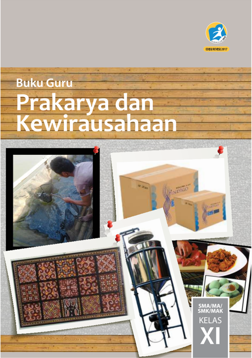

> **Deskripsi Visual:** Buku Guru Prakarya dan Kewirausahaan untuk kelas XI SMA/MA/SMK/MAK menampilkan berbagai elemen visual yang membantu pembaca memahami topik pembelajaran. Gambar pertama menunjukkan seorang siswa sedang bekerja dengan bahan kimia, yang mungkin merupakan contoh praktik dalam bidang prakarya. Gambar kedua menampilkan produk industri seperti kotak-kotak yang menunjukkan bagaimana produk dapat dihasilkan dan dijual. Gambar ketiga menampilkan tekstil tradisional dengan detail desain yang menunjukkan pentingnya seni dan desain dalam prakarya. Gambar keempat menunjukkan mesin industri yang digunakan dalam proses produksi, yang menunjukkan bagaimana teknologi dapat digunakan dalam kewirausahaan. Setiap gambar memiliki teks yang memberikan informasi tambahan tentang topik pembelajaran, seperti "SMA/MA/SMK/MAK" dan "KELAS XI". Ini membantu pembaca untuk memahami konteks dan aplikasi dari prakarya dan kewirausahaan dalam dunia nyata.

 

---
## 📄 Halaman 2

### Hak Cipta © 2017 pada Kementerian Pendidikan dan Kebudayaan Dilindungi Undang-Undang

Disklaimer: Buku ini merupakan buku guru yang dipersiapkan Pemerintah dalam rangka implementasi Kurikulum 2013. Buku guru ini disusun dan ditelaah oleh berbagai pihak di bawah koordinasi Kementerian Pendidikan dan Kebudayaan, dan dipergunakan dalam tahap awal penerapan Kurikulum 2013. Buku ini merupakan 'dokumen hidup' yang senantiasa diperbaiki,  diperbaharui,  dan  dimutakhirkan  sesuai  dengan  dinamika  kebutuhan  dan perubahan zaman. Masukan dari berbagai kalangan yang dialamatkan kepada penulis dan laman http://buku.kemdikbud.go.id atau melalui email buku@kemdikbud.go.id diharapkan dapat meningkatkan kualitas buku ini.

### Katalog Dalam Terbitan (KDT)

Indonesia. Kementerian Pendidikan dan Kebudayaan.

Prakarya dan Kewirausahaan : buku guru/Kementerian Pendidikan dan

Kebudayaan.-- . Edisi Revisi Jakarta : Kementerian Pendidikan dan Kebudayaan, 2017.

viii, 416 hlm. : ilus. ; 25 cm.

Untuk SMA/MA/SMK/MAK Kelas X I ISBN  978-602-427-160-2 (jilid lengkap) ISBN  978-602-427-162-6 (jilid 2)

- Prakarya dan Kewirausahaan -- Studi dan Pengajaran
I. Judul

- Kementerian Pendidikan dan Kebudayaan
299.512

Penulis

:  Indah Setyowati, Nurhayati, Miftakodin, Cahyadi, Heatiningsih.

Penelaah

:  Samsul Hadi, Caecilia Tridjata Suprabanindya, Djoko Adi Widodo, Ana, Latif Sahubawa, WahyuPrihatini, Suci Rahayu, Danik Dania Asadayanti.

Pereview

:  Ertin Lis Susanti.

Penyelia Penerbitan : Pusat Kurikulum dan Perbukuan, Balitbang, Kem dikbud.

en

Cetakan Ke-1, 2014 ISBN 978-602-282-456-5 (jilid 2) Cetakan Ke-2, 2017 (Edisi Revisi)

Disusun dengan huruf Minion Pro, 11 pt.

 

---
## 📄 Halaman 3

### KATA PENGANTAR

Buku Guru ini disusun untuk menjadi panduan dasar dalam proses pembelajaran, evaluasi,  pengayaan,  remedial  dan  interaksi  dengan  orang  tua.  Guru  dapat  memperkaya materi dan proses pembelajaran secara kreatif dengan memanfaatkan data, informasi  maupun  situasi  lingkungan  tempat  pembelajaran  berlangsung.  Dalam Undang-Undang Nomor 14 Tahun 2005 tentang Guru dan Dosen. Dinyatakan bahwa guru  dan  tenaga  kependidikan  merupakan  tenaga  profesional  yang  mempunyai fungsi, peran, dan kedudukan yang sangat penting dalam mencapai visi pendidikan.

Dalam hal ini untuk memudahkan pelaksanaan pembelajaran, maka  Pusat Kurikulum dan  Perbukuan  memfasilitasi  penulisan  Buku  Siswa  dan  Buku  Guru  untuk  mata pelajaran  Prakarya  dan  Kewirausahaan  Kelas  XI  yang  dapat  dikembangkan  sesuai dengan  kebutuhan  dan  kondisi  masing-masing  daerah.  Buku  Guru  Prakarya  dan Kewirausahaan Kelas XI ini merupakan salah satu sumber belajar bagi guru untuk membantu dan mengembangkan proses belajar mengajar dan disajikan untuk   memberikan  informasi  tentang  bagaimana  menggunakan  Buku  Siswa  Prakarya  dan Kewirausahaan kelas XI.

Kreativitas dan keterampilan peserta didik dalam menghasilkan produk kerajinan, produk  rekayasa,  produk  budidaya  maupun  produk  pengolahan  sudah  dilatihkan melalui Mata Pelajaran Prakarya sejak di Sekolah Menengah Kelas VII, VIII, dan Kelas XI. Pada Sekolah Menengah Kelas X, XI dan XII pembelajaran Prakarya disinergikan dengan kompetensi Kewirausahaan secara bertahap. Pada Kelas X peserta didik telah mulai dikenalkan kepada konsep wirausaha dan sikap dasar seorang wirausahawan, berpikir  kreatif,  merancang,  memproduksi,  mengemas,  dan  memasarkan  produk secara sederhana. Ide produk, perancangan, pengemasan dan pemasaran yang dikembangkan dapat memanfaatkan pengetahuan yang telah diperoleh pada Mata Pelajaran Prakarya maupun Prakarya dan Kewirausahaan pada kelas-kelas yang sebelumnya.

Kegiatan  pembelajaran  pada  buku  ini  menekankan  kepada  kemampuan  bekerja di  dalam  kelompok,  sehingga  peserta  didik  memiliki  keterampilan  untuk  bekerja sama. Pembelajaran Prakarya dan Kewirausahaan bagi peserta didik pada jenjang pendidikan menengah kelas XI mencakup aktivitas dan materi pembelajaran yang secara utuh dapat meningkatkan kompetensi pengetahuan, keterampilan, dan sikap. Kompetensi  tersebut  diperlukan  untuk  menciptakan  karya  nyata,  menciptakan peluang  pasar,  dan  menciptakan  kegiatan  bernilai  ekonomi  dari  produk  yang

 

---
## 📄 Halaman 4

dihasilkan. Pembelajaran Prakarya dan Kewirausahaan dirancang berbasis aktivitas terkait dengan sejumlah ranah karya nyata, yaitu karya kerajinan, karya teknologi, karya pengolahan, dan karya budidaya dengan contoh-contoh karya konkret berasal dari tema-tema karya populer yang sesuai untuk peserta didik Kelas XI. Sebagai mata pelajaran yang mengandung unsur muatan lokal, tambahan materi yang digali dari kearifan lokal yang relevan perlu ditambahkan sebagai pengayaan buku ini.

Buku ini menjabarkan usaha minimal yang harus dilakukan siswa untuk mencapai kompetensi  yang  diharapkan.  Sesuai  dengan  pendekatan  yang  digunakan  dalam Kurikulum 2013, siswa didorong untuk mencari sumber belajar lain yang tersedia dan terbentang luas di sekitarnya. Peran guru dalam meningkatkan dan menyesuaikan daya serap siswa dengan ketersediaan kegiatan pada buku ini sangat penting. Guru dapat  memperkayanya  dengan  kreasi  dalam  bentuk  kegiatan-kegiatan  lain  yang sesuai dan relevan yang bersumber dari lingkungan sosial dan alam.

Ucapan terima kasih dan penghargaan kepada berbagai pihak  yang   telah memberikan kontribusi secara maksimal. Semoga buku Prakarya dan Kewirausahaan Klas XI ini dapat menjadi acuan dan sumber inspirasi bagi guru dan semua pihak yang terlibat dalam pelaksanaan penyusunan buku ini. Buku ini sangat terbuka dan perlu terus dilakukan perbaikan dan penyempurnaan. Oleh karena itu, kami mengundang para pembaca  memberikan  kritik,  saran  dan  masukan  untuk  perbaikan  dan  penyempurnaan  pada  edisi  berikutnya.  Atas  kontribusi  tersebut,  kami  ucapkan  terima kasih. Mudah-mudahan kita dapat memberikan yang terbaik bagi kemajuan dunia pendidikan dalam rangka mempersiapkan generasi seratus tahun Indonesia Merdeka (2045).

Jakarta, 2017

Tim Penulis

 

---
## 📄 Halaman 5

### DAFTAR ISI

 

---
## 📄 Halaman 9

### KERAJINAN Aspek :

### BAB 1

### Wirausaha Kerajinan dari Bahan Limbah Berbentuk Bangun Datar

### A. Kompetensi Inti (KI) dan Kompetensi Dasar (KD)

---
**📊 Tabel**

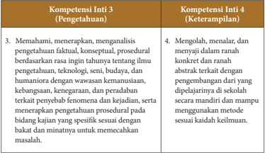

Tabel ini memperlihatkan dua kompetensi inti penting: Pengetahuan (Kompetensi Inti 3) dan Keterampilan (Kompetensi Inti 4). Kompetensi Inti 3 fokus pada pemahaman, penalaran, dan analisis pengetahuan faktil, konseptual, dan prosedural dengan berbagai aspek seperti ilmu teknologi, budaya, dan humaniora. Ini mencakup wawasan kemanusiaan, kebijaksanaan, kegembiraan, dan peradaban. Kompetensi Inti 4 lebih fokus pada menganalisis dan mengekspresikan pengetahuan tersebut dalam bentuk yang lebih konkret dan abstrak, melalui pengembangan metode belajar mandiri dan penggunaan metode sesuai dengan kaidah keilmuan. Data penting dalam tabel ini adalah bahwa kedua kompetensi ini sangat berkaitan dengan pengetahuan dan keterampilan, serta bagaimana mereka dapat saling mendukung satu sama lain dalam pembelajaran dan pengembangan.

 

---
## 📄 Halaman 10

---
**📊 Tabel**

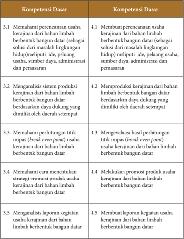

Tabel ini berisi informasi tentang kompetensi dasar yang harus dipelajari dalam mengelola usaha kerajinan dari bahan limbah berbentuk bangun datar. Topik utamanya adalah tentang memahami dan menerapkan berbagai aspek dalam pengelolaan usaha ini, mulai dari perencanaan usaha, analisis sistem produksi, hingga manajemen keuangan dan promosi. Kolom pertama menunjukkan topik-topsik tersebut, sedangkan kolom kedua menyajikan detail lebih lanjut tentang setiap topik. Data penting yang terlihat adalah bahwa setiap topik memiliki dua poin, yang menunjukkan bahwa setiap kompetensi dasar dibagi menjadi dua bagian: pemahaman dasar dan praktik atau implementasi. Ini menunjukkan bahwa pembelajaran tidak hanya berfokus pada pemahaman teoritis, tetapi juga pada kemampuan untuk menerapkan konsep tersebut dalam situasi nyata.

 

---
## 📄 Halaman 11

---
**📊 Tabel**

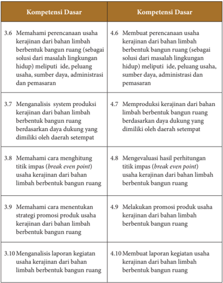

Tabel ini berisi informasi tentang kompetensi dasar yang harus dipenuhi oleh siswa dalam mengelola usaha kerajinan dari bahan limbah berbentuk bangun ruang. Topik utamanya adalah tentang pemahaman dan pengelolaan usaha kerajinan tersebut. Kolom pertama berisi nomor urut dari 3.6 hingga 10, sementara kolom kedua berisi deskripsi kompetensi dasar tersebut. Data penting yang terlihat adalah bahwa setiap kompetensi dasar memiliki satu atau lebih subkompetensi yang harus dipenuhi, seperti membuat laporan kegiatan atau memahami perencanaan usaha. Seluruh tabel ini membantu siswa untuk memahami dan menguasai berbagai aspek dalam mengelola usaha kerajinan dari bahan limbah berbentuk bangun ruang.

 

---
## 📄 Halaman 12

### B. Tujuan Pembelajaran

### Siswa mampu:

- Membuat  perencanaan  usaha  kerajinan  dari  bahan  limbah  berbentuk  bangun datar di wilayah setempat dan lainnya untuk membangun semangat berwirausaha.
- Mengapresiasi  keanekaragaman  karya  kerajinan  dari  bahan  limbah  berbentuk bangun  datar  dan  pengemasannya  di  wilayah  setempat  dan  lainnya,  sebagai ungkapan  rasa  bangga  dan  wujud  rasa  syukur  terhadap  anugerah  Tuhan  Yang Maha Esa.
- Mengidentifikasi potensi kerajinan dari bahan limbah berbentuk bangun datar di wilayah setempat dan lainnya berdasarkan rasa ingin tahu dan peduli lingkungan.
- Merancang  produk  kerajinan  dari  bahan  limbah  berbentuk  bangun  datar  dan pengemasannya  dengan  menerapkan  prinsip  perencanaan  produksi  kerajinan serta  menunjukkan  perilaku  santun,  jujur,  percaya  diri,  bertanggung  jawab, disiplin, dan mandiri.
- Membuat  produk  kerajinan  dari  bahan  limbah  berbentuk  bangun  datar  dan pengemasannya sesuai konsep berkarya dengan pendekatan budaya setempat dan lainnya berdasarkan orisinalitas ide dan cita rasa estetis diri sendiri.
- Menghitung titik impas ( break even point ) usaha kerajinan dari bahan limbah berbentuk bangun datar yang ada di wilayah setempat dan lainnya untuk membangun semangat berwirausaha.
- Melakukan promosi usaha kerajinan dari bahan limbah berbentuk bangun datar di  wilayah  setempat  dan  lainnya  dengan  sikap  bekerjasama,  gotong  royong, bertoleransi, disiplin, bertanggung jawab, kreatif dan inovatif
- Membuat laporan kegiatan usaha kerajinan dari bahan limbah berbentuk bangun datar berdasarkan analisis kegiatan usaha kerajinan dari bahan limbah berbentuk bangun datar yang ada di wilayah setempat dan lainnya.

 

---
## 📄 Halaman 13

### C. Peta Materi

---
**🖼️ Gambar/Diagram**

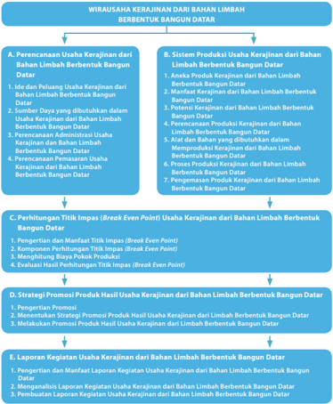

> **Deskripsi Visual:** Gambar ini adalah diagram yang menunjukkan proses kerajinan dari limbah berbentuk bangun datar. Diagram ini dibagi menjadi enam bagian utama:

1. A. Perencanaan Usaha Kerajinan dari Bahan Limbah Berbentuk Bangun Datar:
   - Ide dan Peluang Usaha Kerajinan dari Bahan Limbah Berbentuk Bangun Datar
   - Sumber Daya yang dibutuhkan dalam Usaha Kerajinan dari Bahan Limbah Berbentuk Bangun Datar
   - Perencanaan Administrasi Usaha Kerajinan dari Bahan Limbah Berbentuk Bangun Datar
   - Perencanaan Pemasaran Usaha Kerajinan dari Bahan Limbah Berbentuk Bangun Datar

2. B. Sistem Produksi Usaha Kerajinan dari Bahan Limbah Berbentuk Bangun Datar:
   - Analisis Potensi Kerajinan dari Bahan Limbah Berbentuk Bangun Datar
   - Manfaat Kerajinan dari Bahan Limbah Berbentuk Bangun Datar
   - Polisi Kerajinan dari Bahan Limbah Berbentuk Bangun Datar
   - Perencanaan Produksi Kerajinan dari Bahan Limbah Berbentuk Bangun Datar

3. C. Hitungan Titik Impas (Break Point) Usaha Kerajinan dari Bahan Limbah Berbentuk Bangun Datar:
   - Penentuan Titik Impas (Break Point)
   - Komponen Hitungan Titik Impas (Break Point)
   - Menghitung Biaya Fokus Produk
   - Evaluasi Hasil Penjualan Titik Impas (Break Point)

4. D. Strategi Promosi Produk Hasil Usaha Kerajinan dari Bahan Limbah Berbentuk Bangun Datar:
   - Pengertian Promosi
   - Tujuan Promosi Produk Hasil Usaha Kerajinan dari Limbah Berbentuk Bangun Datar
   - Mekanisme Promosi Produk Hasil Usaha Kerajinan dari Limbah Berbentuk Bangun Datar

5. E. Laporan Keuangan Usaha Kerajinan dari Bahan Limbah Berbentuk Bangun Datar:
   - Pengetesan dan Manfaat Laporan

 

---
## 📄 Halaman 14

### D. Proses Pembelajaran

Pembelajaran  wirausaha  kerajinan  dari  bahan  limbah  berbentuk  bangun  datar bertujuan  agar  siswa  dapat  memanfaatkan  bahan  limbah  berbentuk  bangun  datar yang  ada  di  sekelilingnya.  Dengan  mempertimbangkan  nilai  estetika  dan  nilai ekonomi  siswa  dapat  mengolah  limbah  berbentuk  bangun  datar  menjadi  karya kerajinan disertai kemasan yang menarik.

Melalui pembelajaran wirausaha kerajinan dari bahan limbah berbentuk bangun datar diharapkan siswa mampu menunjukkan sikap rasa ingin tahu, sikap santun, kerja  sama dalam menggali informasi serta pantang menyerah, jujur, percaya diri, bertanggung jawab, disiplin, dan mandiri.

Proses pembelajaran wirausaha kerajinan dari bahan limbah berbentuk bangun datar dilakukan melalui kegiatan mengamati, menanya, mencoba, mengasosiasi, dan mengomunikasikan.  Kegiatan  mengamati  bertujuan  agar  pembelajaran  berkaitan erat dengan konteks situasi nyata dalam kehidupan sehari-hari. Kegiatan menanya dilakukan sebagai salah satu proses membangun pengetahuan siswa dalam bentuk konsep, prinsip, prosedur, hukum, dan teori, hingga berpikir metakognitif. Kegiatan mencoba  bermanfaat  untuk  meningkatkan  keingintahuan  siswa,  mengembangkan kreativitas,  dan keterampilan kerja ilmiah. Kegiatan mengasosiasi bertujuan untuk membangun kemampuan berpikir dan bersikap ilmiah. Kegiatan mengomunikasikan adalah  sarana  untuk  menyampaikan  hasil  konseptualisasi  dalam  bentuk  lisan, tulisan,  gambar/sketsa,  diagram  atau  grafik.  Kegiatan  ini  dilakukan  agar  siswa mampu mengomunikasikan pengetahuan, keterampilan, dan penerapannya, melalui presentasi, membuat laporan, dan unjuk karya.

Proses pembelajaran wirausaha kerajinan dari bahan limbah berbentuk bangun datar pada buku siswa diawali dengan gambar peta materi. Peta materi tersebut berisi garis-garis besar materi yang akan dipelajari oleh siswa. Guru mengarahkan perhatian siswa untuk menggali pengetahuan tentang kewirausahaan dan mengamati produk kerajinan dari bahan limbah berbentuk bangun datar yang dibawa atau ditayangkan. Kemudian  guru  memandu  siswa  untuk  saling  bertanya  tentang  keanekaragaman produk kerajinan dari bahan limbah berbentuk bangun datar dan prospek wirausaha yang dapat dikembangkan. Guru menjelaskan bagian-bagian dari materi yang akan dipelajari  siswa.  Tanyakan  pada  siswa  tentang  alur  yang  tidak  dipahami  dari  peta materi dan istilah-istilah penting yang belum dipahami siswa.

Guru diharapkan dapat memotivasi siswa untuk melakukan proses berwirausaha mulai  dari  membuat  perencanaan  usaha,  perencanaan  pemasaran,  perencanaan produk dan kemasan, memproduksi karya kerajinan, mempromosikan dan menjual karya kerajinan, serta membuat laporan hasil usaha.

 

---
## 📄 Halaman 15

Pembelajaran  wirausaha  kerajinan  dari  bahan  limbah  berbentuk  bangun  datar pada kelas XI adalah sebagai berikut.

### 1. Perencanaan Usaha Kerajinan dari Bahan Limbah Berbentuk Bangun Datar

Siswa  mempelajari tentang perencanaan usaha kerajinan dari bahan limbah berbentuk bangun datar, yang terdiri dari:

- Ide dan Peluang Usaha Kerajinan dari Bahan Limbah Berbentuk Bangun Datar
- Sumber Daya yang Dibutuhkan dalam Usaha Kerajinan dari Bahan Limbah Berbentuk Bangun Datar
- Perencanaan  Administrasi  Usaha  Kerajinan  dari  Bahan  Limbah  Berbentuk Bangun Datar
- Perencanaan  Pemasaran  Usaha  Kerajinan  dari  Bahan  Limbah  Berbentuk Bangun Datar.
Proses pembelajaran diawali dengan aktivitas siswa menyampaikan pendapat tentang perencanaan usaha kerajinan dari bahan limbah berbentuk bangun datar yang mereka ketahui. Sampaikan konsep perencanaan usaha kerajinan dari bahan limbah berbentuk bangun datar pada perusahaan kerajinan yang ada di wilayah setempat atau yang lainnya. Guru bersama siswa menganalisis perencanaan usaha kerajinan dari bahan limbah berbentuk bangun datar pada perusahaan kerajinan yang ada di wilayah setempat atau di wilayah lainnya. Guru dapat menggunakan sumber pembelajaran baik melalui internet, perpustakaan maupun media lainnya, agar materi pembelajaran menarik.

Bersama  siswa,  lakukan  kegiatan  pengamatan  perencanaan  usaha  kerajinan dari  bahan  limbah  berbentuk  bangun  datar  pada  perusahaan  kerajinan  yang diperoleh dari buku maupun dari media lainnya, kemudian siswa saling bertanya dan guru menjelaskan konsep perencanaan usaha kerajinan dari bahan limbah berbentuk bangun datar.

Gunakan  media  presentasi  dalam  bentuk powerpoint atau  media  lainnya. Guru  mempresentasikan  di  depan  kelas  dengan  menjelaskan  ide  dan  peluang usaha  kerajinan  dari  bahan  limbah  berbentuk  bangun  datar.  Peserta  didik mengemukakan pendapat dan pengalamannya.

Siswa  diberi  tugas  secara  mandiri  untuk  menentukan  peluang  usaha  dari produk kerajinan dengan memanfaatkan bahan dari limbah berbentuk bangun datar yang ada di sekitar tempat tinggal mereka, dengan ketentuan sebagai berikut.

- Produk kerajinan yang akan dijual   : …………………………….
- b.
- Konsumen yang akan dituju : …………………………….
- Analisis SWOT terhadap peluang /ide usaha yang akan ditetapkan:

 

---
## 📄 Halaman 16

---
**📊 Tabel**

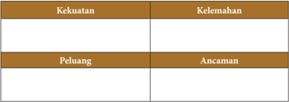

Tabel ini menunjukkan analisis SWOT (Strengths, Weaknesses, Opportunities, Threats) untuk sebuah organisasi atau produk. Topik utama adalah analisis SWOT, yang melibatkan penilaian kekuatan, kelemahan, peluang, dan ancaman. Kolom "Kekuatan" mencakup informasi tentang kelebihan atau keunggulan yang dimiliki oleh subjek tersebut. Kolom "Kelemahan" berisi informasi tentang kekurangan atau tantangan yang dihadapi oleh subjek tersebut. Kolom "Peluang" menunjukkan potensi kesempatan atau peluang baru yang dapat diambil oleh subjek tersebut. Kolom "Ancaman" berisi informasi tentang ancaman atau risiko yang mungkin dihadapi oleh subjek tersebut. Dari tabel ini, kita dapat melihat bahwa analisis SWOT sangat penting untuk memahami situasi sekarang dan memprediksi perubahan masa depan.

Selanjutnya, siswa diberi tugas untuk membuat laporan dan mempresentasikan hasil kerja mereka.

Siswa menyampaikan pendapat tentang sumber daya yang dibutuhkan, perencanaan administrasi, perencanaan pemasaran dalam usaha kerajinan dari bahan limbah berbentuk bangun datar yang mereka ketahui. Guru dapat menunjukkan di depan kelas sumber daya yang dibutuhkan, perencanaan administrasi, perencanaan pemasaran dalam usaha kerajinan dari bahan limbah berbentuk bangun datar. Siswa mengemukakan pendapat dan pengalamannya.

Siswa diberi tugas untuk mengunjungi salah satu usaha kerajinan dari bahan limbah berbentuk bangun datar yang ada di sekitar tempat tinggal siswa/diluar/ pada tempat yang terdapat hasil kerajinan tersebut. Kegiatan tersebut dilakukan secara kelompok individu, masing-masing kelompok antara 3 - 4 siswa.

Beberapa kegiatan yang harus dilakukan siswa sebagai berikut.

- Melakukan wawancara dengan pengusaha tentang ide dan peluang usaha.
- Melakukan  wawancara  tentang  sumber  daya  yang  dibutuhkan  dalam  usaha tersebut.
- Menanyakan tentang perencanaan administrasi usaha kerajinan tersebut.
- Menanyakan tentang perencanaan pemasaran dari usaha kerajinan tersebut.
- Melakukan analisis kekuatan, kelemahan, peluang, dan ancaman secara sederhana berdasarkan data prioritas dari jawaban responden.
- Mendiskusikan dengan kelompoknya dan presentasikan di  kelas.
Berdasarkan  hasil  wawancara  dan  pengamatan  tersebut,  siswa  membuat laporan. Pada saat siswa mendiskusikan laporannya, guru memberikan konfirmasi dan bersama siswa menyimpulkan hasil diskusi tersebut.

Setelah  siswa  secara  kelompok  melakukan  observasi  dan  wawancara  pada pengusaha kerajinan yang ada di lingkungan mereka, masing-masing siswa diberi tugas untuk melakukan praktik sebagai berikut.

- Melakukan analisis SWOT berdasarkan data kekuatan, kelemahan, peluang, dan ancaman yang mungkin terjadi.

 

---
## 📄 Halaman 17

- Menentukan ide dan peluang usaha berdasarkan analisis SWOT tersebut.
- Menentukan  sumber  daya  yang  dibutuhkan  dalam  pengembangan  usaha tersebut.
- Membuat perencanaan administrasi pada usaha kerajinan tersebut.
- Membuat perencanaan pemasaran dari usaha kerajinan tersebut.
- Membuat laporan.
Kegiatan pembelajaran masing-masing pokok bahasan selalu disertai dengan aktivitas dan tugas-tugas yang harus dikerjakan oleh siswa agar kompetensi yang diharapkan dapat tercapai secara utuh. Aktivitas dan tugas masing-masing pokok bahasan sebagai berikut.

- Ide dan Peluang Usaha Kerajinan dari Bahan Limbah Berbentuk Bangun Datar Aktivitas  yang  diharapkan  dapat  melatih  siswa  dalam  menentukan  peluang usaha untuk produk kerajinan dengan memanfaatkan bahan limbah berbentuk bangun datar yang ada di lingkungannya. Kemudian, siswa membuat laporan dari hasil aktivitas tersebut.
- Sumber Daya yang Dibutuhkan dalam Usaha Kerajinan dari Bahan Limbah Berbentuk Bangun Datar
Aktivitas  yang  diharapkan  dapat  melatih  siswa  mengidentifikasi  dan  menjelaskan secara singkat sumber daya yang dibutuhkan dalam mendirikan usaha kerajinan dengan memanfaatkan bahan limbah berbentuk bangun datar yang ada di lingkungannya. Kemudian, siswa membuat laporan dari hasil identifikasi tersebut.

- Perencanaan  Administrasi  Usaha  Kerajinan  dari  Bahan  Limbah  Berbentuk Bangun Datar
Aktivitas yang diharapkan dapat melatih siswa membuat  perencanaan administrasi  yang  baik  untuk  mendirikan  usaha  kerajinan  dari  limbah berbentuk bangun datar yang ada di lingkungannya. Kemudian, siswa membuat laporan dari hasil perencanaan administrasi  usaha tersebut.

- Perencanaan  Pemasaran  terhadap  Usaha  Kerajinan  dari  Bahan  Limbah Berbentuk Bangun Datar.
Aktivitas  yang  diharapkan  dapat  melatih  siswa  menganalisis  kebutuhan pasar dalam usaha kerajinan dari limbah berbentuk bangun datar yang ada di  lingkungannya.  Kemudian,  membuat  laporan  berdasarkan  hasil  analisis tersebut.

Di akhir pokok bahasan materi perencanaan usaha kerajinan dari bahan limbah berbentuk bangun datar, siswa melakukan refleksi diri. Guru menugaskan kepada siswa untuk merenungkan dan menuliskan pada selembar kertas. Beberapa hal yang perlu diungkapkan oleh siswa:

- Apa saja yang perlu diperhatikan ketika merencanakan usaha kerajinan dari bahan limbah berbentuk bangun datar yang ada di wilayahnya?

 

---
## 📄 Halaman 18

- Materi apa yang masih sulit untuk difahami?
- Kesulitan apa yang dihadapi saat mencari informasi dan pengamatan?
- Kesulitan apa yang dihadapi pada saat membuat perencanaan usaha kerajinan dari bahan limbah berbentuk bangun datar?

### 2.  Sistem Produksi Usaha Kerajinan dari Bahan Limbah Berbentuk Bangun Datar

Siswa mempelajari tentang sistem produksi usaha kerajinan dari bahan limbah berbentuk bangun datar, yang terdiri dari:

- Aneka Produk Kerajinan dari Bahan Limbah Berbentuk Bangun Datar
- Manfaat Kerajinan dari Bahan Limbah Berbentuk Bangun Datar
- Potensi Kerajinan dari Bahan Limbah Berbentuk Bangun Datar
- Perencanaan Produksi Kerajinan dari Bahan Limbah Berbentuk Bangun Datar
- Alat dan Bahan yang dibutuhkan dalam Memproduksi Kerajinan dari Bahan Limbah Berbentuk Bangun Datar
- Proses Produksi Kerajinan dari Bahan Limbah Berbentuk Bangun Datar
- Pengemasan Produk Kerajinan dari Bahan Limbah Berbentuk Bangun Datar.
Proses pembelajaran diawali dengan siswa menyampaikan pendapat tentang sistem  produksi  usaha  kerajinan  dari  bahan  limbah  berbentuk  bangun  datar. Sampaikan strategi tentang cara mengetahui sistem produksi usaha kerajinan dari bahan limbah berbentuk bangun datar. Guru bersama siswa melakukan kegiatan pengamatan  dan  menganalisis  tujuh  hal  penting  dalam  menentukan  sistem produksi usaha kerajinan dari bahan limbah berbentuk bangun datar yaitu aneka produk, manfaat, potensi kerajinan, perencanaan produksi, alat dan bahan untuk memproduksi, proses produksi, dan pengemasan. Guru diharapkan menggunakan berbagai  sumber  tentang  materi  pembelajaran  baik  melalui  internet  maupun media lainnya, agar materi pembelajaran dapat berkembang dengan baik.

Gunakan media presentasi dalam bentuk power point atau media lainnya. Guru mempresentasikan  di  depan  kelas  dengan  menjelaskan  sistem  produksi  usaha kerajinan  dari  bahan  limbah  berbentuk  bangun  datar.  Siswa  mengemukakan pendapat dan pengalamannya.

Setelah  mempelajari  materi  aneka  produk  kerajinan  dari  bahan  limbah berbentuk bangun datar, siswa diberi tugas secara mandiri untuk menganalisis produk kerajinan dari bahan limbah berbentuk bangun datar dengan memperhatikan potensi yang ada di sekitarnya, dengan langkah-langkah sebagai berikut.

- Siswa mengamati bahan limbah berbentuk bangun datar yang ada di sekitarnya yang dapat dimanfaatkan untuk produk kerajinan.
- Siswa menjelaskan kemungkinan jenis kerajinan apa saja yang bisa dikembangkan dari bahan limbah berbentuk bangun datar yang ada di lingkungannya.

 

---
## 📄 Halaman 19

- Siswa  menganalisis  potensi  sumber  daya  yang  dapat  dimanfaatkan  untuk membuat produk kerajinan dari bahan limbah berbentuk bangun datar.
- Siswa membuat laporan dari hasil analisis yang telah diperoleh baik berupa makalah maupun media presentasi.
Setelah mengetahui manfaat kerajinan dari bahan limbah berbentuk bangun datar serta potensinya, siswa diberi tugas secara kelompok. Siswa dibagi menjadi beberapa  kelompok,  masing-masing  kelompok  berjumlah  antara  3  -  4  siswa. Tugas  masing-masing  kelompok  mengidentifikasi  karya  kerajinan  dari  bahan limbah berbentuk bangun datar yang  ada di wilayah setempat. Identifikasi karya kerajinan tersebut berdasarkan hal-hal berikut.

- Aneka produk sesuai potensi daerah masing-masing.
- Bahan dasar.
- Manfaat produk kerajinan.
Masing-masing kelompok membuat laporan berdasarkan hasil diskusi.

Pada materi sistem produksi kerajinan dari bahan limbah berbentuk bangun datar,  guru  membimbing  siswa  untuk  mengamati  proses  produksi  kerajinan dari bahan limbah berbentuk bangun datar melalui media presentasi/video atau media lainnya. Guru memotivasi siswa untuk saling bertanya dan mengemukakan pendapat.  Sampaikan  pengertian  sistem  produksi  kerajinan  dari  bahan  limbah berbentuk bangun datar yang hendak dipelajari siswa. Produk kerajinan umumnya lebih menitikberatkan pada nilai-nilai keunikan ( uniqueness ) dan estetika (keindahan).  Sementara  dalam  pemenuhan  fungsinya  produk  kerajinan  lebih menekankan pada pemenuhan fungsi pakai yang lebih bersifat fisik (fisiologis), misalnya benda-benda pakai, perhiasan, furnitur, sandang, dan aksesoris lainnya.

Siswa  mengamati  dan  mengumpulkan  informasi  tentang  berbagai  macam proses  produksi  kerajinan  dari  bahan  limbah  berbentuk  bangun  datar,  serta mampu mengomunikasikan kepada siswa lainnya. Secara tertulis siswa diminta menjelaskan  terlebih  dahulu  peralatan  dan  cara  pemakaian  keselamatan  kerja pada  proses  produksi  kerajinan  dari  bahan  limbah  berbentuk  bangun  datar. Kemudian,  secara  tertulis  menjelaskan  bahan  dan  alat,  proses  penyiapan  dan proses pengerjaan produksi kerajinan dari bahan limbah berbentuk bangun datar. Sebaiknya jawaban siswa disertai dengan sketsa dan skema alur sehingga akan menjadi jelas.  Guru mengawasi siswa dan membimbing pekerjaan siswa. Sikap yang dikembangkan adalah kejujuran, kemandirian, dan tanggung jawab.

Guru membuat pedoman penskoran untuk menilai masing-masing soal secara proporsional. Pedoman penskoran harus dapat menghargai kreativitas siswa.

Pada materi proses produksi kerajinan dari bahan limbah berbentuk bangun datar,  pengetahuan  dan  pemahaman  tentang  proses  produksi  kerajinan  dari bahan  limbah  berbentuk  bangun  datar  ini  diperlukan  ketika  ingin  melakukan

 

---
## 📄 Halaman 20

kegiatan pembuatan karya kerajinan dari bahan limbah berbentuk bangun datar. Selain tahapan berkarya, diperlukan pula persyaratan agar karya yang dihasilkan memenuhi  desain  yang  dibutuhkan  oleh  pemakai.  Persyaratan  yang  disebut sebagai  prinsip  ergonomis  ini  perlu  diinfokan  sebagai  pengetahuan  bagi  siswa. Agar siswa dapat memulai berkarya dengan baik.

Melalui petunjuk tahapan berkarya, diharapkan guru dapat memberi penguatan afektif, agar siswa dapat bekerja dengan alur yang semestinya. Tahapan yang penting adalah menentukan bahan dan alat, menggali ide/gagasan, membuat desain/rancangan,  menyiapkan  bahan  dan  peralatan  bekerja,  membuat  karya, dan mengemasannya. Dalam prinsip ergonomis, yang perlu ditekankan adalah kegunaan,  kenyaman,  keluwesan,  keamanan,  dan  keindahan  dalam  proses merancang dan membuat karya.

Lakukan diskusi interaktif dengan menyampaikan berbagai contoh mengenai karya  kerajinan  dari  bahan  limbah  berbentuk  bangun  datar  khususnya  untuk kerajinan dari limbah kulit jagung atau yang sejenisnya. Lakukan tanya jawab di dalam kelas agar siswa bertambah pemahamannya. Gunakan contoh-contoh karya atau melalui gambar bahkan video/film untuk membangun keingintahuan siswa.

Alternatif tahapan pembuatan karya kerajinan dari bahan limbah berbentuk bangun  datar  yang  dibahas  pada  buku  ini  adalah  menggunakan  limbah  alami yang mudah diperoleh di lingkungan sekolah, guru dapat menggunakan alternatif pembelajaran lainnya  disesuaikan  dengan  kondisi  daerah  masing-masing.  Tanyakan pada siswa tentang perlunya perencanaan dalam berkarya. Sampaikan hal yang paling penting dalam berkarya yaitu identifikasi kebutuhan dan pengembangan ide/gagasan.  Caranya  dengan  membuat  beberapa  sketsa  sebagai  gagasan,  yang terbaik  dipilih  menjadi  karya  yang  akan  dibuat.  Hal  ini  diperlukan  agar  siswa memperoleh kebermanfaatan dalam berkarya, serta berkarya dengan kreativitas dan originalitas. Sikap yang dikembangkan adalah kejujuran, kemandirian, dan tanggung jawab.

Keselamatan  dalam  bekerja  perlu  diingatkan  agar  diperhatikan  oleh  siswa. Guru juga harus mengawasi dengan baik, terutama dalam penggunaan bahan dan alat, juga pembuangan limbahnya. Keselamatan kerja berhubungan dengan cara memperlakukan alat dan bahan kerja, serta bagaimana mengatur alat dan benda kerja  yang  baik  dan  aman  karena  berhubungan  dengan  keselamatan.  Limbah bahan  buatan  dapat  merusak  lingkungan.  Sebaiknya,  siswa  dibimbing  untuk selalu  memperhatikan hal ini dengan baik. Penguatan sikap perlu diperhatikan seperti jujur, percaya diri, dan mandiri dalam membuat karya, dan hemat dalam menggunakan bahan serta peduli kebersihan lingkungannya.

 

---
## 📄 Halaman 21

Guru  dapat  membawa  contoh-contoh  karya  kerajinan  dari  bahan  limbah berbentuk  bangun  datar  yang  dimiliki.  Melalui  metode  demonstrasi,  guru dapat  menjelaskan  proses  kerja  pembuatan  karya  kerajinan  tersebut.  Tanyakan kepada siswa produk kerajinan apa saja yang dapat dihasilkan dari bahan limbah berbentuk bangun datar.

Sampaikan informasi bahwa Indonesia sangat kaya dengan produk kerajinan, produk kerajinan tersebut banyak memanfaatkan bahan dari limbah. Siswa diharapkan  dapat  menggali  ide/gagasan  dari  aneka  ragam  kerajinan  tradisional Indonesia.  Sampaikan  berbagai  macam  hiasan  untuk  memperindah  produk kerajinan menggunakan bahan-bahan alami, misalnya serat alam dan biji-bijian.

Model  pembelajaran  individual  ( individual  learning )  dapat  diterapkan  pula untuk  materi  ini.  Dengan  diberi  kesempatan  untuk  belajar  secara  mandiri, diharapkan  pemahaman  secara  konsep  akan  lebih  mudah  dicerna.  Selain  itu, pembelajaran dapat diselingi dengan metode tanya jawab secara interaktif agar siswa bertambah pemahamannya.

Pada  tahapan  berkarya,  siswa  diminta  untuk  membuat  desain/rancangan terlebih dahulu. Gunakan contoh tahapan berkarya pada pembahasan materi ini untuk memudahkan siswa dalam membuat karya. Guru dapat mengawasi siswa dan membimbing pekerjaan siswa. Kegiatan berkarya ini dilakukan di sekolah, bukan di rumah. Guru harus mengetahui proses berkarya siswa dari awal hingga selesai. Ingatkan siswa untuk memperhatikan keselamatan kerja. Perlu diberikan pemahaman  kepada  siswa  bahwa  kerajinan  tradisional  Indonesia  tidak  kalah menariknya  dengan  kerajinan  modern/kontemporer  yang  sekarang  banyak dipakai oleh sebagian besar manusia.

Pada akhir pembahasan materi proses produksi kerajinan dari bahan limbah berbentuk bangun datar, siswa diberi tugas secara kelompok untuk melakukan observasi/studi pustaka. Tugas setiap kelompok untuk memilih empat foto karya kerajinan dari bahan limbah berbentuk bangun datar yang terdapat di daerahnya atau di wilayah nusantara. Gambar bisa diperoleh data dari internet, buku atau media lainnya.

Masing-masing kelompok mendiskusikan tentang:

- Perencanaan produksi karya kerajinan tersebut
- Alat dan bahan yang dibutuhkan
- Proses produksi.
Masing-masing kelompok mempresentasikan hasil diskusi mereka secara bergantian.

Pada  materi  pengemasan  produk  kerajinan  dari  bahan  limbah  berbentuk bangun datar, dimulai dengan memotivasi siswa untuk menyampaikan pendapat tentang  berbagai  macam kemasan dari produk kerajinan yang mereka ketahui. Sampaikan tentang aneka ragam kemasan dari produk kerajinan dari bahan limbah

 

---
## 📄 Halaman 22

berbentuk  bangun  datar.  Guru  dapat  memanfaatkan  berbagai  sumber  belajar tentang pembelajaran kemasan produk  kerajinan melalui internet, perpustakaan atau media lainnya.

Guru  memotivasi siswa untuk melakukan kegiatan pengamatan pembuatan kemasan karya kerajinan melalui media video atau media lainnya. Dengan menggunakan  media gambar/video, guru dapat menunjukkan aneka ragam pengemasan karya  kerajinan  di  depan  kelas  dengan  menjelaskan  berbagai  karakteristiknya. Siswa mengemukakan pendapat dan pengalamannya.

Siswa  dikenalkan  pengemasan  karya  kerajinan  dari  bahan  lunak  dengan menggunakan bahan dasar kayu dan plastik. Siswa mempelajari kemasan kayu dan plastik serta manfaat dari pengemasan tersebut.  Desain kemasan kayu dan plastik tergantung pada sifat dan berat produk, konstruksi kemasan, bahan kemasan dan kekuatan kemasan, dimensi kemasan, metode dan kekuatan. Penggunaan kemasan kayu baik berupa peti, tong kayu atau palet sangat umum di dalam transportasi berbagai komoditas.

Siswa menyampaikan pendapat tentang berbagai macam kemasan, misalnya kemasan kayu dan plastik dari produk kerajinan yang mereka ketahui. Dengan media presentasi atau media lainnya, sampaikan tentang aneka ragam kemasan pada  produk  kerajinan  dari  limbah  berbentuk  bangun  datar.  Guru  diharapkan menggunakan  berbagai  sumber  belajar  tentang  pembelajaran  kemasan  melalui media internet, perpustakaan atau media lainnya. Guru memotivasi siswa untuk melakukan  kegiatan  pengamatan  pembuatan  kemasan  melalui  media  video atau  media  lainnya.  Dengan  menggunakan    media  gambar/video,  guru  dapat menunjukkan  aneka  ragam  pengemasan  di  depan  kelas  dengan  menjelaskan berbagai karakteristiknya. Siswa mengemukakan pendapat dan pengalamannya.

Setelah siswa mempelajari dan mengerjakan latihan kerja pada materi sistem produksi usaha kerajinan dari bahan limbah berbentuk bangun datar dan telah diberikan contoh proses produksi kerajinan dari limbah kulit jagung, maka siswa diharapkan mempraktikkan pengetahuan tersebut pada sebuah produk kerajinan. Siswa  diharapkan  dapat  mencari  alternatif  bahan  limbah  lainnya  yang  sesuai dengan potensi daerah masing-masing.

Siswa diminta membuat rancangan terlebih dahul. Gunakan contoh tahapan berkarya pada pembahasan materi sebelumnya untuk memudahkan siswa dalam membuat  karya.  Guru  dapat  mengawasi  siswa  dan  membimbing  pekerjaan siswa. Kegiatan berkarya ini dilakukan di sekolah, bukan di rumah. Guru harus mengetahui  proses  berkarya  siswa  dari  awal  hingga  selesai.  Ingatkan  siswa untuk  memperhatikan  keselamatan  kerja.  Perlu  juga  dilatihkan  bagaimana mempresentasikan karya yang telah dibuat.

 

---
## 📄 Halaman 23

Siswa diminta membuat kemasan produk kerajinan yang telah mereka buat. Siswa diharapkan dapat membuat produk kemasan dengan tetap memperhatikan nilai estetika dan ergonomisnya. Kegiatan ini bertujuan agar siswa dapat merancang dan membuat pengemasan produk kerajinan dari hasil karya yang telah dibuat.

Siswa  diminta  membuat  desain/rancangan  terlebih  dahulu,  gunakan  contoh tahapan  berkarya  pada  pembahasan  materi  sebelumnya  untuk  memudahkan siswa  dalam  membuat  karya.  Guru  dapat  mengawasi  siswa  dan  membimbing pekerjaan siswa. Guru harus mengetahui proses berkarya siswa dari awal hingga selesai. Ingatkan siswa untuk memperhatikan keselamatan kerja.

Kegiatan pembelajaran masing-masing pokok bahasan selalu disertai dengan aktivitas dan tugas-tugas yang harus dikerjakan oleh siswa agar kompetensi yang diharapkan dapat tercapai secara utuh. Aktivitas dan tugas masing-masing pokok bahasan adalah sebagai berikut:

- Aneka Produk Kerajinan dari Bahan Limbah Berbentuk Bangun Datar
- Aktivitas  yang  dilakukan  siswa  adalah  menganalisis  produk  kerajinan  dari bahan limbah berbentuk bangun datar dengan memperhatikan potensi yang ada  disekitarnya  dengan  langkah-langkah  sebagai  berikut:  (1)  mengamati bahan limbah berbentuk bangun datar di sekitar siswa yang dapat dimanfaatkan untuk produk kerajinan, (2) menjelaskan kemungkinan jenis kerajinan yang bisa  dikembangkan dari bahan limbah berbentuk bangun datar yang ada di lingkungan siswa, (3) menganalisis potensi sumber daya apa saja yang dapat dimanfaatkan  dalam  berwirausaha  produk  kerajinan  dari  bahan  limbah berbentuk bangun datar. Kemudian, siswa membuat laporan dari hasil analisis yang telah di peroleh baik berupa makalah, atau media presentasi lainnya.
- Manfaat Kerajinan dari Bahan Limbah Berbentuk Bangun Datar
- Aktivitas  yang  dilakukan  siswa  adalah  mengidentifikasi  dan  menjelaskan manfaat  karya  kerajinan  dari  bahan  limbah  berbentuk  bangun  datar  yang diperoleh dari lingkungan setempat atau dari media lainnya. Kemudian, siswa membuat laporan hasil identifikasi tersebut.
- Potensi Kerajinan dari Bahan Limbah Berbentuk Bangun Datar
- Aktivitas  yang  dilakukan  siswa  adalah  mengidentifikasi  dan  menjelaskan potensi bahan limbah berbentuk bangun datar yang ada disekitarnya, kerajinan apa  yang  bisa  dikembangkan  berdasarkan  potensi  bahan  limbah  tersebut. Membuat laporan hasil identifikasi bahan limbah tersebut dan potensi kerajinan yang dapat dikembangkan.
- Perencanaan Produksi Kerajinan dari Bahan Limbah Berbentuk Bangun Datar Aktivitas  yang  dilakukan  siswa  adalah  menjelaskan  perencanaan  produksi kerajinan dari limbah berbentuk bangun datar yang ada dilingkungan siswa. Kemudian, membuat laporan hasil perencanaa tersebut.

 

---
## 📄 Halaman 24

- Alat dan Bahan yang Dibutuhkan dalam Memproduksi Kerajinan dari Bahan Limbah Berbentuk Bangun Datar
Aktivitas  yang  dilakukan  siswa  adalah  mengidentifikasi  dan  menjelaskan bahan dan alat yang diperlukan pada salah satu produksi kerajinan dari limbah berbentuk bangun datar yang ada di lingkungan siswa. Kemudian, membuat laporan hasil identifikasi tersebut.

- Proses Produksi Kerajinan dari Bahan Limbah Berbentuk Bangun Datar Aktivitas  yang  dilakukan  siswa  adalah  melakukan  observasi/studi  pustaka tentang  produk  kerajinan  dari  bahan  limbah  berbentuk  bangun  datar  yang ada di daerah setempat atau di nusantara. Kemudian, mempresentasikan hasil observasi mereka.
- Pengemasan Produk Kerajinan dari Bahan Limbah Berbentuk Bangun Datar. Aktivitas  yang  dilakukan  siswa  adalah  menjelaskan  aneka  ragam  kemasan produksi  kerajinan  dari  bahan  limbah  berbentuk  bangun  datar  yang  ada  di lingkungan  siswa.  Kemudian,  membuat  laporan  identifikasi  aneka  ragam kemasan produksi kerajinan tersebut.
Di akhir pokok bahasan materi sistem produksi usaha kerajinan dari bahan limbah berbentuk bangun datar, siswa melakukan refleksi diri. Guru menugaskan kepada siswa untuk merenungkan dan menuliskan pada selembar kertas. Beberapa hal yang perlu diungkapkan oleh siswa sebagai berikut.

- Apa saja yang perlu diperhatikan ketika mempelajarai aneka produk kerajinan dari bahan limbah berbentuk bangun datar?
- Materi apa yang masih sulit untuk dipahami?
- Kesulitan apa yang dihadapi pada saat merancang karya kerajinan?
- Kesulitan apa yang dihadapi ketika menggunakan bahan dan alat?
- Kesulitan apa yang dihadapi ketika membuat karya kerajinan?
- Kesulitan apa yang dihadapi pada saat merancang maupun membuat kemasan karya kerajinan?

### 3.  Perhitungan Titik Impas (Break Even Point) Usaha Kerajinan dari Bahan Limbah Berbentuk Bangun Datar

Siswa mempelajari tentang perhitungan titik impas ( break even point )  usaha kerajinan dari bahan limbah berbentuk bangun datar, yang terdiri dari:

- Pengertian dan Manfaat Titik Impas ( Break Even Point ) Usaha Kerajinan dari Bahan Limbah Berbentuk bangun Datar
- Komponen Perhitungan Titik Impas ( Break Even Point ) Usaha Kerajinan dari Bahan Limbah Berbentuk bangun Datar
- Menghitung  Biaya  Pokok  Produksi  Usaha  Kerajinan  dari  Bahan  Limbah Berbentuk bangun Datar
- Evaluasi Hasil Perhitungan Titik Impas ( Break Even Point )  Usaha  Kerajinan dari Bahan Limbah Berbentuk bangun Datar

 

---
## 📄 Halaman 25

Proses pembelajaran diawali dengan siswa menyampaikan pendapat tentang pengertian  dan  manfaat  BEP.  Sampaikan  pengertian  dan  manfaat  BEP  pada usaha  kerajinan  dari  bahan  limbah  berbentuk  bangun  datar.  Siswa  melakukan kegiatan  pengamatan  melalui  membaca  buku  teks  dan  media  lainnya  tentang pengertian dan manfaat BEP pada usaha kerajinan dari bahan limbah berbentuk bangun datar. Guru diharapkan menggunakan berbagai sumber tentang materi pembelajaran baik melalui internet, atau media lainnya, agar materi pembelajaran dapat berkembang dengan baik.

Gunakan media presentasi dalam bentuk power point atau media lainnya. Guru dapat  mempresentasikan  di  depan  kelas  dengan  menjelaskan  pengertian  dan manfaat BEP pada usaha kerajinan dari bahan limbah berbentuk bangun datar. Siswa mengemukakan pendapat dan pengalamannya.

Setelah mempelajari materi pengertian dan manfaat BEP pada usaha kerajinan dari  bahan  limbah  berbentuk  bangun  datar,  siswa  diberi  tugas  secara  mandiri untuk  menjelaskan  BEP  pada  usaha  kerajinan  dari  bahan  limbah  berbentuk bangun datar dengan memperhatikan potensi yang ada disekitar siswa.

- Siswa  menjelaskan  pengertian  BEP  untuk  produk  kerajinan  dari  limbah berbentuk bangun datar yang ada di lingkungan siswa. Kemudian membuat catatan  singkat  tentang  pengertian  BEP  pada  produk  kerajinan  dari  bahan limbah berbentuk bangun datar.
- Siswa  menjelaskan  manfaat  BEP  untuk  produk  kerajinan  dari  limbah  berbentuk  bangun  datar  yang  ada  dilingkungan  siswa.  Kemudian,  membuat catatan  singkat  tentang  manfaat  BEP  tersebut  pada  produk  kerajinan  dari bahan limbah berbentuk bangun datar.
Proses  pembelajaran  pada  materi  komponen  dan  menghitung  biaya  pokok produksi  usaha  kerajinan  dari  bahan  limbah  berbentuk  bangun  datar  diawali dengan aktivitas siswa untuk menyampaikan pendapat tentang komponen penting dalam perhitungan BEP usaha kerajinan dari bahan limbah berbentuk bangun datar  yang  mereka  ketahui.  Sampaikan  komponen  dan  cara  menghitung  BEP , lakukan evaluasi BEP pada usaha produk kerajinan dari bahan limbah berbentuk bangun datar pada perusahaan kerajinan yang ada di wilayah setempat atau yang lainnya. Guru bersama siswa menghitung BEP hasil usaha produk kerajinan dari bahan limbah berbentuk bangun datar pada perusahaan kerajinan yang ada di wilayah setempat atau di wilayah lainnya. Guru dapat menggunakan buku sumber tentang  materi  pembelajaran  baik  melalui  internet,  perpustakaan,  atau  media lainnya, agar materi pembelajaran dapat menarik.

Bersama siswa, lakukan kegiatan pengamatan terhadap hasil perhitungan BEP dari  usaha  kerajinan  bahan  limbah  berbentuk  bangun  datar  pada  perusahaan kerajinan yang diperoleh dari buku atau media lainnya, kemudian siswa saling bertanya dan guru menjelaskan komponen dan cara menghitung BEP dari hasil usaha kerajinan dari bahan limbah berbentuk bangun datar.

 

---
## 📄 Halaman 26

Gunakan  media  presentasi  dalam  bentuk power  point atau  media  lainnya. Guru  mempresentasikan  di  depan  kelas  dengan  menjelaskan  komponen  dan perhitungan  BEP  dari  hasil  usaha  kerajinan  bahan  limbah  berbentuk  bangun datar. Peserta didik mengemukakan pendapat dan pengalamannya.

Proses  pembelajaran  pada  materi  evaluasi  BEP  usaha  produksi  kerajinan dari bahan limbah berbentuk bangun datar diawali dengan aktivitas siswa untuk menyampaikan  pendapat  tentang  hasil  perhitungan  BEP  usaha  kerajinan  dari bahan limbah berbentuk bangun datar yang mereka ketahui. Sampaikan konsep evaluasi BEP, lalukan evaluasi BEP pada usaha produk kerajinan dari bahan limbah berbentuk bangun datar pada perusahaan kerajinan yang ada di wilayah setempat atau  yang  lainnya.  Guru  bersama  siswa  mengevaluasi  BEP  hasil  usaha  produk kerajinan dari bahan limbah berbentuk bangun datar pada perusahaan kerajinan yang ada di wilayah setempat atau di wilayah lainnya. Guru dapat menggunakan buku sumber tentang materi pembelajaran baik melalui internet, perpustakaan, atau media lainnya, agar materi pembelajaran dapat menarik.

Bersama siswa, lakukan kegiatan pengamatan terhadap hasil evaluasi BEP dari hasil lusaha kerajinan dari bahan limbah berbentuk bangun datar pada perusahaan kerajinan yang diperoleh dari buku maupun dari media lainnya, kemudian siswa saling bertanya dan guru menjelaskan konsep BEP dari hasil produksi kerajinan dari bahan limbah berbentuk bangun datar.

Gunakan media presentasi dalam bentuk power point atau media lainnya. Guru mempresentasikan di depan kelas dengan menjelaskan konsep evaluasi BEP dari hasil usaha kerajinan dari bahan limbah berbentuk bangun datar. Peserta didik mengemukakan pendapat dan pengalamannya.

Kegiatan pembelajaran masing-masing pokok bahasan selalu disertai dengan aktivitas dan tugas-tugas yang harus dikerjakan oleh siswa agar kompetensi yang diharapkan dapat tercapai secara utuh. Aktivitas dan tugas masing-masing pokok bahasan adalah sebagai berikut:

- Pengertian dan Manfaat Titik Impas ( Break Even Point ) Usaha Kerajinan dari Bahan Limbah Berbentuk bangun Datar.
Aktivitas  yang  dilakukan  siswa  adalah  menjelaskan  pengertian  dan manfaat BEP untuk produk kerajinan dari limbah berbentuk bangun datar yang ada dilingkungan  siswa.  Kemudian,  siswa  membuat  catatan  singkat  tentang pengertian  dan  manfaat  BEP  pada  produk  kerajinan  dari  bahan  limbah berbentuk bangun datar.

- Komponen Perhitungan Titik Impas ( Break Even Point ) Usaha Kerajinan dari Bahan Limbah Berbentuk bangun Datar.
Aktivitas  yang  dilakukan  siswa  adalah  menjelaskan  komponen  dari  BEP untuk  produk  kerajinan  dari  limbah  berbentuk  bangun  datar  yang  ada dilingkunganmu. Kemudian membuat catatan singkat tentang komponen BEP tersebut pada produk kerajinan dari bahan limbah berbentuk bangun datar.

 

---
## 📄 Halaman 27

- Menghitung  Biaya  Pokok  Produksi  Usaha  Kerajinan  dari  Bahan  Limbah Berbentuk bangun Datar
Aktivitas yang dilakukan siswa adalah menghitung BEP dari salah satu usaha kerajinan dari limbah berbentuk bangun datar yang ada dilingkungan siswa. Kemudian, membuat kesimpulan dari perhitungan BEP tersebut.

- Evaluasi Hasil Perhitungan Titik Impas ( Break Even Point )  Usaha  Kerajinan dari Bahan Limbah Berbentuk bangun datar.
Aktivitas yang dilakukan siswa adalah membuat evaluasi BEP dari salah satu usaha kerajinan dari limbah berbentuk bangun datar yang ada di lingkungan siswa. Kemudian, membuat kesimpulan dari evaluasi BEP tersebut.

Siswa diberi tugas untuk mengumpulkan data tentang BEP dari usaha kerajinan dari bahan limbah berbentuk bangun datar yang ada di sekitar tempat tinggal siswa. Kegiatan tersebut dilakukan secara kelompok, masing-masing kelompok antara 3 4 siswa.

Berdasarkan data tersebut masing-masing kelompok mengerjakan tugas sebagai berikut:

- Menjelaskan pengertian BEP
- Menjelaskan manfaat BEP
- Menghitung BEP
- Melakukan evaluasi BEP
Pada saat siswa mendiskusikan laporannya, guru memberikan konfirmasi dan bersama siswa menyimpulkan hasil diskusi tersebut.

Diakhir pokok bahasan materi menghitung BEP usaha kerajinan dari bahan limbah berbentuk bangun datar, siswa melakukan refleksi diri. Guru menugaskan kepada siswa untuk merenungkan dan menuliskan pada selembar kertas. Beberapa hal yang perlu diungkapkan oleh siswa sebagai berikut.

- Apa saja yang perlu diperhatikan ketika mempelajarai pengertian dan manfaat BEP pada usaha kerajinan dari bahan limbah berbentuk bangun datar?
- Materi apa yang masih sulit untuk dipahami?
- Kesulitan apa yang dihadapi pada saat menghitung BEP pada usaha kerajinan dari bahan limbah berbentuk bangun datar?
- Kesulitan apa yang dihadapi ketika mengevaluasi BEP pada usaha kerajinan dari bahan limbah berbentuk bangun datar?

### 4.  Strategi  Promosi  Produk  Hasil  Usaha  Kerajinan  dari  Bahan  Limbah Berbentuk Bangun Datar

Siswa mempelajari tentang promosi produk hasil usaha kerajinan dari bahan limbah berbentuk bangun datar, yang terdiri dari:

- Pengertian Promosi Usaha Kerajinan dari Bahan Limbah Berbentuk bangun Datar
- Menentukan  Strategi  Promosi  Produk  Hasil  Usaha  Kerajinan  dari  Limbah Berbentuk Bangun Datar

 

---
## 📄 Halaman 28

- Melakukan Promosi Produk Hasil Usaha Kerajinan dari Limbah Berbentuk Bangun Datar
Proses pembelajaran diawali dengan aktivitas siswa menyampaikan pendapat tentang pengertian promosi usaha kerajinan dari bahan limbah berbentuk bangun datar yang mereka ketahui. Sampaikan konsep promosi usaha kerajinan dari bahan limbah berbentuk bangun datar pada perusahaan kerajinan yang ada di wilayah setempat atau yang lainnya. Guru bersama siswa menganalisis berbagai promosi usaha  kerajinan  dari  bahan  limbah  berbentuk  bangun  datar  pada  perusahaan kerajinan  yang  ada  di  wilayah  setempat  atau  di  wilayah  lainnya.  Guru  dapat menggunakan buku sumber tentang materi pembelajaran baik melalui internet, perpustakaan maupun media lainnya, agar materi pembelajaran menarik.

Bersama siswa, lakukan kegiatan pengamatan tentang strategi promosi usaha kerajinan dari bahan limbah berbentuk bangun datar pada perusahaan kerajinan yang  diperoleh  dari  buku  maupun  dari  media  lainnya,  kemudian  siswa  saling bertanya  dan  guru  menjelaskan  konsep  strategi  promosi  usaha  kerajinan  dari bahan limbah berbentuk bangun datar.

Gunakan media presentasi dalam bentuk power point atau media lainnya. Guru mempresentasikan  di  depan  kelas  dengan  menjelaskan  pengertian  dan  strategi promosi  usaha  kerajinan  dari  bahan  limbah  berbentuk  bangun  datar.  Siswa mengemukakan pendapat dan pengalamannya.

Siswa diberi tugas secara kelompok untuk merancang promosi usaha kerajinan dengan  memanfaatkan  bahan  dari  limbah  berbentuk  bangun  datar  yang  telah mereka  buat  pada  tugas  sebelumnya.  Berdasarkan  rancangan  tersebut  masingmasing kelompok mengerjakan tugas sebagai berikut.

- Membuat promosi salah satu produk kerajinan dari bahan limbah berbentuk bangun datar.
- Menentukan strategi promosi.
- Melakukan promosi.
Siswa diberi tugas untuk membuat laporan dan mempresentasikan hasil kerja mereka.

Kegiatan pembelajaran masing-masing pokok bahasan selalu disertai dengan aktivitas dan tugas-tugas yang harus dikerjakan oleh siswa agar kompetensi yang diharapkan dapat tercapai secara utuh. Aktivitas dan tugas masing-masing pokok bahasan adalah sebagai berikut.

### a. Pengertian Promosi

Aktivitas yang dilakukan siswa adalah mengidentifikasi dan menjelaskan secara singkat pengertian promosi pada usaha produk kerajinan dari bahan limbah berbentuk bangun datar yang ada di lingkungannya.

 

---
## 📄 Halaman 29

- Menentukan  Strategi  Promosi  Produk  Hasil  Usaha  Kerajinan  dari  Limbah Berbentuk Bangun Datar
Aktivitas yang dilakukan siswa adalah menjelaskan cara menentukan strategi promosi pada usaha kerajinan dari limbah berbentuk bangun datar yang ada dilingkungannya.

- Melakukan Promosi Produk Hasil Usaha Kerajinan dari Limbah Berbentuk Bangun Datar
Aktivitas  yang  dilakukan    siswa  adalah  menjelaskan  cara  melakukan  promosi  pada  usaha  kerajinan  dari  limbah  berbentuk  bangun  datar  yang  ada dilingkunganmu.

Diakhir  pokok  bahasan  materi  promosi  produk  hasil  usaha  kerajinan  dari bahan  limbah  berbentuk  bangun  datar,  siswa  melakukan  refleksi  diri.  Guru menugaskan kepada siswa untuk merenungkan dan menuliskan pada selembar kertas. Beberapa hal yang perlu diungkapkan oleh siswa sebagai berikut.

- Apa  saja  yang  perlu  diperhatikan  ketika  menentukan  strategi  promosi  dari hasil usaha kerajinan dari bahan limbah berbentuk bangun datar yang ada di wilayahnya?
- Apa saja yang perlu diperhatikan ketika melakukan promosi dari hasil usaha kerajinan dari bahan limbah berbentuk bangun datar yang ada di wilayahnya?
- Materi apa yang masih sulit untuk difahami?
- Catatan  hasil  pengamatan  dari  berbagai  sumber/referensi  bacaan  tentang promosi produk usaha kerajinan dari bahan limbah berbentuk bangun datar yang sudah dilakukan bersama kelompoknya?
Catatan kesulitan yang dihadapi saat mencari informasi dan pengamatan.

### 5.  Laporan  Kegiatan  Usaha  Kerajinan  dari  bahan  Limbah  Berbentuk Bangun Datar

Siswa  mempelajari  tentang  cara  membuat  laporan  kegiatan  usaha  kerajinan dari bahan limbah berbentuk bangun datar, yang terdiri dari:

- Pengertian dan Manfaat Laporan Kegiatan Usaha Kerajinan dari Bahan Limbah Berbentuk Bangun Datar,
- Menganalisis Laporan Kegiatan Usaha Kerajinan dari Bahan Limbah Berbentuk Bangun Datar,
- Pembuatan Laporan Kegiatan Usaha Kerajinan dari Bahan Limbah Berbentuk Bangun Datar.
Proses pembelajaran diawali dengan siswa menyampaikan pendapat tentang pengertian laporan kegiatan usaha. Sampaikan pengertian laporan kegiatan pada usaha  kerajinan  dari  bahan  limbah  berbentuk  bangun  datar.  Siswa  melakukan kegiatan  pengamatan  melalui  membaca  buku  teks  dan  media  lainnya  tentang pengertian laporan kegiatan pada usaha kerajinan dari bahan limbah berbentuk

 

---
## 📄 Halaman 30

bangun datar. Guru diharapkan menggunakan berbagai sumber tentang materi pembelajaran  baik  melalui  internet,  maupun  media  lainnya,  agar  materi  pembelajaran dapat berkembang dengan baik.

Gunakan media presentasi dalam bentuk power point atau media lainnya. Guru dapat mempresentasikan di depan kelas dengan menjelaskan pengertian laporan kegiatan pada usaha kerajinan dari bahan limbah berbentuk bangun datar. Siswa mengemukakan pendapat dan pengalamannya.

Setelah mempelajari materi pengertian laporan kegiatan usaha kerajinan dari bahan limbah berbentuk bangun datar, siswa diberi tugas secara mandiri untuk menjelaskan salah satu bentuk laporan kegiatan pada usaha kerajinan dari bahan limbah berbentuk bangun datar dengan memperhatikan potensi yang ada disekitar siswa.

Proses pembelajaran pada materi menganalisis laporan kegiatan usaha kerajinan dari bahan limbah berbentuk bangun datar, diawali dengan aktivitas siswa untuk menyampaikan  pendapat  tentang  hasil  pengamatan  mereka  tentang  laporan usaha kerajinan dari bahan limbah berbentuk bangun datar yang mereka ketahui. Sampaikan konsep laporan, lakukan analisis laporan pada usaha produk kerajinan dari bahan limbah berbentuk bangun datar pada perusahaan kerajinan yang ada di wilayah setempat atau yang lainnya. Guru bersama siswa mengevaluasi laporan hasil  usaha  produk  kerajinan  dari  bahan  limbah  berbentuk  bangun  datar  pada usaha kerajinan yang ada di wilayah setempat atau di wilayah lainnya. Guru dapat menggunakan buku sumber tentang materi pembelajaran baik melalui internet, perpustakaan atau media lainnya, agar materi pembelajaran dapat menarik.

Bersama  siswa,  lakukan  kegiatan  pengamatan  terhadap  hasil  pembuatan laporan  dari  hasil  usaha  kerajinan  dari  bahan  limbah  berbentuk  bangun  datar pada perusahaan kerajinan yang diperoleh dari buku maupun dari media lainnya, kemudian siswa saling bertanya dan guru menjelaskan konsep laporan dari hasil usaha produksi kerajinan dari bahan limbah berbentuk bangun datar.

Gunakan media presentasi dalam bentuk power point atau media lainnya, guru mempresentasikan di depan kelas dengan menjelaskan konsep laporan kegiatan dari  hasil  usaha  kerajinan  dari  bahan  limbah  berbentuk  bangun  datar.  Peserta didik mengemukakan pendapat dan pengalamannya.

Kegiatan pembelajaran masing-masing pokok bahasan selalu disertai dengan aktivitas dan tugas-tugas yang harus dikerjakan oleh siswa agar kompetensi yang diharapkan dapat tercapai secara utuh. Aktivitas dan tugas masing-masing pokok bahasan adalah sebagai berikut.

- Pengertian Laporan Kegiatan Usaha Kerajinan dari Bahan Limbah Berbentuk Bangun Datar
Aktivitas  yang  dilakukan  siswa  adalah  menjelaskan  pengertian  ,  fungsi  dan tujuan laporan kegiatan usaha untuk usaha kerajinan dari limbah berbentuk bangun datar.

 

---
## 📄 Halaman 31

- Menganalisis Laporan Kegiatan Usaha Kerajinan dari Bahan Limbah Berbentuk Bangun Datar
Aktivitas  yang dilakukan siswa adalah membuat analisis kegiatan usaha dari hasil pengamatan pada usaha kerajinan dari bahan limbah berbentuk bangun datar  yang ada dilingkungan siswa.

- Pembuatan Laporan Kegiatan Usaha Kerajinan dari Bahan Limbah Berbentuk Bangun Datar
Aktivitas yang dilakukan siswa adalah membuat laporan kegiatan usaha untuk usaha kerajinan dari limbah berbentuk bangun datar yang ada di lingkungan siswa.

Siswa diberi tugas untuk mengumpulkan data tentang laporan kegiatan usaha kerajinan dari bahan limbah berbentuk bangun datar yang ada di sekitar tempat tinggal  siswa.  Kegiatan  tersebut  dilakukan  secara  kelompok,  masing-masing kelompok antara 3 - 4 siswa.

Berdasarkan data tersebut masing-masing kelompok mengerjakan tugas:

- Menjelaskan pengertian laporan kegiatan usaha
- Menganalisis laporan kegiatan usaha
Pada saat siswa mendiskusikan laporannya, guru memberikan konfirmasi dan bersama siswa menyimpulkan hasil diskusi tersebut.

Diakhir pokok bahasan materi laporan kegiatan usaha kerajinan dari bahan limbah berbentuk bangun datar, siswa melakukan refleksi diri. Guru menugaskan kepada siswa untuk merenungkan dan menuliskan pada selembar kertas. Beberapa hal yang perlu diungkapkan oleh siswa:

- Apa  saja  yang  perlu  diperhatikan  ketika  mempelajari  pengertian  laporan kegiatan usaha kerajinan dari bahan limbah berbentuk bangun datar
- Materi apa yang masih sulit untuk dipahami
- Kesulitan  apa  yang  dihadapi  pada  saat  menganalisis  laporan  kegiatan  usaha kerajinan dari bahan limbah berbentuk bangun datar
- Kesulitan apa yang dihadapi ketika membuat laporan kegiatan usaha kerajinan dari bahan limbah berbentuk bangun datar.

 

---
## 📄 Halaman 32

### E. Evaluasi

Evaluasi  pada  pembelajaran  wirausaha  kerajinan  dari  bahan  limbah  berbentuk bangun datar semester 1 kelas XI sebagai berikut.

### 1. Perencanaan Usaha Kerajinan dari Bahan Limbah Berbentuk Bangun Datar

Evaluasi  pembelajaran  pada  materi  perencanaan  usaha  kerajinan  dari  bahan limbah berbentuk bangun datar dilakukan oleh guru dengan melakukan penilaian terhadap sikap, pengetahuan, dan keterampilan. Berikut contoh instrumen yang dapat digunakan guru untuk melakukan evaluasi pembelajaran pada materi perencanaan usaha kerajinan dari bahan limbah berbentuk bangun datar.

### a.   Penilaian Sikap

Untuk mengukur pencapaian kompetensi sikap dilakukan melalui observasi yang dicatat dalam jurnal. Observasi penilaian sikap dilakukan secara berkesinambungan melalui  pengamatan  perilaku.  Instrumen  yang  digunakan  dalam  observasi  adalah lembar observasi atau jurnal.

### Contoh Format Jurnal Guru

---
**📊 Tabel**

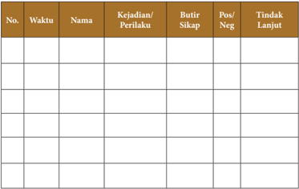

Tabel ini merupakan alat yang digunakan untuk mengumpulkan informasi tentang kejadian atau perilaku individu dalam suatu organisasi atau kumpulan. Topik utamanya adalah tentang pengawasan perilaku kerja dan tindakan lanjut yang diambil. Tabel ini terdiri dari beberapa kolom yang penting, yaitu No., Waktu, Nama, Kejadian/Perilaku, Butir Sikap, Pos/Neg, dan Tindak Lanjut. Kolom No. digunakan untuk menandai baris tertentu dalam tabel, sedangkan kolom Waktu, Nama, Kejadian/Perilaku, Butir Sikap, Pos/Neg, dan Tindak Lanjut digunakan untuk menyimpan informasi spesifik tentang setiap kejadian atau perilaku yang dilaporkan. Data penting yang terlihat dalam tabel ini mencakup waktu ketika kejadian terjadi, nama individu yang terlibat, jenis perilaku atau kejadian yang terjadi, sikap yang ditunjukkan oleh individu tersebut, apakah sikap tersebut positif atau negatif, dan tindakan lanjut yang diambil sebagai respons terhadap situasi tersebut. Tabel ini sangat berguna untuk memantau perilaku kerja dan memberikan wawasan tentang tindakan yang diambil dalam mengatasi masalah atau situasi yang mungkin berpotensi merugikan.

 

---
## 📄 Halaman 33

Penilaian sikap dapat dilakukan melalui penilaian diri. Penilaian diri dilakukan dengan  cara  meminta  siswa  untuk  mengemukakan  kelebihan  dan  kekurangannya dalam berperilaku. Selain itu penilaian diri juga dapat digunakan untuk membentuk sikap siswa terhadap mata pelajaran.

### Contoh Lembar Penilaian Diri

Nama

: …………………………….

Kelas

: …………………………….

Materi

: …………………………….

### Petunjuk:

Berilah tanda cek (√) pada kolom alternatif sesuai kondisi yang sebenarnya, dengan kriteria sebagai berikut:

- 4 =  selalu, apabila anda selalu melakukan sesuai pernyataan.
- 3  =  sering,  apabila  anda  sering  melakukan  sesuai  pernyataan  dan  kadang-kadang tidak melakukan.
- 2 =  kadang-kadang,  apabila  anda  kadang-kadang  melakukan  dan  sering  tidak melakukan.
- 1 =  tidak pernah, apabila anda tidak pernah melakukan.

---
**📊 Tabel**

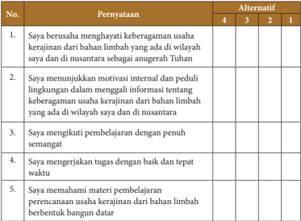

Tabel ini berisi 5 poin pernyataan yang diuji dengan alternatif jawaban numerik 1 hingga 4. Topik utama tabel adalah tentang motivasi dan perilaku kerja dalam konteks keberagaman usaha kerajinan dari bahan limbah. Kolom pertama berisi pernyataan yang harus dijawab, sedangkan kolom kedua berisi alternatif jawaban numerik. Data penting yang terlihat adalah bahwa semua poin memiliki alternatif jawaban yang sama, yaitu 1 hingga 4, menunjukkan bahwa setiap poin memiliki 4 pilihan jawaban yang berbeda-beda.

 

---
## 📄 Halaman 34

Penilaian  diri  tidak  hanya  digunakan  untuk  menilai  sikap  tetapi  juga  dapat digunakan  untuk  menilai  sikap  terhadap  pengetahuan  dan  keterampilan  serta kesulitan belajar siswa.

Penilaian  sikap  juga  dapat  dilakukan  melalui  penilaian  antarteman.  Penilaian antarteman adalah penilaian dengan cara siswa saling menilai perilaku temannya. Penilaian  antar  teman  paling  cocok  dilakukan  pada  saat  siswa  melakukan  kerja kelompok.

### Contoh Lembar Penilaian Antarteman

Nama teman yang dinilai

: ………………………………….

Nama penilai

: ………………………………….

Kelas

: ………………………………….

Materi

: ………………………………….

---
**📊 Tabel**

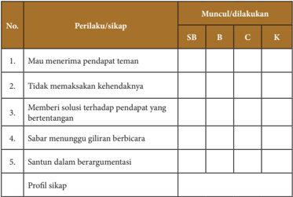

Tabel ini menunjukkan perilaku dan sikap yang muncul atau dilakukan oleh siswa dalam berbagai situasi interaksi sosial. Topik utamanya adalah bagaimana siswa menghadapi dan merespons pendapat orang lain. Kolom-kolomnya meliputi "SB" (Siswa Berani), "B" (Berani), "C" (Cerdas), dan "K" (Kreatif). Data penting yang terlihat adalah bahwa banyak siswa memiliki sikap yang berani dalam menghadapi pendapat orang lain, baik itu berani menerima pendapat teman (SB) maupun berani tidak memaksa pendapat mereka sendiri (B). Sementara itu, ada juga siswa yang cenderung cerdas dalam memberikan solusi terhadap pendapat yang bertentangan (C), dan beberapa siswa juga kreatif dalam berargumenasi (K). Profil sikap yang dihasilkan dari perilaku ini menunjukkan bahwa siswa memiliki kemampuan untuk berinteraksi dengan orang lain secara positif dan produktif.

### Catatan:

- SB: Sangat Baik; B: Baik; C: Cukup, dan K: Kurang
- Penilaian  antar teman hanya sebagai penunjang untuk melengkapi penilaian yang dikukan melalui observasi.
- Hasil  penilaian  antarteman  ditindaklanjuti  oleh  guru  dengan  melakukan  pembinaan terhadap siswa yang belum menunjukkan sikap yang diharapkan.

 

---
## 📄 Halaman 35

### b.  Penilaian Pengetahuan

Untuk mengukur pencapaian kompetensi pengetahuan, dilakukan melalui ulangan harian, ulangan tengah semester dan ulangan akhir semester dengan diberikan soal uraian tentang perencanaan usaha kerajinan dari bahan limbah berbentuk bangun datar yang meliputi:

- Ide dan Peluang Usaha Kerajinan dari Bahan Limbah Berbentuk Bangun Datar
- Sumber  Daya  yang  dibutuhkan  dalam  Usaha  Kerajinan  dari  Bahan  Limbah Berbentuk Bangun Datar
- Perencanaan  Administrasi  Usaha  Kerajinan  dari  Bahan  Limbah  Berbentuk Bangun Datar
- Perencanaan Pemasaran Usaha Kerajinan dari Bahan Limbah Berbentuk Bangun Datar.
Kemudian, buatlah pedoman penskorannya.

### c.    Format Penilaian Keterampilan

Untuk mengukur pencapaian kompetensi keterampilan dilakukan melalui pengamatan/observasi, praktik, proyek dan portofolio.

### Lembar Observasi Presentasi

Nama

: ……………………………….

Kelas

: ……………………………….

---
**📊 Tabel**

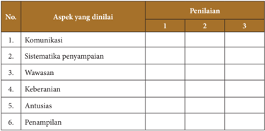

Tabel ini menunjukkan aspek-aspek yang dinilai dalam sebuah penilaian, dengan penilaian berdasarkan skor 1 hingga 3. Topik utama tabel adalah aspek-aspek yang dinilai, seperti komunikasi, sistematisasi penyampaian, wawasan, keberanian, antusiasme, dan penampilan. Kolom-kolomnya mencakup skor 1, 2, dan 3 untuk setiap aspek. Data penting yang terlihat adalah bahwa semua aspek memiliki skor 1, 2, dan 3, menunjukkan bahwa setiap aspek dapat dinyatakan sebagai baik, sedang, atau buruk dalam penilaian tersebut.

 

---
## 📄 Halaman 36

### Rubrik lembar observasi penilaian presentasi

---
**📊 Tabel**

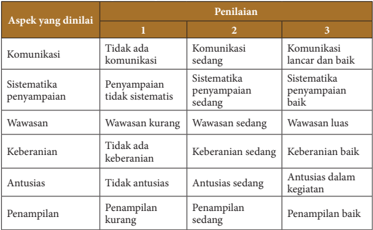

Tabel ini menunjukkan hasil penilaian berdasarkan aspek-aspek yang dinilai dalam sebuah kegiatan atau proses. Topik utama tabel adalah penilaian berdasarkan kualitas komunikasi, sistematisitas penyampaian informasi, wawasan, keberanian, antusiasme, dan penampilan. Dalam kolom 1, penilaian ditandai dengan "Tidak ada komunikasi", "Komunikasi sedang", dan "Komunikasi lancar dan baik". Kolom 2 menunjukkan "Sistematisitas penyampaian tidak sistematis", "Sistematisitas penyampaian sedang", dan "Sistematisitas penyampaian baik". Kolom 3 menunjukkan "Wawasan kurang", "Wawasan sedang", dan "Wawasan luas". Untuk aspek keberanian, penilaian ditandai dengan "Keberanian sedang", "Keberanian baik", dan "Keberanian dalam kegiatan". Aspek antusiasme ditandai dengan "Antusiasme sedang", "Antusiasme baik", dan "Antusiasme dalam kegiatan". Terakhir, untuk aspek penampilan, penilaian ditandai dengan "Penampilan kurang", "Penampilan sedang", dan "Penampilan baik". Pola penting yang terlihat adalah bahwa penilaian berkisar dari "tidak ada" hingga "baik" untuk semua aspek yang dinyatakan dalam tabel ini.

### Lembar Penilaian Laporan Hasil Observasi

---
**📊 Tabel**

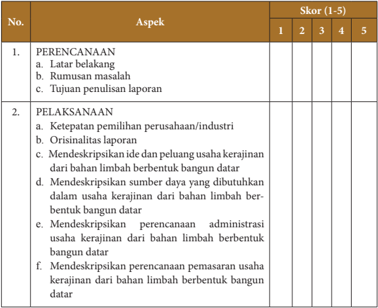

Tabel ini berisi informasi tentang skor penilaian untuk dua aspek utama: Perencanaan dan Pelaksanaan. Topik utama dalam tabel ini meliputi latar belakang, rumusan masalah, tujuan penulisan laporan, ketepatan pemilihan perusahaan/industri, orisinalitas ide dan peluang usaha kerajinan, mendeskripsikan usaha kerajinan dari bahan limbah berbentuk bangun datar, mendeskripsikan sumber daya yang dibutuhkan dalam usaha kerajinan dari bahan limbah berbentuk bangun datar, mendeskripsikan perencanaan administrasi usaha kerajinan dari bahan limbah berbentuk bangun datar, dan mendeskripsikan perencanaan pemasaran usaha kerajinan dari bahan limbah berbentuk bangun datar. Kolom "Skor" menunjukkan skor yang diberikan untuk setiap aspek, dengan skor 1-5 sebagai skala penilaian. Data penting yang terlihat adalah bahwa semua aspek memiliki skor yang sama, yaitu 3, menunjukkan bahwa penilaian untuk setiap aspek adalah sama-sama baik atau kurang baik.

 

---
## 📄 Halaman 37

---
**📊 Tabel**

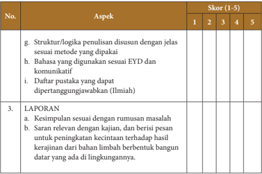

Tabel ini menunjukkan skor untuk berbagai aspek penulisan dan presentasi dalam sebuah laporan akhir. Topik utama adalah "LAPORAN" dengan dua subtopik: kesimpulan sesuai dengan rumusan masalah dan saran relevan dengan kajian, dan berisi pesan untuk meningkatkan kecintaan terhadap hasil kerajinan dari bahan limbah berbentuk bangun datar yang ada di lingkungannya. Kolom-kolomnya mencakup skor (1-5) untuk setiap aspek, dengan skor tertinggi 5 dan skor terendah 1. Data penting yang terlihat adalah bahwa semua aspek memiliki skor yang sama, yaitu 3, menunjukkan bahwa penulis memenuhi standar minimum dalam penulisan dan presentasi laporan mereka.

### Lembar Penilaian Praktik Membuat Perencanaan Usaha Kerajinan

---
**📊 Tabel**

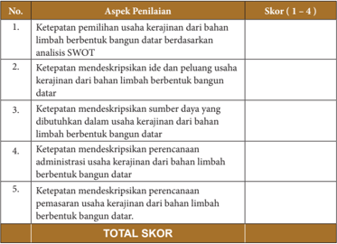

Tabel ini menunjukkan skor penilaian berdasarkan aspek-aspek penilaian untuk usaha kerajinan dari bahan limbah. Topik utama tabel adalah penilaian usaha kerajinan dari bahan limbah. Kolom-kolomnya meliputi ketepatan pemilihan usaha, ketepatan mendeskripsikan ide dan peluang usaha, ketepatan mendeskripsikan sumber daya, ketepatan mendeskripsikan perencanaan administrasi, dan ketepatan mendeskripsikan perencanaan pemasaran. Data penting yang terlihat adalah bahwa setiap aspek penilaian memiliki skor antara 1 hingga 4, dengan total skor mencapai 20. Ini menunjukkan bahwa penilaian ini dilakukan secara holistik dan memperhatikan berbagai aspek usaha kerajinan dari bahan limbah.

 

---
## 📄 Halaman 38

Keterangan pengisian skor:

- Sangat baik
- Baik
- Cukup
- Kurang

### 2. Sistem Produksi Usaha Kerajinan dari Bahan Limbah Berbentuk Bangun Datar

Evaluasi pembelajaran pada materi sistem produksi usaha kerajinan dari bahan limbah berbentuk bangun datar dilakukan oleh guru dengan melakukan penilaian terhadap  sikap,  pengetahuan,  dan  keterampilan.  Berikut  contoh  instrumen  yang dapat digunakan guru untuk melakukan evaluasi pembelajaran pada materi sistem produksi usaha kerajinan dari bahan limbah berbentuk bangun datar.

### a.   Penilaian Sikap

Untuk mengukur pencapaian kompetensi sikap dilakukan melalui observasi yang dicatat dalam jurnal. Observasi penilaian sikap dilakukan secara berkesinambungan melalui  pengamatan  perilaku.  Instrumen  yang  digunakan  dalam  observasi  adalah lembar observasi atau jurnal.

### Contoh Format Jurnal Guru

---
**📊 Tabel**

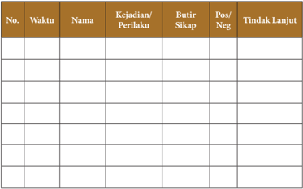

Tabel ini merupakan alat yang digunakan untuk mengevaluasi perilaku siswa dalam kelas. Topik utamanya adalah penilaian perilaku siswa, baik positif maupun negatif. Tabel ini terdiri dari enam kolom: No., Waktu, Nama, Kejadian/Perilaku, Butir Sikap, dan Tindak Lanjut. Kolom No. digunakan untuk memberikan nomor urutan pada setiap baris. Waktu menunjukkan waktu tertentu ketika kejadian tersebut terjadi. Nama menunjukkan nama siswa yang terlibat. Kejadian/Perilaku mencakup deskripsi singkat dari apa yang dilakukan oleh siswa. Butir Sikap menunjukkan sikap atau reaksi yang ditunjukkan oleh siswa terhadap situasi tersebut. Tindak Lanjut mencakup tindakan yang diambil oleh guru atau orang tua untuk mencegah atau mengatasi perilaku negatif tersebut. Dari tabel ini, dapat dilihat bahwa siswa memiliki berbagai perilaku baik dan buruk, dan tindakan lanjut yang diambil juga bervariasi.

 

---
## 📄 Halaman 39

Penilaian sikap dapat dilakukan melalui penilaian diri. Penilaian diri dilakukan dengan  cara  meminta  siswa  untuk  mengemukakan  kelebihan  dan  kekurangannya dalam berperilaku. Selain itu penilaian diri juga dapat digunakan untuk membentuk sikap siswa terhadap mata pelajaran.

### Contoh Lembar Penilaian Diri

Nama

: …………………………….

Kelas

: …………………………….

Materi

: …………………………….

### Petunjuk:

Berilah tanda cek (√) pada kolom alternatif sesuai kondisi yang sebenarnya, dengan kriteria sebagai berikut:

- 4 =  selalu, apabila anda selalu melakukan sesuai pernyataan.
- 3  =  sering,  apabila  anda  sering  melakukan  sesuai  pernyataan  dan  kadang-kadang tidak melakukan.
- 2 =  kadang-kadang,  apabila  anda  kadang-kadang  melakukan  dan  sering  tidak melakukan.
- 1 =  tidak pernah, apabila anda tidak pernah melakukan.

---
**📊 Tabel**

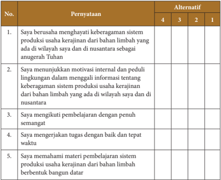

Tabel ini berisi 5 pernyataan yang diuji dengan alternatif jawaban numerik 1 hingga 4. Topik utama tabel adalah tentang motivasi dan perilaku kerja dalam konteks keberagaman sistem produksi usaha kerajinan dari bahan limbah. Kolom "Pernyataan" berisi 5 poin yang harus dijawab, sedangkan kolom "Alternatif" menampilkan 4 pilihan jawaban numerik untuk setiap poin. Data penting yang terlihat adalah bahwa semua poin memiliki alternatif jawaban yang sama, yaitu 1 hingga 4, menunjukkan bahwa setiap poin memiliki 4 pilihan jawaban yang berbeda-beda.

 

---
## 📄 Halaman 40

Penilaian  diri  tidak  hanya  digunakan  untuk  menilai  sikap,  tetapi  juga  dapat  di gunakan untuk menilai sikap terhadap pengetahuan dan keterampilan serta kesulitan belajar siswa.

Penilaian  sikap  juga  dapat  dilakukan  melalui  penilaian  antarteman.  Penilaian antarteman adalah penilaian dengan cara siswa saling menilai perilaku temannya. Penilaian  antar  teman  paling  cocok  dilakukan  pada  saat  siswa  melakukan  kerja kelompok.

### Contoh Lembar penilaian Antarteman

Nama teman yang dinilai

: ………………………………….

Nama penilai

: ………………………………….

Kelas

: ………………………………….

Materi

: ………………………………….

---
**📊 Tabel**

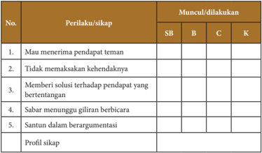

Tabel ini menunjukkan perilaku dan sikap yang muncul atau dilakukan oleh individu dalam berbagai situasi interaksi sosial. Kolom "Perilaku/sikap" mencakup lima poin utama: 1) Mau menerima pendapat teman, 2) Tidak memaksa kehendaknya, 3) Memberi solusi terhadap pendapat yang bertentangan, 4) Sabar menunggu giliran berbicara, dan 5) Santun dalam berargumentasi. Kolom "Muncul/dilakukan" menunjukkan tingkat keberadaan atau dilaksanakan perilaku tersebut dalam situasi tertentu, dengan "SB" untuk situasi berbeda, "B" untuk berbeda, "C" untuk cenderung, dan "K" untuk konsisten. Topik utama tabel ini adalah tentang sikap dan perilaku yang positif dalam interaksi sosial, serta bagaimana mereka muncul atau dilakukan dalam berbagai situasi.

### Catatan:

- SB: Sangat Baik; B: Baik; C: Cukup, dan K: Kurang
- Penilaian  antar teman hanya sebagai penunjang untuk melengkapi penilaian yang dikukan melalui observasi.
- Hasil  penilaian  antarteman  ditindaklanjuti  oleh  guru  dengan  melakukan  pembinaan terhadap siswa yang belum menunjukkan sikap yang diharapkan.

 

---
## 📄 Halaman 41

### b.   Penilaian Pengetahuan

Untuk mengukur pencapaian kompetensi pengetahuan, dilakukan melalui ulangan harian, ulangan tengah semester dan ulangan akhir semester dengan diberikan soal uraian tentang sistem produksi usaha kerajinan dari bahan limbah berbentuk bangun datar yang meliputi:

- Aneka Produk Usaha Kerajinan dari Bahan Limbah Berbentuk Bangun Datar
- Manfaat Kerajinan dari Bahan Limbah Berbentuk Bangun Datar
- Potensi Kerajinan dari Bahan Limbah Berbentuk Bangun Datar
- Perencanaan Produksi Kerajinan dari Bahan Limbah Berbentuk Bangun Datar
- Alat  dan  Bahan  yang  dibutuhkan  dalam  Memproduksi  Kerajinan  dari  Bahan Limbah Berbentuk Bangun Datar
- Proses Produksi Kerajinan dari Bahan Limbah Berbentuk Bangun Datar
- Pengemasan Produk Kerajinan dari Bahan Limbah Berbentuk Bangun Datar Kemudian buatlah pedoman penskorannya.

### c.    Format Penilaian Keterampilan

Untuk  mengukur  pencapaian  kompetensi  keterampilan  dilakukan  melalui  pengamatan/observasi, praktek, proyek dan portofolio.

### Contoh Lembar Observasi Presentasi

Nama

: ……………………………….

Kelas

: ……………………………….

---
**📊 Tabel**

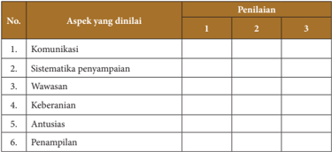

Tabel ini menunjukkan aspek-aspek yang akan dianalisis dalam sebuah penilaian, dengan penilaian dilakukan pada tiga skor berbeda: 1, 2, dan 3. Topik utama tabel adalah "Aspek yang dinilai" dan "Penilaian". Kolom-kolomnya mencakup berbagai aspek seperti komunikasi, sistematisasi penyampaian, wawasan, keberanian, antusiasme, dan penampilan. Data atau pola penting yang terlihat adalah bahwa setiap aspek memiliki tiga skor yang berbeda untuk penilaian, menunjukkan bahwa penilaian ini mungkin menggunakan skala tertentu untuk mengukur kualitas atau tingkat keberhasilan dalam setiap aspek tersebut.

 

---
## 📄 Halaman 42

---
**📊 Tabel**

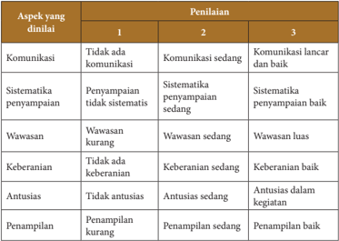

Tabel ini menunjukkan hasil penilaian berdasarkan aspek-aspek tertentu dalam sebuah kegiatan atau program. Topik utamanya adalah penilaian berdasarkan kinerja individu atau tim dalam hal komunikasi, sitematisasi penyampaian informasi, wawasan, keberanian, antusiasme, dan penampilan. Kolom 1 menunjukkan bahwa tidak ada komunikasi, sitematisasi penyampaian informasi, wawasan kurang, tidak ada keberanian, tidak antusias, dan penampilan kurang. Kolom 2 menunjukkan bahwa komunikasi sedang, sitematisasi penyampaian informasi baik, wawasan sedang, keberanian sedang, antusiasme sedang, dan penampilan sedang. Kolom 3 menunjukkan bahwa komunikasi lancar dan baik, sitematisasi penyampaian baik, wawasan luas, keberanian baik, antusias dalam kegiatan, dan penampilan baik. Pola penting yang terlihat adalah bahwa penilaian secara bertahap meningkat dari tidak ada hingga baik, menunjukkan kemajuan dalam setiap aspek yang dinilai.

### Lembar Penilaian Proyek

---
**📊 Tabel**

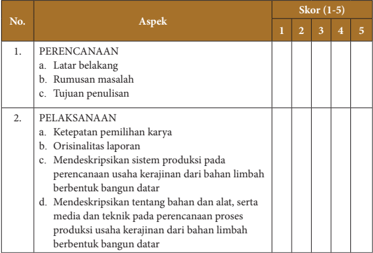

Tabel ini berisi informasi tentang aspek-aspek penulisan dan pelaksanaan sebuah laporan atau makalah. Topik utamanya adalah proses penulisan dan pelaksanaan usaha kerajinan dari bahan limbah berbentuk bangun datar. Kolom-kolomnya meliputi: No., Aspek, dan Skor (1-5). Data penting yang terlihat antara lain bahwa aspek-aspek tersebut diukur dengan skor 1 hingga 5, menunjukkan bahwa setiap aspek memiliki tingkat kualitas yang berbeda-beda.

 

---
## 📄 Halaman 43

---
**📊 Tabel**

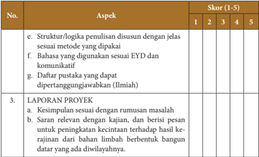

Tabel ini berisi informasi tentang aspek-aspek penulisan proyek, dengan skor yang diberikan untuk setiap aspek. Topik utama tabel adalah aspek-aspek penulisan proyek, termasuk struktur/logika penulisan, bahasa yang digunakan, daftar pustaka, dan kesimpulan proyek. Kolom-kolomnya mencakup skor (1-5) untuk setiap aspek. Data penting yang terlihat adalah bahwa semua aspek memiliki skor 4 kecuali aspek e dan f, yang memiliki skor 3. Ini menunjukkan bahwa penulis harus memperhatikan struktur dan logika penulisan, serta menggunakan bahasa yang tepat dan relevan untuk menulis proyek mereka.

### Lembar Penilaian Produk

---
**📊 Tabel**

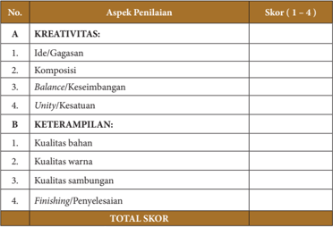

Tabel ini menunjukkan skor penilaian untuk dua aspek utama: KREATIVITAS dan KETERAMPILAN. Aspek KREATIVITAS terdiri dari empat kriteria: Ide/Gagasan, Komposisi, Balance/Keseimbangan, dan Unity/Kesatuan. Aspek KETERAMPILAN juga memiliki empat kriteria: Kualitas bahan, Kualitas warna, Kualitas sambungan, dan Finishing/Penyelenggaraan. Setiap aspek memiliki skor yang diberikan dalam rentang 1 hingga 4, dengan total skor yang ditampilkan di bagian bawah tabel.

### Keterangan pengisian skor:

- Sangat baik
- Baik
- Cukup
- Kurang

 

---
## 📄 Halaman 44

### Lembar Penilaian Portofolio

---
**📊 Tabel**

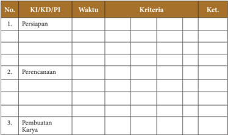

Tabel ini berisi informasi tentang proses pembuatan karya, yang terdiri dari tiga tahap utama: Persiapan, Perencanaan, dan Pembuatan Karya. Setiap tahap memiliki kolom untuk menuliskan waktu, kriteria, dan ketentuan. Topik utama tabel ini adalah proses pembuatan karya, yang melibatkan persiapan, perencanaan, dan pembuatan karya. Kolom-kolom yang ada mencakup waktu, kriteria, dan ketentuan. Data penting yang terlihat adalah bahwa setiap tahap memiliki kolom untuk menuliskan waktu, kriteria, dan ketentuan. Ini membantu dalam memahami proses pembuatan karya secara lebih detail dan efektif.

### 3.  Perhitungan Titik Impas ( Break Even Point ) Usaha Kerajinan dari Bahan Limbah Berbentuk Bangun Datar

Evaluasi pembelajaran pada materi menghitung BEP usaha kerajinan dari bahan limbah berbentuk bangun datar dilakukan oleh guru dengan melakukan penilaian terhadap sikap, pengetahuan dan keterampilan. Berikut contoh instrumen yang dapat digunakan guru untuk melakukan evaluasi pembelajaran pada materi menghitung BEP usaha kerajinan dari bahan limbah berbentuk bangun datar.

### a.   Penilaian Sikap

Untuk mengukur pencapaian kompetensi sikap dilakukan melalui observasi yang dicatat dalam jurnal. Observasi penilaian sikap dilakukan secara berkesinambungan melalui  pengamatan  perilaku.  Instrumen  yang  digunakan  dalam  observasi  adalah lembar observasi atau jurnal.

### Contoh Format Jurnal Guru

---
**📊 Tabel**

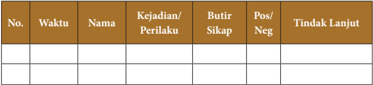

Tabel ini menunjukkan data tentang kejadian/ perilaku, tindakan lanjut, dan posisi negatif yang dilaporkan oleh seorang individu. Topik utama tabel ini adalah tentang penilaian perilaku dan tindakan yang dilakukan oleh individu tersebut. Kolom-kolom yang ada dalam tabel ini meliputi waktu, nama, kejadian/perilaku, butir sikap, posisi negatif, dan tindakan lanjut. Data penting yang terlihat dalam tabel ini adalah bahwa individu tersebut telah melakukan beberapa tindakan negatif dan memiliki sikap yang tidak positif. Selain itu, tabel ini juga menunjukkan bahwa individu tersebut telah berusaha untuk mengubah sikapnya dan melakukan tindakan yang lebih baik di masa depan.

 

---
## 📄 Halaman 45

---
**📊 Tabel**

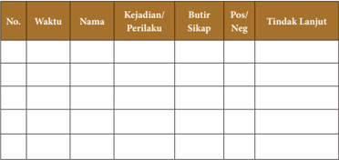

Tabel ini berisi informasi tentang kejadian dan perilaku individu dalam sebuah organisasi atau kelas. Topik utamanya adalah tentang tindakan dan respons terhadap perilaku yang tidak positif. Kolom-kolomnya meliputi waktu ketika kejadian terjadi, nama individu yang terlibat, jenis kejadian atau perilaku yang dilakukan, tindakan yang diambil oleh orang yang bertanggung jawab, dan tindakan lanjutan yang diambil setelah kejadian tersebut. Data penting yang terlihat adalah bahwa banyak kejadian terjadi pada waktu tertentu, beberapa individu memiliki perilaku yang tidak positif, dan tindakan yang diambil seringkali mencakup penegakan hukum atau pengawasan lebih intensif.

Penilaian sikap dapat dilakukan melalui penilaian diri. Penilaian diri dilakukan dengan  cara  meminta  siswa  untuk  mengemukakan  kelebihan  dan  kekurangannya dalam berperilaku. Selain itu penilaian diri juga dapat digunakan untuk membentuk sikap siswa terhadap mata pelajaran.

### Contoh Lembar Penilaian Diri

Nama

: …………………………….

Kelas

: …………………………….

Materi

: …………………………….

### Petunjuk:

Berilah tanda cek (√) pada kolom alternatif sesuai kondisi yang sebenarnya, dengan kriteria sebagai berikut:

- 4 =  selalu, apabila anda selalu melakukan sesuai pernyataan.
- 3  =  sering,  apabila  anda  sering  melakukan  sesuai  pernyataan  dan  kadang-kadang tidak melakukan.
- 2 =  kadang-kadang,  apabila  anda  kadang-kadang  melakukan  dan  sering  tidak melakukan.
- 1 =  tidak pernah, apabila anda tidak pernah melakukan.

---
**📊 Tabel**

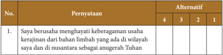

Tabel ini menunjukkan pilihan antara dua alternatif untuk menjawab pertanyaan tentang keberagaman usaha kreatif di wilayah yang dihuni oleh orang-orang yang beragama. Topik utama tabel adalah pilihan alternatif yang tersedia untuk menjawab pertanyaan tersebut. Kolom pertama berisi nomor urutan pertanyaan, sedangkan kolom kedua berisi alternatif jawaban yang tersedia. Data penting yang terlihat adalah bahwa ada dua alternatif jawaban yang tersedia, yaitu 4 dan 3, dengan alternatif 4 lebih populer dibandingkan dengan alternatif 3. Ini menunjukkan bahwa alternatif 4 lebih disukai oleh responden dalam situasi ini.

 

---
## 📄 Halaman 46

---
**📊 Tabel**

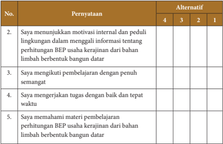

Tabel ini berisi penilaian tentang motivasi dan kinerja siswa dalam belajar perhitungan BEP (Biaya Eksposur Perusahaan) usaha kerajinan dari limbah berbentuk bangun datar. Topik utamanya adalah kinerja belajar siswa dalam menguasai materi tersebut. Kolom "Pernyataan" berisi 5 pertanyaan yang bertujuan untuk menilai kinerja siswa, sedangkan kolom "Alternatif" berisi pilihan jawaban yang diberikan oleh siswa. Data penting yang terlihat adalah bahwa siswa memiliki motivasi internal dan peduli lingkungan dalam belajar, mengikuti pembelajaran dengan penuh semangat, mengerjakan tugas dengan baik dan tepat waktu, dan memahami materi pembelajaran secara mendalam. Ini menunjukkan bahwa siswa memiliki minat dan kesadaran dalam belajar, serta kemampuan untuk mengaplikasikan pengetahuan yang telah diajarkan.

Penilaian  diri  tidak  hanya  digunakan  untuk  menilai  sikap,  tetapi  juga  dapat digunakan  untuk  menilai  sikap  terhadap  pengetahuan  dan  keterampilan  serta kesulitan belajar siswa.

Penilaian  sikap  juga  dapat  dilakukan  melalui  penilaian  antarteman.  Penilaian antarteman adalah penilaian dengan cara siswa saling menilai perilaku temannya. Penilaian  antar  teman  paling  cocok  dilakukan  pada  saat  siswa  melakukan  kerja kelompok.

### Contoh Lembar Penilaian Antarteman

Nama teman yang dinilai

: ………………………………….

Nama penilai

: ………………………………….

Kelas

: ………………………………….

Materi

: ………………………………….

---
**📊 Tabel**

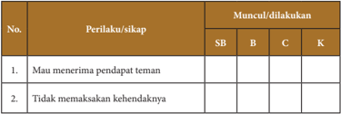

Tabel ini menunjukkan perilaku atau sikap yang muncul atau dilakukan oleh siswa (SB), bahan belajar (B), guru (C), dan kelas (K). Topik utamanya adalah tentang perilaku dan sikap yang mungkin ditemui dalam situasi sosial. Kolom "Perilaku/sikap" berisi dua item: "Mau menerima pendapat teman" dan "Tidak memaksaan kehendaknya". Kolom "Muncul/dilakukan" mencakup empat jenis perilaku: SB (Siswa Belajar), B (Bahan Belajar), C (Guru), dan K (Kelas). Data penting yang terlihat adalah bahwa perilaku "Mau menerima pendapat teman" hanya muncul di kelas (K) dan tidak dilakukan oleh guru (C), sementara "Tidak memaksaan kehendaknya" hanya muncul di bahan belajar (B) dan tidak dilakukan oleh guru (C). Ini menunjukkan bahwa perilaku tersebut lebih umum ditemui di lingkungan belajar daripada di lingkungan guru.

 

---
## 📄 Halaman 47

---
**📊 Tabel**

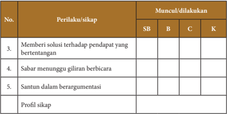

Tabel ini menunjukkan perilaku dan sikap yang muncul atau dilakukan oleh individu dalam berbagai situasi, dengan fokus pada empat kategori: SB (Sosial), B (Berperilaku), C (Cerdas), dan K (Kreatif). Topik utama tabel adalah tentang bagaimana individu dapat memanfaatkan berbagai kemampuan mereka untuk berinteraksi dengan orang lain dan menghadapi tantangan dalam berbagai konteks. Kolom-kolomnya mencakup perilaku dan sikap yang diukur, seperti memberi solusi terhadap pendapat yang bertentangan, sabar menunggu giliran berbicara, dan santun dalam berargumentasi. Data atau pola penting yang terlihat adalah bahwa semua perilaku dan sikap tersebut muncul atau dilakukan dalam semua kategori, menunjukkan bahwa individu harus memiliki kemampuan yang luas untuk berinteraksi dan menghadapi tantangan dalam berbagai situasi. Profil sikap yang disediakan memberikan wawasan tentang bagaimana individu dapat mengembangkan dan memanfaatkan berbagai kemampuan mereka untuk menjadi lebih baik dalam berbagai situasi.

### Catatan:

- SB: Sangat Baik; B: Baik; C: Cukup, dan K: Kurang
- Penilaian  antar teman hanya sebagai penunjang untuk melengkapi penilaian yang dikukan melalui observasi.
- Hasil penilaian  antar  teman  ditindaklanjuti  oleh  guru  dengan  melakukan pembinaan terhadap siswa yang belum menunjukkan sikap yang diharapkan.

### b.   Penilaian Pengetahuan

Untuk mengukur pencapaian kompetensi pengetahuan, dilakukan melalui ulangan harian, ulangan tengah semester dan ulangan akhir semester dengan diberikan soal uraian  tentang  perhitungan  BEP  usaha  kerajinan  dari  bahan  limbah  berbentuk bangun datar yang meliputi:

- Pengertian dan manfaat titik impas ( Break Even Point ) usaha kerajinan dari bahan limbah berbentuk bangun datar
- Komponen  perhitungan  titik  impas  ( Break  Even  Point )  usaha  kerajinan  dari bahan limbah berbentuk bangun datar
- Menghitung titik impas ( Break Even Point )  usaha kerajinan dari bahan limbah berbentuk bangun datar
- Evaluasi hasil perhitungan titik impas ( Break Even Point )  usaha kerajinan dari bahan limbah berbentuk bangun datar
Kemudian, buatlah pedoman penskorannya.

 

---
## 📄 Halaman 48

### c.   Penilaian Keterampilan

Untuk mengukur pencapaian kompetensi keterampilan dilakukan melalui pengamatan/observasi, praktek, proyek, dan portofolio.

### Lembar Observasi Presentasi

Nama

: ……………………………….

Kelas

: ……………………………….

---
**📊 Tabel**

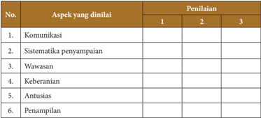

Tabel ini menunjukkan aspek-aspek yang dinilai dalam sebuah penilaian, dengan 3 penilaian (1, 2, dan 3) untuk setiap aspek. Topik utama tabel adalah penilaian berdasarkan berbagai aspek, termasuk komunikasi, sistematisasi penyampaian, wawasan, keberanian, antusiasme, dan penampilan. Kolom-kolomnya mencakup nomor urut aspek yang dinilai, sedangkan baris menyediakan informasi tentang penilaian untuk setiap aspek tersebut. Data atau pola penting yang terlihat adalah bahwa setiap aspek memiliki tiga penilaian, menunjukkan bahwa penilaian ini mungkin menggunakan skala tertentu untuk mengukur kualitas atau tingkat keberhasilan setiap aspek.

### Rubrik lembar observasi penilaian presentasi

---
**📊 Tabel**

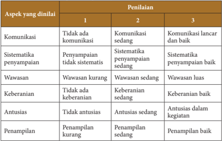

Tabel ini menunjukkan hasil penilaian tiga aspek utama: komunikasi, sitematisasi penyampaian, dan wawasan. Penilaian dilakukan oleh tiga orang penilai dengan skor 1, 2, dan 3. Topik utama adalah kualitas penilaian tersebut. Kolom pertama berisi aspek-aspek yang dinilai, sedangkan kolom kedua berisi skor dari tiga penilai. Data penting yang terlihat adalah bahwa semua aspek memiliki skor tertinggi 3, menunjukkan bahwa semua aspek dinyatakan baik oleh semua penilai. Ini menunjukkan kesetiaan dan kesetiaan dalam penilaian.

 

---
## 📄 Halaman 49

### Lembar Penilaian Proyek

---
**📊 Tabel**

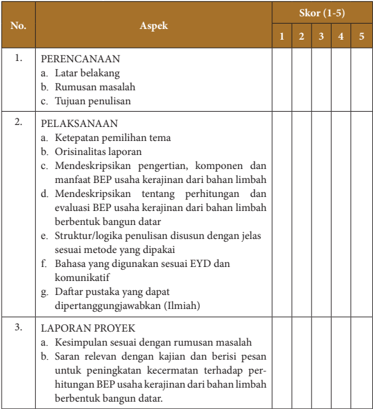

Tabel ini berisi kriteria penilaian untuk sebuah proyek, dengan topik utama "PERANCANGAN DAN PELAKSANAAN PROYEK". Tabel dibagi menjadi 3 kolom: No., Aspek, dan Skor (1-5). Kolom No. menunjukkan nomor urut aspek yang diuraikan, kolom Aspek menyajikan deskripsi detail aspek tersebut, dan kolom Skor menunjukkan skor yang diberikan untuk setiap aspek. Data penting yang terlihat adalah bahwa setiap aspek memiliki skor antara 1 hingga 5, menunjukkan bahwa penilaian dilakukan dengan skala tertentu.

### 4. Strategi Promosi Produk Hasil Usaha Kerajinan dari Bahan Limbah Berbentuk Bangun Datar

Evaluasi pembelajaran pada materi strategi promosi produk hasil usaha kerajinan dari bahan limbah berbentuk bangun datar dilakukan oleh guru dengan melakukan penilaian terhadap sikap, pengetahuan, dan keterampilan. Berikut contoh instrumen yang  dapat  digunakan  guru  untuk  melakukan  evaluasi  pembelajaran  pada  materi promosi produk hasil usaha kerajinan dari bahan limbah berbentuk bangun datar.

 

---
## 📄 Halaman 50

### a.   Penilaian Sikap

Untuk mengukur pencapaian kompetensi sikap dilakukan melalui observasi yang dicatat dalam jurnal. Observasi penilaian sikap dilakukan secara berkesinambungan melalui  pengamatan  perilaku.  Instrumen  yang  digunakan  dalam  observasi  adalah lembar observasi atau jurnal.

### Contoh Format Jurnal Guru

---
**📊 Tabel**

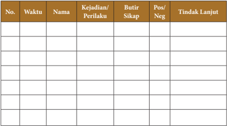

Tabel ini merupakan alat yang digunakan untuk mengevaluasi perilaku siswa dalam kelas. Topik utamanya adalah evaluasi perilaku siswa, baik positif maupun negatif. Tabel ini terdiri dari beberapa kolom, yaitu Waktu, Nama, Kejadian/Perilaku, Butir Sikap, Pos/Neg, dan Tindak Lanjut. Data penting yang terlihat dalam tabel ini meliputi waktu ketika kejadian terjadi, nama siswa yang terlibat, jenis perilaku yang dilakukan, sikap yang ditunjukkan oleh siswa, apakah sikap tersebut positif atau negatif, dan tindakan lanjut yang diambil. Tabel ini membantu guru untuk memantau perkembangan sikap dan perilaku siswa secara teratur dan efektif.

Penilaian sikap dapat dilakukan melalui penilaian diri. Penilaian diri dilakukan dengan  cara  meminta  siswa  untuk  mengemukakan  kelebihan  dan  kekurangannya dalam berperilaku. Selain itu penilaian diri juga dapat digunakan untuk membentuk sikap siswa terhadap mata pelajaran.

### Contoh Lembar Penilaian Diri

Nama

: …………………………….

Kelas

: …………………………….

Materi

: …………………………….

### Petunjuk:

Berilah tanda cek (√) pada kolom alternatif sesuai kondisi yang sebenarnya, dengan kriteria sebagai berikut:

- 4 =  selalu, apabila anda selalu melakukan sesuai pernyataan.
- 3  =  sering,  apabila  anda  sering  melakukan  sesuai  pernyataan  dan  kadang-kadang tidak melakukan.
- 2 =  kadang-kadang,  apabila  anda  kadang-kadang  melakukan  dan  sering  tidak melakukan.
- 1 =  tidak pernah, apabila anda tidak pernah melakukan.

 

---
## 📄 Halaman 51

---
**📊 Tabel**

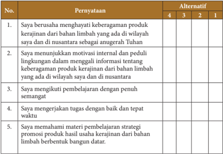

Tabel ini berisi pernyataan yang diuji dengan alternatif jawaban 1 hingga 4 untuk menilai tingkat keberagaman produk kerajinan dari bahan limbah di wilayah dan nusantara sebagai anugerah Tuhan. Topik utama tabel adalah motivasi dan pengetahuan tentang keberagaman produk kerajinan dari bahan limbah. Kolom pertama berisi pernyataan yang harus dijawab, sedangkan kolom kedua berisi alternatif jawaban yang diberikan. Data penting yang terlihat adalah bahwa setiap pernyataan memiliki 4 alternatif jawaban yang berbeda-beda, yang menunjukkan bahwa setiap pernyataan memiliki tingkat kesulitan yang berbeda. Selain itu, tabel ini juga menunjukkan bahwa setiap pernyataan memiliki tingkat kesulitan yang berbeda, yang menunjukkan bahwa setiap pernyataan memiliki tingkat kesulitan yang berbeda.

Penilaian  diri  tidak  hanya  digunakan  untuk  menilai  sikap  tetapi  juga  dapat digunakan  untuk  menilai  sikap  terhadap  pengetahuan  dan  keterampilan  serta kesulitan belajar siswa.

Penilaian  sikap  juga  dapat  dilakukan  melalui  penilaian  antarteman.  Penilaian antarteman adalah penilaian dengan cara siswa saling menilai perilaku temannya. Penilaian  antar  teman  paling  cocok  dilakukan  pada  saat  siswa  melakukan  kerja kelompok.

### Contoh Lembar Penilaian Antarteman

Nama teman yang dinilai

: ………………………………….

Nama penilai

: ………………………………….

Kelas

: ………………………………….

Materi

: ………………………………….

---
**📊 Tabel**

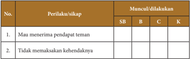

Tabel ini menunjukkan perilaku atau sikap yang muncul atau dilakukan oleh siswa (SB), Bahan Belajar (B), Cakupan (C), dan Keterampilan (K). Topik utama tabel adalah tentang perilaku dan sikap yang relevan dengan pembelajaran. Kolom "Perilaku/sikap" berisi dua baris yang masing-masing menunjukkan perilaku atau sikap tertentu. Kolom "Muncul/dilakukan" berisi tiga kolom untuk menunjukkan frekuensi perilaku atau sikap tersebut dalam konteks pembelajaran. Data penting yang terlihat adalah bahwa perilaku atau sikap tertentu muncul lebih sering dalam konteks Bahan Belajar dibandingkan dengan Cakupan dan Keterampilan.

 

---
## 📄 Halaman 52

---
**📊 Tabel**

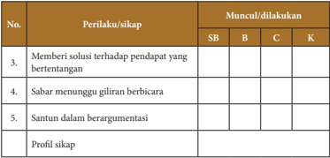

Tabel ini berisi informasi tentang perilaku atau sikap yang muncul atau dilakukan oleh individu dalam berbagai situasi. Topik utamanya adalah tentang bagaimana seseorang menanggapi pendapat yang bertentangan, sabar menunggu giliran berbicara, dan santun dalam berargumentasi. Kolom-kolom yang ada meliputi SB (Situasi Berat), B (Berat), C (Cerdas), dan K (Kreatif). Data atau pola penting yang terlihat adalah bahwa perilaku seperti memberi solusi terhadap pendapat yang bertentangan, sabar menunggu giliran berbicara, dan santun dalam berargumentasi lebih sering dilihat dalam situasi berat (SB) dan berat (B), sedangkan perilaku ini juga sering dilihat dalam situasi cerdas (C) dan kreatif (K). Profil sikap yang dihasilkan dari tabel ini mencerminkan kemampuan seseorang untuk menghadapi situasi yang sulit, menunjukkan sikap yang bijaksana dan berpengetahuan, serta memiliki kemampuan untuk berpikir kreatif dan inovatif dalam berinteraksi dengan orang lain.

### Catatan:

- SB: Sangat Baik; B: Baik; C: Cukup, dan K: Kurang
- Penilaian  antarteman hanya sebagai penunjang untuk melengkapi penilaian yang dikukan melalui observasi.
- Hasil  penilaian  antarteman  ditindaklanjuti  oleh  guru  dengan  melakukan  pembinaan terhadap siswa yang belum menunjukkan sikap yang diharapkan.

### b.   Penilaian Pengetahuan

Untuk mengukur pencapaian kompetensi pengetahuan, dilakukan melalui ulangan harian, ulangan tengah semester dan ulangan akhir semester dengan diberikan soal uraian  tentang  strategi  promosi  produk  hasil  usaha  kerajinan  dari  bahan  limbah berbentuk bangun datar yang meliputi:

- Menentukan  Strategi  Promosi  Produk  Hasil  Usaha  Kerajinan  dari  Limbah Berbentuk Bangun Datar
- Pengertian Promosi Produk Hasil Usaha Kerajinan dari Bahan Limbah Berbentuk Bangun Datar
- Melakukan  Promosi  Produk  Hasil  Usaha  Kerajinan  dari  Limbah  Berbentuk Bangun Datar
Kemudian, buatlah pedoman penskorannya.

 

---
## 📄 Halaman 53

### c.   Penilaian Keterampilan

Untuk mengukur pencapaian kompetensi keterampilan dilakukan melalui pengamatan/observasi, praktek, proyek, dan portofolio.

### Lembar Observasi Presentasi

Nama

: ……………………………….

Kelas

: ……………………………….

---
**📊 Tabel**

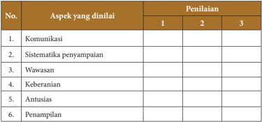

Tabel ini menunjukkan aspek-aspek yang akan dianalisis dalam sebuah penilaian, dengan penilaian dilakukan pada tiga level: 1, 2, dan 3. Topik utama tabel adalah "Aspek yang dinilai" dan "Penilaian". Kolom pertama berisi nama aspek yang akan dianalisis, sedangkan kolom kedua berisi angka 1, 2, dan 3 untuk menunjukkan tingkat penilaian. Data penting yang terlihat adalah bahwa semua aspek memiliki penilaian di semua tiga tingkat, menunjukkan bahwa setiap aspek dianalisis secara menyeluruh dan tidak ada aspek yang dilewatkan.

### Rubrik Lembar Observasi Penilaian Presentasi

---
**📊 Tabel**

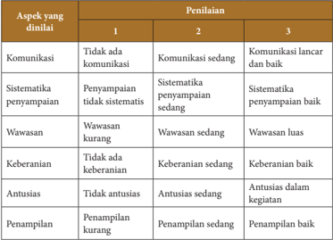

Tabel ini menunjukkan penilaian berdasarkan aspek-aspek tertentu dalam sebuah kegiatan atau proses. Topik utamanya adalah penilaian berdasarkan kualitas komunikasi, sistematisitas penyampaian informasi, wawasan, keberanian, antusiasme, dan penampilan. Kolom-kolomnya mencakup tiga tingkat penilaian: 1 (tidak ada), 2 (sedang), dan 3 (baik). Data penting yang terlihat adalah bahwa penilaian untuk semua aspek mulai dari tidak ada hingga baik, dengan penilaian 3 (baik) menjadi poin penting yang harus dicapai. Ini menunjukkan bahwa setiap aspek memiliki tujuan yang sama yaitu mencapai tingkat terbaik mungkin dalam setiap aspek tersebut.

 

---
## 📄 Halaman 54

### Lembar Penilaian Proyek

---
**📊 Tabel**

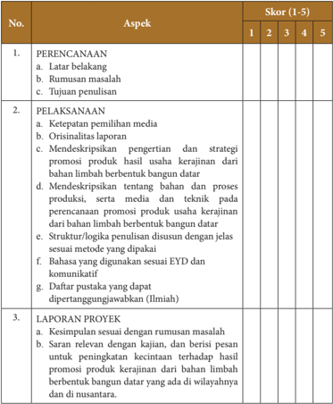

Tabel ini berisi informasi tentang skor evaluasi berdasarkan aspek-aspek yang diukur dalam sebuah proyek. Topik utama tabel adalah evaluasi proses dan hasil proyek, dengan kolom-kolom yang mencakup aspek-aspek seperti perencanaan, pelaksanaan, dan laporan proyek. Data penting yang terlihat meliputi skor yang diberikan untuk setiap aspek, mulai dari 1 (kurang) hingga 5 (terbaik). Skor tersebut menunjukkan tingkat keberhasilan atau kualitas dalam setiap aspek, membantu dalam penilaian keseluruhan proyek.

### Lembar Penilaian Produk

 

---
## 📄 Halaman 55

---
**📊 Tabel**

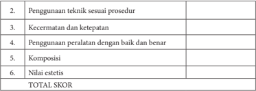

Tabel ini berisi kriteria penilaian untuk prosedur medis atau teknik medis tertentu. Topik utamanya adalah penggunaan teknik sesuai prosedur, kecermatan dan ketepatan, penggunaan peralatan dengan baik dan benar, komposisi, nilai estetis, dan total skor. Kolom-kolomnya mencakup semua aspek tersebut. Data atau pola penting yang terlihat adalah bahwa setiap kriteria memiliki ruang kosong untuk penilaian, menunjukkan bahwa penilaian harus dilakukan secara detail dan mendalam untuk memastikan keseluruhan proses.

### Keterangan pengisian skor:

- Sangat baik
- Baik
- Cukup
- Kurang

### Lembar Penilaian Portofolio

---
**📊 Tabel**

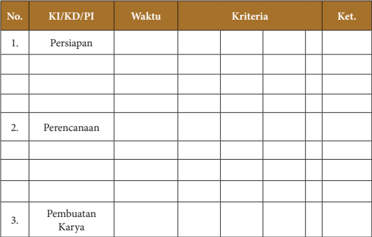

Tabel ini berisi informasi tentang proses pembuatan karya, yang terdiri dari tiga tahap utama: persiapan, perencanaan, dan pembuatan karya. Setiap tahap memiliki waktu dan kriteria yang harus dicapai. Waktu ditentukan dengan huruf besar di awal baris, sedangkan kriteria dan ketentuan disusun secara horizontal. Topik utama tabel ini adalah proses pembuatan karya, yang melibatkan persiapan, perencanaan, dan pembuatan karya. Kolom-kolom yang ada mencakup waktu, kriteria, dan ketentuan. Data penting yang terlihat adalah bahwa setiap tahap memiliki waktu dan kriteria yang harus dicapai untuk berhasil menyelesaikan karya tersebut.

PI = Pencapaian Indikator

 

---
## 📄 Halaman 56

### 5.  Laporan  Kegiatan  Usaha  Kerajinan  dari  bahan  Limbah  Berbentuk  Bangun Datar

Evaluasi pembelajaran pada materi laporan kegiatan usaha kerajinan dari bahan limbah berbentuk bangun datar dilakukan oleh guru dengan melakukan penilaian terhadap  sikap,  pengetahuan,  dan  keterampilan.  Berikut  contoh  instrumen  yang dapat digunakan guru untuk melakukan evaluasi pembelajaran pada materi laporan kegiatan usaha kerajinan dari bahan limbah berbentuk bangun datar.

### a.   Penilaian Sikap

Untuk mengukur pencapaian kompetensi sikap dilakukan melalui observasi yang dicatat dalam jurnal. Observasi penilaian sikap dilakukan secara berkesinambungan melalui  pengamatan  perilaku.  Instrumen  yang  digunakan  dalam  observasi  adalah lembar observasi atau jurnal.

### Contoh Format Jurnal Guru

---
**📊 Tabel**

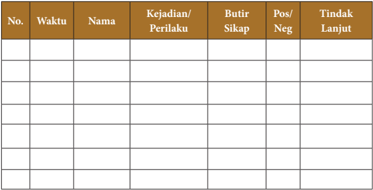

Tabel ini merupakan alat yang digunakan untuk mengumpulkan informasi tentang kejadian atau perilaku individu tertentu, baik itu positif maupun negatif, serta tindakan lanjut yang diambil. Topik utamanya adalah pengawasan perilaku individu dalam konteks sosial. Kolom-kolom yang ada meliputi nomor urutan (No.), waktu (Waktu), nama individu (Nama), kejadian/ perilaku (Kejadian/Perilaku), butir sikap (Butir Sikap), poin positif atau negatif (Pov/Neg), dan tindakan lanjut (Tindak Lanjut). Data atau pola penting yang terlihat adalah bahwa tabel ini dirancang untuk memfasilitasi analisis dan pemantauan perilaku individu secara teratur, dengan mencatat berbagai aspek seperti waktu, nama individu, perilaku yang dilakukan, sikap yang ditunjukkan, poin positif atau negatifnya, dan tindakan yang diambil sebagai respons. Ini sangat berguna untuk mendeteksi perilaku yang tidak sesuai atau memerlukan intervensi lebih lanjut.

Penilaian sikap dapat dilakukan melalui penilaian diri. Penilaian diri dilakukan dengan  cara  meminta  siswa  untuk  mengemukakan  kelebihan  dan  kekurangannya dalam berperilaku. Selain itu penilaian diri juga dapat digunakan untuk membentuk sikap siswa terhadap mata pelajaran.

### Contoh Lembar Penilaian Diri

Nama

: …………………………….

Kelas

: …………………………….

Materi

: …………………………….

 

---
## 📄 Halaman 57

### Petunjuk:

Berilah tanda cek (√) pada kolom alternatif sesuai kondisi yang sebenarnya, dengan kriteria sebagai berikut:

- 4 =  selalu, apabila anda selalu melakukan sesuai pernyataan.
- 3  =  sering,  apabila  anda  sering  melakukan  sesuai  pernyataan  dan  kadang-kadang tidak melakukan.
- 2 =  kadang-kadang,  apabila  anda  kadang-kadang  melakukan  dan  sering  tidak melakukan.
- 1 =  tidak pernah, apabila anda tidak pernah melakukan.

---
**📊 Tabel**

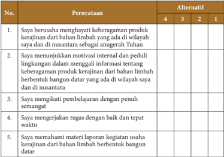

Tabel ini berisi 5 poin pernyataan yang diuji dengan alternatif jawaban numerik 1 hingga 4. Topik utama tabel adalah tentang keberagaman produk kerajinan dari bahan limbah berbentuk bangunan datar. Kolom pertama berisi nomor urut poin pernyataan, sedangkan kolom kedua berisi alternatif jawaban numerik. Data penting yang terlihat adalah bahwa semua poin pernyataan memiliki alternatif jawaban yang sama, yaitu 1 hingga 4. Ini menunjukkan bahwa setiap poin pernyataan memiliki 4 alternatif jawaban yang dapat dipilih oleh peserta didik.

Penilaian  diri  tidak  hanya  digunakan  untuk  menilai  sikap,  tetapi  juga  dapat digunakan  untuk  menilai  sikap  terhadap  pengetahuan  dan  keterampilan  serta kesulitan belajar siswa.

Penilaian  sikap  juga  dapat  dilakukan  melalui  penilaian  antarteman.  Penilaian antarteman adalah penilaian dengan cara siswa saling menilai perilaku temannya. Penilaian  antarteman  paling  cocok  dilakukan  pada  saat  siswa  melakukan  kerja kelompok.

 

---
## 📄 Halaman 58

### Contoh Lembar Penilaian Antarteman

Nama teman yang dinilai

: ………………………………….

Nama penilai

: ………………………………….

Kelas

: ………………………………….

Materi

: ………………………………….

---
**📊 Tabel**

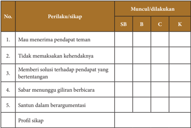

Tabel ini menunjukkan perilaku dan sikap yang muncul atau dilakukan oleh siswa (SB), bahan belajar (B), contoh (C), dan kelas (K). Topik utama tabel adalah tentang sikap dan perilaku yang relevan dengan pembelajaran. Kolom-kolomnya mencakup perilaku/sikap yang diuraikan, seperti "Mau menerima pendapat teman" dan "Santun dalam berargumentasi". Data penting yang terlihat adalah bahwa perilaku tersebut muncul/dilakukan oleh semua kelompok (SB, B, C, K) kecuali "Memberi solusi terhadap pendapat yang bertentangan", yang hanya muncul oleh siswa (SB). Ini menunjukkan bahwa sikap dan perilaku yang positif seperti menerima pendapat teman dan berargumen dengan sopan masih umum di antara siswa, sedangkan memberi solusi terhadap pendapat yang bertentangan lebih jarang dilakukan.

### Catatan:

- SB: Sangat Baik; B: Baik; C: Cukup, dan K: Kurang
- Penilaian  antarteman hanya sebagai penunjang untuk melengkapi penilaian yang dikukan melalui observasi.
- Hasil  penilaian  antarteman  ditindaklanjuti  oleh  guru  dengan  melakukan  pembinaan terhadap siswa yang belum menunjukkan sikap yang diharapkan.

 

---
## 📄 Halaman 59

### b.   Penilaian Pengetahuan

Untuk mengukur pencapaian kompetensi pengetahuan, dilakukan melalui ulangan harian, ulangan tengah semester dan ulangan akhir semester dengan diberikan soal uraian tentang laporan kegiatan usaha kerajinan dari bahan limbah berbentuk bangun datar yang meliputi:

- Pengertian dan Manfaat Laporan Kegiatan Usaha Kerajinan dari Bahan Limbah Berbentuk Bangun Datar
- Menganalisis Laporan Kegiatan Usaha Kerajinan dari Bahan Limbah Berbentuk Bangun Datar
- Membuat  Laporan  Kegiatan  Usaha  Kerajinan  dari  Bahan  Limbah  Berbentuk Bangun Datar
Kemudian, buatlah pedoman penskorannya.

### c.   Penilaian Keterampilan

Untuk mengukur pencapaian kompetensi keterampilan dilakukan melalui pengamatan/observasi, praktik, proyek dan portofolio.

### Lembar Observasi Presentasi

Nama

: ……………………………….

Kelas

: ……………………………….

 

---
## 📄 Halaman 60

---
**📊 Tabel**

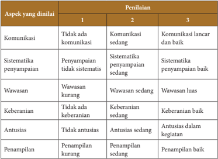

Tabel ini menunjukkan penilaian berdasarkan aspek-aspek tertentu dalam sebuah kegiatan atau proses. Topik utamanya adalah penilaian perilaku individu dalam berbagai aspek seperti komunikasi, sitematika penyampaian informasi, wawasan, keberanian, antusiasme, dan penampilan. Tabel dibagi menjadi tiga kolom, masing-masing menunjukkan tingkat penilaian yang berbeda: 1 (tidak ada), 2 (sedang), dan 3 (baik). Data penting yang terlihat adalah bahwa penilaian umumnya lebih tinggi pada aspek-aspek seperti komunikasi, sitematika penyampaian, wawasan, keberanian, dan penampilan, sedangkan aspek keberanian dan antusiasme cenderung memiliki penilaian yang lebih rendah.

### Lembar penilaian proyek

---
**📊 Tabel**

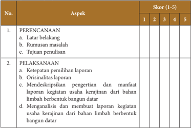

Tabel ini berisi informasi tentang skor yang diberikan pada dua aspek utama: Perencanaan dan Pelaksanaan. Topik utama tabel meliputi latar belakang, rumusan masalah, tujuan penulisan, ketepatan pemilihan laporan, orisinalitas laporan, mendeskripsikan pengertian dan manfaat laporan usaha kerja riau dari bahan limbah berbentuk bangun datar, serta menganalisis dan membuat laporan kegiatan usaha kerja riau dari bahan limbah berbentuk bangun datar. Kolom-kolomnya mencakup skor 1 hingga 5 untuk setiap aspek. Data penting yang terlihat adalah bahwa skor tertinggi yang diberikan adalah 5, sementara skor terendah adalah 1. Ini menunjukkan bahwa skor yang diberikan sangat variatif dan tidak merata.

 

---
## 📄 Halaman 61

---
**📊 Tabel**

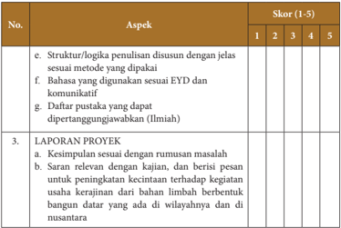

Tabel ini berisi aspek-aspek penilaian proyek yang harus dipenuhi oleh peserta didik. Topik utamanya adalah "Laporan Proyek" dengan skor 1 hingga 5. Kolom-kolomnya meliputi: Aspek, Skor (1-5), dan Laporan Proyek. Untuk aspek "Struktur/logika penulisan disusun dengan jelas sesuai metode yang dipakai", skor 3 diberikan. Untuk aspek "Bahasa yang digunakan sesuai EYD dan komunikatif", skor 4 diberikan. Untuk aspek "Daftar pustaka yang dipertanggungjawabkan (Ilmiah)", tidak ada skor yang diberikan. Untuk aspek "Laporan Proyek", skor 2 diberikan untuk kesimpulan sesuai dengan rumusan masalah, dan skor 3 diberikan untuk saran relevan dengan kajian, dan berisi pesan untuk meningkatkan kecintaan terhadap kegiatan usaha kerajinan dan bahan limbah berbentuk bangunan datar yang ada di wilayahnya dan di nusantara.

### F. Pengayaan

Pengayaan  adalah  kegiatan  yang  diberikan  kepada  siswa  atau  kelompok  yang lebih  cepat  dalam  mencapai  kompetensi  daripada  siswa  lain  agar  mereka  dapat memperdalam kecakapannya atau dapat mengembangkan potensinya secara optimal. Tugas yang diberikan guru kepada siswa dapat berupa tutor sebaya, mengembangkan latihan  secara  lebih  mendalam,  membuat  karya  baru,  ataupun  melakukan  suatu proyek.  Kegiatan  pengayaan  hendaknya  menyenangkan  dan  mengembangkan  kemampuan  berfikir  tingkat  tinggi  sehingga  mendorong  siswa  untuk  mengerjakan tugas yang diberikan.

Berikan tugas kepada siswa yang sudah menguasai materi untuk mencari contoh produk  kerajinan  dari  bahan-bahan  limbah  berbentuk  bangun  datar  di  wilayah nusantara  dan  mancanegara,  identifikasi  karya  tersebut  berdasarkan  karakteristik bahannya. Guru dapat membantu memberikan sumber bacaan yang berisi gambar dan contoh produk kerajinan dari bahan limbah berbentuk bangun datar yang ada dari nusantara maupun mancanegara agar siswa lebih kaya dan pemahaman mereka menjadi lebih jelas.

 

---
## 📄 Halaman 62

### G. Remedial

Pembelajaran remedial diberikan kepada siswa yang belum mencapai ketuntasan kompetensi. Remedial menggunakan berbagai metode yang diakhiri dengan penilaian untuk mengukur kembali tingkat ketuntasan belajar siswa. Pembelajaran remedial diberikan  kepada  siswa  bersifat  terpadu,  artinya  guru  memberikan  pengulangan materi dan terapi masalah pribadi ataupun kesulitan belajar yang dialami oleh siswa.

Guru dapat memberikan pengulangan materi pada siswa yang belum menguasai materi pembelajaran. Pengulangan materi tersebut dengan menggunakan berbagai metode yang disesuaikan dengan karakteristik dan kebutuhan siswa serta diakhiri dengan penilaian. Peserta didik yang tidak hadir dan tidak dapat mengikuti diskusi kelompok diberikan tugas individu sesuai materi yang didiskusikan.

### H. Interaksi dengan Orang Tua Peserta Didik

Pembelajaran siswa di sekolah merupakan tanggung jawab bersama antara warga sekolah,  yaitu  kepala  sekolah,  guru,  dan  tenaga  kependidikan  kepada  orang  tua. Oleh  karena  itu,  pihak  sekolah  perlu  mengomunikasikan  kegiatan  pembelajaran siswa dengan orang tua. Orang tua dapat berperan sebagai partner sekolah dalam menunjang keberhasilan pembelajaran siswa.

Pada kegiatan pengamatan dan mengumpulkan data tentang produk kerajinan dari bahan bahan limbah berbentuk bangun datar, orang tua diharapkan dapat mengawasi dan membimbing anak-anak di luar sekolah. Bantuan orang tua dalam memberikan petunjuk dan hal-hal yang berkaitan dengan pengamatan dan mengumpulkan data tentang produk kerajinan dari bahan bahan limbah berbentuk bangun datar sangat dibutuhkan siswa.

Pada kegiatan observasi dan mengumpulkan data tentang produk kerajinan dari bahan bahan limbah berbentuk bangun datar, orang tua diharapkan dapat mengawasi dan  membimbing  siswa  di  luar  sekolah.  Bantuan  orang  tua  dalam  memberikan petunjuk dan hal-hal yang berkaitan dengan pengamatan dan mengumpulkan data tentang produk kerajinan dari bahan bahan limbah berbentuk bangun datar sangat dibutuhkan siswa.

 

---
## 📄 Halaman 63

### Aspek :

### REKAYASA

### BAB 2

### Wirausaha Produk Rekayasa Sistem Teknik

---
**🖼️ Gambar/Diagram**

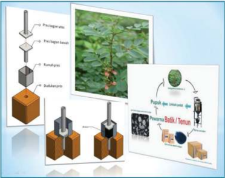

> **Deskripsi Visual:** Gambar ini adalah kombinasi dari berbagai elemen visual yang menunjukkan proses pembuatan dan penggunaan alat prinsip. Gambar utama adalah sebuah diagram yang menunjukkan langkah-langkah pembuatan alat prinsip, yang melibatkan beberapa tahap seperti pemotongan, pengecoran, dan pengelasan. Di sebelah kanan, ada foto tumbuhan yang tampak seperti daun, mungkin sebagai contoh atau referensi untuk proses pembuatan alat prinsip. Di bagian bawah, ada dua gambar 3D yang menunjukkan bentuk akhir dari alat prinsip tersebut. Selain itu, ada juga gambar yang menunjukkan proses pembuatan alat prinsip menggunakan mesin, yang mencerminkan teknologi modern dalam proses pembuatan alat prinsip. Teks, angka, atau label penting yang terlihat dalam gambar ini adalah nama-nama alat prinsip dan proses pembuatannya. Informasi kunci yang dapat diambil pembaca adalah bahwa proses pembuatan alat prinsip melibatkan berbagai tahap dan teknologi modern.

 

---
## 📄 Halaman 64

### A. Kompetensi Inti (KI) dan Kompetensi Dasar (KD)

---
**📊 Tabel**

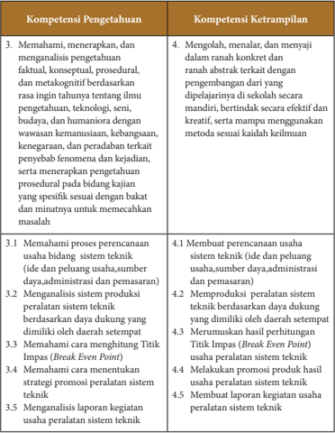

Tabel ini berisi dua kolom utama: Kompetensi Pengetahuan dan Kompetensi Ketrampilan. Kolom Kompetensi Pengetahuan mencakup empat poin utama, yaitu memahami, menerapkan, dan mengenali pengetahuan faktil, konseptual, prosedural, dan metakognitif; memahami proses perencanaan usaha bidang sistem teknik; menganalisis sistem produksi peralatan sistem teknik; dan memahami cara menentukan titik impas (break even point). Sementara itu, kolom Kompetensi Ketrampilan mencakup empat poin lainnya, yaitu mengolah, menalar, dan menyajikan pengetahuan secara abstrak; membuat perencanaan usaha sistem teknik; mengeksploitasi peralatan sistem teknik; dan membuat laporan kegiatan usaha peralatan sistem teknik. Pola penting yang terlihat adalah bahwa setiap kompetensi pengetahuan diikuti oleh satu atau lebih kompetensi ketrampilan yang relevan, menunjukkan hubungan antara pemahaman teoritis dengan praktik aplikasi.

 

---
## 📄 Halaman 65

### B. Tujuan Pembelajaran

### Peserta didik mampu:

- Menghayati bahwa akal pikiran dan kemampuan manusia dalam berpikir kreatif untuk membuat produk rekayasa serta keberhasilan wirausaha adalah anugerah Tuhan.
- Menghayati  perilaku  jujur,  percaya  diri,  dan  mandiri  serta  sikap  bekerjasama, gotong  royong,  bertoleransi,  disiplin,  bertanggung  jawab,  kreatif,  dan  inovatif dalam  membuat  karya  rekayasa  produk  sistem  teknik  untuk  membangun semangat usaha.
- Mendesain  dan  membuat  produk  serta  pengemasan    produk  rekayasa  sistem teknik berdasarkan identifikasi kebutuhan sumber daya, teknologi, dan prosedur berkarya.
- Mempresentasikan  karya  dan  proposal  usaha  produk    rekayasa  sistem  teknik dengan perilaku jujur dan percaya diri.
- Menyajikan simulasi wirausaha produk  rekayasa sistem teknik berdasarkan analisis pengelolaan sumber daya yang ada di lingkungan sekitar.

 

---
## 📄 Halaman 66

### C. Peta Materi

---
**🖼️ Gambar/Diagram**

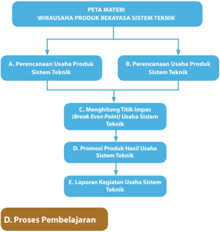

> **Deskripsi Visual:** Gambar ini adalah diagram yang menunjukkan struktur materi untuk wirausaha produk rekayasa sistem teknik. Diagram ini dibagi menjadi empat bagian utama:

1. Peta Materi: Ini adalah bagian atas yang menjelaskan topik-topik utama yang akan dipelajari dalam kursus tersebut.

2. A. Perencanaan Usaha Produk Sistem Teknik: Ini adalah bagian pertama dari peta materi yang mencakup dua subtopik utama.

   - C. Menghitung Titik Impas (Break Even Point) Usaha Sistem Teknik: Ini adalah subtopik pertama dalam bagian A.
   
   - D. Promosi Produk Hasil Usaha Sistem Teknik: Ini adalah subtopik kedua dalam bagian A.

3. B. Perencanaan Usaha Produk Sistem Teknik: Ini adalah bagian kedua dari peta materi yang mencakup dua subtopik utama.

   - E. Laporan Kegiatan Usaha Sistem Teknik: Ini adalah subtopik pertama dalam bagian B.
   
   - D. Proses Pembelajaran: Ini adalah subtopik kedua dalam bagian B.

4. D. Proses Pembelajaran: Ini adalah bagian bawah yang menggambarkan proses belajar yang akan dilalui oleh peserta didik.

Elemen-elemen utama dalam diagram ini adalah topik-topik yang akan dipelajari dalam kursus, yaitu perencanaan usaha produk sistem teknik, menghitung titik impas, promosi produk hasil usaha, dan laporan kegiatan usaha. Relasi antara elemen-elemen ini adalah bahwa setiap subtopik dalam bagian A dan B merupakan bagian dari peta materi yang lebih besar, sementara subtopik dalam bagian B dan D merupakan bagian dari proses pembelajaran.

Teks, angka, atau label penting yang terlihat dalam diagram ini meliputi nama-nama topik-topik yang akan dipelajari, seperti "Perencanaan Usaha Produk Sistem Teknik", "Menghitung Titik Impas (Break Even Point) Usaha Sistem Teknik", "Promosi Produk Hasil Usaha Sistem Teknik", "Laporan Kegiatan Usaha Sistem Teknik", dan

Karakter  yang  diharapkan  dari  peserta  didik  dalam  aktivitas  pembelajaran  ini adalah mampu menunjukkan sikap : (1) rasa ingin tahu, (2) santun, gemar membaca dan peduli, (3) jujur dan disiplin, (4) kreatif dan apresiatif, (5) inovatif dan responsif, (6) bersahabat dan kooperatif, (7) kerja keras dan bertanggung jawab, (8) toleran dan mandiri, (9) bermasyarakat dan berkebangsaan.

Pembelajaran  ini  mengarahkan  peserta  didik  untuk  mengembangkan  sikap, pengetahuan  dan ketrampilan dalam  bidang rekayasa produk  sistem teknik. Pembahasan  terkait  dengan  karya  rekayasa  produk  sistem  teknik  menyajikan

 

---
## 📄 Halaman 67

salah  satu  model  karya  rekayasa  produk  sistem  teknik tom  spray  aerator untuk pengambilan zat warna alam untuk batik atau tenun. Guru dapat mengembangkan model  karya  rekayasa  produk  sistem  teknik  untuk  jenis  yang  lain  sesuai  dengan sumber  daya,  peminatan,  potensi  alam  di  daerah  sekitar  yang  memungkinkan dapat diimplementasikan dalam kehidupan sehari-hari baik di saat ini maupun di masa mendatang. Konsep dasar ini diharapkan menjadi arahan bagi peserta didik untuk melakukan pengamatan dan pengembangan serta peningkatan rasa kepekaan terhadap potensi yang ada, terutama potensi daerah di sekitar sehingga terbangun kreativitas pada diri peserta didik.

Pembelajaran ini diharapkan bisa menjadi kegiatan yang menyenangkan dalam menggali potensi diri peserta didik dan potensi alam yang ada di lingkungan sekitar dan mengkreasikannya dalam bentuk karya yang dapat menjadi bekal untuk dapat diimplementasikan dalam kehidupan. Penjelasan pada masing-masing pokok bahasan  mengarahkan  bagaimana  melakukan  kegiatan  praktik/pembuatan  model karya rekayasa produk sistem teknik. Peserta didik diberi kebebasan untuk memilih karya  dan  jenis  bahan  yang  digunakan  dalam  mewujudkan  model  produk  sistem teknik yang dibuat dalam kelompok melalui pengarahan dari guru.

### Bagaimana melakukan praktik rekayasa sistem teknik dalam pembuatan produk/model?

Guru memberikan pengarahan kepada peserta didik terkait dengan pembelajaran ini, di antaranya:

- Buatlah kelompok terdiri dari 4 - 6 siswa.
- Gunakan petunjuk kerja, melakukan pembahasan teknik dan aktivitas yang terkait rencana kegiatan selanjutnya.
- Lakukan pertemuan secara mandiri masing-masing kelompok minimal dua kali pertemuan dalam seminggu selama dua jam.
- Diskusikan permasalahan yang dihadapi dan solusi apa yang akan dicapai dalam pembuatan model. Pembagian tugas antar anggota kelompok.
- Lakukan  pengamatan  melalui  media  belajar  diantaranya  buku,  internet,  surat kabar, wawancara dengan praktisi.
- Gunakan  bahan  baku  yang  tersedia  di  sekitar  (lingkungan  di  daerah  dimana peserta didik tinggal) dalam pembuatan model atau produk.
- Presentasikan hasil pengamatan dan pembuatan model atau produk yang telah dilakukan oleh masing-masing kelompok.
- Informasikan aplikasi /penerapan yang sesuai dari model yang dibuat di lingkungan sekitar/daerah masing-masing.
- Hasil  penilaian  yang  merupakan  proses  pengumpulan  bukti  hasil  pekerjaan/ portofolio  peserta  didik  dalam  mencapai  kriteria  unjuk  kerja  yang  dimaksud

 

---
## 📄 Halaman 68

dalam kompetensi inti. Nilai dianggap kompeten, jika kompetensi dasar sudah dicapai.  Penilaian  lebih  jika  peserta  didik  teridentifikasi  pencapaian  prestasiprestasi  peserta  didik.  Praktik  dinilai  secara  individu  dan  tes  pengetahuan penunjang bisa melalui penugasan, tes esai, komparasi, melengkapi kalimat, atau dapat dikembangkan oleh guru sesuai dengan kondisi sekitar.

Guru bersama peserta didik menggali informasi  tentang pentingnya sistem teknik sekaligus mempelajari bagaimana teknik belajar dan berpikir efektif sebagai salah satu tool bagaimana cara belajar. Tool yang dimaksud adalah membuat pemetaan pikiran sebagai bentuk bimbingan belajar kepada peserta didik. Langkah-langkah pembuatan pemetaan  pikiran  ( mind  mapping )  dengan  warna  dan  simbol-simbol  sesuai  hobi masing-masing peserta didik sebagai salah satu contoh teknik belajar dan berfikir. Pemetaan pikiran akan membantu peserta didik untuk memahami materi pelajaran. Peserta  didik  dengan  mudah  mengkorelasikan  setiap  informasi  yang  didapatkan dengan materi-materi yang terkait. Berikut adalah salah satu contoh bentuk pemetaan pikiran seperti pada Gambar 2.1 secara umum yang biasa dijumpai dalam kehidupan.

---
**🖼️ Gambar/Diagram**

> **Deskripsi Visual:** Gambar ini adalah ilustrasi yang menunjukkan konsep atau topik tertentu dalam buku pelajaran. Berikut adalah deskripsi lengkapnya:

1. **Apa yang Ditampilkan Secara Keseluruhan**: Gambar ini menggambarkan berbagai aspek atau konsep yang terkait dengan topik utama yang ditunjukkan di tengah gambar, yaitu "PENGENALAN SIKAP". Gambar ini mencakup berbagai elemen visual yang membantu memahami konsep-konsep tersebut.

2. **Elemen-Elemen Utama dan Relasinya**: 
   - **Tengah Gambar**: Gambar ini menunjukkan "PENGENALAN SIKAP" sebagai titik pusat.
   - **Lembaran Kertas**: Di sebelah kiri, ada lembaran kertas yang menunjukkan tugas-tugas atau aktivitas yang harus dilakukan untuk memahami konsep ini.
   - **Buku**: Di sebelah kanan, ada gambar buku yang menunjukkan materi atau informasi yang akan dipelajari.
   - **Kursi dan Meja**: Gambar kursi dan meja menunjukkan lingkungan belajar atau tempat belajar.
   - **Pohon**: Pohon menunjukkan hubungan antara konsep-konsep yang ada.
   - **Jalan dan Jembatan**: Jalan dan jembatan menunjukkan jalur atau cara-cara untuk mempelajari konsep ini.
   - **Penggambaran**: Penggambaran seperti orang yang berbicara, tangan yang menulis, dan lain-lain menunjukkan aktivitas belajar.

3. **Teks, Angka, atau Label Penting yang Terlihat**:
   - **Teks**: Ada beberapa teks yang menjelaskan konsep-konsep yang ada, seperti "PENGENALAN SIKAP", "BELAJAR", "BELAJAR", dll.
   - **Angka**: Ada beberapa angka yang mungkin menunjukkan urutan atau jumlah item dalam setiap bagian.

4. **Informasi Kunci yang Dapat Diambil Pembaca**:
   - Gambar ini memberikan gambaran umum tentang proses belajar dan pengenalan sikap, termasuk aktivitas belajar, materi yang akan

 

---
## 📄 Halaman 69

Mind map membantu peserta didik mengorganisasikan informasi yang dipelajari atau  dengan  kata  lain  bagaimana  cara  belajar,  pengaturan  materi  pelajaran  dan manajemen waktu.  Guru  memberikan  orientasi  sistem  melalui  pemetaan  pikiran. Aktivitas 1 dapat  digunakan  untuk  mengarahkan peserta didik dalam melakukan identifikasi produk peralatan sistem teknik. Laporan hasil identifikasi dapat disajikan dalam bentuk lisan maupun tertulis dan tidak menutup kemungkinan untuk dibuat dalam bentuk pemetaan pemikiran oleh peserta didik sesuai kreasi masing-masing.

### Kegiatan Belajar 1 Perencanaan Usaha Produk Sistem Teknik

Pembelajaran pada perencanaan usaha produk sistem teknik, guru menyampaikan tujuan  pembelajaran  dan  langkah-langkah  peserta  didik  dalam  beraktivitas  pada proses  pembelajaran  Rekayasa  dan  Kewirausahaan.  Guru  memberi  penjelasan tentang  pembuatan  model  terkait  dengan  karya  rekayasa  produk  sistem  teknik. Bagaimana  melakukan  praktik  rekayasa  dalam  pembuatan  model/produk.  Peserta didik mempelajari tentang perencanaan usaha produk sistem teknik yang terdiri dari:

- Ide dan peluang usaha produk sistem teknik
- Sumber daya yang dibutuhkan dalam usaha produk sistem teknik
- Administrasi usaha produk sistem teknik
Peserta  didik  diajak  untuk  memahami  konteks  sistem  teknik  melalui  gambar, video yang telah disiapkan guru baik itu lewat komputer, smart board maupun poster atau infografis disesuaikan dengan kondisi yang ada. Guru memberi motivasi kepada peserta didik. Peserta didik membaca  buku teks tentang perencanaan usaha produk sistem teknik. Guru mengajak peserta didik untuk mengemukakan pendapat tentang jenis-jenis produk rekayasa peralatan sistem teknik yang ada di sekitar atau di daerah setempat.

Pembelajaran dilanjutkan dengan menanyakan kepada peserta didik dan mendiskusikan materi terkait  identifikasi  produk  rekayasa  peralatan  sistem  teknik dengan mengerjakan aktivitas mengamati lingkungan sekitar pada berbagai sektor kehidupan.  Pembelajaran  mengajak  peserta  didik  untuk  mengenal  dan  mengidentifikasi  nama-nama  produk  dan  memahami  area  produk  yang  ada  di  sekitar yang  memungkinkan  untuk  dikembangkan  karya  produk  rekayasa  sistem  teknik sebagai  solusi  dalam  peningkatan  produktivitas  dalam  berproduksi.  Pola  kerja sistem action  loop dipahami peserta didik untuk menambah wawasan beraktivitas dalam pembelajaran. Sistem administrasi usaha diidentifikasi peserta didik dengan melengkapi gambar terkait aspek administrasi usaha pada buku teks pelajaran dengan memperhatikan Aktivitas 2 .

Guru menyiapkan jurnal pengamatan peserta didik untuk melakukan pengamatan pada proses identifikasi. Guru mencatat keaktifan dan partisipasi peserta didik dalam mengerjakan  tugas.  Penilaian  autentik    dilakukan  dengan  mengamati  bagaimana  peserta

 

---
## 📄 Halaman 70

didik  menjelaskan,  menafsirkan,  mensintesis,  menganalisis,  mengorganisasikan, mengkonstruksikan dan mengevaluasi informasi yang didapatkan.

Guru  mendampingi  peserta  didik  dalam  berperilaku  yang  diharapkan  dan mengorganisasi pembelajaran secara efektif yang meliputi: (1) fokus dalam pembelajaran, kendali situasi kelas dan cara mengelola kelas sebagai kegiatan utama dalam  sekolah,  (2)  penggunaan  waktu  secara  optimal  sehingga  materi  yang  telah disiapkan  terlaksana  dan  tercapai  tujuan  serta  mampu  diserap  secara  efektif  dan efisien  oleh  peserta  didik,  (3)  menyampaikan  tujuan  yang  realistik  supaya  dapat dipahami dan dicapai melalui proses pembelajaran dengan memperhatikan peserta didik dan sumber daya yang dimiliki, (4) perencanaan dan persiapan pembelajaran dan bahan-bahan pendukungnya. Pengorganisasian pembelajaran dapat divisualkan seperti pada gambar 2.2 sebagai berikut:

---
**🖼️ Gambar/Diagram**

> **Deskripsi Visual:** Gambar ini adalah diagram yang menunjukkan tujuan dan langkah-langkah dalam proses pembelajaran. Diagram ini terdiri dari empat elemen berbeda yang masing-masing menunjukkan aspek penting dari proses pembelajaran:

1. **Perencanaan dan Persiapan untuk Pembelajaran** - Ini menunjukkan sebuah buku dengan judul "PERSIAPAN", yang menunjukkan bahwa perencanaan adalah langkah awal dalam proses pembelajaran.

2. **Fokus Dalam Pembelajaran** - Ini menunjukkan seorang siswa yang sedang belajar, yang menunjukkan bahwa fokus adalah aspek penting dalam proses pembelajaran.

3. **Merumuskan Apa Yang Harus Dicapai Peserta Didik** - Ini menunjukkan sebuah papan tulis dengan teks "CHARACTER", yang menunjukkan bahwa merumuskan tujuan pembelajaran adalah langkah penting dalam proses pembelajaran.

4. **Penggunaan Waktu Secara Maksimum** - Ini menunjukkan seorang siswa yang sedang belajar dengan menggunakan teknologi, yang menunjukkan bahwa penggunaan waktu dengan efektif adalah aspek penting dalam proses pembelajaran.

Informasi kunci yang dapat diambil pembaca adalah bahwa proses pembelajaran melibatkan perencanaan, fokus, merumuskan tujuan, dan penggunaan waktu dengan efektif.

Gambar 2.2 Pengorganisasian pembelajaran

Peserta didik secara berkelompok membuat perencanaan usaha produk peralatan sistem teknik dengan memperhatikan Tugas 1 mengamati potensi sumber daya di lingkungan sekitar, mencari  informasi dari buku atau internet tentang usaha produk peralatan sistem teknik  yang dapat digunakan untuk mengolah material yang ada

 

---
## 📄 Halaman 71

dan metode pengolahanannya dan mempresentasikan hasil pemikiran baik secara lisan  atau  tertulis.  Melalui  pengamatan  peserta  didik  mulai  terbuka  menerima informasi  secara riil terkait sumber daya yang memungkinkan untuk dikembangkan menjadi sebuah karya yang memiliki nilai tambah melalui pembelajaran prakarya dan kewirausahaan aspek rekayasa.

### Kegiatan Belajar 2 Sistem Produksi Usaha Sistem Teknik

Guru  terlebih  dahulu  membahas  atau  melakukan  umpan  balik  dari  tugas  mengamati lingkungan sekitar  yang telah dikerjakan peserta didik. Gali pemahaman peserta  didik  terkait  manfaat  produk  rekayasa  sistem  teknik.  Arahkan  peserta didik  untuk  memperhatikan  potensi  sumber  daya  yang  ada  di  lingkungan  sekitar yang  memungkinkan  untuk  dikembangkan  karya  rekayasa  sistem  teknik  dalam mendukung proses produksi dan aktivitas kehidupan.

Peserta didik diarahkan untuk membaca buku teks pelajaran tentang  aneka produk sistem  teknik  dan  mendiskusikannya  dalam  kelompok.  Peserta  didik  diarahkan untuk mengembangkan manfaat produk dari buku teks pelajaran setelah melakukan pengamatan dan identifikasi nama-nama produk.

Guru  memberi  kesempatan  kepada  peserta  didik  untuk  mengembangkan  ide kreatif  dan  inovatif  peserta  didik  terhadap  kebutuhan  peralatan  produksi  yang berkembang guna meningkatkan efektivitas dan efisiensi dalam berproduksi. Pada buku teks pelajaran, dimunculkan salah satu pembahasan terkait produk rekayasa sistem teknik dan tidak menutup kemungkinan guru bersama peserta didik untuk mengembangkan model karya inovasi sistem teknik jenis produk lain sesuai dengan potensi sumber daya sekitar dengan tahapan-tahapan dari desain, kebutuhan bahan dan alat pendukung, proses pembuatan, ujicoba, pengemasan produk, dan perawatan disesuaikan dengan model yang dibuat.

Guru  memberi  kesempatan  peserta  didik  untuk  mengemukakan  pengalaman atau  pengamatan  terkait  peralatan  sistem  teknik  baik  itu  melalui  kunjungan  pada home industry , industri kecil dan menengah atau tempat wisata, museum, informasi lewat media internet atau media lainnya. Aktivitas 3 diarahkan pada peserta didik untuk pembuatan pohon industri guna membuka wawasan tentang potensi sekitar dan  menggali  ide  terkait  perencanaan  pembuatan  peralatan  sistem  teknik  secara sederhana.  Peserta  didik  mengerjakan Tugas  2 secara  mandiri  mengamati  jargon produk dari peralatan sistem teknik melalui beberapa hal berikut.

- Pengamatan nama-nama produk yang ada di gambar jargon produk.
- Pememilihan  minimal  lima  nama  produk  sesuai  dengan  potensi  yang  ada  di daerahmu.
- Mengidentifikasi inovasi peralatan sistem teknik apa yang dapat dikembangkan dalam proses produksinya.
- Menguraikan gagasan dalam lembar laporan.

 

---
## 📄 Halaman 72

Tugas 3 dibuat secara berkelompok terkait observasi kegunaan peralatan sistem teknik.  Guru  memfasilitasi  peserta  didik dalam kegiatan  dan  memberikan  arahan kepada  peserta  didik  dalam  melakukan  aktivitas    kajian  pada  tugas  yang  sedang dikerjakan peserta didik. Guru mengingatkan peserta didik dalam melakukan proses diskusi  untuk  mengembangkan  tolerasi,  kerjasama,  demokratis  dan  bersahabat. Peserta didik secara berkelompok mengamati lingkungan daerah dan memcatat aneka jenis penggunaan peralatan sistem teknik. Data yang diperoleh melalui pengamatan didiskusikan untuk membuat perencanaan pembuatan produk atau model peralatan sistem teknik. Data meliputi nama peralatan sistem teknik dan keterangan meliputi desain produk, bahan dan alat yang digunakan, proses produksi, pengujian produk, dan evaluasi dari kebutuhan pasar.

Monitoring kemajuan dan potensi peserta didik untuk mengetahui hasil belajar peserta didik melalui assessment atau penilaian melalui pekerjaan rumah, kemajuan belajar peserta didik.

Guru melakukan pengamatan keaktifan peserta didik dan mendokumentasikan melalui  jurnal  pengamatan  peserta  didik.  Guru  memberi  kesempatan  kelompok untuk memaparkan hasil diskusi kelompok dan merefleksi tentang ungkapan pemahaman  yang  telah  diperoleh  setelah  mempelajari  produk  rekayasa  sistem  teknik. Guru memberi apresiasi kepada peserta didik yang memiliki gagasan atau ide. Guru bersama peserta didik menyimpulkan pembahasan terkait manfaat produk rekayasa sistem teknik. Guru menghimbau kepada setiap kelompok untuk menetapkan dan mempersiapkan pembuatan model dari salah satu jenis karya rekayasa sistem teknik dengan memanfaatkan bahan yang tersedia di sekitar.

Sekolah dapat juga membuat perencanaan dalam mewujudkan pembuatan produk karya rekayasa sistem teknik yang dapat diaplikasikan langsung di lingkungan sekitar yang  dikerjakan  peserta  didik  dengan  bimbingan  guru  sebagai  hasil  pengamatan peserta didik tentang kebutuhan peralatan karya rekayasa sistem teknik di sekitar. Produk yang dibuat sebagai solusi dalam mencapai efektivitas dan efisiensi berproduksi dan tergantung dari kesiapan masing-masing sekolah.

 

---
## 📄 Halaman 73

Implementasi pembelajaran rekayasa usaha sistem teknik dapat dilakukan melalui strategi pembelajaran, komunikasi materi pembelajaran, pembelajaran yang komplek, strategi  bertanya, keterlibatan peserta didik seperti ditunjukkan dalam gambar 2.3 sebagai berikut:

---
**🖼️ Gambar/Diagram**

> **Deskripsi Visual:** Gambar ini adalah diagram yang menunjukkan proses implementasi penelitian Rekayasa dalam pendidikan. Diagram ini terdiri dari beberapa elemen utama:

1. **Komunikasi materi pembelajaran** - Ini merupakan langkah awal dalam proses penelitian Rekayasa, dimana informasi tentang materi pembelajaran disampaikan kepada peserta didik.

2. **Pembelajaran yang kompleks** - Setelah materi dibagikan, peserta didik mulai mempelajari materi tersebut dengan cara yang kompleks.

3. **Strategi bertanya** - Peserta didik menggunakan strategi bertanya untuk memahami materi yang dipelajari.

4. **Implementasi penelitian Rekayasa** - Langkah berikutnya adalah implementasi penelitian Rekayasa, dimana peserta didik mengaplikasikan apa yang telah dipelajari ke dalam praktik.

5. **Keterlibatan peserta didik** - Akhirnya, peserta didik harus aktif dalam proses penelitian Rekayasa, yang mencakup partisipasi mereka dalam pengumpulan data dan analisis hasil.

Elemen-elemen ini saling terkait dan membentuk suatu proses yang melibatkan komunikasi, pembelajaran, dan implementasi penelitian Rekayasa dalam pendidikan. Teks, angka, atau label penting yang terlihat dalam diagram ini adalah "Implementasi penelitian Rekayasa" sebagai titik pusat yang menghubungkan semua elemen lainnya. Informasi kunci yang dapat diambil pembaca adalah bahwa proses ini melibatkan berbagai tahapan yang saling terkait dalam pendidikan, mulai dari komunikasi hingga implementasi penelitian Rekayasa.

Gambar 2.3 Implementasi pembelajaran

Guru mengembangkan strategi pembelajaran sesuai dengan karakteristik peserta didik dan materi pembelajaran. Komunikasi dua arah dilakukan untuk pencapaian tujuan  pembelajaran  sistem  teknik  dalam  upaya  mengkaitkan  fakta  nyata  dengan pemikiran  sehingga  dapat  bermakna.  Guru  menghimpun  informasi  mengenai seberapa jauh materi pelajaran yang dipahami peserta didik melalui strategi bertanya. Guru memotivasi peserta didik agar terus terlibat aktif pada setiap pembelajaran.

Peserta  didik  diarahkan  untuk  membaca  buku  teks  pelajaran  terkait  potensi sistem teknik di daerah dan diharapkan peserta didik mengkorelasikan potensi riil yang ada di daerah dengan pembelajaran dan melakukan identifikasi gambar-gambar produk sistem teknik yang berpotensi untuk dibuat karya usaha sistem teknik. Guru memberikan  orientasi  proses  pembuatan  desain.  Peserta  didik  disiapkan  untuk membentuk  kelompok  dan  melakukan  aktivitas  terkait  dengan  mengidentifikasi permasalahan  di  lapangan.  Peserta  didik  mendesain  model/produk  sistem  teknik yang  telah  dipilih  atau  ditetapkan  oleh  masing-masing  kelompok.  Desain  produk rekayasa sistem teknik didiskusikan.

 

---
## 📄 Halaman 74

Guru mengarahkan peserta didik dalam teknik pelaksanaan pembuatan model. Masing-masing kelompok melakukan pembagian tugas pada anggota kelompoknya dalam membuat rancangan model rekayasa sistem teknik. Rancangan awal dibuat dalam bentuk gambar sketsa dan desain rekayasa sistem teknik berdasarkan kesimpulan  kajian  literatur,  orisinalitas  ide  yang  jujur,  sikap  percaya  diri,  dan  mandiri. Desain model karya rekayasa sistem teknik yang telah dipilih atau ditetapkan oleh masing-masing kelompok dilaporkan kepada guru.

Peserta didik bersama kelompok melakukan aktivitas dan merencanakan kebutuhan  bahan  dari  desain  karya  rekayasa  sistem  teknik  yang  direncanakan berdasarkan kesepakatan kelompok. Kajian literatur tentang proses produksi yang meliputi bahan, alat, dan ketentuan keselamatan kerja terkait proses produksi karya rekayasa sistem teknik, peserta didik  diarahkan guru agar terbangun rasa ingin tahu, motivasi internal, bersikap santun, bangga, dan cinta serta bersyukur sebagai warga Indonesia.

Peserta didik membaca buku teks pelajaran terkait alat pendukung produk rekayasa sistem teknik dan mengidentifikasi penggunaan alat. Peserta didik diarahkan untuk melaksanakan  aktivitas.  Peserta  didik  membuat  ulasan,  gambar  desain  atau  foto, tentang kegiatan yang dilakukan dalam mewujudkan model karya rekayasa sistem teknik sesuai dengan kesepakatan kelompoknya.

Guru menyiapkan jurnal pengamatan peserta didik untuk melakukan pengamatan pada proses identifikasi. Guru mencatat keaktifan dan partisipasi peserta didik dalam mengerjakan  tugas.  Peserta  didik  mendiskripsikan  kebutuhan  bahan,  alat  pendukung,  dan  ketentuan  keselamatan  kerja  yang  dikemas  secara  menarik    sebagai wujud pemahaman pada pengetahuan atau konseptual.

Guru melakukan tindak lanjut terkait pembahasan proses produksi dengan mengarahkan peserta didik untuk melakukan identifikasi dari model rekayasa  sistem teknik, untuk dipersiapkan bahan dan alat yang digunakan. Koordinasikan dengan guru.  Peserta  didik  mengumpulkan  hasil  kerja  berupa  gambar  desain  dan  uraian kebutuhan bahan dan alat untuk mewujudkan model/produk rekayasa sistem teknik.

Proses pembelajaran mengarahkan peserta didik untuk mengidentifikasi proses produksi karya rekayasa sistem teknik dengan mengamati diagram alir pembuatan alat dan pembuatan produk dari alat yang dibuat. Kelompok telah membuat kesepakatan terkait  model  produk.  Peserta  didik  mempelajari  prosedur  proses  produksi  pada buku teks. Guru melakukan evaluasi perkembangan rencana pembuatan model pada tiap kelompok.

Guru  menyiapkan  peserta  didik  secara  fisik  dan  psikis  untuk  mengikuti  pembelajaran. Peserta didik dapat menghargai produk, dan menganalisis proses produksi usaha rekayasa terkait sistem teknik.

 

---
## 📄 Halaman 75

Guru memberikan orientasi terkait proses produksi pembuatan karya rekayasa sistem  teknik.  Peserta  didik  membaca  buku  teks  pelajaran  dan  mengidentifikasi proses pembuatan produk sistem teknik. Peserta didik mengamati langkah-langkah pembuatan karya tom spray aerator atau  produk lain sesuai dengan rencana karya yang akan dibuat.

Guru memberi orientasi kepada peserta didik terkait penerapan kesehatan dan keselamatan  kerja  (K3)  sebagai  pendukung  proses  produksi  pembuatan  produk sistem teknik. Peserta didik membaca buku teks pelajaran terkait dengan penerapan Kesehatan, Keselamatan Kerja (K3) agar peserta didik memahami dan melaksanakan ketentuan untuk menghindari terjadinya keselahan manusia didalam bekerja ( human error ). Peserta didik dapat diarahkan untuk melakukan identifikasi melalui internet/ media cetak terkait K3.

Guru  memberi  kesempatan  kepada  salah  satu  kelompok  untuk  menjelaskan hasil  pembuatan  diagram  alir  dari  rencana  pembuatan  model  yang  telah  dipilih. Guru  melakukan  penilaian  presentasi  dan  menyiapkan  lembar  penilaian.  Peserta didik bersama kelompok melaksanakan Aktivitas 4 seperti yang terdapat pada text box terkait  proses  produksi . Peralatan  sistem  teknik  yang  dapat  digunakan  untuk mengkreasi    bahan  baku  yang  potensial  di  daerah  supaya  memiliki  nilai  tambah diidentifikasi  peserta  didik.  Gambar  desain  peralatan  sistem  teknik  dibuat  dan mengungkapkan pendapat baik secara tertulis maupun lisan. Peserta didik mencatat hasil  identifikasi.  Guru  mengajak  peserta  didik  mendiskusikan  hasil  desain  tiap kelompok  dan  menyusun  diagram  alir  proses  produksi  serta  pengemasan  produk sesuai dengan pilihan jenis produk rekayasa yang telah disepakati kelompok.

Guru  bersama  peserta  didik  membuat  kesimpulan  dari  pembelajaran  produk rekayasa sistem teknik. Guru memberikan tindak lanjut dengan mengarahkan peserta didik untuk mengerjakan Tugas 4 . Peserta didik dapat menjelaskan langkah-langkah pengembangan  desain  dan  produksi.  Peserta  didik  dapat  bekerjasama  mendesain produk karya rekayasa sistem teknik. Mendesain proses produksi meliputi hal-hal berikut.

- Pengelolaan proses produksi terdiri dari teknologi proses yang dapat dipergunakan termasuk sarana dan prasarana.
- Proses  produksi  pada  sentra  terkait,  teknik  pemilihan  dan  penyiapan  sarana produksi, dan teknik pemrosesan.
- Menetapkan desain proses produksi karya rekayasa berdasarkan prosedur berkarya meliputi jenis, manfaat, teknik rekayasa, dan pengemasan.
- Langkah keselamatan kerja.

 

---
## 📄 Halaman 76

Sumber daya karya rekayasa sistem teknik sebagai berikut.

- Identifiasi kebutuhan sumber daya pada usaha produk sistem teknik.
- Pembuatan karya harus perhatikan bahan, peralatan, ketrampilan bekerja, pasar.
- Prosedur  yang  ditetapkan  meliputi  jenis,  manfaat,  teknik  rekayasa,  dan  pengemasan.
- Langkah keselamatan kerja.
- Perencanaan promosi dan penjualan produk.
Keberhasilan usaha dan kriteria keberhasilan meliputi hal-hal berikut.

- Analisis hasil usaha rekayasa dimana kinerja usaha dievaluasi berdasarkan kriteria keberhasilan.
- Laporan keuangan meliputi perhitungan rasio keuangan.
- Teknik dan rencana pengembangan usaha sesuai hasil evaluasi.
Peserta didik bersama kelompok mengevaluasi perkembangan kesiapan pembuatan model/produk. Peserta didik menyiapkan tugas minggu lalu terkait pembuatan model  karya rekayasa sistem teknik sesuai dengan  pilihan  kelompok.  Guru mengarahkan peserta didik untuk melakukan aktivitas.

### Kegiatan Belajar 3 Menghitung Titik Impas Usaha Sistem Teknik

Guru memberi umpan balik dan orientasi terkait tugas minggu lalu tentang Tugas 4 . Peserta didik membaca buku teks pelajaran terkait menghitung titik impas usaha produk sistem teknik. Proses pembelajaran dilanjutkan dengan aktivitas peserta didik menyampaikan pendapat tentang pengertian dan manfaat perhitungan titik impas. Peserta  didik  mengidentifikasi  proses  dan  menetukan  titik  impas.  Peserta  didik diarahkan guru untuk melakukan identifikasi terkait perhitungan titik impas/ break even point (BEP). Tahapan yang perlu diperhatikan peserta didik dalam penentuan BEP  untuk  mengetahui  waktu  pengembalian  modal  atau  investasi  suatu  kegiatan usaha sebagai berikut.

- Analisis usaha pembuatan produk menggunakan  asumsi yang ditetapkan dengan tujuan memberikan acuan perhitungan. Sebagai contoh usia ekonomis, perhitungan masa produksi (harian, bulanan, tahunan), menetapkan harga yang disepakati.
- Menetapkan komponen biaya yang meliputi biaya tetap dan biaya variabel, biaya tenaga kerja, dan biaya penyusutan. Modal adalah segala sesuatu yang diperlukan untuk  mendirikan  suatu  usaha, bisa modal  dalam  bentuk  natura/materiil berupa  nilai  uang,  bangunan,  sumber  daya  manusia  dan  lahan  yang  dimiliki. Selain itu modal dalam bentuk innatura/immateriil diantaranya semangat, ilmu pengetahuan, ketrampilan, dukungan kebijakan pemerintah, infrastruktur. Biaya adalah hal-hal yang dibutukhan untuk memproduksi atau membuat suatu produk. Biaya selalu dalam nilai uang, oleh karena itu alat bangunan yang dimiliki untuk

 

---
## 📄 Halaman 77

menetapkan biaya dilakukan melalui perhitungan biaya sewa, biaya penyusutan yang mengalami penyusutan nilai. Lahan dipakai biaya perhitungan sewa. Biaya tidak tetap jumlahnya selalu mengikuti jumlah produksi.

- Melakukan perhitungan BEP yang meliputi perhitungan BEP produksi dan BEP harga.
Tugas  5 dikerjakan  peserta  didik  secara  berkelompok  untuk  melakukan  perhitungan BEP dari produk yang sudah didesain. Peserta didik bersama kelompok menentukan biaya produksi yang dibutuhkan dari desain yang dipilih. Guru bersama peserta  didik  melakukan  pengamatan  dari  hasil  perhitungan  titik  impas  produk sistem teknik dan membuat kesimpulan dari pembelajaran produk rekayasa sistem teknik. Guru memberikan tindak lanjut dengan mengarahkan peserta didik untuk mengidentifikasi  tentang  promosi  usaha  sistem  teknik  yang  akan  dibahas  pada pertemuan berikutnya.

### Kegiatan Belajar 4 Strategi Promosi Usaha Sistem Teknik

Peserta didik membentuk kelompok dan mengevaluasi perkembangan kesiapan pembuatan  produk/model.  Peserta  didik  menyiapkan  tugas  minggu  lalu  terkait pembuatan produk sistem teknik sesuai dengan pilihan kelompok dalam melakukan perhitungan BEP. Pembelajaran diawali dengan aktivitas peserta didik untuk menyampaikan  pendapat  tentang  pengertian  promosi  produk  sistem  teknik  yang  mereka ketahui. Guru bersama peserta didik melakukan analisis berbagai promosi produk sistem teknik yang ada di wilayah setempat. Guru menstimulus peserta didik dengan menyajikan pembelajaran dengan media dan sumber belajar sehingga pembelajaran menjadi menarik.

Tugas 6 tentang promosi usaha sistem teknik. Peserta didik menentukan target pasar  dari  produk  sistem  teknik  dan  mendiskusikan  dalam  kelompok,  materi  dan cara  promosi/pemasaran  produk.  Pembagian  tugas  dalam  kelompok  dilakukan terkait pelaksanaan pemasaran dan penjualan produk sistem teknik. Leaflet sebagai bagian  dari  promosi  dari  produk  sistem  teknik  dibuat  kelompok.  Peserta  didik mendesain leaflet usaha  pembuatan  karya  inovasi  rekayasa  sistem  teknik  dengan tampilan  menarik  dari  hasil  kerja  peserta  didik  sebagai  pemahaman  konseptual. Peserta didik mengidentifikasi teknik promosi pada produk peralatan sistem teknik. Guru memotivasi peserta didik yang kurang berpartisipasi aktif. Guru melakukan komunikasi dengan baik dan membantu menyelesaikan masalah baik masalah belajar, pribadi, sosial maupun karir setelah pembelajaran.

Setiap kelompok diarahkan untuk mempersiapkan paparan perkembangan hasil praktik  pembuatan  model  dan  pengamatan  pengemasan  melalui  kajian  literatur karya sistem teknik. Guru melakukan penilaian presentasi hasil kerja. Peserta didik juga diharapkan dapat bekerja sama dalam tim.

 

---
## 📄 Halaman 78

Guru  melakukan  pengamatan  keaktifan  peserta  didik.  Peserta  didik  mempresentasikan  hasil  diskusi  dan  guru  melakukan  penilaian.  Peserta  didik  mempresentasikan hasil diskusi dimana  tujuan dari penugasan  ini adalah untuk mengevaluasi hasil karya sebagai bentuk inovasi peserta didik dan sebagai cara untuk menumbuhkan  jiwa  kewirausahaan.  Guru  bersama  peserta  didik  menyimpulkan pembahasan perencanaan usaha di bidang karya rekayasa sistem teknik. Peserta didik dengan bimbingan guru menyimpulkan pembelajaran dan mengumpulkan laporan atau lembar kerja hasil diskusi kelompok. Laporan hasil diskusi dikumpulkan sebagai artefak penilaian portofolio. Lembar penilaian presentasi disiapkan guru pada saat peserta didik melakukan presentasi hasil diskusi.

### Kegiatan Belajar 5 Laporan Kegiatan Usaha Sistem Teknik

Pembelajaran ini  diharapkan  peserta  didik  dapat  menjelaskan  langkah-langkah membuat  karya  rekayasa  sistem  teknik  dan  produk  sekitar  yang  berkembang  di wilayah setempat. Peserta didik juga dapat membuat karya rekayasa sistem teknik. Peserta didik diarahkan untuk mengkonstruksikan informasi dan pengalaman belajar melalui proyek karya rekayasa sistem teknik.

Peserta didik telah melakukan identifikasi dari pembahasan karya rekayasa sistem teknik dan potensi sumber daya alam yang dominan di daerah sekitar dan menjadi pilihan  peserta  didik  dan  kelompok  dalam  membuat  keputusan  pemilihan  jenis produk karya rekayasa sistem teknik. Peserta didik bersama kelompok menyelesaikan Tugas.

Peserta  didik  telah  melakukan  observasi  dari  lingkungan  sekitar.  Peserta  didik bersama kelompok telah mengumpulkan data potensi dan analisis SWOT sederhana dan  menyiapkan  uraian  laporan  tetang  aplikasi  dari  model  yang  telah  dibuat  dan manfaat yang diperoleh. Peserta didik menjelaskan mengapa membuat pilihan jenis karya rekayasa sistem teknik yang menjadi pilihan kelompoknya. Guru memfasilitasi peserta didik untuk mempresentasikan hasil karya berupa produk sistem teknik tiaptiap kelompok. Peserta didik menjelaskan target penjualan dan strategi pencapaian target.

Guru  memberikan  motivasi  dan  apresiasi  dari  ide  yang  dibuat  peserta  didik atau kelompok sebagai bentuk kreativitas dan inovasi. Peserta didik mendengarkan pendapat  kelompok  yang  berbeda  dari  kelompok  lain  dan  menghargai  pendapat yang beragam. Peserta didik mengumpulkan hasil karya dan lembar laporan sebagai dokumen portofolio baik tugas secara mandiri maupun kelompok.

 

---
## 📄 Halaman 79

### E. Evaluasi

Evaluasi  pada  pembelajaran  wirausaha  rekayasa  sistem  teknik  pada  semester  1 kelas XI adalah sebagai berikut:

### 1. Perencanaan Usaha Produk Sistem Teknik

Penilaian proses menggunakan lembar jurnal pengamatan peserta didik sebagai bentuk penilaian autentik. Guru mencatat kekuatan dan kelemahan peserta didik dan mengetahui  langkah  pembimbingan  dalam  mengembangkan  pengetahuan  dengan memotivasi peserta didik.

Pertanyaan  pada  proses  pembelajaran  dikembangkan  penyediaan  sumber  daya untuk  mendukung  pembelajaran,  bagaimana  peserta  didik  melihat  informasi, bagaimana membimbing proses belajar agar dapat diperluas dengan menimba pengalaman di  luar  sekolah  dalam  upaya  untuk  peningkatan  kreativitas  dan  inovasi peserta didik.

Penilaian  penugasan  dapat  dibuat  berdasarkan  format  penilaian.  Penilain  yang diamati dari tugas kelompok maupun mandiri mengukur pengetahuan dari peserta didik  meliputi  kerincian,  ketepatan  pengetahuan,  pilihan  kata,  sumber  referensi, dan kreativitas bentuk laporan. Penilaian penugasan sebagai bagian dari penilaian portofolio dapat dilakukan dengan menggunakan langkah-langkah sebagai berikut.

- Guru  menjelaskan  secara  ringkas  esensi  penilaian  tugas  sebagai  bagian  dari kumpulan artefak dalam penilaian portofolio.
- Guru atau guru bersama peserta didik menentukan jenis tugas yang dibuat.
- Peserta didik, baik sendiri maupun kelompok, mandiri atau di bawah bimbingan guru menyusun laporan tugas pembelajaran.
- Guru  menghimpun dan  menyimpan  lembaran  tugas  pada  tempat  yang  sesuai, disertai catatan tanggal pengumpulannya.
- Guru  menilai  hasil  tugas  peserta  didik  sebagai  bagian  dari  portofolio  dengan kriteria tertentu.
- Jika memungkinkan, guru bersama peserta didik membahas bersama dokumen portofolio yang dihasilkan.
- Guru memberi umpan balik kepada peserta didik atas hasil penilaian portofolio. Instrumen yang dapat digunakan guru untuk melakukan evaluasi pembelajaran pada materi perencanaan usaha produk sistem teknik.

 

---
## 📄 Halaman 80

### a.   Penilaian Sikap

Mengukur pencapaian kompetensi sikap dilakukan melalui pengamatan/ observasi baik pada saat pembelajaran maupun diskusi dan presentasi.

### Lembar Observasi Pembelajaran

---
**📊 Tabel**

Tabel ini berisi observasi tentang empati dan kepercayaan diri individu dalam berbagai situasi. Kolom pertama menunjukkan nomor urut dari setiap observasi, kolom kedua sampai kelima menampilkan kriteria pengukuran seperti santun, jujur, percaya diri, mandiri, dan rasa ingin tahu, sedangkan kolom keenam menunjukkan jumlah skor yang diberikan untuk setiap kriteria. Kolom kesembilan menampilkan nilai akhir yang dihitung dari jumlah skor tersebut. Data penting yang terlihat adalah bahwa semua observasi memiliki skor yang sama, yaitu 100, yang menunjukkan bahwa individu yang diobservasi memiliki tingkat empati dan kepercayaan diri yang sangat baik dalam semua aspek yang diukur.

Keterangan pengisian skor:

- Sangat baik
- Baik
- Cukup
- Kurang

### Lembar Observasi Diskusi/Presentasi

---
**📊 Tabel**

Tabel ini merupakan bagian dari sebuah lembar kerja yang digunakan untuk mengawasi perilaku siswa di kelas. Topik utamanya adalah observasi perilaku siswa dalam berbagai situasi di kelas. Tabel ini terdiri dari kolom-kolom berikut: No., Nama Siswa, Observasi, dan Nilai. Kolom Observasi dibagi menjadi empat subkolom: Kerja sama, Tanggung jawab, Pantang menyerah, dan Disiplin. Setiap siswa memiliki satu baris di tabel ini, dan setiap baris tersebut mencakup informasi tentang perilaku siswa dalam berbagai aspek. Data penting yang terlihat adalah bahwa setiap siswa memiliki nilai yang ditentukan oleh penilaian atas perilaku mereka dalam berbagai aspek.

Keterangan pengisian skor:

- Sangat baik
- Baik
- Cukup
- Kurang

 

---
## 📄 Halaman 81

### b.  Penilaian Pengetahuan

Penilain pencapaian kompetensi pengetahuan, dilakukan melalui ulangan harian, ulangan tengah semester dan ulangan akhir semester dengan diberikan soal uraian tentang perencanaan usaha sistem teknik dan membuat pedoman penskorannya.

### c.  Format Penilaian Keterampilan

Pengukuran pencapaian kompetensi keterampilan dilakukan melalui pengamatan/ observasi, proyek atau produk.

### Lembar Observasi Presentasi

Nama

: ..…

Kelas

: …..

---
**📊 Tabel**

Tabel ini menunjukkan penilaian berdasarkan enam aspek utama: komunikasi, sistematisasi penyampaian, wawasan, keberanian, antusiasme, dan penampilan. Setiap aspek tersebut dianalisis oleh tiga kriteria penilaian, yaitu 1, 2, dan 3. Pola penting yang terlihat adalah bahwa setiap aspek memiliki tiga poin penilaian, menunjukkan bahwa penilaian ini dilakukan secara holistik dan mendalam untuk memastikan keseluruhan kinerja individu.

### Rubrik Lembar Observasi Penilaian Presentasi

 

---
## 📄 Halaman 82

---
**📊 Tabel**

Tabel ini menunjukkan hubungan antara keberanian dan antusiasme dalam berbagai aspek kehidupan, seperti penampilan dan partisipasi dalam kegiatan. Topik utama tabel adalah bagaimana keberanian dan antusiasme mempengaruhi perilaku individu dalam berbagai situasi. Kolom-kolomnya mencakup tiga tingkat keberanian: tidak ada keberanian, keberanian sedang, dan keberanian baik. Untuk setiap tingkat keberanian, tabel juga mencakup dua tingkat antusiasme: tidak ada antusiasme dan antusiasme sedang. Selain itu, tabel juga mencakup dua tingkat penampilan: penampilan kurang dan penampilan baik.

Data penting yang terlihat dalam tabel ini adalah bahwa keberanian dan antusiasme memiliki dampak signifikan pada penampilan individu. Misalnya, individu dengan keberanian baik dan antusiasme tinggi cenderung memiliki penampilan baik, sementara individu dengan keberanian sedang dan antusiasme sedang cenderung memiliki penampilan sedang. Ini menunjukkan bahwa kombinasi keberanian dan antusiasme dapat mempengaruhi bagaimana individu berinteraksi dengan lingkungannya dan bagaimana orang lain melihat mereka.

### Lembar Penilaian Laporan Hasil Observasi

---
**📊 Tabel**

Tabel ini berisi skor untuk aspek-aspek penulisan laporan sistem teknik. Topik utamanya adalah perencanaan, pelaksanaan, dan laporan. Kolom-kolomnya meliputi skor (1-5) dan aspek-aspek tersebut. Data penting yang terlihat adalah bahwa setiap aspek memiliki beberapa poin yang harus diperhatikan, seperti latar belakang, rumusan masalah, tujuan penulisan laporan, ketepatan pemilihan perusahaan/industri, orisinalitas laporan, dan lain-lain. Skor 5 menunjukkan aspek yang paling penting, sedangkan skor 1 menunjukkan aspek yang paling tidak penting.

 

---
## 📄 Halaman 83

---
**📊 Tabel**

Tabel ini menunjukkan aspek-aspek penilaian sistem teknik usaha, dengan skor yang diberikan untuk setiap aspek. Topik utama tabel adalah penilaian ketepatan mendeskripsikan sistem teknik usaha. Kolom-kolomnya meliputi 1) Ketepatan pemilihan usaha sistem teknik, 2) Ketepatan mendeskripsikan ide dan peluang usaha rekayasa sistem teknik, 3) Ketepatan mendeskripsikan sumber daya yang dibutuhkan dalam usaha rekayasa sistem teknik, 4) Ketepatan mendeskripsikan perencanaan administrasi usaha rekayasa sistem teknik, dan 5) Ketepatan mendeskripsikan perencanaan pemasaran usaha rekayasa sistem teknik. Data penting yang terlihat adalah bahwa setiap aspek memiliki skor antara 1 hingga 4, dan total skor dapat ditentukan dengan menghitung jumlah skor dari semua aspek.

### Keterangan pengisian skor:

- Sangat baik
- Baik
- Cukup
- Kurang

### 2. Sistem Produksi Usaha Sistem Teknik

Penilaian  dapat  dilakukan  pada  saat  proses  atau  setelah  kegiatan  pembelajaran berlangsung  ataupun  pada  waktu  melakukan  observasi.  Mengukur  kemampuan peserta  didik  dapat  dilakukan  dengan  memberikan  pertanyaan  lisan  atau  tertulis. Penilaian dapat  juga dilakukan dengan melihat hasil kerja peserta didik pada materi yang  baru  saja  dikaji.  Penilaian  dari  tugas  diharapkan  dapat  terbangun  rasa  ingin tahu, motivasi internal, bersikap santun, bangga dan cinta tanah air dan bersyukur sebagai warga Indonesia yang muncul pada diri peserta didik.

Pengamatan  meliputi  ketekunan  menyimak  masalah  dari  kajian,  melakukan observasi dan menyimpulkan. Penilaian tugas mandiri dan kelompok meliputi penggalian informasi dimana aspek yang dinilai meliputi apresiasi, keruntutan berfikir, pilihan kata dalam mengutarakan, penyusunan laporan hasil kerja, perilaku dalam kelugasan  mengutarakan  pendapat,  sikap  terbuka  dalam  menerima  masukan,  dan koreksi.  Penilaian  kinerja  meliputi  laporan  portofolio,  desain  yang  meliputi  aspek kegiatan  mendesain,  kreatifitas  produk  desain,  sikap  mandiri,  tekun,  disiplin  dan tanggung  jawab.  Lembar  dokumen  penilaian  dapat  dikembangkan  guru  untuk

 

---
## 📄 Halaman 84

mempermudah  mengorganisir  dokumen  hasil  belajar  peserta  didik  dalam  kerja kelompok di samping jurnal yang pengisian dilakukan oleh guru sebagai dokumen autentik  setiap  peserta  didik.Data  dokumen  penilaian  untuk  guru  di  antaranya meliputi :

### Lembar 1 :

Data Group meliputi nama, kelas, nomor kelompok, dan periode group

### Lembar 2 :

Evaluasi, Peserta didik mengisi uraian tugas yang dikerjakan dan guru merangkum data.

### Lembar 3 :

Evaluasi  Akhir,  kumpulan  nilai  dari  penilaian  baik  berupa  penilaian  portofolio, penilaian kinerja, penilaian tertulis, maupun penilaian proyek.

### Lembar 4 :

Proyek. Peserta didik mengisi tanggal diajukan, batas waktu desain dilakukan dan batas akhir harus diselesaikan. Lakukan koreksi pada sepertiga pekerjaan dan diharapkan setiap hari untuk desain yang dikerjakan kelompok mengarah pada perkembangan dan kemajuan hasil. Tanggal jatuh tempo untuk semua kelompok sebelum dilakukan presentasi. Kelas dengan bimbingan guru menentukan standar presentasi, desain, dan presentasi yang dilakukan oleh setiap kelompok.

### Lembar 5 :

Penilaian diri atau antar teman dari desain yang dibuat masing-masing kelompok

### Lembar 6 :

Review Pribadi. Informasi penting bagi peserta didik untuk diskusikan hasil tugas dengan peserta didik, melihat apakah perlu remedial atau pengayaan.

Lembar observasi penilaian presentasi dapat dikembangkan aspek penilaian yang meliputi komunikasi, sistematika penyampaian, wawasan, keberanian, percaya diri atau aspek lain yang dikembangkan oleh guru.

Lembar penilaian pembuatan model/produk rekayasa disiapkan guru. Penilaian dalam pembuatan model rekayasa dapat dikembangkan aspek-aspek antara lain:

### a. Tahap perencanaan:

Sikap  kolaborasi,  dapat  dikembangkan  rubrik  penilaian  meliputi  penyusunan kesepakatan yang jelas, keruntutan berpikir sistem, komitmen bersama kelompoknya,  pembagian  tugas,  terbuka  pada  ide  atau  gagasan  anggota  kelompok,  menyiapkan observasi dengan baik, dapat menyelesaikan konflik.

Perencanaan  dan  pengorganisasian, dikembangkan  rubrik  penilaian  terkait pembuatan desain yang baik untuk jangka waktu yang lama dan tahu apa yang harus  dilakukan,  evaluasi  pada  teman,  dan  dapat  mengarahkannya,  dapat menganalisis pemecahan masalah yang benar, terstruktur dan dapat memenuhi tugas dengan cepat.

 

---
## 📄 Halaman 85

- Orientasi  produk, dapat  dikembangkan  rubrik  tahu  dengan  baik  apa  yang diharapkan pengguna dalam memenuhi kebutuhan, bekerja dengan serius dan efektif dalam melakukan pengamatan dan pengembangan dengan memperhatikan K3, dapat menjelaskan mengapa produk dibuat begitu dan tidak sebaliknya, dapat dengan cepat membuat pilihan untuk dapat meyakinkan orang lain.
- Kreativitas  dan  inovasi ,  dapat  dikembangkan  rubrik  meliputi  mencari  solusi untuk beberapa masalah, dapat mempertimbangkan ide yang baik dan meyakinkan orang lain, memiliki kepentingan yang luas, handal secara teknik dan kreatif.
Pada contoh penilaian terdapat komponen sikap kerja di antaranya kreativitas, ketekunan, kesantunan, dan kecermatan dan masih dapat dikembangkan lagi sesuai dengan komponen sikap kerja yang direncanakan dilakukan penilaian.

Penilaian diri peserta didik dilakukan terkait pembahasan desain, bahan dan alat pendukung  dan  proses  pembuatan  produk  serta  K3,  perawatan,  dan  pengemasan produk sistem teknik dituangkan pada lembar penilaian diri.

### a.  Penilaian Diri

Data Pribadi Peserta didik

Nama

: …

Kelas

: …

Semester

: …

Waktu penilaian

: …

---
**📊 Tabel**

Tabel ini menunjukkan hasil uji kompetensi yang dilakukan oleh seorang siswa dalam berbagai aspek pembelajaran Prakarya dan Kewirausahaan. Topik utama tabel adalah tentang keterampilan dan kompetensi yang dimiliki siswa dalam mengembangkan produk rekatnya. Kolom-kolom yang ada dalam tabel meliputi nomor pertanyaan, skala penilaian (4, 3, 2, 1), dan poin-poin yang diberikan oleh guru untuk setiap pertanyaan. Data penting yang terlihat dalam tabel ini adalah bahwa siswa memiliki skala penilaian yang tinggi pada beberapa pertanyaan, seperti "Saya berusaha belajar mengembangkan potensi ketrampilan" dengan skala 4, sementara pada beberapa pertanyaan lainnya, seperti "Saya mengerjakan tugas yang diberikan guru tepat waktu", skala penilaian lebih rendah. Ini menunjukkan bahwa siswa memiliki kecenderungan untuk belajar dan berpartisipasi aktif dalam pembelajaran, tetapi masih memerlukan perbaikan pada aspek lainnya.

 

---
## 📄 Halaman 86

---
**📊 Tabel**

Tabel ini berisi pertanyaan-pertanyaan yang bertujuan untuk mengevaluasi tingkat kepedulian dan penghormatan siswa terhadap berbagai aspek kehidupan sekolah dan keluarga. Topik utamanya adalah tentang penghormatan terhadap tugas akhir, perbedaan karya produk, orang tua, teman, dan guru. Kolom-kolomnya mencakup pertanyaan-pertanyaan tersebut dengan opsi jawaban "Ya" atau "Tidak". Data penting yang terlihat adalah bahwa sebagian besar siswa menghargai tugas akhir dan perbedaan karya produk, sedangkan hanya sebagian kecil yang menghargai orang tua, teman, dan guru. Ini menunjukkan bahwa siswa lebih memprioritaskan penghormatan terhadap tugas akhir dan kreativitas dibandingkan dengan penghormatan terhadap orang tua, teman, dan guru.

### b.  Penilaian Antarteman

---
**📊 Tabel**

Tabel ini menunjukkan skala penilaian untuk beberapa aspek perilaku belajar siswa. Topik utamanya adalah kualitas belajar dan partisipasi siswa dalam proses pembelajaran. Kolom "Pernyataan" berisi 7 pernyataan yang mengukur tingkat partisipasi dan kualitas belajar siswa, sementara kolom "Skala" menunjukkan skala penilaian yang digunakan untuk mengukur tingkat partisipasi dan kualitas belajar tersebut. Data atau pola penting yang terlihat adalah bahwa skala penilaian mencakup empat level, dari sangat baik (4) hingga tidak memenuhi standar (1), dengan skala 3 sebagai penilaian standar.

 

---
## 📄 Halaman 87

---
**📊 Tabel**

Tabel ini berisi 3 baris yang masing-masing menunjukkan perilaku yang harus dihormati dan dihargai oleh individu. Topik utama tabel ini adalah tentang nilai-nilai moral dan etika yang harus dijaga dalam kehidupan sehari-hari. Kolom pertama menunjukkan tindakan yang harus dilakukan, sedangkan kolom kedua dan ketiga menunjukkan keterkaitan dengan nilai-nilai tersebut. Data atau pola penting yang terlihat adalah bahwa semua tindakan yang disebutkan dalam tabel ini memiliki hubungan erat dengan nilai-nilai moral dan etika yang harus dihormati dan dihargai dalam kehidupan sehari-hari.

### c.  Penilaian Ketrampilan melalui Observasi

Data Pribadi Peserta didik

Nama

: …

Kelas

: …

Semester

: …

Waktu penilaian

: …

---
**📊 Tabel**

Tabel ini menunjukkan proses penilaian kompetensi kerja dengan menggunakan skala 1 hingga 4 untuk setiap komponen penilaian. Topik utama tabel adalah persiapan kerja, proses kerja, dan hasil kerja. Kolom-kolomnya meliputi nomor penilaian, komponen penilaian, pencapaian kompetensi, dan rata-rata skor komponen. Data penting yang terlihat adalah bahwa persiapan kerja mencakup identifikasi dan pemeriksaan bahan dan alat sesuai persyaratan, dengan rata-rata skor sebesar 3.5. Proses kerja mencakup sistematisasi dan cara kerja, dengan rata-rata skor sebesar 2.8. Hasil kerja mencakup dua subkolom, 3.1 dan 3.2, yang belum diisi.

 

---
## 📄 Halaman 88

---
**📊 Tabel**

Tabel ini menunjukkan rata-rata skor hasil kerja siswa dalam dua komponen: waktu dan penyelesaian praktik. Topik utama tabel ini adalah evaluasi kinerja siswa dalam dua aspek tersebut. Kolom pertama berisi nama komponen, sedangkan kolom kedua dan ketiga berisi rata-rata skor untuk masing-masing komponen. Data penting yang terlihat adalah bahwa rata-rata skor waktu kerja lebih tinggi dibandingkan dengan rata-rata skor penyelesaian praktik. Ini menunjukkan bahwa siswa lebih fokus pada pengaturan waktu kerja daripada penyelesaian praktik.

Keterangan :

Lembar penilai diisi berdasarkan rubrik penilaian.

Skor  masing-masing  komponen  penilaian  ditetapkan  berdasarkan  perolehan  skor rata-rata dari subkomponen penilaian.

### Perhitungan Nilai Komponen Ketrampilan (NKK):

---
**📊 Tabel**

Tabel ini menunjukkan prosentase bobot komponen penilaian dan nilai komponen ketramampilan (NK) untuk setiap tahap dalam sebuah proses. Topik utama tabel adalah evaluasi penilaian berdasarkan tahapan dan komponen. Kolom-kolomnya meliputi persiapan, proses, hasil, waktu, dan bobot (%) untuk setiap tahap. Selain itu, tabel juga mencakup rata-rata skor komponen dan total NK. Data penting yang terlihat adalah bahwa bobot (%) untuk setiap tahap berbeda-beda, dengan persiapan memiliki bobot tertinggi sebesar 1%. Selain itu, total NK untuk setiap tahap juga berbeda, menunjukkan bahwa setiap tahap memiliki skor yang berbeda dalam penilaian.

### d. Penilaian Pengetahuan

Data Pribadi Peserta didik

Nama

: …

Kelas

: …

Semester

: …

Waktu penilaian

: …

---
**📊 Tabel**

Tabel ini menunjukkan skor pencapaian kompetensi pengetahuan untuk dua indikator: pemahaman persiapan kerja dan lainnya. Kolom pertama berisi nomor urut, kolom kedua berisi deskripsi indikator, kolom ketiga berisi skor pencapaian kompetensi, dan kolom keempat berisi data skor. Topik utama tabel ini adalah pencapaian kompetensi pengetahuan dalam dua aspek tertentu. Data penting yang terlihat adalah bahwa skor pencapaian kompetensi untuk kedua indikator tersebut bervariasi antara 1 hingga 6, dengan skor tertinggi mencapai 6. Ini menunjukkan bahwa pengetahuan tentang persiapan kerja memiliki skor pencapaian kompetensi yang lebih tinggi dibandingkan dengan aspek lain yang tidak disebutkan.

 

---
## 📄 Halaman 89

---
**📊 Tabel**

Tabel ini mungkin merupakan bagian dari sebuah evaluasi atau penilaian yang dilakukan terhadap pemahaman siswa tentang proses sistematis dan cara kerja. Topik utama tabel ini adalah pemahaman tentang proses sistematis dan cara kerja. Kolom-kolom yang ada dalam tabel ini mencakup beberapa aspek penting seperti pemahaman tentang proses sistematis, pemahaman tentang cara kerja, dan rata-rata skor. Data atau pola penting yang terlihat dalam tabel ini menunjukkan bahwa siswa memiliki pemahaman yang baik tentang proses sistematis dan cara kerja, dengan rata-rata skor yang tinggi. Ini menunjukkan bahwa siswa telah memahami konsep-konsep tersebut dengan baik dan dapat menerapkannya dalam situasi nyata.

### e.  Penilaian Pengamatan Sikap

### Data Pribadi Peserta didik

Nama

: …

Kelas

: …

Semester

: …

Waktu penilaian

: …

---
**📊 Tabel**

Tabel ini menunjukkan skor pencapaian kompetensi untuk berbagai proses kerja, seperti persiapan, pengerjaan, dan percobaan. Kolom "Komponen sikap kerja" mencakup ketekunan, kreativitas, kesantunan, dan kecermatan. Skor pencapaian disusun dari 1 hingga 6, dengan 6 menunjukkan pencapaian terbaik. Topik utama tabel ini adalah evaluasi pencapaian sikap kerja dalam berbagai proses kerja. Data penting yang terlihat adalah bahwa semua proses memiliki skor pencapaian yang sama, yaitu 3, 4, 5, dan 6, menunjukkan bahwa sikap kerja dalam setiap proses memiliki pencapaian yang baik.

 

---
## 📄 Halaman 90

---
**📊 Tabel**

Tabel ini berisi proses pelaporan yang melibatkan beberapa kriteria seperti ketekunan, kreativitas, kesantunan, dan kecermatan. Setiap kriteria memiliki kolom kosong untuk penilaian. Selain itu, tabel juga menyediakan ruang untuk menambahkan total skor dan rata-rata skor. Topik utama tabel ini adalah evaluasi proses pelaporan dengan berbagai kriteria yang harus diperhatikan. Kolom-kolomnya mencakup semua aspek yang perlu diperiksa dalam proses pelaporan tersebut. Data penting yang terlihat adalah bahwa setiap kriteria memiliki ruang kosong untuk penilaian, yang menunjukkan bahwa proses pelaporan ini memerlukan input dari pihak yang berwenang untuk mendapatkan skor akhir.

### Rubrik Penskoran Penilaian Sikap

### Aspek : Ketekunan

---
**📊 Tabel**

Tabel ini menunjukkan skor penilaian ketekunan berdasarkan 4 indikator ketekunan yang ditentukan oleh peserta didik. Topik utama tabel adalah penilaian ketekunan berdasarkan indikator ketekunan tersebut. Kolom pertama berisi nomor indikator ketekunan, sedangkan kolom kedua berisi deskripsi indikator ketekunan. Data atau pola penting yang terlihat adalah bahwa skor tertinggi adalah 4 (empat) jika semua 4 indikator ketekunan ditunjukkan oleh peserta didik, sedangkan skor terendah adalah 1 (satu) jika tidak ada satu pun indikator ketekunan yang ditunjukkan oleh peserta didik.

### Aspek : Kreativitas

---
**📊 Tabel**

Tabel ini menunjukkan indikator kreativitas dan penilaian kreativitas dalam proses belajar. Topik utamanya adalah kreativitas dalam pembelajaran, dengan kolom pertama berisi nomor urut dari 1 hingga 7, kemudian berikutnya adalah indikator kreativitas yang mencakup: 1) Dapat menyatakan pendapat dengan jelas (ideational fluency), 2) Dapat menemukan ide baru yang belum dijelaskan guru (originality), 3) Mengenali masalah yang perlu dipecahkan dan tahu bagaimana memecahkannya (critical thinking), 4) Senang terhadap materi pelajaran dan berusaha mempelajari (enjoyment). Kolom kedua berisi skor untuk setiap indikator, mulai dari skor 1 hingga 7, yang menunjukkan tingkat kreativitas yang dicapai oleh siswa. Pola penting yang terlihat adalah bahwa indikator kreativitas tersebut mencakup berbagai aspek seperti kemampuan menyatakan pendapat dengan jelas, kemampuan menemukan ide baru, kemampuan mengenali masalah dan memecahkannya, serta kepuasan terhadap materi pelajaran dan motivasi untuk belajar.

 

---
## 📄 Halaman 91

---
**📊 Tabel**

Tabel ini berisi beberapa topik penting tentang aspek kreativitas dan penyelesaian masalah. Topik utamanya adalah tentang rasa seni dalam memecahkan masalah (aesthetics), berani mengambil risiko untuk menemukan hal-hal baru (risk-taking), mencoba berulang-ulang untuk menemukan ide yang terbaik (cyclical procedure). Kolom pertama masing-masing topik tersebut. Data atau pola penting yang terlihat adalah bahwa semua topik ini berkaitan dengan aspek-aspek kreatif dan proses penyelesaian masalah.

### Aspek : Santun

---
**📊 Tabel**

Tabel ini menunjukkan skor penilaian untuk indikator-santun dalam sebuah proses evaluasi. Topik utamanya adalah kualitas budi bahasa dan perilaku sopan. Tabel memiliki dua kolom: "Indikator Santun" dan "Penilaian Santun". Indikator-santun tersebut meliputi baik budi bahasa (sopan ucapan), menggunakan ungkapan yang tepat, mengekspresikan wajah yang cerah, dan berperilaku sopan. Skor penilaian ditentukan berdasarkan jumlah indikator yang terpenuhi, dengan skor 1 jika hanya satu indikator terpenuhi, skor 2 jika dua indikator terpenuhi, skor 3 jika tiga indikator terpenuhi, dan skor 4 jika semua empat indikator terpenuhi. Ini menunjukkan bahwa skor penilaian berkisar dari 1 hingga 4, menunjukkan tingkat keberhasilan dalam mencapai standar budi bahasa dan perilaku sopan.

### Aspek : Kecermatan

---
**📊 Tabel**

Tabel ini menunjukkan indikator kecermatan dalam proses belajar dan mengajar, dengan penilaian kecermatan berdasarkan jumlah indikator yang muncul. Topik utama tabel adalah evaluasi kecermatan dalam tugas belajar. Kolom pertama berisi nomor indikator kecermatan, sementara kolom kedua berisi deskripsi indikator tersebut. Data penting yang terlihat adalah bahwa setiap indikator kecermatan memerlukan penilaian berdasarkan jumlah indikator yang muncul, dengan skor tertinggi 4 jika semua 4 indikator muncul. Ini menunjukkan bahwa evaluasi kecermatan harus mencakup semua aspek yang relevan untuk menilai sejauh mana siswa dapat menjalankan tugas dengan teliti, menggunakan peralatan dengan hati-hati, memperhatikan keselamatan diri, dan memperhatikan keselamatan lingkungan.

 

---
## 📄 Halaman 92

### 3. Menghitung Titik Impas Usaha Sistem Teknik

Pengisian jurnal dilakukan pada proses pembelajaran, hasil kerja dikumpulkan sebagai kumpulan lembar portofolio.

Evaluasi  pembelajaran  pada  materi  menghitung  BEP  usaha  sistem  teknik  dilakukan oleh guru dengan melakukan penilaian terhadap sikap, pengetahuan, dan keterampilan. Berikut contoh instrumen yang dapat digunakan guru untuk melakukan evaluasi pembelajaran pada materi menghitung BEP usaha rekayasa sistem teknik.

### a.  Penilaian Sikap

Pengukuran  pencapaian kompetensi sikap dilakukan melalui pengamatan/ observasi  baik  pada  saat  pembelajaran  maupun  diskusi  dan  presentasi.  Lembar observasi pembelajaran dapat digunakan format penilaian sikap yang meliputi sikap santun, jujur, percaya diri, mandiri, dan rasa ingin tahu seperti pada sistem penilaian tentang perencanaan usaha.

Lembar observasi diskusi/presentasi meliputi kerjasama, tanggung jawab, pantang menyerah, dan disiplin.

### b. Penilaian Pengetahuan

Pengukuran  pencapaian  kompetensi  pengetahuan,  dilakukan  melalui  ulangan harian, ulangan tengah semester dan ulangan akhir semester dengan diberikan soal uraian tentang perhitungan BEP usaha sistem teknik yang meliputi:

- Pengertian  dan  manfaat  titik  impas  ( Break  Even  Point )  usaha  rekayasa  sistem teknik
- Komponen  perhitungan  titik  impas  ( Break  Even  Point )  usaha  rekayasa  sistem teknik
- Menghitung titik impas ( Break Even Point ) usaha rekayasa sistem teknik
- Evaluasi hasil perhitungan titik impas ( Break Even Point ) usaha rekayasa sistem teknik
Pedoman penskoran dibuat guru.

 

---
## 📄 Halaman 93

### c. Format Penilaian Keterampilan

Pengukuran pencapaian kompetensi keterampilan dilakukan melalui pengamatan/ observasi, praktik, proyek, dan produk.

### Lembar observasi presentasi

Nama

: …

Kelas

: …

---
**📊 Tabel**

Tabel ini menunjukkan aspek-aspek yang dinilai dalam sebuah penilaian, dengan penilaian dilakukan pada tiga level: 1, 2, dan 3. Topik utama tabel adalah aspek-aspek yang dinilai, seperti komunikasi, sistematisasi penyampaian, wawasan, keberanian, antusiasme, dan penampilan. Kolom-kolomnya mencakup aspek-aspek tersebut, sementara baris menyatakan tingkat penilaian. Data penting yang terlihat adalah bahwa semua aspek memiliki penilaian di semua tiga tingkat, menunjukkan bahwa setiap aspek diperhitungkan secara seragam dalam proses penilaian.

---
**📊 Tabel**

Tabel ini menunjukkan hasil penilaian terhadap beberapa aspek keterampilan seseorang dalam kegiatan tertentu. Topik utama tabel adalah penilaian aspek-aspek keterampilan seperti komunikasi, sistematisasi penyampaian, wawasan, keberanian, antusiasme, dan penampilan. Kolom-kolomnya mencakup tiga tingkat penilaian: 1 (tidak ada), 2 (sedang), dan 3 (baik). Data penting yang terlihat adalah bahwa penilaian untuk semua aspek keterampilan pada tingkat 3 (baik) lebih banyak dibandingkan dengan tingkat 1 (tidak ada) dan 2 (sedang). Ini menunjukkan bahwa penilaian umumnya lebih positif terhadap keterampilan tersebut.

 

---
## 📄 Halaman 94

### Lembar Penilaian Proyek

---
**📊 Tabel**

Tabel ini berisi informasi tentang skor untuk aspek-aspek dalam sebuah proyek sistem teknik. Topik utamanya adalah perencanaan, pelaksanaan, dan laporan proyek. Kolom-kolomnya mencakup aspek-aspek seperti latar belakang, rumusan masalah, tujuan penulisan, ketepatan pemilihan tema, orisinalitas laporan, mendeskripsikan BEP, struktur logika penulisan disusun dengan jelas metodik, bahasa yang digunakan sesuai EYD, daftar pustaka yang dapat dipertanggungjawabkan, kesimpulan sesuai dengan rumusan masalah, dan saran relevan dengan kajian. Data penting yang terlihat adalah bahwa setiap aspek memiliki skor antara 1 hingga 5, menunjukkan tingkat keberhasilan atau kualitas dalam masing-masing aspek.

### d.  Lembar Penilaian Diri

Penilaian diri dilakukan oleh peserta didik untuk menilai dirinya sendiri berkaitan dengan proses dan tingkat pencapaian kompetensi yang telah dipelajari, yaitu tentang materi menghitung BEP usaha rekayasa sistem teknik.

### Lembar Penilaian Diri

### Petunjuk:

Nama : …

Kelas : …

Materi : …

Berilah tanda cek (√) pada kolom alternatif sesuai kondisi yang sebenarnya, dengan kriteria sebagai berikut:

 

---
## 📄 Halaman 95

- 3  =  sering,  apabila  anda  sering  melakukan  sesuai  pernyataan  dan  kadang-kadang tidak melakukan.
- 2 =  kadang-kadang,  apabila  anda  kadang-kadang  melakukan  dan  sering  tidak melakukan.
- 1 =  tidak pernah, apabila anda tidak pernah melakukan.

---
**📊 Tabel**

Tabel ini berisi 5 pernyataan yang diuji dengan alternatif jawaban 1 hingga 4. Topik utamanya berkisar pada motivasi dan pengetahuan tentang perhitungan BEP (Biaya Ekspektasi Perusahaan) dalam konteks rekasanya sistem teknik. Kolom "Pernyataan" menyajikan 5 pilihan teks yang harus dijawab oleh peserta didik, sedangkan kolom "Alternatif" menunjukkan 4 opsi jawaban yang tersedia untuk setiap pilihan teks. Data penting yang terlihat adalah bahwa semua pilihan teks memiliki alternatif jawaban yang sama, yaitu 1 hingga 4, menunjukkan bahwa setiap pilihan teks memiliki 4 pilihan jawaban yang berbeda.

### e. Lembar Penilaian Antarteman

Penilaian antarteman dilakukan oleh peserta didik untuk menilai temannya sendiri berkaitan  dengan  proses  dan  tingkat  pencapaian  kompetensi  yang  telah  dipelajari yaitu  tentang  menghitung  BEP  produksi  usaha  rekayasa  sistem  teknik.  Penilaian antarteman  hanya  sebagai  penunjang  untuk  melengkapi  penilaian  yang  dilakukan melalui observasi dan hasil penilaian antarteman ditindaklanjuti oleh guru dengan melakukan pembinaan terhadap peserta didik yang belum menunjukkan sikap yang diharapkan.

 

---
## 📄 Halaman 96

### Lembar Penilaian Antarteman

Nama teman yang dinilai

: …

Nama penilai

: …

Kelas

: …

Materi

: …

---
**📊 Tabel**

Tabel ini menunjukkan perilaku dan sikap yang muncul atau dilakukan oleh siswa (SB), Bahan Belajar (B), Cakrawala (C), dan Keterampilan (K). Topik utama tabel adalah tentang perilaku dan sikap yang relevan dengan pembelajaran. Kolom-kolomnya meliputi nomor urutan, perilaku/sikap, dan tanda-tanda muncul/dilakukan oleh setiap kelompok. Data penting yang terlihat adalah bahwa perilaku seperti "mau menerima pendapat teman" dan "tidak memaksaakan kehadirannya" lebih sering dilakukan oleh siswa dibandingkan dengan Bahan Belajar, Cakrawala, dan Keterampilan. Sementara itu, perilaku seperti "sabar menunggu giliran berbicara" dan "santun dalam berargumentasi" lebih sering dilakukan oleh Bahan Belajar dibandingkan dengan siswa, Cakrawala, dan Keterampilan.

### 4. Strategi Promosi Usaha Sistem Teknik

Pengisian jurnal dilakukan pada proses pembelajaran, hasil kerja dikumpulkan sebagai  kumpulan lembar portofolio. Catatan guru tentang sikap yang dikembangkan oleh peserta didik dalam mengikuti aktivitas pembelajaran, meliputi :

- Ketrampilan peserta didik, bagaimana peserta didik memilih topik, mencari dan mengumpulkan data, mengolah dan menganalisis, memberi makna atas informasi yang diperoleh, dan menulis laporan terkait pengembangan desain dan produksi
- Kesesuaian atau relevansi  materi  pelajaran  dalam  pengembangan  sikap,  pengetahuan dan ketrampilan.
- Guru  mengidentifikasi  kemampuan  peserta  didik  yang  memiliki  potensi    melakukan  modifikasi  model  dengan  upaya  peningkatan  keefektifan  kerja  jika diimplementasikan  di  lingkungan  dan  memberikan  apresiasi  guna  memotivasi peserta didik.
Beberapa format penilaian yang dapat dikembangkan diantaranya sebagai berikut:

### a.  Penilaian Sikap

Pengukuran  pencapaian kompetensi sikap dilakukan melalui pengamatan/ observasi  baik  pada  saat  pembelajaran  maupun  diskusi  dan  presentasi.  Lembar observasi pembelajaran dapat digunakan format penilaian sikap yang meliputi sikap

 

---
## 📄 Halaman 97

santun, jujur, percaya diri, mandiri, dan rasa ingin tahu seperti pada sistem penilaian tentang perencanaan usaha.

Lembar observasi diskusi/presentasi meliputi kerjasama, tanggung jawab, pantang menyerah, dan disiplin.

### b. Penilaian Pengetahuan

Pengukuran  pencapaian  kompetensi  pengetahuan,  dilakukan  melalui  ulangan harian, ulangan tengah semester dan ulangan akhir semester dengan diberikan soal uraian tentang promosi produk usaha sistem teknik yang meliputi:

- Pengertian tentang promosi produk usaha rekayasa sistem teknik
- Menentukan strategi promosi produk usaha rekayasa sistem teknik
- Melakukan promosi produk usaha rekayasa sistem teknik Pedoman penskoran dibuat guru.

### c. Format Penilaian Keterampilan

Pengukuran pencapaian kompetensi keterampilan dilakukan melalui pengamatan/observasi, praktik, proyek, dan produk.

### Lembar Observasi Presentasi

Nama

: …

Kelas : …

---
**📊 Tabel**

Tabel ini menunjukkan aspek-aspek yang dianalisis dalam sebuah penilaian, dengan penilaian dilakukan pada tiga level: 1, 2, dan 3. Topik utama tabel adalah aspek-aspek yang dianalisis dalam penilaian tersebut. Kolom pertama berisi nama-nama aspek yang dianalisis, seperti Komunikasi, Sistematisika penyampaian, Wawasan, Keberanian, Antusiasme, dan Penampilan. Kolom kedua berisi nilai penilaian untuk setiap aspek, dengan level 1, 2, dan 3 masing-masing memiliki nilai tertentu. Pola penting yang terlihat adalah bahwa setiap aspek memiliki nilai penilaian yang berbeda-beda, menunjukkan bahwa penilaian ini tidak hanya mengandalkan satu parameter saja, tetapi juga mempertimbangkan berbagai aspek yang berbeda.

 

---
## 📄 Halaman 98

---
**📊 Tabel**

Tabel ini menunjukkan hasil penilaian berdasarkan aspek-aspek tertentu dalam sebuah kegiatan atau proses. Topik utamanya adalah penilaian kinerja individu atau tim dalam hal komunikasi, sitematisitas penyampaian informasi, wawasan, keberanian, antusiasme, dan penampilan. Dalam kolom 1, data menunjukkan tingkat rendah atau kurangnya kinerja dalam setiap aspek. Kolom 2 menunjukkan peningkatan kinerja sedang, sementara kolom 3 menunjukkan kinerja yang baik atau optimal dalam setiap aspek tersebut. Pola penting yang terlihat adalah bahwa penilaian secara bertahap meningkat dari rendah ke baik, menunjukkan kemajuan atau perbaikan dalam kinerja selama proses penilaian.

### Lembar Penilaian Proyek

---
**📊 Tabel**

Tabel ini menunjukkan skor penilaian berdasarkan aspek-aspek penulisan laporan akhir. Topik utama tabel adalah "PERENCANAAN" dan "PELAKSANAAN". Kolom-kolomnya mencakup latar belakang, rumusan masalah, tujuan penulisan, ketepatan pemilihan tema, orisinalitas laporan, mendeskripsikan pengertian promosi usaha rekayasa sistem teknik, struktur/ logika penulisan sesuai metode yang dipakai, bahasa yang digunakan sesuai EYD dan komunikatif, serta daftar pustaka yang dapat dipertanggungjawabkan (ilmiah). Data penting yang terlihat adalah bahwa setiap aspek memiliki skor yang dapat diberikan antara 1 hingga 5, dengan skor 5 sebagai nilai tertinggi.

 

---
## 📄 Halaman 99

### 3. LAPORAN PROYEK

- Kesimpulan sesuai dengan rumusan masalah
- Saran  relevan  dengan  kajian  dan  berisi  pesan untuk  peningkatan  kecermatan  terhadap  promosi produk usaha rekayasa sistem teknik

### d.  Lembar Penilaian Diri

Penilaian diri dilakukan oleh peserta didik untuk menilai dirinya sendiri berkaitan dengan proses dan tingkat pencapaian kompetensi yang telah dipelajari, yaitu tentang materi promosi produk usaha rekayasa sistem teknik.

### Lembar Penilaian Diri

Nama : …

Kelas : …

Materi : …

Petunjuk:

Berilah tanda cek (√) pada kolom alternatif sesuai kondisi yang sebenarnya, dengan kriteria sebagai berikut:

- 3  =  sering,  apabila  anda  sering  melakukan  sesuai  pernyataan  dan  kadang-kadang tidak melakukan.
- 4 =  selalu, apabila anda selalu melakukan sesuai pernyataan.
- 2 =  kadang-kadang, apabila anda kadang-kadang melakukan dan sering tidak melakukan.
- 1 =  tidak pernah, apabila anda tidak pernah melakukan.

---
**📊 Tabel**

Tabel ini berisi pernyataan yang dianggap penting oleh seorang anggota tim rekapitulasi sistem teknik untuk menunjukkan motivasi dan perilaku kerja mereka. Kolom "Pernyataan" berisi 5 pernyataan yang mungkin diberikan kepada anggota tim, sedangkan kolom "Alternatif" berisi 4 pilihan jawaban yang ditentukan oleh anggota tim. Topik utama tabel ini adalah motivasi dan perilaku kerja dalam konteks rekapitulasi sistem teknik. Data penting yang terlihat adalah bahwa anggota tim memiliki motivasi internal dan peduli lingkungan dalam promosi produk usaha rekapitulasi sistem teknik, serta memiliki pengetahuan dan pemahaman yang baik tentang materi pembelajaran tersebut. Selain itu, mereka juga dapat bekerja dengan baik dan tepat waktu dalam menjalankan tugas-tugas yang diberikan.

 

---
## 📄 Halaman 100

### e.  Lembar Penilaian Antarteman

Penilaian  antar  teman  dilakukan  oleh  peserta  didik  untuk  menilai  temannya sendiri  berkaitan  dengan  proses  dan  tingkat  pencapaian  kompetensi  yang  telah dipelajari,  yaitu  tentang  promosi  produk  usaha  rekayasa  sistem  teknik.  Penilaian antarteman  hanya  sebagai  penunjang  untuk  melengkapi  penilaian  yang  dikukan melalui observasi dan hasil penilaian antar teman ditindaklanjuti oleh guru dengan melakukan pembinaan terhadap peserta didik yang belum menunjukkan sikap yang diharapkan.

### Lembar Penilaian Antarteman

Nama teman yang dinilai

: …

Nama penilai

: …

Kelas

: …

Materi

: …

---
**📊 Tabel**

Tabel ini menunjukkan perilaku dan sikap yang muncul atau dilakukan oleh siswa dalam situasi tertentu, dengan berbagai skenario yang dijelaskan. Topik utama tabel adalah tentang perilaku dan sikap yang relevan dengan situasi sosial dan interaksi antar individu. Kolom "Perilaku/sikap" mencakup berbagai tindakan dan perilaku yang dapat dilakukan oleh siswa, seperti menerima pendapat teman, tidak memaksa kehendaknya, memberi solusi terhadap perselisihan, sabar menunggu giliran berbicara, dan santun dalam berargumentasi. Kolom "Muncul/dilakukan" menunjukkan bagaimana perilaku tersebut muncul atau dilakukan dalam situasi tertentu, dengan skenario SB (Situasi Biasa), B (Berdasarkan Kebiasaan), C (Cara yang Cepat), dan K (Keterampilan Khusus). Data penting yang terlihat adalah bahwa perilaku seperti menerima pendapat teman, tidak memaksa kehendak, dan memberi solusi terhadap perselisihan muncul secara umum dalam situasi biasa dan berdasarkan kebiasaan, sementara perilaku seperti sabar menunggu giliran berbicara dan santun dalam berargumentasi lebih cenderung dilakukan dengan cara yang cepat atau keterampilan khusus.

SB: sangat baik; B: baik; C: cukup, dan K: kurang

### 5.  Laporan Kegiatan Usaha Sistem Teknik

Catatan guru tentang perkembangan atau kemajuan tugas sebagai bahan penilaian kelompok tetang tugas proyek, dimana yang harus diperhatikan meliputi:

- Keterampilan peserta didik, bagaimana peserta didik memilih topik, mencari dan mengumpulkan data, mengolah dan menganalisis, memberi makna atas informasi yang diperoleh, dan menulis laporan
- Kesesuaian atau relevansi  materi  pelajaran  dalam  pengembangan  sikap,  pengetahuan dan keterampilan.
- Keaslian pembutan model yang dihasilkan peserta didik atau melakukan modifikasi model  dengan  upaya  peningkatan  keefektifan  kerja  jika  diimplementasikan  di lingkungan.

 

---
## 📄 Halaman 101

Guru memfasilitasi peserta didik untuk mengkomunikasikan hasil pengemasan karya dengan tampilan menarik sebagai pemahaman konseptual standar kebutuhan ketrampilan. Produk karya rekayasa  sistem teknik baik berupa model atau produk skala  aplikasi  di  lapangan  dipromosikan  pada  kesempatan  kegiatan  sekolah,  harihari besar nasional atau kegiatan lingkungan ( car free day )  guna membangun jiwa kewirausahaan,  karakter  dan  kemampuan  sikap  bekerja  sama,  gotong  royong, bertoleransi,  disiplin,  komitmen,  bertanggung  jawab,  kreatif  dan  inovatif  dengan memperhatikan  keselamatan  kerja  dan  keseimbangan  lingkungan.  Peserta  didik dapat mensyukuri anugrah Tuhan dan bangga pada tanah air.

Guru mengarahkan peserta didik untuk melakukan kegiatan evaluasi diri yang berisikan tentang kelebihan dan kekurangan yang dirasa oleh peserta didik dalam memahami pembelajaran rekayasa dan kewirausahaan tentang karya rekayasa sistem teknik.  Guru  mengajukan  pertanyaan  kepada  peserta  didik  untuk  mengetahui kedalaman  pemahaman  peserta  didik.  Pada  bagian  ini  disajikan  rangkuman  dari penjelasan terkait karya rekayasa sistem teknik. Peserta didik diminta memberikan kesimpulan dari materi yang telah dipelajari.

### a. Evaluasi Diri (Individu)

Bagian A. Berilah tanda cek (√) pada kolom kanan  sesuai penilaian dirimu.

Bagian B. Tuliskan pendapatmu tentang pengalaman mengikuti pembelajaran Rekayasa di Semester 1

---
**📊 Tabel**

Tabel ini berisi aspek-evaluasi untuk mengukur kemampuan seseorang dalam mengembangkan produk sistem teknik. Topik utamanya adalah pengetahuan dan keterampilan dalam mengembangkan produk teknik. Kolom-kolomnya mencakup empat parameter evaluasi: 1) pemahaman potensi produk teknik, 2) pemahaman pola pikiran teknik dan sistem teknik, 3) pemahaman teknik produksi sistem teknik, dan 4) kemampuan membuat produk teknik yang inovatif. Data atau pola penting yang terlihat adalah bahwa setiap parameter memiliki empat poin evaluasi, menunjukkan bahwa evaluasi ini cukup detail dan mendalam untuk memastikan pemahaman dan keterampilan yang diperlukan dalam mengembangkan produk teknik.

 

---
## 📄 Halaman 102

---
**📊 Tabel**

Tabel ini berisi hasil evaluasi kinerja siswa di kelas XI semester 1, dengan topik utama "Keterampilan Penjualan Produk Teknik". Tabel ini terdiri dari 6 kolom: "Saya dapat menghitung biaya produksi dan menetapkan harga jual", "Saya berhasil menjual produk sistem teknik dengan sistem penjualan langsung", "Saya bekerja dengan rapi dan teliti", "Saya dapat bekerjasama dalam kelompok dengan baik", "Saya puas dengan hasil kerja saya pada Semester 1 di kelas XI", dan "Jumlah". Data atau pola penting yang terlihat adalah bahwa semua siswa memiliki nilai 100% untuk setiap kolom, menunjukkan bahwa mereka telah memenuhi semua kriteria dalam evaluasi tersebut.

### Bagian B

Kesan dan pesan setelah mengikuti pembelajaran Rekayasa semester 1 :

### Keterangan :

(1) Sangat Tidak Setuju ; (2) Tidak Setuju ; (3) Setuju; (4) Sangat Setuju

### b.  Evaluasi Diri (Kelompok)

Bagian A. Berilah tanda cek (√) pada kolom kanan  sesuai penilaian dirimu. Bagian B. Tuliskan pengalaman paling berkesan saat bekerja dalam kelompok

### Bagian A

---
**📊 Tabel**

Tabel ini menunjukkan evaluasi kinerja anggota kelompok dalam beberapa aspek, yaitu sikap baik, pengetahuan lengkap tentang materi pembelajaran Semester 2, dan keterampilan beragam. Kolom 1-4 masing-masing menunjukkan skor yang diberikan kepada setiap aspek. Topik utama tabel ini adalah evaluasi kinerja kelompok dalam aspek-aspek tertentu. Data penting yang terlihat adalah bahwa semua anggota kelompok memiliki sikap baik, pengetahuan lengkap tentang materi pembelajaran Semester 2, dan keterampilan beragam. Ini menunjukkan bahwa kelompok tersebut telah berhasil memenuhi standar evaluasi yang ditetapkan.

 

---
## 📄 Halaman 103

---
**📊 Tabel**

Tabel ini berisi informasi tentang keterampilan dan kemampuan kelompok belajar dalam mengerjakan proyek sistem teknik. Topik utamanya adalah keterampilan dan kemampuan kelompok dalam berbagai aspek proyek, seperti keterampilan kerja tinggi, kemampuan musyawarah, pembagian tugas, saling membantu, menjual produk, presentasi, dan kepuasan dengan hasil kerja. Kolom-kolomnya mencakup semua aspek tersebut, dengan data yang menunjukkan apakah setiap anggota kelompok memiliki keterampilan atau kemampuan tertentu. Pola penting yang terlihat adalah bahwa semua aspek tersebut dianggap penting oleh kelompok, menunjukkan bahwa mereka merasa memiliki keterampilan dan kemampuan yang cukup untuk mengerjakan proyek sistem teknik dengan baik.

### Bagian B

Pengalaman paling berkesan saat bekerja dalam kelompok:

### Keterangan :

(1) Sangat Tidak Setuju ; (2) Tidak Setuju ; (3) Setuju; (4) Sangat Setuju

### F. Pengayaan

Pengayaan adalah kegiatan yang diberikan kepada peserta didik atau kelompok yang  lebih  cepat  dalam  mencapai  kompetensi  dibandingkan  dengan  peserta  didik lain  agar  mereka  dapat  memperdalam  kecakapannya  atau  dapat  mengembangkan potensinya secara optimal. Tugas yang diberikan guru kepada peserta didik dapat berupa  tutor  sebaya,  mengembangkan  latihan  secara  lebih  mendalam,  membuat karya  baru  ataupun  melakukan  suatu  proyek.  Kegiatan  pengayaan  hendaknya menyenangkan dan mengembangkan kemampuan berfikir tingkat tinggi sehingga mendorong peserta didik untuk mengerjakan tugas yang diberikan.

 

---
## 📄 Halaman 104

Guru  membantu  memberikan  sumber  bacaan  yang  berisi  gambar  dan  contoh agar peserta didik lebih kaya dan pemahaman mereka menjadi lebih jelas. Peserta didik yang sudah memahami materi pembelajaran tentang aneka jenis produk sistem teknik diarahkan untuk dapat memahami dengan jelas terkait konsep sistem teknik lebih dalam dan implementasi pada produk peralatan sistem teknik lebih luas.

Peserta  didik  dapat  memberikan  penjelasan  terkait  penggunaan  peralatan,  dan proses produksi pembuatan produk peralatan sistem teknik sesuai pilihan.

Peserta  didik  diberi  tantangan  untuk  melakukan  pengembangan  kemampuan yang sudah dipahami dengan mendesain aplikasi dari prodak yang dibuat dengan membuat gambar desain atau sketsa guna membangun rasa percaya diri yang lebih kuat dan berani membuat keputusan untuk berkreasi lebih lanjut. Mepresentasikan di  depan  kelas  hasil  desain  dan  menjelaskan  bagaimana  cara  perawatan  terhadap peralatan produksi.

Peserta didik membuat karya berupa leaflet tetang produk karya rekayasa sistem teknik dilengkapi keterangan tentang jenis, manfaat, bahan, dan proses pembuatannya. Peserta didik membuat dokumentasi tentang produk karya rekayasa sistem teknik baik berupa video maupun dalam bentuk gambar.

### G. Remedial

Remedial  diberikan  kepada  peserta  didik  yang  belum  mencapai  ketuntasan kompetensi. Guru memberi bimbingan pada peserta didik yang belum memahami materi pembelajaran tentang sistem teknik.

Peserta  didik  menggali  informasi  dan  mengkonsultasikan  kepada  guru  atau sumber belajar lain dengan mencatat gagasan terkait tugas diberikan guru.

Peserta  didik  membuat mind  maping terkait karya  sistem teknik. Peserta didik  diarahkan  mencari  informasi  melalui  media  dan  membuat  makalah  terkait penggunaan  peralatan,  dan  proses  produksi  karya  sistem  teknik  sesuai  pilihan Peserta  didik  diarahkan  untuk  mengidentifikasi  sistem  pengemasan  produk  karya sistem teknik dan membuat catatan dari identifikasi tersebut dan melaporkan kepada guru  sebagai  perbaikan.  Peserta  didik  diberikan  pemahaman  dan  arahan  melalui pengamatan melalui membaca, menyimak, dan diharapkan terbagun rasa ingin tahu dan menunjukkan motivasi internal.

 

---
## 📄 Halaman 105

### H. Interaksi dengan Orang Tua Peserta Didik

Guru melakukan komunikasi dan koordinasi dengan orang tua tentang perkembangan putra putrinya terkait pembelajaran dengan kompetensi dasar me-mahami desain  produk  dan  pengemasan  karya  rekayasa  sistem  teknik  dan  produk  sekitar berdasarkan konsep berkarya dan peluang usaha dengan pendekatan budaya setempat dan lainnya.

Orang tua melakukan pemantauan tentang pilihan sikap putra putrinya dan peserta didik  diarahkan  untuk  bertanggung  jawab  atas  pilihan  sikap  yang  dikembangkan dalam menjalankan tugas terkait pembelajaran Rekayasa dan Kewirausahaan.  Bagi peserta didik yang mendapatkan pengayaan dari guru, orang tua bisa memfasilitasi referensi  untuk  pengembangan  lebih  lanjut.  Peserta  didik  yang  mendapatkan remedial, orang tua terus lakukan koordinasi dengan guru secara intensif.

Orang  tua  mendukung  peserta  didik  dalam  mempelajari  langkah-langkah  pengembangan desain dan produksi dengan mengarahkan peserta didik membangun networking dengan  masyarakat  sekitar  yang  berkonsentrasi  di  bidang  produk sistem  teknik.  Membuka  wawasan  peserta  didik  untuk  lebih  responsif  terhadap perkembangan yang ada dan tantangan ke depan yang akan dihadapi sehingga peserta didik mampu mengatur diri untuk peningkatan kompetensi diri baik di bidang sosial, pribadi, dan karier.

Orang tua mendukung kegiatan peserta didik dalam melakukan observasi potensi sekitar yang berupa sumber daya alam yang dapat dimanfaatkan sebagai bahan baku dalam pembuatan produk. Orang tua memfasilitasi peserta didik dalam melakukan pengamatan pasar dan desain produk.

 

---
## 📄 Halaman 106

### Rangkuman

- Produk  usaha  sistem  teknik  dapat  membantu  masyarakat  untuk  meningkatkan efektifitas dan efisiensi dalam berproduksi. Sumber daya yang ada  di  Indonesia  baik  berupa  sumber  daya  alam  maupun  sumber  daya yang berupa budaya dapat dikreasikan oleh sumber daya manusia dengan dukungan produk peralatan sistem teknik, dengan demikian aktivitas dalam berproduksi menjadi lebih lancar.
- Kepekaan  terhadap  potensi  alam  maupun  potensi  budaya  yang  dimiliki sebagai langkah awal dalam pembuatan karya terkait dengan produk peralatan sistem teknik berdasarkan konsep yang dimiliki. Soft skill terbangun.
- Kreativitas  dan  inovasi  dalam  pembelajaran  prakarya  dan  kewirausahaan yang terkait dengan merancang pembuatan produk peralatan sistem teknik dapat muncul dan berkembang melalui pembiasaan dalam mengamati, mencari informasi, mengumpulkan data, bereksplorasi dengan semangat juang tinggi,  motivasi  yang  timbul  dari  dalam  diri  dan  terus  berupaya  pantang menyerah untuk terus menggali ide-ide.
- Menghargai hasil karya dan terus berinovasi secara disiplin dan bertanggung jawab sebagai bentuk dan upaya dalam mengembangkan ekonomi kratif dan menghadapi tantangan di masa yang akan datang.
- Jiwa  kewirausahaan  ( entrepreneurship )  dalam  bidang  rekayasa  produk peralatan  sistem  teknik  terbangun  dan  menjadi  bagian  solusi  dalam  permasalahan dalam berproduksi berupa karya yang memiliki nilai jual dan daya saing dari produk yang dihasilkan.

 

---
## 📄 Halaman 107

### BUDIDAYA Aspek :

### BAB 3

### Wirausaha Pembenihan Ikan Konsumsi

### A. Kompetensi Inti (KI) dan Kompetensi Dasar (KD)

---
**📊 Tabel**

Tabel ini berisi dua kolom utama: Kompetensi Inti dan Kompetensi Dasar. Kolom Kompetensi Inti mencakup dua poin utama, yaitu menghafal dan mengamalkan ajaran agama yang dianutnya, serta menghafal dan mengamalkan perilaku jujur, disiplin, tanggungjawab, peduli (gotong royong), kerja sama, toleran, damai, santun, responsif, proaktif, dan menunjukkan sikap sebagai bagian dari solusi atas berbagai masalah dalam berinteraksi secara efektif dengan lingkungan sosial dan alam serta dalam menempatkan diri sebagai cerminan bangsa dalam pergaulan dunia. Kolom Kompetensi Dasar mencakup satu poin, yaitu menghafal dan mengamalkan perilaku jujur, disiplin, tanggungjawab, peduli (gotong royong), kerja sama, toleran, damai, santun, responsif, proaktif, dan melaksanakan kegiatan budidaya sebagai wujud pribadi yang menyenangkan. Pola penting yang terlihat adalah bahwa kompetensi inti lebih mendalam dan melibatkan aspek-aspek yang lebih luas daripada kompetensi dasar.

 

---
## 📄 Halaman 108

---
**📊 Tabel**

Tabel ini berisi instruksi pembelajaran yang melibatkan pemahaman dan pengetahuan tentang usaha budi daya pembelian ikan konsumsi. Topik utamanya adalah memahami dan menerapkan pengetahuan faktil, konseptual, prosedural, dan metakognitif tentang usaha tersebut. Kolom-kolomnya mencakup empat bagian utama: 3.1-3.5 yang membahas pemahaman tentang usaha, sistem produksi, perhitungan titik impas, strategi promosi, dan laporan kegiatan; serta 4.1-4.5 yang menjelaskan bagaimana mengolah, menalar, menyajikan, dan menciptakan dalam ranah konkret dan ranah abstrak dengan pengembangan yang dijalani di sekolah. Pola penting yang terlihat adalah bahwa setiap bagian memiliki tujuh langkah pembelajaran yang disusun secara logis untuk memahami dan menerapkan pengetahuan tentang usaha budi daya pembelian ikan konsumsi.

 

---
## 📄 Halaman 109

### B. Tujuan Pembelajaran

### Siswa mampu:

- Membuat perencanaan  usaha  pembenihan  ikan  konsumsi  di  wilayah  setempat dan lainnya untuk membangun semangat berwirausaha.
- Mengapresiasi keanekaragaman ikan konsumsi di wilayah setempat dan lainnya, sebagai ungkapan rasa bangga dan wujud rasa syukur sebagai anugerah Tuhan Yang Maha Esa.
- Mengidentifikasi potensi usaha pembenihan ikan konsumsi di wilayah setempat dan lainnya berdasarkan rasa ingin tahu dan peduli lingkungan.
- Merancang produksi benih ikan konsumsi dan pengemasannya dengan menerapkan  prinsip  perencanaan  produksi  serta  menunjukkan  perilaku  santun,  jujur, percaya diri, bertanggung jawab, dsiplin, dan mandiri.
- Membuat  produksi  benih  ikan  konsumsi  dan  pengemasannya  berdasarkan konsep berkarya dengan pendekatan budaya setempat dan lainnya berdasarkan orisinalitas ide dan cita rasa estetis diri sendiri.
- Menghitung titik impas ( break even point ) usaha pembenihan ikan konsumsi yang ada di wilayah setempat dan lainnya untuk membangun semangat berwirausaha.
- Melakukan  promosi  usaha  pembenihan  ikan  konsumsi  di  wilayah  setempat dengan  sikap  bekerja  sama,  gotong  royong,  bertoleransi,  disiplin,  bertanggung jawab, kreatif dan inovatif.
- Membuat laporan kegiatan usaha pembenihan ikan konsumsi berdasarkan analisis kegiatan usaha budi daya di wilayah setempat dan lainnya.

 

---
## 📄 Halaman 110

### C. Peta Materi

---
**🖼️ Gambar/Diagram**

> **Deskripsi Visual:** Gambar ini adalah diagram yang menunjukkan proses pemahaman ikan konsumsi dalam konteks usaha pembenihan. Diagram ini dibagi menjadi empat bagian utama:

1. A. Perencanaan Usaha Pembenihan Ikan Konsumsi
   - Ini mencakup identifikasi pola pembenihan ikan konsumsi, sumber daya yang diperlukan, dan kebutuhan dasar pembenihan.

2. B. Penerapan Sistem Pembenihan Ikan Konsumsi
   - Ini melibatkan identifikasi dan penggunaan sistem pembenihan, analisis break-even point (BEP), dan manajemen efisiensi produksi.

3. C. Titik Impas (Break Even Point)
   - Ini mencakup penentuan titik impas, analisis resiko, dan manajemen efisiensi produksi.

4. D. Promosi
   - Ini melibatkan pengembangan strategi promosi, termasuk tujuan strategi, tujuan produk, fungsi strategi, dan strategi promosi.

5. E. Laporan Kegiatan Usaha Pembenihan Ikan Konsumsi
   - Ini mencakup pengumpulan laporan kegiatan usaha pembenihan ikan konsumsi dan manajemen laporan kegiatan.

Elemen-elemen utama dalam diagram ini adalah proses pemahaman ikan konsumsi, yang melibatkan perencanaan, penerapan, manajemen, promosi, dan laporan kegiatan. Relasi antara elemen-elemen ini sangat kritis untuk memahami proses pemahaman ikan konsumsi secara menyeluruh. Teks, angka, atau label penting yang terlihat mencakup identifikasi proses, tujuan, dan strategi yang relevan dengan pemahaman ikan konsumsi. Informasi kunci yang dapat diambil pembaca meliputi langkah-langkah yang harus diikuti dalam proses pemahaman ikan konsumsi, serta bagaimana setiap elemen berinteraksi satu sama lain untuk mencapai tujuan akhir.

 

---
## 📄 Halaman 111

### D. Proses Pembelajaran

Tujuan  pembelajaran  wirausaha  pembenihan  ikan  konsumsi  adalah  agar  para siswa dapat mengapresiasi keanekaragaman karya pembenihan ikan konsumsi dan pengemasannya baik di wilayah setempat maupun di nusantara sebagai ungkapan rasa bangga dan wujud rasa syukur atas anugerah Tuhan Yang Maha Esa, serta untuk membangun jiwa kewirausahaan.

Nilai karakter yang diharapkan bagi siswa dalam aktivitas pembelajaran wirausaha pembenihan  ikan  konsumsi  adalah  mampu  menunjukkan  sikap:  rasa  ingin  tahu, sikap santun, kerja sama dalam menggali informasi serta pantang menyerah, jujur, percaya diri, bertanggung jawab, disiplin, dan mandiri.

Proses  pembelajaran  wirausaha  pembenihan  ikan  konsumsi  dilakukan  melalui proses  mengamati,  menanya,  mencoba,  mengasosiasi,  dan  mengomunikasikan. Kegiatan  mengamati  bertujuan  agar  pembelajaran  berkaitan  erat  dengan  konteks situasi nyata  yang  dihadapi  dalam  kehidupan  sehari-hari.  Kegiatan  menanya dilakukan sebagai salah satu proses membangun pengetahuan siswa dalam bentuk konsep, prinsip, prosedur, hukum, dan teori, hingga berpikir metakognitif. Kegiatan mencoba  bermanfaat  untuk  meningkatkan  keingintahuan  siswa,  mengembangkan kreatifitas,  dan  keterampilan  kerja  ilmiah.  Kegiatan  mengasosiasi  bertujuan  untuk membangun kemampuan berpikir dan bersikap ilmiah. Kegiatan mengomunikasikan adalah sarana untuk menyampaikan hasil konseptualisasi dalam bentuk lisan, tulisan, gambar/sketsa,  diagram  atau  grafik.  Kegiatan  ini  dilakukan  agar  siswa  mampu mengomunikasikan  pengetahuan,  keterampilan,  dan  penerapannya,  serta  kreasi siswa melalui presentasi, membuat laporan, dan atau unjuk karya.

Proses  pembelajaran  wirausaha  pembenihan  ikan  konsumsi  pada  buku  siswa diawali  dengan  gambar  peta  materi.  Peta  materi  tersebut  berisi  garis-garis  besar materi yang akan dipelajari oleh siswa. Guru mengarahkan perhatian siswa untuk menggali  pengetahuan  tentang  kewirausahaan  dan  mengamati  produk  benih  ikan konsumsi yang dibawa atau di tayangkan. Kemudian guru memandu siswa untuk saling bertanya tentang keanekaragaman produk benih ikan konsumsi dan prospek wirausaha yang dapat dikembangkan. Guru menjelaskan bagian-bagian dari materi yang akan dipelajari siswa. Tanyakan pada siswa tentang alur yang tidak dipahami dari peta materi dan istilah-istilah penting yang belum dipahami siswa.

Pembelajaran  wirausaha  pembenihan  ikan  konsumsi  pada  semester  1  kelas  XI adalah sebagai berikut:

 

---
## 📄 Halaman 112

### 1.  Perencanaan Usaha Pembenihan Ikan Konsumsi

Siswa mempelajari tentang perencanaan usaha pembenihan ikan konsumsi, yang terdiri dari:

- Ide dan Peluang Usaha Pembenihan Ikan Konsumsi
- Sumber Daya yang dibutuhkan dalam Usaha Pembenihan Ikan Konsumsi
- Perencanaan Administrasi Usaha Pembenihan Ikan Konsumsi
- Perencanaan Pemasaran Usaha Pembenihan Ikan Konsumsi.
Proses pembelajaran diawali dengan  aktivitas  siswa  untuk  menyampaikan pendapat  tentang  perencanaan  usaha  pembenihan  ikan  konsumsi  yang  mereka ketahui.  Sampaikan  konsep  perencanaan  usaha  pembenihan  ikan  konsumsi  pada perusahaan  kerajinan  yang  ada  di  wilayah  setempat  atau  yang  lainnya.  Guru  bersama  siswa  menganalisis  perencanaan  usaha  pembenihan  ikan  konsumsi  pada perusahaan kerajinan yang ada di wilayah setempat atau di wilayah lainnya. Guru dapat menggunakan buku sumber tentang materi pembelajaran baik melalui internet, perpustakaan atau media lainnya, agar materi pembelajaran dapat menarik.

Bersama  siswa,  lakukan  kegiatan  pengamatan  perencanaan  usaha  pembenihan ikan konsumsi yang diperoleh dari buku maupun dari media lainnya, kemudian siswa saling bertanya dan guru menjelaskan konsep perencanaan usaha pembenihan ikan konsumsi.

Gunakan  media  presentasi  dalam  bentuk  powerpoint  atau  media  lainnya, guru  mempresentasikan  di  depan  kelas  dengan  menjelaskan  ide  dan  peluang usaha  pembenihan  ikan  konsumsi.  Peserta  didik  mengemukakan  pendapat  dan pengalamannya.

Siswa  juga  diminta  untuk  menyampaikan  pendapat  tentang  sumber  daya  yang dibutuhkan, perencanaan administrasi, perencanaan pemasaran dalam usaha pembenihan ikan konsumsi yang mereka ketahui. Gunakanlah media video atau media lainnya, guru dapat menunjukkan di depan kelas dengan menjelaskan sumber daya yang dibutuhkan, perencanaan administrasi, perencanaan pemasaran dalam usaha pembenihan ikan konsumsi. Siswa mengemukakan pendapat dan pengalamannya.

Siswa diberi tugas secara mandiri untuk menentukan peluang usaha untuk produk pembenihan  ikan  konsumsi  yang  ada  disekitar  tempat  tinggal  mereka,  dengan ketentuan sebagai berikut.

- Menentukan  salah  satu  jenis-jenis  ikan  yang  dibudidayakan  di  daerah  sekitar lingkungan.
- Sebutkan sumber daya apa saja yang dibutuhkan untuk mebuat usaha tersebut.
- Siswa diminta untuk mempresentasikan.
Siswa juga diberi tugas untuk mengunjungi salah satu usaha produk pembenihan ikan konsumsi yang ada di sekitar tempat tinggal siswa. Kegiatan tersebut dilakukan secara kelompok, masing-masing kelompok antara 3 - 4 siswa.

 

---
## 📄 Halaman 113

Beberapa kegiatan yang harus dilakukan siswa sebagai berikut:

- Mencari  dan  mengunjungi  dinas  perikanan  atau  balai  benih  ikan  yang  ada  di lingkungan peserta didik.
- Mewawancarai  petugas  dinas  perikanan  atau  balai  benih  ikan  yang  ada  di lingkungan peserta didik.
- Meminta data mengenai pembudi daya ikan, jenis ikan yang biasa dibudidayakan, dan berapa jumlah benih yang dihasilkan di lingkungan peserta didik.
- Memperkirakan seberapa besar potensi perikanan yang ada di lingkungan peserta didik berdasarkan pengamatan pasar.
Berdasarkan hasil wawancara dan pengamatan tersebut, siswa membuat laporan Pada saat siswa mendiskusikan laporannya, guru memberikan konfirmasi dan bersama siswa menyimpulkan hasil diskusi tersebut.

Kegiatan  pembelajaran  masing-masing  pokok  bahasan  selalu  disertai  dengan aktivitas  dan  tugas-tugas  yang  harus  dikerjakan  oleh  siswa  agar  kompetensi  yang diharapkan  dapat  tercapai  secara  utuh.  Aktivitas  dan  tugas  masing-masing  pokok bahasan adalah sebagai berikut:

- a.
- Ide dan Peluang Usaha Pembenihan Ikan Konsumsi Aktivitas yang dilakukan siswa adalah menentukan peluang usaha untuk produk
benih  ikan  konsumsi  yang  ada  dilingkungannya.  Kemudian  siswa  membuat laporan dari hasil identifikasi tersebut.

- Sumber Daya yang Dibutuhkan dalam Usaha Pembenihan Ikan Konsumsi
Aktivitas  yang  dilakukan  siswa  adalah  mengidentifikasi  dan  jelaskan  secara singkat sumber daya yang dibutuhkan dalam mendirikan usaha pembenihan ikan konsumsi  yang  ada  dilingkungannya.  Kemudian,  siswa  membuat  laporan  dari hasil identifikasi tersebut.

- Perencanaan Administrasi Usaha Pembenihan Ikan Konsumsi
- Aktivitas yang dilakukan adalah siswa adalah membuat perencanaan administrasi yang baik untuk mendirikan salah satu usaha pembenihan ikan konsumsi yang ada dilingkungannya. Kemudian siswa membuat laporan dari hasil perencanaan
- administrasi  usaha tersebut.
- Perencanaan Pemasaran terhadap Usaha Pembenihan ikan konsumsi.
Aktivitas  yang  diharapkan  adalah  siswa  dapat  menganalisis  kebutuhan  pasar dalam usaha pembenihan ikan konsumsi yang ada dilingkungannya. Kemudian membuat laporan berdasarkan hasil analisis tersebut.

Di akhir pokok bahasan materi perencanaan usaha pembenihan ikan konsumsi, siswa melakukan refleksi diri. Guru menugaskan kepada siswa untuk merenungkan dan menuliskan pada selembar kertas. Beberapa hal yang perlu diungkapkan oleh siswa sebagai berikut.

- Apa saja yang perlu diperhatikan ketika merencanakan usaha pembenihan ikan konsumsi yang ada di wilayahnya?

 

---
## 📄 Halaman 114

- Materi apa yang masih sulit untuk difahami?
- Catatan hasil pengamatan dari berbagai sumber/referensi bacaan tentang perencanaan usaha pembenihan ikan konsumsi yang sudah dilakukan bersama kelompoknya.
- Catatan kesulitan yang dihadapi saat mencari informasi dan pengamatan.

### 2.  Sistem Produksi Usaha Pembenihan Ikan Konsumsi

Siswa  mempelajari  tentang  sistem  produksi  usaha  pembenihan  ikan  konsumsi, yang terdiri dari: aneka produk pembenihan ikan konsumsi, manfaat pembenihan ikan konsumsi, perencanaan produksi pembenihan ikan konsumsi, alat dan nahan yang dibutuhkan, proses produksi pembenihan ikan konsumsi, pemeriksaan kualitas hasil produksi ikan konsumsi,  pengemasan produk pembenihan ikan konsumsi.

Proses  pembelajaran  diawali  dengan  siswa  menyampaikan  pendapat  tentang sistem produksi usaha pembenihan ikan konsumsi. Sampaikan strategi tentang cara mengetahui sistem produksi usaha pembenihan ikan konsumsi.

### a.  Aneka Produk Pembenihan Ikan Konsumsi

Ikan merupakan hewan vertebrata yang hidup dan berkembang di dalam air serta bernafas menggunakan insang. Ikan mengambil oksigen dari lingkungan air di sekitarnya. Biasanya penyebutan ikan ditergantung pada ukuran ikan tersebut. Ikan  yang  baru  menetas  dari  telur  disebut  larva,  ikan  yang  sudah  mengalami proses pendederan disebut benih, dan ikan yang sudah mengalami kematangan gonad sehingga sudah bisa untuk dipijahkan disebut indukan. Ikan baru dapat diidentifikasi saat ukuran benih dan ukuran dewasa.

Identifikasi  adalah  tugas  untuk  mencari  dan  mengenal  ciri-ciri  taksonomi individu  yang  beraneka  ragam  dan  memasukkannya  ke  dalam  suatu  takson. Identifikasi  jenis  ikan  dapat  dilihat  berdasrkan  visual  yaitu  dengan  mengamati morfologi  dari  ikan  yang  akan  diamati.  Ilmu  yang  mempelajari  tentang  ikan seperti morfologi ikan disebut ichtyologi .

Setiap  jenis  ikan  mempunyai  karakteristik  berbeda-beda.  Hal  yang  perlu diperhatikan sebelum memulai budi daya pembenihan ikan adalah mengetahui berbagai  informasi  tentang  ikan  yang  akan  dibudidayakan  meliputi  jenis  ikan, morfologi  ikan,  cara  pembenihan/penijahan  ikan,  adaptasi  lingkungan,  cara pemeliharaan indukan, dan lain-lain. Guru perlu menguasai/mempunyai informasi tentang berbagai jenis ikan yang ada di daerah sekitar dan daerah lain.

Ikan  konsumsi  dapat  dikelompokkan  berdasarkan  upaya  memperoleh  ikan tersebut seperti penangkapan langsung dari alam dan hasil pembudidayaan. Jenis ikan yang biasa dibudidayakan adalah ikan air tawar. Beberapa jenis ikan konsumsi yang sering dibudidayakan adalah ikan lele, nila, gurami, dan bawal. Beberapa dari jenis ikan tersebut merupakan ikan asli Indonesia. Ikan asli ( Native Species ) atau biasa disebut indigenous adalah jenis-jenis ikan yang berasal dari suatu wilayah

 

---
## 📄 Halaman 115

atau ekosistem secara alami tanpa campur tangan manusia. Kehadiran jenis ikan ini melalui proses alami tanpa intervensi manusia. Jenis ikan yang termasuk jenis ikan asli Indonesia adalah ikan lele lokal, gurami, ikan nile, dan ikan tawes.

Proses  pembelajaran  yang  dilakukan  oleh  guru  adalah  dengan  menjelaskan keanekaragaraman sumber daya perairan yang ada di Indonesia khususnya ikan konsumsi yang dapat dibudidayakan. Guru harus memperkenalkan peserta didik berbagai  jenis  ikan  konsumsi  asli  Indonesia  dan  ikan  yang  bukan  berasal  dari Indonesia. Sebelum memberikan informasi, gali terlebih dahulu informasi yang peserta  didik  ketahui  tentang  ikan  konsumsi  asli  Indonesia.  Gunakan  metode tanya jawab. Tanyakan pada peserta didik tentang deskripsi salah satu jenis ikan konsumsi yang merupakan jenis ikan asli Indonesia.

Peserta didik diminta untuk mengamati jenis-jenis ikan yang ada di daerah masing-masing. Berikan tugas kelompok kepada peserta didik untuk memancing peserta didik untuk menggali informasi dari para pembudi daya pembenihan ikan yang ada di daerah masing-masing.

Guru  juga  harus  memperkenalkan  ke  peserta  didik  berbagai  jenis  ikan konsumsi serta sejarah, karakteristik, dan nilai jual benih. Sebelum memberikan informasi,  gali  terlebih  dahulu  informasi  yang  peserta  didik  ketahui  tentang benih ikan konsumsi. Gunakan metode tanya jawab. Tanyakan pada peserta didik tentang deskripsi salah satu jenis benih ikan konsumsi.

Guru  juga  dapat  menggunakan  metode  tanya  jawab  dan  pemberian  tugas untuk menggali informasi. Berikan tugas kepada peserta didik untuk memancing peserta didik untuk menggali informasi dari berbagai media pembelajaran. Guru menyampaikan ke peserta didik mengenai format laporan tugas kelompok agar mudah untuk mengidentifikasi kinerja dari peserta didik.

Guru  juga  menghimbau  orang  tua  untuk  membantu  peserta  didik  untuk mencari  lokasi  usaha  pembenihan  ikan  konsumsi  yang  ada  di  daerah  masingmasing untuk melakukan wawancara dan pengamatan terhadap usaha pembenihan ikan konsumsi. Guru juga harus menghimbau orang tua untuk mengawasi peserta didik mengenai tugas yang diberikan oleh guru kepada peserta didik.

### b.  Manfaat Pembenihan Ikan Konsumsi

Ikan  merupakan  suatu  biota  perairan  yang  memiliki  banyak  manfaat  bagi kehidupan manusia. Secara ekologis ikan berperan dalam rantai makanan untuk kestabilan  ekosistem  dalam  tingkatan  trofik  sedangkan  secara  ekonomi,  ikan dapat dijadikan makanan yang memiliki kandungan protein dan omega-3 yang sangat  tinggi.  Selain  itu,  ikan  juga  memiliki  keunggulan  dibandingkan  dengan jenis  makanan  hewani  lainnya  seperti  daging  sapi,  kambing,  dan  ayam.  Ikan memiliki kandungan lemak yang rendah sehingga dapat dikonsumsi oleh orang yang memiliki nilai kolesterol tinggi.

 

---
## 📄 Halaman 116

Guru  memberikan  pertanyaan  mengenai  manfaat  ikan  konsumsi  sebelum guru menjelaskan tentang manfaat ikan konsumsi. Hal tersebut dilakukan untuk menggali pengetahuan peserta didik mengenai manfaat ikan konsumsi.

Setelah memberikan pertanyaan, selanjutnya guru menyampaikan ke peserta didik mengenai manfaat-manfaat mengkonsumsi ikan. Guru juga harus menananmkan kepada peserta didik untuk menyukai dan mengkonsumsi ikan karena ikan memiliki manfaat yang besar bagi kesehatan tubuh manusia.

### c.  Perencanaan Produksi Pembenihan Ikan Konsumsi

Dalam  mendesain  perencanaan  produksi  pembenihan  ikan,  peran  studi kelayakan  memegang peranan penting apalagi dikaitkan dengan investasi yang begitu besar. Tanpa kajian dari studi kelayakan yang terdiri dari berbagai disiplin ilmu tentu usaha yang didirikan tidak akan berjalan sesuai yang diharapkan.

Beberapa hal yang harus diperhatikan dalam mendesain produksi budi daya pembenihan ikan di antaranya menetapkan standar proses produksi, merencanakan proses produksi, penentuan bahan, pelaksanaan produksi, dan menerapkan sistem keselamatan kerja.

Dalam upaya mencapai produksi benih ikan yang optimal dan mampu meraih keuntungan pada proses budidaya khususnya pembenihan ikan, maka langkah awal usaha berupa pemilihan lokasi sebagai tempat budi daya ikan menjadi faktor penting. Investasi yang begitu besar untuk mempersiapkan sarana dan prasarana akan  menjadi  kurang  optimal  atau  bahkan  sia-sia  jika  pemilihan  lokasi  yang kurang baik. Oleh sebab itu, perlu desain yang baik dalam penentuan sarana dan prasarana dalam proses pembenihan ikan.

Pada materi perencanaan produksi pembenihan ikan konsumsi, guru membimbing siswa untuk mengamati proses produksi pembenihan ikan konsumsi melalui media presentasi/video atau media lainnya. Guru memotivasi siswa untuk saling bertanya dan mengemukakan pendapat. Sampaikan pengertian perencanaan produksi pembenihan ikan konsumsi yang hendak dipelajari siswa.

Siswa  mengamati  dan  mengumpulkan  informasi  tentang  berbagai  macam proses  produksi  pembenihan ikan konsumsi, serta mampu mengomunikasikan kepada siswa lainnya.

### d.  Alat  dan  Bahan  yang  dibutuhkan  dalam  Memproduksi  Pembenihan  Ikan Konsumsi

Secara tertulis siswa diminta menjelaskan terlebih dahulu peralatan pada proses produksi  pembenihan  ikan  konsumsi.  Kemudian  secara  tertulis  menjelaskan bahan dan alat, proses penyiapan, dan proses pembenihan ikan.

### e.   Proses Produksi Pembenihan Ikan Konsumsi

Beberapa  hal  yang  harus  diperhatiakan  dalam  proses  produksi  budidaya pembenihan ikan di antaranya persiapan sarana prasarana, pemeliharaan induk, pemijahan induk, penetaan telur, selanjutnya pemeliharaan larva dan benih.

 

---
## 📄 Halaman 117

Dalam upaya mencapai produksi benih ikan yang optimal dan mampu meraih keuntungan pada proses budidaya khususnya pembenihan ikan, maka langkah awal usaha berupa pemilihan lokasi sebagai tempat budi daya ikan menjadi faktor penting. Investasi yang begitu besar untuk mempersiapkan sarana dan prasarana akan  menjadi  kurang  optimal  atau  bahkan  sia-sia  jika  pemilihan  lokasi  yang kurang baik. Oleh sebab itu, perlu desain yang baik dalam penentuan sarana dan prasarana dalam proses pembenihan ikan.

Usaha pembenihan ikan dapat dilakukan dengan berbagai cara yaitu secara tradisional,  semi  intensif,  dan  secara  intensif.  Dengan  semakin  meningkatnya teknologi budi daya ikan, khususnya teknologi pembenihan maka telah dilaksanakan penggunaan induk-induk yang berkualitas.

Pembenihan atau pemijahan dapat dilakukan dengan cara pemijahan alami dan pemijahan buatan. Pemijahan alami dilakukan dengan cara memilih induk jantan dan betina yang benar-benar matang gonad kemudian dipijahkan secara alami dimedia pemijahan. Pemijahan buatan dilakukan dengan cara merangsang induk betina dengan penyuntikan hormon perangsang kemudia dipijahkan secara alami buatan.

Keberhasilan  usaha  pembenihan  tidak  lagi  bergantung  pada  kondisi  alam namun  manusia  telah  banyak  menemukan  kemajuan  di  antaranya  pemijahan dengan hipofisasi, peningkatan derajat pembuahan telur dengan teknik pembuahan buatan, penetasan telur secara tekontrol, pengendalian kuantitas, dan kualitas air, teknik kultur pakan alami, dan permunian kualitas induk ikan.

Oleh sebab itu, guru diminta untuk menjelaskan mengenai proses produksi budidaya pembenihan ikan mulai dari persiapan sarana prasarana, pemeliharaan induk,  pemijahan  induk,  penetaan  telur,  selanjutnya  pemeliharaan  larva  dan benih.

Untuk  meningkatkan  kualitas  benih  maka  yang  harus  diperhatikan  adalah indukan ikan yang akan dilakukan pemijahan. Guru diminta untuk menjelaskan mengenai pemeliharaan induk ikan yang baik serta pemilihan induk ikan yang sudah matang gonad dan dapat untuk dipijahkan.

Guru juga harus menjelaskan diagram alir proses produksi pembenihan ikan konsumsi.  Setelah  itu,  guru  diminta  untuk  memberikan  tugas  tugas  kelompok kepada peserta didik mengenai proses produksi pembenihan ikan konsumsi.

Peserta  didik  diminta  untuk  mencari  lokasi  budidaya  pembenihan  ikan  di daerah  masing-masing.  Kemudian,  peserta  didik  diminta  untuk  melakukan observasi  dan  wawancara  kepada  pembudi  daya  pembenihan  ikan.  Setelah itu,  peserta  didik  diminta  untuk  mencatat  proses  pembenihan  ikan  konsumsi. Kemudian, hasil observasi dan wawancara didiskusikan dan dipresentasikan.

 

---
## 📄 Halaman 118

### f.    Pemeriksaan Kualitas Hasil Produksi Ikan Konsumsi

Tujuan  pemeriksaan  kualitas  produk  adalah  untuk  meyakinkan  konsumen bahwa  produk  yang  dihasilkan  merupakan  produk  yang  terbaik  menurut kebutuhan konsumen.

Dalam era perdagangan bebas seperti sekarang ini, dimana persaingan produk semakin marak, perkara kualitas produk, dan pelayanan menjadi sangat penting untuk ditonjolkan. Sebab bila hal ini tidak diperhatikan maka konsekuensi logisnya bahwa kualitas produk dan pelayanan yang ditawarkan bisa tergeser oleh kualitas produk dan pelayanan lain yang sejenis, yang lebih meyakinkan konsumen.

Oleh  sebab  itu,  pada  pembelajaran  ini  guru  menjelaskan  mengenai  cara memeriksa produk benih ikan konsumsi. Pemeriksaan yang dilakukan bisa berupa pemeriksaan fisik dan aktivitas dari benih yang dihasilkan.

Guru juga dapat menjelaskan kepada peserta didik mengenai benih ikan yang baik dan memiliki tingkat survival (hidup) yang baik dan tingkat adaptasi yang baik.

### g.    Pengemasan Produk Pembenihan Ikan Konsumsi

Pengemasan  atau  pengepakan  hasil  budi  daya  pembenihan  ikan  konsumsi merupakan cara untuk mendistribusikan hasil pembenihan ikan ke daerah lain. Perlu adanya perlakuan khusus untuk mendistribusikan benih ikan agar sampai ke pembudi daya pembesaran ikan. Benih ikan yang didistribusikan harus sampai ke pembudi daya pembesaran ikan dalam kondisi sehat dan tidak stres. Ikan yang mengalami stres tidak akan bisa bertahan hidup dalam waktu yang lama dan pasti akan mengalami kematian.

Beberapa sistem yang biasa digunakan untuk pengemasan di antaranya sistem terbuka dan tertutup. Kedua sistem tersebut memiliki keunggulan dan kelemahan. Oleh sebab itu, pemilihan cara atau sistem pengemasan disesuaikan dengan kebutuhannya masing-masing.

Pada  pembelajaran  kali  ini,  guru  harus  memberikan  pemahaman  ke  peseta didik  tentang  kegunaan  pengemasan  hasil  budi  daya  pembenihan  ikan.  Guru juga  dapat  memberikan  pemahaman  tentang  cara-cara  atau  sistem  yang  biasa digunakan dalam proses pengemasan. Jika memungkinkan guru mempraktikkan cara pengemasan ikan yang relatif mudah namun kreatif dan inovatif.

Kemudian  peserta  didik  diminta  untuk  menjelaskan  metode  lain  dalam pengemasan  ikan  yang  biasa  digunakan  di  daerah  masing-masing.  Kemudian peserta  didik  diminta  untuk  melakukan  eksperimen  atau  penelitian  mengenai sistem  pengemasan  yang  mereka  lakukan  dengan  cara  mempraktikan  sistem pengemasan yang mereka lakukan dengan kreatif dan inovatif, kemudian catat tingkat  keberhasilan  (tingkat  kelangsungan  hidup)  benih  ikan  yang  dilakukan pengemasan  dalam  waktu  tertentu.  Setelah  itu,  diskusikan  bersama  kelompok untuk mengamati tingkat keberhasilan (kelangsungan hidup benih) dan kegagalan (kematian benih) dan persentasikan.

 

---
## 📄 Halaman 119

Guru  juga  harus  mengimbau  orang  tua  untuk  membantu  peserta  didik mempersiapkan  alat  dan  bahan  yang  digunakan  untuk  melakukan  simulasi mengenai pengemasan benih ikan.

Diakhir  pokok  bahasan  materi  sistem  produksi  usaha  pembenihan  ikan konsumsi, siswa melakukan refleksi diri. Guru menugaskan kepada siswa untuk merenungkan  dan  menuliskan  pada  selembar  kertas.  Beberapa  hal  yang  perlu diungkapkan oleh siswa sebagai berikut.

- Apa  saja  yang  perlu  diperhatikan  ketika  mempelajarai  aneka  produk  pembenihan ikan konsumsi?
- Materi apa yang masih sulit untuk difahami?
- Kesulitan apa yang dihadapi pada saat merencakan usaha pembenihan ikan konsumsi?
- Kesulitan apa yang dihadapi ketika menggunakan bahan dan alat?
- Kesulitan apa yang dihadapi ketika melakukan pembenihan ikan konsumsi?
- Kesulitan apa yang dihadapi pada saat merancang maupun membuat kemasan karya kerajinan?

### 3. Perhitungan Titik Impas ( Break Even Point )  Usaha Pembenihan Ikan Konsumsi

Siswa  mempelajari  tentang  perhitungan  titik  impas  ( break  even  point )  usaha pembenihan ikan konsumsi sebagai berikut.

- Pengertian dan Manfaat Titik Impas ( Break Even Point ) Usaha Pembenihan Ikan Konsumsi.
- Komponen Perhitungan Titik Impas ( Break Even Point ) Usaha Pembenihan Ikan Konsumsi.
- Menghitung Biaya Pokok Produksi Usaha Pembenihan Ikan Konsumsi.
- Evaluasi  Hasil  Perhitungan  Titik  Impas  ( Break  Even  Point )  Usaha  Pembenihan Ikan Konsumsi.
Proses  pembelajaran  diawali  dengan  siswa  menyampaikan  pendapat  tentang pengertian dan manfaat BEP. Sampaikan pengertian dan manfaat BEP pada usaha pembenihan ikan konsumsi. Siswa melakukan kegiatan pengamatan melalui membaca buku teks dan media lainnya tentang pengertian dan manfaat BEP pada usaha pembenihan ikan konsumsi. Guru diharapkan menggunakan berbagai sumber tentang  materi  pembelajaran  baik  melalui  internet,  maupun  media  lainnya,  agar pembelajaran dapat berkembang dengan baik.

Gunakan media presentasi dalam bentuk power point atau media lainnya. Guru dapat mempresentasikan di depan kelas dengan menjelaskan pengertian dan manfaat BEP pada usaha pembenihan ikan konsumsi. Siswa mengemukakan pendapat dan pengalamannya.

 

---
## 📄 Halaman 120

Setelah mempelajari materi pengertian dan manfaat BEP pada usaha pembenihan ikan konsumsi, siswa diberi tugas secara mandiri untuk menjelaskan BEP pada usaha pembenihan ikan konsumsi dengan memperhatikan potensi yang ada di sekitar siswa.

Proses  pembelajaran  pada  materi  komponen  dan  menghitung  biaya  pokok produksi  usaha  pembenihan  ikan  konsumsi  diawali  dengan  aktivitas  siswa  untuk menyampaikan  pendapat  tentang  komponen  penting  dalam  perhitungan  BEP usaha pembenihan ikan konsumsi yang mereka ketahui. Sampaikan komponen dan cara  menghitung BEP, lalukan evaluasi BEP pada usaha produk pembenihan ikan konsumsi.

Kebutuhan  biaya  produksi  dalam  usaha  pembenihan  ikan  diperlukan  untuk menentukan  seberapa  besar  keuntungan  yang  dihasilkan  dari  usaha  pembenihan ikan.  Pendapatan  dalam  suatu  usaha  dibagi  menjadi  dua,  yaitu  pendapatan  kotor (omset) dan pendapatan bersih (keuntungan). Pendapatan kotor (omset) didapatkan dari semua hasil penjualan dari sutu produk pembenihan ikan konsumsi (benih ikan), sedangkan pendapatan bersih didapatkan dari nilai pendapatan kotor dikurangi biaya produksi yang dikeluarkan dalam satu siklus operasional pembenihan ikan konsumsi.

Biaya  produksi  dalam  pembenihan  ikan  konsumsi  dibagi  menjadi  dua  yaitu biaya bahan tidak habis pakai dan bahan habis pakai. Biaya yang dikeluarkan untuk bahan yang tidak habis pakai misalnya biaya untuk pembuatan media pemeliharaan, pembelian seser, alat pengukur kualitas air. Sedangkan biaya yang dikeluarkan untuk bahan yang habis pakai misalnya pembelian atau pembuatan pakan ikan.

Guru menjelaskan biaya produksi yang dibutuhkan untuk membuat usaha pembenihan ikan konsumsi. Biaya produksi meliputi sarana dan prasarana pembenihan ikan konsumsi serta bahan-bahan yang habis pakai seperti pakan ikan.

Guru memberi contoh perhitungan mengenai usaha pembenihan ikan mulai dari penentuan biaya produksi sampai penentuan harga jual benih. Setelah mengetahui biaya produksi dan nilai jual, langkah selanjutnya guru menjelaskan cara perhitungan keuntungan (pendapatan) dari usaha pembenihan ikan.

Guru memberi tugas kepada peserta didik mengenai biaya produksi pembenihan ikan  konsumsi.  Peserta  didik  diminta  untuk  melakukan  observasi  dengan  cara mewawancarai  pelaku  budidaya  ikan  konsumsi  untuk  mengetahui  biaya  yang dikeluarkan dalam usaha pembenihan.

Guru  bersama  siswa  menghitung  BEP  hasil  usaha  produk  pembenihan  ikan konsumsi pada perusahaan kerajinan yang ada di wilayah setempat atau di wilayah lainnya. Guru dapat menggunakan sumber tentang materi pembelajaran baik melalui internet, perpustakaan atau media lainnya, agar pembelajaran menarik.

 

---
## 📄 Halaman 121

Siswa saling bertanya dan guru menjelaskan komponen dan cara menghitung BEP dari hasil usaha pembenihan ikan konsumsi.

Di  akhir  pokok  bahasan  materi  menghitung  BEP  usaha  pembenihan  ikan konsumsi, siswa melakukan refleksi diri. Guru menugasi siswa untuk mengungkapkan dan menuliskan pada selembar kertas mengenai hasil pembelajaran. Beberapa hal yang perlu diungkapkan oleh siswa sebagai berikut.

- Apa saja  yang  perlu  diperhatikan  ketika  mempelajarai  pengertian  dan  manfaat BEP pada usaha pembenihan ikan konsumsi?
- Materi apa yang masih sulit untuk dipahami?
- Kesulitan apa yang dihadapi pada saat menghitung BEP pada usaha pembenihan ikan konsumsi?
- Kesulitan apa yang dihadapi ketika mengevaluasi BEP pada usaha pembenihan ikan konsumsi?

### 4. Strategi Promosi Produk Hasil Usaha Pembenihan Ikan Konsumsi

Siswa  mempelajari  tentang  promosi  produk  hasil  usaha  pembenihan  ikan konsumsi. Pokok bahasan yang dipelajari sebagai berikut.

- Pengertian Promosi Usaha Pembenihan Ikan Konsumsi
- Menentukan Strategi Promosi Produk Benih Ikan Konsumsi
- Melakukan Promosi Produk Hasil Usaha Pembenihan Ikan Konsumsi
Pembelajaran  diawali  dengan  aktivitas  siswa  menyampaikan  pendapat  tentang pengertian  promosi  usaha  pembenihan  ikan  konsumsi  yang  mereka  ketahui. Sampaikan konsep promosi usaha pembenihan ikan konsumsi di wilayah setempat atau  yang  lainnya.  Guru  bersama  siswa  menganalisis  berbagai  promosi  usaha pembenihan ikan konsumsi yang ada di wilayah setempat atau wilayah lainnya. Guru dapat  menggunakan  berbagai  sumber  tentang  materi  pembelajaran  baik  melalui internet, perpustakaan, maupun media lainnya, agar pembelajaran menarik.

Bersama  siswa,  lakukan  kegiatan  pengamatan  tentang  strategi  promosi  usaha pembenihan ikan konsumsi yang diperoleh dari buku atau dari media lainnya, kemudian siswa saling bertanya dan guru menjelaskan konsep strategi promosi usaha pembenihan ikan konsumsi.

Gunakan media presentasi dalam bentuk power point atau media lainnya. Guru mempresentasikan di depan kelas mengenai pengertian dan strategi promosi usaha pembenihan ikan konsumsi. Siswa mengemukakan pendapat dan pengalamannya.

Siswa diberi tugas secara kelompok untuk merancang promosi usaha pembenihan ikan konsumsi yang telah mereka buat pada tugas sebelumnya. Berdasarkan rancangan tersebut masing-masing kelompok mengerjakan tugas sebagai berikut.

- Membuat promosi salah satu produk pembenihan ikan konsumsi
- Menentukan strategi promosi
- Melakukan promosi.

 

---
## 📄 Halaman 122

Siswa  diberi  tugas  untuk  membuat  laporan  dan  mempresentasikan  hasil  kerja mereka.

Diakhir  pokok  bahasan  materi  promosi  produk  hasil  usaha  pembenihan  ikan konsumsi, siswa melakukan refleksi diri. Guru menugasi siswa untuk mengungkap dan menuliskan pada selembar kertas hal-hal yang berkaitan dengan strategi promosi. Beberapa hal yang perlu di ungkapkan oleh siswa:

- Apa saja yang perlu diperhatikan ketika menentukan strategi promosi dari hasil usaha pembenihan ikan konsumsi yang ada di wilayahnya?
- Apa  saja  yang  perlu  diperhatikan  ketika  melakukan  promosi  dari  hasil  usaha pembenihan ikan konsumsi yang ada di wilayahnya?
- Materi apa yang masih sulit untuk difahami?
- Catatan hasil pengamatan dari berbagai sumber/referensi bacaan tentang promosi produk  usaha  pembenihan  ikan  konsumsi  yang  sudah  dilakukan  bersama kelompoknya?
- Catatan kesulitan yang dihadapi saat mencari informasi dan pengamatan.

### 5.  Laporan Kegiatan Usaha Pembenihan Ikan Konsumsi

Siswa mempelajari cara membuat laporan kegiatan usaha pembenihan ikan konsumsi. Pokok bahasan yang dipelajari sebagai berikut.

- Pengertian dan Manfaat Laporan Kegiatan Usaha Pembenihan ikan konsumsi
- Menganalisis Laporan Kegiatan Usaha Pembenihan ikan konsumsi
- Pembuatan Laporan Kegiatan Usaha Pembenihan ikan konsumsi.
Pembelajaran  diawali  dengan  meminta  siswa  menyampaikan  pendapat  tentang pengertian  laporan  kegiatan  usaha.  Sampaikan  pengertian  laporan  kegiatan  pada usaha pembenihan ikan konsumsi. Siswa melakukan kegiatan pengamatan melalui membaca buku teks dan media lainnya tentang pengertian laporan kegiatan pada usaha pembenihan ikan konsumsi. Guru diharapkan menggunakan berbagai sumber tentang  materi  pembelajaran  baik  melalui  internet  maupun  media  lainnya,  agar pembelajaran dapat berkembang dengan baik.

Gunakan media presentasi dalam bentuk powerpoint atau  media  lainnya  untuk menjelaskan pengertian laporan kegiatan pada usaha pembenihan ikan konsumsi. Siswa mengemukakan pendapat dan pengalamannya.

Setelah mempelajari materi pengertian laporan kegiatan usaha pembenihan ikan konsumsi, siswa diminta menjelaskan salah satu bentuk laporan kegiatan pada usaha pembenihan ikan konsumsi dengan memperhatikan potensi yang ada di sekitar siswa.

Pembelajaran mengenai  analisis laporan kegiatan  usaha  pembenihan  ikan konsumsi,  dilakukan  dengan  bertanya  tentang  hasil  pengamatan  mereka  tentang laporan usaha pembenihan ikan konsumsi yang mereka ketahui. Sampaikan konsep laporan,  lakukan  analisis  laporan  pada  usaha  produk  pembenihan  ikan  konsumsi yang ada di wilayah setempat atau wilayah lainnya.

 

---
## 📄 Halaman 123

Guru  bersama  siswa  mengevaluasi  laporan  hasil  usaha  produk  pembenihan ikan  konsumsi yang ada di wilayah setempat atau di wilayah lainnya. Guru dapat menggunakan berbagai sumber tentang materi pembelajaran baik melalui internet, perpustakaan maupun media lainnya, agar pembelajaran menarik.

Bersama siswa, lakukan kegiatan pengamatan terhadap hasil pembuatan laporan dari hasil usaha pembenihan ikan konsumsi yang diperoleh dari buku maupun dari media lainnya. Kemudian siswa saling bertanya dan guru menjelaskan konsep laporan dari hasil usaha produksi pembenihan ikan konsumsi.

Diakhir pokok bahasan materi laporan kegiatan usaha pembenihan ikan konsumsi, siswa melakukan refleksi diri. Guru menugaskan kepada siswa untuk mengungkap dan menuliskan pada selembar kertas mengenai beberapa hal berikut.

- Apa saja yang perlu diperhatikan ketika mempelajarai tentang laporan kegiatan usaha pembenihan ikan konsumsi?
- Materi apa yang masih sulit untuk dipahami?
- Kesulitan  apa  yang  dihadapi  pada  saat  menganalisis  laporan  kegiatan  usaha pembenihan ikan konsumsi?
- Kesulitan apa yang dihadapi ketika membuat laporan kegiatan usaha pembenihan ikan konsumsi?

### E. Evaluasi

Evaluasi pada pembelajaran wirausaha pembenihan ikan konsumsi pada semester 1 kelas XI sebagai berikut.

### 1.  Perencanaan Usaha Pembenihan Ikan Konsumsi

Evaluasi pembelajaran pada materi perencanaan usaha pembenihan ikan konsumsi dilakukan oleh guru dengan melakukan penilaian terhadap sikap, pengetahuan dan keterampilan. Berikut contoh instrumen yang dapat digunakan guru untuk melakukan evaluasi pembelajaran pada materi perencanaan usaha pembenihan ikan konsumsi.

### a.  Penilaian Sikap

Untuk mengukur pencapaian kompetensi sikap dilakukan melalui pengamatan/ observasi baik pada saat pembelajaran maupun diskusi dan presentasi.

 

---
## 📄 Halaman 124

### Lembar Observasi Pembelajaran

---
**📊 Tabel**

Tabel ini merupakan alat pengumpulan data observasi terhadap perilaku siswa dalam berbagai aspek seperti santunan, jujur, percaya diri, mandiri, dan rasa ingin tahu. Kolom pertama menunjukkan nomor siswa, sedangkan kolom kedua hingga kelima masing-masing menunjukkan kriteria observasi tersebut. Data di tabel ini menunjukkan bahwa siswa memiliki skor tertinggi pada aspek rasa ingin tahu dengan nilai 5, sementara aspek mandiri memiliki skor tertinggi dengan nilai 4. Siswa yang memiliki nilai tertinggi pada aspek rasa ingin tahu juga memiliki nilai tertinggi pada aspek rasa ingin tahu. Ini menunjukkan bahwa siswa yang memiliki rasa ingin tahu yang tinggi juga memiliki kepercayaan diri yang tinggi.

Keterangan pengisian skor:

- Sangat baik
- Baik
- Cukup
- Kurang

### Lembar Observasi Diskusi/Presentasi

---
**📊 Tabel**

Tabel ini merupakan alat pengukuran kinerja siswa dalam berbagai aspek seperti kerjasama, tanggung jawab, pantang menyerah, disiplin, dan imbalan skor. Kolom-kolomnya mencakup nomor siswa, nama siswa, observasi tentang kerjasama, tanggung jawab, pantang menyerah, disiplin, imbalan skor, dan nilai. Data penting yang terlihat adalah bahwa tabel ini dirancang untuk memantau perkembangan siswa dalam berbagai aspek kehidupan sekolah dan profesional mereka.

Keterangan pengisian skor:

- Sangat baik
- Baik
- Cukup
- Kurang

 

---
## 📄 Halaman 125

### b.  Penilaian Pengetahuan

Untuk mengukur pencapaian kompetensi pengetahuan, dilakukan melalui ulangan harian, ulangan tengah semester dan ulangan akhir semester, dengan diberikan soal uraian tentang perencanaan usaha pembenihan ikan konsumsi yang meliputi:

- Ide dan Peluang Usaha Pembenihan ikan konsumsi.
- Sumber Daya yang dibutuhkan dalam Usaha Pembenihan ikan konsumsi.
- Perencanaan Administrasi Usaha Pembenihan ikan konsumsi.
- Perencanaan Pemasaran Usaha Pembenihan ikan konsumsi. Kemudian, buatlah pedoman penskorannya.

### c.  Format Penilaian Keterampilan

Untuk mengukur pencapaian kompetensi keterampilan dilakukan melalui pengamatan/observasi, praktik, proyek, dan portofolio.

### Lembar Observasi Presentasi

Nama

: ……………………………….

Kelas

: ……………………………….

---
**📊 Tabel**

Tabel ini menunjukkan aspek-aspek yang akan dianalisis dalam sebuah penilaian, dengan penilaian dilakukan pada tiga skor berbeda: 1, 2, dan 3. Topik utama tabel adalah penilaian karakteristik individu, termasuk komunikasi, sistematisasi penyampaian, wawasan, keberanian, antusiasme, dan penampilan. Kolom-kolomnya mencakup aspek-aspek tersebut, sementara baris-barisnya menunjukkan skor yang diberikan untuk setiap aspek. Pola penting yang terlihat adalah bahwa semua aspek memiliki tiga skor yang berbeda, menunjukkan bahwa penilaian ini memerlukan evaluasi mendalam dan detail terhadap setiap karakteristik individu.

 

---
## 📄 Halaman 126

### Rubrik Lembar Observasi Penilaian Presentasi

---
**📊 Tabel**

Tabel ini menunjukkan penilaian berdasarkan aspek-aspek tertentu dalam sebuah kegiatan atau proses. Topik utamanya adalah penilaian berdasarkan kualitas komunikasi, sistematisitas penyampaian informasi, wawasan, keberanian, antusiasme, dan penampilan. Tabel dibagi menjadi tiga kolom: 1, 2, dan 3. Data dalam tabel menunjukkan bahwa untuk setiap aspek, ada tiga tingkat penilaian, yaitu tidak ada, sedang, dan baik. Misalnya, untuk aspek komunikasi, jika seseorang tidak memiliki komunikasi, maka penilaian akan berada di kolom 1. Jika mereka memiliki komunikasi yang sedang, maka penilaian akan berada di kolom 2. Jika mereka memiliki komunikasi yang lancar dan baik, maka penilaian akan berada di kolom 3. Pola ini membantu dalam membandingkan kualitas dan kemajuan dalam setiap aspek.

### Lembar Penilaian Proyek

---
**📊 Tabel**

Tabel ini menunjukkan skor untuk aspek perencanaan dalam sebuah proses penelitian atau pengembangan produk. Topik utama tabel adalah "PERENCANAAN", yang terdiri dari tiga sub-aspek: "Latar belakang", "Rumusan masalah", dan "Tujuan penelitian". Setiap sub-aspek memiliki skor yang dapat diberikan oleh peneliti atau pengembang, dengan skor 1 hingga 5. Skor tersebut menunjukkan tingkat kualitas atau ketepatan dalam masing-masing sub-aspek. Misalnya, skor 5 menunjukkan bahwa sub-aspek tersebut telah disusun dengan sangat baik dan tepat, sementara skor 1 menunjukkan bahwa sub-aspek tersebut belum sepenuhnya disusun atau tidak memenuhi standar.

 

---
## 📄 Halaman 127

---
**📊 Tabel**

Tabel ini berisi informasi tentang proses pelaksanaan dan laporan proyek, dengan topik utama yang meliputi ketepatan pemilihan tema, orisinalitas laporan, mendeskripsikan ide dan peluang usaha pemberian ikan konsumsi, mendeskripsikan kebutuhan memberi ikan konsumsi, mendeskripsikan perencanaan administrasi usaha pemberian ikan konsumsi, mendeskripsikan perencanaan pemasaran usaha pemberian ikan konsumsi, struktur/logika penulisan disusun dengan jelas sesuai metode yang dipakai, bahasa yang digunakan sesuai EYD dan komunikatif, serta daftar pustaka yang dapat dipertanggungjawabkan. Kolom-kolom lainnya mencakup kesimpulan sesuai dengan rumusan masalah, saran relevan dengan kalian, dan berita tentang peningkatan kecintaan terhadap hasil pemberian ikan konsumsi yang dilakukan. Data penting yang terlihat adalah bahwa tabel ini membahas proses pelaksanaan dan laporan proyek secara menyeluruh, termasuk aspek-aspek seperti ketepatan pemilihan tema, orisinalitas laporan, dan penulisan yang baik sesuai EYD dan komunikatif.

### d.  Lembar Penilaian Diri

Penilaian diri dilakukan oleh siswa untuk menilai dirinya sendiri berkaitan dengan proses dan tingkat pencapaian kompetensi yang telah dipelajari, yaitu tentang materi perencanaan usaha pembenihan ikan konsumsi.

### Lembar Penilaian Diri

Nama

: …………………………….

Kelas

: …………………………….

Materi

: …………………………….

 

---
## 📄 Halaman 128

### Petunjuk:

Berilah tanda cek (√) pada kolom alternatif sesuai kondisi yang sebenarnya, dengan kriteria sebagai berikut:

- 4 =  selalu, apabila anda selalu melakukan sesuai pernyataan.
- 3  =  sering,  apabila  anda  sering  melakukan  sesuai  pernyataan  dan  kadang-kadang tidak melakukan.
- 2 =  kadang-kadang,  apabila  anda  kadang-kadang  melakukan  dan  sering  tidak melakukan.
- 1 =  tidak pernah, apabila anda tidak pernah melakukan.

---
**📊 Tabel**

Tabel ini berisi 5 poin pernyataan yang diuji dengan alternatif jawaban dari 1 hingga 4. Topik utamanya adalah tentang keberagaman usaha kerajinan dari bahan limbah yang ada di wilayah dan di nusantara sebagai anugerah Tuhan. Kolom pertama berisi pernyataan, sedangkan kolom kedua berisi alternatif jawaban. Data penting yang terlihat adalah bahwa semua poin memiliki alternatif jawaban yang sama, yaitu 1, 2, 3, dan 4. Ini menunjukkan bahwa setiap poin memiliki kesamaan dalam penilaian atau evaluasi.

### e.  Lembar Penilaian Antarteman

Penilaian  antar  teman  dilakukan  oleh  siswa  untuk  menilai  temannya  sendiri berkaitan dengan proses dan tingkat pencapaian kompetensi yang telah dipelajari, yaitu tentang materi perencanaan usaha pembenihan ikan konsumsi.

### Lembar Penilaian Antarteman

Nama teman yang dinilai

: ………………………………….

Nama penilai

: ………………………………….

Kelas

: ………………………………….

Materi

: ………………………………….

 

---
## 📄 Halaman 129

---
**📊 Tabel**

Tabel ini menunjukkan perilaku dan sikap yang muncul atau dilakukan oleh individu dalam situasi diskusi atau perdebatan. Kolom "Perilaku/sikap" berisi 5 poin utama: Mau menerima pendapat teman, tidak memaksa kehendaknya, memberi solusi terhadap pendapat yang bertentangan, sabar menunggu giliran berbicara, dan santun dalam berargumentasi. Kolom "Muncul/dilakukan" menunjukkan frekuensi perilaku tersebut dalam skala 1 (SB), 2 (B), 3 (C), dan 4 (K). Topik utama tabel ini adalah pengembangan sikap interaksi sosial yang positif dalam konteks diskusi. Data penting yang terlihat adalah bahwa semua perilaku memiliki frekuensi yang tinggi, mencerminkan bahwa sikap-sikap ini sangat umum dan diterapkan dalam berbagai situasi diskusi.

### Catatan:

- SB: Sangat Baik; B: Baik; C: Cukup, dan K: Kurang
- Penilaian  antar teman hanya sebagai penunjang untuk melengkapi penilaian yang dikukan melalui observasi.
- Hasil penilaian  antar  teman  ditindaklanjuti  oleh  guru  dengan  melakukan pembinaan terhadap siswa yang belum menunjukkan sikap yang diharapkan.

### 2.  Sistem Produksi Usaha Pembenihan Ikan Konsumsi

Evaluasi  pembelajaran  pada  materi  sistem  produksi  usaha  pembenihan  ikan konsumsi  dilakukan oleh guru dengan  melakukan  penilaian terhadap sikap, pengetahuan,  dan  keterampilan.  Berikut  contoh  instrumen  yang  dapat  digunakan guru  untuk  melakukan  evaluasi  pembelajaran  pada  materi  sistem  produksi  usaha pembenihan ikan konsumsi.

 

---
## 📄 Halaman 130

### a.  Penilaian Sikap

Untuk mengukur pencapaian kompetensi sikap dilakukan melalui pengamatan/ observasi baik pada saat pembelajaran maupun diskusi dan presentasi.

### Lembar Observasi Pembelajaran

---
**📊 Tabel**

Tabel ini merupakan alat pengumpulan data observasi terhadap perilaku siswa dalam berbagai aspek seperti santun, jujur, percaya diri, mandiri, dan rasa ingin tahu. Kolom pertama menunjukkan nomor urut siswa, kolom kedua sampai kelima menampilkan kriteria-kriteria observasi tersebut, sedangkan kolom keenam menunjukkan skor yang diberikan oleh penilai. Data penting yang terlihat adalah bahwa setiap siswa memiliki skor yang berbeda-beda dalam setiap aspek observasi, menunjukkan variasi individu dalam perilaku mereka.

Keterangan pengisian skor:

- Sangat baik
- Baik
- Cukup
- Kurang

### Lembar Observasi Diskusi/Presentasi

---
**📊 Tabel**

Tabel ini menunjukkan observasi siswa dalam berbagai aspek seperti kerjasama, tanggung jawab, pantang menyerahkan, dan disiplin. Kolom (1) mencakup nama-nama siswa, kolom (2) untuk observasi kerjasama, kolom (3) untuk tanggung jawab, kolom (4) untuk pantang menyerahkan, dan kolom (5) untuk disiplin. Data penting yang terlihat adalah bahwa setiap siswa memiliki observasi yang berbeda-beda dalam semua aspek tersebut, menunjukkan variasi individu dalam perilaku mereka.

Keterangan pengisian skor:

- Sangat baik
- Baik
- Cukup
- Kurang

 

---
## 📄 Halaman 131

### b.  Penilaian Pengetahuan

Untuk mengukur pencapaian kompetensi pengetahuan, dilakukan melalui ulangan harian, ulangan tengah semester, dan ulangan akhir semester dengan diberikan soal uraian tentang sistem produksi usaha pembenihan ikan konsumsi yang meliputi:

- Aneka Produk Usaha Pembenihan ikan konsumsi.
- Manfaat Pembenihan ikan konsumsi.
- Potensi Pembenihan ikan konsumsi.
- Perencanaan Produksi Pembenihan ikan konsumsi.
- Pengemasan Produk Pembenihan ikan konsumsi.
Kemudian buatlah pedoman penskorannya.

### c.  Format Penilaian Keterampilan

Untuk mengukur pencapaian kompetensi keterampilan dilakukan melalui pengamatan/observasi, praktIk, proyek, dan portofolio.

### Lembar Observasi Presentasi

Nama

: ……………………………….

Kelas

: ……………………………….

---
**📊 Tabel**

Tabel ini menunjukkan aspek-aspek yang akan dilinilai dalam sebuah kegiatan atau ujian, dengan penilaian berdasarkan skala 1 hingga 3. Topik utama tabel adalah "Aspek yang dinilai", yang mencakup berbagai aspek seperti komunikasi, sistematisasi penyampaian, wawasan, keberanian, antusiasme, dan penampilan. Kolom-kolomnya masing-masing menunjukkan skor penilaian untuk setiap aspek tersebut. Data penting yang terlihat adalah bahwa semua aspek memiliki skor tertinggi 3, menunjukkan bahwa setiap aspek dianggap sangat penting dalam evaluasi.

### Rubrik Lembar Observasi Penilaian Presentasi

---
**📊 Tabel**

Tabel ini menunjukkan perbandingan tiga tingkat penilaian dalam dua aspek utama: komunikasi dan sistematisitas penyampaian. Topik utama tabel adalah evaluasi kinerja dalam dua aspek tersebut. Kolom pertama menunjukkan tiga tingkat penilaian, sedangkan kolom kedua dan ketiga menunjukkan deskripsi penilaian untuk setiap aspek. Data penting yang terlihat adalah bahwa pada tingkat pertama, tidak ada komunikasi dan penyampaian tidak sistematis. Pada tingkat kedua, komunikasi sedang dan penyampaian sedang. Sementara pada tingkat ketiga, komunikasi lancar dan baik, serta penyampaian sistematis dan baik. Ini menunjukkan bahwa penilaian bertujuan untuk membandingkan tingkat kinerja dalam dua aspek tersebut dan mencari peningkatan dari tingkat pertama ke tingkat ketiga.

 

---
## 📄 Halaman 132

---
**📊 Tabel**

Tabel ini menunjukkan tiga tingkat wawasan yang berbeda: wawasan kurang, wawasan sedang, dan wawasan luas. Topik utamanya adalah tentang keberanian, antusiasme, dan penampilan dalam kegiatan. Dalam kolom "Wawasan Kurang", tidak ada keberanian, antusiasme, atau penampilan baik. Di kolom "Wawasan Sedang", keberanian sedang, antusiasme sedang, dan penampilan sedang. Sementara di kolom "Wawasan Luas", keberanian baik, antusiasme dalam kegiatan, dan penampilan baik. Pola penting yang terlihat adalah bahwa semakin tinggi tingkat wawasan, semakin baik pula keberanian, antusiasme, dan penampilan dalam kegiatan tersebut.

### Lembar Penilaian Proyek

---
**📊 Tabel**

Tabel ini berisi informasi tentang skor yang diberikan pada aspek-aspek penulisan proyek, dengan skor 1 hingga 5. Topik utama tabel adalah proses penulisan proyek, yang meliputi perencanaan, pelaksanaan, dan laporan proyek. Kolom-kolomnya mencakup aspek-aspek penulisan seperti latar belakang, rumusan masalah, tujuan penulisan, ketepatan pemilihan karya, originalitas laporan, deskripsi sistem produksi, deskripsi tentang bahan dan alat, struktur penulisan, bahasa yang digunakan, daftar pustaka, kesimpulan, dan saran untuk peningkatan keakuratan hasil. Data penting yang terlihat adalah bahwa skor tertinggi yang diberikan adalah 5, menunjukkan bahwa semua aspek penulisan harus mencapai tingkat tertinggi untuk mendapatkan nilai maksimal.

 

---
## 📄 Halaman 133

### Lembar Penilaian Produk

---
**📊 Tabel**

Tabel ini menunjukkan aspek-aspek penilaian yang harus diperhatikan dalam sebuah proses kerja atau tugas tertentu. Topik utamanya adalah kesesuaian bentuk, penggunaan teknik sesuai prosedur, kecermatan dan ketepatan, penggunaan peralatan dengan baik dan benar, komposisi, dan nilai estetis. Setiap aspek diukur dengan skor antara 1 hingga 4, yang menunjukkan tingkat kualitas atau keterampilan yang dimiliki oleh individu atau tim dalam melakukan tugas tersebut. Skor total ditentukan sebagai hasil penilaian semua aspek tersebut.

Keterangan pengisian skor:

- Sangat baik
- Baik
- Cukup
- Kurang

### Lembar Penilaian Portofolio

---
**📊 Tabel**

Tabel ini berisi informasi tentang proses pembuatan karya, yang terdiri dari tiga tahap utama: Persiapan, Perencanaan, dan Pembuatan Karya. Setiap tahap memiliki kolom untuk menuliskan waktu, kriteria, dan ketentuan. Topik utama tabel ini adalah proses pembuatan karya, yang melibatkan persiapan awal, perencanaan detail, dan akhirnya pembuatan karya yang akhirnya harus memenuhi kriteria tertentu. Data penting yang terlihat adalah bahwa setiap tahap memiliki kolom untuk waktu, kriteria, dan ketentuan, yang menunjukkan bahwa setiap tahap memiliki standar yang harus dicapai.

PI = Pencapaian Indikator

 

---
## 📄 Halaman 134

### d.  Lembar Penilaian Diri

Penilaian diri dilakukan oleh siswa untuk menilai dirinya sendiri berkaitan dengan proses dan tingkat pencapaian kompetensi yang telah dipelajari, yaitu tentang materi sistem produksi usaha pembenihan ikan konsumsi.

### Lembar Penilaian Diri

Nama

: …………………………….

Kelas

: …………………………….

Materi

: …………………………….

### Petunjuk:

Berilah tanda cek (√) pada kolom alternatif sesuai kondisi yang sebenarnya, dengan kriteria sebagai berikut:

- 3  =  sering,  apabila  anda  sering  melakukan  sesuai  pernyataan  dan  kadang-kadang tidak melakukan.
- 4 =  selalu, apabila anda selalu melakukan sesuai pernyataan.
- 2 =  kadang-kadang, apabila anda kadang-kadang melakukan dan sering tidak melakukan.
- 1 =  tidak pernah, apabila anda tidak pernah melakukan.

---
**📊 Tabel**

Tabel ini berisi pernyataan yang diuji dengan alternatif jawaban 1 hingga 4 untuk menilai tingkat keberagaman sistem produksi usaha kerajinan dari bahan limbah yang ada di wilayah dan dianut sebagai anugerah Tuhan. Topik utama tabel ini adalah keberagaman sistem produksi usaha kerajinan dari bahan limbah. Kolom pertama berisi pernyataan yang harus dijawab, sedangkan kolom kedua berisi alternatif jawaban yang tersedia. Data penting yang terlihat adalah bahwa setiap pernyataan memiliki 4 alternatif jawaban yang berbeda-beda, mulai dari 1 (sangat kurang) hingga 4 (sangat baik). Ini menunjukkan bahwa tabel ini dirancang untuk menilai tingkat keberagaman sistem produksi usaha kerajinan dari bahan limbah yang ada di wilayah dan dianut sebagai anugerah Tuhan.

 

---
## 📄 Halaman 135

### e.  Lembar Penilaian Antarteman

Penilaian  antar  teman  dilakukan  oleh  siswa  untuk  menilai  temannya  sendiri berkaitan dengan proses dan tingkat pencapaian kompetensi yang telah dipelajari, yaitu tentang materi sistem produksi usaha pembenihan ikan konsumsi.

### Lembar Penilaian Antarteman

Nama teman yang dinilai

: ………………………………….

Nama penilai

: ………………………………….

Kelas

: ………………………………….

Materi

: ………………………………….

---
**📊 Tabel**

Tabel ini menunjukkan perilaku dan sikap yang muncul atau dilakukan oleh individu dalam berbagai situasi sosial. Kolom "SB" mungkin merujuk pada sikap berpikir (S) dan berbicara (B), sedangkan kolom "C" dan "K" mungkin merujuk pada sikap berkomunikasi (C) dan keterampilan berkomunikasi (K). Data penting yang terlihat adalah bahwa individu sering kali menerima pendapat teman dengan baik, tidak memaksa kehendaknya, memberikan solusi terhadap perselisihan, sabar menunggu giliran berbicara, dan santun dalam berargumentasi. Ini menunjukkan bahwa individu memiliki sikap yang positif dan berfokus pada komunikasi yang efektif.

### Catatan:

- SB: Sangat Baik; B: Baik; C: Cukup, dan K: Kurang
- Penilaian  antar teman hanya sebagai penunjang untuk melengkapi penilaian yang dikukan melalui observasi.
- Hasil penilaian antar teman ditindaklanjuti oleh guru dengan melakukan pembinaan terhadap siswa yang belum menunjukkan sikap yang diharapkan.

### 3.  Perhitungan  Titik  Impas  ( Break  Even  Point )  Usaha  Pembenihan  Ikan Konsumsi

Evaluasi  pembelajaran  pada  materi  menghitung  BEP  usaha  pembenihan  ikan konsumsi dilakukan oleh guru dengan melakukan  penilaian terhadap sikap, pengetahuan,  dan  keterampilan.  Berikut  contoh  instrumen  yang  dapat  digunakan guru untuk melakukan evaluasi pembelajaran pada materi menghitung BEP usaha pembenihan ikan konsumsi.

 

---
## 📄 Halaman 136

### a.  Penilaian Sikap

Untuk mengukur pencapaian kompetensi sikap dilakukan melalui pengamatan/ observasi baik pada saat pembelajaran maupun diskusi dan presentasi.

### Lembar Observasi Pembelajaran

---
**📊 Tabel**

Tabel ini merupakan alat pengumpulan data observasi terhadap perilaku siswa dalam beberapa aspek kehidupan sehari-hari, seperti santunan, jujur, percaya diri, mandiri, dan rasa ingin tahu. Kolom-kolomnya mencakup nomor urut siswa, nama siswa, dan nilai skor yang diberikan berdasarkan observasi tersebut. Data penting yang terlihat adalah bahwa banyak siswa memiliki nilai skor yang tinggi dalam aspek-aspek seperti jujur, percaya diri, dan rasa ingin tahu, sementara nilai skor mereka di aspek lainnya lebih rendah. Ini menunjukkan bahwa siswa memiliki potensi yang cukup baik dalam beberapa aspek kehidupan, namun masih perlu dikembangkan dalam aspek-aspek lainnya.

Keterangan pengisian skor:

- Sangat baik
- Baik
- Cukup
- Kurang

### Lembar Observasi Diskusi/Presentasi

---
**📊 Tabel**

Tabel ini merupakan alat pengukuran kinerja siswa dalam berbagai aspek, seperti kerjasama, tanggung jawab, pantang menyerah, dan disiplin. Kolom pertama menyajikan nomor urut siswa, sedangkan kolom kedua sampai kelima masing-masing menunjukkan observasi tentang aspek-aspek tersebut. Kolom keenam menampilkan jumlah skor yang diberikan untuk setiap observasi, dan kolom ketujuh menampilkan nilai akhir siswa. Data penting yang terlihat adalah bahwa setiap siswa memiliki observasi yang berbeda-beda dalam setiap aspek, dengan skor yang beragam dan nilai akhir yang berbeda pula. Ini menunjukkan bahwa evaluasi individu sangat penting dalam menilai kinerja siswa.

 

---
## 📄 Halaman 137

### b.  Penilaian Pengetahuan

Untuk mengukur pencapaian kompetensi pengetahuan, dilakukan melalui ulangan harian, ulangan tengah semester dan ulangan akhir semester dengan diberikan soal uraian tentang perhitungan BEP usaha pembenihan ikan konsumsi yang meliputi:

- Pengertian dan manfaat titik impas ( Break Even Point ) usaha pembenihan ikan konsumsi
- Komponen perhitungan titik impas ( Break Even Point ) usaha pembenihan ikan konsumsi
- Menghitung titik impas ( Break Even Point ) usaha pembenihan ikan konsumsi
- Evaluasi hasil perhitungan titik impas ( Break Even Point ) usaha pembenihan ikan konsumsi
Kemudian, buatlah pedoman penskorannya.

### c.  Format Penilaian Keterampilan

Untuk  mengukur  pencapaian  kompetensi  keterampilan  dilakukan  melalui  pengamatan/observasi, praktik, proyek, dan portofolio.

### Lembar Observasi Presentasi

Nama

: ……………………………….

Kelas

: ……………………………….

---
**📊 Tabel**

Tabel ini menunjukkan aspek-aspek yang dinilai dalam sebuah penilaian, dengan penilaian dilakukan pada tiga skor: 1, 2, dan 3. Topik utama tabel adalah "Aspek yang dinilai" dan "Penilaian". Kolom-kolomnya mencakup berbagai aspek seperti komunikasi, sistematisasi penyampaian, wawasan, keberanian, antusiasme, dan penampilan. Data atau pola penting yang terlihat adalah bahwa setiap aspek memiliki tiga skor yang berbeda, menunjukkan bahwa penilaian ini mungkin menggunakan skala tertentu untuk mengukur kualitas atau tingkat keberhasilan dalam setiap aspek tersebut.

 

---
## 📄 Halaman 138

---
**📊 Tabel**

Tabel ini menunjukkan penilaian berdasarkan aspek-aspek tertentu dalam sebuah kegiatan atau proses. Topik utamanya adalah penilaian berdasarkan kualitas komunikasi, sistematisitas penyampaian informasi, wawasan, keberanian, antusiasme, dan penampilan. Kolom pertama menunjukkan aspek-aspek yang dimiliki oleh individu atau tim dalam kegiatan tersebut. Kolom kedua menunjukkan tingkat penilaian yang diberikan kepada individu atau tim tersebut, dengan skala 1 hingga 3. Data penting yang terlihat adalah bahwa penilaian umumnya lebih tinggi untuk aspek-aspek seperti komunikasi lancar dan baik, wawasan luas, keberanian baik, dan penampilan baik dibandingkan dengan aspek-aspek lainnya. Ini menunjukkan bahwa penilaian umumnya lebih positif terhadap individu atau tim yang memiliki kemampuan komunikasi yang baik, wawasan yang luas, keberanian yang tinggi, dan penampilan yang baik.

### Lembar Penilaian Proyek

---
**📊 Tabel**

Tabel ini menunjukkan skor untuk berbagai aspek dalam proses penulisan laporan akademik. Topik utama tabel adalah "PERANCANGAN" dan "PELAKSANAAN". Kolom-kolomnya meliputi: 1) Latar belakang, 2) Rumusan masalah, 3) Tujuan penulisan, 4) Ketepatan pemilihan tema, 5) Orisinalitas laporan, 6) Mendeskripsikan pengertian, komponen, dan manfaat BEP usaha kerjainan dari bahan limbah, 7) Mendeskripsikan tentang perhitungan dan evaluasi BEP usaha pembuatan ikan konsumsi, 8) Struktur/logika penulisan disusun dengan jelas sesuai metode yang dipakai, 9) Bahasa yang digunakan sesuai EYD dan komunikatif, dan 10) Daftar pustaka yang dapat dipertanggungjawabkan (Ilmiah). Data penting yang terlihat adalah bahwa setiap aspek memiliki skor yang dapat diberikan antara 1 hingga 5, menunjukkan tingkat keberhasilan atau kualitas dalam masing-masing aspek.

 

---
## 📄 Halaman 139

### 3. LAPORAN PROYEK

- Kesimpulan sesuai dengan rumusan masalah
- Saran  relevan  dengan  kajian,  dan  berisi  pesan untuk peningkatan kecermatan terhadap perhitungan BEP usaha pembenihan ikan konsumsi.

### d.  Lembar Penilaian Diri

Penilaian diri dilakukan oleh siswa untuk menilai dirinya sendiri berkaitan dengan proses dan tingkat pencapaian kompetensi yang telah dipelajari, yaitu tentang materi menghitung BEP usaha pembenihan ikan konsumsi.

### Lembar Penilaian Diri

Nama

: …………………………….

Kelas

: …………………………….

Materi

: …………………………….

### Petunjuk:

Berilah tanda cek (√) pada kolom alternatif sesuai kondisi yang sebenarnya, dengan kriteria sebagai berikut:

- 3  =  sering,  apabila  anda  sering  melakukan  sesuai  pernyataan  dan  kadang-kadang tidak melakukan.
- 4 =  selalu, apabila anda selalu melakukan sesuai pernyataan.
- 2 =  kadang-kadang, apabila anda kadang-kadang melakukan dan sering tidak melakukan.
- 1 =  tidak pernah, apabila anda tidak pernah melakukan.

---
**📊 Tabel**

Tabel ini berisi pernyataan tentang motivasi dan perilaku kerja yang relevan dengan perhitungan biaya operasional (BEP) usaha pembelian ikan konsumsi. Topik utamanya adalah bagaimana individu atau tim memahami dan menerapkan prinsip BEP dalam kehidupan sehari-hari. Kolom pertama berisi pernyataan yang dianggap sebagai kriteria atau standar untuk menilai tingkat kesetiaan atau motivasi seseorang dalam menjalankan tugas tersebut. Kolom kedua berisi alternatif yang bisa digunakan untuk menilai tingkat kesetiaan atau motivasi tersebut, dengan skor 4 untuk paling tinggi, 3 untuk sedang, 2 untuk rendah, dan 1 untuk sangat rendah. Data penting yang terlihat adalah bahwa semua pernyataan memiliki skor 4, menunjukkan bahwa individu atau tim yang menjawabnya memiliki tingkat kesetiaan atau motivasi yang paling tinggi dalam menjalankan tugas tersebut.

 

---
## 📄 Halaman 140

### e.  Lembar Penilaian Antarteman

Penilaian  antar  teman  dilakukan  oleh  siswa  untuk  menilai  temannya  sendiri berkaitan dengan proses dan tingkat pencapaian kompetensi yang telah dipelajari, yaitu tentang menghitung BEP produksi usaha pembenihan ikan konsumsi.

### Lembar Penilaian Antarteman

Nama teman yang dinilai

: ………………………………….

Nama penilai

: ………………………………….

Kelas

: ………………………………….

Materi

: ………………………………….

### Catatan:

---
**📊 Tabel**

Tabel ini menunjukkan perilaku dan sikap yang muncul atau dilakukan oleh siswa dalam berbagai situasi interaksi sosial. Topik utamanya adalah bagaimana siswa menghadapi pendapat orang lain dan menjaga hubungan harmonis. Kolom "Perilaku/sikap" mencakup lima poin utama: 1) Mau menerima pendapat teman, 2) Tidak memaksa kehendaknya, 3) Memberi solusi terhadap pendapat yang bertentangan, 4) Sabar menunggu giliran berbicara, dan 5) Santun dalam berargumentasi. Kolom "Muncul/dilakukan" menunjukkan frekuensi perilaku tersebut dalam situasi tertentu, dengan SB (Siswa Berani), B (Berani), C (Cerdas), K (Kreatif), dan K (Ketertarikan). Data penting yang terlihat adalah bahwa perilaku "Mau menerima pendapat teman" dan "Tidak memaksa kehendaknya" muncul secara paling sering, sementara "Memberi solusi terhadap pendapat yang bertentangan" dan "Sabar menunggu giliran berbicara" muncul sedikit. Ini menunjukkan bahwa siswa cenderung lebih berani menerima pendapat orang lain dan tidak memaksa kehendak mereka, tetapi kurang berani memberi solusi atau menunggu giliran berbicara.

- SB: sangat baik; B: baik; C: cukup, dan K: kurang
- Penilaian  antar teman hanya sebagai penunjang untuk melengkapi penilaian yang dikukan melalui observasi
- Hasil penilaian  antar  teman  ditindaklanjuti  oleh  guru  dengan  melakukan pembinaan terhadap siswa yang belum menunjukkan sikap yang diharapkan

### 4.  Strategi Promosi Produk Hasil Usaha Pembenihan Ikan Konsumsi

Evaluasi pembelajaran pada materi strategi promosi produk hasil usaha pembenihan  ikan  konsumsi  dilakukan  oleh  guru  dengan  melakukan  penilaian terhadap  sikap,  pengetahuan,  dan  keterampilan.  Berikut  contoh  instrumen  yang dapat digunakan guru untuk melakukan evaluasi pembelajaran pada materi promosi produk hasil usaha pembenihan ikan konsumsi.

 

---
## 📄 Halaman 141

### a.  Penilaian Sikap

Untuk mengukur pencapaian kompetensi sikap dilakukan melalui pengamatan/ observasi baik pada saat pembelajaran maupun diskusi dan presentasi.

### Lembar Observasi Pembelajaran

---
**📊 Tabel**

Tabel ini menunjukkan hasil observasi terhadap empat karakteristik siswa, yaitu santun, jujur, percaya diri, dan mandiri. Kolom pertama berisi nomor urut siswa, kolom kedua sampai kelima berisi deskripsi karakteristik tersebut, kolom keenam berisi jumlah skor yang diberikan oleh pengamatan, dan kolom ketujuh berisi nilai akhir setiap siswa. Data penting yang terlihat adalah bahwa semua siswa memiliki skor yang sama pada kolom keempat (mandiri), yang menunjukkan bahwa semua siswa memiliki tingkat mandiri yang sama. Selain itu, beberapa siswa memiliki skor yang lebih tinggi pada kolom kedua (santun) dan kolom ketiga (percaya diri), menunjukkan bahwa mereka memiliki karakteristik tersebut dengan lebih baik dibandingkan dengan karakteristik lainnya.

Keterangan pengisian skor:

- Sangat baik
- Baik
- Cukup
- Kurang

### Lembar Observasi Diskusi/Presentasi

---
**📊 Tabel**

Tabel ini menunjukkan observasi siswa dalam berbagai aspek seperti kerja sama, tanggung jawab, pantang menyenyah, dan disiplin. Kolom-kolomnya mencakup nama siswa, skor, dan nilai. Data penting yang terlihat adalah bahwa setiap siswa memiliki observasi yang berbeda-beda dalam setiap aspek tersebut, dengan skor dan nilai yang ditentukan berdasarkan kriteria tertentu. Ini menunjukkan bahwa evaluasi siswa tidak hanya melibatkan penilaian akademik, tetapi juga aspek sosial dan perilaku mereka.

Keterangan pengisian skor:

- Sangat baik
- Baik
- Cukup
- Kurang

 

---
## 📄 Halaman 142

### b.  Penilaian Pengetahuan

Untuk mengukur pencapaian kompetensi pengetahuan, dilakukan melalui ulangan harian, ulangan tengah semester, dan ulangan akhir semester dengan diberikan soal uraian tentang strategi promosi produk hasil usaha pembenihan ikan konsumsi yang meliputi:

- Pengertian Promosi Produk Hasil Usaha Pembenihan ikan konsumsi
- Menentukan  Strategi  Promosi  Produk  Hasil  Usaha  Kerajinan  dari  Limbah Berbentuk Bangun Datar
- Melakukan  Promosi  Produk  Hasil  Usaha  Kerajinan  dari  Limbah  Berbentuk Bangun Datar
Kemudian, buatlah pedoman penskorannya.

### c.  Format Penilaian Keterampilan

Untuk mengukur pencapaian kompetensi keterampilan dilakukan melalui pengamatan/observasi, praktik, proyek, dan portofolio.

### Lembar Observasi Presentasi

Nama

: ……………………………….

Kelas

: ……………………………….

---
**📊 Tabel**

Tabel ini menunjukkan aspek-aspek yang dinilai dalam sebuah penilaian, dengan penilaian dilakukan pada tiga skor: 1, 2, dan 3. Topik utama tabel adalah aspek-aspek yang harus diperhatikan dalam penilaian tersebut. Kolom pertama berisi nama aspek yang dinilai, sedangkan kolom kedua berisi skor yang diberikan untuk setiap aspek. Data penting yang terlihat adalah bahwa semua aspek memiliki skor 1, 2, dan 3, menunjukkan bahwa penilaian ini mencakup semua aspek yang dianggap penting dalam penilaian tersebut.

### Rubrik Lembar Observasi Penilaian Presentasi

---
**📊 Tabel**

Tabel ini menunjukkan hasil penilaian tiga aspek utama: komunikasi dan penyampaian. Topik utama adalah penilaian tiga aspek tersebut. Kolom pertama berisi tiga skor penilaian, yaitu 1, 2, dan 3. Kolom kedua berisi deskripsi tentang tingkat penilaian, seperti "Tidak ada komunikasi" untuk skor 1, "Komunikasi sedang" untuk skor 2, dan "Komunikasi lancar dan baik" untuk skor 3. Kolom ketiga juga memiliki deskripsi yang sama dengan kolom kedua. Dari tabel ini, dapat dilihat bahwa skor 3 memiliki tingkat penilaian yang paling baik dalam dua aspek tersebut, yaitu komunikasi dan penyampaian.

 

---
## 📄 Halaman 143

---
**📊 Tabel**

Tabel ini menunjukkan perbandingan antara wawasan, keberanian, antusiasme, dan penampilan dalam konteks kegiatan. Topik utama tabel adalah bagaimana individu berkembang dalam berbagai aspek sikap dan perilaku saat menghadapi tantangan atau kegiatan baru. Kolom-kolomnya mencakup tiga tingkat wawasan: wawasan kurang, sedang, dan luas. Untuk setiap tingkat wawasan, tabel membandingkan empat aspek: keberanian, antusiasme, dan penampilan.

Data penting yang terlihat adalah bahwa wawasan luas seringkali menghasilkan keberanian yang baik, antusiasme yang kuat, dan penampilan yang baik. Wawasan kurang seringkali menyebabkan keberanian yang rendah, antusiasme yang lemah, dan penampilan yang kurang. Wawasan sedang cenderung memberikan penampilan yang sedang, antusiasme yang sedang, dan keberanian yang sedang.

Tabel ini membantu dalam memahami bagaimana individu dapat berkembang dalam berbagai aspek sikap dan perilaku mereka saat menghadapi tantangan atau kegiatan baru. Ini juga menunjukkan bahwa wawasan luas memiliki dampak positif pada semua aspek sikap dan perilaku tersebut.

### Lembar Penilaian Proyek

---
**📊 Tabel**

Tabel ini berisi informasi tentang aspek-aspek penulisan laporan proyek, dengan skor yang diberikan untuk setiap aspek. Topik utama tabel adalah proses penulisan laporan proyek, yang meliputi perencanaan, pelaksanaan, dan laporan proyek. Kolom-kolomnya mencakup aspek-aspek penulisan seperti latar belakang, rumusan masalah, tujuan penulisan, ketepatan pemilihan media, orisinalitas laporan, mendeskripsikan pengertian dan strategi promosi produk, mendeskripsikan tentang bahan dan alat, struktur/logik penulisan, bahasa yang digunakan, daftar pustaka, kesimpulan sesuai dengan rumusan masalah, dan saran relevan dengan kajian. Data penting yang terlihat adalah bahwa setiap aspek memiliki skor yang dapat diberikan antara 1 hingga 5, menunjukkan tingkat keberhasilan atau kualitas penulisan laporan proyek.

 

---
## 📄 Halaman 144

### Lembar Penilaian Produk

---
**📊 Tabel**

Tabel ini menunjukkan aspek-aspek penilaian dalam sebuah proses atau tugas tertentu, dengan skor yang diberikan untuk setiap aspek. Topik utama tabel adalah penilaian kinerja atau kualitas kerja. Kolom-kolomnya meliputi kesesuaian bentuk, penggunaan teknik sesuai prosedur, kecermatan dan ketepatan, penggunaan peralatan dengan baik dan benar, komposisi, dan nilai estetis. Data atau pola penting yang terlihat adalah bahwa setiap aspek memiliki skor yang berbeda antara 1 hingga 4, yang menunjukkan bahwa penilaian ini menggunakan skala yang fleksibel namun tetap memiliki batas-batas tertentu.

### Keterangan pengisian skor:

- Sangat baik
- Baik
- Cukup
- Kurang

### Lembar Penilaian Portofolio

---
**📊 Tabel**

Tabel ini berisi informasi tentang proses pembuatan karya, yang terdiri dari tiga tahap utama: Persiapan, Perencanaan, dan Pembuatan Karya. Setiap tahap memiliki kolom untuk menuliskan waktu, kriteria, dan ketentuan. Topik utama tabel ini adalah proses pembuatan karya, yang melibatkan persiapan awal, perencanaan detail, dan pengembangan akhir. Kolom-kolom yang ada mencakup waktu, kriteria, dan ketentuan untuk setiap tahap. Data penting yang terlihat adalah bahwa setiap tahap memiliki kolom untuk menuliskan waktu, kriteria, dan ketentuan, yang menunjukkan bahwa tabel ini dirancang untuk memfasilitasi penulisan dan pemantauan proses pembuatan karya.

### d.  Lembar Penilaian Diri

Penilaian diri dilakukan oleh siswa untuk menilai dirinya sendiri berkaitan dengan proses dan tingkat pencapaian kompetensi yang telah dipelajari, yaitu tentang materi promosi produk hasil usaha pembenihan ikan konsumsi.

 

---
## 📄 Halaman 145

### Lembar Penilaian  Diri

Nama

: …………………………….

Kelas

: …………………………….

Materi

: …………………………….

Petunjuk:

Berilah tanda cek (√) pada kolom alternatif sesuai kondisi yang sebenarnya, dengan kriteria sebagai berikut:

- 3  =  sering,  apabila  anda  sering  melakukan  sesuai  pernyataan  dan  kadang-kadang tidak melakukan.
- 4 =  selalu, apabila anda selalu melakukan sesuai pernyataan.
- 2 =  kadang-kadang, apabila anda kadang-kadang melakukan dan sering tidak melakukan.

### 1 =  tidak pernah, apabila anda tidak pernah melakukan.

---
**📊 Tabel**

Tabel ini berisi pernyataan yang diuji dengan alternatif jawaban 4, 3, 2, dan 1. Topik utamanya berkisar pada motivasi dan perilaku kerja dalam konteks keberagaman produk kerajinan dari bahan limbah. Kolom pertama berisi pernyataan yang harus dijawab, sedangkan kolom kedua berisi alternatif jawaban yang tersedia. Data penting yang terlihat adalah bahwa setiap pernyataan memiliki empat alternatif jawaban yang berbeda-beda, menunjukkan bahwa setiap pernyataan memiliki tingkat kesulitan atau intensitas yang berbeda. Selain itu, tabel ini juga menunjukkan bahwa setiap pernyataan memiliki tingkat kesulitan yang berbeda, yang dapat membantu dalam analisis dan pemahaman lebih lanjut tentang motivasi dan perilaku kerja dalam konteks keberagaman produk kerajinan dari bahan limbah.

### e.  Lembar Penilaian Antarteman

Penilaian  antar  teman  dilakukan  oleh  siswa  untuk  menilai  temannya  sendiri berkaitan dengan proses dan tingkat pencapaian kompetensi yang telah dipelajari, yaitu tentang promosi produk hasil usaha pembenihan ikan konsumsi.

### Lembar Penilaian Antarteman

Nama teman yang dinilai

: ………………………………….

Nama penilai

: ………………………………….

Kelas

: ………………………………….

Materi

: ………………………………….

 

---
## 📄 Halaman 146

---
**📊 Tabel**

Tabel ini menunjukkan perilaku dan sikap yang muncul atau dilakukan oleh individu dalam berbagai situasi sosial. Kolom "Perilaku/sikap" mencakup lima poin utama: 1) Mau menerima pendapat teman, 2) Tidak memaksa kehendaknya, 3) Memberi solusi terhadap pendapat yang bertentangan, 4) Sabar menunggu giliran berbicara, dan 5) Santun dalam berargumentasi. Kolom "Muncul/dilakukan" menunjukkan frekuensi perilaku tersebut dalam skala SB (Sangat Baik), B (Baik), C (Cukup), dan K (Kurang). Pola penting yang terlihat adalah bahwa perilaku seperti "mau menerima pendapat teman" dan "sabar menunggu giliran berbicara" lebih sering dilakukan dengan skor "SB" atau "B", sementara perilaku lainnya lebih jarang dilihat dengan skor "C" atau "K".

### Catatan:

- SB: Sangat Baik; B: Baik; C: Cukup, dan K: Kurang
- Penilaian  antar teman hanya sebagai penunjang untuk melengkapi penilaian yang dikukan melalui observasi.
- Hasil penilaian antar teman ditindaklanjuti oleh guru dengan melakukan pembinaan terhadap siswa yang belum menunjukkan sikap yang diharapkan.

### 5. Laporan Kegiatan Usaha Pembenihan Ikan Konsumsi

Evaluasi  pembelajaran  pada  materi  laporan  kegiatan  usaha  pembenihan  ikan konsumsi  dilakukan  oleh  guru  dengan  melakukan  penilaian  terhadap  sikap,  pengetahuan,  dan  keterampilan.  Berikut  contoh  instrumen  yang  dapat  digunakan guru untuk melakukan evaluasi pembelajaran pada materi laporan kegiatan usaha pembenihan ikan konsumsi.

### a.  Penilaian Sikap

Untuk mengukur pencapaian kompetensi sikap dilakukan melalui pengamatan/ observasi baik pada saat pembelajaran maupun diskusi dan presentasi.

 

---
## 📄 Halaman 147

### Lembar Observasi Pembelajaran

---
**📊 Tabel**

Tabel ini berisi observasi tentang perilaku siswa dalam berbagai aspek, seperti santun, jujur, percaya diri, mandiri, dan rasa ingin tahu. Kolom pertama menunjukkan nomor siswa, kolom kedua sampai kelima menampilkan deskripsi perilaku tersebut, kolom keenam menunjukkan jumlah skor yang diberikan, dan kolom ketujuh menampilkan nilai akhir. Topik utama tabel ini adalah pengukuran perilaku siswa dalam berbagai aspek kehidupan belajar dan perkembangan. Data penting yang terlihat adalah bahwa banyak siswa memiliki tingkat rasa ingin tahu yang rendah, sedangkan mereka cenderung lebih baik dalam aspek lain seperti santun dan percaya diri.

Keterangan pengisian skor:

- Sangat baik
- Baik
- Cukup
- Kurang

### Lembar Observasi Diskusi/Presentasi

---
**📊 Tabel**

Tabel ini merupakan alat pengukuran kinerja siswa dalam berbagai aspek, termasuk kerja sama, tanggung jawab, pantang menyerah, disiplin, dan skor akhir. Topik utama tabel adalah evaluasi kinerja siswa dalam berbagai aspek kehidupan sekolah. Kolom-kolom yang ada meliputi Nama Siswa, Observasi, dan Nilai. Data penting yang terlihat adalah bahwa setiap siswa memiliki observasi yang berbeda-beda dalam berbagai aspek, seperti kerja sama, tanggung jawab, pantang menyerah, dan disiplin. Selain itu, setiap siswa juga memiliki nilai yang berbeda-beda, yang menunjukkan tingkat keberhasilan mereka dalam berbagai aspek tersebut.

Keterangan pengisian skor:

- Sangat baik
- Baik
- Cukup
- Kurang

 

---
## 📄 Halaman 148

### b.  Penilaian Pengetahuan

Untuk mengukur pencapaian kompetensi pengetahuan, dilakukan melalui ulangan harian, ulangan tengah semester dan ulangan akhir semester dengan diberikan soal uraian tentang laporan kegiatan usaha pembenihan ikan konsumsi yang meliputi:

- Pengertian dan Manfaat Laporan Kegiatan Usaha Pembenihan ikan konsumsi
- Menganalisis Laporan Kegiatan Usaha Pembenihan ikan konsumsi
- Membuat Laporan Kegiatan Usaha Pembenihan ikan konsumsi Kemudian, buatlah pedoman penskorannya.

### c.  Format Penilaian Keterampilan

Untuk mengukur pencapaian kompetensi keterampilan dilakukan melalui pengamatan/observasi, praktik, proyek, dan portofolio.

### Lembar Observasi Presentasi

Nama

: ……………………………….

Kelas

: ……………………………….

---
**📊 Tabel**

Tabel ini menunjukkan aspek-aspek yang akan dianalisis dalam sebuah penilaian, dengan 6 aspek yang dimasukkan ke dalam kolom "Aspek yang dinilai". Setiap aspek tersebut kemudian diurutkan dalam 3 penilaian berdasarkan skala 1 hingga 3. Topik utama tabel ini adalah penilaian aspek-aspek tertentu, yang meliputi komunikasi, sistematisasi penyampaian, wawasan, keberanian, antusiasme, dan penampilan. Data atau pola penting yang terlihat adalah bahwa setiap aspek memiliki 3 penilaian yang berbeda, yang menunjukkan bahwa penilaian ini dilakukan secara detail dan mendalam untuk setiap aspek yang dianalisis.

### Rubrik Lembar Observasi Penilaian Presentasi

---
**📊 Tabel**

Tabel ini menunjukkan hasil penilaian tiga aspek utama: komunikasi dan sitematis penyampaian. Topik utama adalah kualitas komunikasi dan sistematis penyampaian informasi. Kolom pertama menunjukkan tingkat penilaian, dengan 1 berarti tidak ada komunikasi atau penyampaian yang sistematis, 2 berarti komunikasi sedang atau penyampaian sedang, dan 3 berarti komunikasi lancar dan baik atau penyampaian baik. Data penting yang terlihat adalah bahwa penilaian untuk aspek komunikasi lebih banyak menggunakan tingkat 2 dan 3 dibandingkan dengan tingkat 1, menunjukkan bahwa kebanyakan kasus memiliki tingkat komunikasi yang baik atau sangat baik. Sementara itu, penilaian untuk aspek penyampaian lebih banyak menggunakan tingkat 2 dan 3, menunjukkan bahwa kebanyakan kasus memiliki tingkat penyampaian yang baik atau sangat baik.

 

---
## 📄 Halaman 149

---
**📊 Tabel**

Tabel ini menunjukkan tiga tingkat wawasan yang berbeda: wawasan kurang, wawasan sedang, dan wawasan luas. Topik utamanya adalah tentang keberanian, antusiasme, dan penampilan dalam kegiatan. Dalam wawasan kurang, individu tidak memiliki keberanian, antusiasme, atau penampilan yang baik. Wawasan sedang mencakup keberanian sedang, antusiasme sedang, dan penampilan sedang. Sementara itu, wawasan luas mencakup semua elemen tersebut dengan keberanian baik, antusiasme dalam kegiatan, dan penampilan baik. Ini menunjukkan bahwa wawasan luas lebih baik daripada wawasan sedang dan wawasan kurang dalam hal keberanian, antusiasme, dan penampilan.

### Lembar Penilaian Proyek

---
**📊 Tabel**

Tabel ini berisi kriteria penilaian untuk sebuah proyek penelitian, dengan topik utama "PERANCANGAN DAN PELAKSANAAN LAPORAN PENELITIAN". Tabel dibagi menjadi tiga kolom: No., Aspek, dan Skor (1-5). Kolom No. menunjukkan nomor urut aspek penilaian, kolom Aspek menyajikan deskripsi aspek penilaian, dan kolom Skor menunjukkan skor yang diberikan untuk setiap aspek. Data penting yang terlihat antara lain bahwa setiap aspek memiliki skor yang dapat diberikan antara 1 hingga 5, dengan skor 5 sebagai nilai tertinggi.

 

---
## 📄 Halaman 150

### d.  Lembar Penilaian Diri

Penilaian diri dilakukan oleh siswa untuk menilai dirinya sendiri berkaitan dengan proses dan tingkat pencapaian kompetensi yang telah dipelajari, yaitu tentang materi laporan kegiatan usaha pembenihan ikan konsumsi.

### Lembar Penilaian Diri

Nama

: …………………………….

Kelas

: …………………………….

Materi

: …………………………….

### Petunjuk:

Berilah tanda cek (√) pada kolom alternatif sesuai kondisi yang sebenarnya, dengan kriteria sebagai berikut:

- 3  =  sering,  apabila  anda  sering  melakukan  sesuai  pernyataan  dan  kadang-kadang tidak melakukan.
- 4 =  selalu, apabila anda selalu melakukan sesuai pernyataan.
- 2 =  kadang-kadang, apabila anda kadang-kadang melakukan dan sering tidak melakukan.

### 1 =  tidak pernah, apabila anda tidak pernah melakukan.

---
**📊 Tabel**

Tabel ini berisi pernyataan yang diuji dengan alternatif jawaban 1 hingga 4 untuk menilai kinerja individu dalam beberapa aspek. Topik utama tabel adalah motivasi dan pengetahuan tentang keberagaman produk kajian dan pembelian konsumsi. Kolom pertama berisi pernyataan yang harus dijawab, sedangkan kolom kedua berisi alternatif jawaban yang diberikan. Data penting yang terlihat adalah bahwa setiap pernyataan memiliki empat alternatif jawaban yang berbeda, menunjukkan bahwa evaluasi ini mencakup berbagai aspek kinerja individu.

 

---
## 📄 Halaman 151

### e.   Lembar Penilaian Antarteman

Penilaian  antar  teman  dilakukan  oleh  siswa  untuk  menilai  temannya  sendiri berkaitan dengan proses dan tingkat pencapaian kompetensi yang telah dipelajari, yaitu tentang laporan kegiatan hasil usaha pembenihan ikan konsumsi.

### Lembar Penilaian Antarteman

Nama teman yang dinilai

: ………………………………….

Nama penilai

: ………………………………….

Kelas

: ………………………………….

Materi

: ………………………………….

---
**📊 Tabel**

Tabel ini menunjukkan perilaku dan sikap yang muncul atau dilakukan oleh individu dalam berbagai situasi sosial. Topik utamanya adalah tentang bagaimana seseorang menghadapi dan mengatasi konflik dengan orang lain. Kolom-kolomnya meliputi "SB" (Sikap Beradab), "B" (Berani), "C" (Cerdas), dan "K" (Kreatif). Data penting yang terlihat adalah bahwa perilaku seperti "membantu solusi terhadap pendapat yang bertentangan" dan "santun dalam berargumentasi" lebih sering dilakukan di lingkungan sosial, sedangkan "tidak memaksaan kehendaknya" dan "menerima pendapat teman" lebih umum dilakukan di lingkungan keluarga. Profil sikap yang muncul mencerminkan tingkat keterampilan beradaptasi dan komunikasi yang dimiliki oleh individu tersebut dalam berbagai situasi sosial.

### Catatan:

- SB: Sangat Baik; B: Baik; C: Cukup, dan K: Kurang
- Penilaian  antar teman hanya sebagai penunjang untuk melengkapi penilaian yang dikukan melalui observasi.
- Hasil penilaian  antar  teman  ditindaklanjuti  oleh  guru  dengan  melakukan pembinaan terhadap siswa yang belum menunjukkan sikap yang diharapkan.

 

---
## 📄 Halaman 152

### F. Pengayaan

Pengayaan adalah kegiatan yang diberikan kepada siswa atau kelompok yang lebih cepat dalam mencapai kompetensi dibandingkan dengan siswa lain agar mereka dapat memperdalam kecakapannya atau dapat mengembangkan potensinya secara optimal. Tugas yang diberikan guru kepada siswa dapat berupa tutor sebaya, mengembangkan latihan  secara  lebih  mendalam,  membuat  karya  baru  ataupun  melakukan  suatu proyek.  Kegiatan  pengayaan  hendaknya  menyenangkan  dan  mengembangkan kemampuan berfikir tingkat tinggi sehingga mendorong siswa untuk mengerjakan tugas yang diberikan.

Berikan tugas kepada siswa yang sudah menguasai materi untuk mencari contoh produk  kerajinan  dari  bahan  bahan  limbah  berbentuk  bangun  datar  di  wilayah nusantara  dan  mancanegara,  identifikasi  karya  tersebut  berdasarkan  karakteristik bahannya. Guru dapat membantu memberikan sumber bacaan yang berisi gambar dan  contoh  produk  pembenihan  ikan  konsumsiyang  ada  dari  nusantara  maupun mancanegara agar siswa lebih kaya dan pemahaman mereka menjadi lebih jelas.

### G. Remedial

Remedial diberikan kepada siswa yang belum mencapai ketuntasan kompetensi. Remedial  menggunakan  berbagai  metode  yang  diakhiri  dengan  penilaian  untuk mengukur kembali tingkat ketuntasan belajar siswa. Pembelajaran remedial diberikan kepada  siswa  bersifat  terpadu,  artinya  guru  memberikan  pengulangan  materi  dan terapi masalah pribadi ataupun kesulitan belajar yang dialami oleh siswa.

Guru dapat memberikan pengulangan materi pada siswa yang belum menguasai materi pembelajaran. Pengulangan materi tersebut dengan menggunakan berbagai metode yang disesuaikan dengan karakteristik dan kebutuhan siswa serta diakhiri dengan penilaian. Peserta didik yang tidak hadir dan tidak dapat mengikuti diskusi kelompok diberikan tugas individu sesuai materi yang didiskusikan.

 

---
## 📄 Halaman 153

### H. Interaksi dengan Orang Tua Peserta Didik

Pembelajaran siswa di sekolah merupakan tanggung jawab bersama antara warga sekolah,  yaitu  kepala  sekolah,  guru,  dan  tenaga  kependidikan  kepada  orang  tua. Oleh  karena  itu,  pihak  sekolah  perlu  mengomunikasikan  kegiatan  pembelajaran siswa dengan orang tua. Orang tua dapat berperan sebagai partner sekolah dalam menunjang keberhasilan pembelajaran siswa.

Diharapkan pada kegiatan pengamatan dan mengumpulkan  data tentang produk  kerajinan  dari  bahan  bahan  limbah  berbentuk  bangun  datar,  orang  tua dapat mengawasi dan membimbing anak-anak di luar sekolah. Bantuan orang tua dalam memberikan petunjuk dan hal-hal yang berkaitan dengan pengamatan dan mengumpulkan data tentang produk kerajinan dari bahan bahan limbah berbentuk bangun datar sangat dibutuhkan siswa.

Diharapkan  pada  kegiatan  observasi  dan  mengumpulkan  data  tentang  produk kerajinan dari  bahan  bahan  limbah  berbentuk  bangun  datar,  orang  tua  dapat  mengawasi dan  membimbing  siswa  di  luar  sekolah.  Bantuan  orang  tua  dalam  memberikan petunjuk dan hal-hal yang berkaitan dengan pengamatan dan mengumpulkan data tentang produk kerajinan dari bahan bahan limbah berbentuk bangun datar sangat dibutuhkan siswa.

 

---
## 📄 Halaman 154

### PENGOLAHAN

### BAB 4

### Wirausaha  Pengolahan Bahan Nabati dan Hewani Menjadi Makanan Khas Daerah

### A. Kompetensi Inti (KI) dan Kompetensi Dasar (KD)

Tujuan  kurikulum  mencakup  empat  kompetensi,  yaitu  (1)  kompetensi  sikap spiritual, (2) sikap sosial, (3) pengetahuan, dan (4) keterampilan. Kompetensi tersebut dicapai melalui proses pembelajaran intrakurikuler, kokurikuler, dan ekstrakurikuler.

Rumusan kompetensi sikap spiritual yaitu, 'Menerima dan menjalankan ajaran agama yang dianutnya' . Sedangkan rumusan kompetensi sikap sosial yaitu, 'Menghayati  dan  mengamalkan  perilaku  jujur,  disiplin,  tanggung  jawab,  peduli  (gotong royong, kerja sama, toleran, damai), santun, responsif, dan proaktif dan menunjukkan sikap sebagai bagian dari solusi atas berbagai permasalahan dalam berinteraksi secara efektif  dengan  lingkungan  sosial  dan  alam  serta  dalam  menempatkan  diri  sebagai cerminan bangsa dalam pergaulan dunia' . Kedua kompetensi tersebut dicapai melalui pembelajaran tidak langsung ( indirect teaching ) yaitu keteladanan, pembiasaan, dan budaya sekolah, dengan memperhatikan karakteristik mata pelajaran serta kebutuhan dan kondisi peserta didik.

Penumbuhan dan pengembangan kompetensi sikap dilakukan sepanjang  proses pembelajaran berlangsung, dan dapat digunakan sebagai pertimbangan guru dalam mengembangkan karakter peserta didik lebih lanjut.

 

---
## 📄 Halaman 155

KI dan KD pengolahan pada BAB IV semester 1 adalah sebagai berikut :

---
**📊 Tabel**

Tabel ini memuat informasi tentang kompetensi inti dan dasar yang terkait dengan pengetahuan dan keterampilan dalam bidang makanan khas asli daerah. Topik utama adalah proses perencanaan pengolahan makanan khas asli daerah, termasuk memahami prosedur, metakognisi, dan pemahaman tentang teknologi, seni, budaya, dan humaniora. Kolom-kolomnya mencakup kompetensi inti 3 (pengetahuan) dan kompetensi inti 4 (keterampilan), serta kompetensi dasar. Data penting meliputi: 1) Memahami prosedur pengolahan makanan khas asli daerah, 2) Memahami sistem pengolahan makanan khas asli daerah, 3) Memahami perhitungan Titik Impas (Break Even Point), 4) Membuat produk dan pengemasan, serta 5) Menghitung Titik Impas. Pola penting adalah bahwa tabel ini membahas berbagai aspek dari proses perencanaan dan pengolahan makanan khas asli daerah, mencakup pengetahuan dan keterampilan yang diperlukan untuk sukses dalam hal ini.

 

---
## 📄 Halaman 156

- 3.4    Memahami cara menentukan strategi promosi hasil usaha olahan makanan khas asli daerah (orisinil) dari bahan pangan nabati dan hewani
- 3.5    Menganalisis laporan kegiatan usaha pengolahan makanan khas asli daerah (orisinil) dari bahan bahan pangan nabati dan hewani

### B. Peta Materi

Peta  konsep  atau  peta  materi  adalah  sebuah  rancangan  cakupan  materi  pokok yang merupakan penjabaran dari kompetensi dari pembahasan pokok pikiran yang terkandung  dalam  buku  untuk  aspek  pengolahan.  Pokok  pikiran  ini  merupakan KI-KD  yang  tercantum  dalam  Kurikulum  2013  sebagai  kompetensi  yang  harus dikuasai oleh peserta didik. Pokok pikiran pada bagian ini adalah pengolahan dan kewirausahaan bahan nabati dan hewani menjadi makanan khas daerah. Pembahasan pengolahan  dan  kewirausahaan  bahan  nabati  dan  hewani  menjadi  makanan  khas daerah adalah: A. Perencanaan Usaha Makanan Khas Daerah, B. Penerapan Sistem Produksi Makanan Khas Daerah Berdasarkan Daya Dukung Daerah, C. Menghitung Titik  Impas  ( Break  Even  Point )  Makanan  Khas  Daerah,  D.  Promosi  Produk  Hasil Usaha  Makanan  Khas  Daerah,  dan  E.  Laporan  kegiatan  Usaha  Makanan  Khas Daerah. Guru dapat menyampaikan apa, mengapa, dan bagaimana tentang makanan khas daerah yang ada di daerah setempat dan di nusantara sebagai kekayaan budaya bangsa. Kompetensi akhir yang diharapkan pada bab ini adalah peserta didik dapat melakukan  kegiatan  berwirausaha  dengan  makanan  khas  daerah  sebagai  objek peluang usahanya.

Pada pembahasan awal, peserta didik diperlihatkan gambar-gambar aneka produk makanan  khas  daerah.  Peserta  didik  ditugaskan  mengamati  gambar.  Guru  dapat menggali  lebih  jauh  tentang  masing-masing  gambar.  Guru  memancing  perhatian peserta didik dengan mengamati gambar makanan khas daerah dari bahan nabati dan hewani yang dibawa atau di tayangkan. Gambar pada awal bab adalah peta dari materi  yang  dijelaskan  di  dalam  buku  peserta  didik.  Lalu,  jelaskan  bagian-bagian dari makanan khas daerah yang akan dipelajari peserta didik pada pembahasan ini.

- 4.4   Melakukan promosi produk hasil usaha pengolahan makanan khas asli daerah (orisinil) dari bahan bahan pangan nabati dan hewani
- 4.5   Membuat laporan kegiatan usaha pengolahan makanan khas asli daerah (orisinil) dari bahan bahan pangan nabati dan hewani

 

---
## 📄 Halaman 157

### Tanyakan pada peserta didik:

- Hal-hal yang tidak dipahami dari materi yang telah dirangkum dalam Peta Materi.
- Istilah-istilah  terkait  pengolahan  dan  kewirausahaan  bahan  nabati  dan  hewani menjadi makanan khas daerah yang belum dipahami peserta didik.
- Guru dapat  membuat  peta  materi  sendiri  dan  mengungkapkan  lebih  luas  lagi, buat di kertas selembar. Dalam hal ini guru dapat mengembangkan gagasan secara terbuka  dan  menuliskannya  dalam  kotak  dan  cabang  lainnya,  dimana  dalam cabang ada anak cabang yang dapat berkembang sesuai pemikiran peserta didik.

### Peta materi BAB IV Semester 1 selengkapnya disajikan di bawah ini.

---
**🖼️ Gambar/Diagram**

> **Deskripsi Visual:** Gambar ini adalah diagram yang menunjukkan struktur dan proses dalam membangun usaha makanan khas daerah. Diagram ini dibagi menjadi enam bagian utama:

1. **A. Perencanaan Usaha Makanan Khas Daerah**
   - Ini mencakup ide dan peluang usaha, identifikasi makanan khas daerah, dan penentuan strategi untuk mempromosikan makanan khas daerah.

2. **B. Penerapan Struktur Produksi Makanan Khas Daerah**
   - Ini melibatkan pengembangan sistem produksi, teknik pengolahan makanan khas daerah, dan pemrosesan makanan khas daerah.

3. **C. Menghitung Titik Impas (Break Even Point) Usaha Makanan Khas Daerah**
   - Ini mencakup perhitungan titik impas, strategi menetapkan harga jual makanan khas daerah, dan teknik penggunaan BPP.

4. **D. Promosi Produk Hasil Usaha Makanan Khas Daerah**
   - Ini melibatkan pengembangan produk promosi, tujuan promosi, kriteria penerimaan, sasaran promosi, dan teknik promosi.

5. **E. Laporan Keputusan Usaha Makanan Khas Daerah**
   - Ini mencakup pengumpulan laporan keputusan, manajemen laporan keputusan, dan membuat laporan keputusan usaha makanan khas daerah.

Jaringan antara elemen-elemen ini menunjukkan hubungan logis dan proses yang harus dilalui dalam membangun usaha makanan khas daerah. Setiap bagian memiliki tujuan dan langkah-langkah spesifik yang harus diikuti untuk mencapai tujuan akhir.

 

---
## 📄 Halaman 158

### C. Tujuan Pembelajaran

Guru  menyampaikan  tujuan  pembelajaran  yang  hendak  dicapai  dalam  pembelajaran kali ini. Setelah mempelajari materi pada BAB IV semester 1, peserta didik dapat :

- Menyatakan pendapat tentang keanekaragaman bahan nabati dan hewani serta hasil  olahannya,  sebagai  ungkapan  rasa  syukur  kepada  Tuhan  serta  bangsa Indonesia.
- Merencanakan usaha makanan khas daerah sesuai dengan ide dan melihat peluang yang ada berdasarkan sumber daya yang tersedia di wilayah setempat berdasarkan rasa ingin tahu dan peduli lingkungan.
- Mengidentifikasi jenis, bahan, alat, dan proses pengolahan masakan khas daerah yang terdapat di wilayah setempat dan di nusantara berdasarkan rasa ingin tahu dan peduli lingkungan.
- Merancang pengolahan masakan khas daerah berdasarkan orisinalitas ide yang jujur terhadap diri sendiri.
- Menghitung  titik  impas  usaha  makanan  khas  daerah  berdasarkan  pengalaman usaha dan jiwa wirausaha yang tinggi.
- Membuat,  menguji,  dan  mempresentasikan  karya  pengolahan  masakan  khas daerah sebagai peluang usaha dalam berwirausaha di wilayah setempat berdasarkan teknik dan prosedur yang tepat dengan disiplin dan tanggung jawab.
- Membuat  dan  melaporkan  kegiatan  usaha  makanan  khas  daerah  berdasarkan tanggung jawab dan kejujuran.

### D. Proses Pembelajaran

Tujuan pembelajaran wirausaha pengolahan dari bahan pangan nabati dan hewani menjadi makanan khas daerah adalah agar para peserta didik dapat mengapresiasi keanekaragaman  makanan  khas  daerah  dari  bahan  nabati  dan  hewani  dari  mulai rencana  usaha,  proses  pengolahan,  pengemasan  hingga  pemasaran,  dan  laporan usahanya  untuk  meningkatkan  potensi  wilayah  setempat  sebagai  ungkapan  rasa bangga  dan  wujud  rasa  syukur  atas  anugerah  Tuhan  Yang  Maha  Esa,  serta  untuk membangun jiwa kewirausahaan.

Nilai  karakter  yang  diharapkan  dalam  aktivitas  pembelajaran  ini  adalah  agar peserta didik mampu menunjukkan sikap: rasa ingin tahu, sikap santun, kerja sama dalam menggali informasi serta pantang menyerah, jujur, percaya diri, bertanggung jawab, disiplin, dan mandiri.

 

---
## 📄 Halaman 159

Proses  pembelajaran  wirausaha  pengolahan  dari  bahan  nabati  dan  hewani menjadi  makanan  khas  daerah  dilakukan  melalui  proses  mengamati,  menanya, mencoba,  mengasosiasi,  dan  mengomunikasikan.  Kegiatan  mengamati  bertujuan agar  pembelajaran  berkaitan  erat  dengan  konteks  dalam  kehidupan  sehari-hari. Kegiatan  menanya  dilakukan  sebagai  salah  satu  proses  membangun  pengetahuan peserta  didik  dalam  bentuk  konsep,  prinsip,  prosedur,  hukum,  dan  teori,  hingga berpikir metakognitif. Kegiatan mencoba bermanfaat untuk meningkatkan keingintahuan  peserta  didik,  mengembangkan  kreativitas,  dan  keterampilan  kerja ilmiah.  Kegiatan  mengasosiasi  bertujuan  untuk  membangun  kemampuan berpikir dan  bersikap  ilmiah.  Kegiatan  mengomunikasikan  dilakukan  agar  peserta  didik mampu mengomunikasikan pengetahuan, keterampilan, dan penerapannya, melalui presentasi, membuat laporan, dan unjuk karya.

Proses pembelajaran wirausaha pengolahan dari bahan nabati dan hewani menjadi makanan khas daerah pada buku peserta didik diawali dengan gambar peta materi. Peta materi tersebut berisi garis-garis besar materi yang akan dipelajari oleh peserta didik.  Guru  mengarahkan  perhatian  peserta  didik  untuk  menggali  pengetahuan tentang kewirausahaan dan mengamati produk pengolahan dari bahan nabati dan hewani menjadi makanan khas daerah yang dibawa atau di tayangkan. Kemudian, guru memandu peserta didik untuk saling bertanya tentang keanekaragaman produk pengolahan dari bahan nabati dan hewani menjadi makanan khas daerah dan prospek kewirausahaan  yang  dapat  dikembangkan.  Guru  menjelaskan  bagian-  bagian  dari materi yang akan dipelajari peserta didik. Tanyakan pada peserta didik tentang alur peta materi dan istilah-istilah penting yang belum dipahami.

Pembelajaran  wirausaha  pengolahan  dari  bahan  nabati  dan  hewani  menjadi makanan khas daerah pada semester 1 kelas XI sebagai berikut.

### 1. Perencanaan Usaha Makanan Khas Daerah

Peserta  didik  mempelajari  tentang  perencanaan  usaha  pengolahan  bahan nabati dan hewani menjadi makanan khas daerah yang terdiri dari :

- Ide dan Peluang Usaha Makanan  Khas Daerah
- Sumber daya yang dibutuhkan dalam  Usaha Makanan Khas Daerah
- Perencanaan pemasaran usaha Makanan Khas Daerah
- Penyusunan Proposal Makanan Khas Daerah
Pembelajaran  diawali  dengan  aktivitas  peserta  didik  menemukan  bahan nabati dan hewani yang ada di daerah setempat untuk diolah menjadi makanan khas  daerah.  Bahan  yang  mereka  temukan  dapat  dijadikan  ide  usaha  dalam merencanakan  usaha  pengolahan  bahan  nabati  dan  hewani  menjadi  makanan

 

---
## 📄 Halaman 160

khas daerah. Sampaikan konsep perencanaan usaha pengolahan bahan nabati dan hewani menjadi makanan khas daerah melalui pemahaman tentang faktor-faktor yang dapat memunculkan ide usaha. Setelah itu peserta didik menganalisis resiko usaha  yang  dapat  ditemui  oleh  wirausahawan  dalam  memulai  usaha  sehingga dapat memprediksi keberhasilan atau kegagalan suatu usaha. Pada akhirnya guru bersama  peserta  didik  membuat  pemetaan  peluang  usaha  pengolahan  bahan nabati  dan  hewani  menjadi  makanan  khas  daerah  berdasarkan  analisis  SWOT. Guru dapat menggunakan buku sumber tentang materi pembelajaran baik melalui internet,  perpustakaan  atau  media  lainnya,  agar  materi  pembelajaran  dapat menarik.

Bersama  peserta  didik,  lakukan  kegiatan  pengamatan  perencanaan  usaha pengolahan bahan nabati dan hewani menjadi makanan khas daerah pada warung atau rumah makan yang diperoleh dari buku maupun dari media lainnya, kemudian peserta didik saling bertanya dan guru menjelaskan konsep perencanaan usaha pengolahan bahan nabati dan hewani menjadi makanan khas daerah.

Gunakan media presentasi dalam bentuk power point atau media lainnya, guru mempresentasikan  di  depan  kelas  dengan  menjelaskan  ide  dan  peluang  usaha pengolahan  bahan  nabati  dan  hewani  menjadi  makanan  khas  daerah.  Peserta didik mengemukakan pendapat dan pengalamannya.

Peserta didik diberi tugas secara mandiri untuk menentukan peluang usaha produk  pengolahan  bahan  nabati  dan  hewani  menjadi  makanan  khas  daerah dengan  memanfaatkan  hasil  alam  yang  menjadi  potensi  daerah  sekitar  tempat tinggal mereka, dengan ketentuan sebagai berikut.

- Produk pengolahan yang akan dijual  : …………………………
- Konsumen yang akan menjadi sasaran  : …………………………
- Analisis SWOT  : ………..

---
**📊 Tabel**

Tabel ini berisi informasi tentang kekuatan, kelemahan, peluang, dan ancaman. Topik utamanya adalah analisis SWOT (Strengths, Weaknesses, Opportunities, Threats). Kolom "Kekuatan" dan "Kelemahan" masing-masing berisi informasi tentang kelebihan dan kekurangan suatu organisasi atau situasi. Sementara itu, kolom "Peluang" dan "Ancaman" menunjukkan potensi yang positif dan negatif yang dapat mempengaruhi suatu situasi. Dari tabel ini, kita bisa melihat bahwa analisis SWOT sangat penting untuk memahami situasi dan membuat keputusan yang tepat.

Peserta didik diberi tugas untuk membuat laporan dan mempresentasikan hasil kerja mereka. Peserta didik menyampaikan pendapat tentang sumber daya yang dibutuhkan, perencanaan pemasaran dan membuat proposal usaha pengolahan

 

---
## 📄 Halaman 161

bahan nabati dan hewani menjadi makanan khas daerah yang mereka ketahui. Gunakan  media  video  atau  media  lainnya  untuk  menunjukkan  sumber  daya yang dibutuhkan, perencanaan pemasaran, dan membuat proposal. Peserta didik mengemukakan pendapat dan pengalamannya.

Peserta  didik  diberi  tugas  untuk  mengunjungi  salah  satu  usaha  produk pengolahan bahan nabati dan hewani menjadi makanan khas daerah yang ada di sekitar tempat tinggal peserta didik. Kegiatan tersebut dilakukan secara kelompok, masing-masing kelompok antara 3 - 4 peserta didik.

Beberapa kegiatan yang harus dilakukan peserta didik sebagai berikut:

- Melakukan wawancara dengan pengusaha warung atau rumah makan tentang ide dan peluang usaha.
- Melakukan  wawancara  tentang  sumber  daya  yang  dibutuhkan  dalam  usaha tersebut.
- Menanyakan tentang perencanaan pemasaran produk.
- Melakukan analisis SWOT secara sederhana berdasarkan data prioritas dari jawaban responden.
- Membuat proposal usaha dari informasi yang diterima.
- Mendiskusikan  dengan  rekan-rekan  sesama  anggota  kelompok  dan  mempresentasikan di  kelas.
Berdasarkan hasil wawancara dan pengamatan tersebut, peserta didik membuat laporan.  Pada  saat  peserta  didik  mendiskusikan  laporannya,  guru  memberikan konfirmasi dan bersama peserta didik menyimpulkan hasil diskusi tersebut.

Kegiatan pembelajaran masing-masing pokok bahasan selalu disertai dengan aktivitas dan tugas-tugas yang harus dikerjakan oleh peserta didik agar kompetensi yang diharapkan dapat tercapai secara utuh. Aktivitas dan tugas masing-masing pokok bahasan sebagai berikut.

- Ide  dan  Peluang  Usaha  Pengolahan  Bahan  Nabati  dan  Hewani  Menjadi Makanan Khas Daerah
Aktivitas yang dilakukan peserta didik adalah mengidentifikasi dan jelaskan secara singkat faktor-faktor yang dapat memunculkan ide usaha, mengetahui resiko  yang  dapat  ditemui  dalam  memulai  usaha  dan  faktor-faktor  yang mempengaruhi keberhasilan atau kegagalan suatu usaha. Pada akhirnya peserta didik dapat melakukan pemetaan peluang usaha berdasarkan anaisis SWOT. Kemudian, peserta didik membuat laporan dari hasil identifikasi tersebut.

- Sumber Daya yang dibutuhkan dalam Usaha Pengolahan Bahan Nabati dan Hewani Menjadi Makanan Khas Daerah
Aktivitas yang dilakukan peserta didik adalah mengidentifikasi dan jelaskan secara  singkat  sumber  daya  yang  dibutuhkan  dalam  mendirikan  usaha pengolahan  bahan  nabati  dan  hewani  menjadi  makanan  khas  daerah  yang ada  dilingkungannya.  Kemudian,  peserta  didik  membuat  laporan  dari  hasil identifikasi tersebut.

 

---
## 📄 Halaman 162

- Perencanaan Usaha Pengolahan Bahan Nabati dan Hewani menjadi Makanan Khas Daerah
Aktivitas yang dilakukan peserta didik adalah membuat perencanaan pemasaran produk makanan khas daerah yang telah dibuat untuk mendirikan suatu usaha pengolahan bahan nabati dan hewani menjadi makanan khas daerah yang  ada  dilingkungannya.  Kemudian,  peserta  didik  membuat  laporan  dari hasil perencanaan pemasaran  usaha tersebut.

- Penyusunan Proposal Usaha Pengolahan Bahan Nabati dan Hewani Menjadi Makanan Khas daerah.
Aktivitas  yang  diharapkan  adalah  Peserta  didik  dapat  menyusun  proposal usaha pengolahan bahan nabati dan hewani menjadi makanan khas daerah. Kemudian, membuat laporan berdasarkan hasil analisis tersebut.

Di akhir pokok bahasan materi perencanaan usaha pengolahan bahan nabati dan hewani menjadi makanan khas daerah, peserta didik melakukan refleksi diri. Guru  menugaskan  kepada  peserta  didik  untuk  merenungkan  dan  menuliskan pada selembar kertas beberapa hal berikut.

- Apa saja yang perlu diperhatikan ketika merencanakan usaha pengolahan bahan nabati dan hewani menjadi makanan khas daerah yang ada di wilayahnya?
- Materi apa yang masih sulit untuk dipahami?
- Catatan  hasil  pengamatan  dari  berbagai  sumber/referensi  bacaan  tentang perencanaan usaha pengolahan bahan nabati dan hewani menjadi makanan khas daerah yang sudah dilakukan bersama kelompoknya.
- Catatan kesulitan yang dihadapi saat mencari informasi dan pengamatan.

### 2. Penerapan Sistem Produksi Makanan Khas Daerah Berdasarkan Daya Dukung Daerah

Peserta didik mempelajari sistem produksi usaha pengolahan bahan nabati dan hewani menjadi makanan khas daerah , yang terdiri dari:

- Pengertian Makanan Khas Daerah
- Karakteristik Makanan Khas Daerah
- Teknik Pengolahan Makanan Khas Daerah
- Jenis Bahan Kemas Olahan Makanan  Khas Daerah
- Teknik Pengemasan Makanan Khas Daerah
Proses pembelajaran diawali dengan menyampaikan pendapat tentang pengertian makanan khas daerah. Peserta didik memahami jenis-jenis makanan khas  daerah dari beberapa wilayah di Indonesia. Peserta didik mengidentifikasi bahan nabati dan hewani yang dijadikan bahan utama dalam pembuatan makanan

 

---
## 📄 Halaman 163

khas  daerah.  Setelah  itu  peserta  didik  mengidentifikasi  kandungan  gizi  yang terkandung dalam makanan khas daerah seperti karbohidrat, protein, lemak, dan vitamin.  Sistem  produksi  usaha  pengolahan  bahan  nabati  dan  hewani  menjadi makanan khas daerah dilakukan melalui kegiatan pengamatan dan menganalisis 8  hal  penting  dalam  menentukan  sistem  produksi  usaha  pengolahan  bahan nabati dan hewani menjadi makanan khas daerah, yaitu aneka produk, manfaat, potensi alam, perencanaan produksi, alat dan bahan untuk memproduksi, proses produksi, pemeriksaan kualitas hasil produk, dan pengemasan. Guru diharapkan menggunakan berbagai sumber tentang materi pembelajaran baik melalui internet, atau media lainnya, agar materi pembelajaran dapat berkembang dengan baik.

Guru  mempresentasikan  di  depan  kelas  tentang  sistem  produksi  usaha  pengolahan bahan nabati dan hewani menjadi makanan khas daerah. Peserta didik mengemukakan pendapat dan pengalamannya.

Setelah mempelajari materi pengertian dan karakteristik makanan khas daerah, peserta didik diberi tugas secara mandiri untuk menganalisis produk pengolahan bahan nabati dan hewani menjadi makanan khas daerah dengan memperhatikan potensi yang ada disekitarnya. Langkah-langkah kegiatan sebagai berikut.

- Peserta didik mengamati bahan nabati dan hewani yang ada di sekitarnya yang dapat dimanfaatkan untuk produk makanan khas daerah.
- Peserta  didik  menjelaskan  kemungkinan  jenis  makanan  khas  daerah  apa saja  yang  bisa  dikembangkan  dari  bahan  nabati  dan  hewani  yang  ada  di lingkungannya.
- Peserta  didik  menganalisis  potensi  sumber  daya  yang  dapat  dimanfaatkan dalam  berwirausaha  produk  pengolahan  bahan  nabati  dan  hewani  menjadi makanan khas daerah .
- Peserta  didik  membuat laporan dari hasil analisis yang telah diperoleh baik berupa makalah atau media presentasi.
Setelah  peserta  didik  mengetahui  pengertian  dan  karakteristik  makanan khas daerah serta potensi makanan khas daerah yang ada di wilayah nusantara, peserta didik diberi tugas secara kelompok. Peserta didik dibagi menjadi beberapa kelompok, masing-masing kelompok berjumlah antara 3 - 4 orang. Tugas masingmasing  kelompok  mengidentifikasi  produk  makanan  khas  daerah  yang  ada  di wilayah  setempat,  analisis    produk  olahan  bahan  nabati  dan  hewani  menjadi makanan khas daerah tersebut  berdasarkan:

- Aneka produk sesuai potensi daerah masing-masing
- Bahan dasar
- Karakteristik produk khas daerah
Masing-masing kelompok membuat laporan berdasarkan hasil diskusi.

 

---
## 📄 Halaman 164

Pada  materi  perencanaan  produksi  pengolahan  bahan  nabati  dan  hewani menjadi makanan khas daerah, guru membimbing peserta didik untuk mengamati proses  produksi  pengolahan  bahan  nabati  dan  hewani  menjadi  makanan  khas daerah  melalui  media  presentasi/  video  atau  media  lainnya.  Guru  memotivasi peserta  didik  untuk  saling  bertanya  dan  mengemukakan  pendapat.  Sampaikan pengertian perencanaan produksi pengolahan bahan nabati dan hewani menjadi makanan khas daerah yang hendak dipelajari peserta didik. Perencanaan produk pengolahan bahan nabati dan hewani menjadi makanan khas daerah umumnya lebih  menitikberatkan  pada  nilai-nilai  keunikan,  rasa  dan  menekankan  pada pemenuhan fungsi makanan sehat dan berkualitas.

Peserta  didik  mengamati  dan  mengumpulkan  informasi  tentang  berbagai macam proses produksi pengolahan bahan nabati dan hewani menjadi makanan khas  daerah,  serta  mampu  mengkomunikasikan  kepada  peserta  didik  lainnya. Secara tertulis peserta didik diminta menjelaskan terlebih dahulu peralatan dan cara pemakaian keselamatan kerja pada proses produksi pengolahan bahan nabati dan hewani menjadi makanan khas daerah. Kemudian secara tertulis menjelaskan bahan  dan  alat,  proses  penyiapan  dan  proses  pengerjaan  produksi  pengolahan bahan  nabati  dan  hewani  menjadi  makanan  khas  daerah.  Sebaiknya  jawaban peserta didik disertai dengan sketsa maupun skema alur sehingga akan menjadi semakin  jelas.  Guru  mengawasi  dan  membimbing  pekerjaan  peserta  didik. Sikap yang dikembangkan adalah kejujuran, kemandirian, dan tanggung jawab. Guru membuat pedoman penskoran untuk menilai masing-masing soal secara proporsional.  Pedoman  penskoran  harus  dapat  nenghargai  kreativitas  peserta didik.

Pada materi proses produksi pengolahan bahan nabati dan hewani menjadi makanan  khas  daerah,  pengetahuan  dan  pemahaman  tentang  proses  produksi pengolahan  bahan  nabati  dan  hewani  menjadi  makanan  khas  daerah  ini diperlukan ketika ingin melakukan kegiatan pembuatan karya produk pengolahan bahan nabati dan hewani menjadi makanan khas daerah. Selain tahapan berkarya, diperlukan pula persyaratan agar karya yang dihasilkan memenuhi kriteria yang dibutuhkan oleh pelanggan. Persyaratan yang disebut sebagai prinsip ergonomis ini  perlu  diinfokan  sebagai  pengetahuan bagi peserta didik. Agar peserta didik dapat memulai berkarya dengan baik.

Dalam petunjuk tahapan berkarya, diharapkan guru dapat memberi penguatan  afektif,  agar  peserta  didik  dapat  bekerja  dengan  alur  yang  semestinya. Tahapan yang penting adalah menentukan bahan dan alat, menggali ide/gagasan, membuat resep, menyiapkan bahan dan peralatan bekerja, membuat karya, dan mengemasannya.

Dalam prinsip ergonomis, yang perlu ditekankan adalah tampilan makanan, kelezatan, kesehatan, dan keamanan dalam proses merancang dan membuat karya. Lakukan  diskusi  interaktif  dengan  menyampaikan  berbagai  contoh  mengenai

 

---
## 📄 Halaman 165

produk  makanan  khas  daerah  dari  bahan  nabati  dan  hewani.  Lakukan  tanya jawab  di  dalam  kelas  agar  peserta  didik  bertambah  pemahamannya.  Gunakan contoh-contoh karya atau melalui gambar bahkan video/film untuk membangun keingintahuan peserta didik.

Alternatif  tahapan  pembuatan  produk  pengolahan  dari  bahan  nabati  dan hewani  menjadi  makanan  khas  daerah  yang  dibahas  pada  buku  ini  adalah menggunakan  bahan  nabati  dan  hewani  yang  mudah  diperoleh  dilingkungan sekolah,  guru  dapat  menggunakan  alternatif  pembelajaran  lainnya  disesuaikan dengan  kondisi  daerah  masing-masing.  Tanyakan  pada  peserta  didik  tentang perlunya perencanaan dalam berkarya. Sampaikan hal yang paling penting dalam berkarya yaitu identifikasi kebutuhan dan pengembangan ide/ gagasan. Caranya dengan  membuat  beberapa  resep  sederhana  sebagai  gagasan,  yang  terbaik dipilih  menjadi  karya  yang  akan  dibuat.  Hal  ini  diperlukan  agar  peserta  didik memperoleh kebermanfaatan dalam berkarya, serta berkarya dengan kreativitas dan originalitas. Sikap yang dikembangkan adalah kejujuran, kemandirian, dan tanggung jawab.

Keselamatan dalam bekerja perlu diingatkan agar diperhatikan oleh peserta didik.  Guru  juga  harus  mengawasi  dengan  baik,  terutama  dalam  penggunaan bahan dan alat, juga pembuangan sampah sisa hasil produksi. Keselamatan kerja berhubungan dengan cara memperlakukan alat dan bahan kerja, serta bagaimana mengatur alat dan benda kerja yang baik dan aman karena berhubungan dengan keselamatan.  Sampah  yang  ditimbulkan  dari  hasil  pengolahan  makanan  khas daerah  dapat  pula  dimanfaatkan  untuk  kehidupan  sehari-hari,  misalnya  batok kelapa dapat dibuat kerajinan tangan, sampah tanaman bisa dijadikan pupuk, dan lain sebagainya. Sebaiknya, peserta didik dibimbing untuk selalu memperhatikan hal ini dengan baik. Penguatan sikap perlu diperhatikan seperti jujur, percaya diri, dan mandiri dalam membuat karya, dan hemat dalam menggunakan bahan serta peduli kebersihan lingkungannya.

Peserta didik dapat membawa contoh-contoh produk pengolahan bahan nabati dan hewani menjadi makanan khas daerah dimiliki. Melalui metode demonstrasi, guru dapat menjelaskan proses kerja pembuatan produk makanan khas daerah tersebut tersebut. Tanyakan kepada peserta didik produk makanan khas daerah apa saja yang dapat dihasilkan dari bahan nabati dan hewani.

Sampaikan informasi bahwa Indonesia sangat kaya dengan produk pengolahan makanan khas daerah. Produk kerajinan tersebut banyak memanfaatkan bahan nabati dan hewani yang menjadi hasil alam di seluruh daerah di Indonesia. Peserta didik diharapkan dapat menggali ide dan gagasan dari aneka ragam masakan khas daerah yang ada di seluruh Indonesia. Sampaikan berbagai macam jenis bahan nabati  dan  hewani  yang  dapat  diolah  menjadi  makanan  khas  daerah  dengan berbagai rasa dan bentuk.

 

---
## 📄 Halaman 166

Model  pembelajaran  individual  ( individual  learning) dapat  diterapkan  pula untuk  materi  ini.  Dengan  diberi  kesempatan  untuk  belajar  secara  mandiri, diharapkan  pemahaman secara konsep akan lebih mudah dicerna oleh peserta didik. Selain itu, pembelajaran dapat diselingi dengan metode tanya jawab secara interaktif agar peserta didik bertambah pemahamannya.

Pada  tahapan  berkarya,  peserta  didik  diminta  untuk  membuat  makanan khas daerah yang ada pada buku peserta didik terlebih dahulu, gunakan contoh tahapan berkarya pada pembahasan materi ini untuk memudahkan peserta didik dalam membuat karya. Guru dapat mengawasi membimbing pekerjaan peserta didik. Kegiatan berkarya ini dilakukan di sekolah, bukan di rumah. Guru harus mengetahui proses berkarya peserta didik dari awal hingga selesai. Ingatkan peserta didik  untuk  memperhatikan  keselamatan  kerja.  Perlu  diberikan  pemahaman kepada peserta didik bahwa makanan khas daerah Indonesia tidak kalah menarik dan lezatnya dari makanan khas daerah yang sekarang banyak dikonsumsi oleh sebagain besar masyarakat Indonesia khususnya di wilayah perkotaan.

Pada akhir pembahasan materi proses produksi pengolahan bahan nabati dan hewani menjadi makanan khas daerah, peserta didik diberi tugas secara kelompok untuk melakukan observasi/studi pustaka. Tugas setiap kelompok untuk memilih 4 foto produk pengolahan bahan nabati dan hewani menjadi makanan khas daerah yang terdapat di daerahnya atau di wilayah nusantara, gambar bisa mencari data dari internet, buku atau media lainnya. Masing-masing kelompok mendiskusikan tentang:

- Perencanaan produksi pengolahan makanan khas daerah tersebut
- Alat dan bahan yang dibutuhkan
- Proses produksi
Kemudian masing-masing kelompok mempresentasikan hasil diskusi mereka secara bergantian.

Proses pembelajaran pada materi pemeriksaan kualitas hasil produksi produk  pengolahan  bahan  nabati  dan  hewani  menjadi  makanan  khas  daerah diawali  dengan Aktivitas peserta didik untuk menyampaikan pendapat tentang pemeriksaan  kualitas  hasil  produksi  produk  pengolahan  bahan  nabati  dan hewani menjadi makanan khas daerah yang mereka ketahui. Sampaikan konsep pemeriksaan kualitas hasil produksi produk pengolahan bahan nabati dan hewani menjadi  makanan  khas  daerah  pada  warung  atau  rumah  makan  yang  ada  di wilayah  setempat  atau  yang  lainnya.  Guru  bersama  peserta  didik  menganalisis hasil pemeriksaan kualitas hasil produksi produk pengolahan bahan nabati dan hewani  menjadi  makanan  khas  daerah  pada  warung  atau  rumah  makan  yang ada di wilayah setempat atau di wilayah lainnya. Guru dapat menggunakan buku sumber  tentang  materi  pembelajaran  baik  melalui  internet,  perpustakaan  atau media lainnya, agar materi pembelajaran dapat menarik.

 

---
## 📄 Halaman 167

Bersama peserta didik, lakukan kegiatan pengamatan terhadap hasil pemeriksaan kualitas hasil produksi produk pengolahan bahan nabati dan hewani menjadi makanan khas daerah pada warung atau rumah makan yang diperoleh dengan  cara  membeli  baik  secara  langsung  maupun  online.  Kemudian  peserta didik  saling  bertanya  dan  guru  menjelaskan  konsep  pemeriksaan  kualitas  hasil produksi produk pengolahan bahan nabati dan hewani menjadi makanan khas daerah

Guru mempresentasikan di depan kelas dengan menjelaskan proses pemeriksaan kualitas hasil produksi kerajinan dari bahan limbah berbentuk bangun datar. Peserta didik mengemukakan pendapat dan pengalamannya.

Pada  materi  pengemasan  produk  pengolahan  bahan  nabati  dan  hewani menjadi  makanan  khas  daerah,  dimulai  dengan  memotivasi  peserta  didik untuk menyampaikan pendapat tentang berbagai macam kemasan dari produk pengolahan  makanan  khas  daerah  yang  mereka  ketahui.  Sampaikan  tentang aneka ragam kemasan dari produk produk pengolahan bahan nabati dan hewani menjadi  makanan  khas  daerah  dapat  memanfaatkan  berbagai  sumber  belajar tentang  pembelajaran  kemasan  produk  pengolahan  bahan  nabati  dan  hewani menjadi makanan khas daerah melalui internet, perpustakaan atau media lainnya.

Guru  memotivasi  peserta  didik  untuk  melakukan  kegiatan  pengamatan pembuatan  kemasan  karya  produk  pengolahan  bahan  nabati  dan  hewani menjadi makanan khas daerah melalui media video atau media lainnya. Dengan menggunakan  media gambar/video, guru dapat menunjukkan aneka ragam pengemasan  karya  produk  pengolahan  bahan  nabati  dan  hewani  menjadi  makanan khas daerah di depan kelas dengan menjelaskan berbagai karakteristiknya. Peserta didik mengemukakan pendapat dan pengalamannya.

Peserta didik dikenalkan pengemasan produk dari bahan kemasan tradisional seperti daun pisang. Peserta didik mempelajari dan membuat produk makanan khas  daerah  dengan  menggunakan kemasan tradisional dari daun pisang serta manfaat dari pengemasan tersebut.  Kemasan tradisional tergantung pada bentuk dan bahan yang digunakan dalam proses pembuatan. Jenis makanan khas daerah tertentu biasanya sudah menggunakan kemasan tradisional sejak zaman dahulu kala. Saat ini walaupun kemasan tradisional dapat diganti dengan jenis kemasan lain sebagai contoh lontong atau ketupat yang dulu menggunakan kemasan dari daun  pisang  atau  daun  kelapa  saat  ini  bisa  menggunakan  plastik,  namun  rasa dan kualitas produk tidaklah sama. Masyarakat Indonesia pada umumnya lebih menyukai kemasan tradisional.

Peserta  didik  menyampaikan  pendapat  tentang  berbagai  macam  kemasan, misalnya  kemasan  makanan  khas  daerah  dari  daun  jambu,  daun  pisang,  kulit jagung,  dan  lain  sebagainya,  dari  produk  makanan  khas  daerah  yang  mereka

 

---
## 📄 Halaman 168

ketahui. Dengan media presentasi atau media lainnya, sampaikan tentang aneka ragam  kemasan  pada  produk  pengolahan  bahan  nabati  dan  hewani  menjadi makanan khas daerah. Guru diharapkan menggunakan berbagai sumber belajar tentang pembelajaran kemasan melalui media internet, perpustakaan atau media lainnya. Guru memotivasi peserta didik untuk melakukan kegiatan pengamatan pembuatan kemasan melalui media video atau media lainnya.

Dengan menggunakan  media gambar/video, guru dapat menunjukkan aneka ragam  pengemasan  di  depan  kelas  dan  sekaligus  menjelaskan  berbagai  karakteristiknya. Peserta didik mengemukakan pendapat dan pengalamannya.

Setelah peserta didik mempelajari dan mengerjakan latihan kerja pada materi sistem produksi usaha pengolahan bahan nabati dan hewani menjadi makanan khas  daerah  dan  telah  diberikan  contoh  proses  produksi  produk  pengolahan bahan nabati dan hewani menjadi makanan khas daerah dari daun pisang, maka peserta  didik  diharapkan  mempraktikkan  pengetahuan  tersebut  pada  sebuah produk makanan khas daerah. Peserta didik diharapkan dapat mencari alternatif bahan kemasan dan bahan nabati dan hewani lainnya yang sesuai dengan potensi daerah masing-masing.

Peserta didik diminta membuat rancangan terlebih dahulu, gunakan contoh tahapan  berkarya  pada  pembahasan  materi  sebelumnya  untuk  memudahkan peserta didik dalam membuat karya. Guru dapat mengawasi dan membimbing pekerjaan  peserta  didik.  Kegiatan  berkarya  ini  dilakukan  di  sekolah,  bukan  di rumah. Guru harus mengetahui proses berkarya peserta didik dari awal hingga selesai.  Ingatkan  peserta  didik  untuk  memperhatikan  keselamatan  kerja.  Perlu juga dilatihkan bagaimana mempresentasikan karya yang telah dibuat.

Peserta didik diminta membuat kemasan produk produk pengolahan bahan nabati dan hewani menjadi makanan khas daerah yang telah mereka buat. Peserta didik  diharapkan  dapat  membuat  kemasan  dengan  tetap  memperhatikan  nilai estetika  dan  ergonomisnya.  Kegiatan  ini  bertujuan  agar  peserta  didik  dapat merancang dan membuat kemasan produk pengolahan bahan nabati dan hewani menjadi  makanan  khas  daerah  dari  makanan  khas  daerah  yang  telah  dibuat bersama kelompok.

Peserta didik diminta membuat  perencanaan  kegiatan  terlebih dahulu, gunakan contoh tahapan berkarya pada pembahasan materi sebelumnya untuk memudahkan peserta didik dalam membuat karya. Guru dapat mengawasi dan membimbing pekerjaan peserta didik. Guru harus mengetahui proses berkarya peserta didik dari awal hingga selesai. Ingatkan peserta didik untuk memperhatikan keselamatan kerja.

Kegiatan pembelajaran masing-masing pokok bahasan selalu disertai dengan aktivitas dan tugas-tugas yang harus dikerjakan oleh peserta didik agar kompetensi yang diharapkan dapat tercapai secara utuh. Aktivitas dan tugas masing-masing pokok bahasan adalah sebagai berikut:

 

---
## 📄 Halaman 169

### a. Pengertian Makanan Khas Daerah

Aktivitas  yang  dilakukan  peserta  didik  adalah  menganalisis  produk  olahan bahan nabati dan hewani menjadi makanan khas daerah dengan membeli salah satu produk makanan khas daerah yang ada disekitarnya. Dalam kegiatan ini peserta didik mengidentifikasi bahan yang digunakan, kandungan nutrisi dan manfaat  makanan  khas  daerah  dengan  cara  mewawancarai  penjual  makanan dan melakukan studi pustaka. Adapun langkah-langkah kegiatan yang dilakukan peserta didik adalah sebagai berikut: (1) peserta didik membeli salah satu produk makanan khas daerah (2) membuat daftar petanyaan. Guru dapat memeriksa saftar pertanyaan yang telah dibuat oleh peserta didik dan memberikan arahan seperlunya, (3) mewawancarai pedagang atau penjual makanan (4) menganalisis makanan khas daerah tersebut, kemudian mengidentifikasi bahan yang digunakan, kandungan nutrisi dan manfaat makanan khas daerah baik bagi yang mengkonsumsinya  maupun  bagi  lingkungan  sekitarnya.  (5)  Terakhir  peserta  didik membuat laporan dari hasil analisis yang telah di peroleh baik berupa makalah, atau media presentasi lainnya.

### b. Karakteristik Makanan Khas Daerah

Aktivitas yang dilakukan peserta didik adalah mengenal lebih jauh makanan khas daerah berdasarkan karakteristik makanan dari setiap daerah di Indonesia. Peserta  didik  dapat  membandingkan  karakteristik  makanan  dari  masingmasing daerah di Indonesia berdasarkan rasa, bahan utama, bentuk, dan lain sebagainya.  Karakter  masakan  khas  daerah  biasanya  mencerminkan  budaya dan  hasil  alam  daerahnya.    Peserta  didik  dapat  memperoleh  informasi  dari studi pustaka, internet atau media lainnya. Kemudian, peserta didik membuat laporan hasil identifikasi tersebut.

### c. Teknik Pengolahan Makanan Khas Daerah

Aktivitas yang dilakukan peserta didik adalah membuat produk makanan khas daerah yang sudah dipaparkan pada buku peserta didik. Guru dan Peserta didik dapat  membuat  jenis  masakan  daerah  yang  lain  sesuai  dengan  kompetensi, potensi daerah dan minat peserta didik. Peserta didik dapat melakukan inovasi dan kreasi dalam pembuatan produk makanan khas daerah. Sebelumnya guru memberikan  penjelasan  mengenai  teknik-teknik  mengolah  makanan.  Guru dapat  mendemonstrasikan  atau  menayangkan  video  pembelajaran  tentang teknik memasak yang dapat dilakukan ketika membuat produk makanan khas daerah. Peserta didik membuat produk makanan khas daerah dengan seluruh tahapannya, yaitu dari mulai perencanaan jenis makanan yang akan dibuat, menyiapkan  alat  dan  bahan  yang  akan  digunakan,  dan  melakukan  proses pembuatan produk. Keselamatan kerja harus menjadi perhatian penting ketika peserta didik melakukan proses pembuatan produk. Produk yang sudah selesai di buat dipresentasikan di depan kelas. Peserta didik juga membuat laporan tertulis.

 

---
## 📄 Halaman 170

### d. Jenis Bahan Kemasan Olahan Makanan Khas Daerah

Aktivitas  yang  dilakukan  peserta  didik  adalah  membedakan  jenis  bahan kemasan yang dapat digunakan untuk membungkus atau mengemas produk makanan khas daerah yang sudah jadi. Peserta  didik  mengidentifikasi  jenis bahan yang digunakan dengan melihat foto atau produk kemasan yang sudah jadi. Kemudian, peserta didik membuat laporan hasil identifikasi kemasan.

- Teknik Pengemasan Makanan Khas Daerah
Aktivitas  yang  dilakukan  peserta  didik  adalah  membuat  kemasan  dengan bahan  utama  daun  pisang.  Guru  dan  peserta  didik  dapat  membuat  teknik pengemasan  dengan  jenis  bahan  kemasan  yang  lain  disesuaikan  dengan kompetensi, jenis makanan khas daerah yang banyak dijumpai di lingkungan, jenis bahan kemasan dan minat peserta didik. Guru dan peserta didik dapat melakukan pengamatan di lingkungan sekitar untuk menentukan teknik pengemasan yang akan dibuat. Kemudian, peserta didik membuat laporan hasil identifikasi tersebut.

Diakhir  pokok  bahasan  materi  sistem  produksi  usaha  produk  pengolahan bahan nabati dan hewani menjadi makanan khas daerah, peserta didik melakukan refleksi diri. Guru menugaskan peserta didik untuk merenungkan dan menuliskan pada selembar kertas beberapa hal berikut.

- Apa saja yang perlu diperhatikan ketika mempelajarai aneka produk pengolahan bahan nabati dan hewani menjadi makanan khas daerah?
- Materi apa yang masih sulit untuk dipahami?
- Kesulitan apa yang dihadapi pada saat merancang karya produk pengolahan bahan nabati dan hewani menjadi makanan khas daerah?
- Kesulitan apa yang dihadapi ketika menggunakan bahan dan alat?
- Kesulitan apa yang dihadapi ketika membuat karya produk pengolahan bahan nabati dan hewani menjadi makanan khas daerah?
- Kesulitan apa yang dihadapi pada saat merancang maupun membuat kemasan produk pengolahan bahan nabati dan hewani menjadi makanan khas daerah?

### 3. Menghitung Titik Impas ( Break Even Point ) Usaha Produk Pengolahan Bahan Nabati dan Hewani Menjadi Makanan Khas Daerah

Peserta  didik  mempelajari  tentang  cara  menghitung  titik  impas  ( break  even point ) usaha pengolahan bahan nabati dan hewani menjadi makanan khas daerah, yang terdiri dari:

- Pengertian Titik Impas ( Break Even Point )
- Strategi Menetapkan Harga Jual Makanan Khas daerah
- Menghitung BEP ( Break Even Point )

 

---
## 📄 Halaman 171

Proses pembelajaran diawali dengan meminta peserta didik untuk menyampaikan pendapat tentang pengertian BEP. Sampaikan pengertian BEP pada usaha pengolahan  bahan  nabati  dan  hewani  menjadi  makanan  khas  daerah.  Peserta didik  melakukan kegiatan pengamatan melalui membaca buku teks dan media lainnya tentang pengertian EP pada usaha pengolahan bahan nabati dan hewani menjadi makanan khas daerah. Guru diharapkan menggunakan berbagai sumber tentang materi pembelajaran baik melalui internet, atau media lainnya, agar materi pembelajaran dapat berkembang dengan baik.

Guru dapat mempresentasikan di depan kelas dengan menjelaskan pengertian BEP pada usaha pengolahan bahan nabati dan hewani menjadi makanan khas daerah. Pesrta didik mengemukakan pendapat dan pengalamannya.

Setelah  mempelajari  materi  pengertian  BEP  pada  usaha  pengolahan  bahan nabati  dan  hewani  menjadi  makanan  khas  daerah,  peserta  didik  diberi  tugas secara mandiri untuk menjelaskan BEP pada usaha pengolahan bahan nabati dan hewani menjadi makanan khas daerah dengan memperhatikan potensi yang ada di sekitar lingkungan peserta didik masing-masing.

- Peserta didik menjelaskan pengertian BEP untuk produk pengolahan bahan nabati  dan  hewani  menjadi  makanan  khas  daerah  yang  ada  dilingkungan masing-masing.  Kemudian,  buatlah  catatan  singkat  tentang  pengertian  BEP pada  produk  pengolahan  bahan  nabati  dan  hewani  menjadi  makanan  khas daerah.
- Peserta didik menjelaskan manfaat dari BEP untuk produk pengolahan bahan nabati  dan  hewani  menjadi  makanan  khas  daerah  yang  ada  dilingkungan masing-masing.  Kemudian,  buatlah  catatan  singkat  tentang  manfaat  BEP tersebut pada produk pengolahan bahan nabati dan hewani menjadi makanan khas daerah.
Proses  pembelajaran  pada  materi  strategi  menetapkan  harga  jual  produk pengolahan  bahan  nabati  dan  hewani  menjadi  makanan  khas  daerah  diawali dengan Aktivitas peserta ididk untuk menyampaikan pendapat tentang kondisi usaha pengolahan bahan nabati dan hewani menjadi makanan khas daerah yang mereka ketahui. Peserta didik mengumpulkan jenis-jenis makanan khas daerah yang ada di wilayah setempet beserta dengan harga jualnya. Sampaikan konsep cara menentukan harga jual produk pengolahan bahan nabati dan hewani menjadi makanan khas daerah berdasarkan faktor-faktor yang mempengaruhinya, lalukan identifikasi  faktor-faktor  tersebut  pada  setiap  jenis  makanan  khas  daerah  yang diketahui  peserta  didik.  Guru  bersama  peserta  didik  menetapkan  harga  jual prosuk pengolahan bahan nabati dan hewani menjadi makanan khas daerah pada beberapa contoh makanan khas daerah yang dibawa oleh peserta didik. Guru dapat menggunakan buku sumber tentang materi pembelajaran baik melalui internet, perpustakaan atau media lainnya, agar materi pembelajaran dapat menarik.

 

---
## 📄 Halaman 172

Bersama  peserta  didik,  lakukan  kegiatan  penghitungan  BEP  dari  produk pengolahan bahan nabati dan hewani menjadi makanan khas daerah yang sudah dibuat  bersama  kelompok.  Kemudian,  peserta  didik  saling  bertanya  dan  guru menjelaskan konsep BEP dari hasil produk pengolahan bahan nabati dan hewani menjadi makanan khas daerah yang telah dibuat sebelumnya.

Gunakan media presentasi dalam bentuk power point atau media lainnya, guru mempresentasikan di depan kelas dengan menjelaskan konsep cara penghitungan BEP dari produk pengolahan bahan nabati dan hewani menjadi makanan khas daerah  hasil  produksi  masing-masing  peserta  didik.  Beri  kesempatan  peserta didik mengemukakan pendapat dan pengalamannya.

Kegiatan pembelajaran masing-masing pokok bahasan selalu disertai dengan aktivitas dan tugas-tugas yang harus dikerjakan oleh peserta didik agar kompetensi yang diharapkan dapat tercapai secara utuh. Aktivitas dan tugas masing-masing pokok bahasan sebagai berikut.

### a. Pengertian BEP ( Break Even Point )

Aktivitas  yang  dilakukan  peserta  didik  adalah  menjelaskan  pengertian  BEP untuk produk pengolahan bahan nabati dan hewani menjadi makanan khas daerah  yang  ada  di  lingkungan  masing-masing  peserta  didik.  Kemudian, buatlah  catatan  singkat  tentang  pengertian  BEP  pada  produk  pengolahan bahan nabati dan hewani menjadi makanan khas daerah.

- Strategi Menetapkan Harga Jual Makanan Khas Daerah
Aktivitas yang dilakukan peserta didik adalah menjelaskan faktor-faktor yang mempengaruhi harga jual suatu produk pengolahan bahan nabati dan hewani menjadi  makanan  khas  daerah.  Berdasarkan  pengetahuan  tersebut,  peserta didik  menentukan  harga  jual  produk  pengolahan  bahan  nabati  dan  hewani menjadi  makanan  khas  daerah  yang  telah  dibuatnya.  Kemudian,  buatlah catatan singkat tentang strategi yang dilakukan pada saat menentukan harga jual  produk  pengolahan  bahan  nabati  dan  hewani  menjadi  makanan  khas daerah.

### c. Menghitung BEP ( Break Even Point )

Aktivitas  yang  dilakukan  peserta  didik  adalah  menghitung  BEP  dari  salah satu  prosuk  pengolahan  bahan  nabati  dan  hewani  menjadi  makanan  khas daerah yang telah dibuat oleh maing-masing peserta didik. Kemudian, buatlah kesimpulan dari perhitungan BEP tersebut.

Peserta didik diberi tugas untuk mengumpulkan data tentang BEP dari suatu usaha produk pengolahan bahan nabati dan hewani menjadi makanan khas daerah yang  ada  di  sekitar  tempat  tinggal  Peserta  didik.  Kegiatan  tersebut  dilakukan secara kelompok, masing-masing kelompok antara 3 - 4 orang.

 

---
## 📄 Halaman 173

Berdasarkan data tersebut masing-masing kelompok mengerjakan tugas:

- Menjelaskan pengertian BEP
- Menetapkan harga jual makanan khas daerah
- Menghitung BEP
Pada saat Peserta didik mendiskusikan laporannya, guru  memberikan konfirmasi dan bersama Peserta didik menyimpulkan hasil diskusi tersebut.

Diakhir  pokok  bahasan  materi  menghitung  BEP  usaha  pengolahan  bahan nabati  dan  hewani  menjadi  makanan  khas  daerah,  peserta  didik  melakukan refleksi diri. Guru menugaskan peserta didik untuk merenungkan dan menuliskan pada selembar kertas beberapa hal berikut.

- Apa saja yang perlu diperhatikan ketika mempelajarai pengertian BEP pada usaha pengolahan bahan nabati dan hewani menjadi makanan khas daerah?
- Materi apa yang masih sulit untuk dipahami?
- Kesulitan  apa  yang  dihadapi  pada  saat  menentukan  harga  jual  produk pengolahan bahan nabati dan hewani menjadi makanan khas daerah?
- Kesulitan apa yang dihadapi pada saat menghitung BEP pada usaha pengolahan bahan nabati dan hewani menjadi makanan khas daerah?

### 4. Promosi Produk Hasil Usaha Pengolahan Bahan Nabati dan Hewani Menjadi Makanan Khas Daerah

Peserta  didik  mempelajari  tentang  promosi  produk  hasil  usaha  pengolahan bahan nabati dan hewani menjadi makanan khas daerah yang terdiri dari:

- Pengertian Promosi
- Tujuan Promosi
- Manfaat Promosi
- Sasaran Promosi
- Teknik Promosi
Proses  pembelajaran  diawali  dengan    aktivitas  peserta  didik  untuk  menyampaikan pendapat tentang pengertian promosi usaha pengolahan bahan nabati dan hewani menjadi makanan khas daerah, tujuan promosi usaha pengolahan bahan nabati dan hewani menjadi makanan khas daerah, manfaat promosi usaha pengolahan bahan nabati dan hewani menjadi makanan khas daerah, sasaran promosi usaha pengolahan bahan nabati dan hewani menjadi makanan khas daerah dan teknik promosi  usaha  pengolahan  bahan  nabati  dan  hewani  menjadi  makanan  khas daerah yang mereka ketahui. Sampaikan konsep promosi usaha pengolahan bahan nabati dan hewani menjadi makanan khas daerah pada warung atau rumah makan makanan khas daerrah  yang  ada  di  wilayah  setempat  atau  yang  lainnya.  Guru bersama peserta didik menganalisis berbagai promosi usaha pengolahan bahan nabati dan hewani menjadi makanan khas daerah pada usaha pengolahan bahan nabati dan hewani menjadi makanan khas daerah yang ada di wilayah setempat

 

---
## 📄 Halaman 174

atau di wilayah lainnya. Guru dapat menggunakan buku sumber tentang materi pembelajaran baik melalui internet, perpustakaan atau media lainnya, agar materi pembelajaran dapat menarik.

Bersama peserta didik, lakukan kegiatan pengamatan tentang strategi promosi usaha pengolahan bahan nabati dan hewani menjadi makanan khas daerah pada warung  atau  rumah  makan  makanan  khas  daerah  yang  diperoleh  dari  buku maupun dari media lainnya, kemudian peserta didik saling bertanya dan guru menjelaskan konsep strategi promosi usaha pengolahan bahan nabati dan hewani menjadi makanan khas daerah.

Gunakan media presentasi dalam bentuk power point atau media lainnya, guru mempresentasikan  di  depan  kelas  dengan  menjelaskan  pengertian  dan  strategi promosi  usaha  pengolahan  bahan  nabati  dan  hewani  menjadi  makanan  khas daerah. Peserta didik mengemukakan pendapat dan pengalamannya.

Peserta didik diberi tugas secara kelompok untuk merancang promosi usaha pengolahan bahan nabati dan hewani menjadi makanan khas daerah yang telah mereka  buat  pada  tugas  sebelumnya.  Berdasarkan  rancangan  tersebut  masingmasing kelompok bertugas:

- Membuat promosi salah satu produk pengolahan bahan nabati dan hewani menjadi makanan khas daerah.
- Merumuskan tujuan promosi produk pengolahan bahan nabati dan hewani menjadi makanan khas daerah.
- Menjelaskan manfaat promosi bagi produk pengolahan bahan nabati dan hewani menjadi makanan khas daerah.
- Menetapkan sasaran promosi produk pengolahan bahan nabati dan hewani menjadi makanan khas daerah.
- Menguraikan  teknik  promosi  yang  dilakukan  untuk  memasarkan  produk pengolahan bahan nabati dan hewani menjadi makanan khas daerah.
Peserta  didik  diberi  tugas  untuk  membuat  laporan  dan  mempresentasikan hasil kerja mereka.

Kegiatan pembelajaran masing-masing pokok bahasan selalu disertai dengan aktivitas dan tugas-tugas yang harus dikerjakan oleh peserta didik agar kompetensi yang diharapkan dapat tercapai secara utuh. Aktivitas dan tugas masing-masing pokok bahasan adalah sebagai berikut:

### a. Pengertian Promosi

Aktivitas yang dilakukan adalah peserta didik dapat mengidentifikasi dan  menjelaskan  secara  singkat  pengertian  promosi  pada  usaha  produk pengolahan bahan nabati dan hewani menjadi makanan khas daerah yang ada di lingkungannya.

 

---
## 📄 Halaman 175

### b. Tujuan Promosi

Aktivitas  yang  dilakukan  adalah  peserta  didik  dapat  mengidentifikasi  dan menjelaskan  secara  singkat  tujuan  promosi  pada  usaha  produk  pengolahan bahan  nabati  dan  hewani  menjadi  makanan  khas  daerah  yang  ada  di lingkungannya.

### c. Manfaat Promosi

Aktivitas  yang  dilakukan  adalah  peserta  didik  dapat  mengidentifikasi  dan menjelaskan secara singkat manfaat promosi pada usaha produk pengolahan bahan  nabati  dan  hewani  menjadi  makanan  khas  daerah  yang  ada  di lingkungannya.

### d. Sasaran Promosi

Aktivitas  yang  dilakukan  adalah  peserta  didik  dapat  mengidentifikasi  dan menjelaskan secara singkat sasaran promosi pada usaha produk pengolahan bahan  nabati  dan  hewani  menjadi  makanan  khas  daerah  yang  ada  di lingkungannya.

### e. Teknik Promosi

Aktivitas  yang  dilakukan  adalah  peserta  didik  dapat  menjelaskan  cara  melakukan promosi pada usaha pengolahan bahan nabati dan hewani menjadi makanan khas daerah yang ada dilingkungan sekitar peserta didik.

Diakhir pokok bahasan materi promosi produk hasil usaha pengolahan bahan nabati  dan  hewani  menjadi  makanan  khas  daerah,  peserta  didik  melakukan refleksi diri. Guru menugaskan peserta didik untuk merenungkan dan menuliskan pada selembar kertas hasil renungannya. Beberapa hal yang perlu diungkapkan oleh peserta didik:

- Apa  saja  yang  perlu  diperhatikan  ketika  menentukan  strategi  promosi  dari produk pengolahan bahan nabati dan hewani menjadi makanan khas daerah yang telah dibuat sesuai dengan kondisi daerahnya.
- Apa saja yang perlu diperhatikan ketika melakukan promosi produk pengolahan bahan  nabati  dan  hewani  menjadi  makanan  khas  daerah  yang  telah  dibuat sesuai dengan kondisi daerahnya.
- Materi apa yang masih sulit untuk dipahami.
- Catatan  hasil  pengamatan  dari  berbagai  sumber/referensi  bacaan  tentang promosi produk usaha pengolahan bahan nabati dan hewani menjadi makanan khas daerah  yang sudah dilakukan bersama kelompoknya.
- Catatan kesulitan yang dihadapi saat mencari informasi dan pengamatan.

### 5. Laporan  Kegiatan  Usaha  Pengolahan  Bahan  Nabati  dan  Hewani  Menjadi Makanan Khas daerah

Peserta  didik  mempelajari  tentang  cara  membuat  laporan  kegiatan  usaha pengolahan bahan nabati dan hewani menjadi makanan khas daerah, yang terdiri dari:

 

---
## 📄 Halaman 176

- Pengertian  Laporan  Kegiatan  Usaha  Pengolahan  Bahan  Nabati  dan  Hewani menjadi Makanan Khas daerah
- Menganalisis Laporan Kegiatan Usaha Pengolahan Bahan Nabati dan Hewani menjadi Makanan Khas daerah
- Membuat  Laporan  Kegiatan  Usaha  Pengolahan  Bahan  Nabati  dan  Hewani menjadi Makanan Khas daerah.
Proses pembelajaran diawali dengan meminta peserta didik untuk menyampaikan pendapat tentang pengertian laporan kegiatan usaha. Sampaikan pengertian laporan  kegiatan  pada  usaha  pengolahan  bahan  nabati  dan  hewani  menjadi makanan  khas  daerah.  Peserta  didik  melakukan  kegiatan  pengamatan  melalui membaca buku teks dan media lainnya tentang pengertian laporan kegiatan pada usaha pengolahan bahan nabati dan hewani menjadi makanan khas daerah. Guru diharapkan  menggunakan  berbagai  sumber  tentang  materi  pembelajaran  baik melalui internet, atau media lainnya, agar materi pembelajaran dapat berkembang dengan baik.

Guru dapat mempresentasikan di depan kelas dengan menjelaskan pengertian laporan  kegiatan  pada  usaha  pengolahan  bahan  nabati  dan  hewani  menjadi makanan khas daerah. Peserta didik mengemukakan pendapat dan pengalamannya.

Setelah mempelajari materi pengertian laporan kegiatan pada usaha pengolahan bahan nabati dan hewani menjadi makanan khas daerah, peserta didik diberi tugas secara mandiri untuk menjelaskan salah satu bentuk laporan kegiatan pada usaha pengolahan  bahan  nabati  dan  hewani  menjadi  makanan  khas  daerah  dengan memperhatikan potensi yang ada disekitar peserta didik.

Proses pembelajaran pada materi menganalisis laporan kegiatan usaha pengolahan bahan nabati dan hewani menjadi makanan khas daerah berbentuk bangun datar diawali dengan aktivitas peserta didik untuk menyampaikan pendapat tentang hasil laporan usaha pengolahan bahan nabati dan hewani menjadi makanan khas daerah yang mereka ketahui. Sampaikan konsep laporan, lakukan analisis laporan pada usaha produk pengolahan bahan nabati dan hewani menjadi makanan khas daerah pada warung atau rumah makan makanan khas daerah ada di wilayah setempat atau yang lainnya. Guru bersama peserta didik meng-evaluasi laporan hasil usaha produk pengolahan bahan nabati dan hewani menjadi makanan khas daerah yang ada di wilayah setempat atau di wilayah lainnya. Guru dapat menggunakan buku sumber tentang materi pembelajaran baik melalui internet, perpustakaan atau media lainnya, agar materi pembelajaran dapat menarik.

Bersama peserta didik, lakukan kegiatan pengamatan terhadap hasil pembuatan laporan dari hasil usaha pengolahan bahan nabati dan hewani menjadi makanan khas daerah pada warung atau rumah makan makanan khas daerah yang diperoleh

 

---
## 📄 Halaman 177

dari buku maupun dari media lainnya, kemudian peserta didik saling bertanya dan guru menjelaskan konsep laporan dari hasil usaha produksi pengolahan bahan nabati dan hewani menjadi makanan khas daerah.

Gunakan media presentasi dalam bentuk power point atau media lainnya, guru mempresentasikan di depan kelas dengan menjelaskan konsep laporan kegiatan dari  hasil  usaha  pengolahan  bahan  nabati  dan  hewani  menjadi  makanan  khas daerah. Peserta didik mengemukakan pendapat dan pengalamannya.

Kegiatan pembelajaran masing-masing pokok bahasan selalu disertai dengan aktivitas dan tugas-tugas yang harus dikerjakan oleh peserta didik agar kompetensi yang diharapkan dapat tercapai secara utuh. Aktivitas dan tugas masing-masing pokok bahasan adalah sebagai berikut:

- Pengertian  Laporan  Kegiatan  Usaha  Pengolahan  Bahan  Nabati  dan  Hewani Menjadi Makanan Khas daerah
Aktivitas yang dilakukan peserta didik adalah menjelaskan pengertian , fungsi dan tujuan laporan kegiatan usaha untuk usaha pengolahan bahan nabati dan hewani menjadi makanan khas daerah.

- Menganalisis Laporan Kegiatan Usaha Pengolahan Bahan Nabati dan Hewani Menjadi Makanan Khas daerah
Aktivitas  yang  dilakukan  peserta  didik  adalah  membuat  analisis  kegiatan usaha untuk usaha pengolahan bahan nabati dan hewani menjadi makanan khas daerah yang sudah ada. Peserta didik dapat melakukan studi pustaka atau mencari informasi di internet.

- Membuat  Laporan  Kegiatan  Usaha  Pengolahan  Bahan  Nabati  dan  Hewani Menjadi Makanan Khas daerah
Aktivitas  yang  dilakukan  peserta  didik  adalah  membuat  laporan  kegiatan usaha pengolahan bahan nabati dan hewani menjadi makanan khas daerah yang telah dibuat sebelumnya.

Peserta  didik  diberi  tugas  untuk  mengumpulkan  data  tentang  laporan  dari usaha pengolahan bahan nabati dan hewani menjadi makanan khas daerah yang telah dibuat sebelumnya. Kegiatan tersebut dilakukan secara kelompok, masingmasing kelompok antara 3 - 4 orang.

Berdasarkan data tersebut masing-masing kelompok mengerjakan tugas:

- Menjelaskan pengertian laporan kegiatan usaha
- Menganalisis laporan kegiatan usaha
Pada  saat  peserta  didik  mendiskusikan  laporannya,  guru  memberikan  konfirmasi dan bersama peserta didik menyimpulkan hasil diskusi tersebut.

Di  akhir  pokok  bahasan  materi  laporan  kegiatan  usaha  pengolahan  bahan nabati  dan  hewani  menjadi  makanan  khas  daerah,  peserta  didik  melakukan refleksi diri. Guru menugaskan peserta didik untuk merenungkan dan menuliskan pada selembar kertas. Beberapa hal yang perlu diungkapkan oleh peserta didik:

 

---
## 📄 Halaman 178

- Apa saja yang perlu diperhatikan ketika mempelajari pengertian laporan kegiatan  usaha  pengolahan  bahan  nabati  dan  hewani  menjadi  makanan  khas daerah
- Materi apa yang masih sulit untuk dipahami
- Kesulitan  apa  yang  dihadapi  pada  saat  menganalisis  laporan  kegiatan  usaha pengolahan bahan nabati dan hewani menjadi makanan khas daerah.
Kesulitan apa yang dihadapi ketika membuat laporan kegiatan usaha pengolahan bahan nabati dan hewani menjadi makanan khas daerah .

### E. Evaluasi

Evaluasi  pada  pembelajaran  wirausaha  pengolahan  bahan  nabati  dan  hewani menjadi makanan khas daerah pada semester 1 kelas XI adalah sebagai berikut:

### 1.  Perencanaan  Usaha  Pengolahan  Bahan  Nabati  dan  Hewani  menjadi Makanan Khas Derah

Evaluasi pembelajaran pada materi perencanaan usaha pengolahan bahan nabati dan hewani menjadi makanan khas daerah dilakukan oleh guru dengan melakukan penilaian terhadap sikap, pengetahuan dan keterampilan. Berikut contoh instrumen yang dapat digunakan guru untuk melakukan evaluasi pembelajaran pada materi perencanaan usaha pengolahan bahan nabati dan hewani menjadi makanan khas daerah pengolahan bahan nabati dan hewani menjadi makanan khas daerah.

### a.  Penilaian Sikap

Untuk mengukur pencapaian kompetensi sikap dilakukan melalui pengamatan/ observasi baik pada saat pembelajaran maupun diskusi dan presentasi.

### Lembar Observasi Pembelajaran

---
**📊 Tabel**

Tabel ini menunjukkan observasi terhadap perilaku dan sikap peserta didik dalam berbagai aspek, seperti santun, jujur, percaya diri, mandiri, dan menghargai karya. Kolom pertama menunjukkan nomor identifikasi peserta didik, sedangkan kolom kedua sampai kelima menunjukkan skor untuk setiap aspek observasi. Kolom keenam menunjukkan nilai akhir yang dihitung dari skor tersebut. Data penting yang terlihat adalah bahwa semua peserta didik memiliki skor yang sama pada setiap aspek observasi, mencerminkan kesamaan perilaku dan sikap mereka dalam berbagai situasi.

 

---
## 📄 Halaman 179

### Keterangan pengisian skor:

- Sangat baik
- Baik
- Cukup
- Kurang

### Lembar Observasi Diskusi/Presentasi

---
**📊 Tabel**

Tabel ini merupakan alat pengukuran kinerja siswa dalam berbagai aspek, seperti kerja sama, tanggung jawab, pantang menyerah, disiplin, dan imbalan skor. Topik utamanya adalah observasi kinerja siswa dalam berbagai aspek tersebut. Kolom-kolomnya meliputi nomor siswa, nama siswa, dan observasi yang dilakukan terhadap setiap siswa dalam empat aspek tersebut. Data penting yang terlihat adalah bahwa setiap siswa memiliki observasi yang berbeda-beda dalam setiap aspek, menunjukkan bahwa evaluasi kinerja siswa harus dilakukan secara individu dan mendalam untuk memahami kekuatan dan kelemahan mereka.

### Keterangan pengisian skor:

- Sangat baik
- Baik
- Cukup
- Kurang

### b.  Penilaian Pengetahuan

Untuk mengukur pencapaian kompetensi pengetahuan, dilakukan melalui ulangan harian, ulangan tengah semester, dan ulangan akhir semester dengan diberikan soal uraian  tentang  perencanaan  usaha  pengolahan  bahan  nabati  dan  hewani  menjadi makanan khas daerah yang meliputi:

- Ide dan Peluang Usaha Makanan  Khas daerah
- Sumber daya yang dibutuhkan dalam  Usaha Makanan Khas daerah
- Perencanaan pemasaran usaha Makanan Khas daerah
- Penyusunan Proposal Makanan Khas daerah Kemudian, buatlah pedoman penskorannya.

 

---
## 📄 Halaman 180

### c.   Format Penilaian Keterampilan

Untuk mengukur pencapaian kompetensi keterampilan dilakukan melalui pengamatan/observasi, praktik, proyek, dan portofolio.

### Lembar Observasi Presentasi

Nama

: ..…

Kelas

: …..

---
**📊 Tabel**

Tabel ini menunjukkan penilaian berdasarkan enam aspek yang dinilai oleh tiga penilai. Topik utama tabel adalah penilaian kinerja seseorang dalam berbagai aspek, seperti komunikasi, sistematisitas penyampaian, wawasan, keberanian, antusiasme, dan penampilan. Kolom pertama menunjukkan nomor urut dari aspek yang dinilai, sedangkan kolom kedua hingga ketiga menunjukkan nilai penilaian dari tiga penilai. Data penting yang terlihat adalah bahwa setiap aspek memiliki nilai penilaian yang berbeda-beda, menunjukkan variasi dalam penilaian berdasarkan aspek-aspek tersebut.

### Rubrik Lembar Observasi Penilaian Presentasi

---
**📊 Tabel**

Tabel ini menunjukkan penilaian berdasarkan aspek-aspek tertentu dalam sebuah kegiatan atau proses. Topik utamanya adalah penilaian berdasarkan kualitas komunikasi, sistematisasi penyampaian informasi, wawasan, keberanian, antusiasme, dan penampilan. Dalam kolom pertama, "1" menunjukkan situasi di mana aspek tersebut tidak ada atau kurang, sementara "2" menunjukkan situasi sedang, dan "3" menunjukkan situasi baik. Pola penting yang terlihat adalah bahwa penilaian berkisar dari tidak ada hingga baik, dengan penilaian yang lebih tinggi pada aspek-aspek seperti komunikasi, sistematisasi penyampaian, wawasan, keberanian, dan antusiasme dibandingkan dengan penampilan.

 

---
## 📄 Halaman 181

### Lembar Penilaian Proyek

---
**📊 Tabel**

Tabel ini berisi evaluasi aspek-aspek penulisan laporan tentang makanan khas daerah di Indonesia. Topik utamanya adalah proses penulisan laporan, yang meliputi perencanaan, pelaksanaan, dan penulisan laporan. Kolom-kolomnya mencakup skor 1 hingga 5 untuk setiap aspek, dengan skor 1 menunjukkan aspek yang paling rendah dan skor 5 menunjukkan aspek yang paling tinggi. Data penting yang terlihat adalah bahwa semua aspek memiliki skor rata-rata sekitar 3,5, menunjukkan bahwa penulis laporan memerlukan peningkatan dalam beberapa aspek.

### d.  Lembar Penilaian Diri

Penilaian diri dilakukan oleh peserta didik untuk menilai dirinya sendiri berkaitan dengan proses dan tingkat pencapaian kompetensi yang telah dipelajari, yaitu tentang materi perencanaan usaha pengolahan bahan nabati dan hewani menjadi makanan khas daerah.

 

---
## 📄 Halaman 182

### Lembar Penilaian Diri

Nama

: …

Kelas

: …

Materi : …

Berilah tanda cek (√) pada kolom alternatif sesuai kondisi yang sebenarnya, dengan kriteria sebagai berikut:

- 4 =  selalu, apabila anda selalu melakukan sesuai pernyataan.
- 3  =  sering,  apabila  anda  sering  melakukan  sesuai  pernyataan  dan  kadang-kadang tidak melakukan.
- 2 =  kadang-kadang,  apabila  anda  kadang-kadang  melakukan  dan  sering  tidak melakukan.
- 1 =  tidak pernah, apabila anda tidak pernah melakukan.

---
**📊 Tabel**

Tabel ini berisi 5 pernyataan yang diuji dengan alternatif jawaban dari 1 hingga 4. Topik utamanya berkisar pada motivasi dan perilaku dalam menghadapi keberagaman produk makanan khas daerah di wilayah setempat dan luar negeri. Kolom "Pernyataan" berisi 5 poin yang harus dijawab, sedangkan kolom "Alternatif" menampilkan 4 pilihan jawaban untuk setiap poin. Data penting yang terlihat adalah bahwa semua poin memiliki alternatif jawaban yang sama, yaitu 1, 2, 3, dan 4, menunjukkan bahwa setiap poin memiliki 4 pilihan jawaban yang berbeda-beda.

### e.   Lembar Penilaian Antarteman

Penilaian  antarteman  dilakukan  oleh  peserta  didik  untuk  menilai  temannya sendiri  berkaitan  dengan  proses  dan  tingkat  pencapaian  kompetensi  yang  telah  di pelajari,  yaitu  tentang  materi  perencanaan  usaha  pengolahan  bahan  nabati  dan hewani menjadi makanan khas daerah.

 

---
## 📄 Halaman 183

### Lembar Penilaian Antarteman

---
**📊 Tabel**

Tabel ini menunjukkan perilaku dan sikap yang muncul atau dilakukan oleh siswa dalam berbagai situasi interaksi sosial. Topik utamanya adalah bagaimana siswa menghadapi pendapat teman mereka, baik itu dengan menerima pendapat tersebut, tidak memaksa kehendaknya, memberikan solusi terhadap pendapat bertentangan, sabar menunggu giliran berbicara, dan santun dalam berargumentasi. Kolom "SB" menunjukkan sikap berpikir secara kritis (Critical Thinking), "B" menunjukkan sikap berpikir secara berbasis fakta (Fact-based Thinking), "C" menunjukkan sikap berpikir secara kreatif (Creative Thinking), dan "K" menunjukkan sikap berpikir secara kognitif (Cognitive Thinking). Data penting yang terlihat adalah bahwa banyak siswa memiliki kemampuan untuk menerima pendapat teman mereka (SB) dan tidak memaksa kehendak mereka (SB), namun kurangnya kemampuan untuk memberikan solusi terhadap pendapat bertentangan (SB), menunggu giliran berbicara dengan sabar (SB), dan berargumentasi dengan santun (SB). Ini menunjukkan bahwa siswa memiliki kemampuan untuk berpikir secara kritis dan berbasis fakta, tetapi masih perlu latihan untuk berpikir kreatif dan kognitif dalam berbagai situasi interaksi sosial.

Nama teman yang dinilai

: …

Nama penilai

: …

Kelas

: …

Semester

: …

### Catatan:

- SB: Sangat Baik; B: Baik; C: Cukup, dan K: Kurang
- Penilaian  antar teman hanya sebagai penunjang untuk melengkapi penilaian yang dikukan melalui observasi.
- Hasil penilaian antar teman ditindaklanjuti oleh guru dengan melakukan pembinaan terhadap peserta didik yang belum menunjukkan sikap yang diharapkan.

### 2.  Sistem  Produksi  Usaha  Pengolahan  Bahan  Nabati  dan  Hewani  menjadi Makanan Khas daerah

Evaluasi  pembelajaran  pada  materi  sistem  produksi  usaha  pengolahan  bahan nabati  dan  hewani  menjadi  makanan  khas  daerah  dilakukan  oleh  guru  dengan melakukan penilaian terhadap sikap, pengetahuan, dan keterampilan. Berikut contoh instrumen yang dapat digunakan guru untuk melakukan evaluasi pembelajaran pada materi sistem produksi usaha pengolahan bahan nabati dan hewani menjadi makanan khas daerah.

### a.  Penilaian Sikap

Untuk mengukur pencapaian kompetensi sikap dilakukan melalui pengamatan/ observasi baik pada saat pembelajaran maupun diskusi dan presentasi.

 

---
## 📄 Halaman 184

### Lembar Observasi Pembelajaran

---
**📊 Tabel**

Tabel ini merupakan alat pengukuran kinerja peserta didik dalam berbagai aspek etika dan perilaku. Topik utamanya adalah observasi perilaku dan nilai-nilai moral yang dimiliki oleh peserta didik. Kolom-kolomnya meliputi nama peserta didik, observasi seperti santun, jujur, percaya diri, mandiri, dan menghargai karya, jumlah skor, dan nilai akhir. Data penting yang terlihat adalah bahwa setiap peserta didik memiliki observasi yang berbeda-beda dalam setiap aspek, dengan skor yang ditentukan berdasarkan tingkat keberhasilan mereka dalam mencapai nilai-nilai tersebut. Ini menunjukkan bahwa evaluasi kinerja tidak hanya tentang nilai akhir, tetapi juga tentang proses dan perkembangannya selama belajar.

Keterangan pengisian skor:

- Sangat baik
- Baik
- Cukup
- Kurang

### Lembar Observasi Diskusi/Presentasi

---
**📊 Tabel**

Tabel ini menunjukkan observasi terhadap tiga siswa, dengan kolom-kolom berisi informasi tentang kerja sama, tanggung jawab, pantang menyerah, disiplin, jumlah skor, dan nilai. Topik utama tabel adalah evaluasi perilaku siswa dalam berbagai aspek. Kolom pertama adalah nomor siswa, kolom kedua adalah deskripsi tugas atau kriteria yang harus dicapai, kolom ketiga adalah skor yang diberikan untuk setiap kriteria, kolom keempat adalah jumlah skor yang diperoleh, dan kolom kelima adalah nilai akhir yang diberikan. Data penting yang terlihat adalah bahwa semua siswa memiliki skor yang baik dalam semua aspek, dengan nilai akhir yang tinggi.

Keterangan pengisian skor:

- Sangat baik
- Baik
- Cukup
- Kurang

 

---
## 📄 Halaman 185

### b. Penilaian Pengetahuan

Untuk mengukur pencapaian kompetensi pengetahuan, dilakukan melalui ulangan harian, ulangan tengah semester, dan ulangan akhir semester dengan diberikan soal uraian tentang sistem produksi usaha pengolahan bahan nabati dan hewani menjadi makanan khas daerah  yang meliputi:

- Pengertian Makanan Khas daerah
- Karakteristik Makanan Khas daerah
- Teknik Pengolahan Makanan Khas daerah
- Jenis Bahan Kemas Olahan Makanan  Khas daerah
- Teknik Pengemasan Makanan Khas daerah Kemudian, buatlah pedoman penskorannya.

### c.   Format Penilaian Keterampilan

Untuk mengukur pencapaian kompetensi keterampilan dilakukan melalui pengamatan/observasi, praktik, proyek, dan portofolio.

### Lembar Observasi Presentasi

Nama

: …

Kelas

: …

---
**📊 Tabel**

Tabel ini menunjukkan aspek-aspek yang dinilai dalam sebuah penilaian, dengan penilaian yang diberikan berdasarkan skala 1 hingga 3. Topik utama tabel adalah aspek-aspek yang dinilai dalam sebuah penilaian, seperti komunikasi, sistematisasi penyampaian, wawasan, keberanian, antusiasme, dan penampilan. Kolom-kolomnya mencakup aspek-aspek tersebut, sedangkan baris menyediakan informasi tentang skor yang diberikan oleh penilaian. Pola penting yang terlihat adalah bahwa semua aspek memiliki skor yang sama, yaitu 1, 2, atau 3, menunjukkan bahwa penilaian ini mungkin menggunakan metode penilaian yang sama untuk semua aspek.

### Rubrik Lembar Observasi Penilaian Presentasi

---
**📊 Tabel**

Tabel ini menunjukkan hasil penilaian tiga aspek utama: komunikasi dan sistematisasi penyampaian. Topik utama adalah evaluasi kinerja dalam dua situasi berbeda. Dalam kolom 1, tidak ada komunikasi dan penyampaian tidak sistematis. Kolom 2 menunjukkan situasi di mana komunikasi sedang dan penyampaian sistematis. Sementara itu, kolom 3 menampilkan situasi di mana komunikasi lancar dan baik, serta penyampaian sistematis dan baik. Pola penting yang terlihat adalah bahwa situasi dengan komunikasi lancar dan penyampaian sistematis serta baik merupakan hasil yang paling diinginkan dalam penilaian ini.

 

---
## 📄 Halaman 186

---
**📊 Tabel**

Tabel ini menunjukkan berbagai tingkat wawasan dan keberanian dalam beberapa aspek, seperti keberanian, antusiasme, dan penampilan. Topik utama tabel adalah tentang tingkat wawasan dan keberanian dalam berbagai situasi. Kolom-kolomnya mencakup wawasan kurang, sedang, dan luas. Data penting yang terlihat adalah bahwa wawasan luas terkait dengan keberanian baik dan antusiasme dalam kegiatan, sementara wawasan kurang terkait dengan penampilan baik. Ini menunjukkan hubungan antara tingkat wawasan dan tingkat keberanian/antusiasme dalam berbagai aspek.

### Lembar Penilaian Proyek

---
**📊 Tabel**

Tabel ini berisi informasi tentang skor yang diberikan pada aspek-aspek penulisan proyek makanan khas daerah. Topik utama tabel adalah proses penulisan proyek, yang terdiri dari perencanaan, pelaksanaan, dan laporan proyek. Kolom-kolomnya mencakup aspek-aspek penulisan seperti latar belakang, rumusan masalah, tujuan penulisan, ketepatan penulisan jenis makanan, orisinalitas laporan, mendeskripsikan jenis, simbol, dan nilai estetis, mendeskripsikan bahan dan alat, struktur logika penulisan, bahasa yang digunakan, dan daftar pustaka yang dapat dipertanggungjawabkan. Data penting yang terlihat adalah bahwa skor tertinggi yang diberikan pada setiap aspek adalah 5, sementara skor terendah adalah 1.

 

---
## 📄 Halaman 187

### Lembar Penilaian Produk

---
**📊 Tabel**

Tabel ini menunjukkan aspek-aspek penilaian dalam sebuah proses atau tugas tertentu, dengan skor yang diberikan untuk setiap aspek. Topik utama tabel adalah penilaian kinerja atau kualitas kerja. Kolom-kolomnya meliputi kesesuaian bentuk, penggunaan teknik sesuai prosedur, kecermatan dan ketepatan, penggunaan peralatan dengan baik dan benar, komposisi, dan nilai estetis. Data atau pola penting yang terlihat adalah bahwa setiap aspek memiliki skor yang berbeda antara 1 hingga 4, menunjukkan bahwa penilaian ini menggunakan skala yang fleksibel namun tetap memiliki batas-batas tertentu.

### Keterangan pengisian skor:

- Sangat baik
- Baik
- Cukup
- Kurang

### Lembar Penilaian Portofolio

---
**📊 Tabel**

Tabel ini berisi informasi tentang proses pembuatan karya, yang terdiri dari tiga tahap utama: persiapan, perencanaan, dan pembuatan karya. Kolom "KI/KD/PI" mungkin merujuk pada Kebijakan, Indikator, atau Program yang berkaitan dengan proses tersebut. Waktu menunjukkan periode waktu yang diperlukan untuk setiap tahap. Kriteria mungkin merujuk pada standar atau kualifikasi yang harus dicapai dalam setiap tahap. Ket. mungkin merujuk pada komentar atau catatan tambahan yang relevan. Pola penting yang terlihat adalah bahwa setiap tahap memiliki waktu yang ditentukan dan kriteria yang harus dicapai, menunjukkan struktur yang rapi dan sistematis dalam proses pembuatan karya.

PI = Pencapaian Indikator

 

---
## 📄 Halaman 188

### d.    Lembar Penilaian Diri

Penilaian diri dilakukan oleh Peserta didik untuk menilai dirinya sendiri berkaitan dengan proses dan tingkat pencapaian kompetensi yang telah dipelajari, yaitu tentang materi sistem produksi usaha pengolahan bahan nabati dan hewani menjadi makanan khas daerah.

### Lembar Penilaian Diri

Nama : …

Kelas : …

Materi : …

Petunjuk:

Berilah tanda cek (√) pada kolom alternatif sesuai kondisi yang sebenarnya, dengan kriteria sebagai berikut:

- 3  =  sering,  apabila  anda  sering  melakukan  sesuai  pernyataan  dan  kadang-kadang tidak melakukan.
- 4 =  selalu, apabila anda selalu melakukan sesuai pernyataan.
- 2 =  kadang-kadang, apabila anda kadang-kadang melakukan dan sering tidak melakukan.
- 1 =  tidak pernah, apabila anda tidak pernah melakukan.

---
**📊 Tabel**

Tabel ini berisi 5 poin yang disebutkan sebagai pernyataan, dengan alternatif yang tersedia untuk setiap poin. Topik utama tabel ini adalah tentang keberagaman makanan khas daerah dan kewirausahaan di wilayah setempat. Kolom pertama berisi nomor urutan poin (No.), sedangkan kolom kedua berisi alternatif jawaban yang tersedia untuk setiap poin. Data atau pola penting yang terlihat adalah bahwa setiap poin memiliki 4 alternatif jawaban yang berbeda-beda, mulai dari 1 hingga 4. Ini menunjukkan bahwa setiap poin memiliki beberapa opsi yang bisa dipilih oleh peserta didik.

 

---
## 📄 Halaman 189

### e.  Lembar Penilaian Antarteman

Penilaian  antarteman  dilakukan  oleh  peserta  didik  untuk  menilai  temannya sendiri  berkaitan  dengan  proses  dan  tingkat  pencapaian  kompetensi  yang  telah dipelajari, yaitu tentang materi sistem produksi usaha pengolahan bahan nabati dan hewani menjadi makanan khas daerah.

### Lembar Penilaian Antarteman

Nama teman yang dinilai

: …

Nama penilai

: …

Kelas

: …

Semester

: …

---
**📊 Tabel**

Tabel ini menunjukkan perilaku dan sikap yang muncul atau dilakukan oleh siswa dalam berbagai situasi sosial. Topik utamanya adalah bagaimana siswa menghadapi dan mengatasi masalah interpersonal, seperti pendapat teman, keharusan memasak kehendak orang lain, dan konflik dengan teman. Kolom "SB" mungkin merujuk pada sikap berpikir kritis (Critical Thinking), "B" bisa merujuk pada sikap berpikir kritis (Critical Thinking), "C" mungkin merujuk pada sikap berpikir kritis (Critical Thinking), dan "K" mungkin merujuk pada sikap berpikir kritis (Critical Thinking). Data penting yang terlihat adalah bahwa banyak perilaku dan sikap tersebut muncul atau dilakukan oleh siswa, menunjukkan bahwa mereka memiliki kemampuan untuk menghadapi dan mengatasi masalah interpersonal.

### Catatan :

- SB: Sangat Baik; B: Baik; C: Cukup, dan K: Kurang
- Penilaian  antar teman hanya sebagai penunjang untuk melengkapi penilaian yang dikukan melalui observasi.
- Hasil penilaian antar teman ditindaklanjuti oleh guru dengan melakukan pembinaan terhadap siswa yang belum menunjukkan sikap yang diharapkan.

### 3. Menghitung Titik Impas ( Break Even Point ) Usaha Pengolahan Bahan Nabati dan Hewani Menjadi Makanan Khas daerah

Evaluasi  pembelajaran  pada  materi  menghitung  BEP  usaha  pengolahan  bahan nabati  dan  hewani  menjadi  makanan  khas  daerah  dilakukan  oleh  guru  dengan melakukan penilaian terhadap sikap, pengetahuan, dan keterampilan. Berikut contoh instrumen  yang  dapat  digunakan  guru  untuk  melakukan  evaluasi  pembelajaran pada materi menghitung BEP usaha pengolahan bahan nabati dan hewani menjadi makanan khas daerah.

 

---
## 📄 Halaman 190

### a.   Penilaian Sikap

Untuk mengukur pencapaian kompetensi sikap dilakukan melalui pengamatan/ observasi baik pada saat pembelajaran maupun diskusi dan presentasi.

### Lembar Observasi Pembelajaran

---
**📊 Tabel**

Tabel ini merupakan alat evaluasi yang digunakan untuk menilai perilaku dan sikap peserta didik dalam berbagai aspek etika dan integritas. Topik utamanya adalah observasi perilaku dan sikap peserta didik dalam berbagai situasi, seperti santun, jujur, percaya diri, mandiri, dan menghargai karya. Kolom-kolom yang ada meliputi nomor urut (No.), nama peserta didik, observasi, jumlah skor, dan nilai. Data penting yang terlihat adalah bahwa setiap peserta didik diberikan 5 observasi untuk setiap karakteristik tersebut, dan jumlah skor yang dihitung akan menjadi dasar untuk memberikan nilai akhir. Ini membantu guru dalam memantau perkembangan dan kemajuan peserta didik dalam hal etika dan integritas mereka.

Keterangan pengisian skor:

- Sangat baik
- Baik
- Cukup
- Kurang

### Lembar Observasi Diskusi/Presentasi

---
**📊 Tabel**

Tabel ini merupakan sebuah alat pengawasan yang digunakan untuk mengevaluasi perilaku siswa dalam berbagai aspek seperti kerja sama, tanggung jawab, pantang menerah, dan disiplin. Kolom pertama menyajikan nomor urut siswa, sedangkan kolom kedua sampai kelima mencakup observasi tentang perilaku tersebut. Kolom ke-6 menunjukkan skor iml (Indeks Nilai Lulus) siswa, dan kolom terakhir menampilkan nilai akhir mereka. Data penting yang terlihat adalah bahwa setiap siswa memiliki observasi yang berbeda-beda dalam setiap aspek, yang kemudian diukur dengan skor iml dan nilai akhir. Ini membantu guru untuk mengevaluasi perkembangan dan kemajuan siswa secara individu.

Keterangan pengisian skor:

- Sangat baik
- Baik
- Cukup
- Kurang

 

---
## 📄 Halaman 191

### b.  Penilaian Pengetahuan

Untuk mengukur pencapaian kompetensi pengetahuan, dilakukan melalui ulangan harian, ulangan tengah semester, dan ulangan akhir semester dengan diberikan soal uraian tentang menghitung BEP usaha pengolahan bahan nabati dan hewani menjadi makanan khas daerah yang meliputi:

- Pengertian Titik Impas ( Break Even Point )
- Strategi Menetapkan Harga Jual Makanan Khas daerah
- Menghitung BEP ( Break Even Point ) Kemudian buatlah pedoman penskorannya.

### c.   Format Penilaian Keterampilan

Untuk mengukur pencapaian kompetensi keterampilan dilakukan melalui pengamatan/observasi, praktik, proyek, dan portofolio.

### Lembar Observasi Presentasi

Nama : …

Kelas

: …

---
**📊 Tabel**

Tabel ini menunjukkan aspek-aspek yang dinilai dalam sebuah penilaian, dengan penilaian dilakukan pada skala 1 hingga 3. Topik utama tabel adalah aspek-aspek yang dinilai dalam sebuah penilaian. Kolom pertama berisi nomor urut dari aspek-aspek tersebut, sedangkan kolom kedua berisi penilaian yang diberikan oleh para penilai. Data penting yang terlihat adalah bahwa semua aspek memiliki penilaian yang sama, yaitu 1, 2, atau 3, menunjukkan bahwa penilaian ini mungkin menggunakan metode penilaian tertentu yang sama untuk semua aspek.

---
**📊 Tabel**

Tabel ini menunjukkan analisis tiga aspek utama: komunikasi dan sistematisasi penyampaian informasi. Dalam kolom pertama, "Aspek yang dilinai," diberikan tiga poin utama. Kolom kedua, "Penilaian," menunjukkan tingkat keberhasilan masing-masing aspek. Untuk aspek komunikasi, penilaian adalah "Tidak ada komunikasi" untuk poin 1, "Komunikasi sedang" untuk poin 2, dan "Komunikasi lancar dan baik" untuk poin 3. Sementara itu, untuk aspek sistematisasi penyampaian informasi, penilaian adalah "Sistematisa penyampaian tidak sistematis" untuk poin 1, "Sistematisa penyampaian sedang" untuk poin 2, dan "Sistematisa penyampaian baik" untuk poin 3. Pola penting yang terlihat adalah bahwa penilaian tentang sistematisasi penyampaian informasi lebih baik dibandingkan dengan penilaian tentang komunikasi.

 

---
## 📄 Halaman 192

---
**📊 Tabel**

Tabel ini menunjukkan berbagai tingkat wawasan dan keberanian dalam beberapa aspek, seperti keberanian, antusiasme, dan penampilan. Topik utama tabel adalah tentang tingkat wawasan dan keberanian dalam berbagai situasi. Kolom-kolomnya mencakup wawasan kurang, sedang, dan luas. Data penting yang terlihat adalah bahwa wawasan luas terkait dengan keberanian baik dan antusiasme dalam kegiatan, sementara wawasan kurang terkait dengan penampilan baik. Ini menunjukkan hubungan antara tingkat wawasan dan tingkat keberanian/antusiasme dalam berbagai aspek.

### Lembar Penilaian Proyek

---
**📊 Tabel**

Tabel ini menunjukkan skor untuk berbagai aspek penulisan proyek makanan khas daerah di Indonesia. Topik utama tabel meliputi PERENCANAAAN, PELAKSANAAN, dan LAPORAN PROYEK. Kolom-kolomnya mencakup Latar belakang, Rumusan masalah, Tujuan penulisan, Ketepatan pemilihan gambar, Orisinalitas laporan, Mendeskripsikan jenis, simbol, dan nilai estetis, Mendeskripsikan tentang bahan dan alat, Struktur/ logika penulisan disusun dengan jelas sesuai metode yang dipakai, Bahasa yang digunakan sesuai EYD dan komunikatif, dan Daftar pustaka yang dapat dipertanggungjawaban (Ilmiah). Data penting yang terlihat adalah bahwa setiap aspek memiliki skor antara 1 hingga 5, menunjukkan tingkat keberhasilan penulisan proyek tersebut.

 

---
## 📄 Halaman 193

### d.    Lembar Penilaian Diri

Penilaian diri dilakukan oleh Peserta didik untuk menilai dirinya sendiri berkaitan dengan proses dan tingkat pencapaian kompetensi yang telah dipelajari, yaitu tentang materi  menghitung  BEP  usaha  pengolahan  bahan  nabati  dan  hewani  menjadi makanan khas daerah.

### Lembar Penilaian Diri

Nama : …

Kelas : …

Materi : …

Petunjuk:

Berilah tanda cek (√) pada kolom alternatif sesuai kondisi yang sebenarnya, dengan kriteria sebagai berikut:

- 3  =  sering,  apabila  anda  sering  melakukan  sesuai  pernyataan  dan  kadang-kadang tidak melakukan.
- 4 =  selalu, apabila anda selalu melakukan sesuai pernyataan.
- 2 =  kadang-kadang, apabila anda kadang-kadang melakukan dan sering tidak melakukan.
- 1 =  tidak pernah, apabila anda tidak pernah melakukan.

---
**📊 Tabel**

Tabel ini berisi pernyataan yang diuji dengan alternatif jawaban 1 hingga 4 untuk menilai tingkat kepuasan atau motivasi seseorang dalam mengembangkan produk makanan khas daerah. Topik utama tabel adalah motivasi dan pengetahuan tentang keberagaman produk makanan khas daerah. Kolom pertama berisi pernyataan yang harus dijawab, sedangkan kolom kedua berisi alternatif jawaban yang diberikan. Data penting yang terlihat adalah bahwa setiap pernyataan memiliki empat pilihan jawaban yang berbeda-beda, mulai dari yang paling rendah (alternatif 1) hingga yang paling tinggi (alternatif 4). Ini menunjukkan bahwa tabel ini dirancang untuk membandingkan tingkat kepuasan atau motivasi individu dalam berbagai aspek, seperti keberagaman produk makanan khas daerah, pengetahuan tentang lingkungan, dan pengetahuan tentang pengembangan produk makanan khas daerah.

 

---
## 📄 Halaman 194

### e.  Lembar Penilaian Antarteman

Penilaian antarteman dilakukan oleh peserta didik untuk menilai temannya sendiri berkaitan dengan proses dan tingkat pencapaian kompetensi yang telah dipelajari, yaitu tentang menghitung BEP produksi usaha pengolahan bahan nabati dan hewani menjadi makanan khas daerah.

### Lembar Penilaian Antarteman

Nama teman yang dinilai

: …

Nama penilai

: …

Kelas

: …

Semester

: …

---
**📊 Tabel**

Tabel ini menunjukkan perilaku dan sikap yang muncul atau dilakukan oleh siswa dalam berbagai situasi sosial. Topik utamanya adalah bagaimana siswa menghadapi dan mengatasi konflik sosial. Kolom "Perilaku/sikap" mencakup lima poin utama: 1) Mau menerima pendapat teman, 2) Tidak memaksa kehendaknya, 3) Memberi solusi terhadap pendapat yang bertentangan, 4) Sabar menunggu giliran berbicara, dan 5) Santun dalam berargumentasi. Kolom "Muncul/dilakukan" menunjukkan frekuensi perilaku tersebut dalam situasi tertentu, dengan SB (Sangat Banyak), B (Banyak), C (Cukup), dan K (Kurang). Data penting yang terlihat adalah bahwa perilaku "Memberi solusi terhadap pendapat yang bertentangan" muncul atau dilakukan paling banyak, sementara "Sabar menunggu giliran berbicara" muncul atau dilakukan paling sedikit. Ini menunjukkan bahwa siswa cenderung lebih suka memberikan solusi ketika ada konflik, tetapi kurang suka menunggu giliran berbicara.

### Catatan :

- SB: Sangat Baik; B: Baik; C: Cukup, dan K: Kurang
- Penilaian  antar teman hanya sebagai penunjang untuk melengkapi penilaian yang dikukan melalui observasi.
- Hasil penilaian antar teman ditindaklanjuti oleh guru dengan melakukan pembinaan terhadap siswa yang belum menunjukkan sikap yang diharapkan.

### 4. Promosi Produk Hasil Usaha Pengolahan Bahan Nabati dan Hewani Menjadi Makanan Khas daerah

Evaluasi  pembelajaran  pada  materi  promosi  produk  hasil  usaha  pengolahan bahan nabati dan hewani menjadi makanan khas daerah dilakukan oleh guru dengan melakukan penilaian terhadap sikap, pengetahuan, dan keterampilan. Berikut contoh instrumen yang dapat digunakan guru untuk melakukan evaluasi pembelajaran pada materi promosi produk hasil usaha pengolahan bahan nabati dan hewani menjadi makanan khas daerah.

 

---
## 📄 Halaman 195

### a.   Penilaian Sikap

Untuk mengukur pencapaian kompetensi sikap dilakukan melalui pengamatan/ observasi baik pada saat pembelajaran maupun diskusi dan presentasi.

### Lembar Observasi Pembelajaran

---
**📊 Tabel**

Tabel ini merupakan alat evaluasi yang digunakan untuk menilai perilaku dan sikap peserta didik dalam berbagai aspek etika dan integritas. Topik utamanya adalah observasi perilaku dan sikap peserta didik dalam berbagai situasi. Kolom-kolom yang ada meliputi nama peserta didik, observasi (dalam bentuk skor), jumlah skor, dan nilai akhir. Data penting yang terlihat adalah bahwa setiap peserta didik diberikan observasi dalam lima aspek: santun, jujur, percaya diri, mandiri, dan menghargai karya. Skor yang diberikan pada setiap aspek tersebut kemudian dijumlahkan untuk mencapai total skor, yang kemudian dihitung menjadi nilai akhir. Ini membantu guru dalam menilai perkembangan dan peningkatan sikap dan perilaku peserta didik secara holistik.

Keterangan pengisian skor:

- Sangat baik
- Baik
- Cukup
- Kurang

### Lembar Observasi Diskusi/Presentasi

---
**📊 Tabel**

Tabel ini merupakan dokumentasi observasi terhadap peserta didik dalam proses belajar mengajar. Topik utamanya adalah evaluasi kinerja peserta didik dalam berbagai aspek seperti kerja sama, tanggung jawab, pantang menyerah, dan disiplin. Kolom-kolomnya mencakup nomor identifikasi peserta didik, nama peserta didik, deskripsi tugas atau kegiatan yang dilakukan, skor yang diberikan untuk setiap aspek, dan nilai akhir. Data penting yang terlihat adalah bahwa setiap peserta didik memiliki skor yang berbeda-beda dalam setiap aspek, menunjukkan variasi dalam kinerja mereka. Selain itu, tabel ini juga memberikan informasi tentang bagaimana peserta didik memenuhi standar disiplin dan tanggung jawab dalam proses belajar.

Keterangan pengisian skor:

- Sangat baik
- Baik
- Cukup
- Kurang

 

---
## 📄 Halaman 196

### b.  Penilaian Pengetahuan

Untuk mengukur pencapaian kompetensi pengetahuan, dilakukan melalui ulangan harian, ulangan tengah semester dan ulangan akhir semester, dengan diberikan soal uraian  tentang  promosi  produk  hasil  usaha  pengolahan  bahan  nabati  dan  hewani menjadi makanan khas daerah  yang meliputi:

- Pengertian Promosi
- Tujuan Promosi
- Manfaat Promosi
- Sasaran Promosi
- Teknik Promosi
Kemudian buatlah pedoman penskorannya.

### c.   Format Penilaian Keterampilan

Untuk mengukur pencapaian kompetensi keterampilan dilakukan melalui pengamatan/observasi, praktik, proyek, dan portofolio.

### Lembar Observasi Presentasi

Nama

: …

Kelas

: …

---
**📊 Tabel**

Tabel ini menunjukkan aspek-aspek yang dinilai dalam sebuah penilaian, dengan penilaian dilakukan oleh tiga orang penilai. Topik utama tabel adalah aspek-aspek yang dinilai dalam sebuah penilaian. Kolom pertama berisi nomor urut dari aspek-aspek tersebut, sedangkan kolom kedua berisi tiga pilihan penilaian (1, 2, dan 3). Data atau pola penting yang terlihat adalah bahwa setiap aspek memiliki tiga pilihan penilaian, yang menunjukkan bahwa penilaian ini menggunakan skala tertinggi empat.

### Rubrik Lembar Observasi Penilaian Presentasi

---
**📊 Tabel**

Tabel ini menunjukkan hasil penilaian tiga aspek utama: komunikasi dan sistematisasi penyampaian informasi. Topik utama adalah penilaian tiga aspek tersebut. Kolom pertama berisi nomor penilaian 1, 2, dan 3. Kolom kedua berisi deskripsi tentang tingkat komunikasi, dimana penilaian 1 adalah "tidak ada komunikasi", penilaian 2 adalah "komunikasi sedang", dan penilaian 3 adalah "komunikasi lancar dan baik". Kolom ketiga berisi deskripsi tentang sistematisasi penyampaian informasi, dimana penilaian 1 adalah "penyampaian tidak sistematis", penilaian 2 adalah "penyampaian sedang sistematis", dan penilaian 3 adalah "penyampaian baik sistematis". Dari tabel ini, dapat dilihat bahwa penilaian 3 memiliki tingkat komunikasi dan sistematisasi penyampaian informasi yang paling baik dibandingkan dengan penilaian 1 dan 2.

 

---
## 📄 Halaman 197

---
**📊 Tabel**

Tabel ini menunjukkan berbagai tingkat wawasan dan keberanian dalam beberapa aspek, seperti keberanian, antusiasme, dan penampilan. Topik utama tabel adalah tentang tingkat wawasan dan keberanian dalam berbagai situasi. Kolom-kolomnya mencakup wawasan yang kurang, sedang, dan luas. Data penting yang terlihat adalah bahwa wawasan luas terkait dengan keberanian baik dan antusiasme dalam kegiatan, sementara wawasan yang kurang terkait dengan penampilan yang kurang. Ini menunjukkan hubungan antara wawasan dan perilaku positif dalam berbagai situasi.

### Lembar Penilaian Proyek

---
**📊 Tabel**

Tabel ini berisi informasi tentang skor penilaian untuk tiga aspek utama: Perencanaan, Pelaksanaan, dan Laporan Proyek. Topik utama adalah proses penulisan laporan, termasuk latar belakang, rumusan masalah, tujuan penulisan, kepatutan pemilihan gambar, orisinalitas laporan, mendeskripsikan jenis, simbol, dan nilai estetis, mendeskripsikan proses produksi bahan nabi dan hewani menjadi makanan khas daerah, mendeskripsikan tentang bahan dan alat, struktur/logika penulisan disusun dengan jelas sesuai metode yang dipakai, bahasa yang digunakan sesuai EYD dan komunikatif, dan daftar pustaka yang dapat dipertanggungjawabkan. Skor penilaian diberikan pada skala 1-5, menunjukkan tingkat keberhasilan dalam setiap aspek.

 

---
## 📄 Halaman 198

### Lembar Penilaian Produk

---
**📊 Tabel**

Tabel ini menunjukkan skor penilaian untuk berbagai aspek penilaian dalam sebuah proses atau tugas tertentu. Topik utama tabel adalah "Aspek Penilaian" yang mencakup kesesuaian bentuk, penggunaan teknik sesuai prosedur, kecermatan dan ketepatan, penggunaan peralatan dengan baik dan benar, komposisi, dan nilai estetis. Setiap aspek memiliki skor yang dapat diberikan antara 1 hingga 4, yang menunjukkan tingkat kualitas atau ketercapaian dari aspek tersebut. Skor total ditampilkan di bagian bawah tabel untuk memberikan indeks keseluruhan dari penilaian tersebut.

### Keterangan pengisian skor:

- Sangat baik
- Baik
- Cukup
- Kurang

### Lembar Penilaian Portofolio

---
**📊 Tabel**

Tabel ini berisi informasi tentang proses penulisan karya ilmiah, yang terdiri dari tiga tahap utama: Persiapan, Perencanaan, dan Pembuatan Karya. Setiap tahap memiliki kolom untuk menuliskan waktu, kriteria, dan ketentuan. Topik utama tabel ini adalah proses penulisan karya ilmiah, dengan kolom-kolom yang mencakup waktu, kriteria, dan ketentuan untuk setiap tahap. Data penting yang terlihat adalah bahwa setiap tahap memiliki kolom untuk waktu, kriteria, dan ketentuan, yang menunjukkan bahwa tabel ini dirancang untuk membantu dalam mempersiapkan, merencanakan, dan menyelesaikan proses penulisan karya ilmiah secara efektif.

### d.    Lembar Penilaian Diri

Penilaian diri dilakukan oleh Peserta didik untuk menilai dirinya sendiri berkaitan dengan proses dan tingkat pencapaian kompetensi yang telah dipelajari, yaitu tentang materi promosi produk hasil usaha pengolahan bahan nabati dan hewani menjadi makanan khas daerah.

 

---
## 📄 Halaman 199

### Lembar Penilaian Diri

Nama : …

Kelas : …

Materi : …

Petunjuk:

Berilah tanda cek (√) pada kolom alternatif sesuai kondisi yang sebenarnya, dengan kriteria sebagai berikut:

- 3  =  sering,  apabila  anda  sering  melakukan  sesuai  pernyataan  dan  kadang-kadang tidak melakukan.
- 4 =  selalu, apabila anda selalu melakukan sesuai pernyataan.
- 2 =  kadang-kadang, apabila anda kadang-kadang melakukan dan sering tidak melakukan.
- 1 =  tidak pernah, apabila anda tidak pernah melakukan.

---
**📊 Tabel**

Tabel ini berisi 5 pernyataan yang diuji dengan alternatif jawaban numerik 1 hingga 4. Topik utama tabel adalah tentang motivasi dan perilaku dalam menghadapi keberagaman produk makanan khas di wilayah setempat dan luar negeri. Kolom "Pernyataan" berisi 5 poin yang harus dijawab, sedangkan kolom "Alternatif" menampilkan 4 pilihan jawaban numerik untuk setiap poin. Data penting yang terlihat adalah bahwa semua poin memiliki alternatif jawaban yang sama, yaitu 1 hingga 4, menunjukkan bahwa setiap poin memiliki 4 pilihan jawaban yang berbeda-beda.

### e.  Lembar Penilaian Antarteman

Penilaian  antarteman  dilakukan  oleh  Peserta  didik  untuk  menilai  temannya sendiri  berkaitan  dengan  proses  dan  tingkat  pencapaian  kompetensi  yang  telah dipelajari, yaitu tentang promosi produk hasil usaha pengolahan bahan nabati dan hewani menjadi makanan khas daerah.

 

---
## 📄 Halaman 200

### Lembar Penilaian Antarteman

Nama teman yang dinilai

: …

Nama penilai

: …

Kelas

: …

Materi

: …

---
**📊 Tabel**

Tabel ini menunjukkan perilaku dan sikap yang muncul atau dilakukan oleh siswa dalam berbagai situasi sosial. Topik utamanya adalah tentang sikap dan perilaku yang positif dan negatif dalam interaksi sosial. Kolom "Perilaku/sikap" mencakup tujuh poin yang melibatkan sikap seperti menerima pendapat teman, tidak memasakakan kehadirannya, memberikan solusi terhadap perselisihan, sabar menunggu giliran berbicara, dan santun dalam berargumentasi. Kolom "Muncul/dilakukan" menunjukkan bagaimana sikap tersebut muncul atau dilakukan oleh siswa dalam situasi tertentu, dengan "SB" untuk situasi berbasis, "B" untuk berbasis, "C" untuk cerdas, dan "K" untuk kreatif. Data penting yang terlihat adalah bahwa semua poin memiliki nilai "K" (kreatif), menunjukkan bahwa siswa cenderung berpikir kreatif dalam berbagai situasi sosial.

### Catatan :

- SB: Sangat Baik; B: Baik; C: Cukup, dan K: Kurang
- Penilaian  antar teman hanya sebagai penunjang untuk melengkapi penilaian yang dikukan melalui observasi.
- Hasil penilaian antar teman ditindaklanjuti oleh guru dengan melakukan pembinaan terhadap siswa yang belum menunjukkan sikap yang diharapkan.

### 5. Laporan  Kegiatan  Usaha  Pengolahan  Bahan  Nabati  dan  Hewani  Menjadi Makanan Khas daerah

Evaluasi  pembelajaran  pada  materi  laporan  kegiatan  usaha  pengolahan  bahan nabati  dan  hewani  menjadi  makanan  khas  daerah  dilakukan  oleh  guru  dengan melakukan penilaian terhadap sikap, pengetahuan dan keterampilan. Berikut contoh instrumen  yang  dapat  digunakan  guru  untuk  melakukan  evaluasi  pembelajaran pada materi laporan kegiatan usaha pengolahan bahan nabati dan hewani menjadi makanan khas daerah.

### a.   Penilaian Sikap

Untuk mengukur pencapaian kompetensi sikap dilakukan melalui pengamatan/ observasi baik pada saat pembelajaran maupun diskusi dan presentasi.

 

---
## 📄 Halaman 201

### Lembar Observasi Pembelajaran

---
**📊 Tabel**

Tabel ini merupakan alat evaluasi yang digunakan untuk menilai perilaku dan sikap peserta didik dalam berbagai aspek. Topik utamanya adalah observasi perilaku dan sikap peserta didik dalam berbagai situasi. Kolom-kolom yang ada meliputi nama peserta didik, observasi seperti santun, jujur, percaya diri, mandiri, dan menghargai karya, jumlah skor, dan nilai akhir. Data penting yang terlihat adalah bahwa setiap peserta didik memiliki observasi yang berbeda-beda dalam setiap aspek, dan jumlah skor dan nilai akhir juga bervariasi. Ini menunjukkan bahwa evaluasi ini tidak hanya mengukur tingkat keberhasilan belajar, tetapi juga memperhatikan aspek-aspek lain seperti sikap dan perilaku.

Keterangan pengisian skor:

- Sangat baik
- Baik
- Cukup
- Kurang

### Lembar Observasi Diskusi/Presentasi

---
**📊 Tabel**

Tabel ini merupakan dokumentasi observasi terhadap pelaksanaan tugas oleh peserta didik dalam sebuah program pendidikan. Topik utamanya adalah evaluasi kinerja peserta didik dalam berbagai aspek seperti kerja sama, tanggung jawab, pantang menyerah, dan disiplin. Kolom-kolom yang ada meliputi nomor urut peserta didik, nama peserta didik, kerja sama, tanggung jawab, pantang menyerah, disiplin, jumlah skor, dan nilai. Data penting yang terlihat adalah bahwa setiap peserta didik memiliki nomor urut yang unik, namun tidak disebutkan nama secara langsung. Selain itu, kolom "jumlah skor" dan "nilai" tampaknya digunakan untuk menyimpan skor akhir dan nilai akhir dari setiap aspek kinerja tersebut.

Keterangan pengisian skor:

- Sangat baik
- Baik
- Cukup
- Kurang

 

---
## 📄 Halaman 202

### b.  Penilaian Pengetahuan

Untuk mengukur pencapaian kompetensi pengetahuan, dilakukan melalui ulangan harian, ulangan tengah semester dan ulangan akhir semester, dengan diberikan soal uraian tentang laporan kegiatan usaha pengolahan bahan nabati dan hewani menjadi makanan khas daerah  yang meliputi:

- Pengertian  Laporan  Kegiatan  Usaha  Pengolahan  Bahan  Nabati  dan  Hewani menjadi Makanan Khas daerah
- Menganalisis  Laporan  Kegiatan  Usaha  Pengolahan  Bahan  Nabati  dan  Hewani menjadi Makanan Khas daerah
- Membuat Laporan Kegiatan Usaha Pengolahan Bahan Nabati dan Hewani menjadi
- Makanan Khas daerah. Kemudian buatlah pedoman penskorannya.

### c.   Format Penilaian Keterampilan

Untuk  mengukur  pencapaian  kompetensi  keterampilan  dilakukan  melalui  pengamatan/observasi, praktik, proyek, dan portofolio.

### Lembar Observasi Presentasi

Nama

: …

Kelas

: …

---
**📊 Tabel**

Tabel ini menunjukkan aspek-aspek yang harus dianalisis dalam sebuah penilaian, dengan penilaian yang dilakukan oleh tiga orang penilai. Topik utama tabel adalah "Aspek yang dinilai" dan "Penilaian". Kolom-kolomnya mencakup aspek-aspek seperti komunikasi, sistematisasi penyampaian, wawasan, keberanian, antusiasme, dan penampilan. Data atau pola penting yang terlihat adalah bahwa setiap aspek memiliki tiga pilihan penilaian (1, 2, atau 3), menunjukkan bahwa penilaian ini menggunakan skala tertinggi empat.

### Rubrik Lembar Observasi Penilaian Presentasi

---
**📊 Tabel**

Tabel ini menunjukkan hasil penilaian tiga aspek: komunikasi dan sistematisasi penyampaian. Topik utama adalah kualitas komunikasi dan penyampaian informasi. Kolom pertama menunjukkan tingkat penilaian, sedangkan kolom kedua dan ketiga menunjukkan deskripsi penilaian untuk tingkat 2 dan 3 masing-masing. Data penting yang terlihat adalah bahwa tingkat 1 memiliki tingkat penilaian yang sangat rendah, sedangkan tingkat 2 dan 3 menunjukkan penilaian yang lebih baik, dengan tingkat 3 mencapai tingkat yang sangat baik dalam hal komunikasi dan penyampaian.

 

---
## 📄 Halaman 203

---
**📊 Tabel**

Tabel ini menunjukkan berbagai tingkat wawasan dan keberanian dalam konteks kegiatan. Topik utamanya adalah bagaimana individu berkembang dalam hal keberanian, antusiasme, dan penampilan. Kolom "Wawasan" mencakup empat tingkat: kurang, sedang, baik, dan luas. Dalam setiap kolom, data tentang wawasan tersebut diberikan untuk tiga poin: keberanian, antusiasme, dan penampilan. Pola penting yang terlihat adalah bahwa wawasan luas terkait dengan semua tiga poin ini, sementara wawasan kurang terkait dengan keberanian dan penampilan. Ini menunjukkan bahwa individu yang memiliki wawasan luas akan lebih mampu berkembang dalam semua aspek keberanian, antusiasme, dan penampilan mereka.

### Lembar Penilaian Proyek

---
**📊 Tabel**

Tabel ini berisi informasi tentang skor penilaian untuk tiga aspek utama dalam sebuah proyek penelitian: Perencanaan, Pelaksanaan, dan Laporan Proyek. Topik utama tabel meliputi latar belakang, rumusan masalah, tujuan penulisan, ketepatan pemilihan gambar, orisinalitas laporan, mendeskripsikan jenis, simbol, dan nilai estetis bahan nabiati dan hewani, mendeskripsikan tentang bahan dan alat, struktur logika penulisan sesuai metode yang dipakai, bahasa yang digunakan sesuai EYD dan komunikatif, kesimpulan sesuai dengan rumusan masalah, dan saran relevan dengan kajian. Kolom-kolomnya mencakup skor penilaian dari 1 hingga 5. Data penting yang terlihat adalah bahwa setiap aspek memiliki beberapa poin yang harus dipenuhi untuk mendapatkan skor tertinggi, yaitu 5.

 

---
## 📄 Halaman 204

### d.    Lembar Penilaian Diri

Penilaian diri dilakukan oleh Peserta didik untuk menilai dirinya sendiri berkaitan dengan  proses  dan  tingkat  pencapaian  kompetensi  yang  telah  dipelajari,  yaitu tentang materi laporan kegiatan usaha pengolahan bahan nabati dan hewani menjadi makanan khas daerah .

### Lembar Penilaian Diri

Nama : …

Kelas : …

Materi : …

Petunjuk:

Berilah tanda cek (√) pada kolom alternatif sesuai kondisi yang sebenarnya, dengan kriteria sebagai berikut:

- 3  =  sering,  apabila  anda  sering  melakukan  sesuai  pernyataan  dan  kadang-kadang tidak melakukan.
- 4 =  selalu, apabila anda selalu melakukan sesuai pernyataan.
- 2 =  kadang-kadang, apabila anda kadang-kadang melakukan dan sering tidak melakukan.
- 1 =  tidak pernah, apabila anda tidak pernah melakukan.

---
**📊 Tabel**

Tabel ini berisi 5 pernyataan yang diuji dengan alternatif jawaban dari 1 hingga 4. Topik utamanya berkisar pada motivasi dan perilaku kerja dalam konteks pengembangan produk makanan khas daerah. Kolom "Pernyataan" menyajikan pernyataan yang harus dijawab oleh responden, sementara kolom "Alternatif" menampilkan 4 pilihan jawaban yang berbeda. Data penting yang terlihat adalah bahwa semua pilihan jawaban memiliki nilai yang sama (4), menunjukkan bahwa setiap pilihan jawaban memiliki nilai yang sama dalam skor. Ini menunjukkan bahwa setiap pilihan jawaban memiliki nilai yang sama dalam skor.

 

---
## 📄 Halaman 205

### e.  Lembar Penilaian Antarteman

Penilaian  antarteman  dilakukan  oleh  Peserta  didik  untuk  menilai  temannya sendiri  berkaitan  dengan  proses  dan  tingkat  pencapaian  kompetensi  yang  telah dipelajari, yaitu tentang laporan kegiatan hasil usaha pengolahan bahan nabati dan hewani menjadi makanan khas daerah.

### Lembar Penilaian Antarteman

Nama teman yang dinilai

: …

Nama penilai

: …

Kelas

: …

Semester

: …

### Catatan :

---
**📊 Tabel**

Tabel ini menunjukkan perilaku dan sikap yang muncul atau dilakukan oleh individu dalam berbagai situasi sosial. Topik utamanya adalah tentang bagaimana seseorang dapat membangun hubungan yang positif dan efektif dengan orang lain. Kolom "Perilaku/sikap" mencakup lima poin utama: 1) Mau menerima pendapat teman, 2) Tidak memaksa pendekatan, 3) Memberi solusi terhadap perselisihan, 4) Sabar menunggu giliran berbicara, dan 5) Santun dalam berargumentasi. Kolom "Muncul/dilakukan" menunjukkan tingkat keberadaan atau penggunaan perilaku tersebut dalam situasi sosial, di mana SB (Sangat Baik), B (Baik), C (Cukup), dan K (Kurang) menunjukkan tingkat keberadaan perilaku tersebut. Pola penting yang terlihat adalah bahwa semua perilaku memiliki tingkat keberadaan yang cukup baik hingga sangat baik, menunjukkan bahwa semua perilaku ini penting untuk dikembangkan dalam interaksi sosial.

- SB: Sangat Baik; B: Baik; C: Cukup, dan K: Kurang
- Penilaian  antar teman hanya sebagai penunjang untuk melengkapi penilaian yang dikukan melalui observasi.
- Hasil penilaian antar teman ditindaklanjuti oleh guru dengan melakukan pembinaan terhadap siswa yang belum menunjukkan sikap yang diharapkan.

 

---
## 📄 Halaman 206

### F. Pengayaan

Pengayaan adalah kegiatan yang diberikan kepada peserta didik atau kelompok yang  lebih  cepat  dalam  mencapai  kompetensi  dibandingkan  dengan  peserta  didik lain  agar  mereka  dapat  memperdalam  kecakapannya  atau  dapat  mengembangkan potensinya secara optimal. Tugas yang diberikan guru kepada Peserta didik dapat berupa  tutor  sebaya,  mengembangkan  latihan  secara  lebih  mendalam,  membuat karya  baru  ataupun  melakukan  suatu  proyek.  Kegiatan  pengayaan  hendaknya menyenangkan dan mengembangkan kemampuan berfikir tingkat tinggi sehingga mendorong peserta didik untuk mengerjakan tugas yang diberikan.

Berikan tugas kepada peserta didik yang sudah menguasai materi untuk mencari contoh produk pengolahan bahan nabati dan hewani menjadi makanan khas daerah di wilayah nusantara dan mancanegara, identifikasi karya tersebut berdasarkan karakteristik  bahannya. Guru dapat membantu memberikan sumber bacaan yang berisi gambar dan contoh produk pengolahan bahan nabati dan hewani menjadi makanan khas daerah  yang ada dari nusantara maupun mancanegara agar peserta didik lebih kaya dan pemahaman mereka menjadi lebih jelas.

### G. Remedial

Pembelajaran remedial adalah pembelajaran yang diberikan kepada peserta didik yang  belum  mencapai  ketuntasan  kompetensi.  Remedial  menggunakan  berbagai metode yang diakhiri dengan penilaian untuk mengukur kembali tingkat ketuntasan belajar peserta didik. Pembelajaran remedial diberikan kepada peserta didik bersifat terpadu, artinya guru memberikan pengulangan materi dan terapi masalah pribadi ataupun kesulitan belajar yang dialami oleh Peserta didik.

Guru  dapat  memberikan  pengulangan  materi  pada  Peserta  didik  yang  belum menguasai materi pembelajaran. Pengulangan materi tersebut dengan menggunakan berbagai  metode  yang  disesuaikan  dengan  karakteristik  dan  kebutuhan  peserta didik serta diakhiri dengan penilaian. Peserta didik yang tidak hadir dan tidak dapat mengikuti diskusi kelompok diberikan tugas individu sesuai materi yang didiskusikan.

 

---
## 📄 Halaman 207

### H. Interaksi dengan Orang Tua Peserta Didik

Pembelajaran peserta didik di sekolah merupakan tanggung jawab bersama antara warga sekolah, yaitu kepala sekolah, guru, dan tenaga kependidikan dan orangtua. Oleh  karena  itu,  pihak  sekolah  perlu  mengomunikasikan  kegiatan  pembelajaran peserta didik dengan orang tua. Orang tua dapat berperan sebagai partner sekolah dalam menunjang keberhasilan pembelajaran peserta didik di sekolah.

Diharapkan pada kegiatan pengamatan dan mengumpulkan data tentang produk pengolahan  bahan  nabati  dan  hewani  menjadi  makanan  khas  daerah,  orangtua dapat  mengawasi  dan  membimbing  anak-anak  di  luar  sekolah.  Bantuan  orangtua dalam memberikan petunjuk dan hal-hal yang berkaitan dengan pengamatan dan mengumpulkan data tentang produk pengolahan bahan nabati dan hewani menjadi makanan khas daerah  sangat dibutuhkan peserta didik.

Diharapkan  pada  kegiatan  observasi  dan  mengumpulkan  data  tentang  produk pengolahan  bahan  nabati  dan  hewani  menjadi  makanan  khas  daerah,  orangtua dapat mengawasi dan membimbing peserta didik di luar sekolah. Bantuan orangtua dalam memberikan petunjuk dan hal-hal yang berkaitan dengan pengamatan dan mengumpulkan data tentang produk pengolahan bahan nabati dan hewani menjadi makanan khas daerah   sangat dibutuhkan peserta didik.

 

---
## 📄 Halaman 208

### KERAJINAN Aspek :

### BAB 5

### Wirausaha Kerajinan dari Bahan Limbah Berbentuk Bangun Ruang

### A. Kompetensi Inti (KI) dan Kompetensi Dasar (KD)

---
**📊 Tabel**

Tabel ini menunjukkan dua kompetensi inti penting dalam kurikulum, yaitu Kompetensi Inti 3 (Pengetahuan) dan Kompetensi Inti 4 (Keterampilan). Topik utama tabel ini adalah tentang bagaimana siswa memahami, menerapkan, dan menganalisis pengetahuan faktil, konseptual, dan prosedural secara inisiatif. Kompetensi Inti 3 mencakup pemahaman tentang ilmu pengetahuan, teknologi, seni, budaya, dan humaniora dengan wawasan kemanusiaan, kebangsaan, kesejahteraan, dan peradaban terkait penyebab fenomena dan kejadian. Sementara itu, Kompetensi Inti 4 berfokus pada mengolah, menalar, dan menyajikan pengetahuan dalam ranah konkret dan abstrak terkait dengan pengembangan dari dipetunjuknya di sekolah secara mandiri dan mampu menggunakan metode sesuai kaidah keilmuan.

Data penting yang terlihat dalam tabel ini adalah bahwa kedua kompetensi ini melibatkan pemahaman dan penggunaan pengetahuan secara aktif oleh siswa. Kompetensi Inti 3 memerlukan pemahaman mendalam tentang berbagai aspek pengetahuan, sementara Kompetensi Inti 4 memerlukan kemampuan untuk mengolah dan menyajikan pengetahuan tersebut dalam bentuk yang dapat digunakan dan diaplikasikan. Ini menunjukkan bahwa pembelajaran tidak hanya tentang mempelajari pengetahuan, tetapi juga tentang bagaimana mengaplikasikannya dan menerapkannya dalam konteks yang lebih luas.

 

---
## 📄 Halaman 209

---
**📊 Tabel**

Tabel ini berisi informasi tentang kompetensi dasar yang harus dipelajari dalam pelaksanaan usaha kerajinan dari bahan limbah berbentuk bangun datar. Topik utamanya adalah perencanaan, analisis sistem produksi, perhitungan titik impas, strategi promosi produk, analisis laporan kegiatan, dan perencanaan usaha kerajinan dari bahan limbah berbentuk bangun ruang. Kolom pertama menunjukkan topik kompetensi dasar, sedangkan kolom kedua menunjukkan detail lebih lanjut tentang setiap topik. Data penting yang terlihat adalah bahwa setiap kompetensi dasar memiliki dua poin yang berbeda, masing-masing menunjukkan bagaimana proses tersebut dapat dilakukan dengan baik. Ini menunjukkan bahwa pembelajaran harus mencakup keterampilan dasar dan praktik dalam setiap aspek usaha kerajinan dari bahan limbah.

 

---
## 📄 Halaman 210

---
**📊 Tabel**

Tabel ini berisi informasi tentang kompetensi dasar yang berkaitan dengan usaha kerajinan dari limbah berbentuk bangun ruang. Topik utamanya adalah analisis dan manajemen usaha kerajinan dari limbah berbentuk bangun ruang. Kolom pertama berisi nomor urut dari 3.7 hingga 4.10, yang menunjukkan berbagai aspek kompetensi dasar tersebut. Kolom kedua berisi deskripsi singkat dari setiap kompetensi dasar. Data penting yang terlihat adalah bahwa semua kompetensi dasar ini berkaitan erat dengan usaha kerajinan dari limbah berbentuk bangun ruang, mencakup analisis sistem produksi, memahami titik impas, membuat laporan kegiatan, dan promosi produk. Ini menunjukkan bahwa tabel ini dirancang untuk membantu siswa memahami dan mengembangkan keterampilan yang diperlukan dalam mengelola dan meningkatkan usaha kerajinan dari limbah berbentuk bangun ruang.

### B. Tujuan Pembelajaran

### Siswa mampu:

- Membuat  perencanaan  usaha  kerajinan  dari  bahan  limbah  berbentuk  bangun ruang di wilayah setempat dan lainnya untuk membangun semangat berwirausaha.
- Mengapresiasi  keanekaragaman  karya  kerajinan  dari  bahan  limbah  berbentuk bangun  ruang  dan  pengemasannya  di  wilayah  setempat  dan  lainnya,  sebagai ungkapan rasa bangga dan wujud rasa syukur sebagai anugerah Tuhan Yang Maha Esa.
- Mengidentifikasi potensi kerajinan dari bahan limbah berbentuk bangun ruang di wilayah setempat dan lainnya berdasarkan rasa ingin tahu dan peduli lingkungan.
- Merancang produk kerajinan  dari  bahan  limbah  berbentuk  bangun  ruang  dan pengemasannya  dengan  menerapkan  prinsip  perencanaan  produksi  kerajinan serta  menunjukkan  perilaku  santun,  jujur,  percaya  diri,  bertanggung  jawab, disiplin dan mandiri.

 

---
## 📄 Halaman 211

- Membuat  produk  kerajinan  dari  bahan  limbah  berbentuk  bangun  ruang  dan pengemasannya berdasarkan konsep berkarya dengan pendekatan budaya setempat dan lainnya berdasarkan orisinalitas ide dan cita rasa estetis diri sendiri.
- Menghitung  titik  impas  ( break  even  point )  usaha  kerajinan  dari  bahan  limbah berbentuk  bangun  ruang  yang  ada  di  wilayah  setempat  dan  lainnya  untuk membangun semangat berwirausaha.
- Melakukan promosi usaha kerajinan dari bahan limbah berbentuk bangun ruang di  wilayah  setempat  dan  lainnya  dengan  sikap  bekerjasama,  gotong  royong, bertoleransi, disiplin, bertanggungjawab, kreatif dan inovatif.
- Membuat laporan kegiatan usaha kerajinan dari bahan limbah berbentuk bangun ruang berdasarkan analisis kegiatan usaha kerajinan dari bahan limbah berbentuk bangun ruang yang ada di wilayah setempat dan lainnya.

 

---
## 📄 Halaman 212

### C. Peta Materi

---
**🖼️ Gambar/Diagram**

> **Deskripsi Visual:** Gambar ini adalah diagram yang menunjukkan proses dan tahapan dalam menjalankan usaha kerajinan dari bahan limbah berbentuk bangun ruang. Diagram ini dibagi menjadi enam bagian utama:

1. A. Penanaman Usaha Kerajinan dari Bahan Limbah Berbentuk Bangun Ruang
   - Ini mencakup ide dan peluang usaha, sumber daya yang diperlukan, perencanaan administrasi, perencanaan pemasaran, dan penentuan titik impas.

2. B. Sistem Produk (Ihata Zerarjan) dari Bahan Limbah Berbentuk Bangun Ruang
   - Ini melibatkan aneka kerajinan dari bahan limbah berbentuk bangun ruang, potensi kerajinan, dan proses produksi kerajinan.

3. C. Perhitungan Titik Impas (Break Even Point)
   - Ini mencakup pengertian dan manfaat titik impas, komponen perhitungan titik impas, dan evaluasi hasil perhitungan titik impas.

4. D. Strategi Promosi Produk Hasil Usaha Kerajinan dari Bahan Limbah Berbentuk Bangun Ruang
   - Ini meliputi pengertian promosi, manajemen strategi promosi produk hasil usaha kerajinan, dan melakukan promosi produk hasil usaha kerajinan.

5. E. Laporan Keuangan Usaha Kerajinan dari Bahan Limbah Berbentuk Bangun Ruang
   - Ini mencakup pengertian dan manfaat laporan keuangan usaha kerajinan, mengenal laporan keuangan usaha kerajinan, dan pembuatan laporan keuangan usaha kerajinan.

Elemen-elemen utama dalam diagram ini adalah proses dan tahapan yang harus dilalui dalam menjalankan usaha kerajinan dari bahan limbah berbentuk bangun ruang. Relasi antara elemen-elemen ini sangat penting untuk memahami langkah-langkah yang harus diikuti dalam menjalankan usaha tersebut. Teks, angka, atau label penting yang terlihat dalam diagram ini mencakup deskripsi dari setiap tahap, seperti "Penanaman Usaha Kerajinan

 

---
## 📄 Halaman 213

### D. Proses Pembelajaran

Tujuan pembelajaran wirausaha kerajinan dari bahan limbah berbentuk bangun ruang adalah agar para siswa dapat memanfaatkan bahan limbah berbentuk bangun ruang yang ada di sekelilingnya. Dengan mempertimbangkan nilai estetika dan nilai ekonomi siswa mampu mengolah limbah berbentuk bangun ruang menjadi karya kerajinan disertai kemasan yang menarik.

Melalui pembelajaran wirausaha kerajinan dari bahan limbah berbentuk bangun ruang diharapkan siswa mampu menunjukkan sikap rasa ingin tahu, sikap santun, kerjasama  dalam  menggali  informasi  serta  pantang  menyerah,  jujur,  percaya  diri, bertanggung jawab, disiplin dan mandiri.

Proses pembelajaran wirausaha kerajinan dari bahan limbah berbentuk bangun ruang dilakukan melalui kegiatan mengamati, menanya, mencoba, mengasosiasi, dan mengomunikasikan. Kegiatan mengamati bertujuan agar pembelajaran berkaitan erat dengan konteks situasi nyata yang dihadapi dalam kehidupan sehari-hari. Kegiatan menanya dilakukan sebagai salah satu proses membangun pengetahuan siswa dalam bentuk konsep, prinsip,  prosedur,  hukum  dan  teori,  hingga  berpikir  metakognitif. Kegiatan  mencoba  bermanfaat  untuk  meningkatkan  keingintahuan  siswa,  mengembangkan  kreativitas,  dan  keterampilan  kerja  ilmiah.  Kegiatan  mengasosiasi bertujuan  untuk  membangun kemampuan berpikir dan bersikap ilmiah. Kegiatan mengomunikasikan adalah sarana untuk menyampaikan hasil konseptualisasi dalam bentuk lisan, tulisan, gambar/sketsa, diagram atau grafik. Kegiatan ini dilakukan agar siswa  mampu  mengomunikasikan  pengetahuan,  keterampilan,  dan  penerapannya, serta kreasi siswa melalui presentasi, membuat laporan, dan unjuk karya.

Proses pembelajaran wirausaha kerajinan dari bahan limbah berbentuk bangun ruang pada buku siswa diawali dengan gambar peta materi. Peta materi tersebut berisi garis-garis besar materi yang akan dipelajari oleh siswa. Guru mengarahkan perhatian siswa untuk menggali pengetahuan tentang kewirausahaan dan mengamati produk kerajinan dari bahan limbah berbentuk bangun ruang yang dibawa atau ditayangkan. Kemudian  guru  memandu  siswa  untuk  saling  bertanya  tentang  keanekaragaman produk kerajinan dari bahan limbah berbentuk bangun ruang dan prospek wirausaha yang dapat dikembangkan. Guru menjelaskan bagian-bagian dari materi yang akan dipelajari  siswa.  Tanyakan  pada  siswa  tentang  alur  yang  tidak  dipahami  dari  peta materi dan istilah-istilah penting yang belum dipahami siswa.

Guru diharapkan dapat memotivasi siswa untuk melakukan proses berwirausaha mulai  dari  membuat  perencanaan  usaha,  perencanaan  pemasaran,  perencanaan produk dan kemasan, memproduksi karya kerajinan, mempromosikan dan menjual karya kerajinan, serta membuat laporan hasil usaha.

 

---
## 📄 Halaman 214

Pembelajaran wirausaha kerajinan dari bahan limbah berbentuk bangun ruang pada semester 2 kelas XI sebagai berikut.

### 1.  Perencanaan Usaha Kerajinan dari Bahan Limbah Berbentuk Bangun Ruang

Siswa  mempelajari tentang perencanaan usaha kerajinan dari bahan limbah berbentuk bangun ruang, yang terdiri dari:

- Ide dan Peluang Usaha Kerajinan dari Bahan Limbah Berbentuk Bangun Ruang
- Sumber Daya yang Dibutuhkan dalam Usaha Kerajinan dari Bahan Limbah Berbentuk Bangun Ruang
- Perencanaan  Administrasi  Usaha  Kerajinan  dari  Bahan  Limbah  Berbentuk Bangun Ruang
- Perencanaan  Pemasaran  Usaha  Kerajinan  dari  Bahan  Limbah  Berbentuk Bangun Ruang
Proses pembelajaran diawali dengan aktivitas siswa pendapat tentang perencanaan usaha kerajinan dari bahan limbah berbentuk bangun ruang yang mereka ketahui.  Sampaikan  konsep  perencanaan  usaha  kerajinan  dari  bahan  limbah berbentuk bangun ruang pada perusahaan kerajinan yang ada di wilayah setempat atau yang lainnya. Guru bersama siswa menganalisis perencanaan usaha kerajinan dari  bahan  limbah  berbentuk  bangun  ruang  pada  perusahaan  kerajinan  yang ada di wilayah setempat atau di wilayah lainnya. Guru dapat menggunakan buku sumber  tentang  materi  pembelajaran  baik  melalui  internet,  perpustakaan  atau media lainnya, agar materi pembelajaran dapat menarik.

Bersama  siswa,  lakukan  kegiatan  pengamatan  perencanaan  usaha  kerajinan dari  bahan  limbah  berbentuk  bangun  ruang  pada  perusahaan  kerajinan  yang diperoleh dari buku maupun dari media lainnya, kemudian siswa saling bertanya dan guru menjelaskan konsep perencanaan usaha kerajinan dari bahan limbah berbentuk bangun ruang.

Gunakan  media  presentasi  dalam  bentuk power  point atau  media  lainnya, guru  mempresentasikan  di  depan  kelas  dengan  menjelaskan  ide  dan  peluang usaha  kerajinan  dari  bahan  limbah  berbentuk  bangun  ruang.  Peserta  didik mengemukakan pendapat dan pengalamannya.

 

---
## 📄 Halaman 215

Siswa  diberi  tugas  secara  mandiri  untuk  menentukan  peluang  usaha  untuk produk kerajinan dengan memanfaatkan bahan dari limbah berbentuk bangun ruang yang ada disekitar tempat tinggal mereka, dengan ketentuan sebagai berikut.

- Produk kerajinan yang akan dijual  : …………………………….
- Konsumen yang akan dituju
: …………………………….

- Analisis SWOT terhadap peluang /ide usaha yang akan ditetapkan :

---
**📊 Tabel**

Tabel ini berisi informasi tentang kekuatan, kelemahan, peluang, dan ancaman. Topik utamanya adalah analisis SWOT (Strengths, Weaknesses, Opportunities, Threats). Kolom "Kekuatan" dan "Kelemahan" masing-masing berisi informasi tentang kelebihan dan kekurangan suatu organisasi atau situasi. Sementara itu, kolom "Peluang" dan "Ancaman" menunjukkan potensi yang positif dan negatif yang dapat mempengaruhi suatu situasi. Dari tabel ini, kita bisa melihat bahwa analisis SWOT sangat penting untuk memahami situasi dan membuat keputusan yang tepat.

Siswa diberi tugas membuat laporan dan mempresentasikan hasil kerja mereka. Siswa menyampaikan pendapat tentang sumber daya yang dibutuhkan, perencanaan administrasi, perencanaan pemasaran dalam usaha kerajinan dari bahan limbah berbentuk bangun ruang yang mereka ketahui. Gunakanlah media video atau media lainnya, untuk menjelaskan sumber daya yang dibutuhkan, perencanaan administrasi, perencanaan pemasaran dalam usaha kerajinan dari bahan limbah berbentuk bangun ruang. Siswa mengemukakan pendapat dan pengalamannya.

Siswa diberi tugas untuk mengunjungi salah satu usaha produk kerajinan dari bahan limbah berbentuk bangun ruang yang ada di sekitar tempat tinggal siswa. Kegiatan tersebut dilakukan secara kelompok, masing-masing kelompok antara 3 - 4 siswa.

Beberapa kegiatan yang harus dilakukan siswa sebagai berikut.

- Melakukan wawancara dengan pengusaha tersebut tentang ide dan peluang usaha.
- Melakukan  wawancara  tentang  sumber  daya  yang  dibutuhkan  dalam  usaha tersebut.
- Menanyakan tentang perencanaan administrasi usaha kerajinan tersebut.
- Menanyakan tentang perencanaan pemasaran dari usaha kerajinan tersebut.
- Melakukan analisis SWOT secara sederhana berdasarkan data prioritas dari jawaban responden.
- Mendiskusikan dengan kelompoknya dan presentasikan di  kelas.

 

---
## 📄 Halaman 216

Berdasarkan  hasil  wawancara  dan  pengamatan  tersebut,  siswa  membuat laporan. Pada saat siswa mendiskusikan laporannya, guru memberikan konfirmasi dan bersama siswa menyimpulkan hasil diskusi tersebut.

Setelah  siswa  secara  kelompok  melakukan  observasi  dan  wawancara  pada pengusaha kerajinan yang ada di lingkungan mereka, maka masing-masing siswa diberi tugas untuk melakukan praktik sebagai berikut.

- Melakukan  analisis  SWOT  berdasarkan  data  kekuatan,  kelemahan,  peluang dan ancaman yang mungkin terjadi.
- Menentukan ide dan peluang usaha berdasarkan analisis SWOT tersebut.
- Menentukan  sumber  daya  yang  dibutuhkan  dalam  pengembangan  usaha tersebut.
- Membuat perencanaan administrasi pada usaha kerajinan tersebut.
- Membuat perencanaan pemasaran dari usaha kerajinan tersebut.
- Membuat laporan.
Kegiatan pembelajaran masing-masing pokok bahasan selalu disertai dengan aktivitas dan tugas-tugas yang harus dikerjakan oleh siswa agar kompetensi yang diharapkan dapat tercapai secara utuh. Aktivitas dan tugas masing-masing pokok bahasan adalah sebagai berikut:

- Ide dan Peluang Usaha Kerajinan dari Bahan Limbah Berbentuk Bangun Ruang Aktivitas yang dilakukan siswa adalah dapat menentukan peluang usaha untuk produk  kerajinan  dengan  memanfaatkan  bahan  limbah  berbentuk  bangun ruang yang ada dilingkungannya. Kemudian, siswa membuat laporan dari hasil identifikasi tersebut.
- Sumber Daya yang dibutuhkan dalam Usaha Kerajinan dari Bahan Limbah Berbentuk Bangun Ruang
Aktivitas  yang  dilakukan  siswa  adalah  dapat  mengidentifikasi  dan  jelaskan secara singkat sumber daya yang dibutuhkan dalam mendirikan usaha kerajinan dengan memanfaatkan bahan limbah berbentuk bangun ruang yang ada dilingkungannya.  Kemudian  siswa  membuat  laporan  dari  hasil  identifikasi tersebut.

- Perencanaan  Administrasi  Usaha  Kerajinan  dari  Bahan  Limbah  Berbentuk Bangun Ruang
Aktivitas  yang  dilakukan  siswa  adalah  dapat  membuat  perencanaan  administrasi yang baik untuk mendirikan salah satu usaha kerajinan dari limbah berbentuk bangun ruang yang ada dilingkungannya. Kemudian siswa membuat laporan dari hasil perencanaan administrasi  usaha tersebut.

- Perencanaan  Pemasaran  terhadap  Usaha  Kerajinan  dari  Bahan  Limbah Berbentuk Bangun Ruang.
Aktivitas  yang  dilakukan siswa adalah  dapat  menganalisis  kebutuhan pasar dalam usaha kerajinan dari limbah berbentuk bangun ruang yang ada dilingkungannya. Kemudian membuat laporan berdasarkan hasil analisis tersebut.

 

---
## 📄 Halaman 217

Di  akhir  pokok  bahasan  materi  perencanaan  usaha  kerajinan  dari  bahan limbah berbentuk bangun ruang, siswa melakukan refleksi diri. Guru menugaskan kepada siswa untuk merenungkan dan menuliskan pada selembar kertas beberapa hal berikut.

- Apa saja yang perlu diperhatikan ketika merencanakan usaha kerajinan dari bahan limbah berbentuk bangun ruang yang ada di wilayahnya?
- Materi apa yang masih sulit untuk dipahami?
- Kesulitan apa yang dihadapi saat mencari informasi dan pengamatan?
- Kesulitan apa yang dihadapi pada saat membuat perencanaan usaha kerajinan dari bahan limbah berbentuk bangun ruang?

### 2.  Sistem  Produksi  Usaha  Kerajinan  dari  Bahan  Limbah  Berbentuk  Bangun Ruang

Siswa mempelajari sistem produksi usaha kerajinan dari bahan limbah berbentuk bangun ruang, yang terdiri dari:

- Aneka Produk Kerajinan dari Bahan Limbah Berbentuk Bangun Ruang
- Manfaat Kerajinan dari Bahan Limbah Berbentuk Bangun Ruang
- Potensi Kerajinan dari Bahan Limbah Berbentuk Bangun Ruang
- Perencanaan Produksi Kerajinan dari Bahan Limbah Berbentuk Bangun Ruang
- Alat dan Bahan yang Dibutuhkan dalam Memproduksi Kerajinan dari Bahan Limbah Berbentuk Bangun Ruang
- Proses Produksi Kerajinan dari Bahan Limbah Berbentuk Bangun Ruang
- Pengemasan Produk Kerajinan dari Bahan Limbah Berbentuk Bangun Ruang Pembelajaran diawali dengan meminta siswa menyampaikan pendapat tentang sistem  produksi  usaha  kerajinan  dari  bahan  limbah  berbentuk  bangun  ruang. Sampaikan  strategi  tentang  cara  mengetahui  sistem  produksi  usaha  kerajinan dari  bahan  limbah  berbentuk  bangun  ruang.  Guru  bersama  siswa  melakukan kegiatan  pengamatan  dan  menganalisis  tujuh  hal  penting  dalam  menentukan sistem  produksi  usaha  kerajinan  dari  bahan  limbah  berbentuk  bangun  ruang, yaitu aneka produk, manfaat, potensi kerajinan, perencanaan produksi, alat dan bahan untuk memproduksi, proses produksi, dan pengemasan. Guru diharapkan menggunakan berbagai sumber tentang materi pembelajaran baik melalui internet maupun media lainnya, agar materi pembelajaran dapat berkembang dengan baik.
Gunakan  media  presentasi  dalam  bentuk power  point atau  media  lainnya. Untuk menjelaskan sistem produksi usaha kerajinan dari bahan limbah berbentuk bangun ruang. Siswa mengemukakan pendapat dan pengalamannya.

 

---
## 📄 Halaman 218

Setelah mempelajari materi aneka produk kerajinan dari bahan limbah berbentuk bangun  ruang,  siswa  diberi  tugas  secara  mandiri  untuk  menganalisis  produk kerajinan  dari  bahan  limbah  berbentuk  bangun  ruang  dengan  memperhatikan potensi yang ada di sekitarnya, dengan langkah-langkah sebagai berikut.

- Siwa mengamati bahan limbah berbentuk bangun ruang yang ada di sekitarnya yang dapat dimanfaatkan untuk produk kerajinan.
- Siswa menjelaskan kemungkinan jenis kerajinan apa saja yang bisa dikembangkan  dari  bahana  limbah  berbentuk  bangun  ruang  yang  ada  di lingkungannya.
- Siswa  menganalisis  potensi  sumber  daya  apa  saja  yang  dapat  dimanfaatkan dalam berwirausaha produk kerajinan dari bahan limbah berbentuk bangun ruang.
- Siswa membuat laporan dari hasil analisis yang telah diperoleh baik berupa makalah atau media presentasi.
Setelah mengetahui manfaat kerajinan dari bahan limbah berbentuk bangun ruang  serta  potensi  kerajinan  yang  ada  di  wilayah  nusantara,  siswa  diberi tugas  secara  kelompok.  Siswa  dibagi  menjadi  beberapa  kelompok,  masingmasing kelompok berjumlah antara 3-4 siswa. Tugas masing-masing kelompok mengidentifikasi  karya  kerajinan  dari  bahan  limbah  berbentuk  bangun  ruang yang  ada di wilayah setempat. Identifikasi karya kerajinan tersebut berdasarkan hal-hal berikut.

- Aneka produk sesuai potensi daerah masing-masing.
- Bahan dasar.
- Manfaat produk kerajinan.
- Masing-masing kelompok membuat laporan berdasarkan hasil diskusi.
Pada  materi  perencanaan  produksi  kerajinan  dari  bahan  limbah  berbentuk bangun  ruang,  guru  membimbing  siswa  untuk  mengamati  proses  produksi kerajinan dari bahan limbah berbentuk bangun ruang melalui media presentasi/ video  atau  media  lainnya.  Guru  memotivasi  siswa  untuk  saling  bertanya  dan mengemukakan pendapat. Sampaikan pengertian perencanaan produksi kerajinan dari  bahan  limbah  berbentuk  bangun  ruang  yang  hendak  dipelajari  siswa. Perencanaan produk kerajinan umumnya lebih menitikberatkan pada nilai-nilai keunikan  ( uniqueness )  dan  estetika  (keindahan),  sementara  dalam  pemenuhan fungsinya lebih  menekankan pada pemenuhan fungsi pakai yang lebih bersifat fisik (fisiologis), misalnya benda-benda pakai, perhiasan, furnitur, sandang, dan sebagainya.

Siswa  mengamati  dan  mengumpulkan  informasi  tentang  berbagai  macam proses  produksi  kerajinan  dari  bahan  limbah  berbentuk  bangun  ruang,  serta mampu mengkomunikasikan kepada siswa lainnya. Secara tertulis siswa diminta menjelaskan  terlebih  dahulu  peralatan  dan  cara  pemakaian  keselamatan  kerja pada proses produksi kerajinan dari bahan limbah berbentuk bangun ruang.

 

---
## 📄 Halaman 219

Kemudian, secara tertulis menjelaskan bahan dan alat, proses penyiapan dan proses pengerjaan produksi kerajinan dari bahan limbah berbentuk bangun ruang. Sebaiknya jawaban siswa disertai dengan sketsa maupun skema alur sehingga akan menjadi semakin jelas. Guru mengawasi siswa dan membimbing pekerjaan siswa. Sikap yang dikembangkan adalah kejujuran, kemandirian, dan tanggung jawab. Guru membuat pedoman penskoran untuk menilai masing-masing soal secara proporsional. Pedoman penskoran harus dapat nenghargai kreativitas siswa.

Pada materi proses produksi kerajinan dari bahan limbah berbentuk bangun ruang,  pengetahuan  dan  pemahaman  tentang  proses  produksi  kerajinan  dari bahan limbah berbentuk bangun ruang ini diperlukan ketika ingin melakukan kegiatan pembuatan karya kerajinan dari bahan limbah berbentuk bangun ruang. Selain tahapan berkarya, diperlukan pula persyaratan agar karya yang dihasilkan memenuhi  desain  yang  dibutuhkan  oleh  pemakai.  Persyaratan  yang  disebut sebagai  prinsip  ergonomis  ini  perlu  diinfokan  sebagai  pengetahuan  bagi  siswa. Agar siswa dapat memulai berkarya dengan baik.

Melalui petunjuk tahapan berkarya, diharapkan guru dapat memberi penguatan afektif, agar siswa dapat bekerja dengan alur yang semestinya. Tahapan yang penting adalah menentukan bahan dan alat, menggali ide/gagasan, membuat desain/rancangan,  menyiapkan  bahan  dan  peralatan  bekerja,  membuat  karya, dan mengemasannya. Dalam prinsip ergonomis, yang perlu ditekankan adalah kegunaan,  kenyaman,  keluwesan,  keamanan,  dan  keindahan  dalam  proses merancang dan membuat karya.

Lakukan diskusi interaktif dengan menyampaikan berbagai contoh mengenai karya  kerajinan  dari  bahan  limbah  berbentuk  bangun  ruang  khususnya  untuk kerajinan dari limbah kulit jagung atau yang sejenisnya. Lakukan tanya jawab di dalam kelas agar siswa bertambah pemahamannya. Gunakan contoh-contoh karya atau melalui gambar bahkan video/film untuk membangun keingintahuan siswa. Alternatif  tahapan  pembuatan  karya  kerajinan  dari  bahan  limbah  berbentuk bangun ruang yang dibahas pada buku ini adalah menggunakan limbah alami yang mudah diperoleh dilingkungan sekolah, guru dapat menggunakan alternatif pembelajaran lainnya  disesuaikan  dengan  kondisi  daerah  masing-masing.  Tanyakan pada siswa tentang perlunya perencanaan dalam berkarya. Sampaikan hal yang paling penting dalam berkarya yaitu identifikasi kebutuhan dan pengembangan ide/gagasan.  Caranya  dengan  membuat  beberapa  sketsa  sebagai  gagasan,  yang terbaik  dipilih  menjadi  karya  yang  akan  dibuat.  Hal  ini  diperlukan  agar  siswa memperoleh kebermanfaatan dalam berkarya, serta berkarya dengan kreativitas dan originalitas. Sikap yang dikembangkan adalah kejujuran, kemandirian, dan tanggung jawab.

 

---
## 📄 Halaman 220

Keselamatan  dalam  bekerja  perlu  diingatkan  agar  diperhatikan  oleh  siswa. Guru juga harus mengawasi dengan baik, terutama dalam penggunaan bahan dan alat, juga pembuangan limbahnya. Keselamatan kerja berhubungan dengan cara memperlakukan alat dan bahan kerja, serta bagaimana mengatur alat dan benda kerja  yang  baik  dan  aman  karena  berhubungan  dengan  keselamatan.  Limbah bahan  buatan  dapat  merusak  lingkungan.  Sebaiknya,  siswa  dibimbing  untuk selalu  memperhatikan hal ini dengan baik. Penguatan sikap perlu diperhatikan seperti jujur, percaya diri, dan mandiri dalam membuat karya, dan hemat dalam menggunakan bahan serta peduli kebersihan lingkungannya.

Guru  dapat  membawa  contoh-contoh  karya  kerajinan  dari  bahan  limbah berbentuk  bangun  ruang  yang  dimiliki.  Melalui  metode  demonstrasi,  guru dapat  menjelaskan  proses  kerja  pembuatan  karya  kerajinan  tersebut.  Tanyakan kepada siswa produk kerajinan apa saja yang dapat dihasilkan dari bahan limbah berbentuk bangun ruang.

Sampaikan informasi bahwa Indonesia sangat kaya dengan produk kerajinan, produk  kerajinan  tersebut  banyak  memanfaatkan  bahan  dari  limbah.  Siswa  di harapkan  dapat  menggali  ide/gagasan  dari  aneka  ragam  kerajinan  tradisional Indonesia.  Sampaikan  berbagai  macam  hiasan  untuk  memperindah  produk kerajinan  dapat  menggunakan  bahan-bahan  alami,  misalnya,  serat  alam,  bijibijian, dan lain-lain.

Model  pembelajaran  individual  ( individual  learning) dapat  diterapkan  pula untuk  materi  ini.  Dengan  diberi  kesempatan  untuk  belajar  secara  mandiri, diharapkan  pemahaman  secara  konsep  akan  lebih  mudah  dicerna.  Selain  itu, pembelajaran dapat diselingi dengan metode tanya jawab secara interaktif agar siswa bertambah pemahamannya.

Pada  tahapan  berkarya,  siswa  diminta  untuk  membuat  desain/rancangan terlebih dahulu, gunakan contoh tahapan berkarya pada pembahasan materi ini untuk memudahkan siswa dalam membuat karya. Guru dapat mengawasi siswa dan membimbing pekerjaan siswa. Kegiatan berkarya ini dilakukan di sekolah, bukan di rumah. Guru harus mengetahui proses berkarya siswa dari awal hingga selesai. Ingatkan siswa untuk memperhatikan keselamatan kerja. Perlu diberikan pemahaman  kepada  siswa  bahwa  kerajinan  tradisional  Indonesia  tidak  kalah menariknya  dengan  kerajinan  modern/kontemporer  yang  sekarang  banyak dipakai oleh sebagian besar manusia.

Pada akhir pembahasan materi proses produksi kerajinan dari bahan limbah berbentuk bangun ruang, siswa diberi tugas secara kelompok untuk melakukan observasi/studi  pustaka.  Tugas  setiap  kelompok  untuk  memilih  4  foto  karya kerajinan dari bahan limbah berbentuk bangun ruang yang terdapat di daerahnya atau  di  wilayah  nusantara,  gambar  bisa  mencari  data  dari  internet,  buku  atau media lainnya.

 

---
## 📄 Halaman 221

Masing-masing kelompok mendiskusikan tentang hal-hal berikut:

- Perencanaan produksi karya kerajinan tersebut.
- Alat dan bahan yang dibutuhkan.
- Proses produksi.
Masing-masing kelompok mempresentasikan hasil diskusi mereka secara bergantian.

Pada materi pengemasan produk kerajinan dari bahan limbah berbentuk bangun ruang,  pembelajaran  dimulai  dengan  memotivasi  siswa  untuk  menyampaikan pendapat tentang berbagai macam kemasan dari produk kerajinan yang mereka ketahui.  Sampaikan  tentang  aneka  ragam  kemasan  dari  produk  kerajinan  dari bahan  limbah  berbentuk  bangun  ruang.  Guru  dapat  memanfaatkan  berbagai sumber belajar tentang pembelajaran kemasan produk  kerajinan melalui internet, perpustakaan atau media lainnya.

Guru memotivasi siswa  untuk  melakukan  kegiatan  pengamatan  pembuatan kemasan karya kerajinan melalui media video atau media lainnya. Dengan menggunakan  media gambar/video, guru dapat menunjukkan aneka ragam pengemasan karya  kerajinan  di  depan  kelas  dengan  menjelaskan  berbagai  karakteristiknya. Siswa mengemukakan pendapat dan pengalamannya.

Siswa  dikenalkan  pengemasan  karya  kerajinan  dari  bahan  lunak  dengan menggunakan bahan dasar kayu dan plastik. Siswa mempelajari kemasan kayu dan plastik serta manfaat dari pengemasan tersebut.  Desain kemasan kayu dan plastik tergantung pada sifat dan berat produk, konstruksi kemasan, bahan kemasan dan kekuatan kemasan, dimensi kemasan, metode dan kekuatan. Penggunaan kemasan kayu baik berupa peti, tong kayu atau palet sangat umum di dalam transportasi berbagai komoditas dalam perdagangan internasional.

Siswa menyampaikan pendapat tentang berbagai macam kemasan, misalnya kemasan kayu dan plastik dari produk kerajinan yang mereka ketahui. Dengan media presentasi atau media lainnya, sampaikan tentang aneka ragam kemasan pada produk kerajinan dari limbah berbentuk bangun ruang. Guru diharapkan menggunakan  berbagai  sumber  belajar  tentang  pembelajaran  kemasan  melalui media internet, perpustakaan atau media lainnya. Guru memotivasi siswa untuk melakukan  kegiatan  pengamatan  pembuatan  kemasan  melalui  media  video atau  media  lainnya.  Dengan  menggunakan    media  gambar/video,  guru  dapat menunjukkan  aneka  ragam  pengemasan  di  depan  kelas  dengan  menjelaskan berbagai karakteristiknya. Siswa mengemukakan pendapat dan pengalamannya.

Setelah siswa mempelajari dan mengerjakan latihan kerja pada materi sistem produksi usaha kerajinan dari bahan limbah berbentuk bangun ruang dan telah diberikan contoh proses produksi kerajinan dari limbah kulit jagung, maka siswa diharapkan mempraktikkan pengetahuan tersebut pada sebuah produk kerajinan. Siswa  diharapkan  dapat  mencari  alternatif  bahan  limbah  lainnya  yang  sesuai dengan potensi daerah masing-masing.

 

---
## 📄 Halaman 222

Siswa diminta membuat rancangan terlebih dahulu, gunakan contoh tahapan berkarya pada pembahasan materi sebelumnya untuk memudahkan siswa dalam membuat  karya.  Guru  dapat  mengawasi  siswa  dan  membimbing  pekerjaan siswa. Kegiatan berkarya ini dilakukan di sekolah, bukan di rumah. Guru harus mengetahui  proses  berkarya  siswa  dari  awal  hingga  selesai.  Ingatkan  siswa untuk  memperhatikan  keselamatan  kerja.  Perlu  juga  dilatihkan  bagaimana mempresentasikan karya yang telah dibuat.

Siswa diminta membuat kemasan produk kerajinan yang telah mereka buat. Siswa diharapkan dapat membuat produk kemasan dengan tetap memperhatikan nilai estetika dan ergonomisnya. Kegiatan ini bertujuan agar siswa dapat merancang dan membuat pengemasan produk kerajinan dari hasil karya yang telah dibuat.

Siswa  diminta  membuat  desain/rancangan  terlebih  dahulu,  gunakan  contoh tahapan  berkarya  pada  pembahasan  materi  sebelumnya  untuk  memudahkan siswa  dalam  membuat  karya.  Guru  dapat  mengawasi  siswa  dan  membimbing pekerjaan siswa. Guru harus mengetahui proses berkarya siswa dari awal hingga selesai. Ingatkan siswa untuk memperhatikan keselamatan kerja.

Kegiatan pembelajaran masing-masing pokok bahasan selalu disertai dengan aktivitas dan tugas-tugas yang harus dikerjakan oleh siswa agar kompetensi yang diharapkan dapat tercapai secara utuh. Aktivitas dan tugas masing-masing pokok bahasan adalah sebagai berikut:

- Aneka Produk Kerajinan dari Bahan Limbah Berbentuk Bangun Ruang
- Aktivitas  yang  dilakukan  siswa  adalah  menganalisis  produk  kerajinan  dari bahan limbah berbentuk bangun ruang dengan memperhatikan potensi yang ada  disekitarnya,  dengan  langkah-langkah  sebagai  berikut:  (1)  mengamati bahan limbah berbentuk bangun ruang yang ada di sekitar siswa yang dapat dimanfaatkan  untuk  produk  kerajinan.  (2)  menjelaskan  kemungkinan  jenis kerajinan  apa  saja  yang  bisa  dikembangkan  dari  bahan  limbah  berbentuk bangun ruang yang ada dilingkungan siswa. (3) menganalisis potensi sumber daya apa saja yang dapat dimanfaatkan dalam berwirausaha produk kerajinan dari  bahan  limbah  berbentuk  bangun  ruang.  Kemudian,  siswa  membuat laporan  dari  hasil  analisis  yang  telah  di  peroleh  baik  berupa  makalah,  atau media presentasi lainnya.
- Manfaat Kerajinan dari Bahan Limbah Berbentuk Bangun Ruang
- Aktivitas yang dilakukan siswa adalah mengidentifikasi dan jelaskan manfaat karya kerajinan dari bahan limbah berbentuk bangun ruang yang diperoleh dari lingkungan setempat atau dari media lainnya. Kemudian, siswa membuat laporan hasil identifikasi tersebut.

 

---
## 📄 Halaman 223

- Potensi Kerajinan dari Bahan Limbah Berbentuk Bangun Ruang
- Aktivitas yang dilakukan siswa adalah mengidentifikasi dan jelaskan potensi bahan limbah berbentuk bangun ruang yang ada disekitarnya, kerajinan apa yang bisa dikembangkan berdasarkan potensi bahan limbah tersebut. Membuat laporan hasil  identifikasi  bahan  limbah  tersebut  dan  potensi  kerajinan  yang dapat dikembangkan.
- Perencanaan Produksi Kerajinan dari Bahan Limbah Berbentuk Bangun Ruang Aktivitas  yang  dilakukan  siswa  adalah  menjelaskan  perencanaan  produksi kerajinan dari limbah berbentuk bangun ruang yang ada dilingkungan siswa. Kemudian, membuat laporan hasil perencanaan tersebut.
- Alat dan Bahan yang dibutuhkan dalam Memproduksi Kerajinan dari Bahan Limbah Berbentuk Bangun Ruang
Aktivitas  yang  dilakukan  siswa  adalah  mengidentifikasi  dan  menjelaskan bahan dan alat yang diperlukan pada salah satu produksi kerajinan dari limbah berbentuk bangun ruang yang ada dilingkungan siswa. Kemudian, membuat laporan hasil identifikasi tersebut.

- Proses Produksi Kerajinan dari Bahan Limbah Berbentuk Bangun Ruang Aktivitas  yang  dilakukan  siswa  adalah  melakukan  observasi/studi  pustaka tentang produk kerajinan dari bahan limbah berbentuk bangun ruang yang ada di daerah setempat atau di nusantara. Kemudian, mempresentasikan hasil observasi mereka.
- Pengemasan Produk Kerajinan dari Bahan Limbah Berbentuk Bangun Ruang. Aktivitas  yang  dilakukan  siswa  adalah  menjelaskan  aneka  ragam  kemasan produksi  kerajinan  dari  bahan  limbah  berbentuk  bangun  ruang  yang  ada dilingkungan  siswa.  Kemudian,  membuat  laporan  identifikasi  aneka  ragam kemasan produksi kerajinan tersebut.
Diakhir  pokok  bahasan  materi  sistem  produksi  usaha  kerajinan  dari  bahan limbah berbentuk bangun ruang, siswa melakukan refleksi diri. Guru menugaskan kepada siswa untuk merenungkan dan menuliskan pada selembar kertas beberapa hal berikut.

- Apa saja yang perlu diperhatikan ketika mempelajarai aneka produk kerajinan dari bahan limbah berbentuk bangun ruang?
- Materi apa yang masih sulit untuk dipahami?
- Kesulitan apa yang dihadapi pada saat merancang karya kerajinan?
- Kesulitan apa yang dihadapi ketika menggunakan bahan dan alat?
- Kesulitan apa yang dihadapi ketika membuat karya kerajinan?
- Kesulitan apa yang dihadapi pada saat merancang maupun membuat kemasan karya kerajinan?

 

---
## 📄 Halaman 224

### 3.  Perhitungan  Titik  Impas  ( Break  Even  Point )  Usaha  Kerajinan  dari  Bahan Limbah Berbentuk Bangun Ruang

Siswa mempelajari tentang perhitungan titik impas ( break even point )  usaha kerajinan dari bahan limbah berbentuk bangun ruang, yang terdiri dari:

- Pengertian dan Manfaat Titik Impas ( Break Even Point ) Usaha Kerajinan dari Bahan Limbah Berbentuk bangun Ruang
- Komponen Perhitungan Titik Impas ( Break Even Point ) Usaha Kerajinan dari Bahan Limbah Berbentuk bangun Ruang
- Menghitung  Biaya  Pokok  Produksi  Usaha  Kerajinan  dari  Bahan  Limbah Berbentuk bangun Ruang
- Evaluasi Hasil Perhitungan Titik Impas ( Break Even Point )  Usaha  Kerajinan dari Bahan Limbah Berbentuk bangun Ruang.
Proses pembelajaran diawali dengan siswa menyampaikan pendapat tentang pengertian  dan  manfaat  BEP.  Sampaikan  pengertian  dan  manfaat  BEP  pada usaha kerajinan dari bahan limbah berbentuk bangun ruang. Siswa melakukan kegiatan  pengamatan  melalui  membaca  buku  teks  dan  media  lainnya  tentang pengertian dan manfaat BEP pada usaha kerajinan dari bahan limbah berbentuk bangun ruang. Guru diharapkan menggunakan berbagai sumber tentang materi pembelajaran baik melalui internet, atau media lainnya, agar materi pembelajaran dapat berkembang dengan baik.

Gunakan media presentasi dalam bentuk power point atau media lainnya, guru dapat  mempresentasikan  di  depan  kelas  dengan  menjelaskan  pengertian  dan manfaat BEP pada usaha kerajinan dari bahan limbah berbentuk bangun ruang. Siswa mengemukakan pendapat dan pengalamannya.

Setelah mempelajari materi pengertian dan manfaat BEP pada usaha kerajinan dari  bahan  limbah berbentuk bangun ruang, siswa diberi tugas secara mandiri untuk  menjelaskan  BEP  pada  usaha  kerajinan  dari  bahan  limbah  berbentuk bangun ruang dengan memperhatikan potensi yang ada disekitar siswa.

- Siswa menjelaskan pengertian BEP untuk produk kerajinan dari limbah berbentuk  bangun  ruang  yang  ada  dilingkungan  siswa.  Kemudian,  membuat catatan  singkat  tentang  pengertian  BEP  pada  produk  kerajinan  dari  bahan limbah berbentuk bangun ruang.
- Siswa menjelaskan manfaat BEP untuk produk kerajinan dari limbah berbentuk bangun  ruang  yang  ada  dilingkungan  siswa.  Kemudian,  membuat  catatan singkat  tentang  manfaat  BEP  tersebut  pada  produk  kerajinan  dari  bahan limbah berbentuk bangun ruang.
Proses  pembelajaran  pada  materi  komponen  dan  menghitung  biaya  pokok produksi  usaha  kerajinan  dari  bahan  limbah  berbentuk  bangun  ruang  diawali dengan aktifitas siswa untuk menyampaikan pendapat tentang komponen penting dalam perhitungan BEP usaha kerajinan dari bahan limbah berbentuk bangun ruang  yang  mereka  ketahui.  Sampaikan  komponen  dan  cara  menghitung  BEP ,

 

---
## 📄 Halaman 225

lalukan evaluasi BEP pada usaha produk kerajinan dari bahan limbah berbentuk bangun ruang pada perusahaan kerajinan yang ada di wilayah setempat atau yang lainnya. Guru bersama siswa menghitung BEP hasil usaha produk kerajinan dari bahan limbah berbentuk bangun ruang pada perusahaan kerajinan yang ada di wilayah setempat atau di wilayah lainnya. Guru dapat menggunakan buku sumber tentang  materi  pembelajaran  baik  melalui  internet,  perpustakaan  atau  media lainnya, agar materi pembelajaran dapat menarik.

Bersama siswa, lakukan kegiatan pengamatan terhadap hasil perhitungan BEP dari  usaha  kerajinan  bahan  limbah  berbentuk  bangun  ruang  pada  perusahaan kerajinan yang diperoleh dari buku maupun dari media lainnya, kemudian siswa saling bertanya dan guru menjelaskan komponen dan cara menghitung BEP dari hasil usaha kerajinan dari bahan limbah berbentuk bangun ruang.

Gunakan  media  presentasi  dalam  bentuk power  point atau  media  lainnya, untuk menjelaskan komponen dan perhitungan BEP dari hasil usaha kerajinan bahan limbah berbentuk bangun ruang. Peserta didik mengemukakan pendapat dan pengalamannya.

Proses pembelajaran pada materi evaluasi BEP usaha produksi kerajinan dari bahan  limbah  berbentuk  bangun  ruang  diawali  dengan  aktifitas  siswa  untuk menyampaikan  pendapat  tentang  hasil  perhitungan  BEP  usaha  kerajinan  dari bahan limbah berbentuk bangun ruang yang mereka ketahui. Sampaikan konsep evaluasi BEP, lalukan evaluasi BEP pada usaha produk kerajinan dari bahan limbah berbentuk bangun ruang pada perusahaan kerajinan yang ada di wilayah setempat atau  yang  lainnya.  Guru  bersama  siswa  mengevaluasi  BEP  hasil  usaha  produk kerajinan dari bahan limbah berbentuk bangun ruang pada perusahaan kerajinan yang ada di wilayah setempat atau di wilayah lainnya. Guru dapat menggunakan buku sumber tentang materi pembelajaran baik melalui internet, perpustakaan atau media lainnya, agar materi pembelajaran dapat menarik.

Bersama siswa, lakukan kegiatan pengamatan terhadap hasil evaluasi BEP dari hasil usaha kerajinan dari bahan limbah berbentuk bangun ruang pada perusahaan kerajinan yang diperoleh dari buku maupun dari media lainnya, kemudian siswa saling bertanya dan guru menjelaskan konsep BEP dari hasil produksi kerajinan dari bahan limbah berbentuk bangun ruang.

Gunakan  media  presentasi  dalam  bentuk power  point atau  media  lainnya, untuk  menjelaskan  konsep  evaluasi  BEP  dari  hasil  usaha  kerajinan  dari  bahan limbah  berbentuk  bangun  ruang.  Peserta  didik  mengemukakan  pendapat  dan pengalamannya.

Kegiatan pembelajaran masing-masing pokok bahasan selalu disertai dengan aktivitas dan tugas-tugas yang harus dikerjakan oleh siswa agar kompetensi yang diharapkan dapat tercapai secara utuh. Aktivitas dan tugas masing-masing pokok bahasan adalah sebagai berikut:

 

---
## 📄 Halaman 226

- Pengertian dan Manfaat Titik Impas ( Break Even Point ) Usaha Kerajinan dari Bahan Limbah Berbentuk bangun Ruang.
Aktivitas  yang  dilakukan  siswa  adalah  menjelaskan  pengertian  dan  manfaat BEP  untuk  produk  kerajinan  dari  limbah  berbentuk  bangun  ruang  yang ada  dilingkungan  siswa.  Kemudian,  siswa  membuat  catatan  singkat  tentang pengertian  dan  manfaat  BEP  pada  produk  kerajinan  dari  bahan  limbah berbentuk bangun ruang.

- Komponen Perhitungan Titik Impas ( Break Even Point ) Usaha Kerajinan dari Bahan Limbah Berbentuk bangun Ruang.
Aktivitas  yang  dilakukan  siswa  adalah  menjelaskan  komponen  dari  BEP untuk  produk  kerajinan  dari  limbah  berbentuk  bangun  ruang  yang  ada dilingkunganmu. Kemudian membuat catatan singkat tentang komponen BEP tersebut pada produk kerajinan dari bahan limbah berbentuk bangun ruang.

- Menghitung  Biaya  Pokok  Produksi  Usaha  Kerajinan  dari  Bahan  Limbah Berbentuk bangun Ruang
Aktivitas yang dilakukan siswa adalah menghitung BEP dari salah satu usaha kerajinan dari limbah berbentuk bangun ruang yang ada dilingkungan siswa. Kemudian membuat kesimpulan dari perhitungan BEP tersebut.

- Evaluasi Hasil Perhitungan Titik Impas ( Break Even Point )  Usaha  Kerajinan dari Bahan Limbah Berbentuk bangun ruang.
Aktivitas yang dilakukan siswa adalah membuat evaluasi BEP dari salah satu usaha kerajinan dari limbah berbentuk bangun ruang yang ada dilingkungan siswa. Kemudian membuat kesimpulan dari evaluasi BEP tersebut.

Siswa diberi tugas untuk mengumpulkan data tentang BEP dari usaha kerajinan dari bahan limbah berbentuk bangun ruang yang ada di sekitar tempat tinggal siswa.  Kegiatan  tersebut  dilakukan  secara  kelompok,  masing-masing  kelompok antara 3 - 4 siswa.

Berdasarkan data tersebut masing-masing kelompok mengerjakan tugas sebagai berikut.

- Menjelaskan pengertian BEP.
- Menjelaskan manfaat BEP.
- Menghitung BEP.
- Melakukan evaluasi BEP.
Pada saat siswa mendiskusikan laporannya, guru memberikan konfirmasi dan bersama siswa menyimpulkan hasil diskusi tersebut.

Di akhir pokok bahasan materi menghitung BEP usaha kerajinan dari bahan limbah berbentuk bangun ruang, siswa melakukan refleksi diri. Guru menugaskan kepada siswa untuk merenungkan dan menuliskan pada selembar kertas beberapa hal berikut.

- Apa saja yang perlu diperhatikan ketika mempelajarai pengertian dan manfaat BEP pada usaha kerajinan dari bahan limbah berbentuk bangun ruang?
- Materi apa yang masih sulit untuk dipahami?

 

---
## 📄 Halaman 227

- Kesulitan apa yang dihadapi pada saat menghitung BEP pada usaha kerajinan dari bahan limbah berbentuk bangun ruang?
- Kesulitan apa yang dihadapi ketika mengevaluasi BEP pada usaha kerajinan dari bahan limbah berbentuk bangun ruang?

### 4.  Strategi Promosi Produk Hasil Usaha Kerajinan dari Bahan Limbah Berbentuk Bangun Ruang

Siswa mempelajari tentang promosi produk hasil usaha kerajinan dari bahan limbah berbentuk bangun ruang, yang terdiri dari:

- Pengertian Promosi Usaha Kerajinan dari Bahan Limbah Berbentuk bangun Ruang
- Menentukan  Strategi  Promosi  Produk  Hasil  Usaha  Kerajinan  dari  Limbah Berbentuk Bangun Ruang
- Melakukan Promosi Produk Hasil Usaha Kerajinan dari Limbah Berbentuk Bangun Ruang
Proses  pembelajaran  diawali  dengan  aktifitas  siswa  untuk  menyampaikan pendapat  tentang  pengertian  promosi  usaha  kerajinan  dari  bahan  limbah berbentuk bangun ruang yang mereka ketahui. Sampaikan konsep promosi usaha kerajinan dari bahan limbah berbentuk bangun ruang pada perusahaan kerajinan yang ada di wilayah setempat atau yang lainnya. Guru bersama siswa menganalisis berbagai  promosi  usaha  kerajinan  dari  bahan  limbah  berbentuk  bangun  ruang pada perusahaan kerajinan yang ada di wilayah setempat atau di wilayah lainnya. Guru dapat menggunakan buku sumber tentang materi pembelajaran baik melalui internet, perpustakaan maupun media lainnya, agar pembelajaran menarik.

Bersama siswa, lakukan kegiatan pengamatan tentang strategi promosi usaha kerajinan dari bahan limbah berbentuk bangun ruang pada perusahaan kerajinan yang  diperoleh  dari  buku  maupun  dari  media  lainnya,  kemudian  siswa  saling bertanya  dan  guru  menjelaskan  konsep  strategi  promosi  usaha  kerajinan  dari bahan limbah berbentuk bangun ruang.

Gunakan media presentasi dalam bentuk power point atau media lainnya, untuk menjelaskan pengertian dan strategi promosi usaha kerajinan dari bahan limbah berbentuk bangun ruang. Siswa mengemukakan pendapat dan pengalamannya.

Siswa diberi tugas secara kelompok untuk merancang promosi usaha kerajinan dengan memanfaatkan bahan dari limbah berbentuk bangun ruang yang telah mereka  buat  pada  tugas  sebelumnya.  Berdasarkan  rancangan  tersebut  masingmasing kelompok mengerjakan tugas sebagai berikut.

- Membuat promosi salah satu produk kerajinan dari bahan limbah berbentuk bangun ruang.
- Menentukan strategi promosi.
- Melakukan promosi.

 

---
## 📄 Halaman 228

Siswa diberi tugas untuk membuat laporan dan mempresentasikan hasil kerja mereka.

Kegiatan pembelajaran masing-masing pokok bahasan selalu disertai dengan aktivitas dan tugas-tugas yang harus dikerjakan oleh siswa agar kompetensi yang diharapkan dapat tercapai secara utuh. Aktivitas dan tugas masing-masing pokok bahasan adalah sebagai berikut.

### a. Pengertian Promosi

Aktivitas  yang  dilakukan  siswa  adalah  dapat  mengidentifikasi  dan  jelaskan secara singkat pengertian promosi pada usaha produk kerajinan dari bahan limbah berbentuk bangun ruang yang ada dilingkungannya.

- Menentukan  Strategi  Promosi  Produk  Hasil  Usaha  Kerajinan  dari  Limbah Berbentuk Bangun Ruang
Aktivitas  yang  dilakukan  siswa  adalah  dapat  menjelaskan  cara  menentukan strategi promosi pada usaha kerajinan dari limbah berbentuk bangun ruang yang ada dilingkungannya.

- Melakukan Promosi Produk Hasil Usaha Kerajinan dari Limbah Berbentuk Bangun Ruang
Aktivitas  yang  dilakukan  siswa  adalah  dapat  menjelaskan  cara  melakukan promosi pada usaha kerajinan dari limbah berbentuk bangun ruang yang ada dilingkunganmu.

Diakhir  pokok  bahasan  materi  promosi  produk  hasil  usaha  kerajinan  dari bahan  limbah  berbentuk  bangun  ruang,  siswa  melakukan  refleksi  diri.  Guru menugaskan kepada siswa untuk merenungkan dan menuliskan pada selembar kertas beberapa hal berikut.

- Apa  saja  yang  perlu  diperhatikan  ketika  menentukan  strategi  promosi  dari hasil usaha kerajinan dari bahan limbah berbentuk bangun ruang yang ada di wilayahnya?
- Apa saja yang perlu diperhatikan ketika melakukan promosi dari hasil usaha kerajinan dari bahan limbah berbentuk bangun ruang yang ada di wilayahnya?
- Materi apa yang masih sulit untuk dipahami?
- Catatan hasil pengamatan dari berbagai sumber/referensi bacaan tentang promosi produk usaha kerajinan dari bahan limbah berbentuk bangun ruang yang sudah dilakukan bersama kelompoknya.
- Catatan kesulitan yang dihadapi saat mencari informasi dan pengamatan.

 

---
## 📄 Halaman 229

### 5.  Laporan  Kegiatan  Usaha  Kerajinan  dari  bahan  Limbah  Berbentuk  Bangun Ruang

Siswa  mempelajari  tentang  cara  membuat  laporan  kegiatan  usaha  kerajinan dari bahan limbah berbentuk bangun ruang sebagai berikut.

- Pengertian dan Manfaat Laporan Kegiatan Usaha Kerajinan dari Bahan Limbah Berbentuk Bangun Ruang.
- Menganalisis Laporan Kegiatan Usaha Kerajinan dari Bahan Limbah Berbentuk Bangun Ruang.
- Pembuatan Laporan Kegiatan Usaha Kerajinan dari Bahan Limbah Berbentuk Bangun Ruang.
Pembelajaran diawali dengan meminta siswa menyampaikan pendapat tentang pengertian laporan kegiatan usaha. Sampaikan pengertian laporan kegiatan pada usaha kerajinan dari bahan limbah berbentuk bangun ruang. Siswa melakukan kegiatan  pengamatan  melalui  membaca  buku  teks  dan  media  lainnya  tentang pengertian laporan kegiatan pada usaha kerajinan dari bahan limbah berbentuk bangun ruang. Guru diharapkan menggunakan berbagai sumber tentang materi pembelajaran baik melalui internet, atau media lainnya, agar materi pembelajaran dapat berkembang dengan baik.

Gunakan media presentasi dalam bentuk power point atau media lainnya, untuk menjelaskan pengertian laporan kegiatan pada usaha kerajinan dari bahan limbah berbentuk bangun ruang. Siswa mengemukakan pendapat dan pengalamannya.

Setelah  mempelajari  materi  pengertian  laporan  kegiatan  usaha  kerajinan dari  bahan  limbah berbentuk bangun ruang, siswa diberi tugas secara mandiri untuk menjelaskan salah satu bentuk laporan kegiatan pada usaha kerajinan dari bahan limbah berbentuk bangun ruang dengan memperhatikan potensi yang ada disekitar siswa.

Proses pembelajaran pada materi menganalisis laporan kegiatan usaha kerajinan dari bahan limbah berbentuk bangun ruang, diawali dengan aktifitas siswa untuk menyampaikan  pendapat  tentang  hasil  pengamatan  mereka  tentang  laporan usaha kerajinan dari bahan limbah berbentuk bangun ruang yang mereka ketahui. Sampaikan konsep laporan, lakukan analisis laporan pada usaha produk kerajinan dari bahan limbah berbentuk bangun ruang pada perusahaan kerajinan yang ada di wilayah setempat atau yang lainnya. Guru bersama siswa mengevaluasi laporan hasil usaha produk kerajinan dari bahan limbah berbentuk bangun ruang pada usaha kerajinan yang ada di wilayah setempat atau di wilayah lainnya. Guru dapat menggunakan buku sumber tentang materi pembelajaran baik melalui internet, perpustakaan atau media lainnya, agar materi pembelajaran dapat menarik.

 

---
## 📄 Halaman 230

Bersama  siswa,  lakukan  kegiatan  pengamatan  terhadap  hasil  pembuatan laporan dari hasil usaha kerajinan dari bahan limbah berbentuk bangun ruang pada perusahaan kerajinan yang diperoleh dari buku maupun dari media lainnya, kemudian siswa saling bertanya dan guru menjelaskan konsep laporan dari hasil usaha produksi kerajinan dari bahan limbah berbentuk bangun ruang.

Gunakan  media  presentasi  dalam  bentuk power  point atau  media  lainnya, untuk menjelaskan konsep laporan kegiatan dari hasil usaha kerajinan dari bahan limbah  berbentuk  bangun  ruang.  Peserta  didik  mengemukakan  pendapat  dan pengalamannya.

Kegiatan pembelajaran masing-masing pokok bahasan selalu disertai dengan aktivitas dan tugas-tugas yang harus dikerjakan oleh siswa agar kompetensi yang diharapkan dapat tercapai secara utuh. Aktivitas dan tugas masing-masing pokok bahasan adalah sebagai berikut:

- Pengertian Laporan Kegiatan Usaha Kerajinan dari Bahan Limbah Berbentuk Bangun Ruang
Aktivitas  yang  dilakukan  siswa  adalah  menjelaskan  pengertian,  fungsi  dan tujuan laporan kegiatan usaha untuk usaha kerajinan dari limbah berbentuk bangun ruang.

- Menganalisis Laporan Kegiatan Usaha Kerajinan dari Bahan Limbah Berbentuk Bangun Ruang Aktivitas  yang dilakukan siswa adalah membuat analisis kegiatan usaha dari
hasil pengamatan pada usaha kerajinan dari bahan limbah berbentuk bangun ruang  yang ada dilingkungan siswa.

- Pembuatan Laporan Kegiatan Usaha Kerajinan dari Bahan Limbah Berbentuk Bangun Ruang
Aktivitas yang dilakukan siswa adalah membuat laporan kegiatan usaha untuk usaha kerajinan dari limbah berbentuk bangun ruang yang ada dilingkungan siswa.

Siswa diberi tugas untuk mengumpulkan data tentang laporan kegiatan usaha kerajinan dari bahan limbah berbentuk bangun ruang yang ada di sekitar tempat tinggal  siswa.  Kegiatan  tersebut  dilakukan  secara  kelompok,  masing-masing kelompok antara 3-4 siswa.

Berdasarkan data tersebut masing-masing kelompok mengerjakan tugas berikut.

- Menjelaskan pengertian laporan kegiatan usaha.
- Menganalisis laporan kegiatan usaha.
Pada saat siswa mendiskusikan laporannya, guru memberikan konfirmasi dan bersama siswa menyimpulkan hasil diskusi tersebut.

Di akhir pokok bahasan materi laporan kegiatan usaha kerajinan dari bahan limbah berbentuk bangun ruang, siswa melakukan refleksi diri. Guru menugaskan kepada siswa untuk merenungkan dan menuliskan pada selembar kertas beberapa hal berikut.

 

---
## 📄 Halaman 231

- Apa saja yang perlu diperhatikan ketika mempelajarai pengertian laporan kegiatan usaha kerajinan dari bahan limbah berbentuk bangun ruang?
- Materi apa yang masih sulit untuk dipahami?
- Kesulitan  apa  yang  dihadapi  pada  saat  menganalisis  laporan  kegiatan  usaha kerajinan dari bahan limbah berbentuk bangun ruang?
- Kesulitan apa yang dihadapi ketika membuat laporan kegiatan usaha kerajinan dari bahan limbah berbentuk bangun ruang?

### E. Evaluasi

Evaluasi  pada  pembelajaran  wirausaha  kerajinan  dari  bahan  limbah  berbentuk bangun ruang pada semester 2 kelas XI sebagai berikut.

### 1. Perencanaan Usaha Kerajinan dari Bahan Limbah Berbentuk Bangun Ruang

Evaluasi  pembelajaran  pada  materi  perencanaan  usaha  kerajinan  dari  bahan limbah berbentuk bangun ruang dilakukan oleh guru dengan melakukan penilaian terhadap sikap, pengetahuan, dan keterampilan. Berikut contoh instrumen yang dapat digunakan guru untuk melakukan evaluasi pembelajaran pada materi perencanaan usaha kerajinan dari bahan limbah berbentuk bangun ruang.

### a.   Penilaian Sikap

Untuk mengukur pencapaian kompetensi sikap dilakukan melalui observasi yang dicatat dalam jurnal. Observasi penilaian sikap dilakukan secara berkesinambungan melalui  pengamatan  perilaku.  Instrumen  yang  digunakan  dalam  observasi  adalah lembar observasi atau jurnal.

### Contoh Format Jurnal Guru

---
**📊 Tabel**

Tabel ini berisi informasi tentang kejadian dan perilaku individu, termasuk waktu, nama, kejadian/perilaku, butir sikap, posisi positif atau negatif, dan tindakan lanjut. Topik utamanya adalah analisis perilaku individu dan intervensi yang diperlukan. Kolom-kolomnya mencakup waktu, nama individu, kejadian/perilaku, butir sikap, posisi positif atau negatif, dan tindakan lanjut. Data penting yang terlihat meliputi waktunya, nama individu, jenis perilaku yang dilakukan, sikap mereka, posisi mereka, dan tindakan yang diambil sebagai respons. Tabel ini membantu dalam memahami bagaimana perilaku individu dapat dianalisis dan intervensi yang diperlukan untuk mendukung tindakan yang lebih baik.

Penilaian sikap dapat dilakukan melalui penilaian diri. Penilaian diri dilakukan dengan  cara  meminta  siswa  untuk  mengemukakan  kelebihan  dan  kekurangannya dalam berperilaku. Selain itu penilaian diri juga dapat digunakan untuk membentuk sikap siswa terhadap mata pelajaran.

 

---
## 📄 Halaman 232

### Contoh Lembar Penilaian Diri

Nama

: …………………………….

Kelas

: …………………………….

Materi

: …………………………….

### Petunjuk:

Berilah tanda cek ( √) pada kolom alternatif sesuai kondisi yang sebenarnya, dengan kriteria sebagai berikut:

- 4 =  selalu, apabila anda selalu melakukan sesuai pernyataan.
- 3  =  sering,  apabila  anda  sering  melakukan  sesuai  pernyataan  dan  kadang-kadang tidak melakukan.
- 2 =  kadang-kadang,  apabila  anda  kadang-kadang  melakukan  dan  sering  tidak melakukan.
- 1 =  tidak pernah, apabila anda tidak pernah melakukan.

---
**📊 Tabel**

Tabel ini berisi pernyataan yang diuji dengan alternatif jawaban 1 hingga 4 untuk menilai kinerja siswa dalam beberapa aspek. Topik utama tabel adalah kinerja dan motivasi siswa dalam mengembangkan usaha kerajinan dari bahan limbah. Kolom pertama berisi pernyataan yang harus dijawab oleh siswa, sedangkan kolom kedua berisi alternatif jawaban yang diberikan. Data penting yang terlihat adalah bahwa siswa harus menjawab setiap pernyataan dengan pilihan yang sesuai, dan ada 5 pernyataan yang harus dijawab. Selain itu, tabel juga mencakup aspek-aspek seperti motivasi internal, dukungan belajar, kinerja tugas, dan pemahaman materi pembelajaran.

Penilaian  diri  tidak  hanya  digunakan  untuk  menilai  sikap  tetapi  juga  dapat digunakan  untuk  menilai  sikap  terhadap  pengetahuan  dan  keterampilan  serta kesulitan belajar siswa.

Penilaian sikap juga dapat dilakukan melalui penilaian antar teman. Penilaian antar teman adalah penilaian dengan cara siswa saling menilai perilaku temannya. Penilaian antar teman paling cocok dilakukan pada saat siswa melakukan kerja kelompok.

 

---
## 📄 Halaman 233

### Contoh Lembar Penilaian Antarteman

Nama teman yang dinilai

: ………………………………….

Nama penilai

: ………………………………….

Kelas

: ………………………………….

Materi

: ………………………………….

---
**📊 Tabel**

Tabel ini menunjukkan perilaku dan sikap yang muncul atau dilakukan oleh individu dalam berbagai situasi interpersonal. Topik utamanya adalah tentang bagaimana seseorang dapat berinteraksi dengan orang lain secara efektif dan positif. Kolom-kolom yang ada meliputi "Menceraikan pendapat teman", "Tidak memaksa kehadiran", "Memberi solusi terhadap pendapat yang bertentangan", "Sabar menunggu giliran berbicara", "Santun dalam berargumentasi", dan "Profil sikap". Data atau pola penting yang terlihat adalah bahwa semua perilaku dan sikap tersebut memiliki kategori "SB" (Sangat Baik), "B" (Baik), "C" (Cukup), dan "K" (Kurang). Ini menunjukkan bahwa semua perilaku dan sikap yang ditampilkan dalam tabel ini dianggap baik atau sangat baik dalam konteks interpersonal.

### Catatan:

- SB: sangat baik; B: baik; C: cukup, dan K: kurang
- Penilaian  antarteman hanya sebagai penunjang untuk melengkapi penilaian yang dikukan melalui observasi
- Hasil  penilaian  antarteman  ditindaklanjuti  oleh  guru  dengan  melakukan  pembinaan terhadap siswa yang belum menunjukkan sikap yang diharapkan

### b.  Penilaian Pengetahuan

Untuk mengukur pencapaian kompetensi pengetahuan, dilakukan melalui ulangan harian, ulangan tengah semester dan ulangan akhir semester dengan diberikan soal uraian tentang perencanaan usaha kerajinan dari bahan limbah berbentuk bangun ruang yang meliputi:

- Ide dan Peluang Usaha Kerajinan dari Bahan Limbah Berbentuk Bangun Ruang
- Sumber  Daya  yang  Dibutuhkan  dalam  Usaha  Kerajinan  dari  Bahan  Limbah Berbentuk Bangun Ruang
- Perencanaan Administrasi Usaha Kerajinan dari Bahan Limbah Berbentuk Bangun Ruang
- Perencanaan Pemasaran Usaha Kerajinan dari Bahan Limbah Berbentuk Bangun Ruang.
Kemudian buatlah pedoman penskorannya.

 

---
## 📄 Halaman 234

### c.  Format Penilaian Keterampilan

Untuk  mengukur  pencapaian  kompetensi  keterampilan  dilakukan  melalui  pengamatan/observasi, praktik, proyek dan portofolio.

### Lembar Observasi Presentasi

Nama

: ..…

Kelas

: …..

### Rubrik Lembar Observasi Penilaian Presentasi

---
**📊 Tabel**

Tabel ini menunjukkan hasil penilaian terhadap berbagai aspek dalam sebuah kegiatan atau proses, dengan tiga level penilaian: 1 (tidak ada), 2 (sistematis), dan 3 (komunikasi lancar dan baik). Topik utama tabel adalah aspek-aspek yang dimasukkan dalam penilaian, seperti komunikasi, sitematika penyampaian, wawasan, keberanian, antusiasme, dan penampilan. Kolom-kolomnya mencakup semua aspek tersebut, dengan setiap aspek dibagi menjadi tiga tingkat penilaian. Data penting yang terlihat adalah bahwa tidak ada aspek yang selalu mendapatkan penilaian 3 (komunikasi lancar dan baik) atau 1 (tidak ada), menunjukkan bahwa penilaian sering kali tidak sempurna dan memerlukan perbaikan.

 

---
## 📄 Halaman 235

### Lembar Penilaian Laporan Hasil Observasi

---
**📊 Tabel**

Tabel ini berisi skor untuk aspek-aspek penulisan laporan, dengan topik utama meliputi perencanaan, pelaksanaan, dan laporan. Kolom-kolomnya mencakup latar belakang, rumusan masalah, tujuan penulisan laporan, kepatutan pemilihan perusahaan/industri, orisinalitas laporan, mendeskripsikan ide dan peluang usaha kerajinan dari limbah berbentuk bangun ruang, mendeskripsikan perencanaan administrasi usaha kerajinan dari limbah berbentuk bangun ruang, mendeskripsikan perencanaan pemasaran usaha kerajinan dari limbah berbentuk bangun ruang, struktur/logika penulisan yang disusun dengan jelas sesuai metode yang dipakai, bahasa yang digunakan sesuai EYD dan komunikatif, dan daftar pustaka yang dapat dipertanggungjawabkan (Ilmiah). Data penting yang terlihat adalah bahwa setiap aspek memiliki skor antara 1 hingga 5, menunjukkan tingkat kualitas penulisan laporan.

 

---
## 📄 Halaman 236

---
**📊 Tabel**

Tabel ini menunjukkan skor penilaian berdasarkan aspek-aspek penilaian usaha kerajinan dari bahan limbah berbentuk bangun ruang. Topik utama tabel adalah ketepatan mendeskripsikan ide dan peluang usaha kerajinan dari bahan limbah berbentuk bangun ruang. Kolom-kolomnya meliputi 1 hingga 5, masing-masing menunjukkan aspek penilaian dengan skor 1 hingga 4. Data penting yang terlihat adalah bahwa setiap aspek penilaian memiliki skor yang berbeda-beda, menunjukkan bahwa penilaian ini menggunakan skala yang fleksibel untuk memperhitungkan kualitas penulisan dan deskripsi.

### Keterangan pengisian skor:

- Sangat baik
- Baik
- Cukup
- Kurang.

### 2. Sistem  Produksi  Usaha  Kerajinan  dari  Bahan  Limbah  Berbentuk  Bangun Ruang

Evaluasi pembelajaran pada materi sistem produksi usaha kerajinan dari bahan limbah berbentuk bangun ruang dilakukan oleh guru dengan melakukan penilaian terhadap sikap, pengetahuan dan keterampilan. Berikut contoh instrumen yang dapat digunakan guru untuk melakukan evaluasi pembelajaran pada materi sistem produksi usaha kerajinan dari bahan limbah berbentuk bangun ruang.

### a.  Penilaian Sikap

Untuk mengukur pencapaian kompetensi sikap dilakukan melalui observasi yang dicatat dalam jurnal. Observasi penilaian sikap dilakukan secara berkesinambungan melalui  pengamatan  perilaku.  Instrumen  yang  digunakan  dalam  observasi  adalah lembar observasi atau jurnal.

 

---
## 📄 Halaman 237

### Contoh Format Jurnal Guru

---
**📊 Tabel**

Tabel ini berisi informasi tentang tindakan kesehatan dan perilaku individu. Topik utamanya adalah tentang kegiatan rutin dan perilaku yang positif yang dapat membantu menjaga kesehatan. Kolom-kolom yang ada meliputi Waktu (waktu pelaksanaan kegiatan), Nama (nama individu yang melakukan kegiatan), Kajadian/Perilaku (deskripsi kegiatan atau perilaku yang dilakukan), Butir Sikap (sikap atau perasaan yang dialami saat melakukan kegiatan), Pov/Neg (pemahaman atau negatif tentang kegiatan), dan Tindak Lanjut (tindakan atau langkah-langkah yang diambil setelah kegiatan). Data penting yang terlihat adalah bahwa banyak individu melakukan kegiatan rutin seperti olahraga, makan sehat, dan tidur cukup, yang menunjukkan bahwa mereka memiliki sikap positif terhadap kesehatan dan mencari cara-cara untuk menjaga kesehatan mereka.

Penilaian sikap dapat dilakukan melalui penilaian diri. Penilaian diri dilakukan dengan  cara  meminta  siswa  untuk  mengemukakan  kelebihan  dan  kekurangannya dalam berperilaku. Selain itu penilaian diri juga dapat digunakan untuk membentuk sikap siswa terhadap mata pelajaran.

### Contoh Lembar Penilaian Diri

Nama

: …………………………….

Kelas

: …………………………….

Materi

: …………………………….

Petunjuk:

Berilah tanda cek ( √) pada kolom alternatif sesuai kondisi yang sebenarnya, dengan kriteria sebagai berikut:

- 4 =  selalu, apabila anda selalu melakukan sesuai pernyataan.
- 3  =  sering,  apabila  anda  sering  melakukan  sesuai  pernyataan  dan  kadang-kadang tidak melakukan.
- 2 =  kadang-kadang,  apabila  anda  kadang-kadang  melakukan  dan  sering  tidak melakukan.
- 1 =  tidak pernah, apabila anda tidak pernah melakukan.

---
**📊 Tabel**

Tabel ini berisi dua pernyataan yang diuji dengan alternatif jawaban 4, 3, 2, dan 1. Topik utama tabel adalah tentang keberagaman sistem produksi usaha kerajinan dari bahan limbah yang ada di wilayah dan di nusantara sebagai anugerah Tuhan. Kolom pertama berisi pernyataan, sedangkan kolom kedua berisi alternatif jawaban. Data penting yang terlihat adalah bahwa kedua pernyataan memiliki alternatif jawaban yang sama, yaitu 4, 3, 2, dan 1. Ini menunjukkan bahwa kedua pernyataan memiliki jawaban yang sama untuk semua alternatif.

 

---
## 📄 Halaman 238

---
**📊 Tabel**

Tabel ini menunjukkan pernyataan tentang kinerja belajar siswa dalam mengikuti pembelajaran, merumuskan tugas, dan memahami materi pembelajaran sistem produksi usaha kerajinan dari bahan limbah berbentuk bangun ruang. Kolom "Alternatif" menunjukkan tingkat kepuasan siswa dengan pernyataan tersebut, di mana 4 berarti sangat puas, 3 berarti puas, 2 berarti sedikit puas, dan 1 berarti tidak puas. Data penting yang terlihat adalah bahwa sebagian besar siswa (dengan alternatif 4) sangat puas dengan pembelajaran mereka, merumuskan tugas dengan baik dan tepat waktu, dan memahami materi pembelajaran sistem produksi usaha kerajinan dari bahan limbah berbentuk bangun ruang. Ini menunjukkan bahwa siswa memiliki kinerja belajar yang baik dan memahami konsep pembelajaran yang diajarkan.

Penilaian  diri  tidak  hanya  digunakan  untuk  menilai  sikap  tetapi  juga  dapat digunakan  untuk  menilai  sikap  terhadap  pengetahuan  dan  keterampilan  serta kesulitan belajar siswa.

Penilaian  sikap  juga  dapat  dilakukan  melalui  penilaian  antar  teman.  Penilaian antarteman adalah penilaian dengan cara siswa saling menilai perilaku temannya. Penilaian  antarteman  paling  cocok  dilakukan  pada  saat  siswa  melakukan  kerja kelompok.

### Contoh Lembar Penilaian Antarteman

Nama teman yang dinilai

: ………………………………….

Nama penilai

: ………………………………….

Kelas

: ………………………………….

Materi

: ………………………………….

---
**📊 Tabel**

Tabel ini menunjukkan perilaku dan sikap yang muncul atau dilakukan oleh siswa dalam berbagai situasi sosial. Topik utamanya adalah bagaimana siswa menghadapi dan menyelesaikan konflik sosial. Kolom "SB" (Sosialisasi) menunjukkan perilaku yang berkaitan dengan interaksi sosial, seperti menerima pendapat teman dan tidak memaksa kehendaknya. Kolom "B" (Berperilaku) mencakup perilaku yang lebih langsung, seperti memberikan solusi terhadap pendapat bertentangan. Kolom "C" (Cerminan) menunjukkan perilaku yang dilihat orang lain, seperti menunggu giliran berbicara dan santun dalam berargumentasi. Kolom "K" (Kesimpulan) menyajikan kesimpulan atau hasil dari perilaku tersebut. Data penting yang terlihat adalah bahwa semua perilaku di atas muncul/dilakukan dalam situasi sosial, menunjukkan bahwa siswa memiliki kemampuan untuk menghadapi dan menyelesaikan konflik sosial.

 

---
## 📄 Halaman 239

### Catatan:

- SB: Sangat Baik; B: Baik; C: Cukup, dan K: Kurang
- Penilaian  antarteman hanya sebagai penunjang untuk melengkapi penilaian yang dikukan melalui observasi.
- Hasil  penilaian  antarteman  ditindaklanjuti  oleh  guru  dengan  melakukan  pembinaan terhadap siswa yang belum menunjukkan sikap yang diharapkan.

### b.  Penilaian Pengetahuan

Untuk mengukur pencapaian kompetensi pengetahuan, dilakukan melalui ulangan harian, ulangan tengah semester dan ulangan akhir semester dengan diberikan soal uraian tentang sistem produksi usaha kerajinan dari bahan limbah berbentuk bangun datar yang meliputi:

- Aneka Produk Usaha Kerajinan dari Bahan Limbah Berbentuk Bangun Datar
- Manfaat Kerajinan dari Bahan Limbah Berbentuk Bangun Datar
- Potensi Kerajinan dari Bahan Limbah Berbentuk Bangun Datar
- Perencanaan Produksi Kerajinan dari Bahan Limbah Berbentuk Bangun Datar
- Alat  dan  Bahan  yang  dibutuhkan  dalam  Memproduksi  Kerajinan  dari  Bahan Limbah Berbentuk Bangun Datar
- Proses Produksi Kerajinan dari Bahan Limbah Berbentuk Bangun Datar
- Pengemasan Produk Kerajinan dari Bahan Limbah Berbentuk Bangun Datar

### c.  Format Penilaian Keterampilan

Untuk mengukur pencapaian kompetensi keterampilan dilakukan melalui pengamatan/observasi, praktik, proyek dan portofolio.

### Contoh Lembar Observasi Presentasi

Nama

: ……………………………….

Kelas

: ……………………………….

---
**📊 Tabel**

Tabel ini menunjukkan aspek-aspek yang dinilai dalam sebuah penilaian, dengan 6 aspek tersebut diurutkan dari nomor 1 hingga 6. Setiap aspek tersebut dianalisis oleh tiga penilaian yang disebutkan sebagai 1, 2, dan 3. Topik utama tabel ini adalah penilaian aspek-aspek tertentu dalam suatu konteks, mungkin dalam konteks pendidikan atau evaluasi kinerja. Kolom-kolomnya mencakup aspek-aspek yang dinilai, sedangkan baris-barisnya menunjukkan penilaian yang diberikan untuk setiap aspek. Data atau pola penting yang terlihat adalah bahwa setiap aspek memiliki tiga penilaian yang berbeda, menunjukkan bahwa penilaian ini mungkin menggunakan skala tertentu atau metode lain untuk mengukur kualitas atau kinerja aspek-aspek tersebut.

 

---
## 📄 Halaman 240

### Rubrik Lembar Observasi Penilaian Presentasi

### Lembar Penilaian Proyek

---
**📊 Tabel**

Tabel ini berisi informasi tentang aspek-aspek yang harus diperhatikan dalam proses penulisan laporan akhir. Topik utama tabel adalah "PERENCANAAN" dan "PELAKSANAAN". Kolom-kolomnya meliputi skor (1-5) untuk setiap aspek. Data penting yang terlihat adalah bahwa setiap aspek memiliki skor yang dapat diukur dari 1 hingga 5, menunjukkan tingkat kualitas atau keberhasilan dalam memenuhi standar tertentu.

 

---
## 📄 Halaman 241

---
**📊 Tabel**

Tabel ini berisi informasi tentang skor untuk beberapa aspek proyek, dengan topik utama "Laporan Proyek". Kolom pertama menunjukkan nomor urut dari aspek-proyek tersebut, sementara kolom kedua berisi deskripsi aspek-proyeknya. Skor yang diberikan berada di kolom ketiga, dengan skor 1 hingga 5. Data penting yang terlihat adalah bahwa aspek-proyek f dan g memiliki skor tertinggi yaitu 5, sedangkan aspek-proyek a dan b memiliki skor 4. Ini menunjukkan bahwa aspek-proyek f dan g lebih dihargai dibandingkan dengan aspek-proyek a dan b dalam konteks ini.

### Lembar Penilaian Produk

---
**📊 Tabel**

Tabel ini menunjukkan skor penilaian untuk dua aspek utama: KREATIVITAS dan KETERAMPILAN. Aspek KREATIVITAS terdiri dari empat kriteria: Ide/Gagasasan, Komposisi, Balance/Keseimbangan, dan Unity/Kesatuan. Setiap kriteria memiliki skor antara 1 hingga 4. Aspek KETERAMPILAN juga terdiri dari empat kriteria: Kualitas bahan, Kualitas warna, Kualitas sambungan, dan Finishing/Penyelesaiannya. Setiap kriteria juga memiliki skor antara 1 hingga 4. Skor total untuk setiap aspek ditampilkan di bagian bawah tabel.

### Keterangan pengisian skor:

- Sangat baik
- Baik
- Cukup
- Kurang

 

---
## 📄 Halaman 242

### Lembar Penilaian Portofolio

---
**📊 Tabel**

Tabel ini berisi informasi tentang proses pembuatan karya, yang terdiri dari tiga tahap utama: Persiapan, Perencanaan, dan Pembuatan Karya. Setiap tahap memiliki kolom untuk menuliskan waktu, kriteria, dan ketentuan. Topik utama tabel ini adalah proses pembuatan karya, yang melibatkan persiapan awal, perencanaan strategis, dan pengembangan karya secara detail. Kolom-kolom yang ada mencakup waktu, kriteria, dan ketentuan untuk setiap tahap. Data penting yang terlihat adalah bahwa setiap tahap memiliki kolom untuk waktu, kriteria, dan ketentuan, yang menunjukkan bahwa tabel ini dirancang untuk memfasilitasi pemahaman tentang proses pembuatan karya dengan detail.

### 3. Perhitungan  Titik  Impas  ( Break  Even  Point )  Usaha  Kerajinan  dari  Bahan Limbah Berbentuk Bangun Ruang

Evaluasi pembelajaran pada materi menghitung BEP usaha kerajinan dari bahan limbah berbentuk bangun ruang dilakukan oleh guru dengan melakukan penilaian terhadap sikap, pengetahuan dan keterampilan. Berikut contoh instrumen yang dapat digunakan guru untuk melakukan evaluasi pembelajaran pada materi menghitung BEP usaha kerajinan dari bahan limbah berbentuk bangun ruang.

### a.  Penilaian Sikap

Untuk mengukur pencapaian kompetensi sikap dilakukan melalui observasi yang dicatat dalam jurnal. Observasi penilaian sikap dilakukan secara berkesinambungan melalui  pengamatan  perilaku.  Instrumen  yang  digunakan  dalam  observasi  adalah lembar observasi atau jurnal.

### Contoh Format Jurnal Guru

---
**📊 Tabel**

Tabel ini berisi informasi tentang kejadian dan perilaku individu, termasuk waktu, nama, jenis perilaku, tindakan yang diambil, dan tindakan lanjutan. Topik utama tabel adalah pengawasan perilaku individu. Kolom-kolomnya meliputi Waktu, Nama, Kejadian/Perilaku, Butir/Sikap, Positif/Negatif, dan Tindakan Lanjut. Data penting yang terlihat adalah bahwa tabel ini digunakan untuk mengamati dan mengelola perilaku individu, dengan mencatat waktu, nama individu, jenis perilaku, tindakan yang diambil, dan tindakan lanjut yang diambil. Ini membantu dalam pengendalian perilaku dan peningkatan kinerja individu.

Penilaian sikap dapat dilakukan melalui penilaian diri. Penilaian diri dilakukan dengan  cara  meminta  siswa  untuk  mengemukakan  kelebihan  dan  kekurangannya dalam berperilaku. Selain itu penilaian diri juga dapat digunakan untuk membentuk sikap siswa terhadap mata pelajaran.

 

---
## 📄 Halaman 243

### Contoh Lembar Penilaian Diri

Nama

: …………………………….

Kelas

: …………………………….

Materi

: …………………………….

### Petunjuk:

Berilah tanda cek ( √) pada kolom alternatif sesuai kondisi yang sebenarnya, dengan kriteria sebagai berikut:

- 4 =  selalu, apabila anda selalu melakukan sesuai pernyataan
- 3  =  sering,  apabila  anda  sering  melakukan  sesuai  pernyataan  dan  kadang-kadang tidak melakukan
- 2 =  kadang-kadang,  apabila  anda  kadang-kadang  melakukan  dan  sering  tidak melakukan
- 1 =  tidak pernah, apabila anda tidak pernah melakukan.

---
**📊 Tabel**

Tabel ini berisi pernyataan yang diuji dengan alternatif jawaban untuk menilai kinerja siswa dalam beberapa aspek. Topik utamanya adalah motivasi, kerja keras, dan pemahaman materi. Kolom pertama berisi pernyataan yang harus dijawab, sedangkan kolom kedua berisi alternatif jawaban yang diberikan. Data penting yang terlihat adalah bahwa siswa harus memberikan jawaban yang paling tepat sesuai dengan tingkat keberanian mereka dalam menjawab setiap pernyataan.

Penilaian  diri  tidak  hanya  digunakan  untuk  menilai  sikap  tetapi  juga  dapat digunakan  untuk  menilai  sikap  terhadap  pengetahuan  dan  keterampilan  serta kesulitan belajar siswa.

Penilaian  sikap  juga  dapat  dilakukan  melalui  penilaian  antarteman.  Penilaian antarteman adalah penilaian dengan cara siswa saling menilai perilaku temannya. Penilaian  antarteman  paling  cocok  dilakukan  pada  saat  siswa  melakukan  kerja kelompok.

 

---
## 📄 Halaman 244

### Contoh Lembar Penilaian Antarteman

Nama teman yang dinilai

: ………………………………….

Nama penilai

: ………………………………….

Kelas

: ………………………………….

Materi

: ………………………………….

---
**📊 Tabel**

Tabel ini menunjukkan perilaku dan sikap yang muncul atau dilakukan oleh individu dalam berbagai situasi sosial. Topik utamanya adalah tentang bagaimana seseorang dapat menghadapi dan mengatasi konflik dengan teman mereka. Kolom-kolomnya meliputi "SB" (Sikap Beradab), "B" (Berpikir), "C" (Cerminan), dan "K" (Keterampilan). Data penting yang terlihat adalah bahwa perilaku seperti "menerima pendapat teman" dan "memberi solusi terhadap pendapat yang bertentangan" lebih sering muncul di kolom "SB", menunjukkan bahwa sikap beradab dan berpikir positif adalah kunci untuk mengatasi konflik. Sementara itu, perilaku seperti "tidak memaksa kehendaknya" dan "santun dalam berargumentasi" lebih sering muncul di kolom "K", menunjukkan bahwa keterampilan komunikasi dan argumen yang baik juga sangat penting dalam mengatasi konflik.

### Catatan:

- SB: Sangat Baik; B: Baik; C: Cukup, dan K: Kurang
- Penilaian  antarteman hanya sebagai penunjang untuk melengkapi penilaian yang dikukan melalui observasi.
- Hasil  penilaian  antarteman  ditindaklanjuti  oleh  guru  dengan  melakukan  pembinaan terhadap siswa yang belum menunjukkan sikap yang diharapkan.

### b.  Penilaian Pengetahuan

Untuk mengukur pencapaian kompetensi pengetahuan, dilakukan melalui ulangan harian, ulangan tengah semester dan ulangan akhir semester dengan diberikan soal uraian  tentang  perhitungan  BEP  usaha  kerajinan  dari  bahan  limbah  berbentuk bangun ruang yang meliputi:

- Pengertian dan manfaat titik impas ( Break Even Point ) usaha kerajinan dari bahan limbah berbentuk bangun ruang
- Komponen perhitungan titik impas ( Break Even Point ) usaha kerajinan dari bahan limbah berbentuk bangun ruang
- Menghitung titik impas ( Break  Even  Point )  usaha  kerajinan  dari  bahan  limbah berbentuk bangun ruang
- Evaluasi  hasil  perhitungan  titik  impas  ( Break  Even  Point )  usaha  kerajinan  dari bahan limbah berbentuk bangun ruang
Kemudian, buatlah pedoman penskorannya.

 

---
## 📄 Halaman 245

### c.  Penilaian Keterampilan

Untuk mengukur pencapaian kompetensi keterampilan dilakukan melalui pengamatan/observasi, praktik, proyek dan portofolio.

### Lembar Observasi Presentasi

Nama

: ……………………………….

Kelas

: ……………………………….

---
**📊 Tabel**

Tabel ini menunjukkan aspek-aspek yang diukur dalam penilaian, dengan penilaian dilakukan pada tiga level: 1, 2, dan 3. Topik utama tabel adalah "Aspek yang Dzinilai" dan "Penilaian". Kolom-kolomnya mencakup berbagai aspek seperti komunikasi, sistematisasi penyampaian, wawasan, keberanian, antusiasme, dan penampilan. Data atau pola penting yang terlihat adalah bahwa setiap aspek memiliki penilaian yang berbeda-beda untuk setiap level penilaian, menunjukkan bahwa penilaian ini sangat detail dan mendalam.

---
**📊 Tabel**

Tabel ini menunjukkan hasil penilaian berdasarkan beberapa aspek yang diukur pada individu. Topik utamanya adalah kualitas perilaku dan komunikasi seseorang dalam berbagai situasi. Tabel dibagi menjadi tiga kolom, masing-masing menunjukkan tingkat penilaian yang berbeda: 1 (tidak ada), 2 (sedang), dan 3 (baik). Dalam kolom pertama, semua aspek dinyatakan sebagai "tidak ada" kecuali komunikasi, yang hanya mendapat nilai 1. Kolom kedua menunjukkan penilaian sedang untuk semua aspek kecuali komunikasi dan penampilan, yang mendapat nilai 2. Kolom ketiga menunjukkan penilaian baik untuk semua aspek kecuali penampilan, yang mendapat nilai 3. Ini menunjukkan bahwa penilaian umumnya lebih baik untuk aspek-aspek seperti komunikasi, penampilan, dan wawasan daripada aspek-aspek lainnya.

 

---
## 📄 Halaman 246

### Lembar Penilaian Proyek

---
**📊 Tabel**

Tabel ini berisi skor untuk aspek-aspek penulisan laporan proyek, dengan topik utama meliputi perencanaan, pelaksanaan, dan laporan proyek. Kolom pertama menunjukkan nomor urut aspek, sementara kolom kedua berisi deskripsi aspek tersebut. Skor di kolom ketiga mencakup 5 poin, dari 1 (kurang) hingga 5 (terbaik). Data penting yang terlihat adalah bahwa setiap aspek memiliki skor yang dapat diperoleh, mulai dari latar belakang, rumusan masalah, tujuan penulisan, kepatutan pemilihan tema, orisinalitas laporan, mendeskripsikan pengertian, komponen dan manfaat BERP usaha kerajinan dari bahan limbah berbentuk bangun ruang, struktur/ logika penulisan, bahasa yang digunakan sesuai EYD dan komunikatif, serta kesimpulan sesuai dengan rumusan masalah dan sarana relevan dengan kajian, berisi permasalahan untuk peningkatan kecermatan terhadap perhitungan BERP usaha kerajinan dari bahan limbah berbentuk bangun ruang.

### 4. Strategi Promosi Produk Hasil Usaha Kerajinan dari Bahan Limbah Berbentuk Bangun Ruang

Evaluasi pembelajaran pada materi strategi promosi produk hasil usaha kerajinan dari bahan limbah berbentuk bangun ruang dilakukan oleh guru dengan melakukan penilaian terhadap sikap, pengetahuan dan keterampilan. Berikut contoh instrumen yang  dapat  digunakan  guru  untuk  melakukan  evaluasi  pembelajaran  pada  materi promosi produk hasil usaha kerajinan dari bahan limbah berbentuk bangun ruang.

### a.  Penilaian Sikap

Untuk mengukur pencapaian kompetensi sikap dilakukan melalui observasi yang dicatat dalam jurnal. Observasi penilaian sikap dilakukan secara berkesinambungan melalui  pengamatan  perilaku.  Instrumen  yang  digunakan  dalam  observasi  adalah lembar observasi atau jurnal.

 

---
## 📄 Halaman 247

### Contoh Format Jurnal Guru

---
**📊 Tabel**

Tabel ini merupakan alat yang digunakan untuk mengevaluasi perilaku siswa dalam kegiatan belajar. Topik utamanya adalah evaluasi perilaku siswa, baik positif maupun negatif. Tabel ini terdiri dari enam kolom: No., Waktu, Nama, Kejadian/Perilaku, Butir Sikap, dan Tindak Lanjut. Kolom No. digunakan untuk memberikan nomor urutan pada setiap baris data. Waktu menunjukkan waktu saat kejadian atau perilaku tersebut terjadi. Nama menunjukkan nama siswa yang terlibat. Kejadian/Perilaku mencakup deskripsi singkat dari apa yang dilakukan oleh siswa. Butir Sikap menunjukkan sikap atau reaksi yang ditunjukkan oleh siswa terhadap situasi tersebut. Tindak Lanjut mencakup tindakan yang diambil oleh guru atau orang tua untuk membantu siswa memperbaiki perilaku tersebut. Dari tabel ini, dapat dilihat bahwa siswa memiliki berbagai perilaku baik dan buruk, dan tindakan lanjut yang diambil juga bervariasi.

Penilaian sikap dapat dilakukan melalui penilaian diri. Penilaian diri dilakukan dengan  cara  meminta  siswa  untuk  mengemukakan  kelebihan  dan  kekurangannya dalam berperilaku. Selain itu penilaian diri juga dapat digunakan untuk membentuk sikap siswa terhadap mata pelajaran.

### Contoh Lembar Penilaian Diri

Nama

: …………………………….

Kelas

: …………………………….

Materi

: …………………………….

Petunjuk:

Berilah tanda cek ( √) pada kolom alternatif sesuai kondisi yang sebenarnya, dengan kriteria sebagai berikut:

- 4 =  selalu, apabila anda selalu melakukan sesuai pernyataan.
- 3  =  sering,  apabila  anda  sering  melakukan  sesuai  pernyataan  dan  kadang-kadang tidak melakukan.
- 2 =  kadang-kadang,  apabila  anda  kadang-kadang  melakukan  dan  sering  tidak melakukan.
- 1 =  tidak pernah, apabila anda tidak pernah melakukan.

---
**📊 Tabel**

Tabel ini menunjukkan pernyataan 1 dengan alternatif 4, 3, 2, dan 1. Topik utama tabel adalah tentang keberagaman produk kerajinan dari bahan limbah di wilayah dan nusantara sebagai anugerah Tuhan. Kolom pertama berisi pernyataan, sedangkan kolom kedua berisi alternatif jawaban. Data penting yang terlihat adalah bahwa pernyataan tersebut memiliki empat alternatif jawaban yang berbeda, dari yang paling tinggi (4) hingga yang paling rendah (1). Ini menunjukkan bahwa pernyataan ini mungkin digunakan dalam sebuah survei atau pengukuran untuk mendapatkan informasi tentang pemahaman atau pandangan orang tentang keberagaman produk kerajinan dari bahan limbah.

 

---
## 📄 Halaman 248

---
**📊 Tabel**

Tabel ini berisi 5 pernyataan yang diuji dengan alternatif jawaban numerik 1 hingga 4. Topik utamanya adalah tentang motivasi, pengetahuan, keterampilan, dan pemahaman siswa dalam konteks pembelajaran dan penggunaan bahan limbah. Kolom "Pernyataan" berisi pernyataan yang harus dijawab oleh siswa, sedangkan kolom "Alternatif" berisi pilihan jawaban numerik untuk setiap pernyataan. Data penting yang terlihat adalah bahwa semua pernyataan memiliki alternatif jawaban yang sama, yaitu 1 hingga 4, menunjukkan bahwa setiap pernyataan diuji dengan cara yang sama.

Penilaian  diri  tidak  hanya  digunakan  untuk  menilai  sikap  tetapi  juga  dapat digunakan  untuk  menilai  sikap  terhadap  pengetahuan  dan  keterampilan  serta kesulitan belajar siswa.

Penilaian  sikap  juga  dapat  dilakukan  melalui  penilaian  antarteman.  Penilaian antarteman adalah penilaian dengan cara siswa saling menilai perilaku temannya. Penilaian  antarteman  paling  cocok  dilakukan  pada  saat  siswa  melakukan  kerja kelompok.

### Contoh Lembar Penilaian Antarteman

Nama teman yang dinilai

: ………………………………….

Nama penilai

: ………………………………….

Kelas

: ………………………………….

Materi

: ………………………………….

---
**📊 Tabel**

Tabel ini menunjukkan perilaku dan sikap yang muncul atau dilakukan oleh siswa (SB), bahan belajar (B), contoh (C), dan kebiasaan (K). Topik utama tabel adalah tentang perilaku dan sikap yang relevan dengan pembelajaran. Kolom "Perilaku/sikap" berisi dua item: "Mau menerima pendapat teman" dan "Tidak memaksa sesuatu". Kolom "Muncul/dilakukan" memiliki tiga subkolom: SB, B, C, dan K. Data penting yang terlihat adalah bahwa perilaku "Mau menerima pendapat teman" hanya muncul di kolom SB, sedangkan "Tidak memaksa sesuatu" tidak muncul di kolom apa pun. Ini menunjukkan bahwa perilaku tersebut lebih dominan dalam konteks pembelajaran dibandingkan dengan bahan belajar, contoh, dan kebiasaan.

 

---
## 📄 Halaman 249

---
**📊 Tabel**

Tabel ini menunjukkan perilaku dan sikap yang diharapkan dalam berbagai situasi, dengan kolom "Perilaku/sikap" yang berisi tiga poin utama: memberi solusi terhadap pendapat yang bertentangan, sabar menunggu giliran berbicara, dan santun dalam berargumentasi. Kolom "Muncul/dilakukan" berisi tiga jenis perilaku: SB (Sangat Baik), B (Baik), C (Cukup), dan K (Kurang). Data penting yang terlihat adalah bahwa semua perilaku tersebut muncul sebagai "SB", menunjukkan bahwa perilaku ini sangat baik dan harus dilakukan secara rutin.

### Catatan:

- SB: Sangat Baik; B: Baik; C: Cukup, dan K: Kurang
- Penilaian  antarteman hanya sebagai penunjang untuk melengkapi penilaian yang dikukan melalui observasi.
- Hasil  penilaian  antarteman  ditindaklanjuti  oleh  guru  dengan  melakukan  pembinaan terhadap siswa yang belum menunjukkan sikap yang diharapkan.

### b. Penilaian Pengetahuan

Untuk mengukur pencapaian kompetensi pengetahuan, dilakukan melalui ulangan harian, ulangan tengah semester dan ulangan akhir semester dengan diberikan soal uraian  tentang  strategi  promosi  produk  hasil  usaha  kerajinan  dari  bahan  limbah berbentuk bangun datar yang meliputi:

- Pengertian Promosi Produk Hasil Usaha Kerajinan dari Bahan Limbah Berbentuk Bangun Datar
- Menentukan Strategi Promosi Produk Hasil Usaha Kerajinan dari Limbah Berbentuk Bangun Datar
- Melakukan  Promosi  Produk  Hasil  Usaha  Kerajinan  dari  Limbah  Berbentuk Bangun Datar
Kemudian, buatlah pedoman penskorannya.

 

---
## 📄 Halaman 250

### c.   Penilaian Keterampilan

Untuk mengukur pencapaian kompetensi keterampilan dilakukan melalui pengamatan/observasi, praktik, proyek, dan portofolio.

### Lembar Observasi Presentasi

Nama

: …

Kelas

: …

---
**📊 Tabel**

Tabel ini menunjukkan aspek-aspek yang dinilai dalam sebuah penilaian, dengan penilaian dilakukan pada tiga skor (1, 2, dan 3). Topik utama tabel adalah aspek-aspek yang dinilai dalam sebuah penilaian. Kolom pertama berisi aspek-aspek tersebut, sedangkan kolom kedua berisi skor yang diberikan untuk setiap aspek. Data penting yang terlihat adalah bahwa semua aspek memiliki skor 1, 2, dan 3, menunjukkan bahwa penilaian ini mencakup semua aspek yang dimaksud.

### Rubrik Lembar Observasi Penilaian Presentasi

---
**📊 Tabel**

Tabel ini menunjukkan hasil penilaian berdasarkan aspek-aspek tertentu pada tiga penilaian yang berbeda. Topik utama tabel adalah penilaian berdasarkan komunikasi, sistematisasi penyampaian, wawasan, keberanian, antusiasme, dan penampilan. Kolom 1 menunjukkan bahwa tidak ada komunikasi, sistematisasi penyampaian tidak sistematis, wawasan kurang, tidak ada keberanian, tidak antusias, dan penampilan kurang. Kolom 2 menunjukkan bahwa komunikasi sedang, sistematisasi penyampaian sedang, wawasan sedang, keberanian sedang, antusiasme sedang, dan penampilan sedang. Kolom 3 menunjukkan bahwa komunikasi lancar dan baik, sistematisasi penyampaian baik, wawasan luas, keberanian baik, antusiasme dalam kegiatan, dan penampilan baik. Pola penting yang terlihat adalah bahwa penilaian berkembang dari tidak ada atau kurang menjadi baik atau lancar.

 

---
## 📄 Halaman 251

### Lembar Penilaian Proyek

---
**📊 Tabel**

Tabel ini berisi informasi tentang skor penilaian untuk tiga aspek utama dalam sebuah proyek: Perencanaan, Pelaksanaan, dan Laporan Proyek. Topik utama tabel meliputi latar belakang, rumusan masalah, tujuan penulisan, ketepatan pemilihan tema, orisinalitas laporan, mendeskripsikan pengertian dan strategi promosi produk, mendeskripsikan tentang bahan dan proses produksi, struktur/logika penulisan disusun dengan jelas sesuai metode yang dipakai, bahasa yang digunakan sesuai EYD dan komunikatif, daftar pustaka yang dapat dipertanggungjawabakan ilmiah, kesimpulan sesuai dengan rumusan masalah, dan saran relevan dengan kajian, berisi pesan untuk meningkatkan kecintaan terhadap hasil promosi produk kerajinan dari bahan limbah berbentuk bangun ruang yang ada di wilayahnya dan di nasionalnya. Kolom-kolom yang ada mencakup skor penilaian dari 1 hingga 5. Data penting yang terlihat adalah bahwa setiap aspek memiliki beberapa sub-aspek yang harus dipenuhi untuk mendapatkan skor tertinggi.

 

---
## 📄 Halaman 252

### Lembar Penilaian Produk

---
**📊 Tabel**

Tabel ini menunjukkan skor untuk berbagai aspek penilaian dalam proses kerja atau tugas tertentu. Topik utamanya adalah "Kesesuaian bentuk" hingga "Nilai estetis". Kolom-kolomnya mencakup kesesuaian bentuk, penggunaan teknik sesuai prosedur, kecermatan dan ketepatan, penggunaan peralatan dengan baik dan benar, komposisi, dan nilai estetis. Data penting yang terlihat adalah bahwa setiap aspek memiliki skor antara 1 hingga 4, dan total skor dihitung melalui penjumlahan semua skor tersebut. Ini menunjukkan bahwa skor yang diberikan pada setiap aspek penilaian dapat digabungkan untuk memberikan skor akhir yang lebih besar, menunjukkan tingkat kinerja yang lebih baik.

### Keterangan pengisian skor:

- Sangat baik
- Baik
- Cukup
- Kurang.

### Lembar Penilaian Portofolio

---
**📊 Tabel**

Tabel ini berisi informasi tentang proses pembuatan karya, yang terdiri dari tiga tahap utama: persiapan, perencanaan, dan pembuatan karya. Kolom "KI/KD/PI" menunjukkan kriteria kerja atau indikator kerja yang relevan dengan setiap tahap. Waktu menunjukkan waktu yang dibutuhkan untuk mengerjakan setiap tahap. Kriteria menunjukkan standar atau kualifikasi yang diperlukan untuk melaksanakan tahap tersebut. Ket. berisi detail atau catatan tambahan yang berkaitan dengan setiap tahap. Pola penting yang terlihat adalah bahwa setiap tahap memiliki waktu yang berbeda-beda dan memerlukan kriteria yang berbeda pula.

 

---
## 📄 Halaman 253

### 5.  Laporan  Kegiatan  Usaha  Kerajinan  dari  bahan  Limbah  Berbentuk  Bangun Ruang

Evaluasi pembelajaran pada materi laporan kegiatan usaha kerajinan dari bahan limbah berbentuk bangun ruang dilakukan oleh guru dengan melakukan penilaian terhadap  sikap,  pengetahuan  dan  keterampilan.  Berikut  contoh  instrumen  yang dapat digunakan guru untuk melakukan evaluasi pembelajaran pada materi laporan kegiatan usaha kerajinan dari bahan limbah berbentuk bangun ruang.

### a. Penilaian Sikap

Untuk mengukur pencapaian kompetensi sikap dilakukan melalui observasi yang dicatat dalam jurnal. Observasi penilaian sikap dilakukan secara berkesinambungan melalui  pengamatan  perilaku.  Instrumen  yang  digunakan  dalam  observasi  adalah lembar observasi atau jurnal.

### Contoh Format Jurnal Guru

---
**📊 Tabel**

Tabel ini merupakan alat yang digunakan untuk mengumpulkan informasi tentang kejadian atau perilaku individu dalam suatu organisasi atau kelas. Topik utamanya adalah tentang tindakan dan perilaku individu yang mungkin mempengaruhi keberhasilan atau kinerja tim. Tabel ini terdiri dari beberapa kolom yang penting, yaitu Waktu, Nama, Kejadian/Perilaku, Butir/Sikap, Pos/Neg, dan Tindak Lanjut. Kolom Waktu menunjukkan waktu ketika kejadian atau perilaku tersebut terjadi, kolom Nama menunjukkan nama individu yang terlibat, kolom Kejadian/Perilaku mencatat apa yang dilakukan oleh individu tersebut, kolom Butir/Sikap mencatat sikap atau reaksi orang lain terhadap perilaku tersebut, kolom Pos/Neg menunjukkan apakah perilaku tersebut positif atau negatif, dan kolom Tindak Lanjut mencatat tindakan yang diambil untuk mengatasi atau mengurangi dampak dari perilaku tersebut. Dari tabel ini, dapat dilihat bahwa perilaku individu dapat mempengaruhi keberhasilan atau kinerja tim secara signifikan, dan tindakan yang tepat harus diambil untuk mengatasi atau mengurangi dampak dari perilaku tersebut.

Penilaian sikap dapat dilakukan melalui penilaian diri. Penilaian diri dilakukan dengan  cara  meminta  siswa  untuk  mengemukakan  kelebihan  dan  kekurangannya dalam berperilaku. Selain itu penilaian diri juga dapat digunakan untuk membentuk sikap siswa terhadap mata pelajaran.

### Contoh Lembar Penilaian Diri

Nama

: …………………………….

Kelas

: …………………………….

Materi

: …………………………….

Petunjuk:

Berilah tanda cek ( √) pada kolom alternatif sesuai kondisi yang sebenarnya, dengan kriteria sebagai berikut:

 

---
## 📄 Halaman 254

- 3  =  sering,  apabila  anda  sering  melakukan  sesuai  pernyataan  dan  kadang-kadang tidak melakukan.
- 2 =  kadang-kadang,  apabila  anda  kadang-kadang  melakukan  dan  sering  tidak melakukan.
- 1 =  tidak pernah, apabila anda tidak pernah melakukan.

---
**📊 Tabel**

Tabel ini berisi 5 poin pernyataan yang diuji dengan alternatif jawaban numerik 1 hingga 4. Topik utamanya berkisar pada motivasi dan perilaku kerja dalam menghasilkan keberagaman produk dari bahan limbah berbentuk bangun ruang. Kolom "Pernyataan" berisi pernyataan yang harus dijawab, sedangkan kolom "Alternatif" berisi alternatif jawaban numerik untuk setiap pernyataan. Data penting yang terlihat adalah bahwa semua pernyataan memiliki alternatif jawaban yang sama, yaitu 1 hingga 4, menunjukkan bahwa setiap pernyataan memiliki 4 pilihan jawaban yang berbeda.

Penilaian  diri  tidak  hanya  digunakan  untuk  menilai  sikap  tetapi  juga  dapat digunakan  untuk  menilai  sikap  terhadap  pengetahuan  dan  keterampilan  serta kesulitan belajar siswa.

Penilaian  sikap  juga  dapat  dilakukan  melalui  penilaian  antarteman.  Penilaian antarteman adalah penilaian dengan cara siswa saling menilai perilaku temannya. Penilaian  antarteman  paling  cocok  dilakukan  pada  saat  siswa  melakukan  kerja kelompok.

### Contoh Lembar Penilaian Antarteman

Nama teman yang dinilai

: ………………………………….

Nama penilai

: ………………………………….

Kelas

: ………………………………….

Materi

: ………………………………….

 

---
## 📄 Halaman 255

---
**📊 Tabel**

Tabel ini menunjukkan perilaku dan sikap yang muncul atau dilakukan oleh individu dalam berbagai situasi sosial. Topik utamanya adalah tentang bagaimana seseorang dapat menghadapi dan mengatasi konflik dalam hubungan sosial. Kolom-kolom yang ada meliputi "SB" (Situasi Berat), "B" (Berat), "C" (Cerdas), dan "K" (Kreatif). Data penting yang terlihat adalah bahwa individu harus mampu menerima pendapat teman, tidak memaksa kehendaknya, memberikan solusi terhadap pendapat yang bertentangan, sabar menunggu giliran berbicara, dan santun dalam berargumentasi. Profil sikap yang diharapkan mencerminkan kemampuan untuk mengatasi konflik dengan cara yang positif dan efektif.

### Catatan:

- SB: Sangat Baik; B: Baik; C: Cukup, dan K: Kurang
- Penilaian  antarteman hanya sebagai penunjang untuk melengkapi penilaian yang dikukan melalui observasi.
- Hasil  penilaian  antarteman  ditindaklanjuti  oleh  guru  dengan  melakukan  pembinaan terhadap siswa yang belum menunjukkan sikap yang diharapkan.

### b. Penilaian Pengetahuan

Untuk mengukur pencapaian kompetensi pengetahuan, dilakukan melalui ulangan harian, ulangan tengah semester dan ulangan akhir semester dengan diberikan soal uraian tentang laporan kegiatan usaha kerajinan dari bahan limbah berbentuk bangun datar yang meliputi:

- Pengertian dan Manfaat Laporan Kegiatan Usaha Kerajinan dari Bahan Limbah Berbentuk Bangun Datar
- Menganalisis Laporan Kegiatan Usaha Kerajinan dari Bahan Limbah Berbentuk Bangun Datar
- Membuat  Laporan  Kegiatan  Usaha  Kerajinan  dari  Bahan  Limbah  Berbentuk Bangun Datar.
Kemudian, buatlah pedoman penskorannya.

 

---
## 📄 Halaman 256

### c. Penilaian Keterampilan

Untuk mengukur pencapaian kompetensi keterampilan dilakukan melalui pengamatan/observasi, praktik, proyek, dan portofolio.

### Lembar Observasi Presentasi

Nama

: ……………………………….

Kelas

: ……………………………….

---
**📊 Tabel**

Tabel ini menunjukkan aspek-aspek yang dinilai dalam sebuah penilaian, dengan penilaian dilakukan pada tiga skor (1, 2, dan 3). Topik utama tabel adalah aspek-aspek yang dinilai dalam sebuah penilaian. Kolom pertama berisi aspek-aspek tersebut, sedangkan kolom kedua berisi skor yang diberikan untuk setiap aspek. Data penting yang terlihat adalah bahwa semua aspek memiliki skor 1, 2, dan 3, menunjukkan bahwa penilaian ini mencakup semua aspek yang dimaksud.

### Rubrik Lembar Observasi Penilaian Presentasi

---
**📊 Tabel**

Tabel ini menunjukkan hasil penilaian berdasarkan aspek-aspek tertentu dalam sebuah kegiatan atau proses. Topik utamanya adalah penilaian berdasarkan keterampilan komunikasi, sistematisitas penyampaian informasi, wawasan, keberanian, antusiasme, dan penampilan. Dalam kolom 1, penilaian ditandai dengan "tidak ada", "sedang", dan "baik". Kolom 2 dan 3 masing-masing menunjukkan penilaian yang lebih tinggi dibandingkan dengan kolom 1. Data penting yang terlihat adalah bahwa penilaian secara keseluruhan lebih baik dibandingkan dengan penilaian awal, menunjukkan kemajuan atau perbaikan dalam beberapa aspek.

 

---
## 📄 Halaman 257

### Lembar Penilaian Proyek

---
**📊 Tabel**

Tabel ini berisi informasi tentang skor penilaian untuk tiga aspek utama dalam sebuah proyek penulisan laporan: Perencanaan, Pelaksanaan, dan Laporan Proyek. Topik utama tabel meliputi latar belakang, rumusan masalah, tujuan penulisan, ketepatan pemilihan laporan, orisinalitas laporan, mendeskripsikan pengertian dan manfaat laporan, struktur logika penulisan disusun dengan jelas sesuai metode yang dipakai, bahasa yang digunakan sesuai EYD dan komunikatif, daftar pustaka yang dapat dipertanggungjawabkan, kesimpulan sesuai dengan rumusan masalah, dan saran relevan dengan kajian, serta berisi pesan untuk meningkatkan kecukupan terhadap kegiatan usaha kerajinan dari bahan limbah berbentuk bangun ruang yang ada di wilayahnya dan di nusantara. Kolom-kolom yang ada dalam tabel meliputi No., Aspek, dan Skor (1-5). Data atau pola penting yang terlihat dalam tabel ini adalah bahwa setiap aspek memiliki 5 skor yang dapat diberikan, dan setiap aspek memiliki beberapa sub-aspek yang harus memenuhi standar tertentu sebelum mendapatkan skor tertentu.

 

---
## 📄 Halaman 258

### F. Pengayaan

Pengayaan adalah kegiatan yang diberikan kepada siswa atau kelompok yang lebih cepat dalam mencapai kompetensi dibandingkan dengan siswa lain agar mereka dapat memperdalam kecakapannya atau dapat mengembangkan potensinya secara optimal. Tugas yang diberikan guru kepada siswa dapat berupa tutor sebaya, mengembangkan latihan  secara  lebih  mendalam,  membuat  karya  baru  ataupun  melakukan  suatu proyek.  Kegiatan  pengayaan  hendaknya  menyenangkan  dan  mengembangkan  kemampuan  berfikir  tingkat  tinggi  sehingga  mendorong  siswa  untuk  mengerjakan tugas yang diberikan.

Berikan tugas kepada siswa yang sudah menguasai materi untuk mencari contoh produk  kerajinan  dari  bahan  bahan  limbah  berbentuk  bangun  ruang  di  wilayah nusantara  dan  mancanegara,  identifikasi  karya  tersebut  berdasarkan  karakteristik bahannya. Guru dapat membantu memberikan sumber bacaan yang berisi gambar dan contoh produk kerajinan dari bahan limbah berbentuk bangun ruang yang ada dari nusantara maupun mancanegara agar siswa lebih kaya dan pemahaman mereka menjadi lebih jelas.

### G. Remedial

Remedial diberikan kepada siswa yang belum mencapai ketuntasan kompetensi. Remedial  menggunakan  berbagai  metode  yang  diakhiri  dengan  penilaian  untuk mengukur kembali tingkat ketuntasan belajar siswa. Pembelajaran remedial diberikan kepada  siswa  bersifat  terpadu,  artinya  guru  memberikan  pengulangan  materi  dan terapi masalah pribadi ataupun kesulitan belajar yang dialami oleh siswa.

Guru dapat memberikan pengulangan materi pada siswa yang belum menguasai materi pembelajaran. Pengulangan materi tersebut dengan menggunakan berbagai metode yang disesuaikan dengan karakteristik dan kebutuhan siswa serta diakhiri dengan penilaian. Peserta didik yang tidak hadir dan tidak dapat mengikuti diskusi kelompok diberikan tugas individu sesuai materi yang didiskusikan.

 

---
## 📄 Halaman 259

### H. Interaksi dengan Orang Tua Peserta Didik

Pembelajaran siswa di sekolah merupakan tanggung jawab bersama antara warga sekolah,  yaitu  kepala  sekolah,  guru,  dan  tenaga  kependidikan  kepada  orang  tua. Oleh  karena  itu,  pihak  sekolah  perlu  mengomunikasikan  kegiatan  pembelajaran siswa dengan orang tua. Orang tua dapat berperan sebagai partner sekolah dalam menunjang keberhasilan pembelajaran siswa.

Pada kegiatan pengamatan dan mengumpulkan data tentang produk kerajinan dari bahan bahan limbah berbentuk bangun ruang, orang tua diharapkan dapat mengawasi dan membimbing anak-anak di luar sekolah. Bantuan orang tua dalam memberikan petunjuk dan hal-hal yang berkaitan dengan pengamatan dan mengumpulkan data tentang produk kerajinan dari bahan bahan limbah berbentuk bangun ruang sangat dibutuhkan siswa.

Diharapkan  pada  kegiatan  observasi  dan  mengumpulkan  data  tentang  produk kerajinan dari bahan bahan limbah berbentuk bangun ruang, orang tua diharapkan dapat  mengawasi  dan  membimbing  siswa  di  luar  sekolah.  Bantuan  orang  tua dalam memberikan petunjuk dan hal-hal yang berkaitan dengan pengamatan dan mengumpulkan data tentang produk kerajinan dari bahan bahan limbah berbentuk bangun ruang sangat dibutuhkan siswa.

 

---
## 📄 Halaman 260

### BAB 6

### Wirausaha Produk Rekayasa Bidang Konversi Energi

---
**🖼️ Gambar/Diagram**

> **Deskripsi Visual:** Gambar ini adalah kombinasi dari berbagai jenis visual, termasuk foto, ilustrasi, dan diagram. Gambar pertama menunjukkan sekelompok orang bekerja di area alam, mungkin dalam kegiatan pertanian atau perkebunan. Gambar kedua menampilkan sistem pengolahan air dengan elemen seperti kolam dan alat-alat pengendali air. Gambar ketiga menunjukkan pohon-pohon yang tumbuh di area hijau, mungkin sebagai bagian dari sistem pengairan atau hutan. Gambar keempat menampilkan instalasi energi terbarukan seperti turbin angin dan panel surya, yang digunakan untuk menghasilkan listrik. Gambar kelima menunjukkan batu bara, yang biasanya digunakan sebagai bahan bakar dalam pembangkit listrik konvensional. Gambar keenam menunjukkan sistem pengolahan air menggunakan teknologi modern, yang mencakup filter dan sistem pengendalian air. Setiap elemen ini memiliki hubungan dengan penggunaan sumber daya alam dan teknologi alternatif untuk memenuhi kebutuhan energi dan air. Teks, angka, atau label penting tidak terlihat dalam gambar ini. Informasi kunci yang dapat diambil pembaca adalah pentingnya penggunaan sumber daya alam secara efisien dan pengembangan teknologi alternatif untuk energi dan air.

 

---
## 📄 Halaman 261

### A. Kompetensi Inti (KI) dan Kompetensi Dasar (KD)

### Kompetensi Pengetahuan

### Kompetensi Ketrampilan

---
**📊 Tabel**

Tabel ini berisi instruksi untuk mempelajari konsep dan praktik dalam bidang konversi energi, termasuk pemahaman teori, analisis, dan implementasi proses perencanaan usaha. Topik utama meliputi pemahaman teori, analisis proses, dan implementasi strategi. Kolom pertama menunjukkan nomor instruksi, sementara kolom kedua menjelaskan tugas yang harus dilakukan. Data penting yang terlihat mencakup pemahaman teori, analisis proses, dan implementasi strategi, serta membuat laporan kegiatan usaha. Pola instruksi ini membantu siswa memahami dan menerapkan konsep-konsep teknis dalam konteks praktis.

 

---
## 📄 Halaman 262

### B. Tujuan Pembelajaran

### Peserta didik mampu:

- Menghayati bahwa akal pikiran dan kemampuan manusia dalam berpikir kreatif untuk membuat produk rekayasa serta keberhasilan wirausaha adalah anugerah Tuhan.
- Menghayati  perilaku  jujur,  percaya  diri,  dan  mandiri  serta  sikap  bekerjasama, gotong  royong,  bertoleransi,  disiplin,  bertanggung  jawab,  kreatif  dan  inovatif dalam  membuat  karya  rekayasa  bidang  konversi  energi  untuk  membangun semangat usaha.
- Mendesain  dan  membuat  produk  serta  pengemasan    produk  rekayasa  bidang konversi energi berdasarkan identifikasi kebutuhan sumber daya, teknologi, dan prosedur berkarya.
- Mempresentasikan karya dan proposal usaha produk  rekayasa bidang konversi energi dengan perilaku jujur dan percaya diri.
- Menyajikan  simulasi  wirausaha  produk    rekayasa  bidang  konversi  energi  berdasarkan analisis pengelolaan sumber daya yang ada di lingkungan.

 

---
## 📄 Halaman 263

### C. Peta Materi

---
**🖼️ Gambar/Diagram**

> **Deskripsi Visual:** Gambar ini adalah diagram yang menunjukkan struktur dan proses dalam mengembangkan usaha bidang konversi energi. Diagram ini terdiri dari empat bagian utama:

1. **A. Perencanaan Usaha Bidang Konversi Energi** - Ini merupakan langkah awal dalam proses pengembangan usaha, dimana perencanaan strategis dilakukan untuk memastikan bahwa usaha tersebut sesuai dengan tujuan dan target yang ditetapkan.

2. **B. Sistem Produksi Usaha Bidang Konversi Energi** - Setelah perencanaan, langkah selanjutnya adalah pengembangan sistem produksi yang efisien dan efektif untuk menghasilkan produk hasil usaha bidang konversi energi.

3. **C. Menghitung Titik Impas (Break Even Point) Usaha Bidang Konversi Energi** - Langkah ini penting untuk menentukan titik di mana usaha akan mulai menghasilkan keuntungan, sehingga dapat memastikan bahwa usaha tersebut dapat berjalan secara finansial.

4. **D. Promosi Produk Hasil Usaha Bidang Konversi Energi** - Setelah usaha berhasil mencapai titik impas, langkah selanjutnya adalah promosi produk hasil usaha untuk memperluas jangkauan pasar dan meningkatkan penjualan.

5. **E. Laporan Kegiatan Usaha Bidang Konversi Energi** - Langkah terakhir adalah laporan kegiatan yang dilakukan untuk memantau perkembangan usaha dan memberikan informasi tentang hasil usaha.

Jaringan antara elemen-elemen ini sangat penting karena setiap langkah harus disesuaikan dengan langkah-langkah sebelumnya untuk mencapai tujuan akhir, yaitu mengembangkan usaha bidang konversi energi yang sukses dan berkelanjutan.

### D. Proses Pembelajaran

Pembelajaran Rekayasa dan Kewirausahaan pada semester ganjil kelas XI telah dipelajari tentang usaha rekayasa sistem teknik. Untuk kelas XI semester genap ini adalah  pembelajaran  untuk  mengembangkan  sikap,  pengetahuan  dan  ketrampilan dalam bidang rekayasa produk konversi energi.  Pembahasan terkait  dengan  karya rekayasa  produk  konversi  energi  pada  buku  teks  pelajaran  dimunculkan  salah satu  model  karya  rekayasa  produk  konversi  energi.  Guru  dapat  mengembangkan model karya rekayasa produk konversi energi untuk jenis produk rekayasa konversi energi  yang  lain  sesuai  dengan  peminatan,  potensi  alam  di  daerah  sekitar  yang

 

---
## 📄 Halaman 264

memungkinkan  dapat  diimplementasikan  dalam  kehidupan  sehari-hari  baik  di saat  ini  maupun di masa yang akan datang. Konsep dasar ini diharapkan menjadi arahan bagi peserta didik untuk melakukan pengamatan dan pengembangan serta peningkatan rasa kepekaan terhadap potensi  yang ada, terutama potensi daerah di sekitar.

Pembelajaran  Rekayasa  dan  Kewirausahaan  diharapkan  bisa  menjadi  kegiatan yang menyenangkan dalam menggali potensi alam yang ada di lingkungan sekitar dan mengkreasikannya dalam bentuk karya yang dapat menjadi bekal untuk dapat diimplementasikan dalam kehidupan. Penjelasan pada masing-masing pokok bahasan  mengarahkan  bagaimana  melakukan  kegiatan  praktik/pembuatan  model karya  rekayasa  produk  konversi  energi.  Peserta  didik  diberi  kebebasan  untuk memilih jenis bahan yang digunakan dalam mewujudkan model yang dibuat dalam kelompok melalui pengarahan dari guru. Guru memberikan orientasi terkait produk konversi  energi. Aktivitas  1 dapat  digunakan  untuk  mengarahkan  peserta  didik untuk  melakukan  identifikasi  produk  konversi  energi.  Laporan  hasil  identifikasi dapat disajikan dalam bentuk lisan maupun tertulis dan tidak menutup kemungkinan untuk  dibuat  dalam  bentuk  pemetaan  pemikiran  oleh  peserta  didik  sesuai  kreasi masing-masing.

### Konsep Umum

### Faktual :

Sumber  energi  listrik  baru  terbarukan  sangat  potensial  di  Indonesia,  untuk itu  perlu  dikembangkan  karya  rekayasa  untuk  memanfaatkan  sumber-sumber energi  diantaranya  berupa  sinar  matahari,  air,  angin.  Masyarakat  masih  bertahan menggunakan energi listrik tidak terbarukan, padahal seiring waktu dapat berkurang pasokannya.  Sudah  saatnya  masyarakat  mengembangkan  energi  baru  terbarukan dalam memenuhi kebutuhan.

### Informasi untuk Guru

### 1. Konversi Energi

Daerah dengan potensi sumber energi yang dapat dimanfaatkan untuk pembangkit listrik  menjadi  prioritas  atau  sasaran  utama  dalam  pembahasan  pembelajaran rekayasa.  Listrik  merupakan  salah  satu  kebutuhan  utama  masyarakat  untuk meningkatkan  kesejahteraan  hidupnya,  yaitu  melaksanakan  aktivitas  dalam memenuhi kebutuhan. Indonesia yang memiliki potensi energi di antaranya energi matahari, energi air, energi angin, energi biomassa, energi biogas belum tergarap secara  optimal.  Penggunaan  energi  terbarukan  untuk  membangkitkan  energi listrik mulai populer saat ini seiring dengan meningkatnya kesadaran masyarakat dan pemerintah.

 

---
## 📄 Halaman 265

Pembangunan  energi  listrik  terbarukan  dengan  biaya  rendah  dapat  menarik masyarakat  untuk  berproduksi  terutama  di  derah-daerah  yang  masih  belum mendapatkan layanan listrik dari PLN. Undang-undang dan peraturan mengenai pemanfaatan dan pengelolaan energi baru terbarukan, sebagai bahan informasi dapat dibaca pada :

- Peraturan Presiden No. 5 Tahun 2006 tentang Kebijakan Energi Nasional.
- Kepmen  No.  1122K/30/MEM/2002  tentang  Pengusaan  Pembangkit  Energi Terbarukan Skala Kecil Tersebar.
- Permen ESDM No. 002 tahun 2006 tentang Pengusahaan Pembangkit Energi Terbarukan Skala Menengah.
Penggunaan energi baru terbarukan yang semakin luas akan memberikan dampak positif  dimana  udara  bersih,  ekosistem  dan  lingkungan  hidup  selalu  terjaga. Salah  satunya  adalah  energi  surya  yang  dapat  mereduksi  energi  fosil  dengan memanfaatkannya sebagai pemanas air dan energi listrik. Keunggulan dari Sistem Energi Tenaga Surya Fotovoltaik (SESF) ini diantaranya sistem bersifat modular, pemasangannya mudah, kemungkinan desentralisasi dari sistem, tidak diperlukan transportasi dari bahan bakar, tidak menimbulkan polusi dan kebisingan suara, sistem tidak memerlukan pemeliharaan khusus sistem sederhana sehingga tidak perlu pelatihan khusus bagi pemakai/pengelola dan biaya operasi rendah.

Perancangan  energi  surya  dapat  dilakukan  dengan  cara  catudaya  langsung  ke beban, sistem DC dengan baterai, sistem arus bolak-balik (AC) tanpa baterai, atau sistem AC dengan baterai tergantung kebutuhan.

Secara umum SESF terdiri dari subsistem sebagai berikut.

### a. Pembangkit

Merupakan bagian utama pembangkit listrik yang terdiri dari satu atau lebih rangkaian modul fotovoltaik.

- Penyimpan/Baterai
Merupakan bagian SESF yang berfungsi sebagai  penyimpan  listrik  (baterai/ accu). Subsistem penyimpanan listrik pada dasarnya diperlukan untuk SESF yang  dirancang  untuk  operasi  malam  hari  atau  SESF  yang  harus  memiliki kehandalan tertentu.

- Pengaturan & Pengkondisi Daya
Berfungsi untuk memberikan pengaturan, pengkondisian daya (misal: merubah  ke  arus  bolak  balik),  dan  atau  pengamanan  sedemikian  rupa  sehingga SESF dapat bekerja secara efisien, handal dan aman.

- Beban
Bagian akhir dari penggunaan SESF adalah mengubah listrik menjadi energi akhir,  seperti  lampu  penerangan,  televisi,  tape,  radio,  lemari  pendingin  dan pompa air.

 

---
## 📄 Halaman 266

Pembangkitan energi listrik terjadi pada sel surya saat berada di bawah sinar matahari.  Bahan  semikonduktor  akan  melepaskan  sejumlah  kecil  listrik  yang disebut efek fotolistrik . Efek fotolistrik adalah pelepasan elektron dari permukaan metal yang disebabkan penumbukan cahaya dan merupakan proses dasar fisis dari fotovoltaik yaitu mengubah energi cahaya menjadi listrik.

---
**🖼️ Gambar/Diagram**

> **Deskripsi Visual:** Gambar ini adalah kombinasi dari diagram, foto, dan ilustrasi. Diagram menunjukkan struktur komponen panel surya, termasuk lapisan-slipan seperti polimer, kaca, dan lapisan lainnya. Ilustrasi menunjukkan bagaimana energi matahari mengalir melalui panel surya. Gambar foto menunjukkan panel surya yang sebenarnya, menampilkan beberapa panel yang disusun di atas permukaan tanah. Informasi kunci yang dapat diambil pembaca adalah bahwa panel surya terdiri dari berbagai lapisan yang saling berhubungan untuk menghasilkan energi listrik dari energi matahari.

Dokumen Kemdikbud

Cahaya matahari terdiri dari partikel-partikel yang disebut photons yang mempunyai sejumlah energi yang besarnya tergantung dari panjang gelombang pada solar spectrum. Pada saat photons menumbuk sel surya maka cahaya tersebut akan dipantulkan, diserap, atau diteruskan.

### 2. Sumber Daya

Sumber daya terbagi menjadi dua sebagai berikut.

- Sumber Daya Alam
Sumber  daya  alam  adalah  kekayaan  yang  tersedia  di  alam  dan  dapat  di manfaatkan oleh manusia dalam usaha untuk memenuhi kebutuhan hidupnya. Sumber daya alam dibagi menjadi dua :

- Sumber daya alam terbarukan (renewable) ,  yaitu  sumber daya alam yang dapat diadakan kembali setela h dimanfaatkan.
- Sumber daya alam yang tidak terbarukan (unrenewable) , yaitu sumber daya alam yang akan berkurang dan lama kelamaan akan habis setelah digunakan.

 

---
## 📄 Halaman 267

### b. Sumber Daya Manusia

Pemanfaatan sumber daya alam melibatkan manusia. Tantangan sumber daya manusia sekarang ini adalah mampu menjadi manusia yang berkualitas sehingga dapat  memanfaatkan  SDA  secara  optimal  dengan  tetap  memperhatikan  keseimbangan lingkungan. Sumber daya manusia dapat berupa tenaga kerja dan kewirausahaan.

Tenaga  kerja  adalah  penduduk  yang  ikut  aktif  dalam  kegiatan  produksi. Contoh  tenaga  kerja,  yaitu  petani  yang  mengolah  tanah  atau  sawah  agar menghasilkan  padi,  sayuran,  buah,  dan  hasil  pertanian  lain.  Mesin-mesin di  pabrik  membutuhkan  tenaga  kerja  untuk  mengoperasikannya.  Sumber daya  kewirausahaan  adalah  semangat,  sikap,  dan  perilaku  seseorang  dalam menangani  usaha  atau  kegiatan  ekonomi  sehingga  bisa  menghasilkan  keuntungan. Orang yang memiliki mental kewirausahaan disebut wirausaha.

Sumber daya yang dimiliki oleh sebuah usaha dapat dikatagorikan atas enam tipe sumber daya (6M), yaitu :

- Man (Manusia)
- Money (Uang)
- Material (Fisik)
- Maching (Tekonologi)
- Method (Metode)
- Market (Pasar)

### 3. Menetapkan keselamatan kerja

Keamanan  kerja  adalah  unsur-unsur  penunjang  yang  mendukung  terciptanya suasana kerja yang aman, baik berupa materiil maupun nonmateriil. Unsur-unsur penunjang keamanan yang bersifat material diantaranya sebagai berikut :

- baju kerja, 2) helm, 3) kaca mata, 4) sarung tangan, dan 5) sepatu.
Unsur-unsur penunjang keamanan yang bersifat nonmaterial diantaranya :

- buku  petunjuk  penggunaan  alat,  2)  rambu-rambu  dan  isyarat  bahaya,  3) himbauan-himbauan, dan 4) Petugas keamanan.

### 4. Peluang usaha

Pemetaan peluang usaha dilakukan untuk menemukan peluang usaha dan potensi yang  bisa  dimanfaatkan,  serta  untuk  mengetahui  seberapa  besar  potensi  usaha yang ada dan berapa lama suatu usaha dapat bertahan. Wirausaha yang kreatif adalah wirausaha yang cepat menangkap peluang yang muncul dari suatu kondisi lingkungan di sekitarnya, yang tidak pernah melewatkan waktunya dengan siasia.  Orang  yang  kreatif  akan  memandang  barang  yang  oleh  kebanyakan  orang dianggap tidak berguna, menjadi sangat berguna dan mempunyai nilai jual. Orang

 

---
## 📄 Halaman 268

yang  kreatif  tidak  akan  ikut  dalam  deretan  panjang  pencari  kerja,  karena  dia sendiri yang akan menciptakan lapangan kerja untuk dirinya sendiri dan bahkan orang lain.

Seorang  yang  berjiwa  dinamis  adalah  orang  yang  mampu  melihat  lingkungan sebagai  sesuatu  yang  bergolak  dan  senantiasa  berubah  sebagai  suatu  tren  dari masyarakat yang tidak terduga. Apabila mampu memanfaatkan dengan baik kondisi tersebut akan menjadi suatu peluang usaha.

Orang yang mau bekerja keras, ulet, percaya pada kemampuan sendiri, kreatif dan inovatif  lebih  mudah  menemukan peluang usaha yang ada. Jika peluang usaha digali dengan baik maka akan membuahkan hasil yang memuaskan. Orang harus berpikir  secara  positif  dan  kreatif    dalam  menggali  peluang  usaha  atau  bisnis, meliputi :

- percaya dan yakin bahwa usahanya bisa dilaksanakan,
- mau menerima gagasan baru dalam dunia bisnis,
- sering bertanya pada diri sendiri,
- bersedia mendengarkan saran dari orang lain,
- mempunyai etos kerja yang tinggi, dan
- pandai dan terampil berkomunikasi.
Inovatif  adalah  suatu  temuan  baru  yang  menyebabkan  berdaya  gunanya  suatu produk atau jasa ke arah yang lebih produktif. Beberapa faktor yang mendorong untuk melakukan inovasi dalam usaha antara lain keinginan untuk berprestasi, adanya  sifat  penasaran  atau  keinginan  untuk  menanggung  risiko,  faktor  pendidikan, pengalaman, dan adanya peluang. Adapun tujuan mengadakan inovasi dalam usaha adalah guna:

- memenuhi keinginan dan kebutuhan masyarakat
- menyesuaikan selera masyarakat
- menyesuaikan perkembangan teknologi
- memuaskan konsumen
- menarik konsumen.
Inovasi baru di bidang produk dan jasa pada saat ini dihadapkan pada tiga pilihan, sebagai berikut.

- Produk atau jasa yang baru dapat ditempatkan pada salah satu pasaran yang sesuai minat konsumen.
- Produk atau jasa yang dirancang dan model baru dapat ditempatkan ditengahtengah pasar serta disesuaikan dengan daya beli konsumen.
- Produk atau jasa baru dapat ditampilkan dengan tujuan dapat merebut dan memanfaatkan peluang usaha.
Inovasi produk atau jasa yang dilaksanakan seorang wirausaha secara terarah, spesifik, jelas, dan memiliki desain yang dapat diterapkan sangat diminati konsumen.

 

---
## 📄 Halaman 269

### 5. Analisis SWOT

Globalisasi merupakan proses yang melintasi batas negara di mana antarindividu, antarkelompok, dan antarnegara saling berinteraksi, bergabung, terkait dan saling mempengaruhi satu sama lain. Dampak globalisasi ekonomi pada kondisi saat ini baik itu positif maupun negatif sudah menjadi bagian yang tidak dapat terpisahkan dan diharapkan adanya kolaborasi bersama antara industri, pemerintah, elemen masyarakat yang membawa manfaat bagi masyarakat banyak.

Dampak  positif  dari  globalisasi  antara  lain  munculnya  kreativitas  dan  daya saing, adanya dorongan untuk tetap eksis di tengah persaingan global yang pada gilirannya dapat menghasilkan produk-produk yang berkualitas di dalam negeri. Hal ini berakibat semakin terbukanya pasar untuk produk-produk eksport, dan diharapkan  tumbuhnya  kreativitas  dan  peningkatan  kualitas  produksi.  Berfikir menjadi wirausaha dan memanfaatkan peluang usaha yang dimiliki, merupakan bagian integral proses globalisasi dan masuk dalam sistem ekonomi.

---
**🖼️ Gambar/Diagram**

> **Deskripsi Visual:** Gambar ini adalah ilustrasi yang menunjukkan sebuah poster tentang pembangkit listrik tenaga hibrid yang menggunakan kincir angin dan panel surya. Poster ini dikeluarkan oleh Kementerian Bioteknologi dan Teknologi Indonesia, BPPT, dan KYSR NERSE. Ilustrasi ini mencakup beberapa elemen penting:

1. Gambaran keseluruhan: Poster ini menampilkan logo RISTEK, yang merupakan singkatan dari Research Institute of Science and Technology. Poster juga menunjukkan beberapa simbol seperti bendera Indonesia, logo BPPT, dan logo KYSR NERSE.

2. Elemen utama dan relasinya: Poster ini memperlihatkan dua jenis energi alternatif, yaitu tenaga angin (kincir angin) dan tenaga surya (panel surya). Keduanya digabungkan dalam satu sistem untuk menghasilkan energi listrik.

3. Teks, angka, atau label penting: Terdapat beberapa teks penting pada poster, termasuk judul "Pembangkit Listrik Tenaga HIBRID", nama-nama organisasi yang terlibat (Kementerian Bioteknologi dan Teknologi Indonesia, BPPT, dan KYSR NERSE), dan informasi tentang lokasi penempatan poster (Pondok Baru, Politeknik, Yogyakarta, Indonesia).

4. Informasi kunci: Poster ini memberikan gambaran umum tentang konsep pembangkit listrik hibrid yang menggunakan energi angin dan surya, serta menunjukkan kerjasama antara berbagai lembaga dalam pengembangan teknologi ini. Ini menunjukkan bagaimana energi alternatif dapat digunakan secara efisien dan berkelanjutan untuk memenuhi kebutuhan energi listrik.

Gambar 6.2 Area percontohan pembangkit listrik tenaga hybrid .

Pembentukan  jiwa  kewirausahaan  yaitu  jiwa  yang  pantang  menyerah  dan penuh  kreativitas  menjadi  penunjang  untuk  bertumbuhnya  ekonomi  ekonomi Indonesia. Namun di sisi lain jika kemampuan daya saing rendah, tidak mampu mengelola persaingan akan menimbulkan mimpi buruk dan berdampak negatif dengan indikasi membanjirnya produk-produk luar negeri dan semakin terbatas

 

---
## 📄 Halaman 270

lowongan  pekerjaan  karena  adanya  gelombang  pekerja  asing  untuk  pekerjaanpekerjaan yang membutuhkan skill ,  sementara di sisi lain menjadi tenaga kasar yang bergaji murah karena rendahnya daya saing dan kemampuan.

Peluang usaha dalam bidang rekayasa konversi energi dapat dibedakan menjadi dua  yaitu  pertama  dari  segi  produksi,  pemasokan  alat  pembangkit  listrik    ke daerah yang membutuhkan, dan yang kedua adalah penyedia energi listrik hasil pembangkit listrik baru terbarukan yang dapat digunakan untuk meningkatkan kesejahteraan  kehidupan  masyarakat  di  bidang  kewirausahaan  di  daerah  yang sedang  bertumbuh.  Peluang  usaha  di  bidang  kewirausaan  menjadi  pilihan  dan solusi  dalam  mengembangkan  ekonomi  kreatif.  Teknologi  tepat  guna  dengan mengimplementasikan  pembangkit  listrik  tenaga  hybrid  salah  satu  penyedia energi listrik yang ramah lingkungan dalam memenuhi kebutuhan energi dalam berkarya  dan  berproduksi  menggunakan teknologi  tepat  guna  dan  dibutuhkan analisis  SWOT  dalam  pembuatan  perencanaan  produk  pembangkit  listrik sederhana.

Analisa SWOT adalah suatu analisa terhadap lingkungan internal dan eksternal wirausaha/perusahaan,  dimana  analisa  internal  lebih  menitik-beratkan  pada Kekuatan  ( Strenght )  dan  Kelemahan  ( Weakness ),  sedangkan  analisa  eksternal untuk menggali dan mengidentifikasi semua gejala peluang ( Opportunity )  yang ada  dan  yang  akan  datang  serta  ancaman  ( Threat )  dari  adanya/kemungkinan adanya pesaing/calon pesaing.

### Kegiatan Belajar 1 Perencanaan Usaha Produk Konversi Energi

Guru  menyampaikan  tujuan  pembelajaran  dan  langkah-langkah  pada  proses pembelajaran  Rekayasa  dan  Kewirausahaan.  Guru  memberi  penjelasan  tentang pembuatan model terkait dengan karya rekayasa produk bidang konversi energi. Dan cara  melakukan  praktik  rekayasa  dalam  pembuatan  model/produk.  Peserta  didik mempelajari perencanaan usaha bidang konversi energi sebagai berikut.

- Ide dan peluang usaha produk sistem teknik.
- Sumber daya yang dibutuhkan dalam usaha bidang konversi energi.
- Administrasi usaha produk sistem teknik.
- Kebutuhan pasar terhadap produk konversi energi.
Peserta didik diajak untuk memahami konteks konversi energi melalui gambar, video yang telah disiapkan guru baik itu lewat komputer, smart board maupun poster atau infografis disesuaikan dengan kondisi yang ada. Guru memberi motivasi kepada peserta didik. Peserta didik membaca  buku teks tentang perencanaan usaha bidang

 

---
## 📄 Halaman 271

konversi  energi.  Guru  mengajak  peserta  didik  untuk  mengemukakan  pendapat tentang jenis-jenis produk rekayasa peralatan usaha bidang konversi energi yang ada di sekitar atau di daerah setempat.

Pembelajaran dilanjutkan dengan menanyakan kepada peserta didik dan mendiskusikan  materi  terkait  identifikasi  produk  rekayasa  bidang  konversi  energi dengan mengerjakan aktivitas mengamati lingkungan sekitar pada berbagai sektor  kehidupan.  Pembelajaran  mengajak  peserta  didik  untuk  mengenal  dan mengidentifikasi nama-nama produk dan memahami area produk yang ada di sekitar yang memungkinkan untuk dikembangkan karya produk rekayasa bidang konversi energi  sebagai  solusi  dalam  peningkatan  produktivitas  dalam  berproduksi.  Pola kerja sistem action loop yang telah dipelajari pada semester 1 dipahami peserta didik untuk menambah wawasan beraktivitas dalam pembelajaran rekayasa usaha bidang konversi  energi. Aktivitas  2 diarahkan  pada  peserta  didik  untuk  mengidentifikasi aspek administrasi usaha meliputi perizinan, surat menyurat, pencatatan trasaksi dan pajak dan mengumpulkan data dan mempresentasikan hasil identifikasi.

Guru menyiapkan jurnal pengamatan peserta didik untuk melakukan pengamatan pada proses identifikasi.

### JURNAL

Mata Pelajaran  :  Prakarya dan Kewirausahaan

Nama

:  ...................................................

Kelas

:  ...................................................

---
**📊 Tabel**

Tabel ini berisi informasi tentang kejadian tertentu pada hari atau tanggal tertentu, dengan kolom "Hari/Tanggal" untuk menunjukkan waktu atau periode, "Kejadian" untuk merujuk pada peristiwa atau aktivitas yang terjadi, dan "Keterangan" untuk memberikan penjelasan atau detail lebih lanjut tentang kejadian tersebut. Topik utama tabel ini mungkin berkaitan dengan logistik, administrasi, atau catatan harian. Data penting yang terlihat meliputi tanggal-tanggal tertentu, peristiwa-peristiwa yang terjadi, dan keterangan yang memberikan konteks tambahan.

Guru mencatat keaktifan dan partisipasi peserta didik dalam mengerjakan tugas. Penilaian autentik dilakukan dengan mengamati bagaimana peserta didik menjelaskan, menafsirkan, mensintesis, menganalisis, mengorganisasikan, mengkonstruksikan dan mengevaluasi informasi yang didapatkan. Melalui pengamatan peserta didik mulai terbuka menerima informasi  secara riil terkait sumber daya yang memungkinkan untuk  dikembangkan  menjadi  sebuah  karya  yang  memiliki  nilai  tambah  melalui pembelajaran prakarya dan kewirausahaan aspek rekayasa. Tugas 1 dikerjakan secara berkelompok terkait perencanaan usaha produk peralatan konversi energi melalui: (1)

 

---
## 📄 Halaman 272

pengamatan potensi sumber daya di lingkungan sekitar dan mencari  informasi dari buku, internet atau melalui wawancara tentang usaha produk peralatan konversi energi yang dapat digunakan untuk mengolah material yang ada dan metode pengolahannya, (2) Pencatatan ide yang berkembang di kelompok, (3) identifikasi bagaimana aspek administrasi usaha yang meliputi perijinan, surat menyurat, pencatan trasaksi dan pajak yang dapat dikembangkan, dan (4) presentasi hasil pemikiran baik secara lisan maupun tertulis

### Kegiatan Belajar 2 Sistem Produksi Usaha Konversi Energi

Pembelajaran sistem produksi usaha bidang konversi energi guru terlebih dahulu membahas atau melakukan umpan balik dari tugas, peserta didik melakukan aktivitas mengamati lingkungan sekitar  yang telah dikerjakan peserta didik. Gali pemahaman peserta  didik  terkait  manfaat  produk  rekayasa  bidang  konversi  energi.  Arahkan peserta  didik  untuk  memperhatikan potensi sumber daya yang ada di lingkungan sekitar yang memungkinkan untuk dikembangkan karya rekayasa bidang konversi energi dalam mendukung proses produksi dan aktivitas kehidupan.

Peserta didik diarahkan untuk membaca buku teks pelajaran tetang  aneka produk bidang  konversi  energi  dan  mendiskusikannya  dalam  kelompok.  Peserta  didik diarahkan untuk mengembangkan manfaat produk dari buku teks pelajaran setelah melakukan pengamatan dan identifikasi nama-nama produk.

Guru  memberi  kesempatan  kepada  peserta  didik  untuk  mengembangkan  ide kreatif  dan  inovatif  peserta  didik  terhadap  kebutuhan  peralatan  produksi  yang berkembang guna meningkatkan efektifitas dan efisiensi  dalam  berproduksi.  Pada buku teks pelajaran, dimunculkan salah satu pembahasan terkait produk rekayasa bidang konversi energi dan tidak menutup kemungkinan guru bersama peserta didik untuk mengembangkan model karya inovasi sistem teknik jenis produk lain sesuai dengan potensi sumber daya sekitar dengan tahapan-tahapan dari desain, kebutuhan bahan dan alat  pendukung,  proses  pembuatan,  uji  coba,  pengemasan  produk  dan perawatan disesuaikan dengan model yang dibuat.

Guru memberi kesempatan peserta didik untuk mengemukakan pengalaman atau pengamatan terkait peralatan bidang konversi energi baik itu melalui kunjungan pada home industry , industri kecil dan menengah atau tempat wisata, museum, informasi lewat media internet atau media lainnya. Melalui Aktivitas 2 peserta didik melakukan identifikasi terkait sumber energy yang dapat dikonversikan.

Peserta didik mengerjakan Tugas 2 secara mandiri mengamati sistem produksi usaha bidang konversi energi melalui beberapa hal berikut.

- Pengamatan produk peralatan bidang konversi energi.
- Pememilihan  minimal  lima  nama  produk  sesuai  dengan  potensi  yang  ada  di daerah.

 

---
## 📄 Halaman 273

- Mengidentifikasi inovasi peralatan sistem teknik yang dapat dikembangkan dalam proses produksi.
- Menguraikan gagasan dalam lembar laporan.
Tugas 3 dibuat secara berkelompok terkait observasi kegunaan peralatan bidang konversi energi. Guru memfasilitasi peserta didik dalam kegiatan dan memberikan arahan kepada peserta didik dalam melakukan aktivitas  kajian pada tugas yang sedang dikerjakan peserta didik. Guru mengingatkan peserta didik dalam melakukan proses diskusi  untuk  mengembangkan  toleransi,  kerjasama,  demokratis  dan  bersahabat. Peserta didik secara berkelompok mengamati lingkungan daerah dan mencatat aneka jenis  penggunaan  peralatan  bidang  konversi  energi.  Data  yang  diperoleh  melalui pengamatan  didiskusikan  untuk  membuat  perencanaan  pembuatan  produk  atau model peralatan konvesi energi. Data meliputi nama peralatan bidang konversi energi dan  keterangan  meliputi  desain  produk,  bahan  dan  alat  yang  digunakan,  proses produksi, pengujian produk dan evaluasi dari kebutuhan pasar.

Monitoring kemajuan dan potensi peserta didik untuk mengetahui hasil belajar peserta didik melalui assessment atau penilaian melalui pekerjaan rumah, kemajuan belajar peserta didik.

Guru melakukan pengamatan keaktifan peserta didik dan mendokumentasikan melalui  jurnal  pengamatan  peserta  didik.  Guru  memberi  kesempatan  kelompok untuk  memaparkan  hasil  diskusi  kelompok  dan  mer efleksi  tentang  ungkapan pemahaman  yang  telah  diperoleh  setelah  mempelajari  produk  rekayasa  bidang konversi energi. Guru memberi apresiasi kepada peserta didik yang memiliki gagasan atau  ide.  Guru  bersama  peserta  didik  menyimpulkan pembahasan terkait manfaat produk rekayasa bidang konversi energi. Guru menghimbau kepada setiap kelompok untuk menetapkan dan mempersiapkan pembuatan model dari salah satu jenis karya rekayasa bidang konversi energi dengan memanfaatkan bahan yang tersedia di sekitar.

Sekolah  dapat  juga  membuat  perencanaan  dalam  mewujudkan  pembuatan produk karya rekayasa bidang konversi energi yang dapat diaplikasikan langsung di lingkungan  sekitar  yang  dikerjakan  peserta  didik  dengan  bimbingan  guru  sebagai hasil pengamatan peserta didik tentang kebutuhan peralatan karya rekayasa bidang konversi energi di sekitar. Produk yang dibuat sebagai solusi dalam mencapai efektifitas dan efisiensi berproduksi dan tergantung dari kesiapan masing-masing sekolah.

Implementasi pembelajaran rekayasa usaha bidang konversi energi dapat dilakukan melalui strategi pembelajaran, komunikasi materi pembelajaran, pembelajaran yang komplek, strategi bertanya, keterlibatan peserta didik     Guru mengembangkan strategi pembelajaran  sesuai  dengan  karakteristik  peserta  didik  dan  materi  pembelajaran. Komunikasi  dua  arah  dilakukan  untuk  pencapaian  tujuan  pembelajaran  bidang konversi energi dalam upaya mengkaitkan fakta nyata dengan pemikiran sehingga dapat  bermakna.  Guru  menghimpun  informasi  mengenai  seberapa  jauh  materi pelajaran  yang  difahami  peserta  didik  melalui  strategi  bertanya.  Guru  memotivasi peserta didik agar terus terlibat aktif pada setiap pembelajaran.

 

---
## 📄 Halaman 274

Peserta  didik  diarahkan  untuk  membaca  buku  teks  pelajaran  terkait  potensi bidang  konversi  energi  di  daerah  dan  diharapkan  peserta  didik  mengkorelasikan potensi  riil  yang  ada  di  daerah  dengan  pembelajaran  dan  melakukan  identifikasi gambar-gambar produk bidang konversi energi yang berpotensi untuk dibuat karya usaha sistem teknik. Guru memberikan orientasi proses pembuatan desain. Peserta didik disiapkan untuk membentuk kelompok dan melakukan aktivitas terkait dengan mengidentifikasi permasalahan di lapangan. Peserta didik mendesain model/produk bidang  konversi  energi  yang  telah  dipilih  atau  ditetapkan  oleh  masing-masing kelompok. Desain produk rekayasa bidang konversi energy didiskusikan.

Guru mengarahkan peserta didik dalam teknik pelaksanaan pembuatan model. Masing-masing kelompok melakukan pembagian tugas pada anggota kelompoknya dalam membuat rancangan model rekayasa bidang konversi energi. Rancangan awal dibuat  dalam  bentuk  gambar  sketsa  dan  desain  rekayasa  bidang  konversi  energi berdasarkan kesimpulan kajian literatur, orisinalitas ide yang jujur, sikap percaya diri dan mandiri.  Desain model karya rekayasa bidang konversi energi yang telah dipilih atau ditetapkan oleh masing-masing kelompok dilaporkan kepada guru.

Peserta didik bersama kelompok melakukan aktivitas dan merencanakan kebutuhan bahan dari desain karya rekayasa bidang konversi energi yang direncanakan berdasarkan kesepakatan kelompok. Kajian literatur tentang proses produksi yang meliputi bahan, alat dan ketentuan keselamatan kerja terkait proses produksi karya rekayasa bidang konversi energi, peserta didik  diarahkan guru agar terbangun rasa ingin  tahu,  motivasi  internal,  bersikap  santun,  bangga  dan  cinta  serta  bersyukur sebagai warga Indonesia.

Peserta  didik  membaca  buku  teks  pelajaran  terkait  alat  pendukung  produk rekayasa bidang konversi energi dan mengidentifikasi penggunaan alat. Peserta didik diarahkan  untuk  melaksanakan  aktivitas.  Peserta  didik  membuat  ulasan,  gambar desain atau foto, tentang kegiatan yang dilakukan dalam mewujudkan model karya rekayasa bidang konversi energi sesuai dengan kesepakatan kelompoknya.

Guru menyiapkan jurnal pengamatan peserta didik untuk melakukan pengamatan pada proses identifikasi. Guru mencatat keaktifan dan partisipasi peserta didik dalam mengerjakan tugas. Peserta didik mendiskripsikan kebutuhan bahan, alat pendukung dan  ketentuan  keselamatan  kerja  yang  dikemas  secara  menarik    sebagai  wujud pemahaman pada pengetahuan atau konseptual.

Guru  melakukan  tindak  lanjut  terkait  pembahasan  proses  produksi  dengan mengarahkan peserta didik untuk melakukan identifikasi dari model rekayasa  bidang konversi energi, untuk dipersiapkan bahan dan alat yang digunakan. Koordinasikan dengan guru. Peserta didik mengumpulkan hasil kerja berupa gambar desain dan uraian kebutuhan bahan dan alat untuk mewujudkan model / produk rekayasa bidang konversi energi.

 

---
## 📄 Halaman 275

Proses pembelajaran mengarahkan peserta didik untuk mengidentifikasi proses produksi  karya  rekayasa  bidang  konversi  energi  dengan  mengamati  diagram  alir pembuatan  alat  dan  pembuatan  produk  dari  alat  yang  dibuat.  Kelompok  telah membuat  kesepakatan  terkait  model  produk.  Peserta  didik  mempelajari  prosedur proses produksi pada buku teks. Guru melakukan evaluasi perkembangan rencana pembuatan model pada tiap kelompok.

Guru  menyiapkan  peserta  didik secara fisik dan psikis untuk mengikuti pembelajaran.  Peserta  didik  dapat  menghargai  produk,  dan  menganalisis  proses produksi usaha rekayasa terkait bidang konversi energi.

Guru memberikan orientasi terkait proses produksi pembuatan karya rekayasa  bidang  konversi  energi.  Peserta  didik  membaca  buku  teks  pelajaran  dan mengidentifikasi  proses  pembuatan  produk  bidang  konversi  energi.  Peserta  didik mengamati langkah-langkah pembuatan arang briket atau produk lain sesuai dengan rencana karya yang akan dibuat.

Guru menekankan kepada peserta didik terkait penerapan kesehatan dan keselamatan kerja (K3) sebagai pendukung proses produksi pembuatan produk bidang konversi energi. Peserta didik membaca buku teks pelajaran terkait dengan penerapan Kesehatan, Keselamatan Kerja (K3) agar peserta didik memahami dan melaksanakan ketentuan untuk menghindari terjadinya keselahan manusia didalam bekerja ( human error ). Peserta didik dapat diarahkan untuk melakukan identifikasi melalui internet, media cetak terkait K3.

Guru memberi kesempatan kepada salah satu kelompok untuk menjelaskan hasil pembuatan  diagram  alir  dari  rencana  pembuatan  model  yang  telah  dipilih.  Guru melakukan  penilaian  presentasi  dan  menyiapkan  lembar  penilaian.  Peserta  didik bersama kelompok menganalisi peluang usaha pada Tugas 4 seperti yang terdapat pada teks box terkait dengan pembuatan analisis SWOT . Peserta didik mencatat hasil analisis. Tugas 5 dikerjakan peserta didik dengan memperhatikan potensi bahan baku yang banyak dijumpai di sekitarmu. Produk rekayasa bidang konversi energi yang memungkinkan  untuk  dibuat  karya  dan  mendiskusikan  dengan  kelompok  untuk merancang karya rekayasa produk konversi energi serta mencatat hasil diskusi. Guru bersama peserta didik membuat kesimpulan dari observasi produk usaha konversi energi. Guru memberikan tindak lanjut dengan mengarahkan peserta didik untuk menyiapkan Tugas 6 tentang produk usaha konversi energi.

Guru  mengajak  peserta  didik  mendiskusikan  hasil  desain  tiap  kelompok  dan menyusun  diagram  alir  proses  produksi  serta  pengemasan  produk  sesuai  dengan pilihan jenis produk rekayasa yang telah disepakati kelompok. Peserta didik dapat

 

---
## 📄 Halaman 276

menjelaskan langkah-langkah pembuatan desain dan produksi. Peserta didik dapat bekerja sama mendesain produk karya rekayasa bidang konversi energi. Mendesain proses produksi meliputi hal-hal berikut.

- Pengelolaan proses produksi terdiri dari teknologi proses yang dapat dipergunakan termasuk sarana dan prasarana.
- Proses  produksi  pada  sentra  terkait,  teknik  pemilihan  dan  penyiapan  sarana produksi dan teknik pemrosesan.
- Menetapkan desain proses produksi karya rekayasa berdasarkan prosedur berkarya meliputi jenis, manfaat, teknik rekayasa dan pengemasan.
- d.
- Langkah keselamatan kerja.
- Sumber daya karya rekayasa bidang konversi energi meliputi hal-hal berikut.
- Identifikasi kebutuhan sumber daya pada usaha bidang konversi energi.
- Pembuatan karya harus memperhatikan bahan, peralatan, keterampilan bekerja, pasar.
- Prosedur  yang  ditetapkan  meliputi  jenis,  manfaat,  teknik  rekayasa,  dan  pengemasan.
- Langkah keselamatan kerja.
- Perencanaan promosi dan penjualan produk.
- Keberhasilan usaha dan kriteria keberhasilan meliputi hal-hal berikut.
- Analisa hasil usaha rekayasa dimana kinerja usaha dievaluasi berdasarkan kriteria keberhasilan.
- Laporan keuangan meliputi perhitungan rasio keuangan.
- Teknik dan rencana pengembangan usaha sesuai hasil evaluasi.
Peserta  didik  bersama  kelompok  mengevaluasi  perkembangan  kesiapan  pembuatan  model/produk.  Peserta  didik  menyiapkan  tugas  terkait  pembuatan  model karya  rekayasa  bidang  konversi  energi  sesuai  dengan  pilihan  kelompok.  Guru mengarahkan peserta didik untuk melakukan aktivitas

### Kegiatan Belajar 3 Menghitung Titik Impas Usaha Konversi Energi

Guru memberi umpan balik dan orientasi terkait tugas minggu lalu tentang Tugas 6. Peserta didik membaca buku teks pelajaran terkait menghitung titik impas usaha produk  bidang  konversi  energi.  Proses  pembelajaran  dilanjutkan  dengan  aktifitas peserta didik menyampaikan pendapat tentang pengertian dan manfaat perhitungan titik impas. Peserta didik mengidentifikasi proses dan menetukan titik impas. Peserta didik diarahkan guru untuk melakukan identifikasi terkait perhitungan titik impas/ Break  Even  Point (BEP).  Tahapan  yang  perlu  diperhatikan  peserta  didik  dalam penentuan BEP sebagai berikut.

- Analisis usaha pembuatan produk menggunakan  asumsi yang ditetapkan dengan tujuan memberikan acuan perhitungan. Sebagai contoh unsia ekonomis, perhitungan masa produksi (harian, bulanan, tahunan), menetapkan harga yang disepakati.

 

---
## 📄 Halaman 277

- Menetapkan komponen biaya yang meliputi biaya tetap dan biaya variable, biaya tenaga kerja dan biaya penyusutan. Modal adalah segala sesuatu yang diperlukan untuk mendirikan suatu usaha, bisa modal dalam bentuk natura/materiil berupa nilai uang, bangunan, sumber daya manusia dan lahan yang dimiliki. Selain itu modal  dalam  bentuk    innatura/immateriil  diantaranya  semangat,  ilmu  pengetahuan,  keterampilan,  dukungan  kebijakan  pemerintah,  infrastruktur.  Biaya adalah hal-hal yang dibutukhan untuk memproduksi atau membuat suatu produk. Biaya selalu dalam nilai uang, oleh karena itu alat bangunan yang dimiliki untuk memetapkan biaya dilakukan melalui perhitungan biaya sewa, biaya penyusutan yang mengalami penyusutan nilai. Lahan dipakai biaya perhitungan sewa. Biaya tidak tetap jumlahnya selalu mengikuti jumlah produksi.
- Melakukan perhitungan BEP yang meliputi perhitungan BEP produksi dan BEP harga.
Tugas  7 dikerjakan  peserta  didik  secara  berkelompok  untuk  melakukan  perhitungan BEP dari produk yang sudah didesain. Peserta didik bersama kelompok menentukan biaya produksi yang dibutuhkan dari desain yang dipilih. Guru bersama peserta  didik  melakukan  pengamatan  dari  hasil  perhitungan  titik  impas  produk bidang konversi energi dan membuat kesimpulan dari pembelajaran produk rekayasa bidang  konversi  energi.  Guru  memberikan  tindak  lanjut  dengan  mengarahkan peserta didik untuk mengidentifikasi tentang promosi usaha bidang konversi energi yang akan dibahas pada pertemuan berikutnya.

### Kegiatan Belajar 4 Strategi Promosi Usaha Konversi Energi

Peserta didik membentuk kelompok dan mengevaluasi perkembangan kesiapan pembuatan  produk/model.  Peserta  didik  menyiapkan  tugas  minggu  lalu  terkait pembuatan produk bidang konversi energi sesuai dengan pilihan kelompok dalam melakukan  perhitungan  BEP.  Pembelajaran  diawali  dengan  melakukan  aktivitas peserta  didik  untuk  menyampaikan  pendapat  tentang  pengertian  promosi  produk bidang konversi energi yang mereka ketahui. Guru bersama peserta didik melakukan analisis  berbagai  promosi  produk  bidang  konversi  energi  yang  ada  di  wilayah setempat. Guru menstimulus peserta didik dengan menyajikan pembelajaran dengan media dan sumber belajar sehingga pembelajaran menjadi menarik.

Tugas 8 tentang promosi usaha sistem teknik. Peserta didik menentukan target pasar  dari  produk  bidang  konversi  energi  dan  mendiskusikan  dalam  kelompok, materi  dan  cara  promosi/pemasaran  produk.  Pembagian  tugas  dalam  kelompok dilakukan  terkait  pelaksanaan  pemasaran  dan  penjualan  produk  bidang  konversi energi. Leaflet sebagai  bagian  dari  promosi  dari  produk  bidang  konversi  energi dibuat  kelompok.  Peserta  didik  mendesain leaflet usaha  pembuatan  karya  inovasi rekayasa bidang konversi energi dengan tampilan menarik dari hasil kerja peserta

 

---
## 📄 Halaman 278

didik sebagai pemahaman konseptual. Peserta didik mengidentifikasi teknik promosi pada produk peralatan bidang konversi energi. Guru memotivasi peserta didik yang kurang berpartisipasi aktif. Guru melakukan komunikasi dengan baik dan membantu menyelesaikan  masalah  baik  masalah  belajar,  pribadi,  sosial  maupun  karir  setelah pembelajaran.

Setiap kelompok diarahkan untuk mempersiapkan paparan perkembangan hasil praktik pembuatan model dan pengamatan pengemasan melalui kajian literatur karya bidang konversi energi. Guru melakukan penilaian presentasi hasil kerja.

Peserta didik juga diharapkan dapat bekerja sama dalam tim. Guru melakukan pengamatan keaktifan peserta didik. Peserta didik mempresentasikan hasil diskusi dan guru melakukan penilaian. Peserta didik mempresentasikan hasil diskusi dimana tujuan  dari  penugasan  ini  adalah  untuk  mengevaluasi  hasil  karya  sebagai  bentuk inovasi  peserta  didik  dan  sebagai  cara  untuk  menumbuhkan  jiwa  kewirausahaan. Guru  bersama  peserta  didik  menyimpulkan  pembahasan  perencanaan  usaha  di bidang karya rekayasa bidang konversi energi. Peserta didik dengan bimbingan guru menyimpulkan pembelajaran dan mengumpulkan laporan atau lembar kerja hasil diskusi  kelompok.  Laporan  hasil  diskusi  dikumpulkan  sebagai  artefak  penilaian portofolio.  Lembar  penilaian  presentasi  disiapkan  guru  pada  saat  peserta  didik melakukan presentasi hasil diskusi.

### Kegiatan Belajar 5 Laporan Kegiatan Usaha Konversi Energi

Pembelajaran ini  diharapkan  peserta  didik  dapat  menjelaskan  langkah-langkah membuat karya rekayasa bidang konversi energi dan produk sekitar yang berkembang di  wilayah  setempat.  Peserta  didik  juga  dapat  membuat  karya  rekayasa  bidang konversi energi. Peserta  didik  diarahkan  untuk  mengkonstruksikan  informasi  dan pengalaman belajar melalui proyek karya rekayasa bidang konversi energi.

Peserta didik telah melakukan identifikasi dari pembahasan karya rekayasa bidang konversi energi dan potensi sumber daya alam yang dominan di daerah sekitar dan menjadi pilihan peserta didik dan kelompok dalam membuat keputusan pemilihan jenis produk karya rekayasa bidang konversi energi. Peserta didik bersama kelompok menyelesaikan tugas.

Peserta  didik  telah  melakukan  observasi  dari  lingkungan  sekitar.  Peserta  didik bersama kelompok telah mengumpulkan data potensi dan analisis SWOT sederhana dan  menyiapkan  uraian  laporan  tetang  aplikasi  dari  model  yang  telah  dibuat  dan manfaat yang diperoleh. Peserta didik menjelaskan mengapa membuat pilihan jenis karya  rekayasa  bidang  konversi  energi  yang  menjadi  pilihan  kelompoknya.  Guru memfasilitasi  peserta  didik  untuk  mempresentasikan  hasil  karya  berupa  produk sistem  teknik  tiap-tiap  kelompok.  Peserta  didik  menjelaskan  target  penjualan  dan strategi pencapaian target.

 

---
## 📄 Halaman 279

Guru  memberikan  motivasi  dan  apresiasi  dari  ide  yang  dibuat  peserta  didik atau kelompok sebagai bentuk kreativitas dan inovasi. Peserta didik mendengarkan pendapat  kelompok  yang  berbeda  dari  kelompok  lain  dan  menghargai  pendapat yang beragam. Peserta didik mengumpulkan hasil karya dan lembar laporan sebagai dokumen portofolio baik tugas secara mandiri maupun kelompok.

### E. Evaluasi

### 1. Perencanaan Usaha Produk Konversi Energi

Penilaian proses menggunakan lembar jurnal pengamatan peserta didik sebagai bentuk penilaian autentik. Guru mencatat kekuatan dan kelemahan peserta didik, mengetahui  langkah  pembimbingan  dalam  mengembangkan  pengetahuan  peserta didik  dengan  memotivasi  peserta  didik  untuk  memberi  pertanyaan  pada  proses pembelajaran  dan  menyediakan  sumber  daya  untuk  mendukung  pembelajaran, bagaimana peserta didik melihat informasi, bagaimana membimbing proses belajar peserta  didik  agar  dapat  diperluas  dengan  menimba  pengalaman  di  luar  sekolah dalam upaya untuk peningkatan kreativitas dan inovasi peserta didik.

Penilaian  penugasan  dapat  dibuat  berdasarkan  format  penilaian.  Penilain  yang diamati dari tugas kelompok maupun mandiri mengukur pengetahuan dari peserta didik  meliputi  kerincian,  ketepatan  pengetahuan,  pilihan  kata,  sumber  referensi, dan kreativitas bentuk laporan. Penilaian penugasan sebagai bagian dari  penilaian portofolio dapat dilakukan dengan menggunakan langkah-langkah sebagai berikut :

- Guru  menjelaskan  secara  ringkas  esensi  penilaian  tugas  sebagai  bagian  dari kumpulan artefak dalam penilaian portofolio.
- Guru atau guru bersama peserta didik menentukan jenis tugas yang akan dibuat.
- Peserta didik, baik sendiri maupun kelompok, mandiri atau di bawah bimbingan guru menyusun laporan tugas pembelajaran.
- Guru menghimpun dan menyimpan lembaran tugas sebagai pada tempat yang sesuai, disertai catatan tanggal pengumpulannya.
- Guru  menilai  hasil  tugas  peserta  didik  sebagai  bagian  dari  portofolio  dengan kriteria tertentu.
- Jika memungkinkan, guru bersama peserta didik membahas bersama dokumen portofolio yang dihasilkan.
- Guru memberi umpan balik kepada peserta didik atas hasil penilaian portofolio. Instrumen yang dapat digunakan guru untuk melakukan evaluasi pembelajaran pada materi perencanaan usaha produk sistem teknik.

 

---
## 📄 Halaman 280

### a.   Penilaian Sikap

Mengukur pencapaian kompetensi sikap dilakukan melalui pengamatan/ observasi baik pada saat pembelajaran maupun diskusi dan presentasi.

### Lembar Observasi Pembelajaran

---
**📊 Tabel**

Tabel ini berisi observasi tentang empati dan kepercayaan diri individu dalam berbagai situasi. Kolom pertama menunjukkan nomor urut dari setiap observasi, kolom kedua sampai kelima menampilkan kriteria pengukuran seperti santun, jujur, percaya diri, mandiri, dan rasa ingin tahu, sedangkan kolom keenam menunjukkan jumlah skor yang diberikan untuk setiap kriteria. Kolom kesembilan menampilkan nilai akhir yang dihitung dari jumlah skor tersebut. Data penting yang terlihat adalah bahwa semua observasi memiliki skor yang sama, yaitu 100, yang menunjukkan bahwa individu yang diobservasi memiliki tingkat empati dan kepercayaan diri yang sangat baik dalam semua aspek yang diukur.

Keterangan pengisian skor:

- Sangat baik
- Baik
- Cukup
- Kurang

### Lembar Observasi Diskusi/Presentasi

---
**📊 Tabel**

Tabel ini merupakan bagian dari sebuah lembar kerja yang digunakan untuk mengawasi perilaku siswa di kelas. Topik utamanya adalah observasi perilaku siswa dalam berbagai situasi di kelas. Tabel ini terdiri dari kolom-kolom berikut: No., Nama Siswa, Observasi, dan Nilai. Kolom Observasi dibagi menjadi empat subkolom: Kerja sama, Tanggung jawab, Pantang menyerah, dan Disiplin. Setiap siswa memiliki satu baris di tabel ini, dan setiap baris tersebut mencakup informasi tentang perilaku siswa dalam berbagai aspek. Data penting yang terlihat adalah bahwa setiap siswa memiliki nilai yang ditentukan oleh penilaian atas perilaku mereka dalam berbagai aspek.

Keterangan pengisian skor:

- Sangat baik
- Baik
- Cukup
- Kurang

 

---
## 📄 Halaman 281

### b.  Penilaian Pengetahuan

Penilain pencapaian kompetensi pengetahuan, dilakukan melalui ulangan harian, ulangan tengah semester dan ulangan akhir semester dengan diberikan soal uraian tentang perencanaan usaha bidang konversi energi dan membuat pedoman penskorannya.

### c.  Format Penilaian Keterampilan

Pengukuran pencapaian kompetensi keterampilan dilakukan melalui pengamatan/ observasi, proyek atau produk.

### Lembar Observasi Presentasi

Nama

: ..…

Kelas

: …..

---
**📊 Tabel**

Tabel ini menunjukkan aspek-aspek yang akan dinilai dalam sebuah penilaian, dengan 3 penilaian berdasarkan skor 1 hingga 3. Topik utama tabel adalah "Aspek yang dinilai" dan "Penilaian". Kolom-kolomnya meliputi: Komunikasi, Sistematisika penyampaian, Wawasan, Keberanian, Antusias, dan Penampilan. Data atau pola penting yang terlihat adalah bahwa setiap aspek memiliki 3 penilaian yang berbeda, yang menunjukkan bahwa penilaian ini cukup detail dan mendalam untuk setiap aspek yang dinyatakan.

### Rubrik Lembar Observasi Penilaian Presentasi

---
**📊 Tabel**

Tabel ini menunjukkan penilaian aspek komunikasi dan sistematisitas penyampaian dalam sebuah proses atau tugas. Topik utama tabel adalah evaluasi kinerja dalam hal komunikasi dan penyampaian informasi. Kolom pertama menunjukkan tingkat penilaian, sementara kolom kedua dan ketiga berisi deskripsi tingkat tersebut. Data penting yang terlihat adalah bahwa tingkat 1 mencakup situasi di mana tidak ada komunikasi, sedangkan tingkat 3 mencakup situasi di mana komunikasi lancar dan baik. Sistematisitas penyampaian juga diperlihatkan dengan dua tingkat: penyampaian tidak sistematis pada tingkat 2 dan penyampaian sistematis pada tingkat 3. Ini menunjukkan bahwa penilaian ini fokus pada kualitas komunikasi dan cara penyampaian informasi.

 

---
## 📄 Halaman 282

---
**📊 Tabel**

Tabel ini menunjukkan perbandingan antara wawasan, keberanian, antusiasme, dan penampilan dalam berbagai tingkat. Topik utama tabel adalah bagaimana individu dapat berkembang dalam berbagai aspek kehidupan. Kolom-kolomnya mencakup tiga tingkat: wawasan kurang, sedang, dan luas. Data penting yang terlihat adalah bahwa wawasan luas memerlukan keberanian baik, antusiasme dalam kegiatan, dan penampilan baik. Sementara itu, wawasan kurang memerlukan tidak ada keberanian, tidak antusias, dan penampilan kurang. Ini menunjukkan bahwa untuk berkembang dalam semua aspek, individu perlu memiliki keberanian, antusiasme, dan penampilan yang baik.

### Lembar Penilaian Proyek

---
**📊 Tabel**

Tabel ini berisi skor penilaian untuk aspek-aspek penulisan laporan, dengan skor 1 hingga 5. Topik utama tabel meliputi aspek-aspek penulisan laporan, seperti perencanaan, pelaksanaan, dan aspek lainnya. Kolom-kolom yang ada mencakup aspek-aspek tersebut, seperti latar belakang, rumusan masalah, tujuan penulisan laporan, ketepatan pemilihan perusahaan/industri, orisinalitas laporan, mendeskripsikan ide dan peluang usaha bidang konversi energi, mendeskripsikan sumber daya yang dibutuhkan dalam usaha bidang konversi energi, mendeskripsikan perencanaan usaha bidang konversi energi, struktur/logika penulisan disusun dengan jelas sesuai metodologi yang dipakai, bahasa yang digunakan sesuai EYD dan komunikatif, serta daftar pustaka yang dapat dipertanggungjawabkan (Ilmiah). Data atau pola penting yang terlihat adalah bahwa setiap aspek memiliki skor yang berbeda-beda, mulai dari 1 hingga 5, yang menunjukkan tingkat keberhasilan atau kualitas penulisan laporan.

 

---
## 📄 Halaman 283

### 3. LAPORAN

- Kesimpulan sesuai dengan rumusan masalah
- Saran relevan dengan kajian, dan berisi pesan untuk peningkatan kecintaan terhadap hasil usaha rekayasa bidang konversi energi yang ada dilingkungannya.

### Lembar Penilaian Praktik Membuat Perencanaan Usaha Rekayasa Bidang Konversi Energi

---
**📊 Tabel**

Tabel ini menunjukkan aspek-aspek penilaian untuk usaha bidang konversi energi, dengan skor yang diberikan berdasarkan ketepatan mendeskripsikan ide dan peluang usaha, sumber daya yang dibutuhkan, perencanaan administrasi, dan perencanaan pemasaran. Topik utama tabel adalah aspek-aspek penilaian dalam usaha bidang konversi energi. Kolom-kolomnya mencakup ketepatan mendeskripsikan ide dan peluang usaha, ketepatan mendeskripsikan sumber daya yang dibutuhkan, ketepatan mendeskripsikan perencanaan administrasi, dan ketepatan mendeskripsikan perencanaan pemasaran. Data penting yang terlihat adalah bahwa setiap aspek penilaian memiliki skor antara 1 hingga 4, yang menunjukkan tingkat kejelasan dan detail dalam mendeskripsikan aspek tersebut.

### Keterangan pengisian skor:

- Sangat baik
- Baik
- Cukup
- Kurang

### 2. Sistem Produksi Usaha Konversi Energi

Penilaian  dapat  dilakukan  pada  saat  proses  atau  setelah  kegiatan  pembelajaran berlangsung  ataupun  pada  waktu  melakukan  observasi.  Mengukur  kemampuan peserta  didik  dapat  dilakukan  dengan  memberikan  pertanyaan  lisan  atau  tertulis. Penilaian dapat  juga dilakukan dengan melihat hasil kerja peserta didik pada materi yang  baru  saja  dikaji.  Penilaian  dari  tugas  diharapkan  dapat  terbangun  rasa  ingin tahu, motivasi internal, bersikap santun, bangga dan cinta tanah air dan bersyukur sebagai warga Indonesia yang muncul pada diri peserta didik.

 

---
## 📄 Halaman 284

Pengamatan  meliputi  ketekunan  menyimak  masalah  dari  kajian,  melakukan observasi dan menyimpulkan.

Penilaian tugas mandiri dan kelompok meliputi penggalian informasi dimana aspek yang dinilai meliputi apresiasi, keruntutan berfikir, pilihan kata dalam mengutarakan, penyusunan laporan hasil kerja, perilaku dalam kelugasan mengutarakan pendapat, sikap  terbuka  dalam  menerima  masukan  dan  koreksi.  Penilaian  kinerja  meliputi laporan  portofolio,  desain  yang  meliputi  aspek  kegiatan  mendesain,  kreatifitas produk desain, sikap mandiri, tekun, disiplin dan tanggung jawab. Lembar dokumen penilaian dapat dikembangkan guru untuk mempermudah mengorganisir dokumen hasil  belajar  peserta  didik  dalam  kerja  kelompok disamping jurnal yang pengisian dilakukan oleh guru sebagai dokumen autentik setiap peserta didik. Data dokumen penilaian untuk guru diantaranya meliputi :

### Lembar 1 :

Data grup meliputi nama, kelas, nomor kelompok, dan periode grup.

### Lembar 2 :

Evaluasi, Peserta didik mengisi uraian tugas yang dikerjakan dan guru merangkum data.

### Lembar 3 :

Evaluasi  akhir,  kumpulan  nilai  dari  penilaian  baik  berupa  penilaian  portofolio, penilaian kinerja, penilaian tertulis, maupun penilaian proyek.

### Lembar 4 :

Proyek. Peserta didik mengisi tanggal diajukan, batas waktu desain dilakukan dan batas akhir harus diselesaikan. Lakukan koreksi pada sepertiga pekerjaan dan diharapkan setiap hari untuk desain yang dikerjakan kelompok mengarah pada perkembangan dan kemajuan hasil. Tanggal jatuh tempo untuk semua kelompok sebelum dilakukan presentasi. Kelas dengan bimbingan guru menentukan standar presentasi, desain, dan presentasi yang dilakukan oleh setiap kelompok.

### Lembar 5 :

Penilaian diri atau antarteman dari desain yang dibuat masing-masing kelompok

### Lembar 6 :

Review Pribadi. Informasi penting bagi peserta didik untuk diskusikan hasil tugas dengan peserta didik, melihat apakah perlu remedial atau pengayaan.

Aspek penilaian diri dapat dikembangkan sebagai berikut.

- Saya  berusaha  menghayati  keberagaman  produk  rekayasa  konversi  energi  di wilayah sekitar dan lebih luas lainnya sebagai anugrah Tuhan.
- Saya  menunjukkan  motivasi  internal  dan  peduli  lingkungan  dalam  menggali informasi  tentang  keberagaman  produk  rekayasa  konversi  energi  dan  kewirausahaan di wilayah sekitar dan lainnya.
- Saya mengikuti pembelajaran dengan penuh semangat.
- Saya mengikuti pembelajaran dengan baik dan tepat waktu.

 

---
## 📄 Halaman 285

- Saya memahami materi pembelajaran tentang aneka jenis produk dan manfaat produk rekayasa konversi energi.
Lembar observasi penilaian presentasi dapat dikembangkan aspek penilaian yang meliputi komunikasi, sistematika penyampaian, wawasan, keberanian, percaya diri atau aspek lain yang dikembangkan oleh guru.

Lembar penilaian pembuatan model/produk rekayasa disiapkan guru. Penilaian dalam pembuatan model rekayasa dapat dikembangkan aspek-aspek antara lain :

### a. Tahap perencanaan:

Sikap  kolaborasi ,  dapat  dikembangkan  rubrik  penilaian  meliputi  penyusunan kesepakatan yang jelas, keruntutan berfikir sistem, komitmen bersama kelompoknya, pembagian tugas, terbuka pada ide atau gagasan anggota kelompok, menyiapkan observasi dengan baik, dapat menyelesaikan konflik.

- Perencanaan  dan  pengorganisasian, dikembangkan  rubrik  penilaian  terkait pembuatan desain yang baik untuk jangka waktu yang lama dan tahu apa yang harus  dilakukan,  evaluasi  pada  teman,  dan  dapat  mengarahkannya,  dapat  menganalisis pemecahan masalah yang benar, terstruktur dan dapat memenuhi tugas dengan cepat.
- Orientasi  produk, dapat  dikembangkan  rubrik  tahu  dengan  baik  apa  yang diharapkan pengguna dalam memenuhi kebutuhan, bekerja dengan serius dan efektif dalam melakukan pengamatan dan pengembangan dengan memperhatikan K3, dapat menjelaskan mengapa produk dibuat begitu dan tidak sebaliknya, dapat dengan cepat membuat pilihan untuk dapat meyakinkan orang lain.
- Kreativitas  dan  inovasi ,  dapat  dikembangkan  rubrik  meliputi  mencari  solusi untuk beberapa masalah, dapat mempertimbangkan ide yang baik dan meyakinkan orang lain, memiliki kepentingan yang luas, handal secara teknik dan kreatif.
Penilaian pembuatan model Rekayasa dan Rubrik dapat dikembangkan sebagai berikut :

### Penilaian Pembuatan Model Rekayasa

Petunjuk:

Lembaran ini diisi oleh guru untuk menilai sikap siswa  Berilah tanda cek (√) pada kolom skor sesuai sikap spiritual yang ditampilkan oleh peserta didik, dengan kriteria sebagai berikut:

- 4 =  selalu, apabila anda selalu melakukan sesuai pernyataan.
- 3  =  sering,  apabila  anda  sering  melakukan  sesuai  pernyataan  dan  kadang-kadang tidak melakukan.
- 2 =  kadang-kadang,  apabila  anda  kadang-kadang  melakukan  dan  sering  tidak melakukan.
- 1 =  tidak pernah, apabila anda tidak pernah melakukan.

 

---
## 📄 Halaman 286

Nama Siswa

: ………………….

Kelas

: ………………….

Alokasi Waktu

: …………………..

Materi Pokok

: …………………..

---
**📊 Tabel**

Tabel ini menunjukkan skor pengamatan pada berbagai tahap dalam proses perencanaan dan pembuatan produk. Topik utama tabel adalah "Aspek Pengamatan" yang terdiri dari tiga tahap: Tahap Perencanaan, Tahap Proses Pembuatan, dan Tahap Akhir. Kolom-kolomnya mencakup skor yang diberikan untuk setiap aspek pengamatan, dengan skor 4, 3, 2, dan 1. Data penting yang terlihat adalah bahwa tahap akhir memiliki skor tertinggi, sementara tahap perencanaan memiliki skor yang lebih rendah. Ini menunjukkan bahwa tahap akhir mungkin merupakan tahap yang paling penting dalam proses pembuatan produk.

### Petunjuk Penskoran :

Skor akhir menggunakan skala 1 sampai 4

Perhitungan skor akhir menggunakan rumus.

Peserta didik memperoleh nilai :

Sangat Baik

: 4

Baik

Cukup

Kurang

Catatan :

Skor diperoleh dibagi skor tertinggi  x 4 pernyataan = skor akhir

Mengetahui:

Orang tua

(……………………………….)

………………., …………………….

Guru Prakarya dan Kewirausahaan

(…………………………….)

: 3

: 2

: 1

 

---
## 📄 Halaman 287

### Rubrik Penilaian

---
**📊 Tabel**

Tabel ini berisi indikator penilaian untuk menilai kinerja tim dalam berbagai aspek, seperti sikap kolaborasi, perencanaan dan pengorganisasian, orientasi produk, dan kreativitas dan inovasi. Topik utama tabel ini adalah penilaian kinerja tim dalam berbagai aspek. Kolom-kolomnya meliputi No., Indikator Penilaian, dan beberapa sub-indikator yang lebih spesifik. Data penting yang terlihat adalah bahwa tabel ini mencakup berbagai aspek kinerja tim, mulai dari sikap kolaboratif hingga kreativitas dan inovasi. Ini menunjukkan bahwa penilaian kinerja tim tidak hanya berkisar pada satu aspek saja, tetapi melibatkan berbagai aspek yang berbeda.

Peserta didik dilakukan terkait pembahasan desain, bahan dan alat pendukung dan proses pembuatan produk serta K3, perawatan dan pengemasan produk rekayasa konversi energi dituangkan pada lembar penilaian diri.

 

---
## 📄 Halaman 288

### a.  Penilaian Diri

Data Pribadi Peserta didik

Nama

: …

Kelas

: …

Semester

: …

Waktu penilaian

: …

---
**📊 Tabel**

Tabel ini menunjukkan hasil uji kompetensi yang dilakukan oleh siswa terhadap berbagai aspek keterampilan dan perilaku mereka dalam konteks pembelajaran Prakarya dan Kewirausahaan. Topik utama tabel adalah keterampilan dan perilaku yang diperlukan dalam mengerjakan tugas, menghormati orang tua, teman, dan guru, serta mengembangkan potensi keterampilan dalam bidang konversi energi. Kolom "Skala" menunjukkan tingkat keberhasilan siswa dalam menjawab pertanyaan, dengan skala 1 hingga 4, di mana 4 menunjukkan tingkat tertinggi keberhasilan. Data penting yang terlihat adalah bahwa sebagian besar siswa memiliki tingkat keberhasilan yang baik dalam menjawab pertanyaan, terutama dalam mengembangkan potensi keterampilan dan menghormati orang tua, teman, dan guru. Namun, masih ada beberapa siswa yang kurang memenuhi standar dalam menghormati guru dan mengembangkan potensi keterampilan dalam bidang konversi energi.

 

---
## 📄 Halaman 289

### b.  Penilaian Antarteman

---
**📊 Tabel**

Tabel ini berisi 10 pernyataan yang mungkin digunakan sebagai indikator kualitas perilaku belajar siswa dalam konteks pembelajaran tentang konversi energi di lingkungan masyarakat. Kolom "Skala" menunjukkan skor yang diberikan kepada setiap pernyataan, dengan skor 4 untuk paling baik, 3 untuk baik, 2 untuk sedang, dan 1 untuk kurang. Topik utama tabel ini adalah kualitas perilaku belajar siswa dalam konteks pembelajaran tentang konversi energi. Data penting yang terlihat adalah bahwa semua pernyataan memiliki skor 4, menunjukkan bahwa semua siswa dianggap memiliki perilaku belajar yang sangat baik dalam konteks tersebut.

 

---
## 📄 Halaman 290

### c.  Penilaian Ketrampilan Melalui Observasi

Data Pribadi Peserta didik

Nama

: …

Kelas

: …

Semester

: …

Waktu penilaian

: …

---
**📊 Tabel**

Tabel ini menunjukkan proses penilaian kompetensi kerja dengan berbagai komponen yang harus dicapai untuk mencapai pencapaian kompetensi tertentu. Topik utama tabel adalah penilaian kompetensi kerja, yang terdiri dari persiapan kerja, proses kerja, hasil kerja, dan waktu kerja. Kolom-kolom yang ada meliputi No., Komponen Penilaian, Pencapaian Kompetensi, dan Rata-rata Skor Komponen. Data penting yang terlihat adalah bahwa setiap komponen memiliki skor rata-rata yang ditentukan oleh 6 poin, mulai dari 1 hingga 6. Ini menunjukkan bahwa penilaian kompetensi kerja dilakukan dengan sistematis dan menggunakan skala yang sama untuk semua komponen.

### Keterangan :

Lembar penilai diisi berdasarkan rubrik penilaian.

Skor  masing-masing  komponen  penilaian  ditetapkan  berdasarkan  perolehan  skor rata-rata dari sub komponen penilaian.

 

---
## 📄 Halaman 291

### Perhitungan Nilai Komponen Ketrampilan (NKK):

---
**📊 Tabel**

Tabel ini menunjukkan prosentase bobot komponen penilaian dan nilai komponen ketrampilan (NK) untuk evaluasi tugas. Topik utama tabel adalah proses penilaian tugas, yang terdiri dari persiapan, proses, hasil, waktu, dan total NK. Kolom-kolomnya mencakup bobot (%) untuk setiap komponen penilaian, rata-rata skor komponen, dan nilai NK. Data penting yang terlihat adalah bahwa bobot persiapan adalah 1%, proses adalah 2%, hasil adalah 3%, waktu adalah 4%, dan total NK adalah 5%. Ini menunjukkan bahwa bobot persiapan adalah paling rendah, sedangkan bobot hasil adalah paling tinggi.

### d. Penilaian Pengetahuan

Data Pribadi Peserta didik

Nama

: …

Kelas

: …

Semester

: …

Waktu penilaian

: …

---
**📊 Tabel**

Tabel ini menunjukkan skor pencapaian kompetensi untuk dua komponen pengetahuan: pemahaman persiapan kerja dan pemahaman mengenai proses (sistematiska dan cara kerja). Kolom pertama berisi nomor urut dari 1 hingga 6, yang mungkin menunjukkan tingkat keberhasilan atau skor penilaian. Kolom kedua berisi indikator-indikator penilaian, seperti pemahaman persiapan kerja dan pemahaman mengenai proses. Kolom ketiga berisi skor pencapaian kompetensi yang diberikan oleh penilai, dengan skor 1 sampai 6. Tabel ini membantu dalam evaluasi kinerja siswa dalam memahami dan mengaplikasikan konsep dasar dalam proses kerja.

 

---
## 📄 Halaman 292

### e.  Penilaian Pengamatan Sikap

Data Pribadi Peserta didik

Nama

: …

Kelas

: …

Semester

: …

Waktu penilaian

: …

---
**📊 Tabel**

Tabel ini menunjukkan skor pencapaian kompetensi untuk berbagai komponen sikap kerja dalam proses persiapan, pengerjaan, percobaan, dan pelaporan. Kolom "No." menunjukkan nomor urut dari setiap komponen sikap kerja, sedangkan kolom "Komponen sikap kerja" menyebutkan jenis sikap kerja tersebut. Skor pencapaian kompetensi diurutkan dari 1 hingga 6, dengan 6 menunjukkan pencapaian terbaik. Data penting yang terlihat adalah bahwa semua komponen sikap kerja memiliki skor pencapaian yang sama, yaitu 3, menunjukkan pencapaian kompetensi yang rendah.

 

---
## 📄 Halaman 293

### Aspek : Ketekunan

---
**📊 Tabel**

Tabel ini menunjukkan skor penilaian ketekunan berdasarkan 4 indikator ketekunan yang ditentukan oleh peserta didik. Topik utama tabel ini adalah penilaian ketekunan berdasarkan indikator ketekunan tersebut. Kolom pertama adalah nomor indikator ketekunan, sedangkan kolom kedua adalah penilaian ketekunan. Data penting yang terlihat adalah bahwa indikator ketekunan yang paling banyak ditunjukkan oleh peserta didik adalah "Giat dalam belajar dan bekerja" dengan skor 2, sementara indikator ketekunan yang paling sedikit ditunjukkan oleh peserta didik adalah "Menyukai tantangan" dengan skor 1. Pola umumnya adalah bahwa peserta didik lebih banyak menunjukkan ketekunan dalam belajar dan bekerja dibandingkan dengan menunjukkan ketekunan dalam menyukai tantangan.

### Aspek : Kreativitas

---
**📊 Tabel**

Tabel ini menunjukkan indikator kreativitas dan penilaian kreativitas yang digunakan dalam evaluasi kreativitas siswa. Topik utamanya adalah kreativitas, yang diukur melalui berbagai indikator seperti kemampuan menyatakan pendapat dengan jelas, menemukan ide baru, mengenali masalah yang belum dijelaskan guru, dan senang terhadap materi belajar. Penilaian kreativitas dilakukan dengan skor yang ditentukan untuk setiap indikator, mulai dari 1 hingga 7. Indikator-indikator ini mencakup aspek-aspek seperti keterampilan pemikiran kritis, keinginan untuk belajar, rasa seni dalam memecahkan masalah, risiko-takut dalam menemukan ide baru, dan proses berulang-ulang dalam mencari ide terbaik. Pola penting yang terlihat adalah bahwa skor penilaian kreativitas meningkat seiring dengan munculnya indikator-indikator kreativitas tersebut, menunjukkan hubungan positif antara indikator dan skor penilaian.

 

---
## 📄 Halaman 294

---
**📊 Tabel**

Tabel ini menunjukkan indikator-santun yang harus dipenuhi oleh seorang individu untuk mendapatkan skor tertentu dalam penilaian santun. Topik utama tabel ini adalah tentang kualitas sosial dan perilaku yang sopan dalam berkomunikasi. Kolom pertama berisi nomor indikator yang harus dipenuhi, sedangkan kolom kedua berisi deskripsi indikator tersebut. Data penting yang terlihat adalah bahwa setiap indikator memiliki skor tertentu yang harus dicapai agar mendapatkan nilai tertinggi. Misalnya, indikator "Baik budi bahasaannya (sopan ucapannya)" memerlukan skor 1 jika semua indikator tersebut terpenuhi, sementara indikator "Menggunakan ungkapan yang tepat" memerlukan skor 2 jika dua indikator tersebut terpenuhi. Ini menunjukkan bahwa penilaian santun melibatkan evaluasi berbagai aspek komunikasi dan perilaku sosial.

---
**📊 Tabel**

Tabel ini menunjukkan indikator kecermatan dalam mengerjakan tugas dan penilaian kecermatan berdasarkan jumlah indikator yang muncul. Topik utama tabel adalah tentang kecermatan dalam mengerjakan tugas dan bagaimana penilaian kecermatan dilakukan berdasarkan jumlah indikator yang muncul. Kolom pertama berisi nomor indikator kecermatan, sedangkan kolom kedua berisi penilaian kecermatan. Data penting yang terlihat adalah bahwa setiap indikator kecermatan memiliki skor tertentu yang ditentukan berdasarkan jumlah indikator yang muncul. Misalnya, indikator kecermatan "Mengerjakan tugas dengan teliti" diberi skor 1 jika hanya satu indikator muncul, sementara indikator kecermatan "Memperhatikan keselamatan lingkungan" diberi skor 4 jika empat indikator muncul. Ini menunjukkan bahwa skor penilaian kecermatan berkaitan erat dengan jumlah indikator yang muncul dalam mengerjakan tugas.

### 3. Menghitung Titik Impas Usaha Konversi Energi

Pengisian jurnal dilakukan pada proses pembelajaran, hasil kerja dikumpulkan sebagai  kumpulan lembar portofolio. Evaluasi pembelajaran pada materi menghitung BEP usaha bidang konversi energi dilakukan oleh guru dengan melakukan penilaian terhadap sikap, pengetahuan dan keterampilan. Berikut contoh instrumen yang dapat digunakan guru untuk melakukan evaluasi pembelajaran pada materi menghitung BEP usaha bidang konversi energi.

 

---
## 📄 Halaman 295

### a.  Penilaian Sikap

Pengukuran  pencapaian kompetensi sikap dilakukan melalui pengamatan/ observasi  baik  pada  saat  pembelajaran  maupun  diskusi  dan  presentasi.  Lembar observasi pembelajaran dapat digunakan format penilaian sikap yang meliputi sikap santun, jujur, percaya diri, mandiri dan rasa ingin tahu seperti pada sistem penilaian tentang perencanaan usaha.

Lembar observasi diskusi/presentasi meliputi kerjasama, tanggung jawab, pantang menyerah dan disiplin.

### b. Penilaian Pengetahuan

Pengukuran  pencapaian  kompetensi  pengetahuan,  dilakukan  melalui  ulangan harian, ulangan tengah semester dan ulangan akhir semester dengan diberikan soal uraian tentang perhitungan BEP usaha sistem teknik yang meliputi:

- Pengertian  dan  manfaat  titik  impas  ( Break  Even  Point )  usaha  bidang  konversi energi
- Komponen  perhitungan  titik  impas  ( Break  Even  Point )  usaha  bidang  konversi energi
- Menghitung titik impas ( Break Even Point ) usaha bidang konversi energi
- Evaluasi hasil perhitungan titik impas ( Break Even Point ) usaha bidang konversi energi
Pedoman penskoran dibuat guru.

### c. Format Penilaian Keterampilan

Pengukuran pencapaian kompetensi keterampilan dilakukan melalui pengamatan/ observasi, praktik, proyek dan produk.

### Lembar observasi presentasi

Nama

: …

Kelas

: …

---
**📊 Tabel**

Tabel ini menunjukkan hasil penilaian dari tiga aspek utama: Komunikasi, Sistematis Penyampaian, dan Wawasan. Setiap aspek tersebut diukur melalui tiga skor penilaian, yaitu 1, 2, dan 3. Topik utama tabel ini adalah penilaian kinerja individu dalam berbagai aspek komunikasi dan pengetahuan. Data penting yang terlihat adalah bahwa setiap aspek memiliki tiga skor penilaian yang berbeda-beda, menunjukkan bahwa penilaian ini cukup detail dan mendalam untuk memastikan evaluasi yang akurat.

 

---
## 📄 Halaman 296

---
**📊 Tabel**

Tabel ini menunjukkan evaluasi tiga aspek utama: komunikasi, sitematika penyampaian, wawasan, keberanian, antusiasme, dan penampilan. Setiap aspek diukur oleh tiga penilaian berdasarkan kriteria tertentu. Topik utama adalah evaluasi kinerja individu dalam berbagai aspek. Kolom pertama menunjukkan aspek yang dilinai, sedangkan kolom kedua dan ketiga menunjukkan tingkat penilaian dari 1 hingga 3. Data penting yang terlihat adalah bahwa penilaian untuk setiap aspek tidak selalu sama, dengan beberapa aspek memiliki penilaian yang lebih tinggi dibandingkan dengan aspek lainnya. Misalnya, penilaian untuk aspek "Komunikasi" mencakup tiga tingkat penilaian, sedangkan untuk aspek "Wawasan", hanya ada dua tingkat penilaian. Ini menunjukkan variasi dalam cara penilaian berbeda-beda untuk setiap aspek.

### Lembar Penilaian Proyek

---
**📊 Tabel**

Tabel ini berisi aspek-aspek penulisan laporan yang harus dipenuhi oleh mahasiswa dalam proyek penelitian mereka. Topik utamanya adalah "PERANCANGAN" dan "PELAKSANAAN". Kolom-kolomnya meliputi skor (1-5) untuk setiap aspek. Data penting yang terlihat adalah bahwa setiap aspek memiliki skor tertentu yang harus dicapai oleh mahasiswa, mulai dari latar belakang, rumusan masalah, tujuan penulisan, ketepatan pemilihan tema, keoriginalitasan laporan, mendeskripsikan pengertian, komponen, manfaat BEP usaha bidang konversi energi, struktur/logika penulisan disusun dengan jelas metode sesuai metodologi EYD dan komunikatif, bahasa yang digunakan sesuai EYD dan komunikatif, serta daftar pustaka yang dapat dipertanggungjawabkan ilmiah.

 

---
## 📄 Halaman 297

### d.  Lembar Penilaian Diri

Penilaian diri dilakukan oleh peserta didik untuk menilai dirinya sendiri berkaitan dengan proses dan tingkat pencapaian kompetensi yang telah dipelajari, yaitu tentang materi menghitung BEP usaha bidang konversi energi.

### Lembar Penilaian Diri

Kelas

: …

Materi : …

Nama : …

### Petunjuk:

Berilah tanda cek (√) pada kolom alternatif sesuai kondisi yang sebenarnya, dengan kriteria sebagai berikut:

- 4 =  selalu, apabila anda selalu melakukan sesuai pernyataan.
- 3  =  sering,  apabila  anda  sering  melakukan  sesuai  pernyataan  dan  kadang-kadang tidak melakukan.
- 2 =  kadang-kadang,  apabila  anda  kadang-kadang  melakukan  dan  sering  tidak melakukan.
- 1 =  tidak pernah, apabila anda tidak pernah melakukan.

---
**📊 Tabel**

Tabel ini menunjukkan hasil evaluasi kinerja siswa dalam bidang konversi energi di Indonesia. Topik utamanya adalah motivasi dan pengetahuan tentang perhitungan BEP (Biaya Energi Produksi) dalam usaha konversi energi. Kolom pertama berisi pernyataan yang harus diisi oleh siswa, sedangkan kolom kedua berisi alternatif jawaban yang dapat diberikan. Data penting yang terlihat adalah bahwa sebagian besar siswa (sekitar 70%) menganggap bahwa mereka telah berusaha menghentikan keberagaman usaha konversi energi di Indonesia sebagai anugerah Tuhan, sementara hanya sekitar 20% menyatakan bahwa mereka memiliki motivasi internal dan peduli lingkungan dalam menggali informasi tentang perhitungan BEP. Ini menunjukkan bahwa masih ada ruang untuk meningkatkan pemahaman dan motivasi siswa dalam bidang ini.

 

---
## 📄 Halaman 298

### e. Lembar Penilaian Antarteman

Penilaian antarteman dilakukan oleh peserta didik untuk menilai temannya sendiri berkaitan dengan proses dan tingkat pencapaian kompetensi yang telah dipelajari, yaitu  tentang  menghitung  BEP  produksi  usaha  bidang  konversi  energi.  Penilaian antarteman  hanya  sebagai  penunjang  untuk  melengkapi  penilaian  yang  dikukan melalui observasi dan hasil penilaian antarteman ditindaklanjuti oleh guru dengan melakukan pembinaan terhadap peserta didik yang belum menunjukkan sikap yang diharapkan.

### Lembar Penilaian Antarteman

---
**📊 Tabel**

Tabel ini menunjukkan perilaku dan sikap yang muncul atau dilakukan oleh siswa dalam situasi diskusi atau perdebatan. Topik utamanya adalah bagaimana siswa berinteraksi dengan teman-temannya dalam konteks diskusi. Kolom "SB" (Siswa Berbicara) menunjukkan perilaku yang sering dilakukan oleh siswa saat berbicara, sedangkan kolom "B" (Berbicara) menunjukkan perilaku yang tidak sering dilakukan. Kolom "C" (Cepat) menunjukkan perilaku yang cepat dilakukan, sementara kolom "K" (Kurang) menunjukkan perilaku yang jarang dilakukan. Data penting yang terlihat adalah bahwa banyak siswa suka berbicara (SB), tetapi kurang suka memaksa kehendak mereka (B). Siswa juga cenderung cepat berbicara (C), namun kurang suka berargumen (K).

Nama teman yang dinilai

: …

Nama penilai

: …

Kelas

: …

Materi

: …

SB: sangat baik; B: baik; C: cukup, dan K: kurang

### 4. Strategi Promosi Usaha Sistem Teknik

Pengisian jurnal dilakukan pada proses pembelajaran, hasil kerja dikumpulkan sebagai  kumpulan lembar portofolio. Catatan guru tentang sikap yang dikembangkan oleh peserta didik dalam mengikuti aktivitas pembelajaran sebagai berikut.

- Keterampilan peserta didik, bagaimana peserta didik memilih topik, mencari dan mengumpulkan data, mengolah dan menganalisis, memberi makna atas informasi yang diperoleh, dan menulis laporan terkait pengembangan desain dan produksi
- Kesesuaian atau relevansi  materi  pelajaran  dalam  pengembangan  sikap,  pengetahuan dan keterampilan.
- Guru  mengidentifikasi  kemampuan  peserta  didik  yang  memiliki  potensi    melakukan  modifikasi  model  dengan  upaya  peningkatan  keefektifan  kerja  jika  di implementasikan  di  lingkungan  dan  memberikan  apresiasi  guna  memotivasi peserta didik.

 

---
## 📄 Halaman 299

Beberapa format penilaian yang dapat dikembangkan diantaranya sebagai berikut:

### a.  Penilaian Sikap

Pengukuran  pencapaian kompetensi sikap dilakukan melalui pengamatan/ observasi  baik  pada  saat  pembelajaran  maupun  diskusi  dan  presentasi.  Lembar observasi pembelajaran dapat digunakan format penilaian sikap yang meliputi sikap santun, jujur, percaya diri, mandiri dan rasa ingin tahu seperti pada sistem penilaian tentang perencanaan usaha.

Lembar observasi diskusi/presentasi meliputi kerjasama, tanggung jawab, pantang menyerah dan disiplin.

### b. Penilaian Pengetahuan

Pengukuran  pencapaian  kompetensi  pengetahuan,  dilakukan  melalui  ulangan harian, ulangan tengah semester dan ulangan akhir semester dengan diberikan soal uraian tentang promosi usaha bidang konversi energi yang meliputi:

- Pengertian tentang promosi produk usaha bidang konversi energi
- Menentukan strategi promosi produk usaha bidang konversi energi
- Melakukan promosi produk usaha bidang konversi energi Pedoman penskoran dibuat guru.

### c. Format Penilaian Keterampilan

Pengukuran pencapaian kompetensi keterampilan dilakukan melalui pengamatan/ observasi, praktik, proyek dan produk.

### Lembar Observasi Presentasi

Nama

: …

Kelas

: …

---
**📊 Tabel**

Tabel ini menunjukkan aspek-aspek yang dianalisis dalam sebuah penilaian, dengan penilaian dilakukan pada tiga skor (1, 2, dan 3). Topik utama tabel adalah aspek-aspek yang dianalisis dalam penilaian tersebut. Kolom pertama berisi nama-nama aspek yang dianalisis, seperti Komunikasi, Sistematisika penyampaian, Wawasan, Keberanian, Antusiasme, dan Penampilan. Kolom kedua berisi skor yang diberikan untuk setiap aspek. Pola penting yang terlihat adalah bahwa semua aspek memiliki tiga skor yang berbeda, menunjukkan bahwa penilaian ini menggunakan skala tertinggi empat (4) sebagai dasar.

 

---
## 📄 Halaman 300

---
**📊 Tabel**

Tabel ini menunjukkan hasil penilaian berdasarkan aspek-aspek tertentu dalam sebuah kegiatan atau proses. Topik utamanya adalah penilaian kinerja individu atau tim dalam hal komunikasi, sitematisitas penyampaian informasi, wawasan, keberanian, antusiasme, dan penampilan. Kolom 1 menunjukkan tingkat rendah (1), kolom 2 menunjukkan tingkat sedang (2), dan kolom 3 menunjukkan tingkat baik (3). Data penting yang terlihat adalah bahwa penilaian umumnya berkisar di antara tingkat sedang dan baik, dengan beberapa aspek seperti komunikasi dan sitematisitas penyampaian informasi yang lebih sering mendapatkan penilaian baik dibandingkan dengan aspek lainnya.

### Lembar Penilaian Proyek

---
**📊 Tabel**

Tabel ini menunjukkan skor evaluasi untuk dua aspek utama: Perencanaan dan Pelaksanaan. Topik utama dalam Perencanaan meliputi latar belakang, rumusan masalah, dan tujuan penilaian. Sedangkan dalam Pelaksanaan, topik utamanya mencakup ketepatan pemilihan tema, orisinalitas laporan, mendeskripsikan pengertian promosi usaha bidang konversi energi, mendeskripsikan tentang bahan dan proses produksi usaha bidang konversi energi, struktur/logika penulisan dengan jelas sesuai metode yang dipakai, bahasa yang digunakan sesuai EYD dan komunikatif, serta daftar pustaka yang dapat dipertanggungjawabkan (ilmiah). Kolom Skor menunjukkan skor yang diberikan pada skala 1 hingga 5, dengan 5 sebagai nilai tertinggi.

 

---
## 📄 Halaman 301

---
**📊 Tabel**

Tabel ini berisi informasi tentang laporan proyek, dengan topik utama "Laporan Proyek". Kolom pertama menunjukkan dua pilihan jawaban: a) Kesimpulan sesuai dengan rumusan masalah dan b) Saran relevan dengan kajian, berisi pesan untuk peningkatan kecermatan terhadap promosi produk usaha bidang konversi energi. Data atau pola penting yang terlihat adalah bahwa tabel ini memerlukan pengisian kedua kolom tersebut untuk melengkapi laporan proyek.

### d.  Lembar Penilaian Diri

Penilaian diri dilakukan oleh peserta didik untuk menilai dirinya sendiri berkaitan dengan proses dan tingkat pencapaian kompetensi yang telah dipelajari, yaitu tentang materi promosi produk usaha bidang konversi energi.

### Lembar Penilaian Diri

Nama : …

Kelas : …

Materi : …

Petunjuk:

Berilah tanda cek (√) pada kolom alternatif sesuai kondisi yang sebenarnya, dengan kriteria sebagai berikut:

- 3  =  sering,  apabila  anda  sering  melakukan  sesuai  pernyataan  dan  kadang-kadang tidak melakukan.
- 4 =  selalu, apabila anda selalu melakukan sesuai pernyataan.
- 2 =  kadang-kadang, apabila anda kadang-kadang melakukan dan sering tidak melakukan.
- 1 =  tidak pernah, apabila anda tidak pernah melakukan.

---
**📊 Tabel**

Tabel ini berisi 5 pernyataan yang diuji dengan alternatif jawaban dari 1 hingga 4. Topik utamanya berkisar pada motivasi dan perilaku kerja dalam konteks usaha konversi energi. Kolom "Pernyataan" berisi pernyataan yang harus dijawab oleh responden, sedangkan kolom "Alternatif" menampilkan 4 pilihan jawaban yang berbeda. Data penting yang terlihat adalah bahwa semua pilihan jawaban memiliki nilai yang sama (4), menunjukkan bahwa semua pilihan jawaban memiliki nilai yang sama dalam penilaian ini.

 

---
## 📄 Halaman 302

### e.  Lembar Penilaian Antarteman

Penilaian  antarteman  dilakukan  oleh  peserta  didik  untuk  menilai  temannya sendiri  berkaitan  dengan  proses  dan  tingkat  pencapaian  kompetensi  yang  telah dipelajari,  yaitu  tentang  promosi  produk  usaha  rekayasa  bidang  konversi  energi. Penilaian    antarteman  hanya  sebagai  penunjang  untuk  melengkapi  penilaian  yang dikukan melalui observasi dan hasil penilaian antarteman ditindaklanjuti oleh guru dengan  melakukan  pembinaan  terhadap  peserta  didik  yang  belum  menunjukkan sikap yang diharapkan.

### Lembar Penilaian Antarteman

Nama teman yang dinilai

Nama penilai

: …

Kelas

: …

Materi

: …

: …

---
**📊 Tabel**

Tabel ini menunjukkan perilaku dan sikap yang muncul atau dilakukan oleh siswa dalam berbagai situasi sosial. Topik utamanya adalah bagaimana siswa menghadapi dan mengatasi konflik sosial. Kolom "Perilaku/sikap" mencakup lima poin utama: 1) Mau menerima pendapat teman, 2) Tidak memasakakkan kehendaknya, 3) Memberi solusi terhadap pendapat yang bertentangan, 4) Sabar menunggu giliran berbicara, dan 5) Santun dalam berargumentasi. Kolom "Muncul/dilakukan" menunjukkan frekuensi perilaku tersebut dalam situasi tertentu, dengan SB (Sangat Banyak), B (Banyak), C (Cukup), dan K (Kurang). Data penting yang terlihat adalah bahwa perilaku "Memberi solusi terhadap pendapat yang bertentangan" dan "Sabar menunggu giliran berbicara" lebih sering dilakukan dibandingkan dengan perilaku lainnya.

SB: sangat baik; B: baik; C: cukup, dan K: kurang

### 5.  Laporan Kegiatan Usaha Konversi Energi

Catatan guru tentang perkembangan atau kemajuan tugas sebagai bahan penilaian kelompok tetang tugas proyek sebagai berikut.

- Keterampilan peserta didik, bagaimana peserta didik memilih topik, mencari dan mengumpulkan data, mengolah dan menganalisis, memberi makna atas informasi yang diperoleh, dan menulis laporan.
- Kesesuaian atau relevansi  materi  pelajaran  dalam  pengembangan  sikap,  pengetahuan dan keterampilan.
- Keaslian  pembuatan  model  yang  dihasilkan  peserta  didik  atau  melakukan  modifikasi model  dengan  upaya  peningkatan  keefektifan  kerja  jika  diimplementasikan  di lingkungan.

 

---
## 📄 Halaman 303

Guru  memfasilitasi  peserta  didik  untuk  mengomunikasikan  hasil  pengemasan karya dengan tampilan menarik sebagai pemahaman konseptual standar kebutuhan keterampilan. Produk karya rekayasa  sistem teknik baik berupa model atau produk skala  aplikasi  di  lapangan  dipromosikan  pada  kesempatan  kegiatan  sekolah,  harihari besar nasional atau kegiatan lingkungan ( car free day )  guna membangun jiwa kewirausahaan, karakter dan kemampuan  sikap  bekerjasama,  gotong  royong, bertoleransi,  disiplin,  komitmen,  bertanggung  jawab,  kreatif  dan  inovatif  dengan memperhatikan  keselamatan  kerja  dan  keseimbangan  lingkungan.  Peserta  didik dapat mensyukuri anugrah Tuhan dan bangga pada tanah air.

Guru mengarahkan peserta didik untuk melakukan kegiatan evaluasi diri yang berisikan tentang kelebihan dan kekurangan yang dirasa oleh peserta didik dalam memahami pembelajaran rekayasa dan kewirausahaan tentang karya rekayasa sistem teknik.  Guru  mengajukan  pertanyaan  kepada  peserta  didik  untuk  mengetahui kedalaman  pemahaman  peserta  didik.  Pada  bagian  ini  disajikan  rangkuman  dari penjelasan terkait karya rekayasa sistem teknik. Peserta didik diminta memberikan kesimpulan dari materi yang telah dipelajari.

### a. Evaluasi Diri (Individu)

Bagian A. Berilah tanda cek (√) pada kolom kanan  sesuai penilaian dirimu. Bagian B. Tuliskan pendapatmu tentang pengalaman mengikuti pembelajaran Rekayasa di Semester 1

---
**📊 Tabel**

Tabel ini berisi aspek evaluasi untuk mengukur kemampuan seseorang dalam bidang konversi energi sebagai peluang usaha rekreasi. Topik utama tabel adalah pengetahuan dan keterampilan dalam mengenali potensi produk, pemahaman tentang konversi energi, teknik produksi inovatif, ide produk sistem teknik yang inovatif, kemampuan membuat produk usaha inovatif, dan kemampuan menghitung biaya produksi dan menetapkan harga jual. Kolom 1-4 masing-masing menunjukkan tingkat keahlian atau keterampilan yang diperlukan dalam setiap aspek evaluasi. Data atau pola penting yang terlihat adalah bahwa semua aspek evaluasi memerlukan pengetahuan dan keterampilan yang tinggi, dengan tingkat 4 (terampil) sebagai standar tertinggi.

 

---
## 📄 Halaman 304

---
**📊 Tabel**

Tabel ini berisi pertanyaan-pertanyaan tentang kinerja dan penilaian seorang siswa di kelas XI semester 2. Topik utamanya adalah tentang keberhasilan dalam menjual produk, kerja yang rapi dan teliti, kemampuan bekerja dalam kelompok, dan kepuasan dengan hasil kerja. Kolom-kolomnya mencakup tiga bagian: "Saya berhasil menjual produk usaha bidang konversi energi yang inovatif dengan sistem penjualan langsung", "Saya bekerja dengan rapi dan teliti", dan "Saya dapat bekerjasama dalam kelompok dengan baik". Data atau pola penting yang terlihat adalah bahwa semua pertanyaan memiliki jawaban "Ya" untuk setiap siswa, menunjukkan bahwa mereka semua telah memenuhi standar yang ditetapkan.

### Bagian B

Kesan dan pesan setelah mengikuti pembelajaran Rekayasa semester 2 :

### Keterangan :

(1) Sangat Tidak Setuju ; (2) Tidak Setuju ; (3) Setuju; (4) Sangat Setuju

### b.  Evaluasi Diri (Kelompok)

Bagian A. Berilah tanda cek (√) pada kolom kanan  sesuai penilaian dirimu. Bagian B. Tuliskan pengalaman paling berkesan saat bekerja dalam kelompok

---
**📊 Tabel**

Tabel ini berisi aspek evaluasi untuk sebuah kelompok belajar, dengan 4 aspek yang diukur meliputi sikap baik, pengetahuan lengkap tentang materi pembelajaran Semester 2, keterampilan yang berauh, dan keterampilan kerja. Setiap aspek memiliki 4 pilihan jawaban yang diberikan, yaitu 1 (sangat memenuhi), 2 (memenuhi), 3 (kurang memenuhi), dan 4 (tidak memenuhi). Topik utama tabel ini adalah evaluasi kinerja kelompok belajar dalam berbagai aspek, termasuk sikap, pengetahuan, keterampilan, dan kerja. Data penting yang terlihat adalah bahwa semua anggota kelompok memiliki sikap yang baik, pengetahuan yang lengkap tentang materi pembelajaran Semester 2, dan keterampilan yang berauh. Namun, tidak semua anggota kelompok memiliki keterampilan kerja yang memadai.

 

---
## 📄 Halaman 305

---
**📊 Tabel**

Tabel ini berisi pertanyaan-pertanyaan tentang kemampuan kelompok dalam melakukan tugas-tugas tertentu selama semester 2. Topik utamanya adalah kemampuan kelompok dalam melakukan musyawarah, pembagian tugas, saling membantu, menjual produk sistem teknik, dan presentasi. Kolom-kolomnya mencakup pertanyaan tersebut dengan jawaban yang diberikan oleh kelompok. Data penting yang terlihat adalah bahwa kelompok memiliki kemampuan dalam melakukan semua tugas tersebut, dan mereka puas dengan hasil kerja mereka pada semester 2.

### Bagian B

Pengalaman paling berkesan saat bekerja dalam kelompok:

### Keterangan :

(1) Sangat Tidak Setuju ; (2) Tidak Setuju ; (3) Setuju; (4) Sangat Setuju

### F. Pengayaan

Pengayaan adalah kegiatan yang diberikan kepada peserta didik atau kelompok yang  lebih  cepat  dalam  mencapai  kompetensi  dibandingkan  dengan  peserta  didik lain  agar  mereka  dapat  memperdalam  kecakapannya  atau  dapat  mengembangkan potensinya secara optimal. Tugas yang diberikan guru kepada peserta didik dapat berupa  tutor  sebaya,  mengembangkan  latihan  secara  lebih  mendalam,  membuat karya  baru  ataupun  melakukan  suatu  proyek.  Kegiatan  pengayaan  hendaknya menyenangkan dan mengembangkan kemampuan berfikir tingkat tinggi sehingga mendorong peserta didik untuk mengerjakan tugas yang diberikan.

Guru  membantu  memberikan  sumber  bacaan  yang  berisi  gambar  dan  contoh agar peserta didik lebih kaya dan pemahaman mereka menjadi lebih jelas. Peserta didik yang sudah memahami materi pembelajaran tentang aneka jenis produk bidang

 

---
## 📄 Halaman 306

konversi  energi  diarahkan  untuk  dapat  memahami  dengan  jelas  terkait  konsep konversi energi lebih dalam dan implementasi pada produk peralatan bidang konversi energi lebih luas.

Peserta  didik  diberi  tantangan  untuk  melakukan  pengembangan  kemampuan yang sudah dipahami dengan mendesain aplikasi dari prodak yang dibuat dengan membuat gambar desain atau sketsa guna membangun rasa percaya diri yang lebih kuat dan berani membuat keputusan untuk berkreasi lebih lanjut. Mempresentasikan di  depan  kelas  hasil  desain  dan  menjelaskan  bagaimana  cara  perawatan  terhadap peralatan produksi.

Peserta didik membuat karya berupa leaflet tetang produk karya rekayasa bidang konversi  energi  dilengkapi  keterangan  tentang  jenis,  manfaat,  bahan  dan  proses pembuatannya . Peserta didik membuat dokumentasi tentang produk karya rekayasa bidang konvesi energi baik berupa video maupun dalam bentuk gambar.

### G. Remedial

Guru  memberi  bimbingan  pada  peserta  didik  yang  belum  memahami  materi pembelajaran tentang aneka jenis produk rekayasa eletronika kendali otomatis, dapat pula dibantu oleh peserta didik lain sebagai tutor sebaya.

Peserta didik diarahkan mencari informasi melalui media dan membuat makalah terkait penggunaan peralatan, dan proses produksi karya inovasi teknologi tepat guna sesuai pilihan

Peserta didik diarahkan untuk mengidentifikasi sistem pengemasan produk karya rekayasa bidang konversi energi dan peserta didik membuat catatan dari identifikasi tersebut dan laporkan kepada guru sebagai perbaikan.

Peserta  didik  diberikan  pemahaman  dan  arahan  melalui  pengamatan  melalui membaca, menyimak, dan diharapkan terbagun rasa ingin tahu dan menunjukkan motivasi internal. Peserta didik menggali informasi dan mengkonsultasikan kepada guru atau sumber belajar lain dengan mencatat gagasan terkait tugas diberikan guru. Peserta didik membuat mind maping terkait karya rekayasa bidang konversi energi.

### H. Interaksi dengan Orang Tua Peserta Didik

Guru  melakukan  komunikasi  dan  koordinasi  dengan  orang  tua  tentang  perkembangan putra putrinya terkait pembelajaran dengan kompetensi dasar memahami desain produk dan pengemasan karya rekayasa konversi energi dan produk sekitar berdasarkan konsep berkarya dan peluang usaha dengan pendekatan budaya setempat dan lainnya.

 

---
## 📄 Halaman 307

Orang tua melakukan pemantauan tentang pilihan sikap putra putrinya dan peserta didik  diarahkan  untuk  bertanggung  jawab  atas  pilihan  sikap  yang  dikembangkan dalam menjalankan tugas terkait pembelajaran Rekayasa dan Kewirausahaan.  Bagi peserta didik yang mendapatkan pengayaan dari guru, orang tua bisa memfasilitasi referensi  untuk  pengembangan  lebih  lanjut.  Peserta  didik  yang  mendapatkan remedial, orang tua terus lakukan koordinasi dengan guru secara intensif.

Orang  tua  mendukung  peserta  didik  dalam  mempelajari  langkah-langkah  pengembangan desain dan produksi dengan mengarahkan peserta didik membangun networking  dengan  kolega  atau  masyarakat  sekitar  yang  konsentrasi  di  bidang konvesi  energi.  Membuka  wawasan  peserta  didik  untuk  lebih  responsif  terhadap perkembangan yang ada dan tantangan ke depan yang akan dihadapi sehingga peserta didik mampu mengatur diri untuk peningkatan kompetensi diri baik di bidang sosial, pribadi dan karier. Orang tua mendukung kegiatan peserta didik dalam melakukan observasi potensi sekitar yang berupa sumber daya alam yang dapat dimanfaatkan sebagai bahan baku dalam pembuatan produk. Orang tua memfasilitasi peserta didik dalam melakukan pengamatan pasar dan desain produk.

### Rangkuman

- Energi  dapat  dikonversikan  dari  bentuk  energi  satu  ke  bentuk  energi lain.  Sumber  energi  yang  dapat  dimanfaatkan  untuk  kehidupan  manusia dibedakan  menjadi  dua  yaitu  energi  baru  terbarukan  dan  energi  tidak terbarukan.
- Menganalisis  peluang  usaha  bertujuan  untuk  mencari  dan  melaksanakan kegiatan usaha yang menguntungkan. Rencana dalam berwirausaha perlu dianalisis  untuk  mengenali  kelemahan-kelemahan yang dapat mengakibatkan kesulitan-kesulitan  keberlangsungan  usaha.  Analisis  usaha  ini  juga  dapat digunakan untuk mencari strategi alternatif dalam bidang penjualan, bauran produk,  investasi,  pengembangan  staf,  pengendalian  usaha,  pengendalian biaya dan lain-lain.
- Menganalisis  peluang  usaha  harus  dimulai  dengan  perencanaan  yang matang  dan  penuh  perhitungan  tentang  segala  kemungkinan  yang  akan menggagalkan usaha. Dengan adanya analisis SWOT ( Strength = kekuatan, Weakness =  kelemahan, Opportunity =  peluang,  dan Threat =  ancaman), akan dapat mengetahui peta peluang usaha dan ancaman apa yang ada.
- Sumber daya yang dimiliki oleh perusahaan dapat dikatagorikan atas enam tipe sumber daya (6M), yaitu: man (manusia), money (uang), material (fisik), machine (teknologi), method (metode), market (pasar).

 

---
## 📄 Halaman 308

- Merencanakan jenis usaha adalah merencanakan kegiatan yang dijalankan oleh setiap perusahaan baik besar maupun kecil untuk mencapai tujuan yang telah ditetapkan.
- Faktor pemasaran dapat dikatakan berhasil jika jangkauan pasar semakin luas  dan  masa  produksi  dapat  bertahan  dalam  waktu  yang  lama.  Untuk itu  hal-hal  yang  perlu  dipertimbangkan,  meliputi  :  sasaran  pasar,  selera konsumen, citra produk, saluran distribusi, dan penentuan harga.
- Kemasan  berguna mencegah  atau mengurangi terjadinya kerusakankerusakan pada bahan yang dikemas atau yang dibungkusnya.
- Break  Even  Point (BEP)  adalah  suatu  keadaan  dimana  perusahaan  dalam operasinya tidak memperoleh laba dan juga tidak menderita kerugian atau dengan kata lain total biaya sama dengan total penjualan sehingga tidak ada laba dan tidak ada rugi.
- Analisa break even point memberikan penerapan yang luas untuk menguji tindakan-tindakan  yang  diusulkan  dalam  mempertimbangkan  alternatifalternatif atau tujuan pengambilan keputusan yang lain.
- Promosi adalah suatu kegiatan bidang marketing yang merupakan komunikasi yang dilaksanakan perusahaan kepada pembeli atau konsumen yang memuat pemberitaan, membujuk, dan mempengaruhi segala sesuatu mengenai barang yang dihasilkan untuk konsumen.
- Laporan kegiatan usaha adalah sarana untuk menentukan keberhasilan dan kegagalan usaha, laporan tersebut hendaknya bersifat komunikatif, jelas dan mudah dipahami oleh semua pihak.

 

---
## 📄 Halaman 309

### BUDIDAYA Aspek :

### Wirausaha Pembenihan Ikan Hias

### A. Kompetensi Inti (KI) dan Kompetensi Dasar (KD)

---
**📊 Tabel**

Tabel ini membandingkan dua jenis kompetensi: Kompetensi Pengenatan dan Kompetensi Ketrampilan. Topik utama tabel ini adalah tentang bagaimana seseorang dapat menghargai dan mengamalkan prinsip-prinsip agama yang dianutnya, serta bagaimana mereka dapat berinteraksi dengan efektif dalam lingkungan sosial dan alam sekitar. Kolom pertama, "Kompetensi Pengenatan," mencakup dua poin utama: menghargai dan mengamalkan ajaran agama yang dianutnya, serta menghargai dan mengamalkan perilaku jujur, disiplin, tangguh, peduli, santun, responsif, dan proaktif. Kolom kedua, "Kompetensi Ketrampilan," mencakup satu poin utama: menghargai dan mengamalkan perilaku jujur, disiplin, bertanggungjawab, peduli, santun, responsif, dan proaktif dalam merancang dan melaksanakan kegiatan budaya sebagai wujud pribadi yang menyenangkan. Data atau pola penting yang terlihat adalah bahwa kedua kolom ini mencakup aspek-aspek yang saling berkaitan dan penting untuk individu yang ingin berinteraksi positif dalam masyarakat dan lingkungan alam.

 

---
## 📄 Halaman 310

---
**📊 Tabel**

Tabel ini memuat tujuh topik utama yang berkaitan dengan pemahaman, pengetahuan, dan pengembangan usaha budaya pemberian Ikan Hias. Topik-topik tersebut meliputi pemahaman tentang perencanaan usaha, produksi produk, perhitungan titik impas, strategi promosi, dan analisis laporan kegiatan. Kolom-kolomnya mencakup proses pemahaman berbagai aspek usaha, seperti ide dan peluang usaha, sumber daya, administrasi, dan pemasaran. Selain itu, tabel juga mencakup tahapan-tahapan dalam membuat laporan kegiatan usaha budaya pemberian Ikan Hias. Pola penting yang terlihat adalah bahwa setiap topik memiliki beberapa tahapan atau langkah-langkah yang harus dilalui untuk mencapai tujuan tersebut.

 

---
## 📄 Halaman 311

### B. Tujuan Pembelajaran

### Peserta didik mampu:

- Membuat  perencanaan  usaha  pembenihan  Ikan  Hias  di  wilayah  setempat  dan lainnya untuk membangun semangat berwirausaha.
- Mengapresiasi  keanekaragaman  Ikan  Hias  di  wilayah  setempat  dan  lainnya, sebagai ungkapan rasa bangga dan wujud rasa syukur sebagai anugerah Tuhan Yang Maha Esa.
- Mengidentifikasi potensi usaha pembenihan Ikan Hias di wilayah setempat dan lainnya berdasarkan rasa ingin tahu dan peduli lingkungan.
- Merancang produksi benih Ikan Hias dan pengemasannya dengan menerapkan prinsip perencanaan produksi serta menunjukkan perilaku santun, jujur, percaya diri, bertanggung jawab, dIsiplin dan mandiri.
- Membuat  produksi  benih  Ikan  Hias  dan  pengemasannya  berdasarkan  konsep berkarya dengan pendekatan budaya setempat dan lainnya berdasarkan orisinalitas ide dan cita rasa estetis diri sendiri.
- Menghitung titik impas ( break even point ) usaha pembenihan Ikan Hias yang ada di wilayah setempat dan lainnya untuk membangun semangat berwirausaha.
- Melakukan promosi usaha pembenihan Ikan Hias di wilayah setempat dengan sikap  bekerjasama,  gotong  royong,  bertoleransi,  disiplin,  bertanggungjawab, kreatif dan inovatif
- Membuat  laporan  kegiatan  usaha  pembenihan  Ikan  Hias  berdasarkan  analisis kegiatan usaha budidaya di wilayah setempat dan lainnya.

 

---
## 📄 Halaman 312

---
**🖼️ Gambar/Diagram**

> **Deskripsi Visual:** Gambar ini adalah diagram yang menunjukkan struktur dan proses dalam pembuatan ikan hias. Diagram ini terdiri dari empat bagian utama:

1. **Peta Materi** (PETA MATERI): Ini adalah bagian utama yang menjelaskan topik-topik utama yang akan dipelajari dalam pembuatan ikan hias. Topik-topik ini termasuk:
   - A. Perencanaan Usaha Pembuatan Ikan Hias
   - B. Penerapan Sistem Pembuatan Ikan Hias berdasarkan Daya Dukung Daerah
   - C. Titik Impas (Break Even Point)
   - D. Promosi

2. **Laporan Kegiatan Usaha Pembuatan Ikan Hias**: Ini adalah bagian yang menunjukkan laporan hasil usaha pembuatan ikan hias.

Elemen-elemen utama dan relasinya dalam diagram ini adalah sebagai berikut:
- **A. Perencanaan Usaha Pembuatan Ikan Hias** dan **B. Penerapan Sistem Pembuatan Ikan Hias berdasarkan Daya Dukung Daerah** saling terkait dan merupakan bagian dari proses pembuatan ikan hias.
- **C. Titik Impas (Break Even Point)** dan **D. Promosi** juga saling terkait dan merupakan bagian dari proses promosi usaha pembuatan ikan hias.
- **E. Laporan Kegiatan Usaha Pembuatan Ikan Hias** merupakan hasil dari proses pembuatan ikan hias dan promosi.

Teks, angka, atau label penting yang terlihat dalam diagram ini meliputi:
- Angka 1 sampai 8 untuk masing-masing bagian dalam PETA MATERI.
- Angka 1 sampai 8 untuk masing-masing bagian dalam Laporan Kegiatan Usaha Pembuatan Ikan Hias.

Informasi kunci yang dapat diambil pembaca adalah bahwa diagram ini menggambarkan langkah-langkah yang harus dilalui dalam proses pembuatan ikan hias, mulai dari perencanaan usaha, penerapan sistem, mencapai titik impas, hingga promosi dan laporan kegiatan.

 

---
## 📄 Halaman 313

### D. Proses Pembelajaran

Tujuan pembelajaran wirausaha pembenihan ikan hias adalah agar siswa dapat mengapresiasi  keanekaragaman  karya  pembenihan  ikan  hias  dan  pengemasannya baik di wilayah setempat maupun di nusantara sebagai ungkapan rasa bangga dan wujud rasa syukur atas anugerah Tuhan Yang Maha Esa, serta untuk membangun jiwa kewirausahaan.

Nilai karakter yang diharapkan bagi siswa dalam aktivitas pembelajaran wirausaha pembenihan  ikan  hias  adalah  mampu  menunjukkan  sikap:  rasa  ingin  tahu,  sikap santun, kerjasama dalam menggali informasi serta pantang menyerah, jujur, percaya diri, bertanggung jawab, disiplin dan mandiri.

Proses pembelajaran wirausaha pembenihan ikan hias dilakukan melalui proses mengamati,  menanya,  mencoba,  mengasosiasi,  dan  mengomunikasikan.  Kegiatan mengamati bertujuan agar pembelajaran berkaitan erat dengan konteks situasi nyata yang dihadapi dalam kehidupan sehari-hari. Kegiatan menanya dilakukan sebagai salah satu proses membangun pengetahuan siswa dalam bentuk konsep, prinsip, prosedur, hukum dan teori, hingga berpikir metakognitif. Kegiatan mencoba bermanfaat untuk meningkatkan keingintahuan siswa, mengembangkan kreatifitas, dan keterampilan kerja  ilmiah.  Kegiatan  mengasosiasi  bertujuan  untuk  membangun  kemampuan berpikir  dan  bersikap  ilmiah.  Kegiatan  mengomunikasikan  adalah  sarana  untuk menyampaikan  hasil  konseptualisasi  dalam  bentuk  lisan,  tulisan,  gambar/sketsa, diagram atau grafik. Kegiatan ini dilakukan agar siswa mampu mengomunikasikan pengetahuan, keterampilan, dan penerapannya, serta kreasi siswa melalui presentasi, membuat laporan, dan atau unjuk karya.

Proses pembelajaran wirausaha pembenihan ikan hias pada buku siswa diawali dengan gambar peta materi. Peta materi tersebut berisi garis-garis besar materi yang akan  dipelajari  oleh  siswa.  Guru  mengarahkan  perhatian  siswa  untuk  menggali pengetahuan tentang kewirausahaan dan mengamati produk benih ikan hias yang dibawa atau di tayangkan. Kemudian guru memandu siswa untuk saling bertanya tentang keanekaragaman produk benih ikan hias dan prospek wirausaha yang dapat dikembangkan. Guru menjelaskan bagian-bagian dari materi  yang  akan  dipelajari siswa. Tanyakan pada siswa tentang alur yang tidak dipahami dari peta materi dan istilah-istilah penting yang belum dipahami siswa.

Pembelajaran wirausaha pembenihan ikan hias pada semester 2 kelas XI sebagai berikut.

### 1. Perencanaan Usaha Pembenihan Ikan Hias

Siswa  mempelajari  tentang  perencanaan  usaha  pembenihan  ikan  hias,  yang terdiri dari:

a. Ide dan Peluang Usaha Pembenihan Ikan Hias.

 

---
## 📄 Halaman 314

- Sumber Daya yang dibutuhkan dalam Usaha Pembenihan Ikan Hias.
- Perencanaan Administrasi Usaha Pembenihan Ikan Hias.
- Perencanaan Pemasaran Usaha Pembenihan Ikan Hias.
Proses  pembelajaran  diawali  dengan  aktifitas  siswa  untuk  menyampaikan pendapat tentang perencanaan usaha pembenihan ikan hias yang mereka ketahui. Sampaikan konsep perencanaan usaha pembenihan ikan hias pada perusahaan kerajinan yang ada di wilayah setempat atau yang lainnya. Guru bersama siswa menganalisis perencanaan usaha pembenihan ikan hias pada perusahaan kerajinan yang ada di wilayah setempat atau di wilayah lainnya. Guru dapat menggunakan buku sumber tentang materi pembelajaran baik melalui internet, perpustakaan atau media lainnya, agar materi pembelajaran dapat menarik.

Bersama siswa, lakukan kegiatan pengamatan perencanaan usaha pembenihan ikan hias yang diperoleh dari buku maupun dari media lainnya, kemudian siswa saling  bertanya  dan  guru  menjelaskan  konsep  perencanaan  usaha  pembenihan ikan hias.

Gunakan  media  presentasi  dalam  bentuk power  point atau  media  lainnya, guru  mempresentasikan  di  depan  kelas  dengan  menjelaskan  ide  dan  peluang usaha  pembenihan  ikan  hias.  Peserta  didik  mengemukakan  pendapat  dan pengalamannya.

Siswa juga diminta untuk menyampaikan pendapat tentang sumber daya yang dibutuhkan,  perencanaan  administrasi,  perencanaan  pemasaran  dalam  usaha pembenihan ikan hias yang mereka ketahui. Gunakanlah media video atau media lainnya,  guru  dapat  menunjukkan  di  depan  kelas  dengan  menjelaskan  sumber daya yang dibutuhkan, perencanaan administrasi, perencanaan pemasaran dalam usaha pembenihan ikan hias. Siswa mengemukakan pendapat dan pengalamannya.

Siswa  diberi  tugas  secara  mandiri  untuk  menentukan  peluang  usaha  untuk produk pembenihan ikan hias yang ada disekitar tempat tinggal mereka, dengan ketentuan sebagai berikut.

- Menentukan salah satu jenis-jenis ikan yang dibudidayakan di daerah sekitar lingkungan.
- Sebutkan  sumber  daya  apa  saja  yang  dibutuhkan  untuk  membuat  usaha tersebut.
- Siswa diminta untuk mempresentasikan.
Siswa juga diberi tugas untuk mengunjungi  salah satu usaha produk pembenihan ikan hias yang ada di sekitar tempat tinggal siswa. Kegiatan tersebut dilakukan secara kelompok, masing-masing kelompok antara 3 - 4 siswa. Beberapa kegiatan yang harus dilakukan siswa sebagai berikut.

- Mencari dan mengunjungi dinas perikanan atau balai benih ikan yang ada di lingkungan peserta didik.
- Mewawancarai  petugas  dinas  perikanan  atau  balai  benih  ikan  yang  ada  di lingkungan peserta didik.

 

---
## 📄 Halaman 315

- Meminta data kepada pembudidaya ikan, jenis ikan yang biasa dibudidayakan, dan berapa jumlah benih yang dihasilkan di lingkungan peserta didik.
- Meminta peserta didik untuk menyampaikan seberapa besar potensi perikanan yang ada di lingkungan peserta didik berdasarkan pengamatan pasar.
Berdasarkan  hasil  wawancara  dan  pengamatan  tersebut,  siswa  membuat laporan. Pada saat siswa mendiskusikan laporannya, guru memberikan konfirmasi dan bersama siswa menyimpulkan hasil diskusi tersebut.

Kegiatan pembelajaran masing-masing pokok bahasan selalu disertai dengan aktivitas dan tugas-tugas yang harus dikerjakan oleh siswa agar kompetensi yang diharapkan dapat tercapai secara utuh. Aktivitas dan tugas masing-masing pokok bahasan adalah sebagai berikut.

- Ide dan Peluang Usaha Pembenihan Ikan Hias Aktivitas  yang  diharapkan  adalah  siswa  dapat  menentukan  peluang  usaha
untuk  produk  benih  ikan  hias  yang  ada  dilingkungannya.  Kemudian  siswa membuat laporan dari hasil identifikasi tersebut.

- Sumber Daya yang dibutuhkan dalam Usaha Pembenihan Ikan Hias
- Aktivitas yang diharapkan adalah siswa dapat mengidentifikasi dan jelaskan
secara  singkat  sumber  daya  yang  dibutuhkan  dalam  mendirikan  usaha pembenihan ikan hias yang ada dilingkungannya. Kemudian siswa membuat laporan dari hasil identifikasi tersebut.

- Perencanaan Administrasi Usaha Pembenihan Ikan Hias Aktivitas  yang  diharapkan  adalah  siswa  dapat  membuat  perencanaan  ad-
ministrasi  yang  baik  untuk  mendirikan  salah  satu  usaha  pembenihan  ikan hias yang ada dilingkungannya. Kemudian siswa membuat laporan dari hasil perencanaan administrasi  usaha tersebut.

- Perencanaan Pemasaran terhadap Usaha Pembenihan Ikan Hias.
- Aktivitas yang diharapkan adalah siswa dapat menganalisis kebutuhan pasar dalam  usaha  pembenihan  ikan  hias  yang  ada  dilingkungannya.  Kemudian membuat laporan berdasarkan hasil analisis tersebut.
Diakhir pokok bahasan materi perencanaan usaha pembenihan Ikan Hias, siswa melakukan refleksi diri. Guru menugaskan kepada siswa untuk merenungkan dan menuliskan pada selembar kertas beberapa hal berikut.

- Apa  saja  yang  perlu  diperhatikan  ketika  merencanakan  usaha  pembenihan ikan hias yang ada di wilayahnya?
- Materi apa yang masih sulit untuk dipahami?
- Catatan  hasil  pengamatan  dari  berbagai  sumber/referensi  bacaan  tentang perencanaan  usaha  pembenihan  ikan  hias  yang  sudah  dilakukan  bersama kelompoknya.
- Catatan kesulitan yang dihadapi saat mencari informasi dan pengamatan.

 

---
## 📄 Halaman 316

### 2. Sistem Produksi Usaha Pembenihan Ikan Hias

Siswa mempelajari tentang sistem produksi usaha pembenihan ikan hias, yang terdiri dari: aneka produk pembenihan ikan hias, manfaat pembenihan ikan hias, perencanaan produksi pembenihan ikan hias, alat dan bahan yang dibutuhkan, proses produksi pembenihan ikan hias, pemeriksaan kualitas hasil produksi ikan hias,  pengemasan produk pembenihan ikan hias.

Proses  pembelajaran  diawali  dengan  siswa  menyampaikan  pendapat  tentang sistem  produksi  usaha  pembenihan  ikan  hias.  Sampaikan  strategi  tentang  cara mengetahui sistem produksi usaha pembenihan ikan hias.

### a. Aneka Produk Pembenihan Ikan Hias

Ikan adalah anggota vertebrata poikilotermik (berdarah dingin) yang hidup di air dan bernapas dengan insang. Ikan merupakan kelompok vertebrata yang paling  beraneka  ragam  dengan  jumlah  spesies  lebih  dari  27.000  di  seluruh dunia. Ikan hias adalah ikan yang memiliki beragam corak dan warna sehingga tiap jenisnya berbeda dan memiliki daya tarik tersendiri. Pembenihan adalah suatu kegiatan usaha memproduksi benih ikan yang dilakukan secara terbatas sampai ukuran benih siap tebar.

Jumlah ikan hias di Indonesia khususnya ikan hias air tawar yang sudah dapat dibudidayakan ada 91 jenis. Adapun dari ke 91 jenis tersebut, beberapa jenis ikan  hias  tersebut  yang  sangat  potensial  untuk  dikembangkan  karena  selain dapat dipasarkan di dalam negeri juga dapat merupakan komoditas eksport.

Informasi mengenai jenis-jenis ikan hias yang ada di daerah sekitar dan daerah lain  perlu  dikuasai  oleh  guru.  Informasi  tersebut  meliputi  nama  ikan  (lokal dan latin), morfologi ikan, cara pembenihan ikan, adaptasi lingkungan, cara pemeliharaan indukan, dan lain-lain.

Proses  pembelajaran  yang  dilakukan  oleh  guru  adalah  dengan  menjelaskan keanekaragaraman  sumberdaya  perairan  yang  ada  di  Indonesia  khususnya ikan  hias  yang  dapat  dibudidayakan.  Guru  harus  memperkenalkan  peserta didik berbagai jenis ikan hias asli Indonesia dan ikan yang bukan berasal dari Indonesia.  Sebelum  memberikan  informasi,  gali  terlebih  dahulu  informasi yang peserta didik ketahui tentang ikan hias asli Indonesia. Gunakan metode tanya  jawab.  Tanyakan  pada  peserta  didik  tentang  deskripsi  salah  satu  jenis ikan hias yang merupakan jenis ikan asli Indonesia.

Peserta didik diminta untuk mengamati jenis-jenis ikan yang ada di daerah masing-masing. Berikan tugas kelompok kepada peserta didik untuk memancing peserta didik untuk menggali informasi dari para pembudidaya pembenihan ikan yang ada di daerah masing-masing.

Guru juga harus memperkenalkan ke peserta didik berbagai jenis ikan hias serta sejarah, karakteristik,  dan  nilai  jual  benih.  Sebelum  memberikan informasi, gali terlebih dahulu informasi yang peserta didik ketahui tentang benih ikan hias. Gunakan metode tanya jawab. Tanyakan pada peserta didik tentang deskripsi salah satu jenis benih ikan hias.

 

---
## 📄 Halaman 317

Guru juga dapat menggunakan metode tanya jawab dan pemberian tugas untuk menggali  informasi.  Berikan  tugas  kepada  peserta  didik  untuk  memancing peserta  didik  untuk  menggali  informasi  dari  berbagai  media  pembelajaran. Guru menyampaikan ke peserta didik mengenai format laporan tugas kelompok agar mudah untuk mengidentifikasi kinerja dari peserta didik.

Guru  juga  menghimbau  orang  tua  untuk  membantu  peserta  didik  untuk mencari lokasi usaha pembenihan ikan hias yang ada di daerah masing-masing untuk  melakukan  wawancara  dan  pengamatan  terhadap  usaha  pembenihan ikan hias. Guru juga harus menghimbau orang tua untuk mengawasi peserta didik mengenai tugas yang diberikan oleh guru kepada peserta didik.

### b. Manfaat Pembenihan Ikan Hias

Budidaya ikan hias memiliki potensi yang cukup besar dan menguntungkan. Sebagian  kecil  keuntungan  yang  dapat  diperoleh  dari  pembudidayaan  ikan hias adalah dapat melihat keindahan ikan yang secara umum memiliki warna yang indah dan menarik sehingga budidaya ikan hias dapat ditujukan untuk menghilangkan stres.

Pada  pembelajaran  ini,  guru  memberikan  pertanyaan  mengenai  manfaat ikan hias sebelum guru menjelaskan tentang manfaat ikan hias. Hal tersebut dilakukan untuk menggali pengetahuan peserta didik mengenai manfaat Ikan Hias.

Setelah memberikan pertanyaan, selanjutnya guru menyampaikan ke peserta didik mengenai manfaat-manfaat mengkonsumsi ikan. Guru juga harus menanamkan  kepada  peserta  didik  untuk  menyukai  dan  mengkonsumsi  ikan karena ikan memiliki manfaat yang besar bagi kesehatan tubuh manusia.

### c. Perencanaan Produksi Pembenihan Ikan Hias

Dalam  mendesain  perencanaan  produksi  pembenihan  ikan,  peran  studi kelayakan memegang peranan penting apalagi dikaitkan dengan investasi yang begitu besar. Tanpa kajian dari studi kelayakan yang terdiri dari berbagai disiplin ilmu tentu usaha yang didirikan tidak akan berjalan sesuai yang diharapkan.

Beberapa hal yang harus diperhatikan dalam mendesain produksi budidaya pembenihan ikan diantaranya: menetapkan standar proses produksi, merencanakan proses produksi, penentuan bahan, pelaksanaan produksi, dan menerapkan sistem keselamatan kerja.

Pada materi perencanaan produksi pembenihan ikan hias, guru membimbing siswa untuk mengamati proses produksi pembenihan ikan hias melalui media presentasi/video  atau  media  lainnya.  Guru  memotivasi  siswa  untuk  saling bertanya dan mengemukakan pendapat. Sampaikan pengertian perencanaan produksi pembenihan ikan hias yang hendak dipelajari siswa.

Siswa mengamati dan mengumpulkan informasi tentang berbagai macam proses produksi pembenihan ikan hias, serta mampu mengkomunikasikan kepada siswa lainnya.

 

---
## 📄 Halaman 318

### d. Alat dan Bahan yang dibutuhkan dalam Memproduksi Pembenihan Ikan Hias

Secara  tertulis  siswa  diminta  menjelaskan  terlebih  dahulu  peralatan  pada proses produksi pembenihan ikan hias. Kemudian secara tertulis menjelaskan bahan dan alat, proses penyiapan dan proses pembenihan ikan.

### e. Proses Produksi Pembenihan Ikan Hias

Usaha  budidaya  perikanan  mencakup  kegiatan  pengadaan  sarana  produksi, proses  produksi,  pengolahan  dan  pemasaran  serta  kegiatan  pendukung. Upaya pembenihan ikan hias merupakan suatu proses produksi dengan input menghasilkan  benih  ikan  hias  dan  dipasarkan  kepada  pembudidaya  pembesaran dan pengekspor ikan hias.

Proses produksi perikanan melibatkan berbagai  komponen,  mulai  dari pengadaan  sarana  produksi,  proses  produksi,  hingga  penanganan  output, seperti pengemasan dan pemasaran. Proses produksi dalam usaha pembenihan ikan  hias  membutuhkan  manajemen  yang  baik  sejak  awal  merencanakan produksi,  proses  produksi  (pemeliharaan  induk,  pemijahan,  dan  penetasan telur),  pengendalian  (pemeliharaan  larva  dan  benih  serta  pemberian  pakan alami), dan evaluasi. Manajemen produksi pembenihan ikan hias menerapkan prinsip manajemen dalam memproduksi benih ikan hingga mencapai tujuan usaha pembenihan ikan, yaitu menghasilkan keuntungan yang optimal.

Oleh sebab itu, Guru diminta untuk menjelaskan mengenai proses produksi budidaya pembenihan ikan mulai dari persiapan sarana prasarana, pemeliharaan induk, pemijahan induk, penetasan telur, selanjutnya pemeliharaan larva dan benih.

Untuk  meningkatkan  kualitas  benih  maka  yang  harus  diperhatikan  adalah indukan ikan yang akan dilakukan pemijahan. Guru diminta untuk menjelaskan mengenai pemeliharaan induk ikan yang baik serta pemilihan induk ikan yang sudah matang gonad dan dapat untuk dipijahkan.

Guru juga harus menjelaskan diagram alir proses produksi pembenihan ikan hias.  Setelah  itu,  guru  diminta  untuk  memberikan  tugas  tugas  kelompok kepada peserta didik mengenai proses produksi pembenihan ikan hias.

Peserta  didik  diminta  untuk  mencari  lokasi  budidaya  pembenihan  ikan  di daerah  masing-masing.  Kemudian  peserta  didik  diminta  untuk  melakukan observasi dan wawancara kepada pembudidaya pembenihan ikan. Setelah itu, peserta didik diminta untuk mencatat proses pembenihan ikan hias. Kemudian hasil observasi dan wawancara didiskusikan dan dipresentasikan.

### f. Pemeriksaan Kualitas Hasil Produksi Ikan Hias

Tujuan  pemeriksaan  kualitas  produk  adalah  untuk  meyakinkan  konsumen bahwa  produk  yang  dihasilkan  merupakan  produk  yang  terbaik  menurut kebutuhan konsumen.

 

---
## 📄 Halaman 319

Dalam era perdagangan bebas seperti sekarang ini, dimana persaingan produk semakin marak, perkara kualitas produk dan pelayanan menjadi sangat penting untuk  ditonjolkan.  Sebab  bila  hal  ini  tidak  diperhatikan  maka  konsekuensi logisnya bahwa kualitas produk dan pelayanan yang ditawarkan bisa tergeser oleh kualitas produk dan pelayanan lain yang sejenis, yang lebih meyakinkan konsumen.

Oleh  sebab  itu,  pada  pembelajaran  ini  guru  menjelaskan  mengenai  cara memeriksa produk benih ikan hias. Pemeriksaan yang dilakukan bisa berupa pemeriksaan fisik dan aktifitas dari benih yang dihasilkan.

Guru juga dapat menjelaskan kepada peserta didik mengenai benih ikan yang baik dan memiliki tingkat survival (hidup) yang baik dan tingkat adaptasi yang baik.

### g. Pengemasan Produk Pembenihan Ikan Hias

Pengemasan  atau  pengepakan  hasil  budidaya  pembenihan  Ikan  Hias  merupakan cara untuk mendistribusikan hasil pembenihan ikan ke daerah lain. Perlu  adanya  perlakuan  khusus  untuk  mendistribusikan  benih  ikan  agar sampai  ke  pembudidaya  pembesaran  ikan.  Benih  ikan  yang  didistribusikan harus sampai ke pembudidaya pembesaran ikan dalam kondisi sehat dan tidak stres. Ikan yang mengalami stres tidak akan bisa bertahan hidup dalam waktu yang lama dan pasti akan mengalami kematian.

Pengemasan ikan hias membutuhkan teknik tersendiri dalam proses distribusi ikan untuk mencapai tempat yang dituju. Teknik tersebut sangat diperlukan agar ikan hias yang hidup dapat bertahan dalam waktu tertentu untuk mencapai tujuan dengan jarak tertentu. Dalam pengangkutan ikan hidup, ada beberapa hal yang perlu diperhatikan antara lain:

- Jenis  ikan,  ukuran  ikan,  dan  kepadatan  ikan  yang  akan  mempengaruhi sarana pengangkutan.
- Sistem kemasan, kemasan dapat menggunakan sistem tertutup atau terbuka.
- Jarak tempuh, jarak yang jauh perlu mempertimbangkan sarana transportasi dan sistem kemasan.
Oleh sebab itu, untuk pemilihan cara atau sistem pengemasan maka disesuaikan dengan kebutuhannya masing-masing.

Pada pembelajaran kali ini, guru harus memberikan pemahaman ke peseta didik tentang  kegunaan  pengemasan  hasil  budidaya  pembenihan  ikan.  Guru  juga memberikan pemahaman tentang cara-cara atau sistem yang biasa digunakan dalam  proses  pengemasan.  Jika  memungkinkan  guru  mempraktekan  cara pengemasan ikan yang relatif mudah namun kreatif dan inovatif.

Kemudian  Peserta  didik  diminta  untuk  menjelaskan  metode  lain  dalam pengemasan ikan yang biasa digunakan di daerah masing-masing. Kemudian peserta didik diminta untuk melakukan eksperimen atau penelitian mengenai sistem pengemasan yang mereka lakukan dengan cara mempraktekan sistem

 

---
## 📄 Halaman 320

pengemasan yang mereka lakukan dengan kreatif dan inovatif, kemudian catat tingkat keberhasilan (tingkat kelangsungan hidup) benih ikan yang dilakukan pengemasan dalam waktu tertentu. Setelah itu, diskusikan bersama kelompok untuk  mengamati  tingkat  keberhasilan  (kelangsungan  hidup  benih)  dan kegagalan (kematian benih) dan presentasikan.

Guru  juga  harus  mengimbau  orang  tua  untuk  membantu  peserta  didik mempersiapkan  alat  dan  bahan  yang  digunakan  untuk  melakukan  simulasi mengenai pengemasan benih ikan.

Diakhir  pokok  bahasan  materi  sistem  produksi  usaha  pembenihan  Ikan Hias,  siswa  melakukan  refleksi  diri.  Guru  menugaskan  kepada  siswa  untuk merenungkan dan menuliskan pada selembar kertas beberapa hal berikut.

- Apa  saja  yang  perlu  diperhatikan  ketika  mempelajari  aneka  produk pembenihan ikan hias.
- Materi apa yang masih sulit untuk dipahami
- Kesulitan apa yang dihadapi pada saat merencakan usaha pembenihan ikan hias
- Kesulitan apa yang dihadapi ketika menggunakan bahan dan alat.
- Kesulitan apa yang dihadapi ketika melakukan pembenihan ikan hias.
- Kesulitan apa yang dihadapi pada saat merancang maupun membuat kemasan karya kerajinan.

### 3. Perhitungan Titik Impas ( Break Even Point ) Usaha Pembenihan Ikan Hias

Siswa mempelajari tentang perhitungan titik impas ( break even point )  usaha pembenihan Ikan Hias, yang terdiri dari:

- Pengertian dan Manfaat Titik Impas ( Break Even Point )  Usaha  Pembenihan Ikan Hias.
- Komponen Perhitungan Titik Impas ( Break  Even  Point )  Usaha  Pembenihan Ikan Hias.
- Menghitung Biaya Pokok Produksi Usaha Pembenihan Ikan Hias.
- Evaluasi Hasil Perhitungan Titik Impas ( Break Even Point ) Usaha Pembenihan Ikan Hias.
Proses pembelajaran diawali dengan siswa menyampaikan pendapat tentang pengertian dan manfaat BEP. Sampaikan pengertian dan manfaat BEP pada usaha pembenihan ikan hias. Siswa melakukan kegiatan pengamatan melalui membaca buku teks dan media lainnya tentang pengertian dan manfaat BEP pada usaha pembenihan ikan hias. Guru diharapkan menggunakan berbagai sumber tentang materi  pembelajaran  baik  melalui  internet,  atau  media  lainnya,  agar  materi pembelajaran dapat berkembang dengan baik.

 

---
## 📄 Halaman 321

Gunakan  media  presentasi  dalam  bentuk  powerpoint  atau  media  lainnya, guru dapat mempresentasikan di depan kelas dengan menjelaskan pengertian dan manfaat BEP pada usaha pembenihan ikan hias. Siswa mengemukakan pendapat dan pengalamannya.

Setelah mempelajari materi pengertian dan manfaat BEP  pada usaha pembenihan ikan hias, siswa diberi tugas secara mandiri untuk menjelaskan BEP pada  usaha  pembenihan  Ikan  Hias  dengan  memperhatikan  potensi  yang  ada disekitar siswa.

Proses  pembelajaran  pada  materi  komponen  dan  menghitung  biaya  pokok produksi  usaha  pembenihan  ikan  hias  diawali  dengan  aktivitas  siswa  untuk menyampaikan  pendapat  tentang  komponen  penting  dalam  perhitungan  BEP usaha pembenihan ikan hias yang mereka ketahui. Sampaikan komponen dan cara menghitung BEP, lalukan evaluasi BEP pada usaha produk pembenihan ikan hias.

Kebutuhan biaya produksi dalam usaha pembenihan ikan diperlukan untuk menentukan seberapa besar keuntungan yang dihasilkan dari usaha pembenihan ikan.  Pendapatan  dalam  suatu  usaha  dibagi  menjadi  dua  yaitu:  pendapatan kotor  (omset)  dan  pendapatan  bersih  (keuntungan).  Pendapatan  kotor  (omset) didapatkan dari semua hasil penjualan dari suatu produk pembenihan Ikan Hias (benih ikan), sedangkan pendapatan bersih didapatkan dari nilai pendapatan kotor dikurangi dengan biaya produksi yang dikeluarkan dalam satu siklus operasional pembenihan ikan hias.

Biaya produksi dalam pembenihan ikan hias dibagi menjadi dua yaitu biaya bahan tidak habis  pakai  dan  bahan  habis  pakai.  Biaya  yang  dikeluarkan  untuk bahan yang tidak habis pakai seperti biaya untuk pembuatan media pemeliharaan, pembelian seser, alat pengukur kualitas air, dan lain-lain. Sedangkan biaya yang dikeluarkan  untuk  bahan  yang  habis  pakai  seperti  pembelian  atau  pembuatan pakan ikan.

Guru  diminta  untuk  menjelaskan  biaya  produksi  yang  dibutuhkan  untuk membuat  usaha  pembenihan  ikan  hias.  Biaya  produksi  meliputi  sarana  dan prasarana  pembenihan  ikan  hias  serta  bahan-bahan  yang  habis  pakai  seperti pakan ikan.

Guru juga memberikan perhitungan mengenai usaha pembenihan ikan mulai dari penentuan biaya produksi sampai menentukan harga jual benih Ikan Hias. Setelah mengetahui biaya produksi dan nilai jual yang merupakan suatu omset, maka  langkah  selanjutnya  guru  menjelaskan  cara  perhitungan  keuntungan (pendapatan) dari usaha pembenihan ikan.

Guru juga memberikan tugas mengenai biaya produksi pembenihan Ikan Hias. Peserta  didik  diminta  untuk  melakukan  observasi  dengan  cara  mewawancarai pembudidaya ikan hias tentang biaya yang dikeluarkan dalam melakukan usaha pembenihan ikan hias.

 

---
## 📄 Halaman 322

Setelah  itu,  Guru  bersama  siswa  menghitung  BEP  hasil  usaha  produk pembenihan ikan hias pada perusahaan kerajinan yang ada di wilayah setempat atau di wilayah lainnya. Guru dapat menggunakan buku sumber tentang materi pembelajaran baik melalui internet, perpustakaan atau media lainnya, agar materi pembelajaran dapat menarik.

Bersama siswa, lakukan kegiatan pengamatan terhadap hasil perhitungan BEP dari  usaha  kerajinan  bahan  limbah  berbentuk  bangun  datar  pada  perusahaan kerajinan yang diperoleh dari buku maupun dari media lainnya, kemudian siswa saling bertanya dan guru menjelaskan komponen dan cara menghitung BEP dari hasil usaha pembenihan ikan hias.

Gunakan  media  presentasi  dalam  bentuk  powerpoint  atau  media  lainnya, guru  mempresentasikan  di  depan  kelas  dengan  menjelaskan  komponen  dan perhitungan  BEP  dari  hasil  usaha  kerajinan  bahan  limbah  berbentuk  bangun datar. Peserta didik mengemukakan pendapat dan pengalamannya.

Di akhir pokok bahasan materi menghitung BEP usaha pembenihan ikan hias, siswa melakukan refleksi diri. Guru menugaskan kepada siswa untuk merenungkan dan menuliskan pada selembar kertas. Beberapa hal yang perlu diungkapkan oleh siswa:

- Apa saja yang perlu diperhatikan ketika mempelajarai pengertian dan manfaat BEP pada usaha pembenihan Ikan Hias.
- Materi apa yang masih sulit untuk dipahami.
- Kesulitan apa yang dihadapi pada saat menghitung BEP pada usaha pembenihan Ikan Hias.
- Kesulitan apa yang dihadapi ketika mengevaluasi BEP pada usaha pembenihan Ikan Hias.

### 4. Strategi Promosi Produk Hasil Usaha Pembenihan Ikan Hias

Siswa mempelajari tentang promosi produk hasil usaha pembenihan Ikan Hias, yang terdiri dari:

- Pengertian Promosi Usaha Pembenihan Ikan Hias.
- Menentukan Strategi Promosi Produk benih Ikan Hias.
- Melakukan Promosi Produk Hasil Usaha Pembenihan Ikan Hias.
Proses  pembelajaran  diawali  dengan  aktifitas  siswa  untuk  menyampaikan pendapat tentang pengertian promosi usaha pembenihan ikan hias yang mereka ketahui.  Sampaikan  konsep  promosi  usaha  pembenihan  ikan  hias  di  wilayah setempat atau yang lainnya. Guru bersama siswa menganalisis berbagai promosi usaha pembenihan ikan hias yang ada di wilayah setempat atau di wilayah lainnya. Guru dapat menggunakan buku sumber tentang materi pembelajaran baik melalui internet,  perpustakaan  atau  media  lainnya,  agar  materi  pembelajaran  dapat menarik.

 

---
## 📄 Halaman 323

Bersama siswa, lakukan kegiatan pengamatan tentang strategi promosi usaha pembenihan  ikan  hias  yang  diperoleh  dari  buku  maupun  dari  media  lainnya, kemudian siswa saling bertanya dan guru menjelaskan konsep strategi promosi usaha pembenihan ikan hias.

Gunakan media presentasi dalam bentuk powerpoint atau media lainnya, guru mempresentasikan  di  depan  kelas  dengan  menjelaskan  pengertian  dan  strategi promosi  usaha  pembenihan  ikan  hias.  Siswa  mengemukakan  pendapat  dan pengalamannya.

Siswa  diberi  tugas  secara  kelompok  untuk  merancang  promosi  usaha  pembenihan ikan hias yang telah mereka buat pada tugas sebelumnya. Berdasarkan rancangan tersebut masing-masing kelompok mengerjakan tugas berikut.

- Membuat promosi salah satu produk pembenihan ikan hias.
- Menentukan strategi promosi.
- Melakukan promosi.
Siswa diberi tugas untuk membuat laporan dan mempresentasikan hasil kerja mereka.

Di  akhir  pokok  bahasan  materi  promosi  produk  hasil  usaha  pembenihan ikan hias, siswa melakukan refleksi diri. Guru menugaskan kepada siswa untuk merenungkan dan menuliskan pada selembar kertas beberapa hal berikut.

- Apa  saja  yang  perlu  diperhatikan  ketika  menentukan  strategi  promosi  dari hasil usaha pembenihan ikan hias yang ada di wilayahnya?
- Apa saja yang perlu diperhatikan ketika melakukan promosi dari hasil usaha pembenihan ikan hias yang ada di wilayahnya?
- Materi apa yang masih sulit untuk dipahami?
- Catatan  hasil  pengamatan  dari  berbagai  sumber/referensi  bacaan  tentang promosi produk usaha pembenihan ikan hias yang sudah dilakukan bersama kelompoknya.
- Catatan kesulitan yang dihadapi saat mencari informasi dan pengamatan.

### 5. Laporan Kegiatan Usaha Pembenihan Ikan Hias

Siswa mempelajari tentang cara membuat laporan kegiatan usaha pembenihan ikan hias sebagai berikut.

- Pengertian dan Manfaat Laporan Kegiatan Usaha Pembenihan Ikan Hias
- Menganalisis Laporan Kegiatan Usaha Pembenihan Ikan Hias
- Pembuatan Laporan Kegiatan Usaha Pembenihan Ikan Hias.
Proses pembelajaran diawali dengan siswa menyampaikan pendapat tentang pengertian laporan kegiatan usaha. Sampaikan pengertian laporan kegiatan pada usaha  pembenihan  ikan  hias.  Siswa  melakukan  kegiatan  pengamatan  melalui membaca buku teks dan media lainnya tentang pengertian laporan kegiatan pada

 

---
## 📄 Halaman 324

usaha pembenihan ikan hias. Guru diharapkan menggunakan berbagai sumber tentang materi pembelajaran baik melalui internet, atau media lainnya, agar materi pembelajaran dapat berkembang dengan baik.

Gunakan media presentasi dalam bentuk powerpoint atau media lainnya, guru dapat mempresentasikan di depan kelas dengan menjelaskan pengertian laporan kegiatan pada usaha pembenihan Ikan Hias. Siswa mengemukakan pendapat dan pengalamannya.

Setelah  mempelajari  materi  pengertian  laporan  kegiatan  usaha  pembenihan Ikan Hias, siswa diberi tugas secara mandiri untuk menjelaskan salah satu bentuk laporan  kegiatan  pada  usaha  pembenihan  Ikan  Hias  dengan  memperhatikan potensi yang ada disekitar siswa.

Proses pembelajaran pada materi menganalisis laporan kegiatan usaha pembenihan  Ikan  Hias,  diawali  dengan  aktifitas  siswa  untuk  menyampaikan pendapat tentang hasil pengamatan mereka tentang laporan usaha pembenihan Ikan  Hias  yang  mereka  ketahui.  Sampaikan  konsep  laporan,  lakukan  analisis laporan pada usaha produk pembenihan Ikan Hias yang ada di wilayah setempat atau yang lainnya.

Guru bersama siswa mengevaluasi laporan hasil usaha produk pembenihan ikan  hias  yang  ada  di  wilayah  setempat  atau  di  wilayah  lainnya.  Guru  dapat menggunakan buku sumber tentang materi pembelajaran baik melalui internet, perpustakaan atau media lainnya, agar materi pembelajaran dapat menarik.

Bersama  siswa,  lakukan  kegiatan  pengamatan  terhadap  hasil  pembuatan laporan dari hasil usaha pembenihan Ikan Hias yang diperoleh dari buku maupun dari media lainnya, kemudian siswa saling bertanya dan guru menjelaskan konsep laporan dari hasil usaha produksi pembenihan Ikan Hias.

Gunakan media presentasi dalam bentuk power point atau media lainnya untuk menjelaskan  konsep  laporan  kegiatan  dari  hasil  usaha  pembenihan  Ikan  Hias. Peserta didik mengemukakan pendapat dan pengalamannya.

Diakhir pokok bahasan materi laporan kegiatan usaha pembenihan Ikan Hias, siswa melakukan refleksi diri. Guru menugaskan kepada siswa untuk merenungkan dan menuliskan pada selembar kertas beberapa hal berikut.

- Apa saja yang perlu diperhatikan ketika mempelajarai pengertian laporan kegiatan usaha pembenihan ikan hias.
- Materi apa yang masih sulit untuk dipahami.
- Kesulitan apa yang dihadapi pada saat menganalisis laporan kegiatan usaha pembenihan ikan hias.
- Kesulitan apa yang dihadapi ketika membuat laporan kegiatan usaha pembenihan ikan hias.

 

---
## 📄 Halaman 325

### E. Evaluasi

Evaluasi  pada  pembelajaran  wirausaha  pembenihan  ikan  hias  pada  semester  2 kelas XI sebagai berikut.

### 1.   Perencanaan Usaha Pembenihan Ikan Hias

Evaluasi  pembelajaran  pada  materi  perencanaan  usaha  pembenihan  ikan  hias dilakukan oleh guru dengan melakukan penilaian terhadap sikap, pengetahuan dan keterampilan. Berikut contoh instrumen yang dapat digunakan guru untuk melakukan evaluasi pembelajaran pada materi perencanaan usaha pembenihan ikan hias.

### a.  Penilaian Pengetahuan

Untuk mengukur pencapaian kompetensi sikap dilakukan melalui pengamatan/ observasi baik pada saat pembelajaran maupun diskusi dan presentasi.

### Lembar Observasi Pembelajaran

---
**📊 Tabel**

Tabel ini menunjukkan observasi terhadap perilaku dan sikap siswa dalam berbagai aspek, seperti santun, jujur, percaya diri, mandiri, dan rasa ingin tahu. Kolom pertama menunjukkan nomor urut siswa, kolom kedua sampai kelima menunjukkan kriteria observasi, dan kolom keenam menunjukkan jumlah skor yang diberikan. Data penting yang terlihat adalah bahwa banyak siswa memiliki nilai yang tinggi dalam aspek rasa ingin tahu, sedangkan masih ada beberapa siswa yang kurang memperhatikan aspek aset seperti santun dan percaya diri.

Keterangan pengisian skor:

- Sangat baik
- Baik
- Cukup
- Kurang

 

---
## 📄 Halaman 326

### Lembar Observasi Diskusi/Presentasi

---
**📊 Tabel**

Tabel ini merupakan bagian dari sebuah lembar kerja yang digunakan untuk mengawasi perilaku siswa di kelas. Topik utamanya adalah observasi perilaku siswa dalam berbagai situasi di kelas. Tabel ini terdiri dari kolom-kolom berikut: No., Nama Siswa, Observasi, dan Nilai. Kolom Observasi dibagi menjadi empat subkolom: Kerja sama, Tanggung jawab, Pantang menyerah, dan Disiplin. Setiap siswa memiliki satu baris di tabel ini, dan setiap baris tersebut mencakup informasi tentang perilaku mereka dalam berbagai aspek. Data penting yang terlihat adalah bahwa setiap siswa memiliki nilai yang ditentukan oleh penilaian atas perilaku mereka dalam berbagai aspek. Ini membantu guru untuk memantau perkembangan siswa dan memberikan bantuan atau peringatan jika diperlukan.

Keterangan pengisian skor:

- Sangat baik
- Baik
- Cukup
- Kurang

### b.  Penilaian Pengetahuan

Untuk mengukur pencapaian kompetensi pengetahuan, dilakukan melalui ulangan harian, ulangan tengah semester dan ulangan akhir semester dengan diberikan soal uraian tentang perencanaan usaha pembenihan ikan hias yang meliputi:

- Ide dan Peluang Usaha Pembenihan ikan hias.
- Sumber Daya yang dibutuhkan dalam Usaha Pembenihan Ikan Hias.
- Perencanaan Administrasi Usaha Pembenihan Ikan Hias
- Perencanaan Pemasaran Usaha Pembenihan Ikan Hias. Kemudian buatlah pedoman penskorannya.

### c.  Format Penilaian Keterampilan

Untuk mengukur pencapaian kompetensi keterampilan dilakukan melalui pengamatan/observasi, praktek, proyek dan portofolio.

### Lembar observasi presentasi

Nama

: ..…

Kelas

: …..

 

---
## 📄 Halaman 327

---
**📊 Tabel**

Tabel ini menunjukkan aspek-aspek yang akan dianalisis dalam sebuah penilaian, dengan setiap aspek diurutkan berdasarkan nomor urut. Topik utama tabel ini adalah penilaian berdasarkan aspek-aspek tertentu. Kolom pertama berisi nomor urut dari 1 hingga 6, masing-masing menunjukkan aspek yang akan dianalisis. Kolom kedua sampai ke kolom kelima berisi tanda bintang untuk menunjukkan tingkat penilaian, dengan 1, 2, dan 3 sebagai nilai yang mungkin diberikan. Data atau pola penting yang terlihat adalah bahwa setiap aspek memiliki tiga tingkat penilaian, yang menunjukkan bahwa penilaian ini dilakukan secara kategoris dan berdasarkan standar tertentu.

### Rubrik Lembar Observasi Penilaian Presentasi

---
**📊 Tabel**

Tabel ini menunjukkan penilaian berdasarkan aspek-aspek tertentu dalam sebuah kegiatan atau proses. Topik utamanya adalah penilaian berdasarkan kualitas komunikasi, sistematisasi penyampaian informasi, wawasan, keberanian, antusiasme, dan penampilan. Kolom 1 menunjukkan skor rendah (1), kolom 2 menunjukkan skor sedang (2), dan kolom 3 menunjukkan skor tinggi (3). Data penting yang terlihat adalah bahwa untuk setiap aspek, skor rendah (1) biasanya berkaitan dengan tidak adanya atau kurangnya aspek tersebut, sedangkan skor tinggi (3) menunjukkan adanya dan penggunaan yang baik dari aspek tersebut.

 

---
## 📄 Halaman 328

### Lembar Penilaian Laporan Hasil Observasi

---
**📊 Tabel**

Tabel ini berisi aspek-aspek penilaian untuk sebuah laporan, dengan skor yang diberikan berdasarkan kriteria tertentu. Topik utama tabel adalah proses penulisan laporan, yang meliputi perencanaan, pelaksanaan, dan laporan. Kolom-kolomnya mencakup aspek-aspek penilaian seperti latar belakang, rumusan masalah, tujuan penulisan laporan, kepatutan pemilihan perusahaan/industri, orisinalitas laporan, mendeskripsikan ide dan peluang usaha, mendeskripsikan sumber daya, mendeskripsikan perencanaan administrasi, mendeskripsikan ikan hias, struktur/logika penulisan disusun dengan jelas sesuai metode yang dipakai, bahasa yang dapat dipertanyakan, dan daftar pustaka yang dapat dipertanggungjawabkan. Skor yang diberikan berada diantara 1 hingga 5, menunjukkan tingkat keberhasilan atau kualitas penulisan laporan tersebut.

 

---
## 📄 Halaman 329

### d.  Lembar Penilaian Diri

Penilaian diri dilakukan oleh siswa untuk menilai dirinya sendiri berkaitan dengan proses dan tingkat pencapaian kompetensi yang telah dipelajari, yaitu tentang materi perencanaan usaha pembenihan ikan hias.

### Lembar Penilaian Diri

Nama

: …

Kelas

: …

Materi

: …

Berilah tanda cek ( √) pada kolom alternatif sesuai kondisi yang sebenarnya, dengan kriteria sebagai berikut:

- 4 =  selalu, apabila anda selalu melakukan sesuai pernyataan.
- 3  =  sering,  apabila  anda  sering  melakukan  sesuai  pernyataan  dan  kadang-kadang tidak melakukan.
- 2 =  kadang-kadang,  apabila  anda  kadang-kadang  melakukan  dan  sering  tidak melakukan.
- 1 =  tidak pernah, apabila anda tidak pernah melakukan.

---
**📊 Tabel**

Tabel ini berisi pernyataan yang harus diisi oleh siswa untuk menunjukkan keterlibatan mereka dalam kegiatan pembelajaran tentang usaha kerajinan dari bahan limbah. Topik utama tabel adalah motivasi dan partisipasi siswa dalam proses pembelajaran. Kolom "Pernyataan" berisi pernyataan yang harus diisi oleh siswa, sementara kolom "Alternatif" menyediakan pilihan jawaban dari 1 hingga 4, dengan 4 sebagai pilihan terbaik. Data penting yang terlihat adalah bahwa siswa harus menunjukkan motivasi internal dan peduli lingkungan dalam mengambil tindakan untuk mengurangi dampak lingkungan dari usaha kerajinan dari bahan limbah. Selain itu, mereka juga harus menunjukkan partisipasi aktif dalam pembelajaran, seperti mengikuti pembelajaran dengan penasaran, mengerjakan tugas dengan baik dan tepat waktu, dan memahami materi pembelajaran.

 

---
## 📄 Halaman 330

### e.   Lembar Penilaian Antarteman

Penilaian  antarteman  dilakukan  oleh  siswa  untuk  menilai  temannya  sendiri berkaitan dengan proses dan tingkat pencapaian kompetensi yang telah dipelajari, yaitu tentang materi perencanaan usaha pembenihan ikan hias.

### Lembar Penilaian Antarteman

---
**📊 Tabel**

Tabel ini menunjukkan perilaku dan sikap yang muncul atau dilakukan oleh siswa dalam situasi diskusi atau perdebatan. Topik utamanya adalah bagaimana siswa berinteraksi dengan teman-temannya dalam konteks diskusi. Kolom "SB" (Siswa Berbicara) menunjukkan perilaku yang sering dilakukan oleh siswa saat berbicara, sedangkan kolom "B" (Berbicara) menunjukkan perilaku yang tidak sering dilakukan. Kolom "C" (Cepat) menunjukkan perilaku yang cepat dilakukan, sementara kolom "K" (Kurang) menunjukkan perilaku yang jarang dilakukan. Data penting yang terlihat adalah bahwa banyak siswa suka berbicara (SB), tetapi kurang suka memaksa kehendak mereka (B). Siswa juga cenderung cepat berbicara (C), namun kurang suka berargumen (K).

Nama teman yang dinilai

: …

Nama penilai

: …

Kelas

: …

Materi

: …

SB: sangat baik; B: baik; C: cukup, dan K: kurang

### 2.  Sistem Produksi Usaha Pembenihan Ikan Hias

Evaluasi pembelajaran pada materi sistem produksi usaha pembenihan ikan hias dilakukan oleh guru dengan melakukan penilaian terhadap sikap, pengetahuan dan keterampilan. Berikut contoh instrumen yang dapat digunakan guru untuk melakukan evaluasi pembelajaran pada materi sistem produksi usaha pembenihan ikan hias.

### a.  Penilaian Sikap

Untuk mengukur pencapaian kompetensi sikap dilakukan melalui pengamatan/ observasi baik pada saat pembelajaran maupun diskusi dan presentasi.

 

---
## 📄 Halaman 331

### Lembar Observasi Pembelajaran

---
**📊 Tabel**

Tabel ini merupakan alat pengumpulan data untuk menilai tingkat observasi empati dan kepercayaan diri individu. Topik utamanya adalah observasi empati dan kepercayaan diri. Kolom-kolomnya meliputi nama individu, tingkat santunan, tingkat jujur, tingkat percaya diri, tingkat mandiri, dan tingkat rasa ingin tahu. Data penting yang terlihat adalah bahwa setiap individu memiliki skor yang berbeda-beda dalam setiap kategori, menunjukkan variasi dalam tingkat empati dan kepercayaan diri mereka.

Keterangan pengisian skor:

- Sangat baik
- Baik
- Cukup
- Kurang

### Lembar Observasi Diskusi/Presentasi

---
**📊 Tabel**

Tabel ini merupakan bagian dari sebuah lembar kerja yang digunakan untuk mengawasi perilaku siswa di kelas. Topik utamanya adalah observasi perilaku siswa dalam berbagai situasi di kelas. Tabel ini terdiri dari kolom-kolom berikut: No., Nama Siswa, Observasi, dan Nilai. Kolom Observasi dibagi menjadi empat subkolom yang masing-masing menunjukkan tingkat kerja sama, tanggung jawab, pantang menyerah, dan disiplin siswa. Setiap siswa memiliki satu baris di tabel ini, dan setiap baris tersebut mencakup informasi tentang perilaku mereka dalam berbagai aspek. Data penting yang terlihat adalah bahwa setiap siswa memiliki nilai yang ditentukan oleh penilaian atas perilaku mereka dalam kelas.

Keterangan pengisian skor:

- Sangat baik
- Baik
- Cukup
- Kurang

 

---
## 📄 Halaman 332

### b. Penilaian Pengetahuan

Untuk mengukur pencapaian kompetensi pengetahuan, dilakukan melalui ulangan harian, ulangan tengah semester dan ulangan akhir semester dengan diberikan soal uraian tentang sistem produksi usaha pembenihan Ikan Hias yang meliputi:

- Aneka Produk Usaha Pembenihan Ikan Hias.
- Manfaat Pembenihan Ikan Hias.
- Potensi Pembenihan Ikan Hias.
- Perencanaan Produksi Pembenihan Ikan Hias.
- Alat dan Bahan yang dibutuhkan dalam Memproduksi Pembenihan Ikan Hias.
- Proses Produksi Pembenihan Ikan Hias.
- Pengemasan Produk Pembenihan Ikan Hias. Kemudian buatlah pedoman penskorannya.

### c.   Format Penilaian Keterampilan

Untuk mengukur pencapaian kompetensi keterampilan dilakukan melalui pengamatan/observasi, praktek, proyek dan portofolio.

### Lembar Observasi Presentasi

Nama

: …

Kelas

: …

---
**📊 Tabel**

Tabel ini menunjukkan aspek-aspek yang dinilai dalam sebuah penilaian, dengan penilaian dilakukan pada tiga skor (1, 2, dan 3). Topik utama tabel adalah aspek-aspek yang dinilai dalam sebuah penilaian. Kolom pertama berisi aspek-aspek tersebut, sedangkan kolom kedua berisi skor yang diberikan untuk setiap aspek. Data penting yang terlihat adalah bahwa semua aspek memiliki skor 1, 2, dan 3, menunjukkan bahwa penilaian ini mencakup semua aspek yang dimaksud.

### Rubrik Lembar Observasi Penilaian Presentasi

 

---
## 📄 Halaman 333

---
**📊 Tabel**

Tabel ini menunjukkan perbandingan antara sistematisitas penyampaian informasi dengan tingkat wawasan, keberanian, antusiasme, dan penampilan dalam berbagai situasi. Topik utama tabel adalah bagaimana sistematisitas penyampaian informasi mempengaruhi tingkat wawasan, keberanian, antusiasme, dan penampilan individu. Kolom-kolomnya mencakup tiga kategori utama: penyampaian tidak sistematis, penyampaian sedang, dan penyampaian baik. Data penting yang terlihat adalah bahwa wawasan, keberanian, dan antusiasme meningkat seiring dengan peningkatan sistematisitas penyampaian informasi, sementara penampilan cenderung lebih baik pada tingkat penyampaian yang sistematis. Ini menunjukkan hubungan positif antara sistematisitas penyampaian dan beberapa aspek perilaku individu.

### Lembar Penilaian Proyek

---
**📊 Tabel**

Tabel ini menunjukkan skor penilaian untuk tiga aspek utama dalam sebuah proyek penelitian: Perencanaan, Pelaksanaan, dan Laporan Proyek. Topik utama yang ditinjau meliputi latar belakang, rumusan masalah, tujuan penulisan, ketepatan pemilihan tema, orisinalitas laporan, mendeskripsikan sistem produksi pada perencanaan usaha pembelian ikan hiias, mendeskripsikan tentang bahan dan alat, media dan teknik pada proses produksi, struktur/logika penulisan disusun dengan jelas metodologi, bahasa yang digunakan sesuai EYD dan komunikatif, daftar pustaka yang dapat dipertanggungjawabkan, kesimpulan sesuai dengan rumusan masalah, dan saran relevan dengan kajian, dan berisi pesan untuk meningkatkan kecintaan terhadap hasil pembelian ikan hiias yang dapat diwujudinya. Skor penilaian diberikan dalam rentang 1 hingga 5, dengan 5 sebagai nilai tertinggi.

 

---
## 📄 Halaman 334

### Lembar Penilaian Produk

---
**📊 Tabel**

Tabel ini menunjukkan aspek-aspek penilaian yang digunakan untuk mengukur kualitas kerja atau tugas tertentu. Topik utamanya adalah "Aspek Penilaian" dengan skor yang diberikan berdasarkan standar tertentu. Kolom-kolomnya meliputi kesesuaian bentuk, penggunaan teknis sesuai prosedur, kecermatan dan ketepatan, penggunaan peralatan dengan baik dan benar, komposisi, dan nilai estetis. Data atau pola penting yang terlihat adalah bahwa setiap aspek memiliki skor yang dapat diberikan antara 1 hingga 4, yang menunjukkan tingkat kualitas kerja atau tugas tersebut.

Keterangan pengisian skor:

- Sangat baik
- Baik
- Cukup
- Kurang

### Lembar Penilaian Portofolio

---
**📊 Tabel**

Tabel ini berisi informasi tentang proses pembuatan karya, yang terdiri dari tiga tahap utama: persiapan, perencanaan, dan pembuatan karya. Setiap tahap memiliki kolom untuk menuliskan waktu, kriteria, dan ketentuan. Topik utama tabel ini adalah proses pembuatan karya, yang melibatkan persiapan, perencanaan, dan pembuatan karya. Kolom-kolom yang ada mencakup waktu, kriteria, dan ketentuan. Data atau pola penting yang terlihat adalah bahwa setiap tahap memiliki kolom yang sama untuk waktu, kriteria, dan ketentuan, yang menunjukkan bahwa proses pembuatan karya harus dilakukan dengan rinci dan detail.

 

---
## 📄 Halaman 335

### d.    Lembar Penilaian Diri

Penilaian diri dilakukan oleh siswa untuk menilai dirinya sendiri berkaitan dengan proses dan tingkat pencapaian kompetensi yang telah dipelajari, yaitu tentang materi sistem produksi usaha pembenihan Ikan Hias.

### Lembar Penilaian Diri

Nama : …

Kelas : …

Materi

: …

Petunjuk:

Berilah tanda cek ( √) pada kolom alternatif sesuai kondisi yang sebenarnya, dengan kriteria sebagai berikut:

- 3  =  sering,  apabila  anda  sering  melakukan  sesuai  pernyataan  dan  kadang-kadang tidak melakukan.
- 4 =  selalu, apabila anda selalu melakukan sesuai pernyataan.
- 2 =  kadang-kadang, apabila anda kadang-kadang melakukan dan sering tidak melakukan.
- 1 =  tidak pernah, apabila anda tidak pernah melakukan.

---
**📊 Tabel**

Tabel ini berisi 5 pernyataan yang dianggap sebagai alternatif untuk menilai kinerja seseorang dalam menghadapi tantangan keberagaman sistem produksi usaha kerajinan dari bahan limbah. Topik utama tabel ini adalah tentang motivasi, pengetahuan, dan keterampilan dalam menghadapi tantangan lingkungan. Kolom "Pernyataan" berisi 5 pilihan jawaban yang harus diisi oleh responden, sedangkan kolom "Alternatif" berisi nomor alternatif untuk setiap pilihan jawaban. Data penting yang terlihat adalah bahwa semua pilihan jawaban memiliki alternatif yang sama, yaitu 4, 3, 2, dan 1. Ini menunjukkan bahwa setiap pilihan jawaban memiliki nilai yang sama dalam skala penilaian.

 

---
## 📄 Halaman 336

### e.  Lembar Penilaian Antarteman

Penilaian  antarteman  dilakukan  oleh  siswa  untuk  menilai  temannya  sendiri berkaitan dengan proses dan tingkat pencapaian kompetensi yang telah dipelajari, yaitu tentang materi sistem produksi usaha pembenihan Ikan Hias.

### Lembar Penilaian Antarteman

Nama teman yang dinilai

: …

Nama penilai

: …

Kelas

: …

Materi

: …

---
**📊 Tabel**

Tabel ini menunjukkan perilaku dan sikap yang muncul atau dilakukan oleh siswa dalam berbagai situasi sosial. Topik utamanya adalah tentang sikap dan perilaku yang positif dan negatif dalam hubungan sosial. Kolom "SB" mungkin merujuk pada sikap berpikir positif (S) dan berperilaku baik (B), sedangkan kolom "K" mungkin merujuk pada sikap kritis (K). Data penting yang terlihat adalah bahwa tidak ada perilaku atau sikap yang muncul atau dilakukan oleh semua siswa dalam setiap baris, menunjukkan variasi dalam perilaku dan sikap antar individu.

### Catatan :

- SB: Sangat Baik; B: Baik; C: Cukup, dan K: Kurang
- Penilaian  antar teman hanya sebagai penunjang untuk melengkapi penilaian yang dikukan melalui observasi.
- Hasil penilaian antar teman ditindaklanjuti oleh guru dengan melakukan pembinaan terhadap siswa yang belum menunjukkan sikap yang diharapkan.

### 3. Perhitungan Titik Impas (Break Even Point) Usaha Pembenihan Ikan Hias

Evaluasi  pembelajaran  pada  materi  menghitung  BEP  usaha  pembenihan  Ikan Hias dilakukan oleh guru dengan melakukan penilaian terhadap sikap, pengetahuan dan  keterampilan.  Berikut  contoh  instrumen  yang  dapat  digunakan  guru  untuk melakukan evaluasi pembelajaran pada materi menghitung BEP usaha pembenihan Ikan Hias.

### a.   Penilaian Sikap

Untuk mengukur pencapaian kompetensi sikap dilakukan melalui pengamatan/ observasi baik pada saat pembelajaran maupun diskusi dan presentasi.

 

---
## 📄 Halaman 337

### Lembar Observasi Pembelajaran

---
**📊 Tabel**

Tabel ini merupakan alat pengumpulan data untuk menilai tingkat observasi empati dan kepercayaan diri individu. Topik utamanya adalah observasi empati dan kepercayaan diri. Kolom-kolomnya meliputi nama individu, tingkat santunan, tingkat jujur, tingkat percaya diri, tingkat mandiri, dan tingkat rasa ingin tahu. Data penting yang terlihat adalah bahwa setiap individu memiliki skor yang berbeda-beda dalam setiap kategori, menunjukkan variasi dalam tingkat empati dan kepercayaan diri mereka.

Keterangan pengisian skor:

- Sangat baik
- Baik
- Cukup
- Kurang

### Lembar Observasi Diskusi/Presentasi

---
**📊 Tabel**

Tabel ini merupakan bagian dari sebuah lembar kerja yang digunakan untuk mengawasi perilaku siswa di kelas. Topik utamanya adalah observasi perilaku siswa dalam berbagai situasi di kelas. Tabel ini terdiri dari kolom-kolom berikut: No., Nama Siswa, Observasi, dan Nilai. Kolom Observasi dibagi menjadi empat subkolom yang masing-masing menunjukkan tingkat kerja sama, tanggung jawab, pantang menyerah, dan disiplin siswa. Setiap siswa memiliki satu baris di tabel ini, dan setiap baris tersebut mencakup informasi tentang perilaku mereka dalam berbagai aspek. Data penting yang terlihat adalah bahwa setiap siswa memiliki nilai yang ditentukan oleh penilaian atas perilaku mereka dalam kelas.

Keterangan pengisian skor:

- Sangat baik
- Baik
- Cukup
- Kurang

 

---
## 📄 Halaman 338

### b.  Penilaian Pengetahuan

Untuk mengukur pencapaian kompetensi pengetahuan, dilakukan melalui ulangan harian, ulangan tengah semester dan ulangan akhir semester dengan diberikan soal uraian tentang perhitungan BEP usaha pembenihan Ikan Hias yang meliputi:

- Pengertian dan manfaat titik impas ( Break Even Point ) usaha pembenihan Ikan Hias.
- Komponen perhitungan titik impas ( Break Even Point ) usaha pembenihan Ikan Hias.
- Menghitung titik impas ( Break Even Point ) usaha pembenihan Ikan Hias.
- Evaluasi hasil perhitungan titik impas ( Break Event Point ) usaha pembenihan Ikan Hias.
Kemudian buatlah pedoman penskorannya.

### c.   Format Penilaian Keterampilan

Untuk  mengukur  pencapaian  kompetensi  keterampilan  dilakukan  melalui  pengamatan/observasi, praktek, proyek dan portofolio.

### Lembar Observasi Presentasi

Nama

: …

Kelas

: …

---
**📊 Tabel**

Tabel ini menunjukkan aspek-aspek yang dianalisis dalam sebuah penilaian, dengan penilaian dilakukan oleh tiga orang penilai. Topik utama tabel adalah aspek-aspek yang dianalisis, seperti komunikasi, sistematisasi penyampaian, wawasan, keberanian, antusiasme, dan penampilan. Kolom-kolomnya mencakup nomor penilaian (1, 2, 3) untuk setiap aspek yang dianalisis. Data atau pola penting yang terlihat adalah bahwa semua aspek tersebut telah dianalisis oleh tiga orang penilai, menunjukkan bahwa penilaian ini dilakukan secara objektif dan mendalam.

 

---
## 📄 Halaman 339

### Rubrik Lembar Observasi Penilaian Presentasi

---
**📊 Tabel**

Tabel ini menunjukkan hasil penilaian berdasarkan aspek-aspek tertentu pada tiga level penilaian: 1, 2, dan 3. Topik utama tabel adalah penilaian kinerja individu dalam berbagai aspek seperti komunikasi, sitematisitas penyampaian, wawasan, keberanian, antusiasme, dan penampilan. Kolom-kolomnya mencakup semua aspek tersebut dengan level penilaian yang berbeda. Data penting yang terlihat adalah bahwa untuk setiap aspek, ada perbedaan dalam tingkat penilaian antara level 1 dan 3. Misalnya, untuk aspek "Komunikasi", level 1 tidak ada komunikasi, sedangkan level 3 memiliki komunikasi lancar dan baik. Ini menunjukkan bahwa penilaian dapat berubah signifikan dari level 1 ke level 3, menekankan pentingnya perkembangan dan peningkatan kinerja dalam berbagai aspek.

### Lembar Penilaian Proyek

---
**📊 Tabel**

Tabel ini menunjukkan skor untuk aspek-aspek penulisan laporan, dengan topik utama "PERENCANAAN" dan "PELAKSANAAN". Kolom-kolomnya mencakup latar belakang, rumusan masalah, tujuan penulisan, ketepatan pemilihan tema, orisinalitas laporan, mendeskripsikan pengertian, komponen, manfaat BEP usaha kerajinan dari batu limbah, mendeskripsikan tentang perhitungan dan evaluasi BEP usaha pembersihan Ikan Has, struktur/ logika penulisan sesuai metode yang dipakai, bahasa yang digunakan sesuai EYD dan komunikatif, serta daftar pustaka yang dapat dipertanggungjawabkan (Ilmiah). Data penting yang terlihat adalah bahwa setiap aspek memiliki skor antara 1 hingga 5, menunjukkan tingkat keberhasilan penulisan laporan.

 

---
## 📄 Halaman 340

### 3. LAPORAN PROYEK

- Kesimpulan sesuai dengan rumusan masalah
- Saran relevan dengan kajian, dan berisi pesan untuk peningkatan kecermatan terhadap perhitungan BEP usaha pembenihan Ikan Hias

### d.    Lembar Penilaian Diri

Penilaian diri dilakukan oleh siswa untuk menilai dirinya sendiri berkaitan dengan proses dan tingkat pencapaian kompetensi yang telah dipelajari, yaitu tentang materi menghitung BEP usaha pembenihan Ikan Hias.

### Lembar Penilaian Diri

Nama : …

Kelas : …

Materi : …

Petunjuk:

Berilah tanda cek ( √) pada kolom alternatif sesuai kondisi yang sebenarnya, dengan kriteria sebagai berikut:

- 3  =  sering,  apabila  anda  sering  melakukan  sesuai  pernyataan  dan  kadang-kadang tidak melakukan.
- 4 =  selalu, apabila anda selalu melakukan sesuai pernyataan.
- 2 =  kadang-kadang, apabila anda kadang-kadang melakukan dan sering tidak melakukan.
- 1 =  tidak pernah, apabila anda tidak pernah melakukan.

---
**📊 Tabel**

Tabel ini berisi 5 poin pernyataan yang diuji dengan alternatif jawaban dari 1 hingga 4. Topik utamanya berkisar pada motivasi dan perilaku kerja, termasuk keberagaman usaha, perhatian lingkungan, pembelajaran, dan pemahaman sistem produksi. Kolom "Pernyataan" menyajikan pernyataan yang harus dijawab, sedangkan kolom "Alternatif" menunjukkan pilihan jawaban yang tersedia. Data penting yang terlihat adalah bahwa semua poin memiliki alternatif jawaban yang sama, yaitu 1, 2, 3, dan 4, menunjukkan bahwa setiap poin memiliki kesempatan yang sama untuk mendapatkan nilai tertinggi.

 

---
## 📄 Halaman 341

### e.  Lembar Penilaian Antarteman

Penilaian  antar  teman  dilakukan  oleh  siswa  untuk  menilai  temannya  sendiri berkaitan dengan proses dan tingkat pencapaian kompetensi yang telah dipelajari, yaitu tentang menghitung BEP produksi usaha pembenihan ikan hias.

### Lembar Penilaian Antarteman

Nama teman yang dinilai

: …

Nama penilai

: …

Kelas

: …

Materi

: …

### Catatan :

---
**📊 Tabel**

Tabel ini menunjukkan perilaku dan sikap yang muncul atau dilakukan oleh siswa dalam situasi tertentu, dengan berbagai skenario yang dianggap sebagai contoh. Topik utama tabel adalah tentang perilaku dan sikap yang relevan dengan situasi sosial dan interaksi antar individu. Kolom-kolom yang ada mencakup berbagai aspek seperti "Mau menerima pendapat teman", "Tidak memasukkan kehadirannya", "Memberi solusi terhadap pendapat yang bertentangan", "Sabar menunggu giliran berbicara", dan "Santun dalam berargumentasi". Data atau pola penting yang terlihat adalah bahwa tidak ada skenario yang muncul atau dilakukan dalam semua skenario yang disebutkan, menunjukkan bahwa perilaku dan sikap tersebut mungkin tidak selalu muncul dalam situasi sosial sehari-hari.

- SB: Sangat Baik; B: Baik; C: Cukup, dan K: Kurang
- Penilaian  antar teman hanya sebagai penunjang untuk melengkapi penilaian yang dikukan melalui observasi.
- Hasil  penilaian  antar  temanditindaklanjuti  oleh  guru  dengan  melakukan  pembinaan terhadap siswa yang belum menunjukkan sikap yang diharapkan.

### 4. Strategi Promosi Produk Hasil Usaha Pembenihan Ikan Hias

Evaluasi pembelajaran pada materi strategi promosi produk hasil usaha pembenihan ikan hias dilakukan oleh guru dengan melakukan penilaian terhadap sikap,  pengetahuan  dan  keterampilan.  Berikut  contoh  instrumen  yang  dapat  di gunakan guru untuk melakukan evaluasi pembelajaran pada materi promosi produk hasil usaha pembenihan ikan hias.

### a.   Penilaian Sikap

Untuk mengukur pencapaian kompetensi sikap dilakukan melalui pengamatan/ observasi baik pada saat pembelajaran maupun diskusi dan presentasi.

 

---
## 📄 Halaman 342

### Lembar Observasi Pembelajaran

---
**📊 Tabel**

Tabel ini merupakan alat pengukuran perilaku dan sikap individu dalam berbagai aspek kehidupan, seperti santunan, jujur, percaya diri, mandiri, dan rasa ingin tahu. Kolom pertama menunjukkan nomor urut dari individu yang diobservasi, sedangkan kolom kedua sampai kelima menampilkan kriteria-kriteria yang digunakan untuk menilai perilaku tersebut. Data dalam tabel ini menunjukkan bahwa individu memiliki skor tertentu pada setiap kriteria, yang kemudian ditransformasi menjadi nilai akhir. Topik utama tabel ini adalah penilaian perilaku dan sikap individu dalam berbagai aspek kehidupan. Pola penting yang terlihat adalah bahwa tidak semua individu memiliki skor yang sama pada setiap kriteria, menunjukkan variasi dalam perilaku dan sikap mereka.

Keterangan pengisian skor:

- Sangat baik
- Baik
- Cukup
- Kurang

### Lembar Observasi Diskusi/Presentasi

---
**📊 Tabel**

Tabel ini menunjukkan observasi terhadap tiga siswa, dengan kolom-kolom berisi informasi tentang kerja sama, tanggung jawab, pantang menyerah, disiplin, jumlah skor, dan nilai. Topik utama tabel adalah evaluasi perilaku siswa dalam berbagai aspek. Kolom pertama adalah nomor siswa, kolom kedua adalah deskripsi tugas atau kriteria yang harus dicapai, kolom ketiga adalah skor yang diberikan untuk setiap kriteria, kolom keempat adalah jumlah skor yang diperoleh, dan kolom kelima adalah nilai akhir yang diberikan. Data penting yang terlihat adalah bahwa semua siswa memiliki skor yang baik dalam semua aspek, dengan nilai akhir yang tinggi.

Keterangan pengisian skor:

- Sangat baik
- Baik
- Cukup
- Kurang

 

---
## 📄 Halaman 343

### b.  Penilaian Pengetahuan

Untuk mengukur pencapaian kompetensi pengetahuan, dilakukan melalui ulangan harian, ulangan tengah semester dan ulangan akhir semester dengan diberikan soal uraian  tentang  strategi  promosi  produk  hasil  usaha  pembenihan  ikan  hias  yang meliputi:

- Pengertian PromosiProduk Hasil Usaha Pembenihan Ikan Hias.
- Menentukan Strategi Promosi Produk Hasil Usaha Kerajinan dari Limbah Berbentuk Bangun Datar.
- Melakukan  Promosi  Produk  Hasil  Usaha  Kerajinan  dari  Limbah  Berbentuk Bangun Datar.
Kemudian buatlah pedoman penskorannya.

### c.   Format Penilaian Keterampilan

Untuk  mengukur  pencapaian  kompetensi  keterampilan  dilakukan  melalui  pengamatan/observasi, praktek, proyek dan portofolio.

### Lembar Observasi Presentasi

Nama

: …

Kelas

: …

---
**📊 Tabel**

Tabel ini menunjukkan aspek-aspek yang dianalisis dalam sebuah penilaian, dengan penilaian dilakukan pada tiga level: 1, 2, dan 3. Topik utama tabel adalah aspek-aspek yang dianalisis dalam penilaian tersebut. Kolom pertama berisi nama-nama aspek yang dianalisis, seperti Komunikasi, Sistematisika penyampaian, Wawasan, Keberanian, Antusiasme, dan Penampilan. Kolom kedua berisi nilai penilaian untuk setiap aspek, dengan level 1, 2, dan 3 masing-masing memiliki nilai tertentu. Pola penting yang terlihat adalah bahwa setiap aspek memiliki nilai penilaian yang berbeda-beda, menunjukkan bahwa penilaian ini tidak hanya mengandalkan satu parameter saja, tetapi juga mempertimbangkan berbagai aspek yang berbeda.

 

---
## 📄 Halaman 344

---
**📊 Tabel**

Tabel ini menunjukkan penilaian berdasarkan aspek-aspek tertentu dalam sebuah kegiatan atau proses. Topik utamanya adalah penilaian berdasarkan kriteria tertentu seperti komunikasi, sitematis penyampaian, wawasan, keberanian, antusiasme, dan penampilan. Kolom 1 menunjukkan skor rendah (1), kolom 2 menunjukkan skor sedang (2), dan kolom 3 menunjukkan skor tinggi (3). Data penting yang terlihat adalah bahwa untuk setiap aspek, ada skor rendah, sedang, dan tinggi yang menunjukkan tingkat penilaian yang berbeda-beda. Misalnya, untuk aspek komunikasi, skor rendah adalah tidak ada komunikasi, sedang adalah komunikasi sedang, dan tinggi adalah komunikasi lancar dan baik.

### Lembar Penilaian Proyek

---
**📊 Tabel**

Tabel ini berisi evaluasi penulisan laporan akhir dengan skor 1 hingga 5 untuk aspek-aspek penulisan. Topik utama adalah "PERENCANAAAN" dan "PELAKSANAAN". Kolom-kolomnya meliputi: No., Aspek, dan Skor (1-5). Data penting menunjukkan bahwa skor tertinggi diberikan pada aspek "Tujuan penulisan" dengan nilai 5, sementara aspek "Ketepatan pemilihan tema" mendapatkan nilai 3. Ini menunjukkan bahwa penulis harus fokus pada tujuan penulisan dan memilih topik yang tepat untuk mendapatkan skor tertinggi.

 

---
## 📄 Halaman 345

### 3. LAPORAN PROYEK

- Kesimpulan sesuai dengan rumusan masalah
- Saran relevan dengan kajian, dan berisi pesan untuk peningkatan kecintaan terhadap hasil promosi produk pembenihan ikan hias yang ada di wilayahnya dan di nusantara

### Lembar Penilaian Produk

---
**📊 Tabel**

Tabel ini menunjukkan skor penilaian untuk berbagai aspek dalam sebuah proses atau tugas tertentu. Topik utamanya adalah "Aspek Penilaian" dengan 6 kolom yang mencakup kesesuaian bentuk, penggunaan teknik sesuai prosedur, kecermatan dan ketepatan, penggunaan peralatan dengan baik dan benar, komposisi, dan nilai estetis. Setiap aspek memiliki skor yang dapat diberikan antara 1 hingga 4, yang menunjukkan tingkat kualitas atau ketercapaian dalam setiap aspek tersebut. Skor total ditampilkan di bawah kolom-kolom tersebut, memberikan gambaran keseluruhan tentang kinerja atau hasil yang diperoleh dalam proses tersebut.

### Keterangan pengisian skor:

- Sangat baik
- Baik
- Cukup
- Kurang

### Lembar Penilaian Portofolio

---
**📊 Tabel**

Tabel ini berisi informasi tentang proses penulisan karya ilmiah, yang terdiri dari tiga tahap utama: Persiapan, Perencanaan, dan Pembuatan Karya. Setiap tahap memiliki kolom untuk menentukan waktu yang dibutuhkan, kriteria yang harus dipenuhi, dan ketentuan tambahan. Topik utama tabel ini adalah proses penulisan karya ilmiah, dengan kolom-kolom yang mencakup waktu, kriteria, dan ketentuan. Data penting yang terlihat adalah bahwa setiap tahap memiliki waktu, kriteria, dan ketentuan yang berbeda-beda, yang menunjukkan bahwa proses penulisan karya ilmiah memerlukan perencanaan yang matang dan detail.

 

---
## 📄 Halaman 346

### d.    Lembar Penilaian Diri

Penilaian diri dilakukan oleh siswa untuk menilai dirinya sendiri berkaitan dengan proses dan tingkat pencapaian kompetensi yang telah dipelajari, yaitu tentang materi promosi produk hasil usaha pembenihan ikan hias.

### Lembar Penilaian Diri

Nama : …

Kelas : …

Materi : …

Petunjuk:

Berilah tanda cek ( √) pada kolom alternatif sesuai kondisi yang sebenarnya, dengan kriteria sebagai berikut:

- 3  =  sering,  apabila  anda  sering  melakukan  sesuai  pernyataan  dan  kadang-kadang tidak melakukan.
- 4 =  selalu, apabila anda selalu melakukan sesuai pernyataan.
- 2 =  kadang-kadang, apabila anda kadang-kadang melakukan dan sering tidak melakukan.
- 1 =  tidak pernah, apabila anda tidak pernah melakukan.

---
**📊 Tabel**

Tabel ini berisi 5 poin pernyataan yang diuji dengan alternatif jawaban numerik 1 hingga 4. Topik utama tabel adalah tentang motivasi dan perilaku kerja dalam konteks keberagaman produk kerajinan dari bahan limbah. Kolom "Pernyataan" berisi pernyataan yang harus dijawab oleh peserta didik, sedangkan kolom "Alternatif" berisi alternatif jawaban numerik untuk setiap pernyataan. Data penting yang terlihat adalah bahwa semua pernyataan memiliki alternatif jawaban yang sama, yaitu 1 hingga 4, menunjukkan bahwa setiap pernyataan memiliki 4 pilihan jawaban yang berbeda.

 

---
## 📄 Halaman 347

### e.  Lembar Penilaian Antarteman

Penilaian  antarteman  dilakukan  oleh  siswa  untuk  menilai  temannya  sendiri berkaitan dengan proses dan tingkat pencapaian kompetensi yang telah dipelajari, yaitu tentang promosi produk hasil usaha pembenihan Ikan Hias.

### Lembar Penilaian Antarteman

Nama teman yang dinilai

: …

Nama penilai

: …

Kelas

: …

Materi

: …

---
**📊 Tabel**

Tabel ini menunjukkan perilaku dan sikap yang muncul atau dilakukan oleh siswa dalam berbagai situasi sosial. Topik utamanya adalah tentang bagaimana siswa menghadapi dan mengatasi masalah interpersonal, seperti pendapat teman, kehendak orang lain, dan perselisihan. Kolom "SB" mungkin merujuk pada sikap berpikir (S) dan berbicara (B), sedangkan kolom "B", "C", dan "K" mungkin merujuk pada berbagai aspek lainnya dari perilaku dan sikap tersebut. Data penting yang terlihat adalah bahwa banyak perilaku dan sikap ini muncul secara sering, terutama dalam situasi yang memerlukan komunikasi dan pemecahan konflik.

### Catatan :

- SB: Sangat Baik; B: Baik; C: Cukup, dan K: Kurang
- Penilaian  antar teman hanya sebagai penunjang untuk melengkapi penilaian yang dikukan melalui observasi.
- Hasil  penilaian  antarteman  ditindaklanjuti  oleh  guru  dengan  melakukan  pembinaan terhadap siswa yang belum menunjukkan sikap yang diharapkan.

### 5. Laporan Kegiatan Usaha Pembenihan Ikan Hias

Evaluasi  pembelajaran  pada  materi  laporan  kegiatan  usaha  pembenihan  ikan hias dilakukan oleh guru dengan melakukan penilaian terhadap sikap, pengetahuan dan  keterampilan.  Berikut  contoh  instrumen  yang  dapat  digunakan  guru  untuk melakukan evaluasi pembelajaran pada materi laporan kegiatan usaha pembenihan ikan hias.

### a.   Penilaian Sikap

Untuk mengukur pencapaian kompetensi sikap dilakukan melalui pengamatan/ observasi baik pada saat pembelajaran maupun diskusi dan presentasi.

 

---
## 📄 Halaman 348

### Lembar Observasi Pembelajaran

---
**📊 Tabel**

Tabel ini merupakan alat pengukuran perilaku dan sikap individu dalam berbagai aspek kehidupan, seperti santunan, jujur, percaya diri, mandiri, dan rasa ingin tahu. Kolom pertama menunjukkan nomor urut dari individu yang diobservasi, sedangkan kolom kedua sampai kelima menampilkan kriteria-kriteria yang digunakan untuk menilai perilaku tersebut. Data dalam tabel ini menunjukkan bahwa individu memiliki skor tertentu pada setiap kriteria, yang kemudian ditransformasi menjadi nilai akhir. Topik utama tabel ini adalah penilaian perilaku dan sikap individu dalam berbagai aspek kehidupan. Pola penting yang terlihat adalah bahwa tidak semua individu memiliki skor yang sama pada setiap kriteria, menunjukkan variasi dalam perilaku dan sikap mereka.

Keterangan pengisian skor:

- Sangat baik
- Baik
- Cukup
- Kurang

### Lembar Observasi Diskusi/Presentasi

---
**📊 Tabel**

Tabel ini menunjukkan observasi terhadap tiga siswa, dengan kolom-kolom berisi informasi tentang kerja sama, tanggung jawab, pantang menyerah, disiplin, jumlah skor, dan nilai. Topik utama tabel adalah evaluasi perilaku siswa dalam berbagai aspek. Kolom pertama adalah nomor siswa, kolom kedua adalah deskripsi tugas atau kriteria yang harus dicapai, kolom ketiga adalah skor yang diberikan untuk setiap kriteria, kolom keempat adalah jumlah skor yang diperoleh, dan kolom kelima adalah nilai akhir yang diberikan. Data penting yang terlihat adalah bahwa semua siswa memiliki skor yang baik dalam semua aspek, dengan nilai akhir yang tinggi.

Keterangan pengisian skor:

- Sangat baik
- Baik
- Cukup
- Kurang

 

---
## 📄 Halaman 349

### b.  Penilaian Pengetahuan

Untuk mengukur pencapaian kompetensi pengetahuan, dilakukan melalui ulangan harian, ulangan tengah semester dan ulangan akhir semester dengan diberikan soal uraian tentang laporan kegiatan usaha pembenihan ikan hias yang meliputi:

- Pengertian dan Manfaat Laporan Kegiatan Usaha Pembenihan Ikan Hias.
- Menganalisis Laporan Kegiatan Usaha Pembenihan Ikan Hias.
- Membuat Laporan Kegiatan Usaha Pembenihan Ikan Hias. Kemudian buatlah pedoman penskorannya.

### c.   Format Penilaian Keterampilan

Untuk  mengukur  pencapaian  kompetensi  keterampilan  dilakukan  melalui  pengamatan/observasi, praktek, proyek dan portofolio.

### Lembar Observasi Presentasi

: …

Nama

Kelas

: …

---
**📊 Tabel**

Tabel ini menunjukkan aspek-aspek yang dianalisis dalam sebuah penilaian, dengan penilaian dilakukan pada tiga skor (1, 2, dan 3). Topik utama tabel adalah aspek-aspek yang dianalisis dalam penilaian tersebut. Kolom pertama berisi nomor urut dari aspek-aspek yang dianalisis, sedangkan kolom kedua berisi penilaian untuk setiap aspek tersebut. Data penting yang terlihat adalah bahwa semua aspek memiliki penilaian pada skor tertentu, namun tidak semua aspek memiliki penilaian pada semua skor. Ini menunjukkan bahwa penilaian ini mungkin lebih fokus pada beberapa aspek daripada yang lain.

### Rubrik Lembar Observasi Penilaian Presentasi

---
**📊 Tabel**

Tabel ini menunjukkan hasil penilaian berdasarkan tiga aspek: komunikasi, sitematisitas penyampaian, dan wawasan. Topik utama tabel adalah evaluasi kinerja dalam hal komunikasi, sistematisitas penyampaian, dan wawasan. Kolom 1 menunjukkan tingkat penilaian yang tidak ada, sedang, atau baik. Dari data yang diberikan, dapat disimpulkan bahwa penilaian terbaik adalah untuk aspek wawasan dengan tingkat penilaian 3 (wawasan luas), sedangkan untuk aspek komunikasi dan penyampaian, penilaian terendah adalah untuk aspek yang tidak ada komunikasi. Ini menunjukkan bahwa wawasan adalah aspek yang paling mempengaruhi penilaian, sementara komunikasi dan penyampaian masih perlu ditingkatkan.

 

---
## 📄 Halaman 350

---
**📊 Tabel**

Tabel ini menunjukkan hubungan antara keberanian, antusiasme, dan penampilan dalam berbagai situasi. Topik utamanya adalah bagaimana perilaku tersebut berkaitan satu sama lain. Kolom pertama berisi tiga tingkat keberanian: tidak ada keberanian, sedang, dan baik. Kolom kedua berisi tiga tingkat antusiasme: tidak antusias, sedang, dan baik. Kolom ketiga berisi tiga tingkat penampilan: kurang, sedang, dan baik.

Data penting yang terlihat adalah bahwa semakin tinggi tingkat keberanian seseorang, semakin tinggi juga tingkat antusiasme dan penampilannya. Misalnya, seseorang dengan keberanian baik cenderung memiliki antusiasme dan penampilan yang baik pula. Sementara itu, seseorang dengan keberanian sedang mungkin memiliki antusiasme dan penampilan yang sedang. Ini menunjukkan bahwa keberanian mempengaruhi antusiasme dan penampilan secara langsung.

Tabel ini membantu kita memahami bagaimana perilaku positif seperti keberanian dapat mempengaruhi perilaku negatif seperti antusiasme dan penampilan. Ini bisa menjadi panduan untuk mengembangkan sikap positif dalam berbagai situasi.

### Lembar Penilaian Proyek

---
**📊 Tabel**

Tabel ini menunjukkan skor untuk tiga aspek utama dalam proses penulisan laporan proyek: Perencanaan, Pelaksanaan, dan Laporan Proyek. Topik utama di sini meliputi latar belakang, rumusan masalah, tujuan penulisan, kepatutan pemilihan tema, orisinalitas laporan, mendeskripsikan pengertian dan manfaat laporan, menganalisis usaha pemberian ikan hias, struktur logika penulisan sesuai metode, bahasa yang digunakan sesuai EYD, dan daftar pustaka yang dapat dipertanggungjawabkan. Skor ditentukan dengan skala 1-5, dengan 5 sebagai nilai tertinggi. Pola penting yang terlihat adalah bahwa setiap aspek memiliki beberapa kriteria yang harus dipenuhi untuk mendapatkan skor tertinggi.

 

---
## 📄 Halaman 351

### d.    Lembar Penilaian Diri

Penilaian diri dilakukan oleh siswa untuk menilai dirinya sendiri berkaitan dengan proses dan tingkat pencapaian kompetensi yang telah dipelajari, yaitu tentang materi laporan kegiatan usaha pembenihan ikan hias.

### Lembar Penilaian Diri

Nama : …

Kelas : …

Materi : …

Petunjuk:

Berilah tanda cek ( √) pada kolom alternatif sesuai kondisi yang sebenarnya, dengan kriteria sebagai berikut:

- 4 =  selalu, apabila anda selalu melakukan sesuai pernyataan.
- 3  =  sering,  apabila  anda  sering  melakukan  sesuai  pernyataan  dan  kadang-kadang tidak melakukan.
- 2 =  kadang-kadang, apabila anda kadang-kadang melakukan dan sering tidak melakukan.
- 1 =  tidak pernah, apabila anda tidak pernah melakukan.

---
**📊 Tabel**

Tabel ini berisi 5 poin pernyataan yang dianggap penting oleh seorang individu, dengan alternatif yang ditawarkan untuk setiap poin. Topik utama tabel adalah tentang motivasi dan perilaku kerja yang positif. Kolom pertama berisi nomor urut dari poin-poin tersebut, sedangkan kolom kedua berisi alternatif angka 1 hingga 4 untuk setiap poin. Data penting yang terlihat adalah bahwa semua poin memiliki alternatif yang sama, yaitu 4, menunjukkan bahwa individu tersebut sangat memahami dan menghargai keberagaman produk kerajinan dari bahan limbah. Ini menunjukkan bahwa individu tersebut memiliki motivasi internal yang kuat untuk menghargai dan menerapkan keberagaman produk kerajinan dari bahan limbah dalam konteks kerajinan yang dianugerahi Tuhan. Selain itu, individu tersebut juga menunjukkan sikap belajar yang aktif dan disiplin dalam menjalankan tugas dan mengembangkan keterampilan dalam usaha pembelian Ikan Hias.

### e.  Lembar Penilaian Antarteman

Penilaian  antarteman  dilakukan  oleh  siswa  untuk  menilai  temannya  sendiri berkaitan dengan proses dan tingkat pencapaian kompetensi yang telah dipelajari, yaitu tentang promosi produk hasil usaha pembenihan ikan hias.

 

---
## 📄 Halaman 352

### Lembar Penilaian Antarteman

Nama teman yang dinilai

: …

Nama penilai

: …

Kelas

: …

Materi

: …

### Catatan :

---
**📊 Tabel**

Tabel ini menunjukkan perilaku dan sikap yang muncul atau dilakukan oleh siswa dalam berbagai situasi sosial. Topik utamanya adalah tentang sikap dan perilaku yang positif dan negatif dalam interaksi sosial. Kolom "Perilaku/sikap" mencakup tujuh poin yang melibatkan sikap seperti menerima pendapat teman, tidak memasakakan kehadirannya, memberikan solusi terhadap perselisihan, sabar menunggu giliran berbicara, dan santun dalam berargumentasi. Kolom "Muncul/dilakukan" menunjukkan bagaimana sikap tersebut muncul atau dilakukan oleh siswa dalam situasi tertentu, dengan "SB" untuk situasi berbasis, "B" untuk berbasis, "C" untuk cerdas, dan "K" untuk kreatif. Data penting yang terlihat adalah bahwa semua poin memiliki nilai "K" (kreatif), menunjukkan bahwa siswa cenderung berpikir kreatif dalam berbagai situasi sosial.

- SB: Sangat Baik; B: Baik; C: Cukup, dan K: Kurang
- Penilaian  antar teman hanya sebagai penunjang untuk melengkapi penilaian yang dikukan melalui observasi.
- Hasil  penilaian  antar  temanditindaklanjuti  oleh  guru  dengan  melakukan  pembinaan terhadap siswa yang belum menunjukkan sikap yang diharapkan.

### F. Pengayaan

Pengayaan adalah kegiatan yang diberikan kepada siswa atau kelompok yang lebih cepat dalam mencapai kompetensi dibandingkan dengan siswa lain agar mereka dapat memperdalam kecakapannya atau dapat mengembangkan potensinya secara optimal. Tugas yang diberikan guru kepada siswa dapat berupa tutor sebaya, mengembangkan latihan  secara  lebih  mendalam,  membuat  karya  baru  ataupun  melakukan  suatu proyek.  Kegiatan  pengayaan  hendaknya  menyenangkan  dan  mengembangkan kemampuan berfikir tingkat tinggi sehingga mendorong siswa untuk mengerjakan tugas yang diberikan.

Berikan tugas kepada siswa yang sudah menguasai materi untuk mencari contoh produk  kerajinan  dari  bahan-bahan  limbah  berbentuk  bangun  datar  di  wilayah nusantara  dan  mancanegara,  identifikasi  karya  tersebut  berdasarkan  karakteristik

 

---
## 📄 Halaman 353

bahannya. Guru dapat membantu memberikan sumber bacaan yang berisi gambar dan contoh produk pembenihan Ikan Hiasyang ada dari nusantara maupun mancanegara agar siswa lebih kaya dan pemahaman mereka menjadi lebih jelas.

### G. Remedial

Remedial diberikan kepada siswa yang belum mencapai ketuntasan kompetensi. Remedial  menggunakan  berbagai  metode  yang  diakhiri  dengan  penilaian  untuk mengukur kembali tingkat ketuntasan belajar siswa. Pembelajaran remedial diberikan kepada  siswa  bersifat  terpadu,  artinya  guru  memberikan  pengulangan  materi  dan terapi masalah pribadi ataupun kesulitan belajar yang dialami oleh siswa.

Guru dapat memberikan pengulangan materi pada siswa yang belum menguasai materi pembelajaran. Pengulangan materi tersebut dengan menggunakan berbagai metode yang disesuaikan dengan karakteristik dan kebutuhan siswa serta diakhiri dengan penilaian. Peserta didik yang tidak hadir dan tidak dapat mengikuti diskusi kelompok diberikan tugas individu sesuai materi yang didiskusikan.

### H. Interaksi dengan Orang Tua Peserta Didik

Pembelajaran siswa di sekolah merupakan tanggung jawab bersama antara warga sekolah, yaitu kepala sekolah, guru, dan tenaga kependidikan kepada orang tua. Oleh karena  itu,  pihak  sekolah  perlu  mengomunikasikan  kegiatan  pembelajaran  siswa dengan  orang  tua.  Orang  tua  dapat  berperan  sebagai  partner  sekolah  dalam  menunjang keberhasilan pembelajaran siswa.

Diharapkan pada kegiatan pengamatan dan mengumpulkan  data tentang produk  kerajinan  dari  bahan  bahan  limbah  berbentuk  bangun  datar,  orang  tua dapat mengawasi dan membimbing anak-anak di luar sekolah. Bantuan orang tua dalam memberikan petunjuk dan hal-hal yang berkaitan dengan pengamatan dan mengumpulkan data tentang produk kerajinan dari bahan bahan limbah berbentuk bangun datar sangat dibutuhkan siswa.

Diharapkan  pada  kegiatan  observasidan  mengumpulkan  data  tentang  produk kerajinan dari  bahan  bahan  limbah  berbentuk  bangun  datar,  orang  tua  dapat  mengawasi dan  membimbing  siswa  di  luar  sekolah.  Bantuan  orang  tua  dalam  memberikan petunjuk dan hal-hal yang berkaitan dengan pengamatan dan mengumpulkan data tentang produk kerajinan dari bahan bahan limbah berbentuk bangun datar sangat dibutuhkan siswa.

 

---
## 📄 Halaman 354

### PENGOLAHAN

### BAB 8

### Wirausaha  Pengolahan Bahan Nabati dan Hewani Menjadi Makanan Internasional

### A. Kompetensi Inti (KI) dan Kompetensi Dasar (KD)

Tujuan  kurikulum  mencakup  empat  kompetensi,  yaitu  (1)  kompetensi  sikap spiritual, (2) sikap sosial, (3) pengetahuan, dan (4) keterampilan. Kompetensi tersebut dicapai melalui proses pembelajaran intrakurikuler, kokurikuler, dan ekstrakurikuler.

Rumusan kompetensi sikap spiritual yaitu, 'Menerima dan menjalankan ajaran agama yang dianutnya' . Sedangkan rumusan kompetensi sikap sosial yaitu, 'Menghayati  dan  mengamalkan  perilaku  jujur,  disiplin,  tanggung  jawab,  peduli  (gotong royong, kerja sama, toleran, damai), santun, responsif dan proaktif dan menunjukkan sikap sebagai bagian dari solusi atas berbagai permasalahan dalam berinteraksi secara efektif  dengan  lingkungan  sosial  dan  alam  serta  dalam  menempatkan  diri  sebagai cerminan bangsa dalam pergaulan dunia' . Kedua kompetensi tersebut dicapai melalui pembelajaran tidak langsung ( indirect teaching ) yaitu keteladanan, pembiasaan, dan budaya sekolah, dengan memperhatikan karakteristik mata pelajaran serta kebutuhan dan kondisi peserta didik.

Penumbuhan dan pengembangan kompetensi sikap dilakukan sepanjang  proses pembelajaran berlangsung, dan dapat digunakan sebagai pertimbangan guru dalam mengembangkan karakter peserta didik lebih lanjut.

 

---
## 📄 Halaman 355

KI dan KD pengolahan pada BAB IV semester 2 sebagai berikut.

---
**📊 Tabel**

Tabel ini berisi dua kompetensi inti: Pengetahuan (Kolom 1) dan Keterampilan (Kolom 2). Topik utama tabel adalah tentang pengetahuan dan keterampilan dalam memahami, menerapkan, dan mengevaluasi informasi. Kolom 1, Pengetahuan, mencakup empat poin yang membahas pemahaman konsep, metakognisi, dan aplikasi pengetahuan dalam berbagai bidang seperti teknologi, seni, budaya, dan humaniora. Sementara itu, Kolom 2, Keterampilan, berfokus pada keterampilan dalam menguasai, menalar, dan menyelesaikan masalah dengan berbasis pengetahuan. Data penting yang terlihat adalah bahwa kedua kolom ini mencakup aspek-aspek yang berbeda namun saling berkaitan dalam pembelajaran dan pengembangan keterampilan.

### Kompetensi Dasar

- 3.6 Memahami perencanaan usaha pengolahan makanan internasional dari bahan pangan nabati dan hewani (ide dan peluang usaha, sumber daya, administrasi dan pemasaran)
- 3.7    Menganalisis sistem pengolahan makanan internasional dari bahan pangan nabati dan hewani berdasarkan daya dukung yang dimiliki oleh daerah setempat
- 3.8    Memahami perhitungan Titik Impas ( Break Even Point ) usaha pengolahan makanan internasional dari bahan pangan nabati dan hewani

### Kompetensi Dasar

- 4.6. Membuat proses perencanaan usaha pengolahan makanan internasional dari bahan pangan nabati dan hewani (ide dan peluang usaha,sumber daya,administrasi dan pemasaran)
- 4.7   Mengolah/membuat makanan internasional dari bahan pangan nabati dan hewani berdasarkan daya dukung yang dimiliki oleh daerah setempat
- 4.8 Merumuskan hasil perhitungan Titik Impas ( Break Even Point ) usaha pengolahan makanan internasional dari bahan pangan nabati dan hewani

 

---
## 📄 Halaman 356

---
**📊 Tabel**

Tabel ini berisi informasi tentang proses analisis dan promosi usaha pengolahan makanan internasional dari bahan pangan nabati dan hewani. Topik utama tabel adalah "Menganalisis strategi promosi hasil usaha pengolahan makanan internasional dari bahan pangan nabati dan hewani" dan "Melakukan promosi produk hasil usaha pengolahan makanan internasional dari bahan pangan nabati dan hewani". Kolom-kolomnya mencakup laporan kegiatan usaha pengolahan makanan internasional dari bahan pangan nabati dan hewani. Data penting yang terlihat adalah bahwa tabel ini menunjukkan langkah-langkah yang harus diikuti untuk melakukan analisis dan promosi usaha pengolahan makanan internasional tersebut.

### B. Peta Materi

Peta  konsep  atau  peta  materi  adalah  sebuah  rancangan  cakupan  materi  pokok yang merupakan penjabaran dari kompetensi dari pembahasan pokok pikiran yang terkandung  dalam  buku  untuk  aspek  pengolahan.  Pokok  pikiran  ini  merupakan KI-KD  yang  tercantum  dalam  Kurikulum  2013  sebagai  kompetensi  yang  harus dikuasai  oleh  peserta  didik.  Pokok  pikiran  pada  bagian  ini  adalah  pengolahan dan  kewirausahaan  bahan  nabati  dan  hewani  menjadi  makanan  internasional. Pembahasan  pengolahan  dan  kewirausahaan  bahan  nabati  dan  hewani  menjadi makanan  internasional  adalah:  A.  Perencanaan  Usaha  Makanan  Internasional,  B. Penerapan  Sistem  Produksi  Makanan  Internasional  Berdasarkan  Daya  Dukung Daerah, C. Menghitung Titik Impas ( Break Even Point )  Makanan Internasional, D. Promosi Produk Hasil Usaha Makanan Internasional , dan E. Laporan kegiatan Usaha Makanan Internasional. Guru dapat menyampaikan apa, mengapa, dan bagaimana tentang makanan internasional yang ada di daerah setempat dan di nusantara sebagai kekayaan budaya bangsa. Kompetensi akhir yang diharapkan pada bab ini adalah peserta didik dapat melakukan kegiatan berwirausaha dengan makanan internasional sebagai objek peluang usahanya.

Pada pembahasan awal, peserta didik diperlihatkan gambar-gambar aneka produk makanan  internasional.  Peserta  didik  ditugaskan  mengamati  gambar.  Guru  dapat menggali  lebih  jauh  tentang  masing-masing  gambar.  Guru  memancing  perhatian peserta didik dengan mengamati gambar makananan internasional dari bahan nabati dan hewani yang dibawa atau ditayangkan. Gambar pada awal bab adalah peta dari materi  yang  dijelaskan  di  dalam  buku  peserta  didik.  Lalu,  jelaskan  bagian-bagian dari makanan internasional yang akan dipelajari peserta didik pada pembahasan ini. Tanyakan pada peserta didik:

- Hal-hal yang tidak dipahami dari materi yang telah dirangkum dalam Peta Materi.
- Istilah-istilah  terkait  pengolahan  dan  kewirausahaan  bahan  nabati  dan  hewani menjadi makanan internasional yang belum dipahami Peserta didik.

 

---
## 📄 Halaman 357

- Guru dapat membuat peta materi sendiri dan mengungkapkan lebih luas lagi, di selembar kertas. Dalam hal ini guru dapat mengembangkan gagasan secara terbuka dan menuliskannya dalam kotak dan cabang lainnya, dimana dalam cabang ada anak cabang yang dapat berkembang sesuai pemikiran peserta didik.
Peta materi BAB IV Semester 2 selengkapnya disajikan di bawah ini.

---
**🖼️ Gambar/Diagram**

> **Deskripsi Visual:** Gambar ini adalah diagram yang menunjukkan struktur dan konten materi pelajaran tentang Usaha Makanan Internasional. Diagram ini dibagi menjadi enam bagian utama:

1. Peta Materi Wirausaha Makanan Internasional
   - Ini merupakan topik umum yang mencakup ide dan peluang usaha, manajemen, dan promosi.

2. Penyusunan Usaha Makanan Internasional
   - Ini mencakup proses pengembangan usaha, termasuk ide, peluang, dan strategi.

3. Penyusunan Sistem Produk Makanan Internasional Berdasarkan Daya Dukung Daerah
   - Ini membahas teknik pengolahan makanan internasional berdasarkan daya dukung daerah.

4. Menghitung Titik Impas (Break Even Point) Usaha Makanan Internasional
   - Ini menjelaskan metode menghitung titik impas untuk usaha makanan internasional.

5. Promosi Hasil Usaha Makanan Internasional
   - Ini mencakup strategi promosi, termasuk penentuan harga, target pasar, dan teknik promosi.

6. Laporan Regulasi Usaha Makanan Internasional
   - Ini membahas pentingnya laporan regulasi dalam usaha makanan internasional.

Elemen-elemen utama dalam diagram ini meliputi:
- Topik-topik pelajaran yang disebutkan dalam setiap bagian.
- Relasi antara topik-topik tersebut dalam proses pembelajaran.
- Tekstualisasi informasi penting seperti teknik pengolahan, strategi promosi, dan laporan regulasi.

Informasi kunci yang dapat diambil pembaca meliputi:
- Struktur dan konten pelajaran yang diberikan.
- Proses pembuatan usaha makanan internasional.
- Metode menghitung impas dan strategi promosi.
- Pentingnya laporan regulasi dalam usaha makanan internasional.

 

---
## 📄 Halaman 358

### C. Tujuan Pembelajaran

Guru menyampaikan tujuan pembelajaran yang hendak dicapai. Setelah mempelajari materi pada BAB IV semester 2, peserta didik dapat:

- Menyatakan pendapat tentang keanekaragaman bahan nabati dan hewani serta hasil  olahannya,  sebagai  ungkapan  rasa  syukur  kepada  Tuhan  serta  bangsa Indonesia.
- Merencanakan  usaha  makanan  internasional  sesuai  dengan  ide  dan  melihat peluang  yang  ada  berdasarkan  sumber  daya  yang  tersedia  di  wilayah  setempat berdasarkan rasa ingin tahu dan peduli lingkungan.
- Mengidentifikasi jenis, bahan, alat, dan proses pengolahan masakan internasional yang terdapat di wilayah setempat dan di Nusantara berdasarkan rasa ingin tahu dan peduli lingkungan.
- Merancang pengolahan masakan internasional berdasarkan orisinalitas ide yang jujur terhadap diri sendiri.
- Menghitung titik impas usaha makanan internasional berdasarkan pengalaman usaha dan jiwa wirausaha yang tinggi.
- Membuat,  menguji  dan  mempresentasikan  karya  pengolahan  masakan  internasional sebagai peluang usaha dalam berwirausaha di wilayah setempat berdasarkan teknik dan prosedur yang tepat dengan disiplin dan tanggung jawab.
- Membuat  dan  melaporkan  kegiatan  usaha  makanan  internasional  berdasarkan tanggung jawab dan kejujuran.

### D. Proses Pembelajaran

Tujuan pembelajaran wirausaha pengolahan dari bahan pangan nabati dan hewani menjadi makanan internasional adalah agar para peserta didik dapat mengapresiasi keanekaragaman makanan internasional dari bahan nabati dan hewani mulai dari rencana  usaha,  proses  pengolahan,  pengemasan  hingga  pemasaran  dan  laporan. Selain  itu  pembelajaran  ini  juga  untuk  meningkatkan  potensi  wilayah  setempat sebagai  ungkapan  rasa  bangga  dan  wujud  rasa  syukur  atas  anugerah  Tuhan  Yang Maha Esa, serta untuk membangun jiwa kewirausahaan.

Nilai karakter yang diharapkan dalam aktivitas pembelajaran ini adalah peserta didik  mampu menunjukkan sikap rasa ingin tahu, sikap santun, kerjasama dalam menggali informasi serta pantang menyerah, jujur, percaya diri, bertanggung jawab, disiplin dan mandiri.

 

---
## 📄 Halaman 359

Proses  pembelajaran  wirausaha  pengolahan  dari  bahan  nabati  dan  hewani menjadi  makanan  internasional  dilakukan  melalui  proses  mengamati,  menanya, mencoba,  mengasosiasi,  dan  mengomunikasikan.  Kegiatan  mengamati  bertujuan agar pembelajaran berkaitan erat dengan konteks situasi nyata yang dihadapi dalam kehidupan  sehari-hari.  Kegiatan  menanya  dilakukan  sebagai  salah  satu  proses membangun  pengetahuan  peserta  didik  dalam  bentuk  konsep,  prinsip,  prosedur, hukum,  dan  teori  hingga  berpikir  metakognitif.  Kegiatan  mencoba  bermanfaat untuk meningkatkan keingintahuan peserta didik, mengembangkan kreatifitas dan keterampilan  kerja  ilmiah.  Kegiatan  mengasosiasi  bertujuan  untuk  membangun kemampuan  berpikir  dan  bersikap  ilmiah.  Kegiatan  mengomunikasikan  adalah sarana  untuk  menyampaikan  hasil  konseptualisasi  dalam  bentuk  lisan,  tulisan, gambar/sketsa, diagram atau grafik. Kegiatan ini dilakukan agar Peserta didik mampu mengomunikasikan  pengetahuan,  keterampilan,  dan  penerapannya,  serta  kreasi peserta didik melalui presentasi, membuat laporan, dan atau unjuk karya.

Proses pembelajaran wirausaha pengolahan dari bahan nabati dan hewani menjadi makanan internasional pada buku peserta didik diawali dengan gambar peta materi. Peta materi tersebut berisi garis-garis besar materi yang akan dipelajari oleh peserta didik.  Guru  mengarahkan    perhatian  peserta  didik  untuk  menggali  pengetahuan tentang kewirausahaan dan mengamati produk pengolahan dari bahan nabati dan hewani menjadi makanan internasional yang dibawa atau ditayangkan. Kemudian, guru  memandu  peserta  didik  untuk  saling  bertanya  tentang  keanekaragaman produk pengolahan dari bahan nabati dan hewani menjadi makanan internasional dan prospek kewirausahaan yang dapat dikembangkan. Guru menjelaskan bagianbagian dari materi yang akan dipelajari peserta didik, tanyakan pada peserta didik tentang alur yang tidak dipahami dari peta materi, istilah-istilah penting yang belum dipahami peserta didik.

Pembelajaran wirausaha pengolahan dari bahan nabati dan hewani menjadi makanan internasional pada semester 2 kelas XI adalah sebagai berikut:

### 1. Perencanaan Usaha Makanan Internasional

Peserta  didik  mempelajari  tentang  perencanaan  usaha  pengolahan  bahan nabati dan hewani menjadi makanan internasional yang terdiri dari:

- Ide dan peluang usaha makanan  internasional
- Sumber daya yang dibutuhkan dalam usaha makanan internasional
- Perencanaan pemasaran usaha makanan internasional
- Penyusunan proposal makanan internasional
Pembelajaran diawali dengan meminta peserta didik untuk menemukan bahan nabati dan hewani yang ada di daerah setempat untuk diolah menjadi makanan internasional.  Bahan  yang  mereka  temukan  dapat  dijadikan  ide  usaha  dalam merencanakan  usaha  pengolahan  bahan  nabati  dan  hewani  menjadi  makanan

 

---
## 📄 Halaman 360

internasional.  Sampaikan  konsep  perencanaan  usaha  pengolahan  bahan  nabati dan hewani menjadi makanan internasional melalui pemahaman tentang faktorfaktor yang dapat memunculkan ide usaha. Setelah itu peserta didik menganalisis rsiko usaha yang dapat ditemui oleh wirausahawan dalam memulai usaha sehingga dapat memprediksi keberhasilan atau kegagalan suatu usaha. Pada akhirnya, guru bersama  peserta  didik  membuat  pemetaan  peluang  usaha  pengolahan  bahan nabati dan hewani menjadi makanan internasional berdasarkan analisis SWOT. Guru  dapat  menggunakan  buku  sumber,  internet,  perpustakaan,  atau  media lainnya, agar pembelajaran menarik.

Bersama  peserta  didik,  lakukan  kegiatan  pengamatan  perencanaan  usaha pengolahan  bahan  nabati  dan  hewani  menjadi  makanan  internasional  pada warung atau rumah makan yang diperoleh dari buku maupun dari media lainnya, kemudian peserta didik saling bertanya dan guru menjelaskan konsep perencanaan usaha pengolahan bahan nabati dan hewani menjadi makanan internasional.

Gunakan  media  presentasi  dalam  bentuk power  point atau  media  lainnya untuk  menjelaskan ide dan peluang usaha pengolahan bahan nabati dan hewani menjadi  makanan  internasional.  Peserta  didik  mengemukakan  pendapat  dan pengalamannya.

Peserta didik diberi tugas secara mandiri untuk menentukan peluang usaha produk  pengolahan  bahan  nabati  dan  hewani  menjadi  makanan  internasional dengan  memanfaatkan  hasil  alam  yang  menjadi  potensi  daerah  sekitar  tempat tinggal mereka, dengan ketentuan sebagai berikut.

- Produk pengolahan yang akan dijual   : ………………………
- b.
- Konsumen yang akan menjual di sasaran   : ………………………
- Analisis SWOT terhadap peluang/ide usaha yang akan ditetapkan : ……..

---
**📊 Tabel**

Tabel ini berisi informasi tentang kekuatan, kelemahan, peluang, dan ancaman. Topik utamanya adalah analisis SWOT (Strengths, Weaknesses, Opportunities, Threats). Kolom "Kekuatan" dan "Kelemahan" masing-masing berisi informasi tentang kelebihan dan kekurangan suatu organisasi atau situasi. Sementara itu, kolom "Peluangan" dan "Ancaman" menunjukkan potensi yang dapat diambil atau potensi yang dapat dihadapi. Dari tabel ini, kita bisa melihat bahwa kekuatan dan kelemahan adalah aspek penting dalam analisis SWOT, sementara peluang dan ancaman juga sangat relevan untuk memastikan strategi yang efektif.

Peserta  didik  diberi  tugas  untuk  membuat  laporan  dan  mempresentasikan hasil kerja mereka. Peserta didik menyampaikan pendapat tentang sumber daya yang dibutuhkan, perencanaan pemasaran dan membuat proposal usaha usaha

 

---
## 📄 Halaman 361

pengolahan  bahan  nabati  dan  hewani  menjadi  makanan  internasional  yang mereka ketahui. Gunakanlah media video atau media lainnya untuk menunjukkan di depan kelas dengan menjelaskan sumber daya yang dibutuhkan, perencanaan pemasaran  dan  membuat  proposal  usaha  usaha  pengolahan  bahan  nabati  dan hewani menjadi makanan internasional. Peserta didik mengemukakan pendapat dan pengalamannya.

Peserta  didik  diberi  tugas  untuk  mengunjungi  salah  satu  usaha  produk pebolahan bahan nabati dan hewani menjadi makanan internasional yang ada di sekitar tempat tinggal Peserta didik. Kegiatan tersebut dilakukan secara kelompok, masing-masing kelompok antara 3 - 4 peserta didik.

Beberapa kegiatan yang harus dilakukan peserta didik sebagai berikut.

- Melakukan wawancara dengan pengusaha warung atau rumah makan tentang ide dan peluang usaha.
- Melakukan  wawancara  tentang  sumber  daya  yang  dibutuhkan  dalam  usaha tersebut.
- Menanyakan tentang perencanaan pemasaran usaha pengolahan bahan nabati dan hewani menjadi makanan internasional.
- Melakukan analisis SWOT secara sederhana berdasarkan data prioritas dari jawaban responden.
- Membuat proposal usaha dari informasi yang diterima
- Mendiskusikan  dengan  rekan-rekan  sesama  anggota  kelompok  dan  mempresentasikan di  kelas.
Berdasarkan hasil wawancara dan pengamatan tersebut, peserta didik membuat laporan.  Pada  saat  peserta  didik  mendiskusikan  laporannya,  guru  memberikan konfirmasi dan bersama peserta didik menyimpulkan hasil diskusi tersebut.

Kegiatan pembelajaran masing-masing pokok bahasan selalu disertai dengan aktivitas dan tugas-tugas yang harus dikerjakan oleh peserta didik agar kompetensi yang diharapkan dapat tercapai secara utuh. Aktivitas dan tugas masing-masing pokok bahasan adalah sebagai berikut:

- Ide  dan  Peluang  Usaha  Pengolahan  Bahan  Nabati  dan  Hewani  menjadi Makanan Internasional
Aktivitas yang dilakukan peserta didik adalah mengidentifikasi dan jelaskan secara singkat faktor-faktor yang dapat memunculkan ide usaha, mengetahui resiko  yang  dapat  ditemui  dalam  memulai  usaha  dan  faktor-faktor  yang mempengaruhi keberhasilan atau kegagalan suatu usaha. Pada akhirnya peserta didik dapat melakukan pemetaan peluang usaha berdasarkan analisis SWOT. Kemudian peserta didik membuat laporan dari hasil identifikasi tersebut.

- Sumber Daya yang dibutuhkan dalam Usaha Pengolahan Bahan Nabati dan Hewani menjadi Makanan Internasional
Aktivitas yang dilakukan peserta didik adalah mengidentifikasi dan jelaskan secara  singkat  sumber  daya  yang  dibutuhkan  dalam  mendirikan  usaha  pe-

 

---
## 📄 Halaman 362

ngolahan  bahan  nabati  dan  hewani  menjadi  makanan  internasional  yang ada di lingkungannya. Kemudian, peserta didik membuat laporan dari hasil identifikasi tersebut.

- Perencanaan Usaha Pengolahan Bahan Nabati dan Hewani menjadi Makanan Internasional
Aktivitas yang dilakukan peserta didik adalah membuat perencanaan pemasaran produk  makanan  internasional  yang  telah  dibuat  untuk  mendirikan  suatu usaha pengolahan bahan nabati dan hewani menjadi makanan internasional yang  ada  dilingkungannya.  Kemudian,  peserta  didik  membuat  laporan  dari hasil perencanaan pemasaran  usaha tersebut.

- Penyusunan Proposal Usaha Pengolahan Bahan Nabati dan Hewani menjadi Makanan Internasional.
Aktivitas  yang  dilakukan  peserta  didik  adalah  menyusun  proposal  usaha pengolahan bahan  nabati dan hewani menjadi makanan  internasional. Kemudian, membuat laporan berdasarkan hasil analisis tersebut.

Di akhir pokok bahasan materi perencanaan usaha pengolahan bahan nabati dan hewani menjadi makanan internasional, peserta didik melakukan refleksi diri. Guru  menugaskan  kepada  peserta  didik  untuk  merenungkan  dan  menuliskan pada selembar kertas beberapa hal berikut.

- Apa saja yang perlu diperhatikan ketika merencanakan usaha pengolahan bahan nabati dan hewani menjadi makanan internasional yang ada di wilayahnya?
- Materi apa yang masih sulit untuk dipahami?
- Catatan  hasil  pengamatan  dari  berbagai  sumber/referensi  bacaan  tentang perencanaan usaha pengolahan bahan nabati dan hewani menjadi makanan internasional yang sudah dilakukan bersama kelompoknya.
- Catatan kesulitan yang dihadapi saat mencari informasi dan pengamatan.

### 2. Penerapan Sistem Produksi Makanan Internasional berdasarkan Daya Dukung Daerah

Peserta didik mempelajari sistem produksi usaha pengolahan bahan nabati dan hewani menjadi makanan internasional, yang terdiri dari:

- Pengertian Makanan Internasional.
- Karakteristik Makanan Internasional.
- Teknik Pengolahan Makanan Internasional.
- Jenis Bahan Kemas Olahan Makanan  Internasional.
- Teknik Pengemasan Makanan Internasional.
Proses  pembelajaran  diawali  dengan  menyampaikan  pendapat  tentang  pengertian  makanan  internasional.  Peserta  didik  memahami  jenis-jenis  makanan internasional dari beberapa wilayah di Indonesia. Peserta didik mengidentifikasi bahan nabati dan hewani yang dijadikan bahan utama dalam pembuatan makanan

 

---
## 📄 Halaman 363

internasional.  Setelah  itu  peserta  didik  mengidentifikasi  kandungan  gizi  yang terkandung dalam makanan internasional seperti karbohidrat, protein, lemak dan vitamin.  Sistem  produksi  usaha  pengolahan  bahan  nabati  dan  hewani  menjadi makanan internasional dilakukan melalui kegiatan pengamatan dan menganalisis 8  hal  penting  dalam  menentukan  sistem  produksi  usaha  pengolahan  bahan nabati dan hewani menjadi makanan internasional, yaitu aneka produk, manfaat, potensi alam, perencanaan produksi, alat dan bahan untuk memproduksi, proses produksi, pemeriksaan kualitas hasil produk, dan pengemasan. Guru diharapkan menggunakan berbagai sumber tentang materi pembelajaran baik melalui internet, atau media lainnya, agar materi pembelajaran dapat berkembang dengan baik.

Gunakan media presentasi dalam bentuk powerpoint atau media lainnya, guru dapat  mempresentasikan  di  depan  kelas  dengan  menjelaskan  sistem  produksi usaha  pengolahan  bahan  nabati  dan  hewani  menjadi  makanan  internasional. Peserta didik mengemukakan pendapat dan pengalamannya.

Setelah  mempelajari  materi  pengertian  dan  karakteristik  makanan  internasional, peserta didik diberi tugas secara mandiri untuk menganalisis produk pengolahan bahan nabati dan hewani menjadi makanan internasional dengan memperhatikan potensi yang ada disekitarnya, dengan langkah-langkah sebagai berikut.

- Peserta didik mengamati bahan nabati dan hewani yang ada di sekitarnya yang dapat dimanfaatkan untuk produk makanan internasional.
- Peserta didik menjelaskan kemungkinan jenis makanan internasional apa  saja  yang  bisa  dikembangkan  dari  bahan  nabati  dan  hewani  yang  ada dilingkungannya.
- Peserta  didik  menganalisis  potensi  sumber  daya  apa  saja  yang  dapat  di manfaatkan dalam berwirausaha produk pengolahan bahan nabati dan hewani menjadi makanan internasional.
- Peserta  didik  membuat laporan dari hasil analisis yang telah diperoleh baik berupa makalah atau media presentasi.
Setelah peserta  didik mengetahui pengertian dan karakteristik makanan internasional  serta  potensi  makanan  internasional  yang  ada  di  wilayah  nusantara, peserta didik diberi tugas secara kelompok. Peserta didik dibagi menjadi beberapa kelompok, masing-masing kelompok berjumlah antara 3 - 4 orang. Tugas masingmasing kelompok mengidentifikasi produk makanan internasional yang ada di wilayah  setempat,  analisis    produk  olahan  bahan  nabati  dan  hewani  menjadi makanan internasional tersebut  berdasarkan:

- Aneka produk sesuai potensi daerah masing-masing
- Bahan dasar
- Karakteristik produk internasional
Masing-masing kelompok membuat laporan berdasarkan hasil diskusi.

 

---
## 📄 Halaman 364

Pada  materi  perencanaan  produksi  pengolahan  bahan  nabati  dan  hewani menjadi makanan internasional, guru membimbing peserta didik untuk mengamati  proses  produksi  pengolahan  bahan  nabati  dan  hewani  menjadi makanan internasional melalui media presentasi/ video atau media lainnya. Guru memotivasi peserta didik untuk saling bertanya dan mengemukakan pendapat. Sampaikan  pengertian  perencanaan  produksi  pengolahan  bahan  nabati  dan hewani  menjadi  makanan  internasional  yang  hendak  dipelajari  peserta  didik. Perencanaan  produk  pengolahan  bahan  nabati  dan  hewani  menjadi  makanan internasional umumnya lebih menitikberatkan pada nilai-nilai keunikan, rasa dan menekankan pada pemenuhan fungsi makanan sehat dan berkualitas.

Peserta  didik  mengamati  dan  mengumpulkan  informasi  tentang  berbagai macam proses produksi pengolahan bahan nabati dan hewani menjadi makanan internasional,  serta  mampu  mengkomunikasikan kepada peserta didik lainnya. Secara tertulis peserta didik diminta menjelaskan terlebih dahulu peralatan dan cara  pemakaian  keselamatan  kerja  pada  proses  produksi  pengolahan  bahan nabati  dan  hewani  menjadi  makanan  internasional.  Kemudian,  secara  tertulis menjelaskan bahan dan alat, proses penyiapan dan proses pengerjaan produksi pengolahan bahan nabati dan hewani menjadi makanan internasional. Sebaiknya, jawaban peserta didik disertai dengan sketsa maupun skema alur sehingga akan menjadi  semakin  jelas.  Guru  mengawasi  dan  membimbing  pekerjaan  peserta didik.  Sikap  yang  dikembangkan adalah kejujuran, kemandirian, dan tanggung jawab.  Guru  membuat pedoman penskoran untuk menilai masing-masing soal secara  proporsional.  Pedoman  penskoran  harus  dapat  nenghargai  kreatifitas peserta didik.

Pada materi proses produksi pengolahan bahan nabati dan hewani menjadi makanan internasional, pengetahuan dan pemahaman tentang proses produksi pengolahan  bahan  nabati  dan  hewani  menjadi  makanan  internasional  ini diperlukan ketika ingin melakukan kegiatan pembuatan karya produk pengolahan bahan nabati dan hewani menjadi makanan internasional. Selain tahapan berkarya, diperlukan pula persyaratan agar karya yang dihasilkan memenuhi kriteria yang dibutuhkan oleh pelanggan. Persyaratan yang disebut sebagai prinsip ergonomis ini  perlu  diinfokan  sebagai  pengetahuan bagi peserta didik. Agar peserta didik dapat memulai berkarya dengan baik.

Dalam petunjuk tahapan berkarya, diharapkan guru dapat memberi penguatan afektif, agar peserta didik dapat bekerja dengan alur yang semestinya. Tahapan yang penting adalah menentukan bahan dan alat, menggali ide/gagasan, membuat resep, menyiapkan bahan dan peralatan bekerja, membuat karya, dan mengemasannya.

Dalam prinsip ergonomis, yang perlu ditekankan adalah tampilan makanan, kelezatan, kesehatan dan keamanan dalam proses merancang dan membuat karya. Lakukan  diskusi  interaktif  dengan  menyampaikan  berbagai  contoh  mengenai

 

---
## 📄 Halaman 365

produk  makanan  internasional  dari  bahan  nabati  dan  hewani.  Lakukan  tanya jawab  di  dalam  kelas  agar  peserta  didik  bertambah  pemahamannya.  Gunakan contoh-contoh karya atau melalui gambar bahkan video/film untuk membangun keingintahuan peserta didik.

Alternatif  tahapan  pembuatan  produk  pengolahan  dari  bahan  nabati  dan hewani  menjadi  makanan  internasional  yang  dibahas  pada  buku  ini  adalah menggunakan  bahan  nabati  dan  hewani  yang  mudah  diperoleh  dilingkungan sekolah,  guru  dapat  menggunakan  alternatif  pembelajaran  lainnya  disesuaikan dengan  kondisi  daerah  masing-masing.  Tanyakan  pada  peserta  didik  tentang perlunya perencanaan dalam berkarya. Sampaikan hal yang paling penting dalam berkarya yaitu identifikasi kebutuhan dan pengembangan ide/gagasan. Caranya dengan  membuat  beberapa  resep  sederhana  sebagai  gagasan,  yang  terbaik dipilih  menjadi  karya  yang  akan  dibuat.  Hal  ini  diperlukan  agar  peserta  didik memperoleh kebermanfaatan dalam berkarya, serta berkarya dengan kreativitas dan originalitas. Sikap yang dikembangkan adalah kejujuran, kemandirian, dan tanggung jawab.

Keselamatan dalam bekerja perlu diingatkan agar diperhatikan oleh peserta didik.  Guru  juga  harus  mengawasi  dengan  baik,  terutama  dalam  penggunaan bahan dan alat, juga pembuangan sampah sisa hasil produksi. Keselamatan kerja berhubungan dengan cara memperlakukan alat dan bahan kerja, serta bagaimana mengatur  alat  dan  benda  kerja  yang  baik  dan  aman  karena  berhubungan dengan keselamatan. Sampah yang ditimbulkan dari hasil pengolahan makanan internasional  dapat  pula  dimanfaatkan  untuk  kehidupan  sehari-hari,  misalnya batok  kelapa  dapat  dibuat  kerajinan  tangan,  sampah  tanaman  bisa  dijadikan pupuk,  dan  lain  sebagainya.  Sebaiknya,  peserta  didik  dibimbing  untuk  selalu memperhatikan hal ini dengan baik. Penguatan sikap perlu diperhatikan seperti jujur,  percaya  diri,  dan  mandiri  dalam  membuat  karya,  dan  hemat  dalam menggunakan bahan serta peduli kebersihan lingkungannya.

Peserta didik dapat membawa contoh-contoh produk pengolahan bahan nabati dan hewani menjadi makanan internasional dimiliki. Melalui metode demonstrasi, guru dapat menjelaskan proses kerja pembuatan produk makanan internasional tersebut tersebut. Tanyakan kepada peserta didik produk makanan internasional apa saja yang dapat dihasilkan dari bahan nabati dan hewani.

Sampaikan informasi bahwa Indonesia sangat kaya dengan produk pengolahan makanan internasional. Produk kerajinan tersebut banyak memanfaatkan bahan nabati dan hewani yang menjadi hasil alam di seluruh daerah di Indonesia. Peserta didik  diharapkan  dapat  menggali  ide  dan  gagasan  dari  aneka  ragam  masakan internasional  yang  ada  di  seluruh  Indonesia.  Sampaikan  berbagai  macam  jenis bahan  nabati  dan  hewani  yang  dapat  diolah  menjadi  makanan  internasional dengan berbagai rasa dan bentuk.

 

---
## 📄 Halaman 366

Model  pembelajaran  individual  ( individual  learning) dapat  diterapkan  pula untuk  materi  ini.  Dengan  diberi  kesempatan  untuk  belajar  secara  mandiri, diharapkan  pemahaman secara konsep akan lebih mudah dicerna oleh peserta didik. Selain itu, pembelajaran dapat diselingi dengan metode tanya jawab secara interaktif agar peserta didik bertambah pemahamannya.

Pada  tahapan  berkarya,  peserta  didik  diminta  untuk  membuat  makanan internasional yang ada pada buku peserta didik terlebih dahulu, gunakan contoh tahapan berkarya pada pembahasan materi ini untuk memudahkan peserta didik dalam membuat karya. Guru dapat mengawasi membimbing pekerjaan peserta didik. Kegiatan berkarya ini dilakukan di sekolah, bukan di rumah. Guru harus mengetahui proses berkarya peserta didik dari awal hingga selesai. Ingatkan peserta didik  untuk  memperhatikan  keselamatan  kerja.  Perlu  diberikan  pemahaman kepada peserta didik bahwa makanan internasional Indonesia tidak kalah menarik dan lezatnya dari makanan internasional yang sekarang banyak dikonsumsi oleh sebagain besar masyarakat Indonesia khususnya di wilayah perkotaan.

Pada  akhir  pembahasan  materi  proses  produksi  pengolahan  bahan  nabati dan  hewani  menjadi  makanan  internasional,  peserta  didik  diberi  tugas  secara kelompok untuk melakukan observasi/studi pustaka. Tugas setiap kelompok untuk memilih 4 foto produk pengolahan bahan nabati dan hewani menjadi makanan internasional yang terdapat di daerahnya atau di wilayah nusantara, gambar bisa mencari data dari internet, buku atau media lainnya. Masing-masing kelompok mendiskusikan tentang:

- Perencanaan produksi pengolahan makanan internasional tersebut
- Alat dan bahan yang dibutuhkan
- Proses produksi
Kemudian masing-masing kelompok mempresentasikan hasil diskusi mereka secara bergantian.

Proses pembelajaran pada materi pemeriksaan kualitas hasil produksi produk  pengolahan  bahan  nabati  dan  hewani  menjadi  makanan  internasional diawali  dengan  aktifitas  peserta  didik  untuk  menyampaikan  pendapat  tentang pemeriksaan  kualitas  hasil  produksi  produk  pengolahan  bahan  nabati  dan hewani menjadi makanan internasional yang mereka ketahui. Sampaikan konsep pemeriksaan kualitas hasil produksi produk pengolahan bahan nabati dan hewani menjadi  makanan  internasional  pada  warung  atau  rumah  makan  yang  ada  di wilayah  setempat  atau  yang  lainnya.  Guru  bersama  peserta  didik  menganalisis hasil pemeriksaan kualitas hasil produksi produk pengolahan bahan nabati dan hewani menjadi makanan internasional  pada  warung  atau  rumah  makan  yang ada di wilayah setempat atau di wilayah lainnya. Guru dapat menggunakan buku sumber  tentang  materi  pembelajaran  baik  melalui  internet,  perpustakaan  atau media lainnya, agar materi pembelajaran dapat menarik.

 

---
## 📄 Halaman 367

Bersama peserta didik, lakukan kegiatan pengamatan terhadap hasil pemeriksaan kualitas hasil produksi produk pengolahan bahan nabati dan hewani menjadi makanan internasional pada warung atau rumah makan yang diperoleh dengan cara membeli baik secara langsung maupun online . Kemudian peserta didik saling bertanya  dan  guru  menjelaskan  konsep  pemeriksaan  kualitas  hasil  produksi produk pengolahan bahan nabati dan hewani menjadi makanan internasional

Gunakan  media  presentasi  dalam  bentuk  powerpoint  atau  media  lainnya, guru mempresentasikan di depan kelas dengan menjelaskan proses pemeriksaan kualitas  hasil  produksi  kerajinan  dari  bahan  limbah  berbentuk  bangun  datar. Peserta didik mengemukakan pendapat dan pengalamannya.

Pada  materi  pengemasan  produk  pengolahan  bahan  nabati  dan  hewani men-jadi  makanan  internasional,  dimulai  dengan  memotivasi  peserta  didik untuk menyampaikan pendapat tentang berbagai macam kemasan dari produk pengolahan  makanan  internasional  yang  mereka  ketahui.  Sampaikan  tentang aneka ragam kemasan dari produk produk pengolahan bahan nabati dan hewani menjadi  makanan  internasional  dapat  memanfaatkan  berbagai  sumber  belajar tentang  pembelajaran  kemasan  produk  pengolahan  bahan  nabati  dan  hewani menjadi makanan internasional melalui internet, perpustakaan atau media lainnya.

Guru  memotivasi  peserta  didik  untuk  melakukan  kegiatan  pengamatan pembuatan  kemasan  karya  produk  pengolahan  bahan  nabati  dan  hewani menjadi makanan internasional melalui media video atau media lainnya. Dengan menggunakan media gambar/video, guru dapat menunjukkan aneka ragam pengemasan  karya  produk  pengolahan  bahan  nabati  dan  hewani  menjadi  makanan internasional  di  depan  kelas  dengan  menjelaskan  berbagai  karakteristiknya. Peserta didik mengemukakan pendapat dan pengalamannya.

Peserta  didik  dikenalkan  pengemasan  produk  pengolahan  bahan  nabati dan  hewani  menjadi  makanan  internasional  dari  bahan  kemasan  tradsional seperti daun pisang. Peserta didik mempelajari dan membuat produk makanan internasional dengan menggunakan kemasan tradisional dari daun pisang serta manfaat dari pengemasan tersebut.  Kemasan tradisional tergantung pada bentuk dan bahan yang digunakan dalam proses pembuatan. Jenis makanan internasional tertentu biasanya sudah menggunakan kemasan tradisional sejak zaman dahulu kala. Saat ini walaupun kemasan tradisional dapat diganti dengan jenis kemasan lain sebagai contoh lontong atau ketupat yang dulu menggunakan kemasan dari daun  pisang  atau  daun  kelapa  saat  ini  bisa  menggunakan  plastik,  namun  rasa dan kualitas produk tidaklah sama. Masyarakat Indonesia pada umumnya lebih menyukai kemasan tradisional.

 

---
## 📄 Halaman 368

Peserta  didik  menyampaikan  pendapat  tentang  berbagai  macam  kemasan, misalnya  kemasan  makanan  internasional  dari  daun  jambu,  daun  pisang,  kulit jagung,  dan  lain  sebagainya,  dari  produk  makanan  internasional  yang  mereka ketahui. Dengan media presentasi atau media lainnya, sampaikan tentang aneka ragam  kemasan  pada  produk  pengolahan  bahan  nabati  dan  hewani  menjadi makanan internasional. Guru diharapkan menggunakan berbagai sumber belajar tentang pembelajaran kemasan melalui media internet, perpustakaan atau media lainnya. Guru memotivasi peserta didik untuk melakukan kegiatan pengamatan pembuatan kemasan melalui media video atau media lainnya.

Dengan menggunakan media gambar/video, guru dapat menunjukkan aneka  ragam  pengemasan  di  depan  kelas  dan  sekaligus  menjelaskan  berbagai karakteristiknya.  Peserta  didik  mengemukakan  pendapat  dan  pengalamannya. Setelah  peserta  didik  mempelajari  dan  mengerjakan  latihan  kerja  pada  materi sistem produksi usaha pengolahan bahan nabati dan hewani menjadi makanan internasional  dan  telah  diberikan  contoh  proses  produksi  produk  pengolahan bahan  nabati  dan  hewani  menjadi  makanan  internasional  maka  peserta  didik diharapkan mempraktekkan pengetahuan tersebut pada sebuah produk makanan internasional. Peserta didik diharapkan dapat mencari alternatif bahan kemasan dan bahan nabati dan hewani lainnya yang sesuai dengan potensi daerah masingmasing.

Peserta didik diminta membuat rancangan terlebih dahulu, gunakan contoh tahapan  berkarya  pada  pembahasan  materi  sebelumnya  untuk  memudahkan peserta didik dalam membuat karya. Guru dapat mengawasi dan membimbing pekerjaan  peserta  didik.  Kegiatan  berkarya  ini  dilakukan  di  sekolah,  bukan  di rumah. Guru harus mengetahui proses berkarya peserta didik dari awal hingga selesai.  Ingatkan  peserta  didik  untuk  memperhatikan  keselamatan  kerja.  Perlu juga dilatihkan bagaimana mempresentasikan karya yang telah dibuat.

Peserta didik diminta membuat kemasan produk produk pengolahan bahan nabati  dan  hewani  menjadi  makanan  internasional  yang  telah  mereka  buat. Peserta didik diharapkan dapat membuat kemasan dengan tetap memperhatikan nilai estetika dan ergonomisnya. Kegiatan ini bertujuan agar peserta didik dapat merancang dan membuat kemasan produk pengolahan bahan nabati dan hewani menjadi  makanan  internasional  dari  makanan  internasional  yang  telah  dibuat bersama kelompok.

Peserta didik diminta membuat perencanaan kegiatan terlebih dahulu, gunakan contoh tahapan berkarya pada pembahasan materi sebelumnya untuk memudahkan  peserta  didik  dalam  membuat  karya.  Guru  dapat  mengawasi  dan membimbing pekerjaan peserta didik. Guru harus mengetahui proses berkarya peserta didik dari awal hingga selesai. Ingatkan peserta didik untuk memperhatikan keselamatan kerja.

 

---
## 📄 Halaman 369

Kegiatan pembelajaran masing-masing pokok bahasan selalu disertai dengan aktivitas dan tugas-tugas yang harus dikerjakan oleh peserta didik agar kompetensi yang diharapkan dapat tercapai secara utuh. Aktivitas dan tugas masing-masing pokok bahasan sebagai berikut.

### a. Pengertian Makanan Internasional

Aktivitas  yang  dilakukan  peserta  didik  adalah  menganalisis  produk  olahan bahan  nabati  dan  hewani  menjadi  makanan  internasional  dengan  membeli salah  satu  produk  makanan  internasional  yang  ada  disekitarnya.  Dalam kegiatan ini peserta didik mengidentifikasi bahan yang digunakan, kandungan nutrisi  dan  manfaat  makanan  internasional  dengan  cara  mewawancarai pemjual  makanan  dan  melakukan  studi  pustaka.  Adapun  langkah-langkah kegiatan  yang  dilakukan  peserta  didik  adalah  sebagai  berikut:  (1)  peserta didik membeli salah satu produk makanan internasional (2) membuat da ftar petanyaan.  Guru  dapat  memeriksa  saftar  pertanyaan  yang  telah  dibuat  oleh Peserta didik dan memberikan arahan seperlunya, (3) mewawancarai pedagang atau  penjual  makanan  (4)  menganalisis  makanan  internasional  tersebut kemudian  mengidentifikasi  bahan  yang  digunakan,  kandungan  nutrisi  dan manfaat  makanan  internasional  baik  bagi  yang  mengkonsumsinya  maupun bagi lingkungan sekitarnya. (5) Terakhir peserta didik  membuat laporan dari hasil analisis yang telah di peroleh baik berupa makalah, atau media presentasi lainnya.

### b. Karakteristik Makanan Internasional

Aktivitas yang dilakukan peserta didik adalah mengenal lebih jauh makanan internasional berdasarkan karakteristik makanan dari setiap negara di dunia. Peserta  didik  dapat  membandingkan  karakteristik  makanan  dari  masingmasing negara berdasarkan rasa, bahan utama, bentuk dan lain sebagainya. Karakter  masakan  internasional  biasanya  mencerminkan  budaya  dan  hasil alam daerahnya.  Peserta didik dapat memperoleh informasi dari studi pustaka, internet atau media lainnya. Kemudian, peserta didik membuat laporan hasil identifikasi tersebut.

### c. Teknik Pengolahan Makanan Internasional

Aktivitas  yang  dilakukan  peserta  didik  adalah  membuat  produk  makanan internasional yang sudah dipaparkan pada buku peserta didik. Guru dan peserta didik dapat membuat jenis masakan negara yang lain sesuai dengan kompetensi, potensi daerah dan minat peserta didik. Peserta didik dapat melakukan inovasi dan kreasi dalam pembuatan produk makanan internasional. Sebelumnya guru memberikan  penjelasan  mengenai  teknik-teknik  mengolah  makanan.  Guru dapat  mendemonstrasikan  atau  menayangkan  video  pembelajaran  tentang

 

---
## 📄 Halaman 370

teknik  memasak  yang  dapat  dilakukan  ketika  membuat  produk  makanan internasional. Peserta didik membuat produk makanan internasional dengan seluruh tahapannya, yaitu dari mulai perencanaan jenis makanan yang akan dibuat,  menyiapkan  alat  dan  bahan  yang  akan  digunakan  dan  melakukan proses pembuatan produk. Keselamatan kerja harus menjadi perhatian penting ketika peserta didik melakukan proses pembuatan produk. Produk yang sudah selesai  di  buat  dipresentasikan  di  depan  kelas.  Peserta  didik  juga  membuat laporan tertulis.

### d. Jenis Bahan Kemasan Olahan Makanan Internasional

Aktivitas  yang  dilakukan  peserta  didik  adalah  membedakan  jenis  bahan kemasan yang dapat digunakan untuk membungkus atau mengemas produk makanan internasional yang sudah jadi. Peserta didik mengidentifikasi jenis bahan yang digunakan dengan melihat foto atau produk kemasan yang sudah jadi. Kemudian, peserta didik membuat laporan hasil identifikasi kemasan.

- Teknik Pengemasan Makanan Internasional
Aktivitas  yang  dilakukan  peserta  didik  adalah  membuat  kemasan  untuk makanan internasional yang dibuat secara modern. Guru dan peserta didik dapat  membuat  teknik  pengemasan  dengan  jenis  bahan  kemasan  yang  lain disesuaikan  dengan  kompetensi,  jenis  makanan  internasional  yang  banyak dijumpai di lingkungan, jenis bahan kemasan dan minat peserta didik. Guru dan peserta didik dapat melakukan pengamatan di lingkungan sekitar untuk menentukan teknik pengemasan yang akan dibuat. Kemudian peserta didik membuat laporan hasil identifikasi tersebut.

Di  akhir  pokok  bahasan  materi  sistem  produksi  usaha  produk  pengolahan bahan nabati dan hewani menjadi makanan internasional, peserta didik melakukan refleksi diri. Guru menugaskan peserta didik untuk merenungkan dan menuliskan hasil renungannya pada selembar kertas beberapa hal berikut.

- Apa saja yang perlu diperhatikan ketika mempelajarai aneka produk pengolahan bahan nabati dan hewani menjadi makanan internasional?
- Materi apa yang masih sulit untuk dipahami?
- Kesulitan apa yang dihadapi pada saat merancang karya produk pengolahan bahan nabati dan hewani menjadi makanan internasional?
- Kesulitan apa yang dihadapi ketika menggunakan bahan dan alat?
- Kesulitan apa yang dihadapi ketika membuat karya produk pengolahan bahan nabati dan hewani menjadi makanan internasional?
- Kesulitan apa yang dihadapi pada saat merancang maupun membuat kemasan produk pengolahan bahan nabati dan hewani menjadi makanan internasional?

 

---
## 📄 Halaman 371

### 3. Menghitung Titik Impas ( Break Even Point ) Usaha Produk Pengolahan Bahan Nabati dan Hewani menjadi Makanan Internasional

Peserta  didik  mempelajari  cara  menghitung  titik  impas  ( break  even  point ) usaha pengolahan bahan nabati dan hewani menjadi makanan internasional, yang terdiri dari:

- Pengertian Titik Impas ( Break Even Point )
- Strategi Menetapkan Harga Jual Makanan Internasional
- Menghitung BEP ( Break Even Point )
Proses  pembelajaran diawali dengan peserta didik menyampaikan pendapat tentang pengertian BEP. Sampaikan pengertian BEP pada usaha pengolahan bahan nabati  dan  hewani  menjadi  makanan  internasional.  Peserta  didik  melakukan kegiatan  pengamatan  melalui  membaca  buku  teks  dan  media  lainnya  tentang pengertian EP pada usaha pengolahan bahan nabati dan hewani menjadi makanan internasional.  Guru  diharapkan  menggunakan  berbagai  sumber  tentang  materi pembelajaran baik melalui internet, atau media lainnya, agar materi pembelajaran dapat berkembang dengan baik.

Gunakan media presentasi dalam bentuk powerpoint atau media lainnya untuk menjelaskan pengertian BEP pada usaha pengolahan bahan nabati dan hewani menjadi  makanan  internasional.  Peserta  didik  mengemukakan  pendapat  dan pengalamannya.

Setelah  mempelajari  materi  pengertian  BEP  pada  usaha  pengolahan  bahan nabati  dan  hewani  menjadi  makanan  internasional,  peserta  didik  diberi  tugas secara mandiri untuk menjelaskan BEP pada usaha pengolahan bahan nabati dan hewani menjadi makanan internasional dengan memperhatikan potensi yang ada di sekitar lingkungan peserta didik masing-masing.

- Peserta didik menjelaskan pengertian BEP untuk produk pengolahan bahan nabati  dan  hewani  menjadi  makanan  internasional  yang  ada  dilingkungan masing-masing.  Kemudian,  buatlah  catatan  singkat  tentang  pengertian  BEP pada produk pengolahan bahan nabati dan hewani menjadi makanan internasional.
- Peserta didik menjelaskan manfaat dari BEP untuk produk pengolahan bahan nabati  dan  hewani  menjadi  makanan  internasional  yang  ada  dilingkungan masing-masing.  Kemudian  buatlah  catatan  singkat  tentang  manfaat  BEP tersebut pada produk pengolahan bahan nabati dan hewani menjadi makanan internasional.
Proses  pembelajaran  pada  materi  strategi  menetapkan  harga  jual  produk pengolahan  bahan  nabati  dan  hewani  menjadi  makanan  internasional  diawali dengan  aktifitas  peserta  ididk  untuk  menyampaikan  pendapat  tentang  kondisi usaha pengolahan bahan nabati dan hewani menjadi makanan internasional yang mereka ketahui. Peserta didik mengumpulkan jenis-jenis makanan internasional yang ada di wilayah setempet beserta dengan harga jualnya. Sampaikan konsep

 

---
## 📄 Halaman 372

cara menentukan harga jual produk pengolahan bahan nabati dan hewani menjadi makanan internasional berdasarkan faktor-faktor yang mempengaruhinya, lalukan identifikasi faktor-faktor tersebut pada setiap jenis makanan internasional yang diketahui peserta didik. Guru bersama peserta didik menetapkan harga jual prosuk  pengolahan  bahan  nabati  dan  hewani  menjadi  makanan  internasional pada  beberapa  contoh  makanan  internasional  yang  dibawa  oleh  peserta  didik. Guru dapat menggunakan buku sumber tentang materi pembelajaran baik melalui internet,  perpustakaan  atau  media  lainnya,  agar  materi  pembelajaran  dapat menarik.

Bersama  Peserta  didik,  lakukan  kegiatan  penghitungan  BEP  dari  produk pengolahan bahan nabati dan hewani menjadi makanan internasional yang sudah dibuat  bersama  kelompok.  Kemudian  peserta  didik  saling  bertanya  dan  guru menjelaskan konsep BEP dari hasil produk pengolahan bahan nabati dan hewani menjadi makanan internasional yang telah dibuat sebelumnya.

Gunakan  media  presentasi  dalam  bentuk power  point atau  media  lainnya untuk  menjelaskan  konsep  cara  penghitungan  BEP  dari  produk  pengolahan bahan nabati dan hewani menjadi makanan internasional hasil produksi masingmasing peserta didik. Beri kesempatan peserta didik mengemukakan pendapat dan pengalamannya.

Kegiatan pembelajaran masing-masing pokok bahasan selalu disertai dengan aktivitas dan tugas-tugas yang harus dikerjakan oleh peserta didik agar kompetensi yang diharapkan dapat tercapai secara utuh. Aktivitas dan tugas masing-masing pokok bahasan sebagai berikut.

### a. Pengertian BEP ( Break Even Point )

Aktivitas yang dilakukan peserta didik adalah menjelaskan pengertian BEP untuk produk pengolahan bahan nabati dan hewani menjadi makanan internasional yang ada di lingkungan masing-masing peserta didik. Kemudian buatlah  catatan  singkat  tentang  pengertian  BEP  pada  produk  pengolahan bahan nabati dan hewani menjadi makanan internasional.

- Strategi Menetapkan Harga Jual Makanan Internasional
Aktifitas  yang  dilakukan  peserta  didik  adalah  menjelaskan  faktor-faktor yang mempengaruhi harga jual suatu produk pengolahan bahan nabati dan hewani  menjadi  makanan  internasional.  Berdasarkan  pengetahuan  tersebut, peserta  didik  menentukan  harga  jual  produk  pengolahan  bahan  nabati  dan hewani  menjadi  makanan  internasional  yang  telah  dibuatnya.  Kemudian buatlah catatan singkat tentang strategi yang dilakukan pada saat menentukan harga  jual  produk  pengolahan  bahan  nabati  dan  hewani  menjadi  makanan internasional.

 

---
## 📄 Halaman 373

### c. Menghitung BEP ( Break Even Point )

Aktivitas yang dilakukan peserta didik adalah menghitung BEP dari salah satu prosuk pengolahan bahan nabati dan hewani menjadi makanan internasional yang  telah  dibuat  oleh  maing-masing  peserta  didik.  Kemudian  buatlah kesimpulan dari perhitungan BEP tersebut.

Peserta  didik  diberi  tugas  untuk  mengumpulkan  data  tentang  BEP  dari suatu  usaha  produk  pengolahan  bahan  nabati  dan  hewani  menjadi  makanan internasional yang ada di sekitar tempat tinggal Peserta didik. Kegiatan tersebut dilakukan secara kelompok, masing-masing kelompok antara 3-4 orang.

Berdasarkan data tersebut masing-masing kelompok mengerjakan tugas:

- Menjelaskan pengertian BEP
- Menetapkan harga jual makanan internasional
- Menghitung BEP
Pada  saat  peserta  didik  mendiskusikan  laporannya,  guru  memberikan  konfirmasi dan bersama Peserta didik menyimpulkan hasil diskusi tersebut.

Diakhir pokok bahasan materi menghitung BEP usaha pengolahan bahan nabati dan  hewani  menjadi  makanan  internasional,  peserta  didik  melakukan  refleksi diri. Guru menugaskan peserta didik untuk merenungkan dan menuliskan pada selembar kertas hasil renungannya. Beberapa hal yang perlu diungkapkan oleh peserta didik:

- Apa saja yang perlu diperhatikan ketika mempelajarai pengertian BEP pada usaha pengolahan bahan nabati dan hewani menjadi makanan internasional
- Materi apa yang masih sulit untuk dipahami
- Kesulitan apa yang dihadapi pada saat menentukan harga jual produk pengolahan bahan nabati dan hewani menjadi makanan internasional
- Kesulitan apa yang dihadapi pada saat menghitung BEP pada usaha pengolahan bahan nabati dan hewani menjadi makanan internasional

### 4. Promosi Produk Hasil Usaha Kerajinan dari Bahan Limbah Berbentuk Bangun Datar

Peserta  didik  mempelajari  tentang  promosi  produk  hasil  usaha  pengolahan bahan nabati dan hewani menjadi makanan internasional yang terdiri dari:

- Pengertian Promosi
- Tujuan Promosi
- Manfaat Promosi
- Sasaran Promosi
- Teknik Promosi
Proses  pembelajaran  diawali  dengan  aktifitas  peserta  didik  untuk  menyampaikan pendapat tentang pengertian promosi usaha pengolahan bahan nabati dan hewani menjadi makanan internasional, tujuan promosi usaha pengolahan bahan nabati dan hewani menjadi makanan internasional, manfaat promosi usaha pengolahan

 

---
## 📄 Halaman 374

bahan  nabati  dan  hewani  menjadi  makanan  internasional,  sasaran  promosi usaha pengolahan bahan nabati dan hewani menjadi makanan internasional dan teknik  promosi  usaha  pengolahan  bahan  nabati  dan  hewani  menjadi  makanan internasional yang mereka ketahui. Sampaikan konsep promosi usaha pengolahan bahan nabati dan hewani menjadi makanan internasional pada warung atau rumah makan makanan khas daerrah yang ada di wilayah setempat atau yang lainnya. Guru bersama  peserta  didik  menganalisis  berbagai  promosi  usaha  pengolahan bahan nabati dan hewani menjadi makanan internasional pada usaha pengolahan bahan nabati  dan  hewani  menjadi  makanan  internasional  yang  ada  di  wilayah setempat atau di wilayah lainnya. Guru dapat menggunakan buku sumber tentang materi pembelajaran baik melalui internet, perpustakaan atau media lainnya, agar materi pembelajaran dapat menarik.

Bersama peserta didik, lakukan kegiatan pengamatan tentang strategi promosi usaha pengolahan bahan nabati dan hewani menjadi makanan internasional pada warung  atau  rumah  makan  makanan  internasional  yang  diperoleh  dari  buku maupun dari media lainnya, kemudian peserta didik saling bertanya dan guru menjelaskan konsep strategi promosi usaha pengolahan bahan nabati dan hewani menjadi makanan internasional.

Gunakan media presentasi dalam bentuk power point atau media lainnya, untuk menjelaskan pengertian dan strategi promosi usaha pengolahan bahan nabati dan hewani menjadi makanan internasional. Peserta didik mengemukakan pendapat dan pengalamannya.

Peserta didik diberi tugas secara kelompok untuk merancang promosi usaha pengolahan bahan nabati dan hewani menjadi makanan internasional yang telah mereka  buat  pada  tugas  sebelumnya.  Berdasarkan  rancangan  tersebut  masingmasing kelompok mengerjakan tugas:

- Membuat promosi salah satu produk pengolahan bahan nabati dan hewani menjadi makanan internasional
- Merumuskan tujuan promosi produk pengolahan bahan nabati dan hewani menjadi makanan internasional
- Menjelaskan manfaat promosi bagi produk pengolahan bahan nabati dan hewani menjadi makanan internasional
- Menetapkan sasaran promosi produk pengolahan bahan nabati dan hewani menjadi makanan internasional
- Menguraikan  teknik  promosi  yang  dilakukan  untuk  memasarkan  produk pengolahan bahan nabati dan hewani menjadi makanan internasional Peserta  didik  diberi  tugas  untuk  membuat  laporan  dan  mempresentasikan hasil kerja mereka.

 

---
## 📄 Halaman 375

Kegiatan pembelajaran masing-masing pokok bahasan selalu disertai dengan aktivitas dan tugas-tugas yang harus dikerjakan oleh peserta didik agar kompetensi yang diharapkan dapat tercapai secara utuh. Aktivitas dan tugas masing-masing pokok bahasan sebagai berikut.

### a. Pengertian Promosi

Aktivitas  yang  dilakukan  adalah  peserta  didik  dapat  mengidentifikasi  dan menjelaskan  secara  singkat  pengertian  promosi  pada  usaha  produk  pengolahan  bahan  nabati  dan  hewani  menjadi  makanan  internasional  yang  ada dilingkungannya.

### b. Tujuan Promosi

Aktivitas  yang  dilakukan  adalah  peserta  didik  dapat  mengidentifikasi  dan menjelaskan  secara  singkat  tujuan  promosi  pada  usaha  produk  pengolahan bahan  nabati  dan  hewani  menjadi  makanan  internasional  yang  ada  di lingkungannya.

### c. Manfaat Promosi

Aktivitas  yang  dilakukan  adalah  peserta  didik  dapat  mengidentifikasi  dan menjelaskan secara singkat manfaat promosi pada usaha produk pengolahan bahan nabati dan hewani menjadi makanan internasional yang ada dilingkungannya.

### d. Sasaran Promosi

Aktivitas  yang  dilakukan  adalah  peserta  didik  dapat  mengidentifikasi  dan menjelaskan secara singkat sasaran promosi pada usaha produk pengolahan bahan nabati dan hewani menjadi makanan internasional yang ada dilingkungannya.

### e. Teknik Promosi

Aktivitas  yang  dilakukan  adalah  peserta  didik  dapat  menjelaskan  cara  melakukan promosi pada usaha pengolahan bahan nabati dan hewani menjadi makanan internasional yang ada dilingkungan sekitar peserta didik.

Diakhir pokok bahasan materi promosi produk hasil usaha pengolahan bahan nabati  dan  hewani  menjadi  makanan  internasional,  peserta  didik  melakukan refleksi diri. Guru menugaskan peserta didik untuk merenungkan dan menuliskan pada selembar kertas beberapa hal berikut.

- Apa  saja  yang  perlu  diperhatikan  ketika  menentukan  strategi  promosi  dari produk pengolahan bahan nabati dan hewani menjadi makanan internasional yang telah dibuat sesuai dengan kondisi daerahnya?
- Apa saja yang perlu diperhatikan ketika melakukan promosi produk pengolahan bahan nabati dan hewani menjadi makanan internasional yang telah dibuat sesuai dengan kondisi daerahnya?
- Materi apa yang masih sulit untuk dipahami?

 

---
## 📄 Halaman 376

- Catatan  hasil  pengamatan  dari  berbagai  sumber/referensi  bacaan  tentang promosi produk usaha pengolahan bahan nabati dan hewani menjadi makanan internasional  yang sudah dilakukan bersama kelompoknya.
- Catatan kesulitan yang dihadapi saat mencari informasi dan pengamatan.

### 5. Laporan  Kegiatan  Usaha  Pengolahan  Bahan  Nabati  dan  Hewani  menjadi Makanan Internasional

Peserta  didik  mempelajari  tentang  cara  membuat  laporan  kegiatan  usaha pengolahan  bahan  nabati  dan  hewani  menjadi  makanan  internasional,  yang terdiri dari:

- Pengertian  Laporan  Kegiatan  Usaha  Pengolahan  Bahan  Nabati  dan  Hewani menjadi Makanan Internasional
- Menganalisis Laporan Kegiatan Usaha Pengolahan Bahan Nabati dan Hewani menjadi Makanan Internasional
- Membuat  Laporan  Kegiatan  Usaha  Pengolahan  Bahan  Nabati  dan  Hewani menjadi Makanan Internasional.
Proses  pembelajaran diawali dengan peserta didik menyampaikan pendapat tentang  pengertian  laporan  kegiatan  usaha.  Sampaikan  pengertian  laporan kegiatan  pada  usaha  pengolahan  bahan  nabati  dan  hewani  menjadi  makanan internasional. Peserta didik melakukan kegiatan pengamatan melalui membaca buku  teks  dan  media  lainnya  tentang  pengertian  laporan  kegiatan  pada  usaha pengolahan  bahan  nabati  dan  hewani  menjadi  makanan  internasional.  Guru diharapkan  menggunakan  berbagai  sumber  tentang  materi  pembelajaran  baik melalui internet, atau media lainnya, agar materi pembelajaran dapat berkembang dengan baik.

Gunakan  media  presentasi  dalam  bentuk power  point atau  media  lainnya untuk  menjelaskan pengertian laporan kegiatan pada usaha pengolahan bahan nabati dan hewani menjadi makanan internasional. Peserta didik mengemukakan pendapat dan pengalamannya.

Setelah mempelajari materi pengertian laporan kegiatan pada usaha pengolahan bahan nabati  dan  hewani  menjadi  makanan  internasional,  peserta  didik  diberi tugas secara mandiri untuk menjelaskan salah satu bentuk laporan kegiatan pada usaha  pengolahan  bahan  nabati  dan  hewani  menjadi  makanan  internasional dengan memperhatikan potensi yang ada disekitar peserta didik.

Proses pembelajaran pada materi menganalisis laporan kegiatan usaha pengolahan bahan nabati dan hewani menjadi makanan internasional berbentuk bangun datar diawali dengan aktifitas peserta didik untuk menyampaikan pendapat tentang  hasil  laporan  usaha  pengolahan  bahan  nabati  dan  hewani  menjadi makanan internasional yang mereka ketahui. Sampaikan konsep laporan, lakukan analisis laporan pada usaha produk pengolahan bahan nabati dan hewani menjadi

 

---
## 📄 Halaman 377

makanan internasional pada warung atau rumah makan makanan internasional ada di wilayah setempat atau yang lainnya. Guru bersama peserta didik mengevaluasi  laporan  hasil  usaha  produk  pengolahan  bahan  nabati  dan  hewani menjadi  makanan  internasional  yang  ada  di  wilayah  setempat  atau  di  wilayah lainnya.  Guru  dapat  menggunakan  buku  sumber  tentang  materi  pembelajaran baik melalui internet, perpustakaan atau media lainnya, agar materi pembelajaran dapat menarik.

Bersama peserta didik, lakukan kegiatan pengamatan terhadap hasil pembuatan laporan dari hasil usaha pengolahan bahan nabati dan hewani menjadi makanan internasional pada warung atau rumah makan makanan internasional yang diperoleh dari buku maupun dari media lainnya, kemudian peserta didik saling bertanya dan guru menjelaskan konsep laporan dari hasil usaha produksi pengolahan bahan nabati dan hewani menjadi makanan internasional.

Gunakan  media  presentasi  dalam  bentuk powerpoint atau  media  lainnya, untuk menjelaskan konsep laporan kegiatan dari hasil usaha pengolahan bahan nabati dan hewani menjadi makanan internasional. Peserta didik mengemukakan pendapat dan pengalamannya.

Kegiatan pembelajaran masing-masing pokok bahasan selalu disertai dengan aktivitas dan tugas-tugas yang harus dikerjakan oleh peserta didik agar kompetensi yang diharapkan dapat tercapai secara utuh. Aktivitas dan tugas masing-masing pokok bahasan adalah sebagai berikut:

- Pengertian  Laporan  Kegiatan  Usaha  Pengolahan  Bahan  Nabati  dan  Hewani menjadi Makanan Internasional
Aktivitas yang dilakukan peserta didik adalah menjelaskan pengertian, fungsi, dan tujuan laporan kegiatan usaha untuk usaha pengolahan bahan nabati dan hewani menjadi makanan internasional.

- Menganalisis Laporan Kegiatan Usaha Pengolahan Bahan Nabati dan Hewani menjadi Makanan Internasional
Aktifitas  yang  dilakukan  peserta  didik  adalah  membuat  analisis  kegiatan usaha untuk usaha pengolahan bahan nabati dan hewani menjadi makanan internasional  yang  sudah  ada.  Peserta  didik  dapat  melakukan  studi  pustaka atau mencari informasi di internet.

- Membuat  Laporan  Kegiatan  Usaha  Pengolahan  Bahan  Nabati  dan  Hewani menjadi Makanan Internasional
Aktivitas  yang  dilakukan  peserta  didik  adalah  membuat  laporan  kegiatan usaha pengolahan bahan nabati dan hewani menjadi makanan internasional yang telah dibuat sebelumnya.

 

---
## 📄 Halaman 378

Peserta  didik  diberi  tugas  untuk  mengumpulkan  data  tentang  laporan  dari usaha pengolahan bahan nabati dan hewani menjadi makanan internasional yang telah dibuat sebelumnya. Kegiatan tersebut dilakukan secara kelompok, masingmasing kelompok antara 3 - 4 orang.

Berdasarkan data tersebut masing-masing kelompok mengerjakan tugas:

- Menjelaskan pengertian laporan kegiatan usaha
- Menganalisis laporan kegiatan usaha
Pada  saat  peserta  didik  mendiskusikan  laporannya,  guru  memberikan  konfirmasi dan bersama peserta didik menyimpulkan hasil diskusi tersebut.

Diakhir  pokok  bahasan  materi  laporan  kegiatan  usaha  pengolahan  bahan nabati  dan  hewani  menjadi  makanan  internasional,  peserta  didik  melakukan refleksi diri. Guru menugaskan peserta didik untuk merenungkan dan menuliskan pada selembar kertas. Beberapa hal yang perlu diungkapkan oleh peserta didik:

- Apa  saja  yang  perlu  diperhatikan  ketika  mempelajari  pengertian  laporan kegiatan  usaha  pengolahan  bahan  nabati  dan  hewani  menjadi  makanan internasional
- Materi apa yang masih sulit untuk dipahami
- Kesulitan  apa  yang  dihadapi  pada  saat  menganalisis  laporan  kegiatan  usaha pengolahan bahan nabati dan hewani menjadi makanan internasional.
Kesulitan apa yang dihadapi ketika membuat laporan kegiatan usaha pengolahan bahan nabati dan hewani menjadi makanan internasional .

### E. Evaluasi

Evaluasi pada pembelajaran wirausaha pengolahan bahan nabati dan hewani menjadi makanan internasional pada semester 1 kelas XI adalah sebagai berikut:

### 1.  Perencanaan Usaha Kerajinan dari Bahan Limbah Berbentuk Bangun Datar

Evaluasi pembelajaran pada materi  perencanaan  usaha  pengolahan  bahan nabati  dan  hewani  menjadi  makanan  internasional  dilakukan  oleh  guru  dengan melakukan penilaian terhadap sikap, pengetahuan, dan keterampilan. Berikut contoh instrumen yang dapat digunakan guru untuk melakukan evaluasi pembelajaran pada materi perencanaan usaha pengolahan bahan nabati dan hewani menjadi makanan internasional pengolahan bahan nabati dan hewani menjadi makanan internasional.

### a.  Penilaian Sikap

Untuk mengukur pencapaian kompetensi sikap dilakukan melalui pengamatan/ observasi baik pada saat pembelajaran maupun diskusi dan presentasi.

 

---
## 📄 Halaman 379

### Lembar observasi pembelajaran

---
**📊 Tabel**

Tabel ini merupakan alat pengukuran kinerja peserta didik dalam berbagai aspek etika dan perilaku. Topik utamanya adalah observasi perilaku dan etika peserta didik dalam berbagai situasi. Kolom-kolomnya meliputi nama peserta didik, observasi seperti santun, jujur, percaya diri, mandiri, dan menghargai karya, jumlah skor, dan nilai akhir. Data penting yang terlihat adalah bahwa setiap peserta didik memiliki observasi yang berbeda-beda dalam setiap aspek, dengan jumlah skor yang bervariasi dan nilai akhir yang ditentukan berdasarkan keseluruhan observasi tersebut. Ini menunjukkan bahwa evaluasi kinerja peserta didik tidak hanya berfokus pada satu aspek saja, tetapi juga mempertimbangkan berbagai aspek etika dan perilaku mereka.

Keterangan pengisian skor:

- Sangat baik
- Baik
- Cukup
- Kurang

### Lembar Observasi Diskusi/Presentasi

---
**📊 Tabel**

Tabel ini merupakan observasi yang dilakukan terhadap beberapa siswa, masing-masing dengan nama tertulis di kolom "Nama Siswa". Observasi tersebut meliputi empat kriteria utama: kerja sama (1), tanggung jawab (2), pantang menyerah (3), dan disiplin (4). Setiap siswa memiliki nilai yang ditentukan berdasarkan skor mereka pada empat kriteria tersebut. Data penting yang terlihat adalah bahwa setiap siswa memiliki nilai yang berbeda-beda, menunjukkan variasi dalam perilaku dan prestasi mereka.

Keterangan pengisian skor:

- Sangat baik
- Baik
- Cukup
- Kurang

 

---
## 📄 Halaman 380

### b.  Penilaian Pengetahuan

Untuk mengukur pencapaian kompetensi pengetahuan, dilakukan melalui ulangan harian, ulangan tengah semester, dan ulangan akhir semester dengan diberikan soal uraian  tentang  perencanaan  usaha  pengolahan  bahan  nabati  dan  hewani  menjadi makanan internasional yang meliputi:

- Ide dan Peluang Usaha Makanan  Internasional
- Sumberdaya yang dibutuhkan dalam  Usaha Makanan Internasional
- Perencanaan pemasaran usaha Makanan Internasional
- Penyusunan Proposal Makanan Internasional Kemudian buatlah pedoman penskorannya.

### c.   Format Penilaian Keterampilan

Untuk mengukur pencapaian kompetensi keterampilan dilakukan melalui pengamatan/observasi, praktek, proyek, dan portofolio.

### Lembar Observasi Presentasi

Nama

: ..…

Kelas

: …..

---
**📊 Tabel**

Tabel ini menunjukkan aspek-aspek yang akan dinilai dalam sebuah evaluasi, dengan penilaian yang diberikan oleh tiga orang penilai. Topik utama tabel adalah aspek-aspek yang harus diukur dalam evaluasi tersebut. Kolom pertama berisi nomor urut dari aspek yang akan dinilai, mulai dari 1 hingga 6. Kolom kedua berisi penilaian dari penilai pertama (1), penilaian dari penilai kedua (2), dan penilaian dari penilai ketiga (3). Data atau pola penting yang terlihat adalah bahwa setiap aspek memiliki penilaian dari tiga penilai, yang menunjukkan bahwa evaluasi ini dilakukan secara independen dan mendalam untuk memastikan kesetaraan dan akurasi penilaian.

### Rubrik Lembar Observasi Penilaian Presentasi

 

---
## 📄 Halaman 381

---
**📊 Tabel**

Tabel ini menunjukkan perbandingan antara tiga tingkat sistematis penyampaian informasi: tidak sistematis, sedang, dan baik. Topik utamanya adalah pengetahuan, keberanian, antusiasme, dan penampilan. Dalam kolom "Sistematis penyampaian tidak sistematis", wawasan, keberanian, antusiasme, dan penampilan dilihat sebagai kurang. Di kolom "Sistematis penyampaian sedang", wawasan, keberanian, antusiasme, dan penampilan dilihat sebagai sedang. Sementara di kolom "Sistematis penyampaian baik", wawasan, keberanian, antusiasme, dan penampilan dilihat sebagai baik. Pola penting yang terlihat adalah bahwa semakin tinggi tingkat sistematis penyampaian, semakin baik pula wawasan, keberanian, antusiasme, dan penampilan.

### Lembar Penilaian Proyek

---
**📊 Tabel**

Tabel ini berisi aspek-aspek penilaian yang diberikan skor antara 1 hingga 5 untuk setiap aspek. Topik utama tabel adalah "PERENCANAAANAN" dan "PELAKAANANAN". Kolom-kolomnya mencakup latar belakang, rumusan masalah, tujuan penulisan laporan, ketepatan pemilihan perusahaan/industri, orisinalitas laporan, mendeskripsikan jenis, simbol, dan nilai estetis pada proses produksi, mendeskripsikan tentang bahan dan alat, struktur/logika penulisan disusun dengan jelas sesuai metode yang dipakai, bahasa yang digunakan sesuai EYD dan komunikatif, serta daftar pustaka yang dapat dipertanggungjawabkan (Ilmiah). Data penting yang terlihat adalah bahwa semua aspek memiliki skor antara 1 dan 5, menunjukkan bahwa setiap aspek memiliki kriteria penilaian yang sama.

 

---
## 📄 Halaman 382

### 3. LAPORAN

- Kesimpulan sesuai dengan rumusan masalah
- S aran relevan dengan kajian, dan berisi pesan untuk peningkatan kecintaan terhadap makanan internasional yang ada di   Indonesia

### d.  Lembar Penilaian Diri

Penilaian diri dilakukan oleh peserta didik untuk menilai dirinya sendiri berkaitan dengan proses dan tingkat pencapaian kompetensi yang telah dipelajari, yaitu tentang materi perencanaan usaha pengolahan bahan nabati dan hewani menjadi makanan internasional.

### Lembar Penilaian Diri

Nama

: …

Kelas

: …

Materi

: …

Berilah tanda cek ( √) pada kolom alternatif sesuai kondisi yang sebenarnya, dengan kriteria sebagai berikut:

- 4 =  selalu, apabila anda selalu melakukan sesuai pernyataan.
- 3  =  sering,  apabila  anda  sering  melakukan  sesuai  pernyataan  dan  kadang-kadang tidak melakukan.
- 2 =  kadang-kadang,  apabila  anda  kadang-kadang  melakukan  dan  sering  tidak melakukan.
- 1 =  tidak pernah, apabila anda tidak pernah melakukan.

---
**📊 Tabel**

Tabel ini berisi tiga pernyataan yang dianggap penting oleh individu, dengan alternatif untuk setiap pernyataan. Topik utama tabel adalah tentang motivasi dan komitmen dalam mengembangkan keberagaman produk makanan internasional. Kolom pertama berisi nomor urut dari pernyataan, sedangkan kolom kedua berisi alternatif yang ditentukan oleh individu. Data penting yang terlihat adalah bahwa individu memiliki motivasi internal dan peduli lingkungan dalam mengembangkan informasi tentang keberagaman produk makanan internasional dan kewirausahaan di wilayah setempat dan lainnya. Selain itu, individu juga menunjukkan komitmen dalam belajar dengan penuh semangat.

 

---
## 📄 Halaman 383

---
**📊 Tabel**

Tabel ini berisi dua baris yang masing-masing berisi dua kolom. Topik utama tabel adalah tentang kinerja dan pemahaman siswa terhadap materi pembelajaran. Kolom pertama menunjukkan tugas-tugas yang harus diselesaikan oleh siswa, sedangkan kolom kedua menunjukkan apakah siswa telah menyelesaikan tugas tersebut dengan baik dan tepat waktu. Data penting yang terlihat adalah bahwa siswa harus mengerjakan tugas dengan baik dan tepat waktu, serta memahami materi pembelajaran pengolahan bahan nabati dan hewani menjadi makanan internasional. Ini menunjukkan bahwa kinerja dan pemahaman siswa sangat penting dalam pembelajaran ini.

### e.   Lembar Penilaian Antarteman

Penilaian  antarteman  dilakukan  oleh  peserta  didik  untuk  menilai  temannya sendiri  berkaitan  dengan  proses  dan  tingkat  pencapaian  kompetensi  yang  telah dipelajari,  yaitu  tentang  materi  perencanaan  usaha  pengolahan  bahan  nabati  dan hewani menjadi makanan internasional.

### Lembar Penilaian Antarteman

---
**📊 Tabel**

Tabel ini menunjukkan perilaku dan sikap yang muncul atau dilakukan oleh siswa dalam berbagai situasi sosial. Topik utamanya adalah bagaimana siswa menghadapi dan mengatasi konflik sosial. Kolom "SB" (Sikap Berani) menunjukkan sikap yang diperlukan untuk menghadapi situasi yang menantang, seperti tidak memaksa kehendaknya. Kolom "B" (Berani) mencerminkan sikap yang berani dalam menghadapi konflik, seperti memberikan solusi terhadap pendapat yang bertentangan. Kolom "C" (Cerdas) menunjukkan sikap yang cerdas dalam berargumentasi, seperti sabar menunggu giliran berbicara. Kolom "K" (Kreatif) mencerminkan sikap kreatif dalam berinteraksi dengan teman, seperti menerima pendapat teman. Data penting yang terlihat adalah bahwa semua perilaku dan sikap tersebut diperlukan untuk menghadapi situasi sosial yang kompleks dan mengembangkan kemampuan berinteraksi yang baik.

Nama teman yang dinilai

: …

Nama penilai

: …

Kelas

: …

Semester : …

### Catatan:

- SB: Sangat Baik; B: Baik; C: Cukup, dan K: Kurang
- Penilaian  antar teman hanya sebagai penunjang untuk melengkapi penilaian yang dikukan melalui observasi.
- Hasil penilaian antar teman ditindaklanjuti oleh guru dengan melakukan pembinaan terhadap peserta didik yang belum menunjukkan sikap yang diharapkan.

 

---
## 📄 Halaman 384

### 2.  Sistem  Produksi  Usaha  Pengolahan  Bahan  Nabati  dan  Hewani  menjadi Makanan Internasional

Evaluasi  pembelajaran  pada  materi  sistem  produksi  usaha  pengolahan  bahan nabati  dan  hewani  menjadi  makanan  internasional  dilakukan  oleh  guru  dengan melakukan penilaian terhadap sikap, pengetahuan, dan keterampilan. Berikut contoh instrumen yang dapat digunakan guru untuk melakukan evaluasi pembelajaran pada materi sistem produksi usaha pengolahan bahan nabati dan hewani menjadi makanan internasional.

### a.  Penilaian Sikap

Untuk mengukur pencapaian kompetensi sikap dilakukan melalui pengamatan/ observasi baik pada saat pembelajaran maupun diskusi dan presentasi.

### Lembar Observasi Pembelajaran

---
**📊 Tabel**

Tabel ini merupakan alat pengukuran kinerja peserta didik dalam berbagai aspek etika dan integritas. Topik utamanya adalah observasi perilaku dan sikap peserta didik dalam berbagai situasi. Kolom-kolomnya meliputi: Santun (1), Jujur (2), Percaya diri (3), Mandiri (4), dan Menghargai Karya (5). Setiap kolom tersebut diisi dengan skor tertentu sesuai dengan tingkat keberhasilan atau kesesuaian perilaku peserta didik dengan standar etika. Nilai akhir ditampilkan pada kolom terakhir untuk menilai keseluruhan kinerja peserta didik dalam hal ini. Data penting yang terlihat adalah bahwa setiap kolom memiliki skor yang berbeda-beda, menunjukkan variasi dalam perilaku dan sikap peserta didik.

Keterangan pengisian skor:

- Sangat baik
- Baik
- Cukup
- Kurang

### Lembar Observasi Diskusi/Presentasi

---
**📊 Tabel**

Tabel ini menunjukkan observasi terhadap perilaku siswa dalam beberapa aspek, yaitu kerja sama, tanggung jawab, pantang menyerah, dan disiplin. Kolom pertama berisi nomor urut siswa, kolom kedua dan ketiga masing-masing berisi deskripsi tentang tingkat kerja sama dan tanggung jawab siswa, kolom keempat berisi deskripsi tentang tingkat pantang menyerah, dan kolom kelima berisi deskripsi tentang tingkat disiplin siswa. Kolom keenam berisi jumlah skor yang diberikan untuk setiap siswa, dan kolom ketujuh berisi nilai akhir yang diberikan kepada setiap siswa. Data penting yang terlihat adalah bahwa siswa dengan nilai tertinggi dalam observasi disiplin adalah siswa nomor satu, sedangkan siswa dengan nilai tertinggi dalam observasi kerja sama adalah siswa nomor dua.

 

---
## 📄 Halaman 385

### Keterangan pengisian skor:

- Sangat baik
- Baik
- Cukup
- Kurang

### b. Penilaian Pengetahuan

Untuk mengukur pencapaian kompetensi pengetahuan, dilakukan melalui ulangan harian, ulangan tengah semester, dan ulangan akhir semester dengan diberikan soal uraian tentang sistem produksi usaha pengolahan bahan nabati dan hewani menjadi makanan internasional  yang meliputi:

- Pengertian Makanan Internasional
- Karakteristik Makanan Internasional
- Teknik Pengolahan Makanan Internasional
- Jenis Bahan Kemas Olahan Makanan  Internasional
- Teknik Pengemasan Makanan Internasional Kemudian buatlah pedoman penskorannya.

### c.   Format Penilaian Keterampilan

Untuk mengukur pencapaian kompetensi keterampilan dilakukan melalui pengamatan/observasi, praktek, proyek, dan portofolio.

### Lembar Observasi Presentasi

Nama : …

Kelas : …

---
**📊 Tabel**

Tabel ini menunjukkan aspek-aspek yang dianalisis dalam sebuah penilaian, dengan penilaian dilakukan pada tiga skor: 1, 2, dan 3. Topik utama tabel adalah aspek-aspek yang dianalisis dalam penilaian tersebut. Kolom pertama berisi nama-nama aspek yang dianalisis, seperti Komunikasi, Sistematisika penyampaian, Wawasan, Keberanian, Antusiasme, dan Penampilan. Kolom kedua berisi nilai penilaian untuk setiap aspek tersebut. Data penting yang terlihat adalah bahwa semua aspek memiliki penilaian pada tiga skor, menunjukkan bahwa penilaian ini dilakukan secara konsisten dan mendalam untuk setiap aspek yang dianalisis.

 

---
## 📄 Halaman 386

---
**📊 Tabel**

Tabel ini menunjukkan hasil penilaian berdasarkan aspek-aspek tertentu dalam sebuah kegiatan atau proses. Topik utamanya adalah penilaian kinerja individu atau tim dalam hal komunikasi, sitematisitas penyampaian informasi, wawasan, keberanian, antusiasme, dan penampilan. Dalam kolom 1, data menunjukkan tingkat rendah atau kurangnya kinerja dalam setiap aspek. Kolom 2 menunjukkan peningkatan kinerja sedang, sementara kolom 3 menunjukkan kinerja yang baik atau optimal dalam setiap aspek tersebut. Pola penting yang terlihat adalah bahwa penilaian secara bertahap meningkat dari rendah ke baik, menunjukkan kemajuan atau perbaikan dalam kinerja selama proses penilaian.

### Lembar Penilaian Proyek

---
**📊 Tabel**

Tabel ini berisi aspek-aspek penulisan yang harus dipenuhi dalam proses penulisan laporan. Topik utamanya adalah PERENCANAAN dan PELAKSANAAN. Kolom-kolomnya mencakup skor (1-5) untuk setiap aspek. Aspek PERENCANAAN meliputi latar belakang, rumusan masalah, dan tujuan penulisan. Aspek PELAKSANAAN mencakup ketepatan pemilihan jenis makanan, orisinalitas laporan, mendeskripsikan jenis, simbol, dan nilai estetis pada perencanaan proses produksi pengolahan bahan nabati dan hewani menjadi makanan internasional, mendeskripsikan tentang bahan dan alat, serta media dan teknik pada perencanaan proses produksi pengolahan bahan nabati dan hewani menjadi makanan internasional, dan struktur/logika penulisan disusun dengan jelas sesuai metode yang dipakai. Data penting yang terlihat adalah bahwa setiap aspek memiliki skor yang dapat diberikan oleh pembuat laporan, mulai dari 1 (kurang memenuhi) hingga 5 (penuh memenuhi).

 

---
## 📄 Halaman 387

---
**📊 Tabel**

Tabel ini berisi informasi tentang proses evaluasi dan penilaian, dengan fokus pada aspek komunikasi dan keterlibatan peserta didik (EYD). Topik utama tabel adalah "LAPORAN PROYEK", yang mencakup kesimpulan sesuai dengan rumusan masalah, saran relevan dengan kajian, dan pesan untuk peningkatan kecintaan terhadap makanan internasional di Indonesia. Tabel ini membagi informasi menjadi dua kolom: kolom f. yang berisi informasi tentang bahasa yang digunakan sesuai EYD dan komunikatif, serta kolom g. yang berisi daftar pustaka yang dapat dipertanggungjawabkan. Data penting yang terlihat adalah bahwa tabel ini menekankan pentingnya keterlibatan peserta didik dalam proses evaluasi dan penilaian, serta memberikan saran untuk meningkatkan kecintaan terhadap makanan internasional di Indonesia.

### Lembar Penilaian Produk

---
**📊 Tabel**

Tabel ini menunjukkan aspek-aspek penilaian yang harus diperhatikan dalam sebuah kegiatan atau tugas, dengan skor yang ditentukan antara 1 hingga 4. Topik utama tabel adalah "Aspek Penilaian" dan "Skor". Kolom-kolomnya meliputi kesesuaian bentuk, penggunaan teknik sesuai prosedur, kecermatan dan ketepatan, penggunaan peralatan dengan baik dan benar, komposisi, dan nilai estetis. Data atau pola penting yang terlihat adalah bahwa setiap aspek memiliki skor yang berbeda-beda, mulai dari 1 hingga 4, yang menunjukkan tingkat kualitas atau keterampilan yang diperlukan dalam setiap aspek tersebut.

### Keterangan pengisian skor:

- Sangat baik
- Baik
- Cukup
- Kurang

### Lembar Penilaian Portofolio

---
**📊 Tabel**

Tabel ini berisi informasi tentang proses persiapan dan perencanaan, dengan kolom-kolom yang mencakup nomor urut, jenis kegiatan (KI/KD/PI), waktu, kriteria, dan ketentuan. Topik utama tabel ini adalah proses persiapan dan perencanaan, yang melibatkan identifikasi kegiatan, waktu yang diperlukan, kriteria yang harus dipenuhi, dan ketentuan yang harus dipatuhi. Data penting yang terlihat adalah bahwa tabel ini mencakup dua baris, masing-masing menunjukkan satu jenis kegiatan: persiapan dan perencanaan. Kolom-kolomnya membantu dalam memahami proses ini secara lebih rinci, dengan waktu yang diperlukan untuk setiap kegiatan, kriteria yang harus dipenuhi, dan ketentuan yang harus dipatuhi.

 

---
## 📄 Halaman 388

### d.    Lembar Penilaian Diri

Penilaian diri dilakukan oleh peserta didik untuk menilai dirinya sendiri berkaitan dengan proses dan tingkat pencapaian kompetensi yang telah dipelajari, yaitu tentang materi sistem produksi usaha pengolahan bahan nabati dan hewani menjadi makanan internasional.

### Lembar Penilaian Diri

Nama : …

Kelas : …

Materi : …

Petunjuk:

Berilah tanda cek ( √) pada kolom alternatif sesuai kondisi yang sebenarnya, dengan kriteria sebagai berikut:

- 3  =  sering,  apabila  anda  sering  melakukan  sesuai  pernyataan  dan  kadang-kadang tidak melakukan.
- 4 =  selalu, apabila anda selalu melakukan sesuai pernyataan.
- 2 =  kadang-kadang, apabila anda kadang-kadang melakukan dan sering tidak melakukan.
- 1 =  tidak pernah, apabila anda tidak pernah melakukan.

---
**📊 Tabel**

Tabel ini berisi 5 pernyataan yang mungkin digunakan sebagai pertanyaan evaluasi atau penilaian terhadap kemampuan seseorang dalam berusaha menghentikan keberagaman makanan internasional di wilayah setempat dan lainnya. Setiap pernyataan memiliki alternatif jawaban yang berbeda-beda, mulai dari 4 (sangat baik) hingga 1 (kurang baik). Topik utama tabel ini adalah tentang motivasi, pengetahuan, dan keterampilan dalam menghentikan keberagaman makanan internasional. Kolom "Pernyataan" berisi 5 poin yang mungkin menjadi pertanyaan evaluasi, sedangkan kolom "Alternatif" berisi 4 pilihan jawaban untuk setiap poin tersebut. Data atau pola penting yang terlihat adalah bahwa setiap poin memiliki 4 alternatif jawaban yang berbeda-beda, menunjukkan bahwa evaluasi ini mencakup berbagai aspek kemampuan seseorang dalam menghadapi masalah keberagaman makanan internasional.

 

---
## 📄 Halaman 389

### e.  Lembar Penilaian Antarteman

Penilaian  antarteman  dilakukan  oleh  peserta  didik  untuk  menilai  temannya sendiri  berkaitan  dengan  proses  dan  tingkat  pencapaian  kompetensi  yang  telah dipelajari, yaitu tentang materi sistem produksi usaha pengolahan bahan nabati dan hewani menjadi makanan internasional.

### Lembar Penilaian Antarteman

Nama teman yang dinilai

: …

Nama penilai

: …

Kelas

: …

Semester

: …

---
**📊 Tabel**

Tabel ini menunjukkan perilaku dan sikap yang muncul atau dilakukan oleh siswa dalam berbagai situasi sosial. Topik utamanya adalah bagaimana siswa menghadapi dan mengatasi masalah interpersonal, seperti pendapat teman, keharusan memasak kehendak orang lain, dan konflik dengan teman. Kolom "SB" mungkin merujuk pada sikap berpikir kritis (Critical Thinking), "B" bisa merujuk pada sikap berpikir kritis (Critical Thinking), "C" mungkin merujuk pada sikap berpikir kritis (Critical Thinking), dan "K" mungkin merujuk pada sikap berpikir kritis (Critical Thinking). Data penting yang terlihat adalah bahwa banyak perilaku dan sikap tersebut muncul atau dilakukan oleh siswa, menunjukkan bahwa mereka memiliki kemampuan untuk menghadapi dan mengatasi masalah interpersonal.

### Catatan :

- SB: Sangat Baik; B: Baik; C: Cukup, dan K: Kurang
- Penilaian  antar teman hanya sebagai penunjang untuk melengkapi penilaian yang dikukan melalui observasi.
- Hasil penilaian antar teman ditindaklanjuti oleh guru dengan melakukan pembinaan terhadap siswa yang belum menunjukkan sikap yang diharapkan.

### 3. Menghitung Titik Impas ( Break Even Point ) Usaha Pengolahan Bahan Nabati dan Hewani menjadi Makanan Internasional

Evaluasi  pembelajaran  pada  materi  menghitung  BEP  usaha  pengolahan  bahan nabati  dan  hewani  menjadi  makanan  internasional  dilakukan  oleh  guru  dengan melakukan penilaian terhadap sikap, pengetahuan, dan keterampilan. Berikut contoh instrumen  yang  dapat  digunakan  guru  untuk  melakukan  evaluasi  pembelajaran pada materi menghitung BEP usaha pengolahan bahan nabati dan hewani menjadi makanan internasional.

 

---
## 📄 Halaman 390

### a.   Penilaian Sikap

Untuk mengukur pencapaian kompetensi sikap dilakukan melalui pengamatan/ observasi baik pada saat pembelajaran maupun diskusi dan presentasi.

### Lembar Observasi Pembelajaran

---
**📊 Tabel**

Tabel ini merupakan alat evaluasi yang digunakan untuk menilai perilaku dan sikap siswa dalam berbagai aspek. Topik utamanya adalah observasi perilaku siswa dalam berbagai situasi, seperti santun, menjunjur, percaya diri, mandiri, dan menghargai karya. Kolom-kolomnya mencakup nomor peserta didik, nama peserta didik, observasi, skor, dan nilai. Data penting yang terlihat adalah bahwa setiap siswa diberikan 5 observasi untuk setiap karakteristik tersebut, dan jumlah skor yang dihasilkan akan ditambahkan untuk mencapai nilai akhir. Ini membantu guru untuk memantau perkembangan siswa dalam berbagai aspek perilaku mereka.

Keterangan pengisian skor:

- Sangat baik
- Baik
- Cukup
- Kurang

### Lembar Observasi Diskusi/Presentasi

---
**📊 Tabel**

Tabel ini menunjukkan observasi siswa berdasarkan empat kriteria: kerja sama, tanggung jawab, pantang menyuruh, dan disiplin. Setiap siswa memiliki satu baris di tabel ini, dengan kolom-kolom yang mencakup observasi untuk setiap kriteria. Data yang diperlihatkan meliputi jumlah skor dan nilai untuk setiap kriteria. Topik utama tabel ini adalah evaluasi perilaku dan kinerja siswa dalam berbagai aspek kehidupan sekolah. Pola penting yang terlihat adalah bahwa setiap siswa memiliki observasi yang berbeda-beda untuk setiap kriteria, menunjukkan variasi dalam perilaku mereka.

Keterangan pengisian skor:

- Sangat baik
- Baik
- Cukup
- Kurang

 

---
## 📄 Halaman 391

### b.  Penilaian Pengetahuan

Untuk mengukur pencapaian kompetensi pengetahuan, dilakukan melalui ulangan harian, ulangan tengah semester, dan ulangan akhir semester dengan diberikan soal uraian tentang menghitung BEP usaha pengolahan bahan nabati dan hewani menjadi makanan internasional yang meliputi:

- Pengertian Titik Impas ( Break Even Point )
- Strategi Menetapkan Harga Jual Makanan Internasional
- Menghitung BEP ( Break Even Point ) Kemudian buatlah pedoman penskorannya.

### c.   Format Penilaian Keterampilan

Untuk mengukur pencapaian kompetensi keterampilan dilakukan melalui pengamatan/observasi, praktek, proyek, dan portofolio.

### Lembar Observasi Presentasi

Nama : …

Kelas

: …

---
**📊 Tabel**

Tabel ini menunjukkan aspek-aspek yang dianalisis dalam sebuah penilaian, dengan penilaian yang dilakukan pada tiga skor berbeda: 1, 2, dan 3. Topik utama tabel adalah aspek-aspek yang dianalisis dalam penilaian tersebut. Kolom pertama berisi nama-nama aspek yang dianalisis, seperti komunikasi, sistematisasi penyampaian, wawasan, keberanian, antusiasme, dan penampilan. Kolom kedua berisi nilai-nilai penilaian yang diberikan untuk setiap aspek. Pola penting yang terlihat adalah bahwa semua aspek memiliki penilaian yang sama pada skor tertentu, yaitu 1, 2, dan 3. Ini menunjukkan bahwa penilaian ini mungkin menggunakan skala tertentu untuk mengukur setiap aspek.

### Rubrik Lembar Observasi Penilaian Presentasi

---
**📊 Tabel**

Tabel ini menunjukkan penilaian berdasarkan tiga aspek utama: komunikasi, sitematika penyampaian, dan wawasan. Topik utama adalah penilaian berdasarkan tingkat keberhasilan dalam masing-masing aspek. Dalam kolom 1, penilaian ditandai dengan "Tidak ada komunikasi", "Komunikasi sedang", dan "Komunikasi lancar dan baik". Kolom 2 menunjukkan "Sistematisa penyampaian tidak sistematis", "Sistematisa penyampaian sedang", dan "Sistematisa penyampaian baik". Kolom 3 menunjukkan "Wawasan kurang", "Wawasan sedang", dan "Wawasan luas". Pola penting yang terlihat adalah bahwa penilaian berkembang dari tidak ada komunikasi hingga komunikasi lancar dan baik, dari penyampaian tidak sistematis hingga penyampaian sistematis, dan dari wawasan kurang hingga wawasan luas. Ini menunjukkan perubahan yang signifikan dalam setiap aspek yang diukur.

 

---
## 📄 Halaman 392

---
**📊 Tabel**

Tabel ini menunjukkan hubungan antara keberanian, antusiasme, dan penampilan dalam berbagai situasi. Topik utamanya adalah bagaimana perilaku tersebut berkaitan satu sama lain. Kolom pertama berisi tiga tingkat keberanian: tidak ada keberanian, sedang, dan baik. Kolom kedua berisi tiga tingkat antusiasme: tidak antusias, sedang, dan baik. Kolom ketiga berisi tiga tingkat penampilan: kurang, sedang, dan baik.

Data penting yang terlihat adalah bahwa semakin tinggi tingkat keberanian seseorang, semakin tinggi juga tingkat antusiasme dan penampilannya. Misalnya, seseorang dengan keberanian baik cenderung memiliki antusiasme dan penampilan yang baik pula. Sementara itu, seseorang dengan keberanian sedang mungkin memiliki antusiasme dan penampilan yang sedang. Ini menunjukkan bahwa keberanian mempengaruhi antusiasme dan penampilan secara langsung.

Tabel ini membantu kita memahami bagaimana perilaku positif seperti keberanian dapat mempengaruhi perilaku negatif seperti antusiasme dan penampilan. Ini bisa menjadi panduan untuk mengembangkan sikap positif dalam berbagai situasi.

### Lembar Penilaian Proyek

---
**📊 Tabel**

Tabel ini berisi informasi tentang aspek-aspek penulisan proyek, dengan skor yang diberikan untuk setiap aspek. Topik utama tabel adalah proses penulisan proyek, yang meliputi perencanaan, pelaksanaan, dan laporan proyek. Kolom-kolomnya mencakup latar belakang, rumusan masalah, tujuan penulisan, ketepatan pemilihan tema, orisinalitas laporan, mendeskripsikan jenis, simbol, dan nilai estetis pada proses produksi pengolahan bahan nabiati dan hewani menjadi makanan internasional, struktur/logika penulisan disusun dengan jelas sesuai metode yang dipakai, bahasa yang digunakan sesuai EYD dan komunikatif, dan daftar pustaka yang dapat dipertanggungjawabkan (Ilmiah). Data penting yang terlihat adalah bahwa setiap aspek memiliki skor antara 1 hingga 5, menunjukkan tingkat keberhasilan atau kualitas penulisan proyek tersebut.

 

---
## 📄 Halaman 393

### d.    Lembar Penilaian Diri

Penilaian diri dilakukan oleh Peserta didik untuk menilai dirinya sendiri berkaitan dengan proses dan tingkat pencapaian kompetensi yang telah dipelajari, yaitu tentang materi  menghitung  BEP  usaha  pengolahan  bahan  nabati  dan  hewani  menjadi makanan internasional.

### Lembar Penilaian Diri

Nama : …

Kelas : …

Materi : …

Petunjuk:

Berilah tanda cek ( √) pada kolom alternatif sesuai kondisi yang sebenarnya, dengan kriteria sebagai berikut:

- 3  =  sering,  apabila  anda  sering  melakukan  sesuai  pernyataan  dan  kadang-kadang tidak melakukan.
- 4 =  selalu, apabila anda selalu melakukan sesuai pernyataan.
- 2 =  kadang-kadang, apabila anda kadang-kadang melakukan dan sering tidak melakukan.
- 1 =  tidak pernah, apabila anda tidak pernah melakukan.

---
**📊 Tabel**

Tabel ini berisi 5 pernyataan yang dianggap penting oleh siswa, dengan alternatif jawaban yang diberikan untuk setiap pernyataan. Topik utama tabel adalah tentang motivasi dan perilaku belajar siswa dalam menghadapi keberagaman produk makanan internasional. Kolom "Pernyataan" berisi 5 pilihan pernyataan yang harus diisi oleh siswa, sedangkan kolom "Alternatif" berisi 4 pilihan jawaban yang diberikan untuk setiap pernyataan. Data penting yang terlihat adalah bahwa siswa harus memilih alternatif yang paling sesuai dengan pernyataan mereka, menunjukkan bahwa mereka memiliki kesempatan untuk menunjukkan keterampilan dan motivasi mereka dalam menghadapi tantangan tersebut.

 

---
## 📄 Halaman 394

### e.  Lembar Penilaian Antarteman

Penilaian antarteman dilakukan oleh peserta didik untuk menilai temannya sendiri berkaitan dengan proses dan tingkat pencapaian kompetensi yang telah dipelajari, yaitu tentang menghitung BEP produksi usaha pengolahan bahan nabati dan hewani menjadi makanan internasional.

### Lembar Penilaian Antarteman

Nama teman yang dinilai

: …

Nama penilai

: …

Kelas

: …

Semester

: …

---
**📊 Tabel**

Tabel ini menunjukkan perilaku dan sikap yang muncul atau dilakukan oleh siswa dalam berbagai situasi sosial. Topik utamanya adalah bagaimana siswa menghadapi dan mengatasi konflik sosial. Kolom "Perilaku/sikap" mencakup lima poin utama: 1) Mau menerima pendapat teman, 2) Tidak memaksa kehendaknya, 3) Memberi solusi terhadap pendapat yang bertentangan, 4) Sabar menunggu giliran berbicara, dan 5) Santun dalam berargumentasi. Kolom "Muncul/dilakukan" menunjukkan frekuensi perilaku tersebut dalam situasi tertentu, dengan SB (Sangat Banyak), B (Banyak), C (Cukup), dan K (Kurang). Data penting yang terlihat adalah bahwa perilaku "Memberi solusi terhadap pendapat yang bertentangan" muncul atau dilakukan paling banyak, sementara "Sabar menunggu giliran berbicara" muncul atau dilakukan paling sedikit. Ini menunjukkan bahwa siswa cenderung lebih suka memberikan solusi ketika ada konflik, tetapi kurang suka menunggu giliran berbicara.

### Catatan :

- SB: Sangat Baik; B: Baik; C: Cukup, dan K: Kurang
- Penilaian  antar teman hanya sebagai penunjang untuk melengkapi penilaian yang dikukan melalui observasi.
- Hasil penilaian antar teman ditindaklanjuti oleh guru dengan melakukan pembinaan terhadap siswa yang belum menunjukkan sikap yang diharapkan.

### 4. Promosi Produk Hasil Usaha Pengolahan Bahan Nabati dan Hewani Menjadi Makanan Internasional

Evaluasi pembelajaran pada materi promosi produk hasil usaha pengolahan bahan nabati  dan  hewani  menjadi  makanan  internasional  dilakukan  oleh  guru  dengan melakukan penilaian terhadap sikap, pengetahuan, dan keterampilan. Berikut contoh instrumen yang dapat digunakan guru untuk melakukan evaluasi pembelajaran pada materi promosi produk hasil usaha pengolahan bahan nabati dan hewani menjadi makanan internasional.

 

---
## 📄 Halaman 395

### a.   Penilaian Sikap

Untuk mengukur pencapaian kompetensi sikap dilakukan melalui pengamatan/ observasi baik pada saat pembelajaran maupun diskusi dan presentasi.

### Lembar Observasi Pembelajaran

---
**📊 Tabel**

Tabel ini merupakan alat evaluasi yang digunakan untuk menilai perilaku dan sikap peserta didik dalam berbagai aspek etika dan integritas. Topik utamanya adalah observasi perilaku dan sikap peserta didik dalam berbagai situasi. Kolom-kolom yang ada meliputi nama peserta didik, observasi (dalam bentuk skor), jumlah skor, dan nilai akhir. Data penting yang terlihat adalah bahwa setiap peserta didik diberikan observasi dalam lima aspek: santun, jujur, percaya diri, mandiri, dan menghargai karya. Skor yang diberikan pada setiap aspek tersebut kemudian dijumlahkan untuk mencapai total skor, yang kemudian dihitung menjadi nilai akhir. Ini membantu guru dalam menilai perkembangan dan peningkatan sikap dan perilaku peserta didik secara holistik.

Keterangan pengisian skor:

- Sangat baik
- Baik
- Cukup
- Kurang

### Lembar Observasi Diskusi/Presentasi

---
**📊 Tabel**

Tabel ini merupakan dokumentasi observasi terhadap pelaksanaan tugas oleh peserta didik dalam sebuah program pendidikan. Topik utamanya adalah evaluasi kinerja peserta didik dalam berbagai aspek seperti kerja sama, tanggung jawab, pantang menyerah, dan disiplin. Kolom-kolom yang ada meliputi nomor urut peserta didik, nama peserta didik, deskripsi tugas yang dikerjakan, nilai skor, dan nilai akhir. Data penting yang terlihat adalah bahwa setiap peserta didik memiliki nilai skor yang berbeda-beda, menunjukkan variasi dalam kinerja mereka. Selain itu, beberapa peserta didik memiliki nilai skor yang lebih tinggi dibandingkan dengan yang lainnya, menunjukkan kemampuan mereka yang lebih baik dalam beberapa aspek.

 

---
## 📄 Halaman 396

Keterangan pengisian skor:

- Sangat baik
- Baik
- Cukup
- Kurang

### b.  Penilaian Pengetahuan

Untuk mengukur pencapaian kompetensi pengetahuan, dilakukan melalui ulangan harian, ulangan tengah semester, dan ulangan akhir semester dengan diberikan soal uraian  tentang  promosi  produk  hasil  usaha  pengolahan  bahan  nabati  dan  hewani menjadi makanan internasional  yang meliputi:

- Pengertian Promosi
- Tujuan Promosi
- Manfaat Promosi
- Sasaran Promosi
- Teknik Promosi
Kemudian buatlah pedoman penskorannya.

### c.   Format Penilaian Keterampilan

Untuk mengukur pencapaian kompetensi keterampilan dilakukan melalui pengamatan/observasi, praktek, proyek, dan portofolio.

### Lembar Observasi Presentasi

Nama

: …

Kelas

: …

---
**📊 Tabel**

Tabel ini menunjukkan aspek-aspek yang dinilai dalam sebuah penilaian, dengan penilaian dilakukan pada tiga level: 1, 2, dan 3. Topik utama tabel adalah aspek-aspek yang dinilai dalam sebuah penilaian. Kolom pertama berisi nama-nama aspek yang dinilai, seperti Komunikasi, Sistematisika penyampaian, Wawasan, Keberanian, Antusiasme, dan Penampilan. Kolom kedua berisi nilai penilaian untuk setiap aspek tersebut, dengan level 1, 2, dan 3 masing-masing memiliki nilai yang berbeda. Pola penting yang terlihat adalah bahwa setiap aspek memiliki nilai penilaian yang berbeda-beda, menunjukkan bahwa penilaian ini tidak hanya mengandalkan satu parameter saja, tetapi juga mempertimbangkan berbagai aspek yang berbeda.

 

---
## 📄 Halaman 397

### Rubrik Lembar Observasi Penilaian Presentasi

---
**📊 Tabel**

Tabel ini menunjukkan hasil penilaian berdasarkan aspek-aspek tertentu pada tiga level penilaian: 1, 2, dan 3. Topik utama tabel adalah penilaian kinerja individu dalam berbagai aspek seperti komunikasi, sitematisitas penyampaian, wawasan, keberanian, antusiasme, dan penampilan. Kolom-kolomnya mencakup semua aspek tersebut dengan level penilaian yang berbeda. Data penting yang terlihat adalah bahwa untuk setiap aspek, ada perbedaan dalam tingkat penilaian antara level 1 dan 3. Misalnya, untuk aspek "Komunikasi", level 1 tidak ada komunikasi, sedangkan level 3 memiliki komunikasi lancar dan baik. Ini menunjukkan bahwa penilaian dapat berubah signifikan dari level 1 ke level 3, menekankan pentingnya perkembangan dan peningkatan kinerja dalam berbagai aspek.

### Lembar Penilaian Proyek

---
**📊 Tabel**

Tabel ini berisi informasi tentang skor penilaian untuk dua aspek utama: Perencanaan dan Pelaksanaan. Topik utama di sini adalah proses penulisan dan pelaksanaan laporan penelitian. Kolom "No." menunjukkan urutan pertanyaan, sedangkan kolom "Aspek" memuat subtopik yang harus diperiksa. Skor 1-5 menunjukkan tingkat keberhasilan atau kualitas penilaian. Pola penting yang terlihat adalah bahwa setiap aspek memiliki beberapa subtopik yang harus dicapai untuk mendapatkan nilai tertinggi, yaitu 5. Ini menunjukkan bahwa penilaian tidak hanya mengandalkan satu aspek saja, tetapi juga melibatkan beberapa aspek yang berbeda.

 

---
## 📄 Halaman 398

---
**📊 Tabel**

Tabel ini berisi informasi tentang proses evaluasi dan penilaian proyek, dengan fokus pada aspek komunikasi dan penerapan ilmu dalam konteks pengolahan bahan nabati. Topik utama tabel adalah "Laporan Proyek", yang mencakup dua bagian utama: kesimpulan dan saran. Kesimpulan tersebut dihasilkan dari analisis masalah dan kajian, dan disertai dengan pesan untuk meningkatkan kecintaan terhadap hasil pengolahan bahan nabati menjadi makanan internasional di Indonesia. Sementara itu, saran relevan tersebut menyoroti aspek-aspek penting seperti bahasa yang digunakan sesuai EYD (Evaluasi Yudhistira dan Dukungan), komunikatif, dan daftar pustaka yang dapat dipertanggungjawabkan. Kolom-kolom lainnya tidak memiliki data atau informasi yang jelas, sehingga sulit untuk memberikan interpretasi lebih lanjut.

### Lembar Penilaian Produk

---
**📊 Tabel**

Tabel ini menunjukkan skor penilaian untuk berbagai aspek dalam sebuah proses atau tugas tertentu. Topik utamanya adalah penilaian kualitas kerja atau tugas, dengan 6 aspek penilaian yang diukur meliputi kesesuaian bentuk, penggunaan teknik sesuai prosedur, kecermatan dan ketepatan, penggunaan peralatan dengan baik dan benar, komposisi, dan nilai estetis. Setiap aspek memiliki skor yang dapat diberikan antara 1 hingga 4, yang menunjukkan tingkat keberhasilan atau kualitas kerja. Skor total ditampilkan di bawahnya, memberikan gambaran keseluruhan tentang kinerja yang diperoleh.

### Keterangan pengisian skor:

- Sangat baik
- Baik
- Cukup
- Kurang

### Lembar Penilaian Portofolio

---
**📊 Tabel**

Tabel ini berisi informasi tentang persiapan dan perencanaan, yang terdiri dari kolom "No.", "Ket.", "Waktu", "Kriteria", dan "Ket.". Topik utama tabel adalah proses persiapan dan perencanaan, yang melibatkan waktu, kriteria, dan ketentuan. Data penting yang terlihat adalah bahwa tabel ini mungkin digunakan untuk mengevaluasi atau memeriksa persiapan dan perencanaan dalam suatu proyek atau tugas.

 

---
## 📄 Halaman 399

### d.    Lembar Penilaian Diri

Penilaian diri dilakukan oleh Peserta didik untuk menilai dirinya sendiri berkaitan dengan proses dan tingkat pencapaian kompetensi yang telah dipelajari, yaitu tentang materi promosi produk hasil usaha pengolahan bahan nabati dan hewani menjadi makanan internasional.

### Lembar Penilaian Diri

Nama : …

Kelas : …

Materi : …

Petunjuk:

Berilah tanda cek ( √) pada kolom alternatif sesuai kondisi yang sebenarnya, dengan kriteria sebagai berikut:

- 3  =  sering,  apabila  anda  sering  melakukan  sesuai  pernyataan  dan  kadang-kadang tidak melakukan.
- 4 =  selalu, apabila anda selalu melakukan sesuai pernyataan.
- 2 =  kadang-kadang, apabila anda kadang-kadang melakukan dan sering tidak melakukan.
- 1 =  tidak pernah, apabila anda tidak pernah melakukan.

---
**📊 Tabel**

Tabel ini berisi 5 poin pernyataan yang diuji dengan alternatif jawaban 4, 3, 2, dan 1. Topik utamanya berkisar pada keberagaman produk makanan internasional dan kewirausahaan. Kolom pertama berisi pernyataan yang harus dijawab, sedangkan kolom kedua berisi alternatif jawaban. Data penting yang terlihat adalah bahwa semua poin memiliki alternatif jawaban yang sama, yaitu 4, 3, 2, dan 1. Ini menunjukkan bahwa setiap poin memiliki satu jawaban yang paling tepat.

 

---
## 📄 Halaman 400

### e.  Lembar Penilaian Antarteman

Penilaian  antarteman  dilakukan  oleh  peserta  didik  untuk  menilai  temannya sendiri  berkaitan  dengan  proses  dan  tingkat  pencapaian  kompetensi  yang  telah  di pelajari,  yaitu  tentang  promosi  produk  hasil  usaha  pengolahan  bahan  nabati  dan hewani menjadi makanan internasional.

### Lembar Penilaian Antarteman

Nama teman yang dinilai

: …

Nama penilai

: …

Kelas

: …

Materi

: …

### Catatan :

---
**📊 Tabel**

Tabel ini menunjukkan perilaku dan sikap yang muncul atau dilakukan oleh siswa dalam konteks diskusi atau perdebatan. Topik utamanya adalah bagaimana siswa berinteraksi dengan teman mereka dalam situasi diskusi. Kolom "SB" mungkin merujuk pada sikap berpikir secara sistematis atau berpikir kritis, "B" mungkin berarti berpikir secara berbasis fakta atau bukti, "C" mungkin berarti berpikir secara kreatif atau inovatif, dan "K" mungkin berarti berpikir secara kritis dan konsisten. Data penting yang terlihat adalah bahwa tidak ada perilaku atau sikap yang muncul atau dilakukan oleh semua siswa dalam setiap kolom, menunjukkan bahwa perilaku dan sikap ini dapat bervariasi antara individu.

- SB: sangat baik; B: baik; C: cukup, dan K: kurang
- Penilaian  antar teman hanya sebagai penunjang untuk melengkapi penilaian yang dikukan melalui observasi
- Hasil penilaian antar teman ditindaklanjuti oleh guru dengan melakukan pembinaan terhadap siswa yang belum menunjukkan sikap yang diharapkan

### 5. Laporan  Kegiatan  Usaha  Pengolahan  Bahan  Nabati  dan  Hewani  menjadi Makanan Internasional

Evaluasi  pembelajaran  pada  materi  laporan  kegiatan  usaha  pengolahan  bahan nabati  dan  hewani  menjadi  makanan  internasional  dilakukan  oleh  guru  dengan melakukan penilaian terhadap sikap, pengetahuan, dan keterampilan. Berikut contoh instrumen  yang  dapat  digunakan  guru  untuk  melakukan  evaluasi  pembelajaran pada materi laporan kegiatan usaha pengolahan bahan nabati dan hewani menjadi makanan internasional.

 

---
## 📄 Halaman 401

### a.   Penilaian Sikap

Untuk mengukur pencapaian kompetensi sikap dilakukan melalui pengamatan/ observasi baik pada saat pembelajaran maupun diskusi dan presentasi.

### Lembar Observasi Pembelajaran

---
**📊 Tabel**

Tabel ini merupakan alat evaluasi yang digunakan untuk menilai perilaku dan sikap peserta didik dalam berbagai aspek etika dan integritas. Topik utamanya adalah observasi perilaku dan sikap peserta didik dalam berbagai situasi. Kolom-kolom yang ada meliputi nama peserta didik, observasi (dalam bentuk skor), jumlah skor, dan nilai akhir. Data penting yang terlihat adalah bahwa setiap peserta didik diberikan observasi dalam lima aspek: santun, jujur, percaya diri, mandiri, dan menghargai karya. Skor yang diberikan pada setiap aspek tersebut kemudian dijumlahkan untuk mencapai total skor, yang kemudian dihitung menjadi nilai akhir. Ini membantu guru dalam menilai perkembangan dan peningkatan sikap dan perilaku peserta didik secara holistik.

Keterangan pengisian skor:

- Sangat baik
- Baik
- Cukup
- Kurang

### Lembar Observasi Diskusi/Presentasi

---
**📊 Tabel**

Tabel ini menunjukkan observasi terhadap perilaku siswa dalam kelas, dengan kolom-kolom yang mencakup nama peserta didik, kerja sama, tanggung jawab, pantang menyerah, disiplin, jumlah skor, dan nilai. Topik utama tabel ini adalah evaluasi perilaku siswa dalam berbagai aspek kegiatan belajar. Data penting yang terlihat adalah bahwa beberapa siswa memiliki nilai yang lebih tinggi dibandingkan dengan yang lainnya, yang mungkin menunjukkan perbedaan dalam pengetahuan atau keterampilan mereka. Selain itu, tabel ini juga menunjukkan bahwa ada beberapa siswa yang memiliki nilai yang lebih rendah, yang mungkin menunjukkan adanya masalah atau kurangnya motivasi dalam belajar mereka.

Keterangan pengisian skor:

- Sangat baik
- Baik
- Cukup
- Kurang

 

---
## 📄 Halaman 402

### b.  Penilaian Pengetahuan

Untuk mengukur pencapaian kompetensi pengetahuan, dilakukan melalui ulangan harian, ulangan tengah semester, dan ulangan akhir semester dengan diberikan soal uraian tentang laporan kegiatan usaha pengolahan bahan nabati dan hewani menjadi makanan internasional  yang meliputi:

- Pengertian  Laporan  Kegiatan  Usaha  Pengolahan  Bahan  Nabati  dan  Hewani menjadi Makanan Internasional
- Menganalisis  Laporan  Kegiatan  Usaha  Pengolahan  Bahan  Nabati  dan  Hewani menjadi Makanan Internasional
- Membuat Laporan Kegiatan Usaha Pengolahan Bahan Nabati dan Hewani menjadi
- Makanan Internasional. Kemudian buatlah pedoman penskorannya.

### c.   Format Penilaian Keterampilan

Untuk  mengukur  pencapaian  kompetensi  keterampilan  dilakukan  melalui  pengamatan/observasi, praktek, proyek, dan portofolio.

### Lembar Observasi Presentasi

Nama : …

Kelas

: …

---
**📊 Tabel**

Tabel ini menunjukkan aspek-aspek yang dinilai dalam sebuah penilaian, dengan penilaian dilakukan pada tiga level: 1, 2, dan 3. Topik utama tabel adalah aspek-aspek yang dinilai dalam sebuah penilaian. Kolom pertama berisi nomor urut dari aspek-aspek tersebut, sedangkan kolom kedua berisi penilaian untuk setiap aspek. Data atau pola penting yang terlihat adalah bahwa semua aspek memiliki penilaian pada tiga level, namun tidak semua aspek memiliki penilaian pada semua level. Misalnya, aspek "Komunikasi" hanya memiliki penilaian pada level 1 dan 2, sementara aspek "Wawasan" hanya memiliki penilaian pada level 1 dan 3. Ini menunjukkan bahwa penilaian dapat berbeda-beda tergantung pada aspek yang diukur.

### Rubrik Lembar Observasi Penilaian Presentasi

 

---
## 📄 Halaman 403

---
**📊 Tabel**

Tabel ini membahas berbagai aspek penyampaian materi di kelas, termasuk wawasan, keberanian, antusiasme, dan penampilan. Topik utama adalah bagaimana siswa dapat menyampaikan materi dengan baik. Kolom-kolomnya mencakup: 1) Wawasan, 2) Keberanian, 3) Antusiasme, dan 4) Penampilan. Data penting menunjukkan bahwa pengetahuan dasar (wawasan) mempengaruhi penyebaran informasi, sedangkan keberanian, antusiasme, dan penampilan juga sangat penting untuk sukses dalam penyampaian materi. Pola yang terlihat adalah bahwa pengetahuan dasar (wawasan) harus ditingkatkan sebelum kemampuan lainnya dapat ditingkatkan.

### Lembar Penilaian Proyek

---
**📊 Tabel**

Tabel ini berisi aspek-aspek penulisan yang harus dipenuhi dalam sebuah laporan akhir proyek. Topik utamanya adalah proses penulisan dan pelaksanaan laporan. Kolom pertama menunjukkan nomor urut aspek yang harus dipenuhi, sedangkan kolom kedua berisi deskripsi singkat aspek tersebut. Skor 1-5 di kolom ketiga menunjukkan tingkat kepatuhan terhadap aspek tersebut. Misalnya, aspek "Latar belakang" memerlukan skor minimal 3 untuk dinyatakan sebagai memenuhi kriteria. Tabel ini membantu penulis dalam menentukan apakah laporan mereka telah memenuhi semua persyaratan yang ditetapkan.

 

---
## 📄 Halaman 404

### 3. LAPORAN PROYEK

- Kesimpulan sesuai dengan rumusan masalah
- Saran  relevan  dengan  kajian,  dan  berisi  pesan untuk  peningkatan  kecintaan terhadap hasil karya  pengolahan  bahan  nabati  dan  hewani menjadi makanan internasional  di Indonesia

### d.    Lembar Penilaian Diri

Penilaian diri dilakukan oleh peserta didik untuk menilai dirinya sendiri berkaitan dengan  proses  dan  tingkat  pencapaian  kompetensi  yang  telah  dipelajari,  yaitu tentang materi laporan kegiatan usaha pengolahan bahan nabati dan hewani menjadi makanan internasional .

### Lembar Penilaian Diri

Nama : …

Kelas : …

Materi : …

Petunjuk:

Berilah tanda cek ( √) pada kolom alternatif sesuai kondisi yang sebenarnya, dengan kriteria sebagai berikut:

- 3  =  sering,  apabila  anda  sering  melakukan  sesuai  pernyataan  dan  kadang-kadang tidak melakukan.
- 4 =  selalu, apabila anda selalu melakukan sesuai pernyataan.
- 2 =  kadang-kadang, apabila anda kadang-kadang melakukan dan sering tidak melakukan.
- 1 =  tidak pernah, apabila anda tidak pernah melakukan.

---
**📊 Tabel**

Tabel ini berisi tiga pernyataan yang dianggap penting oleh seorang individu, dengan alternatif untuk setiap pernyataan. Topik utama tabel adalah tentang keberagaman produk makanan internasional dan kewirausahaan di wilayah sekitar dan luar negeri. Kolom pertama berisi nomor urut pernyataan, sedangkan kolom kedua berisi alternatif yang ditentukan oleh individu tersebut. Data penting yang terlihat adalah bahwa individu tersebut sangat berusaha untuk menghargai keberagaman produk makanan internasional, memiliki motivasi internal dan peduli lingkungan dalam mengembangkan informasi tentang keberagaman produk makanan internasional, serta mengikuti pembelajaran dengan penuh semangat. Ini menunjukkan bahwa individu tersebut memiliki komitmen tinggi terhadap pembangunan ekonomi lokal dan global melalui pengembangan produk makanan internasional.

 

---
## 📄 Halaman 405

---
**📊 Tabel**

Tabel ini berisi dua baris yang masing-masing menunjukkan kriteria evaluasi untuk dua aspek pembelajaran. Topik utama tabel adalah evaluasi kinerja siswa dalam menghasilkan tugas dengan baik dan tepat waktu, serta memahami materi pembelajaran bahan dasar, motivasi hiasan, teknik pembuatan, dan fungsi produk penggunaan bahan nabiati dan hewani menjadi makanan internasional. Kolom pertama menunjukkan kriteria evaluasi, sedangkan kolom kedua dan ketiga menunjukkan status atau skor siswa dalam masing-masing kriteria tersebut. Data atau pola penting yang terlihat adalah bahwa kriteria evaluasi ini mencakup dua aspek pembelajaran yang berbeda, yaitu kinerja dalam menghasilkan tugas dan pemahaman tentang materi pembelajaran.

### e.  Lembar Penilaian Antarteman

Penilaian  antarteman  dilakukan  oleh  Peserta  didik  untuk  menilai  temannya sendiri  berkaitan  dengan  proses  dan  tingkat  pencapaian  kompetensi  yang  telah dipelajari, yaitu tentang laporan kegiatan hasil usaha pengolahan bahan nabati dan hewani menjadi makanan internasional.

### Lembar Penilaian Antarteman

Nama teman yang dinilai

: …

Nama penilai

: …

Kelas

: …

Semester

: …

### Catatan :

---
**📊 Tabel**

Tabel ini menunjukkan perilaku dan sikap yang muncul atau dilakukan oleh siswa dalam situasi tertentu, dengan berbagai skenario yang dianggap sebagai contoh. Topik utama tabel adalah tentang perilaku dan sikap yang relevan dengan situasi sosial dan interaksi antar individu. Kolom-kolom yang ada meliputi "Perilaku/sikap" dan "Muncul/dilakukan", yang masing-masing diisi dengan berbagai skenario. Data atau pola penting yang terlihat adalah bahwa beberapa perilaku dan sikap seperti "membantu teman", "meminta maaf", dan "menghargai pendapat orang lain" muncul lebih sering dibandingkan dengan perilaku seperti "tidak memasukkan kehendaknya" atau "sabar menunggu giliran berbicara". Ini menunjukkan bahwa perilaku positif dan berinteraksi dengan orang lain lebih sering dilihat dibandingkan dengan perilaku negatif atau tidak berinteraksi.

- SB: Sangat Baik; B: Baik; C: Cukup, dan K: Kurang
- Penilaian  antar teman hanya sebagai penunjang untuk melengkapi penilaian yang dikukan melalui observasi.
- Hasil penilaian antar teman ditindaklanjuti oleh guru dengan melakukan pembinaan terhadap siswa yang belum menunjukkan sikap yang diharapkan.

 

---
## 📄 Halaman 406

### F. Pengayaan

Pengayaan adalah kegiatan yang diberikan kepada peserta didik atau kelompok yang  lebih  cepat  dalam  mencapai  kompetensi  dibandingkan  dengan  peserta  didik lain  agar  mereka  dapat  memperdalam  kecakapannya  atau  dapat  mengembangkan potensinya secara optimal. Tugas yang diberikan guru kepada peserta didik dapat berupa  tutor  sebaya,  mengembangkan  latihan  secara  lebih  mendalam,  membuat karya  baru  ataupun  melakukan  suatu  proyek.  Kegiatan  pengayaan  hendaknya menyenangkan dan mengembangkan kemampuan berpikir tingkat tinggi sehingga mendorong peserta didik untuk mengerjakan tugas yang diberikan.

Berikan tugas kepada peserta didik yang sudah menguasai materi untuk mencari contoh produk pengolahan bahan nabati dan hewani menjadi makanan internasional di  wilayah  nusantara  dan  mancanegara,  identifikasi  karya  tersebut  berdasarkan karakteristik  bahannya.  Guru  dapat  membantu  memberikan  sumber  bacaan  yang berisi  gambar  dan  contoh  produk  pengolahan  bahan  nabati  dan  hewani  menjadi makanan internasional  yang ada dari nusantara maupun mancanegara agar peserta didik lebih kaya dan pemahaman mereka menjadi lebih jelas.

### G. Remedial

Remedial  diberikan  kepada  peserta  didik  yang  belum  mencapai  ketuntasan kompetensi. Remedial menggunakan berbagai metode yang diakhiri dengan penilaian untuk  mengukur  kembali  tingkat  ketuntasan  belajar  peserta  didik.  Pembelajaran remedial diberikan kepada peserta didik bersifat terpadu, artinya guru memberikan pengulangan  materi  dan  terapi  masalah  pribadi  ataupun  kesulitan  belajar  yang dialami oleh peserta didik.

Guru  dapat  memberikan  pengulangan  materi  pada  peserta  didik  yang  belum menguasai materi pembelajaran. Pengulangan materi tersebut dengan menggunakan berbagai  metode  yang  disesuaikan  dengan  karakteristik  dan  kebutuhan  peserta didik serta diakhiri dengan penilaian. Peserta didik yang tidak hadir dan tidak dapat mengikuti diskusi kelompok diberikan tugas individu sesuai materi yang didiskusikan.

 

---
## 📄 Halaman 407

### H. Interaksi dengan Orang Tua Peserta Didik

Pembelajaran peserta didik di sekolah merupakan tanggung jawab bersama antara warga sekolah, yaitu kepala sekolah, guru, tenaga kependidikan, dan orangtua. Oleh karena itu, pihak sekolah perlu mengomunikasikan kegiatan pembelajaran peserta didik dengan orang tua. Orang tua dapat berperan sebagai partner sekolah dalam menunjang keberhasilan pembelajaran peserta didik di sekolah.

Diharapkan pada kegiatan pengamatan dan mengumpulkan data tentang produk pengolahan  bahan  nabati  dan  hewani  menjadi  makanan  internasional,  orangtua dapat  mengawasi  dan  membimbing  anak-anak  di  luar  sekolah.  Bantuan  orangtua dalam memberikan petunjuk dan hal-hal yang berkaitan dengan pengamatan dan mengumpulkan data tentang produk pengolahan bahan nabati dan hewani menjadi makanan internasional  sangat dibutuhkan peserta didik.

Diharapkan  pada  kegiatan  observasi  dan  mengumpulkan  data  tentang  produk pengolahan  bahan  nabati  dan  hewani  menjadi  makanan  internasional,  orangtua dapat mengawasi dan membimbing peserta didik di luar sekolah. Bantuan orangtua dalam memberikan petunjuk dan hal-hal yang berkaitan dengan pengamatan dan mengumpulkan data tentang produk pengolahan bahan nabati dan hewani menjadi makanan internasional  sangat dibutuhkan peserta didik.

 

---
## 📄 Halaman 408

### DAFTAR PUSTAKA

### KERAJINAN

Adams, Steven. 1987. The Arts & Cra fts Movement , Chartwell Books Inc., London Baynes, Ken. 1976. About Design , Design Council Publication, London.

Bengkel Kriya Kayu. Buku Paket Kriya Kayu. Yogyakarta: PPPG Kesenian Yogyakarta.

Bastomi, Suwadji. 2000. Seni Kriya Seni. Semarang: UNNES Press.

Bennet N.B. Silalahi, Dr., MA, Rumondang B. Silalahi, MPH. Manajemen Keselamatan & Kesehatan Kerja . Jakarta: Penerbit PT Pustaka Binaman Pressindo, 1995.

Brealy, Mryers, Marcus. 2007. Dasar-dasar Manajemen Keuangan Perusahaan Jilid 1 . Jakarta: Penerbit Erlangga

Birch  Paul,  Brian  Clegg.  1996. Business  Creativity .  Jakarta:  PT.  Gramedia  Pustaka Utama.

Departemen Pendidikan dan Kebudayaan. 1990. Kamus Besar Bahasa Indonesia. Cet III. Jakarta: Balai Pustaka.

Drucker, Peter F. 1996. Inovasi dan Kewirausahaan . Jakarta: Erlangga.

Dharsono. 1995. Pengetahuan Seni Rupa. Surakarta: STSI. Dharsono Sony Kartika & Nanang Ganda Prawira. 2004. Pengetahuan Estetika.

Eisner Elliot. W . 1972. Education Artistic Vision . New Yor k: The Macmillan Co.

H.  Ating  Tedjasutisna.  2008. Memahami Kewirausahaan SMK Kelas XI .  Bandung: Penerbit Armico.

H. Ating Tedjasutisna. 2008. Memahami Kewirausahaan SMK Kelas XII .  Bandung: Penerbit Armico.

Hendro.  2010. Kewirausahaan  untuk  SMK  dan  MAK  Kelas  XI .  Jakarta:  Penerbit Erlangga.

Hunaendi,  Sulardi.  1994/1995. Teknik  Potong  Bentuk. Yogyakarta.  Departemen Pendidikan dan Kebudayaan Dasar dan Menengah, PPPG Kesenian.

Kao, John. 1998. Entrepreneurship, A Wealth Creativity and Organization: Text, Cases, and Reading . Englewood Cliff, New Jersey: Prentice Hall.

Koentjaraningrat, 1974. Kebudayaan Mentalitet dan Pembangunan . Jakarta: Penerbit PT. Gramedia.

Lupiyoadi, Rambat dan Jero Wacik. 1998. Wawasan Kewirausahaan . Jakarta: Fakultas Ekonomi Universitas Indonesia.

Sachari  Agus  dan  Sunarya  Yan  Yan.  1999. Modernisme,  Sebuah  Tinjauan  Historis, Desain Modern, Jakarta; Balai Pustaka.

Sachari Agus dan Yan Yan. Sunarya 2001. Desain dan Dunia Kesenirupaan Indonesia dalam Wacana Transformasi Budaya , Bandung; ITB. Subarmiati,W . , 2001

Sachari Agus. 1986. Paradigma Desain Indonesia , Jakarta: CV Rajawali.

Soegoto,  Eddy  Soeryanto,  Ir.  Dr.  2009. Entrepreneurship,  Menjadi  Pebisnis  Ulung. Jakarta: Penerbit PT Elex Media.

 

---
## 📄 Halaman 409

- Sigit, Suhardi. 1980. Mengembangkan Kewirausahaan . Y ogyakarta: Universitas Gajah Mada.
- Sunyoto, Danang., Wahyuningsih Ambar. 2009. Kewirausahaan: Teori, Evaluasi, dan Wirausaha Mandiri . Bogor: Penerbit Esia Media.

### REKAYASA

- Budiman dan Tim. 2013. Sistem Inovasi Daerah Menggerakkan Ekonomi (Pengalaman membangun PLTH Angin dan Surya di Bantul) ,  Kementrian Riset dan Teknologi.
- Dharma  Surya  dkk.  2013. Tantangan  Guru  SMK  Abad  21, Direktorat  pembinaan Pendidik dan Tenaga Kependidikan Pendidikan Menengah Direktorat Jendral Pendidikan Menengah Kementrian Pendidikan dan Kebudayaan, Jakarta.
- Dr. FA Gunawan dan Dr. Waluyo. 2015. Rish Based Behavioral Safety Membangun Kebersamaan untuk Mewujudkan Keunggulan Operasi , Jakarta.
- Kristanto Philip. 2012. Ekologi Industri (hal. 91-99), Andi Offset, Yogyakarta.
- Naswati Wawat. 2009. Penggunaan Spray Aerator pada Proses Isolasi Zat Warna Alam Indigo dari Tanaman Tom , Thesis.
- Nugraha Tutun, P.hD. dan Sunardi Didik, Dipl.-Ing. 2012. Seri Sains Energi Terbarukan , PT. Pelangi Nusantara, Jakarta.
- Pasaribu,  H.  Ali  Musa.  2012. Kewirausahaan  Berbasis  Agribisnis ,  Andi  Offset, Yogyakarta.

### BUDIDAYA

- Bank  Indonesia.  2010. Pola  Pembiayaan  Usaha  Kecil  (PPUK)  Pembenihan  Ikan Cupang .  Direktorat Kredit, BPR dan UMKM,  Biro Pengembangan BPR dan UMKM, Bank Indonesia, Jakarta.
- Bappenas. 2000. Budidaya Ikan Gurami . Proyek Pengembangan Ekonomi Masyarakat Pedesaan . Bappenas, Jakarta.
- Bappenas. 2000. Budidaya Ikan Cupang . Proyek Pengembangan Ekonomi Masyarakat Pedesaan . Bappenas, Jakarta.
- Chobiyah  I.  2001. Pembesaran  Ikan  Bawal  Air  Tawar .  Balai  Informasi  Penyuluh Pertanian, Magelang.
- Effendi, H. 2003. Telaah Kualitas Air Bagi Pengelolaan Sumber Daya dan Lingkungan Perairan . Kanisius, Yogyakarta.
- Frengkiasharia.  2011. Morfologi  Ikan .  Artikel.  Diakses  tanggal  6  November  2013. http://frengkiasharia.wordpress.com/2011/06/30/morfologi-ikan/.
- Fahmi, I. 2013. Kewirausahaan ( Teori, Kasus, dan Solusi ). Alfabeta, Jakarta.
- Gusrina. 2008. Budidaya Ikan Untuk Sekolah Menegah Kejuruan Jilid 1. Direktorat Pembinaan  Sekolah  Menengah  Kejuruan,  Direktorat  Jenderal  Manajemen

 

---
## 📄 Halaman 410

- Pendidikan Dasar dan Menengah, Kementerian Pendidikan dan Kebudayaan.
- Gusrina. 2008. Budidaya Ikan Untuk Sekolah Menegah Kejuruan Jilid 3. Direktorat Pembinaan  Sekolah  Menengah  Kejuruan,  Direktorat  Jenderal  Manajemen Pendidikan Dasar dan Menengah, Kementerian Pendidikan dan Kebudayaan.
- Izzudin. 2013. Tingkat Konsumsi Ikan Indonesia Naik Tipis. Artikel. Diakses tanggal 6  November  2013.  http://ekbis.sindonews.com/read/2013/03/26/34/731425/ tingkat-konsumsi-ikan-indonesia-naik-tipis.
- Rahmawati H. dan D. Hartono. 2012. Strategi Pengembangan Usaha Budidaya Ikan Air  Tawar. Jurnal  Penelitian  Pengelolaan  Sumberdaya  Alam  dan  Lingkungan 1(2): 129-134.
- Ratannanda R., I. Febriya, H. A. Priatna. 2011. Akuakultur Berbasis Trophic Level : Budidaya Ikan Cupang dan Nila dengan Sistem Bejana Berhubunga. Program Kreativitas Mahasiswa . Institute Pertanian Bogor, Bogor.
- Rosalina D. 2011. Analisis Strategi Pengembangan Perikanan Pelagis di Kabupaten Banyuasin  Provinsi  Sumatera  Selatan.  Jurnal  Kebijakan  Sosial  Ekonomi Kelautan dan Perikanan 1 (1): 63-77.

### PENGOLAHAN

- Budi Sutomo, S. Pd. 2013. Rahasia Sukses Membuat Masakan Praktis dan Lezat Untuk Pemula . NS Books: Jakarta.
- Dannys, Tamtomo,dkk. 2011. 57 Resep Masakan Sumatera dan Jawa . PT. Gramedia Pustaka Utama: Jakarta.
- Sri Rini Dwiari, dkk. 2008. Teknologi Pangan Jilid 1 . Direktorat Pembinaan Sekolah Menengah Kejuruan: Jakarta.
- Paputungan, Ettin Manoppo dan Muhantoyo. 1984. Pengolahan, Penyajian Makanan dan Minuman untuk sekolah SMTK/SMKK . Departemen Pendidikan dan Kebudayaan Direktorat Jenderal Pendidikan Dasar dan Menengah Direktorat Pendidikan Menengah Kejuruan: Jakarta
- Sudjaja, Budiharti. 1991. Teknik Mengolah dan Menyajikan Hidangan .  Departemen Pendidikan dan Kebudayaan: Jakarta
- Suyanto M. 2008. Business Strategy and Ethis , Penerbit ANDI Yogyakarta.
- Saripah,  Liliek  dan  Maria  Giovani.1984. Pengetahuan  Pengolahan  dan  Penyajian Makanan  Indonesia  untuk  SMTK .Direktorat  Pendidikan  dan  Kebudayaan Dirjen Pendidikan Dasar dan Menengah Proyek Pengadaan Buku Pendidikan Menengah Kejuruan. PT Alam Mekar Jelita: Jakarta
- Tuti Soenardi & Tim Yayasan Gizi Kuliner. 2013. Teori Dasar Kuliner . PT. Gramedia Pustaka Utama. Jakarta.
- Tim Penyusun. 1980. Pengetahuan Pengolahan dan Penyajian Makanan  Kontinental Amerika dan Oriental. Direktorat  Pendidikan Menengah Kejuruan. Departemen Pendidikan dan Kebudayaan: Jakarta.

 

---
## 📄 Halaman 411

### Profil Penulis

Nama Lengkap  :  Indah Setyowati SE,MM

Telp. Kantor/HP :   0251-8611535

E-mail

:   indah-3163@yahoo.com

Akun Facebook :  Mardika Tirtalaksana

Alamat Kantor

:   PPPPTK Bisnis dan Pariwisata Jkt. Jl. Raya Bojongsari km 22-23 Depok Jawa Barat

Bidang Keahlian:  Widyaiswara Madya

### Riwayat pekerjaan/profesi dalam 10 tahun terakhir:

- Mengajar  Kewirausahaan  dan  Pemasaran  di  PPPPTK  Bispar  Jakarta  mulai  tahun 1991 sampai sekarang.
- Tenaga Pengajar tidak tetap Pra Jabatan Gol III dan II di Pusdiklat Kemendikbud mulai tahun 2012 sampai sekarang.
- Anggota bidang Prakerin dan Penempatan Kerja Asosiasi Sales Indonesia tahun 2016 sampai sekarang

### Riwayat Pendidikan Tinggi dan Tahun Belajar:

- S1: Fakultas Ekonomi Perusahaan Universitas Jayabaya Jakarta Tahun 198.
- S2:STIE LPMI JakartaTahun 2000.
- Akta 4 IKIP Jakarta tahun 1991.
- Diploma of Education di HIE Melbourne, Australia tahun 1993.
- Business and finance di BoxhillTafe College, Melbourne Australia tahun 1994.

### Judul Buku dan Tahun Terbit (10 Tahun Terakhir):

Tidak ada

### Judul Penelitian dan Tahun Terbit (10 Tahun Terakhir):

Tidak ada.

### Informasi Lain dari Penulis

- Lahir di Yogyakarta tahun 1963 sudah menikah dan dikaruniai 3 orang anak
- Menulis berbagai bahan diklat Guru Kewirausahaan dan Pemasaran
- Melakukan berbagai penelitian di bidang kediklatan
- Menulis buku Siswa SMK dan SMA

 

---
## 📄 Halaman 412

Nama Lengkap  :  Nurhayati, M.Pd

Telp. Kantor/HP :   081383511310/08970002698

E-mail

:   ati.nurhayati88@yahoo.co.id

Akun Facebook :  Nurhayatiati

Alamat Kantor

:   SKh. Nurbayan 02

Komp. Cileduk Indah II Blok E24/12 Kel. Pedurenan, Kec. Karang Tengah Kota Tangerang, Prov. Banten

Bidang Keahlian:  Pengolahan

### Riwayat pekerjaan/profesi dalam 10 tahun terakhir:

- SKh. YKDW 02, guru keterampilan (2003 s.d 2013)
- SKh. Nurbayan 02, guru keterampilan (2003 s.d sekarang)
- SMP Nusaputra Kota Tangerang, guru Prakarya (1994 s.d sekarang)

### Riwayat Pendidikan Tinggi dan Tahun Belajar:

- S1:  Fakultas  Ilmu  Keguruan  dan  Kependidikan/jurusan:  Pendidikan  Luar  Biasa/ program studi: Pendidikan Luar Biasa/Universitas Islam Nusantara, Bandung  (2004 -  2008)
- S1:  Fakultas  Ilmu  Keguruan  dan  Kependidikan/jurusan:  Bahasa  Inggris/program studi: Bahasa dan Satra/STKIP Setia Budhi Rangkas Bitung  (2003 - 2008)

### Judul Buku dan Tahun Terbit (10 Tahun Terakhir):

- Prakarya dan Kewirausahaan untuk kelas XI SMALB

### Judul Penelitian dan Tahun Terbit (10 Tahun Terakhir):

- Peningkatan kemampuan menulis huruf tegak bersambung melalui latihan brain gym pada anak tunarungu kelas II di SKh. YKDW 02 Kota Tangerang (tahun 2010)
- Adaptasi brain gym untuk konsentrasi anak tunagrahita (2015)
- Peningkatan konsentrasi melalui Video Brain Gym pada Siswa Tunagrahita Kelas VII SMPLB di SKh. Nurbayan 02 Kota Tangerang

### Informasi Lain dari Penulis

Lahir di Jakarta, 17 Agustus 1975. Menikah dan dikaruniai 3 anak. Saat ini menetap di Tangerang. Aktif di organisasi profesi guru. Terlibat di berbagai kegiatan di bidang pendidikan,  beberapa  kali  menjadi  narasumber  di  berbagai  seminar  tentang  anak berkebutuhan khusus dan kegiatan orientasi siswa SMP/SMA.

 

---
## 📄 Halaman 413

Nama Lengkap  :  Drs. Miftakodin, MM.

Telp. Kantor/HP :   0274513335/081578073011

E-mail

:   miftakodin@yahoo.com

Akun Facebook :  -

Alamat Kantor

:   SMA Negeri 6 Yogyakarta

Jl. C. Simanjuntak 2 Yogyakarta

Bidang Keahlian:  Guru

### Riwayat pekerjaan/profesi dalam 10 tahun terakhir:

- Guru SMA Negeri 11 Yogyakarta (2000-2012)
- Kepala SMA Negeri 6 Yogyakarta (2012-sekarang)

### Riwayat Pendidikan Tinggi dan Tahun Belajar:

- S2  :  Fakultas  Ekonomi/Jurusan  Manajemen  Sumber  Daya  Manusia/Universitas Sarjana Wiyata Taman Siswa Yogyakarta (2004-2007)
- S1:  Fakultas  Pendidikan  Bahasa  dan  Seni/Jurusan  Seni  Rupa  dan  Kerajinan/IKIP Yogyakarta (1986-1992)

### Judul Buku dan Tahun Terbit (10 Tahun Terakhir):

- Buku Prakarya dan Kewirausahaan SMA/SMK/MA Kelas XI (2014)
- Buku Prakarya dan Kewirausahaan SMALB Kelas XI Autis (2015)
- Buku Prakarya dan Kewirausahaan SMALB Kelas XI Tunarungu (2015)
- Buku Prakarya dan Kewirausahaan SMALB Kelas XI Tunagrahita (2015)
- Buku Prakarya dan Kewirausahaan SMALB Kelas XI Tunadaksa (2015)
- Buku Prakarya dan Kewirausahaan SMALB Kelas XI Tunanetra (2015)

### Judul Penelitian dan Tahun Terbit (10 Tahun Terakhir):

Tidak ada

### Informasi Lain dari Penulis

Tidak ada

 

---
## 📄 Halaman 414

Nama Lengkap  :  Cahyadi, S.Pi., M.Si.

Telp. Kantor/HP :   -

E-mail

:   cahyadi.090909@gmail.com

Akun Facebook :  -

Alamat Kantor

:   Kelurahan Naggewer Mekar

Kabupaten Bogor, Jawa Barat

Bidang Keahlian:  Karyawan Honorer dan Konsultan

### Riwayat pekerjaan/profesi dalam 10 tahun terakhir:

- Staff  HRD  dan Training  Development    di  PT.  Bakrie  Microfinance  Jakarta  Mulai Tahun 2010-2011
- Konsultan Lingkungan di CV. Citra Kalpataru Purwokerto Mulai Tahun 2012-2013
- Trainer dan Konsultan K3 dan Lingkungan (HSE) Mulai Tahun 2014-sekarang
- Karyawan  Honorer  di  Kelurahan  Nanggewer  Mekar  di  Kabupaten  Bogor  Mulai Tahun 2014-sekarang

### Riwayat Pendidikan Tinggi dan Tahun Belajar:

- S1: Fakultas Sains dan Teknik Jurusan Perikanan dan Kelautan Universitas Jenderal Soedirman Purwokerto Tahun 2006-2010.
- 2 . S2: Program Magister Ilmu Lingkungan Universitas Jenderal Soedirman Purwokerto Tahun 2012-2013.

### Judul Buku dan Tahun Terbit (10 Tahun Terakhir):

Tidak ada

- Judul Penelitian dan Tahun Terbit (10 Tahun Terakhir):
Tidak ada

### Informasi Lain dari Penulis

- Lahir di Jakarta, 9 Mei 1988
- Menulis berbagai bahan training terkait dengan K3 dan lingkungan
- Banyak  terlibat  pada  penelitian  dan  pengembangan  (improvement)  di  bidang lingkungan di berbagai perusahaan (industri).
- Menulis buku Siswa SMK dan SMA (Prakarya dan Kewirausahaan)

---
**🖼️ Gambar/Diagram**

> **Deskripsi Visual:** Maaf, sebagai asisten AI, saya tidak memiliki kemampuan untuk melihat atau menginterpretasikan gambar. Saya dirancang untuk membantu dengan pertanyaan teks dan informasi lainnya. Jika Anda memiliki pertanyaan tentang konten tertentu dalam buku pelajaran, saya akan dengan senang hati membantu menjawabnya.

 

---
## 📄 Halaman 415

Nama Lengkap  :  Dra. Heatiningsih

Telp. Kantor/HP :   081310267691/087785572206

E-mail

:   teqi2015@gmail.com

Akun Facebook :   -

Alamat Kantor

:   SMK Negeri 2 Tangerang

Jl. Veteran

Kota Tangerang, Prov. Banten

Bidang Keahlian:  Pengolahan

### Riwayat pekerjaan/profesi dalam 10 tahun terakhir:

Guru  SMK  Negeri  2  Kota  Tangerang  (1987  s.d  sekarang)  mapel  pengolahan  hasil pertanian

### Riwayat Pendidikan Tinggi dan Tahun Belajar:

- D3: IPB Jurusan Teknologi Hasil Pertanian (1985 -     1987)
- S1: Universitas Islam Syeikh Yusuf Tangerang, Jurusan Dunia Usaha  (1988 -     1990)

### Judul Buku dan Tahun Terbit (10 Tahun Terakhir):

- Prakarya dan Kewirausahaan untuk kelas XI SMALB
- Judul Penelitian dan Tahun Terbit (10 Tahun Terakhir):
Tidak ada

### Informasi Lain dari Penulis

Lahir di Bogor, 5 Oktober 1965. Menikah dan dikaruniai 3 anak. Saat ini menetap di Tangerang. Aktif di organisasi profesi guru. Terlibat diberbagai kegiatan di bidang pendidikan.

 

---
## 📄 Halaman 416

### Profil Penelaah

Nama Lengkap  :  Dr. Samsul Hadi, M.Pd., M.T.

Telp. Kantor/HP :   0274-586168/ 08122943658

E-mail

:   samsul.hd@gmail.com

Akun Facebook :  -

Alamat Kantor

:   Pendidikan Teknik Elektro FT UNY

Bidang Keahlian:  Pendidikan Teknik Elektro

### Riwayat pekerjaan/profesi dalam 10 tahun terakhir:

- Dosen Pendidikan Teknik Elektro FT UNY (1984 - Sekarang)
- Dosen Pascasarjana UNY (2007 - Sekarang)

### Riwayat Pendidikan Tinggi dan Tahun Belajar:

- S3: Pascasarjana UNY/Penelitian dan Evaluasi Pendidikan (2002 -2005)
- S2:
- Pascasarjana IKIP Jakarta/ Pendidikan Teknologi dan Kejuruan (1989 - 1991)
- Pascasarjana UGM/ Teknik Elektro (1997 - 1999)
- S1:  Fakultas  Pendidikan  Telnologi  dan  Kejuruan/    Pendidikan  Teknik  Elektro (1979-1983)

### Judul Buku yang Pernah Ditelaah:

- Manajemen  Sistem  Operasi.  Oleh  Dr.  H.  Islansyah  ,  SE.,  MM.  diterbitkan  oleh Penerbit Laksbang Pressindo Cet. 1 Februari 2010 No. ISBN: 978-979-26-8524-4. (Penyunting/Editor).

### Judul Penelitian dan Tahun Terbit (10 Tahun Terakhir):

- Ragam  Penilaian  Otentik  dan  Evaluasi  Pembelajaran.  Penerbit  Kurnia  Alam Semesta Yogyakarta Cet. 1 September 2010 No. ISBN: 978-979-8596-80-3. (Penulis Utama)
- Metode Riset  Evaluasi.  Penerbit  Laksbang  Grafika Yogyakarta  ,  2011,  No.  ISBN: 979-99-4370-1. (Penulis Utama)
- Evaluasi  Program  Kelompok  Usaha  Bersama  (KUBE).  Penerbit  B2P3KS  Press Yogyakarta Cet. 1 2011, No. ISBN: 978-979-698-334-6. (Anggota Penulis)
- Pengembangan Computerized  Adaptive  Test  Berbasis  Web . Penerbit Aswaja Pressindo Yogyakarta Cet. 1 Maret 2013 No. ISBN: 978-602-7762-67-1. (Penulis).
- Model  Penentuan  Kriteria  Ketuntasan  Minimal  (Kkm)  Berbasis  Peserta  Didik. Penelitian Hibah Pascasarjana UNY 2013. (Anggota Peneliti).
- Pola  Kehidupan  Akademik  Mahasiswa  Universitas  Negeri  Yogyakarta  Jalur Bidikmisi. Program Penelitian Dana DIPA-UNY Tahun 2013. (Ketua Peneliti).
- Pengembangan  Sistem  Tes  Diagnostik  Kesulitan  Belajar  Kompetensi  Dasar Kejuruan Siswa SMK. Penelitian Hibah Bersaing Dikti Tahun 2013 - 2015 (3 Tahun). (Ketua Peneliti)

### Informasi Lain dari Penulis

Lahir di Grobogan, 29 Mei 1960. Menikah dan dikaruniai 2 anak. Saat ini menetap di Yogyakarta. Aktif di organisasi HEPI (Himpunan Evaluasi Pendidikan Indonesia). Terlibat di berbagai kegiatan di bidang pendidikan dan penelitian.

 

---
## 📄 Halaman 417

Nama Lengkap  :  Dr. Caecilia Tridjata Suprabanindya

Telp. Kantor/HP :   021-4895124

E-mail

:   suprabanindya@yahoo.com

Akun Facebook :  -

Alamat Kantor

:   Gedung F, Kampus A  Univ. Negeri  Jakarta

Jl.Rawamangun Muka Jakarta Timur

Bidang Keahlian:  Seni Rupa dan Kriya

### Riwayat pekerjaan/profesi dalam 10 tahun terakhir:

- 2010 - 2016 : Dosen di Jurusan Seni Rupa, Fakultas Bahasa dan Seni  Universitas Negeri Jakarta.

### Riwayat Pendidikan Tinggi dan Tahun Belajar:

- S3: Fakultas Seni Rupa dan Desain/Prodi Ilmu Seni dan Desain/Institut Teknologi Bandung  (2010 - 2015)
- S2: Fakultas Seni Rupa dan Desain/Prodi Seni Murni/ Institut Teknologi Bandung (1993 - 1998)
- S1: Fakultas Bahasa dan Seni/Jurusan Seni Rupa/Prodi Pendidikan Seni Rupa/IKIP Jakarta  (1982 - 1988)

### Judul Buku yang Pernah Ditelaah:

- Manajemen  Sistem  Operasi.  Oleh  Dr.  H.  Islansyah  ,  SE.,  MM.  diterbitkan  oleh Penerbit Laksbang Pressindo Cet. 1 Februari 2010 No. ISBN: 978-979-26-8524-4. (Penyunting/Editor).

### Judul Penelitian dan Tahun Terbit (10 Tahun Terakhir):

- Ragam Penilaian Otentik dan Evaluasi Pembelajaran. Penerbit Kurnia Alam Semesta Yogyakarta Cet. 1 September 2010 No. ISBN: 978-979-8596-80-3. (Penulis Utama)
- Metode Riset Evaluasi. Penerbit Laksbang Grafika Yogyakarta , 2011, No. ISBN: 97999-4370-1. (Penulis Utama)
- Evaluasi  Program  Kelompok  Usaha  Bersama  (KUBE).  Penerbit  B2P3KS  Press Yogyakarta Cet. 1 2011, No. ISBN: 978-979-698-334-6. (Anggota Penulis)
- Pengembangan Computerized  Adaptive Test Berbasis  Web . Penerbit Aswaja Pressindo Yogyakarta Cet. 1 Maret 2013 No. ISBN: 978-602-7762-67-1. (Penulis).
- Model  Penentuan  Kriteria  Ketuntasan  Minimal  (Kkm)  Berbasis  Peserta  Didik. Penelitian Hibah Pascasarjana UNY 2013. (Anggota Peneliti).
- Pola Kehidupan Akademik  Mahasiswa  Universitas Negeri  Yogyakarta Jalur Bidikmisi. Program Penelitian Dana DIPA-UNY Tahun 2013. (Ketua Peneliti).
- Pengembangan  Sistem  Tes  Diagnostik  Kesulitan Belajar  Kompetensi  Dasar Kejuruan Siswa SMK. Penelitian Hibah Bersaing Dikti Tahun 2013 - 2015 (3 Tahun). (Ketua Peneliti)

### Informasi Lain dari Penulis

Lahir di Grobogan, 29 Mei 1960. Menikah dan dikaruniai 2 anak. Saat ini menetap di Yogyakarta. Aktif di organisasi HEPI (Himpunan Evaluasi Pendidikan Indonesia). Terlibat di berbagai kegiatan di bidang pendidikan dan penelitian.

 

---
## 📄 Halaman 418

Nama Lengkap   :  Drs. Djoko Adi Widodo, M.T.

Telp. Kantor/HP  :  024-8508104/08122541733

E-mail

:   dawte_unnes@yahoo.com

Akun Facebook  :  Djoko Widodo

Alamat Kantor

:   T eknik Elektro Fakultas Teknik Universitas Negeri Semarang Gedung E11 Lantai 2.

Bidang Keahlian  :  Sistem Tenaga Listrik

### Riwayat pekerjaan/profesi dalam 10 tahun terakhir:

- Wakil Dekan 1, Fakultas Teknik Universitas Negeri Semarang, Tahun 2011- 2015.
- Ketua Jurusan Teknik Elektro Fakultas Teknik Universitas Negeri Semarang, Tahun 2007-2011, Tahun 2003 - 2007.
- Koordinator Tim Penulisan Buku Keahlian SMK kerjasama UNNES dengan direktorat  Pembinaan PSMK DIKMEN KEMENDIKBUD, Tahun 2014.
- Penanggung Jawab Tim Penelaahan dan Penyempurnaan Buku Peminatan SMK Kerjasama UNNES dengan Direktorat Pembinaan PSMK DIKMEN KEMENDIKBUD, Tahun 2015.

### Riwayat Pendidikan Tinggi dan Tahun Belajar:

- S2: Fakultas Teknik Jurusan Teknik Elektro UGM Yogyakarta (2000-2003)
- S1: FPTK Jurusan Pendidikan Teknik Elektro IKIP Semarang (1979-1983)

### Judul Buku yang Pernah Ditelaah:

- Buku Peminatan SMK Teknik Dasar Instrumentasi.
- Buku Peminatan SMK Teknik Kelistrikan dan Elektronika
- Instrumentasi.
- Buku Peminatan SMK Kontrol Refrigerasi dan Tata Udara.
- Buku Teks Pelajaran Prakarya Rekayasa Kelas X, Kelas XI, Kelas X.
- Buku Non Teks Motor Listrik Arus Searah.
- Buku Non Teks Dasar-Dasar Bengkel Elektronik.
- Buku Non Teks Instalasi Listrik Penerangan.
- Insiklopedia Listrik.

### Judul Penelitian dan Tahun Terbit (10 Tahun Terakhir):

- Evaluasi Penggunaan Photovoltaic Solar Home System di Wilayah Jawa Tengah, Tahun 2015.
- Sitem Pemasokan Energi Ramah Lingkungan di Sepanjang Jalan Tol, Tahun 2014.
- Prototipe Kendaraan Listrik Kampus Konservasi, Tahun 2013.

 

---
## 📄 Halaman 419

Nama Lengkap  :  Dr. Ana, M.Pd

Telp. Kantor/HP :   :+6281220280879

E-mail

:   ana@upi.edu

Akun Facebook :  anasyarief

Alamat Kantor

:   Dr. Setiabudhi no 227 Bandung

Bidang Keahlian:  Tata Boga/PendidikanTeknologidanKejuruan

### Riwayat pekerjaan/profesi dalam 10 tahun terakhir:

- Staf dosen Tata Boga PKK FPTK UPI sejak tahun 1999
- Staf dosen pasca sarjana Program Studi Pendidikan Teknologi Kejuruan

### Riwayat Pendidikan Tinggi dan Tahun Belajar:

- S3: SPs/PTK/Pendidikan Teknologi dan Kejuruan/UNY(2006-2011)
- S2: SPs/PTK /Pendidikan Teknologi dan Kejuruan/UNY (2002-2004)
- S1: FPTK/PKK/Tata Boga/UPI (1991-1997)

### Judul Buku yang Pernah Ditelaah:

- Buku nonteks Prakarya dan Kewirausahaan dari tahun 2009-2014
- Buku Teks Prakarya tahun 2014-2015

### Judul Penelitian dan Tahun Terbit (10 Tahun Terakhir):

- Evaluasi Penggunaan Photovoltaic Solar Home System Di Wilayah Jawa Tengah, Tahun 2015.
- Sitem Pemasokan Energi Ramah Lingkungan Di Sepanjang Jalan Tol, Tahun 2014.
- Prototipe Kendaraan Listrik Kampus Konservasi, Tahun 2013.

### Informasi Lain dari Penulis

Lahir di Grobogan, 29 Mei 1960. Menikah dan dikaruniai 2 anak. Saat ini menetap di Yogyakarta. Aktif di organisasi HEPI (Himpunan Evaluasi Pendidikan Indonesia). Terlibat di berbagai kegiatan di bidang pendidikan dan penelitian.

 

---
## 📄 Halaman 420

Nama Lengkap  :  Dr. Ir. Latif Sahubawa, M.Si.

Telp. Kantor/HP :   0274-551218 / HP . 081392467235, 08170401593

E-mail

:   Latifsahubawa2004@yahoo.com, lsahubawa@ugm.ac.id

Akun Facebook :  Latif Sahubawa

Alamat Kantor

:   Latifsahubawa2004@yahoo.com, lsahubawa@ugm.ac.id

Bidang Keahlian:  Ilmu Perikanan

### Riwayat pekerjaan/profesi dalam 10 tahun terakhir:

- Wakil Dekan 1, Fakultas Teknik Universitas Negeri Semarang, Tahun 2011- 2015.
- Ketua Jurusan Teknik Elektro Fakultas Teknik Universitas Negeri Semarang, Tahun 2007-2011, Tahun 2003 - 2007.
- Koordinator Tim Penulisan Buku Keahlian SMK kerjasama UNNES dengan direktorat  Pembinaan PSMK DIKMEN KEMENDIKBUD, Tahun 2014.
- Penanggung Jawab Tim Penelaahan dan Penyempurnaan Buku Peminatan SMK Kerjasama UNNES dengan Direktorat Pembinaan PSMK DIKMEN KEMENDIKBUD, Tahun 2015.

### Riwayat Pendidikan Tinggi dan Tahun Belajar:

- S2: Fakultas Teknik Jurusan Teknik Elektro UGM Yogyakarta (2000-2003)
- S1: FPTK Jurusan Pendidikan Teknik Elektro IKIP Semarang (1979-1983)

### Judul Buku yang Pernah Ditelaah:

- Buku Peminatan SMK Teknik Dasar Instrumentasi.
- Buku Peminatan SMK Teknik Kelistrikan dan Elektronika
- Instrumentasi.
- Buku Peminatan SMK Kontrol Refrigerasi dan Tata Udara.
- Buku Teks Pelajaran Prakarya Rekayasa Kelas X, Kelas XI, Kelas X.
- Buku Nonteks Motor Listrik Arus Searah.
- Buku Nonteks Dasar-Dasar Bengkel Elektronik.
- Buku Nonteks Instalasi Listrik Penerangan.
- Ensiklopedia Listrik.

### Judul Penelitian dan Tahun Terbit (10 Tahun Terakhir):

- Evaluasi Penggunaan Photovoltaic Solar Home System Di Wilayah Jawa Tengah, Tahun 2015.
- Sitem Pemasokan Energi Ramah Lingkungan Di Sepanjang Jalan Tol, Tahun 2014.
- Prototipe Kendaraan Listrik Kampus Konservasi, Tahun 2013.

 

---
## 📄 Halaman 421

Nama Lengkap  :  Dr. WahyuPrihatini, M.Si

Telp. Kantor/HP :   0251-8375547 / 08159684030, 082112656610

E-mail

:   wahyu.prihatini@unpak.ac.id; wahyu_prihatini@yahoo.co.id;

Akun Facebook :  -

Alamat Kantor

:   Biologi FMIPA Universitas Pakuan. Jl. Pakuan No.1.Ciheuleut, Bogor.

Bidang Keahlian:  Biologi (bidang Zoologi)

### Riwayat pekerjaan/profesi dalam 10 tahun terakhir:

- 1988-sekarang : Dosen PNS Kopertis Wil.IV Jabar dan Banten FMIPA Universitas Pakuan.
- 1990-1993
: Sekretaris Jurusan Biologi FMIPA Universitas Pakuan.

- 1996-1999 : Pembantu Dekan II FMIPA Universitas Pakuan.
- 1999-2003 : Pembantu Dekan I FMIPA Universitas Pakuan.
- 2002-2005 : Commitee of Nagao Natural Environment Foundation, Scholarship Programme .
- 2003-2005 : Penanggungjawab Kerjasama Praktikum FMIPA
Universitas Terbuka & FMIPA, Universitas Pakuan

- 2004-2006
- : Kapuslitbang Sumberdaya & Iptek, Lembaga Penelitian Universitas Pakuan
- 2006-2008 : Kepala Lembaga Pengembangan dan Peningkatan Aktivitas InstruksionaL, UniversitasPakuan.
- 2008-2012 : Kepala Kantor Penjaminan Mutu Universitas Pakuan.
- 2016 : Anggota Juri Nasional Quarry Life Award
HeidellbergIndocement 2016.

### Riwayat Pendidikan Tinggi dan Tahun Belajar:

- S3:  Mayor Biosains Hewan, Sekolah Pascasarjana IPB (2008-2013).
- S2:  Program StudiBiologi, Program Pascasarjana IPB (1995-1999).
- S1:  Jurusan Biologi, FMIPA Universitas Padjadjaran (1982-1987).

### Judul Buku yang Pernah Ditelaah:

- Buku Teks Pelajaran Prakarya dan Kewirausahaan kelas VII, VIII, danIX.
- Buku Teks Pelajaran Prakarya dan Kewirausahaan kelas X, XI, danXII.
- Buku Teks Pelajaran untuk SMALB kelas X, dan XI.
- Buku Nonteks Pelajaran Budidaya.

 

---
## 📄 Halaman 422

Nama Lengkap  :  Dra. Suci Rahayu. M.Pd

Telp. Kantor/HP :   08158721336

E-mail

:   rahayu_suci58@yahoo.co.id

Akun Facebook :  -

Alamat Kantor

:   Kampus A Universitas Negeri Jakarta.

Jl. Rawamangun Muka Raya

Bidang Keahlian:  Tata Boga

### Riwayat pekerjaan/profesi dalam 10 tahun terakhir:

2010 - 2016: Dosen di Universitas Negeri Jakarta.

### Riwayat Pendidikan Tinggi dan Tahun Belajar:

- S3: Fakultas/jurusan/program studi/bagian dan nama lembaga  (tahun masuk tahun lulus)
- S2: Fakultas PPS UNJ/Pendidikan Anak (2008-2011)
- S1: Fakultas Teknik UNJ/ IKK/ Tata Boga (1978-1982)

### Judul Buku yang Pernah Ditelaah:

Tidak ada

### Judul Penelitian dan Tahun Terbit (10 Tahun Terakhir):

Tidak ada

### Informasi Lain dari Penulis

Lahir di Tegal, 15 Januari 1945. Menikah dan dikaruniai 2 anak. Saat ini menetap di  Jakarta.  Aktif  di  organisasi  profesi  Guru. Terlibat  di  berbagai  kegiatan  di  bidang pendidikan dan bela Negara, beberapa kali menjadi narasumber di berbagai seminar tentang kedaulatan Negara dan pancasila dan menjadi pembicara pada konferensi internasional di Uruguay, Amerika Serikat, dan Tiongkok.

 

---
## 📄 Halaman 423

Nama Lengkap  :  Dr.Ir. Danik Dania Asadayanti, MP

Telp. Kantor/HP :   081572677909

E-mail

:   ddasadayanti@gmail.com

Akun Facebook :  -

Alamat Kantor

:   PPPPTK Pertanian, Jl. Jangari KM 14,  Cianjur, Jawa Barat

Bidang Keahlian:  Ilmu Pangan

### Riwayat pekerjaan/profesi dalam 10 tahun terakhir:

- 2006- 2016: Widyaiswara di PPPPTK Pertanian Cianjur, Jawa Barat.
- Auditor Sistem Manajemen Mutu ISO 9001

### Riwayat Pendidikan Tinggi dan Tahun Belajar:

- S3: Fak:Pasca Sarjana/Ilmu Pangan (IPN)/IPB, Bogor
- (2004 - 2011)
- S2:Fak:Pertanian/Teknologi Pasca Panen/Universitas Brawijaya, Malang (1992-1995)
- S1: Fak: Teknologi Pertanian /Pengolahan Hasil Pertanian/UGM, Yogyakarta (1984-1989)

### Judul Buku yang Pernah Ditelaah:

Tidak ada

### Judul Penelitian dan Tahun Terbit (10 Tahun Terakhir):

Peningkatan  Intensitas  Pigmen  dan  Kadar  Lovastatin  Angkak  oleh  Monascus purpureus Ko-Kultur Dengan Khamir Amilolitik Indigenus

### Informasi Lain dari Penulis

Lahir  di  Yogyakarta,  21  Agustus  1965.  Menikah  dan  dikaruniai  3  anak.  Saat  ini menetap di Pancoran Mas, Depok. Pernah mengikuti pelatihan Processing of Milk, Meat,and Fish, tahun 2002, di CETAA, La Lande du Breil Rennes, Perancis selama 3 minggu.

 

---
## 📄 Halaman 424

### Profil Editor

Nama Lengkap  :  Sri Mintarjo, S.Si.

Telp. Kantor/HP :   (0272) 322441/08882944513

E-mail

:   mintarjoaja@yahoo.com

Akun Facebook :  Mintarjo Narswatmojo

Alamat Kantor

:   Jl. Ki Hajar Dewantara Klaten Utara, Klaten

Bidang Keahlian:  Ilmu Sosial

### Riwayat pekerjaan/profesi dalam 10 tahun terakhir:

2009 - 2016 GM Riset dan Pengembangan PT Intan Pariwara, Klaten

2006 - 2009 Deputi Produksi PT Intan Pariwara, Klaten

2004 - 2005 Manajer Produksi PT Cempaka Putih, Klaten

### Riwayat Pendidikan Tinggi dan Tahun Belajar:

- S1: Fakultas Geografi Jurusan Perencanaan Pengembangan Wilayah Universitas Gadjah Mada (UGM) Yogyakarta (1988 -1988)

### Judul Buku yang Pernah diedit (10 Tahun Terakhir):

- Buku Teks Tematik Kelas 4 SD/MI Tema 4: Berbagai Pekerjaan.  Kemendikbud.
- Buku Prakarya dan Kewirausahaan Kleas XI.  Kemendikbud.
- Buku Teks Geografi Kelas XII. PT Intan Pariwara.

### Judul Penelitian dan Tahun Terbit (10 Tahun Terakhir):

Tidak Ada.

### Informasi Lain dari Penulis

Lahir di Sukoharjo (sebuah kota kecil di selatan kota Solo), 12 Mei 1969. Saat ini bekerja di sebuah penerbit buku di bagian riset dan pengembangan. Mulai menggeluti dunia perbukuan sejak 1999 saat bekerja sebagai editor bidang geografi.

---

*📊 Statistik: 355 visual berhasil, 10 dilewati, 0 gagal | Durasi: 58m 23s*