# Salinan Prakarya Kelas XII BG press

*Diekstrak: 18 May 2026, 10:02*

---

---
## 📄 Halaman 2

### Hak Cipta © 2018 pada Kementerian Pendidikan dan Kebudayaan Dilindungi Undang-Undang

Disklaimer: Buku ini merupakan buku guru yang dipersiapkan Pemerintah dalam rangka implementasi  Kurikulum  2013.  Buku  guru  ini  disusun  dan  ditelaah  oleh  berbagai  pihak di  bawah koordinasi Kementerian Pendidikan dan Kebudayaan, dan dipergunakan dalam penerapan  Kurikulum  2013.  Buku  ini  merupakan  'dokumen  hidup'  yang  senantiasa diperbaiki, diperbarui, dan dimutakhirkan sesuai dengan dinamika kebutuhan dan perubahan zaman.  Masukan  dari  berbagai  kalangan  yang  dialamatkan  kepada  penulis  dan  laman http://buku.kemdikbud.go.id  atau  melalui  email  buku@kemdikbud.go.id  diharapkan  dapat meningkatkan kualitas buku ini.

### Katalog Dalam Terbitan (KDT)

Indonesia. Kementerian Pendidikan dan Kebudayaan.

Prakarya dan Kewirausahaan : buku guru / Kementerian Pendidikan dan Kebudayaan.-- . Edisi Revisi Jakarta : Kementerian Pendidikan dan Kebudayaan, 2018. viii, 328 hlm. : ilus. ; 25 cm.

Untuk SMA/SMK/MA/MAK Kelas XII ISBN  978-602-427-160-2 (jilid lengkap) ISBN  978-602-427-163-3 (jilid 2)

- Judul Buku -- Studi dan Pengajaran
I. Judul

- Kementerian Pendidikan dan Kebudayaan
600

Penulis

:  Hendriana Werdhaningsih, Wawat Naswati, Desta Wirnas, Rinrin Jamriati.

Penelaah

: Kahfi  ati Kahdar, Ana, Djoko Adi Widodo, Samsul Hadi, Wahyu Prihatini, Rozmita Dewi, Caecilia Tridjata Suprabanindya, Latif Sahubawa, Suci Rahayu.

Pe- review

Guru

: Sri Utami

Penyelia Penerbitan : Pusat Kurikulum dan Perbukuan, Balitbang, Kemendikbud.

Cetakan Ke-1, 2014 (ISBN 978-602-282-763-4) Cetakan Ke-2, 2018 (Edisi Revisi) Disusun dengan huruf Myriad Pro, 11 pt.

 

---
## 📄 Halaman 3

### Kata Pengantar

Buku Guru ini disusun untuk menjadi panduan dasar dalam proses pembelajaran,  evaluasi,  pengayaan,  remedial,  dan  interaksi  dengan orang tua. Guru dapat memperkaya materi dan proses pembelajaran secara kreatif dengan memanfaatkan data, informasi maupun situasi lingkungan tempat pembelajaran berlangsung.

Kreativitas  dan  keterampilan  peserta  didik  dalam  menghasilkan produk kerajinan, produk rekayasa, produk budi  daya,  maupun produk pengolahan sudah dilatihkan melalui Mata Pelajaran Prakarya sejak di Sekolah Menengah Kelas VII, VIII, dan Kelas IX. Pada Sekolah Menengah  Kelas  X,  XI,  dan  XII  pembelajaran  Prakarya  disinergikan dengan  kompetensi  Kewirausahaan  secara  bertahap.  Pada  Kelas  X peserta  didik  telah  mulai  dikenalkan  kepada  konsep  wirausaha  dan sikap  dasar  seorang  wirausahawan.  Pengetahuan  tentang  wirausaha dasar-dasar berwirausaha menjadi materi pembelajaran pada Kelas  XI.  Pada  proses  pembelajaran  Kelas  XII  ini  lebih  ditekankan kepada  simulasi  berwirausaha  dengan  memanfaatkan  keterampilan melihat  peluang  pasar,  berpikir  kreatif,  merancang,  memproduksi, mengemas,  dan  memasarkan  dengan  target  pasar  yang  lebih  luas di  antaranya  dengan  memanfaatkan  penjualan online .  Ide  produk, perancangan,  pengemasan,  dan  pemasaran  yang  dikembangkan dapat  memanfaatkan pengetahuan yang telah diperoleh pada Mata Pelajaran Prakarya maupun Prakarya dan Kewirausahaan pada kelaskelas yang sebelumnya.

Kegiatan pembelajaran pada buku ini menekankan kepada kemampuan  bekerja  di  dalam  kelompok,  sehingga  peserta  didik memiliki  keterampilan  untuk  bekerja  sama.  Pembelajaran  Prakarya dan Kewirausahaan Kelas XII melatih sikap, memberikan pengetahuan, dan  mengasah  keterampilan  peserta  didik  untuk  siap  menjalankan wirausaha sesuai bidang prakarya yang diminati, serta sesuai dengan potensi  khas  daerah  masing-masing.  Peserta  didik  diperkenankan secara  aktif  memperkaya  pengetahuan  dengan  mencari  data  dan informasi dari berbagai sumber lain di luar buku ini. Peserta didik juga

 

---
## 📄 Halaman 4

iv diperkenankan mengembangkan ide sesuai dengan ciri khas dan potensi daerahnya agar kegiatan yang dilakukan dalam proses pembelajaran menjadi nyata dan sesuai dengan peluang dan kebutuhan yang ada. Kelancaran  peserta  didik  dalam  menjalankan  proses  pembelajaran serta  keberhasilan  peserta  didik  dalam  mewujudkan  ide  wirausaha, akan tercapai dengan motivasi, semangat, kesabaran, bimbingan, serta kepercayaan yang diberikan oleh pendidiknya.

Tim Penulis

 

---
## 📄 Halaman 5

### Daftar Isi

v

 

---
## 📄 Halaman 7

vii

 

---
## 📄 Halaman 9

Prakarya dan Kewirausahaan

1

 

---
## 📄 Halaman 10

### A. Kurikulum 2013

### 1. Karakteristik Kurikulum 2013

Pendidikan  merupakan  kebutuhan  seluruh  manusia    dan  sebagai jembatan  masa  depan,  nilai  antargenerasi  dan  peradaban.  Sebagai jembatan, pendidikan berperan  mentransformasikan aset bangsa menuju cita-cita bangsa. Peran pendidikan dalam mendukung kemajuan bangsa melalui  pembangunan  kualitas  sumber  daya  manusia,  melaksanakan fungsi  institusi  sekolah,  terutama  dalam  sikap  dan  kompetensinya. Pendidikan dapat menanamkan sikap/nilai yang sesuai dan memberikan bekal kompetensi yang diperlukan oleh generasi penerus bangsa.

Kurikulum  2013  dibangun  berlandaskan  fi  losofi    yang  memberikan pondasi bagi optimalisasi potensi peserta didik untuk menjadi manusia  Indonesia  berkualitas.  Kurikulum  dikembangkan  berdasarkan akar  budaya  bangsa  Indonesia  yang  beragam,  yang  diarahkan  untuk membangun kehidupan bangsa masa kini dan untuk membangun dasar bagi kehidupan bangsa yang lebih baik di masa depan.

Tantangan internal dan eksternal yang dihadapi bangsa saat ini dan ke depan juga menjadi pertimbangan dalam mengembangkan Kurikulum 2013.  Tantangan  internal  yang  dihadapi  bangsa  terutama  semakin meningkatnya  jumlah  penduduk  usia  produktif  yang  akan  mencapai puncaknya  pada  tahun  2020-2035  saat  angkanya  mencapai  70%. Pertumbuhan  penduduk  ini  merupakan  bonus  demografi    yang  harus dimanfaatkan menjadi sumber daya manusia Indonesia yang memiliki kompetensi  dalam  hal  penguasaan  pengetahuan,  keterampilan,  dan sikap religius, sehingga membentuk karakter generasi penerus bangsa menjadi warga negara yang mandiri dalam meniti masa depan kehidupan berbangsa  dan  bernegara. Sedangkan  tantangan  eksternal terkait dengan  arus  globalisasi  dan  berbagai  isu  masalah  lingkungan  hidup, kemajuan  teknologi  dan  informasi,  serta  kebangkitan  industri  kreatif. Kedua tantangan ini hendaknya dapat dikelola untuk dapat menguatkan budaya lokal ( local genius dan local wisdom ),  nilai-nilai karakter sebagai pembangunan  kembali potensi lokal, pemanfaatan sumber daya alam  secara  seimbang,  dan  dasar  pengembangan  kewirausahaan  dan ekonomi  kreatif,  sehingga  mampu  membangun  citra  dan  identitas bangsa,  serta  memberikan  dampak  ekonomi  dan  sosial  yang  positif. Dengan penguatan tersebut, diharapkan nantinya peserta didik mampu menciptakan ide-ide kreatif dan kritis.

Implementasi  Kurikulum  2013  mengharapkan  perubahan  pola  pikir dalam praktik pendidikan dan proses pembelajaran, bukan hanya untuk mengejar pencapaian kesejajaran dengan negara-negara lain, namun juga untuk mencerdaskan kehidupan bangsa dan memberikan bekal kepada generasi penerus bangsa agar mampu beradaptasi dengan perubahan

2

 

---
## 📄 Halaman 11

yang  berlangsung  di  lingkungan  sekitar  dan  pada  akhirnya  mandiri. Oleh  karena  itu,  pola  berpikir  kreatif  perlu  ditumbuhkembangkan selama proses pembelajaran, melalui pendekatan saintifi  k. Hal ini sangat sesuai  dengan  peran  mata  pelajaran  Prakarya  dan  Kewirausahaan yang mengembangkan keseimbangan antara pencapaian penguasaan pengetahuan, keterampilan, dan sikap spiritual dan sosial.

Sejarah Prakarya dan Kewirausahaan di Indonesia dimulai dari kegiatan nonformal  yang  bersinggungan  dengan  tradisi  lokal  yang  memuat sistem budaya, teknologi lokal, serta nilai-nilai sosial dalam kehidupan yang  mempunyai  tujuan  dan  landasan  kependidikan.  Mata  pelajaran Prakarya  dan  Kewirausahaan  pada  Kurikulum  2013  merupakan  mata pelajaran  baru  yang  mempunyai  tujuan  dan  landasan  kependidikan agar menumbuhkan kepekaaan terhadap produk kearifan lokal, perkembangan teknologi, dan terbangunnya jiwa kewirausahaan sesuai dengan orientasi dan misi Kurikulum 2013. Untuk mencapai tujuan mata pelajaran  Prakarya  dan  Kewirausahaan,  peserta  didik  akan  diberikan dua  bidang  ilmu  yaitu  Prakarya  dan  Kewirausahaan.  Kedua  bidang ilmu tersebut saling bersinergi untuk menghasilkan suatu produk yang memiliki nilai ekonomis.

Prakarya merupakan proses bekerja menghasilkan suatu karya (produk). Produk prakarya masih bersifat dami (masih diproduksi dalam satuan). Kewirausahaan merupakan usaha yang dilakukan secara mandiri. Produk yang  diusahakan  dapat  berupa  produk  prakarya  yang  dikembangkan dalam skala usaha yang memiliki nilai ekonomis ( profi  t oriented ). Sasaran pembinaan  bidang  ilmu  kewirausahaan  adalah  penanaman  karakter wirausaha  yang  kreatif,  inovatif,  mandiri,  bekerja  sama,  percaya  diri, pantang menyerah, dan kemampuan  berkomunikasi. Faktor-faktor tersebut  penting  untuk  meraih  suatu  keberhasilan  dalam  menembus pasar lokal, regional, dan internasional. Dari kedua pengertian tersebut, maka arah  pembelajaran  mata  pelajaran  Prakarya  dan  Kewirausahaan adalah memfasilitasi peserta didik mengembangkan  diri dengan kecakapan  hidup  ( education  for  life )  dan  sekaligus  membangun  jiwa mandiri untuk hidup ( education for earning living) .

Penataan konten mata pelajaran Prakarya dan Kewirausahaan disusun mengikuti perkembangan  ilmu  pengetahuan  dan  teknologi,  serta berdasarkan pada budaya lokal. Kekuatan  ' local genius '   dan  ' local wisdom ' masih unggul dan menjadi sistem nilai kerja pada setiap daerah sebagai potensi  lokal.  Konteks  pendidikan  kearifan  lokal  (berbasis  budaya) diselenggarakan  pada  tingkat  pendidikan  dasar  sampai  pendidikan menengah, meliputi : (1) Tata nilai dan sumber etika dan moral dalam kearifan lokal, sekaligus sebagai sumber pendidikan karakter bangsa; (2) Karya teknologi dengan konsep sistem teknik dan konversi energi yang dapat diterapkan untuk menumbuhkan kreativitas dan inovasi; (3) Materi kearifan lokal.

3

 

---
## 📄 Halaman 12

4

Dasar pembelajaran berbasis budaya ini diharapkan dapat menumbuhkan nilai  kearifan  lokal  dan  nilai  jati  diri  sehingga  tumbuh  semangat kemandirian,  kewirausahaan,  dan  sekaligus  kesediaan  melestarikan potensi dan nilai-nilai kearifan lokal. Hal ini didasari oleh kondisi nyata bahwa pengaruh kuat budaya luar masih perlu mendapat perhatian atas pengaruhnya pada budaya peserta didik. Prakarya dan Kewirausahaan juga memperhatikan wawasan memasarkan, dengan mendasarkan pada prinsip pendidikan dan latihan (diklat).

Berdasarkan hal tersebut, tujuan kurikulum ini adalah untuk mempersiapkan  manusia  Indonesia  agar  memiliki  kemampuan  hidup sebagai  pribadi  dan  warga  negara  yang  beriman,  produktif,  kreatif, inovatif, dan afektif, serta mampu  berkontribusi pada kehidupan bermasyarakat, berbangsa, bernegara, dan peradaban dunia.

### 2. Kompetensi Inti (KI)

Tujuan  kurikulum  mencakup  empat  kompetensi,  yaitu  (1)  kompetensi sikap  spiritual,  (2)  sikap  sosial,  (3)  pengetahuan,  dan  (4)  keterampilan. Kompetensi tersebut dicapai melalui proses pembelajaran intrakurikuler, kokurikuler, dan ekstrakurikuler.

Rumusan kompetensi sikap spiritual yaitu, 'Menerima dan menjalankan ajaran  agama  yang  dianutnya' .  Sedangkan  rumusan  kompetensi  sikap sosial yaitu,  'Menghayati dan  mengamalkan  perilaku  jujur, disiplin, tanggung  jawab,  peduli  (gotong  royong,  kerja  sama,  toleran,  damai), santun,  responsif,  dan  proaktif,  dan  menunjukkan  sikap  sebagai  bagian dari  solusi  atas  berbagai  permasalahan dalam berinteraksi secara efektif dengan lingkungan sosial dan alam, serta dalam menempatkan diri sebagai cerminan  bangsa  dalam  pergaulan  dunia' .  Kedua  kompetensi  tersebut dicapai  melalui  pembelajaran  tidak  langsung  ( indirect  teaching )  yaitu keteladanan, pembiasaan, dan budaya sekolah, dengan memperhatikan karakteristik mata pelajaran, serta kebutuhan dan kondisi peserta didik.

Penumbuhan dan pengembangan kompetensi sikap dilakukan sepanjang    proses  pembelajaran  berlangsung,  dan  dapat  digunakan sebagai  pertimbangan  guru  dalam  mengembangkan  karakter  peserta didik lebih lanjut.

 

---
## 📄 Halaman 13

### KERAJINAN

---
**📊 Tabel**

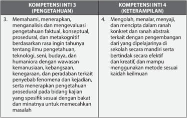

Tabel ini membandingkan dua kompetensi inti: Inti 3 (pengetahuan) dan Inti 4 (keterampilan). Topik utama tabel adalah tentang pengetahuan dan keterampilan dalam bidang ilmu pengetahuan, teknologi, seni, budaya, dan humaniora. Kolom pertama berisi kompetensi inti 3, yang berkaitan dengan pengetahuan, sementara kolom kedua berisi kompetensi inti 4, yang berkaitan dengan keterampilan. Data penting yang terlihat adalah bahwa kompetensi inti 3 melibatkan pemahaman, analisis, dan evaluasi pengetahuan teoretis, konseptual, prosedural, dan metakognitif tentang berbagai aspek ilmu pengetahuan, sedangkan kompetensi inti 4 melibatkan keterampilan dalam mengekspresikan, menyajikan, dan menciptakan pengetahuan tersebut dalam bentuk yang konkret dan abstrak, serta mampu menggunakan metode sesuai kebutuhan.

### REKAYASA

---
**📊 Tabel**

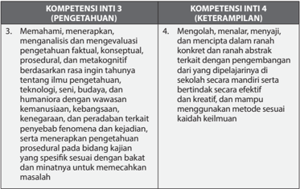

Tabel ini membandingkan dua kompetensi inti: Inti 3 (Pengetahuan) dan Inti 4 (Keterampilan). Topik utama tabel adalah tentang pengetahuan dan keterampilan dalam bidang ilmu pengetahuan dan teknologi, serta bidang humaniora. Kolom pertama berisi deskripsi tentang pengetahuan, seperti memahami, menerapkan, dan mengevaluasi pengetahuan faktual, konseptual, prosedural, dan metakognitif. Kolom kedua berisi deskripsi tentang keterampilan, seperti mengolah, menalar, menyajikan, mencipta, dan meraih pengetahuan secara efektif dan kreatif. Data penting yang terlihat adalah bahwa kompetensi inti 3 fokus pada pengetahuan, sedangkan kompetensi inti 4 fokus pada keterampilan. Ini menunjukkan bahwa pembelajaran tidak hanya melibatkan pengetahuan, tetapi juga keterampilan dalam menggunakan dan menerapkan pengetahuan tersebut.

 

---
## 📄 Halaman 14

### BUDI DAYA

---
**📊 Tabel**

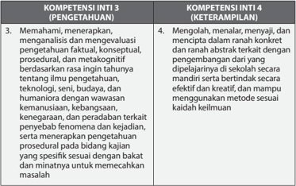

Tabel ini membandingkan dua kompetensi inti: Pengetahuan (INTI 3) dan Keterampilan (INTI 4). Topik utama adalah pengetahuan dan keterampilan dalam bidang teknologi, seni, budaya, dan humaniora dengan wawasan kemanusiaan, kebangsaan, keagamaan, dan peradaban terkait pengembangan. Kolom-kolomnya mencakup pemahaman, analisis, evaluasi, dan pengembangan konsep, prosedur, dan metakognitif. Data penting menunjukkan bahwa INTI 3 fokus pada pemahaman dan evaluasi pengetahuan, sementara INTI 4 lebih berfokus pada keterampilan dalam mengolah, menalar, menyajikan, dan menganalisis konsep secara abstrak. Ini menunjukkan perbedaan antara pengetahuan dan keterampilan dalam pembelajaran dan pengembangan.

### PENGOLAHAN

---
**📊 Tabel**

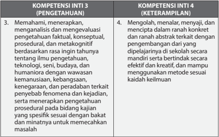

Tabel ini berisi dua kompetensi inti: Kompetensi Inti 3 (Pengenahuan) dan Kompetensi Inti 4 (Keterampilan). Topik utama tabel adalah tentang pengetahuan dan keterampilan dalam bidang teknologi, seni, budaya, dan humaniora. Kolom pertama, "Kompetensi Inti 3 (Pengenahuan)," mencakup empat poin utama:
1. Memahami, menerapkan, analisis, dan mengevaluasi pengetahuan faktual, konseptual, prosedural, dan metakognitif.
2. Mengolah, menalar, menyajikan, dan menciptakan ranah konkrit dan ranah abstrakt terkait dengan pengembangan dari ide yang dipecahkan di sekolah.
3. Mampu menyajikan pengetahuan faktual, konseptual, prosedural, dan metakognitif secara efektif dan kreatif.
4. Mampu menggunakan metode sesuai keadaan kelinmu.

Kolom kedua, "Kompetensi Inti 4 (Keterampilan)," juga memiliki empat poin utama:
1. Memahami, menerapkan, analisis, dan mengevaluasi pengetahuan faktual, konseptual, prosedural, dan metakognitif.
2. Mengolah, menalar, menyajikan, dan menciptakan ranah konkrit dan ranah abstrakt terkait dengan pengembangan dari ide yang dipecahkan di sekolah.
3. Mampu menyajikan pengetahuan faktual, konseptual, prosedural, dan metakognitif secara efektif dan kreatif.
4. Mampu menggunakan metode sesuai keadaan kelinmu.

Data atau pola penting yang terlihat adalah bahwa kedua kolom memiliki poin-poin yang sama, menunjukkan bahwa pengetahuan dan keterampilan dalam bidang teknologi, seni, budaya, dan humaniora harus dikuasai oleh individu.

 

---
## 📄 Halaman 15

### 3. Kompetensi Dasar (KD)

### KERAJINAN

---
**📊 Tabel**

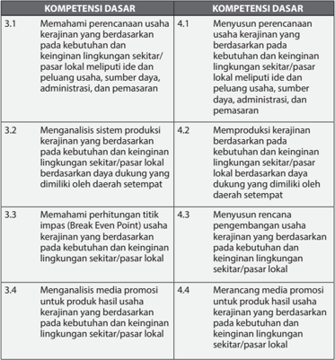

Tabel ini berisi informasi tentang kompetensi dasar yang relevan dengan usaha kerajinan di sekitar dan keinginan lingkungan lokal. Topik utamanya adalah tentang pengetahuan dan keterampilan yang diperlukan untuk memulai dan mengembangkan usaha kerajinan yang berbasis pada kebutuhan dan keinginan lingkungan sekitar. Kolom pertama menunjukkan topik-topik kompetensi dasar, sementara kolom kedua menunjukkan detail atau aspek-aspek spesifik dari setiap topik. Data penting yang terlihat adalah bahwa semua topik memiliki dua poin, masing-masing poin mencakup satu atau lebih aspek yang relevan dengan usaha kerajinan lokal. Ini menunjukkan bahwa tabel ini dirancang untuk memberikan pemahaman mendalam tentang berbagai aspek yang perlu diketahui dan dipelajari oleh individu yang ingin bergerak di bidang ini.

7

 

---
## 📄 Halaman 16

---
**📊 Tabel**

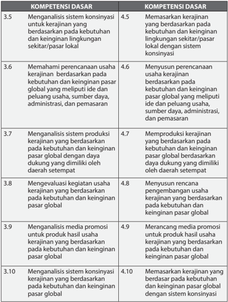

Tabel ini berisi informasi tentang kompetensi dasar yang relevan dengan pengembangan usaha kerajinan. Topik utamanya adalah analisis sistem konsinyasi untuk kerajinan berdasarkan kebutuhan dan keinginan pasar lokal dan global. Tabel dibagi menjadi dua kolom: Kolom 1 berisi kompetensi dasar yang berkaitan dengan kerajinan lokal, sedangkan Kolom 2 berisi kompetensi dasar yang berkaitan dengan kerajinan global. Data penting yang terlihat adalah bahwa setiap kompetensi dasar memiliki nomor yang unik, mulai dari 3.5 hingga 4.10, yang menunjukkan urutan atau prioritas dalam pembelajaran. Selain itu, tabel ini juga menunjukkan hubungan antara kompetensi dasar lokal dan global, yang menekankan pada perbedaan dalam pengetahuan dan keterampilan yang diperlukan untuk membangun usaha kerajinan di lingkungan lokal dan global.

8

 

---
## 📄 Halaman 17

### REKAYASA

---
**📊 Tabel**

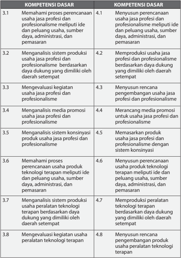

Tabel ini berisi informasi tentang kompetensi dasar yang relevan dengan usaha jasa profesional dan profesionalisme, serta usaha peralatan teknologi terapan. Topik utama tabel adalah tentang proses perencanaan, analisis sistem, evaluasi kegiatan, dan pengembangan usaha. Kolom-kolomnya mencakup ide dan peluang usaha, sumber daya, administrasi, pemasaran, rencana, dan pengembangan produk. Data penting yang terlihat adalah bahwa setiap kompetensi dasar memiliki dua sub-kompetensi, yang menunjukkan bahwa setiap kompetensi dasar memiliki dua aspek yang harus dipelajari. Pola penting lainnya adalah bahwa setiap kompetensi dasar memiliki tujuan yang sama, yaitu untuk membangun usaha jasa profesional dan profesionalisme, baik itu untuk usaha jasa profesional maupun usaha peralatan teknologi terapan.

9

 

---
## 📄 Halaman 18

---
**📊 Tabel**

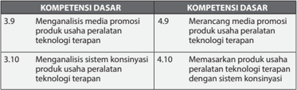

Tabel ini membandingkan dua kompetensi dasar: Menganalisis media promosi produk usaha peralatan teknologi terapan dan Memasarkan produk usaha peralatan teknologi terapan. Kolom pertama berisi nomor urut dari 3.9 hingga 4.10, sementara kolom kedua berisi deskripsi kompetensi tersebut. Data penting yang terlihat adalah bahwa kedua kompetensi ini memiliki nomor urut yang sama (3.9 dan 4.10), menunjukkan bahwa mereka mungkin merupakan dua bagian dari satu kompetensi lebih besar atau memiliki hubungan yang erat. Selain itu, kedua kolom memiliki deskripsi yang mirip, yang menunjukkan bahwa mereka mungkin memiliki tujuan atau fungsi yang serupa dalam konteks pembelajaran atau pengembangan keterampilan.

### BUDI DAYA

---
**📊 Tabel**

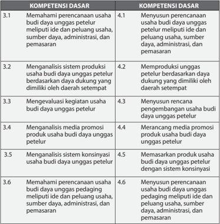

Tabel ini berisi informasi tentang kompetensi dasar yang harus dimiliki oleh individu dalam mengelola usaha budi daya unggas petelur. Topik utama tabel adalah tentang pengetahuan dan keterampilan yang diperlukan untuk memulai dan mengelola usaha tersebut. Kolom pertama menunjukkan nomor urut dari setiap kompetensi dasar, sementara kolom kedua menyajikan deskripsi singkat dari setiap kompetensi. Data penting yang terlihat adalah bahwa semua kompetensi dasar memiliki dua poin, yang menunjukkan bahwa setiap kompetensi dasar memiliki dua aspek yang harus dipelajari, yaitu pemahaman dan penggunaan. Ini menunjukkan bahwa pembelajaran dan praktik adalah dua hal yang penting dalam membangun kemampuan dalam bidang ini.

 

---
## 📄 Halaman 19

---
**📊 Tabel**

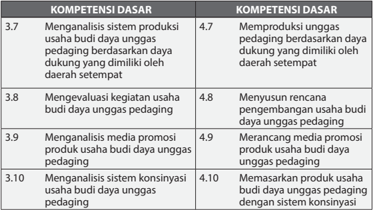

Tabel ini berisi informasi tentang kompetensi dasar yang berkaitan dengan usaha budi daya unggas pedaging. Topik utamanya adalah analisis dan pengembangan usaha budi daya unggas pedaging. Kolom pertama menunjukkan nomor urut kompetensi dasar, sedangkan kolom kedua menunjukkan deskripsi kompetensi tersebut. Data penting yang terlihat adalah bahwa semua kompetensi dasar memiliki angka 3 atau lebih, menunjukkan bahwa mereka merupakan kompetensi dasar yang penting untuk dikembangkan dalam proses pembelajaran. Selain itu, beberapa kompetensi dasar memiliki angka yang sama, seperti 4.7 dan 4.8, yang menunjukkan bahwa mereka memiliki keterkaitan atau hubungan yang kuat satu sama lain.

### PENGOLAHAN

---
**📊 Tabel**

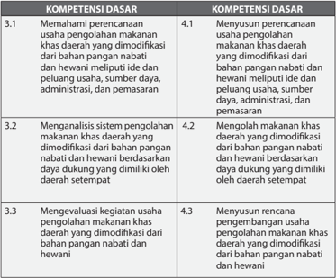

Tabel ini berisi informasi tentang kompetensi dasar yang harus dipenuhi oleh individu dalam mengelola usaha pengolahan makanan khas daerah yang dimodifikasi dari bahan pangan nabati dan hewani. Topik utama tabel ini adalah tentang pengetahuan dan keterampilan dasar yang diperlukan untuk memulai dan mengelola usaha tersebut. Kolom pertama menunjukkan kompetensi dasar yang harus dipenuhi, sedangkan kolom kedua menunjukkan kompetensi dasar yang relevan dengan setiap kompetensi dasar pertama. Data penting yang terlihat dalam tabel ini adalah bahwa semua kompetensi dasar memiliki dua kompetensi dasar yang relevan, yang menunjukkan bahwa individu harus memiliki pemahaman mendalam tentang usaha pengolahan makanan khas daerah yang dimodifikasi dari bahan pangan nabati dan hewani.

11

 

---
## 📄 Halaman 20

---
**📊 Tabel**

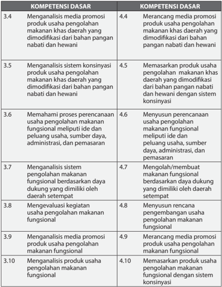

Tabel ini berisi informasi tentang kompetensi dasar yang harus dipenuhi oleh individu dalam bidang usaha pengolahan makanan khas daerah yang dimodifikasi dari bahan pangan nabati dan hewani. Topik utamanya adalah analisis dan manajemen usaha pengolahan makanan khas daerah tersebut. Kolom-kolomnya mencakup berbagai aspek seperti analisis media promosi, sistem konsinyasi, proses perencanaan, analisis sistem pengolahan, evaluasi kegiatan, analisis produk, dan manajemen usaha. Data penting yang terlihat adalah bahwa setiap kompetensi dasar memiliki skor minimal 4,4 hingga 4,9, menunjukkan bahwa semua aspek harus dipenuhi dengan tingkat keahlian tertentu.

 

---
## 📄 Halaman 21

### 4. Struktur KI dan KD Prakarya dan Kewirausahaan Kelas XII

### KERAJINAN

---
**📊 Tabel**

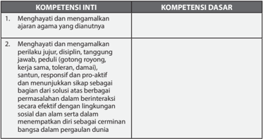

Tabel ini berisi dua kolom utama: Kompetensi Inti dan Kompetensi Dasar. Topik utama tabel adalah tentang pengembangan karakter dan perilaku yang diharapkan dari siswa. Dalam kolom Kompetensi Inti, terdapat dua poin utama yang mencakup penghayatan dan menerapkan nilai-nilai agama yang dianutnya, serta menghargai dan mempromosikan perilaku jujur, disiplin, tanggung jawab, peduli (gotong royong), kerjasama, kejujuran, sabar, responsif, dan menunjukkan sikap sebagai bagian dari solusi atas berbagai masalah. Sedangkan dalam kolom Kompetensi Dasar, terdapat penekanan pada keterampilan berinteraksi secara efektif dengan lingkungan sosial dan alam serta menempatkan diri sebagai cerminan bangsa dalam pengalaman dunia. Pola penting yang terlihat adalah bahwa tabel ini mencakup aspek-aspek yang melibatkan pengembangan karakter, nilai-nilai moral, dan interaksi sosial yang positif.

 

---
## 📄 Halaman 22

---
**📊 Tabel**

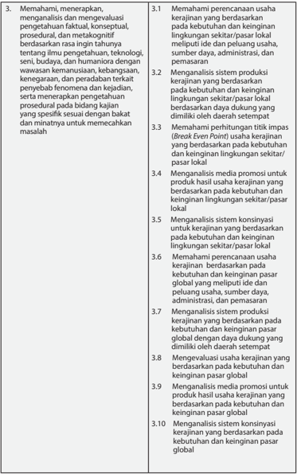

Tabel ini berisi instruksi untuk mempelajari dan menerapkan pengetahuan faktil, konseptual, dan metakognitif tentang ilmu pengetahuan, teknologi, seni, budaya, dan manusia dengan wawasan kemanusiaan, kebangsaan, kesejahteraan, dan peradaban terkait pembangunan daerah. Topik utamanya meliputi memahami perencanaan usaha kerajinan berdasarkan kebutuhan dan keinginan lingkungan sekitar/pasar lokal, analisis sistem produksi kerajinan berdasarkan kebutuhan dan keinginan lingkungan sekitar/pasar lokal, memahami perhitungan titik impas (Break Even Point) usaha kerajinan berdasarkan kebutuhan dan keinginan lingkungan sekitar/pasar lokal, analisis media promosi untuk produk hasil usaha kerajinan berdasarkan kebutuhan dan keinginan lingkungan sekitar/pasar lokal, analisis sistem konsinyasi untuk kerajinan berdasarkan kebutuhan dan keinginan lingkungan sekitar/pasar lokal, memahami perencanaan usaha kerajinan berdasarkan kebutuhan dan keinginan pasar global, analisis media promosi untuk produk hasil usaha kerajinan berdasarkan kebutuhan dan keinginan pasar global, dan analisis sistem konsinyasi kerajinan berdasarkan kebutuhan dan keinginan pasar global. Kolom-kolomnya mencakup proses pemahaman, analisis, dan evaluasi berbagai aspek usaha kerajinan, termasuk perencanaan, produksi, promosi, dan konsinyasi. Data penting yang terlihat adalah bahwa setiap proses ini harus dilakukan secara berurutan dan terintegrasi untuk mencapai tujuan akhir, yaitu membangun dan memperluas usaha kerajinan yang berkelanjutan dan bermanfaat bagi masyarakat.

 

---
## 📄 Halaman 23

---
**📊 Tabel**

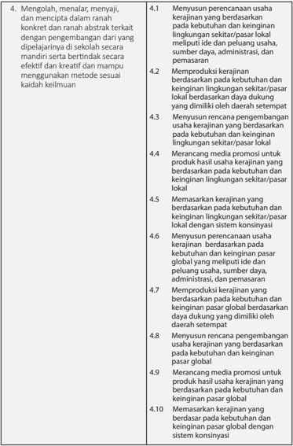

Tabel ini berisi informasi tentang proses pengembangan usaha kerajinan, mencakup perencanaan, produksi, promosi, dan pemasaran. Topik utama adalah proses pengembangan usaha kerajinan, yang meliputi perencanaan usaha, produksi kerajinan, merancang media promosi, dan memasarkan kerajinan. Kolom-kolomnya mencakup tahapan-tahapan dalam proses tersebut, seperti perencanaan usaha, produksi kerajinan, merancang media promosi, dan memasarkan kerajinan. Data penting yang terlihat adalah bahwa setiap tahap memiliki tujuan spesifik, seperti perencanaan usaha yang mencakup kebutuhan dan keinginan pasar lokal, produksi kerajinan yang mencakup sumber daya, administrasi, dan pemasaran, merancang media promosi untuk produk hasil kerajinan, dan memasarkan kerajinan yang mencakup kebutuhan dan keinginan pasar global.

 

---
## 📄 Halaman 24

### REKAYASA

---
**📊 Tabel**

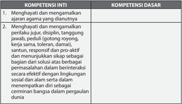

Tabel ini berisi dua kolom utama: Kompetensi Inti dan Kompetensi Dasar. Topik utama tabel adalah tentang kompetensi yang diperlukan untuk menghargai dan membangun hubungan yang baik dengan orang lain, terutama dalam konteks interaksi sosial dan lingkungan alam. Kolom Kompetensi Inti mencakup dua poin utama: menghargai dan mengamalkan ajaran agama yang dianutnya, serta menghargai dan mengamalkan perilaku jujur, disiplin, tanggung jawab, peduli, peduli (getor), rongyong, kerja keras, tulus, dan proaktif. Sementara itu, kolom Kompetensi Dasar mencakup bagaimana seseorang dapat menjadi bagian dari solusi atas berbagai masalah dalam berinteraksi secara efektif, baik di lingkungan sosial maupun alam, serta menempatkan diri sebagai penantang bangsa dalam pergaulan dunia. Data atau pola penting yang terlihat adalah bahwa tabel ini mencakup dua aspek utama dari kompetensi yang diperlukan untuk menjaga hubungan harmonis dan berkelanjutan dalam berbagai lingkungan sosial dan alam.

 

---
## 📄 Halaman 25

---
**📊 Tabel**

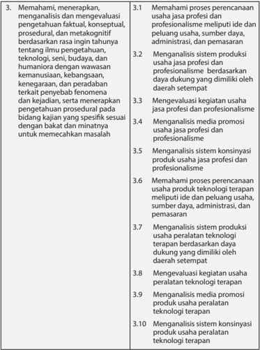

Tabel ini berisi informasi tentang proses pengetahuan, profesionalisme, dan evaluasi usaha jasa dan produk. Topik utamanya meliputi pemahaman proses perencanaan, analisis sistem produksi, evaluasi kegiatan, analisis media promosi, dan analisis sistem konsinyasi. Kolom-kolomnya mencakup proses perencanaan, analisis sistem produksi, evaluasi kegiatan, analisis media promosi, dan analisis sistem konsinyasi. Data penting yang terlihat adalah bahwa setiap baris menunjukkan satu aspek dari proses tersebut, seperti pemahaman proses perencanaan, analisis sistem produksi, evaluasi kegiatan, analisis media promosi, dan analisis sistem konsinyasi. Pola penting adalah bahwa setiap aspek ini disusun secara teratur dan mencakup semua aspek dari proses tersebut.

 

---
## 📄 Halaman 26

---
**📊 Tabel**

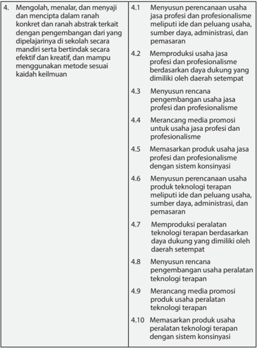

Tabel ini berisi instruksi untuk mengembangkan usaha jasa profesional dan profesionalisme, dengan fokus pada pengembangan usaha secara mandiri dan berbasis kreativitas. Topik utama adalah tentang perencanaan, produksi, dan pemasaran usaha jasa profesional dan profesionalisme. Kolom-kolomnya mencakup proses perencanaan, produksi, dan pemasaran usaha jasa profesional dan profesionalisme, termasuk menyiapkan rencana, memproduksi produk, merancang media promosi, dan memasarkan produk. Data penting yang terlihat adalah bahwa semua proses ini harus dilakukan secara mandiri dan berbasis kreativitas, menunjukkan bahwa tujuan adalah untuk mengembangkan usaha jasa profesional dan profesionalisme secara mandiri dan berbasis kreativitas.

 

---
## 📄 Halaman 27

### BUDI DAYA

---
**📊 Tabel**

Tabel ini berisi informasi tentang kompetensi inti dan dasar yang harus dimiliki oleh individu dalam konteks agama dan interaksi sosial. Topik utamanya adalah tentang bagaimana menghargai dan mematuhi ajaran agama, serta bagaimana menunjukkan sikap positif dalam berinteraksi dengan orang lain. Kolom "Kompetensi Inti" mencakup dua poin utama: menghargai dan mematuhi ajaran agama, serta menghargai perilaku jujur, disiplin, tanggung jawab, pebedaan, kerja sama, toleransi, dan proaktif. Sementara itu, kolom "Kompetensi Dasar" mencakup empat poin utama: jujur, disiplin, tanggung jawab, dan kerja sama. Data penting yang terlihat adalah bahwa semua kompetensi inti dan dasar tersebut berkaitan erat dengan sikap positif dan interaksi sosial yang efektif.

 

---
## 📄 Halaman 28

---
**📊 Tabel**

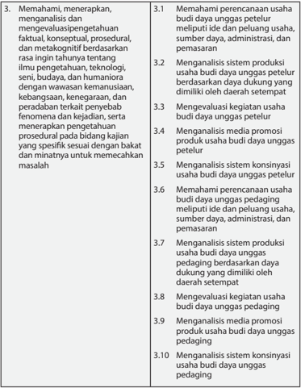

Tabel ini berisi instruksi untuk memahami, mengevaluasi, dan menganalisis berbagai aspek usaha budaya unggas petelur dan pedagang. Topik utamanya meliputi perencanaan, sistem produksi, media promosi, dan konsinyasi. Kolom pertama menyajikan tugas-tugas yang harus dilakukan, sementara kolom kedua memberikan detail tentang setiap tugas tersebut. Data penting yang terlihat adalah bahwa setiap tugas mencakup analisis dan evaluasi berbagai aspek usaha, mulai dari ide dan peluang usaha hingga administrasi dan pemasaran. Ini menunjukkan bahwa tabel ini bertujuan untuk membantu individu atau tim dalam memahami dan mengelola usaha budaya unggas secara efektif.

 

---
## 📄 Halaman 29

---
**📊 Tabel**

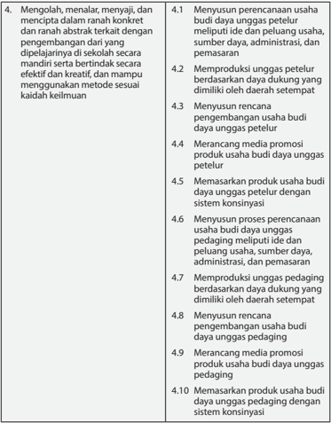

Tabel ini berisi instruksi untuk mengembangkan usaha petelur unggas dengan memperhatikan aspek-aspek penting seperti perencanaan, produksi, promosi, dan pemasaran. Topik utama adalah mengembangkan usaha petelur unggas secara mandiri dan efektif. Kolom pertama menunjukkan tugas-tugas yang harus dilakukan, sedangkan kolom kedua menjelaskan langkah-langkah atau proses yang harus dijalani untuk mencapai tujuan tersebut. Data penting yang terlihat adalah bahwa semua tugas melibatkan pengembangan usaha secara mandiri dan efektif, baik itu dalam hal produksi, promosi, maupun pemasaran.

 

---
## 📄 Halaman 30

### PENGOLAHAN

---
**📊 Tabel**

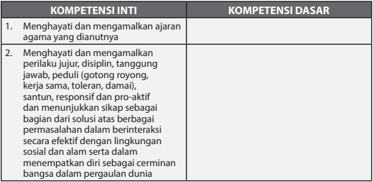

Tabel ini berisi informasi tentang kompetensi inti dan dasar yang harus dimiliki oleh individu dalam konteks agama dan perilaku sosial. Topik utamanya adalah tentang bagaimana seseorang dapat menghormati dan membangun hubungan yang baik dengan agama dan masyarakat sekitarnya. Kolom pertama, "Kompetensi Inti", mencakup dua poin utama: menghargai dan mengamalkan ajaran agama yang dianutnya, serta menghargai dan menunjukkan perilaku jujur, disiplin, tanggung jawab, kerja sama, toleransi, dan responsif. Kolom kedua, "Kompetensi Dasar", mencakup empat poin penting: kerja keras, toleransi, dan proaktif, serta menunjukkan sikap baik dalam berinteraksi secara efektif dengan lingkungan sosial dan alam serta memiliki kemampuan untuk beradaptasi dalam pergaulan dunia. Pola penting yang terlihat adalah bahwa tabel ini mencakup dua aspek utama dari kompetensi, yaitu inti dan dasar, serta menekankan pentingnya menghargai dan menunjukkan perilaku positif dalam berbagai situasi.

 

---
## 📄 Halaman 31

---
**📊 Tabel**

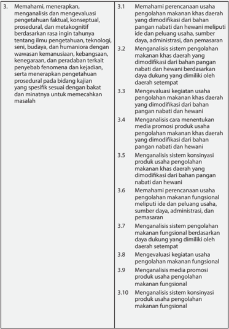

Tabel ini berisi informasi tentang proses pengolahan makanan khas daerah yang dimodifikasi dari bahan pangan nabati dan hewani. Topik utamanya adalah pemahaman, analisis, dan evaluasi pengolahan makanan khas daerah. Kolom-kolomnya mencakup: 1) Memahami perencanaan usaha pengolahan makanan khas daerah yang dimodifikasi dari bahan pangan nabati dan hewani meliputi ide dan peluang usaha, sumber daya, administrasi, dan pemasaran; 2) Analisis sistem pengolahan makanan khas daerah yang dimodifikasi dari bahan pangan nabati dan hewani; 3) Evaluasi kegiatan usaha pengolahan makanan khas daerah yang dimodifikasi dari bahan pangan nabati dan hewani; 4) Menentukan media promosi produk usaha pengolahan makanan khas daerah yang dimodifikasi dari bahan pangan nabati dan hewani; 5) Menganalisis sistem konsinyasi produk usaha pengolahan makanan khas daerah yang dimodifikasi dari bahan pangan nabati dan hewani; 6) Mengenali sistem pengolahan makanan khas daerah yang dimodifikasi dari bahan pangan nabati dan hewani; 7) Menganalisis media promosi produk usaha pengolahan makanan khas daerah yang dimodifikasi dari bahan pangan nabati dan hewani; dan 8) Menganalisis sistem konsinyasi produk usaha pengolahan makanan khas daerah yang dimodifikasi dari bahan pangan nabati dan hewani. Data penting yang terlihat adalah bahwa setiap kolom memiliki tujuan spesifik dalam proses pengolahan makanan khas daerah yang dimodifikasi dari bahan pangan nabati dan hewani.

 

---
## 📄 Halaman 32

---
**📊 Tabel**

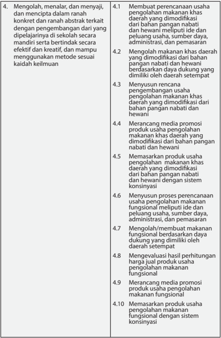

Tabel ini berisi instruksi untuk mengembangkan usaha makanan khas daerah yang dimodifikasi dari bahan pangan nabati dan hewani. Topik utamanya adalah pengembangan usaha makanan khas daerah yang dimodifikasi dari bahan pangan nabati dan hewani. Kolom-kolomnya mencakup proses perencanaan usaha, merancang media promosi produk usaha, memasarkan produk usaha, dan mengevaluasi hasil pelestarian hanyut. Data penting yang terlihat adalah bahwa setiap proses memiliki tujuan spesifik, mulai dari membuat perencanaan usaha hingga evaluasi hasil pelestarian hanyut.

 

---
## 📄 Halaman 33

### B.  Karakteristik Mata Pelajaran Prakarya dan Kewirausahaan

### 1. Hakikat Mata Pelajaran Prakarya dan Kewirausahaan

Prakarya dapat dipahami sebagai pra-karya, yaitu sebuah proses sebelum terjadinya sebuah karya, termasuk di dalamnya pembinaan apresiasi dan produksi karya. Prakarya melatih keterampilan dan kecakapan hidup, yang dalam mata pelajaran ini dibagi menjadi 4 cabang/jalur yaitu Kerajinan, Rekayasa, Budi daya, dan Pengolahan. Pada masing-masing cabang/jalur, pengajaran  meliputi  pengetahuan  dan  keterampilan  membuat,  serta memproduksi dengan beragam teknik dan material.

Kewirausahaan, atau sebelumnya dikenal dengan kewiraswastaan. Kewiraswastaan  terbentuk  dari  kata  wira:  utama,  gagah  berani,  luhur; swa:  sendiri;  sta:  berdiri;  usaha:  kegiatan  produktif.  Di  Indonesia  kata wiraswasta sering diartikan sebagai orang-orang yang tidak bekerja pada sektor pemerintah yaitu; para pedagang, pengusaha, dan orang-orang yang  bekerja  di  perusahaan  swasta,  sedangkan  wirausahawan  adalah orang-orang  yang  mempunyai  usaha  sendiri.  Wirausahawan  adalah orang yang berani membuka kegiatan produktif yang mandiri. Pada mata pelajaran Prakarya dan Kewirausahaan, peserta diarahkan untuk memiliki keberanian  dalam  menggunakan  daya  kreatif,  produktif,  dan  mandiri agar pada saatnya mampu membuat usaha mandiri atau berwirausaha.

Mata  pelajaran  Prakarya  dan  Kewirausahaan  akan  menumbuhkan  dan mendorong  peserta  didik  melakukan  proses  mengapresiasi,  belajar dan  berkarya,  serta  membekali  peserta  didik  dengan  pengetahuan berwirausaha yang didasari dengan kreativitasnya melihat potensi dan peluang  yang  khas  yang  ada  di  lingkungan  daerah  setempat.  Setiap daerah  memiliki  karakter,  peluang,  serta  potensi  yang  berbeda-beda dan  unik.  Pada  pembelajaran  Prakarya  dan  Kewirausahaan,  satuan pendidikan dapat memilih 2 (dua) cabang/jalur saja yang sesuai dengan potensi  lingkungan  daerah  setempat.  Dua  cabang  atau  jalur  tersebut diwajibkan untuk digunakan dalam satu tahun ajaran. Satuan pendidikan diperkenankan pula untuk menerapkan 4 (empat) cabang/jalur, selama satuan pendidikan mampu menyediakan jam tambahan.

Keempat cabang dari mata pelajaran Prakarya dan Kewirausahaan memiliki karakteristik pembelajaran yang berbeda sehingga memengaruhi kebutuhan  waktu  (durasi)  pembelajaran/jam  pertemuan  dari  setiap cabang.  Cabang  Budi  daya  memerlukan  jangka  waktu  tertentu  untuk pertumbuhan  atau  perkembangbiakan.  Sementara  cabang  Kerajinan, Rekayasa  dan  Pengolahan  memerlukan  jangka  waktu  yang  relatif lebih  singkat  dalam  setiap  tahapan  prosesnya.  Bila  cabang  Budi  daya merupakan salah satu yang dipilih, pada pelaksanaan pembelajarannya dapat dilakukan secara berselang-seling dengan cabang lainnya. Pengaturan waktu dilakukan oleh satuan pendidikan, sesuai karakteristik pembelajarannya,  agar  tujuan  pembelajaran  dari  kedua  cabang  yang dipilih dapat tercapai.

 

---
## 📄 Halaman 34

---
**🖼️ Gambar/Diagram**

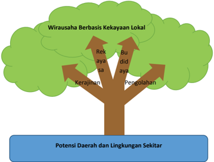

> **Deskripsi Visual:** Gambar ini adalah ilustrasi yang menunjukkan hubungan antara potensi daerah dan lingkungan sekitar dengan wirausaha berbasis kekayaan lokal. Ilustrasi ini menggunakan pohon sebagai simbol untuk menunjukkan hubungan antara berbagai aspek ekonomi dan sosial.

1. **Apa yang Ditampilkan Secara Keseluruhan**: Gambar ini menggambarkan sebuah pohon besar yang memiliki beberapa cabang. Setiap cabang mewakili aspek ekonomi dan sosial yang berhubungan dengan wirausaha berbasis kekayaan lokal.

2. **Elemen-Elemen Utama dan Relasinya**: 
   - **Cabang Pohon**: Cabang pohon ini melambangkan berbagai aspek ekonomi dan sosial yang berhubungan dengan wirausaha berbasis kekayaan lokal.
   - **Bulu-bulu Pohon**: Bulu-bulu pohon ini menunjukkan bahwa semua aspek tersebut berasal dari potensi daerah dan lingkungan sekitar.
   - **Ketebalan Pohon**: Ketebalan pohon menunjukkan bahwa semua aspek ini saling terkait dan mempengaruhi satu sama lain.

3. **Teks, Angka, atau Label Penting yang Terlihat**:
   - **Label**: "Potensi Daerah dan Lingkungan Sekitar" berada di dasar pohon.
   - **Label Cabang**: "Wirausaha Berbasis Kekayaan Lokal", "Rekayasa", "Bu didaya", "Pengolahan", dan "Kerajinan".

4. **Informasi Kunci yang Dapat Diambil Pembaca**:
   - Gambar ini menunjukkan bahwa wirausaha berbasis kekayaan lokal tidak hanya tergantung pada diri sendiri, tetapi juga terkait dengan potensi daerah dan lingkungan sekitar.
   - Semua aspek ekonomi dan sosial yang terlibat dalam wirausaha berbasis kekayaan lokal memiliki hubungan yang erat dengan potensi daerah dan lingkungan sekitar.

Dengan demikian, gambar ini menggambarkan bahwa wirausaha berbasis kekayaan lokal harus berfokus pada potensi daerah dan lingkungan sekitar untuk sukses.

Sumber: Kemdikbud, 2016

Pada  buku  ini  terdapat  prinsip-prinsip  dasar  dari  pengenalan  material dan  proses  produksi.  Materi  yang  terdapat  pada  buku  teks  ini  sangat memungkinkan  untuk  diperkaya  dan  dikembangkan  sesuai  dengan potensi lokal daerah setempat yang terkait dengan ketersediaan bahan, keberadaan industri atau sentra industri, teknik tradisional setempat, dan lain-lain.  Proses  pembelajaran  Prakarya  dan  Kewirausahaan  mengatur lingkungan  yang  ada  di sekitar,    memfasilitasi  dan  membimbing peserta  didik,  sehingga  terdorong  untuk  memperoleh  pengetahuan, keterampilan, daya kreatif, disiplin, serta keberanian mengambil keputusan dan kemampuan bekerja mandiri maupun dalam kelompok.

### 2. Fungsi dan Tujuan Mata Pelajaran Prakarya dan Kewirausahaan

Mata  Pelajaran  Prakarya  dan  Kewirausahaan  dapat  digolongkan  ke dalam pengetahuan transcience-knowledge , yaitu  mengembangkan pengetahuan  dan  melatih  keterampilan  kecakapan  hidup  berbasis seni, teknologi, dan ekonomi. Pembelajaran ini berawal dengan melatih kemampuan ekspresi-kreatif untuk menuangkan ide dan gagasan agar

 

---
## 📄 Halaman 35

menyenangkan  orang  lain,  dan  dirasionalisasikan  secara  teknologis sehingga keterampilan tersebut bermuara apresiasi teknologi terbarukan, hasil  ergonomis dan aplikatif dalam memanfaatkan lingkungan sekitar dengan  memperhatikan  dampaknya  terhadap  ekosistem,  manajemen, dan ekonomis.

### Fungsi

Kehidupan  dan  berkehidupan  manusia  membutuhkan  keterampilan tangan  untuk  memenuhi  standar  minimal  dan  kehidupan  sehari-hari sebagai kecakapan hidup. Keterampilan harus menghasilkan karya yang menyenangkan bagi dirinya maupun orang lain, serta mempunyai nilai kemanfaatan  yang  sesungguhnya,  maka  pelatihan  berkarya  dengan menyenangkan harus dimulai dengan memahami estetika (keindahan) sebagai dasar penciptaan karya selanjutnya. Pelatihan mencipta, memproduksi, dan memelihara karya dalam memperoleh nilai kebaruan ( novelty ) akan bermanfaat untuk kehidupan manusia selanjutnya. Prinsip mencipta, yaitu memproduksi (membuat) dan mereproduksi (membuat ulang) diharapkan meningkatkan kepekaan terhadap kemajuan zaman sekaligus  mengapresiasi  teknologi  kearifan  lokal  yang  telah  mampu mengantarkan  manusia  Indonesia  mengalami  kejayaan  di  masa  lalu. Oleh  karenanya,  pembelajaran  Prakarya  dan  Kewirausahaan  di  tingkat sekolah  lanjutan  atas  didahului  dengan  wawasan  tentang  kearifan lokal di lingkungan sekitar menuju teknologi terbarukan. Pembelajaran dimulai dengan memahami fakta, prosedur, konsep, maupun teori yang ada melalui studi perorangan, kelompok, maupun proyek agar memberi dampak kepada pendidikan karakter yang berupa kecerdasan kolektif. Hasil pembelajaran melalui eksplorasi alami maupun buatan ( artifi  cial ) ini akan memanfaatkan sebagai media sekaligus bahan pelajaran.

---
**🖼️ Gambar/Diagram**

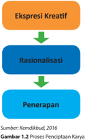

> **Deskripsi Visual:** Gambar tersebut adalah diagram yang menunjukkan proses pengetahuan dalam pendidikan kreatif. Gambar ini terdiri dari empat langkah yang disusun secara horizontal:

1. Langkah pertama, "Ekspresi Kreatif", menunjukkan tahap awal di mana individu menghasilkan ide atau karya kreatif.
2. Langkah kedua, "Rasionalisasi", menunjukkan tahap di mana ide-ide tersebut dipertimbangkan dan dianalisis untuk kebaikan.
3. Langkah ketiga, "Penerapan", menunjukkan tahap di mana hasil rasionalisasi diimplementasikan dalam praktik.
4. Langkah keempat, "Gambaran", menunjukkan hasil akhir dari proses ini.

Elemen-elemen utama dalam gambar ini adalah empat langkah yang disusun secara horizontal. Setiap langkah memiliki nama yang jelas dan terhubung dengan elemen-elemen lainnya melalui garis yang menghubungkannya. Teks, angka, atau label penting yang terlihat adalah nama-nama dari empat langkah tersebut.

Informasi kunci yang dapat diambil pembaca adalah bahwa proses pengetahuan dalam pendidikan kreatif melibatkan empat langkah utama: ekspresi kreatif, rasionalisasi, penerapan, dan gambaran. Ini menunjukkan bahwa proses ini melibatkan perubahan dari ide kreatif menjadi implementasi yang efektif.

 

---
## 📄 Halaman 36

### Tujuan

Tujuan Prakarya dan Kewirausahaan dapat diuraikan sebagai berikut.

- Memfasilitasi peserta didik berekspresi kreatif melalui keterampilan teknik berkarya ergonomis, teknologi, dan ekonomis.
- Melatih  keterampilan  mencipta  karya  berbasis  estetika,  artistik, ekosistem, dan teknologis
- Melatih memanfaatkan media dan bahan berkarya seni dan teknologi melalui  prinsip  kreatif,  ergonomis,  higienis,  tepat-cekat-cepat,  dan berwawasan lingkungan
- Menghasilkan  karya  yang  siap  dimanfaatkan  dalam  kehidupan, bersifat pengetahuan maupun landasan pengembangan berdasarkan teknologi kearifan lokal maupun teknologi terbarukan.
- Menumbuhkembangkan jiwa wirausaha melalui melatih dan mengelola  penciptaan  karya  (produksi),  mengemas,  dan  usaha menjual berdasarkan prinsip ekonomis, ergonomis, dan berwawasan lingkungan

---
**🖼️ Gambar/Diagram**

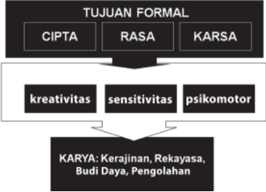

> **Deskripsi Visual:** Gambar ini adalah diagram yang menunjukkan struktur dan hubungan antara tujuan formal, elemen-elemen kreativitas, sensitivitas, dan psikomotor, serta karya yang berkaitan dengan kerajinan, rekayasa, budi daya, dan pengolahan. Tujuan formal terdiri dari CIPTA (Cipta, Rasa, Karsa), yang masing-masing terdiri dari kreativitas, sensitivitas, dan psikomotor. Elemen-elemen ini saling terkait dan berfungsi sebagai dasar untuk menghasilkan karya-karya yang berkaitan dengan bidang-bidang tersebut. Teks, angka, atau label penting yang terlihat meliputi nama-nama tujuan formal, elemen-elemen kreativitas, sensitivitas, dan psikomotor, serta karya yang berkaitan. Informasi kunci yang dapat diambil pembaca adalah bahwa tujuan formal mencakup CIPTA, RASA, dan KARS, yang kemudian terbagi menjadi kreativitas, sensitivitas, dan psikomotor, yang merupakan dasar untuk menghasilkan karya-karya yang berkaitan dengan bidang-bidang seperti kerajinan, rekayasa, budi daya, dan pengolahan.

Sumber: Kemdikbud, 2016

 

---
## 📄 Halaman 37

### 3. Ruang Lingkup Mata Pelajaran Prakarya dan Kewirausahaan pada Jenjang SMA/MA

Lingkup materi pelajaran Prakarya di SMA sederajat disesuaikan dengan potensi  sekolah  dan  daerah  setempat,  karena  sifat  mata  pelajaran ini  menyesuaikan  dengan  kondisi  dan  potensi  yang  ada  di  daerah tersebut.  Penyesuaian  ini  berangkat  dari  pemikiran  ekonomis,  budaya, dan sosiologis. Ekonomis, karena pada tingkat usia remaja sudah harus dibekali dengan prinsip kewirausahaan agar dapat tercapai kemandirian paska sekolah. Budaya yaitu pengembangan materi kearifan lokal melalui prakarya. Sosiologis, karena  teknologi  tradisi  mempunyai  nilai-nilai kecerdasan kolektif bangsa Indonesia. Pada mata pelajaran Prakarya dan Kewirausahaan terdapat empat (4) cabang yaitu Kerajinan, Rekayasa, Budi daya,  dan  Pengolahan.  Penjelasan  ruang  lingkup  dari  masing-masing cabang tersebut adalah sebagai berikut.

### 1. Kerajinan dan Kewirausahaan

Kerajinan mengandalkan keterampilan tangan dan keunikan karakter material  yang  digunakan  untuk  menghasilkan  produk  dengan nilai  estetis  dan  berfungsi  dengan  baik.  Potensi  Indonesia  dalam bidang kerajinan sangatlah besar. Hal tersebut membuka peluang bagi  peserta  didik  untuk  mengembangkan  wirausaha  kerajinan saat  sudah  lepas  dari  bangku  sekolah. Wirausaha  selalu  menuntut kebaruan dan kreativitas dalam berkarya. Oleh karena itu, pendidikan Prakarya  dan  Kewirausahaan  cabang  Kerajinan  melatih  peserta didik  untuk  jeli  melihat  peluang  pasar  dan  berpikir  kreatif  dalam pengembangan teknik keterampilan dan pengolahan material lokal. Kerajinan erat pula terkait dengan nilai pendidikan yang diwujudkan dalam prosedur pembuatan. Prosedur memproduksi dilalui dengan berbagai  tahapan  dan  beberapa  langkah  yang  dilakukan  oleh beberapa  orang.  Kinerja  ini  menumbuhkan  wawasan,  toleransi sosial, serta kemampuan bersosialisasi memulai pemahaman karya orang  lain.  Contohnya  pada  pembuatan  karya  kerajinan.  Pembuat pola dikerjakan oleh perancang gambar dilanjutkan dengan pewarnaan  sesuai  dengan  warna  lokal  (kearifan  lokal)  merupakan proses berangkai dan membutuhkan kesabaran dan ketelitian serta penuh toleransi. Jika salah seorang membuat kesalahan, maka hasil akhir  tidak  akan  seperti  yang  diharapkan  oleh  pembuat  pola  dan motif  hiasnya.  Prosedur  semacam  ini  memberikan  nilai  edukatif jika  dilaksanakan  di  sekolah.  Kerajinan  yang  diproduksi  maupun direproduksi dikemas ulang dengan sistem teknologi dan ekosistem agar efektif dan efi  sien berdasarkan potensi lingkungan yang ada.

 

---
## 📄 Halaman 38

### 2. Rekayasa dan Kewirausahaan

Rekayasa diartikan sebagai usaha  memecahkan  permasalahan kehidupan sehari-hari dengan berpikir rasional dan kritis sehingga menemukan solusi melalui kerangka kerja yang efektif dan efi  sien. Kegiatan  pemecahan  masalah  diawali  dengan  kepekaan  melihat masalah yang ada  di  lingkungan  sekitar  dan  memahami  prinsip-prinsip rekayasa. Ide kreatif dan kemampuan merekayasa menggabungkan prinsip-prinsip rekayasa tersebut untuk  memecahkan  masalah yang  ada.  Produk  hasil  rekayasa  selain  berfungsi  baik,  juga  harus memperhatikan unsur manusia sebagai penggunanya. Oleh karena itu,  produk  rekayasa  harus  aman  dan  nyaman  digunakan  oleh penggunanya. Kata 'rekayasa' merupakan terjemahan bebas dari kata engineering yaitu perancangan dan rekonstruksi benda atau produk untuk memungkinkan penemuan produk baru yang lebih berperan dan  berkegunaan.  Prinsip  rekayasa  adalah  menggunakan  prinsipprinsip sistem, bahan, serta ide yang disesuaikan dengan kebutuhan pemecahan  masalah  dan  perkembangan  zaman.  Oleh  karenanya, rekayasa  harus  seimbang  dan  selaras  dengan  kondisi  dan  potensi daerah  setempat  menuju  karya  inovatif  yang  mempunyai  nilai manfaat  dan  keterjualan  yang  tinggi.  Kemampuan  berpikir  secara rekayasa yang merupakan paduan berpikir kreatif-kritis dan rasionalsistematis akan memberikan bekal kepada peserta didik untuk kelak menjadi wirausahawan di bidang produksi atau penyedia jasa bidang rekayasa.

### 3. Budi daya dan Kewirausahaan

Budi daya berpangkal pada kultivasi ( cultivation ),  yaitu  suatu  kerja yang berusaha untuk menambah, menumbuhkan, dan mewujudkan benda ataupun makhluk agar lebih besar (tumbuh) dan berkembang (menjadi banyak). Kinerja ini membutuhkan  perasaan seolah dirinya  (pembudi  daya)  hidup,  tumbuh,  dan  berkembang.  Prinsip pembinaan  rasa  dalam  kinerja  budi  daya  ini  akan  memberikan hidup pada tumbuhan atau hewan. Namun, dalam bekerja dibutuhkan sistem yang berjalan rutinitas, seperti kebiasaan hidup orang: makan, minum, dan bergerak. Seorang pembudi daya harus memahami karakter tumbuhan atau hewan yang di'budi daya'kan. Konsep cultivation tampak  pada  penyatuan  diri  dengan  alam  dan pemahaman tumbuhan atau binatang. Pemikiran ekosistem menjadi langkah  yang  selalu  dipikirkan  keseimbangan  hidupnya.  Manfaat edukatif  budi  daya  ini  adalah  pembinaan  perasaan,  pembinaan kemampuan  memahami  pertumbuhan  dan  menyatukan  dengan alam ( echosystem ) menjadikan anak dan tenaga kerja yang berpikir sistematis, namun manusiawi dan kesabaran. Hasil budi daya tidak akan dapat dipetik dalam waktu singkat, melainkan membutuhkan waktu  dan  harus  diawasi  dengan  penuh  kesabaran.  Bahan  dan perlengkapan  teknologi  budi  daya  sebenarnya  dapat  diangkat

 

---
## 📄 Halaman 39

dari  kehidupan  sehari-hari  yang  variatif,  karena  masing-masing daerah mempunyai potensi kearifan yang berbeda. Budi daya telah dilakukan oleh pendahulu bangsa ini dengan teknologi tradisi yang memperhitungkan musim. Namun, konsep yang disamakan belum mempunyai  standar  ketepatan  dengan  suasana/iklim,  cuaca,  dan ekonomi yang sedang berkembang. Oleh karena itu, pembelajaran prakarya-budi daya diharapkan mampu menemukan ide pengembangan berbasis bahan tradisi  dengan  memperhitungkan keberlanjutan  materi  atau  bahan.  Keterampilan  melakukan  budi daya  dan  menghayati  proses  kultivasi  memberikan  bekal  kepada peserta didik untuk mampu menjadi wirausahawan di bidang budi daya yang sesuai dengan kondisi alam dan lingkungan sekitarnya.

### 4. Pengolahan dan Kewirausahaan

Pengolahan artinya membuat atau menciptakan bahan dasar menjadi benda produk jadi agar dapat digunakan untuk kegiatan produksi dan  bermanfaat  secara  luas.  Pada  prinsipnya  kerja  pengolahan adalah mengubah benda mentah menjadi produk matang dengan mencampur  atau  memodifi  kasi  bahan  tersebut.  Oleh  karenanya, kerja  pengolahan  menggunakan  sistem  desain,  yaitu  mengubah masukan menjadi keluaran sesuai dengan rancangan yang dibuat. Sebagai contoh, membuat makanan atau memasak makanan. Kinerja ini  membutuhkan  desain  atau  rancangan  secara  tepat  dan  juga membutuhkan perasaan  terutama  rasa  lidah  dan  bau-bauan  agar tercipta masakan yang sedap. Kerja ini akan melatih rasa, kesabaran, dan berpikiran praktis serta tepat. Kognisi untuk menghafalkan rasa bumbu dan racikan membutuhkan ketelitian dan kesabaran. Manfaat pendidikan teknologi pengolahan bagi pengembangan kepribadian peserta didik adalah: pelatihan rasa yang dapat dikorelasikan dalam kehidupan sehari-hari. Keterampilan dan pengetahuan teknik pengolahan serta kepekaan rasa yang dilatihkan pada pembelajaran cabang  pengolahan  akan  menjadi  dasar  dari  peserta  didik  untuk mencari peluang wirausaha dalam bidang pengolahan  sesuai dengan potensi lingkungan sekitarnya.

31

 

---
## 📄 Halaman 40

### C.  Pembelajaran Prakarya dan Kewirausahaan Kelas XII

### 1. Persyaratan Pelaksanaan Proses Pembelajaran

Persyaratan pelaksanaan proses pembelajaran Prakarya dan Kewirausahaan  disesuaikan  dengan  potensi  dan  kondisi  lingkungan sekitar.  Prinsip  mata  pelajaran  Prakarya  dan  Kewirausahaan  didukung dengan  penyelenggaraan  proses  pembelajaran  yang  menyenangkan, mendorong  munculnya  ide-ide  kreatif  sekaligus  mendukung  disiplin berkarya.  Pada  dasarnya  pembelajaran  Prakarya  dan  Kewirausahaan adalah mengembangkan potensi yang ada di lingkungan sekitar secara kreatif untuk menghasilkan  karya inovatif (baru) yang berpotensi untuk  dikembangkan  menjadi  kegiatan  wirausaha.  Oleh  karena  itu, baik pemilihan cabang/jalur maupun materi pembelajaran diupayakan berdasar pada potensi dan kondisi lingkungan sekitar. Prinsip Prakarya  dan  Kewirausahaan  adalah  proses  pembuatan  karya  yang mempunyai nilai  keterjualan.  Karya  tersebut  harus  memenuhi  standar pasar,  yaitu:  menyenangkan  pembeli,  nilai  kemanfaatan,  kreatif,  serta bertanggungjawab terhadap ciptaannya berdasarkan logika matematis maupun pengetahuan estetis. Secara garis besar dapat dilakukan melalui:

- Mengamati lingkungan sekitar, baik fi  sik maupun pasar yang  menjadi  bahan  eksplorasi  (pencarian),  eksperimentasi (percobaan) dan eksperiensi (memperoleh pengalaman), melalui kegiatan melihat, membaca, mendengar, mencermatinya, meneliti berbagai objek alami maupun buatan (artifi  sial) dengan kunjungan lapangan, kajian pustaka, dan mencipta karya visual;
- Mendorong  keingintahuan  peserta  didik  setelah  melakukan pengamatan  berbagai  gejala  alami,  artifi  sial  maupun  sosial dengan merumuskan pertanyaan berdasarkan kaitan, pengaruh dan kecenderungannya;
- Mengumpulkan data dan menciptakan karya dengan meru  muskan daftar pertanyaan berdasarkan hasil identifi  kasi, menentukan indikator keterjualan, kelayakan penampilan (estetik-ergonomis) dengan melakukan wawancara dan atau mengeksplorasi alam dan gejala preferensi pasar ( marketable )  sebagai  inspriasi menciptakan karya;
- Menampilkan  kembali  hasil  ciptaannya  secara  oral  dan  karya secara protofolio berdasarkan hasil olahan secara pribadi atau  kelompok  sehingga  mempunyai  nilai  keterjualan  serta mempunyai  wawasan  pasar  yang  sesuai  dengan  lingkungan daerah maupun nasional dan global;
- Merekonstruksi karya Prakarya secara teknologi, seni, dan ekonomis  (efi  siensi  dan  efektivitas)  yang  dapat  dimanfaatkan untuk mengapresiasi karya teknologi terbarukan dan keterjualan.

 

---
## 📄 Halaman 41

Proses pembelajaran pada setiap semester dapat dibagi atas 4 (empat) tahapan;  pencarian  data,  analisis  data,  berkarya,  dan  presentasi  karya. Pencarian data dapat dilakukan melalui buku, kunjungan lapangan (ke tempat  wirausaha  kerajinan,  rekayasa,  budi  daya,  atau  pengolahan), wawancara,  atau  pun  melalui  pencarian  dengan  internet.  Metode pencarian  data  dipilih  yang  sesuai  dengan  kebutuhan  berkarya  dan potensi  lingkungan  sekitar,  karena  tujuan  pembelajaran  Prakarya  dan Kewirausahaan  adalah  mengembangkan  potensi  yang  ada  di  daerah sekitar. Tahap analisis data dilakukan di kelas berupa aktivitas diskusi dan membuat rancangan produk. Tahapan berkarya atau membuat produk dilakukan di kelas atau di lingkungan sekitar sesuai dengan potensi yang ada  di  daerah  masing-masing.  Tahap  terakhir  adalah  presentasi  hasil yang dapat dilakukan di sekolah dengan melibatkan guru, peserta didik, maupun  orang  tua  dan  pihak  lain  di  luar  sekolah,  agar  terjadi  proses apresiasi terhadap karya yang telah dihasilkan dari proses pembelajaran Prakarya  dan  Kewirausahaan.  Presentasi  dapat  berupa  presentasi  oral, demonstrasi penggunaan produk, pameran, ataupun penjualan karya.

---
**🖼️ Gambar/Diagram**

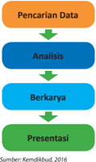

> **Deskripsi Visual:** Gambar ini adalah diagram yang menunjukkan proses penelitian. Diagram ini terdiri dari empat langkah yang disusun secara horizontal dari atas ke bawah:

1. Pencarian Data: Langkah pertama yang ditunjukkan dengan warna oranye.
2. Analisis: Langkah kedua dengan warna biru.
3. Berkarya: Langkah ketiga dengan warna hijau.
4. Presentasi: Langkah terakhir dengan warna merah.

Elemen-elemen utama dalam diagram ini adalah empat langkah penelitian tersebut. Setiap langkah memiliki warna yang berbeda untuk menunjukkan urutan dan tahapannya. Teks "Sumber: Kemdikbud, 2016" ditempatkan di bagian bawah diagram.

Informasi kunci yang dapat diambil pembaca melalui diagram ini adalah bahwa proses penelitian melibatkan pencarian data, analisis, berkarya, dan presentasi. Warna-warna yang digunakan dalam diagram ini membantu membedakan antara setiap langkah dalam proses penelitian tersebut.

### 2. Pelaksanaan Pembelajaran

Pelaksanaan pembelajaran pada Prakarya dan Kewirausahaan memanfaatkan multimodel. Pembelajaran multimodel dilakukan dengan maksud untuk mendapatkan hasil yang optimal dibandingkan dengan  hanya  satu  model.  Metode  yang  dapat  dikembangkan  dalam pembelajaran ini adalah proyek, modifi  kasi, simulasi, interaktif, elaboratif, partisipatif, magang ( cooperative study ), integratif, produksi, demonstrasi, imitasi, eksperiensial, kolaboratif.

 

---
## 📄 Halaman 42

### a. Kegiatan Pendahuluan

### Kegiatan Model Pembelajaran Bermain untuk Membuka Simpul Kreativitas

Permainan ( game ) sangat berguna untuk membentuk kesan dramatis yang jarang peserta didik lupakan. Humor atau kejenakaan merupakan pintu pembuka simpul-simpul kreativitas, dengan latihan lucu, tertawa, tersenyum peserta didik akan mudah menyerap pengetahuan  yang  diberikan.  Permainan  akan  membangkitkan energi  dan  keterlibatan  belajar  peserta  didik.  Metode  yang  dapat diterapkan  antara  lain:  tebak  gambar,  tebak  kata,  tebak  benda dengan  stiker  yang  ditempel  di  punggung  lawan,  teka-teki,  sosio drama, dan bermain peran.

### Persiapan Bahan, Alat, dan Tempat Bekerja

Kegiatan pembelajaran Prakarya dan Kewirausahaan banyak menggunakan  bahan,  material,  alat,  dan  tempat  kerja.  Pada  awal pembelajaran peserta didik dibantu oleh guru mempersiapkan alat dan  sisa  bahan/material  serta  tempat  kerja  yang  akan  digunakan pada sesi pembelajaran tersebut. Tempat kerja serta bahan/material dan  peralatan  yang  ditata  rapi  akan  memudahkan  pelaksanaan proses pembelajaran. Kerapian dan kebersihan mendukung pencapaian hasil  kerja  yang  maksimal  dan  efi  sien  serta  kesehatan dan  keselamatan  kerja.  Kegiatan  ini  dilakukan  bersama-sama  oleh peserta didik dan dapat dibantu oleh guru.

### Pengingat Kesehatan dan Keselamatan Kerja (K3)ku

VII SMP/MTs

Kegiatan utama dalam pembelajaran Prakarya dan Kewirausahaan adalah praktik dan pelibatan peserta didik secara aktif  dan kreatif dengan  bimbingan  dari guru. Guru dan peserta didik dapat menggunakan  material  dan  media  yang  terdapat  di  lingkungan sekitar.  Peralatan  yang  digunakan  dapat  menggunakan  material sederhana, namun tidak menutup kemungkinan digunakan alat  bantu  modern.  Penggunaan  bahan  dan  alat  membutuhkan pengetahuan dan kesiapan untuk Kesehatan dan Keselamatan Kerja (K3)  dapat  dijelaskan  guru  pada  awal  pembelajaran  untuk  materi persiapan bahan dan material, eksplorasi material dan produksi.

Pemanfaatan media pembelajaran mendidik siswa untuk membiasakan diri dengan cara kerja yang memperhatikan Kesehatan  dan  Keselamatan  Kerja  (K3).    Guru  maupun  peserta didik  harus  mengetahui  prosedur  keselamatan  sebelum  belajar mengajar berlangsung. Prosedur penjelasan yang bersumber dari  pertanyaan  apa,  mengapa,  bagaimana,  di  mana,  dan  kapan dalam  memperlakukan  sebuah  karya  harus  disampaikan  di  awal pembelajaran.  Biasanya  bahaya  atas  bahan-bahan  yang  dapat

Guru kelas

 

---
## 📄 Halaman 43

merusak  lingkungan  maupun  kesehatan  terdiri  atas  cairan  yang berupa getah ( resin ), asam ( acid ), cairan yang disemprotkan ( licquers ),  ampas/kotoran  ( dirt ),  dan  bahan  pelarut  ( solven ).  Bahanbahan tersebut dikhawatirkan dapat menjadi racun bagi kesehatan jika  pemakaiannya  tidak  mengikuti  petunjuk  yang  benar.  Bahaya yang  biasa  muncul  pada  penggunaan  alat  disebabkan  karena benda tajam, benda tumpul, alat pemukul, alat pemanas, alat listrik, alat  pendingin,  alat  penekan,  dan  lain  sebagainya.  Pada  kegiatan pembelajaran, guru maupun peserta didik menggunakan peralatan keselamatan  yang  tepat.  Untuk  kepentingan  semua,  sebaiknya di  dalam  kelas  saat  mata  pelajaran  Prakarya  dan  Kewirausahaan hendaknya selalu  disiapkan  kotak  P3K  untuk  membantu  prosedur kesehatan. Selain itu, selalu siapkan wadah daur ulang untuk setiap material yang tersisa dan masih dapat digunakan, serta tong sampah yang  cukup  untuk  membuang  semua  limbah  proses  pembuatan karya. Dengan demikian, prosedur keselamatan kerja dan pelestarian lingkungan  dapat  dikondisikan  lebih  awal  sehingga  segala  risiko dapat diminimalkan dengan sebaik-baiknya.

raŶg kadaŶg alergi terhadap ĐairaŶ terteŶtu sehiŶgga ŵeŶiŵďulkaŶ iriƟ

Prosedur pembelian material dan bahan, adalah (1) lihat label kadaluarsa pada produk,  atau  tanyakan  kepada  produsen/penjual  material,  (2)  perhatikan petunjuk pemakaian dan penyimpanan. Informasi yang disampaikan pada sebuah material bahan biasanya berkaitan pula dengan penggunaan peralatan untuk keselamatan kerja.

Perhatian  dan  peralatan  yang  digunakan  untuk  prosedur  keselamatan disesuaikan dengan kegunaannya, yaitu sebagai berikut,

- Menghindari penghirupan zat beracun/berbahaya
Dalam melakukan pekerjaan budi daya, seringkali kita menggunakan zatzat  tertentu  yang  kadang  beracun/berbahaya.  Maka,  gunakan  masker dengan ukuran yang tepat untuk menutup hidung dan mulut.

- Menghindari keracunan
Cegahlah bahan masuk melalui mulut.

- Menghindari penyerapan cairan
Beberapa  orang kadang  alergi terhadap cairan tertentu sehingga

- menimbulkan iritasi.

 

---
## 📄 Halaman 44

### b.     Kegiatan Inti

Kegiatan inti pada Prakarya dan Kewirausahaan adalah melaksanakan tahapan berkarya. Tahapan berkarya adalah mencari data, menganalisis, membuat karya, dan presentasi. Ada beberapa model pembelajaran yang cocok untuk dilakukan dalam kegiatan inti untuk mata pelajaran ini.

### Kegiatan Model Pembelajaran Kelompok dan Kolaborasi

Model pembelajaran kelompok ( cooperative learning ) sering digunakan  pada  setiap  kegiatan  belajar-mengajar  karena  selain hemat  waktu  juga  efektif,  apalagi  jika  metode  yang  diterapkan sangat memadai untuk perkembangan peserta didik. Metode yang dapat diterapkan antara lain proyek kelompok, diskusi terbuka, atau bermain peran. Pada Prakarya dan Kewirausahaan metode ini banyak digunakan karena merupakan simulasi dari kegiatan wirausaha yaitu kelompok peserta didik berperan sebagai kelompok wirausahawan, yang akan berbagi tugas berdasarkan kompetensinya.

Pembelajaran kolaborasi ( collaboration learning ) menempatkan peserta  didik  dalam  kelompok  kecil  dan  memberinya  tugas  di mana  mereka  saling  membantu  untuk  menyelesaikan  tugas  atau pekerjaan  kelompok.  Dukungan  sejawat,  keragaman  pandangan, pengetahuan dan keahlian sangat membantu mewujudkan belajar kolaboratif.  Metode  yang  dapat  diterapkan  antara  lain  mencari informasi, proyek, kartu sortir, turnamen, tim kuis. Pada Prakarya dan Kewirusahaan, peserta didik mencari data dan melaksanakan proyek dalam kelompok, maka pembelajaran kolaborasi akan terjadi dengan efektif  dan  mendukung  tujuan  pembelajaran  untuk  kemampuan bekerja sama.

### Model  Pembelajaran Individual dan Mandiri sesuai Minat Peserta Didik

Pembelajaran individu ( individual learning ) memberikan kesempatan kepada  peserta  didik  secara  mandiri  untuk  dapat  berkembang dengan baik sesuai dengan kebutuhan peserta didik. Metode yang dapat diterapkan antara lain tugas mandiri, penilaian diri, portofolio, galeri  proses.  Pada  Prakarya  dan  Kewirausahaan,  peserta  didik diperkenankan  untuk  melakukan  proses  mandiri  dalam  pencarian data  dan  berkarya  sejauh  dorongan  minatnya  terhadap  materi pembelajaran yang diberikan. Semakin luas wawasan seseorang yang didukung  dengan  memikiran  kritis  dapat  mendorong  kreativitas dan membuka peluang berinovasi. Pengetahuan dan keterampilan individu  peserta  didik  akan  meningkatkan  pengetahuan  anggota kelompoknya melalui pembelajaran sejawat.

 

---
## 📄 Halaman 45

Model  Pembelajaran  Mandiri (independent  learning )  peserta  didik belajar  atas  dasar  kemauan  sendiri  dengan  mempertimbangkan kemampuan yang dimiliki dengan memfokuskan dan merefl  eksikan keinginan.  Teknik  yang  dapat  diterapkan  antara  lain  apresiasitanggapan, asumsi presumsi, visualisasi mimpi atau imajinasi, hingga cakap memperlakukan alat/bahan berdasarkan temuan sendiri atau modifi  kasi dan imitasi, refl  eksi karya, melalui kontrak belajar, maupun terstruktur  berdasarkan  tugas  yang  diberikan  (pertanyaaninquiry , penemuandiscovery , penemuan kembalirecovery ).

### Kegiatan Model Pembelajaran Teman Sebaya

Beberapa  ahli  percaya  bahwa  satu  mata  pelajaran  benar-benar dikuasai hanya apabila seorang peserta didik mampu mengajarkan kepada  peserta  didik  lain.  Mengajar  teman  sebaya  ( peer  learning ) memberikan kesempatan kepada peserta didik untuk mempelajari sesuatu dengan baik. Pada waktu yang sama, ia menjadi narasumber bagi temannya. Metode yang dapat diterapkan antara lain: pertukaran dari kelompok  ke  kelompok,  belajar melalui jigso ( jigsaw ), studi kasus dan proyek, pembacaan berita, dan penggunaan lembar kerja. Metode ini dapat digunakan karena adanya keragaman pengetahuan,  keterampilan,  maupun  bakat  setiap  peserta  didik dalam  satu  kelompok.  Seorang  peserta  didik  dapat  belajar  dari peserta  didik  lainnya  untuk  memiliki  kekayaan  pengetahuan  dan keterampilan dalam Prakarya dan Kewirausahaan.

### Kegiatan Model Pembelajaran Sikap

Aktivitas belajar afektif ( aff   ective learning )  membantu peserta didik untuk  menguji  perasaan,  nilai,  dan  sikap-sikapnya.  Strategi  yang dikembangkan  dalam  model  pembelajaran  ini  dirancang  untuk menumbuhkan kesadaran  akan  perasaan,  nilai,  dan  sikap  peserta didik. Metode yang dapat diterapkan antara lain: mengamati sebuah alat  bekerja  atau  bahan  dipergunakan,  penilaian  diri  dan  teman, demonstrasi,  mengenal  diri  sendiri,  dan  posisi  penasihat.  Sikap sangat  dipentingkan  dalam  Prakarya  dan  Kewirausahaan  untuk mendapatkan  hasil  kerja  yang  optimal.  Peserta  didik  diberikan kesempatan  untuk  menguji  perasaan,  nilai,  dan  sikap-sikapnya dalam bekerja selama proses berkarya.

### c. Kegiatan Penutup

### Kegiatan Evaluasi Kinerja dan Hasil Kerja

Pembelajaran Prakarya dan Kewirausahaan mementingkan disiplin dalam pelaksanaan proses berkarya. Setiap tahapan harus dilakukan dengan efektif dan efi  sien, serta mencapai kualitas tertentu, sesuai dengan  prinsip  wirausaha.  Pada  kegiatan  penutup  pembelajaran,

 

---
## 📄 Halaman 46

guru dan peserta didik melakukan evaluasi umum  tentang ketercapaian tujuan dari sesi pembelajaran tersebut. Proses evaluasi itu dilanjutkan dengan perencanaan kegiatan dan target kerja pada sesi  selanjutnya.  Pada  tahap  evaluasi  ini,  guru  dapat  menanyakan kesan.

### Merapikan Bahan, Alat, dan Tempat Bekerja

Kegiatan pembelajaran Prakarya dan Kewirausahaan banyak menggunakan bahan,  material,  alat,  dan  tempat  kerja.  Pada  akhir pembelajaran  harus  dilakukan  kegiatan  merapikan,  menyimpan alat dan sisa bahan/material pada tempatnya, serta membersihkan tempat kerja.  Kondisi  tempat  kerja  yang  bersih  serta  penempatan bahan/material dan peralatan yang rapi akan memudahkan untuk pelaksanaan  kerja  pada  sesi  selanjutnya.  Kerapian  dan  kebersihan mendukung mencapaian hasil kerja yang maksimal dan efi  sien serta kesehatan dan keselamatan kerja. Kegiatan ini dilakukan bersamasama oleh peserta didik dan dapat dibantu oleh guru.

### 3. Pengawasan Proses Pembelajaran

Pengalaman  belajar  yang  paling  efektif  adalah  apabila  peserta  didik/ seseorang mengalami/berbuat secara langsung dan aktif di lingkungan belajarnya.  Pemberian kesempatan yang luas bagi peserta didik untuk melihat, memegang, merasakan, dan mengaktifkan lebih banyak indra  yang  dimilikinya,  serta  mengekspresikan  diri  akan  membangun pemahaman pengetahuan, perilaku, dan keterampilannya. Oleh karena  itu,  tugas  utama  pendidik/guru  adalah  mengondisikan  situasi pengalaman belajar yang dapat menstimulasi atau merangsang indra dan keingintahuan peserta didik. Hal ini perlu didukung dengan pengetahuan guru  akan  perkembangan  psikologis  peserta  didik  dan  kurikulum  di mana keduanya harus saling terkait. Saat pembelajaran, guru hendaknya peka akan gaya belajar peserta didik di kelas. Dengan mengetahui gaya belajar  peserta  didik  di  kelas  secara  umum,  guru  dapat  menentukan strategi pembelajaran yang tepat. Pendidik/guru hendaknya menyiapkan kegiatan belajar mengajar yang melibatkan mental peserta didik secara aktif melalui beragam kegiatan, seperti: kegiatan mengamati, bertanya/ mempertanyakan,  menjelaskan,  berkomentar,  mengajukan  hipotesis, mengumpulkan  data,  dan  sejumlah  kegiatan  mental  lainnya.  Guru hendaknya tidak memberikan bantuan secara dini dan selalu menghargai usaha peserta didik meskipun hasilnya belum sempurna. Selain itu, guru perlu  mendorong  peserta  didik  supaya  peserta  didik  berbuat/berpikir lebih  baik,  misalnya  melalui  pengajuan  pertanyaan  menantang  yang 'menggelitik' sikap ingin tahu dan sikap kreativitas peserta didik. Dengan cara  ini,  guru  selalu  mengupayakan  agar  peserta  didik  terlatih  dan terbiasa menjadi pelajar sepanjang hayat.

 

---
## 📄 Halaman 47

### D.  Penilaian Prakarya dan Kewirausahaan

### 1. Konsep Penilaian dalam Pembelajaran Prakarya dan Kewirausahaan

Berdasarkan  Kurikulum  2013,  kompetensi  yang  harus  dicapai  pada tiap  akhir  jenjang  kelas  dinamakan  kompetensi  inti.  Kompetensi  inti merupakan anak tangga yang harus ditapak peserta didik untuk sampai pada  kompetensi  lulusan  jenjang  SMA  dan  sederajat.  Kompetensi  inti bukan untuk diajarkan melainkan untuk dibentuk melalui pembelajaran berbagai kompetensi dasar dari sejumlah mata pelajaran yang relevan. Rumusan Kompetensi Inti (KI) dari setiap mata pelajaran sebagai berikut.

- KI-1 untuk Kompetensi Inti sikap spiritual,
- KI-2 untuk Kompetensi Inti sikap sosial
- KI-3 untuk Kompetensi Inti pengetahuan
- KI-4 untuk Kompetensi Inti keterampilan
Urutan tersebut mengacu pada urutan yang disebutkan dalam UndangUndang Sistem Pendidikan Nasional No. 20 Tahun 2003 yang menyatakan bahwa  kompetensi  terdiri  atas  kompetensi  sikap,  pengetahuan,  dan keterampilan.  Hal  ini  sesuai  dengan  orientasi  pembelajaran  Prakarya dan Kewirausahaan yang memfasilitasi pengalaman emosi, intelektual, fi  sik,  persepsi,  sosial,  estetik,  artistik,  dan  kreativitas  kepada  peserta didik dengan melakukan aktivitas apresiasi dan kreasi terhadap berbagai produk keterampilan dan teknologi. Kegiatan ini dimulai dari mengidentifi  kasi potensi di sekitar peserta didik diubah menjadi produk yang bermanfaat bagi kehidupan manusia, mencakup antara lain; jenis, bentuk,  fungsi,  manfaat,  tema,  struktur,  sifat,  komposisi,  bahan  baku, bahan  pembantu,  peralatan,  teknik  kelebihan,  dan  keterbatasannya. Selain itu, peserta didik juga melakukan aktivitas memproduksi berbagai produk  benda  kerajinan  maupun  produk  teknologi  yang  sistematis dengan berbagai cara misalnya: meniru, memodifi  kasi, mengubah fungsi produk yang ada menuju produk baru yang lebih bermanfaat. Selain itu, karakteristik pembelajaran Prakarya dam Kewirausahaan memiliki tujuan melatih koordinasi otak melalui apresiasi dan keterampilan teknis.

### 2. Karakteristik Penilaian Pembelajaran Prakarya dan Kewirausahaan

Evaluasi  atau  penilaian  mata  pelajaran  lebih  kepada  penilaian  proses, selain penilaian hasil karya agar pendidikan dapat dimaknai sebagai life skill di  mana  dalam  pelaksanaannya  terdapat  penerapan  pendidikan afektif karakter di sekolah.  Penilaian pada mata pelajaran Prakarya dan Kewirausahaan  melalui  produk  dan  proses,  menggunakan  tes  yang

 

---
## 📄 Halaman 48

disiapkan  berdasarkan  standar  penciptaan  atau  indikator  lapangan ( criterion reff  erence test ) maupun non tes melalui asesmen proses ( norm reff   erence test ) sebagai authentic-asessment.

Tujuan  penilaian  adalah  untuk  mengetahui  tingkat  wawasan  serta produksi dan kreasi Prakarya dan Kewirausahaan bagi peserta didik yang telah menguasai kompetensi dasar tertentu sesuai dengan Kompetensi Dasar  berdasarkan  indikator  ketercapaian.  Selain  itu,  penilaian  juga bertujuan:

- mengetahui tingkat pencapaian hasil belajar peserta didik;
- mengukur perkembangan kompetensi peserta didik; mendiagnosis kesulitan belajar peserta didik;
- mengetahui hasil pembelajaran; mengetahui pencapaian kurikulum;
- mendorong peserta didik belajar dan mengembangkan diri;
- sebagai umpan balik bagi guru untuk memperbaiki proses pembelajaran

### 3. Teknik dan Instrumen Penilaian

Pembelajaran  Prakarya  dan  Kewirausahaan  ini  dapat  memanfaatkan berbagai bentuk instrumen penilaian yang disesuaikan dengan metode, strategi  pembelajaran  dan  ketercapaian  kompetensi  yang  didasarkan pada indikator yang telah ditentukan sebelumnya. Untuk mengumpulkan informasi  tentang  kemajuan  peserta  didik  dapat  dilakukan  berbagai teknik,  baik  berhubungan  dengan  proses  maupun hasil  belajar. Teknik mengumpulkan informasi tersebut pada prinsipnya adalah cara penilaian kemajuan belajar peserta didik terhadap pencapaian kompetensi. Penilaian  dilakukan  berdasarkan  indikator-indikator  pencapaian  hasil belajar,  baik  pada  domain  kognitif,  afektif,  maupun  psikomotor.    Pada mata pelajaran Prakarya dan Kewirausahaan, beberapa teknik penilaian yang  dapat  digunakan  adalah  Penilaian  Unjuk  Kerja,  Penilaian  Sikap, Penilaian Produk, dan Penilaian Konsep Diri.

### A. Penilaian Unjuk Kerja

Penilaian  unjuk  kerja  merupakan  penilaian  yang  dilakukan  dengan mengamati kegiatan peserta didik dalam melakukan sesuatu. Penilaian unjuk kerja perlu mempertimbangkan hal-hal berikut.

- Langkah-langkah  kinerja  yang  diharapkan  dilakukan  peserta  didik untuk menunjukkan kinerja dari suatu kompetensi.
- Kelengkapan dan ketepatan aspek yang akan dinilai dalam kinerja tersebut.
- Kemampuan-kemampuan khusus yang diperlukan untuk menyelesaikan tugas.

 

---
## 📄 Halaman 49

---
**📊 Tabel**

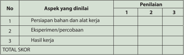

Tabel ini menunjukkan skor penilaian untuk tiga aspek utama dalam sebuah kegiatan atau proyek: persiapan bahan dan alat kerja, eksperimen/percobaan, dan hasil kerja. Setiap aspek diukur dengan skor 1, 2, atau 3, dan total skor diperoleh dengan menggabungkan nilai dari semua aspek. Topik utama tabel ini adalah evaluasi kinerja dalam proses penelitian atau pengembangan. Kolom "No." memberikan nomor urut untuk setiap aspek, sedangkan kolom "Penilai" menunjukkan skor yang diberikan oleh penilai. Data penting yang terlihat adalah bahwa setiap aspek memiliki skor yang berbeda-beda, menunjukkan variasi dalam kinerja.

 

---
## 📄 Halaman 50

---
**📊 Tabel**

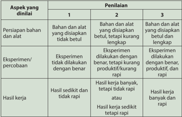

Tabel ini menunjukkan penilaian berdasarkan aspek-aspek yang dinilai dalam sebuah eksperimen atau percobaan. Topik utamanya adalah kualitas hasil kerja dalam eksperimen. Tabel dibagi menjadi tiga kolom, masing-masing menunjukkan tingkat penilaian yang berbeda: 1, 2, dan 3. Untuk penilaian 1, bahan dan alat yang disiapkan tidak cukup atau tidak sesuai. Untuk penilaian 2, eksperimen dilakukan dengan baik tetapi hasilnya kurang produktif atau rapi. Sedangkan untuk penilaian 3, eksperimen dilakukan dengan baik dan hasilnya banyak dan rapi. Ini menunjukkan bahwa penilaian ini bertujuan untuk memeriksa sejauh mana hasil kerja dalam eksperimen mencapai standar yang diharapkan.

---
**📊 Tabel**

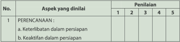

Tabel ini menunjukkan aspek-aspek yang dianalisis dalam sebuah penilaian, dengan penilaian berdasarkan skala 1 hingga 5. Topik utama adalah "PERENCANAAN" yang terdiri dari dua sub-aspek: "Keterlibatan dalam persipapan" dan "Keaktifan dalam persipapan". Data dalam tabel menunjukkan bahwa penilaian untuk kedua sub-aspek tersebut sama-sama 3, menunjukkan bahwa kedua aspek ini dianalisis dengan kriteria yang sama dan memiliki nilai penilaian yang setara.

 

---
## 📄 Halaman 51

---
**📊 Tabel**

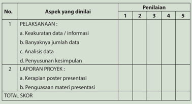

Tabel ini menunjukkan skor penilaian untuk dua aspek utama dalam sebuah proyek: Pelaksanaan dan Laporan Proyek. Aspek Pelaksanaan terdiri dari empat sub-aspek: Keakuratan data/informasi, Banyaknya jumlah data, Analisis data, dan Penyusunan kesimpulan. Setiap sub-aspek diberikan skor dari 1 hingga 5. Aspek Laporan Proyek hanya memiliki satu sub-aspek: Penggunaaan materi presentasi. Skor total ditentukan dengan menghitung nilai dari kedua aspek tersebut.

 

---
## 📄 Halaman 52

---
**📊 Tabel**

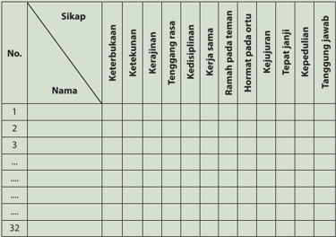

Tabel ini merupakan alat evaluasi sikap siswa terhadap berbagai aspek kehidupan sehari-hari, seperti keterbukaan, ketekunan, kerajinan, ketegangan rasa, keadilan, kejujuran, tanggung jawab, dan kepedulian. Topik utama tabel adalah sikap siswa dalam berbagai situasi kehidupan. Kolom-kolomnya mencakup nama-nama siswa dan berbagai aspek sikap yang diukur. Data penting yang terlihat adalah bahwa setiap siswa memiliki nilai atau skor untuk setiap aspek sikap tersebut, menunjukkan bahwa evaluasi ini dilakukan secara individu dan detail.

 

---
## 📄 Halaman 53

Untuk  produk  kerajinan  dan  rekayasa,  kebaruan  ide,  originalitas  (asli/tidak meniru),  atau  keunikan  produk  menjadi  salah  satu  kriteria  penting.  Pada produk hasil budi daya dan pengolahan, konsistensi hasil produksi merupakan kriteria terpenting.

### D.    Penilaian Konsep Diri

Penilaian diri adalah suatu teknik penilaian di mana peserta didik diminta untuk menilai dirinya sendiri berkaitan dengan status, proses, dan tingkat pencapaian kompetensi yang dipelajarinya. Teknik penilaian diri dapat digunakan untuk mengukur kompetensi kognitif, afektif, dan psikomotor. Penilaian  kompetensi  kognitif  di  kelas,  misalnya:  peserta  didik  diminta untuk menilai penguasaan pengetahuan dan keterampilan berpikirnya sebagai  hasil  belajar  dari  suatu  mata  pelajaran  tertentu.  Inventori digunakan untuk menilai konsep diri peserta didik dengan tujuan untuk mengetahui kekuatan dan kelemahan diri peserta didik. Rentangan nilai yang digunakan antara 1 dan 2. Jika jawaban YA, maka diberi skor 2 dan jika jawaban TIDAK, maka diberi skor 1. Kriteria penilaiannya adalah jika rentang nilai antara 0-5 dikategorikan tidak positif; 6-10: kurang positif; 11- 15: positif, dan 16-20: sangat positif.

### Contoh Format Penilaian Konsep Diri Peserta Didik (dalam konteks Kewirausahaan)

---
**📊 Tabel**

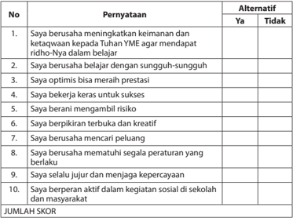

Tabel ini berisi 10 pernyataan yang dianggap penting oleh siswa untuk mencapai keberhasilan dan kesejahteraan. Setiap pernyataan memiliki alternatif "Ya" atau "Tidak", yang menunjukkan apakah siswa merasa mampu atau tidak mampu melakukan tindakan tersebut. Topik utama tabel adalah tentang sikap dan perilaku yang diperlukan untuk sukses dalam kehidupan. Kolom-kolomnya meliputi nomor pernyataan, pernyataan itu sendiri, dan alternatif "Ya" atau "Tidak". Data penting yang terlihat adalah bahwa banyak pernyataan memiliki alternatif "Ya", menunjukkan bahwa sebagian besar siswa percaya diri dan berani mengambil risiko. Ini menunjukkan bahwa siswa memiliki motivasi untuk belajar dan berusaha keras untuk mencapai tujuan mereka.

 

---
## 📄 Halaman 54

### E. Remedial

Pembelajaran remedial adalah pembelajaran yang diberikan kepada peserta didik yang belum mencapai ketuntasan kompetensi. Remedial menggunakan berbagai metode yang diakhiri dengan penilaian untuk mengukur kembali tingkat  ketuntasan  belajar  peserta  didik.  Pembelajaran  remedial  diberikan kepada peserta didik bersifat terpadu, artinya guru memberikan pengulangan materi  dan  terapi  masalah  pribadi  ataupun  kesulitan  belajar  yang  dialami oleh  peserta  didik.  Remedial  bukan  merupakan  pengulangan  kegiatan tes  dengan  soal  yang  sama,  melainkan  proses  identifi  kasi  masalah  belajar dan  metode  pembelajaran  agar  peserta  didik  dapat  mencapai  ketuntasan kompetensi. Remedial didasari dengan keyakinan bahwa setiap peserta didik mampu mencapai ketuntasan kompetensi, dengan perbedaan pada cara dan kecepatan belajar.

### 1. Prinsip-Prinsip Kegiatan Remedial

### Adaptif

Peserta  didik  memiliki  keunikan  dan  kondisi  yang  berbeda-beda  di antaranya cara belajar dan kondisi psikologisnya. Kegiatan remedial harus sesuai dengan peserta didik untuk mencapai efektivitas pembelajaran.

### Interaktif

Pada  pembelajaran  remedial,  interaksi  dan  komunikasi  antara  guru dengan peserta didik harus terjalin baik, agar guru mengetahui secara pasti  bentuk  hambatan  yang  dialami  peserta  didik,  dan  sebaliknya peserta didik akan merasa lebih termotivasi.

### Fleksibilitas pembelajaran dan penilaian

Pengajaran remedial menggunakan metode pembelajaran yang disesuaikan dengan keunikan dan kondisi individu peserta didik. Metode pembelajaran  yang  digunakan  disusun  berdasarkan  hasil  diagnosis kesulitan belajar peserta didik. Penilaian dilakukan terhadap  hasil pembelajaran  untuk  mencapai  ketuntasan  kompetensi.  Cara  penilaian lebih fl  eksibel dan tidak harus sama dengan soal ulangan yang digunakan pada pembelajaran reguler.

### Umpan balik sesegera mungkin

Keberhasilan pengajaran remedial ditentukan oleh upaya guru dan peserta didik.  Peserta  didik  sebaiknya  dapat  segera  mengetahui  keberhasilan atau  kekurangannya  segera  setelah  pembelajaran  dilaksanakan,  agar dapat segera melakukan upaya lanjutan untuk memperoleh ketuntasan kompetensi.

 

---
## 📄 Halaman 55

### Kesinambungan dan ketersediaan pengajaran remedial

Peserta didik hendaknya dapat mengikuti pengajaran reguler maupun pengajaran remedial secara berkesinambungan agar proses pembelajaran secara keseluruhan dapat berjalan lancar dan tuntas.

### 2. Langkah-Langkah Kegiatan Remedial

Remedial berasal dari kata remedy (Inggris) yang artinya penyembuhan. Proses penyembuhan, seperti pada kesehatan, diawali dengan identifi  kasi masalah.  Pada  remedial  pembelajaran,  guru  mengidentifi  kasi  masalah belajar pada peserta didik melalui pengamatan proses pembelajaran di kelas dan hasil ulangan. Kesulitan belajar yang dihadapi oleh peserta didik dapat berasal dari faktor eksternal dan internal dirinya, di antaranya faktor psikologis  dan  metode  mengajaran  yang  tidak  sesuai  dengan  peserta didik.  Hasil  diagnostik  kesulitan  belajar  peserta  didik  menjadi  dasar dari    penyusunan  rencana  kegiatan  pembelajaran  remedial.  Rencana pembelajaran dilaksanakan dalam bentuk pembelajaran remedial yang diikuti dengan proses penilaian hasil pembelajaran remedial .

---
**🖼️ Gambar/Diagram**

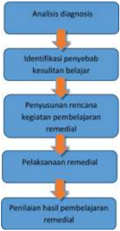

> **Deskripsi Visual:** Gambar yang Anda berikan adalah diagram yang menunjukkan proses analisis diagnosis dan pelaksanaan remedial dalam pendidikan. Diagram ini terdiri dari empat langkah utama:

1. **Analisis Diagnosis**: Langkah pertama yang menunjukkan identifikasi masalah atau kesulitan belajar.
2. **Identifikasi Penyebab Kesulitan Belajar**: Langkah kedua yang menunjukkan pencarian penyebab masalah tersebut.
3. **Pernyataan Rencana Kegiatan Pembelajaran Remedi**: Langkah ketiga yang menunjukkan pengembangan rencana untuk membantu peserta didik.
4. **Pelaksanaan Remedial**: Langkah keempat yang menunjukkan implementasi rencana yang telah dibuat.

Elemen-elemen utama dalam diagram ini adalah langkah-langkah yang disusun secara kronologis dari analisis diagnosis hingga pelaksanaan remedial. Setiap langkah memiliki label yang jelas untuk membedakannya.

Teks, angka, atau label penting yang terlihat dalam diagram ini meliputi:
- "Analisis diagnosis" pada langkah pertama.
- "Identifikasi penyebab kesulitan belajar" pada langkah kedua.
- "Pernyataan rencana kegiatan pembelajaran remedial" pada langkah ketiga.
- "Pelaksanaan remedial" pada langkah keempat.

Informasi kunci yang dapat diambil pembaca melalui diagram ini adalah bahwa proses ini melibatkan identifikasi masalah, pencarian penyebab, pengembangan rencana, dan implementasi solusi untuk meningkatkan kualitas pembelajaran.

Sumber: Kemdikbud, 2015

Gambar 1.5 Langkah-langkah Pelaksanaan Remedial

47

 

---
## 📄 Halaman 56

### F.  Pengayaan

Pengayaan  adalah  kegiatan  yang  diberikan  kepada  peserta  didik  atau kelompok  yang  lebih  cepat  dalam  mencapai  kompetensi  dibandingkan dengan peserta didik lain agar mereka dapat memperdalam kecakapannya atau dapat mengembangkan potensinya secara optimal. Tugas yang diberikan guru  kepada  peserta  didik  dapat  berupa  tutor  sebaya,  mengembangkan latihan  secara  lebih  mendalam,  membuat  karya  baru,  atau  melakukan suatu proyek. Kegiatan pengayaan hendaknya menyenangkan dan mengembangkan kemampuan kognitif tinggi sehingga mendorong peserta didik  untuk  mengerjakan tugas yang diberikan. Berbeda dengan remedial, pengayaan  tidak  bertujuan  untuk  menghasilkan  penilaian  berdasarkan ketuntasan kompetensi melainkan untuk menambahkan kompetensi peserta didik dalam bentuk portofolio.

---
**🖼️ Gambar/Diagram**

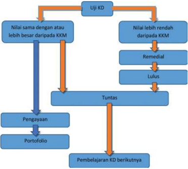

> **Deskripsi Visual:** Gambar ini adalah diagram yang menunjukkan prosedur atau langkah-langkah dalam proses evaluasi dan pembelajaran. Diagram ini terdiri dari beberapa blok yang masing-masing menunjukkan tindakan atau tahap dalam proses tersebut. 

1. **Apa yang ditampilkan secara keseluruhan**: Gambar ini menunjukkan sebuah proses evaluasi dan pembelajaran yang melibatkan uji kompetensi dasar (UJI KD), pengayaan, portofolio, dan pembelajaran kompetensi dasar (KD) berikutnya.

2. **Elemen-elemen utama dan relasinya**: 
   - UJI KD: Ini adalah langkah awal yang menguji kompetensi dasar siswa.
   - Nilai sama dengan atau lebih besar daripada KKM: Jika nilai siswa sama atau lebih besar dari batas minimal kompetensi (KKM), proses berlanjut ke tahap selanjutnya.
   - Nilai lebih rendah daripada KKM: Jika nilai siswa lebih rendah dari KKM, siswa akan dilakukan remedial atau lulus.
   - Pengayaan: Jika nilai siswa sama atau lebih besar dari KKM, siswa akan dilakukan pengayaan.
   - Portofolio: Jika nilai siswa lebih rendah dari KKM, siswa akan dilakukan portofolio.
   - Pembelajaran KD berikutnya: Jika nilai siswa lebih rendah dari KKM, siswa akan dilakukan pembelajaran kompetensi dasar berikutnya.

3. **Teks, angka, atau label penting yang terlihat**: 
   - "UJI KD" (untuk langkah awal)
   - "Nilai sama dengan atau lebih besar daripada KKM" (untuk proses selanjutnya)
   - "Nilai lebih rendah daripada KKM" (untuk proses selanjutnya)
   - "Remedial" (untuk proses selanjutnya)
   - "Lulus" (untuk proses selanjutnya)
   - "Pengayaan" (untuk proses selanjutnya)
   - "Portofolio" (untuk proses selanjutnya)
   - "Pembelajaran KD berikutnya" (untuk pros

Sumber: Kemdikbud, 2015

 

---
## 📄 Halaman 57

### 1. Prinsip-Prinsip Kegiatan Pengayaan

Kegiatan pengayaan dan remedial memiliki perbedaan dalam tujuannya. Remedial bertujuan agar peserta didik mencapai ketuntasan kompetensi, sedangkan pengayaan bertujuan untuk memberikan kesempatan peserta didik  menambah pengetahuan dan keterampilan. Persamaan remedial dengan pengayaan adalah perencanaan kegiatan baik remedial maupun pengayaan berdasar pada keunikan, cara belajar, dan ketertarikan peserta didik. Prinsip-prinsip kegiatan pengayaan adalah sebagai berikut.

- Inovatif
Kegiatan pengayaan mendorong peserta didik untuk berpikir kreatif dan inovatif.

- Memperkaya
Kegiatan pengayaan mendorong peserta didik untuk bertanya dan mencari  jawaban  dari  berbagai  sumber  yang  bervariasi  sehingga memperoleh kekayaan informasi.

Metode  pembelajaran    yang  digunakan  dapat  sangat  bervariasi dengan tujuan mengembangkan minat peserta didik secara

- Metode pembelajaran yang luas dan bervariasi maksimal.
- Berdasar pada keunikan, kemampuan, dan minat individu

### 2. Ragam Kegiatan Pengayaan

Ragam kegiatan pengayaan dikelompokkan menjadi 3 (tiga) jenis:

- eksplorasi pengetahuan,
- keterampilan proses, dan
- pemecahan masalah.

### 3. Langkah-Langkah Kegiatan Pengayaan

Langkah  pengayaan  serupa  dengan  remedial  yaitu  diawali  dengan identifi  kasi  keunikan  peserta  didik,  dilanjutkan  dengan  perencanaan kegiatan pengayaan, dan pelaksanaan kegiatan pengayaan. Pada akhir  kegiatan  pengayaan  tidak  dilakukan  penilaian  untuk  ketuntasan kompetensi  melainkan  penambahan  kepemilikan  portofolio  peserta didik. Pada kegiatan pengayaan identifi  kasi dilakukan terhadap tingkat kelebihan kemampuan belajar, yaitu:

- belajar lebih cepat,
- menyimpan informasi lebih mudah,

 

---
## 📄 Halaman 58

- keingintahuan yang tinggi,
- berpikir mandiri,
- superioritas dalam berpikir abstrak, dan
- memiliki banyak minat.

### G.  Interaksi dengan Orang Tua

Pembelajaran peserta didik di sekolah merupakan tanggung jawab bersama antara warga sekolah, yaitu kepala sekolah, guru, dan tenaga kependidikan kepada orang tua. Oleh karena itu, pihak sekolah perlu mengomunikasikan kegiatan pembelajaran peserta didik dengan orang tua. Orang tua dapat  berperan  sebagai  partner  sekolah  dalam  menunjang  keberhasilan pembelajaran peserta didik.

 

---
## 📄 Halaman 59

---
**🖼️ Gambar/Diagram**

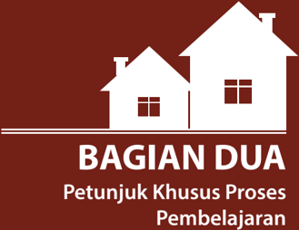

> **Deskripsi Visual:** Gambar ini adalah ilustrasi yang menunjukkan dua bangunan berseberangan dengan atap berbentuk segitiga. Di bawah bangunan tersebut terdapat teks yang membahas tentang "BAGIAN DUA Petunjuk Khusus Proses Pembelajaran". Elemen-elemen utama dalam gambar ini adalah dua bangunan yang berseberangan, yang menunjukkan konsep hubungan antara dua bagian atau proses. Teks yang ada pada gambar ini sangat penting karena ia memberikan informasi bahwa gambar ini mungkin merupakan bagian dari sebuah buku pelajaran yang membahas tentang proses pembelajaran. Label "BAGIAN DUA" menunjukkan bahwa ini mungkin merupakan bagian kedua dari sebuah proses atau topik yang lebih besar.

Prakarya dan Kewirausahaan

51

 

---
## 📄 Halaman 60

52

Buku Guru Kelas XII SMA/SMK/MA/MAK

 

---
## 📄 Halaman 61

### BAB I

Wirausaha Produk Kerajinan untuk Pasar

Kerajinan Lokal

Prakarya dan Kewirausahaan

53

 

---
## 📄 Halaman 62

### A.  Kompetensi Inti (KI) dan Kompetensi Dasar (KD)

Tujuan kurikulum mencakup empat kompetensi, yaitu (1) kompetensi sikap spiritual, (2) sikap sosial, (3) pengetahuan, dan (4) keterampilan. Kompetensi tersebut dicapai melalui proses pembelajaran intrakurikuler, kokurikuler, dan ekstrakurikuler.

Rumusan kompetensi sikap spiritual yaitu,  'Menerima dan menjalankan ajaran agama yang dianutnya'. Sedangkan rumusan kompetensi sikap sosial yaitu, 'Menghayati dan mengamalkan perilaku jujur, disiplin, tanggung jawab, peduli (gotong royong, kerja sama, toleran, damai), santun, responsif dan proaktif dan menunjukkan  sikap  sebagai  bagian  dari  solusi  atas  berbagai  permasalahan dalam berinteraksi secara efektif dengan lingkungan sosial dan alam serta dalam menempatkan diri sebagai cerminan bangsa dalam pergaulan dunia' . Kedua kompetensi tersebut dicapai melalui pembelajaran tidak langsung ( indirect teaching )  yaitu  keteladanan,  pembiasaan,  dan  budaya  sekolah,  dengan memperhatikan  karakteristik  mata  pelajaran  serta  kebutuhan  dan  kondisi peserta didik. Penumbuhan dan pengembangan kompetensi sikap dilakukan sepanjang  proses pembelajaran berlangsung, dan dapat digunakan sebagai pertimbangan  guru  dalam  mengembangkan  karakter  peserta  didik  lebih lanjut.

Kompetensi pengetahuan dan keterampilan dikembangkan melalui kegiatan pembelajaran dengan Kompetensi Inti dan Kompetensi Dasar untuk materi Kerajinan dan Kewirausahaan Kelas XII yang tercantum dalam tabel di bawah ini,

---
**📊 Tabel**

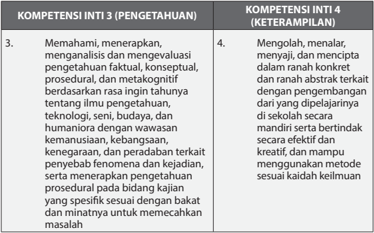

Tabel ini memperlihatkan dua kompetensi utama: Kompetensi Inti 3 (Pengetahuan) dan Kompetensi Inti 4 (Keterampilan). Kompetensi Inti 3 fokus pada pengetahuan, termasuk pemahaman, analisis, dan evaluasi informasi berdasarkan rasa ingin tahu yang berkaitan dengan konsep, prosedur, metakognisi, teknologi, dan aspek sosial dan humaniora. Kompetensi Inti 4 menekankan keterampilan, seperti mengolah, menanyai, dan menciptakan dalam ranah kontekstual dan ranah abstrak terkait dengan pengembangan dan dipelajariannya, serta mampu menggunakan metode sesuai keadaan. Data penting dalam tabel ini adalah bahwa kedua kompetensi ini melibatkan pengetahuan dan keterampilan, serta fokus pada pemahaman dan pengembangan informasi secara mendalam dan kritis.

 

---
## 📄 Halaman 63

---
**📊 Tabel**

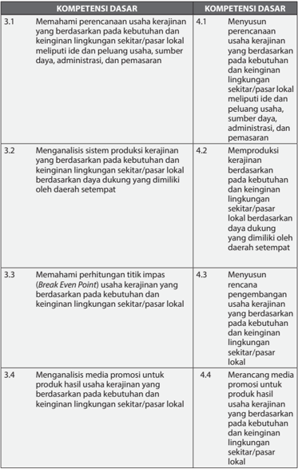

Tabel ini berisi informasi tentang kompetensi dasar yang relevan dengan usaha kerajinan lokal. Topik utamanya adalah tentang pemahaman dan pengembangan usaha kerajinan yang berbasis pada kebutuhan dan keinginan lingkungan sekitar/pasar lokal. Tabel dibagi menjadi dua kolom: "Kompetensi Dasar" dan "Kompetensi Dasar". Kolom pertama mencakup empat poin utama, yaitu memahami perencanaan usaha kerajinan berdasarkan kebutuhan dan keinginan lingkungan sekitar/pasar lokal, menganalisis sistem produksi kerajinan berdasarkan kebutuhan dan keinginan lingkungan sekitar/pasar lokal, memahami perhitungan titik impas (Break Even Point) usaha kerajinan berdasarkan kebutuhan dan keinginan lingkungan sekitar/pasar lokal, serta menganalisis media promosi untuk produk hasil usaha kerajinan berdasarkan kebutuhan dan keinginan lingkungan sekitar/pasar lokal. Kolom kedua menyediakan detail lebih lanjut tentang setiap kompetensi dasar, seperti menyesuaikan usaha kerajinan berdasarkan ide dan peluang usaha, sumber daya, administrasi, dan pemasaran; memproduksi kerajinan berdasarkan kebutuhan dan keinginan lingkungan sekitar/pasar lokal; menyesuaikan pengembangan usaha kerajinan berdasarkan kebutuhan dan keinginan lingkungan sekitar/pasar lokal; dan merancang media promosi untuk produk hasil usaha kerajinan berdasarkan kebutuhan dan keinginan lingkungan sekitar/pasar lokal. Pola penting yang terlihat adalah bahwa tabel ini mencakup berbagai aspek dari usaha kerajinan lokal, mulai dari pemahaman dan analisis hingga implementasi strategi promosi.

 

---
## 📄 Halaman 64

---
**📊 Tabel**

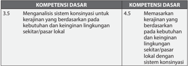

Tabel ini membandingkan dua kompetensi dasar: 3.5 dan 4.5. Topik utamanya adalah analisis sistem konsumsi dan memasarkan kerajinan berdasarkan kebutuhan dan keinginan lingkungan sekitar/pasar lokal. Kolom pertama, 3.5, membahas analisis sistem konsumsi untuk kerajinan berdasarkan kebutuhan dan keinginan lingkungan sekitar/pasar lokal. Sementara kolom kedua, 4.5, fokus pada memasarkan kerajinan yang berdasarkan kebutuhan dan keinginan lingkungan sekitar/pasar lokal dengan sistem konsumsi. Data penting yang terlihat adalah bahwa kedua kompetensi dasar tersebut memiliki hubungan yang erat, dengan 3.5 menekankan analisis sistem konsumsi dan 4.5 menekankan aspek memasarkan kerajinan. Ini menunjukkan bahwa pemahaman tentang bagaimana kerajinan dapat diintegrasikan dengan sistem konsumsi dan cara memasarkannya sangat penting dalam konteks ini.

 

---
## 📄 Halaman 65

### B.  Peta Konsep

---
**🖼️ Gambar/Diagram**

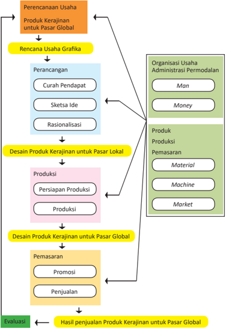

> **Deskripsi Visual:** Gambar ini adalah diagram yang menunjukkan proses perencanaan dan implementasi produk kerajinan untuk pasar global. Diagram ini terdiri dari berbagai tahap yang saling terkait dan disusun dalam struktur yang jelas.

1. **Apa yang Ditampilkan Secara Keseluruhan**: Gambar ini menunjukkan proses perencanaan dan implementasi produk kerajinan untuk pasar global melalui berbagai tahap yang terorganisir dengan baik. Proses ini melibatkan perancangan, desain produk, produksi, pemasaran, dan evaluasi hasil penjualan.

2. **Elemen-Elemen Utama dan Relasinya**: 
   - **Perencanaan Usaha**: Ini adalah tahap awal yang melibatkan pengambilan keputusan tentang jenis usaha dan tujuan pasar.
   - **Rencana Usaha Grafika**: Ini mencakup perancangan produk kerajinan, termasuk curah pendapat, sketsa ide, dan rasionalisasi.
   - **Organisasi Usaha Administrasi Permodalan**: Ini melibatkan manajemen dan pengelolaan dana.
   - **Produk Produksi Pemasaran**: Ini mencakup persiapan produksi, produksi, material, mesin, dan pasar.
   - **Desain Produk Kerajinan untuk Pasar Lokal**: Ini adalah tahap selanjutnya setelah perencanaan dan organisasi.
   - **Desain Produk Kerajinan untuk Pasar Global**: Ini adalah tahap akhir yang melibatkan promosi dan penjualan produk.
   - **Pemasaran**: Ini mencakup promosi dan penjualan produk.
   - **Evaluasi**: Ini adalah tahap akhir yang melibatkan penilaian hasil penjualan.

3. **Teks, Angka, atau Label Penting yang Terlihat**: 
   - **Curah Pendapat**, **Sketsa Ide**, **Rasionalisasi**, **Persiapan Produksi**, **Produksi**, **Material**, **Machine**, **Market**, **Promosi**, **Penjualan**, dan **Hasil penjualan** adalah teks penting yang muncul dalam diagram.
   - **Man**, **Money**, dan **Evaluasi** adalah angka yang mungkin merujuk pada posisi atau fung

 

---
## 📄 Halaman 66

### C.  Tujuan Pembelajaran

Setelah mempelajari Wirausaha Produk Kerajinan untuk Pasar Lokal, peserta didik mampu:

- Menghayati bahwa akal pikiran dan kemampuan manusia dalam berpikir kreatif  untuk  membuat  produk  kerajinan  serta  keberhasilan  wirausaha adalah anugerah Tuhan.
- Menghayati perilaku jujur, percaya diri, dan mandiri serta sikap bekerja sama, gotong royong, bertoleransi, disiplin, bertanggung jawab, kreatif, dan  inovatif  dalam  membuat  karya  kerajinan  untuk  pasar  lokal  guna membangun semangat usaha.
- Mendesain  dan  membuat  produk  serta  pengemasan  karya  kerajinan untuk  pasar  lokal  berdasarkan  identifi  kasi  kebutuhan  sumber  daya, teknologi, dan prosedur berkarya.
- Mempresentasikan,  mempromosikan  dengan  pemilihan  media  yang tepat,  dan  menjual  karya  produk  kerajinan  untuk  pasar  lokal  dengan perilaku jujur dan percaya diri melalui penjualan konsinyasi.
- Menyajikan  wirausaha  kerajinan  untuk  pasar  lokal  berdasarkan  analisis pengelolaan sumber daya yang ada di lingkungan sekitar

### D.  Proses Pembelajaran

Pembelajaran dengan Wirausaha Produk Kerajinan untuk Pasar Lokal diawali dengan materi tentang sumber daya yang dikelola dalam sebuah kegiatan wirausaha,  yang  dikenal  dengan  sebutan  6M,  yakni Man (manusia), Money (uang), Material (bahan), Machine (peralatan), Method (cara kerja),  dan Market (pasar). Pengenalan tentang 6M dilanjutkan dengan 3 tahapan yang dilaksanakan dalam kegiatan wirausaha.

Pada paparan disinggung pula tentang potensi kerajinan sebagai komoditi yang  berharga  jual  tinggi  karena  kerajinan  dihasilkan  oleh  keterampilan tangan, dan berada pada ranah industri kreatif yang saat ini merupakan salah satu penggerak ekonomi yang potensial untuk dikembangkan di Indonesia. Paparan  tentang  peluang  pengembangan  usaha  di  bidang  kerajinan  ini diberikan agar peserta didik memiliki motivasi untuk mengenali lebih dalam dan menggali lebih jauh kerajian khususnya sesuai dengan potensi di daerah setempat.

Pada  pembelajaran  ini  terdapat  Tugas  1,  yaitu  penugasan  kepada  peserta didik untuk mengenali potensi diri dan membuat kelompok usaha. Kelompok usaha ini akan menjalankan proses pembelajaran selanjutnya sebagai simulasi sebuah usaha dalam bidang kerajinan untuk pasar lokal.

 

---
## 📄 Halaman 67

### Tugas 1

Mengenali Diri dan Membuat Kelompok Usaha

Kenali dirimu: Apa yang menjadi keunggulanmu? Mendesain produk kreatif, menghitung keuangan, menggambar iklan, atau terampil dalam membuat produk? Setiap orang tentunya bisa memiliki lebih dari satu keahlian. Tuliskan keahlianmu tersebut pada selembar kertas, boleh dilengkapi dengan gambar agar lebih informatif dan  menarik.

Guru  akan  memandu  kelas  untuk  membuat  kelompok  sesuai  kompetensi yang dibutuhkan dalam kelompok.

### 1. Perencanaan Usaha Produk Kerajinan untuk Pasar Lokal

### Pendahuluan

Pembelajaran diawali dengan materi tentang pengertian pasar, pembagian pasar lokal, nasional, dan global atau internasional. Pengenalan  pasar  dilengkapi  dengan  penjelasan  tentang  segmentasi pasar. Materi tentang pasar akan lebih mudah  dipahami  apabila pembelajaran disertai diskusi dan contoh-contoh sesuai dengan konteks sehari-hari di daerah setempat. Guru dapat menanyakan kepada peserta didik beberapa pertanyaan tentang pasar dan segmentasi pasar, dengan pertanyaan seperti di bawah ini.

- Pasar sasaran yang berbeda memiliki kebutuhan yang berbeda-beda. Apa bedanya kebutuhan dari ibu yang berprofesi sebagai penjahit dengan siswi SMA/SMK/MA?
- Pasar sasaran yang berbeda memiliki keinginan yang berbeda-beda sesuai  dengan  selera.  Adakah  bedanya  pakaian/topi/alas  kaki/tas yang disukai kakek dengan siswa SMA/SMK/MA?
- Adakah  produk  yang  paling  dibutuhkan  oleh  pasar  lokal,  yang dipengaruhi oleh cuaca atau kondisi lingkungan di daerahmu?
Pertanyaan guru akan memancing peserta didik untuk berpikir kreatif. Guru memberikan motivasi kepada peserta didik untuk mengemukakan pendapatnya secara bebas.

### Kegiatan Inti

Pada kegiatan pembelajaran ini dimungkinkan muncul ide-ide peserta didik yang dapat dikembangkan pada materi pembelajaran berikutnya tentang pengembangan produk kerajinan untuk pasar lokal. Pemahaman peserta didik tentang kebutuhan pasar lokal diperkuat dengan pelaksanaan Tugas 2, Tugas 3, Tugas 4, Tugas 5, dan Tugas 6.

 

---
## 📄 Halaman 68

### Tugas 2 (Kelompok)

### Identifi  kasi Kebutuhan Pasar Lokal

- -Amati lingkungan kamu (suhu udara, adat kebiasaan, kegiatan, dan lain-lain). Kebutuhan apa saja yang dapat dipenuhi oleh produk kerajinan?

### Identifi  kasikan

- -Diskusikan dengan temanmu
- -Identifi  kasi kebutuhan produk yang sudah ada maupun ide untuk produk   yang belum ada serta pasar sasarannya. Tuliskan pada LK 2.
Tugas 2 adalah pencarian data, diskusi dan presentasi tentang Identifi  kasi  Kebutuhan  Pasar  Lokal. Tugas  ini  memberikan  kesempatan kepada peserta didik untuk melakukan kegiatan di luar sekolah, seperti melakukan pengamatan terhadap beragam pasar sasaran di lingkungan rumah, di sekolah, di tempat ibadah, alun-alun, pasar atau tempat-tempat lain.  Kegiatan sedapat mungkin dilakukan dengan menyenangkan dan membangkitkan keingintahuan peserta didik.

### Tugas 3 (Kelompok)

### Kuesioner Selera Estetis dan Daya Beli

Pilih  salah  satu  dari  pasar  sasaran  yang  telah  diidentifi  kasi  pada  Tugas  2. Misalnya pasar sasaran ibu rumah tangga usia 40-45 tahun atau siswa SMA/ SMK/MA berusia 17-19 tahun. Setiap kelompok dalam kelas dapat memilih pasar sasaran yang berbeda-beda.

Susunlah sebuah kuesioner berisi pertanyaan tentang selera estetis dan daya beli. Selera estetis yang dimaksud di sini adalah selera terhadap unsur-unsur rupa, seperti warna, bentuk, tekstur, yang tersusun dalam sebuah komposisi yang tampak pada sebuah produk. Sedangkan daya beli adalah kemampuan konsumen dalam membeli produk.

Tugas  3  adalah  pencarian  data  melalui  penyebaran  kuesioner  untuk mengetahui selera estetis dari satu segmen pasar sasaran.  Pada Buku Siswa tertera sebagai berikut.

Pasar  sasaran  pada  Buku  Siswa  adalah  ibu  rumah  tangga  atau  siswa SMA/SMK/MA,  namun  Guru  maupun  peserta  didik  diperkenankan untuk  memilih  pasar  sasaran  selain  ibu  rumah  tangga  atau  siswa. Bentuk kuesioner pun dapat dikembangkan sesuai dengan kebutuhan pembelajaran  dan  konteks  lingkungan  setempat.  Penyesuaian  dapat dilakukan  untuk  membuat  pembelajaran  menjadi  lebih  menarik  dan menyenangkan.

 

---
## 📄 Halaman 69

Pada Tugas  4,  kelompok  peserta  didik  menetapkan  pasar  sasaran  dari produk kerajinan yang akan dibuat pada materi pembelajaran berikutnya. Akhir dari  pembelajaran wirausaha produk kerajinan untuk pasar lokal adalah  melakukan  penjualan  produk  yang  dibuat  oleh  peserta  didik. Pengembangan  produk  wirausaha  harus  mempertimbangkan  target pasar sasaran, bahan baku, dan material yang ada di lingkungan sekitar, teknik dan alat, serta keterampilan produksi.

Pada  Tugas 5, peserta didik ditugasi untuk mengidentifi  kasi ragam material dan teknik yang terdapat di lingkungan sekitar.  Ragam bahan baku dan teknik yang sudah diidentifi  kasi pada Tugas 5, kemudian pada Tugas 6 dipilih untuk menjadi bahan baku dan teknik yang akan digunakan untuk perancangan produk kerajinan.  Perancangan  sebuah  produk  kerajinan harus mempertimbangkan  faktor-faktor: fungsi,  pengguna  produk, ergonomi, estetis, material, teknik produksi, dan faktor ekonomi.

### 2. Perancangan dan Produksi Produk Kerajinan untuk Pasar Lokal

Peserta  didik  telah  mengidentifi  kasi  segmen  pasar  sasaran,  potensi bahan, serta teknik produksi yang ada di lingkungan sekitar. Peserta didik kemudian mempelajari proses perancangan dengan mempelajari paparan tentang  tahapan  proses  perancangan.  Guru  dapat  menyampaikan paparan tersebut dalam bentuk ceramah dan diskusi yang memberikan kesempatan kepada peserta didik untuk terlibat aktif dalam memberikan contoh atau mengemukakan pendapatnya tentang proses perancangan. Materi teori tentang tahapan proses perancangan yang telah dipaparkan guru  dan  didiskusikan  akan  dilaksanakan  oleh  peserta  didik  dalam bentuk proyek dan unjuk kerja. Secara berkelompok peserta didik akan praktik melakukan proses perancangan dan produksi produk kerajinan untuk pasar lokal melalui pelaksaaan Tugas 7, Tugas 8 dan Tugas 9.

Proses perancangan terdiri atas beberapa tahapan yang akan dilakukan peserta didik dengan bimbingan dan arahan dari guru. Tahapan proses perancangan yaitu sebagai berikut.

- Mencari ide produk dengan curah pendapat
- Rasionalisasi
- Prototyping atau membuat studi model
- Penentuan desain akhir
Tahapan  proses  tersebut  akan  menghasilkan  desain  atau  rancangan produk kerajinan untuk pasar lokal serta petunjuk teknis untuk tahapan proses produksi. Keempat tahapan perancangan harus dilakukan dengan

61

 

---
## 📄 Halaman 70

tepat agar menghasilkan rancangan produk yang berfungsi baik, menarik, dan inovatif. Guru mendampingi setiap tahapan proses perancangan dari setiap kelompok, memberikan motivasi, dan memastikan suasana aktif dan kreatif terbangun agar terjadi proses kreatif. Proses kreatif memungkinkan peserta  didik  menghasilkan  ide-ide  yang  baru,  unik,  dan  menarik. Apabila hal itu terjadi, Guru dapat memberikan pertimbangan yang lebih bersifat teknis terkait teknis dan kerangka waktu. Namun, apabila proses kreatif tidak terjadi dalam kelompok, Guru dapat memberikan ide atau melontarkan pertanyaan yang sekiranya dapat mendorong peserta didik untuk memunculkan ide. Ide dapat dikembangkan dari tugas-tugas yang telah dibuat sebelumnya.

Pada  Buku  Siswa  terdapat  beberapa  contoh  ide  untuk  dirancang, diproduksi, dan dijual pada akhir semester yaitu,

- Produk untuk siswa yang mengikuti ekstrakurikuler bulu tangkis
- Rak sepatu
Ide lain misalnya tas alat gambar untuk siswa ekstrakurikuler seni rupa, atau  alat  membawa  beberapa  bola  basket  untuk  tim  ekstrakurikuler basket dan lain-lain.

Pada pelaksanaan pembelajaran produk yang dibuat dapat berupa produk lain  yang  muncul  dari  ide  kreatif  para  peserta  didik  atau  berdasarkan pada pengamatan terhadap kebutuhan dari pasar sasaran yang dipilih dan  potensi  yang  ada  di  lingkungan  sekitar.  Berikan  motivasi  peserta didik untuk melakukan inovasi kreatif dan melakukan disiplin kerja yang baik untuk menghasilkan produk kerajinan yang berkualitas.

Perancangan dan rencana produksi dilanjutkan dengan tahap persiapan produksi. Pada tahapan persiapan produksi, peserta didik akan melakukan  praktik  persiapan  produksi  sesuai  dengan  rancangan  dan rencana produksi yang sudah dibuat. Guru mengarahkan peserta didik agar  membuat  pembagian  kerja  dalam  kelompok  yang  mendukung kinerja yang efektif dan efi  sien, serta menghasilkan produk berkualitas tinggi. Proses perencanaan proses produksi yang dilakukan peserta didik tergantung  dari  rancangan  produk  yang  sudah  dibuat  oleh  masingmasing kelompok, tidak harus sama dengan yang terdapat pada Buku Siswa.  Secara  umum    tahapan  produksi  produk  kerajinan  untuk  pasar lokal terdiri atas:

- pembahanan,
- pembentukan,
- perakitan, dan
- fi   nishing.
Perencanaan tahapan proses produksi akan diuraikan dalam Tugas 8 yang merupakan  tugas  kelompok  dari  peserta  didik.  Perencanaan  tersebut akan dipraktikkan pada Tugas 9 yaitu kegiatan produksi hasil rancangan

 

---
## 📄 Halaman 71

yang telah dibuat pada Tugas 7. Pada praktik produksi, Guru harus dengan tegas selalu mengingatkan pentingnya Kesehatan dan Keselamatan Kerja (K3). Disiplin dalam menerapkan prosedur K3 merupakan salah satu kunci keberhasilan kegiatan produksi.

Produk  kerajinan  yang  dihasilkan  oleh  peserta  didik  membutuhkan kemasan dan label untuk menjaga keutuhan produk pada saat distribusi dan sebagai identitas serta daya tarik. Materi tentang kemasan produk kerajinan  dapat  disampaikan  dalam  bentuk  paparan  dan  diskusi,  yang dilanjutkan  dengan  pelaksanaan  Tugas  10.  Tugas  ini  secara  khusus melibatkan  peserta  didik  dalam  upaya  mengetahui  dan  memahami fungsi  dari  Identitas  Produk  atau  yang  dikenal  pula  dengan  sebutan merek atau brand .  Guru memberikan kesempatan kepada peserta didik untuk menyebutkan beberapa merek produk lokal yang dikenal. Produk tersebut  tidak  harus  produk  teknologi  transportasi,  dan  sebaiknya produk yang dikenal baik oleh peserta didik agar peserta didik mampu menjelaskan alasan merek tersebut dianggap bagus dan berhasil.

Pada  akhir  pembelajaran  tentang  produksi  kerajinan,  peserta  didik akan  membuat  kemasan  yang  sesuai  dengan  produk  kerajinan  yang sudah dibuat oleh kelompok. Kemasan yang dimaksud pada Tugas 11, dapat berupa kemasan maupun label. Kemasan sedapat mungkin cukup sederhana dan tetap menonjolkan produk kerajinannya, sedangkan label dapat berfungsi memperkuat identitas produk kerajinan. Biaya produksi kemasan  harus  dimasukkan  pada  penghitungan  biaya  produksi  pada materi pembelajaran berikutnya yaitu tentang Penghitungan Harga Jual Produk Kerajinan untuk Pasar Lokal.

### 3. Penghitungan Harga Jual Produk Kerajinan untuk Pasar Lokal

Peserta  didik  telah  melakukan  persiapan  produksi  dan  produksi,  maka mereka telah mengetahui biaya yang dikeluarkan untuk pembelian bahan baku  dan  biaya overhead yang  dikeluarkan  untuk  produksi.  Pekerjaan produksi  dilakukan  oleh  peserta  didik,  maka  biaya  tenaga  kerja  dapat disimulasikan. Guru dapat memberikan bimbingan penghitungan biaya tenaga kerja dengan meminta peserta didik untuk menghitung jumlah jam kerja dari tiap peserta didik dalam melaksanakan produksi. Jumlah total  jam  kerja  dikalikan  dengan  upah  per  jam.  Besaran  upah  per  jam dapat dihitung dari upah minimun regional yang berlaku di provinsi atau yang disebut dengan Upah Minimun Provinsi (UMP). UMP setiap provinsi bervariasi. Rata-rata UMP tahun 2014 di Indonesia adalah Rp. 1.595.900,00 bila  dibagi  jam  kerja  sekitar  Rp.  9.225,00/jam.  Apabila  seorang  peserta didik bekerja selama 3 jam/minggu selama 2 minggu, maka upah akan dihitung sebagai 3×2×Rp. 9.225,00. Upah yang diterimanya adalah Rp. 55.350,00. Mintalah pesera didik untuk membuat daftar kehadiran dan waktu kerja,  untuk  dapat  dijadikan  landasan  penentuan  upah.  Contoh penghitungan biaya produksi dapat dilihat pada contoh kasus di bawah ini.

 

---
## 📄 Halaman 72

Satu kelompok beranggotakan 5 peserta didik. Setiap peserta didik terlibat dalam proses perancangan, produksi grafi  ka, dan persiapan penjualan.  Perancangan  dilakukan  selama  1  minggu,  produksi dilakukan  selama  2  minggu,  dan  persiapan  penjualan  dilakukan selama 1 minggu. Peserta didik A dan B bekerja selama 3 jam pada minggu pertama, peserta didik C, D, dan E bekerja selama 2 jam pada minggu  pertama.  Pada  minggu  kedua,  kelimanya  bekerja  selama 3  jam.  Pada  minggu  keempat  C,  D  dan  E  bekerja  selama  3  jam, sedangkan peserta didik A dan B bekerja  selama 2 jam.

Upah tenaga kerja untuk kelompok ini adalah sebagai berikut.

Produk kerajinan yang diproduksi oleh kelompok ini membutuhkan bahan baku total seharga Rp.350.000,00. Bahan baku kemasan yang digunakan total seharga Rp. 15.000,00. Biaya overhead variabel untuk produksi ini adalah Rp. 10.000,00 dan overhead tetap Rp. 10.000,00, maka total seharga Rp. 20.000,00. Penghitungan Biaya Produksinya adalah sebagai berikut.

 

---
## 📄 Halaman 73

---
**📊 Tabel**

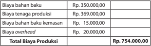

Tabel ini menunjukkan detail biaya produksi untuk sebuah produk atau usaha. Topik utamanya adalah biaya produksi total yang mencapai Rp 754.000.000. Tabel dibagi menjadi dua kolom: "Biaya bahan baku" dan "Biaya tenaga produksi". Biaya bahan baku mencakup biaya bahan baku untuk produksi sebesar Rp 369.000.000 dan biaya bahan baku kemasan sebesar Rp 15.000.000. Biaya tenaga produksi mencakup biaya overhead sebesar Rp 20.000.000. Total biaya produksi mencakup semua biaya tersebut, sehingga total biaya produksi mencapai Rp 754.000.000.

Total Biaya Produksi disebut Harga Pokok Produksi (HPP). Untuk mengetahui keseluruhan biaya yang dikeluarkan untuk sebuah produksi, HPP ditambah dengan biaya administrasi dan biaya pemasaran, sehingga diketahui  Total  Harga  Pokok  Produksi  atau  Total  HPP .  Apabila  biaya administrasi  dan  umum  sebesar  Rp.  20.000,00  dan  Biaya  Pemasaran sebesar Rp. 100.000,00, maka bentuk penghitungannya adalah sebagai berikut.

---
**📊 Tabel**

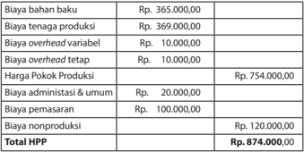

Tabel ini menunjukkan detail biaya produksi untuk satu unit produk. Topik utama adalah biaya total yang terkait dengan proses produksi. Kolom-kolomnya mencakup biaya bahan baku, tenaga produksi, overhead variabel, overhead tetap, harga pokok produk, biaya administrasi dan umum, biaya pemasaran, dan biaya nonproduksi. Data penting yang terlihat adalah bahwa total biaya produksi mencapai Rp 754.000,00, sementara total HPP (Harga Penjualan Pasar) mencapai Rp 874.000,00. Ini menunjukkan bahwa biaya produksi lebih tinggi dibandingkan dengan harga penjualan pasar, menunjukkan adanya keuntungan sebelum dikurangi dengan biaya lainnya.

Apabila  dalam  produksi  tersebut  dihasilkan  40  buah  produk  kerajinan untuk pasar lokal  dan  laba  yang  diinginkan  adalah  Rp.  8.150,00  untuk setiap produk , maka penentuan harga jualnya adalah sebagai berikut.

---
**📊 Tabel**

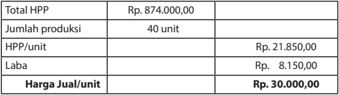

Tabel ini menunjukkan informasi tentang produksi dan penjualan produk. Topik utama tabel adalah perhitungan laba setelah pajak (LPP) untuk 40 unit produk. Kolom-kolomnya meliputi total HPP (Harga Penjualan Pasar), jumlah produksi, HPP per unit, laba per unit, dan harga jual per unit. Data penting yang terlihat adalah bahwa total HPP sebesar Rp 874.000.000, dengan HPP per unit sebesar Rp 21.850.000. Laba per unit sebesar Rp 8.150.000, dan harga jual per unit sebesar Rp 30.000.000. Dari data ini, dapat dilihat bahwa penjualan produk tersebut menghasilkan laba sebesar Rp 8.150.000 per unit, yang merupakan hasil dari perbedaan antara harga jual dan HPP.

 

---
## 📄 Halaman 74

### 4. Promosi Produk Kerajinan untuk Pasar Lokal

Pada  pembelajaran  tentang  promosi,  peserta  didik  dikenalkan  pada istilah  4P  yang  merupakan  4  faktor  strategis  yang  harus  dipikirkan dalam membuat rencana penjualan. 4P terdiri atas product , place , price , dan promotion .  Pada  pembelajaran  sebelumnya  telah  dibahas  tentang product ,  dalam  hal  ini  produk  kerajinan  dan price yaitu  harga  jualnya. Promosi  dibahas  secara  khusus  pada  pembelajaran  ini.  Guru  dapat memberikan paparan materi seperti yang terdapat pada Buku Siswa. Guru juga dapat menambahkan contoh yang sesuai dengan produk kerajinan yang dibuat para peserta didik. Peserta didik dapat diberikan kesempatan untuk memberikan pendapatnya tentang strategi promosi dan ide-ide yang muncul saat diskusi di kelas. Strategi promosi membutuhkan ideide kreatif yang unik tentang cara dan media promosi agar produk yang dijual menjadi lebih diminati.

### 5. Penjualan dengan Sistem Konsinyasi Produk Kerajinan untuk Pasar Lokal

Penjualan dengan sistem konsinyasi merupakan kegiatan pembelajaran akhir dari rangkaian kegiatan pembelajaran  yang  telah dilakukan sebelumnya. Peserta didik akan membuat  rencana promosi dan penjualan konsinyasi secara paralel, karena media promosi yang dibuat akan  tergantung  dari  pihak  yang  akan  bekerja  sama  dalam  penjualan konsinyasi.  Peserta  didik  akan  mencari  konsinyi  yang  dapat  menjual produk  kerajinan  yang  sudah  dibuat.  Peserta  didik  juga  akan  praktik membuat surat perjanjian yang akan disepakai bersama dengan konsinyi. Target  penjualan  dan  surat  perjanjian  konsinyasi  didiskusikan  dalam kelompok, serta dikonsultasikan dan dilaporkan kepada guru sebelum dilaksanakan. Peserta didik juga  akan  merancang  media  promosi yang  dikonsultasikan  dengan  konsinyi  dan  guru.  Guru  memberikan ruang  kreativitas  kepada  peserta  didik  untuk  ide-ide  media  promosi yang menarik dan inovatif. Pembuatan surat perjanjian konsinyasi dan pembuatan media promosi akan dilaksanakan pada Tugas 13 dan Tugas 14.

### E.  Evaluasi

Pembelajaran Wirausaha Produk Kerajinan untuk Pasar Lokal diawali dengan materi tentang sumber daya yang dikelola dalam sebuah kegiatan wirausaha, yang  dikenal  dengan  sebutan  6M,  yakni Man (manusia), Money (uang), Material (bahan), Machine (peralatan), Method (cara kerja), dan Market (pasar). Pengenalan  tentang  6M  dilanjutkan  dengan  3  tahapan  yang  dilaksanakan dalam  kegiatan wirausaha. Evaluasi  dapat  dilakukan  untuk  mengukur pemahaman  peserta  didik  tentang  6M  dengan  memberikan  kuis  berisi pertanyaan tentang pengertian Man, Money, Material, Machine, Method, dan Market dalam konteks kewirausahaan. Pada pembelajaran ini disinggung juga tentang potensi kerajinan sebagai bagian dari industri kreatif yang saat ini

 

---
## 📄 Halaman 75

berkembang pesat di Indonesia. Evaluasi dapat dilakukan untuk mengetahui sejauh mana peserta didik menyadari bahwa Indonesia merupakan negara yang potensial untuk perkembangan industri kreatif. Guru dapat memberikan pertanyaan seperti berikut.

- Menurut pendapatmu, faktor-faktor apa yang penting agar industri kreatif dapat berkembang?
- Menurut  pendapatmu,  mengapa  industri  kreatif  dapat  berkembang  di Indonesia?
- Menurut pendapatmu, apakah daerah kita berpotensi untuk berkembangnya industri kreatif?
- Subsektor apa, selain kerajinan, yang memiliki potensi untuk berkembang di daerah kita?
Materi tentang 6 M dan Industri Kreatif dilanjutkan dengan materi 3 Tahapan kegiatan  Wirausaha.  Guru  dapat  dilakukan  evaluasi  dengan  memberikan pertanyaan kepada peserta didik secara bergantian tentang kegiatan yang dilakukan pada masing-masing Tahap 1, Tahap 2, dan Tahap 3. Peserta didik harus  memiliki  pemahaman  tentang  tahapan  kegiatan  wirausaha  secara umum, karena  pembelajaran  Prakarya  dan  Kewirausahaan  adalah  simulasi praktik dari kegiatan wirausaha. Evaluasi dilakukan untuk memastikan bahwa peserta  didik  sudah  memiliki  gambaran  secara  umum  tentang  kegiatan wirausaha.

Evaluasi pemahaman peserta didik tentang 6 M, Industri Kreatif, dan Tahapan Kegiatan  Wirausaha  dilakukan  sebagai  asesmen  awal  yang  nantinya  akan dibandingkan dengan evaluasi setelah akhir pembelajaran. Lembar evaluasi dapat dibuat dalam bentuk daftar, seperti contoh di bawah ini.

### Contoh Lembar Evaluasi

Mata Pelajaran

: Prakarya dan Kewirausahaan

Waktu Evaluasi :

Guru Pembimbing :

Kelas :

---
**📊 Tabel**

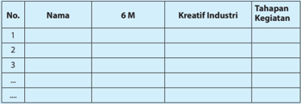

Tabel ini berisi informasi tentang 6 M (Mengenal Industri Kreatif), tahapan kegiatan, dan nama individu. Kolom "Nama" mungkin berisi nama-nama individu yang telah mengikuti program atau kursus di bidang industri kreatif. Kolom "6 M" mungkin menunjukkan hasil atau penilaian setelah mengikuti program tersebut. Kolom "Tahapan Kegiatan" mungkin menunjukkan tahapan-tahapan dalam proses belajar atau pengembangan diri. Data penting yang terlihat adalah bahwa tabel ini mungkin digunakan untuk membandingkan hasil antara individu yang berbeda dalam program tersebut.

 

---
## 📄 Halaman 76

---
**📊 Tabel**

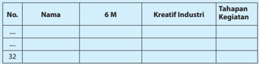

Tabel ini menunjukkan informasi tentang 32 individu yang mungkin berada dalam konteks industri kreatif. Kolom "No." menyediakan nomor untuk setiap individu, kolom "Nama" memberikan nama mereka, kolom "6 M" mungkin merujuk pada 6 karakteristik atau aspek penting, kolom "Kreatif Industri" mungkin menunjukkan seberapa besar kontribusi mereka dalam industri kreatif, dan kolom "Tahapan Kegiatan" mungkin menunjukkan tahap atau tingkat kegiatan mereka dalam industri tersebut. Data penting yang terlihat adalah bahwa tabel ini mencakup 32 individu, yang mungkin merupakan anggota komunitas atau pengusaha dalam industri kreatif, dan bahwa setiap individu memiliki beberapa karakteristik dan kontribusi yang ditentukan oleh kolom-kolom tersebut.

### Keterangan:

Skala penilaian sikap dibuat dengan rentang antara 1 s.d 3.

1 = kurang paham;

2 = cukup paham;

3 = sangat paham

Pada akhir paparan terdapat Tugas 1, yaitu penugasan kepada peserta didik untuk mengenali kompetensi dirinya dan mendeskripsikan peranan-peranan yang dapat dilakukan dalam kegiatan wirausaha. Guru akan memandu kelas untuk  pembentukan  kelompok.  Pembentukan  kelompok  dilakukan  secara terbuka, musyawarah dan adil. Kelompok ini akan bekerja sama hingga akhir semesteri,  maka  dibutuhkan  kenyamanan  dalam  kelompok  agar  kinerja kelompok dapat optimal.

### 1. Perencanaan Usaha Produk Kerajinan untuk Pasar Lokal

Pembelajaran diawali dengan materi tentang pengertian pasar, pembagian pasar lokal, nasional dan global atau internasional. Pengenalan  pasar  dilengkapi  dengan  penjelasan  tentang  segmentasi pasar. Evaluasi dapat dilakukan untuk mengetahui sejauh mana peserta didik  memahami  secara  umum  perbedaan  pasar,  lokal,  nasional  dan global serta segmentasi pasar. Pemahaman tersebut akan menjadi dasar untuk materi dan kegiatan pembelajaran selanjutnya.

Pemahaman  peserta  didik  tentang  kebutuhan  pasar  lokal  diperkuat dengan  pelaksanaan  Tugas  2,  Tugas  3,  Tugas  4,  Tugas  5,  dan  Tugas 6.  Tugas  2  adalah  pencarian  data,  diskusi,  dan  presentasi  tentang Identifi  kasi Kebutuhan Pasar Lokal. Tugas 3 adalah pencarian data melalui penyebaran kuesioner untuk mengetahui selera estetis dari satu segmen pasar sasaran.  Pada Tugas 4, kelompok peserta didik menetapkan pasar sasaran dari produk kerajinan yang akan dibuat pada materi pembelajaran berikutnya. Pada Tugas 5, peserta didik ditugasi untuk mengidentifi  kasi ragam material dan teknik yang terdapat di lingkungan sekitar.  Ragam bahan baku dan teknik yang sudah diidentifi  kasi pada Tugas 5, kemudian pada Tugas 6 dipilih untuk menjadi bahan baku dan teknik yang akan digunakan untuk perancangan produk kerajinan.

 

---
## 📄 Halaman 77

Evaluasi  terhadap  pelaksanaan  Tugas  2,  Tugas  3,  dan  Tugas  4  dapat dilakukan pada akhir pelaksanaan Tugas 4, karena Tugas 2 dan Tugas 3 merupakan proses untuk pelaksanaan Tugas 4. Evaluasi untuk Tugas 5 dan Tugas 6 dapat dilakukan pada akhir pelaksanaan Tugas 6. Teknik dan instrumen evaluasi yang digunakan dapat di antaranya Penilaian Proyek.

---
**🖼️ Gambar/Diagram**

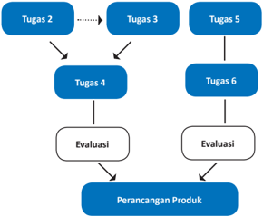

> **Deskripsi Visual:** Gambar ini adalah diagram yang menunjukkan proses atau tahapan dalam sebuah proses produk. Diagram ini menggambarkan sejumlah tugas yang harus diselesaikan dalam urutan tertentu, dengan tugas-tugas tersebut disusun dalam bentuk rantai. Setiap tugas memiliki ikatan arah yang menunjukkan arah proses, yang berarti bahwa setiap tugas harus diselesaikan sebelum tugas berikutnya dapat dimulai.

Elemen utama dalam diagram ini meliputi tugas-tugas yang disebutkan sebagai Tugas 2, Tugas 3, Tugas 5, Tugas 4, Tugas 6, dan Evaluasi. Tugas 4 dan Tugas 6 juga memiliki ikatan arah ke Evaluasi, yang menunjukkan bahwa evaluasi adalah langkah akhir dalam proses ini. Evaluasi kemudian mengarah ke Perancangan Produk, yang tampaknya merupakan hasil akhir dari semua tugas sebelumnya.

Teks, angka, atau label penting yang terlihat dalam diagram ini adalah nama-nama tugas dan evaluasi, serta ikatan arah yang menunjukkan arah proses. Informasi kunci yang dapat diambil pembaca adalah bahwa ada beberapa tugas yang harus diselesaikan secara bertahap sebelum proses akhir, yaitu perancangan produk, dapat dilakukan.

### Contoh Lembar Penilaian Proyek

Mata Pelajaran

: Prakarya dan Kewirausahaan

Nama Proyek :

Alokasi Waktu :

Guru Pembimbing :

Nama/NIS :

Kelas :

---
**📊 Tabel**

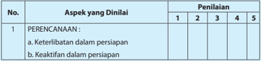

Tabel ini menunjukkan aspek-aspek yang dinilai dalam proses perencanaan, dengan penilaian berdasarkan skala 1 hingga 5. Topik utama tabel adalah "PERENCANAAN", yang dipecah menjadi dua subtopik: keterlibatan dalam persiapan dan keaktifan dalam persiapan. Setiap subtopik memiliki skor penilaian yang dapat diberikan oleh penilai, yang mencakup skor 1 hingga 5. Data penting yang terlihat adalah bahwa setiap aspek memiliki skor penilaian yang dapat diberikan oleh penilai, yang mencakup skor 1 hingga 5.

 

---
## 📄 Halaman 78

---
**📊 Tabel**

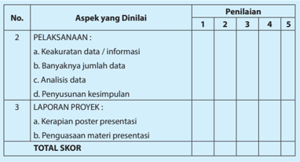

Tabel ini menunjukkan aspek-aspek yang dianalisis dalam sebuah proyek, dengan penilaian berdasarkan skor 1 hingga 5. Topik utama adalah pelaksanaan dan laporan proyek. Untuk pelaksanaan, ada empat aspek yang dianalisis: keakuratan data/informasi, banyaknya jumlah data, analisis data, dan penyusunan kesimpulan. Untuk laporan proyek, hanya satu aspek yang dianalisis: kerapihan poster presentasi. Skor total ditentukan oleh rata-rata dari semua aspek yang dianalisis.

### 2. Perancangan dan Produksi Kerajinan untuk Pasar Lokal

Pada pembelajaran ini peserta didik melaksanakan proses perancangan dalam kelompok. Hasil dari proses perancangan adalah sebuah desain produk kerajinan yang akan diproduksi. Peserta didik juga akan melakukan proses produksi.

Proses  perancangan  terdiri  atas  beberapa  langkah  yaitu  mencari  ide produk  melalui  curah  pendapat,  rasionalisasi  ide, prototyping atau membuat studi model, dan penentuan desain akhir untuk menghasilkan sebuah  rancangan  produk  kerajinan  untuk  pasar  sasaran  yang  sudah disepakati  pada  Tugas  4.  Pada  proses  perancangan  dapat  dilakukan penilaian sikap peserta didik sebagai anggota kelompok. Penilaian dapat dilakukan  secara  menyeluruh  terhadap  kinerja  setiap  peserta  didik, sehingga  peserta  didik  yang  aktif  dan  penuh  inisiatif  serta  ide  kreatif dapat memperoleh poin lebih tinggi.

Proses  perancangan  dilanjutkan  dengan  proses  produksi,  yang  secara langsung membuktikan bahwa ide rancangan dapat diwujudkan menjadi sebuah produk. Secara umum tahapan produksi produk kerajinan terdiri atas :

- pembahanan,
- pembentukan,
- perakitan, dan
- fi   nishing.
Teknik  dan  instrumen  yang  dapat  digunakan  untuk  penilaian  proses persiapan  dan  kegiatan  produksi  di  antaranya  adalah  penilaian  unjuk kerja.

 

---
## 📄 Halaman 79

### Contoh Teknik Penilaian Unjuk Kerja Tugas Produksi Kerajinan

Mata Pelajaran

: Prakarya dan Kewirausahaan

Nama Proyek :

Alokasi Waktu :

Guru Pembimbing :

Nama :

NIS :

Kelas :

---
**📊 Tabel**

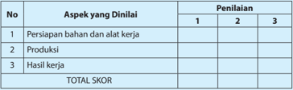

Tabel ini menunjukkan aspek-aspek yang dilakukan dalam proses kerja dan penilaian mereka oleh tiga orang penilai. Topik utama tabel adalah aspek-aspek yang dilakukan dalam proses kerja, yaitu persiapan bahan dan alat kerja, produksi, dan hasil kerja. Tabel ini memiliki tiga kolom: No., Aspek yang Dilakukan, dan Penilaian. Setiap aspek tersebut dianalisis oleh tiga penilai dengan skor 1, 2, dan 3. Skor akhir setiap aspek ditampilkan di kolom "TOTAL SKOR". Dari tabel ini, dapat dilihat bahwa aspek-aspek tersebut dianalisis secara rinci untuk memastikan kualitas kerja yang baik.

### Contoh Rubrik Penilaian Unjuk Kerja Tugas Produksi Kerajinan

---
**📊 Tabel**

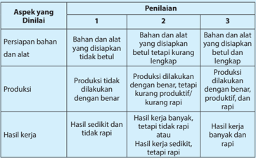

Tabel ini menunjukkan proses penilaian tiga aspek utama dalam suatu kegiatan kerja: persiapan bahan dan alat, produksi, dan hasil kerja. Topik utama tabel ini adalah evaluasi kinerja dalam sebuah tugas atau proyek. Kolom pertama berisi tiga aspek yang harus diperiksa, yaitu persiapan bahan dan alat, produksi, dan hasil kerja. Kolom kedua dan ketiga berisi skor yang diberikan untuk setiap aspek tersebut. Skor 1 menunjukkan bahwa aspek tersebut belum memenuhi standar, sedangkan skor 3 menunjukkan bahwa aspek tersebut telah memenuhi standar dengan baik. Dari tabel ini, dapat dilihat bahwa hasil kerja yang baik (hasil kerja banyak, tetapi tidak rapi) mendapatkan skor tertinggi, sementara persiapan bahan dan alat yang tidak memadai (bahan dan alat yang disiapkan tidak betul) mendapatkan skor terendah.

 

---
## 📄 Halaman 80

Tugas perancangan dan produksi dilakukan dalam kelompok, maka sebaiknya dilakukan  juga  penilaian  sikap.  Dalam  kerja  kelompok,  peserta  didik  akan menunjukkan sikap kerja dan cara komunikasi serta menyelesaikan persoalan dalam  kelompok.  Penilaian  sikap  dapat  dilakukan  dengan  beberapa  cara atau teknik. Teknik-teknik tersebut antara lain: observasi perilaku, pertanyaan langsung, dan laporan pribadi.

### Contoh Lembar Penilaian Sikap

---
**📊 Tabel**

Tabel ini merupakan alat evaluasi sikap individu terhadap berbagai aspek kehidupan, seperti keterbukaan, ketekunan, kerejinan, kedisiplinan, kerja sama, rambah kepada teman, kojujuran, tepat lanjut, kepedulian, dan tanggung jawab. Topik utamanya adalah sikap individu dalam berbagai situasi dan tugas-tugas sehari-hari. Kolom-kolomnya mencakup nama individu, serta 32 poin evaluasi yang meliputi keterbukaan, ketekunan, kerejinan, kedisiplinan, kerja sama, rambah kepada teman, kojujuran, tepat lanjut, kepedulian, dan tanggung jawab. Data atau pola penting yang terlihat adalah bahwa setiap individu memiliki nilai yang berbeda-beda untuk setiap poin evaluasi, menunjukkan variasi dalam sikap mereka.

### Keterangan Lembar Penilaian Sikap:

Skala penilaian sikap dibuat dengan rentang antara 1 sampai dengan 5.

- 1 = sangat kurang;
- 2 = kurang konsisten;
- 3 = mulai konsisten;
- 4 = konsisten; dan
- 5 = selalu konsisten

 

---
## 📄 Halaman 81

Produk yang dihasilkan dari proses kreatif dan proses produksi dari kelompok peserta  didik  berhak  mendapatkan  apresiasi  dan  penilaian.  Teknik  dan instrumen penilaian yang dapat digunakan adalah penilaian produk. Teknik penilaian produk biasanya menggunakan cara holistik atau analitik.

- Cara holistik, yaitu berdasarkan kesan keseluruhan dari produk, biasanya dilakukan pada tahap penilaian akhir.
- Cara analitik, yaitu berdasarkan aspek-aspek produk, biasanya dilakukan terhadap  semua  kriteria  yang  terdapat  pada  semua  tahap  proses pengembangan.
Bentuk  penilaiannya  dapat  menggunakan  skala  penilaian  dengan  tabel serupa dengan penilaian unjuk kerja, namun dengan kriteria penilaian yang berbeda.  Pada  sebuah  produk,  penilaian  pada  dasarnya  menilai  kualitas produk.  Untuk  produk  kerajinan  dan  rekayasa,  kebaruan  ide,  originalitas (asli/tidak meniru) atau keunikan produk menjadi salah satu kriteria penting. Disiplin  dalam  menerapkan  prosedur  K3  juga  merupakan  salah  satu  kunci keberhasilan kegiatan produksi.

### 3. Penghitungan Harga Jual Produk Kerajinan untuk Pasar Lokal

Penetapan  harga  jual  ditentukan  oleh  besaran  Harga  Pokok  Produksi (HPP) dan laba yang ingin diperoleh, dengan memperhatikan daya beli pasar  sasaran.  Evaluasi  dan  penilaian  penghitungan  harga  jual  produk adalah penilaian terhadap kemampuan peserta didik dalam menghitung keseluruhan  Harga  Pokok  Produksi  (HPP),  biaya  promosi,  dan  biayabiaya  lain  yang  dikeluarkan,  serta  kemampuan  peserta  didik  dalam mempertimbangkan besaran laba. Hasil penghitungan harga jual produk dari setiap kelompok peserta didik berbeda-beda sesuai dengan material, produk  dan  proses  produksi  yang  dilakukan.  Guru  dapat  memeriksa proses  dan  hasil  penghitungan  dari  setiap  kelompok  atau  meminta peserta didik untuk mempresentasikan penghitungannya di depan kelas, sehingga rekan sekelas dapat turut mengevaluasi.

Teknik dan instrumen penilaian yang dapat digunakan untuk unjuk kerja penghitungan harga jual produk adalah dengan daftar cek. Daftar cek dipilih  jika  unjuk  kerja  yang  dinilai  relatif  sederhana,  sehingga  kinerja peserta didik representatif  untuk  diklasifi  kasikan  menjadi  dua  kategori saja, misalnya betul atau salah.

### 4. Promosi Produk Kerajinan untuk Pasar Lokal

Pada  pembelajaran  tentang  promosi,  peserta  didik  dikenalkan  pada istilah 4P yang merupakan 4 faktor strategis yang harus dipikirkan dalam membuat  rencana  penjualan.  4P  terdiri  atas product , place , price ,  dan promotion .  Evaluasi  pemahaman  peserta  didik  tentang  pemahaman pengertian promosi, tujuan, dan jenis-jenis media  promosi  dapat dilakukan  dengan  mengadakan  kuis  atau  tanya  jawab.  Pemahaman

 

---
## 📄 Halaman 82

peserta  didik  tentang  hal  tersebut  menjadi  dasar  yang  penting  untuk pengembangan ide kreatif dalam pembuatan media promosi pada Tugas 14.

### 5. Penjualan Sistem Konsinyasi Produk Kerajinan untuk Pasar Lokal

Penjualan dengan sistem konsinyasi merupakan kegiatan pembelajaran akhir dari rangkaian kegiatan pembelajaran  yang  telah dilakukan sebelumnya. Peserta didik akan membuat  rencana promosi dan penjualan konsinyasi secara paralel, karena media promosi yang dibuat akan  tergantung  dari  pihak  yang  akan  bekerja  sama  dalam  penjualan konsinyasi.  Pembuatan  surat  perjanjian  konsinyasi  dan    pembuatan media  promosi  akan  dilaksanakan  pada Tugas  13  dan Tugas  14.  Guru mengamati    setiap  proses  yang  terjadi  dalam  kelompok,  mulai  dari pembagian tugas hingga pelaksanaannya. Hasil pengamatan digunakan untuk evaluasi dan penilaian kinerja peserta didik dalam proses promosi dan penjualan dengan sistem konsinyasi.

Teknik penilaian dan instrumen yang digunakan untuk evaluasi dan penilaian kinerja penjualan dengan sistem konsinyasi dapat menggunakan tabel penilaian seperti contoh.

### Contoh Teknik Penilaian Tugas Penjualan dengan Sistem Konsinyasi

Mata Pelajaran

: Prakarya dan Kewirausahaan

Nama Proyek :

Alokasi Waktu :

Guru Pembimbing :

Nama :

NIS :

Kelas :

---
**📊 Tabel**

Tabel ini menunjukkan aspek-aspek penilaian penjualan yang dilakukan oleh seorang penjual. Topik utamanya adalah persiapan penjualan dengan konsinyasi, pelaksanaan promosi, dan hasil penjualan. Kolom 1 menunjukkan skor 1, kolom 2 menunjukkan skor 2, dan kolom 3 menunjukkan skor 3. Data penting yang terlihat adalah bahwa semua aspek penilaian memiliki skor 2, kecuali persiapan penjualan dengan konsinyasi yang memiliki skor 1. Ini menunjukkan bahwa penjual harus memperhatikan persiapan penjualan dengan konsinyasi lebih banyak daripada dua aspek lainnya.

 

---
## 📄 Halaman 83

### Contoh Rubrik Penilaian Tugas Penjualan dengan Sistem Konsinyasi:

---
**📊 Tabel**

Tabel ini menunjukkan penilaian sistem konsinyasi berdasarkan tiga aspek: persiapan sistem, pelaksanaan promosi, dan hasil penjualan. Topik utama tabel adalah evaluasi efektivitas sistem konsinyasi. Kolom pertama berisi aspek-aspek yang dilindungi, sedangkan kolom kedua dan ketiga berisi penilaian yang diberikan kepada sistem konsinyasi tersebut. Data penting yang terlihat adalah bahwa sistem konsinyasi yang baik harus memiliki proses pencarian konsumen yang lengkap, promosi yang dilakukan dengan benar dan produkif, serta pendataan yang rapi. Sementara itu, sistem konsinyasi yang kurang efektif mungkin tidak mencapai semua aspek tersebut.

Pembelajaran  wirausaha  produk  kerajinan  untuk  pasar  lokal  secara  umum merupakan  pembelajaran  berbasis  proyek,  maka  penilaian  kinerja  peserta didik dapat dinilai secara holistik. Penilaian holistik mengevaluasi dan menilai ketepatan teknik dan sikap kerja peserta didik selama proses pembelajaran. Penilaian proyek dapat dibuat dalam 5 skor. Tiap skor dijelaskan dalam rubrik.

### Contoh Teknik Penilaian Proyek

Mata Pelajaran

: Prakarya dan Kewirausahaan

Nama Proyek :

Alokasi Waktu :

Guru Pembimbing :

Nama/NIS :

Kelas :

 

---
## 📄 Halaman 84

---
**📊 Tabel**

Tabel ini menunjukkan aspek-aspek yang dianalisis dalam sebuah proyek, dengan penilaian berdasarkan skala 1 hingga 5. Topik utama tabel adalah "PERENCANAAN", "PELAKSANAAN", dan "LAPORAN PROYEK". Kolom-kolomnya mencakup keterlibatan dalam persiapan, keaktifan dalam persiapan, keakuratan data/informasi, banyaknya jumlah data, analisis data, penyusunan kesimpulan, kerapian materi presentasi, dan penggunaan materi presentasi. Data penting yang terlihat adalah bahwa setiap aspek memiliki 5 poin penilaian, dan total skor untuk setiap aspek ditampilkan di bawahnya.

### Contoh Rubrik Penilaian Proyek:

---
**📊 Tabel**

Tabel ini menunjukkan skor penilaian untuk dua aspek utama: perencanaan dan pelaksanaan. Topik utama tabel ini adalah evaluasi kinerja dalam hal perencanaan dan pelaksanaan. Tabel dibagi menjadi 5 kolom, masing-masing menunjukkan tingkat penilaian dari 1 hingga 5. Untuk aspek perencanaan, skor 1-3 menunjukkan perencanaan yang tidak jelas, sedangkan skor 4-5 menunjukkan perencanaan yang jelas dan detail. Sementara itu, untuk aspek pelaksanaan, skor 1-3 menunjukkan pelaksanaan yang tidak baik, sedangkan skor 4-5 menunjukkan pelaksanaan yang baik dan produktif. Pola penting yang terlihat adalah bahwa skor penilaian meningkat dari 1 ke 5 untuk kedua aspek tersebut, menunjukkan bahwa semakin baik perencanaan dan pelaksanaan, semakin tinggi skor penilaian.

 

---
## 📄 Halaman 85

---
**📊 Tabel**

Tabel ini menunjukkan berbagai tingkat kualitas laporan proyek dan bagaimana mereka diukur. Topik utama tabel adalah kualitas laporan proyek, yang dilihat melalui dua dimensi: jumlah informasi yang disampaikan dan kejelasan informasi tersebut. Kolom pertama menunjukkan tingkat kualitas laporan proyek, yang diukur berdasarkan jumlah informasi yang disampaikan (sedikit, banyak) dan kejelasan informasi tersebut (rapi, tidak rapi). Kolom kedua menunjukkan tingkat kualitas laporan proyek berdasarkan jumlah informasi yang disampaikan dan kejelasan informasi tersebut. Data penting yang terlihat adalah bahwa laporan yang baik memiliki jumlah informasi yang cukup banyak dan rapi, sedangkan laporan yang buruk memiliki jumlah informasi yang sedikit atau kurang dan tidak rapi.

### F.  Pengayaan

### 1. Perencanaan Usaha Kerajinan untuk Pasar Lokal

Pada  bagian  awal  dijelaskan  tentang  jenis-jenis  pasar  dan  segmentasi pasar. Materi ini memungkinkan dikembangkan dalam bentuk pengayaan  dengan  mempersilakan  peserta  didik  mencari  informasi lebih  jauh,  misalnya  tentang  karakter  dari  segmen  pasar  tertentu. Model pembelajaran pengayaan dapat dilakukan dengan memperoleh informasi dari beragam sumber dan mendiskusikannya di kelas. Materi pengayaan dapat disesuaikan dengan potensi lingkungan sekitar.

Perencanaan  usaha  produk  kerajinan  untuk  pasar  lokal  secara  umum terdiri atas persiapan organisasi/kelompok usaha dan rencana pembuatan produk kerajinan. Pengayaan dapat diberikan untuk memberikan wawasan tentang organisasi wirausaha, dengan titik berat pada target pasar ( market ).

---
**🖼️ Gambar/Diagram**

> **Deskripsi Visual:** Gambar ini adalah diagram yang menunjukkan struktur organisasi perusahaan dalam konteks perencanaan produk kerajinan untuk pasar global. Diagram ini terdiri dari tiga bagian utama:

1. Organisasi Usaha Administrasi Permodalan: Ini terdiri dari dua elemen utama - Man (Manajemen) dan Money (Uang). Man mengacu pada manajemen operasional dan Money mengacu pada manajemen keuangan.

2. Pengembangan Produk Rencana Produksi Strategi Pemasaran: Ini terdiri dari empat elemen utama - Material (Bahan), Machine (Mesin), Strategy (Strategi), dan Market (Pasar). Material mengacu pada bahan yang digunakan dalam produksi, Machine mengacu pada mesin yang digunakan, Strategy mengacu pada strategi pemasaran, dan Market mengacu pada pasar di mana produk akan dijual.

Teks, angka, atau label penting yang terlihat dalam diagram ini adalah "Organisasi Usaha Administrasi Permodalan" dan "Pengembangan Produk Rencana Produksi Strategi Pemasaran". Informasi kunci yang dapat diambil pembaca adalah bahwa struktur organisasi ini mencakup manajemen operasional, manajemen keuangan, pengembangan produk, produksi, strategi pemasaran, dan pasar.

 

---
## 📄 Halaman 86

Pengayaan dapat diberikan pada materi tentang hal-hal yang dipentingkan  dalam  pembentukan  organisasi  usaha,  administrasi,  dan peluang permodalan. Pengayaan pengetahuan tentang organisasi usaha,  administrasi,  dan  permodalan  ditujukan  untuk  meningkatkan kepercayaan diri peserta didik dalam memulai sebuah usaha di kemudian hari.

Proses  perencanaan  produk  kerajinan  untuk  pasar  lokal  lebih  terfokus pada pasar sasaran yang menjadi target penjualan. Perencanaan harus mempertimbangkan ketersediaan material, teknik, dan proses produksi. Proses ini merupakan kegiatan yang berkesinambungan dengan materi pembelajaran  selanjutnya,  yaitu  perancangan  dan  produksi  produk kerajinan.

### 2. Perancangan dan Produksi Kerajinan untuk Pasar Lokal

Pengayaan  untuk  materi  pembelajaran  perancangan  dan  produksi kerajinan untuk pasar lokal dapat diberikan pada tahapan-tahapan proses atau pengayaan dengan target produk akhir. Pengayaan pada tahapan proses,  contohnya  apabila  pada  tahapan  perancangan  produk  sebuah kelompok  peserta  didik  menjalankan  proses  tersebut  dalam  waktu yang lebih  singkat  dari  waktu  yang  tersedia,  maka  kelompok  tersebut diperkenankan  merancang  lebih  dari  satu  buah  produk.  Contoh  lain adalah  kelompok yang memiliki kemampuan lebih dalam pengolahan teknik  dan  material  diperkenankan  membuat  lebih  dari  satu  produk kerajinan untuk pasar lokal.

Pengayaan  pada  tahapan  proses  produksi  dapat  diberikan  berupa praktik penggunaan salah satu teknik tertentu atau kunjungan ke tempat produksi produk kerajinan. Pengayaan diberikan pada tahapan ini apabila peserta didik mampu menuntaskan target pembelajaran lebih cepat dari waktu yang tersedia.

### 3. Penghitungan Harga Jual Kerajinan untuk Pasar Lokal

Pembelajaran tentang penghitungan harga jual produk kerajinan untuk pasar lokal memiliki target agar peserta didik dapat menghitung harga jual yang tepat, berdasarkan biaya produksi yang telah dikeluarkan untuk memproduksi  produk  kerajinan  dan  laba  yang  diinginkan.  Pengayaan dapat diberikan pada pembelajaran ini adalah memberikan kesempatan kepada peserta didik yang memiliki ketertarikan dalam keuangan dan bisnis untuk mencari tahu lebih jauh strategi perencanaan biaya produksi dan penetapan harga jual agar menarik pembeli sekaligus memberikan keuntungan yang berkesinambungan.

### 4. Promosi Produk Kerajinan untuk Pasar Lokal

Pada  pembelajaran  tentang  promosi,  peserta  didik  dikenalkan  pada ragam jenis media promosi dan fungsinya. Pengayaan dapat dilakukan dengan memberikan kesempatan kepada peserta didik untuk mencari informasi lebih jauh sesuai dengan potensi daerah sekitar.

 

---
## 📄 Halaman 87

---
**📊 Tabel**

Tabel ini membahas potensi dan kegiatan pengayaan dalam konteks pembuatan materi promosi. Topik utamanya adalah bagaimana sekolah dapat berkolaborasi dengan lokasi pembuat materi promosi seperti perakitan neonbox, pembuatan iklan radio, atau televisi. Dalam kolom "Potensi", disebutkan bahwa sekolah bisa melakukan kunjungan ke lokasi pembuat dan melakukan pengamatan, diskusi tentang jenis-jenis media promosi, teknik pembuatan, dan membuat kesimpulan dan laporan. Sementara itu, dalam kolom "Kegiatan Pengayaan", disebutkan bahwa sekolah bisa melakukan pencarian data tentang jenis-jenis media promosi dan contoh-contoh desain media promosi yang kreatif, diskusi tentang tema yang dipilih, dan membuat kesimpulan dan laporan. Data penting yang terlihat adalah bahwa sekolah dapat berkolaborasi dengan lokasi pembuat materi promosi untuk meningkatkan pemahaman dan pengetahuan mereka tentang media promosi dan teknik pembuatan.

---
**🖼️ Gambar/Diagram**

> **Deskripsi Visual:** Gambar ini adalah diagram yang menunjukkan proses kerja dalam sebuah proyek atau tugas. Diagram ini menggambarkan sejumlah tugas yang harus diselesaikan dalam urutan tertentu. Tugas-tugas tersebut meliputi Tugas 2, Tugas 3, Tugas 5, Tugas 4, Tugas 6, dan Perancangan Produk. Tugas 4 dan Tugas 6 memiliki evaluasi dan remedial sebagai bagian dari prosesnya. Proses ini dimulai dengan Tugas 2 dan berlanjut ke Tugas 3, kemudian Tugas 5, dan seterusnya. Setiap tugas memiliki hubungan dengan tugas-tugas lainnya melalui arah panah yang menunjukkan urutan kerja. Evaluasi dan remedial merupakan langkah-langkah penting yang dilakukan setelah setiap tugas selesai. Akhirnya, semua tugas ini menyumbang pada perancangan produk yang akhirnya akan dihasilkan.

 

---
## 📄 Halaman 88

### 5. Penjualan Sistem Konsinyasi Kerajinan untuk Pasar Lokal

Pembelajaran  penjualan  dengan  sistem  konsinyasi  pada  prinsipnya adalah  praktik  penjualan  yang  dilakukan  oleh  peserta  didik  bekerja sama  dengan  pihak  konsinyi  secara  nyata.  Penjualan  tergantung  dari perencanaan  yang  telah  dibuat  peserta  didik,  disesuaikan  dengan perjanjian  kerja  sama  yang  dibuat  bersama  dengan  konsinyi.  Apabila kegiatan  penjualan  langsung  telah  tuntas  dilaksanakan  oleh  peserta didik,  pengayaan  yang  dapat  dilakukan  adalah  dengan  memberikan tugas berupa evaluasi proses dan hasil dari pelaksaaan penjualan dengan sistem  konsinyi  secara  mendalam,  dan  membuat  rekomendasi  dari perbaikan apa yang harus dilakukan agar hasil wirausaha kerajinan untuk pasar lokal dapat lebih optimal.

### G. Remedial

### 1. Perencanaan Usaha Kerajinan untuk Pasar Lokal

Pembelajaran perancangan usaha kerajinan untuk pasar lokal terfokus pada penelitian tentang pasar sasaran yang akan dituju.

---
**🖼️ Gambar/Diagram**

> **Deskripsi Visual:** Gambar ini adalah diagram yang menunjukkan proses perancangan produk dalam sebuah proses produksi. Diagram ini terdiri dari beberapa tahap utama yang disusun secara horizontal dan berurutan dari kiri ke kanan.

1. **Pertama, ada tahap Perancangan** yang terdiri dari tiga langkah utama: Curah Pendapat, Sketsa Ide, dan Rasionalisasi. Setiap langkah ini dilakukan untuk membangun ide-ide awal yang kemudian akan dievaluasi.

2. **Setelah itu, ada tahap Desain Produk** yang melibatkan persiapan dan produksi produk. Ini adalah tahap dimana hasil dari perancangan sebelumnya diproses lebih lanjut untuk menciptakan produk yang akhirnya akan dievaluasi.

3. **Teks penting yang terlihat** pada diagram ini adalah "Evaluasi" yang muncul di setiap tahap, menunjukkan bahwa setiap tahap perancangan dan produksi harus dievaluasi untuk memastikan sesuai dengan tujuan dan standar yang ditetapkan.

4. **Informasi kunci yang dapat diambil pembaca** adalah bahwa proses perancangan dan produksi produk melibatkan iterasi dan evaluasi yang berulang untuk memastikan hasil akhir memenuhi standar dan tujuan yang ditetapkan.

Secara keseluruhan, gambar ini menggambarkan proses yang kompleks dan sistematis dalam perancangan dan produksi produk, menekankan pentingnya evaluasi dan pemantauan setiap tahap untuk memastikan kelengkapan dan kualitas produk akhir.

 

---
## 📄 Halaman 89

Pembelajaran dilaksanakan melalui Tugas 2, Tugas 3, dan Tugas 4, serta Tugas 5 dan Tugas 6, yang terkait satu dengan lainnya. Evaluasi terhadap pelaksanaan Tugas 2, Tugas 3, dan Tugas 4 dapat dilakukan pada akhir pelaksanaan  Tugas  4,  karena  Tugas  2  dan  Tugas  3  merupakan  proses untuk pelaksanaan Tugas 4. Evaluasi untuk Tugas 5 dan Tugas 6 dapat dilakukan pada akhir pelaksanaan Tugas 6. Teknik dan instrumen evaluasi yang digunakan di antaranya adalah Penilaian Proyek.

Remedial  dapat  diberikan  apabila  peserta  didik  belum  tuntas  dalam materi yang meliputi wawasan ataupun materi yang tersifat teknis dalam pelaksanaan Tugas 2, Tugas 3 dan Tugas 4, serta Tugas 5 dan Tugas 6.

### 2. Perancangan dan Produksi Kerajinan untuk Pasar Lokal

Pembelajaran  perancangan  dan  produksi  kerajinan  untuk  pasar  lokal saling berkesinambungan. Remedial untuk materi pembelajaran ini dapat dilaksanakan  sesuai  evaluasi  yang  dilakukan  secara  bertahap  melalui pengamatan  guru  terhadap  kinerja  peserta  didik.  Evaluasi  dilakukan setidaknya dua kali yaitu setelah proses perancangan dan setelah proses produksi.  Evaluasi  kinerja  peserta  didik  juga  dapat  dilakukan  selama proses  perancangan  maupun  proses  produksi.  Hasil  evaluasi  menjadi dasar dilaksanakannya pembelajaran remedial. Remedial dapat diadakan pada tahapan-tahapan tertentu tergantung ketersediaan waktu pembelajaran, seperti contoh pada bagan di depan.

### 3. Penghitungan Harga Jual Kerajinan untuk Pasar Lokal

Pembelajaran  penghitungan  harga  jual  kerajinan  untuk  pasar  lokal bertujuan  agar  peserta  didik  mampu  melakukan  penghitungan  dan penetapan  harga  jual  produk  yang  sesuai  dengan  pasar  sasarannya. Peserta  didik  secara  khusus  akan  menghitung  biaya  produksi  untuk produk yang dirancang dan diproduksi oleh kelompok, menetapkan laba, dan menetapkan harga jual. Instrumen evaluasi yang digunakan untuk penghitungan  Harga  Pokok  Produksi/Biaya  Produksi  adalah  parameter betul atau salah, karena penghitungan ini bersifat matematis. Remedial dapat diberikan apabila peserta didik menghasilkan penghitungan yang salah. Kesalahan dapat terjadi disebabkan oleh kurangnya pemahaman tentang penghitungan biaya tenaga kerja, biaya material, dan overhead . Sedangkan penetapan harga jual harus mempertimbangkan daya beli dari  pasar sasaran. Proses pembelajaran remedial dapat menelusuri lagi setiap  faktor  pembiayaan  sehingga  peserta  didik  mampu  menghitung harga jual dengan tepat.

### 4. Promosi Produk Kerajinan untuk Pasar Lokal

Pada  pembelajaran  tentang  promosi,  peserta  didik  dikenalkan  pada istilah  4P  yang  merupakan  4  faktor  strategis  yang  harus  dipikirkan dalam membuat rencana penjualan. 4P terdiri atas product, place , price,

81

 

---
## 📄 Halaman 90

dan promotion .  Evaluasi  pemahaman peserta didik tentang pengertian promosi, tujuan, dan jenis-jenis media promosi dapat dilakukan dengan mengadakan kuis atau tanya jawab. Remedial dapat dilakukan apabila peserta  didik  belum  tuntas  dalam  pemahaman  tentang  pengertian promosi, tujuan/manfaat, dan ragam media promosi.

### 5. Penjualan Sistem Konsinyasi Produk Kerajinan untuk Pasar Lokal

Materi pembelajaran penjualan konsinyasi terdiri atas persiapan konsinyasi,  pelaksanaan  promosi,  dan  konsinyasi.  Persiapan  berupa pencarian konsinyi dan pembuatan surat perjanjian. Guru dapat mengevaluasi tahapan ini, untuk mengetahui sejauh mana peserta didik berhasil mempersiapkan sebuah kerja sama yang saling menguntungkan kedua belah pihak. Apabila peserta didik belum tuntas dalam membuat perencanaan  penjualan  dengan  sistem konsinyasi, remedial dapat dilaksanakan.

Tahapan berikutnya pada pembelajaran ini, peserta didik akan melakukan promosi.  Evaluasi  dari  kegiatan  ini  adalah  keberhasilan  peserta  didik dalam  menghasilkan  angka  penjualan  yang  tinggi.  Para  tahapan  ini pembelajaran remedial tidak dapat berupa kegiatan penjualan, karena kegiatan penjualan memerlukan alokasi waktu yang khusus.

### H.  Interaksi dengan Orang Tua Peserta Didik

### 1. Perencanaan Usaha Kerajinan untuk Pasar Lokal

Pembelajaran perancangan usaha kerajinan untuk pasar lokal terfokus pada penelitian tentang pasar sasaran yang akan dituju. Interaksi dengan orang  tua  yang  dapat  dilakukan  adalah  pelibatan  orang  tua  menjadi salah  satu  segmen  pasar  sasaran  yang  diwawancara  untuk  diketahui kebutuhan, keinginan, dan seleranya.

### 2. Perancangan dan Produksi Kerajinan untuk Pasar Lokal

Pada  pembelajaran  perancangan  dan  produksi  kerajinan  untuk  pasar lokal, interaksi dengan orang tua yang dapat dilakukan adalah dengan melibatkan orang tua dalam mengapresiasi dan memberikan komentar terhadap  ide  dan  rancangan  produk  yang  dibuat  oleh  peserta  didik. Orang tua dalam hal ini dapat menjadi representasi dari pasar sasaran atau calon pembeli produk, yang memberikan komentar, masukan, dan saran sesuai berdasarkan kebutuhan dan keinginannya. Orang tua juga dapat dilibatkan untuk memberikan masukan dan saran tentang proses produksi  agar  kegiatan  produksi  berjalan  dengan  efi  sien  dan  produk yang dihasilkan berkualitas baik.

 

---
## 📄 Halaman 91

### 3. Penghitungan Harga Jual Kerajinan untuk Pasar Lokal

Pembelajaran  penghitungan  harga  jual  kerajinan  untuk  pasar  lokal bertujuan  agar  peserta  didik  mampu  melakukan  penghitungan  dan penetapan  harga  jual  produk  yang  sesuai  dengan  pasar  sasarannya. Interaksi  dengan  orang  tua  yang  dapat  dilakukan  untuk  mendukung pembelajaran  ini  di  antaranya  dengan  meminta  pendapat  kepada orang tua tentang harga jual atau laba yang sesuai untuk produk yang telah  dibuat.  Orang  tua  dapat  menempatkan  diri  sebagai  konsumen yang menilai apakah harga jual tersebut sesuai dengan kualitas produk kerajinan yang dibuat.

### 4. Promosi Produk Kerajinan untuk Pasar Lokal

Pada  pembelajaran  tentang  promosi,  peserta  didik  dikenalkan  pada istilah 4P yang merupakan 4 faktor strategis yang harus dipikirkan dalam membuat  rencana  penjualan.  4P  terdiri  atas product , place , price ,  dan promotion .  Orang  tua  dapat  berinteraksi  dengan  peserta  didik  dalam berdiskusi tentang tempat strategis untuk penjualan kerajinan. Orang tua dapat dimintai pendapatnya tentang calon konsinyi yang dapat bekerja sama dalam penjualan produk kerajinan untuk pasar lokal.

### 5. Penjualan Sistem Konsinyasi Produk Kerajinan untuk Pasar Lokal

Materi pembelajaran penjualan konsinyasi terdiri atas persiapan konsinyasi,  pelaksanaan  promosi,  dan  konsinyasi.  Persiapan  berupa pencarian  konsinyi  dan  pembuatan  surat  perjanjian.  Interaksi  dengan orang  tua  dapat  dilakukan  dengan  memintai  pendapat  orang  tua tentang  isi  surat  perjanjian  agar  adil  untuk  kedua  belah  pihak.  Bila orang tua memiliki tempat berjualan, dapat berperan sebagai konsinyi yang bekerja sama dengan kelompok peserta didik. Pendapat orang tua merupakan  salah  satu  dasar  pertimbangan  dari  keputusan  yang  akan diambil  oleh  peserta  didik.  Keputusan  tetap  ditentukan  oleh  peserta didik dan kelompok kerjanya.

 

---
## 📄 Halaman 92

84

Buku Guru Kelas XII SMA/SMK/MA/MAK

 

---
## 📄 Halaman 93

### BAB II

Wirausaha Rekayasa Jasa Profesi dan Profesionalisme

Rekayasa

Prakarya dan Kewirausahaan

85

 

---
## 📄 Halaman 94

### A.  Kompetensi Inti (KI) dan Kompetensi Dasar (KD)

Kompetensi Pengetahuan dan Kompetensi Keterampilan yang dikembangkan melalui kegiatan pembelajaran materi rekayasa dan kewirausahaan Kelas XII semester 1 tercantum dalam tabel sebagai berikut.

---
**📊 Tabel**

Tabel ini memperlihatkan dua kompetensi utama: Kompetensi Inti 3 (Pengenalan) dan Kompetensi Inti 4 (Keterampilan). Kompetensi Inti 3 fokus pada pemahaman, pengetahuan, dan evaluasi tentang konsep teori, prosedur, dan kognitif berdasarkan rasa ingin tahu tentang ilmu pengetahuan, teknologi, seni, budaya, dan humaniora dengan wawasan kemanusiaan, kebangsaan, kesejahteraan, dan keadilan. Sementara itu, Kompetensi Inti 4 mencakup keterampilan seperti mengolah, menanyai, dan menciptakan dalam ranah abstrak dan ranah kontekstual terkait bidang jurnalisme di sekolah secara mandiri dan berinteraksi secara efektif dan kreatif. Tabel juga mencakup kompetensi dasar yang meliputi perencanaan usaha jasa profesional, manajemen sistem produksi, evaluasi kegiatan usaha, manajemen media promosi, dan manajemen sistem konsinyasi. Data penting yang terlihat adalah bahwa setiap kompetensi inti memiliki beberapa subkompetensi dasar yang harus dipenuhi untuk mencapai tujuan tersebut.

 

---
## 📄 Halaman 95

### B.  Tujuan Pembelajaran

- Menghayati bahwa akal pikiran dan kemampuan manusia dalam berpikir kreatif  untuk  membuat  produk  rekayasa  serta  keberhasilan  wirausaha adalah anugerah Tuhan.
- Menghayati perilaku jujur, percaya diri, dan mandiri serta sikap bekerja sama, gotong royong, bertoleransi, disiplin, bertanggung jawab, kreatif  dan  inovatif  dalam  membuat  karya  rekayasa  jasa  profesi  dan profesionalisme untuk membangun semangat usaha.
- Mendesain dan membuat produk serta pengemasan produk rekayasa jasa profesi dan profesionalisme berdasarkan identifi  kasi kebutuhan sumber daya, teknologi, dan prosedur berkarya.
- Mempresentasikan karya dan proposal usaha produk rekayasa jasa profesi dan profesionalisme dengan perilaku jujur dan percaya diri.
- Menyajikan simulasi wirausaha produk rekayasa jasa profesi dan profesionalisme berdasarkan analisis pengelolaan sumber daya yang ada di lingkungan sekitar.

 

---
## 📄 Halaman 96

### C.  Peta Konsep

---
**🖼️ Gambar/Diagram**

> **Deskripsi Visual:** Gambar ini adalah diagram yang menunjukkan proses perencanaan usaha jasa profesionalisme. Diagram ini terdiri dari empat tahap utama: Perencanaan Usaha, Desain dan Produk Jasa, Pemasaran, dan Evaluasi. Setiap tahap memiliki elemen-elemen yang penting untuk mencakup identifikasi produk jasa, ide dan peluang usaha, sumber daya yang dibutuhkan, potensi produk jasa di daerah, proses produksi, perhitungan harga jual produk, media promosi, penjualan produk, serta evaluasi.

Elemen-elemen utama dalam diagram ini meliputi:
- Identifikasi Produk Jasa
- Ide dan Peluang Usaha
- Sumber Daya yang Dibutuhkan
- Potensi Produk Jasa di Daerah
- Proses Produksi
- Perhitungan Harga Jual Produk
- Media Promosi
- Penjualan Produk

Teks, angka, atau label penting yang terlihat dalam diagram ini meliputi:
- "Perencanaan Usaha"
- "Produk Jasa Profesi dan Profesionalisme"
- "Organisasi usaha Administrasi Permendal"
- "Man"
- "Money"
- "Produk Produksi"
- "Material"
- "Machine"
- "Market"
- "Pemasaran Produk Jasa"

Informasi kunci yang dapat diambil pembaca meliputi:
1. Proses perencanaan usaha yang melibatkan identifikasi produk jasa, ide dan peluang usaha, sumber daya, potensi produk jasa, proses produksi, perhitungan harga jual produk, media promosi, dan penjualan produk.
2. Hubungan antara setiap tahap dengan elemen-elemen yang relevan dalam proses tersebut.
3. Pentingnya administrasi permendal dalam organisasi usaha.
4. Fokus pada pengembangan produk jasa, sumber daya, dan pemasaran sebagai aspek penting dalam perencanaan usaha.

 

---
## 📄 Halaman 97

### D.  Proses Pembelajaran

Tujuan  pembelajaran  Rekayasa  dan  Kewirausahaan  untuk  kelas  XII  SMA/ SMK semester ganjil ini adalah memberi arahan kepada peserta didik untuk mengembangkan  sikap,  pengetahuan,  dan  keterampilan  dalam  bidang produk  jasa  profesi  dan  profesionalisme.  Guru  dapat  mengembangkan model  produk  jasa  profesi  dan  profesionalisme  sesuai  dengan  peminatan, talenta/ passion atau  dengan  istilah  lain  potensi  diri  peserta  didik  dan sumber  daya  yang  tersedia  di  daerah  sekitar  yang  memungkinkan  dapat diimplementasikan dalam kehidupan sehari-hari baik di saat ini maupun di masa mendatang. Konsep dasar ini diharapkan menjadi arahan bagi peserta didik untuk melakukan pengamatan dan pengembangan serta peningkatan rasa kepekaan terhadap potensi  yang ada, terutama potensi daerah di sekitar. Pengalaman belajar melalui pendekatan saintifi  k pada pembelajaran Rekayasa dan Kewirausahaan yang ditunjukkan pada gambar 2.1 sebagai berikut.

---
**🖼️ Gambar/Diagram**

> **Deskripsi Visual:** Gambar ini adalah diagram yang menunjukkan proses penelitian profesionalisme. Diagram ini terdiri dari lima langkah yang disusun secara horizontal dari kiri ke kanan. Setiap langkah memiliki teks yang menjelaskan tugas atau tahap dalam proses tersebut.

Langkah pertama, "Mengamati," melibatkan membangun pertanyaan tentang profesi dan profesionalisme. Langkah kedua, "Menanyakan," melibatkan mempertimbangkan pertanyaan yang telah dibuat. Langkah ketiga, "Mengeksplorasi," melibatkan analisis dan pemahaman hasil eksplorasi. Langkah keempat, "Menggasosiasikan," melibatkan menggabungkan pengetahuan dan pengetahuan dengan praktik profesionalisme. Langkah kelima, "Memresentasikan," melibatkan mempresentasikan hasil penelitian.

Elemen-elemen utama dalam diagram ini adalah teks yang menjelaskan setiap langkah dalam proses penelitian profesionalisme. Angka-angka tidak digunakan dalam diagram ini, tetapi teks membantu dalam menjelaskan relasi antara setiap langkah. Label penting dalam diagram ini adalah "Mengamati," "Menanyakan," "Mengeksplorasi," "Menggasosiasikan," dan "Memresentasikan."

Informasi kunci yang dapat diambil pembaca adalah bahwa proses penelitian profesionalisme melibatkan berbagai tahap yang harus dilalui untuk mencapai tujuan akhir, yaitu mempresentasikan hasil penelitian. Setiap tahap ini memiliki tujuan dan tugas spesifik yang harus diselesaikan sebelum tahap berikutnya dapat dimulai.

Gambar 2.1 Pendekatan saintifi  k

Pembelajaran Rekayasa dan Kewirausahaan diharapkan bisa menjadi kegiatan yang menyenangkan dalam menggali potensi diri peserta didik dan potensi alam  yang  ada  di  lingkungan  sekitar,  mengkreasikannya  dalam  bentuk produk  jasa  yang  dapat  menjadi  bekal  untuk  dapat  diimplementasikan dalam  kehidupan.  Penjelasan  pada  tiap-tiap  pokok  bahasan  mengarahkan cara melakukan kegiatan praktik/pembuatan model/produk jasa profesi dan profesionalisme. Peserta didik diberi kebebasan untuk memilih jenis produk,

 

---
## 📄 Halaman 98

alat,  dan  bahan  yang  digunakan  dalam  mewujudkan  model  yang  dibuat dalam kelompok disesuaikan melalui pengarahan dari guru.

Nilai karakter yang diharapkan bagi peserta didik dalam aktivitas pembelajaran Prakarya dan Kewirausahaan adalah mampu menunjukkan sikap:

- jujur dan disiplin
- rasa ingin tahu dan semangat juang tinggi
- santun, gemar membaca, dan peduli
- kreatif dan apresiatif
- inovatif dan responsif
- bersahabat dan kooperatif
- kerja keras dan bertanggung jawab
- toleran dan mandiri
- bermasyarakat dan berkebangsaan

### Konsep Umum

Selama ini pandangan sebagian masyarakat  terkait dengan kewirausahaan adalah  bagaimana  seseorang  berdagang,  berbisnis,  atau  usaha  membuat suatu  barang  yang  dapat  dipasarkan  untuk  mendapatkan  nilai  ekonomis. Padahal kewirausahaan dapat diterapkan di mana saja, salah satunya adalah jasa  profesi.  Jiwa  kewirausahaan  yang  terkandung  dalam  sebuah  usaha produk jasa profesi di antaranya meliputi integritas, tanggung jawab, bekerja sungguh-sungguh, dan update kompetensi yang harus terus dikembangkan karena setiap saat ilmu berubah.

### Informasi untuk Guru

Era globalisasi yang memiliki dampak, baik itu positif maupun negatif, yang terus  mengalir  seiring  berkembangnya  peradapan  kehidupan  masyarakat. Mengalirnya  teknologi  yang  berkembang  saat  ini  memiliki  dampak  positif dan menjadi tantangan bagi masyarakat terutama generasi muda. Pemuda sebagai calon pelaku pembangunan harus berupaya terus mengembangkan kompetensi  serta  mengembangkan  ide  untuk  lebih  kreatif  dan  inovatif. Sebaliknya,  dampak  negatif  era  globalisasi  yaitu  dapat  muncul  persaingan tidak sehat yang diakibatkan oleh ketidaksiapan kompetensi, mentalitas, dan etos  kerja  yang  membangun;  konsumtif;  dan  minimnya  transfer  teknologi yang dapat diimplementasikan di wilayah setempat.

Penyiapan  masa  depan  terkait  dengan  pilihan  karier  harus  betul-betul tergambar jelas oleh peserta didik. Profesi  yang menjadi pilihan setiap diri peserta  didik  meliputi  pilihan  bekerja,  pilihan  melanjutkan  ke  perguruan tinggi, atau pilihan untuk mendirikan usaha. Penyiapan karier dapat diuraikan

 

---
## 📄 Halaman 99

menjadi beberapa langkah di antaranya : (1) kenali diri, potensi atau kelebihan diri: sebagai kekuatan diri peserta didik disadari, dikembangkan, dan dijadikan cita-cita atau pilihan karier masa depan, (2) kesadaran akan peluang: peserta didik  membuka  diri  dan  melihat  berbagai  peluang  yang  meliputi  peluang kerja,  kuliah,  atau  mendirikan  usaha,  (3)  pengambilan  keputusan:  peserta didik mempertimbangkan secara matang setiap peluang yang ada, apakah peluang  tersebut  sesuai  dengan  potensi  atau  kekuatan  dirinya,  dan  (4) persiapan masa depan: peserta didik membuat pilihan tentang rencana karier di masa depan setelah lulus apakah kuliah, bekerja, atau mendirikan usaha.

Jika  pilihan  rencana  bekerja  setelah  lulus  yang  diambil,  upaya  yang  harus dipersiapkan atau dilakukan peserta didik adalah mendaftarkan diri di pusat bursa  kerja,  melihat  lowongan  pekerjaan  yang  tersedia,  lalu  peserta  didik harus membuat lamaran kerja dan Curriculum Vitae (CV) atau daftar riwayat hidup.  Jika  memiliki  rencana  kuliah,  mencari  informasi  dan  memutuskan bidang studi apa yang akan dipelajari, mendaftarkan diri di perguruan tinggi, mempersiapkan diri untuk ujian masuk, dan memikirkan apa yang dilakukan setelah  lulus  kuliah.  Pilihan  rencana  mendirikan  usaha  diawali  dengan menyusun rencana bisnis dan persiapan modal usaha, menentukan sasaran konsumen, lokasi tempat usaha, rekan kerja sama, dan siapa pesaingnya.

### Kegiatan Belajar 1

### Perencanaan Usaha Jasa Profesi dan Profesionalisme

Pada  perencanaan  usaha  produk  jasa  profesi  dan  profesionalisme,  guru menyampaikan  tujuan  pembelajaran  dan  langkah-langkah  peserta  didik dalam beraktivitas selama proses pembelajaran Rekayasa dan Kewirausahaan. Guru memberi penjelasan tentang pembuatan model terkait dengan produk jasa  profesi  dan  profesionalisme.  Peserta  didik  diajak  untuk  memahami konteks  produk  rekayasa  jasa  profesi  dan  profesionalisme  sebagai  bagian dari  solusi  permasalahan  dalam  berproduksi  terkait  dengan  efektifi  tas  dan efi  siensi.  Pembelajaran  dilengkapi  gambar atau video yang telah disiapkan guru  baik  itu  lewat  komputer, smart  board, maupun  poster  disesuaikan dengan kondisi yang ada.

Guru memberi motivasi kepada peserta didik. Peserta didik membaca  buku teks pelajaran tentang perencanaan produk jasa profesi dan profesionalisme. Guru mengajak peserta didik untuk mengemukakan pendapat tentang jenisjenis  produk  rekayasa  jasa  profesi  dan  profesionalisme  yang  ada  di  sekitar atau di daerah setempat. Guru memberikan orientasi tentang ciri-ciri seorang profesional,  dilanjutkan  dengan  ciri  seorang  wirausahawan.  Pembelajaran dilanjutkan  dengan  menanyakan kepada peserta didik dan mendiskusikan materi  terkait  identifi  kasi  produk  jasa  profesi  dan  profesionalisme  dengan mengerjakan  aktivitas  mengamati  wilayah  sekitar  pada  berbagai  sektor kehidupan.  Pembelajaran  mengajak  peserta  didik  untuk  mengenal  namanama  produk  jasa  dan  memahami  area  produk  yang  ada  di  sekitar  yang memungkinkan untuk dikembangkan karya produk jasa profesi dan profesionalisme sebagai solusi dalam peningkatan produktivitas.

 

---
## 📄 Halaman 100

Guru menyiapkan  jurnal pengamatan  peserta  didik  untuk  melakukan pengamatan  pada  proses  identifi  kasi.  Jurnal  itu  digunakan  guru  untuk mencatat keaktifan dan partisipasi peserta didik dalam mengerjakan Aktivitas 1. Penilaian autentik dilakukan dengan mengamati bagaimana peserta didik menjelaskan,  menafsirkan,  mensintesis,  menganalisis,  mengorganisasikan, mengkonstruksikan, dan mengevaluasi informasi yang didapatkan.

Pada proses pembelajaran sistem produksi jasa profesi dan profesionalisme, guru  terlebih  dahulu  membahas  atau  melakukan  umpan  balik  dari  tugas peserta didik melakukan  aktivitas mengamati  lingkungan  sekitar. Gali pemahaman peserta didik terkait konsep diri peserta didik yang merupakan inti  kepribadian  individu.  Konsep  ini  berperan  untuk  menentukan  dan mengarahkan perilaku dan talenta yang dimiliki untuk dikreasikan menjadi usaha  produk  jasa  profesi  dan  profesionalisme.  Arahkan  peserta  didik untuk  memperhatikan  potensi  sumber  daya  di  lingkungan  sekitar  yang memungkinkan  untuk  dikembangkan  karya  rekayasa  jasa  profesi  dan profesionalisme dalam mendukung proses produksi dan aktivitas kehidupan. Perencanaan usaha jasa profesi dan profesionalisme pada pembahasan kali ini dapat dilakukan secara simulasi sebagai seorang profesional. Tidak menutup kemungkinan  peserta  didik  dapat  melakukan  produksi  untuk  produk  jasa sesuai dengan peminatan sehingga memiliki, mengasah, dan mempertajam gambaran  karier  tentang  langkah-langkah  sebagai  profesional  di  bidang profesi yang dipilih.

Peserta  didik  diarahkan  untuk  membaca  buku  teks  pelajaran  tentang perencanaan usaha jasa profesi dan profesionalisme, lalu mendiskusikannya dalam kelompok. Peserta didik diarahkan untuk mengembangkan manfaat produk  dari  buku  teks  pelajaran  setelah  melakukan  pengamatan  dan identifi  kasi  beberapa  profesi  dalam  kehidupan  sehari-hari.  Guru  memberi kesempatan  kepada  peserta didik untuk  mengembangkan  ide  kreatif dan  inovatif  peserta  didik  terhadap  kebutuhan  peralatan  produksi  yang berkembang guna meningkatkan efektivitas dan efi  siensi dalam berproduksi. Guru memberi kesempatan peserta didik untuk mengemukakan pengalaman terkait produk jasa profesi dan profesionalisme baik itu melalui wawancara kunjungan pada home  industry , UKM  atau tempat wisata, museum, informasi lewat media internet atau media lainnya. Tugas 1 Observasi Jasa Profesi  didiskusikan  peserta  didik  melalui  studi  literasi  dan  Lembar  Kerja  1 (LK  1)  tentang  kegiatan  mengidentifi  kasi  macam-macam  jasa  profesi  dan profesionalisme  dibahas  oleh  peserta  didik.  Guru  memfasilitasi  peserta didik dalam kegiatan dan memberikan arahan kepada peserta didik dalam melakukan aktivitas  kajian pada Tugas 1.  Guru mengingatkan peserta didik dalam melakukan proses diskusi untuk mengembangkan kejujuran, toleransi, kerja sama, demokratis, dan bersahabat.

Guru melakukan pengamatan keaktifan peserta didik dan mendokumentasikan melalui jurnal pengamatan  peserta didik. Guru  memberi  kesempatan kelompok untuk memaparkan hasil diskusi kelompok dan merefl  eksi tentang ungkapan pemahaman yang telah diperoleh setelah mempelajari produk jasa

 

---
## 📄 Halaman 101

profesi  dan  profesionalisme.  Guru  memberi  apresiasi  kepada  peserta  didik yang memiliki gagasan atau ide. Guru bersama peserta didik menyimpulkan pembahasan terkait konsep diri peserta didik.

### Kegiatan Belajar 2

### Sistem Produksi Produk Jasa Profesi

Guru  mengimbau  kepada  setiap  peserta  didik    untuk  menetapkan  dan mempersiapkan pilihan dari salah satu jenis persiapan masa depan setelah lulus  pendidikan  sekolah  menengah.  Pilihan  ini  memungkinkan  menjadi karier yang mulai diupayakan berupa produk jasa profesi dan profesionalisme dengan mempertimbangkan talenta, kompetensi, dan kebutuhan pasar atau sumber daya yang ada. Peserta didik diajak untuk membuka wawasan melalui membaca buku terkait profesi dan profesionalisme pilihan peserta didik. Guru mengarahkan peserta didik untuk menceritakan isi buku yang telah dibaca.

Pembelajaran ini menggunakan  pendekatan defi  nitif, partisipatif, dan eksploratif. Model pembelajaran menggunakan project based learning , namun tidak menutup kemungkinan menggunakan model pembelajaran yang lain disesuaikan  dengan  kondisi  dan  situasi  yang  ada.  Peserta  didik  membaca buku teks pelajaran terkait jasa profesi dan profesionalisme produk jasa profesi dan profesionalisme  dan  mengidentifi  kasi  penjelasan  atau  gambar  produk jasa profesi dan profesionalisme. Peserta didik disiapkan untuk membentuk kelompok dan melakukan aktivitas terkait dengan mengidentifi  kasi permasalahan  di  lapangan.  Peserta  didik  membuat  perencanaan  model/ produk jasa profesi dan profesionalisme yang telah dipilih atau ditetapkan oleh tiap-tiap kelompok.

Guru  mengarahkan  peserta  didik  dalam  teknik  pelaksanaan  pembuatan model. Setiap kelompok melakukan pembagian tugas. Identifi  kasi produk jasa dilakukan peserta didik dengan membaca buku teks pelajaran. Peserta didik juga mengidentifi  kasi pasar dengan memperhatikan segmentasi pelanggan sehingga  mampu  membaca  peluang  pasar  yang  ada.  Guru  mengamati aktivitas  peserta  didik  dan  mendiskusikan  pertanyaan-pertanyaan  yang belum diketahui dari peserta didik.

Ide dan peluang usaha jasa profesi dan profesionalisme digali terus melalui membaca,  diskusi,  dan  pengamatan  sehingga  peserta  didik  mampu  dan bisa  membuat  keputusan  tentang  pilihan  rencana  usaha  jasa  profesi  dan profesionalisme  secara  mantap.  Rancangan  awal  dibuat  dalam  bentuk gambar desain produk rekayasa jasa profesi dan profesionalisme berdasarkan kesimpulan kajian literatur, orisinalitas ide yang jujur, sikap percaya diri, dan mandiri.  Desain model produk rekayasa jasa profesi dan profesionalisme yang telah dipilih atau ditetapkan oleh setiap kelompok dilaporkan kepada guru.

Peserta  didik  membaca  buku  teks  terkait  sumber  daya  yang  dibutuhkan dalam usaha jasa profesi dan profesionalisme, melakukan identifi  kasi dalam pembuatan produk baik yang terkait dengan komponen pendukung. Guru

 

---
## 📄 Halaman 102

melakukan  pendampingan  peserta  didik  dengan  pendekatan  defi  nitif  di mana peserta didik memperoleh informasi, pengetahuan, dan keterampilan berasal  dari  tugas  membaca  dan  pemaparan  guru  sehingga  peserta  didik dapat  mengintegrasikan  pilihan  produk  jasa  profesi  yang  direncanakan. Kompetensi kerja dan sumber daya manusia di antaranya meliputi profesiprofesi  yang  terdapat  di  buku  teks  pelajaran  dipahami  peserta  didik.  Guru menyampaikan gambar atau video pendukung materi pembelajaran terkait profesi  yang  menjadi  peminatan  yang  telah  dipetakan  guru  pada  waktu pertemuan sebelumnya.

Peserta  didik  bersama  kelompok  melakukan  aktivitas  dan  merencanakan kebutuhan bahan dari perencanaan produk jasa profesi dan profesionalisme yang  direncanakan  berdasarkan  kesepakatan  kelompok.  Kajian  literatur tentang proses produksi yang meliputi bahan, alat, dan ketentuan keselamatan kerja terkait proses produksi produk jasa profesi dan profesionalisme.

Peserta didik  diarahkan guru agar terbangun rasa ingin tahu, motivasi internal, bersikap santun, bangga dan cinta serta bersyukur sebagai warga Indonesia setelah membaca tentang potensi produk jasa profesi dan profesionalisme dan mengidentifi  kasi ragam profesi di berbagai wilayah.

Guru  mengamati  aktivitas  peserta  didik.  Peserta  didik  membuat  ulasan, gambar,  atau  foto  tentang  kegiatan  yang  dilakukan  dalam  mewujudkan model produk jasa profesi dan profesionalisme sesuai dengan kesepakatan kelompoknya.  Guru  melakukan  tindak  lanjut  terkait  pembahasan  proses produksi  dengan mengarahkan peserta didik untuk melakukan identifi  kasi dari  model  produk  jasa  profesi  dan  profesionalisme,  untuk  selanjutnya mempersiapkan bahan dan alat yang digunakan. Peserta didik mengumpulkan hasil kerja berupa perencanaan dan uraian kebutuhan bahan dan alat untuk mewujudkan model/produk jasa profesi dan profesionalisme.

Langkah-langkah  yang  perlu  diperhatikan  dalam  proyek  kegiatan  usaha jasa  profesi  dan  profesionalisme  dipahami  melalui  pendekatan  defi  nitif. Peserta  didik  membaca  dengan  teliti  langkah-langkah  tesebut  meliputi: (1) informasi produk, (2) pelaksanaan tugas pengembangan produk jasa,  (3)  jargon  nama  produk  yang  penting  untuk  mempermudah  dalam mengidentifi  kasi, (4) pendidikan dan pekerjaan yang memungkinkan peserta didik mengembangkan pilihan karier di masa depan dengan mengidentifi  kasi perguruan tinggi atau pendidikan nonformal yang menjadi pilihan peserta didik.  Peserta  didik  juga  perlu  mengidentifi  kasi  lapangan  pekerjaan  yang dapat  menjadi  tempat  untuk  berkarya  dan  mengembangkan  diri.  Guru mendorong  peserta  didik  untuk  memiliki  cita-cita  hidup  dan  tujuan  serta tujuan  kehidupan  di  masa  mendatang,  (5)  mengorganisasikan  kebutuhan untuk mewujudkan produk jasa profesi yang direncanakan untuk dibuat, (6) langkah kerja dalam penyelesaian proyek menjadi fokus kelompok dengan bekerja  secara  tim,  yang  mampu  dikerjakan  dengan  memanfaatkan  waktu secara efektif dan efi  sien, (7) lampiran pada pelaporan setelah menyelesaikan karya  produk  jasa  profesi  dan  profesionalisme  meliputi  perencanaan,  hasil

 

---
## 📄 Halaman 103

kerja  perorangan,  evaluasi  kelompok,  dan  evaluasi  dari  kelompok  lain dengan pembagian waktu yang disepakati oleh kelompok. Kegiatan ini dapat dikembangkan  di  luar  jam  terjadwal  oleh  setiap  kelompok  sebagai  tugas kokurikuler.

Guru memberi orientasi kepada peserta didik terkait penerapan Kesehatan dan Keselamatan Kerja (K3) sebagai pendukung proses produksi pembuatan produk jasa profesi dan profesionalisme. Peserta didik membaca buku teks pelajaran  terkait  dengan  penerapan  Kesehatan  dan  Keselamatan  Kerja (K3)  agar  peserta  didik  memahami  dan  melaksanakan  ketentuan  untuk menghindari  terjadinya  kesalahan  manusia  dalam  bekerja  ( human  error ). Peserta didik dapat diarahkan untuk melakukan identifi  kasi melalui internet dan media cetak terkait K3.

Peserta  didik  bersama  kelompok  mengerjakan Aktivitas  2. Peserta  didik menyimak contoh  langkah-langkah  pengerjaan  proyek  tahap  demi  tahap dengan melengkapi aktivitas yang terdapat di dalamnya sesuai kompetensi yang dibutuhkan pada tiap-tiap pilihan produk jasa. Guru menyiapkan jurnal pengamatan  peserta  didik  untuk  melakukan  pengamatan  pada  proses identifi  kasi.  Guru  mencatat  keaktifan  dan  partisipasi  peserta  didik  dalam mengerjakan Tugas 2. Peserta didik mendeskripsikan kebutuhan bahan, alat pendukung, dan ketentuan keselamatan kerja yang dikemas secara menarik sebagai wujud pemahaman pada pengetahuan atau konseptual.

### Kegiatan Belajar 3

### Penghitungan Harga Jual Produk Jasa Profesi dan Profesionalisme

Guru memberi umpan balik dan orientasi terkait tugas minggu sebelumnya tentang Tugas  2 . Peserta didik mengonstruksikan  pemahaman  yang telah dimiliki terkait produk  jasa profesi  dan  profesionalisme  dengan materi penghitungan harga jual produk jasa. Peserta didik membaca buku teks  pelajaran  terkait  penghitungan  harga  jual  produk  jasa  profesi  dan profesionalisme.  Peserta  didik  mengidentifi  kasi  proses  dan  menentukan harga  jual  produk  jasa  melalui  berbagai  media  dari  produk  yang  terkait. Guru  memberikan  orientasi  dan  mendiskusikan  pertanyaan-pertanyaan yang disampaikan peserta didik yang belum dipahami dan secara bersama mengajak  bekerja  sama  untuk  mendapatkan  penjelasan  dan  solusi  dari pertanyaan  atau  permasalahan  yang  dihadapi  peserta  didik.  Aktivitas  3 didiskusikan  dan  dianalisis  oleh  peserta  didik.  Guru  mencatat  keaktifan dan partisipasi peserta didik. Guru memberi kesempatan kepada salah satu kelompok  untuk  menjelaskan  hasil  pembuatan  diagram  alir  dari  rencana pembuatan model yang telah dipilih. Guru melakukan penilaian presentasi dan menyiapkan lembar penilaian. Guru memberikan tindak lanjut dengan mengarahkan peserta didik untuk mengerjakan Tugas 3 harga jual produk jasa.  Guru  bersama  peserta  didik  membuat  kesimpulan  dari  pembelajaran penghitungan harga jual produk jasa profesi dan profesionalisme.

 

---
## 📄 Halaman 104

### Kegiatan Belajar 4

### Media Promosi Produk Jasa Profesi dan Profesionalisme

Peserta didik bekerja dalam tim dan mengevaluasi perkembangan kesiapan pembuatan  model.  Peserta  didik  menyiapkan  tugas  minggu  lalu  terkait pembuatan model produk jasa profesi dan profesionalisme dan penghitungan harga jual sesuai dengan pilihan kelompok. Guru memotivasi peserta didik yang kurang berpartisipasi  aktif.  Guru  melakukan  komunikasi  dengan  baik dan membantu menyelesaikan masalah baik masalah belajar, pribadi, sosial, maupun karier setelah pembelajaran.

Setiap kelompok diarahkan untuk mempersiapkan paparan perkembangan hasil  praktik  pembuatan  produk/model  dan  pengamatan  media  promosi melalui kajian literatur produk  jasa profesi  dan  profesionalisme.  Guru melakukan penilaian presentasi dan perkembangan hasil kerja peserta didik. Peserta didik membaca buku teks pelajaran tentang media promosi. Peserta didik  mendesain leafl  et sebagai  bentuk  pengemasan  usaha  pembuatan produk jasa profesi dan profesionalisme dengan tampilan menarik dari hasil kerja  peserta  didik  sebagai  pemahaman  konseptual.  Peserta  didik  dengan bimbingan  guru  mengerjakan  Tugas  4,  lalu  menyimpulkan  pembelajaran dan mengumpulkan laporan atau lembar kerja hasil diskusi kelompok dalam penentuan media promosi yang dipilih untuk mempromosikan produk yang dibuat  peserta  didik.  Guru  mengarahkan  peserta  didik  untuk  melakukan observasi terkait dengan penjuan sistem konsinyasi untuk pembahasan pada pertemuan selanjutnya.

### Kegiatan Belajar 5

### Penjualan Produk dengan Sistem Konsinyasi

Pada pembelajaran ini diharapkan peserta didik dapat menjelaskan langkahlangkah penjualan produk dengan sistem konsinyasi dari produk jasa profesi dan  profesionalisme  yang  berkembang  di  wilayah  setempat.  Peserta  didik diarahkan untuk mengonstruksikan  informasi dan  pengalaman  belajar melalui proyek produk jasa profesi dan profesionalisme terkait dengan sistem konsinyasi.

Peserta didik membaca buku teks pelajaran dan melakukan identifi  kasi dari berbagai sumber. Peserta didik telah melakukan observasi dari lingkungan sekitar.

Peserta didik bersama kelompok menyelesaikan Tugas 5 tentang penjualan produk  jasa. Peserta  didik  bersama  kelompok  telah  mengumpulkan  data potensi untuk penjualan dengan sistem konsinyasi. Peserta didik menyiapkan uraian laporan tetang Tugas 5. Peserta didik menjelaskan mengapa membuat

 

---
## 📄 Halaman 105

pilihan  tempat  penjualan  produk  dengan  sistem  konsinyasi  yang  dipilih kelompok dari produk jasa profesi dan profesionalisme yang menjadi pilihan kelompoknya.

Guru memfasilitasi peserta didik untuk mempresentasikan hasil karya berupa produk rekayasa jasa profesi dan profesionalisme tiap-tiap kelompok. Peserta didik  menjelaskan  target  penjualan  dan  strategi  pencapaian  target.  Guru memberikan motivasi dan apresiasi dari ide yang dibuat peserta didik atau kelompok sebagai bentuk kreativitas dan inovasi. Peserta didik mendengarkan pendapat  kelompok  yang  berbeda  dari  kelompok  lain  dan  menghargai pendapat yang beragam. Peserta didik mengumpulkan hasil karya dan lembar laporan sebagai dokumen portofolio peserta didik baik tugas secara mandiri maupun kelompok. Peserta didik juga diharapkan dapat menjelaskan usaha jasa profesi dan profesionalisme serta dapat bekerja sama dalam tim. Lembar kerja  dikumpulkan  sebagai  artefak  penilaian  portofolio.  Lembar  penilaian presentasi disiapkan guru pada saat peserta didik melakukan presentasi hasil diskusi.

Guru  memberi  umpan  balik  dan  orientasi  terkait  dengan  pemeliharaan lingkungan dan peralatan. Guru memberi penekanan pada peserta didik  untuk  selalu  menjaga  keseimbangan  lingkungan.  Guru  melakukan pengamatan keaktifan peserta didik. Peserta didik mempresentasikan hasil diskusi dan guru melakukan penilaian. Peserta didik mempresentasikan hasil diskusi.  Tujuan  dari  penugasan  ini  adalah  untuk  mengevaluasi  hasil  karya sebagai bentuk inovasi peserta didik dan sebagai cara untuk menumbuhkan jiwa kewirausahaan. Guru bersama peserta didik menyimpulkan pembahasan perencanaan usaha di bidang produk jasa profesi dan profesionalisme setelah melaksanakan Tugas 6 yaitu Proyek Simulasi pembuatan produk jasa profesi dan profesionalisme.

Guru  menyiapkan  peserta  didik  secara  fi  sik  dan  psikis  dalam  mengikuti pembelajaran. Peserta didik dapat mengamati  proses  produksi,  dapat menghargai produk, dan dapat menganalisis proses produksi usaha produk jasa profesi dan profesionalisme sebagai bentuk evaluasi. Dari hasil evaluasi produk diharapkan peserta didik dapat menjelaskan langkah-langkah pengembangan  desain  dan  produksi.  Peserta  didik  dapat  bekerja  sama mendesain produk karya produk jasa profesi dan profesionalisme. Mendesain proses produksi di antaranya meliputi langkah-langkah berikut.

- Pengelolaan  proses  produksi  terdiri  atas  teknologi  proses  yang  dapat dipergunakan termasuk sarana dan prasarana.
- Proses  produksi  pada  sentra  terkait,  teknik  pemilihan  dan  penyiapan sarana produksi, serta teknik pemrosesan.
- Menetapkan desain proses produksi karya rekayasa berdasarkan prosedur berkarya meliputi jenis, manfaat, teknik rekayasa, dan pengemasan.
- Langkah keselamatan kerja.

 

---
## 📄 Halaman 106

Sedangkan sumber daya produk rekayasa jasa profesi dan profesionalisme meliputi unsur-unsur berikut.

- Identifi  asi kebutuhan sumber daya pada produk rekayasa jasa profesi dan profesionalisme.
- Pembuatan karya harus memperhatikan bahan, peralatan, keterampilan bekerja, dan pasar.
- Prosedur yang ditetapkan meliputi jenis, manfaat, teknik rekayasa, dan pengemasan.
- Langkah keselamatan kerja.
- Perencanaan promosi dan penjualan produk.
Keberhasilan usaha dan kriteria keberhasilan meliputi unsur-unsur berikut.

- Analisis hasil usaha rekayasa, di mana kinerja usaha dievaluasi berdasarkan kriteria keberhasilan.
- Laporan keuangan meliputi perhitungan rasio keuangan.
- Teknik dan rencana pengembangan usaha sesuai hasil evaluasi.
Guru bersama peserta didik membuat kesimpulan dari pembelajaran produk jasa  profesi  dan  profesionalisme  dalam  langkah-langkah  pengembangan desain dan produksi.

### E.  Evaluasi

Evaluasi pada pembelajaran wirausaha rekayasa jasa profesi dan profesionalisme pada kelas XII Semester 1 adalah sebagai berikut.

### 1. Perencanaan Usaha Produk Jasa Profesi dan Profesionalisme

Penilaian  proses  menggunakan  lembar  jurnal  pengamatan  peserta didik  sebagai  bentuk  penilaian  autentik.  Guru  mencatat  kekuatan  dan kelemahan peserta didik dan mengetahui langkah pembimbingan dalam mengembangkan pengetahuan dengan memotivasi peserta didik.

Pertanyaan  pada  proses  pembelajaran  mengembangkan  penyediaan sumber daya untuk mendukung pembelajaran, dan cara peserta didik melihat informasi. Guru membimbing proses belajar agar dapat diperluas. Peserta didik menimba pengalaman di luar sekolah dalam upaya untuk peningkatan kreativitas dan inovasi peserta didik.

 

---
## 📄 Halaman 107

Penilaian penugasan dapat dibuat berdasarkan format penilaian. Penilaian  yang  diamati  baik  dari  tugas  kelompok  maupun  mandiri mengukur  pengetahuan  peserta  didik.  Penilaian  meliputi  kerincian, ketepatan pengetahuan, pilihan kata, sumber referensi, dan kreativitas bentuk  laporan.  Penilaian  penugasan  sebagai  bagian  dari  penilaian portofolio  dapat  dilakukan  dengan  menggunakan  langkah-langkah sebagai berikut.

- Guru  menjelaskan  secara  ringkas  esensi  penilaian  tugas  sebagai bagian dari  kumpulan artefak dalam penilaian portofolio.
- Guru atau guru bersama peserta didik menentukan jenis tugas yang dibuat.
- Peserta didik, baik sendiri maupun kelompok, mandiri atau di bawah bimbingan guru, menyusun laporan tugas pembelajaran.
- Guru  menghimpun  dan  menyimpan  lembaran  tugas  pada  tempat yang sesuai disertai catatan tanggal pengumpulannya.
- Guru menilai hasil tugas peserta didik sebagai bagian dari portofolio dengan kriteria tertentu.
- Jika memungkinkan, guru bersama peserta didik membahas bersama dokumen portofolio yang dihasilkan.
- Guru memberi umpan balik kepada peserta didik atas hasil penilaian portofolio.
Berikut instrumen yang dapat digunakan guru untuk melakukan evaluasi pembelajaran  pada  materi  perencanaan  usaha  produk  rekayasa  jasa profesi dan profesionalisme.

### a. Penilaian Sikap

Penilaian  sikap  diutamakan  untuk  mengetahui  tingkat  kreativitas, inovasi,  jujur,  disiplin,  tanggung  jawab,  dan  mampu  bekerja  sama yang  teritegrasi  dalam  pembelajaran  pada  KD  dari  KI  3  dan  4. Penilaian  sikap  dapat  dilakukan  dengan  berbagai  cara  observasi/ pengamatan  sebagai  sumber  informasi  utama  dan  pelaporannya menjadi tanggung jawab wali kelas. Hasil penilaian pencapaian sikap oleh  pendidik  disampaikan  dalam  bentuk  predikat  atau  deskripsi. Pengamatan/observasi  dilakukan baik pada saat pembelajaran maupun diskusi dan presentasi.

 

---
## 📄 Halaman 108

### Lembar observasi pembelajaran

---
**📊 Tabel**

Tabel ini menunjukkan observasi terhadap perilaku dan karakteristik individu, dengan kolom-kolom yang mencakup aspek-aspek seperti santun, jujur, percaya diri, mandiri, dan rasa ingin tahu. Setiap baris mewakili satu individu yang telah dilakukan observasi tersebut. Data yang diperoleh meliputi skor untuk setiap aspek dan nilai akhir yang dihitung berdasarkan jumlah skor. Topik utama tabel ini adalah penilaian karakteristik dan perilaku individu berdasarkan observasi. Pola penting yang terlihat adalah bahwa semua individu memiliki skor yang berbeda-beda untuk setiap aspek, menunjukkan variasi dalam karakteristik mereka.

### Keterangan pengisian skor:

4:  Sangat baik

3:  Baik

- 2:  Cukup
- 1:  Kurang.

### Lembar observasi diskusi/presentasi

---
**📊 Tabel**

Tabel ini merupakan alat pengukuran kinerja siswa dalam berbagai aspek seperti kerja sama, tanggung jawab, pantang menyerah, dan disiplin. Topik utamanya adalah evaluasi kinerja siswa dalam berbagai aspek tersebut. Kolom-kolomnya meliputi Nama Siswa, No. Observasi, dan Nilai. Data penting yang terlihat adalah bahwa setiap siswa memiliki observasi yang berbeda-beda dalam berbagai aspek, dengan nilai yang ditentukan berdasarkan penilaian dari guru. Ini membantu dalam memantau perkembangan siswa secara individu dan memberikan bimbingan untuk meningkatkan kinerjanya di setiap aspek.

### Keterangan pengisian skor:

4:  Sangat baik

3:  Baik

- 2:  Cukup
- 1:  Kurang

 

---
## 📄 Halaman 109

### b. Penilaian Pengetahuan

Penilaian  pencapaian  kompetensi  pengetahuan  dilakukan  melalui ulangan  harian, ulangan  tengah  semester, dan  ulangan  akhir semester. Penilaian dilakukan dengan diberikan soal uraian tentang perencanaan usaha jasa profesi dan profesionalisme. Guru membuat pedoman penskorannya.

### c. Format Penilaian Keterampilan

Pengukuran pencapaian kompetensi keterampilan dilakukan melalui pengamatan/observasi, proyek, atau produk.

### Lembar observasi presentasi

Nama

: …

Kelas

: …

---
**📊 Tabel**

Tabel ini menunjukkan aspek-aspek yang dinilai dalam sebuah penilaian, dengan penilaian dilakukan oleh tiga orang penilai. Topik utama tabel adalah aspek-aspek yang dinilai, seperti komunikasi, sistematisasi penyampaian, wawasan, keberanian, antusiasme, dan penampilan. Kolom-kolomnya mencakup nomor penilaian (1, 2, dan 3) untuk setiap aspek. Data atau pola penting yang terlihat adalah bahwa semua aspek memiliki penilaian dari tiga penilai, menunjukkan bahwa penilaian ini dilakukan secara independen dan objektif.

### Rubrik lembar observasi penilaian presentasi

---
**📊 Tabel**

Tabel ini menunjukkan penilaian aspek-aspek yang dianalisis dalam sebuah proses atau kegiatan tertentu. Topik utamanya adalah penilaian aspek-aspek yang berkaitan dengan komunikasi, sistematisasi penyampaian, wawasan, keberanian, antusiasme, dan penampilan. Dalam kolom pertama, ada tiga tingkat penilaian: 1 (tidak ada), 2 (sangat baik), dan 3 (baik). Data atau pola penting yang terlihat adalah bahwa penilaian untuk semua aspek mulai dari 1 (tidak ada) hingga 3 (baik) mencerminkan gradasi dari kualitas atau tingkat keberhasilan dalam setiap aspek tersebut. Misalnya, penilaian untuk aspek komunikasi mulai dari tidak ada komunikasi (1) hingga komunikasi lancar dan baik (3), menunjukkan perbedaan yang signifikan dalam kemampuan komunikasi.

 

---
## 📄 Halaman 110

### Lembar penilaian laporan hasil observasi

---
**🖼️ Gambar/Diagram**

> **Deskripsi Visual:** Gambar ini adalah tabel yang menunjukkan skor untuk berbagai aspek dalam sebuah laporan. Tabel ini terdiri dari tiga kolom utama: No, Aspek, dan Skor (1-5). Setiap aspek dibagi menjadi beberapa poin, dengan skor yang diberikan untuk setiap poin. Misalnya, aspek pertama "PERENCANAAN" memiliki empat poin yang diberikan skor antara 1 hingga 5. Setiap poin ini kemudian dibagi menjadi sub-poin yang juga diberikan skor. Tabel ini memberikan panduan tentang bagaimana mengukur kualitas laporan berdasarkan berbagai aspek dan sub-aspek yang relevan.

---
**📊 Tabel**

Tabel ini berisi informasi tentang aspek-aspek penulisan laporan, dengan skor yang diberikan untuk setiap aspek. Topik utama tabel adalah proses penulisan laporan, yang meliputi perencanaan, pelaksanaan, dan laporan. Kolom-kolomnya mencakup aspek-aspek penulisan laporan seperti latar belakang, rumusan masalah, tujuan penulisan laporan, kepatutan pemilihan perusahaan/industri, orisinalitas laporan, mendeskripsikan ide dan peluang usaha produk rekayasa jasa profesi dan profesionalisme, mendeskripsikan sumber daya yang dibutuhkan dalam usaha produk rekayasa jasa profesi dan profesionalisme, mendeskripsikan perencanaan administrasi usaha produk rekayasa jasa profesi dan profesionalisme, struktur/logika penulisan disusun dengan jelas sesuai metode yang dipakai, bahasa yang digunakan sesuai EYD dan komunikatif, dan daftar pustaka yang dapat dipertanggungjawabkan (ilmiah). Data penting yang terlihat adalah bahwa setiap aspek memiliki skor yang diberikan antara 1 hingga 5, menunjukkan tingkat kualitas atau relevansi aspek tersebut dalam proses penulisan laporan.

 

---
## 📄 Halaman 111

### Lembar penilaian praktik membuat perencanaan usaha produk rekayasa jasa profesi dan profesionalisme

---
**📊 Tabel**

Tabel ini menunjukkan skor penilaian berdasarkan lima aspek penilaian untuk produk rekayasa jasa profesionalisme. Topik utama tabel adalah ketepatan mendeskripsikan aspek-aspek produk rekayasa jasa profesionalisme. Kolom-kolomnya meliputi 1) Ketepatan pemilihan usaha produk rekreasi jasa profesionalisme, 2) Ketepatan mendeskripsikan ide dan peluang usaha produk rekreasi jasa profesionalisme, 3) Ketepatan mendeskripsikan sumber daya yang dibutuhkan dalam usaha produk rekreasi jasa profesionalisme, 4) Ketepatan mendeskripsikan perencanaan administrasi usaha produk rekreasi jasa profesionalisme, dan 5) Ketepatan mendeskripsikan perencanaan pemasaran usaha produk rekreasi jasa profesionalisme. Data penting yang terlihat adalah bahwa setiap aspek penilaian memiliki skor antara 1 hingga 4, dengan total skor mencapai 20. Ini menunjukkan bahwa penilaian ini dilakukan secara holistik dan mempertimbangkan berbagai aspek dari produk rekreasi jasa profesionalisme.

### Keterangan pengisian skor:

- 4:  Sangat baik
- 3:  Baik
- 2:  Cukup
- 1:  Kurang

### 2. Sistem Produksi Jasa Profesi dan Profesionalisme

Penilaian  dapat  dilakukan  pada  saat  proses  atau  setelah  kegiatan pembelajaran  berlangsung  atau  pada  waktu  peserta  didik  melakukan observasi. Mengukur kemampuan peserta didik dapat dilakukan dengan memberikan pertanyaan lisan atau tertulis. Penilaian dapat  juga dilakukan dengan melihat hasil kerja peserta didik pada materi yang baru saja dikaji. Penilaian dari tugas diharapkan dapat membangun rasa ingin tahu, motivasi internal, sikap santun, bangga dan cinta tanah air, serta bersyukur sebagai warga Indonesia pada diri peserta didik.

Pengamatan meliputi ketekunan menyimak masalah dari kajian, melakukan observasi, dan menyimpulkan. Penilaian tugas mandiri dan kelompok  meliputi  penggalian  informasi.  Aspek  yang  dinilai  meliputi apresiasi, keruntutan berpikir, pilihan kata, penyusunan laporan hasil kerja, perilaku dalam kelugasan mengutarakan pendapat, serta sikap terbuka dalam menerima masukan dan koreksi. Penilaian kinerja meliputi laporan portofolio,  desain  yang meliputi aspek kegiatan mendesain, kreativitas produk  desain,  serta  sikap  mandiri,  tekun,  disiplin,  dan  bertanggung jawab.

 

---
## 📄 Halaman 112

Lembar dokumen penilaian dapat dikembangkan guru untuk mempermudah  mengorganisir  dokumen  hasil  belajar  peserta  didik dalam kerja kelompok. Jurnal diisi oleh guru sebagai dokumen outentik setiap  peserta  didik.Data  dokumen  penilaian  untuk  guru  di  antaranya meliputi dokumen-dokumen berikut.

### Lembar 1 :

Data  Group:  meliputi  nama,  kelas,  nomor  kelompok,  dan  periode group.

### Lembar 2 :

Evaluasi:  Peserta  didik  mengisi  uraian  tugas  yang  dikerjakan  dan guru merangkum data.

### Lembar 3 :

Evaluasi Akhir: kumpulan nilai dari penilaian baik berupa penilaian portofolio,  penilaian  kinerja,  penilaian  tertulis,  maupun  penilaian proyek.

### Lembar 4 :

Proyek: peserta didik mengisi tanggal diajukan, batas waktu desain dilakukan dan batas akhir harus diselesaikan. Lakukan koreksi pada sepertiga  pekerjaan  dan  diharapkan  setiap  hari  lakukan  penilaian untuk desain yang dikerjakan kelompok. Tentukan batas waktu lagi untuk semua kelompok sebelum dilakukan presentasi. Kelas dengan bimbingan guru menentukan  standar presentasi, desain, dan presentasi yang dilakukan oleh setiap kelompok.

### Lembar 5 :

Penilaian  diri  atau  antarteman  dari  desain  yang  dibuat  tiap-tiap kelompok.

### Lembar 6 :

Review Pribadi merupakan informasi penting bagi peserta didik. Hasil tugas didiskusikan dengan peserta didik untuk melihat apakah perlu remedial atau pengayaan.

Dengan lembar observasi penilaian presentasi dapat dikembangkan aspek penilaian yang meliputi komunikasi, sistematika penyampaian, wawasan, keberanian, percaya diri, atau aspek lain yang di  kembangkan oleh guru.

Lembar penilaian pembuatan model/produk rekayasa disiapkan guru. Penilaian  dalam  pembuatan model rekayasa dapat dikembangkan aspek-aspek antara lain sebagai berikut.

 

---
## 📄 Halaman 113

- Tahap  perencanaan. Sikap  kolaborasi  dapat  dikembangkan melalui  penyusunan  rubrik  penilaian.  Unsur  sikap  kolaborasi meliputi penyusunan kesepakatan yang jelas, keruntutan berpikir, komitmen bersama kelompok, pembagian tugas, terbuka pada ide atau gagasan anggota kelompok, menyiapkan observasi dengan baik, dan dapat menyelesaikan konfl  ik.
Perencanaan dan pengorganisasian dapat dikembangkan melalui  rubrik  penilaian.  Unsur-unsurnya  meliputi  pembuatan desain yang baik untuk jangka waktu yang lama dan tahu apa yang harus dilakukan, evaluasi pada teman, dapat menganalisis pemecahan masalah yang benar, terstruktur, dan dapat memenuhi tugas dengan cepat.

- Orientasi produk. Untuk merinci orientasi produk, rubrik yang dikembangkan memuat: tahu dengan baik apa yang diharapkan pengguna dalam memenuhi kebutuhan, bekerja dengan serius dan efektif dalam melakukan pengamatan dan pengembangan dengan memperhatikan K3, dapat menjelaskan mengapa produk dibuat begitu dan tidak sebaliknya, dapat dengan cepat membuat pilihan untuk dapat meyakinkan orang lain.
- Kreativitas dan inovasi . Rubrik penilaian untuk kreativitas dan inovasi meliputi mencari solusi untuk beberapa masalah, dapat mempertimbangkan ide yang baik dan meyakinkan orang lain, memiliki kepentingan yang luas, serta handal secara teknik dan kreatif.
Contoh  penilaian  terdapat  komponen  sikap  kerja  di  antaranya kreativitas, ketekunan, kesantunan, dan kecermatan. Namun, Rubrik masih dapat dikembangkan lagi sesuai komponen sikap kerja yang direncanakan untuk dinilai.

Penilaian  diri  peserta  didik  dilakukan  terkait  pembahasan  desain, bahan dan alat pendukung, proses pembuatan produk K3, perawatan, dan pengemasan produk jasa profesi, serta profesionalisme. Semua komponen itu dituangkan pada lembar penilaian diri.

### 1. Penilaian Diri

Data Pribadi Peserta Didik

Nama

: …

Kelas

: …

Semester

: …

Waktu penilaian

: …

 

---
## 📄 Halaman 114

Keterangan  =  4 : selalu; 3 : sering; 2 : kadang-kadang; 1 : tidak pernah

### 2. Penilaian Antarteman

---
**📊 Tabel**

Tabel ini menunjukkan skala penilaian berdasarkan tingkat keberhasilan siswa dalam beberapa tugas belajar. Topik utama tabel adalah "Pernyataan" yang mencakup empat poin: 1) Berusaha belajar dengan sungguh-sungguh, 2) Mengikuti pembelajaran dengan penuh perhatian, 3) Mengerjakan tugas yang diberikan guru tepat waktu, dan 4) Menyampaikan pertanyaan jika ada yang tidak dipahami. Skala penilaian ditentukan oleh angka 1 hingga 4, di mana 4 menunjukkan tingkat tertinggi keberhasilan (sangat baik), sedangkan 1 menunjukkan tingkat terendah (kurang baik). Data atau pola penting yang terlihat adalah bahwa semua poin memiliki skala yang sama, menunjukkan bahwa setiap poin memiliki nilai yang sama dalam penilaian.

 

---
## 📄 Halaman 115

---
**📊 Tabel**

Tabel ini berisi pernyataan yang diukur menggunakan skala 1 hingga 4 untuk menilai tingkat keberhasilan siswa dalam berbagai aspek perilaku sosial dan profesional. Topik utama tabel adalah tentang sikap dan perilaku siswa dalam berbagai situasi sosial dan profesional. Kolom pertama berisi nomor pernyataan, sedangkan kolom kedua berisi skala penilaian. Data penting yang terlihat adalah bahwa semua pernyataan memiliki skala 4, menunjukkan bahwa semua pernyataan dianggap sangat baik atau sangat memenuhi standar. Ini menunjukkan bahwa siswa dianggap memiliki sikap dan perilaku yang sangat baik dalam berbagai situasi sosial dan profesional.

Keterangan  =  4 : selalu; 3 : sering; 2 : kadang-kadang; 1 : tidak pernah

### 3. Penilaian Keterampilan melalui Observasi

Data Pribadi Peserta Didik

Nama

: …

Kelas

: …

Semester

: …

Waktu penilaian

: …

---
**📊 Tabel**

Tabel ini menunjukkan proses penilaian kompetensi kerja, dengan topik utama "Persiapan Kerja" dan "Proses (Sistematika dan Cara Kerja)". Kolom-kolomnya mencakup "No.", "Komponen Penilaiannya", dan "Pencapaian Kompetensi". Data penting yang terlihat meliputi skor rata-rata komponen persiapan kerja, yang mencapai 2.5, dan tidak ada data pencapaian kompetensi untuk proses kerja.

 

---
## 📄 Halaman 116

### Keterangan :

Lembar penilaian diisi berdasarkan rubrik penilaian

Skor tiap-tiap  komponen penilaian ditetapkan berdasarkan perolehan skor rata-rata dari subkomponen penilaian.

### Penghitungan Nilai Komponen Keterampilan (NKK):

---
**📊 Tabel**

Tabel ini menunjukkan proses penilaian komponen dalam sebuah proyek atau tugas, dengan fokus pada persiapan, proses, hasil, waktu, dan nilai keterampilan (NK). Topik utama tabel adalah evaluasi komponen dalam konteks penilaian. Kolom-kolomnya mencakup bobot (%) untuk setiap komponen, rata-rata skor komponen, dan nilai keterampilan (NK). Data penting yang terlihat adalah bahwa bobot persiapan sebesar 20%, proses sebesar 30%, hasil sebesar 25%, waktu sebesar 15%, dan total NK sebesar 100%. Ini menunjukkan bahwa bobot persiapan dan proses adalah dua faktor yang paling berpengaruh dalam penilaian, sementara bobot hasil dan waktu lebih kecil.

### 4. Penilaian Pengetahuan

Data Pribadi Peserta didik

Nama

: …

Kelas

: …

Semester

: …

Waktu penilaian

: …

 

---
## 📄 Halaman 117

---
**📊 Tabel**

Tabel ini menunjukkan skor pencapaian kompetensi untuk berbagai indikator penilaian pengetahuan. Topik utama tabel adalah pemahaman persiapan kerja dan pemahaman mengenai proses (sistematis dan cara kerja). Kolom-kolomnya mencakup nomor indikator penilaian, skor pencapaian kompetensi, dan rata-rata skor. Data penting yang terlihat adalah bahwa skor pencapaian kompetensi dapat mencapai 4, dengan rata-rata skor yang lebih rendah dibandingkan skor pencapaian kompetensi tertinggi. Ini menunjukkan bahwa beberapa indikator penilaian mungkin memerlukan perbaikan atau peningkatan lebih lanjut dalam pemahaman persiapan kerja dan pemahaman proses.

### 5. Penilaian Pengamatan Sikap

Data Pribadi Peserta didik

Nama

: …

Kelas

: …

Semester

: …

Waktu penilaian

: …

---
**📊 Tabel**

Tabel ini menunjukkan skor pencapaian kompetensi untuk dua proses kerja: Persiapan dan Pengerjaan. Kolom pertama berisi nomor urut dari 1 hingga 8, masing-masing menunjukkan satu proses kerja dan satu komponen sikap kerja. Kolom kedua sampai kelima berisi skor pencapaian kompetensi yang diberikan oleh subjek penilaian, dengan skor 1 hingga 4. Topik utama tabel ini adalah pencapaian kompetensi dalam proses persiapan dan pengerjaan kerja, dengan fokus pada ketekunan, kreativitas, kesantunan, dan kecermatan sebagai komponen sikap kerja. Data penting yang terlihat adalah bahwa semua proses kerja memiliki skor pencapaian kompetensi yang sama, yaitu 3, menunjukkan bahwa semua proses kerja memiliki pencapaian kompetensi yang baik.

 

---
## 📄 Halaman 118

---
**📊 Tabel**

Tabel ini menunjukkan skor pencapaian kompetensi untuk dua proses kerja: Proses Percobaan dan Proses Pelaporan. Kolom-kolomnya mencakup nomor urut proses, nama komponen sikap kerja, dan skor pencapaian kompetensi yang diberikan pada skala 1 hingga 4. Topik utama tabel ini adalah evaluasi kinerja pekerja dalam hal ketekunan, kreativitas, kesantunan, dan kecermatan. Data penting yang terlihat adalah bahwa semua komponen sikap kerja memiliki skor pencapaian yang sama, yaitu 3, yang menunjukkan bahwa pekerja tersebut telah mencapai standar tertentu dalam setiap aspek sikap kerja tersebut.

### Rubrik Penskoran Penilaian Sikap

Aspek :

Ketekunan

---
**📊 Tabel**

Tabel ini menunjukkan skor penilaian ketekunan berdasarkan indikator ketekunan yang ditentukan oleh peserta didik. Topik utama tabel ini adalah penilaian ketekunan berdasarkan indikator ketekunan yang ditentukan oleh peserta didik. Kolom-kolom yang ada dalam tabel ini adalah No., Indikator Ketekunan, Skor 1, Skor 2, Skor 3, dan Skor 4. Data atau pola penting yang terlihat dalam tabel ini adalah bahwa skor 1 diberikan jika peserta didik tidak memiliki satu atau lebih indikator yang konsisten ditunjukkan, skor 2 diberikan jika peserta didik memiliki dua indikator yang konsisten ditunjukkan, skor 3 diberikan jika peserta didik memiliki tiga indikator yang konsisten ditunjukkan, dan skor 4 diberikan jika peserta didik memiliki empat indikator yang konsisten ditunjukkan.

Aspek :

Kreativitas

---
**📊 Tabel**

Tabel ini menunjukkan indikator kreativitas dan penilaian kreativitas dalam proses berpikir kreatif. Topik utamanya adalah kreativitas dalam berpikir dan menyelesaikan masalah. Kolom pertama berisi nomor urut untuk setiap indikator kreativitas, sementara kolom kedua berisi deskripsi singkat dari indikator tersebut. Kolom ketiga berisi skor penilaian kreativitas, di mana skor 1 sampai 5 menunjukkan tingkat kreativitas yang diberikan. Pola penting yang terlihat adalah bahwa indikator kreativitas mencakup kemampuan untuk menyatakan pendapat dengan jelas, membuat ide baru, dan memecahkan masalah dengan pemahaman mendalam. Skor penilaian kreativitas juga menunjukkan bahwa indikator kreativitas dapat diperoleh melalui berbagai tingkat penilaian, mulai dari skor 1 hingga 5.

 

---
## 📄 Halaman 119

---
**📊 Tabel**

Tabel ini menunjukkan penilaian kreativitas berdasarkan 7 indikator kreatif yang disusun dalam urutan. Topik utama tabel adalah kreativitas, yang diukur melalui empat indikator: senang terhadap materi pelajaran dan berusaha mempelajarinya (enjoyment), memiliki rasa seni dalam memecahkan masalah (aesthetics), berani mengambil risiko untuk menemukan hal-hal yang baru (risk-taking), dan mencoba berulang-ulang untuk menemukan ide yang terbaik (cyclical procedure). Setiap indikator diberikan skor antara 4 hingga 7, dengan skor 4 sebagai batas minimal. Pola penting yang terlihat adalah bahwa semua indikator memiliki skor yang sama, yaitu 4, menunjukkan bahwa setiap indikator memiliki kreativitas yang rendah dalam penilaian ini.

Aspek :

Santun

---
**📊 Tabel**

Tabel ini berisi informasi tentang kriteria untuk menilai keberhasilan seseorang dalam berbicara dengan baik. Topik utamanya adalah "Santun" dan meliputi empat indikator utama: baik bahasa, menggunakan ungkapan yang tepat, menggambarkan wajah yang cerah, dan berperilaku sopan. Setiap indikator memiliki skor tertentu yang ditentukan oleh jumlah indikator yang terpenuhi. Misalnya, indikator pertama (baik bahasa) memerlukan satu skor, sedangkan indikator keempat (berperilaku sopan) memerlukan empat skor. Pola penting yang terlihat adalah bahwa untuk mendapatkan nilai tertinggi, individu harus mencapai semua empat indikator tersebut.

### Aspek : Kecermatan

---
**📊 Tabel**

Tabel ini menunjukkan indikator kecermatan dalam berbagai aspek kerja, dengan penilaian berdasarkan skor 1 hingga 4. Topik utama tabel adalah kecermatan dalam menjalankan tugas-tugas, menggunakan peralatan, memperhatikan keselamatan diri, dan memperhatikan keselamatan lingkungan. Kolom pertama menunjukkan nomor indikator kecermatan, sementara kolom kedua berisi deskripsi indikator tersebut. Kolom ketiga menunjukkan skor yang diberikan untuk setiap indikator, dengan skor 1 jika indikator muncul, skor 2 jika dua indikator muncul, skor 3 jika tiga indikator muncul, dan skor 4 jika semua empat indikator muncul. Data penting yang terlihat adalah bahwa indikator kecermatan dalam menggunakan peralatan memiliki skor tertinggi (4), menunjukkan bahwa penggunaan peralatan merupakan aspek yang paling penting dalam kecermatan kerja. Indikator kecermatan lainnya juga memiliki skor yang cukup tinggi, menunjukkan bahwa semua aspek kerja memiliki keterampilan dan pengetahuan yang diperlukan untuk menjadi cerdas dalam menjalankan tugas-tugas.

### 3. Penghitungan Harga Jual Produk Jasa Profesi dan Profesionalisme

Pengisian jurnal dilakukan pada proses pembelajaran, hasil kerja dikumpulkan sebagai kumpulan lembar portofolio.

Evaluasi pembelajaran pada materi menghitung BEP usaha jasa profesi dan profesionalisme dilakukan oleh guru dengan melakukan penilaian terhadap sikap, pengetahuan dan keterampilan. Berikut contoh instrumen yang  dapat  digunakan  guru  untuk  melakukan  evaluasi  pembelajaran pada materi menghitung BEP usaha jasa profesi dan profesionalisme.

111

 

---
## 📄 Halaman 120

### a. Penilaian Sikap

Pengukuran pencapaian kompetensi sikap dilakukan melalui pengamatan/ observasi baik pada saat pembelajaran maupun diskusi dan  presentasi.  Lembar  observasi  pembelajaran  dapat  digunakan format penilaian sikap yang meliputi sikap santun, jujur, percaya diri, mandiri, dan rasa ingin tahu seperti pada sistem penilaian tentang perencanaan usaha.

Lembar observasi diskusi/presentasi meliputi kerja sama, tanggung jawab, pantang menyerah, dan disiplin.

### b. Penilaian Pengetahuan

Pengukuran pencapaian kompetensi pengetahuan dilakukan melalui ulangan harian, ulangan tengah semester, dan ulangan akhir semester. Penilaian dilakukan dengan diberikan soal uraian tentang perhitungan BEP usaha jasa profesi dan profesionalisme. Soal uraian meliputi pengetahuan berikut.

- Pengertian dan manfaat titik impas ( Break Event Point ) usaha jasa profesi dan profesionalisme.
- Komponen perhitungan titik impas ( Break Event Point ) usaha jasa profesi dan profesionalisme.
- Menghitung titik impas ( Break Event Point ) usaha jasa profesi dan profesionalisme.
- Evaluasi hasil perhitungan titik impas ( Break Event Point )  usaha jasa profesi dan profesionalisme.
Pedoman penskoran dibuat guru.

### c. Format Penilaian Keterampilan

Pengukuran pencapaian kompetensi keterampilan dilakukan melalui pengamatan/observasi, praktik, proyek, dan produk.

 

---
## 📄 Halaman 121

### Lembar Observasi Presentasi

Nama

: …

Kelas

: …

---
**📊 Tabel**

Tabel ini menunjukkan aspek-aspek yang dinilai dalam sebuah evaluasi, dengan penilaian yang diberikan berdasarkan skala 1 hingga 3. Topik utama tabel adalah aspek-aspek yang dinilai, seperti komunikasi, sistematisasi penyampaian, wawasan, keberanian, antusiasme, dan penampilan. Kolom-kolomnya mencakup nomor urutan (No.), aspek yang dinilai, dan penilaian yang diberikan. Data penting yang terlihat adalah bahwa semua aspek tersebut memiliki penilaian yang sama, yaitu 2, menunjukkan bahwa setiap aspek mendapatkan penilaian yang sama dalam evaluasi ini.

### Rubrik Lembar Observasi Penilaian Presentasi

---
**📊 Tabel**

Tabel ini menunjukkan perbandingan tiga penilaian dalam aspek-aspek yang dianalisis, termasuk komunikasi, sistematisasi penyampaian, wawasan, keberanian, antusiasme, dan penampilan. Topik utama tabel adalah analisis kinerja individu dalam berbagai aspek. Kolom pertama menunjukkan aspek yang dianalisis, sedangkan kolom kedua dan ketiga menunjukkan tiga penilaian yang berbeda. Data penting yang terlihat adalah bahwa penilaian 1 memiliki skor rendah untuk semua aspek, sedangkan penilaian 3 memiliki skor tinggi untuk semua aspek. Ini menunjukkan bahwa penilaian 3 lebih baik daripada penilaian 1 dalam hal kinerja individu dalam berbagai aspek.

 

---
## 📄 Halaman 122

### Lembar Penilaian Keterampilan

---
**📊 Tabel**

Tabel ini menunjukkan aspek-aspek yang harus diperhatikan dalam proses penulisan laporan proyek (EYD) dengan skor evaluasi 1 hingga 5. Topik utama tabel adalah proses penulisan laporan proyek, yang terdiri dari tiga bagian utama: Perencanaan, Pelaksanaan, dan Laporan Proyek. Kolom-kolomnya mencakup berbagai aspek yang perlu diperhatikan, seperti latar belakang, rumusan masalah, tujuan penulisan, ketepatan pemilihan tema, orisinalitas laporan, mendeskripsikan pengertian, komponen, dan manfaat BEP, mendeskripsikan tentang pertumbuhan dan evaluasi BEP, struktur/fogyika penulisan, bahasa yang digunakan sesuai EYD, dan daftar pustaka. Pola penting yang terlihat adalah bahwa setiap aspek memiliki skor evaluasi yang berbeda-beda, mulai dari 1 hingga 5, yang menunjukkan tingkat kualitas dan detail yang diperlukan dalam setiap aspek.

 

---
## 📄 Halaman 123

### d. Lembar Penilaian Diri

Penilaian  diri  dilakukan  oleh  peserta  didik  untuk  menilai  dirinya sendiri berkaitan dengan proses dan tingkat pencapaian kompetensi yang telah dipelajari,  yaitu  tentang  materi  menghitung  BEP  usaha rekayasa jasa profesi dan profesionalisme.

### Lembar Penilaian Diri

Nama

: …

Kelas

: …

Materi

: …

Petunjuk :

Berilah tanda c ek (√) pada kolom alternatif sesuai kondisi yang sebenarnya, dengan kriteria sebagai berikut.

- 4 = selalu, apabila kamu selalu melakukan sesuai pernyataan
- 3 = sering, apabila kamu sering melakukan sesuai pernyataan dan kadang-kadang tidak melakukan
- 2 = kadang-kadang, apabila kamu kadang-kadang melakukan dan sering tidak melakukan
- 1 = tidak pernah, apabila kamu tidak pernah melakukan.

---
**📊 Tabel**

Tabel ini berisi pernyataan yang diuji dengan alternatif jawaban 4, 3, 2, dan 1. Topik utama tabel adalah tentang motivasi, pengetahuan, dan perilaku dalam menghadapi tantangan profesionalisme di usaha rekreasi jasa profesi. Kolom pertama berisi pernyataan yang harus dijawab, sedangkan kolom kedua berisi alternatif jawaban. Data penting yang terlihat adalah bahwa responden harus menunjukkan motivasi internal dan peduli lingkungan dalam mengambil keputusan, serta memahami materi pembelajaran tentang perhitungan BEP usaha rekreasi jasa profesi dan profesionalisme.

 

---
## 📄 Halaman 124

### e. Lembar Penilaian Antarteman

Penilaian  antarteman  dilakukan  oleh  peserta  didik  untuk  menilai temannya sendiri berkaitan dengan proses dan tingkat pencapaian kompetensi  yang  telah  dipelajari,  yaitu  tentang  menghitung  BEP produksi usaha rekayasa jasa profesi dan profesionalisme. Penilaian antarteman hanya sebagai penunjang untuk melengkapi penilaian yang dilakukan melalui observasi. Hasil penilaian antarteman ditindak lanjuti oleh guru dengan melakukan pembinaan terhadap peserta didik yang belum menunjukkan sikap yang diharapkan.

### Lembar Penilaian Antarteman

Nama teman yang dinilai

: …

Nama penilai

: …

Kelas

: …

Materi

: …

---
**📊 Tabel**

Tabel ini menunjukkan perilaku dan sikap yang muncul atau dilakukan oleh individu dalam berbagai situasi sosial. Topik utamanya adalah tentang bagaimana seseorang dapat menghadapi dan mengatasi konflik dengan teman. Kolom-kolomnya meliputi "SB" (Sikap Beradab), "B" (Berperilaku), "C" (Cerdas), dan "K" (Kreatif). Data penting yang terlihat adalah bahwa perilaku seperti "membantu solusi terhadap pendapat yang bertentangan" dan "sabar menunggu giliran berbicara" lebih sering dilihat di kolom "SB" dan "B", menunjukkan bahwa sikap beradab dan berperilaku yang baik sangat penting dalam situasi sosial ini. Sementara itu, perilaku seperti "mendukung pendapat teman" dan "santun dalam berargumentasi" lebih sering dilihat di kolom "C" dan "K", menunjukkan bahwa kemampuan untuk berpikir kritis dan kreatif juga sangat penting dalam mengatasi konflik.

SB: sangat baik; B: baik; C: cukup, dan K: kurang

### 4. Media Promosi Produk Jasa Profesi dan Profesionalisme

Pengisian  jurnal  dilakukan  pada  proses  pembelajaran  dan  hasil  kerja dikumpulkan sebagai  kumpulan lembar portofolio. Catatan guru tentang sikap yang dikembangkan oleh peserta didik dalam mengikuti aktivitas pembelajaran meliputi aspek-aspek berikut.

- Keterampilan peserta didik, bagaimana peserta didik memilih topik, mencari  dan  mengumpulkan  data,  mengolah  dan  menganalisis, memberi makna atas informasi yang diperoleh, dan menulis laporan terkait pengembangan desain dan produksi.

 

---
## 📄 Halaman 125

- Kesesuaian  atau  relevansi  materi  pelajaran  dalam  pengembangan sikap, pengetahuan dan keterampilan.
- Guru  mengidentifi  kasi  kemampuan  peserta  didik  yang  memiliki potensi    melakukan  modifi  kasi  model  dengan  upaya  peningkatan keefektifan kerja jika diimplementasikan di lingkungan dan memberikan apresiasi guna memotivasi peserta didik.
Beberapa  format  penilaian  yang  dapat  dikembangkan  di  antaranya sebagai berikut.

### a. Penilaian Sikap

Pengukuran pencapaian kompetensi sikap dilakukan melalui pengamatan/observasi baik pada saat pembelajaran maupun diskusi dan presentasi. Lembar observasi pembelajaran dapat menggunakan format penilaian sikap yang meliputi sikap santun, jujur, percaya diri, mandiri, dan rasa ingin tahu seperti pada sistem penilaian tentang perencanaan usaha.

Lembar observasi diskusi/presentasi meliputi kerja sama, tanggung jawab, pantang menyerah, dan disiplin.

### b. Penilaian Pengetahuan

Pengukuran pencapaian kompetensi pengetahuan dilakukan melalui ulangan harian, ulangan tengah semester, dan ulangan akhir semester. Pada penilaian itu diberikan soal uraian tentang promosi produk usaha jasa profesi dan profesionalisme yang meliputi:

- pengertian tentang promosi produk usaha rekayasa jasa profesi dan profesionalisme,
- menentukan strategi promosi produk usaha rekayasa jasa profesi dan profesionalisme,
- melakukan  promosi  produk  usaha  rekayasa  jasa  profesi  dan profesionalisme.
Pedoman penskoran dibuat guru.

### c. Format Penilaian Keterampilan

Pengukuran pencapaian kompetensi keterampilan dilakukan melalui pengamatan/observasi, praktik, proyek, dan produk.

 

---
## 📄 Halaman 126

### Lembar Observasi Presentasi

Nama

: …

Kelas

: …

---
**📊 Tabel**

Tabel ini menunjukkan aspek-aspek yang akan dinilai dalam sebuah penilaian, dengan penilaian dilakukan oleh tiga orang penilai. Topik utama tabel adalah aspek-aspek yang akan dinilai dalam sebuah penilaian. Kolom pertama berisi nomor urut dari aspek-aspek tersebut, sedangkan kolom kedua berisi nama-nama penilai. Data atau pola penting yang terlihat adalah bahwa setiap aspek memiliki tiga penilaian, yang menunjukkan bahwa penilaian ini dilakukan secara objektif dan mendalam untuk setiap aspek yang dinyatakan.

### Rubrik Lembar Observasi Penilaian Presentasi

---
**📊 Tabel**

Tabel ini menunjukkan hasil penilaian dari tiga aspek utama: komunikasi, sistematisasi penyampaian, dan wawasan. Kolom pertama menunjukkan tingkat penilaian, sementara kolom kedua dan ketiga berisi deskripsi penilaian untuk setiap aspek. Topik utama tabel adalah evaluasi kinerja individu dalam berbagai aspek, dengan penilaian yang mencakup komunikasi, sistematisasi penyampaian, wawasan, keberanian, antusiasme, dan penampilan. Data penting yang terlihat adalah bahwa penilaian secara keseluruhan berkisar dari tidak ada hingga baik, menunjukkan perbedaan dalam kinerja individu dalam setiap aspek.

 

---
## 📄 Halaman 127

### Lembar Penilaian Proyek

---
**📊 Tabel**

Tabel ini menunjukkan skor untuk berbagai aspek penulisan proyek, termasuk perencanaan, pelaksanaan, dan laporan proyek. Topik utama tabel meliputi aspek-aspek penulisan proyek seperti latar belakang, rumusan masalah, tujuan penulisan, ketepatan pemilihan tema, orisinalitas laporan, mendeskripsikan pengertian promosi usaha rekayasa jasa profesi dan profesionalisme, struktur logika penulisan disusun dengan jelas sesuai metode yang dipakai, bahasa yang digunakan sesuai EYD dan komunikatif, daftar pustaka dapat dipertanggungjawabkan (ilmiah), kesimpulan sesuai dengan rumusan masalah, dan saran relevan dengan kajian. Kolom-kolomnya mencakup skor 1 hingga 5, yang menunjukkan tingkat kepuasan atau kualitas penulisan proyek. Data penting yang terlihat adalah bahwa semua aspek penulisan proyek harus memenuhi standar minimal 3 skor, dengan beberapa aspek memiliki skor maksimal 5.

119

 

---
## 📄 Halaman 128

### d. Lembar Penilaian Diri

Penilaian  diri  dilakukan  oleh  peserta  didik  untuk  menilai  dirinya sendiri berkaitan dengan proses dan tingkat pencapaian kompetensi yang  telah  dipelajari,  yaitu  tentang  materi  promosi  produk  usaha rekayasa jasa profesi dan profesionalisme.

### Lembar Penilaian Diri

Nama

: …

Kelas

: …

Materi

: …

Petunjuk :

Berilah tanda c ek (√) pada kolom alternatif sesuai kondisi yang sebenarnya, dengan kriteria sebagai berikut:

- 4 = selalu, apabila kamu selalu melakukan sesuai pernyataan
- 3 = sering, apabila kamu sering melakukan sesuai pernyataan dan kadang-kadang tidak melakukan
- 2 = kadang-kadang, apabila kamu kadang-kadang melakukan dan sering tidak melakukan
- 1 = tidak pernah, apabila kamu tidak pernah melakukan.

---
**📊 Tabel**

Tabel ini berisi pernyataan tentang sikap dan perilaku yang diharapkan dalam konteks usaha rekreasi jasa profesional di Nusantara. Topik utamanya adalah tentang keberagaman, motivasi internal, pengetahuan teknologi, kualitas kerja, dan pemahaman materi pembelajaran. Kolom "Pernyataan" berisi 5 pernyataan yang harus diisi oleh responden, sedangkan kolom "Alternatif" menawarkan 4 pilihan jawaban untuk setiap pernyataan. Data penting yang terlihat adalah bahwa semua pernyataan memiliki alternatif 1 sebagai jawaban yang paling sesuai, menunjukkan bahwa responden harus memilih alternatif tersebut untuk memenuhi standar yang ditetapkan.

 

---
## 📄 Halaman 129

### e. Lembar Penilaian Antarteman

Penilaian  antar  teman  dilakukan  oleh  peserta  didik  untuk  menilai temannya sendiri berkaitan dengan proses dan tingkat pencapaian kompetensi  yang  telah  dipelajari,  yaitu  tentang  promosi  produk usaha  rekayasa  teknologi  terapan.  Penilaian    antar  teman  hanya sebagai  penunjang  untuk  melengkapi  penilaian  yang  dikukan melalui  observasi  dan  hasil  penilaian  antar  teman  ditindaklanjuti oleh  guru  dengan  melakukan  pembinaan  terhadap  peserta  didik yang belum menunjukkan sikap yang diharapkan.

### Lembar Penilaian Antarteman

Nama teman yang dinilai

: …

Nama penilai

: …

Kelas

: …

Materi

: …

---
**📊 Tabel**

Tabel ini menunjukkan perilaku dan sikap yang muncul atau dilakukan oleh individu dalam berbagai situasi sosial. Topik utamanya adalah tentang bagaimana seseorang menghadapi dan merespons pendapat orang lain. Kolom-kolomnya meliputi "SB" (Sikap Beradopsi), "B" (Berperilaku), "C" (Cerminan), dan "K" (Karakteristik). Data penting yang terlihat adalah bahwa perilaku seperti "membantu solusi terhadap pendapat yang bertentangan" dan "sabar menunggu giliran berbicara" lebih sering muncul dibandingkan dengan perilaku lainnya. Ini menunjukkan bahwa sikap beradopsi dan berperilaku yang positif seperti ini lebih umum ditemukan dalam situasi sosial.

SB: sangat baik; B: baik; C: cukup, dan K: kurang

### 5. Penjualan Produk Jasa dengan Sistem Konsinyasi

Catatan  guru  tentang  perkembangan  atau  kemajuan  tugas  sebagai bahan penilaian kelompok tetang tugas proyek. Unsur-unsur yang harus diperhatikan meliputi hal-hal berikut.

- Keterampilan peserta didik, bagaimana peserta didik memilih topik, mencari  dan  mengumpulkan  data,  mengolah  dan  menganalisis, memberi makna atas informasi yang diperoleh, dan menulis laporan.
- Kesesuaian  atau  relevansi  materi  pelajaran  dalam  pengembangan sikap, pengetahuan, dan keterampilan.

 

---
## 📄 Halaman 130

- Keaslian  pembuatan  model  yang  dihasilkan  peserta  didik  atau melakukan modifi  kasi model dengan upaya peningkatan keefektifan kerja jika diimplementasikan di lingkungan.
Guru memfasilitasi peserta didik untuk mengomunikasikan hasil pengemasan  karya  dengan  tampilan  menarik  sebagai  pemahaman konseptual standar kebutuhan keterampilan. Produk karya rekayasa  jasa profesi dan profesionalisme baik berupa model atau produk skala aplikasi di lapangan dipromosikan pada kesempatan kegiatan sekolah, hari-hari besar nasional, atau kegiatan lingkungan ( car free day ) guna membangun jiwa  kewirausahaan,  karakter,  dan  kemampuan  sikap  bekerja  sama, gotong  royong,  bertoleransi,  disiplin,  komitmen,  bertanggung  jawab, kreatif  dan  inovatif  dengan  memperhatikan  keselamatan  kerja  dan keseimbangan  lingkungan.  Peserta  didik  dapat  mensyukuri  anugerah Tuhan dan bangga pada tanah air.

Guru mengarahkan peserta didik untuk melakukan kegiatan evaluasi diri yang berisikan tentang kelebihan dan kekurangan yang dirasa oleh peserta didik  dalam  memahami  pembelajaran  rekayasa  dan  kewirausahaan tentang  karya  jasa  profesi  dan  profesionalisme.  Guru  mengajukan pertanyaan kepada peserta didik untuk mengetahui kedalaman pemahaman  peserta  didik.  Pada  bagian  ini  disajikan  rangkuman  dari penjelasan terkait karya jasa profesi dan profesionalisme. Peserta didik diminta memberikan kesimpulan dari materi yang telah dipelajari.

### a. Evaluasi Diri (individu)

Bagian A .  Berilah tanda c ek (√) pada kolom kanan  sesuai penilaian dirimu.

- Bagian B .  Tuliskan pendapatmu  tentang pengalaman  mengikuti  pembelajaran Rekayasa di Semester 1.

---
**📊 Tabel**

Tabel ini berisi evaluasi tentang aspek-aspek profesionalisme dan inovativitas dalam jasa teknik dan profesionalisme. Topik utamanya adalah pengetahuan dan pemahaman tentang potensi produk jasa, pola pikir teknik dan teknologi terapan, teknik produk jasa yang tepat untuk bahan dan teknik yang ada di daerah sekitar, serta kemampuan membuat banyak ide untuk produk jasa yang inovatif. Kolom 1 menunjukkan nomor pertanyaan, kolom 2 dan 3 menunjukkan skor yang diberikan oleh pengujian, sedangkan kolom 4 menunjukkan kesimpulan atau klasifikasi hasil evaluasi. Data penting yang terlihat adalah bahwa semua aspek evaluasi memiliki skor 4, yang menunjukkan bahwa responden memiliki pengetahuan dan pemahaman yang baik tentang aspek-aspek tersebut.

 

---
## 📄 Halaman 131

---
**📊 Tabel**

Tabel ini menunjukkan hasil evaluasi pelajar tentang keterampilan dan pengetahuan mereka dalam berbagai aspek, seperti membuat produk teknologi, menghitung biaya produksi, menjual jasa profesional, bekerja dengan rapi, bekerja sama dalam kelompok, dan puas dengan hasil kerja di semester pertama kelas XI. Tabel ini terdiri dari kolom No., Aspek Evaluasi, dan Jumlah. Topik utama tabel adalah keterampilan dan pengetahuan pelajar dalam berbagai bidang. Data penting yang terlihat adalah bahwa pelajar memiliki keterampilan yang baik dalam beberapa aspek, seperti menjual jasa profesional dan bekerja dengan rapi, namun masih perlu meningkatkan keterampilan lainnya seperti membuat produk teknologi dan bekerja sama dalam kelompok.

### Bagian B

Kesan dan pesan setelah mengikuti pembelajaran Rekayasa semester 1:

### Keterangan :

- Sangat Tidak Setuju ; (2) Tidak Setuju ; (3) Setuju; (4) Sangat Setuju

### b. Evaluasi Diri (kelompok)

- Bagian A . Berilah tanda c ek (√) pada kolom kanan  sesuai penilaian dirimu.
- Bagian B .  Tuliskan pengalaman paling berkesan saat bekerja dalam kelompok

 

---
## 📄 Halaman 132

---
**📊 Tabel**

Tabel ini merupakan evaluasi yang dilakukan terhadap kelompok kerja dalam sebuah kursus atau program belajar. Topik utamanya adalah keterampilan dan kompetensi yang dimiliki oleh anggota kelompok. Tabel dibagi menjadi dua bagian: Bagian A yang berisi aspek-aspek evaluasi dengan nomor urut dan deskripsi, serta Bagian B yang bertujuan untuk memberikan pengalaman paling berkesan saat bekerja dalam kelompok. Data penting yang terlihat adalah bahwa semua anggota kelompok memiliki keterampilan kerja tinggi, mampu melakukan musyawarah, pembagian tugas dengan adil, saling membantu, menjual produk teknologi terapan, dan presentasi dengan baik. Jumlah total dapat dilihat di bagian bawah tabel.

### Keterangan:

(1) Sangat Tidak Setuju ; (2) Tidak Setuju ; (3) Setuju; (4) Sangat Setuju

### F.  Pengayaan

Pengayaan adalah kegiatan yang diberikan kepada peserta didik atau  kelompok yang lebih cepat dalam mencapai kompetensi dibandingkan dengan peserta didik  lain  agar  mereka  dapat  memperdalam  kecakapannya  atau  dapat mengembangkan  potensinya  secara  optimal.  Tugas  yang  diberikan  guru kepada peserta didik dapat berupa tutor sebaya, mengembangkan latihan secara lebih mendalam, membuat karya baru, atau melakukan suatu proyek. Kegiatan  pengayaan  hendaknya  menyenangkan  dan  mengembangkan kemampuan berpikir tingkat tinggi sehingga mendorong peserta didik untuk mengerjakan tugas yang diberikan.

Guru membantu memberikan sumber bacaan yang berisi gambar dan contoh agar peserta didik lebih kaya dan pemahaman mereka menjadi lebih jelas. Peserta didik yang sudah memahami materi pembelajaran tentang aneka jenis produk jasa profesi dan profesionalisme diarahkan untuk dapat memahami

 

---
## 📄 Halaman 133

dengan jelas. Sebaiknya  peserta didik dapat memahami konsep jasa profesi dan profesionalisme lebih dalam dan implementasi pada produk peralatan jasa profesi dan profesionalisme lebih luas.

Peserta  didik  dapat  memberikan  penjelasan  terkait  penggunaan  peralatan dan proses produksi pembuatan produk peralatan jasa profesi dan profesionalisme sesuai pilihan.

Peserta didik diberi tantangan untuk melakukan pengembangan kemampuan yang sudah dipahami. Peserta didik diminta mendesain aplikasi dari produk yang  dibuat  dengan  membuat  gambar  desain  atau  sketsa.  Kegiatan  ini berguna  untuk  membangun  rasa  percaya  diri  yang  lebih  kuat  dan  berani membuat keputusan untuk berkreasi lebih lanjut. Selanjutnya peserta didik mempresentasikan hasil desain di depan kelas hasil desain dan menjelaskan bagaimana cara perawatan peralatan produksi.

Peserta didik membuat karya berupa liefl   et tetang produk karya rekayasa jasa profesi  dan  profesionalisme  dilengkapi  keterangan  tentang  jenis,  manfaat, bahan  dan  proses  pembuatannya. Peserta  didik  membuat  dokumentasi tentang produk karya rekayasa jasa profesi dan profesionalisme baik berupa video maupun dalam bentuk gambar.

### G.  Remedial

Remedial diberikan kepada peserta didik yang belum mencapai ketuntasan kompetensi.  Guru  memberi  bimbingan  kepada  peserta  didik  yang  belum memahami materi pembelajaran tentang rekayasa jasa profesi dan profesionalisme.

Peserta didik menggali informasi dan mengkonsultasikan kepada guru atau sumber belajar lain dengan mencatat gagasan terkait tugas yang diberikan guru.

Peserta  didik  membuat mind  maping terkait  karya  rekayasa  jasa  profesi dan  profesionalisme.  Peserta  didik  diarahkan  mencari  informasi  melalui media  dan  membuat  makalah  terkait  penggunaan  peralatan  dan  proses produksi karya jasa profesi dan profesionalisme sesuai pilihan. Peserta didik diarahkan  untuk  mengidentifi  kasi  sistem  pengemasan  produk  karya  jasa profesi dan profesionalisme dan membuat catatan dari identifi  kasi tersebut dan  melaporkan  kepada  guru  sebagai  perbaikan.  Peserta  didik  diberikan pemahaman  dan  arahan  melalui  membaca,  menyimak.  Dari  kegiatan  ini diharapkan terbagun rasa ingin tahu dan menunjukkan motivasi internal.

### H.  Interaksi dengan Orang Tua Peserta Didik

Interaksi dengan orang tua terkait dengan upaya guru melakukan pendampingan peserta didik dengan orang tua. Kegiatan ini bertujuan agar tugas perkembangan yang muncul menjadi bagian yang perlu diperhatikan oleh kedua belah pihak. Tugas perkembangan yang dalam periode tertentu

 

---
## 📄 Halaman 134

dapat berhasil, menimbulkan fase bahagia, dan dapat membawa keberhasilan dalam  melaksanakan  tugas-tugas  berikutnya.  Guru  bersama  orang  tua berupaya untuk membantu  meningkatkan kemampuan  bersikap dan berperilaku  secara  dewasa  serta  bertanggung  jawab  terkait  pembelajaran prakarya dan kewirausahaan.

Orang  tua  melakukan  pemantauan  dan  peserta  didik  diarahkan  untuk bertanggung jawab atas pilihan sikap yang dikembangkan dalam menjalankan  tugas  terkait  pembelajaran  Rekayasa  dan  Kewirausahaan. Bagi peserta didik yang mendapatkan pengayaan dari guru, orang tua bisa memfasilitasi referensi untuk pengembangan lebih lanjut. Bagi peserta didik yang mendapatkan remedial, orang tua terus melakukan koordinasi dengan guru secara intensif.

Orang tua mendukung kegiatan peserta didik dalam melakukan observasi potensi sekitar yang berupa sumber daya. Orang tua memfasilitasi peserta didik dalam melakukan pengamatan pasar dan desain produk.

Orang  tua  mendukung  peserta  didik  dalam  mempelajari  langkah-langkah pengembangan  desain  dan  produksi  dengan  mengarahkan  peserta  didik membangun networking dengan masyarakat sekitar yang berkonsentrasi di bidang  produk  teknologi  terapan.  Orang  tua  membuka  wawasan  peserta didik untuk lebih responsif terhadap perkembangan yang ada dan tantangan ke  depan  yang  akan  dihadapi.  Dengan  mengetahui  hal  ini,  peserta  didik mampu mengatur  diri  untuk  peningkatan  kompetensi  diri  baik  di  bidang sosial, pribadi, dan karier.

 

---
## 📄 Halaman 135

### BAB III

Budi Daya Wirausaha Produk Hasil Budi Daya Unggas Petelur

Prakarya dan Kewirausahaan

127

 

---
## 📄 Halaman 136

### A.  Kompetensi Inti (KI) dan Kompetensi Dasar (KD)

Tujuan kurikulum mencakup empat kompetensi, yaitu (1) kompetensi sikap spiritual, (2) sikap sosial, (3) pengetahuan, dan (4) keterampilan. Kompetensi tersebut dicapai melalui proses pembelajaran intrakurikuler, kokurikuler, dan ekstrakurikuler.

Rumusan  kompetensi  sikap  spiritual  yaitu,  'Menerima  dan  menjalankan ajaran agama yang dianutnya' . Sedangkan rumusan kompetensi sikap sosial yaitu, 'Menunjukkan perilaku jujur, disiplin, tanggung jawab, peduli (gotong royong,  kerja  sama,  toleran,  damai),  santun,  responsif,  dan  proaktif  sebagai bagian dari solusi atas berbagai permasalahan dalam berinteraksi secara efektif dengan lingkungan sosial  dan  alam  serta  dalam  menempatkan  diri  sebagai cerminan bangsa dalam pergaulan dunia' . Kedua kompetensi tersebut dicapai melalui  pembelajaran  tidak  langsung  ( indirect  teaching )  yaitu  keteladanan, pembiasaan, dan budaya sekolah, dengan memperhatikan karakteristik mata pelajaran serta kebutuhan dan kondisi peserta didik.

Penumbuhan  dan  pengembangan  kompetensi  sikap  dilakukan  sepanjang proses pembelajaran berlangsung dan dapat digunakan sebagai pertimbangan  guru  dalam  mengembangkan  karakter  peserta  didik  lebih lanjut.

---
**📊 Tabel**

Tabel ini berisi informasi tentang dua kompetensi inti: Pengetahuan (Kompetensi Inti 3) dan Keterampilan (Kompetensi Inti 4). Topik utama tabel adalah pengetahuan dan keterampilan, dengan kolom-kolom yang mencakup pemahaman, penalaran, evaluasi, pengembangan rasa ingin tahu, mengevaluasi pengetahuan, teknologi, seni, budaya, dan humaniora, serta keterampilan dalam mengolah, menalar, dan menerapkan pengetahuan secara efektif dan kreatif. Data penting yang terlihat adalah bahwa Kompetensi Inti 3 fokus pada pengetahuan, sementara Kompetensi Inti 4 lebih berfokus pada keterampilan dalam menggunakan metode pengetahuan sesuai dengan kebutuhan.

 

---
## 📄 Halaman 137

---
**📊 Tabel**

Tabel ini berisi informasi tentang kompetensi dasar yang harus dipenuhi oleh pelaku usaha budi daya unggas petelur. Topik utamanya adalah perencanaan usaha budi daya unggas petelur, termasuk memahami ide dan peluang usaha, sumber daya, administrasi, dan pemasaran. Tabel dibagi menjadi dua kolom: Kompetensi Dasar 3.1-3.6 dan Kompetensi Dasar 4.1-4.6. Data penting yang terlihat adalah bahwa setiap kompetensi dasar memiliki tujuan yang spesifik untuk membantu pelaku usaha memahami dan mengelola usaha budi daya unggas petelur dengan efektif.

 

---
## 📄 Halaman 138

---
**📊 Tabel**

Tabel ini berisi informasi tentang keterampilan dasar (kompetensi dasar) dalam bidang usaha budi daya unggas pedaging. Topik utama tabel adalah analisis dan pengembangan usaha budi daya unggas pedaging. Kolom pertama berisi nomor urut keterampilan dasar, sedangkan kolom kedua berisi deskripsi keterampilan tersebut. Data penting yang terlihat adalah bahwa setiap keterampilan dasar memiliki dua poin penilaian, yang menunjukkan bahwa evaluasi dan pengembangan usaha budi daya unggas pedaging merupakan aspek yang sangat penting dalam proses tersebut.

 

---
## 📄 Halaman 139

### B.  Peta Konsep

---
**🖼️ Gambar/Diagram**

> **Deskripsi Visual:** Gambar ini adalah diagram yang menunjukkan proses perencanaan dan implementasi usaha budi daya unggas petelur. Diagram ini terdiri dari berbagai tahap yang saling terkait dan mempengaruhi satu sama lain. Pada bagian atas, ada bagian "Perencanaan Usaha" yang mencakup "Rencana Usaha Grafika". Berikutnya ada "Organisasi Usaha", yang terdiri dari "Administrasi Permodalan" dengan elemen "Man" dan "Money". Selanjutnya ada "Produk", "Produksi", dan "Pemasaran", masing-masing terdiri dari "Material", "Machine", dan "Market".

Tahap-tahap selanjutnya melibatkan "Perancangan" dengan elemen "Sarana" dan "Teknik", serta "Rencana Kegiatan" yang melibatkan "Kegiatan Budi Daya" dengan elemen "Penyediaan Sarana", "Pemeliharaan", dan "Panen". Setelah itu ada "Produk Hasil Budi Daya" yang kemudian dilanjutkan oleh "Pemasaran" dengan elemen "Promosi" dan "Penjualan". Terakhir ada "Evaluasi" yang mengukur hasil penjualan produk budi daya unggas petelur.

Dari diagram ini, dapat disimpulkan bahwa setiap tahap dalam proses perencanaan dan implementasi usaha budi daya unggas petelur sangat penting dan saling terkait. Misalnya, organisasi usaha harus memiliki struktur administrasi yang baik untuk memastikan manajemen yang efektif. Selain itu, perencanaan usaha harus mencakup semua aspek seperti sarana, teknik, dan kegiatan budi daya untuk memproduksi produk yang berkualitas. Pemasaran juga menjadi faktor penting untuk mempromosikan dan menjual produk hasil budi daya tersebut. Evaluasi hasil penjualan akan membantu dalam pengambilan keputusan untuk perbaikan dan peningkatan usaha di masa depan.

 

---
## 📄 Halaman 140

### C.  Tujuan Pembelajaran

Setelah mempelajari Kewirausahaan Budi daya Unggas Petelur, peserta didik mampu:

- Menghayati bahwa akal pikiran dan kemampuan manusia dalam berpikir kreatif untuk pengembangan budi daya unggas petelur serta keberhasilan wirausaha adalah anugerah Tuhan.
- Menghayati perilaku jujur, percaya diri, dan mandiri serta sikap bekerja sama, gotong royong, bertoleransi, disiplin, bertanggung jawab, kreatif, dan inovatif dalam melaksanakan budi daya unggas petelur guna membangun semangat usaha.
- Mengidentifi  kasi jenis-jenis unggas petelur yang ada di daerah sekitar untuk praktek budi daya unggas petelur.
- Mempresentasikan, mempromosikan dengan pemilihan media yang tepat dan menjual hasil budi daya unggas petelur dengan perilaku jujur dan percaya diri melalui penjualan konsinyasi.
- Menyajikan wirausaha budi daya unggas petelur berdasarkan analisis pengelolaan sumber daya yang ada di lingkungan sekitar.

### D.  Proses Pembelajaran

Pembelajaran dengan wirausaha budi daya unggas petelur diawali dengan materi  tentang  peranan  budi  daya  dalam  konteks  ketahanan  pangan  di daerah  setempat  dan  wilayah  Indonesia  lainnya.  Konsumsi  bahan  pangan yang  menjadi  sumber  protein  dan  lemak,  seperti  ikan,  telur,  dan  daging meningkat  seiring  dengan  meningkatnya  kesadaran  masyarakat  tentang pentingnya gizi untuk tumbuh kembang anak. Peserta didik melalui Tugas 1  akan  mencari  informasi  tentang  sumber-sumber protein, serta kelebihan dan kekurangannya. Peserta didik dapat diarahkan untuk mencari informasi tentang  sumber  protein  yang  terdapat  di  lingkungan  sekitar.  Guru  dapat meminta peserta didik untuk melakukan wawancara dengan petani, peternak, ahli dari Dinas Kesehatan, dan sumber-sumber lain untuk mengetahui tentang potensi pangan yang merupakan sumber protein di daerah sekitar.

Peserta didik juga diberikan pandangan tentang pentingnya kegiatan budi daya untuk kemandirian daerah sekitar dalam hal ketahanan pangan. Pada Tugas 2, peserta didik akan memikirkan dampak positif dari kegiatan budi daya dan menuliskannya menjadi sebuah tulisan opini.

### 1. Perencanaan Usaha Budi Daya Unggas Petelur

Pembelajaran diawali dengan melihat potensi produksi dan potensi pasar unggas  petelur  di  daerah  sekitar.  Potensi  produksi  diketahui  melalui pengamatan  terhadap  budi  daya  unggas  petelur  yang  ada  di  daerah sekitar.  Peserta  didik  melakukan  pengamatan  atau  observasi  melalui

 

---
## 📄 Halaman 141

pelaksanaan Tugas 3. Selain potensi produksi, potensi pasar juga menjadi faktor  penting  dalam  perencanaan  usaha  budi  daya  unggas  petelur. Potensi  pasar  diketahui  melalui  pengamatan  terhadap  produk-produk hasil  budi  daya  unggas  petelur  yang  ada  di  pasaran,  serta  wawancara kepada calon pembeli tentang produk hasil budi daya unggas petelur yang  disukai.  Kegiatan  tersebut  dilakukan  melalui  Tugas  4.  Kegiatan pengamatan  sebaiknya  dilakukan  di  luar  sekolah,  yaitu  di  tempat penjualan hasil budi daya unggas.

Pada Tugas  5,  peserta  didik  akan  memfokuskan  diri  kepada  persiapan mental  untuk  berwirausaha  dengan  mengingatkan  kembali  sikapsikap yang mendorong keberhasilan usaha. Peserta didik dapat diminta pula untuk mulai membentuk kelompok untuk pelaksanaan budi daya unggas petelur pada pembelajaran ini. Pada Tugas 6, peserta didik mulai memikirkan peluang wirausaha budi daya ternak unggas petelur yang sesuai  dengan  potensi  produksi  maupun  potensi  pasar  daerah  sekitar. Pada  Buku  Siswa  dipaparkan  tentang  jenis-jenis  unggas  petelur  dan produk budi daya unggas petelur, untuk membantu peserta didik dalam mencari ide tentang budi daya unggas peternak yang akan dilaksanakan dalam pembelajaran Semester 1 ini.

---
**🖼️ Gambar/Diagram**

> **Deskripsi Visual:** Gambar ini adalah diagram yang menunjukkan hubungan antara tugas-tugas dalam suatu proses atau sistem. Diagram ini terdiri dari empat elemen utama: Tugas 3, Tugas 4, Tugas 6, dan sebuah ikatan arah yang menghubungkan mereka. Tugas 3 dan Tugas 4 masing-masing memiliki ikatan arah yang mengarah ke Tugas 6. Ini menunjukkan bahwa Tugas 3 dan Tugas 4 harus diselesaikan sebelum Tugas 6 dapat dilakukan. Teks, angka, atau label penting yang terlihat pada gambar ini adalah nama-nama tugas (Tugas 3, Tugas 4, Tugas 6) dan ikatan arah yang menghubungkannya. Informasi kunci yang dapat diambil pembaca adalah bahwa Tugas 3 dan Tugas 4 harus diselesaikan sebelum Tugas 6 dapat dilakukan.

Pada proses pembelajaran ini, guru dapat mengingatkan peserta didik agar selalu bersyukur kepada Tuhan YME.

Mensyukuri keberagaman produk budi daya dan wirausaha di  bidang  unggas  petelur  sebagai  anugerah  Tuhan  Yang Maha Kuasa

Telur  merupakan    sumber  protein  dan  lemak  hewani  yang murah dan mudah didapatkan. Berbagai jenis unggas petelur hidup  di sekitar kita. Secara alami unggas bertelur hanya untuk berkembang biak. Dengan membudidayakannya, unggas akan  menghasilkan  telur  yang  lebih  banyak.  Keberagaman

 

---
## 📄 Halaman 142

jenis unggas yang menghasilkan telur sebagai bahan pangan manusia adalah rahmat dari yang mahakuasa kepada manusia sehingga sudah seharusnya manusia mensyukuri nikmat yang diberikan-Nya.

### 2. Perancangan dan Kegiatan Budi Daya Unggas Petelur

Peserta  didik  telah  mengidentifi  kasi  segmen  pasar  sasaran,  potensi budi daya unggas petelur yang ada di lingkungan sekitar. Peserta didik kemudian mempelajari tentang sarana dan peralatan budi daya unggas petelur  serta  teknik  budi  daya  unggas  petelur.  Sarana  dan  peralatan budi  daya  unggas  petelur  terbagi  atas  kandang,  peralatan  kandang, bibit,  pemanas  kandang,  pakan,  obat-obatan,  vitamin  dan  hormorn pertumbuhan,  peralatan  panen.  Teknik budi daya unggas  petelur terdiri  dari  penyediaan  kandang,  penyediaan  bibit,  penyediaan  pakan, pemeliharaan,  panen  dan  pascapanen  serta  sanitasi  dan  pembersihan kandang.  Guru  dapat  menyampaikan  paparan  tersebut  dalam  bentuk ceramah dan diskusi yang memberikan kesempatan kepada peserta didik untuk  terlibat  aktif  dalam  memberikan  contoh  atau  mengemukakan pendapatnya  tentang  budi  daya  unggas  petelur.  Materi  teori  tentang tahapan  budi  daya  unggas  petelur  yang  telah  dipaparkan  guru  dan didiskusikan, akan dilaksanakan oleh peserta didik dalam bentuk proyek dan unjuk kerja melalui pelaksaaan Tugas Kelompok.

### 3. Penghitungan Harga Jual Produk Hasil Budi Daya Unggas Petelur

Peserta  didik  telah  melakukan  persiapan  produksi  dan  produksi,  maka mereka  telah  mengetahui  biaya  yang  dikeluarkan  untuk  pembelian bahan  baku  dan  biaya overhead yang  dikeluarkan  untuk  produksi. Pekerjaan produksi dilakukan oleh peserta didik, maka biaya tenaga kerja dapat disimulasikan. Guru dapat memberikan bimbingan penghitungan biaya  tenaga  kerja,  dengan  meminta  peserta  didik  untuk  menghitung jumlah  jam  kerja  dari  tiap-tiap  peserta  didik  dalam  melaksanakan produksi. Jumlah total jam kerja dikalikan dengan upah per jam. Besaran upah per jam dapat dihitung dari upah minimun regional yang berlaku di  provinsi  atau  yang  disebut  dengan  Upah  Minimum  Provinsi  (UMP). UMP setiap provinsi bervariasi. Rata-rata UMP tahun 2014 di Indonesia adalah  Rp1.595.900,00,  bila  dibagi  jam  kerja  sekitar  Rp9.225,00/jam. Apabila  seorang  peserta  didik  bekerja  selama  3  jam/minggu  selama  2 minggu, maka upah akan dihitung sebagai 3x2xRp9.225,00. Upah yang diterimanya adalah Rp55.350,00. Mintalah pesera didik untuk membuat daftar kehadiran dan waktu kerja sebagai dasar penentuan upah. Contoh penghitungan biaya produksi dapat dilihat pada contoh kasus di bawah ini.

 

---
## 📄 Halaman 143

 

---
## 📄 Halaman 144

---
**📊 Tabel**

Tabel ini menunjukkan detail biaya produksi untuk suatu produk atau usaha. Topik utamanya adalah biaya produksi total yang mencapai Rp754.000,00. Tabel dibagi menjadi tiga kolom: Biaya Bahan Baku, Biaya Tenaga Produksi, dan Biaya Overhead. Data penting yang terlihat adalah bahwa biaya bahan baku adalah Rp350.000,00, biaya tenaga produksi adalah Rp369.000,00, dan biaya overhead adalah Rp20.000,00. Total biaya produksi mencakup semua biaya tersebut, sehingga total biaya produksi adalah Rp754.000,00.

Total Biaya Produksi disebut Harga Pokok Produksi (HPP). Untuk mengetahui keseluruhan yang dikeluarkan untuk sebuah produksi, HPP ditambah dengan biaya  administrasi  dan  biaya  pemasaran,  sehingga  diketahui  Total  Harga Pokok Produksi atau Total HPP. Apabila biaya administrasi dan umum sebesar Rp20.000,00  dan  Biaya  Pemasaran  sebesar  Rp100.000,00,  maka  bentuk penghitungannya adalah sebagai berikut,

---
**📊 Tabel**

Tabel ini menunjukkan detail biaya produksi untuk sebuah produk. Topik utamanya adalah biaya total yang terkait dengan pembuatan dan penjualan produk tersebut. Kolom-kolomnya mencakup biaya bahan baku, biaya tenaga produksi, overhead variabel, overhead tetap, harga pokok produksi, biaya administrasi dan umum, biaya pemasaran, dan biaya nonproduksi. Data penting yang terlihat adalah bahwa total biaya produksi mencapai Rp874.000.000, dengan biaya bahan baku sebagai bagian terbesar sebesar Rp365.000.000. Biaya tenaga produksi juga cukup besar, sekitar Rp369.000.000. Overhead variabel dan tetap masing-masing sebesar Rp10.000.000. Harga pokok produksi mencapai Rp754.000.000, sementara biaya administrasi dan umum, pemasaran, dan nonproduksi masing-masing sebesar Rp20.000.000, Rp100.000.000, dan Rp120.000.000.

Apabila dalam produksi tersebut dihasilkan 40 pak hasil budi daya dan laba yang diinginkan adalah Rp8.150 untuk setiap produk , maka penentuan harga jualnya adalah sebagai berikut

---
**📊 Tabel**

Tabel ini menunjukkan informasi tentang produksi dan penjualan produk. Topik utama adalah biaya produksi, laba, dan harga jual. Kolom-kolom utamanya meliputi total HPP (Harga Produksi Pabrik), jumlah produksi, HPP per unit, laba per unit, dan harga jual per unit. Data penting yang terlihat adalah bahwa total HPP sebesar Rp874.000.000, dengan 40 unit produksi. HPP per unit mencapai Rp21.850,000, memberikan laba per unit sebesar Rp8.150,000. Harga jual per unit adalah Rp30.000,000, yang menunjukkan bahwa penjualan produk tersebut menghasilkan keuntungan.

### 4. Promosi Produk Hasil Budi Daya Unggas Petelur

Pada  pembelajaran  tentang  promosi,  peserta  didik  dikenalkan  pada istilah  4P  yang  merupakan  4  faktor  strategis  yang  harus  dipikirkan dalam membuat rencana penjualan. 4P terdiri dari product, place, price , dan promotion .  Pada  pembelajaran  sebelumnya  telah  dibahas  tentang

 

---
## 📄 Halaman 145

product ,  dalam  hal  ini  produk  kerajinan  dan price yaitu  harga  jualnya. Promosi  dibahas  secara  khusus  pada  pembelajaran  ini.  Guru  dapat memberikan  paparan  materi  seperti  yang  terdapat  pada  Buku  Siswa. Guru juga dapat menambahkan contoh yang sesuai dengan produk hasil budi daya. Peserta didik dapat diberikan kesempatan untuk memberikan pendapatnya  tentang  strategi  promosi,  dan  ide-ide  yang  muncul  saat diskusi di kelas. Strategi promosi membutuhkan ide-ide kreatif yang unik tentang cara dan media promosi agar produk yang dijual menjadi lebih diminati.

### 5. Penjualan dengan Sistem Konsinyasi Produk Hasil Budi Daya Unggas Petelur

Penjualan dengan sistem konsinyasi merupakan kegiatan pembelajaran akhir dari rangkaian kegiatan pembelajaran  yang  telah dilakukan sebelumnya. Peserta didik akan membuat  rencana promosi dan penjualan konsinyasi secara paralel, karena media promosi yang dibuat akan  tergantung  dari  pihak  yang  akan  bekerja  sama  dalam  penjualan konsinyasi.  Peserta  didik  akan  mencari  konsinyi  yang  dapat  menjual produk hasil budi daya. Peserta didik juga akan praktik membuat surat perjanjian  yang  akan  disepakai  bersama  dengan  konsinyi.    Target penjualan dan surat perjanjian konsinyasi didiskusikan dalam kelompok, serta dikonsultasikan dan dilaporkan kepada guru sebelum dilaksanakan. Peserta didik juga akan merancang media promosi yang dikonsultasikan dengan konsinyi dan guru. Guru memberikan ruang kreativitas kepada  peserta  didik  untuk  ide-ide  media  promosi  yang  menarik  dan inovatif.  Pembuatan  surat  perjanjian  dan  pelaksanaan  konsinyasi  akan dilaksanakan pada Tugas 12.

### E.  Evaluasi

Pembelajaran dengan wirausaha budi daya unggas petelur diawali dengan materi  tentang  peranan  budi  daya  dalam  konteks  ketahanan  pangan  di daerah setempat dan wilayah Indonesia lainnya. Peserta didik melalui Tugas 1  akan  mencari  informasi  tentang  sumber-sumber protein, serta kelebihan dan kekurangannya. Peserta didik dapat diarahkan untuk mencari informasi tentang  sumber  protein  yang  terdapat  di  lingkungan  sekitar.  Guru  dapat meminta peserta didik untuk melakukan wawancara dengan petani, peternak, ahli dari Dinas Kesehatan, dan sumber-sumber lain untuk mengetahui tentang potensi pangan yang merupakan sumber protein di daerah sekitar. Peserta didik  juga  diberikan  pandangan  tentang  pentingnya  kegiatan  budi  daya untuk kemandirian daerah sekitar dalam hal ketahanan pangan. Pada Tugas 2,  peserta  didik  akan  memikirkan  dampak  positif  dari  kegiatan  budi  daya dan menuliskannya menjadi sebuah tulisan opini. Evaluasi dapat dilakukan untuk mengetahui sejauh mana peserta didik menyadari bahwa Indonesia merupakan negara mampu memiliki kemandirian dalam bidang pangan.

 

---
## 📄 Halaman 146

### 1. Perencanaan Usaha Budi Daya Unggas Petelur

Perencanaan  usaha  budi  daya  unggas  petelur  diawali  dengan  melihat potensi  produksi  dan  potensi  pasar  unggas  petelur  di  daerah  sekitar. Potensi  produksi  diketahui  melalui  pengamatan  terhadap  budi  daya unggas  petelur  yang  ada  di  daerah  sekitar.  Peserta  didik  melakukan pengamatan atau observasi melalui pelaksanaan Tugas 3. Selain potensi produksi, potensi pasar juga menjadi faktor penting dalam perencanaan usaha  budi daya  unggas  petelur. Potensi pasar diketahui melalui pengamatan  terhadap  produk-produk  hasil  budi  daya  unggas  petelur yang  ada  di  pasaran,  serta  wawancara  kepada  calon  pembeli  tentang produk hasil budi daya unggas petelur yang disukai. Kegiatan tersebut dilakukan melalui Tugas 4. Evaluasi dapat dilakukan pada akhir Tugas 3 dan Tugas 4 untuk memastikan peserta didik memiliki dasar yang cukup untuk melanjutkan Tugas 6. Pada Tugas 6, peserta didik mulai memikirkan peluang wirausaha budi daya ternak unggas petelur yang sesuai dengan potensi produksi maupun potensi pasar daerah sekitar.

---
**🖼️ Gambar/Diagram**

> **Deskripsi Visual:** Gambar ini adalah diagram yang menunjukkan hubungan antara tugas dan evaluasi dalam suatu proses. Diagram ini terdiri dari empat elemen utama: Tugas 3, Tugas 4, Evaluasi, dan Tugas 6. Tugas 3 dan Tugas 4 masing-masing memiliki ikatan dengan Evaluasi, yang kemudian menghubungkan ke Tugas 6. Ini menunjukkan bahwa Evaluasi merupakan langkah penting yang dilakukan setelah Tugas 3 dan Tugas 4 selesai, dan hasilnya digunakan untuk melanjutkan ke Tugas 6. Label "Evaluasi" yang sama pada kedua elemen ini menunjukkan bahwa evaluasi adalah proses yang serupa untuk kedua tugas tersebut. Informasi kunci yang dapat diambil pembaca adalah bahwa Evaluasi adalah proses yang penting dalam proses ini, dan harus dilakukan setelah Tugas 3 dan Tugas 4 selesai.

Evaluasi  dilakukan  untuk  memastikan  bahwa  peserta  didik  sudah  memiliki gambaran secara umum tentang kegiatan wirausaha budi daya.

Lembar evaluasi dapat dibuat dalam bentuk daftar, seperti contoh di bawah ini.

 

---
## 📄 Halaman 147

---
**📊 Tabel**

Tabel ini berisi informasi tentang potensi budi daya unggas petelur, ketahanan pangan, dan potensi pasar untuk 32 jenis unggas. Topik utama tabel adalah analisis potensi bisnis unggas petelur. Kolom-kolomnya meliputi nomor urut, nama unggas, potensi budi daya, ketahanan pangan, dan potensi pasar. Data penting yang terlihat adalah bahwa banyak jenis unggas memiliki potensi besar dalam hal budi daya, ketahanan pangan, dan potensi pasar, menunjukkan bahwa industri unggas petelur memiliki potensi besar untuk berkembang di masa depan.

 

---
## 📄 Halaman 148

---
**📊 Tabel**

Tabel ini menunjukkan aspek-aspek yang dianalisis dalam sebuah proyek, dengan penilaian berdasarkan skor 1 hingga 5. Topik utama tabel adalah "PERENCANAAN", "PELAKAANNAAN", dan "LAPORAN PROYEK". Kolom-kolomnya mencakup keterlibatan dalam persiapan, keaktifan dalam persiapan, keakuratan data/informasi, banyaknya jumlah data, analisis data, penyusunan kesimpulan, kerapian poster presentasi, dan penguasaan materi presentasi. Data penting yang terlihat adalah bahwa setiap aspek memiliki skor yang dapat diberikan oleh penilai, dan total skor untuk setiap aspek ditampilkan di bawahnya.

 

---
## 📄 Halaman 149

---
**📊 Tabel**

Tabel ini menunjukkan aspek-aspek yang dianalisis dalam sebuah penilaian, yaitu persiapan bahan dan alat kerja, produksi, dan hasil kerja. Setiap aspek tersebut diukur dengan skor 1, 2, atau 3, dan total skor untuk setiap aspek ditampilkan di bagian bawah tabel. Topik utama tabel ini adalah analisis kinerja kerja dalam berbagai aspek, dengan fokus pada persiapan, produksi, dan hasil akhir. Data penting yang terlihat adalah bahwa setiap aspek memiliki skor yang berbeda-beda, menunjukkan variasi dalam kinerja kerja.

---
**📊 Tabel**

Tabel ini menunjukkan penilaian berdasarkan aspek-aspek yang dianalisis pada proses pembuatan budi daya. Topik utama tabel adalah penilaian berdasarkan persiapan bahan dan alat, produksi, dan hasil kerja. Kolom pertama menunjukkan skor penilaian, sedangkan kolom kedua dan ketiga menunjukkan deskripsi penilaian untuk skor 1, 2, dan 3 masing-masing. Data penting yang terlihat adalah bahwa penilaian berfokus pada kualitas dan efisiensi proses pembuatan budi daya, termasuk persiapan bahan dan alat, teknik produksi, dan hasil kerja yang baik dan rapi.

 

---
## 📄 Halaman 150

---
**📊 Tabel**

Tabel ini merupakan alat pengukuran sikap siswa terhadap berbagai aspek kehidupan sehari-hari, seperti keberkualitasan, kekerabatan, kerajinan, tergenggang nasional, kedaulitan, kerja sama, rasa hormat pada orang tua, kejujuran, tepat jawab, dan tanggung jawab. Kolom "Sikap" mencakup 32 pilihan yang meliputi berbagai aspek sikap yang diharapkan, sementara kolom "Nama" mungkin digunakan untuk menandai setiap siswa. Data atau pola penting yang terlihat adalah bahwa setiap siswa memiliki 32 pilihan sikap yang dapat mereka pilih, menunjukkan bahwa evaluasi ini mencakup berbagai aspek sikap yang berbeda.

 

---
## 📄 Halaman 151

Produk yang dihasilkan dari kelompok peserta didik berhak mendapatkan apresiasi  dan  penilaian.  Teknik  dan  instrumen  penilaian  yang  dapat digunakan  adalah  penilaian  produk. Teknik  penilaian  produk  biasanya menggunakan cara holistik atau analitik.

- Cara  holistik,  yaitu  berdasarkan  kesan  keseluruhan  dari  produk, biasanya dilakukan pada tahap penilaian akhir.
- Cara analitik, yaitu berdasarkan aspek-aspek produk, biasanya dilakukan terhadap semua kriteria yang terdapat pada semua tahap proses pengembangan.
Bentuk penilaiannya dapat digunakan skala penilaian dengan tabel serupa dengan  penilaian  unjuk  kerja,  namun  dengan  kriteria  penilaian  yang berbeda. Pada sebuah produk penilaian pada dasarnya kualitas produk. Disiplin dan ketekunan kerja dalam kegiatan budi daya serta penerapan prosedur K3 merupakan salah satu kunci keberhasilan kegiatan produksi.

### 3. Penghitungan Harga Jual Produk Hasil Budi Daya Unggas Petelur

Penetapan  Harga  Jual  ditentukan  oleh  besaran  Harga  Pokok  Produksi (HPP)  dan  laba  yang  ingin  diperoleh,  dengan  memperhatikan  daya beli  pasar  sasaran.  Evaluasi  dan  penilaian  penghitungan  harga  jual produk  adalah  penilaian  terhadap  kemampuan  peserta  didik  dalam menghitung  keseluruhan  Harga  Pokok  Produksi  (HPP),  biaya  promosi dan biaya-biaya lain yang dikeluarkan, serta kemampuan peserta didik dalam mempertimbangkan besaran laba. Hasil penghitungan harga jual produk dari setiap kelompok peserta didik berbeda-beda sesuai dengan budi daya unggas petelur yang dilakukan. Guru dapat memeriksa proses dan hasil penghitungan dari setiap kelompok atau meminta peserta didik untuk  mempresentasikan  penghitungannya  di  depan  kelas,  sehingga rekan sekelas dapat turut mengevaluasi.

Teknik dan instrumen penilaian yang dapat digunakan untuk unjuk kerja penghitungan harga jual produk adalah dengan daftar cek. Daftar cek dipilih  jika  unjuk  kerja  yang  dinilai  relatif  sederhana,  sehingga  kinerja peserta didik representatif untuk diklasifi  kasikan menjadi dua kategorikan saja, misalnya betul atau salah.

### 4. Promosi Produk Budi Daya Unggas Petelur

Pada  pembelajaran  tentang  promosi,  peserta  didik  dikenalkan  pada istilah 4P yang merupakan 4 faktor strategis yang harus dipikirkan dalam membuat  rencana  penjualan.  4P  terdiri  dari product,  place,  price, dan promotion .  Evaluasi  pemahaman  peserta  didik  tentang  pemahaman pengertian promosi, tujuan dan jenis-jenis media promosi dapat dilakukan dengan mengadakan kuis atau tanya jawab.

 

---
## 📄 Halaman 152

---
**📊 Tabel**

Tabel ini menunjukkan analisis penilaian berdasarkan tiga aspek utama: persiapan penjualan dengan konsinyasi, pelaksanaan promosi, dan hasil penjualan. Setiap aspek diukur menggunakan skor 1 hingga 3, dengan skor 1 menunjukkan nilai rendah dan skor 3 menunjukkan nilai tinggi. Total skor untuk setiap aspek kemudian ditambahkan untuk mencapai skor keseluruhan. Topik utama tabel ini adalah evaluasi efektivitas strategi penjualan dan promosi.

 

---
## 📄 Halaman 153

 

---
## 📄 Halaman 154

---
**📊 Tabel**

Tabel ini menunjukkan aspek-aspek yang dianalisis dalam sebuah proyek, dengan penilaian berdasarkan skor 1 hingga 5. Topik utama tabel adalah "PERENCANAAN", "PELAKSANAAN", dan "LAPORAN PROYEK". Kolom-kolomnya mencakup keterlibatan dalam persiapan, keaktifan dalam persiapan, keakuratan data/informasi, banyaknya jumlah data, analisis data, penyusunan kesimpulan, kerapuhan materi presentasi, dan penggunaan materi presentasi. Data penting yang terlihat adalah bahwa setiap aspek memiliki 5 poin penilaian, dan total skor untuk setiap aspek ditampilkan di bawahnya.

---
**📊 Tabel**

Tabel ini menunjukkan skor penilaian berdasarkan aspek-aspek perencanaan yang dinyatakan dalam buku pelajaran. Topik utama tabel adalah "Perencanaan". Tabel dibagi menjadi 5 kolom, masing-masing dengan skor 1 hingga 5. Skor 1 menunjukkan bahwa perencanaan tidak disiapkan, sedangkan skor 5 menunjukkan bahwa perencanaan yang disiapkan lengkap dan detail. Pola penting yang terlihat adalah bahwa skor 5 lebih tinggi daripada skor 1, menunjukkan bahwa perencanaan yang disiapkan harus mencapai tingkat detail tertinggi untuk mendapatkan nilai paling tinggi.

 

---
## 📄 Halaman 155

---
**📊 Tabel**

Tabel ini menunjukkan berbagai tingkat kualitas pelaksanaan proyek dan laporan proyek. Topik utamanya adalah kualitas pelaksanaan proyek dan laporan proyek. Kolom-kolomnya meliputi pelaksanaan proyek yang dilakukan dengan benar, tidak benar, dan sangat benar. Data penting yang terlihat adalah bahwa pelaksanaan proyek yang dilakukan dengan benar dan sangat benar mencakup laporan proyek yang banyak, rapi, dan detail. Sementara itu, pelaksanaan proyek yang dilakukan dengan tidak benar dan kurang produktif mencakup laporan proyek yang sedikit tapi rapi atau tidak rapi.

 

---
## 📄 Halaman 156

---
**🖼️ Gambar/Diagram**

> **Deskripsi Visual:** Gambar ini adalah diagram yang menunjukkan struktur organisasi sebuah perusahaan dengan fokus pada administrasi permodalan dan produk. Diagram ini terdiri dari tiga lapisan utama:

1. Lapisan atas menunjukkan "Perencanaan Usaha" sebagai titik awal yang mengarah ke "Produk Budi Daya Unggas Petelur". Ini menunjukkan hubungan antara perencanaan usaha dan produk yang diproduksi.

2. Lapisan tengah terdiri dari dua bagian utama: "Administrasi Permodalan" dan "Produk". "Administrasi Permodalan" terbagi menjadi "Man" (mungkin merujuk pada manajemen) dan "Money" (mungkin merujuk pada aset atau modal). "Produk" terbagi menjadi "Produksi", "Pemasaran", "Material", "Machine", dan "Market".

3. Lapisan bawah menunjukkan hubungan antara elemen-elemen di lapisan tengah. Misalnya, "Produksi" terhubung dengan "Material" dan "Machine", sementara "Pemasaran" terhubung dengan "Market".

Teks, angka, atau label penting yang terlihat dalam gambar meliputi:
- "Perencanaan Usaha"
- "Produk Budi Daya Unggas Petelur"
- "Administrasi Permodalan" dengan sub-element "Man" dan "Money"
- "Produk" dengan sub-element "Produksi", "Pemasaran", "Material", "Machine", dan "Market"

Informasi kunci yang dapat diambil pembaca meliputi struktur organisasi yang terorganisir dengan baik, hubungan antar departemen, dan fokus pada perencanaan usaha dan produk dalam konteks administrasi permodalan.

### 2. Perancangan dan Kegiatan Budi Daya Unggas Petelur

Pengayaan untuk materi pembelajaran perancangan dan kegiatan budi daya  unggas  petelur  dapat  diberikan  pada  tahapan-tahapan  proses atau pengayaan dengan target produk akhir. Pengayaan pada tahapan proses, contohnya apabila pada tahapan perancangan budi daya, sebuah kelompok  peserta  didik  menjalankan  proses  tersebut  dalam  waktu yang lebih  singkat  dari  waktu  yang  tersedia,  maka  kelompok  tersebut diperkenankan memulai kegiatan budi daya lebih dahulu sehingga waktu yang dimiliki untuk kegiatan budi daya lebih panjang. Waktu yang lebih panjang dan leluasa untuk pelaksanaan budi daya memberikan peluang peserta didik untuk hasil budi daya yang lebih optimal dan berkualitas.

Pengayaan pada tahapan proses produksi dapat diberikan berupa praktik penggunaan  salah  satu  teknik  budi  daya  tertentu  atau  kunjungan  ke tempat budi daya unggas petelur yang ada di daerah sekitar. Pengayaan diberikan pada tahapan ini apabila peserta didik mampu menuntaskan target pembelajaran lebih cepat daripada waktu yang tersedia.

### 3. Penghitungan Harga Jual Produk Hasil Budi Daya Unggas Petelur

Pembelajaran tentang penghitungan harga jual produk hasil budi daya memiliki  target  agar  peserta  didik  dapat  menghitung  harga  jual  yang tepat,  berdasarkan  biaya  yang  telah  dikeluarkan  untuk  kegiatan  budi

 

---
## 📄 Halaman 157

daya dari persiapan hingga panen serta laba yang diinginkan. Pengayaan dapat diberikan pada pembelajaran ini adalah memberikan kesempatan kepada peserta didik yang memiliki ketertarikan dalam keuangan dan bisnis untuk mencari tahu lebih jauh strategi perencanaan biaya produksi dan penetapan harga jual agar menarik pembeli sekaligus memberikan keuntungan yang berkesinambungan.

### 4. Promosi Produk Hasil Budi Daya Unggas Petelur

Pada  pembelajaran  tentang  promosi,  peserta  didik  dikenalkan  pada ragam jenis media promosi dan fungsinya. Pengayaan dapat dilakukan dengan memberikan kesempatan kepada peserta didik untuk mencari informasi lebih jauh, sesuai dengan potensi daerah sekitar.

---
**📊 Tabel**

Tabel ini membahas potensi dan kegiatan pengayaan yang dapat dilakukan oleh sekolah untuk mendukung pembuatan materi promosi. Topik utamanya adalah bagaimana sekolah dapat berkolaborasi dengan lokasi pembuat materi promosi, seperti perusahaan neonbox atau perusahaan iklan radio atau televisi. Dalam kolom "Potensi", disebutkan bahwa sekolah dapat kunjungi lokasi pembuat materi promosi, melakukan pengamatan, diskusi tentang fungsi dan jenis media promosi, teknik pembuatan, dan membuat kesimpulan dan laporan. Sedangkan dalam kolom "Kegiatan Pengayaan", disebutkan bahwa sekolah dapat melakukan pencarian data tentang jenis-jenis media promosi dan contoh-contoh desain media promosi yang kreatif, diskusi tentang tema yang dipilih, dan membuat kesimpulan dan laporan. Data penting yang terlihat adalah bahwa sekolah dapat berkolaborasi langsung dengan lokasi pembuat materi promosi untuk memperoleh pemahaman yang lebih baik tentang proses pembuatan dan teknik yang digunakan. Selain itu, sekolah juga dapat melakukan penelitian dan analisis terhadap jenis-jenis media promosi dan desain media promosi yang kreatif untuk memberikan kontribusi yang lebih baik dalam pembuatan materi promosi.

### 5. Penjualan Sistem Konsinyasi Produk Budi Daya Unggas Petelur

Pembelajaran  penjualan  dengan  sistem  konsinyasi  pada  prinsipnya adalah  praktik  penjualan  yang  dilakukan  oleh  peserta  didik  dengan bekerja sama dengan pihak konsinyi secara nyata. Penjualan tergantung dari  perencanaan yang telah dibuat peserta didik, disesuaikan dengan perjanjian  kerja  sama  yang  dibuat  bersama  dengan  konsinyi.  Apabila kegiatan  penjualan  langsung  telah  tuntas  dilaksanakan  oleh  peserta didik,  pengayaan  yang  dapat  dilakukan  adalah  dengan  memberikan tugas  berupa  evaluasi  proses  dan  hasil  dari  pelaksaaan  penjualan dengan sistem konsinyi secara mendalam, dan membuat rekomendasi dari perbaikan apa yang harus dilakukan agar hasil wirausaha budi daya unggas petelur dapat lebih optimal.

 

---
## 📄 Halaman 158

### G.  Remedial

### 1. Perencanaan Usaha Budi Daya Unggas Petelur

Perencanaan  usaha  budi  daya  unggas  petelur  diawali  dengan  melihat potensi  produksi  dan  potensi  pasar  unggas  petelur  di  daerah  sekitar. Pembelajaran  diberikan  melalui  pelaksanaan  Tugas  3  dan  Tugas  4. Evaluasi  dilakukan  pada  akhir Tugas  3  dan Tugas  4  untuk  memastikan peserta  didik  memiliki  dasar  yang  cukup  untuk  melanjutkan  Tugas  6. Pembelajaran  remedial  diberikan  apabila  peserta  didik  tuntas  dalam target Tugas 3 dan Tugas 4.  Pada Tugas 6, peserta didik mulai memikirkan peluang wirausaha budi daya ternak unggas petelur yang sesuai dengan potensi produksi maupun potensi pasar daerah sekitar.

---
**🖼️ Gambar/Diagram**

> **Deskripsi Visual:** Gambar ini adalah diagram yang menunjukkan proses perencanaan dan implementasi program budaya. Diagram ini terdiri dari empat tahap utama:

1. **Perancangan**:
   - Terdiri dari dua bagian utama: Sarana dan Teknik.
   - Setiap bagian kemudian dilanjutkan dengan evaluasi.

2. **Rancangan Kegiatan**:
   - Ini merupakan tahap berikutnya setelah perancangan.
   - Setelah rancangan kegiatan, ada evaluasi dan kemungkinan remedial jika diperlukan.

3. **Kegiatan Budaya**:
   - Terdiri dari tiga bagian utama: Penyediaan Sarana, Pemeliharaan, dan Panen.
   - Setiap bagian juga dilanjutkan dengan evaluasi dan kemungkinan remedial.

4. **Produk Hasil Budaya**:
   - Ini adalah hasil akhir dari proses perencanaan dan implementasi.
   - Setelah produk hasil budaya, ada evaluasi untuk memastikan keberhasilannya.

Elemen-elemen utama dalam diagram ini meliputi:
- Sarana dan Teknik sebagai bagian dari perancangan.
- Rancangan Kegiatan sebagai tahap berikutnya.
- Penyediaan Sarana, Pemeliharaan, dan Panen sebagai bagian dari kegiatan budaya.
- Produk Hasil Budaya sebagai hasil akhir.
- Evaluasi dan Remedial sebagai langkah-langkah penyesuaian jika diperlukan.

Informasi kunci yang dapat diambil pembaca meliputi struktur dan proses yang digunakan dalam perencanaan dan implementasi program budaya, serta langkah-langkah evaluasi dan penyesuaian yang diperlukan untuk memastikan keberhasilan program tersebut.

 

---
## 📄 Halaman 159

### 2. Perancangan dan Kegiatan Budi Daya Unggas Petelur

Pembelajaran perancangan dan kegiatan budi daya saling berkesinambungan.  Remedial  untuk  materi  pembelajaran  ini  dapat dilaksanakan  sesuai  evaluasi  yang  dilakukan  secara  bertahap  melalui pengamatan  guru  terhadap  kinerja  peserta  didik.  Evaluasi  dilakukan setidaknya  dua  kali  yaitu  setelah  proses  perancangan  dan  setelah kegiatan budi daya. Evaluasi kinerja peserta didik juga dapat dilakukan selama proses perancangan maupun kegiatan budi daya. Hasil evaluasi menjadi dasar dilaksanakannya pembelajaran remedial. Remedial dapat diadakan pada tahapan-tahapan tertentu tergantung ketersediaan waktu pembelajaran, seperti contoh pada bagan di depan.

### 3. Penghitungan Harga Jual Produk Hasil Budi Daya Unggas Petelur

Pembelajaran penghitungan harga jual produk hasil budi daya unggas petelur bertujuan agar peserta didik mampu melakukan penghitungan dan penetapan harga jual produk yang sesuai dengan pasar sasarannya. Peserta  didik  secara  khusus  akan  menghitung  biaya  produksi  untuk produk yang dirancang dan diproduksi oleh kelompok, menetapkan laba dan menetapkan harga jual. Instrumen evaluasi yang digunakan untuk penghitungan  Harga  Pokok  Produksi/Biaya  Produksi  adalah  parameter betul atau salah, karena penghitungan ini bersifat matematis. Remedial dapat diberikan apabila peserta didik menghasilkan penghitungan yang salah. Kesalahan dapat terjadi disebabkan oleh kurangnya pemahaman tentang penghitungan biaya tenaga kerja, biaya material dan overhead. Sedangkan penetapan harga jual harus mempertimbangkan daya beli dari  pasar sasaran. Proses pembelajaran remedial dapat menelusuri lagi setiap  faktor  pembiayaan  hingga  peserta  didik  mampu  menghitung harga jual dengan tepat.

### 4. Promosi Produk Hasil Budi daya Unggas Petelur

Pada  pembelajaran  tentang  promosi,  peserta  didik  dikenalkan  pada istilah  4P  yang  merupakan  4  faktor  strategis  yang  harus  dipikirkan dalam membuat rencana penjualan. 4P terdiri dari product, place, price , dan promotion .  Evaluasi  pemahaman peserta didik tentang pengertian promosi, tujuan dan jenis-jenis media promosi dapat dilakukan dengan mengadakan kuis atau tanya jawab. Remedial dapat dilakukan apabila peserta  didik  belum  tuntas  dalam  pemahaman  tentang  pengertian promosi, tujuan/manfaat dan ragam media promosi.

 

---
## 📄 Halaman 160

### 5. Penjualan Sistem Konsinyasi Produk Hasil Budi Daya Unggas Petelur

Materi pembelajaran penjualan konsinyasi terdiri atas persiapan konsinyasi,  pelaksanaan  promosi  dan  konsinyasi.  Persiapan  berupa pencarian konsinyi dan pembuatan surat perjanjian. Guru dapat mengevaluasi tahapan ini, untuk mengetahui sejauh mana peserta didik berhasil mempersiapkan sebuah kerja sama yang saling menguntungkan kedua belah pihak. Apabila peserta didik belum tuntas dalam membuat perencanaan  penjualan  dengan  sistem konsinyasi, remedial dapat dilaksanakan.

Tahapan berikutnya pada pembelajaran ini, peserta didik akan melakukan promosi.  Evaluasi  dari  kegiatan  ini  adalah  keberhasilan  peserta  didik dalam  menghasilkan  angka  penjualan  yang  tinggi.  Para  tahapan  ini pembelajaran remedial tidak dapat berupa kegiatan penjualan, karena kegiatan penjualan memerlukan alokasi waktu yang khusus.

### H.  Interaksi dengan Orang Tua Peserta Didik

### 1. Perencanaan Usaha Budi Daya Unggas Petelur

Pembelajaran  perancangan  usaha  budi  daya  unggas  petelur  terfokus pada potensi budi daya unggas petelur di daerah setempat dan pasar sasaran  yang  akan  dituju.  Interaksi  dengan  orang  tua  yang  dapat dilakukan adalah pelibatan orang tua menjadi salah satu segmen pasar sasaran  yang  diwawancara  untuk  diketahui  kebutuhan  dan  keinginan terhadap hasil budi daya unggas petelur.

### 2. Perancangan dan Kegiatan Budi Daya Unggas Petelur

Pada  pembelajaran  perancangan  dan  kegiatan  budi  daya  unggas petelur, interaksi dengan orang tua yang dapat dilakukan adalah dengan melibatkan orang tua dalam mengapresiasi dan memberikan komentar terhadap  ide  dan  rancangan  kegiatan  budi  daya  yang  dibuat  oleh peserta didik. Orang tua dalam hal ini dapat menjadi representasi dari pasar sasaran atau calon pembeli produk, yang memberikan komentar, masukan dan  saran sesuai berdasarkan kebutuhan dan keinginannya. Orang tua juga dapat dilibatkan untuk memberikan masukan dan saran tentang sarana prasarana dan teknik budi daya agar kegiatan budi daya berjalan dengan efi  sien dan produk yang dihasilkan berkualitas baik.

 

---
## 📄 Halaman 161

### 3. Penghitungan Harga Jual Produk Hasil Budi Daya Unggas Petelur

Pembelajaran penghitungan harga jual produk hasil budi daya unggas petelur bertujuan agar peserta didik mampu melakukan penghitungan dan penetapan harga jual produk yang sesuai dengan pasar sasarannya. Interaksi  dengan  orang  tua  yang  dapat  dilakukan  untuk  mendukung pembelajaran ini di antaranya dengan meminta pendapat kepada orang tua tentang harga jual atau laba yang sesuai untuk produk hasil budi daya unggas petelur. Orang tua dapat menempatkan diri sebagai konsumen yang menilai apakah harga jual tersebut sesuai dengan kualitas produk hasil budi daya unggas petelur.

### 4. Promosi Produk Hasil Budi Daya Unggas Petelur

Pada  pembelajaran  tentang  promosi,  peserta  didik  dikenalkan  pada istilah 4P yang merupakan 4 faktor strategis yang harus dipikirkan dalam membuat  rencana  penjualan.  4P  terdiri  dari product,  place,  price, dan promotion .  Orang  tua  dapat  berinteraksi  dengan  peserta  didik  dalam berdiskusi tentang tempat strategis untuk penjualan produk hasil budi daya  unggas  petelur.  Orang  tua  dapat  dimintai  pendapatnya  tentang calon konsinyi yang dapat bekerja sama dalam penjualan produk hasil budi daya unggas petelur.

### 5. Penjualan Sistem Konsinyasi Produk Hasil Budi Daya Unggas Petelur

Materi pembelajaran penjualan konsinyasi terdiri dari persiapan konsinyasi,  pelaksanaan  promosi  dan  konsinyasi.  Persiapan  berupa pencarian  konsinyi  dan  pembuatan  surat  perjanjian.  Interaksi  dengan orang  tua  dapat  dilakukan  dengan  memintai  pendapat  orang  tua tentang  isi  surat  perjanjian  agar  adil  untuk  kedua  belah  pihak.  Bila orang tua memiliki tempat berjualan, dapat berperan sebagai konsinyi yang bekerja sama dengan kelompok peserta didik. Pendapat orang tua merupakan  salah  satu  dasar  pertimbangan  dari  keputusan  yang  akan diambil  oleh  peserta  didik.  Keputusan  tetap  ditentukan  oleh  peserta didik dan kelompok kerjanya.

 

---
## 📄 Halaman 162

154

Buku Guru Kelas XII SMA/SMK/MA/MAK

 

---
## 📄 Halaman 163

### BAB IV

Wirausaha Pengolahan Makanan Khas Daerah yang Dimodifi  kasi

Pengolahan

Prakarya dan Kewirausahaan

155

 

---
## 📄 Halaman 164

### A.  Kompetensi Inti (KI) dan Kompetensi Dasar (KD)

Membaca dan memahami Kompetensi Inti (KI) dan Kompetensi Dasar (KD) dari buku Prakarya dan Kewirausahaan adalah suatu keharusan bagi setiap guru,  sebelum  memulai  interaksi  pembelajaran  dengan  peserta  didiknya. Guru juga sebaiknya membaca dan memahami terlebih dahulu keseluruhan dari Buku Siswa untuk Prakarya dan Kewirausahaan untuk Kelas XII, semester I.

Kurikulum  2013  mempunyai  tujuan  yang  mencakup  empat  kompetensi, yaitu  (1)  kompetensi  sikap  spiritual,  (2)  sikap  sosial,  (3)  pengetahuan,  dan (4) keterampilan. Kompetensi tersebut dicapai melalui proses pembelajaran intrakurikuler, kokurikuler, dan ekstrakurikuler.

Rumusan  kompetensi  sikap  spiritual  yaitu,  'Menerima  dan  menjalankan ajaran  agama  yang  dianutnya' .  Sedangkan  rumusan  kompetensi  sikap sosial  yaitu, 'Menunjukkan  perilaku  jujur,  disiplin,  tanggung  jawab,  peduli (gotong royong, kerja sama, toleran, damai), santun, responsif, dan proaktif sebagai  bagian  dari  solusi  atas  berbagai  permasalahan  dalam  berinteraksi secara efektif dengan lingkungan sosial dan alam serta dalam menempatkan diri  sebagai  cerminan  bangsa  dalam  pergaulan  dunia' .  Kedua  kompetensi tersebut dicapai melalui pembelajaran tidak langsung ( indirect teaching ) yaitu keteladanan,  pembiasaan,  dan  budaya  sekolah,  dengan  memperhatikan karakteristik mata pelajaran serta kebutuhan dan kondisi peserta didik.

Penumbuhan  dan  pengembangan  kompetensi  sikap  dilakukan  sepanjang proses pembelajaran berlangsung, dan dapat digunakan sebagai pertimbangan  guru  dalam  mengembangkan  karakter  peserta  didik  lebih lanjut.

Setelah  dibaca  dan  dipahami,  guru  harus  mengingat  betul,  bahwa  semua materi  yang  nanti  akan  disampaikan  pada  peserta  didiknya,  harus  selalu berpatokan pada KI dan KD yang ada pada buku ini dan Buku Siswa untuk Prakarya dan Kewirausahaan untuk Kelas XII, semester I. Sehingga tujuan dari pembelajaran terhadap mata pelajaran ini bisa tercapai.

---
**📊 Tabel**

Tabel ini berisi informasi tentang dua kompetensi inti: Pengetahuan (Kompetensi Inti 3) dan Keterampilan (Kompetensi Inti 4). Topik utama tabel adalah tentang pengetahuan dan keterampilan yang diperlukan dalam konteks pendidikan. Kolom pertama, "Pengetahuan", mencakup empat poin yang membahas bagaimana memahami, meraporkan, menganalisis pengetahuan faktil, konseptual, prosedural, dan teknologi, seni, budaya, dan humaniora dengan wawasan kemanusiaan, kebangsaan, kemerdekaan, dan peradaban. Kolom kedua, "Keterampilan", mencakup empat poin yang membahas bagaimana mengolah, menalar, dan menyajikan pengetahuan secara konkret dan abstrak, serta menggunakan metode sesuai keilmuan. Data atau pola penting yang terlihat adalah bahwa tabel ini mencakup empat poin untuk setiap kompetensi inti, yang menunjukkan bahwa pembelajaran di bidang ini harus mencakup berbagai aspek pengetahuan dan keterampilan.

 

---
## 📄 Halaman 165

---
**📊 Tabel**

Tabel ini berisi informasi tentang kompetensi dasar yang berkaitan dengan pengolahan makanan khas daerah yang dimodifikasi dari bahan pangan nabati dan hewani. Topik utamanya adalah pemahaman dan analisis usaha pengolahan makanan khas daerah yang dimodifikasi tersebut. Tabel dibagi menjadi dua kolom: Kompetensi Dasar Utama (KDT) dan Kompetensi Dasar Khusus (KD). Kolom KDT mencakup 5 kompetensi dasar utama, sedangkan KD mencakup 4 kompetensi dasar khusus. Data penting yang terlihat adalah bahwa setiap kompetensi dasar memiliki subkompetensi yang mendetailkan tugas-tugas yang harus dilakukan dalam menguasai kompetensi tersebut. Misalnya, dalam kompetensi dasar pertama, "Memahami perencanaan usaha pengolahan makanan khas daerah yang dimodifikasi dari bahan pangan nabati dan hewani meliputi ide dan peluang usaha, sumber daya, administrasi, dan pemasaran", subkompetensi 4.1 menunjukkan bahwa harus menyusun rencana usaha pengolahan makanan khas daerah yang dimodifikasi dari bahan pangan nabati dan hewani.

 

---
## 📄 Halaman 166

### B.  Tujuan Pembelajaran

Mata  pembelajaran  ini  diwajibkan  untuk  Siswa  Menengah  Atas,  dengan mengacu pada tujuan pembelajaran, yang harus menjadi acuan untuk para guru dalam memberikan dan/atau menyampaikan materi pada peserta didik.

- Menghayati bahwa begitu besar keanekaragaman makanan khas yang ada  di  daerah-daerah,  di  seluruh  Indonesia,  dimana  masing-masing mempunyai ciri dan cita rasa yang khas.
- Menghayati perilaku jujur, percaya diri, dan mandiri serta sikap bekerja sama, gotong royong, bertoleransi, disiplin, bertanggung jawab, kreatif dan  inovatif  dalam  membuat  analisis  kebutuhan  adanya  teknologi pengolahan yang baik dan tepat untuk setiap makanan khas daerahnya.
- Mendesain  dan  membuat  produk  khas  daerahnya  masing-masing, meliputi: model/teknik pengolahan, kemasan dan pelabelan, perhitungan biaya, media promosi, sistem penjualan yang digunakan.
- Mempresentasikan:
- peluang dan perencanaan usaha sesuai pilihan makanan khas daerah yang dipilihnya dengan perilaku jujur dan percaya diri,
- pengembangan bisnis, meliputi teknik pengolahan, kemasan, promosi dan pemasaran, sesuai dengan produk yang dipilihnya.
- Menyajikan simulasi wirausaha pengolahan makanan  khas daerah berdasarkan analisis pengelolaan sumber daya yang ada di lingkungan sekitar.

 

---
## 📄 Halaman 167

### C.  Peta Konsep

Pada proses pencapaian tujuan dari pelajaran Prakarya dan Kewirausahaan pada kelas XII semester 1 Bab pengolahan ini, agar tujuan sampai pada peserta didik dengan tepat, maka diharapkan para guru untuk memperhatikan dan mengikuti peta konsep seperti pada Gambar 4.2 dibawah ini:

---
**🖼️ Gambar/Diagram**

> **Deskripsi Visual:** Gambar ini adalah diagram yang menunjukkan struktur dari wirausaha produk pengolahan makanan khas daerah yang dimodifikasi. Diagram ini dibagi menjadi enam bagian utama, masing-masing dengan judul yang berbeda:

1. **Perencanaan Usaha Makanan Khas Daerah Modifikasi** (A)
   - Ini mencakup aspek-aspek seperti keragaman makanan khas daerah, metode pengolahan sederhana, dan sumber bahan baku melimpah.

2. **Teknologi Pengolahan Makanan Khas Daerah Modifikasi** (B)
   - Menyajikan prinsip-prinsip pengolahan, metode pengemasan, dan pelabelan, serta contoh olahan seperti dedak, telur asin, asinan, dll.

3. **Penghitungan Harga Makanan Khas Daerah Modifikasi** (C)
   - Memperlihatkan aspek-aspek penting seperti penentuan biaya investasi, penentuan harga tetap dan tidak tetap, penentuan harga pokok produksi (HPP), penentuan harga jual, dan perhitungan laba rugi.

4. **Media Promosi Makanan Khas Daerah Modifikasi** (D)
   - Menyajikan cara-cara promosi seperti penerapan keasyarakat sekitar, penerimaan ruap seperti arisan, pameran/bazar, dan media sosial (facebook, twitter, dll).

5. **Konsinyasi Makanan Khas Daerah Modifikasi** (E)
   - Menyebutkan aspek-aspek penting seperti pemilihan warung/outlet, pertemuan rutin sebagai arisan, pameran/bazar, dan keahlian memilih pemain.

Informasi kunci yang dapat diambil pembaca melalui diagram ini adalah bahwa struktur wirausaha ini melibatkan berbagai aspek mulai dari perencanaan usaha hingga promosi dan konsinyasi, serta teknologi pengolahan makanan khas daerah modifikasi. Setiap bagian memiliki tujuan dan fungsi yang spesifik untuk suksesnya wirausaha tersebut.

 

---
## 📄 Halaman 168

### D.  Proses Pembelajaran

Pada pelaksanaan proses pembelajaran mata pelajaran Prakarya dan Kewirausahaan untuk kelas XII pada semester 1, bab pengolahan ini, meliputi lima tahapan proses yang harus disampaikan oleh para guru dengan sistematis dan berurutan.

Dengan kelima tahap ini diharapkan peserta didik mendapatkan pembekalan dan pemahaman yang cukup akan wirausaha di bidang pengolahan makanan tradisional khas daerah.

Proses pembelajaran  yang disampaikan  diharapkan dapat  menjadikan peserta didik mempunyai sifat dan karakter yang baik, menumbuhkan jiwa wirausaha, seperti beberapa tujuan di bawah ini.

- Mempunya  rasa  ingin  tahu  yang  besar,  terhadap  proses  pengolahan makanan khas daerah modifi  kasi, terutama yang ada di sekitar sekolah dan tempat tinggalnya.
- Mempunyai  sifat santun, gemar  membaca, dan peduli  pada hal-hal yang berhubungan dengan pengolahan makanan khas daerah modifi  kasi.
- Mempunyai   sifat   jujur   dan   disiplin   untuk   sedari   dini   memulai dan  menumbuhkan  keingininan  berwirausaha  di  bidang  pengolahan makanan khas daerah modifi  kasi.
- Mempunyai  karakter  yang  kreatif  dan  apresiatif,  untuk  menumbuhkan potensi makanan khas daerah modifi  kasi yang ada di daerahnya masingmasing.
- Mempunyai jiwa yang inovatif dan responsif, untuk terus mengembangkan dan  memperbaiki  mutu  pengolahan  makanan  khas  daerah  modifi  kasi yang ada di daerahnya masing-masing.
- Tercipta  sifat  yang  selalu  bersahabat  dan  kooperatif  dalam  bekerja sama dan membina hubungan dengan semua pihak, untuk terus dapat mengembangkan wirausaha di bidang pengolahan makanan khas daerah modifi  kasi di daerahnya masing-masing.
- Mempunyai  sifat pekerja keras dan bertanggung jawab. Saat ini merupakan satu hal mendasar yang harus dimiliki oleh wirausahawan, sehingga hal ini harus terus dipupuk sejak di bangku sekolah.
- Mempunyai  sifat  yang  toleran  dan  mandiri,  rasa  sosial  tetap  harus ditumbuhkan, dan kemandirian harus dibiasakan.
- Mempunyai jiwa mudah bermasyarakat dan berkebangsaan, berwirausaha  tidak  bisa  sendiri  dan  tak  peduli  dengan  sekitar,  tetapi harus  berkelompok  dan  bermasyarakat,  sehingga  saling  menguatkan dan  tumbuh  menjadi  jiwa  yang  senantiasa  memberi  manfaat  untuk masyarakat sekitar pada khususnya dan Negara Republik Indonesia pada umumnya.

 

---
## 📄 Halaman 169

Tujuan dari pembelajaran pengetahuan akan proses pengolahan makanan khas daerah modifi  kasi untuk kelas XII SMA, semester I ini adalah memberi arahan    pada  peserta  didik  untuk  mengembangkan  sikap,  pengetahuan dan keterampilan dalam bidang proses pengolahan makanan khas daerah modifi  kasi yang utamanya terdapat di sekitar lingkungan sekolah dan/atau tempat tinggalnya.

Pemaparan dan pembahasan pada buku ini terkait dengan proses pengolahan makanan  khas  daerah,  dimana  pada  buku  teks  pelajaran  dimunculkan beberapa contoh produk makanan khas daerah modifi  kasi, baik dari bahan nabati maupun hewani, seperti dadih, rendang, mochi, dan lainnya.

Guru  dapat  mengembangkan  jenis  pengolahan  makanan  khas  daerah modifi  kasi  lainnya,  yang  terkenal  dan/atau  banyak  disukai  di  daerahnya masing- masing yang sesuai dengan peminatan, potensi alam di daerah sekitar yang memungkinkan dapat dilakukan. Perlu dipertimbangkan juga bahwa bahan bakunya mudah, prosesnya bisa dilakukan, dan pasarnya baik. Konsep dasar  ini  diharapkan  menjadi  arahan  bagi  peserta  didik  untuk  melakukan pengamatan dan pengembangan serta peningkatan rasa kepekaan terhadap keinginan wirausaha sesuai dengan potensi yang ada, terutama potensi yang ada di daerahnya masing-masing.

Proses  belajar  pada  mata  pelajaran  Prakarya  dan  Kewirausahaan  bidang pengolahan diharapkan bisa menjadi kegiatan yang menyenangkan dalam menggali  sumber  daya  alam  yang  ada  di  lingkungan  sekitarnya  masingmasing dan menjadikan ide kreatifi  tas dalam pengembangan kewirausahaan dalam bentuk produk olahan makanan khas daerah modifi  kasinya.  Kegiatatn pembelajaran  ini  bisa  menjadi  bekal  untuk  kehidupan  peserta  didik  di kemudian hari.

Penjelasan  pada  tiap-tiap  pokok  bahasan  mengarahkan  cara  melakukan kegiatan  praktik/pembuatan  model  produk  olahan  makanan  khas  daerah modifi  kasi. Peserta didik diberi kebebasan untuk memilih jenis makanan khas daerah  modifi  kasi  yang  khas  di  daerahnya  masing-masing  sesuai  dengan minatnya.  Untuk  pelaksanaannya,  peserta  didik  membuat  kelompok  kerja terdiri atas 4-8 orang, melalui pengarahan dan bimbingan dari guru.

### 1. Perencanaan Usaha Makanan Khas Daerah Modifi  kasi

Pada subbab perencanaan usaha makanan khas daerah modifi  kasi, guru menjelaskan  terlebih  dahulu  secara  umum  tentang  potensi  makanan khas  daerah  modifi  kasi  dari  daerah  masing-masing.  Potensi  itu  akan menjadi peluang yang sangat besar untuk dijadikan ide dalam memilih wirausaha.

Kemudian guru menjelaskan Sumber Daya Alam (SDA) di setiap daerah untuk dikembangkan menjadi makanan khas daerah modifi  kasi sesuai yang  tersedia  di  daerahnya  masing-masing.  Pengolahan  produk  khas daerah  modifi  kasi  harus  selalu  ditekankan  bisa  menjadi  pilihan  yang

 

---
## 📄 Halaman 170

baik,  karena  kemudahan  bahan  baku,  proses  pembuatan  sederhana, bisa dilakukan oleh siapa pun dengan peralatan yang sederhana, serta prospek besar, sehingga sangat potensial untuk dikembangkan.

Saat  penjelasan  pemasaran,  guru  harus  menjelaskan  dengan  lebih banyak  hal  yang  berhubungan  dengan  prospektif  dan  peluang  pasar. Informasi ini akan menjadi motivasi yang baik untuk para peserta didik untuk memilih wirausaha di bidang pengolahan makanan khas daerah modifi  kasi.  Guru menjelaskan bahwa  makanan  khas  daerah  modifi  kasi ini    selain    sebagai    pemenuhan  kebutuhan  akan  makan  dan  minum, juga  mempunyai  ciri  khas  yang  akan  menjadi  daya  tarik,  sehingga penjualannya bisa diperluas ke tempat wisata dan/atau sentra oleh-oleh. Pada  label  kemasannya  dituliskan  sebagai  produk  oleh-oleh.    Contoh mochi, bisa dituliskan : 'Oleh-oleh Kota Sukabumi' .

Motivasi  harus  terus  diberikan  pada  setiap  kesempatan,  untuk  terus menyemangati dan meyakinkan peserta didik, bahwa pilihan wirausaha itu pilihan yang sangat tepat. Guru harus terus mengajak peserta didik untuk  mengemukakan  pendapat  tentang  berbagai  hal  yang  terkait dengan  prospektif  wirausaha  makanan  khas  daerah  modifi  kasi,  untuk dijadikan pilihan dalam memilih jenis wirausaha bagi peserta didik.

Peserta didik digiring untuk terus melakukan pengamatan mengenai halhal yang terkait dengan makanan khas daerah modifi  kasi di sekitarnya. Peserta didik bisa digiring untuk melihat perkembangan makanan khas daerah modifi  kasi di toko- toko dan swalayan, di restoran-restoran, juga di hotel-hotel, serta sentra wisata dan oleh-oleh.  Perkembangan pemasaran makanan khas daerah modifi  kasi yang cukup baik ini, diharapkan dapat memacu dan memicu peserta didik untuk semakin tertarik dan meyakini untuk memilih wirausaha di bidang pengolahan makanan khas daerah modifi  kasi.

Guru  juga  bisa  memberikan  banyak  faktor  pendukung,  pemilihan wirausaha di bidang pengolahan makanan khas daerah, misalnya karena beberapa hal sebagai berikut.

- Jenis produk sangat bervariasi.
- Bahan baku mudah didapat.
- Teknologi pengolahan cukup sederhana dan dapat dipelajari.
- Investasi alat dan mesin dapat disesuaikan dengan dana yang tersedia.
- Pilihan kemasan sangat beragam dan mudah didapat.
- Pasar sangat terbuka lebar.
- Makanan khas daerah termasuk makanan yang merupakan kebutuhan wajib manusia.

 

---
## 📄 Halaman 171

Guru    diharapkan  untuk  terus  membimbing  peserta  didiknya  dalam menuju wirausaha, karena banyak orang yang mengungkapkan keinginannya  untuk  mempunyai  usaha  sendiri  namun  tak  kunjung juga  menemukan ide wirausaha yang pas. Padahal ide wirausaha bisa diperoleh  dari  mana  saja,  mulai  dari  apa  yang  kita  lihat  di  lingkungan sekitar,  apa  yang  kita  dengar  sehari-hari,  melihat  potensi  diri  sendiri, mengamati lingkungan, sampai dengan meniru wirausaha orang lain  yang  sudah  sukses.  Intinya,  ide  wirausaha  bisa  dipilih  dari  upaya pemenuhan kebutuhan manusia, mulai dari kebutuhan primer, sekunder, dan kebutuhan barang mewah. Perlu diingat bahwa berwirausaha sesuai dengan karakter dan hobi kita akan lebih menyenangkan dibandingkan dengan  berwirausaha  yang  tidak  kita sukai,  contohnya  wirausaha makanan khas daerah yang dimodifi  kasi.

Guru  menyiapkan  jurnal  pengamatan  untuk  melihat  dan  mengamati peserta didik selama proses pembelajaran, lalu dilakukan proses identifi  kasi. Guru mencatat keaktifan dan partisipasi peserta didik dalam proses belajar mengajar di kelas maupun di luar kelas.

Penilaian autentik dilakukan dengan mengamati bagaimana peserta didik menjelaskan, menafsirkan, mensintesis, menganalisis, mengorganisasikan,  mengkonstruksikan  dan  mengevaluasi  informasi yang didapatkannya, terkait kewirausahaan pengolahan makanan khas daerah modifi  kasi yang dipelajari dan diamatinya.

### 2. Sistem Pengolahan Makanan Khas Daerah Modifi  kasi

Sebelum menjelaskan tentang sistem pengolahan makanan khas daerah, guru  terlebih  dahulu  menjelaskan  tentang  kategori  makanan  secara umum. Makanan dapat dibagi menjadi makanan kering dan makanan basah.  Produk  makanan  dapat  juga  dikelompokkan  menjadi  makanan jadi dan makanan setengah jadi.

Makanan  jadi  adalah  makanan  yang  dapat  langsung  disajikan  dan dimakan. Makanan setengah jadi membutuhkan proses untuk mematangkannya sebelum siap untuk disajikan dan dimakan.

Kategori  makanan  dapat  dilihat  dari  sumber  bahan  bakunya,  yaitu makanan  yang  berbahan  nabati  dan  yang  berbahan  hewani.  Bahan nabati berasal dari tumbuh-tumbuhan, dan hewani dari daging, ikan dan sejenisnya.

Selanjutnya guru bisa menjelaskan tentang makanan khas daerah yang dimodifi  kasi,  yaitu  makanan  atau  minuman  yang  diproduksi  di  suatu daerah, yang merupakan identitas daerah tersebut, dan menjadi pembeda dengan  daerah  lainnya,  kemudian  dilakukan  sentuhan  inovasi  pada produk tersebut, sehingga mempunyai mutu yang lebih baik. Berbagai makanan khas  daerah  di  Indonesia  menjadi  ciri  khas  daerah  tersebut. Wirausaha di bidang makanan khas daerah sendiri, dapat menjadi pilihan yang sangat tepat, karena kita lebih banyak mengenal produk makanan khas daerah kita daripada daerah lainnya.

 

---
## 📄 Halaman 172

Selanjutnya  guru  dapat  menjelaskan  tentang  sistem  pengolahan  yang bisa dilakukan untuk mengolah makanan khas daerah modifi  kasi. Sistem pengolahan bisa digunakan sesuai dengan jenis produknya. Pada Buku Siswa diberikan contoh untuk produk makanan khas daerah dari hewani adalah rendang, telur asin, dan dadih.  Sedangkan dari bahan baku nabati, diberikan  contoh  asinan, fruit  leather dan  mochi.    Sistem  pengolahan untuk tiap-tiap contoh tersebut tentu berbeda-beda.

Guru  juga  bisa  memberikan  saran  dan/atau  arahan,  untuk  peserta didik bisa melakukan kunjungan ke Usaha Mikro, Kecil, dan Menengah (UMKM)  yang  terkait  pengolahan  makanan  khas  daerah  modifi  kasi, yang  ada  di  sekitar  sekolah  atau  tempat  tinggalnya.  Kunjungan  ini bisa  dikaitkan  dengan Tugas 1 dan 2 yang diberikan pada Buku Siswa Prakarya dan Kewirausahaan Kelas XII semester 1, sehingga kunjungan tersebut  memberikan  pembelajaran  yang  lebih  baik,  bukan  sekedar melihat dan menyimak, tetapi juga peserta didik dapat menganalisis dan mendeskripsikan hasil kunjungannya.

### 3. Perhitungan Harga Jual Makanan Khas Daerah Modifi  kasi

Memilih jalan menjadi pengusaha, tujuan akhirnya adalah untuk mendapatkan  laba.      Sehingga  guru  sejak  awal  harus  menekankan kepada peserta didiknya untuk selalu melakukan perencanaan yang baik dan matang, saat memutuskan memulai wirausaha.

Guru menjelaskan bahwa perencanaan wirausaha adalah langkah awal untuk memulai usaha.  Bila akan mengadakan kegiatan, biasanya dibuat satu proposal, sebagai pengajuan rencana kegiatan.  Begitu pula dalam bisnis,  harus  dibuat  suatu  perencanaan  dan  dituangkan  dalam  bentuk sebuah proposal.

Proposal  usaha  meliputi  berbagai  hal  yang  terkait  dengan  usaha  atau bisnis tersebut, di antaranya jenis produk yang dipilih, kapasitas produksi, alat  dan  mesin,  bahan  bakunya,  proses  produksi  dan  pengemasan, hitungan  harga  pokok  produksi  dan  harga  jual,  perkiraan  keuntungan dan berapa lama modal akan kembali, serta perencanaan pemasaran.

Kemudian  guru  menjelaskan  bahwa  pada  tahap  awal  berwirausaha diperlukan suatu Perencanaan Wirausaha atau Business Plan . Perencanaan Wirausaha berisi tahapan yang harus dilakukan dalam menjalankan suatu usaha.

Saat mempersiapkan pendirian usaha, seorang calon wirausahawan harus membuat perencanaan terlebih dahulu. Mengapa calon wirausahawan harus  membuat perencanaan usaha? Oleh karena, perencanaan usaha merupakan  alat yang paling ampuh  untuk  menentukan  prioritas, mengukur kemampuan, mengukur keberhasilan, dan kegagalan usaha.

Guru harus menjelaskan kepada peserta didiknya tentang perencanaan usaha,  termasuk  di  dalamnya  penentuan  Harga  Pokok  Produksi  (HPP) dan  Harga  Jual  (HJ).    Guru  menekankan  kembali  bahwa  saat  hendak menentukan keuntungan yang ingin didapat, maka harus dihitung dulu

 

---
## 📄 Halaman 173

HPP-nya. Setelah ketemu HPP ditambahkan persentase keuntungan yang diharapkan, maka itulah Harga Jual.

Saat  penentuan  margin  keuntungan,  guru  menekankan  bahwa  besar keuntungan  yang  didapatkan  harus  berdasarkan  studi  pasar  terhadap produk pesaingnya jika sudah ada, atau produk yang sejenis jika belum ada yang sama.   Walaupun besaran keuntungan tidak ada batasan, tetapi harus diperhatikan tingkat penerimaan dan persaingan di pasar.

Guru  harus  menjelaskan  dengan  terperinci  dalam  hal  penentuan  HPP , hal  apa  saja  yang  harus  diperhatikan  tidak  boleh  ada  yang  terlewat, sehingga tidak ada kekeliruan dalam penentuan HPP tersebut.  Semua biaya tetap dan biaya tidak tetap harus dimasukkan dalam perhitungan HPP,  termasuk  yang  harus  terus  diingatkan  adalah  memasukkan  biaya penyusutan alat dan mesin, karena ini juga termasuk dalam komponen HPP.   Jika ada hal yang terlewat untuk dimasukkan ke dalam komponen HPP,  ini  bisa  menjadi  penyebab  pada  akhirnya  bisnis  yang  dilakukan tidak menghasilkan laba. Perhitungan HPP ini juga harus masuk dalam proposal.

Jika pada Buku Siswa Prakarya dan Kewirausahaan Kelas XII semester 1 diberikan  contoh  perhitungan  biaya  untuk  produksi  asinan  (makanan khas  daerah  Bogor  yang  dimodifi  kasi  kemasannya,  sehingga  menjadi awet, bisa tahan sampai tiga bulan pada suhu ruang), maka guru bisa membimbing  peserta  didiknya  untuk  memilih  jenis  usaha  makanan khas daerah  modifi  kasi  lainnya  yang  mudah  dipraktikkan,  mudah bahan bakunya, tersedia alatnya, dan nantinya disukai oleh konsumen sekitarnya.

Pembuatan tugas dilakukan secara berkelompok 5-8 orang, tetapi guru harus terus mengamati aktivitas setiap individu, untuk catatan penilaian. Dalam  setiap  kelompok  tidak  ada  yang  menonjol  sendirian  dan/atau mengerjakannya saling mengandalkan, hal ini harus disampaikan sejak awal pembelajaran,  bahwa  walaupun  satu  kelompok  nilai  belum  tentu sama.

Sistem kompetisi yang positif harus terus ditanamkan, karena hal ini juga menjadi bekal karakter yang baik untuk masuk dunia usaha.

Guru juga bisa melakukan pengamatan saat proses pembuatan laporan dan saat persentasi, baik pada individu maupun pada kekompakan dan kerja sama dari setiap kelompok.

### 4. Penentuan Media Promosi Makanan Khas Daerah Modifi  kasi

Guru  menjelaskan  terlebih  dahulu  kepada  peserta  didiknya  berbagai jenis  media  promosi  yang  bisa  digunakan.  Sehingga  peserta  didik mendapatkan  gambaran  secara  keseluruhan  tentang  berbagai  media yang nantinya dianggap cocok untuk media promosi produk makanan khas daerah modifi  kasi yang mereka pilih.

 

---
## 📄 Halaman 174

Pada  subbab  sebelumnya  peserta  didik  diberi  tugas  membuat  suatu perencanaan  bisnis.  Mereka  diharapkan  sudah  paham  betul  tentang usaha  yang  akan  mereka  jalankan,  proses  produksi,  dan  perhitungan biaya produk makanan khas daerah modifi  kasi pilihannya. Guru membimbing untuk melakukan analisis dan diskusi yang baik di setiap kelompok, untuk memilih media promosi yang diharapkan tepat untuk mempromosikan produknya.

Kemudian  guru  juga  menjelaskan,  bahwa  media  promosi  yang  dipilih bisa  satu  dan/atau  lebih  dari  satu,  disesuaikan  dengan  kemampuan dan  kebutuhan  tiap-tiap  produk.    Juga  dipastikan  materi  yang  akan disampaikan  pada  media  promosi  disiapkan  dengan  baik  dan  isinya sudah benar, sehingga pesan yang ingin disampaikan pada konsumen dan/atau calon konsumen bisa sampai dengan baik.

Sejalan dengan Tugas 4 pada Buku Siswa Prakarya dan Kewirausahaan Kelas XII semester 1, maka guru bisa bekerja sama dengan pihak sekolah, untuk menjelang akhir semester bisa dilakukan sejenis kegiatan market day atau  pameran,  untuk  menampilkan  produk  kewirausahaan  dari berbagai  tingkatan  kelas,  dengan  berbagai  bidang  usaha  di  sekolah tersebut. Sehingga sekaligus bisa menjadi ajang dalam latihan membuat media promosi yang baik untuk karya peserta didiknya masing-masing.

Pada pelaksanaan market day atau pameran juga bisa dilakukan saat ada acara  khusus  tertentu,  misalnya  pembagian  raport  siswa,  pertemuan orang  tua  murid,  penerimaan  siswa  baru,  atau  acara  lainnya  yang kemungkinan dihadiri oleh pihak bukan hanya siswa dan keluarga besar sekolah tersebut, tetapi juga ada pengunjung dari luar sekolah, sehingga jumlah  pengunjung  diharapkan  lebih  banyak.  Hal  ini  dilakukan  untuk menguji para peserta didik, apakah karya mereka bisa diterima dengan baik oleh khalayak, sebelum betul-betul menjadikan pilihan usahanya.

### 5. Pemasaran Sistem Konsinyasi untuk Makanan Khas Daerah Modifi  kasi

Pada  subbab  akhir  dari  bab  pengolahan  ini,  guru  diharapkan  dapat memberikan penjelasan dan pemaparan yang baik tentang pemasaran produk makanan khas daerah modifi  kasi.

Guru menjelaskan bahwa pemasaran merupakan salah satu faktor yang sangat penting untuk mencapai tujuan usaha dalam rangka mendapatkan laba yang direncanakan. Beberapa faktor yang harus diperhatikan dalam menjalankan kegiatan pemasaran suatu produk antara lain jenis produk, persaingan produk, kebutuhan pasar, tujuan pemasaran dan hal lain yang berhubungan dengan produk itu sendiri seperti : harga jual, kualitas, dan kemasannya.

 

---
## 📄 Halaman 175

Guru  bisa  menyampaikan  bahwa  sistem  pemasaran  produk  sangat beragam, bisa dilakukan dengan penjualan langsung maupun penjualan tidak  langsung.    Penjualan  langsung  juga  terbagi  menjadi  beberapa jenis, misalnya penjualan dengan mempunyai outlet sendiri, atau sistem penjajaan  langsung  kepada  konsumen.  Sedangkan  penjualan  tidak langsung,  yaitu  penjualan  dengan  menggunakan  perantara  dan/atau menggunakan saluran distribusi.  Saluran distribusi yang digunakan bisa pendek ataupun panjang, tergantung jenis dan kapasitas produksinya.

Kemudian guru juga bisa memberikan overview tentang berbagai sistem pemasaran,  yang  sudah  dibahas  saat  kelas  X  dan  kelas  XI.    Sehingga peserta didik diingatkan kembali akan berbagi jenis sistem pemasaran yang sudah dipelajari dan diujicobakan, sebagai bahan acuan yang bisa digunakan untuk sistem pemasaran produk olahan pangan fungsional.

Guru  menekankan  bahwa  pemilihan  sistem  pemasaran  yang  tepat, menjadi  salah  satu  penentu  keberhasilan  dari  penerimaan  produk tersebut  di  tangan  konsumen.  Salah  satu  sistem  yang  bisa  digunakan pada sistem pemasaran produk makanan khas daerah modifi  kasi adalah dengan sistem konsinyasi.

Selanjutnya  guru  menjelaskan  secara  lebih  terperinci  tentang  konsep sistem konsinyasi kepada peserta didiknya, apa yang dimaksud sistem konsinyasi,  kemudian  apa  kelebihan  dan  kekurangannya,  serta  kapan sistem ini tepatnya harus digunakan. Guru menyampaikan bahwa sistem konsinyasi  adalah  sistem  kerjasama  pemasaran,  antara  pemilik  barang (produsen)  dengan  pemilik  warung/toko/outlet  (pemasar),  atau  sering disebut sistem titip jual.

Guru  menggiring  peserta  didiknya  untuk  dapat  memutuskan  kapan sistem  konsinyasi  bisa  digunakan,  ini  dikaitkan  dengan  Tugas  6  pada Buku  Siswa  Prakarya  da  Kewirausahaan  Kelas  XII  semester  2.  Peserta didik diminta untuk membuat suatu kuesioner, yang berisi pertanyaanpertanyaan, dengan tujuan akhirnya adalah untuk mengetahui apakah sistem ini cocok digunakan untuk wirausaha pemula, dan apakah disukai oleh saluran distribusi yang digunakan, seperti warung/toko atau agen.

Pada  akhir  dari  Tugas  5,  diharapkan  peserta  didik  dapat  memberikan penjelasan tentang kelebihan dan kekurangan sistem konsinyasi. Peserta didik bisa memutuskan kapan sistem ini sebaiknya digunakan dan kapan sebaiknya tidak digunakan.

 

---
## 📄 Halaman 176

### E.  Evaluasi

Sebagai bahan acuan untuk mengetahui penerimaan peserta didik akan materi yang  disampaikan,  setelah  peserta  didik  mengikuti  proses  pembelajaran, maka guru diharuskan melakukan evaluasi untuk setiap subbabnya. Tujuan dari evaluasi ini untuk menjadi acuan pada proses pembelajaran berikutnya.

Proses  evaluasi  ini  bisa  dilakukan  guru  secara  berkesinambungan,  sejak saat  dalam  proses  pembelajaran,  dengan  mengamati  dan  memperhatikan aktifi  tas dan antusiasme para peserta didik selama mengikuti materi, praktik, mengerjakan tugas, presentasi, dan lainnya.

### 1. Perencanaan Usaha Makanan Khas Daerah Modifi  kasi

Pada  buku  siswa  subbab  perencanaan  usaha  makanan  khas  daerah modifi  kasi, peserta didik diberikan tugas seperti pada Gambar 4.1 yang bertujuan untuk memahami terlebih dahulu apa yang dimaksud dengan makanan khas daerah modifi  kasi, dan apa saja contohnya yang termasuk pada makanan khas daerah modifi  kasi yang ada di sekitarnya.

Tugas tersebut harus dibuat dalam suatu tulisan, yang kemudian dipresentasikan di depan kelas.  Hal ini untuk membuat peserta didik lebih memahami dan mengerti tentang yang dimaksud makanan khas daerah modifi  kasi,  dan  mulai  peka  terhadap  jenis  makanan  khas  modifi  kasi daerah yang ada di sekitarnya.

### Tugas 1

Membuat Daftar dan Deskripsi Makanan Khas Daerah

- Di  daerah  tempat  tinggalmu  dan  sekitarnya  tentu  ada  makanan  khas daerah. Carilah informasi melalui pengamatan, wawancara maupun dari literatur  tentang  makanan  khas  daerahmu.  Tuliskan  menjadi  sebuah daftar seperti contoh tabel di bawah ini.
- Pilih salah satu dari jenis makanan khas daerah dari daftar tersebut yang paling disukai. Tulis dan gambarkan informasi tentang makanan tersebut pada kertas A4 dengan 500-1.000 karakter.
Sumber: Dokumen Kemenparekraf

Gambar 4.1 Tugas 1 pada Buku Siswa Prakarya dan Kewirausahaan Kelas XII semester 1

Tugas pada Gambar 4.1 tersebut harus dibuat dalam suatu tulisan, yang kemudian dipresentasikan di depan kelas.  Hal ini untuk membuat peserta didik lebih memahami dan mengerti tentang yang dimaksud makanan khas daerah modifi  kasi.

 

---
## 📄 Halaman 177

Penilaian  penugasan  dapat  dibuat  berdasarkan  format  penilaian  yang sudah  dibuat  guru  sebelumnya.  Penilaian  yang  diamati  dari  tugas mengukur pengetahuan dari peserta didik meliputi kemampuan dalam bersosialisasi mencari narasumber, pengetahuan tentang materi, pilihan kata, sumber referensi, dan kreativitas bentuk tulisan, serta kemampuan dalam  persentasi.  Penilaian  penugasan  sebagai  bagian  dari  penilaian portofolio  dapat  dilakukan  dengan  membuat  lembaran  seperti  pada Gambar 4.2.

Mata Pelajaran

: Prakarya dan Kewirausahaan

Tugas :

Alokasi Waktu :

Guru Pembimbing :

Nama/NIS :

Kelas :

---
**📊 Tabel**

Tabel ini menunjukkan aspek-aspek yang dianalisis dalam sebuah proses penilaian, masing-masing dengan beberapa kriteria penilaian yang ditentukan. Topik utama tabel adalah "Penilaian", yang melibatkan analisis tiga aspek utama: Perencanaan, Pelaksanaan, dan Laporan Proyek. Setiap aspek tersebut dipecah menjadi beberapa kriteria penilaian, seperti persiapan tugas dan narasumber, kualitas tulisan dan banyaknya jumlah responden dalam pelaksanaan, serta kualitas materi tulisan dan penguasaan materi presentasi dalam laporan proyek. Data atau pola penting yang terlihat adalah bahwa setiap aspek memiliki empat kriteria penilaian, yang berarti total ada 12 kriteria penilaian dalam tabel ini.

Sumber: Dokumen Kemenparekraf

Gambar 4.2 Lembar Penilaian Tugas

 

---
## 📄 Halaman 178

### 2. Sistem Pengolahan Makanan Khas Daerah Modifi  kasi

Penilaian  untuk  subbab  sistem  pengolahan  makanan  khas  daerah modifi  kasi  dapat  dilakukan  dari  mulai  perencana,  pada  saat  proses atau  setelah  kegiatan  pembelajaran  berlangsung  ataupun  pada  waktu melakukan praktik. Mengukur kemampuan peserta didik dapat dilakukan dengan memberikan pertanyaan lisan atau tertulis. Penilaian dapat  juga dilakukan dengan melihat hasil kerja peserta didik pada materi yang baru saja dikaji.

Penilaian  pada  tugas  subbab  seperti  pada  Gambar  4.3  ini  diberikan dengan harapan dapat terbangun rasa  ingin  tahu  dan  motivasi  untuk memilih wirausaha makanan khas daerah modifi  kasi.

Guru harus menjelaskan perbedaan pada Tugas 1 dan 2, yaitu bahwa pada Tugas 1 sifatnya perorangan dan hanya berdasarkan hasil pengamatan dan studi literature, sedangkan Tugas 2 dikerjakan secara berkelompok, dan lebih menggiring peserta didik untuk lebih kritis, terhadap peluang dan  tantangan.    Jadi  bukan  hanya  membuat  suatu  produk  makanan khas  daerah  biasa  yang  banyak  ditemukan  di  sekitarnya,  tetapi  juga diharapkan terlahir ide untuk melakukan modifi  kasi dari produk makanan khas daerah yang ada.

Penilaian  terhadap  pengerjaan  tugas  kelompok,  tetap  diberlakukan acuan bahwa satu kelompok belum tentu mendapatkan penilaian yang sama, harus ada penilaian setiap individu.

### Tugas 2

### Tantangan Makanan Khas Daerah

- Carilah informasi melalui pengamatan, wawancara maupun dari literatur tentang makanan khas daerahmu atau daerah lain di Nusantara.
- Diskusikan dengan teman tentang asal daerah, jenis makanan, tantangan yang ada saat ini, sehingga bisa dilakukan modifi  kasi dari makanan khas daerah tersebut berdasarkan tantangannya.
- Tuliskan data dalam bentuk tabel seperti contoh di bawah ini.
- Buat  presentasi  yang  informatif  dan  menarik  dengan  memanfaatkan paparan tulisan dan gambar.
Sumber: Dokumen Kemenparekraf

Gambar 4.3 Tugas 2 Prakarya dan Kewirausahaan Kelas XII semester 1 Pengolahan

 

---
## 📄 Halaman 179

Penilaian    pada    tugas    seperti    Gambar    4.3    dapat    dilakukan    dengan menggunakan format penilaian seperti pada Gambar 4.4.

Mata Pelajaran

: Prakarya dan Kewirausahaan

Tugas :

Alokasi Waktu :

Guru Pembimbing :

Nama/NIS :

Kelas :

---
**📊 Tabel**

Tabel ini menunjukkan skor penilaian untuk tiga aspek utama dalam sebuah proyek: Perencanaan, Pelaksanaan, dan Laporan Proyek. Aspek Perencanaan mencakup persiapan tugas dan narasumber dan literatur. Aspek Pelaksanaan meliputi inovasi dan kreativitas, pengisian tabel, dan penyusunan tugas. Aspek Laporan Proyek berfokus pada kualitas materi tulisan dan penguasaan materi presentasi. Setiap aspek memiliki empat kriteria penilaian dengan skor 1 hingga 5. Total nilai dari semua aspek tersebut akan ditentukan.

Sumber: Dokumen Kemenparekraf

Gambar 4.4 Contoh Lembar Penilaian tugas

### 3. Perhitungan Harga Jual Makanan Khas Daerah Modifi  kasi

Guru harus melakukan penilaian akan pemahaman peserta didik terhadap perhitungan harga jual makanan khas daerah modifi  kasi dipetakan pada tugas  seperti  pada  Gambar  4.5,  melalui  lembar  penilaian  seperti  pada Gambar 4.6.

Dengan  tugas  ini  diharapkan  peserta  dapat  memahami  pentingnya perhitungan  harga  pokok  produksi  dan  harga  jual,  juga  peserta  didik dapat melakukan perhitungan sendiri terhadap HPP dan HJ dari produk olahan makanan khas daerah modifi  kasi yang menjadi pilihannya.

171

 

---
## 📄 Halaman 180

### Tugas 3 Membuat Perencanaan Usaha

- Buatlah kelompok, terdiri dari 5-8 orang.
- Pilih  salah  satu  makanan khas daerah yang kelompok kamu sukai, bisa nabati atau hewani.
- Buatlah perencanaan usahanya dengan lengkap.
- Tentukan harga pokok dan harga jualnya.
- Persentasikan di depan kelas.
Sumber: Dokumen Kemenparekraf

Gambar 4.5 Tugas 3 pada Buku Siswa Prakarya dan Kewirausahaan Kelas XII semester 2

Dengan tugas ini diharapkan peserta dapat memahami pentingnya perhitungan harga pokok produksi dan harga jual, juga peserta didik dapat melakukan  perhitungan  sendiri  terhadap  HPP  dan  HJ  dari  produk  olahan makanan khas daerah modifi  kasi yang menjadi pilihannya.

Penilaian pada tugas seperti Gambar 4.5 dapat dilakukan dengan menggunakan format penilaian seperti pada Gambar 4.6. Sistem penilaian ini  diharapkan  dapat  memicu  dan  memacu  motivasi  untuk  berkompetisi dengan baik, terutama dalam pengembangan usaha makanan khas daerah yang dimodifi  kasi.

Guru  juga  harus  memberikan  penilaian  proses  perhitungan  HPP  dan  HJ, bukan  hanya  melihat  dalam  bentuk  laporan  tugas,  sehingga  dipastikan semua anggota kelompok memahami terhadap cara perhitungan HPP dan HJ.  Hal ini untuk menghindarkan peserta didik yang mencotek dan/atau tidak turut serta membuat tugasnya.

Mata Pelajaran

: Prakarya dan Kewirausahaan

Tugas :

Alokasi Waktu :

Guru Pembimbing :

Nama/NIS :

Kelas :

 

---
## 📄 Halaman 181

- Berikan  penilaian  dengan  menggunakan  kriteria  huruf  mutu  A-C,  di mana A adalah Sangat Baik, B adalah Baik, dan C adalah Cukup. Nilai tersebut nantinya bisa dikonversi ke angka, A = 90, B = 80 dan C = 70.
- Penilaian  bersifat  keseluruhan  pengerjaan  tugas  dari  awal  sampai akhir, terutama lebih ditekankan pada ketepatan menghitung HPP dan penentuan HJ.
- Guru selain memberikan nilai bisa memberikan peringkat juara, untuk kelompok terbaik, sebagai motivasi.
- Juara bisa diumumkan di kelas dan/atau saat upacara bendera.
Sumber: Dokumen Kemenparekraf

Gambar 4.6 Contoh Lembar Penilaian Tugas 3

### 4. Penentuan Media Promosi Makanan Khas Daerah Modifi  kasi

Penilaian pada subbab penentuan media promosi makanan khas daerah modifi  kasi  ini  bertujuan  untuk  mengasah  kemampuan  peserta  didik dalam  proses  penentuan  media  promosi  yang  tepat  untuk  produk makanan khas daerah modifi  kasi yang dipilihnya.

Guru melakukan identifi  kasi terhadap semua peserta didiknya terhadap pemilihan  model  media  promosi  makanan  khas  daerah  modifi  kasi yang  diminatinya  untuk  memulai  wirausaha.    Hal  ini  bisa  dilakukan dengan  lembar  evaluasi  berdasarkan  tugas  seperti  pada  Gambar  4.7, menggunakan lembar evaluasi seperti pada Gambar 4.8.

### Tugas 4

### Pemasaran

- Buatlah strategi pemasaran terhadap makanan khas daerah yang dipilih.
- Tentukan media promosi yang akan digunakan.
- Buatlah desain media promosi sesuai pilihanmu.
- Diskusikan dalam kelompok.
- Buatlah  presentasi  yang  informatif  dan  menarik  tentang  pelaksanaan strategi pemasaran yang dipilih.
Sumber: Dokumen Kemenparekraf

Gambar 4.7 Tugas 4 pada Buku Siswa Prakarya dan Kewirausahaan Kelas XII semester 2

 

---
## 📄 Halaman 182

Mata Pelajaran

: Prakarya dan Kewirausahaan

Tugas :

Alokasi Waktu :

Guru Pembimbing :

Nama/NIS :

Kelas :

---
**📊 Tabel**

Tabel ini menunjukkan hasil penilaian untuk tiga aspek utama dalam sebuah proyek atau kegiatan promosi. Topik utama adalah "Pemilihan media promosi", "Kualitas materi dan desain", dan "Pelaksanaan presentasi". Setiap aspek diukur dengan skor 1, 2, atau 3, yang mungkin menunjukkan tingkat kualitas atau efektivitas. Total nilai dari semua aspek tersebut akan menjadi indeks keseluruhan untuk evaluasi. Pola penting yang terlihat adalah bahwa setiap aspek memiliki skor yang berbeda-beda, menunjukkan bahwa penilaian tidak hanya mengandalkan satu parameter tetapi juga mempertimbangkan berbagai faktor.

Sumber: Dokumen Kemenparekraf

Gambar 4.8 Contoh Lembar Penilaian Tugas 4

### 5. Pemasaran Sistem Konsinyasi untuk Makanan Khas Daerah Modifi  kasi

Guru memfasilitasi peserta didik untuk lebih memahami tentang sistem pemasaran konsinyasi produk olahan makanan khas daerah modifi  kasi, melalui tugas yang disampaikan seperti pada Gambar 4.9.

Sebagai acuan penilaian, maka dibuatkan satu lembar penilaian seperti pada Gambar 4.10.

### Tugas 5

### Konsinyasi Produk

- Buatlah survei  singkat  tentang  model  distribusi  produk  makanan  yang biasa digunakan oleh para pelaku usaha mikro dan kecil.
- Gunakan metode survei wawancara, buatlah beberapa pertanyaan terkait model distribusi produk.
- Lakukan wawancara pada minimal lima produsen).
- Tuliskan hasil survei kamu dalam bentuk laporan lengkap,  5-10 halaman, dalam kertas A4, huruf arial, ukuran 12, spasi 1,5.
Sumber: Dokumen Kemenparekraf

Gambar 4.9 Tugas 5 pada Buku Siswa Prakarya dan Kewirausahaan Kelas XII semester 2

 

---
## 📄 Halaman 183

Mata Pelajaran

: Prakarya dan Kewirausahaan

Tugas :

Alokasi Waktu :

Guru Pembimbing :

Nama/NIS :

Kelas :

---
**📊 Tabel**

Tabel ini menunjukkan aspek-aspek yang dinilai dalam sebuah proses penilaian, masing-masing dengan skor tertentu. Topik utama tabel adalah "Penilaian", yang melibatkan pelaksanaan survei, kualitas materi pelaporan, dan kualitas penyajian pelaporan. Kolom-kolomnya mencakup skor 1, 2, dan 3 untuk setiap aspek. Data penting yang terlihat adalah bahwa semua aspek memiliki skor 3, menunjukkan bahwa mereka semua dinyatakan sangat baik atau memenuhi standar.

Sumber: Dokumen Kemenparekraf

Gambar 4.10 Contoh Lembar Penilaian Tugas 5

Setelah  penilaian  setiap  subbab  dilakukan,  maka  guru  bisa  membuat rekapitulasi  dari  keseluruhan  nilai,  ditambah  dengan  evaluasi  belajar yang dilakukan tengah semester dan akhir semester.

Guru  bisa  membuat  rekapitulasi  penilaian,  berdasarkan  persentase. Karena  ini  mata  pelajaran  yang  mengharapkan  lebih  banyak  output berbetuk hasil nyata, maka disarankan persentase terhadap tugas praktik lebih besar. Sebagai contoh komposisi nilai bisa seperti pada Tabel 4.2.

Sebagai  bahan  acuan  untuk  mengetahui  penerimaan  peserta  didik akan materi yang disampaikan, setelah peserta didik mengikuti proses pembelajaran, maka guru diharuskan melakukan evaluasi untuk setiap subbabnya. Tujuan  dari  evaluasi  ini  untuk  menjadi  acuan  pada  proses pembelajaran berikutnya.

---
**📊 Tabel**

Tabel ini menunjukkan bagaimana distribusi nilai dalam sebuah mata kuliah. Topik utamanya adalah tugas-tugas yang harus diselesaikan oleh siswa selama semester. Tiga komponen utama adalah tugas perseorangan, tugas kelompok, dan sikap dan kemampuan persentasi. Tugas kelompok dan sikap dan kemampuan persentasi sama-sama berisiko 20%. Evaluasi Tengah Semester dan Evaluasi Akhir Semester masing-masing berisiko 15%. Nilai total untuk semua komponen adalah 100%, menunjukkan bahwa setiap komponen memiliki peran yang sama dalam penilaian akhir.

 

---
## 📄 Halaman 184

### F.  Pengayaan

Sejak  awal  pembahasan  tentang  makanan  khas  daerah  modifi  kasi,  sudah selalu ditekankan prospek dan peluang usaha akan produk olahan ini yang begitu baik untuk bisa dijadikan sebagai pilihan dalam wirausaha.

Berbagai  materi  sudah  diberikan,  tugas  sudah  disampaikan,  juga  berbagai bekal lainnya untuk lebih memperkaya khazanah keilmuan peserta didik akan makanan khas daerah modifi  kasi.

Jika dirasa kurang, materi ini memungkinkan dikembangkan dalam bentuk pengayaan dengan mempersilakan peserta didik mencari informasi lebih jauh tentang perkembangan makanan khas daerah modifi  kasi baik di daerahnya, di daerah Indonesia bagian lainnya, maupun di dunia.

Model  pembelajaran  pengayaan  dapat  dilakukan  dengan  memperoleh informasi  dari  beragam  sumber  seusia  dengan  kemudahan  peserta  didik mendapatkannya dan kemudian bisa mendisukusikannya di kelas. Keluasan wawasan peserta  didik  akan  pangan  fungsional  dapat  mendukung  proses kreatif dan inovatif dalam pengembangan ide produk makanan khas daerah modifi  kasi  pada  pembelajaran  berikutnya.  Materi  pengayaan  juga  dapat disesuaikan dengan potensi lingkungan yanga ada di sekitarnya.

### G.  Interaksi dengan Orang Tua Peserta Didik

Proses pembelajaran yang baik, tentu bukan hanya terjadi di sekolah, tetapi juga harus diterapkan di rumah dan pada kehidupan bermasyarakat.  Sehingga interaksi dengan orang tua dari peserta didik sangat disarankan.

Interaksi  ini  bisa  terjalin  dengan  adanya  komunikasi  yang  baik  antara sekolah  dengan  pihak  orang  tua  dan/atau  wali  peserta  didik.  Orang  tua berhak mengetahui semua proses pembelajaran yang terjadi di sekolah, dan diharapkan  bisa  diselaraskan,  sehingga  turut  membantu  mencapai  tujuan dari pembelajaran.

### 1. Perencanaan Usaha Makanan Khas Daerah Modifi  kasi

Peserta  didik  didorong  untuk  menceritakan  tentang  aktifi  tasnya  di sekolah, dan keputusannya dalam pemilihan jenis usaha makanan khas daerah modifi  kasi kepada orang tuanya. Orang tua diminta pendapatnya atas apa yang menjadi keputusan anaknya.

Diharapkan  orang  tua  terlibat  aktif,  dengan  memberikan  saran  dan pendapat dalam perencanaan usaha yang dilakukan anaknya, sehingga anaknya merasa mendapat perhatian dan dukungan dari pihak orang tua.

### 2. Sistem Pengolahan Makanan Khas Daerah Modifi  kasi

Setelah perencanaan usaha, komunikasi dengan orang tua terus didorong untuk bisa dilakukan setiap saat.

 

---
## 📄 Halaman 185

Diharapkan  orang  tua  terlibat  aktif,  dengan  memberikan  saran  dan pendapat dalam sistem pengolahan yang dipilih anaknya untuk membuat produk olahan  makanan  khas  daerah  modifi  kasi.    Keilmuan dan  pengalaman  yang  dimiliki  orang  tua  diharapkan  dapat  diberikan pada  anaknya,  untuk  bisa  memulai  wirausaha  makanan  khas  daerah modifi  kasi dengan baik.

### 3. Penentuan Harga Jual Makanan Khas Daerah Modifi  kasi

Penentuan  harga  adalah  hal  yang  sensitif,  karena  jika  kemurahan dan  kemahalan  semua  berdampak  pada  perkembangan  produk  itu selanjutnya.  Jika  terlalu  murah  dikhawatirkan  ada  kesalahan  dalam perhitungan HPP. Sedangkan jika kemahalan maka akan sulit bersaing dengan kompetitornya. Sehingga diperlukan evaluasi dan diskusi dengan berbagai pihak, termasuk orang tua.

Orang tua diharapkan dapat memberikan saran, akan besaran harga yang ditetapkan  oleh  anaknya  untuk  produk  olahan  makanan  khas  daerah modifi  kasi yang sudah dipilih.

### 4. Penentuan Model Promosi Makanan Khas Daerah Modifi  kasi

Setelah penentuan model promosi, ada baiknya hal itu juga disosialisasikan kepada orang tua masing-masing, untuk dimintai pendapatnya, apakah model  tersebut  sudah  cocok  untuk  makanan  khas  daerah  modifi  kasi yang dipilih anaknya.

Diharapkan orang tua terlibat aktif terus, dengan memberikan saran dan pendapat penentuan media promosi yang dipilih.

### 5. Pemasaran Produk Sistem Konsinyasi untuk Makanan Khas Daerah Modifi  kasi

Orang tua bisa terlibat aktif dalam pemasaran produk olahan makanan khas daerah modifi  kasi  anaknya,  dengan  ikut  memasarkannya.  Produk bisa dipasarkan di lingkungan kerja orang tuanya, di lingkungan tempat tinggal dan/atau karib kerabatnya.

Keterlibatan  orang  tua  ini  diharapkan  dapat  terus  memacu  motivasi peserta didik dalam melakukan wirausaha.  Hal ini juga sebagai bentuk dukungan, untuk tidak  ada  keraguan,  saat  lulus  nantinya  bisa  dengan yakin memilih dunia wirausaha, yaitu dunia yang menciptakan lapangan kerja, bukan dunia mencari pekerjaan.

177

 

---
## 📄 Halaman 186

178

Buku Guru Kelas XII SMA/SMK/MA/MAK

 

---
## 📄 Halaman 187

### BAB V

### Wirausaha Produk Kerajinan untuk Pasar Global

Prakarya dan Kewirausahaan

179

 

---
## 📄 Halaman 188

### A.  Kompetensi Inti (KI) dan Kompetensi Dasar (KD)

Tujuan kurikulum mencakup empat kompetensi, yaitu (1) kompetensi sikap spiritual, (2) sikap sosial, (3) pengetahuan, dan (4) keterampilan. Kompetensi tersebut dicapai melalui proses pembelajaran intrakurikuler, kokurikuler, dan ekstrakurikuler.

Rumusan kompetensi sikap spiritual yaitu,  'Menerima dan menjalankan ajaran agama yang dianutnya'. Sedangkan rumusan kompetensi sikap sosial yaitu, menunjukkan perilaku jujur, disiplin, tanggung jawab, peduli (gotong royong, kerja  sama,  toleran,  damai),  santun,  responsif,  dan  proaktif  sikap  sebagai bagian dari solusi atas berbagai permasalahan dalam berinteraksi secara efektif dengan lingkungan sosial dan alam serta dalam menempatkan diri sebagai cerminan bangsa dalam pergaulan dunia' . Kedua kompetensi tersebut dicapai melalui  pembelajaran  tidak  langsung  ( indirect  teaching )  yaitu  keteladanan, pembiasaan,  dan  budaya  sekolah,  dengan  memperhatikan  karakteristik mata pelajaran serta kebutuhan dan kondisi peserta didik. Penumbuhan dan pengembangan kompetensi sikap dilakukan sepanjang  proses pembelajaran berlangsung,  dan  dapat  digunakan  sebagai  pertimbangan  guru  dalam mengembangkan karakter peserta didik lebih lanjut.

Kompetensi pengetahuan dan keterampilan dikembangkan melalui kegiatan pembelajaran dengan Kompetensi Inti dan Kompetensi Dasar untuk materi Kerajinan dan Kewirausahaan Kelas XII yang tercantum dalam tabel di bawah ini.

---
**📊 Tabel**

Tabel ini berisi dua kompetensi inti: Kompetensi Inti 3 (Pengetahuan) dan Kompetensi Inti 4 (Keterampilan). Topik utama tabel adalah pengetahuan dan keterampilan dalam bidang ilmu pengetahuan, teknologi, seni, budaya, dan humaniora. Kolom pertama, Kompetensi Inti 3, membahas tentang memahami, menerapkan, analisis, dan mengevaluasi fakta konseptual, prosedural, dan metakognitif berdasarkan rasa ingin tahu tentang teori-teori ilmu pengetahuan, teknologi, seni, budaya, dan humaniora dengan wawasan kemanusiaan, kebangsaan, keganasan, dan peradaban terkait fenomena dan kejadian. Kolom kedua, Kompetensi Inti 4, menjelaskan tentang mengenal, menanyai, dan mencipta dalam ranah konkrit dan ranah abstrak terkait dengan pengembangan dari yang dipelajari di sekolah sampai mandiri dan mampu menggunakan metode sesuai kaidah kelimuan. Data atau pola penting yang terlihat adalah bahwa tabel ini mencakup dua aspek utama dari pembelajaran, yaitu pengetahuan dan keterampilan, serta menekankan pada pengembangan pemahaman dan keterampilan yang lebih luas melalui pengalaman belajar yang lebih mendalam dan mandiri.

 

---
## 📄 Halaman 189

---
**📊 Tabel**

Tabel ini berisi informasi tentang keterampilan dasar (kompetensi dasar) yang relevan dengan pengembangan usaha kerajinan. Topik utamanya adalah keterampilan dalam memahami dan mengelola usaha kerajinan secara efektif, termasuk mengevaluasi kegiatan usaha, menganalisis pasar global, dan merancang media promosi. Kolom-kolomnya mencakup berbagai aspek seperti pemahaman usaha, analisis produksi, evaluasi usaha, analisis media promosi, dan manajemen sistem konsumsi. Data penting yang terlihat adalah bahwa setiap kompetensi dasar memiliki skor rata-rata antara 4.6 hingga 4.9, menunjukkan bahwa semua keterampilan ini dianggap penting dan relevan dalam konteks pengembangan usaha kerajinan.

 

---
## 📄 Halaman 190

### B. Peta Konsep

---
**🖼️ Gambar/Diagram**

> **Deskripsi Visual:** Gambar ini adalah diagram yang menunjukkan proses perencanaan usaha untuk produk kerajinan yang dirancang untuk pasar global. Diagram ini terdiri dari beberapa tahap utama yang saling terkait:

1. **Perencanaan Usaha**:
   - **Rencana Usaha**: Ini adalah tahap awal yang melibatkan penentuan tujuan dan strategi bisnis.
   - **Produk Kerajinan untuk Pasar Global**: Produk yang akan diproduksi dan dijual di pasar internasional.

2. **Perancangan**:
   - **Curah Pendapat**: Menyampaikan pendapat tentang ide produk.
   - **Sketsa Ide**: Menggambar atau merumuskan ide produk.
   - **Rasionalisasi**: Menjelaskan alasan mengapa ide tersebut tepat untuk pasar global.

3. **Produksi**:
   - **Persiapan Produksi**: Menyiapkan sumber daya dan alat yang diperlukan.
   - **Produksi**: Proses produksi produk kerajinan.

4. **Desain Produk Kerajinan untuk Pasar Global**:
   - **Pemasaran**: Menyusun strategi pemasaran untuk produk tersebut.

5. **Evaluasi**:
   - **Hasil Penjualan Produk Kerajinan untuk Pasar Global**: Menilai keberhasilan produk dalam pasar global.

Elemen-elemen utama dalam diagram ini adalah tahap-tahap perencanaan dan implementasi usaha, serta elemen-elemen yang terkait seperti produk, organisasi, dan pemasaran. Relasi antara elemen-elemen ini sangat penting untuk memahami proses perencanaan yang komprehensif. Label penting seperti "Man", "Money", "Material", "Machine", dan "Market" menunjukkan bagaimana setiap elemen berkontribusi pada proses perencanaan.

Informasi kunci yang dapat diambil pembaca adalah bahwa proses perencanaan usaha untuk produk kerajinan yang dirancang untuk pasar global melibatkan banyak tahap yang saling terkait, mulai dari penentuan ide hingga evaluasi hasil penjualan.

 

---
## 📄 Halaman 191

### C.  Tujuan Pembelajaran

Setelah mempelajari Wirausaha Produk Kerajinan untuk Pasar Global, peserta didik mampu:

- Menghayati bahwa akal pikiran dan kemampuan manusia dalam berpikir kreatif  untuk  membuat  produk  kerajinan  serta  keberhasilan  wirausaha adalah anugerah Tuhan.
- Menghayati perilaku jujur, percaya diri, dan mandiri serta sikap bekerja sama, gotong royong, bertoleransi, disiplin, bertanggung jawab, kreatif, dan  inovatif  dalam  membuat  karya  kerajinan  untuk  pasar  global  guna membangun semangat usaha.
- Mendesain  dan  membuat  produk  serta  pengemasan  karya  kerajinan untuk  pasar  global  berdasarkan  identifi  kasi  kebutuhan  sumber  daya, teknologi, dan prosedur berkarya.
- Mempresentasikan,  mempromosikan  dengan  pemilihan  media  yang tepat,  dan  menjual  karya  produk  kerajinan  untuk  pasar  global  dengan perilaku jujur dan percaya diri melalui promosi dan penjualan online .
- Menyajikan wirausaha kerajinan untuk pasar global berdasarkan analisis pengelolaan sumber daya yang ada di lingkungan sekitar.

### D.  Proses Pembelajaran

Pembelajaran dengan Wirausaha Produk Kerajinan semester pertama telah diberikan materi tentang sumber daya yang dikelola dalam sebuah kegiatan wirausaha,  yang  dikenal  dengan  sebutan  6M,  yakni Man (manusia), Money (uang), Material (bahan), Machine (peralatan), Method (cara kerja), dan Market (pasar).  Peserta  didik  juga  sudah  menjalankan  simulasi  wirausaha  pada semester 1.  Sebuah wirausaha akan berkembang bila selalu tanggap melihat peluang dan melakukan pengembangan usaha. Upaya pengembangan usaha terdiri atas empat (4) strategi:

- market penertration , yaitu upaya untuk melakukan penjualan produk yang ada kepada pasar sasaran yang ada,
- market  development atau  perluasan  pasar,  yaitu  upaya  untuk  menjual produk yang ada kepada pasar yang lebih luas,
- product  development ,  yaitu  upaya  menjual  produk  baru  kepada  pasar yang sudah ada,
- diversifi  cation , yaitu upaya pengembangan produk baru untuk menyasar pasar yang baru.

 

---
## 📄 Halaman 192

Guru dapat memaparkan materi tentang 4 strategi pengembangan usaha dan melibatkan peserta didik untuk mengemukakan pendapatnya tentang contohcontoh dari keempat strategi tersebut. Contoh dapat diambil dari wirausaha atau peristiwa yang terjadi di sekitar peserta didik atau tentang wirausahawan yang  dikenal  oleh  peserta  didik.  Salah  satu  yang  dapat  disampaikan  guru adalah  tentang  potensi  kerajinan  sebagai  pendukung  pariwisata  daerah. Pasar sasaran dari produk kerajinan pendukung pariwisata adalah wisatawan. Peluang pasar lain yang dapat menjadi sasaran pengembangan usaha adalah pasar online . Diskusi tersebut menjadi pengantar untuk materi pembelajaran berikutnya tentang Perencanaan Usaha Produk Kerajinan untuk Pasar Global.

### 1. Perencanaan Usaha Produk Kerajinan untuk Pasar Global

Perencanaan usaha untuk pasar global dapat dibagi menjadi dua; pasar sasaran yang berselera global yang datang ke daerah dan pasar sasaran global  yang  berada  di  seluruh  dunia  (di  luar  daerah).  Pemahaman tersebut diberikan, agar peserta didik melihat besarnya peluang usaha kerajinan dengan pasar sasaran yang luas. Pembelajaran diawali pembuatan kelompok kerja dengan dipandu oleh guru. Masing-masing kelompok akan melaksanakan Tugas 2 yaitu Identifi  kasi Potensi Kerajinan untuk  Pasar  Global.  Pada  tugas  ini,  peserta  didik  mencari  informasi melalui pengamatan dan wawancara maupun sumber data lainnya untuk mengetahui potensi daerah setempatnya. Potensi dapat berupa produk kerajinan daerah maupun sentra kerajinan yang ada di daerah.

Guru memberikan motivasi kepada peserta didik untuk mengemukakan idenya secara bebas dan kreatif. Pada kegiatan pembelajaran  ini dimungkinkan muncul ide-ide peserta didik yang dapat dikembangkan pada materi pembelajaran berikutnya tentang pengembangan produk kerajinan untuk pasar global. Pemahaman peserta didik tentang selera pasar  global  diperkuat  dengan  pelaksanaan  Tugas  3.  Perancangan sebuah produk kerajinan harus mempertimbangkan faktor-faktor: fungsi; pengguna produk, ergonomi, estetis, material dan teknik produksi, serta faktor ekonomi.

 

---
## 📄 Halaman 193

### 2. Perancangan dan Produksi Kerajinan untuk Pasar Global

Peserta  didik  telah  mengidentifi  kasi  segmen  pasar  sasaran,  potensi bahan serta teknik produksi yang ada di lingkungan sekitar. Peserta didik kemudian mempelajari proses perancangan dengan mempelajari paparan tentang  tahapan  proses  perancangan.  Guru  dapat  menyampaikan paparan tersebut dalam bentuk ceramah dan diskusi yang memberikan kesempatan kepada peserta didik untuk terlibat aktif dalam memberikan contoh atau mengemukakan pendapatnya tentang proses perancangan. Materi teori tentang tahapan proses perancangan yang telah dipaparkan guru  dan  didiskusikan,  akan  dilaksanakan  oleh  peserta  didik  dalam bentuk proyek dan unjuk kerja.

Tahapan proses perancangan yaitu:

- mencari ide produk dengan curah pendapat,
- rasionalisasi,
- prototyping atau membuat studi model,
- penentuan desain akhir.
Pada  tahapan  pencarian  ide,  ada  5  (lima)  cara  yang  dapat  digunakan untuk  mengembangan  kerajinan  daerah  menjadi  produk  kerajinan dengan yang sesuai dengan pasar global. Pada Buku Siswa, 5 (lima) cara tersebut  ditampilkan  sebagai Tips.  Peserta  didik  tidak  harus  mengikuti cara  tersebut,  melainkan  boleh  pengembangkan  idenya  secara  bebas. Tips tersebut dapat digunakan apabila peserta didik mengalami kesulitan dalam mencari ide produk kerajinan untuk pasar global.

Peserta  didik  melaksanakan  Tugas  4  berupa  kegiatan  pengembangan desain kerajinan untuk pasar global. Tahapan proses perancangan akan menghasilkan  desain  atau  rancangan  produk  kerajinan  untuk  pasar global  serta  petunjuk  teknis  untuk  tahapan  proses  produksi.  Keempat tahapan perancangan harus dilakukan dengan tepat agar menghasilkan rancangan  produk  yang  berfungsi  baik,  menarik  dan  inovatif.  Guru mendampingi setiap tahapan proses perancangan dari setiap kelompok, memberikan motivasi dan memastikan suasana aktif dan kreatif terbangun  agar  terjadi  proses  kreatif.  Proses  kreatif  memungkinkan peserta didik menghasilkan ide-ide yang baru, unik dan menarik. Apabila hal  itu  terjadi,  Guru  dapat  memberikan  pertimbangan  yang  lebih bersifat teknis terkait teknis dan kerangka waktu. Namun apabila proses kreatif tidak terjadi dalam kelompok, Guru dapat memberikan ide atau melontarkan pertanyaan yang sekiranya dapat mendorong peserta didik untuk memunculkan ide. Ide dapat dikembangkan dari tugas-tugas yang telah dibuat sebelumnya. Guru memberikan motivasi peserta didik untuk melakukan inovasi kreatif dan melakukan dispilin kerja yang baik untuk menghasilkan produk kerajinan yang berkualitas.

 

---
## 📄 Halaman 194

Perancangan dan rencana produksi dilanjutkan dengan tahap persiapan produksi. Pada tahan persiapan produksi, peserta didik akan pelakukan praktik  persiapan  produksi  sesuai  dengan  rancangan  dan  rencana produksi  yang  sudah  dibuat.  Guru  mengarahkan  peserta  didik  agar membuat pembagian kerja dalam kelompok yang mendukung kinerja yang efektif dan efi  sien,  serta  menghasilkan  produk  berkualitas  tinggi. Proses  perencanaan  proses  produksi  yang  dilakukan  peserta  didik tergantung  dari  rancangan  produk  yang  sudah  dibuat  oleh  masingmasing kelompok, tidak harus sama dengan yang terdapat pada Buku Siswa.  Secara  umum    tahapan  produksi  produk  kerajinan  untuk  pasar lokal terdiri atas:

- pembahanan,
- pembentukan,
- perakitan,
- fi   nishing.
Perencanaan  tahapan  proses  produksi  kerajinan  akan  diuraikan  dalam Tugas 5 yang merupakan tugas kelompok dari peserta didik. Perencanaan tersebut  akan  dipraktikan  pada  Tugas  6  yaitu  kegiatan  produksi  hasil rancangan  yang  telah  dibuat  pada  Tugas  4.  Pada  praktik  produksi, Guru  harus  dengan  tegas  selalu  mengingatkan  pentingnya  Kesehatan dan  Keselamatan  Kerja  (K3).  Disiplin  dalam  menerapkan  prosedur  K3 merupakan salah satu kunci keberhasilan kegiatan produksi.

Produk  kerajinan  yang  dihasilkan  oleh  peserta  didik  membutuhkan kemasan dan label untuk menjaga keutuhan produk pada saat distribusi dan sebagai identitas serta daya tarik. Materi tentang kemasan produk kerajinan  dapat  disampaikan  dalam  bentuk  paparan  dan  diskusi,  yang dilanjutkan  dengan  pelaksanaan  Tugas  7,  yaitu  pembuatan  kemasan maupun label. Kemasan sedapat mungkin cukup sederhana dan tetap menonjolkan  produk  kerajinannya,  sedangkan  label  dapat  berfungsi memberikan informasi teknis dan memperkuat identitas produk kerajinan. Biaya produksi kemasan harus dimasukan pada penghitungan biaya  produksi  pada  materi  pembelajaran  berikutnya  yaitu  tentang Penghitungan Harga Jual Produk Kerajinan untuk Pasar Global.

### 3. Penghitungan Harga Jual Produk Kerajinan untuk Pasar Global

Peserta  didik  telah  melakukan  persiapan  produksi  dan  produksi,  maka mereka  telah  mengetahui  biaya  yang  dikeluarkan  untuk  pembelian bahan  baku  dan  biaya overhead yang  dikeluarkan  untuk  produksi. Pekerjaan produksi dilakukan oleh peserta didik, maka biaya tenaga kerja

 

---
## 📄 Halaman 195

dapat disimulasikan. Guru dapat memberikan bimbingan penghitungan biaya  tenaga  kerja,  dengan  meminta  peserta  didik  untuk  menghitung jumlah jam kerja dari masing-masing peserta didik dalam melaksanakan produksi. Jumlah total jam kerja dikalikan dengan upah per jam. Besaran upah per jam dapat dihitung dari upah minimun regional yang berlaku di  provinsi  atau  yang  disebut  dengan  Upah  Minimun  Provinsi  (UMP). UMP setiap provinsi bervariasi. Rata-rata UMP tahun 2014 di Indonesia adalah  Rp1.595.900,00,  bila  dibagi  jam  kerja  sekitar  Rp9.225,00/jam. Apabila  seorang  peserta  didik  bekerja  selama  3  jam/minggu  selama  2 minggu, maka upah akan dihitung sebagai 3  × 2  ×  Rp9.225,00. Upah yang diterimanya adalah Rp55.350,00. Mintalah peserta didik untuk membuat daftar  kehadiran  dan  waktu  kerja,  untuk  dapat  dijadikan  landasan penentuan  upah.  Contoh  penghitungan  biaya  produksi  dapat  dilihat pada contoh kasus di bawah ini.

Satu  kelompok beranggotakan 5 peserta didik. Setiap peserta didik terlibat dalam  proses  perancangan,  produksi  grafi  ka  dan  persiapan penjualan. Perancangan dilakukan selama 1 minggu, produksi dilakukan selama 2 minggu dan persiapan penjualan dilakukan selama 1 minggu. Peserta didik A dan B bekerja selama 3 jam pada minggu pertama, peserta didik C, D, dan E bekerja selama 2 jam pada minggu pertama. Pada minggu kedua, kelimanya bekerja selama 3 jam. Pada minggu keempat C, D, dan E bekerja selama 3 jam, sedangkan peserta didik A dan B bekerja selama 2 jam.

---
**📊 Tabel**

Tabel ini menunjukkan informasi tentang jam kerja peserta didik dalam tiga minggu berbeda. Topik utama tabel adalah jam kerja peserta didik selama tiga minggu. Kolom-kolomnya meliputi nomor peserta didik, nama peserta didik, minggu 1, minggu 2, minggu 3, dan total jam kerja. Data penting yang terlihat adalah bahwa peserta didik A bekerja paling sedikit dengan total 8 jam kerja, sedangkan peserta didik E bekerja paling banyak dengan total 14 jam kerja. Pola umumnya adalah bahwa peserta didik bekerja paling banyak pada minggu 2 dan paling sedikit pada minggu 1.

### Upah tenaga kerja untuk kelompok ini adalah,

 

---
## 📄 Halaman 196

Produk kerajinan yang diproduksi oleh kelompok ini membutuhkan bahan baku total seharga Rp350.000,00. Bahan baku kemasan yang digunakan total  seharga  Rp15.000,00.  Biaya  overhead  variabel  untuk  produksi  ini adalah Rp10.000,00 dan overhead tetap Rp10.000,00, maka total seharga Rp20.000,00. Penghitungan Biaya Produksinya adalah sebagai berikut,

---
**📊 Tabel**

Tabel ini menunjukkan detail biaya produksi untuk suatu produk atau usaha. Topik utamanya adalah biaya produksi total yang mencapai Rp754.000,000. Tabel terdiri dari empat kolom: Biaya Bahan Baku, Biaya Tenaga Produksi, Biaya Bahan Baku Kemasan, dan Overhead. Data penting yang terlihat adalah bahwa biaya bahan baku adalah Rp350.000,000, biaya tenaga produksi adalah Rp369.000,000, biaya bahan baku kemasan adalah Rp15.000,000, dan overhead adalah Rp20.000,000. Total biaya produksi mencapai Rp754.000,000, menunjukkan bahwa biaya produksi ini sangat besar dan memerlukan perhatian yang tepat dalam pengelolaannya.

Total Biaya Produksi disebut Harga Pokok Produksi (HPP). Untuk mengetahui keseluruhan yang dikeluarkan untuk sebuah produksi, HPP ditambah  dengan  biaya  administrasi  dan  biaya  pemasaran,  sehingga diketahui  Total  Harga  Pokok  Produksi  atau  Total  HPP .  Apabila  biaya administrasi  dan  umum  sebesar  Rp20.000,00  dan  Biaya  Pemasaran sebesar  Rp100.000,00,  maka  bentuk  penghitungannya  adalah  sebagai berikut.

---
**📊 Tabel**

Tabel ini menunjukkan detail biaya produksi untuk sebuah produk atau usaha. Topik utamanya adalah biaya produksi total yang mencakup berbagai komponen seperti biaya bahan baku, tenaga kerja, overhead variabel, overhead tetap, administrasi umum, pemasaran, nonproduksi, dan total hpp. Kolom-kolomnya meliputi biaya bahan baku sebesar Rp365.000,000, biaya tenaga kerja sebesar Rp369.000,000, biaya overhead variabel sebesar Rp10.000,000, biaya overhead tetap sebesar Rp10.000,000, harga pokok produksi sebesar Rp754.000,000, biaya administrasi dan umum sebesar Rp20.000,000, biaya pemasaran sebesar Rp10.000,000, dan biaya nonproduksi sebesar Rp120.000,000. Total hpp mencapai Rp874.000,000. Pola penting yang terlihat adalah bahwa biaya bahan baku dan tenaga kerja merupakan komponen utama biaya produksi, sementara overhead tetap dan variabel serta administrasi umum dan pemasaran juga mempengaruhi total hpp.

Apabila  dalam  produksi  tersebut  dihasilkan  40  buah  Produk  Kerajinan untuk Pasar Global dan laba yang diinginkan adalah Rp8.150,00 untuk setiap produk , maka penentuan harga jualnya adalah sebagai berikut.

---
**📊 Tabel**

Tabel ini menunjukkan detail biaya produksi dan laba untuk sebuah produk. Topik utama tabel adalah biaya dan laba per unit produk. Kolom-kolomnya meliputi total HPP (Harga Produksi Pabrik), jumlah produksi, HPP per unit, laba per unit, harga + laba per unit, dan biaya pengiriman. Data penting yang terlihat adalah bahwa total HPP sebesar Rp874.000,00, dengan 40 unit produk dihasilkan. HPP per unit adalah Rp21.850,00, sehingga total HPP mencapai Rp874.000,00. Laba per unit adalah Rp8.150,00, dan harga + laba per unit adalah Rp30.000,00. Biaya pengiriman tergantung lokasi, tetapi tidak disebutkan secara spesifik dalam tabel ini.

 

---
## 📄 Halaman 197

### 4. Promosi Produk Kerajinan untuk Pasar Global

Pada  pembelajaran  tentang  promosi,  peserta  didik  dikenalkan  pada istilah  4P  yang  merupakan  4  faktor  strategis  yang  harus  dipikirkan dalam membuat rencana penjualan. 4P terdiri atas product, place, price, dan promotion .  Pada  pembelajaran  sebelumnya  telah  dibahas  tentang product,  dalam  hal  ini  produk  kerajinan  dan price yaitu  harga  jualnya. Promosi  dibahas  secara  khusus  pada  pembelajaran  ini.  Guru  dapat memberikan paparan materi seperti yang terdapat pada Buku Siswa. Guru juga dapat menambahkan contoh yang sesuai dengan produk kerajinan yang dibuat para peserta didik. Peserta didik dapat diberikan kesempatan untuk  memberikan  pendapatnya  tentang  strategi  promosi,  dan  ideide  yang muncul saat diskusi di kelas. Strategi promosi membutuhkan ide-ide kreatif yang unik tentang cara dan media promosi agar produk yang dijual menjadi lebih diminati. Penjualan untuk pasar global dapat menggunakan media online dan media sosial berbasis internet.

### 5. Penjualan Produk Kerajinan untuk Pasar Global secara Langsung dan Online

Penjualan  Produk  Kerajinan  untuk  Pasar  Global  merupakan  kegiatan pembelajaran  akhir  dari  rangkaian  kegiatan  pembelajaran  yang  telah dilakukan  sebelumnya.  Sistem  penjualan  yang  dilaksanakan  peserta didik tergantung dari pasar sasaran yang dituju oleh produk kerajinan. Apabila pasar sasaran yang dituju adalah wisatawan global atau berselera global  yang  datang  ke  daerah  setempat,  maka  penjualan  yang  dapat digunakan adalah penjualan langsung kepada wisatawan atau kepada toko  yang  menjual  produk  untuk  wisatawan.  Bila  penjualan  langsung tidak memungkinkan, dapat dilakukan penjualan dengan sistem konsinyasi (seperti yang telah dilakukan pada semester pertama). Sistem penjualan yang juga dapat digunakan adalah penjualan online, apabila pasar sasaran yang dituju oleh produk kerajinan adalah untuk pasar yang lebih luas.

---
**🖼️ Gambar/Diagram**

> **Deskripsi Visual:** Gambar ini adalah diagram yang menunjukkan hubungan antara produk cenderamata, nononline wisatawan, noncenderamata, online nonwisatawan, dan nonwisatawan. Diagram ini terdiri dari dua baris horizontal yang masing-masing menunjukkan dua kategori produk. Baris pertama menunjukkan produk cenderamata dan nononline wisatawan, sementara baris kedua menunjukkan noncenderamata dan online nonwisatawan. Setiap kategori memiliki warna yang berbeda untuk membedakannya. Teks, angka, atau label penting yang terlihat pada gambar ini adalah nama-nama produk dan kategori yang disebutkan di atas. Informasi kunci yang dapat diambil pembaca adalah bahwa produk cenderamata dan nononline wisatawan merupakan kategori yang lebih banyak dibandingkan dengan noncenderamata dan online nonwisatawan.

 

---
## 📄 Halaman 198

Peserta  didik  akan  membuat  rencana  promosi  yang  sesuai  dengan sistem  penjualan  yang  dipilih.  Target  penjualan  dan  sistem  penjualan didiskusikan  dalam  kelompok,  serta  dikonsultasikan  dan  dilaporkan kepada guru sebelum dilaksanakan. Peserta didik juga akan merancang media  promosi  yang  dikonsultasikan  dengan  guru.  Guru  memberikan ruang kreativitas kepada peserta didik untuk ide-ide media promosi yang menarik dan inovatif. Pembuatan Perancangan Promosi untuk Penjualan Online akan dilaksanakan pada Tugas 9.

### E. Evaluasi

Pembelajaran Wirausaha Produk Kerajinan untuk Pasar Global dapat merupakan bagian dari upaya pengembangan wirausaha yang sebelumnya diarahkan untuk pasar lokal. Upaya pengembangan usaha terdiri atas empat (4) strategi:

- market penetration , yaitu upaya untuk melakukan penjualan produk yang ada kepada pasar sasaran yang ada,
- market  development atau  perluasan  pasar,  yaitu  upaya  untuk  menjual produk yang ada kepada pasar yang lebih luas,
- product  development ,  yaitu  upaya  menjual  produk  baru  kepada  pasar yang sudah ada,
- diversifi  cation , yaitu upaya pengembangan produk baru untuk menyasar pasar yang baru.

---
**🖼️ Gambar/Diagram**

> **Deskripsi Visual:** Gambar ini adalah diagram yang menunjukkan tiga strategi pertumbuhan perusahaan dalam industri. Diagram ini terdiri dari empat kotak berbeda yang masing-masing menunjukkan strategi pertumbuhan yang berbeda:

1. Kotak pertama (di sebelah kiri atas) menunjukkan "Pasar yang baru" dengan dua sub-kotak: "Market Development" dan "Diversification". Sub-kotak "Market Development" menggambarkan memasuki pasar baru dengan produk yang ada, sementara "Diversification" menggambarkan pengembangan produk baru untuk pasar yang baru.

2. Kotak kedua (di sebelah kiri bawah) menunjukkan "Pasar yang lama" dengan dua sub-kotak: "Market Penetration" dan "Product Development". Sub-kotak "Market Penetration" menggambarkan memasuki pasar yang ada dengan produk yang ada, sementara "Product Development" menggambarkan pengembangan produk baru untuk pasar yang ada.

3. Kotak ketiga (di sebelah kanan atas) menunjukkan "Produk yang lama".

4. Kotak keempat (di sebelah kanan bawah) menunjukkan "Produk yang baru".

Elemen-elemen utama dalam diagram ini adalah tiga strategi pertumbuhan perusahaan (Market Development, Diversification, Market Penetration, Product Development) dan dua jenis produk (Produk yang lama, Produk yang baru). Relasi antara elemen-elemen ini adalah bahwa setiap strategi pertumbuhan perusahaan dapat digunakan untuk memasuki pasar yang baru atau memasuki pasar yang ada dengan produk yang lama atau produk yang baru.

Teks, angka, atau label penting yang terlihat dalam diagram ini adalah "Market Development", "Diversification", "Market Penetration", "Product Development", "Pasar yang baru", dan "Pasar yang lama". Informasi kunci yang dapat diambil pembaca adalah bahwa ada tiga strategi pertumbuhan perusahaan dan dua jenis produk yang dapat digunakan untuk memasuki pasar yang baru atau memasuki pasar yang ada dengan produk yang lama atau produk yang baru.

Sumber: Dokumen Kemdikbud

Gambar 1.1

M

odel Ansoff   tentang Diversifi  kasi Produk

 

---
## 📄 Halaman 199

Evaluasi  dapat  dilakukan  untuk  mengetahui  sejauh  mana  peserta  didik memahami berbedaan dari keempat strategi tersebut. Guru dapat memaparkan  tentang  suatu  usaha  di  daerah  setempat  yang  dikenal  oleh peserta didik dan meminta peserta didik untuk memberikan contoh dari salah satu strategi apabila dilakukan oleh wirausaha tersebut. Setelah itu mintalah peserta didik untuk membandingkan dengan ketiga strategi lainnya.

Materi pembelajaran juga memaparkan tentang peluang kerajinan dalam  mendukung  pariwisata  dan  peluang  pasar  yang  lebih  luas  dengan adanya internet.  Evaluasi dapat dilakukan untuk mengetahui sejauh mana pembelajaran ini, memberikan inspirasi kepada peserta didik tentang potensi yang dapat dikembangkan serta peluang yang dapat diraih.

### 1. Perencanaan Usaha Produk Kerajinan untuk Pasar Global

Materi Perencanaan Usaha Produk Kerajinan untuk Pasar Global mengulas kembali tentang 3 tahapan kegiatan wirausaha, seperti yang telah diberikan pada semester pertama.  Guru dapat dilakukan evaluasi dengan memberikan pertanyaan kepada peserta didik secara bergantian tentang  kegiatan  yang  dilakukan  pada  masing-masing Tahap  1, Tahap 2  dan Tahap  3.  Untuk  memudahkan  pertanyaan  guru  dapat  dikaitkan dengan konteks usaha yang terdapat di daerah sekitar dan dikenal oleh peserta didik. Peserta didik harus memiliki pemahaman tentang tahapan kegiatan wirausaha secara umum, karena pada pembelajaran Prakarya dan  Kewirausahaan  adalah  simulasi  praktik  dari  kegiatan  wirausaha. Evaluasi  dilakukan  untuk  memastikan  bahwa  peserta  didik  sudah memiliki gambaran secara umum tentang kegiatan wirausaha.

Pada akhir paparan terdapat Tugas 1, yaitu penugasan kepada peserta didik untuk mengenali kompetensi dirinya dan mendeskripsikan perananperanan yang dapat dilakukan dalam kegiatan wirausaha. Pemahaman tentang  3  tahapan  kegiatan  wirausaha  menjadi  dasar  pertimbangan dalam pembentukan kelompok kerja.  Guru akan memandu kelas untuk pembentukan  kelompok.  Pembentukan  kelompok  dilakukan  secara terbuka, musyawarah, dan adil. Kelompok ini akan bekerja sama hingga akhir  semester,  maka  dibutuhkan  kenyamanan  dalam  kelompok  agar kinerja kelompok dapat optimal.

Pembelajaran berikutnya materi pengertian tentang peluang yang ada pada  pasar  global.  Pasar  global  dalam  hal  ini  dapat  diartikan  sebagai pasar  internasional  maupun  pasar  dengan  selera  global.  Globalisasi membentuk selera pasar yang cenderung sama antara pasar sasaran di luar  negeri  maupun  di  dalam  Indonesia.  Selera  global  tersebut  dapat menjadi salah satu pasar sasaran dari produk kerajinan untuk pasar global.

 

---
## 📄 Halaman 200

Pada Buku Siswa dijelaskan perbedaan karakter produk kerajinan dengan pasar  sasaran  wisatawan  dan  produk  kerajinan  untuk  nonwisatawan (pasar  yang  lebih  luas).  Evaluasi  dapat  dilakukan  untuk  mengetahui sejauh mana peserta didik memahami secara umum perbedaan kedua pasar tersebut. Pemahaman tersebut akan memudahkan peserta didik pada  pembelajaran  selanjutnya.  Guru  dapat  memberikan  pertanyaan seperti,

- Apa yang menjadi ciri-ciri dari produk untuk wisatawan?
- Apa yang menjadi ciri-ciri dari produk untuk pasar global nonwisatawan?
- Apa  persamaan  dan  perbedaan  dari  produk  yang  ditujukan  pada wisatawan dengan produk untuk pasar global yang lebih luas?
Pemahaman peserta didik tentang peluang pasar global menjadi dasar dari pelaksanaan Tugas 2, yaitu identifi  kasi potensi kerajinan untuk pasar global.  Hasil  dari  kegiatan  pembelajaran  pada  Tugas  2  adalah  ragam produk  kerajinan  dan  ide  pengembangan  yang  dapat  dilakukan  agar sesuai dengan tuntutan pasar global. Tugas 3 adalah Identifi  kasi Selera Estetis  Pasar  Global,  dengan  pencarian  informasi  melalui  wawancara kepada  pengrajin  atau  penjual  kerajinan  untuk  wisatawan  maupun informasi  dari  majalah  dan  internet.  Hasil  identifi  kasi  dari Tugas  2  dan Tugas 3 akan dirumuskan menjadi landasan untuk perancangan kerajinan untuk  pasar  global,  maka  evaluasi  terhadap  pelaksanaan Tugas  2,  dan Tugas 3 dilakukan untuk memastikan kedua hasilnya saling melengkapi, dan  dapat  dielaborasi  untuk  pelaksanaan  pembelajaran  berikutnya. Teknik  dan  instrumen  evaluasi  yang  digunakan  dapat  di  antaranya Penilaian Proyek.

---
**🖼️ Gambar/Diagram**

> **Deskripsi Visual:** Gambar ini adalah diagram yang menunjukkan proses perancangan produk dalam sebuah organisasi. Diagram ini terdiri dari tiga tahap utama: Tugas 2, Tugas 3, dan Evaluasi. Setiap tahap ini memiliki ikatan dengan tahap sebelumnya dan setelahnya melalui proses evaluasi. Proses ini berjalan secara berurutan dari Tugas 2 ke Tugas 3, kemudian ke Evaluasi, dan akhirnya mengarah ke Perancangan Produk sebagai hasil akhir. Ini menunjukkan bahwa setiap tahap dalam proses perancangan produk memerlukan evaluasi untuk memastikan kelancaran dan efektivitasnya.

 

---
## 📄 Halaman 201

### Contoh Lembar Penilaian Proyek

Mata Pelajaran

: Prakarya dan Kewirausahaan

Nama Proyek :

Alokasi Waktu :

Guru Pembimbing :

Nama/NIS :

Kelas :

---
**📊 Tabel**

Tabel ini menunjukkan skor penilaian untuk tiga aspek utama dalam sebuah proyek: perencanaan, pelaksanaan, dan laporan proyek. Topik utama adalah aspek-aspek tersebut, dengan kolom-kolom yang mencakup kriteria penilaian seperti keberlanjutan persiapan, akurasi data/informasi, jumlah data, analisis data, penyelesaian kesimpulan, kerapihan poster presentasi, dan penggunaan materi presentasi. Data penting yang terlihat adalah bahwa semua aspek memiliki skor 0 sampai 5, menunjukkan bahwa setiap aspek memerlukan penilaian yang mendalam dan detail.

### 2. Perancangan dan Produksi Kerajinan untuk Pasar Global

Pada pembelajaran ini peserta didik melaksanakan proses perancangan dalam kelompok. Hasil dari proses perancangan adalah sebuah desain produk kerajinan yang akan diproduksi. Peserta didik juga akan melakukan proses produksi.

Proses  perancangan  terdiri  atas  beberapa  langkah  yaitu  mencari  ide produk  melalui  curah  pendapat,  rasionalisasi  ide, prototyping atau membuat studi model dan penentuan desain akhir untuk menghasilkan sebuah rancangan produk kerajinan yang didasari oleh penelitian pada Tugas 2 dan Tugas 3. Pada proses perancangan dapat dilakukan penilaian sikap peserta didik sebagai anggota kelompok. Penilaian dapat dilakukan secara menyeluruh terhadap kinerja setiap peserta didik, sehingga peserta didik yang aktif dan penuh inisiatif serta ide kreatif dapat memperoleh poin lebih tinggi.

 

---
## 📄 Halaman 202

Proses  perancangan  dilanjutkan  dengan  proses  produksi,  yang  secara langsung membuktikan bahwa ide rancangan dapat diwujudkan menjadi sebuah produk. Secara umum tahapan produksi produk kerajinan terdiri atas,

- pembahanan,
- pembentukan,
- perakitan,
- fi   nishing.
Teknik  dan  instrumen  yang  dapat  digunakan  untuk  penilaian  proses persiapan  dan  kegiatan  produksi  di  antaranya  adalah  penilaian  unjuk kerja.

### Contoh Teknik Penilaian Unjuk Kerja Tugas Produksi Kerajinan

Mata Pelajaran

: Prakarya dan Kewirausahaan

Nama Proyek :

Alokasi Waktu :

Guru Pembimbing :

Nama/NIS :

Kelas :

---
**📊 Tabel**

Tabel ini menunjukkan skor penilaian untuk tiga aspek kerja: persiapan bahan dan alat kerja, produksi, dan hasil kerja. Setiap aspek memiliki tiga penilaian yang diberikan oleh penilai dengan skor 1, 2, atau 3. Skor total untuk setiap aspek ditampilkan di bagian bawah tabel. Topik utama tabel ini adalah evaluasi kerja, dengan fokus pada ketepatan dan kualitas tugas yang dilakukan.

 

---
## 📄 Halaman 203

### Contoh Rubrik Penilaian Unjuk Kerja Tugas Produksi Kerajinan

---
**📊 Tabel**

Tabel ini menunjukkan skor penilaian untuk tiga aspek utama: persiapan bahan dan alat, produksi, dan hasil kerja. Topik utama tabel adalah evaluasi kinerja dalam proses produksi. Kolom pertama berisi skor penilaian yang diberikan kepada setiap aspek, sementara kolom kedua dan ketiga menunjukkan deskripsi detail tentang tingkat kebaikan atau kurangnya kebaikan dalam masing-masing aspek. Data penting yang terlihat adalah bahwa skor tertinggi diberikan pada aspek "hasil kerja banyak dan rapi", sedangkan skor terendah diberikan pada aspek "persiapan bahan dan alat yang disiapkan tidak betul". Ini menunjukkan bahwa hasil kerja sangat penting dalam proses produksi, sementara persiapan bahan dan alat memerlukan perhatian yang lebih besar untuk mendapatkan hasil yang baik.

Tugas  perancangan  dan  produksi  dilakukan  dalam  kelompok,  maka sebaiknya  dilakukkan  juga  penilaian  sikap.  Dalam  kerja  kelompok, peserta  didik  akan  menunjukan  sikap  kerja  dan  cara  komunikasi  serta menyelesaikan persoalan dalam kelompok. Penilaian sikap dapat dilakukan  dengan  beberapa  cara  atau  teknik.  Teknik-teknik  tersebut antara lain: observasi perilaku, pertanyaan langsung, dan laporan pribadi.

 

---
## 📄 Halaman 204

### Contoh Lembar Penilaian Sikap

---
**📊 Tabel**

Tabel ini merupakan alat analisis sikap individu terhadap berbagai aspek kehidupan, seperti keterbukaan, ketekunan, keragaman, ketergantungan, kedisiplinan, kejadian sana, ramah dengan orangtua, koheren dengan orangtua, tepat jari-jari, kepemilikan, dan tanggung jawab. Topik utama tabel ini adalah analisis sikap individu terhadap berbagai aspek kehidupan. Kolom-kolom yang ada meliputi nama individu, sikap, dan aspek kehidupan yang diukur. Data atau pola penting yang terlihat adalah bahwa banyak individu memiliki sikap yang sama terhadap beberapa aspek kehidupan, seperti keterbukaan, ketekunan, dan ketergantungan. Selain itu, banyak individu memiliki sikap yang berbeda terhadap aspek kehidupan yang sama, seperti keterbukaan dan ketekunan.

### Keterangan Lembar Penilaian Sikap:

Skala penilaian sikap dibuat dengan rentang antara 1 sampai dengan 5.

1 = sangat kurang;

2 = kurang konsisten;

3 = mulai konsisten;

- 4 = konsisten; dan
5 = selalu konsisten.

Produk  yang  dihasilkan  dari  proses  kreatif  dan  proses  produksi  dari kelompok  peserta  didik  berhak  mendapatkan  apresiasi  dan  penilaian. Teknik dan instrumen penilaian yang dapat digunakan adalah penilaian produk.  Teknik  Penilaian  Produk  biasanya  menggunakan  cara  holistik atau analitik.

- Cara  holistik,  yaitu  berdasarkan  kesan  keseluruhan  dari  produk, biasanya dilakukan pada tahap penilaian akhir.
- Cara analitik, yaitu berdasarkan aspek-aspek produk, biasanya dilakukan terhadap semua kriteria yang terdapat pada semua tahap proses pengembangan.

 

---
## 📄 Halaman 205

Bentuk  penilaiannya  dapat  digunakan  skala  penilaian  dengan  tabel serupa dengan penilaian unjuk kerja, namun dengan kriteria penilaian yang  berbeda.  Pada  sebuah  produk  penilaian  pada  dasarnya  kualitas produk. Untuk produk kerajinan dan rekayasa, kebaruan ide, originalitas (asli/tidak  meniru)  atau  keunikan  produk  menjadi  salah  satu  kriteria penting. Disiplin dalam menerapkan prosedur K3 merupakan salah satu kunci keberhasilan kegiatan produksi.

### 3. Penghitungan Harga Jual Produk Kerajinan untuk Pasar Global

Penetapan  Harga  Jual  ditentukan  oleh  besaran  Harga  Pokok  Produksi (HPP) dan laba yang ingin diperoleh, dengan memperhatikan daya beli pasar  sasaran.  Evaluasi  dan  penilaian  penghitungan  harga  jual  produk adalah penilaian terhadap kemampuan peserta didik dalam menghitung keseluruhan  Harga  Pokok  Produksi  (HPP),  biaya  promosi  dan  biayabiaya  lain  yang  dikeluarkan,  serta  kemampuan  peserta  didik  dalam mempertimbangkan  besaran  laba  dan  biaya  pengiriman  bila  produk nantinya dijual secara online . Hasil penghitungan harga jual produk dari setiap  kelompok  peserta  didik  berbeda-beda  sesuai  dengan  material, produk  dan  proses  produksi  yang  dilakukan.  Guru  dapat  memeriksa proses  dan  hasil  penghitungan  dari  setiap  kelompok  atau  meminta peserta didik untuk mempresentasikan penghitungannya di depan kelas, sehingga rekan sekelas dapat turut mengevaluasi.

Teknik dan instrumen penilaian yang dapat digunakan untuk unjuk kerja penghitungan harga jual produk adalah dengan daftar cek. Daftar cek dipilih  jika  unjuk  kerja  yang  dinilai  relatif  sederhana,  sehingga  kinerja peserta didik representatif untuk diklasifi  kasikan menjadi dua kategorikan saja, misalnya betul atau salah.

### 4. Promosi Produk Kerajinan untuk Pasar Global

Pada  pembelajaran  tentang  promosi,  peserta  didik  dikenalkan  pada istilah 4P yang merupakan 4 faktor strategis yang harus dipikirkan dalam membuat  rencana  penjualan.  4P  terdiri  atas product,  place,  price,  dan promotion .  Evaluasi  pemahaman  peserta  didik  tentang  pemahaman pengertian promosi, tujuan dan jenis-jenis media promosi dapat dilakukan dengan mengadakan kuis atau tanya jawab. Pemahaman peserta didik tentang hal tersebut menjadi dasar yang penting untuk pengembangan ide kreatif dalam pembuatan media promosi pada Tugas 9.

### 5. Penjualan Produk Kerajinan untuk Pasar Global secara Langsung dan Online

Penjualan  produk  kerajinan  merupakan  kegiatan  pembelajaran  akhir dari rangkaian kegiatan pembelajaran yang telah dilakukan sebelumnya. Peserta  didik  akan  membuat  rencana  promosi  dan  penjualan  yang

 

---
## 📄 Halaman 206

disesuaikan dengan pasar sasarannya dari produk kerajinan yang dibuat. Guru mengamati  setiap proses yang terjadi dalam kelompok, mulai dari pembagian tugas hingga pelaksanaannya. Hasil pengamatan digunakan untuk evaluasi dan penilaian kinerja peserta didik dalam proses promosi dan penjualan.

Teknik  penilaian  dan  instrumen  yang  digunakan  untuk  evaluasi  dan penilaian kinerja penjualan dapat menggunakan tabel penilaian seperti contoh.

### Contoh Teknik Penilaian Tugas Penjualan

Mata Pelajaran

: Prakarya dan Kewirausahaan

Nama Proyek :

Alokasi Waktu :

Guru Pembimbing :

Nama/NIS :

Kelas :

---
**📊 Tabel**

Tabel ini menunjukkan aspek-aspek penilaian dalam proses penjualan, dengan penilaian berdasarkan skor 1 hingga 3. Topik utama tabel adalah aspek-aspek penilaian penjualan, yaitu persiapan penjualan, pelaksanaan penjualan, dan hasil penjualan. Kolom-kolomnya mencakup nomor urut (No.), aspek yang dinilai, dan skor penilaian. Data penting yang terlihat adalah bahwa semua aspek penilaian memiliki skor tertinggi 3, menunjukkan bahwa semua aspek tersebut dinyatakan sangat baik atau memenuhi standar.

### Contoh Rubrik Penilaian Tugas Penjualan:

---
**📊 Tabel**

Tabel ini menunjukkan penilaian atas proses penjualan di tiga tahap berbeda: persiapan penjualan, pelaksanaan penjualan, dan penjualan dilakukan dengan benar, produktif, dan rapi. Topik utama tabel adalah evaluasi efektivitas penjualan. Kolom pertama berisi aspek-aspek yang dinilai, yaitu persiapan penjualan, pelaksanaan penjualan, dan penjualan dilakukan dengan benar, produktif, dan rapi. Kolom kedua dan ketiga berisi skor penilaian untuk setiap aspek tersebut. Data penting yang terlihat adalah bahwa persiapan penjualan dilakukan secara baik dan lengkap, sedangkan pelaksanaan penjualan tidak selalu benar dan kurang rapi. Penjualan dilakukan dengan benar, produktif, dan rapi hanya dinyatakan pada tahap tertentu.

 

---
## 📄 Halaman 207

---
**📊 Tabel**

Tabel ini menunjukkan tiga tingkat penilaian berdasarkan hasil penjualan dan pendataan. Topik utamanya adalah kualitas penjualan dan pendataan. Kolom pertama menunjukkan aspek-aspek yang dinilai, seperti hasil penjualan sedikit dan pendataan tidak rapi, hasil penjualan banyak tapi pendataan tidak rapi, dan hasil penjualan banyak dan pendataan rapi. Data penting yang terlihat adalah bahwa tingkat penilaian tertinggi adalah 3, yang menunjukkan hasil penjualan banyak dan pendataan rapi. Ini menunjukkan bahwa tingkat penilaian yang lebih tinggi berkaitan dengan hasil penjualan yang baik dan pendataan yang rapi.

Pembelajaran  wirausaha  produk  kerajinan  untuk  pasar  global  secara umum merupakan pembelajaran berbasis proyek, maka penilaian kinerja peserta didik dapat dinilai secara holistik. Penilaian holistik mengevaluasi dan menilai ketepatan teknik dan sikap kerja peserta didik selama proses pembelajaran. Penilaian proyek dapat dibuat dalam 5 skor. tiap-tiap skor dijelaskan dalam rubrik.

### Contoh Teknik Penilaian Proyek

Mata Pelajaran

: Prakarya dan Kewirausahaan

Nama Proyek :

Alokasi Waktu :

Guru Pembimbing :

Nama/NIS :

Kelas :

---
**📊 Tabel**

Tabel ini menunjukkan aspek-aspek yang dianalisis dalam penilaian proyek, dengan 3 aspek utama: Perencanaan, Pelaksanaan, dan Laporan Proyek. Setiap aspek dibagi menjadi beberapa sub-aspek yang diukur dengan skor dari 1 hingga 5. Topik utama tabel ini adalah proses penilaian dan evaluasi proyek, termasuk keterlibatan dalam persiapan, keakuratan data, analisis data, penyusunan kesimpulan, kerapuhan materi presentasi, dan penggunaan materi presentasi. Data penting yang terlihat adalah bahwa setiap aspek memiliki 4 kolom untuk penilaian, yang menunjukkan bahwa penilaian dilakukan secara berulang-ulang untuk memastikan akurasi hasil penilaian.

 

---
## 📄 Halaman 208

### Contoh Rubrik Penilaian Proyek

---
**📊 Tabel**

Tabel ini menunjukkan skor penilaian berdasarkan aspek-aspek yang dinilai dalam sebuah proyek. Topik utamanya adalah perencanaan, pelaksanaan, dan laporan proyek. Kolom-kolomnya mencakup lima tingkat penilaian: 1 (perencanaan yang disiapkan tidak betul), 2 (perencanaan yang disiapkan kurang tepat dan kurang lengkap), 3 (perencanaan yang disiapkan cukup betul dan cukup lengkap), 4 (perencanaan yang disiapkan tidak lengkap dan detail), dan 5 (perencanaan yang disiapkan tidak lengkap dan detail). Data penting yang terlihat adalah bahwa skor penilaian untuk pelaksanaan proyek berkisar dari 1 hingga 5, dengan skor 5 menunjukkan pelaksanaan yang sangat baik dan rapi, sementara skor 1 menunjukkan pelaksanaan yang tidak baik dan tidak rapi. Skor penilaian untuk laporan proyek juga berkisar dari 1 hingga 5, dengan skor 5 menunjukkan laporan yang sangat baik dan rapi, sementara skor 1 menunjukkan laporan yang tidak baik dan tidak rapi.

### F. Pengayaan

### 1. Perencanaan Usaha Kerajinan untuk Pasar Global

Materi Perencanaan Usaha Produk Kerajinan untuk Pasar Global mengulas  kembali  tentang  3  Tahapan  kegiatan  wirausaha,  seperti yang telah diberikan pada semester pertama. Pembelajaran berikutnya materi pengertian tentang peluang yang ada pada pasar global. Pasar global dalam hal ini dapat diartikan sebagai pasar internasional maupun pasar  dengan  selera  global.  Globalisasi  membentuk  selera  pasar  yang cenderung sama antara pasar sasaran di luar negeri maupun di dalam Indonesia. Selera global tersebut dapat menjadi salah satu pasar sasaran dari  produk  kerajinan  untuk  pasar  global.  Pemahaman  peserta  didik tentang peluang pasar global menjadi dasar dari pelaksanaan Tugas 2,

 

---
## 📄 Halaman 209

yaitu identifi  kasi potensi kerajinan untuk pasar global sedangkan Tugas 3 adalah Identifi  kasi Selera Estetis Pasar Global. Hasil identifi  kasi dari Tugas 2  dan Tugas 3 akan dirumuskan menjadi landasan untuk perancangan kerajinan  untuk  pasar  global.  Pengayaan  yang  dapat  dilakukan  dalah memberikan kesempatan kepada peserta didik atau kelompok kerjanya untuk  mengidenfi  kasi  secara  lebih  mendalam  pasar  sasaran  tertentu, misalnya pasar sasaran wisatawan Jepang. Peserta didik dapat mendalami selera  wisatawan  Jepang  dalam  membuat  atau  membeli  cenderamata melalui buku, majalah, atau informasi dari internet.

Perencanaan  usaha  produk  kerajinan  untuk  pasar  lokal  secara  umum terdiri atas persiapan organisasi/kelompok usaha dan rencana pembuatan produk kerajinan. Pengayaan dapat diberikan untuk memberikan wawasan tentang organisasi wirausaha, dengan titik berat pada target pasar ( market ) global dan internasional.

---
**🖼️ Gambar/Diagram**

> **Deskripsi Visual:** Gambar ini adalah diagram yang menunjukkan struktur organisasi usaha dalam konteks administrasi permodalan. Diagram ini terdiri dari tiga lapisan utama:

1. Lapisan Atas: Ini menunjukkan bagaimana organisasi usaha memfokuskan pada perencanaan usaha untuk produk kerajinan global. Dalam sub-lapisan ini, ada dua elemen utama: "Man" (manajemen) dan "Money" (uang).

2. Lapisan Tengah: Ini menunjukkan bagaimana produk, produksi, dan pemasaran berinteraksi dengan organisasi usaha. Sub-lapisan ini terdiri dari tiga elemen utama: "Material" (bahan), "Machine" (mesin), dan "Market" (pasar).

3. Lapisan Bawah: Ini menunjukkan hubungan antara organisasi usaha dengan elemen-elemen lainnya. Sub-lapisan ini terdiri dari empat elemen utama: "Organisasi Usaha", "Administrasi Permodalan", "Produk", dan "Produksi".

Teks, angka, atau label penting yang terlihat dalam diagram ini meliputi nama-nama elemen seperti "Man", "Money", "Material", "Machine", "Market", dan "Organisasi Usaha". Informasi kunci yang dapat diambil pembaca meliputi struktur organisasi usaha, fokus pada perencanaan usaha, dan interaksi antara elemen-elemen dalam konteks administrasi permodalan.

Pengayaan dapat diberikan pada materi tentang hal-hal yang dipentingkan dalam organisasi usaha, administrasi, dan peluang permodalan yang berhubungan dengan luar negeri, misalnya tentang peraturan ekspor-impor dan perpajakan. Pengayaan pengetahuan tentang organisasi usaha, administrasi, dan permodalan ditujukan untuk meningkatkan kepercayaan diri  peserta  didik  dalam  mengembangkan usaha ke luar negeri di kemudian hari.

 

---
## 📄 Halaman 210

Proses perencanaan produk kerajinan untuk pasar global, lebih terfokus pada pasar sasaran yang menjadi target penjualan, dengan pertimbangan ketersediaan material, teknik dan proses produksi. Proses ini merupakan kegiatan yang berkesinambungan dengan materi pembelajaran selanjutnya yaitu perancangan dan produksi produk kerajinan.

### 2. Perancangan dan Produksi Kerajinan untuk Pasar Global

Pengayaan  untuk  materi  pembelajaran  perancangan  dan  produksi kerajinan  untuk  pasar  global  dapat  diberikan  pada  tahapan-tahapan proses  atau  pengayaan  dengan  target  produk  akhir.  Pengayaan  pada tahapan proses, contohnya apabila pada tahapan perancangan produk sebuah  kelompok  peserta  didik  menjalankan  proses  tersebut  dalam waktu  yang  lebih  singkat  dari  waktu  yang  tersedia,  maka  kelompok tersebut diperkenankan merancang lebih dari satu buah produk. Contoh lain adalah kelompok yang memiliki kemampuan lebih dalam pengolahan teknik dan material diperkenankan membuat lebih daripada satu produk kerajinan untuk pasar global.

Pengayaan  pada  tahapan  proses  produksi  dapat  diberikan  berupa praktik penggunaan salah satu teknik tertentu atau kunjungan ke tempat produksi  produk  kerajinan.  Pengayaan  diberikan  pada  tahapanan  ini apabila  peserta  didik  mampu  menuntaskan  target  pembelajaran  lebih cepat daripada waktu yang tersedia.

### 3. Penghitungan Harga Jual Kerajinan untuk Pasar Global

Pembelajaran tentang penghitungan harga jual produk kerajinan untuk pasar global memiliki target agar peserta didik dapat menghitung harga jual  yang  tepat,  berdasarkan  biaya  produksi  yang  telah  dikeluarkan untuk memproduksi  produk kerajinan dan laba yang diinginkan. Pengayaan dapat diberikan pada pembelajaran ini adalah memberikan kesempatan  kepada  peserta  didik  yang  memiliki  ketertarikan  dalam keuangan dan bisnis untuk mencari tahu lebih jauh strategi perencanaan biaya  produksi  dan  penetapan  harga  jual  serta  penghitungan  biaya pengiriman, agar menarik pembeli sekaligus memberikan keuntungan yang berkesinambungan.

### 4. Promosi Produk Kerajinan untuk Pasar Global

Pada  pembelajaran  tentang  promosi,  peserta  didik  dikenalkan  pada teori promosi yang disebut dengan AIDA ( Attention, Interest, Desire, dan Action ).  Pengayaan  dapat  dilakukan  dengan  memberikan  kesempatan kepada peserta didik untuk mencari informasi lebih jauh tentang teori-

 

---
## 📄 Halaman 211

teori  promosi  maupun  jenis-jenis  promosi  kreatif  baik  berupa  cetakan sejenis poster atau kegiatan yang dapat dibuat di tempat wisata maupun media promosi dengan pemanfaatan media digital dan online.

### 5. Penjualan Produk Kerajinan untuk Pasar Global secara Langsung dan Online

Pembelajaran penjualan pada prinsipnya adalah praktik penjualan yang dilakukan  oleh  peserta  didik.  Penjualan  tergantung  dari  perencanaan yang telah dibuat peserta didik, disesuaikan dengan pasar sasaran dari produk yang dibuat. Peserta didik dapat melakukan penjualan langsung maupun  penjualan online. Apabila  kegiatan  penjualan  langsung  telah tuntas dilaksanakan oleh peserta didik, pengayaan yang dapat dilakukan adalah  dengan  memberikan  tugas  berupa  evaluasi  proses  dan  hasil dari  pelaksaaan  penjualan  langsung  secara  mendalam,  dan  membuat rekomendasi  dari perbaikan  apa  yang  harus  dilakukan agar hasil wirausaha kerajinan untuk pasar global dapat lebih optimal. Pengayaan juga  dapat  diberikan  kepada  peserta  didik  yang  memiliki  ketertarikan lebih jauh terhadap sistem penjualan online. Peserta didik difasilitasi untuk mempelajari lebih jauh tentang penjualan online melalui  pemanfaatan media sosial, website maupun toko online.

### G.  Remedial

### 1. Perencanaan Usaha Kerajinan untuk Pasar Global

Materi Perencanaan Usaha Produk Kerajinan untuk Pasar Global mengulas kembali tentang 3 tahapan kegiatan wirausaha, seperti yang telah  diberikan  pada  semester  pertama.    Peserta  didik  harus  memiliki pemahaman tentang tahapan kegiatan wirausaha secara umum, karena pada pembelajaran Prakarya dan Kewirausahaan adalah simulasi praktik dari  kegiatan  wirausaha.  Pembelajaran  berikutnya  materi  pengertian tentang  peluang  yang  ada  pada  pasar  global.  Pasar  global  dalam  hal ini  dapat  diartikan  sebagai  pasar  internasional  maupun  pasar  dengan selera  global.  Globalisasi  membentuk  selera  pasar  yang  cenderung sama antara  pasar  sasaran  di  luar  negeri  maupun  di  dalam  Indonesia. Pemahaman peserta didik tentang peluang pasar global menjadi dasar dari pelaksanaan Tugas 2, yaitu identifi  kasi potensi kerajinan untuk pasar global.  Tugas  3  adalah  identifi  kasi  selera  estetis  pasar  global.  Evaluasi terhadap pelaksanaan Tugas 2, dan Tugas 3 dilakukan untuk memastikan

 

---
## 📄 Halaman 212

kedua hasilnya saling melengkapi, dan dapat dielaborasi untuk pelaksanaan pembelajaran berikutnya.  Remedial dapat diberikan apabila Tugas 2 dan Tugas 3 belum cukup memberikan informasi atau pemikiran untuk dikembangkan dalam proses perancangan produk kerajinan.

---
**🖼️ Gambar/Diagram**

> **Deskripsi Visual:** Gambar ini adalah diagram yang menunjukkan proses perancangan produk dalam sebuah organisasi. Diagram ini terdiri dari tiga tahap utama: Tugas 2, Tugas 3, dan Evaluasi. Setiap tahap memiliki elemen-elemen penting seperti "Perancangan Produk", "Evaluasi", dan "Remedial". Teks, angka, atau label penting yang terlihat pada gambar meliputi nama-nama tugas (Tugas 2, Tugas 3), elemen-elemen dalam setiap tahap (Perancangan Produk, Evaluasi, Remedial), dan relasi antara elemen-elemen tersebut. Gambar ini menggambarkan bahwa setelah selesai melakukan Tugas 2 dan Tugas 3, hasilnya akan dilakukan evaluasi untuk memastikan sesuai dengan standar yang ditetapkan. Jika ada masalah, maka akan dilakukan remedial untuk memperbaiki hasilnya. Ini menunjukkan bahwa proses perancangan produk melibatkan iterasi dan evaluasi untuk memastikan hasil akhir sesuai dengan kebutuhan dan standar yang ditetapkan.

### 2. Perancangan dan Produksi Kerajinan untuk Pasar Global

Pembelajaran perancangan dan produksi kerajinan untuk pasar global saling berkesinambungan. Remedial untuk materi pembelajaran ini dapat dilaksanakan  sesuai  evaluasi  yang  dilakukan  secara  bertahap  melalui pengamatan  guru  terhadap  kinerja  peserta  didik.  Evaluasi  dilakukan setidaknya dua kali yaitu setelah proses perancangan dan setelah proses produksi.  Evaluasi  kinerja  peserta  didik  juga  dapat  dilakukan  selama proses  perancangan  maupun  proses  produksi.  Hasil  evaluasi  menjadi dasar dilaksanakannya pembelajaran remendial. Remedial dapat diadakan pada tahapan-tahapan tertentu tergantung ketersediaan waktu pembelajaran, seperti contoh pada bagan berikut.

 

---
## 📄 Halaman 213

---
**🖼️ Gambar/Diagram**

> **Deskripsi Visual:** Gambar ini adalah diagram yang menunjukkan proses perancangan produk. Diagram ini terdiri dari empat bagian utama:

1. **Perancangan**:
   - **Curah Pendapat**: Menyajikan pendapat awal.
   - **Sketsa Ide**: Menggambarkan ide awal.
   - **Rasionalisasi**: Menjelaskan alasan atau logika di balik ide.

2. **Desain Produk**:
   - **Produksi**: Menunjukkan tahap produksi.

3. **Produksi**:
   - **Persiapan Produksi**: Menyajikan persiapan sebelum produksi.
   - **Produksi**: Menunjukkan tahap produksi langsung.

4. **Evaluasi**:
   - **Remedial**: Menunjukkan tindakan penyesuaian jika diperlukan.

Jelaskan relasi antara elemen-elemen tersebut:
- Setiap tahap perancangan (curah pendapat, sketsa ide, rasionalisasi) mengarah ke desain produk.
- Desain produk kemudian dikembangkan melalui tahap produksi.
- Setelah produksi, hasilnya akan dilakukan evaluasi untuk memastikan sesuai dengan rencana awal.

Informasi kunci yang dapat diambil pembaca:
- Proses perencanaan produk melibatkan banyak tahap, mulai dari ide hingga produksi.
- Evaluasi dan penyesuaian adalah langkah penting untuk memastikan produk sesuai dengan tujuan awal.
- Diagram ini membantu dalam mengorganisir dan memahami proses perencanaan produk secara sistematis.

### 3. Penghitungan Harga Jual Kerajinan untuk Pasar Global

Pembelajaran  penghitungan  harga  jual  kerajinan  untuk  pasar  global bertujuan  agar  peserta  didik  mampu  melakukan  penghitungan  dan penetapan  harga  jual  produk  yang  sesuai  dengan  pasar  sasarannya. Peserta  didik  secara  khusus  akan  menghitung  biaya  produksi  untuk produk yang dirancang dan diproduksi oleh kelompok, menetapkan laba dan menetapkan harga jual. Instrumen evaluasi yang digunakan untuk penghitungan  Harga  Pokok  Produksi/Biaya  Produksi  adalah  parameter betul atau salah, karena penghitungan ini bersifat matematis. Remedial dapat diberikan apabila peserta didik menghasilkan penghitungan yang salah. Kesalahan dapat terjadi disebabkan oleh kurangnya pemahaman tentang penghitungan biaya tenaga kerja, biaya material dan overhead . Sedangkan penetapan harga jual harus mempertimbangkan daya beli dari pasar sasaran serta untuk menjualan online ,  harus mempertimbangkan biaya pengiriman. Proses pembelajaran remedial dapat menelusuri lagi setiap  faktor  pembiayaan  hingga  peserta  didik  mampu  menghitung harga jual dengan tepat.

 

---
## 📄 Halaman 214

### 4. Promosi Produk Kerajinan untuk Pasar Global

Pada pembelajaran tentang promosi, peserta didik dikenalkan pada teori promosi yang disebut dengan AIDA ( Attention, Interest, Desire, dan Action ). Pada promosi produk untuk pasar global, peserta didik juga harus dapat membedakan jenis promosi untuk pasar sasaran wisatawan yang datang ke daerah setempat, dengan jenis promosi untuk pasar sasaran dengan penjualan online. Remedial  apabila  peserta  didik  belum  tuntas  dalam memahami prinsip dasar AIDA serta belum tuntas dalam membedakan jenis-jenis promosi untuk wisatawan dengan media promosi digital untuk penjualan online.

### 5. Penjualan Produk Kerajinan untuk Pasar Global secara Langsung dan Online

Pembelajaran penjualan pada prinsipnya adalah praktik penjualan yang dilakukan  oleh  peserta  didik.  Penjualan  tergantung  dari  perencanaan yang telah dibuat peserta didik, dengan disesuaikan dengan pasar sasaran dari  produk  yang  dibuat.  Peserta  didik  dapat  melakukan  penjualan langsung maupun penjualan online. Penjualan dilaksanakan berdasarkan perencanaan.  Remedial  dapat  diberikan  apabila  perencanaan  yang dibuat  peserta  didik  belum  tepat  atau  belum  sesuai.  Evaluasi  dari kegiatan  penjualan  di  antaranya  adalah  keberhasilan  peserta  didik dalam  menghasilkan  angka  penjualan  yang  tinggi.  Para  tahapan  ini pembelajaran remedial tidak dapat berupa kegiatan penjualan, karena kegiatan penjualan memerlukan alokasi waktu yang khusus.

### H.  Interaksi dengan Orang Tua Peserta Didik

### 1. Perencanaan Usaha Kerajinan untuk Pasar Global

Pembelajaran perancangan usaha kerajinan untuk pasar global terfokus pada pemilihan pasar sasaran yang dituju, yaitu wisatawan yang datang ke daerah setempat atau penjualan untuk pasar di luar daerah dengan menggunakan fasilitas online.  Interaksi dengan orang tua yang dapat dilakukan di antaranya memberikan pendapat tentang Tugas 2 dan Tugas 3 yang dibuat peserta didik dalam kelompok.

### 2. Perancangan dan Produksi Kerajinan untuk Pasar Global

Pada  pembelajaran  perancangan  dan  produksi  kerajinan  untuk  pasar global, interaksi dengan orang tua yang dapat dilakukan adalah dengan melibatkan orang tua dalam mengapresiasi dan memberikan komentar terhadap  ide  dan  rancangan  produk  yang  dibuat  oleh  peserta  didik.

 

---
## 📄 Halaman 215

Orang tua juga dapat dilibatkan untuk memberikan masukan dan saran tentang proses produksi agar kegiatan produksi berjalan dengan efi  sien dan produk yang dihasilkan berkualitas baik.

### 3. Penghitungan Harga Jual Kerajinan untuk Pasar Global

Pembelajaran  penghitungan  harga  jual  kerajinan  untuk  pasar  lokal bertujuan  agar  peserta  didik  mampu  melakukan  penghitungan  dan penetapan  harga  jual  produk  yang  sesuai  dengan  pasar  sasarannya. Interaksi  dengan  orang  tua  yang  dapat  dilakukan  untuk  mendukung pembelajaran ini di antaranya dengan meminta pendapat kepada orang tua tentang harga jual, laba yang sesuai untuk produk yang telah dibuat, serta biaya pengiriman barang.

### 4. Promosi Produk Kerajinan untuk Pasar Global

Pada  pembelajaran  tentang  promosi,  peserta  didik  dikenalkan  pada teori promosi yang disebut dengan AIDA ( Attention, Interest, Desire, dan Action ). Pada promosi produk untuk pasar global, peserta didik juga harus dapat membedakan jenis promosi untuk pasar sasaran wisatawan yang datang ke daerah setempat, dengan jenis promosi untuk pasar sasaran dengan penjualan online . Orang tua dapat dilibatkan untuk memberikan komentar terhadap rencana dan rancangan media promosi yang dibuat peserta didik. Contohnya, orang tua dapat diminta untuk berkomentar apakah tulisan atau gambar yang terdapat pada media promosi cukup terlihat jelas dengan ukuran dan warna yang dibuat oleh peserta didik.

### 5. Penjualan Produk Kerajinan untuk Pasar Global secara Langsung dan Online

Pembelajaran penjualan pada prinsipnya adalah praktik penjualan yang dilakukan oleh peserta didik. Penjualan tergantung dari perencanaan yang telah dibuat peserta didik, dengan disesuaikan dengan pasar sasaran dari produk yang dibuat. Peserta didik dapat   melakukan penjualan langsung maupun penjualan online. Interaksi  dengan  orang  tua  tergantung  dari sistem penjualan yang dipilih oleh peserta didik untuk produk kerajinan yang dibuatnya. Pada penjualan langsung untuk wisatawan, orang tua dapat terlibat saat peserta didik menguji coba dan berlatih menawarkan produk kepada wisatawan. Orang tua akan berperan sebagai wisatawan dan peserta didik berperan sebagai penjual. Pada penjualan online , orang tua  dapat  menguji  coba  melakukan  pembelian  secara online, untuk mengetahui  kemudahan  dan  kesulitan  yang  dihadapi  calon  pembeli online. Pendapat orang tua merupakan salah satu dasar pertimbangan dari keputusan yang akan diambil oleh peserta didik. Keputusan tetap ditentukan oleh peserta didik dan kelompok kerjanya.

 

---
## 📄 Halaman 216

208

Buku Guru Kelas XII SMA/SMK/MA/MAK

 

---
## 📄 Halaman 217

### BAB VI

### Wirausaha Produk Peralatan Teknologi Terapan

Rekayasa

Prakarya dan Kewirausahaan

209

 

---
## 📄 Halaman 218

### A.  Kompetensi Inti (KI) dan Kompetensi Dasar (KD)

Kompetensi Pengetahuan dan Kompetensi Keterampilan yang dikembangkan melalui kegiatan pembelajaran materi rekayasa dan kewirausahaan Kelas XII semester 2 tercantum dalam tabel sebagai berikut :

---
**📊 Tabel**

Tabel ini memuat dua kompetensi inti: Kompetensi Inti 3 (Pengetahuan) dan Kompetensi Inti 4 (Keterampilan). Topik utama tabel adalah pengetahuan dan keterampilan dalam konteks pengembangan ilmu pengetahuan, teknologi, seni, budaya, dan humaniora. Kolom pertama berisi informasi tentang pengetahuan, seperti mengevaluasi fakta konseptual, prosedural, dan metakognitif berdasarkan rasa ingin tahu. Kolom kedua berisi informasi tentang keterampilan, seperti mengenal, menalar, menyajikan, dan menciptakan dalam ranah konkrit dan ranah abstrak terkait dengan pengembangan dari yang dipelajarinya di sekolah secara mandiri. Data penting yang terlihat adalah bahwa pengetahuan melibatkan evaluasi fakta berdasarkan rasa ingin tahu, sementara keterampilan melibatkan kreativitas, efektivitas, dan kemampuan menggunakan metode suatu kaidah keilmuan.

---
**📊 Tabel**

Tabel ini berisi informasi tentang kompetensi dasar yang harus dipenuhi oleh individu dalam bidang teknologi terapan. Topik utamanya adalah perencanaan usaha produk teknologi terapan, analisis sistem produksi, dan pengembangan peralatan teknologi terapan. Kolom-kolomnya mencakup proses perencanaan usaha, menganalisis sistem produksi, dan membuat peralatan teknologi terapan. Data penting yang terlihat adalah bahwa individu harus memahami proses perencanaan usaha produk teknologi terapan, menganalisis sistem produksi peralatan teknologi terapan, dan memiliki kemampuan untuk membuat peralatan teknologi terapan berdasarkan daya dukung yang dimiliki oleh daerah setempat. Ini menunjukkan bahwa tabel ini bertujuan untuk memberikan panduan tentang apa yang harus dipelajari dan dilakukan oleh individu dalam bidang teknologi terapan.

 

---
## 📄 Halaman 219

---
**📊 Tabel**

Tabel ini berisi informasi tentang kompetensi dasar yang berkaitan dengan usaha peralatan teknologi terapan. Topik utamanya adalah evaluasi, rencana pengembangan, media promosi, dan sistem konsumsi produk. Kolom pertama berisi nomor kompetensi dasar, sedangkan kolom kedua berisi deskripsi kompetensi tersebut. Data penting yang terlihat adalah bahwa semua kompetensi dasar memiliki angka 4 di depannya, menunjukkan bahwa mereka merupakan kompetensi dasar yang harus dipenuhi oleh individu atau tim dalam konteks usaha peralatan teknologi terapan.

### B. Tujuan Pembelajaran

- Menghayati bahwa akal pikiran dan kemampuan manusia dalam berpikir kreatif  untuk  membuat  produk  rekayasa  serta  keberhasilan  wirausaha adalah anugerah Tuhan.
- Menghayati perilaku jujur, percaya diri, dan mandiri serta sikap bekerja sama, gotong royong, bertoleransi, disiplin, bertanggung jawab, kreatif, dan inovatif dalam membuat karya rekayasa produk teknologi terapan untuk membangun semangat usaha.
- Mendesain dan membuat produk serta pengemasan  produk rekayasa teknologi  terapan  berdasarkan  identifi  kasi  kebutuhan  sumber  daya, teknologi, dan prosedur berkarya.
- Mempresentasikan karya dan proposal usaha produk  rekayasa teknologi terapan dengan perilaku jujur dan percaya diri.
- Menyajikan simulasi wirausaha produk rekayasa teknologi terapan berdasarkan analisis pengelolaan sumber daya yang ada di lingkungan sekitar

 

---
## 📄 Halaman 220

### C.  Peta Konsep

---
**🖼️ Gambar/Diagram**

> **Deskripsi Visual:** Gambar ini adalah diagram yang menunjukkan proses perencanaan dan implementasi usaha produk peralatan teknologi terapan. Diagram ini terdiri dari beberapa bagian utama:

1. **Perencanaan Usaha**:
   - Ini merupakan langkah awal yang melibatkan identifikasi pasar, manfaat pasar, ide usaha, sumber daya yang dibutuhkan, potensi produk di daerah, dan proses produksi.

2. **Produksi Peralatan Teknologi Terapan**:
   - Setelah perencanaan, langkah selanjutnya adalah produksi. Ini melibatkan penggunaan material, mesin, dan pasar untuk memproduksi produk.

3. **Desain dan Produk Rekayasa**:
   - Langkah ini berkaitan dengan desain produk dan rencana produksi yang lebih spesifik.

4. **Pemasaran**:
   - Setelah produk siap, langkah selanjutnya adalah pemasaran. Ini melibatkan penentuan harga, media promosi, dan penjualan produk.

5. **Evaluasi**:
   - Langkah akhir adalah evaluasi hasil penjualan produk.

Elemen-elemen utama dalam diagram ini adalah:
- **Organisasi Usaha**: Menunjukkan struktur organisasi yang melibatkan manajemen (Man), administrasi permodalan (Money), dan produksi (Material, Machine, Market).
- **Proses Perencanaan**: Melibatkan identifikasi pasar, sumber daya, dan proses produksi.
- **Proses Produksi**: Melibatkan penggunaan material, mesin, dan pasar untuk memproduksi produk.
- **Proses Pemasaran**: Melibatkan penentuan harga, media promosi, dan penjualan produk.
- **Evaluasi**: Melibatkan penilaian hasil penjualan produk.

Informasi kunci yang dapat diambil pembaca adalah bahwa proses perencanaan, produksi, pemasaran, dan evaluasi adalah langkah-langkah yang saling terkait dalam perencanaan dan implementasi usaha produk peralatan teknologi terapan.

 

---
## 📄 Halaman 221

### D.  Proses Pembelajaran

Pembahasan terkait dengan karya rekayasa peralatan teknologi terapan. Pada buku teks pelajaran dimunculkan salah satu model karya rekayasa teknologi terapan. Guru dapat mengembangkan produk atau model jenis karya rekayasa teknologi  terapan  yang  lain  sesuai  dengan  sumber  daya  yang  meliputi  di antaranya  peminatan,  peluang,  potensi  kearifan  lokal  di  daerah  sekitar, teknologi yang berkembang, jiwa kewirausahaan yang memungkinkan dapat diimplementasikan dalam kehidupan sehari-hari baik di saat ini maupun di masa mendatang. Konsep dasar ini diharapkan menjadi arahan bagi peserta didik untuk melakukan pengamatan dan pengembangan serta peningkatan rasa kepekaan terhadap potensi  yang ada, terutama potensi daerah di sekitar yang terdiri atas potensi sumber daya manusia, alam, dan budaya. Pengalaman belajar melalui pendekatan  saintifi  k  pada  pembelajaran  Rekayasa  dan Kewirausahaan dapat ditunjukkan pada Gambar 2.1 sebagai berikut.

---
**🖼️ Gambar/Diagram**

> **Deskripsi Visual:** Gambar ini adalah diagram yang menunjukkan proses pengembangan produk teknologi terapan. Diagram ini terdiri dari lima tahap yang disimbolkan dengan warna-warna berbeda:

1. **Mengamati** (warna merah): Pembuatannya dimulai dengan mengamati apa yang belum dikelola atau belum diterapkan dalam daerah setempat.
2. **Menanyai** (warna ungu): Mereka bertanya tentang apa yang belum dikelola atau belum diterapkan dalam daerah setempat.
3. **Mengeksplorasi** (warna biru): Mereka mengumpulkan data dan informasi terkait kemampuan dan manfaat teknologi terapan.
4. **Memasoksiatikan** (warna hijau): Mereka menganalisis dan mempresentasikan hasil eksplorasi mereka kepada pihak yang relevan.
5. **Memresentasikan** (warna hijau): Mereka mempresentasikan hasil eksplorasi mereka kepada pihak yang relevan melalui pameran atau bazar.

Elemen-elemen utama dalam diagram ini adalah tahap-tahap yang disimbolkan oleh warna-warna berbeda dan teks yang menjelaskan setiap tahap. Teks penting yang terlihat mencakup deskripsi singkat dari setiap tahap, seperti "Mengamati," "Menanyai," "Mengeksplorasi," "Memasoksiatikan," dan "Memresentasikan."

Informasi kunci yang dapat diambil pembaca adalah bahwa proses ini melibatkan penelitian, pengumpulan data, analisis, dan presentasi hasil eksplorasi untuk memperkenalkan teknologi terapan baru ke pasar.

Gambar 2.1 Pendekatan saintifi  k

 

---
## 📄 Halaman 222

Tahapan dalam pembuatan produk, peserta didik diarahkan guru sehingga  muncul  performa  di  antaranya  memiliki  kreativitas,  keterampilan berkomunikasi,  berkolaborasi  (kerja  dalam  tim),  dan  berfi  kir  kritis  dalam menyelesaikan  permasalahan.    Pendekatan  saintifi  k  dalam  pembelajaran menjadi penting untuk mencapai performa tersebut yaitu : (1) mengamati ragam  karya  teknologi  terapan;  (2)  membuat  pertanyaan  yang  belum dimengerti  terkait  teknologi  terapan  yang  berkembang  di  daerah;  (3) mengeksplorasi dengan mengumpulkan data dan informasi terkait dengan teknologi terapan; (4)  menganalisis  dan  mensintesiskan  hasil  kegiatan eksplorasi dan membuat kesimpulan terkait dengan teknologi terapan, dan (5) mempresentasikan, mengkomunikasikan proses produksi secara lisan atau tertulis dalam kegiatan sekolah, pameran, atau bazar. Pembelajaran Rekayasa dan Kewirausahaan diharapkan bisa menjadi kegiatan yang menyenangkan dalam menggali potensi dan mengkreasikannya dalam bentuk karya yang dapat  menjadi  bekal  untuk  dapat  diimplementasikan  dalam  kehidupan. Penjelasan pada tiap-tiap pokok bahasan mengarahkan bagaimana melakukan  kegiatan  praktik/pembuatan  model  produk  rekayasa  teknologi terapan.  Peserta  didik  diberi  kebebasan  untuk  memilih  jenis  bahan  yang digunakan dalam mewujudkan model/produk yang dibuat dalam kelompok melalui pengarahan dari guru.

### Konsep Umum

Kurang tajamnya peserta didik dalam mengenali potensi diri, lemahnya visi dan tujuan hidup dalam diri menjadi kurang semangat dan termotivasi dalam setiap  aktivitas.  Salah  satu  upaya  untuk  menggali  potensi  melalui  minat dan  hobi  yang  diintegrasikan  dengan  pembelajaran  yang  menyenangkan, mengkonstruksikannya  sebagai  bentuk  karya  yang  dapat  diterapkan  dan memiliki  nilai  ekonomis  sebagai  awal  memupuk  semangat  kewirausahaan bagi peserta didik.

### Informasi untuk Guru

Era  globalisasi  dan  persaingan  ide  menjadi  tantangan  guru  untuk  lebih berperan  aktif  dan  mengambil  tanggung  jawab  dalam  mendampingi peserta  didik  untuk  mengenali  potensi  dirinya.  Etos  kerja,  budaya  kerja yang  baik,  integritas,  produktivitas,  peningkatan  kompetensi  dan  peduli terus  dikembangkan  pada  diri  peserta  didik  agar  terpacu  untuk  terus mengembangkan diri yang meliputi kecakapan hidup ( education for life ) dan jiwa  mandiri  untuk  hidup  ( education for earning living )  seperti  ditunjukkan Gambar 2.2 sebagai berikut.

 

---
## 📄 Halaman 223

---
**🖼️ Gambar/Diagram**

> **Deskripsi Visual:** Gambar ini adalah diagram yang menunjukkan proses pengembangan diri dalam konteks pendidikan untuk masyarakat (education for people). Diagram ini terdiri dari beberapa elemen utama yang saling terkait:

1. **Pengembangan Diri** - Ini adalah titik awal diagram, menunjukkan bahwa proses pengembangan diri dimulai dari sini.

2. **Kesadaran Hidup** - Di bawah "Pengembangan Diri", ada peta terhadap kesadaran hidup, yang mencakup berbagai aspek seperti kreativitas, mandiri, dan keberagaman.

3. **Penumbuhan Kepekaan** - Berikutnya ada peta terhadap penumbuhan kepekaan, yang melibatkan aspek-aspek seperti persamaan, toleransi, dan kerjasama.

4. **Peta Terhadap Perkembangan Budaya** - Di bawah "Penumbuhan Kepekaan", ada peta terhadap perkembangan budaya, yang mencakup aspek-aspek seperti kearifan lokal, kreativitas, dan keberagaman.

5. **Peta Terhadap Produk Keanekaragaman** - Terakhir, ada peta terhadap produk keanekaragaman, yang mencakup aspek-aspek seperti kreativitas, keberagaman, dan kearifan lokal.

Teks, angka, atau label penting yang terlihat dalam diagram ini adalah "Pengembangan Diri", "Kesadaran Hidup", "Penumbuhan Kepekaan", "Peta Terhadap Perkembangan Budaya", dan "Peta Terhadap Produk Keanekaragaman". Informasi kunci yang dapat diambil pembaca adalah bahwa proses pengembangan diri melibatkan peningkatan kesadaran hidup, penumbuhan kepekaan, dan perkembangan budaya serta produk keanekaragaman.

Guru mendesain suasana belajar di sekolah menjadi menyenangkan dalam memfasilitasi proses belajar peserta didik, terus mengkaji, membuat inovasi, bersama melakukan perubahan proses pembelajaran dalam rangka menjaga kualitas pembelajaran di sekolah.

Permasalahan di sekitar kehidupan sehari-hari dapat menjadi topik dalam  mencari  solusi  yang  diangkat  dalam  pembelajaran  rekayasa  dan kewirausahaan  terkait  dengan  teknologi  terapan.  Guru  mengajak  peserta didik untuk lebih peka terhadap potensi diri dan potensi di sekitar lingkungan peserta  didik.  Informasi  yang  diperoleh  dapat  diangkat  menjadi  proyek kegiatan pembelajaran prakarya dan kewirausahaan yang dikerjakan secara tim  oleh  peserta  didik.  Salah  satunya  adalah  pembuatan  komposter  yang dapat  dikembangkan di  lingkungan  sekolah  menengah  dan  produk  dapat dimanfaatkan  di  lingkungan  sekolah  dasar,  instansi,  atau  masyarakat  yang membutuhkan.  Semakin  lengkapnya  media  menambah  informasi  peserta didik dalam mewujudkan karya yang diinginkan dengan mengembangkan seluruh ide dan kreativitas.

Banyak  ragam  produk  yang  dapat  dijadikan  pilihan  peserta  didik  untuk mewujudkan  karya  teknologi  terapan  sesuai  dengan  sumber  daya  yang ada. Terdapat keterkaitan pembelajaran Prakarya dan Kewirausahaan aspek rekayasa di kelas XI yaitu tentang sistem teknik dan konversi energi. Pembuatan

 

---
## 📄 Halaman 224

karya dapat berupa model atau produk dengan mempertimbangkan tingkat perkembangan peserta didik. Karya yang dapat diterapkan dalam kehidupan sehari-hari di lingkungan peserta didik guna mengasah jiwa dan semangat kewirausahaan.

Sebagai  bahan  tambahan  informasi  guru  dalam  pembelajaran,  diuraikan pembuatan  alat  penetas  telur  dan  tidak  menutup  kemungkinan  guru mengembangkan  ide  dan  kreativitas  untuk  produk  jenis  lainnya  terkait dengan teknologi terapan di era persaingan ide saat ini. Alat penetas telur sebagai pengganti induk unggas untuk mengeram telur. Penetas telur dibuat dengan tujuan untuk meningkatkan produktivitas beternak unggas secara singkat dan cepat dalam berkembang biak. Telur yang dapat ditetaskan di antaranya telur ayam, burung, bebek, itik, dan angsa dengan rancangan yang ditunjukkan pada Gambar 2.3 sebagai berikut.

---
**🖼️ Gambar/Diagram**

> **Deskripsi Visual:** Gambar ini adalah ilustrasi yang menunjukkan proses pembuatan kopi. Gambar ini menggambarkan langkah-langkah yang dilakukan dalam proses pembuatan kopi, mulai dari pengisian bahan-bahan hingga pengolahan kopi.

Elemen utama dalam gambar ini meliputi mesin pembuat kopi, bahan-bahan seperti biji kopi, air, dan peralatan lainnya. Mesin pembuat kopi terletak di bagian atas, sedangkan bahan-bahan dan peralatan lainnya terletak di bagian bawah. Relasi antara elemen-elemen ini sangat jelas, dengan mesin pembuat kopi sebagai pusat dan bahan-bahan serta peralatan lainnya berada di sekitarnya.

Teks, angka, atau label penting yang terlihat pada gambar ini tidak ada, karena gambar ini hanya menggambarkan proses secara visual tanpa teks atau angka tambahan.

Informasi kunci yang dapat diambil pembaca dari gambar ini adalah bahwa proses pembuatan kopi melibatkan pengisian bahan-bahan ke dalam mesin pembuat kopi, pengolahan kopi, dan kemudian pengambilan kopi hasil pembuatan.

Sumber : Dokumen Kemendikbud

### 1. Bahan Utama

Bahan yang digunakan untuk pembuatan alat penetas telur terdiri atas benda-benda berikut.

- Telur yang akan ditetaskan.
- Papan kayu dan pipa PVC.
- Rak telur.

 

---
## 📄 Halaman 225

- Loyang plastik, sebagai tempat menyimpan air untuk menjaga kelembapan suhu dalam alat penetas telur.
- Bohlam lampu pijar 25 Watt dan berfungsi untuk pemanas ruang alat penetas.
- Komponen  kelistrikan  seperti  kabel,  untuk  menghubungkan dan mengalirkan arus listrik, steker untuk menghubungkan ke sumber listrik.
- Termometer  untuk  mengukur  suhu  dalam  ruang  alat  penetas telur.

### 2. Alat Pendukung

Alat  pendukung  yang  digunakan  dalam  pembuatan  alat  penetas telur di antaranya obeng, tang pemotong, gergaji, meteran, pensil, dan paku.

### 3. Keselamatan Kerja

Keselamatan kerja dalam proses produksi menjadi hal yang utama untuk diperhatikan guna menghindari kecelakaan kerja. Keselamatan kerja  mencakup  pencegahan  kecelakaan  kerja  dan  perlindungan terhadap  tenaga  kerja  dari  kemungkinan  terjadinya  kecelakaan sebagai  akibat  dari  kondisi  kerja  yang  tidak  aman  dan  atau  tidak sehat.  Syarat-syarat  kesehatan,  keselamatan,  dan  keamanan  kerja ditetapkan  sejak  tahap  perencanaan,  pembuatan,  pengangkutan, peredaran,  perdagangan,  pemasangan,  pemakaian,  penggunaan, pemeliharaan, dan penyimpanan bahan, barang, produk teknis yang dapat menimbulkan bahaya kecelakaan.

### 4. Teknik Pembuatan

### a. Proses Pembuatan Alat Penetas Telur

Proses  pembuatan alat  penetas  telur  dapat  dilakukan  dengan langkah-langkah sebagai berikut.

Langkah pertama:

- peserta didik diajak untuk memperhatikan teknik keselamatan kerja,
- pembiasaan pada peserta didik untuk menggunakan peralatan keselamatan kerja atau perlindungaan diri seperti sarung  tangan,  pelindung  telinga,  kacamata  pelindung, helm, baju praktik, dan sepatu keselamatan kerja.

 

---
## 📄 Halaman 226

### Langkah kedua:

- mengajak peserta didik untuk menyiapkan semua alat dan bahan yang digunakan dalam pembuatan produk penetasan telur,
- menyiapkan kotak kayu untuk penetasan telur yang dibentuk sedemikian rupa seperti pada Gambar 2.4 sebagai berikut.

---
**🖼️ Gambar/Diagram**

> **Deskripsi Visual:** Gambar ini adalah ilustrasi yang menunjukkan dua objek: sebuah kotak dan sebuah meja. Kotak berada di sebelah kiri dan memiliki pintu yang terbuka ke arah kanan. Meja berada di sebelah kanan dan memiliki tiga sudut yang jelas. Ilustrasi ini mungkin digunakan untuk membantu pembaca memahami konsep tentang ruang dan struktur dasar dalam bangunan. Teks, angka, atau label penting tidak terlihat pada gambar ini. Informasi kunci yang dapat diambil pembaca adalah bahwa gambar ini menggambarkan dua objek dasar dalam bangunan: kotak (mungkin sebagai tempat penyimpanan) dan meja (mungkin sebagai meja kerja).

### Langkah ketiga:

- mengajak peserta didik menyiapkan kayu untuk membuat gear  guna  mengkondisikan  papan  rak  penetasan  dapat diputar pemukaannya,
- membuat gear yang terdiri atas dua bagian seperti terlihat dalam Gambar 2.5 sebagai berikut.

---
**🖼️ Gambar/Diagram**

> **Deskripsi Visual:** Gambar ini adalah ilustrasi yang menunjukkan dua jenis gear (penggilingan) dengan detail teknis. Gambar pertama menunjukkan gear dengan desain berbentuk helix, sementara gambar kedua menunjukkan gear dengan desain berbentuk spiral. Kedua gear memiliki ukuran yang sama, dengan diameter 60 mm dan lebar 8 mm. Gear pertama memiliki 15 lapisan, sedangkan gear kedua memiliki 10 lapisan. Beberapa elemen penting lainnya termasuk lubang penggantungan pada kedua gear, serta label "A" dan "B" yang mungkin merujuk pada bagian-bagian tertentu dari gear tersebut. Informasi kunci yang dapat diambil dari gambar ini adalah bahwa ada dua jenis gear dengan desain berbeda, serta detail teknis seperti jumlah lapisan dan ukuran mereka.

 

---
## 📄 Halaman 227

### Langkah keempat:

- peserta didik menyiapkan kayu untuk membuat gear yang terdiri atas gear penggerak utama dan gear pengatur posisi papan,
- gear difungsikan  untuk  menggerakkan  papan  penetasan supaya kuning telur tidak menyentuh kulit telur.

### Langkah kelima:

- peserta didik menyiapkan silinder untuk membuat pengerak utama,
- silinder penggerak dengan alat putar/ handle dibuat seperti Gambar 2.6 sebagai berikut.

---
**🖼️ Gambar/Diagram**

> **Deskripsi Visual:** Gambar ini adalah ilustrasi yang menunjukkan struktur dan komponen dari sebuah sistem mekanik. Gambar ini menggambarkan dua bentuk yang berbeda dari elemen-elemen mekanik: sebuah papan dengan lubang dan sebuah tali yang melintasi lubang tersebut. Papan memiliki ukuran 80 mm x 50 mm dan diletakkan pada posisi horizontal. Lubang di papan memiliki diameter 6 mm dan kedalaman 4 mm. Tali memiliki panjang 100 mm dan diletakkan di atas lubang, dengan ujung tali yang diikat dengan sejenis peralatan untuk memperkuat tali tersebut.

Elemen-elemen utama yang ditampilkan dalam gambar ini adalah papan, lubang, tali, dan peralatan untuk memperkuat tali. Papan dan lubang merupakan bagian dasar dari struktur mekanik yang ditunjukkan, sedangkan tali dan peralatan digunakan untuk menunjukkan cara kerja atau fungsi dari elemen-elemen tersebut dalam sistem mekanik.

Teks, angka, atau label penting yang terlihat dalam gambar ini adalah ukuran papan (80 mm x 50 mm), diameter lubang (6 mm), kedalaman lubang (4 mm), panjang tali (100 mm), dan ukuran lubang (6 mm). Informasi kunci yang dapat diambil pembaca dari gambar ini adalah bahwa struktur ini mungkin digunakan sebagai contoh atau model untuk analisis atau pengembangan sistem mekanik.

Gambar 2.6

Silinder

### Langkah keenam:

- peserta  didik  menyiapkan  nampan  air  untuk  mengatur kelembaban,
- peserta  didik  meyiapkan  nampan  untuk  meletakkan  telur yang  dipasang  kawat  nyamuk  seperti  pada  Gambar  2.7 sebagai berikut.

 

---
## 📄 Halaman 228

---
**🖼️ Gambar/Diagram**

> **Deskripsi Visual:** Gambar ini adalah ilustrasi yang menunjukkan struktur dan komponen dari sebuah sistem air. Gambar ini terdiri dari beberapa elemen utama:

1. **Nampan Air**: Ini adalah bagian dasar sistem yang berfungsi sebagai tempat penyimpanan air.

2. **Nampan Telur**: Ini adalah bagian yang berbentuk telur dan berfungsi untuk mengalirkan air ke nampan air.

3. **Kawat Nyatuh**: Ini adalah elemen yang berfungsi untuk memperkuat struktur dan memastikan stabilitas sistem.

4. **Teks dan Angka**: Terdapat teks dan angka yang memberikan informasi tentang ukuran dan proporsi elemen-elemen tersebut. Misalnya, "D-D (0,100:1)" menunjukkan bahwa panjang dan lebar elemen tersebut adalah 100 unit dengan proporsi 1:1.

5. **Relasi**: Nampan air dan nampan telur saling terhubung melalui kawat nyatuh, yang membantu dalam proses aliran air.

6. **Informasi Kunci**: Pembaca dapat memahami struktur dan fungsi sistem air dari gambar ini, serta dapat mengidentifikasi elemen-elemen yang penting dan bagaimana mereka bekerja bersama-sama.

Secara keseluruhan, gambar ini memberikan gambaran jelas tentang struktur dan komponen sistem air, serta menjelaskan bagaimana elemen-elemen tersebut bekerja bersama-sama untuk mencapai tujuan sistem tersebut.

### Langkah ketujuh:

- peserta didik menyiapkan penyangga untuk menempatkan alat penetas telur,
- peserta  didik  memasang  lampu  pijar  dua  buah  masingmasing 25 watt.

### Langkah kedelapan:

- peserta  didik  menyiapkan  kabel,  steker,  dan  fi  tting  atau dudukan lampu,
- peserta  didik  memasang  lampu  pijar  dua  buah  masingmasing 25 watt,
- peserta  didik  menyiapkan  termometer  untuk  mengatur suhu.
Rancangan  karya  rekayasa  penetas  telur  gambar  bukaan  dapat diperhatikan pada Gambar 2.8 sebagai berikut.

 

---
## 📄 Halaman 229

---
**🖼️ Gambar/Diagram**

> **Deskripsi Visual:** Gambar ini adalah ilustrasi yang menunjukkan proses pembuatan teh. Gambar ini terdiri dari tiga bagian yang masing-masing menunjukkan tahap-tahap dalam proses pembuatan teh. Bagian pertama menunjukkan proses penggilingan daun teh, bagian kedua menunjukkan proses pengeringan daun teh, dan bagian ketiga menunjukkan proses pengemasan teh. Elemen-elemen utama dalam gambar ini adalah alat-alat yang digunakan dalam proses pembuatan teh, seperti mesin penggiling, mesin pengering, dan mesin pengemas. Relasi antara elemen-elemen ini adalah bahwa setiap elemen digunakan untuk menghasilkan produk akhir, yaitu teh. Teks, angka, atau label penting yang terlihat pada gambar ini adalah nama-nama alat dan proses yang digunakan dalam proses pembuatan teh. Informasi kunci yang dapat diambil pembaca adalah bahwa proses pembuatan teh melibatkan penggilingan, pengeringan, dan pengemasan.

Sumber : Dokumen Kemendikbud

Gambar 2.8 Alat penetas telur

### b. Penggunaan Alat Penetas Telur

- peserta didik menyiapkan telur ayam kampung yang akan ditetaskan
- peserta  didik  menyiapkan  lampu  pemanas  berupa  lampu pijar 25 watt sebanyak dua buah
- peserta  didik  menyiapkan  loyang  plastik,  masukkan  air  ke dalam loyang
- peserta  didik  memasukkan loyang plastik yang diisi air  ke dalam alat penetas telur bagian bawah
- peserta didik memasukkan telur ke dalam alat penetas telur, perhatikan  suhu  pada  termometer,  jaga  kestabilan  agar mencapai 38 derajat celcius
- peserta didik melakukan pemutaran alat penetas telur tiga kali  sehari,  misalnya  pada  pukul  06.00  pagi,  pukul  12.00 siang, dan pukul 18.00 malam
- pemutaran  pada  telur  bertujuan  agar  kuning  telur  tidak menyentuh kulit telur yang berakibat kerusakan dan tidak dapat menetas. Pengecekan telur dapat dilakukan dengan menggunakan lampu. Telur  yang  terlihat  transparan  pada

 

---
## 📄 Halaman 230

saat  disinari  dengan  lampu,  dapat  dipastikan  tidak  dapat menetas  dan  pisahkan  dari  alat  penetas.  Sebaliknya  telur yang terdapat bakal anak ayam terlihat ada sisi gelap saat disinari dengan lampu.

- selama 21 hari telur menetas dan menghasilkan anak ayam umur satu hari (DOC). Pisahkan anak ayam pada kandang pembesaran  untuk  bisa  bertumbuh  menjadi  ayam  atau unggas yang sehat melalui perawatan yang tepat.

### Kegiatan Belajar 1 Perencanaan Usaha Produk Peralatan Teknologi Terapan

Pembelajaran  pada  perencanaan  usaha  produk  peralatan  teknologi terapan, guru menyampaikan tujuan pembelajaran dan langkah-langkah peserta didik dalam beraktivitas pada proses pembelajaran Rekayasa dan Kewirausahaan.  Guru  memberi  penjelasan  tentang  pembuatan  model terkait dengan produk rekayasa teknologi terapan. Bagaimana melakukan praktik  rekayasa  dalam  pembuatan  model.  Peserta  didik  diajak  untuk memahami konteks produk peralatan teknologi terapan sebagai bagian dari  solusi  permasalahan  dalam  berproduksi  terkait  dengan  efektifi  tas dan efi  siensi  melalui  gambar,  video  yang  telah  disiapkan  guru  baik  itu lewat komputer, smart board maupun poster disesuaikan dengan kondisi yang ada.

Guru memberi motivasi kepada peserta didik tentang ciri-ciri wirausahawan.  Peserta  didik  membaca  buku  teks  pelajaran  tentang perencanaan usaha produk peralatan teknologi terapan. Guru mengajak peserta  didik  untuk  mengemukakan  pendapat  tentang  karakteristik sumber  daya  manusia  untuk  menunjang  keberhasilan  usaha  produk peralatan  teknologi  terapan.  Peserta  didik  mengidentifi  kasi  peluang usaha produk peralatan teknologi terapan di daerah setempat.

Pembelajaran  dilanjutkan  dengan  memberi  kesempatan  pada  peserta didik untuk menanyakan hal-hal yang belum diketahui dan mendiskusikan materi  terkait  identifi  kasi  produk  peralatan  teknologi  terapan  dengan mengerjakan Aktivitas 1 mengamati lingkungan sekitar pada berbagai sektor kehidupan.

Guru  menyiapkan  jurnal  pengamatan  peserta  didik  untuk  melakukan pengamatan  pada  proses  identifi  kasi.  Guru  mencatat  keaktifan  dan partisipasi peserta didik dalam  beraktivitas mengerjakan  Tugas  1. Pembelajaran  mengajak  peserta  didik  untuk  membuat  matrik  SWOT dan memahami area produk yang ada di sekitar yang memungkinkan untuk dikembangkan karya produk peralatan teknologi terapan sebagai solusi dalam peningkatan produktivitas. Peserta didik diarahkan untuk memahami strategi dalam menjalankan usaha yaitu dari strategi  sampai  kegiatan  usaha.  Peserta  didik  mengenali  potensi  diri

 

---
## 📄 Halaman 231

dan  merencanakan  pembuatan  produk  peralatan  teknologi  terapan yang  dapat  diimplementasikan.  Penilaian  autentik  dilakukan  dengan mengamati bagaimana peserta didik menjelaskan, menafsirkan, mensintesis, menganalisis, mengorganisasikan, mengkonstruksikan dan mengevaluasi informasi yang didapatkan.

### Kegiatan Belajar 2 Sistem Peralatan Teknologi Terapan

Pembelajaran sistem produksi produk peralatan teknologi terapan guru terlebih  dahulu  membahas atau melakukan umpan balik dari Tugas 1, peserta didik melakukan aktivitas mengamati lingkungan sekitar  yang telah  dikerjakan  peserta  didik.  Gali  pemahaman  peserta  didik  terkait manfaat  pasar  yaitu  bagaimana  sebuah  produk  bisa  bermanfaat  bagi konsumen  dan  produsen  untuk  produk  peralatan  teknologi  terapan. Arahkan peserta didik untuk memperhatikan potensi sumber daya yang ada  di  lingkungan  sekitar  yang  memungkinkan  untuk  dikembangkan karya rekayasa produk peralatan teknologi terapan dalam mendukung proses produksi dan aktivitas kehidupan.

Peserta  didik  diarahkan  untuk  membaca  buku  teks  pelajaran  tetang produksi  peralatan  teknologi  terapan  dan  mendiskusikannya  dalam kelompok. Peserta didik mengerjakan Aktivitas 2. Peserta didik mengidentifi  kasi manfaat pasar yang meliputi manfaat utama, manfaat dasar, manfaat tambahan, manfaat tambahan yang diinginkan, manfaat tambahan  yang  diharapkan,  dan  manfaat  tambahan  yang  membuat kejutan dari produk yang direncanakan dibuat. Peserta didik diarahkan untuk  mengembangkan  manfaat  produk.  Guru  memberi  kesempatan kepada  peserta  didik  untuk  mengembangkan  ide  kreatif  dan  inovatif peserta didik terhadap kebutuhan peralatan produksi yang berkembang guna meningkatkan efektifi  tas dan efi  siensi dalam berproduksi.

Pada buku teks pelajaran, dimunculkan sistem produksi usaha peralatan teknologi  terapan.  Salah  satu  pembahasan  terkait  produk  peralatan teknologi terapan berupa komposter dan tidak menutup kemungkinan guru bersama peserta didik untuk mengembangkan produk peralatan teknologi terapan jenis produk lain sesuai dengan potensi sumber daya sekitar  dengan  tahapan-tahapan  menggali  ide  dan  peluang  usaha, identifi  kasi  sumber  daya  yang  dibutuhkan,  penggalian  potensi  produk di daerah, proses produksi yang meliputi desain produk, alat dan bahan, keselamatan kerja,  dan  teknik  pembuatan  disesuaikan  dengan  produk yang direncanakan dibuat. Guru memberi kesempatan peserta didik untuk mengemukakan  pengalaman  terkait  karya  rekayasa  produk  peralatan teknologi terapan baik itu melalui kunjungan pada home industry ,  UKM atau tempat wisata, museum, informasi lewat media internet atau media lainnya.

 

---
## 📄 Halaman 232

Sumber daya yang dibutuhkan dalam usaha produk peralatan teknologi terapan diidentifi  kasi peserta didik dengan membaca buku teks pelajaran atau sumber lain. Informaasi tentang peralatan teknologi terapan sebagai bahan  bagi  peserta  didik  untuk  membuka  wawasan  sehingga  peka terhadap potensi produk kearifan lokal yang dapat dikombinasi dengan perkembangan teknologi. Jiwa kewirausahaan tumbuh seiring dengan kreativitas  dan  inovasi  yang  dikembangkan  peserta  didik.  Kebebasan bereksplorasi perlu dijaga sehingga tumbuh keinginan untuk berkarya le  bih tinggi. Peserta didik membaca buku teks pelajaran tentang sistem produksi  dan  Aktivitas  3  dikerjakan  peserta  didik.  Guru  mengamati aktivitas peserta didik. Tugas 2 mendesain peralatan teknologi terapan dimana peserta didik mengidentifi  kasi dari perencanaan proyek pembuatan produk peralatan teknologi terapan, bagaimana cara mengoperasikan,  dimana  penerapan  produk,  kenapa  disebut  produk peralatan teknologi terapan dan menggali apa pendapat peserta didik. Data hasil identifi  kasi didiskusikan peserta didik melalui studi literasi dan Lembar Kerja 1 dibahas oleh peserta didik. Guru memfasilitasi peserta didik dalam  kegiatan  dan  memberikan  arahan  kepada  peserta  didik dalam  melakukan  aktivitas    kajian  pada  Tugas  2.  Guru  mengingatkan peserta didik dalam melakukan proses diskusi untuk mengembangkan toleransi, kerja sama, demokratis, dan bersahabat.

Guru melakukan pengamatan keaktifan peserta didik dan mendokumentasikan  melalui  jurnal  pengamatan  peserta  didik.  Guru memberi kesempatan kelompok untuk memaparkan  hasil diskusi kelompok yang mer efl  eksikan pemahaman yang telah diperoleh setelah  mempelajari  usaha  produk  peralatan  teknologi  terapan.  Guru memberi  apresiasi  kepada  peserta  didik  yang  memiliki  gagasan  atau ide.  Guru  bersama  peserta  didik  menyimpulkan  pembahasan  terkait manfaat produk peralatan teknologi terapan. Guru mengimbau kepada setiap  kelompok  untuk  menetapkan  dan  mempersiapkan  pembuatan model dari salah satu jenis produk peralatan teknologi terapan dengan memanfaatkan bahan yang tersedia di sekitar.

Sekolah dapat juga membuat perencanaan dalam mewujudkan pembuatan produk peralatan teknologi terapan yang dapat diaplikasikan langsung  di  lingkungan  sekitar  yang  dikerjakan  peserta  didik  dengan bimbingan guru. Pengamatan peserta didik tentang kebutuhan peralatan  produk  peralatan  teknologi  terapan  di  sekitar  sebagai  solusi dalam  mencapai  efektifi  tas  dan  efi  siensi  berproduksi  dan  tergantung dari  kesiapan  masing-masing  sekolah.  Pembelajaran  ini  menggunakan metode  pembelajaran  diskusi,  ceramah,  tanya  jawab  dan  penugasan. Peserta  didik  membaca  buku  teks  pelajaran  terkait  desain  produk rekayasa teknologi terapan dan mengidentifi  kasi gambar-gambar produk rekayasa teknologi terapan. Guru memberikan orientasi proses pembuatan desain. Peserta didik disiapkan untuk membentuk kelompok dan melakukan aktivitas terkait dengan mengidentifi  kasi permasalahan di lapangan.

 

---
## 📄 Halaman 233

Peserta didik mendesain model/produk rekayasa teknologi terapan yang telah dipilih atau ditetapkan oleh masing-masing kelompok.

Guru mengarahkan peserta didik dalam teknik pelaksanaan pembuatan produk.  Masing-masing  kelompok  melakukan  pembagian  tugas  pada anggota  kelompoknya  dalam  membuat  rancangan  produk  peralatan teknologi  terapan.  Rancangan  awal  dibuat  dalam  bentuk  gambar desain  produk  rekayasa  teknologi  terapan  berdasarkan  kesimpulan kajian literatur, orisinalitas ide yang jujur, sikap percaya diri dan mandiri. Desain model produk peralatan teknologi terapan yang telah dipilih atau ditetapkan oleh masing-masing kelompok dilaporkan kepada guru.

Peserta  didik  membaca  buku  teks  terkait  komponen  yang  digunakan dalam pembuatan produk rekayasa teknologi terapan untuk memberikan wawasan  pengetahuan  peserta  didik  tentang  perkembangan  produk peralatan teknologi terapan yang ada di lapangan saat ini.

Peserta didik bersama kelompok melakukan aktivitas dan merencanakan kebutuhan bahan dari desain karya produk rekayasa teknologi terapan yang direncanakan berdasarkan kesepakatan kelompok. Kajian literatur tentang  proses  produksi  yang  meliputi  bahan,  alat  dan  ketentuan keselamatan  kerja  terkait  proses  produksi  rekayasa  teknologi  terapan, peserta didik  diarahkan guru agar terbangun rasa ingin tahu, motivasi internal,  bersikap  santun,  bangga  dan  cinta  serta  bersyukur  sebagai warga Indonesia.

Peserta  didik  membaca  buku  teks  pelajaran  terkait  alat  pendukung produk  rekayasa  teknologi  terapan  dan  mengidentifi  kasi  penggunaan alat.  Peserta  didik  diarahkan  untuk  melaksanakan  aktivitas  produksi. Peserta  didik  membuat  deskripsi,  gambar  atau  foto,  tentang  kegiatan yang dilakukan dalam mewujudkan model produk peralatan teknologi terapan sesuai dengan kesepakatan kelompoknya. Peserta didik bersama kelompok mengerjakan Tugas 3. Guru menyiapkan jurnal pengamatan peserta  didik  untuk  melakukan  pengamatan  pada  proses  identifi  kasi. Guru mencatat keaktifan dan partisipasi peserta didik dalam mengerjakan tugas. Peserta didik mendeskripsikan kebutuhan bahan, alat pendukung dan ketentuan keselamatan kerja yang dikemas secara menarik  sebagai wujud pemahaman pada pengetahuan atau konseptual.

Guru  melakukan  tindak  lanjut  terkait  pembahasan  proses  produksi dengan  mengarahkan  peserta  didik  untuk  melakukan  identifi  kasi  dari model  produk  rekayasa  teknologi  terapan,  untuk  dipersiapkan  bahan dan  alat  yang  digunakan.  Koordinasikan  dengan  guru.  Peserta  didik mengumpulkan hasil kerja berupa gambar desain dan uraian kebutuhan bahan  dan  alat  untuk  mewujudkan  model/produk  rekayasa  teknologi terapan.

 

---
## 📄 Halaman 234

Peserta didik mengidentifi  kasi sumber daya produk rekayasa teknologi terapan meliputi langkah-langkah berikut.

- Identifi  kasi kebutuhan sumber daya pada produk rekayasa teknologi terapan.
- Pembuatan karya harus memperhatikan bahan, peralatan, keterampilan bekerja, dan pasar.
- Prosedur  yang  ditetapkan  meliputi  jenis,  manfaat,  teknik  rekayasa, dan pengemasan.
- Langkah keselamatan kerja.
- Perencanaan promosi dan penjualan produk.
Proses pembelajaran mengarahkan peserta didik untuk mengidentifi  kasi proses produksi rekayasa teknologi terapan yang telah menjadi kesepakatan  kelompok  untuk  dibuat model  setelah peserta didik mempelajari prosedur proses produksi pada buku teks pelajaran. Guru melakukan  evaluasi  perkembangan  rencana  pembuatan  model  pada tiap kelompok.

Guru menyiapkan peserta didik secara fi  sik dan psikis untuk mengikuti pembelajaran dan menyampaikan cakupan materi dan penjelasan terkait dengan sumber daya produk rekayasa teknologi terapan. Peserta didik dapat mengamati proses produksi, dapat menghargai produk, dan dapat menganalisis proses produksi usaha produk rekayasa teknologi terapan.

Guru  memberikan  orientasi  terkait  proses  produksi  pembuatan  karya produk  rekayasa  teknologi  terapan.  Peserta  didik  membaca  buku  teks pelajaran  dan  mengidentifi  kasi  proses  pembuatan  produk  teknologi terapan.  Peserta  didik  mengamati  langkah-langkah  pembuatan  karya produk  rekayasa  teknologi  terapan  atau  produk  lain  sesuai  dengan rencana karya yang akan dibuat.

Guru memberi orientasi kepada peserta didik terkait penerapan kesehatan  dan  keselamatan  kerja  (K3)  sebagai  pendukung  proses produksi pembuatan produk peralatan teknologi terapan. Peserta didik mencari  informasi  terkait  dengan  penerapan  Kesehatan,  Keselamatan Kerja  (K3)  agar  peserta  didik  memahami  dan  melaksanakan  ketentuan untuk  menghindari  terjadinya keselahan  manusia  didalam  bekerja ( human error ). Peserta didik dapat diarahkan untuk melakukan identifi  kasi melalui internet, dan media cetak terkait K3.

Guru memberi kesempatan kepada salah satu kelompok untuk menjelaskan  hasil  pembuatan  produk  dari  rencana  pembuatan  model yang telah dipilih. Guru melakukan penilaian presentasi dan menyiapkan lembar penilaian.

 

---
## 📄 Halaman 235

Peserta didik dapat menjelaskan langkah-langkah  pengembangan desain dan produksi. Peserta didik dapat bekerja sama mendesain produk karya produk rekayasa teknologi terapan. Mendesain proses produksi di antaranya meliputi langkah-langkah berikut.

- Pengelolaan proses produksi terdiri atas teknologi proses yang dapat dipergunakan termasuk sarana dan prasarana.
- Proses produksi pada sentra terkait, teknik pemilihan dan penyiapan sarana produksi dan teknik pemrosesan.
- Menetapkan  desain  proses  produksi  karya  rekayasa  berdasarkan prosedur  berkarya  meliputi  jenis,  manfaat,  teknik  rekayasa  dan pengemasan.
- Langkah keselamatan kerja.
Peserta didik membentuk kelompok dan mengevaluasi perkembangan kesiapan pembuatan model / produk. Peserta didik menyiapkan tugas minggu lalu terkait pembuatan model produk rekayasa teknologi terapan sesuai dengan pilihan kelompok. Guru mengarahkan peserta didik untuk melakukan aktivitas.

Tugas dikerjakan peserta  didik  secara  berkelompok  untuk  mengidentifi  kasi tujuan dan manfaat produk yang dibuat, mengidentifi  kasi alur produksi Standar  Operasional  Prosedur  (SOP)  dan  keselamatan  kerja  dalam pembuatan produk yang sudah didesain. Peserta didik bersama kelompok  menentukan  biaya  produksi  yang  dibutuhkan  dari  desain yang  dipilih.  Guru  bersama  peserta  didik  membuat  kesimpulan  dari pembelajaran produk rekayasa teknologi terapan dalam langkah-langkah pengembangan desain dan produksi.

### Kegiatan Belajar 3

### Penghitungan Harga Jual Produk Teknologi Terapan

Guru memberi umpan balik dan orientasi terkait tugas pada pertemuan sebelumnya tentang Tugas 3. Peserta didik membaca buku teks pelajaran terkait  penghitungan  harga  jual  produk  peralatan  teknologi  terapan. Peserta  didik  mengidentifi  kasi  proses  dan  menentukan  harga  jual  dari produk yang telah dibuat bersama kelompok. Guru menyiapkan jurnal pengamatan peserta didik untuk melakukan pengamatan pada proses identifi  kasi.  Peserta  didik  mengerjakan Tugas  4  tentang  evaluasi  harga jual produk dan guru mencatat aktifi  tas peserta didik. Guru memberikan tindak lanjut dengan mengarahkan peserta didik untuk mengidentifi  kasi tentang  perancangan  kemasan  dan  promosi  yang  akan  dibahas  pada pertemuan berikutnya.

 

---
## 📄 Halaman 236

### Kegiatan Belajar 4 Media Promosi Produk Rekayasa Teknologi Terapan

Peserta didik membentuk kelompok dan mengevaluasi perkembangan pembuatan produk. Peserta didik menyiapkan tugas minggu lalu terkait pembuatan produk peralatan teknologi terapan sesuai dengan pilihan kelompok. Guru mengarahkan peserta didik untuk melakukan Aktivitas 4 terkait  dengan  mengidentifi  kasi  produk  yang  ada  di  pasar  dan mendiskusikan bersama. Guru menyiapkan jurnal pengamatan peserta didik untuk melakukan pengamatan pada proses identifi  kasi. Pada Tugas 5 tentang  media  promosi,  peserta  didik  diarahkan  untuk  mendesain leafl  et sebagai  bentuk  promosi  dan  pengemasan  usaha  pembuatan produk  peralatan  teknologi  terapan  sebagai  produk  dengan  tampilan menarik dari hasil kerja peserta didik sebagai pemahaman konseptual.

Setiap kelompok diarahkan untuk mempersiapkan paparan perkembangan  hasil praktik  pembuatan  produk  dan  pengamatan pengemasan melalui kajian literatur produk rekayasa teknologi terapan. Guru  melakukan  penilaian  presentasi  dan  hasil  kerja  peserta  didik. Peserta didik dengan bimbingan guru menyimpulkan pembelajaran dan mengumpulkan laporan atau lembar kerja hasil diskusi kelompok.

Peserta didik dapat mengetahui aspek-aspek perencanaan usaha, dapat membaca peluang,  dan  dapat  menganalisis  aspek-aspek  perencanaan usaha produk rekayasa teknologi terapan. Peserta didik juga diharapkan dapat menjelaskan usaha rekayasa serta dapat bekerja sama dalam tim guna menyusun perencanaan usaha produk rekayasa teknologi terapan. Lembar kerja dikumpulkan sebagai artefak penilaian portofolio. Lembar penilaian presentasi disiapkan guru pada saat peserta didik melakukan presentasi hasil diskusi.

Guru memberi umpan balik dan orientasi terkait dengan pemeliharaan lingkungan dan peralatan. Guru memberi penekanan pada peserta didik untuk  selalu  menjaga  keseimbangan  lingkungan.  Guru  memberikan orientasi  terkait  dengan  perencanaan  usaha.  Guru  melakukan  pengamatan keaktifan  peserta  didik.  Peserta  didik  mempresentasikan  hasil  diskusi dan  guru  melakukan  penilaian.  Peserta  didik  mempresentasikan  hasil diskusi  dimana  tujuan  dari  penugasan  ini  adalah  untuk  mengevaluasi hasil  karya  sebagai  bentuk  inovasi  peserta  didik  dan  sebagai  cara untuk menumbuhkan jiwa kewirausahaan. Guru bersama peserta didik menyimpulkan  pembahasan  perencanaan  usaha  di  bidang  produk rekayasa teknologi terapan.

 

---
## 📄 Halaman 237

### Kegiatan Belajar 5

### Penjualan Sistem Konsinyasi Produk Teknologi Terapan

Pembelajaran ini diharapkan peserta didik dapat menjelaskan langkahlangkah membuat karya produk peralatan teknologi terapan dan produk sekitar yang berkembang di wilayah setempat. Peserta didik juga dapat membuat produk peralatan teknologi terapan. Peserta didik diarahkan untuk  mengkonstruksikan  informasi  dan  pengalaman  belajar  melalui proyek produk peralatan teknologi terapan.

Peserta  didik  telah  melakukan  identifi  kasi  dari  pembahasan  produk peralatan  teknologi  terapan  dan  potensi  sumber  daya  alam  yang dominan  di  daerah  sekitar  dan  menjadi  pilihan  peserta  didik  dalam membuat keputusan pemilihan jenis produk produk peralatan teknologi terapan. Peserta didik bersama kelompok menyelesaikan Tugas. Peserta didik  telah  melakukan  observasi  dari  lingkungan  sekitar.  Peserta  didik bersama kelompok telah mengumpulkan data potensi dan analisis SWOT sederhana.  Peserta  didik  menyiapkan  uraian  laporan  tetang  aplikasi dari model yang telah dibuat dan manfaat yang diperoleh. Peserta didik menjelaskan mengapa membuat pilihan jenis produk peralatan teknologi terapan yang menjadi pilihan kelompoknya.

Guru  memfasilitasi  peserta  didik  untuk  mempresentasikan  hasil  karya berupa produk peralatan teknologi terapan tiap-tiap kelompok. Peserta didik menjelaskan target penjualan dan strategi pencapaian target. Guru memberikan motivasi dan apresiasi dari ide yang dibuat peserta didik atau  kelompok  sebagai  bentuk  kreativitas  dan  inovasi.  Peserta  didik mendengarkan pendapat  kelompok  yang  berbeda  dari  kelompok  lain dan menghargai pendapat yang beragam. Peserta didik mengumpulkan hasil karya dan lembar laporan sebagai dokumen portofolio peserta didik baik  tugas  secara  mandiri  maupun  kelompok.  Pemasaran produk hasil karya peserta didik dapat dilakukan pada pameran hasil karya, atau dapat dilakukan secara langsung. Guru dan peserta didik melakukan evaluasi produk dalam upaya perbaikan dan penyempurnaan produk lebih lanjut sehingga nilai ekonomis dapat bertambah.

### E. Evaluasi

Evaluasi pada pembelajaran wirausaha rekayasa teknologi terapan pada kelas XII semester 2 adalah sebagai berikut.

### 1. Perencanaan Usaha Produk Rekayasa Teknologi Terapan

Penilaian  proses  menggunakan  lembar  jurnal  pengamatan  peserta didik  sebagai  bentuk  penilaian  autentik.  Guru  mencatat  kekuatan  dan kelemahan peserta didik dan mengetahui langkah pembimbingan dalam mengembangkan pengetahuan dengan memotivasi peserta didik.

 

---
## 📄 Halaman 238

Pertanyaan pada proses pembelajaran dikembangkan penyediaan sumber daya untuk mendukung pembelajaran, bagaimana peserta didik melihat  informasi,  bagaimana  membimbing  proses  belajar  agar  dapat diperluas  dengan  menimba  pengalaman  di  luar  sekolah  dalam  upaya untuk peningkatan kreativitas dan inovasi peserta didik.

Penilaian penugasan dapat dibuat berdasarkan format penilaian. Penilain yang diamati dari tugas kelompok maupun mandiri mengukur pengetahuan dari peserta didik meliputi kerincian, ketepatan pengetahuan,  pilihan  kata,  sumber  referensi,  dan  kreativitas  bentuk laporan.  Penilaian  penugasan  sebagai  bagian  dari  penilaian  portofolio dapat dilakukan dengan menggunakan langkah-langkah sebagai berikut.

- Guru  menjelaskan  secara  ringkas  esensi  penilaian  tugas  sebagai bagian dari  kumpulan artefak dalam penilaian portofolio.
- Guru atau guru bersama peserta didik menentukan jenis tugas yang dibuat.
- Peserta didik, baik sendiri maupun kelompok, mandiri atau di bawah bimbingan guru menyusun laporan tugas pembelajaran.
- Guru  menghimpun  dan  menyimpan  lembaran  tugas  pada  tempat yang sesuai, disertai catatan tanggal pengumpulannya.
- Guru menilai hasil tugas peserta didik sebagai bagian dari portofolio dengan kriteria tertentu.
- Jika memungkinkan, guru bersama peserta didik membahas bersama dokumen portofolio yang dihasilkan.
- Guru memberi umpan balik kepada peserta didik atas hasil penilaian portofolio.
Instrumen  yang  dapat  digunakan  guru  untuk  melakukan  evaluasi pembelajaran pada materi perencanaan usaha produk teknologi terapan

### a. Penilaian Sikap

Penilaian sikap diutamakan untuk mengetahui tingkat kreativitas, inovasi,  jujur,  disiplin,  tanggung  jawab,  dan  mampu  bekerja  sama yang  terintegrasi  dalam  pembelajaran  pada  KD  dari  KI  3  dan  4. Penilaian  sikap  dapat  dilakukan  dengan  berbagai  cara  observasi/ pengamatan  sebagai  sumber  informasi  utama  dan  pelaporannya menjadi tanggung jawab wali kelas, hasil penilaian pencapaian sikap oleh  pendidik  disampaikan  dalam  bentuk  predikat  atau  deskripsi. Mengukur pencapaian kompetensi sikap dilakukan melalui pengamatan/  observasi  baik  pada  saat  pembelajaran  maupun diskusi dan presentasi.

 

---
## 📄 Halaman 239

### Lembar observasi pembelajaran

---
**📊 Tabel**

Tabel ini menunjukkan hasil observasi terhadap empat karakteristik individu: Santun, Jujur, Percaya Diri, dan Mandiri. Kolom pertama berisi nomor urut untuk setiap individu yang diobservasi. Kolom kedua sampai ke kelima berisi deskripsi karakteristik tersebut. Kolom keenam menampilkan jumlah skor yang diberikan kepada setiap karakteristik, sementara kolom ketujuh menampilkan nilai akhir yang dihitung dari jumlah skor tersebut. Data penting yang terlihat adalah bahwa semua individu memiliki skor yang sama pada semua karakteristik, yaitu 100, dan nilai akhir mereka juga sama, yaitu 100. Ini menunjukkan bahwa semua individu diobservasi memiliki tingkat kesetiaan yang sama terhadap empat karakteristik tersebut.

### Keterangan pengisian skor:

4 : Sangat baik

3 : Baik

2 : Cukup

1 : Kurang

### Lembar observasi diskusi/presentasi

---
**📊 Tabel**

Tabel ini menunjukkan observasi siswa dalam berbagai aspek seperti kerja sama, tanggung jawab, pantang menyerah, dan disiplin. Kolom (1) mencakup nama siswa, kolom (2) untuk observasi kerja sama, kolom (3) untuk tanggung jawab, kolom (4) untuk pantang menyerah, dan kolom (5) untuk disiplin. Data penting yang terlihat adalah bahwa setiap siswa memiliki observasi yang berbeda-beda dalam setiap aspek tersebut, menunjukkan variasi perilaku dan kemampuan mereka.

Keterangan pengisian skor:

4 : Sangat baik

3 : Baik

2 : Cukup

1 : Kurang

 

---
## 📄 Halaman 240

### b. Penilaian Pengetahuan

Penilain  pencapaian  kompetensi  pengetahuan,  dilakukan  melalui ulangan harian, ulangan tengah semester dan ulangan akhir semester dengan diberikan soal uraian tentang perencanaan usaha teknologi terapan dan membuat pedoman penskorannya.

### c. Format Penilaian Keterampilan

Pengukuran pencapaian kompetensi keterampilan dilakukan melalui pengamatan/observasi, proyek atau produk.

### Lembar observasi presentasi

---
**📊 Tabel**

Tabel ini menunjukkan hasil penilaian dari beberapa aspek yang dinilai dalam sebuah kegiatan atau ujian. Topik utamanya adalah aspek-aspek yang dianalisis, seperti komunikasi, sistematisasi penyampaian, wawasan, keberanian, antusiasme, dan penampilan. Kolom pertama berisi nomor urut dari 1 hingga 6 untuk masing-masing aspek. Kolom kedua dan ketiga berisi nilai penilaian dari 1 hingga 3, masing-masing menunjukkan tingkat kebaikan atau kualitas dari setiap aspek. Dari data yang terlihat, tampak bahwa semua aspek memiliki penilaian yang sama, yaitu 3, yang menunjukkan bahwa semua aspek tersebut dianalisis dengan baik dan mendapatkan nilai tertinggi.

### Rubrik lembar observasi penilaian presentasi

 

---
## 📄 Halaman 241

---
**📊 Tabel**

Tabel ini menunjukkan penilaian antusiasme dan penampilan siswa dalam berbagai skala. Topik utama tabel adalah penilaian antusiasme dan penampilan siswa. Kolom pertama menunjukkan skala penilaian antusiasme, yang terdiri dari 3 level: tidak antusias, antusias sedang, dan antusias dalam kegiatan. Kolom kedua menunjukkan skala penilaian penampilan, yang juga terdiri dari 3 level: penampilan kurang, penampilan sedang, dan penampilan baik. Data atau pola penting yang terlihat adalah bahwa penilaian antusiasme dan penampilan seringkali saling berkaitan, dengan penilaian antusiasme yang lebih tinggi umumnya didukung oleh penampilan yang lebih baik.

### Lembar penilaian laporan hasil observasi

---
**📊 Tabel**

Tabel ini berisi informasi tentang aspek-aspek penulisan laporan, dengan skor yang diberikan untuk setiap aspek. Topik utama tabel adalah proses penulisan laporan, yang meliputi perencanaan, pelaksanaan, dan penulisan laporan. Kolom-kolomnya mencakup aspek-aspek penulisan seperti latar belakang, rumusan masalah, tujuan penulisan laporan, ketepatan pemilihan perusahaan/industri, orisinalitas laporan, mendeskripsikan ide dan peluang usaha teknologi terapan, mendeskripsikan sumber daya yang dibutuhkan dalam usaha teknologi terapan, mendeskripsikan perencanaan administrasi usaha teknologi terapan, mendeskripsikan perencanaan pemasaran usaha teknologi terapan, struktur/logika penulisan disusun dengan jelas sesuai metode yang dipakai, bahasa yang digunakan sesuai EYD dan komunikatif, dan daftar pustaka yang dapat dipertanggungjawabkan (ilmiah). Data penting yang terlihat adalah bahwa setiap aspek memiliki skor yang diberikan antara 1 hingga 5, menunjukkan tingkat keberhasilan atau kualitas penulisan laporan.

 

---
## 📄 Halaman 242

### Lembar penilaian praktik membuat  perencanaan usaha rekayasa teknologi terapan

---
**📊 Tabel**

Tabel ini menunjukkan skor penilaian berdasarkan aspek-aspek penilaian usaha rekreasi teknologi terapan. Topik utama tabel adalah ketepatan mendeskripsikan ide dan peluang usaha rekreasi teknologi terapan. Kolom-kolomnya meliputi 1) Ketepatan pemilihan usaha teknologi terapan, 2) Ketepatan mendeskripsikan ide dan peluang usaha rekreasi teknologi terapan, 3) Ketepatan mendeskripsikan sumber daya yang dibutuhkan dalam usaha rekreasi teknologi terapan, 4) Ketepatan mendeskripsikan perencanaan administrasi usaha rekreasi teknologi terapan, dan 5) Ketepatan mendeskripsikan perencanaan pemasaran usaha rekreasi teknologi terapan. Data penting yang terlihat adalah bahwa semua aspek penilaian memiliki skor antara 1 hingga 4, dengan total skor mencapai 20. Ini menunjukkan bahwa setiap aspek penilaian harus diperhatikan secara menyeluruh untuk mendapatkan skor yang baik.

Keterangan pengisian skor:

4:  Sangat baik

3:  Baik

2:  Cukup

1:  Kurang

### 2. Perancangan dan Produksi Rekayasa Teknologi Terapan

Penilaian  dapat  dilakukan  pada  saat  proses  atau  setelah  kegiatan pembelajaran berlangsung ataupun pada waktu melakukan observasi. Mengukur kemampuan peserta didik dapat dilakukan dengan memberikan pertanyaan lisan atau tertulis. Penilaian dapat juga dilakukan dengan melihat hasil kerja peserta didik pada materi yang baru saja dikaji.  Penilaian dari tugas diharapkan dapat terbangun rasa ingin tahu, motivasi internal, bersikap santun, bangga dan cinta tanah air, serta bersyukur sebagai warga Indonesia yang muncul pada diri peserta didik.

Pengamatan meliputi ketekunan menyimak masalah dari kajian, melakukan observasi, dan menyimpulkan. Penilaian tugas mandiri dan kelompok  meliputi  penggalian  informasi  di  mana  aspek  yang  dinilai meliputi apresiasi, keruntutan berfi  kir, pilihan kata dalam mengutarakan, penyusunan laporan hasil kerja, perilaku dalam kelugasan mengutarakan pendapat,  serta  sikap  terbuka  dalam  menerima  masukan  dan  koreksi. Penilaian  kinerja  meliputi  laporan  portofolio,  desain  yang  meliputi aspek  kegiatan  mendesain,  kreativitas  produk  desain,  sikap  mandiri, tekun, disiplin, dan tanggung jawab. Lembar dokumen penilaian dapat dikembangkan  guru  untuk  mempermudah  mengorganisir  dokumen

 

---
## 📄 Halaman 243

hasil belajar peserta didik dalam kerja kelompok di samping jurnal yang pengisiannya  dilakukan  oleh  guru  sebagai  dokumen  autentik  setiap peserta didik. Data dokumen penilaian untuk guru di antaranya meliputi lembar-lembar kegiatan berikut.

### Lembar 1 :

Data (meliputi nama, kelas, nomor kelompok, dan periode).

### Lembar 2 :

Evaluasi,  Peserta  didik  mengisi  uraian  tugas  yang  dikerjakan  dan  guru merangkum data.

### Lembar 3 :

Evaluasi  Akhir,  kumpulan  nilai  dari  penilaian  baik  berupa  penilaian portofolio, penilaian kinerja, penilaian tertulis, maupun penilaian proyek.

### Lembar 4 :

Proyek.  Peserta  didik  mengisi  tanggal  diajukan,  batas  waktu  desain dilakukan,  dan  batas  akhir  harus  diselesaikan.  Lakukan  koreksi  pada sepertiga  pekerjaan  dan  diharapkan  setiap  hari  untuk  desain  yang dikerjakan  kelompok  mengarah  pada  perkembangan  dan  kemajuan hasil. Tanggal  jatuh  tempo  untuk  semua  kelompok  sebelum  dilakukan presentasi. Kelas dengan bimbingan guru menentukan standar presentasi, desain, dan presentasi yang dilakukan oleh setiap kelompok.

### Lembar 5 :

Penilaian diri atau antarteman dari desain yang dibuat tiap-tiap kelompok.

### Lembar 6 :

Review Pribadi. Informasi penting bagi peserta didik untuk mendiskusikan hasil  tugas  dengan  peserta  didik,  melihat  apakah  perlu  remedial  atau pengayaan.

Lembar  observasi  penilaian  presentasi  dapat  dikembangkan  aspek penilaian yang meliputi komunikasi, sistematika penyampaian, wawasan, keberanian, percaya diri, atau aspek lain yang dikembangkan oleh guru.

Lembar penilaian pembuatan model / produk rekayasa disiapkan guru. Penilaian  dalam  pembuatan  model  rekayasa  dapat  mengembangkan aspek-aspek antara lain sebagai berikut.

 

---
## 📄 Halaman 244

### a. Tahap perencanaan

Untuk  sikap  kolaborasi,  dapat  dikembangkan  rubrik  penilaian meliputi: penyusunan kesepakatan yang jelas, keruntutan berfi  kir sistem, komitmen bersama kelompok, pembagian tugas, terbuka pada ide atau gagasan anggota kelompok, menyiapkan observasi dengan baik, dan dapat menyelesaik an konfl  ik.

Pada  tahap  ini  dapat  dikembangkan  rubrik  penilaian  terkait pembuatan desain yang baik untuk jangka waktu yang lama dan tahu apa yang harus dilakukan, evaluasi pada teman dan dapat mengarahkannya, dapat menganalisis pemecahan masalah yang benar, dan terstruktur, serta dapat memenuhi tugas dengan cepat.

### b. Orientasi produk

Untuk aspek ini dapat dikembangkan rubrik: tahu dengan baik apa yang diharapkan pengguna dalam memenuhi kebutuhan, bekerja dengan  serius  dan  efektif  dalam  melakukan  pengamatan  dan pengembangan dengan memperhatikan K3, dapat menjelaskan mengapa produk dibuat begitu dan tidak sebaliknya, serta dapat dengan cepat membuat pilihan untuk dapat meyakinkan orang lain.

### c. Kreativitas dan inovasi

Pada aspek ini dapat dikembangkan rubrik: mencari solusi untuk beberapa masalah, dapat mempertimbangkan ide yang baik dan meyakinkan  orang  lain,  memiliki  kepentingan  yang  luas,  serta handal secara teknik dan kreatif.

Pada contoh penilaian terdapat komponen sikap kerja di antaranya kreativitas,  ketekunan,  kesantunan,  dan  kecermatan.  Penilaian  ini masih dapat dikembangkan lagi sesuai dengan komponen sikap kerja yang direncanakan dilakukan penilaian.

Penilaian  diri  peserta  didik  dilakukan  terkait  pembahasan  desain; bahan, dan alat pendukung; proses pembuatan produk serta K3; serta perawatan  dan  pengemasan  produk  teknologi  terapan  dituangkan pada lembar penilaian diri.

 

---
## 📄 Halaman 245

### 1. Penilaian Diri

Data Pribadi Peserta didik

Nama

: …

Kelas

: …

Semester

: …

Waktu penilaian

: …

---
**📊 Tabel**

Tabel ini menunjukkan hasil uji kompetensi yang dilakukan oleh siswa dalam berbagai aspek keterampilan dan perilaku. Topik utama tabel adalah tentang keterampilan belajar, kerja tim, dan etika sosial. Kolom pertama menunjukkan nomor pernyataan, sedangkan kolom kedua menunjukkan skala penilaian dari 1 hingga 4. Data penting yang terlihat adalah bahwa sebagian besar siswa mendapatkan nilai tinggi (3 atau 4) untuk berbagai aspek seperti belajar, kerja tim, dan etika sosial. Ini menunjukkan bahwa siswa memiliki kemampuan dan sikap yang baik dalam berbagai aspek pembelajaran dan interaksi sosial.

Keterangan  =  4 : selalu; 3 : sering; 2 : kadang-kadang; 1 : tidak pernah

 

---
## 📄 Halaman 246

### 2. Penilaian Antarteman

---
**📊 Tabel**

Tabel ini berisi pernyataan tentang sikap belajar dan perilaku siswa, diukur menggunakan skala 1 hingga 4. Topik utama tabel adalah sikap belajar dan perilaku siswa. Kolom pertama berisi pernyataan, sedangkan kolom kedua berisi skala penilaian. Data penting yang terlihat adalah bahwa banyak pernyataan memiliki skala 4, menunjukkan bahwa siswa sering kali memenuhi standar yang ditetapkan. Sementara itu, beberapa pernyataan memiliki skala 3, menunjukkan bahwa siswa sering kali mencapai standar tersebut dengan baik. Skala 2 dan 1 lebih sedikit, menunjukkan bahwa siswa sering kali tidak mencapai standar tersebut. Ini menunjukkan bahwa siswa sering kali memiliki sikap belajar yang baik dan dapat menyelesaikan tugas dengan tepat waktu.

 

---
## 📄 Halaman 247

### 3. Penilaian Keterampilan melalui Observasi

Data Pribadi Peserta didik

Nama

: …

Kelas

: …

Semester

: …

Waktu penilaian

: …

---
**📊 Tabel**

Tabel ini menunjukkan proses penilaian kompetensi kerja dengan berbagai komponen yang harus dicapai oleh individu. Topik utama tabel adalah pencapaian kompetensi kerja melalui persiapan kerja, proses kerja, hasil kerja, dan waktu penyelesaian praktik. Kolom-kolomnya mencakup persiapan kerja, proses kerja, hasil kerja, dan waktu penyelesaian praktik. Data penting yang terlihat adalah rata-rata skor komponen persiapan kerja, proses kerja, hasil kerja, dan waktu penyelesaian praktik. Pola penting yang terlihat adalah bahwa setiap komponen memiliki rata-rata skor yang ditentukan untuk menilai pencapaian kompetensi kerja.

Keterangan : Lembar penilai diisi berdasarkan rubrik penilaian skor tiap-tiap komponen penilaian ditetapkan berdasarkan perolehan skor rata-rata dari subkomponen penilaian.

 

---
## 📄 Halaman 248

### Perhitungan Nilai Komponen Keterampilan (NKK):

---
**📊 Tabel**

Tabel ini menunjukkan persentase bobot komponen penilaian dalam proses penilaian, hasil penilaian, waktu penilaian, dan nilai keterampilan (NK) untuk setiap komponen. Topik utama tabel adalah proses penilaian dan hasilnya. Kolom-kolom yang ada meliputi persiapan, proses, hasil, waktu, dan NK. Data penting yang terlihat adalah bahwa bobot komponen penilaian berada di antara 1% hingga 5%, dengan rata-rata skor komponen berkisar di antara 2% hingga 4%. Waktu penilaian juga diberikan sebagai persentase, dengan rata-rata sekitar 3%. Nilai keterampilan (NK) tidak disediakan dalam tabel ini.

### 4. Penilaian Pengetahuan

Data Pribadi Peserta didik

Nama

: …

Kelas

: …

Semester

: …

Waktu penilaian

: …

---
**📊 Tabel**

Tabel ini menunjukkan skor pencapaian kompetensi untuk pengetahuan berdasarkan indikator-indikator tertentu. Topik utama tabel adalah pemahaman persiapan kerja, pemahaman mengenai proses (sistematis dan cara kerja), dan rata-rata skor. Kolom-kolomnya mencakup nomor, skor pencapaian kompetensi, dan beberapa indikator penilaian. Data penting yang terlihat adalah bahwa skor pencapaian kompetensi berkisar antara 1 hingga 6, dengan rata-rata skor yang diperoleh oleh individu. Ini menunjukkan bahwa indikator-indikator penilaian tersebut memiliki peran penting dalam menilai pemahaman dan keterampilan pengetahuan seseorang.

 

---
## 📄 Halaman 249

### 5. Penilaian Pengamatan Sikap

Data Pribadi Peserta didik

Nama

: …

Kelas

: …

Semester

: …

Waktu penilaian

: …

---
**📊 Tabel**

Tabel ini menunjukkan skor pencapaian kompetensi untuk empat proses kerja: Persiapan, Pengerjaan, Percobaan, dan Pelaporan. Kolom pertama berisi nomor urut proses, sementara kolom kedua berisi deskripsi komponen sikap kerja yang harus dicapai. Kolom ketiga sampai kelima berisi skor pencapaian kompetensi yang diberikan oleh evaluator, dengan skor 1 hingga 6. Kolom ke-6 menyajikan rata-rata skor dari semua proses kerja. Topik utama tabel ini adalah penilaian kompetensi kerja, dengan fokus pada sikap kerja yang diharapkan dalam empat proses kerja tersebut.

 

---
## 📄 Halaman 250

### Rubrik Penskoran Penilaian Sikap

Aspek : Ketekunan

---
**📊 Tabel**

Tabel ini menunjukkan skor penilaian ketekunan berdasarkan indikator ketekunan yang ditentukan oleh peserta didik. Topik utama tabel adalah penilaian ketekunan berdasarkan indikator ketekunan. Kolom-kolomnya meliputi No., Indikator Ketekunan, dan Penilaian Ketekunan. Data atau pola penting yang terlihat adalah bahwa skor 1 diberikan jika tidak ada indikator yang konsisten ditunjukkan oleh peserta didik, skor 2 diberikan jika hanya satu indikator konsisten ditunjukkan, skor 3 diberikan jika dua indikator konsisten ditunjukkan, dan skor 4 diberikan jika empat indikator konsisten ditunjukkan oleh peserta didik. Ini menunjukkan skor penilaian ketekunan berdasarkan jumlah indikator ketekunan yang konsisten ditunjukkan oleh peserta didik.

Aspek : Kreativitas

---
**📊 Tabel**

Tabel ini menunjukkan skor kreativitas berdasarkan 7 indikator kreativitas yang ditentukan. Topik utama tabel adalah penilaian kreativitas siswa berdasarkan keterlibatan mereka dalam proses pemecahan masalah. Kolom pertama berisi 7 indikator kreativitas, mulai dari "Dapat menyatakan pendapat dengan jelas" hingga "Mencoba berulang-ulang untuk menemukan ide yang terbaik". Kolom kedua berisi skor yang diberikan kepada siswa berdasarkan jumlah indikator kreatif yang dicapai. Misalnya, jika siswa mencapai 1 sampai 2 indikator, mereka mendapatkan skor 1; jika mencapai 3 sampai 4 indikator, mereka mendapatkan skor 2, dan seterusnya. Data penting yang terlihat adalah bahwa skor kreativitas meningkat seiring dengan peningkatan jumlah indikator kreatif yang dicapai oleh siswa. Ini menunjukkan bahwa kreativitas dalam pemecahan masalah memerlukan keterlibatan yang lebih besar dan inovasi yang lebih tinggi.

 

---
## 📄 Halaman 251

### Aspek : Santun

---
**📊 Tabel**

Tabel ini menunjukkan skor penilaian untuk indikator-santun dalam sebuah program atau ujian. Topik utamanya adalah kualitas perilaku dan komunikasi yang sopan dan tepat. Tabel memiliki dua kolom: "No" untuk nomor indikator dan "Penilai Santun" untuk skor penilaian. Indikator pertama adalah baik budaya bahasa (sopan ucapan), dengan skor 1 jika terpenuhi satu indikator. Indikator kedua adalah menggunakan ungkapan yang tepat, dengan skor 2 jika terpenuhi dua indikator. Indikator ketiga adalah mengeksplisikan wajah yang cerah, dengan skor 3 jika terpenuhi tiga indikator. Indikator keempat adalah berperilaku sopan, dengan skor 4 jika terpenuhi empat indikator. Pola penting yang terlihat adalah bahwa setiap indikator memerlukan jumlah tertentu dari indikator lainnya untuk mendapatkan skor tertentu.

### Aspek : Kecermatan

---
**📊 Tabel**

Tabel ini menunjukkan penilaian kecermatan dalam beberapa aspek kerja, seperti mengerjakan tugas dengan teliti, berhati-hati dalam menggunakan peralatan, memperhatikan keselamatan diri, dan memperhatikan keselamatan lingkungan. Topik utama tabel adalah penilaian kecermatan dalam berbagai aspek kerja. Kolom pertama berisi nomor indikator kecermatan, sedangkan kolom kedua berisi penilaian kecermatan. Data penting yang terlihat adalah bahwa setiap indikator kecermatan memiliki skor tertentu, dan jumlah indikator yang muncul dalam setiap skor. Misalnya, indikator "mengerjakan tugas dengan teliti" hanya memiliki satu indikator, sementara "memperhatikan keselamatan lingkungan" memiliki empat indikator. Ini menunjukkan bahwa penilaian kecermatan dapat berbeda-beda tergantung pada aspek kerja yang diukur.

### 3. Penghitungan Harga Jual Produk Rekayasa Teknologi Terapan

Pengisian jurnal dilakukan pada proses pembelajaran, hasil kerja dikumpulkan sebagai kumpulan lembar portofolio.

Evaluasi  pembelajaran  pada  materi  menghitung  harga  jual  produk peralatan  teknologi  terapan  dilakukan  oleh  guru  dengan  melakukan penilaian terhadap sikap, pengetahuan dan keterampilan. Berikut contoh instrumen yang dapat digunakan guru untuk melakukan evaluasi pembelajaran  pada  materi  menghitung  harga  jual  produk  peralatan teknologi terapan.

 

---
## 📄 Halaman 252

### a. Penilaian Sikap

Pengukuran pencapaian kompetensi sikap dilakukan melalui pengamatan/  observasi  baik  pada  saat  pembelajaran  maupun diskusi dan presentasi. Lembar  observasi pembelajaran dapat menggunakan format penilaian  sikap  yang  meliputi  sikap  santun, jujur, percaya diri, mandiri, dan rasa ingin tahu seperti pada sistem penilaian tentang perencanaan usaha.

Lembar observasi diskusi/presentasi meliputi kerja sama, tanggung jawab, pantang menyerah, dan disiplin.

### b. Penilaian Pengetahuan

Penilaian aspek pengetahuan diawali dengan membuat kisi-kisi soal, meliputi Kompetensi Dasar, Materi, Indikator soal, nomor soal, dan bentuk soal.

Soal pengetahuan dibuat berdasarkan level taksonomi pada jenjang sekolah menengah atas yaitu : 1) Dimensi proses kognitif : menerapkan,  menganalisis  dan  sintesis,  mengevaluasi,  2)  Dimensi pengetahuan: faktual, konseptual dan prosedural. Format pembuatan kisi-kisi dapat diperhatikan pada tabel sebagai berikut :

Berikut teknik penilaian pengetahuan yang dapat dilakukan

- Penilaian tes tertulis meliputi uraian, pilihan Anda, menjodohkan, dan isian /melengkapi.
- Tes lisan bertujuan mengecek penguasaan pengetahuan untuk  perbaikan  pembelajaran,  menumbuhkan  sikap  berani berpendapat,  percaya  diri,  dan  kemampuan  berkomunikasi secara efektif. Tes lisan dapat  dilakukan  pada  saat  proses pembelajaran berlangsung. Tes lisan juga dapat digunakan untuk melihat ketertarikan peserta didik terhadap pengetahuan yang diajarkan dan untuk memotivasi peserta didik dalam belajar.
- Penugasan adalah memberikan tugas pada peserta didik dapat dilakukan  selama,  dan  sesudah  proses  pembelajaran.  Tugas dapat dikerjakan baik secara individu maupun kelompok sesuai karakteristik tugas yang diberikan.
Nilai  aspek  pengetahuan  diperoleh  dari  hasil  penilaian  harian, penilaian tengah semester dan penilaian akhir semester. Penulisan capaian pengetahuan pada raport menggunakan angka (bilangan bulat) pada skala 0 - 100, predikat, dan deskripsi.

 

---
## 📄 Halaman 253

### c. Format Penilaian Keterampilan

Pengukuran pencapaian kompetensi keterampilan dilakukan melalui pengamatan/observasi, praktik, proyek, dan produk.

### Lembar observasi presentasi

Nama

: …

Kelas

: …

---
**📊 Tabel**

Tabel ini menunjukkan hasil penilaian berdasarkan aspek-aspek tertentu yang dianalisis oleh seorang penilai. Topik utama tabel adalah penilaian berdasarkan aspek-aspek tertentu seperti komunikasi, sistematisitas penyampaian, wawasan, keberanian, antusiasme, dan penampilan. Kolom "No" menunjukkan urutan penilaian, sedangkan kolom "Aspek yang dianalisis" menyatakan aspek-aspek yang diukur. Kolom "Penilaian" menunjukkan skor penilaian yang diberikan oleh penilai, dengan skor 1, 2, dan 3 masing-masing menunjukkan tingkat penilaian yang lebih rendah, sedang, atau lebih tinggi. Pola penting yang terlihat adalah bahwa semua aspek penilaian memiliki skor yang sama, yaitu 1, 2, atau 3, menunjukkan bahwa penilaian ini mungkin tidak adil atau tidak konsisten.

### Rubrik lembar observasi penilaian presentasi

---
**📊 Tabel**

Tabel ini menunjukkan penilaian berdasarkan aspek-aspek tertentu dalam sebuah proses atau kegiatan. Topik utamanya adalah penilaian berdasarkan kualitas komunikasi, sistematisitas penyampaian informasi, wawasan, keberanian, antusiasme, dan penampilan. Kolom pertama menunjukkan tingkat penilaian dari 1 hingga 3, dengan 1 sebagai nilai terendah dan 3 sebagai nilai tertinggi. Data penting yang terlihat adalah bahwa penilaian untuk semua aspek mulai dari 1 (tidak ada) hingga 3 (baik), menunjukkan bahwa setiap aspek memiliki skala penilaian yang sama. Ini membantu dalam membandingkan dan merumuskan kesimpulan tentang kinerja individu atau tim dalam hal tersebut.

 

---
## 📄 Halaman 254

### Lembar penilaian proyek

---
**📊 Tabel**

Tabel ini berisi informasi tentang skor yang diberikan pada aspek-aspek penulisan proyek, dengan skor yang diberikan berada diantara 1 hingga 5. Topik utama tabel adalah "PERENCANAAN", "PELAKSANAAN", dan "LAPORAN PROYEK". Kolom-kolomnya meliputi "No.", "Aspek", dan "Skor (1-5)". Data penting yang terlihat adalah bahwa setiap aspek memiliki beberapa poin yang harus dipenuhi untuk mendapatkan skor tertentu. Misalnya, dalam aspek PERENCANAAN, latar belakang, rumusan masalah, dan tujuan penulisan harus memenuhi kriteria tertentu untuk mendapatkan skor tertinggi. Sementara itu, dalam aspek PELAKSANAAN, ketepatan pemilihan tema, orisinalitas laporan, dan struktur/logika penulisan harus memenuhi kriteria tertentu untuk mendapatkan skor tertinggi.

### d. Lembar Penilaian Diri

Penilaian  diri  dilakukan  oleh  peserta  didik  untuk  menilai  dirinya sendiri berkaitan dengan proses dan tingkat pencapaian kompetensi yang telah dipelajari,  yaitu  tentang  materi  menghitung  BEP  usaha rekayasa teknologi terapan.

 

---
## 📄 Halaman 255

### Lembar penilaian diri

Nama

: …

Kelas

: …

Materi

: …

Petunjuk:

Berilah  tanda  cek  (  )  pada  kolom  alternatif  sesuai  kondisi  yang sebenarnya, dengan kriteria sebagai berikut.

- 4 = selalu, apabila kamu selalu melakukan sesuai pernyataan
- 3 = sering, apabila kamu sering melakukan sesuai pernyataan dan kadang-kadang tidak melakukan
- 2 = kadang-kadang, apabila kamu kadang-kadang melakukan dan sering tidak melakukan
- 1 = tidak pernah, apabila kamu tidak pernah melakukan.

---
**📊 Tabel**

Tabel ini berisi pernyataan tentang kepatuhan terhadap prinsip-prinsip etis dalam usaha rekayasa teknologi terapan. Kolom "Pernyataan" berisi 5 pernyataan yang harus diisi oleh responden, sedangkan kolom "Alternatif" berisi 4 pilihan jawaban untuk setiap pernyataan. Topik utama tabel ini adalah kepatuhan terhadap prinsip-prinsip etis dalam usaha rekreasi teknologi terapan. Data penting yang terlihat adalah bahwa responden harus memilih alternatif yang paling sesuai dengan perilaku mereka dalam menjalankan tugas-tugas yang diberikan.

 

---
## 📄 Halaman 256

### e. Lembar Penilaian Antarteman

Penilaian  antarteman  dilakukan  oleh  peserta  didik  untuk  menilai temannya sendiri berkaitan dengan proses dan tingkat pencapaian kompetensi  yang  telah  dipelajari,  yaitu  tentang  menghitung  BEP produksi  usaha  rekayasa  teknologi  terapan.  Penilaian    antarteman hanya sebagai penunjang untuk melengkapi penilaian yang dikukan melalui  observasi  dan  hasil  penilaian  antarteman  ditindaklanjuti oleh  guru  dengan  melakukan  pembinaan  terhadap  peserta  didik yang belum menunjukkan sikap yang diharapkan.

### Lembar penilaian antarteman

---
**📊 Tabel**

Tabel ini berisi informasi tentang teman-teman yang dilinai oleh penilai. Topik utamanya adalah tentang proses evaluasi atau penilaian siswa dalam kelas tertentu. Kolom-kolom yang ada meliputi nama teman yang dilinai, nama penilai, kelas, dan materi yang dianalisis. Data penting yang terlihat adalah bahwa tabel ini mungkin digunakan untuk membandingkan hasil penilaian antara teman-teman yang berbeda, menunjukkan bagaimana penilaian dapat berbeda-beda tergantung pada penilai atau materi yang diujikan.

---
**📊 Tabel**

Tabel ini menunjukkan perilaku dan sikap yang muncul atau dilakukan oleh individu dalam situasi konflik sosial. Topik utamanya adalah bagaimana seseorang menghadapi dan mengatasi konflik dengan teman. Kolom-kolomnya meliputi "Mencari Solusi", "Berperilaku", "Berbicara", dan "Sikap". Data penting yang terlihat adalah bahwa individu sering mencari solusi (SB), berperilaku baik (B), berbicara dengan sopan (C), dan memiliki sikap santun dalam berargumentasi (K). Ini menunjukkan bahwa individu tersebut cenderung memanfaatkan berbagai cara untuk mengatasi konflik, termasuk mencari solusi, berperilaku baik, berbicara dengan sopan, dan memiliki sikap yang santun dalam berargumentasi.

SB: sangat baik; B: baik; C: cukup, dan K: kurang

 

---
## 📄 Halaman 257

### 4. Media Promosi Produk Rekayasa Teknologi Terapan

Pengisian  jurnal  dilakukan  pada  proses  pembelajaran  dan  hasil  kerja dikumpulkan sebagai  kumpulan lembar portofolio. Catatan guru tentang sikap yang dikembangkan oleh peserta didik dalam mengikuti aktivitas pembelajaran, meliputi aspek-aspek berikut.

- Keterampilan peserta didik, bagaimana peserta didik memilih topik, mencari  dan  mengumpulkan  data,  mengolah  dan  menganalisis, memberi makna atas informasi yang diperoleh, dan menulis laporan terkait pengembangan desain dan produksi.
- Kesesuaian  atau  relevansi  materi  pelajaran  dalam  pengembangan sikap, pengetahuan, dan keterampilan.
- Guru  mengidentifi  kasi  kemampuan  peserta  didik  yang  memiliki potensi    melakukan  modifi  kasi  model  dengan  upaya  peningkatan keefektifan kerja jika diimplementasikan di lingkungan dan memberikan apresiasi guna memotivasi peserta didik.
Beberapa  format  penilaian  yang  dapat  dikembangkan  di  antaranya sebagai berikut.

### a. Penilaian Sikap

Pengukuran pencapaian kompetensi sikap dilakukan melalui pengamatan/  observasi  baik  pada  saat  pembelajaran  maupun diskusi dan presentasi. Lembar  observasi pembelajaran dapat menggunakan format penilaian  sikap  yang  meliputi  sikap  santun, jujur, percaya diri, mandiri, dan rasa ingin tahu seperti pada sistem penilaian tentang perencanaan usaha.

Lembar observasi diskusi/presentasi meliputi kerja sama, tanggung jawab, pantang menyerah, dan disiplin.

### b. Penilaian Pengetahuan

Pengukuran pencapaian kompetensi pengetahuan dilakukan melalui ulangan harian, ulangan tengah semester, dan ulangan akhir semester.  Pelaksanaannya  dengan  diberikan  soal  uraian  tentang promosi  produk  usaha  teknologi  terapan  yang  meliputi  hal-hal berikut.

- Pengertian  tentang  promosi  produk  usaha  rekayasa  teknologi terapan.
- Menentukan strategi promosi produk usaha rekayasa teknologi terapan.
- Melakukan promosi produk usaha rekayasa teknologi terapan.
Pedoman penskoran dibuat guru.

 

---
## 📄 Halaman 258

### c. Format Penilaian Keterampilan

Pengukuran pencapaian kompetensi keterampilan dilakukan melalui pengamatan/observasi, praktik, proyek dan produk

### Lembar observasi presentasi

Nama

: …

Kelas

: …

---
**📊 Tabel**

Tabel ini menunjukkan aspek-aspek yang dinilai dalam sebuah penilaian, dengan penilaian yang diberikan oleh tiga orang penilai. Topik utama tabel adalah aspek-aspek yang dinilai dalam sebuah penilaian. Kolom-kolomnya meliputi nomor urutan (No.), aspek yang dinilai, dan penilaian dari tiga penilai. Data penting yang terlihat adalah bahwa setiap aspek memiliki tiga poin penilaian, yang mencakup berbagai aspek seperti komunikasi, sitematika penyampaian, wawasan, keberanian, antusiasme, dan penampilan. Ini menunjukkan bahwa penilaian ini sangat detail dan memperhatikan berbagai aspek yang mungkin mempengaruhi hasil akhir.

### Rubrik lembar observasi penilaian presentasi

 

---
## 📄 Halaman 259

### Lembar penilaian proyek

---
**📊 Tabel**

Tabel ini berisi informasi tentang aspek-aspek penulisan laporan proyek, dengan skor yang diberikan untuk setiap aspek. Topik utama tabel adalah proses penulisan laporan proyek, yang meliputi perencanaan, pelaksanaan, dan laporan proyek. Kolom-kolomnya mencakup aspek-aspek penulisan seperti latar belakang, rumusan masalah, tujuan penulis, ketepatan pemilihan tema, orisinalitas laporan, mendeskripsikan promosi usaha rekayasa teknologi terapan, struktur/logika penulisan, bahasa yang digunakan, daftar pustaka, kesimpulan sesuai dengan rumusan masalah, dan saran relevan dengan kajian. Data penting yang terlihat adalah bahwa setiap aspek memiliki skor yang diberikan dari 1 hingga 5, menunjukkan tingkat keberhasilan atau kualitas penulisan laporan proyek.

 

---
## 📄 Halaman 260

### d. Lembar Penilaian Diri

Penilaian  diri  dilakukan  oleh  peserta  didik  untuk  menilai  dirinya sendiri berkaitan dengan proses dan tingkat pencapaian kompetensi yang  telah  dipelajari,  yaitu  tentang  materi  promosi  produk  usaha rekayasa teknologi terapan.

### Lembar penilaian diri

Nama

: …

Kelas

: …

Materi

: …

Petunjuk :

Berilah  tanda  cek  (  )  pada  kolom  alternatif  sesuai  kondisi  yang sebenarnya, dengan kriteria sebagai berikut:

4 = selalu, apabila kamu selalu melakukan sesuai pernyataan

- 3 = sering, apabila kamu sering melakukan sesuai pernyataan dan kadang-kadang tidak melakukan
- 2 = kadang-kadang, apabila kamu kadang-kadang melakukan dan sering tidak melakukan
- 1 = tidak pernah, apabila kamu tidak pernah melakukan.

---
**📊 Tabel**

Tabel ini berisi pernyataan yang diuji dengan alternatif jawaban 1 hingga 4 untuk menilai tingkat keberhasilan seseorang dalam berbagai aspek promosi produk usaha rekreasi teknologi terapan. Topik utama tabel adalah motivasi dan komitmen dalam promosi produk tersebut. Kolom pertama berisi pernyataan yang harus dijawab, sedangkan kolom kedua berisi alternatif jawaban yang diberikan. Data penting yang terlihat adalah bahwa setiap pernyataan memiliki empat pilihan jawaban yang berbeda, yang menunjukkan bahwa evaluasi ini mencakup berbagai aspek keterlibatan dan komitmen individu dalam promosi produk tersebut.

 

---
## 📄 Halaman 261

### e. Lembar Penilaian Antarteman

Penilaian  antarteman  dilakukan  oleh  peserta  didik  untuk  menilai temannya sendiri berkaitan dengan proses dan tingkat pencapaian kompetensi  yang  telah  dipelajari,  yaitu  tentang  promosi  produk usaha  rekayasa  teknologi  terapan.  Penilaian    antarteman  hanya sebagai  penunjang  untuk  melengkapi  penilaian  yang  dilakukan melalui  observasi  dan  hasil  penilaian  antarteman  ditindaklanjuti oleh  guru  dengan  melakukan  pembinaan  terhadap  peserta  didik yang belum menunjukkan sikap yang diharapkan.

### Lembar penilaian antarteman

Nama teman yang dinilai

: …

Nama penilai

: …

Kelas

: …

Materi

: …

---
**📊 Tabel**

Tabel ini menunjukkan perilaku dan sikap yang muncul atau dilakukan oleh individu dalam berbagai situasi sosial. Topik utamanya adalah tentang bagaimana seseorang menghadapi dan mengatasi konflik atau perselisihan dengan teman. Kolom-kolomnya meliputi "SB" (Sikap Beradab), "B" (Berani), "C" (Cerdas), dan "K" (Kreatif). Data penting yang terlihat adalah bahwa individu sering kali mau menerima pendapat teman (SB) dan tidak memaksa kehendaknya (SB), tetapi juga mampu memberikan solusi terhadap perselisihan (SB). Selain itu, mereka tampaknya sabar menunggu giliran berbicara (SB) dan santun dalam berargumentasi (SB). Pola umum yang terlihat adalah bahwa individu cenderung beradab, berani, cerdas, dan kreatif dalam menghadapi konflik sosial.

SB: sangat baik; B: baik; C: cukup, dan K: kurang

 

---
## 📄 Halaman 262

### 5. Penjualan Sistem Konsinyasi Produk Rekayasa Teknologi Terapan

Catatan  guru  tentang  perkembangan  atau  kemajuan  tugas  sebagai bahan  penilaian  kelompok  tentang  tugas  proyek.  Berikut  aspek-aspek yang harus diperhatikan :

- Keterampilan peserta didik, bagaimana peserta didik memilih topik, mencari  dan  mengumpulkan  data,  mengolah  dan  menganalisis, memberi makna atas informasi yang diperoleh, dan menulis laporan
- Kesesuaian  atau  relevansi  materi  pelajaran  dalam  pengembangan sikap, pengetahuan, dan keterampilan.
- Keaslian  pembuatan  model  yang  dihasilkan  peserta  didik  atau melakukan modifi  kasi model dengan upaya peningkatan keefektifan kerja jika diimplementasikan di lingkungan.
Guru memfasilitasi peserta didik untuk mengkomunikasikan hasil pengemasan  karya  dengan  tampilan  menarik  sebagai  pemahaman konseptual  standar  kebutuhan  keterampilan.  Produk  karya  rekayasa teknologi  terapan  baik  berupa  model  atau  produk  skala  aplikasi  di lapangan  dipromosikan  pada  kesempatan  kegiatan  sekolah,  hari-hari besar nasional, atau kegiatan lingkungan ( car free day ) guna membangun jiwa  kewirausahaan,  karakter,  dan  kemampuan  sikap  bekerja  sama, gotong  royong,  bertoleransi,  disiplin,  komitmen,  bertanggung  jawab, kreatif,  dan  inovatif  dengan  memperhatikan  keselamatan  kerja  dan keseimbangan  lingkungan.  Peserta  didik  dapat  mensyukuri  anugrah Tuhan dan bangga pada tanah air.

Guru mengarahkan peserta didik untuk melakukan kegiatan evaluasi diri yang berisi tentang kelebihan dan kekurangan yang dirasa oleh peserta didik  dalam  memahami  pembelajaran  rekayasa  dan  kewirausahaan tentang karya rekayasa teknologi terapan. Guru mengajukan pertanyaan kepada peserta didik untuk mengetahui kedalaman pemahaman peserta didik.  Pada  bagian  ini  disajikan  rangkuman  dari  penjelasan  terkait karya  rekayasa  teknologi  terapan.  Peserta  didik  diminta  memberikan kesimpulan dari materi yang telah dipelajari.

 

---
## 📄 Halaman 263

### a. Evaluasi Diri (individu)

Bagian A. Berilah tanda cek (  ) pada kolom kanan  sesuai penilaian dirimu.

Bagian  B.  Tuliskan  pendapatmu  tentang  pengalaman  mengikuti pembelajaran Rekayasa di Semester 1

---
**📊 Tabel**

Tabel ini merupakan evaluasi berbasis penilaian subjektif yang mencakup 10 aspek evaluasi dengan skor 1 hingga 4 untuk setiap aspek. Topik utama tabel adalah tentang kemampuan dan keterampilan dalam bidang teknologi terapan. Kolom pertama menunjukkan nomor urutan aspek evaluasi, sedangkan kolom kedua hingga ke kolom kelima menampilkan skor yang diberikan oleh penilai. Data penting yang terlihat adalah bahwa sebagian besar aspek memiliki skor 3 atau 4, menunjukkan bahwa responden memiliki pengetahuan dan keterampilan yang cukup baik dalam bidang tersebut.

### Bagian B

Kesan dan pesan setelah mengiku i pembelajaran Rekayasa semester 1 :

### Keterangan :

- Sangat Tidak Setuju ; (2) Tidak Setuju ; (3) Setuju; (4) Sangat Setuju

 

---
## 📄 Halaman 264

### b. Evaluasi Diri (kelompok)

Bagian A. Berilah tanda cek (  ) pada kolom kanan  sesuai penilaian dirimu.

Bagian B. Tuliskan pengalaman paling berkesan saat bekerja dalam kelompok

---
**📊 Tabel**

Tabel ini merupakan evaluasi yang melibatkan 10 aspek kunci untuk menilai kemampuan anggota kelompok dalam berbagai aspek pembelajaran. Topik utama tabel adalah evaluasi kemampuan anggota kelompok dalam berbagai aspek pembelajaran, seperti sikap yang baik, pengetahuan tentang materi pembelajaran, keterampilan beragam, keterampilan kerja yang tinggi, musyawarah, pembagian tugas, membantu anggota lain, menerima produk teknologi terapan, dan presentasi dengan baik. Kolom-kolomnya mencakup 4 pilihan jawaban (1, 2, 3, dan 4) untuk setiap aspek evaluasi. Data penting yang terlihat adalah bahwa semua aspek evaluasi memiliki pilihan jawaban yang sama, menunjukkan bahwa evaluasi ini dirancang untuk membandingkan kemampuan anggota kelompok secara objektif.

### Keterangan :

(1) Sangat Tidak Setuju ; (2) Tidak Setuju ; (3) Setuju; (4) Sangat Setuju

 

---
## 📄 Halaman 265

### F. Pengayaan

Pengayaan  adalah  kegiatan  yang  diberikan  kepada  peserta  didik  atau kelompok  yang  lebih  cepat  dalam  mencapai  kompetensi  dibandingkan dengan peserta didik lain agar mereka dapat memperdalam kecakapannya atau dapat mengembangkan potensinya secara optimal. Tugas yang diberikan guru kepada peserta didik dapat berupa pengembangan latihan secara lebih mendalam, membuat karya baru ataupun melakukan suatu proyek. Kegiatan pengayaan hendaknya menyenangkan dan mengembangkan kemampuan berfi  kir tingkat tinggi sehingga mendorong peserta didik untuk mengerjakan tugas yang diberikan.

Guru  membantu  memberikan  atau  mengarahkan  terkait  sumber  bacaan yang berisi gambar dan contoh agar peserta didik lebih kaya dan pemahaman mereka menjadi bertambah jelas. Peserta didik yang sudah memahami materi pembelajaran tentang aneka jenis produk teknologi terapan diarahkan untuk dapat memahami dengan jelas terkait konsep teknologi terapan lebih dalam dan implementasi pada produk peralatan teknologi terapan lebih luas.

Peserta didik dapat memberikan penjelasan terkait penggunaan peralatan, dan proses produksi pembuatan produk peralatan teknologi terapan sesuai pilihan.

Peserta didik diberi tantangan untuk melakukan pengembangan kemampuan yang sudah dipahami dengan mendesain aplikasi dari prodak yang dibuat dengan membuat gambar desain atau sketsa guna membangun rasa percaya diri  yang  lebih  kuat  dan  berani  membuat  keputusan  untuk  berkreasi  lebih lanjut.  Mempresentasikan  di  depan  kelas  hasil  desain  dan  menjelaskan bagaimana cara perawatan terhadap peralatan produksi.

Kegiatan  pengayaan  mendorong  dan  memacu  peserta  didik  untuk  lebih kreatif,  inovatif,  dan  mengembangkan  imajinasi  untuk  dapat  diwujudkan dalam bentuk karya yang bermanfaat memiliki nilai ekonomis.

Peserta didik membuat karya berupa leafl  et tentang produk karya rekayasa teknologi terapan dilengkapi keterangan tentang jenis, manfaat, bahan, dan proses pembuatannya sebagai pengembangan media promosi dari produk yang dibuat. Hasil karya dapat dipresentasikan baik lewat pameran maupun media  sosial  yang  marak  berkembang  saat  ini.  Peserta  didik  membuat dokumentasi tentang produk peralatan teknologi terapan baik berupa video maupun dalam bentuk gambar.

 

---
## 📄 Halaman 266

### G.  Remedial

Remedial  memberikan  pembelajaran  yang  diberikan  kepada  peserta  didik yang  belum  mencapai  ketuntasan  kompetensi.  Guru  memberi  bimbingan pada  peserta  didik  yang  belum  memahami  materi  pembelajaran  tentang teknologi terapan.

Peserta didik menggali informasi dan mengkonsultasikan kepada guru atau sumber belajar lain dengan mencatat gagasan terkait tugas diberikan guru.

Peserta  didik  membuat mind  maping terkait karya teknologi terapan. Peserta  didik  diarahkan  mencari  informasi  melalui  media  dan  membuat makalah terkait penggunaan peralatan, dan proses produksi karya teknologi terapan sesuai pilihan Peserta didik diarahkan untuk  mengidentifi  kasi sistem pengemasan produk karya teknologi terapan dan membuat catatan dari  identifi  kasi  tersebut  dan  melaporkan  kepada  guru  sebagai  perbaikan. Peserta  didik  diberikan  pemahaman  dan  arahan  melalui  pengamatan melalui membaca, menyimak, dan diharapkan terbagun rasa ingin tahu dan menunjukkan motivasi internal.

Guru  memotivasi  peserta  didik  yang  kurang  berpartisipasi  aktif.  Guru melakukan komunikasi dengan baik dan membantu menyelesaikan masalah baik masalah belajar, pribadi, sosial maupun karier setelah pembelajaran.

### H.  Interaksi dengan Orang Tua Peserta Didik

Tugas perkembangan remaja adalah sikap dan perilaku diri dalam menyikapi lingkungan  sekitar  dimana  perubahan  yang  terjadi  pada  fi  sik  maupun psikologisnya untuk dapat menyesuaikan diri dalam lingkungan dan tantangan  hidup  yang  ada  dihadapannya.   Tugas  perkembangan  tersebut di antaranya mencapai peran sosial sebagai pria atau wanita, berkolaborasi dengan teman sebaya, memilih dan mempersiapkan lapangan pekerjaan.

Interaksi dengan orang tua terkait dengan upaya guru melakukan pendampingan  peserta  didik  dengan  orang  tua  bertujuan  agar  tugas perkembangan yang muncul menjadi bagian yang perlu diperhatikan dari kedua belah pihak. Tugas perkembangan yang dalam periode tertentu dapat berhasil, menimbulkan fase bahagia dan dapat membawa keberhasilan dalam melaksanakan  tugas-tugas  berikutnya.  Sebaliknya,  dapat  mendatangkan kesulitan dalam menghadapi tugas yang diembannya. Guru bersama orang tua  berupaya  untuk  membantu  meningkatkan  kemampuan  bersikap  dan berperilaku secara dewasa  dan  tanggung  jawab  terkait  pembelajaran prakarya dan kewirausahaan.

Orang  tua  melakukan  pemantauan  dan  peserta  didik  diarahkan  untuk bertanggung jawab atas pilihan sikap yang dikembangkan dalam menjalankan tugas terkait pembelajaran Rekayasa dan Kewirausahaan. Bagi peserta didik

 

---
## 📄 Halaman 267

yang  mendapatkan  pengayaan  dari  guru,  orang  tua  bisa  memfasilitasi referensi untuk pengembangan lebih lanjut. Peserta didik yang mendapatkan remedial, orang tua terus lakukan koordinasi dengan guru secara intensif.

Orang tua mendukung kegiatan peserta didik dalam melakukan observasi potensi  sekitar  yang  berupa  sumber  daya  alam  yang  dapat  dimanfaatkan sebagai  bahan  baku  dalam  pembuatan  produk.  Orang  tua  memfasilitasi peserta didik dalam melakukan pengamatan pasar dan desain produk.

Orang  tua  mendukung  peserta  didik  dalam  mempelajari  langkah-langkah pengembangan  desain  dan  produksi  dengan  mengarahkan  peserta  didik membangun networking dengan masyarakat sekitar yang berkonsentrasi di bidang produk teknologi terapan. Membuka wawasan peserta didik untuk lebih responsif terhadap perkembangan yang ada dan tantangan ke depan yang  akan  dihadapi  sehingga  peserta  didik  mampu  mengatur  diri  untuk peningkatan kompetensi diri baik di bidang sosial, pribadi dan karier.

### Rangkuman

Wirausaha dalam upaya mencapai kemandirian memiliki karakter berwirausaha untuk terus meningkatkan nilai tambah dari apapun sebagai jiwa entrepreneur yang terus digalakkan saat ini untuk menghadapi era global. Kesiapan harus terus dibangun sehingga saat menghadapi kondisi dengan penuh  tantangan  berjalan  semestinya  dengan  tetap  berperilaku  jujur, percaya diri, mandiri, bekerja sama, gotong royong, bertoleransi, tanggung jawab,  kreatif  dan  inovatif,  membuka  mata  dan  peka  terhadap  potensi  di sekitar.  Potensi    baik  potensi  budaya  dan  potensi  alam  agar  memiliki  nilai tambah. Inovasi dapat membawa perkembangan dan perubahan langsung pada berdayagunanya sumber ekonomi ke arah yang lebih produktif sebagai antisipasi persoalan yang muncul.

Industri kreatif berbasis teknologi digital sudah banyak berkembang. Produk rekayasa  teknologi  terapan  berkembang  seiring  dengan  meningkatnya pelayanan kebutuhan. Peralatan yang menggunakan rangkaian elektronika baik itu di rumah tangga, industri, perkantoran, dan pelayanan dalam bentuk produk kreatif sebagai anugrah Tuhan yang wajib disyukuri.

Menggali,  mengenali,  dan  mengembangkan  potensi  dan  kompetensi  diri sudah tidak bisa ditawar lagi untuk mencapai kesuksesan dalam berwirausaha. Jiwa  kewirausahaan  harus  terus  dibangun  dengan  tetap  memperhatikan kelestarian dan keseimbangan alam.

Produk rekayasa teknologi terapan menjadi bagian kebutuhan manusia dalam menjalankan  aktivitas  sehari-hari.  Wirausaha  produk  rekayasa  teknologi terapan  dengan memberi nilai tambah dalam segala aktivitas apapun dan memperhatikan kebutuhan pelanggan dapat mendatangkan income sesuai harapan dalam mendirikan usaha.

 

---
## 📄 Halaman 268

260

Buku Guru Kelas XII SMA/SMK/MA/MAK

 

---
## 📄 Halaman 269

### BAB VII

Wirausaha Produk Hasil Budi daya Unggas Pedaging

Budi Daya

Prakarya dan Kewirausahaan

261

 

---
## 📄 Halaman 270

### A.  Kompetensi Inti (KI) dan Kompetensi Dasar (KD)

Tujuan kurikulum mencakup empat kompetensi, yaitu (1) kompetensi sikap spiritual, (2) sikap sosial, (3) pengetahuan, dan (4) keterampilan. Kompetensi tersebut dicapai melalui proses pembelajaran intrakurikuler, kokurikuler, dan ekstrakurikuler.

Rumusan kompetensi sikap spiritual yaitu,  'Menerima dan menjalankan ajaran agama yang dianutnya'. Sedangkan rumusan kompetensi sikap sosial yaitu, menunjukkan perilaku jujur, disiplin, tanggung jawab, peduli (gotong royong, kerja  sama,  toleran,  damai),  santun,  responsif,  dan  proaktif  sebagai  bagian dari  solusi  atas  berbagai  permasalahan  dalam  berinteraksi  secara  efektif dengan lingkungan sosial dan alam serta dalam menempatkan diri sebagai cerminan bangsa dalam pergaulan dunia' . Kedua kompetensi tersebut dicapai melalui  pembelajaran  tidak  langsung  ( indirect  teaching )  yaitu  keteladanan, pembiasaan, dan budaya sekolah, dengan memperhatikan karakteristik mata pelajaran serta kebutuhan dan kondisi peserta didik.

Penumbuhan  dan  pengembangan  kompetensi  sikap  dilakukan  sepanjang proses pembelajaran berlangsung, dan dapat digunakan sebagai pertimbangan  guru  dalam  mengembangkan  karakter  peserta  didik  lebih lanjut.

---
**📊 Tabel**

Tabel ini menunjukkan dua kompetensi inti: Inti 3 (Pengetahuan) dan Inti 4 (Keterampilan). Topik utama tabel adalah tentang pengetahuan dan keterampilan yang diperlukan dalam konteks pendidikan. Kolom pertama, Inti 3, berisi informasi tentang pengetahuan, seperti memahami, menerapkan, menganalisis, dan mengevaluasi pengetahuan faktil, konseptual, prosedural, dan metakognitif. Kolom kedua, Inti 4, berisi tentang keterampilan, seperti mengolah, menalar, dan menjayakan diri dalam ranah konkret dan abstrak terkait dengan pengembangan di luar sekolah secara mandiri serta bertindak secara afektif dan kreatif. Data penting yang terlihat adalah bahwa Inti 3 lebih fokus pada pengetahuan, sementara Inti 4 lebih fokus pada keterampilan. Ini menunjukkan bahwa pembelajaran tidak hanya melibatkan pengetahuan, tetapi juga keterampilan untuk mengaplikasikan pengetahuan dalam situasi nyata.

 

---
## 📄 Halaman 271

---
**📊 Tabel**

Tabel ini berisi informasi tentang kompetensi dasar yang harus dimiliki oleh individu untuk memulai dan mengelola usaha budi daya unggas pedaging. Topik utama tabel adalah proses pengembangan usaha budi daya unggas pedaging, mulai dari pemilihan dan pengembangan produk hingga manajemen sistem konsumsi. Kolom-kolomnya mencakup berbagai aspek seperti menyesuaikan perencanaan usaha, menganalisis produksi, evaluasi kegiatan, manajemen media promosi, dan analisis sistem konsumsi. Data penting yang terlihat adalah bahwa setiap kompetensi dasar memiliki skor antara 4.6 hingga 4.9, menunjukkan bahwa semua kompetensi dasar dianggap penting dan harus dikuasai oleh individu yang ingin berbisnis dengan unggas pedaging.

 

---
## 📄 Halaman 272

### B. Peta Konsep

---
**🖼️ Gambar/Diagram**

> **Deskripsi Visual:** Gambar ini adalah diagram yang menunjukkan proses perencanaan dan implementasi usaha produk budi daya unggas pedaging. Diagram ini terdiri dari berbagai tahap yang saling terkait dan mempengaruhi satu sama lain. 

1. **Apa yang Ditampilkan Secara Keseluruhan**: Gambar ini menunjukkan sebuah proses perencanaan dan implementasi usaha produk budi daya unggas pedaging. Proses ini melibatkan berbagai elemen seperti perencanaan usaha, organisasi usaha, produk, produksi, pemasaran, dan evaluasi hasil penjualan.

2. **Elemen-Elemen Utama dan Relasinya**: 
   - **Perencanaan Usaha**: Ini mencakup sarana dan teknik yang diperlukan untuk memulai usaha.
   - **Organisasi Usaha**: Ini melibatkan administrasi permodalan, manajemen, dan money.
   - **Produk Budi Daya Unggas Pedaging**: Ini mencakup penyediaan sarana, pemeliharaan, dan panen.
   - **Produksi**: Ini melibatkan produksi material, machine, dan market.
   - **Desain Produk Budi Daya Unggas Pedaging**: Ini mencakup promosi dan penjualan.
   - **Pemasaran**: Ini melibatkan promosi dan penjualan.
   - **Evaluasi**: Ini mencakup hasil penjualan produk budi daya unggas pedaging.

3. **Teks, Angka, atau Label Penting yang Terlihat**: 
   - **Perencanaan Usaha**: Sarana, Teknik
   - **Organisasi Usaha**: Man, Money
   - **Produk Budi Daya Unggas Pedaging**: Material, Machine, Market
   - **Produksi**: Penyediaan sarana, Pemeliharaan, Panen
   - **Desain Produk Budi Daya Ungas Pedaging**: Promosi, Penjualan
   - **Pemasaran**: Promosi, Penjualan
   - **Evaluasi**: Hasil Penjualan Produk Budi Daya Unggas Pedaging

4. **Informasi Kunci yang Dapat Diambil Pembaca**: Gambar ini memberikan panduan tentang bagaimana mengatur dan

 

---
## 📄 Halaman 273

### C.  Tujuan Pembelajaran

Setelah  mempelajari  Kewirausahaan  Budi  Daya  Unggas  Pedaging,  peserta didik mampu:

- Menghayati bahwa akal pikiran dan kemampuan manusia dalam berpikir kreatif  untuk  pengembangan  budi  daya  serta  keberhasilan  wirausaha adalah anugerah Tuhan.
- Menghayati perilaku jujur, percaya diri, dan mandiri serta sikap bekerja sama, gotong royong, bertoleransi, disiplin, bertanggung jawab, kreatif, dan  inovatif  dalam  melaksanakan  budi  daya  unggas  pedaging  guna membangun semangat usaha.
- Mengidentifi  kasi jenis-jenis unggas pedaging yang ada di daerah sekitar untuk praktik budi daya unggas pedaging.
- Mempresentasikan, mempromosikan dengan pemilihan media yang tepat dan menjual hasil budi daya unggas pedaging dengan perilaku jujur dan percaya diri melalui promosi, penjualan konsinyasi dan penjualan online.
- Menyajikan wirausaha budi daya unggas pedaging berdasarkan analisis pengelolaan sumber daya yang ada di lingkungan sekitar.

### D.  Proses Pembelajaran

Pembelajaran dengan Wirausaha Budi Daya Unggas Pedaging diawali dengan materi  tentang  peranan  budi  daya  dalam  konteks  ketahanan  pangan  di daerah  setempat  dan  wilayah  Indonesia  lainnya.  Konsumsi  bahan  pangan yang  menjadi  sumber  protein  dan  lemak,  seperti  ikan,  telur,  dan  daging meningkat  seiring  dengan  meningkatnya  kesadaran  masyarakat  tentang pentingnya gizi untuk tumbuh kembang anak. Peserta didik melalui Tugas 1  akan  mencari  informasi  tentang  sumber-sumber protein, serta kelebihan dan kekurangannya. Peserta didik dapat diarahkan untuk mencari informasi tentang jenis-jenis protein nabati dan hewani serta mengidentifi  kasi kelebihan dan kekurangannya.

### 1. Perencanaan Usaha Budi Daya Unggas Pedaging

Pembelajaran  diawali  dengan  melihat  potensi  produksi  dan  potensi pasar  unggas  pedaging  di  daerah  sekitar.  Potensi  produksi  diketahui melalui  pengamatan  terhadap  budi  daya  unggas  pedaging  yang  ada di  daerah sekitar dan membaca referensi serta informasi dari berbagai sumber.  Peserta  didik  melakukan  pengamatan  atau  observasi  melalui pelaksanaan Tugas 2. Selain potensi produksi, potensi pasar juga menjadi faktor penting dalam perencanaan usaha budi daya unggas pedaging. Potensi  pasar  diketahui  melalui  pengamatan  terhadap  produk-produk hasil budi daya unggas pedaging yang ada di pasaran, serta wawancara kepada calon pembeli tentang produk hasil budi daya unggas pedaging

 

---
## 📄 Halaman 274

yang  disukai.  Kegiatan  tersebut  dilakukan  melalui  Tugas  3.  Kegiatan pengamatan  sebaiknya  dilakukan  di  luar  sekolah,  yaitu  di  tempat penjualan  hasil  budi  daya  unggas. Tugas  4  menugaskan  peserta  didik untuk mencari informasi tentang prinsip-prinsip budi daya ternak untuk menghasilkan pangan sehat dan higienis. Guru dapat memotivasi peserta didik  untuk  mencari  informasi  dari  sebanyak-banyaknya  sumber  dan menganalisis setiap informasi untuk kemudian menyimpulkannya.

Pada  Tugas  5,  peserta  didik  akan  memfokuskan  diri  pada  persiapan mental untuk berwirausaha dengan mengingatkan kembali sikap-sikap yang menentukan kesuksesan dalam berwirausaha. Peserta didik dapat diminta pula untuk mulai membentuk kelompok untuk pelaksanaan budi daya  unggas  pedaging  pada  pembelajaran  ini.  Pada  Tugas  6,  peserta didik  mulai  memikirkan  peluang  wirausaha  budi  daya  ternak  unggas pedaging yang sesuai dengan potensi produksi maupun potensi pasar daerah sekitar. Pada Buku Siswa dipaparkan tentang jenis-jenis unggas pedaging  dan  produk  budi  daya  unggas  pedaging,  untuk  membantu peserta  didik  dalam  mencari  ide  tentang  budi  daya  unggas  pedaging yang akan dilaksanakan dalam pembelajaran Semester 2 ini.

---
**🖼️ Gambar/Diagram**

> **Deskripsi Visual:** Gambar ini adalah diagram yang menunjukkan hubungan antara tugas-tugas dalam sebuah proyek atau sistem kerja. Diagram ini terdiri dari empat tugas yang disebut "Tugas 2", "Tugas 3", dan "Tugas 4", yang saling terkait dan mengarah ke satu tugas yang disebut "Tugas 6". Setiap tugas memiliki ikon atau simbol yang berbeda untuk menunjukkan peran atau fungsi mereka dalam proses. Teks, angka, atau label penting yang terlihat pada gambar ini adalah nama-nama tugas dan ikon-ikon yang menunjukkan hubungan antar tugas. Informasi kunci yang dapat diambil pembaca adalah bahwa ada hubungan hierarkis antara tugas-tugas tersebut, dengan "Tugas 6" sebagai tugas akhir yang dipengaruhi oleh "Tugas 2", "Tugas 3", dan "Tugas 4".

Pada proses pembelajaran ini, guru dapat mengingatkan peserta didik agar selalu bersyukur kepada Tuhan YME.

Mensyukuri keberagaman produk budi daya dan wirausaha di bidang unggas pedaging sebagai anugerah Tuhan Yang Maha Kuasa

Daging yang berasal  dari  unggas  pedaging  merupakan  sumber  protein  dan lemak  hewani  yang  lebih  murah  dan  mudah  didapatkan.  Berbagai  jenis unggas pedaging hidup  di sekitar kita. Secara alami unggas pedaging untuk berkembang biak dengan telur. Dengan membudidayakannya,  unggas akan menghasilkan  daging  yang  lebih  banyak.  Semua  adalah  rahmat  dari  Yang Mahakuasa  kepada  manusia  sehingga  sudah  seharus  manusia  mensyukuri nikmat yang diberikan-Nya.

 

---
## 📄 Halaman 275

### 2. Perancangan dan Kegiatan Budi Daya Unggas Pedaging

Peserta didik telah mengidentifi  kasi segmen pasar sasaran, dan potensi budi daya unggas pedaging yang ada di lingkungan sekitar. Peserta didik kemudian mempelajari tentang sarana dan peralatan budi daya unggas pedaging serta teknik budi daya unggas pedaging. Sarana dan peralatan budi daya unggas pedaging terbagi atas kandang, peralatan kandang, bibit,  pemanas  kandang,  pakan,  obat-obatan,  vitamin  dan  hormon pertumbuhan, dan peralatan panen. Teknik budi daya unggas pedaging terdiri  atas  penyediaan  kandang,  penyediaan  bibit,  penyediaan  pakan, pemeliharaan, panen dan pascapanen, serta sanitasi dan pembersihan kandang.  Guru  dapat  menyampaikan  paparan  tersebut  dalam  bentuk ceramah dan diskusi yang memberikan kesempatan kepada peserta didik untuk  terlibat  aktif  dalam  memberikan  contoh  atau  mengemukakan pendapatnya tentang budi daya unggas pedaging. Materi teori tentang tahapan budi daya unggas pedaging yang telah dipaparkan guru dan didiskusikan, akan dilaksanakan oleh peserta didik dalam bentuk proyek dan unjuk kerja melalui pelaksaaan Tugas Kelompok.

### 3. Penghitungan Harga Jual Produk Hasil Budi Daya Unggas Pedaging

Peserta  didik  telah  melakukan  persiapan  produksi  dan  produksi,  maka mereka  telah  mengetahui  biaya  yang  dikeluarkan  untuk  pembelian bahan  baku  dan  biaya overhead yang  dikeluarkan  untuk  produksi. Pekerjaan produksi dilakukan oleh peserta didik, maka biaya tenaga kerja dapat disimulasikan. Guru dapat memberikan bimbingan penghitungan biaya  tenaga  kerja,  dengan  meminta  peserta  didik  untuk  menghitung jumlah  jam  kerja  dari  tiap-tiap  peserta  didik  dalam  melaksanakan produksi. Jumlah total jam kerja dikalikan dengan upah per jam. Besaran upah per jam dapat dihitung dari upah minimun regional yang berlaku di  provinsi  atau  yang  disebut  dengan  Upah  Minimun  Provinsi  (UMP). UMP setiap provinsi bervariasi. Rata-rata UMP tahun 2014 di Indonesia adalah  Rp1.595.900,00,  bila  dibagi  jam  kerja  sekitar  Rp9.225,00/jam. Apabila  seorang  peserta  didik  bekerja  selama  3  jam/minggu  selama  2 minggu, maka upah akan dihitung sebagai 3 × 2 × Rp9.225,00. Upah yang diterimanya adalah Rp 55.350,00. Mintalah pesera didik untuk membuat daftar  kehadiran  dan  waktu  kerja,  untuk  dapat  dijadikan  landasan penentuan  upah.  Contoh  penghitungan  biaya  produksi  dapat  dilihat pada contoh kasus di bawah ini.

 

---
## 📄 Halaman 276

Satu  kelompok beranggotakan 5 peserta didik. Setiap peserta didik terlibat dalam  proses  perancangan,  produksi  grafi  ka  dan  persiapan penjualan. Perancangan dilakukan selama 1 minggu, produksi dilakukan  selama  2  minggu  dan  persiapan  penjualan  dilakukan selama 1 minggu. Peserta didik A dan B bekerja selama 3 pada minggu pertama, peserta didik C, D dan E bekerja selama 2 jam pada minggu pertama. Pada minggu kedua, kelimanya bekerja selama 3 jam. Pada minggu keempat C, D dan E bekerja selama 3 jam, sedangkan peserta didik A dan B bekerja selama 2 jam.

---
**📊 Tabel**

Tabel ini menunjukkan informasi tentang waktu kerja peserta didik pada minggu pertama, kedua, dan ketiga. Topik utama tabel adalah waktu kerja peserta didik selama tiga minggu. Kolom-kolomnya meliputi nama peserta didik, waktu kerja pada Minggu 1, Minggu 2, dan Minggu 3, serta total jam kerja selama tiga minggu. Data penting yang terlihat adalah bahwa beberapa peserta didik memiliki waktu kerja yang berbeda-beda pada setiap minggu, dengan beberapa peserta didik memiliki waktu kerja yang lebih lama pada minggu tertentu. Misalnya, peserta didik A memiliki waktu kerja paling lama selama tiga minggu, yaitu 8 jam.

Upah tenaga kerja untuk kelompok ini adalah,

---
**📊 Tabel**

Tabel ini menunjukkan informasi tentang total jam kerja dan upah yang diterima oleh 5 peserta didik dalam satu pekerjaan. Topik utama tabel adalah upah tenaga produksi. Kolom-kolomnya meliputi nomor peserta didik, nama peserta didik, total jam kerja, upah perjam, dan upah yang diperoleh. Data penting yang terlihat adalah bahwa semua peserta didik bekerja selama 8 jam dan menerima upah sebesar Rp9225 per jam. Total upah mereka mencapai Rp369.800,00, yang merupakan biaya tenaga produksi untuk pekerjaan tersebut.

Produk hasil budi daya yang diproduksi oleh kelompok ini membutuhkan bahan  baku  total  seharga  Rp350.000,00.  Bahan  baku  kemasan  yang digunakan  total  seharga  Rp15.000,00.  Biaya overhead variabel  untuk produksi ini adalah Rp10.000,00 dan overhead tetap Rp10.000,00, maka total  seharga  Rp20.000,00.  Penghitungan  Biaya  Produksinya  adalah sebagai berikut.

 

---
## 📄 Halaman 277

---
**📊 Tabel**

Tabel ini menunjukkan detail biaya produksi untuk suatu produk atau usaha. Topik utamanya adalah biaya produksi, yang terdiri dari biaya bahan baku, biaya tenaga produksi, biaya bahan baku kemasan, dan overhead. Kolom-kolomnya mencakup total biaya produksi sebesar Rp 754.000,00. Data penting yang terlihat adalah bahwa biaya bahan baku adalah nilai tertinggi dengan Rp 369.000,00, sedangkan overhead adalah nilai terendah dengan Rp 20.000,00. Ini menunjukkan bahwa biaya bahan baku merupakan faktor utama dalam total biaya produksi, sementara overhead memiliki pengaruh yang lebih kecil.

Total Biaya Produksi disebut Harga Pokok Produksi (HPP). Untuk mengetahui keseluruhan yang dikeluarkan untuk sebuah produksi, HPP ditambah  dengan  biaya  administrasi  dan  biaya  pemasaran,  sehingga diketahui  Total  Harga  Pokok  Produksi  atau  Total  HPP .  Apabila  biaya administrasi  dan  umum  sebesar  Rp.  20.000,00  dan  Biaya  Pemasaran sebesar Rp. 100.000,00, maka bentuk penghitungannya adalah sebagai berikut.

---
**📊 Tabel**

Tabel ini menunjukkan detail biaya produksi untuk sebuah produk. Topik utamanya adalah biaya produksi dan hpp (harga penjualan pasca). Kolom-kolomnya meliputi biaya bahan baku, tenaga produksi, overhead variabel, overhead tetap, harga pokok produksi, administrasi dan umum, pemasaran, nonproduksi, dan total hpp. Data penting yang terlihat adalah bahwa biaya bahan baku mencapai Rp 365.000.000, biaya tenaga produksi Rp 369.000.000, dan total hpp mencapai Rp 874.000.000. Ini menunjukkan bahwa biaya produksi sangat tinggi, dengan biaya bahan baku dan tenaga produksi yang dominan.

Apabila dalam produksi tersebut dihasilkan 40 pak hasil budi daya dan laba  yang  diinginkan  adalah  Rp.  8.150,00  untuk  setiap  produk,  maka penentuan harga jualnya adalah sebagai berikut.

---
**📊 Tabel**

Tabel ini menunjukkan detail ekonomi dari produksi HPP (Harga Produksi Pabrik) dengan total HPP sebesar Rp874.000.000. Dalam proses produksi, 40 unit produk dihasilkan. Setiap unit HPP berharga Rp21.850,000, memberikan laba per unit sebesar Rp8.150,000. Harga jual per unit adalah Rp30.000,000. Dari data ini, dapat dilihat bahwa total HPP mencapai Rp874.000.000, sedangkan total laba adalah Rp32.500.000, menunjukkan bahwa laba per unit adalah Rp8.150,000.

 

---
## 📄 Halaman 278

### 4. Promosi Produk Hasil Budi Daya Unggas Pedaging

Pada  pembelajaran  tentang  promosi,  peserta  didik  dikenalkan  pada istilah  4P  yang  merupakan  4  faktor  strategis  yang  harus  dipikirkan dalam membuat rencana penjualan. 4P terdiri atas product, place, price , dan promotion .  Pada  pembelajaran  sebelumnya  telah  dibahas  tentang product ,  dalam  hal  ini  produk  kerajinan  dan price yaitu  harga  jualnya. Promosi  dibahas  secara  khusus  pada  pembelajaran  ini.  Guru  dapat memberikan  paparan  materi  seperti  yang  terdapat  pada  Buku  Siswa. Guru juga dapat menambahkan contoh yang sesuai dengan produk hasil budi  daya.  Peserta  didik  dapat  diberi  kesempatan  untuk  memberikan pendapatnya  tentang  strategi  promosi  dan  ide-ide  yang  muncul  saat diskusi di kelas. Strategi promosi membutuhkan ide-ide kreatif yang unik tentang cara dan media promosi agar produk yang dijual menjadi lebih diminati.

### 5. Penjualan dengan Sistem Konsinyasi Produk Hasil Budi Daya Unggas Pedaging

Penjualan dengan sistem konsinyasi merupakan kegiatan pembelajaran akhir dari rangkaian kegiatan pembelajaran  yang  telah dilakukan sebelumnya. Peserta didik akan membuat  rencana promosi dan penjualan konsinyasi secara paralel, karena media promosi yang dibuat akan  tergantung  dari  pihak  yang  akan  bekerja  sama  dalam  penjualan konsinyasi.  Peserta  didik  akan  mencari  konsinyi  yang  dapat  menjual produk  hasil  budi  daya.  Peserta  didik  juga  akan  praktik  membuat surat  perjanjian  yang  akan  disepakai  bersama  dengan  konsinyi. Target penjualan dan surat perjanjian konsinyasi didiskusikan dalam kelompok, serta dikonsultasikan dan dilaporkan kepada guru sebelum dilaksanakan. Peserta didik juga akan merancang media promosi yang dikonsultasikan dengan konsinyi dan guru. Guru memberikan ruang kreativitas kepada peserta didik untuk ide-ide media promosi yang menarik dan inovatif.

### E. Evaluasi

Pembelajaran  dengan  Wirausaha  Budi  Daya  Unggas  Pedaging  diawali dengan  materi  tentang  peranan  budi  daya  dalam  konteks  ketahanan pangan  di  daerah  setempat  dan  wilayah  Indonesia  lainnya.  Peserta didik  melalui Tugas  1  akan  mencari  informasi  tentang  sumber-sumber protein nabati dan hewani, serta kelebihan dan kekurangannya. Peserta didik dapat diarahkan untuk mencari informasi tentang sumber protein nabati dan hewani yang terdapat di lingkungan sekitar. Evaluasi dapat dilakukan  untuk  mengetahui  sejauh  mana  peserta  didik  menyadari bahwa daerahnya mampu memiliki kemandirian dalam bidang pangan.

 

---
## 📄 Halaman 279

### 1. Perencanaan Usaha Budi Daya Unggas Pedaging

Pembelajaran diawali dengan melihat potensi produksi dan potensi pasar unggas pedaging di daerah sekitar. Potensi produksi diketahui melalui pengamatan terhadap budi daya unggas pedaging yang ada di daerah sekitar dan membaca referensi serta informasi dari berbagai sumber pada Tugas 2. Potensi pasar diketahui melalui Tugas 3. Tugas 4 menugaskan peserta didik untuk mencari informasi tentang prinsip-prinsip budi daya ternak untuk menghasilkan pangan sehat dan higienis.

Pada Tugas  5,  peserta  didik  akan  memfokuskan  diri  kepada  persiapan mental untuk berwirausaha dengan mengingatkan kembali sikap-sikap yang  menentukan  kesuksesan  dalam  berwirausaha.  Evaluasi  dapat dilakukan pada akhir Tugas 2, Tugas 3 dan Tugas 4 untuk memastikan peserta didik memiliki dasar yang cukup untuk melanjutkan Tugas 6. Pada Tugas 6, peserta didik mulai memikirkan peluang wirausaha budi daya ternak unggas pedaging yang sesuai dengan potensi produksi maupun potensi pasar daerah sekitar.

---
**🖼️ Gambar/Diagram**

> **Deskripsi Visual:** Gambar ini adalah diagram yang menunjukkan struktur atau proses beberapa tugas (Tugas 2, Tugas 3, Tugas 4) yang saling terkait dengan evaluasi. Setiap tugas memiliki ikatan langsung dengan evaluasi, yang kemudian mengarah ke tugas 6. Ini menunjukkan bahwa evaluasi adalah langkah penting yang dilakukan setelah setiap tugas selesai. Diagram ini membantu dalam memahami hubungan antara tugas-tugas tersebut dan bagaimana evaluasi berfungsi sebagai penutup atau penanda akhir dari setiap tugas.

Evaluasi  dilakukan  untuk  memastikan  bahwa  peserta  didik  sudah memiliki gambaran secara umum tentang kegiatan wirausaha budi daya.

Lembar  evaluasi  dapat  dibuat  dalam  bentuk  daftar,  seperti  contoh  di berikut.

 

---
## 📄 Halaman 280

### Contoh Lembar Evaluasi

Mata Pelajaran

: Budi Daya dan Kewirausahaan

Waktu Evaluasi :

Guru Pembimbing :

Kelas :

---
**📊 Tabel**

Tabel ini berisi informasi tentang potensi budi daya pedagang dan higienis, serta potensi pasar mereka. Topik utama tabel adalah analisis potensi bisnis pedagang dan higienis. Kolom-kolomnya meliputi nama individu, potensi budi daya pedagang, prinsip budi daya higienis, dan potensi pasar. Data penting yang terlihat menunjukkan bahwa setiap individu memiliki potensi budi daya yang berbeda-beda, dengan beberapa memiliki potensi higienis yang lebih tinggi dibandingkan dengan potensi pedagang. Selain itu, tabel juga menunjukkan bahwa potensi pasar untuk setiap individu berbeda, menunjukkan bahwa analisis potensi bisnis ini sangat spesifik dan individual.

### Keterangan:

Skala penilaian sikap dibuat dengan rentang antara 1 s.d 3.

1 = kurang paham;

2 = cukup paham;

3 = sangat paham;

### 2. Perancangan dan Kegiatan Budi Daya Unggas Pedaging

Peserta didik telah mengidentifi  kasi segmen pasar sasaran, dan potensi budi daya unggas pedaging yang ada di lingkungan sekitar. Peserta didik kemudian mempelajari tentang sarana dan peralatan budi daya unggas pedaging serta teknik budi daya unggas pedaging. Evaluasi yang dapat dilakukan  adalah  berupa  tanya  jawab  untuk  mengetahui  sejauh  mana peserta didik mengetahui tentang pengetahuan teknis yang mendasari kegiatan  budi  daya.  Materi  teori  tentang  tahapan  budi  daya  unggas pedaging yang telah dipaparkan guru dan didiskusikan, akan dilaksanakan

 

---
## 📄 Halaman 281

oleh  peserta  didik  dalam  bentuk  proyek  dan  unjuk  kerja  melalui pelaksanaan Tugas Kelompok. Evaluasi untuk keseluruhan kegiatan budi daya yang dilaksanakan dalam kelompok dapat menggunakan Penilaian Proyek. Untuk penilaian kinerja individu dalam kegiatan budidaya, dapat digunakan Penilaian Unjuk Kerja. Pada pelaksanaan kegiatan budi daya dapat pula dilakukan Penilaian Sikap.

### Contoh Lembar Penilaian Proyek

Mata Pelajaran

: Budi Daya dan Kewirausahaan

Nama Proyek :

Alokasi Waktu :

Guru Pembimbing  :

Nama/ NIS :

Kelas :

---
**📊 Tabel**

Tabel ini menunjukkan skor penilaian untuk tiga aspek utama dalam sebuah proyek: Perencanaan, Pelaksanaan, dan Laporan Proyek. Topik utama tabel ini adalah proses penilaian dan evaluasi proyek. Kolom-kolomnya mencakup berbagai aspek yang dianalisis, seperti keterlibatan dalam persiapan, keakritifan dalam persiapan, keakuratan data/informasi, banyaknya jumlah data, analisis data, penyusunan kesimpulan, kerapuhan poster presentasi, dan penguasaan materi presentasi. Data atau pola penting yang terlihat adalah bahwa setiap aspek memiliki empat poin penilaian dengan skor 1 hingga 5, dan total skor untuk setiap aspek ditampilkan di bawahnya.

 

---
## 📄 Halaman 282

### Contoh Teknik Penilaian Unjuk Kerja Budi Daya Unggas Pedaging

Mata Pelajaran

: Budi Daya dan Kewirausahaan

Nama Proyek :

Alokasi Waktu

:

Guru Pembimbing :

Nama :

NIS :

Kelas :

---
**📊 Tabel**

Tabel ini menunjukkan skor penilaian untuk tiga aspek kerja: persiapan bahan dan alat kerja, produksi, dan hasil kerja. Setiap aspek memiliki tiga penilaian yang diberikan oleh penilai dengan skor 1, 2, atau 3. Skor total untuk setiap aspek ditampilkan di bawahnya. Topik utama tabel ini adalah evaluasi kinerja kerja, dengan fokus pada persiapan, produksi, dan hasil kerja. Data penting yang terlihat adalah bahwa semua aspek memiliki skor yang sama (1, 2, atau 3), menunjukkan bahwa penilaian ini mungkin tidak berbeda-beda signifikan antara penilai.

### Contoh Rubrik Penilaian Unjuk Kerja Tugas Budi Daya Unggas Pedaging

---
**📊 Tabel**

Tabel ini menunjukkan proses penilaian tiga aspek utama dalam suatu kegiatan, yaitu persiapan bahan dan alat, produksi, dan hasil kerja. Setiap aspek diukur dengan tiga skor berbeda: 1 untuk persiapan bahan dan alat yang tepat, 2 untuk persiapan bahan dan alat yang kurang lengkap, dan 3 untuk persiapan bahan dan alat yang tidak tepat. Untuk aspek produksi, skor 1 diberikan jika teknik budidaya dilakukan dengan benar dan produktif, skor 2 diberikan jika teknik budidaya dilakukan dengan kurang produktif, dan skor 3 diberikan jika teknik budidaya dilakukan dengan kurang rapi. Sementara itu, untuk aspek hasil kerja, skor 1 diberikan jika hasil kerja sedikit tapi rapi, skor 2 diberikan jika hasil kerja sedikit tapi tidak rapi, dan skor 3 diberikan jika hasil kerja banyak tapi tidak rapi. Pola penting yang terlihat adalah bahwa skor 1 selalu lebih tinggi daripada skor 2 dan skor 3, menunjukkan bahwa persiapan bahan dan alat, produksi, dan hasil kerja harus memenuhi standar tertentu sebelum mendapatkan skor tertinggi.

 

---
## 📄 Halaman 283

Tugas  perancangan  dan  produksi  dilakukan  dalam  kelompok,  maka sebaiknya dilakukan juga penilaian sikap. Dalam  kerja kelompok, peserta  didik  akan  menunjukan  sikap  kerja  dan  cara  komunikasi  serta menyelesaikan persoalan dalam kelompok. Penilaian sikap dapat dilakukan  dengan  beberapa  cara  atau  teknik.  Teknik-teknik  tersebut antara lain: observasi perilaku, pertanyaan langsung, dan laporan pribadi.

### Contoh Lembar Penilaian Sikap

---
**🖼️ Gambar/Diagram**

> **Deskripsi Visual:** Gambar ini adalah diagram yang menunjukkan berbagai sikap dan karakteristik seseorang. Diagram ini terdiri dari dua kolom utama: "Sikap" dan "Nama". Kolom "Sikap" mencakup berbagai pilihan seperti ketebakan, ketekanan, kerendahan hati, tepegang rasa, kedipililan, kerjanya sama, rahasia pada teman, hormat pada orang tua, kojijian, tepat lari, kepindahan, dan tanggung jawab. Kolom "Nama" berisi nomor-nomor yang mungkin menggambarkan individu atau subjek yang akan dianalisis.

Elemen-elemen utama dalam diagram ini adalah pilihan sikap dan nama-nama individu. Relasi antara elemen-elemen ini adalah bahwa setiap nama memiliki satu atau lebih sikap yang ditunjukkan dalam diagram. Teks, angka, atau label penting yang terlihat meliputi judul kolom "Sikap" dan "Nama", serta nomor-nomor yang mungkin menggambarkan individu atau subjek.

Informasi kunci yang dapat diambil pembaca meliputi berbagai sikap yang mungkin dimiliki oleh individu atau subjek yang dianalisis, serta kemungkinan untuk membandingkan sikap-sikap tersebut dengan nama-nama individu yang ada dalam diagram. Diagram ini dapat digunakan untuk analisis sikap dan karakteristik seseorang, serta untuk membandingkan sikap-sikap tersebut dengan nama-nama individu yang ada dalam diagram.

---
**📊 Tabel**

Tabel ini merupakan alat evaluasi sikap siswa dalam berbagai aspek moral dan etika. Topik utamanya adalah sikap-sikap yang harus dimiliki oleh individu, seperti ketebukaan, ketekunan, kerajinan, terampilan, kedisiplinan, kejujuran, rasa hormat pada orang tua, koherensi, tepat lansip, kepemiluan, dan tanggung jawab. Kolom-kolomnya mencakup nama-nama siswa dan berbagai poin evaluasi yang diukur melalui skala tertentu. Data penting yang terlihat adalah bahwa setiap siswa memiliki 32 poin evaluasi yang dapat diperoleh dalam berbagai aspek sikap mereka. Ini menunjukkan bahwa evaluasi ini sangat detail dan mendalam untuk memahami sikap dan perilaku siswa secara keseluruhan.

Skala penilaian sikap dibuat dengan rentang antara 1 sampai dengan 5.

- 1 = sangat kurang;
- 2 = kurang konsisten;
- 3 = mulai konsisten;
- 4 = konsisten; dan
- 5 = selalu konsisten

 

---
## 📄 Halaman 284

Produk yang dihasilkan dari kelompok peserta didik berhak mendapatkan apresiasi  dan  penilaian.  Teknik  dan  instrumen  penilaian  yang  dapat digunakan  adalah  penilaian  produk.  Teknik  Penilaian  Produk  biasanya menggunakan cara holistik atau analitik.

- Cara  holistik,  yaitu  berdasarkan  kesan  keseluruhan  dari  produk, biasanya dilakukan pada tahap penilaian akhir.
- Cara analitik, yaitu berdasarkan aspek-aspek produk, biasanya dilakukan terhadap semua kriteria yang terdapat pada semua tahap proses pengembangan.
Bentuk penilaiannya dapat digunakan skala penilaian dengan tabel serupa dengan  penilaian  unjuk  kerja,  namun  dengan  kriteria  penilaian  yang berbeda. Pada sebuah produk penilaian pada dasarnya kualitas produk. Disiplin dan ketekunan kerja dalam kegiatan budi daya serta penerapan prosedur K3 merupakan salah satu kunci keberhasilan kegiatan produksi.

### 3. Penghitungan Harga Jual Produk Hasil Budi Daya Unggas Pedaging

Penetapan  Harga  Jual  ditentukan  oleh  besaran  Harga  Pokok  Produksi (HPP) dan laba yang ingin diperoleh, dengan memperhatikan daya beli pasar  sasaran.  Evaluasi  dan  penilaian  penghitungan  harga  jual  produk adalah penilaian terhadap kemampuan peserta didik dalam menghitung keseluruhan  Harga  Pokok  Produksi  (HPP),  biaya  promosi  dan  biayabiaya  lain  yang  dikeluarkan,  serta  kemampuan  peserta  didik  dalam mempertimbangkan besaran laba. Hasil penghitungan harga jual produk dari  setiap  kelompok  peserta  didik  berbeda-beda  sesuai  dengan  budi daya  unggas  pedaging  yang  dilakukan.  Guru  dapat  memeriksa  proses dan hasil penghitungan dari setiap kelompok atau meminta peserta didik untuk  mempresentasikan  penghitungannya  di  depan  kelas,  sehingga rekan sekelas dapat turut mengevaluasi.

Teknik dan instrumen penilaian yang dapat digunakan untuk unjuk kerja penghitungan harga jual produk adalah dengan daftar cek. Daftar cek dipilih  jika  unjuk  kerja  yang  dinilai  relatif  sederhana,  sehingga  kinerja peserta didik representatif  untuk  diklasifi  kasikan  menjadi  dua  kategori saja, misalnya betul atau salah.

### 4. Promosi Produk Hasil Budi Daya Unggas Pedaging

Pada  pembelajaran  tentang  promosi,  peserta  didik  dikenalkan  pada istilah 4P yang merupakan 4 faktor strategis yang harus dipikirkan dalam membuat  rencana  penjualan.  4P  terdiri  atas product,  place,  price ,  dan

 

---
## 📄 Halaman 285

promotion .  Evaluasi  pemahaman  peserta  didik  tentang  pemahaman pengertian promosi, tujuan, dan jenis-jenis media  promosi  dapat dilakukan dengan mengadakan kuis atau tanya jawab.

### 5. Penjualan Sistem Konsinyasi Produk  Hasil Budi daya Unggas Pedaging

Penjualan dengan sistem konsinyasi merupakan kegiatan pembelajaran akhir dari rangkaian kegiatan pembelajaran  yang  telah dilakukan sebelumnya. Peserta didik akan membuat  rencana promosi dan penjualan konsinyasi secara paralel, karena media promosi yang dibuat akan  tergantung  dari  pihak  yang  akan  bekerja  sama  dalam  penjualan konsinyasi. Guru mengamati  setiap proses yang terjadi dalam kelompok, mulai dari pembagian tugas hingga pelaksanaannya. Hasil pengamatan digunakan  untuk  evaluasi  dan  penilaian  kinerja  peserta  didik  dalam proses promosi dan penjualan dengan sistem konsinyasi.

Teknik penilaian dan instrumen yang digunakan untuk evaluasi dan penilaian kinerja penjualan dengan sistem konsinyasi dapat menggunakan tabel penilaian seperti contoh.

### Contoh Teknik Penilaian Tugas Penjualan dengan Sistem Konsinyasi

Mata Pelajaran

: Budi Daya dan Kewirausahaan

Nama Proyek :

Alokasi Waktu :

Guru Pembimbing :

Nama :

NIS :

Kelas :

---
**📊 Tabel**

Tabel ini menunjukkan evaluasi penjualan dengan memperhitungkan tiga aspek utama: persiapan penjualan dengan konsinyasi, pelaksanaan promosi, dan hasil penjualan. Setiap aspek diukur oleh tiga penilaian berdasarkan skor tertentu. Topik utama tabel adalah analisis efektivitas penjualan melalui penilaian tiga aspek tersebut. Kolom-kolomnya mencakup aspek-aspek penilaian dan skor yang diberikan oleh penilai. Data penting yang terlihat adalah bahwa setiap aspek memiliki tiga penilaian, yang kemudian ditotal untuk mendapatkan skor akhir. Ini membantu dalam memahami bagaimana penjualan dapat diperbaiki dan dikembangkan melalui penilaian dan perbaikan pada setiap aspek.

 

---
## 📄 Halaman 286

### Contoh Rubrik Penilaian Tugas Penjualan dengan Sistem Konsinyasi

---
**📊 Tabel**

Tabel ini menunjukkan penilaian sistem konsinyasi berdasarkan tiga aspek: persiapan sistem, pelaksanaan promosi, dan hasil penjualan. Topik utama tabel adalah evaluasi efektivitas sistem konsinyasi. Kolom pertama menunjukkan aspek-aspek yang dinilai, sedangkan kolom kedua dan ketiga menunjukkan tingkat penilaian dari 1 hingga 3. Data penting yang terlihat adalah bahwa persiapan sistem konsinyasi harus benar-benar dan lengkap, promosi harus dilakukan dengan benar, produktif, dan rapi, dan hasil penjualan harus baik namun pendataannya juga harus rapi. Ini menunjukkan bahwa sistem konsinyasi harus memiliki proses yang baik mulai dari persiapan hingga penjualan untuk mencapai hasil yang optimal.

Pembelajaran wirausaha produk hasil budi daya unggas pedaging secara umum merupakan pembelajaran berbasis proyek, maka penilaian kinerja peserta didik dapat dinilai secara holistik. Penilaian holistik mengevaluasi dan penilai ketepatan teknik dan sikap kerja peserta didik selama proses pembelajaran. Penilaian proyek dapat dibuat dalam 5 skor. Tiap-tiap skor dijelaskan dalam rubrik.

 

---
## 📄 Halaman 287

### Contoh Teknik Penilaian Proyek

Mata Pelajaran

: Budi Daya dan Kewirausahaan

Nama Proyek :

Alokasi Waktu :

Guru Pembimbing :

Nama/NIS :

Kelas :

---
**📊 Tabel**

Tabel ini menunjukkan aspek-aspek yang dianalisis dalam sebuah penilaian proyek, dengan skor yang ditentukan berdasarkan kriteria tertentu. Topik utama tabel adalah "PERANCANAN", "PELAKSANAAN", dan "LAPORAN PROYEK". Kolom-kolomnya mencakup penilaian dari 1 hingga 5, dengan skor tertinggi 5. Untuk aspek PERANCANAN, kriteria utamanya adalah keterlibatan dalam persiapan dan keaktifan dalam persiapan. Aspek PELAKSANAAN meliputi keakuratan data/informasi, banyaknya jumlah data, analisis data, dan penyusunan kesimpulan. Aspek LAPORAN PROYEK mencakup kerapian materi presentasi dan penggunaan materi presentasi. Skor total ditentukan berdasarkan penilaian setiap aspek.

### Contoh Rubrik Penilaian Proyek:

---
**📊 Tabel**

Tabel ini menunjukkan skor penilaian berdasarkan aspek-aspek perencanaan yang disiapkan. Topik utama tabel adalah penilaian perencanaan yang disiapkan dengan baik atau tidak. Kolom pertama menunjukkan aspek-aspek perencanaan yang dianalisis, sedangkan kolom kedua sampai kelima menunjukkan skor penilaian dari 1 hingga 5, dengan skor 1 berarti perencanaan yang disiapkan tidak betul, sedangkan skor 5 berarti perencanaan yang disiapkan betul, lengkap, dan detail. Dari tabel ini, dapat dilihat bahwa skor penilaian untuk aspek-aspek perencanaan bervariasi, dengan beberapa aspek mendapatkan skor yang lebih tinggi dibandingkan dengan aspek lainnya.

 

---
## 📄 Halaman 288

---
**📊 Tabel**

Tabel ini menunjukkan skor penilaian untuk dua aspek utama: pelaksanaan dan laporan proyek. Topik utama adalah kualitas pelaksanaan dan laporan proyek dalam sebuah proyek. Kolom pertama menunjukkan skor penilaian dari 1 hingga 5, dengan skor 1 berarti pelaksanaan tidak dilakukan dengan benar dan laporan proyek tidak sedikit dan tidak rapi, sementara skor 5 berarti pelaksanaan dilakukan dengan benar dan produktif, serta laporan proyek banyak dan rapi. Pola penting yang terlihat adalah bahwa skor penilaian meningkat dari skor 1 ke skor 5, menunjukkan perbedaan yang signifikan dalam kualitas pelaksanaan dan laporan proyek.

### F. Pengayaan

### 1. Perencanaan Usaha Budi Daya Unggas Pedaging

Peserta didik akan melihat potensi produksi dan potensi pasar unggas pedaging di daerah sekitar melalui pengamatan dan wawancara di tempat penjualan hasil budi daya unggas pedaging. Pengayaan dapat diberikan kepada  peserta  didik  yang  sudah  tuntas  dengan  materi  pembelajaran perencanaan  usaha  budi  daya  unggas  pedaging.  Pengayaan  dapat diberikan  sesuai  dengan  ketertarikan  peserta  didik.  Bagi  peserta  didik yang tertarik pada jenis-jenis unggas dan produk hasil budi daya dapat diberikan pengayaan ke arah pencarian informasi dan pembuatan laporan tentang ragam jenis unggas pedaging dan potensi pengembangannya.

Wirausaha merupakan kegiatan pengelolaan 5M ( Man, Money, Material, Machine & Market ). Peserta didik yang tertarik pada bidang manajemen dan tata usaha dapat diberikan pengayaan yang sesuai dengan minatnya.

 

---
## 📄 Halaman 289

---
**🖼️ Gambar/Diagram**

> **Deskripsi Visual:** Gambar ini adalah diagram yang menunjukkan struktur organisasi dalam sebuah usaha. Diagram ini terdiri dari dua bagian utama: "Perencanaan Usaha" dan "Administrasi Permodalan". "Perencanaan Usaha" meliputi tiga elemen utama: "Produk Budi Daya", "Unggas Pedaging", dan "Man". "Administrasi Permodalan" juga memiliki tiga elemen utama: "Money", "Material", dan "Machine".

Elemen-elemen utama tersebut memiliki hubungan dengan "Pengembangan Produk", "Rencana Produksi", dan "Strategi Pemasaran". "Pengembangan Produk" terhubung langsung dengan "Produk Budi Daya" dan "Unggas Pedaging". "Rencana Produksi" terhubung dengan "Material" dan "Machine". "Strategi Pemasaran" terhubung dengan "Market".

Teks, angka, atau label penting yang terlihat dalam gambar ini adalah "Organisasi Usaha", "Perencanaan Usaha", "Administrasi Permodalan", "Produk Budi Daya", "Unggas Pedaging", "Man", "Money", "Material", "Machine", dan "Market". Informasi kunci yang dapat diambil pembaca adalah bahwa struktur organisasi ini mencakup perencanaan usaha, administrasi permodalan, pengembangan produk, rencana produksi, dan strategi pemasaran.

Dalam paragraf satu, saya akan menjelaskan struktur organisasi dalam sebuah usaha berdasarkan gambar tersebut. Saya akan menjelaskan bagaimana elemen-elemen utama tersebut terhubung dan bagaimana mereka membentuk struktur organisasi. Saya akan menjelaskan bagaimana informasi kunci yang dapat diambil pembaca dari gambar tersebut.

Pengayaan dapat diberikan pada materi tentang hal-hal yang dipentingkan  dalam  pembentukan  organisasi  usaha,  administrasi,  dan peluang permodalan. Pengayaan pengetahuan tentang organisasi usaha,  administrasi  dan  permodalan  ditujukan  untuk  meningkatkan kepercayaan diri peserta didik dalam memulai sebuah usaha di kemudian hari.

### 2. Perancangan dan Kegiatan Budi Daya Unggas Pedaging

Pengayaan untuk materi pembelajaran perancangan dan kegiatan budi daya  unggas  pedaging  dapat  diberikan  pada  tahapan-tahapan  proses atau pengayaan dengan target produk akhir. Pengayaan pada tahapan proses, contohnya apabila pada tahapan perancangan budi daya, sebuah kelompok  peserta  didik  menjalankan  proses  tersebut  dalam  waktu yang lebih  singkat  dari  waktu  yang  tersedia,  maka  kelompok  tersebut diperkenankan memulai kegiatan budi daya lebih dahulu sehingga waktu yang dimiliki untuk kegiatan budi daya lebih panjang. Waktu yang lebih panjang dan leluasa untuk pelaksanaan budi daya memberikan peluang peserta didik untuk hasil budi daya yang lebih optimal dan berkualitas.

 

---
## 📄 Halaman 290

Pengayaan pada tahapan proses produksi dapat diberikan berupa praktik penggunaan  salah  satu  teknik  budi  daya  tertentu  atau  kunjungan  ke tempat budi daya unggas pedaging yang ada di daerah sekitar. Pengayaan diberikan pada tahapan ini apabila peserta didik mampu menuntaskan target pembelajaran lebih cepat daripada waktu yang tersedia.

### 3. Penghitungan Harga Jual Produk Hasil Budi daya Unggas Pedaging

Pembelajaran tentang penghitungan harga jual produk hasil budi daya memiliki  target  agar  peserta  didik  dapat  menghitung  harga  jual  yang tepat,  berdasarkan  biaya  yang  telah  dikeluarkan  untuk  kegiatan  budi daya dari persiapan hingga panen serta laba yang diinginkan. Pengayaan dapat diberikan pada pembelajaran ini adalah memberikan kesempatan kepada peserta didik yang memiliki ketertarikan dalam keuangan dan bisnis untuk mencari tahu lebih jauh strategi perencanaan biaya produksi dan penetapan harga jual agar menarik pembeli sekaligus memberikan keuntungan yang berkesinambungan.

### 4. Promosi Produk Hasil Budi daya Unggas Pedaging

Pada  pembelajaran  tentang  promosi,  peserta  didik  dikenalkan  pada ragam jenis media promosi dan fungsinya. Pengayaan dapat dilakukan dengan memberikan kesempatan kepada peserta didik untuk mencari informasi lebih jauh, sesuai dengan potensi daerah sekitar.

---
**📊 Tabel**

Tabel ini menunjukkan potensi dan kegiatan pengayaan yang dapat dilakukan oleh seorang pembuat materi promosi. Topik utamanya adalah tentang bagaimana penggunaan teknologi internet dan perpustakaan untuk mendukung proses pembuatan materi promosi. Kolom pertama berisi potensi, sementara kolom kedua berisi kegiatan pengayaan. Data penting yang terlihat antara lain: akses internet dan perpustakaan sebagai sumber informasi, diskusi tentang fungsi dan jenis media promosi, teknik pembuatan, membuat kesimpulan dan laporan, serta diskusi tentang tema yang dipilih dan kontoh-contoh desain media promosi kreatif.

 

---
## 📄 Halaman 291

Pengayaan untuk pembelajaran promosi dapat meliputi cara-cara promosi  online.  Guru  dapat  memberikan  informasi  tentang  beberapa jenis  contoh  promosi  online  di  antaranya  melalui  pembuatan  website dan  promosi  melalui  media  sosial.  Peserta  didik  diperkenankan  untuk mencari informasi tentang media online yang saat ini sering digunakan dan paling efektif untuk promosi. Informasi dapat diperoleh peserta didik dari majalah, buku, ataupun informasi dari internet.

### 5. Penjualan Sistem Konsinyasi Produk Budi Daya Unggas Pedaging

Pembelajaran  penjualan  dengan  sistem  konsinyasi  pada  prinsipnya adalah  praktik  penjualan  yang  dilakukan  oleh  peserta  didik  dengan bekerja sama dengan pihak konsinyi secara nyata. Penjualan tergantung dari  perencanaan yang telah dibuat peserta didik, disesuaikan dengan perjanjian  kerja  sama  yang  dibuat  bersama  dengan  konsinyi.  Apabila kegiatan  penjualan  langsung  telah  tuntas  dilaksanakan  oleh  peserta didik,  pengayaan  yang  dapat  dilakukan  adalah  dengan  memberikan tugas  berupa  evaluasi  proses  dan  hasil  dari  pelaksaaan  penjualan dengan sistem konsinyi secara mendalam, dan membuat rekomendasi dari perbaikan apa yang harus dilakukan agar hasil wirausaha budi daya unggas pedaging dapat lebih optimal.

### G.  Remedial

### 1. Perencanaan Usaha Budi Daya Unggas Pedaging

Pembelajaran  diawali  dengan  melihat  potensi  produksi  dan  potensi pasar  unggas  pedaging  di  daerah  sekitar.  Potensi  produksi  diketahui melalui  pengamatan  terhadap  budi  daya  unggas  pedaging  yang  ada di  daerah sekitar dan membaca referensi serta informasi dari berbagai sumber pada Tugas 2. Potensi pasar diketahui melalui Tugas 3. Tugas 4 menugaskan  peserta  didik  untuk  mencari  informasi  tentang  prinsipprinsip budi daya ternak untuk menghasilkan pangan sehat dan higienis. Pada Tugas  5,  peserta  didik  akan  memfokuskan  diri  kepada  persiapan mental untuk berwirausaha dengan mengingatkan kembali sikap-sikap yang menentukan kesuksesan dalam berwirausaha.

 

---
## 📄 Halaman 292

Evaluasi dapat dilakukan pada akhir Tugas 2, Tugas 3 dan Tugas 4 untuk memastikan peserta didik memiliki dasar yang cukup untuk melanjutkan Tugas 6. Pembelajaran remedial diberikan apabila peserta didik tuntas dalam target Tugas 2, Tugas 3 dan Tugas 4.  Pada Tugas 6, peserta didik mulai memikirkan peluang wirausaha budi daya ternak unggas pedaging yang  sesuai  dengan  potensi  produksi  maupun  potensi  pasar  daerah sekitar.

---
**🖼️ Gambar/Diagram**

> **Deskripsi Visual:** Gambar ini adalah diagram yang menunjukkan proses evaluasi dan remedial dalam rangkaian tugas. Diagram ini terdiri dari empat tugas (Tugas 2, Tugas 3, Tugas 4, dan Tugas 5) yang saling terkait melalui evaluasi dan remedial. Setiap tugas memiliki dua pilihan evaluasi dan dua pilihan remedial. Evaluasi dan remedial tersebut mengarah ke tugas berikutnya, yaitu Tugas 6. Dalam diagram ini, elemen-elemen utama adalah tugas, evaluasi, dan remedial. Relasi antara elemen-elemen ini adalah bahwa setiap tugas memiliki dua pilihan evaluasi dan dua pilihan remedial, dan evaluasi dan remedial mengarah ke tugas berikutnya. Teks, angka, atau label penting yang terlihat adalah nama-nama tugas (Tugas 2, Tugas 3, Tugas 4, Tugas 5, dan Tugas 6), serta pilihan evaluasi dan remedial untuk setiap tugas. Informasi kunci yang dapat diambil pembaca adalah bahwa proses evaluasi dan remedial harus dilakukan secara teratur untuk mencapai tujuan akhir, yaitu Tugas 6.

### 2. Perancangan dan Kegiatan Budi Daya Unggas Pedaging

Pembelajaran perancangan dan kegiatan budi daya saling berkesinambungan.  Remedial  untuk  materi  pembelajaran  ini  dapat dilaksanakan  sesuai  evaluasi  yang  dilakukan  secara  bertahap  melalui pengamatan  guru  terhadap  kinerja  peserta  didik.  Evaluasi  dilakukan setidaknya  dua  kali  yaitu  setelah  proses  perancangan  dan  setelah kegiatan budi daya. Evaluasi kinerja peserta didik juga dapat dilakukan selama proses perancangan maupun kegiatan budi daya. Hasil evaluasi menjadi dasar dilaksanakannya pembelajaran remedial. Remedial dapat diadakan pada tahapan-tahapan tertentu tergantung ketersediaan waktu pembelajaran, seperti contoh pada bagan di berikut.

 

---
## 📄 Halaman 293

---
**🖼️ Gambar/Diagram**

> **Deskripsi Visual:** Gambar ini adalah diagram yang menunjukkan proses perencanaan dan implementasi kegiatan budi daya. Diagram ini terdiri dari empat tahap utama:

1. **Perancangan**:
   - Terdiri dari dua bagian utama: sarana dan teknik.

2. **Rancangan Kegiatan**:
   - Ini merupakan tahap berikutnya setelah perancangan.
   - Dalam tahap ini, ada tiga aktivitas utama: penyediaan sarana, pemeliharaan, dan panen.

3. **Kegiatan Budi Daya**:
   - Setelah rancangan kegiatan, ada tiga tahap penilaian: evaluasi, remedial, dan produk hasil budi daya.

4. **Produk Hasil Budi Daya**:
   - Ini adalah hasil akhir dari proses perencanaan dan implementasi.

Elemen-elemen utama dalam diagram ini meliputi:
- Sarana dan teknik sebagai bagian dari perancangan.
- Rancangan kegiatan yang melibatkan penyediaan sarana, pemeliharaan, dan panen.
- Evaluasi, remedial, dan produk hasil budi daya sebagai tahap penilaian.

Teks, angka, atau label penting yang terlihat dalam diagram ini mencakup:
- "Perancangan" dengan sub-titik "Sarana" dan "Teknik".
- "Rancangan Kegiatan" dengan sub-titik "Penyediaan sarana", "Pemeliharaan", dan "Panen".
- "Produk Hasil Budi Daya".

Informasi kunci yang dapat diambil pembaca meliputi:
- Proses komprehensif dari perencanaan hingga produksi hasil budi daya.
- Pentingnya evaluasi dan remedial dalam setiap tahap untuk memastikan efektivitas dan kualitas hasil.

### 3. Penghitungan Harga Jual Produk Hasil Budi Daya Unggas Pedaging

Pembelajaran penghitungan harga jual produk hasil budi daya unggas pedaging bertujuan agar peserta didik mampu melakukan penghitungan dan penetapan harga jual produk yang sesuai dengan pasar sasarannya. Peserta  didik  secara  khusus  akan  menghitung  biaya  produksi  untuk produk yang dirancang dan diproduksi oleh kelompok, menetapkan laba dan menetapkan harga jual. Instrumen evaluasi yang digunakan untuk penghitungan  Harga  Pokok  Produksi/Biaya  Produksi  adalah  parameter betul atau salah, karena penghitungan ini bersifat matematis. Remedial dapat diberikan apabila peserta didik menghasilkan penghitungan yang salah. Kesalahan dapat terjadi disebabkan oleh kurangnya pemahaman tentang penghitungan biaya tenaga kerja, biaya material dan overhead . Sedangkan penetapan harga jual harus mempertimbangkan daya beli dari  pasar sasaran. Proses pembelajaran remedial dapat menelusuri lagi setiap  faktor  pembiayaan  hingga  peserta  didik  mampu  menghitung harga jual dengan tepat.

 

---
## 📄 Halaman 294

### 4. Promosi Produk Hasil Budi Daya Unggas Pedaging

Pada  pembelajaran  tentang  promosi,  peserta  didik  dikenalkan  pada istilah  4P  yang  merupakan  4  faktor  strategis  yang  harus  dipikirkan dalam membuat rencana penjualan. 4P terdiri atas product, place, price , dan promotion .  Evaluasi  pemahaman peserta didik tentang pengertian promosi, tujuan dan jenis-jenis media promosi dapat dilakukan dengan mengadakan kuis atau tanya jawab. Remedial dapat dilakukan apabila peserta  didik  belum  tuntas  dalam  pemahaman  tentang  pengertian promosi, tujuan/manfaat, dan ragam media promosi.

### 5. Penjualan Sistem Konsinyasi Produk Hasil Budi Daya Unggas Pedaging

Materi pembelajaran penjualan konsinyasi terdiri atas persiapan konsinyasi,  pelaksanaan  promosi,  dan  konsinyasi.  Persiapan  berupa pencarian konsinyi dan pembuatan surat perjanjian. Guru dapat mengevaluasi tahapan ini, untuk mengetahui sejauh mana peserta didik berhasil mempersiapkan sebuah kerja sama yang saling menguntungkan kedua belah pihak. Apabila peserta didik belum tuntas dalam membuat perencanaan  penjualan  dengan  sistem konsinyasi, remedial dapat dilaksanakan.

Tahapan berikutnya pada pembelajaran ini, peserta didik akan melakukan promosi.  Evaluasi  dari  kegiatan  ini  adalah  keberhasilan  peserta  didik dalam  menghasilkan  angka  penjualan  yang  tinggi.  Para  tahapan  ini pembelajaran remedial tidak dapat berupa kegiatan penjualan, karena kegiatan penjualan memerlukan alokasi waktu yang khusus.

### H.  Interaksi dengan Orang Tua Peserta Didik

### 1. Perencanaan Usaha Budi Daya Unggas Pedaging

Pembelajaran perancangan usaha budi daya unggas pedaging terfokus pada  potensi  budi  daya  unggas  pedaging  di  daerah  setempat  dan pasar sasaran yang akan dituju. Interaksi dengan orang tua yang dapat dilakukan adalah pelibatan orang tua menjadi salah satu segmen pasar sasaran  yang  diwawancara  untuk  diketahui  kebutuhan  dan  keinginan terhadap hasil budi daya unggas pedaging.

 

---
## 📄 Halaman 295

### 2. Perancangan dan Kegiatan Budi Daya Unggas Pedaging

Pada  pembelajaran  perancangan  dan  kegiatan  budi  daya  unggas pedaging,  interaksi  dengan  orang  tua  yang  dapat  dilakukan  adalah dengan  melibatkan  orang  tua  dalam  mengapresiasi  dan  memberikan komentar terhadap ide dan rancangan kegiatan budi daya yang dibuat oleh peserta didik. Orang tua dalam hal ini dapat menjadi representasi dari pasar sasaran atau calon pembeli produk, yang memberikan komentar, masukan,  dan  saran  sesuai  berdasarkan  kebutuhan  dan  keinginnya. Orang tua juga dapat dilibatkan untuk memberikan masukan dan saran tentang sarana, prasarana, dan teknik budi daya agar kegiatan budi daya berjalan dengan efi  sien dan produk yang dihasilkan berkualitas baik.

### 3. Penghitungan Harga Jual Produk Hasil Budi Daya Unggas Pedaging

Pembelajaran penghitungan harga jual produk hasil budi daya unggas pedaging bertujuan agar peserta didik mampu melakukan penghitungan dan penetapan harga jual produk yang sesuai dengan pasar sasarannya. Interaksi  dengan  orang  tua  yang  dapat  dilakukan  untuk  mendukung pembelajaran ini di antaranya dengan meminta pendapat kepada orang tua tentang harga jual atau laba yang sesuai untuk produk hasil budi daya unggas pedaging. Orang tua dapat menempatkan diri sebagai konsumen yang menilai apakah harga jual tersebut sesuai dengan kualitas produk hasil budi daya unggas pedaging.

### 4. Promosi Produk Hasil Budi Daya Unggas Pedaging

Pada  pembelajaran  tentang  promosi,  peserta  didik  dikenalkan  pada istilah 4P yang merupakan 4 faktor strategis yang harus dipikirkan dalam membuat  rencana  penjualan.  4P  terdiri  atas product,  place,  price ,  dan promotion .  Orang  tua  dapat  berinteraksi  dengan  peserta  didik  dalam berdiskusi tentang tempat strategis untuk penjualan produk hasil budi daya unggas pedaging. Orang tua dapat dimintai pendapatnya tentang calon  konsiyi  yang  dapat  bekerja  sama  dalam  penjualan  produk  hasil budi daya unggas pedaging.

 

---
## 📄 Halaman 296

### 5. Penjualan Sistem Konsinyasi Produk Hasil Budi Daya Unggas Pedaging

Materi pembelajaran penjualan konsinyasi terdiri atas persiapan konsinyasi,  pelaksanaan  promosi,  dan  konsinyasi.  Persiapan  berupa pencarian  konsinyi  dan  pembuatan  surat  perjanjian.  Interaksi  dengan orang  tua  dapat  dilakukan  dengan  memintai  pendapat  orang  tua tentang  isi  surat  perjanjian  agar  adil  untuk  kedua  belah  pihak.  Bila orang tua memiliki tempat berjualan, dapat berperan sebagai konsinyi yang bekerja sama dengan kelompok peserta didik. Pendapat orang tua merupakan  salah  satu  dasar  pertimbangan  dari  keputusan  yang  akan diambil  oleh  peserta  didik.  Keputusan  tetap  ditentukan  oleh  peserta didik dan kelompok kerjanya.

 

---
## 📄 Halaman 297

### BAB VIII

Wirausaha Pengolahan Makanan Fungsional

Pengolahan

Prakarya dan Kewirausahaan

289

 

---
## 📄 Halaman 298

### A.  Kompetensi Inti (KI) dan Kompetensi Dasar (KD)

Sebelum  membaca  dan  menyampaikan  materi  pada  murid-murid,  maka guru harus membaca dan memahami Kompetensi Inti (KI) dan Kompetensi Dasar (KD) dari buku Prakarya dan Kewirausahaan ini, yaitu buku Prakarya dan Kewirausahaan untuk Kelas XII, semester II.

Tujuan kurikulum mencakup empat kompetensi, yaitu (1) kompetensi sikap spiritual, (2) sikap sosial, (3) pengetahuan, dan (4) keterampilan. Kompetensi tersebut dicapai melalui proses pembelajaran intrakurikuler, kokurikuler, dan ekstrakurikuler.

Rumusan  kompetensi  sikap  spiritual  yaitu,  'Menerima  dan  menjalankan ajaran agama yang dianutnya' . Sedangkan rumusan kompetensi sikap sosial yaitu, "Menunjukkan perilaku jujur, disiplin, tanggung jawab, peduli (gotong royong,  kerja  sama,  toleran,  damai),  santun,  responsif  dan  proaktif  dan menunjukkan sikap sebagai bagian dari solusi atas berbagai permasalahan dalam berinteraksi  secara  efektif  dengan  lingkungan  sosial  dan  alam  serta dalam menempatkan diri sebagai cerminan bangsa dalam pergaulan dunia' . Kedua  kompetensi  tersebut  dicapai  melalui  pembelajaran  tidak  langsung (indirect  teaching)  yaitu  keteladanan,  pembiasaan,  dan  budaya  sekolah, dengan  memperhatikan  karakteristik  mata  pelajaran  serta  kebutuhan  dan kondisi peserta didik.

Penumbuhan  dan  pengembangan  kompetensi  sikap  dilakukan  sepanjang proses pembelajaran berlangsung, dan dapat digunakan sebagai pertimbangan  guru  dalam  mengembangkan  karakter  peserta  didik  lebih lanjut.

Setelah  dibaca  dan  dipahami,  guru  harus  mengingat  betul,  bahwa  semua materi  yang  nanti  akan  disampaikan  pada  murid-murudnya,  harus  selalu berpatokan  pada  KI  da  KD  yang  ada  pada  buku  ini.  Sehingga  tujuan  dari pembelajaran terhadap mata pelajaran ini bisa tercapai.

---
**📊 Tabel**

Tabel ini berisi informasi tentang kompetensi inti dan keterampilan yang relevan dengan pengetahuan teknologi, seni, budaya, dan humaniora. Topik utamanya adalah bagaimana memahami, menerapkan, analisis, dan mengevaluasi pengetahuan faktil, konseptual, prosedural, dan metakognitif dalam konteks kemanusiaan. Kolom pertama berisi nomor 3 dan 4, yang masing-masing menunjukkan dua kompetensi inti dan keterampilan. Data penting yang terlihat adalah bahwa kedua kolom tersebut mencakup pemahaman, menerapan, analisis, dan mengevaluasi pengetahuan secara konsisten, baik itu faktil, konseptual, prosedural, maupun metakognitif. Selain itu, tabel juga menekankan pentingnya menciptakan pengetahuan secara kreatif dan efektif, serta mampu menggunakan metode sesuai keadaan.

 

---
## 📄 Halaman 299

---
**📊 Tabel**

Tabel ini berisi informasi tentang kompetensi dasar yang berkaitan dengan pengelolaan usaha makanan fungsional. Topik utamanya adalah analisis dan pengembangan usaha makanan fungsional. Kolom pertama berisi deskripsi kompetensi dasar, sementara kolom kedua berisi nomor kompetensi dasar yang sesuai. Data penting yang terlihat adalah bahwa semua kompetensi dasar memiliki nomor yang sama, menunjukkan bahwa setiap kompetensi dasar memiliki nilai yang sama. Ini menunjukkan bahwa setiap kompetensi dasar memiliki nilai yang sama dan tidak ada perbedaan signifikan antara mereka.

 

---
## 📄 Halaman 300

### B. Tujuan Pembelajaran

Mata pelajaran ini diwajibkan untuk Siswa Menengah Atas, dengan mengacu pada tujuan pembelajaran, yang harus menjadi acuan untuk para guru dalam memberikan dan/atau menyampaikan materi pada murid-muridnya.  Adapun tujuan pembelajaran dari Mata Pelajaran Prakarya dan Kewirausahaan Kelas XII, semester II, Bab Pengolahan adalah sebagai berikut.

- Menghayati bahwa akal pikiran dan kemampuan manusia dalam berpikir kreatif untuk membuat  produk  olahan makanan  fungsional serta keberhasilan wirausaha adalah anugerah Tuhan.
- Menghayati perilaku jujur, percaya diri, dan mandiri serta sikap bekerja sama, gotong royong, bertoleransi, disiplin, bertanggung jawab, kreatif dan inovatif dalam membuat produk olahan makanan fungsional untuk membangun semangat usaha.
- Mendesain  dan  membuat  produk  serta  pengemasan    produk  makanan fungsional berdasarkan identifi  kasi  kebutuhan sumber daya, teknologi, dan prosedur berkarya.
- Mempresentasikan karya dan proposal usaha produk makanan fungsional dengan perilaku jujur dan percaya diri.
- Menyajikan  simulasi  wirausaha  produk  makanan  fungsional  berdasarkan analisis pengelolaan sumber daya yang ada di lingkungan sekitar.

 

---
## 📄 Halaman 301

### C.  Peta Konsep

Pada proses pencapaian tujuan dari pelajaran Prakarya dan Kewirausahaan ini,  agar  tujuan  sampai  pada  murid-murid  dengan tepat, maka diharapkan para  guru  untuk  memperhatikan  dan  mengikuti  peta  konsep  seperti  pada Gambar 4.1 di bawah ini.

---
**🖼️ Gambar/Diagram**

> **Deskripsi Visual:** Gambar ini adalah diagram yang menunjukkan struktur dan proses dalam wirausaha produk pengolahan makanan fungsional. Diagram ini dibagi menjadi lima bagian utama:

1. **Perencanaan Usaha Makanan Fungsional (A)**: Ini mencakup peluang dan tantangan dalam pengolahan makanan fungsional, model pengolahan sederhana, manfaat kesehatan pangan fungsional, dan bahan baku melimpah.

2. **Sistem Pengolahan Makanan Fungsional (B)**: Ini mencakup prinsip pengolahan, konsep pengemasan, dan contoh olahan seperti yoghurt.

3. **Penghitungan Harga Jual Makanan Fungsional (C)**: Ini termasuk penentuan biaya investasi, penentuan harga tetap dan tidak tetap, penentuan harga paket produk (HPP), dan penentuan harga jual.

4. **Media Promosi Makanan Fungsional (D)**: Ini mencakup media iklan, brosur, leaflet, dll., pameran, bazar, dll., dan penjualan konvisi.

5. **Penjualan Konvisi Makanan Fungsional (E)**: Ini mencakup penjualan wawancara, toko outlet, penjualan dengan pemain, dan penjualan rewards dan bonus.

Setiap bagian memiliki hubungan dengan bagian lainnya dalam proses wirausaha tersebut. Misalnya, perencanaan usaha makanan fungsional mempengaruhi sistem pengolahan makanan fungsional, yang kemudian mempengaruhi penghitungan harga jual, media promosi, dan penjualan konvisi. Informasi kunci yang dapat diambil pembaca adalah bahwa wirausaha ini melibatkan berbagai aspek mulai dari perencanaan usaha hingga penjualan konvisi untuk produk makanan fungsional.

 

---
## 📄 Halaman 302

### D.  Proses Pembelajaran

Pada pelaksanaan proses pembelajaran mata pelajaran Prakarya dan Kewirausahaan untuk kelas XII pada semester 2, bab pengolahan ini, meliputi lima tahapan proses yang harus disampaikan oleh para guru dengan sistematis dan berurutan.

Proses pembelajaran yang disampaikan diharapkan dapat menjadikan muridmurid mempunyai sifat dan karakter yang baik, seperti :

- Rasa ingin tahu akan proses pengolahan makanan fungsional, terutama yang ada di sekitar sekolah dan tempat tinggalnya
- Santun,  gemar  membaca  dan  peduli  pada  hal-hal  yang  berhubungan dengan pengolahan makanan fungsional
- Jujur dan disiplin  untuk  sedari  dini  memulai  dan  menumbuhkan keingininan berwirausaha di bidang pengolahan makanan fungsional
- Kreatif dan apresiatif, untuk menumbuhkan potensi makanan fungsional yang ada di daerahnya masing-masing
- Inovatif  dan  responsif,  untuk  terus  mengembangkan dan memperbaiki mutu pengolahan makanan fungsional yang ada di daerahnya masingmasing
- Bersahabat  dan  kooperatif  dalam  bekerja sama  dan  membina  hubungan dengan semua pihak, untuk terus dapat mengembangkan wirausaha di bidang pengolahan makanan fungsional di daerahnya masing-masing
- Kerja keras dan bertanggung jawab, satu hal mendasar yang harus dimiliki oleh wirausahawan, sehingga hal ini harus terus dipupuk sejak di bangku sekolah
- Toleran  dan  mandiri,  dimana  rasa  sosial  tetap  harus  ditumbuhkan, dan kemandirian hal yang harus dibiasakan
- Bermasyarakat dan berkebangsaan, berwirausaha tidak bisa sendiri dan tak peduli dengan sekitar, tetapi harus berkelompok dan bermasyarakat, sehingga saling menguatkan dan tumbuh menjadi jiwa yang senantiasa memberi manfaat untuk masyarakat sekitar pada khususnya dan Negara Republik Indonesia pada umumnya.
Tujuan  dari  pembelajaran  pengetahuan  akan  proses  Pengolahan  makanan fungsional untuk kelas XII SMA, semester II ini adalah memberi arahan  pada peserta didik untuk mengembangkan sikap, pengetahuan dan keterampilan dalam bidang proses pengolahan makanan fungsional  khas daerah.

Pemaparan dan pembahasan pada buku ini terkait dengan proses pengolahan makanan khas daerah, dimana pada buku teks pelajaran dimunculkan salah satu contoh model pengembangan kewirausahaan untuk produk makanan fungsional  yang  bisa  dipelajari  dan  dilakukan  dimanapun,  karena  bahan bakunya yang relatif  mudah didapat dan prosesnya yang sederhana, yaitu yoghurt.

 

---
## 📄 Halaman 303

Guru dapat mengembangkan model proses pengolahan makanan fungsional lainnya, yang terkenal dan/atau banyak disukai di daerahnya masing-masing yang  lain  sesuai  dengan  peminatan,  potensi  alam  di  daerah  sekitar  yang memungkinkan dapat dilakukan, dimana bahan bakunya mudah, prosesnya bisa dilakukan, dan pasarnya baik. Konsep dasar ini diharapkan menjadi arahan bagi peserta didik untuk melakukan pengamatan dan pengembangan serta peningkatan  rasa  kepekaan  terhadap  keinginan  wirausaha  sesuai  dengan potensi yang ada, terutama potensi yang ada di daerahnya masing-masing.

Proses  belajar  pada  mata  pelajaran  Prakarya  dan  Kewirausahaan  bidang pengolahan diharapkan bisa menjadi kegiatan yang menyenangkan dalam menggali  sumber  daya  alam  yang  ada  di  lingkungan  sekitarnya  masingmasing. Pada pembelajaran ini, peserta didik perlu menjadikan ide kreativitas dalam pengembangan kewirausahaan dalam bentuk produk olahan makanan fungsionalnya. Hal ini bisa menjadi bekal untuk kehidupan tiap-tiap peserta didik di kemudian hari.

Penjelasan pada tiap-tiap pokok bahasan mengarahkan bagaimana melakukan kegiatan  praktik/pembuatan  model  produk  olahan  makanan  fungsional, akan disajikan berikutnya. Peserta didik diberi kebebasan untuk memilih jenis makanan fungsional yang khas di daerahnya masing-masing, sesuai dengan minatnya,  yang  bisa  diimplementasikan  dengan  cara  membuat  kelompok kerja.  Setiap  kelompok bisa terdiri atas 4-8 orang, melalui pengarahan dan bimbingan dari guru.

### 1. Perencanaan Usaha Makanan Fungsional

Pada  penyampaian  materi  pada  subbab  perencanaan  usaha  makanan fungsional, guru menjelaskan terlebih dahulu secara umum tentang potensi makanan  fungsional  yang  khas  dari  tiap-tiap  daerah.  Guru  menjelaskan bahwa potensi itu sangat besar dan prospektif.

Guru  menjelaskan  banyaknya  Sumber  Daya  Alam  (SDA)  yang  melimpah di setiap daerah, untuk dikembangkan menjadi makanan fungsional khas  daerahnya  masing-masing.    Selain  kemudahan  bahan  baku,  proses pembuatannya pun mayoritas cukup sederhana, bisa dilakukan oleh siapa pun  dengan  peralatan  yang  sederhana.    Guru  pun  harus  menjelaskan prospek dari makanan fungsional ini sangat besar, sehingga sangat potensial dikembangkan.

Pada sesi penjelasan pemasaran, guru harus menjelaskan lebih banyak hal yang berhubungan dengan prospektif, sehingga akan menjadi motivasi yang baik  untuk  para  muridnya.    Guru  menjelaskan  bahwa  makanan  fungsional ini  selain  sebagai  pemenuhan  kebutuhan  akan  makan  dan  minum,  juga mempunyai khasiat atau manfaat yang positif, sehingga menjadi nilai lebih dari penjualan produk ini.

 

---
## 📄 Halaman 304

Pemberian  motivasi  harus  terus  diberikan  pada  setiap  kesempatan,  untuk terus menyemangati dan meyakinkan peserta didik, bahwa pilihan wirausaha itu  pilihan  yang  sangat  tepat.  Guru  harus  terus  mengajak  peserta  didik untuk mengemukakan pendapat tentang berbagai hal yang terkait dengan prospektif  wirausaha  makanan  fungsional,  untuk  dijadikan  pilihan  dalam memilih jenis wirausaha bagi peserta didiknya.

Guru  bisa  menggiring  peserta  didik  untuk  terus  melakukan  pengamatan akan hal- hal yang terkait dengan makanan fungsional di sekitarnya.  Peserta didik bisa digiring untuk melihat perkembangan makanan fungsional di tokotoko  dan  swalayan,  restoran-restoran,  hotel-hotel,  serta  yang  juga  cukup berkembang adalah di sentra wisata dan oleh-oleh.  Perkembangan pemasaran makanan  fungsional  yang  cukup  baik  ini  diharapkan  dapat  memacu  dan memicu peserta didik untuk semakin tertarik dan meyakini untuk memilih wirausaha  di  bidang  pengolahan  makanan  fungsional,  terutama  makanan khas di daerahnya masing-masing.

Terkait tugas yang diberikan kepada peserta didik dalam Buku Siswa Prakarya dan Kewirausahaan Kelas XII semester 2, seperti pada Gambar 4.2 di bawah ini, guru bisa memberikan pengantar dan arahan untuk mereka melakukan pengamatan  ke  berbagai  toko  atau  swalayan,  tempat  wisata,  sentra  oleholeh, dan lainnya, sehingga mereka mempunyai gambaran yang baik akan pelaksanaan tugasnya. Mereka juga bisa disarankan untuk studi literatur, dari buku, media koran/majalah, atau internet.

### Tugas 1

Indonesia  memiliki  kekayaan  hayati  yang  di  antaranya  dapat  dimanfaatkan sebagai  bahan  baku  Makanan  Fungsional.  Diskusikan  dengan  temanmu, produk khas daerahmu atau daerah lain di Indonesia yang dapat dikategorikan pada makanan fungsional. Tuliskan dan gambarkan informasi tentang produk tersebut  dan  presentasikan  kepada  teman  sekelas.  Perhatikan  presentasi temanmu,  catat  hal-hal  penting  yang  akan  memperkaya  pengetahuanmu tentang makanan fungsional.

Guru menyiapkan jurnal pengamatan, untuk melihat dan mengamati peserta didik  selama  proses  pembelajaran,  lalu  dilakukan  proses  identifi  kasi.  Guru mencatat keaktifan dan partisipasi peserta didik dalam mengerjakan tugas. Penilaian  autentik  dilakukan  dengan  mengamati  bagaimana  peserta  didik menjelaskan,  menafsirkan,  mensintesis,  menganalisis,  mengorganisasikan, mengkonstruksikan, dan mengevaluasi informasi yang didapatkannya, terkait kewirausahaan pengolahan makanan fungsional yang dipelajari dan diamatinya.

 

---
## 📄 Halaman 305

### 2. Sistem Pengolahan Makanan Fungsional

Sebelum memilih sistem pengolahan yang akan digunakan untuk membuat produk olahan makanan fungsional yang dipilih, guru menjelaskan terlebih dahulu  macam-macam  sistem  pengolahan  yang  biasa  digunakan  secara umum.  Sehingga peserta didik mempunyai gambaran yang luas akan jenisjenis sistem pengolahan yang ada.

Penjelasan  sistem  pengolahan  ini  sebaiknya  diberikan  beserta  contohnya, sehingga peserta didik mendapatkan penjelasan yang lebih mudah dipahami. Misalnya untuk kelima jenis sistem pengolahan, bisa diberikan contoh sebagai berikut.

- Pengolahan makanan dengan penggunaan panas, contohnya membuat roti dan kue. Proses pengolahannya melewati tahap pemanggangan dan/ atau pengukusan menggunakan energi panas. Energi ini bisa mematikan mikroorganisme yang ada, sehingga makanan yang dihasilkan bisa lebih awet. Perlu diperhatikan kecukupan panas untuk setiap produk olahan makanan fungsional bisa berbeda- beda tergantung jenis dan kebutuhan.
- Pengolahan makanan dengan suhu rendah, contohnya es krim. Dalam proses pengolahannya melewati sistem pendinginan, yaitu menggunakan suhu dingin. Suhu dingin ini diharapkan bisa menonaktifkan mikroorganisme,  karena  mayoritas  mikroba  tidak  tahan  suhu  dingin sehingga  makanan  fungsional  yang  dihasilkan  bisa  memiliki  keawetan yang lebih baik.
- Pengolahan  makanan  dengan  fermentasi,  contohnya  tempe.  Produk ini  dihasilkan  dengan  proses  fermentasi,  yaitu  menggunakan  mikroba tertentu  yang  bersifat  positif  (bermanfaat  untuk  tubuh)  dalam  proses pengolahannya.
- Pengolahan  makanan  dengan  bahan  tambahan  kimiawi,  contohnya minuman sari buah dalam botol. Proses pengolahannya menggunakan Bahan  Tambahan  Pangan  (BTP),  seperti  pemanis,  perasa,  pengasam, dan  pengawet,  sesuai  kebutuhan.  Bahan  tambahan  pangan  tersebut ditambahkan sesuai dengan kebutuhan dan tujuan yang  ingin  dihasilkan. Misalnya  pengawet  digunakan  jika  produk tersebut ingin ditingkatkan keawetannya.    Perlu  ditekankan  oleh  para  guru,  penggunaan  BTP  ini harus bijak, disesuaikan aturan yang ada. Sebagai  referensi  guru  bisa membaca  pada link tentang  BTP  ini http://rinrinjamrianti.com/bersikapbijak-terhadap-bahan-tambahan-pangan.
- Pengolahan makanan dengan pengeringan, contohnya kerupuk. Proses pengolahannya  melewati  proses  penjemuran.    Proses  penjemuran  ini dilakukan  untuk  menurunkan  kadar  air,  sehingga  produknya  menjadi awet.  Mikroba senang hidup pada kondisi makanan yang berkadar air tinggi. Sehingga semakin rendah kadar air makanan akan semakin awet.

 

---
## 📄 Halaman 306

Setelah  penjelasan  tentang  prinsip  sistem  pengolahan  yang  ada,  guru kemudian  memberikan  kesempatan  kepada  para  peserta  didiknya  untuk mengemukakan pendapat dan pengetahuannya terkait sistem olahan yang mungkin mereka pernah lihat atau lakukan. Biarkan peserta didik terlibat aktif dalam proses pembelajaran, dengan menyampaikan ide-ide kreatifnya terkait sistem pengolahan makanan fungsional yang menjadi daya tariknya masingmasing.

Guru juga bisa memberikan saran dan/atau arahan, untuk peserta didik bisa melakukan  kunjungan  ke  Usaha  Mikro  Kecil  dan  Menengah  (UMKM)  yang terkait  pengolahan  makanan  fungsional,  yang  ada  di  sekitar  sekolah  atau tempat tinggalnya.

Kunjungan ini bisa dikaitkan dengan Tugas 2 yang diberikan pada Buku Siswa Prakarya da Kewirausahaan Kelas XII semester 2, sehingga kunjungan tersebut memberikan  pembelajaran  yang  lebih  baik,  bukan  sekedar  melihat  dan menyimak, tetapi peserta didik juga dapat menganalisis dan mendeskripsikan hasil kunjungannya.

### 3. Perhitungan Harga Jual Makanan Fungsional

Berwirausaha  apa  pun  tentu  tujuan  akhirnya  adalah  untuk  mendapatkan keuntungan.  Sehingga guru sejak awal harus menekankan kepada peserta didiknya untuk selalu melakukan perencanaan yang baik dan matang, saat memutuskan memulai wirausaha.

Tujuan  akhir  dari  penjualan  produk  itu  bukan  hanya  laku,  tetapi  harus mendapatkan keuntungan.  Saat semua produk terjual dengan baik, tetapi tidak mendapatkan laba, berarti ada yang keliru.

Guru harus menjelaskan pada peserta didiknya tentang perencanaan usaha, termasuk didalamnya penentuan Harga Pokok Produksi (HPP) dan Harga Jual (HJ). Guru menekankan kembali bahwa saat hendak menentukan besarnya keuntungan yang ingin didapat, maka harus dihitung dulu HPP-nya. Setelah ketemu HPP ditambahkan persentase keuntungan yang diharapkan, maka itulah Harga Jual.

Guru  menjelaskan  juga  kepada  peserta  didiknya,  bahwa  besar  persentase keuntungan harus berdasarkan studi pasar terhadap produk pesaingnya jika sudah ada atau produk yang sejenis jika belum ada yang sama. Walaupun besaran  keuntungan  tidak  ada  batasan,  tetapi  harus  diperhatikan  tingkat penerimaan dan persaingan di pasar.

Dalam  penentuan  HPP,  guru  harus  menjelaskan  dengan  terperinci,  faktorfaktor yang  harus diperhatikan, sehingga  tidak ada kekeliruan  dalam penentuan  HPP  tersebut.  Semua  biaya  tetap  dan  biaya  tidak  tetap  harus dimasukkan dalam perhitungan HPP, termasuk yang harus terus diingatkan adalah  memasukkan  biaya  penyusutan  alat  dan  mesin,  karena  ini  juga termasuk dalam komponen HPP.

 

---
## 📄 Halaman 307

Guru juga harus terus mengingatkan kepada peserta didik, bahwa penentuan HPP itu tidak bisa dipisahkan dari suatu proposal bisnis, sehingga saat peserta didik sudah menentukan jenis usaha yang dipilih, maka seperti pada Tugas 4 pada Buku Siswa Prakarya dan Kewirausahaan Kelas XII semester 2, harus dibuat proposal bisnisnya, di mana termasuk penentuan HPP di dalamnya.

Jika  pada  Buku  Siswa  Prakarya  dan  Kewirausahaan  Kelas  XII  semester  2 diberikan  contoh  perhitungan  biaya  untuk  produksi  yoghurt,  guru  bisa membimbing peserta didiknya untuk memilih jenis usaha makanan fungsional lainnya yang mudah dipraktikkan, mudah bahan bakunya, tersedia alatnya, dan nantinya disukai oleh konsumen sekitarnya.

Pembuatan  tugas  dilakukan  secara  berkelompok,  tetapi  guru  harus  terus mengamati aktivitas setiap individu, untuk catatan penilaian. Dalam setiap kelompok tidak boleh ada yang menonjol sendirian dan/atau mengerjakannya saling  mengandalkan.  Hal  ini  harus  disampaikan  sejak  awal  pembelajaran, bahwa walaupun satu kelompok nilai belum tentu sama. Sistem kompetisi yang positif harus terus ditanamkan, karena hal ini juga menjadi bekal karakter yang baik untuk masuk dunia usaha.

### 4. Penentuan Media Promosi Makanan Fungsional

Sebelum sampai pada tahap penentuan media promosi untuk produk olahan pangan fungsional, guru menjelaskan terlebih dahulu berbagai jenis media promosi yang bisa digunakan.  Peserta didik akan mendapatkan gambaran secara keseluruhan tentang berbagai media yang nantinya dianggap cocok untuk produk yang mereka pilih.

Setelah sebelumnya peserta didik diberi tugas membuat proposal bisnis, dan mereka diharapkan sudah paham betul tentang perencanaan usaha, proses produksi  dan  perhitungan  biaya  produk  makanan  fungsional  pilihannya, maka  guru  kemudian  membimbing  untuk  melakukan  analisis  dan  diskusi yang baik di setiap kelompok, untuk memilih media promosi yang diharapkan tepat untuk produknya masing-masing.

Guru  juga  menjelaskan  bahwa  media  promosi  yang  dipilih  bisa  lebih  dari satu,  disesuaikan  dengan  kemampuan  dan  kebutuhan.  Materi  yang  akan disampaikan  pada  media  promosi  harus  disiapkan  dengan  baik,  sehingga pesan yang ingin disampaikan kepada konsumen dan/atau calon konsumen bisa sampai dengan baik.

Agar sejalan dengan Tugas 5 pada Buku Siswa Prakarya dan Kewirausahaan Kelas  XII  semester  2,  maka  guru  bisa  bekerja  sama  dengan  pihak  sekolah, untuk menjelang akhir semester bisa dilakukan sejenis bazar atau pameran, menampilkan produk kewirausahaan dari berbagai tingkatan kelas, dengan berbagai  bidang  usaha.  Kegiatan  ini  sekaligus  bisa  menjadi  ajang  dalam latihan membuat media promosi untuk karya tiap-tiap peserta didiknya.

 

---
## 📄 Halaman 308

Pelaksanaan bazar atau pameran juga bisa dilakukan saat ada acara khusus tertentu,  misalnya  pembagian  raport  siswa,  pertemuan  orang  tua  murid, penerimaan siswa baru, atau acara lainnya yang kemungkinan dihadiri oleh pihak bukan hanya siswa dan keluarga besar sekolah tersebut, tetapi juga ada pengunjung dari luar sekolah.  Hal ini dilakukan untuk menguji para peserta didik, apakah karya mereka bisa diterima dengan baik oleh khalayak, sebelum betul-betul menjadikan pilihan usahanya.

### 5. Pemasaran Produk Sistem Konsinyasi untuk Makanan Fungsional

Pemasaran adalah rangkaian akhir dari perjalanan suatu perencanaan usaha, Bisa dikatakan bahwa pemasaran merupakan ujung dari sebuah tombak yang kita desain dan kita ciptakan untuk dapat membidik konsumen.

Pada  sesi  ini  guru  bisa  memberikan overview tentang  berbagai  sistem pemasaran,  yang  sudah  dibahas  pada  kelas  X  dan  kelas  XI  serta  kelas  XII semester  1.    Peserta  didik  diingatkan  kembali  akan  berbagai  jenis  sistem pemasaran yang sudah dipelajari dan diujicobakan, sebagai bahan acuan yang bisa digunakan untuk sistem pemasaran produk olahan pangan fungsional.

Berikutnya guru menjelaskan secara lebih terperinci tentang sistem konsinyasi kepada peserta didik, apa yang dimaksud sistem konsinyasi, kelebihan dan kekurangannya, serta kapan sistem ini tepatnya harus digunakan.

Guru  menggiring  peserta  didik  untuk  dapat  memutuskan  kapan  sistem konsinyasi  bisa  digunakan,  ini  dikaitkan  dengan Tugas  6  pada  Buku  Siswa Prakarya dan Kewirausahaan Kelas XII semester 2. Peserta didik diminta untuk membuat suatu kuesioner, yang berisi pertanyaan-pertanyaan. Tujuan akhir kuesioner ini adalah untuk mengetahui apakah sistem ini cocok digunakan untuk wirausaha pemula, dan apakah sistem ini disukai oleh saluran distribusi yang digunakan, seperti warung/toko atau agen.

Pada  akhir  dari  Tugas  6,  diharapkan  peserta  didik  dapat  memberikan penjelasan  tentang  kelebihan  dan  kekurangan  sistem  konsinyasi.  Peserta didik  bisa  memutuskan  kapan  sistem  ini  sebaiknya  digunakan  dan  kapan sebaiknya tidak digunakan.

 

---
## 📄 Halaman 309

### E. Evaluasi

Setelah peserta didik mengikuti proses pembelajaran, maka untuk mengetahui daya serap dari apa yang disampaikan guru, dilakukan evaluasi untuk  setiap  subbab.    Tujuan  dari  evaluasi  ini  untuk  menjadi  acuan  pada proses pembelajaran berikutnya.

Evaluasi ini bisa dilakukan guru sejak saat dalam proses pembelajaran, dengan mengamati dan memperhatikan aktifi  tas dan antusiasme para peserta didik selama mengikuti materi, praktik, mengerjakan tugas, presentasi, dan lainnya.

### 1. Perencanaan Usaha Makanan Fungsional

Pada  subbab  perencanaan  usaha  makanan  fungsional  ini,  peserta  didik diberikan  tugas  yang  bertujuan  untuk  memahami  terlebih  dahulu  yang dimaksud dengan makanan fungsional, dan contoh-contoh makanan fungsional yang ada di sekitarnya.

### Tugas 1

Indonesia  memiliki  kekayaan  hayati  yang  di  antaranya  dapat  dimanfaatkan sebagai  bahan  baku  makanan  fungsional.  Diskusikan  dengan  temanmu, produk khas daerahmu atau daerah lain di Indonesia yang dapat dikategorikan pada makanan fungsional. Tuliskan dan gambarkan informasi tentang produk tersebut  dan  presentasikan  kepada  teman  sekelas.  Perhatikan  presentasi temanmu,  catat  hal-hal  penting  yang  akan  memperkaya  pengetahuanmu tentang makanan fungsional.

Tugas tersebut harus dibuat dalam suatu tulisan, yang kemudian dipresentasikan di depan kelas.  Hal ini untuk membuat peserta didik lebih memahami dan mengerti tentang makanan fungsional.

Penilaian  penugasan  dapat  dibuat  berdasarkan  format  penilaian.  Penilaian yang diamati baik dari tugas kelompok maupun  mandiri  mengukur pengetahuan dari peserta didik meliputi kerincian, ketepatan pengetahuan, pilihan  kata,  sumber  referensi,  dan  kreativitas  bentuk  laporan.  Penilaian penugasan sebagai bagian dari  penilaian portofolio dapat dilakukan dengan membuat lembaran seperti pada Gambar 4.4.

 

---
## 📄 Halaman 310

Mata Pelajaran

: Prakarya dan Kewirausahaan

Tugas :

Alokasi Waktu :

Guru Pembimbing :

Nama :

NIS :

Kelas :

---
**📊 Tabel**

Tabel ini menunjukkan penilaian berdasarkan aspek-aspek tertentu dalam sebuah proyek atau tugas akhir. Topik utama tabel adalah penilaian berdasarkan perencanaan, pelaksanaan, dan laporan dan presentasi. Kolom-kolomnya mencakup 5 skor yang diberikan oleh penilai, mulai dari 1 (kurang memenuhi) hingga 5 (mempenuhi). Data penting yang terlihat adalah bahwa penilaian untuk aspek perencanaan mencakup persiapan tugas dan narasumber dan literatur, sedangkan untuk aspek pelaksanaan mencakup kualitas tulisan, jumlah responden, dan penyusunan tugas. Untuk aspek laporan dan presentasi, penilaian berkisar pada kualitas materi tulisan dan penggunaan materi presentasi. Total nilai yang ditampilkan di bawah setiap aspek tersebut memberikan kesimpulan umum tentang kinerja penulis atau peserta proyek.

### 2. Sistem Pengolahan Makanan fungsional

Penilaian  untuk  subbab  sistem  pengolahan  makanan  fungsional  dapat dilakukan pada saat proses atau setelah kegiatan pembelajaran berlangsung atau  pada  waktu  melakukan  praktik.  Mengukur  kemampuan  peserta  didik dapat dilakukan dengan memberikan pertanyaan lisan atau tertulis. Penilaian dapat  juga dilakukan dengan melihat hasil kerja peserta didik pada materi yang baru saja dikaji.

Penilaian pada tugas subbab ini diberikan dengan harapan dapat terbangun rasa ingin tahu dan motivasi untuk memilih wirausaha makanan fungsional.

 

---
## 📄 Halaman 311

### Tugas 2

### Membuat Daftar dan Deskripsi

Produk Makanan Fungsional

- Adakah produk makanan fungsional khas di daerahmu? Carilah informasi melalui  pengamatan,  wawancara,  atau  dari  literatur  tentang  produk makanan fungsional. Tuliskan menjadi sebuah daftar seperti contoh tabel di bawah ini.
- Pilih  salah  satu  jenis  produk  makanan  fungsional  dari  daftar  tersebut yang  paling  potensial.  Tulis  dan  gambarkan  informasi  tentang  produk makanan fungsional tersebut pada kertas A4 dengan 500-1.000 karakter, menggunakan huruf times new roman, ukuran 12, dua spasi.

### Identifi  kasi Produk Makanan Fungsional Khas Daerah

### Nama Daerah :

---
**📊 Tabel**

Tabel ini berisi informasi tentang produk makanan fungsional dan bahan-bahan yang digunakan dalam pembuatan mereka. Topik utama tabel adalah produk makanan fungsional, yaitu "Taucoco". Tabel ini memiliki tiga kolom: Nama Produk Makanan Fungsional, Makanan/Minuman, dan Bahan Hewani/Nabati. Dalam kolom pertama, terdapat satu baris yang menyebutkan "Taucoco" sebagai produk makanan fungsional. Kolom kedua, "Makanan/Minuman", tidak memiliki data yang disediakan. Sementara itu, kolom ketiga, "Bahan Hewani/Nabati", hanya menyediakan satu baris dengan nama "Kedelai". Pola penting yang terlihat adalah bahwa produk makanan fungsional "Taucoco" menggunakan kedelai sebagai bahan utama.

Silakan  memodifi  kasi  tabel  ini  sesuai  dengan  kebutuhan  dan  keinginanmu, sehingga menjadi lebih baik dan mudah dimengerti

 

---
## 📄 Halaman 312

Mata Pelajaran

: Prakarya dan Kewirausahaan

Tugas :

Alokasi Waktu :

Guru Pembimbing :

Nama :

NIS :

Kelas :

---
**📊 Tabel**

Tabel ini menunjukkan penilaian berdasarkan aspek-aspek tertentu dalam sebuah tugas. Topik utamanya adalah perencanaan, pelaksanaan, dan laporan. Kolom-kolomnya mencakup penilaian dari 1 hingga 5, dengan angka 1 menunjukkan nilai rendah dan angka 5 menunjukkan nilai tinggi. Data penting yang terlihat adalah bahwa penilaian untuk aspek perencanaan hanya ada pada dua sub-aspek: persiapan tugas dan sumber tugas. Sedangkan untuk aspek pelaksanaan, penilaian diberikan untuk kualitas tulisan, ketepatan dalam mengisi tabel, dan kesesuaian contoh. Untuk aspek laporan, penilaian diberikan untuk kualitas materi laporan dan bentuk laporan tugas. Total nilai dihitung dari semua aspek tersebut.

---
**🖼️ Gambar/Diagram**

> **Deskripsi Visual:** Gambar tersebut adalah diagram tabel yang menunjukkan aspek-aspek yang akan dinilai dalam tugas Prakarya dan Kewirausahaan. Diagram ini terdiri dari kolom dan baris yang berisi informasi tentang mata pelajaran, tugas, alokasi waktu, guru pembimbing, nama, NIS, dan kelas. Di bagian bawah, terdapat kolom-kolom untuk menuliskan aspek-aspek yang akan dinilai, yaitu perencanaan, pelaksanaan, dan laporan dan persiapan. Setiap aspek tersebut dibagi menjadi sub-aspek dengan penilaian yang diberikan oleh 5 poin. Total nilai yang akan diperoleh oleh siswa adalah hasil penjumlahan dari semua penilaian.

### 3. Perhitungan Harga Jual Makanan Fungsional

Penilaian akan pemahaman peserta didik terhadap perhitungan harga jual makanan fungsional dipetakan pada tugas seperti pada Gambar 4.8.

Dengan tugas ini diharapkan peserta dapat memahami pentingnya perhitungan harga pokok produksi dan harga jual. Peserta didik juga dapat melakukan  perhitungan  sendiri  terhadap  HPP  dan  HJ  dari  produk  olahan makanan fungsional yang menjadi pilihannya.

 

---
## 📄 Halaman 313

### Tugas 4

### Proposal Usaha

- Buatlah kelompok kecil, satu kelompok sekitar 3-5 orang.
- Buatlah  proposal  bisnis  lengkap  dengan  perhitungan  harga  pokok  dan harga  jual,  untuk  Usaha  Produk  Makanan  Fungsional  Khas  Daerah  yang kamu pilih.
- Susun  proposal  dengan  baik,  buat  desain  sampul  muka  proposal  yang informatif dan menarik.
- Presentasikan  proposal  kelompok  kalian  di  depan  kelas,  dan  mintalah kelompok lain untuk memberikan komentar.
Penilaian pada tugas seperti Gambar 4.8 dapat dilakukan dengan menggunakan format penilaian seperti pada Gambar 4.9. Sistem penilaian ini diharapkan dapat memicu dan memacu motivasi untuk berkompetisi dengan baik.

Mata Pelajaran

: Prakarya dan Kewirausahaan

Tugas :

Alokasi Waktu :

Guru Pembimbing :

Nama :

NIS :

Kelas :

- Berikan  penilaian  dengan  menggunakan  kriteria  huruf  mutu  A-C,  di mana A adalah Sangat Baik, B adalah Baik, dan C adalah Cukup. Nilai tersebut nantinya bisa dikonversi ke angka, A = 90, B = 80 dan C = 70
- Penilaian  bersifat  keseluruhan  pengerjaan  tugas  dari  awal  sampai akhir, terutama lebih ditekankan pada ketepatan menghitung HPP dan penentuan HJ.
- Guru selain memberikan nilai bisa memberikan peringkat juara, untuk kelompok terbaik, sebagai motivasi
- Juara bisa diumumkan dikelas dan atau saat upacara bendera

 

---
## 📄 Halaman 314

### 4. Penentuan Media Promosi Makanan Fungsional

Penilaian  pada  subbab  penentuan  media  promosi  makanan  fungsional  ini bertujuan  untuk  mengasah  kemampuan  peserta  didik  dalam  penentuan media promosi yang tepat untuk produk makanan fungsional yang dipilihnya.

Guru  melakukan  identifi  kasi  terhadap  semua  peserta  didik  mengerti  arah bidang yang diminatinya untuk memulai wirausaha.   Hal ini bisa dilakukan dengan  lembar  evaluasi  berdasarkan  tugas  seperti  pada  Gambar  4.10, menggunakan lembar evaluasi seperti pada Gambar 4.11.

---
**📊 Tabel**

Tabel ini berisi tugas 5 yang melibatkan perencanaan pameran dan demo produk. Topik utamanya adalah perencanaan stand pameran untuk produk makanan fungsional yang akan dibuat. Tabel ini mencakup beberapa kolom, termasuk tempat meletakkan produk atau display, poster yang berisi informasi tentang produk, dekorasi lain sesuai tema produk, dan benda lain secara kreatif. Selain itu, tabel juga mencakup rancangan presentasi dan demonstrasi yang menarik, serta penghitungan biaya untuk seluruh kegiatan promosi yang direncanakan. Output dari tabel ini adalah rancangan media promosi.

 

---
## 📄 Halaman 315

Mata Pelajaran

: Prakarya dan Kewirausahaan

Tugas :

Alokasi Waktu :

Guru Pembimbing :

Nama :

NIS :

Kelas :

---
**📊 Tabel**

Tabel ini menunjukkan aspek-aspek yang dianalisis dalam sebuah penilaian, dengan penilaian berdasarkan skala 1 hingga 3. Topik utama tabel adalah "Pemilihan media promosi", "Kualitas stand pameran", dan "Pelaksanaan pameran". Kolom-kolomnya mencakup penilaian untuk setiap aspek tersebut. Data penting yang terlihat adalah bahwa semua aspek memiliki penilaian sebesar 3, menunjukkan bahwa semua aspek dianalisis mendapat nilai tertinggi.

### 5. Pemasaran Produk Sistem Konsinyasi untuk Makanan Fungsional

Guru memfasilitasi peserta didik untuk lebih memahami sistem pemasaran konsinyasi produk olahan makanan fungsional, melalui tugas yang disampaikan seperti pada Gambar 12.

Sebagai acuan penilaian, maka dibuatkan satu lembar penilaian seperti pada Gambar 13.

### Tugas 6

### Distribusi Produk

- Buatlah kuesioner yang berisi minimal lima pertanyaan, terkait distribusi produk.
- Berikan kuesioner tersebut minimal kepada tiga pelaku usaha mikro atau kecil.
- Buatlah analisis menurut  pemikiran  kamu  terhadap  hasil kuesioner tersebut.
- Apakah sistem konsinyasi banyak digunakan atau tidak?
- Buat  analisis  tersebut  dalam  bentuk  laporan,  menggunakan  kertas  A4, huruf times new roman, ukuran huruf 12, dan spasi 1,5.

 

---
## 📄 Halaman 316

---
**🖼️ Gambar/Diagram**

> **Deskripsi Visual:** Gambar tersebut adalah diagram tabel yang menunjukkan aspek-aspek yang akan dinaiki dalam mata pelajaran Prakarya dan Kewirausahaan. Diagram ini terdiri dari kolom dan baris yang berisi informasi tentang tugas, alokasi waktu, guru pembimbing, nama, NIS, dan kelas. Di bagian bawah, terdapat kolom untuk menilai aspek-aspek seperti pemilihan media promosi, kualitas stand pameran, dan pelaksanaan pameran dengan skor 1, 2, dan 3. Total nilai juga disediakan untuk menghitung skor akhir. Jumlah baris dan kolom dapat berbeda-beda tergantung pada jumlah aspek yang ingin dinaiki.

---
**📊 Tabel**

Tabel ini menunjukkan aspek-aspek yang akan dianalisis dalam sebuah proyek Prakarya dan Kewirausahaan. Topik utama adalah "Pemilihan media promosi", "Kualitas stand pameran", dan "Pelaksanaan pameran". Kolom-kolomnya meliputi Aspek yang dinilai, Penilaian, dan Total Nilai. Data penting yang terlihat adalah bahwa setiap aspek memiliki tiga skor penilaian (1, 2, dan 3), dan total nilai untuk setiap aspek ditambahkan untuk mendapatkan nilai akhir. Ini menunjukkan bahwa proses penilaian ini menggunakan skala tertinggi empat untuk setiap aspek, dengan skor tertinggi 4 dan skor terendah 0.

### F. Pengayaan

Sejak awal pembahasan tentang makanan fungsional, sudah selalu ditekankan prospek dan peluang usaha akan produk olahan ini yang begitu baik untuk bisa dijadikan sebagai pilihan dalam wirausaha.

Berbagai  materi  sudah  diberikan,  tugas  sudah  disampaikan,  juga  berbagai bekal  lainnya  untuk  lebih  memperkaya  khazanah  keilmuan  peserta  didik tentang makanan fungsional.

Jika dirasa kurang, materi ini memungkinkan dikembangkan dalam bentuk pengayaan dengan mempersilakan peserta didik mencari informasi lebih jauh tentang  perkembangan  makanan  fungsional  baik  di  daerahnya,  di  daerah Indonesia bagian lainnya, maupun di dunia.

Model  pembelajaran  pengayaan  dapat  dilakukan  dengan  memperoleh informasi  dari  beragam  sumber  sesuai  dengan  kemudahan  peserta  didik mendapatkannya dan kemudian bisa mendisukusikannya di kelas. Keluasan wawasan peserta  didik  akan  pangan  fungsional  dapat  mendukung  proses kreatif  dan inovatif dalam pengembangan ide produk makanan fungsional pada  pembelajaran  berikutnya.  Materi  pengayaan  juga  dapat  disesuaikan dengan potensi lingkungan yanga ada disekitarnya.

 

---
## 📄 Halaman 317

### G.  Interaksi dengan Orang Tua Peserta Didik

Proses pembelajaran yang baik, tentu bukan hanya terjadi di sekolah, tetapi juga harus diterapkan di rumah dan pada kehidupan bermasyarakat.  Begitu pula interaksi dengan orang tua dari peserta didik sangat disarankan.

Interaksi  ini  bisa  terjalin  dengan  adanya  komunikasi  yang  baik  antara sekolah  dengan  pihak  orang  tua  dan/atau  wali  peserta  didik.  Orang  tua berhak mengetahui semua proses pembelajaran yang terjadi di sekolah dan diharapkan bisa diselaraskan sehingga turut membantu mencapai tujuan dari pembelajaran.

### 1. Perencanaan Usaha Makanan Fungsional

Peserta didik didorong untuk menceritakan tentang aktivitasnya di sekolah, dan keputusannya dalam pemilihan jenis usaha makanan fungsional kepada orang  tuanya.  Orang  tua  diminta  pendapatnya  atas  apa  yang  menjadi keputusan anaknya.

Diharapkan orang tua terlibat aktif, dengan memberikan saran dan pendapat dalam perencanaan usaha yang dilakukan anaknya, sehingga anaknya merasa mendapat perhatian dan dukungan dari pihak orang tua.

### 2. Sistem Pengolahan Makanan Fungsional

Setelah  perencanaan  usaha,  komunikasi  dengan  orang  tua  terus  didorong untuk bisa dilakukan setiap saat. Diharapkan orang tua terlibat aktif, dengan memberikan  saran  dan  pendapat  dalam  sistem  pengolahan  yang  dipilih anaknya  untuk  membuat  produk  olahan  makanan  fungsional.    Keilmuan dan pengalaman yang dimiliki orang tua diharapkan dapat diberikan kepada anaknya, untuk bisa memulai wirausaha makanan fungsional dengan baik.

### 3. Penentuan Harga Jual Makanan Fungsional

Penentuan  harga  adalah  hal  yang  sensitif,  karena  jika  kemurahan  atau kemahalan semua berdampak pada perkembangan produk itu selanjutnya. Jika  terlalu  murah  dikhawatirkan  ada  kesalahan  dalam  perhitungan  HPP . Sedangkan jika kemahalan maka akan sulit bersaing dengan kompetitornya. Oleh  karena  itu,  diperlukan  evaluasi  dan  diskusi  dengan  berbagai  pihak, termasuk orang tua.

Orang  tua  diharapkan  dapat  memberikan  saran  mengenai  besaran  harga yang  ditetapkan  oleh  anaknya  untuk  produk  olahan  makanan  fungsional yang sudah dipilih.

 

---
## 📄 Halaman 318

### 4. Penentuan Model Promosi Makanan Fungsional

Setelah penentuan model promosi, ada baiknya hal itu juga disosialisasikan kepada orang tua untuk dimintai pendapatnya, apakah model tersebut sudah cocok untuk makanan fungsional yang dipilih anaknya.

Diharapkan  orang  tua  terlibat  aktif  terus,  dengan  memberikan  saran  dan pendapat penentuan media promosi yang dipilih.

### 5. Pemasaran Produk Sistem Konsinyasi untuk Makanan Fungsional

Orang  tua  bisa  terlibat  aktif  dalam  pemasaran  produk  olahan  makanan fungsional anaknya, dengan ikut memasarkannya. Produk bisa dipasarkan di lingkungan kerja orang tuanya, di lingkungan tempat tinggal, dan/atau karib kerabat yang menjadi network nya.

Keterlibatan orang tua ini diharapkan dapat terus memacu motivasi peserta didik dalam melakukan wirausaha.  Hal ini juga sebagai bentuk dukungan, untuk  tidak  ada  keraguan,  saat  lulus  nantinya  bisa  dengan  yakin  memilih dunia wirausaha, yaitu dunia yang menciptakan lapangan kerja, bukan dunia mencari pekerjaan.

310

 

---
## 📄 Halaman 319

### Daftar Pustaka

- Assauri.  1990. Manajemen Pemasaran : Dasar, Konsep dan Strategi .  Jakarta: Rajawali Pers.
- Azima, Fauzan., Hasbullah, dan Is Yulaini. 1999. Penentuan Batas Kadaluwarsa Dadih Susu Kedelai . Jurnal Andalas No. 29 Tahun XI 1999 (135, 136).
- Haryadi,  P .  (ed).  2000. Dasar-dasar Teori dan Praktik Proses Termal .  Bogor: Pusat Studi Pangan dan Gizi, IPB.
- Soedirman,  Suma'mur.  2014. Kesehatan  Kerja  dalam  Perspektif  Hiperkes  & Keselamatan Kerja . Jakarta: Penerbit Erlangga.
- Sunarlim,  Roswita.  2009. Potensi  Lactobacillus,  spAsal  dari  Dadih  Sebagai Starter Pada Pembuatan Susu Fermentasi Khas Indonesia .  Buletin  Teknologi Pascapanen Pertanian, Vol. 5 2009 (72).
- Tambunan, T.  2012. Usaha Mikro Kecil dan Menengah di Indonesia . Jakarta : Penerbit LP3ES.
- Widyani,  R.  dan  Suciaty,  T.    2008. Prinsip  Pengawetan  Pangan .  Cirebon: Penerbit Swagati Press.
- Wijaya,  C.H.  dan  Mulyono,  N.  2013. Bahan  Tambahan  Pangan  Pengawet . Bogor: IPB Press.
- Yuyun  dan  Gunarsa,  D.    2011. Cerdas  Mengemas  Produk  Makanan  dan Minuman .  Bogor: Agro Media Pustaka.

 

---
## 📄 Halaman 320

### Glosarium

BTP : Bahan Tambahan Pangan, yaitu bahan tambahan yang ditambahkan pada pangan, tetapi bukan merupakan bahan baku, dengan tujuan untuk memperbaiki mutu bahan pangan tersebut

Business Plan : Perencanaan bisnis, yaitu perencanaan yang dilakukan sebelum melakukan bisnis, baik perencanaan investasi, produksi, pemasaran, dan lainnya

Break Even Point : Disebut juga titik impas, yaitu jumlah di mana seluruh biaya modal yang telah dikeluarkan bisa kembali, tanpa mengalami kerugian, tetapi juga belum menghasilkan keuntungan

Car Free Day : Hari di mana di suatu wilayah dilarang menggunakan kendaraan bermotor

CPPB : Cara Pengolahan Pangan yang Baik

Filling sealing machine : Mesin pengisian cairan/padatan ke dalam kemasan cup /botol

Flavour : Penguat rasa/aroma

Hewani : Berasal dari hewan, seperti dari sapi, ayam, ikan, dan lainnya

HPP : Harga Pokok Produksi

Iradiasi : Salah satu jenis pengolahan bahan makanan yang menerapkan gelombang elektromagnetik, dengan tujuan mengurangi kehilangan akibat kerusakan dan pembusukan, serta membasmi mikroba dan organisme lain yang menimbulkan penyakit terbawa makanan

Junk food : Istilah yang mendeskripsikan makanan yang tidak sehat atau memiliki sedikit kandungan nutrisi, tetapi mengandung jumlah lemak yang besar

Makanan fungsional : Makanan yang secara alamiah maupun telah melalui proses, mengandung satu atau lebih senyawa yang berdasarkan kajian-kajian ilmiah dianggap mempunyai fungsi-fungsi fi   siologis tertentu yang bermanfaat bagi kesehatan serta dikonsumsi sebagaimana layaknya makanan atau minuman yang mempunyai karakteristik sensoris berupa penampakan, warna, tekstur, dan cita rasa yang dapat diterima oleh konsumen.

Malnutrisi : Kekurangan gizi

MD : Izin produksi untuk produksi pangan dalam negeri, yang dikeluarkan oleh Badan Pengawas Obat dan Makanan (BPOM)

 

---
## 📄 Halaman 321

ML : Izin produksi untuk produksi pangan dari luar negeri, yang dikeluarkan oleh BPOM

Modifi  kasi : Cara merubah bentuk suatu produk/barang, agar tidak monoton dan mempunyai mutu yang lebih baik

Nabati : Berasal dari tumbuhtumbuhan

Overcooking : Waktu memasak yang terlalu lama (kelebihan)

Overhead : Biaya pengeluaran yang diperlukan untuk operasional perusahaan

Oversupply : Kelebihan suplai, ketersediaan suatu barang jauh lebih banyak dibandingkan kebutuhan

Pasteurisasi : Pemanasan dengan suhu 70-80°C, selama 15-30 menit

P-IRT : Ijin produksi untuk industri rumah tangga dan/atau industri kecil-menengah, yang dikeluarkan oleh Dinas Kesehatan Kota/ Kabupaten

Ready to Eat (RTE) : Bahan pangan yang sudah siap untuk dimakan (dikonsumsi), tanpa harus melewati proses penyajian/pemasakan terlebih dahulu

SDA

: Sumber Daya Alam

SDM

: Sumber Daya Manusia

SIUP : Surat Izin Usaha Perdagangan, yang dikeluarkan oleh Dinas Perindustrian dan Perdagangan Kota/Kabupaten

Social Network : Jaringan komunikasi melalui media internet, seperti facebook, twitter, dan lainnya

SNI : Standar Nasional Indonesia

Sterilisasi : Pemanasan dengan suhu diatas 100°C, selama 5-10 detik

TDI : Tanda Daftar Industri, yang dikeluarkan oleh Dinas Perindustrian dan Perdagangan Kota/Kabupaten

TDP : Tanda Daftar Perusahaan, yang dikeluarkan oleh Dinas Perindustrian dan Perdagangan Kota/Kabupaten

UMKM : Usaha Mikro, Kecil, dan Menengah

Wellcome Drink : Minuman pembuka, yang biasa diberikan saat kita baru datang di sebuah penginapan/hotel

 

---
## 📄 Halaman 322

### Profi  l Penulis

Nama Lengkap  :  Dr Desta Wirnas

Telp. Kantor/HP :   02518629353 / 081315519287

E-mail

:   desta.wirnas@yahoo.com

Akun Facebook :  -

Alamat Kantor

:   Kampus IPB,  Jl Raya Darmaga, Bogor,

16880 Jawa Barat

Bidang Keahlian:  Pertanian / Pemuliaan Tanaman

### Riwayat pekerjaan/profesi dalam 10 tahun terakhir:

2010 - 2016: Dosen Fakultas Pertanian, IPB

### Riwayat Pendidikan Tinggi dan Tahun Belajar:

- S3: Program studi: Pemuliaan Tanaman/IPB/2003/2007
- S2: Program studi : Pemuliaan Tanaman/IPB/1996/1999
- S1: Fakultas Pertanian/jurusan Budi Daya Pertanian/Program Studi Ilmu dan Teknologi Benih/IPB/1990/1995
- Judul Buku dan Tahun Terbit (10 Tahun Terakhir):
-

- Judul Penelitian dan Tahun Terbit (10 Tahun Terakhir):
-

Lahir di Kampung Baru, Sumatera Barat, 28 Desember 1970. Menikah dan dikaruniai 3 anak. Saat ini menetap di Bogor. Aktif di organisasi profesi Pemulia Indonesia.

 

---
## 📄 Halaman 323

Nama Lengkap  :  Hendriana Werdhaningsih, M.Ds,

Telp. Kantor/HP :   0818627690

E-mail

:   hendriana@paramadina.ac.id

Akun Facebook :  Hendriana Werdhaningsih

Alamat Kantor

:   Program Studi Desain Produk Industri Fakultas Ilmu Rekayasa Universitas Paramadina Jalan Gatot Subroto kav. 97, Mampang, Jakarta Selatan

Bidang Keahlian:  Desain Produk

### Riwayat pekerjaan/profesi dalam 10 tahun terakhir:

- 2006 - 2016: Staf Pengajar Desain Produk Industri, Fakultas Ilmu Rekayasa, Universitas Paramadina
- 2013 - 2016: Instruktur Desain, PPEI, Kementerian Perdagangan

### Riwayat Pendidikan Tinggi dan Tahun Belajar:

- S2: Program Studi Desain, Fakultas Seni Rupa dan Desain, Institut Teknologi Bandung  (Agustus 2002 - Juni 2005)
- S1: Program Studi Desain Produk, Fakultas Seni Rupa dan Desain, Institut Teknologi Bandung  (Agustus 1992 - Januari 1998)

### Judul Buku dan Tahun Terbit (10 Tahun Terakhir):

- Buku Siswa & Buku Guru, Prakarya dan Kewirausahaan Kelas X (edisi thn 2013)
- Buku Siswa & Buku Guru, Prakarya dan Kewirausahaan Kelas XII (edisi thn 2014)
- Buku Siswa & Buku Guru, Prakarya dan Kewirausahaan Kelas X (edisi thn 2016)
- Buku Siswa & Buku Guru, Prakarya dan Kewirausahaan Kelas X (edisi thn 2016)

### Judul Penelitian dan Tahun Terbit (10 Tahun Terakhir):

- Aplikasi Ergonomi dan Pengembangan Desain Furnitur Bambu Vernakular, Studi Kasus: Sentra Kerajinan Bambu di Kampung Cilaja Muncang, Kabupaten Bandung, Penelitian Hibah Bersaing DIKTI, 2015-2016
- Batik Nusantara untuk Diplomasi Budaya, Paper, 2013
- Batik Grows in Number Shrink in Values , Paper, 2013
- Universitas sebagai Model Keempat dari Triple Helix, Paper, 2010
- Alat Bawa dalam Budaya Tradisional dan Kontemporer, Paper, 2009
- Pengaruh Layout Ruang Kelas Studio terhadap Kinerja Mahasiswa, Hibah Peneliti Dosen Muda DIKTI, 2008

 

---
## 📄 Halaman 324

Nama Lengkap  :  Rinrin Jamrianti

Telp. Kantor/HP :   0811110855

E-mail

:   rinrin.jamrianti@gmail.com

Akun Facebook :  Rinrin Jamrianti

Alamat Kantor :   Universitas Bakrie, Jakarta Bidang Keahlian:  Wirausaha, Dosen, Trainer dan Konsultan di bidang pangan (makanan dan minuman)

### Riwayat pekerjaan/profesi dalam 10 tahun terakhir:

- 2015-sekarang
: Dosen di Program Studi Ilmu dan Teknologi Pangan,

Universitas Bakrie, Jakarta

- 2009-sekarang
- : Direktur PT. SMEES ( Empowerment Services
Small Medium Enterprise and

), Bogor

- 2009-sekarang : Dosen di Program Studi Teknik Kemasan, Politeknik Negeri Media Kreatif (Polimedia), Jakarta
- 2009-2011 : Dewan Redaksi Majalah Eko Yustisia, Kementrian Lingkungan
Hidup RI, Jakarta

- 2008-2011 : Komisaris Utama CV. Jaya Abadi Motor, Bogor
- 2006-2008 : Dosen di Program Studi Supervisor Jaminan Mutu Pangan, IPB, Bogor
- 2006-sekarang
: Owner Tambak Ikan - Jatiluhur, Purwakarta

- 2006-sekarang
- : Owner TFI Café - Bogor

### Riwayat Pendidikan Tinggi dan Tahun Belajar:

- S2 : Program Studi Islamic Wealth Management, Jurusan Ekonomi Syariah, STEI Tazkia, lulus tahun 2014
- S1 : Jurusan Teknologi Pangan dan Gizi, Fakultas Teknologi Pertanian, lulus tahun 1998

### Judul Buku dan Tahun Terbit (10 Tahun Terakhir):

- Aplikasi Teknologi Proses Thermal untuk Meningkatkan Mutu, Keamanan dan Keawetan Asinan Bogor, 2008
- Model Saluran Distribusi Produk Usaha Mikro, Kecil dan Menengah (UMKM), dalam Konsep Pemasaran Islam, 2014

### Judul Penelitian dan Tahun Terbit (10 Tahun Terakhir):

Tidak ada

 

---
## 📄 Halaman 325

Nama Lengkap  :  Wawat Naswati, S.Pd.,M.Eng

Telp. Kantor/HP :   (021)5523429 / 081287575676

E-mail

:   wat_nas@yahoo.com

Akun Facebook :  wawat.naswati@facebook.com

Alamat Kantor

:   Jalan Veteran Nomor 1A

Kota Tangerang, Provinsi Banten

Bidang Keahlian:  Guru Teknik Instalasi Tenaga Listrik

- Riwayat pekerjaan/profesi dalam 10 tahun terakhir:
2005 - 2016: Guru Teknik Ketenagalistrikan di SMKN 4 Tangerang.

### Riwayat Pendidikan Tinggi dan Tahun Belajar:

- S2: Fakultas Teknik, Jurusan Teknik Mesin, Konsentrasi Teknologi Industri Kecil dan Menengah, Magister Sistem Teknik/MTS, Universitas Gadjah Mada Yogyakarta (2007-2009)
- S1: Fakultas Teknik, Jurusan Pendidikan Teknik Elektro, Universitas Negeri Jakarta (1998-2002)
- D3: Fakultas Pendidikan Teknik dan Kejuruan, Jurusan Pendidikan Teknik Elektro, IKIP Negeri Semarang/UNNES (1986-1989)

### Judul Buku dan Tahun Terbit (10 Tahun Terakhir):

- Buku Siswa Prakarya dan Kewirausahaan Kelas XI SMA/MA, 2014
- Buku Guru Prakarya dan Kewirausahaan Kelas XI SMA/MA, 2014
- Buku Siswa Prakarya dan Kewirausahaan Kelas XII SMA/MA, 2014
- Buku Guru Prakarya dan Kewirausahaan Kelas XII SMA/MA, 2014

### Judul Penelitian dan Tahun Terbit (10 Tahun Terakhir):

Tesis : Penggunaan Spray Aerator pada Proses Isolasi  Zat Warna Alami Indigo dari Tanaman Tom (Indigofera tinctoria Linn), Tahun 2009.

Lahir di Banyumas, 02 Oktober 1967. Aktif berinteraksi dalam kegiatan di bidang pendidikan, budaya dan lingkungan di antaranya : (1) Regional Leaders Forum (RLF) pada Tahun 2008 di Thailand, 'AJAFA-21 Activities Toward Global Warming ' , (2) Regional Leaders Forum (RLF) Tahun 2011 di Indonesia (Yogyakarta) kerja sama KAPPIJA-JICA, 'Protecting and Promoting Culture & Cultural Heritage to Enhance Frienship and Mutual Understanding among the People of ASEAN & International Community ' ,(3) Delegasi Indonesia dalam ' Together One World ' di Belanda Tahun 2013 yang diselenggarakan oleh Global Exploration (GE) kerja sama dengan Yayasan Detara Indonesia, (4) Workshop Pendidikan Sistem Ganda Sekolah Vokasi di Jerman Tahun 2014 sebagai apresiasi fi  nalis Guru SMK Berprestasi Tingkat Nasional Tahun 2013.

 

---
## 📄 Halaman 326

### Profi  l Penelaah

Nama Lengkap  :  Dr. Ana, M.Pd

Telp. Kantor/HP :   06281220280879

E-mail

:   ana@upi.edu

Akun Facebook :  anasyarief

Alamat Kantor

:   Dr. Setiabudhi no 227 Bandung

Bidang Keahlian:  Tata Boga/Pendidikan Teknologi dan Kejuruan

### Riwayat pekerjaan/profesi dalam 10 tahun terakhir:

- Staf dosen Tata Boga PKK FPTK UPI sejak tahunn 1999.
- Staf dosen pasca sarjana Program Studi Pendidikan Teknologi Kejuruan.

### Riwayat Pendidikan Tinggi dan Tahun Belajar:

- S3: SPs/PTK /Pendidikan Teknologi dan Kejuruan /UNY  (2006-2011)
- S2: SPs/PTK /Pendidikan Teknologi dan Kejuruan /UNY  (2002-2004)
- S1: FPTK/PKK /Tata Boga /UPI  (1991-1997)

### Judul Buku dan Tahun Terbit (10 Tahun Terakhir):

- Buku non Teks Prakarya dan Kewirausahaan dari tahun (2009- 2011)
- Buku Teks Prakarya tahun (2014- 2015)

### Judul Penelitian dan Tahun Terbit (10 Tahun Terakhir):

- Penerapan Self Regulated Learning Berbasis Internet untuk Meningkatkan Kemandirian  Belajar  Mahasiswa  pada  Perkuliahan  Pengkajian  Teknologi  dan Kejuruan (2012);
- Post study pre service practical training  program for TVET teacher (2012);
- Pengembangan Sekolah Menengah Kejuruan Berbasis Potensi Daerah di Kabupaten Bandung (2012);
- Pengembangan  produk  tugas akhir model Project Based Learning untuk meningkatkan generic green skill mahasiswa (2013);
- Pengembangan Model Refl  ective and Collaborative Learning (RCL) untuk Meningkatkan  Kualitas  Pembelajaran  di  Pendidikan  Teknologi  dan  Kejuruan Melalui Kegiatan Lesson Study (2013);
- Pengembangan Model Pendidikan Creative Entrepreneurship pada SMK Program Keahlian Tata Busana se Jawa Barat (2013);
- Efektifi  tas  Model  Pembelajaran  Patisserie  Berbasis  Proyek  untuk  Meningkatkan Generic Green Skill Mahasiswa Vokasional Tata Boga (2014 dan 2015).
Lahir  di  Bandung,  7  Maret  1972.  Menikah  dengan  Saripudin,  M.Pd  dosen  Politeknik TDEC  Bandung  dan  dikaruniai  2  anak  Dhiya  Abdurrahman  dan  Nida  Khofi  yya  N. Saat ini menetap di Bandung. Aktif di organisasi profesi Asosiasi Dosen Guru Vokasi Indonesia  (ADGVI),  Asosiasi  Pendidikan Teknologi  dan  Kejuruan, the  Asian  Academic Society  for  Vocational  Education  and  Training (AASVET), the  Regional  Cooperation Program  to  Improve  the  Training  of  TVET  Personnel  in  ASEAN  Countries (RECOTVET) Terlibat di berbagai kegiatan di bidang pendidikan, beberapa kali menjadi narasumber di berbagai seminar tentang pendidikan di Jepang, Malaysia dan Thailand.

 

---
## 📄 Halaman 327

Nama Lengkap  :  Drs. Djoko Adi Widodo, M.T.

Telp. Kantor/HP :   024-8508104/08122541733

E-mail

:   dawte_unnes@yahoo.com

Akun Facebook :  Djoko Widodo

Alamat Kantor

:   Teknik Elektro Fakultas Teknik Universitas Negeri

Semarang Gedung E11 Lantai 2

Bidang Keahlian:  Sistem Tenaga Listrik

### Riwayat pekerjaan/profesi dalam 10 tahun terakhir:

- 2011 - 2015: Wakil Dekan 1, Fakultas Teknik Universitas Negeri Semarang.
- 2015 : Penanggung Jawab Tim Penelaahan dan Penyempurnaan Buku Peminatan SMK Kerja sama UNNES dengan Direktorat Pembinaan PSMK DIKMEN KEMENDIKBUD.
- 2014: Koordinator Tim Penulisan Buku Keahlian SMK kerja sama UNNES dengan Direktorat  Pembinaan PSMK DIKMEN KEMENDIKBUD.

### Riwayat Pendidikan Tinggi dan Tahun Belajar:

- S2: Fakultas Teknik Jurusan Teknik Elektro UGM Yogyakarta (2000-2003)
- S1: FPTK Jurusan Pendidikan Teknik Elektro IKIP Semarang (1979-1983)

### Judul Buku yang pernah ditelaah (10 Tahun Terakhir):

- Buku Peminatan SMK Teknik Dasar Instrumentasi
- Buku Peminatan SMK Teknik Kelistrikan dan Elektronika Instrumentasi
- Buku Peminatan SMK Kontrol Refrigerasi dan Tata Udara
- Buku Teks Pelajaran Prakarya Rekayasa Kelas X, Kelas XI, Kelas X
- Buku Non Teks Motor Listrik Arus Searah
- Buku Non Teks Dasar-Dasar Bengkel Elektronik
- Buku Non Teks Instalasi Listrik Penerangan
- Insiklopedia Listrik

### Judul Penelitian dan Tahun Terbit (10 Tahun Terakhir):

- Evaluasi Penggunaan Photovoltaic Solar Home System Di Wilayah Jawa Tengah (2015);
- Sistem Pemasokan Energi Ramah Lingkungan Di Sepanjang Jalan Tol (2012);
- Prototipe Kendaraan Listrik Kampus Konservasi (2013);

 

---
## 📄 Halaman 328

Nama Lengkap  :  Dr. Samsul Hadi, M.Pd., M.T

Telp. Kantor/HP :   0274-586168/ 08122943658

E-mail

:   samsul.hd@gmail.com

Akun Facebook :  -

Alamat Kantor

:   Pendidikan Teknik Elektro FT UNY

Bidang Keahlian:  Pendidikan Teknik Elektro

### Riwayat pekerjaan/profesi dalam 10 tahun terakhir:

- 1984 - sekarang : Dosen Pendidikan Teknik Elektro FT UNY .
- 2007 - sekarang : Dosen Pascasarjana UNY .

### Riwayat Pendidikan Tinggi dan Tahun Belajar:

- S3: Pascasarjana UNY/Penelitian dan Evaluasi Pendidikan (2002-2005)
- S2:   a. Pascasarjana IKIP Jakarta/ Pendidikan Teknologi dan Kejuruan  (1989-1991) b. Pascasarjana UGM/ Teknik Elektro  (1997-1999)
- S1:   Fakultas Pendidikan Teknologi dan Kejuruan/  Pendidikan Teknik Elektro  (19791983)

### Judul Buku yang pernah ditelaah (10 Tahun Terakhir):

Manajemen Sistem Operasi (2010)

### Judul Penelitian dan Tahun Terbit (10 Tahun Terakhir):

- Ragam Penilaian Otentik dan Evaluasi Pembelajaran (2010)
- Metode Riset Evaluasi (2011)
- Evaluasi Program Kelompok Usaha Bersama (KUBE) (2011)
- Pengembangan Computerized Adaptive Test Berbasis Web (2013)
- Model Penentuan Kriteria Ketuntasan Minimal (Kkm) Berbasis Peserta Didik  (2013)
- Pola Kehidupan Akademik Mahasiswa Universitas Negeri Yogyakarta Jalur Bidikmisi (2013)
- Pengembangan  Sistem  Tes  Diagnostik Kesulitan Belajar Kompetensi  Dasar Kejuruan Siswa SMK (2014 - 2015)
Lahir di Grobogan, 29 Mei 1960. Menikah dan dikaruniai 2 anak. Saat ini menetap di Yogyakarta. Aktif di organisasi HEPI (Himpunan Evaluasi Pendidikan Indonesia). Terlibat di berbagai kegiatan di bidang pendidikan dan penelitian.

 

---
## 📄 Halaman 329

Nama Lengkap  :  Dr. Wahyu Prihatini, M.Si

Telp. Kantor/HP :   0251-8375547 / 08159684030, 082112656610.

E-mail

:   wahyu.prihatini@unpak.ac.id;  wahyu_prihatini@yahoo.co.id

Akun Facebook :  -

Alamat Kantor

:   Biologi FMIPA Universitas Pakuan. Jl. Pakuan No.1. Ciheuleut, Bogor

Bidang Keahlian:  Biologi (bidang Zoologi)

### Riwayat pekerjaan/profesi dalam 10 tahun terakhir:

- 1988  -  sekarang:  Dosen  PNS  Kopertis  Wil.  IV  Jabar  dan  Banten  dpk.  FMIPA Universitas Pakuan.
- 2016: Anggota Juri Nasional Quarry Life Awards Heidellberg Indocement.
- 2008 - 2012 : Kepala Kantor Penjaminan Mutu Universitas Pakuan.
- 2006  -  2008  :  Kepala  Lembaga  Pengembangan  dan  Peningkatan  Aktivitas Instruksional Universitas Pakuan

### Riwayat Pendidikan Tinggi dan Tahun Belajar:

- S3: Mayor Biosains Hewan, Sekolah Pascasarjana IPB (2008-2013)
- S2: Program Studi Biologi, Program Pascasarjana IPB (1995-1999)
- S1: Jurusan Biologi, FMIPA Universitas Padjadjaran (1982-1987)

### Judul Buku yang pernah ditelaah (10 Tahun Terakhir):

- Buku Teks Pelajaran Prakarya dan Kewirausahaan kelas VII, VIII, dan IX
- Buku Teks Pelajaran Prakarya dan Kewirausahaan kelas X, XI, dan XII
- Buku Teks Pelajaran untuk SMALB kelas X, dan XI
- Buku Non Teks Pelajaran Budi Daya

### Judul Penelitian dan Tahun Terbit (10 Tahun Terakhir):

- Konservasi  genetik  untuk  pengendalian  penurunan  populasi  dan  keragaman Amphibia (2011)
- Karakteristik Anadara antiquata di perairan tercemar logam berat (2011)
- Optimalisasi Pemanfaatan Kerang Bulu ( Anadara antiquata )  melalui Uji Depurasi Logam Berat untuk Keamanan Bahan Pangan (2012 dan 2013)
- Bioekologi,  Biokinetika,  Respon  Histologis  dan    Molekuler Anadara  antiquata terhadap cemaran merkuri (2013)
- Eff   ect of Concentration and Body Size on the Bioaccumulation of Mercury in the Ark Cockles Anadara antiquata (2013)
- Ekobiologi  Kerang  Bulu Anadara  antiquata di  Perairan  Tercemar  Logam  Berat (2013)
- Kemampuan Bioakumulasi dan Adaptasi Molekuler Kerang Bulu Anadara antiquata terhadap Cemaran Merkuri (2015)
- Bioaccumulation  and  Distribution  of  137  Cesium  in  the  Humpback  Grouper  Fish (Cromileptes altivelis) (2015

 

---
## 📄 Halaman 330

Nama Lengkap  :  Dr. Rozmita Dewi Yuniarti R.S.Pd. M.Si.

Telp. Kantor/HP :   0817617939/081234507939

E-mail

:   rozmita.dyr@upi.edu/rozmitadewi.upi@gmail.com

Akun Facebook :  Rozmita Dewi Yuniarti

Alamat Kantor

:   UPI, Jl. Dr. Setiabudi 229 Bandung

Bidang Keahlian:  Ekonomi, Akuntansi

### Riwayat pekerjaan/profesi dalam 10 tahun terakhir:

- 2006 sd saat ini: Dosen tetap prodi Akuntansi UPI
- 2012 sd saat ini: Dosen tidak tetap Magister Akuntansi Trisakti

### Riwayat Pendidikan Tinggi dan Tahun Belajar:

- S3: Fakultas Ekonomi, program studi Akuntansi Unpad 2007-2011
- S2: Fakultas Ekonomi, program studi Akuntansi Unpad 2003-2005
- S1: FKIP , program studi pendidikan Akuntansi Unpas 1998-2000
- D3: Akuntansi UGM 1988-1991

### Judul Buku yang pernah ditelaah (10 Tahun Terakhir):

- Buku teks pengayaan ekonomi akuntansi SMA SMK 2012 sd sekarang
- Buku teks Prakarya dan Kewirausahaan SMA 2013 sd sekarang

### Judul Penelitian dan Tahun Terbit (10 Tahun Terakhir):

- 2007,  Potensi  E-learning  Melalui  Sistem  Kuliah  On-Line  dalam  Meningkatkan Kualitas Pembelajaran di Prodi tata Niaga Jurusan Pendidikan Ekonomi FPEB-UPI
- 2008,  Meningkatkan  Kualitas  Pembelajaran  Manajemen  Keuangan  Dengan Metode Participant Centered Learning ( Penelitian Pada Mahasiswa Program Studi Tata Niaga UPI)
- 2009, Pengembangan Ensiklopedi Digital Bidang Bisnis
- 2009, Analisis kompetensi Individu Sebagai Upaya Untuk Meningkatkan Komitmen Organisasional dan Implikasinya pada Pencapaian Kinerja Perguruan Tinggi
- 2009, Integrasi Aspek Pedagogi dan Teknologi dalam Hybrid Learning, Pengembangan Hybrid - Learning pada Prodi Pendidikan Manajemen Bisnis
- 2011, Peningkatan Kualitas Pemahaman Materi Ajar Dasar Akuntansi Keuangan Melalui Pendekatan Contextual Teaching and Learning Dengan Media Kartu Alir (Flow Chart) (Penelitian pada mahasiswa Program Studi Pendidikan Manajemen Bisnis FPEB)
- 2012, Analisis Faktor-Faktor Yang Dapat Mencegah Fraud di Lingkungan Perguruan Tinggi Dalam Upaya Menciptakan Good University Governance
- 2013, Metode Participant Centered Learning Dengan Strategi Pailkem Pada Mata Kuliah Manajemen Keuangan
- 2013,  Model  Audit  Internal  Sekolah  untuk  Mengevaluasidan  Meningkatkan Efektifi  tas Risk Management, Pengendalian dan Proses School Governance (Studi Pada SMK Bersertifi  kasi ISO 9001:2008 di Bandung dan Cimahi)
- 2013, Edukasi Early warning Fraud untuk BPR
- 2014, Studi fenomenologis fraud, prevention dan detection
- 2014, Edukasi Early Warning Fraud Dalam Upaya mewujudkan Akuntabilitas dan Transparansi Bank Perkreditan Rakyat
- 2015, Studi fenomenologis fraud, prevention dan detection
- 2015, Fenomenologi fraud dalam kajian Holistik
- 2016, Fenomenologi Fraud dalam kajian holistik tahun kedua

 

---
## 📄 Halaman 331

Nama Lengkap  :  Dr. Caecilia Tridjata Suprabanindya

Telp. Kantor/HP :   021-4895124

E-mail

:   suprabanindya@yahoo.com

Akun Facebook :  suprabanindya@yahoo.com

Alamat Kantor

:   Gedung F, Kampus A  Univ. Negeri  Jakarta

Jl.Rawamangun Muka Jakarta Timur

Bidang Keahlian:  Seni Rupa dan Kriya

### Riwayat pekerjaan/profesi dalam 10 tahun terakhir:

2010 - 2016 : Dosen di Jurusan Seni Rupa, Fakultas Bahasa dan Seni  Universitas Negeri Jakarta.

### Riwayat Pendidikan Tinggi dan Tahun Belajar:

- S3: Fakultas Seni Rupa dan Desain/Prodi Ilmu Seni dan Desain/Institut Teknologi Bandung  (2010 - 2015)
- S2: Fakultas Seni Rupa dan Desain/Prodi Seni Murni/ Institut Teknologi Bandung (1993 - 1998)
- S1: Fakultas Bahasa dan Seni/Jurusan Seni Rupa/Prodi Pendidikan Seni Rupa/IKIP Jakarta  (1982 - 1988)

### Judul Buku yang pernah ditelaah (10 Tahun Terakhir):

- Buku Teks Pelajaran Kerajinan SD/MI (2007)
- Buku Teks Pelajaran Kerajinan SMP/MTs (2007)
- Buku Teks Pelajaran Kerajinan SMA/MA (2007)
- Buku Teks Pelajaran Keterampilan Kelas VII, VIII, IX, X, XI, XII (2013)
- Buku Teks Pelajaran Prakarya dan Kewirausahaan Kelas VII, VIII, IX, X, XI, XII (2014, 2015)

### Judul Penelitian dan Tahun Terbit (10 Tahun Terakhir):

- Penelitian Disertasi (2015) : 'Tinjauan Estetik Psikosis pada Karya Lukis Penyandang Skizofrenia' (Studi Kasus di Komunitas Peduli Skizofrenia Indonesia
- Penelitian Kelompok: Pembelajaran Teknik Ikat Celup dalam Upaya Meningkatkan Kualitas Hidup Lanjut Usia (Suatu Studi Kasus di Sasana Tresna Werdha, Ria Pembangunan, Cibubur, Jakarta Timur), Jakarta, November,  2007.
Lahir di Jakarta, 30 Juni 1962. Aktif di organisasi profesi APSI (Asosiasi Pendidik Seni Indonesia). Terlibat di berbagai kegiatan pelatihan dan pendampingan para guru di bidang pendidikan seni dan budaya di beberapa daerah dan menjadi narasumber di berbagai forum diskusi serta seminar tentang terapi melalui seni dan menjadi pembicara pada konferensi nasional. Saat ini penulis bekerja sebagai tenaga pengajar di Jurusan Seni Rupa, Fakultas Bahasa dan Seni Universitas Negeri Jakarta. Selain itu penulis juga terlibat aktif di Yayasan Komunitas Peduli Skizofrenia Indonesia sebagai pembina dan tutor kegiatan seni rupa. Pengalaman profesional lainnya antara lain menjadi: Assesor Program D-III dan S1 Badan Akreditasi Nasional Perguruan Tinggi pada tahun 2008-2009 dan Assesor Sertifi  kasi Guru di Universitas Negeri Jakarta pada tahun 2008 dan 2009.

 

---
## 📄 Halaman 332

Nama Lengkap  :  Dr. Ir. Latif Sahubawa, M.Si

Telp. Kantor/HP :   0274-551218 / HP . 081392467235, 08170401593

E-mail

:   Latifsahubawa2004@yahoo.com, lsahubawa@ugm.ac.id

Akun Facebook :  Latif Sahubawa

Alamat Kantor

:   Jurusan Ilmu Perikanan, Fak. Pertanian UGM

Jl. Flora No. 01, Kampus UGM Bulaksumur

Bidang Keahlian:  Ilmu Perikanan

### Riwayat pekerjaan/profesi dalam 10 tahun terakhir:

- 2015 - 2017 : Ketua Tim Proyek Pengelolaan Sumber Daya Ikan Tuna dalam Upaya Optimalisasi  Pemanfaatan  &  Pengembangan  Produk  Komersial  Menuju  Pasar Bebas MEA.  Kerja sama Jurusan Perikanan dan Kabupaten Pacitan, Jawa Timur.
- 2015  -  2016  :  Tenaga  Ahli  Perikanan  pada  Proyek  Ketahanan  dan  Kedaulatan Pangan.  Puskapenas  Fakultas  Peternakan  Universitas  Gadjah  Mada,  Kerja  sama dengan Kementerian Desa, Daerah Tertinggal dan Transmigrasi Jakarta.
- 2013 - 2016 : Tenaga Penelaah Buku Teks Prakarya & Kewirausahaan Tingkat SMP dan SMA.  Puskurbuk, Kemdikbud Jakarta.
- 2014    :  Ketua  Tim  Penyusunan  Profi  l  Potensi  Perikanan  &  Kelautan  Kabupaten Bantul Berbasis SIG.

### Riwayat Pendidikan Tinggi dan Tahun Belajar:

- S3: Doktor Ilmu Lingkungan, Universitas Gadjah Mada (2013 - 2016)
- S2: Magister Ilmu Lingkungan, Universitas Gadjah Mada (1993 - 1995)
- S1: Sarjana Perikanan, Universitas Pattimura Ambon (1984 - 1988)

### Judul Buku yang pernah ditelaah (10 Tahun Terakhir):

- Prakarya dan Kewirausahaan Bidang Budi Daya Perikanan, Kelas X, XI, XII (2016)
- Prakarya dan Kewirausahaan Bidang Budi Daya Perikanan, Kelas X, XI, XII (2015)
- Prakarya dan Kewirausahaan Bidang Budi Daya Perikanan, Kelas IX & X (2014)
- Prakarya dan Kewirausahaan Bidang Budi Daya Perikanan, KelasVII & VIII (2013)

### Judul Penelitian dan Tahun Terbit (10 Tahun Terakhir):

- Inovasi Desain Model Produk Kulit Ikan Pari Komersial dalam Upaya Peningkatan Nilai Ekonomi dan Kapasitas Produk Usaha Mikro Perkulitan DIY.  Hibah PUPT Dikti Jakarta. (2016)
- Teknologi Penyamakan dan Pengolahan Produk Kulit Ikan Komersial.  Hibah Buku Teks Karya UGM, LPPM UGM. (2016)
- Inovasi  Teknologi  Pengolahan  Limbah  Kulit  Ikan  Kakap  menjadi  Produk  Kulit Komersial Berbasis Ekspor. Hibah PUPT Dikti Jakarta.  (2016)
- Inovasi  Teknologi  Pengolahan  Limbah  Kulit  Ikan  Kakap  menjadi  Produk  Kulit Komersial Berbasis Ekspor. Hibah PUPT Dikti Jakarta.  (2015)

 

---
## 📄 Halaman 333

Nama Lengkap  :  Dr. Suci Rahayu, M.Pd

Telp. Kantor/HP :    08158721336

E-mail

:   rahayu_suci58@yahoo.co.id

Akun Facebook :  -

Alamat Kantor

:   Kampus A Universitas Negeri Jakarta.

Jl.   Rawamangun Muka Raya

Bidang Keahlian:  Tata Boga

- Riwayat pekerjaan/profesi dalam 10 tahun terakhir: 2010 - 2016: Dosen di Universitas Negeri Jakarta.

### Riwayat Pendidikan Tinggi dan Tahun Belajar:

- S2: Fakultas PPS UNJ / Pendidikan Anak (2008-2011)
- S1: Fakultas Teknik UNJ/ IKK/ Tata Boga (1978-1982)

### Judul Buku yang pernah ditelaah (10 Tahun Terakhir):

Kompetensi Pembelajaran

- Judul Penelitian dan Tahun Terbit (10 Tahun Terakhir): Tidak ada.
Lahir di Tegal, 15 Januari 1945. Menikah dan dikaruniai 2 anak. Saat ini menetap di Jakarta. Aktif di organisasi profesi Guru. Terlibat di berbagai kegiatan di bidang pendidikan dan bela Negara, beberapa kali menjadi narasumber di berbagai seminar tentang kedaulatan Negara dan Pancasila dan menjadi pembicara pada konferensi internasional di Uruguay, Amerika Serikat, dan Tiongkok.

 

---
## 📄 Halaman 334

Nama Lengkap  :  Dr. Kahfi  ati Khadar, MA

Telp. Kantor/HP :   022 2534095/0811218011

E-mail

:   kahfi  ati@gmail.com

Akun Facebook :  kahfi  ati

Alamat Kantor

:   jl. Ganesa 10 Bandung

Bidang Keahlian:  Kriya/Desain -Tekstil

### Riwayat pekerjaan/profesi dalam 10 tahun terakhir:

2010 - 2016: Dosen Kriya Tekstil, Fakultas Seni Rupa dan Desain, ITB.

### Riwayat Pendidikan Tinggi dan Tahun Belajar:

- S3: Fakultas Seni Rupa dan Desain /Program Studi Desain/ITB (2004-2009)
- S2: Textile for Future/Comtemporare Textile/Central Saint Martins College of Art/ University of Art London , United Kingdom (2001-2003)
- S1: Fakultas Seni Rupa dan Desain /Desain Tekstil/ Program Studi Desain/ITB (1994-1998)

### Judul Buku yang pernah ditelaah (10 Tahun Terakhir):

Tidak ada.

### Judul Penelitian dan Tahun Terbit (10 Tahun Terakhir):

Tidak ada.

 

---
## 📄 Halaman 335

### Profi  l Editor

Nama Lengkap  :  Heny Kusumawati, S.Si.

Telp. Kantor/HP :   (0272)322441

E-mail

:   kusumawati.heny@yahoo.com

Akun Facebook :  Heny Kusumawati

Alamat Kantor

:   Jl. Ki Hajar Dewantoro, Klaten

Bidang Keahlian:  Penulis, editor

### Riwayat pekerjaan/profesi dalam 10 tahun terakhir:

2000 - 2016

: Penulis, editor di PT Intan Pariwara, Klaten.

- Riwayat Pendidikan Tinggi dan Tahun Belajar:
S1 : Fakultas MIPA/Matematika/Matematika/Universitas Gadjah Mada Yogyakarta (1988 -     2004).

### Judul Buku yang pernah di edit (10 Tahun Terakhir):

Buku Teks Pelajaran Prakarya dan Kewirausahaan Kelas XII.

- Judul Penelitian dan Tahun Terbit (10 Tahun Terakhir): Tidak ada.

 

---
## 📄 Halaman 336

### Catatan

---

*📊 Statistik: 223 visual berhasil, 20 dilewati, 0 gagal | Durasi: 35m 25s*