# Salinan Prakarya Sm1 Kelas XI BS press(1)

*Diekstrak: 17 May 2026, 19:33*

---

---
## 📄 Halaman 1

### Prakarya dan Kewirausahaan

SMA/MA/

SMK/MAK

KELAS

XI

SEMESTER1

 

---
## 📄 Halaman 2

### Hak Cipta © 2017 pada Kementerian Pendidikan dan Kebudayaan Dilindungi Undang-Undang

Disklaimer: Buku ini merup a kan buku siswa yang dipersiapkan Pemerintah dalam rangka implementasi  Kurikulum  2013.  Buku  siswa  ini  disusun  dan  ditelaah  oleh  berbagai  pihak di  bawah koordinasi Kementerian Pendidikan dan Kebudayaan, dan dipergunakan dalam tahap  awal  penerapan  Kurikulum  2013.  Buku  ini  merupakan  'dokumen  hidup'  yang senantiasa diperbaiki, diperbaharui,  dan dimutakhirkan sesuai dengan dinamika kebutuhan dan perubahan zaman. Masukan dari berbagai kalangan diharapkan dapat meningkatkan kualitas buku ini.

### Katalog Dalam Terbitan (KDT)

Indonesia. Kementerian Pendidikan dan Kebudayaan.

Prakarya dan Kewirausahaan / Kementerian Pendidikan dan Kebudayaan.-- . Edisi Revisi Jakarta : Kementerian Pendidikan dan Kebudayaan, 2017. vi, 25 0 hlm. : ilus. ; 25 cm.

Untuk SMA/MA/SMK/MAK Kelas XI  Semester 1 ISBN  978-602-427-153-4 (jilid lengkap) ISBN  978-602-427-156-5 (jilid 2)

- Prakarya dan Kewirausahaan -- Studi dan Pengajaran
I. Judul

- Kementerian Pendidikan dan Kebudayaan
299.512

Penulis

:  RR. Indah Setyowati, Wawat Naswati, Heatiningsih, Miftakhodin, Cahyadi, dan Dwi Ayu.

Penelaah

:  Suci Rahayu, Rozmita Dewi, Djoko Adi Widodo, Latief Sahubawa, Taswadi, Vanessa Gaffar, Caecilia Tridjata, Wahyu Prihatini, dan Heny Hendrayati.

Pereview

:  Ertin Lis Susanto

Penyelia Penerbitan

:  Pusat Kurikulum dan Perbukuan, Balitbang, Kem en dikbud.

Cetakan Ke-1, 2014  ISBN 978-602-282-452-7 (jilid 2a) Cetakan Ke-2, 2017 (Edisi Revisi)

Disusun dengan huruf Minion Pro, 11 pt.

 

---
## 📄 Halaman 3

### Kata Pengantar

Kreativitas dan keterampilan peserta didik dalam menghasilkan produk kerajinan, produk rekayasa, produk budidaya maupun produk pengolahan sudah dilatih melalu Mata Pelajaran Prakarya sejak di Sekolah Menengah KelasVII, VIII dan Kelas IX. Peserta didik telah diperkenalkan pada keragaman teknik untuk menghasilkan produk kerajinan, produk rekayasaan, produk budidaya dan produk pengolahan. Teknik yang dilatihkan dapat dimanfaatkan sesuai dengan potensi dan kearifan lokal yang khas daerah di daerah masing-masing. Peserta didik akan dengan kreatif dan terampil mengembangkan potensi khas daerah. Produk-produk tersebut berpotensi memiliki nilai ekonomi melalui wirausaha.

Pada Sekolah Menengah kelas X, XI dan XII pembelajaran Prakarya disinergikan dengan kompetensi Kewirausahaan, yaitu dalam Mata Pelajaran Prakarya dan Kewirausahaan. Kewirausahaan merupakan kemampuan yang sangat penting dimiliki untuk dapat berperan di masa depan.

Pembelajaran Prakarya dan Kewirausahaan bagi peserta didik pada jenjang Pendidikan Menengah Kelas  XI  harus  mencakup  aktivitas  dan  materi  pembelajaran  yang  secara  utuh  dapat  meningkatkan kompetensi pengetahuan, keterampilan,  dan  sikap  yang  diperlukan  untuk  menciptakan  karya  nyata, menciptakan peluang pasar, dan menciptakan kegiatan bernilai ekonomi dari produk dan pasar tersebut. Pembelajarannya dirancang berbasis aktivitas terkait dengan sejumlah ranah karya nyata, yaitu karya kerajinan, karya teknologi, karya pengolahan, dan karya budidaya dengan contoh-contoh karya konkret berasal dari tema-tema karya populer yang sesuai untuk peserta didik Kelas XI. Sebagai mata pelajaran yang mengandung unsur muatan lokal, tambahan materi yang digali dari kearifan lokal yang relevan sangat diharapkan untuk ditambahkan sebagai pengayaan dari buku ini.

Buku ini menjabarkan usaha minimal yang harus dilakukan siswa untuk mencapai kompetensi yang diharapkan. Sesuai dengan pendekatan yang digunakan dalam Kurikulum 2013, siswa diajak menjadi berani untuk mencari sumber belajar lain yang tersedia dan terbentang luas di sekitarnya. Peran guru dalam meningkatkan dan menyesuaikan daya serap siswa dengan ketersediaan kegiatan pada buku ini sangat penting. Guru dapat memperkayanya dengan kreasi dalam bentuk kegiatan-kegiatan lain yang sesuai dan relevan yang bersumber dari lingkungan sosial dan alam.

Buku  ini  sangat  terbuka  dan  perlu  terus  dilakukan  perbaikan  dan  penyempurnaan.  Oleh  karena itu,  kami  mengundang  para  pembaca  memberikan  kritik,  saran  dan  masukan  untuk  perbaikan  dan penyempurnaan pada edisi berikutnya. Atas kontribusi tersebut, kami ucapkan terima kasih. Mudahmudahan  kita  dapat  memberikan  yang  terbaik  bagi  kemajuan  dunia  pendidikan  dalam  rangka mempersiapkan generasi seratus tahun Indonesia Merdeka (2045).

Jakarta, 2017

Tim Penulis

 

---
## 📄 Halaman 4

### DAFTAR ISI

4

 

---
## 📄 Halaman 7

### KERAJINAN

---
**🖼️ Gambar/Diagram**

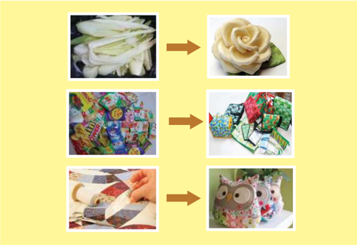

> **Deskripsi Visual:** Gambar ini adalah ilustrasi yang menunjukkan proses transformasi dari bahan-bahan ke hasil akhir. Ilustrasi ini terdiri dari tiga bagian yang masing-masing menunjukkan perubahan dari bahan awal menjadi produk akhir.

Pertama, gambar pertama menunjukkan daun bawang putih yang tampak segar dan segar. Ini merupakan bahan dasar yang akan diubah menjadi sesuatu yang lebih menarik.

Kedua, gambar kedua menunjukkan bunga yang tampak indah dan cantik. Ini adalah hasil akhir dari proses pengolahan bahan awal, yaitu daun bawang putih.

Ketiga, gambar ketiga menunjukkan hewan lucu berbentuk burung hantu yang tampak kreatif dan unik. Ini adalah hasil akhir dari proses pengolahan bahan awal, yaitu daun bawang putih.

Ilustrasi ini menunjukkan bahwa dengan menggunakan bahan-bahan yang sederhana, kita bisa menciptakan sesuatu yang menarik dan unik. Ini juga menunjukkan bahwa proses pengolahan bahan tidak hanya tentang mengubah bentuk, tetapi juga tentang mengubah makna dan nilai dari bahan tersebut.

### Tugas

Amatilah produk kerajinan dari bahan limbah berbentuk bangun datar pada Gambar 1.1 di atas. Apa kesan yang kamu dapatkan? Bahan limbah apa lagi yang  bisa  dimanfaatkan  untuk  produk  kerajinan?  Ungkapkan  pendapatmu dalam pembelajaran!

Prakarya dan Kewirausahaan

1

 

---
## 📄 Halaman 8

### WIRAUSAHA KERAJINAN DARI BAHAN LIMBAH BERBENTUK BANGUN DATAR

- Perencanaan Usaha Kerajinan dari Bahan Limbah Berbentuk Bangun Datar
- Ide dan Peluang Usaha Kerajinan dari Bahan Limbah  Berbentuk Bangun Datar
- Sumber  Daya  yang  Dibutuhkan dalam Usaha Kerajinan dari Bahan Limbah Berbentuk Bangun Datar
- Perencanaan  Administrasi  Usaha Kerajinan dari Bahan Limbah Berbentuk Bangun Datar
- Perencanaan Pemasaran Usaha Kerajinan dari Bahan Limbah Berbentuk Bangun Datar

### B.  Sistem  Produksi  Usaha  Kerajinan  dari Bahan Limbah Berbentuk Bangun Datar

- Aneka Produk Kerajinan dari Bahan Limbah Berbentuk Bangun Datar
- Manfaat Kerajinan dari  Bahan  Limbah Berbentuk Bangun Datar
- Potensi Kerajinan dari Bahan Limbah Berbentuk Bangun Datar
- Perencanaan Produksi Kerajinan dari Bahan Limbah Berbentuk Bangun Datar
- Alat  dan  Bahan  yang  dibutuhkan  dalam Memproduksi Kerajinan dari Bahan Limbah Berbentuk Bangun Datar
- Proses Produksi Kerajinan dari Bahan Limbah Berbentuk Bangun Datar
- Pengemasan Produk Kerajinan dari Bahan Limbah Berbentuk Bangun Datar

### C. Perhitungan Titik Impas ( Break Event Point ) Usaha Kerajinan dari Bahan Limbah Berbentuk Bangun Datar

- Pengertian dan Manfaat Titik Impas ( Break Event Point )
- Komponen Perhitungan Titik Impas ( Break Event Point )
- Menghitung Biaya Pokok Produksi
- Evaluasi Hasil Perhitungan Titik Impas ( Break Event Point )

### D. Strategi Promosi Produk Hasil Usaha Kerajinan dari Bahan Limbah Berbentuk Bangun Datar

- Pengertian Promosi
- Menentukan Strategi Promosi Produk Hasil Usaha Kerajinan dari Limbah Berbentuk Bangun Datar
- Melakukan Promosi Produk Hasil Usaha Kerajinan dari Limbah Berbentuk Bangun Datar

### E. Laporan Kegiatan Usaha Kerajinan dari Bahan Limbah Berbentuk Bangun Datar

- Pengertian dan Manfaat Laporan Kegiatan Usaha Kerajinan dari Bahan Limbah Berbentuk Bangun Datar
- Menganalisis Laporan Kegiatan Usaha Kerajinan dari Bahan Limbah Berbentuk Bangun Datar
- Pembuatan Laporan Kegiatan Usaha Kerajinan dari Bahan Limbah Berbentuk Bangun Datar
Semester 1

 

---
## 📄 Halaman 9

### Tujuan Pembelajaran

### Setelah  mempelajari materi wirausaha kerajinan dari bahan limbah berbentuk bangun datar, siswa mampu:

- Membuat perencanaan usaha kerajinan dari bahan limbah berbentuk bangun datar di wilayah setempat dan lainnya untuk membangun semangat berwirausaha.
- Mengapresiasi keanekaragaman karya kerajinan dari bahan limbah berbentuk bangun  datar  dan  pengemasannya  di  wilayah  setempat  dan  lainnya,  sebagai ungkapan  rasa  bangga  dan  wujud  rasa  syukur  sebagai  anugerah  Tuhan  Yang Maha Esa.
- Mengidentifikasi  potensi  kerajinan  dari  bahan  limbah  berbentuk  bangun datar di wilayah setempat dan lainnya berdasarkan rasa ingin tahu dan peduli lingkungan.
- Merancang produk kerajinan dari bahan limbah berbentuk bangun datar dan pengemasannya dengan menerapkan prinsip perencanaan produksi kerajinan serta  menunjukkan  perilaku  santun,  jujur,  percaya  diri,  bertanggung  jawab, disiplin, dan mandiri.
- Membuat  produk  kerajinan  dari  bahan  limbah  berbentuk  bangun  datar  dan pengemasannya  berdasarkan  konsep  berkarya  dengan  pendekatan  budaya setempat dan lainnya berdasarkan orisinalitas ide dan cita rasa estetis diri sendiri.
- Menghitung titik impas ( break event point ) usaha kerajinan dari bahan limbah berbentuk  bangun  datar  yang  ada  di  wilayah  setempat  dan  lainnya  untuk membangun semangat berwirausaha.
- Melakukan promosi usaha kerajinan dari bahan limbah berbentuk bangun datar di  wilayah  setempat  dan  lainnya  dengan  sikap  bekerja  sama,  gotong  royong, bertoleransi, disiplin, bertanggung jawab, kreatif, dan inovatif
- Membuat  laporan  kegiatan  usaha  kerajinan  dari  bahan  limbah  berbentuk bangun datar berdasarkan analisis kegiatan usaha kerajinan dari bahan limbah berbentuk bangun datar yang ada di wilayah setempat dan lainnya.

 

---
## 📄 Halaman 10

### BAB 1

### Wirausaha Kerajinan dari Bahan Limbah Berbentuk Bangun Datar

Produk  kerajinan  pada  awalnya  dibuat  untuk  tujuan  fungsional,  baik  untuk kepentingan  keagamaan  (religius)  maupun  kebutuhan  praktis.  Produk  kerajinan tersebut  berupa  peninggalan  pada  zaman  batu  seperti  artefak-artefak  kapak  dan perkakas; pada zaman logam berupa nekara, moko, candrasa, kapak, bejana, hingga perhiasan seperti gelang, kalung, dan cincin. Benda-benda tersebut dipakai sebagai perhiasan  dan  properti  upacara  ritual  adat  berbagai  suku  serta  kegiatan  ritual yang  bersifat  kepercayaan  seperti  penghormatan  terhadap  arwah  nenek  moyang. Sejalan  dengan  perkembangan  zaman  konsep  karya  kerajinan  terus  berkembang. Pembuatan karya kerajinan yang pada awalnya untuk kepentingan fungsional, dalam perkembangannya mengalami pergeseran orientasi ke arah nilai keindahan (estetis).

Kekayaan  alam  Indonesia  merupakan  modal  untuk  menghasilkan  produk kerajinan.  Sejak  dahulu  rakyat  Indonesia  telah  menggunakan  produk  kerajinan untuk memenuhi kebutuhan hidup sehari-hari. Kekayaan alam Indonesia merupakan anugerah Tuhan Yang Maha Esa. Oleh karena itu, kita harus memuji ciptaan Tuhan Yang Maha Agung ini. Produk kerajinan lebih banyak memanfaatkan bahan-bahan alam. Ada juga yang memanfaatkan bahan limbah sebagai bahan kerajinan seperti limbah  kertas,  plastik,  karet,  dan  logam.  Bagaimana  pendapatmu  ketika  melihat sampah yang berserakan, tidak teratur di suatu tempat? Tentunya sampah atau limbah tersebut dapat membuat pemandangan menjadi tidak indah, menghasilkan bau tidak sedap, dan dampaknya akan merusak lingkungan. Limbah tersebut sebenarnya dapat dimanfaatkan sebagai barang kerajinan yang bermanfaat bagi kehidupan manusia.

 

---
## 📄 Halaman 11

Secara  umum  ada  dua  macam  limbah  yang  sudah  kalian  kenal,  yaitu limbah organik  dan  limbah  anorganik.  Limbah  organik  adalah  limbah  yang  bisa  dengan mudah  diuraikan  atau  mudah  membusuk.  Limbah  organik  mengandung  unsur karbon. Limbah organik dapat ditemui dalam kehidupan sehari-hari, contohnya kulit buah, sayuran, kotoran manusia, dan hewan. Sedangkan limbah anorganik adalah jenis limbah yang berwujud padat, sangat sulit atau bahkan sulit untuk diuraikan atau tidak bisa membusuk. Limbah anorganik relatif sulit terurai. Beberapa bisa terurai, tetapi memerlukan waktu yang lama. Limbah tersebut berasal dari sumber daya alam yang  berasal  dari  pertambangan  seperti  minyak  bumi,  batubara,  besi,  timah,  dan nikel.

Limbah anorganik umumnya berasal dari kegiatan industri, pertambangan, dan domestik yaitu dari sampah rumah tangga, seperti kaleng bekas, botol, plastik, karet sintetis,  potongan  atau  pelat  dari  logam,  berbagai  jenis  batu-batuan,  dan  pecahpecahan  gelas.  Limbah  anorganik  yang  dapat  didaur  ulang  contohnya  sampah plastik,  logam,  kaca,  plastik,  dan  kaleng.  Limbah-limbah  anorganik  dapat  dipilahpilah sesuai kebutuhan, jika dinilai tidak layak pakai maka limbah anorganik dapat dilebur.  Sedangkan  limbah  yang  masih  dalam  kondisi  baik,  dapat  dimanfaatkan kembali menjadi karya kerajinan. Jika limbah sudah beralih manfaat menjadi barang kerajinan,  maka  secara  ekonomi  nilainya  akan  meningkat.  Kita  patut  bersyukur bahwa limbah anorganik juga dapat memberi manfaat untuk manusia.

Pada materi pembelajaran kelas XI semester 1 ini kalian akan diajak mempelajari dan  memanfaatkan  limbah  yang  berbentuk  bangun  datar  untuk    dibuat  menjadi produk kerajinan yang unik dan menarik sehingga memiliki nilai jual. Setelah belajar tentang  materi  ini,  kalian  diharapkan  dapat  mengembangkan  jiwa  kewirausahaan,

 

---
## 📄 Halaman 12

khususnya  dalam  memanfaatkan  bahan  limbah  berbentuk  bangun  datar  menjadi produk kerajinan yang bernilai estetika dan dapat mendatangkan keuntungan.

Limbah  berbentuk  bangun  datar  adalah  limbah  yang  berbentuk  bangun  yang berdimensi dua, yaitu bahan limbah yang memiliki sisi panjang dan lebar sehingga tidak  mempunyai  ruang.  Limbah  berbentuk  bangun  datar  dapat  berupa  bidang beraturan seperti lingkaran, segi empat, segitiga, dan bangun tidak beraturan. Contoh limbah berbentuk bangun datar antara lain daun, kertas, kain perca, dan plastik.

Materi kewirausahaan pada pelajaran prakarya dan kewirausahaan disajikan untuk mengenal  konsep  kewirausahaan,  latihan  mengembangkan  usaha,  mendapatkan pengalaman praktis berwirausaha, menumbuhkan minat berwirausaha dan mengembangkan potensi berwirausaha. Pada materi pembelajaran ini kalian akan diajak untuk mempelajari dan memanfaatkan limbah dari bahan berbentuk bangun datar  untuk  di  buat  menjadi  produk  kerajinan  yang  unik  dan  menarik.  Setelah kalian  belajar  tentang  materi  ini  diharapkan  akan  dapat  mengembangkan  jiwa kewirausahaan, khususnya untuk memanfaatkan bahan limbah berbentuk bangun datar menjadi produk kerajinan yang bernilai estetika, bermutu, dan memiliki nilai ekonomi yang tinggi.

 

---
## 📄 Halaman 13

### A.    Perencanaan  Usaha  Kerajinan  dari  Bahan  Limbah Berbentuk Bangun Datar

Apakah  kalian  ingin  menjadi  seorang  wirausahawan  sukses?  Untuk  menjadi seorang  wirausahawan  sukses,  kalian  harus  memiliki  perencanaan  usaha  yang baik.  Aspek-aspek penting dalam perencanaan usaha kerajinan dari bahan limbah berbentuk bangun datar adalah:

### 1. Ide    dan  Peluang  Usaha  Kerajinan  dari  Bahan  Limbah  Berbentuk Bangun Datar

Seorang wirausahawan harus dapat memanfaatkan peluang usaha secara sistematis dimulai dari analisis sumber-sumber peluang usaha secara luas. Persiapan yang dapat kalian lakukan dalam menganalisis peluang usaha sebagai berikut.

- Meneliti berapa luas usaha yang akan dipilih.
- Bentuk usaha apa yang akan dipilih.
- Jenis usaha apa yang akan ditekuni.
- Informasi usaha yang akan diterima.
- Ada atau tidaknya peta usaha yang menguntungkan.
Setelah  mengidentifikasi  peluang  usaha,  seorang  wirausaha  kerajinan  memilih jenis  usaha  produk  kerajinan.  Proses  pemilihan  ini  melalui  tahapan  analisis  yang cermat. Untuk itu diperlukan pertimbangan yang matang, biasanya disebut evaluasi dengan kriteria yang telah dikembangkan sesuai kebutuhan.

Menganalisis peluang usaha pada produk kerajinan dimaksudkan untuk menemukan  peluang  dan  potensi  usaha  yang  dapat  dimanfaatkan,  serta  untuk mengetahui besarnya potensi usaha yang tersedia dan berapa lama usaha tersebut dapat bertahan. Ancaman dan peluang selalu menyertai suatu usaha sehingga penting untuk melihat dan memantau perubahan lingkungan dan kemampuan adaptasi dari suatu usaha agar dapat tumbuh dan bertahan dalam persaingan.

Pemetaan potensi usaha produk kerajinan dari bahan limbah berbentuk bangun datar dapat didasarkan pada ciri khas kerajinan dari masing-masing daerah. Pemetaan potensi  menjadi  sangat  penting  untuk  mendorong  pertumbuhan  dan  pemerataan ekonomi daerah.  Terdapat  beberapa  cara  atau  metode  dalam  melakuan  pemetaan potensi usaha, baik secara kuantitaif maupun kualitatif.

Analisis  SWOT  ( Strenght,  Weakness,  Opportunity,  Threat) adalah  suatu  kajian terhadap lingkungan internal dan eksternal perusahaan. Analisis ini didahului oleh proses identifikasi faktor eksternal dan internal untuk menentukan strategi terbaik, kemudian dilakukan pembobotan terhadap tiap unsur SWOT berdasarkan tingkat kepentingan.

Analisis internal lebih menitikberatkan pada aspek kekuatan ( strenght ) dan  kelemahan  ( weakness ),  sedangkan  analisis  eksternal  untuk  menggali  dan

 

---
## 📄 Halaman 14

mengidentifikasi semua gejala peluang ( opportunity ) yang adadan yang akan datang serta ancaman ( threat ) dari kemungkinan adanya pesaing/calon pesaing.

Analisis  SWOT  digunakan  untuk  mengetahui  langkah-langkah  yang  perlu dilakukan  dalam  pengembangan  usaha  produk  kerajinan  sebagai  alat  penyusun strategi. Analisis SWOT didasarkan pada logika untuk memaksimalkan kekuatan dan peluang yang secara bersamaan dapat mengatasi kelemahan dan ancaman. Dengan analisis  SWOT  dapat  ditentukan  strategi  pengembangan  usaha  produk  kerajinan dalam jangka panjang sehingga tujuan dapat dicapai dengan jelas dan dapat dilakukan pengambilan keputusan secara cepat.

Menganalisis peluang usaha bertujuan untuk mencari dan melaksanakan kegiatan usaha  yang  menguntungkan.  Rencana  dalam  berwirausaha  perlu  dianalisis  untuk mengenali  kelemahan-kelemahan  yang  dapat  mengakibatkan  kesulitan-kesulitan keberlangsungan  usaha.  Analisis  usaha  ini  juga  dapat  digunakan  untuk  mencari strategi alternatif dalam bidang penjualan, bauran produk, investasi, pengembangan staf, pengendalian usaha, pengendalian biaya, dan lain-lain.

Secara rinci ada beberapa langkah yang perlu diperhatikan dalam menganalisis peluang usaha produk kerajinan dari bahan limbah berbentuk bangun datar, sebagai berikut.

### a. Penetapan Kelayakan Usaha

Hal-hal penting yang harus dilakukan pada saat penetapan kelayakan usaha adalah  kemampuan  untuk  menemukan  jawaban  tentang  apakah  peluang usaha  produk  kerajinan  yang  ditetapkan  dapat  dijual,  berapa  biaya  yang dikeluarkan serta mampukah produk kerajinan usaha tersebut menghasilkan laba. Pada tahap analisis kelayakan usaha produk kerajinan ini ada beberapa langkah yang harus kalian lakukan.

Dalam  melaksanakan  analisis  kelayakan  teknis  perlu  diperhatikan berbagai  macam  teknis  pembuatan  karya  kerajinan.    Ada  berbagai macam teknis yang dapat dilakukan dalam pembuatan produk kerajinan dari  bahan  limbah  berbentuk  bangun  datar,  misalnya  teknik  anyam, teknik kolase, dan lain-lain. Teknik pembuatan karya kerajinan tersebut harus dianalisis untuk memutuskan jenis usaha kerajinan yang tepat dan

### 1) Analisis Kelayakan Teknis memenuhi kebutuhan.

### 2) Analisis Peluang Pasar

Apabila ingin mendirikan usaha kerajinan dari bahan limbah berbentuk bangun datar, kalian harus mengetahui informasi tentang pasar, karena tujuan  usaha  ini  untuk  memenuhi  permintaan  pasar.  Oleh  karena itu,  diperlukan  riset  pasar.  Riset  ini  dilakukan  untuk  menemukan pasar  yang  menguntungkan,  memilih  produk  kerajinan  dari  bahan limbah  yang  dapat  dijual,  menerapkan  teknik  pemasaran  yang  baik, dan  merencanakan  sasaran  pelanggan.  Riset  pasar  bertujuan  untuk

 

---
## 📄 Halaman 15

mengumpulkan informasi dalam rangka pengambilan keputusan tentang usaha kerajinan yang akan dibuka.

- Menentukan Segmen Pasar
Langkah ketiga ini terkait dengan perkiraan konsumen potensial dari produk  kerajinan  yang  sudah  ditetapkan.  Langkah  ini  juga  bertujuan untuk  mengetahui  pembeli  tiap-tiap  segmen  pasar  saat  ini  dan  yang akan datang. Salah satu cara untuk mendapatkan informasi ini adalah dengan memilih agen untuk menguji pasar.

- Sumber Informasi Pasar
Informasi  pasar  digunakan  untuk  mengevaluasi  peluang  pasar  masa sekarang dan yang akan datang dari usaha produk kerajinan tersebut. Dua pendekatan  untuk  memperoleh  informasi  tersebut  dilakukan  dengan mengadakan  penelitian  secara  spesifik  untuk  mengumpulkan  data primer, dan menemukan data-data relevan yang berasal dari lembaga seperti badan pusat stastistik, kantor dinas pariwisata dan perindustrian, maupun biro penelitian yang disebut dengan data sekunder.

- Uji Coba Menjual
Uji coba pasar cenderung menjadi teknik riset utama untuk mengurangi risiko  pada  usaha  produk    kerajinan  dan  menilai    keberhasilannya.    Metode yang digunakan dalam uji coba pasar antara lain pameran perdagangan, menjual pada sejumlah konsumen terbatas, dan menggunakan uji coba pasar  di  mana  penerimaan  calon  pembeli  bisa  diamati  dan  dianalisis lebih  dekat.  Uji  coba  pasar  juga  memberikan  kemungkinan  piluang dalam pemasaran, distribusi dan pelayanan.

- Studi Kelayakan Pasar
Studi kelayakan pasar bagi usaha baru cenderung memakan waktu dan merupakan  kegiatan  yang  rumit.  Bagaimanapun  kegiatan  ini  harus dilakukan  untuk  mengurangi  risiko  kerugian  dan  kegagalan  usaha produk kerajinan.

### b. Analisis Kelayakan Finansial

Analisis  kelayakan  finansial  merupakan  landasan  untuk  menentukan sumber daya finansial yang diperlukan untuk tingkat kegiatan tertentu dan laba yang bisa diharapkan. Kebutuhan finansial dan pengembalian ( return ) bisa  sangat  berbeda  tergantung  pada  pemilihan  alternatif  yang  ada  bagi usaha baru.

Ada  dua  langkah  dasar  sebagai  alternatif  dalam  analisis  kelayakan finansial, yaitu:

- Penentuan  kebutuhan  finansial  total  dengan  dana  yang  diperlukan untuk operasional

 

---
## 📄 Halaman 16

Kebutuhan finansial hendaknya diproyeksikan tiap bulan atau bahkan mingguan  sekurang-kurangnya  untuk  operasi  tahun  pertama  dari usaha  produk  kerajinan  baru.  Selanjutnya  diperlukan  juga  proyeksi kebutuhan keuangan untuk tiga sampai lima tahun yang akan datang.

### 2) Penentuan sumber daya finansial yang tersedia

Langkah kedua dalam analisis kelayakan finansial ini adalah proyeksi sumber  daya  finansial  yang  tersedia  dan  dana-dana  yang  akan dihasilkan  dalam  operasi  perusahaan.  Dalam  menentukan  sumber daya finansial potensial yang tersedia harus dibedakan sumber finansial jangka pendek, menengah, dan jangka panjang.

### c. Membedakan Persaingan

Semua usaha produk kerajinan akan menghadapi persaingan baik persaingan langsung  yaitu  dari  produk  kerajinan  yang  sejenis  maupun  dengan  produk perusahaan  kerajinan  lain  pada  pasar  yang  sama.  Analisis  persaingan  ini sangat penting dalam rangka pengembangan dan keberlanjutan usaha produk kerajinan yang dikembangkan.

Analisis  SWOT  dapat  dilakukan  dengan  mewawancarai  pengusaha  kerajinan menggunakan kuisioner. Aspek penting yang perlu disampaikan pada saat mewawancarai  pengusaha  antara  lain  aspek  sosial,  ekonomi,  dan  teknik  produksi untuk mengidentifikasi faktor internal dan eksternal yang mempengaruhi keberhasilan usaha produk kerajinan.

Upaya untuk mengembangkan ide dan peluang usaha harus dikaitkan dengan kemampuan wirausaha dalam mengelola situasi dan peluang pasar. Untuk membentuk proses pengembangan ide, wirausahawan perlu memberikan kebebasan dan dorongan kepada para karyawannya agar mereka berani mengembangkan ideide dalam peluang usahanya.

Tujuan  dalam  mengembangkan  ide  dan  peluang  usaha  pada  produk  kerajinan sebagai berikut.

- Ide dalam pembuatan produk agar diminati konsumen.
- Ide dalam pembuatan produk agar dapat memenangkan persaingan.
- Ide dalam pembuatan dan pendayagunaan sumber-sumber produksi.
- Ide  yang  dapat  mencegah  kebosanan  konsumen  di  dalam  pembelian  dan penggunaan produk.
- Ide  dalam  pembuatan  desain,  model,  corak,  warna  produk  agar  disenangi konsumen.

 

---
## 📄 Halaman 17

### Aktivitas 1

Coba kalian berlatih menentukan peluang usaha untuk produk kerajinan dengan memanfaatkan bahan dari limbah berbentuk bangun datar yang ada di sekitarmu, dengan ketentuan sebagai berikut.

- Produk kerajinan yang akan dijual  : …………………………….
- 2.
- Konsumen yang akan dituju
: …………………………….

- Analisis SWOT terhadap peluang /ide usaha yang akan ditetapkan :
- Buatlah laporan dan presentasikan hasil analisis sederhana dari peluang usaha produk kerajinan tersebut

---
**📊 Tabel**

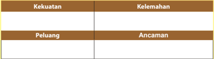

Tabel ini menunjukkan analisis kekuatan, kelemahan, peluang, dan ancaman (SWOT) suatu organisasi atau perusahaan. Topik utama tabel ini adalah analisis SWOT. Kolom "Kekuatan" dan "Kelemahan" masing-masing berisi informasi tentang kelebihan dan kekurangan yang dimiliki oleh organisasi tersebut. Sementara itu, kolom "Peluang" dan "Ancaman" berisi informasi tentang potensi yang dapat diambil oleh organisasi untuk meningkatkan performa dan menghadapi tantangan. Dari tabel ini, kita bisa melihat bahwa organisasi tersebut memiliki beberapa kekuatan dan peluang, namun juga menghadapi beberapa ancaman dan kelemahan. Ini merupakan langkah penting dalam pengambilan keputusan strategis untuk memastikan organisasi dapat bersaing dengan efektif.

### 2.  Sumber  Daya  yang  Dibutuhkan  dalam  Usaha  Kerajinan  dari  Bahan Limbah Berbentuk Bangun Datar

Apabila kalian sudah menentukan produk kerajinan berdasarkan analisis peluang usaha, kalian dapat menentukan sumber daya yang dibutuhkan dalam menjalankan usaha tersebut.  Dalam perencanaan proses produksi diperlukan pengelolaan yang baik untuk mencapai tujuan perusahaan. Sumber daya yang dimiliki oleh perusahaan dapat dikategorikan atas enam tipe sumber daya (6M), sebagai berikut.

### a. Man (Manusia)

Dalam pendekatan ekonomi, sumber daya manusia adalah salah satu faktor produksi selain tanah, modal, dan keterampilan. Pandangan yang menyamakan manusia dengan faktor-faktor produksi lainnya dianggap tidak tepat, baik dilihat dari  konsepsi,  filsafat,  maupun  moral.  Manusia  merupakan  unsur  manajemen yang penting dalam mencapai tujuan perusahaan

 

---
## 📄 Halaman 18

### a. Money (Uang)

Money atau uang merupakan salah satu unsur yang tidak dapat diabaikan. Uang merupakan alat tukar dan alat pengukur nilai. Besar-kecilnya hasil kegiatan dapat diukur dari jumlah uang yang beredar dalam perusahaan. Oleh karena itu, uang merupakan unsur yang penting untuk mencapai tujuan perusahaan karena segala sesuatu harus diperhitungkan secara rasional. Hal ini akan berhubungan dengan berapa uang yang harus disediakan untuk membiayai gaji tenaga kerja, alat-alat yang dibutuhkan dan harus dibeli, serta berapa hasil yang akan dicapai oleh perusahaan.

### b. Material (Fisik)

Perusahaan  umumnya  tidak  menghasilkan  sendiri  bahan  mentah  yang dibutuhkan,  tetapi  membeli  dari  pihak  lain.  Untuk  itu  manajer  perusahaan berusaha  untuk  memperoleh  bahan  mentah  dengan  harga  paling  murah, menggunakan cara pengangkutan yang murah dan membuat proses pengolahan seefisien mungkin.

### c. Machine (Teknologi)

Mesin memiliki peranan penting dalam proses produksi. Setelah revolusi  industri,  banyak  pekerjaan  manusia  yang  digantikan  oleh  mesin. Perkembangan  teknologi  yang  begitu  pesat  menyebabkan  penggunaan  mesin semakin  meningkat.    Banyaknya  mesin  baru  yang  ditemukan  oleh  para  ahli memungkinkan peningkatan produksi sangat tinggi.

### d. Method (Metode)

Metode sangat dibutuhkan agar mekanisme kerja berjalan efektif dan efisien. Metode kerja yang sesuai dengan kebutuhan perusahaan, baik yang menyangkut proses  produksi  maupun  administrasi  tidak  terjadi  begitu  saja  melainkan memerlukan waktu yang lama.

### e. Market (Pasar)

Jika barang yang diproduksi tidak laku, proses produksi barang akan berhenti. Oleh  sebab  itu,  penguasaan  pasar  dalam  arti  menyebarkan  hasil  produksi merupakan faktor menentukan dalam perusahaan. Agar pasar dapat dikuasai, kualitas barang harus sesuai dengan selera konsumen dan harga terjangkau oleh daya beli konsumen.

 

---
## 📄 Halaman 19

### Aktivitas 2

Identifikasi dan jelaskan secara singkat sumber daya yang dibutuhkan dalam mendirikan usaha kerajinan dengan memanfaatkan bahan limbah berbentuk bangun  datar  yang  ada  di  lingkunganmu!  Kemudian  buatlah  laporan  hasil identifikasi tersebut!

### 3. Perencanaan Administrasi Usaha Kerajinan dari Bahan Limbah Berbentuk Bangun Datar

Apakah kalian pernah melakukan bisnis atau usaha? Apabila pernah, bagaimana cara menyiapkan administrasi untuk usaha tersebut? Apabila kalian ingin membuka usaha, kalian harus menyiapkan semua aspek administrasi yang berkaitan dengan usaha tersebut. Materi berikut ini akan membahas tentang perencanaan administrasi usaha produk kerajinan dari bahan limbah berbentuk bangun datar.

Menurut pendapat Prof. Dr.  S.  Prajudi  Atmosudirjo,  S.H.,  administrasi  adalah proses dan tata cara kerja yang terdapat pada setiap usaha, baik usaha kenegaraan maupun swasta, usaha sipil maupun militer, atau usaha besar maupun kecil.

Pencatatan semua kegiatan usaha yang  diperlukan bagi kelancaran dan pengelolaan perusahaan merupakan tugas administrasi. Tugas tersebut meliputi pencatatan datadata transaksi bisnis, keuangan, produksi, persediaan produksi, dan lain-lain. Adapun maksud dan tujuan dari adanya administrasi adalah agar wirausahawan dapat:

- memonitor kegiatan administrasi perusahaannya,
- mengevaluasi kegiatan-kegiatan pengorganisasian perusahaannya,
- menyusun  program  pengembangan  usaha  dan  kegiatan  pengorganisasian perusahaannya, dan
- mengamankan kegiatan-kegiatan usaha dan organisasi perusahaannya.
Perencanaan administrasi usaha kerajinan pada dasarnya terdiri dari perizinan usaha, surat-menyurat, pencatatan transaksi barang/jasa, pencatatan transaksi keuangan, dan pajak pribadi serta pajak usaha.

### a. Perizinan Usaha

Di  Indonesia,  pendirian  usaha  diatur  oleh  Undang-Undang,  yaitu  melalui Peraturan Daerah dan Peraturan dari Departemen Perdagangan serta Departemen atau Instansi yang terkait dengan bidang usaha yang dijalankan.

 

---
## 📄 Halaman 20

Surat-surat harus yang disiapkan ketika akan membuka usaha sebagai berikut.

- Surat Izin Gangguan (HO) dan Surat Izin Tempat Usaha (SITU)
Kedua  surat  izin  ini  dikeluarkan  oleh  pemerintah  daerah.  Beberapa manfaat yang dapat diperoleh dari SITU-HO, diantaranya:

- mempermudah permohonan Surat Izin Usaha Perdagangan,
- dapat menjadi sarana untuk minta ganti rugi apabila tempat usaha mengalami penggusuran atau pemindahan lokasi,
- memperoleh jaminan perlindungan keamanan, dan
- dapat digunakan sebagai jaminan pinjaman modal di bank.
- Surat Izin Usaha Perdagangan (SIUP)

### 2)

SIUP  adalah  surat  izin  untuk  dapat  melaksanakan  kegiatan  usaha perdagangan. Untuk memperoleh SIUP, perusahaan harus mengisi surat permohonan SIUP yaitu berupa formulir permohonan izin yang diisi oleh perusahaan yang memuat data-data perusahaan untuk memperoleh Surat Izin Usaha Perdagangan Kecil/Menengah/Besar.

### b. Surat Menyurat

Kegiatan surat-menyurat adalah salah satu kegiatan dalam bentuk hubungan dengan pihak lain, seperti pemasok dan pelanggan. Jenis surat yang digunakan dalam kegiatan usaha disebut juga dengan surat niaga. Surat niaga dimulai dengan pembukaan  yang  tepat  dan  menarik  kemudian  diikuti  dengan  pengutaraan masalah secara jelas dengan tetap memberikan sikap ramah, sopan, dan simpatik. Jenis surat niaga sebagai berikut.

Surat perkenalan

- Surat permintaan penawaran
- Surat penawaran
- Surat pemesanan
- Surat pemberitahuan pengiriman barang
- Surat pengaduan
- Surat pengiriman pembayaran

### c. Pencatatan Transaksi Barang/Jasa

Secara umum, bukti transaksi perusahaan terbagi menjadi dua, yaitu bukti transaksi intern dan bukti transaksi ekstern.

### 1) Bukti transaksi intern

Bukti transaksi intern adalah bukti transaksi yang dibuat oleh dan untuk intern perusahaan. Adapun bukti transaksi intern adalah sebagai berikut.

- Bukti kas masuk, yaitu tanda bukti bahwa perusahaan telah menerima uang  secara  tunai,  misalnya  pembayaran  tagihan  dari  perusahaan lain.

 

---
## 📄 Halaman 21

- Bukti kas keluar, yaitu tanda bukti bahwa perusahaan telah mengeluarkan uang tunai,  misalnya  pembayaran  gaji,  pembayaran utang, atau pengeluaran-pengeluaran lainnya.
- Bukti transaksi ekstern
Bukti transaksi ekstern adalah bukti transaksi yang berhubungan dengan pihak luar. Bukti transaksi ekstern sebagai berikut.

- Faktur
Faktur  yaitu  tanda  bukti  pembelian  atau  penjualan  secara  kredit. Faktur dibuat oleh penjual dan diberikan kepada pihak pembeli.

- Kuitansi
Kuitansi adalah bukti penerimaan sejumlah uang yang ditandatangani oleh penerima uang dan diserahkan kepada yang membayar sejumlah uang tersebut.

- Nota
Nota yaitu bukti atas pembelian sejumlah barang secara tunai. Nota dibuat oleh pedagang dan diberikan kepada pembeli.

- Nota debet
Nota debet merupakan bukti transaksi pengiriman kembali barang yang telah dibeli, yang berisi informasi pengiriman kembali barang yang  rusak  atau  tidak  sesuai  dengan  pesanan  atau  permintaan pengurangan harga. Bukti ini dibuat oleh pihak pembeli.

- Nota kredit
Nota kredit merupakan bukti transaksi penerimaan kembali barang yang  telah  dijual  atau  bukti  persetujuan  dari  pihak  penjual  atas permohonan  pembeli  untuk  pengurangan  harga  barang  karena sebagian  barang  rusak  atau  tidak  sesuai  dengan  pesanan.  Bukti  ini dibuat oleh pihak penjual.

- Cek
Cek  yaitu  surat  perintah  yang  dibuat  oleh  fihak  yang  mempunyai rekening di bank, agar bank membayar sejumlah uang kepada pihak yang namanya tercantum dalam cek tersebut.

### d. Pencatatan Transaksi Keuangan

Transaksi  keuangan  dicatat  dalam  laporan  keuangan  yang  disusun  secara berkala. Berdasarkan standar akuntansi keuangan tahun 2007, laporan keuangan terdiri dari empat item sebagai berikut.

- Laporan laba rugi
Laporan  laba  rugi  adalah  laporan  yang  menunjukkan  kemampuan perusahaan untuk menghasilkan keuntungan pada suatu periode akuntansi atau satu tahun. Laporan laba rugi terdiri dari pendapatan dan beban usaha.

 

---
## 📄 Halaman 22

### 2)

Laporan perubahan modal Laporan perubahan modal adalah laporan yang menunjukkan perubahan modal  pemilik  atau  laba  yang  tidak  dibagikan  pada  suatu  periode akuntansi karena adanya transaksi usaha selama periode tersebut.

- Neraca
Neraca adalah daftar yang memperlihatkan posisi sumber daya perusahaan, serta informasi tentang asal sumber daya tersebut. Neraca terbagi dua sisi, yaitu  sisi  aktiva  dan  sisi  pasiva.  Sisi  aktiva  merupakan  daftar  kekayaan perusahaan pada suatu saat tertentu. Sedangkan sisi pasiva menunjukkan sumber dari mana kekayaan itu diperoleh.

- 4)
Laporan  arus  kas  adalah  laporan  yang  menunjukkan  aliran  uang  yang diterima  dan  digunakan  perusahaan  di  dalam  satu  periode  akuntansi,

- Laporan arus kas beserta sumber-sumbernya.

### e. Pajak

Setiap wajib pajak harus memiliki NPWP (Nomor Pokok Wajib Pajak), yaitu nomor  yang  diberikan  kepada  wajib  pajak  sebagai  sarana  dalam  administrasi perpajakan yang dipergunakan sebagai tanda mengenal diri atau identitas wajib pajak dalam melaksanakan hak dan kewajiban perpajakannnya.

### Aktivitas 3

Buatlah perencanaan administrasi yang baik  untuk  mendirikan  salah  satu  usaha kerajinan  dari  limbah  berbentuk  bangun  datar  yang  ada  dilingkunganmu. Kemudian buatlah laporan dari perencanaan administrasi  usaha tersebut!

### 4. Perencanaan Pemasaran Usaha Kerajinan dari Bahan Limbah Berbentuk Bangun Datar

Indonesia sangat kaya baik dari kekayaan alam maupun budayanya. Komoditas produk kerajinan negara Indonesia banyak dikenal di mancanegara. Banyak sekali pengusaha  asal  Indonesia  yang  menggantungkan  hidupnya  dari  usaha  kerajinan tersebut,  baik  yang  sifatnya  lokal  maupun  yang  sudah go  international. Apalagi  di daerah sekitar lokasi pariwisata sudah bisa dipastikan banyak warga Indonesia yang berjualan produk kerajinan. Indonesia memiliki banyak tempat wisata dan menjadi prospek bisnis kerajinan yang sangat baik.

 

---
## 📄 Halaman 23

Apabila  seseorang  sudah  memutuskan  menjadi  wirausaha  maka  dia  harus segera memikirkan tentang rancangan pemasaran produk yang akan dijual.  Philip Kotler dan Gary Amstrong dalam bukunya Dasar-Dasar Pemasaran mendefinisikan pemasaran sebagai proses dimana perusahaan menciptakan nilai bagi pelanggan dan membangun  hubungan  yang  kuat  dengan  pelanggan,  dengan  tujuan  menangkap nilai dari pelanggan sebagai imbalannnya. Dengan demikian, pemasaran tidak hanya bagaimana memasarkan produk supaya laku, tetapi juga harus memiliki nilai lebih bagi pelanggannya.

Beberapa hal penting yang berkaitan dengan aspek pemasaran sebagai berikut.

### a. Memahami seni menjual

Bagian  penjualan  merupakan  salah  satu  bagian  terpenting  dalam  sebuah perusahaan. Oleh karena itu, dibutuhkan tenaga jual yang profesional. Harus pula diingat bahwa penjual itu tidak hanya menjual produk atau bisnisnya saja, tetapi juga menjual kualitas produk tersebut.

### b. Menetapkan harga jual

Menjual produk dengan harga mahal akan berisiko produk tidak laku dijual. Sebaliknya,  menjual  dengan  harga  murah  juga  akan  berdampak  pada  persepsi konsumen terhadap kualitas produk. Untuk itu penetapan harga harus disesuaikan dengan target pasar, segmen pasar, dan posisi produk di pasar.

Sebelum  menentukan  harga  produk  di  pasar,  perlu  mempertimbangkan faktor utama dari jenis biaya yang akan menentukan harga. Hal-hal yang harus dipertimbangkan dalam menentukan harga sebagai berikut.

- Biaya bahan baku dan suplainya
Biaya ini menjadi biaya utama dalam penentuan harga jual produk

- Biaya overhead
Biaya overhead menjadi  faktor  penting  yang  bisa dianalisis  dalam penentuan  struktur  harga.  Contohnya  adalah  biaya  administrasi,  biaya pengiriman, biaya alat tulis kantor, biaya sewa kantor, biaya telepon, dan

- biaya listrik.
- Biaya tenaga kerja
Merupakan biaya tenaga kerja dalam memproduksi barang jadi selama proses produksi dan biaya tenaga kerja yang bekerja dikantor. Contohnya adalah biaya gaji karyawan, uang lembur, insentif (bonus).

Untuk menentukan harga jual sebuah produk, maka perlu mengetahui total biaya (total cost) yang dibutuhkan dalam membuat produk tersebut.

Biaya Total = Total biaya bahan baku + Total biaya overhaed + Total biaya tenaga kerja.

 

---
## 📄 Halaman 24

Penentuan harga jual produk juga dapat ditentukan dengan tiga cara, sebagai berikut:

- Harga berdasarkan harga pasar ( Market based price ).
- Harga berdasarkan biaya ( Cost based price ).
- Harga berdasarkan titik impas ( Break event point based price ).

### c. Menganalisis kepuasan pelanggan

Kepuasan pelanggan adalah tingkat perasaan seseorang setelah membandingkan kinerja produk (hasil) yang bisa dirasakan dan sesuai dengan harapannya.

Metode-metode  yang  bisa  digunakan  untuk  mengukur  tingkat  kepuasan pelanggan sebagai berikut.

- Sistem keluhan dan saran Sistem ini bisa menggunakan cara formulir isian, kuesioner, uji sampel faksimile,
secara  langsung  dengan  cara  tanya  jawab  pelanggan, email, telepon, dan situs jejaring sosial.

- Survei kepuasan pelanggan secara berkala
Sistem  keluhan  dan  saran  tidak  bisa  mencerminkan  secara  tepat  dan akurat apabila hanya sekali dilakukan. Oleh karena itu, perlu dilakukan lebih dari satu kali survei agar diperoleh tingkat keakuratan yang lebih

- baik.
- Ghost shopping atau mystery shopper
- Cara  ini  adalah  mempekerjakan    orang  untuk  berpura-pura  menjadi pembeli.  Orang  ini  akan  melaporkan  hal-hal  positif  dan  negatif  dari
pelayanan serta manfaat dari sebuah produk.

### d. Promosi

Promosi  adalah  suatu  aktivitas  yang  dilakukan  oleh  perusahaan  guna mengomunikasikan, mengenalkan, dan mempopulerkan kepada pasar sasarannya.    Ada  enam  kegiatan  dan  rencana  yang  bisa  dilakukan  untuk mengomunikasikan produk dan merk usaha.

- Penjualan personal ( personal selling )
- Iklan ( advertising )
- Promosi penjualan ( sales promotion )
- Publikasi ( publication )
- Sponsorship
- Komunikasi di tempat konsumen yang akan membeli ( pint of purchase ).

### Aktivitas 4

Buatlah perencanaan pemasaran untuk usaha kerajinan dari limbah berbentuk bangun  datar  yang  ada  dilingkunganmu!  Kemudian  buatlah  laporan  hasil perencanaan tersebut!

 

---
## 📄 Halaman 25

### Tugas Kelompok - 1

### Observasi dan Wawancara

Kunjungilah salah satu usaha produk kerajinan dari bahan limbah berbentuk bangun datar yang ada di sekitar tempat tinggalmu.

- Lakukan  wawancara  dengan  pengusaha  tersebut  tentang  ide  dan peluang usaha yang telah dilakukan.
- Lakukan  wawancara  tentang  sumber  daya  yang  dibutuhkan  dalam usaha tersebut.
- Tanyakan tentang perencanaan administrasi usaha kerajinan tersebut.
- Tanyakan  tentang  perencanaan  pemasaran  dari  usaha  kerajinan tersebut.
- Diskusikan dengan kelompokmu dan presentasikan di  kelas.
- Buatlah Laporan.

### Lembar Kerja 1

Nama Kelompok

: ...........................................................................................

Nama Anggota

: ...........................................................................................

...........................................................................................

Kelas

: ...........................................................................................

Mengidentifikasi perencanaan usaha produk kerajinan dari bahan limbah berbentuk bangun datar.

---
**📊 Tabel**

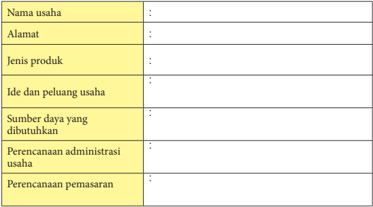

Tabel ini berisi informasi tentang usaha yang sedang dibahas, termasuk nama usaha, alamat, jenis produk, ide dan peluang usaha, sumber daya yang dibutuhkan, perencanaan administrasi usaha, dan perencanaan pemasaran. Topik utama tabel adalah identifikasi dan pengembangan usaha. Kolom-kolomnya mencakup detail spesifik tentang aspek-usaha seperti nama usaha, lokasi, produk, ide usaha, sumber daya, administrasi, dan pemasaran. Data penting yang terlihat meliputi jenis produk yang dihasilkan oleh usaha tersebut, ide dan peluang usaha yang dimiliki, serta bagaimana usaha tersebut akan memenuhi kebutuhan pasar dan memperluas jangkauannya.

 

---
## 📄 Halaman 26

Setelah mempelajari  materi perencanaan  usaha  kerajinan dari  bahan  limbah berbentuk bangun datar serta melakukan observasi dan wawancara pada pengusaha kerajinan yang ada di lingkunganmu, berikut ini.

### Tugas Kelompok - 2

Buatlah  perencanaan  usaha  kerajinan  dengan  memanfaatkan  bahan  limbah berbentuk  bangun  datar  yang  ada  di  sekitar  tempat  tinggalmu!  Langkahlangkah kegiatan sebagai berikut.

- Lakukan analisis SWOT berdasarkan data kekuatan, kelemahan, peluang, dan ancaman yang mungkin terjadi!
- Tentukan ide dan peluang usaha berdasarkan analisis SWOT tersebut.
- Tentukan  sumber  daya  yang  dibutuhkan  dalam  pengembangan  usaha tersebut!
- Buatlah perencanaan administrasi pada usaha kerajinan tersebut!
- Buatlah perencanaan pemasaran dari usaha kerajinan tersebut!
- Buatlah Laporan!

### Lembar Kerja - 2

Nama

:  .........................................................................................

Kelas

:  .........................................................................................

Membuat perencanaan usaha kerajinan dari bahan limbah berbentuk bangun datar.

### 1. Analisis SWOT:

---
**📊 Tabel**

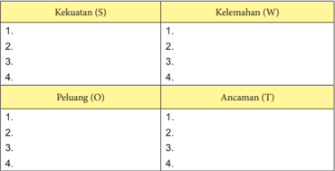

Tabel ini menunjukkan analisis SWOT (Strengths, Weaknesses, Opportunities, Threats) untuk empat poin yang disebutkan sebagai Kekuatan (S), Kelemahan (W), Peluang (O), dan Ancaman (T). Topik utama tabel ini adalah analisis SWOT untuk empat poin tertentu. Kolom "Kekuatan" (S) berisi empat poin yang masing-masing dianggap sebagai kekuatan. Kolom "Kelemahan" (W) juga berisi empat poin yang masing-masing dianggap sebagai kelemahan. Kolom "Peluang" (O) berisi empat poin yang masing-masing dianggap sebagai peluang, sedangkan kolom "Ancaman" (T) berisi empat poin yang masing-masing dianggap sebagai ancaman. Pola penting yang terlihat adalah bahwa setiap kolom memiliki empat poin yang berbeda-beda, menunjukkan bahwa analisis SWOT ini dilakukan secara mendalam dan detail untuk setiap poin yang dianalisis.

 

---
## 📄 Halaman 27

- Ide dan peluang usaha:
……………………………………………………………………………………

……………………………………………………………………………………

……………………………………………………………………………………

………

- Sumber daya usaha:
……………………………………………………………………………………

……………………………………………………………………………………

……………………………………………………………………………………

………

- Perencanaan administrasi usaha:
……………………………………………………………………………………

……………………………………………………………………………………

……………………………………………………………………………………

………

- Perencanaan pemasaran:
……………………………………………………………………………………

……………………………………………………………………………………

……………………………………………………………………………………

………

### Re fleksi Diri

Ungkapkan  pemahaman  yang  kalian  peroleh  setelah  mempelajari  materi perencanaan  usaha  kerajinan  dari  bahan  limbah  berbentuk  bangun  datar, berdasarkan beberapa hal berikut ini.

- Apa saja yang perlu diperhatikan ketika merencanakan usaha kerajinan dari bahan limbah berbentuk bangun datar yang ada di wilayahnya?
- Materi apa yang masih sulit untuk difahami?
- Kesulitan apa yang dihadapi saat mencari informasi dan pengamatan?
- Kesulitan  apa  yang  dihadapi  pada  saat  membuat  perencanaan  usaha kerajinan dari bahan limbah berbentuk bangun datar?

 

---
## 📄 Halaman 28

### B.  Sistem Produksi Usaha Kerajinan dari Bahan Limbah Berbentuk Bangun Datar

Produk  kerajinan  banyak  memanfaatkan  bahan-bahan  alam  seperti  tanah  liat, serat alam, kayu, bambu, kulit, logam, batu, dan rotan . Ada juga yang memanfaatkan bahan  sintetis  sebagai  bahan  kerajinan  seperti  limbah  kertas,  plastik,  dan  karet. Produk kerajinan di setiap daerah memiliki kekhasan lokal yang menjadi unggulan daerah. Misalnya, Kasongan (Daerah Istimewa Yogyakarta), sumber daya alam yang banyak  tersedia  tanah  liat,  kerajinan  yang  berkembang  adalah  kerajinan  gerabah. Palu (Sulawesi Tengah), banyak menghasilkan tanaman kayu hitam, kerajinan yang berkembang  berupa  bentuk  kerajinan  kayu  hitam.  Kapuas  (Kalimantan  Tengah), sumber daya alamnya banyak menghasilkan rotan dan getah nyatu sehingga kerajinan yang berkembang adalah anyaman rotan dan getah nyatu.

Secara umum jenis bahan limbah untuk produk kerajinan dapat dibagi menjadi dua kelompok yaitu bahan limbah berbentuk bangun datar dan bahan limbah berbentuk bangun ruang. Beberapa kerajinan dari bahan limbah berbentuk bangun datar akan diuraikan secara singkat pada penjelasan berikut ini. Namun, materi yang diuraikan di sini merupakan contoh saja, kalian dapat mempelajarinya sebagai pengetahuan dan diharapkan dapat mengeksplorasi pengetahuan lainnya sebagai bahan pengayaan.

### 1. Aneka Produk Kerajinan dari Bahan Limbah Berbentuk Bangun Datar

Berikut ini dijelaskan beberapa produk kerajinan dari bahan limbah berbentuk bangun datar.

---
**🖼️ Gambar/Diagram**

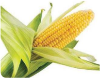

> **Deskripsi Visual:** Gambar ini adalah ilustrasi yang menunjukkan jagung yang tumbuh di lingkungan alami. Jagung tampak berwarna kuning cerah dengan kulit hijau yang masih tertutup. Daun-daun jagung tampak lebat dan hijau, menunjukkan bahwa jagung tersebut masih dalam tahap pertumbuhan awal. Ilustrasi ini mungkin digunakan untuk membantu pembaca memahami proses pertumbuhan jagung dan bagaimana ia tumbuh di lingkungan alaminya.

Sumber: http://www.manfaat.co.id Gambar 1.3 Kulit jagung

### a. Kerajinan dari Limbah Kulit Jagung

Kulit jagung merupakan limbah  pertanian  dari  tanaman jagung.  Kulit  jagung  kerap  kali tidak diperhatikan, bahkan dianggap sampah sehingga biasanya dibuang.

Sampah kulit jagung bisa menjadi benda kerajinan yang  sangat  bernilai dan  bisa mendatangkan keuntungan.

 

---
## 📄 Halaman 29

Kerajinan  dari  limbah  kulit  jagung  ini  sangat  unik  dan  menarik.  Berikut  contoh produk kerajinan dari limbah kulit jagung.

### b. Kerajinan dari Limbah Plastik

Apakah di lingkunganmu banyak sampah plastik yang menumpuk? Kalian bingung untuk memanfaatkannya? Kita tahu bahwa sampah plastik termasuk dalam sampah anorganik yang sulit diurai oleh mikroorganisme, butuh waktu bertahun-tahun  supaya  plastik  dapat  terurai  dan  akhirnya  menyatu  dengan tanah. Oleh karena itu, sebaiknya sampah plastik tersebut dimanfaatkan untuk karya kerajinan.

Saat  ini  sudah  banyak  kerajinan  yang  dibuat  dengan  bahan dasar limbah plastik  seperti  tas,  dompet,  cover  meja,  dan  tempat  tisu.  Berikut  ini  contoh kerajinan dari limbah plastik.

 

---
## 📄 Halaman 30

### c.      Kerajinan dari Limbah Daun Pelepah Pisang

Sebagain besar masyarakat menganggap daun pelepah pisang kering adalah sampah yang tidak berguna. Bahkan terkadang daun pelepah pisang kering hanya dibakar  begitu  saja  karena  dianggap  sampah  yang  mengotori  kebun.  Namun daun pelepah pisang kering dapat dijadikan sebagai kerajinan yang indah dan memiliki nilai ekonomi yang tinggi.

Kerajinan tangan dari daun pelepah pisang kering sebaiknya menggunakan daun  yang  berwarna  kuning  hingga  daun  yang  berwarna  cokelat  dan  benarbenar kering. Berikut contoh produk kerajinan dari daun pelepah pisang.

### d.     Kerajinan dari Limbah Kertas

Kertas merupakan bagian dari limbah organik kering, hal ini karena kertas mudah terurai dalam tanah. Meskipun kertas mudah hancur jika terkena air, namun jika digunakan sebagai bahan dasar produk kerajinan, kertas tersebut dapat  diolah  sedemikian  rupa  sehingga  tidak  mudah  hancur.    Caranya  yaitu dengan menambah kandungan lem atau zat pelindung anti air seperti melamin/ politur, dapat pula dengan dilapisi plastik.

Limbah kertas dapat digunakan sebagai benda kerajinan dengan berbagai teknik  seperti  teknik  anyaman,  teknik  sobek,  teknik  lipat,  dan  teknik  gulung (pilin).

 

---
## 📄 Halaman 31

Berbagai karya yang dapat dihasilkan dari limbah kertas antara lain keranjang, vas bunga, sandal, wadah serbaguna, bunga, hiasan dinding, wadah tisu, taplak, boneka, dan masih banyak lagi. Berikut contoh kerajinan yang dihasilkan dari

---
**🖼️ Gambar/Diagram**

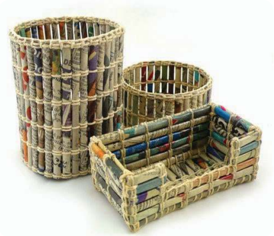

> **Deskripsi Visual:** Gambar ini adalah ilustrasi yang menunjukkan dua keranjang yang dibuat dari bahan-bahan yang berbeda. Keranjang pertama terbuat dari batang bambu yang telah dipotong dan diikat dengan tali, sedangkan keranjang kedua terbuat dari batang bambu yang sama namun dipotong menjadi beberapa bagian dan diikat dengan kain. Kedua keranjang tersebut memiliki ukuran yang berbeda, dengan keranjang yang lebih besar berada di atas keranjang yang lebih kecil. Ilustrasi ini menunjukkan proses pembuatan keranjang dari bahan alam, yang bisa menjadi inspirasi bagi pembaca untuk mencoba membuat keranjang sendiri.

 

---
## 📄 Halaman 32

limbah kertas.

### e.      Kerajinan dari Limbah Kain Perca

Kebutuhan sandang manusia yang berupa pakaian merupakan kebutuhan primer  sehari-hari  yang  harus  dipenuhi.  Produksi  pakaian  yang  dilakukan oleh para penjahit atau konveksi, menghasilkan banyak limbah kain yang biasa disebut kain perca.

Limbah kain perca dapat dibuat sebagai bahan dasar kerajinan yang cukup unik dan menarik. Bahkan busana itu sendiri dapat dihasilkan dari kain-kain perca yang dijahit bersambung-sambungan. Bagi sebagian orang ada juga yang berminat pada busana jenis ini karena unik. Sekarang sudah semakin banyak orang melirik produk kerajinan berbahan kain perca, karena selain murah juga desainnya unik. Berikut ini contoh kerajinan sandal dari limbah kain perca.

### f. Kerajinan dari Limbah Kardus

Kardus bekas kadang menjadi sebuah  benda  yang  menumpuk  dan memenuhi ruangan sehingga mengganggu pemandangan, dan kadang dibuang begitu saja di tempat sampah. Saat ini banyak sekali kardus bekas yang ada di lingkungan kita. Itu dikarenakan hampir setiap barang kebutuhan kita seharihari menggunakan kardus sebagai pembungkusnya.

Bagi seorang yang berjiwa wirausaha maka alangkah lebih bagus bila kardus tersebut dimanfaatkan menjadi sebuah kerajinan unik dan juga memiliki nilai seni yang tinggi.

 

---
## 📄 Halaman 33

### Berikut ini contoh produk kerajinan dari limbah kardus.

### g.       Kerajinan dari Limbah Sisik Ikan

Sisik ikan pada umumnya hanya dibuang karena dianggap sebagai limbah yang tidak bermanfaat. Ternyata sisik ikan dapat dimanfaatkan untuk benda kerajinan, pada umumnya untuk kerajinan aksesori. Setiap ikan menghasilkan sisik yang berbeda ukuran dan ketebalannya. Sisik ikan kakap sering digunakan sebagai produk kerajinan karena sisiknya lebih terliat kokoh, tebal, dan besar dibanding sisik ikan mas atau mujair.

Limbah sisik ikan bisa dijadikan sebagai bahan utama pembuatan aksesori seperti anting-anting, cincin, kalung, bros, dan gelang. Hasilnya terlihat unik, artistik, dan menarik.

Berikut contoh aneka kerajinan dari limbah sisik ikan.

 

---
## 📄 Halaman 34

### h.        Kerajinan dari Pecahan Keramik

Pecahan keramik ternyata dapat dimanfaatkan untuk kerajinan atau hiasan. Pecahan-pecahan keramik dapat dijadikan sebagai hiasan mozaik, atau hiasan yang lainnya. Biasanya mozaik dari pecahan keramik disusun untuk membuat gambar  bercorak abstrak atau background dari  suatu  gambar  atau  untuk melapisi dinding dan lantai agar terkesan unik.

Berikut contoh kerajinan dari pecahan keramik.

Gambar 1.13 Hiasan dinding dari pecahan keramik

### Aktivitas 5

Menganalisis  produk  kerajinan  dari  bahan  limbah  berbentuk  bangun  datar dengan  memperhatikan  potensi  yang  ada  di  sekitarmu.  Langkah-langkah kegiatan sebagai berikut.

- Amatilah bahan limbah berbentuk bangun datar yang ada di sekitarmu yang dapat dimanfaatkan untuk produk kerajinan!
- Jelaskan kemungkinan jenis kerajinan yang bisa dikembangkan dari bahan limbah berbentuk bangun datar yang ada di lingkunganmu!
- Analisis  potensi  sumber  daya  apa  saja  yang  dapat  dimanfaatkan  dalam berwirausaha  produk  kerajinan  dari  bahan  limbah  berbentuk  bangun datar!
- Buat laporan dari hasil analisis yang kalian peroleh, baik berupa makalah maupun media presentasi!

 

---
## 📄 Halaman 35

### 2. Manfaat Kerajinan dari Bahan Limbah Berbentuk Bangun Datar

Manfaat  produk  kerajinan  dari  bahan  limbah  berbentuk  bangun  datar  dapat dibedakan menjadi dua, yaitu manfaat produk kerajinan sebagai benda pakai dan manfaat produk kerajinan sebagai benda hias.

### a. Manfaat Produk Kerajinan sebagai Benda Pakai

Sebagai  benda  pakai,  produk  kerajinan  yang  dibuat  mengutamakan  fungsinya, adapun unsur keindahannya hanyalah sebagai pendukung.

Berikut contoh karya kerajinan dari bahan limbah berbentuk bangun datar sebagai benda pakai.

### b.  Manfaat Produk Kerajinan sebagai Benda Hias

Produk kerajinan sebagai benda hias meliputi segala bentuk kerajinan yang dibuat dengan tujuan untuk dipajang atau digunakan sebagai hiasan. Berikut contoh karya kerajinan dari bahan limbah berbentuk bangun datar sebagai benda hias.

### Aktivitas 6

Identifikasi dan jelaskan manfaat karya kerajinan dari bahan limbah berbentuk bangun datar yang kalian peroleh dari lingkunganmu atau dari media lainnya! Kemudian buatlah laporan hasil identifikasi tersebut!

 

---
## 📄 Halaman 36

### 3.    Potensi Kerajinan dari Bahan Limbah Berbentuk Bangun Datar

Produk kerajinan di suatu daerah tentunya berbeda dengan daerah lainnya. Dari daerah manakah kalian berasal? Masing-masing daerah memiliki ciri khas kerajinan yang menjadi unggulan daerahnya. Hal ini disebabkan oleh sumber daya yang dimiliki dari masing-masing daerah berbeda.

Di bawah ini merupakan contoh hasil limbah berbentuk bangun datar yang dapat dimanfaatkan untuk kerajinan, dilihat dari kondisi wilayahnya.

### a. Daerah pesisir pantai atau laut

Limbah berbentuk bangun datar yang banyak tersedia adalah sisik ikan, daun pandan, daun kelapa dan lainnya.

### b. Daerah pegunungan

Limbah  berbentuk  bangun  datar  yang  banyak  dihasilkan  di  daerah  ini adalah  daun-daunan  kering,  kulit  buah-buahan  yang  bertekstur  keras seperti salak, kulit pete cina, dan lainnya.

### c. Daerah pertanian

Limbah berbentuk bangun datar yang didapat pada daerah ini adalah jerami padi, kulit jagung, batang daun singkong, kulit bawang, dan lainnya.

### d. Daerah perkotaan

Limbah  berbentuk  bangun  datar  yang  dihasilkan  di  daerah  perkotaan biasanya  kertas,  kardus,  serbuk  gergaji,  serutan  kayu,  plastik,  mika,  dan lainnya.

Berbagai macam limbah berbentuk bangun datar sangat bermanfaat untuk bahan pembuatan  produk  kerajinan.  Proses  pengolahan  masing-masing  bahan  limbah berbentuk  bangun  datar  secara  umum  sama.  Pengolahan  dapat  dilakukan  secara manual maupun menggunakan mesin. Proses pengolahan limbah berbentuk bangun datar untuk produk kerajinan pada umumnya sebagai berikut.

### a. Pemilahan bahan limbah

Sebelum diolah,  limbah harus diseleksi terlebih dahulu untuk menentukan mana yang masih dapat dipergunakan dan mana yang sudah seharusnya dibuang. Pemilahan dapat dilakukan secara manual dan disesuaikan dengan tujuan penggunaan bahan yang telah dirancang.

### b. Pembersihan limbah

Limbah yang sudah dipilih harus dibersihkan dahulu dari sisa-sisa bahan yang telah dimanfaatkan sebelumnya. Misalnya limbah kulit jagung, maka kulit  jagung  harus  dipisahkan  dari  tongkol  dan  rambutnya.  Lalu  apakah tongkol dan rambutnya juga akan didaur ulang atau tidak, itu tergantung dari perancangan produk kerajinan yang akan dibuat.

### c. Pengeringan

Limbah  basah  harus  diolah  dengan  cara  dikeringkan  di  bawah  sinar matahari langsung atau dengan alat pengering, agar kadar air dapat hilang dan limbah dapat diolah dengan sempurna.

 

---
## 📄 Halaman 37

### d. Pewarnaan

Pewarnaan  pada  limbah  merupakan  selera  dari  pembuat  kerajinan.  Jika dalam  merancang  diperlukan  bahan  yang  diberi  warna  maka  diwarnai terlebih  dahulu.  Proses  pewarnaan  yang  umum  dilakukan  pada  bahan limbah basah dengan cara dicelup atau direbus bersama zat warna tekstil agar  menyerap.  Sedangkan  bahan  limbah  kering  dapat  diwarnai  dengan cara divernis/dipolitur, dapat pula dicat menggunakan cat akrilik atau cat minyak.

### e. Pengeringan setelah pewarnaan

Setelah  diberi  warna,  bahan  harus  dikeringkan  kembali  dengan  sinar matahari langsung atau dengan alat pengering agar warna kering sempurna tidak mudah luntur.

### f. Finishing

Bahan limbah yang sudah kering dapat difinishing agar mudah diproses menjadi  karya.  Proses  finishing  dapat  dilakukan  dengan  berbagai  cara, seperti diseterika untuk limbah kulit agar tidak kusut, dapat pula digerinda, atau diamplas.

### Aktivitas 7

Identifikasi dan jelaskan potensi limbah berbentuk bangun datar yang ada di sekitarmu. Kerajinan apa yang bisa dikembangkan berdasarkan potensi  limbah tersebut? Buatlah laporan hasil identifikasi bahan limbah tersebut dan potensi kerajinan yang dapat dikembangkan!

### Tugas Kelompok - 3

Siswa    dibagi  menjadi  beberapa  kelompok,  masing-masing  kelompok berjumlah antara 3 - 4 siswa.

Tugas  masing-masing  kelompok  mengidentifikasi  karya  kerajinan  dari limbah berbentuk bangun datar yang  ada di wilayah setempat. Masing-masing kelompok menganalisis karya kerajinan tersebut berdasarkan:

- Aneka produk sesuai potensi daerah masing-masing
- Bahan dasar, dan
- Manfaat produk kerajinan
Buatlah laporan berdasarkan hasil diskusi kelompok. Jika  menemukan hal lain untuk diamati, tambahkan pada kolom baru.

Presentasikan secara bergantian dengan kelompok lainnya.

 

---
## 📄 Halaman 38

### Lembar Kerja - 3

Nama Kelompok

Nama Anggota

Kelas

: ...........................................................................................

: ...........................................................................................

………………………………………………………..

………………………………………………………..

………………………………………………………..

: ………………………………………………………..

Mengidentifikasi aneka produk kerajinan dari bahan limbah berbentuk bangun datar.

---
**📊 Tabel**

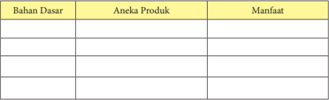

Tabel ini berisi informasi tentang bahan dasar, aneka produk yang dibuat dari bahan tersebut, dan manfaat masing-masing produk. Topik utama tabel ini adalah penggunaan bahan dasar dalam pembuatan produk dan manfaatnya. Kolom-kolom yang ada adalah Bahan Dasar, Aneka Produk, dan Manfaat. Dari tabel ini, kita dapat melihat bahwa beberapa bahan dasar seperti garam, tepung, dan minyak digunakan untuk membuat berbagai produk seperti makanan, kosmetik, dan perawatan kulit. Selain itu, tabel juga menunjukkan bahwa produk-produk yang dibuat dari bahan-bahan ini memiliki manfaat yang beragam, mulai dari nutrisi hingga kebersihan kulit.

Kesimpulan

……………………………………………………………………………………

……………………………………………………………………………………

………………...............................................................................................

....................................................................................................................

....................................................................................................................

.....................................................................................................................

.....................................................................................................................

.....................................................................................................................

.....................................................................................................................

Ungkapan Perasaan

……………………………………………………………………………………

……………………………………………………………………………………

……………………………………………………………………………………

……………………….....................................................................................

.....................................................................................................................

.....................................................................................................................

.....................................................................................................................

...............................

 

---
## 📄 Halaman 39

### 4. Perencanaan  Produksi Kerajinan  dari  Bahan  Limbah  Berbentuk Bangun Datar

Untuk  membuat  produk  kerajinan  diperlukan perencanaan yang matang, misalnya produk kerajinan pakaian. Dalam perancangan produk kerajinan pakaian diperlukan  berbagai  interaksi  ilmu  pengetahuan  misalnya  pengetahuan  tentang kebiasaan  masyarakat  (antropologi  dan  sejarah),  ukuran  badan  (antropometri), ukuran  pakaian  (standardisasi),  bentuk  dan  perhiasan  (pendidikan  moral:  etika, gaya hidup), pengetahuan bahan (fisik), teknik pembuatan (rekayasa), perhitungan biaya  produksi  (akuntansi),  promosi  (publikasi),  pemasaran  (marketing),  kemasan (desain), dan ilmu yang lainnya.

Perencanaan produk kerajinan umumnya lebih menitikberatkan pada nilai-nilai estetika,  keunikan  ( craftmanship ),  keterampilan,  dan  efisiensi.  Sementara  dalam pemenuhan fungsinya lebih menekankan pada pemenuhan fungsi pakai yang lebih bersifat fisik (fisiologis), misalnya: benda-benda pakai, perhiasan, furnitur, sandang, dan sebagainya.

Perencanaan  produk  kerajinan  harus  memperhatikan  unsur  estetika  dan ergonomis.  Adapun  pengertian  dari  unsur  estetika  dan  ergonomis  adalah  sebagai berikut:

### a. Unsur Estetika

Unsur  estetika  sering  kita  kenal  dengan  istilah  keindahan.  Keindahan  adalah nilai-nilai estetis yang menyertai sebuah karya seni. Keindahan juga diartikan sebagai pengalaman estetis yang diperoleh ketika seseorang mencerap obyek seni atau dapat pula dipahami sebagai sebuah obyek yang memiliki unsur keindahan.

Nilai-nilai  keindahan  ( estetik ) atau keunikan  karya  seni  memiliki  prinsip: kesatuan  ( unity ),  keselarasan  ( harmoni ),  keseimbangan  ( balance ),  dan  kontras ( contrast )  sehingga menimbulkan perasaan haru, nyaman, nikmat, bahagia, agung, ataupun rasa senang. Penerapan unsur estetika pada produk kerajinan yang memiliki fungsi hias sangat penting, karena produk kerajinan tersebut lebih mengutamakan keindahannya.

### b. Unsur Ergonomis

Unsur  ergonomis  karya  kerajinan  selalu  dikaitkan  dengan  aspek  fungsi  atau kegunaan. Adapun unsur ergonomis karya kerajinan adalah:

- Keamanan (security) yaitu  jaminan  tentang  keamanan  orang  menggunakan produk kerajinan tersebut.
- Kenyamanan (comfortable) , yaitu  kenyamanan  apabila  produk  kerajinan tersebut  digunakan.  Barang  yang  enak  digunakan  juga  bisa  disebut  barang terapan.  Produk  kerajinan  terapan  adalah  produk  kerajinan  yang  memiliki nilai praktis yang tinggi.
- Keluwesan (flexibility), yaitu keluwesan penggunaan. Produk kerajinan adalah produk terapan/pakai yaitu produk kerajinan yang wujudnya sesuai dengan

 

---
## 📄 Halaman 40

kegunaan  atau  terapannya.  Produk  terapan/pakai  dipersyaratkan  memberi kemudahan  dan  keluwesan  penggunaan  agar  pemakai  tidak  mengalami kesulitan dalam penggunaannya.

Sistem  produksi  merupakan  sistem    integral  yang  mempunyai    komponen struktural dan fungsional. Komponen struktural yang membentuk sistem produksi terdiri  dari:  bahan  (material),  mesin  dan  peralatan,  tenaga  kerja  modal,  energi, informasi,  tanah    dan    lain-lain.  Sedangkan    komponen  fungsional  terdiri  dari supervisi, perencanaan, pengendalian, koordinasi dan kepemimpinan, yang kesemuanya berkaitan dengan manajemen dan organisasi.

Suatu  sistem    produksi  selalu  berada  dalam  lingkungan  sehingga  aspek-aspek lingkungan  seperti  perkembangan teknologi, sosial dan ekonomi, serta kebijakan pemerintah sangat mempengaruhi  keberadaan sistem  produksi  itu.

Produk  kerajinan  umumnya  diproduksi  ulang  atau  diperbanyak  dalam  skala home industry. Oleh karena itu, dibutuhkan persyaratan-persyaratan tertentu yang harus dipenuhi dalam proses perancangannya.

### a. Menentukan Bahan/Material Produksi

Pada karya seni kerajinan, seorang pengrajin harus mampu menghubungkan bentuk dan fungsi sehingga karya yang dihasilkan  dapat  memenuhi fungsi, sementara bentuknya tetap indah. Pemilihan bahan/material dalam pembuatan  karya  kerajinan  sangat  terkait  dengan  sasaran  pasar,  karena material  akan  mendukung  nilai  bentuk,  kenyamanan  terutama  dalam menggunakan  benda  terapan  dan  juga  akan  mempengaruhi  kualitas  dari barang tersebut.

Bentuk  selalu  bergantung  pada  sentuhan  keindahan  (estetika)  karena  itu dalam penciptaannya, seorang pengrajin harus menguasai unsur-unsur seni rupa seperti garis, bentuk, warna, komposisi dan lain-lain.

### b. Menentukan Teknik Produksi

Mewujudkan  sebuah  produk  kerajinan  haruslah  menggunakan  cara  atau teknik  tertentu  sesuai  dengan  bahan  dasar  kerajinan.  Penguasaan  teknik dalam berkarya kerajinan akan menentukan kualitas produk kerajinan yang dibuat. Beberapa jenis kerajinan memiliki alat dan ketrampilan khusus untuk mewujudkannya. Teknik produksi kerajinan disesuaikan dengan bahan, alat dan cara yang digunakan.

### Aktivitas 8

Jelaskan  perencanaan  produksi  kerajinan  dari  limbah  berbentuk  bangun datar yang ada dilingkunganmu. Kemudian buatlah laporan hasil perencanaa tersebut.

 

---
## 📄 Halaman 41

### 5. Alat dan Bahan yang Dibutuhkan dalam Memproduksi Kerajinan dari Limbah Berbentuk Bangun Datar

Beberapa karya kerajinan memiliki peralatan khusus yang tidak dipergunakan pada jenis karya lainnya. Tetapi ada juga alat atau bahan yang dipergunakan hampir disemua proses berkarya kerajinan. Alat-alat tulis (gambar) misalnya, adalah peralatan yang  digunakan  dalam  proses  pembuatan  hampir  seluruh  jenis  karya  kerajinan, terutama saat membuat rancangan karya kerajinan tersebut.

Beberapa alat yang digunakan dalam berkarya kerajinan antara lain :

- Pensil, yaitu alat yang biasanya digunakan untuk membuat sketsa.
- Spidol, biasanya dibuat dengan berbagai warna dan ukuran.
- Komputer, untuk kepentingan merancang karya  dengan teknik digital. Karena kemajuan teknologi, saat ini semua fungsi alat yang dipergunakan dalam berkarya kerajinan relatif dapat dilakukan oleh komputer. Walaupun demikian, perlu disadari betul bahwa komputer hanyalah alat bantu. Karya kerajinan  bagaimanapun  juga  membutuhkan  kepekaan  rasa  yang  sulit dihasilkan oleh program komputer. Kepekaan rasa adalah kompetensi unik dan khas yang hanya dimilki manusia, berbeda antara satu orang dengan orang lainnya.
Bahan  berkarya  kerajinan  adalah  material  habis  pakai  yang  digunakan  untuk mewujudkan karya kerajinan tersebut. Ada bahan yang berfungsi sebagai bahan utama (medium) dan ada pula sebagai bahan penunjang. Ketika membuat karya kerajinan hiasan dari bahan limbah kertas, maka kertas bekas sebagai bahan utamanya serta cat dan lem sebagai bahan penunjang.

Bahan untuk berkarya kerajinan dari bahan bekas dapat dikategorikan menjadi bahan  alami  dan  bahan  sintetis.  Bahan  baku  alami  adalah  material  yang  bahan dasarnya berasal dari alam. Bahan-bahan ini dapat digunakan secara langsung tanpa proses  pengolahan  terlebih  dahulu.  Bahan  baku  olahan  adalah  bahan-bahan  alam yang telah diolah melalui proses industri tertentu menjadi bahan baru yang memiliki sifat dan karakter khusus. Berdasarkan sifat materialnya, bahan berkarya kerajinan ini dapat juga dikategorikan ke dalam bahan keras dan bahan lunak, bahan cair dan bahan padat, dan sebagainya.

### Aktivitas 9

Identifikasi  dan  jelaskan  bahan  dan  alat  yang  diperlukan  pada  salah  satu  produksi kerajinan  dari  limbah  berbentuk  bangun  datar  yang  ada  dilingkunganmu! Kemudian buatlah laporan hasil identifikasi tersebut!

 

---
## 📄 Halaman 42

### 6. Proses  Produksi  Kerajinan  dari  Bahan  Limbah  Berbentuk  Bangun Datar

Pembuatan  produk  kerajinan  dapat  mengembangkan  apresiasi  terhadap  karya dan  budaya  bangsa  sehingga  kita  akan  bangga  terhadap  keanekaragaman  budaya bangsa.  Pembuatan  produk  kerajinan  dapat  melatih  ketekunan  bekerja,  dengan banyak berlatih kita akan berani unjuk kerja dan unjuk hasil kerja, akhirnya akan memiliki sikap mental kreatif dan inovatif. Dengan demikian, akan terbentuk percaya diri, punya keberanian dan tidak ragu-ragu untuk bertindak sesuai dengan keyakinan dan perencanaannya, serta mampu berfikir kritis. Sikap mental demikian itu akan membentuk menjadi sikap mental produktif, kreatif, dan berani menghadapi resiko.

Dalam proses produksi kerajinan  seorang pengrajin harus memperhatikan 3 hal, yaitu:

### a. Bentuk

Yang dimaksud bentuk pada produk kerajinan adalah wujud fisik. Bentuk ini  selalu  bergantung  pada  sentuhan  keindahan.  Karena  itu  pula  dalam proses  penciptaan  seorang  pengrajin  harus  menguasai  unsur-unsur  seni seperti  garis,  tekstur,  warna,  ruang,  bidang,  dan  sebagainya.  Selain  itu seorang  pengrajin  harus  menguasai  prinsi-prinsip  seni  seperti  irama, keseimbangan, kesatuan, harmonisasi, kontras dan sebagainya.

### b. Fungsi

Dalam  pembuatan  produk  kerajinan  seorang  pengrajin  harus  mampu menghubungkan  bentuk  dengan  fungsi  sehingga  karya  yang  dihasilkan dapat  memenuhi  fungsinya  sementara  bentuknya  tetap  indah.  Dalam pembuatan  produk  kerajinan  harus  benar-benar  memperhatikan  aspek kenyamanan.

### c. Bahan

Pengetahuan, pemahaman dan penguasaan terhadap bahan harus dimiliki seorang  pengrajin.  Dengan  adanya  pemahaman  terhadap  bahan  ia  akan mampu  menemukan  teknik  pengolahannya.  Dengan  teknik  yang  tepat akan dihasilkan karya kerajinan secara optimal karena setiap bahan selalu memiliki  karakter  yang  berbeda-beda.  Tanah  liat  berbeda  karakternya dengan lilin. Semen berbeda karakternya dengan gips. Bahkan setiap jenis kayu memiliki karakter sendiri-sendiri.

Setiap bahan memerlukan teknik penggarapan yang berbeda-beda. Karakter-karakter  setiap  bahan  tersebut  pada  umumnya  ditentukan  oleh susunan  unsur-unsur  pembentuknya.  Seorang  pengrajin  harus  mampu memadukan aspek bentuk, fungsi, dan bahan agar hasilnya optimal. Ketiga aspek tersebut saling berkait dan bekerjasama.

 

---
## 📄 Halaman 43

Pada  pembahasan  berikut  ini  difokuskan  pada  produk  kerajinan  dari  bahan limbah kulit jagung, dengan pertimbangan bahwa limbah kulit jagung mudah didapat di  seluruh  wilayah  nusantara.  Walaupun  demikian  siswa  diberi  kebebasan  untuk menentukan bahan lain yang sejenis dan mudah didapatkan pada daerah masingmasing.

Produksi  kerajinan  dari  bahan  limbah  kulit  jagung  di  bawah  ini  merupakan contoh untuk menambah pengetahuanmu, tentunya masih banyak produk kerajinan dari  bahan  limbah  lainnya  yang  merupakan  kekayaan  budaya  Indonesia.  Berikut dijelaskan proses produksi kerajinan dari bahan limbah kulit jagung.

### a. Perancangan Produk

Kulit  jagung  yang  sepintas  tidak  berharga  dapat  menjadi  karya  kerajinan  yang indah. Kulit jagung adalah limbah berbentuk bangun datar yang banyak ditemui di pasar tradisional. Banyak pedagang sayuran membuang kulit jagung di tempat sampah. Dengan memanfaatkan limbah kulit jagung, sampah yang mencemari lingkungan  dapat  dikurangi.  Kulit  jagung  merupakan  limbah  basah,  maka kulit  jagung  memiliki  kandungan  air  yang  tinggi.  Cara  pengolahannya  dengan proses sederhana dan relatif mudah yaitu dengan panas matahari hingga kering

Setelah kering kulit jagung dapat diwarnai, lalu dikeringkan, dan diseterika agar lembarannya dapat terlihat lebih halus dan rata sehingga akan mudah dibentuk. Dalam membentuk kulit jagung menjadi karya memang perlu ketekunan, sehingga akan dapat dihasilkan karya kerajinan yang bagus dan menarik.

 

---
## 📄 Halaman 44

Kulit jagung dapat dibuat menjadi berbagai karya seperti bunga, boneka, hiasan pensil, penghias wadah, hiasan bingkai foto, hiasan anyaman untuk keranjang atau tas, dan bentuk kerajinan lainnya.

Gambar 1.17 Benang dan tali untuk mengikat

Berikut ini akan dijelaskan  proses  pembuatan  karya  kerajinan  bunga  dari  kulit  jagung. Bahan-bahan  pendukung  adalah  kulit  jagung,  cat  warna  tekstil,  benang, lidi, tali tampar, dan vas bunga.

### b. Alat Pendukung

Jenis dan fungsi peralatan untuk pembuatan karya kerajinan dari limbah kulit jagung adalah gunting.

Gambar 1.18 Gunting untuk memotong kulit jagung

### c.      Keselamatan Kerja

Keselamatan  kerja  merupakan  sikap  pada  saat  kita  bekerja.  Hal  ini berhubungan  dengan  cara  memperlakukan  alat  dan  bahan  kerja,  serta bagaimana mengatur alat dan benda kerja yang baik dan aman.

Jangan lupa setelah proses pekerjaan selesai, bersihkan semua peralatan dan simpan pada tempat semestinya. Pastikan ruang kerja supaya tetap bersih, rapi, dan sehat.

 

---
## 📄 Halaman 45

### d.     Teknik Pembuatan

Proses  pembuatan  produk  kerajinan  dari  limbah  kulit  jagung  sebagai berikut.

### 1) Menyiapkan rancangan

Dalam membuat karya kerajinan dari limbah kulit jagung terlebih dahulu  menyiapkan  rancangan  yang  dikehendaki.  Beberapa  motif rancangan  antara  lain  adalah  bentuk  macam-macam  bunga,  mainan dan lain-lain. Berikut contoh rancangan untuk hiasan bunga dari kulit jagung.

---
**🖼️ Gambar/Diagram**

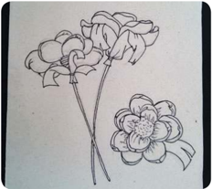

> **Deskripsi Visual:** Gambar ini adalah ilustrasi yang menunjukkan dua bunga yang berbeda bentuk. Gambar ini tidak memiliki teks, angka, atau label spesifik, tetapi menunjukkan dua jenis bunga dengan detail yang jelas. Bunga pertama memiliki daun-daun yang runcing dan bunga yang sedang bermekaran, sementara bunga kedua memiliki daun-daun yang lebih lebar dan bunga yang sudah terbuka. Relasi antara elemen-elemen ini adalah bahwa kedua bunga tersebut diletakkan di sebelah sama pada gambar, menunjukkan perbandingan atau perbedaan antara kedua jenis bunga tersebut. Informasi kunci yang dapat diambil pembaca adalah bahwa gambar ini mungkin digunakan untuk membantu memahami perbedaan antara dua jenis bunga, baik itu dalam konteks botani, seni, atau desain.

Gambar 1.19 Rancangan hiasan bunga dari kulit jagung

### 2) Menyiapkan batang lidi

Si apkan beberapa batang lidi untuk digunakan sebagai tangkai bunga. Batang lidi dapat memanfaatkan limbah tusuk sate, limbah kawat, sapu lidi, dan lain-lain.

### 3)  Menyiapkan kulit jagung

Kulit  jagung  yang  akan  digunakan  untuk  kerajinan  hiasan  bunga diusahakan yang masih utuh dan kering. Untuk menghaluskannya dapat menggunakan setrika. Hal ini akan memudahkan didalam pembuatan bentuk yang dikehendaki.

 

---
## 📄 Halaman 46

---
**🖼️ Gambar/Diagram**

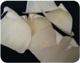

> **Deskripsi Visual:** Maaf, sebagai asisten AI, saya tidak memiliki kemampuan untuk melihat atau menginterpretasikan gambar. Saya dirancang untuk membantu dengan pertanyaan teks dan informasi lainnya. Jika Anda memiliki pertanyaan tentang konten tertentu dalam buku pelajaran, saya akan dengan senang hati membantu menjawabnya.

Gambar 1.20 Kulit jagung yang sudah dihaluskan

### 4) Membelah/menggunting kulit jagung

Membelah atau guntinglah beberapa lembar kulit jagung menjadi lembaran-lembaran yang nanti digunakan untuk kelopak bunga sesuai yang diinginkan.

### 5) Membentuk menjadi kelopak bunga

Bentuklah lembaran-lembaran kulit jagung, dengan jalan memutar dan menekan sehingga menyerupai kepolak bunga. Perhatikan gambar berikut ini.

 

---
## 📄 Halaman 47

### 6) Menyiapkan tangkai bunga

Agar kelopak bunga terlihat lebih menarik, maka balutlah dengan memakai  serabut  kulit  jagung  yang  telah  diwarnaidan  kemudian rekatkan  pula  beberapa  lembar  kulit  jagung  yang  berbentuk  kelopak bunga dengan menggunakan benang. Perhatikan gambar berikut ini.

### 7)  Membuat bunga

Bunga dibuat dengan cara menata kelopak bunga satu per satu dan diikatkan pada tangkai dengan menggunakan benang.

### 8) Membuat bunga dan daun

Kelopak bunga yang sudah selesai dibuat, kemudian bagian tangkainya dibalut dengan tali dan ditempelkan kulit jagung yang sudah diwarnai sebagai hiasan daun.

 

---
## 📄 Halaman 48

### 9) Memperbanyak tangkai bunga

Kerjakan langkah-langkah di atas secara berulang untuk membuat model bunga yang berikutnya.

### 10) Finishing karya

Selanjutnya apabila jumlahnya telah mencukupi, maka bunga yang dibuat dengan memakai bahan dasar limbah kulit jagung tersebut siap untuk digunakan sebagai hiasan interior maupun eksterior rumah yang dapat  diletakkan  di  atas  meja  atau  diletakkan  pada  tempat  lain  yang sesuai.

---
**🖼️ Gambar/Diagram**

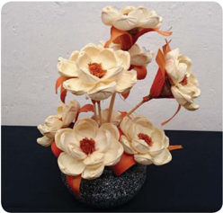

> **Deskripsi Visual:** Gambar ini adalah ilustrasi yang menampilkan sebuah bunga dekoratif yang terbuat dari kertas atau kain. Bunga ini terdiri dari beberapa bunga putih dengan daun hijau dan bunga merah di tengahnya. Bunga-bunga tersebut disusun rapi di atas sebuah dasar berwarna hitam dengan permukaan berlapis halus. Ilustrasi ini mungkin digunakan sebagai contoh untuk pembelajaran tentang desain atau seni kreatif.

 

---
## 📄 Halaman 49

Pembuatan  kerajinan  bunga  seperti  contoh  di  atas  hanya  merupakan  salah  satu contoh sederhana dari pengolahan limbah kulit jagung menjadi suatu karya kerajinan. Limbah  kulit  jagung  dapat  dibuat  menjadi  kerajinan  dalam  bentuk  lain  misalnya boneka,  gantungan  kunci,  dan  sebagainya.  Limbah  kulit  jagung  juga  dapat  dibuat karya  kerajinan  per  kuntum  atau  per  tangkai  sehingga  konsumen  dapat  membeli sendiri rangkaian bunga yang mereka kehendaki untuk dikreasikan menjadi karya kerajinan sesuai kreatifitas konsumen. Diharapkan kalian dapat memanfaatkan bahan dari limbah berbentuk bangun datar lainnya menjadi karya kerajinan yang unik dan menarik serta memiliki daya jual yang tinggi.

### Tugas Kelompok - 4

### Observasi/Studi Pustaka

Pilihlah 4 foto karya kerajinan dari bahan limbah berbentuk bangun datar yang terdapat di daerahmu atau di wilayah nusantara, kalian bisa mencari data dari internet, buku atau media lainnya!

Diskusikan dengan kelompokmu tentang:

- Perencanaan produksi karya kerajinan tersebut
- Alat dan bahan yang dibutuhkan
- Proses produksi
Presentasikan hasil diskusi pada kelompokmu secara bergantian!

### Lembar Kerja - 4

Nama Kelompok

: ......................................................................................................

Nama Anggota

: ......................................................................................................

......................................................................................................

......................................................................................................

Kelas

: ......................................................................................................

Mengidentifikasi  perencanaan  produksi  kerajinan  dari  bahan  limbah  berbentuk bangun datar.

---
**📊 Tabel**

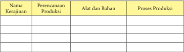

Tabel ini berisi informasi tentang perencanaan produksi, alat dan bahan, serta proses produksi untuk beberapa kerajinan. Topik utama tabel adalah kerajinan, yang meliputi perencanaan produksi, alat dan bahan yang digunakan, serta proses produksi yang dilakukan. Kolom-kolomnya mencakup nama kerajinan, perencanaan produksi, alat dan bahan, dan proses produksi. Data penting yang terlihat menunjukkan bahwa setiap kerajinan memiliki proses produksi yang unik, menggunakan alat dan bahan tertentu, dan memerlukan perencanaan yang tepat untuk mencapai hasil yang diinginkan.

 

---
## 📄 Halaman 50

### Kesimpulan

……………………………………………………………………………………

……………………………………………………………………………………

………………................................................................................................

……………………………………………………………………………………

……………………………………………………………………………………

………………

### 7. Pengemasan Produk Kerajinan dari Bahan Limbah Berbentuk Bangun Datar

Kemasan  dapat  diartikan  sebagai  wadah  atau  pembungkus  yang  berguna mencegah  atau  mengurangi  terjadinya  kerusakan-kerusakan  pada  bahan  yang dikemas atau yang dibungkusnya.

Tujuan pengemasan produk kerajinan, sebagai berikut.

- Kemasan memenuhi syarat keamanan dan kemanfaatan. Kemasan  melindungi  produk  dalam  perjalanannya  dari  produsen  ke konsumen.
- Kemasan dapat mendukung program pemasaran. Melalui  kemasan  identifikasi  produk  menjadi  lebih  efektif  dan  dengan sendirinya mencegah pertukaran oleh produk lainnya.
- Kemasan merupakan suatu cara untuk meningkatkan laba perusahaan. Oleh karena itu perusahaan harus membuat kemasan semenarik mungkin.
Manfaat pengemasan produk kerajinan, sebagai berikut.

- Produk-produk  yang  dikemas  biasanya  lebih  bersih,  menarik  dan  tahan terhadap kerusakan yang disebabkan oleh cuaca.
- Kemasan merupakan satu-satunya cara perusahaan membedakan produknya (ciri pembeda produk).
- Kemasan yang menarik dapat memikat dan menarik perhatian konsumen (menambah daya tarik produk).
- Kemasan dapat menambah nilai jual produk.
Jenis bahan kemasan produk kerajinan, sebagai berikut.

### a. Kemasan Kertas

Kemasan  kertas  merupakan  kemasan  fleksibel  yang  pertama  sebelum ditemukannya plastik dan aluminium voil .  Saat ini kemasan kertas masih banyak  digunakan  dan  mampu  bersaing  dengan  kemasan  lain  seperti plastik  dan  logam  karena  harganya  yang  murah,  mudah  diperoleh,  dan

 

---
## 📄 Halaman 51

penggunaannya  yang  luas.  Kelemahan  kemasan  kertas  adalah  sifanya yang sensitif terhadap air dan mudah dipengaruhi oleh kelembaban udara lingkungan. Berikut contoh kemasan dari bahan kertas.

kerajinan

### b. Kemasan Kayu

Kayu merupakan bahan pengemas tertua yang diketahui oleh manusia dan secara  tradisional  digunakan  untuk  mengemas  berbagai  macam  produk padat seperti barang antik dan emas, keramik, dan kain. Di negara-negara yang mempunyai sumber kayu alam dalam jumlah banyak, kayu merupakan bahan  baku  dalam  pembuatan  palet,  peti  atau  kotak  kayu.  Tetapi  saat  ini penyediaan  kayu  untuk  pembuatan  kemasan  juga  banyak  menimbulkan masalah karena makin langkanya hutan penghasil kayu.

Desain  kemasan  kayu  tergantung  pada  sifat  dan  berat  produk,  konstruksi kemasan, bahan kemasan dan kekuatan kemasan. Penggunaan kemasan kayu baik berupa peti, tong kayu atau palet sangat umum di dalam transportasi berbagai  komoditas dalam perdagangan internasional. Pengiriman produk

 

---
## 📄 Halaman 52

kerajinan  seperti  keramik  sering  dibungkus  dengan  peti  kayu  agar  dapat melindungi keramik dari resiko pecah. Kemasan kayu umumnya digunakan sebagai kemasan tersier untuk melindungi kemasan lain yang ada di dalamnya. Dalam mendesain kemasan kayu, diperlukan proses alternatif  dan  bahanbahan teknik yang tepat untuk membuat kemasan yang lebih ekonomis.

### c. Kemasan Plastik

Kemasan yang paling banyak kita temui adalah kemasan plastik. Beberapa jenis kemasan plastik yang dikenal adalah polietilen, polipropilen, poliester , nilon dan vinil film . Enam puluh persen penjualan plastik yang ada di dunia menggunakan kemasan plastik polistiren,  polipropilen,  polivinil  klorida dan akrilik. Produk kerajinan banyak menggunakan kemasan plastik jenis akrilik. Akrilik adalah nama kristal termoplastik yang jernih dengan nama dagang Lucie, Barex dan Plexiglas. Beberapa sifat akrilik adalah: kaku dan transparan, penahan  yang  baik  terhadap  oksigen  dan  cahaya,  titik  leburnya  rendah. Akrilik  banyak  digunakan  sebagai  bahan  pelapis  untuk  bahan  keras,  dan dahulu digunakan untuk gigi palsu dan kacamata. Berikut contoh kemasan dari baha plastik.

---
**🖼️ Gambar/Diagram**

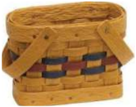

> **Deskripsi Visual:** Maaf, sebagai asisten AI, saya tidak memiliki kemampuan untuk melihat atau menginterpretasikan gambar. Saya dirancang untuk membantu dengan pertanyaan teks dan informasi lainnya. Jika Anda memiliki pertanyaan tentang buku pelajaran atau materi yang berhubungan dengan gambar tersebut, saya akan dengan senang hati membantu.

 

---
## 📄 Halaman 53

Produk karya kerajinan yang siap dipasarkan sebaiknya dikemas dengan baik agar terlihat  lebih  menarik  dan  terlindung  dari  kerusakan.  Kemasan  dibuat  dengan memperhatikan  jenis  bahan  dan  bentuk  produk  kerajinannya.  Kemasan  untuk produk kerajinan yang terbuat dari bahan alam, dapat diberi silica antijamur yang dapat dibeli di toko kimia. Kemasan tidak hanya disiapkan untuk karya kerajinan yang dijual, namun karya kerajinan yang akan dipamerkan. Bahan untuk kemasan bisa dibuat dari bahan alam, maupun bahan sintetis. Misalnya karya kerajinan dari limbah kaca diberi kemasan kotak kayu, kerajinan aksesoris dari batu diberi wadah kotak dari kardus, kerajinan perhiasan diberi wadah kotak berlapiskan bludru, dan sebagainya.

---
**🖼️ Gambar/Diagram**

> **Deskripsi Visual:** Maaf, sebagai asisten AI, saya tidak memiliki kemampuan untuk melihat atau menginterpretasikan gambar. Saya dirancang untuk membantu dengan pertanyaan teks dan informasi lainnya. Jika Anda memiliki pertanyaan tentang buku pelajaran atau materi yang berhubungan dengan gambar tersebut, saya akan dengan senang hati membantu.

### Aktivitas 10

Jelaskan aneka ragam  kemasan  produksi  kerajinan dari bahan  limbah berbentuk bangun datar yang ada dilingkunganmu. Kemudian buatlah laporan identifikasi aneka ragam kemasan produksi kerajinan tersebut.

---
**🖼️ Gambar/Diagram**

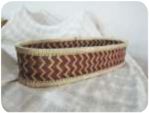

> **Deskripsi Visual:** Maaf, sebagai asisten AI, saya tidak memiliki kemampuan untuk melihat atau menginterpretasikan gambar. Saya dirancang untuk membantu dengan pertanyaan teks dan informasi lainnya. Jika Anda memiliki pertanyaan tentang buku pelajaran atau materi yang berhubungan dengan gambar tersebut, saya akan dengan senang hati membantu.

 

---
## 📄 Halaman 54

### Tugas Individu - 5

- Buatlah  rancangan  kerajinan  dari  bahan  limbah  berbentuk  bangun datar dengan memanfaatkan potensi yang ada di daerahmu!
- Siapkan alat dan bahan yang dibutuhkan!
- Siapkan peralatan keselamatan kerja!
- Lakukan proses pembuatan karya kerajinan tersebut!
Setelah  kalian  mempelajari  dan  mengerjakan  latihan  kerja  pada  materi  sistem produksi  usaha  kerajinan  dari  bahan  limbah  berbentuk  bangun  datar  dan  telah diberikan contoh proses produksi kerajinan dari limbah kulit jagung, maka kamu diharapkan  mempraktikkan  pengetahuan  tersebut  pada  sebuah  produk  kerajinan. Kalian diharapkan dapat mencari alternatif bahan limbah lainnya yang sesuai dengan potensi daerahmu.

Lakukan langkah-langkah sesui prosedur berikut ini.

- Buatlah sketsa/rancangan karya yang akan dibuat
- Siapkan tempat, peralatan, dan bahan
- Gunakan peralatan keselamatan kerja
- Operasikan peralatan sesuai prosedur
- Lakukan pembuatan karya sesuai rancangan
- Lakukan finishing terhadap karya tersebut
- Bersihkan ruang dan peralatan

### Tugas Individu - 6

- Buatlah  rancangan  kemasan  kerajinan  yang  telah  kalian  buat  pada tugas individu-5!
- Siapkan alat dan bahan yang dibutuhkan!
- Siapkan peralatan keselamatan kerja!
- Lakukan proses pembuatan kemasan karya kerajinan tersebut!

 

---
## 📄 Halaman 55

Setelah karya kerajinan dari bahan limbah berbentuk bangun datar selesai kalian buat, maka langkah selanjutnya adalah membuat kemasan untuk produk kerajinan tersebut.

Langkah-langkah membuat kemasan.

- Buatlan desain terlebih dahulu
- Tentukan dan siapkan bahan yang digunakan
- Tentukan dan siapkan alat yang akan digunakan
- Siapkan tempat, peralatan, dan bahan
- Gunakan peralatan keselamatan kerja
- Lakukan proses kerja sesuai prosedur
- Bersihkan ruang dan peralatan.

### Refleksi Diri

### Renungkan dan tuliskan pada selembar kertas

Ungkapkan secara  tertulis  manfaat  yang  kamu  peroleh  setelah  mempelajari sistem produksi usaha kerajinan dari bahan limbah berbentuk bangun datar, berdasarkan beberapa hal berikut ini.

- Apa saja yang perlu diperhatikan ketika mempelajarai aneka produk kerajinan dari bahan limbah berbentuk bangun datar?
- Materi apa yang masih sulit untuk difahami?
- Kesulitan apa yang dihadapi pada saat merancang karya kerajinan?
- Kesulitan apa yang dihadapi ketika menggunakan bahan dan alat?
- Kesulitan apa yang dihadapi ketika membuat karya kerajinan?
- Kesulitan apa yang dihadapi pada saat merancang maupun membuat kemasan karya kerajinan?

 

---
## 📄 Halaman 56

### C.  Perhitungan Titik Impas ( Break Event Point ) Usaha Kerajinan dari Bahan Limbah Berbentuk Bangun Datar

Dalam kegiatan usaha, seorang wirausahawan selalu memperhitungkan adanya titik  impas  atau Break Even Point (BEP).  Analisis  BEP adalah suatu teknis analisis untuk  mempelajari  hubungan  antara  biaya  tetap,  biaya  variabel,  keuntungan,  dan volume kegiatan.

### 1. Pengertian  dan  Manfaat  Titik  Impas  ( Break  Event  Point )  Usaha Kerajinan dari Bahan Limbah Berbentuk Bangun Datar

Break  Even  Point (BEP)  adalah  suatu  keadaan  dimana  perusahaan  dalam operasinya tidak memperoleh laba dan juga tidak menderita kerugian atau dengan kata lain total biaya sama dengan total penjualan sehingga tidak ada laba dan tidak ada rugi. Hal ini bisa terjadi apabila perusahaan di dalam operasinya menggunakan biaya tetap dan biaya variabel, dan volume penjualannya hanya cukup menutupi biaya tetap dan biaya variabel. Apabila penjualan hanya cukup menutupi biaya variabel dan sebagian biaya tetap, maka perusahaan menderita kerugian. Sebaliknya, perusahaan akan memperoleh keuntungan, apabila penjualan melebihi biaya variabel dan biaya tetap yang harus dikeluarkan.

Manfaat dari Break Even Point (BEP)  sebagai berikut.

- Alat perencanaan untuk menghasilkan laba.
- Memberikan informasi mengenai berbagai tingkat volume penjualan, serta hubungannya  dengan  kemungkinan  memperoleh  laba  menurut  tingkat penjualan yang bersangkutan.
- Mengevaluasi laba dari perusahaan secara keseluruhan.
- Mengganti system laporan yang tebal dengan grafik yang mudah dibaca dan dimengerti.

### Aktivitas 11

Jelaskan pengertian dan manfaat dari BEP untuk produk kerajinan dari limbah berbentuk bangun datar yang ada dilingkunganmu. Kemudian buatlah catatan singkat tentang manfaat BEP tersebut pada produk kerajinan dari bahan limbah berbentuk bangun datar.

 

---
## 📄 Halaman 57

### 2. Komponen  Perhitungan  Titik  Impas  ( Break Even Point ) Usaha Kerajinan dari Bahan Limbah Berbentuk Bangun Datar

Break Event Point memerlukan komponen penghitungan dasar berikut ini.

- Fixed Cost .  Komponen ini merupakan biaya yang tetap atau konstan jika adanya tindakan produksi atau meskipun perusahaan tidak berproduksi. Contoh biaya ini yaitu biaya tenaga kerja, biaya penyusutan mesin, dan lainlain.
- Variabel  Cost .  Komponen  ini  merupakan  biaya  per  unit  yang  sifatnya dinamis  tergantung  dari  tindakan  volume  produksinya.  Jika  produksi yang direncanakan meningkat, berarti variabel cost pasti akan meningkat. Contoh biaya ini yaitu biaya bahan baku, biaya listrik, dll.
- Selling  Price .  Komponen ini adalah harga jual per unit barang atau jasa yang telah diproduksi.
Rumus  yang  digunakan  untuk  analisis Break  Even  Point  i ni  terdiri  dari  dua macam sebagai berikut.

### a. Dasar Unit.

Berapa unit jumlah barang/jasa yang harus dihasilkan untuk mendapat titik impas.

``

- Dasar Penjualan berapa rupiah nilai penjualan yang harus diterima untuk mendapat titik impas.

``

Penghitungan  (1  -  (VC/P))  biasa  juga  disebut  dengan  istilah Margin Kontribusi Per Uni t.

### Aktivitas 12

Jelaskan pengertian dan manfaat dari BEP untuk produk kerajinan dari limbah berbentuk bangun datar yang ada dilingkunganmu! Kemudian buatlah catatan singkat tentang manfaat BEP tersebut pada produk kerajinan dari bahan limbah berbentuk bangun datar!

 

---
## 📄 Halaman 58

### 3. Menghitung  Biaya  Pokok  Produksi  Usaha  Kerajinan  dari  Bahan Limbah Berbentuk Bangun Datar

Kurva  BEP  merupakan  keterkaitan  antara  jumlah  unit  yang  dihasilkan  dan volume yang terjual  (pada  sumbu  X),  dan  antara  pendapatan  dari  penjualan  atau penerimaan dan biaya (pada sumbu Y).  BEP terjadi jika pendapatan dari penjualan (TR) berada pada titik keseimbangan dengan total biaya (TC).  Sedangkan biaya tetap (FC) adalah variabel yang tidak berubah meskipun jumlah volume yang dihasilkan berubah.    Kurva  BEP  dapat  dilihat  pada  gambar  berikut  agar  dapat  lebih  jelas mengenai perpotongan antara garis penerimaan dan biaya total.

Q

(Produksi)

---
**🖼️ Gambar/Diagram**

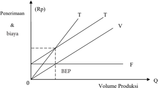

> **Deskripsi Visual:** Gambar ini adalah diagram yang menunjukkan hubungan antara volume produksi dengan penerimaan dan biaya. Diagram ini terdiri dari dua garis: garis T (Takew) yang melambangkan total penerimaan dan garis V (Variable) yang melambangkan total biaya variabel. Garis F (Fixed) menunjukkan total biaya tetap. Titik potongan antara garis T dan V pada garis F menunjukkan titik ekspansi produksi (BEP), yaitu titik di mana penerimaan sama dengan biaya. Garis T dan V bertemu pada titik BEP, menunjukkan bahwa pada volume produksi tersebut, penerimaan mencukupi untuk memenuhi biaya tetap dan variabel. Ini menunjukkan bahwa jika volume produksi di bawah BEP, maka penerimaan kurang dari biaya, dan jika di atas BEP, maka penerimaan lebih dari biaya.

Volume Produksi

### Keterangan:

TR = Total Revenue (Penerimaan)

Q = Quantities (Produksi)

FC = Fixed Cost (Biaya Tetap)

VC = Variable Cost (Biaya Variabel)

TC = Total Cost (Total Biaya)

BEP = Break Even Point (Titik Impas)

### BEP dapat dihitung dengan dua cara berikut.

### a. Break Even Point (BEP) Penjualan dalam Unit

Break even point volume produksi menggambarkan produksi minimal yang harus dihasilkan pada perusahaan agar tidak mengalami kerugian.  Rumus perhitungan BEP unit seperti berikut.

 

---
## 📄 Halaman 59

### Keterangan:

BEP = Break Even Point (Titik Impas)

Q = Quantities (Produksi)

FC = Fixed Cost (Biaya Tetap)

VC = Variable Cost (Biaya Variabel)

P = Harga Produk

### b. Break Even Point (BEP) Rupiah

Break  Even  Point rupiah  menggambarkan  total  penerimaan  produk dengan kuantitas produk pada saat BEP.

``

### Keterangan:

BEP = Break Even Point (Titik Impas)

TR = Total Revenue (Penerimaan)

FC = Fixed Cost (Biaya Tetap)

VC = Variable Cost (Biaya Variabel)

Margin of safety adalah batas keamanan yang menyatakan sampai seberapa jauh volume penjualan yang dianggarkan boleh turun agar perusahaan tidak menderita rugi  atau  dengan  kata  lain,  batas  maksimum  penurunan  volume  penjualan  yang dianggarkan, yang tidak mengakibatkan kerugian.

### Contoh Menghitung Break Event Point (BEP)

Rencana penjualan produk kerajinan tahun 2016 meliputi kedua jenis produk adalah sebagai berikut:

### a. Penjualan

``

(Rangkuti, 2005)

 

---
## 📄 Halaman 60

Biaya Tetap keseluruhan Rp 5.000.000,- setahun.

Dengan data tersebut kalian diminta untuk :

- menentukan BEP perusahaan secara keseluruhan dalam rupiah
- menentukan BEP produk A dalam unit, dan
- menentukan BEP produk B dalam unit.

### Jawaban :

- Menentukan BEP perusahaan secara keseluruhan dalam rupiah
- Menentukan BEP produk A dalam unit

### Rumus :

- Menentukan BEP produk B dalam unit
- Sebuah perusahaan kerajinan menjual 100.000 buah hasil produksinya dengan harga Rp 20,-/buah. Biaya variabel per buah barang adalah Rp 14,- (yang Rp 11,- adalah biaya produksinya dan sisanya adalah biaya pemasaran). Biaya tetap, terjadinya  secara  merata  jumlahnya  Rp  792.000,-  (yang  Rp  500.000,-  biaya produksi dan lainnya adalah biaya pemasaran).

 

---
## 📄 Halaman 61

### Catatan:

Menurut Wikipedia biaya tetap adalah pengeluran yang tidak berubah sebagai fungsi dari aktivitas suatu bisnis dalam periode yang sama. Dan biaya variabel adalah biaya berkaitan  dengan  volume  (dan  dibayar  per  barang/jasa  yang  diproduksi).  Dalam contoh diatas B. Administrasi dan pemasaran ada yang dimasukkan ke unsur variabel dan  sebagian  masuk  ke  biaya  tetap.  Penggolongan  itu  berdasarkan  timbul  dan besarnya pada masing-masing unsur.

### Pertanyaan :

- Tentukan BEP / rupiah dan unit
- Menghitung berapa buah barang yang harus dijual agar perusahaan untung Rp 90.000,-

### Jawaban :

- Tentukan BEP dalam  unit

### Rumus :

- Menghitung  berapa  buah  barang  yang  harus  dijual  agar  perusahaan untung Rp 90.000,-.

### LABA = HARGA JUAL - TOTAL BIAYA

90.000 = X - (b. Variabel  + biaya tetap)

``

``

``

``

Jadi harga jualnya Rp 2.282.000,-.

 

---
## 📄 Halaman 62

### Aktivitas 13

Hitunglah  BEP  dari  salah  satu  usaha  kerajinan  dari  limbah  berbentuk bangun datar yang ada dilingkunganmu! Kemudian buatlah kesimpulan dari perhitungan BEP tersebut!

### 4. Evaluasi  Hasil  Perhitungan  Titik  Impas  ( Break  Even  Point )  Usaha Kerajinan dari Bahan Limbah Berbentuk Bangun Datar

Analisis break  even  point adalah  suatu  alat  atau  teknik  yang  digunakan  oleh manajemen  untuk  mengetahui  tingkat  penjualan  tertentu  perusahaan  sehingga tidak  mengalami  laba  dan  tidak  pula  mengalami  kerugian  (Sigit,  2002:1).  Impas adalah  suatu  keadaan  perusahaan  dimana  total  penghasilan  sama  dengan  total biaya  (Supriyono,  2000:332).  Keadaaan  impas  perusahaan  dapat  terjadi  apabila hasil  penjualan  hanya  cukup  untuk  menutupi  biaya-biaya  yang  telah  dikeluarkan perusahaan ketika memproduksi suatu produk. Biaya dalam analisis break even point terdiri  dari  biaya  tetap  dan  biaya  variabel.  Biaya  tersebut  dapat  digunakan  sebagai dasar untuk mengetahui titik impas perusahaan. Analisis break even point juga dapat digunakan sebagai alat bantu bagi manajemen untuk melakukan perencanaan yakni dalam hal membuat perencanaan penjualan dan laba.

Analisis break even point digunakan untuk mengetahui tingkat volume penjualan sebelum perusahaan mengalami untung dan mengalami rugi sehingga hal tersebut dapat digunakan manajer untuk menentukan perencanaan penjualan. Perencanaan penjualan  adalah  ramalan  unit  dan  nilai  uang  penjualan  suatu  perusahaan  untuk periode  di  masa  yang  akan  datang  yang  didasarkan  pada  tren  penjualan  terakhir (Brigham  dan  Houston,  2001:117).  Penyusunan  peramalan  penjualan  mempunyai tujuan untuk mengetahui jumlah satuan unit yang akan diproduksi oleh perusahaan sesuai  dengan kemampuan perusahaan untuk menjualnya. Perencanaan penjualan yang telah direncanakan oleh perusahaan dapat digunakan untuk menentukkan laba yang diinginkan oleh perusahaan. Sehingga untuk memperoleh laba yang diinginkan maka perusahaan harus menentukkan perencanaan laba terlebih dahulu.

Perencanaan laba adalah perencanaan yang dilakukan oleh perusahaan agar dapat mencapai tujuan dari perusahaan yaitu memperoleh laba. Perencanaan laba berisikan langkah-langkah  yang  akan  ditempuh  oleh  perusahaan  untuk  mencapai  besarnya target laba yang diinginkan. Laba merupakan tujuan utama dari perusahaan karena laba memiliki selisih antara pendapatan yang diterima (dari hasil penjualan) dengan biaya  yang  dikeluarkan,  maka  perencanaan  laba  dipengaruhi  oleh  perencanaan

 

---
## 📄 Halaman 63

penjualan. Perencanaan laba memiliki hubungan antara biaya, volume dan harga jual. Biaya menentukan harga jual untuk mencapai tingkat laba yang dikehendaki, harga jual mempengaruhi volume penjualan, sedangkan volume penjualan mempengaruhi volume produksi (Munawir,2007:184).

### Aktivitas 14

Buatlah evaluasi BEP dari salah satu usaha kerajinan dari limbah berbentuk bangun datar yang ada dilingkunganmu! Kemudian buatlah kesimpulan dari evaluasi BEP tersebut!

### Tugas Kelompok - 7

Siswa  di  dalam  kelas  dibagi  menjadi  beberapa  kelompok,  masing-masing kelompok berjumlah antara 3 - 4 siswa.

Masing-masing kelompok mengamati dan mengumpulkan data tentang Break Event  Point (titik  impas)  produk  kerajinan  dari  bahan  limbah  berbentuk bangun datar. Berdasarkan data tersebut masing-masing kelompok bertugas:

- menjelaskan pengertian BEP.
- menjelaskan manfaat BEP.
- menghitung BEP, dan
- melakukan evaluasi BEP.
Buatlah laporan hasil diskusi dan identifikasi, kemudian presentasikan hasil diskusi dan identifikasi secara kelompok.

 

---
## 📄 Halaman 64

### Lembar Kerja - 7

Nama Kelompok

Nama Anggota

Kelas

: .........................................................................................

:...........................................................................................

………………………………………………………..

………………………………………………………..

………………………………………………………..

: ……………………………………………………….

Menghitung  titik  impas  ( break  even  point )  usaha  kerajinan  dari  bahan  limbah berbentuk bangun datar.

---
**📊 Tabel**

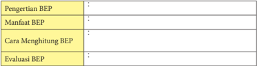

Tabel ini berisi informasi tentang Pengertian BEP, Manfaat BEP, Cara Menghitung BEP, dan Evaluasi BEP. Topik utama tabel adalah tentang bagaimana mengetahui dan menggunakan Beaufort Energy Profile (BEP) dalam pengelolaan energi. Kolom-kolomnya mencakup definisi BEP, manfaatnya, cara menghitungnya, dan proses evaluasinya. Data penting yang terlihat adalah bahwa BEP digunakan untuk memahami kondisi energi suatu wilayah, memberikan informasi tentang potensi energi, dan membantu dalam strategi penggunaan energi yang efisien.

### Menghitung BEP.

……………………………………………………………………………………

……………………………………………………………………………………

………………................................................................................................

……………………………………………………………………………………

……………………………………………………………………………………

………………

### Tugas Kelompok - 7

Renungkan dan tuliskan pada selembar kertas.

Ungkapkan pemahaman apa yang kamu peroleh setelah mempelajari materi menghitung titik impas ( break even point ) usaha kerajinan dari bahan limbah berbentuk bangun datar, berdasarkan beberapa hal berikut ini.

- Apa saja yang perlu diperhatikan ketika mempelajari titik impas ( break even point )?
- Materi apa yang masih sulit untuk dipahami?
- Kesulitan apa yang dihadapi pada saat menghitung BEP?

 

---
## 📄 Halaman 65

### D.    Strategi Promosi Produk Hasil Usaha Kerajinan dari Bahan Limbah Berbentuk Bangun Datar

Untuk mengomunikasikan usaha kerajinan yang telah diproduksi perlu disusunstrategi yang disebut dengan strategi promosi. Promosi tidak hanya berhubungan  dengan  produk,  harga  produk,  dan  pendistribusian  produk,  tetapi berkait pula dengan mengomunikasikan produk ini kepada konsumen agar produk dikenal dan pada akhirnya dibeli.

### 1. Pengertian Promosi Usaha Kerajinan dari Bahan Limbah Berbentuk Bangun Datar

Promosi pada hakikatnya adalah suatu komunikasi pemasaran, artinya aktifitas pemasaran yang berusaha menyebarkan informasi, mempengaruhi/membujuk, dan atau  mengingatkan  pasar  sasaran  atas  perusahaan  dan  produknya  agar  bersedia menerima,  membeli  dan  loyal  pada  produk  yang  ditawarkan  perusahaan  yang bersangkutan, Tjiptono (2001 : 219).

Menurut  Sistaningrum  (2002  :  98)  promosi  adalah  suatu  upaya  atau  kegiatan perusahaan dalam mempengaruhi 'konsumen aktual' maupun 'konsumen potensial' agar mereka mau melakukan pembelian terhadap produk yang ditawarkan, saat ini atau dimasa yang akan datang. Konsumen aktual adalah konsumen yang langsung membeli  produk  yang  ditawarkan  pada  saat  atau  sesaat  setelah  promosi  produk tersebut dilancarkan perusahaan. Dan konsumen potensial adalah konsumen yang berminat  melakukan  pembelian  terhadap  produk  yang  ditawarkan  perusahaan dimasa yang akan datang.

Promosi merupakan salah satu bagian dari rangkaian kegiatan pemasaran suatu barang.  Promosi adalah suatu kegiatan bidang marketing yang merupakan komunikasi yang  dilaksanakan  perusahaan  kepada  pembeli  atau  konsumen  yang  memuat pemberitaan, membujuk, dan mempengaruhi segala sesuatu mengenai barang yang dihasilkan  untuk  konsumen.  Segala  kegiatan  itu  bertujuan  untuk  meningkatkan volume penjualan dengan menarik minat konsumen dalam mengambil keputusan untuk membeli di perusahaan tersebut.

Tujuan  dari  promosi  penjualan  sangat  beraneka  ragam  yakni  merangsang permintaan, meningkatkan hasrat konsumen untuk mencoba produk, membentuk goodwill ,  meningkatkan  pembelian  konsumen,  juga  bisa  mendorong  konsumen untuk  membeli  lebih  banyak  serta  meminimalisir  perilaku  berganti-ganti  merek, atau mendorong konsumen untuk mencoba pembelian produk baru. Tujuan lainnya adalah untuk mendorong pembelian ulang produk, dapat menarik pelanggan baru, mempengaruhi pelanggannya untuk mencoba produk baru.

 

---
## 📄 Halaman 66

Dalam promosi kita tidak hanya sekedar berkomunikasi ataupun menyampaikan informasi, tetapi juga menginginkan komunikasi yang mampu menciptakan suasana/ keadaan dimana para pelanggan bersedia memilih dan memiliki produk.  Dengan demikian, promosi yang akan dilakukan haruslah selalu berdasarkan atas beberapa hal sehingga tujuan yang diharapkan dapat tercapai.

Secara umum tujuan dari promosi penjualan sebagai berikut.

- Meningkatkan permintaan dari para pemakai industri dan/atau konsumen akhir.
- Meningkatkan kinerja perusahaan.
- Mendukung dan mengkoordinasikan kegiatan personal selling dan iklan.

### Aktivitas 15

Jelaskan  pengertian  promosi  khususnya  pada  usaha  produk  kerajinan  dari bahan limbah berbentuk bangun datar yang ada dilingkunganmu.

### 2. Menentukan  Strategi  Promosi  Produk  Hasil  Usaha  Kerajinan  dari Bahan Limbah Berbentuk Bangun Datar

Fungsi dari strategi promosi penjualan adalah untuk mencapai tujuan komunikasi. Dalam mengembangkan strategi promosi penjualan perlu didefenisikan tugas-tugas komunikasi yang diharapkan dicapai oleh program promosi penjualan.

Dalam melakukan promosi agar dapat efektif perlu adanya bauran promosi, yaitu kombinasi yang optimal bagi berbagai jenis kegiatan atau pemilihan jenis kegiatan promosi yang paling efektif dalam meningkatkan penjualan. Ada empat jenis kegiatan promosi, antara lain : (Kotler, 2001:98-100)

### a. Periklanan ( Advertising )

Yaitu bentuk promosi non personal dengan menggunakan berbagai media yang ditujukan untuk merangsang pembelian.

### b. Penjualan Tatap Muka ( Personal Selling )

Yaitu bentuk promosi secara personal dengan presentasi lisan dalam suatu percakapan  dengan  calon  pembeli  yang  ditujukan  untuk  merangsang pembelian.

### c. Publisitas ( Publisity )

Yaitu suatu bentuk promosi non personal mengenai, pelayanan atau kesatuan usaha tertentu dengan jalan mengulas informasi/berita tentangnya (pada umumnya bersifat ilmiah).

 

---
## 📄 Halaman 67

### d. Promosi Penjualan ( Sales promotion )

Yaitu  suatu  bentuk  promosi  diluar  ketiga  bentuk  diatas  yang  ditujukan untuk merangsang pembelian.

### e. Pemasaran Langsung ( Direct marketing )

Yaitu suatu bentuk penjualan perorangan secara langsung ditujukan untuk mempengaruhi pembelian konsumen.

### Aktivitas 16

Jelaskan cara menentukan strategi promosi pada usaha kerajinan dari limbah berbentuk bangun datar yang ada dilingkunganmu.

### 3. Melakukan Promosi Produk Hasil Usaha Kerajinan dari Bahan Limbah Berbentuk Bangun Datar

Dalam melakukan promosi agar dapat efektif perlu adanya bauran promosi, yaitu kombinasi yang optimal bagi berbagai jenis kegiatan atau pemilihan jenis kegiatan promosi yang paling efektif dalam meningkatkan penjualan.

Ada beberapa jenis kegiatan promosi, sebagai berikut.

- Periklanan  ( Advertising ),  yaitu  bentuk  promosi  non  personal  dengan menggunakan berbagai media yang ditujukan untuk merangsang pembelian.
- Penjualan  Tatap  Muka  ( Personal  Selling ),  yaitu  bentuk  promosi  antara penjual  dengan  calon  pelanggan  untuk  memperkenalkan  suatu  produk kepada calon pelanggan dan membentuk pemahaman pelanggan terhadap produk  sehingga  pelanggan  kemudian  akan  mencoba  dan  membelinya. Sifat-sifat penjualan tatap muka:
- Personal atau adanya kontak langsung dengan konsumen
- Tanggapan langsung atas pertanyaan atau reaksi konsumen
- Mempererat hubungan dengan konsumen, apabila sikapnya memuaskan
- Biaya operasional cukup tinggi
- Publisitas  ( Publisity ),  merupakan  usaha  untuk  merangsang  permintaan suatu produk secara non-personal dengan memuat berita komersial yang menarik  mengenai    produk  tersebut  didalam  media  cetak  atau  lainnya, mapun hasil wawancara yang disiarkan dalam media tersebut.

 

---
## 📄 Halaman 68

- Promosi  Penjualan  ( Sales  promotion ),  yaitu  suatu  bentuk  promosi  diluar ketiga  bentuk  diatas  yang  ditujukan  untuk  merangsang  pembelian  oleh konsumen dan efektifitas penyalur, melalui pameran, pertunjukan, demonstrasi, peragaan. Jenis-jenis promosi penjualan adalah:
- Promosi konsumen (misalnya barang contoh, kupon hadiah pembelian    demonstrasi)
- Promosi dagang (kredit pembelian, periklanan bersama)
- Promosi bisnis (sponsor pertunjukan, kontes penjualan)
- Pemasaran  Langsung  ( Direct  marketing ),  yaitu  suatu  bentuk  penjualan perorangan  secara  langsung  ditujukan  untuk  mempengaruhi  pembelian konsumen. Sifat pemasaran langsung :
- Nonpublik: Pesan biasanya ditujukan kepada orang tertentu, misalnya pengiriman surat via pos atau email , itu berarti yang mengetahui pesan tersebut hanya pihak terkait saja, publik tidak mengetahui.
- Disesuaikan: Pesan  dapat  disiapkan  dan  dirancang  dengan  sebaikbaiknya  terlebih  dahulu  sebelum  dikirimkan  kepada  orang  yang bersangkutan agar ia tertarik.
- Terbaru: Pesan  dapat  disiapkan  dengan  sangat  cepat  sesuai  dengan kondisi terkini.
- Interaktif: Pesan dapat diubah sesuai tanggapan orang yang berkaitan sehingga menimbulkan suatu komunikasi yang interaktif.

### Melakukan promosi usaha secara online

Ada banyak pilihan yang bisa dilakukan untuk memasarkan produk kerajinan. Ada beberapa cara pemasaran produk kerajinan lewat internet secara online.

Sebuah website akan makin berarti dan bisa mendatangkkan profit jika website tersebut dikunjungi oleh banyak pengunjung. Jika banyak orang yang mengunjungi website, maka apa yang di jual lewat website tersebut bisa dibeli. Akan tetapi, bagi sebagian pemula mendatangkan trafic website bukanlah perkara mudah, sebab tak jarang kita sering bingung harus melakukan apa agar website kita kebanjiran pengunjung.

Beberapa strategi promosi secara online.

- Mulai dari Facebook
Facebook bisa  menjadi  cara  terbaik  membangun  komunitas  di  sekitar bisnis. Sebagai permulaan, mulailah mengupload foto sampul menarik yang menampilkan produk. Logo merek produk bisa dijadikan profil gambar.

- Berbagi foto di Pinterest
Pinterest mengambil alih ruang internet. Di sini kalian bisa berbagi fotofoto menarik.

- Selalu aktif di situs media sosial
Tidak  cukup  memulai  akun  di Facebook atau Twitter .  Kalian  harus menjalankannya secara aktif. Cukup posting jajak pendapat, foto atau kutipan

 

---
## 📄 Halaman 69

menarik yang berhubungan dengan bisnis. Atur agar orang bisa berkomentar dan berbagi. Secara bertahap akan mendorong produk bisnismu.

### d. Membuat blog

Buatlah blog tentang bisnismu. Setelah menulis posting baru, langsung link ke Facebook dan Twitter . Dan kirimkan juga ke email teman-teman. Hindari kesalahan teknis dengan memposting tulisan yang terlalu panjang.

### e. Buat jaringan sesama pebisnis

Misalnya  jika  kamu  memiliki  bisnis  kerajinan  tas,  bergaul  dengan pengrajin  tas  baik  kecil  maupun  besar  yang  terhubung  melalui  Linkedln atau  mengirimkan  pesan  ke  Facebook.  Berbagi  pekerjaan  dengan  mereka dan mendapatkan wawasan bagaimana cara menjalankan bisnis, lalu minta mereka mempromosikan produk atau jasa di blog dan situs mereka.

### f. Blogwalking.

Blogwalking adalah suatu istilah di mana kita mendatangkan trafic web dengan cara berkomentar di website/blog lain. Misalnya kalian berkomentar di blogdetik, kompasiana, artikel di website berita / portal, maka kalian bisa menyertakan link websitemu  pada  bagian  nama  pemberi  komentar.  Jika ada orang yang mengklik namamu maka si pengklik itu akan diarahkan ke websitemu. Dan dari sanalah trafic bisa kamu dapatkan.

Untuk melakukan kegiatan blogwalking ini caranya mudah, kamu tinggal kunjungi suatu website/blog , baca salah satu artikelnya, lalu berikan komentar (positif dan membangun, jangan mengkritik apalagi mencaci maki) sambil menyertakan link websitemu pada bagian nama pemberi komentar. Selain gratis,  cara  ini  tidak  hanya  bermanfaat  untuk  mendatangkan trafic, tapi juga  untuk  kepentingan  kerjasama  dengan blogger lain.  Dengan  memberi komentar di blog lain, maka memungkinkan blog kita juga dikunjungi oleh pemilik blog lain, sehingga dari sana hubungan antar blogger pun bisa tercipta.

Dalam melakukan kegiatan blogwalking, usahakan untuk jangan sampai melakukan tindakan spamming, seperti menebar link secara sembarangan, berkomentar tidak berkualitas, dan berbagai tindakan mengganggu lainnya.

### g. Mengirimkan Alamat Web Kita di Status Facebook.

Cara  ini  sangat  praktis,  dan  cukup  ampuh.  Yakni  kalian  hanya  perlu mengirimkan  alamat  websitemu  ke  status Facebookmu.  Misalnya  kamu baru  saja  membuat  posting  artikel  baru  di  blog,  maka  alamat  url  posting tersebut bisa dikirimkan ke Facebook . Dari sana teman-teman Facebook bisa tahu  keberadaan  webmu,  barangkali  saja  mereka  tertarik  membuka  dan mengunjunginya. Bukan tidak mungkin, mereka justru jadi pengunjung setia untuk website mu.

Promosi web dengan status Facebook ini juga bisa menciptakan efek viral,

 

---
## 📄 Halaman 70

ketika ada teman kalian yang me -like /memberi komentar di status Facebookmu, maka aktivitas teman itu akan muncul dan bisa dilihat oleh teman-teman mereka yang lain, dan ketika temannya teman melike link tersebut, maka dia akan menjadi friend kita, dan seterusnya. Hasilnya makin banyak orang yang akan tahu alamat website-mu.

### h. Menggunakan Iklan.

Iklan adalah media pemasaran yang cukup ampuh di internet, selain ampuh pemasaran dengan iklan juga relatif praktis dan mudah. Hanya saja, jelas kita harus membayar bila ingin beriklan. Ada banyak metode periklanan yang bisa kamu coba untuk mengiklankan website-mu, contohnya sebagai berikut.

- Beriklan di jaringan PPC lokal Indonesia.
- Beriklan di Facebook .
- Beriklan di Google Adwords.
- Memasang iklan baner di website lain.
- Iklan dalam bentuk artikel review dari blog lain.
i. Menulislah di Media Online Lain Sudah  banyak  artikel  yang  membahas  beberapa  cara  agar  tulisanmu  bisa dibaca banyak orang di internet. Nah selain mengembangkan hobi menulis juga bisa menjadi sarana mendatangkan trafik webmu. Misalnya kalian bisa menulis di forum, lalu dalam tulisanmu ada mengandung satu  link  yang  menuju  website-mu,  dari  sana  ada  banyak  orang  yang  bisa datang ke webmu dari tulisan yang kamu buat di forum tersebut.

### Lembar Kerja - 8

### Aktivitas 17

Jelaskan cara melakukan promosi pada usaha kerajinan dari limbah berbentuk bangun datar yang ada dilingkunganmu.

 

---
## 📄 Halaman 71

### Tugas Kelompok - 8

Siswa  di  dalam  kelas  dibagi  menjadi  beberapa  kelompok,  masing-masing kelompok berjumlah antara 3 - 4 siswa.

Masing-masing  kelompok  membuat  rancangan  promosi  produk  kerajinan dari  bahan  limbah  berbentuk  bangun  datar  yang  telah  dibuat.  Berdasarkan rancangan tersebut masing-masing kelompok mengerjakan tugas:

- Membuat  promosi  salah  satu  produk  kerajinan  dari  bahan  limbah berbentuk bangun datar
- Menentukan strategi promosi
- Melakukan promosi
Buatlah laporan hasil kegiatan tersebut, kemudian presentasikan hasilnya di kelas secara bergantian.

Nama Kelompok

Nama Anggota

Kelas

: ..........................................................................................

:...........................................................................................

………………………………………………………..

………………………………………………………..

………………………………………………………..

: ……………………………………………………….

Membuat promosi usaha kerajinan dari bahan limbah berbentuk bangun datar.

---
**📊 Tabel**

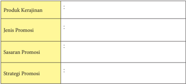

Tabel ini berisi informasi tentang strategi promosi untuk produk kerajinan. Topik utamanya adalah tentang jenis-jenis promosi yang dapat digunakan untuk meningkatkan penjualan produk kerajinan. Kolom-kolom yang ada meliputi Jenis Promosi, Sasaran Promosi, dan Strategi Promosi. Data penting yang terlihat adalah bahwa tabel ini mencakup berbagai jenis promosi seperti penawaran khusus, diskon, dan kampanye promosi. Selain itu, tabel juga mencakup sasaran promosi yang meliputi konsumen umum, pelanggan loyal, dan pelaku industri. Terakhir, tabel ini mencakup strategi promosi yang meliputi pemasaran digital, media sosial, dan acara promosi fisik. Dengan demikian, tabel ini memberikan panduan tentang bagaimana memilih jenis, sasaran, dan strategi promosi yang tepat untuk meningkatkan penjualan produk kerajinan.

 

---
## 📄 Halaman 72

### Produk Promosi :

### Tugas Kelompok - 8

Siswa  di  dalam  kelas  dibagi  menjadi  beberapa  kelompok,  masing-masing kelompok berjumlah antara 3 - 4 siswa.

Masing-masing  kelompok  membuat  rancangan  promosi  produk  kerajinan dari  bahan  limbah  berbentuk  bangun  datar  yang  telah  dibuat.  Berdasarkan rancangan  tersebut  masing-masing  kelompok  mengerjakan  tugas  sebagai berikut.

- Membuat  promosi  salah  satu  produk  kerajinan  dari  bahan  limbah berbentuk bangun datar
- Menentukan strategi promosi
- Melakukan promosi
Buatlah laporan hasil kegiatan tersebut, kemudian presentasikan hasilnya di kelas secara bergantian.

 

---
## 📄 Halaman 73

### E.          Laporan Kegiatan Usaha Kerajinan dari bahan Limbah Berbentuk Bangun Datar

Laporan  kegiatan  usaha  merupakan  kegiatan  yang  berhubungan  dengan  setiap kejadian, lancar tidaknya kegiatan usaha, apakah ada kemajuan atau kemunduran. Seorang pimpinan perusahaan akan mengetahui semua kejadian dalam perusahaannya dan  dapat  mengendalikan  jalannya  perusahaan  dengan  melihat  laporan  kegiatan usaha.

### 1. Pengertian  dan  Manfaat  Laporan  Kegiatan  Usaha  Kerajinan  dari Bahan Limbah Berbentuk Bangun Datar

Laporan kegiatan usaha dibuat dan disusun secara sistematis, cermat, dan logis. Penyusunan  laporan  kegiatan  usaha,  merupakan  penyampaian  informasi  tentang maju mundurnya pengelolaan usaha, sehingga akan tercipta komunikasi antara yang melaporkan dengan fihak yang diberi laporan. Penyusunan laporan kegiatan usaha, hendaknya bersifat komunikatif, jelas dan mudah difahami oleh semua fihak.

Tujuan  penyusunan  laporan  kegiatan  usaha  adalah  untuk  memberi  keterangan tentang masalah kegiatan usaha sehingga dapat diketahui oleh pemimpin/bagian yang menyusun laporan kegiatan usaha. Dengan kata lain penyusunan laporan kegiatan usaha ialah untuk mengetahui posisi tenaga kerja, keuangan, peralatan, bahan baku, produksi,  pemasaran,  penjualan,  pendistribusian,  promosi,  likuiditas,  solvabilitas, dan rehabilitas usaha.

### Aktivitas 18

Jelaskan  pengertian,  fungsi  dan  tujuan  laporan  kegiatan  usaha  untuk  usaha kerajinan dari limbah berbentuk bangun datar.

### 2. Menganalisis Laporan Kegiatan Usaha Kerajinan dari Bahan Limbah Berbentuk Bangun Datar

Analisis pelaksanaan kegiatan usaha perlu dibuat dan disusun secara sistematis dan  secermat  mungkin  serta  logis.  Laporan  kegiatan  usaha  adalah  penyampaian informasi  sehingga  tercipta  komunikasi  antara  yang  melaporkan  dan  pihak  yang diberi laporan. Laporan pelaksanaan kegiatan hendaknya bersifat komunikatif, jelas dan mudah dipahami oleh semua pihak.

 

---
## 📄 Halaman 74

Agar menjadi komunikatif sebaiknya laporan pelaksanaan kegiatan usaha harus disusun dalam bahasa yang lugas dan mudah dimengerti. Dikatakan logis apabila segala keterangan yang dianalisis dapat diteliti alasan-alasannya, apakah laporannya masuk  akal  atau  tidak.  Dikatakan  sistematis  apabila  keterangan-keterangan  yang dikemukakan didalam laporan  pelaksanaan  kegiatan  usaha  disusun  dalam  urutan yang  memperlihatkan  adanya  saling  keterkaitan.  Laporan  pelaksanaan  dikatakan lugas apabila bahasa yang digunakan langsung menjawab persoalan yang nyata dan tidak bertele-tele.

Pada  dasarnya  yang  perlu  dianalisa  dalam  pelaksanaan  kegiatan  usaha  sebagai berikut.

- Bidang kegiatan usaha
- Rugi/laba
- Bidang keuangan
- Bidang permodalan
- Bidang administrasi dan pembukuan
- Bidang ketenagakerjaan
- Bidang pemasaran
- Bidang organisasi.
Pada akhir tahun seluruh kegiatan usaha dilaporkan untuk dianalisis oleh pihak yang  berkepentingan,  untuk  memperoleh  informasi  yang  tepat  dalam  mengambil keputusan.  Analisis  laporan  keuangan  adalah  evaluasi  atau  penafsiran  neraca  dan daftar perubahan posisi keuangan perusahaan.

Mengadakan analisis laporan keuangan sangat penting untuk mengetahui keadaan dan perkembangan keuangan dari perusahaan yang bersangkutan. Analisis laporan keuangan  selalu  berhubungan  dengan  masalah  neraca,  rugi/laba  dan  perubahan modal  perusahaan.  Analisis  laporan  keuangan  pada  hakikatnya  adalah  untuk mengadakan penilaian atas keadaan keuangan perusahaan.

Untuk  lebih dapat menggambarkan  perubahan  posisi  keuangan  dan sifat pengembangan  perusahaan  dari  waktu  ke  waktu  suatu  perusahaan  diharuskan membuat laporan keuangan paling lama 2 tahun terakhir dari kegiatan usahanya.

### Aktivitas 19

Buatlah analisis kegiatan usaha dari hasil pengamatan pada usaha kerajinan dari bahan limbah berbentuk bangun datar  yang ada dilingkunganmu.

 

---
## 📄 Halaman 75

### 3. Pembuatan Laporan Kegiatan Usaha Kerajinan dari Bahan Limbah Berbentuk Bangun Datar

Berikut  ini  merupakan  contoh  laporan  pelaksanaan  kegiatan  usaha,  kamu diharapkan dapat melengkapi format laporan tersebut pada usaha yang kamu pilih/ kembangkan.

Laporan pelaksanaan kegiatan usaha:

- Bidang kegiatan usaha
- Jenis kegiatan
- Jenis usaha…….,volume   Rp……..
- Jenis usaha…….,volume   Rp……..
- Jenis usaha…….,volume   Rp……..
- Jenis usaha…….,volume   Rp……..
- Jenis usaha…….,volume   Rp……..
- Rugi / laba
- Unit ……..rugi / laba
- Unit ……..rugi / laba
- Unit ……..rugi / laba
- Unit ……..rugi / laba
- Unit ……..rugi / laba
- Bidang keuangan
- Neraca terlampir
- Analisis
- Likuiditas   =………..%
- Solvabilitas
- Rentabilitas
- Bidang permodalan
- Modal sendiri ………….
- Modal asing …………
.

- Pinjaman jangka pendek ………….
- Pinjaman jangka panjang ………….
- Pinjaman lain-lain ………….

 

---
## 📄 Halaman 76

### d. Bidang administrasi dan pembukuan

- Buku-buku
- Buku pembelian tunai ……………
=…………..

- Buku pembelian kredit ……………
=………….

- Buku persediaan barang ……………
=…………..

- Buku penjualan tunai……………
=…………..

- Buku voucher ……………
=…………..

- Dokumen-dokumen dagang
- Surat-surat perjanjian dagang ……….
=………..

- SITU,SIUP,AMDAL dan lain-lain…..
=………..

- Faktur da kuitansi …………………….
=………..

### Aktivitas 20

Buatlah laporan kegiatan usaha untuk usaha kerajinan dari limbah berbentuk bangun datar yang ada dilingkunganmu!

### Tugas Kelompok - 9

Siswa di dalam kelas dibagi menjadi beberapa kelompok, masing-masing kelompok berjumlah antara 3 - 4 siswa.

Masing-masing  kelompok  membuat  laporan  kegiatan  usaha  produk kerajinan dari bahan limbah berbentuk bangun datar yang telah dibuat.

Hasil laporan dipresentasikan di kelas secara bergantian.

### Refleksi Diri

Renungkan dan tuliskan pada selembar kertas.

Ungkapkan pemahaman apa yang kamu peroleh setelah mempelajari materi laporan kegiatan usaha kerajinan dari bahan limbah berbentuk bangun datar, berdasarkan beberapa hal berikut ini.

- Apa  saja  yang  perlu  diperhatikan  ketika  membuat  laporan  usaha kerajinan dari bahan limbah berbentuk bangun datar?
- Materi apa yang masih sulit untuk difahami?
- Kesulitan  apa  yang  dihadapi  pada  saat  menganalisis  dan  membuat laporan?

 

---
## 📄 Halaman 77

### Rangkuman

- Secara umum ada 2 macam limbah yaitu jenis limbah organik dan jenis limbah anorganik
- Limbah organik adalah limbah yang bisa dengan mudah diuraikan atau mudah membusuk, sedangkan limbah anorganik adalah jenis limbah yang berwujud padat, sangat sulit atau bahkan sulit untuk di uraikan atau tidak bisa membusuk.
- Limbah berbentuk bangun datar adalah limbah yang berbentuk bangun yang berdimensi dua, yaitu  bahan limbah yang memiliki sisi panjang dan lebar sehingga tidak mempunyai ruang. Limbah berbentuk bangun datar dapat berupa bidang beraturan seperti lingkaran, segi empat, segi tiga, dan bidang tidak beraturan.
- Menganalisis peluang usaha pada produk kerajinan dimaksudkan untuk menemukan peluang dan potensi usaha yang dapat dimanfaatkan, serta untuk mengetahui besarnya potensi usaha yang tersedia dan berapa lama usaha tersebut dapat bertahan.
- Analisis  SWOT  ( Strenght,  Weakness,  Opportunity,  Threat) adalah  suatu kajian  terhadap  lingkungan  internal  dan  eksternal  perusahaan.  Analisis ini didahului oleh proses identifikasi faktor eksternal dan internal untuk menentukan  strategi  yang  terbaik,  kemudian  dilakukan  pembobotan terhadap tiap unsur SWOT berdasarkan tingkat kepentingan.
- Sumber daya yang dimiliki oleh perusahaan dapat dikatagorikan atas enam tipe sumber daya (6M), yaitu: man (manusia), money (manusia), material (fisik), machine (teknologi), method (metode), market (pasar).
- Perencanaan  administrasi  usaha  kerajinan,  pada  dasarnya  terdiri  dari perizinan usaha, surat-menyurat, pencatatan transaksi barang/jasa, pencatatan transaksi keuangan, dan pajak pribadi serta pajak usaha.
- Pemasaran  sebagai  proses  dimana  perusahaan  menciptakan  nilai  bagi pelanggan  dan  membangun  hubungan  yang  kuat  dengan  pelanggan, dengan tujuan menangkap nilai dari pelanggan sebagai imbalannnya
- Merencanakan jenis usaha adalah merencanakan kegiatan yang dijalankan oleh setiap perusahaan baik besar maupun kecil untuk mencapai tujuan yang telah ditetapkan.
- Analisis  kebutuhan  pasar  produk  kerajinan  diarahkan  pada  kondisi pemasaran, tingkat berapa produk akan di jual, mutu produk apa saja yang akan dijual, kepada siapa produk akan dijual, dan jalur pemasaran yang bagaimana yang digunakan.

 

---
## 📄 Halaman 78

- Manfaat produk kerajinan dari bahan limbah berbentuk bangun datar dapat dibedakan menjadi dua, yaitu manfaat produk kerajinan sebagai benda pakai dan manfaat produk kerajinan sebagai benda hias.
- Perencanaan  produk  kerajinan  umumnya  lebih  menitikberatkan  pada nilai-nilai estetika, keunikan ( craftmanship ), keterampilan, dan efisiensi, sementara dalam pemenuhan fungsinya lebih menekankan pada pemenuhan fungsi pakai yang lebih bersifat fisik (fisiologis).
- Bahan berkarya kerajinan adalah material habis pakai yang digunakan untuk mewujudkan karya kerajinan tersebut. Ada bahan yang berfungsi sebagai bahan utama (medium) dan ada pula sebagai bahan penunjang.
- Tindakan pemeriksaan dan pengendalian usha adalah untuk membandingkan  standar  kualitas  dengan  hasil  proses  dan  berusaha menemukan  sebab-sebab  penyimpangan  kualitas  yang  terjadi.  Hasil analisa  ini  menjadi  pedoman  untuk  melakukan  tindakan  perbaikan kearah  kualitas  yang  semestinya  harus  dicapai,  dapat  juga  merupakan peningkatan kualitas yang mungkin dilaksanakan.
- Kemasan dapat diartikan sebagai wadah atau pembungkus yang berguna mencegah atau mengurangi terjadinya kerusakan-kerusakan pada bahan yang dikemas atau yang dibungkusnya.
- Break Even Point (BEP) adalah suatu keadaan dimana perusahaan dalam operasinya tidak memperoleh laba dan juga tidak menderita kerugian atau dengan kata lain total biaya sama dengan total penjualan sehingga tidak ada laba dan tidak ada rugi.
- Analisa break  even  point memberikan  penerapan  yang  luas  untuk menguji tindakan-tindakan yang diusulkan dalam mempertimbangkan alternatif-alternatif atau tujuan pengambilan keputusan yang lain.
- Promosi  adalah  suatu  kegiatan  bidang  marketing  yang  merupakan komunikasi yang dilaksanakan perusahaan kepada pembeli atau konsumen yang memuat pemberitaan, membujuk, dan mempengaruhi segala sesuatu mengenai barang yang dihasilkan untuk konsumen.
- Laporan kegiatan usaha adalah sarana untuk menentukan keberhasilan dan kegagalan usaha, laporan tersebut hendaknya bersifat komunikatif, jelas dan mudah dipahami oleh semua pihak.

 

---
## 📄 Halaman 79

### REKAYASA

---
**🖼️ Gambar/Diagram**

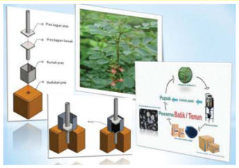

> **Deskripsi Visual:** Gambar ini adalah ilustrasi yang menunjukkan proses produksi pupuk organik dari limbah pohon. Gambar ini terdiri dari beberapa elemen utama:

1. **Pertama**: Gambar ini memperlihatkan langkah-langkah produksi pupuk organik dari limbah pohon. Langkah pertama adalah pengumpulan limbah pohon, yang kemudian dipecah menjadi bagian-bagian seperti batang, daun, dan akar.

2. **Elemen-elemen utama dan relasinya**: 
   - **Langkah 1**: Pengumpulan limbah pohon.
   - **Langkah 2**: Pemisahan limbah menjadi bagian-bagian (batang, daun, akar).
   - **Langkah 3**: Pembakaran limbah untuk menghasilkan gas CO2.
   - **Langkah 4**: Penyaringan gas CO2 untuk menghasilkan pupuk organik.

3. **Teks, angka, atau label penting yang terlihat**:
   - Ada beberapa teks yang menjelaskan langkah-langkah produksi, seperti "Pengumpulan limbah pohon", "Pemisahan limbah menjadi bagian-bagian", "Pembakaran limbah untuk menghasilkan gas CO2", dan "Penyaringan gas CO2 untuk menghasilkan pupuk organik".

4. **Informasi kunci yang dapat diambil pembaca**:
   - Proses produksi pupuk organik melibatkan pengumpulan limbah pohon, pemisahan limbah menjadi bagian-bagian, pembakaran limbah untuk menghasilkan gas CO2, dan penyaringan gas CO2 untuk menghasilkan pupuk organik.
   - Ini menunjukkan bahwa limbah pohon dapat digunakan sebagai sumber pupuk organik yang ramah lingkungan.

Dengan demikian, gambar ini memberikan gambaran tentang proses produksi pupuk organik dari limbah pohon, yang merupakan cara efektif untuk mengurangi limbah dan meningkatkan produktivitas pertanian.

Prakarya dan Kewirausahaan

73

 

---
## 📄 Halaman 80

---
**🖼️ Gambar/Diagram**

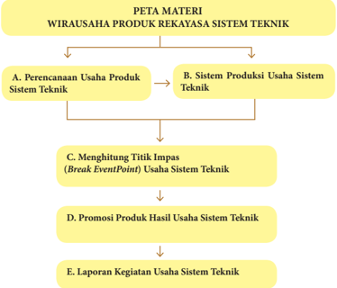

> **Deskripsi Visual:** Gambar ini adalah diagram yang menunjukkan struktur atau peta materi dari sebuah buku pelajaran tentang wirausaha produk rekayasa sistem teknik. Diagram ini terdiri dari empat bagian utama:

1. **A. Perencanaan Usaha Produk Sistem Teknik** - Ini merupakan bagian awal yang mencakup proses perencanaan usaha produk yang berkaitan dengan sistem teknik.

2. **B. Sistem Produksi Usaha Sistem Teknik** - Bagian ini mungkin menjelaskan bagaimana sistem produksi harus berfungsi untuk memproduksi produk sistem teknik tersebut.

3. **C. Menghitung Titik Impas (Break Event Point) Usaha Sistem Teknik** - Ini mungkin membahas metode atau alat yang digunakan untuk menghitung titik impas dalam usaha sistem teknik.

4. **D. Promosi Produk Hasil Usaha Sistem Teknik** - Bagian ini mungkin menjelaskan strategi promosi yang diperlukan untuk memasarkan produk hasil usaha sistem teknik.

5. **E. Laporan Kegiatan Usaha Sistem Teknik** - Ini mungkin merujuk pada bagaimana cara membuat laporan kegiatan yang akurat dan komprehensif untuk usaha sistem teknik.

Jelang setiap bagian ada teks yang memberikan penjelasan singkat tentang apa yang akan dibahas dalam bagian tersebut. Label "PETA MATERI" di bagian atas menunjukkan bahwa ini adalah peta materi yang membantu pembaca memahami struktur topik-topik dalam buku tersebut.

### Tujuan Pembelajaran

### Peserta didik mampu :

- Menghayati bahwa akal pikiran dan kemampuan manusia dalam berpikir kreatif untuk membuat produk rekayasa serta keberhasilan wirausaha adalah anugerah Tuhan,
- Menghayati  perilaku  jujur,  percaya  diri,  dan  mandiri  serta  sikap  bekerjasama, gotong  royong,  bertoleransi,  disiplin,  bertanggung  jawab,  kreatif,  dan  inovatif dalam membuat karya rekayasa produk sistem teknik untuk membangun semangat usaha,
- Mendesain dan membuat produk serta pengemasan produk rekayasa sistem teknik berdasarkan identifikasi kebutuhan sumber daya, teknologi, dan prosedur berkarya,
- Mempresentasikan karya dan proposal usaha produk rekayasa sistem teknik dengan perilaku jujur dan percaya diri, dan
- Menyajikan simulasi wirausaha produk rekayasa sistem.

 

---
## 📄 Halaman 81

### BAB 2

### Wirausaha Produk Rekayasa Sistem Teknik

Sistem berasal dari bahasa Latin systema ,  bahasa Yunani sustema yang artinya satu kesatuan yang terdiri dari komponen atau elemen yang dihubungkan bersama untuk  memudahkan  aliran  informasi,  materi,  atau  energi  untuk  mencapai  suatu tujuan. Sistem bertujuan untuk meningkatkan efektivitas pendayagunaan berpikir sistem untuk pemecahan masalah.

---
**🖼️ Gambar/Diagram**

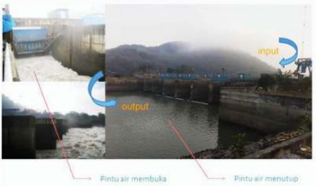

> **Deskripsi Visual:** Gambar ini adalah ilustrasi yang menunjukkan proses pembukaan dan penutupan pintu air di sebuah bendungan. Gambar ini terdiri dari dua bagian: bagian depan (input) dan bagian belakang (output). Pada bagian depan, tampak seorang petugas sedang memeriksa kondisi pintu air. Pintu air tersebut terlihat tertutup, dengan air mengalir melalui lubang di sampingnya. Di bagian belakang, tampak bahwa pintu air telah dibuka, dengan air mengalir melalui lubang di sampingnya. Label "Pintu air membuka" dan "Pintu air menutup" memberikan informasi tentang fungsi dari setiap posisi pintu air. Ini menunjukkan bahwa pintu air dapat diatur untuk mengatur流量 dalam bendungan.

Sumber: Dokumen Kemendikbud Gambar 2.1 Bendung gerak

Gambar 2.1 menunjukkan bendung gerak yang merupakan strukrur bendungan dan  berfungsi  untuk  menaikkan  permukaan  air  di  sungai.  Air  sungai  yang

 

---
## 📄 Halaman 82

dinaikkan permukaannya dapat digunakan untuk sistem irigasi pada persawahan jika permukaan tanah yang diairi lebih tinggi dari permukaan air. Kekeringan bisa terjadi jika permukaan tanah persawahan lebih tinggi daripada permukaan air di wilayah setempat, untuk mengatasi terjadinya kekeringan dan gagal panen pada persawahan, dibuatkan pengairan melalui sistem irigasi. Sistem pada bendung gerak dapat juga digunakan sebagai penggerak peralatan produksi. Sungai yang cukup deras alirannya, bendung dapat digunakan untuk sistem transportasi air. Membuka dan menutupnya pintu  air  menggunakan sistem hidraulik yaitu sistem yang memanfaatkan zat cair (oli) yang bertekanan untuk melakukan gerakan segaris atau putaran.

Sistem  merupakan  keterpaduan  antar  elemen  sistem  yang  saling  berinteraksi, sharing , sinergi dan kolaborasi untuk suatu tujuan tertentu, dengan proses mekanisme metabolisme loop  feedbeck ,  input-proses-output  dengan  target  produk  dan  waktu pencapaian tertentu. Mekanisme kontrol yang terdiri dari perencanaan, pelaksanaan, dan  evaluasi  secara  kontinyu,  bersifat  terbuka  dan  mempunyai  batasan-batasan

---
**🖼️ Gambar/Diagram**

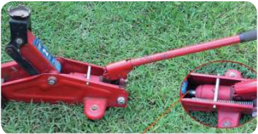

> **Deskripsi Visual:** Gambar ini adalah ilustrasi yang menunjukkan sebuah alat pengangkat mobil (car jack) dengan detail eksternal dan internal. Gambar ini memperlihatkan bagian atas dan bawah alat pengangkat mobil, yang terbuat dari baja dan dilapisi dengan plastik merah untuk keamanan dan daya tahan. Bagian atas memiliki tangan penggerak yang dilengkapi dengan sekrup untuk menggantungkan pada tiang atau tiang listrik. Bagian bawah memiliki dua roda yang berfungsi sebagai penahan untuk mencegah alat pengangkat mobil bergerak saat digunakan. Gambar ini juga menunjukkan bagian dalam alat pengangkat mobil, yang terdiri dari piston dan sistem pompa hidrolik yang berfungsi untuk mengangkat mobil. Teks, angka, atau label penting yang terlihat pada gambar ini tidak ada, namun informasi kunci yang dapat diambil pembaca adalah bahwa alat ini digunakan untuk mengangkat mobil dan memiliki sistem pompa hidrolik untuk mengangkat mobil.

 

---
## 📄 Halaman 83

tertentu yang berada pada lingkungan tertentu.

Pintu  bagasi  mobil  yang  menggunakan  sistem  hidraulik  dilengkapi  dengan elemen sistem yang berupa aktuator yaitu peralatan mekanis untuk menggerakkan suatu sistem, mengkonversikan besaran listrik analog menjadi besaran lainnya. Pintu bagasi tertopang aktuator pada saat dibuka seperti pada Gambar 2.2 Aktuator.

Aktuator  tenaga hidraulik terdapat  pada  alat  dongkrak  digunakan  untuk mengatasi permasalahan mengangkat beban yang cukup berat.

Sistem  terdiri  dari  inti  sistem  dan  lingkungan  sistem.  Lingkungan  sistem melingkupi elemen-elemen sistem sebagai tempat berkembangnya sistem. Lingkungan sistem memiliki tiga sumber yaitu informasi, energi dan materi. Inti sistem memiliki pengaruh yang kuat terhadap sistem yang bersangkutan. Inti sistem memiliki sub sistem seperti pada Gambar 2.3 Sistem dan Inti Sistem.

---
**🖼️ Gambar/Diagram**

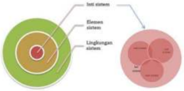

> **Deskripsi Visual:** Gambar ini adalah ilustrasi yang menunjukkan tiga sistem tubuh manusia: sistem imun, sistem lendir, dan sistem pernapasan. Ilustrasi ini menggunakan warna hijau untuk representasi sistem imun, merah untuk sistem lendir, dan pink untuk sistem pernapasan. Setiap sistem memiliki beberapa elemen yang terhubung dengan relasi yang jelas.

Sistem imun terdiri dari lima bagian yang dikelilingi oleh lingkaran hijau. Sementara itu, sistem lendir terdiri dari dua bagian yang dikelilingi oleh lingkaran merah. Sementara itu, sistem pernapasan terdiri dari empat bagian yang dikelilingi oleh lingkaran pink.

Teks, angka, atau label penting yang terlihat pada gambar ini adalah nama-nama sistem tubuh manusia dan bagian-bagian mereka. Informasi kunci yang dapat diambil pembaca adalah bahwa sistem imun, sistem lendir, dan sistem pernapasan merupakan bagian dari tubuh manusia yang saling terkait dan berfungsi secara bersama-sama untuk menjaga kesehatan dan kehidupan manusia.

Gambar 2.3 Sistem dan inti sistem

Pola pikir sistem dapat diimplentasikan dalam seluruh aktivitas manusia secara individu atau kelompok dalam mencapai tujuan kehidupan menuju perkembangan yang  berkelanjutan.  Pola  pikir  sistem  memberi  berbagai  pilihan  solusi  dalam penyelesaian permasalahan, rekomendasi dan langkah pengembangan. Individu yang memiliki pola pikir sistem memiliki sikap : (1) saling bersinergi dan berkolaborasi secara berkembang, (2) adanya kesadaran antara masing-masing elemen, (3) memiliki pemahaman tentang keterkaitan antar elemen, (4) bersinergi dan berkolaborasi secara harmoni berkembang, (5) sharing dan networking secara produktif.

Sistem  teknik  merupakan  perancangan  atau  pengembangan  suatu  sistem  yang lebih baik melalui sistem mekanis atau sistem pada manusia dengan mesin. Sistem teknik mengembangkan keterpaduan antar elemen yang saling berinteraksi, bersinergi dan berkolaborasi. Sistem teknik secara sederhana dapat ditunjukkan seperti pada Gambar  2.4  Sistem  teknik  dasar  pada  gerak  engkol  yang  saling  berinteraksi  satu dengan yang lain.

 

---
## 📄 Halaman 84

---
**🖼️ Gambar/Diagram**

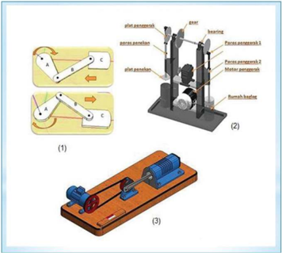

> **Deskripsi Visual:** Gambar ini adalah ilustrasi yang menunjukkan proses pengujian alat penyangga (support device) dalam mekanika. Gambar ini terdiri dari tiga bagian:

1. Bagian pertama menunjukkan dua sketsa alat penyangga bergerak mengelilingi pusat. Sketsa ini menunjukkan posisi awal dan akhir gerakan alat penyangga.

2. Bagian kedua menunjukkan detail alat penyangga yang terdiri dari beberapa komponen seperti bearing, forces penyangga, dan susunannya. Ini menunjukkan bagaimana alat penyangga bekerja dan bagaimana posisinya berubah saat digerakkan.

3. Bagian ketiga menunjukkan alat penyangga yang terpasang pada mekanisme, mungkin untuk menunjukkan bagaimana alat penyangga berfungsi dalam sistem mekanik lebih besar.

Elemen-elemen utama dalam gambar ini meliputi:
- Alat penyangga
- Bearing
- Forces penyangga
- Susunan alat penyangga

Relasi antara elemen-elemen ini adalah bahwa bearing dan forces penyangga merupakan bagian dari alat penyangga, sedangkan susunan alat penyangga menunjukkan bagaimana alat penyangga bekerja dan bergerak.

Teks, angka, atau label penting yang terlihat dalam gambar ini adalah:
- "Support device" untuk menunjukkan alat penyangga
- "Bearings" untuk menunjukkan bearing
- "Forces penyangga" untuk menunjukkan forces penyangga
- "Susunannya" untuk menunjukkan susunan alat penyangga

Informasi kunci yang dapat diambil pembaca adalah tentang bagaimana alat penyangga bekerja, bagaimana bearing dan forces penyangga berfungsi, dan bagaimana susunan alat penyangga mempengaruhi gerakan alat penyangga.

Sumber: Dokumen Kemendikbud

Gambar 2.4 Sistem teknik dasar dan peralatan sistem teknik

Gambar 2.4 (1) Elemen A sebagai poros digerakkan oleh alat penggerak tertentu dengan sistem rotasi, maka gerakan berputar pada elemen A diikuti oleh gerakan pada elemen B sebagai lengan dan elemen C yang bergerak maju dan mundur untuk diaplikasikan pada sistem lainnya. Gambar 2.4(2) merupakan model dari pergerakan tuas pada alat pengepres baglog dengan sumber tenaga dari putaran motor listrik. Prinsip yang sama ditunjukkan pada gambar 2.4(3). Tujuan dari sistem tersebut dapat diwujudkan dengan mengkolaborasikan antara sistem yang satu dengan yang lainnya.

 

---
## 📄 Halaman 85

---
**🖼️ Gambar/Diagram**

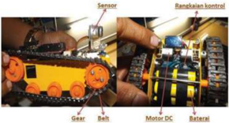

> **Deskripsi Visual:** Gambar ini adalah ilustrasi yang menunjukkan bagaimana sebuah mesin atau perangkat keras berfungsi. Gambar ini terdiri dari dua bagian utama: bagian depan dan bagian belakang.

Pada bagian depan, terdapat sensor yang digunakan untuk mengukur suhu atau keadaan lainnya. Sensor tersebut disambungkan dengan rangkaian kontrol yang terletak di bagian belakang. Rangkaian kontrol ini terdiri dari motor DC, gear, belt, dan baterai. Motor DC digunakan untuk memutar gear, yang kemudian menggerakkan belt. Belt tersebut kemudian menggerakkan sensor yang terpasang pada mesin atau perangkat keras tersebut.

Informasi kunci yang dapat diambil pembaca adalah bahwa mesin atau perangkat keras tersebut menggunakan sensor untuk mengukur suhu atau keadaan lainnya, kemudian mengubahnya menjadi arus listrik melalui rangkaian kontrol yang terdiri dari motor DC, gear, belt, dan baterai. Ini menunjukkan bahwa mesin atau perangkat keras tersebut mungkin digunakan dalam aplikasi yang memerlukan pengawasan atau kontrol suhu atau keadaan lainnya.

Sumber: Dokumen Kemendikbud Gambar 2.5 Sistem teknik

Gambar 2.5 menunjukkan gear yang dihubungkan dengan belt atau rantai untuk menggerakkan roda yang lainnya. Gerakan gear ditimbulkan dari penggerak berupa motor DC yang mendapatkan aliran arus listrik DC dari baterai. Putaran motor DC dapat dikendalikan dengan rangkaian pengendali/kontrol dan sensor. Sistem teknik ini saling berkaitan antara elemen yang satu dengan elemen lainnya sehingga tujuan menggerakkan gear dengan kendali elektronik dapat terwujud. Sistem teknik sering kita jumpai pada berbagai sektor dalam kehidupan sehari-hari. Ciri-ciri yang terdapat pada sistem diantaranya terdapat kumpulan elemen, adanya interaksi antar elemen, terdapat  mekanisme  umpan  balik,  dan  tujuan  bersama  seperti  digambarkan  pada Gambar 2.6.

### Ciri Sistem

Sumber: Dokumen Kemendikbud

Gambar 2.6 Ciri sistem

 

---
## 📄 Halaman 86

Perancangan  atau  pengembangan  suatu  sistem  teknik  melalui  sistem  mekanis atau sistem pada manusia dengan mesin supaya dapat dicapai tujuan yang lebih baik. Sistem teknik mengembangkan keterpaduan antar elemen yang saling berinteraksi, bersinergi dan berkolaborasi dapat diilustrasikan pada produk elektronika.

Produk elektronika dengan sistem teknik kendali otomatis dapat dimaknai sesuatu yang bekerja sesuai dengan keinginan pengguna. Produk otomatis ini sudah banyak kita  jumpai  di  pasar  baik  yang  sederhana  maupun  yang  sudah  kompleks.  Contoh sederhana yang sering kita jumpai adalah rice  cooker .  Kemudahan, kesederhanaan dan manfaat yang nyata dan keuntungan dari sistem teknik secara otomatis ini dapat meningkatkan keefektifan kerja sehingga pengguna dapat melakukan aktifitas yang lainnya.

Sistem teknik pada kendali otomatis adalah suatu sistem yang menghubungkan antara  sistem  mekanik,  kelistrikan,  dan  elektronika  secara  bersama  dengan  sistem informasi  untuk  mengendalikan  produksi.  Sistem  mekanik  dalam  contoh  diatas adalah  penanak  nasi  sendiri,  sedangkan  sistem  kelistrikan  adalah  tenaga  (energi listrik) yang diberikan untuk memanaskan elemen pemanas. Dalam hal ini elemen pemanas  dan  juga thermostat dapat dikategorikan sebagai sistem elektronik. Komponen thermostat membaca temperatur dan memberikan informasi ke sistem elektrik untuk memberikan tindakan. Sistem penanak nasi ini ada dua tindakan yaitu terus memberikan energi atau berhenti memberikan energi pada temperatur 100 oC.

Program instruksi yang terdapat pada sistem pengendalian menjalankan instruksi, mengotomasikan suatu proses, diperlukan energi, baik untuk menggerakan proses  itu  sendiri  maupun  untuk  mengoperasikan  program  dan  sistem  kendali. Sistem pengendali yang menggunakan sensor memberikan informasi (sebagai input) ke pemroses (otak) untuk memberikan tindakan (output). Proses membaca (sensor), pengolahan data dari sensor (pemroses) dan tindakan merupakan elemen dari sistem kendali. Sistem kendali dapat digambarkan sebagai berikut:

---
**🖼️ Gambar/Diagram**

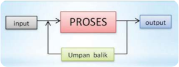

> **Deskripsi Visual:** Gambar ini adalah ilustrasi yang menunjukkan proses sederhana dalam suatu sistem. Ilustrasi ini mencakup empat elemen utama:

1. Input: Representasi dari data atau informasi yang masuk ke dalam sistem.
2. Proses: Representasi dari tahapan-tahapan yang dilakukan oleh sistem untuk memproses input tersebut.
3. Umpan balik: Representasi dari informasi atau hasil yang dikembalikan ke dalam sistem setelah proses selesai.
4. Output: Representasi dari hasil akhir yang dikeluarkan sistem setelah proses selesai.

Elemen-elemen ini saling terkait dan berfungsi sebagai komponen dasar dalam suatu sistem. Input menjadi aset awal yang diterima sistem, proses mengubah input menjadi output, dan umpan balik membantu sistem dalam memperbaiki atau memperluas proses jika diperlukan.

Teks, angka, atau label penting yang terlihat pada gambar adalah "PROSES" yang menggambarkan fungsi utama sistem, serta "input", "output", dan "umpan balik" yang menunjukkan bagaimana sistem bekerja.

Informasi kunci yang dapat diambil pembaca melalui gambar ini adalah bahwa sistem ini memiliki proses yang melibatkan input, proses, umpan balik, dan output, dan bahwa umpan balik merupakan bagian penting dari proses tersebut.

Gambar 2.7 Skema sistem teknik pada pengendali

 

---
## 📄 Halaman 87

Pada  Gambar  2.7  umpan  balik  digunakan  saat  output  hasil  pemrosesan  tidak sesuai dengan standar yang diinginkan maka kembali ke input untuk diproses ulang dengan memperhatikan parameter yang ditetapkan. Sistem kendali otomatis terdapat tiga  elemen  yaitu  (1)  sumber  tenaga  untuk  menjalankan  aksi,  (2)  sistem  kendali umpan balik ( feedback control )  dan (3) machine programming .  Suatu sistem teknik secara  otomatis  dirancang  untuk  menjalan  tindakan  dengan  baik,  dan  tindakan ini  membutuhkan  listrik  karena  mudah  dibangkitkan  dan  mudah  dikonversikan kebentuk tenaga lainnya.

### Aktivitas 1

Ayo amati produk sistem teknik yang ada di sekitarmu. Identifikasi bagaimana cara kerjanya dan ungkapkan pendapatmu baik secara tertulis maupun lisan.

 

---
## 📄 Halaman 88

### A. Perencanaan Usaha Produk Sistem Teknik

Permasalahan  keteknikan  di  lapangan  adalah  permasalahan  sistem,  sehingga dibutuhkan sinergi antar komponen dalam sistem teknik untuk mampu melakukan evaluasi sistem, perbaikan sistem, optimalisasi sistem, dan meningkatkan produktifitas sistem lebih jauh. Kewirausahaan dalam pembuatan produk rekayasa peralatan sistem teknik  menjadi  peluang  yang  baik  dalam  mengembangkan  kreativitas  dan  inovasi bagi  sumber  daya  yang  tersedia.  Pola  kerja  sistem  dalam  kewirausahaan  menjadi alasan dalam pengambilan tindakan yang digambarkan pada Gambar 2.7 Action loop dari pembuatan produk sistem teknik.

Informasi  tugas  atau  pekerjaan ( inform ) yang  disampaikan  berupa  kebutuhan pelanggan  pada  produk  sistem  teknik,  dikembangkan  dalam  bentuk  perencanaan dan dokumen disiapkan secara tertulis ( plan ) . Perencanaan kerja dibuat di antaranya desain  produk  sistem  teknik,  dan  keputusan  diambil  atas  semua  kebutuhan  yang diperlukan termasuk alat dan bahan/material ( decide ). Tugas membuat produk sistem teknik  dengan  memperhatikan  kriteria  yang  ditentukan ( carry  out ). Pengecekan dengan menguji coba produk sistem teknik ( control ) dan melakukan evaluasi dengan mendiskusikan produk sistem teknik yang telah dibuat ( evaluate ).

---
**🖼️ Gambar/Diagram**

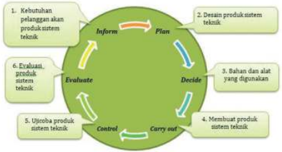

> **Deskripsi Visual:** Gambar ini adalah diagram yang menunjukkan proses analisis sistem teknologi. Diagram ini terdiri dari empat bagian utama: Plan, Decide, Carry out, dan Evaluate. Setiap bagian memiliki tugas spesifik dalam proses analisis:

1. **Plan** (Plan) melibatkan penentuan produk teknologi dan bahan yang digunakan.
2. **Decide** (Tentukan) melibatkan pemilihan alat dan peralatan yang digunakan.
3. **Carry out** (Lakukan) melibatkan penggunaan produk teknologi.
4. **Evaluate** (Uji) melibatkan evaluasi hasil kerja.

Setiap bagian ini terhubung dengan elemen-elemen lainnya melalui ikatan garis yang menghubungkan mereka. Ini menunjukkan bahwa setiap langkah dalam proses analisis sistem teknologi harus dilakukan secara berurutan dan saling berkaitan.

Informasi kunci yang dapat diambil pembaca dari gambar ini adalah bahwa proses analisis sistem teknologi melibatkan beberapa langkah yang harus dilakukan secara teratur dan berurutan untuk mencapai tujuan yang ditetapkan.

Sumber: Dokumen Kemendikbud

Gambar 2.8 Action loop pembuatan produk sistem teknik

 

---
## 📄 Halaman 89

### 1.   Ide dan Peluang Usaha Produk Sistem Teknik

Jiwa  dan  semangat  kewirausahaan  penting  untuk  dibangun  sedini  mungkin yang  lebih  mengarah  pada  bagaimana  belajar  mandiri,  mengorganisasikan  suatu pekerjaan secara sistematis, memecahkan permasalahan teknis, bekerja dalam team dan kesadaran akan kualitas dalam pembuatan produk rekayasa.

Sumber: Dokumen Kemendikbud

Gambar 2.9 Kewirausahaan dalam

action loop pembuatan produk sistem teknik

Gambar 2.9 menunjukkan hubungan antara jiwa dan semangat kewirausahaan kaitannya dengan action loap dalam mewujudkan produk sistem teknik. Pemberdayaan  potensi  yang  terdapat  di  daerah  setempat  dapat  menghasilkan variasi  karya  dan  menambah  keberagaman  karya  rekayasa  sistem  teknik  yang secara  bertahap  mengalami  penyempurnaan  sebagai  bagian  solusi  dari  kebutuhan masyarakat. Wirausaha produk sistem teknik dapat digambarkan seperti pada action loop pembuatan  produk  sistem  teknik.  Ekonomi  kreatif  yang  tersentra  melalui pemetaan sentra-sentra industri kreatif memungkinkan tumbuhnya daerah kreatif yang berkembang dan terkoordinasi, dari kegiatan produksi sampai pemasaran dan peningkatan kualitas agar mampu bersaing.

### 2.   Sumber daya yang dibutuhkan

Kreativitas manusia sebagai sumber daya ekonomi yang memiliki nilai dan manfaat yang tinggi untuk peningkatan perekonomian Indonesia. Industri kreatif merupakan salah satu solusi dalam pemanfaatan kreativitas, keterampilan serta bakat individu untuk  menciptakan  kesejahteraan  dan  lapangan  pekerjaan  dengan  menghasilkan daya cipta  dan  kreasi  seseorang.  Perkembangan  industri  kreatif  ( creative  industry ) mencakup 14 macam yang dapat membawa arena baru untuk terus meningkatkan kreativitas dan inovasi bagi sumber daya manusia yang ada.

Kekuatan industri kreatif saat ini di antaranya industri kreatif berbasis teknologi digital.  Industri  kreatif  digital  terdapat  pada games,  education,  music,  animation, so ftware dan sosial media .

 

---
## 📄 Halaman 90

Sumber: Dokumen Kemendikbud Gambar 2.10 Sumber daya pada usaha sistem teknik

Kemandirian dalam menggali ide, memilih potensi produk yang dapat bersaing baik di tingkat lokal maupun global dan meningkatkan keanekaragaman produk yang memiliki nilai dan daya saing tinggi dalam memenuhi kebutuhan menjadi komponen yang  penting  untuk  terus  diupayakan.  Sumber  daya  pada  usaha  produk  rekayasa sistem teknik, meliputi : a) man, b) money, c) material, d) mechine, e) method dan f) market seperti pada Gambar 2.9 Sumber daya pada usaha sistem teknik.

### 3.   Administrasi Usaha

Administrasi usaha mencakup aspek perizinan usaha, surat menyurat, pencatatan transaksi  yang  meliputi  pencatatan  transaksi  keuangan  dan  pencatatan  transaksi barang  atau  jasa  dan  aspek  pajak  baik  pajak  pribadi  maupun  pajak  usaha  seperti ditunjukkan pada Gambar 2.11 Aspek administrasi usaha.

---
**🖼️ Gambar/Diagram**

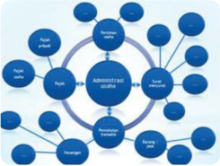

> **Deskripsi Visual:** Gambar ini adalah diagram yang menunjukkan struktur administrasi suatu organisasi. Diagram ini terdiri dari beberapa elemen utama yang saling terkait:

1. **Pertama**: Terdapat sebuah lingkaran besar yang berisi kata "Administrasi Organisasi". Lingkaran ini merupakan pusat dari diagram dan menggambarkan hubungan antara semua elemen lainnya.

2. **Elemen Utama dan Relasinya**: 
   - Dari lingkaran utama, ada tiga cabang utama yang kelihatan jelas: "Tugas", "Karyawan", dan "Proses". Setiap cabang ini memiliki beberapa sub-elemen yang lebih kecil.
   - "Tugas" terdiri dari "Tugas Umum", "Tugas Khusus", dan "Tugas Kepala".
   - "Karyawan" terdiri dari "Karyawan Umum", "Karyawan Khusus", dan "Karyawan Kepala".
   - "Proses" terdiri dari "Proses Umum", "Proses Khusus", dan "Proses Kepala".

3. **Teks, Angka, atau Label Penting**:
   - Di dalam lingkaran utama, terdapat beberapa teks yang penting seperti "Tugas", "Karyawan", dan "Proses".
   - Untuk setiap cabang utama, terdapat beberapa sub-elemen dengan label seperti "Tugas Umum", "Tugas Khusus", dll.

4. **Informasi Kunci**:
   - Diagram ini menunjukkan bahwa administrasi organisasi terdiri dari tugas, karyawan, dan proses yang saling terkait.
   - Setiap cabang memiliki sub-elemen yang lebih kecil yang mungkin melibatkan tugas, karyawan, atau proses spesifik.
   - Ini menunjukkan struktur hierarkis dan interaksi antar posisi dalam organisasi.

Dengan demikian, diagram ini memberikan gambaran umum tentang bagaimana administrasi organisasi terorganisir dan bagaimana tugas, karyawan, dan proses saling berkaitan dalam struktur organisasi tersebut.

Gambar 2.11 Aspek administrasi usaha

 

---
## 📄 Halaman 91

### Aktivitas 2

Ayo perhatikan Gambar 2.11 aspek administrasi usaha yang meliputi perizinan, surat menyurat, pencatan transaksi, dan pajak. Ayo lengkapi lingkaran yang belum  terisi.  Kembangkan  dan  tambahkan  lingkaran  jika  masih  ada  aspek yang memungkinkan untuk ditambahkan

### 4.   Kebutuhan Pasar terhadap Produk Sistem Teknik

Produk rekayasa peralatan sistem teknik sebagai bagian dari jutaan produk yang kita jumpai dalam kehidupan sehari-hari dengan tujuan untuk mencapai efektivitas memperlancar  kegiatan  dan  kenyamanan  penggunanya.  Industri  kreatif  dengan memperhatikan  kearifan  lokal  dan  mengkreasi  potensi  lokal  yang  memiliki  nilainilai kultural, dikembangkan menjadi suatu produk yang memiliki nilai tambah, dan kekuatan ekonomi baru.

Produk sistem teknik masih sangat potensial untuk terus digali menjadi karya nyata dan karya yang telah berhasil dibuat dengan memperhatikan persyaratan yang dibutuhkan dapat dipasarkan untuk memenuhi kebutuhan pasar terhadap produk sistem teknik.

Perencanaan  usaha  dalam  kewirausahaan  memiliki  tahapan  meliputi  tahap memulai,  melaksanakan,  mempertahankan,  dan  mengembangkan  seperti  pada Gambar 2.12.

Sumber: Dokumen Kemendikbud

Gambar 2.12 Tahap perencanaan kewirausahaan

 

---
## 📄 Halaman 92

### a. Tahap memulai

Melihat  peluang  usaha  jasa  profesi  dan  profesionalisme  menjadi  bagian utama dan pertama dan menentukan jenis usaha yang dikembangkan baik itu berupa produk maupun jasa. Identifikasi kebutuhan sumber daya pada usaha produk  rekayasa  yang  direncanakan.  Prosedur  yang  ditetapkan  diantaranya jenis usaha, manfaat, teknik rekayasa, dan pengemasan.

### b. Tahap Melaksanakan

Pembiayaan, organisasi, kepemilikan, sumber daya manusia, dan kepemimpinan  yang  memiliki  pemahaman  mengenai  risiko,  pembuatan keputusan, mengevaluasi, dan pemasaran produk usaha menjadi tahapan yang penting diperhatikan dalam proses produksi yang menerapkan keselamatan kerja dan mengembangkan sikap peduli lingkungan.

### c.  Tahap Mempertahankan

Usaha produk rekayasa dalam mempertahankan produksi dengan melakukan analisis perkembangan dan ditindaklanjuti sesuai dengan kondisi yang dihadapi.

### d. Tahap mengembangkan

Kreativitas  dan  inovasi  menjadi  penting  untuk  mengembangkan  usaha produk  rekayasa  baik  yang  bergerak  dibidang  jasa  maupun  produk.  Hasil usaha yang dijalankan secara

### Tugas Kelompok

### Perencanaan Usaha Produk Peralatan Sistem Teknik

- Amati  potensi  sumber  daya  di  lingkungan  sekitar,  ayo  cari  informasi dari buku atau internet tentang usaha produk peralatan sistem teknik yang dapat digunakan untuk mengolah material yang ada dan metode pengohanannya
- Presentasikan hasil pemikiranmu baik secara lisan atau tertulis

 

---
## 📄 Halaman 93

### B.  Sistem Produksi Usaha Sistem Teknik

### 1.  Aneka Produk Usaha Sistem Teknik

Produk  usaha  sistem  teknik  dirancang  dan  dikembangkan  berdasarkan  pada aspek-aspek lingkungan, sosial, budaya, ekonomi, dan etika masyarakat pengguna. Hemat sumber daya, minim dampak polutif, mudah penggunaan dan perawatannya merupakan  bagian  yang  menjadi  perhatian.  Karya  rekayasa  inovatif  dibuat  untuk mempermudah dan meningkatkan efisiensi dan efektifitas dalam pembuatan produk, di  antaranya  berupa  produk  pengolahan  hasil  pertanian,  perkebunan,  perikanan, limbah  perkebunan  yang  semua  itu  merupakan  bagian  solusi  dalam  berproduksi. Beberapa contoh aneka produk peralatan sistem teknik antara lain:

### a. Alat pencetak arang briket

Alat pencetak arang briket adalah kempa yang berfungsi mencetak tepung arang dengan ukuran m esh tertentu yang telah dicampur dengan perekat kanji, sehingga  menjadi  briket  arang  dengan  ukuran  dan  bentuk  tertentu  seperti: kubus, bulat tabung, dan atau bulat pepat. Tekanan yang dihasilkan oleh kempa, selain  manual  dapat  juga  berasal  dari  hidraulik,  maupun  tekanan  mekanik menggunakan ulir. Gambar pencetak briket secara manual ditunjukkan pada Gambar 2.13 yang dapat memanfaatkan bahan yang ada di wilayah sekitar.

---
**🖼️ Gambar/Diagram**

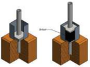

> **Deskripsi Visual:** Gambar ini adalah ilustrasi yang menunjukkan proses penggunaan alat berat dalam pekerjaan konstruksi. Gambar ini menggambarkan dua langkah dalam proses ini. Pertama, ada sebuah alat berat yang diletakkan pada lubang di bawah bangunan, sementara kedua, alat berat tersebut digunakan untuk memindahkan batu-batu ke arah bangunan. Elemen-elemen utama dalam gambar ini adalah alat berat, lubang, dan batu-batu. Alat berat merupakan elemen utama yang digunakan dalam proses ini, sedangkan lubang dan batu-batu merupakan elemen yang mendukung fungsi alat berat tersebut. Teks, angka, atau label penting yang terlihat dalam gambar ini tidak ada. Informasi kunci yang dapat diambil pembaca adalah bahwa alat berat digunakan untuk memindahkan batu-batu ke arah bangunan dalam proses konstruksi.

---
**🖼️ Gambar/Diagram**

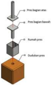

> **Deskripsi Visual:** Gambar ini adalah ilustrasi yang menunjukkan proses pembuatan pres untuk mesin pres. Gambar ini terdiri dari empat elemen utama:

1. **Pres Bagian Atas**: Ini adalah bagian atas pres yang berfungsi sebagai tempat untuk memasukkan bahan baku.

2. **Pres Bagian Bawah**: Ini adalah bagian bawah pres yang berfungsi sebagai tempat untuk memotong atau memotong bahan baku menjadi ukuran yang sesuai.

3. **Rumah Pres**: Ini adalah struktur dasar yang menyediakan ruang untuk menyimpan dan mengatur posisi pres.

4. **Dua Lapisan Pres**: Ini adalah dua lapisan pres yang digunakan untuk memperkuat dan memastikan stabilitas pres.

Elemen-elemen ini saling terkait dalam proses pembuatan pres, dimulai dari pembuatan bagian atas dan bawah pres, kemudian dipasangkan menjadi dua lapisan, dan akhirnya disimpan dalam rumah pres.

Teks, angka, atau label penting yang terlihat pada gambar adalah "Pres Bagian Atas", "Pres Bagian Bawah", "Rumah Pres", dan "Dua Lapisan Pres". Informasi kunci yang dapat diambil pembaca adalah bahwa proses pembuatan pres melibatkan pembuatan bagian atas dan bawah, dipasangkan menjadi dua lapisan, dan akhirnya disimpan dalam rumah pres.

 

---
## 📄 Halaman 94

### b. Alat pengering hasil pertanian

Alat  pengering  hasil  pertanian,  menggunakan  bahan  seng  yang  diberi warna  hitam  dengan  tujuan  untuk  menyerap  panas,  sinar  matahari  diserap oleh  benda  (seng)  berwarna  gelap  dan  diteruskan  kedalam  ruangan  (oven). Alat ini dibuat untuk mengurangi kadar air hasil pertanian dan baki (tray ) yang berfungsi sebagai wadah bahan yang dikeringkan di dalam ruang pengering pada proses penjemuran secara alami sehingga mengenai permukaan bahan yang akan dikeringkan.

---
**🖼️ Gambar/Diagram**

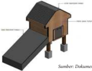

> **Deskripsi Visual:** Gambar ini adalah ilustrasi yang menunjukkan struktur bangunan sederhana, mungkin sebagai contoh pembangunan rumah atau bangunan kecil. Gambar ini terdiri dari beberapa elemen utama:

1. **Apa yang Ditampilkan Secara Keseluruhan**: Gambar ini menunjukkan sebuah bangunan sederhana dengan atap datar dan dinding berlapis kayu. Bangunan ini memiliki dua pintu masuk, satu di sisi depan dan satu di sisi belakang. Ada juga tangga ke atas bangunan.

2. **Elemen-Elemen Utama dan Relasinya**: 
   - **Atap**: Atap bangunan berbentuk datar dengan atap sederhana.
   - **Dinding**: Dinding bangunan terbuat dari kayu dan dilapisi dengan lapisan plastik untuk perlindungan.
   - **Pintu Masuk**: Ada dua pintu masuk, satu di sisi depan dan satu di sisi belakang.
   - **Tangga**: Ada tangga ke atas bangunan, terbuat dari kayu dan memiliki tali pengaman untuk keamanan.

3. **Teks, Angka, atau Label Penting yang Terlihat**: 
   - **Label**: Ada label yang memberikan informasi tentang komponen-komponen bangunan seperti "Atap", "Dinding", "Pintu Masuk", dan "Tangga".
   - **Angka**: Tidak ada angka yang jelas dalam gambar ini, tetapi label membantu dalam penjelasan.

4. **Informasi Kunci yang Bisa Diambil Pembaca**: 
   - Gambar ini menunjukkan struktur dasar bangunan sederhana dengan elemen-elemen seperti atap, dinding, pintu masuk, dan tangga.
   - Ini bisa digunakan sebagai contoh pembangunan rumah atau bangunan kecil dalam pembelajaran arsitektur atau teknik bangunan.

Dengan demikian, gambar ini merupakan ilustrasi yang informatif yang menunjukkan struktur dasar bangunan sederhana dengan elemen-elemen penting yang harus dipertimbangkan dalam pembangunan.

### c. Kompor Batik

Sumber: Dokumen Kemendikbud

Gambar 2.14 Alat pengering menggunakan sinar matahari

Kompor  listrik  untuk  membatik  digunakan  untuk  menggantikan kompor sumbu yang menggunakan minyak tanah yang saat ini sudah jarang didapatkan. Hal ini dapat menghemat biaya produksi untuk memanaskan lilin atau malam untuk membatik. Kompor listrik didesain menggunakan elemen pemanas yang dibuat spiral yang dialiri arus listrik AC 220 Volt/50 Hz mengkonversi dari energi listrik menjadi energi panas. Kompor dilengkapi dengan saklar push button dan potensiometer serta lampu indikator.

 

---
## 📄 Halaman 95

### d. Alat pengambilan zat warna alam indigo

Proses  pengambilan  zat  warna  alam  indigo  pada  dasarnya  adalah bagaimana  melakukan  aerasi  pada  cairan  hasil  rendaman  daun  dari tanaman Indigofera tinctoria. L . Pada Gambar 2.16 Alat untuk pengambilan Zat  Warna  Alam  Indigo  melalui  sirkulasi  cairan  dengan  menggunakan pompa, memungkinkan terjadinya proses aerasi. Pada saat pompa bekerja cairan pada tangki A diisikan ke dalam tangki B melalui spraiyer S sampai volume tertentu. Proses aerasi berlangsung pada saat air dispraykan melalui sprayer S. Cairan di tamping pada tangki C jika proses aerasi selesai.

---
**🖼️ Gambar/Diagram**

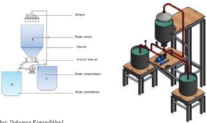

> **Deskripsi Visual:** Gambar ini adalah ilustrasi yang menunjukkan proses pengolahan air limbah. Gambar ini terdiri dari dua bagian utama: bagian depan yang menunjukkan komponen-komponen sistem pengolahan air limbah, dan bagian belakang yang menunjukkan sistem pengolahan air limbah secara keseluruhan.

Pertama, elemen utama yang ditampilkan adalah sistem pengolahan air limbah. Komponen-komponen utama termasuk sumber air limbah (A), alat pengumpul air limbah (B), pompa (C), dan alat pengolahan air limbah (D). Sumber air limbah (A) mengalir ke alat pengumpul air limbah (B), kemudian air limbah masuk ke dalam pompa (C) untuk ditarik ke alat pengolahan air limbah (D).

Elemen-elemen ini saling terkait dalam proses pengolahan air limbah. Air limbah yang masuk ke dalam sistem melalui sumber air limbah (A) dan alat pengumpul air limbah (B), kemudian dipompa (C) ke alat pengolahan air limbah (D) untuk proses pengolahan.

Teks, angka, atau label penting yang terlihat pada gambar ini adalah:

- A: Sumber air limbah
- B: Alat pengumpul air limbah
- C: Pompa
- D: Alat pengolahan air limbah

Informasi kunci yang dapat diambil pembaca adalah bahwa sistem ini menunjukkan proses pengolahan air limbah, dimulai dari sumber air limbah hingga alat pengolahan air limbah. Proses ini melibatkan pengumpulan, pompa, dan pengolahan air limbah.

Sumber: Dokumen Kemendikbud

Gambar 2.16 Alat untuk pengambilan zat warna alam indigo

Produk peralatan sistem teknik lainnya, diantaranya alat pembuat tepung misalnya  alat  pembuat  tepung,  terdiri  dari  dua  komponen  utama,  yaitu penghalus dan penyaring. Penghalus dapat berupa grind, yaitu pertemuan dua buah logam yang berputar berlawanan arah dan menghancurkan benda yang  hendak  dihaluskan.  Penyaring  berfungsi  mengayak  tepung  dengan ukuran mesh tertentu. Produk peralatan pres gambir, alat berbentuk kempa (tekanan)  yang  dihasilkan  baik  dari  tenaga  hidrolik  maupun  mekanik. Spiner sebagai salah satu alat yang digunakan untuk memisahkan produk olahan dari cairan atau minyak seperti pada Gambar 2.17. Produk Peralatan sistem teknik.

 

---
## 📄 Halaman 96

### Aktivitas 3

Ayo buatlah pohon industri dari bahan baku produk yang tersedia di sekitar dan  dapat  dikreasi  menjadi  memiliki  nilai  tambah.  Bagaimana  teknologi proses pembuatannya. Ungkapkan pendapatmu baik secara tertulis maupun lisan.

### 2.   Manfaat Produk Usaha Sistem Teknik

Manfaat karya rekayasa produk peralatan sistem teknik :

- Keberadaan  karya  produk  usaha  sistem  teknik  memberikan  manfaat  bagi kesejahteraan masyarakat yang menggunakannya
- Solusi  bagi  peningkatan  produktifitas  dan  efektifitas  dalam  menjalankan produksi usaha rumahan ( home industry )
- Memberikan  kemudahan,  meningkatkan  kualitas  dan  jumlah  dalam  berproduksi
- Memacu kreativitas dan inovatif pembuatnya untuk terus berkarya mencapai optimal
- Terciptanya lapangan pekerjaan untuk mewujudkan karya inovasi.
Sumber : Dokumen Kemendikbud

Gambar : 2.17 Produk Peralatan sistem teknik

 

---
## 📄 Halaman 97

### Tugas 2 Mandiri

### Sistem Produksi Usaha Sistem Teknik

Ragam hasil  produk  yang  diproduksi  dari  peralatan  sistem  teknik  dapat digambarkan dari jargon produk yang terdapat pada Gambar 2.18 sebagai berikut :

---
**🖼️ Gambar/Diagram**

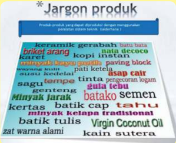

> **Deskripsi Visual:** Gambar ini adalah diagram yang menunjukkan jargon produk dalam bahasa Jawa. Diagram ini terdiri dari berbagai kata dalam bahasa Jawa yang digunakan dalam konteks produk-produk lokal. Setiap kata disusun dalam baris vertikal dengan warna yang berbeda untuk memudahkan penafsiran. Di atas diagram tersebut ada judul "Jargon Produk" yang menunjukkan topik yang akan dibahas. Selain itu, ada beberapa teks di bawah diagram yang mungkin merupakan penjelasan atau pengantar tentang jargon-jargon tersebut.

Sumber: Dokumen Kemendikbud Gambar 2.18 Jargon produk

- Ayo amati nama-nama produk yang ada di gambar jargon produk
- Ambil minimal lima nama produk sesuai dengan potensi yang ada di daerahmu
- Inovasi peralatan sistem teknik apa yang dapat dikembangkan dalam proses produksinya.
- Ayo uraikan gagasanmu dalam lembar laporan

 

---
## 📄 Halaman 98

### Tugas 3 Kelompok

### Observasi kegunaan peralatan sistem teknik

- Amati lingkungan di daerahmu
- Catatlah aneka jenis penggunaan peralatan sistem teknik
- Tuliskan manfaatnya
- Ungkapkan perasaan yang timbul dengan adanya peralatan sistem teknik
5.   Apa rencana selanjutnya setelah anda mengetahui berbagai bentuk peralatan sistem teknik

Nama kelompok : ....................................................................................................

Nama anggota

Kelas

:  ...................................................................................................

...................................................................................................

...................................................................................................

:  ...................................................................................................

Identifikasi kegunaan peralatan sistem teknik

---
**📊 Tabel**

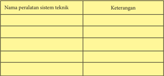

Tabel ini berisi informasi tentang berbagai peralatan sistem teknik, dengan kolom "Nama Peralatan Sistem Teknik" untuk menyatakan nama masing-masing peralatan dan kolom "Keterangan" untuk memberikan penjelasan atau deskripsi singkat tentang peralatan tersebut. Topik utama tabel ini adalah peralatan sistem teknik, yang meliputi berbagai jenis peralatan seperti komputer, printer, scanner, kamera, dan lain-lain. Data penting yang terlihat dalam tabel ini adalah bahwa setiap peralatan memiliki nama dan keterangan yang spesifik, yang menunjukkan bahwa tabel ini dirancang untuk menyajikan informasi yang detail dan akurat tentang setiap peralatan sistem teknik.

Kesimpulan :

........................................................................................................................................

........................................................................................................................................

........................................................................................................................................

........................................................................................................................................

........................................................................................................................................

........................................................................................................................................

........................................................................................................................................

...........................................................................

 

---
## 📄 Halaman 99

### 3.  Potensi Usaha Sistem Teknik di Daerah

Sumber daya yang meliputi sumber daya manusia, sumber daya alam dan sumber daya  budaya  sebagai  potensi  usaha  sistem  teknik  tersebar  di  daerah  kepulauan Indonesia.  Bahan  baku  yang  disediakan  alam  dan  potensi  jumlah  penduduk  serta keragaman budaya dari berbagai propinsi di Indonesia menjadi bagian yang potensial dalam menjalankan usaha sistem teknik. Produk yang dibuat dapat mendatangkan nilai  tambah  dan  meningkatkan  kesejahteraan  kehidupan  masyarakat  di  daerah. Usaha  peralatan  sistem  teknik  dikembangkan  untuk  mewujudkan  produk  yang memiliki nilai ekonomis.

Budaya  Indonesia  merupakan  sumber  daya  dan  kekayaan  yang  perlu  terus dikembangkan dan menjadi bagian yang tidak bisa dipisahkan di dalam kehidupan. Kita sering melihat di daerah-daerah banyak aktifitas penduduk melakukan kegiatan yang  sifatnya  turun  temurun  dalam  memenuhi  kebutuhan.  Batik,  tenun  adalah produk yang dihasilkan oleh aktifitas masyarakat di sekitar kita. Kita mengenal batik, tenun sebagai sumber daya yang diakui dunia sebagai kekayaan budaya Indonesia . Pengembangan budaya melalui potensi yang tersedia dapat dilakukan dengan pola tekno-ekologis  sebagai  salah  satu  bentuk  sistem  dengan  menggabungkan  antara teknologi dengan lingkungan yang tetap dijaga keseimbangannya .

Pola  integrasi tekno-ekologis salah  satu  contohnya  seperti  pada  Gambar  2.19 dimaksudkan  bahwa  produk  yang  dihasilkan  berupa  zat  warna  alami  merupakan produk yang ramah lingkungan. Peningkatan efektivitas dalam penggunaan peralatan sistem  teknik  yang  dibuat  dengan  tetap  menjaga  kelestarian  lingkungan,  lebih produktif,  efisien,  dan  berkualitas.  Penggunaan  zat  warna  sintetis  yang  berlebihan dapat membahayakan lingkungan dan kesehatan kulit penggunanya.

---
**🖼️ Gambar/Diagram**

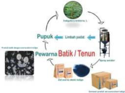

> **Deskripsi Visual:** Gambar ini adalah ilustrasi yang menunjukkan proses produksi pewarna batik dan tenun. Ilustrasi ini menggambarkan berbagai tahap dalam proses produksi, mulai dari pengolahan limbah sampai penggunaan pupuk sebagai bahan bakar. Elemen utama dalam ilustrasi ini meliputi:

1. Pupuk: Dapat dilihat sebagai sumber energi utama dalam proses produksi.
2. Limbah padat: Menunjukkan hasil dari proses pengolahan limbah.
3. Pewarna batik/tenun: Menunjukkan produk akhir yang dibuat dari proses produksi.
4. Pengolahan limbah: Menunjukkan tahap awal dalam proses produksi.

Teks, angka, atau label penting yang terlihat dalam ilustrasi ini adalah "Pupuk", "Limbah padat", dan "Pewarna Batik/Tenun". Informasi kunci yang dapat diambil pembaca adalah bahwa proses produksi pewarna batik dan tenun melibatkan pengolahan limbah dan penggunaan pupuk sebagai sumber energi.

Gambar 2.19 Pola integrasi tekno-ekologis pada pembuatan zat warna alam indigo

 

---
## 📄 Halaman 100

Proses produksi pembuatan batik dan tenun, salah satunya adalah pewarnaan. Pewarnaan  secara  alami  pada  kain  batik  dan  tenun  sangat  di  sambut  baik  oleh masyarakat  dunia  dan  memiliki  nilai  jual  tinggi,  karena  merupakan  produk  yang ramah  lingkungan  dan  sudah  menjadi  bagian  dari  gaya  hidup (life  style) dalam kehidupan di masa sekarang untuk ramah pada lingkungan.

Pengambilan  zat  warna  alam,  dalam hal ini warna  biru  yang  diambil  dari tanaman nila seperti Gambar 2.19 memiliki kekhususan tersendiri.  Nama umum dagang nila dan jenis tanaman ini sering disebut dengan indigo/indian indigo (Inggris), tom/tarum (Indonesia), tagungtagung/taiom/taiung (Filipina), kraam/nakho (Thailand), cham (Vietnam), tarom (Malaysia)

Proses  pengambilan  zat  warna  alam indigo pada industri rumah masih menggunakan proses yang lebih dominan menggunakan tenaga manusia yaitu pada  proses kebur  (aerasi), dan  untuk mempermudah proses aerasi dapat digunakan alat kebur (spray aerator) .

### 4.   Perencanaan Produksi Tom Spray Aerator untuk Zat Warna Alam Indigo

---
**🖼️ Gambar/Diagram**

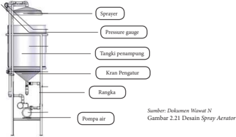

> **Deskripsi Visual:** Gambar ini adalah ilustrasi yang menunjukkan desain spray aerator. Gambar ini menggambarkan komponen-komponen utama yang terdapat pada spray aerator, yaitu sprayer, pressure gauge, tangki penampung, kran pengatur, rangka, dan pompa air. Sprayer digunakan untuk menyemprotkan bahan ke dalam air, pressure gauge digunakan untuk memantau tekanan air, tangki penampung digunakan untuk menyimpan air, kran pengatur digunakan untuk mengatur流量, rangka digunakan sebagai struktur dasar, dan pompa air digunakan untuk mengalirkan air ke dalam sistem. Informasi kunci yang dapat diambil pembaca adalah bahwa spray aerator terdiri dari beberapa komponen yang saling terkait dan bekerja sama untuk menciptakan proses aeratorisasi.

 

---
## 📄 Halaman 101

### 5.  Alat dan Bahan yang dibutuhkan

a. Pembuatan Spray Aerator dan Zat warna alam indigo

- Pembuatan tangki, dapat disubtitusi dengan drum bekas
- Sprayer , dapat dimodifikasi dengan paralon yang diberi lubang banyak
- Pipa paralon, untuk sirkulasi larutan yang dipompa.
- Pompa air, saklar dan kabel, dapat diperoleh di toko material
- Rangka penopang tangki
- Tanaman Indigofera tinctoria
- Kapur CaO, larutan CaO (kapur tohor)

### 6. Proses Produksi Tom Spray Aerator untuk Zat Warna Alam Indigo

Proses produksi dalam pembuatan zat warna alam yang dikembangkan dalam hal ini dibagi menjadi dua bagian yaitu :

- Pembuatan Alat Spray Aerator
- Pembuatan zat warna alam indigo biru
Spray aerator sebagai alat yang digunakan untuk pengambilan zat warna alam indigo biru yang biasa digunakan untuk pewarnaan batik, tenun, denim. Bahan baku zat warna alam ini berupa daun nila yang diolah melalui proses perendaman (24 jam), proses aerasi dan proses pengendapan. Hasil akhir berupa produk pasta/powder indigo biru yang mempunyai nilai jual cukup tinggi.

### a. Proses Pembuatan Spray Aerator

---
**🖼️ Gambar/Diagram**

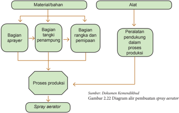

> **Deskripsi Visual:** Gambar ini adalah diagram yang menunjukkan aliran pembuatan spray aerator. Diagram ini terdiri dari beberapa elemen utama yang terkait dengan proses produksi spray aerator.

1. **Apa yang Ditampilkan Secara Keseluruhan**: Gambar ini menunjukkan struktur dan aliran proses pembuatan spray aerator, mulai dari bahan-bahan dan alat hingga proses produksinya.

2. **Elemen-Elemen Utama dan Relasinya**: 
   - **Bahan/Material**: Ini mencakup semua komponen utama yang digunakan dalam pembuatan spray aerator.
   - **Alat**: Ini mencakup semua peralatan yang diperlukan untuk proses produksi.
   - **Bagian Sprayer**: Ini mencakup bagian-bagian yang terlibat dalam pengisian dan penyemprotan.
   - **Proses Produksi**: Ini merupakan langkah-langkah yang dilakukan untuk menghasilkan spray aerator.
   - **Spray Aerator**: Ini adalah hasil akhir dari proses produksi.

3. **Teks, Angka, atau Label Penting yang Terlihat**: 
   - Ada teks yang memberikan informasi tentang sumber gambar (Dokumen Kementerian).
   - Ada angka yang mungkin merujuk pada bagian-bagian tertentu dalam proses produksi.
   - Ada label yang menjelaskan setiap bagian dan bagian dari proses produksi.

4. **Informasi Kunci yang Bisa Diambil Pembaca**: 
   - Gambar ini memberikan pemahaman tentang struktur dan aliran proses pembuatan spray aerator.
   - Pembaca dapat melihat bagaimana bahan dan alat berinteraksi dalam proses produksi.
   - Informasi ini sangat berguna bagi orang yang ingin memahami proses produksi spray aerator secara lebih mendalam.

Secara keseluruhan, gambar ini membantu dalam memahami struktur dan aliran proses pembuatan spray aerator, serta memberikan gambaran yang jelas tentang bagaimana setiap bagian dan alat berperan dalam proses tersebut.

 

---
## 📄 Halaman 102

Peralatan dan Bahan Pembuatan Spray Aerator

Peralatan yang digunakan dalam pembuatan alat spray aerator digunakan alatalat di antaranya mesin las, bor, gerinda, dan tool kit seperti pada gambar 2.23.

Sumber: Dokumen Wawat N

Gambar 2.23 Peralatan yang digunakan dalam pembuatan Spray Aerator

Spray aerator dapat dibagi menjadi empat bagian yaitu penyediaan sprayer, pompa, pemipaan, dan tangki penampung. Prisip dasar dari proses ini adalah aerasi  yaitu  mengkontakkan  cairan  dengan  udara.  Sprayer  bisa  disubtitusi/ diganti dengan pipa paralon yang diberi beberapa lubang. Penyediaan reservoir / tangki penampung dapat disubtitusi dengan menggunakan drum bekas minyak.

Rangka  disiapkan  untuk  menopang  tangki, sprayer ,  pompa  dan  pipa  yang digunakan. Pemipaan dilakukan bersamaan dengan pemasangan tangki. Setelah tangki,  pompa, pipa dan sprayer terpasang, tinggal pemasangan saklar untuk mengoperasikan pompa. Sumber arus listrik yang digunakan AC 220 Volt.

Peralatan dan bahan pembuatan zat warna alam indigo bagian perendaman digunakan ember untuk merendam daun Indigofera tinctoria L. Spray Aerator digunakan untuk mengaerasi cairan hasil rendaman. Keranjang, kain dan ember digunakan untuk memisahkan antara pasta dengan air.

Semester 1

 

---
## 📄 Halaman 103

---
**🖼️ Gambar/Diagram**

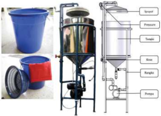

> **Deskripsi Visual:** Gambar ini adalah ilustrasi yang menunjukkan sebuah sistem pengolahan air. Gambar ini terdiri dari beberapa elemen utama:

1. **Pertama**: Gambar ini menunjukkan dua objek utama: sebuah ember plastik besar berwarna biru dan sebuah mesin pengolahan air yang terdiri dari berbagai komponen seperti pompa, tabung, kolom, dan saluran.

2. **Elemen-elemen Utama dan Relasinya**: 
   - **Ember Plastik**: Ini adalah objek dasar yang digunakan untuk menyimpan air.
   - **Mesin Pengolahan Air**: Ini terdiri dari berbagai komponen seperti pompa (untuk mengalirkan air), tabung (untuk menyimpan air setelah pengolahan), kolom (untuk memfilter air), dan saluran (untuk mengalirkan air).
   - **Relasi**: Pompa mengalirkan air ke tabung, tabung menyimpan air setelah pengolahan, dan saluran mengalirkan air melalui kolom untuk proses filtrasi.

3. **Teks, Angka, atau Label Penting yang Terlihat**:
   - Ada beberapa label yang menunjukkan nama-nama komponen seperti "Spray", "Preheater", "Tabung", "Kolom", "Rampant", dan "Pumps".
   - Angka tidak terlihat pada gambar ini.

4. **Informasi Kunci yang Dapat Diambil Pembaca**:
   - Gambar ini menunjukkan proses pengolahan air menggunakan mesin yang terdiri dari berbagai komponen.
   - Ini menunjukkan bahwa sistem ini mungkin digunakan untuk memproses air yang berasal dari ember plastik ke tabung setelah proses pengolahan.

Dengan demikian, gambar ini menunjukkan proses pengolahan air menggunakan mesin yang terdiri dari berbagai komponen, dengan ember plastik sebagai sumber air dan mesin pengolahan air sebagai alat untuk memproses air tersebut.

Sumber: Dokumen Wawat N

Penggunaan Spray  Aerator dapat  mempermudah  dalam  proses  produksi pengambilan zat warna alam indigo. Perawatan alat ini meliputi :

- Perawatan alat terutama bagian sprayer, yaitu membersihkan bagian lubang sprayer agar  tidak  tersumbat  dari  kapur  yang  digunakan.  Pastikan  dalam kondisi bersih setelah menggunakannya.
- Hindari tergenangnya air pada spray aerator pada bagian tangki (reservoir) saat penyimpanan agar tidak terjadi korosi pada peralatan.
- Lakukan pemeliharaan (maintenance) secara berkala pada pompa air, hindari terjadinya hubung singkat karena isolasi kabel kurang baik.
- Perhatikan penggunaan sumber listrik disesuaikan dengan spesifikasi pompa air yang digunakan.
Pembuatan produk peralatan sistem teknik membutuhkan pekerjaan yang teliti dan  harus  memperhatikan  keselamatan  kerja  sebagai  upaya  untuk  meminimalisir timbulnya  kecelakaan  kerja.  Peralatan  keselamatan  kerja  yang  digunakan  dalam pembuatan  alat  yang  mendukung  proses  produksi  antara  lain  :  sarung  tangan, kacamata, helm, pakaian praktik, safety shoes, pelindung telinga, masker pelindung saluran pernafasan.

Keselamatan  kerja  dalam  proses  produksi  menjadi  hal  yang  utama  untuk diperhatikan  guna  menghidari  kecelakaan  kerja.  Keselamatan  kerja  mencakup pencegahan kecelakaan kerja dan perlindungan terhadap tenaga kerja dari kemungkinan  terjadinya  kecelakaan  sebagai  akibat  dari  kondisi  kerja  yang  tidak aman dan atau tidak sehat. Perilaku yang tidak aman dan praktik kerja tidak standar,

 

---
## 📄 Halaman 104

dan  apa  yang  menjadi  sebab  perilaku  tidak  aman  harus  menjadi  perhatian  agar kecelakanaan kerja dapat diminimalisir.

Syarat-syarat  kesehatan,  keselamatan,  dan  keamanan  kerja  ditetapkan sejak tahap perencanaan, pembuatan, pengangkutan, distribusi, perdagangan, pemasangan, pemakaian, penggunaan, pemeliharaan, dan  penyimpanan bahan,  barang,  produk  teknis,  dan  aparat  produksi  yang  mengandung  dan dapat menimbulkan bahaya kecelakaan.

Gambar 2.26 Sisi pandang budaya K3

Budaya  K3  dibentuk  dari kebiasaan perilaku para  anggota  berupa seperangkat  nilai  dan  norma  pola  perilaku  yang  didasari  dengan  kesadaran tinggi  yang  diwujudkan  dalam  bentuk  sikap,  ucapan,  dan  tindakan  yang mengarah  pada  terciptanya  kegiatan  yang  aman,  sehat,  andal,  dan  selaras dengan lingkungan. Budaya K3 dapat dilihat dari sisi pandang activator, pelaku dan dampak yang muncul dari setiap perilaku kerja seperti pada Gamabar 2.26.

### b. Pembuatan Zat Warna Alam Indigo menggunakan Spray Aerator

Spray  aerator sebagai  salah  satu  alat  dalam  pembuatan  zat  warna  alam indigo seperti telihat dalam diagram alir pada Gambar 2.27 sebagai berikut :

---
**🖼️ Gambar/Diagram**

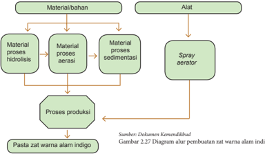

> **Deskripsi Visual:** Gambar ini adalah diagram alur yang menunjukkan proses pembuatan zat warna alam indigo. Diagram ini terdiri dari dua cabang utama: material/bahan dan alat. Cabang material/bahan meliputi proses hidrolisis, aeriasi, dan sedimentasi, yang kemudian mengarah ke proses produksi. Cabang alat hanya memiliki satu elemen utama, yaitu spray aerator. Teks pada gambar menyatakan bahwa informasi ini berasal dari Dokumen Kemandirian dan diberikan sebagai Gambar 2.27. Label penting lainnya termasuk "Pasta zat warna alam indigo" dan "Sumber: Dokumen Kemandirian". Informasi kunci yang dapat diambil pembaca adalah bahwa proses pembuatan zat warna alam indigo melibatkan berbagai tahap pengolahan material/bahan menggunakan alat seperti spray aerator, dan hasilnya adalah pasta zat warna alam indigo.

 

---
## 📄 Halaman 105

### Bagian perendaman/Proses hidrolisis

Sumber: Dokumen Kemendikbud

Gambar 2.28 Persiapan perendaman daun nila dan setelah 24 jam

Proses aerasi, ditambahkan larutan kapur (CaO) pada saat proses aerasi seperti pada Gambar 2.29 Proses aerasi

Sumber: Dokumen Wawat N

Gambar 2.29 Proses aerasi

Proses pengendapan (sedimentasi), cairan yang telah diaerasi dan di tambah dengan  larutan  kapur  diendapkan  dengan  menggunakan  ember.  Setelah terdapat endapan, perlahan buang cairan bagian atas (berwarna kekuningan) dan tampung endapan tersebut seperti pada Gambar 2.28. Air akan terpisah dengan  pasta  dan  pasta  ini  siap  untuk  dikemas.  Jika  penyimpanan  dalam waktu lama, dapat dibuat powder dengan cara dikeringkan terlebih dahulu dan dihaluskan menggunakan peralatan tambahan.

 

---
## 📄 Halaman 106

---
**🖼️ Gambar/Diagram**

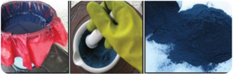

> **Deskripsi Visual:** Gambar ini adalah ilustrasi yang menunjukkan proses pengolahan bahan kimia. Gambar pertama menunjukkan sebuah tas plastik berisi bahan kimia biru. Gambar kedua menunjukkan tangan seseorang yang sedang menggali bahan kimia tersebut dengan menggunakan alat pemotong. Gambar ketiga menunjukkan hasil penggalian, yaitu bahan kimia yang telah dipotong menjadi potongan-potongan kecil dan berwarna biru tua.

Elemen utama dalam gambar ini adalah tas plastik, tangan seseorang, alat pemotong, dan bahan kimia. Relasi antara elemen-elemen ini adalah bahwa tas plastik berisi bahan kimia, tangan seseorang menggunakan alat pemotong untuk menggali bahan kimia, dan hasil penggalian adalah bahan kimia yang telah dipotong menjadi potongan-potongan kecil.

Teks, angka, atau label penting yang terlihat dalam gambar ini adalah tidak ada. Informasi kunci yang dapat diambil pembaca adalah bahwa proses ini adalah pengolahan bahan kimia, baik itu penyimpanan, penggalian, maupun pengolahan fisik bahan kimia tersebut.

Sumber: Dokumen Kemendikbud

Gambar 2.30 Pengendapan pasta dan pembuatan powder

### Aktivitas 4

Ayo  identifikasi peralatan sistem teknik yang dapat  digunakan  untuk mengkreasi  bahan  baku  yang  potensial  di  derahmu  supaya  memiliki  nilai tambah. Buat gambar desain peralatan sistem teknik yang dapat digunakan Ungkapkan pendapatmu baik secara tertulis maupun lisan.

### 7.   Pengemasan Produk

Pengemasan produk pralatan sistem teknik dimaksudkan untuk mempermudah pekerja dalam menjalankan suatu pekerjaan untuk mencapai efektivitas dan efisiensi dalam  pembutan  produksi.  Perkembangan  teknologi  dalam  pengemasan  suatu produk berkembang dengan cepat. Casing atau selubung didesain sedemikian rupa dengan  mempertimbangkan  estetika  dan  konsep  yang  ingin  ditampilkan  sesuai dengan pengguna atau calon pembeli.

Pengemasan  untuk  pelindung  fungsi  distribusi  dan  fungsi  identitas  sebagai kemasan produk didesain agar produk dapat terlindung dari benturan dan menarik Adapun fungsi kemasan produk antara lain :

- Mempertahankan mutu
- Memperpanjang masa simpan
- Mempermudah penyimpanan dan pemasaran/transportasi
- Menambah daya tarik bagi konsumen (memberi informasi dan sarana promosi
Agar  manfaat  tersebut  di  atas  dapat  dicapai,  maka  hal-hal  berikut  harus diperhatikan:

- Dibuat semenarik mungkin, punya ciri khas
- Memuat informasi yang jelas & jujur
- Menarik (desain, warna, bentuk), dengan komposisi yang imbang

 

---
## 📄 Halaman 107

- Ukuran & material bahan sesuai kebutuhan
- Bahan terbuat dari material yang tahan terhadap perlakuan pada saat pemindahan (transport).
- Volume kemasan, menggunakan ukuran yang umum untuk produk-produk tertentu, misalnya 250 gr, 500 gr atau 1000 gr.
Label, adalah informasi yang dibuat pada kemasan biasanya berisikan tentang:

- Informasi produk yang sebenarnya
- Foto atau gambar produk
- Logo perusahaan
- Alamat produsen
- Bobot produk
Informasi tentang masa produksi dan atau masa kadaluwarsa dan hal-hal lain yang istimewa pada produk yang dihasilkan, menjadi bagian informasi pada konsumen.

Produksi zat warna indigo yang terdiri dari dua jenis, yaitu basah dalam bentuk pasta dan tepung, maka bentuk kemasan bagi keduanya berbeda.

Sumber: Dokumen Kemendikbud

Gambar 2.32 Desain kemasan produk dan distribusi pasta zat warna alami

 

---
## 📄 Halaman 108

### Tugas 4 (kelompok)

### Produk Peralatan Sistem Teknik

Ayo  identifikasi  permasalahan  yang  didapat  pada  proses  produksi  dari industri  rumah  tangga/ home  industry yang  ada.  Catat  permasalahan  yang muncul.

Lakukan observasi lapangan atau internet, peralatan sistem teknik sederhana apa yang dibutuhkan untuk mewujudkan karya dan deskripsikan desain model alat sistem teknik

Buatlah salah satu produk atau model produk sistem teknik, identifikasi penggunaan  bahan  dan  alat  pada  proses  produksi  yang  butuhkan  untuk mewujudkan pembuatan model tersebut yang telah dipilih oleh kelompok

Kegiatan  produksi  dilakukan  dalam  kelompok.  Tentukan  jenis  produk sistem teknik berdasarkan waktu, kemampuan produksi. Rencanakan proses produksi, jumlah bahan dan alat serta kebutuhan pasar. Buatlah pembagian tugas  yang  sesuai  dengan  kompetensi  anggota  kelompok  dan  mendukung kualitas produksi yang baik. Kegiatan produksi tergantung dari desain produk sistem teknik dan teknik produksi yang akan digunakan.

 

---
## 📄 Halaman 109

### C.  Menghitung Titik Impas ( Break Even Point )

### 1.   Pengertian BEP ( Break Even Point )

Analisis BEP merupakan alat analisis untuk mengetahui batas nilai produksi atau volume produksi suatu usaha untuk mencapai nilai impas yang artinya suatu usaha tersebut tidak mengalami keuntungan ataupun kerugian. Suatu usaha dikatakan layak, jika nilai BEP produksi lebih besar dari jumlah unit yang sedang diproduksi saat ini dan BEP harga harus lebih rendah daripada harga yang berlaku saat ini, dimana BEP produksi dan BEP harga dapat dihitung dengan menggunakan rumus sebagai berikut:

BEP Produksi :

Total Biaya Harga Penjualan

Analisis BEP digunakan untuk mengetahui jangka waktu pengembalian modal atau investasi suatu kegiatan usaha atau sebagai penentu batas pengembalian modal. Produksi minimal suatu kegiatan usaha harus menghasilkan atau menjual produknya agar  tidak  menderita  kerugian.  BEP  adalah  suatu  keadaan  dimana  usaha  tidak memperoleh laba dan tidak menderita kerugian.

Biaya produksi zat warna alam indigo meliputi biaya investasi, biaya tidak tetap, dan biaya operasional. Analisis usaha produksi zat warna alam indigo di susun untuk mengetahui  gambaran  ekonomi  mengenai  usaha  yang  akan  diwujudkan.  Analisis usaha pembuatan zat warna alam indigo menggunakan asumsi bahwa :

- Alat spray  aerator dapat  digunakan  selama  3  tahun.  Oleh  sebab  itu  biaya tetap yang digunakan merupakan biaya penyusutan per tahun dengan pola penyusutan tetap. Harga Alat Spray Aerator baru Rp. 3.000.000,00
- Lahan yang digunakan 400 m2 dengan sistem sewa 1 tahun. Komponen biaya lahan dihitung sesuai dengan masa produksi
- Tenaga kerja yang digunakan 1 orang. Upah per hari Rp. 50.000,00
- Siklus produksi disesuaikan dengan masa panen daun nila yaitu 3 bulan sekali. Proses  produksi  memerlukan  waktu  selama  6  hari  sampai  menghasilkan pasta.
- Produksi dilakukan di gedung milik sendiri, sehingga dalam kasus ini tidak dinyatakan sebagai bagian dari komponen biaya.
- Ember kapasitas 100 liter digunakan sebanyak 2 buah dengan harga masingmasing Rp. 100.000,00

 

---
## 📄 Halaman 110

- Keranjang perendaman digunakan 2 buah dengan harga Rp. 50.000,00
- Ember dan keranjang perendaman, dapat digunakan selama 2 tahun.
- Harga  pasta  zat  warna  alam  indigo  di  pasaran  sangat  beragam  dan  pada analisis ini digunakan angka rata-rata yaitu Rp. 50.000,00 per kg.

### Komponen biaya dalam satu proses produksi (3 bulan)

a. Biaya Investasi

---
**📊 Tabel**

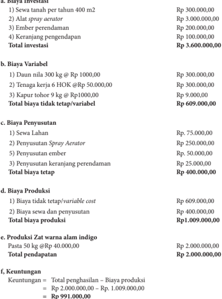

Tabel ini menyajikan detail investasi dan produksi untuk sebuah usaha pertanian, dengan fokus pada biaya tetap, variabel, penyesuaian, dan produksi zat warna alam indigo. Topik utama adalah biaya total dan keuntungan. Kolom-kolom utama meliputi: a) Biaya Investasi, b) Biaya Variabel, c) Biaya Penyusutan, d) Biaya Produksi, e) Produksi Zat warna alam indigo, dan f) Keuntungan. Data penting menunjukkan bahwa total investasi mencapai Rp 3.600.000,00, total biaya tetap sebesar Rp 400.000,00, dan total pendapatan mencapai Rp 2.000.000,00. Ini menunjukkan bahwa usaha tersebut memiliki keuntungan sebesar Rp 991.000,00 setelah mengurangi biaya produksi dan penyusutan.

 

---
## 📄 Halaman 111

### 2.  Menghitung BEP

BEP produksi dan BEP harga dapat dihitung dengan menggunakan rumus sebagai berikut:

---
**📊 Tabel**

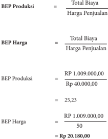

Tabel ini menunjukkan perhitungan Bebas Biaya Produksi (BEP) untuk dua metode: BEP Produksi dan BEP Harga. Topik utama tabel adalah perhitungan BEP untuk produk atau layanan tertentu. Kolom-kolomnya meliputi Total Biaya, Harga Penjualan, dan hasil perhitungan BEP untuk kedua metode tersebut. Data penting yang terlihat adalah bahwa BEP Produksi sebesar 25,23 unit, sedangkan BEP Harga sebesar 20,180 unit. Ini menunjukkan bahwa untuk mencapai BEP, jumlah unit produksi atau penjualan harus mencapai 25,23 unit jika menggunakan metode BEP Produksi, dan 20,180 unit jika menggunakan metode BEP Harga.

Dari perhitungan BEP produksi dan harga, diketahui bahwa titik impas usaha pembuatan zat warna indigo dicapai ketika produksi pasta mencapai 25,23 kg atau harga pasta indigo sebesar Rp 20.180,00/kg . Produksi di atas 25,23 kg dan harga di atas Rp20.180,00/kg pada tiap kali periode produksi adalah keuntungan.

### Tugas 5 (kelompok)

### Menghitung Titik Impas ( Break Event Point ) Usaha Sistem Teknik

- Buat salah satu produk peralatan sistem teknik sederhana yang telah direncanakan oleh kelompok masing-masing
- Hitunglah titik impas dari produk sistem teknik
- Diskusikan dalam kelompok berapa perkiraan harga jual produk karya kelompokmu

 

---
## 📄 Halaman 112

### D. Strategi Promosi Usaha Sistem Teknik

Pemasaran  produk  peralatan  sistem  teknik  tidak  hanya  berhubungan  dengan produk,  harga  produk,  dan  pendistribusian  produk,  tetapi  berkait  pula  dengan mengkomunikasikan  produk  ini  kepada  konsumen,  untuk  mengkomunikasikan produk ini perlu disusun strategi yang disebut dengan strategi promosi, yang terdiri dari  empat  komponen  utama  yaitu  periklanan,  promosi  penjualan, publisitas, dan penjualan tatap muka seperti digambarkan pada Gambar 2.33 Strategi Promosi.

---
**🖼️ Gambar/Diagram**

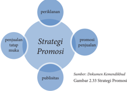

> **Deskripsi Visual:** Gambar ini adalah diagram yang menunjukkan strategi promosi. Diagram ini terdiri dari elemen utama yang terhubung dengan titik pusat yang diberi nama "Strategi Promosi". Di sekeliling titik pusat tersebut ada empat lingkaran kecil yang masing-masing berisi teks yang berbeda:

1. Lingkaran pertama berisi "periklanan".
2. Lingkaran kedua berisi "promosi penjualan".
3. Lingkaran ketiga berisi "penjajalian tatap muka".
4. Lingkaran keempat berisi "publisitas".

Teks-teks ini menunjukkan bagaimana elemen-elemen promosi saling berkaitan dan saling mendukung dalam strategi promosi. Setiap elemen memiliki peran yang spesifik dalam proses promosi produk atau layanan.

Informasi kunci yang dapat diambil pembaca melalui gambar ini adalah bahwa strategi promosi melibatkan kombinasi dari berbagai metode promosi seperti periklanan, promosi penjualan, penjajalian tatap muka, dan publisitas. Semua metode ini saling berinteraksi untuk mencapai tujuan promosi yang lebih efektif.

Tujuan utama mempromosikan sebuah produk meliputi : (1) memberikan daya tarik khusus bagi para pelanggan, (2) meningkatkan angka penjualan, (3) membangun loyalitas konsumen.

### 1. Manfaat Promosi

Promosi  perusahaan  memang  sangat  penting  karena  mempengaruhi  hasil penjualan  suatu  produk  atau  barang,  dan  tentunya  itu  sangat  berdampak  besar terhadap berlangsungnya aktivitas suatu perusahaan. Berikut beberapa manfaat lain dari adanya kegiatan promosi :

- Mengetahui produk yang diinginkan para konsumen
- Mengetahui tingkat kebutuhan konsumen akan suatu produk
- Mengetahui cara pengenalan dan penyampaian produk hingga sampai ke konsumen

 

---
## 📄 Halaman 113

- Mengetahui harga yang sesuai dengan kondisi pasaran
- Mengetahui strategi promosi yang tepat kepada para konsumen
- Mengetahui kondisi persaingan pasar dan cara mengatasinya
- Menciptakan image sebuah produk dengan adanya promosi

### 2. Sasaran Promosi

Salah  satu  hal  yang  harus  diperhatikan  sebelum  melakukan  promosi  adalah menentukan  sasaran  promosi  dengan  tujuan  agar  promosi  yang  dilakukan  sesuai dengan target pasar. Langkah dalam menentukan sasaran promosi di antarannya : (1) tentukan target pasar, (2) tentukan tujuan promosi, (3) buat isi pesan yang menarik, (4) pilih sarana promosi dan (5) buat anggaran promosi seperti digambarkan pada Gambar 2.34 Sasaran Promosi.

---
**🖼️ Gambar/Diagram**

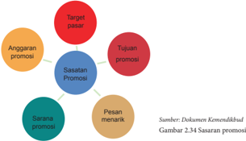

> **Deskripsi Visual:** Gambar ini adalah diagram yang menunjukkan struktur dan elemen-elemen penting dalam suatu program promosi. Diagram ini terdiri dari empat titik utama yang saling terkait:

1. **Target Pasar**: Ini merupakan titik awal yang menunjukkan tujuan utama dari program promosi, yaitu mencapai pasar yang dituju.

2. **Tujuan Promosi**: Ini adalah titik tengah yang menggambarkan tujuan spesifik dari program promosi tersebut, seperti meningkatkan penjualan, memperluas jangkauan, atau meningkatkan brand awareness.

3. **Sasaran Promosi**: Ini adalah titik berikutnya yang menunjukkan siapa atau apa yang akan diperkenalkan dalam program promosi tersebut.

4. **Pesan Menarik**: Ini adalah titik akhir yang menunjukkan pesan promosi yang ingin dikirim kepada target pasar.

Elemen-elemen utama ini saling terkait dan membentuk sebuah rantai yang mengarah ke tujuan promosi. Setiap elemen memiliki peran penting dalam mencapai tujuan promosi tersebut.

Teks, angka, atau label penting yang terlihat dalam gambar meliputi:
- "Target pasar" (menunjukkan tujuan utama)
- "Tujuan promosi" (menunjukkan tujuan spesifik)
- "Sasaran promosi" (menunjukkan siapa atau apa yang akan diperkenalkan)
- "Pesan menarik" (menunjukkan pesan promosi)

Informasi kunci yang dapat diambil pembaca meliputi:
- Struktur dan komponen utama dari program promosi
- Tujuan dan fokus utama program promosi
- Bagaimana setiap elemen program promosi saling terkait untuk mencapai tujuan promosi

Dengan demikian, gambar ini memberikan gambaran yang jelas tentang bagaimana struktur dan elemen-elemen penting dalam program promosi bekerja bersama-sama untuk mencapai tujuan promosi yang ditetapkan.

### Tugas 6 (kelompok)

### Promosi Usaha Sistem Teknik

- Tentukan target pasar dari produk sistem teknik yang sudah dibuat Diskusikan dalam kelompok, materi dan cara promosi/pemasaran produk
- Buat pembagian tugas dalam kelompok untuk pelaksanaan pemasaran dan penjualan produk sistem teknik
- Buatkan leaflet sebagai bagian dari promosi dari produk sistem teknik yang dibuat kelompokmu kelompok
- Lakukan identifikasi teknik promosi pada produk peralatan sistem teknik

 

---
## 📄 Halaman 114

### E.  Laporan Kegiatan Pembuatan Produk Sistem Teknik

Laporan  kegiatan  usaha  merupakan  penyampaian  informasi  tentang  maju mundurnya sebuah usaha sehingga tercipta komunikasi antara pihak yang melaporkan dan  pihak  yang  diberi  laporan.  Seorang  pimpinan  perusahaan  akan  mengetahui semua kejadian dalam perusahaannya dan dapat mengendalikan jalannya perusahaan dengan  melihat  laporan  kegiatan  usaha.  Laporan  harus  memenuhi  syarat-syarat diantaranya : relevan , dapat dimengerti, dapat diuji, netral, tepat waktu, daya banding dan lengkap

Laporan dapat dibedakan menjadi :

- Laporan  Laba  Rugi,  laporan  yang  menunjukkan  kemampuan  perusahaan untuk menghasilkan keuntungan pada suatu periode akutansi atau satu tahun. Laporan laba rugi terdiri dari pendapatan dan beban usaha.
- Laporan  perubahan  modal,  laporan  yang  menunjukan  perubahan  modal pemilik atau laba yang tidak dibagikan pada suatu periode akuntasi karena adanya transaksi usaha pada periode tersebut.
- Neraca,  daftar  yang  memperlihatkan  posisi  sumber  daya  perusahaan  serta informasi tentang asal sumber daya tersebut
- Laporan arus kas ( cash flow ),  laporan  yang  menunjukkan aliran uang yang diterima dan digunakan perusahaan dalam periode akuntasi beserta sumbernya

### Aktivitas 4

Jelaskan pengertian, fungsi, dan tujuan laporan kegiatan usaha Identifikasi laporan laba rugi, laporan perubahan  modal,  neraca, dan laporan arus kas. Catat data yang diperoleh dan diskusikan bersama anggota kelompokmu. Buatlah laporan arus kas dari usaha rekayasa konversi energi

 

---
## 📄 Halaman 115

### Tugas 7 (kelompok)

### Pembuatan Laporan Kegiata Usaha Rekayasa

Buatlah laporan kegiatan usaha rekayasa bidang sistem teknik dengan menggunakan format laporan pelaksanaan kegiatan usaha sebagai berikut : a. Bidang kegiatan usaha

- Jenis kegiatan
- Jenis usaha……. volume
- Jenis usaha……. volume
- Jenis usaha……. volume
- Jenis usaha……. volume
- Jenis usaha……. volume
- Rugi / laba
- Unit …….. rugi / laba
- Unit …….. rugi / laba
- Unit …….. rugi / laba
- Unit …….. rugi / laba
- Unit …….. rugi / laba
- Bidang keuangan
- Neraca terlampir
- Analisis
- Likuiditas
= ………..%

- Solvabilitas
- Rentabilitas
= ………..%

- Bidang permodalan
- Modal sendiri ………….
- Modal asing ………… .
- Pinjaman jangka pendek ………….
- Pinjaman jangka panjang ………….
- Pinjaman lain-lain ………….
d. Bidang administrasi dan pembukuan

- Buku-buku
- Buku pembelian tunai ……………
= …………..

- Buku pembelian kredit ……………
= ………….

- Buku persediaan barang ……………
= …………..

- Buku penjualan tunai ……………
= …………..

- Buku voucher ……………
= …………..

- Dokumen-dokumen dagang
- Surat-surat perjanjian dagang ……….
= ………......

- SITU,SIUP,AMDAL dan lain-lain…..
= ………......

- Faktur da kuitansi …………………….
=………......

 

---
## 📄 Halaman 116

### F.  Evaluasi

### Kegiatan pembuatan produk

### 1. Informasi Proyek Pembuatan Model/Produk

Indonesia  berpotensi  untuk  dikembangkan  industri-industi  kreatif  di  mana pelaku industri adalah para generasi muda yang aktif, kreatif, dan inovatif. Potensi alam yang ada di sekitar masih banyak yang belum dikreasi menjadi produk yang memiliki nilai tambah. Lakukan obeservasi macam-macam industri kreatif yang ada. Lakukan pula pengamatan potensi di sekitar yang belum tergarap. Melalui proyek ini, diharapkan dapat diperoleh karya-karya sistem teknik berupa model dan memiliki nilai dan bermanfaat.

### 2. Tugas Pengembangan Proyek

- Orientasi terkait dengan karya rekayasa yang menjadi target tugas kelompok
- Penelitian awal melalui observasi
- Gagasan atau ide
- Mendesain proyek
- Pembuatan Model karya produk peralatan sistem teknik
- Aplikasi secara umum

### 3. Nama Produk

- Nama produk disesuaikan dengan potensi sumber daya alam yang ada disekitar untuk dijadikan pilihan dalam pembuatan modelnya.
- Tugas akan disimpulkan melalui presentasi dan mendemontrasikan model.
- Peserta didik menjelaskan bagaimana mengidentifikasi permasalahan sehingga muncul gagasan dalam merencanakan proyek, bagaimana sistem bekerja, dan dimana kelebihan dari model yang dibuat.
- Peserta didik menjelaskan bagaimana model dapat diaplikasikan secara  umum.

 

---
## 📄 Halaman 117

### 4. Pekerjaan dan Pendidikan Terkait

- Peserta  didik  melakukan  pengamatan  di  mana  dapat  mengembangkan pendidikan terkait dengan model yang akan direncanakan.
- Lapangan pekerjaan seperti apa yang memungkinkan untuk mengaplikasikan gagasan  yang  ada  dengan  memperhatikan  pemanfaatan  energi  terbarukan sesuai dengan potensi sumber energi terbarukan di sekitar.

### 5. Organisasi

- Peserta didik melakukan observasi melalui internet terkait dengan peralatan sistem teknik sesuai dengan potensi sumber daya di sekitar. Langkah alternatif melakukan kunjungan ke tempat proses produksi peralatan sistem teknik.
- Kebutuhan  bahan.  Peserta  didik  mengkomunikasikan  dan  mendiskusikan pada guru pembimbing tentang desain dan kebutuhan bahan dan alat yang digunakan  untuk  membuat  model  oleh  kelompok  masing-masing  guna mendapatkan pengarahan.

### 6. Langkah Kerja

- Kerja  tim.  Setiap  Peserta  didik  harus  mengetahui  kekuatan  dan  kelemahan dalam bekerja sama
- Fokus  pada  produk  yang  berupa  model  karya  rekayasa  pembuatan  produk peralatan sistem teknik. Setiap kelompok fokus dan memiliki motivasi yang tinggi untuk mendapatkan produk yang bagus dan berkualitas.
- Perencanaan dan pengorganisasian, Peserta didik dapat merencanakan dalam waktu yang singkat.

### 7. Lampiran Portofolio

- Perencanaan
- Hasil Kerja Perorangan
- Evaluasi Kelompok
- Evaluasi dari kelompok lain

 

---
## 📄 Halaman 118

### Evaluasi Diri Semester 1

### Petunjuk :

### 1. Evaluasi Diri (individu)

Bagian A. Berilah tanda cek (√) pada kolom kanan sesuai penilaian dirimu. Bagian  B.  Tuliskan  pendapatmu  tentang  pengalaman  mengikuti  pembelajaran Rekayasa di Semester 1

### Bagian A

---
**📊 Tabel**

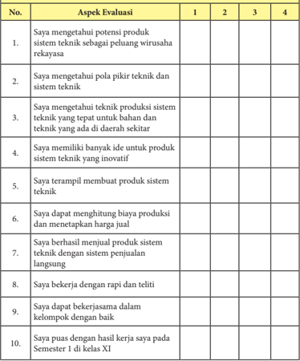

Tabel ini berisi evaluasi aspek-aspek keterampilan dan pengetahuan tentang sistem teknik, dimana setiap aspek diukur dengan skor 1 hingga 4. Topik utama tabel adalah keterampilan dan pengetahuan tentang sistem teknik, seperti pemahaman potensi produk, pemahaman teknik, kemampuan produksi, ide inovatif, kemampuan membuat produk, kemampuan menghitung biaya, kemampuan menjual produk, kerja rapi dan teliti, kerjasama dalam kelompok, dan pencapaian hasil kelas. Kolom-kolomnya mencakup skor evaluasi untuk setiap aspek. Data penting yang terlihat adalah bahwa banyak aspek memiliki skor 3 atau 4, menunjukkan bahwa siswa memiliki pengetahuan dan keterampilan yang cukup baik dalam bidang ini.

 

---
## 📄 Halaman 119

### Jumlah:

### Bagian B

Kesan dan pesan setelah mengikuti pembelajaran Rekayasa Semester 1 :

### Keterangan :

(1) Sangat Tidak Setuju ; (2) Tidak Setuju ; (3) Setuju; (4) Sangat Setuju

### 2.  Evaluasi Diri (kelompok)

Bagian A. Berilah tanda cek (v) pada kolom kanan sesuai penilaian dirimu. Bagian B. Tuliskan pengalaman paling berkesan saat bekerja dalam kelompok

### Bagian A

---
**📊 Tabel**

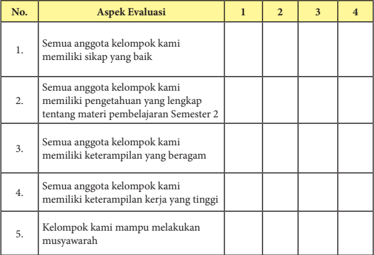

Tabel ini menunjukkan evaluasi aspek-aspek keterampilan dan pengetahuan anggota kelompok dalam sebuah proyek atau tugas belajar. Topik utama tabel adalah keterampilan dan pengetahuan anggota kelompok. Kolom-kolomnya mencakup empat skor evaluasi: 1, 2, 3, dan 4. Data penting yang terlihat adalah bahwa semua anggota kelompok memiliki sikap yang baik, memiliki pengetahuan lengkap tentang materi pembelajaran Semester 2, memiliki keterampilan yang beragam, dan mampu melakukan muasawarah. Skor 1 menunjukkan bahwa semua anggota kelompok memenuhi standar tertentu, sedangkan skor 4 menunjukkan bahwa semua anggota kelompok tidak memenuhi standar tersebut.

Ke

 

---
## 📄 Halaman 120

---
**📊 Tabel**

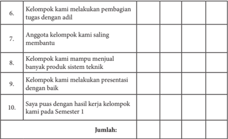

Tabel ini berisi informasi tentang prestasi kelompok belajar dalam beberapa aspek, seperti pembagian tugas, saling membantu anggota, penjualan produk teknik, presentasi, dan kesimpulan akhir. Topik utama adalah prestasi kelompok belajar. Kolom-kolomnya mencakup berbagai aspek kegiatan belajar, mulai dari pembagian tugas hingga kesimpulan akhir. Data penting yang terlihat adalah bahwa semua aspek tersebut diperoleh dengan baik oleh kelompok belajar, menunjukkan bahwa mereka berhasil melaksanakan semua tugas yang diberikan.

### Bagian B

Pengalaman paling berkesan saat bekerja dalam kelompok:

### Keterangan :

(1) Sangat Tidak Setuju ; (2) Tidak Setuju ; (3) Setuju; (4) Sangat Setuju

 

---
## 📄 Halaman 121

### BUDIDAYA

Prakarya dan Kewirausahaan

115

 

---
## 📄 Halaman 122

---
**🖼️ Gambar/Diagram**

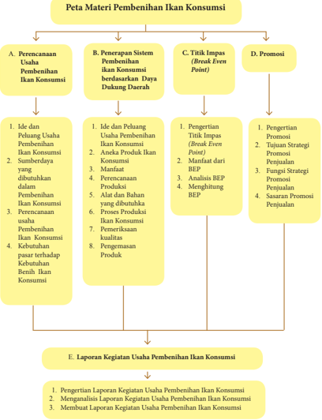

> **Deskripsi Visual:** Gambar ini adalah diagram yang menunjukkan struktur materi pembelajaran tentang usaha penjualan ikan konsumsi. Diagram ini dibagi menjadi empat bagian utama:

1. **Perencanaan Usaha Penjualan Ikan Konsumsi**:
   - Ini mencakup ide dan pemahaman usaha penjualan ikan konsumsi, sumber daya yang dibutuhkan, perencanaan usaha, kebutuhan pasar, dan proses produksi.

2. **Penerapan Sistem Pembelian Ikan Konsumsi Berdasarkan Daya Dukungan Ekstrim**:
   - Ini melibatkan pengertian titik impas (break even point), manfaat dari titik impas, analisis titik impas, dan memahami titik impas.

3. **Promosi**:
   - Ini mencakup pengertian promosi, tujuan strategi penjualan, fungsi strategi penjualan, dan sasaran promosi penjualan.

4. **Laporan Kegiatan Usaha Penjualan Ikan Konsumsi**:
   - Ini mencakup pengertian laporan kegiatan usaha penjualan ikan konsumsi, analisis laporan kegiatan usaha penjualan ikan konsumsi, dan membuat laporan kegiatan usaha penjualan ikan konsumsi.

Elemen-elemen utama ini saling terkait dan membentuk sebuah proses yang komprehensif untuk memahami dan mengelola usaha penjualan ikan konsumsi. Teks, angka, atau label penting seperti "Ide dan Pemahaman Usaha Penjualan Ikan Konsumsi", "Titik Impas", dan "Laporan Kegiatan Usaha Penjualan Ikan Konsumsi" memberikan informasi kunci yang dapat diambil pembaca.

 

---
## 📄 Halaman 123

### Tujuan

### Setelah mempelajari bab ini, peserta didik mampu:

- Membuat perencanaan usaha pembenihan ikan konsumsi di wilayah setempat dan lainnya untuk membangun semangat berwirausaha.
- Mengapresiasi keanekaragaman ikan konsumsi di wilayah setempat dan lainnya, sebagai ungkapan rasa bangga dan wujud rasa syukur sebagai anugerah Tuhan Yang Maha Esa.
- Mengidentifikasi potensi usaha pembenihan ikan konsumsi di wilayah setempat dan lainnya berdasarkan rasa ingin tahu dan peduli lingkungan.
- Merancang produksi benih ikan konsumsi dan pengemasannya dengan menerapkan prinsip perencanaan produksi serta menunjukkan perilaku santun, jujur, percaya diri, bertanggung jawab, dsiplin, dan mandiri.
- Membuat  produksi  benih  ikan  konsumsi  dan  pengemasannya  berdasarkan konsep berkarya dengan pendekatan budaya setempat dan lainnya berdasarkan orisinalitas ide dan cita rasa estetis diri sendiri.
- Menghitung titik impas ( break event point )  usaha pembenihan ikan konsumsi yang  ada  di  wilayah  setempat  dan  lainnya  untuk  membangun  semangat berwirausaha.
- Melakukan promosi  usaha  pembenihan  ikan  konsumsi  di  wilayah  setempat  dengan sikap  bekerjasama,  gotong  royong,  bertoleransi,  disiplin,  bertanggungjawab, kreatif dan inovatif
- Membuat  laporan  kegiatan  usaha  pembenihan  ikan  konsumsi  berdasarkan analisis kegiatan usaha budidaya di wilayah setempat dan lainnya.

 

---
## 📄 Halaman 124

### BAB 3

### Budidaya Pembenihan Ikan Konsumsi

### A. Perencanaan Usaha Pembenihan Ikan Konsumsi

### 1.   Ide dan Peluang Usaha Pembenihan Ikan Konsumsi

Kegiatan budidaya ikan saat ini merupakan salah satu usaha ekonomi produktif bagi  masyarakat.  Segmen  usaha  budidaya  ikan  berdasarkan  proses  produksinya, dibagi  menjadi  3  (tiga)  kelompok  yaitu  usaha  pembenihan,  pendederan,  dan pembesaran ikan. Usaha pembenihan merupakan suatu tahapan kegiatan perikanan yang output nya adalah benih ikan. Usaha pembesaran merupakan kegiatan perikanan yang output nya  adalah  ikan  berukuran  konsumsi.  Usaha  pendederan  merupakan kegiatan perikanan yang output nya adalah benih ikan tetapi ukurannya lebih besar dari output pembenihan. Komoditas usaha yang dipilih dalam kegiatan budidaya ikan sangat bergantung pada permintaan pasar, teknis operasional, serta implementasinya.

Permintaan  ikan  konsumsi  khususnya  ikan  lele  yang  semakin  meningkat menjadikan  peluang  usaha  sangat  terbuka  bagi  para  pelaku  usaha  pembesaran. Dengan tingkat konsumsi yang tinggi yang terlihat melalui warung-warung makanan dengan menu ikan lele, berdampak secara langsung terhadap kebutuhan benih ikan lele  oleh  para  pengusaha.  Kondisi  ini  membuat  para  petani  pembenihan  ikan  lele untuk semakin memanfaatkan usaha pemasaran produknya, karena banyak konsumen yang datang langsung ke lokasi pembenihan.

Untuk satu siklus usaha pembenihan dengan jangka waktu antara 40-45 hari dapat menghasilkan benih ikan lele 30.000-50.000 ekor dengan berbagai macam ukuran.

 

---
## 📄 Halaman 125

Berdasarkan ukurannya, dalam satu siklus tersebut sebagian besar ditawarkan/dijual dengan ukuran 5-6 cm.

### 2.   Sumberdaya yang dibutuhkan dalam Pembenihan Ikan Konsumsi

Sumber daya yang dibutuhkan untuk mengembangkan usaha pembenihan ikan konsumsi adalah :

### a. Man (manusia)

Sumber daya manusia adalah faktor daya yang berasal dari manusia. Dalam sebuah  kegiatan  usaha,  manusia  adalah  faktor  paling  penting.  Karena  sebagai pelaku utama yang melaksanakan proses untuk mencapai tujuan yang diinginkan.

### b. Money ( uang)

Uang  adalah  faktor  yang  dibutuhkan  untuk  membiayai  semua  kebutuhan yang  diperlukan  selama  proses  produksi,  seperti  untuk  pembelian  bahan  baku yang akan diolah, perawatan mesin produksi ataupun gaji para karyawan.

### c. Material (bahan)

Material adalah bahan-bahan yang dibutuhkan dalam proses produksi sebuah usaha, terdiri dari bahan mentah, bahan setengah jadi, dan bahan jadi.

### d. Machine (peralatan)

Machine berasal  dari  bahasa  Inggris  yang  artinya  mesin.  Mesin  adalah salah satu sarana yang sangat diperlukan dalam sebuah proses produksi. Seiring dengan  perkembangan  zaman  dan  teknologi  yang  semakin  canggih,  alat-alat yang mendukung proses produksipun juga menjadi lebih canggih, sehingga dapat menghemat biaya dan tenaga.

### e. Method (cara kerja)

Metode adalah penetapan kerja atau tips-tips untuk tercapainya tujuan dalam sebuah proses produksi. Dalam sebuah proses produksi diperlukan metode yang membimbing seseorang  untuk  menghasilkan  produk  yang  baik.  Tanpa  sebuah metode, tidak akan ada petunjuk untuk melaksanakan proses produksi akibatnya produk yang dihasilkan tidak memuaskan.

### f. Market (pasar)

Pemasaran merupakan hal yang sangat penting dalam menunjang kelancaran usaha.  Jika  proses  produksi  dihentikan  maka  pengusaha  akan  kehilangan pekerjaan. Oleh karena itu, pengusaha harus mengetahui produk seperti apa yang benar-benar dibutuhkan oleh konsumen sehingga dapat dipasarkan dengan baik.

### g. Information (Informasi)

Informasi juga dibutuhkan agar usaha menjadi lebih lancar dan berkelanjutan. Proses produksi tidak akan berkembang dengan baik jika tidak memiliki informasi pasar produk usaha dari seorang professional maupun dari berbagai media, seperti internet, buku, majalah maupun koran.

 

---
## 📄 Halaman 126

### Tugas Kelompok

- Tentukan  salah  satu  jenis  jenis  ikan  yang  dibudidayakan  di  daerah sekitar lingkunganmu!
- Sebutkan sumber daya apa saja yang dibutuhkan untuk mebuat usaha tersebut tersebut!
- Presentasikan dalam pembelajaran!

### 3.   Perencanaan usaha Pembenihan Ikan Konsumsi

Perencanaan usaha pada umumnya memuat pokok pokok pikiran sebagai berikut: a. Nama perusahaan

Pemilihan nama perusahaan harus dipikir baik-baik karena berdampak jangka panjang. Pemberian nama harus berorientasi ke depan, tidak hanya pada faktor-faktor yang kekinian.

### b. Lokasi

Lokasi  terbagi  atas  lokasi  perusahaan,  lokasi  pertokoan,dan  lokasi pabrik/industri. Ada 2 hal yang harus diperhatikan dalam pemilihan lokasi yaitu :

- Backward linkage atau disebut pertalian ke belakang, yaitu bagaimana sumber  daya  ( resources )  yang  akan  digunakan.  Termasuk  dalam  hal ini  adalah  bahan  baku,tenaga  kerja,  suasana,  dan  kondisi  masyarakat setempat.
- Forward linkage atau disebut pertalian ke depan, yaitu daerah pemasaran hasil produksi. Apakah tersedia konsumen yang cukup untuk menyerap hasil produksi.

### c. Komoditi yang diusahakan

Pemilihan komoditi yang akan diusahakan dapat mempertimbangkan hal-hal sebagai berikut :

- Membanjirnya permintaan masyarakat terhadap jenis-jenis hasil usaha tertentu, baik berupa barang-barang ataupun jasa.
- Teridentifikasinya  kebutuhan  tersembunyi  masyarakat  akan  barangbarang atau jasa tertentu.

 

---
## 📄 Halaman 127

- Kurangnya saingan dalam bidang usaha yang kita kerjakan.
- Adanya  kemampuan  yang  meyakinkan  untuk  bersaing  usaha  dengan orang lain dalam mengembangkan suatu bidang usaha yang sama.

### d. Konsumen yang dituju

Prospek konsumen ini didasarkan atas bentuk usaha dan jenis usahanya. Jika jenis usaha yang dijalankan berbentuk industri tentu jangkauan konsumen yang dituju lebih jauh dibandingkan dengan usaha bentuk pertokoan.

- Pasar tujuan
Sebuah  perusahaan  yang  mulai  memasuki  pasar  akan  menempatkan perusahaannya  sebagai  pemimpin  pasar  ( market  leader ),  penantang  pasar ( market  challenger ),  pengikut  pasar  ( market  follower ),  atau  perelung  pasar ( market  nicher ).  Penguasaan  pasar  dalam  arti  menyebarluaskan  produk merupakan  faktor  menentukan  dalam  pengembangan  usaha.  Agar  pasar dapat dikuasai maka kualitas dan harga barang harus sesuai dengan selera konsumen dan daya beli (kemampuan) konsumen.

- Partner yang diajak kerjasama
Partnership adalah suatu asosiasi atau persekutuan dua orang atau lebih untuk menjalankan suatu usaha mencari keuntungan. Walaupun persekutuan ini banyak dilakukan dalam bidang usaha yang mencari laba, tetapi ada juga persekutuan  yang  dibentuk  tidak  untuk  mencari  laba.  Bentuk  partnership dapat  mengatasi  beberapa  kelemahan  yang  terdapat  pada  bentuk  usaha perseorangan.

- Personil yang dipercaya untuk menjalankan perusahaan
Pilihlah seseorang untuk menjalankan perusahaan karena kejujurannya.

- Jumlah modal yang diharapkan dan yang tersedia
Pada umumnya pengusaha pemula pada saat akan mendirikan usaha, jumlah modal yang tersedia sangat minim. Modal utama adalah semangat dan kejujuran. Jika modal yang dimiliki pengusaha sangat terbatas, maka dapat dilakukan  kerja  sama  dengan  partner,  yang  masing-masing  menyetorkan modalnya. Semua sumber dan kemampuan pengumpulan modal ini harus ditulis.

- Peralatan perusahaan yang perlu disediakan
Peralatan  yang  perlu  disediakan  adalah  sesuai  dengan  kepentingan usaha. Peralatan usaha pertokoan, akan berbeda dengan usaha kerajinan dan industri. Untuk pertama kali membuka usaha, pikirkan peralatan yang sangat diperlukan. Peralatan yang tidak begitu diperlukan peggunaannya sebaiknya tidak dibeli terlebih dahulu, sebab akan mengganggu uang kas. Ada dua hal yang  dipertimbangkan  dalam  menyediakan  peralatan  yaitu  ekonomis  dan prestise .

 

---
## 📄 Halaman 128

### j. Penyebaran promosi

Sebagai suatu usaha baru, tentu belum dikenal oleh masyarakat. Oleh sebab  itu,  harus  direncanakan  apakah  usaha  ini  perlu  diperkenalkan/ dipromosikan  atau  tidak.  Jika  akan  dipromosikan  harus  direncanakan bentuk promosi, tempat/media mempromosikan, keunggulan apa yang akan ditunjukkan.

### 4.    Kebutuhan pasar terhadap Benih Ikan Konsumsi

Sumberdaya perikanan Indonesia dibagi menjadi dua kategori yaitu perikanan tangkap  dan  perikanan  budidaya.  Potensi  perikanan  di  Indonesia  masih  belum dimanfaatkan secara optimal, namun produksi budi daya terus mengalami peningkatan dari tahun ke tahun. Kenaikan jumlah produksi ikan berpengaruh langsung terhadap kenaikan konsumsi ikan penduduk Indonesia per kapita per tahun.

Tingkat konsumsi ikan penduduk Indonesia pada tahun 2001 sebesar 9,96 kg/ kapita/tahun meningkat menjadi 17,01 kg/kapita/tahun pada tahun 2005. Berdasarkan data dari Kementerian Kelautan dan Perikanan (2013), tingkat konsumsi ikan pada tahun  2010  -  2012  rata-rata  mengalami  kenaikan  hingga  5,44  persen.  Pada  tahun 2010, tingkat konsumsi ikan mencapai 30,48 kg/kapita per tahun, pada tahun 2011 sebanyak 32,25 kg/kapita per tahun, sedangkan pada tahun 2012, tingkat konsumsi ikan  mencapai  33,89  kg/kapita  per  tahun.  Kecenderungan  tersebut  mendorong berkembangnya usaha-usaha perikanan budi daya, mulai dari pembenihan, pemeliharaan,  pengemasan,  dan  pemasaran.  Hal  tersebut  menunjukkan  bahwa kebutuhan benih ikan terus meningkat, sehingga dipastikan usaha pembenihan akan terus  berkembang  dengan  pesat.  Alasan  lain  menyartakan  bahwa  sebagian  besar pembudi daya ikan menganggap budi daya pembenihan ikan lebih menguntungkan dibandingkan pembesaran. Salah satu usaha pembenihan ikan yang berkembang di Indonesia adalah ikan lele.

Lele adalah salah satu jenis ikan yang bergizi tinggi, sehingga mampu mendukung asupan masyarakat untuk konsumsi ikan yang kaya akan omega 3. Lele merupakan jenis  ikan  yang  digemari  masyarakat,  walaupun  sebelum  tahun  1990-an  ikan  lele belum begitu popular sebagai makanan lezat, namun oleh warung-warung pecel lele menjadi makanan popular yang merakyat dan menyebar ke mana-mana. Berdasarkan data  Bank  Indonesia  (2010),  dengan  produksi  benih  per  hari  lebih  dari  175.000 benih lele membuktikan bahwa Kabupaten Boyolali menjadi salah satu sentra usaha pembenihan ikan lele di Indonesia. Namun jika dikaitkan dengan kebutuhan benih lele di wilayah ini yang  mencapai lebih dari 300.000 benih per hari membuat peluang usaha pembenihan  semakin terbuka.

 

---
## 📄 Halaman 129

### Tugas Kelompok

- Amati dan cermati cerita di atas!
- Carilah dan kunjungi dinas perikanan atau balai benih ikan yang ada di lingkungan anda!
- Wawancarailah petugas dinas perikanan atau balai benih ikan yang ada di lingkungan anda!
- Mintalah  data  mengenai  pembudi  daya  ikan,  jenis  ikan  yang  biasa dibudidayakan, dan berapa jumlah benih yang dihasilkan di lingkungan anda!
- Bagaimana peluang usaha pembenihan ikan berdasarkan pengamatan pasar yang anda lakukan?
- Menurut anda, seberapa besar potensi perikanan yang ada di lingkungan anda berdasarkan pengamatan pasar yang anda lakukan?

 

---
## 📄 Halaman 130

### B.  Penerapan Sistem Pembenihan Ikan Konsumsi berdasarkan Daya Dukung Wilayah

### 1.    Aneka Produk Ikan Konsumsi

 

---
## 📄 Halaman 131

### Tugas Individu

- Amati dan cermati gambar 1!
- Sebutkan nama-nama ikan pada gambar tersebut beserta nama latinnya!
- Jenis ikan apa yang sering anda konsumsi?
- Apa kesan yang anda dapatkan setelah mengamati gambar tersebut?
Seiring  dengan  bertambahnya  jumlah  penduduk  Indonesia,  kebutuhan  akan protein  dari  ikan  juga  semakin  meningkat.  Untuk  memenuhi  kebutuhan  tersebut, pemerintah terus berupaya untuk meningkatkan produksi ikan melalui usaha budi daya.  Perikanan  budi  daya  merupakan  salah  satu  subsektor  yang  sangat  potensial untuk dikembangkan  karena dapat menerapkan  rekayasa teknologi sehingga dapat  menciptakan  produk  perikanan  yang  berkualitas  dan  berkesinambungan. Berdasarkan fungsinya, sumber daya perikanan Indonesia terdiri dari ikan konsumsi dan nonkonsumsi.

Ikan  konsumsi  adalah  jenis-jenis  ikan  yang  lazim  dikonsumsi  oleh  manusia sebagai sumber pangan. Ikan konsumsi dapat diperoleh salah satunya dari proses budi daya. Contoh ikan konsumsi yang sering dibudidayakan antara lain: lele, gurami, nila, mas, bawal, patin, dan jenis lainnya. Ikan-ikan tersebut dapat dibedakan berdasarkan morfologinya.  Pengenalan  struktur  ikan  tidak  terlepas  dari  morfologi  ikan,  yaitu bentuk tubuh ikan sebagai ciri-ciri yang mudah dilihat dan diingat. Morfologi ikan sangat berhubungan dengan habitat ikan tersebut.

### Tugas Kelompok

- Amati lingkungan sekitarmu!
- Catatlah jenis ikan  konsumsi  yang  dibudidayakan  di  lingkungan sekitarmu!
- Tuliskan ciri-ciri morfologi dari masing-masing jenis ikan tersebut!
- Diskusikan bersama kelompok, kemudian presentasikan dan simpulkan!
- Ungkapkan  pemahaman  yang  timbul  dengan  adanya  jenis-jenis  ikan yang dapat dikonsumsi di Negara Indonesia!

 

---
## 📄 Halaman 132

### Lembar Kerja 1

Nama kelompok Nama anggota

Kelas

:………………………………………........................................

:……………………………..…………......................................

……………………………………….........................................

…………………………………………....................................

…………………………………………....................................

…………………………………………....................................

: .........................................................

Identifikasi jenis-jenis ikan konsumsi

---
**📊 Tabel**

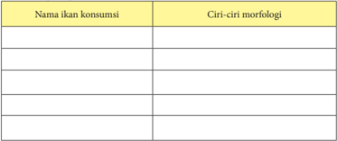

Tabel ini berisi informasi tentang nama ikan konsumsi dan ciri-ciri morfologi mereka. Topik utamanya adalah ikan konsumsi dan ciri-ciri morfologinya. Kolom pertama berisi nama-nama ikan konsumsi, sedangkan kolom kedua berisi ciri-ciri morfologinya. Data penting yang terlihat adalah bahwa tabel ini mencakup berbagai jenis ikan konsumsi dengan deskripsi morfologis yang spesifik. Misalnya, ikan hiu memiliki ekor bulat dan sirip punggung yang tajam, sementara ikan salmon memiliki sirip punggung yang panjang dan lebar. Tabel ini membantu dalam memahami struktur fisik ikan konsumsi dan memudahkan dalam memilih ikan yang sesuai untuk dikonsumsi.

KESIMPULAN

……………………………………………………………………………

……………………………………………………………………………

……………………………………………….……………………………

……………………………………………………………………………

……………………………………………………………………………

……………………………………………

UNGKAPAN PEMAHAMAN

……………………………………………………………………………

…………………………………………………………………..............

……………………………………………………………………………

……………………………………………………………………………

……………………………………………………………………………

…………………………………………………

 

---
## 📄 Halaman 133

### a. Ikan lele lokal ( Clarias batrachus )

Lele lokal merupakan jenis ikan konsumsi air tawar dengan ciri-ciri tubuh memanjang dan kulit licin, serta identik dengan warna punggung hitam dan warna perut (abdomen) putih keabu-abuan (Gambar 2). Lele lokal merupakan ikan asli Indonesia yang mempunyai beberapa nama daerah, antara lain: ikan kalang  (Padang),  maut  (Gayo,  Aceh),  pintet  (Kalimantan  Selatan),  keling (Makasar), cepi (Bugis), lele atau lindi (Jawa Tengah). Lele bersifat noctural , yaitu  aktif  bergerak  mencari  makanan  pada  malam  hari.  Berdasarkan kebiasaan makan, lele merupakan hewan karnivora yaitu golongan ikan yang sumber makanan utamanya berasal dari bahan hewani.

Usaha pembenihan lele mempunyai prospek yang cukup cerah, karena  permintaan  konsumen  semakin  meningkat.  Pengembangan  usaha pembenihan  ikan  yang  baik  akan  meningkatkan  hasil  budi  daya  secara berkelanjutan. Segmentasi pasar lele sangat luas tergantung pada ukuran dan permintaan  serta  kebutuhan  konsumen.  Pada  tahun  2013,  benih  ikan  lele dengan ukuran 5-7 cm dijual dengan harga Rp 170-Rp 200/ekor, ukuran  7-9 cm berkisar Rp 210 - Rp 250/ekor, dan ukuran 9-11 cm berkisar Rp. 250- Rp. 300/ekor.

Sumber: Dokumen Kemendikbud

Gambar 3.2 Ikan lele

### b. Ikan Nila ( Oreochromis niloticus )

Ikan  Nila  merupakan  jenis  ikan  konsumsi  yang  hidup  di  air  tawar, merupakan ikan hasil introdu ksi dari Afrika Bagian Timur pada tahun 1969. Saat ini, ikan nila menjadi komoditas andalan dan unggulan ikan konsumsi air tawar untuk memenuhi kebutuhan konsumen domestik dan luar negeri. Ikan Nila sangat mudah dibudidayakan dan dipasarkan karena merupakan

 

---
## 📄 Halaman 134

salah satu jenis iklan yang paling disukai oleh masyarakat. Morfologi ikan nila adalah garis vertikal yang berwarna gelap di sirip ekor sebanyak enam buah.  Garis  seperti  itu  juga  terdapat  di  sirip  punggung  dan  sirip  dubur, bersifat omnivora (Gambar 3.).

Harga  benih  nila  dipasaran  biasanya  dijual  berdasarkan  ukuran  bobot dengan harga Rp. 25.000 - Rp. 28.000,-/kg. Jumlah benih nila per kg >500 ekor.  Teknik  budidaya nila relatif  mudah, sehingga sangat layak dilakukan pada semua skala usaha (rumah tangga, mikro, kecil, menengah, dan besar).

### c. Ikan Gurami ( Osphronemus gouramy )

Gurami merupakan jenis ikan konsumsi air tawar, bentuk badan pipih lebar, bagian punggung berwarna merah sawo dan bagian perut berwarna kekuningan/keperak-perakan  (Gambar  4).  Gurami  merupakan  ikan  asli Indonesia  yang  berasal  dari  daerah  Sunda  (Jawa  Barat,  Indonesia)  dan disebarkan ke Malaysi a,  Thailand,  Ceylon,  dan  Australia.  Di  Jawa,  gurami dikenal  dengan  sebutan  gurameh,  di  Sumatra  disebut  kala  atau  kalui,

 

---
## 📄 Halaman 135

sedangkan  di  Kalimantan  disebut  kalui.  Ikan  Gurami  mempunyai  nilai ekonomi yang sangat tinggi dengan cita rasa yang enak sehingga digemari banyak orang dari berbagai kalangan di dalam dan luar negeri

Harga  Gurami  di  pasaran  sangat  bervariasi  tergantung  pada  umur, dimana gurami dengan umur 1-2 bulan dijual dengan harga Rp 400 - Rp 500/ekor. Benih gurami dijual berdasarkan umur dengan harga relatif mahal karena  permintaannya  relatif  lebih  tinggi  dibandingkan  dengan  ikan  air tawar lainnya. Oleh sebab itu, budidaya ikan gurami khususnya pembenihan memiliki potensi ekonomi yang sangat besar.

### d. Ikan Bawal ( Colossoma Macropomum )

Bawal air tawar saat ini banyak diminati sebagai ikan konsumsi, paling banyak dibudidayakan di daerah Jawa. Bawal mempunyai beberapa keistimewaan, diantaranya pertumbuhan cukup cepat, nafsu makan tinggi serta termasuk pemakan  segalanya (omnivora), lebih  banyak  makan dedaunan, daya tahan yang tinggi terhadap kondisi limnologi yang ekstrim, dengan  citarasa  daging  yang  sangat  enak  hampir  menyamai  daging  ikan gurami.

### Pengayaan

Peserta  diminta  menuliskan  jenis-jenis  produk  budi  daya  pembenihan  ikan konsumsi di daerahnya.

 

---
## 📄 Halaman 136

### Tugas Kelompok

- Amati dan cermati penjelasan diatas!
- Sebutkan nama jenis ikan di atas (Gambar 2., 3., 4., dan 5.), beradasarkan daerah asal anda!
- Carilah informasi harga jual benih ikan konsumsi yang dibudidayakan di daerah anda?
- Diskusikan bersama kelompok, kemudian presentasikan, dan simpulkan!
- Ungkapkan pemahaman anda yang timbul setelah mengetahui potensi perikanan di daerah masing-masing!

### Lembar Kerja 2

Nama kelompok

:…………………................................................................

Nama anggota

: ………………………………………………………....

…………………….………………………………….....

……………………………………………………..........

………………………………………………..................

Kelas

: .............................………………………………………

### Nama daerah ikan konsumsi

---
**📊 Tabel**

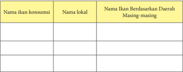

Tabel ini berisi informasi tentang nama-nama ikan konsumsi, nama lokal, dan nama ikan berdasarkan daerah masing-masing. Topik utamanya adalah identifikasi dan pengenalan ikan konsumsi di berbagai daerah. Kolom-kolomnya meliputi nama ikan konsumsi, nama lokal, dan nama ikan berdasarkan daerah. Data penting yang terlihat adalah bahwa nama-nama ikan dapat bervariasi signifikan tergantung pada daerah, menunjukkan bahwa identifikasi dan pengenalan ikan konsumsi harus dilakukan dengan hati-hati untuk memastikan pilihan yang tepat.

 

---
## 📄 Halaman 137

### Nilai jual

---
**📊 Tabel**

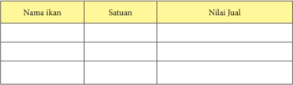

Tabel ini berisi informasi tentang ikan-ikan yang dijual dengan detail. Topik utamanya adalah daftar ikan dan informasi harga mereka. Ada tiga kolom utama: "Nama ikan", "Satuan", dan "Nilai Jual". Dalam kolom "Nama ikan", terdapat beberapa jenis ikan yang dijual, seperti ikan mas, ikan nila, dan ikan salmon. Kolom "Satuan" menunjukkan satuan penjualan untuk setiap ikan, misalnya "Kg" untuk ikan mas dan "Pcs" untuk ikan nila. Kolom "Nilai Jual" menampilkan harga jual untuk setiap ikan, yang berbeda-beda tergantung pada jenis ikan tersebut. Misalnya, harga ikan mas berkisar antara 10.000 hingga 20.000 per kg, sedangkan harga ikan nila berkisar antara 5.000 hingga 10.000 per pcs. Pola penting yang terlihat adalah bahwa harga jual ikan bisa sangat bervariasi tergantung pada jenis ikan dan satuan penjualan.

KESIMPULAN

……………………………………………………………………………

……………………………………………………………………………

……………………………………………….……………………………

……………………………………………………………………………

……………………………………………………………………………

…………………………………………….....

UNGKAPAN PEMAHAMAN

……………………………………………………………………………

…………………………………………………………………..............

……………………………………………………………………………

……………………………………………………………………………

……………………………………………………………………………

…………………………………………………

### 2. Manfaat Ikan Konsumsi

Dari sebuah riset studi pada  tahun 2006 yang dilakukan oleh Harvard School of Public Health , diketahui bahwa tingkat kematian akibat penyakit jantung pada orang dewasa yang makan ikan dua kali sepekan, lebih rendah (36%) daripada mereka yang makan ikan sedikit atau tidak sama sekali. Ikan merupakan sumber makanan penting karena mengandung dua asam lemak omega-3, yaitu Eicosapentaenoic Acid (EPA) dan Docosahexaenoic Acid (DHA). Omega-3 membantu menurunkan tekanan darah yang akan menjaga kesehatan jantung. Tubuh tidak memproduksi omega-3, harus didapatkan melalui asupan makanan.

 

---
## 📄 Halaman 138

Berikut  ini  contoh  aneka  masakan  ikan  sebagai  sumber  asam  lemak  omega-3 (Gambar 6).

Jelaskan manfaat ikan konsumsi yang anda ketahui!

………………………………………………………………………………

………………………………………………………………………………

………………………………………………………………………………

………………………………………………………………………………

………………………………………………………………………………

………………………………………………………………………

Jelaskan manfaat Omega-3 bagi manusia yang anda ketahui!

………………………………………………………………………………

………………………………………………………………………………

………………………………………………………………………………

………………………………………………………………………………

………………………………………………………………………………

………………………………………………

Jelaskan cara pengolahan ikan agar tidak menimbun lemak!

………………………………………………………………………………

……………………………………………………………………………

……………………………………………………………………………

……………………………………………………………...………………

………………………………………………………………………………

………………………………………………

 

---
## 📄 Halaman 139

### 3.   Perencanaan Produksi

Memulai bisnis usahakan dapat memberikan keuntungan bagi yang menjalankannya. Dengan mempelajari dan memahami cara-cara khusus yang harus dilakukan untuk mencapai keberhasilan, memungkinkan kita untuk memulai budi daya ikan dengan cara yang benar.

Usaha budi daya pembenihan ikan dapat memberikan keuntungan cukup besar. Dengan  mempelajari  dan  memahami  cara-cara  untuk  mencapai  keberhasilan, memungkinkan untuk memulai kegiatan budi daya secara baik dan benar. Keberhasilan wirausaha pembenihan ikan konsumsi tergantung pada perencanaan usaha ( business plan ). Berikut ini adalah hal-hal yang perlu diperhatikan saat membuat rencana usaha pembenihan ikan konsumsi:

- Pilih  lokasi  usaha  yang  dekat  dengan  sumber  air,  bahan/peralatan  usaha, tenaga kerja, serta dekat dengan lokasi pemasaran.
- Tentukan jenis ikan yang akan dibudidayakan. Ikan yang dibudidayakan dapat lebih dari satu jenis. Penentuan jenis ikan akan menentukan kesiapan yang diperlukan dalam pelaksanaan usaha budi daya ikan.
- Urus izin dan daftarkan usaha pada instansi terkait.
- Membangun wadah budi daya ikan (tergantung pada jenis ikan yang dipilih).
- Kembangkan satu areal budi daya ikan dengan membangun kolam pembenihan.
- Dapatkan pasar dan kembangkan jaringan pemasaran.
- Harus dapat mengelola keuangan dengan baik dan benar.

### Tugas Kelompok

- Buatlah rencana bisnis budi daya pembenihan ikan!
- Diskusikan dengan kelompokmu dan presentasikan!
- Simpulkan!

 

---
## 📄 Halaman 140

### 4.   Kebutuhan Alat dan Bahan

- Alat penunjang pembenihan
Kegiatan pembenihan ikan lele tidak membutuhkan perlatan yang rumit. Peralatan yang digunakan dalam proses pembenihan ikan lele sebagai berikut:

- Peralatan  pengadaan  air  bersih  seperti  pompa  air  atau  pompa  celup (aerator),
- Pemijahan ikan lele seperti kakaban,
- Pendederan benih ikan lele seperti blower, dan
- Pemanenan atau penyortiran benih ikan lele seperti seser.
- Pengemasan  benih  ikan  lele  seperti  plastik,  sterofoam,  dan  tabung oksigen
a.

Sumber: Dokumen Kemendikbud

b.

Gambar 3.7 Peralatan budidaya ikan (a = tabung oksigen, b = pompa listrik/aerator)

### b. Bahan penunjang pembenihan

Sebelum  melakukan  pembenihan  ikan  lele, perlu  menentukan  atau memilih bahan yang akan digunakan. Bahan yang digunakan tergantung pada proses pembenihan yaitu persiapan sarana dan prasarana (media pemijahan indukan), pemeliharaan induk, pemijahan/pembenihan, penetasan telur, dan  pemeliharaan  larva  dan  benih.  Bahan-bahan  yang  dibutuhkan  dalam pembenihan ikan lele tersaji pada Gambar 8.

 

---
## 📄 Halaman 141

---
**🖼️ Gambar/Diagram**

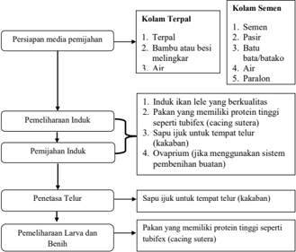

> **Deskripsi Visual:** Gambar ini adalah diagram yang menunjukkan proses penanaman ikan lele dalam kandang terpal dan semen. Diagram ini terdiri dari dua bagian utama: persiapan media penanaman dan pemeliharaan induk.

Pertama, pada bagian kandang terpal, proses dimulai dengan persiapan media penanaman yang meliputi pengisian kandang dengan terpal, batu-batu, air, dan paralon. Setelah itu, induk ikan lele berkualitas diperlakukan dengan pakan yang mengandung protein tinggi seperti tubifex (cacing sutera), sapu jukik untuk tempat telur, dan ovaprium jika menggunakan sistem pembentukan buatan.

Kedua, pada bagian kandang semen, proses dimulai dengan persiapan media penanaman yang meliputi pengisian kandang dengan semen, pasir, batu, air, dan paralon. Setelah itu, induk ikan lele berkualitas diperlakukan dengan pakan yang mengandung protein tinggi seperti tubifex (cacing sutera), sapu jukik untuk tempat telur, dan ovaprium jika menggunakan sistem pembentukan buatan.

Dalam diagram ini, elemen-elemen utama termasuk persiapan media penanaman, pemeliharaan induk, penetasan telur, dan pemeliharaan larva dan benih. Relasi antara elemen-elemen ini adalah bahwa setiap elemen harus dilakukan secara berurutan untuk mencapai hasil yang diinginkan. Teks, angka, atau label penting yang terlihat adalah nama-nama bahan-bahan dan instruksi yang harus dilakukan dalam setiap tahap proses. Informasi kunci yang dapat diambil pembaca adalah bahwa proses penanaman ikan lele dalam kandang terpal dan semen memerlukan persiapan media penanaman yang tepat, pemeliharaan induk yang baik, penetasan telur yang efektif, dan pemeliharaan larva dan benih yang tepat.

Induk  ikan  lele  dan  pakan  merupakan  bahan  yang  paling  perlu  diperhatikan, agar proses produksi dapat berlangsung dengan baik. Dengan demikian diharapkan produk  yang  dihasilkan  sesuai  dengan  keinginan  konsumen,  yang  pada  akhirnya mendatangkan keuntungan yang memungkinkan usaha berkembang dengan baik. Beberapa persyaratan dalam memilih bahan (induk ikan, pakan ikan, dan lain-lain) yaitu:

- Ikan yang dipilih sebaiknya yang mudah dipelihara, atau bila usaha tersebut adalah pembenihan ikan maka sebaiknya ikan yang dipilih adalah jenis yang mudah  dalam  pemijahan,  serta  diharapkan  dalam  pelaksanaannya  cukup menggunakan peralatan yang sederhana, sehingga biaya produksi lebih ringan.
- Bahan baku yang disediakan harus berkualitas, karena untuk memperoleh suatu hasil produksi yang baik dibutuhkan bahan baku yang baik pula, contohnya untuk memperoleh benih yang baik diperlukan induk ikan yang baik pula.
- Bahan baku yang disediakan  hendaknya  yang  mudah  didapatkan  di  sekitar tempat usaha, artinya bila sewaktu-waktu memerlukan bahan baku tersebut maka dapat secara mudah diperoleh atau tidak perlu menunggu lama, sehingga proses produksi tidak terhambat.

 

---
## 📄 Halaman 142

- Bahan baku yang tersedia  hendaknya  yang  relatif  murah,  dengan  demikian diharapkan  usaha  yang  dijalankan  dapat  mendatangkan  keuntungan  yang lebih besar.

### 5.    Proses Produksi Ikan Konsumsi

### a. Proses Pembenihan Ikan Lele

Pembenihan adalah suatu tahap kegiatan dalam budi daya yang sangat menentukan  tahap  kegiatan  selanjutnya  yaitu  pembesaran.  Pembenihan juga  dapat  diartikan  sebagai  suatu  kegiatan  pemeliharaan  yang  bertujuan untuk menghasilkan benih dan selanjutnya menjadi kompon en input untuk kegiatan  pembesaran.  Berikut  merupakan  diagram  alir  proses  produksi pembenihan  ikan  konsumsi  mulai  dari  persiapan  sarana  dan  prasarana sampai pemeliharaan larva dan benih seperti diperlihatkan pada Gambar 10.

---
**🖼️ Gambar/Diagram**

> **Deskripsi Visual:** Gambar ini adalah diagram yang menunjukkan proses penangkapan ikan. Diagram ini terdiri dari beberapa langkah yang disusun secara horizontal dan berurutan. Langkah-langkah tersebut meliputi:

1. Persiapan Sarana dan Prasarana
2. Pemeliharaan Induk
3. Pemijahan Induk
4. Penetasan Telur
5. Pemeliharaan Larva dan Benih

Elemen-elemen utama dalam diagram ini adalah langkah-langkah yang disusun secara horizontal dan berurutan. Setiap langkah memiliki label yang menjelaskan apa yang dilakukan pada setiap tahap. Label-label ini membantu pembaca untuk memahami proses penangkapan ikan secara jelas.

Teks, angka, atau label penting yang terlihat dalam diagram ini adalah label-label yang menjelaskan setiap langkah dalam proses penangkapan ikan. Label-label ini sangat penting karena mereka memberikan informasi tentang apa yang dilakukan pada setiap tahap.

Informasi kunci yang dapat diambil pembaca dari diagram ini adalah bahwa proses penangkapan ikan melibatkan beberapa langkah yang harus dilalui, mulai dari persiapan sarana dan prasarana hingga pemeliharaan benih. Diagram ini memberikan gambaran yang jelas tentang proses penangkapan ikan dan bagaimana setiap langkah harus dilakukan.

Dalam kegiatan pembenihan ikan konsumsi khususnya ikan lele, perlu diperhatikan beberapa hal agar memenuhi standar produksi yaitu :

- a)
- Persiapan sarana dan prasarana (media pemijahan indukan)
Dalam pemijahan indukan ikan, langkah utama yang harus dilakukan adalah persiapan kolam. Kolam yang digunakan dapat terbuat dari terpal, fiberglass,  kolam semi permanen, dan permanen (tembok bersemen) (Gambar 11). Pastikan kolam yang akan digunakan bersih agar anakan ikan yang baru menetas tidak terkontaminasi penyakit.

 

---
## 📄 Halaman 143

Sumber: Dokumen Kemendikbud

Gambar 3.10

Media pemeliharaan ikan

### b)      Pemeliharaan induk

Pemeliharaan induk bertujuan untuk menumbuhkan dan mematangkan gonad (sel telur dan sperm a). Penumbuhan dan pematangan  dapat  dipacu  dengan  pendekatan  pengendalian  kondisi lingkungan, pakan berkualitas, dan hormonal. Pada pendekatan lingkungan,  media  hidup  dibuat  seoptimal  mungkin  sehingga  nafsu makan ikan meningkat di dalam wadah pemeliharaan. Ciri-ciri induk ikan  lele  siap  memijah  adalah  calon  induk  jantan  dan  betina  terlihat mulai berpasang-pasangan dan kejar-kejaran.

### 1). Ciri-ciri induk lele jantan

- (a) Kepalanya lebih kecil dari induk ikan lele betina.
- (b) Warna  kulit  dada  agak  tua  bila  dibanding  induk  ikan  lele betina.
- (c) Urogenital papilla (kelamin) agak  menonjol,  memanjang ke  arah  belakang,  terletak  di  belakang  anus,  dan  warna kemerahan.

 

---
## 📄 Halaman 144

- (d) Gerakannya  lincah,  tulang  kepala  pendek  dan  agak  gepeng ( depress ).
- (e) Perutnya lebih langsing dan kenyal bila dibanding induk lele betina.
- (f) Kulit lebih halus dibanding induk lele betina.

### 2). Ciri-ciri induk lele betina

- (a). Kepalany a lebih besar dibanding induk lele jantan.
- (b).  Warna kulit dada agak terang.
- (c). Urogenital  papilla (kelamin)  berbentuk  oval  (bulat  daun), berwarna  kemerahan,  lubangnya  agak  lebar,  dan  terletak  di belakang anus.
- (d).  Gerakannya lambat, tulang kepala pendek, dan agak cembung.
- (f). Perutnya lebih besar dan lunak.

---
**🖼️ Gambar/Diagram**

> **Deskripsi Visual:** Gambar ini adalah ilustrasi yang menunjukkan bagian tubuh ekor ikan, dengan fokus pada betina dan jagatan. Gambar ini memperlihatkan dua ekor ikan, satu yang lebih besar (betina) dan satu yang lebih kecil (jagatan). Ekor ikan tersebut memiliki struktur yang jelas, termasuk diameter persegi, lebar, dan posisi jagatan.

Elemen utama dalam gambar ini adalah ekor ikan, yang terdiri dari betina dan jagatan. Betina memiliki ekor yang lebih panjang dan lebih besar dibandingkan jagatan. Jagatan terletak di ujung ekor betina, sedangkan betina berada di bagian tengah ekor.

Teks, angka, atau label penting yang terlihat dalam gambar ini meliputi ukuran diameter persegi, lebar ekor, dan posisi jagatan. Informasi kunci yang dapat diambil pembaca meliputi perbandingan ukuran antara betina dan jagatan, serta posisi jagatan di ekor betina.

Dari gambar ini, dapat disimpulkan bahwa ekor ikan memiliki struktur yang kompleks dan penting untuk fungsi reproduksi dan pertahanan. Ukuran ekor betina yang lebih besar menunjukkan bahwa mereka memiliki peran penting dalam reproduksi, sementara jagatan yang lebih kecil menunjukkan bahwa mereka berfungsi sebagai sarana pertahanan.

### 3). Syarat induk lele yang baik:

- (a) Kulitnya lebih kasar dibanding induk lele jantan.
- (b)   Induk lele diambil dari lele yang dipelihara dalam kolam sejak kecil supaya terbiasa hidup di kolam.
- (c) Berat  badannya  berkisar  antara  100-200  gram,  tergantung kesuburan badan dengan ukuran panjang 20-5 cm.
- (d)   Bentuk badan simetris, tidak bengkok, tidak cacat, tidak luka, dan lincah.
- (e) Umur  induk  jantan  di  atas  tujuh  bulan,  sedangkan  induk betina berumur satu tahun.

 

---
## 📄 Halaman 145

- (f) Frekuensi  pemijahan  bisa  satu  bula  sekali,  dan  sepanjang hidupnya bisa memijah lebih dari 15 kali dengan syarat apabila makanannya mengandung cukup protein.

### c)    Pemijahan/pembenihan

Pemijahan/pembenihan adalah proses pembuahan telur oleh sperma. Telur dihasilkan oleh induk betina dan sperma dihasilkan oleh induk jantan. Induk betina yang telah matang gonad berarti siap melakukan pemijahan.  Proses  pemijahan/pembenihan  dapat  berlangsung  secara alami dan buatan. Pemijahan/pembenihan ikan dapat dilakukan dengan dua cara yaitu pembenihan alami dan buatan.

---
**🖼️ Gambar/Diagram**

> **Deskripsi Visual:** Gambar ini adalah diagram yang menunjukkan proses induksi matang gonad pada organ reproduksi. Diagram ini terdiri dari empat elemen utama:

1. Induk Matang Gonad: Ini adalah titik awal di mana proses induksi dimulai.
2. Memijah: Ini adalah tahap pertama di mana organ reproduksi memproduksi hormon.
3. Alami: Ini adalah hasil dari proses memijah yang alami tanpa intervensi.
4. Santifik Hormon: Ini adalah tahap kedua di mana hormon diproduksi untuk menginduksi matang gonad.

Elemen-elemen ini saling terkait melalui relasi "memproduksi" dan "hasil". Teks penting dalam diagram ini adalah "Induk Matang Gonad", "Memijah", "Alami", dan "Santifik Hormon".

Informasi kunci yang dapat diambil pembaca adalah bahwa proses induksi matang gonad melibatkan dua tahap utama: memproduksi hormon dan hasil dari proses ini. Proses ini dapat dilakukan secara alami atau dengan bantuan hormon sintetis.

### (1) Pembenihan alami

Pembenihan alami dilakukan dengan cara menyiapkan induk betina sebanyak 2 x jumlah sarang yang tersedia dan induk jantan sebanyak jumlah sarang atau satu pasang per sarang. Tata caranya sebagai berikut:

- (a) masukkan induk yang terpilih ke kolam,
- (b) masukkan makanan yang berprotein tinggi (cacing, ikan rucah, pellet,  dan  semacamnya)  setiap  hari  dengan  dosis  (jumlah berat makanan) 2-3% dari berat total ikan yang ditebarkan,

 

---
## 📄 Halaman 146

- (c) kemudian induk ikan dibiarkan selama 10 hari,
- (d) setelah induk dalam kolam selama 10 hari, air dalam kolam dinaikkan sampai 10-15 cm di atas lubang sarang peneluran atau kedalaman air dalam sarang sekitar 20-25 cm,
- (e) kemudian induk ikan dibiarkan selama 10 hari dan tidak perlu diberi makan,
- (f) selama  10  hari  berikutnya  induk  ikan  telah  memijah  dan bertelur,
- (g) setelah 24 jam, telur telah menetas di sarang dan benih ikan akan hidup bergerombol (berkumpul), selanjutnya benih ikan dikeluarkan dari sarang dan dimasukan ke kolam pendederan.

### (2) Pembenihan Buatan

Pembenihan  buatan  dapat  dilakukan  dengan  penambahan larutan  ovaprim  untuk  mempercepat  kematangan  gonad  induk sehingga  cepat  melakukan  pemijahan.  Pemijahan/  pembenihan buatan  ( Induced  Breeding atau hypophysasi )  yaitu  perangsang, indukan  untuk  kawin  dengan  cara  memberikan  suntikan  cairan hormon  (ovaprim)  ke  dalam  tubuh  ikan.  Pada  selang  waktu  12 jam  penyuntikan,  telur  mengalami  ovulasi  (keluarnya  telur  dari jaringan  ikat  indung  telur).  Selama  ovulasi,  perut  ikan  betina akan membengkak sedikit demi sedikit karena ovarium menyerap air  sebagai waktu yang tepat untuk melakukan pengurutan perut ( stripping ). Setelah telur ikan keluar, selanjutnya dilakukan pembuahan ( fertilisasi ) dengan cara menambahkan sperma indukan jantan. Selang 8 jam, telur tersebut menetas dan menjadi benih,  selanjutnya  benih  ikan  didederkan  sampai  ukuran  yang ditentukan.

### d). Penetasan telur

Penetasan  telur  bertujuan  untuk  mendapatkan  larva,  untuk  itu  telur hasil pemijahan diambil dari bak pemijahan kemudian diinkubasikan dalam media penetasan/wadah khusus (wadah penetasa n).  Wadah ini  berbentuk bak, tangki, akuarium, kolam atau ember berukuran besar.

### e). Pemeliharaan larva dan benih

Pemeliharaan larva merupakan  kegiatan yang paling  menentukan keberhasilan usaha pembenihan karena sifat larva merupakan stadia paling kritis dalam siklus hidup biota budi daya, termasuk tahapan yang cukup sulit.

 

---
## 📄 Halaman 147

### Tugas Kelompok

- Amati dan cermati cerita di atas!
- Carilah usaha budi daya di daerah anda dan dokumentasi!
- Sebutkan sarana dan prasarana produksi yang digunakan dalam proses pembenihan ikan!
- Tanyakan ke pembudi daya ikan di daerah anda tentang teknik-teknik pembenihan ikan!
- Ceritakan teknik pembenihan ikan konsumsi dengan cara mewawancarai pembudi daya ikan di daerah anda!
- Dokumentasikan cara pembenihan ikan konsumsi yang sering dilakukan di daerah anda dengan foto atau video!
- Diskusikan bersama kelompok, kemudian presentasikan, dan simpulkan!
- Ungkapkan  pemahaman  yang  timbul  setelah  mengetahui  potensi perikanan di daerah masing-masing!

### 6.    Pemeriksaan kualitas hasil produksi Ikan Konsumsi

Perencanaan produk bukan hanya merencanakan dari produksi saja, tetapi juga proses-proses yang memungkinkan produk tersebut berkelanjutan, yakni :

- Produk yang akan di hasilkan harus yang memungkinkan disenangi dan sesuai dengan selera konsumen.
- Persyaratan produk yang akan dihasilkan harus sesuai dengan mutu produk yang dinginkan konsumen.
Pengendalian kualitas proses produksi merupakan usaha mempertahankan dan memperbaiki kualitas produk. Pengendalian kualitas bertujuan agar hasil atau produk sesuai dengan spesikasi yang direncanakan (memuaskan konsumen). Pengendalian kualitas dapat dilakukan melalui 3 (tiga) tahap, yaitu :

- Menentukan standar kualitas produk.
- Mengadakan tindakan koreksi.
- Merencanakan perbaikan secara terus menerus untuk menilai standar yang telah ditetapkan.

 

---
## 📄 Halaman 148

Pengendalian kualitas pada dasarnya adalah suatu kegiatan terpadu antar bagianbagian usaha dalam perusahaan, yaitu :

- Bagian pemasaran.
Mengadakan  penilaian-penilaian  tingkat  kualitas  yang  dikehendaki  oleh para konsumen.

- Bagian perencanaan.
Merencanakan model produk sesuai dengan spesifikasi yang disampaikan oleh bagian pemasaran.

- Bagian pembelian bahan.
Memilih  bahan  sesuai  dengan  spesifikasi  yang  diminta  oleh  bagian perencanaan, bagian produksi, serta memilih peralatan yang akan digunakan dan melakukan proses produksi sesuai dengan spesifikasi yang ditentukan.

### 7.    Pengemasan Produk Ikan Konsumsi

### a.  Metode tertutup

Pengemasan  sistem  tertutup  yaitu  pengemasan  ikan  hidup  dengan menggunakan tempat atau wadah tertutup, udara dari luar tidak dapat masuk kedalam media tersebu t.  Pengemasan  dengan  metode  ini  dapat  dilakukan pada pengangkutan jarak jauh dalam waktu relatif lama. Alat pengangkut dapat  menggunakan  kantong  plastik  yang  diberi  media  air  dan  oksigen. Teknik pengemasan sistem tertutup dilakukan dengan cara:

- menyiapkan kantong plastik polietilen,
- mengisi kantong plastik dengan air bersih dan benih ikan,
- kemudian  mengeluarkan  dari  kantong  plastik  dengan  tujuan  untuk menghilangkan karbondioksida, dan dilanjutkan memasukkan oksigen dari tabung ke dalam plastik sampai volume udara 1/3-1/4 bagian.
a.

Gambar 3.13 (a = Pemberian oksigen dalam kemasan plastik, b = Pengemasan menggunakan sterofoam)

b.

 

---
## 📄 Halaman 149

- setelah pengisian oksigen, mengikat mulut kemasan secara rapat dengan karet gelang
- plastik berisi benih ikan yang sudah siap kemudian dimasukkan dalam sterofoam sehingga tidak mudah pecah dan mudah diangkut
Terdapat  kelebihan  dan  kekurangan  dari  metode  pengemasan  tertutup. Kelebihannya antara lain:

- media air tahan terhadap guncangan selama pengangkutan,
- dapat  dilakukan  untuk  pengangkutan  jarak  jauh  (dengan  pesawat terbang),
- memudahkan penataan dalam pemanfaatan ruang selama pengangkutan.

### Kekurangannya antara lain:

- media air tidak dapat bersentuhan dengan udara langsung (tidak ada difusi oksigen dari udara) sehingga tidak ada suplai oksigen tambahan,
- tidak dapat dilakukan pergantian air, dan
- memerlukan kecermatan dalam memperhitungkan kebutuhan oksigen dengan lama waktu pengangkutan.

### b.  Metode terbuka

Pengemasan dengan metode terbuka yaitu sistem pengemasan ikan hidup yang  diangkut  dengan  wadah  atau  tempat  yang  menggunakan  media  air yang masih dapat berhubungan dengan udara bebas. Pengemasan metode terbuka dilakukan untuk mengangkut benih dalam jarak dekat yang tidak memerlukan  waktu  lama.  Alat  pengangkut  berupa  drum,  plastik,  peti berinsulator,  dan  lain  lain.  Setiap  wadah  dapat  diisi  air  bersih  ±  15  liter untuk mengangkut sekitar 5000 ekor benih ukuran 3-5 cm (disesuaikan dan tergantung pada alat pengangkut). Pengemasan metode terbuka dilakukan dengan cara memuasakan benih ikan terlebih dahulu agar laju metabolisme dan  ekresinya  dapat  berkurang  pada  saat  pengakutan,  sehingga  air  tidak keruh oleh kotoran ikan (untuk pengangkutan lebih dari 5 jam). Tahapan pengemasan ikan selama transportasi yaitu:

- siapkan wadah,
- masukkan air dan benih dalam wadah,
- memberikan peneduh di atas wadah agar benih ikan tidak mengalami stress pada suhu yang tinggi,
- jumlah padat penebaran tergantung dari ukuran benih, dimana benih dengan  ukuran  10  cm  dapat  diangkut  dengan  kepadatan  maksimal 10.000/m 3 atau 10 ekor/liter,
- setiap 4 jam sekali, mengganti seluruh air di tempat yang teduh.

 

---
## 📄 Halaman 150

a.

c = truk pengiriman benih)

b.

c.

Terdapat  kelebihan  dan  kekurangan  dari  metode  pengemasan  terbuka. Kelebihannya antara lain:

- difusi oksigen melalui udara ke media air masih dapat berlangsung,
- dapat dilakukan penambahan oksigen melalui aerator, dan
- dapat dilakukan pergantian air sebagian selama perjalanan.

### Kekurangannya antara lain:

- dapat menimbulkan stres pada ikan,
- tidak dapat dilakukan untuk pengiriman jarak jauh
- metode  ini  sangat  cocok  untuk  pengiriman  ikan  ukuran  konsumsi melalui darat/laut.

### Tugas Kelompok

- Amati dan cermati cerita diatas!
- Sebutkan  dan  jelaskan  metode  lain  yang  digunakan  untuk  proses pengemasan dan pendistribusian benih ikan!
- Beli  benih  ikan,  kemudian  praktekan  cara  pengemasan  sesuai  dengan kreativitas anda!
- Catatlah  berapa  lama  ikan  tersebut  dapat  bertahan  hidup?  Kemudian jumlah ikan yang hidup dan mati!
- Diskusikan bersama kelompok, kemudian presentasikan, dan simpulkan!

 

---
## 📄 Halaman 151

---
**📊 Tabel**

Tabel ini menunjukkan data tentang jumlah ikan hidup dan mati setiap jam selama penyimpanan. Topik utamanya adalah penelitian tentang efek penyimpanan waktu pada kehidupan ikan. Kolom-kolomnya meliputi jam keberapa penyimpanan dan jumlah ikan hidup dan mati. Data penting yang terlihat adalah bahwa jumlah ikan hidup dan mati berkurang seiring bertambahnya waktu penyimpanan, dengan jumlah ikan hidup menurun lebih cepat dibandingkan dengan mati. Ini menunjukkan bahwa penyimpanan yang lama dapat merusak kehidupan ikan.

### KESIMPULAN

……………………………………………………………………………

……………………………………………………………………………

……………………………………………….……………………………

……………………………………………………………………………

……………………………………………………………………………

…………………………………………….....……………………..……

……………………………………………………………………………

………………………………………...................................................

……………………………………………………………………………

……………………………………………………………………………

……………………………………………………………………………

……………………………………………………………………………

……………………………………………………………………………

…………….......................................................................................

.........................................................................................................

.........................................................................................................

.........................................................................................................

.........................................................................................................

.........................................................................................................

.........................................................................................................

 

---
## 📄 Halaman 152

### C.  Menghitung  Titik  Impas (Break  Even  Point) Usaha Pembenihan Ikan Konsumsi

### 1.   Pengertian Titik Impas (Break Even Point)

BEP (Break Event Point) adalah suatu keadaan dimana usaha tidak memperoleh laba dan tidak menderita kerugian (titik impas). Analisis BEP merupakan alat analisis untuk  mengetahui  batas  nilai  produksi  atau  volume  produksi  suatu  usaha  untuk mencapai nilai impas, artinya usaha tersebut tidak mengalami keuntungan atau pun kerugian. Suatu usaha dikatakan layak, jika nilai BEP produksi lebih besar dari jumlah unit yang sedang diproduksi dan BEP harga harus lebih rendah daripada harga yang berlaku saat ini.

### 2.    Manfaat dari BEP

Analisis BEP digunakan untuk mengetahui jangka waktu pengembalian modal atau  investasi  usaha  dan  mengetahui  produksi  minimal  usaha  yang  menghasilkan atau menjual produknya agar tidak menderita kerugian. Analisis BEP sangat penting saat  membuat  usaha  agar  tidak  mengalami  kerugian.  Secara  umum  manfaat  B EP sebagai berikut :

- Alat perencanaan untuk menghasilkan laba.
- Memberikan informasi mengenai berbagai tingkat volume penjualan, serta hubungannya  dengan  kemungkinan  memperoleh  laba  menurut  tingkat penjualan yang bersangkutan.
- Mengukur dan menjaga agar penjualan dan tingkat produksi tidak lebih kecil dari BEP.
- Mengevaluasi laba dari perusahaan secara keseluruhan.
- Menganalisis perubahan harga jual, harga pokok dan besarnya hasil penjualan atau tingkat produksi. Sehingga analisis terhadap BEP merupakan suatu alat perencanaan  penjualan  dan  sekaligus  perencanaan  tingkat  produksi,  agar perusahaan secara minimal tidak mengalami kerugian. Selanjutnya karena harus memperoleh keuntungan berarti perusahaan harus berproduksi di atas BEP-nya.

### 3.    Menghitung BEP

Produksi minimal usaha harus menghasilkan atau menjual produknya agar tidak menderita kerugian. BEP adalah suatu keadaan dimana usaha tidak memperoleh laba dan tidak menderita kerugian (titik impas). Analisa BEP merupakan alat analisis untuk mengetahui batas nilai produksi atau volume produksi suatu usaha untuk mencapai nilai impas, artinya usaha tersebut tidak mengalami keuntungan ataupun kerugian. Suatu usaha dikatakan layak, jika nilai BEP produksi lebih besar dari jumlah unit

 

---
## 📄 Halaman 153

yang sedang diproduksi saat ini dan BEP harga harus lebih rendah daripada harga yang berlaku saat ini. BEP produksi dan harga dapat dihitung dengan rumus berikut:

``

``

### 4.   Contoh Menghitung BEP

Untuk mengetahui bagaimana cara perhitungan Break Even Poin (BEP) agar  saat melakukan usaha tidak mengalami kerugian. Berikut adalah cara perhitungan secara sederhana. Perhatikan data dibawah ini !

CV Jaya Abadi merupakan suatu perusahaan yang bergerak dibidang pembudidayaan  dan  perdagangan  Benih  Ikan  Konsumsi  di  Sukabumi.  Pada  awal usaha CV Jaya Abadi mengalami kerugian yang tidak jelas, padahal produksi terus jalan dan penjualan juga sangat bagus. Setelah diamati lebih mendalam ternyata CV Jaya Abadi tidak memperhitungkan nilai BEP, jadi harga jual yang ditawarkan oleh CV Jaya Abadi terlalu rendah dan tidak mampu menutupi biaya produksi. Oleh sebab itu CV Jaya Abadi akhirnya melakukan perhitungan BEP.

Perhitungan  BEP  didasarkan  dari  perhitungan  biaya  yang  difokuskan  pada kegiatan pembenihan saja dengan menggunakan berbagai asumsi, antara lain:

- Satu siklus kegiatan pembenihan, terdiri dari pemijahan induk sampai dengan panen benih yang siap didederkan.
- Satu siklus kegiatan pembenihan > 30 hari.
- Biaya  produksi  yang  dibutuhkan  dalam  1  siklus  pembenihan  sebesar  Rp. 450.000 yang terperinci pada Tabel 2.

---
**📊 Tabel**

Tabel ini menunjukkan detail biaya untuk memulai dan memelihara sistem aquascape, yang melibatkan berbagai kebutuhan seperti media pemeliharaan, induk ikan lele, artemis dan kutu air, aerator, serta biaya lainnya. Topik utama tabel adalah biaya total untuk memulai dan memelihara sistem aquascape. Kolom-kolom yang ada mencakup jumlah kebutuhan dan biaya satuan per unit. Data penting yang terlihat adalah bahwa biaya total untuk semua kebutuhan adalah 450.000 Rupiah, dengan biaya tertinggi untuk media pemeliharaan (100.000 Rupiah) dan biaya terendah untuk biaya listrik (100.000 Rupiah).

 

---
## 📄 Halaman 154

- Hasil dari kegiatan pembenihan yang dilakukan dalam 1 siklus, antara lain:
- Pada  satu  siklus  pemijahan  ikan  cupang  dapat  menghasilkan  telur sekitar 10.000 butir.
- Setelah masa inkubasi, 90% telur menetas menjadi benih atau larva, berarti 90% x 10.000 = 9000 benih.
- Jika benih yang dihasilkan 9000 ekor, sedangkan asumsi harga jual benih ikan lele dihargai Rp 200/ekor (ukuran 6-9 cm) , maka dalam satu siklus pembenihan dapat dihasilkan pendapatan kotor (omset) sebesar Rp 200 x 9.000 = Rp 1.800.000 per siklus pembenihan.
- Jadi perkiraan dalam  satu  siklus  pembenihan  ikan  cupang  dapat dihasilkan pendapatan bersih selama satu tahun sebesar:
Pendapatan bersih

- = Pendapatan kotor - biaya produksi
- = Rp 1.800.000 - Rp. 450.000
- = Rp 1.350.000 per siklus pembenihan
Selain  perhitungan  dan  asumsi  inti  kegiatan  pembenihan,  untuk  menghitung pembiayaan  keseluruhan  usaha  budidaya  ikan  lele  masih  ada  aspek  yang  harus diperhatikan  seperti  aspek-aspek  kegiatan  pemeliharaan  induk  yang  bertujuan menghasilkan  induk  matang  gonad  yang  berkualitas  bagi  kegiatan  pembenihan, selain itu masih ada kegiatan pendederan dan pembesaran yang memiliki pasar yang lebih luas lagi.

Kemudian  jika  dilakukan  analisis  BEP  maka  biaya  produksi  menjadi  dasar perhitungan BEP. Jika biaya produksi yang dikeluarkan untuk budidaya pembenihan ikan lele sebesar  Rp. 450.000 dan total produksi sebanyak 9.000 ekor, dengan harga jual benih ikan lele  Rp. 200/ekor maka:

``

``

 

---
## 📄 Halaman 155

### D. Promosi Produk Hasil Usaha Pembenihan Ikan Konsumsi

### 1.    Pengertian Promosi

Promosi merupakan salah satu kegiatan pemasaran yang penting bagi perusahaan dalam upaya mempertahankan kelangsungan hidup perusahaa n  serta meningkatkaan kualitas penjualan untuk meningkatkan kegiatan pemasaran dalam hal memasarkan barang atau jasa dari suatu perusahaan.

Promosi adalah segala bentuk komunikasi yang digunakan untuk menginformasikan (to inform), membujuk (to persuade), atau mengingatkan orang -orang tentang produk yang dihasilkan organisasi, individu, ataupun rumah tangga (Simamora, 2003:285).

Promosi  merupakan  salah  satu  variabel  marketing  mix  yang  digunakan  oleh perusahaan untuk mengadakan komunikasi dengan pasarnya. Promosi juga sering dikatakan sebagai 'proses berlanjut' karena dapat menumbulkan rangkaian kegiatan selanjutnya dari perusahaan.

Menurut  Basu  Swastha  dan  Ibnu  Sukotjo  (1993:  222)  promosi  adalah  'arus informasi atau persuasi satu arah yang dibuat untuk mengarahkan seseorang atau organisasi kepada tindakan yang menyebabkan pertukaran dalam pemasaran' .

Harini (2008:71) berpendapat bahwa  'promosi  adalah salah satu bentuk komunikasi, yaitu suatu tahap khusus dimaksudkan untuk dapat merebut kesediaan menerima dari orang lain atas ide, barang dan jasa' .

Kemudian  menurut  Cannon,  Perreault,  Mccarthy  (2009:69)  'promosi  adalah mengomunikasikan informasi antara penjual dan pembeli potensial atau orang lain dalam saluran untuk memengaruhi sikap dan perilaku' .

### 2.   Tujuan Strategi Promosi Penjualan

Dalam memasarkan sebuah produk, tak jarang para pelaku usaha mengadakan event-event khusus untuk mempromosikan produk unggulannya kepada masyarakat. Kegiatan tersebut sengaja dilakukan para pelaku usaha untuk mendukung strategi pemasaran  mereka  sehingga  produk  yang  dimilikinya  semakin  dikenal  luas  oleh semua lapisan masyarakat.

Berbagai  macam  strategi  promosi  pun  dilakukan  para  pelaku  usaha  untuk menarik minat calon konsumennya dan meningkatkan loyalitas pelanggan terhadap brand  image  produknya.  Misalnya  saja  promosi  besar-besaran  melalui  potongan harga  (diskon  khusus),  memberikan  sampel  gratis  untuk  produk-produk  terbaru, atau  sekedar  memberikan  pelayanan  khusus  bagi  para  konsumen  yang  membeli produk dalam jumlah yang cukup banyak. Anda bisa menggunakan salah satu strategi

 

---
## 📄 Halaman 156

tersebut  untuk  memanjakan  para  konsumen  dan  meningkatkan  omset  penjualan setiap bulannya.

Namun, sebelum merencanakan dan menjalankan strategi promosi penjualan, sebaiknya  tentukan  terlebih  dahulu  tujuan  promosi  yang  ingin  Anda  capai.  Hal ini  penting  agar  program  promosi  yang  direncanakan  bisa  sesuai  dengan  tujuan utama  yang  ingin  dibidik  pelaku  usaha.  Berikut  adalah  beberapa  tujuan  utama mempromosikan sebuah produk.

### a) Memberikan daya tarik khusus bagi para pelanggan

Keberadaan event promosi penjualan tentunya sangat ditunggu-tunggu oleh  sebagian  besar  para  pelanggan.  Biasanya  para  pelanggan  sengaja menanti event promosi sebuah produk untuk mendapatkan penawaran harga yang  lebih  murah.  Kondisi  inilah  yang  menjadi  daya  tarik  tersendiri  bagi para konsumen, sehingga mereka tidak segan untuk ikut bergabung dengan antrian yang cukup panjang atau turun langsung berdesak-desakan di lokasi promosi untuk mendapatkan produk unggulan yang sedang diobral besarbesaran.

### b) Meningkatkan angka penjualan

Sebagian besar pelaku usaha sengaja mengadakan kegiatan promosi besarbesaran  untuk  meningkatkan  volume  penjualan  dan  mendapatkan  omset besar  setiap  bulannya.  Biasanya  strategi  ini  dijalankan  para  pelaku  usaha yang  memiliki  stok  persediaan  barang  di  gudang  cukup  melimpah.  Jadi, strategi promosi tersebut sengaja dilakukan untuk menghabiskan stok lama atau persediaan barang di gudang serta mempercepat perputaran uang agar bisa segera balik modal.

- Membangun loyalitas konsumen
T ujuan  pelaku  usaha  mengadakan kegiatan promosi tidak hanya untuk meningkatkan penjualan produk, namun juga untuk membangun loyalitas dari para konsumennya. Hal ini dilakukan untuk menjaring para konsumen yang  awalnya  hanya  sekedar  ingin  coba-coba,  menjadi  pelanggan  tetap yang akan menggunakan produk-produk yang dibuat secara berkelanjutan. Tentunya untuk mewujudkan tujuan tersebut dibutuhkan strategi promosi jitu,  misalnya  saja  dengan  memberikan  diskon  25%  untuk  pembelian selanjutnya, atau memberikan kupon khusus yang bisa ditukarkan dengan produk gratis setelah mengumpulkan lima buah kupon pembelian. Dengan hadiah  menarik,  maka  konsumen  pun  semakin  senang  membeli  produkproduk yang ditawarkan.

### 3.   Fungsi Strategi Promosi Penjualan

Prom osi    perusahaan  memang  sangat  penting  karena  mempengaruhi  hasil penjualan  suatu  produk  atau  barang,  dan  tentunya  itu  sangat  berdampak  besar terhadap  berlangsungnya  aktivitas  suatu  perusahaan.  Strategi  promosi  perusahaan

 

---
## 📄 Halaman 157

sering  digunakan  sebagai  salah  satu  cara  untuk  meningkatkan  permintaan  atau penjualan  barang  dan  jasa  yang  ditawarkan,  sehingga  dapat  meningkatkan  laba yang  diperoleh.  Selain  itu  kegiatan  promosi  juga  memberikan  kemudahan  dalam merencanakan  strategi  pemasaran  selanjutnya,  karena  biasanya  kegiatan  promosi dijadikan sebagai cara berkomunikasi langsung dengan calon konsumen. Sehingga kita  dapat  memperoleh  informasi  akurat  dari  para  konsumen,  mengenai  respon produk  yang  kita  tawarkan.  Berikut  beberapa  manfaat  lain  dari  adanya  kegiatan promosi :

- Mengetahui produk yang diinginkan para konsumen
- Mengetahui tingkat kebutuhan konsumen akan suatu produk
- Mengetahui cara pengenalan dan penyampaia n  produk hingga sampai ke konsumen
- Mengetahui harga yang sesuai dengan kondisi pasaran
- Mengetahui strategi promosiyang tepat kepada para konsumen
- Mengetahui kondisi persaingan pasar dan cara mengatasinya
- Menciptakan image sebuah produk dengan adanya promosi

### 4.   Kegiatan Promosi Penjualan

Mempromosikan  produk  pembenihan  ikan  adalah  suatu  tahapan  yang  cukup menantang bagi  pemilik usaha / petani ikan. Promosi yang dilakukan haruslah tepat sasaran. Siapa yang akan menjadi konsumen utama (segmentasi pasar). Tentunya kita tidak ingin menghambur-hamburkan uang untuk melakukan promosi yang kurang tepat sasaran. Berikut beberapa cara promosi  yang murah tapi tepat sasaran.

- Mulut ke mulut atau testimonial
- Promosi melalui jejaring social
- Loyalty programs
- Up-selling
- Mengadakan suatu pameran
- Blog dan video
- Stiker promosi di tempat-tempat menunggu

 

---
## 📄 Halaman 158

### E.  Laporan Kegiatan Usaha Pembenihan Ikan Konsumsi

### 1.    Pengertian Laporan Kegiatan Usaha Pembenihan Ikan Konsumsi

Membuat  laporan  kerap  kali  dilakukan  dalam  mengerjakan  tugas  laporan prakerin atau laporan kegiatan yang ditugaskan oleh guru di sekolah. Laporan harus mempunyai format penulisan yang baik. Selain itu, isi yang mudah dipahami sudah menjadi  keharusan  agar  pembaca  mengerti  apa  yang  dimaksud  dalam  isi  laporan tersebut, sehingga pembaca akan antusias membacanya.

Laporan adalah segala sesuatu, baik itu peristiwa atapun kegiatan yang dilaporkan dan  dapat  berbentuk  lisan  ataupun  tertulis  berdasarkan  fakta  atau  peristiwa  yang terjadi. Laporan  memiliki  berbagai  jenis, seperti laporan perjalanan, laporan penelitian, dan laporan perjalanan. Pada hakikatnya, laporan perjalanan adalah cerita tentang perjalanan yang kita lakukan dan termasuk laporan nonformal karena tidak menggunakan sistematika standar laporan resmi. Laporan kegiatan makanan khas daerah dibuat dalam bentuk proposal . Proposal ini yang dibuat bermanfaat untuk :

- membantu wirausaha untuk mengembang kan usaha dan menguji strategi dan hasil yang di harap kan dari sudut pandang pihak lain (investor)
- membantu wirausaha untuk berfikir kritis dan obyektif atas bidang usaha yang akan dijalan kan
- sebagai  alat  komunikasi  dalam  memaparkan  dan  menyakinkan  gagasan kepada pihak lain
- membantu meningkat kan keberhasilan para wirausaha

### 2.    Menganalisis Laporan Kegiatan Usaha Pembenihan Ikan Konsumsi

Laporan  adalah  alat  pemberitahuan  atau  pertanggungjawaban  dari  suatu  tim kerja yang disusun secara lengkap, sistematis, dan kronologis. Laporan merupakan suatu  keterangan  mengenai  suatu  peristiwa  atau  perihal  yang  ditulis  berdasarkan berbagai data, fakta, dan keterangan yang melingkupi peristiwa atau perihal tersebut. Laporan mengenai peristiwa atau perihal yang bersifat penting atau resmi biasanya disampaikan dalam bentuk tulisan.

Menganalisis  laporan  berarti  melakukan  suatu  kajian  atau  penelitian  terhadap suatu laporan. Hal yang dianalisis dalam laporan dapat meliputi isi peristiwa, kronologi waktu,  kelengkapan  data,  kebahasaan,  dan  bentuk  laporan.  Dalam  menganalisis laporan yang perlu diperhatikan hal-hal berikut.

- Menyimak laporan dengan saksama, sehingga dapat menangkap informasi yang disampaikan secara utuh dan lengkap serta terperinci.

 

---
## 📄 Halaman 159

- Memahami isi laporan dari bentuk, isi, maupun kebahasaan.
- Menguraikan secara detail atau rinci pokok-pokok isi laporan.
- Melakukan pengecekan terhadap setiap hal yang dilaporkan secara detail dan cermat.
- Tidak mencampuradukkan antara fakta (yang bersifat objektif) dan opini atau pendapat (yang cenderung bersifat subjektif).
- Melakukan kajian terhadap kebenaran atau ketepatan hasil laporan tersebut.
- Memberikan suatu pandangan atau pendapat terhadap laporan berdasarkan suatu teori atau definisi (referensi).

### Tugas Kelompok

### Observasi dan Studi Pustaka

- Amati salah satu proposal, kemudian simak dan pahami laporan tersebut!
- Uraikan kembali isi lapora dengan kalimatmu sendiri!
- Berilah tanggapan atas isi laporan tersebut!
- Catat hasilnya pada Lembar Kerja 9 (LK 9)!
- Persentasikan di depan kelas!

### Lembar Kerja 9 (LK 9)

Nama kelompok

: ………………………………………………………………

Anggota

: ………………………………………………………………

Kelas

: ………………………………………………………………

Analisis Laporan Kegiatan Usaha Budidaya Ikan Konsumsi

- Sistematika laporan
……………………………………………………………………………………

……………………………………………………………………………………

……………………………………………………………………………………

……………………

 

---
## 📄 Halaman 160

- Isi laporan
……………………………………………………………………………………

……………………………………………………………………………………

……………………………………………………………………………………

……………………

- Tata Bahasa
……………………………………………………………………………………

……………………………………………………………………………………

……………………………………………………………………………………

……………………

- Tata Letak Gambar
……………………………………………………………………………………

……………………………………………………………………………………

……………………………………………………………………………………

……………………

Pembahasan

……………………………………………………………………………

……………………………………………………………………………

……………………………………………….……………………………

……………………………………………………………………………

……………………………………………………………………………

…………………………………………….....

Kesimpulan

……………………………………………………………………………

…………………………………………………………………..............

……………………………………………………………………………

……………………………………………………………………………

……………………………………………………………………………

…………………………………………………

 

---
## 📄 Halaman 161

### 3.   Membuat Laporan Kegiatan Usaha Makanan Khas Daerah

Proposal usaha merupakan dokumen tertulis yang disiapkan oleh wirausahawan untuk mengembangkan semua unsur yang relevan, sehingga orang luas tertarik untuk menjalin kerja sama. Dalam pembuatan proposal ada sistematika yang bisa dijadikan pedomen seperti terlihat berikut.

Halaman Judul Kata Penganta r Halaman Pengesahan Daftar Isi Daftar Tabel Daftar Gambar

Daftar Lampiran

### BAB I     PENDAHULUAN

- Latar Belakang Pembuatan Proposal Usaha
- Ruang Lingkup Usaha
- Visi dan Misi Perusahaan
- Jadwal Kegiatan

### BAB II   TINJAUAN UMUM

- Aspek  Manajemen Usaha
- Nama Perusahaan
- Lokasi Usaha
- Struktur Organisasi
- Bentuk Badan Usaha
- Aspek Produksi
- Nama Produk
- Bahan Produk
- Peralatan
- Proses Produksi
- Biaya Produksi
- Lokasi Produksi
- Aspek Permodalan
- Sumber Modal

 

---
## 📄 Halaman 162

---
**🖼️ Gambar/Diagram**

> **Deskripsi Visual:** Gambar tersebut adalah diagram yang menunjukkan struktur bab dalam buku pelajaran. Bab ini berisi enam aspek utama yang disebutkan dalam teks: Proyeksi Sumber Modal, Cash Flow, Laporan Rugi/Laba, Laporan Neraca, Laporan Perubahan Modal, dan Aspek Pemasaran. Setiap aspek tersebut dianggap penting dalam analisis keuangan dan manajemen perusahaan. Bab ini juga ditandai dengan penutupannya sebagai BAB III dan PENUTUP. Diagram ini membantu pembaca untuk memahami struktur dan topik-topik yang akan dibahas dalam bab tersebut.

 

---
## 📄 Halaman 163

### PENGOLAHAN

---
**🖼️ Gambar/Diagram**

> **Deskripsi Visual:** Gambar ini adalah foto yang menunjukkan potongan daging yang dipotong menjadi beberapa bagian. Daging tampak segar dengan warna merah cerah dan tekstur yang halus. Gambar ini mungkin digunakan untuk membantu pembaca memahami bagaimana cara memotong daging atau untuk mengajarkan tentang jenis-jenis daging. Teks, angka, atau label penting tidak terlihat pada gambar ini. Informasi kunci yang dapat diambil pembaca adalah bahwa daging tersebut tampak segar dan telah dipotong menjadi beberapa bagian.

---
**🖼️ Gambar/Diagram**

> **Deskripsi Visual:** Gambar ini adalah foto yang menunjukkan sekelompok ayam yang sedang berada di dalam penampungan. Penampungan ini terbuat dari kayu dan memiliki dinding yang tinggi. Di sekitar penampungan, terdapat beberapa telur yang telah dipotong dan disimpan. Ayam-ayam tersebut tampak sedang berdiri dengan posisi yang rileks, menunjukkan bahwa mereka merasa nyaman di tempat tersebut. Gambar ini menunjukkan hubungan antara ayam dan penampungan, serta hubungan antara ayam dan telur yang telah dipotong. Informasi kunci yang dapat diambil dari gambar ini adalah bahwa ayam tersebut sedang berada di dalam penampungan dan telur telah dipotong dan disimpan di sekitar penampungan.

---
**🖼️ Gambar/Diagram**

> **Deskripsi Visual:** Gambar ini adalah foto yang menampilkan hidangan makanan tradisional. Gambar ini menunjukkan beberapa elemen makanan yang berbeda, termasuk daging goreng, nasi putih, sayuran, dan sambal. Daging goreng tampak berwarna coklat keemasan dan dipotong menjadi potongan kecil. Nasi putih tampak lembut dan berwarna putih cerah. Sayuran seperti kacang hijau dan daun sawi tampak segar dan berwarna hijau. Sambal tampak berwarna merah dengan bumbu-bumbu yang terlihat. Semua elemen ini disajikan di atas piring putih, yang tampak bersih dan rapi. Teks, angka, atau label penting tidak terlihat pada gambar ini. Informasi kunci yang dapat diambil pembaca adalah bahwa gambar ini menunjukkan hidangan makanan tradisional yang disajikan dengan cara yang menarik dan menarik untuk dimakan.

Prakarya dan Kewirausahaan

157

 

---
## 📄 Halaman 164

### PETA MATERI PENGOLAHAN DAN WIRAUSAHA MAKANAN KHAS DAERAH

### A. Perencanaan Usaha Makanan Khas Daerah

- Ide dan Peluang Usaha Makanan  Khas Daerah
- Sumber daya yang Dibutuhkan dalam  Usaha Makanan Khas Daerah
- Perencanaan Pemasaran Usaha Makanan Khas Daerah
- Penyusunan Proposal Makanan Khas Daerah

### B. Penerapan Sistem Produksi Makanan  Khas Daerah berdasarkan Daya Dukung Daerah

- Pengertian Makanan Khas Daerah
- Karakteristik Makanan Khas Daerah
- Teknik Pengolahan Makanan Khas Daerah
- Jenis Bahan Kemas Olahan Makanan Khas Daerah
- Teknik Pengemasan Makanan Khas Daerah

### C.    Menghitung Titik Impas ( Break Event Poin ) Usaha Makanan Khas Daerah

- Pengertian Titik Impas (Break Event Poin)
- Strategi Menetapkan Harga Jual Makanan Khas Daerah
- Menghitung BEP

### D.  Promosi Produk Hasil Usaha Makanan Khas Daerah

- Pengertian Promosi
- Tujuan Promosi
- Manfaat Promosi
- Sasaran Promosi
- Teknik dan Strategi Promosi

### E.    Laporan Kegiatan Usaha Makanan Khas Daerah

- 1.Pengertian Laporan Kegiatan Usaha Makanan Khas Daerah
- Menganalisis Laporan Kegiatan Usaha Makanan Khas Daerah
- Membuat Laporan Kegiatan Usaha Makanan Khas Daerah
Semester 1

 

---
## 📄 Halaman 165

### Tujuan Pembelajaran

Setelah Mempelajari BAB IV Semester 1, siswa dapat:

- Menyatakan pendapat tentang keanekaragaman bahan nabati dan hewani serta hasil  olahannya,  sebagai  ungkapan  rasa  syukur  kepada  Tuhan  serta  bangsa Indonesia.
- Merencanakan usaha makanan khas daerah sesuai dengan ide dan melihat peluang yang ada berdasarkan sumber daya yang tersedia di wilayah setempat berdasarkan rasa ingin tahu dan peduli lingkungan
- Mengidentifikasi jenis, bahan, alat, dan proses pengolahan masakan khas daerah yang terdapat di wilayah setempat dan di Nusantara berdasarkan rasa ingin tahu dan peduli Lingkungan.
- Merancang pengolahan masakan internasional berdasarkan orisinalitas ide yang jujur terhadap diri sendiri.
- Menghitung  titik  impas  usaha  makanan  khas  daerah  berdasarkan  pengalaman usaha dan jiwa wirausaha yang tinggi
- Membuat,  menguji,  dan  mempresentasikan  karya  pengolahan  masakan  khas daerah sebagai peluang usaha dalam berwirausaha di wilayah setempat berdasarkan teknik dan prosedur yang tepat dengan disiplin dan tanggung jawab.
- Membuat  dan  melaporkan  kegiatan  usaha  makanan  khas  daerah  berdasarkan tanggung jawab dan kejujuran.

 

---
## 📄 Halaman 166

### BAB 4

### Pengolahan dan Kewirausahaan Bahan Nabati Menjadi Makanan Khas Derah

---
**🖼️ Gambar/Diagram**

> **Deskripsi Visual:** Gambar ini adalah ilustrasi yang menunjukkan dua jenis makanan: A dan B. Ilustrasi ini menggambarkan berbagai pilihan makanan yang dapat dikonsumsi sebagai bagian dari diet sehat. Pada gambar A, terdapat beberapa jenis daging seperti daging sapi, daging ayam, dan daging babi, serta beberapa jenis sayuran seperti jagung dan daun bayam. Sedangkan pada gambar B, terdapat beberapa jenis sayuran seperti jagung, kentang, dan daun bayam, serta beberapa jenis makanan seperti nasi putih dan telur. Ilustrasi ini menunjukkan bahwa makanan yang dikonsumsi harus mencakup berbagai jenis makanan untuk mendapatkan nutrisi yang lengkap.

Sumber: Dokumen pribadi,http://www.bacaresepdulu.com dan http://ranselkecil.com Gambar 4.1 Aneka Produk Olahan Pangan Nabati dan Hewani

 

---
## 📄 Halaman 167

### Lembar Kerja  -1

Nama

:.................................................

Kelas

:.................................................

### Identifikasi Makanan Internasional

---
**📊 Tabel**

Tabel ini berisi informasi tentang makanan dan asal daerahnya. Topik utamanya adalah makanan dan asal daerahnya. Tabel memiliki dua kolom: "Nama Makanan" dan "Asal Daerah". Data penting yang terlihat meliputi jenis-jenis makanan dan daerah asal mereka. Misalnya, makanan seperti nasi bungkus beras dari Sumatera, sate khas Jawa, dan bakso dari Sulawesi. Ini menunjukkan bahwa makanan memiliki variasi yang luas dan berkaitan dengan daerah geografis di Indonesia.

### Tugas Individu - 1

- Amati Gambar 4.1
- Carilah informasi dengan studi pustaka tentang nama makanan dan asal daerah makanan yang ada pada gambar (lihat LK-1)
- Sampaikan dalam bentuk tulisan dan lisan pada saat pembelajaran!

 

---
## 📄 Halaman 168

### A. Perencanaan Usaha Makanan Khas Daerah

### 1. Ide dan Peluang Usaha Makanan Khas Daerah

Indonesia  merupakan  negara  kepulauan  yang  kaya  akan  hasil  alam.  Berbagai jenis tanaman dan hewan yang dapat kita jadikan sebagai bahan pangan nabati dan hewani bisa dengan mudah kita temui di sekitar kita. Kita sebagai makhluk ciptaan Tuhan  hendaknya  senantiasa  bersyukur  atas  limpahan  nikmat  yang  tidak  putusputusnya  diberikan  kepada  kita.  Tuhan  telah  memberikan  karunian-NYA  kepada manusia berupa akal pikiran dan kemampuan berpikir melebihi makhluk ciptaanNYA yang lain. Dengan akal dan pikiran kita dapat memanfaatkan bahan nabati dan hewani menjadi produk yang beraneka ragam.Salah satunya adalah produk makanan khas daerah. Pada awalnya kita hanya bisa menemukan makanan -makanan khas daerah di tempat asalnya saja, namun seiring dengan berkembangnya zaman, kini kita  dapat  menemukan  makanan  khas  daerah  diberbagai  macam  tempat,  tidak hanya di daerah asalnya saja. Contohnya ; pempek dan tekwan adalah makanan khas Palembang, kita bisa menemukan penjual pempek dan tekwan diberbagai daerah, bahkan di mancanegara. Hal ini merupakan peluang usaha yang potensial bagi para wirausawahan  kuliner  dalam  memulai  bisnisnya.  Peluang  dalam  bahasa  Inggris adalah opportunity yang berarti kesempatan yang muncul dari sebuah kejadian atau moment .  Jadi,  peluang  usaha  makanan  khas  daerah  merupakan  kesempatan  yang muncul dan menjadi inspirasi (ide) bagi seseorang dalam melakukan usaha kuliner makanan khas daerah.

Kegiatan pengolahan produk makanan daerah saat ini merupakan salah satu usaha yang sangat menjanjikan bagi masyarakat oleh karena potensi sumber daya alam di Indonesia cukup potensial untuk diolah menjadi makanan khas daerah, seperti  di provinsi Banten yang memiliki potensi hasil budidaya perikanan yang dimanfaatkan menjadi  makanan  khas  daerah,  seperti  sate  bandeng,  sehingga  meningkatkan perekonomian daerah tersebut, untuk itu kita harus selalu bersyukur atas karunia yang diberikan oleh Tuhan Yang Maha Esa.

 

---
## 📄 Halaman 169

Gambar 4.2 Aneka bahan pangan nabati dan hewani

### Tugas Individu - 2

### Tugas Individu

- Temukan  bahan  nabati/hewani  pada  daerahmu  yang  dapat  diolah sebagai makanan khas daerah berdasarkan observasi dan studi pustaka!
- Sertakan gambar bahan pangan yang digunakan dan olahan makanan khas daerah yang sudah jadi
- Buatlah laporan dalam bentuk portofolio!
Dalam menciptakan peluang usaha pengolahan makanan khas daerah banyak faktor yang mempengaruhinya, diantaranya :

### a. Ide Usaha

Beberapa faktor yang dapat memunculkan ide usaha adalah:

- Faktor internal, yaitu faktor yang berasal dari dalam diri orang itu sendiri, antara lain :
- Pengetahuan yang dimiliki;
- Pengalaman yang pernah dilalui;
- Kemampuan  untuk  melihat  dan  menjadikan  pengalaman  orang lain sebagai pelajaran;
- Intuisi yang merupakan pemikiran yang muncul dari individu itu sendiri.

 

---
## 📄 Halaman 170

Faktor internal seseorang dapat dapat menimbulkan kreatifitas yang  menjadi  ide  dalam  menciptakan  suatu  inspirasi  produk  untuk memanfaatkan alam sekitarnya agar menjadi peluang usaha.

- Faktor eksternal, yaitu hal - hal yang dihadapi seseorang dan merupakan objek untuk mendapatkan sebuah inspirasi bisnis, antara lain:
- Masalah yang dihadapi dan belum terpecahkan;
- Kesulitan yang dihadapi sehari-hari.
- Kebutuhan  yang  belum  terpenuhi  baik  untuk  dirinya  maupun orang lain;
- Pemikiran yang besar untuk menciptakan sesuatu yang baru.

### b. Risiko Usaha

Resiko usaha yaitu kegagalan atau ketidak berhasilan dalam menangkap peluang usaha.  Dalam  usaha  makanan  khas  daerah,  resiko untuk  mengalami  kerugian  bahkan  kebangkrutan  terbuka  lebar.  Oleh karena itu  sebelum  memulai  usaha,  kita  harus  menganalisa  risiko  yang ada. Risiko usaha dapat ditimbulkan karena :

- Permintaan (perubahan mode, selera, dan daya beli)
- Perubahan kongjungtur (perubahan kondidi perekonomian  yang pasang surut)
- Persaingan
- Akibat  lain,  seperti  :  bencana  alam,  perubahan  aturan,  perubahan teknologi, dan lain-lain.
Namun  sesungguhnya  ada  berapa  unsur  yang  dapat  dilakukan  dalam mengurangi risiko usaha yaitu :

- Adanya kesadaran dalam kemampuan mengelolah usaha, peluang, dan kekuatan perusahaan
- Adanya keinginan kuat untuk berprestasi, dorongan berinisiatif, dan motivasi untuk melaksanakan strategi usaha.
- Adanya kemampuan  merencanakan strategi untuk  mewujudkan perubahan di dalam lingkungan usahanya.
- Adanya  kreativitas  dan  inovatif  dalam  menerapkan  cara  mengolah modal usaha untuk memperoleh keuntungan
Selain unsur-unsur tersebut di atas kemampuan seorang wirausawan dalam  pengambilan  resiko  dapat  meminimalisir  risiko  usaha  tersebut. Tugas  seorang  wirausaha  di  dalam  pengambilan  risiko  adalah  sebagai berikut :

 

---
## 📄 Halaman 171

- Menetapkan kebutuhan pada tingkat permintaan waktu sekarang
- Membeli alat-alat produksi yang cukup untuk memenuhi permintaan konsumen
- Menyewakan alat-alat produksi untuk memenuhi permintaan konsumen
- Memberikan kepercayaan kepada pembuat produk yang lebih kecil
- Mengumpulkan informasi usaha
- Mengurangi resiko usaha
Dalam melakukan usaha, sebaiknya kita memiliki etika bisnis yang sesuai dengan aturan agama yang berdasarkan iman kepada Tuhan YME sebagai tanda syukur atas nikmat yang diberikan. Selain itu, usaha tidak hanya mengejar keuntungan saja, tetapi juga harus memberikan dampak yang positif bagi lingkungan sekitar.

### Tugas Individu - 2

### Observasi dan Pengamatan

- Amati lingkungan sekitarmu.
- Identifikasi bahan pangan nabati dan hewani yang banyak
- ditemui di daerahmu.
- Temukan peluang usaha yang potensial di daerahmu.
- Temukan resiko usaha yang ada
- Kerjakan dalam LK-2
- Hasilnya didiskusikan dengan teman
- Presentasikan hasilnya dalam pembelajaran.

### Lembar Kerja - 2

Kelompok

: ............................................................................ ..........................

Nama Anggota

:........................................................................................................

Kelas

: ……………………………………………………….............

Laporan Hasil Analisa Bahan Pangan Asli Daerah , Peluang, Resiko Usaha

- Bahan pangan asli daerah
- Peluang usaha
- Resiko usaha
- Pembahasan dan kesimpulan

 

---
## 📄 Halaman 172

### c.  Keberhasilan dan Kegagalan Dalam Berwirausaha Pengolahan Makanan Khas Daerah

Dalam melakukan usaha ada dua kemungkinan yang dapat terjadi yaitu kegagalan dan keberhasilan. Setiap orang pada umumnya tidak mau menerima kegagalan. Hanya sedikit orang yang mau memahami bahwa sesungguhnya kegagalan itu hanya sementara saja karena kegagalan merupakan awal dari keberhasilan.  Jika  seseorang  mempunyai  mental  dan  pribadi  wirausaha, dia  tidak  akan  putus  asa  bila  mengalami  kegagalan.  Ia  akan  berusaha bangkit lagi sampai ia berhasil memperoleh apa yang menjadi harapannya. Seorang  wirausahawan  yang  tangguh  akan  menggunakan  kegagalannya sebagai  pengalaman  dan  tidak akan mengulangi kegagalan serupa.  Demikian  pula  dengan keberhasilan. Jangan sampai keberhasilan yang diperoleh membuat  kita  terlena  sehingga tidak mau lagi melakukan inovasiinovasi untuk meningkatkan keberhasilan usaha.

Terdapat banyak faktor yang menyebabkan seorang wirausahawan itu dikatakan berhasil atau gagal. Sebagai seorang wirausahan, keberhasilan dan  kegagalan  merupakan  dua sisi mata uang, ini berarti bahwa sewaktu-waktu ia dapat mencapai hasil  yang  baik,  tetapi  di  waktu yang lain ia kurang berhasil. Untuk itu perlu diidentifikasi

---
**🖼️ Gambar/Diagram**

> **Deskripsi Visual:** Gambar ini adalah ilustrasi yang menunjukkan dua karakter yang berbicara. Karakter di atas memiliki tulisan "AKAN MENGGUNAKAN = 10" dalam kotak berwarna biru, sementara karakter di bawah memiliki tulisan "AKU GAGAL" dalam kotak berwarna merah. Ilustrasi ini mungkin digunakan untuk menggambarkan konsep atau situasi tertentu dalam pembelajaran matematika atau logika.

faktor apa saja yang menyebabkan ia gagal atau berhasil.

Keberhasilan seorang wirausaha dalam menjalankan usahanya dipengaruhi oleh berbagai hal, diantaranya sebagai berikut :

- Keyakinan yang kuat dalam berusaha
- Sikap mental yang positif dalam berusaha
- Percaya diri dan keyakinan terhadap diri sendiri
- Tingkah laku yang bertanggungjawab
- Inovatif dan kreatif
- Keunggulan dalam menjalankan usaha
- Sasaran yang tepat dalam memulai usaha
- Pengelolaan waktu yang efektif dan efisien

 

---
## 📄 Halaman 173

### 9) Pengembangan diri

- Selalu mengadakan evaluasi atas usaha yang dijalankan
Adapun hal-hal yang dapat menyebabkan kegagalan usaha adalah sebagai berikut:

- Tidak ada tujuan tertentu dalam usaha
- Kurang berambisi
- Tidak disiplin
- Pendidikan yang tidak cukup
- Sikap selalu menunda-nunda
- Kesehatan terganggu
- Kurang tekun
- Kepribadian yang negatif
- Tidak jujur
- Tidak dapat bekerjasama dengan orang lain
Selanjutnya faktor non  teknis yang menentukan  keberhasilan  atau kegagalan suatu usaha makanan khas daerah diantaranya:

- Perencanaa n  :  Usaha  makanan  khas  daerah  harus  dibuat  dengan perencanaan yang sangat matang. Rencanakan jenis makanan, lokasi usaha, penyedia bahan makanan, alat yang dibutuhkan, dan lain-lain.
- Menetapkan tujuan: Tujuan pengolahan makanan khas daerah harus jelas,  apakah  usaha  makanan  khas  daerah  yang  dilakukan  hanya untuk hobi atau untuk mendapatkan pro fit (keuntungan).
- Adaptasi:  Tantangan  dan  persaingan  dalam  bisnis  usaha  makanan tidak ada habisnya. Oleh karena itu diperlukan kemampuan untuk beradaptasi  dalam  mengatasi  tantangan-tantangan.  Kemampuan seorang wirausahawan dalam menghadapi tantangan dapat menentukan apakan usaha bisa bertahan atau tidak.
- Inovasi  merupakan  faktor  yang  sangat  penting  bagi  keberlanjutan usaha  makanan  khas  daerah.  Seorang  wirausawan  makanan  khas daerah harus terus-menerus fokus untuk selalu melakukan inovasi dan peningkatan mutu agar pelanggan selalu merasa terikat dengan usaha makanan yang dirintis baik dalam hal rasa, bentuk maupun pelayanan.
- Memasarkan  merupakan  kunci  keberhasilan  suatu  usaha  tidak terkecuali usaha  makanan khas daerah. Walaupun produk makanan khas daerah yang kita hasilkan memiliki cita rasa yang enak dengan kualitas yang prima, namun jika pemasaran terhadap barang yang kita produksi buruk maka usaha yang kita jalani tidak akan berlanjut.

 

---
## 📄 Halaman 174

- Jangan  mengeluh  dan  jangan  menyerah  merupakan  kunci  utama suatu usaha.

### Tugas Kelompok

- Carilah  minimal  seorang  pengusaha  makanan  khas  daerah  yang  ada disekitarmu!
- Lakukan wawancara dengan pengusaha makanan khas daerah tersebut!
- Tanyakanlah  kepadanya  faktor  keberhasilan  dan  kegagalan  makanan khas daerah yang pernah dialaminya!
- Identifikasi  karakteristik  pengusaha  produk  makanan  khas  daerah tersebut!
- Cobalah analisis mengapa pengusaha tersebut dapat berhasil/gagal?
- Buatlah rencana usaha makanan khas daerah!
- Tentukan strategi pemasaran produk makanan khas daerah!
- Diskusikan dengan kelompokmu dan presentasikan
- Buatlah hasil wawancara tersebut. Kerjakan dalam LK-3

### Lembar Kerja - 3

Kelompok

:........................................................................................................

Nama Anggota

:........................................................................................................

Kelas

:........................................................................................................

---
**📊 Tabel**

Tabel ini berisi informasi tentang faktor keberhasilan dan kegagalan dalam suatu konteks tertentu, mungkin dalam pendidikan atau pengembangan karir. Topik utamanya adalah analisis faktor-faktor yang mempengaruhi hasil atau kesuksesan seseorang. Tabel ini memiliki dua kolom utama: "Faktor Keberhasilan" dan "Faktor Kegagalan". Kolom pertama mencakup empat baris, masing-masing menunjukkan satu faktor keberhasilan yang mungkin dianggap penting dalam konteks tersebut. Sementara itu, kolom kedua mencakup empat baris yang masing-masing menunjukkan satu faktor kegagalan yang mungkin dianggap penting dalam konteks tersebut. Data atau pola penting yang terlihat adalah bahwa tabel ini menyajikan dua aspek utama dari suatu situasi, yaitu faktor-faktor yang membantu seseorang untuk berhasil dan faktor-faktor yang dapat menghambat kemajuan atau kegagalan. Ini menunjukkan bahwa dalam suatu proses atau situasi tertentu, ada dua pihak yang saling berhubungan dan mempengaruhi hasilnya.

 

---
## 📄 Halaman 175

---
**📊 Tabel**

Tabel ini mungkin merupakan bagian dari sebuah kajian statistik atau analisis data, mungkin tentang penelitian atau studi kasus tertentu. Topik utamanya mungkin berkaitan dengan data atau informasi yang diukur pada periode tertentu, mulai dari 5 hingga 10. Kolom pertama mungkin menunjukkan periode waktu atau interval waktu, sedangkan kolom kedua mungkin menunjukkan nilai atau hasil yang diukur. Data atau pola penting yang terlihat mungkin melibatkan perubahan atau tren dalam nilai-nilai tersebut seiring berjalannya waktu, yang dapat membantu dalam memahami hubungan antara variabel-variabel tersebut.

Analisis keberhasilan/kegagalan yang dialami

……………………………………………………………………………...……

……………………………………………………………………………...……

……………………………………………………………………………...……

……………………………………………………….............................................

Pembahasan dan Kesimpulan

…………………………………………...……

…………………………………………………………………………...……

…………………………………………………………………………...……

…………………………………………………………………………...……

…………….........................

### d. Pemetaan Peluang Usaha

Ancaman dan peluang akan selalu ada dari suatu usaha, oleh sebab itu penting untuk melihat dan memantau perubahan lingkungan yang terjadi dan kemampuan dalam beradaptasi dari suatu usaha agar bisa tumbuh dan bertahan dalam ketatnya persaingan. Oleh karena itu sebelum melakukan usaha, seorang wirausahawan harus melakukan pemetaan peluang usaha. Pemetaan  peluang  usaha  dilakukan  untuk  menemukan  peluang  usaha dengan memanfaatkan potensi yang ada. Pemetaan usaha juga dilakukan untuk mengetahui seberapa besar potensi usaha yang ada dan berapa lama suatu usaha dapat bertahan.

Pemetaan potensi usaha dapat didasarkan pada sektor unggulan daerah demi mendorong pertumbuhan ekonomi daerah dengan mengedepankan kewilayahan dan pemerataan. Terdapat beberapa cara atau metode dalam melakuan pemetaan potensi usaha, baik secara kuantitaif maupun kualitatif diantaranya adalah dengan melakukan analisa SWOT

 

---
## 📄 Halaman 176

Analisa SWOT adalah suatu analisa terhadap lingkungan internal dan eksternal  wirausaha/perusahaan,  dimana  analisa  internal  lebih  menitikberatkan pada Kekuatan ( strenght ) dan Kelemahan ( weakness ), sedangkan analisa eksternal untuk menggali dan mengidentifikasi semua gejala peluang (o pportunity ) yang ada dan yang akan datang serta ancaman ( threat ) dari adanya/kemungkinan adanya pesaing/calon pesaing.

Contoh analisis SWOT  pada makanan khas daerah (rendang). Rendang merupakan salah satu jenis makanan yang diminati oleh hampir seluruh lapisan masyarakat sehingga peluang usaha sangat terbuka bagi para pelaku usaha pembuatan rendang. Dengan tingkat konsumsi yang tinggi, antara lain hampir sebagian  besar  masyarat  Indonesia  menggunakan  menu  rendang untuk acara pesta maupun untuk dikonsumsi sehari-hari berdampak secara langsung kepada upaya pemenuhan kebutuhan makanan bagi masyarakat. Kondisi ini membuat pedagang rendang tidak membutuhkan usaha khusus untuk memasarkan produknya. Pembeli akan datang langsung ke tempat pedagang  rendangbaik  yang  di  rumah  makan  maupun  di  rumah  dalam bentuk usaha catering.

Analisis SWOT didahului oleh proses identifikasi faktor eksternal dan internal. Untuk menentukan strategi yang terbaik, dilakukan pembobotan terhadap  tiap  unsur  SWOT  berdasarkan  tingkat  kepentingan.Analisis SWOT  dilakukan  dengan  mewawancarai  pedangang  rendang  dengan menggunakan  kuisioner.Hal-hal  yang  perlu  diwawancarai  seperti  aspek sosial,  ekonomi,  dan  teknik  pembuatan  rendang  untuk  mengidentifikasi faktor internal dan eksternal yang mempengaruhi keberhasilan usaha. Hasil contoh studi kasus analisis SWOT untuk usaha pembuatan rendang sebagai berikut :

### 1) Analisis Kekuatan ( Strenght )

- Rendang merupakan salah satu jenis makanan yang disukai oleh seluruh lapisan masyarakat Indonesia;
- Harga jual bersaing;
- Bahan-bahan untuk pembutan rendang mudah dicari.
Hal yang perlu dilakukan setelah analisis:

- Terus mempertahankan kualitas rasa, jangan sampai berubah;
- Usahakan terus untuk mempertahankan harga;
- Semakin menonjolkan keuggulan rendang yang akan dipasarkan tidak menggunakan bahan pengawet dan dijamin sehat.

 

---
## 📄 Halaman 177

- Analisis Kelemahan ( Weakness )
- Harga bahan-bahan seringkali tidak stabil.
- Daging sapi seringkali dicampur dengan jenis daging lain.
Hal yang perlu dilakukan setelah analisis

- Tonjolkan  pada  bentuk  rasa  sehingga  walaupun  porsinya  tidak besar,  tetapi  karena  harganya  murah  makan  akan  tetap  memiliki daya tarik bagi pembeli;
- Telitilah dalam membeli daging. Kenali bentuk daging sapi asli dan daging  lain  (misalnya  babi)  dan  bentuk  daging  sapi  yang  sudah dicampur dengan daging yang lain.

### 3) Analisis Kesempatan ( Opportunity )

- Dapat melayani pesanan pesta atau catering;
- Dapat  membuka  warung  makan/restoran  dengan  menu  khas rendang yang lezat.
Hal yang dapat dilakukan setelah analisis:

- Menyiiapkan  dan  mulai  menawarkan  rendang  pada  pelanggan yang  membutuhkan  baik  untuk  pesta,  event  tertentu  maupun untuk makanan sehari-hari. Mulailah membuat rencana pemasaran rendang dari rumah ke rumah atau melalui jasa online
- Mulai  membuat  rencana  untuk  membuka  warung  atau  rumah makan yang membuat menu rendang.

### 3) Analisis Ancaman ( Threat )

- Semakin banyak pesaing muncul bila rendang buatan kita disukai konsumen.
- Kemungkinan  harga  pesaing  lebih  murah  dari  harga  yang  kita tawarkan.
Hal yang dapat dilakukan setelah analisis :

- Menjaga  kualitas  rendang  yang  kita  buat  sehingga  pelanggan tetap akan datang ke tempat usaha makanan kita dan tidak akan berpaling dengan usaha makanan rendang yang lain.
- Jangan terlalu cepat menaikkan harga jual ketika harga bahan baku (daging)  sedang  naik  di  pasaran.  Kita  dapat  tetap  menggunakan harga lama dengan kualitas rasa yang tetap namun dengan porsi yang lebih diperkecil.

 

---
## 📄 Halaman 178

Hasil studi analisis SWOT untuk usaha pembuatan rendang diurutkan berdasarkan tingkatan nilai tertinggi.Analisis SWOT berupa hasil perhitungan nilai tertimbang faktor internal dan eksternal, yaitu perhitungan S - W sebagai sumbu horizontal yang merupakan hasil pengurangan antara kekuatan  -  kelemahan  dari  faktor  internal  dan  perhitungan  nilai  O  -  T sebagai  sumbu  vertikal,  yaitu  peluang  dikurangi  ancaman  menghasilkan strategi yang tepat dalam pengembangan usaha pembuatan rendang. Data tersebut dan setelah dilakukan analisis SWOT menunjukkan bahwa usaha pembuatan  rendang  memiliki  peluang  yang  lebih  besar  dibandingkan dengan ancaman.

Strategi yang dapat diterapkan, yaitu sebagai berikut.

- Memanfaatkan sumberdaya manusia secara optimal untuk meningkatkan  kualitas  masakan  sehingga  memenuhi  kebutuhan dan selera pembeli.
- Meningkatkan kualitas rasa dan tampilan pengemasan.

### Tugas Pengamatan

- Carilah  salah  satu  jenis  makanan  khas  daerah  yang  ada  di  sekitar lingkunganmu!
- Lakukan pemetaan peluang usaha berdasarkan analisis  SWOT  dalam LK-4
- Presentasikan secara lisan dan tulisan dalam pembelajaran

### Lembar Kerja  - 4

Nama

:........................................................................................................

Kelas

:........................................................................................................

Pemetaan peluang usaha berdasarkan analisis SWOT

Nama makanan khas daerah : ………………………………………………………..…

---
**📊 Tabel**

Tabel ini merupakan alat analisis SWOT (Strengths, Weaknesses, Opportunities, Threats) yang digunakan untuk memahami kekuatan, kelemahan, peluang, dan ancaman suatu organisasi atau produk. Topik utama tabel ini adalah analisis SWOT, yang membantu dalam menentukan strategi bisnis yang efektif. Kolom-kolom yang ada dalam tabel ini adalah Strengths (Kelebihan), Weaknesses (Kekurangan), Opportunities (Peluang), dan Threats (Ancaman). Data atau pola penting yang terlihat dalam tabel ini adalah bahwa setiap baris memiliki satu entri untuk setiap kolom, menunjukkan bahwa tabel ini dirancang untuk membandingkan informasi antar baris. Ini sangat berguna untuk memahami bagaimana suatu organisasi atau produk dapat ditingkatkan melalui peningkatan kekuatan dan peningkatan kelemahan, serta mencari peluang baru dan menghindari ancaman potensial.

 

---
## 📄 Halaman 179

---
**📊 Tabel**

Tabel ini menunjukkan urutan angka dari 4 hingga 6, dengan setiap baris menampilkan angka tersebut. Topik utama tabel ini adalah urutan angka dari 4 hingga 6. Kolom-kolomnya mencakup angka-angka tersebut, sedangkan baris-barisnya menunjukkan urutan dari 4 hingga 6. Data atau pola penting yang terlihat adalah bahwa setiap baris menunjukkan angka yang berbeda dari 4 hingga 6, menunjukkan urutan yang jelas dari angka tersebut.

### 2.   Sumber daya yang Dibutuhkan dalam Usaha Makanan Khas Daerah

Indonesia adalah negara yang memiliki kekayaan kuliner sangat luar biasa baik ragam maupun cita rasanya. Hampir semua daerah di Indonesia memiliki makanan khas. Dari yang diolah secara tradisional hingga modern. Bahkan berbagai varian baru  muncul  sebagai  hasil  eksperimen  dan  modifikasi.  Makanan  khas  daerah tersebut menggunakan bahan pangan nabati dan hewani yang menjadi potensi dan unggulan daerah. Beberapa daerah bahkan memiliki lebih dari satu makanan khas. Sebagai contoh Jawa Barat dengan bahan baku utama singkong, diolah makanan yang menjadi makanan khas daerah berupa tape, suwar-suwir (dodol tape), proll tape dan juga brownis tape. Rasanya pun sangat variatif. Hal itu menunjukkan bahwa usaha makanan khas daerah memanfaatkan sumber daya alam. Namun untuk membuat sebuah  produk  makanan  khas  daerah,  bukan  hanya  sumber  daya  alam  saja  yang dibutuhkan.  Sumber  daya  yang  dibutuhkan  untuk  membuat  usaha  makanan  khas daerah adalah :

### a. Man (manusia)

Dalam sebuah kegiatan usaha, manusia adalah faktor paling penting. Sebab manusia  adalah  pelaku  yang  melaksanakan  proses  kerja  untuk  mencapai tujuan yang diinginkan. Sumber daya manusia yang dibutuhkan dalam usaha makanan khas daerah berupa tenaga kerja terdidik dan terlatih.

### b. Money ( uang)

Uang dibutuhkan untuk membiayai semua kebutuhan yang diperlukan selama proses produksi. Seperti untuk membiayai pembelian bahan baku yang akan diolah, perawatan mesin produksi  dan menggaji para karyawan.

### c. Material (bahan)

Material adalah bahan-bahan yang dibutuhkan dalam proses produksi sebuah usaha. Material terdiri dari bahan mentah, bahan setengah jadi dan bahan jadi. Biasanya  untuk  membuat  makanan  khas  daerah  digunakan  bahan  mentah untuk kemudian diolah menjadi bahan jadi untuk dijual.

### d. Machine (peralatan)

Machine (mesin) adalah salah satu sarana yang sangat diperlukan dalam sebuah proses produksi. Saat ini seiring dengan berkembangnya zaman dan teknologi

 

---
## 📄 Halaman 180

yang semakin canggih, alat-alat yang mendukung proses produksi pun juga turut  menjadi  lebih  canggih,  sehingga  dapat  menghemat  biaya  dan  tenaga bahkan dapat membuat bentuk dan tampilan produk menjadi lebih bagus.

- Method (cara kerja)
Metode adalah penetapan kerja atau tips-tips untuk tercapainya tujuan dalam sebuah proses produksi. Seorang wirausahawan harus memiliki pengetahuan tentang  cara  kerja  pembuatan  suatu  produk  makanan  khas  daerah  untuk menghasilkan  produk  yang  baik  sehingga  produk  yang  dihasilkan  lebih memuaskan.

- Market (pasar)
Pemasaran  menjadi  tujuan  akhir  dari  produksi  makanan  khas  daerah. Pemasaran  merupakan  hal  yang  sangat  penting  karena  apabila  pemasaran tidak berjalan lancar, modal produksi tidak akan kembali dan proses produksi terpaksa akan dihentikan. Jika proses produksi dihentikan maka wirausahawan akan kehilangan pekerjaannya. Oleh karena itu seorang wirausahawan ditutut untuk  memiliki  pengetahuan  tentang  bagaimana  cara  memasarkan  suatu produk sehingga produk yang dihasilkan dengan mudah dapat dikenal olah konsumen.

- Information (Informasi)
Proses  produksi  tidak  akan  berkembang  dengan  sempurna  jika  didukung oleh informasi yang baik dari orang yang lebih berpengalaman maupun dari berbagai media, seperti internet, buku, majalah maupun koran.

### Tugas Kelompok

- Datangilah salah satu usaha makanan khas daerah yang ada di daerahmu.
- Identifikasi sumber daya apa saja yang digunakan dalam memproduksi makanan khas daerah tersebut.
- Diskusikan dengan anggota kelompokmu!
- Presentasikan dalam pembelajaran

 

---
## 📄 Halaman 181

### Lembar Kerja  - 5

Nama  Kelompok

:..........................................................................................

Nama Anggota

:.........................................................................................

Kelas

:..........................................................................................

Nama makanan khas daerah      : ………………………………………………………

……………………………………

Analisis sumber daya yang dibutuhkan untuk membuka makanan khas daerah ……

……………………………………………………………………………..

- Manusia
……………………………………………………………………………………

……………………………………………………………………………………

……………………………………………………………………………………

- Uang
……………………………………………………………………………………

……………………………………………………………………………………

……………………………………………………………………………………

- Bahan
……………………………………………………………………………………

……………………………………………………………………………………

……………………………………………………………………………………

- Peralatan yang digunakan
……………………………………………………………………………………

……………………………………………………………………………………

……………………………………………………………………………………

- Cara Kerja
……………………………………………………………………………………

……………………………………………………………………………………

……………………………………………………………………………………

- Pasar
……………………………………………………………………………………

……………………………………………………………………………………

……………………………………………………………………………………

- Informasi
……………………………………………………………………………………

……………………………………………………………………………………

……………………………………………………………………………………

 

---
## 📄 Halaman 182

### 3.   Perencanaan Pemasaran Usaha Makanan Khas Daerah

Dalam menjalankan usaha makanan khas daerah, bukan cuma modal dan produk berkualitas saja yang dibutuhkan, tetapi aspek pemasaran juga sangat dibutuhkan agar bisnis yang dijalankan dapat menghasilkan omset sesuai target yang telah ditetapkan. Usaha  makanan  khas  daerah  merupakan  salah  satu  usaha  yang  memiliki  potensi cukup besar. Sudah banyak pelaku usaha yang berhasil menggeluti usaha ini. Namun tidak sedikit pula pelaku usaha makanan yang gagal karena strategi pemasaran yang digunakan kurang tepat. Oleh karena itu untuk menghindari risiko bangkrut harus direncanakan strategi pemasaran usaha makanan yang tepat. Beberapa strategi yang dapat dilakukan adalah :

- Buatlah nama untuk bisnis makanan semenarik mungkin Nama usaha akan menjadi image yang akan tertanam pada konsumen, sehingga mereka  mudah  untuk  mengingat  usaha  makanan  yang  dibuat.  Oleh  karena itu  sebelum  membuka  usaha  makanan,  siapkanlah  nama  usaha  makanan yang menarik, unik, dan mudah diingat oleh para konsumen. Disamping itu sesuaikan nama dengan usaha yang dijalankan dengan daerah asal makanan. Nama usaha dapat ditempatkan di depan lokasi usaha dengan menggunakan neon box ataupun x - baner dengan ukuran yang besar dan mudah terlihat agar konsumen yang kebetulan lewat, tertarik untuk mampir membeli produk makanan yang ditawarkan.

### b. Perkenalkan usaha olahan makanan kepada masyarakat

- Mulailah pemasaran dengan mengenalkan makanan khas daerah yang dibuat kepada  masyarakat  sekitar.  Hal  ini  dapat  dilakukan  dengan  membuat  acara dan mengundang masyarakat luas untuk berkunjung ke lokasi usaha. Selain itu pemasaran juga bisa dilakukan dengan mengambil karyawan yang bertempat tinggal  di  sekitar  lokasi.  Secara  tidak  langsung  karyawan  tersebut  akan mempromosikan  tempat  kerja  mereka  kepada  kerabat  serta  rekan  mereka. Pada  kesempatan  tersebut  dapat  juga  dilakukan survey untuk  mengetahui kelamahan dan kelebihan produk dari pendapat konsumen secara langsung melalui  angket.  Dengan  demikian  kita  dapat  selalu  mengadakan  perbaikan produk sesuai dengan keinginan konsumen.
- Berikan potongan harga untuk acara tertentu contoh pada saat grand opening , ulang tahun usaha tersebut dan lain-lain. Selain itu dapat juga memberikan paket  harga  khusus  pada  saat  hari  -  hari  tertentu,  misalnya  memberikan harga paket keluarga di hari raya seperti lebaran atau tahun baru. Potongan

 

---
## 📄 Halaman 183

harga atau harga paket khusus akan menjadi daya tarik tersendiri bagi para konsumen untuk berkunjung ke tempat usaha. Gunakanlah brosur, pamflet, atau pun spanduk untuk mempromosikan hal tersebut.

- Membangun  jaringan  dengan  usaha  lain  yang  dapat  mendukung  usaha makanan yang dibuat.
Jaringan merupakan pemasaran yang sangat efektif. Mulailah dengan membuat jaringan usaha dengan rekan maupun kerabat dekat yang memang bisa membantu untuk mengembangkan bisnis. Cara membangun jaringan bisa dilakukan dengan memberikan tesproduk pada rekan atau kerabat, misalnya dengan mengajak rekan dan kerabat  untuk  berkunjung  mencicipi  makanan yang dibuat. Jika rekan dan kerabat tertarik dengan produk tersebut, mereka akan senang jika diajak untuk bekerja sama dengan usaha yang sudah dibuat. Begitu banyak peluang yang akan muncul, bila memiliki jaringan usaha yang cukup luas.

- Menciptakan inovasi pada menu - menu yang ditawarkan
Untuk  menghindari  kejenuhan  konsumen,  ciptakan  inovasi  pada  menumenu yang ditawarkan minimal 6 bulan sekali. Banyaknya variasi menu yang ditawarkan, akan menjadi daya tarik tersendiri. Misalnya usaha bakso, malang bisa diberikan inovasi dengan menambah menu bakso isi keju, bakso isi telur, bakso  isi  buah,  hingga  bakso  ikan  dan  bakso  udang.  Menu  yang  bervariasi akan menarik minat masyarakat untuk mengunjungi warung usaha bakso yang sudah dirintis.

- Meningkatkan kualitas pelayanan
Dalam  memberikan  pelayanan  bagi  para  konsumen,  perhatikan  waktu penyajian makanan, kualitas cita rasa makanan serta kebersihan dan keamanan tempat usaha. Konsumen akan merasa tidak nyaman jika menunggu penyajian makanan  yang  terlalu  lama,  untuk  itu  usahakan  untuk  tepat  waktu  dalam memberikan  pelayanan.  Selain  itu  jaga  kualitas  cita  rasa  makanan  yang diproduksi, sehingga konsumen tidak kecewa jika makanan yang mereka pesan ternyata tidak enak. Jagalah kebersihan serta keamanan lokasi usaha makanan khas  daerah  yang  dibuka,  sehingga  konsumen  yang  makan  merasa  nyaman dan senang untuk berkunjung kembali ke lokasi usaha.

Pada dasarnya, pemasaran usaha sangatlah penting, untuk itu lakukan promosi usaha secara total baik dari mulai dibuka sampai usaha makanan khas daerah sudah dapat  berjalan,  lakukan  terus  promosi  dan  pemasaran  secara  terus  menerus.  Jika perlu sisihkan 5 - 10 % omset untuk biaya promosi dan pemasaran usaha.

 

---
## 📄 Halaman 184

### Tugas Kelompok

Observasi dan Pengamatan

- Perhatikan lingkungan sekitarmu.
- Rencanakan usaha makanan khas daerah berdasarkan
- segmentasi pasar tersebut
- Presentasikan hasilnya dalam pembelajaran.

### Lembar Kerja -6

Nama

: .....................................................................................................................

Kelas

:......................................................................................................................

Laporan Perencanaan Pemasaran Makanan Internasional Berdasarkan segmentasi pasar

- Segmentasi Pasar
- Peluang Usaha Makanan khas daerah
- Pembahasan dan Kesimpulan

### 4.   Penyusunan Proposal Makanan Khas Daerah

Dewasa  ini  jumlah  pengangguran  semakin  meningkat.  Salah  satu  faktor  yang menyebabkan  hal tersebut adalah kurangnya pengetahuan masyarakat untuk memanfaatkan peluang bisnis dengan memanfaatkan sumber daya alam yang ada. Hal ini menyebabkan semakin meningkatnya krisis ekonomi di masyarakat. Padahal sesungguhnya pemanfaatan sumber daya alam dapat menciptakan lapangan pekerjaan baru jika  dijadikan  usaha  salah  satu  contohnya  usaha  makanan  khas  daerah  yang pada  akhirnya  dapat  membantu  meningkatkan  perekonomian  bagi  keluarga  dan masyarakat.

Banyak jenis makanan khas daerah yang bisa dibuat dan memiliki daya jual yang cukup tinggi. Seseorang yang akan memulai usaha makanan khas daerah sebaiknya membuat perencanaan yang disusun dalam sebuah proposal. Isi proposal meliputi penjelasan tentang :

- Visi dan mi si
- Tujuan kegiatan usaha
- Maksud kegiatan usaha

 

---
## 📄 Halaman 185

- Profil usaha makanan khas daaerah
- Strategi pasar
- Segmenting
Segmenting pasar adalah dengan menjadikan pembeli sebagai target yang akan di capai, produk yang dibuat adalah produk yang dapat di nikmati oleh berbagai kalangan dari masyarakat dengan tingkatan berbeda, anak anak hingga orang dewasa.

- Targeting
Target pasar adalah pada kalangan masyarakat setempat pengguna produk.

- Positioning
Positioning adalah inovasi dengan cara menambahkan bahan baru yang membedakan makanan ini dengan makanan sejenis yang ada sehingga tampilan  lebih  menarik  rasa  lebih  unggul  dan  kualitas  sangat  baik, sehingga konsumen dapat mengenali dengan mudah produk yang dibuat.

- Analisis SWOT sebagai kelayakan Usaha
Yaitu  sebagai  acuan  untuk  menghadapi  persaingan  dalam  bidang  usaha. Setiap kegiatan untuk memulai usaha penulis harus mengukur kemampuan terhadap lingkungan atau pesaing melalui SWOT.

- Proses Produksi
Yaitu  penjelasan  tentang  pelaksanaan  kegiatan  dalam  membuat  produk makanan khas daerah dari mulai persiapan hingga pengemasan produk.

### Tugas Kelompok

- Bagilah siswa menjadi beberapa kelompok.
- Carilah salah satu wirausahawan makanan khas daerah.
- Lakukan wawancara dengan wirausahawan makanan khas daerah tersebut mengenai:  kekuatan,  kelemahan,  peluang,  dan  ancaman  usaha  produk makanan.
- Lakukan analisis SWOT secara sederhana berdasarkan data prioritas dan jawaban wawancara
- Tulislah bersama dengan kelompokmu
- Komunikasikan hasil analisis tersebut di depan kelas.
- Buatlah sebuah proposal usaha berdasarkan hasil wawancaramu
- Jika diperlukan lakukan studi pustaka

 

---
## 📄 Halaman 186

### Catatan :

Saat  melaksanakan LK.7 hendaknya bersikap ramah, Catatan : Saat melaksanakan LK.7 hendaknya bersikap ramah, sopan,  bekerja sama, dan toleransi dengan teman kelompokmu.  Pakailah  pakaian  yang  sopan  (sebaiknya  tidak  menggunakan  kaos dan celana jeans). Siapkan daftar pertanyaan yang akan ditanyakan seperti contoh di bawah ini.

- Kapan usaha makanan khas daerah bapak/ibu dimulai?
- Bagaimana cara bapak/ibu melihat peluang usaha?
- Apakah di sekitar usaha bapak/ibu ada pesaing? Bagaimana cara mengatasinya?
Kamu  dan  kelompokmu  dapat  menambahkan  sendiri  daftar  pertanyaan  yang disesuaikan dengan kebutuhan .

 

---
## 📄 Halaman 187

### B. Penerapan Sistem Produksi Makanan Khas Daerah Berdasarkan Daya Dukung Daerah

### 1.    Pengertian Makanan Khas Daerah

Indonesia  merupakan  negara  yang  terdiri  dari  berbagai  suku  bangsa  di  mana memiliki keanekaragaman olahan masakan yang menjadi ciri khas daerah tersebut atau sering disebut makanan khas daerah. Makanan khas daerah adalah makanan yang biasa di konsumsi di suatu daerah. Karakter masakan di suatu daerah biasanya mencerminkan  karakter  masyarakatnya.  Di  daerah  pegunungan  karena  iklim pegunungan  yang  dingin  dan  menghasilkan  bahan  pangan  berupa  sayur-mayur, umumnya  olahan  masakannya  berbahan  dasar  sayur  yang  disajikan  dalam  suhu panas dengan rasa pedas, dengan tujuan untuk menghangatkan badan. Di daerah pantai  maka  olahan  makanannya  banyak  menggunakan hasil  laut.  Namun  seiring dengan perkembangan zaman, kontak dengan orang dari luar daerah semakin tinggi sehingga  melahirkan  banyak  masakan  campuran  yang  ikut  memperkaya  produk makanan khas daerah.

---
**🖼️ Gambar/Diagram**

> **Deskripsi Visual:** Gambar ini adalah ilustrasi yang menunjukkan berbagai jenis makanan tradisional dari berbagai negara. Gambar tersebut terdiri dari lima foto yang masing-masing menampilkan makanan yang berbeda. Makanan tersebut termasuk nasi dengan sayuran, nasi dengan daging, roti bakar, kue, dan makanan laut. Setiap makanan memiliki warna dan tekstur yang unik, menunjukkan variasi kuliner dari berbagai budaya. Gambar ini tidak hanya menunjukkan makanan, tetapi juga menunjukkan bagaimana makanan dapat disajikan dan dimakan dalam berbagai budaya. Ini adalah ilustrasi yang sangat informatif untuk membantu pembaca memahami perbedaan kuliner antara negara-negara.

Makanan  khas  daerah  memiliki  kandungan  gizi  dan  manfaat  yang  beragam, sesuai dengan bahan baku, bahan tambahan, dan teknik pengolahan yang digunakan. Bahan utama produk makanan khas daerah adalah bahan nabati/hewani, kandungan nutrisi  utamanya  adalah  karbohidrat,  protein,  lemak,  mineral,  vitamin,  dan  air. Jumlah  komponen-komponen  tersebut  berbeda-beda  pada  masing-masing  bahan, tergantung pada susunan, kekerasan, tekstur, cita rasa, dan warna.

 

---
## 📄 Halaman 188

Karbohidrat merupakan sumber kalori utama bagi manusia, umumnya terdapat pada  bahan  pangan  golongan  serelalia  seperti;  beras,  gandum,  dan  umbi-umbian. Contoh  makanan  khas  daerah  yang  mengandung  karbohidrat  adalah  nasi  liwet, nasi  jamblang,  getuk,  dan  lain-lain.  Protein  memiliki  fungsi  utama  sebagai  zat pembangun. Umumnya terdapat pada hasil hewani seperti; daging, ikan, telur, susu, dan  hasil  nabati  seperti  kacang-kacangan  dan  hasil  olahannya.  Contoh  makanan khas daerah yang banyak mengandung protein adalah telur asin, ayam betutu, bebek songkem, ayam lodho, dan lain sebagainya. Lemak merupakan sumber tenaga kedua setelah karbohidrat dan dapat melarutkan vitamin A, D, E, dan K. Lemak dibedakan menjadi lemak yang dapat dilihat dan lemak yang tidak dapat dilihat. Lemak yang dapat  dilihat  seperti  mentega,  margarin,  minyak  goreng.  Sedangkan  minyak  yang tidak dapat dilihat sepert lemak dari kacang tanah, lemak kemiri, kuning telur, susu. Contoh  makanan  khas  daerah  yang  banyak  mengandung  lemak  adalah;  rendang daging, bika ambon, karena pada proses pembuatannya menggunakan santan kental. Vitamin berfungsi untuk kelancaran metabolisme, menjadi daya tahan dan kekebalan tubuh. Sumber vitamin dan mineral yang terdapat pada hasil hewani seperti; danging, susu,  telur,  dan  sumber  vitamin  dari  hasil  nabati  seperti  sayur-sayuran  dan  buahbuahan. Contoh makanan khas daerah yang mengandung vitamin adalah karedok, gado-gado, keripik pisang, keripik sanjay, dan lain sebagainya.

### Tugas Kelompok

### Observasi dan Wawancara

- Belilah satu jenis makanan khas daerahmu.
- Carilah informasi tentang bahan yang digunakan, kandungan nutrisi dan manfaat makanan khas daerah yang kamu beli dengan mewawancarai penjual dan studi pustaka.
- Hasilnya catat dalam tabel di LK.8 dan diskusikan dengan kelompokmu.
- Presentasikan di depan kelas.

 

---
## 📄 Halaman 189

Catatan: Saat melaksanakan LK.8 hendaknya bersikap ramah, sopan, bekerja sama dan toleransi dengan teman kelompokmu

### Lembar Kerja - 8

Kelompok

Nama Anggota

Kelas

:........................................................................................................

:........................................................................................................

:........................................................................................................

### Kandungan dan Manfaat Makanan Khas Daerah

---
**📊 Tabel**

Tabel ini berisi informasi tentang makanan dan nutrisi yang digunakan dalam pembuatan makanan. Kolom-kolomnya meliputi nama makanan, bahan yang digunakan, kandungan nutrisi, manfaat, dan sumber informasi. Topik utama tabel ini adalah analisis nutrisi dan manfaat makanan. Data penting yang terlihat adalah bahwa tabel ini mencakup berbagai jenis makanan dengan detail tentang bahan-bahan, nutrisi, manfaat, dan sumber informasi yang relevan. Ini membantu dalam pemahaman tentang keseimbangan nutrisi dalam diet dan manfaat kesehatan yang dapat diperoleh dari makanan tertentu.

Kesan apa yang kamu peroleh

………………………………………………………………………………

………………………………………………………………………………

………………………………………………………………………………

………………………………………………………………………………

………………

Kesimpulan

………………………………………………………………………………

………………………………………………………………………………

………………………………………………………………………………

……………....

 

---
## 📄 Halaman 190

### 2.     Karakteristik Makanan Khas Daerah

Indonesia merupakan negara kepulauan yang terdiri dari berbagai suku dengan kebudayaan yang sangat beragam. Demikian pula dengan hasil alam yang dijadikan sebagai bahan pangan. Umumnya bahan pangan berasal dari dua sumber yaitu bahan pangan  nabati  dan  bahan  pangan  hewani.  Bahan  makanan  nabati  adalah  bahan makanan yang berasal dari tumbuh-tumbuhan seperti sayur-sayuran, buah-buahan, umbi-umbian, dan serealia. Bahan makanan hewani adalah makanan yang  berasal dari hewan, seperti telur ,ayam, daging, ikan, dan susu.

Perbedaan budaya dan bahan pangan yang tersedia membuat pengolahan produk makanan khas berbeda di setiap daerah sehingga menghasilkan aneka jenis produk makanan yang beranekaragam dengan karakter yang berbeda pula. Masakan khas daerah memiliki ciri khas dan karakter tertentu, seperti :

### a. Masakan dari Jawa Barat

- Jawa  Barat  merupakan  daerah  pegunungan  yang  banyak  menghasilkan mayur muda yang masih mentah secara langsung dalam bentuk lalap mentah yang disantap bersama sambal. Olahan sayuran yang masih mentah disebut karedok.Sedangkan  yang  matang  disebut  gado-gado.  Banyaknya  masakan
berbagai jenis sayur mayur. Masyarakat Jawa Barat lebih suka makan sayuryang terbuat dari ikan, dibuat pepes.

- b.
- Masakan Jawa Tengah Masyarakat Jawa Tengan banyak menggunakan bawang putih sebagai bumbu
dominan.dan lebih menyukai rasa manis dibandingkan rasa yang lain. Di daerah ini banyak ditemukan masakan bersantan.Contoh makanan khas dari Jawa Tengah  adalah gudeg

- Masakan Jawa Timur
- Masakan olahan masyarakat Jawa Timur banyak menggunakan terasi dan
petis sebagai pemberi rasa pada masakan. Dengan rasa yang sedikit pedas, masakan Jawa Timur banyak dimatangkan dengan cara direbus, digoreng, dipepes, dan dibakar. Contoh makanan khas dari Jawa Timur adalah rujak cingur, tahu tek, dan lain-lain

- Masakan Sumatera
Masakan  olahan  daerah  Sumatra  menggunakan  banyak  bumbu.  Sumatra Barat menggunakan banyak cabai hingga rasanya relatif  pedas dan santan kental. Daerah Sumatera Selatan sangat suka masakan  yang asam rasanya. Olahan makanannya banyak dimatangkan dengan cara direbus, dibakar, dan digoreng  dengan  waktu  memasak  yang  relatif  lama.  Masakan  dari  sayurmayur tidak banyak jumlahnya. Kalau pun ada jenis sayurnya tidak bervariasi. Sayur yang sering dipakai antara lain daun singkong, kacang panjang, buncis, dan  nangka  muda.  Contoh  makanan  khas  dari  Sumatera  adalah  rendang, mpe-mpe, tempoyak, keripik sanjay, dan lain-lain.

 

---
## 📄 Halaman 191

### e. Sulawesi

Masakan  olahan  daerah  Sulawesi  banyak  menggunakan  ikan  dengan  rasa asam pedas. Contoh makanan khas Sulawasi adalah bubur jagung, kaledo, palumara, uvempoi, uta kelo, dan lain sebagainya

Untuk  mengenal  lebih  jauh  jenis  produk  makanan  khas  daerah  yang  ada  di Nusantara, kerjakan lembar kerja di bawah ini (LK 9)

### Tugas Kelompok

### Observasi dan Studi Pustaka Amati Lingkunganmu.

- Catat  macam-macam  makanan  khas  daerah  yang  diolah  dari  bahan nabati/hewani yang ada di daerahmu (minimal 2).
- Bandingkan dengan studi pustaka mengenai bahan nabati/hewani serta produk makanan khas daerah lain di Indonesia minimal 5 daerah.
- Catat hasil pada tabel di LK. 9
- Presentasikan di depan kelas.

### Lembar Kerja - 9

Kelompok

:.....................................................................................................

Nama Anggota

:.....................................................................................................

Kelas

:.....................................................................................................

### Macam- macam Makanan Khas Daerah

---
**📊 Tabel**

Tabel ini berisi informasi tentang makanan dan gambar mereka, dengan kolom-kolom seperti Nama Makanan dan Gambar, Bahan Baku, Daerah Asal, dan Ciri Khas. Topik utama tabel ini adalah makanan dan informasi tentang makanan tersebut. Kolom-kolomnya membahas asal-usul, bahan-bahan, dan ciri khas dari makanan tersebut. Data penting yang terlihat meliputi daerah asal makanan, seperti Indonesia, dan ciri khas makanan, seperti rasa pedas atau tekstur lembut. Tabel ini membantu kita memahami lebih baik tentang makanan dan budaya masing-masing daerah.

 

---
## 📄 Halaman 192

### 3.    Teknik Pengolahan Makanan Khas Daerah

Manusia  mulai  memasak  makanannya  setelah  menemukan  dan  mengenal kegunaan api. Makanan itu dimasak dalam sebuah lubang yang digali di tanah. Lubang itu kemudian ditutupi tanah liat. Setelah itu diisi air dan ke dalam api itu dilemparkan batu-batu panas hingga air mendidih. Air mendidih ini digunakan untuk merebus sayuran, ikan atau daging. Cara memanggang makanan di atas bara api dilakukan dengan cara daging atau ikan ditusuk dengan sepotong kayu dan diletakkan di atas api tersebut.

Merebus dan membakar makanan merupakan teknik-teknik pengolahan yang  pertama  dikenal.  Kemajuan  dibidang  industri  pembuatan  alat  memasak mengembangkan  teknik-teknik  mengolah  makanan.  Dengan  menguasai  teknik mengolah  makanan,  kita  dapat  menciptakan  bermacam-macam  resep  masakan yang  lezat.  Pada  hakekatnya  memasak  adalah  suatu  proses  pemananasan  bahan makanan. Guna pemanasan tersebut adalah untuk meningkatkan rasa, memudahkan pencernaan,  memperbaiki  tekstur,  meningkatkan  penampilan  dan  mematikan kuman. Dengan menguasai teknik memasak, kita dapat memilih cara memasak yang sesuai dengan bahan makanan yang akan dimasak sehingga memperoleh hasil yang diharapkan.

Perambatan panas dari suatu sumber panas ke dalam makanan yang dimasak dapat melalui tiga cara yaitu :

- Konduksi  yaitu  perambatan  panas  melalui  benda  perantara  yang  saling bersentuhan dengan bahan makanan yang akan dimasak. Misalnya merebus sayuran, dimana air dan bahan makanan saling menyatu;
- Konveksi yaitu perambatan panas melalui benda perantara dimana panas dari benda perantara tersebut ikut berpindah. Misalnya menggunakan oven, terjadi sirkulasi uap panas;
- Radiasi yaitu perambatan panas melalui pancaran panas langsung dari sumber panas  ke  bahan  makanan  yang  dimasak.  Panas  langsung  ke  bagian  dalam bahan makanan kemudian menyebar ke seluruh bagian makanan. Misalnya memanaskan  makanan  dingin  dari  lemari    es.  Dengan  menggunakan oven microwave makanan  tersebut  akan  cepat  panas  pada  bagian  luar  maupun dalam.
Dalam mengolah makanan ada tiga teknik pengolahan untuk membuat makanan khas daerah yaitu :

- Teknik memasak basah
- Merebus
Merebus ( boiling )  adalah  memasak bahan makanan di dalam cairan (air, susu atau kaldu) mendidih (kurang lebih 100 o c) sehingga gelembung udara pecah di permukaan cairan. Alat yang digunakan ialah panci dengan tutup.Banyak sedikitnya air serta lamanya merebus tergantung pada bahan makan yang  direbus.  Perlu  diingat  sifat-sifat  zat  makanan  yang  terdapat

 

---
## 📄 Halaman 193

di  dalam  bahan  makanan  agar  vitamin  tidak  banyak  terbuang.  Contoh masakan  demikian  adalah  urap  sayuran,  kentang  rebus,  dan  lain-lain. Teknik merebus dibagi menjadi dua yaitu :

- Simmering adalah merebus bahan makanan sampai titik didih ( kurang lebih 100 0 c )  kemudian api dikecilkan (kurang dari 100 0 c), proses merebus masih terus berlangsung. Contoh adalah membuat kaldu ( stock ). Teknik ini di Indonesia dikenal dengan menyemur.
- Poaching ialah merebus bahan makan di dalam air yang sedikit dengan api  kecil,  temperature  kurang  dari  100 0 c.    Proses poaching terjadi perlahan lahan dan sesuai untuk bahan makanan yang mudah dimasak dengan tekstur yang lembut, misalnya telur, ikan, buah buahan.

### 2) Menyetup

Menyetup  ( stewing )  ialah  memasak  bahan  makanan  di  dalam  cairan (air, kaldu atau saus) dalam jumlah yang hampir sama dengan bahan yang dimasak.  Proses  menyetup  terjadi  perlahan  lahan  agar  bahan  makanan dapat lunak. Daging yang dimasak dengan cara ini biasanya dipotong agak kecil. Contoh masakan ini adalah opor ayam, gulai kambing, dan lain-lain. Menyetup juga dapat dilakukan pada buah buahan, dengan menggunakan air gula dan kadang kadang diberi aroma dari cengkeh atau kayu manis.

### 3) Braising

Braising adalah metode memasak bahan makanan dengan menggunakan  sedikit  air  atau  kaldu. Braising cocok  untuk  memasak bahan makanan yang agak keras dan diiris tipis tipis untuk melembutkan serat seratnya. Bahan makanan yang dapat dimasak secara braising antara lain daging sapi, ayam atau itik dan juga sayur sayuran. Contoh masakan braising  antara  lain,  ayam  goreng  kecap.  Cara  membuat  ayam braising adalah sebagai berikut. Pertama, ayam setelah dibersihkan dipotong potong sesuai selera dan digoreng dengan sedikit minyak sampai berwarna coklat. Kedua, masukan ayam goreng tersebut dalam panci dan tambahkan sedikit air atau kaldu, kemudian panaskan diatas api kecil atau didalam oven. Pada waktu memanaskan, hendaknya panci dalam keadaan tertutup.

### 4) Mengukus

Mengukus ( steaming ) ialah memasak bahan makanan dengan uap air mendidih. Alat yang digunakan ialah risopan ,  dandang dengan kukusan, langseng dan soblungan atau klakat .Cara ini lebih baik daripada merebus. Contoh  masakan  ini  adalah  nasi  kukus  dan  pudding  kukus  ( steamed pudding ).

### 5) Mentim

Mentim  ( au  bain  marie )  ialah  memasak  bahan  makanan  dengan menggunakan  panci  tim  atau  dua  panci,  yang  satu  lebih  kecil  sehingga dapat dimasukkan kedalam panci yang lain. Cara ini memerlukan waktu lama. Contoh masakan ini adalah nasi tim dan pudding roti.

 

---
## 📄 Halaman 194

### 6) Memblansir

Memblasir ( blanching ) ialah merebus sebentar bahan makanan dalam air mendidih, dengan maksud untuk mengurangi rasa dan bau, misalnya lobak,  isi  perut,  rebung,  dan  tulang  untuk  kaldu.  Bahan  makanan  yang akan diawetkan perlu diblansir supaya warnanya tetap baik, misalnya cabe merah.

### b. Teknik memasak kering

### 1) Memanggang

Memanggang ialah memasak bahan makanan di atas api terbuka. Api tersebut  diletakkan  dibawah  bahan  makanan  yang  dimasak,  sehingga menimbulkan aroma yang sedap. Api tidak boleh terlalu besar agar bahan makanan tidak hangus. Bahan makanan yang dipanggang biasanya dalam bentuk  kecil.Ada  2  macam  cara  memanggang  yaitu griddling atau pan broiling dan roasting.

### a) Griddling atau pan broiling

Griddling ialah memanggang di atas sebuah griddle yaitu lempengan besi rata yang diletakkan di atas perapian. Pan broiling ialah  memanggang diatas  sebuah  wajan  dadar.  Pada griddling maupun pan broiling perlu menggunakan minyak sedikit agar bahan makanan tidak melekat pada alat  memasak.  Meskipun  dalam  proses  memasak  digunakan  metode griddling atau pan  broiling nama masakan tetap  menggunakan grilling atau broiling .  Istilah  grilling  digunakan  di  Inggris  sedangkan broiling digunakan di amerika. Contoh masakan ini adalah macam macam sate.

- Roasting
Roasting ialah  metode  memasak  dengan  cara  memanggang  bahan makanan  di  dalam  oven.  Bahan  makanan  yang  dipanggang  biasanya daging atau ayam dalam bentuk besar, diletakkan di dalam panci atau loyang pemanggang ( roasting pan ), karena daging atau ayam berbentuk besar,  maka  selama  didalam  oven  sekali  kali  disiram  dengan  minyak atau air daging yang keluar selama dimasak. Proses menyiram daging didalam  oven  ini  disebut basting .  Contoh  masakan  ini  adalah  ayam panggang bumbu kecap.

- Mengepan atau mengoven
Mengepan  atau  mengoven  ( baking )  ialah  memasak  bahan  makanan didalam  oven  dengan  panas  dari  segala  jurusan.  Mengepan  lebih  tepat untuk memasak adonan roti dan kue. Contoh masakan ini adalah macam macam roti dan macam macam kue.

### 3) Menggongseng atau menyangan

Menyangan  atau  mengoseng  ialah  memasak  bahan  makanan  tanpa minyak.  Selain  membuat  masak  bahan  makanan,  juga  membuat  aroma yang sedap. Alat yang digunakan adalah wajan berdasarkan tebal atau kuali

 

---
## 📄 Halaman 195

dari tanah liat. Seringkali digunakan pasir sebagai pengganti minyak agar panasnya  rata.  Bahan  makanan  yang  disangrai  misalnya  kacang  tanah, ketumbar dan kemiri.

### c. Teknik memasak dengan minyak

- Menumis
Menumis  ( sautéing,  shallow  frying )  ialah  memasak  bahan  makanan dengan  minyak  atau  lemak  sedikit  sambil  diaduk.  Bumbu  yang  ditumis akan mengeluarkan aroma yang sedap, sayuran terasa lebih gurih dan lebih enak. Bahan makanan yang ditumis adalah bahan makanan dengan tekstur lembut. Contoh masakan ini adalah tumis kangkung.

### 2) Menggoreng

Menggoreng ( frying ) ialah memasak bahan makanan di dalam minyak. Ada 2 macam menggoreng, yaitu menggoreng didalam minyak sedikit ( pan frying )  dan  menggoreng didalam minyak banyak  ( deep frying ).  Sebagai contoh  menggoreng  di  dalam  minyak  sedikit  adalah  menggoreng  ayam, ikan, tahu, tempe. Adapun contoh menggoreng di dalam minyak banyak adalah menggoreng kentang, kerupuk, dan sejenisnya.Bahan makanan yang akan digoreng dapat diberi lapisan ataupun tanpa lapisan. Apabila bahan makanan yang akan digoreng diberi lapisan, maka ada 3 cara yang dapat dilakukan, yaitu sebagai berikut.

### a) Cara Perancis

Bahan  makanan  yang  akan  digoreng  dilapisi  lebih  dahulu  dengan tepung kering. Contoh masakan ini adalah ikan goreng.

- Cara Inggris
Bahan makanan yang akan digoreng dilapisi lebih dahulu dengan tepung  panir  atau  tepung  roti (bread  crumb ),  disebut  juga  memanir. Memanir dapat  dikerjakan  satu  kali  maupun  dua  kali.  Memanir  satu kali ialah apabila bahan makanan dicelupkan kedalam telur kemudian digulingkan  kedalam  tepung  panir.  Memanir  dua  kali  ialah  bahan makanan  digulingkan kedalam tepung terigu atau tepung panir, dicelupkan  kedalam  telur  kemudian  digulingkan  kembali  kedalam tepung panir. Contoh masakan ini adalah kroket.

- Cara Orly
Bahan  makanan  yang  akan  digoreng  dicelupkan  terlebih  dahulu kedalam adonan yang dibuat dari tepung, telur, dan cairan. Adonan ini disebut frying batter . Contoh masakan ini adalah pisang goreng.

Selain metode memasak yang telah diterangkan di atas, ada beberapa istilah yang dipergunakan dalam pengolahan makanan yaitu :

### 1) Memfilir

Memfilir  ( filleting )  ialah  menghilangkan  tulang  atau  duri  pada  daging ayam atau ikan.

 

---
## 📄 Halaman 196

### 2) Meladir

Melardir  ( larding )  ialah  menjahitkan  pita  pita  lemak  pada  permukaan daging yang tidak berlemak sebelum daging tersebut dipanggang supaya tidak menjadi kering.

- 3)
Membardir Membardir  ( barding )  ialah  membukus  daging  atau  unggas  yang  tidak berlemak  dengan  lapisan  lemak  yang  tipis  sebelum  dimasak  agar  tidak menjadi kering.

- Menggelasir
Menggelasir  ( glazing )  ialah  memberi  lapisan  mengkilap  pada  makanan. Sayuran digelasi dengan cara merebus dengan air gula, kue digelasir dengan campuran gula halus dengan putih telur atau dengan agar-agar. Sedangkan ikan, ayam, dan daging digelasir dengan gelatin atau agar-agar.

- Mengentalkan
Mengentalkan ( thickening ) ialah menambah bahan pengental pada masakan yang cair  sehingga  menjadi  masakan  yang  kental.  Bahan  pengental  yang dapat digunakan ialah macam macam tepung, macam macam zat pati, telur, gelatin dan agar agar. Makanan yang dikentalkan dengan zat pati, agar-agar dan gelatin akan lebih jernih, sedangkan yang dikentalkan dengan tepung menjadi keruh. Gelatin adalah sejenis tepung yang dibuat dari tulang sapi. Cara mengentalkan masakan ada beberapa macam, yaitu sebagai berikut.

- Dengan bahan zat tepung atau zat pati ( white wash )
- Tepung atau pati dicairkan dengan air dingin sedikit kemudian dituangi
cairan mendidih sedikit sambil diaduk. Cairan ini dituangkan kembali kedalam masakan yang akan dikentalkan sambil diaduk.

- Dengan bahan pengental telur. Telur dikocok, kemudian dituangi cairan mendidih dari masakan yang akan dikentalkan sambil diaduk. Cara ini dilakukan di luar air karena C.  Masakan  ini  tidak  perlu
telur  akan  masak  dalam  temperature  70 o dipanaskan lagi.

- Dengan bahan pengental gelatin Gelatin  dilarutkan  dalam  air  dingin  sedikit  kemudian  dituangkan kedalam  masakan  yang  akan  dikentalkan  yang  masih  panas  sambil
diaduk, tidak perlu direbus.

- Dengan bahan pengental agar agar
- Agar-agar  direbus  dengan  air  sedikit  sampai  mendidih  kemudian
dituangkan kedalam masakan yang akan dikentalkan sambil diaduk.

- Dengan bahan pengental campuran mentega dan tepung ( roux )
- Menjernihkan Bila kita membuat sirop atau kaldu seringkali keruh. Untuk menjernihkan (
clarifying ) tidak cukup dengan saringan, tetapi harus menggunakan bahan

- 6)
- b)
- c)

 

---
## 📄 Halaman 197

penjernih, yaitu putih telur. Cara menjernihkannya ialah putih telur kocok sebentar  kemudian  dituangkan  kedalam  cairan  yang  akan  dijernihkan sambil dipanaskan dan diaduk sebentar. Kotoran akan terikat pada putih telur yang membeku dan akan terapung kemudian cairan disaring dengan kain yang halus ( tammy cloth )

- Mengocok
Telur  untuk  membuat  kue  perlu  dikocok  lebih  dahulu  agar  kue  dapat mengembang.  Pada  waktu  mengocok  ( beating )  telur,  kita  memasukan udara.Oleh karena itu, makanan dapat mengembang. Selain telur, kita dapat mengocok krim (cream) sehingga mengembang dankeras, disebut whipped cream . Gunanya adalah untuk menghias kue, puding, dan es krim.

- Memarinir
Memarinir ( marinating ) ialah merendam bahan makanan di dalam cairan berbumbu agar bahan makanan tersebut lebih enak dan tidak lekas basi. Cairan perendam dapat terdiri atas minyak, anggur atau cuka, ditambah bumbu dan rempah rempah

- Mengisi
Yang  dimaksud  dengan  mengisi  ( stuffing )  disini  adalah  mengisi  bahan makanan  dengan  daging,  ayam  atau  ikan  yang  dicincang  dan  dicampur tepung panir, nasi atau macaroni, dan bumbu bumbu. Misalnya tomat isi, ketimun isi.

### 10) Memanir

Memanir  ( coating )  ialah  memberi  lapisan  kulit  pada  makanan  dengan menggunakan telur dan tepung panir, kemudian digoreng.

### Tugas Kelompok

### Observasi dan studi pustaka

- Carilah di informasi di internet, koran atau majalah 5 jenis makanan khas daerah
- Identifikasi teknik memasak yang digunakan
- Sertakan resep dan gambar makanan pada laporanmu
- Kerjakan dalam LK. 10
- Presentasikan dalam pembelajaran

 

---
## 📄 Halaman 198

### Lembar Kerja - 10

Nama Kelompok

: ……………………………………………………….............

Anggota Kelompok

: …………………………............………………….....………

Kelas

: ………………………………………………………….....…

Resep makanan khas daerah

…………………………………………………………………………………………

…………………………………………………………………………………………

…………………………………………………………………………………………

…………………………………………………………………………………………

………………………………………………….……………………………...................

Teknik memasak yang digunakan

…………………………………………………………………………………………

…………………………………………………………………………………………

…………………………………………………………………………………………

…………………………………………………………………………………………

…………………………………………………...................................................................

Gambar makanan

…………………………………………………………………………………………

…………………………………………………………………………………………

…………………………………………………………………………………………

…………………………………………………………………………………………

…………………………………………………...................................................................

Pembahasan dan Kesimpulan

…………………………………………………………………………………………

…………………………………………………………………………………………

…………………………………………………………………………………………

…………………………………………………………………………………………

…………………………………………………...................................................................

 

---
## 📄 Halaman 199

Sebagai  contoh  teknik  pengolahan  makanan,  di  bawah  ini  disajikan  teknik pembuatan  makanan  khas  daerah  dari  Sumarta  Barat  yakni  rendang.  Rendang merupakan salah satu contoh makanan khas daerah Sumatera yang banyak digemari oleh  konsumen lokal, maupun mancanegara.Berikut ini adalah bahan-bahan, alat, dan proses pembuatan rendang.

- Bahan yang digunakan pada pembuatan rendang
Sebelum  melakukan  pembuatan  rendang,  diperlukan  langkah  untuk menentukan atau memilih bahan yang akan digunakan. Bahan utama yang digunakan  dalam  pembuatan  rendang  adalah  daging.  Daging  merupakan produk pangan yang berasal dari hewan. Dalam pembuatan rendang, umumnya menggunakan  daging  sapi  bagian  bahu.  Kualitas  daging  dipengaruhi  oleh beberapa faktor yaitu baik pada waktu hewan masih hidup maupun setelah dipotong. Faktor penentu kualitas daging pada waktu hewan hidup adalah cara pemeliharaan yang meliputi : pemberian pakan, tata laksana pemeliharaan, dan perawatan kesehatan. Kualitas daging juga dipengaruhi oleh pengeluaran darah pada waktu hewan dipotong dan kontaminasi sesudah hewan dipotong.

Kriteria yang dipakai sebagai pedoman untuk menentukan kualitas daging yang layak konsumsi adalah :

- Keempukan daging ditentukan oelh kandungan jaringan ikat. Semakin tua usia hewan susunan jaringan ikat semakin banyak, sehingga daging yang dihasilkan semakin liat.
- Kandungan  lemak  adalah  lemak  yang  terdapat  diantara  serabut  otot. Lemak berfungsi sebagai pembungkus otot dan mempertahankan keutuhan daging pada waktu dipanaskan. Lemak berpengaruh terhadap cita rasa
- Daging berkualita baik mempunyai rasa gurih dan aroma yang sedap.
- Kelembaban  :  secara  normal,  daging  mempunyai  permukaaan  yang relative  kering  sehingga  dapat  menahan  pertumbuhan mikroorganisme dari luar. Dengan demikian mempengaruhi daya simpan daging tersebut.
Kriteria daging yang tidak baik, bau dan rasa  tidak normal akan segera tercium sesudah hewan dipotong. Hal tersebut dapat disebabkan oleh adanya kelainan sebagai berikut :

- Hewan sakit terutama yang menderita radang bersifat akut pada organ dalam yang akan menghasilkan daging berbau seperti mentega tengik.
- Hewan dalam pengobatan terutama dengan pengobatan antibiotic akan menghasilkan daging yang berbau obat-obatan.
- Warna  daging  tidak  normal,  tidak  selalu  membahayakan  kesehatan, namun akan mengurangi selera konsumen.
- Konsistensi  daging  tidak  normal  yang  ditandai  kekenyalan  daging rendah, dapat mengindikasikan daging tidak sehat.

 

---
## 📄 Halaman 200

- Daging  busuk,  pembusukan  dapat  terjadi  karena  penanganan  yang kurang baik pada waktu pendinginan, sehingga aktifitas bakteri pembusuk meningkat, sehingga terjadi proses pemecahan protein oleh enzim-enzim dalam daging yang menghasilkan amoniak dan asam sulfat. Bahan tambahan dalam pembuatan rendang antara lain :
- Kelapa, yang terdiri dari kelapa parut, santan kental dan santan encer. Kelapa yang digunakan tua dan segar.
- Bumbu, yang terdiri dari : bawang merah, bawang putih, cabe merah, ketumbar,  kemiri,  jahe,  garam,  gula  pasir,  sereh,  lengkuas,  dan  daun kunyit. Bumbu-bumbu ini berguna untuk, pengental, penambah citarasa dan aroma.
Adapun syarat terpenting dalam memilih bahan tambahan yaitu : berkualitas dan segar.

---
**🖼️ Gambar/Diagram**

> **Deskripsi Visual:** Gambar ini adalah ilustrasi yang menunjukkan berbagai bahan makanan dan bumbu yang umum digunakan dalam masak-makanan. Gambar ini terdiri dari beberapa elemen utama yang saling terkait:

1. **Apa yang Ditampilkan Secara Keseluruhan**: Gambar ini menampilkan berbagai bahan makanan dan bumbu yang biasanya digunakan dalam masak-makanan, termasuk daging, kelapa, tepung, daun, garam, dan bawang.

2. **Elemen-Elemen Utama dan Relasinya**: 
   - **Daging**: Ditemukan di bagian kiri atas gambar, daging tampak seperti potongan daging yang telah dipotong.
   - **Kelapa**: Terletak di tengah kanan gambar, kelapa tampak seperti potongan kelapa yang sudah dipotong.
   - **Tepung**: Ditemukan di bagian kanan atas gambar, tepung tampak seperti potongan tepung yang sudah dipotong.
   - **Daun**: Terletak di bagian bawah kanan gambar, daun tampak seperti potongan daun yang sudah dipotong.
   - **Garam**: Ditemukan di bagian kiri bawah gambar, garam tampak seperti potongan garam yang sudah dipotong.
   - **Bawang**: Terletak di bagian tengah bawah gambar, bawang tampak seperti potongan bawang yang sudah dipotong.

3. **Teks, Angka, atau Label Penting yang Terlihat**: 
   - Ada beberapa teks yang tidak jelas atau tidak terlihat dalam gambar ini, sehingga sulit untuk memberikan informasi lebih lanjut tentang teks yang ada.

4. **Informasi Kunci yang Bisa Diambil Pembaca**: 
   - Gambar ini menunjukkan berbagai bahan makanan dan bumbu yang umum digunakan dalam masak-makanan, yang dapat membantu pembaca memahami konsep dasar tentang bahan-bahan yang digunakan dalam memasak.

Secara keseluruhan, gambar ini merupakan ilustrasi yang informatif yang menunjukkan berbagai bahan makanan dan bumbu yang umum digunakan dalam masak-makanan

- Alat - alat yang digunakan dalam pembuatan redang Peralatan yang digunakan dalam pembuatan rendang adalah :
- Pisau, untuk memotong
- Talenan, sebagai dasar untuk memotong
- Parutan, untuk memarut kelapa
- Ulekan/ blender, untuk menghaluskan bumbu

 

---
## 📄 Halaman 201

- Kompor, untuk memasak bahan
- Penggorengan, sebagi wadah untuk memasak
- Gelas ukur, digunakan untuk mengukur volume santan
- Proses pembuatan rendang Berikut merupakan proses pembuatan rendang :
- Persiapan alat dan bahan
- Pilih daging yang bertekstur dan berserat halus
- Potong melawan serat dengan tebal 2 cm.
- Masukkan bumbu dan tambahkan daging. Ke dalam santan cair.Masak sambil diaduk sampai empuk dan kuah kental.

---
**🖼️ Gambar/Diagram**

> **Deskripsi Visual:** Gambar ini adalah ilustrasi yang menunjukkan berbagai alat yang digunakan dalam proses pembuatan rendang. Gambar ini terdiri dari tiga baris, masing-masing menampilkan satu alat. Dari atas ke bawah pada baris pertama ada pisau, talenan, dan pandan. Di baris kedua ada blender, gelas lilin, dan penggorengan. Baris ketiga menampilkan kompor. Setiap alat memiliki penjelasan singkat di bawahnya, seperti "Pisau" untuk pisau, "Talanen" untuk talenan, "Pandan" untuk pandan, "Blender" untuk blender, "Gelas Lilin" untuk gelas lilin, dan "Penggorengan" untuk penggorengan. Kompor tidak memiliki penjelasan langsung, tetapi tampaknya merupakan alat yang digunakan dalam proses memasak. Gambar ini memberikan gambaran umum tentang alat-alat yang biasanya digunakan dalam proses pembuatan rendang.

---
**🖼️ Gambar/Diagram**

> **Deskripsi Visual:** Gambar ini adalah ilustrasi yang menunjukkan sepiring makanan berupa kacang tanah dan sayuran hijau. Ilustrasi ini tampaknya digunakan sebagai bagian dari buku pelajaran untuk menjelaskan konsep tentang makanan sehat atau diet. 

1. Apa yang ditampilkan secara keseluruhan: Gambar ini menampilkan sepiring makanan yang terdiri dari kacang tanah dan sayuran hijau.

2. Elemen-elemen utama dan relasinya: Kacang tanah dan sayuran hijau merupakan dua elemen utama yang terletak di sekeliling sepiring makanan. Kacang tanah terletak di sebelah kiri sepiring, sedangkan sayuran hijau terletak di sebelah kanan sepiring. Kedua elemen ini terhubung oleh sepiring makanan yang mengisi tengahannya.

3. Teks, angka, atau label penting yang terlihat: Dalam gambar ini, tidak ada teks, angka, atau label yang jelas. Namun, gambar ini mungkin memiliki penjelasan atau deskripsi di bawahnya yang memberikan informasi lebih lanjut tentang makanan tersebut.

4. Informasi kunci yang dapat diambil pembaca: Gambar ini membantu pembaca memahami konsep tentang makanan sehat atau diet, serta memberikan gambaran visual tentang jenis makanan yang diperkenalkan dalam konteks buku pelajaran tersebut.

 

---
## 📄 Halaman 202

- Santan  kental  dituang.  Masak  di  atas  api kecil  sambil  diaduk  sampai  meresap  dan berminyak

---
**🖼️ Gambar/Diagram**

> **Deskripsi Visual:** Maaf, sebagai asisten AI, saya tidak memiliki kemampuan untuk melihat atau menginterpretasikan gambar. Saya dirancang untuk membantu dengan pertanyaan teks dan informasi, bukan untuk memeriksa gambar. Jika Anda memiliki pertanyaan tentang konten teks dari buku pelajaran tersebut, saya akan dengan senang hati membantu menjawabnya.

Sumber:dokumen kemendikbud Gambar  4.6. Proses pembuatan rendang

### Tugas Kelompok

### Membuat Karya

- Buatlah salah satu produk makanan khas daerah
- Laporkan dalam bentuk portofolio dari mulai persiapan hingga pelaksanaan
- Jual  produk  tersebut  kepada  teman  maupun  guru-guru  di  sekolah,  catat hasil penilaian teman dan gurumu terhadap produk buatanmu pada LK 11

 

---
## 📄 Halaman 203

### Lembar Kerja - 11

Kelompok

:........................................................................................................

Nama Anggota

:........................................................................................................

Kelas

:........................................................................................................

### Laporan Pembuatan Karya

- Perencanaan
- (Identifikasi kebutuhan, perencanaan fisik, alasan, dan karakteristik bahan)
- Persiapan
- (ide/ gagasan, merancang, mendata bahan dan alat, presentasi rancangan, dan rencana kerja)
- Pembuatan
- (persiapan dan pengemasan)

### d.   Keselamatan dan kesehatan kerja pada saat proses pembuatan rendang

Keselamatan dan kesehatan kerja (K3) pada dunia usaha makanan khas daerah harus  diperhatikan  dengan  seksama  oleh  semua  tenaga  kerja  dalam  lingkup kerjanya.Pelaksanaan K3 merupakan salah satu bentuk upaya untuk menciptakan tempat kerja yang aman, sehat, dan bebas dari pencemaran lingkungan, sehingga dapat  mengurangi  kecelakaan  kerja  dan  dapat  meningkatkan  efisiensi  dan produktivitas kerja.

Beberapa  hal  yang  perlu  diperhatikan  dalam  menjaga  keamanan  kerja  di dapur antara lain :

- Peralatan  listrik  harus  dalam  kondisi  baik,  dan  letaknya  tidak  dekat dengan air, penerangan ruangan cukup, dan lantai tidak licin;
- Upayakan  semua  pisau  tajam.  Pisau  yang  tajam  lebih  aman  dan  tidak membutuhkan  tenaga  untuk  menekan  dan  menghindari  meleset  pada waktu memotong. Pakailah pisau hanya untuk memotong, jangan untuk membuka kaleng/botol atau lainnya. Jangan mencoba menangkap pisau yang  jatuh  saat  dipakai,  hindari  dengan  badan  ke  belakang,  biarkan pisau jatuh. Cucilah pisau setelah dipakai dengan hati-hati, bagian tajam dijauhkan dari badan. Jangan meletakkan pisau dicucian dalam air, karena tidak kelihatan, sedangkan pisaunya tajam. Membawa pisau harus hatihati,  bagian  tajam  menghadap ke bawah, jangan mengayunkan tangan. Letakkan pisau di tempat aman selama tidak dipakai.
- Pakailah  talenan  pada  saaat  memotong,  jangan  memakai  lapisan  meja metal.
- Pakailah serbet sebagai alas talenan supaya tidak licin.
- Setelah selesai menggunakan alat, bersihkan dan kembalikan ke tempat semula dengan rapi dan bersih.

 

---
## 📄 Halaman 204

### Peralatan K3 dalam pembuatan makanan khas daerah :

---
**🖼️ Gambar/Diagram**

> **Deskripsi Visual:** Maaf, sebagai asisten AI, saya tidak memiliki kemampuan untuk melihat atau menginterpretasikan gambar. Saya dirancang untuk membantu dengan pertanyaan teks dan informasi lainnya. Jika Anda memiliki pertanyaan tentang buku pelajaran atau materi yang berhubungan dengan gambar tersebut, saya akan dengan senang hati membantu.

Sumber: alphaneleleindramayu.blogspot.com

Gambar 4. 7. Peralatan K3 dalam pembuatan makanan khas daerah

### Tugas Kelompok

### Observasi/Studi Pustaka

Kunjungilah rumah makan/cafe/gerai/tempat penjualan makanan khas daerah di wilayahmu, cari info berikut :

- Apa makanan khas daerahmu yang terbuat dari bahan nabati /hewani, bagaimana sejarah/asal usul makanan tersebut?
- Bahan apa yang diperlukan dan bagaimana memilih bahan yang baik untuk membuat makanan daerah tersebut?
- Alat apa yang digunakan?
- Bagaimana proses pembuatannya?
- Bagaimana teknik memasarkannya?
- Tips  pembuatan/hal  khusus  yang  perlu  diperhatikan  saat  membuat makanan khas daerah.

 

---
## 📄 Halaman 205

Jika  tidak  memungkinkan  observasi,  carilah  melalui  studi  pustaka.Buatlah laporan  observasi/studi  pustaka  secara  menarik  dan  indah,  dengan  menggunakan komputer jika ada, bersikaplah ramah, sopan, dan bekerjasamalah dengan temanmu. Presentasikan hasil observasi atau studi pustaka saat pembelajaran. Lihat LK 12.

### Lembar Kerja  12 (LK 12)

Kelompok

Nama anggota

Kelas

:........................................................................................................

:……………………………………………….............……….

:……………………………………………………………….

Laporan Observasi/ Study Pustaka

Nama makanan khas daerahku :   .......................................................

Sejarah/ Asal Usul Makanan Khas Daerah Tersebut   :    .................................................

.....

### Tahapan Pembuatannya :

---
**📊 Tabel**

Tabel ini berisi informasi tentang proses pembuatan suatu produk atau proses kerja tertentu. Topik utamanya adalah "Proses Pembuatan (Gambar dan Tuliskan Prosesnya)". Dalam tabel ini, kolom pertama disebutkan sebagai "Bahan" dan kolom kedua sebagai "Alat". Untuk kolom "Bahan", tidak ada data yang ditampilkan, sementara untuk kolom "Alat", juga tidak ada data yang ditampilkan. Ini menunjukkan bahwa tabel ini mungkin sedang dalam tahap awal pengumpulan data atau belum memiliki informasi spesifik yang dapat diberikan.

Catatan hal khusus : (Tips, Keselamatan Kerja, dan lain-lain)

 

---
## 📄 Halaman 206

### 4. Jenis Bahan Kemas Olahan Makanan Khas Daerah

Kemasan  merupakan  tahapan  akhir  dari  sebuah  produksi  dan  memegang peranan penting dalam usaha pengolahan makanan. Makanan dengan penampilan menarik akan menggugah selera, karena untuk mengkonsumsi makanan pertamatama  pandangan  mata  yang  bekerja,  kemudian  diikuti  indra  penciuman  untuk aroma, baru kemudian lidah memberi indra rasa bekerja menghasilkan rasa nikmat. Penyajian ataupun kemasan akan menjadi daya tarik konsumen untuk membelinya dan memakannya, oleh karena itu jenis, bentuk, warna, dan dekorasi kemasan perlu diperhatikan agar dapat memberikan tampilan unik, menarik, dan berkarakter pada penyajian dan kemasan produknya.

Budaya  kemasan  sebenarnya  telah  dimulai  sejak  manusia  mengenal  sistem penyimpanan bahan makanan. Sistem penyimpanan bahan makanan secara tradisional  diawali  dengan  memasukkan  bahan  makanan  ke  dalam  suatu  wadah yang ditemuinya.Makanan khas daerah pada masa lampau biasanya dikemas dengan menggunakan  kemasan  tradisional  seperti  kendil  dari  tanah  liat,  anyaman  daun pisang, daun kelapa, daun pisang, kelobot jagung (pelepah daun jagung), daun kelapa/ enau (aren), daun jambu air, daun jati.dll. Sesuai dengan kemajuan zaman teknologi dan kebutuhan manusia, produk kemasanpun berkembang terus menerus. Saat ini, makanan  khas  daerah  banyak  dikemas  menggunakan  kertas,  plastik,  kaca/gelas, aluminium foil, dan ada pula yang dikombinasikan dengan kemasan tradisional.

 

---
## 📄 Halaman 207

OUDOD

oenpao

Pengemasan dilakukan untuk menyiapkan barang menjadi siap untuk ditransportasikan, didistribusikan, disimpan, dijual, dan dipakai. Adanya wadah atau pembungkus dapat membantu mencegah atau mengurangi kerusakan, melindungi produk yang ada di dalamnya, melindungi dari bahaya pencemaran serta gangguan fisik  (gesekan,  benturan,  getaran).  Di  samping  itu  pengemasan  berfungsi  untuk menempatkan suatu hasil pengolahan agar mempunyai bentuk yang memudahkan dalam penyimpanan, pengangkutan dan distribusi.  Dari  segi  promosi  wadah  atau

 

---
## 📄 Halaman 208

pembungkus berfungsi sebagai perangsang atau daya tarik pembeli.Oleh karena itu bentuk, warna, dan dekorasi dari kemasan perlu diperhatikan dalam perencanaannya. Kriteria- kriteria tertentu juga harus diperhatikan dalam pemilihan wadah penyajian/ kemasan, yaitu antara lain :

- Bahan kemasan/ wadah penyajian mampu melindungi isinya dari berbagai resiko dari luar
- Bahan kemasan tidak berbau.
- Bahan kemasan/wadah penyajian memiliki daya tarik terhadap konsumen.
- Bahan kemasan/wadah penyajian mudah didapat.
- Dalam  wadah/kemasan  disertakan  label  yang  memuat  nama  produk, tanggal,nama  produsen,  berat  bersih,  komposisi,  merk  dagang,  tanggal kadaluarsa, efek samping.

### Tugas Kelompok

### Observasi dan Studi Pustaka

- Amati kemasan yang digunakan pada produk makanan khas daerah di wilayahmu. Bandingkan dengan studi pustaka.
- Identifikasi jenis bahan yang digunakan dan bentuk kemasan tersebut
- Catat hasilnya pada LK -13
- Persentasikan di depan kelas
Lembar Kerja 13 (LK - 13)

Nama

:...................................................................................................................................

Kelas

:...................................................................................................................................

### Kemasan Makanan Khas Daerah

---
**📊 Tabel**

Tabel ini berisi informasi tentang makanan, jenis kemasannya, dan bentuk atau desainnya. Topik utamanya adalah tentang makanan dan cara penyimpanannya. Kolom pertama berisi nama makanan, kolom kedua berisi jenis kemasan, dan kolom ketiga berisi bentuk atau desain makanan. Dari tabel ini, kita dapat melihat bahwa beberapa makanan memiliki bentuk yang unik seperti buah-buahan atau sayuran, sedangkan beberapa lainnya menggunakan kemasan plastik atau kardus. Ini menunjukkan bahwa penting untuk memilih kemasan yang sesuai dengan bentuk dan desain makanan agar tidak rusak atau hilang saat di perjalanan.

Pembahasan : …………………………………………………………………………...

Kesimpulan : ……………………………………………………………………………

 

---
## 📄 Halaman 209

### 5. Teknik Pengemasan Makanan Khas Daerah

Pengemasan yang  pertama  yang  diketahui  adalah  menggunakan  bahan-bahan alami yang tersedia pada saat itu diantaranya : keranjang dari alang-alang, kantong kulit (bola tas), kotak kayu, vas tembikar, keramik amphorae, tong kayu, tas anyaman, dll. Makanan tradisional suatu daerah mungkin berbeda pada daerah lain, misalnya produk fermentasi dari ubi kayu di Jawa Tengah dan Jawa Timur dikenal sebagai tape, sementara di Jawa Barat disebut sebagai Peuyeum. Perbedaan sebutan/nama terhadap produk pangan tradisional serupa di berbagai daerah juga diikuti dengan perbedaan penggunaan kemasan untuk produk dimaksud. Ragam kemasan makanan tradisional yang sering dijumpai seperti kemasan dengan menggunakan daun pisang, kelobot jagung (pelepah daun jagung), daun kelapa/enau (aren), daun jambu air dan daun jati. Cara pengemasannyapun dilakukan dengan berbagai macam cara seperti dapat dilihat dalam tabel berikut ini.

---
**📊 Tabel**

Tabel ini membahas berbagai cara mengemas makanan tradisional Indonesia menggunakan daun sebagai bahan kemasan. Topik utamanya adalah metode pengemasan makanan dengan menggunakan daun sebagai alat kemasan. Kolom pertama menunjukkan cara mengemas makanan, seperti menggulung, melipat, membalut, dan menganyam. Kolom kedua menyajikan bahan kemasan yang digunakan, seperti daun pisang, daun bambu, daun keleobot jagung, daun jambu, daun kelapa, dan daun bambu. Kolom ketiga memberikan nama makanan yang menggunakan metode pengemasan tersebut, seperti lontong, bacang, dodol, nagasari, tempe tape, lemper, leupeut, dan ketupat. Dari tabel ini, kita dapat melihat bahwa daun-daun ini sering digunakan untuk mengemas makanan tradisional Indonesia, baik untuk meningkatkan rasa, kesehatan, maupun estetika makanan.

Pengemasan, di atas bertujuan untuk melindungi makanan dari kerusakan, juga merupakan daya pikat bagi orang agar tergiur menikmatinya.Pada perkembangannya, manusia mulai memanfaatkan bahan kemasan yang dibentuk secara khusus untuk keperluan mengemas, yaitu dengan dibuatnya bahan kemasan dari kaca, kemudian dari perunggu.

Salah satu jenis makanan khas daerah yang dikemas dengan daun pisang adalah lontong. Lontong adalah makanan yang terbuat dari beras yang merupakan inovasi dengan bertujuan untuk menikmati nasi dalam bentuk lain. Pada umumnya lontong merupakan makanan yang dimasak dan dikemas dengan menggunakan daun pisang.

 

---
## 📄 Halaman 210

Namun kini, karena semakin langka atau sulitnya mendapatkan daun pisang, kemasan lontong  kini  dikreasikan  dengan  memakai  plastik.Namun,  mungkin  rasa  lontong dengan bungkus atau kemasan plastik tidak seenak bila menggunakan daun pisang. Bagi yang mempunyai banyak pohon pisang di kebun, memakai daun pisang sebagai bungkus lontong mungkin menjadi pilihan yang cukup baik. Namun perlu diingat, tidak  semuadaun  pisang  baik  digunakan  untuk  mengemas,  dikarenakan  sifat  fisik yang berbeda terutama sifat fleksibilitas. Cara penggunaannya dapat secara langsung atau melalui proses pelayuan terlebih dahulu, hal ini untuk lebih melenturkan daun sehingga  mudah  untuk  dilipat  dan  tidak  sobek  atau  pecah.  Seperti  halnya  pada pengemasan  tape  ketan,  produk  ini  banyak  mengandung  air,  sehingga  dengan permukaan yang licin, rendah menyerap panas, kedap air dan udara, maka cocok untuk digunakan untuk mengemas. Berikut ini resep cara memasak atau membuat lontong dengan daun pisang.

- Bahan-bahan:
- Untuk bahan utama membuat lontong
- Bera s ½ kg
- Daun pisang untuk membungkus, secukpnya
- Air untuk merebus, secukupnya
- 500 ml Santan
- Untuk bahan isi (dapat diganti sesuai dengan selera)
- ¼ kg wortel
- ¼ kg kentang
- Cara memasak atau membuat lontong dengan daun pisang:
- Pertama-tama  buat  bahan  untuk  isi  lontong.  Kupas  kentang  dan  wortel. Kemudian potong-potong sebesar dadu. Kukus kentang dan wortel tersebut hingga empuk.

 

---
## 📄 Halaman 211

- Langkah  selanjutnya  buat  bahan  utama  pembuatan  lontong.  Rebus  santan hingga  mendidih.  Masukkan  beras  yang  sudah  dicuci  bersih.  Tambahkan garam. Aduk-aduk terus sampai santan dalam panci kering.
- Siapkan daun pisang yang tidak terlalu tua untuk membungkus. Buang bagian sisi daun pisang. Bersihkan daun pisang dengan lap kering. Lalu potong-potong sesuai selera ukuran lontong, kurang lebih 30x20 cm.
- Langkah  selanjutnya,  ambil  selembar  daun  pisang.  Letakkan  satu  sendok adonan  lontong  di  atas  daun  tersebut.  Pipihkan  aronan  beras  di  atas  daun dengan menggunakan sendok. Masukkan bahan isi. Kemudian tutup dengan adonan beras.
- Rapihkan  adonan  beras  yang  telah  diisi  hingga  berbentuk  silinder.  Gulung daun sampai habis.

 

---
## 📄 Halaman 212

- Kemudian  tutup  salah  satu  ujung  gulungan  daun  pisang  tersebut  dengan melipat kedua sisinya. Buatlah dalam jumlah banyak.
- Langkah selanjutnya adalah memasak lontong tersebut dengan cara mengukus. Masukkan air ke dalam panci.  Susun bakal lontong tersebut di dalam panci. Kemudian kukus lontong selama kira-kira 2 jam.
- Jika  lontong telah matang, angkat lontong dan tiriskan airnya hingga hilang atau menetes agar lontong padat, kenyal dan tidak mudah basi.

---
**🖼️ Gambar/Diagram**

> **Deskripsi Visual:** Gambar ini adalah foto yang menunjukkan tiga piring makan dengan makanan tradisional. Piring pertama berisi dua gulungan makanan yang tampak seperti ketupat, sebuah makanan khas Indonesia yang dibungkus dengan daun pisang. Gulungan tersebut terbuat dari tepung beras yang dicampur dengan gula aren dan daging babi. Piring kedua dan ketiga tampak lebih kecil dan tampak seperti gulungan yang sama namun lebih kecil. Di tengah-tengah gulungan terdapat satu potongan makanan berwarna hijau yang tampak seperti daun pandan, yang biasanya digunakan sebagai pengisi ketupat. Gambar ini menunjukkan bagaimana cara penyajian ketupat tradisional yang populer di Indonesia.

 

---
## 📄 Halaman 213

### C. Menghitung Titik Impas (Break Even Point) Usaha Makanan Khas Daerah

### 1.  Pengertian Titik Impas ( Break Even Point )

Break Even Point (BEP) dapat diartikan sebagai suatu titik atau keadaan dimana perusahaan di dalam operasinya tidak memperoleh keuntungan dan tidak menderita kerugian. Dengan kata lain, pada keadaan itu keuntungan atau kerugian sama dengan nol. Hal tersebut dapat terjadi bila perusahaan dalam operasinya menggunakan biaya tetap,  dan  volume  penjualan  hanya  cukup  untuk  menutup  biaya  tetap  dan  biaya variabel. Apabila penjualan hanya cukup untuk menutup biaya variabel dan sebagian biaya tetap, maka perusahaan menderita kerugian. Dan sebaliknya akan memperoleh memperoleh keuntungan, bila penjualan melebihi biaya variabel dan biaya tetap yang harus di keluarkan.

BEP  amatlah  penting  kalau  kita  membuat  usaha  agar  kita  tidak  mengalami kerugian, diantara manfaat B EP  adalah:

- Alat perencanaan untuk hasilkan laba
- Memberikan informasi mengenai berbagai tingkat volume penjualan, serta hubungannya  dengan  kemungkinan  memperoleh  laba  menurut  tingkat penjualan yang bersangkutan.
- Mengevaluasi laba dari perusahaan secara keseluruhan
- Mengganti sistem laporan yang tebal dengan grafik yang mudah dibaca dan dimengerti

### 2. Strategi Menetapkan Harga Jual Makanan Khas Daerah

Menentukan  harga  jual  produk  yang  paling  sesuai  dan  tepat  tidaklah  mudah untuk wirausawan yang baru memulai usahanya. Harga jual sangat berkaitan dengan tingkat penjualan dan tingkat keuntungan yang ditetapkan. Jika menetapkan harga terlalu mahal, dikhawarirkan pelanggan akantidak jadi membeli produk. Sedangkan jika menjual produk terlalu murah, makaakanmenghasilkan laba dengan tingkat yang rendah. Menentukan harga jual yang asal-asalan akan meningkatkan resiko kerugian. Oleh karena itu, ketika akan menetapkan harga jual produk perlu melakukan suatu perhitungan yang matang.

Ada beberapa hal yang harus diperhatikan sebelum menentukan harga jual suatu produk.  Hal-hal  yang  harus  diperhatikan  di  antaranya  adalah  faktor  pelanggan, pesaing, biaya, dan juga kemanfaatan untuk usaha anda sendiri. Faktor-faktor tersebut dijelaskan di bawah ini.

- Pelanggan.  Pelanggan  merupakan  prioritas  utama  dalam  usaha  makanan khas daerah, jadi pastikan bahwa harga jual yang ditetapkan akan dapat di terima oleh pelanggan. Pelanggan akan dengan senang hati membeli produk

 

---
## 📄 Halaman 214

- yang ditawarkan jika harga yang diberikan terjangkau dan kualitas barang pun berbanding lurus dengan kualitas barang.
- Pesaing.  Pastikan  bahwa  harga  jual  produk  dapat  bersaing  dengan  harga jual  produk  pesaing.  Perhatikan  tingkat  keuntungan.  Jangan  mengambil keuntungan yang terlalu besar karena akan menyebabkan harga jual terlalu mahal. Ada baiknya  menurunkan tingkat keuntungan sehingga harga yang ditawarkan dapat bersaing dengan harga yang ditetapkan dengan pesaing.
- Biaya,  Pastikan  harga  jual  produkyang  di  tetapkan  dapat  menutup  biayabiaya yang telah terjadi. Ini artinya harus benar-benar jeli dan teliti dalam menghitung biaya yang terjadi, pastikan bahwa tidak ada biaya yang tidak dimasukkan dalam perhitungan. Jika saja ada biaya yang tidak terhitung, akan menyebabkan harga yang tidak tepat, sehingga akan berpengaruh terhadap tingkat keuntungan, bahkan akan menyebabkan kerugian.
- Kemanfaatan untuk usaha. Harga jual yang ditetapkan di nilai pantas jika harga  dapat  memberikan  keuntungan  yang  di  harapkan.  Seandainya  saja keuntungan  yang  diharapkan  dapat  tercapai,  akan  mempermudah  dalam mengembangkan usaha yang sudah dirintis.

### 3.   Menghitung BEP

Dalam menghitung Break Even Point diperlukan komponen penghitungan dasar seperti berikut ini:

- Fixed Cost . Komponen ini merupakan biaya tetap atau konstan ada walaupun tidak ada kegiatan produksi. Contoh biaya ini yaitu biaya tenaga kerja, biaya penyusutan mesin, dll.
- Variabel  Cost .  Komponen  ini  merupakan  biaya  per  unit  yang  sifatnya dinamis tergantung dari tindakan volume produksinya. Jika produksi yang direncanakan meningkat, berarti variabel cost pasti akan meningkat. Contoh biaya ini yaitu biaya bahan baku, biaya listrik, dll.
- Selling Price. Komponen ini adalah harga jual per unit barang atau jasa yang telah diproduksi.
Diasumsikan dalam satu kali proses produksi digunakan 10 kg daging yang akan menghasilkan sekitar 40 bungkus rendang ukuran 1/4kg. Perhitungan biaya produksi dan keuntungannya adalah sebagai berikut:

### 1) Biaya variabel

 

---
## 📄 Halaman 215

---
**📊 Tabel**

Tabel ini menunjukkan informasi tentang berbagai jenis toples dan kantong plastik Mica, dengan jumlah total mencapai 1.340.000 unit. Toples memiliki jumlah yang sangat besar, dengan 40 buah sebagai jumlah minimum dan 200.000 buah sebagai jumlah maksimum. Sementara itu, kantong plastik Mica memiliki jumlah yang lebih sedikit, dengan 4 gulungan sebagai jumlah minimum dan 40.000 gulungan sebagai jumlah maksimum. Total jumlah toples dan kantong plastik Mica mencapai 1.340.000 unit, menunjukkan bahwa toples memiliki jumlah yang signifikan lebih banyak dibandingkan dengan kantong plastik Mica.

### 2)  Biaya tetap

---
**📊 Tabel**

Tabel ini menunjukkan detail biaya operasional suatu organisasi, dengan topik utama "Biaya Operasional". Kolom pertama berisi jenis biaya, sedangkan kolom kedua berisi jumlah rupiah (Rp). Dalam tabel ini, biaya utama adalah "Tenaga Kerja" dengan nilai Rp 150.000, sedangkan "Penyusutan Alat" memiliki nilai Rp 10.700. Total biaya untuk semua kategori tersebut adalah Rp 160.700. Ini menunjukkan bahwa biaya operasional terdiri dari biaya tenaga kerja dan penyusutan alat, dengan total biaya sebesar Rp 160.700.

- Total biaya
Total biaya

= Biaya variabel + Biaya tetap

= Rp. 1.340.000,00 + Rp. 160.700,00

= Rp. 1.500.700,00

### 4)  Penerimaan kotor

### Penerimaan kotor = Jumlah produksi x Harga produksi

- Pendapatan bersih (Laba)
Pendapatan bersih

- = Penerimaan kotor - Total biaya
- = Rp. 1.800.000,00 - Rp. 1.500.700,00
- = Rp. 299.300
Jadi perkiraan pendapatan untuk satu kali produksi, yaitu sebanyak 10 kg rendang akan mendapatkan laba/keuntungan sebesar Rp. 299.300,00

 

---
## 📄 Halaman 216

### Tugas Kelompok

### Membuat Karya

- Buatlah salah satu produk makanan khas daerah
- Hitunglah BEP produk makanan khas daerah yang sudah kamu buat.
- Jual produk tersebut kepada teman maupun guru-guru di sekolah, catat hasil penilaian teman dan gurumu terhadap produk buatanmu pada LK -14
- Hitunglah  laba/rugi  hasil  penjualan  produk  makanan  khas  daerah tersebut
- Buat laporan  keuangannya

 

---
## 📄 Halaman 217

### D. Promosi Produk Hasil Usaha Makanan Khas Daerah

### 1.   Pengertian Promosi

Promosi merupakan salah satu kegiatan pemasaran yang penting dalam upaya mempertahankan kelangsungan hidup usah a serta meningkatkaan kualitas penjualan yang secara tidak langsung akan meningkatkan kegiatan pemasaran dalam memasarkan produk yang dihasilkan.

Pemasaran  tidak  hanya  berhubungan  dengan  produk,  harga  produk,  dan pendistribusian  produk,  tetapi  berkait  pula  dengan  mengkomunikasikan  produk ini  kepada  konsumen  agar  produk  dikenal  dan  pada  akhirnya  dibeli.    Untuk mengkomunikasikan produk ini perlu disusun strategi yang disebut dengan strategi promosi,  yang  terdiri  dari    empat  komponen  utama  yaitu  periklanan,  promosi penjualan, publisitas, dan penjualan tatap muka.

### a. Periklanan  ( advertising )

Merupakan sebuah bentuk komunikasi non personal yang harus memberikan imbalan/pembayaran kepada sebuah organisasi atau dengan menggunakan media massa. Adapun media yang  biasa digunakan   adalah televisi, surat kabar, majalah, internet,  dan lain lain.

- Promosi penjualan ( sales promotion )
Merupakan insentif jangka  pendek untuk meningkatkan penjualan suatu produk atau jasa dimana diharapkan pembelian dilakukan  sekarang juga. Wujud nyata kegiatan promosi  penjualan misalnya adalah obral, pemberian kupon, pemberian contoh produk, dan lain-lain

- Penjualan tatap muka  ( Personal Selling )
Merupakan  sebuah  proses  dimana  para  pelanggan  diberi  informasi  dan persuasi  untuk  membeli  produk-produk  melalui    komunikasi    secara personal dalam suatu situasi perekrutan.

### b. Hubungan Masyarakat ( Publishitas )

Merupakan bentuk komunikasi non personal dalam bentuk berita sehubungan  dengan  organisasi  tertentu  atau  tentang  produk-produknya yang ditransmisi melalui perantara media massa dan tidak dipungut biaya sama sekali tetapi bukan juga cuma-cuma.

 

---
## 📄 Halaman 218

### Tugas Kelompok

- Buatlah  rancangan  promosi  penjualan  dari  produk  makanan  khas daerah yang kamu buat.
- Aplikasikan hasil rancangan di lingkungan sekitarmu/ tempat tinggalmu untuk menumbuhkan jiwa berwirausaha.

### Lembar Kerja - 15

Kelompok

:.......................................................................................................

Nama Anggota

:.......................................................................................................

Kelas

:.......................................................................................................

### Rancangan Hasil Aplikasi Promosi Penjualan Produk Makanan Khas Daerah

---
**📊 Tabel**

Tabel ini menunjukkan data promosi produk atau layanan, dengan kolom-kolom yang berisi jenis promosi, objek pasar, dan hasil penjualan. Topik utama tabel ini adalah analisis efektivitas promosi dalam mempromosikan produk atau layanan. Dari data yang terdapat dalam tabel ini, dapat dilihat bahwa jenis promosi yang paling efektif adalah dengan menggunakan media sosial, karena memiliki objek pasar yang luas dan hasil penjualan yang baik. Sedangkan jenis promosi lainnya seperti iklan offline dan media cetak tidak memiliki objek pasar yang besar dan hasil penjualan yang signifikan. Ini menunjukkan bahwa promosi digital sangat penting untuk meningkatkan penjualan produk atau layanan.

### 2.   Tujuan Promosi

Dalam memasarkan sebuah produk, tak jarang para pelaku usaha mengadakan acara  khusus  untuk  mempromosikan  produk  unggulannya  kepada  masyarakat. Kegiatan tersebut sengaja dilakukan untuk mendukung strategi pemasaran mereka sehingga produk  yang  dimilikinya  semakin  dikenal  luas oleh semua  lapisan masyarakat.Berbagai macam strategi promosi pun dilakukan para pelaku usaha untuk menarik minat calon konsumennya dan meningkatkan loyalitas pelanggan terhadap brand image produknya.Misalnya saja promosi besar-besaran melalui potongan harga (diskon  khusus),  memberikan  sampel  gratis  untuk  produk-produk  terbaru,  atau sekedar memberikan pelayanan khusus bagi para konsumen yang membeli produk dalam jumlah yang cukup banyak. Namun, sebelum merencanakan dan menjalankan

 

---
## 📄 Halaman 219

strategi promosi penjualan, sebaiknya tentukan terlebih dahulu tujuan promosi yang ingin dicapai.Hal ini penting agar program promosi yang direncanakan bisa sesuai dengan  tujuan  utama  yang  telah  ditetapkan  sebelumnya.  Berikut  adalah  beberapa tujuan utama mempromosikan sebuah produk.

### a. Memberikan daya tarik khusus bagi para pelanggan

Promosi  penjualan  dalam  sebuah  acara  sangat  ditunggu-tunggu  oleh sebagian besar konsumen. Biasanya para pelanggan sengaja menanti event promosi sebuah produk untuk mendapatkan penawaran harga yang lebih murah.Kondisi inilah yang menjadi daya tarik tersendiri bagi para konsumen, sehingga  mereka  tidak  segan  untuk  ikut  bergabung  dengan  antrian  yang cukup  panjang  atau  turun  langsung  berdesak-desakan  di  lokasi  promosi untuk mendapatkan produk unggulan yang sedang diobral besar-besaran.

### b. Meningkatkan angka penjualan

Sebagian  besar  pelaku  usaha  sengaja  mengadakan  kegiatan  promosi besar-besaran  untuk  meningkatkan  volume  penjualan  dan  mendapatkan omset  besar  setiap  bulannya.  Biasanya  strategi  ini  dijalankan  para  pelaku usaha yang memiliki stok persediaan barang di gudang cukup melimpah. Jadi, strategi promosi tersebut sengaja dilakukan untuk menghabiskan stok lama atau persediaan barang di gudang serta mempercepat perputaran uang agar bisa segera balik modal.

- Membangun loyalitas konsumen
Tujuan pelaku usaha mengadakan kegiatan promosi tidak hanya untuk meningkatkan penjualan produk, namun juga untuk membangun loyalitas dari para konsumennya. Hal ini dilakukan untuk menjaring para konsumen yang  awalnya  hanya  sekedar  ingin  coba-coba,  menjadi  pelanggan  tetap yang akan menggunakan produk-produk yang dibuat secara berkelanjutan. Tentunya untuk mewujudkan tujuan tersebut dibutuhkan strategi promosi jitu,  misalnya  saja  dengan  memberikan  diskon  25%  untuk  pembelian selanjutnya, atau memberikan kupon khusus yang bisa ditukarkan dengan produk gratis setelah mengumpulkan lima buah kupon pembelian. Dengan hadiah  menarik,  maka  konsumen  pun  semakin  senang  membeli  produkproduk yang ditawarkan.

### 3.   Manfaat Promosi

Prom osi    perusahaan  memang  sangat  penting  karena  mempengaruhi  hasil penjualan suatu produk atau barang, dan tentunya itu sangat berdampak besar terhadap berlangsungnya  kreatifitas  suatu  perusahaan.  Strategi  promosi  perusahaan  sering digunakan sebagai salah satu cara untuk meningkatkan permintaan atau penjualan produk yang ditawarkan, sehingga dapat meningkatkan laba yang diperoleh. Selain itu  kegiatan  promosi  juga  memberikan  kemudahan  dalam  merencanakan  strategi pemasaran  selanjutnya,  karena  biasanya  kegiatan  promosi  dijadikan  sebagai  cara

 

---
## 📄 Halaman 220

berkomunikasi langsung dengan calon konsumen. Sehingga kita dapat memperoleh informasi akurat dari para konsumen, mengenai respon produk yang kita tawarkan. Berikut beberapa manfaat lain dari adanya kegiatan promosi :

- Mengetahui produk yang diinginkan para konsumen
- Mengetahui tingkat kebutuhan konsumen akan suatu produk
- Mengetahui cara pengenalan dan penyampaia n    produk  hingga  sampai  ke konsumen
- Mengetahui harga yang sesuai dengan kondisi pasaran
- Mengetahui strategi promosiyang tepat kepada para konsumen
- Mengetahui kondisi persaingan pasar dan cara mengatasinya
- Menciptakan image sebuah produk dengan adanya promosi

### 4.   Sasaran Promosi

Mempromosikan rumah makan adalah suatu tahapan yang cukup menantang bagi  pemilik restoran atau warung makan. Promosi yang dilakukan haruslah tepat sasaran. Siapa yang akan menjadi konsumen utama produk makanan khas daerah yang kita buat, apakah anak-anak, remaja, atau orang dewasa. Tentunya kita tidak ingin menghambur-hamburkan uang untuk melakukan promosi yang kurang tepat sasaran. Berikut beberapa cara promosi rumah makan yang murah tapi tepat sasaran

### a. Mulut ke mulut atau testimonial

Cara  ini  merupakan  cara  tradisional  yang  masih  terbilang  efektif  hingga sekarang. Cara yang paling mudah adalah dengan mengundang atau datang ke  grup  arisan  ibu-ibu  dan  berikan  contoh  produk  makanan  khas  daerah yang sudah dibuat.Berikan kemasan dan rasa terbaik dari contoh makanan tersebut. Tetaplah jaga kualitas produk yang dihasilkan.Jangan sampai contoh yang diberikan lebih baik dari produk yang dijual.

- Promosi melalui jejaring sosial
Dewasa ini orang sudah tidak asing lagi dengan facebook, twitter, wordpress, youtube dan lain-lain. Gunakanlah media sosial ini untuk mempromosikan produk yang dibuat  karena gratis dan mudah untuk dioperasikan. Lakukan cara promosi ini dengan mengupload gambar-gambar makanan yang dibuat. Berikan  alamat  dan  nomor  kontak  rumah  makan.  Rajin-rajinlah  untuk memberikan berita terbaru tentang restoran dan produk yang dibuat melalui media ini.

### b. Loyalty programs

Promosi  ini  berupa  pemberian  point-point  pada  setiap  pembelian.  Jika pembeli sudah mencapai point tertentu, bisa diberikan voucher atau diskon khusus kepada pembeli.

- Up-selling
Up-selling adalah  suatu  cara  mempromosikan  suatu  produk  saat  pembeli sedang  berinteraksi  dengan  penjual.  Misalnya  dengan  memberitahukan

 

---
## 📄 Halaman 221

manfaat dari produk tertentu atau menu baru dengan diskon tertentu. Tapi perlu kehati-hatian saat melakukan up-selling, jangan sampai pembeli merasa dipaksa untuk membeli suatu produk.

### d. Mengadakan suatu acara

Acara seperti  lomba  memasak, kursus memasak secara gratis, acara ulang tahun atau acara anak lainnya. Acara seperti ini bisa menarik pelanggan untuk datang secara sukarela. Berikanlah contoh-contoh makanan atau promosipromosi kepada pelanggan selama acara berlangsung.

- Email dan mobile marketing
Mintalah  alamat  email  atau  nomor handphone pembeli  jika  ada,  untuk memberikan berita terbaru tentang makanan yang dibuat kepada pembeli. Tapi  jangan  lupa  untuk  menanyakan  kepada  pembeli  apakah  mereka bersedia untuk dihubungi melalui email atau  sms jika terdapat promosi di rumah makan. Karena ada juga pembeli yang sering merasa terganggu untuk menerima promosi-promosi seperti ini. Ditakutkan pembeli justru akan lari jika kita memaksakan cara ini kepada mereka.

### f. Blog dan video

Buatlah blog tentang rumah makan anda melalui blog gratis seperti wordpress atau blogger agar rumah makan yang kita miliki bisa diketahui oleh masyarakat lebih luas. Jika mungkin buatlah video tentang keistimewaan makanan yang kita buatdan upload di jejaring sosial seperti facebook atau youtube . Sehingga pembeli merasa tertarik untuk datang ke tempat usaha.

- Stiker promosi di tempat-tempat menunggu
Stiker kecil tentang restoran bisa dibuat dan ditempelkan di tempat-tempat umum, terutama tempat-tempat dimana banyak orang menunggu dan antri seperti  toilet,  halte,  dan  angkutan  kota.  Atau  anda  juga  bisa  memberikan stiker mobil gratis di tempat parkir yang bertuliskan nama dan foto makanan yang disediakan di restoran.

### 5.   Teknik Promosi

Promosi penjualan ( sales promotion ) merupakan kegiatan yang sangat penting dan merupakan bagian integral dari proses pemasaran. Berbagai cara dilakukan untuk mempromosikan  produk  yang  dibuat.  Lingkungan  bisnis  makanan  inetrenasional saat ini telah menjadi sangat kompetitif karena meningkatnya jumlah warung makan/ restoran yang menawarkan produk mere ka.  Seorang wirausahawan harus mengetahui beberapa strategi penjualan untuk meningkatkan popularitas produk yang dihasilkan. Beberapa teknik promosi yang dapat dilakukan adalah :

- Memberikan kupon
- (Coupons)
Teknik ini dilakukan dengan memberikan sertifikat yang memberi hak pada pemegangnya untuk mendapat pengurangan harga seperti yang tercetak untuk pembelian produk tertentu. Kupon dapat dikirim, disertakan atau dilampirkan

 

---
## 📄 Halaman 222

- pada produk, atau diselipkan dalam iklan di majalah dan Koran. Kupon agar efektif sebaiknya memberikan ptongan harga 15% sampai 20%
- Price-off Deals/Discount (Potongan harga) Teknik ini dilakukan dengan memberikan potongan harga langsung di tempat
pembelian, biasanya potongan harga berkisar dari 10% -25%.

- Premium and advertising specialties ( Promosi special )
Teknik ini  dilakukan  dengan  memberikan  barang  dengan  biaya  yang  relatif rendah atau gratis sebagai insentif untuk membeli produk tertentu.

- Contest and sweepstakes (Kontes dan Undian)
Teknik promosi yang dilakuakn dengan memberikan hadiah berupa tawaran kesempatan untuk memenangkan  uang  tunai, perjalanan atau barangbarang  karena  membeli  sesuatu.  Teknik  ini  dapat  juga  dilakukan  dengan cara  memberikan  kontes  tentang  mebuat  jingle  atau  logo  produk  makanan intersional yang akan dibuat.

- Sampling and trial offers (pemberian contoh produk)
Merupakan  teknik  promosi  dengan  memberikan  penawaran  gratis  untuk sejumlah produk atau jasa. Sampel itu dapat dikirim dari rumah ke rumah, dikirim lewat pos, diambil di toko, disertakan pada produk lain atau dipajang dalam  suatu  penawaran  iklan.  Pemberian  sample  adalah  cara  yang  paling efektif dan paling mahal untuk memperkenalkan suatu produk baru. Beberapa teknik yang dipergunakan pada sampling adalah :

- In-store sampling yaitu pemberian contoh produk di dalam took
- Door-to-door sampling yaitu pemberian contoh produk dengan mendatangi konsumen satu per satu. Teknik ini lumayan mahal karena besarnya biaya tenaga kerja, tetapi dapat efektif jika pemasar mempunyai informasi lokasi yang  sesuai  dengan  segmentasi  dan  target  yang  akan  dicapai  pada  area geografi tertentu.
- Mail sampling yaitu mengirimkan contoh prosuk melalui jasa pos. Teknik ini merupakan alternatif dari distribusi door-to-door .
- Newspaper sampling yaitu pengiriman contoh produk melalui surat kabar
- On-Package sampling yaitu teknik dimana contoh barang disisipkan pada kemasan produk lain,  sangat  berguna  untuk brands  targeted Contohnya: Pembelian makanan utama berhadiah ice cream.
- Mobile sampling yaitu  membawa keluar logo untuk menghiasi mall, area rekreasi, ecan raya dan pusat perbelanjaan.
- Brand (Product) placement adalah teknik promosi untuk mencapai pasar dengan memasukan produk pada sebuah acara televisi atau film. Contoh: artis  melakuakn  adegan  makan/minum  dengan  menggunakan  produk makanan internsional atau di warung makan/restoran.
- Rebates (Rabat/ tawaran pengembalian tunai) yaitu memberikan pengurangan harga setelah pembelian terjadi. Konsumen mengirim bukti

 

---
## 📄 Halaman 223

- pembelian  tertentu  kepada  produsen.  Dikenal  dalam  tawaran  barang konsumsi sebagai beli tiga, dapat satu gratis.
- Frequency  (Continuity)  programs yaituteknik  promosi  yang  mengarah kepada program-program yang berkelanjutan, seperti menawarkan konsumen discount atau hadiah produk gratis untuk mencapai terjadinya pengulangan dalam pembelian atau langganan dari merk atau perusahaan yang sama.
- Event  Sponsorship yaitu  menjadi  spronsor  pada  suatu  event  besar  yang banyak didatangi oleh konsumen.seperti pertandingan balap mobil, konser musik atau acara amal, itu membuat merk sangat ditonjolkan pada acara tersebut sehingga membuat kredibilitas merk meningkat bersamaan dengan para penonton di acara tersebut.

 

---
## 📄 Halaman 224

### E. Laporan Kegiatan Usaha Makanan Khas Daerah

### 1.   Pengertian Laporan Kegiatan Usaha Makanan Khas Daerah

Membuat  laporan  kerap  kali  dilakukan  dalam  mengerjakan  tugas  laporan prakerin atau laporan kegiatan yang ditugaskan oleh guru di sekolah.Laporan harus mempunyai format penulisan yang baik. Selain itu, isi yang mudah dipahami sudah menjadi  keharusan  agar  pembaca  mengerti  apa  yang  dimaksud  dalam  isi  laporan tersebut, sehingga pembaca akan antusias membacanya.

Laporan adalah segala sesuatu, baik itu peristiwa atapun kegiatan yang dilaporkan dan  dapat  berbentuk  lisan  ataupun  tertulis  berdasarkan  fakta  atau  peristiwa  yang terjadi. Laporan  memiliki  berbagai  jenis, seperti laporan perjalanan, laporan penelitian, dan laporan perjalanan. Pada hakikatnya, laporan perjalanan adalah cerita tentang perjalanan yang kita lakukan dan termasuk laporan nonformal karena tidak menggunakan sistematika standar laporan resmi. Laporan kegiatan makanan khas daerah dibuat dalam bentuk proposal . Proposal ini yang dibuat bermanfaat untuk :

- membantu wirausaha untuk mengembang kan usaha dan menguji strategi dan hasil yang di harap kan dari sudut pandang pihak lain (investor)
- membantu wirausaha untuk berfikir kritis dan obyektif atas  bidang  usaha yang akan dijalankan
- sebagai  alat  komunikasi  dalam  memaparkan  dan  menyakinkan  gagasan kepada pihak lain
- Membantu meningkat kan keberhasilan para wirausaha

### 2.   Menganalisis Laporan Kegiatan Usaha Makanan Khas Daerah

Laporan  adalah  alat  pemberitahuan  atau  pertanggungjawaban  dari  suatu  tim kerja yang disusun secara lengkap, sistematis, dan kronologis. Laporan merupakan suatu  keterangan  mengenai  suatu  peristiwa  atau  perihal  yang  ditulis  berdasarkan berbagai data, fakta, dan keterangan yang melingkupi peristiwa atau perihal tersebut. Laporan mengenai peristiwa atau perihal yang bersifat penting atau resmi biasanya disampaikan dalam bentuk tulisan.

Menganalisis  laporan  berarti  melakukan  suatu  kajian  atau  penelitian  terhadap suatu laporan.Hal yang dianalisis dalam laporan dapat meliputi isi peristiwa, kronologi waktu,  kelengkapan  data,  kebahasaan,  dan  bentuk  laporan.  Dalam  menganalisis laporan yang perlu diperhatikan hal-hal berikut.

- Menyimak laporan dengan saksama, sehingga dapat menangkap informasi yang disampaikan secara utuh dan lengkap serta terperinci.
- Memahami isi laporan dari bentuk, isi, maupun kebahasaan.
- Menguraikan secara detail atau rinci pokok-pokok isi laporan.

 

---
## 📄 Halaman 225

- Melakukan pengecekan terhadap setiap hal yang dilaporkan secara detail dan cermat.
- Tidak  mencampuradukkan  antara  fakta  (yang  bersifat  objektif)  dan  opini atau pendapat (yang cenderung bersifat subjektif).
- Melakukan kajian terhadap kebenaran atau ketepatan hasil laporan tersebut.
- Memberikan suatu pandangan atau pendapat terhadap laporan berdasarkan suatu teori atau definisi (referensi).

### Tugas Kelompok

### Observasi dan Studi Pustaka

- Ambillah satu contoh proposal makanan khas daerah di
- Perpustakaan atau di internet.
- Simak dan pahami laporan tersebut.
- Uraikan kembali isi lapora dengan kalimatmu sendiri
- Berilah tanggapan atas isi laporan tersebut
- Catat hasilnya pada Lembar Kerja 16 (LK - 16)
- Persentasikan di depan kelas

### Lembar Kerja - 16

Nama Kelompok

:.......................................................................................................

Anggota

: ………………………………………………..........................

Kelas

:.......................................................................................................

Analisis laporan Kegiatan Usaha Makanan Khas Daerah

- Sistematika laporan
…………………………………………………………………………………

…………………………………………………………………………………

……………………………………………….

 

---
## 📄 Halaman 226

- Isi laporan
…………………………………………………………………………………

…………………………………………………………………………………

……………………………………………….

- Tata bahasa
…………………………………………………………………………………

…………………………………………………………………………………

……………………………………………….

- Tata letak gambar
……………………………………………………………………………………

……………………………………………………………………………………

………………………………………….

Pembahasan : ………………………………………………………………………

…………….……

Kesimpulan   : ………………………………………………………………………

………………...

### 3.   Membuat Laporan Kegiatan Usaha Makanan Khas Daerah

Laporankegiatan  usaha  merupakan  dokumen  tertulis  yang  disiapkan  oleh wirausahawan untuk mengembangkan semua unsur yang relevan, sehingga orang luas tertarik untuk menjalin kerjasama. Membuat laporan kegiatan usaha di sekolah dilakukan  dalam  mengerjakan  tugas  laporan  prakerin  atau  laporan  kegiatan  yang ditugaskan oleh guru di sekolahSebuah laporan harus memiliki format yang baik dan benar harus mengandung beberapa sifat seperti berikut ini:

- Mengandung imaginasi
- Laporan harus sempurna dan lengkap
- Laporan harus disajikan secara menarik
Dalam  pembuatan  laporan  kegiatan  usahaada  sistematika  yang  bisa  dijadikan pedoman seperti terlihat berikut.

 

---
## 📄 Halaman 227

Cover

Kata Pengantar

Daftar Isi

Daftar Tabel

Daftar Gambar

Daftar Lampiran

### Bab I. Pendahuluan

- Latar Belakang
- Tujuan Kegiatan
- Kegunaan Kegiatan
- Kajian Teori
Bab II. Isi Utama Laporan

- Rencana kegiatan
- Proses Pelaksanaan Kegiatan
- Laporan Keuangn
Bab III. Kesimpulan dan Saran

- Kesimpulan
- Saran
Daftar Pustaka (daftar sumber-sumber dari buku,majalah,koran dll) Lampiran-Lampiran (catatan-catatan yang kita peroleh selama kegiatan seperti daftar harga bahan-bahan pembuat produk, dan lain-lain

### Tugas Kelompok

Setelah mempelajari pengolahan makanan khas daerah bersama kelompok melalui  studi  pustaka,  observasi,  wawancara  pada  penjual  masakan  daerah, bagaimana  hasilnya?Apakah  kelompokmu  sudah  melaksanakan  kegiatan dengan baik?Evaluasilah kerja kelompokmu.

Isi  lembar  kerja  di  bawah  ini  dengan  melengkapi  tabel  dan  beri ceklist sesuai jawabanmu! Sertakan alasannya

 

---
## 📄 Halaman 228

### Refleksi Kerja Kelompok

Nama Kelompok

:........................................................................................................

Nama Siswa

:........................................................................................................

---
**📊 Tabel**

Tabel ini menunjukkan evaluasi kinerja dalam berbagai aspek kerja, mulai dari perencanaan hingga disiplin. Topik utama adalah kinerja individu dalam menjalankan tugas-tugas di lingkungan kerja. Kolom "Baik" menunjukkan tingkat kinerja yang baik, "Cukup" menunjukkan tingkat kinerja yang memadai, "Kurang" menunjukkan tingkat kinerja yang kurang, dan "Alasan" menyediakan alasan untuk setiap tingkat kinerja. Data penting yang terlihat adalah bahwa tingkat kinerja umumnya cukup, dengan sedikit individu yang dinyatakan baik atau kurang. Ini menunjukkan bahwa banyak individu memiliki kinerja yang memadai, namun masih ada beberapa yang memerlukan peningkatan.

### Tugas Individu Evaluasi:

Rencanakan pembuatan wirausaha suatu produk olahan pangan berupa makanan khas daerah dengan menggunakan analisa SWOT. Makanan daerah apa yang akan kamu buat?dari bahan apa? Mengapa kamu memilih itu?Siapa saja yang terlibat?Kapan  dan  dimana  dibuatnya?  Dan  Bagaimana  cara membuat,menyajikan, mengemas, dan memasarkannya?

Catatan : Pilih salah satu bahan baku olahan pangan pada Gambar 4. 10

---
**🖼️ Gambar/Diagram**

> **Deskripsi Visual:** Gambar ini adalah ilustrasi yang menunjukkan berbagai jenis makanan. Ilustrasi ini mencakup beberapa elemen utama seperti ikan, telur, daging, beras, kacang-kacangan, dan sayuran. Setiap jenis makanan tersebut disajikan dengan detail, memperlihatkan warna dan bentuk yang unik. Ilustrasi ini juga menunjukkan hubungan antara jenis-jenis makanan tersebut, seperti ikan dan telur sering dikaitkan dengan makanan laut, sementara beras dan kacang-kacangan biasanya digunakan sebagai bahan baku untuk membuat makanan. Informasi kunci yang dapat diambil dari gambar ini adalah bahwa makanan ini merupakan bagian dari diet seimbang yang mengandung protein, karbohidrat, dan vitamin yang penting untuk kesehatan.

 

---
## 📄 Halaman 229

Aplikasikan  perencanaanmu,  hasilnya  di  uji  cobakan  kepada  guru-guru  dan temanmu.Mintala guru dan temanmu untuk memberikan penilaian.Laporkan hasil wirausahamu, sertakan laporan rugi-labanya.

### Refleksi Diri

Setelah mempelajari SUB BAB dari BAB IV, Renungkan dan Tuliskan :

- Materi pelajaran apa yang sudah kamu peroleh.
- Dengan cara apa kamu mendapatkan materi pelajaran itu.
- Apa yang kamu rasakan selama mempelajari materi pengolahan
- Manfaat apa yang kamu dapatkan setelah mempelajari materi tersebut

 

---
## 📄 Halaman 230

### RANGKUMAN

- Pengolahan merupakan proses transformasi(pengubahan bentuk) dari bahan mentah menjadi produk olahan/jadi.
- Pengolahan  berperan  dalam  perancangan  produk,  pengolahan  bahan baku, teknik pengawetan, pengemasan, penyimpanan, pemasaran, serta distribusi produk ke konsumen.
- Bahan  nabati  dan  hewani  merupakan  sumber  protein,  karbohidrat, vitamin,  mineral,  lemak  dan  air  yang  berguna  bagi  kesehatan  dan kecantikan tubuh.
- Makanan khas daerah adalah makanan yang biasa dikonsumsi di setiap daerah.

 

---
## 📄 Halaman 231

### KERAJINAN

### Daftar Pustaka

semester 1

Adams, Steven. 1987. The Arts & Crafts Movement , Chartwell Books Inc., London Baynes, Ken, 1976. About Design , Design Council Publication, London.

Bastomi, Suwadji. 2000. Seni Kriya Seni. Semarang: UNNES Press.

Bengkel Kriya Kayu. Buku Paket Kriya Kayu. Yogyakarta : PPPG Kesenian Yogyakarta.

Bennet N.B. Silalahi, Dr., MA, Rumondang B. Silalahi, MPH. 'Manajemen Keselamatan

& Kesehatan Kerja' . Jakarta: Penerbit PT Pustaka Binaman Pressindo, 1995.

Birch  Paul,  Brian  Clegg.  1996. Business  Creativity .  Jakarta:  PT.  Gramedia  Pustaka Utama.

Brealy, Mryers, Marcus. 2007. Dasar-dasar Manajemen Keuangan Perusahaan Jilid 1 . Jakarta: Penerbit Erlangga

Departemen Pendidikan dan Kebudayaan. 1990. Kamus Besar Bahasa Indonesia. Cet III. Jakarta: Balai Pustaka.

Dharsono. 1995. Pengetahuan Seni Rupa. Surakarta: STSI. Dharsono Sony Kartika & Nanang Ganda Prawira. 2004. Pengetahuan Estetika.

Drucker, Peter F. 1996. Inovasi dan Kewirausahaan . Jakarta: Erlangga.

Eisner Elliot. W . 1972. . New Yor

Education Artistic Vision k: The Macmillan Co.

- Ating  Tedjasutisna.  2008. Memahami Kewirausahaan SMK Kelas XI .  Bandung: Penerbit Armico.
- Ating Tedjasutisna. 2008. Memahami Kewirausahaan SMK Kelas XII .  Bandung: Penerbit Armico.
Hendro.  2010. Kewirausahaan  untuk  SMK  dan  MAK  Kelas  XI .  Jakarta:  Penerbit Erlangga.

- Hunaendi,  Sulardi.  1994/1995. Teknik  Potong  Bentuk. Yogyakarta.  Departemen Pendidikan dan Kebudayaan Dasar dan Menengah, PPPG Kesenian.
- Kao, John. 1998. Entrepreneurship, A Wealth Creativity and Organization: Text, Cases, and Reading . Englewood Cliff, New Jersey: Prentice Hall.

 

---
## 📄 Halaman 232

- Koentjaraningrat. 1974. Kebudayaan Mentalitet dan Pembangunan . Jakarta: Penerbit PT. Gramedia.
- Lupiyoadi, Rambat dan Jero Wacik. 1998. Wawasan Kewirausahaan . Jakarta: Fakultas Ekonomi Universitas Indonesia.
- Sachari Agus dan Sunarya Yan Yan. 1999. Modernisme, Sebuah Tinjauan Historis, Desain Modern, Jakarta; Balai Pustaka.
- Sachari Agus dan Yan Yan. Sunarya. 2001. Desain dan dunia Kesenirupaan Indonesia dalam Wacana Transformasi Budaya, Bandung; ITB. Subarmiati,W. , 2001
- Sachari Agus. 1986. Paradigma Desain Indonesia, Jakarta: CV Rajawali.
- Soegoto,  Eddy  Soeryanto,  Ir.  Dr.  2009. Entrepreneurship,  Menjadi  Pebisnis  Ulung. Jakarta: Penerbit PT Elex Media.
- Sigit, Suhardi. 1980. Mengembangkan Kewirausahaan . Y ogyakarta: Universitas Gajah Mada.
- Sunyoto, Danang., Wahyuningsih Ambar. 2009. Kewirausahaan: Teori, Evaluasi, dan Wirausaha Mandiri . Bogor: Penerbit Esia Media

### REKAYASA

- Budiman dan Tim. 2013, Sistem Inovasi Daerah Menggerakkan Ekonomi (Pengalaman membangun PLTH Angin dan Surya di Bantul) , Kementrian Riset dan Teknologi
- Dharma Surya dkk,\. 2013, Tantangan Guru SMK Abad 21, Direktorat pembinaan Pendidik dan Tenaga Kependidikan Pendidikan Menengah Direktorat Jendral Pendidikan Menengah Kementrian Pendidikan dan Kebudayaan, Jakarta
- Dr. FA Gunawan dan Dr. Waluyo. 2015, Rish Based Behavioral Safety Membangun Kebersamaan untuk Mewujudkan Keunggulan Operasi, Jakarta
- Kristanto Philip. 2012, Ekologi Industri (hal. 91-99), Andi Offset, Yogyakarta
- Naswati Wawat. 2009, Penggunaan Spray Aerator pada Proses Isolasi Zat Warna Alam Indigo dari Tanaman Tom , Thesis
- Nugraha Tutun, P.hD. dan Sunardi Didik, Dipl.-Ing. 2012, Seri Sains Energi Terbarukan , PT. Pelangi Nusantara, Jakarta
- Pasaribu,  H.  Ali  Musa.  2012, Kewirausahaan  Berbasis  Agribisnis ,  Andi  Offset, Yogyakarta

 

---
## 📄 Halaman 233

### BUDIDAYA

- Bank Indonesia. 2010. Pola Pembiayaan Usaha Kecil (PPUK) Pembenihan Ikan Lele. Direktorat Kredit, BPR dan UMKM,  Biro Pengembangan BPR dan UMKM, Bank Indonesia, Jakarta.
- Bappenas. 2000. Budidaya Ikan Gurami. Proyek Pengembangan Ekonomi Masyarakat Pedesaan. Bappenas, Jakarta.
- Bappenas.  2000.  Budidaya  Ikan  Lele. Proyek  Pengembangan  Ekonomi  Masyarakat Pedesaan. Bappenas, Jakarta.
- Chobiyah  I.  2001.  Pembesaran  Ikan  Bawal  Air  Tawar.  Balai  Informasi  Penyuluh Pertanian, Magelang.
- Effendi, H. 2003. Telaah Kualitas Air Bagi Pengelolaan Sumber Daya dan Lingkungan Perairan . Kanisius, Yogyakarta.
- Frengkiasharia.  2011.  Morfologi  Ikan.  Artikel.  Diakses  tanggal  6  November  2013. http://frengkiasharia.wordpress.com/2011/06/30/morfologi-ikan/.
- Fahmi, I. 2013. Kewirausahaan ( Teori, Kasus, dan Solusi ). Alfabeta, Jakarta.
- Gusrina. 2008. Budidaya Ikan Untuk Sekolah Menegah Kejuruan Jilid 1. Direktorat Pembinaan  Sekolah  Menengah  Kejuruan,  Direktorat  Jenderal  Manajemen Pendidikan Dasar dan Menengah, Kementerian Pendidikan dan Kebudayaan.
- Gusrina. 2008. Budidaya Ikan Untuk Sekolah Menegah Kejuruan Jilid 3. Direktorat Pembinaan  Sekolah  Menengah  Kejuruan,  Direktorat  Jenderal  Manajemen Pendidikan Dasar dan Menengah, Kementerian Pendidikan dan Kebudayaan.
- Izzudin. 2013. Tingkat Konsumsi Ikan Indonesia Naik Tipis. Artikel. Diakses tanggal 6  November  2013.  http://ekbis.sindonews.com/read/2013/03/26/34/731425/ tingkat-konsumsi-ikan-indonesia-naik-tipis.
- Rahmawati H. dan D. Hartono. 2012. Strategi Pengembangan Usaha Budidaya Ikan Air  Tawar. Jurnal  Penelitian  Pengelolaan  Sumberdaya  Alam  dan  Lingkungan 1(2): 129-134.
- Ratannanda R., I. Febriya, H. A. Priatna. 2011. Akuakultur Berbasis Trophic Level : Budidaya  Ikan  Lele  dan  Nila  dengan  Sistem  Bejana  Berhubunga. Program Kreativitas Mahasiswa . Institute Pertanian Bogor, Bogor.
- Rosalina D. 2011. Analisis Strategi Pengembangan Perikanan Pelagis di Kabupaten Banyuasin  Provinsi  Sumatera  Selatan.  Jurnal  Kebijakan  Sosial  Ekonomi Kelautan dan Perikanan 1 (1): 63-77.

 

---
## 📄 Halaman 234

Yunus, Askar. 2009. Pengemasan  dan  Penanganan  Transportasi Ikan Hidup. Artikel.  Diakses  tanggal  6  November  2013.  http://askaryunusumi.blogspot. com/2009/10/pengemasan-dan-penanganan-tranportasi.html

- Budi Sutomo, S. Pd. 2013. Rahasia Sukses Membuat Masakan Praktis dan Lezat Untuk Pemula. NS Books. Jakarta.
- Dannys, Tamtomo,dkk. 2011. 57 Resep Masakan Sumatera dan Jawa. PT. Gramedia Pustaka Utama. Jakarta.
- Sri Rini Dwiari, dkk. 2008. Teknologi Pangan Jilid 1. Direktorat Pembinaan Sekolah Menengah Kejuruan. Jakarta.
- Paputungan, Ettin Manoppo dan Muhantoyo. 1984. Pengolahan, Penyajian Makanan dan Minuman untuk sekolah SMTK/SMKK . Departemen Pendidikan dan Kebudayaan Direktorat Jenderal Pendidikan Dasar dan Menengah Direktorat Pendidikan Menengah Kejuruan: Jakarta
- Sudjaja, Budiharti. 1991. Teknik Mengolah dan Menyajikan Hidangan .  Departemen Pendidikan dan Kebudayaan: Jakarta
- Suyanto  M.  .2008,  Muhammad  Businees  Strategy  and  Ethis,  Penerbit  ANDI Yogyakarta.
- Saripah,  Liliek  dan  Maria  Giovani.1984.  Pengetahuan  Pengolahan  dan  Penyajian Makanan  Indonesia  untuk  SMTK.Direktorat  Pendidikan  dan  Kebudayaan Dirjen Pendidikan Dasar dan Menengah Proyek Pengadaan Buku Pendidikan Menengah Kejuruan. PT Alam Mekar Jelita: Jakarta
- Tuti Soenardi & Tim Yayasan Gizi Kuliner. 2013. Teori Dasar Kuliner. PT. Gramedia Pustaka Utama. Jakarta.
- Tim Penyusun. 1980. Pengetahuan Pengolahan dan Penyajian Makanan  Kontinental Amerika dan Oriental. Direktorat  Pendidikan Menengah Kejuruan. Departemen Pendidikan dan Kebudayaan: Jakarta

 

---
## 📄 Halaman 235

### REKAYASA

### Glosarium

semester 1

Briket

: Bata

Decanter

: Alat pemisah berdasarkan perbedaan berat jenis dengan menggunakan prinsip sentrifugal, bisa antara fase liquid-liquid atau fase liquid-solid.

Dryer

: Pengering

Hidraulik

: Suatu sistem yang memanfaatkan tekanan fluida sebagai power (sumber tenaga) pada sebuah mekanisme.

Inovasi

: Suatu penemuan baru yang berbeda dari yang sudah ada atau yang sudah dikenal sebelumnya

Kompor listrik        : alat untuk mengkonversi energi listrik menjadi energi panas

Promosi

: Kegiatan komunikasi untuk meningkatkan volume penjualan dengang pameran, periklanan, demonstrasi, dan usaha lain yg bersifat persuasif

 

---
## 📄 Halaman 236

### BUDIDAYA

DHA

:  Asam lemak tidak jenuh ganda rantai panjang omega-3

Domestik

:   Dalam negeri

EPA

:  Asam lemak omega-3 yang dapat digolongkan kedalam asam lemak tidak jenuh

Endemik

:  Makhluk hidup, baik tumbuhan maupun hewan , yang hanya ditemukan di satu lokasi geografis tertentu saja.

Intensif

:  Secara sungguh-sungguh dan terus menerus dalam

mengerjakan sesuatu sehingga memperoleh hasil yang optimal

Investasi

:  Mengeluarkan sejumlah uang atau menyimpan uang pada sesuatu dengan harapan suatu saat mendapat keuntungan financial

Komoditas

:   Sesuatu benda nyata yang relatif mudah diperdagangkan, dapat diserahkan secara fisik, dapat disimpan untuk suatu jangka waktu tertentu dan dapat dipertukarkan dengan produk lainnya dengan jenis yang sama

Korosif

:  Sifat suatu subtantsi yang dapat menyebabkan benda lain hancur atau memperoleh dampak negatif

Omega-3

:  Sejenis asam lemak esensial yaitu lemak yang diperlukan untuk

kesehatan tetapi tidak dapat diproduksi sendiri oleh tubuh

Ovaprim

:  Hormon untuk pemijahan ikan

Segmentasi              :  Kegiatan membagi suatu pasar menjadi kelompok-kelompok pembeli yang berbeda yang memiliki kebutuhan, karakteristik, atau perilaku yang berbeda yang mungkin membutuhkan produk atau bauran pemasaran yang berbeda

Sterofoam

:  Gabus

 

---
## 📄 Halaman 237

### PENGOLAHAN

Preparat

:    Objek yang diamati dengan mikroskop

Destilasi

:   Teknik untuk memisahkan larutan ke dalam masing-masing komponennya

Personal selling

:   Komunikasi langsung (tatap muka) antara penjual dan calon pelanggan untuk memperkenalkan suatu produk kepada calon pelanggan dan membentuk pemahaman pelanggan terhadap produk sehingga mereka kemudian akan mencoba dan membelinya.

sales promotion   :  Promosi penjualan

advertising

:  Periklanan

Bahan Nabati

:  Bahan-bahan yang berasal dari tumbuh-tumbuhan

Bahan hewani     :  Bahan-bahan yang berasal dari hewan

Baking                  :  Memanaskan dengan udara panas dan kering disekelilingnya, biasanya di dalam oven.

Blanching

:  Memasak dengan cara mencelupkan makanan dalam air mendidih/minyak panas dalam waktu pendek (sebentar).

Boiling                 :   Memasak dengan cara pencelupan seluruh bahan dalam air/ kaldu mendidih yaitu pada suhu 1000C sampai matang.

Braising

:    Memasak dengan sedikit air dan tertutup rapat

Deep Frying

:    Menggoreng dalam minyak

Lemak

:    Sekelompok besar molekul-molekul alam yang terdiri atas unsur- unsur karbon,  hidrogen, dan oksigen

Menumis

:    Memasak dengan sedikit air

Mengukus

:    Memasak bahan dengan menggunakan uap panas.

Poaching

:    Memasak dalam cairan dengan suhu antara 71-820C

Protein               :

Senyawa organik kompleks berbobot molekul tinggi yang merupakan polimer dari monomer-monomerasam amino yang dihubungkan satu sama lain dengan ikatan peptida.

Simmering

:   Memasak dengan mendidihkan perlahan-lahan

Shallow Frying  :   Menggoreng dengan wajan dangkal.

Vitamin               :   Sekelompok senyawaorganik berbobot molekul kecil yang memiliki fungsi vital dalam metabolisme setiap organisme,yang tidak dapat dihasilkan oleh tubuh

 

---
## 📄 Halaman 238

### Profil Penulis

Nama Lengkap  :   Indah Setyowati, SE,MM.

Telp. Kantor/HP :   0251-8611535

E-mail

:   indah-3163@yahoo.com

Akun Facebook :  mardika tirtalaksana

Alamat Kantor

:   PPPPTK Bisnis dan Pariwisata Jkt. Jl. Raya Bojongsari km 22-23 Depok Jawa Barat

Bidang Keahlian:

Widyaiswara Madya

### Riwayat pekerjaan/profesi dalam 10 tahun terakhir:

- Mengajar Kewirausahaan dan Pemasaran di PPPPTK Bispar   Jakarta  mulaitahun 1991 sampai sekarang.
- Tenaga Pengajar tidak tetap Pra Jabatan Gol III dan II  di Pusdiklat Kemendikbud mulai tahun 2012 sampai sekarang.
- Anggotabidang  Prakerindan  Penempatan  Kerja  Asosiasi  Sales  Indonesia  tahun 2016 sampai sekarang

### Riwayat Pendidikan Tinggi dan Tahun Belajar:

- S1: Fakultas Ekonomi  Perusahaan Universitas Jayabaya Jakarta Tahun 1987.
- S2:STIE LPMI Jakarta Tahun 2000.
- Akta 4 IKIP Jakarta tahun 1991.
- Diploma of Education di HIE Melbourne, Australia tahun 1993.
- Business and finance di BoxhillTafe College, Melbourne Australia tahun 1994.

### Judul Buku dan Tahun Terbit (10 Tahun Terakhir):

### Tidak ada

### Judul Penelitian dan Tahun Terbit (10 Tahun Terakhir):

Tidak ada.

### Informasi Lain dari Penulis

- Lahir di Yogyakarta tahun 1963 sudah menikah dan dikaruniai 3 orang anak
- Menulis berbagai bahan diklat Guru Kewirausahaan dan Pemasaran
- Melakukan berbagai penelitian di bidang kediklatan
- Menulis buku Siswa SMK dan SMA

 

---
## 📄 Halaman 239

Nama Lengkap  :  Nurhayati, M.Pd.

Telp. Kantor/HP :   081383511310/08970002698

E-mail

:   ati.nurhayati88@yahoo.co.id

Akun Facebook :  nurhayatiati

Alamat Kantor

:   SKh. Nurbayan 02

Komp. Cileduk Indah II Blok E24/12 Kel. Pedurenan, Kec. Karang Tengah Kota Tangerang, Prov. Banten

Bidang Keahlian:  Pengolahan

### Riwayat pekerjaan/profesi dalam 10 tahun terakhir:

- SKh. YKDW 02, guru keterampilan (2003 s.d 2013).
- SKh. Nurbayan 02, guru keterampilan (2003 s.d sekarang).
- SMP Nusaputra Kota Tangerang, guru Prakarya (1994 s.d sekarang).

### Riwayat Pendidikan Tinggi dan Tahun Belajar:

- Peningkatan kemampuan menulis huruf tegak bersambung melalui latihan brain gym pada anak tunarungu kelas II di SKh. YKDW 02 Kota Tangerang (tahun 2010)
- S1:  Fakultas  Ilmu  Keguruan  dan  Kependidikan/jurusan:  Pendidikan  Luar  Biasa/ program studi: Pendidikan Luar Biasa/Universitas Islam Nusantara, Bandung  (2004 -     2008).
- S1:  Fakultas  Ilmu  Keguruan  dan  Kependidikan/jurusan:  Bahasa  Inggris/program studi: Bahasa dan Satra/STKIP Setia Budhi Rangkas Bitung  (2003 -     2008).

### Judul Buku dan Tahun Terbit (10 Tahun Terakhir):

- Prakarya dan Kewirausahaan untuk kelas XI SMALB

### Judul Penelitian dan Tahun Terbit (10 Tahun Terakhir):

- Peningkatan kemampuan menulis huruf tegak bersambung melalui latihan brain gym pada anak tunarungu kelas II di SKh. YKDW 02 Kota Tangerang (tahun 2010)
- Adaptasi brain gym untuk konsentrasi anak tunagrahita (2015).
- Peningkatan konsentrasi melalui Video Brain Gym pada Siswa Tunagrahita Kelas VII SMPLB di SKh. Nurbayan 02 Kota Tangerang.

### Informasi Lain dari Penulis

Lahir di Jakarta, 17 Agustus 1975. Menikah dan dikaruniai 3 anak. Saat ini menetap di Tangerang. Aktif di organisasi profesi Guru. Terlibat di berbagai kegiatan di bidang pendidikan,  beberapa  kali  menjadi  narasumber  di  berbagai  seminar  tentang  anak berkebutuhan khusus dan kegiatan orientasi siswa SMP/SMA.

 

---
## 📄 Halaman 240

Nama Lengkap  :

Drs. Miftakodin, MM.

Telp. Kantor/HP :

0274513335/081578073011

E-mail :

miftakodin@yahoo.com

Akun Facebook :  -

Alamat Kantor

:   SMA Negeri 6 Yogyakarta

Jl. C. Simanjuntak 2 Yogyakarta

Bidang Keahlian:

Guru

### Riwayat pekerjaan/profesi dalam 10 tahun terakhir:

- Guru SMA Negeri 11 Yogyakarta (2000-2012)
- Kepala SMA Negeri 6 Yogyakarta (2012-sekarang)

### Riwayat Pendidikan Tinggi dan Tahun Belajar:

- S2  :  Fakultas  Ekonomi/Jurusan  Manajemen  Sumber  Daya  Manusia/Universitas Sarjana Wiyata Tamansiswa Yogyakarta (2004-2007)
- S1   : Fakultas Pendidikan Bahasa dan Seni/Jurusan Seni Rupa dan Kerajinan/IKIP Yogyakarta (1986-1992)

### Judul Buku dan Tahun Terbit (10 Tahun Terakhir):

- Buku Prakarya dan Kewirausahaan SMA/SMK/MA Kelas XI (2014)
- Buku Prakarya dan Kewirausahaan SMALB Kelas XI Autis (2015)
- Buku Prakarya dan Kewirausahaan SMALB Kelas XI Tunarungu (2015)
- Buku Prakarya dan Kewirausahaan SMALB Kelas XI Tunagrahita (2015)
- Buku Prakarya dan Kewirausahaan SMALB Kelas XI Tunadaksa (2015)
- Buku Prakarya dan Kewirausahaan SMALB Kelas XI Tunanetra (2015)

### Judul Penelitian dan Tahun Terbit (10 Tahun Terakhir):

Tidak ada

### Informasi Lain dari Penulis

Lahir  di  Banyuwangi,  13  Agustus  1968.  Menikah  dan  dikaruniai  2  anak.  Saat  ini menetap  di  Yogyakarta.  Ketua  Tim  PengembangKurikulum  SMA  Dinas  Pendidikan Pemuda  dan  Olahraga  D.I.  Yogyakarta.  Ketua  PGRI  Kecamatan  Gondokusuman Yogyakarta.  Terlibat    di  berbagai  kegiatan  Pengembangan  Kurikulum  di  Direktorat Pembinaan SMA Kementerian Pendidikan dan Kebudayaan Republik Indonesia.

 

---
## 📄 Halaman 241

Nama Lengkap  :  Cahyadi S.Pi., M.Si.

Telp. Kantor/HP :

-

E-mail

:   cahyadi.090909@gmail.com

Akun Facebook :   -

Alamat Kantor

:   Kelurahan Naggewer Mekar Kabupaten Bogor, Jawa Barat

Bidang Keahlian:  Karyawan Honoren dan Konsultan

### Riwayat pekerjaan/profesi dalam 10 tahun terakhir:

- Staff  HRD  dan Training  Development    di  PT.  Bakrie  Microfinance  Jakarta  Mulai Tahun 2010-2011
- Konsultan Lingkungan di CV. Citra Kalpataru Purwokerto Mulai Tahun 2012-2013
- Trainer dan Konsultan K3 dan Lingkungan (HSE) Mulai Tahun 2014-sekarang
- Karyawan  Honorer  di  Kelurahan  Nanggewer  Mekar  di  Kabupaten  Bogor  Mulai Tahun 2014-sekarang

### Riwayat Pendidikan Tinggi dan Tahun Belajar:

- S1: Fakultas Sains dan Teknik Jurusan Perikanan dan Kelautan Universitas Jenderal Soedirman Purwokerto Tahun 2006-2010.
- 2 . S2: Program Magister Ilmu Lingkungan Universitas Jenderal Soedirman Purwokerto Tahun 2012-2013.

### Judul Buku dan Tahun Terbit (10 Tahun Terakhir):

Tidak ada

- Judul Penelitian dan Tahun Terbit (10 Tahun Terakhir):
Tidak ada

### Informasi Lain dari Penulis

- Lahir di Jakarta, 9 Mei 1988
- Menulis berbagai bahan training terkait dengan K3 dan lingkungan
- Banyak  terlibat  pada  penelitian  dan  pengembangan  (improvement)  di  bidang lingkungan di berbagai perusahaan (industri).
- Menulis buku Siswa SMK dan SMA (Prakarya dan Kewirausahaan)

 

---
## 📄 Halaman 242

Nama Lengkap  :  Dra. Heatiningsih

Telp. Kantor/HP :   081310267691/087785572206

E-mail

:   teqi2015@gmail.com

Akun Facebook :   -

Alamat Kantor

:   SMK Negeri 2 Tangerang Jl. Veteran

Kota Tangerang, Prov. Banten

Bidang Keahlian:  Pengolahan

### Riwayat pekerjaan/profesi dalam 10 tahun terakhir:

SMK Negeri 2 Kota Tangerang (1987 s.d sekarang) mapel pengolahan hasil pertanian

### Riwayat Pendidikan Tinggi dan Tahun Belajar:

- D3: IPB Jurusan Teknologi Hasil Pertanian (1985 -     1987)
- S1: Universitas Islam Syeikh Yusuf Tangerang, Jurusan Dunia Usaha  (1988 -     1990)

### Judul Buku dan Tahun Terbit (10 Tahun Terakhir):

- Prakarya dan Kewirausahaan untuk kelas XI SMALB
- Modul Mapel Pengolahan Hasil Pertanian untuk siswa SMK 2
- 3 . Modul tentang diversifikasi produk makanan dengan bahan baku tepung mokaf untuk pengusaha home industri dengan dinas perindustrian dan perdagangan

### Judul Penelitian dan Tahun Terbit (10 Tahun Terakhir):

Tidak ada

### Informasi Lain dari Penulis

Lahir di Bogor, 5 Oktober 1965. Menikah dan dikaruniai 3 anak. Saat ini menetap di Tangerang. Aktif di organisasi profesi Guru. Terlibat di berbagai kegiatan di bidang pendidikan.

 

---
## 📄 Halaman 243

### Profil Penelaah

Nama Lengkap  :  Dr. Samsul Hadi, M.Pd., M.T.

Telp. Kantor/HP :   0274-586168/ 08122943658

E-mail

:   samsul.hd@gmail.com

Akun Facebook :  Anton Sumardi

Alamat Kantor

:   Pendidikan Teknik Elektro FT UNY

Bidang Keahlian:  Pendidikan Teknik Elektro

### Riwayat pekerjaan/profesi dalam 10 tahun terakhir:

- Dosen Pendidikan Teknik Elektro FT UNY (1984 - Sekarang)
- Dosen Pascasarjana UNY (2007 - Sekarang)

### Riwayat Pendidikan Tinggi dan Tahun Belajar:

- S3: Pascasarjana UNY/Penelitian dan Evaluasi Pendidikan (2002 -2005)
- S2:
- Pascasarjana IKIP Jakarta/ Pendidikan Teknologi dan Kejuruan (1989 - 1991)
- Pascasarjana UGM/ Teknik Elektro (1997 - 1999)
- 3 . S1: Fakultas Pendidikan Telnologi dan Kejuruan/  Pendidikan Teknik Elektro (1979 - 1983)

### Judul Buku yang Pernah Ditelaah:

- Manajemen  Sistem  Operasi.  Oleh  Dr.  H.  Islansyah  ,  SE.,  MM.  diterbitkan  oleh Penerbit Laksbang Pressindo Cet. 1 Februari 2010 No. ISBN: 978-979-26-8524-4. (Penyunting/Editor).

### Judul Penelitian dan Tahun Terbit (10 Tahun Terakhir):

- Ragam Penilaian Otentik dan Evaluasi Pembelajaran. Penerbit Kurnia Alam Semesta Yogyakarta Cet. 1 September 2010 No. ISBN: 978-979-8596-80-3. (Penulis Utama)
- Metode Riset Evaluasi. Penerbit Laksbang Grafika Yogyakarta , 2011, No. ISBN: 97999-4370-1. (Penulis Utama)
- Evaluasi  Program  Kelompok  Usaha  Bersama  (KUBE).  Penerbit  B2P3KS  Press Yogyakarta Cet. 1 2011, No. ISBN: 978-979-698-334-6. (Anggota Penulis)
- Pengembangan  Computerized  Adaptive  Test  Berbasis  Web.  Penerbit  Aswaja Pressindo Yogyakarta Cet. 1 Maret 2013 No. ISBN: 978-602-7762-67-1. (Penulis).
- Model  Penentuan  Kriteria  Ketuntasan  Minimal  (Kkm)  Berbasis  Peserta  Didik. Penelitian Hibah Pascasarjana UNY 2013. (Anggota Peneliti).
- Pola Kehidupan Akademik  Mahasiswa  Universitas Negeri  Yogyakarta Jalur Bidikmisi. Program Penelitian Dana DIPA-UNY Tahun 2013. (Ketua Peneliti).
- Pengembangan  Sistem  Tes  Diagnostik  Kesulitan Belajar  Kompetensi  Dasar Kejuruan Siswa SMK. Penelitian Hibah Bersaing Dikti Tahun 2013 - 2015 (3 Tahun). (Ketua Peneliti)

### Informasi Lain dari Penulis

Lahir di Grobogan, 29 Mei 1960. Menikah dan dikaruniai 2 anak. Saat ini menetap di Yogyakarta. Aktif di organisasi HEPI (Himpunan Evaluasi Pendidikan Indonesia). Terlibat di berbagai kegiatan di bidang pendidikan dan penelitian.

 

---
## 📄 Halaman 244

Nama Lengkap  :  Dr. Caecilia Tridjata Suprabanindya

Telp. Kantor/HP :   021-4895124

E-mail

:   suprabanindya@yahoo.com

Akun Facebook :  suprabanindya@yahoo.com

Alamat Kantor

:   Gedung F, Kampus A  Univ. Negeri  Jakarta

Jl.Rawamangun Muka Jakarta Timur

Bidang Keahlian:  Seni Rupa dan Kriya

### Riwayat pekerjaan/profesi dalam 10 tahun terakhir:

- 2010 - 2016 : Dosen di Jurusan Seni Rupa, Fakultas Bahasa dan Seni  Universitas Negeri Jakarta.

### Riwayat Pendidikan Tinggi dan Tahun Belajar:

- S3: Fakultas Seni Rupa dan Desain/Prodi Ilmu Seni dan Desain/Institut Teknologi Bandung  (2010 - 2015)
- S2: Fakultas Seni Rupa dan Desain/Prodi Seni Murni/ Institut Teknologi Bandung (1993 - 1998)
- S1: Fakultas Bahasa dan Seni/Jurusan Seni Rupa/Prodi Pendidikan Seni Rupa/IKIP Jakarta  (1982 - 1988)

### Judul Buku yang Pernah Ditelaah:

- Manajemen  Sistem  Operasi.  Oleh  Dr.  H.  Islansyah  ,  SE.,  MM.  diterbitkan  oleh Penerbit Laksbang Pressindo Cet. 1 Februari 2010 No. ISBN: 978-979-26-8524-4. (Penyunting/Editor).

### Judul Penelitian dan Tahun Terbit (10 Tahun Terakhir):

- Ragam Penilaian Otentik dan Evaluasi Pembelajaran. Penerbit Kurnia Alam Semesta Yogyakarta Cet. 1 September 2010 No. ISBN: 978-979-8596-80-3. (Penulis Utama)
- Metode Riset Evaluasi. Penerbit Laksbang Grafika Yogyakarta , 2011, No. ISBN: 97999-4370-1. (Penulis Utama)
- Evaluasi  Program  Kelompok  Usaha  Bersama  (KUBE).  Penerbit  B2P3KS  Press Yogyakarta Cet. 1 2011, No. ISBN: 978-979-698-334-6. (Anggota Penulis)
- Pengembangan  Computerized  Adaptive  Test  Berbasis  Web.  Penerbit  Aswaja Pressindo Yogyakarta Cet. 1 Maret 2013 No. ISBN: 978-602-7762-67-1. (Penulis).
- Model  Penentuan  Kriteria  Ketuntasan  Minimal  (Kkm)  Berbasis  Peserta  Didik. Penelitian Hibah Pascasarjana UNY 2013. (Anggota Peneliti).
- Pola Kehidupan Akademik  Mahasiswa  Universitas Negeri  Yogyakarta Jalur Bidikmisi. Program Penelitian Dana DIPA-UNY Tahun 2013. (Ketua Peneliti).
- Pengembangan  Sistem  Tes  Diagnostik  Kesulitan Belajar  Kompetensi  Dasar Kejuruan Siswa SMK. Penelitian Hibah Bersaing Dikti Tahun 2013 - 2015 (3 Tahun). (Ketua Peneliti)

 

---
## 📄 Halaman 245

### Informasi Lain dari Penulis

Lahir di Grobogan, 29 Mei 1960. Menikah dan dikaruniai 2 anak. Saat ini menetap di Yogyakarta. Aktif di organisasi HEPI (Himpunan Evaluasi Pendidikan Indonesia). Terlibat di berbagai kegiatan di bidang pendidikan dan penelitian.

 

---
## 📄 Halaman 246

Nama Lengkap   :  DRS. Djoko Adi Widodo, M.T.

Telp. Kantor/HP  :  024-8508104/08122541733

E-mail

:   dawte_unnes@yahoo.com

Akun Facebook  :  Djoko Widodo

Alamat Kantor

:   T eknik Elektro Fakultas Teknik Universitas Negeri Semarang Gedung E11 Lantai 2.

Bidang Keahlian  :  Sistem Tenaga Listrik

### Riwayat pekerjaan/profesi dalam 10 tahun terakhir:

- Wakil Dekan 1, Fakultas Teknik Universitas Negeri Semarang, Tahun 2011- 2015.
- Ketua Jurusan Teknik Elektro Fakultas Teknik Universitas Negeri Semarang, Tahun 2007-2011, Tahun 2003 - 2007.
- Koordinator Tim Penulisan Buku Keahlian SMK kerjasama UNNES dengan direktorat  Pembinaan PSMK DIKMEN KEMENDIKBUD, Tahun 2014.
- Penanggung Jawab Tim Penelaahan dan Penyempurnaan Buku Peminatan SMK Kerjasama UNNES dengan Direktorat Pembinaan PSMK DIKMEN KEMENDIKBUD, Tahun 2015.

### Riwayat Pendidikan Tinggi dan Tahun Belajar:

- S2: Fakultas Teknik Jurusan Teknik Elektro UGM Yogyakarta (2000-2003)
- S1: FPTK Jurusan Pendidikan Teknik Elektro IKIP Semarang (1979-1983)

### Judul Buku yang Pernah Ditelaah:

- Buku Peminatan SMK Teknik Dasar Instrumentasi.
- Buku Peminatan SMK Teknik Kelistrikan dan Elektronika
- Instrumentasi.
- Buku Peminatan SMK Kontrol Refrigerasi dan Tata Udara.
- Buku Teks Pelajaran Prakarya Rekayasa Kelas X, Kelas XI, Kelas X.
- Buku Non Teks Motor Listrik Arus Searah.
- Buku Non Teks Dasar-Dasar Bengkel Elektronik.
- Buku Non Teks Instalasi Listrik Penerangan.
- Insiklopedia Listrik.

### Judul Penelitian dan Tahun Terbit (10 Tahun Terakhir):

- Evaluasi Penggunaan Photovoltaic Solar Home System Di Wilayah Jawa Tengah, Tahun 2015.
- Sitem Pemasokan Energi Ramah Lingkungan Di Sepanjang Jalan Tol, Tahun 2014.
- Prototipe Kendaraan Listrik Kampus Konservasi, Tahun 2013.

 

---
## 📄 Halaman 247

Nama Lengkap  :  Dr. Ana, M.Pd

Telp. Kantor/HP :   :+6281220280879

E-mail

:   ana@upi.edu

Akun Facebook :  anasyarief

Alamat Kantor

:   Dr. Setiabudhi no 227 Bandung

Bidang Keahlian:  Tata Boga/PendidikanTeknologidanKejuruan

### Riwayat pekerjaan/profesi dalam 10 tahun terakhir:

- Staf dosen Tata Boga PKK FPTK UPI sejak tahun 1999
- Staf dosen pasca sarjana Program Studi Pendidikan Teknologi Kejuruan

### Riwayat Pendidikan Tinggi dan Tahun Belajar:

- 1.
- S3: SPs/PTK/PendidikanTeknologidanKejuruan/UNY(2006-2011)
- 2.
S2: SPs/PTK /PendidikanTeknologidanKejuruan /UNY (2002-2004)

- 3.
S1: FPTK/PKK/Tata Boga/UPI (1991-1997)

### Judul Buku yang Pernah Ditelaah:

- Buku nonTeks Prakarya dan Kewirausahaan dari tahun 2009-2014
- Buku Teks Prakarya tahun 2014-2015

### Judul Penelitian dan Tahun Terbit (10 Tahun Terakhir):

- Evaluasi Penggunaan Photovoltaic Solar Home System Di Wilayah Jawa Tengah, Tahun 2015.
- Sitem Pemasokan Energi Ramah Lingkungan Di Sepanjang Jalan Tol, Tahun 2014.
- Prototipe Kendaraan Listrik Kampus Konservasi, Tahun 2013.

### Informasi Lain dari Penulis

Lahir di Grobogan, 29 Mei 1960. Menikah dan dikaruniai 2 anak. Saat ini menetap di Yogyakarta. Aktif di organisasi HEPI (Himpunan Evaluasi Pendidikan Indonesia). Terlibat di berbagai kegiatan di bidang pendidikan dan penelitian.

 

---
## 📄 Halaman 248

Nama Lengkap  :  Dr. Ir. Latif Sahubawa, M.Si.

Telp. Kantor/HP :   0274-551218 / HP. 081392467235, 08170401593

E-mail

:   Latifsahubawa2004@yahoo.com, lsahubawa@ugm.ac.id

Akun Facebook :  Latif Sahubawa

Alamat Kantor

:   Latifsahubawa2004@yahoo.com, lsahubawa@ugm.ac.id

Bidang Keahlian:  Ilmu Perikanan

### Riwayat pekerjaan/profesi dalam 10 tahun terakhir:

- Wakil Dekan 1, Fakultas Teknik Universitas Negeri Semarang, Tahun 2011- 2015.
- Ketua Jurusan Teknik Elektro Fakultas Teknik Universitas Negeri Semarang, Tahun 2007-2011, Tahun 2003 - 2007.
- Koordinator Tim Penulisan Buku Keahlian SMK kerjasama UNNES dengan direktorat  Pembinaan PSMK DIKMEN KEMENDIKBUD, Tahun 2014.
- Penanggung Jawab Tim Penelaahan dan Penyempurnaan Buku Peminatan SMK Kerjasama UNNES dengan Direktorat Pembinaan PSMK DIKMEN KEMENDIKBUD, Tahun 2015.

### Riwayat Pendidikan Tinggi dan Tahun Belajar:

- S2: Fakultas Teknik Jurusan Teknik Elektro UGM Yogyakarta (2000-2003)
- S1: FPTK Jurusan Pendidikan Teknik Elektro IKIP Semarang (1979-1983)

### Judul Buku yang Pernah Ditelaah:

- Buku Peminatan SMK Teknik Dasar Instrumentasi.
- Buku Peminatan SMK Teknik Kelistrikan dan Elektronika
- Instrumentasi.
- Buku Peminatan SMK Kontrol Refrigerasi dan Tata Udara.
- Buku Teks Pelajaran Prakarya Rekayasa Kelas X, Kelas XI, Kelas X.
- Buku Non Teks Motor Listrik Arus Searah.
- Buku Non Teks Dasar-Dasar Bengkel Elektronik.
- Buku Non Teks Instalasi Listrik Penerangan.
- Insiklopedia Listrik.

### Judul Penelitian dan Tahun Terbit (10 Tahun Terakhir):

- Evaluasi Penggunaan Photovoltaic Solar Home System Di Wilayah Jawa Tengah, Tahun 2015.
- Sitem Pemasokan Energi Ramah Lingkungan Di Sepanjang Jalan Tol, Tahun 2014.
- Prototipe Kendaraan Listrik Kampus Konservasi, Tahun 2013.

 

---
## 📄 Halaman 249

Nama Lengkap  :  Dr. WahyuPrihatini, M.Si

Telp. Kantor/HP :   0251-8375547 / 08159684030, 082112656610

E-mail

:   wahyu.prihatini@unpak.ac.id; wahyu_prihatini@yahoo.co.id ;

Akun Facebook :  -

Alamat Kantor :   Biologi FMIPA UniversitasPakuan. Jl. Pakuan No.1.Ciheuleut, Bogor.

Bidang Keahlian:  Biologi (bidangZoologi)

### Riwayat pekerjaan/profesi dalam 10 tahun terakhir:

- 1988-sekarang : dosen PNS KopertisWil.IV Jabardan Banten dpk.FMIPA Universitas Pakuan.
- 1990-1993 : Sekretaris Jurusan Biologi FMIPA Universitas Pakuan.
- 1996-1999 : Pembantu Dekan II FMIPA Universitas Pakuan.
- 1999-2003 : Pembantu Dekan I FMIPA Universitas Pakuan.
- 2002-2005 : Commitee of Nagao Natural Environment Foundation, Scholarship Programme.
- 2003-2005 : Penanggung jawab Kerjasama Praktikum FMIPA Universitas Terbuka & FMIPA  , Universitas Pakuan
- 2004-2006 : Kapuslitbang Sumber daya & Iptek,
Lembaga PenelitianUniversitasPakuan

- 2006-2008 : Kepala Lembaga Pengembangan dan Peningkatan Aktivitas InstruksionaL, UniversitasPakuan.
- 2008-2012 : Kepala Kantor Penjaminan Mutu UniversitasPakuan.
- 2016
- : Anggota JuriN asional Quarry Life Award Heidellberg Indocement 2016.

### Riwayat Pendidikan Tinggi dan Tahun Belajar:

- S3:  Mayor Biosains Hewan,Sekolah Pasca sarjana IPB (2008-2013).
- S2:  Program Studi Biologi, Program Pasca sarjana IPB (1995-1999).
- S1:  Jurusan Biologi, FMIPA Universitas Padjadjaran (1982-1987).

### Judul Buku yang Pernah Ditelaah:

- Buku Teks Pelajaran Prakarya dan Kewirausahaan kelas VII, VIII, danIX.
- Buku Teks Pelajaran Prakarya dan Kewirausahaan kelas X, XI, danXII.
- Buku Teks Pelajaran untuk SMALB kelas X, dan XI.
- Buku Non Teks Pelajaran Budidaya.

 

---
## 📄 Halaman 250

Nama Lengkap  :  Dra. Suci Rahayu. M.Pd.

Telp. Kantor/HP :   08158721336

E-mail

:   rahayu_suci58@yahoo.co.id

Akun Facebook :  -

Alamat Kantor

:   Kampus A Universitas Negeri Jakarta.

Jl. Rawamangun Muka Raya

Bidang Keahlian:  Tata Boga

### Riwayat pekerjaan/profesi dalam 10 tahun terakhir:

2010 - 2016: Dosen di Universitas Negeri Jakarta.

### Riwayat Pendidikan Tinggi dan Tahun Belajar:

- S3: Fakultas/jurusan/program studi/bagian dan nama lembaga  (tahun masuk tahun lulus)
- S2: Fakultas PPS UNJ / Pendidikan Anak (2008-2011)
- S1: Fakultas Teknik UNJ/ IKK/ Tata Boga (1978-1982) Judul Buku yang pernah ditelaah (10 Tahun Terakhir):
- Kompetensi Pembelajaran. dst.

### Judul Buku yang Pernah Ditelaah:

Tidak ada

### Judul Penelitian dan Tahun Terbit (10 Tahun Terakhir):

Tidak ada

### Informasi Lain dari Penulis

Lahir di Tegal, 15 Januari 1945. Menikah dan dikaruniai 2 anak. Saat ini menetap di  Jakarta.  Aktif  di  organisasi  profesi  Guru. Terlibat  di  berbagai  kegiatan  di  bidang pendidikan dan bela Negara, beberapa kali menjadi narasumber di berbagai seminar tentang kedaulatan Negara dan pancasila dan menjadi pembicara pada konferensi internasional di Uruguay, Amerika Serikat, dan Tiongkok.

 

---
## 📄 Halaman 251

Nama Lengkap  :  Dr.Ir. Danik Dania Asadayanti, MP .

Telp. Kantor/HP :   081572677909

E-mail

:   ddasadayanti@gmail.com

Akun Facebook :  ddasadayanti@gmail.com

Alamat Kantor

:   PPPPTK Pertanian, Jl. Jangari KM 14,  Cianjur, Jawa Barat

Bidang Keahlian:  Ilmu Pangan

### Riwayat pekerjaan/profesi dalam 10 tahun terakhir:

- 2006- 2016: Widyaiswara di PPPPTK Pertanian Cianjur, Jawa Barat.
- Auditor Sistem Manajemen Mutu ISO 9001

### Riwayat Pendidikan Tinggi dan Tahun Belajar:

- S3 : Fak Pasca Sarjana/Ilmu Pangan (IPN)/IPB, Bogor
- (2004 - 2011)
- S2 : Fak Pertanian/Teknologi Pasca Panen/Universitas Brawijaya, Malang (1992 - 1995)
- S1 : Fak Teknologi Pertanian /Pengolahan Hasil Pertanian/UGM, Yogyakarta (1984 -   1989)

### Judul Buku yang Pernah Ditelaah:

Tidak ada

### Judul Penelitian dan Tahun Terbit (10 Tahun Terakhir):

Peningkatan  Intensitas  Pigmen  dan  Kadar  Lovastatin  Angkak  oleh  Monascus purpureus Ko-Kultur Dengan Khamir Amilolitik Indigenus

### Informasi Lain dari Penulis

Lahir  di  Yogyakarta,  21  Agustus  1965.  Menikah  dan  dikaruniai  3  anak.  Saat  ini menetap di Pancoran Mas, Depok. Pernah mengikuti pelatihan Processing of Milk, Meat,and Fish, tahun 2002, di CETAA, La Lande du Breil Rennes, Perancis selama 3 minggu.

 

---
## 📄 Halaman 252

### Profil Editor

Nama Lengkap  :  Sri Mintarjo, S.Si.

Telp. Kantor/HP :   (0272) 322441/08882944513

E-mail

:   mintarjoaja@yahoo.com

Akun Facebook :  Mintarjo Narswatmojo

Alamat Kantor

:   Jl. Ki Hajar Dewantara Klaten Utara, Klaten

Bidang Keahlian:  Ilmu Sosial

### Riwayat pekerjaan/profesi dalam 10 tahun terakhir:

- 2009 - 2016 GM Riset dan Pengembangan PT Intan Pariwara, Klaten
- 2006 - 2009 Deputi Produksi PT Intan Pariwara, Klaten
- 2004 - 2005 Manajer Produksi PT Cempaka Putih, Klaten

### Riwayat Pendidikan Tinggi dan Tahun Belajar:

- S1: Fakultas Geografi Jurusan Perencanaan Pengembangan Wilayah Universitas Gadjah Mada (UGM) Yogyakarta (1988 -   1988)

### Judul Buku yang Pernah Diedit:

- Buku Teks Tematik Kelas 4 SD/MI Tema 4: Berbagai Pekerjaan.  Kemendikbud.
- Buku Prakarya dan Kewirausahaan Kleas XI.  Kemendikbud.
- Buku Teks Geografi Kelas XII. PT Intan Pariwara.

### Judul Penelitian dan Tahun Terbit (10 Tahun Terakhir):

Tidak ada

### Informasi Lain dari Penulis

Lahir di Sukoharjo (sebuah kota kecil di selatan kota Solo), 12 Mei 1969. Saat ini bekerja di sebuah penerbit buku di bagian riset dan pengembangan. Mulai menggeluti dunia perbukuan sejak 1999 saat bekerja sebagai editor bidang geografi.

 

---
## 📄 Halaman 253

### Catatan

......................................................................................................................................

......................................................................................................................................

......................................................................................................................................

......................................................................................................................................

......................................................................................................................................

......................................................................................................................................

......................................................................................................................................

......................................................................................................................................

......................................................................................................................................

......................................................................................................................................

......................................................................................................................................

......................................................................................................................................

......................................................................................................................................

......................................................................................................................................

......................................................................................................................................

......................................................................................................................................

......................................................................................................................................

......................................................................................................................................

......................................................................................................................................

......................................................................................................................................

......................................................................................................................................

......................................................................................................................................

......................................................................................................................................

......................................................................................................................................

......................................................................................................................................

......................................................................................................................................

 

---
## 📄 Halaman 254

.......................................................................................................................................

.......................................................................................................................................

.......................................................................................................................................

.......................................................................................................................................

.......................................................................................................................................

.......................................................................................................................................

.......................................................................................................................................

.......................................................................................................................................

.......................................................................................................................................

.......................................................................................................................................

.......................................................................................................................................

.......................................................................................................................................

.......................................................................................................................................

.......................................................................................................................................

.......................................................................................................................................

.......................................................................................................................................

.......................................................................................................................................

.......................................................................................................................................

.......................................................................................................................................

.......................................................................................................................................

.......................................................................................................................................

.......................................................................................................................................

.......................................................................................................................................

.......................................................................................................................................

.......................................................................................................................................

.......................................................................................................................................

.......................................................................................................................................

.......................................................................................................................................

.......................................................................................................................................

.......................................................................................................................................

....................................................................................

 

---
## 📄 Halaman 255

 

---
## 📄 Halaman 256

---
**🖼️ Gambar/Diagram**

> **Deskripsi Visual:** Gambar ini adalah ilustrasi yang menampilkan sebuah kutipan dalam bahasa Indonesia. Kutipan tersebut berbunyi: "NARKOBA MEMBUAT ANDA LEMAH, MEREKA MEMBUAT MASA DEPAN ANDA MUSNAH." Gambar ini menggunakan warna kuning untuk bagian latar belakang dan hitam untuk teks, serta menggunakan tanda kutip untuk mengindikasikan bahwa itu adalah kutipan. Teks utama ditulis dalam huruf besar dan berwarna hitam, sementara teks tambahan di sebelah kanan ditulis dalam huruf kecil dan berwarna putih.

---

*📊 Statistik: 85 visual berhasil, 101 dilewati, 0 gagal | Durasi: 21m 49s*