# Salinan Sejarah Kelas XI BG press

*Diekstrak: 17 May 2026, 20:14*

---

---
## 📄 Halaman 1

### Buku Guru Sejarah Indonesia

SMA/MA/ SMK/MAK KELAS XI

 

---
## 📄 Halaman 2

### Hak Cipta © 2017 pada Kementerian Pendidikan dan Kebudayaan Dilindungi Undang-Undang

Disklaimer:  Buku  ini  merupakan  buku guru yang  dipersiapkan  Pemerintah dalam  rangka  implementasi  Kurikulum  2013.  Buku guru ini  disusun  dan ditelaah oleh berbagai pihak di bawah koordinasi Kementerian Pendidikan dan Kebudayaan, dan dipergunakan dalam tahap awal penerapan Kurikulum 2013. Buku ini merupakan 'dokumen hidup' yang senantiasa diperbaiki, diperbaharui, dan dimutakhirkan sesuai dengan dinamika kebutuhan dan perubahan zaman. Masukan dari berbagai kalangan diharapkan dapat meningkatkan kualitas buku ini.

- Indonesia. Kementerian Pendidikan dan Kebudayaan. Sejarah Indonesia: Buku Guru / Kementerian Pendidikan dan Kebudayaan.-Jakarta: Kementerian Pendidikan dan Kebudayaan, 2017. VIII, 392 hlm. : ilus. ; 25 cm. Untuk SMA/MA/SMK/MAK Kelas XI ISBN 978-602-427-126-8 (jilid lengkap) ISBN 978-602-427-128-2 (jilid 2) 1. Indonesia -- Sejarah -- Studi dan Pengajaran I. Judul II.   Kementerian Pendidikan dan Kebudayaan 959.8
Penulis

:   Sardiman AM, dan Amurwani Dwi Lestariningsih.

Penelaah

: Baha Uddin, Hariyono,M. Iskandar, dan M. Muhsin Z.

Pereview

: Abdul Rojak

Penyelia Penerbitan  :   Pusat Kurikulum dan Perbukuan, Balitbang, Kem en dikbud.

Cetakan ke-1, 2014 ISBN 978-602-282-024-6 (jilid 2)

Cetakan ke-2, 2017 (Edisi Revisi)

Disusun dengan huruf Frutiger, 11 pt

 

---
## 📄 Halaman 3

### KATA PENGANTAR

Dalam Kurikulum 2013 Mata Pelajaran Sejarah Indonesia adalah satu diantara  mata  pelajaran  yang  wajib  dipelajari  oleh  semua  siswa.  Sebagai pelajaran  wajib  yang  harus  diikuti  oleh  semua  siswa,  buku  ini  disusun dengan pendekatan regresif yang lebih populer. Dalam buku ini siswa diajak untuk  melihat  sejarah  dalam  kehidupan  sehari-hari,  melalui  pengamatan terhadap  kondisi  sosial-budaya  dan  sejumlah  tinggalan-tinggalan  sejarah yang dapat diamati oleh siswa di lingkungan sekitarnya. Dari pengamatan inilah siswa diajak untuk melihat fenomena yang ada di sekitarnya dengan menghubungkannya pada suatu peristiwa masa lalu. Dengan harapan siswa dapat berpikir pluri-kausal, yang melihat penyebab suatu peristiwa itu karena banyak hal, tidak mono-kausal terhadap suatu peristiwa yang saat ini sedang terjadi.

Pembahasan  dalam  buku  ini  meliputi  masa  VOC  hingga  masa revolusi.  Buku  ini  menyajikan  contoh-contoh  suatu  peristiwa  kekinian yang dapat dihubungkan dengan peristiwa masa lampau. Penyajian dalam buku ini merupakan usaha minimal yang harus dilakukan oleh siswa untuk mencapai  kompetensi  yang  diharapkan.  Siswa  diajak  untuk  lebih  berani mengeksplorasi sumber-sumber belajar lain yang dapat memperkaya wawasan dan pengetahuan yang tersedia di sekitarnya. Untuk itulah perlu peranan guru dalam memotivasi dan meningkatkan keterlibatan siswa untuk berperan aktif dalam tugas belajar-mengajar.

Pada kesempatan ini kami juga ingin menyampaikan ucapan terima kasih  pada  penelaah  buku  Prof.Dr.  Hariyono  dan  Dr.  Iskandar  yang  telah membantu  memperkaya  dan  memberikan  masukan-masukannya  hingga buku ini sampai kepada para pembaca. Tak lupa kami juga mengucapkan terima kasih kepada Menteri Pendidikan dan Kebudayaan, Prof. Dr. Muhadjir Effendy, Drs. M.AP yang telah memberikan fasilitas dan dukungan hingga terselesaikannya buku ini.

 

---
## 📄 Halaman 4

Akhirnya  kepada  para  pembaca  kami  terbuka  untuk  menerima masukan,  saran,  dan  kritik  yang  membangun  untuk  kesempurnaan  buku ini. Mudah-mudahan buku ini dapat memberikan kontribusi bagi kemajuan dunia pendidikan dan menumbuhkan kesadaran sejarah bagi generasi muda.

Jakarta,

Penulis

 

---
## 📄 Halaman 5

### DAFTAR ISI

 

---
## 📄 Halaman 7

### BAB III  DAMPAK PERKEMBANGAN KOLONIALISME DAN IMPERIALISME ..159

 

---
## 📄 Halaman 8

373

 

---
## 📄 Halaman 9

### BAGIAN   1 PETUNJUK  UMUM

### A.    Pengantar

Di  dalam  Undang-Undang  (UU)  nomor  20  Tahun  2003  tentang Sistem Pendidikan Nasional dijelaskan bahwa pendidikan nasional berfungsi mengembangkan  kemampuan  dan  membentuk  watak  serta  peradaban bangsa yang bermartabat dalam rangka mencerdaskan kehidupan bangsa, bertujuan untuk mengembangkan potensi siswa agar menjadi manusia yang beriman dan bertaqwa kepada Tuhan Yang Maha Esa, berakhlak mulia, sehat, berilmu, cakap, kreatif, mandiri, dan menjadi warga negara yang demokratis serta bertanggung jawab.  Inilah rumusan tujuan pendidikan yang utuh dan ideal.

Untuk mencapai tujuan pendidikan nasional tersebut, maka Kurikulum 2013  dirancang  secara  utuh,  tidak  hanya  meliputi  aspek  kognitif  dan keterampilan  tetapi  juga  sikap  spiritual  dan  sikap  sosial.  Hal  ini  tercermin pada struktur isi Kurikulum 2013 yang menyangkut  Kompetensi Inti (KI) 1, 2, 3, dan 4 beserta KD-KD-nya. Dalam pembelajaran guru diharapkan dapat mengaitkan KD-KD pada KI 3 dan KI 4 dengan KD-KD pada KI 1 dan KI 2, sehingga aspek sikap, keterampilan dan pengetahuan dapat dikembangkan serta diterapkan dalam kehidupan sehari-hari.

Dalam  rangka    mengimplementasikan  Kurikulum  2013  tersebut sudah barang tentu memerlukan keterlibatan berbagai  komponen. Salah satu  komponen  yang  sangat  penting  adalah  pendidik/guru.  Bahkan  guru dikatakan  sebagai  ujung  tombak  dan  pasukan  terdepan  dalam  upaya mencapai tujuan pendidikan nasional. Dalam konteks pendidikan formal guru adalah komponen yang pertama kali bersentuhan  langsung  dengan siswa dalam proses pendidikan melalui berbagai aktivitas pembelajaran di kelas. Oleh karena itu, posisi guru sebagai dinamisator, motivator dan fasilitator,

 

---
## 📄 Halaman 10

dituntut  untuk  memiliki  wawasan  dan    kemampuan  dalam  mengelola pembelajaran,  baik  pada  tahapan  perencanaan,  pelaksanaan  maupun penilaian.  Begitu juga guru-guru pengampu mata pelajaran  (mapel) Sejarah Indonesia sebagai mapel wajib di SMA/MA dan SMK/MAK dituntut memiliki wawasan yang luas dan kompeten dalam pembelajaran Sejarah Indonesia. Guru-guru  Sejarah  Indonesia  juga  dituntut  mampu  meyakinkan  kepada siswa tentang pentingnya Sejarah Indonesia sebagai instrumen pendidikan karakter bangsa. Guru-guru pengampu Sejarah Indonesia dituntut memiliki perspektif kebangsaan, mengembangkan historical thinking untuk ditransformasikan kepada siswa dalam kehidupan sehari-hari. Aspek moral dan keteladanan juga merupakan nilai yang amat penting dalam pembelajaran Sejarah Indonesia. Mengingat berbagai tuntutan dan kompleksitas peran guru pengampu Sejarah Indonesia itu, maka perlu memahami karakteristik mata pelajaran Sejarah Indonesia seperti diuraian pada 'Panduan Umum' ini.

### B. Mengenal Kurikulum 2013

### 1. Karakteristik Kurikulum 2013

- Pengembangan Kurikulum 2013 didorong oleh adanya dua tantangan: internal  dan  eksternal.  Tantangan  internal  misalnya  terkait  dengan kondisi pendidikan yang menyangkut tuntutan pendidikan mengacu delapan  Standar  Nasional  Pendidikan  meliputi  Standar  Kompetensi Lulusan  (SKL),  Standar  Isi  (SI),  Standar  Proses,  Standar  Penilaian, Standar Pengelolaan, Standar Pembiayaan, Standar Sarana Prasarana, standar  pendidik  dan  tenaga  kependidikan.  Di  samping  itu,  terkait dengan tuntutan kehidupan dan perkembangan IPTEK perlu adanya penyempurnaan pola pikir dan penguatan tata kelola kurikulum serta pendalaman dan perluasan materi serta penguatan pembelajaran dan penilaian. Di sisi lain dalam kehidupan bermasyarakat dan berbangsa masih menghadapi problem karakter dan krisis keteladanan. Masih  banyak  ditemukan  berbagai  bentuk  penyelewengan,  tindak kekerasan  dan  perilaku  amoral,  penyalahgunaan  wewenang,    serta mulai melemahnya jati diri keindonesiaan. Sementara itu, tantangan eksternal  terkait dengan globalisasi dan kompetensi yang dibutuhkan untuk menjawab tantangan masa depan yang semakin kompleks.

 

---
## 📄 Halaman 11

- Kurikulum 2013 dikembangkan atas dasar prinsip-prinsip: (1)  Standar kompetensi lulusan diturunkan dari kebutuhan. (2) Standar isi diturunkan dari  standar  kompetensi  lulusan  melalui  kompetensi  inti  yang bebas mata pelajaran. (3) Semua mata pelajaran harus berkontribusi terhadap pembentukan sikap, keterampilan, dan pengetahuan siswa. (4) Mata pelajaran diturunkan dari kompetensi yang ingin dicapai. (5) Semua mata pelajaran diikat oleh kompetensi inti. (6) Ada keselarasan tuntutan kompetensi lulusan, isi, proses pembelajaran, dan penilaian.
- Keberadaan  Kompetensi  Inti  (KI):  KI-1,  KI-2,  KI-3  dan  KI-4  beserta Kompetensi Dasar (KD-KD)-nya dalam struktur kurikulum merupakan jiwa  Kurikulum  2013.  KI-1  terkait  dengan  pengembangan  aspek spiritual,  terkait  dengan  pengalaman  agama.  KI-2  terkait  dengan pengembangan sikap sosial atau nilai-nilai karakter. KI-3 terkait dengan pengembangan aspek pengetahuan dan kecerdasan intelektual. KI-4 terkait  dengan  keterampilan,  bagaimana  pengetahuan  yang  dimiliki itu diaktualisasikan, dan diamalkan dalam kehidupan sehari-hari.
- Pengembangan  Kurikulum  2013  juga  menekankan  penyempurnaan pola pikir, penguatan tata kelola kurikulum, pendalaman dan perluasan materi,  penguatan  proses  pembelajaran,  serta  penyesuaian  beban belajar agar dapat menjamin kesesuaian antara apa yang diinginkan dengan apa yang dihasilkan. Pengembangan kurikulum menjadi amat penting  sejalan  dengan  kontinuitas  kemajuan  ilmu  pengetahuan, teknologi, dan seni budaya serta perubahan masyarakat pada tataran lokal, nasional, regional, dan global di masa depan.
- Pendekatan Saintifik dalam proses pembelajaran juga merupakan ciri penting dalam komponen-komponen Kurikulum 2013. Dalam proses pembelajaran  siswa  dilatih  dan  melakukan  kegiatan  pembelajaran dengan tahapan-tahapan keilmuan yang jelas dan tersistem. Tahaptahap itu dimulai dari mengamati, menanya, mengeksplorasi/ mengumpulkan  informasi, mengolah/menganalisis informasi, dan mengomunikasikan.

 

---
## 📄 Halaman 12

- Tema pengembangan Kurikulum 2013 diarahkan untuk dapat menghasilkan  insan  Indonesia  yang  produktif,  kreatif,  inovatif  dan afektif melalui penguatan sikap, keterampilan dan pengetahuan secara terintegrasi. Dalam konteks ini maka secara khusus yang terkait dengan proses pembelajaran terjadi  perubahan paradigma pembelajaran yang dapat digambarkan sebagai berikut.

### Penyempurnaan Pola Pikir

---
**🖼️ Gambar/Diagram**

> **Deskripsi Visual:** Gambar ini adalah diagram yang menunjukkan perbandingan antara berpustaka pada guru dan siswa. Diagram ini dibagi menjadi dua bagian utama: "Berpustaka pada Guru" dan "Berpustaka pada Siswa". Setiap bagian memiliki beberapa poin yang disertai dengan simbol atau warna yang berbeda untuk membedakannya.

Pada bagian "Berpustaka pada Guru", ada tiga poin utama: Interaktif, Isolasi, dan Pasif. Setiap poin ini dilengkapi dengan simbol atau warna yang berbeda untuk memudahkan pembaca memahami perbedaan antara mereka.

Sementara itu, pada bagian "Berpustaka pada Siswa", ada empat poin utama: Interaktif, Lingkungan jaringan, Aktif menyediakan, dan Kontak dunia nyata. Setiap poin ini juga dilengkapi dengan simbol atau warna yang berbeda untuk membedakannya.

Dalam diagram ini, informasi kunci yang dapat diambil pembaca adalah bahwa berpustaka pada guru dan siswa memiliki kelebihan dan kekurangan masing-masing. Pembaca dapat melihat perbedaan antara kedua metode berpustaka tersebut dan mempertimbangkan manfaat dan tantangan masing-masing.

---
**📊 Tabel**

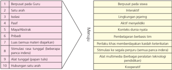

Tabel ini membandingkan dua aspek utama: "Berperhati pada Guru" dan "Menyediakan". Dalam kolom pertama, ada beberapa poin yang menunjukkan bagaimana guru harus berinteraksi dengan siswa, seperti interaktif, memiliki lingkungan yang mendukung, memiliki materi yang mudah diakses, dan memiliki metode pembelajaran yang efektif. Sementara itu, kolom kedua menunjukkan cara guru menyediakan lingkungan belajar yang mendukung, seperti memberikan stimulasi yang tepat, membangun hubungan yang baik, dan mendorong partisipasi aktif siswa. Pola penting yang terlihat adalah bahwa guru harus berperhati pada kebutuhan dan perkembangan siswa, serta menyediakan lingkungan belajar yang mendukung untuk mencapai tujuan pendidikan.

### 2. Kompetensi Inti dan Kompetensi Dasar

- Kompetensi Inti merupakan terjemahan atau operasionalisasi SKL dalam bentuk kualitas yang harus dimiliki mereka yang telah menyelesaikan pendidikan pada satuan pendidikan tertentu atau jenjang pendidikan tertentu, pada mata pelajaran tertentu. Kompetensi inti berisi gambaran mengenai kompetensi utama yang dikelompokkan ke dalam aspek  sikap,  pengetahuan,  dan  keterampilan  (afektif,  kognitif,  dan psikomotor) yang harus dipelajari siswa untuk suatu jenjang sekolah, kelas,  dan  mata  pelajaran.  Kompetensi  Inti  harus  menggambarkan kualitas yang seimbang antara pencapaian hard skills dan soft skills .
- Kompetensi  Dasar    merupakan  kompetensi  setiap  mata  pelajaran untuk setiap kelas yang diturunkan dari Kompetensi Inti. Kompetensi Dasar adalah konten atau kompetensi yang terdiri atas sikap,

 

---
## 📄 Halaman 13

pengetahuan,  dan  keterampilan  yang  bersumber  pada  Kompetensi Inti  yang  harus  dikuasai  siswa.  Kompetensi  tersebut  dikembangkan dengan memperhatikan karakteristik siswa, kemampuan awal, serta ciri  dari  suatu  mata  pelajaran.  Mata  pelajaran  sebagai  sumber  dari konten untuk menguasai kompetensi bersifat terbuka dan tidak selalu diorganisasikan  berdasarkan  disiplin  ilmu  yang  sangat  berorientasi hanya  pada  filosofi  esensialisme  dan  perenialisme.  Mata  pelajaran dapat dijadikan organisasi konten yang dikembangkan dari berbagai disiplin ilmu atau non disiplin ilmu yang diperbolehkan menurut filosofi rekonstruksi sosial, progresivisme atau pun humanisme. Karena filosofi yang  dianut  dalam  kurikulum  adalah  eklektik  seperti  dikemukakan di  bagian landasan filosofi, maka nama mata pelajaran dan isi mata pelajaran untuk kurikulum  yang  dikembangkan tidak harus terikat pada kaidah filosofi esensialisme dan perenialisme.

### 3. Kaitan antara Kompetensi Inti, Komptensi Dasar, dan Pembelajaran

Kompetensi Inti dan Kompetensi Dasar memiliki kaitan yang sangat erat.  Kompetensi  Inti  berfungsi  sebagai  unsur  pengorganisasi  kompetensi dasar. Sebagai unsur pengorganisasi, Kompetensi Inti merupakan pengikat untuk  organisasi  vertikal  dan  organisasi  horizontal  Kompetensi  Dasar. Organisasi  vertikal  Kompetensi  Dasar  adalah  keterkaitan  antara  konten Kompetensi  Dasar  satu  kelas  atau  jenjang  pendidikan  ke  kelas/jenjang  di atasnya  sehingga  memenuhi  prinsip  belajar  yaitu  terjadi  suatu  akumulasi yang  berkesinambungan  antara  konten  yang  dipelajari  siswa.  Organisasi horizontal  adalah  keterkaitan  antara  konten  Kompetensi  Dasar  satu  mata pelajaran  dengan  konten  Kompetensi  Dasar  dari  mata  pelajaran  yang berbeda dalam satu pertemuan mingguan dan kelas yang sama sehingga terjadi proses saling memperkuat.

Seperti  telah  disebutkan  di  atas  bahwa  Kompetensi  Inti  dirancang dalam  empat  kelompok  yang  saling  terkait,  yaitu  berkenaan  dengan sikap  keagamaan  (kompetensi  inti  1),  sikap  sosial  (kompetensi  inti  2), pengetahuan (kompetensi inti 3), dan penerapan pengetahuan  (kompetensi inti  4).  Keempat  kelompok  itu  menjadi  acuan  dari  Kompetensi  Dasar  dan harus dikembangkan dalam setiap kegiatan pembelajaran secara integratif.

 

---
## 📄 Halaman 14

Kompetensi yang berkenaan dengan sikap spiritual dan sosial dikembangkan secara  tidak  langsung  ( indirect  teaching ),  yaitu  pada  waktu  siswa  belajar tentang pengetahuan (kompetensi kelompok 3) dan penerapan pengetahuan dan keterampilan (kompetensi Inti kelompok 4).

### C. Mata Pelajaran Sejarah Indonesia

### 1. Pengertian

Jangan  sekali-kali  melupakan  sejarah,  karena  yang  lalai  terhadap sejarahnya pada hakikatnya seseorang itu tidak pernah dewasa. Sejarah dalam hal ini memiliki posisi yang sangat strategis dalam kehidupan bermasyarakat, berbangsa dan bernegara. Kalau begitu apa yang dimaksud dengan sejarah, pendidikan sejarah dan apa itu mata pelajaran (mapel) sejarah

- Sejarah  adalah  masa  lampau  manusia  dan  ilmu  sejarah  adalah ilmu  yang  mempelajari  masa  lampau  manusia  dalam  berinteraksi, bermasyarakat, berbangsa dan bernegara; yang bermakna bagi masa kini  dan  bermanfaat  untuk  merancang  kehidupan  di  masa  depan/ datang.
- Pendidikan  Sejarah  merupakan  suatu  proses  internalisasi  nilai-nilai, pengetahuan  dan  keterampilan  kesejarahan  yang  dirancang  dan disusun  sedemikian  rupa  untuk  mempengaruhi  dan  mendukung terjadinya proses belajar siswa.
- Mata pelajaran Sejarah Indonesia pada jenjang pendidikan SMA/MA/ SMK/MAK  mengkaji  berbagai  peristiwa  sejarah  dalam  masyarakat dan bangsa Indonesia pada masa lampau, dan pengaruhnya terhadap kehidupan bangsa masa kini, serta menerapkan cara berpikir sejarah dalam mengkaji peristiwa Sejarah Indonesia.
- Peristiwa  daerah  adalah  suatu  peristiwa  yang  terjadi  di  wilayah administrasi sekitar siswa (desa, kecamatan, kota/kabupaten, provinsi) yang  terkait  dengan  peristiwa  dalam  Sejarah  Nasional  dan  dikaji dengan menggunakan cara berpikir sinkronik dan diakronik.

 

---
## 📄 Halaman 15

- Sejarah  Nasional  adalah  berbagai  peristiwa  yang  terjadi  berkenaan dengan pusat pemerintahan dan di suatu tempat di wilayah Nusantara yang  memiliki  makna  dan  pengaruh  terhadap  masyarakat  secara nasional.
- Keterampilan Berpikir Sejarah adalah kemampuan siswa menggunakan berpikir kronologis/diakronik, sinkronik, konsep sejarah seperti perubahan ( change ), keberlanjutan ( continuity ), hukum sebab-akibat dalam mempelajari peristiwa sejarah.

### 2. Rasional

- Kehidupan manusia pada masa kini adalah kelanjutan dari kehidupan masa lampau yang kearifannya dapat dijadikan pijakan  bagi kehidupan masa depan.
- Mata  pelajaran  Sejarah  Indonesia  memberikan  dasar  pengetahuan kepada siswa dalam memahami kehidupan masa lampau bangsa yang berpengaruh pada kehidupan bangsa masa kini dan akan berpengaruh dalam membangun kehidupan masa depan.
- Sejarah mengandung peristiwa tentang kehidupan manusia di masa lampau untuk dijadikan guru kehidupan atau Historia Magistra Vitae .
- Sejarah mengandung berbagai nilai seperti kejujuran, inisiatif, kepemimpinan,  kebangsaan,  toleransi,    kearifan,  sikap  kritis  yang dapat dijadikan teladan dan contoh bagi kehidupan masa kini.
- Mata  Pelajaran  Sejarah  Indonesia  adalah  kajian  tentang  berbagai peristiwa  sejarah  di  Indonesia  ditujukan  untuk  membangun  memori kolektif  sebagai  bangsa  agar  mengenal  jati  diri  bangsanya  dan menjadikannya sebagai landasan dalam membangun persatuan dan kesatuan maupun untuk berkontribusi membangun kehidupan bangsa masa kini dan masa yang akan datang.
- Mata pelajaran Sejarah Indonesia dikembangkan atas dasar:
- 1). Semua wilayah/daerah memiliki kontribusi terhadap perjalanan Sejarah Indonesia hampir pada seluruh periode sejarah;

 

---
## 📄 Halaman 16

- 2). Pemahaman  tentang  masa  lampau  sebagai  sumber  inspirasi, motivasi, dan kekuatan untuk membangun semangat kebangsaan dan persatuan;
- 3). Setiap  periode  Sejarah  Indonesia  memiliki  peristiwa  dan  atau tokoh di tingkat nasional dan daerah serta keduanya memiliki kedudukan yang sama penting dalam perjalanan Sejarah Indonesia;
- 4). Tugas  dan  tanggung  jawab  untuk  memperkenalkan  peristiwa sejarah yang penting dan terjadi di seluruh wilayah NKRI serta seluruh periode sejarah kepada generasi muda bangsa;
- 5). Sejarah  memiliki  arti  strategis  dalam  pembentukan  watak  dan peradaban  bangsa  Indonsia  yang  bermartabat  serta  memiliki rasa kebangsaan dan cinta tanah air.
- 6). Peristiwa  Sejarah  adalah  hasil  kajian  yang  dapat  digunakan sebagai materi pendidikan untuk mengembangkan kemampuan berpikir kritis sejarah, penerapan kemampuan sejarah, wawasan kesejarahan, dan kesadaran sejarah.

### 3. Tujuan

Mata  pelajaran  Sejarah  Indonesia  bertujuan  agar  siswa  memiliki kemampuan sebagai berikut:

- Menumbuhkan kesadaran dalam diri siswa sebagai bagian dari bangsa Indonesia yang memiliki rasa bangga dan cinta tanah air, melahirkan empati  dan  perilaku  toleran  yang  dapat  diimplementasikan  dalam berbagai bidang kehidupan masyarakat dan bangsa.
- Menumbuhkan pemahaman siswa terhadap diri sendiri, masyarakat, dan  proses  terbentuknya  bangsa  Indonesia  melalui  sejarah  yang panjang dan masih berproses hingga masa kini dan masa yang akan datang.

 

---
## 📄 Halaman 17

- Mengembangkan  perilaku  berdasarkan  pada  nilai  dan    moral  yang mencerminkan karakter diri, masyarakat, dan bangsa.
- Membangun kesadaran siswa tentang pentingnya konsep waktu dan tempat/ruang dalam rangka memahami perubahan dan keberlanjutan dalam kehidupan bermasyarakat dan berbangsa di Indonesia.
- Menumbuhkan apresiasi dan penghargaan siswa terhadap peninggalan sejarah sebagai bukti peradaban bangsa Indonesia di masa lampau.
- Mengembangkan  kemampuan  berpikir  historis  ( historical  thinking ) yang menjadi dasar untuk kemampuan berpikir logis, kreatif, inspiratif, dan inovatif.
- Menanamkan sikap berorientasi kepada masa kini dan masa depan.

### 4. Ruang Lingkup

Mata pelajaran Sejarah Indonesia membahas materi yang meliputi zaman:

- Praaksara;
- Hindu-Buddha;
- Kerajaan-kerajaan Islam;
- Penjajahan bangsa Barat;
- Pergerakan Nasional;
- Proklamasi dan Perjuangan mempertahankan kemerdekaan;
- Demokrasi Liberal;
- Demokrasi Terpimpin;
- Orde Baru; dan
- Reformasi.

 

---
## 📄 Halaman 18

### D. Struktur KI dan KD Mata Pelajaran Sejarah Indonesia

Dalam konteks mata pelajaran (mapel) Sejarah, pada Kurikulum 2013 dalam pengorganisasian isi juga terdapat  perubahan yang boleh dikatakan cukup  spektakuler,  yakni  adanya  mapel  Sejarah  Indonesia  sebagai  mapel kelompok A untuk sekolah menengah, baik SMA/MA maupun SMK/MAK dan  ada  mapel  Sejarah  sebagai  program  peminatan  Ilmu  Pengetahuan Sosial  (IPS).  Dikatakan  spektakuler  karena  selama  ini  oleh  masyarakat  dan juga  siswa  pada  umumnya  mapel  Sejarah  itu  merupakan  pelajaran  yang tidak  penting  dan  cenderung  menjemukan.  Dengan  demikian  perubahan ini  sekaligus  merupakan  pembalikan  pola  pikir.  Mata  pelajaran  Sejarah diposisikan menjadi pelajaran yang penting. Sejarah Indonesia sebagai alat pendidikan, lebih menekankan pada pengembangan perspektif dan nilai-nilai kebangsaan bagi siswa. Sementara mapel Sejarah pada program peminatan IPS  lebih  menekankan  pada  pengembangan  keilmuan.  Oleh  karena  itu, masing-masing mapel Sejarah Indonesia ataupun Sejarah memiliki susunan KI dan KD yang berbeda, sekalipun ada beberapa yang sedikit tumpang tindih sebagai bentuk perluasan dan pendalaman. Hal ini terlihat pada susunan KI dan KD tiap kelas.

Mata pelajaran Sejarah Indonesia untuk Kelas XI SMA/MA memiliki 4 (empat) Kompetensi Inti (KI-1, KI-2, KI-3 dan KI-4),  dan khusus KI-3 dan KI-4 dijabarkan menjadi  20 Kompetensi Dasar (KD) yang dapat disajikan sebagai berikut.

---
**📊 Tabel**

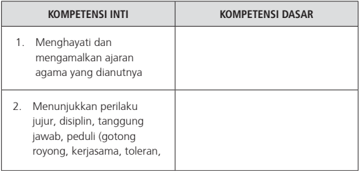

Tabel ini berisi dua kolom utama: "Kompetensi Inti" dan "Kompetensi Dasar". Topik utama tabel adalah tentang kompetensi yang harus dimiliki oleh peserta didik dalam konteks pendidikan agama. Dalam kolom "Kompetensi Inti", terdapat dua poin utama yang mencakup:
1. Menghayati dan mengamalkan ajaran agama yang dianutnya.
2. Menunjukkan perilaku jujur, disiplin, tanggung jawab, peduli (gotong royong), kerjasama, dan toleran.

Kolom "Kompetensi Dasar" mencakup beberapa aspek positif yang diharapkan peserta didik tampilkan dalam kehidupan sehari-hari, seperti kejujuran, disiplin, tanggung jawab, gotong royong, kerjasama, dan toleransi. Ini menunjukkan bahwa tabel ini bertujuan untuk memberikan panduan tentang apa yang harus peserta didik lakukan dalam berbagai situasi, baik dalam konteks pendidikan agama maupun dalam kehidupan sehari-hari.

 

---
## 📄 Halaman 19

---
**📊 Tabel**

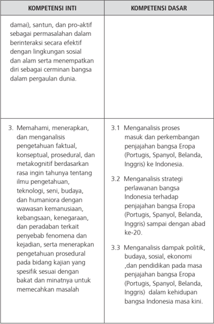

Tabel ini berisi informasi tentang kompetensi inti dan dasar yang berkaitan dengan pengetahuan tentang penjajahan bangsa Eropa di Indonesia. Topik utama tabel adalah analisis proses penjajahan, strategi perlawanan, dan dampak politik, budaya, sosial, ekonomi, dan pendidikan pada masa penjajahan. Kolom-kolomnya mencakup: 1) Kompetensi Inti yang meliputi tantangan sosial dan lingkungan, serta pemahaman dan aplikasi pengetahuan; 2) Kompetensi Dasar yang lebih spesifik, seperti analisis proses penjajahan, strategi perlawanan, dan dampak politik, budaya, sosial, ekonomi, dan pendidikan. Data penting yang terlihat adalah bahwa tabel ini membahas berbagai aspek penjajahan Eropa di Indonesia, mulai dari proses penjajahan hingga dampaknya pada kehidupan bangsa Indonesia saat ini.

 

---
## 📄 Halaman 20

---
**📊 Tabel**

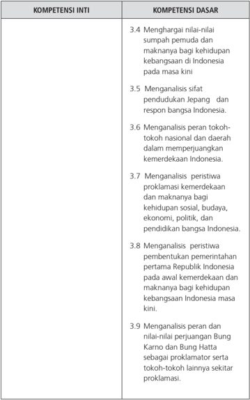

Tabel ini berisi informasi tentang kompetensi inti dan dasar yang berkaitan dengan perjuangan kemerdekaan Indonesia. Topik utama adalah analisis peristiwa dan tokoh-tokoh penting dalam perjuangan kemerdekaan, seperti peran Jepang, tokoh nasional, dan tokoh-tokoh lainnya. Kolom-kolomnya mencakup 3.4 hingga 3.9, yang masing-masing menunjukkan analisis spesifik tentang nilai-nilai, peran, dan makna peristiwa penting bagi kehidupan bangsa Indonesia. Data penting yang terlihat adalah bahwa tabel ini fokus pada analisis peristiwa dan tokoh-tokoh yang mempengaruhi perjuangan kemerdekaan Indonesia, serta bagaimana mereka membantu mewujudkan kemerdekaan bagi bangsa Indonesia.

 

---
## 📄 Halaman 21

---
**📊 Tabel**

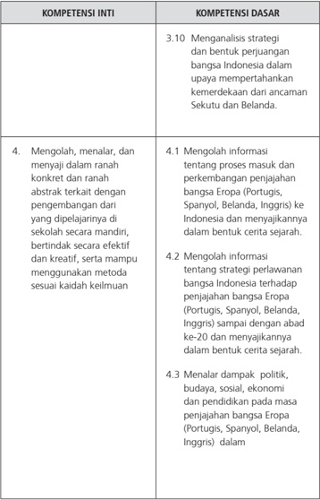

Tabel ini berisi informasi tentang kompetensi inti dan dasar yang berkaitan dengan penelitian sejarah tentang perjuangan bangsa Indonesia melawan penjajahan Eropa. Topik utama adalah analisis strategi dan bentuk perjuangan Indonesia dalam upaya mempertahankan kemerdekaannya dari ancaman Sekutu dan Belanda. Kolom-kolomnya mencakup: 3.10 untuk analisis strategi dan bentuk perjuangan, 4 untuk mengolah, menalar, dan menyaji informasi secara kreatif, serta 4.1-4.3 untuk mengolah informasi tentang proses masuk dan perkembangan penjajahan Eropa di Indonesia, dan dampak politik, budaya, sosial, ekonomi, dan pendidikan pada masa penjajahan tersebut. Data penting yang terlihat adalah bahwa tabel ini fokus pada analisis dan pengolahan informasi sejarah yang relevan dengan perjuangan Indonesia melawan penjajahan Eropa.

 

---
## 📄 Halaman 22

---
**📊 Tabel**

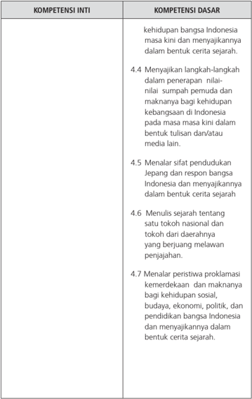

Tabel ini berisi informasi tentang kompetensi inti dan dasar dalam konteks sejarah Indonesia. Topik utamanya adalah tentang pengetahuan dan keterampilan yang diperlukan untuk memahami dan menyajikan sejarah Indonesia. Kolom "Kompetensi Inti" mencakup tujuh poin yang melibatkan pengetahuan sejarah tentang kehidupan bangsa Indonesia, sifat penduduk Jepang, tokoh nasional, peristiwa proklamasi kemerdekaan, dan nilai-nilai masyarakat. Sementara itu, kolom "Kompetensi Dasar" menunjukkan tugas-tugas praktis seperti menulis cerita sejarah, menuliskan peristiwa penting, dan menyajikan informasi dalam bentuk tulisan dan media lain. Pola penting yang terlihat adalah bahwa tabel ini mencakup berbagai aspek sejarah dan budaya Indonesia, mulai dari pengetahuan sejarah hingga keterampilan penulisan dan penyajian informasi.

 

---
## 📄 Halaman 23

---
**📊 Tabel**

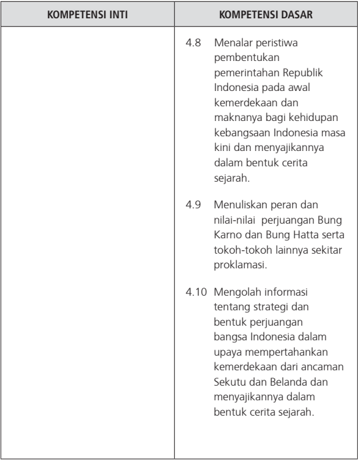

Tabel ini berisi informasi tentang kompetensi inti dan dasar yang berkaitan dengan sejarah Indonesia. Topik utamanya adalah perjuangan kemerdekaan Indonesia, terutama peran Bung Karno dan Bung Hatta dalam upaya mempertahankan kemerdekaan dari ancaman Sekutu dan Belanda. Kolom-kolomnya mencakup 4.8 tentang pembentukan Republik Indonesia, 4.9 tentang peran Bung Karno dan Bung Hatta, serta 4.10 tentang strategi dan bentuk perjuangan bangsa Indonesia. Data penting yang terlihat adalah bahwa semua kompetensi ini berkaitan dengan sejarah dan perjuangan kemerdekaan Indonesia, menunjukkan bahwa topik utama adalah sejarah dan perjuangan kemerdekaan.

 

---
## 📄 Halaman 24

KI-3  dan  KI-4  yang  kemudian  dijabarkan  menjadi  20  Kompetensi Dasar (KD) itu merupakan bahan kajian yang akan ditransformasikan  dalam kegiatan pembelajaran selama satu tahun (dua semester) yang terurai dalam 40  minggu  efektif.  Agar  kegiatan  pembelajaran  itu  tidak  terasa  terlalu panjang  maka  40  minggu  itu  akan  kita  bagi  menjadi  dua  bagian,  satu semester pertama dan satu semester kedua. Masing-masing semester ada 20 minggu. Masing-masing semester sudah meliputi ulangan/kegiatan lain tengah  semester  dan  ulangan  akhir  semester  yang  masing-masing  diberi waktu 3 jam tatap muka/minggu. Dengan demikian waktu efektif kegiatan pembelajaran  kelas  untuk  mata  pelajaran  Sejarah  Indonesia  sebagai  mata pelajaran wajib di SMA/MA disediakan waktu 2 x 45 menit x 34 minggu/per tahun (17 minggu/semester).

Untuk  efektivitas  dan  optimalisasi  pelaksanaan  pembelajaran  pihak pemerintah melalui Kementerian Pendidikan dan Kebudayaan menerbitkan buku siswa untuk mata pelajaran Sejarah Indonesia Kelas XI. Berdasarkan sejumlah Kompetensi Dasar terutama yang terkait dengan penjabaran KI-3 dan KI-4, Buku Siswa Kelas XI yang disusun ini terbagai menjadi tujuh bab.

Bab I

:  Antara Kolonialisme dan Imperialisme

Bab II

:  Perjuangan Melawan Kolonialisme dan Imperialisme

Bab III

:  Dampak Perkembangan Kolonialisme dan Imperialisme

Bab IV

:  Sumpah Pemuda dan Jati Diri Keindonesiaan

Bab V

:  Tirani Matahari Terbit

Bab VI   :  Indonesia Merdeka

Bab VII  :  Revolusi Menegakkan Panji-panji NKRI

### E. Pendekatan dan Model Pembelajaran

### 1. Pengembangan Indikator

Proses  pembelajaran  pada  prinsipnya  adalah  proses  penguasaan Kompetensi  Dasar.  Penguasaan  Kompetensi  Dasar  dicapai  melalui  proses pembelajaran dan pengembangan pengalaman belajar atas dasar indikator yang telah dirumuskan dari masing-masing KD, terutama KD 3 dan KD 4. KDKD pada KI ketiga untuk mapel Sejarah Indonesia dapat dijabarkan menjadi beberapa indikator seperti contoh sebagai berikut.

 

---
## 📄 Halaman 25

---
**📊 Tabel**

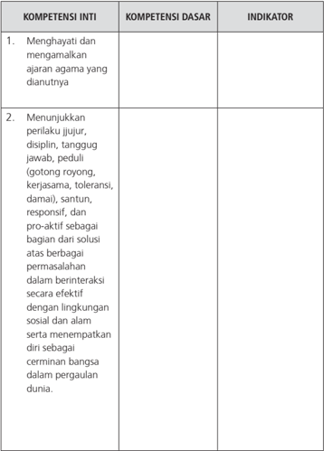

Tabel ini berisi informasi tentang kompetensi inti dan dasar yang harus dimiliki oleh individu dalam konteks agama dan perilaku sosial. Topik utamanya adalah tentang bagaimana menghormati dan mematuhi ajaran agama yang dianutnya, serta menunjukkan perilaku yang diharapkan dalam berinteraksi dengan lingkungan sosial dan alam. Kolom "Kompetensi Inti" mencakup dua poin utama: menghargai dan mematuhi ajaran agama, serta menjunjukkan perilaku yang diharapkan dalam berinteraksi sosial dan alam. Kolom "Kompetensi Dasar" lebih spesifik, menekankan pada aspek-aspek seperti disiplin, tanggung jawab, gotong royong, kerjasama, toleransi, damai, santun, responsif, dan proaktif dalam menyelesaikan masalah. Indikator pada setiap kompetensi ini memberikan gambaran tentang apa yang harus dilakukan untuk mencapai tujuan tersebut.

 

---
## 📄 Halaman 26

---
**📊 Tabel**

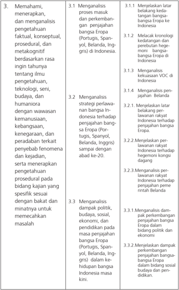

Tabel ini berisi informasi tentang proses penelitian dan analisis yang dilakukan dalam konteks pengetahuan, budaya, dan humaniora di Indonesia. Topik utama tabel meliputi menganalisis proses masuk dan perkembangan penjajahan bangsa Eropa di Indonesia, strategi perlawaan dan kebijakan Indonesia terhadap penjajahan Eropa, dampak politik, budaya, sosial, ekonomi, dan pendidikan pada masa penjajahan, serta dampak perkembangan penjajahan Eropa dalam kehidupan Indonesia. Kolom-kolomnya mencakup proses penelitian, topik analisis, dan metode penelitian yang digunakan. Data penting yang terlihat adalah bahwa penelitian ini mencakup analisis berbagai aspek seperti perubahan budaya, politik, dan ekonomi, serta dampak dari penjajahan Eropa pada kehidupan Indonesia.

 

---
## 📄 Halaman 27

---
**📊 Tabel**

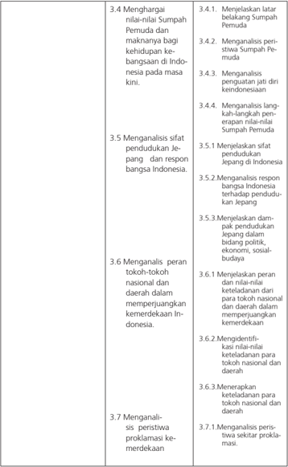

Tabel ini berisi analisis tentang peran dan dampak pendudukan Jepang di Indonesia pada masa lalu, termasuk pengaruhnya terhadap kehidupan masyarakat, budaya, dan ekonomi. Topik utama adalah analisis peristiwa Sumpah Pemuda dan respon bangsa Indonesia terhadap pendudukan tersebut. Tabel ini mencakup 7 kolom dengan informasi yang detail tentang aspek-aspek penting seperti:

1. Menghargai nilai-nilai Sumpah Pemuda dan maknanya bagi kehidupan kebangsaan Indonesia.
2. Menganalisis periwata Sumpah Pemuda.
3. Menganalisis pengaruh jati diri keindonesiaan.
4. Menganalisis langkah-langkah penyebaran nilai Sumpah Pemuda.
5. Menganalisis sifat pendudukan Jepang dan respon bangsa Indonesia.
6. Menganalisis peran tokoh-tokoh nasional dan daerah dalam memperjuangkan kemerdekaan Indonesia.
7. Menganalisis peristiwa proklamasi kemerdekaan.

Data penting yang terlihat meliputi:
- Analisis tentang bagaimana Sumpah Pemuda mempengaruhi identitas nasional dan budaya Indonesia.
- Peran tokoh-tokoh nasional dan daerah dalam memperjuangkan kemerdekaan.
- Proses penyebaran nilai-nilai Sumpah Pemuda dan dampaknya terhadap kehidupan masyarakat.

Tabel ini membahas secara mendalam tentang peran penting Sumpah Pemuda dalam memperjuangkan kemerdekaan Indonesia dan dampaknya terhadap kehidupan bangsa.

3.4 Menghargai

nilai-nilai Sumpah

Pemuda dan

maknanya bagi

kehidupan ke-

bangsaan di Indo-

nesia pada masa

kini.

3.5 Menganalisis sifat

pendudukan Je-

pang   dan respon

bangsa Indonesia.

3.6 Menganalis  peran

tokoh-tokoh

nasional dan

daerah dalam

memperjuangkan

kemerdekaan In-

donesia.

3.7 Menganali-

sis  peristiwa

proklamasi ke-

merdekaan

3.4.1.  Menjelaskan latar

belakang Sumpah

Pemuda

3.4.2.  Menganalisis peri-

stiwa Sumpah Pe-

muda

3.4.3.  Menganalisis

penguatan jati diri

keindonesiaan

3.4.4.  Menganalisis lang-

kah-langkah pen-

erapan nilai-nilai

Sumpah Pemuda

3.5.1 Menjelaskan sifat

pendudukan

Jepang di Indonesia

3.5.2.Menganalisis respon

bangsa Indonesia

terhadap pendudu-

kan Jepang

3.5.3.Menjelaskan dam-

pak pendudukan

Jepang dalam

bidang politik,

ekonomi, sosial-

budaya

3.6.1 Menjelaskan peran

dan nilai-nilai

keteladanan dari

para tokoh nasional

dan daerah dalam

memperjuangkan

kemerdekaan

3.6.2.Mengidentifi-

kasi nilai-nilai

keteladanan para

tokoh nasional dan

daerah

3.6.3.Menerapkan

keteladanan para

tokoh nasional dan

daerah

3.7.1.Menganalisis peris-

tiwa sekitar prokla-

masi.

 

---
## 📄 Halaman 28

---
**📊 Tabel**

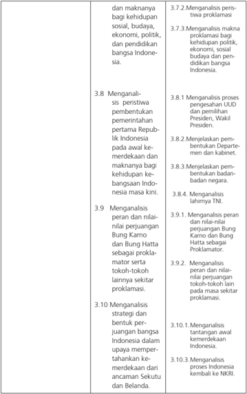

Tabel ini berisi analisis tentang peran dan implikasi dari berbagai aspek kehidupan bangsa Indonesia, termasuk politik, ekonomi, budaya, dan pendidikan. Topik utama adalah menganalisis peristiwa-peristiwa penting, makna baginya bagi bangsa Indonesia, dan dampaknya pada masa kini. Kolom pertama berisi topik analisis, sementara kolom kedua berisi deskripsi detail dari setiap topik tersebut. Data penting yang terlihat meliputi analisis proses pengesahan Undang-Undang Dasar (UU) dan pemilihan Presiden, Wakil Presiden, dan pembentukan Departemen dan kabinet. Selain itu, tabel juga mencakup analisis peran dan nilai-nilai Bung Karno dan Bung Hatta sebagai proklamator, strategi dan bentuk perjuangan bangsa Indonesia dalam memperjuangkan kemerdekaan, serta menganalisis proses Indonesia kembali ke NKRI.

dan maknanya

bagi kehidupan

sosial, budaya,

ekonomi, politik,

dan pendidikan

bangsa Indone-

sia.

3.8  Menganali-

sis  peristiwa

pembentukan

pemerintahan

pertama Repub-

lik Indonesia

pada awal ke-

merdekaan dan

maknanya bagi

kehidupan ke-

bangsaan Indo-

nesia masa kini.

3.9   Menganalisis

peran dan nilai-

nilai perjuangan

Bung Karno

dan Bung Hatta

sebagai prokla-

mator serta

tokoh-tokoh

lainnya sekitar

proklamasi.

3.10 Menganalisis

strategi dan

bentuk per-

juangan bangsa

Indonesia dalam

upaya memper-

tahankan ke-

merdekaan dari

ancaman Sekutu

dan Belanda.

3.7.2.Menganalisis peris-

tiwa proklamasi

3.7.3.Menganalisis makna

proklamasi bagi

kehidupan politik,

ekonomi, sosial

budaya dan pen-

didikan bangsa

Indonesia.

3.8.1 Menganalisis proses

pengesahan UUD

dan pemilihan

Presiden, Wakil

Presiden.

3.8.2.Menjelaskan pem-

bentukan Departe-

men dan kabinet.

3.8.3.Menjelaskan pem-

bentukan badan-

badan negara.

3.8.4. Menganalisis

lahirnya TNI.

3.9.1. Menganalisis peran

dan nilai-nilai

perjuangan Bung

Karno dan Bung

Hatta sebagai

Proklamator.

3.9.2.  Menganalisis

peran dan nilai-

nilai perjuangan

tokoh-tokoh lain

pada masa sekitar

proklamasi.

3.10.1.  Menganalisis

tantangan awal

kemerdekaan

Indonesia.

3.10.3.  Menganalisis

proses Indonesia

kembali ke NKRI.

 

---
## 📄 Halaman 29

---
**📊 Tabel**

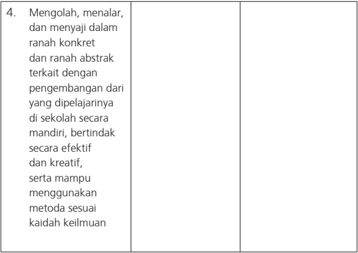

Tabel ini berisi informasi tentang keterampilan yang harus dimiliki oleh individu dalam mengolah, menalar, dan menyajikan informasi secara konkret dan abstrak. Topik utama tabel adalah keterampilan tersebut. Kolom pertama berisi deskripsi keterampilan, sedangkan kolom kedua dan ketiga berisi data atau pola penting yang terlihat. Data penting yang terlihat adalah bahwa individu harus mampu mengolah, menalar, dan menyajikan informasi dengan efektif dan kreatif, serta menggunakan metode sesuai keadaan.

Di samping penjelasan beberapa indikator tersebut yang perlu diingat oleh guru sejarah adalah KD-KD yang terkait dengan KI-1  dan KI-2 harus  dijadikan  perspektif  dalam  pembelajaran  Sejarah  Indonesia.  Atau dapat dikatakan KD-KD itu sebagai bahan untuk pengembangan nilai dan pendidikan karakter. Selanjutnya KD-KD yang merupakan penjabaran  KI-4 terkait  dengan  pengembangan  keterampilan  dan  unjuk  kerja  bagi  siswa. Untuk  mata  pelajaran  Sejarah  Indonesia  dapat  dikembangkan  kegiatankegiatan mengobservasi, wawancara, menulis dan mempresentasikan karya sejarah, membuat media sejarah, membuat kliping, dll.

### 2. Pengalaman belajar

Melalui  proses  pembelajaran  diharapkan  indikator-indikator  yang telah dirumuskan di atas dapat tercapai. Tercapainya indikator-indikator itu berarti tercapai pula KD-KD yang telah ditetapkan pada struktur kurikulum pada mapel Sejarah Indonesia itu. Oleh karena itu, dalam kaitan pencapaian indikator  itu  guru  perlu  juga  mengingat  pengalaman  belajar  yang  secara umum  diperoleh  oleh  siswa  sebagaimana  dirumuskan  dalam  KI  dan  KD. Beberapa pengalaman belajar itu terkait dengan:

 

---
## 📄 Halaman 30

- Pengembangan  ranah  kognitif  atau  pengembangan  pengetahuan dapat  dilakukan  dalam  bentuk  penguasaan  materi  dan  pemberian tugas dengan unjuk kerja; mengetahui, memahami, menganalisis, dan mengevaluasi.
- Pengembangan  ranah afektif atau pengembangan  sikap (sikap sosial)  dapat  dilakukan  dengan  pemberian  tugas  belajar  dengan beberapa sikap dan unjuk kerja: menerima, menghargai,  menghayati, menjalankan dan mengamalkan.
- Pengembangan ranah psikomotorik atau pengembangan keterampilan (skill) melalui  tugas  belajar  dengan  beberapa  aktivitas  mengamati, menanya, menalar, mencoba, mengolah, menyaji dan mencipta.
Terkait  dengan  beberapa  aspek  pengalaman  belajar  tersebut  maka dalam setiap pembelajaran Sejarah Indonesia di SMA/MA/SMK/MAK siswa mampu mengembangkan proses  kognitif yang lebih tinggi dari pemahaman sampai dengan metakognitif pendalaman pengetahuan dari sumber belajar yang ada. Pembelajaran diharapkan mampu mengembangkan pengetahuan: menerapkan  konsep,  prinsip  atau  prosedur,  menganalisis  masalah,  serta mengevaluasi sesuatu produk atau mengembangkan keterampilan, seperti: mencoba  membuat  sesuatu  atau  mengolah  informasi,  dan  menerapkan prosedur sampai mengamalkan nilai-nilai kesejarahan.

### 3. Pendekatan Pembelajaran

### a. Siswa aktif

Paradigma belajar bagi siswa menurut jiwa Kurikulum 2013 adalah  siswa  aktif  mencari  bukan  lagi  siswa  menerima.  Oleh  karena  itu, pembelajaran harus dikembangkan  menjadi pembelajaran yang aktif, inovatif dan kreatif. Di Indonesia ini sebenarnya sudah lama dikembangkan pendekatan    pembelajaran  yang  dikenal  dengan  Paikem.  Pendekatan  ini nampaknya  sangat  relevan  dengan  kemauan  model  pembelajaran  untuk mendukung pelaksanakan Kurikulum 2013. Pembelajaran Sejarah Indonesia sangat  cocok  dengan  pendekatan  Paikem.  Paikem  adalah  singkatan  dari prinsip  pembelajaran:  Pembelajaran  Aktif,  Inovatif,  Kreatif,  Efektif  dan Menyenangkan.

 

---
## 📄 Halaman 31

- Aktif, maksudnya agar guru berusaha menciptakan suasana sedemikian rupa  agar  siswa  aktif  melakukan  serta  mencari  pengetahuan  dan pengalamannya sendiri.
- Inovatif, pembelajaran harus dikembangkan sesuai dengan kebutuhan yang ada, dan tidak monoton. Guru selalu mencari model kontekstual yang dapat menarik siswa.
- Kreatif,  agak  mirip  dengan  inovatif,  guru  harus  mengembangkan kegiatan belajar yang beragam, menciptakan pembelajaran baru yang penuh tantangan, pembelajaran berbasis masalah sehingga mendorong siswa untuk merumuskan masalah dan cara pemecahannya.
- Efektif, guru harus secara tepat memilih model dan metode pembelajaran sesuai dengan tujuan, materi dan situasi sehingga tujuan dapat tercapai dan bermakna bagi siswa
- Menyenangkan, guru harus berusaha dan menciptakan proses pembelajaran  Sejarah  Indonesia  itu  menjadi  menyenangkan  bagi siswa.  Apabila  suasana  menyenangkan  siswa  akan  memperhatikan pembelajaran yang sedang berlangsung.
Sesuai  dengan  pendekatan  siswa  aktif  tersebut  dewasa  ini  sedang populer  dengan  pendekatan  kontekstual  atau Contextual  Teaching  and Learning (CTL). Pendekatan kontekstual ini memiliki ciri antara lain:

- 1). Materi pembelajaran dipilih sesuai dengan lingkungan dan kebutuhan siswa.
- 2). Materi pembelajaran dikaitkan dengan dunia nyata dan kekinian
- 3). Materi pembelajaran disesuaikan dengan pengetahuan dan kemampuan siswa.
- 4). Materi pembelajaran akan menarik dengan mengintegrasikan dengan beberapa cabang ilmu lain.
- 5). Siswa akan terlibat secara aktif dalam setiap kegiatan pembelajaran.
- 6). Dalam proses belajar siswa akan lebih banyak untuk menggali informasi, menemukan, memecahkan masalah, berdiskusi, mengerjakan proyek.

 

---
## 📄 Halaman 32

Dalam proses pembelajaran Sejarah Indonesia, setiap siswa perlu juga memperhatikan hal-hal sebagai berikut.

- 1). Setiap awal pembelajaran, siswa harus membaca teks yang tersedia di dalam buku teks pelajaran Sejarah Indonesia
- 2). Siswa  perlu  memperhatikan  beberapa  hal  yang  dipandang  penting seperti istilah, konsep atau kejadian penting, bahkan mungkin angka tahun yang memiliki makna atau pengaruh yang sangat kuat dan luas dalam peristiwa sejarah berikutnya. Oleh karena itu, setiap siswa perlu memamahami prinsip sebab akibat dalam peristiwa sejarah.
- 3). Peserta didik selaku warga belajar perlu memperhatikan dan mencermati beberapa gambar, foto, peta atau ilustrasi lain yang ada pada buku teks.
- 4). Dalam  mengembangkan  pembelajaran  Sejarah  Indonesia  ini,  guru perlu  banyak  menambah  bacaan  atau  literatur  lain  yang  relevan dengan materi pembelajaran. Para siswa juga didorong memperbanyak sumber  belajar,  menambah  bacaan  buku  sejarah  lain  yang  relevan. Kemudian dalam kegiatan pembelajaran Sejarah  Indonesia  ini  siswa perlu  banyak  melakukan  pengamatan  objek  sejarah  dan  banyak mempelajari peristiwa sejarah yang  ada di lingkungannya. Misalnya kebetulan  peristiwa  sejarah  yang  sedang  dikaji  di  daerahnya  tidak dapat mengambil contoh lain di daerah lain yang paling dekat. Misalnya apabila daerahnya tidak ada situs atau peristiwa penjajahan VOC, bisa mengambil contoh tempat lain yang ada situs zaman penjajahan VOC.

### b. Pembelajaran berbasis nilai

Dalam  pembelajaran  Sejarah  Indonesia  ini  terkait  dengan  pengembangan nilai-nilai  kebangsaan  dan  nasionalisme,  di  samping  nilai-nilai  lain  seperti kejujuran, kearifan, menghargai waktu, ketertiban/kedisiplinan. Oleh karena itu,  pendekatan  pembelajaran  berbasis  nilai  penting  untuk  dikembangkan dalam  pembelajaran  Sejarah  Indonesia.  Bagaimana  nilai-nilai  kesejarahan atau  nilai  kebangsaan,  nasionalisme,  patriotisme,  persatuan,  kejujuran, kearifan itu dapat dihayati dan dapat diamalkan oleh siswa pada kehidupan sehari-hari.  Pembelajaran  dengan  materi  biografi  atau  perjuangan  para tokoh penting untuk disajikan. Dalam hal ini model pembelajaran Values Exploration dan Values Clariication Technique (VCT).

 

---
## 📄 Halaman 33

### c. Pendekatan Saintifik

Pola  pikir  yang  berubah,  menuntut  perubahan  dalam  pendekatan pembelajarannya.  Pendekatan scientiic atau  pendekatan  ilmiah  dipilih sebagai  pendekatan  dalam  pembelajaran  dalam  kurikulum  2013.  Siswa secara  aktif  membangun  pengetahuannya  sendiri  melalui    aktivitas  ilmiah yaitu mengamati ( observing ),  menanya ( questioning ),    menalar ( associating ), mencoba  ( exsperimenting ),  membentuk  jejaring  ( networking ).  Mengenai pendekatan scientiic ini dalam Permendikbud No. 81 A tahun 2013 tentang Implementasi  Kurikulum,  sebagaimana  disempurnakan  dengan  Permendik No.  103  Tahun  2014  tentang  Pembelajaran  pada  Pendidikan  Dasar  dan Pendidikan Menengah  dijelaskan adanya lima pengalaman belajar sebagai berikut.

### 1) Mengamati

Dalam pembelajaran sejarah, kegiatan mengamati atau mengobservasi, dilakukan  dengan  membaca  dan  menyimak  bahan  bacaan    atau mendengar  penjelasan  guru  atau  mengamati  foto/gambar/diagram yang  ditunjukkan  atau  ditentukan  guru.  Agar  lebih  efektif  kegiatan mengamati  ini,  tentunya  guru  sudah  menentukan  obyek  dan  atau masalah dan aspek yang akan dikaji

### 2) Menanya

Setelah proses observasi selesai, maka aktivitas berikutnya adalah siswa mengajukan sejumlah pertanyaan berdasarkan hasil pengamatannya. Jadi,    aktivitas  menanya  bukan  aktivitas  yang  dilakukan  oleh  guru, melainkan  oleh    siswa  berdasarkan  hasil  pengamatan  yang  telah mereka lakukan. Dalam pelaksanaannya:

- Guru memberikan motivasi atau dorongan agar siswa mengajukan  pertanyaan-pertanyaan  lanjutan  dari  apa  yang sudah mereka baca dan simpulkan dari kegiatan yang dilakukan
- Siswa  dapat  dilatih  bertanya  berkaitan  dengan  pertanyaan yang faktual dan pertanyaan-pertanyaan yang bersifat hipotetik (bersifat kausalitas).

 

---
## 📄 Halaman 34

### 3) Mengumpulkan informasi

Setelah proses menanya, aktivitas berikut dalam kegiatannya adalah mengumpulkan data dan informasi dari berbagai sumber seperti buku, dokumen, artefak, fosil, termasuk melakukan wawancara kepada nara sumber.  Data  dan  informasi  dapat  diperoleh  secara  langsung  dari lapangan  (data  primer)  maupun  dari  berbagai  bahan  bacaan  (data sekunder). Hasil pengumpulan data tersebut kemudian menjadi bahan bagi  siswa  untuk  melakukan  penalaran.  Misalnya  mengumpulkan informasi  atau  data  tentang  Perang  Gerilya  yang  dipimpin  Jenderal Sudirman pada masa perjuangan mempertahankan kemerdekaan.

### 4)     Mengasosiasi/Mengolah informasi

Mengolah informasi atau data yang telah dikumpulkan, baik pengolahan  dan  analisis  data  terkait  dengan  hasil  pengamatan  dan kegiatan  pengumpulan  informasi/.data,  maupun  pengolahan  dan analisis  informasi/data  untuk  menambah  keluasan  dan  kedalaman sampai pengolahan atau analisis informasi untuk mencari solusi dari berbagai  sumber  yang  memiliki  pendapat  berbeda  bahkan  sampai pendapat  yang  bertentangan,  sehingga  dapat  ditarik  kesimpulan. Misalnya  mengolah  informasi  atau  menganalisis  tentang  Serangan Umum 1 Maret 1949.

### 5) Membangun jejaring (Networking) atau mengomunikasikan.

Membangun jejaring dalam konteks pendekatan pembelajaran saintifik dapat berupa penyampaian hasil dan temuan atau kesimpulan berdasarkan hasil analisis, baik secara lisan, tertulis atau media lainnya. Misalnya hasil diskusi kelompok dipresentasikan, karya tulis dipajang di 'Majalah Dinding' atau dimuat di surat kabar atau majalah selolah.

### 4. Model  dan Metode Pembelajaran

Dalam Kurikulum 2013 direkomendasikan untuk dikembangkan beberapa  model  pembelajaran,  yakni:  Pembelajaran  berbasis  masalah, Pembelajaran berbasis proyek, pembelajaran discovery/inquiry ,  dan Model values exploration (Eksplorasi Nilai).

 

---
## 📄 Halaman 35

### a. Pembelajaran Berbasis Masalah

Pembelajaran  berbasis  masalah  merupakan  sebuah  pendekatan  dan juga  model  pembelajaran  yang  menyajikan  masalah  kontekstual  sehingga merangsang siswa untuk belajar. Tujuannya antara lain: (1) Mengembangkan keterampilan berpikir dan keterampilan memecahkan masalah, (2) menjembatani  jarak  antara  pembelajaran  sekolah  formal  dengan  aktivitas mental  yang  lebih  praktis  yang  ada  di  luar  sekolah,  (3)  mengembangkan pembelajaran mandiri.

Adapun langkah-langkahnya:

- Merumuskan masalah.
- Mendeskripsikan masalah.
- Merumuskan hipotesis.
- Mengumpulkan data dan analisis data untuk menguji hipotesis, dan
- Merumuskan rekomendasi.

### b. Pembelajaran Berbasis Proyek

Pembelajaran Berbasis Proyek ( Project  Based  Learning ) adalah model pembelajaran yang menggunakan proyek/kegiatan sebagai wahana. Siswa melakukan eksplorasi, penilaian tentang sumber sejarah, melakukan interpretasi,  sintesis,  dan  informasi  untuk  menghasilkan  berbagai  bentuk hasil  belajar.  Pembelajaran  Berbasis  Proyek  adalah  kegiatan  pembelajaran dimana  siswa  memilih  suatu  peristiwa  sejarah  untuk  dijadikan  proyek studinya. Dalam pembelajaran ini siswa melakukan  investigasi,  membuat keputusan dan  memberikan kesempatan siswa untuk bekerja mandiri dan mengembangkan kreativitasnya.

Melalui  pembelajaran  berbasis  proyek  ini  diharapkan  siswa  akan menghasilkan her/his  own  history .  Adapun  langkah-langkahnya  sebagai berikut.

- Menentukan masalah atau materi/peristiwa sejarah yang akan dikaji.
- Mengkaji  bahan  sebagai  studi  awal  dan  merumuskan  petanyaanpertanyaan mendasar.
- Menyusun Rencana Proyek.

 

---
## 📄 Halaman 36

- Menyusun Jadwal.
- Monitoring.
- Menguji Hasil.
- Evaluasi Pengalaman.

### c. Pembelajaran DiscoveryLearning

Model Discovery  Learning adalah  teori  belajar  yang  didefinisikan sebagai  proses  pembelajaran  yang  terjadi  apabila  siswa  tidak  disajikan dengan pelajaran dalam bentuk finalnya, tetapi diharapkan mengorganisasi sendiri. Sebagaimana pendapat Bruner, bahwa: 'Discovery Learning can be deined as the learning that takes place when the student i s not presented with subject matter in the inal form, but rather is required to  organize it him  self' (Lefancois  dalam  Emetembun,  1986:103).  Discovery  Learning mempunyai prinsip yang sama dengan inkuiri ( inquiry ) dan Problem Solving atau pembelajaran berbasis riset.

Langkah-langkahnya:

Persiapan : sejak  dari  merumuskan tujuan, penentuan topik, mengembangkan dan seleksi  bahan ajar

### Pelaksanaan :

- Pemberian  rangsangan/motivasi  dengan  membuat  materi/  problem yang akan dipecahkan yang rumusannya dibuat agak membingungkan/ dilematis
- Identifikasi dan merumuskan masalah
- Pengumpulan data
- Analisis data
- Pembuktian/verifikasi
- Menarik kesimpulan/generalisasi

### d. Model Values Exploration (Eksplorasi Nilai)

Pengertian  model values  exploration adalah  pembelajaran  yang berorientasi pada pengembangan nilai-nilai Sejarah Indonesia. Dalam model pembelajaran ini berawal dari pemikiran 'students will demontrastrate skills as they explore and analyse values' . Bahwa siswa akan mendemonstrasikan berbagai keterampilan. Model pembelajaran ini berorientasi pada pemahaman

 

---
## 📄 Halaman 37

sejarah sosial-budaya. Model pembelajaran ini sangat mendukung Kurikulum 2013. Pada model pembelajaran ini siswa diajak untuk mengeksplorasikan masalah  atau  tema-tema  yang  terkait  dengan  Sejarah  Indonesia  dalam konteks sosial-budaya masyarakat setempat.

Di samping beberapa model tersebut sudah banyak model dan metode yang  sudah  biasa  dikembangkan  dalam  pembelajaran  Sejarah  Indonesia. Misalnya : Reading  Guide,  Active  Debat STAD ( Student  Teams-Achievement Divisions )  dan  TGT  ( Team-Game-Turnament ), Group  Resume,  Reading Guide , CIRC ( Cooperative Integrated Reading and Composition ), Jigsaw , dll  (selengkapnya baca Robert E.Slavin, Cooperative Learning :  Teori,  Riset dan Praktik). Di dalam menerapkan berbagai model pembelajaran tersebut, guru  perlu  menggunakan  pendekatan  saintifik  dengan  lima  langkahnya seperti telah diterangkan di atas.

### 5. Pelaksanaan  Pembelajaran

Salah  satu  tugas  dari  pendidik  sebelum  melakukan  pembelajaran adalah  membuat  rancangan  pembelajaran.  Rancangan  pembelajaran  ini penting karena menjadi patokan atau rambu-rambu bagi seorang pendidik ketika  melakukan  pembelajaran,  sehingga  pembelajaran  berjalan  lebih terarah.  Rancangan  pembelajaran  tersebut  disebut  Rencana  Pelaksanaan Pembelajaran (RPP).  RPP memiliki  3 bagian yaitu kegiatan pendahuluan, inti, dan penutup.

### a. Kegiatan Pendahuluan

Dalam  kegiatan  pendahuluan  ini,  langkah-langkah  yang  dilakukan    guru adalah:

- menyiapkan  siswa  secara  psikis  dan  fisik  untuk  mengikuti  proses pembelajaran;
- memberi motivasi belajar siswa secara kontekstual sesuai manfaat dan aplikasi materi ajar dalam kehidupan sehari-hari, dengan memberikan contoh dan perbandingan lokal, nasional dan internasional;
- mengajukan  pertanyaan-pertanyaan  yang  mengaitkan  pengetahuan sebelumnya dengan materi yang akan dipelajari;

 

---
## 📄 Halaman 38

- menjelaskan tujuan pembelajaran atau kompetensi dasar yang akan dicapai; dan
- menyampaikan cakupan materi dan penjelasan uraian kegiatan sesuai silabus.

### b. Kegiatan Inti

Kegiatan inti menggunakan model pembelajaran, metode pembelajaran,  media  pembelajaran,  dan  sumber  belajar  yang  disesuaikan dengan karakteristik siswa dan mata pelajaran. Dalam proses pembelajaran ini ditekankan pada pendekatan pembelajaran saintifik yang mengembangkan kompetensi  mengamati,  menanya,  mengumpulkan  informasi,  menalar/ mengasosiasi/merekonstruksi,  dan  mengomunikasikan.  Sementara  model yang dikembangkan misalnya pembelajaran berbasis masalah, pembelajaran berbasis proyek, dan pembelajaran discovery .    Pemilihan pendekatan dan model pembelajaran ini harus juga disesuaikan dengan dengan karakteristik kompetensi dan jenjang pendidikan.

### · Sikap

Sesuai  dengan  karakteristik  sikap,  maka  salah  satu  alternatif  yang dipilih adalah proses afeksi mulai dari menerima, menjalankan, menghargai, menghayati hingga  mengamalkan.  Seluruh  aktivitas  pembelajaran  berorientasi pada tahapan kompetensi yang mendorong siswa untuk melakukan aktivitas tersebut.

### · Pengetahuan

Pengetahuan  dimiliki  melalui  aktivitas  menerima  pengetahuan  dan menyimpannya  dalam  memori  untuk  diingat.  Pengetahuan  yang  diingat tersebut  dipanggil  kembali  untuk  menjawab  pertanyaan  yang  bersifat mengingat.  Selanjutnya  pengetahuan  (fakta,  konsep,  prosedur)  diolah sehingga  mencapai  tingkat  memahami,  dilanjutkan  dengan  menerapkan terutama konsep dan  prosedur,  menganalisis  suatu  sumber  untuk  menentukan bagian-bagian dari informasi juga keterkaitan antarbagian serta menemukan pikiran  pokok  dari  informasi  yang  dikaji,  mengevaluasi  kekuatan  dan kelemahan atau keunggulan informasi yang dikaji, hingga mencipta suatu pengetahuan baru atau karya lainnya (benda, diagram dan sebagainya) yang

 

---
## 📄 Halaman 39

disajikan dalam makalah atau media lainnya. Karakteristik aktivitas belajar dalam domain pengetahuan ini memiliki perbedaan dan kesamaan dengan aktivitas belajar dalam domain keterampilan. Untuk memperkuat pendekatan pembelajaran saintifik  sangat disarankan untuk menerapkan belajar berbasis penyingkapan/penelitian  ( discovery/inquiry learning ).  Untuk  mendorong siswa menghasilkan karya kreatif dan kontekstual, baik individual maupun kelompok, disarankan menggunakan pendekatan pembelajaran yang menghasilkan karya berbasis pemecahan masalah ( project based learning ).

### · Keterampilan

Keterampilan diperoleh melalui kegiatan mengamati, menanya, mengumpulkan informasi, mengasosiasi, menyaji, dan mencipta. Seluruh isi materi (topik dan subtopik) mata pelajaran yang diturunkan dari keterampilan harus  mendorong  siswa  untuk  melakukan  proses  pengamatan  hingga penciptaan.  Untuk  mewujudkan  keterampilan  tersebut  perlu  melakukan pembelajaran  yang  menerapkan  modus  belajar  berbasis  penyingkapan/ penelitian ( discovery/inquiry learning ) dan pembelajaran yang menghasilkan karya berbasis pemecahan masalah ( project based learning ). Keterampilan yang perlu dikembangkan dalam mata pelajaran Sejarah Indonesia adalah keterampilan berpikir sejarah dan menggunakan berbagai konsep sejarah.

### c. Kegiatan Penutup

Dalam kegiatan penutup, guru bersama siswa baik secara individual maupun kelompok melakukan refleksi untuk mengevaluasi:

- seluruh rangkaian aktivitas pembelajaran dan hasil-hasil yang diperoleh untuk  selanjutnya  secara  bersama  menemukan  manfaat  langsung maupun tidak langsung dari hasil pembelajaran yang telah berlangsung;
- memberikan umpan balik terhadap proses dan hasil pembelajaran;
- melakukan kegiatan tindak lanjut dalam bentuk pemberian tugas, baik tugas individual maupun kelompok; dan
- menginformasikan rencana kegiatan pembelajaran untuk pertemuan berikutnya.

 

---
## 📄 Halaman 40

### 6. Kemampuan dan Prinsip Berpikir Sejarah

Di  samping beberapa pendekatan tersebut, dalam mengembangkan materi  dan  melaksanakan  proses  pembelajaran  Sejarah  Indonesia  perlu juga dikembangkan  kemampuan  berpikir  sejarah ( historical thinking ). Kemampuan  berpikir  sejarah  ini  terkait  aspek  atau  kemampuan  berpikir kronologis, diakronis dan sinkronis, memperhatikan prinsip sebab akibat dan prinsip perubahan dan keberlanjutan.

### a. Kronologis

Istilah  kronologis ini sangat familiar di lingkungan masyarakat. Kronologis, dari sebuah kata dari bahasa Yunani, chronos yang berarti waktu dan logos diterjemahkan ilmu, jadi ilmu tentang waktu.  Kata  kronologis  ini  kemudian  menjadi  istilah  yang terkenal  dalam  sejarah.  Salah  satu  sifat  dari  peristiwa  sejarah itu kronologis. Kronologis merupakan rangkaian peristiwa yang berada seting urutan waktu. Dalam pembelajaran sejarah setiap siswa dilatih untuk memahami bahwa setiap peristiwa itu berada pada seting waktu yang berurutan dari waktu yang satu ke waktu yang lain secara berurutan. Misalnya dalam peristiwa sekitar Proklamasi kita susun: tanggal 15 Agustus 1945, tanggal 16 Agustus 1945, dan tanggal 17 Agustus 1945. Tanggal 15 Agustus diketahui Jepang menyerah, tanggal 16 Agustus peristiwa Rengasdengklok, tanggal 17 Agustus terjadi peristiwa Proklamasi.

Dalam konsep waktu sejarah di kenal juga ada 'waktu lampau' yang  bersambung  dengan  'waktu  sekarang'  dan  'waktu sekarang' akan bersambung dengan 'waktu yang akan datang'. Dengan berpikir secara kronologis akan melatih hidup tertib    dan  berkerja  secara  sistematis.  Sementara  itu  diakronis sebagai  konsep  berpikir  memanjang  dalam  waktu.  Konsep  ini dapat  memperkuat  cara  berpikir  kronologis.  Setiap  peristiwa sejarah akan berada dalam perspektif waktu. Selanjutnya konsep berpikir sinkronis terkait dengan konsep berpikir meluas dalam ruang dan aspek.

 

---
## 📄 Halaman 41

### b. Konsep sebab akibat

Di dalam sejarah juga dikenal prinsip kausalitas atau hukum sebab akibat dari sebuah peristiwa. Konsep sebab akibat ini merupakan hal yang sangat penting dalam memberikan penjelasan tentang peristiwa  sejarah.  Setiap  peristiwa  sejarah  terjadi  tentu  ada sebabnya. Begitu juga peristiwa itu akan menimbulkan akibat. Akibat dari peristiwa itu akan menjadi sebab pada peristiwa yang berikutnya demikian seterusnya. Coba lihat diagram berikut ini.

Mengenai  sebab  dari  peristiwa  sejarah  itu  bisa  langsung  dan sangat dekat dengan peristiwa sejarah.  Tetapi  sebab  itu  juga  dapat ditarik jauh dari waktu peristiwanya. Sebagai contoh peristiwa datangnya  bangsa  Barat  ke  Indonesia  itu  ingin  mendapatkan rempah-rempah  dari  negeri  asalnya  agar  lebih  murah  (sebab yang dekat/langsung dengan peristiwa datangnya ke Indonesia. Mengapa mereka harus datang ke Indonesia untuk mendapatkan rempah-rempah di Indonesia agar lebih murah? Karena rempahrempah sulit didapat di Eropa, kalaupun ada harganya sangat tinggi akibat perdagangan di Laut Tengah dikuasai Turki Usmani setelah menguasai Bizantium/Konstantinopel (sebab yang tidak  langsung  dengan  peristiwanya).  Pertanyaan  berikutnya juga  ditampilkan  misalnya  mengapa  Turki  Usmani  menduduki Konstantinopel dan menguasai Laut Tengah? Begitu seterusnya.

### c. Perubahan dan keberlanjutan

Perubahan  merupakan  konsep  yang  sangat  penting  dalam sejarah.  Sebab  peristiwa  bila  terjadi  pada  hakikatnya  sebuah perubahan,  minimal  perubahan  dari  segi  waktu.  Perubahan merupakan hal perbedaan, yang bergeser atau beralih dari suatu keadaan  atau  realitas  satu  dengan  keadaan  lain,  dari  tempat satu  ke  tempat  lain,  dari  waktu  satu  ke  waktu  lain.  Misalnya

 

---
## 📄 Halaman 42

perubahan dari keadaan bangsa yang terjajah menjadi bangsa yang merdeka setelah terjadi peristiwa Proklamasi 17 Agustus 1945. Tetapi sekalipun terjadi peristiwa ada aspek-aspek tertentu yang tersisa masih berlanjut. Sebagai contoh seperti tadi disebut peristiwa  proklamasi.  Status  kita  berubah  dari  bangsa  terjajah menjadi  bangsa  merdeka,  tetapi  dalam  bidang  hukum  seperti UU Hukum Pidana kita masih banyak aspek yang melanjutkan UU Hukum Pidana zaman Belanda.

Dalam pembelajaran Sejarah Indonesia siswa perlu  dipahamkan akan  hakikat  perubahan  yang  terjadi  dalam  peristiwa  sejarah begitu juga yang terkait dengan keberlanjutan itu kepada siswa. Dengan  memahami  konsep  itu  siswa  lebih  memahami  setiap peristiwa sejarah yang dipelajarinya. Konsep ini juga memberikan pengalaman  belajar bahwa  setiap hidup ini  mengandung perubahan, perubahan itu diusahakan menuju yang lebih baik. Tugas guru bagaimana mengantarkan pemahaman ini kepada siswa.

### F. Media dan Pengembangan Sumber Belajar

### 1. Media

Media  yang  dapat  digunakan  dalam  pembelajaran  sejarah,  dapat berupa media cetak, media elektronik, serta media lain dalam bentuk sastra dan seni pertunjukkan yang ada di lingkungan sekitarnya sesuai kondisi sosial budaya yang ada. Beberapa contoh yang sering digunakan sebagai media dalam pembelajaran sejarah antara lain adalah pictorial , film dokumenter, puisi dan lagu-lagu perjuangan, wisata sejarah, tradisi lisan  termasuk folklore ,  seni  pertunjukan;  seperti  ludruk,  wayang orang,  ketoprak,  serta  situs  bersejarah.  Pemilihan  media  yang  tepat dapat dilakukan dengan memperkenalkan siswa pada sumber belajar yang ada di lingkungan sekitarnya. Buku teks pelajaran bukan satusatunya sumber pembelajaran.

 

---
## 📄 Halaman 43

### 2. Pengembangan Sumber Belajar

Sumber belajar adalah rujukan, objek dan/atau bahan yang digunakan untuk kegiatan pembelajaran. Sumber belajar Sejarah dapat berupa dokumen, artefak,  lingkungan,  media,  narasumber  (pelaku  sejarah), buku  teks,  buku  referensi,  peta,  film,  dan  lain  sebagainya.  Sumber belajar sejarah dapat berupa naskah tradisional, arsip dan dokumendokumen resmi, koran dan majalah sezaman, nara sumber yang dapat memberikan penjelasan tentang suatu kejadian atau peristiwa sejarah, lingkungan fisik, alam, sosial, dan budaya.

### a. Menentukan Sumber Belajar

Buku  teks yang digunakan sebagai sumber  belajar harus memenuhi kaidah-kaidah penulisan bahasa Indonesia yang baik dan benar. Dalam menentukan sumber belajar mata pelajaran sejarah tidak hanya terfokus dari materi buku teks saja, tetapi dapat pula bersumber dari sumber lainnya. Sumber-sumber itu dapat berupa peninggalan-peninggalan sejarah  seperti situs-situs sejarah berupa bangunan, monumen, museum, dan sebagainya yang ada di sekitar tempat tinggal atau dekat sekolah. Film-film dokumenter, arsip dan dokumen-dokumen resmi, menghadirkan narasumber baik itu pelaku sejarah atau saksi sejarah, majalah dan koran sejaman. Penentuan sumber belajar didasarkan pada KI  dan  KD  serta  materi  pembelajaran,  kegiatan  pembelajaran, dan indikator pencapaian kompetensi.

### b. Memilih Sumber Belajar

Pemilihan  sumber belajar mengacu pada perumusan yang ada dalam  silabus  yang  dikembangkan.  Sumber  belajar  dituliskan secara  lebih  operasional,  dan  bisa  langsung  dinyatakan  bahan ajar  yang  digunakan.  Misalnya,  sumber  belajar  dalam  silabus dituliskan buku referensi, dalam RPP harus dicantumkan bahan ajar  yang  sebenarnya.  Jika  menggunakan  buku,  maka  harus ditulis judul buku teks tersebut, pengarang, dan halaman yang diacu. Jika menggunakan bahan ajar berbasis ICT , maka harus ditulis nama ile,  folder penyimpanan, dan bagian atau link  ile yang digunakan, atau alamat website yang digunakan sebagai acuan pembelajaran.

 

---
## 📄 Halaman 44

Dalam mata pelajaran Sejarah sumber belajar selain buku teks yang digunakan, dapat pula menggunakan sumber lain, seperti museum, situs sejarah, bahkan narasumber berupa orang yang menjadi saksi sejarah atau bisa juga pelaku sejarah bila masih hidup.  Selain  itu  dapat  pula  digunakan  peta  atau  gambargambar tokoh sejarah yang dideskripsikan.

### c. Pengembangan Bahan Ajar

Bahan ajar merupakan informasi, alat dan teks yang diperlukan guru/instruktur untuk perencanaan dan penelaahan implementasi  pembelajaran.  Bahan  ajar  adalah  segala  bentuk bahan yang digunakan untuk membantu guru/ instruktur dalam melaksanakan kegiatan belajar mengajar di kelas. Bahan yang dimaksud  bisa  berupa  bahan  tertulis  maupun  bahan  tidak tertulis. Bentuk bahan ajar meliputi:

- Bahan cetak seperti: hand out , buku, modul, lembar kerja siswa, brosur, lealet , wallchart ,
- Audio Visual seperti: video/film,VCD
- Audio seperti: radio, kaset, CD audio, PH
- Visual: foto, gambar, model/maket.
- Multi Media: CD interaktif, computer Based , Internet
Dalam mata pelajaran Sejarah banyak bentuk bahan ajar yang dapat  dikembangkan  oleh  guru.  Hal  terpenting  dari  bahan ajar  yang  digunakan  adalah  membawa  siswa  untuk  mau belajar  sejarah  dan  memberikan  kemudahan  bagi  guru  dalam menyampaikan  materi  dan  tujuan  dari  pembelajaran.  Dalam materi  sejarah  guru  mengembangkan  berbagai  keterampilan dalam sejarah  dari  suatu  tema  materi.  Beberapa  keterampilan yang dapat dikembangkan misalkan adalah berfikir kronologis, berpikir kritis, mampu menginterpretasi fakta, dan memecahkan masalah.  Untuk  mencapai  keterampilan  tersebut  guru  dapat mengembangkan lembaran kerja siswa. Dalam lembaran kerja tersebut misalnya mengambil tema tentang Pergerakan Nasional di  Indonesia.  Guru  memberikan  uraian  tentang  Pergerakan Nasional secara sistematis,  padat  dengan bahasa yang mudah

 

---
## 📄 Halaman 45

dipahami oleh siswa. Setelah ada uraian kemudian  guru mengembangkan  tugas-tugas  yang  menuntun  siswa  untuk mengembangkan keterampilan yang diharapkan.

### G. Penilaian Hasil Belajar

### 1. Prinsip Penilaian Hasil Belajar

- Berkelanjutan sejak awal pembelajaran  sampai siswa selesai dari pendidikan di satuan pendidikan tersebut
- Pada setiap tindakan penilaian hasil belajar, apabila siswa belum memperlihatkan  hasil  belajar  sejarah  yang  belum  sesuai,  guru harus  melakukan  tindakan  perbaikan  berupa  pembelajaran remedial,  teguran  dan  tugas  yang  mendidik,  atau  bentuk  lain yang sesuai dengan kaedah pendidikan.
- Jika  dalam  suatu  tindakan  penilaian  hasil  belajar,  siswa  telah menunjukkan  suatu  perbuatan  yang  positif,  diberikan  pujian atau bentuk lain sebagai penghargaan atas prestasi yang telah ditunjukkan siswa yang belajar sejarah.
- Lakukan penilaian yang bersifat formatif (untuk perbaikan) setiap saat baik ketika sedang di kelas maupun di luar kelas.
- Gunakan  berbagai  instrumen  untuk  memperoleh  informasi tentang pengetahuan, kemampuan berpikir, keterampilan, nilai, sikap, dan perilaku lain yang terkait dengan hasil belajar sejarah siswa.
- Berikan kriteria yang digunakan untuk penilaian melalui ulangan dan tugas sehingga siswa tahu apa yang harus dikerjakan dan apresiasi yang akan diterimanya dari pekerjaan tersebut.
- Penilaian harus bersifat objektif. Untuk itu penilaian harus adil, terencana dan menerapkan kriteria yang jelas.
- Penilaian harus memenuhi prinsip validitas dan reliabilitas.
- Penilaian harus bersifat mendidik, artinya hasil penilaian dapat  dijadikan  dasar  untuk  memotivasi,  memperbaiki  proses pembelajaran,  meningkatkan  kualitas  belajar  serta  membina siswa agar tumbuh dan berkembang secara optimal.

 

---
## 📄 Halaman 46

### 2. Perilaku Hasil Belajar

Hasil  belajar  Sejarah  dapat  dilihat  dari  perilaku  yang  diungkapkan dalam bentuk ucapan, tulisan, dan perbuatan.

### a. Dalam bentuk Ucapan

Setiap  saat  ketika  yang  bersangkutan  menggunakan  kata-kata dan kalimat  (lisan  atau  pun  tulisan)  yang  mencerminkan  pengetahuan, pemahaman,  nilai  yang  dimiliki  atau  sikap  tertentu.  Dari  ucapan tersebut  diketahui  pengetahuan  dan  pemahaman  fakta  sejarah, pemahaman dan penggunaan konsep sejarah, serta sikap dan nilainilai yang diperoleh dari belajar suatu peristiwa sejarah.

### b. Dalam Bentuk Tulisan

Pengetahuan dan Pemahaman tentang fakta, cara berpikir, keterampilan,  nlai-nilai  dan  sikap  yang  diperoleh  dari  hasil  belajar sejarah    dapat  diketahui    ketika  peserta  menjawab    secara  tertulis terhadap suatu pertanyaan atau catatan yang dibuat siswa setiap hari ketika mengikuti kegiatan belajar sejarah.

### c. Dalam bentuk Perbuatan

Sikap  dan  keterampilan  hasil  belajar  Sejarah    dapat  terlihat  ketika mengunjungi  suatu  objek  sejarah,  memperlakukan  suatu  dokumen sejarah,    benda  sejarah  yang  ada  di  lingkungan  sekitar  atau  yang mungkin dimiliki keluarga, dan pada waktu mengikuti suatu upacara yang terkait dengan suatu peristiwa sejarah.

### 3. Pendekatan Penilaian Hasil Belajar

- Penilaian  Hasil  Belajar  Sejarah  perlu  mengubah  tradisi  yang menjadikan penilaian sebagai alat untuk menentukan keberhasilan  dan  ketidakberhasilan  siswa  ke  prinsip  asesmen kelas ( classroom  assessment ) yang menjadikan tindakan penilaian  untuk  mengetahui  kelemahan  mereka  dan  menjadi dasar bagi guru untuk membantu siswa mengatasi kelemahan siswa dalam belajar sejarah.

 

---
## 📄 Halaman 47

- Penilaian hasil belajar Sejarah difokuskan terutama  dalam penilaian  kemampuan  berpikir,  keterampilan,  dan  sikap  siswa tanpa mengabaikan pengetahuan faktual penting dalam sejarah (angka tahun, nama peristiwa, pelaku, tempat, jalannya cerita sejarah).
- Pemanfaatan  tes  tertulis  dalam  penilaian  hasil  belajar  Sejarah digunakan secara terbatas untuk mengetahui penguasaan mengenai pengetahuan sejarah (fakta, konsep, prosedur) yang penting sedangkan untuk kemampuan berpikir dan ketrampilan sejarah serta nilai dan sikap digunakan instrumen yang dikembangkan dari pendekatan autentik dan instrumen lainnya.

### NILAI DAN KRITERIA

---
**📊 Tabel**

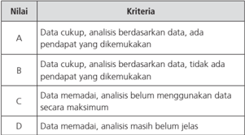

Tabel ini menunjukkan kriteria evaluasi untuk analisis berdasarkan data. Topik utamanya adalah kualitas analisis yang dilakukan berdasarkan data. Kolom pertama menunjukkan nilai-nilai yang diberikan, sedangkan kolom kedua menjelaskan kriteria yang digunakan untuk menentukan nilai tersebut. Data memadai (D) menunjukkan bahwa analisis menggunakan data, tetapi masih belum jelas. Data cukup (C) menunjukkan bahwa analisis menggunakan data dan pendapat yang dikemukakan, namun masih belum maksimal. Data analisis berdasarkan data (A) menunjukkan bahwa analisis menggunakan data dan pendapat yang dikemukakan, serta mendapatkan pendapat yang dikemukakan. Data analisis berdasarkan data, tidak ada pendapat yang dikemukakan (B) menunjukkan bahwa analisis menggunakan data, tetapi tidak ada pendapat yang dikemukakan. Pola penting yang terlihat adalah bahwa semakin banyak pendapat yang dikemukakan, semakin tinggi nilai yang diberikan.

### 4. Strategi Penilaian

Penilaian hasil belajar sebagai proses pengumpulan dan pengolahan informasi  untuk  mengukur  pencapaian  hasil  belajar  siswa.  Hasil  penilaian digunakan untuk melakukan evaluasi terhadap prestasi belajar siswa meliputi aspek hasil  belajar  yang  masih  dianggap  lemah,  dan  hasil  belajar  yang  dianggap sudah  mencapai  kompetensi  serta  penilaian  secara  keseluruhan  terhadap

 

---
## 📄 Halaman 48

seorang  siswa  untuk  membuat  keputusan  tentang  tingkat  pencapaian kompetensi  siswa.  Bagi  siswa  yang  belum  mencapai  tingkat  kompetensi dalam satu aspek atau lebih dapat dilakukan pembelajaran remedial setelah suatu kegiatan penilaian dilakukan (UTS, Tugas, dan sebagainya).

Penilaian  meliputi  aspek  sikap  spiritual  dan  sosial,  pengetahuan Sejarah  yang  terdiri  atas  pengetahuan  fakta  sejarah,  pemahaman  konsep sejarah dan cerita sejarah,  dan keterampilan sejarah, dan penilaian terhadap 5  kompetensi  Pembelajaran  Saintifik  sebagai  keterampilan  proses,  yang dilakukan selama proses pembelajaran berlangsung (penilaian proses) maupun setelah pembelajaran dilaksanakan (penilaian hasil belajar).

Penilaian pendidikan merupakan suatu proses yang dilakukan melalui langkah-langkah  perencanaan,  penyusunan  alat  penilaian,  pengumpulan informasi melalui sejumlah bukti yang menunjukkan pencapaian hasil belajar siswa, pengolahan, dan penggunaan informasi tentang hasil belajar siswa. Penilaian dilaksanakan melalui berbagai teknik/cara, seperti penilaian unjuk kerja  ( performance ),  penilaian  tertulis  ( paper  and  pencil  test )  atau  lisan, penilaian proyek, penilaian produk, penilaian melalui kumpulan hasil kerja/ karya siswa ( portfolio ), dan penilaian diri.

### 5. Bentuk dan Teknik  Penilaian Otentik

Penilaian otentik merupakan penilaian yang sesungguhnya dan bersifat komprehensif. Pendekatan penilaian akan  memberikan kesempatan yang luas kepada siswa untuk menunjukkan kemampuan dan penguasaannya tentang pengetahuan, keterampilan, dan sikap yang sudah dimilikinya dalam bentuk tugas,  misalnya:  membaca  dan  meringkasnya,  eksperimen,  mengamati, survei, proyek, makalah, membuat multimedia, membuat karangan, diskusi kelas, bermain peran.

Begitu juga penilaian untuk mata pelajaran Sejarah Indonesia seperti halnya mata pelajaran lain pada Kurikulum 2013 dilakukan melalui penilaian sikap, pengetahuan, dan keterampilan.

 

---
## 📄 Halaman 49

### a. Penilaian Sikap

Penilaian sikap berbentuk kebiasaan yang didasarkan pada nilai yang dimiliki siswa. Kebiasaan tersebut terlihat dalam perilaku siswa. Bentuk perilaku  dinyatakan  dalam  ucapan,  cara  berpikir,  cara  bersikap,  dan bertindak. Nilai-nilai tersebut berkembang pada diri siswa dalam suatu proses  internalisasi.  Proses  internalisasi  dimulai  dari  pengetahuan tentang nilai kemudian dilanjutkan dalam proses penentuan apakah nilai  tersebut  dianggap  baik  untuk  dirinya  atau  tidak.  Jika  dianggap tidak  baik  bagi  dirinya  maka  nilai  tersebut  akan  ditolak  tetapi  jika dianggap baik maka terjadi proses internalisasi nilai.

Teknik dan instrumen yang dapat digunakan untuk menilai kompetensi pada aspek sikap:

### 1). Observasi

Merupakan teknik penilaian yang dilakukan secara berkesinambungan  dengan  menggunakan  indera,  baik  secara langsung maupun tidak langsung dengan menggunakan format observasi yang berisi sejumlah indikator perilaku yang diamati. Hal ini dilakukan saat pembelajaran maupun di luar pembelajaran. Agar  penilaian sikap melalui observasi dapat terarah  dan objektif  maka  diperlukan  panduan.  Panduan  observasi  adalah alat/instrumen  yang  dikembangkan  untuk  merekam  berbagai perilaku seperti ucapan, mimik, tindakan yang dilakukan siswa baik pada  waktu  ketika proses belajar-mengajar di kelas, kegiatan di sekolah, atau pun kegiatan lain yang dilaksanakan berdasarkan  program  belajar  suatu  mata  pelajaran.  Observasi dilakukan terintegrasi dengan  proses pembelajaran. Ketika masuk kelas sebelum membuka pelajaran, sambil memberi salam guru mengamati seluruh kelas. Pengamatan itu dilangsungkan sepanjang  proses  pembelajaran.  Pengamatan  yang  dilakukan bersifat  alami  sebagaimana  yang  sudah  biasa  dilakukan  guru dan tidak langsung memfokuskan pada setiap anak siswa satu persatu. Observasi adalah  bagian  yang  terintegrasi  selama

 

---
## 📄 Halaman 50

proses pembelajaran berlangsung, tidak seperti observasi dalam penelitian  yang  memperhatikan  setiap  siswa  secara  khusus dalam ukuran waktu tertentu.

Panduan  observasi  digunakan  untuk  merekam  hasil  belajar berupa sikap dan perilaku yang bersifat deskriptif atau terbuka, tidak preskriptif atau tertutup sebagaimana dalam penilaian hasil belajar pengetahuan. Observasi yang dimaksudkan di sini berbeda dari catatan anekdot ( anecdotal record ). Catatan anekdot tidak terencana dan merekam suatu peristiwa hanya apabila peristiwa itu  muncul.  Observasi  untuk  penilaian  sikap  dilakukan  secara terencana  setiap  hari  dan  merekam  peristiwa/perilaku  muncul atau tidak muncul. Suatu peristiwa/kejadian yang tidak muncul atau tidak dilakukan siswa tetap dihitung sebagai suatu kejadian tetapi perekamannya seperti catatan anekdot yaitu hanya pada perilaku siswa yang dianggap istimewa dalam arti positif maupun negatif.

Instrumen panduan observasi membantu guru untuk merekam perilaku  yang  ditunjukkan  siswa  dalam  bentuk  rekaman  yang dapat  dipelajari  walaupun  perilaku  itu  sudah  berlalu.  Dengan demikian, guru memiliki waktu yang cukup  untuk mengkaji hasil rekaman observasi  dan  mengulang  kajian  tersebut  setiap  saat diperlukan. Dengan cara demikian maka pemaknaan terhadap perilaku tersebut menjadi lebih baik.

### Contoh: Format Observasi

Tanggal: ............................................................................

Hari     : .............................................................................

Nama Siswa

Perilaku Yang Ditampilkan

 

---
## 📄 Halaman 51

---
**📊 Tabel**

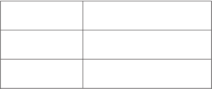

Tabel ini mungkin berisi informasi tentang perbandingan antara dua atau lebih objek atau konsep. Topik utamanya mungkin berkisar pada perbandingan atau komparasi antara dua hal yang berbeda. Kolom-kolomnya mungkin mencakup berbagai aspek atau kriteria yang digunakan untuk membandingkan objek tersebut. Data atau pola penting yang terlihat mungkin melibatkan perbandingan nilai, ukuran, atau karakteristik tertentu dari objek tersebut. Misalnya, jika tabel ini berisi data tentang perbandingan antara dua produk, kolom-kolomnya mungkin mencakup harga, kualitas, atau efisiensi. Pola penting yang mungkin terlihat adalah bahwa salah satu produk memiliki nilai-nilai yang lebih tinggi dibandingkan dengan produk lainnya dalam semua aspek yang diukur.

Catatan: berisikan situasi atau kondisi khusus (bukan yang terjadi seharihari) ketika suatu perilaku muncul.

- *)  Nama siswa dapat diisi ketika pada hari/tanggal observasi, siswa yang bersangkutan menunjukkan perilaku teramati.

### 2). Penilaian Diri

Merupakan teknik penilaian dengan cara meminta siswa untuk mengemukakan kelebihan dan kekurangan dirinya dalam konteks  pencapaian  kompetensi.  Instrumen  yang  digunakan berupa lembar penilaian diri.

Penilaian ini dilakukan oleh siswa, dan guru menyediakan format seperti contoh berikut ini;

Nama :

Kelas :

Semester :

Waktu penilaian :

Petunjuk :

- Bacalah  baik-baik  setiap  pernyataan  dan  berilah  tanda ( √ ) pada kolom yang sesuai dengan keadaan dirimu yang sebenarnya.
- Serahkan  kembali  format  yang  sudah  kamu  isi  kepada bapak/ibu guru

 

---
## 📄 Halaman 52

---
**📊 Tabel**

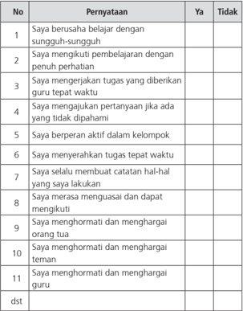

Tabel ini berisi pernyataan tentang perilaku belajar dan sikap yang positif. Topik utamanya adalah tentang keberhasilan belajar dan pengembangan diri. Kolom-kolomnya meliputi "No", "Pernyataan", "Ya", dan "Tidak". Data penting yang terlihat adalah bahwa sebagian besar responden (dalam kolom "Ya") menunjukkan keberhasilan belajar dan sikap positif, seperti berusaha belajar dengan sungguh-sungguh, mengikuti pembelajaran dengan penuh perhatian, mengerjakan tugas tepat waktu, berperan aktif dalam kelompok, membuat catatan catatan hal-hal yang dilakukan, merasa meneruskan dan dapat mengikuti, menghormati dan menghargai orang tua, menghormati dan menghargai teman, dan menghormati dan menghargai guru. Sementara itu, hanya sedikit responden yang menunjukkan tidak (dalam kolom "Tidak").

### Keterangan:

- (1). Penilaian persepsi diri siswa untuk mencocokkan persepsi diri siswa dengan kenyataan yang ada.
- (2). Hasil  penilaian  persepsi  diri  siswa  digunakan  sebagai dasar guru untuk melakukan bimbingan dan motivasi lebih lanjut.
- (3). Penilaian diri untuk SD/MI dilaksanakan pada kelas tinggi (4,  5,  dan  6),  dan  untuk  SMP/MTs/SMA/MA/SMK/MAK dapat dilaksanakan mulai kelas awal.

 

---
## 📄 Halaman 53

Penilaian diri dilakukan di awal dan di akhir semester pertama, di  akhir  semester 3-6. Hasil penilaian diri di semester pertama dijadikan  informasi  dasar  untuk  dibandingkan  pada  semester berikutnya dalam suatu profil sikap siswa.

### 3). Penilaian Antarteman

Teknik  penilaian  dengan  cara  meminta  siswa    untuk  saling menilai  terkait  dengan  sikap  dan  perilaku  keseharian  siswa. Instrumen yang digunakan berupa lembar penilaian antarsiswa. Sebagaimana halnya Penilaian Diri, Penilaian Sejawat dilakukan di awal dan akhir semester pertama dan akhir setiap semester berikutnya.  Hasilnya  merupakan  profil  yang  menggambarkan sikap sosial seorang siswa. Hasil Penilaian Sejawat dapat dikembangkan menjadi sosiogram yang menggambarkan komunikasi yang terjadi antarsiswa.

Teknik penilaian ini dilakukan dengan cara meminta siswa  untuk menilai  sikap  temannya.  Instrumen  yang  digunakan  berupa lembar  penilaian  antarsiswa  yang  dirancang  oleh  guru  seperti contoh berikut ini.

Nama Teman yang Dinilai :

Nama Penilai                    :

Kelas                                :

Semester                          :

Waktu penilaian               :

Petunjuk :

- Amati perilaku temanmu  selama  mengikuti  kegiatan pelajaran.
- Isilah  kolom  yang  tersedia  dengan  tanda  cek  ( √ )  jika temanmu  menunjukkan  perilaku  yang  sesuai  dengan pernyataan untuk indikator yang kamu amati atau tanda strip (-) jika temanmu tidak menunjukkan perilaku tersebut.
- Serahkan hasil pengamatan kepada bapak/ibu pendidik.

 

---
## 📄 Halaman 54

---
**📊 Tabel**

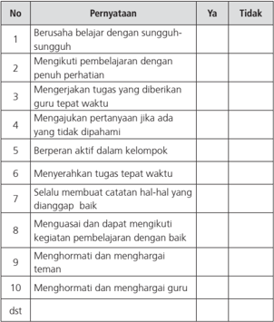

Tabel ini berisi 10 poin yang mungkin menjadi pertanyaan untuk evaluasi kinerja belajar siswa. Topik utamanya adalah tentang sikap dan perilaku belajar yang baik. Kolom "Ya" dan "Tidak" digunakan untuk mengevaluasi apakah siswa telah melakukan atau belum melakukan tindakan tertentu dalam proses belajar. Data penting yang terlihat adalah bahwa semua poin memiliki kolom "Ya", menunjukkan bahwa setiap siswa dianggap telah melakukan semua tindakan yang ditentukan dalam proses belajar. Ini menunjukkan bahwa semua siswa dianggap telah berusaha belajar dengan sungguh-sungguh, mengikuti pembelajaran dengan penunjang perhatian, mengerjakan tugas tepat waktu, berperan aktif dalam kelompok, menyelesaikan tugas tepat waktu, menghormati dan menghargai teman, dan menghormati dan menghargai guru. Namun, tidak ada poin yang menunjukkan bahwa siswa belum melakukan tindakan tertentu dalam proses belajar.

### Keterangan:

- (1). Penilaian antarteman  digunakan  untuk  mencocokkan persepsi diri siswa dengan persepsi temannya serta kenyataan yang ada.
- (2). Hasil penilaian antarteman digunakan guru sebagai dasar untuk melakukan bimbingan dan motivasi lebih lanjut.
- (3). Penilaian  diri  untuk  tingkat  SMA/MA/SMK/MAK  dapat dilaksanakan mulai kelas awal.

 

---
## 📄 Halaman 55

### 4). Jurnal/Catatan guru

Merupakan catatan pendidik di dalam dan di luar kelas yang berisi informasi hasil  pengamatan tentang kekuatan dan kelemahan siswa    yang  berkaitan  dengan  sikap  dan  perilaku.  Jurnal  bisa dikatakan  sebagai  catatan  yang  berkesinambungan  dari  hasil observasi.

### Contoh: Format penilaian  jurnal

JURNAL

Nama     : ………………………………..

Kelas      : ……………………………….

---
**📊 Tabel**

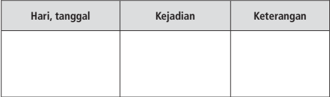

Tabel ini menunjukkan berbagai kejadian yang terjadi pada hari tertentu, dengan detail tentang apa yang terjadi dan keterangan tambahan. Topik utama tabel adalah kejadian-kejadian yang terjadi pada hari tertentu. Kolom "Hari, tanggal" menyediakan informasi tentang waktu ketika kejadian tersebut terjadi. Kolom "Kejadian" mencakup deskripsi singkat dari apa yang terjadi pada hari tersebut. Kolom "Keterangan" memberikan informasi tambahan atau penjelasan lebih lanjut tentang kejadian tersebut. Dari tabel ini, kita dapat melihat bahwa kejadian-kejadian tersebut bervariasi, mulai dari kegiatan sehari-hari hingga peristiwa penting lainnya.

### 5). Proses Pengembangan Penilaian Performance Sikap

Untuk mendapatkan informasi mengenai nilai dan sikap, prosedur pengembangan penilaian performance meliputi langkah-langkah berikut:

- (1). Tentukan  pengetahuan,  kemampuan  kognitif,  nilai  dan sikap  yang ingin diketahui guru dari siswa yang belajar sejarah.
- (2). Kembangkan indikator mengenai kemampuan dan nilai  tersebut,    kaji  dan  tentukan  apa  indikator  tersebut merupakan  indikator  penting,  sudah  cukup  atau  perlu ditambah atau dikurangi
- (3).    Kaji  informasi  yang  diperlukan  untuk  indikator  tersebut yang dalam bentuk ungkapan kalimat tertulis.

 

---
## 📄 Halaman 56

- (4). Tulis pertanyaan/tugas yang harus dikerjakan siswa seperti halnya  anda  mengembangkan  pertanyaan  untuk  soal uraian ( essay ) tetapi cukup satu pertanyaan/tugas untuk satu instrumen performance .
- (5). Kembangan  rubrik:  tulis  kriteria  yang  digunakan  untuk menilai informasi yang ditulis dalam jawaban siswa  dan tingkat  keberhasilan.  Rubrik  adalah  skala  skor  penilaian yang  digunakan  untuk  menilai  jawaban  siswa  terhadap pertanyaan atau tugas yang dikerjakannya (Mueller, 2011).
Contoh: nilai jujur (melalui pembelajaran)

Nilai:  JUJUR

---
**📊 Tabel**

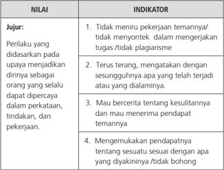

Tabel ini menunjukkan kriteria evaluasi untuk menilai perilaku kerja yang berdasarkan pada upaya menjadikan diri sebagai orang yang selalu dapat dipercaya dalam perkataan, tindakan, dan pekerjaan. Topik utamanya adalah tentang nilai-nilai profesionalitas dan integritas dalam kerja. Kolom "Juru" menyajikan deskripsi perilaku yang diharapkan, sedangkan kolom "Indikator" memberikan petunjuk spesifik tentang bagaimana perilaku tersebut dapat dilihat dan diukur. Data penting yang terlihat adalah bahwa nilai utama adalah ketahanan moral dan integritas, termasuk tidak merusak reputasi tim, terus menerus menghargai keputusan tim, dan memiliki sikap yang positif terhadap pendapat tim.

Rubrik pemberian skor

 

---
## 📄 Halaman 57

### 6). Pengolahan Jawaban

Berdasarkan jawaban siswa yang ditulis terhadap jawaban yang diberikan  pada  model perfomance  assessment guru  dapat mengolah jawaban tersebut menjadi profil perilaku siswa. Profil tersebut menggambarkan perilaku nilai yang ditunjukkan siswa.

Satu instrumen performance hanya dapat dikatakan menunjukkan  ada/tidak  adanya  perilaku  tersebut.  Jadi  untuk setiap  peristiwa  penilaian  guru  merekam  hasil  jawaban  siswa dengan  suatu  profil.    Beberapa  hasil  dari  berbagai  peristiwa penilaian  dalam  satu  bulan,    guru  dapat  mengembangkan keseluruhan profil perilaku  hasil belajar karakter: Belum Tampak (BT),  Mulai  Tampak  (MT),  Mulai  Stabil  (MS),  Sudah  Konsisten (SK).

Pada  akhir  semester  guru  dapat  mengkonversi  profil  tersebut untuk nilai rapor sebagai berikut:

### b. Penilaian Pengetahuan

---
**📊 Tabel**

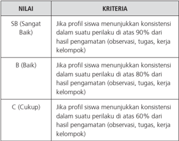

Tabel ini menunjukkan kriteria evaluasi untuk menilai konsistensi perilaku siswa dalam suatu kelas. Topik utamanya adalah kriteria penilaian berdasarkan konsistensi perilaku siswa. Kolom pertama berisi nilai penilaian (SB, B, C) yang diberikan kepada siswa berdasarkan kriteria tertentu. Kolom kedua berisi deskripsi kriteria penilaian tersebut. Data penting yang terlihat adalah bahwa nilai SB diberikan jika konsistensi perilaku siswa di atas 90%, B diberikan jika di atas 80%, dan C diberikan jika di bawah 60%. Ini menunjukkan bahwa penilaian lebih akurat ketika konsistensi perilaku siswa di atas 80% dibandingkan dengan di bawah 60%.

 

---
## 📄 Halaman 58

Pengetahuan  adalah  hasil  yang  diperoleh  dari  kegiatan  mengingat, refleksi,  deduksi,  dan  induksi  (penelitian).  Pengetahuan  diperlukan untuk mengembangkan kemampuan kognitif, keterampilan psikomotorik,  dan  internalisasi  nilai  serta  kebiasaan  dalam  ranah afektif.  Pengetahuan  yang  dihasilkan  kemampuan  kognitif  dapat berupa  pengetahuan  hafalan  dan  dapat  pula  berupa  pengetahuan yang digunakan ( working knowledge ).  Pengetahuan berupa hafalan hanya  memerlukan  kemampuan  kognitif  pada  tingkat  mengingat ( recall = remember ). Pengetahuan yang dapat digunakan memerlukan pengetahuan  kognitif  pada  tingkat  memahami  ( understand )  dan tingkat-tingkat di atasnya.

Pengetahuan  yang digunakan ( working  knowledge ) juga untuk mengembangkan kemampuan kognitif pada tingkat memahami (dulu disebut pemahaman), mengaplikasi, menganalisis, mengevaluasi (menilai), dan menghasilkan suatu yang baru.

Berbagai teknik penilaian pengetahuan  dapat  digunakan  sesuai

---
**📊 Tabel**

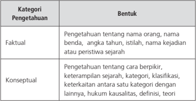

Tabel ini membahas dua kategori pengetahuan: Faktual dan Konseptual. Kategori Faktual mencakup pengetahuan tentang nama orang, benda, angka tahunan, istilah, kejadian sejarah, atau peristiwa sejarah. Sementara itu, kategori Konseptual meliputi pengetahuan tentang cara berpikir, keterampilan sejarah, kategorisasi, klasifikasi, keterkaitan antara satu kategori dengan lainnya, hukum kualitas, definisi, dan teori. Pola penting yang terlihat adalah bahwa kategori-faktual lebih fokus pada informasi spesifik dan konseptual lebih fokus pada pemahaman dan interpretasi.

 

---
## 📄 Halaman 59

---
**📊 Tabel**

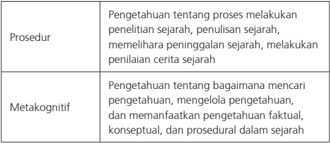

Tabel ini membahas dua aspek utama dalam proses penelitian sejarah: prosedur dan metakognitif. Dalam prosedur, topik utama adalah pengetahuan tentang proses meliputi penelitian sejarah, penulisan sejarah, memahami peninggalan sejarah, dan melakukan penilaian sejarah. Sedangkan dalam metakognitif, topik utama adalah pengetahuan tentang bagaimana mencari pengetahuan, mengelola pengetahuan, dan memahami pengetahuan faktil, konseptual, dan procedural dalam sejarah. Data atau pola penting yang terlihat adalah bahwa tabel ini mencakup berbagai aspek penelitian sejarah, mulai dari proses penelitian hingga pemahaman konsep sejarah.

dengan karakteristik masing-masing KD. Teknik yang biasa digunakan adalah tes tertulis, tes lisan, dan penugasan. Namun tidak menutup kemungkinan digunakan teknik lain yang sesuai, misalnya portofolio dan observasi.

### 1). Tes Tertulis

Tes  tertulis  digunakan  untuk  mengukur  pengetahuan  yang diperoleh  dalam  pembelajaran  Sejarah  Indonesia.  Berdasarkan jenisnya tes tertulis dapat dilakukan pilihan ganda, isian, benarsalah, menjodohkan, dan uraian, sedangkan berdasarkan waktu pelaksanaannya  tes  dilakukan  dalam  situasi  yang  disediakan khusus,  misalnya:  ulangan  harian,  ulangan  tengah  semester, ulangan  akhir  semester  ataupun  ulangan  kenaikan  kelas.  Tes dapat  juga  dilakukan  melekat  dalam  proses  pembelajaran, misalnya dalam bentuk kuis, untuk mengetahui seberapa jauh  siswa  dapat  menguasai  atau  menyerap  materi  pelajaran. Pengembangan instrumen tes tertulis mengikuti langkahlangkah sebagai berikut.

- Menetapkan tujuan tes, yaitu untuk seleksi, penempatan, diagnostik, formatif, atau sumatif.
- Menyusun kisi-kisi, yaitu spesifikasi yang digunakan sebagai  acuan  menulis  soal.  Kisi-kisi  memuat  ramburambu tentang kriteria soal yang akan ditulis, meliputi KD yang akan diukur, materi, indikator soal, bentuk soal, dan

 

---
## 📄 Halaman 60

- nomor soal. Dengan adanya kisi-kisi, penulisan soal lebih terarah sesuai dengan tujuan tes dan proporsi soal per KD atau materi yang hendak diukur lebih tepat.
- Menulis  soal  berdasarkan  kisi-kisi  dan  kaidah  penulisan soal.
- Menyusun  pedoman  penskoran  sesuai  dengan  bentuk soal  yang  digunakan.  Pada  soal  pilihan  ganda,  isian, menjodohkan,  dan  jawaban  singkat  disediakan  kunci jawaban  karena  jawaban  dapat  diskor  dengan  objektif. Sedangkan untuk soal uraian disediakan pedoman penskoran  yang  berisi alternatif jawaban  dan  rubrik dengan rentang skor.
- Melakukan  analisis  kualitatif  (telaah  soal)  sebelum  soal diujikan.

### Contoh Kisi-Kisi

Nama Satuan Pendidikan  : SMA

Kelas/Semester

: XI/Semester II

Tahun Pelajaran

: 2015/2016

Mata Pelajaran

: Sejarah Indonesia

---
**📊 Tabel**

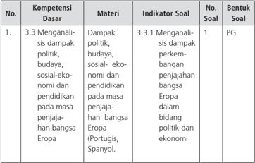

Tabel ini menunjukkan struktur soal untuk kompetensi dasar 3.3 tentang menganalisis dampak politik, budaya, sosial-ekonomi, dan pendidikan pada masa penjajahan bangsa Eropa. Kolom-kolomnya meliputi nomor soal, materi, indikator soal, dan bentuk soal. Topik utama adalah analisis dampak penjajahan Eropa di bidang politik dan ekonomi. Data penting termasuk bahwa satu soal (No. 1) berbentuk PG (pengetahuan ganda), dengan materi yang mencakup dampak politik, budaya, sosial-ekonomi, dan pendidikan pada masa penjajahan Eropa dalam bahasa Portugis, Spanyol, dan lainnya.

 

---
## 📄 Halaman 61

---
**📊 Tabel**

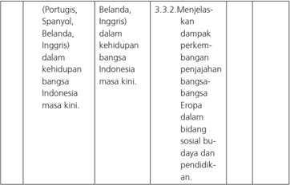

Tabel ini berisi informasi tentang dampak perkembangan penjajahan bangsa-bangsa Eropa pada kehidupan bangsa Indonesia masa kini. Kolom pertama berisi bahasa yang digunakan untuk menjelaskan dampak tersebut, yaitu Portugis, Spanyol, Belanda, dan Inggris. Kolom kedua berisi deskripsi singkat tentang dampak tersebut dalam konteks kehidupan bangsa Indonesia saat ini. Kolom ketiga berisi detail tentang dampak tersebut, seperti penjajahan Eropa dalam bidang sosial budaya dan pendidikan. Topik utama tabel ini adalah dampak perjalanan penjajahan Eropa pada kehidupan bangsa Indonesia masa kini.

Setelah menyusun kisi-kisi, selanjutnya dilakukan mengembangkan  butir  soal  dengan  memperhatikan  kaidah penulisan  butir  soal  meliputi  substansi/materi,  konstruksi,  dan bahasa.

### Contoh:

Jelaskan dampak perkembangan penjajahan Belanda di Indonesia dalam bidang pendidikan.

Tes tertulis  dapat  dibuat  dalam  bentuk  Pilihan  Ganda,  Uraian, dan  Hubungan  Sebab  Akibat  yang  mendorong  siswa  untuk melakukan analisis (bukan hafalan).

### Contoh Pilihan ganda:

Asas  PI  yang  cukup  menginspirasi  pergerakan  kebangsaan  di Indonesia adalah…

- self help dan kesatuan nasional
- kooperasi dan kesejahteraan rakyat
- nasionalisme dan radikalisme
- kesatuan bahasa dan budaya
- kedaulatan politik dan kebebasan berpendapat

 

---
## 📄 Halaman 62

Contoh Tes Uraian:

Belanda termasuk bangsa yang terlambat datang ke Indonesia dibanding dengan Spanyol, Portugis dan juga Inggris. Mengapa demikian?  Kemudian  jelaskan  dan  tunjukkan  dengan  bukti terjadinya perebutan hegemoni bangsa-bangsa Eropa di Indonesia?

### 2) Observasi terhadap Diskusi, Tanya Jawab, dan Percakapan

Penilaian terhadap pengetahuan siswa dapat dilakukan melalui observasi terhadap diskusi, tanya jawab, dan percakapan. Teknik ini adalah cerminan dari penilaian otentik.

Contoh : Format observasi diskusi, dan tanya jawab, dapat dilihat kemampuannya dalam:

---
**📊 Tabel**

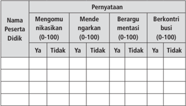

Tabel ini menunjukkan hasil survei tentang perilaku dan pendapat peserta didik terhadap berbagai situasi sosial. Topik utamanya adalah bagaimana mereka mengomunikasikan pikiran mereka, merespons situasi, dan berinteraksi dengan orang lain. Kolom-kolomnya meliputi: Mengomunikasikan pikiran (0-100), Mende ngarang (0-100), Berargumen (0-100), dan Berkontribusi (0-100). Data penting yang terlihat adalah bahwa sebagian besar peserta didik memiliki kemampuan untuk mengomunikasikan pikiran mereka dengan baik, namun masih ada yang kurang memahami cara mendengarkan orang lain dan berargumen dengan efektif. Selain itu, banyak peserta didik yang tidak suka berkontribusi dalam diskusi atau tindakan sosial.

### 3). Penugasan

Penugasan adalah pemberian tugas kepada siswa untuk mengukur  dan/atau  meningkatkan  pengetahuan.  Penugasan yang digunakan untuk mengukur pengetahuan ( assessment of learning )  dapat  dilakukan  setelah  proses  pembelajaran  sedangkan penugasan yang digunakan untuk meningkatkan pengetahuan ( assessment for learning )  diberikan  sebelum  dan/atau selama

 

---
## 📄 Halaman 63

proses pembelajaran. Penugasan dapat berupa pekerjaan rumah dan/atau proyek yang dikerjakan secara individu atau kelompok sesuai dengan karakteristik tugas. Penugasan lebih ditekankan pada pemecahan masalah dan tugas produktif lainnya.

Contoh: Penugasan

Mata Pelajaran

: Sejarah Indonesia

Kelas/Semester

: XI /II

Tahun Pelajaran

: 2015/2016

### Kompetensi Dasar:

Menyajikan langkah-langkah dalam penerapan nilai-nilai Sumpah Pemuda dan maknanya bagi kehidupan kebangsaan di Indonesia pada masa masa kini, dalam bentuk tulisan dan/atau media lain.

### Indikator:

Siswa  dapat  membuat  kajian  tertulis  dalam  bentuk  makalah sederhana mengenai langkah-langkah penerapan nilai-nilai Sumpah Pemuda dan maknanya bagi kehidupan kebangsaan di Indonesia pada masa kini.

### Rincian tugas:

Buatlah    laporan  tertulis  dalam  bentuk  makalah  sederhana mengenai  Sumpah  Pemuda  dan  langkah-langkah  penerapan nilai-nilai  Sumpah  Pemuda  dan  maknanya  bagi  kehidupan kebangsaan di Indonesia pada masa kini.

- (1). Makalah terdiri dari tiga bagian: pendahuluan, pembahasan, dan penutup
- (2). Pembahasan harus memuat unsur: latar belakang lahirnya imperialisme dan kolonialisme di Indonesia, jalannya imperialisme dan kolonialisme di Indonesia, respon bangsa Indonesia terhadap imperialisme dan kolonialisme, dampak  imperialisme  dan  kolonialisme  dalam  berbagai aspek  kehidupan,  serta  hikmah  yang  bisa  diambil  pada kehidupan masa kini.

 

---
## 📄 Halaman 64

- (3). Menggunakan  kertas  A4,  huruf  Times  New  Roman  12, Spasi 1,5
- (4). Sumber harus dicantumkan pada daftar pustaka
- (5). Tugas Individu
- (6). Waktu pengerjaan 2 minggu
- (7). Aspek  yang  dinilai:  (a)  cakupan  materi,  (b)  keakuratan materi,  (c)  Relevansi,  (d)  Penggunaan  Bahasa  Indonesia yang baik dan benar, dan (e) Kelengkapan sumber bacaan/ informasi.

### 4). Tes Lisan

Tes  lisan  berupa  pertanyaan-pertanyaan  yang  diberikan  guru secara lisan (oral) sehingga siswa merespons pertanyaan tersebut  secara lisan juga, sehingga menimbulkan keberanian. Jawaban  dapat  berupa  kata,  frase,  kalimat  maupun  paragraf yang diucapkan.

### Contoh: Soal tes lisan

Berikan contoh-contoh nasionalisme kebangsaan yang bisa kita terapkan  dalam  kehidupan  berbangsa  dan  bernegara  dewasa ini?

### Jawaban.

Menghargai  jasa  para  pahlawan  dan  tokoh-tokoh  di  masa lampau,

Cinta  tanah  air  dengan  menjaga  kebersihan  lingkungan,  dan hidup berdampingan dengan masyarakat lain, berprestasi dalam bidang akademik, olahraga,seni-budaya, dan lain-lain.

### c. Penilaian Keterampilan

Penilaian keterampilan adalah penilaian untuk mengukur pencapaian kompetensi  siswa    terhadap  kompetensi  dasar  pada  KI-4.  Penilaian keterampilan menuntut siswa mendemonstrasikan suatu kompetensi tertentu. Penilaian ini dimaksudkan untuk mengetahui apakah

 

---
## 📄 Halaman 65

pengetahuan  yang  sudah  dikuasai  siswa  dapat  digunakan  untuk mengenal dan menyelesaikan masalah dalam kehidupan sesungguhnya ( real life ). Ketuntasan belajar untuk keterampilan dibuat dalam bentuk angka  pada  skala  0  -  100.  Ketuntasan  belajar  untuk  keterampilan ditentukan  oleh  satuan  pendidikan.  Namun  secara  bertahap  satuan pendidikan  harus  meningkatkan  kriteria  ketuntasan  belajar  dengan mempertimbangkan potensi dan karakteristik masing-masing satuan pendidikan sebagai bentuk peningkatan kualitas hasil belajar.

Penilaian keterampilan dalam mata pelajaran Sejarah Indonesia dapat dilakukan  dengan  berbagai  teknik  antara  lain  penilaian  unjuk  kerja/ kinerja/praktik, proyek, produk,  dan  portofolio. Teknik penilaian lain  dapat  digunakan  sesuai  dengan  karakteristik  KD  dari  KI-4  yang akan diukur. Instrumen yang digunakan berupa daftar cek atau skala penilaian ( rating scale ) yang dilengkapi rubrik.

### 1). Unjuk kerja/kinerja/praktik

Penilaian kinerja dapat berbentuk penilaian berupa melakukan suatu aktivitas keterampilan gerak ( skill test ). Melalui penilaian kinerja  siswa  diminta  mendemonstrasikan  kinerjanya  dalam aktivitas jasmani atau melaksanakan berbagai macam keterampilan gerak sesuai dengan kompetensi inti dan kompetensi dasar mata pelajaran Sejarah Indonesia.

Penilaian kinerja dalam mata pelajaran Sejarah Indonesia dapat berupa penilaian terhadap kemampuan siswa dalam menerapkan keterampilan membuat peta, melakukan wawancara, melakukan penelitian sederhana tentang suatu peristiwa sejarah.

### 2). Penilaian Proyek

Proyek adalah tugas-tugas belajar ( learning tasks ) yang meliputi  kegiatan  perancangan,  pelaksanaan,  dan  pelaporan secara  tertulis  maupun  lisan  dalam  waktu  tertentu.  Penilaian proyek  merupakan  kegiatan  penilaian  terhadap  suatu  tugas yang  harus  diselesaikan  dalam  periode  atau  waktu  tertentu. Tugas tersebut berupa suatu investigasi sejak dari perencanaan,

 

---
## 📄 Halaman 66

pengumpulan,  pengorganisasian,  pengolahan  dan  penyajian data.  Penilaian  proyek  dapat  digunakan  untuk  mengetahui pemahaman, kemampuan mengaplikasikan, penyelidikan serta menginformasikan  siswa  pada  mata  pelajaran  dan  indikator/ topik tertentu secara jelas.

Pada  penilaian  proyek,  setidaknya  ada  3  (tiga)  hal  yang  perlu dipertimbangkan:  (a)  kemampuan  pengelolaan:  kemampuan siswa  dalam  memilih  indikator/topik,  mencari  informasi  dan mengelola waktu pengumpulan data serta penulisan laporan, (b) relevansi: kesesuaian dengan mata pelajaran dan indikator/topik, dengan mempertimbangkan tahap pengetahuan, pemahaman dan keterampilan dalam pembelajaran, dan (c) keaslian: proyek yang dilakukan siswa harus merupakan hasil karyanya, dengan mempertimbangkan kontribusi guru berupa petunjuk dan dukungan terhadap proyek siswa.

### 3). Penilaian Portofolio

Penilaian  portofolio  adalah  penilaian  yang  dilakukan  dengan cara  menilai  siswa  yang  dilakukan  secara  berkelanjutan  dan didasarkan atas kumpulan informasi perkembangan kemampuan siswa dalam satu periode tertentu. Jenis-jenis portofolio dapat berupa:

- a). Portofolio personal jika dipegang dan dikelola oleh siswa. Biasanya  berguna  untuk  menuliskan  aktivitas  fisik  yang disenangi,  harapan,  refleksi  diri,  serta  berbagi  gagasan dari pengalaman yang diperoleh, sepanjang periode pembelajaran.
- b). Portofolio terekam dan tersimpan ( record-keeping portfolios ),  portofolio  ini  dapat  diisi  dan  disimpan  oleh siswa, namun sebagian dari informasi yang direkam juga disimpan oleh guru.
- c). Portofolio  tematik  ( thematic  portfolios ), portofolio ini menggambarkan      kegiatan  pembelajaran  pada  satu pokok bahasan (tema) yang berdurasi antara dua hingga enam minggu.

 

---
## 📄 Halaman 67

- d). Portofolio terintegrasi ( integrated portfolios ), portofolio ini dapat digunakan untuk menggambarkan 'potret' siswa secara keseluruhan, dan berbagai subyek pembelajaran.
- e). Portofolio selebrasi ( celebration portfolios ) untuk mencatat prestasi  yang  diperoleh  siswa  dalam  bidang  akademik maupun  non  akademik.  Misalnya  menjadi  pemenang lomba karya ilmiah/lomba seni/lomba olahraga.
- f). Portofolio tahun jamak ( multiyears portfolios ), yaitu portofolio yang digunakan dengan jangka beberapa tahun dan  digunakan  oleh  siswa  dari  satu  tingkatan  kelas  ke kelas yang lebih tinggi.

### 6. Contoh Praktis

Berdasarkan  teori,  prinsip  dan  langkah-langkah  penilaian  seperti dijelaskan  di  atas,  dapat  dibuat  contoh  praktis  penilaian  otentik  yang (menyangkut penilaian sikap, keterampilan dan pengetahuan) dalam pembelajaran  Sejarah  Indonesia.  Contoh  berikut  ini  dapat  dibuat    untuk setiap pertemuan atau beberapa kali pertemuan.

### a. Penilaian Sikap

 

---
## 📄 Halaman 68

### Keterangan:

### 1). Sikap Spiritual

Indikator sikap spiritual 'mensyukuri':

- Rajin menjalankan ibadah sesuai dengan agamanya
- Berdoa sebelum dan sesudah kegiatan pembelajaran
- Memberi salam pada saat awal dan akhir presentasi
- Mengucapkan  syukur  atas  karunia  Tuhan,  menerima  dengan senang apa yang telah dimilikinya

### Rubrik pemberian skor sikap spiritual:

- 4 =  jika siswa melakukan 4 (dari empat) kegiatan tersebut.
- 3 =  jika siswa melakukan 3 (dari empat) kegiatan tersebut
- 2 =  jika siswa melakukan 2 (dari empat) kegiatan tersebut
- 1 =  jika siswa melakukan salah satu  (dari empat) kegiatan tersebut

### 2). Sikap Sosial.

- a). Sikap Jujur

### Indikator sikap sosial 'jujur'

- Tidak  bohong,  mengemukakan  pendapatnya  tentang sesuatu sesuai dengan apa yang diyakininya
- Mau bercerita tentang kesulitan dan kelemahannya, mau menerima pendapat temannya.
- Tidak menyontek/tidak meniru pekerjaan temannya  dalam mengerjakan tugas/ tidak plagiarisme
- Terus  terang,  menyatakan  dengan  sesungguhnya  apa yang telah terjadi atau yang dialaminya

### Rubrik pemberian skor sikap santun

- 4 =  jika siswa melakukan 4 (dari empat) kegiatan tersebut.
- 3 =  jika siswa melakukan 3 (dari empat) kegiatan tersebut
- 2 =  jika siswa melakukan 2 (dari empat) kegiatan tersebut

 

---
## 📄 Halaman 69

### b). Sikap Kerja Sama

### Indikator sikap sosial 'kerja sama'

- Senang membantu sesama
- Selalu aktif dalam kegiatan sekolah
- Bersikap ramah dan bersahabat
- Menjaga toleransi

### Rubrik pemberian skor

- 4 =  jika siswa melakukan 4 (dari empat) kegiatan tersebut.
- 3 =  jika siswa melakukan 3 (dari empat) kegiatan tersebut
- 2 =  jika siswa melakukan 2 (dari empat) kegiatan tersebut
- 1 =  jika siswa melakukan salah satu  (dari empat) kegiatan tersebut

### c). Sikap Harga Diri Sebagai Orang Indonesia

### Indikator sikap harga diri

- Bersikap menolak intervensi asing
- Mencintai produk dalam negeri
- Menghargai dan memelihara karya-karya sekolah
- Menjaga nama baik diri sendiri dan institusinya

### Rubrik pemberian skor

- 4 =  jika siswa melakukan 4 (dari empat) kegiatan tersebut.
- 3 =  jika siswa melakukan 3 (dari empat) kegiatan tersebut
- 2 =  jika siswa melakukan 2 (dari empat) kegiatan tersebut
- 1 =  jika siswa melakukan salah satu  (dari empat) kegiatan tersebut

### d). Kerja Keras

### Indikator sikap sosial 'kerja keras'

- Senang  mengerjakan  tugas,  setelah  selesai  tugas  yang satu kemudian segera mengerjakan tugas/pekerjaan yang lain.

 

---
## 📄 Halaman 70

- Rajin belajar, tidak malas membaca
- Tidak pernah mengeluh
- Selalu mencari jalan keluar kalau ada masalah

### Rubrik pemberian skor

4 =  jika siswa melakukan 4 (dari empat) kegiatan tersebut.

3 =  jika siswa melakukan 3 (dari empat) kegiatan tersebut

2 =  jika siswa melakukan 2 (dari empat) kegiatan tersebut

- 1 =  jika siswa melakukan salah satu  (dari empat) kegiatan tersebut

### b. Penilaian Pengetahuan

---
**📊 Tabel**

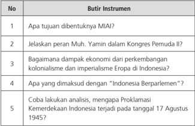

Tabel ini berisi pertanyaan-pertanyaan tentang MIAI (Majelis Islam Indonesia) dan sejarah Indonesia. Topik utamanya adalah tentang tujuan MIAI, peran Muh. Yamin dalam Kongres Pemuda, dampak ekonomi kolonialisme dan imperialisme Eropa di Indonesia, makna "Indonesia Berparlemen", dan analisis Proklamasi Kemerdekaan Indonesia. Kolom-kolomnya mencakup pertanyaan-pertanyaan tersebut. Data penting yang terlihat adalah bahwa pertanyaan-pertanyaan ini mencakup berbagai aspek sejarah dan isu-isu penting dalam sejarah Indonesia, mulai dari tujuan organisasi hingga implikasi politik dan ekonomi.

Nilai = Jumlah skor

(Untuk mengerjakan soal-soal tersebut, di samping Buku Siswa juga dapat digunakan buku-buku Sejarah Indonesia yang lain yang relevan)

 

---
## 📄 Halaman 71

### C. Penilaian Keterampilan

Siswa  diminta  untuk  melakukan  pengamatan  teks,  membaca  dan menelaah  bacaan  yang  terkait  dengan  perjuangan  para  tokoh  dan organisasi pergerakan di Volksraad kemudian membuat ringkasan.

---
**📊 Tabel**

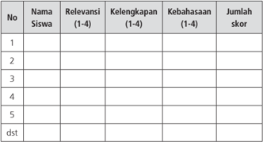

Tabel ini menunjukkan data tentang relevansi, kelengkapan, kebahasaan, dan jumlah skor siswa. Topik utama tabel adalah evaluasi kinerja siswa dalam sesi belajar. Kolom-kolomnya meliputi nomor siswa, nama siswa, relevansi (dari 1-4), kelengkapan (dari 1-4), kebahasaan (dari 1-4), dan jumlah skor. Data penting yang terlihat adalah bahwa setiap siswa memiliki satu baris di tabel, dengan informasi yang berbeda-beda untuk setiap siswa. Jumlah skor mungkin merupakan hasil dari penilaian tertentu, sementara relevansi, kelengkapan, dan kebahasaan mungkin merujuk pada aspek-aspek keterampilan atau pengetahuan yang diperlukan dalam konteks belajar tersebut.

Nilai = Jumlah skor dibagi 3

### Keterangan:

- 1). Kegiatan mengamati dalam hal ini dipahami sebagai cara siswa mengumpulkan informasi faktual dengan memanfaatkan indera penglihat,  pembau,  pendengar,  pengecap  dan  peraba.  Maka secara  keseluruhan  yang  dinilai  adalah  HASIL  pengamatan (berupa informasi) bukan CARA mengamatinya.
- 2). Relevansi, kelengkapan, dan kebahasaan diperlakukan sebagai indikator penilaian kegiatan mengamati.
- Relevansi  merujuk  pada  ketepatan  atau  keterhubungan fakta  yang  diamati  dengan  informasi  yang  dibutuhkan untuk mencapai tujuan Kompetensi Dasar/Tujuan Pembelajaran (TP).

 

---
## 📄 Halaman 72

- Kelengkapan dalam arti semakin banyak komponen fakta yang terliput atau semakin sedikit sisa (risedu) fakta yang tertinggal.
- Kebahasaan  menunjukan  bagaimana  siswa  mendeskripsikan  fakta-fakta  yang  dikumpulkan  dalam  bahasa  tulis yang  efektif (tata kata atau tata kalimat yang benar dan mudah dipahami).
- 3). Skor terentang antara  1 - 4
1 = kurang

2 = Cukup

3 = Baik

4 = Sangat Baik

### d. Penilaian untuk kegiatan Diskusi Kelompok.

---
**📊 Tabel**

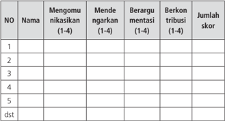

Tabel ini menunjukkan data tentang perilaku pengadilan di beberapa kasus. Topik utamanya adalah perilaku pengadilan dalam berbagai situasi hukum. Kolom-kolomnya meliputi: Mengomongu nikasikan (1-4), Mende ngarkan (1-4), Berargu mentasi (1-4), Berkon tribusi (1-4), dan Jumlah skor. Data penting yang terlihat adalah bahwa banyak kasus memiliki nilai skor tinggi untuk semua kolom, menunjukkan bahwa pengadilan sering kali mengalami masalah dalam mengatur dan mengelola proses hukum.

Nilai = jumlah skor dibagi 3

### Keterangan :

- Keterampilan  mengomunikasikan  adalah  kemampuan  siswa untuk mengungkapkan atau menyampaikan ide atau gagasan dengan bahasa lisan yang efektif

 

---
## 📄 Halaman 73

- Keterampilan  mendengarkan  dipahami  sebagai  kemampuan siswa  untuk  tidak  menyela,  memotong,  atau  menginterupsi pembicaraan seseorang ketika sedang mengungkapkan gagasannya.
- 3). Kemampuan berargumentasi menunjukkan kemampuan siswa dalam mengemukakan argumentasi logis  ketika ada pihak yang bertanya atau mempertanyakan gagasannya.
- 4). Kemampuan berkontribusi  dimaksudkan sebagai kemampuan siswa    memberikan  gagasan-gagasan  yang  mendukung  atau mengarah  ke  penarikan  kesimpulan  termasuk  di  dalamnya menghargai perbedaan pendapat.
Skor terentang antara 1 - 4

1 = Kurang

2 = Cukup

3 = Baik

4   = Amat Baik

### e. Penilaian Presentasi

---
**📊 Tabel**

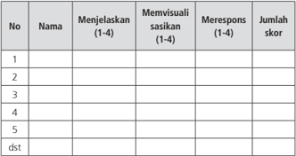

Tabel ini menunjukkan hasil evaluasi kinerja siswa dalam beberapa aspek, termasuk menjelaskan konsep, memvisualisasi sasaran belajar, merespons dengan tepat, dan jumlah skor yang diperoleh. Topik utama tabel adalah penilaian kinerja siswa dalam pembelajaran matematika. Kolom-kolomnya mencakup nomor urut (No.), nama siswa, menjelaskan konsep (dari 1-4), memvisualisasi sasaran belajar (dari 1-4), merespons dengan tepat (dari 1-4), dan jumlah skor yang diperoleh. Data penting yang terlihat adalah bahwa setiap siswa memiliki nilai yang berbeda-beda dalam setiap aspek penilaian, menunjukkan variasi dalam kinerja individu.

### Nilai= Jumlah skor dibagi 3

- 1). Keterampilan menjelaskan adalah kemampuan menyampaikan hasil observasi dan diskusi secara meyakinkan.

 

---
## 📄 Halaman 74

- 2). Keterampilan memvisualisasikan berkaitan dengan kemampuan siswa untuk membuat atau mengemas informasi seunik mungkin, semenarik mungkin, atau sekreatif mungkin.
- 3). Keterampilan merespons adalah kemampuan siswa menyampaikan tanggapan atas pertanyaan, bantahan, sanggahan dari pihak lain secara empatik.
- 4). Skor terentang antara 1 - 4
1 = Kurang

2 = Cukup

3 = Baik

4 = Sangat Baik

79;   sangat baik = 80 - 100

### G. Remedial

### 1. Prinsip-Prinsip Program Remedial

Program remedial adalah program pembelajaran yang diberikan kepada siswa  yang  belum  memenuhi  kompetensi  minimalnya  yang  dituntut oleh satu kompetensi dasar tertentu. Metode yang digunakan dapat juga bervariasi sesuai dengan sifat, jenis, dan latar belakang kesulitan belajar  yang  dialami  siswa.  Adapun    prinsip-prinsip  pembelajaran remedial adalah sebagai berikut.

- Adaptif. Program remedial diberikan sesuai dengan kemampuan belajar siswa.
- Interaktif.  Pembelajaran  remedial  harus  dapat  meningkatkan aktivitas  dan  interaksi  siswa  dan  guru  agar  guru  dapat  mengetahui kemajuan belajar siswa.
- Fleksibilitas. Dalam pembelajaran remedial dapat menggunakan berbagai  model  pembelajaran  dan  cara  penilaian.  Program remedial dapat dilaksanakan secara individu atau kelompok.

 

---
## 📄 Halaman 75

- Berkesinambungan.  Program  remedial  harus  tetap  ada  bagi setiap siswa yang belum memenuhi kompetensi dasar tertentu.
- Pemberian  umpan  balik. Informasi  tentang  kemajuan  dan kekurangan kegiatan belajar siswa perlu segera diberikan untuk menghindari kesalahan belajar lebih jauh.
- Bukan  mengulang  tes.  Program  remedial  bukan  mengulang tes, tetapi merupakan perbaikan pembelajaran bagi siswa yang belum mencapai kompetensi pada KD tertentu.

### 2. Proses Remedial

Sementara proses  program  remedial yaitu:

- Guru segera melakukan identifikasi siswa yang belum menguasai kompetensi untuk KD tertentu.
- Guru membuat perencanaan program remedial
- Menganalisis kegiatan pembelajaran sebelumnya
- Guru  memberikan  program  remedial  dengan  menggunakan model dan metode yang berbeda dengan pembelajaran sebelumnya.
- Guru melaksanakan program evaluasi dari materi remedial yang telah dilakukan.

### H. Pengayaan

### 1. Pengertian

Setiap siswa yang belajar dituntut untuk menguasai KI dan KD-KD-nya. Apabila  siswa  telah  mencapai  standar  tertentu  maka  siswa  tersebut dipandang  telah  mencapai  ketuntasan.  Oleh  karena  itu,  program pengayaan dapat diartikan: memberikan tambahan/perluasan pengalaman  atau  kegiatan  siswa  yang  teridentifikasi  melampaui ketuntasan  belajar  yang  ditentukan  oleh  kurikulum.  Pengayaan  ini sekaligus  untuk  melayani  siswa  yang  secara  individual  memiliki  kelebihan dibanding dengan yang lain. Program ini sebagai upaya memenuhi hak anak, untuk memperluas pengetahuan dan keterampilannya dengan waktu yang tersedia.

 

---
## 📄 Halaman 76

### 2. Prinsip-Prinsip Pengayaan

- Adaptif-inovatif. Pengayaan diberikan sesuai dengan kecepatan dan  kemampuan  anak  sehingga  mendapatkan  pengetahuan dan keterampilan baru.
- Variatif.  Pengayaan  menggunakan  metode,  media  dan  cara penilaian  yang  bervariasi.  Metoda-metoda  yang  digunakan dapat mendorong rasa ingin tahu dan menantang untuk dapat memecahkan masalah.
- Edukatif.  Pengayaan  diberikan  untuk  memberikan  motivasi, mengembangkan minat, memperluas wawasan, dan pengetahuan.
- Unik dan individual. Program pengayaan memang lebih memperhatikan keunikan daan kelebihan individual siswa.

### 3. Proses Pengayaan

Pengayaan dapat dilakukan dengan cara dan metode secara bervariasi. Untuk  itu  media  dan  sumber  belajar  yang  akan  digunakan  harus sudah  disiapkan.  Materi  pengayaan  bisa  terkait  dengan  perluasan dan pendalaman KD yang sedang dipelajari dalam pertemuan itu atau materi pada KD yang berikutnya.

Metode yang digunakan dapat bervariasi sesuai dengan sifat, jenis, dan latar  belakang  kesulitan  belajar  yang  dialami  siswa.  Dalam  program pengayaan, media belajar harus betul-betul disiapkan guru agar dapat memfasilitasi siswa dalam menguasai materi yang diberikan.

### I. Interaksi dengan Orang Tua

Guru dalam pandangan masyarakat adalah orang yang melaksanakan pendidikan di tempat-tempat tertentu. Guru menempati kedudukan terhormat  di  masyarakat.  Kewibawaanlah  yang  membuat  mereka dihormati. Para orang tua yakin bahwa gurulah yang dapat mendidik anak  didik  mereka  agar  menjadi  orang  yang  berkepribadian  mulia. Jadi, guru adalah sosok figur yang menempati posisi dan memegang peranan penting dalam pendidikan. Menjadi guru berdasarkan tuntutan

 

---
## 📄 Halaman 77

pekerjaan adalah suatu pekerjaan yang mudah, tetapi menjadi guru berdasarkan  panggilan  jiwa  dan  tuntutan  hati  nurani  adalah  tidak mudah (Djamarah, 2005).

Orang tua adalah orang yang telah melahirkan kita atau orang yang mempunyai pertalian darah (yang dalam hal ini siswa). Orang tua juga merupakan  public  figure  yang  pertama  menjadi  contoh  bagi  anakanak. Karena pendidikan pertama yang didapatkan anak-anak adalah dari orang tuanya.

Orang tua dan guru adalah satu tim dalam pendidikan anak, untuk itu  keduanya  perlu  menjalin  hubungan  baik.  Guru  dan  orang  tua harus bersama-sama dalam mengantarkan keberhasilan siswa  untuk mencapai tujuan belajar. Bagi anak-anak yang sudah masuk sekolah, waktunya lebih banyak dihabiskan bersama para guru daripada dengan orang tua. Kedengarannya mungkin agak mengejutkan, tapi memang begitulah kenyataannya. Ketika orang tua pulang dari tempat bekerja, anak-anak biasanya juga baru tiba dari mengikuti kegiatan setelah jam sekolah. Hanya tersisa waktu beberapa jam saja untuk makan malam bersama,  menyelesaikan  pekerjaan  rumah  dan  mungkin  menghadiri acara anak-anak, setelah itu semuanya tidur.

Ada beberapa hal yang perlu diperhatikan agar terjalin hubungan baik antara orang tua dan guru dengan orang tua siswa; (a).Perkenalkan anak  dengan  gurunya,  (b).  Mendatangi  pertemuan  orang  tua-guru, (c). Senantiasa berprasangka baik kepada guru, (d). Berkomunikasilah secara teratur, dan (e). Berikanlah sumbangan.

Guru  dan  orang  tua  siswa,  sama-sama  menginginkan  yang  terbaik untuk pendidikan anak-anak. Jika Anda mendengar kabar yang buruk tentang guru, apakah ia galak, jahat, atau tidak obyektif, maka tetap pertahankan  hubungan  baik  Anda  dengan  sang  guru.  Cari  tahu masalah yang sebenarnya dengan menghubungi guru itu secara sopan. Jangan mengeluarkan kata-kata yang buruk mengenai guru di depan anak  Anda.  Tetap  fokus  terhadap  masalah  yang  dihadapi,  jadikan itu latihan bagi Anak bersikap terbuka. Berkaitan dengan hubungan

 

---
## 📄 Halaman 78

antara  guru  dan  orang  tua,  dalam  kode  etik  guru  telah  disebutkan tentang hal tersebut, yaitu dalam pasal 6 (Nilai-Nilai Dasar dan Nilainilai  Operasional) bagian 2 tentang; Hubungan Guru dengan Orang tua/wali Siswa: (1). Guru berusaha membina hubungan kerjasama yang efektif dan efisien dengan Orang tua/Wali siswa dalam melaksanakan proses pendidikan, (2). Guru memberikan informasi kepada orang tua/ wali secara jujur dan objektif mengenai perkembangan siswa, (3). Guru merahasiakan informasi  setiap  siswa  kepada  orang  lain  yang  bukan orang tua/walinya, (4). Guru memotivasi orang tua/wali siswa untuk beradaptasi  dan  berpatisipasi  dalam  memajukan  dan  meningkatkan kualitas  pendidikan,  (5).  Guru  berkomunikasi  secara  baik  dengan orang  tua/wali  siswa  mengenai  kondisi  dan  kemajuan  siswa  dan proses  kependidikan  pada  umumnya.  (6).  Guru  menjunjung  tinggi hak  orang  tua/wali  siswa  untuk  berkonsultasi  dengannya  berkaitan dengan kesejahteraan kemajuan, dan cita-cita anak atau anak-anak akan  pendidikan,  (7).  Guru  tidak  boleh  melakukan  hubungan  dan tindakan profesional dengan orang tua/wali siswa untuk memperoleh keuntungan-keuntungan pribadi.

 

---
## 📄 Halaman 79

### BAGIAN 2 PETUNJUK KHUSUS PEMBELAJARAN PERBAB

Buku Panduan Guru ini merupakan pedoman guru untuk mengelola pembelajaran terutama dalam memfasilitasi siswa untuk memahami materi pada  Buku  Siswa  dan  mengamalkan  pesan-pesan  sejarahnya  sehingga menguasai kompetensi  yang diharapkan. Materi ajar yang ada pada Buku Siswa yang terbagi dalam tujuh bab itu akan dibelajarkan selama satu tahun ajaran.  Sesuai  dengan  desain  waktu  dan  materi  setiap  bab  maka  bab  I, bab II,    bab  III,  dan  bab  IV  akan  diselesaikan  dalam  waktu  satu  semester pertama  dengan  16  kali/minggu  pertemuan,  kemudian    ditambah  2  kali/ minggu pertemuan untuk ulangan-ulangan. Kemudian bab V, VI, VII akan diselesaikan dalam satu semester kedua dengan jumlah pertemuan 16 kali/ minggu ditambah 2 kali/minggu pertemuan untuk ulangan-ulangan.

Agar  pembelajaran  Sejarah  Indonesia  Kelas  XI  ini  lebih  efektif  dan terarah, serta lebih bermakna, maka  setiap rancangan pembelajaran didesain ada: (1) Pengantar, (2) Tujuan Pembelajaran, (3) Materi dan Proses Pembelajaran, (4) Penilaian, (5) Pengayaan, dan (6) Remedial, ditambah  (7) Interaksi Guru dan Orang Tua.

 

---
## 📄 Halaman 80

### BAB I ANTARA KOLONIALISME DAN IMPERIALISME

### Kompetensi Dasar

- 3.1. Menganalisis  proses  masuk  dan  perkembangan    penjajahan  bangsa Eropa (Portugis, Spanyol, Belanda, Inggris) ke Indonesia
- 4.1. Mengolah  informasi tentang proses masuk  dan  perkembangan penjajahan  bangsa  Eropa  (Portugis,  Spanyol,  Belanda,  Inggris)  ke Indonesia dan menyajikannya dalam bentuk cerita sejarah

 

---
## 📄 Halaman 81

### PETA KONSEP

---
**🖼️ Gambar/Diagram**

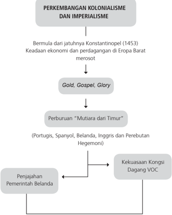

> **Deskripsi Visual:** Gambar ini adalah diagram yang menunjukkan perkembangan kolonialisme dan imperialisme. Diagram ini dimulai dengan jatuhnya Konstantinopel pada tahun 1453, yang mengakibatkan keadaan ekonomi dan perdagangan di Eropa Barat merosot. Setelah itu, ada tiga elemen utama yang muncul: Gold, Gospel, Glory, Perburuan "Mutuara dari Timur", dan Kekuasaan Kongsi Dagang VOC. Gold, Gospel, Glory mewakili perubahan dalam keadaan ekonomi dan sosial Eropa Barat. Perburuan "Mutuara dari Timur" melibatkan Portugis, Spanyol, Belanda, Inggris, dan Perebutan Hegemoni, yang kemudian mengarah ke penjajahan Pemerintah Belanda. Kekuasaan Kongsi Dagang VOC merupakan hasil dari semua aspek tersebut, yang membentuk dasar bagi kolonialisme dan imperialisme di Eropa Barat.

 

---
## 📄 Halaman 82

### ARTI PENTI NG

Mempelajari sejarah perkembangan kolonialisme dan imperialisme di Indonesia akan memberikan penyadaran dan memberikan pelajaran dan sekaligus peringatan. Mengapa kita sampai dijajah, mengapa penjajahan berlangsung sangat lama, apa ada yang salah dengan bangsa kita? Jawaban dari pertanyaan-pertanyaan itu akan memberikan pelajaran dan inspirasi bagaimana kita mengelola negara dan pemerintahan Indonesia dengan kedaulatan dan kemandirian yang utuh sebagai bangsa yang merdeka.

### P embelajaran Minggu Ke-1 (90 MENIT) 'Perburuan Mutiara dari Timur'

### A. Pengantar

Pertemuan minggu pertama ini merupakan wahana dialog untuk lebih memantapkan proses pembelajaran Sejarah Indonesia yang akan dilakukan waktu-waktu berikutnya. Pertemuan awal ini juga menjadi wahana untuk membangun  ikatan  emosional  antara  guru  dan  siswa,  bagaimana  guru dapat  mengenal  anak  didiknya,  bagaimana  guru  menjelaskan  pentingnya mata pelajaran Sejarah Indonesia.

Kaitannya dengan materi pelajaran pada pertemuan ini  guru  dapat mengangkat isu aktual sebagai apersepsi dalam pembahasan materi tentang kedatangan bangsa Barat ke Indonesia, melalui tema 'Perburuan mutiara dari timur'. Misalnya mengangkat utang luar negeri sebagai bentuk kekuatan pengaruh  asing  dalam  bidang  ekonomi  di  negara  kita.  Guru    juga  harus memfasilitasi siswa agar bersyukur atas karunia Tuhan tentang Kepulauan Nusantara yang begitu kaya dan indah sehingga dapat diibaratkan mutiara dari  timur.  Tetapi  di  balik  itu  guru  harus  juga  mendorong  siswa  berpikir

 

---
## 📄 Halaman 83

kritis dan reflektif, mengapa wilayah yang indah dan kaya itu harus jatuh ke kekuasaan bangsa lain. Apa yang salah dengan rakyat Nusantara waktu itu.

### B. Tujuan Pembelajaran

Setelah mengikuti kegiatan pembelajaran ini siswa mampu:

- Menganalisis latar belakang dan tujuan datangnya bangsa Eropa ke Indonesia
- Menjelaskan kronologi dan  jalur pelayaran  kedatangan bangsa Eropa ke Indonesia
- Menganalisis perkembangan penjajahan bangsa Eropa di Indonesia
- Menyusun  karya  tulis  sejarah  yang  berjudul  'Kepulauan  Nusantara bagaikan Mutiara dari Timur'

### C. Materi  Pembelajaran

- Latar belakang dan tujuan datangnya bangsa Eropa ke Indonesia
- Kronologi dan Jalur pelayaran  kedatangan bangsa Eropa ke Indonesia
- Perkembangan penjajahan bangsa Eropa di Indonesia
Materi pembelajaran ini secara garis besar terdapat pada Buku Siswa (BS) pada bab I subbab A. Guru juga dapat menggunakan buku dan bahan lain yang relevan.

### D. Model dan Langkah-langkah Pembelajaran

- Model: discovery .
- Pendekatan saintifik, dengan langkah-langkah: mengamati, menanya, mengeksplorasi/mengumpulkan informasi, menganalisis/mengolah informasi, dan mengomunikasikan.

 

---
## 📄 Halaman 84

### Kegiatan Pembelajaran

### Kegiatan Pendahuluan  (10 menit)

- Guru  mempersiapkan  kelas  agar  lebih  kondusif  untuk  proses  belajar mengajar  (kerapian  dan  kebersihan  ruang  kelas,  presensi  (absensi, kebersihan, kelas, menyiapkan media dan alat serta buku yang diperlukan)
- Guru menyampaikan topik tentang 'Perburuan Mutiara dari Timur'. Namun    sebelum mengkaji lebih lanjut tentang topik itu, secara khusus guru mengadakan sesi perkenalan. Diusahakan masing-masing siswa bisa tampil untuk memperkenalkan diri (minimal sebut nama, alamat, cita-cita), terakhir guru memperkenalkan diri.
- Guru memberikan motivasi dan bersyukur bisa bersekolah, apalagi jika dibandingkan dengan zaman penjajahan dulu.
- Guru membagi siswa ke dalam kelompok kecil  5 - 6  orang, menjadi kelompok  I, II, III, IV, V dan VI.

### Kegiatan Inti  (65 menit)

- Guru menayangkan gambar Jalur pelayaran dan penjelajahan samudra yang akhirnya sampai ke Indonesia, bisa ditambah misalnya gambar tokoh pelayaran seperti Vasco da Gama atau yang lain. Untuk gambar ini dapat dilihat pada Buku Siswa.
Gambar 1.1 Peta penjelajahan samudra.

 

---
## 📄 Halaman 85

- Siswa diminta untuk mengamati gambar tersebut.
- Guru mendorong siswa untuk  bertanya  hal-hal  yang sekiranya terkait dengan gambar yang ditayangkan guru.
- Guru kembali menegaskan topik pembelajaran yang akan dibahas.
- Guru menegaskan model pembelajaran yang akan dilaksanakan,  dengan  model discovery ,  dengan  langkahlangkah:
- Pemberian rangsangan/motivasi dengan membuat materi/ problem yang akan dipecahkan agak membingungkan/dilematis.
- Identifikasi dan merumuskan masalah.
- Pengumpulan data.
- Analisis data.
- Pembuktian/verifikasi.
- Kesimpulan/generalisasi.
- Langkah  pertama  sebagai  motivasi  guru  memberikan  pengantar singkat,  misalnya  menjelaskan  kondisi  Indonesia  pada  sekitar  abad ke-15  yang  kaya  hasil  bumi,  pertanian  dan  perkebunan.  Aktivitas perdagangan  juga  berkembang  luas.  Masyarakat  hidup  merdeka, bebas menjalin hubungan dagang dengan siapa saja. Tetapi setelah kedatangan bangsa Barat keadaan menjadi  berubah.  Mengapa bangsa Barat datang ke Indonesia, apa tujuannya, bagaimana proses kedatangan bangsa Barat ke Indonesia. Guru mengajak peserta didik mendiskusikan pertanyaan-pertanyaan tersebut.

---
**🖼️ Gambar/Diagram**

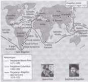

> **Deskripsi Visual:** Gambar ini adalah diagram yang menunjukkan hubungan antara berbagai negara dan wilayah di dunia pada abad ke-15. Diagram ini mencakup beberapa elemen utama:

1. **Pertama**: Gambar ini menunjukkan bahwa pada abad ke-15, dunia terbagi menjadi beberapa wilayah yang terhubung oleh jalan laut dan darat. Wilayah-wilayah tersebut termasuk Asia, Afrika, Amerika Utara, dan Eropa.

2. **Elemen-elemen utama dan relasinya**: 
   - **Wilayah Asia**: Terdiri dari India, China, dan beberapa negara lainnya.
   - **Wilayah Afrika**: Termasuk Afrika Barat dan Afrika Timur.
   - **Wilayah Amerika Utara**: Termasuk Amerika Utara dan beberapa wilayah di Amerika Selatan.
   - **Wilayah Eropa**: Terdiri dari Eropa Barat, Eropa Timur, dan beberapa wilayah di Eropa Tengah.

3. **Teks, angka, atau label penting yang terlihat**:
   - Ada beberapa teks yang memberikan informasi tentang wilayah-wilayah tersebut, seperti "Asia", "Afrika", "Amerika Utara", dan "Eropa".
   - Ada angka yang menunjukkan jumlah wilayah atau area yang terdapat di setiap zona.

4. **Informasi kunci yang dapat diambil pembaca**:
   - Pada abad ke-15, dunia terbagi menjadi beberapa wilayah yang terhubung melalui jalan laut dan darat.
   - Asia, Afrika, Amerika Utara, dan Eropa merupakan wilayah utama yang terdapat pada masa itu.
   - Diagram ini membantu memahami struktur dan hubungan antar wilayah pada abad ke-15.

Dengan demikian, gambar ini memberikan gambaran umum tentang struktur dan hubungan antar wilayah di dunia pada abad ke-15, dengan fokus pada wilayah Asia, Afrika, Amerika Utara, dan Eropa.

Gambar 1. 2

Rute Pelayaran Magellan.

 

---
## 📄 Halaman 86

- Setiap kelompok mendapatkan tugas melakukan eksplorasi/ mengumpulkan  informasi dan mengasosiasi/menganalisis melalui diskusi kelompok:
- Kelompok 1 dan 2 bertugas  mendiskusikan  dan  merumuskan materi  tentang  latar  belakang  datangnya  bangsa    Barat  ke Indonesia.
- Kelompok 3 dan 4 berdiskusi dan merumuskan tentang tujuan datangnya bangsa Barat ke Indonesia.
- Kelompok  5  dan  6  mendiskusikan  dan  merumuskan  tentang beberapa faktor yang menyebabkan Nusantara yang kaya dan indah terpaksa jatuh menjadi kekuasaan bangsa asing.
- Presentasi hasil diskusi masing-masing kelompok dalam rangka mengomunikasikan hasil karya kelompok. Pada saat kelompok tertentu  melakukan  presentasi,  kelompok  yang  lain  dapat  bertanya atau memberi masukan,  demikian sampai masing-masing mendapat giliran.

### Kegiatan Penutup  (15 menit)

- Klarifikasi/kesimpulan siswa dibantu oleh guru menyimpulkan materi tentang  'Perburuan  Mutiara  dari  Timur'  sebagai  gambaran  dari motivasi orang-orang Barat datang ke Indonesia.
- Siswa melakukan refleksi tentang pelaksanaan pembelajaran dan  pelajaran  apa  yang  diperoleh  setelah  belajar  tentang  topik pembelajaran'Perburuan Mutiara dari timur'.
- Guru sekali lagi menegaskan agar para siswa tetap bersyukur kepada Tuhan  Yang  Esa  yang  telah  memberikan  kekayaan  dan  keindahan tanah  air  Indonesia,  para  siswa  harus  belajar  dan  kerja  keras  agar menjadi  bangsa  yang  cerdas  agar  tidak  mudah  dibodohi  orang  lain apalagi orang lain akan menguasai kehidupan bangsa kita.
- Guru melakukan evaluasi untuk mengukur  ketercapaian tujuan pembelajaran, misalnya dengan mengajukan pertanyaan:
- Bagaimana  kondisi  Eropa  setelah  jatuhnya  Konstantinopel  ke tangan Turki Usmani pada tahun 1453?

 

---
## 📄 Halaman 87

- Apa tujuan orang-orang Eropa datang ke Indonesia?
- Bagaimana proses kedatangan bangsa Eropa ke Indonesia?

### Tugas

- Siapkan  peta  dunia.  Kemudian  dengan  peta  itu  tunjukkan  dengan gambar  garis-garis  yang  menunjukkan  perjalanan  masing-masing kelompok bangsa Eropa  untuk menuju Kepulauan Indonesia. Jangan lupa tempat-tempat persinggahan dan bedakan (warna atau bentuk) garis  untuk  masing-masing  kelompok  bangsa  (Portugis,  Spanyol, Belanda, Inggris).
- Siswa diberi tugas untuk membuat laporan atau karya tulis tentang 'Bangsa Eropa Memburu Mutiara dari Timur'.

### E. Penilaian

Penilaian  dilakukan  menggunakan  penilaian  otentik  yang  meliputi penilaian sikap, pengetahuan, dan keterampilan.  Format penilaian  sebagai berikut.

### 1. Penilaian sikap

---
**📊 Tabel**

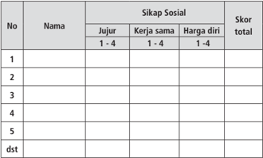

Tabel ini menunjukkan skor siswa dalam tiga aspek sikap sosial: jujur, kerja sama, dan harga diri. Setiap siswa memiliki satu baris di tabel ini, dengan kolom "Nama" untuk menyimpan nama siswa, kolom "Sikap Sosial" untuk menampilkan skor mereka dalam tiga aspek tersebut, dan kolom "Skor total" untuk menyajikan skor keseluruhan mereka. Data penting yang terlihat adalah bahwa setiap siswa memiliki skor yang berbeda-beda dalam setiap aspek, menunjukkan variasi individu dalam sikap sosial mereka. Selain itu, tabel ini juga menunjukkan bahwa skor keseluruhan (kolom "Skor total") tidak hanya bergantung pada skor tertinggi dari tiga aspek, tetapi juga pada skor yang lebih rendah, menunjukkan bahwa faktor-faktor lain seperti kerja sama dan harga diri juga mempengaruhi skor keseluruhan.

 

---
## 📄 Halaman 88

### Keterangan:

### 1. Sikap Sosial

- 1). Sikap jujur

### Indikator sikap sosial 'jujur'

- Tidak  bohong,  mengemukakan  pendapatnya  tentang sesuatu sesuai dengan apa yang diyakininya
- Mau bercerita tentang kesulitan dan kelemahannya, mau menerima pendapat temannya
- Tidak menyontek/tidak meniru pekerjaan temannya  dalam mengerjakan tugas/ tidak plagiarisme
- Terus    terang,  menyatakan  dengan  sesungguhnya  apa yang telah terjadi atau yang dialaminya

### Rubrik pemberian skor sikap jujur

- 4  =   jika siswa melakukan 4 (dari empat) kegiatan tersebut
- 3  =   jika siswa melakukan 3 (dari empat) kegiatan tersebut
- 2  =   jika siswa melakukan 2 (dari empat) kegiatan tersebut
- 1  =    jika  siswa  melakukan  salah  satu    (dari  empat)  kegiatan tersebut

### 2). Sikap Kerja Sama

Indikator sikap sosial 'kerja sama'

- Senang membantu sesama
- Selalu aktif dalam kegiatan sekolah
- Bersikap ramah dan bersahabat
- Menjaga toleransi

### Rubrik pemberian skor

- 4  =  jika siswa melakukan 4 (dari empat) kegiatan tersebut
- 3  =  jika siswa melakukan 3 (dari empat) kegiatan tersebut 2  =  jika siswa melakukan 2 (dari empat) kegiatan tersebut 1  =    jika  siswa  melakukan  salah  satu    (dari  empat)  kegiatan tersebut

 

---
## 📄 Halaman 89

### 3). Sikap Harga Diri Sebagai Orang Indonesia

### Indikator sikap harga diri

- Bersikap menolak intervensi asing
- Mencintai produk dalam negeri
- Menghargai dan memelihara karya-karya sekolah
- Menjaga nama baik diri sendiri dan institusinya

### Rubrik pemberian skor

- 4 =  jika siswa melakukan 4 (dari empat) kegiatan tersebut
- 3 =  jika siswa melakukan 3 (dari empat) kegiatan tersebut
- 2 =  jika siswa melakukan 2 (dari empat) kegiatan tersebut
- 1  =    jika  siswa  melakukan  salah  satu    (dari  empat)  kegiatan tersebut

### 2. Penilaian Pengetahuan

---
**📊 Tabel**

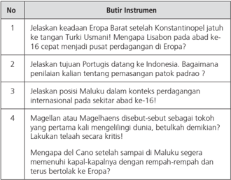

Tabel ini berisi empat pertanyaan tentang keadaan Eropa Barat sebelum dan setelah abad ke-16, dengan fokus pada peran Portugis, Maluku, dan tokoh Magelang atau Maghaelensa. Topik utama tabel adalah perubahan ekonomi dan politik di Eropa Barat, terutama berkaitan dengan penyebaran perdagangan, penguasaan wilayah, dan peran tokoh-tokoh penting dalam konteks internasional. Kolom pertama menunjukkan nomor pertanyaan, sedangkan kolom kedua menyajikan instrumen atau topik yang akan dijelaskan. Data penting yang terlihat meliputi peran Portugis sebagai penjelajah dan penanam padat, posisi Maluku dalam konteks perdagangan internasional, dan peran Magelang atau Maghaelensa sebagai tokoh yang membantu memperluas kapal-kapalnya.

 

---
## 📄 Halaman 90

### 3. Penilaian Keterampilan

Penilaian  untuk  kegiatan  siswa  mengamati  film/gambar  pelayaran, petualangan  dan  penjelajahan  samudera  oleh  bangsa-bangsa  Barat yang akhirnya sampai di Indonesia.

---
**📊 Tabel**

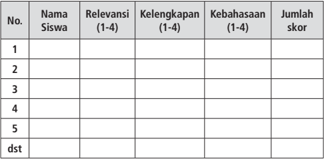

Tabel ini menunjukkan data tentang relevansi, kelengkapan, kebahasaan, dan jumlah skor siswa. Topik utamanya adalah evaluasi kinerja siswa dalam sesuatu program atau kursus. Kolom-kolomnya meliputi Nama Siswa, Relevansi (1-4), Kelengkapan (1-4), Kebahasaan (1-4), dan Jumlah Skor. Data penting yang terlihat adalah bahwa setiap siswa memiliki satu baris di tabel, dengan informasi yang berbeda-beda untuk setiap kolom. Misalnya, siswa pertama memiliki nilai 3 untuk relevansi, 2 untuk kelengkapan, 4 untuk kebahasaan, dan 5 untuk jumlah skor. Ini menunjukkan bahwa setiap siswa memiliki kinerja yang berbeda dalam hal relevansi, kelengkapan, kebahasaan, dan jumlah skor.

Nilai = Jumlah skor dibagi 3

 

---
## 📄 Halaman 91

### Keterangan:

- Kegiatan  mengamati  dalam  hal  ini  dipahami  sebagai  cara  siswa mengumpulkan  informasi faktual dengan memanfaatkan  indera penglihat, pembau, pendengar, pengecap dan peraba. Maka secara keseluruhan  yang dinilai adalah HASIL pengamatan (berupa informasi) bukan  CARA mengamati.
- Relevansi, kelengkapan, dan kebahasaan diperlakukan sebagai indikator  penilaian kegiatan mengamati.
- Relevansi  merujuk  pada  ketepatan  atau  keterhubungan  fakta yang diamati dengan informasi yang dibutuhkan untuk mencapai tujuan Kompetensi Dasar.
- Kelengkapan dalam arti semakin banyak komponen fakta yang terliput atau semakin sedikit sisa (residu) fakta yang tertinggal.
- Kebahasaan  menunjukan  bagaimana  siswa  mendeskripsikan fakta-fakta yang dikumpulkan dalam bahasa tulis yang  efektif (tata kata atau tata kalimat yang benar dan mudah dipahami).
- Skor terentang antara 1 - 4
- 1 = Kurang
2 = Cukup

3 = Baik

- 4 = Amat Baik

### 4. Penilaian untuk Kegiatan Diskusi Kelompok

---
**📊 Tabel**

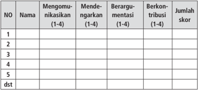

Tabel ini menunjukkan data tentang tingkat partisipasi siswa dalam berbagai aktivitas kelas, seperti mengomunikasikan diri, mendengarkan pendapat orang lain, berargumen, dan berkontribusi pada diskusi. Kolom-kolomnya mencakup nomor siswa, nama siswa, dan skor yang diberikan untuk setiap aktivitas. Data menunjukkan bahwa banyak siswa memiliki partisipasi yang baik dalam berbagai aktivitas, dengan skor rata-rata sekitar 3-4. Ini menunjukkan bahwa siswa sering mengomunikasikan diri, mendengarkan pendapat orang lain, berargumen, dan berkontribusi pada diskusi. Namun, ada juga beberapa siswa yang memiliki partisipasi yang lebih rendah, yang mungkin memerlukan dukungan tambahan untuk meningkatkan partisipasi mereka.

Nilai = jumlah skor dibagi 3

 

---
## 📄 Halaman 92

### Keterangan:

- Keterampilan  mengomunikasikan  adalah  kemampuan  siswa  untuk mengungkapkan  atau  menyampaikan  ide  atau  gagasan  dengan bahasa lisan yang efektif.
- Keterampilan  mendengarkan  dipahami  sebagai  kemampuan  siswa untuk  tidak  menyela,  memotong,  atau  menginterupsi  pembicaraan seseorang ketika sedang mengungkapkan gagasannya.
- Kemampuan berargumentasi menunjukkan kemampuan siswa dalam mengemukakan argumentasi logis    ketika  ada  pihak  yang  bertanya atau mempertanyakan gagasannya.
- Kemampuan berkontribusi  dimaksudkan sebagai kemampuan siswa memberikan gagasan-gagasan  yang  mendukung  atau  mengarah  ke penarikan kesimpulan termasuk di dalamnya menghargai perbedaan pendapat.
- Skor terentang antara 1 - 4
1  = kurang

2  = Cukup

3  = Baik

4  = Sangat Baik

### 5. Penilaian Presentasi

---
**📊 Tabel**

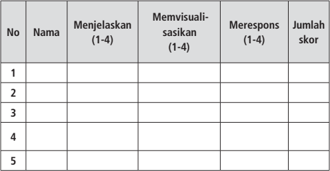

Tabel ini menunjukkan evaluasi kinerja siswa dalam beberapa aspek, yaitu menjelaskan (1-4), memvisualisasikan (1-4), merespons (1-4), dan jumlah skor. Topik utama tabel ini adalah penilaian kinerja siswa dalam berbagai aspek pembelajaran. Kolom-kolomnya mencakup nama siswa, nilai menjelaskan, nilai memvisualisasikan, nilai merespons, dan total skor. Data penting yang terlihat adalah bahwa setiap siswa memiliki nilai yang berbeda-beda dalam setiap aspek, dengan total skor yang bervariasi. Ini menunjukkan bahwa evaluasi ini dilakukan secara individu dan memberikan gambaran yang lebih detail tentang kemampuan belajar setiap siswa.

Nilai = Jumlah skor dibagi 3

 

---
## 📄 Halaman 93

### Keterangan:

- Keterampilan  menjelaskan  adalah  kemampuan  menyampaikan  hasil observasi dan diskusi secara meyakinkan.
- Keterampilan memvisualisasikan berkaitan dengan kemampuan siswa untuk membuat atau mengemas informasi seunik mungkin, semenarik mungkin, atau sekreatif mungkin.
- Keterampilan  merespons  adalah  kemampuan  siswa  menyampaikan tanggapan  atas  pertanyaan,  bantahan,  sanggahan  dari  pihak  lain secara empatik.
- Skor terentang antara 1 - 4
1 = Kurang

2 = Cukup

3 = Baik

4 = Amat Baik

### Pembelajaran Minggu Ke-2 (90 menit) Kekuasaan  VOC

### A. Pengantar

Pada pertemuan minggu kedua akan mengkaji masa dominasi VOC di Kepulauan Nusantara. Masa ini merupakan awal penjajahan di Nusantara. Pembelajaran dengan topik 'Kekuasaan  VOC' di Nusantara ini merupakan kajian yang sangat penting dalam rangka membangun kesadaran para anak bangsa  tentang  kekejaman  penjajah  yang  sangat  bertentangan  dengan nilai-nilai  kemanusiaan.  Guru  perlu  menanamkan  kesadaran  para  siswa bahwa  penjajahan  seperti  yang  dilakukan  VOC  itu  bertentangan  dengan

 

---
## 📄 Halaman 94

nilai  dan  prinsip  kemerdekaan.  Sementara  Tuhan  YME  telah  menciptakan manusia untuk hidup berdaulat, memiliki kemerdekaan, saling menghargai dan mengasihi sehingga melahirkan kehidupan atas dasar kebersamaan dan keadilan serta peradaban yang bermartabat atas usahanya dan ridho Tuhan YME.  Oleh  karena  itu,  penjajahan  harus  dihapuskan  karena  tidak  sesuai dengan perikemanusiaan dan perikeadilan.

### B. Tujuan Pembelajaran

Setelah mengkuti kegiatan pembelajaran ini siswa  mampu:

- Menganalisis lahirnya VOC dan tujuan didirikannya
- Menganalisis kekuasaan  VOC di Indonesia.
- Menganalisis proses kebangkrutan VOC.

### C.     Materi Pembelajaran

- Lahirnya VOC dan tujuan didirikannya
- Perkembangan kekuasaan VOC  di Indonesia
- 3 . Proses kebangkrutan VOC
Materi  yang  disampaikan  pada  minggu  kedua  ini  ada  pada  Bab  I Subbab A Buku Siswa

### D.    Model dan Pembelajaran

- Model: diskusi kelompok, group resume
- Pendekatan  saintifik, dengan langkah-langkah: mengamati, menanya, mengeksplorasi/mengumpulkan informasi, mengolah informasi/ menganalisis, dan mengomunikasikan.
Dalam melaksanakan pembelajaran secara umum dibagi tiga tahapan: kegiatan pendahuluan, kegiatan inti dan kegiatan penutup.

 

---
## 📄 Halaman 95

### Kegiatan Pembelajaran

### Kegiatan Pendahuluan (10 menit)

- Guru mempersiapkan kelas agar lebih kondusif untuk proses belajar mengajar  (kerapian  dan  kebersihan  ruang  kelas,  presensi/absensi, menyiapkan media dan alat serta buku yang diperlukan)
- Guru menyampaikan topik tentang 'Kemaharajaan  VOC'  dan kompetensi yang akan dicapai .
- Guru membagi kelas menjadi delapan kelompok siswa (kelompok I, II, III, IV, V, VI, VII, dan VIII), masing-masing kelompok sekitar 4 - 5 orang

### Kegiatan Inti (65 menit)

- Guru menegaskan kembali tentang topik pembelajaran dan menyampaikan  kompetensi yang akan   dicapai.
- Guru menayangkan beberapa gambar, misalnya gamabar tokoh VOC seperti Pieter Both, JP. Coen, gambar/foto Museum Fatahilah, gambar rempah-rempah, peta Maluku gambar penyerangan Sultan Agung ke Batavia dan gambar yang lain yang relevan.

 

---
## 📄 Halaman 96

Sumber: Kemdikbud, 2014

- Siswa diminta untuk mengamati gambar-gambar tersebut.
- Guru  mendorong  siswa  untuk  mengajukan  pertanyaan-pertanyaan yang terkait  dengan gambar-gambar tersebut.
- Setiap  kelompok  mendapatkan  tugas  melakukan  eksplorasi  dan mengasosiasi melalui diskusi kelompok,  sehingga  menemukan rumusan jawaban dari masing-masing tugas yang diberikan:
- 1). Kelompok  1  dan 2 bertugas mendiskusikan tentang tujuan dan perkembangan awal VOC.
- 2).     Kelompok 3 dan 4 berdiskusi dan merumuskan tentang berbagai kebijakan dan kekejaman VOC.
- Kelompok  5  dan  6  mendiskusikan  dan  merumuskan  tentang reaksi rakyat terhadap keserakahan VOC.
- 4). Kelompok 7 dan 8 berdiskusi dan merumuskan tentang  proses kebangkrutan VOC.
- Presentasi  hasil  kelompok  masing-masing  kelompok  dalam  rangka mengomunikasikan hasil karya kelompok. Pada saat kelompok tertentu presentasi  kelompok  yang  lain  dapat  bertanya,  demikian  sampai masing-masing mendapat giliran.

 

---
## 📄 Halaman 97

### Kegiatan Penutup (15 menit)

- Klarifikasi/kesimpulan siswa dibantu oleh guru menyimpulkan materi tentang 'Kemaharajaan VOC' .
- Siswa  melakukan  refleksi  tentang  pelaksanaan  pembelajaran  dan pelajaran apa yang  diperoleh setelah belajar tentang 'proses pelayaran dan penjelajahan samudra yang dilakukan oleh bangsa Barat.
- Guru melakukan evaluasi untuk mengukur  ketercapaian tujuan pembelajaran, misalnya:
- (1).    Mengapa  VOC didirikan?
- (2). Siapakah tokoh VOC  yang  dikenal sebagai peletak dasar penjajahan Belanda di Indonesia, mengapa?

### Tugas:

- Siswa diberi tugas untuk mengidentifikasi situs atau dampak lain dari penjajahan  VOC  yang  sekiranya  masih  dapat  ditemukan  di  sekitar daerahnya.
- Buatlah karya tulis dengan judul 'Keserakahan VOC'

### E. Penilaian

Penilaian  dilakukan  menggunakan  penilaian  otentik  yang  meliputi penilaian sikap, pengetahuan dan keterampilan. Format penilaian terlampir

### 1. Penilaian sikap

---
**📊 Tabel**

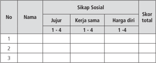

Tabel ini menunjukkan skor sikap sosial individu berdasarkan tiga kriteria: jujur, kerja sama, dan harga diri. Kolom "Nama" menyediakan tempat untuk menuliskan nama-nama individu yang akan diukur. Kolom "Sikap Sosial" memuat tiga subkriteria yang dianalisis, yaitu jujur, kerja sama, dan harga diri. Setiap subkriteria diukur dengan skala 1-4, di mana 1 adalah nilai paling rendah dan 4 adalah nilai tertinggi. Skor total untuk setiap individu dihitung sebagai jumlah skor dari ketiga subkriteria tersebut. Data dalam tabel ini menunjukkan bahwa beberapa individu memiliki skor yang lebih tinggi dibandingkan dengan yang lain, menunjukkan variasi dalam sikap sosial mereka.

 

---
## 📄 Halaman 98

### Keterangan:

### Sikap Sosial

### 1). Sikap jujur

Indikator sikap sosial 'jujur'

- Tidak  bohong,  mengemukakan  pendapatnya  tentang  sesuatu sesuai dengan apa yang diyakininya
- Mau  bercerita tentang kesulitan  dan  kelemahannya,  mau menerima pendapat temannya
- Tidak  menyontek  /Tidak  meniru  pekerjaan  temannya    dalam mengerjakan tugas/  tidak plagiarisme
- Terus terang, menyatakan dengan sesungguhnya apa yang telah terjadi atau yang dialaminya

### Rubrik pemberian skor

4 =  jika siswa melakukan 4 (dari empat) kegiatan tersebut

3 =  jika siswa melakukan 3 (dari empat) kegiatan tersebut

2 =  jika siswa melakukan 2 (dari empat) kegiatan tersebut

1 =  jika siswa melakukan salah satu  (dari empat) kegiatan tersebut

### 2). Sikap kerja sama

Indikator sikap sosial 'kerja sama'

- Peduli kepada sesama
- Saling membantu dalam hal kebaikan
- Saling menghargai/ toleran
- Ramah dengan sesama

### Rubrik pemberian skor

4 =  jika siswa melakukan 4 (dari empat) kegiatan tersebut

3 =  jika siswa melakukan 3 (dari empat) kegiatan tersebut

2 =  jika siswa melakukan 2 (dari empat) kegiatan tersebut

1 =  jika siswa melakukan salah satu  (dari empat) kegiatan tersebut

 

---
## 📄 Halaman 99

### 3). Harga diri

### Indikator sikap sosial 'harga diri'

- Tidak suka dengan dominasi asing
- Bersikap sopan untuk menegur bagi mereka yang mengejek
- Cinta produk negeri sendiri
- Menghargai dan menjaga karya-karya sekolah dan masyarakat sendiri

### Rubrik pemberian skor

- 4 =  jika siswa melakukan 4 (dari empat) kegiatan tersebut
- 3 =  jika siswa melakukan 3 (dari empat) kegiatan tersebut
- 2 =  jika siswa melakukan 2 (dari empat) kegiatan tersebut
- 1 =  jika siswa melakukan salah satu  (dari empat) kegiatan tersebut

### 2. Penilaian Pengetahuan

---
**📊 Tabel**

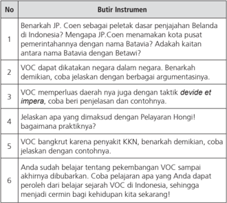

Tabel ini berisi pertanyaan-pertanyaan tentang VOC (Verenigde Oostindische Compagnie) di Indonesia, yang merupakan perusahaan dagang Belanda abad ke-17. Topik utama tabel adalah VOC dan hubungan antara VOC dengan pemerintahan Indonesia. Kolom pertama menunjukkan nomor pertanyaan, sedangkan kolom kedua berisi pertanyaan-pertanyaan tersebut. Data penting yang terlihat adalah bahwa VOC memiliki hubungan kompleks dengan pemerintahan Indonesia, baik secara geografis maupun politik. Tabel ini membantu pembaca memahami sejarah VOC dan bagaimana perusahaan ini mempengaruhi pemerintahan Indonesia.

Nilai = Jumlah skor

 

---
## 📄 Halaman 100

### 3. Penilaian Keterampilan

Siswa melakukan kegiatan pengamatan dan pendokumentasian pada obyek sejarah, misalnya bekas benteng VOC.

---
**📊 Tabel**

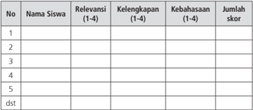

Tabel ini menunjukkan data tentang relevansi, kelengkapan, kebahasaan, dan jumlah skor siswa. Topik utamanya adalah evaluasi kinerja siswa dalam sesi belajar. Kolom-kolomnya meliputi nomor urut (No.), nama siswa, relevansi (1-4), kelengkapan (1-4), kebahasaan (1-4), dan jumlah skor. Data penting yang terlihat adalah bahwa setiap siswa memiliki satu baris di tabel, dengan informasi yang sama untuk semua kolom. Ini menunjukkan bahwa tabel ini digunakan untuk membandingkan kinerja siswa dalam berbagai aspek pembelajaran.

Nilai = Jumlah skor dibagi 3

### Keterangan:

- Kegiatan  mengamati  dalam  hal  ini  dipahami  sebagai  cara  siswa mengumpulkan  informasi faktual dengan memanfaatkan  indera penglihat, pembau, pendengar, pengecap dan peraba. Maka secara keseluruhan  yang dinilai adalah HASIL pengamatan (berupa informasi) bukan  CARA mengamati.
- Relevansi, kelengkapan, dan kebahasaan diperlakukan sebagai indikator penilaian kegiatan mengamati.
- Relevansi  merujuk  pada  ketepatan  atau  keterhubungan  fakta yang diamati dengan informasi yang dibutuhkan untuk mencapai tujuan Kompetensi Dasar/Tujuan Pembelajaran (TP).
- Kelengkapan dalam arti semakin banyak komponen fakta yang terliput atau semakin sedikit sisa (residu) fakta yang tertinggal.
- Kebahasaan  menunjukan  bagaimana  siswa  mendeskripsikan fakta-fakta yang dikumpulkan dalam bahasa tulis yang  efektif (tata kata atau tata kalimat yang benar dan mudah dipahami).

 

---
## 📄 Halaman 101

- Skor terentang antara 1 - 4
1 = kurang

2 = Cukup

3 = Baik

4 = Amat Baik

### 4. Penilaian untuk Kegiatan Diskusi Kelompok.

---
**📊 Tabel**

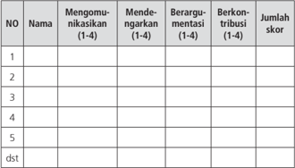

Tabel ini menunjukkan skor berbagai tingkat partisipasi dalam proses diskusi atau perdebatan. Kolom-kolomnya mencakup "Mengomunikasikan", "Mendelegasikan", "Berargumenasi", dan "Berkontribusi". Setiap baris mewakili satu individu, dengan skor yang diberikan dalam rentang 1 hingga 4. Data penting yang terlihat adalah bahwa setiap individu memiliki skor yang berbeda-beda dalam setiap kategori, menunjukkan variasi dalam partisipasi mereka dalam proses tersebut.

Nilai = jumlah skor dibagi 3

### Keterangan:

- Keterampilan  mengomunikasikan  adalah  kemampuan  siswa  untuk mengungkapkan  atau  menyampaikan  ide  atau  gagasan  dengan bahasa lisan yang efektif.
- Keterampilan  mendengarkan  dipahami  sebagai  kemampuan  siswa untuk  tidak  menyela,  memotong,  atau  menginterupsi  pembicaraan seseorang ketika sedang mengungkapkan gagasannya.
- Kemampuan berargumentasi menunjukkan kemampuan siswa dalam mengemukakan argumentasi logis    ketika  ada  pihak  yang  bertanya atau mempertanyakan gagasannya.

 

---
## 📄 Halaman 102

- Kemampuan berkontribusi  dimaksudkan sebagai kemampuan siswa memberikan gagasan-gagasan  yang  mendukung  atau  mengarah  ke penarikan kesimpulan termasuk di dalamnya menghargai perbedaan pendapat.
- Skor terentang antara 1 - 4
1  = kurang

2  = Cukup

3  = Baik

4  = Sangat Baik

### 5. Penilaian Presentasi

---
**📊 Tabel**

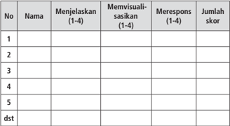

Tabel ini menunjukkan hasil evaluasi keterampilan berkomunikasi di antara siswa. Kolom "Nama" menyajikan identitas setiap siswa, sedangkan kolom "Menjelaskan (1-4)", "Memvisualisasikan (1-4)", "Merespons (1-4)", dan "Jumlah skor" menunjukkan tingkat keterampilan mereka dalam masing-masing aspek tersebut. Data yang penting yang terlihat adalah bahwa sebagian besar siswa memiliki skor yang rendah pada aspek menjelaskan dan memvisualisasikan, sementara mereka memiliki skor yang lebih baik pada aspek merespons. Ini menunjukkan bahwa siswa perlu lebih banyak latihan untuk meningkatkan keterampilan mereka dalam menjelaskan dan memvisualisasikan informasi.

Nilai= Jumlah skor dibagi 3

### Keterangan:

- Keterampilan  menjelaskan  adalah  kemampuan  menyampaikan  hasil observasi dan diskusi secara meyakinkan.
- Keterampilan memvisualisasikan berkaitan dengan kemampuan siswa untuk membuat atau mengemas informasi seunik mungkin, semenarik mungkin, atau sekreatif mungkin.
- Keterampilan  merespon  adalah  kemampuan  siswa  menyampaikan tanggapan  atas  pertanyaan,  bantahan,  sanggahan  dari  pihak  lain secara empatik.

 

---
## 📄 Halaman 103

### d.

### Pembelajaran Minggu Ke-3 (90 menit) P emerintahan Daendels dan Raffles

### A. Pengantar

Pada  pertemuan  minggu  ketiga  akan  mengkaji  masa  pemerintahan Daendels  dan  Raffles.  Saat  itu  Kepulauan  Indonesia  berada  di  bawah naungan Republik Bataaf yang menunjuk Daendels sebagai gubernur jenderal di  tanah  jajahan  di  Nusantara,  terutama Jawa. Tetapi pada bulan Agustus 1811, Inggris berhasil menyerang Batavia. Berakhirlah masa pemerintahan Republik Bataaf dan digantikan oleh kekuasaan Inggris. Untuk memahami perkembangan  sejarahnya,  maka  akan  dibelajarkan  topik  'Pemerintahan Daendels  dan  Raffles  di  Indonesia'.  Dalam  pembelajaran  ini  guru  perlu menekankan perubahan sikap Daendels, pada saat masih berada di Belanda ia dikenal sebagai tokoh muda yang patriot yang memperjuangkan nilai-nilai kemerdekaan  dan  pesamaan,  tetapi  setelah  sampai  di  Indonesia  berubah menjadi tokoh yang reaksioner dan kejam. Begitu juga Raffles yang dikenal seorang liberal ternyata pemerintahannya juga memberatkan rakyat. Guru perlu  juga  menjelaskan  bagaimana  persamaan  dan  perbedaan  antara pemerintahan Daendels dan Raffles. Dampak dari kedua kekuasaan itu tetap

 

---
## 📄 Halaman 104

membuat rakyat menderita, karena keduanya memburu kekayaan duniawi. Hal sebagai pelajaran ternyata urusan materi, urusan kejayaan di dunia bisa merubah orang menjadi penindas kepada sesama manusia. Itulah harta dan kekayaan yang tidak berkah. Oleh karena itu, guru perlu menekankan siswa untuk berpikir kritis.

### B. Tujuan Pembelajaran

Setelah mengkuti kegiatan pembelajaran ini siswa  mampu:

- menganalisis tokoh Daendels dan tugas utamanya di Indonesia
- 2 . menganalisis pemerintahan Daendels dan usaha-usaha yang dilakukan
- menganalisis  tokoh  Raffles  dan  prinsip-prinsip  pemerintahan  yang akan dijalankan di Indonesia
- Menganalisis pemerintahan Raffles dan usaha-usaha yang dijalankan

### C. Materi Pembelajaran

- Tokoh Daendels dan tugas utamanya di Indonesia.
- Pemerintahan Daendels dan usaha-usaha yang dilakukan.
- Tokoh Raffles dan prinsip-prinsip pemerintahan yang akan diterapkan di Indonesia.
- Pemerintahan Raffles dan usaha-usaha yang dilakukan.
Materi yang disampaikan pada minggu ketiga ini ada pada Buku Siswa Bab I Subbab C.

### D.    Model dan Langkah-langkah Pembelajaran

- Model: Information search
- Pendekatan saintifik, dengan langkah-langkah: mengamati, menanya, mengeksplorasi, mengasosiasikan, dan mengomunikasikan.
Dalam melaksanakan pembelajaran secara umum dibagi tiga tahapan: kegiatan pendahuluan, kegiatan inti, dan kegiatan penutup.

 

---
## 📄 Halaman 105

### Kegiatan Pembelajaran

### Kegiatan Pendahuluan (10 menit)

- Guru mempersiapkan kelas agar lebih kondusif untuk proses belajar mengajar  (kerapian  dan  kebersihan  ruang  kelas,  presensi/absensi, menyiapkan media dan alat serta buku yang diperlukan)
- Guru menyampaikan topik tentang 'Pemerintahan Daendels dan Raffles'.
- Guru membagi kelas menjadi delapan kelompok siswa (kelompok I, II, III, IV, V, VI, VII dan VIII ).d.  Guru kemudian menayangkan beberapa gambar, misalnyasebagai berikut.
Gambar 1.8 Garis berwarna merah menunjukkan jalur jalan raya Anyer -  Panarukan

 

---
## 📄 Halaman 106

- Guru  meminta  kepada  siswa  untuk  mengajukan  pertanyaan  terkait dengan  gambar-gambar  yang  ditunjukkan  guru  tadi.  Guru  pun memberi respons atas pertanyaan-pertanyaan dari siswa

### Kegiatan Inti (65 menit)

- Guru menegaskan kembali tentang topik pembelajaran dan menyampaikan kompetensi yang akan   dicapai.
- Guru  menegaskan  model  pembelajaran  yang  akan  dilaksanakan, dengan model Information search. Guru secara sekilas tentang model pembelajaran  ini,  yakni  guru  akan  membagi  kartu  kepada  masingmasing kelompok. Pada kartu itu sudah berisi pertanyaan atau tugas yang harus diselesaikan oleh masing-masing kelompok
- Guru membagi kartu kepada masing-masing kelompok. Kartu  nomor 1 diberikan kepada kelompok I dan II; kartu nomor 2 diberikan kepada kelompok III dan IV, dan kartu nomor 3 diberikan kepada kelompok V dan VI, kartu nomor 4 diberikan kelompok VII dan VIII

### Pertanyaan

- Siapakan Daendels itu? Bagaimana pandangan dan paham yang dianutnya?
- Daendels  memerintah  di  Indonesia  atas  nama  siapa,  mengapa demikian?
- Apa tugas utama Daendels di Jawa/Indonesia? Bagaimana usaha untuk melaksanakan tugas utamanya itu

### Pertanyaan

- Bagaimana usaha Daendels dalam bidang politik dan pemerintahan di Indonesia
- Bagaimana usaha Daendels dalam bidang  sosial ekonomi?
- Jelaskan  bagaimana  dampak  dari  pemerintahan  Daendels  di Indonesia?

 

---
## 📄 Halaman 107

### Pertanyaan

- Siapakah Raffles, bagaimana paham dan pandangan politiknya
- Jelaskan  prinsip-prinsip  pemerintahan  yang  akan  dilaksanakan Raffles di Indonesia!
- Bagaimana tindakan Raffles dalam bidang politik dan pemerintahan di Indonesia?
- Bagaimana pandangan dan sikap kamu terkait dengan berbagai tindakan Daendels di Indonesia?

### Pertanyaan

- Bagaimana tindakan Raffles dalam bidang sosial ekonomi?
- Apa yang dimaksud dengan land rent dan  bagaimana praktiknya!
- Jelaskan perbedaan dan persamaan pemerintahan antara Daendels dan Raffles!
- Masing-masing  kelompok  kemudian  berdiskusi  kelompok    untuk menjawab pertanyaan-pertanyaan yang diterimanya.
- Setelah  selesai  menjawab  di  kelompok,  kemudian  masing-masing kelompok mempresentasikan hasil jawabannya. Kelompok yang tidak presentasi dapat memberikan pertanyaan atau masukan, dan begitu seterusnya sehingga masing-masing kelompok bisa presentasi

### Kegiatan Penutup (15 menit)

- Klarifikasi/kesimpulan siswa dibantu oleh guru menyimpulkan materi tentang masa pemerintahan Daendels dan dampaknya bagi kehidupan ekonomi dan sosial kemasyarakatan kaum pribumi.
- Siswa  melakukan  refleksi  tentang  pelaksanaan  pembelajaran  dan pelajaran apa yang  diperoleh setelah belajar tentang pemerintahan Daendels dan Raffles.

 

---
## 📄 Halaman 108

- Guru melakukan evaluasi untuk mengukur  ketercapaian tujuan pembelajaran, misalnya:
- Mengapa  Daendels membangun jalan raya dari Anyer sampai Panarukan?
- (2). Mengapa Raffles memprogramkan land rent ?

### Tugas

Kira-kira  bagaimana  dampaknya  pemerintahan  Daendels  terhadap kehidupan masyarakat di Indonesia. Coba tunjukkan bukti tindakan Daendels yang sampai sekarang masih dapat dirasakan oleh masyarakat?  Apa manfaat dari peninggalan Daendels itu?

### E. Penilaian

Penilaian  dilakukan  menggunakan  penilaian  otentik  yang  meliputi penilaian sikap, pengetahuan dan keterampilan. Format penilaian  sebagai berikut

### 1. Penilaian sikap

---
**📊 Tabel**

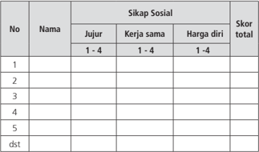

Tabel ini menunjukkan skor sikap sosial individu berdasarkan tiga kriteria: jujur, kerja sama, dan harga diri. Kolom "Nama" menyediakan tempat untuk menuliskan nama-nama individu yang akan diukur. Kolom "Sikap Sosial" mencakup tiga subkolom: "Jujur", "Kerja sama", dan "Harga diri". Setiap subkolom memiliki skala 1-4 untuk menentukan tingkat sikap individu terhadap setiap kriteria tersebut. Skor total untuk setiap individu dapat dilihat di bagian bawah tabel. Topik utama tabel ini adalah pengukuran sikap sosial individu melalui tiga kriteria yang berbeda. Data penting yang terlihat adalah bahwa setiap individu memiliki skor yang berbeda-beda untuk setiap kriteria, menunjukkan variasi dalam sikap sosial mereka.

 

---
## 📄 Halaman 109

### Keterangan:

### Sikap Sosial

### 1). Sikap Jujur

Indikator sikap sosial 'jujur'

- Tidak  bohong,  mengemukakan  pendapatnya  tentang  sesuatu sesuai dengan apa yang diyakininya
- Mau  bercerita tentang kesulitan  dan  kelemahannya,  mau menerima pendapat temannya
- Tidak  menyontek  /Tidak  meniru  pekerjaan  temannya    dalam mengerjakan tugas/  tidak plagiarisme
- Terus terang, menyatakan dengan sesungguhnya apa yang telah terjadi atau yang dialaminya

### Rubrik pemberian skor

- 4 =  jika siswa melakukan 4 (dari empat) kegiatan tersebut
- 3 =  jika siswa melakukan 3 (dari empat) kegiatan tersebut
- 2 =  jika siswa melakukan 2 (dari empat) kegiatan tersebut
- 1 =  jika siswa melakukan salah satu  (dari empat) kegiatan tersebut

### 2). Sikap Kerja Sama

### Indikator sikap sosial 'kerja sama'

- Peduli kepada sesama
- Saling membantu dalam hal kebaikan
- Saling menghargai/ toleran
- Ramah dengan sesama

### Rubrik pemberian skor

- 4 =  jika siswa melakukan 4 (dari empat) kegiatan tersebut
- 3 =  jika siswa melakukan 3 (dari empat) kegiatan tersebut
- 2 =  jika siswa melakukan 2 (dari empat) kegiatan tersebut
- 1 =  jika siswa melakukan salah satu  (dari empat) kegiatan tersebut

### 3). Sikap Harga Diri

Indikator sikap sosial 'harga diri'

- Tidak suka dengan dominasi asing
- Bersikap sopan untuk menegur bagi mereka yang mengejek

 

---
## 📄 Halaman 110

- Cinta produk negeri sendiri
- Mengharagai dan menjaga karya-karya sekolah dan masyarakat sendiri

### Rubrik pemberian skor

4 =  jika siswa melakukan 4 (dari empat) kegiatan tersebut

3 =  jika siswa melakukan 3 (dari empat) kegiatan tersebut

2 =  jika siswa melakukan 2 (dari empat) kegiatan tersebut

1 =  jika siswa melakukan salah satu  (dari empat) kegiatan tersebut)

### 2. Penilaian Pengetahuan

---
**📊 Tabel**

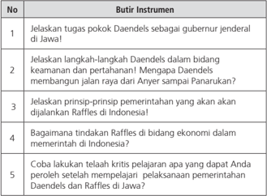

Tabel ini berisi pertanyaan-pertanyaan yang harus dijawab oleh siswa tentang Daendels sebagai gubernur jenderal di Java dan Raffles sebagai pemimpin kolonial Inggris di Indonesia. Topik utama tabel adalah tentang sejarah kolonial dan pemerintahan di Indonesia. Kolom-kolomnya mencakup instrumen yang harus dijawab, seperti menjelaskan tugas Daendels sebagai gubernur jenderal, langkah-langkah Daendels dalam bidang keamanan dan pertahanan, prinsip-prinsip pemerintahan yang akan dijalankan Raffles, tindakan Raffles dalam bidang ekonomi, dan kritik pelajaran dari Daendels dan Raffles. Data penting yang terlihat adalah bahwa tabel ini mengajarkan tentang perbedaan dan kesamaan dalam pemerintahan kolonial di Indonesia, serta bagaimana mereka mempengaruhi sejarah Indonesia.

### 3 Penilaian Keterampilan

Siswa diminta untuk melakukan pengamatan hal-hal yang dulu pernah terkait dengan kebijakan dan tindakan Daendels yang ada atau dekat dengan lingkungannya. Misalnya, pabrik, jenis tanaman, jalan raya dan lain-lain.

 

---
## 📄 Halaman 111

---
**📊 Tabel**

Tabel ini menunjukkan data tentang relevansi, kelengkapan, kebahasaan, dan jumlah skor siswa. Topik utamanya adalah evaluasi kinerja siswa dalam sesuatu program atau pembelajaran tertentu. Kolom-kolomnya meliputi Nama Siswa, Relevansi (1-4), Kelengkapan (1-4), Kebahasaan (1-4), dan Jumlah Skor. Data penting yang terlihat adalah bahwa setiap siswa memiliki satu baris di tabel, dengan informasi yang berbeda-beda untuk setiap kolom. Misalnya, siswa pertama memiliki relevansi 3, kelengkapan 2, kebahasaan 4, dan jumlah skor 5. Ini menunjukkan bahwa tabel ini digunakan untuk membandingkan kinerja individu siswa dalam berbagai aspek pembelajaran.

Nilai = Jumlah skor dibagi 3

### Keterangan:

- Kegiatan  mengamati  dalam  hal  ini  dipahami  sebagai  cara  siswa mengumpulkan  informasi faktual dengan memanfaatkan  indera penglihatan, pembau, pendengar, pengecap dan peraba. Maka secara keseluruhan  yang dinilai adalah HASIL pengamatan (berupa informasi) bukan  CARA mengamati.
- Relevansi, kelengkapan, dan kebahasaan diperlakukan sebagai indikator penilaian kegiatan mengamati.
- Relevansi  merujuk  pada  ketepatan  atau  keterhubungan  fakta yang diamati dengan informasi yang dibutuhkan untuk mencapai Kompetensi Dasar.
- Kelengkapan dalam arti semakin banyak komponen fakta yang terliput atau semakin sedikit sisa (residu) fakta yang tertinggal.
- Kebahasaan  menunjukan  bagaimana  siswa  mendeskripsikan fakta-fakta yang dikumpulkan dalam bahasa tulis yang  efektif (tata kata atau tata kalimat yang benar dan mudah dipahami).
- Skor terentang antara 1 - 4
- 1  = kurang
- = Cukup
- 3  = Baik
- 4  = Sangat Baik

 

---
## 📄 Halaman 112

### 4. Penilaian untuk Kegiatan Diskusi Kelompok.

---
**📊 Tabel**

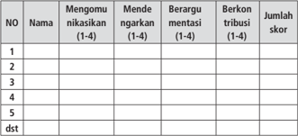

Tabel ini menunjukkan data tentang perilaku konsumsi narkoba di antara siswa-siswa. Topik utamanya adalah perilaku konsumsi narkoba, termasuk mengonsumsi narkoba (1-4), mendengarkan orang lain mengonsumsi narkoba (1-4), berargumen tentang narkoba (1-4), dan berkontribusi pada situasi narkoba (1-4). Setiap baris mewakili satu siswa, dengan kolom-kolom yang mencakup skor untuk setiap perilaku tersebut. Data penting yang terlihat adalah bahwa sebagian besar siswa memiliki skor rendah dalam semua perilaku tersebut, menunjukkan bahwa mereka relatif tidak terlibat dalam konsumsi narkoba.

Nilai = jumlah skor dibagi 3

### Keterangan:

- Keterampilan  mengomunikasikan  adalah  kemampuan  siswa  untuk mengungkapkan  atau  menyampaikan  ide  atau  gagasan  dengan bahasa lisan yang efektif.
- Keterampilan  mendengarkan  dipahami  sebagai  kemampuan  siswa untuk  tidak  menyela,  memotong,  atau  menginterupsi  pembicaraan seseorang ketika sedang mengungkapkan gagasannya.
- Kemampuan berargumentasi menunjukkan kemampuan siswa dalam mengemukakan argumentasi logis    ketika  ada  pihak  yang  bertanya atau mempertanyakan gagasannya.
- Kemampuan berkontribusi  dimaksudkan sebagai kemampuan siswa memberikan gagasan-gagasan  yang  mendukung  atau  mengarah  ke penarikan kesimpulan termasuk di dalamnya menghargai perbedaan pendapat.
- Skor terentang antara 1 - 4
- 1  = kurang
2  = Cukup

3  = Baik

4  = Sangat Baik

 

---
## 📄 Halaman 113

### 5. Penilaian Presentasi

---
**📊 Tabel**

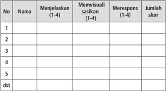

Tabel ini menunjukkan hasil evaluasi kinerja siswa dalam beberapa aspek, yaitu menjelaskan, memvisualisasi sasikan, merespons, dan jumlah skor. Topik utama tabel ini adalah penilaian kinerja siswa dalam berbagai aspek pembelajaran. Kolom-kolomnya mencakup nama siswa, menjelaskan (dengan skala 1-4), memvisualisasi sasikan (dengan skala 1-4), merespons (dengan skala 1-4), dan jumlah skor. Data penting yang terlihat adalah bahwa setiap siswa memiliki nilai yang berbeda-beda dalam setiap aspek, dengan total skor tertinggi mencapai 20. Ini menunjukkan bahwa evaluasi ini dilakukan secara individu dan memberikan gambaran yang jelas tentang kemampuan dan kekurangan masing-masing siswa dalam berbagai aspek pembelajaran.

Nilai= Jumlah skor dibagi 3

### Keterangan:

- Keterampilan  menjelaskan  adalah  kemampuan  menyampaikan  hasil observasi dan diskusi secara meyakinkan.
- Keterampilan memvisualisasikan berkaitan dengan kemampuan siswa untuk membuat atau mengemas informasi seunik mungkin, semenarik mungkin, atau sekreatif mungkin.
- Keterampilan  merespons  adalah  kemampuan  siswa  menyampaikan tanggapan  atas  pertanyaan,  bantahan,  sanggahan  dari  pihak  lain secara empatik.
- Skor terentang antara 1 - 4
- 1 = Kurang
- 2 = Cukup
3 = Baik

- 4 = Amat Baik
Ekuivalensi:  kurang = 1 - 55;   cukup = 56 - 65;   baik = 66 - 79; sangat baik = 80 - 100

 

---
## 📄 Halaman 114

### Pembelajaran Minggu Ke-4 (90 menit) 'Dominasi Pemerintahan Belanda di Indonesia'

### A. Pengantar

Dominasi  pemerintahan  Belanda  dapat  tercermin  dari  pelaksanaan Tanam Paksa dan Usaha Swasta di Indonesia. Pelaksanaan Tanam Paksa dan Usaha Swasta itu merupakan  klimaks dari praktik penjajahan pemerintah Belanda.  Melalui  Tanam  Paksa  dan  Usaha  Swasta  kekayaan  Indonesia dikuras oleh Belanda. Penderitaan rakyat yang terus berkepanjangan telah merusak  sendi-sendi  kehidupan  masyarakat  Indonesia.  Wajah  kapitalisme dan imperialisme menampakkan diri sebagai penghisap kekayaan Indonesia. Terkait dengan itu maka pada pembelajaran minggu ke -4 ini akan membahas topik: 'Dominasi Pemerintahan Belanda di Indonesia'. Dalam pembelajaran ini guru  perlu memfasilitasi siswa untuk mengambil pelajaran dari kekejaman penjajah.  Dalam  hal  ini  sangat  diperlukan  kemampuan  berpikir  kritis  dan imajinatif

### B. Tujuan Pembelajaran

Setelah mengkuti kegiatan pembelajaran ini siswa  mampu:

- Menganalisis latar belakang dilaksanakan Tanam Paksa.
- Mengevaluasi ketentuan dan pelaksanaan Tanam Paksa.
- Menganalisis sebab-sebab dilaksanakan Usaha Swasta.
- Menganalisis isi dan makna Undang-undang Agraria tahun 1870.
- Menganalisis praktik pelaksanaan Usaha Swasta.
- Menganalisis akibat dari pelaksanaan Tanam Paksa dan Usaha Swasta.

### C.     Materi dan Pembelajaran

- Latar belakang dilaksanakan Tanam Paksa
- Ketentuan-ketentuan dan pelaksanaan Tanam Paksa
- Sebab-sebab dilaksanakannya Usaha Swasta

 

---
## 📄 Halaman 115

- Isi dan makna Undang-Undang Agraria tahun 1870
- Praktik pelaksanaan Usaha Swasta
- Dampak dilaksanakannya Tanam Paksa dan Usaha Swasta
Materi pelajaran ini ada pada buku siswa Bab I, subbab C.

### D.    Model dan Pembelajaran

- Model:
Information search

Dalam melaksanakan pembelajaran secara umum dibagi tiga tahapan: kegiatan pendahuluan, kegiatan inti, dan kegiatan penutup.

### Kegiatan Pembelajaran

### Kegiatan Pendahuluan (10 menit)

- Guru mempersiapkan kelas agar lebih kondusif untuk proses belajar mengajar  (kerapian  dan  kebersihan  ruang  kelas,  presensi/absensi, menyiapkan media dan alat serta buku yang diperlukan)
- Guru menyampaikan topik tentang 'Dominasi Pemerintahan Belanda'
- Guru membagi kelas menjadi enam kelompok (kelompok I, II, III, IV, V, dan VI).

 

---
## 📄 Halaman 116

---
**🖼️ Gambar/Diagram**

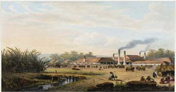

> **Deskripsi Visual:** Gambar ini adalah ilustrasi yang menunjukkan pertambangan batu bara di era industri awal. Gambar ini menggambarkan proses pengolahan batu bara dengan menggunakan mesin tenaganya. Di sebelah kiri, terlihat pohon-pohon hijau yang tumbuh di sekitar area pertambangan. Di tengah gambar, ada beberapa orang pekerja yang sedang bekerja di area pertambangan. Di kanan, terlihat sebuah mesin tenaga uap yang sedang digunakan untuk mengolah batu bara. Dari sisi atas, terlihat asap hitam yang keluar dari mesin tersebut, menunjukkan bahwa proses pengolahan sedang berlangsung. Seluruh gambar ini menunjukkan bagaimana teknologi industri awal digunakan untuk mengolah batu bara menjadi bahan bakar energi.

Sumber:  https://www.google.co.id.search- pabrik+gula, 2-1-2016 Gambar 1.11 Salah satu pabrik zaman penjajahan Belanda

- Guru kemudian menayangkan beberapa gambar, misalnya.
- Guru  meminta  kepada  siswa  untuk  mengajukan  pertanyaan  terkait dengan gambar-gambar yang ditunjukkan guru tadi.
- Guru pun memberi respon atas pertanyaan-pertanyaan dari siswa.

### Kegiatan Inti (65 menit)

- Guru menegaskan kembali tentang topik pembelajaran dan menyampaikan kompetensi yang akan   dicapai.
- Guru  menegaskan  model  pembelajaran  yang  akan  dilaksanakan, dengan model Information search .  Guru  secara  sekilas  menjelaskan tentang model pembelajaran ini,  yakni  guru  akan  membagi  kartu  kepada masing-masing kelompok. Pada kartu itu sudah berisi pertanyaan atau tugas yang harus diselesaikan oleh masing-masing kelompok .
- Guru membagi kartu kepada masing-masing kelompok. Kartu  no. 1 diberikan kepada kelompok I; kartu no, 2 diberikan kepada kelompok II , dan kartu no. 3 diberikan kepada kelompok III, kartu no 4 diberikan kelompok  IV,  kartu  no.  5  diberikan  kelompok  V  dan  kartu  no.  6 diberikan kelompok VI.

 

---
## 📄 Halaman 117

### Pertanyaan

- Siapakah Van den Bosch itu?
- Mengapa mengusulkan program tanam Paksa di negeri jajahan?
- Bagaimana respons pimpinan Kerajaan Belanda?

### Pertanyaan

- Jelaskan tentang ketentuan-ketentuan Tanam Paksa!
- Bagaimana pelaksanaan Tanam Paksa?
- Mengapa  terjadi  berbagai  penyelewengan  dalam  pelaksanaan Tanam Paksa?

### Pertanyaan

- Bagaimana latar belakang dilaksanakan Usaha Swasta di Indonesia pada zaman penjajahan Belanda?
- Siapa  tokoh  yang  berpengaruh  kemudian  dilaksanakan  Usaha Swasta di Indonesia?
- Mengapa Tanam Paksa kemudian diakhiri?

### Pertanyaan

- Apa yang dimaksud dengan UU Agraria tahun 1870?
- Apa isi pokok UU Agraria tahun 1870 itu?
- Apa makna UU Agraria tahun 1870 bagi pelaksanaan penjajahan Belanda di Indonesia?

 

---
## 📄 Halaman 118

### Pertanyaan

- Apa yang dimaksud dengan Usaha Swasta?
- Bagaimana pelaksanaan Usaha Swasta di Indonesia?
- Pelaksaan  Usaha  Swasta  di  Indonesia  telah  melahirkan  wajah kapitalisme dan imperialisme modern, jelaskan!

### Pertanyaan

- Bagaimana  dampak  dilaksanakan Tanam  paksa di bidang ekonomi di negeri jajahan?
- Bagaimana dampak  dilaksanakannya Usaha Swasta  dalam kehidupan sosial ekonomi di negeri jajahan?
- Adakah dampak positif dari pelaksanaan Tanam Paksa dan Usaha Swasta di Indonesia?
- Masing-masing kelompok kemudian berdiskusi kelompok untuk menjawab pertanyaan pertanyaan yang diterimanya.
- Setelah  selesai  menjawab  di  kelompok,  kemudian  masing-masing kelompok mempresentasikan hasil jawabannya. Kelompok yang tidak presentasi dapat memberikan pertanyaan atau masukan, dan begitu seterusnya sehingga masing-masing kelompok bisa presentasi

### Kegiatan Penutup (15 menit)

- Siswa dibantu oleh guru menyimpulkan materi tentang pelaksanaan Tanam Paksa dan Usaha Swasta di Indonesia.
- Siswa  melakukan  refleksi  tentang  pelaksanaan  pembelajaran  dan pelajaran  apa  yang    diperoleh  setelah  belajar  tentang  pelaksanaan Tanam Paksa dan Usaha Swasta di Indonesian.

 

---
## 📄 Halaman 119

- Sebagai umpan balik guru secara acak mengajukan pertanyaan kepada siswa, misalnya:
- (1). Siapa  tokoh  dipandang  berpengaruh  sehingga  Tanam  Paksa dilaksanakan di Indonesia?
- Siapa pula tokoh yang dipandang berpengaruh sehingga Usaha Swasta  dilaksanakan di Indonesia?

### Tugas rumah

Siswa membuat karangan/menulis makalah dengan judul' 'Imperalisme modern di Indonesia lampau dan kini'.

### E. Penilaian

Penilaian  dilakukan  menggunakan  penilaian  otentik  yang  meliputi penilaian sikap, pengetahuan dan keterampilan. Format penilaian terlampir sebagai berikut

### 1. Penilaian Sikap

---
**📊 Tabel**

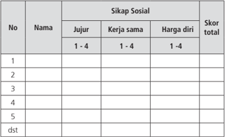

Tabel ini menunjukkan skor sikap sosial individu berdasarkan tiga kriteria: jujur, kerja sama, dan harga diri. Kolom "Nama" menyediakan tempat untuk menuliskan nama-nama individu yang akan diukur. Kolom "Jujur", "Kerja sama", dan "Harga diri" masing-masing memiliki skala 1 hingga 4 untuk mengukur tingkat sikap sosial setiap individu. Skor total untuk setiap individu dihitung dengan menggabungkan nilai dari ketiga kriteria tersebut. Data penting yang terlihat adalah bahwa tabel ini dapat digunakan untuk membandingkan skor sikap sosial individu dalam konteks yang sama, memungkinkan analisis statistik dan pemilihan individu berdasarkan karakteristik sikap sosial tertentu.

 

---
## 📄 Halaman 120

### Keterangan:

### 1. Sikap Sosial.

### 1). Sikap Jujur

Indikator sikap sosial 'jujur'

- Tidak  bohong,  mengemukakan  pendapatnya  tentang  sesuatu sesuai dengan apa yang diyakininya
- Mau  bercerita tentang kesulitan  dan  kelemahannya,  mau menerima pendapat temannya
- Tidak  menyontek  /Tidak  meniru  pekerjaan  temannya    dalam mengerjakan tugas/  tidak plagiarisme
- Terus terang, menyatakan dengan sesungguhnya apa yang telah terjadi atau yang dialaminya

### Rubrik pemberian skor

- 4 =  jika siswa melakukan 4 (dari empat) kegiatan tersebut
- 3 =  jika siswa melakukan 3 (dari empat) kegiatan tersebut
- 2 =  jika siswa melakukan 2 (dari empat) kegiatan tersebut
- 1 =  jika siswa melakukan salah satu  (dari empat) kegiatan tersebut

### 2). Sikap Kerja Sama

### Indikator sikap sosial 'kerja sama'

- Peduli kepada sesama
- Saling membantu dalam hal kebaikan
- Saling menghargai/ toleran
- Ramah dengan sesama

### Rubrik pemberian skor

- 4 =  jika siswa melakukan 4 (dari empat) kegiatan tersebut
- 3 =  jika siswa melakukan 3 (dari empat) kegiatan tersebut
- 2 =  jika siswa melakukan 2 (dari empat) kegiatan tersebut
- 1 =  jika siswa melakukan salah satu  (dari empat) kegiatan tersebut

### 3). Sikap Harga Diri

Indikator sikap sosial 'harga diri'

- Tidak suka dengan dominasi asing
- Bersikap sopan untuk menegur bagi mereka yang mengejek

 

---
## 📄 Halaman 121

- Cinta produk negeri sendiri
- Mengharagai dan menjaga karya-karya sekolah dan masyarakat sendiri

### Rubrik pemberian skor

4 =  jika siswa melakukan 4 (dari empat) kegiatan tersebut

3 =  jika siswa melakukan 3 (dari empat) kegiatan tersebut

2 =  jika siswa melakukan 2 (dari empat) kegiatan tersebut

1 =  jika siswa melakukan salah satu  (dari empat) kegiatan tersebut)

### 2. Penilaian Pengetahuan

---
**📊 Tabel**

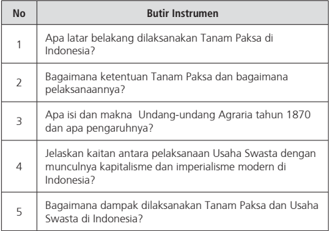

Tabel ini berisi pertanyaan tentang sejarah dan ekonomi Indonesia, dengan topik utama "Tanam Paksa" dan "Usaha Swasta". Kolom pertama menunjukkan nomor pertanyaan, sedangkan kolom kedua berisi butir instrumen atau topik yang akan dijelaskan. Data penting yang terlihat antara lain:

1. Apa latar belakang dilaksanakannya Tanam Paksa di Indonesia?
2. Bagaimana ketentuan Tanam Paksa dan bagaimana pelaksanaannya?
3. Apa itu dan maksud Undang-Undang Agraria tahun 1870 dan apa pengaruhnya?
4. Jelaskan kaitan antara pelaksanaan Usaha Swasta dengan munculnya kapitalisme dan imperialisme modern di Indonesia?
5. Bagaimana dampak dilaksanakannya Tanam Paksa dan Usaha Swasta di Indonesia?

Tabel ini membahas sejarah dan ekonomi Indonesia, dengan fokus pada peran dan dampak Tanam Paksa dan Usaha Swasta.

Nilai = jumlah skor

### 3. Penilaian Keterampilan

Siswa diminta untuk melakukan pengamatan pada objek sejarah atau hal-hal yang terkait dengan peristiwa Tanam Paksa dan atau usaha swasta yang ada atau dekat dengan lingkungan kemudian dibuat laporannya.

 

---
## 📄 Halaman 122

---
**📊 Tabel**

Tabel ini menunjukkan data tentang relevansi, kelengkapan, kebahasaan, dan jumlah skor siswa. Topik utamanya adalah evaluasi kemampuan siswa dalam berbagai aspek. Kolom-kolomnya meliputi nomor urut (No.), nama siswa, relevansi (1-4), kelengkapan (1-4), kebahasaan (1-4), dan jumlah skor. Data penting yang terlihat adalah bahwa setiap siswa memiliki satu baris di tabel, dengan informasi yang sama untuk semua kolom. Ini menunjukkan bahwa tabel ini digunakan untuk membandingkan dan merangkum data individu siswa dalam berbagai aspek.

Nilai = Jumlah skor dibagi 3

### Keterangan:

- Kegiatan  mengamati  dalam  hal  ini  dipahami  sebagai  cara  siswa mengumpulkan  informasi faktual dengan memanfaatkan  indera penglihatan, pembau, pendengar, pengecap dan peraba. Maka secara keseluruhan  yang dinilai adalah HASIL pengamatan (berupa informasi) bukan  CARA mengamati.
- Relevansi, kelengkapan, dan kebahasaan diperlakukan sebagai indikator penilaian kegiatan mengamati.
- Relevansi  merujuk  pada  ketepatan  atau  keterhubungan  fakta yang diamati dengan informasi yang dibutuhkan untuk mencapai tujuan Kompetensi Dasar/Tujuan Pembelajaran (TP).
- Kelengkapan dalam arti semakin banyak komponen fakta yang terliput atau semakin sedikit sisa (residu) fakta yang tertinggal.
- Kebahasaan  menunjukan  bagaimana  siswa  mendeskripsikan fakta-fakta yang dikumpulkan dalam bahasa tulis yang  efektif (tata kata atau tata kalimat yang benar dan mudah dipahami).
- Skor terentang antara 1 - 4
- 1  = kurang
- = Cukup
- 3  = Baik
- 4  = Sangat Baik

 

---
## 📄 Halaman 123

### 4. Penilaian untuk Kegiatan Diskusi Kelompok

---
**📊 Tabel**

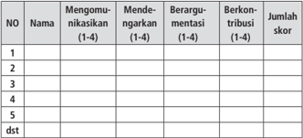

Tabel ini menunjukkan data tentang tingkat partisipasi siswa dalam berbagai aktivitas kelas, seperti mengomunikasikan, mendengarkan, berargumen, dan berkontribusi. Kolom-kolomnya mencakup nama siswa, skor untuk setiap aktivitas, dan jumlah skor keseluruhan. Topik utama tabel adalah partisipasi siswa dalam aktivitas kelas. Data penting yang terlihat adalah bahwa banyak siswa memiliki skor yang tinggi dalam berbagai aktivitas, menunjukkan bahwa mereka aktif dan berpartisipasi dalam kegiatan belajar di kelas.

Nilai = jumlah skor dibagi 3

### Keterangan:

- Keterampilan  mengomunikasikan  adalah  kemampuan  siswa  untuk mengungkapkan  atau  menyampaikan  ide  atau  gagasan  dengan bahasa lisan yang efektif.
- Keterampilan  mendengarkan  dipahami  sebagai  kemampuan  siswa untuk  tidak  menyela,  memotong,  atau  menginterupsi  pembicaraan seseorang ketika sedang mengungkapkan gagasannya.
- Kemampuan berargumentasi menunjukkan kemampuan siswa dalam mengemukakan argumentasi logis    ketika  ada  pihak  yang  bertanya atau mempertanyakan gagasannya.
- Kemampuan berkontribusi  dimaksudkan sebagai kemampuan siswa memberikan gagasan-gagasan  yang  mendukung  atau  mengarah  ke penarikan kesimpulan termasuk di dalamnya menghargai perbedaan pendapat.
- Skor terentang antara 1 - 4
- 1  = kurang
2  = Cukup

3  = Baik

4  = Sangat Baik

 

---
## 📄 Halaman 124

### 5. Penilaian Presentasi

---
**📊 Tabel**

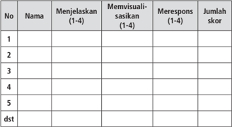

Tabel ini berisi informasi tentang penilaian kinerja siswa dalam beberapa aspek: menjelaskan, memvisualisasikan, merespons, dan jumlah skor. Topik utama tabel adalah penilaian kinerja siswa dalam berbagai aspek pembelajaran. Kolom-kolomnya mencakup nama siswa, menjelaskan (dengan skor 1-4), memvisualisasikan (dengan skor 1-4), merespons (dengan skor 1-4), dan jumlah skor. Data penting yang terlihat adalah bahwa setiap siswa memiliki nilai yang berbeda-beda dalam setiap aspek penilaian, menunjukkan variasi dalam kinerja mereka.

Nilai= Jumlah skor dibagi 3

### Keterangan:

- Keterampilan  menjelaskan  adalah  kemampuan  menyampaikan  hasil observasi dan diskusi secara meyakinkan.
- Keterampilan memvisualisasikan berkaitan dengan kemampuan siswa untuk membuat atau mengemas informasi seunik mungkin, semenarik mungkin, atau sekreatif mungkin.
- Keterampilan  merespons  adalah  kemampuan  siswa  menyampaikan tanggapan  atas  pertanyaan,  bantahan,  sanggahan  dari  pihak  lain secara empatik.
- Skor terentang antara 1 - 4
- 1 = Kurang
- 2 = Cukup
- 3 = Baik
- 4 = Amat Baik
Ekuivalensi:  kurang = 1 - 55;   cukup = 56 - 65;   baik = 66 - 79; sangat baik = 80 - 100

 

---
## 📄 Halaman 125

### Pembelajaran Minggu Ke-5 (90 menit) 'Perkembangan Agama Kristen'

### A. Pengantar

Pada pertemuan minggu keenam ini secara khusus akan dibahas tentang masuk  dan  berkembangnya  Agama  Kristen  di  Indonesia.  Berkembangnya agama Kristen di Indonesia ini telah menambah dan memperkaya khasanah kehidupan  beragama.  Oleh  karena  itu,  toleransi  menjadi  sesuatu  yang sangat penting. Dalam pembelajaran ini guru perlu menekankan pentingnya toleransi.

### B. Tujuan Pembelajaran

Setelah mengkuti kegiatan pembelajaran ini siswa  mampu:

- Menganalisis proses masuknya Agama Kristen di Indonesia.
- Menganalisis  perkembangan  Agama  Kristen  di  berbagai  daerah  di Indonesia.
- Menganalisis  mengapa  Agama  Kristen  di  Indonesia  bagian  timur berkembang pesat.

### C. Materi Pembelajaran

- Proses masuknya Agama Kristen di Indonesia
- Perkembangan Agama Kristen di berbagai daerah di Indonesia
- Mengapa Agama Kristen di Indonesia bagian timur berkembang pesat

### D.    Model dan Pembelajaran

- Model: Berbasis masalah dengan Jigsaw
Dalam melaksanakan pembelajaran secara umum dibagi tiga tahapan: kegiatan pendahuluan, kegiatan inti dan kegiatan penutup.

 

---
## 📄 Halaman 126

### Kegiatan Pembelajaran

### Kegiatan Pendahuluan (10 menit)

- Guru meminta salah seorang siswa untuk memimpin doa.
- Guru mempersiapkan kelas agar lebih kondusif untuk proses belajar mengajar (kerapian dan kebersihan ruang kelas, presensi, menyiapkan media dan alat serta buku yang diperlukan.
- Guru menyampaikan topik pembelajaran dan tujuan serta kompetensi yang perlu dimiliki.
- Guru membagi kelas menjadi beberapa kelompok kecil, masing masing kelompok beranggotakan tiga anak (anggota I, II,  dan III ).

### Kegiatan Inti  (65 menit)

- Siswa sudah duduk bersama anggota kelompok.
- Guru  menayangkan  atau  menunjukkan    contoh  gambar,  misalnya gereja dan tokoh-tokoh penyebar agama Kristen.
- Guru meminta siswa untuk mengamati gambar-gambar yang ditunjukkan guru.

 

---
## 📄 Halaman 127

- Guru mendorong agar para siswa mengajukan beberapa pertanyaan tentang gambar tersebut.
- Guru memberi komentar tentang beberapa pertanyaan yang muncul, kemudian  mengaitkan  dengan  perkembangan  agama  Kristen  di Indonesia.
- Guru menjelaskan tentang tugas belajar minggu ke-5 ini di masingmasing kelompok untuk melakukan eksplorasi dan menganalisis materi pembelajaran melalui model jigsaw .
- Semua siswa yang merupakan anggota I bertanggung jawab untuk mengkaji dan merumuskan tentang 'Proses masuknya Agama Kristen ke  Indonesia'.    Semua  siswa  anggota  II    bertanggung  jawab  untuk mengkaji  dan  merumuskan  tentang  materi  'Perkembangan  Agama Kristen di Berbagai daerah di Indonesia' . Kemudian semua anggota III bertanggung jawab untuk mengkaji dan merumuskan materi ' Faktorfaktor  apa  atau  apa  sebabnya  Agama  Kristen  pesat  berkembang  di Indonesia Timur' .
- Tiap-tiap siswa yang mendapat tugas yang sama kemudian berkumpul untuk saling  membantu  mengkaji  dan  merumuskan  materi  yang  menjadi tanggung  jawabnya.  Kumpulan  siswa  yang  mendapat  tugas  yang sama ini kemudian dikenal dengan sebutan kelompok pakar ( expert group ).  Sedang  kelompok  asli  yang  beranggotakan  tiga  siswa  tadi dinamakan home teams . Dengan demikian ada kelompok pakar yang membahas tentang 'Proses masuknya agama Kristen ke Indonesia', ada kelompok pakar yang mengkaji tentang 'Perkembangan agama Kristen  di  berbagai  daerah  di  Indonesia,  dan  ada  kelompok  pakar yang  mendiskusikan  tentang  'Faktor-faktor  yang  mendorong  atau mendukung mengapa Agama Kristen pesat berkembang di Indonesia bagian Timur.
- Setelah  kelompok  pakar  selesai  mendiskusikan  dan  merumuskan materi yang jadi tugasnya kemudian kembali ke home teams .
- Kelompok  home  teams  kemudian  mendiskusikan  hasil  kajian  yang diperoleh dari kelompok pakar. Dengan demikian di kelompok home teams itu dapat memahami materi tentang 'Proses masuknya agama Kristen  ke  Indonesia',  'Perkembangan  agama  Kristen  di  berbagai daerah  di  Indonesia,  dan  faktor-faktor  yang  menyebabkan  agama Kristen pesat berkembang di Indonesia Timur'.

 

---
## 📄 Halaman 128

- Kemudian beberapa kelompok home teams dapat ditampilkan untuk presentasi agar memperkaya materi pelajaran yang sedang dikaji, bila waktu cukup semua home teams bisa tampil.

### Kegiatan Penutup (15 menit)

- Guru  memberikan  ulasan  singkat  tentang  materi  yang  baru  saja didiskusikan.
- Guru  dapat  menanyakan  apakah  siswa  sudah  memahami  materi tersebut.
- Guru memberikan pertanyaan lisan secara acak kepada siswa untuk mendapatkan umpan balik atas pembelajaran yang baru saja berlangsung,  misalnya:
- 1).      Jelaskan  peran  Fransiscus  Xaverius  dalam  penyebaran  Agama Kristen di Nusantara!
- 2).     Diperkirakan  Agama  Kristen  sudah  masuk  ke  Indonesia  pada abad ke-9, coba tunjukkan buktinya!
- Sebagai refleksi Guru bersama siswa menyimpulkan tentang pelajaran yang  baru  saja  berlangsung  serta  menanyakan  kepada  siswa  apa manfaat  yang  dapat  kita  peroleh  setelah  belajar  topik  ini.  Guru menegaskan pentingnya perkemangan agama Kristen seperti halnya agama yang lain. Inilah salah satu kekayaan Indonesia. Oleh karena itu  kita  wajib  bersyukur  kepada  Tuhan  Yang  Maha  Esa,  dengan mengembangkan toleransi dalam kehidupan beragama.

### Tugas Rumah

Coba lakukan pengamatan dan buatlah cerita tentang perkembangan agama Katolik atau Kristen di daerah kalian. Jika di lingkunganmu ada gereja kalian bisa menanyakan kepada pengurus gereja, kapan gereja itu didirikan, bagaimana dengan perkembangan umat Kristiani di daerah itu?  Nah, itu semua tentu merupakan kekayaan bangsa Indonesia, yang memiliki beragam agama dan bangunan suci masing-masing. Oleh karena itu, kita harus saling menghormati dan menghargai demi kejayaan bersama bangsa Indonesia.

 

---
## 📄 Halaman 129

### E. Penilaian

Penilaian  dilakukan  menggunakan  penilaian  otentik  yang  meliputi penilaian  sikap,  pengetahuan  dan  keterampilan.  Format  penilaian  sebagai berikut:

### 1. Penilaian Sikap

---
**📊 Tabel**

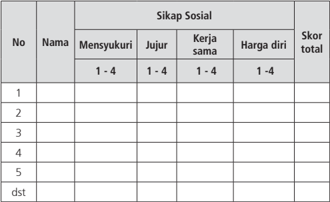

Tabel ini menunjukkan skor sementara siswa dalam berbagai aspek sikap sosial mereka, seperti mensyukuri, jujur, kerja sama, dan harga diri. Kolom "Nama" menyediakan tempat untuk menuliskan nama-nama siswa, sedangkan kolom "Sikap Sosial" memuat empat sub-aspek yang harus diisi dengan skor antara 1 hingga 4. Skor total setiap siswa dapat dilihat di kolom terakhir. Data penting yang terlihat adalah bahwa setiap siswa memiliki skor yang berbeda-beda dalam setiap aspek sikap sosial, menunjukkan variasi individu dalam perilaku sosial mereka.

### Keterangan:

### a. Sikap Spiritual

Indikator sikap spiritual 'mensyukuri':

- Rajin menjalankan ibadah sesuai dengan agamanya
- Berdoa sebelum dan sesudah kegiatan pembelajaran
- Memberi  salam  pada  saat  awal  dan  akhir  presentasi  sesuai agama yang dianut
- Mengucapkan  syukur  atas  karunia  Tuhan,  menerima  dengan senang apa yang telah   dimilikinya
Rubrik pemberian skor sikap spiritual:

4 =  jika siswa melakukan 4 (dari empat) kegiatan tersebut

3 =  jika siswa melakukan 3 (dari empat) kegiatan tersebut

2 =  jika siswa melakukan 2 (dari empat) kegiatan tersebut

1 =  jika siswa melakukan salah satu  (dari empat) kegiatan tersebut)

 

---
## 📄 Halaman 130

### b. Sikap Sosial

### 1). Sikap jujur

### Indikator sikap sosial 'jujur'

- Tidak  bohong,  mengemukakan  pendapatnya  tentang  sesuatu sesuai dengan apa yang diyakininya
- Mau  bercerita tentang kesulitan  dan  kelemahannya,  mau menerima pendapat temannya
- Tidak  menyontek  /Tidak  meniru  pekerjaan  temannya    dalam mengerjakan tugas/  tidak plagiarisme
- Terus    terang,  menyatakan  dengan  sesungguhnya  apa  yang telah terjadi atau yang dialaminya

### Rubrik pemberian skor sikap santun

- 4 =  jika siswa melakukan 4 (dari empat) kegiatan tersebut
- 3 =  jika siswa melakukan 3 (dari empat) kegiatan tersebut
- 2 =  jika siswa melakukan 2 (dari empat) kegiatan tersebut
- 1 =  jika siswa melakukan salah satu  (dari empat) kegiatan tersebut

### 2). Sikap kerja sama

### Indikator sikap sosial 'kerja sama'

- Senang membantu sesama
- Selalu aktif dalam kegiatan sekolah
- Bersikap ramah dan bersahabat
- Menjaga toleransi

### Rubrik pemberian skor

- 4 =  jika siswa melakukan 4 (dari empat) kegiatan tersebut
- 3 =  jika siswa melakukan 3 (dari empat) kegiatan tersebut
- 2 =  jika siswa melakukan 2 (dari empat) kegiatan tersebut
- 1 =  jika siswa melakukan salah satu  (dari empat) kegiatan tersebut

 

---
## 📄 Halaman 131

### 3). Sikap harga diri sebagai orang Indonesia

### Indikator sikap harga diri

- Bersikap menolak intervensi asing
- Mencintai produk dalam negeri
- Menghargai dan memelihara karya-karya sekolah
- Menjaga nama baik diri sendiri dan institusinya

### Rubrik pemberian skor

4 =  jika siswa melakukan 4 (dari empat) kegiatan tersebut.

3 =  jika siswa melakukan 3 (dari empat) kegiatan tersebut

- 2 =  jika siswa melakukan 2 (dari empat) kegiatan tersebut
1 =  jika siswa melakukan salah satu  (dari empat) kegiatan tersebut

### 2. Penilaian Pengetahuan

---
**📊 Tabel**

Tabel ini berisi pertanyaan tentang perkembangan agama Kristen di Indonesia, dengan topik utama berkisar pada proses masuknya agama Kristen ke Indonesia, peran Fransiskus Xaverius dalam penyebaran agama Kristen di Indonesia bagian Timur, dan tantangan dalam menerapkan toleransi agama di Indonesia. Kolom pertama menunjukkan nomor pertanyaan, sedangkan kolom kedua berisi instrumen atau bentuk pertanyaan tersebut. Data penting yang terlihat adalah bahwa pertanyaan-pertanyaan ini mencakup berbagai aspek seperti sejarah perkembangan agama Kristen di Indonesia, peran Fransiskus Xaverius, dan tantangan dalam menerapkan toleransi agama.

Nilai = jumlah skor

 

---
## 📄 Halaman 132

### 3. Penilaian Keterampilan

Para siswa ditugasi untuk mengamati dan membuat laporan tentang perkembangan agama Kristen di lingkungannya

---
**📊 Tabel**

Tabel ini menunjukkan data tentang relevansi, kelengkapan, kebahasaan, dan jumlah skor siswa. Topik utamanya adalah evaluasi kemampuan siswa dalam berbagai aspek. Kolom-kolomnya meliputi Nama Siswa, Relevansi (1-4), Kelengkapan (1-4), Kebahasaan (1-4), dan Jumlah Skor. Data penting yang terlihat adalah bahwa setiap siswa memiliki satu baris di tabel, dengan informasi yang disusun secara teratur untuk memudahkan analisis.

Nilai = Jumlah skor dibagi 3

### Keterangan:

- Kegiatan  mengamati  dalam  hal  ini  dipahami  sebagai  cara  siswa mengumpulkan  informasi faktual dengan memanfaatkan  indera penglihatan, pembau, pendengar, pengecap dan peraba. Maka secara keseluruhan  yang dinilai adalah HASIL pengamatan (berupa informasi) bukan  CARA mengamati.
- Relevansi, kelengkapan, dan kebahasaan diperlakukan sebagai indikator penilaian kegiatan mengamati.
- Relevansi  merujuk  pada  ketepatan  atau  keterhubungan  fakta yang diamati dengan informasi yang dibutuhkan untuk mencapai tujuan Kompetensi Dasar.
- Kelengkapan dalam arti semakin banyak komponen fakta yang terliput atau semakin sedikit sisa (residu) fakta yang tertinggal.
- Kebahasaan  menunjukan  bagaimana  siswa  mendeskripsikan fakta-fakta yang dikumpulkan dalam bahasa tulis yang  efektif (tata kata atau tata kalimat yang benar dan mudah dipahami).

 

---
## 📄 Halaman 133

- Skor terentang antara 1 - 4
1  = kurang

1. = Cukup

3  = Baik

4  = Sangat Baik

### 4. Penilaian untuk Kegiatan Diskusi Kelompok

---
**📊 Tabel**

Tabel ini menunjukkan data tentang tingkat partisipasi siswa dalam berbagai aktivitas diskusi di kelas. Topik utama tabel adalah partisipasi siswa dalam berbagai tindakan diskusi, seperti mengomentari, mendengarkan, berargumentasi, berkontribusi, dan mengumpulkan skor. Kolom-kolomnya mencakup nomor siswa (NO), nama siswa, dan skor untuk setiap tindakan diskusi. Data penting yang terlihat adalah bahwa banyak siswa memiliki skor yang tinggi dalam berbagai tindakan diskusi, menunjukkan bahwa mereka aktif dan berpartisipasi dalam proses pembelajaran diskusi.

Nilai = jumlah skor dibagi 3

### Keterangan:

- Keterampilan  mengomunikasikan  adalah  kemampuan  siswa  untuk mengungkapkan  atau  menyampaikan  ide  atau  gagasan  dengan bahasa lisan yang efektif.
- Keterampilan  mendengarkan  dipahami  sebagai  kemampuan  siswa untuk  tidak  menyela,  memotong,  atau  menginterupsi  pembicaraan seseorang ketika sedang mengungkapkan gagasannya.
- Kemampuan berargumentasi menunjukkan kemampuan siswa dalam mengemukakan argumentasi logis    ketika  ada  pihak  yang  bertanya atau mempertanyakan gagasannya.

 

---
## 📄 Halaman 134

- Kemampuan berkontribusi  dimaksudkan sebagai kemampuan siswa memberikan gagasan-gagasan  yang  mendukung  atau  mengarah  ke penarikan kesimpulan termasuk di dalamnya menghargai perbedaan pendapat.
- Skor terentang antara 1 - 4
1  = kurang

2  = Cukup

3  = Baik

4  = Sangat Baik

### 5. Penilaian Presentasi

---
**📊 Tabel**

Tabel ini menunjukkan hasil evaluasi kinerja siswa dalam beberapa aspek, yaitu menjelaskan informasi, memvisualisasikan konsep, dan merespon pertanyaan. Setiap baris mewakili satu siswa, dengan kolom-kolom berisi skor mereka pada setiap aspek. Topik utama tabel adalah penilaian kinerja siswa dalam menguasai tiga aspek pembelajaran. Kolom "Nama" menyediakan identitas siswa, sedangkan kolom "Menjelaskan (1-4)", "Memvisualisasikan (1-4)", dan "Merespon (1-4)" menunjukkan skor mereka pada masing-masing aspek. Data penting yang terlihat adalah bahwa setiap siswa memiliki skor yang berbeda-beda dalam setiap aspek, menunjukkan variasi individu dalam pengetahuan dan kemampuan mereka dalam menguasai materi belajar.

Nilai= Jumlah skor dibagi 3

### Keterangan:

- Keterampilan  menjelaskan  adalah  kemampuan  menyampaikan  hasil observasi dan diskusi secara meyakinkan.
- Keterampilan memvisualisasikan berkaitan dengan kemampuan siswa untuk membuat atau mengemas informasi seunik mungkin, semenarik mungkin, atau sekreatif mungkin.

 

---
## 📄 Halaman 135

- Keterampilan  merespon  adalah  kemampuan  siswa  menyampaikan tanggapan  atas  pertanyaan,  bantahan,  sanggahan  dari  pihak  lain secara empatik.
- Skor terentang antara 1 - 4
- 1 = Kurang
2 = Cukup

3 = Baik

- 4 = Amat Baik
Ekuivalensi:  kurang = 1 - 55;   cukup = 56 - 65;   baik = 66 - 79; sangat baik = 80 - 100

 

---
## 📄 Halaman 136

### PENGAYAAN

Untuk sekolah yang tingkat kemampuan siswanya tinggi,  guru perlu memberikan pengayaan kepada para siswa yang telah menguasai materi pada bab I yang terkait dengan masa dominasi kolonialisme dan imperialisme. Bagi mereka yang sudah menguasai materi ini diminta untuk melakukan kegiatankegiatan  keilmuan  yang  dapat  memperkaya  pengetahuan  dan  wawasan siswa yang terkait dengan berbagai peristiwa dan situs yang menyangkut masa penjajahan kolonial Barat khususnya Belanda. Hal ini penting untuk melatih berpikir siswa lebih komprehensif, membuat peluang untuk berpikir alternatif.

Beberapa kegiatan pengayaan itu antara lain siswa dapat membuat kliping. Banyak majalah, surat kabar dan jenis bacaan dan media lain yang dapat digunakan sebagai bahan  untuk menyusun kliping yang terkait dengan kekuasaan  kolonial.  Pengumpulan  informasi  tentang  penjajahan  asing  itu juga dapat diperluas sampai pada bentuk-bentuk  penjajahan dan dominasi asing yang sekarang masih dirasakan oleh rakyat. Dengan demikian sesuai dengan tuntutan  pembelajaran  Sejarah  Indonesia,  di  samping  menambah wawasan, memantapkan rasa nasionalisme, para siswa juga dilatih untuk berpikir kritis. Di samping bentuk kliping, para siswa yang diberi pengayaan itu dapat diminta ke perpustakaan untuk membaca dan mempelajari tematema tertentu yang terkait dengan masa penjajahan kolonial Barat, kemudian siswa membuat resumenya. Bisa juga guru menyediakan bacaan semacam artikel  atau  yang  lain  kemudian  siswa  diminta  untuk  melakukan  telaah tentang isi bacaan tersebut.

 

---
## 📄 Halaman 137

### REMEDIAL

Kegiatan  remedial  dilakukan  dan  diberikan  kepada  para  siswa  yang belum mengusai materi Bab I dan belum menguasai kompetensi seperti telah diterangkan  di atas. Bentuk remedial yang dilakukan antara lain siswa secara terencana mempelajari kembali Buku Teks Sejarah Indonesia pada bagianbagian tertentu yang dipandang belum dikuasai dengan dipandu pertanyaanpertanyaan yang telah dipersiapkan oleh guru. Setelah itu guru menyediakan latihan-latihan  atau  tugas  yang  menunjukkan  pemahaman  balik  tentang isi  buku teks ini. Setelah itu siswa diminta komitmen untuk belajar secara disiplin dalam rangka memahami materi-materi pelajaran berikutnya untuk mencapai kompetensi yang telah ditetapkan. Guru kemudian mengadakan uji kompetensi  bagi siswa yang mengikuti program remedial.

### INTERAKSI GURU DENGAN ORANG TUA

Kegiatan interaksi guru dengan orang tua ini dimaksudkan sebagai sebuah  proses  pertanggungjawaban  bersama  antara  guru  dan  orang tua  para  siswa  untuk  mengantar  siswa  agar  sukses  dalam  belajar.  Dalam pelaksanaannya  para  siswa  diminta  memperlihatkan  hasil  pekerjaan  atau tugas yang telah dinilai dan diberi komentar oleh guru kepada orang tua/wali siswa.  Orang  tua/wali  diharapkan  dapat  memberikan  komentar  hasil  pekerjaan siswa. Orang tua/wali juga dapat menuliskan apresiasi kepada anak sebagai wujud  perhatian  dan  komitmen  orang  tua/wali  untuk  ikut  bertanggung jawab dalam keberhasilan aktivitas belajar anaknya. Wujud apresiasi orang tua  ini  akan  menambah  semangat  siswa  untuk  mempertahankan  dan meningkatkan  keberhasilannya  baik  dalam  konteks  pemahaman  materi maupun dalam hal pengembangan sikap dan perilaku jujur, disiplin, kerja keras, kerja sama, harga diri seagai warga bangsa. Hasil penilaian yang telah diparaf oleh guru dan orang tua/wali kemudian disimpan dan menjadi bagian portofolio siswa. Untuk itu pihak sekolah akan menyediakan format tugas/ pekerjaan para siswa.

 

---
## 📄 Halaman 138

### BAB I I PERANG MELAWAN KOLONIALIS DAN IMPERIALIS

### Kompetensi Dasar

- 3.2. Menganalisis strategi perlawanan bagsa Indonesia terhadap  penjajahan bangsa Eropa (Portugis, Spanyol, Belanda, Inggris) sampai abad ke-20.
- 4.2. Mengolah  informasi  tentang  strategi  perlawanan  bangsa  Indonesia terhadap penjajahan bangsa Eropa (Portugis, Spanyol, Belanda, Inggris) sampai abad ke-20 dan menyajikannya dalam bentuk cerita sejarah

 

---
## 📄 Halaman 139

### PETA KONSEP

---
**🖼️ Gambar/Diagram**

> **Deskripsi Visual:** Gambar ini adalah diagram yang menunjukkan hubungan antara perjuangan melawan kolonialis dan imperialis dengan perang melawan kekerasan dan kekuasaan Kongsi Dagang, serta perang melawan penjajahan Belanda. Diagram ini memperlihatkan bahwa perjuangan melawan kolonialis dan imperialis berasal dari kekejaman penjajah, seperti praktik diskriminasi dan ketidakadilan, yang menghasilkan penderitaan rakyat. Perang melawan kekerasan dan kekuasaan Kongsi Dagang merupakan bagian dari perjuangan tersebut, sementara perang melawan penjajahan Belanda adalah tindak lanjut dari perjuangan melawan kekerasan dan kekuasaan Kongsi Dagang. Diagram ini menunjukkan hubungan horizontal dan vertikal antara perjuangan melawan kolonialis dan imperialis, perang melawan kekerasan dan kekuasaan Kongsi Dagang, dan perang melawan penjajahan Belanda. Label penting dalam diagram ini adalah "Perjuangan Melawan Kolonialis dan Imperialis", "Perang Melawan Kekerasan dan Kekuasaan Kongsi Dagang", dan "Perang Melawan Penjajahan Belanda". Informasi kunci yang dapat diambil pembaca adalah bahwa perjuangan melawan kolonialis dan imperialis merupakan dasar dari perang melawan kekerasan dan kekuasaan Kongsi Dagang, dan perang melawan kekerasan dan kekuasaan Kongsi Dagang merupakan tindak lanjut dari perjuangan tersebut, yang kemudian berlanjut menjadi perang melawan penjajahan Belanda.

 

---
## 📄 Halaman 140

### ARTI PENTING

Belajar sejarah perang melawan penjajahan dan kezaliman kolonialisme dan imperialisme ini sangat penting. Dengan menghayati semangat juang rakyat dan para tokoh pendahulu dapat mengambil nilai-nilai kejuangan mereka untuk kita terapkan dalam kehidupan sehari-hari.

### Pembelajaran Minggu Ke-6, Ke-7, Ke-8 (3x90 menit) 'Perang Melawan Keserakahan Kongsi Dagang'

### A. Pengantar

Pada  pertemuan  minggu  ke-6,  ke-7  dan  ke-8  ini  akan  membahas perlawanan perlawanan para pejuang Indonesia  untuk melawan keserakahan dan  kekejaman  yang  dilakukan  pemerintahan  kongsi  dagang,  terutama Portugis dan kongsi dagang Belanda, VOC.  Materi ini sangat penting untuk dipahami para siswa. Karena perlawanan dari para pejuang ini di samping untuk meneguhkan harga diri, juga mengandung nilai-nilai kejuangan yang penting  untuk  diteladani.  Guru  perlu  menekankan  di  samping  nilai-nilai kejuangan yang perlu diteladani juga pentingnya untuk mengembangkan berpikir kritis dan imajinatif  bagi para siswa.

### B. Tujuan Pembelajaran

Setelah mengikuti kegiatan pembelajaran ini siswa diharapkan mampu:

- Menganalisis  perlawanan  para  pejuang  Indonesia  terhadap  keserakahan Portugis.
- Menganalisis perlawanan para pejuang Indonesia terhadap kekejaman VOC.

 

---
## 📄 Halaman 141

### C. Materi  Pembelajaran

- Perlawanan para pejuang Nusantara terhadap Portugis.
- Perlawanan para pejuang Nusantara terhadap Kekejaman VOC.
Kedua  materi  pembelajaran  itu  sangat  luas.  Perlawanan  terhadap Portugis  misalnya  yang  terjadi  di  Aceh  dan  juga  di  Maluku.  Sementara perlawanan  terhadap  VOC  begitu  banyak  terjadi  di  Nusantara  misalnya perlawanan Sultan Agung, perlawanan Sultan Ageng Tirtayasa, perlawanan rakyat Banjar, Goa, Riau, perlawanan Pangeran Mangkubumi. Oleh karena itu  dalam  pelaksanaan  pembelajaran,  pada  pertemuan  minggu  ke-6  akan membahas  perlawanan  terhadap  Portugis.  Kemudian  pertemuan  minggu ke-7 dan ke-8 difokuskan untuk membahas beberapa contoh perlawanan terhadap VOC. Materi ini terdapat pada  Buku Siswa bab II  Subbab A.

### D. Model dan Pembelajaran

- Model: Jigsaw
Dalam melaksanakan pembelajaran secara umum dibagi tiga tahapan: kegiatan pendahuluan, kegiatan inti, dan kegiatan penutup.

### Kegiatan Pembelajaran

### Kegiatan Pendahuluan (10 menit)

- Guru meminta salah seorang siswa memimpin doa.
- Guru mempersiapkan kelas agar lebih kondusif untuk proses belajar mengajar  (kerapian dan kebersihan ruang kelas, presensi, menyiapkan media dan alat serta buku yang diperlukan.

 

---
## 📄 Halaman 142

- Guru menyampaikan topik pembelajaran dan tujuan serta kompetensi yang perlu dimiliki.
- Guru  juga  memberi  motivasi  dan  menegaskan  pentingnya  topik pembelajaran 'Perang melawan Keserakahan Kongsi Dagang'.
- Guru membagi kelas menjadi beberapa kelompok kecil, masing masing kelompok beranggotakan tiga anak (anggota I, II,  dan III ).

### Kegiatan Inti  (65 menit)

### Pertemuan Minggu ke-6 (65 menit)

- Siswa sudah duduk bersama anggota kelompok. Guru menayangkan atau  menunjukkan  beberapa  contoh  gambar  perlawanan  terhadap penjajahan.
- Guru meminta siswa untuk mengamati gambar-gambar atau foto-foto tersebut.
- Guru mendorong agar para siswa bertanya tentang gambar/foto-foto tersebut.
- Guru memberi komentar tentang beberapa pertanyaan yang muncul, untuk kemudian mengaitkan dengan pembahasan fokus pembelajaran 'Perlawanan terhadap Portugis'.

---
**🖼️ Gambar/Diagram**

> **Deskripsi Visual:** Gambar ini adalah ilustrasi yang menunjukkan kapal Viking yang sedang berlayar di laut dengan pemandangan gunung di latar belakang. Kapal tersebut tampak besar dan memiliki tiga bagian utama: bagian depan, tengah, dan belakang. Kapal tersebut tampak kokoh dan dipenuhi dengan banyak barang bawaan, termasuk kayu dan peralatan. Di sekitar kapal, terlihat beberapa orang yang tampak sedang berjalan-jalan atau berdiri, mungkin menunggu atau merawat kapal. Latar belakangnya tampak gelap dan berawan, menunjukkan bahwa waktu itu mungkin adalah malam atau pagi hari. Gambar ini menunjukkan keberanian dan ketekunan yang dimiliki oleh orang Viking dalam perjalanan mereka.

 

---
## 📄 Halaman 143

- Guru menjelaskan tentang tugas belajar minggu ke-6 ini di masingmasing kelompok untuk melakukan eksplorasi dan mengasosiasi materi pembelajaran  melalui  model jigsaw .  Semua  siswa  yang  merupakan anggota  I  bertanggung  jawab  untuk  mengkaji  dan  merumuskan tentang perlawanan di Aceh. Semua siswa anggota II  bertanggung jawab untuk mengkaji dan merumuskan tentang perlawanan di Maluku (Ternate dan Tidore).  Berikutnya semua siswa anggota III  bertanggung jawab  untuk  mengkaji  dan  merumuskan  nilai-nilai  kejuangan  yang terkandung dalam perang di Aceh maupun di Maluku.
- Tiap-tiap siswa yang mendapat tugas yang sama kemudian berkumpul untuk saling  membantu  mengkaji  dan  merumuskan  materi  yang  menjadi tanggung jawabnya. Kumpulan siswa yang mendapat tugas yang sama ini kemudian dikenal dengan sebutan kelompok pakar ( expert group ). Sedang kelompok asli yang beranggotakan tiga anak tadi dinamakan home teams . Dengan demikian ada kelompok pakar yang membahas tentang perang di Aceh, ada kelompok pakar yang mengkaji perang di Maluku, dan ada kelompok pakar yang mendiskusikan tentang nilainilai  yang  terkandung  dalam  peristiwa    perang  di  Aceh  maupun  di Maluku.
- Setelah  kelompok  pakar  selesai  mendiskusikan  dan  merumuskan materi yang jadi tugasnya kemudian kembali ke home teams.
- Kelompok home  teams kemudian  mendiskusikan  hasil  kajian  yang diperoleh dari kelompok pakar. Dengan demikian di kelompok home teams itu dapat memahami materi perlawanan terhadap Portugis baik di Aceh maupun di Maluku, beserta nilai-nilai kejuangannya.
- Kemudian beberapa kelompok home teams dapat ditampilkan untuk presentasi agar memperkaya materi pelajaran yang sedang dikaji, bila waktu cukup semua home teams bisa tampil.

### Kegiatan Penutup (15 menit)

- Guru  memberikan  ulasan  singkat  tentang  materi  yang  baru  saja didiskusikan.
- Guru  dapat  menanyakan  apakah  siswa  sudah  memahami  materi tersebut.

 

---
## 📄 Halaman 144

- Guru memberikan pertanyaan lisan secara acak kepada siswa untuk mendapatkan umpan balik atas pembelajaran yang baru saja berlangsung,  misalnya:
- (1).    Mengapa rakyat Aceh melawan Portugis?
- Mengapa  terjadi  perlawanan  rakyat  Maluku  di  bawah  Sultan Babullah?
- Sebagai refleksi guru bersama siswa menyimpulkan tentang pelajaran yang  baru  saja  berlangsung  serta  menanyakan  kepada  siswa  apa manfaat  yang  dapat  kita  peroleh  setelah  belajar  topik  ini.  Guru menegaskan pentingnya perlawanan terhadap dominasi asing.

### Tugas Rumah

Buatlan poster yang menggambarkan  kekejaman Portugis saat melakukan  tipu  muslihat  membunuh  Sultan  Hairun  saat  sedang  diajak berunding.!

### Pertemuan Minggu ke-7 dan ke-8

- Guru meminta salah seorang siswa memimpin doa.
- Guru mempersiapkan kelas agar lebih kondusif untuk proses belajar mengajar  (kerapian dan kebersihan ruang kelas, presensi, menyiapkan media dan alat serta buku yang diperlukan.
- Guru mengingatkan materi pembelajaran tentang perlawanan terhadap VOC.
- Guru  juga  memberi  motivasi  dan  menegaskan  kembali  pentingnya topik pembelajaran 'Perang melawan Keserakahan Kongsi Dagang'.
- Guru membagi kelas menjadi enam kelompok : kelompok I, II, III, IV, V, dan  VI.
- Guru  menayangkan  atau  menunjukkan  beberapa  contoh  gambar perlawanan terhadap penjajahan VOC.

 

---
## 📄 Halaman 145

 

---
## 📄 Halaman 146

- Guru meminta siswa untuk mengamati gambar-gambar atau foto-foto tersebut.
- Guru mendorong agar para siswa bertanya tentang gambar/foto-foto tersebut.
- Guru memberi komentar tentang beberapa pertanyaan yang muncul, untuk kemudian mengaitkan dengan pembahasan fokus pembelajaran 'Perlawanan terhadap VOC'.
- Guru menjelaskan tentang tugas belajar minggu ke-8 ini di masingmasing  kelompok  untuk  melakukan  eksplorasi,  diskusi  kemudian menganalisis  dan  membuat  rumusan  materi  pembelajaran  melalui model  diskusi  kelompok.  Kelompok  I  mendiskusikan  perlawananan Sultan  Agung,  kelompok  II  membahas  Perlawanan  Sultan  Ageng Tirtayasa,  kelompok  III  mendiskusikan  Perang  Goa,  kelompok  IV mendiskusikan perang Riau, kelompok V membahas pemberontakan orang-orang  Cina,  dan  kelompok  VI  mendiskusikan  Perlawanan Pangeran Mangkubumi dan R.M. Said.
- Setelah diskusi kelompok selesai kemudian masing-masing kelompok mempresentasikan hasil pekerjaannya.  Pada pertemuan minggu ke-7 ini yang presentasi  cukup kelompok I saja. Lima kelompok yang lain presentasinya dilanjutkan pada pertemuan minggu ke-9.

### Kegiatan Penutup  (Pertemuan Minggu ke-7 dan ke-8)

- Guru memberikan ulasan singkat tentang materi tentang perlawanan terhadap  VOC.
- Guru  dapat  menanyakan  apakah  siswa  sudah  memahami  materi tersebut.
- Guru memberikan pertanyaan lisan secara acak kepada siswa untuk mendapatkan umpan balik atas pembelajaran yang baru saja berlangsung,  misalnya:
- Mengapa  perlawanan  Sultan  Agung  ke  Batavia  mengalami kegagalan?
- Apa yang dimaksud dengan 'Siasat Hadiah Sultan'?
- Mengapa  terjadi  pemberontakan  orang-orang  Cina  terhadap VOC?

 

---
## 📄 Halaman 147

- Sebagai refleksi Guru bersama siswa menyimpulkan tentang pelajaran yang  baru  saja  berlangsung  serta  menanyakan  kepada  siswa  apa manfaat  yang  dapat  kita  peroleh  setelah  belajar  topik  ini.  Guru menegaskan pentingnya perlawanan terhadap dominasi asing.

### Tugas rumah

Diskusikan bersama anggota kelompok dan kemudian disusun kisah perlawanan satu tokoh yaitu Ki Tapa.

### E. Penilaian

Penilaian  dilakukan  menggunakan  penilaian  autentik  yang  meliputi penilaian sikap, pengetahuan dan keterampilan.

### 1. Penilaian Sikap

---
**📊 Tabel**

Tabel ini menunjukkan skor sifat sosial individu berdasarkan empat kriteria: mensyukuri, jujur, kerja sama, dan harga diri. Kolom "Nama" menyediakan tempat untuk menuliskan nama-nama individu yang akan diukur. Kolom "Sikap Sosial" memuat empat kriteria yang digunakan untuk mengukur sikap sosial tersebut. Setiap kriteria diukur dengan skala 1-4, di mana 1 adalah nilai paling rendah dan 4 adalah nilai tertinggi. Skor total setiap individu diperoleh dengan menghitung jumlah skor dari semua empat kriteria. Data penting yang terlihat adalah bahwa tabel ini dapat digunakan untuk mengukur dan membandingkan sikap sosial individu dalam konteks yang sama.

### Keterangan:

- Sikap Spiritual
Indikator sikap spiritual 'mensyukuri':

- Rajin menjalankan ibadah sesuai dengan agamanya
- Berdoa sebelum dan sesudah kegiatan pembelajaran

 

---
## 📄 Halaman 148

- Memberi  salam  pada  saat  awal  dan  akhir  presentasi  sesuai agama yang dianut
- Mengucapkan  syukur  atas  karunia  Tuhan,  menerima  dengan senang apa yang telah   dimilikinya

### Rubrik pemberian skor sikap spiritual:

- 4 =  jika siswa melakukan 4 (dari empat) kegiatan tersebut
- 3 =  jika siswa melakukan 3 (dari empat) kegiatan tersebut
- 2 =  jika siswa melakukan 2 (dari empat) kegiatan tersebut
- 1 =  jika siswa melakukan salah satu  (dari empat) kegiatan tersebut)

### b. Sikap Sosial.

### 1). Sikap Jujur

### Indikator sikap sosial 'jujur'

- Tidak  bohong,  mengemukakan  pendapatnya  tentang  sesuatu sesuai dengan apa yang diyakininya
- Mau  bercerita tentang kesulitan  dan  kelemahannya,  mau menerima pendapat temannya
- Tidak  menyontek  /Tidak  meniru  pekerjaan  temannya  dalam mengerjakan tugas/  tidak plagiarisme
- Terus    terang,  menyatakan  dengan  sesungguhnya  apa  yang telah terjadi atau yang dialaminya

### Rubrik pemberian skor sikap santun

- 4 =  jika siswa melakukan 4 (dari empat) kegiatan tersebut
- 3 =  jika siswa melakukan 3 (dari empat) kegiatan tersebut
- 2 =  jika siswa melakukan 2 (dari empat) kegiatan tersebut
- 1 =  jika siswa melakukan salah satu  (dari empat) kegiatan tersebut

### 2). Sikap Kerja Sama

### Indikator sikap sosial 'kerja sama'

- Senang membantu sesama
- Selalu aktif dalam kegiatan sekolah
- Bersikap ramah dan bersahabat
- Menjaga toleransi

 

---
## 📄 Halaman 149

### Rubrik pemberian skor

4 =  jika siswa melakukan 4 (dari empat) kegiatan tersebut.

3 =  jika siswa melakukan 3 (dari empat) kegiatan tersebut

- 2 =  jika siswa melakukan 2 (dari empat) kegiatan tersebut
- 1 =  jika siswa melakukan salah satu  (dari empat) kegiatan tersebut

### 3). Sikap Harga Diri sebagai Orang Indonesia

### Indikator sikap harga diri

- Bersikap menolak intervensi asing
- Mencintai produk dalam negeri
- Menghargai dan memelihara karya-karya sekolah
- Menjaga nama baik diri sendiri dan institusinya

### Rubrik pemberian skor

- 4 =  jika siswa melakukan 4 (dari empat) kegiatan tersebut
- 3 =  jika siswa melakukan 3 (dari empat) kegiatan tersebut
- 2 =  jika siswa melakukan 2 (dari empat) kegiatan tersebut
- 1 =  jika siswa melakukan salah satu  (dari empat) kegiatan tersebut

### 2. Penilaian Pengetahuan

---
**📊 Tabel**

Tabel ini berisi pertanyaan tentang peristiwa-peristiwa sejarah yang berkaitan dengan Sultan Nuku, Sultan Agung, Sultan Ageng Tirtayasa, Hasanuddin di Goa, para pejuang di Siak, Riau, dan perjanjian VOC pada tahun 1749. Topik utama tabel adalah peristiwa-peristiwa sejarah yang berkaitan dengan penguasa-penguasa Melayu dan VOC. Kolom-kolomnya mencakup nomor pertanyaan, instrumen pertanyaan, dan deskripsi peristiwa yang diminta. Data penting yang terlihat adalah bahwa tabel ini mencakup berbagai aspek sejarah, mulai dari perlawanan Sultan Nuku di Tidore hingga perjanjian VOC pada tahun 1749.

Nilai = jumlah skor

 

---
## 📄 Halaman 150

### 3. Penilaian Keterampilan

Para siswa ditugasi untuk mengamati dan membuat laporan tentang situs atau peristiwa yang terkait dengan perlawanan zaman VOC dulu yang ada di lingkungannya.

---
**📊 Tabel**

Tabel ini menunjukkan data tentang relevansi, kelengkapan, kebahasaan, dan jumlah skor siswa. Topik utamanya adalah evaluasi kinerja siswa dalam sesi belajar. Kolom-kolomnya meliputi nomor urut (No.), nama siswa, relevansi (1-4), kelengkapan (1-4), kebahasaan (1-4), dan jumlah skor. Data penting yang terlihat adalah bahwa setiap siswa memiliki satu baris di tabel, dengan informasi yang sama untuk semua kolom. Ini menunjukkan bahwa tabel ini digunakan untuk membandingkan kinerja siswa dalam berbagai aspek pembelajaran.

Nilai = Jumlah skor dibagi 3

### Keterangan:

- Kegiatan  mengamati  dalam  hal  ini  dipahami  sebagai  cara  siswa mengumpulkan  informasi faktual dengan memanfaatkan  indera penglihatan, pembau, pendengar, pengecap dan peraba. Maka secara keseluruhan  yang dinilai adalah HASIL pengamatan (berupa informasi) bukan  CARA mengamati.
- Relevansi, kelengkapan, dan kebahasaan diperlakukan sebagai indikator penilaian kegiatan mengamati.
- Relevansi  merujuk  pada  ketepatan  atau  keterhubungan  fakta yang diamati dengan informasi yang dibutuhkan untuk mencapai tujuan Kompetensi Dasar.
- Kelengkapan dalam arti semakin banyak komponen fakta yang terliput atau semakin sedikit sisa (residu) fakta yang tertinggal.
- Kebahasaan  menunjukan  bagaimana  siswa  mendeskripsikan fakta-fakta yang dikumpulkan dalam bahasa tulis yang  efektif (tata kata atau tata kalimat yang benar dan mudah dipahami).

 

---
## 📄 Halaman 151

- Skor terentang antara 1 - 4
1 = kurang

1.= Cukup

3 = Baik

4 = Sangat Baik

### 4. Penilaian untuk Kegiatan Diskusi Kelompok.

---
**📊 Tabel**

Tabel ini menunjukkan data tentang tingkat partisipasi siswa dalam berbagai aktivitas diskusi di kelas. Topik utama tabel adalah partisipasi siswa dalam berbagai tindakan diskusi, seperti mengomentari, mendengarkan, berargumentasi, berkontribusi, dan mengumpulkan skor. Kolom-kolomnya mencakup nomor siswa (NO), nama siswa, dan skor untuk setiap tindakan diskusi. Data penting yang terlihat adalah bahwa banyak siswa memiliki skor yang tinggi dalam berbagai tindakan diskusi, menunjukkan bahwa mereka aktif dan berpartisipasi dalam proses pembelajaran diskusi.

Nilai = Jumlah skor dibagi 3

### Keterangan:

- Keterampilan  mengomunikasikan  adalah  kemampuan  siswa  untuk mengungkapkan  atau  menyampaikan  ide  atau  gagasan  dengan bahasa lisan yang efektif.
- Keterampilan  mendengarkan  dipahami  sebagai  kemampuan  siswa untuk  tidak  menyela,  memotong,  atau  menginterupsi  pembicaraan seseorang ketika sedang mengungkapkan gagasannya.
- Kemampuan berargumentasi menunjukkan kemampuan siswa dalam mengemukakan argumentasi logis    ketika  ada  pihak  yang  bertanya atau mempertanyakan gagasannya.
- Kemampuan berkontribusi  dimaksudkan sebagai kemampuan siswa memberikan gagasan-gagasan  yang  mendukung  atau  mengarah  ke penarikan kesimpulan termasuk di dalamnya menghargai perbedaan pendapat.

 

---
## 📄 Halaman 152

- Skor terentang antara 1 - 4
1 = kurang

2 = Cukup

3 = Baik

4 = Sangat Baik

### 5. Penilaian Presentasi

---
**📊 Tabel**

Tabel ini menunjukkan hasil evaluasi kinerja siswa dalam beberapa aspek, yaitu menjelaskan informasi, memvisualisasikan konsep, merespon pertanyaan, dan jumlah skor keseluruhan. Setiap baris mewakili satu siswa, dengan kolom-kolom berisi skor yang diberikan untuk setiap aspek. Topik utama tabel adalah evaluasi kinerja siswa dalam pembelajaran matematika. Data penting yang terlihat adalah bahwa banyak siswa memiliki skor yang rendah di semua aspek, terutama dalam menjelaskan informasi dan memvisualisasikan konsep. Ini menunjukkan adanya perluasan untuk peningkatan keterampilan tersebut.

Nilai= Jumlah skor dibagi 3

### Keterangan:

- Keterampilan  menjelaskan  adalah  kemampuan  menyampaikan  hasil observasi dan diskusi secara meyakinkan.
- Keterampilan memvisualisasikan berkaitan dengan kemampuan siswa untuk membuat atau mengemas informasi seunik mungkin, semenarik mungkin, atau sekreatif mungkin.
- Keterampilan  merespons  adalah  kemampuan  siswa  menyampaikan tanggapan  atas  pertanyaan,  bantahan,  sanggahan  dari  pihak  lain secara empatik.
- Skor terentang antara 1 - 4
1 = Kurang

2 = Cukup

3 = Baik

4 = Sangat Baik

Ekuivalensi:  kurang = 1 - 55;   cukup = 56 - 65;   baik = 66 - 79; sangat baik = 80 - 100

 

---
## 📄 Halaman 153

### Pembelajaran Minggu Ke- 9, Ke-10 dan Ke-11 (3x90 menit) 'Perang Melawan Penjajahan Belanda'

### A. Pengantar

Materi  pelajaran  yang  terkait  dengan  perang  melawan  penjajahan kolonial Belanda ini boleh dikatakan merupakan kelanjutan perang-perang sebelumnya  yang  sudah  lama  menentang  kehadiran  kekuasaan  asing  di Indonesia. Oleh karena itu, materi ini tetap merupakan kajian yang sangat penting,  di  samping  menambah  pemahaman,  juga  melatih  siswa  berpikir kritis  dan  bahkan  dapat  menggali  nilai-nilai  kejuangan  yang  dapat  kita jadikan  cermin  kehidupan.  Dalam  hal  ini  guru  perlu  memberi  penekanan tentang nilai-nilai itu. Materi pembelajaran ini akan dibahas dalam tiga kali pertemuan (3x90 menit).

### B. Tujuan Pembelajaran

Setelah mengkuti kegiatan pembelajaran ini siswa mampu:

- Menganalisis perlawanan rakyat Tondano dan nilai-nilai kejuangannya.
- Menganalisis perlawanan Pattimura dan nilai-nilai kejuangannya.
- Mengevaluasi Perang Padri dan nilai-nilai kejuangannya.
- Mengevaluasi Perang Diponegoro dan nilai-nilai kejuangannya.
- Menganalisis Perang Puputan di Bali dan nilai-nilai kejuangannya.
- Menganalisis Perang Banjar dan nilai-nilai kejuangannya.
- Mengevaluasi Perang Aceh dan nilai-nilai kejuangannya.
- Menganalisis Perlawanan Si Singamangaraja XII dan nilai-nilai kejuangannya.

### C. Materi Pembelajaran

- Perlawanan rakyat Tondano dan nilai-nilai kejuangannya
- Perlawanan Pattimura dan nilai-nilai kejuangannya
- Perang Padri dan nilai-nilai kejuangannya
- Perang Diponegoro dan nilai-nilai kejuangannya
- Perang Puputan di Bali dan nilai-nilai kejuangannya

 

---
## 📄 Halaman 154

- Perang Banjar dan nilai-nilai kejuangannya.
- Perang Aceh dan nilai-nilai kejuangannya.
- Perlawanan Si Singamangaraja XII dan nilai-nilai kejuangannya.
Materi  pembelajaran  ini  secara  garis  besar  ada  pada  Buku  Siswa Sejarah  Indonesia  Bab  II  Subbab  B.  Di  samping  itu  guru  dan  siswa  dapat menggunakan buku-buku sejarah yang lain yang relevan.

### D. Model dan Pembelajaran

- Model: pembelajaran pemecahan masalah melalui group resume atau diskusi kelompok dengan presentasi
Dalam melaksanakan pembelajaran secara umum dibagi tiga tahapan: kegiatan pendahuluan, kegiatan inti dan kegiatan penutup

.

### Kegiatan Pembelajaran

### Kegiatan Pendahuluan (10 menit)

- Guru menunjuk salah seorang siswa untuk memimpin doa.
- Guru mempersiapkan kelas agar lebih kondusif untuk proses belajar mengajar (kerapian dan kebersihan ruang kelas, presensi, menyiapkan media dan alat serta buku yang diperlukan.
- Guru menyampaikan topik pembelajaran dan tujuan serta kompetensi yang perlu dimiliki siswa.
- Guru  memberikan  motivasi  tentang  pentingnya  topik  pembelajaran ini.
- Guru membagi kelas menjadi delapan kelompok; Kelompok I, II, III, IV. V, VI, VII, dan VIII.

 

---
## 📄 Halaman 155

### Kegiatan Inti  (65 menit)

- Siswa sudah duduk di kelompok masing-masing.
- Guru  menayangkan beberapa gambar /foto, misalnya:

---
**🖼️ Gambar/Diagram**

> **Deskripsi Visual:** Gambar ini adalah ilustrasi yang menunjukkan pertempuran antara pasukan Prancis dan Inggris di sebuah pantai. Gambar ini menggambarkan suasana pertempuran yang sengit dengan pasukan Prancis berdiri di tepi pantai, sedangkan pasukan Inggris tampak lebih kecil dan terlihat sedang bergerak menuju mereka. Di tengah-tengah, seorang prajurit Prancis dengan senjata besar sedang memimpin pasukannya. Di sebelah kiri, beberapa kapal perang Prancis tampak sedang berlayar, menunjukkan bahwa mereka sedang bergerak menuju tempat pertempuran tersebut. Di sebelah kanan, beberapa kapal perang Inggris tampak sedang berlayar, menunjukkan bahwa mereka juga sedang bergerak menuju tempat pertempuran tersebut. Gambar ini menunjukkan bahwa pertempuran ini sangat sengit dan menantang, dengan kedua pihak berusaha untuk menaklukkan pasukan lawan mereka.

---
**🖼️ Gambar/Diagram**

> **Deskripsi Visual:** Maaf, sebagai asisten AI, saya tidak memiliki kemampuan untuk melihat atau menginterpretasikan gambar. Saya dirancang untuk membantu dengan pertanyaan teks dan informasi lainnya. Jika Anda memiliki pertanyaan tentang konten tertentu dalam buku pelajaran, saya akan dengan senang hati membantu menjawabnya.

Gambar 2.9 :

Pattimura

---
**🖼️ Gambar/Diagram**

> **Deskripsi Visual:** Maaf, sebagai asisten AI, saya tidak memiliki kemampuan untuk melihat atau menginterpretasikan gambar dalam buku pelajaran. Saya dirancang untuk membantu dengan pertanyaan teks dan informasi, bukan untuk analisis gambar. Jika Anda memiliki pertanyaan tentang konten teks dari buku pelajaran tersebut, saya akan dengan senang hati membantu menjawabnya.

- Guru meminta para siswa mengamati gambar-gambar yang ditayangkan itu dengan cermat.
- Guru  mendorong  siswa  untuk  bertanya  tentang  sesuatu  hal  yang terkait dengan gambar-gambar yang baru saja ditayangkan. Beberapa pertanyaan yang muncul yang relevan dan signifikan kaitannya dengan topik pembelajaran akan didiskusikan di kelompok.

 

---
## 📄 Halaman 156

- Para  siswa  melakukan  eksplorasi  dan  penalaran  melalui  kegiatan pembelajaran memecahkan masalah dengan diskusi kelompok dan  presentasi.  Oleh  karena  itu,    masing-masing  kelompok  sesuai dengan  materi yang akan dikaji (1) merumuskan  masalah,  (2) mendeskripsikan  masalah  dengan  membuat  pertanyaan-pertanyaan terkait dengan materi ajar masing-masing, (3) merumuskan hipotesis, (4) mengumpulkan data/informasi/ bacaan lain dan melakukan analisis data kemudian disusun laporan sehingga dapat memberi gambaran mengapa perlawanan itu terjadi, bagaimana perang berlangsung, apa dampaknya dan apa nilai-nilai kejuangannya.
- Kelompok I membahas tentang perlawanan rakyat Tondano, kelompok II mengkaji tentang perlawanan Patimura dan nilai-nilai kejuangannya, kelompok  III mendiskusikan  tentang  Perang  Padri  dan  nilai-nilai kejuangannya,  kelompok  IV  mengkaji  Perang  Diponegoro  dengan nilai-nilai kejuangannya, kelompok V mengkaji Perang Puputan di Bali dan  nilai-nilai  kejuangannya,  kelompok  VI  mengkaji  Perang  Banjar dan nilai-nilai kejuangannya, kelompok VII mengkaji Perang Aceh dan nilai-nilai  kejuangannya,  dan  kelompok  VIII  mengkaji  Perlawanan  Si Singamangaraja XII dan nilai-nilai kejuangannya.
- Cara kerja kelompok bisa di kelas, bisa di perpustakaan sekolah sambil mencari sumber.
- Pertemuan minggu ke-8 ini khusus untuk mengerjakan tugas kajian dan merumuskan menjadi bahan untuk presentasi.
- Pertemuan minggu ke-9 dilakukan presentasi untuk kelompok I, II, III, IV dan V.
- Pertemuan minggu ke-11 dilakukan presentasi untuk kelompok VI, VII dan VIII, dan kegiatan penutup.

### Kegiatan Penutup (15 menit)

- Guru memberikan ulasan singkat tentang materi yang sudah didiskusikan.
- Guru  dapat  menanyakan  apakah  siswa  sudah  memahami  materi tersebut  dan  sudah  menemukan  nilai-nilai  kejuangan  untuk    setiap perlawanan.

 

---
## 📄 Halaman 157

- Guru memberikan pertanyaan lisan secara acak kepada siswa untuk mendapatkan umpan balik atas pembelajaran yang baru saja berlangsung, misalnya:
- (1). Jelaskan latar belakang terjadinya Perang Diponegoro! Bagaimana  akhir dari perang tersebut?
- (2).    Tahukah  Anda  hubungan  antara  Perang  Paderi  dan  Perang Diponegoro? Coba jelaskan!
- (3).    Apa yang dimaksud dengan Konsentrasi Stelsel dan bagaimana penerapannya?
- (4). Apa yang dimaksud dengan Hukum Tawan Karang?
- Sebagai refleksi guru bersama siswa menyimpulkan tentang pelajaran  yang  baru  saja  berlangsung  serta  menanyakan  kepada siswa apa manfaat yang dapat kita peroleh setelah belajar topik ini. Guru  menegaskan  pentingnya  belajar  tentang  berbagai  perlawanan menentang penjajahan ini. Itu bagian mempertahankan harga diri  dan jati diri sebagai rakyat Indonesia.

### Tugas

- Coba saksikan  film Cut Nyak Dhin. Nilai-nilai apa yang kalian peroleh?
- Tugas kelompok membuat poster atau komik tentang perang melawan pemerintah kolonial Belanda untuk bahan pameran sekolah (masingmasing  kelompok  satu  perlawanan,  sesuai  tema  yang  didiskusikan masing-masing kelompok).

### E. Penilaian

Penilaian  dilakukan  menggunakan  penilaian  otentik  yang  meliputi penilaian  sikap,  pengetahuan  dan  keterampilan.  Format  penilaian  sebagai berikut.

 

---
## 📄 Halaman 158

### 1. Penilaian Sikap

---
**📊 Tabel**

Tabel ini merupakan alat pengumpulan data untuk mengevaluasi sikap sosial individu terhadap empat faktor: mensyukuri, jujur, kerja sama, dan harga diri. Kolom "Nama" menyediakan tempat untuk mencatat identitas individu yang akan diukur. Kolom "Sikap Sosial" berisi empat subkolom yang masing-masing menunjukkan skor dari empat faktor tersebut. Skor dapat diberikan pada skala 1-4, dengan 1 sebagai nilai paling rendah dan 4 sebagai nilai tertinggi. Tabel ini memungkinkan pengamatan dan analisis sikap sosial individu secara detail, membantu dalam pemahaman tentang perilaku dan kebiasaan sosial mereka.

### Keterangan:

### a. Sikap Spiritual

Indikator sikap spiritual 'mensyukuri':

- Rajin menjalankan ibadah sesuai dengan agamanya
- Berdoa sebelum dan sesudah kegiatan pembelajaran
- Memberi  salam  pada  saat  awal  dan  akhir  presentasi  sesuai agama yang dianut
- Mengucapkan  syukur  atas  karunia  Tuhan,  menerima  dengan senang apa yang telah   dimilikinya
Rubrik pemberian skor sikap spiritual:

4 =  jika siswa melakukan 4 (dari empat) kegiatan tersebut

3 =  jika siswa melakukan 3 (dari empat) kegiatan tersebut

2 =  jika siswa melakukan 2 (dari empat) kegiatan tersebut

1 =  jika siswa melakukan salah satu  (dari empat) kegiatan tersebut)

 

---
## 📄 Halaman 159

### b. Sikap Sosia

### 1). Sikap Jujur

### Indikator sikap sosial 'jujur'

- Tidak  bohong,  mengemukakan  pendapatnya  tentang  sesuatu sesuai dengan apa yang diyakininya
- Mau  bercerita tentang kesulitan  dan  kelemahannya,  mau menerima pendapat temannya
- Tidak  menyontek/tidak  meniru  pekerjaan  temannya    dalam mengerjakan tugas/ tidak plagiarisme
- Terus    terang,  menyatakan  dengan  sesungguhnya  apa  yang telah terjadi atau yang dialaminya

### Rubrik pemberian skor sikap santun

- 4 =  jika siswa melakukan 4 (dari empat) kegiatan tersebut.
- 3 =  jika siswa melakukan 3 (dari empat) kegiatan tersebut
- 2 =  jika siswa melakukan 2 (dari empat) kegiatan tersebut
- 1 =  jika siswa melakukan salah satu  (dari empat) kegiatan tersebut

### 2). Sikap Kerja Sama

### Indikator sikap sosial 'kerja sama'

- Senang membantu sesama
- Selalu aktif dalam kegiatan sekolah
- Bersikap ramah dan bersahabat
- Menjaga toleransi

### Rubrik pemberian skor

- 4 =  jika siswa melakukan 4 (dari empat) kegiatan tersebut
- 3 =  jika siswa melakukan 3 (dari empat) kegiatan tersebut
- 2 =  jika siswa melakukan 2 (dari empat) kegiatan tersebut
- 1 =  jika siswa melakukan salah satu  (dari empat) kegiatan tersebut

### 3). Sikap Harga Diri sebagai Orang Indonesia

### Indikator sikap harga diri

- Bersikap menolak intervensi asing
- Mencintai produk dalam negeri

 

---
## 📄 Halaman 160

- Menghargai dan memelihara karya-karya sekolah
- Menjaga nama baik diri sendiri dan institusinya

### Rubrik pemberian skor

- 4 =  jika siswa melakukan 4 (dari empat) kegiatan tersebut
- 3 =  jika siswa melakukan 3 (dari empat) kegiatan tersebut
- 2 =  jika siswa melakukan 2 (dari empat) kegiatan tersebut
- 1 =  jika siswa melakukan salah satu  (dari empat) kegiatan tersebut

### 2. Penilaian Pengetahuan

---
**📊 Tabel**

Tabel ini berisi pertanyaan tentang berbagai perang dan konflik di Indonesia, dengan fokus pada Perang Tondano, Perang Pati, Perang Diponegoro, Perang Banjar, dan Perang Aceh. Topik utama tabel adalah sejarah perang-perang tersebut dan bagaimana mereka berdampak pada kebijakan Belanda dan pemerintahan Indonesia. Kolom pertama menunjukkan nomor pertanyaan, sedangkan kolom kedua menjelaskan instrumen yang digunakan untuk menjawab pertanyaan tersebut. Data penting yang terlihat adalah bahwa tabel mencakup berbagai perang dan konflik yang terjadi di Indonesia, mulai dari Perang Tondano hingga Perang Aceh, serta bagaimana mereka mempengaruhi kebijakan Belanda dan pemerintahan Indonesia.

 

---
## 📄 Halaman 161

---
**📊 Tabel**

Tabel ini berisi pertanyaan tentang peristiwa sejarah yang terjadi di Belanda pada masa kolonial. Topik utamanya adalah strategi dan peristiwa penting dalam sejarah Belanda. Kolom pertama menunjukkan nomor pertanyaan, sedangkan kolom kedua menyajikan pertanyaan. Data penting yang terlihat meliputi:

1. Pertanyaan 8 mengenai akibat dari strategi "winning the heart" di Belanda.
2. Pertanyaan 9 meminta penjelasan mengapa Si Singamangaraja XII melakukan perlawanan terhadap Belanda.
3. Pertanyaan 10 meminta rumusan nilai-nilai kejuangan dari peristiwa perlawanan yang terjadi.

Tabel ini membahas bagaimana Belanda menghadapi dan mengalahkan raja-raja lokal di Indonesia, termasuk Si Singamangaraja XII, serta bagaimana mereka mencapai kekuasaan kolonial.

Nilai = jumlah skor

### 3. Penilaian Keterampilan

Para siswa ditugasi untuk mengamati dan membuat laporan tentang situs yang terkait dengan berbagai perlawanan terhadap pemerintah kolonial Hindia Belanda yang ada di lingkungannya.

---
**📊 Tabel**

Tabel ini menunjukkan data tentang relevansi, kelengkapan, kebahasaan, dan jumlah skor siswa. Topik utamanya adalah evaluasi kinerja siswa dalam sesi belajar. Kolom-kolomnya meliputi nomor urut (No.), nama siswa, relevansi (1-4), kelengkapan (1-4), kebahasaan (1-4), dan jumlah skor. Data penting yang terlihat adalah bahwa setiap siswa memiliki satu baris di tabel, dengan informasi yang sama untuk semua kolom. Ini menunjukkan bahwa tabel ini digunakan untuk membandingkan kinerja siswa secara keseluruhan dalam berbagai aspek pembelajaran.

Nilai = Jumlah skor dibagi 3

### Keterangan:

- Kegiatan  mengamati  dalam  hal  ini  dipahami  sebagai  cara  siswa mengumpulkan  informasi faktual dengan memanfaatkan  indera penglihatan, pembau, pendengar, pengecap dan peraba. Maka secara keseluruhan  yang dinilai adalah HASIL pengamatan (berupa informasi) bukan CARA mengamati.

 

---
## 📄 Halaman 162

- Relevansi, kelengkapan, dan kebahasaan diperlakukan sebagai indikator penilaian kegiatan mengamati.
- Relevansi  merujuk  pada  ketepatan  atau  keterhubungan  fakta yang diamati dengan informasi yang dibutuhkan untuk mencapai tujuan Kompetensi Dasar.
- Kelengkapan dalam arti semakin banyak komponen fakta yang terliput atau semakin sedikit sisa (residu) fakta yang tertinggal.
- Kebahasaan  menunjukan  bagaimana  siswa  mendeskripsikan fakta-fakta yang dikumpulkan dalam bahasa tulis yang  efektif (tata kata atau tata kalimat yang benar dan mudah dipahami).
- Skor terentang antara 1 - 4
- 1 = kurang
- 2 = Cukup
- 3 = Baik
- 4 = Sangat Baik

### 4. Penilaian untuk Kegiatan Diskusi Kelompok.

---
**📊 Tabel**

Tabel ini menunjukkan skor berbagai kemampuan komunikasi dalam berbagai situasi, seperti mengomunikasikan diri, mendengarkan orang lain, berargumentasi, dan berkontribusi dalam diskusi. Kolom-kolomnya mencakup nomor urut (NO), nama individu, dan skor untuk empat kemampuan komunikasi tersebut. Data dalam tabel menunjukkan bahwa setiap individu memiliki skor yang berbeda-beda dalam setiap kemampuan komunikasi, dengan skor tertinggi mencapai 4 dan skor terendah mencapai 1. Ini menunjukkan variasi dalam kemampuan komunikasi individu dalam berbagai situasi.

Nilai = Jumlah skor dibagi 3

### Keterangan:

- Keterampilan  mengomunikasikan  adalah  kemampuan  siswa  untuk mengungkapkan  atau  menyampaikan  ide  atau  gagasan  dengan bahasa lisan yang efektif.

 

---
## 📄 Halaman 163

- Keterampilan  mendengarkan  dipahami  sebagai  kemampuan  siswa untuk  tidak  menyela,  memotong,  atau  menginterupsi  pembicaraan seseorang ketika sedang mengungkapkan gagasannya.
- Kemampuan berargumentasi menunjukkan kemampuan siswa dalam mengemukakan  argumentasi  logis  ketika  ada  pihak  yang  bertanya atau mempertanyakan gagasannya.
- Kemampuan berkontribusi  dimaksudkan sebagai kemampuan siswa memberikan gagasan-gagasan  yang  mendukung  atau  mengarah  ke penarikan kesimpulan termasuk di dalamnya menghargai perbedaan pendapat.
- Skor terentang antara 1 - 4
- 1 = kurang
- 2 = Cukup
- 3 = Baik
- 4 = Sangat Baik

### 5. Penilaian Presentasi

---
**📊 Tabel**

Tabel ini menunjukkan hasil evaluasi kinerja siswa dalam beberapa aspek, yaitu menjelaskan (1-4), memvisualisasikan (1-4), merespons (1-4), dan jumlah skor. Topik utama tabel ini adalah penilaian kinerja siswa dalam berbagai aspek pembelajaran. Kolom-kolomnya mencakup nama siswa, menjelaskan, memvisualisasikan, merespons, dan jumlah skor. Data penting yang terlihat adalah bahwa setiap siswa memiliki nilai dalam empat aspek tersebut, dan jumlah skor yang diperoleh setiap siswa juga ditampilkan. Ini membantu dalam analisis kinerja individu dan keseluruhan kelas.

Nilai= Jumlah skor dibagi 3

 

---
## 📄 Halaman 164

### Keterangan:

- Keterampilan  menjelaskan  adalah  kemampuan  menyampaikan  hasil observasi dan diskusi secara meyakinkan.
- Keterampilan memvisualisasikan berkaitan dengan kemampuan siswa untuk membuat atau mengemas informasi seunik mungkin, semenarik mungkin, atau sekreatif mungkin.
- Keterampilan  merespons  adalah  kemampuan  siswa  menyampaikan tanggapan  atas  pertanyaan,  bantahan,  sanggahan  dari  pihak  lain secara empatik.
- Skor terentang antara 1 - 4
- 1 = Kurang
- 2 = Cukup
3 = Baik

- 4 = Sangat Baik

 

---
## 📄 Halaman 165

### PENGAYAAN

Pada sekolah yang tingkat kemampuan siswanya tinggi,  guru perlu memberikan pengayaan kepada para pserta didik yang telah menguasai materi pada bab  II  yang terkait dengan perang melawan kezaliman kolonialisme. Bagi  mereka  yang  sudah  menguasai  materi  ini  diminta  untuk  melakukan kegiatan-kegiatan  keilmuan  yang  dapat  memperkaya  pengetahuan  dan wawasan  siswa  yang  terkait  dengan  berbagai  peristiwa  dan  situs  yang menyangkut  perlawanan terhadap penjajahan dan dominasi asing.  Hal ini penting untuk melatih berpikir siswa lebih komprehensif, membuat peluang untuk berpikir alternatif dan yang lebih penting untuk menambah semangat untuk menegakkan harga diri dan jati diri sebagai rakyat Indonesia.

Dalam  konteks  perlawanan  terhadap  kekejaman  kaum  kolonial, banyak hal yang dapat dilakukan untuk pengayaan bagi para siswa. Berbagai kegiatan pengayaan itu antara lain siswa dapat membuat kliping, membuat poster atau cerita bergambar.  Pengumpulan informasi tentang perlawanan terhadap  kolonialiame  dan  imperialisme  ini    juga  dapat  diperluas  sampai pada  bentuk-bentuk    dominasi  asing    dalam  konteks  sekarang.  Dengan demikian  sesuai  tuntutan  pembelajaran  Sejarah  Indonesia,  di  samping menambah wawasan,  memantapkan jati diri dan rasa nasionalisme, para siswa  juga  dilatih  untuk  berpikir  kritis    menghubungkan  peristiwa  masa lalu  dengan  konteks  sekarang.  Di  samping  bentuk  kliping,    poster,  dan cerita bergambar,  para siswa yang diberi pengayaan itu dapat diminta ke perpustakaan untuk membaca dan mempelajari tema-tema tertentu yang terkait dengan perlawanan terhadap penjajahan di  Indonesia, misalnya yang terjadi  di  lingkungannya,  kemudian  siswa  membuat  resumenya.  Bisa  juga guru menyediakan bacaan semacam artikel atau yang lain kemudian siswa diminta untuk melakukan telaah tentang isi bacaan tersebut.

Para siswa juga dapat diminta untuk menyusun kisah sejarah tentang Perlawanan Trunajaya, atau Perlawanan Untung Surapati, atau menuliskan perlawanan di daerah lain yang belum dijelaskan di buku siswa.

 

---
## 📄 Halaman 166

### REMEDIAL

Kegiatan remedial dilakukan dan diberikan kepada para siswa atau siswa yang belum menguasai materi Bab II tetang perlawanan terhadap kolonial atau belum menguasai beberapa kompetensi tertentu. Bentuk remedial yang dilakukan antara lain siswa secara terencana mempelajari kembali Buku Teks Sejarah Indonesia pada bagian-bagian tertentu Bab II yang dipandang belum dikuasai  dengan  dipandu  pertanyaan-pertanyaan  yang  telah  dipersiapkan oleh  guru.  Setelah  itu  guru  menyediakan  latihan-latihan  atau  tugas  yang menunjukan pemahaman balik tentang isi buku teks ini. Setelah itu siswa diminta  komitmen  untuk  belajar  secara  disiplin  dalam  rangka  memahami materi-materi pelajaran berikutnya untuk mencapai kompetensi yang telah ditetapkan. Guru kemudian mengadakan uji kompetensi  bagi siswa yang mengikuti program remedial.

### INTERAKSI GURU DENGAN ORANG TUA

Seperti  dijelaskan  pada  bab-bab  sebelumnya  bahwa  kegiatan  interaksi guru dan orang tua ini dimaksudkan sebagai sebuah proses pertanggungjawaban bersama  antara  guru  dengan  orang  tua  para  siswa  untuk  mengantarkan siswa  agar  sukses  dalam  belajar.  Dalam  pelaksanaannya  para  siswa  diminta memperlihatkan  hasil  pekerjaan  atau  tugas  yang  telah  dinilai  dan  diberi komentar  oleh  guru  itu  kepada  orang  tua/wali.  Orang  tua/wali  diharapkan dapat memberikan komentar hasil pekerjaan siswa. Orang tua/wali juga dapat menuliskan  apresiasi  kepada  anak  sebagai  wujud  perhatian  dan  komitmen orang  tua/wali  untuk  ikut  bertanggung  jawab  dalam  keberhasilan  aktivitas belajar anaknya. Wujud apresiasi orang tua ini akan menambah semangat siswa untuk mempertahankan dan meningkatkan keberhasilannya baik dalam konteks pemahaman materi, maupun dalam hal pengembangan sikap dan perilaku jujur, disiplin, kerja keras, gigih, kerja sama, harga diri sebagai warga bangsa. Hasil penilaian yang telah diparaf oleh guru dan orang tua/wali kemudian disimpan dan menjadi bagian portofolio siswa. Untuk itu pihak sekolah akan menyediakan format tugas/pekerjaan para siswa.

 

---
## 📄 Halaman 167

### BAB III DAMPAK PERKEMBANGAN KOLONIALISME DAN IMPERIALISME

### Kompetensi Dasar

- 3.3 Menganalisis dampak politik, budaya, sosial, ekonomi, dan pendidikan pada  masa  penjajahan  bangsa  Eropa  (Portugis,  Spanyol,  Belanda, Inggris)  dalam kehidupan bangsa Indonesia masa kini.
- 4.3 Menalar dampak  politik, budaya, sosial, ekonomi, dan pendidikan pada masa  penjajahan  bangsa  Eropa  (Portugis,  Spanyol,  Belanda,  Inggris) dalam  kehidupan  bangsa  Indonesia  masa  kini  dan  menyajikannya dalam bentuk cerita sejarah.

 

---
## 📄 Halaman 168

### PETA KONSEP

---
**🖼️ Gambar/Diagram**

> **Deskripsi Visual:** Gambar ini adalah diagram yang menunjukkan dampak perkembangan kolonialisme dan imperialisme pada berbagai aspek kehidupan masyarakat. Diagram ini dibagi menjadi dua bagian utama: dampak politik-pemerintahan dan ekonomi, serta dampak sosial-budaya dan pendidikan.

Elemen utama dalam diagram ini meliputi:
1. Kebijakan pemerintah Belanda yang cenderung destruktif dan merugikan rakyat sekaligus memberikan beberapa keuntungan.
2. Dampak dalam bidang politik-pemerintahan dan ekonomi.
3. Dampak dalam bidang sosial-budaya dan pendidikan.
4. Proyek sebagai elemen penting yang menghubungkan kedua aspek tersebut.

Teks, angka, atau label penting yang terlihat dalam diagram ini mencakup:
- "Dampak Perkembangan Kolonialisme dan Imperialisme"
- "Kebijakan pemerintah Belanda yang cenderung destruktif dan merugikan rakyat sekaligus memberikan beberapa keuntungan"
- "Dampak dalam bidang politik-pemerintahan dan ekonomi"
- "Dampak dalam bidang sosial-budaya dan pendidikan"
- "Proyek"

Informasi kunci yang dapat diambil pembaca meliputi:
- Kolonialisme dan imperialisme memiliki dampak yang luas pada berbagai aspek kehidupan masyarakat, termasuk politik, ekonomi, sosial-budaya, dan pendidikan.
- Kebijakan pemerintah Belanda yang destruktif dan merugikan rakyat juga memberikan beberapa keuntungan.
- Proyek merupakan elemen penting yang menghubungkan kedua aspek tersebut.

 

---
## 📄 Halaman 169

### ARTI PENTING

Mempelajari sejarah perkembangan kolonialisme dan imperialisme di Indonesia akan memberikan dampak dalam berbagai bidang kehidupan masyarakat di Indonesia. Harus juga disadari bahwa dibalik kejamnya penjajahan bangsa Eropa terdapat hikmah bagi rakyat Indonesia. Pembangunan sarana dan prasarana yang sampai sekarang masih ditiru dan dikembangkan di Indonesia.

### Pembelajaran Minggu ke-12 (90 menit) 'Dampak Perkembangan Kolonialisme dan Imperialisme'

### A. Pengantar

Pembahasan tentang dampak perkembangan kolonialisme dan imperialisme di Indonesia menjadi kajian yang sangat menarik. Begitu lamanya masa  penjajahan  baik  yang  dilakukan  oleh  kongsi  dagang  maupun  oleh pemerintah Belanda di Indonesia telah memberi dampak yang luas terhadap kehidupan  bangsa  Indonesia.  Dampak  itu  dapat  dilihat  misalnya  dalam bidang politik dan pemerintahan, ekonomi, sosial, budaya dan pendidikan. Bagi para siswa pemahaman tentang dampak perkembangan kolonialisme dan  imperialisme  ini  menjadi  sangat  penting.  Hal  ini  untuk  menyadarkan kepada siswa bahwa segala betuk penjajahanakan menjatuhkan martabat bangsa dan membuat penderitaan rakyat. Memang ada beberapa hal yang bermanfaat  bagi  rakyat  tentang  warisan  penjajah    itu.  Misalnya  adanya rel kereta api, jalan raya, juga berkembangnya pendidikan sekalipun tetap diskriminatif. Dalam hal ini tentu diperlukan kemampuan berpikir kritis dan analitis.

 

---
## 📄 Halaman 170

### B. Tujuan Pembelajaran

Setelah mengikuti pembelajaran ini siswa memiliki kemampuan:

- Menganalisis  dampak  perkembangan  kolonialisme  dan  imperialisme dalam bidang politik dan pemerintahan.
- Menganalisis  dampak  perkembangan  kolonialisme  dan  imperialisme dalam bidang ekonomi.
- Menganalisis  dampak  kolonialisme  dan  imperialisme  dalam  bidang sosial dan budaya.
- Menganalisis  dampak  kolonialisme  dan  imperialisme  dalam  bidang pendidikan.

### C. Materi  Pembelajaran

- Dampak perkembangan kolonialisme dan imperialisme dalam bidang politik pemerintahan.
- Dampak perkembangan kolonialisme dan imperialisme dalam bidang ekonomi.
- Dampak kolonialisme dan imperialisme dalam bidang sosial budaya.
- Dampak kolonialisme dan imperialisme dalam bidang  pendidikan.

### D. Model dan Pembelajaran

- Model pembelajaran: active debate
Dalam  melaksanakan  pembelajaran  secara  umum  dibagi  tiga  tahapan: kegiatan pendahuluan, kegiatan inti dan kegiatan penutup.

 

---
## 📄 Halaman 171

### Kegiatan Pembelajaran

### Kegiatan Pendahuluan (10 menit)

- Guru meminta salah seorang siswa memimpin doa.
- Guru mempersiapkan kelas agar lebih kondusif untuk proses belajar mengajar  (kerapian dan kebersihan ruang kelas, presensi, menyiapkan media dan alat, serta buku yang diperlukan.
- Guru menyampaikan topik pembelajaran dan tujuan serta kompetensi yang perlu dimiliki.
- Guru  juga  memberi  motivasi  dan  menegaskan  pentingnya  topik pembelajaran tentang dampak  perkembangan  kolonialisme dan imperialisme.
- Guru membagi kelas menjadi dua kelompok besar, yakni kelompok yang pro dan kelompok yang kontra dengan isu atau permasalahan yang dilontarkan melalui pernyataan guru.
- Pada masing-masing kelompok yang pro dan yang kontra dibentuk kelompok kecil yang terdiri dari 2-3 kelompok. Tugas kelompok kecil ini  merumuskan  argumen-argumen  untuk  mendukung  pendapat kelompoknya. Di samping itu setiap kelompok yang pro maupun yang kontra menunjuk 1-2 orang sebagai juru bicara.
- Guru membagi kelas menjadi beberapa kelompok kecil, masing masing kelompok beranggotakan tiga anak (anggota I, II,  dan III ).

### Kegiatan Inti  (65 menit)

- Para siswa sudah berada pada kelompok masing-masing dengan posisi duduk  saling  berhadapan  antara  yang  pro  dan  yang  kontra.  Buku Siswa atau bacaan lain yang relevan dan alat tulis sudah disiapkan.
- Sebelum  mulai  kegiatan  kelompok,  guru  menunjukkan  beberapa gambar/foto.

 

---
## 📄 Halaman 172

Sumber:  https://www.google.co.id/search-batas +wilayah

Gambar 4.1. Batas wilayah Hindia Belanda yang kemudian menjadi wilayah NKRI

- Guru meminta para siswa mengamati gambar-gambar/foto tersebut dan  mendorong  mereka  untuk  bertanya  terkait  dengan  gambar tersebut.
- Guru memberi komentar singkat terkait dengan beberapa pertanyaan yang  muncul dari para siswa.
- Saat debat dimulai, guru melontarkan pernyataan, misalnya, 'Perkembangan kolonialisme dan imperialisme telah  membawa bencana bagi kehidupan sosial di Indonesia'.

 

---
## 📄 Halaman 173

- Kelompok yang pro merespon dengan berbagai argumenya.
- Kelompok yang kontra merespon dengan berbagai argumennya.
- Saling merespon antara yang pro dan yang kontra bisa diteruskan.
- Kalau sudah  dipandang  cukup  debat  dihentikan, guru kembali menyampaikan pernyataan yang lain, misalnya:'Perkembangan kolonialisme  dan  imperialisme  telah  membawa  kemajuan  bidang politik dan struktur pemerintahan di Indonesia'.
- Kelompok yang kontra merespon dengan segala argumennya.
- Kelompok yang pro juga merespon dengan segala argumennya.
- Kalau sudah dipandang cukup, guru kembali melontarkan pernyataan. Misalnya, 'Perkembangan kolonialisme dan imperialisme telah berdampak pada perkembangan perekonomian di tanah jajahan.
- Kelompok yang pro merespon dengan segala argumennya. Begitu juga kelompok yang kontra merespon dengan segala argumennya.
- Kalau  sudah  dianggap  cukup  debat  dihentikan.  Guru  melontarkan pernyataan lagi. Misalnya, 'Perkembangan kolonialisme dan imperialisme telah membawa kemajuan pendidikan di Indonesia'.
- Kelompok yang pro memberi tanggapan dengan segala argumennya.
- Kelompok yang  kontra juga merespon dengan segala argumennya.
- Kalau sudah dipandang cukup debat diakhiri.
- Tentang pernyataan sebagai isu yang diperdebatkan dapat ditambah oleh guru dan tentang kelompok pro dan kotra bisa ditukar, yang pro menjadi yang kontra dan begitu sebaliknya.

### Kegiatan Penutup (15 menit)

- Guru  memberikan  ulasan  singkat  tentang  materi  yang  baru  saja diperdebatkan.
- Guru  dapat  menanyakan  apakah  siswa  sudah  memahami  materi tentang dampak perkembangan kolonialisme dan imperialisme tersebut.
- Guru memberikan pertanyaan lisan secara acak kepada siswa untuk mendapatkan umpan balik atas pembelajaran yang baru saja berlangsung,  misalnya:

 

---
## 📄 Halaman 174

- Penjajah  sering  bertindak  menghalalkan  segala  cara  untuk memperluas wilayahnya. Mengapa demikian? Tunjukkan buktinya!
- Salah satu dampak positif dari perkembangan kolonialisme dan imperialisme  di  Indonesia  adalah  perkembangan  pendidikan. Bagaimana pendapat kamu?
- Sebagai refleksi guru bersama siswa menyimpulkan tentang pelajaran yang  baru  saja  berlangsung  serta  menanyakan  kepada  siswa  apa manfaat yang dapat kita peroleh setelah belajar topik ini.

### Tugas Rumah

- Indonesia baru mengenal batas wilayah pada masa penjajahan Belanda. Coba lakukan identifikasi perang dan perjanjian-perjanjian yang yang menggambarkan  perluasan  wilayah  Hindia  Belanda  yang  akhirnya menjadi wilayah Negara Indonesia!
- Bacalah beberapa bacaan yang terkait dengan Sejarah Pendidikan di Indonesia.  Buatlah  perbandingan  antara  sekolah  di  zaman  Kolonial Belanda  dengan  pendidikan  sekolah  sekarang  (misalnya  bagaimana tujuannya, kurikulumnya, siswanya, dll yang kamu bisa temukan.

### E. Penilaian

Penilaian  dilakukan  menggunakan  penilaian  otentik  yang  meliputi penilaian sikap, pengetahuan dan keterampilan. Format penilaian terlampir.

### 1. Penilaian Sikap

---
**📊 Tabel**

Tabel ini menunjukkan skor sifat sosial individu berdasarkan empat kriteria: mensyukuri, jujur, kerja sama, dan harga diri. Setiap kriteria diukur dengan skala 1 hingga 4, dan skor total diperoleh dengan menggabungkan skor dari semua kriteria. Topik utama tabel ini adalah evaluasi sifat sosial individu. Kolom pertama menunjukkan nomor urut, kolom kedua menunjukkan nama individu, kolom ketiga menunjukkan skor untuk setiap kriteria, dan kolom keempat menunjukkan skor total. Data penting yang terlihat adalah bahwa skor total dapat mencapai maksimal 16 poin, dan individu dengan skor tertinggi mungkin memiliki sifat sosial yang baik dan seimbang.

 

---
## 📄 Halaman 175

---
**📊 Tabel**

Tabel ini menunjukkan data tentang jumlah orang yang berbeda di beberapa lokasi. Topik utama tabel adalah jumlah populasi di berbagai daerah. Kolom pertama menunjukkan nama daerah, sedangkan kolom kedua menunjukkan jumlah populasi. Data penting yang terlihat adalah bahwa daerah dst memiliki jumlah populasi tertinggi, yaitu 3, sementara daerah 4 memiliki jumlah populasi terendah, yaitu 5. Ini menunjukkan bahwa daerah dst memiliki populasi yang signifikan lebih tinggi dibandingkan dengan daerah lainnya dalam tabel ini.

### Keterangan:

### a. Sikap Spiritual

Indikator sikap spiritual 'mensyukuri':

- Rajin menjalankan ibadah sesuai dengan agamanya.
- Berdoa sebelum dan sesudah kegiatan pembelajaran.
- Memberi  salam  pada  saat  awal  dan  akhir  presentasi  sesuai agama yang dianut.
- Mengucapkan  syukur  atas  karunia  Tuhan,  menerima  dengan senang apa yang telah   dimilikinya.

### Rubrik pemberian skor sikap spiritual:

4 =  jika siswa melakukan 4 (dari empat) kegiatan tersebut

3 =  jika siswa melakukan 3 (dari empat) kegiatan tersebut

2 =  jika siswa melakukan 2 (dari empat) kegiatan tersebut

1 =  jika siswa melakukan salah satu  (dari empat) kegiatan tersebut

### b. Sikap Sosial

### 1). Sikap Jujur

### Indikator sikap sosial 'jujur'

- Tidak  bohong,  mengemukakan  pendapatnya  tentang  sesuatu sesuai dengan apa yang diyakininya.
- Bersedia bercerita tentang kesulitan dan kelemahannya, bersedia menerima pendapat temannya.
- Tidak  menyontek/tidak  meniru  pekerjaan  temannya    dalam mengerjakan tugas/tidak plagiarisme.
- Terus    terang,  menyatakan  dengan  sesungguhnya  apa  yang telah terjadi atau yang dialaminya.

 

---
## 📄 Halaman 176

### Rubrik pemberian skor sikap santun

- 4 =  jika siswa melakukan 4 (dari empat) kegiatan tersebut
- 3 =  jika siswa melakukan 3 (dari empat) kegiatan tersebut
- 2 =  jika siswa melakukan 2 (dari empat) kegiatan tersebut
- 1 =  jika siswa melakukan salah satu  (dari empat) kegiatan tersebut

### 2). Sikap kerja sama

### Indikator sikap sosial 'kerja sama'

- Senang membantu sesama
- Selalu aktif dalam kegiatan sekolah
- Bersikap ramah dan bersahabat
- Menjaga toleransi

### Rubrik pemberian skor

- 4 =  jika siswa melakukan 4 (dari empat) kegiatan tersebut
- 3 =  jika siswa melakukan 3 (dari empat) kegiatan tersebut
- 2 =  jika siswa melakukan 2 (dari empat) kegiatan tersebut
- 1 =  jika siswa melakukan salah satu  (dari empat) kegiatan tersebut

### 3). Sikap harga diri sebagai orang Indonesia

- Indikator sikap 'harga diri'
- Bersikap menolak intervensi asing
- Mencintai produk dalam negeri
- Menghargai dan memelihara karya-karya sekolah
- Menjaga nama baik diri sendiri dan institusinya

### Rubrik pemberian skor

- 4 =  jika siswa melakukan 4 (dari empat) kegiatan tersebut
- 3 =  jika siswa melakukan 3 (dari empat) kegiatan tersebut
- 2 =  jika siswa melakukan 2 (dari empat) kegiatan tersebut
- 1 =  jika siswa melakukan salah satu  (dari empat) kegiatan tersebut

### 2. Penilaian Pengetahuan

 

---
## 📄 Halaman 177

---
**📊 Tabel**

Tabel ini membahas berbagai aspek tentang pemerintahan Belanda di Indonesia, termasuk struktur pemerintahan, pendapatannya, pengendalian dan memaksa rakyat, penerapan kultur, ekonomi, dan kebijakan sosial. Topik utama adalah bagaimana pemerintahan Belanda mempengaruhi kehidupan bangsa dan negara. Kolom-kolomnya mencakup: 1) Pendapatannya dilihat dalam konteks kehidupan bangsa dan negara; 2) Dalam mengendalikan dan memaksa rakyat; 3) Memaksa rakyat untuk penguasa; 4) Apa yang dimaksud dengan ekonomi; 5) Bagaimana pemerintahan Belanda menjalankan kebijakan diskriminatif. Data penting yang terlihat adalah bahwa pemerintahan Belanda telah mempengaruhi kehidupan bangsa dan negara melalui pendapatannya, pengendalian dan memaksa rakyat, penerapan kultur, ekonomi, dan kebijakan sosial.

Nilai = jumlah skor

(Untuk mengerjakan soal-soal tersebut, di samping Buku Siswa juga dapat digunakan buku-buku Sejarah Indonesia lain yang relevan)

### 3. Penilaian Keterampilan

Siswa  diminta  untuk  melakukan  pengamatan  teks,  membaca  dan menelaah  bacaan  terkait  dengan  perjuangan  para  tokoh  dan  organisasi pergerakan di Volksraad kemudian siswa diminta membuat ringkasan.

---
**📊 Tabel**

Tabel ini menunjukkan data evaluasi siswa berdasarkan beberapa kriteria, yaitu relevansi, kelengkapan, kebahasaan, dan jumlah skor. Topik utama tabel adalah evaluasi kinerja siswa dalam sesi belajar tertentu. Kolom-kolomnya mencakup nama siswa, relevansi (dari 1-4), kelengkapan (dari 1-4), kebahasaan (dari 1-4), dan jumlah skor. Data penting yang terlihat adalah bahwa setiap siswa memiliki satu baris di tabel, dengan informasi yang sama untuk semua kolom kecuali nama siswa. Ini menunjukkan bahwa tabel ini digunakan untuk membandingkan kinerja siswa secara objektif dan sistematis.

Nilai = Jumlah skor dibagi 3

 

---
## 📄 Halaman 178

### Keterangan:

- Kegiatan  mengamati  dalam  hal  ini  dipahami  sebagai  cara  siswa mengumpulkan  informasi faktual dengan memanfaatkan  indera penglihatan, pembau, pendengar, pengecap, dan peraba. Maka secara keseluruhan  yang dinilai adalah HASIL pengamatan (berupa informasi) bukan  CARA mengamati.
- Relevansi, kelengkapan, dan kebahasaan diperlakukan sebagai indikator penilaian kegiatan mengamati.
- Relevansi  merujuk  pada  ketepatan  atau  keterhubungan  fakta yang diamati dengan informasi yang dibutuhkan untuk mencapai tujuan Kompetensi Dasar.
- Kelengkapan dalam arti semakin banyak komponen fakta yang terliput atau semakin sedikit sisa (residu) fakta yang tertinggal.
- Kebahasaan  menunjukan  bagaimana  siswa  mendeskripsikan fakta-fakta yang dikumpulkan dalam bahasa tulis yang  efektif (tata kata atau tata kalimat yang benar dan mudah dipahami).
- Skor terentang antara 1 - 4
- 1 = kurang
2 = Cukup

3 = Baik

- 4 = Sangat Baik

### 4. Penilaian untuk Kegiatan Diskusi Kelompok

---
**📊 Tabel**

Tabel ini menunjukkan skor siswa dalam berbagai aspek komunikasi, termasuk mengomunikasikan, mendengarkan, berargumentasi, dan berkontribusi. Kolom-kolomnya mencakup nama siswa, skor untuk setiap aspek, dan jumlah skor keseluruhan. Topik utama tabel adalah evaluasi kemampuan komunikasi siswa. Data penting yang terlihat adalah bahwa beberapa siswa memiliki skor yang lebih tinggi di aspek mendengarkan dan berargumentasi, sementara yang lain memiliki skor yang lebih rendah. Skor keseluruhan juga menunjukkan bahwa beberapa siswa memiliki skor yang lebih tinggi dibandingkan dengan yang lain.

Nilai = Jumlah skor dibagi 3

 

---
## 📄 Halaman 179

### Keterangan:

- Keterampilan  mengomunikasikan  adalah  kemampuan  siswa  untuk mengungkapkan  atau  menyampaikan  ide  atau  gagasan  dengan bahasa lisan yang efektif.
- Keterampilan  mendengarkan  dipahami  sebagai  kemampuan  siswa untuk  tidak  menyela,  memotong,  atau  menginterupsi  pembicaraan seseorang ketika sedang mengungkapkan gagasannya.
- Kemampuan berargumentasi menunjukkan kemampuan siswa dalam mengemukakan argumentasi logis    ketika  ada  pihak  yang  bertanya atau mempertanyakan gagasannya.
- Kemampuan berkontribusi  dimaksudkan sebagai kemampuan siswa memberikan gagasan-gagasan  yang  mendukung  atau  mengarah  ke penarikan kesimpulan termasuk di dalamnya menghargai perbedaan pendapat.
- Skor terentang antara 1 - 4
- 1 = Kurang
2 = Cukup

3 = Baik

- 4 = Sangat Baik

### 5. Penilaian Presentasi

---
**📊 Tabel**

Tabel ini menunjukkan hasil evaluasi kinerja siswa dalam beberapa aspek, yaitu menjelaskan (1-4), memvisualisasikan (1-4), merespon (1-4), dan jumlah skor. Topik utama tabel ini adalah penilaian kinerja siswa dalam berbagai aspek pembelajaran. Kolom-kolomnya mencakup nama siswa, menjelaskan, memvisualisasikan, merespon, dan jumlah skor. Data penting yang terlihat adalah bahwa setiap siswa memiliki nilai yang berbeda-beda dalam setiap aspek, dengan skor tertinggi mencapai 4 dan skor terendah mencapai 1. Ini menunjukkan bahwa setiap siswa memiliki kekuatan dan kelemahan masing-masing dalam aspek pembelajaran tersebut.

Nilai= Jumlah skor dibagi 3

 

---
## 📄 Halaman 180

### Keterangan:

- Keterampilan  menjelaskan  adalah  kemampuan  menyampaikan  hasil observasi dan diskusi secara meyakinkan.
- Keterampilan memvisualisasikan berkaitan dengan kemampuan siswa untuk membuat atau mengemas informasi seunik mungkin, semenarik mungkin, atau sekreatif mungkin.
- Keterampilan  merespon  adalah  kemampuan  siswa  menyampaikan tanggapan  atas  pertanyaan,  bantahan,  sanggahan  dari  pihak  lain secara empatik.
- Skor terentang antara 1 - 4
1 = Kurang

2 = Cukup

3 = Baik

4 = Sangat Baik

Ekuivalensi:  kurang = 1 - 55;   cukup = 56 - 65;   baik = 66 - 79; sangat baik = 80 - 100

 

---
## 📄 Halaman 181

### PENGAYAAN

Untuk sekolah yang tingkat kemampuan siswanya tinggi,  guru perlu memberikan  pengayaan  kepada  para  siswa  yang  telah  menguasai  materi pada  bab  III  terkait  dengan  dampak  perkembangan  kolonialisme  dan imperialisme dalam bidang politik, pemerintahan, ekonomi, sosial, budaya, dan  pendidikan.  Bagi  mereka  yang  sudah  menguasai  materi  ini  diminta untuk  melakukan  kegiatan-kegiatan  keilmuan  yang  dapat  memperkaya pengetahuan  dan  wawasan  siswa  terkait  berbagai  perkembangan  yang terkait dengan dampak perkembangan kolonialisme dan imperialisme dalam bidang politik, pemerintahan, ekonomi, sosial budaya dan pendidikan. Hal ini penting untuk memupuk kesadaran mereka tentang konsep penjajahan yang  apapun  kebijakan  dan  cara  yang  dilakukan  tetap  membuat  rakyat menderita dan kehilangan kedaulatannya.

Dalam konteks dampak perkembangan kolonialisme dan imperialisme dalam bidang politik, pemerintahan, ekonomi, sosial budaya dan pendidikan, banyak hal yang dapat dilakukan untuk pengayaan bagi para siswa. Berbagai kegiatan  pengayaan  itu  antara  lain  siswa  dapat  diminta  membuat  poster,  media pembelajaran yang terkait dengan dampak perkembangan kolonialisme dan imperialisme  dalam  bidang  politik,  pemerintahan,  ekonomi,  sosial  budaya dan pendidikan. Bisa juga diminta membuat kliping. Dalam mengembangkan materi pengayaan ini dapat diperluas sampai perkembangan yang sekarang yang masih dirasakan dan ditemukan di lingkungan masyarakat. Di samping itu siswa yang diberi pengayaan itu dapat diminta ke perpustakaan untuk membaca  dan  mempelajari  tema-tema  tertentu  terkait  dengan  dampak perkembangan kolonialisme dan imperialisme di Indonesia.

 

---
## 📄 Halaman 182

### REMEDIAL

Kegiatan  remedial  dilakukan  dan  diberikan  kepada  para  siswa  atau siswa yang belum menguasai materi Bab III tentang dampak perkembangan kolonialisme  dan  imperialisme  di  Indonesia.  Dengan  remidial  siswa  yang belum menguasai beberapa kompetensi tertentu dapat memahami materi tersebut. Bentuk remedial yang dilakukan antara lain siswa secara terencana mempelajari kembali buku teks Sejarah Indonesia di bagian-bagian tertentu pada Bab III. Dengan dipandu pertanyaan-pertanyaan yang telah dipersiapkan oleh  guru.  Setelah  itu  guru  menyediakan  latihan-latihan  atau  tugas  yang menunjukan pemahaman balik tentang isi buku teks ini. Setelah itu siswa diminta  komitmen  untuk  belajar  secara  disiplin  dalam  rangka  memahami materi-materi pelajaran berikutnya untuk mencapai kompetensi yang telah ditetapkan. Guru kemudian mengadakan uji kompetensi  bagi siswa yang mengikuti program remedial.

### INTERAKSI GURU DENGAN ORANG TUA

Seperti dijelaskan pada bab-bab sebelumnya bahwa kegiatan interaksi  guru  dengan  orang  tua  ini  dimaksudkan  sebagai  sebuah  proses pertanggungjawaban bersama antara guru dan orang tua para siswa untuk mengantarkan  siswa  agar  sukses  dalam  belajar.  Dalam  pelaksanaannya para siswa diminta memperlihatkan hasil pekerjaan atau tugas yang telah dinilai dan diberi komentar oleh guru kepada orang tua/wali. Orang tua/wali diharapkan dapat memberikan komentar hasil pekerjaan siswa. Orang tua/ wali juga dapat menuliskan apresiasi kepada anak sebagai wujud perhatian dan  komitmen  orang  tua/wali  untuk  ikut  bertanggung  jawab  dalam keberhasilan aktivitas belajar anaknya. Wujud apresiasi orang tua ini akan menambah  semangat  siswa  untuk  mempertahankan  dan  meningkatkan keberhasilannya  baik  dalam  konteks  pemahaman  materi,  maupun  dalam

 

---
## 📄 Halaman 183

hal pengembangan sikap dan perilaku jujur, disiplin, kerja keras, gigih, kerja sama, harga diri sebagai warga bangsa. Hasil penilaian yang telah diparaf oleh guru dan orang tua/wali kemudian disimpan dan menjadi bagian portofolio siswa. Untuk itu pihak sekolah akan menyediakan format tugas/pekerjaan para siswa.

 

---
## 📄 Halaman 184

### SUMPAH PEMUDA DAN JATI DIRI

### BAB IV KEINDONESIAAN

### Kompetensi Dasar

- 3.4 Menghargai nilai-nilai Sumpah Pemuda dan maknanya bagi kehidupan kebangsaan di Indonesia pada masa kini.
- 4.4 Menyajikan  langkah-langkah  dalam  penerapan  nilai-nilai  Sumpah Pemuda dan maknanya bagi kehidupan kebangsaan di Indonesia pada masa masa kini dalam bentuk tulisan dan/atau media lain.

 

---
## 📄 Halaman 185

### PETA KONSEP

---
**🖼️ Gambar/Diagram**

> **Deskripsi Visual:** Gambar ini adalah diagram yang menunjukkan hubungan antara Sumpah Pemuda dan Jati Diri Keindonesiaan. Diagram ini terdiri dari beberapa elemen utama:

1. Latar Belakang Munculnya Sumpah Pemuda
2. Kongres Pemuda I dan II
3. Sumpah Pemuda
4. Makna Nilai-nilai Sumpah Pemuda
5. Proyek
6. Penguatan Jati Diri Keindonesiaan

Elemen-elemen ini saling terkait melalui jalur yang disediakan oleh diagram. Sumpah Pemuda muncul sebagai awal, kemudian berkembang menjadi makna-nilai dan proyek, yang pada akhirnya membantu dalam penguatan jati diri keindonesiaan.

Teks, angka, atau label penting yang terlihat dalam diagram meliputi:
- "SUMPAH PEMUDA DAN JATI DIRI KEINDONESIAAN" sebagai judul umum
- "Latar Belakang Munculnya Sumpah Pemuda", "Kongres Pemuda I", "Kongres Pemuda II", "Sumpah Pemuda", "Makna Nilai-nilai Sumpah Pemuda", "Proyek", dan "Penguatan Jati Diri Keindonesiaan" sebagai label untuk setiap elemen

Informasi kunci yang dapat diambil pembaca meliputi:
- Proses pembentukan dan pengembangan Sumpah Pemuda
- Hubungan antara Sumpah Pemuda dengan nilai-nilai dan proyek yang relevan
- Pentingnya Sumpah Pemuda dalam memperkuat identitas nasional Indonesia

 

---
## 📄 Halaman 186

### ARTI PENTING

Belajar sejarah tentang Sumpah Pemuda memiliki makna yang sangat penting agar kita mendapat pengetahuan dan pemahaman, bahwa tegaknya  kehidupan bangsa Indonesia harus dilandasi persatuan dan kesatuan. Nilai persatuan dan kesatuan sebagai nilai dasar dari Sumpah Pemuda harus terus digelorakan untuk memperkokoh jati diri keindonesiaan.

Pembelajaran Minggu Ke-13 dan 14 (180 menit) 'Sumpah Pemuda: Tonggak Persatuan dan Kesatuan'

### A. Pengantar

Pada pertemuan minggu ke-13 ini akan membahas tentang Sumpah Pemuda sebagai tonggak persatuan dan kesatuan bangsa. Sumpah Pemuda adalah momentum sejarah yang sangat penting di Indonesia. Peristiwa yang penting ini dilatarbelakangi berbagai peristiwa yang penting pula. Misalnya, adanya  Politik  Etis  terdorong  oleh  ide-ide  kebebasan  dan  persatuan  yang dimuat  di  surat  kabar  dan  sudah  barang  tentu  bangkitnya  semangat nasionalisme.Topik pembelajaran ini memiliki arti yang sangat penting dalam rangka membangun kesadaran nasional untuk bersatu dalam satu wadah bangsa dan tanah air yang diperkuat dengan bahasa sebagai alat  komunikasi bersama.  Oleh  karena  itu,  guru  perlu  menekankan  pentingnya  kesadaran nasional, nilai-nilai persatuan, kebangsaan dan kemandirian sebagai bangsa, sehingga setiap bentuk dominasi asing harus dilawannya.  Guru juga perlu menekankan  pentingnya  peran  para  pemuda,  sehingga  pemuda  menjadi dinamisator dalam setiap perjuangan untuk menuju kemerdekaan bangsa.

 

---
## 📄 Halaman 187

### B. Tujuan Pembelajaran

Setelah mengikuti kegiatan pembelajaran ini siswa mampu:

- Menganalisis latar belakang munculnya Sumpah Pemuda.
- Menganalisis Kongres Pemuda II dan Ikrar Sumpah Pemuda.
- Mengevaluasi nilai-nilai Sumpah Pemuda.

### C. Materi  Pembelajaran

- Latar belakang munculnya Sumpah Pemuda.
- Kongres Pemuda II dan Ikrar Sumpah Pemuda.
- Nilai-nilai Sumpah Pemuda.
Materi  ajar  secara  garis  besar  terdapat  pada  Buku  Siswa  'Sejarah Indonesia' Kelas XI pada bab IV Subbab A dan B.

### D. Model dan Pembelajaran

- Model: pembelajaran berbasis proyek.
Dalam melaksanakan pembelajaran secara umum dibagi tiga tahapan: kegiatan pendahuluan, kegiatan inti, dan kegiatan penutup.

### Kegiatan Pembelajaran

### Kegiatan Pendahuluan (10 menit)

- Guru meminta salah seorang siswa memimpin doa.
- Guru menyampaikan topik pembelajaran dan model pembelajaran yang akan digunakan yakni model proyek. Langkah-langkah pembelajaran model proyek ini adalah sebagai berikut.

 

---
## 📄 Halaman 188

- Menentukan masalah atau materi/peristiwa sejarah yang akan dikaji (materi yang akan dikaji tentang Sumpah Pemuda).
- Mengkaji bahan sebagai studi awal dan merumuskan pertanyaanpertanyaan mendasar.
- Menyusun  Rencana Proyek.
- Menyusun Jadwal.
- Monitoring.
- Menguji Hasil.
- Evaluasi Pengalaman.
- Guru menyampaikan proses pembelajaran yang akan dilakukan di objek sejarah (misalnya museum atau gedung pemuda (bila tidak ada situs sejarah atau museum yang relevan dapat dilakukan di perpustakaan)
- Kelas dibagi menjadi enam kelompok.

### Kegiatan Inti  (65 menit)

- Sebelum siswa pergi ke lapangan, guru memberikan pembekalan atau pengantar, misalnya dengan menunjukkan beberapa gambar sebagai berikut:

 

---
## 📄 Halaman 189

Sumber: Sejarah Awal Pers dan Kebangkitan Kesadaran Keindonesiaan, 2003

Gambar 3.3 Surat kabar Slompret Melayu

### Lirik lagu: Satu Nusa

Satu nusa

Satu bangsa

Satu bahasa kita

Tanah air

Pasti jaya

Untuk selama-lamanya

Indonesia pusaka

Indonesia tercinta

Nusa bangsa

Dan Bahasa

Kita bela bersama

 

---
## 📄 Halaman 190

- Siswa di setiap kelompok diminta menyusun rencana proyek kegiatan belajar yang akan dilaksanakan.
- Siswa diminta untuk menyusun jadwal kegiatan selama dua minggu
- Siswa  melaksanakan  studi  lapangan  di  museum,  perpustakaan  atau situs  yang  relevan  dengan  Sumpah  Pemuda.  Untuk  melakukan pengamatan dan wawancara dalam rangka mencari data. Data yang dicari berkaitan dengan latar belakang Sumpah Pemuda, misalnya yang terkait  dengan  Politik  Etis,  peran  pers  untuk  kemajuan,  bangkitnya nasionalisme, Kongres Pemuda I dengan berbagai persiapan dan upaya mewujudkan ide persatuan, pembahasan tentang bahasa Indonesia, Kongres Pemuda II termasuk proses persidangan Kongres Pemuda II, isi ikrar Sumpah Pemuda serta nilai-nilai yang terkandung dalam peristiwa Sumpah Pemuda maknanya bagi kehidupan kebangsaan di Indonesia masa kini.
- Setelah dari lapangan siswa secara berkelompok mengerjakan analisis dan laporan dalam bentuk tulisan, sesuai data yang dicari tersebut.
- Guru melakukan ujian dengan berbagai pertanyaan lisan kepada siswa. Beberapa pertanyaan yang disampaikan kepada siswa dalam proses ujian itu, antara lain sebagai berikut.
- Bagaimana latar belakang munculnya Sumpah Pemuda?
- Apa  kaitan  antara  Politik  Etis  dengan  munculnya  Sumpah Pemuda?
- Apa peran pers dapat mendorong munculnya Sumpah Pemuda
- Mengapa terjadi Kongres Pemuda I?
- Apa yang dimaksud dengan Front Sawo Matang?
- Apa isi kesepakatan penting dalam Kongres Pemuda I?
- Bagaimana proses persidangan dalam Kongres Pemuda II?
- Bagaimana isi Ikrar Sumpah Pemuda II?
- Nilai-nilai penting apa yang terkandung dalam Sumpah Pemuda dan apa maknanya bagi kehidupan berbangsa masa kini?
- Bagaimana langkah-langkah yang perlu dilakukan dalam penerapan nilai-nilai penting dalam Sumpah Pemuda?

### Kegiatan Penutup (15 menit)

- Guru  memberikan  ulasan  singkat  tentang  kegiatan  belajar  berbasis proyek yang sudah dilakukan oleh para siswa.

 

---
## 📄 Halaman 191

- Guru  meminta  siswa  untuk  menceritakan  pengalaman-pengalaman yang diperoleh saat sedang studi lapangan.
- Sebagai refleksi guru bersama siswa menyimpulkan tentang pelajaran yang  baru  saja  berlangsung  serta  menanyakan  kepada  siswa  apa manfaat  yang  dapat  diperoleh  setelah  mempelajari  topik  ini.  Guru menegaskan pentingnya memahami latar belakang munculnya Sumpah Pemuda.

### Tugas :

- Membuat puisi tentang Sumpah Pemuda.
- Menyusun  langkah-langkah  untuk  menerapkan  nilai-nilai  Sumpah Pemuda dalam kehidupan berkebangsaan di Indonesia masa kini.

### E. Penilaian

Penilaian  dilakukan  menggunakan  penilaian  otentik  yang  meliputi penilaian  sikap,  pengetahuan,  dan  keterampilan.  Penilaian  tersebut  dapat dijelaskan sebagai berikut:

### 1. Penilaian Sikap

---
**📊 Tabel**

Tabel ini menunjukkan skor sementara siswa dalam berbagai aspek sikap sosial mereka, seperti mensyukuri, jujur, kerja sama, dan harga diri. Kolom "Nama" menyediakan tempat untuk menuliskan nama-nama siswa, sedangkan kolom "Sikap Sosial" memuat empat sub-aspek yang harus diisi dengan skor antara 1 hingga 4. Skor total setiap siswa dapat dilihat di kolom terakhir. Data penting yang terlihat adalah bahwa setiap siswa memiliki skor yang berbeda-beda dalam setiap aspek sikap sosial, menunjukkan variasi individu dalam perilaku sosial mereka.

 

---
## 📄 Halaman 192

### Keterangan:

### a. Sikap Spiritual

### Indikator sikap spiritual 'mensyukuri':

- Rajin menjalankan ibadah sesuai dengan ajaran agamanya.
- Berdoa sebelum dan sesudah kegiatan pembelajaran.
- Memberi  salam  pada  saat  awal  dan  akhir  presentasi  sesuai agama yang dianut.
- Mengucapkan  syukur  atas  karunia  Tuhan,  menerima  dengan senang apa yang telah   dimilikinya.

### Rubrik pemberian skor sikap spiritual:

- 4 =  jika siswa melakukan 4 (dari empat) kegiatan tersebut
- 3 =  jika siswa melakukan 3 (dari empat) kegiatan tersebut
- 2 =  jika siswa melakukan 2 (dari empat) kegiatan tersebut
- 1 =  jika siswa melakukan salah satu  (dari empat) kegiatan tersebut)

### b. Sikap Sosial

### 1). Sikap jujur

### Indikator sikap sosial 'jujur'

- Tidak  bohong,  mengemukakan  pendapatnya  tentang  sesuatu sesuai dengan apa yang diyakininya.
- Bersedia bercerita tentang kesulitan dan kelemahannya, bersedia menerima pendapat temannya.
- Tidak  menyontek/tidak  meniru  pekerjaan  temannya    dalam mengerjakan tugas/tidak plagiarisme.
- Terus    terang,  menyatakan  dengan  sesungguhnya  apa  yang telah terjadi atau yang dialaminya.

### Rubrik pemberian skor sikap santun

- 4 =  jika siswa melakukan 4 (dari empat) kegiatan tersebut
- 3 =  jika siswa melakukan 3 (dari empat) kegiatan tersebut
- 2 =  jika siswa melakukan 2 (dari empat) kegiatan tersebut
- 1 =  jika siswa melakukan salah satu  (dari empat) kegiatan tersebut

 

---
## 📄 Halaman 193

### 2). Sikap kerja sama

### Indikator sikap sosial 'kerja sama'

- Senang membantu sesama
- Selalu aktif dalam kegiatan sekolah
- Bersikap ramah dan bersahabat
- Menjaga toleransi

### Rubrik pemberian skor

4 =  jika siswa melakukan 4 (dari empat) kegiatan tersebut

3 =  jika siswa melakukan 3 (dari empat) kegiatan tersebut

2 =  jika siswa melakukan 2 (dari empat) kegiatan tersebut

1 =  jika siswa melakukan salah satu  (dari empat) kegiatan tersebut

### 3). Sikap harga diri sebagai orang Indonesia

- Indikator sikap harga diri
- Bersikap menolak intervensi asing
- Mencintai produk dalam negeri
- Menghargai dan memelihara karya-karya sekolah
- Menjaga nama baik diri sendiri dan institusinya

### Rubrik pemberian skor

4 =  jika siswa melakukan 4 (dari empat) kegiatan tersebut.

3 =  jika siswa melakukan 3 (dari empat) kegiatan tersebut

2 =  jika siswa melakukan 2 (dari empat) kegiatan tersebut

1 =  jika siswa melakukan salah satu  (dari empat) kegiatan tersebut

### 2. Penilaian Pengetahuan

---
**📊 Tabel**

Tabel ini membahas tiga aspek penting tentang Politik Etis di Indonesia. Topik utamanya adalah bagaimana latar belakang munculnya Sumpah Pemuda, kaitan antara Belanda dengan praktik Politik Etis, dan pengaruh Bahasa Indonesia sebagai bahasa persatuan. Dalam kolom pertama, "No.", disusun urutan aspek yang akan dibahas. Kolom kedua, "Jelaskan bahwa Politik Etis menjadi latar belakang munculnya Sumpah Pemuda," menjelaskan hubungan antara Politik Etis dan munculnya Sumpah Pemuda. Kolom ketiga, "Mengapa Belanda melaksanakan Politik Etis," menjelaskan bagaimana Belanda menggunakan Politik Etis untuk mempengaruhi pendidikan di Indonesia. Kolom keempat, "Sumpah Pemuda dapat dikatakan sebagai sebuah ikar Bahasa Indonesia sebagai bahasa persatuan," menjelaskan bagaimana Sumpah Pemuda menjadi simbol persatuan dalam konteks bahasa Indonesia. Pola penting yang terlihat adalah hubungan antara politik, pendidikan, dan bahasa dalam sejarah Indonesia.

 

---
## 📄 Halaman 194

- Coba rumuskan nilai-nilai penting dari Sumpah Pemuda.
- 4 Jelaskan tentang bangkitnya nasionalisme modern pasca Sumpah Pemuda.
- 5 Pilih salah satu tokoh yang menurut  kamu menarik dan punya peran penting dalam Sumpah Pemuda. Jelaskan secara singkat biografinya.
Nilai = jumlah skor

### 3. Penilaian Keterampilan

Para siswa ditugasi untuk mengamati dan membuat laporan tentang perkembangan situs atau peristiwa yang terkait dengan pelaksanaan Politik Etis di Indonesia.

---
**📊 Tabel**

Tabel ini menunjukkan data tentang relevansi, kelengkapan, kebahasaan, dan jumlah skor siswa. Topik utamanya adalah evaluasi kinerja siswa dalam sesi belajar. Kolom-kolomnya meliputi nomor urut (No.), nama siswa, relevansi (1-4), kelengkapan (1-4), kebahasaan (1-4), dan jumlah skor. Data penting yang terlihat adalah bahwa setiap siswa memiliki satu baris di tabel, dengan informasi yang sama untuk semua kolom. Ini menunjukkan bahwa tabel ini digunakan untuk membandingkan kinerja siswa dalam berbagai aspek belajar.

Nilai = Jumlah skor dibagi 3

### Keterangan:

- Kegiatan  mengamati  dalam  hal  ini  dipahami  sebagai  cara  siswa mengumpulkan  informasi faktual dengan memanfaatkan  indera penglihatan, pembau, pendengar, pengecap dan peraba. Maka secara keseluruhan  yang dinilai adalah HASIL pengamatan (berupa informasi) bukan  CARA mengamati.
- Relevansi, kelengkapan, dan kebahasaan diperlakukan sebagai indikator penilaian kegiatan mengamati.

 

---
## 📄 Halaman 195

- Relevansi  merujuk  pada  ketepatan  atau  keterhubungan  fakta yang diamati dengan informasi yang dibutuhkan untuk mencapai tujuan Kompetensi Dasar.
- Kelengkapan dalam arti semakin banyak komponen fakta yang terliput atau semakin sedikit sisa (residu) fakta yang tertinggal.
- Kebahasaan  menunjukan  bagaimana  siswa  mendeskripsikan fakta-fakta yang dikumpulkan dalam bahasa tulis yang  efektif (tata kata atau tata kalimat yang benar dan mudah dipahami).
- Skor terentang antara 1 - 4
1 = Kurang

2  = Cukup

3 = Baik

4 = Sangat Baik

### 4. Penilaian untuk Kegiatan Diskusi Kelompok.

---
**📊 Tabel**

Tabel ini menunjukkan skor siswa dalam berbagai aspek komunikasi dan argumentasi. Topik utamanya adalah pengembangan kemampuan komunikasi dan argumentasi. Kolom-kolomnya meliputi "Mengomunikasikan", "Mendengarkan", "Berargumentasi", dan "Berkontribusi". Data atau pola penting yang terlihat adalah bahwa banyak siswa memiliki skor yang rendah di beberapa aspek, terutama dalam mendengarkan dan berargumentasi. Ini menunjukkan bahwa masih ada ruang untuk peningkatan dalam kemampuan komunikasi dan argumentasi mereka.

Nilai = Jumlah skor dibagi 3

### Keterangan:

- Keterampilan  mengomunikasikan  adalah  kemampuan  siswa  untuk mengungkapkan  atau  menyampaikan  ide  atau  gagasan  dengan bahasa lisan yang efektif.
- Keterampilan  mendengarkan  dipahami  sebagai  kemampuan  siswa untuk  tidak  menyela,  memotong,  atau  menginterupsi  pembicaraan seseorang ketika sedang mengungkapkan gagasannya.

 

---
## 📄 Halaman 196

- Kemampuan berargumentasi menunjukkan kemampuan siswa dalam mengemukakan argumentasi logis    ketika  ada  pihak  yang  bertanya atau mempertanyakan gagasannya.
- Kemampuan berkontribusi  dimaksudkan  sebagai  kemampuan  siswa memberikan gagasan-gagasan  yang  mendukung  atau  mengarah  ke penarikan kesimpulan termasuk di dalamnya menghargai perbedaan pendapat.
- Skor terentang antara 1 - 4
- 1 = Kurang
2 = Cukup

- 3 = Baik
- 4 = Sangat Baik

### 5. Penilaian Presentasi

---
**📊 Tabel**

Tabel ini menunjukkan hasil evaluasi kinerja siswa dalam beberapa aspek, yaitu menjelaskan, memvisualisasikan, merespon, dan jumlah skor. Topik utama tabel adalah penilaian kinerja siswa dalam berbagai aspek pembelajaran. Kolom-kolomnya mencakup nama siswa, menjelaskan (dari 1-4), memvisualisasikan (dari 1-4), merespon (dari 1-4), dan jumlah skor. Data penting yang terlihat adalah bahwa setiap siswa memiliki nilai yang berbeda-beda dalam setiap aspek, dengan skor tertinggi mencapai 4 dan skor terendah mencapai 1. Ini menunjukkan variasi dalam kinerja individu dalam berbagai aspek pembelajaran.

Nilai= Jumlah skor dibagi 3

### Keterangan:

- Keterampilan  menjelaskan  adalah  kemampuan  menyampaikan  hasil observasi dan diskusi secara meyakinkan.
- Keterampilan memvisualisasikan berkaitan dengan kemampuan siswa untuk membuat atau mengemas informasi seunik mungkin, semenarik mungkin, atau sekreatif mungkin.

 

---
## 📄 Halaman 197

- Keterampilan  merespon  adalah  kemampuan  siswa  menyampaikan tanggapan  atas  pertanyaan,  bantahan,  sanggahan  dari  pihak  lain secara empatik.
- Skor terentang antara 1 - 4
1 = Kurang

2 = Cukup

3 = Baik

4 = Sangat Baik

### Pembelajaran Minggu ke-15 (90 menit) 'Penguatan Jati Diri Keindonesiaan'

### A. Pengantar

Pada pertemuan minggu kelimabelas ini secara khusus akan membahas  tentang  penguatan  jati  diri  keindonesiaan.  Setelah  Sumpah Pemuda  terjadilah sebuah perkembangan di Indonesia yang menunjukkan penguatan jati diri dan rasa keindonesiaan. Topik ini sangat penting dipahami siswa  karena  nilai  Sumpah  Pemuda  yang  menggelorakan  persatuan  dan kebangsaan semakin dimantapkan di masa-masa berikutnya sebagai proses menuju  cita-cita  kemerdekaan.  Penggunaan  nama  Indonesia  di  beberapa organisasi menjadi salah satu bukti penguatan jati diri tersebut. Dalam hal ini  guru perlu menekankan pentingnya penguatan jati diri sebagai bangsa dalam percaturan global agar tetap menjadi bangsa yang bermartabat dan dihormati bangsa lain.

 

---
## 📄 Halaman 198

### B. Tujuan Pembelajaran

Setelah mengikuti kegiatan pembelajaran ini siswa  mampu:

- Menganalisis perjuangan pemuda dan wanita pacsa Sumpah Pemuda
- Menganalisis perkembangan nasionalisme revolusioner
- Menganalisis perjuangan melalui Volksraad

### C. Materi Pembelajaran

- Perjuangan pemuda dan wanita pasca Sumpah Pemuda
- Perkembangan nasionalisme revolusioner
- Perjuangan melalui Volksraad
Materi pembelajaran ini secara garis besar ada pada Buku Siswa Sejarah Indonesia Bab IV subbab C.

### D. Model dan Pembelajaran

- Model: discovery learning dan group resume
Dalam melaksanakan pembelajaran secara umum dibagi tiga tahapan: kegiatan pendahuluan, kegiatan inti dan kegiatan penutup.

### Kegiatan Pendahuluan (10 menit)

- Guru meminta salah seorang siswa memimpin doa.
- Guru mempersiapkan kelas agar lebih kondusif untuk proses belajar mengajar  (kerapian dan kebersihan ruang kelas, presensi, media dan alat serta buku.
- Guru menyampaikan topik pembelajaran dan tujuan serta kompetensi yang perlu dimiliki.
- Guru  juga  memberi  motivasi  dan  menegaskan  pentingnya  topik pembelajaran 'Penguatan jati diri keindonesiaan'.
- Guru membagi kelas menjadi enam kelompok yakni kelompok I, II, III, IV, V, dan VI.

 

---
## 📄 Halaman 199

### Kegiatan Inti (65 menit)

- Sebelum  mulai  kegiatan  kelompok,  guru  menunjukkan  beberapa gambar/foto seperti berikut.

---
**🖼️ Gambar/Diagram**

> **Deskripsi Visual:** Gambar ini adalah foto yang menunjukkan sebuah pertemuan atau acara formal. Dalam foto tersebut, ada beberapa orang yang duduk di sekitar meja panjang, tampaknya sedang berbicara atau mendengarkan sesuatu. Beberapa orang tampaknya sedang berbicara, sementara yang lain tampaknya mendengarkan dengan serius. Di sebelah kiri, ada beberapa orang yang berdiri, tampaknya sebagai pengawas atau penonton. Di tengah-tengah meja, terdapat seorang pria yang tampaknya sedang berbicara kepada para peserta acara. Di sekeliling mereka, terdapat beberapa papan tulis atau papan tulis yang tampaknya digunakan untuk mencatat atau menulis informasi. Di sebelah kanan, terdapat beberapa orang yang tampaknya sedang berbicara atau mendengarkan sesuatu. Di sebelah kiri, terdapat beberapa orang yang tampaknya sedang berbicara atau mendengarkan sesuatu. Di sebelah kanan, terdapat beberapa orang yang tampaknya sedang berbicara atau mendengarkan sesuatu. Di sebelah kiri, terdapat beberapa orang yang tampaknya sedang berbicara atau mendengarkan sesuatu. Di sebelah kanan, terdapat beberapa orang yang tampaknya sedang berbicara atau mendengarkan sesuatu. Di sebelah kiri, terdapat beberapa orang yang tampaknya sedang berbicara atau mendengarkan sesuatu. Di sebelah kanan, terdapat beberapa orang yang tampaknya sedang berbicara atau mendengarkan sesuatu. Di sebelah kiri, terdapat beberapa orang yang tampaknya sedang berbicara atau mendengarkan sesuatu. Di sebelah kanan, terdapat beberapa orang yang tampaknya sedang berbicara atau mendengarkan sesuatu. Di sebelah kiri, terdapat beberapa orang yang tampaknya sedang berbicara atau mendengarkan sesuatu. Di sebelah kanan, terdapat beberapa orang yang tampaknya sedang berbicara atau mendengarkan sesuatu. Di sebelah kiri, terdapat beberapa orang yang tampaknya sedang

Gambar 3.8 Foto Sukarno dan kawan-kawan di depan gedung pengadilan kolonial.

 

---
## 📄 Halaman 200

---
**🖼️ Gambar/Diagram**

> **Deskripsi Visual:** Gambar ini adalah foto yang menunjukkan sebuah acara publik di sebuah gedung besar. Dalam foto tersebut, banyak orang yang tampak sedang berdiri dan berdiri di depan dewan. Di atas dewan, terdapat papan dengan tulisan "PARLEMENT" yang menunjukkan bahwa acara ini mungkin merupakan sesi parlemen atau konferensi publik. Orang-orang tampak antusias dan serius, menunjukkan bahwa acara ini memiliki kepentingan yang tinggi bagi mereka. Teks, angka, atau label penting lainnya tidak terlihat dalam gambar ini. Informasi kunci yang dapat diambil pembaca adalah bahwa acara ini mungkin merupakan sesi parlemen atau konferensi publik yang penting, dengan banyak orang hadir untuk mendukung atau menghadiri acara tersebut.

- Guru meminta siswa untuk mengamati gambar-gambar atau foto-foto yang ditunjukkan guru.
- Guru mendorong agar para siswa bertanya tentang gambar/foto-foto tersebut.
- Guru memberi komentar tentang beberapa pertanyaan yang muncul, untuk kemudian mengaitkan dengan pembahasan topik pembelajaran 'Penguatan  jati  diri  Keindonesiaan',  selanjutnya,  guru  memberi pengantar singkat tentang topik tersebut.
- Dalam pengantar guru menjelaskan sebagian  materi untuk materi 1 dan 2 (peran pemuda dan wanita, serta perkembangan nasionalisme yang revolusioner) yang pembahasannya akan dituntaskan oleh siswa melalui diskusi kelompok. Siswa dapat mendiskusikan tentang materi berikut.
'Setelah  Sumpah  Pemuda    terjadilah  sebuah  perkembangan  di  Indonesia yang  menunjukkan  penguatan  jati  diri  dan  rasa  keindonesiaan. Penggunaan nama Indonesia di berbagai organisasi merupakan sesuatu yang penting. Misalnya, Partai Syarikat Islam menjadi Partai Syarikat Islam Indonesia. Kaum perempuan tidak ketinggalan untuk berjuang bersama.  Para  pemuda  yang  agak  kesulitan  berpolitik  kemudian

 

---
## 📄 Halaman 201

- mendirikan  organisasi  pemuda  di  lingkungan  partai  atau  organisasi politik.  Untuk  memantapkan  jati  diri  keindonesiaan  ini  Bung  karno telah mempopulerkan gerakan nasionalisme yang lebih revolusioner. Untuk  detail  dan  tuntasnya  pelajaran  ini,  silahkan  siswa  melakukan diskusi untuk memecahkan berbagai permasalahan dalam materi ajar.
- Kelompok I dan II   membahas dan mendiskusikan tentang peran pemuda dan  wanita  dalam  berjuang  meraih,  kesejahteraan,  kejayaan  dan kemerdekaan.  Kelompok  III  dan  IV,  membahas  dan  mendiskusikan  materi tentang  perkembangan  nasionalisme  yang  revolusioner.  Kelompok V  dan  VI  membahas  materi  tentang  perjuangan  melalui Volksraad. Setiap kelompok bekerja sesuai dengan tugas masing-masing, sesuai prosedur sejak  dari  mengidentifikasi  masalah,  merumuskan  masalah dan menganalisis untuk menjawab permasalahan. Hasil rumusan bisa dituliskan  di  kertas  manila,  di  transparansi,  atau  di  laptop  masingmasing kelompok.
- Masing-masing kelompok kemudian mempresentasikan hasil rumusan diskusi kelompok. Kelompok yang belum mendapat giliran memberi masukan kepada kelompok penyaji.

### Kegiatan Penutup (15 menit)

- Guru  memberikan  ulasan  singkat  tentang  materi  yang  baru  saja didiskusikan.
- Guru  dapat  menanyakan  kepada  siswa  apakah  sudah  memahami materi tersebut.
- Guru memberikan pertanyaan lisan secara acak kepada siswa untuk mendapatkan umpan balik atas pembelajaran yang baru saja berlangsung,  misalnya sebagai berikut.
- Bagaimana strategi para pemuda agar bisa berpolitik?
- Apa yang dimaksud Indonesia berparlemen?
- Sebagai refleksi guru bersama siswa menyimpulkan tentang pelajaran yang  baru  saja  berlangsung  serta  menanyakan  kepada  siswa  apa manfaat yang dapat diperoleh setelah mempelajari topik ini.

 

---
## 📄 Halaman 202

### Tugas:

- Membuat karya tulis dengan judul: Sukarno: dari Sukamiskin sampai Ende.
- Menyusun biografi salah seorang tokoh yang berjuang di Volksraad.

### E. Penilaian

Penilaian  dilakukan  menggunakan  penilaian  otentik  yang  meliputi penilaian sikap, pengetahuan, dan keterampilan. Format penilaian terlampir:

### 1. Penilaian Sikap

---
**📊 Tabel**

Tabel ini menunjukkan hasil evaluasi sikap sosial dari beberapa individu. Topik utama tabel adalah sikap sosial, yang diukur melalui empat kriteria: mensyukuri, jujur, kerja sama, dan harga diri. Setiap individu memiliki skor untuk setiap kriteria, dengan skala 1 hingga 4. Skor total untuk setiap individu juga ditampilkan. Data penting yang terlihat adalah bahwa semua individu memiliki skor yang berbeda-beda untuk setiap kriteria, menunjukkan variasi dalam sikap sosial mereka.

### Keterangan:

- Sikap Spiritual
Indikator sikap spiritual 'mensyukuri':

- Rajin menjalankan ibadah sesuai dengan ajaran agamanya.
- Berdoa sebelum dan sesudah kegiatan pembelajaran.
- Memberi  salam  pada  saat  awal  dan  akhir  presentasi  sesuai agama yang dianut.
- Mengucapkan  syukur  atas  karunia  Tuhan,  menerima  dengan senang apa yang telah   dimilikinya.

 

---
## 📄 Halaman 203

### Rubrik pemberian skor sikap spiritual:

- 4 =  jika siswa melakukan 4 (dari empat) kegiatan tersebut.
3 =  jika siswa melakukan 3 (dari empat) kegiatan tersebut

2 =  jika siswa melakukan 2 (dari empat) kegiatan tersebut

1 =  jika siswa melakukan salah satu  (dari empat) kegiatan tersebut)

### b. Sikap Sosial

### 1). Sikap jujur

### Indikator sikap sosial 'jujur'

- Tidak  bohong,  mengemukakan  pendapatnya  tentang  sesuatu sesuai dengan apa yang diyakininya
- Bersedia bercerita tentang kesulitan dan kelemahannya, bersedia menerima pendapat temannya
- Tidak  menyontek/tidak  meniru  pekerjaan  temannya    dalam mengerjakan tugas/tidak plagiarisme
- Terus    terang,  menyatakan  dengan  sesungguhnya  apa  yang telah terjadi atau yang dialaminya

### Rubrik pemberian skor sikap santun

- 4 =  jika siswa melakukan 4 (dari empat) kegiatan tersebut
- 3 =  jika siswa melakukan 3 (dari empat) kegiatan tersebut
- 2 =  jika siswa melakukan 2 (dari empat) kegiatan tersebut
- 1 =  jika siswa melakukan salah satu  (dari empat) kegiatan tersebut

### 2). Sikap kerja sama

### Indikator sikap sosial 'kerja sama'

- Senang membantu sesama
- Selalu aktif dalam kegiatan sekolah
- Bersikap ramah dan bersahabat
- Menjaga toleransi

### Rubrik pemberian skor

- 4 =  jika siswa melakukan 4 (dari empat) kegiatan tersebut
- 3 =  jika siswa melakukan 3 (dari empat) kegiatan tersebut
- 2 =  jika siswa melakukan 2 (dari empat) kegiatan tersebut
1 =  jika siswa melakukan salah satu  (dari empat) kegiatan tersebut

 

---
## 📄 Halaman 204

- 3).

### Sikap harga diri sebagai orang Indonesia

Indikator sikap 'harga diri'

- Bersikap menolak intervensi asing
- Mencintai produk dalam negeri
- Menghargai dan memelihara karya-karya sekolah
- Menjaga nama baik diri sendiri dan institusinya

### Rubrik pemberian skor

4 =  jika siswa melakukan 4 (dari empat) kegiatan tersebut.

3 =  jika siswa melakukan 3 (dari empat) kegiatan tersebut

- 2 =  jika siswa melakukan 2 (dari empat) kegiatan tersebut
- 1 =  jika siswa melakukan salah satu  (dari empat) kegiatan tersebut

### 2. Penilaian Pengetahuan

---
**📊 Tabel**

Tabel ini berisi pertanyaan-pertanyaan tentang strategi politik, pemilihan Bung Karno, konsep Indonesia Berparlemen, tuntutan GAPI, dan peran Volksraad dalam pergerakan nasional. Topik utama tabel adalah tentang pemikiran dan tindakan politik di Indonesia. Kolom pertama menunjukkan nomor pertanyaan, sedangkan kolom kedua menunjukkan butir instrumen atau topik yang akan dibahas. Data penting yang terlihat adalah bahwa tabel ini mencakup berbagai aspek dari pemikiran politik di Indonesia, mulai dari strategi politik hingga peran Volksraad dalam pergerakan nasional.

Nilai = jumlah skor

(Untuk mengerjakan soal-soal tersebut, di samping Buku Siswa juga dapat digunakan buku-buku Sejarah Indonesia lain yang relevan)

 

---
## 📄 Halaman 205

### 3. Penilaian Keterampilan

Siswa  diminta  untuk  melakukan  pengamatan  teks,  membaca,  dan menelaah  bacaan  terkait  dengan  perjuangan  para  tokoh  dan  organisasi pergerakan di Volksraad kemudian membuat ringkasan.

---
**📊 Tabel**

Tabel ini menunjukkan data tentang relevansi, kelengkapan, kebahasaan, dan jumlah skor siswa. Topik utama tabel adalah evaluasi kinerja siswa dalam sesuatu subjek atau topik tertentu. Kolom-kolomnya meliputi Nama Siswa, Relevansi (1-4), Kelengkapan (1-4), Kebahasaan (1-4), dan Jumlah Skor. Data penting yang terlihat adalah bahwa setiap siswa memiliki satu baris di tabel, dengan informasi yang berbeda-beda untuk setiap kolom. Misalnya, siswa pertama memiliki nilai 3 untuk relevansi, 2 untuk kelengkapan, 4 untuk kebahasaan, dan 5 untuk jumlah skor. Ini menunjukkan bahwa siswa tersebut mungkin memiliki pengetahuan yang cukup baik tentang subjek tersebut, namun masih memerlukan peningkatan dalam kelengkapan dan kebahasaan.

Nilai = Jumlah skor dibagi 3

### Keterangan:

- Kegiatan  mengamati  dalam  hal  ini  dipahami  sebagai  cara  siswa mengumpulkan  informasi faktual dengan memanfaatkan  indera penglihatan, pembau, pendengar, pengecap, dan peraba. Maka secara keseluruhan  yang dinilai adalah HASIL pengamatan (berupa informasi) bukan  CARA mengamati.
- Relevansi, kelengkapan, dan kebahasaan diperlakukan sebagai indikator penilaian kegiatan mengamati.
- Relevansi  merujuk  pada  ketepatan  atau  keterhubungan  fakta yang diamati dengan informasi yang dibutuhkan untuk mencapai tujuan Kompetensi Dasar.
- Kelengkapan dalam arti semakin banyak komponen fakta yang terliput atau semakin sedikit sisa (residu) fakta yang tertinggal.
- Kebahasaan  menunjukan  bagaimana  siswa  mendeskripsikan fakta-fakta yang dikumpulkan dalam bahasa tulis yang  efektif (tata kata atau tata kalimat yang benar dan mudah dipahami).

 

---
## 📄 Halaman 206

### b. Skor terentang antara 1 - 4

1 = Kurang

2 = Cukup

3 = Baik

4 = Sangat Baik

### 4. Penilaian untuk Kegiatan Diskusi Kelompok

---
**📊 Tabel**

Tabel ini menunjukkan data tentang tingkat partisipasi siswa dalam berbagai aktivitas diskusi di kelas. Topik utama tabel adalah partisipasi siswa dalam berbagai tugas diskusi, seperti mengomentari, mendengarkan, berargumentasi, dan berkontribusi. Tabel memiliki kolom untuk nomor siswa, nama siswa, dan skor untuk setiap aktivitas. Data penting yang terlihat adalah bahwa banyak siswa memiliki skor yang sama atau hampir sama dalam semua aktivitas, menunjukkan bahwa mereka memiliki partisipasi yang sama dalam semua tugas diskusi.

Nilai = Jumlah skor dibagi 3

### Keterangan:

- Keterampilan  mengomunikasikan  adalah  kemampuan  siswa  untuk mengungkapkan  atau  menyampaikan  ide  atau  gagasan  dengan bahasa lisan yang efektif.
- Keterampilan  mendengarkan  dipahami  sebagai  kemampuan  siswa untuk  tidak  menyela,  memotong,  atau  menginterupsi  pembicaraan seseorang ketika sedang mengungkapkan gagasannya.
- Kemampuan berargumentasi menunjukkan kemampuan siswa dalam mengemukakan argumentasi logis    ketika  ada  pihak  yang  bertanya atau mempertanyakan gagasannya.
- Kemampuan berkontribusi  dimaksudkan sebagai kemampuan siswa memberikan  gagasan-gagasan  yang  mendukung  atau  mengarah kepada  penarikan  kesimpulan  termasuk  di  dalamnya  menghargai perbedaan pendapat.

 

---
## 📄 Halaman 207

- Skor terentang antara 1 - 4
1 = Kurang

2 = Cukup

3 = Baik

4  = Amat Baik

### 5. Penilaian Presentasi

---
**📊 Tabel**

Tabel ini menunjukkan hasil evaluasi kinerja siswa dalam beberapa aspek, yaitu menjelaskan informasi, memvisualisasikan ide, merespon dengan tepat, dan jumlah skor keseluruhan. Setiap baris mewakili satu siswa, dengan kolom-kolom berisi informasi tentang kinerjanya dalam setiap aspek. Topik utama tabel adalah penilaian kinerja siswa dalam mengembangkan kemampuan berpikir kritis dan kreatif. Data penting yang terlihat adalah bahwa sebagian besar siswa memiliki skor yang baik dalam menjelaskan informasi dan memvisualisasikan ide, namun masih ada yang kurang dalam merespon dengan tepat. Skor keseluruhan juga bervariasi, menunjukkan perbedaan dalam kemampuan setiap siswa dalam mengembangkan semua aspek tersebut.

Nilai= Jumlah skor dibagi 3

### Keterangan:

- Keterampilan  menjelaskan  adalah  kemampuan  menyampaikan  hasil observasi dan diskusi secara meyakinkan.
- Keterampilan memvisualisasikan berkaitan dengan kemampuan siswa untuk membuat atau mengemas informasi seunik mungkin, semenarik mungkin, atau sekreatif mungkin.
- Keterampilan  merespon  adalah  kemampuan  siswa  menyampaikan tanggapan  atas  pertanyaan,  bantahan,  sanggahan  dari  pihak  lain secara empatik.
- Skor terentang antara 1 - 4
- 1 = Kurang
- 2 = Cukup
3 = Baik

- 4 = Sangat Baik

 

---
## 📄 Halaman 208

### PENGAYAAN

Untuk sekolah yang tingkat kemampuan siswanya tinggi,  guru perlu memberikan  pengayaan  kepada  para  siswa  yang  telah  menguasai  materi pada bab  IV terkait  dengan  Sumpah Pemuda.  Bagi mereka yang sudah menguasai materi ini diminta untuk melakukan kegiatan-kegiatan keilmuan yang dapat memperkaya pengetahuan dan wawasan siswa terkait dengan berbagai peristiwa dan situs yang menyangkut   masa pergerakan kebangsaan Indonesia  dan  Sumpah  Pemuda.  Hal  ini  penting  untuk  melatih  berpikir siswa lebih komprehensif, membuat peluang untuk berpikir alternatif, dan yang  lebih  penting  untuk  menambah  semangat  atau  memperkokoh  rasa kebangsaan.

Dalam konteks masa pergerakan kebangsaan Indonesia, banyak hal yang dapat dilakukan untuk pengayaan bagi para siswa. Berbagai kegiatan pengayaan itu antara lain siswa dapat membuat kliping.  Banyak majalah, koran, dan jenis bacaan atau media lain yang dapat digunakan sebagai bahan untuk menyusun kliping terkait dengan pergerakan kebangsaan Indonesia. Pengumpulan  informasi  tentang  pergerakan  kebangsaan  Indonesia  dan Sumpah  Pemuda  ini  juga  dapat  diperluas  sampai  pada  bentuk-bentuk pergerakan  kebangsaan  dalam  konteks  sekarang.  Membuat  poster  yang bertemakan  'Sumpah  Pemuda'  juga  menjadi  kegiatan  pengayaan  yang menarik.  Di  samping  itu,  siswa  dapat  membuat  biografi  singkat  tentang tokoh-tokoh  yang  terkait  dengan  Sumpah  Pemuda.  Dengan  demikian pengayaan tersebut telah sesuai tuntutan pembelajaran Sejarah Indonesia, di  samping  menambah  wawasan  dan  memantapkan  rasa  nasionalisme, para  siswa  juga  dilatih  untuk  berpikir  kritis    menghubungkan  peristiwa masa lalu dengan konteks sekarang. Di samping bentuk kliping dan poster, para siswa yang diberi pengayaan itu dapat diminta ke perpustakaan untuk membaca dan mempelajari tema-tema tertentu yang terkait dengan Sumpah Pemuda dan pergerakan kebangsaan Indonesia, kemudian siswa membuat resumenya. Bisa juga guru menyediakan bacaan semacam artikel atau yang lain  kemudian  siswa  diminta  untuk  melakukan  telaah  tentang  isi  bacaan tersebut.

 

---
## 📄 Halaman 209

### REMEDIAL

Kegiatan  remedial  dilakukan  dan  diberikan  kepada  para  siswa  yang belum mengusai materi Bab IV tentang nilai-nilai Sumpah Pemuda. Bentuk remedial  yang  dilakukan  antara  lain  siswa  secara  terencana  mempelajari kembali Buku Teks Sejarah Indonesia pada bagian-bagian tertentu khususnya materi Bab IV yang dipandang belum dikuasai dengan dipandu pertanyaanpertanyaan yang telah dipersiapkan oleh guru. Setelah itu guru menyediakan latihan-latihan  atau  tugas  yang  menunjukan  pemahaan  balik  tentang  isi buku  teks  ini.  Setelah  itu  siswa  diminta  komitmen  untuk  belajar  secara disiplin dalam rangka memahami materi-materi pelajaran berikutnya untuk mencapai kompetensi yang telah ditetapkan. Guru kemudian mengadakan uji kompetensi  bagi siswa yang mengikuti program remedial.

### INTERAKSI GURU DENGAN ORANG TUA

Seperti dijelaskan pada bab-bab sebelumnya bahwa kegiatan interaksi  guru  dengan  orang  tua  ini  dimaksudkan  sebagai  sebuah  proses pertanggungjawaban bersama antara guru dan orang tua para siswa untuk mengantarkan siswa agar sukses dalam belajar. Dalam pelaksanaannya para siswa diminta memperlihatkan hasil pekerjaan atau tugas yang telah dinilai dan diberi komentar oleh guru itu kepada orang tua/wali. Orang tua/wali diharapkan dapat memberikan komentar hasil pekerjaan siswa. Orang tua/ wali juga dapat menuliskan apresiasi kepada siswa sebagai wujud perhatian dan  komitmen  orang  tua/wali  untuk  ikut  bertanggung  jawab  dalam keberhasilan aktivitas belajar anaknya. Wujud apresiasi orang tua ini akan menambah  semangat  siswa  untuk  mempertahankan  dan  meningkatkan keberhasilannya  baik  dalam  konteks  pemahaman  materi  maupun  dalam hal pengembangan sikap dan perilaku jujur, disiplin, kerja keras, gigih, kerja sama, harga diri sebagai warga bangsa. Hasil penilaian yang telah diparaf oleh guru dan orang  tua kemudian disimpan dan menjadi bagian portofolio siswa. Untuk itu pihak sekolah akan menyediakan format tugas/pekerjaan para siswa

 

---
## 📄 Halaman 210

### LATIHAN UJI SEMESTER

- Pilih salah satu jawaban yang paling tepat!
- Secara politik ekonomi, faktor pendorong utama orang-orang Eropa melakukan penjelajahan ke daerah timur adalah …..
- ingin melanjutkan Perang salib
- menguasai  wilayah Nusantara
- ditemukannya teori bahwa bumi itu bulat
- ingin mencari bahan mentah untuk industri
- jatuhnya  Konstantinopel  ke  tangan  Turki  Usmani  pada  tahun 1453
- Alasan dibentuknya VOC adalah …..
- mendapat instruksi dari Raja Belanda
- menghindari pesaingan antarkongsi dagang
- meningkatkan kas negara di negeri induk (Belanda)
- menguasai dan memonopoli perdagangan di Indonesia
- mengefektifkan pelaksanaan penjajahan Belanda di Indonesia
- Dampak positif  bagi  masyarakat  dan  Usaha  Swasta  dari  penjajahan Belanda terutama pada masa Tanam Paksa, adalah
- semakin  banyaknya jenis tanam dalam kegiatan pertanian
- dikembangkannya sarana transportasi
- dikembangkannya program pendidikan bagi kaum bumi putera
- dikembangkannya struktur pemerintahan yang lebih modern
- dikenalkannya ekonomi uang
- Asas Perhimpunan Indonesia (PI) yang cukup menginspirasi pergerakan kebangsaan di Indonesia adalah…
- self help dan kesatuan nasional
- koperasi dan kesejahteraan rakyat

 

---
## 📄 Halaman 211

- nasionalisme dan radikalisme
- kesatuan bahasa dan budaya
- kedaulatan politik dan kebebasan berpendapat
- Sumpah Pemuda dapat dikatakan sebagai bentuk proklamasi dari..
- bahasa Indonesia sebagai bahasa nasional
- lahirnya satu bangsa, bangsa Indonesia
- terbentuknya kesatuan wilayah Indonesia
- pengakuan keragaman dalam  satu budaya nasional
- jati diri keindonesiaan merupakan  identitas nasional

### B. Jawablah beberapa pertanyaan berikut!

- Jelaskan latar belakang kedatangan bangsa-bangsa Eropa ke daerah ke timur? Bagaimana kondisi Eropa Barat pada abad ke-14 dan 15?
- Belanda termasuk bangsa  yang terlambat datang ke Indonesia dibanding dengan Spanyol, Portugis, dan Inggris. Mengapa demikian? Kemudian jelaskan dan tunjukkan bukti terjadinya perebutan hegemoni bangsa-bangsa Eropa di Indonesia?
- Jelaskan  tentang  kedaulatan  Kerajaan  Mataram  di  bawah  Sultan Agung!  Bagaimana  kedudukannya  dibanding  dengan  kekuasaan VOC?
- Perlawanan Diponegoro terhadap Belanda didasari atas nilai kesyukuran dan keimanan. Coba jelaskan!
- Jelaskan heroisme dalam perang Tondano!
- Daendels merupakan tokoh muda yang berpandangan maju. Tetapi setelah memegang kendali di Indonesia tindakan-tindakannya banyak yang tidak sesuai dengan pandangan ideologinya. Begitu juga dengan Raffles. Coba jelaskan bagaimana pendapatmu dan bandingkan kedua tokoh itu! Bagaimana pula tindakannya dalam pemerintahan?
- Tahukah  kamu    tentang  posisi  Politik  Etis  dan  program  pendidikan masa pergerakan nasional di Indonesia, apa makna bagi munculnya Sumpah Pemuda?

 

---
## 📄 Halaman 212

- Di  samping  persatuan,  demokrasi  dan  jati  diri  keindonesiaan  juga merupakan nilai penting dari isi Sumpah Pemuda. Coba jelaskan!
- Apa yang dimaksud dengan 'Indonesia Berparlemen'?
- Salah  satu  dampak  perkembangan  kolonialisme  dan  imperialisme di  Indonesia  adalah  tentang  realitas  batas  wilayah.  Coba  jelaskan perkembangan  konsep  batas  wilayah  Kepulauan  Indonesia  sampai kemudian menjadi batas wilayah NKRI?

### Tugas

Buatlah  biografi  seorang  tokoh  yang  muncul  dan  berjuang  pada kurun  waktu  perlawanan  terhadap  penjajahan  sampai  masa  pergerakan kebangsaan  Indonesia  yang  ada  di  daerahmu.  Jangan  lupa  nilai-nilai  apa yang dapat diteladani dari tokoh tersebut.

 

---
## 📄 Halaman 213

### BAB V TIRANI MATAHARI TERBIT

### Kompetensi Dasar

- 3.5 Menganalisis sifat pendudukan Jepang dan respon bangsa Indonesia
- 4.5 Menalar sifat pendudukan Jepang dan respon bangsa Indonesia dan menyajikannya dalam bentuk cerita sejarah

 

---
## 📄 Halaman 214

### PETA KONSEP

---
**🖼️ Gambar/Diagram**

> **Deskripsi Visual:** Gambar ini adalah diagram yang menunjukkan hubungan antara peristiwa Perang Dunia II dan Kemenangan Jepang dalam Perang Asia Timur Raya. Diagram ini terdiri dari beberapa elemen utama:

1. **Tirani Matahari Terbit**: Ini adalah topik utama yang menggambarkan ambisi Imperialisme dan Fasisme Jepang pada saat Perang Dunia II.

2. **Kedatangan Saudara Tua**: Ini merupakan bagian dari peristiwa tirani matahari terbit, yang menunjukkan peran penting kedatangan Saudara Tua dalam proses tersebut.

3. **Perkembangan Organisasi Pergerakan Masa Pendudukan Jepang**: Ini menunjukkan bagaimana organisasi-organisasi masa pendudukan Jepang berkembang sebagai respons terhadap kedatangan Saudara Tua.

4. **Proyek**: Ini mungkin merujuk pada proyek-proyek yang dilakukan oleh organisasi-organisasi tersebut untuk memperkuat posisi mereka.

5. **Pengerahan dan Penindasan Versus Perlawanan**: Ini menunjukkan konflik antara pengerahan dan penindasan dengan perlawanan masyarakat.

Informasi kunci yang dapat diambil pembaca melalui gambar ini adalah bahwa peristiwa Perang Dunia II dan Kemenangan Jepang dalam Perang Asia Timur Raya memiliki hubungan erat dengan perkembangan organisasi masa pendudukan Jepang, serta konflik antara pengerahan dan penindasan dengan perlawanan masyarakat.

 

---
## 📄 Halaman 215

### ARTI PENTING

Belajar sejarah Indonesia pada masa pendudukan Jepang ini sangat penting karena di samping mendapatkan pemahaman tentang berbagai perubahan seperti dalam tata pemerintahan dan kemiliteran, juga mendapatkan pelajaran tentang nilai-nilai keuletan, kerja keras dari para pejuang, serta pengorbanan dan keteguhan untuk mempertahankan kebenaran dan hak asasi manusia.

### Pembelajaran Minggu Ke-16 (90 menit) 'Perang Dunia II dan Datangnya Jepang ke Indonesia

### A. Pengantar

Pertemuan minggu ke-16 ini merupakan wahana dialog untuk lebih memantapkan proses pembelajaran Sejarah Indonesia yang akan dilakukan pada  waktu-waktu  berikutnya.  Pertemuan  minggu  kesembilanbelas  ini merupakan pertemuan pertama dari tengah tahun kedua. Pada pertemuan pertama  tengah  tahun  kedua  ini  akan  membahas  kaitan  antara  Perang Dunia  II  dengan  datang  Jepang  ke  Indonesia.  Pada  pertemuan  ini  guru dapat  menunjukkan  bagaimana  dominannya  pengaruh  Jepang  di  negara kita sekarang, terutama dalam bidang ekonomi. Sebut saja produk-produk Jepang  yang  membanjiri  pasar  di  Indonesia  seperti  berbagai  macam  alat transportasi dengan merk-merk yang begitu familiar di kalangan masyarakat seperti  Honda,  Yamaha,  Toyota.  Bahkan  sekarang  juga  termasuk  jenis makanan Jepang. Hal ini dapat digunakan untuk apersepsi (lihat Buku Siswa). Pembelajaran ini juga memberikan gambaran bagi para siswa bahwa negara yang wilayahnya tidak begitu luas tetapi dengan semangat kerja keras dan teknologi yang dikuasai dapat mengalahkan beberapa negara besar.

 

---
## 📄 Halaman 216

### B. Tujuan Pembelajaran

Setelah mengkuti kegiatan pembelajaran ini siswa  mampu:

- Menganalisis latar belakang  Jepang melibatkan diri dalam PD II.
- Menganalisis beberapa kemenangan Jepang dan proses masuknya ke Indonesia
- Menganalisis  keterkaitan  antara  PD  II  dengan  masuknya  Jepang  ke Indonesia
- Menyusun  karangan  sejarah  dengan  judul: 'PD  II  Pintu  Pembuka Datangnya Jepang ke Indonesia'

### C. Materi  Pembelajaran

- Latar belakang  Jepang melibatkan diri dalam PD II
- Beberapa kemenangan Jepang dan proses masuknya ke Indonesia
- Keterkaitan antara PD II dengan masuknya Jepang ke Indonesia
Materi pembelajaran ini secara garis besar terdapat pada Buku Siswa (BS) pada bab V sub A. Guru juga dapat menggunakan buku dan bahan lain yang relevan.

### D. Model dan Pembelajaran

- Model: learning  community dengan  diskusi  kelompok  atau group resume
Kegiatan pembelajaran  dilaksanakan dengan tiga tahap: pendahuluan, kegiatan inti, dan penutup.

 

---
## 📄 Halaman 217

### Kegiatan Pembelajaran

### Kegiatan Pendahuluan (10 menit)

- Guru meminta salah seorang siswa untuk berdoa.
- Guru mempersiapkan kelas agar lebih kondusif untuk proses belajar mengajar  (kerapian, kebersihan ruang kelas, presensi, media, dan alat serta buku yang diperlukan).
- Guru  menyampaikan  topik  tentang  Perang  Dunia  II  dan  datangnya Jepang ke Indonesia.
- Guru memberikan motivasi kepada siswa agar bersyukur bisa bersekolah,  apalagi  kalau  dibandingkan  dengan  zaman  penjajahan Jepang dulu.
- Guru membagi kelas dalam kelompok kecil  5 - 6  orang, menjadi kelompok  I, II, III, IV, V dan VI.

### Kegiatan Inti  (65 menit)

- Para siswa sudah siap di kelompok masing-masing.
- Guru menayangkan beberapa gambar misalnya seperti contoh berikut.
- Guru meminta siswa mengamati baik-baik gambar yang ditayangkan/ ditunjukkan guru tersebut.
- Guru mendorong agar siswa bertanya seputar gambar tersebut

---
**🖼️ Gambar/Diagram**

> **Deskripsi Visual:** Gambar ini adalah foto yang menunjukkan pertempuran laut antara kapal perang Jepang dan Amerika Serikat pada Perang Dunia II. Kapal perang Jepang tampak sedang terbakar dan mengeluarkan asap hitam, sementara kapal perang Amerika Serikat tampak masih beroperasi dengan baik. Elemen-elemen utama dalam gambar ini meliputi dua kapal perang yang berada di laut, kapal perang Jepang yang terbakar dan kapal perang Amerika Serikat yang masih beroperasi. Relasi antara kedua kapal perang ini adalah bahwa mereka berada dalam pertempuran laut, dengan kapal perang Jepang yang terbakar menunjukkan kegagalan serangan mereka. Teks, angka, atau label penting yang terlihat dalam gambar ini tidak ada, namun informasi kunci yang dapat diambil pembaca adalah bahwa pertempuran ini terjadi pada Perang Dunia II antara Jepang dan Amerika Serikat.

 

---
## 📄 Halaman 218

Sumber: Direktorat Jenderal Sejarah dan Purbakala, 2011. Gambar 5.2 Kedatangan Jepang ke Indonesia

- Guru  secara  singkat  merespon  berbagai  pertanyaan  yang  muncul dari  siswa,  dan  menegaskan  kembali  pentingnya  topik  tentang kedatangan  Jepang  ke  Indonesia.  Begitulah  Tuhan  Yang  Maha  Esa menguji kesabaran dan daya juang bangsa Indonesia. Setelah ratusan tahun  dijajah  bangsa  Barat  kemudian  datang  bangsa  satu  rumpun Asia,  tetapi  juga  berperilaku  sebagai  penjajah.  Sungguh  kita  patut bersyukur karena bangsa ini lulus diuji  kesabarannya  dengan tetap kerja  keras  dan  gigih  berjuang  untuk  meraih  cita-cita  kemerdekaan. Buktinya  rakyat  Indonesia  di  bawah  para  tokoh  pejuang  tetapi istiqomah  berjuang  melawan  penjajahan  sampai  terwujud  cita-cita bersama yakni kemerdekaan. Kalau tidak sabar pasti bangsa ini sudah banyak yang menjadi antek-antek penjajah dan lebih baik menyerah kepada  penjajah.  Nah,  buktinya  kebanyakan  rakyat  Indonesia  tidak mau menyerah apalagi menjadi antek penjajah.
- Guru menegaskan model pembelajaran yang akan dilaksanakan, yakni dengan model learning community dan melalui diskusi kelompok.
- Setiap  kelompok  mendapatkan  tugas  melakukan  eksplorasi  dan menganalisis  melalui diskusi kelompok.
- 1). Kelompok  1  dan 2 bertugas mendiskusikan dan merumuskan materi tentang latar belakang mengapa Jepang melibatkan diri dalam PD II.

 

---
## 📄 Halaman 219

- 2). Kelompok  3  dan  4  berdiskusi  dan  menunjukkan  berbagai kemenangan Jepang dalam Perang Asia Timur Raya dan proses masuknya Jepang ke Indonesia.
- 3). Kelompok  5  dan  6  mendiskusikan  dan  merumuskan  tentang keterkaitan antara PD II dengan masuknya Jepang ke Indonesia.
- Presentasi masing-masing kelompok dalam rangka mengomunikasikan hasil karya kelompok (masing-masing masalah diwakili satu kelompok, misalnya  untuk  masalah  I  tentang  latar  belakang  mengapa  Jepang melibatkan dalam PD II diwakili kelompok 2, dan begitu seterusnya). Pada  saat  kelompok  tertentu  presentasi  kelompok  yang  lain  dapat bertanya, demikian sampai masing-masing mendapat giliran.

### Kegiatan Penutup (15 menit)

- Klarifikasi  dan  kesimpulan  siswa  dibantu  oleh  guru  menyimpulkan materi tentang Perang Dunia II dan masuknya Jepang ke Indonesia.
- Siswa  melakukan  refleksi  tentang  pelaksanaan  pembelajaran  dan pelajaran  apa  yang  akan  diperoleh    setelah  belajar  tentang  topik pembelajaran tersebut.
- Guru sekali lagi menegaskan agar para siswa tetap bersyukur kepada Tuhan Yang Esa yang telah memberikan kesabaran dan keuletan rakyat Indonesia dalam melawan penjajah sehingga tidak mudah menyerah.
- Sebagai umpan balik guru mengajukan pertanyaan secara acak kepada siswa, misalnya sebagai berikut
- Mengapa Jepang melibatkan diri dalam PD II
- Mengapa Jepang begitu cepat menguasai Kepulauan Indonesia?

### Tugas:

Buatlah peta jalur gerakan masuknya tentara Jepang dari Asia Tenggara kemudian memasuki Kepulauan Indonesia! Kamu dapat mempelajari bukubuku sejarah yang ada di perpustakaan sekolah.

 

---
## 📄 Halaman 220

### E. Penilaian Hasil Belajar

Penilaian  dilakukan  menggunakan  penilaian  otentik  yang  meliputi penilaian sikap, pengetahuan dan keterampilan. Format penilaian terlampir.

### 1. Penilaian Sikap

---
**📊 Tabel**

Tabel ini menunjukkan skor sementara siswa dalam empat kriteria kualitas sikap sosial: mensyukuri, jujur, kerja sama, dan harga diri. Setiap siswa mendapat skor antara 1 hingga 4 untuk setiap kriteria tersebut. Skor total untuk setiap siswa dihitung dengan menggabungkan skor dari semua kriteria. Topik utama tabel ini adalah evaluasi sikap sosial siswa. Kolom-kolomnya mencakup nama siswa, skor untuk mensyukuri, jujur, kerja sama, dan harga diri, serta skor total. Data penting yang terlihat adalah bahwa setiap siswa memiliki skor yang berbeda-beda dalam setiap kriteria, menunjukkan variasi dalam sikap sosial mereka.

### Keterangan:

### a. Sikap Spiritual

Indikator sikap spiritual 'mensyukuri':

- Rajin menjalankan ibadah sesuai dengan ajaran agamanya.
- Berdoa sebelum dan sesudah kegiatan pembelajaran.
- Memberi  salam  pada  saat  awal  dan  akhir  presentasi  sesuai agama yang dianut.
- Mengucapkan syukur atas karunia Tuhan, dan menerima dengan senang apa yang telah dimilikinya.
Rubrik pemberian skor sikap spiritual:

4 =  jika siswa melakukan 4 (dari empat) kegiatan tersebut

3 =  jika siswa melakukan 3 (dari empat) kegiatan tersebut

2 =  jika siswa melakukan 2 (dari empat) kegiatan tersebut

1 =  jika siswa melakukan salah satu  (dari empat) kegiatan tersebut

 

---
## 📄 Halaman 221

### b. Sikap Sosial

### 1) Sikap jujur

### Indikator sikap sosial 'jujur'

- Tidak  bohong,  mengemukakan  pendapatnya  tentang  sesuatu sesuai dengan apa yang diyakininya
- Mau  bercerita tentang kesulitan  dan  kelemahannya,  mau menerima pendapat temannya
- Tidak  menyontek/tidak  meniru  pekerjaan  temannya    dalam mengerjakan tugas/tidak plagiarisme
- Terus    terang,  menyatakan  dengan  sesungguhnya  apa  yang telah terjadi atau yang dialaminya

### Rubrik pemberian skor sikap santun

- 4 =  jika siswa melakukan 4 (dari empat) kegiatan tersebut
- 3 =  jika siswa melakukan 3 (dari empat) kegiatan tersebut
- 2 =  jika siswa melakukan 2 (dari empat) kegiatan tersebut
- 1 =  jika siswa melakukan salah satu  (dari empat) kegiatan tersebut

### 2) Sikap kerja sama

### Indikator sikap sosial 'kerja sama'

- Senang membantu sesama
- Selalu aktif dalam kegiatan sekolah
- Bersikap ramah dan bersahabat
- Menjaga toleransi

### Rubrik pemberian skor

- 4 =  jika siswa melakukan 4 (dari empat) kegiatan tersebut
- 3 =  jika siswa melakukan 3 (dari empat) kegiatan tersebut
- 2 =  jika siswa melakukan 2 (dari empat) kegiatan tersebut
- 1 =  jika siswa melakukan salah satu  (dari empat) kegiatan tersebut

### 3) Sikap harga diri sebagai orang Indonesia

### Indikator sikap 'harga diri'

- Bersikap menolak intervensi asing
- Mencintai produk dalam negeri

 

---
## 📄 Halaman 222

- Menghargai dan memelihara karya-karya sekolah
- Menjaga nama baik diri sendiri dan institusinya

### Rubrik pemberian skor

4 =  jika siswa melakukan 4 (dari empat) kegiatan tersebut.

3 =  jika siswa melakukan 3 (dari empat) kegiatan tersebut

2 =  jika siswa melakukan 2 (dari empat) kegiatan tersebut

1 =  jika siswa melakukan salah satu  (dari empat) kegiatan tersebut

### 2. Penilaian Pengetahuan

---
**📊 Tabel**

Tabel ini berisi pertanyaan tentang latar belakang dan peristiwa penting dalam Perang Dunia II (PD II) di Asia Pasifik, dengan fokus pada Jepang dan Indonesia. Topik utama tabel adalah perjalanan dan konflik antara Jepang dan Indonesia selama PD II. Kolom pertama menunjukkan nomor pertanyaan, sedangkan kolom kedua menjelaskan instrumen atau topik yang akan dibahas dalam setiap pertanyaan. Data penting yang terlihat meliputi:

1. Latar belakang Jepang dalam PD III
2. Posisi Pearl Harbour bagi Jepang
3. Tentang kemenangan Jepang di kawasan Pasifik hingga ke Asia Tenggara
4. Keterkaitan antara PD II dengan datangnya Jepang ke Indonesia
5. Makna Hakko ichi

Tabel ini membantu pembaca memahami sejarah penting dalam PD II, terutama bagaimana peran Jepang dalam konflik tersebut dan dampaknya terhadap Indonesia.

Nilai = jumlah skor

### 3. Penilaian Keterampilan

Siswa diminta untuk melakukan pengamatan, wawancara dan membuat laporan tentang situs dan atau peristiwa yang terjadi pada masa penjajahan Jepang yang ada di lingkungannya.

---
**📊 Tabel**

Tabel ini menunjukkan data tentang keberhasilan siswa dalam beberapa aspek pendidikan, termasuk relevansi, kelengkapan, kebahasaan, dan jumlah skor. Topik utama tabel adalah evaluasi kinerja siswa dalam berbagai aspek pembelajaran. Kolom-kolomnya mencakup nama siswa, relevansi (dari 1 hingga 4), kelengkapan (dari 1 hingga 4), kebahasaan (dari 1 hingga 4), dan jumlah skor. Data penting yang terlihat adalah bahwa setiap siswa memiliki nilai yang berbeda-beda dalam setiap aspek, menunjukkan variasi dalam pengetahuan dan kemampuan mereka. Selain itu, tabel ini juga menunjukkan bahwa banyak siswa memiliki nilai yang lebih tinggi di satu aspek dibandingkan dengan aspek lainnya, menunjukkan adanya kelemahan atau kelebihan dalam pengetahuan mereka.

 

---
## 📄 Halaman 223

Nilai = Jumlah skor dibagi 3

### Keterangan:

- Kegiatan  mengamati  dalam  hal  ini  dipahami  sebagai  cara  siswa mengumpulkan  informasi faktual dengan memanfaatkan  indera penglihatan, pembau, pendengar, pengecap dan peraba. Maka secara keseluruhan  yang dinilai adalah HASIL pengamatan (berupa informasi) bukan  CARA mengamati.
- Relevansi, kelengkapan, dan kebahasaan diperlakukan sebagai indikator penilaian kegiatan mengamati.
- Relevansi  merujuk  pada  ketepatan  atau  keterhubungan  fakta yang diamati dengan informasi yang dibutuhkan untuk mencapai tujuan Kompetensi Dasar.
- Kelengkapan dalam arti semakin banyak komponen fakta yang terliput atau semakin sedikit sisa (residu) fakta yang tertinggal.
- Kebahasaan  menunjukan  bagaimana  siswa  mendeskripsikan fakta-fakta yang dikumpulkan dalam bahasa tulis yang  efektif (tata kata atau tata kalimat yang benar dan mudah dipahami).
- Skor terentang antara 1 - 4
- 1 = Kurang
- 2 = Cukup
- 3 = Baik
- 4 = Sangat Baik

### 4. Penilaian untuk Kegiatan Diskusi Kelompok.

 

---
## 📄 Halaman 224

---
**📊 Tabel**

Tabel ini menunjukkan data tentang jumlah orang yang berbeda di sebuah daerah. Kolom pertama berisi angka 2, 3, 4, dan 5, masing-masing mewakili jumlah orang dalam setiap kategori. Kolom kedua berisi nama "dst", yang mungkin merujuk pada "data sampai". Dari data ini, dapat dilihat bahwa jumlah orang yang berbeda dalam setiap kategori tersebut adalah 2, 3, 4, dan 5. Ini menunjukkan bahwa tabel ini digunakan untuk membandingkan jumlah orang dalam setiap kategori, mungkin untuk tujuan statistik atau analisis data.

Nilai = Jumlah skor dibagi 3

### Keterangan:

- Keterampilan  mengomunikasikan  adalah  kemampuan  siswa  untuk mengungkapkan  atau  menyampaikan  ide  atau  gagasan  dengan bahasa lisan yang efektif.
- Keterampilan  mendengarkan  dipahami  sebagai  kemampuan  siswa untuk  tidak  menyela,  memotong,  atau  menginterupsi  pembicaraan seseorang ketika sedang mengungkapkan gagasannya.
- Kemampuan berargumentasi menunjukkan kemampuan siswa dalam mengemukakan argumentasi logis    ketika  ada  pihak  yang  bertanya atau mempertanyakan gagasannya.
- Kemampuan berkontribusi  dimaksudkan sebagai kemampuan siswa memberikan gagasan-gagasan  yang  mendukung  atau  mengarah  ke penarikan kesimpulan termasuk di dalamnya menghargai perbedaan pendapat.
- Skor terentang antara 1 - 4
1 = Kurang

2 = Cukup

3 = Baik

4 = Sangat Baik

### 5. Penilaian Presentasi

---
**📊 Tabel**

Tabel ini menunjukkan hasil evaluasi dua orang siswa, dengan kolom-kolom berisi informasi tentang penilaian mereka. Topik utama tabel adalah evaluasi kinerja belajar siswa. Kolom pertama menunjukkan nomor urut untuk setiap siswa, kolom kedua menjelaskan kinerja siswa, kolom ketiga memvisualisasikan kinerja siswa, kolom keempat merespon kinerja siswa, dan kolom kelima menampilkan jumlah skor yang diperoleh oleh setiap siswa. Data penting yang terlihat adalah bahwa kedua siswa memiliki skor yang sama, yaitu 4, namun kinerja mereka berbeda dalam beberapa aspek seperti menjelaskan (1-4), memvisualisasikan (1-4), dan merespon (1-4).

 

---
## 📄 Halaman 225

---
**📊 Tabel**

Tabel ini menunjukkan data tentang jumlah dst (data standard) untuk beberapa angka tertentu: 3, 4, 5. Dari data tersebut, tampak bahwa dst meningkat dengan bertambahnya angka. Misalnya, dst untuk angka 3 adalah 0, dst untuk angka 4 adalah 1, dst untuk angka 5 adalah 2. Ini menunjukkan bahwa dst mungkin berhubungan dengan suatu proses atau metode yang memerlukan penambahan setiap kali angka meningkat.

Nilai= Jumlah skor dibagi 3

### Keterangan:

- Keterampilan  menjelaskan  adalah  kemampuan  menyampaikan  hasil observasi dan diskusi secara meyakinkan.
- Keterampilan memvisualisasikan berkaitan dengan kemampuan siswa untuk membuat atau mengemas informasi seunik mungkin, semenarik mungkin, atau sekreatif mungkin.
- Keterampilan  merespon  adalah  kemampuan  siswa  menyampaikan tanggapan  atas  pertanyaan,  bantahan,  sanggahan  dari  pihak  lain secara empatik.
- Skor terentang antara 1 - 4
1 = Kurang

2 = Cukup

3 = Baik

4 = Sangat Baik

### Pembelajaran Minggu Ke-17 (90 menit) 'Awal Pemerintahan Fasis Jepang di Indonesia'

### A. Pengantar

Pertemuan minggu kedua, ini bertepatan dengan pertemuan minggu ke-17 yang akan mengkaji masa awal pemerintahan Fasis Jepang di  Indonesia.  Guru  dalam  hal  ini  perlu  menegaskan  tentang  kedatangan

 

---
## 📄 Halaman 226

Jepang yang pada awalnya memberi hati kepada rakyat Indonesia, sehingga kedatangannya  diterima  baik  oleh  rakyat.  Dengan  propaganda  'Jepang sebagai saudara tua' berhasil memikat rakyat, tetapi semua hanya tipu daya kaum penjajah. Karena pada akhirnya Jepang juga begitu kejam tidak ada bedanya dengan Belanda. Hal ini perlu disadari oleh para siswa pentingnya belajar  dari  sejarah,  bukan  sekedar  belajar  pelajaran  sejarah.  Pada  zaman Belanda dulu awalnya para penjajah bersikap baik,  tetapi  ternyata  seiring berjalannya waktu penjajah sangat licik. Itu adalah pengalaman sejarah yang harus diingat dan ternyata hal ini terjadi lagi di zaman Jepang. Sekali lagi ini sebuah pengalaman sejarah yang harus menjadi  pelajaran buat kita semua. Melalui topik pembelajaran 'Awal pemerintahan Fasis Jepang di Indonesia' para siswa akan menyadari betul tentang pentingnya sadar sejarah.

### B. Tujuan Pembelajaran

Setelah mengkuti kegiatan pembelajaran ini siswa  mampu:

- Menganalisis propaganda 'saudara tua' dan ' Pan Asia'.
- Menganalisis pembentukan pemerintahan militer.
- Menganalisis pembentukan pemerintahan sipil.

### C.     Materi Pembelajaran

- Propaganda ' saudara tua'  dan 'Pan Asia'
- Pembentukan pemerintahan militer
- Pembentukan pemerintahan sipil
Materi yang disampaikan pada minggu kedua ini ada pada Buku Siswa Bab I Subbab  A.

### D.    Model dan Pembelajaran

- Model: berbasis masalah
Dalam melaksanakan pembelajaran secara umum dibagi tiga tahapan: kegiatan pendahuluan, kegiatan inti dan kegiatan penutup.

 

---
## 📄 Halaman 227

### Kegiatan Pembelajaran

### Kegiatan Pendahuluan (10 menit)

- Guru  meminta  salah  seorang  siswa  maju  memimpin  doa.  Guru mempersiapkan kelas agar lebih kondusif untuk proses belajar mengajar (kerapian  dan  kebersihan  ruang  kelas,  presensi/absensi,  menyiapkan media dan alat serta buku yang diperlukan)
- Guru menyampaikan topik tentang awal pemerintahan saudara tua dan menjelaskan pentingnya topik ini sebagai sarana untuk membangun kesadaran sejarah.
- Guru membagi kelas menjadi enam kelompok siswa yakni kelompok I, II, III, IV, V, dan VI.

### Kegiatan Inti (65 menit)

- Guru menegaskan kembali tentang topik pembelajaran dan menyampaikan  tujuan  yang akan   dicapai
- Guru menegaskan tentang model pembelajaran yang akan digunakan yakni  model  pembelajaran  berbasis  masalah.  Langkah-langkahnya sebagai  berikut:    (1)  merumuskan  masalah,  (2)  mendeskripsikan  masalah, (3) merumuskan hipotesis, (4) mengumpulkan data dan analisis data untuk membuktikan hipotesis, (5) merumuskan rekomendasi.
- Sebelum  pembelajaran  dilanjutkan,  guru  menayangkan  beberapa gambar, seperti berikut.
- Siswa diminta untuk mengamati gambar-gambar tersebut.

---
**🖼️ Gambar/Diagram**

> **Deskripsi Visual:** Gambar ini adalah foto yang menunjukkan sebuah acara atau perayaan dengan banyak orang yang berdiri bersama-sama. Di depan mereka, terdapat beberapa papan atau podium dengan bendera merah putih yang menunjukkan bahwa acara ini mungkin terkait dengan negara atau organisasi tertentu. Orang-orang tampak antusias dan seragam, menunjukkan bahwa acara ini mungkin formal atau resmi. Teks, angka, atau label penting tidak terlihat dalam gambar ini, tetapi informasi kunci yang dapat diambil pembaca adalah bahwa acara ini besar dan formal, mungkin terkait dengan negara atau organisasi tertentu.

 

---
## 📄 Halaman 228

- Guru  mendorong  siswa  untuk  mengajukan  pertanyaan-pertanyaan terkait dengan gambar-gambar tersebut.
- Guru memberikan komentar secara singkat terkait dengan pertanyaan siswa yang muncul dan kemudian menegaskan model diskusi kelompok dalam pelaksanaan pembelajaran. Setiap kelompok mendapatkan tugas melakukan  eksplorasi  dan  mengasosiasi    melalui  diskusi  kelompok, Guru mengingatkan langkah-langkah kerja yang harus dilakukan siswa di masing-masing kelompok sehingga menemukan rumusan jawaban dari masing-masing tugas yang diberikan:
- (1). Kelompok  I  dan II bertugas membahas masalah terkait dengan propaganda saudara tua dan Pan Asia.
- (2). Kelompok III dan IV membahas masalah tentang  pembentukan pemerintahan militer oleh Jepang.
- Kelompok  V  dan  VI    membahas  masalah  terkait  dengan pembentukkan pemerintahan sipil oleh Jepang.
- Presentasi hasil masing-masing kelompok dalam rangka mengomunikasikan hasil karya kelompok. Pada saat kelompok tertentu presentasi  kelompok  yang  lain  dapat  bertanya,  demikian  sampai masing-masing mendapat giliran.

### Kegiatan Penutup (15 menit)

- Klarifikasi/kesimpulan siswa dibantu oleh guru menyimpulkan materi tentang awal pemerintahan fasis Jepang.

 

---
## 📄 Halaman 229

- Siswa melakukan refleksi tentang pelaksanaan pembelajaran dan  pelajaran  apa  yang    diperoleh  setelah  belajar  tentang  'Awal pemerintahan fasis Jepang'.
- Guru melakukan mengajukan pertanyaan secara acak kepada siswa sebagai bentuk umpan balik seperti contoh berikut.
- (1). Mengapa  Jepang  menyebut dirinya saudara tua?
- (2).    Mengapa lagu Indonesia Raya awalnya diizinkan untuk dinyanyikan tetapi kemudian dilarang?

### Tugas:

Buatlah  karya  tulis  dengan  judul 'Saudara  tua: Antara  kawan  dan lawan'.

### E. Penilaian

Penilaian  dilakukan  menggunakan  penilaian  otentik  yang  meliputi penilaian  sikap,  pengetahuan  dan  keterampilan.  Format  penilaian  sebagai berikut.

### 1. Penilaian Sikap

---
**📊 Tabel**

Tabel ini menunjukkan skor sosial berdasarkan empat kriteria: mensyukuri, jujur, kerja sama, dan harga diri. Setiap kriteria diukur dengan skala 1-4, dan skor total diperoleh dengan menggabungkan nilai dari semua kriteria. Topik utama tabel ini adalah evaluasi sikap sosial individu. Kolom-kolomnya mencakup nama-nama individu, skor dari empat kriteria, dan skor total. Data penting yang terlihat adalah bahwa setiap individu memiliki skor yang berbeda-beda untuk setiap kriteria, menunjukkan variasi dalam sikap sosial mereka. Skor total juga bervariasi, menunjukkan tingkat keseluruhan sikap sosial individu.

 

---
## 📄 Halaman 230

### Keterangan:

### a. Sikap Spiritual

### Indikator sikap spiritual 'mensyukuri':

- Rajin menjalankan ibadah sesuai dengan ajaran agamanya.
- Berdoa sebelum dan sesudah kegiatan pembelajaran.
- Memberi  salam  pada  saat  awal  dan  akhir  presentasi  sesuai agama yang dianut.
- Mengucapkan  syukur  atas  karunia  Tuhan,  menerima  dengan senang apa yang telah   dimilikinya.

### Rubrik pemberian skor sikap spiritual:

- 4 =  jika siswa melakukan 4 (dari empat) kegiatan tersebut
- 3 =  jika siswa melakukan 3 (dari empat) kegiatan tersebut
- 2 =  jika siswa melakukan 2 (dari empat) kegiatan tersebut
- 1 =  jika siswa melakukan salah satu  (dari empat) kegiatan tersebut)

### b. Sikap Sosial

### 1). Sikap jujur

### Indikator sikap sosial 'jujur'

- Tidak  bohong,  mengemukakan  pendapatnya  tentang  sesuatu sesuai dengan apa yang diyakininya
- Bersedia bercerita tentang kesulitan dan kelemahannya, bersedia menerima pendapat temannya
- Tidak  menyontek/tidak  meniru  pekerjaan  temannya    dalam mengerjakan tugas/tidak plagiarisme
- Terus    terang,  menyatakan  dengan  sesungguhnya  apa  yang telah terjadi atau yang dialaminya

### Rubrik pemberian skor sikap santun

- 4 =  jika siswa melakukan 4 (dari empat) kegiatan tersebut
- 3 =  jika siswa melakukan 3 (dari empat) kegiatan tersebut
- 2 =  jika siswa melakukan 2 (dari empat) kegiatan tersebut
- 1 =  jika siswa melakukan salah satu  (dari empat) kegiatan tersebut

 

---
## 📄 Halaman 231

### 2). Sikap kerja sama

### Indikator sikap sosial 'kerja sama'

- Senang membantu sesama
- Selalu aktif dalam kegiatan sekolah
- Bersikap ramah dan bersahabat
- Menjaga toleransi

### Rubrik pemberian skor

4 =  jika siswa melakukan 4 (dari empat) kegiatan tersebut

3 =  jika siswa melakukan 3 (dari empat) kegiatan tersebut

2 =  jika siswa melakukan 2 (dari empat) kegiatan tersebut

1 =  jika siswa melakukan salah satu  (dari empat) kegiatan tersebut

- 3). Sikap harga diri sebagai orang Indonesia Indikator sikap harga diri
- Bersikap menolak intervensi asing
- Mencintai produk dalam negeri
- Menghargai dan memelihara karya-karya sekolah
- Menjaga nama baik diri sendiri dan institusinya

### Rubrik pemberian skor

4 =  jika siswa melakukan 4 (dari empat) kegiatan tersebut

3 =  jika siswa melakukan 3 (dari empat) kegiatan tersebut

2 =  jika siswa melakukan 2 (dari empat) kegiatan tersebut

1 =  jika siswa melakukan salah satu  (dari empat) kegiatan tersebut

### 2. Penilaian Pengetahuan

---
**📊 Tabel**

Tabel ini berisi pertanyaan tentang beberapa aspek penting terkait Jepang dan pendudukan Jepang di Indonesia. Topik utama tabel adalah tentang peran Jepang dalam sejarah dan budaya Indonesia, serta isu-isu yang berkaitan dengan pendudukan Jepang di Indonesia. Kolom pertama menunjukkan nomor pertanyaan, sedangkan kolom kedua menunjukkan instrumen atau alat yang digunakan untuk menjawab pertanyaan tersebut. Data penting yang terlihat dalam tabel meliputi:

1. Pertanyaan tentang propagasi diri Jepang oleh orang Jepang.
2. Pertanyaan tentang tujuan gerakan "3 A".
3. Pertanyaan tentang makna "Ramalan Jayabaya" dalam konteks pendudukan Jepang di Indonesia.
4. Pertanyaan tentang apa yang dikatakan oleh Panglima Tentara Keenam.

Tabel ini membahas berbagai aspek penting terkait Jepang dan pendudukan Jepang di Indonesia, mencakup propaganda, gerakan "3 A", makna simbolik Ramalan Jayabaya, dan pernyataan yang dikemukakan oleh Panglima Tentara Keenam.

 

---
## 📄 Halaman 232

Coba gambarkan struktur pemerintahan sipil dari tingkat karesidenan sampai tingkat desa pada masa pemerintahan

- 5 Jepang!
Nilai = jumlah skor

### 3. Penilaian Keterampilan

Siswa diminta untuk melakukan pengamatan, wawancara dan membuat  laporan  tentang  situs  atau  peristiwa  yang  terjadi  pada  masa penjajahan Jepang yang ada di lingkungannya.

---
**📊 Tabel**

Tabel ini menunjukkan data tentang relevansi, kelengkapan, kebahasaan, dan jumlah skor siswa. Topik utama tabel adalah evaluasi kinerja siswa dalam sesuatu subjek atau topik tertentu. Kolom-kolomnya meliputi Nama Siswa, Relevansi (1-4), Kelengkapan (1-4), Kebahasaan (1-4), dan Jumlah Skor. Data penting yang terlihat adalah bahwa setiap siswa memiliki satu baris di tabel, dengan informasi yang berbeda-beda untuk setiap kolom. Misalnya, siswa pertama memiliki nilai 3 untuk relevansi, 2 untuk kelengkapan, 4 untuk kebahasaan, dan 5 untuk jumlah skor. Ini menunjukkan bahwa setiap siswa memiliki kinerja yang berbeda dalam hal relevansi, kelengkapan, kebahasaan, dan jumlah skor.

Nilai = Jumlah skor dibagi 3

### Keterangan:

- Kegiatan  mengamati  dalam  hal  ini  dipahami  sebagai  cara  siswa mengumpulkan  informasi faktual dengan memanfaatkan  indera penglihatan, pembau, pendengar, pengecap, dan peraba. Maka secara keseluruhan  yang dinilai adalah HASIL pengamatan (berupa informasi) bukan  CARA mengamati.
- Relevansi, kelengkapan, dan kebahasaan diperlakukan sebagai indikator penilaian kegiatan mengamati.
- Relevansi  merujuk  pada  ketepatan  atau  keterhubungan  fakta yang diamati dengan informasi yang dibutuhkan untuk mencapai tujuan Kompetensi Dasar.

 

---
## 📄 Halaman 233

- Kelengkapan dalam arti semakin banyak komponen fakta yang terliput atau semakin sedikit sisa (residu) fakta yang tertinggal.
- Kebahasaan  menunjukan  bagaimana  siswa  mendeskripsikan fakta-fakta yang dikumpulkan dalam bahasa tulis yang  efektif (tata kata atau tata kalimat yang benar dan mudah dipahami).
- Skor terentang antara 1 - 4
1 = Kurang

2 = Cukup

3 = Baik

4 = Sangat Baik

### 4. Penilaian untuk Kegiatan Diskusi Kelompok.

---
**📊 Tabel**

Tabel ini menunjukkan skor siswa dalam berbagai aspek komunikasi dan argumentasi. Topik utamanya adalah keterampilan komunikasi dan argumentasi. Kolom-kolomnya meliputi "Mengomunikasikan", "Mendengarkan", "Berargumentasi", "Berkontribusi", dan "Jumlah skor". Data penting yang terlihat adalah bahwa setiap siswa memiliki skor yang berbeda-beda dalam setiap aspek tersebut. Misalnya, siswa pertama mendapatkan skor tertinggi di aspek "Berargumentasi" dengan nilai 4, sedangkan siswa ke-5 mendapatkan skor tertinggi di aspek "Berkontribusi" dengan nilai 3. Ini menunjukkan bahwa setiap siswa memiliki kekuatan dan kelemahan yang berbeda dalam berbagai aspek komunikasi dan argumentasi.

Nilai = Jumlah skor dibagi 3

### Keterangan:

- Keterampilan  mengomunikasikan  adalah  kemampuan  siswa  untuk mengungkapkan  atau  menyampaikan  ide  atau  gagasan  dengan bahasa lisan yang efektif.
- Keterampilan  mendengarkan  dipahami  sebagai  kemampuan  siswa untuk  tidak  menyela,  memotong,  atau  menginterupsi  pembicaraan seseorang ketika sedang mengungkapkan gagasannya.

 

---
## 📄 Halaman 234

- Kemampuan berargumentasi menunjukkan kemampuan siswa dalam mengemukakan argumentasi logis    ketika  ada  pihak  yang  bertanya atau mempertanyakan gagasannya.
- Kemampuan berkontribusi  dimaksudkan sebagai kemampuan siswa memberikan gagasan-gagasan  yang  mendukung  atau  mengarah  ke penarikan kesimpulan termasuk di dalamnya menghargai perbedaan pendapat.
- Skor terentang antara 1 - 4
- 1 = Kurang
2 = Cukup

- 3 = Baik
- 4 = Sangat Baik

### 5. Penilaian Presentasi

---
**📊 Tabel**

Tabel ini menunjukkan hasil evaluasi kinerja siswa dalam beberapa aspek: menjelaskan informasi, memvisualisasikan ide, merespon pertanyaan, dan jumlah skor keseluruhan. Setiap baris mewakili satu siswa, dengan kolom-kolom berisi informasi tentang kinerjanya dalam setiap aspek. Topik utama tabel adalah penilaian kinerja siswa dalam pembelajaran. Kolom-kolomnya mencakup aspek-aspek penting seperti menjelaskan informasi, memvisualisasikan ide, merespon pertanyaan, dan jumlah skor keseluruhan. Data penting yang terlihat adalah bahwa setiap siswa memiliki skor yang berbeda-beda dalam setiap aspek, menunjukkan variasi dalam kinerja mereka.

Nilai= Jumlah skor dibagi 3

### Keterangan:

- Keterampilan  menjelaskan  adalah  kemampuan  menyampaikan  hasil observasi dan diskusi secara meyakinkan.
- Keterampilan memvisualisasikan berkaitan dengan kemampuan siswa untuk membuat atau mengemas informasi seunik mungkin, semenarik mungkin, atau sekreatif mungkin.

 

---
## 📄 Halaman 235

- Keterampilan  merespon  adalah  kemampuan  siswa  menyampaikan tanggapan  atas  pertanyaan,  bantahan,  sanggahan  dari  pihak  lain secara empatik.
- Skor terentang antara 1 - 4
1 = Kurang

2 = Cukup

3 = Baik

4 = Sangat Baik

Ekuivalensi:  kurang = 1 - 55;   cukup = 56 - 65;   baik = 66 - 79; sangat baik = 80 - 100

Pembelajaran Minggu Ke-18 dan Ke-19 (2x90 menit) 'Perkembangan Organisasi Pergerakan Masa Pendudukan Jepang'

### A.     Pengantar

Pada pertemuan minggu keduapuluh satu dan keduapuluh dua akan mengkaji tentang perkembangan perkembangan organisasi pergerakan pada zaman penjajahan Jepang. Topik pembelajaran ini penting untuk disajikan. Keberadaan  organisasi-organisasi pergerakan  yang  diikuti  tokoh-tokoh pribumi ini sekalipun pembentukannya prakarsa Jepang, telah menunjukkan kepiawian,  kesabaran,  dan  keuletan  dalam  menjalankan  perjuangan  itu. Mereka tidak lagi mempertajam perbedaan strategi dalam melawan penjajah tetapi  bagaimana  yang  penting  cita-cita  perjuangan  untuk  mewujudkan Indonesia  merdeka.  Apalagi  pada  waktu  itu  rakyat  dan  beberapa  tokoh percaya adanya ramalan Jayabaya, bahwa kekuasaan Jepang itu hanya selama seumur jagung (untuk menggambarkan waktu yang hanya sebentar). Hal ini menambah motivasi kepada para pejuang untuk  terus berjuang sekalipun harus dengan strategi  kooperatif. Dalam ini penting untuk mengembangkan berpikir kritis dan imajinatif.

 

---
## 📄 Halaman 236

### B. Tujuan Pembelajaran

Setelah mengikuti kegiatan pembelajaran ini siswa mampu:

- Mengevaluasi perkembangan organisasi sipil.
- Menganalisis upaya Jepang menggerakkan para pemuda.
- Menganalisis perkembangan organisasi semimiliter.
- Mengevaluasi perkembangan organisasi militer.

### C.    Materi Pembelajaran

- Perkembangan organisasi sipil
- Upaya Jepang menggerakkan para pemuda
- Perkembangan organisasi semimiliter
- Perkembangan organisasi militer
Materi yang disampaikan pada minggu keduapuluh dua dan duapuluh tiga ini  ada pada Buku Siswa Bab V Subbab C.  Dapat juga digunakan bukubuku lain yang relevan.

### D.    Model dan Pembelajaran

- Model: discovery learning
- Pendekatan: saintifik, dengan langkah-langkah: mengamati, menanya, mengeksplorasi/mengumpulkan informasi, mengasosiasikan/mengolah atau menganalisis, dan mengomunikasikan.

### Kegiatan Pembelajaran

### Kegiatan Pendahuluan  (2 x 10 menit)

- Guru meminta salah seorang siswa unuk memimpin doa.
- Guru menyampaikan topik tentang perkembangan organisasi pergerakan masa penjajahan jepang.
- Guru memberikan motivasi dan menegaskan pentingnya topik pembelajaran ini.

 

---
## 📄 Halaman 237

- Guru  membagi  kelas  menjadi  delapan  kelompok  siswa  (kelompok I,  II,  III,  IV,  V,  VI)        masing-masing  kelompok sekitar 5-6 orang dan menyampaikan model pembelajaran yang akan dilaksanakan.

### Kegiatan Inti  (2 x 70 menit, untuk minggu ke-21 dan 22)

- Para siswa sudah berada di kelompok masing-masing.
- Guru menegaskan kembali model pembelajaran yang akan dilaksanakan,  dengan  model discovery  learning .  Pertama,  setiap kelompok merumuskan masalah sesuai topik masing-masing, mengumpulkan  data,  dan  memecahkan  masalah  melalui  kegiatan diskusi kelompok.
- Guru menunjukkan atau menayangkan/menunjukkan  contoh gambar/ foto sebagai berikut.

 

---
## 📄 Halaman 238

- Guru  meminta  siswa  untuk  mengamati  gambar  tersebut  dengan saksama  dan  mendorong  mereka  untuk  bertanya  terkait  dengan gambar-gambar tersebut.
- Guru  memberi  pengantar  dengan  menegaskan  kembali  pentingnya topik  ini.  Guru  menegaskan  kesabaran  dan  keuletan  para  pejuang Indonesia. Para pejuang itu kemudian memasuki berbagai organisasi yang  dibentuk  atas  prakarsa  Jepang.  Ada  organisasi  yang  bersifat sipil, semimiliter, dan ada juga yang bersifat militer. Nah, bagaimana perkembangan  berbagai  organisasi  pergerakan  itu  silakan  kamu menggali lebih dalam melakukan penalaran untuk kemudian menarik kesimpulan melalui diskusi bersama anggota kelompok. Jangan lupa, yang pertama kali harus dirumuskan adalah masalahnya sesuai dengan tema masing-masing kelompok!
- Kelompok  I  dan  III  merumuskan  masalah  dan  mendiskusikan  untuk memecahkan  masalah terkait dengan perkembangan organisasi yang  bersifat  sipil;  kelompok  II  dan  IV  merumuskan  masalah  dan mendiskusikan  untuk  memecahkan  masalah  yang  terkait  dengan upaya  Jepang  dalam  menggerakkan  tenaga  pemuda;  kelompok  V dan VII merumuskan masalah dan mendiskusikan untuk memecahkan masalah  yang  terkait  dengan  perkembangan  organisasi  semimiliter; kelompok VI dan VIII merumuskan masalah dan mendiskusikan untuk memecahkan masalah yang terkait dengan perkembangan organisasi yang bersifat militer.
- Setelah selesai diskusi kelompok, kemudian masing-masing kelompok mempresentasikan hasil kerja kelompoknya. Pada pertemuan minggu ke-18 ini yang melakukan presentasi adalah kelompok I dan III secara panel. Kelompok yang lain memberi komentar dan masukan.
- Untuk presentasi kelompok II, IV, V, VI, VII, dan VIII dilaksanakan pada pertemuan berikutnya (minggu ke-19).

### Kegiatan Penutup (10 menit untuk minggu ke-21)

- Klarifikasi/kesimpulan siswa dibantu oleh guru menyimpulkan materi yang baru saja didiskusikan.
- Siswa  melakukan  refleksi  tentang  pelaksanaan  pembelajaran  dan pelajaran apa yang  diperoleh setelah belajar tentang perkembangan organisasi pergerakan pada masa Jepang.

 

---
## 📄 Halaman 239

- Guru memberikan pertanyaan secara acak kepada siswa sebagai umpan balik untuk mengukur ketercapaian tujuan pembelajaran, misalnya:
- (1).    Mengapa dibentuk organisasi Putera, siapa pimpinan Putera itu?
- (2). Mengapa Jepang memilih umat Islam sebagai pasukan cadangan?

### Tugas:

Sebagai tindak lanjut pembelajaran, siswa diberi tugas secara individu untuk  membuat  karangan  sejarah  dengan  judul  'Peran  dan  perjuangan Sukarno di masa Penjajahan Jepang'.

### Pertemuan Minggu ke- 22

Pada pertemuan minggu ke-22, dilakukan kegiatan pembelajaran dari kegiatan pendahuluan, kegiatan inti sampai kegiatan penutup.

- Kegiatan pendahuluan: setelah berdoa guru memberi motivasi pentingnya topik pembelajaran.
- Kegiatan  inti:  presentasi  kelompok  dengan  panel  secara  bergantian yakni: kelompok II dan IV, kelompok V dan VII, kelompok VI dan VIII. Pada waktu ada dua kelompok presentasi yang lain memberi tanggapan dan masukan.
- Pada kegiatan penutup, guru bersama siswa juga menarik kesimpulan materi yang sudah selesai didiskusikan. Sebagai umpan balik guru juga memberikan pertanyaan secara acak kepada siswa,  misalnya bertanya:
- apa maksud dan tujuan seishin dan bushido ?
- mengapa dibentuk Putera?

### Tugas:

Siswa  menulis  karya  tulis  dengan  judul 'Seandainya  Aku  Menjadi Pemuda di masa Penjajahan Jepang'.

 

---
## 📄 Halaman 240

### E. Penilaian Hasil Belajar

Penilaian  dilakukan  menggunakan  penilaian  otentik  yang  meliputi penilaian sikap, pengetahuan, dan keterampilan. Format penilaian sebagai berikut

### 1. Penilaian Sikap

---
**📊 Tabel**

Tabel ini menunjukkan skor sosial berdasarkan empat kriteria: mensyukuri, jujur, kerja sama, dan harga diri. Setiap kriteria diukur dengan skala 1 hingga 4, dan total skor diperoleh dengan menggabungkan nilai dari semua kriteria. Topik utama tabel ini adalah evaluasi sikap sosial individu. Kolom-kolomnya mencakup nama individu, skor total, dan nilai dari empat kriteria. Data penting yang terlihat adalah bahwa setiap individu memiliki skor total yang berbeda-beda, menunjukkan variasi dalam sikap sosial mereka. Skor tertinggi mungkin berasal dari kriteria kerja sama, sementara skor terendah mungkin dari kriteria harga diri.

### Keterangan:

### a. Sikap Spiritual

Indikator sikap spiritual 'mensyukuri':

- Rajin menjalankan ibadah sesuai dengan ajaran agamanya.
- Berdoa sebelum dan sesudah kegiatan pembelajaran.
- Memberi  salam  pada  saat  awal  dan  akhir  presentasi  sesuai agama yang dianut.
- Mengucapkan  syukur  atas  karunia  Tuhan,  menerima  dengan senang apa yang telah   dimilikinya.
Rubrik pemberian skor sikap spiritual:

4 =  jika siswa melakukan 4 (dari empat) kegiatan tersebut

3 =  jika siswa melakukan 3 (dari empat) kegiatan tersebut

2 =  jika siswa melakukan 2 (dari empat) kegiatan tersebut

1 =  jika siswa melakukan salah satu  (dari empat) kegiatan tersebut

 

---
## 📄 Halaman 241

### b. Sikap Sosial

### 1). Sikap jujur

### Indikator sikap sosial 'jujur'

- Tidak  bohong,  mengemukakan  pendapatnya  tentang  sesuatu sesuai dengan apa yang diyakininya
- Bersedia bercerita tentang kesulitan dan kelemahannya, bersedia menerima pendapat temannya
- Tidak  menyontek/tidak  meniru  pekerjaan  temannya    dalam mengerjakan tugas/tidak plagiarisme
- Terus    terang,  menyatakan  dengan  sesungguhnya  apa  yang telah terjadi atau yang dialaminya

### Rubrik pemberian skor sikap santun

- 4 =  jika siswa melakukan 4 (dari empat) kegiatan tersebut
- 3 =  jika siswa melakukan 3 (dari empat) kegiatan tersebut
- 2 =  jika siswa melakukan 2 (dari empat) kegiatan tersebut
- 1 =  jika siswa melakukan salah satu  (dari empat) kegiatan tersebut

### 2). Sikap kerja sama

### Indikator sikap sosial 'kerja sama'

- Senang membantu sesama
- Selalu aktif dalam kegiatan sekolah
- Bersikap ramah dan bersahabat
- Menjaga toleransi

### Rubrik pemberian skor

- 4 =  jika siswa melakukan 4 (dari empat) kegiatan tersebut
- 3 =  jika siswa melakukan 3 (dari empat) kegiatan tersebut
- 2 =  jika siswa melakukan 2 (dari empat) kegiatan tersebut
- 1 =  jika siswa melakukan salah satu  (dari empat) kegiatan tersebut

### 3). Sikap harga diri sebagai orang Indonesia

### Indikator sikap 'harga diri'

- Bersikap menolak intervensi asing
- Mencintai produk dalam negeri

 

---
## 📄 Halaman 242

- Menghargai dan memelihara karya-karya sekolah
- Menjaga nama baik diri sendiri dan institusinya

### Rubrik pemberian skor

- 4 =  jika siswa melakukan 4 (dari empat) kegiatan tersebut
- 3 =  jika siswa melakukan 3 (dari empat) kegiatan tersebut
- 2 =  jika siswa melakukan 2 (dari empat) kegiatan tersebut
- 1 =  jika siswa melakukan salah satu  (dari empat) kegiatan tersebut

### 2. Penilaian Pengetahuan

---
**📊 Tabel**

Tabel ini berisi pertanyaan tentang pergerakan kebangsaan di zaman Jepang yang berkaitan dengan kooperasi dan nasionalisme. Topik utamanya adalah bagaimana penilaian kalian terhadap gerakan kebangsaan pada zaman Jepang yang ada bersifat kooperatif dan bergerak berdasar bawah tanah. Kolom-kolomnya mencakup alasan Jepang mendukung MIAI, pembentukan organisasi militer dan semi-miliar, tujuan seindendan, dan tujuan pembentukan Peta. Data penting yang terlihat adalah bahwa Jepang memiliki alasan untuk mendukung MIAI dan membangun organisasi militer dan semi-miliar, namun tidak jelas tujuannya.

Nilai = jumlah skor

(Untuk mengerjakan soal-soal tersebut, di samping Buku Siswa juga dapat digunakan buku-buku Sejarah Indonesia lain yang relevan.

 

---
## 📄 Halaman 243

### 3. Penilaian Keterampilan

Siswa  diminta  untuk  melakukan  pengamatan  teks,  membaca  dan menelaah bacaan  atau wawancara dengan nara sumber yang terkait dengan peran para tokoh yang pernah ikut atau aktif dalam organisasi yang dibentuk Jepang. kemudian dibuat ringkasannya.

---
**📊 Tabel**

Tabel ini menunjukkan data tentang relevansi, kelengkapan, kebahasaan, dan jumlah skor siswa. Topik utama tabel adalah evaluasi kinerja siswa dalam sesuatu subjek atau topik tertentu. Kolom-kolomnya meliputi Nama Siswa, Relevansi (1-4), Kelengkapan (1-4), Kebahasaan (1-4), dan Jumlah Skor. Data penting yang terlihat adalah bahwa setiap siswa memiliki satu baris di tabel, dengan informasi yang berbeda-beda untuk setiap kolom. Misalnya, siswa pertama memiliki nilai 3 untuk relevansi, 2 untuk kelengkapan, 4 untuk kebahasaan, dan 5 untuk jumlah skor. Ini menunjukkan bahwa setiap siswa memiliki kinerja yang berbeda dalam hal relevansi, kelengkapan, kebahasaan, dan jumlah skor.

Nilai = Jumlah skor dibagi 3

### Keterangan:

- Kegiatan  mengamati  dalam  hal  ini  dipahami  sebagai  cara  siswa mengumpulkan  informasi faktual dengan memanfaatkan  indera penglihatan, pembau, pendengar, pengecap, dan peraba. Maka secara keseluruhan  yang dinilai adalah HASIL pengamatan (berupa informasi) bukan  CARA mengamati.
- Relevansi, kelengkapan, dan kebahasaan diperlakukan sebagai indikator penilaian kegiatan mengamati.
- Relevansi  merujuk  pada  ketepatan  atau  keterhubungan  fakta yang diamati dengan informasi yang dibutuhkan untuk mencapai tujuan Kompetensi Dasar.
- Kelengkapan dalam arti semakin banyak komponen fakta yang terliput atau semakin sedikit sisa (residu) fakta yang tertinggal.
- Kebahasaan  menunjukan  bagaimana  siswa  mendeskripsikan fakta-fakta yang dikumpulkan dalam bahasa tulis yang  efektif (tata kata atau tata kalimat yang benar dan mudah dipahami).

 

---
## 📄 Halaman 244

### b. Skor terentang antara 1 - 4

1 = Kurang

2 = Cukup

3 = Baik

4 = Sangat Baik

### 4. Penilaian untuk Kegiatan Diskusi Kelompok

---
**📊 Tabel**

Tabel ini menunjukkan data tentang partisipasi siswa dalam berbagai aktivitas diskusi di kelas. Topik utama tabel adalah partisipasi siswa dalam berbagai tindakan diskusi, seperti mengomentari, mendengarkan, berargumentasi, dan berkontribusi. Tabel memiliki kolom untuk nomor siswa, nama siswa, dan kolom untuk setiap tindakan diskusi dengan skor 1 hingga 4. Data penting yang terlihat adalah bahwa banyak siswa memiliki skor tinggi dalam berbagai tindakan diskusi, menunjukkan bahwa mereka aktif dan berpartisipasi dalam proses pembelajaran diskusi.

Nilai = Jumlah skor dibagi 3

### Keterangan:

- Keterampilan  mengomunikasikan  adalah  kemampuan  siswa  untuk mengungkapkan  atau  menyampaikan  ide  atau  gagasan  dengan bahasa lisan yang efektif.
- Keterampilan  mendengarkan  dipahami  sebagai  kemampuan  siswa untuk  tidak  menyela,  memotong,  atau  menginterupsi  pembicaraan seseorang ketika sedang mengungkapkan gagasannya.
- Kemampuan berargumentasi menunjukkan kemampuan siswa dalam mengemukakan  argumentasi  logis  ketika  ada  pihak  yang  bertanya atau mempertanyakan gagasannya.
- Kemampuan berkontribusi  dimaksudkan  sebagai  kemampuan  siswa memberikan gagasan-gagasan  yang  mendukung  atau  mengarah  ke penarikan kesimpulan termasuk di dalamnya menghargai perbedaan pendapat.

 

---
## 📄 Halaman 245

- Skor terentang antara 1 - 4
1 = Kurang

2 = Cukup

3 = Baik

4 = Sangat Baik

### 5. Penilaian Presentasi

---
**📊 Tabel**

Tabel ini menunjukkan hasil evaluasi kinerja siswa dalam beberapa aspek, yaitu menjelaskan, memvisualisasikan, merespon, dan jumlah skor. Topik utama tabel adalah evaluasi kinerja siswa dalam berbagai aspek pembelajaran. Kolom-kolomnya mencakup nomor urut (No.), nama siswa, menjelaskan (1-4), memvisualisasikan (1-4), merespon (1-4), dan jumlah skor. Data penting yang terlihat adalah bahwa setiap siswa memiliki nilai untuk semua aspek tersebut, yang kemudian dijumlahkan untuk mencapai total skor. Ini menunjukkan bahwa evaluasi ini dilakukan secara holistik dan melibatkan berbagai aspek pembelajaran.

Nilai= Jumlah skor dibagi 3

### Keterangan:

- Keterampilan  menjelaskan  adalah  kemampuan  menyampaikan  hasil observasi dan diskusi secara meyakinkan.
- Keterampilan memvisualisasikan berkaitan dengan kemampuan siswa untuk membuat atau mengemas informasi seunik mungkin, semenarik mungkin, atau sekreatif mungkin.
- Keterampilan  merespon  adalah  kemampuan  siswa  menyampaikan tanggapan  atas  pertanyaan,  bantahan,  sanggahan  dari  pihak  lain secara empatik.
- Skor terentang antara 1 - 4
- 1 = Kurang
2 = Cukup

3 = Baik

- 4 = Sangat Baik

 

---
## 📄 Halaman 246

### Pembelajaran Minggu Ke-20 (90 menit) 'Antara Kekejaman dan Penderitaan'

### A. Pengantar

Pada pertemuan minggu ke-20 ini akan membahas tindakan pemerintah militer  Jepang  yang  begitu  kejam  dengan  menguras  tuntas  sumber  daya Indonesia,  baik  yang  menyangkut  sumber  daya  manusia  maupun  sumber daya alam. Akibatnya, telah melahirkan penderitaan rakyat yang sangat luar biasa. Sementara pendidikan mengalami kemunduran. Jepang membiarkan rakyat Indonesia tertinggal. Terkait dengan persoalan itu pembelajaran ini mengangkat topik antara kekejaman dan penderitaan. Topik pembelajaran ini sangat penting. Guru perlu menekankan kepada para siswa memiliki hati nurani yang peka terhadap nasib sesama dan bersikap kritis terhadap realitas sejarah Jepang di Indonesia. Jepang semakin tidak berperikemanusiaan karena di  tengah-tengah  kesengsaraan  rakyat  itu  rakyat  masih  harus  kerja  paksa sebagai romusa. Korban berjatuhan, miskin, sengsara, sakit dan meninggal tanpa terurus. Guru dapat mengungkapkan hal ini secara mendalam pada para siswa, agar hati para siswa bersyukur tidak mengalami hal itu dan agar tersentuh nuraninya sehingga peduli dan mau berkorban untuk sesama.

### B. Tujuan Pembelajaran

Setelah mengkuti kegiatan pembelajaran ini siswa mampu:

- Menganalisis tentang kebijakan ekonomi perang.
- Mengevaluasi kebijakan pengendalian kegiatan pendidikan dan kebudayaan.
- Menganalisis pengerahan romusa.
- Menganalisis dampak tindak kekejaman Jepang terhadap kehidupan rakyat.
- Merumuskan nilai-nilai dan mengambil pelajaran dari berbagai  tindak kekejaman Jepang di Indonesia.

 

---
## 📄 Halaman 247

### C. Materi Pembelajaran

- Kebijakan ekonomi perang.
- Kebijakan pengendalian kegiatan pendidikan dan kebudayaan.
- Pengerahan romusa.
- Dampak tindak kekejaman Jepang terhadap kehidupan rakyat
- Nilai dan pelajaran di balik kekejaman Jepang di Indonesia.
Materi ajar itu terdapat pada Buku Siswa Bab V  Subbab C dan D

### D.    Model dan Pembelajaran

- Model: eksplorasi nilai
- Pendekatan saintifik, dengan langkah-langkah: mengamati, menanya, mengeksplorasi, mengasosiasikan, dan mengomunikasikan.
Dalam melaksanakan pembelajaran secara umum dibagi tiga tahapan: kegiatan pendahuluan, kegiatan inti, dan kegiatan penutup.

### Kegiatan Pembelajaran

### Kegiatan Pendahuluan  (10 menit)

- Guru meminta salah seorang siswa untuk memimpin doa.
- Guru bersama siswa mempersiapkan kelas agar lebih kondusif untuk proses belajar mengajar (kerapian dan kebersihan ruang kelas, presensi, media dan alat, serta buku yang diperlukan).
- Guru menyampaikan topik dan tujuan pembelajaran serta kompetensi yang perlu dimiliki.
- Guru  menjelaskan  model  pembelajaran  yang  akan  dilaksanakan, yakni  eksplorasi  nilai.  Setiap  kelompok  mengkaji  peristiwa  sejarah sesuai  tema  yang  diberikan,  kemudian  menelaah  secara  mendalam, merenungkan, dan kemudian merumuskan nilai-nilai apa yang dapat dipetik dari belajar materi ajar tersebut.

 

---
## 📄 Halaman 248

- Guru membagi kelas menjadi delapan kelompok; kelompok I, II, III, IV, V, VI, VII, dan VIII.

### Kegiatan Inti  (65 menit)

- Siswa sudah duduk di kelompok masing-masing.
- Guru  menayangkan atau menunjukkan beberapa gambar atau foto seperti contoh berikut.
- Guru meminta para siswa mengamati gambar-gambar yang ditayangkan itu dengan cermat.
- Guru  mendorong  siswa  untuk  bertanya  tentang  sesuatu  seputar gambar-gambar  yang  baru  saja  ditayangkan.  Beberapa  pertanyaan yang  muncul  harus  relevan  dan  signifikan  kaitannya  dengan  topik pembelajaran akan diskusikan di kelompok.
- Para siswa melakukan  eksplorasi nilai dengan  mengkaji materi terlebih dulu kemudian merumuskan nilai-nilai apa yang dapat dipetik dari belajar  peristiwa  sejarah  sesuai  tema  masing-masing.  Guru memberikan  pengantar  singkat  terutama  memberikan  motivasi  dan sentuhan hati para siswa terkait dengan kebijakan Jepang yang begitu menyengsarakan  rakyat.  Boleh  dikatakan  sebuah  kekayaan  dikuras untuk  kepentingan  perang,  sehingga  rakyat  jatuh  miskin.  Bahkan pakaian terbuat dari goni. Pendidikan juga sangat dibatasi sehingga rakyat  menjadi  kurang  wawasan.  Kondisi  ini  menyebabkan  rakyat merasa  lebih  sengsara  lagi,  sudah  miskin  harus  menderita  karena sebagai  romusa.  Pelajaran  dan  nilai-nilai  apa  yang  kita  dapat  dari

 

---
## 📄 Halaman 249

belajar peristiwa sejarah itu. Kemudian para siswa diminta berdiskusi dan  merumuskan nilai-nilai  apa  saja  yang  dapat  dipetik  dari  belajar materi tersebut. Kelompok I dan II mendiskusikan tentang kebijakan ekonomi  perang  dan  kemudian  merumuskan  nilai-nilai  yang  dapat dipetik, kelompok III dan IV mendiskusikan dan merumuskan nilai-nilai yang terkait dengan tindakan pengendalian kegiatan pendidikan dan kebudayaan.  Kelompok  V  dan  VI  mendiskusikan  dan  merumuskan tentang  pengerahan  romusha  dan  nilai-nilai  yang  dapat  dipetik. Kelompok  VII  dan  VIII  mendiskusikan  dan  merumuskan  dampak kekejaman  Jepang  bagi  kehidupan  rakyat  dan  nilai-nilai  yang  yang dapat diambil sebagai pelajaran.

- Para siswa presentasi untuk mengomunikasikan hasil karya kelompok. Kelompok lain memberikan tanggapan/respon.

### Kegiatan Penutup (15 menit)

- Guru  memberikan  ulasan  singkat  tentang  materi  yang  baru  saja didiskusikan.
- Guru  dapat  menanyakan  apakah  siswa  sudah  memahami  materi tersebut.
- Guru sekali lagi menegaskan tentang kebijakan Jepang yang kejam dan tidak mengenal peri kemanusiaan. Nilai-nilai apa saja yang terkandung dalam presentasi per kelompok?
- Guru memberikan pertanyaan lisan secara acak kepada siswa untuk mendapatkan umpan balik atas pembelajaran yang baru saja berlangsung,  misalnya:
- Mengapa Jepang menerapkan kebijakan ekonomi perang?
- Pengerahan  romusha  adalah  bentuk  penindasan  yang  tidak mengenal perikemanusiaan, jelaskan!
- Apa seikerei itu?
- Sebagai refleksi guru bersama siswa menyimpulkan tentang pelajaran yang  baru  saja  berlangsung  serta  menanyakan  kepada  siswa  apa manfaat yang dapat kita peroleh setelah belajar topik ini.

 

---
## 📄 Halaman 250

### Tugas:

- Coba  amati  berbagai  situs  atau  pengaruh  budaya  terkait  dengan kebijakan dan kekejaman Jepang di Indonesia yang ada di lingkungan kamu. Kemudian buatlah laporan telaah mu tentang hal itu?
- Coba buatlah karya tulis dengan judul 'Romusa'

### E. Penilaian Hasil Belajar

Penilaian  dilakukan  menggunakan  penilaian  otentik  yang  meliputi penilaian  sikap,  pengetahuan  dan  keterampilan.  Format  penilaian  sebagai berikut

### 1. Penilaian Sikap

---
**📊 Tabel**

Tabel ini menunjukkan skor sifat sosial individu berdasarkan empat kriteria: mensyukuri, jujur, kerja sama, dan harga diri. Setiap individu diwawancara diberikan skor antara 1 hingga 4 untuk setiap kriteria tersebut. Skor total individu ditentukan sebagai jumlah skor dari semua kriteria. Topik utama tabel ini adalah evaluasi sifat sosial individu berdasarkan empat kriteria tertentu. Kolom-kolomnya mencakup nama individu, skor dari empat kriteria, dan skor total individu. Data penting yang terlihat adalah bahwa setiap individu memiliki skor yang berbeda-beda untuk setiap kriteria, dan skor total individu juga bervariasi. Ini menunjukkan bahwa sifat sosial individu dapat berbeda-beda dan perlu dipertimbangkan dalam konteks sosial dan profesional.

### Keterangan:

- Sikap Spiritual
Indikator sikap spiritual 'mensyukuri':

- Rajin menjalankan ibadah sesuai dengan ajaran agamanya.
- Berdoa sebelum dan sesudah kegiatan pembelajaran.
- Memberi  salam  pada  saat  awal  dan  akhir  presentasi  sesuai agama yang dianut.

 

---
## 📄 Halaman 251

- Mengucapkan  syukur  atas  karunia  Tuhan,  menerima  dengan senang apa yang telah   dimilikinya.

### Rubrik pemberian skor sikap spiritual:

- 4 =  jika siswa melakukan 4 (dari empat) kegiatan tersebut
- 3 =  jika siswa melakukan 3 (dari empat) kegiatan tersebut
- 2 =  jika siswa melakukan 2 (dari empat) kegiatan tersebut
- 1 =  jika siswa melakukan salah satu  (dari empat) kegiatan tersebut)

### b. Sikap Sosial

### 1). Sikap jujur

### Indikator sikap sosial 'jujur'

- Tidak  bohong,  mengemukakan  pendapatnya  tentang  sesuatu sesuai dengan apa yang diyakininya
- Bersedia bercerita tentang kesulitan dan kelemahannya, bersedia menerima pendapat temannya
- Tidak  menyontek  /Tidak  meniru  pekerjaan  temannya    dalam mengerjakan tugas/  tidak plagiarisme
- Terus    terang,  menyatakan  dengan  sesungguhnya  apa  yang telah terjadi atau yang dialaminya

### Rubrik pemberian skor sikap santun

- 4 =  jika siswa melakukan 4 (dari empat) kegiatan tersebut
- 3 =  jika siswa melakukan 3 (dari empat) kegiatan tersebut
- 2 =  jika siswa melakukan 2 (dari empat) kegiatan tersebut
- 1 =  jika siswa melakukan salah satu  (dari empat) kegiatan tersebut

### 2). Sikap kerja sama

### Indikator sikap sosial 'kerja sama'

- Senang membantu sesama
- Selalu aktif dalam kegiatan sekolah
- Bersikap ramah dan bersahabat
- Menjaga toleransi

 

---
## 📄 Halaman 252

### Rubrik pemberian skor

- 4 =  jika siswa melakukan 4 (dari empat) kegiatan tersebut.
- 3 =  jika siswa melakukan 3 (dari empat) kegiatan tersebut
- 2 =  jika siswa melakukan 2 (dari empat) kegiatan tersebut
- 1 =  jika siswa melakukan salah satu  (dari empat) kegiatan tersebut

### 3). Sikap harga diri sebagai orang Indonesia

### Indikator sikap harga diri

- Bersikap menolak intervensi asing
- Mencintai produk dalam negeri
- Menghargai dan memelihara karya-karya sekolah
- Menjaga nama baik diri sendiri dan institusinya

### Rubrik pemberian skor

- 4 =  jika siswa melakukan 4 (dari empat) kegiatan tersebut
- 3 =  jika siswa melakukan 3 (dari empat) kegiatan tersebut
- 2 =  jika siswa melakukan 2 (dari empat) kegiatan tersebut
- 1 =  jika siswa melakukan salah satu  (dari empat) kegiatan tersebut

### 2. Penilaian Pengetahuan

---
**📊 Tabel**

Tabel ini berisi pertanyaan tentang kebijakan ekonomi perang Jepang dan dampaknya terhadap masyarakat di Indonesia. Topik utamanya adalah tentang dampak kebijakan ekonomi perang Jepang terhadap perkembangan perekonomian dan pendidikan di Jepang, serta dampaknya terhadap masyarakat di Indonesia. Kolom-kolomnya mencakup pertanyaan tentang alasan adanya kebijakan tersebut, dampaknya terhadap perkembangan perekonomian dan pendidikan di Jepang, dan bagaimana pendapat tentang sifat-sifat penduduk Jepang di Indonesia. Data atau pola penting yang terlihat adalah bahwa kebijakan ekonomi perang Jepang memiliki dampak yang signifikan terhadap perkembangan perekonomian dan pendidikan di Jepang, serta memiliki dampak yang lebih besar terhadap masyarakat di Indonesia.

Nilai = jumlah skor

 

---
## 📄 Halaman 253

(Untuk mengerjakan soal-soal tersebut, di samping Buku Siswa juga dapat digunakan buku-buku Sejarah Indonesia lain yang relevan)

### 3. Penilaian Keterampilan

Siswa diminta untuk melakukan pengamatan dan membuat laporan tentang objek sejarah/situs atau peristiwa terkait dengan kekejaman Jepang baik  soal  romusha  maupun  pengurasan  kekayaan  Indonesia  pada  masa penjajahan Jepang yang ada atau dekat dengan lingkungan siswa.

---
**📊 Tabel**

Tabel ini menunjukkan data tentang relevansi, kelengkapan, kebahasaan, dan jumlah skor siswa. Topik utamanya adalah evaluasi kinerja siswa dalam sesi belajar. Kolom-kolomnya meliputi nomor siswa, nama siswa, relevansi (dari 1-4), kelengkapan (dari 1-4), kebahasaan (dari 1-4), dan jumlah skor. Data penting yang terlihat adalah bahwa setiap siswa memiliki satu baris di tabel, dengan informasi yang sama untuk semua kolom. Ini menunjukkan bahwa tabel ini digunakan untuk membandingkan kinerja siswa dalam berbagai aspek belajar.

Nilai = Jumlah skor dibagi 3

### Keterangan:

- Kegiatan  mengamati  dalam  hal  ini  dipahami  sebagai  cara  siswa mengumpulkan  informasi faktual dengan memanfaatkan  indera penglihatan,  pembau,  pendengar,  pengecap,,  dan  peraba.  Maka secara  keseluruhan    yang  dinilai  adalah  HASIL  pengamatan  (berupa informasi) bukan  CARA mengamati.
- Relevansi, kelengkapan, dan kebahasaan diperlakukan sebagai indikator penilaian kegiatan mengamati.
- Relevansi  merujuk  pada  ketepatan  atau  keterhubungan  fakta yang diamati dengan informasi yang dibutuhkan untuk mencapai tujuan Kompetensi Dasar.

 

---
## 📄 Halaman 254

- Kelengkapan dalam arti semakin banyak komponen fakta yang terliput atau semakin sedikit sisa (residu) fakta yang tertinggal.
- Kebahasaan  menunjukan  bagaimana  siswa  mendeskripsikan fakta-fakta yang dikumpulkan dalam bahasa tulis yang  efektif (tata kata atau tata kalimat yang benar dan mudah dipahami).
- Skor terentang antara 1 - 4
1 = Kurang

2 = Cukup

3 = Baik

4 = Sangat Baik

### 4. Penilaian untuk kegiatan Diskusi Kelompok.

---
**📊 Tabel**

Tabel ini menunjukkan skor siswa dalam berbagai aspek komunikasi, termasuk mengomunikasikan, mendengarkan, berargumentasi, dan berkontribusi. Kolom-kolomnya mencakup nomor siswa (NO), nama siswa, dan skor untuk setiap aspek komunikasi. Data penting yang terlihat adalah bahwa skor tertinggi diperoleh oleh siswa dengan nomor 1, sedangkan siswa dengan nomor 5 memiliki skor yang paling rendah dalam semua aspek komunikasi. Ini menunjukkan perbedaan yang signifikan dalam kemampuan komunikasi antara siswa tersebut.

Nilai = Jumlah skor dibagi 3

### Keterangan:

- Keterampilan  mengomunikasikan  adalah  kemampuan  siswa  untuk mengungkapkan  atau  menyampaikan  ide  atau  gagasan  dengan bahasa lisan yang efektif.
- Keterampilan  mendengarkan  dipahami  sebagai  kemampuan  siswa untuk  tidak  menyela,  memotong,  atau  menginterupsi  pembicaraan seseorang ketika sedang mengungkapkan gagasannya.
- Kemampuan berargumentasi menunjukkan kemampuan siswa dalam mengemukakan argumentasi logis    ketika  ada  pihak  yang  bertanya atau mempertanyakan gagasannya.

 

---
## 📄 Halaman 255

- Kemampuan berkontribusi  dimaksudkan sebagai kemampuan siswa memberikan gagasan-gagasan  yang  mendukung  atau  mengarah  ke penarikan kesimpulan termasuk di dalamnya menghargai perbedaan pendapat.
- Skor terentang antara 1 - 4
1 = Kurang

2 = Cukup

3 = Baik

4 = Sangat Baik

### 5. Penilaian Presentasi

---
**📊 Tabel**

Tabel ini menunjukkan hasil evaluasi kinerja siswa dalam beberapa aspek, yaitu menjelaskan (1-4), memvisualisasikan (1-4), merespon (1-4), dan jumlah skor. Topik utama tabel ini adalah penilaian kinerja siswa dalam berbagai aspek pembelajaran. Kolom-kolomnya mencakup nama siswa, menjelaskan, memvisualisasikan, merespon, dan jumlah skor. Data penting yang terlihat adalah bahwa setiap siswa memiliki nilai yang berbeda-beda dalam setiap aspek, dengan skor tertinggi mencapai 4 dan skor terendah mencapai 1. Ini menunjukkan bahwa setiap siswa memiliki kekuatan dan kelemahan masing-masing dalam aspek pembelajaran tersebut.

Nilai= Jumlah skor dibagi 3

### Keterangan:

- Keterampilan  menjelaskan  adalah  kemampuan  menyampaikan  hasil observasi dan diskusi secara meyakinkan.
- Keterampilan memvisualisasikan berkaitan dengan kemampuan siswa untuk membuat atau mengemas informasi seunik mungkin, semenarik mungkin, atau sekreatif mungkin.
- Keterampilan  merespon  adalah  kemampuan  siswa  menyampaikan tanggapan  atas  pertanyaan,  bantahan,  sanggahan  dari  pihak  lain secara empatik.

 

---
## 📄 Halaman 256

### Pembelajaran Minggu Ke-21 (90 menit) 'Perang Melawan Sang Tirani'

### A. Pengantar

Pengurasan kekayaan alam dan hasil bumi  serta pengerahan romusha merupakan  bentuk  penindasan  yang  luar  biasa  yang  dilakukan  Jepang terhadap rakyat Indonesia. Akibatnya rakyat menjadi miskin dan sengsara. Di samping itu ada praktik-praktik yang oleh orang Islam dianggap haram, yakni seikerei . Semua itu telah menyangkitkan hati rakyat Indonesia. Oleh karena  itu,  wajar  kalau  kemudian  timbul  perlawanan  di  berbagai  daerah. Pada pertemuan minggu ke-24 ini akan dibahas materi yang terkait dengan berbagai perlawanan itu dengan topik : 'Perang Melawan Sang Tirani'. Topik pembelajaran ini sangat penting untuk dipahami para siswa. Perlawanan itu merupakan upaya para pejuang Indonesia untuk mempertahankan harga diri sebagai orang Indonesia. Rakyat Indonesia memang cinta damai tetapi lebih mencintai  kemerdekaan.  Oleh  karena  itu,  setiap  bentuk  penjajahan  harus dilawan  karena  tidak  sesuai  dengan  peri  kemanusiaan  dan  peri  keadilan. Disamping itu, kegiatan pembelajaran ini juga untuk melatih berpikir kritis, obyektif, dan imajinatif.

### B. Tujuan Pembelajaran

Setelah mengkuti kegiatan pembelajaran ini siswa  mampu:

- Menganalisis perlawanan rakyat Aceh.
- Mengevaluasi perlawanan rakyat Singaparna.

 

---
## 📄 Halaman 257

- Menganalisis perlawanan rakyat Indramayu.
- Menganalisis perlawanan rakyat Kalimantan
- Menganalisis perlawanan rakyat Papua/Irian.
- Mengevaluasi perlawanan Peta di Blitar.

### C.     Materi Pembelajaran

- Menganalisis perlawanan rakyat Aceh.
- Mengevaluasi perlawanan rakyat Singaparna.
- Menganalisis perlawanan rakyat Indramayu.
- Menganalisis perlawanan rakyat Kalimantan
- Menganalisis perlawanan rakyat Papua/Irian.
- Mengevaluasi perlawanan Peta di Blitar.
Materi pelajaran ini ada pada Buku Siswa Bab V subbab C.

### D.    Model dan Pembelajaran

- Model:  pembelajaran  berbasis masalah
- Pendekatan saintifik, dengan langkah-langkah: mengamati, menanya, mengeksplorasi, mengasosiasikan, dan mengomunikasikan.
Langkah-langkahnya:  pembelajaran  ini  secara  umum  dibagi  tiga tahapan: kegiatan pendahuluan, kegiatan inti, dan kegiatan penutup.

### Kegiatan Pembelajaran

### Kegiatan Pendahuluan (10 menit)

- Guru meminta salah seorang siswa untuk memimpin doa.
- Guru bersama siswa mempersiapkan kelas agar lebih kondusif untuk proses belajar mengajar (kerapian dan kebersihan ruang kelas, presensi, menyiapkan media dan alat serta buku yang diperlukan.
- Guru menyampaikan topik pembelajaran dan tujuan serta kompetensi yang perlu dimiliki kepada siswa.
- Guru membagi kelas menjadi enam kelompok; Kelompok I, II, III, IV, V, dan VI.

 

---
## 📄 Halaman 258

### Kegiatan Inti  (65 menit)

- Siswa sudah berada di kelompok masing-masing
- Guru menunjukan contoh gambar pahlawan yang memimpin perang melawan Jepang.
- Siswa diminta untuk mengamati secara cermat.
- Siswa diminta untuk bertanya terkait beberapa gambar tersebut.
- Guru  memberi  komentar  terkait  dengan  berbagai  pertanyaan  yang muncul  dari  siswa.  Guru  menegaskan  kembali  tentang  pentingnya mempelajari  topik  ini  sebagai  bagian  dari  upaya  mempertahankan harga  diri  sebagai  rakyat  Indonesia,  bentuk  kecintaan  terhadap kemerdekaan.
- Guru  kemudian  menjelaskan  cara  kerja  masing-masing  kelompok. Kegiatan pembelajaran ini menggunakan  pembelajaran berbasis masalah.  Maka  yang  pertama  setiap  kelompok  harus  merumuskan masalah sesuai dengan materi masing-masing. Kemudian mendeskripsikan  masalah  dengan  membuat  pertanyaan-pertanyaan yang  akan  dijawab  sesuai  materi  masing-masing.  Masing-masing kelompok  juga  diminta merumuskan  hipotesis (bila diperlukan). Kemudian dilakukan analisis untuk memecahkan masalah yang telah dirumuskan.

 

---
## 📄 Halaman 259

- Kelompok I memecahkan masalah terkait dengan perlawanan rakyat Aceh;  kelompok  II  terkait  dengan  perlawanan  rakyat  Singaparna, kelompok III terkait dengan perlawanan rakyat Indramayu, kelompok IV terkait dengan perlawanan rakyat Kalimantan, kelompok V terkait dengan  perlawanan  rakyat  Papua/Irian,  dan  kelompok  VI  terkait perlawanan Peta di Blitar.
- Masing-masing  kelompok  bekerja  bisa  di  dalam  kelas,  atau  ke perpustakaan sekolah. Siswa diberi waktu sekitar 35 menit.
- Setelah semua kembali ke kelas, masing-masing kelompok mempresentasikan hasil kerjanya. Kalau waktu cukup semua kelompok tampil,  misalnya  dengan  panel  3  kelompok,  3  kelompok  (yang  ke depan  masing-masing  kelompok  bisa  mewakilkan  satu  atau  dua orang). Kelompok yang tidak tampil tetap memberikan tanggapan dan masukan.

### Kegiatan Penutup (15 menit)

- Guru  memberikan  ulasan  singkat  tentang  materi  yang  baru  saja didiskusikan.
- Guru  dapat  menanyakan  apakah  siswa  sudah  memahami  materi tersebut.
- Guru  memberikan pertanyaan lisan secara acak kepada siswa untuk mendapatkan umpan balik atas pembelajaran yang baru saja berlangsung, misalnya:
- (1).    mengapa terjadi perlawanan rakyat Singaparna terhadap Jepang?
- (2.)    siapakah Supriyadi itu?
- Sebagai refleksi, guru bersama siswa menyimpulkan tentang pelajaran yang  baru  saja  berlangsung  serta  menanyakan  kepada  siswa  apa manfaat yang dapat kita peroleh setelah belajar topik ini.

### Tugas:

- Para siswa diminta membuat poster tentang salah satu perang melawan Jepang yang muncul di berbagai daerah!

 

---
## 📄 Halaman 260

- Para siswa diminta mengidentifikasi dan merumuskan nilai-nilai yang dapat dipetik dari belajar sejarah berbagai perlawanan rakyat terhadap Jepang.

### E. Penilaian

Penilaian  dilakukan  menggunakan  penilaian  otentik  yang  meliputi penilaian  sikap,  pengetahuan  dan  keterampilan.  Format  penilaian  sebagai berikut

### 1. Penilaian Sikap

---
**📊 Tabel**

Tabel ini menunjukkan skor sementara siswa dalam empat kriteria kualitas sikap sosial: mensyukuri, jujur, kerja sama, dan harga diri. Setiap siswa mendapat skor antara 1 hingga 4 untuk setiap kriteria tersebut. Skor total untuk setiap siswa dihitung dengan menggabungkan skor dari semua kriteria. Topik utama tabel ini adalah evaluasi sikap sosial siswa. Kolom-kolomnya mencakup nama siswa, skor untuk mensyukuri, jujur, kerja sama, dan harga diri, serta skor total. Data penting yang terlihat adalah bahwa setiap siswa memiliki skor yang berbeda-beda dalam setiap kriteria, menunjukkan variasi dalam sikap sosial mereka.

### Keterangan:

- Sikap Spiritual
Indikator sikap spiritual 'mensyukuri':

- Rajin menjalankan ibadah sesuai dengan ajaran agamanya.
- Berdoa sebelum dan sesudah kegiatan pembelajaran.
- Memberi  salam  pada  saat  awal  dan  akhir  presentasi  sesuai agama yang dianut.
- Mengucapkan syukur atas karunia Tuhan, dan menerima dengan senang apa yang telah   dimilikinya.

 

---
## 📄 Halaman 261

### Rubrik pemberian skor sikap spiritual:

- 4 =  jika siswa melakukan 4 (dari empat) kegiatan tersebut
- 3 =  jika siswa melakukan 3 (dari empat) kegiatan tersebut
- 2 =  jika siswa melakukan 2 (dari empat) kegiatan tersebut
1 =  jika siswa melakukan salah satu  (dari empat) kegiatan tersebut)

### b. Sikap Sosial

### 1). Sikap jujur

### Indikator sikap sosial 'jujur'

- Tidak  bohong,  mengemukakan  pendapatnya  tentang  sesuatu sesuai dengan apa yang diyakininya
- Mau  bercerita tentang kesulitan  dan  kelemahannya,  mau menerima pendapat temannya
- Tidak  menyontek/tidak  meniru  pekerjaan  temannya    dalam mengerjakan tugas/tidak plagiarisme
- Terus    terang,  menyatakan  dengan  sesungguhnya  apa  yang telah terjadi atau yang dialaminya

### Rubrik pemberian skor sikap santun

- 4 =  jika siswa melakukan 4 (dari empat) kegiatan tersebut
- 3 =  jika siswa melakukan 3 (dari empat) kegiatan tersebut
- 2 =  jika siswa melakukan 2 (dari empat) kegiatan tersebut
- 1 =  jika siswa melakukan salah satu  (dari empat) kegiatan tersebut

### 2). Sikap kerja sama

### Indikator sikap sosial 'kerja sama'

- Senang membantu sesama
- Selalu aktif dalam kegiatan sekolah
- Bersikap ramah dan bersahabat
- Menjaga toleransi

### Rubrik pemberian skor

- 4 =  jika siswa melakukan 4 (dari empat) kegiatan tersebut
- 3 =  jika siswa melakukan 3 (dari empat) kegiatan tersebut
- 2 =  jika siswa melakukan 2 (dari empat) kegiatan tersebut
- 1 =  jika siswa melakukan salah satu  (dari empat) kegiatan tersebut

 

---
## 📄 Halaman 262

- 3). Sikap harga diri sebagai orang Indonesia
Indikator sikap 'harga diri'

- Bersikap menolak intervensi asing
- Mencintai produk dalam negeri
- Menghargai dan memelihara karya-karya sekolah
- Menjaga nama baik diri sendiri dan institusinya

### Rubrik pemberian skor

4 =  jika siswa melakukan 4 (dari empat) kegiatan tersebut.

3 =  jika siswa melakukan 3 (dari empat) kegiatan tersebut

2 =  jika siswa melakukan 2 (dari empat) kegiatan tersebut

1 =  jika siswa melakukan salah satu  (dari empat) kegiatan tersebut

### 2. Penilaian Pengetahuan

---
**📊 Tabel**

Tabel ini berisi 6 butir instrumen yang membahas tentang perlawanan rakyat Aceh, Kalimantan, Papua, dan keputusan Suprayadi dalam perlawanan melawan Jepang. Topik utama tabel adalah tentang peristiwa perlawanan dan dampaknya. Kolom pertama adalah nomor instrumen, sedangkan kolom kedua adalah deskripsi instrumen tersebut. Data penting yang terlihat adalah bahwa instrumen ini mencakup berbagai aspek peristiwa perlawanan, termasuk alasan perlawanan, hasilnya, dan dampaknya. Ini menunjukkan bahwa tabel ini bertujuan untuk memberikan pemahaman umum tentang peristiwa perlawanan dan dampaknya.

Nilai = jumlah skor

(Untuk mengerjakan soal-soal tersebut, di samping Buku Siswa juga dapat digunakan buku-buku Sejarah Indonesia lain yang relevan).

 

---
## 📄 Halaman 263

### 3. Penilaian Keterampilan

Siswa diminta melakukan pengamatan pada situs atau peristiwa yang pernah  terjadi  terkait  dengan  gerakan  melawan  kekejaman  Jepang  yang ada di  daerahnya  atau  yang  paling  dekat  dengan  lingkunganya,  misalnya monumen, makam, tokoh, dan lain-lain .

---
**📊 Tabel**

Tabel ini menunjukkan data tentang relevansi, kelengkapan, kebahasaan, dan jumlah skor siswa. Topik utama tabel adalah evaluasi kinerja siswa dalam sesuatu subjek atau topik tertentu. Kolom-kolomnya meliputi nama siswa, relevansi (dari 1-4), kelengkapan (dari 1-4), kebahasaan (dari 1-4), dan jumlah skor. Data penting yang terlihat adalah bahwa setiap siswa memiliki satu baris di tabel, dengan informasi yang berbeda-beda untuk setiap kolom. Ini menunjukkan bahwa tabel ini digunakan untuk membandingkan kinerja individu siswa dalam berbagai aspek, seperti relevansi materi, kelengkapan pengetahuan, kebahasaan bahasa yang digunakan, dan total skor yang diperoleh.

Nilai = Jumlah skor dibagi 3

### Keterangan:

- Kegiatan  mengamati  dalam  hal  ini  dipahami  sebagai  cara  siswa mengumpulkan  informasi faktual dengan memanfaatkan  indera penglihatan, pembau, pendengar, pengecap, dan peraba. Maka secara keseluruhan  yang dinilai adalah HASIL pengamatan (berupa informasi) bukan  CARA mengamati.
- Relevansi, kelengkapan, dan kebahasaan diperlakukan sebagai indikator penilaian kegiatan mengamati.
- Relevansi  merujuk  pada  ketepatan  atau  keterhubungan  fakta yang diamati dengan informasi yang dibutuhkan untuk mencapai tujuan Kompetensi Dasar.
- Kelengkapan dalam arti semakin banyak komponen fakta yang terliput atau semakin sedikit sisa (residu) fakta yang tertinggal.
- Kebahasaan  menunjukan  bagaimana  siswa  mendeskripsikan fakta-fakta yang dikumpulkan dalam bahasa tulis yang  efektif (tata kata atau tata kalimat yang benar dan mudah dipahami).

 

---
## 📄 Halaman 264

### b. Skor terentang antara 1 - 4

1 = Kurang

2 = Cukup

3 = Baik

4 = Sangat Baik

### 4. Penilaian untuk Kegiatan Diskusi Kelompok

---
**📊 Tabel**

Tabel ini menunjukkan data tentang partisipasi siswa dalam berbagai aktivitas diskusi di kelas. Topik utama tabel adalah partisipasi siswa dalam berbagai tindakan diskusi, seperti mengomentari, mendengarkan, berargumentasi, dan berkontribusi. Tabel memiliki kolom untuk nomor siswa, nama siswa, dan kolom untuk setiap tindakan diskusi dengan skor 1 hingga 4. Data penting yang terlihat adalah bahwa banyak siswa memiliki skor tinggi dalam berargumentasi dan berkontribusi, sementara mereka memiliki skor lebih rendah dalam mengomentari dan mendengarkan. Ini menunjukkan bahwa siswa cenderung lebih aktif dalam berargumentasi dan berkontribusi dibandingkan dengan mengomentari dan mendengarkan.

Nilai = Jumlah skor dibagi 3

### Keterangan:

- Keterampilan  mengomunikasikan  adalah  kemampuan  siswa  untuk mengungkapkan  atau  menyampaikan  ide  atau  gagasan  dengan bahasa lisan yang efektif.
- Keterampilan  mendengarkan  dipahami  sebagai  kemampuan  siswa untuk  tidak  menyela,  memotong,  atau  menginterupsi  pembicaraan seseorang ketika sedang mengungkapkan gagasannya.
- Kemampuan berargumentasi menunjukkan kemampuan siswa dalam mengemukakan argumentasi logis    ketika  ada  pihak  yang  bertanya atau mempertanyakan gagasannya.
- Kemampuan berkontribusi  dimaksudkan sebagai kemampuan siswa memberikan gagasan-gagasan  yang  mendukung  atau  mengarah  ke penarikan kesimpulan termasuk di dalamnya menghargai perbedaan pendapat.

 

---
## 📄 Halaman 265

- Skor terentang antara 1 - 4
- 1 = Kurang
2 = Cukup

3 = Baik

4 = Sangat Baik

### 5. Penilaian Presentasi

---
**📊 Tabel**

Tabel ini menunjukkan hasil evaluasi kinerja siswa dalam beberapa aspek, yaitu menjelaskan (1-4), memvisualisasikan (1-4), merespon (1-4), dan jumlah skor. Topik utama tabel ini adalah penilaian kinerja siswa dalam berbagai aspek pembelajaran. Kolom-kolomnya mencakup nama siswa, menjelaskan, memvisualisasikan, merespon, dan jumlah skor. Data penting yang terlihat adalah bahwa setiap siswa memiliki nilai yang berbeda-beda dalam setiap aspek, dengan skor tertinggi mencapai 4 dan skor terendah mencapai 1. Ini menunjukkan bahwa setiap siswa memiliki kekuatan dan kelemahan masing-masing dalam aspek pembelajaran tersebut.

Nilai= Jumlah skor dibagi 3

### Keterangan:

- Keterampilan  menjelaskan  adalah  kemampuan  menyampaikan  hasil observasi dan diskusi secara meyakinkan.
- Keterampilan memvisualisasikan berkaitan dengan kemampuan siswa untuk membuat atau mengemas informasi seunik mungkin, semenarik mungkin, atau sekreatif mungkin.
- Keterampilan  merespon  adalah  kemampuan  siswa  menyampaikan tanggapan  atas  pertanyaan,  bantahan,  sanggahan  dari  pihak  lain secara empatik.
- Skor terentang antara 1 - 4
- 1 = Kurang
- 2 = Cukup
- 3 = Baik
- 4 = Sangat Baik
Ekuivalensi:  kurang = 1 - 55;   cukup = 56 - 65;   baik = 66 - 79; sangat baik = 80 - 100

 

---
## 📄 Halaman 266

### PENGAYAAN

Guru  perlu  memberikan  pengayaan  kepada  para  siswa  yang  telah menguasai  materi  pada  bab  V  terkait  dengan  masa  penjajahan  Jepang di  Indonesia.  Bagi  mereka  yang  sudah  menguasai  materi  ini  diminta untuk  melakukan  kegiatan-kegiatan  keilmuan  yang  dapat  memperkaya pengetahuan dan wawasan terkait dengan berbagai peristiwa dan situs yang menyangkut masa penjajahan Jepang di Indonesia.  Hal  ini  penting  untuk melatih  berpikir  siswa  lebih  komprehensif  dan  membuka  peluang  untuk berpikir alternatif.

Beberapa kegiatan pengayaan itu antara lain siswa dapat membuat kliping  atau  membuat  poster.  Mungkin  untuk  bahan  perlu  mencermati beberapa media. Pengumpulan informasi tentang penjajahan Jepang itu juga dapat diperluas sampai pada bentuk-bentuk  penjajahan dan dominasi asing yang sekarang masih dirasakan oleh rakyat. Dengan demikian sesuai dengan tuntutan pembelajaran Sejarah Indonesia, di samping menambah wawasan, dan memantapkan rasa nasionalisme, para siswa juga dilatih untuk berpikir kritis. Di samping bentuk kliping atau poster, siswa  yang diberi pengayaan itu dapat diminta ke perpustakaan untuk membaca dan mempelajari tematema  tertentu  terkait  dengan  masa  penjajahan  Jepang.  Kemudian  siswa membuat resumenya. Bisa juga guru menyediakan bacaan semacam artikel atau yang lain kemudian siswa diminta menelaah.

### REMEDIAL

Kegiatan  remedial  dilakukan  dan  diberikan  kepada  para  siswa  yang belum menguasai materi Bab V dan belum menguasai kompetensi seperti telah  diterangkan    di  atas.  Bentuk  remedial  yang  dilakukan  antara  lain siswa secara terencana mempelajari kembali Buku Siswa Sejarah Indonesia pada  bagian-bagian  tertentu yang  terkait  dengan  penjajahan  Jepang

 

---
## 📄 Halaman 267

yang dipandang belum dikuasai. Dalam kegiatan remidial  model ini siswa dipandu  dengan  pertanyaan-pertanyaan  untuk  melakukan  telaah  tentang isi  bacaan  tersebut.    Setelah  itu  guru  menyediakan  latihan-latihan  atau tugas yang menunjukan pemahaman balik tentang isi buku teks ini. Siswa diminta  komitmen  untuk  belajar  secara  disiplin  dalam  rangka  memahami materi-materi pelajaran berikutnya untuk mencapai kompetensi yang telah ditetapkan. Guru kemudian mengadakan uji kompetensi  bagi siswa yang mengikuti program remedial.

### INTERAKSI GURU DENGAN ORANG TUA

Kegiatan  interaksi  guru  dan  orang  tua  ini  dimaksudkan  sebagai sebuah  proses  pertanggungjawaban  bersama  antara  guru  dengan  orang tua  para  siswa  untuk  mengantar  siswa  agar  sukses  dalam  belajar.  Dalam pelaksanaannya diminta para siswa itu memperlihatkan hasil pekerjaan atau tugas yang telah dinilai dan diberi komentar oleh guru kepada orang tua/ wali  siswa.  Orang  tua/wali  diharapkan  dapat  memberikan  komentar  hasil pekerjaan  siswa.  Bahkan  menyangkut  zaman  Jepang  mungkin  orang  tua mengetahui sehingga bisa dijadikan nara sumber.  Orang tua/wali juga dapat menuliskan apresiasi kepada anak sebagai wujud perhatian dan komitmen orang tua/wali untuk ikut bertanggung jawab dalam keberhasilan aktivitas belajar anaknya. Wujud apresiasi orang tua ini akan menambah semangat siswa  untuk  mempertahankan  dan  meningkatkan  keberhasilannya  baik dalam konteks pemahaman materi, maupun dalam hal pengembangan sikap dan perilaku jujur, disiplin, kerja keras, kerja sama, harga diri sebagai warga bangsa.  Hasil  penilaian  yang  telah  diparaf  oleh  guru  dan  orang  tua/wali kemudian disimpan dan menjadi bagian portofolio siswa. Untuk itu pihak sekolah akan menyediakan format tugas/pekerjaan para siswa.

 

---
## 📄 Halaman 268

### BAB VI INDONESIA MERDEKA

### Kompetensi Dasar

- 3.6 Menganalisis peran tokoh-tokoh nasional dan daerah dalam memperjuangkan kemerdekaan Indonesia.
- 3.7 Menganalisis  peristiwa proklamasi kemerdekaan  dan maknanya bagi kehidupan  sosial,  budaya,  ekonomi,  politik,  dan  pendidikan  bangsa Indonesia.
- 3.8 Menganalisis  peristiwa pembentukan pemerintahan pertama Republik Indonesia  pada  awal  kemerdekaan  dan  maknanya  bagi  kehidupan kebangsaan Indonesia masa kini.
- 3.9 Menganalisis peran dan nilai-nilai perjuangan Bung Karno dan Bung Hatta sebagai proklamator serta tokoh-tokoh lainnya sekitar proklamasi.
- 4.6 Menulis sejarah tentang satu tokoh nasional dan tokoh dari daerahnya yang berjuang melawan penjajahan.
- 4.7 Menalar  peristiwa  proklamasi  kemerdekaan    dan  maknanya  bagi kehidupan  sosial,  budaya,  ekonomi,  politik,  dan  pendidikan  bangsa Indonesia dan menyajikannya dalam bentuk cerita sejarah.
- 4.8 Menalar  peristiwa  pembentukan  pemerintahan  Republik  Indonesia pada awal kemerdekaan dan maknanya bagi kehidupan kebangsaan Indonesia masa kini dan menyajikannya dalam bentuk cerita sejarah
- 4.9 Menuliskan peran dan nilai-nilai  perjuangan Bung Karno dan Bung Hatta serta tokoh-tokoh lainnya sekitar proklamasi.

 

---
## 📄 Halaman 269

### PETA KONSEP

---
**🖼️ Gambar/Diagram**

> **Deskripsi Visual:** Gambar ini adalah diagram yang menunjukkan sejarah perjuangan Indonesia menuju kemerdekaan. Diagram ini terdiri dari beberapa elemen utama:

1. **Indonesia Merdeka** - Ini adalah topik utama yang menggambarkan tujuan akhir dari perjuangan.

2. **Kekalahan Jepang** - Ini menunjukkan situasi saat Jepang menaklukkan Indonesia pada masa Perang Dunia II.

3. **Kekosongan Kekuasaan** - Ini menunjukkan kondisi ketidakpastian setelah kekalahan Jepang.

4. **Dari Rengasdengklok sampai ke Peganganan Timur** - Ini menunjukkan perjalanan perjuangan dari lokasi pertempuran awal hingga lokasi penting lainnya.

5. **Penguatan Proklamasi** - Ini menunjukkan upaya untuk memperkuat proklamasi kemerdekaan.

6. **Terbentuknya NKRI** - Ini menunjukkan pembentukan negara Indonesia merdeka.

7. **Menelaadani peran Sang Proklamator dan peran para tokoh di sekitar Proklamasi** - Ini menunjukkan penghormatan dan penghormatan terhadap tokoh-tokoh penting.

8. **Proyek** - Ini mungkin merujuk pada proyek-proyek penting yang dilakukan selama perjuangan.

Elemen-elemen ini saling terkait dan membentuk cerita perjuangan Indonesia menuju kemerdekaan. Gambar ini memberikan gambaran umum tentang perjalanan dan upaya yang dilakukan oleh rakyat Indonesia untuk mencapai kemerdekaan.

 

---
## 📄 Halaman 270

### ARTI PENTING

Melacak sejarah proses kemerdekaan bangsa Indonesia sangat penting untuk memberikan kesadaran betapa berat perjuangan meraih dan mempertahankan kemerdekaan. Mempelajari materi ini juga akan selalu mengingatkan kepada kita betapa besar jasa dan pengorbanan para pahlawan dalam merebut dan meraih kemerdekaan.

### Pertemuan Minggu Ke-22 (90 menit) 'Posisi Jepang Di Akhir Perang Dunia II'

### A. Pengantar

Tahun 1944/1945, posisi Jepang di dalam Perang Dunia II atau secara khusus dalam Perang Asia Timur Raya, sudah sangat terdesak. Oleh karena itu  PM  Jepang,  Kaiso  pernah  mengeluarkan  janji  kemerdekaan  untuk Indonesia. Sudah tentu bagi Jepang ini mengandung unsur strategi untuk mendapatkan dukungan sebesar-besarnya dari rakyat Indonesia. Tetapi bagi rakyat Indonesia tentu sebuah angin segar dan ingin menunggu bagaimana realisasinya. Terkait dengan janji tersebut ada langkah nyata yang dilakukan Jepang  yakni  membentuk  BPUPKI  (Badan  Penyelidik  Usaha  Persiapan Kemerdekaan Indonesia) pada Maret 1945, dan kemudian lebih kongkret pada  7  Agustus  1945  dibentuklah  PPKI  (Panitia  Persiapan  Kemerdekaan Indonesia). Dengan serangkaian peristiwa, rakyat Indonesia bagaikan dalam suasana  'Hari-hari  penantian'.  Topik  pembelajaran  ini  akan  mengkaji bagaimana situasi  Indonesia  setelah  janji  Jepang  kemudian  dibentuk  PPKI sampai  kemudian  Jepang  menyerah  kepada  Sekutu.  Topik  ini  sangat penting, di samping memberikan pemahaman bagaimana situasi Indonesia hari-hari menjelang Indonesia merdeka juga memberikan penyadaran bagi para siswa betapa ulet dan penuh kesabaran dengan tetap beikhtiar untuk mencapai sasaran, yakni kemerdekaan. Juga memberikan penyadaran betapa berharganya waktu, karena perubahan sejarah hari-hari itu begitu cepatnya sampai pada akhirnya keinginan rakyat Indonesia dapat diraihnya.

 

---
## 📄 Halaman 271

### B. Tujuan Pembelajaran

Setelah mengkuti kegiatan pembelajaran ini siswa  mampu:

- Menganalisis posisi Jepang pada akhir Perang Dunia II
- Mengevaluasi terbentuknya BPUPKI dan PPKI
- Menganalisis penyerahan Jepang kepada Sekutu

### C. Materi  Pembelajaran

- Posisi Jepang pada akhir PD II
- Pembentukan BPUPKI dan PPKI
- Penyerahan Jepang kepada Sekutu
Materi  ajar  secara  garis  besar  terdapat  pada  Buku  Siswa  Sejarah Indonesia Kelas XI pada bab V, subbab D, dan Bab VI subbab A.

### D. Model dan Pembelajaran

- Model: discovery learning
- Pendekatan: saintifik, dengan langkah-langkah: mengamati, menanya, mengeksplorasi, mengasosiasikan, dan mengomunikasikan.
Dalam melaksanakan pembelajaran secara umum dibagi tiga tahapan: kegiatan pendahuluan, kegiatan inti, dan kegiatan penutup.

### Kegiatan Pembelajaran

### Kegiatan Pendahuluan (10 menit)

- Guru meminta salah seorang siswa memimpin doa.
- Guru mempersiapkan kelas agar lebih kondusif untuk proses belajar mengajar  (kerapian dan kebersihan ruang kelas, presensi, media dan alat, serta buku yang diperlukan).

 

---
## 📄 Halaman 272

- Guru menyampaikan topik pembelajaran dan tujuan serta kompetensi yang perlu dimiliki siswa.
- Guru  juga  memberi  motivasi  dan  menegaskan  pentingnya  topik pembelajaran 'Posisi Jepang di Akhir PD II' Guru membagi kelas menjadi enam kelompok yakni kelompok I, II, III, IV, V, dan VI.

### Kegiatan Inti  (65 menit)

- Sebelum  mulai  kegaitan  kelompok,  guru  menunjukkan  beberapa gambar/foto sebagai berikut.

 

---
## 📄 Halaman 273

- Guru meminta siswa untuk mengamati gambar-gambar atau foto-foto tadi.
- Guru mendorong agar para siswa bertanya tentang gambar/foto-foto tersebut.
- Guru memberi komentar tentang beberapa pertanyaan yang muncul, untuk kemudian mengaitkan dengan pembahasan topik pembelajaran 'Posisi Jepang di Akhir PD II'.
- Guru  menjelaskan  tentang  tugas  belajar  minggu  ke-22  ini  dengan model discovery  learning .  Setiap  kelompok  sesuai  materi  masingmasing mengidentifikasi  dan  merumuskan  masalah,  mengumpulkan data  atau  sumber,  melakukan  penalaran  atau  analisis  data  serta interpretasi,  kemudian  pembuktian  dengan  menarik  kesimpulan. Untuk kelompok I dan II materinya terkait dengan posisi Jepang pada akhir PD II, kelompk III dan IV mengkaji materi pembentukan BPUPKI dan PPKI,  kelompok V dan VI mengkaji materri penyerahan Jepang kepada Sekutu.
- Sebelum masing-masing kelompok bekerja guru memberi pengantar yang dapat merangsang keingintahuan atau membuat permasalahan yang sedikit membingungkan agar masing-masing kelompok dapat  menemukan.  Misalnya,  guru  menjelaskan  pada  masa  akhir PD  II  itu  Jepang  sudah  terdesak  dan  mengalami  banyak  kekalahan, tetapi  mengapa  bisa  mengundang  Sukarno,  Hatta,  dan  Rajiman Widyadiningrat ke Saigon. Apa sebenarnya yang sedang terjadi?
- Kemudian para siswa bekerja pada kelompok masing dengan langkah dan proses seperti sudah dijelaskan di muka.
- Setelah selesai, kemudian masing-masing kelompok mempresentasikan hasil kerjanya. Kelompok yang tidak presentasi memberikan pendapat dan masukan.

### Kegiatan Penutup (15 menit)

- Guru  memberikan  ulasan  singkat  tentang  materi  yang  baru  saja didiskusikan.
- Guru  dapat  menanyakan  apakah  siswa  sudah  memahami  materi tersebut.

 

---
## 📄 Halaman 274

- Guru memberikan pertanyaan lisan secara acak kepada siswa untuk mendapatkan umpan balik atas pembelajaran yang baru saja berlangsung, misalnya:
- mengapa Jepang membentuk BPUPKI dan kemudian PPKI?
- bagaimana kondisi penduduk Indonesia pada masa itu?
- Sebagai  refleksi  guru  bersama  siswa  menyimpulkan  pelajaran  yang baru saja berlangsung serta menanyakan kepada siswa apa manfaat yang dapat di peroleh setelah belajar topik ini.

### Tugas:

Siswa  diminta  untuk  membuat media pembelajaran untuk materi posisi Jepang di  akhir PD II.

### E. Penilaian Hasil Belajar

Penilaian  dilakukan  menggunakan  penilaian  otentik  yang  meliputi penilaian sikap,  pengetahuan dan keterampilan. Format penilaian sebagai berikut.

### 1. Penilaian Sikap

---
**📊 Tabel**

Tabel ini menunjukkan skor sikap sosial untuk beberapa individu berdasarkan empat kriteria utama: mensyukuri, jujur, kerja sama, dan kerja keras. Kolom-kolomnya mencakup nama individu, skor total, dan nilai per kriteria. Data penting yang terlihat adalah bahwa setiap individu memiliki skor total yang berbeda-beda, dengan beberapa memiliki skor tinggi di beberapa kriteria tetapi rendah di kriteria lainnya. Ini menunjukkan variasi dalam sikap sosial individu.

 

---
## 📄 Halaman 275

### Keterangan:

### a. Sikap Spiritual

### Indikator sikap spiritual 'mensyukuri':

- Rajin menjalankan ibadah sesuai dengan ajaran agamanya.
- Berdoa sebelum dan sesudah kegiatan pembelajaran.
- Memberi  salam  pada  saat  awal  dan  akhir  presentasi  sesuai agama yang dianut.
- Mengucapkan syukur atas karunia Tuhan, dan menerima dengan senang apa yang telah   dimilikinya.

### Rubrik pemberian skor sikap spiritual:

- 4 =  jika siswa melakukan 4 (dari empat) kegiatan tersebut
- 3 =  jika siswa melakukan 3 (dari empat) kegiatan tersebut
- 2 =  jika siswa melakukan 2 (dari empat) kegiatan tersebut
- 1 =  jika siswa melakukan salah satu  (dari empat) kegiatan tersebut

### b. Sikap Sosial

### 1). Sikap jujur

### Indikator sikap sosial 'jujur'

- Tidak  bohong,  mengemukakan  pendapatnya  tentang  sesuatu sesuai dengan apa yang diyakininya
- Bersedia bercerita tentang kesulitan dan kelemahannya, bersedia menerima pendapat temannya
- Tidak  menyontek/tidak  meniru  pekerjaan  temannya    dalam mengerjakan tugas/tidak plagiarisme
- Terus    terang,  menyatakan  dengan  sesungguhnya  apa  yang telah terjadi atau yang dialaminya

### Rubrik pemberian skor sikap santun

- 4 =  jika siswa melakukan 4 (dari empat) kegiatan tersebut
- 3 =  jika siswa melakukan 3 (dari empat) kegiatan tersebut
- 2 =  jika siswa melakukan 2 (dari empat) kegiatan tersebut
- 1 =  jika siswa melakukan salah satu  (dari empat) kegiatan tersebut

 

---
## 📄 Halaman 276

### 2). Sikap kerja sama

### Indikator sikap sosial 'kerja sama'

- Senang membantu sesama
- Selalu aktif dalam kegiatan sekolah
- Bersikap ramah dan bersahabat
- Menjaga toleransi

### Rubrik pemberian skor

- 4 =  jika siswa melakukan 4 (dari empat) kegiatan tersebut
- 3 =  jika siswa melakukan 3 (dari empat) kegiatan tersebut
- 2 =  jika siswa melakukan 2 (dari empat) kegiatan tersebut
- 1 =  jika siswa melakukan salah satu  (dari empat) kegiatan tersebut

### 3). Sikap harga diri sebagai orang Indonesia

### Indikator sikap harga diri

- Bersikap menolak intervensi asing
- Mencintai produk dalam negeri
- Menghargai dan memelihara karya-karya sekolah
- Menjaga nama baik diri sendiri dan institusinya

### Rubrik pemberian skor

4 =  jika siswa melakukan 4 (dari empat) kegiatan tersebut

3 =  jika siswa melakukan 3 (dari empat) kegiatan tersebut

2 =  jika siswa melakukan 2 (dari empat) kegiatan tersebut

- 1 =  jika siswa melakukan salah satu  (dari empat) kegiatan tersebut

### 4). Kerja keras

### Indikator

- Senang  mengerjakan  tugas,  setelah  selesai  tugas  yang  satu kemudian segera mengerjakan tugas/pekerjaan yang lain.
- Rajin belajar, tidak malas membaca
- Tidak pernah mengeluhi
- Selalu mencari jalan keluar kalau ada problem
4 =  jika siswa melakukan 4 (dari empat) kegiatan tersebut

3 =  jika siswa melakukan 3 (dari empat) kegiatan tersebut

 

---
## 📄 Halaman 277

2 =  jika siswa melakukan 2 (dari empat) kegiatan tersebut

1 =  jika siswa melakukan salah satu  (dari empat) kegiatan tersebut

### 2. Penilaian Pengetahuan

Nilai = jumlah skor

(Untuk mengerjakan soal-soal tersebut, di samping Buku Siswa juga dapat digunakan buku-buku Sejarah Indonesia yang lain yang relevan)

### 3. Penilaian Keterampilan

Siswa diminta untuk melakukan pengamatan pada situs atau peristiwa yang  pernah  terjadi  yang  terkait  dengan  pertahanan  Jepang  di  akhir  PD II    yang  ada  di  lingkungannya  atau  yang paling dekat dengan daerahnya, misalnya gua, benteng.

---
**📊 Tabel**

Tabel ini menunjukkan data evaluasi siswa berdasarkan beberapa kriteria, yaitu relevansi (1-4), kelengkapan (1-4), kebahasaan (1-4), dan jumlah skor. Topik utama tabel ini adalah evaluasi kinerja siswa dalam sesi belajar tertentu. Kolom-kolomnya mencakup nama siswa, relevansi, kelengkapan, kebahasaan, dan jumlah skor. Data penting yang terlihat adalah bahwa setiap siswa memiliki satu baris di tabel, dengan informasi yang sama untuk semua kolom. Ini menunjukkan bahwa tabel ini digunakan untuk membandingkan kinerja siswa secara objektif dan sistematis.

 

---
## 📄 Halaman 278

Nilai = Jumlah skor dibagi 3

### Keterangan:

- Kegiatan  mengamati  dalam  hal  ini  dipahami  sebagai  cara  siswa mengumpulkan  informasi faktual dengan memanfaatkan  indera penglihatan, pembau, pendengar, pengecap, dan peraba. Maka secara keseluruhan  yang dinilai adalah HASIL pengamatan (berupa informasi) bukan  CARA mengamati.
- Relevansi, kelengkapan, dan kebahasaan diperlakukan sebagai indikator penilaian kegiatan mengamati.
- Relevansi  merujuk  pada  ketepatan  atau  keterhubungan  fakta yang diamati dengan informasi yang dibutuhkan untuk mencapai tujuan Kompetensi Dasar.
- Kelengkapan dalam arti semakin banyak komponen fakta yang terliput atau semakin sedikit sisa (residu) fakta yang tertinggal.
- Kebahasaan  menunjukan  bagaimana  siswa  mendeskripsikan fakta-fakta yang dikumpulkan dalam bahasa tulis yang  efektif (tata kata atau tata kalimat yang benar dan mudah dipahami).
- Skor terentang antara 1 - 4
- 1 = Kurang
- 2 = Cukup
- 3 = Baik
- 4 = Sangat Baik

### 4. Penilaian untuk Kegiatan Diskusi Kelompok.

 

---
## 📄 Halaman 279

---
**📊 Tabel**

Tabel ini menunjukkan urutan angka dari 2 hingga 5, dengan setiap baris mewakili satu angka tersebut. Kolom pertama berisi angka-angka tersebut, sedangkan kolom kedua tidak memiliki data. Topik utama tabel ini adalah urutan angka dari 2 hingga 5. Pola penting yang terlihat adalah bahwa setiap baris menunjukkan satu angka dari 2 hingga 5, dan kolom kedua tidak memiliki data.

Nilai = Jumlah skor dibagi 3

### Keterangan:

- Keterampilan  mengomunikasikan  adalah  kemampuan  siswa  untuk mengungkapkan  atau  menyampaikan  ide  atau  gagasan  dengan bahasa lisan yang efektif.
- Keterampilan  mendengarkan  dipahami  sebagai  kemampuan  siswa untuk  tidak  menyela,  memotong,  atau  menginterupsi  pembicaraan seseorang ketika sedang mengungkapkan gagasannya.
- Kemampuan berargumentasi menunjukkan kemampuan siswa dalam mengemukakan argumentasi logis    ketika  ada  pihak  yang  bertanya atau mempertanyakan gagasannya.
- Kemampuan berkontribusi  dimaksudkan sebagai kemampuan siswa memberikan gagasan-gagasan  yang  mendukung  atau  mengarah  ke penarikan kesimpulan termasuk di dalamnya menghargai perbedaan pendapat.
- Skor terentang antara 1 - 4
1 = Kurang

2 = Cukup

3 = Baik

4 = Sangat Baik

### 5. Penilaian Presentasi

---
**📊 Tabel**

Tabel ini menunjukkan data tentang penilaian kinerja siswa dalam beberapa aspek: menjelaskan, memvisualisasikan, merespon, dan jumlah skor. Topik utama tabel adalah penilaian kinerja siswa dalam berbagai aspek pembelajaran. Kolom-kolomnya mencakup nama siswa, menjelaskan (dari 1-4), memvisualisasikan (dari 1-4), merespon (dari 1-4), dan jumlah skor. Data penting yang terlihat adalah bahwa setiap siswa memiliki skor yang berbeda-beda dalam setiap aspek penilaian, menunjukkan variasi dalam kinerja mereka.

 

---
## 📄 Halaman 280

---
**📊 Tabel**

Tabel ini menunjukkan data tentang jumlah orang yang berbeda di beberapa lokasi, mulai dari 3 hingga 5. Kolom "dst" mungkin merujuk pada lokasi atau tujuan tertentu. Data menunjukkan bahwa jumlah orang yang berbeda di setiap lokasi tersebut berbeda-beda, dengan 3 orang di lokasi pertama, 4 orang di lokasi kedua, 5 orang di lokasi ketiga, dan tidak ada data untuk lokasi keempat. Ini menunjukkan variasi dalam jumlah populasi di setiap lokasi.

Nilai= Jumlah skor dibagi 3

### Keterangan:

- Keterampilan  menjelaskan  adalah  kemampuan  menyampaikan  hasil observasi dan diskusi secara meyakinkan.
- Keterampilan memvisualisasikan berkaitan dengan kemampuan siswa untuk membuat atau mengemas informasi seunik mungkin, semenarik mungkin, atau sekreatif mungkin.
- Keterampilan  merespon  adalah  kemampuan  siswa  menyampaikan tanggapan  atas  pertanyaan,  bantahan,  sanggahan  dari  pihak  lain secara empatik.
- Skor terentang antara 1 - 4
- 1 = Kurang
- 2 = Cukup
- 3 = Baik
- 4 = Sangat Baik

### Pertemuan Minggu Ke-23 (90 menit) 'Dari Rengasdengklok Hingga Pegangsaan Timur 56'

### A. Pengantar

Pada  pertemuan  kali  ini  akan  membahas  momen-momen  penting menuju pintu kemerdekaan, yakni peristiwa 'Antara Rengasdengklok dan Pegangsaan  Timur  56'.  Topik  pembelajaran  ini  sangat  penting  karena

 

---
## 📄 Halaman 281

membangun kesadaran para siswa/siswa  tentang  pentingnya  kebersaman sekalipun harus berbeda pendapat. Dua peristiwa itu juga menjadi simbol perpaduan antara sifat dinamis dan ingin cepat dari kaum pemuda dengan sikap Sukarno dan Hatta yang sudah lebih matang dalam memikirkan sesuatu yang sangat penting. Oleh karena itu guru perlu menekankan kepada para siswa untuk senantiasa belajar dari peristiewa sejarah ini, ulet, kerja keras, cepat tetapi harus tetap dengan pertimbangan yang matang.

### B. Tujuan Pembelajaran

Setelah mengkuti kegiatan pembelajaran ini siswa  mampu:

- Menganalisis  perbedaan  pandangan  antara  para  pemuda  dengan Sukarno, Hatta dan kawan-kawan terkait dengan pelaksanaan kemerdekaan.
- Menganalisis peristiwa Rengasdengklok.
- Mengevaluasi peristiwa perumusan teks proklamasi.
- Merumuskan nilai-nilai  kejuangan  yang  terkandung  dalam  peristiwa Rengasdengklok, perumusan teks proklamasi, dan proklamasi.

### C.     Materi Pembelajaran

- Perbedaan  pandangan  antara  para  pemuda  dengan  Sukarno  dan Hatta dalam pelaksanaan proklamasi kemerdekaan
- Peristiwa Rengasdengklok
- Peristiwa perumusan teks proklamasi
- Nilai-nilai  kejuangan  yang  terkandung  dalam  peristiwa  Rengasdengklok, perumusan teks proklamasi, dan proklamasi
Materi pembelajaran ini secara garis besar ada pada Buku siswa Sejarah Indonesia Bab VI subbab A.

### D.    Model dan Langkah-langkah Pembelajaran

- Model pembelajaran: Bermain peran
- Pendekatan saintifik dengan langkah-langkah: mengamati, menanya, mengeksplorasi/mengumpulkan informasi, mengasosiasikan/ menganalisis, dan mengomunikasikan.

 

---
## 📄 Halaman 282

Dalam melaksanakan pembelajaran secara umum dibagi tiga tahapan: kegiatan pendahuluan, kegiatan inti, dan kegiatan penutup.

### Kegiatan Pembelajaran

### Kegiatan Pendahuluan (10 menit)

- Guru menunjuk salah seorang siswa untuk memimpin doa.
- Guru mempersiapkan kelas agar lebih kondusif untuk proses belajar mengajar (kerapian dan kebersihan ruang kelas, presensi, media dan alat, serta buku yang diperlukan).
- Guru menyampaikan topik pembelajaran dan tujuan serta kompetensi yang perlu dimiliki siswa.
- Guru  memberikan  motivasi  tentang  pentingnya  topik  pembelajaran ini.
- Guru menginformasikan bahwa pembelajaran kali ini akan menggunakan model bermain peran.
- Guru menunjuk beberapa siswa untuk berperan sebagai tokoh-tokoh sebagai  berikut:  ada  yang  berperan  sebagai  Bung  Karno,  ada  yang sebagai  Bung  Hatta,  Sukarni,  Wikana,  Darwis,  Sayuti  Melik,  Syahrir, Ahmad Subarjo, Fatmawati, Suwiryo, Latif Hendraningrat,  Singgih, Dr. Muwardi, Singgih, Y. Kunto, Dr. Muwardi, Subeno, Sudiro.

### Kegiatan Inti (65 menit)

- Siswa yang tidak bermain peran sudah duduk di tempat masing-masing ibarat para penonton.
- Kelas sudah di setting bagian depan untuk digunakan bermain peran.
- Sebelum di mulai guru  menayangkan beberapa gambar /foto.
- Guru meminta para siswa mengamati gambar-gambar yang ditayangkan itu dengan cermat.
- Guru  mendorong  siswa  untuk  mengajukan  pertanyaan-pertanyaan terkait dengan gambar-gambar tersebut.

 

---
## 📄 Halaman 283

---
**🖼️ Gambar/Diagram**

> **Deskripsi Visual:** Gambar ini adalah diagram yang menunjukkan lokasi beberapa kota di Indonesia. Diagram ini berupa garis lurus dengan titik-titik yang menunjukkan posisi kota-kota tersebut. Titik-titik tersebut diberi nama kota seperti Jakarta, Bekasi, Cikarang, Jatinegara, Kertawang, dan Pengasas Dengklok. Garis lurus ini menghubungkan semua titik tersebut, menunjukkan hubungan geografis antara kota-kota tersebut.

Elemen-elemen utama dalam diagram ini adalah garis lurus dan titik-titik yang menunjukkan lokasi kota-kota. Garis lurus membentuk sebuah pola yang menghubungkan semua titik, sementara titik-titik tersebut menunjukkan nama-nama kota.

Teks, angka, atau label penting yang terlihat pada diagram ini adalah nama-nama kota yang diberikan di setiap titik. Nama-nama kota tersebut adalah Jakarta, Bekasi, Cikarang, Jatinegara, Kertawang, dan Pengasas Dengklok.

Informasi kunci yang dapat diambil pembaca dari diagram ini adalah bahwa semua kota tersebut terletak di Indonesia dan terhubung oleh jalan raya. Diagram ini juga memberikan gambaran tentang arah dan jarak antara kota-kota tersebut.

Gb. 6.4: Bung Karno (sumber, Museum Perumusan Naskah Proklamasi)

Gb. 6.5 : Bung Hatta (sumber, Museum Perumusan Naskah Proklamasi

Gb. 6.6: Ahmad Subarjo (sumber, Museum Perumusan Naskah Proklamasi

Gb. 6.7 Jalur    perjalanan Pengasingan Bung Karno dan Bung Hatta ke

Rengasdengklok (Sejarah Nasional dan Sejarah Umum,1996)

Gb. 6.8 Teks Proklamasi yang ditulis tangan oleh Bung Karno (Museum Perumusan Naskah Proklamasi)

 

---
## 📄 Halaman 284

- Guru  mendorong  siswa  untuk  bertanya  tentang  sesuatu  hal  yang terkait dengan gambar-gambar yang baru saja ditayangkan. Beberapa pertanyaan  yang  muncul  relevan  dan  signifikan  kaitannya  dengan topik pembelajaran yang dibahas melalui kegiatan bermain peran.
- Disusun skenario dan dialog secara imajinatif kira-kira sebagai berikut. Di tengah skenario terdapat  pergantian dari adegan yang satu ke yang lain.  Ada  peristiwa  penghubung  sehingga  tampak  urutan  peristiwa. Penghubung itu disampaikan oleh guru sebagai narator.

### Adegan 1: (di rumah Bung Hatta)

(Syahrir sudah nunggu di rumah Bung Hatta. Bung Hatta baru datang dari Saigon).

- Syahrir : Bung Jepang telah menyerah. Karena itu saya minta Bung Karno dan Bung Hatta dapat memproklamasikan Indonesia.
- Bung Hatta  : Belum bisa, perlu saya bicarakan dengan  Bung Karno. Sesuai dengan tanggung jawab kami, Proklamasi Kemerdekaan Indonesia perlu dibicarakan dengan PPKI
Adegan 2: (di rumah Bung Karno, tanggal 15 Agustus 1945 sekitar jam 21.oo WIB, datang Wikana dan Darwis datang ke rumah Bung Karno.)

- Wikana      : Bung Jepang telah menyerah kepada Sekutu tolong Proklamasi Indonesia segera dilakukan malam ini juga. Paling lambat besuk tanggal 16 Agustus 1945. Bung … Apabila Bung Karno tidak mengumumkan kemerdekaan malam ini juga, besok akan terjadi pertumpahan darah.
(Sukarno bangkit dari duduk dan nampak marah kemudian berjalan menuju Wikana berdiri. Sukarno membuka krah baju sambil berucap):

- Sukarno : Ini gorok leher saya, seretlah saya ke pojok itu, sudahilah nyawa saya malam ini juga, jangan menunggu sampai besok' Saya tidak bisa melepas  tanggung jawab saya sebagai ketua PPKI, karena itu akan saya tanyakan kepada wakil-wakil PPKI besok'.

 

---
## 📄 Halaman 285

(Dialog antara Bung Karno dengan pemuda ini disaksikan antara lain oleh Bung Hatta, dan Ahmad Subarjo )

Guru  : Wikana dan Darwis terkejut mendengar jawaban Bung Karno itu. Wikana dan Darwis segera meninggalkan rumah Bung Karno. Para pemuda gagal memaksa Sukarno dan Moh. Hatta  untuk segera memproklamasikan kemerdekaan.

Bung Karno kemudian meminta Bung Hatta untuk mengundang para anggota PPKI pada pagi tanggal 16 Agustus 1945 untuk rapat membahas keadaan terakhir Indonesia dan persiapan untuk kemerdekaan Indonesia

Karena gagal memaksa Bung Karno dan Bung Hatta untuk memproklamasikan Indonesia, para pemuda malam itu sekitar pukul 24.00 tanggal 15 Agustus mengadakan pertemuan di Jl. Cikini 71 Jakarta. Para pemuda yang hadir antara lain Sukarni, Yusuf Kunto, Chaerul Saleh, dan Shodanco Singgih. Mereka sepakat untuk membawa Sukarno dan Moh. Hatta ke luar kota. Tujuannya, agar kedua tokoh ini jauh dari pengaruh Jepang dan bersedia memproklamasikan kemerdekaan Indonesia. Para pemuda juga sepakat menunjuk Shodanco Singgih untuk memimpin pelaksanaan rencana tersebut.

Untuk melaksanakan tugas, Singgih mendapat pinjaman beberapa perlengkapan dari markas Peta di Jaga Monyet. Waktu itu yang piket di markas Peta adalah Latif Hendraningrat. Singgih disertai pengemudi, Sampun dan penembak mahir Sutrisno bersama Sukarni, Wikana, dan dr. Muwardi menuju ke rumah Moh.Hatta

Adegan 3: Di rumah Bung Hatta, sekitar pukul 03 dini hari tanggal hari Kamis tanggal 16 Agustus)

- Singgih
- :  Bung sekarang juga ikut kami!
- •
- Moh. Hatta  : Kemana?
- Singgih
- :  Pokoknya ikut kami !
- Moh. Hatta  : Baik,tetapi saya minta Bung Karno ikut!
- Singgih
- : Siap!
(Singgih dan dan kawan Pemuda bersama Moh.Hatta dengan mobil menuju kediaman Bung Karno)

 

---
## 📄 Halaman 286

Adegan 4: di Kediaman Bung Karno, kelaurga Bung Karno baru saja makan sahur (karena bulan puasa)

- Singgih
- :  Bung sekarang juga ikut kami!
- •
- Bung Karno  :  Kemana?
- Singgih
- :  Pokoknya ikut, Jakarta tidak aman!
- •
- Bung Karno  :  Baik, tetapi Bung Hatta  harus ikut
- Singgih
- : sudah siap!
Guru: Bung Karno bersama isterinya, Fatmawati, dan anaknya, Guntur yang masih usia delapan bulan diajak serta. Di depan rumah sudah menunggu mobil yang di dalam mobil sudah ada Bung Hatta.

Mobil rombongan Bung Karno dan para pemuda itu bergerak ke arah timur menuju Jatinegara dan terus ke timur dan akhirnya sampai di Kecamatan Rengasdengklok.

Sementara itu di Jakarta terjadi ketegangan karena tanggal 16 Agustus 1945 itu seharusnya diadakan rapat PPKI, tetapi Sukarno dan Moh. Hatta tidak ada di tempat. Ahmad Subardjo segera mencari kedua tokoh tersebut. Akhirnya, setelah terjadi kesepakatan dengan Wikana, Ahmad Subarjo ditunjukkan dan diantarkan ke Rengasdengklok oleh Yusuf Kunto.

Adegan 5: di Rengasdengklok khususnya di rumah seorang Tionghoa, Djiau Kie Siong

Guru :  Sehari di Rengasdengklok, ternyata para pemuda belum berhasil memaksa Sukarno untuk menyatakan kemerdekaan Indonesia.

Ahmad Subarjo tiba di Rengasdengklok sekitar pukul 17.30 WIB untuk menjemput Sukarno dan rombongan. Namun, kecurigaan para pemuda terhadap Ahmad Subardjo pun masih terjadi. Apakah, kalau Sukarno dan Hatta kembali ke Jakarta, proklamasi kemerdekaan akan bisa terlaksana. Terjadilah dialog antara Subeno selaku komandan Peta Rengasdengklok dengan Ahmad Subardjo.

- Subeno :  'Apa proklamasi dapat dilakukan sebelum tengah malam nanti?'

 

---
## 📄 Halaman 287

- Subardjo  : 'Tidak mungkin. Sekarang sudah sekitar jam delapan (malam). Kami masih harus  kembali ke Jakarta, lalu mengundang para anggota Badan Persiapan Kemerdekaan untuk rapat kilat. Itu membutuhkan  banyak waktu. Kami  khawatir harus bekerja  semalam  suntuk  untuk menyelesaikannya'
- Subeno :  'Bagaimana kalau jam enam besok pagi?'
- Subardjo  : 'Saya akan berusaha sekuat tenaga agar dapat selesai jam enam pagi', tetapi sekitar tengah hari bedok pasti sudah beres'
- Subeno :  'Kalau tidak bagaimana?'
- Subardjo  : ' Mayor, kalau semua gagal. Besok siang tanggal 17 Agustus jam 12.00 belum terjadi proklamasi, jaminannya saya, sayalah yang bertanggung jawab, tembak matilah saya'
Guru :   Dengan jaminan itu, maka Shodanco Subeno mewakili para pemuda mengizinkan Subardjo untuk bertemu Bung Karno dan Bung Hatta. Ahmad Subardjo meyakinkan kalau Jepang telah menyerah. Akhirnya Bung Karno, Bung Hatta bersama rombongan kembali ke Jakarta. Dengan demikian berakhirlah peristiwa Rengasdengklok.

Setelah sampai di Jakarta, Sukarno kemudian mengantar pulang Fatmawati dan puteranya, Guntur, dan bersama rombongan Sukarno langsung pergi ke rumah Maeda. Oleh Maeda, Sukarno dan Hatta diantar ke kediaman Nishimura.

Adegan 6: di Jakarta di kediaman Nishimura (penanggung jawab keamanan di Jakarta).

- Sukarno : Tuan Nishimura kami minta izin untuk mengadakan rapat PPKI untuk persiapan pelaksanaan kemerdekaan.
- Nishimura  : oh, tidak bisa tuan, karena siang tadi kami sudah mendapatkan mandat dari  Sekutu agar tidak terjadi perubahan status quo di   Indonesia.
- Sukarno     : Baik kalau begitu, kemerdekaan Indonesia menjadi tanggung jawab kami orang Indonesia, lepas dari tanggung jawab Jepang.

 

---
## 📄 Halaman 288

Guru :   Rombongan Sukarno kembali ke rumah Maeda untuk rapat kilat merumuskan teks proklamasi.

Adegan 7: di Rumah Maeda, dilakukan perumusan Teks Proklamasi. Di Ruang makan  rumah Maeda berlangsung pertemuan penting untuk merumuskan teks  proklamasi.  Di  dalam  ruangan  itu  ada  Bung  Karno,  Bung  Hatta,  dan Ahmad Subarjo, disaksikan Sukarni, Sudiro, dan BM. Diah.

- Sukarno : Mana kertas…?(sambil menuliskan kata 'Proklamasi'… Bagaimana bunyi kalimat pertama dalam Piagam Jakarta
- Subarjo : Kita agak lupa, kita tidak bawa dokumennya,  tetapi isinya kira-kira demikian. 'Kami bangsa Indonesia dengan ini menyatakan kemerdekaan Indonesia'
- Hatta : Kalimat itu kurang revolusioner, perlu ditambah langkah- langkah yang menunjukkan pengambilalihan kekuasaan.
- Sukarno : Bagaimana tambahannya?
- Hatta : Hal-hal yang mengenai pemindahan kekuasaan  dll. diselenggarakan dengan cara saksama dan dalam tempo yang sesingkat-singkatnya.
- Sukarno : (membuat penutup): Jakarta, 17-8- '05, Wakil-wakil bangsa Indonesia.
Guru :   Pukul 04.00 WIB dini hari, Sukarno minta persetujuan dan minta tanda tangan kepada semua yang hadir sebagai wakil-wakil bangsa Indonesia. Para pemuda menolak dengan alasan sebagian yang hadir banyak yang menjadi kolaborator Jepang. Sukarni mengusulkan agar teks proklamasi cukup ditandatangani dua orang tokoh, yakni Sukarno dan Moh. Hatta, atas nama bangsa Indonesia. Usul Sukarni diterima. Dengan beberapa perubahan yang telah disetujui, maka konsep itu kemudian diserahkan kepada Sayuti Melik untuk diketik.

Adegan 8: di kediaman Bung Karno Pegangsaan Timur no. 56

Guru :   Pada pagi hari itu juga, rumah Sukarno dipadati oleh sejumlah massa. Untuk menjaga keamanan upacara pembacaan Proklamasi, dr. Muwardi meminta Latief Hendraningrat beserta beberapa anak buahnya untuk berjaga-jaga di sekitar rumah Sukarno.

 

---
## 📄 Halaman 289

Sementara itu, Walikota Jakarta, Suwiryo memerintahkan kepada Wilopo untuk mempersiapkan peralatan yang diperlukan seperti mikrofon. Sedangkan Sudiro memerintahkan kepada S. Suhud untuk menyiapkan  bendera dan sekaligus mencari tiang bendera. S. Suhud mendapatkan bendera Merah Putih dari Ibu Fatmawati. Bendera dijahit Ibu Fatmawati sendiri dan ukurannya sangat besar (tidak standar). Bendera Merah Putih yang dijahit Fatmawati dikenal dengan bendera pusaka. Sejak tahun 1969 tidak lagi dikibarkan dan diganti dengan bendera duplikat. Sementara tiang bendera mendapatkan sebatang bambu (semacam bekas jemuran pakaian)

Sejak pagi hari, sudah banyak orang berdatangan di rumah Sukarno di Jl. Pegangsaan Timur No. 56. Tokoh-tokoh yang sudah hadir, antara lain Mr. A. A. Maramis, dr. Buntaran Martoatmojo, Mr. Latuharhary, Abikusno Cokrosuyoso, Otto Iskandardinata, Ki Hajar Dewantoro, Sam Ratulangie, Sartono, Sayuti Melik, Pandu Kartawiguna, M. Tabrani, dr. Muwardi, Ny. SK. Trimurti, dan AG. Pringgodigdo. Diperkirakan yang hadir pada pagi itu seluruhnya ada 1.000 orang.

Acara yang direncanakan pada upacara bersejarah itu adalah; pertama, pembacaan teks proklamasi; kedua, pengibaran bendera Merah Putih; dan ketiga, sambutan walikota Suwiryo dan dr. Muwardi dari keamanan. Hari Jumat Legi, tepat pukul 10.00 WIB, Sukarno dan Moh. Hatta keluar ke serambi depan, diikuti oleh Ibu Fatmawati. Sukarno dan Moh. Hatta maju beberapa langkah. Sukarno mendekati mikrofon untuk membacakan teks proklamasi.

- Sukarno : Proklamasi… Kami bangsa Indonesia  dengan ini menyatakan Kemerdekaan Indonesia… Hal-hal yang mengenai pemindahan kekuasaan dll., diselenggarakan dengan cara saksama dan dalam tempo sesingkat-singkatnya… Jakarta, 17 Agustus 1945 Atas nama Bangsa Indonesia… Sukarno Hatta
- Latif  Hendraningrat  dan  S.  Suhud  :  Melakukan  pengibaran  Bendera Merah Putih. Seluruh siswa menyanyikan lagu Indonesia Raya.

 

---
## 📄 Halaman 290

### Kegiatan Penutup (15 menit)

- Guru  memberikan  ulasan  singkat  tentang  materi  yang  baru  saja dibahas dengan bermain peran.
- Guru dapat menanyakan apakah siswa sudah memahami materi tentang sekitar  proklamasi  dan  menanyakan  kepada  siswa  tanggapannya tentang bermain peran tadi.
- Guru memberikan pertanyaan lisan secara acak kepada siswa untuk mendapatkan umpan balik atas pembelajaran yang baru saja berlangsung, misalnya :
- Mengapa para pemuda tidak setuju proklamasi dilakukan oleh PPKI?
- Nilai  apa  yang  menonjol  dari  belajar  tentang  peristiwa  sekitar proklamasi itu?
- Sebagai  refleksi  guru  bersama  siswa  menyimpulkan  pelajaran  yang baru saja berlangsung serta menanyakan kepada siswa apa manfaat yang dapat diperoleh setelah belajar topik ini.

### Tugas:

Buatlah  ringkasan  tentang  dukungan  rakyat  Indonesia  di  berbagai daerah  terkait  dengan  proklamasi  kemerdekaan  Indonesia,  17  Agustus 1945.  Lengkapi  dengan  deskripsi  tentang  situs  atau  peninggalan    yang terkait dengan peristiwa sekitar proklamasi dan dukungan rakyat yang ada di lingkunganmu. Apabila di lingkungan tempat tinggalmu tidak terdapat situs atau peninggalan tersebut, carilah informasi di buku, majalah, atau media lainnya.

### E. Penilaian

Penilaian  dilakukan  menggunakan  penilaian  otentik  yang  meliputi penilaian sikap,  pengetahuan, dan keterampilan. Format penilaian sebagai berikut.

 

---
## 📄 Halaman 291

### 1. Penilaian Sikap

---
**📊 Tabel**

Tabel ini menunjukkan skor sikap sosial individu berdasarkan empat kriteria utama: mensyukuri, jujur, kerja sama, dan harga diri. Setiap individu diwawancara memiliki skor untuk setiap kriteria tersebut, yang kemudian ditotal untuk mendapatkan skor total. Topik utama tabel ini adalah analisis sikap sosial individu. Kolom-kolomnya mencakup nama individu, skor untuk empat kriteria, dan skor total. Data penting yang terlihat adalah bahwa setiap individu memiliki skor yang berbeda-beda untuk setiap kriteria, menunjukkan variasi dalam sikap sosial mereka. Skor total juga bervariasi, menunjukkan tingkat kesulitan dalam membangun hubungan sosial yang baik.

### Keterangan:

### a. Sikap Spiritual

Indikator sikap spiritual 'mensyukuri':

- Rajin menjalankan ibadah sesuai dengan ajaran agamanya.
- Berdoa sebelum dan sesudah kegiatan pembelajaran.
- Memberi  salam  pada  saat  awal  dan  akhir  presentasi  sesuai agama yang dianut.
- Mengucapkan syukur atas karunia Tuhan, dan menerima dengan senang apa yang telah dimilikinya.
Rubrik pemberian skor sikap spiritual:

4 =  jika siswa melakukan 4 (dari empat) kegiatan tersebut

3 =  jika siswa melakukan 3 (dari empat) kegiatan tersebut

2 =  jika siswa melakukan 2 (dari empat) kegiatan tersebut

1 =  jika siswa melakukan salah satu  (dari empat) kegiatan tersebut

- Sikap Sosial
- 1). Sikap jujur

### Indikator sikap sosial 'jujur'

- Tidak  bohong,  mengemukakan  pendapatnya  tentang  sesuatu sesuai dengan apa yang diyakininya.

 

---
## 📄 Halaman 292

- Bersedia bercerita tentang kesulitan dan kelemahannya, bersedia menerima pendapat temannya.
- Tidak menyontek/tidak meniru pekerjaan temannya  dalam mengerjakan tugas/tidak plagiarisme.
- Terus    terang,  menyatakan  dengan  sesungguhnya  apa  yang telah terjadi atau yang dialaminya.

### Rubrik pemberian skor sikap santun

- 4 =  jika siswa melakukan 4 (dari empat) kegiatan tersebut
- 3 =  jika siswa melakukan 3 (dari empat) kegiatan tersebut
- 2 =  jika siswa melakukan 2 (dari empat) kegiatan tersebut
- 1 =  jika siswa melakukan salah satu  (dari empat) kegiatan tersebut

### 2). Sikap kerja sama

### Indikator sikap sosial 'kerja sama'

- Senang membantu sesama
- Selalu aktif dalam kegiatan sekolah
- Bersikap ramah dan bersahabat
- Menjaga toleransi

### Rubrik pemberian skor

- 4 =  jika siswa melakukan 4 (dari empat) kegiatan tersebut
- 3 =  jika siswa melakukan 3 (dari empat) kegiatan tersebut
- 2 =  jika siswa melakukan 2 (dari empat) kegiatan tersebut
- 1 =  jika siswa melakukan salah satu  (dari empat) kegiatan tersebut

### 3). Sikap harga diri sebagai orang Indonesia

### Indikator sikap 'harga diri'

- Bersikap menolak intervensi asing
- Mencintai produk dalam negeri
- Menghargai dan memelihara karya-karya sekolah
- Menjaga nama baik diri sendiri dan institusinya

### Rubrik pemberian skor

- 4 =  jika siswa melakukan 4 (dari empat) kegiatan tersebut
- 3 =  jika siswa melakukan 3 (dari empat) kegiatan tersebut
- 2 =  jika siswa melakukan 2 (dari empat) kegiatan tersebut
- 1 =  jika siswa melakukan salah satu  (dari empat) kegiatan tersebut

 

---
## 📄 Halaman 293

### 4). Kerja keras

### Indikator

- Senang  mengerjakan  tugas,  setelah  selesai  tugas  yang  satu kemudian segera mengerjakan tugas/pekerjaan yang lain.
- Rajin belajar, tidak malas membaca
- Tidak pernah mengeluhi
- Selalu mencari jalan keluar kalau ada masalah.

### Rubrik pemberian skor

4 =  jika siswa melakukan 4 (dari empat) kegiatan tersebut

3 =  jika siswa melakukan 3 (dari empat) kegiatan tersebut

2 =  jika siswa melakukan 2 (dari empat) kegiatan tersebut

1 =  jika siswa melakukan salah satu  (dari empat) kegiatan tersebut

### 2. Penilaian Pengetahuan

---
**📊 Tabel**

Tabel ini berisi pertanyaan-pertanyaan tentang peristiwa proklamasi kemerdekaan Indonesia pada tahun 1945. Topik utama tabel adalah peristiwa proklamasi kemerdekaan Indonesia dan perbedaan pandangan antara pemuda dan Sukarno. Kolom-kolomnya mencakup:

1. Setelah Jepang menyerahkan kepada Sekutu, posisi Indonesia mengalami vacuum of power. Apakah suksesnya? Coba jelaskan!
2. Jelaskan tentang perbedaan pandangan antara pemuda dan Sukarno. Halamannya dalam pelaksanaan proklamasi! Bagaimana penilaian kalian tentang hal ini?
3. Mengapa terjadi peristiwa Rengasdengklok?
4. Jelaskan secara singkat proses perumusan teks Proklamasi! Siapa saja tokoh yang terlibat intens dalam perumusan teks itu?
5. Bagaimana proses kronologi peristiwa detik-detik proklamasi?
6. Rumuskan dan amalkan nilai-nilai kejujuran yang terkandung dalam sektor proklamasi?

Data atau pola penting yang terlihat adalah bahwa tabel ini mencakup berbagai aspek dari peristiwa proklamasi, termasuk perbedaan pandangan antara pemuda dan Sukarno, peristiwa Rengasdengklok, proses perumusan teks Proklamasi, dan nilai-nilai kejujuran yang terkandung dalam sektor proklamasi.

Nilai = jumlah skor

(Untuk mengerjakan soal-soal tersebut, di samping Buku Siswa juga dapat digunakan buku-buku Sejarah Indonesia ain yang relevan)

 

---
## 📄 Halaman 294

### 3. Penilaian Keterampilan

Siswa diminta untuk melakukan pengamatan pada situs atau peristiwa yang pernah terjadi yang terkait dengan peristiwa sekitar proklamasi

---
**📊 Tabel**

Tabel ini menunjukkan data tentang relevansi, kelengkapan, kebahasaan, dan jumlah skor siswa. Topik utamanya adalah evaluasi kinerja siswa dalam sesi belajar. Kolom-kolomnya meliputi nomor siswa, nama siswa, relevansi (dari 1-4), kelengkapan (dari 1-4), kebahasaan (dari 1-4), dan jumlah skor. Data penting yang terlihat adalah bahwa setiap siswa memiliki satu baris di tabel, dengan informasi yang sama untuk semua kolom. Ini menunjukkan bahwa tabel ini digunakan untuk membandingkan kinerja siswa dalam berbagai aspek belajar.

Nilai = Jumlah skor dibagi 3

### Keterangan:

- Kegiatan  mengamati  dalam  hal  ini  dipahami  sebagai  cara  siswa mengumpulkan  informasi faktual dengan memanfaatkan  indera penglihatan, pembau, pendengar, pengecap, dan peraba. Maka secara keseluruhan  yang dinilai adalah HASIL pengamatan (berupa informasi) bukan  CARA mengamati.
- Relevansi, kelengkapan, dan kebahasaan diperlakukan sebagai indikator penilaian kegiatan mengamati.
- Relevansi  merujuk  pada  ketepatan  atau  keterhubungan  fakta yang diamati dengan informasi yang dibutuhkan untuk mencapai tujuan Kompetensi Dasar.
- Kelengkapan dalam arti semakin banyak komponen fakta yang terliput atau semakin sedikit sisa (residu) fakta yang tertinggal.
- Kebahasaan  menunjukan  bagaimana  siswa  mendeskripsikan fakta-fakta yang dikumpulkan dalam bahasa tulis yang  efektif (tata kata atau tata kalimat yang benar dan mudah dipahami).

 

---
## 📄 Halaman 295

- Skor terentang antara 1 - 4
1 = Kurang

2 = Cukup

3 = Baik

4 = Sangat Baik

### 4. Penilaian untuk Kegiatan Diskusi Kelompok.

---
**📊 Tabel**

Tabel ini menunjukkan skor siswa dalam berbagai aspek komunikasi dan argumentasi. Topik utamanya adalah pengembangan kemampuan komunikasi dan argumentasi. Kolom-kolomnya meliputi "Mengomunikasikan", "Mendengarkan", "Berargumentasi", "Berkontribusi", dan "Jumlah skor". Data penting yang terlihat adalah bahwa setiap siswa memiliki skor yang berbeda-beda dalam setiap aspek tersebut, menunjukkan variasi individu dalam kemampuan mereka. Skor tertinggi dilihat pada aspek "Berargumentasi" dengan nilai 4, sementara skor terendah dilihat pada aspek "Berkontribusi" dengan nilai 1. Ini menunjukkan bahwa siswa memerlukan latihan dan dukungan tambahan untuk meningkatkan kemampuan berkontribusi dalam diskusi.

Nilai = Jumlah skor dibagi 3

### Keterangan:

- Keterampilan  mengomunikasikan  adalah  kemampuan  siswa  untuk mengungkapkan  atau  menyampaikan  ide  atau  gagasan  dengan bahasa lisan yang efektif.
- Keterampilan  mendengarkan  dipahami  sebagai  kemampuan  siswa untuk  tidak  menyela,  memotong,  atau  menginterupsi  pembicaraan seseorang ketika sedang mengungkapkan gagasannya.
- Kemampuan berargumentasi menunjukkan kemampuan siswa dalam mengemukakan  argumentasi  logis  ketika  ada  pihak  yang  bertanya atau mempertanyakan gagasannya.

 

---
## 📄 Halaman 296

- Kemampuan berkontribusi  dimaksudkan sebagai kemampuan siswa memberikan gagasan-gagasan  yang  mendukung  atau  mengarah  ke penarikan kesimpulan termasuk di dalamnya menghargai perbedaan pendapat.
- Skor terentang antara 1 - 4
1 = Kurang

2 = Cukup

3 = Baik

4 = Sangat Baik

### 5. Penilaian Presentasi

---
**📊 Tabel**

Tabel ini menunjukkan hasil evaluasi kinerja siswa dalam beberapa aspek, yaitu menjelaskan konsep, memvisualisasikan konsep, merespon pertanyaan, dan jumlah skor keseluruhan. Topik utama tabel adalah penilaian kinerja siswa dalam mengaplikasikan pemahaman mereka tentang konsep tertentu. Kolom-kolomnya mencakup nama siswa, skor untuk menjelaskan konsep (dari 1 hingga 4), skor untuk memvisualisasikan konsep (dari 1 hingga 4), skor untuk merespon pertanyaan (dari 1 hingga 4), dan jumlah skor keseluruhan. Data penting yang terlihat adalah bahwa setiap siswa memiliki skor yang berbeda-beda dalam setiap aspek, menunjukkan variasi dalam kinerja mereka. Selain itu, tabel ini juga menunjukkan bahwa skor keseluruhan tidak hanya bergantung pada skor individu, tetapi juga pada keseluruhan kinerja siswa dalam semua aspek yang diukur.

Nilai= Jumlah skor dibagi 3

### Keterangan:

- Keterampilan  menjelaskan  adalah  kemampuan  menyampaikan  hasil observasi dan diskusi secara meyakinkan.
- Keterampilan memvisualisasikan berkaitan dengan kemampuan siswa untuk membuat atau mengemas informasi seunik mungkin, semenarik mungkin, atau sekreatif mungkin.
- Keterampilan  merespon  adalah  kemampuan  siswa  menyampaikan tanggapan  atas  pertanyaan,  bantahan,  sanggahan  dari  pihak  lain secara empatik.

 

---
## 📄 Halaman 297

### Pembelajaran Minggu Ke-24 (90 menit) 'Pembentukan Pemerintahan dan NKRI'

### A.     Pengantar

Pada tanggal 17 Agustus 1945 telah lahir Indonesia sebagai bangsa yang merdeka dan berdaulatan. Untuk memperkokoh eksistensi bangsa Indonesia, maka dibentuklah pemerintahan dan Negara Kesatuan Republik Indonesia (NKRI). Melalui topik pembelajaran 'Terbentuknya Pemerintahan dan NKRI', para siswa akan mengkaji  materi pembelajaran tentang pengesahan UUD dan  pemilihan  Presiden  dan  Wakil  Presiden,  serta  komponen-komponen pemerintahan yang mendesak diperlukan. Topik ini penting disajikan untuk membangun  pemahaman  dan  kepedulian  serta  kesadaran  setiap  siswa bahwa sudah memiliki negara, sudah ada pemerintahan maka apa yang dapat disumbangkan  demi  tegaknya  pemerintahan  dan  Negara  Indonesia.  Para siswa juga dapat memetik pelajaran dari lahirnya negara dan pemerintahan Indonesia itu.

### B. Tujuan Pembelajaran

Setelah mengikuti kegiatan pembelajaran ini siswa mampu:

- Menganalisis  pengesahan  UUD  dan  pemilihan  presiden  dan  wakil presiden.
- Menganalisis pembentukan departemen dan kabinet RI.
- Menganalisis pembentukan KNIP.

 

---
## 📄 Halaman 298

### C.    Materi Pembelajaran

- Pengesahan UUD pemilihan Presiden dan Wakil Presiden
- Pembentukan departemen dan Kabinet RI
- Pembentukan KNIP
Materi pembelajaran ini secara garis besar ada pada Buku Siswa Sejarah Indonesia Bab VI subbab B yang relevan.

### D.    Model dan Langkah-langkah Pembelajaran

- Model:  Diskusi kelompok dengan metode jigsaw
- Pendekatan saintifik, dengan langkah-langkah: mengamati, menanya, mengeksplorasi, mengasosiasikan, dan mengomunikasikan.
Dalam melaksanakan pembelajaran secara umum dibagi tiga tahapan: kegiatan pendahuluan, kegiatan inti, dan kegiatan penutup.

### Kegiatan Pembelajaran

### Kegiatan Pendahuluan (10 menit)

- Guru menunjuk salah seorang siswa untuk memimpin doa.
- Guru mempersiapkan kelas agar lebih kondusif untuk proses belajar mengajar  (kerapian dan kebersihan ruang kelas, presensi, media dan alat, serta buku yang diperlukan).
- Guru menyampaikan topik pembelajaran dan tujuan serta kompetensi yang perlu dimiliki siswa.
- Guru  memberikan  motivasi  tentang  pentingnya  topik  pembelajaran ini.
- Guru membagi kelas menjadi beberapa kelompok dan masing-masing kelompok ada enam orang, sehingga masing-masing kelompok ada anggota no. 1, no. 2, no. 3, no. 4, no. 5 dan anggota no. 6.

 

---
## 📄 Halaman 299

### Kegiatan Inti  (65 menit)

- Siswa sudah duduk di kelompok masing-masing.
- Guru  menayangkan beberapa gambar/foto berikut.
- Guru meminta para siswa mengamati gambar-gambar yang ditayangkan itu dengan cermat.
- Guru  mendorong  siswa  untuk  bertanya  tentang  sesuatu  hal  yang terkait dengan gambar-gambar yang baru saja ditayangkan. Beberapa pertanyaan yang muncul harus relevan dan signifikan kaitannya dengan topik pembelajaran yang akan didiskusikan di kelompok.

 

---
## 📄 Halaman 300

- Para siswa melakukan eksplorasi dan penalaran melalui kegiatan diskusi kelompok model jigsaw . Anggota no. 1 dan anggota kelompok no. 2 mendapat tugas membahas tentang pengesahan UUD dan pemilihan presiden dan wakil presiden. Anggota no. 3 dan no. 4 mendapat tugas membahas pembentukan departemen dan Kabinet RI, anggota no. 5 dan no. 6 bertugas membahas pembentukan KNIP.
- Tiap-tiap  anggota  bernomor  sama  berkumpul  untuk  mendiskusikan materi yang menjadi tanggungjawabnya. Jadi anggota no. 1 berkumpul dengan  anggota  no.  1  membahas  tentang  pengesahan  UUD  dan Pemilihan presiden dan wakil presiden, begutu seterusnya untuk no. 2 dengan no. 2, dan no. 3 dengan no. 3.  Kumpulan siswa yang bernomor anggota sama dengan  tugas yang sama ini kemudian dikenal dengan sebutan  kelompok  pakar  ( expert  group ).  Sedang  kelompok  asli  yang beranggotakan  enam,  lebih,  atau  kurang  dari  enam  itu  dinamakan home teams . Dengan demikian ada kelompok pakar yang membahas pengesahan UUD serta proses pemilihan presiden dan wakil presiden (dua kelompok), ada kelompok pakar yang membahas pembentukan departemen  dan  kabinet  (dua  kelompok),  serta  ada  kelompok  pakar yang membahas pembentukan KNIP (dua kelompok).
- Setelah  kelompok  pakar  selesai  mendiskusikan  dan  merumuskan materi yang sudah jadi, tugasnya kemudian kembali ke home teams .
- Kelompok home  teams kemudian  mendiskusikan  hasil  kajian  yang diperoleh dari kelompok pakar. Dengan demikian di kelompok home teams  itu  siswa  dapat  memahami  topik  pelajaran  'Pembentukan Pemerintahan dan NKRI'. Kemudian beberapa kelompok home teams dapat ditampilkan untuk presentasi agar memperkaya materi pelajaran yang sedang dikaji, bila waktu cukup semua home teams bisa tampil.

### Kegiatan Penutup  (15 menit)

- Guru  memberikan  ulasan  singkat  tentang  materi  yang  baru  saja didiskusikan.
- Guru  dapat  menanyakan  apakah  siswa  sudah  memahami  materi tersebut.
- Guru memberikan pertanyaan lisan secara acak kepada siswa untuk mendapatkan umpan balik atas pembelajaran yang baru saja berlangsung, misalnya:

 

---
## 📄 Halaman 301

- jelaskan  proses  terpilihnya  presiden-wakil  presiden  RI  yang pertama?
- apa tugas dan peran KNIP waktu itu?
- Sebagai  refleksi,  guru  bersama  siswa  menyimpulkan  pelajaran  yang baru saja berlangsung serta menanyakan kepada siswa apa manfaat yang dapat diperoleh setelah belajar topik ini.
- Guru menegaskan pentingnya belajar tentang pembentukan pemerintahan dan NKRI.

### Tugas:

Coba buatlah peta wilayah Indonesia yang menunjukkan wilayah NKRI tahun 1945. Tunjukkan secara jelas jumlah provinsi pada waktu itu!

### E. Penilaian Hasil Belajar

Penilaian  dilakukan  menggunakan  penilaian  otentik  yang  meliputi penilaian sikap, pengetahuan dan keterampilan. Format penilaian terlampir.

### 1. Penilaian Sikap

---
**📊 Tabel**

Tabel ini menunjukkan skor sikap sosial untuk beberapa orang, dengan kolom-kolom yang mencakup sikap-sikap seperti mensyukuri, jujur, kerja sama, harga diri, dan kerja keras. Setiap individu memiliki skor total yang ditentukan berdasarkan penilaian mereka pada setiap sikap tersebut. Topik utama tabel ini adalah evaluasi sikap sosial individu dalam berbagai situasi. Data penting yang terlihat adalah bahwa setiap individu memiliki skor total yang berbeda-beda, menunjukkan variasi dalam sikap sosial mereka.

 

---
## 📄 Halaman 302

### Keterangan:

### a. Sikap Spiritual

### Indikator sikap spiritual 'mensyukuri':

- Rajin menjalankan ibadah sesuai dengan ajaran agamanya
- Berdoa sebelum dan sesudah kegiatan pembelajaran
- Memberi  salam  pada  saat  awal  dan  akhir  presentasi  sesuai agama yang dianut
- Mengucapkan syukur atas karunia Tuhan, dan menerima dengan senang apa yang telah   dimilikinya

### Rubrik pemberian skor sikap spiritual:

- 4 =  jika siswa melakukan 4 (dari empat) kegiatan tersebut.
- 3 =  jika siswa melakukan 3 (dari empat) kegiatan tersebut
- 2 =  jika siswa melakukan 2 (dari empat) kegiatan tersebut
- 1 =  jika siswa melakukan salah satu  (dari empat) kegiatan tersebut

### b. Sikap Sosial

### 1). Sikap jujur

### Indikator sikap sosial 'jujur'

- Tidak  bohong,  mengemukakan  pendapatnya  tentang  sesuatu sesuai dengan apa yang diyakininya
- Bersedia bercerita tentang kesulitan dan kelemahannya, bersedia menerima pendapat temannya
- Tidak  menyontek/tidak  meniru  pekerjaan  temannya    dalam mengerjakan tugas/tidak plagiarisme
- Terus    terang,  menyatakan  dengan  sesungguhnya  apa  yang telah terjadi atau yang dialaminya

### Rubrik pemberian skor sikap santun

- 4 =  jika siswa melakukan 4 (dari empat) kegiatan tersebut
- 3 =  jika siswa melakukan 3 (dari empat) kegiatan tersebut
- 2 =  jika siswa melakukan 2 (dari empat) kegiatan tersebut
- 1 =  jika siswa melakukan salah satu  (dari empat) kegiatan tersebut

 

---
## 📄 Halaman 303

### 2). Sikap kerja sama

### Indikator sikap sosial 'kerja sama'

- Senang membantu sesama
- Selalu aktif dalam kegiatan sekolah
- Bersikap ramah dan bersahabat
- Menjaga toleransi

### Rubrik pemberian skor

- 4 =  jika siswa melakukan 4 (dari empat) kegiatan tersebut
- 3 =  jika siswa melakukan 3 (dari empat) kegiatan tersebut
- 2 =  jika siswa melakukan 2 (dari empat) kegiatan tersebut
- 1 =  jika siswa melakukan salah satu  (dari empat) kegiatan tersebut

### 3). Sikap harga diri sebagai orang Indonesia

- Indikator sikap 'harga diri'
- Bersikap menolak intervensi asing
- Mencintai produk dalam negeri
- Menghargai dan memelihara karya-karya sekolah
- Menjaga nama baik diri sendiri dan institusinya

### Rubrik pemberian skor

- 4 =  jika siswa melakukan 4 (dari empat) kegiatan tersebut
- 3 =  jika siswa melakukan 3 (dari empat) kegiatan tersebut
- 2 =  jika siswa melakukan 2 (dari empat) kegiatan tersebut
- 1 =  jika siswa melakukan salah satu  (dari empat) kegiatan tersebut

### 4). Kerja keras

### Indikator

- Senang  mengerjakan  tugas,  setelah  selesai  tugas  yang  satu kemudian segera mengerjakan tugas/pekerjaan yang lain.
- Rajin belajar, tidak malas membaca
- Tidak pernah mengeluhi
- Selalu mencari jalan keluar kalau ada problem

### Rubrik pemberian skor

- 4 =  jika siswa melakukan 4 (dari empat) kegiatan tersebut
- 3 =  jika siswa melakukan 3 (dari empat) kegiatan tersebut
- 2 =  jika siswa melakukan 2 (dari empat) kegiatan tersebut
- 1 =  jika siswa melakukan salah satu  (dari empat) kegiatan tersebut

 

---
## 📄 Halaman 304

### 2. Penilaian Pengetahuan

---
**📊 Tabel**

Tabel ini berisi pertanyaan tentang kemerdekaan Indonesia dan sistem pemerintahan. Topik utamanya adalah proses kemerdekaan dan sistem pemerintahan di Indonesia. Kolom pertama menunjukkan nomor pertanyaan, sedangkan kolom kedua menunjukkan instrumen yang digunakan untuk menjawab pertanyaan tersebut. Data penting yang terlihat adalah bahwa pertanyaan-pertanyaan ini mencakup berbagai aspek seperti struktur pemerintahan, proses pengesahan Undang-Undang Dasar (UUd), sistem kabinet, tugas dan wewenang KNP, pembentukan pemerintahan, dan prinsip-prinsip garis besar dalam peradilan.

Nilai = jumlah skor

(Untuk mengerjakan soal-soal tersebut, di samping Buku Siswa juga dapat digunakan buku-buku Sejarah Indonesia lain yang relevan)

### 3. Penilaian Keterampilan

Para siswa ditugasi untuk mengamati dan membuat laporan tentang peta  wilayah  NKRI.  Kemudian  lakukan  identifikasi  dari  masing-masing daerah (provinsi) dan tunjukan apa yang menonjol waktu itu (boleh budaya, ekonomi, atau peristiwa).

 

---
## 📄 Halaman 305

---
**📊 Tabel**

Tabel ini menunjukkan data tentang relevansi, kelengkapan, kebahasaan, dan jumlah skor siswa. Topik utamanya adalah evaluasi kinerja siswa dalam sesuatu program atau pembelajaran tertentu. Kolom-kolomnya meliputi Nama Siswa, Relevansi (1-4), Kelengkapan (1-4), Kebahasaan (1-4), dan Jumlah Skor. Data penting yang terlihat adalah bahwa setiap siswa memiliki satu baris di tabel, dengan informasi yang berbeda-beda untuk setiap kolom. Misalnya, siswa pertama memiliki relevansi 3, kelengkapan 2, kebahasaan 4, dan jumlah skor 5. Ini menunjukkan bahwa tabel ini digunakan untuk membandingkan kinerja individu siswa dalam berbagai aspek pembelajaran.

Nilai = Jumlah skor dibagi 3

### Keterangan:

- Kegiatan  mengamati  dalam  hal  ini  dipahami  sebagai  cara  siswa mengumpulkan  informasi faktual dengan memanfaatkan  indera penglihatan, pembau, pendengar, pengecap, dan peraba. Maka secara keseluruhan  yang dinilai adalah HASIL pengamatan (berupa informasi) bukan  CARA mengamati.
- Relevansi, kelengkapan, dan kebahasaan diperlakukan sebagai indikator penilaian kegiatan mengamati.
- Relevansi  merujuk  pada  ketepatan  atau  keterhubungan  fakta yang diamati dengan informasi yang dibutuhkan untuk mencapai tujuan Kompetensi Dasar.
- Kelengkapan dalam arti semakin banyak komponen fakta yang terliput atau semakin sedikit sisa (residu) fakta yang tertinggal.
- Kebahasaan  menunjukan  bagaimana  siswa  mendeskripsikan fakta-fakta yang dikumpulkan dalam bahasa tulis yang  efektif (tata kata atau tata kalimat yang benar dan mudah dipahami).
- Skor terentang antara 1 - 4
1 = Kurang

2 = Cukup

3 = Baik

4 = Sangat Baik

 

---
## 📄 Halaman 306

### 4. Penilaian untuk Kegiatan Diskusi Kelompok

---
**📊 Tabel**

Tabel ini menunjukkan data tentang tingkat partisipasi siswa dalam berbagai aktivitas kelas, seperti mengomunikasikan diri, mendengarkan, berargumentasi, dan berkontribusi. Kolom-kolomnya mencakup nomor siswa, nama siswa, dan skor untuk setiap aktivitas. Data penting yang terlihat adalah bahwa banyak siswa memiliki skor yang rendah dalam berbagai aktivitas ini, menunjukkan potensi untuk peningkatan partisipasi mereka di kelas.

Nilai = Jumlah skor dibagi 3

### Keterangan:

- Keterampilan  mengomunikasikan  adalah  kemampuan  siswa  untuk mengungkapkan  atau  menyampaikan  ide  atau  gagasan  dengan bahasa lisan yang efektif.
- Keterampilan  mendengarkan  dipahami  sebagai  kemampuan  siswa untuk  tidak  menyela,  memotong,  atau  menginterupsi  pembicaraan seseorang ketika sedang mengungkapkan gagasannya.
- Kemampuan berargumentasi menunjukkan kemampuan siswa dalam mengemukakan argumentasi logis    ketika  ada  pihak  yang  bertanya atau mempertanyakan gagasannya.
- Kemampuan berkontribusi  dimaksudkan sebagai kemampuan siswa memberikan gagasan-gagasan  yang  mendukung  atau  mengarah  ke penarikan kesimpulan termasuk di dalamnya menghargai perbedaan pendapat.
- Skor terentang antara 1 - 4
1 = Kurang

2 = Cukup

3 = Baik

4 = Sangat Baik

 

---
## 📄 Halaman 307

### 5. Penilaian Presentasi

---
**📊 Tabel**

Tabel ini menunjukkan hasil evaluasi kinerja siswa dalam beberapa aspek: menjelaskan informasi, memvisualisasikan konsep, merespon pertanyaan, dan jumlah skor keseluruhan. Kolom "No." menunjukkan nomor urut siswa, sedangkan kolom "Nama" menyajikan nama-nama siswa. Untuk setiap aspek, ada empat pilihan jawaban (1-4) yang diberikan untuk menilai kinerja siswa. Data dalam tabel menunjukkan bahwa siswa-siswa memiliki skor yang bervariasi dalam setiap aspek, dengan beberapa siswa mendapatkan nilai tinggi di satu atau lebih aspek, sementara yang lainnya memiliki skor yang lebih rendah. Ini menunjukkan bahwa evaluasi ini mampu memberikan gambaran umum tentang kemampuan kognitif dan keterampilan berpikir siswa dalam konteks pembelajaran matematika.

Nilai= Jumlah skor dibagi 3

### Keterangan:

- Keterampilan  menjelaskan  adalah  kemampuan  menyampaikan  hasil observasi dan diskusi secara meyakinkan.
- Keterampilan memvisualisasikan berkaitan dengan kemampuan siswa untuk membuat atau mengemas informasi seunik mungkin, semenarik mungkin, atau sekreatif mungkin.
- Keterampilan  merespon  adalah  kemampuan  siswa  menyampaikan tanggapan  atas  pertanyaan,  bantahan,  sanggahan  dari  pihak  lain secara empatik.
- Skor terentang antara 1 - 4
- 1 = Kurang
2 = Cukup

3 = Baik

4 = Sangat Baik

 

---
## 📄 Halaman 308

### Pembelajaran Minggu Ke-25 (90 menit) 'Pembentukan Kelengkapan Negara dan Kesatuan Aksi'

### A. Pengantar

Kelengkapan  negara  dari  suatu  pemerintahan  merupakan  sesuatu yang  vital,  kelengkapan  negara  dan  instrumen  pemerintahan  diharapkan berjalan dengan baik, baik aktivitas ke dalam maupun aktivitas ke luar. Topik ini bagi para siswa sangat penting karena para siswa akan belajar bagaimana kondisi di awal kemerdekaan dengan kelengkapan negara yang relatif belum sepenuhnya sempurna tetapi dapat bertahan hidup (survive) , sekalipun harus mengalami dinamika pasang surut, mengingat masih ada berbagai ancaman.

### B. Tujuan Pembelajaran

Setelah mengkuti kegiatan pembelajaran ini siswa mampu:

- Menganalisis terbentuknya partai-partai politik
- Menganalisis terbentuknya kesatuan aksi dan badan-badan perjuangan
- Menganalisis terbentuknya TNI

### C. Materi Pembelajaran

- Terbentunya partai-partai politik,
- Terbentuknya kesatuan aksi dan badan-badan perjuangan,
- Terbentuknya TNI.
Materi pembelajaran ini secara garis besar ada pada Buku Siswa Sejarah Indonesia Bab VI subbab  B.

### D.    Model dan Langkah-langkah Pembelajaran

- Model: pemecahan masalah dengan metode team quiz.
- Pendekatan saintifik, dengan langkah-langkah: mengamati, menanya, mengeksplorasi/mengumpulkan informasi, mengasosiasikan atau menganalisis, dan mengomunikasikan.

 

---
## 📄 Halaman 309

Dalam melaksanakan pembelajaran secara umum dibagi tiga tahapan: kegiatan pendahuluan, kegiatan inti, dan kegiatan penutup.

### Kegiatan Pembelajaran

### Kegiatan Pendahuluan  (10 menit)

- Guru meminta salah seorang siswa memimpin doa.
- Guru mempersiapkan kelas agar lebih kondusif untuk proses belajar mengajar  (kerapian dan kebersihan ruang kelas, presensi, media dan alat, serta buku yang diperlukan).
- Guru menyampaikan topik pembelajaran dan tujuan serta kompetensi yang perlu dimiliki.
- Guru  juga  memberi  motivasi  dan  menegaskan  pentingnya  topik pembelajaran latar belakang munculnya Sumpah Pemuda.
- Guru menjelaskan langkah-langkah pembelajaran dengan team quiz
- Kelas dibagi  menjadi tiga kelompok yakni Kelompok A, B, dan C.
- Guru akan menjelaskan materi dalam tiga tahapan.
- Pada  waktu  guru  menjelaskan  materi  pertama:  kelompok  A membuat pertanyaan-pertanyaan terkait dengan materi pertama yang  sedang  dijelaskan  guru.  Begitu  juga  seterusnya.  Pada saat  guru  menjelaskan  materi  kedua,  kelompok  B  membuat pertanyaan-pertanyaan terkait dengan materi yang diterangkan guru, dan seterusnya. Materi ketiga kelompok C yang membuat pertanyaan-pertanyaan. Setiap kelompok membuat pertanyaan minimal dua atau empat  pertanyaan. Pertanyaan-pertanyaan itu akan dilemparkan kepada kelompok yang lain.

### Kegiatan Inti  (65 menit)

- Sebelum  mulai  kegiatan  kelompok,  guru  menunjukkan  beberapa gambar/foto sebagai berikut.

 

---
## 📄 Halaman 310

- Guru mendorong siswa untuk mengajukan pertanyaan terkait dengan gambar-gambar yang baru saja ditunjukkan.
- Guru menegaskan kembali mekanisme model pembelajaran pemecahan masalah dengan team quiz.
- Guru menjelaskan materi pelajaran yang pertama tentang terbentuknya partai-partai politik. Guru dapat menggunakan materi pada Buku Siswa atau  bacaan  lain  yang  relevan.  Kelompok  A  membuat  pertanyaanpertanyaan terkait dengan materi yang dijelaskan guru.
- Kelompok  A  kemudian  memberikan  pertanyaan  yang  telah  disusun tadi  kepada  kelompok  B.  Kalau  kelompok  B  tidak  dapat  menjawab dilempar ke kelompok C. Berikutnya kelompok A memberi pertanyaan kepada kelompok C. Kalau kelompok C tidak dapat menjawab dilempar ke kelompok B.
- Setelah tanya jawab dianggap cukup, guru kemudian menerangkan materi  kedua  tentang  terbentuknya  kelompok  aksi  dan  badanbadan perjuangan.  Kelompok  B  menyusun  pertanyaan  minimal  dua pertanyaan.
- Kelompok  B  memberikan  pertanyaan  kepada  kelompok  A.  Jika kelompok A tidak dapat menjawab/kurang tepat, dilempar ke kelompok
- Berikutnya kelompok B mengajukan pertanyaan kepada kelompok
- Kalau kelompok C tidak dapat menjawab dilempar ke kelompok A.

 

---
## 📄 Halaman 311

- Setelah tanya jawab dianggap cukup, guru kemudian menerangkan materi  ketiga  tentang  pembentukan  TNI.  Kelompok  C  menyusun pertanyaan minimal dua pertanyaan.
- Kemudian kelompok C memberikan pertanyaan kepada kelompok A. Kalau kelompok A tidak dapat menjawab/kurang tepat dilempar ke kelompok B. Berikutnya kelompok C mengajukan pertanyaan kepada kelompok  B.  Kalau  kelompok  B  tidak  tepat  menjawab  dilempar  ke kelompok A.
- Untuk mengakhiri model quiz ini guru dapat memberikan reward bagi kelompok yang dianggap terbaik dalam menyusun dan mengajukan pertanyaan serta menjawab pertanyaan.

### Kegiatan Penutup (15 menit)

- Guru  memberikan  ulasan  singkat  tentang  materi  yang  baru  saja dibahas
- Guru memberikan pertanyaan lisan secara acak kepada siswa untuk mendapatkan umpan balik atas pembelajaran yang baru saja berlangsung,  misalnya:
- mengapa muncul kesatuan aksi?
- siapa Supriyadi itu? Mengapa diangkat menjadi pimpinan TKR?
- Sebagai refleksi guru bersama siswa menyimpulkan tentang pelajaran yang  baru  saja  berlangsung  serta  menanyakan  kepada  siswa  apa manfaat  yang  dapat  kita  peroleh  setelah  belajar  topik  ini.  Guru menegaskan pentingnya memahami latar belakang munculnya Sumpah Pemuda.

### Tugas:

Melakukan  identifikasi  partai-partai  politik  yang  ada  waktu  itu  dan mengetahui  siapa  ketua  masing-masing  partai    waktu  itu.  Bandingkan dengan keadaan partai politik sekarang!

 

---
## 📄 Halaman 312

### E. Penilaian Hasil Belajar

Penilaian  dilakukan  menggunakan  penilaian  otentik  yang  meliputi penilaian sikap,  pengetahuan dan keterampilan. Format penilaian sebagai berikut.

### 1. Penilaian Sikap

---
**📊 Tabel**

Tabel ini menunjukkan skor sifat sosial individu berdasarkan empat kriteria utama: mensyukuri, jujur, kerja sama, dan kerja keras. Kolom-kolomnya mencakup nama individu, skor total, dan nilai untuk setiap kriteria. Data penting yang terlihat adalah bahwa beberapa individu memiliki skor yang lebih tinggi di kriteria kerja keras dibandingkan dengan kriteria lainnya, sementara beberapa memiliki skor yang lebih tinggi di kriteria mensyukuri. Ini menunjukkan variasi dalam perilaku sosial individu dalam hal kejujuran, kerja sama, dan kerja keras.

### Keterangan:

- Sikap Spiritual
Indikator sikap spiritual 'mensyukuri':

- Rajin menjalankan ibadah sesuai dengan ajaran agamanya
- Berdoa sebelum dan sesudah kegiatan pembelajaran
- Memberi  salam  pada  saat  awal  dan  akhir  presentasi  sesuai agama yang dianut
- Mengucapkan syukur atas karunia Tuhan, dan menerima dengan senang apa yang telah   dimilikinya

 

---
## 📄 Halaman 313

### Rubrik pemberian skor sikap spiritual:

- 4 =  jika siswa melakukan 4 (dari empat) kegiatan tersebut
- 3 =  jika siswa melakukan 3 (dari empat) kegiatan tersebut
- 2 =  jika siswa melakukan 2 (dari empat) kegiatan tersebut
1 =  jika siswa melakukan salah satu  (dari empat) kegiatan tersebut

### b. Sikap Sosial

### 1). Sikap jujur

### Indikator sikap sosial 'jujur'

- Tidak  bohong,  mengemukakan  pendapatnya  tentang  sesuatu sesuai dengan apa yang diyakininya
- Mau  bercerita tentang kesulitan  dan  kelemahannya,  mau menerima pendapat temannya
- Tidak  menyontek/tidak  meniru  pekerjaan  temannya    dalam mengerjakan tugas/tidak plagiarisme
- Terus    terang,  menyatakan  dengan  sesungguhnya  apa  yang telah terjadi atau yang dialaminya

### Rubrik pemberian skor sikap santun

- 4 =  jika siswa melakukan 4 (dari empat) kegiatan tersebut
- 3 =  jika siswa melakukan 3 (dari empat) kegiatan tersebut
- 2 =  jika siswa melakukan 2 (dari empat) kegiatan tersebut
- 1 =  jika siswa melakukan salah satu  (dari empat) kegiatan tersebut

### 2). Sikap kerja sama

### Indikator sikap sosial 'kerja sama'

- Senang membantu sesama
- Selalu aktif dalam kegiatan sekolah
- Bersikap ramah dan bersahabat
- Menjaga toleransi

### Rubrik pemberian skor

- 4 =  jika siswa melakukan 4 (dari empat) kegiatan tersebut
- 3 =  jika siswa melakukan 3 (dari empat) kegiatan tersebut
- 2 =  jika siswa melakukan 2 (dari empat) kegiatan tersebut
- 1 =  jika siswa melakukan salah satu  (dari empat) kegiatan tersebut

 

---
## 📄 Halaman 314

### 3). Sikap harga diri sebagai orang Indonesia

### Indikator sikap 'harga diri'

- Bersikap menolak intervensi asing
- Mencintai produk dalam negeri
- Menghargai dan memelihara karya-karya sekolah
- Menjaga nama baik diri sendiri dan institusinya

### Rubrik pemberian skor

4 =  jika siswa melakukan 4 (dari empat) kegiatan tersebut

3 =  jika siswa melakukan 3 (dari empat) kegiatan tersebut

2 =  jika siswa melakukan 2 (dari empat) kegiatan tersebut

1 =  jika siswa melakukan salah satu  (dari empat) kegiatan tersebut

### 4). Kerja keras

### Indikator

- Senang  mengerjakan  tugas,  setelah  selesai  tugas  yang  satu kemudian segera mengerjakan tugas/pekerjaan yang lain.
- Rajin belajar, tidak malas membaca
- Tidak pernah mengeluhi
- Selalu mencari jalan keluar kalau ada problem

### Rubrik pemberian skor

4 =  jika siswa melakukan 4 (dari empat) kegiatan tersebut

3 =  jika siswa melakukan 3 (dari empat) kegiatan tersebut

2 =  jika siswa melakukan 2 (dari empat) kegiatan tersebut

1 =  jika siswa melakukan salah satu  (dari empat) kegiatan tersebut

### 2. Penilaian Pengetahuan

---
**📊 Tabel**

Tabel ini berisi tiga pertanyaan tentang latar belakang dibentuknya partai politik setelah kemerdekaan, alasan munculnya kesatuan aksi dan badan-badan perjuangan, serta proses lahirnya TNI dan pentingnya TNI saat itu. Topik utama tabel adalah pembentukan partai politik, kesatuan aksi dan perjuangan, serta TNI. Kolom pertama adalah nomor pertanyaan, sedangkan kolom kedua adalah butir instrumen. Data penting yang terlihat adalah bahwa partai politik dibentuk setelah kemerdekaan, kesatuan aksi dan perjuangan muncul karena adanya kebutuhan untuk memperjuangkan kemerdekaan, dan pentingnya TNI dalam membentuk dan memperjuangkan kemerdekaan.

 

---
## 📄 Halaman 315

---
**📊 Tabel**

Tabel ini berisi pertanyaan tentang urip Sumoharjo dan Sudirman, dua tokoh penting dalam sejarah Indonesia. Topik utama tabel adalah tentang karakteristik dan peran mereka dalam sejarah. Kolom pertama menunjukkan nomor pertanyaan, sedangkan kolom kedua menyajikan pertanyaan masing-masing. Data penting yang terlihat meliputi:

1. Pertanyaan 4 mengenai siapa urip Sumoharjo dan Sudirman.
2. Pertanyaan 5 membahas keberadaan badan-badan perjuangan saat itu, yang tidak dikembangkan sekarang.
3. Pertanyaan 6 bertujuan untuk mengetahui apa yang dikeluarkan setelah belajar tentang pembentukan kelengkapan negara.

Tabel ini secara keseluruhan mencakup informasi tentang karakteristik dan peran urip Sumoharjo dan Sudirman dalam konteks sejarah Indonesia, dengan fokus pada aspek-aspek tertentu seperti identitas mereka, peran dalam gerakan perjuangan, dan pembentukan kelengkapan negara.

Nilai = jumlah skor

(Untuk mengerjakan soal-soal tersebut, di samping Buku Siswa juga dapat digunakan buku-buku Sejarah Indonesia lain yang relevan)

### 3. Penilaian Keterampilan

Siswa diminta untuk melakukan pengamatan dan membuat laporan tentang  peninggalan  atau  obyek  sejarah  yang  terkait  dengan  peristiwa pembentukan TNI, perkembangan kesatuan aksi atau badan-badan perjuangan yang ada di lingkungannya.

---
**📊 Tabel**

Tabel ini menunjukkan data tentang relevansi, kelengkapan, kebahasaan, dan jumlah skor siswa. Topik utama tabel adalah evaluasi kinerja siswa dalam sesi belajar. Kolom-kolomnya meliputi nomor urut (No.), nama siswa, relevansi (1-4), kelengkapan (1-4), kebahasaan (1-4), dan jumlah skor. Data penting yang terlihat adalah bahwa setiap siswa memiliki satu baris di tabel, dengan informasi yang sama untuk semua kolom. Ini menunjukkan bahwa tabel ini digunakan untuk membandingkan kinerja siswa dalam berbagai aspek belajar.

Nilai = Jumlah skor dibagi 3

### Keterangan:

- Kegiatan  mengamati  dalam  hal  ini  dipahami  sebagai  cara  siswa mengumpulkan  informasi faktual dengan memanfaatkan  indera penglihatan, pembau, pendengar, pengecap dan peraba. Maka secara keseluruhan  yang dinilai adalah HASIL pengamatan (berupa informasi) bukan  CARA mengamati.

 

---
## 📄 Halaman 316

- Relevansi, kelengkapan, dan kebahasaan diperlakukan sebagai indikator penilaian kegiatan mengamati.
- Relevansi  merujuk  pada  ketepatan  atau  keterhubungan  fakta yang diamati dengan informasi yang dibutuhkan untuk mencapai tujuan Kompetensi Dasar.
- Kelengkapan dalam arti semakin banyak komponen fakta yang terliput atau semakin sedikit sisa (residu) fakta yang tertinggal.
- Kebahasaan  menunjukan  bagaimana  siswa  mendeskripsikan fakta-fakta yang dikumpulkan dalam bahasa tulis yang  efektif (tata kata atau tata kalimat yang benar dan mudah dipahami).
- Skor terentang antara 1 - 4
- 1 = Kurang
- 2 = Cukup
- 3 = Baik
- 4 = Sangat Baik

### 4. Penilaian untuk Kegiatan Diskusi Kelompok

---
**📊 Tabel**

Tabel ini menunjukkan hasil evaluasi partisipan dalam sebuah kegiatan diskusi atau debat. Topik utamanya adalah keterampilan komunikasi dan argumentasi. Kolom-kolomnya mencakup: No., Nama, Mengomunikasikan, Mendengarkan, Berargumentasi, Berkontribusi, dan Jumlah skor. Data penting yang terlihat adalah bahwa setiap partisipan diberi skor untuk setiap keterampilan tersebut, dengan skor tertinggi 4 dan terendah 1. Skor akhir setiap partisipan ditampilkan di kolom "Jumlah skor". Ini membantu dalam analisis dan pemilihan pemenang atau partisipan terbaik dalam kegiatan tersebut.

Nilai = Jumlah skor dibagi 3

### Keterangan:

- Keterampilan  mengomunikasikan  adalah  kemampuan  siswa  untuk mengungkapkan  atau  menyampaikan  ide  atau  gagasan  dengan bahasa lisan yang efektif.

 

---
## 📄 Halaman 317

- Keterampilan  mendengarkan  dipahami  sebagai  kemampuan  siswa untuk  tidak  menyela,  memotong,  atau  menginterupsi  pembicaraan seseorang ketika sedang mengungkapkan gagasannya.
- Kemampuan berargumentasi menunjukkan kemampuan siswa dalam mengemukakan argumentasi logis    ketika  ada  pihak  yang  bertanya atau mempertanyakan gagasannya.
- Kemampuan berkontribusi  dimaksudkan sebagai kemampuan siswa memberikan gagasan-gagasan  yang  mendukung  atau  mengarah  ke penarikan kesimpulan termasuk di dalamnya menghargai perbedaan pendapat.
- Skor terentang antara 1 - 4
- 1 = Kurang
- 2 = Cukup
- 3 = Baik
- 4 = Sangat Baik

### 5. Penilaian Presentasi

---
**📊 Tabel**

Tabel ini menunjukkan hasil evaluasi kinerja siswa dalam beberapa aspek, yaitu menjelaskan konsep, memvisualisasikan ide, merespon pertanyaan, dan jumlah skor keseluruhan. Setiap baris mewakili satu siswa, dengan kolom-kolom berisi informasi tentang kinerjanya dalam setiap aspek. Topik utama tabel adalah penilaian kinerja siswa dalam pembelajaran matematika. Kolom-kolomnya mencakup aspek-aspek penting seperti menjelaskan konsep, memvisualisasikan ide, merespon pertanyaan, dan jumlah skor keseluruhan. Data penting yang terlihat adalah bahwa setiap siswa memiliki skor yang berbeda-beda dalam setiap aspek, menunjukkan variasi dalam kinerja mereka. Selain itu, tabel ini juga menunjukkan bahwa banyak siswa memiliki skor yang lebih tinggi dalam menjelaskan konsep dan memvisualisasikan ide dibandingkan dengan merespon pertanyaan. Ini menunjukkan bahwa siswa mampu menjelaskan konsep dan memvisualisasikan ide dengan baik, tetapi masih perlu meningkatkan kemampuan mereka dalam merespon pertanyaan.

Nilai= Jumlah skor dibagi 3

### Keterangan:

- Keterampilan  menjelaskan  adalah  kemampuan  menyampaikan  hasil observasi dan diskusi secara meyakinkan.
- Keterampilan memvisualisasikan berkaitan dengan kemampuan siswa untuk membuat atau mengemas informasi seunik mungkin, semenarik mungkin, atau sekreatif mungkin.

 

---
## 📄 Halaman 318

- Keterampilan  merespon  adalah  kemampuan  siswa  menyampaikan tanggapan  atas  pertanyaan,  bantahan,  sanggahan  dari  pihak  lain secara empatik.
- Skor terentang antara 1 - 4
1 = Kurang

2 = Cukup

3 = Baik

4 = Sangat Baik

### Pembelajaran Minggu Ke-26 dan 27 (2x90 menit) 'Proklamator dan Peran para Tokoh Sekitar Proklamasi'

### A. Pengantar

Berbicara  proklamasi  di  Indonesia,  akan  senantiasa  akan  bicara banyak tokoh yang tampil dan berperan. Baik itu berperan jauh sebelumnya atau berperan penting masa-masa sekitar proklamasi. Berbicara soal tokoh merupakan  tema  yang  penting,  apalagi  sekarang  ini,  sering  terdengar adanya krisis keteladanan. Oleh karena itu, belajar biografi tokoh menjadi sangat  penting.  Dengan  belajar  biografi  para  tokoh  itu  para  siswa  akan mendapat  pelajaran  dan  suri  tauladan,  bahkan  menjadi  inspirasi.  Pada pertemuan minggu ke-26 ini akan mengkaji tentang peran para tokoh di sekitar  proklamasi  yang  termasuk  proklamator  atau  beberapa  tokoh  lain yang memiliki peran dalam peristiwa sekitar proklamasi. Diharapkan siswa dapat mengambil banyak pelajaran dari para tokoh tersebut.

 

---
## 📄 Halaman 319

### B. Tujuan Pembelajaran

Setelah mengkuti kegiatan pembelajaran ini siswa  mampu:

- menganalisis  riwayat  hidup  dan  perjuangan  Ir.  Sukarno  sebagai Proklamator,
- menganalisis riwayat hidup dan perjuangan Drs. Moh. Hatta sebagai Proklamator,
- menganalisis riwayat hidup dan peran Ahmad Subarjo,
- menganalisis riwayat hidup dan peran Sukarni,
- menganalisis riwayat hidup dan peran Sayuti Melik,
- menganalisis riwayat hidup dan peran BM. Diah,
- riwayat hidup dan peran Latief Hendraningrat,
- riwayat hidup dan peran Sutan Syahrir,
- riwayat hidup dan peran Suwiryo, dan
- riwayat hidup dan peran dr.  Muwardi.

### C.     Materi Pembelajaran

- Riwayat hidup dan perjuangan Ir. Sukarno sebagai  Proklamator.
- Riwayat hidup dan perjaungan Drs. Moh. Hatta sebagai Proklamator.
- Riwayat hidup dan peran Ahmad Subardjo.
- Riwayat hidup dan peran Sukarni.
- Riwayat hidup dan peran Sayuti Melik.
- Riwayat hidup dan peran BM. Diah.
- Riwayat hidup dan peran Latief Hendraningrat.
- Riwayat hidup dan peran Sutan Syahrir.
- Riwayat hidup dan peran Suwiryo.
- Riwayat hidup dan peran dr. Muwardi.
Materi pembelajaran ini secara garis besar ada pada Buku Siswa Sejarah Indonesia Bab VI Subbab C.

### D.    Model dan Langkah-langkah Pembelajaran

- Model: Proyek
- Pendekatan saintifik, dengan langkah-langkah: mengamati, menanya, mengeksplorasi/mengumpulkan informasi, mengasosiasikan/ menganalisis, dan mengomunikasikan.

 

---
## 📄 Halaman 320

Dalam melaksanakan pembelajaran secara umum dibagi tiga tahapan: kegiatan pendahuluan, kegiatan inti, dan kegiatan penutup.

### Kegiatan Pembelajaran

### Kegiatan Pendahuluan (10 menit)

- Guru menunjuk salah seorang siswa untuk memimpin doa.
- Guru mempersiapkan kelas agar lebih kondusif untuk proses belajar mengajar   (kerapian dan kebersihan ruang kelas, presensi, media dan alat, serta buku yang diperlukan).
- Guru menyampaikan topik pembelajaran dan tujuan serta kompetensi yang perlu dimiliki siswa.
- Guru  memberikan  motivasi  tentang  pentingnya  topik  pembelajaran ini.
- Guru membagi kelas menjadi kelompok kecil (2-3 orang), berjumlah 10 kelompok: Kelompok I, II, III, IV, V, VI, VII, VIII, IX dan X.

### Kegiatan Inti  (65 menit)

- Siswa sudah duduk di kelompok masing-masing.
- Guru  menayangkan atau menunjukkan beberapa gambar/foto sebagai berikut:

 

---
## 📄 Halaman 321

Sukarni Kartodiwiryo

- Guru meminta para siswa mengamati gambar-gambar yang ditayangkan itu dengan cermat.
- Guru  mendorong  siswa  untuk  bertanya  tentang  sesuatu  hal  terkait dengan  gambar-gambar  yang  baru saja ditayangkan. Beberapa pertanyaan yang muncul dapat direspon oleh guru.
- Guru menjelaskan kegiatan belajar kali ini agak berbeda. Para siswa diminta untuk menulis biografi singkat dari para tokoh dengan nilainilai keteladanannya. Masing-masing kelompok kecil tadi bertanggung jawab  menulis  satu  tokoh.  Adapun  langkah-langkahnya  sebagai berikut.
- Menentukan masalah atau materi/peristiwa sejarah yang akan dikaji (materi yang akan dikaji tentang Sumpah Pemuda).
- Mengkaji  bahan  sebagai  studi  awal  dan  merumuskan  pertanyaanpertanyaan mendasar.
- Menyusun  Rencana Proyek.
- Menyusun Jadwal.
- Monitoring.
- Menguji Hasil.
- Evaluasi Pengalaman.
- Guru  menyampaikan  waktu  kerja  dua  kali  pertemuan  (2  minggu). Kelompok  I  menulis  biografi  Sukarno,  kelompok  II  menulis  biografi Moh. Hatta, kelompok III menulis biografi Ahmad Subarjo, kelompok IV menulis biografi Sukarni, kelompok V menulis biografi Sayuti Melik, kelompok VI menulis biografi BM. Diah, kelompok VII menulis biografi

 

---
## 📄 Halaman 322

- Latif  Hendraningrat,  kelompok  VIII  menulis  biografi  Sutan  Syahrir, kelompok IX menulis biografi Suwiryo, dan kelompok X menulis biografi dr. Muwardi. (Siswa juga dapat menulis tokoh sekitar proklamasi yang ada di lingkungannya)
- Para  siswa  diberi  kebebasan  cara  mengerjakan  tugas,  bisa  di  kelas bisa  diperpustakaan  sekolah,  bisa  mencari  nara  sumber.  Para  siswa membuat jadwal dan perencanaan kegiatan, sejak dari mengumpulkan bahan dan informasi  tahap diuji kemudian menyampaikan pengalaman selama mengerjakan tugas menyusun biografi ini.

### Kegiatan Penutup (15 menit)

- Dalam kegiatan  penutupan  pertemuan  hari  itu  lebih  banyak  pesanpesan untuk mengerjakan proyek penulisan biografi. Halaman sengaja tidak  diatur  tetapi  diserahkan  kemampuan  masing  kelompok  dan keberadaan sumber, tetapi maksimal 8 halaman ketik 1,5 spasi.
- Guru juga memberi tahu siswa dalam mengerjakan tugas ini dilanjutkan di rumah, dapat bertanya kepada siapa saja yang dipandang mengetahuinya.
- Pertemuan berikutnya, setiap kelompok dapat mempersiapkan bahan sajian tentang tokoh yang ditulisnya dan menyerahkan tulisan lengkap yang sudah   dalam bentuk makalah (tulisan biografi).

### Pertemuan ke-27

### Kegiatan Pendahuluan  (10 menit)

- Guru menunjuk salah seorang siswa untuk memimpin doa
- Guru mempersiapkan kelas agar lebih kondusif untuk proses belajar mengajar (kerapian dan kebersihan ruang kelas, presensi, media dan alat, serta buku yang diperlukan).
- Guru  mengingatkan  topik  dan  tugas  minggu  lalu  (pertemuan  yang ke-26),  penegasan  tujuan  pembelajaran  dan  kompetensi  yang  perlu dimiliki siswa.
- Guru memberi motivasi mengingatkan pentingnya meneladani nilainilai kejuangan para tokoh.

 

---
## 📄 Halaman 323

### Kegiatan Inti  (65 menit)

- Siswa sudah duduk di kelompok masing-masing.
- Guru    meminta  kelompok  I  untuk  presentasi.  Kelompok  yang  lain dapat  bertanya  dan  memberi  masukan.  Setelah  kelompok  I  selesai menyajikan dan merespon pertanyaan atau masukan dari kelompok lain,  kelompok  I  ini  menunjuk  kelompok  lain  untuk  maju  presentasi (tidak  harus  urut  mesti  kelompok  dua,  tetapi  bebas  mau  kelompok berapa  yang  ditunjuk.  Begitu  seterusnya,  diharapkan  waktu  cukup untuk semua dapat giliran presentasi).
- Dalam kegiatan prsentasi ini, guru mengamati dan membuat catatancatatan yang memang perlu.

### Kegiatan Penutup (15 menit)

- Guru  memberikan  ulasan  singkat  tentang  materi  yang  baru  saja dibahas.
- Guru memberikan pertanyaan lisan secara acak kepada siswa untuk mendapatkan umpan balik atas pembelajaran yang baru saja berlangsung,  misalnya:
- siapa BM. Diah itu?
- nilai  apa  yang  dapat  kamu  dapat  dengan  belajar  tokoh  Bung Hatta.
- Sebagai refleksi guru bersama siswa menyimpulkan tentang pelajaran yang  baru  saja  berlangsung  serta  menanyakan  kepada  siswa  apa manfaat  yang  dapat  kita  peroleh  setelah  belajar  topik  ini.  Guru menegaskan pentingnya memahami perjuangan para tokoh.

### E. Penilaian

Penilaian  dilakukan  menggunakan  penilaian  otentik  yang  meliputi penilaian sikap,  pengetahuan, dan keterampilan. Format penilaian sebagai berikut.

 

---
## 📄 Halaman 324

### 1. Penilaian Sikap

### Keterangan:

- Sikap Spiritual
Indikator sikap spiritual 'mensyukuri':

- Rajin menjalankan ibadah sesuai dengan ajaran agamanya
- Berdoa sebelum dan sesudah kegiatan pembelajaran
- Memberi  salam  pada  saat  awal  dan  akhir  presentasi  sesuai agama yang dianut
- Mengucapkan syukur atas karunia Tuhan, dan menerima dengan senang apa yang telah   dimilikinya
Rubrik pemberian skor sikap spiritual:

4 =  jika siswa melakukan 4 (dari empat) kegiatan tersebut

3 =  jika siswa melakukan 3 (dari empat) kegiatan tersebut

2 =  jika siswa melakukan 2 (dari empat) kegiatan tersebut

1 =  jika siswa melakukan salah satu  (dari empat) kegiatan tersebut

 

---
## 📄 Halaman 325

### b. Sikap Sosial

### 1). Sikap jujur

### Indikator sikap sosial 'jujur'

- Tidak  bohong,  mengemukakan  pendapatnya  tentang  sesuatu sesuai dengan apa yang diyakininya
- Bersedia bercerita tentang kesulitan dan kelemahannya, bersedia menerima pendapat temannya
- Tidak  menyontek/tidak  meniru  pekerjaan  temannya    dalam mengerjakan tugas/tidak plagiarisme
- Terus    terang,  menyatakan  dengan  sesungguhnya  apa  yang telah terjadi atau yang dialaminya

### Rubrik pemberian skor sikap santun

- 4 =  jika siswa melakukan 4 (dari empat) kegiatan tersebut
- 3 =  jika siswa melakukan 3 (dari empat) kegiatan tersebut
- 2 =  jika siswa melakukan 2 (dari empat) kegiatan tersebut
- 1 =  jika siswa melakukan salah satu  (dari empat) kegiatan tersebut

### 2). Sikap kerja sama

### Indikator sikap sosial 'kerja sama'

- Senang membantu sesama
- Selalu aktif dalam kegiatan sekolah
- Bersikap ramah dan bersahabat
- Menjaga toleransi

### Rubrik pemberian skor

- 4 =  jika siswa melakukan 4 (dari empat) kegiatan tersebut.
- 3 =  jika siswa melakukan 3 (dari empat) kegiatan tersebut
- 2 =  jika siswa melakukan 2 (dari empat) kegiatan tersebut
- 1 =  jika siswa melakukan salah satu  (dari empat) kegiatan tersebut
- 3). Sikap harga diri sebagai orang Indonesia

### Indikator sikap 'harga diri'

- Bersikap menolak intervensi asing
- Mencintai produk dalam negeri
- Menghargai dan memelihara karya-karya sekolah
- Menjaga nama baik diri sendiri dan institusinya

 

---
## 📄 Halaman 326

### Rubrik pemberian skor

4 =  jika siswa melakukan 4 (dari empat) kegiatan tersebut

3 =  jika siswa melakukan 3 (dari empat) kegiatan tersebut

2 =  jika siswa melakukan 2 (dari empat) kegiatan tersebut

1 =  jika siswa melakukan salah satu  (dari empat) kegiatan tersebut

### 4). Kerja keras

### Indikator

- Senang  mengerjakan  tugas,  setelah  selesai  tugas  yang  satu kemudian segera mengerjakan tugas/pekerjaan yang lain.
- Rajin belajar, tidak malas membaca
- Tidak pernah mengeluhi
- Selalu mencari jalan keluar kalau ada problem

### Rubrik pemberian skor

4 =  jika siswa melakukan 4 (dari empat) kegiatan tersebut.

3 =  jika siswa melakukan 3 (dari empat) kegiatan tersebut

2 =  jika siswa melakukan 2 (dari empat) kegiatan tersebut

1 =  jika siswa melakukan salah satu  (dari empat) kegiatan tersebut

### 2. Penilaian Pengetahuan

Penilaian pengetahuan  akan  dinilai karya tulisan  masing-masing kelompok.

### 3. Penilaian Keterampilan

Siswa diminta untuk melakukan pengamatan dan membuat laporan tentang  peninggalan  atau  obyek  sejarah  yang  terkait  dengan  peristiwa perjuangan tokoh di peristiwa sekitar proklamasi.

---
**📊 Tabel**

Tabel ini menunjukkan informasi tentang kinerja siswa dalam beberapa aspek: relevansi, kelengkapan, kebahasaan, dan jumlah skor. Topik utama tabel adalah evaluasi kinerja siswa dalam berbagai aspek pembelajaran. Kolom-kolomnya mencakup nama siswa, relevansi (dari 1 hingga 4), kelengkapan (dari 1 hingga 4), kebahasaan (dari 1 hingga 4), dan jumlah skor. Data penting yang terlihat adalah bahwa setiap siswa memiliki satu baris di tabel, menunjukkan bahwa tabel ini mungkin berisi informasi untuk satu atau lebih siswa. Selain itu, tabel ini tampaknya digunakan untuk membandingkan kinerja siswa dalam berbagai aspek pembelajaran, dengan menggunakan skala dari 1 hingga 4 untuk setiap aspek.

 

---
## 📄 Halaman 327

Nilai = Jumlah skor dibagi 3

### Keterangan:

- Kegiatan  mengamati  dalam  hal  ini  dipahami  sebagai  cara  siswa mengumpulkan  informasi faktual dengan memanfaatkan  indera penglihatan, pembau, pendengar, pengecap, dan peraba. Maka secara keseluruhan  yang dinilai adalah HASIL pengamatan (berupa informasi) bukan  CARA mengamati.
- Relevansi, kelengkapan, dan kebahasaan diperlakukan sebagai indikator penilaian kegiatan mengamati.
- Relevansi  merujuk  pada  ketepatan  atau  keterhubungan  fakta yang diamati dengan informasi yang dibutuhkan untuk mencapai tujuan Kompetensi Dasar.
- Kelengkapan dalam arti semakin banyak komponen fakta yang terliput atau semakin sedikit sisa (residu) fakta yang tertinggal.
- Kebahasaan  menunjukan  bagaimana  siswa  mendeskripsikan fakta-fakta yang dikumpulkan dalam bahasa tulis yang  efektif (tata kata atau tata kalimat yang benar dan mudah dipahami).
- Skor terentang antara 1 - 4
1 = Kurang

2 = Cukup

3 = Baik

4 = Sangat Baik

### 4. Penilaian untuk Kegiatan Diskusi Kelompok

---
**📊 Tabel**

Tabel ini menunjukkan data tentang tingkat partisipasi siswa dalam berbagai aktivitas kelas, seperti mengomentari, mendengarkan, berargumen, dan berkontribusi. Topik utama tabel adalah partisipasi siswa dalam proses pembelajaran di kelas. Kolom-kolomnya meliputi nomor siswa, nama siswa, dan skor untuk setiap aktivitas. Data penting yang terlihat adalah bahwa siswa memiliki skor yang bervariasi dalam setiap aktivitas, dengan beberapa siswa mendapatkan skor tertinggi di berbagai aktivitas. Ini menunjukkan bahwa partisipasi siswa dalam berbagai aktivitas kelas tidak sama, dan perlu diperhatikan bagaimana cara meningkatkan partisipasi mereka.

 

---
## 📄 Halaman 328

Nilai = Jumlah skor dibagi 3

### Keterangan:

- Keterampilan  mengkomunikasikan  adalah  kemampuan  siswa  untuk mengungkapkan  atau  menyampaikan  ide  atau  gagasan  dengan bahasa lisan yang efektif.
- Keterampilan  mendengarkan  dipahami  sebagai  kemampuan  siswa untuk  tidak  menyela,  memotong,  atau  menginterupsi  pembicaraan seseorang ketika sedang mengungkapkan gagasannya.
- Kemampuan berargumentasi menunjukkan kemampuan siswa dalam mengemukakan argumentasi logis    ketika  ada  pihak  yang  bertanya atau mempertanyakan gagasannya.
- Kemampuan berkontribusi  dimaksudkan sebagai kemampuan siswa memberikan gagasan-gagasan  yang  mendukung  atau  mengarah  ke penarikan kesimpulan termasuk di dalamnya menghargai perbedaan pendapat.
- Skor terentang antara 1 - 4
1 = Kurang

2 = Cukup

3 = Baik

4  = Amat Baik

### 5. Penilaian Presentasi

---
**📊 Tabel**

Tabel ini menunjukkan hasil evaluasi dua orang siswa tentang metode belajar mereka. Topik utama adalah penilaian kinerja belajar, dengan kolom-kolom yang mencakup penjelasan (1-4), memvisualisasikan (1-4), merespon (1-4), dan jumlah skor. Data penting yang terlihat adalah bahwa kedua siswa memiliki skor yang sama, yaitu 3, di setiap kolom. Ini menunjukkan bahwa mereka memiliki pengetahuan yang sama tentang metode belajar mereka, namun mungkin memiliki perbedaan dalam cara mereka memvisualisasikan informasi atau merespons situasi belajar.

 

---
## 📄 Halaman 329

---
**📊 Tabel**

Tabel ini menunjukkan data tentang jumlah dst (data standard) untuk beberapa angka tertentu: 3, 4, 5. Dari data tersebut, tampak bahwa dst meningkat dengan bertambahnya angka. Misalnya, dst untuk angka 3 adalah 0, dst untuk angka 4 adalah 1, dst untuk angka 5 adalah 2. Ini menunjukkan bahwa dst mungkin berhubungan dengan suatu proses atau metode yang memerlukan penambahan setiap kali angka meningkat.

Nilai= Jumlah skor dibagi 3

### Keterangan:

- Keterampilan  menjelaskan  adalah  kemampuan  menyampaikan  hasil observasi dan diskusi secara meyakinkan.
- Keterampilan memvisualisasikan berkaitan dengan kemampuan siswa untuk membuat atau mengemas informasi seunik mungkin, semenarik mungkin, atau sekreatif mungkin.
- Keterampilan  merespon  adalah  kemampuan  siswa  menyampaikan tanggapan  atas  pertanyaan,  bantahan,  sanggahan  dari  pihak  lain secara empatik.
- Skor terentang antara 1 - 4
1 = Kurang

2 = Cukup

3 = Baik

4 = Sangat Baik

 

---
## 📄 Halaman 330

### PENGAYAAN

Untuk sekolah yang tingkat kemampuan siswanya tinggi,  guru perlu memberikan  pengayaan  kepada  para  siswa  yang  telah  menguasai  materi pada bab  VI  yang terkait  dengan  masa  proklamasi  kemerdekaan.    Bagi mereka yang sudah menguasai materi ini diminta untuk melakukan kegiatankegiatan keilmuan yang dapat memperkaya pengetahuan dan wawasan siswa yang terkait dengan berbagai peristiwa dan situs yang menyangkut   masa proklamasi kemerdekaan. Hal ini penting untuk melatih berpikir siswa lebih komprehensif,  membuat  peluang  untuk  berpikir  alternatif  dan  yang  lebih penting untuk menambah semangat atau memperkokoh rasa kebangsaan dan bersyukur atas kemerdekaan yang telah dicapai oleh bangsa Indonesia.

Dalam konteks masa proklamasi kemerdekaan, banyak hal yang dapat dilakukan untuk pengayaan bagi para siswa. Berbagai kegiatan pengayaan itu  antara  lain  siswa  dapat  membuat  kliping.  Banyak  majalah,  koran  dan jenis  bacaan dan media lain yang dapat digunakan sebagai bahan  untuk menyusun  kliping  yang  terkait  dengan  masa  proklamasi  kemerdekaan. Pengumpulan informasi tentang masa proklamasi kemerdekaan juga dapat diperluas  sampai  pada  bentuk-bentuk  semangat  kemerdekaan,  sebagai bangsa yang berdaulat sehingga tidak boleh penjajahan ada di bumi Indonesia dalam  konteks sekarang.  Membuat poster yang bertemakan 'Proklamasi' juga menjadi kegiatan pengayaan yang menarik.  Dengan demikian, sesuai tuntutan pembelajaran Sejarah Indonesia, di samping menambah wawasan dan memantapkan rasa nasionalisme, para siswa juga dilatih untuk berpikir kritis    menghubungkan  peristiwa  masa  lalu  dengan  konteks  sekarang.  Di samping bentuk kliping dan poster,  para siswa yang diberi pengayaan itu dapat diminta ke perpustakaan untuk membaca dan mempelajari tema-tema tertentu  yang  terkait  dengan  proklamasi  kemerdekaan,  kemudian  siswa membuat resumenya. Bisa juga guru menyediakan bacaan semacam artikel atau yang lain kemudian siswa diminta untuk melakukan telaah tentang isi bacaan tersebut.

 

---
## 📄 Halaman 331

Selain itu, siswa bisa ditugasi untuk menyusun biografi singkat tokohtokoh yang berperan dalam peristiwa proklamasi dan penyebarluasannya, yang tidak  dibahas  dalam  pembelajaran  ini.  Misalnya,  memilih  dari  tokoh yang dari daerahnya.

### REMEDIAL

Kegiatan  remedial  dilakukan  dan  diberikan  kepada  para  siswa  atau siswa  yang  belum  mengusai  materi  Bab  VI  tentang  masa  kemerdekaan, karena para siswa belum menguasai beberapa kompetensi tertentu. Bentuk remedial  yang  dilakukan  antara  lain  siswa  secara  terencana  mempelajari kembali Buku Teks Sejarah Indonesia pada bagian-bagian tertentu Bab VI yang dipandang  belum  dikuasai.  Pelaksanaannya  dipandu  dengan  pertanyaanpertanyaan yang telah dipersiapkan oleh guru. Setelah itu guru menyediakan latihan-latihan  atau  tugas  yang  menunjukkan  pemahaman  balik  tentang isi  buku teks ini. Setelah itu siswa diminta komitmen untuk belajar secara disiplin dalam rangka memahami materi-materi pelajaran berikutnya untuk mencapai kompetensi yang telah ditetapkan. Guru kemudian mengadakan uji kompetensi  bagi siswa yang mengikuti program remedial.

### INTERAKSI GURU DENGAN ORANG TUA

Seperti dijelaskan pada bab-bab sebelumnya bahwa kegiatan interaksi  guru  dan  orang  tua  ini  dimaksudkan  sebagai  sebuah  proses pertanggungjawaban  bersama  antara  guru  dengan  orang  tua  para  siswa untuk mengantarkan siswa agar sukses dalam belajar. Dalam pelaksanaannya para siswa diminta memperlihatkan hasil pekerjaan atau tugas yang telah dinilai  dan  diberi  komentar  oleh  guru  itu  kepada  orang  tua/wali.  Orang tua/wali  diharapkan  dapat  memberikan  komentar  hasil  pekerjaan  siswa.

 

---
## 📄 Halaman 332

Orang tua/wali juga dapat menuliskan apresiasi kepada anak sebagai wujud perhatian dan komitmen orang tua/wali untuk ikut bertanggung jawab dalam keberhasilan aktivitas belajar anaknya. Wujud apresiasi orang tua ini akan menambah  semangat  siswa  untuk  mempertahankan  dan  meningkatkan keberhasilannya  baik  dalam  konteks  pemahaman  materi  maupun  dalam hal pengembangan sikap dan perilaku jujur, disiplin, kerja keras, gigih, kerja sama, harga diri sebagai warga bangsa. Hasil penilaian yang telah diparaf oleh guru dan orang tua/wali kemudian disimpan dan menjadi bagian portofolio siswa. Untuk itu pihak sekolah akan menyediakan format tugas/pekerjaan para siswa.

 

---
## 📄 Halaman 333

### BAB VII REVOLUSI MENEGAKKAN PANJI-PANJI NKRI

### Kompetensi Dasar

- 3.10  Menganalisis strategi dan bentuk perjuangan bangsa Indonesia dalam upaya  mempertahankan  kemerdekaan  dari  ancaman  Sekutu  dan Belanda.
- 4.10  Mengolah informasi tentang strategi dan bentuk perjuangan bangsa Indonesia dalam upaya mempertahankan kemerdekaan dari ancaman Sekutu dan Belanda dan menyajikannya dalam bentuk cerita sejarah.

 

---
## 📄 Halaman 334

### PETA KONSEP

---
**🖼️ Gambar/Diagram**

> **Deskripsi Visual:** Gambar ini adalah diagram yang menunjukkan hubungan antara Revolusi Menegakkan Panji-Panji NKRI dengan perkembangan dan tantangan pada awal kemerdekaan Indonesia. Diagram ini terdiri dari beberapa elemen utama:

1. **Pertama**: Terbentuknya Pemerintahan RI
2. **Kedua**: Sikap Sekutu yang menduduki Ambisi Belanda untuk berkembang kembali di Indonesia
3. **Tiga**: Perkembangan dan Tantangan pada Awal Kemerdekaan
   - **Konflik Indonesia x Sekutu dan NICA**
   - **Perbedaan strategi antara Sipil dan Militer Indonesia**
4. **Keempat**: Perjuangan Bangsa: Antara Perang dan Damai
5. **Kelima**: Nilai-nilai Kejuangan Masa Revolusi

Elemen-elemen ini saling terhubung melalui garis双向 (dual), menunjukkan hubungan antara Revolusi Menegakkan Panji-Panji NKRI dengan perkembangan dan tantangan pada awal kemerdekaan. Garis双向 juga menggambarkan hubungan antara konflik dan perbedaan strategi dengan perjuangan bangsa.

Informasi kunci yang dapat diambil pembaca melalui gambar ini adalah bahwa Revolusi Menegakkan Panji-Panji NKRI mempengaruhi perkembangan dan tantangan pada awal kemerdekaan Indonesia, termasuk konflik dengan Sekutu dan NICA, serta perbedaan strategi antara Sipil dan Militer Indonesia. Selain itu, perjuangan bangsa antara perang dan damai juga menjadi bagian penting dari masa revolusi tersebut.

 

---
## 📄 Halaman 335

### ARTI PENTING

Melacak sejarah proses kemerdekaan bangsa Indonesia sangat penting untuk memberikan kesadaran betapa berat perjuangan meraih dan mempertahankan kemerdekaan. Mempelajari materi ini juga akan selalu mengingatkan kita kepada ancaman yang mengusik kemerdekaan Indonesia. Karena itu kita akan selalu berhati-hati dalam menjaga keutuhan Negara Republik Indonesia.Kita semua tentu mencintai perdamaian, tetapi kecintaan kita pada kemerdekaan lebih besar.

### Pembelajaran Minggu Ke-28 dan Ke-29 (2x90 menit) 'Perkembangan dan Tantangan Awal Indonesia Merdeka'

### A. Pengantar

Perjuangan bangsa Indonesia masih panjang. Setelah Indonesia merdeka, sudah tentu masih dalam keadaan berbenah diri. Kondisi sosial ekonomi belum mapan. Beberapa kelengkapan Negara juga baru dibentuk. Dalam  kondisi  yang  demikian  ini  bangsa  Indonesia  harus  menghadapi tantangan  dari  berbagai  pihak,  dari  sisa-sisa  kekuatan  Jepang,  menyusul kemudian harus menghadapi tentara Inggris dan tentara NICA/Belanda. Guru perlu menegaskan bahwa materi ini penting untuk dipahami bagi para siswa agar melahirkan kesadaran bahwa untuk mempertahankan kemerdekaan itu bukan perkara mudah. Dengan kata lain memelihara dan mempertahankan keadaan  yang  kita  idealkan  harus  terus  dilakukan.  Membangun  bisa, tetapi  memelihara? Mestinya harus dilakukan. Melalui topik pembelajaran 'Perkembangan  dan  Tantangan  Awal  Indonesia  Merdeka'  para  siswa diminta  untuk  mengkaji  keadaan  awal  Indonesia  merdeka,  perlawanan terhadap Jepang dan juga melawan pasukan Inggris serta NICA (Belanda). Topik ini dibelajarkan dua kali pertemuan.

 

---
## 📄 Halaman 336

### B. Tujuan Pembelajaran

Setelah mengikuti kegiatan pembelajaran ini siswa  mampu:

- Menganalisis keadaan  Indonesia pada awal kemerdekaan
- Mengevaluasi perebutan kekuasaan melawan Jepang
- Menganalisis perlawanan terhadap Sekutu/Inggris dan NICA.

### C. Materi  Pembelajaran

- Keadaan Indonesia pada awal kemerdekaan ,
- Perebutan kekuasaan melawan Jepang,
- Perlawanan terhadap Sekutu/Inggris dan Belanda.
Materi  ajar  secara  garis  besar  terdapat  pada  Buku  Siswa  Sejarah Indonesia Kelas XI pada bab VII subbab A.

### D. Model dan Langkah-langkah Pembelajaran

- Model: discovery learning
- Pendekatan saintifik, dengan langkah-langkah: mengamati, menanya, mengeksplorasi/mengumpulkan informasi, mengasosiasikan/ menganalisis, dan mengomunikasikan.
Dalam melaksanakan pembelajaran secara umum dibagi tiga tahapan: kegiatan pendahuluan, kegiatan inti dan kegiatan penutup.

### Kegiatan Pembelajaran

### Pertemuan minggu ke-28

### Kegiatan Pendahuluan (10 menit)

- Guru meminta salah seorang siswa memimpin doa.
- Guru bersama siswa mempersiapkan kelas agar lebih kondusif untuk proses  belajar  mengajar    (kerapian  dan  kebersihan  ruang  kelas, presensi, media dan alat, serta buku yang diperlukan).

 

---
## 📄 Halaman 337

- Guru menyampaikan topik pembelajaran dan tujuan serta kompetensi yang perlu dimiliki siswa.
- Guru  juga  memberi  motivasi  dan  menegaskan  pentingnya  topik pembelajaran 'Perkembangan dan Tantangan Awal Indonesia merdeka'.
- Guru membagi kelas menjadi enam kelompok : kelompok I, II, III, IV, V, dan VI.

### Kegiatan Inti  (70 menit)

- Para siswa sudah berada di kelompok masing-masing
- Sebelum  mulai  kegiatan  kelompok,  guru  menunjukkan  beberapa gambar/foto sebagai berikut.
Gambar 7.1 Kedatangan tentara Sekutu

Gambar 7.2.

Gambar 7.3 . Bung Tomo mengobarkan semangat juang arek-arek Surabaya

 

---
## 📄 Halaman 338

- Guru meminta siswa untuk mengamati gambar-gambar atau foto-foto tersebut.
- Guru mendorong agar para siswa bertanya tentang gambar/foto-foto tersebut.
- Guru memberi komentar tentang beberapa pertanyaan yang muncul, untuk kemudian mengaitkan dengan pembahasan topik pembelajaran 'Perkembangan dan Tantangan Awal Indonesia Merdeka'.
- Guru  menjelaskan  tentang  tugas  belajar  minggu  ke-28  ini  dengan model discovery  learning :  Setiap  kelompok  sesuai  materi  masingmasing perlu mengidentifikasi dan merumuskan masalah, data atau sumber,  melakukan  penalaran  atau  analisis  data  dan  interpretasi, kemudian pembuktian dengan menarik kesimpulan. Untuk kelompok I dan II membahas materi yang terkait dengan keadaan Indonesia pada awal  kemerdekaan,    kelompok  III  dan  IV  mengkaji  materi  tentang perebutan kekuasaan melawan kekauatan Jepang,  kelompok  V dan VI mengkaji materi perlawanan terhadap Sekutu dan NICA.
- Sebelum masing-masing kelompok bekerja guru memberi pengantar yang dapat merangsang keingintahuan atau membuat problem yang sedikit  membingungkan  atau  agak  kontroversi.  Guru  menegaskan bahwa bangsa Indonesia cinta perdamaian tetapi lebih cinta kemerdekaan.  Oleh  karena  itu,  kemerdekaan  yang  telah  diperoleh harus  dipertahankan  sampai  titik  darah  yang  penghabisan.  Dengan semboyan 'merdeka  atau mati'  bangsa  Indonesia  berjuang  untuk kekuatan asing yang merongrong kemerdekaan Indonesia, sementara Indonesia baru saja merdeka yang keadaannya tentu belum mapan. Nah, bagaimana semua itu terjadi di Indonesia, silakan lacak sejarahnya sesuai dengan materi masing-masing kelompok.
- Kemudian para siswa bekerja pada kelompok masing dengan langkah dan  proses  seperti  sudah  dijelaskan  di  muka.  Siswa  juga  bisa  ke perpustakaan sekolah untuk mencari sumber.
- Setelah selesai, kemudian masing-masing kelompok mempresentasikan hasil kerjanya. Dipanel Kelompok I dan II, III dan IV, V dan VI. Kelompok yang tidak presentasi memberikan pendapat dan masukan.
- Pada pertemuan ke-28 ini yang presentasi kelompok I dan II dipanel. Untuk  kelompok  III  dan  IV,  V  dan  VI  presentasinya  pada  minggu berikutnya (pertemuan minggu ke-29).

 

---
## 📄 Halaman 339

### Kegiatan Penutup (10 menit)

- Kegiatan  penutup  untuk  pertemuan  minggu  ke-28,  cukup  dengan pesan-pesan  guru  terkait  dengan  dengan  kesiapan  minggu  depan (pertemuan  ke-29).  Namun  sebagai  umpan  balik,  guru  mengajukan beberapa pertanyaan kepada siswa, misalnya:
- bagaimana kondisi ekonomi Indonesia pada awal kemerdekaan?
- mengapa ibu kota RI pindah ke Yogyakarta?
- Guru menutup pelajaran dengan doa.

### Pertemuan ke-29

### Kegiatan pendahuluan   (10 menit)

- Guru meminta salah seorang siswa memimpin doa.
- Guru bersama siswa mempersiapkan kelas agar lebih kondusif untuk proses  belajar  mengajar    (kerapian  dan  kebersihan  ruang  kelas, presensi, menyiapkan media dan alat serta buku yang diperlukan.
- Guru menyampaikan topik pembelajaran dan tujuan serta kompetensi yang perlu dimiliki siswa.
- Guru memberi motivasi dan menegaskan kembali pentingnya topik  pembelajaran  'Perkembangan  dan  tantangan  awal  Indonesia merdeka'.

### Kegiatan Inti   (65 menit)

- Para siswa sudah berada di kelompok masing-masing.
- Sebelum  mulai  kegiatan  presentasi  kelompok  agar  masing-masing kelompok sudah siap dengan segala bahan yang untuk presentasi.
- Guru juga  mengingatkan  kelompok  yang  tidak  prsentasi  memperhatikan dan memberi masukan atau pertanyaan.
- Kelompok III dan IV presentasi dengan dipanel. Kelompok yang lain memperhatikan dan kemudian memberi masukan atau mengajukan pertanyaan.
- Berikutnya  kelompok  V  dan  VI  presentasi  dan  kelompok  yang  lain memberi masukan atau mengajukan  pertanyaan.

 

---
## 📄 Halaman 340

### Kegiatan Penutup (15 menit)

- Guru  memberikan  ulasan  singkat  tentang  materi  yang  baru  saja dibahas.
- Guru memberikan pertanyaan lisan secara acak kepada siswa untuk mendapatkan umpan balik atas pembelajaran yang baru saja berlangsung,  misalnya:
- mengapa NICA ikut membonceng datang ke Indonesia?
- apa tugas utama Brigadir Jenderal Mallaby ke Indonesia?
- Sebagai refleksi guru bersama siswa menyimpulkan tentang pelajaran yang  baru  saja  berlangsung  serta  menanyakan  kepada  siswa  apa manfaat  yang  dapat  kita  peroleh  setelah  belajar  topik  ini.  Guru menegaskan  pentingnya  memahami  perkembangan  awal  Indonesia merdeka dengan segala tantangannya.

### Tugas:

Coba  lakukan  identifikasi peristiwa-peristiwa heroik yang  terkait dengan masa awal kemerdekaan Indonesia yang ada di daerahmu. Mengapa terjadi peristiwa itu? Siapa tokoh yang berperan pada peristiwa itu bagaimana jalan peristiwa itu dan bagaimana akhir dari peristiwa itu?

### E. Penilaian Hasil Belajar

Penilaian  dilakukan  menggunakan  penilaian  otentik  yang  meliputi penilaian sikap,  pengetahuan dan keterampilan. Format penilaian sebagai berikut:

### 1. Penilaian Sikap

---
**📊 Tabel**

Tabel ini menunjukkan skor sikap sosial untuk beberapa orang berdasarkan empat kriteria: mensyukuri, jujur, kerja sama, dan harga diri. Setiap kriteria diukur dengan skala 1-4, dan skor total diperoleh dengan menggabungkan skor dari semua kriteria. Topik utama tabel ini adalah analisis sikap sosial individu. Kolom-kolomnya mencakup nama-nama individu, dan setiap individu memiliki empat skor yang disusun dalam urutan yang sama. Data penting yang terlihat adalah bahwa semua individu memiliki skor yang sama pada kriteria kerja keras, yaitu 4, menunjukkan bahwa mereka semua memiliki sikap yang sama dalam hal kerja keras.

 

---
## 📄 Halaman 341

---
**📊 Tabel**

Tabel ini menunjukkan data tentang jumlah orang yang berbeda usia di sebuah tempat tertentu. Kolom pertama berisi angka 2 hingga dst, yang mungkin merujuk pada usia orang tersebut. Kolom kedua berisi informasi tentang jumlah orang dengan usia tertentu. Dari tabel ini, kita bisa melihat bahwa usia 3 memiliki jumlah paling banyak, kemudian usia 4, usia 5, dan seterusnya. Ini menunjukkan bahwa usia 3 adalah usia dominan di tempat tersebut.

### Keterangan:

### a. Sikap Spiritual

Indikator sikap spiritual 'mensyukuri':

- Rajin menjalankan ibadah sesuai dengan ajaran agamanya
- Berdoa sebelum dan sesudah kegiatan pembelajaran
- Memberi  salam  pada  saat  awal  dan  akhir  presentasi  sesuai agama yang dianut
- Mengucapkan syukur atas karunia Tuhan, dan menerima dengan senang apa yang telah   dimilikinya

### Rubrik pemberian skor sikap spiritual:

4 =  jika siswa melakukan 4 (dari empat) kegiatan tersebut.

3 =  jika siswa melakukan 3 (dari empat) kegiatan tersebut

2 =  jika siswa melakukan 2 (dari empat) kegiatan tersebut

1 =  jika siswa melakukan salah satu  (dari empat) kegiatan tersebut)

### b. Sikap Sosial

### 1). Sikap jujur

### Indikator sikap sosial 'jujur'

- Tidak  bohong,  mengemukakan  pendapatnya  tentang  sesuatu sesuai dengan apa yang diyakininya
- Bersedia bercerita tentang kesulitan dan kelemahannya, bersedia menerima pendapat temannya
- Tidak  menyontek/tidak  meniru  pekerjaan  temannya    dalam mengerjakan tugas/tidak plagiarisme
- Terus    terang,  menyatakan  dengan  sesungguhnya  apa  yang telah terjadi atau yang dialaminya

 

---
## 📄 Halaman 342

### Rubrik pemberian skor sikap santun

- 4 =  jika siswa melakukan 4 (dari empat) kegiatan tersebut
- 3 =  jika siswa melakukan 3 (dari empat) kegiatan tersebut
- 2 =  jika siswa melakukan 2 (dari empat) kegiatan tersebut
- 1 =  jika siswa melakukan salah satu  (dari empat) kegiatan tersebut

### 2). Sikap kerja sama

### Indikator sikap sosial 'kerja sama'

- Senang membantu sesama
- Selalu aktif dalam kegiatan sekolah
- Bersikap ramah dan bersahabat
- Menjaga toleransi

### Rubrik pemberian skor

- 4 =  jika siswa melakukan 4 (dari empat) kegiatan tersebut
- 3 =  jika siswa melakukan 3 (dari empat) kegiatan tersebut
- 2 =  jika siswa melakukan 2 (dari empat) kegiatan tersebut
- 1 =  jika siswa melakukan salah satu  (dari empat) kegiatan tersebut

### 3). Sikap harga diri sebagai orang Indonesia

### Indikator sikap harga diri

- Bersikap menolak intervensi asing
- Mencintai produk dalam negeri
- Menghargai dan memelihara karya-karya sekolah
- Menjaga nama baik diri sendiri dan institusinya

### Rubrik pemberian skor

- 4 =  jika siswa melakukan 4 (dari empat) kegiatan tersebut
- 3 =  jika siswa melakukan 3 (dari empat) kegiatan tersebut
- 2 =  jika siswa melakukan 2 (dari empat) kegiatan tersebut
- 1 =  jika siswa melakukan salah satu  (dari empat) kegiatan tersebut

### 4). Kerja keras

### Indikator

- Senang  mengerjakan  tugas,  setelah  selesai  tugas  yang  satu kemudian segera mengerjakan tugas/pekerjaan yang lain.
- Rajin belajar, tidak malas membaca

 

---
## 📄 Halaman 343

- Tidak pernah mengeluhi
- Selalu mencari jalan keluar kalau ada problem

### Rubrik pemberian skor

4 =  jika siswa melakukan 4 (dari empat) kegiatan tersebut.

3 =  jika siswa melakukan 3 (dari empat) kegiatan tersebut

2 =  jika siswa melakukan 2 (dari empat) kegiatan tersebut

1 =  jika siswa melakukan salah satu  (dari empat) kegiatan tersebut

### 2. Penilaian Pengetahuan

---
**📊 Tabel**

Tabel ini berisi pertanyaan-pertanyaan yang berkaitan dengan sejarah Indonesia, khususnya tentang Sekutu dan NICA (Belanda). Topik utama tabel adalah peristiwa-peristiwa penting dalam sejarah Indonesia, seperti kedatangan Sekutu, kondisi ekonomi Indonesia pada awal kemerdekaan, dan peristiwa Bandung Lautan Api. Kolom-kolomnya mencakup alasan mengapa Sekutu datang ke Indonesia, kondisi ekonomi Indonesia pada awal kemerdekaan, apakah rakyat Indonesia melawan Sekutu, analisis mengapa Mallaby tevas, peristiwa Bandung Lautan Api, arti "Medan Area", jelaskan kisah heroik M. Markadi di Selat Bali, dan penilaian Anita tentang kedatangan Sekutu dan NICA di Indonesia. Data penting yang terlihat adalah bahwa banyak pertanyaan ini berkaitan dengan peristiwa-peristiwa penting dalam sejarah Indonesia, seperti kedatangan Sekutu dan NICA, kondisi ekonomi Indonesia pada awal kemerdekaan, dan peristiwa Bandung Lautan Api.

Nilai = jumlah skor

(Untuk mengerjakan soal-soal tersebut, di samping Buku Siswa juga dapat digunakan buku-buku Sejarah Indonesia lain yang relevan)

 

---
## 📄 Halaman 344

### 3. Penilaian Keterampilan

Seperti pada tugas di depan siswa diminta untuk melakukan identifikasi dan pengamatan yang terkait dengan peristiwa-peristiwa heroik yang terjadi di daerahnya, masih adakah situs dapat ditemukan terkait dengan peristiwa itu.

---
**📊 Tabel**

Tabel ini menunjukkan data tentang relevansi, kelengkapan, kebahasaan, dan jumlah skor siswa. Topik utamanya adalah evaluasi kinerja siswa dalam sesi belajar. Kolom-kolomnya meliputi nomor urut (No.), nama siswa, relevansi (1-4), kelengkapan (1-4), kebahasaan (1-4), dan jumlah skor. Data penting yang terlihat adalah bahwa setiap siswa memiliki satu baris di tabel, dengan informasi yang sama untuk semua kolom. Ini menunjukkan bahwa tabel ini digunakan untuk membandingkan kinerja siswa dalam berbagai aspek pembelajaran.

Nilai = Jumlah skor dibagi 3

### Keterangan:

- Kegiatan  mengamati  dalam  hal  ini  dipahami  sebagai  cara  siswa mengumpulkan  informasi faktual dengan memanfaatkan  indera penglihat, pembau, pendengar, pengecap dan peraba. Maka secara keseluruhan  yang dinilai adalah HASIL pengamatan (berupa informasi) bukan  CARA mengamati.
- Relevansi, kelengkapan, dan kebahasaan diperlakukan sebagai indikator penilaian kegiatan mengamati.
- Relevansi  merujuk  pada  ketepatan  atau  keterhubungan  fakta yang diamati dengan informasi yang dibutuhkan untuk mencapai Kompetensi Dasar.
- Kelengkapan dalam arti semakin banyak komponen fakta yang terliput atau semakin sedikit sisa (residu) fakta yang tertinggal.
- Kebahasaan  menunjukan  bagaimana  siswa  mendeskripsikan fakta-fakta yang dikumpulkan dalam bahasa tulis yang  efektif (tata kata atau tata kalimat yang benar dan mudah dipahami).

 

---
## 📄 Halaman 345

### b. Skor terentang antara 1 - 4

1 = Kurang

2 = Cukup

3 = Baik

4 = Sangat Baik

### 4. Penilaian untuk Kegiatan Diskusi Kelompok

---
**📊 Tabel**

Tabel ini menunjukkan data tentang tingkat partisipasi siswa dalam berbagai aktivitas diskusi di kelas. Topik utama tabel adalah partisipasi siswa dalam berbagai tindakan diskusi, seperti mengomentari, mendengarkan, berargumentasi, dan berkontribusi. Tabel memiliki kolom untuk nomor siswa (NO), nama siswa, dan kolom untuk setiap tindakan diskusi dengan skor 1-4. Data penting yang terlihat adalah bahwa banyak siswa memiliki partisipasi yang baik dalam berbagai tindakan diskusi, dengan skor rata-rata sekitar 3-4. Siswa yang memiliki partisipasi yang lebih rendah dalam beberapa tindakan diskusi juga dapat dilihat, yang menunjukkan perluannya untuk meningkatkan motivasi dan partisipasi mereka dalam diskusi.

Nilai = Jumlah skor dibagi 3

### Keterangan:

- Keterampilan  mengomunikasikan  adalah  kemampuan  siswa  untuk mengungkapkan  atau  menyampaikan  ide  atau  gagasan  dengan bahasa lisan yang efektif.
- Keterampilan  mendengarkan  dipahami  sebagai  kemampuan  siswa untuk  tidak  menyela,  memotong,  atau  menginterupsi  pembicaraan seseorang ketika sedang mengungkapkan gagasannya.
- Kemampuan berargumentasi menunjukkan kemampuan siswa dalam mengemukakan argumentasi logis    ketika  ada  pihak  yang  bertanya atau mempertanyakan gagasannya.
- Kemampuan berkontribusi  dimaksudkan sebagai kemampuan siswa memberikan gagasan-gagasan  yang  mendukung  atau  mengarah  ke penarikan kesimpulan termasuk di dalamnya menghargai perbedaan pendapat.

 

---
## 📄 Halaman 346

- Skor terentang antara 1 - 4
1 = Kurang

2 = Cukup

3 = Baik

4 = Sangat Baik

### 5. Penilaian Presentasi

---
**📊 Tabel**

Tabel ini menunjukkan hasil evaluasi keterampilan berkomunikasi antara siswa dan guru. Topik utamanya adalah keterampilan menjelaskan informasi, memvisualisasikan ide, merespon dengan tepat, dan jumlah skor keseluruhan. Kolom-kolomnya mencakup nama siswa, skor menjelaskan informasi (dari 1-4), skor memvisualisasikan ide (dari 1-4), skor merespon dengan tepat (dari 1-4), dan jumlah skor keseluruhan. Data penting yang terlihat adalah bahwa setiap siswa memiliki skor yang berbeda-beda dalam setiap keterampilan, dan total skor mereka juga bervariasi. Ini menunjukkan bahwa evaluasi ini mampu memberikan gambaran yang lebih lengkap tentang kemampuan komunikasi individu siswa.

Nilai= Jumlah skor dibagi 3

### Keterangan:

- Keterampilan  menjelaskan  adalah  kemampuan  menyampaikan  hasil observasi dan diskusi secara meyakinkan.
- Keterampilan memvisualisasikan berkaitan dengan kemampuan siswa untuk membuat atau mengemas informasi seunik mungkin, semenarik mungkin, atau sekreatif mungkin.
- Keterampilan  merespon  adalah  kemampuan  siswa  menyampaikan tanggapan  atas  pertanyaan,  bantahan,  sanggahan  dari  pihak  lain secara empatik.
- Skor terentang antara 1 - 4
- 1 = Kurang
- 2 = Cukup
- 3 = Baik
- 4 = Sangat Baik

 

---
## 📄 Halaman 347

### Pembelajaran Ke-30, 31 dan 32  (3x90 menit) 'Perjuangan Bangsa: Antara Perang dan Diplomasi'

### A. Pengantar

Setelah serangkaian pertempuran terjadi di berbagai daerah muncullah pemikiran-pemikiran  baru  untuk  menyelesaikan  konflik  antara  Indonesia dengan  Belanda.  Ide  penyelesaian  lewat  perundingan  mulai  dilontarkan. Bagi Belanda media perundingan ini sangat disambut baik. Hal ini artinya keberadaan kembalinya Belanda sudah diakui. Karena perundingan masingmasing memiliki hak sama. Dalam pandangan Belanda melalui perundingan ini Belanda akan lebih mudah mengalahkan Indonesia, karena Indonesia tidak mungkin memiliki juru runding yang handal. Tetapi bagi TNI penyelesaikan melalui perundingan dipandang melemahkan posisi Indonesia yang sudah merdeka. TNI akan tetap waspada mencermati keadaan itu. Lahirlah suasana antara  damai  tetapi  juga  perang.  Para  siswa  penting  memahami  materi sejarah ini melalui topik pembelajaran 'Perjuangan Bangsa: Antara Perang dan Diplomasi'. Para siswa akan memahami ketahanan dan keuletan bangsa Indonesia  dan  sebaliknya  para  siswa  akan  memahami  berbagai  kelicikan Belanda,  sehingga  semua  itu  menjadi  pelajaran  yang  berharga  bagi  para siswa dalam mengarungi kehidupan sehari-hari. Ulet, kerja keras dan rajin belajar, serta menolak praktik-praktik licik dan tidak jujur.

### B. Tujuan Pembelajaran

Setelah mengkuti kegiatan pembelajaran ini siswa  mampu:

- Menganalisis latar belakang dan isi Perjanjian Linggajati
- Mengevaluasi peristiwa Agresi militer I
- Menganalisis Perundingan Reville sebagai sebuah bencana
- Agresi militer II versus Perang gerilya
- Menganalisis keberadaan PDRI
- Menganalisis makna Serangan Umum 1 Maret 1949
- Menganalisis makna Perjanjian Roem Roeyen
- Menganalisis peristiwa Yogya Kembali

 

---
## 📄 Halaman 348

### C.     Materi Pembelajaran

- Latar belakang dan isi Perjanjian Linggajati
- Peristiwa Agresi militer I
- Perundingan Reville sebagai sebuah bencana
- Agresi militer II versus Perang gerilya
- Keberadaan dan peran PDRI
- Makna Serangan Umum 1 Maret 1949
- Perjanjian Roem Royen dan maknanya
- Peristiwa Yogya Kembali
Materi  ajar  secara  garis  besar  terdapat  pada  Buku  Siswa  'Sejarah Indonesia' Kelas XI pada bab VII,  subbab B.

### D.    Model dan Langkah-langkah Pembelajaran

- Model: learning community dengan group resume, story telling
- Pendekatan saintifik, dengan langkah-langkah: mengamati, menanya, mengeksplorasi/mengumpulkan informasi, mengasosiasikan/ menganalisi, dan mengomunikasikan.
Dalam melaksanakan pembelajaran secara umum dibagi tiga tahapan: kegiatan pendahuluan, kegiatan inti dan kegiatan penutup.

### Kegiatan Pembelajaran

### Pertemuan ke-30

### Kegiatan Pendahuluan (10 menit)

- Guru meminta salah seorang siswa memimpin doa.
- Guru bersama siswa mempersiapkan kelas agar lebih kondusif untuk proses belajar mengajar (kerapian dan kebersihan ruang kelas, presensi, menyiapkan media dan alat serta buku yang diperlukan.
- Guru menyampaikan topik pembelajaran dan tujuan serta kompetensi yang perlu dimiliki siswa.

 

---
## 📄 Halaman 349

- Guru  juga  memberi  motivasi  dan  menegaskan  pentingnya  topik pembelajaran 'Perjuangan Bangsa Antara Perang dan Damai'
- Guru membagi kelas menjadi enam: kelompok I, II, III, IV, V, dan VI.
- Pada pertemuan yang ke-30 ini khusus akan membahas materi tentang Perjanjian Linggarjati, Agresi Militer Belanda pertama, dan Perundingan Renville.

### Kegiatan Inti  (70 menit)

- Para siswa sudah berada di kelompok masing-masing.
- Sebelum  mulai  kegiatan  kelompok,  guru  menunjukkan  beberapa gambar/foto.
Gambar 7.4 Persetujuan Linggarjati

---
**🖼️ Gambar/Diagram**

> **Deskripsi Visual:** Gambar ini adalah foto yang menunjukkan beberapa orang tenteram berdiri di atas sebuah sungai. Mereka semua mengenakan topi dan seragam militer, dengan senjata api yang siap digunakan. Sungai yang mereka berdiri di atas tampak jernih dan berada di sekitar area yang tampak seperti hutan atau ladang. Gambar ini mungkin digunakan untuk tujuan edukasi atau demonstrasi tentang situasi militer di alam liar.

Gambar 7.5. Gerak tentara Belanda di Jawa dan daerah yang dikuasai pada agresi militer Belanda

 

---
## 📄 Halaman 350

- Guru meminta siswa untuk mengamati gambar-gambar atau foto-foto tersebut.
- Guru mendorong agar para siswa bertanya tentang gambar/foto-foto tersebut.
- Guru memberi komentar tentang beberapa pertanyaan yang muncul, untuk kemudian mengaitkan dengan pembahasan topik pembelajaran 'Antara Perang dan damai'
- Guru menjelaskan tentang tugas belajar minggu ke-30 dengan model learning  community  melalui  diskusi  kelompok.  Untuk  kelompok  I dan II mendiskusikan tentang Perjanjian Linggajati, kelompok III dan IV  membahas tentang Agresi militer I, kelompk V dan VI  mengkaji tentang Perundingan Renville yang dipandang sebagai sebuah bencana bagi bangas Indonesia.
- Sebelum masing-masing kelompok bekerja guru memberi pengantar dan  motivasi  tentang  pentingnya  topik  'Perjuangan  Bangsa  Antara Perang dan Damai'. Guru menjelaskan situasi Indonesia yang kurang aman  sementara  semangat  juang  bangsa  Indonesia  tidak  pernah padam.  Sementara  Belanda  sering  berlaku  licik  dan  tidak  pernah menepati janji dalam isi perundingan. Untuk membuktikan itu semua dan untuk mengetahui gambaran bangsa Indonesia saat itu, para siswa dipersilakan mengkaji materi masing-masing dan kemudian sharing.
- Para siswa bekerja dalam kelompok, suasana lebih fleksibel bisa juga ke perpustakan sekolah. Waktu dibatasi 30 menit.
- Setelah selesai kerja kelompok, kemudian kelas dirapikan masih dalam kondisi kelompok.
- Masing-masing  kelompok  menyajikan  hasil  rumusannya.  Kelompok yang  tidak  presentasi  dapat  memberi  masukan  atau  mengajukan pertanyaan
- Guru mengamati aktivitas siswa.

### Kegiatan Penutup  (10 menit)

- Guru  memberikan  ulasan  singkat  tentang  materi  yang  baru  saja dibahas.
- Guru memberikan pertanyaan lisan secara acak kepada siswa untuk mendapatkan umpan balik atas pembelajaran yang baru saja berlangsung,  misalnya:

 

---
## 📄 Halaman 351

- Mengapa diadakan Perjanjian Linggarjati?
- Apa isi Perjanjian Linggarjati?
- Bagaimana pernilaian mu tentang agresi militer pertama yang dilakukan oleh Belanda?
- Isi Perundingan  Renville dapat dikatakan  sebagai  bencana nasional  dalam  kehidupan  berbangsa  dan  bernegara.  Coba jelaskan!
- Sebagai refleksi Guru bersama siswa menyimpulkan tentang pelajaran yang  baru  saja  berlangsung  serta  menanyakan  kepada  siswa  apa manfaat  yang  dapat  kita  peroleh  setelah  belajar  topik  ini.  Guru menegaskan  pentingnya  memahami  tentang  Perjanjian  Linggarjati, agresi  militer  I  dan  Perundingan  Renville  yang  begitu  memojokkan Indonesia.
- Guru menutup pelajaran dan akan dilanjutkan minggu berikutnya.

### Pertemuan ke-31

### Kegiatan Pendahuluan  (10 menit)

- Guru meminta salah seorang siswa memimpin doa.
- Guru bersama siswa mempersiapkan kelas agar lebih kondusif untuk proses belajar mengajar (kerapian dan kebersihan ruang kelas, presensi, menyiapkan media dan alat serta buku yang diperlukan.
- Guru menyampaikan kembali topik pembelajaran 'Perjuangan Bangsa: Antara Perang dan Damai' serta mengingatkan tujuan dana kompetensi yang perlu dimiliki siswa.
- Guru membagi kelas menjadi delapan kelompok: kelompok I, II, III, IV, V, VI, VII dan VIII.
Pada  pertemuan  ke-31  ini  difokuskan  untuk  mempelajari  materi tentang  Agresi Militer Belanda II, perang gerilya, Serangan Umum 1 Maret dan peran PDRI .

Pembelajaran  akan  menggunakan  model story  telling .  Oleh  karena itu,  setiap kelompok menunjuk salah seorang anggota untuk menjadi penutur, mengisahkan cerita sejarah sesuai materi yang ditugaskan.'

 

---
## 📄 Halaman 352

### Kegiatan Inti  (65 menit)

- Siswa sudah duduk di kelompok masing-masing.
- Sebelum kegiatan pembelajaran dimulai guru menunjukkan  beberapa gambar sebagai berikut:
- Guru meminta siswa untuk mengamati gambar-gambar atau foto-foto tersebut.
- Guru mendorong agar para siswa bertanya tentang gambar/foto-foto tersebut.

 

---
## 📄 Halaman 353

- Guru memberi komentar tentang beberapa pertanyaan yang muncul, untuk  kemudian  mengaitkan  dengan  pembahasan  materi  tentang Agresi Militer Belanda II, perang gerilya dan peran PDRI.
- Guru menjelaskan tentang tugas belajar minggu ke-31 dengan model story telling.  Setiap kelompok menyusun cerita sejarah sesuai materi yang ditugaskan. Hasilnya akan dituturkan oleh seorang yang sudah ditunjuk oleh kelompoknya.
- Kelompok  I  dan  III  membahas  dan  menyusun  cerita  tentang  Agresi Militer  Belanda  II;  kelompok  II  dan  IV  membahas  dan  menyusun cerita tentang perang gerilya yang dipimpin oleh Jenderal Sudirman; kelompok V dan VII membahas dan menyusun cerita tentang Serangan Umum 1 Maret 1949; kelompok VI dan VIII membahas dan menyusun cerita tentang peran PDRI di bawah  Syafruddin Prawiranegara setelah  Yogyakarta  diduduki  Belanda  dan  Presiden,  Wakil  Presiden ditahan  Belanda.  Bentuk  tulisan  cerita  sejarah  itu  usahakan  lebih berbentuk tulisan populer dan  bersifat kronologis.  Sebagai contoh saat mengawali cerita Agresi Militer Belanda II…. ' Kala itu itu hari Minggu tanggal 19 Desember 1948 pagi-pagi buta saat masyarakat Maguwo dan Yogyakarta bangun dan mempersiapkan untuk aktivitas kesehariannya,  tiba-tiba  di  atas  Lapangan  Terbang  Maguwo  terlihat pesawat-pesawat pemburu Belanda melayang-layang di udara. Tibatiba  pesawat-pesawat  itu  menghujani  tembakan  dan  menjatuhkan bom….', dan begitu seterusnya.
- Hasil pembahasan  dan tulisan berbentuk cerita itu dikisahkan di depan kelas oleh wakil yang sudah ditunjuk oleh masing-masing kelompok.
- Diusahakan  masing-masing    penutur  mendapat  kesempatan  untuk menceritakan di depan kelas.
- Guru mengamati dan mencermati kreativitas masing-masing kelompok dan  penuturnya  dalam  bercerita  di  depan  kelas,  memperhatikan kebenaran fakta dan kronologi ceritanya.

 

---
## 📄 Halaman 354

### Kegiatan Penutup  (10 menit)

- Guru  memberikan  ulasan  singkat  tentang  materi  yang  baru  saja dibahas .
- Guru memberikan pertanyaan lisan secara acak kepada siswa untuk mendapatkan umpan balik atas pembelajaran yang baru saja berlangsung,  misalnya:
- Apa yang dilakukan Markas Besar TNI setelah membaca gelagat bahwa Belanda akan melakukan serangan militer yang kedua?
- Siapa Van Langen itu?
- Tunjukkan peran AH. Nasution dalam perang menghadapi Agresi Militer Belanda II?
- Mengapa perlu Serangan Umum  1 Maret 1949?
- Guru  segera  mengakhiri  pelajaran,  sebelum  pelajaran  ditutup,  guru memberi tugas rumah kepada para siswa.

### Tugasnya, sebagai berikut:

Membuat poster yang terkait dengan Perang Gerilya yang dipimpin oleh Sudirman. Sekaligus buatlah gambar/peta rute gerilya Panglima Besar Sudirman.

### Pertemuan ke-32

### Kegiatan Pendahuluan  (10 menit)

- Guru meminta salah seorang siswa memimpin doa.
- Guru bersama siswa mempersiapkan kelas agar lebih kondusif untuk proses belajar mengajar (kerapian dan kebersihan ruang kelas, presensi, menyiapkan media dan alat serta buku yang diperlukan.
- Guru mengingatkan kembali tentang tujuan pembelajaran dan kompetensi yang perlu dimiliki siswa.
- Guru  juga  memberi  motivasi  dan  menegaskan  pentingnya  topik pembelajaran 'Perjuangan Bangsa Antara Perang dan Damai'
- Guru membagi kelas menjadi enam : kelompok I, II, III, IV, V, dan VI.
- Pada pertemuan yang ke-32 ini akan membahas materi yang merupakan bagian dari topik pembelajaran tersebut, khususnya tentang Perjanjian Roem Royen dan Peristiwa Yogya Kembali.

 

---
## 📄 Halaman 355

### Kegiatan Inti  (70 menit)

- Para siswa sudah berada di kelompok masing-masing.
- Sebelum  mulai  kegiatan  kelompok,  guru  menunjukkan  beberapa gambar/foto.
Sumber: Alabum Perang Kemerdekaan.

Gambar 7.9. Presiden dan Wakil Presiden tiba kembali di Yogyakarta

- Guru meminta siswa untuk mengamati gambar-gambar atau foto-foto tersebut.
- Guru mendorong agar para siswa bertanya tentang gambar/foto-foto tersebut.

 

---
## 📄 Halaman 356

- Guru memberi komentar tentang beberapa pertanyaan yang muncul, untuk  kemudian  mengaitkan  dengan  pembahasan  materi  tentang Perjanjian Roem Royen dan Peristiwa Yogya Kembali.'
- Guru menjelaskan tentang tugas belajar minggu ke-32 dengan model group resume .  Untuk kelompok I,  II dan III mendiskusikan tentang Perjanjian Roem Royen; kelompok IV, V dan VI  membahas tentang Peristiwa Yogya Kembali.
- Masing-masing  kelompok  mendiskusikan  dan  merumuskan  sesuai denagn tugasnya. Hasil dapat dituliskan di  manila, atau trasparansi, atau di laptop masing-masing.
- Masing-masing kelompok mempresentasikan hasil kerja di depan kelas. Kelompok yang sedang tidak presentasi dapat bertanya atau memberi masukan.
- Guru mengamati dan memberikan penilaian aktivitas masing-masing kelompok.

### Kegiatan Penutup  (10 menit)

- Guru  memberikan  ulasan  singkat  tentang  materi  yang  baru  saja dibahas.
- Guru memberikan pertanyaan lisan secara acak kepada siswa untuk mendapatkan umpan balik atas pembelajaran yang baru saja berlangsung,  misalnya:
- (1).    Apa yang dituntut Moh. Roem untuk pelaksanaan perundingan dengan Belanda?
- (2). Apa peran Amerika Serikat dalam perjanjian Roem Royen itu?
- Sebagai refleksi Guru bersama siswa menyimpulkan tentang pelajaran yang  baru  saja  berlangsung  serta  menanyakan  kepada  siswa  apa manfaat yang dapat kita peroleh setelah belajar topik ini.

### Tugas:

Tuliskan  biografi  singkat  salah  seorang  pahlawan  pejuang  di  masa revolusi menegakkan panji-panji NKRI yang ada di lingkungan kalian.

 

---
## 📄 Halaman 357

### E. Penilaian

Penilaian  dilakukan  menggunakan  penilaian  otentik  yang  meliputi penilaian  sikap,  pengetahuan  dan  keterampilan.  Format  penilaian  sebagai berikut.

### 1. Penilaian Sikap

---
**📊 Tabel**

Tabel ini menunjukkan skor sikap sosial untuk beberapa individu, dengan kolom-kolom yang mencakup kriteria seperti mensyukuri, jujur, kerjasama, harga diri, dan kerja keras. Setiap individu memiliki skor total yang ditentukan berdasarkan penilaian mereka pada setiap kriteria tersebut. Topik utama tabel ini adalah evaluasi sikap sosial individu, dengan kolom-kolom yang mencakup berbagai aspek sikap sosial. Data penting yang terlihat adalah bahwa setiap individu memiliki skor total yang berbeda-beda, menunjukkan variasi dalam sikap sosial mereka.

### Keterangan:

### a. Sikap Spiritual

Indikator sikap spiritual 'mensyukuri':

- Rajin menjalankan ibadah sesuai dengan ajaran agamanya
- Berdoa sebelum dan sesudah kegiatan pembelajaran
- Memberi  salam  pada  saat  awal  dan  akhir  presentasi  sesuai agama yang dianut
- Mengucapkan syukur atas karunia Tuhan, dan menerima dengan senang apa yang telah   dimilikinya
Rubrik pemberian skor sikap spiritual:

4 =  jika siswa melakukan 4 (dari empat) kegiatan tersebut

3 =  jika siswa melakukan 3 (dari empat) kegiatan tersebut

2 =  jika siswa melakukan 2 (dari empat) kegiatan tersebut

1 =  jika siswa melakukan salah satu  (dari empat) kegiatan tersebut

 

---
## 📄 Halaman 358

### b. Sikap Sosial

### 1). Sikap jujur

### Indikator sikap sosial 'jujur'

- Tidak  bohong,  mengemukakan  pendapatnya  tentang  sesuatu sesuai dengan apa yang diyakininya
- Mau  bercerita tentang kesulitan  dan  kelemahannya,  mau menerima pendapat temannya
- Tidak  menyontek/tidak  meniru  pekerjaan  temannya    dalam mengerjakan tugas/tidak plagiarisme
- Terus    terang,  menyatakan  dengan  sesungguhnya  apa  yang telah terjadi atau yang dialaminya

### Rubrik pemberian skor sikap santun

- 4 =  jika siswa melakukan 4 (dari empat) kegiatan tersebut
- 3 =  jika siswa melakukan 3 (dari empat) kegiatan tersebut
- 2 =  jika siswa melakukan 2 (dari empat) kegiatan tersebut
- 1 =  jika siswa melakukan salah satu  (dari empat) kegiatan tersebut

### 2). Sikap kerja sama

### Indikator sikap sosial 'kerja sama'

- Senang membantu sesama
- Selalu aktif dalam kegiatan sekolah
- Bersikap ramah dan bersahabat
- Menjaga toleransi

### Rubrik pemberian skor

- 4 =  jika siswa melakukan 4 (dari empat) kegiatan tersebut
- 3 =  jika siswa melakukan 3 (dari empat) kegiatan tersebut
- 2 =  jika siswa melakukan 2 (dari empat) kegiatan tersebut
- 1 =  jika siswa melakukan salah satu  (dari empat) kegiatan tersebut

### 3). Sikap harga diri sebagai orang Indonesia

### Indikator sikap 'harga diri'

- Bersikap menolak intervensi asing
- Mencintai produk dalam negeri

 

---
## 📄 Halaman 359

- Menghargai dan memelihara karya-karya sekolah
- Menjaga nama baik diri sendiri dan institusinya

### Rubrik pemberian skor

- 4 =  jika siswa melakukan 4 (dari empat) kegiatan tersebut
3 =  jika siswa melakukan 3 (dari empat) kegiatan tersebut

2 =  jika siswa melakukan 2 (dari empat) kegiatan tersebut

1 =  jika siswa melakukan salah satu  (dari empat) kegiatan tersebut

### 4). Kerja keras

### Indikator

- Senang  mengerjakan  tugas,  setelah  selesai  tugas  yang  satu kemudian segera mengerjakan tugas/pekerjaan yang lain.
- Rajin belajar, tidak malas membaca
- Tidak pernah mengeluhi
- Selalu mencari jalan keluar kalau ada problem

### Rubrik pemberian skor

4 =  jika siswa melakukan 4 (dari empat) kegiatan tersebut

3 =  jika siswa melakukan 3 (dari empat) kegiatan tersebut

2 =  jika siswa melakukan 2 (dari empat) kegiatan tersebut

1 =  jika siswa melakukan salah satu  (dari empat) kegiatan tersebut

### 2. Penilaian Pengetahuan

---
**📊 Tabel**

Tabel ini berisi pertanyaan tentang Perjanjian Renville, Komisi Tiga Negara, peran PDRI, dan Surat Keputusan Umum 1 Maret 1949. Topik utama tabel adalah analisis dan pemahaman tentang sejarah dan isu-isu penting di Indonesia. Kolom pertama menunjukkan nomor pertanyaan, sedangkan kolom kedua berisi instrumen atau topik yang akan dibahas. Data penting yang terlihat meliputi pertanyaan tentang kompromi yang dilakukan oleh Perjanjian Renville, penilaian tentang peran Komisi Tiga Negara, analisis tentang peran PDRI, dan pengertian tentang bagaimana Surat Keputusan Umum 1 Maret 1949 mempengaruhi perjuangan bangsa Indonesia.

 

---
## 📄 Halaman 360

Nilai = jumlah skor

(Untuk mengerjakan soal-soal tersebut, di samping Buku Siswa juga dapat digunakan buku-buku Sejarah Indonesia yang lain yang relevan)

### 3. Penilaian Keterampilan

Seperti pada tugas di depan siswa diminta untuk melakukan identifikasi dan pengamatan yang terkait dengan situs-situs yang terkait dengan masa revolusi mempertahankan NKRI?

---
**📊 Tabel**

Tabel ini menunjukkan data tentang relevansi, kelengkapan, kebahasaan, dan jumlah skor siswa. Topik utamanya adalah evaluasi kemampuan siswa dalam berbagai aspek. Kolom-kolomnya meliputi nomor siswa, nama siswa, relevansi (dari 1-4), kelengkapan (dari 1-4), kebahasaan (dari 1-4), dan jumlah skor. Data penting yang terlihat adalah bahwa setiap siswa memiliki satu baris di tabel, dengan informasi yang sama untuk semua kolom. Ini menunjukkan bahwa tabel ini digunakan untuk membandingkan dan merangkum data individu siswa dalam berbagai aspek.

Nilai = Jumlah skor dibagi 3

### Keterangan:

- Kegiatan  mengamati  dalam  hal  ini  dipahami  sebagai  cara  siswa mengumpulkan  informasi faktual dengan memanfaatkan  indera penglihat, pembau, pendengar, pengecap dan peraba. Maka secara keseluruhan  yang dinilai adalah HASIL pengamatan (berupa informasi) bukan  CARA mengamati.
- Relevansi, kelengkapan, dan kebahasaan diperlakukan sebagai indikator penilaian kegiatan mengamati.

 

---
## 📄 Halaman 361

- Relevansi  merujuk  pada  ketepatan  atau  keterhubungan  fakta yang diamati dengan informasi yang dibutuhkan untuk mencapai Kompetensi Dasar.
- Kelengkapan dalam arti semakin banyak komponen fakta yang terliput atau semakin sedikit sisa (residu) fakta yang tertinggal.
- Kebahasaan  menunjukan  bagaimana  siswa  mendeskripsikan fakta-fakta yang dikumpulkan dalam bahasa tulis yang  efektif (tata kata atau tata kalimat yang benar dan mudah dipahami).
- Skor terentang antara 1 - 4
- 1 = Kurang
2 = Cukup

3 = Baik

- 4 = Sangat Baik

### 4. Penilaian untuk kegiatan Diskusi Kelompok

Nilai = Jumlah skor dibagi 3

### Keterangan:

- Keterampilan  mengomunikasikan  adalah  kemampuan  siswa  untuk mengungkapkan  atau  menyampaikan  ide  atau  gagasan  dengan bahasa lisan yang efektif.
- Keterampilan  mendengarkan  dipahami  sebagai  kemampuan  siswa untuk  tidak  menyela,  memotong,  atau  menginterupsi  pembicaraan seseorang ketika sedang mengungkapkan gagasannya.

 

---
## 📄 Halaman 362

- Kemampuan berargumentasi menunjukkan kemampuan siswa dalam mengemukakan argumentasi logis    ketika  ada  pihak  yang  bertanya atau mempertanyakan gagasannya.
- Kemampuan berkontribusi  dimaksudkan sebagai kemampuan siswa memberikan gagasan-gagasan  yang  mendukung  atau  mengarah  ke penarikan kesimpulan termasuk di dalamnya menghargai perbedaan pendapat.
- Skor terentang antara 1 - 4
- 1 = Kurang
2 = Cukup

3 = Baik

- 4 = Sangat Baik

### 5. Penilaian Presentasi

---
**📊 Tabel**

Tabel ini menunjukkan hasil evaluasi kinerja siswa dalam beberapa aspek, yaitu menjelaskan konsep, memvisualisasikan informasi, merespon pertanyaan, dan jumlah skor keseluruhan. Topik utama tabel adalah penilaian kinerja siswa dalam pembelajaran matematika. Kolom-kolomnya mencakup nama siswa, skor untuk menjelaskan konsep (dari 1 hingga 4), skor untuk memvisualisasikan informasi (dari 1 hingga 4), skor untuk merespon pertanyaan (dari 1 hingga 4), dan jumlah skor keseluruhan. Data penting yang terlihat adalah bahwa setiap siswa memiliki skor yang berbeda-beda dalam setiap aspek, dengan skor tertinggi mungkin di bidang memvisualisasikan informasi dan skor terendah mungkin di bidang merespon pertanyaan.

Nilai= Jumlah skor dibagi 3

### Keterangan:

- Keterampilan  menjelaskan  adalah  kemampuan  menyampaikan  hasil observasi dan diskusi secara meyakinkan.
- Keterampilan memvisualisasikan berkaitan dengan kemampuan siswa untuk membuat atau mengemas informasi seunik mungkin, semenarik mungkin, atau sekreatif mungkin.
- Keterampilan  merespon  adalah  kemampuan  siswa  menyampaikan tanggapan  atas  pertanyaan,  bantahan,  sanggahan  dari  pihak  lain secara empatik.

 

---
## 📄 Halaman 363

### d.

### Pembelajaran Minggu Ke-33 (90 menit) 'Pengakuan Kedaulatan dan Kembali ke NKRI'

### A.     Pengantar

Setelah memasuki periode yang serba tidak menentu antara perang dan damai, mulai terlihat ada hikmahnya. Berbagai perundingan yang didukung suasana  psikologis  dengan  berbagai  bentuk  tekanan  termasuk  dengan perang  gerilya,  telah  membuat  suasana  perundingan  tahap  demi  tahap mulai  berpihak  ke  Indonesia.  Sebagai  contoh  adanya  Perundingan  Roem Roeyen yang sudah. Sebagai realisasi  perjanjian  Roem  Roeyen  antara  lain dilaksanakan Konferensi Meja Bundar (KMB). Pengakuan kedaulatan sudah di depan mata. Guru perlu menegaskan bahwa salah satu isi KMB itu adalah Indonesia  harus  menanggung  hutang  Hindia-Belanda.  Inilah  sebenarnya bentuk mala petaka bagi Indonesia di kemudian hari. Belanda hanya ingin untungnya sendiri. Tetapi yang jelas dengan KMB telah mengantarkan kepada pengakuan  kedaulatan.  Terbentuknya  pemerintahan  Republik  Indonesia Serikat juga telah memunculkan kesadaran bahwa bentuk pemerintahan itu tidak sesuai dengan budaya bangsa gotong royong, persatuan dan kesatuan. Itulah sebabnya tahun 1950 Indonesia kembali ke Negara Kesatuan. Materi pelajaran  ini  sangat  penting  dipelajari  oleh  para  siswa  terutama  pelajaran tentang nilai persatuan.

 

---
## 📄 Halaman 364

### B. Tujuan Pembelajaran

Setelah mengikuti kegiatan pembelajaran ini siswa mampu:

- Menganalisis tentang Konferensi Inter Indonesia dan Konferensi Meja Bundar.
- Menganalisisi pembentukan Negara Republik Indonesia Serikat (RIS)
- Mengevaluasi peristiwa pengakuan kedaulatan.
- Mengevaluasi proses kembali ke Negara Kesatuan.

### C.    Materi Pembelajaran

- Konferensi Inter Indonesia dan Konferensi Meja Bundar (KMB)
- Pembentukan Negara Republik Indonesia Serikat (RIS)
- Pengakuan Kedaulatan.
- Proses kembali ke Negara Kesatuan.
Materi  ajar  secara  garis  besar  terdapat  pada  Buku  Siswa  'Sejarah Indonesia' Kelas XI pada bab VII subbab B.

### D.    Model dan Langkah-langkah Pembelajaran

- Model: group investigation .
- Pendekatan saintifik, dengan langkah-langkah: mengamati, menanya, mengeksplorasi/mengumpulkan informasi, mengasosiasikan/ menganalisis, dan mengomunikasikan.
Dalam melaksanakan pembelajaran secara umum dibagi tiga tahapan: kegiatan pendahuluan, kegiatan inti dan kegiatan penutup.

### Kegiatan Pembelajaran

### Kegiatan Pendahuluan (10 menit)

- Guru meminta salah seorang siswa memimpin doa.
- Guru bersama siswa mempersiapkan kelas agar lebih kondusif untuk proses  belajar  mengajar    (kerapian  dan  kebersihan  ruang  kelas, presensi, menyiapkan media dan alat serta buku yang diperlukan.

 

---
## 📄 Halaman 365

- Guru menyampaikan topik pembelajaran dan tujuan serta kompetensi yang perlu dimiliki siswa.
- Guru  juga  memberi  motivasi  dan  menegaskan  pentingnya  topik pembelajaran 'Pengakuan Kedaulatan dan Kembali ke Negara Kesatuan'.
- Guru membagi kelas menjadi delapan kelompok: kelompok I, II, III, IV, V,  VI, VII, dan VIII.

### Kegiatan Inti  (70 menit)

- Para siswa sudah berada di kelompok masing-masing
- Sebelum  mulai  kegiatan  kelompok,  guru  menunjukkan  beberapa gambar/foto.
Gambar 7.11 Upacara serah terima penandatanganan pengakuan kedaulatan tanggal 27 Desember 1949.

 

---
## 📄 Halaman 366

- Guru meminta siswa untuk mengamati gambar-gambar atau foto-foto tersebut.
- Guru mendorong agar para siswa bertanya tentang gambar/foto-foto tersebut.
- Guru memberi komentar tentang beberapa pertanyaan yang muncul, untuk kemudian mengaitkan dengan pembahasan topik pembelajaran 'Pengakuan Kedaulatan dan Kembali ke Negara Kesatuan'
- Guru  menjelaskan  tentang  tugas  belajar  minggu  ke-33  ini  dengan model group investigation dengan langkah-langkah sebagai berikut;
- Kelas  dibagi  kelompok-kelompok  kecil,  Dalam  hal  ini  dibagi menjadi delapan kelompok
- Masing-masing  kelompok  diminta  untuk  merancang  kegiatan dan cara belajar untuk setiap materi yang diberikan
- Masing-masing kelompok melaksanakan rencana kegiatan belajar yang sudah disepakati dalam kelompok.
- Guru  menyampaikan  masalah-masalah  penting  yang  terkait dengan materi-materi yang akan dibahas, dalam hal ini terkait dengan Konferensi Inter-Indonesia dan Konferensi Meja Bundar (KMB),  pembentukan  negara  RIS,  pengakuan  kedaulatan  dan kembali ke Negara Kesatuan.
- Masing-masing kelompk mulai membahas materi dan masalah yang disajikan  guru  sesuai  dengan  rencana  kegiatan  belajar  yang  telah ditetapkan.  Kelompok  I  dan  II  menganalisis  masalah-masalah  yang terkait dengan Konferensi Inter Indonesia dan KMB; kelompok III dan IV mengkaji pembentukan negara RIS; kelompok V dan VI mengkaji pengakuan  kedaulatan;  kelompok  VII  dan  VIII  menganalisis  proses kembali  ke  Negara  Kesatuan.  Masing-masing  kelompok  membuat media sajian untuk presentasi di depan kelas.
- Masing-masing kelompok kemudian mempresentasikan hasil kerjanya
- Guru  melakukan  pengamatan  cara  kerja  masing-masing  kelompok dan menilai aktivitas peserta .

 

---
## 📄 Halaman 367

### Kegiatan Penutup  (10 menit)

- Guru  memberikan  ulasan  singkat  tentang  materi  yang  baru  saja dibahas.
- Guru memberikan pertanyaan lisan secara acak kepada siswa untuk mendapatkan umpan balik atas pembelajaran yang baru saja berlangsung,  misalnya :  Apa tujuan diadakannya KMB?
- Sebagai refleksi Guru bersama siswa menyimpulkan tentang pelajaran yang  baru  saja  berlangsung  serta  menanyakan  kepada  siswa  apa manfaat yang dapat kita peroleh setelah belajar topik ini.

### Tugas:

### A . Jawablah beberapa pertanyaan berikut

- Mengapa  diadakan Konferensi Inter-Indonesia? Bagaimana hasil keputusan Konferensi Inter-Indonesia di Yogyakarta tahun 1949?
- Keputusan KMB sebenarnya terselip sikap licik Belanda. Coba tunjukkan dan beri penjelasan?
- Mengapa  RIS  tidak  tahan  lama  di  Indonesia?  Mengapa  kembali  ke Negara Kesatuan, bagaimana prosesnya? jelaskan!
- Apa  makna  pengakuan  kedaulatan  itu  bagi  perjuangan  bangsa Indonesia?
- Coba lakukan analisis keterkaitan perjuangan bangsa Indonesia antara yang melalui strategi diplomasi dengan yang angkat senjata!

### B. Membuat karangan

Buatlah karangan dengan judul: pilih salah satu di antara judul berikut:

- Kembali ke Negara Kesatuan
- Revolusi Indonesia: Antara Perang dan Damai

 

---
## 📄 Halaman 368

### Pembelajaran Minggu Ke-34 (90 menit) 'Nilai-nilai Kejuangan Masa Revolusi'

### A.    Pengantar

Setelah  melalui  perjuangan  panjang,  akhirnya  tahun  1950  bangsa Indonesia berhasil mendapatkan kedaulatan kembali sebagai bangsa yang merdeka  dan  kembali  ke  Negara  Kesatuan.  Negara  Kesatuan  Republik Indonesia (NKRI). Semua pemikiran, tindakan, jiwa dan harga bahkan harta semua  diperuntukkan  sebuah  revolusi  untuk  tegaknya  NKRI.  Oleh  karena itu,  kurun  waktu  revolusi  itu  banyak  makna  dan  nilai  yang  terkandung  di balik perjuangan para tokoh dan pejuang bangsa Indonesia. Semua itu dapat menjadi  pelajaran  moral,  cermin  dan  contoh  untuk  kehidupan  masa  kini. Pada pertemuan pembelajaran yang ke-34 atau yang terkahir dari kelas XI ini  akan  dikaji  nilai-nilai  kejuangan  di  masa  revolusi.  Dalam  pembelajaran ini  siswa  perlu  mengeksplor  nilai-nilai  yang  ada  di  balik  perjuangan  para tokoh dan rakyat Indonesia dalam memperjuangkan dan mempertahankan kemerdekaan. Oleh karena itu, diperlukan kemampuan berpikir kritis, kreatif dan imajinatif dari para siswa.

### B. Tujuan Pembelajaran

Setelah mengkuti kegiatan pembelajaran ini siswa mampu:

- Mengeksplorasi  nilai-nilai  persatuan  dan  kesatuan  serta  cara-cara mengamalkannya
- Mengeksplorasi nilai rela berkorban, tanpa pamrih dan cara merngamalkannya.
- Mengeksplorasi nilai cinta tanah air dan cara mengamalkannya..
- Mengeksplorasi  nilai  toleransi  dan  saling  menghargai/menghormati serta cara mengamalkannya.

### C. Materi dan Proses Pembelajaran

- Nilai persatuan dan kesatuan.
- Nilai rela berkorban dan tanpa pamrih.

 

---
## 📄 Halaman 369

- Nilai cinta pada tanah air.
- Nilai saling pengertian dan saling menghargai.
Materi  ajar  secara  garis  besar  terdapat  pada  Buku  siswa  Sejarah Indonesia Kelas XI pada bab VII, subbab C.

### D. Model dan Langkah-langkah pembelajaran

- Model: eksplorasi nilai.
- Pendekatan saintifik, dengan langkah-langkah: mengamati, menanyamengeksplorasi, mengasosiasikan, dan mengomunikasikan.
Dalam melaksanakan pembelajaran secara umum dibagi tiga tahapan: kegiatan pendahuluan, kegiatan inti, dan kegiatan penutup.

### Kegiatan Pembelajaran

### Kegiatan Pendahuluan (10 menit)

- Guru meminta salah seorang siswa memimpin doa.
- Guru bersama siswa mempersiapkan kelas agar lebih kondusif untuk proses belajar mengajar (kerapian dan kebersihan ruang kelas, presensi, menyiapkan media dan alat serta buku yang diperlukan).
- Guru menyampaikan topik pembelajaran dan tujuan serta kompetensi yang perlu dimiliki siswa.
- Guru  juga  memberi  motivasi  dan  menegaskan  pentingnya  topik pembelajaran 'Nilai-nilai kejuangan Masa Revolusi'
- Guru membagi kelas menjadi delapan kelompok:  I, II, III, IV, V, VI, VII, dan VIII.

### Kegiatan Inti  (70 menit)

- Para siswa sudah berada di kelompok masing-masing.
- Sebelum  mulai  kegiatan  kelompok,  guru  menunjukkan  beberapa gambar/foto.

 

---
## 📄 Halaman 370

 

---
## 📄 Halaman 371

- Guru meminta siswa untuk mengamati gambar-gambar atau foto-foto tersebut.
- Guru mendorong agar para siswa bertanya tentang gambar/foto-foto tersebut.
- Guru memberi komentar tentang beberapa pertanyaan yang muncul, untuk kemudian mengaitkan dengan pembahasan topik tentang nilainilai kejuangan bangsa Indonesia.
- Guru  menjelaskan  tentang  tugas  belajar  minggu  ke-34  ini  dengan model eksplorasi nilai.
- Guru menjelaskan kepada masing-masing kelompok dalam mengeksplorasi  nilai-nilai  kejuangan  perlu  dikaitkan  atau  dibuktikan dengan realitas perjuangan tokoh dan rakyat  yang ada perjuangan melawan penjajah. Juga dikaitkan dengan nilai-nilai budaya bangsa. Misalnya  nilai  persatuan  dikaitkan  dengan  perjuangan  rakyat  yang memerlukan  persatuan  seperti  pada  masa  pergerakan  kebangsaan dan  Sumpah  Pemuda,  juga  diingat  tanpa  persatuan  sulit  berhasil. Contohnya Sultan Agung (Mataram) melawan  sendiri, Sultan Hasanuddin (Makasar) melawan sendiri. Juga dikaitkan dengan nilainilai budaya bangsa Pancasila misalnya nilai gotong royong yang sudah ada sejak nenek moyang bangsa Indonesia. Selanjutnya ditambahkan bagaimana  cara-cara mengamalkan  nilai-nilai persatuan tersebut dalam  kehidupan  sehari-hari.  Dengan  proses  mengeksplorasi  dan menganalisis  masing-masing  nilai.  Demikian  seterusnya  untuk  nilainilai yang lain.
- Penugasan kelompoknya: kelompok I dan II mengeksplor nilai persatuan dan kesatuan; kelompok III dan IV mengeksplor nilai rela berkorban dan tanpa pamrih; kelompok V dan VI mengeksplor nilai cinta tanah air; kelompok VII dan VIII mengeksplor nilai toleransi, saling menghargai/menghormati.
- Masing-masing  kelompok  berdiskusi  mengeksplor  nilai-nilai  sesuai tugasnya.
- Setelah selesai (guru memberi batasan waktu), masing-masing mempresentasikan hasil kerjanya. Kelompok yang tidak presentasikan dapat memberi masukan atau bertanya.

 

---
## 📄 Halaman 372

### Kegiatan Penutup  (10 menit)

- Guru  memberikan  ulasan  singkat  tentang  materi  yang  baru  saja dibahas.
- Guru memberikan pertanyaan lisan secara acak kepada siswa untuk mendapatkan umpan balik atas pembelajaran yang baru saja berlangsung,  misalnya:
- (1).    Apa yang dituntut Moh. Roem untuk pelaksanaan perundingan dengan Belanda?
- (2). Apa peran Amerika Serikat dalam perjanjian Roem Royen itu?
- Sebagai refleksi Guru bersama siswa menyimpulkan tentang pelajaran yang  baru  saja  berlangsung  serta  menanyakan  kepada  siswa  apa manfaat yang dapat kita peroleh setelah belajar topik ini.

### Tugas:

Tuliskan  biografi  singkat  salah  seorang  pahlawan  pejuang  di  masa revolusi menegakkan panji-panji NKRI yang ada di lingkungan kalian.

### E. Penilaian Hasil Belajar

Penilaian  dilakukan  menggunakan  penilaian  otentik  yang  meliputi penilaian sikap, pengetahuan dan keterampilan. Format penilaian terlampir.

### 1. Penilaian Sikap

---
**📊 Tabel**

Tabel ini menunjukkan skor sikap sosial individu berdasarkan empat kriteria utama: mensyukuri, jujur, kerja sama, dan kerja keras. Kolom-kolomnya mencakup nama individu, skor total, dan nilai per kriteria. Data penting yang terlihat adalah bahwa setiap individu memiliki skor total yang berbeda-beda, dengan beberapa memiliki skor tinggi di beberapa kriteria tetapi rendah di kriteria lain. Ini menunjukkan variasi dalam sikap sosial individu.

 

---
## 📄 Halaman 373

### Keterangan:

### a. Sikap Spiritual

Indikator sikap spiritual 'mensyukuri':

- Rajin menjalankan ibadah sesuai dengan ajaran agamanya
- Berdoa sebelum dan sesudah kegiatan pembelajaran
- Memberi  salam  pada  saat  awal  dan  akhir  presentasi  sesuai agama yang dianut
- Mengucapkan syukur atas karunia Tuhan, dan menerima dengan senang apa yang telah   dimilikinya

### Rubrik pemberian skor sikap spiritual:

- 4 =  jika siswa melakukan 4 (dari empat) kegiatan tersebut
3 =  jika siswa melakukan 3 (dari empat) kegiatan tersebut

2 =  jika siswa melakukan 2 (dari empat) kegiatan tersebut

- 1 =  jika siswa melakukan salah satu  (dari empat) kegiatan tersebut

### b. Sikap Sosial

### 1). Sikap jujur

Indikator sikap sosial 'jujur'

- Tidak  bohong,  mengemukakan  pendapatnya  tentang  sesuatu sesuai dengan apa yang diyakininya
- Bersedia bercerita tentang kesulitan dan kelemahannya, bersedia menerima pendapat temannya
- Tidak  mencontek/tidak  meniru  pekerjaan  temannya    dalam mengerjakan tugas/tidak plagiarisme
- Terus    terang,  menyatakan  dengan  sesungguhnya  apa  yang telah terjadi atau yang dialaminya

 

---
## 📄 Halaman 374

### Rubrik pemberian skor sikap santun

- 4 =  jika siswa melakukan 4 (dari empat) kegiatan tersebut.
- 3 =  jika siswa melakukan 3 (dari empat) kegiatan tersebut
- 2 =  jika siswa melakukan 2 (dari empat) kegiatan tersebut
- 1 =  jika siswa melakukan salah satu  (dari empat) kegiatan tersebut

### 2). Sikap kerja sama

### Indikator sikap sosial 'kerja sama'

- Senang membantu sesama
- Selalu aktif dalam kegiatan sekolah
- Bersikap ramah dan bersahabat
- Menjaga toleransi

### Rubrik pemberian skor

- 4 =  jika siswa melakukan 4 (dari empat) kegiatan tersebut
- 3 =  jika siswa melakukan 3 (dari empat) kegiatan tersebut
- 2 =  jika siswa melakukan 2 (dari empat) kegiatan tersebut
- 1 =  jika siswa melakukan salah satu  (dari empat) kegiatan tersebut

### 3). Sikap harga diri sebagai orang Indonesia

- Indikator sikap 'harga diri'
- Bersikap menolak intervensi asing
- Mencintai produk dalam negeri
- Menghargai dan memelihara karya-karya sekolah
- Menjaga nama baik diri sendiri dan institusinya

### Rubrik pemberian skor

- 4 =  jika siswa melakukan 4 (dari empat) kegiatan tersebut
- 3 =  jika siswa melakukan 3 (dari empat) kegiatan tersebut
- 2 =  jika siswa melakukan 2 (dari empat) kegiatan tersebut
- 1 =  jika siswa melakukan salah satu  (dari empat) kegiatan tersebut

 

---
## 📄 Halaman 375

### 4). Kerja keras

### Indikator

- Senang  mengerjakan  tugas,  setelah  selesai  tugas  yang  satu kemudian segera mengerjakan tugas/pekerjaan yang lain.
- Rajin belajar, tidak malas membaca.
- Tidak pernah mengeluh.
- Selalu mencari jalan keluar jika ada masalah.

### 2. Penilaian Pengetahuan

---
**📊 Tabel**

Tabel ini berisi 6 butir instrumen yang diberikan untuk mengevaluasi pengetahuan dan pemahaman siswa tentang perjuangan bangsa Indonesia. Topik utama tabel adalah "Perjuangan Bangsa Indonesia" dan melibatkan nilai-nilai persatuan, kerabatan, toleransi, dan kejuangan. Kolom-kolomnya mencakup deskripsi instrumen, seperti "Jelaskan dalam dinamika perjuangan bangsa Indonesia", "Apa yang dimaksud dengan nilai-nilai cinta tanah air dan berbukti dalam perjuangan bangsa Indonesia?", dan lainnya. Data penting yang terlihat adalah bahwa instrumen tersebut mencakup berbagai aspek dari perjuangan bangsa Indonesia, termasuk nilai-nilai kemanusiaan, toleransi, dan kejuangan. Ini menunjukkan bahwa pembelajaran di bidang ini mencakup berbagai aspek dan tidak hanya fokus pada satu aspek saja.

Nilai = jumlah skor

(Untuk mengerjakan soal-soal tersebut, di samping Buku Siswa juga dapat digunakan buku-buku Sejarah Indonesia yang lain yang relevan)

 

---
## 📄 Halaman 376

### 3. Penilaian Keterampilan

Di masa revolusi banyak situs yang masih banyak kita temukan. Coba lakukan pengamatan dan telaah tentang situs yang ada di daerahmu dan kaji secara kritis nilai apa saja yang terkandung dan terkait dengan situs tersebut.

---
**📊 Tabel**

Tabel ini menunjukkan data tentang relevansi, kelengkapan, kebahasaan, dan jumlah skor siswa. Topik utama tabel adalah evaluasi kinerja siswa dalam sesi belajar. Kolom-kolomnya meliputi nomor urut (No.), nama siswa, relevansi (1-4), kelengkapan (1-4), kebahasaan (1-4), dan jumlah skor. Data penting yang terlihat adalah bahwa setiap siswa memiliki satu baris di tabel, dengan informasi yang sama untuk semua kolom. Ini menunjukkan bahwa tabel ini digunakan untuk membandingkan kinerja siswa secara keseluruhan dalam berbagai aspek belajar.

Nilai = Jumlah skor dibagi 3

Rubrik pemberian skor

4 =  jika siswa melakukan 4 (dari empat) kegiatan tersebut

3 =  jika siswa melakukan 3 (dari empat) kegiatan tersebut

2 =  jika siswa melakukan 2 (dari empat) kegiatan tersebut

1 =  jika siswa melakukan salah satu  (dari empat) kegiatan tersebut

### Keterangan:

- Kegiatan  mengamati  dalam  hal  ini  dipahami  sebagai  cara  siswa mengumpulkan  informasi faktual dengan memanfaatkan  indera penglihat, pembau, pendengar, pengecap dan peraba. Maka secara keseluruhan  yang dinilai adalah HASIL pengamatan (berupa informasi) bukan  CARA mengamati.
- Relevansi, kelengkapan, dan kebahasaan diperlakukan sebagai indikator penilaian kegiatan mengamati.

 

---
## 📄 Halaman 377

- Relevansi  merujuk  pada  ketepatan  atau  keterhubungan  fakta yang diamati dengan informasi yang dibutuhkan untuk mencapai Kompetensi Dasar.
- Kelengkapan dalam arti semakin banyak komponen fakta yang terliput atau semakin sedikit sisa (residu) fakta yang tertinggal.
- Kebahasaan  menunjukan  bagaimana  siswa  mendeskripsikan fakta-fakta yang dikumpulkan dalam bahasa tulis yang  efektif (tata kata atau tata kalimat yang benar dan mudah dipahami).

### 4. Penilaian untuk Kegiatan Diskusi Kelompok

---
**📊 Tabel**

Tabel ini menunjukkan data tentang tingkat partisipasi siswa dalam berbagai aktivitas diskusi di kelas. Topik utama tabel adalah partisipasi siswa dalam berbagai tugas diskusi, seperti mengomentari, mendengarkan, berargumentasi, dan berkontribusi. Tabel memiliki enam kolom: nomor, nama, dan empat kolom untuk tingkat partisipasi. Data penting yang terlihat adalah bahwa banyak siswa (sekitar 70%) tidak mengomentari atau mendengarkan dengan baik, sedangkan sebagian besar siswa (sekitar 60%) berpartisipasi dalam berargumentasi dan berkontribusi pada diskusi. Ini menunjukkan bahwa siswa memerlukan latihan lebih lanjut dalam mengomentari dan mendengarkan dengan baik.

Nilai = Jumlah skor dibagi 3

Skor terentang antara 1 - 4

1 = Kurang

2 = Cukup

3 = Baik

4 = Sangat Baik

### Keterangan:

- Keterampilan  mengomunikasikan  adalah  kemampuan  siswa  untuk mengungkapkan  atau  menyampaikan  ide  atau  gagasan  dengan bahasa lisan yang efektif.

 

---
## 📄 Halaman 378

- Keterampilan  mendengarkan  dipahami  sebagai  kemampuan  siswa untuk  tidak  menyela,  memotong,  atau  menginterupsi  pembicaraan seseorang ketika sedang mengungkapkan gagasannya.
- Kemampuan berargumentasi menunjukkan kemampuan siswa dalam mengemukakan argumentasi logis    ketika  ada  pihak  yang  bertanya atau mempertanyakan gagasannya.
- Kemampuan berkontribusi  dimaksudkan sebagai kemampuan siswa memberikan gagasan-gagasan  yang  mendukung  atau  mengarah  ke penarikan kesimpulan termasuk di dalamnya menghargai perbedaan pendapat.
- Skor terentang antara 1 - 4
1 = Kurang

2 = Cukup

3 = Baik

4 = Sangat Baik

### 5. Penilaian Presentasi

---
**📊 Tabel**

Tabel ini menunjukkan hasil evaluasi kinerja siswa dalam beberapa aspek, yaitu menjelaskan, memvisualisasikan, merespon, dan jumlah skor. Topik utama tabel adalah evaluasi kinerja siswa dalam berbagai aspek pembelajaran. Kolom-kolomnya mencakup nama siswa, menjelaskan (dari 1-4), memvisualisasikan (dari 1-4), merespon (dari 1-4), dan jumlah skor. Data penting yang terlihat adalah bahwa setiap siswa memiliki nilai yang berbeda-beda dalam setiap aspek, dengan skor tertinggi mencapai 4 dan skor terendah mencapai 1. Ini menunjukkan bahwa evaluasi ini memberikan gambaran yang lebih lengkap tentang kemampuan belajar setiap siswa dalam berbagai aspek pembelajaran.

Nilai= Jumlah skor dibagi 3

 

---
## 📄 Halaman 379

### Keterangan:

- Keterampilan  menjelaskan  adalah  kemampuan  menyampaikan  hasil observasi dan diskusi secara meyakinkan.
- Keterampilan memvisualisasikan berkaitan dengan kemampuan siswa untuk membuat atau mengemas informasi seunik mungkin, semenarik mungkin, atau sekreatif mungkin.
- Keterampilan  merespon  adalah  kemampuan  siswa  menyampaikan tanggapan  atas  pertanyaan,  bantahan,  sanggahan  dari  pihak  lain secara empatik.
- Skor terentang antara 1 - 4
1 = Kurang

2 = Cukup

3 = Baik

4 = Sangat Baik

 

---
## 📄 Halaman 380

NKRI adalah fitrah bangsa Indonesia. Marilah kita pertahankan sampai titik darah yang penghabisan

 

---
## 📄 Halaman 381

### LATIHAN UJI SEMESTER

- Pilih salah satu jawaban yang paling tepat
- Tentara Jepang datang ke Indonesia begitu cepat dan tidak banyak mengadapi kendala, sebab ….
- kekuatan tentara Jepang sudah sangat terlatih
- Belanda di Indonesia memang sudah tidak berdaya dalam PD II
- Jepang sudah mengirim spionase-spionase ke Indonesia sebelum tentara masuk ke Indonesia
- Jepang  memiliki  keahlian  berpropaganda  dengan  semboyan Jepang sebagai saudara tua
- Jalur-jalur  kekuatan  pemerintah  Belanda  yang  sudah  lemah sudah diketahui Jepang
- Dampak  pendudukan  Jepang  di  Indonesia  dalam  bidang  ekonomi, antara lain …
- Pertanian semakin maju dan perkebunan menjadi mundur
- Perkebunan dan pertanian menjadi mundur
- Pertanian mundur dan perkebunan maju
- Tanaman kopi dimusnahkan dan diganti dengan tanaman jarak.
- Industri bidang persenjataan semakin maju
- Beberapa tokoh yang memiliki peran signifikan dalam perumusan Teks Proklamasi, antara lain….
- Sukarno, Moh. Hatta, B.M. Diah, Sukarni
- Sukarni, B.M. Diah, Sudiro, Ahmad Subarjo
- Sayuti Melik, Ahmad Subarjo, Sudiro, Sukarno
- Sukarno, Ahmad Subarjo, Moh. Hatta, Sukarni
- Sukarni, Moh. Hatta, Ahmad Subarjo, Sayuti Melik

 

---
## 📄 Halaman 382

- Makna penolakan Nishimura memberi izin Sukarno untuk rapat PPKI
- Sukarno masih memperhitungkan kekuatan tentara Jepang
- Kemerdekaan Indonesia sangat tergantung dari kemauan dan kemampuan bangsa Indonesia
- Kemerdekaan  Indonesia  memang  perlu  dibicarakan  dengan anggota PPKI
- Kemerdekaan Indonesia yang tidak diizinkan Jepang/PPKI berarti tidak legal
- Kemerdekaan Indonesia harus didukung oleh semua kekuatan, baik para tokoh senior, para pemuda maupun yang selama ini bekerja sama dengan Jepang
- Makna  perang  gerilya  yang  dipimpin    Sudirman  di  masa  revolusi adalah….
- sebagai penyeimbang politik Belanda yang licik
- untuk menunjukkan bahwa TNI masih eksis
- bentuk protes dari kebijakan pimpinan pemerintahan yang mau begitu mudah ditangkap Belanda
- sebagai  daya  penekan  para  perunding  di  meja  perundingan untuk segera memutuskan menuju kedaulatan penuh Indonesia
- menunjukkan  kepada  dunia  luar  dan  PBB  bahwa  apa  yang dilakukan Belanda di Indonesia tidak sesuai dengan realitas dan kehendak seluruh rakyat Indonesia

### B.  Jawablah beberapa pertanyaan dan tugas berikut!

- Jelaskan  bagaimana  strategi  Jepang  sehingga  begitu  cepat  dapat masuk  ke  Indonesia  dan  dengan  cepat  dapat  mengusir  sisa-sisa kekuatan Belanda!
- Dengan memahami uraian tentang pendudukan Jepang di Indonesia lewat bab 'Tirani Matahari Terbit', coba simpulkan sifat-sifat penjajahan Jepang di Indonesia!
- Sumpah Pemuda memiliki makna yang sangat penting dalam sejarah perjuangan bangsa Indonesia dalam upaya mendapatkan kemerdekaan.

 

---
## 📄 Halaman 383

- Mengapa pihak keamanan Jepang melalui  Jenderal  Nishimura  tidak mengizinkan Sukarno untuk mengadakan rapat PPKI? Apa makna di balik penolakan bagi bangsa Indonesia? jelaskan secara kritis!
- Jelaskan  bagaimana  keadaan  Indonesia  pada  awal  kemerdekaan, mengapa menghadapi problem ekonomi dan politik?
- Jelaskan yang kamu ketahui tentang Peristiwa Medan Area!
- Apa  yang  kamu  ketahui  tentang  peristiwa  hijrah  tahun  1948.  Apa makna  peristiwa itu bagi perjuangan para pejuang bangsa!
- Pada  waktu  Belanda  melakukan  Agresi  Militer  pertama  banyak mendapat kritik dan protes, karena Belanda telah ingkar janji seperti telah disepakati dalam Perjanjian Linggarjati. Tetapi mengapa Belanda masih  juga  melakukan  Agresi  Militer  kedua?  Bagaimana  pendapat anda?
- Bagaimana pandangan kamu tentang tokoh Sudirman yang memilih meninggalkan istana untuk kemudian memimpin perang gerilya, tetapi Sukarno tidak mau keluar kota untuk memimpin perjuangan dengan TNI dan ditangkap oleh Belanda? Coba jelaskan secara kritis!
- Nilai-nilai kejuangan para tokoh revolusi kemerdekaan masih relevan diterapkan pada kehidupan sekarang dan yang akan datang. Pilihlah tiga  nilai  yang  dapat  diamalkan pada kehidupan siswa dan pemuda pada masa sekarang.

### Tugas

Lakukan  observasi  situs  atau  peristiwa  sejarah  yang  terkait  dengan peristiwa kemerdekaan dan perjuangan mempertahankan kemerdekaan di sekitar tempat tinggal/lingkungan daerah kamu! Kemudian buat dan tulislah laporan. Apabila di sekitar tempat tinggalmu tidak ada, carilah informasi di buku,  majalah,  atau  media  lainnya.  Secara  singkat,  buatlah  cerita  sejarah terjadinya peristiwa tersebut! Jangan lupa menjelaskan siapa tokohnya, di mana  tempatnya,  kapan  terjadinya,  apa  yang  menjadi  penyebabnya  dan bagaimana akibatnya.

 

---
## 📄 Halaman 384

### PENGAYAAN

Pengayaan  merupakan  kegiatan  yang  penting    yang  diperuntukkan bagi  para  siswa/siswa  yang  memiliki  tingkat  kemampuan  tinggi.  Guru perlu  memberikan  pengayaan  kepada  para  siswa  yang  telah  menguasai materi pada bab  VII  termasuk yang terkait dengan masa perjuangan untuk menegakkan NKRI atau perjuangan mempertahankan kemerdekaan.  Bagi mereka yang sudah menguasai materi ini diminta untuk melakukan kegiatankegiatan  keilmuan  yang  dapat  memperkaya  pengetahuan  dan  wawasan siswa yang terkait dengan berbagai peristiwa dan situs yang menyangkut masa  perjuangan  mempertahankan  kemerdekaan  dan  untuk  tegaknya NKRI.  Hal  ini  penting  untuk  melatih  berpikir  siswa  lebih  komprehensif, membuat peluang untuk berpikir alternatif dan yang lebih penting untuk menambah semangat atau  memperkokoh  rasa  kebangsaan,  menegakkan harga diri  dan  menjaga kesatuan bangsa sehingga kemerdekaan dan NKRI harus tetap dipertahankan. Banyak nilai kejuangan yang terkandung dalam sejarah perjuangan bangsa Indonesia dalam menegakkan NKRI. Nilai-nilai ini sangat penting untuk terus dikembangkan dan diamalkan dalam kehidupan keseharian.

Dalam konteks menggali nilai-nilai masa perjuangan mempertahankan NKRI, banyak hal yang dapat dilakukan untuk pengayaan bagi para siswa. Berbagai kegiatan pengayaan itu antara lain siswa dapat membuat kliping. Atau  membuat  karangan  tentang  kisah-kisah  perjuangan  tokoh.  Banyak majalah,  koran  dan  jenis  bacaan  serta  media  lain  yang  dapat  digunakan sebagai  bahan    untuk  menyusun  kliping  ataupun  membuat  karangan sejarah yang terkait dengan perjuangan mempertahankan kemerdekaan dan NKRI.  Pengumpulan informasi tentang masa perjuangan mempertahankan kemerdekaan dan NKRI itu  juga dapat diperluas  sampai pada bentuk-bentuk semangat  perjuangan  dalam  konteks  sekarang.  Dengan  demikian  sesuai tuntutan pembelajaran Sejarah Indonesia, di samping menambah wawasan, dan memantapkan rasa nasionalisme, para siswa juga dilatih untuk berpikir kritis,  kreatif  dan  imajinatif  dalam  mengembangkan  nilai-nilai  kejuangan tersebut.

 

---
## 📄 Halaman 385

### REMEDIAL

Kegiatan  remedial  dilakukan  dan  diberikan  kepada  para  siswa  atau siswa yang belum mengusai materi Bab VII termasuk yang terkait dengan kemampuan mengeksplor dan mengembangkan nilai-nilai kejuangan masa revolusi mempertahankan kemerdekaan dan keutuhan NKRI. Bentuk remedial yang  dilakukan  antara  lain  siswa  secara  terencana  mempelajari  kembali Buku  Teks  Sejarah  Indonesia  pada  bagian-bagian  tertentu  Bab  VII  yang dipandang  belum  dikuasai.  Pelaksanaannya  dipandu  dengan  pertanyaanpertanyaan yang telah dipersiapkan oleh guru. Setelah itu guru menyediakan latihan-latihan  atau  tugas  yang  menunjukan  pemahaman  balik  tentang isi  buku teks ini. Setelah itu siswa diminta komitmen untuk belajar secara disiplin dalam rangka memahami materi-materi pelajaran berikutnya untuk mencapai kompetensi yang telah ditetapkan. Guru kemudian mengadakan uji kompetensi  bagi siswa yang mengikuti program remedial.

### INTERAKSI GURU DENGAN ORANG TUA

Seperti dijelaskan pada bab-bab sebelumnya bahwa kegiatan interaksi  guru  dan  orang  tua  ini  dimaksudkan  sebagai  sebuah  proses pertanggungjawaban  bersama  antara  guru  dengan  orang  tua  para  siswa untuk mengantarkan siswa agar sukses dalam belajar. Dalam pelaksanaannya para siswa diminta memperlihatkan hasil pekerjaan atau tugas yang telah dinilai dan diberi komentar oleh guru itu kepada orang tua/wali, termasuk pekerjaan yang terkait dengan materi masa perjuangan mempertahankan kemerdekaan  dan  NKRI.  Orang  tua/wali  diharapkan  dapat  memberikan komentar  hasil  pekerjaan  siswa.  Orang  tua/wali  juga  dapat  menuliskan apresiasi kepada anak sebagai wujud perhatian dan komitmen orang tua/

 

---
## 📄 Halaman 386

wali  untuk  ikut  bertanggung  jawab  dalam  keberhasilan  aktivitas  belajar anaknya.  Wujud  apresiasi  orang  tua  ini  akan  menambah  semangat  siswa untuk  mempertahankan  dan  meningkatkan  keberhasilannya  baik  dalam konteks pemahaman materi, maupun dalam hal pengembangan sikap dan perilaku jujur, disiplin, kerja keras, gigih, kerja sama, tanggung jawab, harga diri sebagai warga bangsa. Hasil penilaian yang telah diparaf oleh guru dan orang  tua/wali  kemudian  disimpan  dan  menjadi  bagian  portofolio  siswa. Untuk  itu  pihak  sekolah  akan  menyediakan  format  tugas/pekerjaan  para siswa.

### Selamat bekerja demi anak bangsa

 

---
## 📄 Halaman 387

### GLOSARIUM

Active  debate: merupakan  model  pembelajaran,  di  mana  kelas  dibagi menjadi dua, yakni kelompok pro dan kelompok kontra terhadap pernyataan yang dilontarkan oleh narator (bisa guru). Materi yang dibahas melalui debat ini umumnya isu-isu yang kontroversial.

Aneksasi: pengambilan  dengan  paksa  tanah  (wilayah)  negara  lain  untuk disatukan dengan (negara) sendiri; penyerobotan; pencaplokan.

Bangsa Moor : sebutan untuk kaum Muslim.

Cultuurstelsel : Sistem Tanam Paksa yang digagas oleh Van den Bosch.

de Heeren  XVII (Dewan  Tujuh Belas): Dewan  pimpinan  VOC  yang beranggotakan 17 orang wakil dari enam kamar dagang di Belanda.

devide et impera : Politik Adu domba.

Diakronis: konsep berpikir sejarah dalam konteks waktu, setiap peristiwa itu bergerak memanjang dalam dimensi waktu.

Discovery  Learning: Merupakan  model  pembelajaran,  yang  prosesnya dilakukan bila kepada para siswa tidak disajikan materi dalam bentuk utuh atau  dengan  pelajaran  dalam  bentuk  finalnya,  tetapi  hanya  pancingan sehingga diharapkan siswa mengorganisasi dan menyelesaikannya sendiri.

East India Company (EIC): Kongsi dagang Inggris berkantor pusat di India.

Ekspansif: bersifat meluas.

Eksploitasi:

pemanfaatan untuk keuntungan sendiri.

 

---
## 📄 Halaman 388

Eksplorasi nilai: pembelajaran yang melakukan aktivitas mengidentifikasi dan mendalami/mengeksplor nilai-nilai tertentu yang dikaitkan dengan peristiwa dan tindakan tokoh si pelaku dalam sejarah dan dicocokkan dengan nilainilai budaya yang telah ada, kemudian bagaimana menerapkan nilai-nilai itu.

exile government : pemerintahan pelarian.

Feodalisme : sistem sosial politik yang memberikan kekuasaan besar kepada bangsawan.

glory: memburu kejayaan, superioritas, dan kekuasaan. Dalam kaitan ini mereka saling bersaing dan ingin berkuasa di dunia baru yang ditemukannya.

gold: memburu kekayaan dan keuntungan dengan mencari dan mengumpulkan emas, perak dan bahan tambang serta bahan-bahan lain yang sangat berharga. Waktu itu yang dituju terutama Guinea dan rempahrempah dari Timur.

gospel: menjalankan tugas suci untuk menyebarkan agama. Pada mulanya orang-orang Eropa ingin mencari dan bertemu Prester John yang mereka yakini sebagai Raja Kristen yang berkuasa di Timur.

Grote Postweg: jalan raya pos antara Anyer-Panarukan sejauh 1.000 km.

Group resume: merupakan model pembelajaran, kelas di bagi kelompokkelompok (5-6 siswa). Masing-masing kelompok ditugasi untuk menelaah dan mendiskusikan tentang sesuatu materi pelajaran, kemudian rangkumannya dan ditulis untuk dipresentasikan di depan kelas.

Group  investigation: model  pembelajaran  yang  mirip  dengan  diskusi kelompok.  Kelas  dibagi  kelompok-kelompok.  Hanya  dalam  pembelajaran ini masing-masing kelompok diberi kebebasan untuk menentukan cara atau metode untuk memecahkan masalah yang diberikan guru.

Gunseikan: kepala pemerintahan militer      .

 

---
## 📄 Halaman 389

Gugur  gunung: bekerja  bersama-sama  untuk  mencapai  suatu  hasil  yang didambakan (bersama).

Hakko  ichiu: yang  bermakna  'Delapan  Penjuru  Dunia  di  Bawah  Satu Atap' yang dijadikan slogan tentara Jepang untuk mempersatukan berbagai negara  di  bawah  Jepang,  membentuk  kesatuan  keluarga  umat  manusia dengan memajukan dan mempersatukan bangsa-bangsa di dunia, termasuk Indonesia

Historia Magistra Vitae: sejarah adalah guru kehidupan

Imperialisme :  sistem  politik  yang  bertujuan  menjajah  negara  lain  untuk mendapatkan kekuasaan dan keuntungan yang lebih besar dengan menempatkan  daerah  jajahan  sebagai  tempat  penyedia  bahan  mentah, tempat  menjual  hasil  produksi  dan  tempat  mendapat  tenaga  kerja  yang murah.

Jigsaw: model  pembelajaran  yang  prinsipnya  diskusi  dalam  kelompok tetapi  dalam kelompok itu untuk mempercayakan seorang untuk menjadi tim  ahli.  Setelah  masing-masing  mendiskusikan  bahan  pelajaran  yang menjadi tugasnya (disebut kelompok expert  groups dan kelompok aslinya dinamakan home teams yang  akan  mendapatkan informasi tentang hasil diskusi  di  kelompok expert group ,  sehingga  kelompok home teams akan mendapatkan gambaran utuh dari tema pembelajaran hari itu.

Kapitulasi: penyerahan kekuasaan sebagai akibat kekalahan dala peperangan kepada pihak pemenang.

Kempetei:

Polisi Militer Jepang.

Ken:

kabupaten.

Kimigayo:

Lagu Kebangsaan Jepang.

 

---
## 📄 Halaman 390

KNIL (Koninklijk  Nederlandsch  Indisch  Leger) atau  Tentara  Kerjaan Hindia Belanda yang anggotanya ada juga orang pribumi di Hindia Belanda dan juga orang Indo.

Kochi: Daerah  khusus,  semacam  daerah  istimewa  karena  kedudukannya yang masih diakui sebagian kerajaan.

Kolonialisme: paham tentang penguasaan oleh suatu negara atas daerah atau bangsa lain dengan maksud untuk memperluas negara itu.

Komisaris Jenderal: Badan pemerintah baru yang ini dibentuk oleh Pangeran Willem VI setelah Inggris mengembalikan kekuasaan kepada Belanda. Terdiri atas  tiga  orang,  yakni:  Cornelis  Theodorus  Elout  (ketua),  Arnold  Ardiaan Buyskes  (anggota),  dan  Alexander  Gerard  Philip  Baron  Van  der  Capellen (anggota).

Komoditas adalah barang dagangan utama.

Kompetensi  Inti: merupakan  terjemahan  atau  operasionalisasi  Standar Kompetensi Lulusan (SKL) dalam bentuk kualitas yang harus dimiliki seseorang mereka  yang  telah  menyelesaikan  pendidikan  pada  satuan  pendidikan tertentu atau jenjang pendidikan tertentu, mata pelajaran tertentu (Bersifat umum menyangkut sikap, keterampilan dan pengetahuan).

Kompetensi  Dasar: merupakan  kompetensi  setiap  mata  pelajaran  untuk setiap kelas yang diturunkan dari Kompetensi Inti. Kompetensi Dasar adalah konten atau kompetensi yang terkait dengan materi kajian yang terdiri atas sikap, pengetahuan, dan keterampilan yang bersumber pada Kompetensi Inti yang harus dikuasai siswa.

Kongsi adalah persekutuan dagang.

Konvensi  London: Perjanjian  yang  mengharuskan  Inggris  mengembalikan tanah jajahan di Hindia kepada Belanda tahun 1814.

Kronologis: berpikir berdasarkan urutan waktu.

 

---
## 📄 Halaman 391

Landrente : pajak tanah.

Legiun Mangkunegara: Legiun Mangkunegaran adalah organisasi militer ala Eropa  tepatnya  Militer  Perancis  yang  merupakan  institusi  modern  di  Asia pada awal abad ke 19.

Liberalisme : aliran ketatanegaraan dan ekonomi yang menghendaki demokrasi dan kebebasan pribadi.

liberte, egalite dan fraternite: kebebasan, persamaan, dan persaudaraan. prinsip-prinsip baru yang menggulingkan tradisi, hierarki monarki, aristokrat, dan kekuasaan Gereja Katolik.

Mobilisasi : pengerahan tenaga manusia untuk dijadikan tentara.

Moderat : menghindari perilaku yang bersifat ekstrem.

'Mutiara dari Timur': untuk mengibaratkan daerah timur (Indonesia) yang kaya rempah-rempah dan tambang.

Nederlansche  Handel  Matschappij  (NHM): Perusahaan  Perdagangan Belanda.

Onderkoopman: Pedagang Muda.

Ordonansi: peraturan pemerintah.

Paikem merupakan  kepanjangan  dari  Pembelajaran  yang  aktif,  inovatif, kreatif, efektif dan menyenangkan.

Padrao: patok batu sebagai tanda bahwa daerah yang ditemukan itu milik Portugis.

Pasar Monopoli: hak tunggal untuk berusaha.

 

---
## 📄 Halaman 392

Pasukan kavaleri: pasukan berkuda.

Pelayaran Hongi: Pelayaran hongi adalah pelayaran yang diadakan oleh VOC dengan menggunakan senjata lengkap untuk mengawasi jalannya monopoli perdagangan.

Pendekatan saintifik: pembelajaran atas dasar langkah-langkah: mengamati, menanya, mengeksplorasi atau mengumpulkan informasi/data, mengasosiasi atau menganalisis dan sintesis, kemudian mengomunikasikan hasi belajarnya.

Perubahan dan keberlanjutan: Dalam perjalanan sejarah tidak bisa terlepas dari  konsep  perubahan  dan  keberlanjutan.  Perubahan  sudah  pasti  terjadi dalam  konteks  waktu,  tetapi  juga  perubahan  dalam    hal  aspek.  Sejarah adalah  sebuah  perubahan.  Namun  harus  juga  disadari  dalam  perubahan waktu itu sangat mungkin ada aspek-aspek yang terus berlanjut.

Peta (Pembela  Tanah  Air): organisasi militer dari kaum pribumi, tugas utamanya menjaga pertahanan di Indonesia.

Prefektur: wilayah yang memiliki otoritas.

Raad van Indie (Dewan Hindia): Dewan yang bertugas memberi nasihat dan mengawasi kepemimpinan gubernur jenderal.

Radikal adalah  kemajuan  dalam  berpikir  dan  bertindak  untuk  menuntut perubahan.

Reading guide: merupakan model pembelajaran, yang proses pembelajarannya  dengan  melakukan  telaah  terhadap  teks  (bisa  bacaan dalam buku) yang sudah disertai kisi-kisi atau pertanyaan-pertanyaan untuk dijawab oleh siswa.

Republik Bataaf: Pemerintahan baru Belanda sebagai bagian dari Perancis yang dipimpin oleh Louis Napoleon saudara dari Napoleon Bonaparte.

 

---
## 📄 Halaman 393

Romusa: pekerja paksa pada zaman Jepang.

Sambatan: arti  membantu  untuk  mengurangi  beban  seseorang  memiliki beban pekerjaan  yang cukup banyak. Dan  tanpa dibayar uang. Misalnya sambatan  membangun rumah.

'Saudara tua' : sebutan orang Jepang yang mengaku (mempropagandakan) sebagai  saudara  lebih  tua  dari  orang-orang  Indonesia,  agar  orang-orang Indonesia dapat menerima kedatangan Jepang itu dengan baik.

Seikerei: tradisi  penghormatan  kepada  dewa  Matahari  dengan  cara membungkukkan badan (seperti gerakan rukuk bagi orang Islam) ke arah matahari  terbit  setiap  pagi  (tradisi  ini  sangat  ditentang  oleh  orang  Islam, karena menyembah pada matahari).

Seinendan:

organisasi pemuda semi militer pada usia 14-22 tahun.

Shi (Syi):

Kota praja.

Shu (Syu):

daerah keresidenan.

Sinkronis: konsep berpikir sejarah yang memandang peristiwa yang terjadi dalam kurun waktu terbatas tetapi memanjang dan meluas dalam konteks ruang dan aspek.

Somobu:

Departemen Dalam Negeri masa Jepang.

Son:

Kecamatan.

Staatsblad:

Lembaran Negara.

Standar  Kompetensi  Lulusan  (SKL): adalah  kriteria  mengenai  kualifikasi kemampuan  lulusan yang mencakup  aspek sikap, keterampilan dan pengetahuan, setelah mengikuti pendidikan pada jenjang pendidikan tertentu.

 

---
## 📄 Halaman 394

Staten Generaal:

### Parlemen Belanda

Tirani: bentuk tindakan atau kekuasaan yang sewenang-wenang.

Sumera: tarikh Jepang.

Team quiz: merupakan model kegiatan pembelajaran dengan cara masingmasing  kelompok  akan  memberi  pertanyaan  dan  juga  mendapat  giliran menjawab  pertanyaan  dari  kelompok  belajar  yang  lain.  Kalau  kelompok tertentu tidak bisa menjawab dilempar ke kelompok yang lain.

Traktat London: Perjanjian antara Inggris dan Belanda yang isinya antara lain bahwa Belanda setelah mendapatkan kembali tanah jajahannya di Kepulauan Nusantara, tidak dibenarkan mengganggu kedaulatan Aceh tahun 1824.

Traktat  Sumatera: Perjanjian  yang  memberikan  Belanda  kebebasan  untuk meluaskan daerahnya sampai ke Aceh tahun 1871.

Vadem: satuan ukur, satu vadem sama dengan 182 cm.

Vereenigde Oost Indische Compagnie (VOC): Kongsi dagang Belanda berkantor pusat di Batavia.

Volksraad : Dewan Perwakilan Rakyat pada masa penjajahan Belanda.

 

---
## 📄 Halaman 395

### DAFTAR PUSTAKA

Abdullah, Taufik dkk. 1978. Manusia dalam Kemelut Sejarah . Jakarta: LP3ES.

Abdullah, Taufik  dan A.B. Lapian. 2012. Indonesia Dalam Arus Sejarah jilid 4 (Kolonisasi dan Perlawanan). Jakarta: Ichtiar Baru van Hoeve.

- --------, dan A.B. Lapian. 2012. Indonesia Dalam Arus Sejarah jilid 5 (Masa Pergerakan Kebangsaan). Jakarta: Ichtiar Baru van Hoeve.
- --------, dan A.B. Lapian. 2012. Indonesia Dalam Arus Sejarah jilid 6 (Perang dan Revolusi). Jakarta: Ichtiar Baru van Hoeve.
- Adam, Ahmat. 2003. Sejarah Awal Pers dan Kebangkitan Kesadaran Keindonesiaan . Jakarta: Hasta Mitra.
- Adam, Cindy. 1984. Bung Karno Penyambung Lidah Rakyat Indonesia . (alih bahasa: Abdul Bar Salim). Jakarta: Gunung Agung.
- Alfarizi, Salman. 2009. Mohammad Hatta: Biograi Singkat (1902 - 1980), Yogyakarta: Garasi.
.

- Benda, Harry J., 1983. The Crescent and The Rising Sun: Indonesian Islam Under The Japanese Occupation 1942 - 1945 . Holland/USA: Faris Publications.
- Carey,  Peter.  (2011). Kuasa Ramalan: Pangeran Diponegoro dan AkhirTatanan Lama  di  Jawa,  1785-1855 .  (alih  bahasa  Parakitri  T.  Simbolon),Jakarta: Kepustakaan Populer Gramedia.
- Direktorat  Permuseuman.  1992/1993. Sejarah  Museum  Perumusan  Naskah Proklamas i. Jakarta: Direktorat Permuseuman, Direktorat Jenderal Kebudayaan- Departemen Pendidikan dan Kebudayaan.
- Hering, Bob. 2003. Mohammad Hoesni Thamrin . Jakarta: Hasta Mitra.

 

---
## 📄 Halaman 396

- Herkusumo, Arniati Prasedyawati . 1982. Chuo Sangi In , Jakarta: Rosda Jayaputra.
- https://www.google.co.id/search-batas +wilayah, 5-1-2016.
- https://www.google.co.id/search-jenderal +sudirman, 4-1-2016.
- Ingleson, John, 1983. Jalan Pengasingan . (alih bahasa: Zamakhsyari Dhofier), Jakarta: LP3ES.
- Kahin, George Mc.Turnan. 2013. Nasionalisme & Revolusi Indonesia, (alih bahasa Tim Komunitas Bambu, Depok: Komunitas Bambu.
- Kartodirdjo, Sartono. 1990. Pengatar Sejarah Indonesia Baru: Sejarah Pergerakan Nasional dari Kolonialisme sampai Nasionalisme , Jilid 2, Jakarta: Gramedia.
- Komandoko, Gamal. 2008. Boedi Oetomo: Awal Bangkitnya Kesadaran Bangsa , Yogyakarta: Medpress.
- Lembaga Soekarno-Hatta. 1986. Sejarah Lahirnya Undang-Undang Dasar 1945 dan    Pancasila , Jakarta: Idayu Press.
- Moedjanto, G. 1988. Indonesia Abad ke 20 , Jilid I, Yogyakarta: Kanisius.
- Nagazumi, Akira. 1989. Bangkitnya Nasionalisme Indonesia: Budi Utomo 1908 - 1918, ( alih bahasa: KITLV-LIPI), Jakarta: Pustaka Utama Grafiti.
- Nasution, A.H. 1977. Sekitar Perang Kemerdekaan Indonesia I . Bandung: Angkasa.
- Notosusanto, Nugroho. 1979. Tentara Peta pada Jaman Pendudukan Jepang di Indonesia, Jakarta: Departemen Pertahanan dan Keamanan.
- Panduan Mata Pelajaran Sejarah Indonesia. 2013. Jakarta: Puskurbuk-Kemendikbud.
- Parakitri T. Simbolon. (2007). Menjadi Indonesia , Jakarta : Kompas.

 

---
## 📄 Halaman 397

- Poseponegoro,  Marwati  Djoened  dan  Nugroho  Notosusanto.  1984. Sejarah Nasional Indonesia V , Jakarta: Balai Pustaka.
- --------. 1984. Sejarah Nasional Indonesia VI, Jakarta : Balai Pustaka.
- Pour, Julius. 2010. Doorstoot Naar Djokja: Pertikaian Pemimpin Sipil-Militer. Jakarta: Kompas.
- Pringgodigdo, A.K.. 1986. Sejarah Pergerakan Rakyat Indonesia . Jakarta: Dian Rakyat.
- Rakhman,  Nur. 2009. 'Pengembangan  Pendekatan  Pembelajaran Kooperatif (Cooperative Learning) Bernuansa Konstruktivisme', dalam Bahan Pendidikan dan  Latihan  Profesi  Guru  Sertifikasi  Guru  Rayon  11  Universitas  Negeri Yogyakarta.
- Reid, Anthony, J.S., 1974, The Indonesian National Revolution 1945 - 1950. Hawthorn-Victoria: Longman Australia Pty Limited.
- Reis, Ronald A.. 2013. Christopher Columbus and the Age of Exploration for kids with 21 activities . Chicago: Chicago Review Press.
- Ricklefs, M.C., (2008), Sejarah Indonesia Modern 1200 - 2008 . (alih bahasa Tim Penerjemah Serambi). Jakarta: Serambi Ilmu Semesta.
- Rusman.  2013. Model-model  Pembelajaran:  Mengembangkan  Profesionalisme Guru . Jakarta: PT Grafindo. Persada.
- Santos, Arysio. 2010. Atlantis The Lost Continent Finally Found (Terj). Jakarta: Ufuk Press.
- Sardiman A.M. (2008). Guru Bangsa: Sebuah Biograi Jenderal Sudirman . Yogyakarta: Ombak.
- Sardiman AM dan Kusriyantinah. (1996). Sejarah Nasional dan Sejarah Umum . Surabaya : Kendang Sari.
- Slavin, Robert E. Cooperatif Learning: Teori, Riset dan Praktik . (albahasa Nurulita). Bandung: Nusa Media.

 

---
## 📄 Halaman 398

- Sudarmanto, Y.B. 1992. Jejak-Jejak Pahlawan: Dari Sultan Agung hingga Hamengku Buwono IX . Jakarta: Grasindo.
- Suhartono. 1994. Sejarah Pergerakan  Nasional dari  Budi  Utomo  sampai Proklamasi (1908 - 1945) . Yogyakarta : Pustaka Pelajar.
- Suriansyah, M., dkk. (ed.). 2003. Sejarah Banjar . Banjarmasin: Badan Penerbit dan Pengembangan Daerah Provinsi Kalimantan Selatan.
- Suwondo, Purbo S. 1996. PETA: Tentara Sukarela Pembela Tanah Air di Jawa dan Sumatera 1942-1945 . Jakarta Sinar Harapan.
- Tashadi, dkk. 1986/1987. Sejarah Revolusi Kemerdekaan 1945 - 1949 . Jakarta; Dep.Dik.Bud.
- Team Penyusun-Bahtera Jaya. 1985. Album 86 Pahlawan Nasional. Jakarta: Bahtera Jaya.
- Tim. 2016. Pembelajaran dan Penilaian Mata Pelajaran Sejarah dalam Kurikulum 2013 .   Jakarta: Puskurbuk- Kemendikduk.
- Tobing K.M.L.1986. Perjuangan Politik Bangsa Indonesia: Linggarjati . Jakarta: Gunung Agung.
- --------. Perjuangan Politik Bangsa Indonesia: K.M.B . Jakarta: Haji Masagung.
- Wallace, Alfred Russel. 2009. Kepulauan Nusantara . Jakarta: Komunitas Bambu
- Zed, Mestika, 'Karakteristik Berpikir Sejarah', tulisan lepas.
- Zuhdi, Susanto (ed.). 2003. Tempat Pengasingan dan Makam Pejuang Bangsa , Jakarta: Proyek Pelestarian dan Pengembangan Sejarah, Kementrian Kebudayaan dan Pariwisata.
.

- Zainal, Hisyam; Bermawy dan Sekar Ayu Aryani. 2002. Strategi Pembelajaran Aktif di   Perguruan Tinggi , Yogyakarta: CTSD.

 

---
## 📄 Halaman 399

### Profil Penulis

Nama Lengkap

: Amurwani Dwi Lestariningsih, S.Sos., M.Hum

Telp Kantor/HP

: 08121098998

E-mail

: amurwani1@yahoo.com

Alamat Kantor

: Kompleks Kemdikbud, Gedung E

lantai 9,  JL.  Jenderal Sudirman, Senayan, Jakarta

Bidang Keahlian

: Sejarah Lisan

### Riwayat pekerjaan/profesi dalam 10 tahun terakhir:

- Kepala Sub. Direktorat Pemahaman Sejarah (2007-2012)
- Kepala Sub. Direktorat Sejarah (2012-2015)
- Kepala Sub. Direktorat Nasional (2015- sekarang)

### Riwayat Pendidikan Tinggi dan Tahun Belajar:

- S2: Fakultas Ilmu Pengetahuan Budaya, Jurusan Sejarah, Universitas Indonesia (2004-2006)
- S1: Fakultas Ilmu Sosial dan Ilmu Politik, Jurusan Sosiologi, Universitas Sebelas Maret  (1988 - 1994)

### Judul Buku dan Tahun Terbit (10 Tahun Terakhir):

- Pancasila : Nilai Budaya, Ideologi Bangsa, dan Harapan Kita, (Penerbit Kemenbudpar-2010)
- Panglima Soedirman Pejuang Tanpa Pamprih (Tim), (Penerbit Kemenbudpar-2010)
- Gerwani : Kisah Tahanan Politik Wanita di Kamp Plantungan, (Penerbit Kompas-2011)
- Malam Bencana 1965 Dalam Belitan Krisis Nasional Buku I, (Penerbit Yayasan Obor-2013)
- MPR hingga Reformasi, (Penerbit MPR-2012)
- Indonesia Across Orders: Arus Bawah Sejarah Bangsa (1930-1960), (Penerbit Yayasan Obor-2012)
- Buku Pelajaran Sejarah Kelas X; Kurikulum 2013, (Penerbit Kemdikbud-2012)
- Buku Pegangan Guru Sejarah Kelas X, Kurikulum 2013, (Penerbit Kemdikbud-2012)
- Buku Pelajaran Sejarah Kelas XI; Kurikulum 2013, (Penerbit Kemdikbud-2013)
- Buku Pegangan Guru Sejarah Kelas XI, Kurikulum 2013, (Penerbit Kemdikbud-2013)

 

---
## 📄 Halaman 400

### Profil Penulis

Nama Lengkap

: Sardiman AM. M.Pd.

Telp Kantor/HP

: 0274 548202/0811255660

E-mail

: sardiman@uny.ac.id

Alamat Kantor

: Jl. Colombo No.1,  Yogyakarta

Bidang Keahlian

: Sejarah Pemikiran

### Riwayat pekerjaan/profesi dalam 10 tahun terakhir:

- Dosen Pendidikan Sejarah, FIS-UNY, (1980-sekarang)

### Riwayat Pendidikan Tinggi dan Tahun Belajar:

- S3: Ilmu Pendidikan Kons. IPS, Pascasarjana UNY, (2013- sedang menyusun disertasi)
- S2: Pendidikan Sejarah UNS (1986-1990)
- S1: Pendidikan Sejarah FKIS-IKIP Yogyakarta ( 1970-1976).

### Judul Buku dan Tahun Terbit (10 Tahun Terakhir):

- Memahami Sejarah, Yogyakarta: Bigraaf, (2004)
- Guru Bangsa: Sebuah Biografi Jenderal Sudirman, Yogyakarta: Ombak (2008)
- Interaksi dan Motivasi Belajar Mengajar, Jakarta: Raja Grafindo Persada, (2014: cetakan ke-22)
- Demokratisasi dan Defeodalisasi Masa Umar bin Abdul Aziz, Yogyakarta: UnyPress, (2015)
- IPS Terpadu; Buku teks Pelajaran IPS, Surakarta: Tiga Serangkai (2007)

### Judul Buku dan Tahun Terbit (10 Tahun Terakhir):

- Sejarah dan Profil Bangsa Yahudi dalam Al-Qur'an: Kajian terhadap Surat Al Baqarah,  (2008)
- Dinamika Kebijakan Pendidikan pada Masa Orde Baru (Kebijakan Menteri Daoed Joesoef dan Nugroho Notosusanto), (2012)
- Konsep Pendidikan Ki Hadjar Dewantara: Kajian terhadap Taman Indria dan Konsep Paguron Tamansiswa, (2013)

 

---
## 📄 Halaman 401

### Profil Penelaah

Nama Lengkap

: Baha` Uddin, S.S., M.Hum

Telp Kantor/HP

: 0274-513096/081226563523

E-mail

: bahauddin@ugm.ac.id

Alamat Kantor

: Fakultas Ilmu Budaya UGM, Jl. Sosio-Humaniora No. 1

Bulaksumur, Yogyakarta

Bidang Keahlian

: Sejarah Indonesia

### Riwayat pekerjaan/profesi dalam 10 tahun terakhir:

- Staf Pengajar, Jurusan Sejarah, FIB-UGM (1999- sekarang)
- Staf Peneliti, Pusat Studi Korea UGM (1998-sekarang)
- Staf Peneliti Pusat Manajemen Kesehatan Pelayanan Kesehatan FK-UGM (2000-2001)
- Staf Dewan Kebudayaan Prop. DIY (2005)
- Anggota Revisi Kurikulum IPS Sejarah SMA, BSNP,Depdiknas  (2005-2006)
- Anggota Unit Laboratorium Terpadu FIB UGM (2006-sekarang)
- Dosen Pembimbing Lapangan KKN PPM Pembrantasan Buta Aksara LPPM UGM di Jember, Jatim (2006)
- Dosen Pembimbing Lapangan KKN PPM Pembrantasan Buta Aksara LPPM UGM di Jember dan Banyuwangi, Jatim (2007)
- Dosen Pembimbing Lapangan KKN PPM Pembrantasan Buta Aksara, LPPM UGM di Wonosobo, Jawa Tengah (2008)
- Dosen Pembimbing Tutor Program Layanan Masyarakat Pembrantasan Buta Aksara, LPPM UGM di Wonosobo, Jawa Tengah (2008)
- Reviewer Buku Pelajaran IPS Sejarah SMU, BNSP Depdiknas (2007)
- Bendahara Jurusan Sejarah FIB UGM (2007 - 2012)
- Sekretaris Jurusan Sejarah FIB-UGM (2007-2015)
- Reviewer Buku Pelajaran IPS Sejarah SD & SMP, BNSP Depdiknas (2008)
- Tim Teknis Program Layanan Masyarakat  Pembrantasan Buta Aksara LPPM UGM (2008)
- Reviewer Buku Pelajaran Sejarah Kurikulum 2013 (2013-2015)

### Riwayat Pendidikan Tinggi dan Tahun Belajar:

- S2: Program Pascasarjana/Program Studi Humaniora/Universitas Gadjah Mada (2000 - 2005)
- S1: Fakultas Sastra/Jurusan Sejarah/Prodi Ilmu Sejarah/Universitas Gadjah Mada (1993 - 1998)

### Judul Buku Yang Telah Ditelaah dan Tahun Terbit (10 Tahun Terakhir):

- Penelaah Buku Mata Pelajaran Sejarah untuk Sekolah Menengah Umum dan Sederajat-Depdiknas (2007)
- Penelaah Buku Mata Pelajaran IPS Terpadu untuk Sekolah Dasar dan Sekolah Menengah Pertama-Depdiknas (2008)

 

---
## 📄 Halaman 402

- Penelaah Buku Pelajaran IPS Sejarah SD & SMP-Depdiknas (2008)
- Penelaah Buku Pelajaran IPS Sejarah SMA-Depdiknas (2011)
- Penelaah Buku Pengayaan IPS dan Sejarah Kurikulum 2013-Kemendikbud (2013)
- Penelaah Buku Palajaran Sejarah Kelas XI Kurikulum 2013-Kemendikbud (2013)
- Penelaah Buku Palajaran Sejarah Kelas XII Kurikulum 2013-Kemendikbud (2013)
- Penelaah Buku Non-Teks IPS dan Sejarah Kurikulum 2013-Kemendikbud (2014)
- Penelaah Buku Pelajaran Sejarah Indonesia Kelas X SMALB Kurikulum 2013-Ke mendikbud (2015)
- Penelaah Buku Pelajaran Sejarah Indonesia Kelas XI SMALB Kurikulum 2013-Ke mendikbud (2015)

### Judul Penelitian (10 Tahun Terakhir):

- Pemahaman Antarbudaya dan Budaya Kerja pada Karyawan PT LG Electronics Indonesia, Legok, Tangerang, Banten (2005)
- Dari Mantri Hingga Dokter Jawa: Studi Tentang Kebijakan Pemerintah Kolonial dalam Penanganan Penyakit Cacar dan Pengaruhnya terhadap Pelayanan Kesehatan Masyarakat Jawa pada Abad XIX sampai Awal Abad XX (2006)
- Studi Teknis Tamansari Pasca Gempa Bidang Sejarah (2007)
- Sejarah Perkembangan Universitas Muhammadiyah Yogyakarta (2008)
- Dinamika Pergerakan Perempuan di Indonesia (2009)
- Lebaran dan Kontestasi Gaya Hidup: Perubahan sensibilitas Masyarakat Gunung Kidul Tahun 1990-an (2009)
- Dari Gropyokan hingga Sayembara: Studi Kebijakan Pemerintah Lokal Kadipaten Pakualaman dalam Pengendalian Penyakit Pes Tahun 1916 - 1932 (2009)
- Sejarah dan Silsilah Kesultanan Kotawaringin (2009)
- Hari Jadi Rumah Sakit Dr. Moewardi Surakarta (2010)
- Kebijakan Propaganda Kesehatan pada Masa Kolonial di Jawa (2010)
- Pemberdayaan Masyarakat Berbasis Komunitas dalam Bidang Kesehatan dan Pembangunan Pedesaan di Banjarnegara 1972-1989 (2011)
- Antara Tradisi dan Mentalitas: Dinamika Kehidupan Komunitas Pengemis di Dusun Wanteyan, Grabag, Magelang (2011)
- Penyakit Sosial Masyarakat di Kadipaten Pakualaman pada masa Pakualam VIII (1906-1937) (2012)
- Warisan Sejarah, Preservasi dan Konflik Sosial Di Ujung Timur Jawa: Pemberdayaan Masyarakat Lokal Dan Penyelamatan Warisan Sejarah Dan Budaya Situs Kerajaan Macan Putih Di Kabupaten Banyuwangi (2012)
- Kretek Indonesia: Dari Nasionalisme Hingga Warisan Budaya (2013)
- Sejarah Nasionalisasi Aset-aset BUMN: Dari Perusahaan Kolonial Menjadi Perusahaan Nasional (2013)
- Westernisasi dan Paradoks Kebudayaan: Elit Istana Jawa Pada Masa Paku Alam V (1878-1900) (2013)
- Pemetaan Daerah Rawan Konflik Sosial di DIY (2013)
- Bangsawan Terbuang: Studi Tentang Transformasi Identitas Bangsawan Jawa di Ambon 1718-1980an (2014)
- Kajian Hari Jadi Daerah Istimewa Yogyakarta (2015)
- Ensiklopedi Budaya Kabupaten Kulonprogo (2015)

 

---
## 📄 Halaman 403

### Profil Penelaah

Nama Lengkap

: Prof. Dr. Hariyono, M.Pd

Telp Kantor/HP

: 0341-562778 / 0818380812

E-mail

: hariyonosejunm@yahoo.com

Alamat Kantor

: Jl. Semarang 5 Malang

Bidang Keahlian

: Sejarah Indonesia

### Riwayat pekerjaan/profesi dalam 10 tahun terakhir:

- Dosen Sejarah di Universitas Negeri Malang (1988 - sekarang)

### Riwayat Pendidikan Tinggi dan Tahun Belajar:

- S3: Fakultas Ilmu Budaya / Ilmu Sejarah / Universitas Indonesia  (1999 - 2004)
- S2: PPs / Pendidikan Sejarah / IKIP Jakarta (1990 - 1995)
- S1: Fakultas Ilmu Pengetahuan Sosial/Pendidikan Sejarah/IKIP Malang (1982 - 1986)

### Judul Buku Yang Telah Ditelaah dan Tahun Terbit (10 Tahun Terakhir):

- Nasionalisme Indonesia, Kewarganegaraan dan Pancasila. Malang. UM Press (2010)
- Kedaulatan Indonesia Dalam Perjalanan Sejarah Politik. Malang. UM Press (2011)
- Nasionalisme dan Generasi Muda Indonesia. Surabaya. Sekretariat Daerah Propinsi Jawa Timur (2012)
- Arsitektur Demokrasi Indonesia; Gagasan Awal Demokrasi Para Pendiri Bangsa.  Malang. Setara Press (2013)
- Dinamika Revolusi Nasional. Malang. Aditya Media (2013)
- Ideologi Pancasila, Roh Progresif Nasionalisme Indonesia. Malang. Intrans Publishing (2014)

### Judul Penelitian (10 Tahun Terakhir):

- Pemikiran Demokrasi menurut Pendiri Bangsa
- Sistem Among : Pemikiran Ki Hajar Dewantara
- Kekuasaan Raffles di Indonesia

 

---
## 📄 Halaman 404

### Profil Penelaah

Nama Lengkap

: Dr. Mumuh Muhsin Z., M.Hum.

Telp Kantor/HP

: 022-7796482/08112322511

E-mail

: mumuh.muhsin@unpad.ac.id

Alamat Kantor

: Jl. Raya Bandung-Sumedang km. 21 Jatinangor,

Sumedang

Bidang Keahlian

: Ilmu Sejarah

### Riwayat pekerjaan/profesi dalam 10 tahun terakhir:

- Wakil Dekan I Fakultas Ilmu Budaya (2016-2021)
- Ketua MSI Cabang Jawa Barat sejak (2010-sekarang)
- Sekretaris Prodi S2 Kajian Budaya FIB Unpad (2011-2013).

### Riwayat Pendidikan Tinggi dan Tahun Belajar:

- S3: Fakultas Sastra/Jurusan Ilmu Sejarah/Program Studi Ilmu Sejarah/ Universitas Padjadjaran  (2010)
- S2: Fakultas Pascasarjana/Jurusan Ilmu Humaniora/Program Studi Sejarah/ Universitas Gadjah Mada  (1993)
- S1: Fakultas Sastra/Jurusan Sejarah Universitas Padjadjaran   (1986)

### Judul Penelitian (10 Tahun Terakhir):

- Priangan Abad ke-19; Kondisi Geografi, Ekonomi, dan Sosial (2008)
- Jatigede dalam Tinjauan Sejarah dan Budaya (2008)
- Kondisi Sosial-Ekonomi Cianjur Abad ke-19. (2009)
- Identifikasi Masalah Kebudayaan Sunda Masa Lalu, Masa Kini, dan Masa Yang Akan Datang (2011)
- Bunga Rampai; Mozaik Budaya dan Sejarah dari Kampung Naga hingga Partai Rakyat Pasundan (editor) (2012)
- Bunga Rampai; Pelangi Tradisi dan Sejarah dari Kampung Adat Kuta hingga Peran Ulama Banten (editor) (2012)
- Bunga Rampai; Pelestarian Budaya dan Sejarah Lokal (editor) (2012)
- Inventarisasi dan Dokumentasi Sistem Mata Pencaharian yang Ada dan Berkembang di Jawa Barat (2012)
- Kearifan Budaya Masyarakat Nelayan Jawa Barat dalam Menghadapi Perubahan Ekosistem (2013)

 

---
## 📄 Halaman 405

### Profil Penelaah

Nama Lengkap

: Dr. Mohammad Iskandar

Telp Kantor/HP

: 08129689391

E-mail

: abahsepuh@yahoo.com

Alamat Kantor

: Komplek UI, Jl. Margonda Raya, Depok, Jabar

Bidang Keahlian

: Sejarah

### Riwayat pekerjaan/profesi dalam 10 tahun terakhir:

- Dosen Ilmu Sejarah di Universitas Indonesia, Depok (2010 - 2016)

### Riwayat Pendidikan Tinggi dan Tahun Belajar:

- S3: Fakultas Ilmu Pengetahuan Budaya/Program Studi Sejarah - Universitas Indonesia
- S2: Fakultas Ilmu Pengetahuan Budaya/Program Studi Sejarah - Universitas Indonesia
- S1: Fakultas Ilmu Pengetahuan Budaya/Program Studi Sejarah - Universitas Indonesia

### Judul Buku Yang Telah Ditelaah dan Tahun Terbit (10 Tahun Terakhir):

- Buku Sejarah Indonesia untuk SMA/MA Kelas XI (Erlangga -2013)
- Buku Sejarag Indonesia untuk SMA/MA Kelas XII (Erlangga - 2014)
- Sejarah Para Pemikir Indonesia (Depbudpar - 2004)
- Sejarah Kebudayaan Indonesia: Sistem Ilmu Pengetahuan (Raja Grafindo Persada/Rajawali Pers - 2009)

### Judul Penelitian (10 Tahun Terakhir):

- De Javasche Bank 1828 - 1953. (Bank Indonesia - 2014)
- Perjuangan bangsa mendirikan Bank Sentral (Bank Indonesia - 2015)

 

---
## 📄 Halaman 406

### Profil Editor

Nama Lengkap

: Drs. Heni Waluyo Siswanto, M.Pd.

Telp Kantor/HP

: 021-3804248 / 081310813308

E-mail

: hewalsi@yahoo.com

Akun Facebook

: hewalsisutaryo

Alamat Kantor

: Pusat Kurikulum dan Perbukuan.

Jalan Gunung Sahari No.4 Jakarta Pusat

Bidang Keahlian

: Sejarah

### Riwayat pekerjaan/profesi dalam 10 tahun terakhir:

- 1994 - 2016: Staf bidang Kurikulum di Pusat Kurikulum dan Perbukuan, Balitbang, Kemdikbud.

### Riwayat Pendidikan Tinggi dan Tahun Belajar:

- S2 Program Studi Teknologi Pendidikan, Universitas Negeri Jakarta. Tahun masuk 1999. Tahun Lulus 2004.
- S1 Jurusan Sejarah Fakultas Sastra, Universitas Gadjah Mada. Tahun masuk 1985. Tahun Lulus 1990.

### Judul Buku Yang Telah Ditelaah dan Tahun Terbit (10 Tahun Terakhir):

- Buku Sejarah Indonesia Kelas X, Tahun 2014.
- Buku Sejarah Indonesia Kelas XI, Tahun 2015.

### Judul Penelitian (10 Tahun Terakhir):

- Penelitian tentang Penerapan Pendidikan Karakter di LPTK belum terbit.
- Penelitian tetang Implementasi Penilaian Hasil Belajar Siswa belum terbit.

 

---
## 📄 Halaman 408

### JASMERAH

Jangan Sekali-sekali Melupakan SEJARAH

---

*📊 Statistik: 166 visual berhasil, 70 dilewati, 0 gagal | Durasi: 30m 51s*