# Salinan Sejarah Kelas XII BG press

*Diekstrak: 18 May 2026, 10:37*

---

---
## 📄 Halaman 1

### Sejarah Indonesia Sejarah Indonesia Buku Guru

---
**🖼️ Gambar/Diagram**

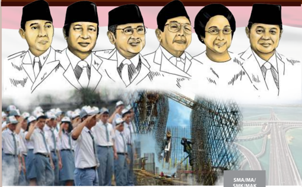

> **Deskripsi Visual:** Gambar ini merupakan ilustrasi yang menampilkan lima tokoh berdiri di atas latar belakang merah putih, masing-masing dengan topi hitam dan baju putih. Di bawah mereka, terdapat foto orang-orang yang sedang bekerja membangun jembatan. Gambar ini menggambarkan hubungan antara tokoh-tokoh tersebut dengan pekerjaan yang dilakukan.

Elemen utama dalam gambar adalah lima tokoh yang diperlihatkan di atas dan foto orang-orang yang sedang bekerja membangun jembatan di bawah. Relasi antara kedua elemen ini adalah bahwa tokoh-tokoh tersebut mungkin memiliki peran penting dalam proyek pembangunan jembatan tersebut.

Teks, angka, atau label penting tidak terlihat dalam gambar ini. Namun, informasi kunci yang dapat diambil pembaca adalah bahwa gambar ini mungkin menggambarkan hubungan antara tokoh-tokoh tertentu dengan pekerjaan pembangunan jembatan.

Dalam satu paragraf yang informatif, gambar ini menunjukkan lima tokoh berdiri di atas latar belakang merah putih, masing-masing dengan topi hitam dan baju putih. Di bawah mereka, terdapat foto orang-orang yang sedang bekerja membangun jembatan. Gambar ini menggambarkan hubungan antara tokoh-tokoh tersebut dengan pekerjaan yang dilakukan.

 

---
## 📄 Halaman 2

### Hak Cipta © 2018 pada Kementerian Pendidikan dan Kebudayaan Dilindungi Undang-Undang

Disklaimer: Buku ini merupakan buku guru yang dipersiapkan Pemerintah dalam rangka implementasi Kurikulum 2013. Buku guru ini disusun dan ditelaah oleh berbagai pihak di bawah koordinasi Kementerian Pendidikan dan Kebudayaan, dan dipergunakan dalam tahap awal penerapan Kurikulum 2013. Buku ini merupakan 'dokumen hidup' yang senantiasa diperbaiki,  diperbaharui,  dan  dimutakhirkan  sesuai  dengan  dinamika  kebutuhan  dan perubahan zaman. Masukan dari berbagai kalangan yang dialamatkan kepada penulis dan laman http://buku.kemdikbud.go.id atau melalui email buku@kemdikbud.go.id diharapkan dapat meningkatkan kualitas buku ini.

### Katalog Dalam Terbitan (KDT)

Indonesia. Kementerian Pendidikan dan Kebudayaan. Sejarah Indonesia/ Kementerian Pendidikan dan Kebudayaan.-- . Edisi Revisi

Jakarta: Kementerian Pendidikan dan Kebudayaan, 2018.

viii, 248 hlm. : ilus. ; 25 cm.

Untuk SMA/MA/SMK/MAK Kelas XII ISBN  978-602-427-126-8 (jilid lengkap) ISBN  978-602-427-129-9 (jilid 3)

1.Indonesia -- Sejarah -- Studi dan Pengajaran

I. Judul

II. Kementerian Pendidikan dan Kebudayaan

600

Penulis

:  Abdurakhman, Arif Pradono, Linda Sunarti dan Susanto Zuhdi.

Penelaah

: Baha' Uddin, Hariyono, dan Mohammad Iskandar.

Pe- review

: Djulimi Tandjung.

Penyelia Penerbitan : Pusat Kurikulum dan Perbukuan, Balitbang, Kemendikbud.

Cetakan Ke-1, 2014 (ISBN 978-602-282-025-3) Cetakan Ke-2, 2018 (Edisi Revisi)

Disusun dengan huruf Times New Roman, 12 pt.

 

---
## 📄 Halaman 3

### Kata Pengantar

Kurikulum 2013 dirancang untuk memperkuat kompetensi siswa dari sisi pengetahuan, keterampilan, dan sikap secara utuh. Keutuhan tersebut menjadi dasar  dalam  perumusan  kompetensi  dasar  tiap  mata  pelajaran,  sehingga kompetensi dasar tiap mata pelajaran mencakup kompetensi dasar kelompok sikap,  kompetensi  dasar  kelompok  pengetahuan,  dan  kompetensi  dasar kelompok keterampilan. Semua mata pelajaran dirancang mengikuti rumusan tersebut.

Pembelajaran  Sejarah  Indonesia  untuk  Kelas  XII  jenjang  Pendidikan Menengah yang disajikan dalam buku ini juga tunduk pada ketentuan tersebut. Sejarah  Indonesia  bukan  berisi  materi  pembelajaran  yang  dirancang  hanya untuk  mengasah  kompetensi  pengetahuan  siswa.  Sejarah  Indonesia  adalah mata pelajaran yang membekali siswa dengan pengetahuan tentang dimensi ruang-waktu  perjalanan  sejarah  Indonesia,  keterampilan  dalam  menyajikan pengetahuan  yang  dikuasainya  secara  konkret  dan  abstrak,  serta  sikap menghargai  jasa  para  pahlawan  yang  telah  meletakkan  fondasi  bangunan negara Indonesia beserta segala bentuk warisan sejarah, baik benda maupun takbenda. Sehingga terbentuk pola pikir siswa yang sadar sejarah.

Sebagai  pelajaran  wajib  yang  harus  diambil  oleh  semua  siswa  yang belum tentu berminat dalam bidang sejarah, buku ini disusun menggunakan pendekatan regresif yang lebih populer. Melalui pengamatan terhadap kondisi sosial-budaya  dan  sejumlah  warisan  sejarah  yang  bisa  dijumpai  saat  ini, siswa diajak mengarungi garis waktu mundur ke masa lampau saat terjadinya peristiwa  yang  melandasi  terbentuknya  peradaban  yang  melatarbelakangi kondisi sosial-budaya dan warisan sejarah tersebut. Pembahasan dilanjutkan dengan peristiwa-peristiwa berikutnya yang menyebabkan berkembang atau menyusutnya peradaban tersebut sehingga menjadi yang tersisa saat ini.

Buku ini menjabarkan usaha minimal yang harus dilakukan siswa untuk mencapai  kompetensi  yang  diharapkan.  Sesuai  dengan  pendekatan  yang digunakan dalam Kurikulum 2013, siswa diajak menjadi berani untuk mencari sumber belajar lain yang tersedia dan terbentang luas di sekitarnya. Peran guru dalam meningkatkan dan menyesuaikan daya serap siswa dengan ketersediaan kegiatan pada buku ini sangat penting. Guru dapat memperkayanya dengan kreasi  dalam  bentuk  kegiatan-kegiatan  lain  yang  sesuai  dan  relevan  yang bersumber dari lingkungan sosial dan alam.

 

---
## 📄 Halaman 4

Sebagai edisi pertama, buku ini sangat terbuka terhadap masukan dan akan terus diperbaiki untuk penyempurnaan. Oleh karena itu, kami mengundang para pembaca untuk memberikan kritik, saran dan masukan guna perbaikan dan penyempurnaan edisi berikutnya. Atas kontribusi tersebut, kami mengucapkan terima  kasih.  Mudah-mudahan  kita  dapat  memberikan  yang  terbaik  bagi kemajuan dunia pendidikan  dalam  rangka  mempersiapkan  generasi  seratus tahun Indonesia Merdeka (2045).

Tim Penulis

 

---
## 📄 Halaman 5

### Daftar Isi

Ideologi'

Kepentingan'

v

 

---
## 📄 Halaman 8

 

---
## 📄 Halaman 9

### Bagian 1

### Petunjuk Umum

### A. Pengantar

Mata pelajaran Sejarah merupakan salah satu mata pelajaran yang masuk dalam   kelompok mata pelajaran wajib dan mata pelajaran peminatan. Buku ini merupakan buku pegangan guru untuk mata pelajaran Sejarah Indonesia sebagai  kelompok  mata  pelajaran  wajib.  Mata  pelajaran  wajib  merupakan bagian dari kurikulum pendidikan menengah yang bertujuan untuk memberikan pengetahuan tentang bangsa, bahasa, sikap sebagai bangsa, dan kemampuan penting  untuk  mengembangkan  logika  dan  kehidupan  pribadi siswa, masyarakat dan bangsa, pengenalan lingkungan isik dan alam, kebugaran  jasmani, serta seni budaya daerah dan nasional.

Sistem pendidikan nasional yang berlaku saat ini mengacu pada UndangUndang  SISDIKNAS  No.  20  Tahun  2003.  Undang-undang  ini  mengatur pelaksanaan  pendidikan  nasional  sehingga  dalam  pelaksanaannya  mampu menjalankan fungsi pendidikan nasional yaitu mengembangkan  kemampuan dan membentuk  watak  serta   peradaban  bangsa  yang bermartabat  dalam rangka mencerdaskan kehidupan bangsa. Di samping itu, pelaksanaan pendidikan nasional juga harus mampu mengembangkan potensi siswa agar menjadi manusia yang beriman dan bertakwa kepada Tuhan Yang Maha Esa, berakhlak mulia, sehat, berilmu, cakap, kreatif, mandiri, dan menjadi warga negara yang demokratis serta bertanggung jawab sehingga tujuan pendidikan nasional yang terdapat dalam undang-undang tersebut tercapai.

Sebagai  upaya  untuk  menunjang  keberhasilan  pencapaian  fungsi  dan tujuan  pendidikan  tersebut,  pemerintah  merancang  suatu  kurikulum  yang komprehensif,  yang  isinya  meliputi  aspek  kognitif,  keterampilan,  sikap spiritual  dan  sikap  sosial.  Kurikulum  ini  kita  kenal  sebagai  Kurikulum 2013. Sebagai upaya untuk mencapai fungsi dan tujuan pendidikan nasional, Kurikulum 2013, dalam struktur isinya mencakup Kompetensi Inti (KI) dan Kompetisi Dasar (KD). Kompetensi Inti dan Kompetensi Dasar ini merupakan pengejawantahan dari fungsi  dan  tujuan  pendidikan  nasional.  Guru,  dalam proses pembelajaran,  harus mampu mengaitkan antara Kompetensi Inti dan Kompetensi Dasar sehingga aspek  kognitif,  keterampilan,  sikap spiritual dan sikap  sosial  dapat  dikembangkan  dan  diimplementasikan  dalam  kehidupan sehari-hari.

 

---
## 📄 Halaman 10

Keberhasilan implementasi suatu kurikulum tidak tergantung pada salah satu komponen pendidikan, namun memerlukan keterlibatan berbagai komponen pendidikan, baik guru, siswa dan stake holder . Kalau  sebelumnya guru memiliki peran utama sebagai sumber belajar,  dalam Kurikulum 2013, guru memiliki  peran sebagai dinamisator, motivator dan fasilitator. Dengan demikian, guru   dituntut memiliki  kompetensi  dalam mengelola pembelajaran, mulai tahapan perencanaan, pelaksanaan maupun penilaian.

Oleh karena itu, guru pengampu mata pelajaran Sejarah Indonesia dituntut memiliki  kompetensi  di  bidang  Sejarah  Indonesia,  mampu  memberikan pemahaman  kepada  siswa  tentang  pentingnya  Sejarah  Indonesia  sebagai instrumen  pendidikan  karakter  bangsa  yang  mampu  membentuk  watak serta peradaban bangsa yang bermartabat. Untuk mencapai itu Guru Sejarah dituntut  memiliki  perspektif  kebangsaan,  dan  mengembangkan historical thinking (cara berpikir sejarah) untuk ditransformasikan kepada siswa dalam kehidupan keseharian. Di sisi lain, aspek moral dan keteladanan seorang guru juga menjadi hal yang amat penting dalam pembelajaran Sejarah Indonesia. Oleh karena itu, agar Indikator Pembelajaran Sejarah Indonesia bisa tercapai, guru harus memahami karakteristik mata pelajaran Sejarah Indonesia seperti yang diuraikan pada petunjuk umum ini.

### B. Maksud dan Tujuan Mata Pelajaran Sejarah Indonesia

### 1.  Rasional

Mata  pelajaran  Sejarah  Indonesia  merupakan  salah  satu  bagian dalam pendidikan sejarah. Sejarah Indonesia merupakan salah satu mata pelajaran wajib di jenjang pendidikan menengah (SMA/MA dan SMK/ MAK). Dalam penanaman karakter, pendidikan sejarah memiliki makna dan posisi yang strategis, mengingat bahwa: Tidak ada manusia yang bisa melepaskan dirinya  dari  sejarah,  karena  kehidupan  manusia  itu  sendiri diisi  oleh  pengalaman  masa  lalu  yang  terus  bertambah  seiring  dengan perjalanan waktu. Setiap kita melangkah  ke  depan maka langkah yang kita  tinggalkan  sudah  menjadi  sejarah.  Namun  tidak  seluruh  waktu  di masa lalu kita dapat menjadi sejarah, hanya masa lalu kita yang memiliki makna  sajalah  yang  disebut  sebagai  sejarah.  Hal  itulah  yang  menjadi pembelajaran  bagi  kita  untuk  memahami  kehidupan  masa  kini,  dan membangun kehidupan masa depan yang lebih baik.

 

---
## 📄 Halaman 11

Pendidikan sejarah memiliki tujuan untuk membangun memori kolektif kita sebagai bangsa sehingga kita mampu mengenal bangsanya dan mampu membangun rasa  persatuan dan  kesatuan dalam kehidupan berbangsa dan bernegara. Melalui sejarah kita mampu membentuk watak dan karakter bangsa Indonesia yang bermartabat sehingga mampu membentuk manusia Indonesia yang memiliki rasa cinta dan bangga terhadap bangsa, negara dan tanah airnya.

Pengembangan mata pelajaran Sejarah Indonesia karena sejarah mempunyai guna, yaitu:

- Edukatif , pelajaran sejarah memberikan sikap bijak dan arif. Jika kita kaji lebih mendalam, kita akan sampai pada kesimpulan bahwa,   kita dapat belajar dari peristiwa-peristiwa sejarah yang terjadi pada masa lalu untuk melihat kejadian yang ada pada masa kini. Hal-hal yang baik kita jadikan sebagai suatu pelajaran agar bisa menjadi pedoman dalam kehidupan masa kini dan masa datang.
- Inspiratif ,  sejarah mampu memberikan ilham atau inspirasi kepada kita,  hal  ini  bisa  kita  lihat  dari  apa  yang  telah  dilakukan  oleh  para pahlawan  dalam  mencapai  harapan  dan  tujuannya  dan  peristiwaperistiwa  pada  masa  lalu  dapat  mengilhami  kita  semua  untuk perjuangan  saat  ini  dan  masa  datang.  Peristiwa-peristiwa  besar mengilhami kita agar mencetuskan peristiwa yang besar pula.
- Instruktif ,  misalnya,  kegunaan  dalam  rangka  pengajaran  dalam salah  satu  kejuruan  atau  keterampilan  seperti  navigasi,  teknologi, persenjataan,  jurnalistik,  taktik  militer  dan  sebagainya.  Fungsi  dan kegunaan sejarah ini disebut sebagai kegunaan yang bersifat instruktif karena mempunyai peran membantu kegiatan menyampaikan pengetahuan atau keterampilan (instruksi).
- Rekreatif , seperti halnya dalam karya sastra yakni cerita atau roman, sejarah  juga  memberikan  kesenangan  estetis  karena  bentuk  dan susunannya yang serasi dan indah. Kita dapat terpesona oleh kisah sejarah  yang  baik  sebagaimana  kita  dapat  terpesona  oleh  sebuah roman  yang  bagus.  Dengan  sendirinya  kegunaan  yang  bersifat rekreatif ini baru dapat dirasakan jika sejarawan berhasil mengangkat aspek  seni  dari  cerita  sejarah  yang  disajikan.  Sejarah  dapat  juga memberikan  kesenangan  lain  kepada  kita.  Kesenangan  ini  berupa 'wisata intelektual' yang dipancarkannya kepada kita. Tanpa beranjak dari  tempat  duduk  kita  dapat  dibawa  oleh  sejarah  menyaksikan peristiwa-peristiwa  yang  jauh  dari  kita,  baik  jauh  tempat  maupun

 

---
## 📄 Halaman 12

jauh  waktunya.  Kita  diajak  untuk  berwisata  ke  negeri-negeri  yang jauh  di  sana,  menyaksikan  peristiwa-peristiwa  penting  yang  terjadi dalam suasana yang berbeda dengan suasana kita sekarang. Kita akan terpesona  oleh  pemandangan  pada  masa  lampau  yang  dilukiskan oleh  sejarawan.  Dengan  penuh  minat  kita  akan  berkenalan  dengan cara hidup, kebiasaan, dan tindakan yang berlainan dengan yang kita alami sekarang.

- Memberikan Kesadaran Waktu ,  kesadaran waktu yang dimaksud adalah  kehidupan  dengan  segala  perubahan,  pertumbuhan,  dan perkembangannya terus berjalan melewati waktu. Kesadaran itu  dikenal  juga  sebagai  kesadaran    akan    adanya  gerak  sejarah. Kesadaran tersebut memandang peristiwa-peristiwa sejarah sebagai sesuatu yang terus bergerak dari masa silam bermuara ke masa kini, dan berlanjut ke masa depan. Waktu terus berjalan pada saat seorang atau  suatu  bangsa  mulai  menjadi  tua  dan  digantikan  oleh  generasi berikutnya.  Bahkan,  waktu  terus  berjalan  pada  saat  seseorang  atau suatu  bangsa hanya bersenang-senang dan bermalas-malasan, atau sebaliknya, seseorang atau suatu bangsa sedang membuat karya-karya besar. Dengan memiliki kesadaran sejarah yang baik, seseorang akan senantiasa berupaya mengukir sejarah kehidupannya sebaik-baiknya.
- Memperkukuh  Rasa  Kebangsaan  (Nasionalisme) ,  terbentuknya suatu  bangsa  disebabkan  adanya  kesamaan  sejarah  besar  di  masa lampau dan adanya kesamaan keinginan untuk membuat sejarah  besar bersama di masa yang akan datang. Sebagai contoh bangsa  Indonesia sejak  zaman praaksara telah memiliki  kesamaan sejarah. Kemudian memiliki zaman keemasan pada zaman Sriwijaya, Mataram HinduBuddha, Majapahit, dan Mataram Islam. Setelah itu bangsa Indonesia mengalami masa penjajahan selama ratusan tahun. Perjalanan sejarah bangsa  Indonesia  tersebut  menjadi  ingatan  kolektif    yang  dapat menimbulkan rasa solidaritas dan mempertebal semangat kebangsaan.
- Pengembangan cara berpikir sejarah ( historical thinking ) dengan memahami  konsep  waktu,  ruang,  perubahan,  dan  keberlanjutan menjadi keterampilan dasar dalam mempelajari Sejarah Indonesia.

### 2. Pengertian

Dalam  sejarah  kemerdekaan  bangsa-bangsa  di  Asia  pasca-Perang Dunia Kedua, fakta menunjukkan,  bahwa  hanya  sedikit  bangsa  yang mencapai kemerdekaannya dengan perang mengusir penjajah asing, khusus di Asia Tenggara hanya tercatat Vietnam dan Indonesia.  Kemerdekaan

 

---
## 📄 Halaman 13

Vietnam diperoleh setelah mengalahkan Prancis tahun 1954 dan Amerika Serikat  tahun  1975.  Sedangkan  Indonesia  memperoleh  kemerdekaan, setelah  terjadi  pertempuran  melawan  pasukan  Jepang  di  akhir  masa pendudukan, dan bangsa Indonesia memproklamasikan kemerdekaannya pada  17  Agustus  1945.  Melawan  Belanda  pada  perang  kemerdekaan 1945-1949 dengan strategi bersenjata dan berdiplomasi, akhirnya bangsa Indonesia berhasil mengakhiri penjajahan Belanda dan bangsa Indonesia memperoleh 'pengakuan  kedaulatan' pada 27 Desember 1949. Atas dasar fakta  ini Anthony  Reid,  sejarawan  terkemuka  dari Australia  menyebut bangsa Indonesia sebagai ' A Nation by Revolution ' (Reid, 2010). Dalam konteks  itu  dapatlah  dikemukakan,  bahwa salah satu ciri atau karakter dari bangsa Indonesia adalah sikap kejuangan melawan penindasan dan penjajahan  dengan  semangat  pantang  menyerah  hingga  kemerdekaan dicapai.

Sudah  jelas  pula,  bahwa  perjuangan  itu  mencerminkan  sikap  cinta tanah  air.  Tekad  untuk  menjadi  bangsa  yang  merdeka  dan  bebas  dari penjajahan asing lalu didengungkan  dalam   Proklamasi 17 Agustus 1945 'kami bangsa Indonesia dengan ini menyatakan kemerdekaan Indonesia'. Perjuangan panjang untuk meraih kemerdekaan bangsa Indonesia dilakukan, karena:

'...  sesungguhnya kemerdekaan itu ialah hak segala bangsa, dan oleh sebab  itu, maka penjajahan di atas dunia harus dihapuskan karena tidak   sesuai  dengan   perikemanusiaan dan perikeadilan', ( UndangUndang Dasar 1945 )

Kini  kita  hidup  di  alam  kemerdekaan.  Sudah  menjadi  tanggung jawab  kita  bersama,  untuk  mengisinya  dengan  perbuatan  nyata  untuk mewujudkan kehidupan yang sejahtera, aman, adil, dan makmur sebagai wujud rasa syukur kita kepada Tuhan Yang Maha Esa. Oleh karena itu, kemerdekaan ini merupakan rahmat dari Tuhan Yang Maha Esa, seperti yang  tersurat  dalam  Pembukaan  Undang-Undang  Dasar  1945  yang berbunyi:

Atas berkat  rakhmat  Allah  Yang  Maha  Kuasa  dan  dengan didorongkan oleh keinginan luhur, supaya berkehidupan kebangsaan  yang  bebas,  maka  rakyat  Indonesia  menyatakan dengan ini kemerdekaannya. ( Undang-Undang Dasar 1945 )

 

---
## 📄 Halaman 14

Berbicara mengenai karakter bangsa Indonesia, dahulu pada zaman penjajahan, sering dilontarkan bahwa orang Indonesia, khususnya Melayu,  adalah  pemalas.  Bahkan, stereo  type orang  Jawa  dikenal sebagai lemah lembut, nrimo apa adanya, lalu dengan begitu saja orang Belanda menganggap mereka tak mungkin mempunyai sikap melawan atau  memberontak. Adalah sejarah sebagai faktor penggerak perubahan yang dapat membuktikan sesuatu yang dianggap tidak mungkin menjadi keniscayaan. Sejarah mencatat bahwa betapa kelirunya anggapan seorang H.J.  van  Mook,  terhadap  watak  orang  Jawa  pada  masa  revolusi.  Dari pernyataan seorang pakar sosiologi  Belanda, W.F. Wertheim, diketahui bahwa  penilaian  van  Mook  sebagai  gubernur  jenderal  yang  bertugas mengembalikan  penjajahan  Belanda  di  Indonesia,  telah  keliru  menilai karakter orang Jawa.  Pada masa awal kemerdekaan Indonesia, Wertheim yang bekerja sebagai perwakilan Palang Merah, mengatakan bahwa:

' My Experiences there as a Red Cross representative made me view the  Indonesian  revolution  as  an  extremely  serious  affair.    But  van Mook lightly dismissed the idea'Ten shipsloads of food and textiles from Australia, and the whole population of Java will low to the ports to unload the ships. That will be the end of the rebellion' (Wertheim 1974:11).

Pengalaman Wertheim berawal dari menyaksikan zaman yang sedang berubah  dengan  cepat  dan  radikal.  Masa  revolusi  Indonesia  memperlihatkan dengan  jelas  bangsa  yang  bertekad  merebut  dan  mempertahankan kemerdekaan dengan segenap jiwa dan raganya. Terbentuknya karakter orang Jawa  yang pantang  menyerah dan tidak luluh hanya karena imingiming makanan dan tekstil yang akan dibagikan Belanda itu. Penilaian van Mook itu ternyata luput, ketika bukan saja orang Jawa tidak berebut makanan dan pakaian, yang telah siap dibongkar dari kapal Belanda itu, tetapi  juga  suku-suku  bangsa  lainnya.  Bahkan  mereka  semua,  melalui laskar dan barisan perjuangan, melakukan perlawanan dengan keberanian hingga penjajahan Belanda berakhir di tahun 1949.

 

---
## 📄 Halaman 15

Sudah  tentu  perlawanan  terhadap  penjajahan  Belanda  tidak  hanya terjadi  di    Jawa,    hampir  di  setiap  daerah  memperlihatkan  semangat perjuangan  yang  tinggi  sebagai  cermin  rasa  cinta  tanah  air.  Sebut  saja Teuku  Umar  dan  Cut  Nyak  Dien  di  Aceh,  Tuanku  Imam  Bonjol  di Sumatra Barat, Pangeran Antasari di Kalimantan,  Sultan Hasanuddin di Makassar, Pattimura di Maluku, jika  para pejuang dan pahlawan  nasional itu adalah mereka yang berjuang melawan kolonial Belanda. Pada masa pergerakan dan kemerdekaan Indonesia dari daerah lain muncul pejuangpejuang seperti Sam Ratulangi dari Minahasa, Frans Kaisiepo dan Silas Papare dari Papua dan Opu Daeng Risaju dari Makassar.

### 3. Tujuan

Berdasarkan  pengertian di atas, maka tujuan  pembelajaran mata pelajaran Sejarah Indonesia  agar siswa memiliki kemampuan untuk:

- Menumbuhkan kesadaran dalam diri siswa sebagai bagian dari bangsa Indonesia  yang  memiliki  rasa  bangga  dan  cinta  akan    tanah  air, melahirkan empati dan perilaku toleran yang dapat diimplementasikan dalam  berbagai  bidang  kehidupan  bermasyarakat,  berbangsa,  dan bernegara.
- Menumbuhkan  pemahaman siswa terhadap diri sendiri, masyarakat, dan  proses  terbentuknya  bangsa  Indonesia  melalui  sejarah  yang panjang dan masih berproses hingga masa kini dan masa yang akan datang.
- Membangun kesadaran siswa tentang  pentingnya konsep ruang dan waktu dalam rangka memahami perubahan dan keberlanjutan dalam kehidupan bermasyarakat, berbangsa dan bernegara di Indonesia.
- Mengembangkan  kemampuan  berpikir  historis  ( historical  thinking ) yang menjadi dasar untuk kemampuan berpikir logis,  kreatif,  inspiratif, dan inovatif.
- Menumbuhkan  apresiasi dan penghargaan siswa terhadap peninggalan sejarah sebagai bukti peradaban bangsa Indonesia  di masa lampau.
- Mengembangkan perilaku yang didasarkan pada nilai dan moral yang tercermin pada karakter diri, masyarakat dan bangsa.
- Menanamkan sikap berorientasi ke masa depan.

 

---
## 📄 Halaman 16

### 4. Ruang Lingkup

Mata pelajaran Sejarah Indonesia Kelas XII membahas materi yang mencakup Perjuangan Menghadapi Ancaman Disintegrasi Bangsa; Kehidupan  Politik dan Ekonomi  Indonesia;  dan Kontribusi  Bangsa Indonesia dalam Perdamaian Dunia. Materi ini disajikan dalam enam bab, yaitu Bab I Perjuangan Menghadapi  Ancaman Disintegrasi Bangsa; Bab II Sistem dan Struktur Politik dan Ekonomi Masa Demokrasi Parlementer; Bab  III  Sistem  dan  Struktur  Politik  dan  Ekonomi  Masa  Demokrasi Terpimpin;  Bab  IV  Sistem  dan  Struktur  Politik  dan  Ekonomi  Masa  Orde Baru;  Bab  V  Sistem  dan  Struktur  Politik  dan  Ekonomi  Masa  Reformasi; dan Bab VI Indonesia dalam Panggung Dunia.

### C.    Struktur KI dan KD Mata Pelajaran Sejarah Indonesia

Mata pelajaran Sejarah Indonesia untuk Kelas XII SMA/SMK/MA/MAK memiliki 4 (empat) Kompetensi Inti (KI) yang menjadi 18 Kompetensi Dasar (KD) dan dapat disajikan dalam tabel sebagai berikut.

 

---
## 📄 Halaman 17

---
**📊 Tabel**

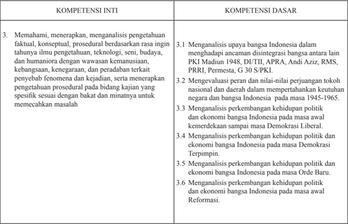

Tabel ini berisi informasi tentang kompetensi inti dan dasar yang relevan dengan topik sejarah Indonesia. Topik utama adalah analisis peran tokoh nasional dan daerah dalam mempertahankan keutuhan negara dan bangsa Indonesia pada masa 1945-1965. Kolom pertama berisi kompetensi inti, yang mencakup pemahaman, menerapkan, dan menganalisis pengetahuan faktil, konseptual, prosedural berdasarkan rasa ingin tahuannya. Kolom kedua berisi kompetensi dasar, yang mencakup evaluasi peran dan nilai-nilai perjuangan tokoh nasional dan daerah, analisis perkembangan kehidupan politik dan ekonomi bangsa Indonesia pada masa awal kemerdekaan hingga Demokrasi Liberal, serta perkembangan kehidupan politik dan ekonomi bangsa Indonesia pada masa Orde Baru dan Reformasi. Data penting yang terlihat adalah bahwa tabel ini mencakup berbagai aspek analisis dan pemahaman sejarah Indonesia, mulai dari peran tokoh hingga perkembangan politik dan ekonomi bangsa.

 

---
## 📄 Halaman 18

---
**📊 Tabel**

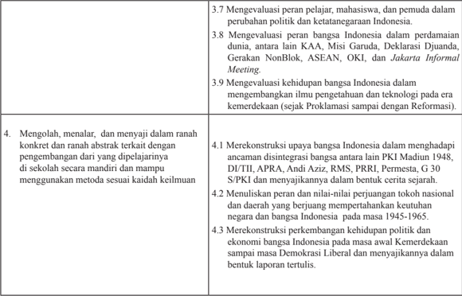

Tabel ini berisi informasi tentang evaluasi peran dan pengaruh bangsa Indonesia dalam berbagai aspek, mulai dari perubahan politik dan ketatangkatan hingga pengembangan ilmu pengetahuan dan teknologi. Topik utama tabel meliputi evaluasi peran pelajar, mahasiswa, dan pemuda dalam perubahan politik; evaluasi peran bangsa Indonesia dalam perdamaian dunia, antara lain KAA, Misi Garuda, Deklarasi Djuanda, Gerakan NonBlok, ASEAN, OKI, dan Jakarta Informal Meeting; dan evaluasi kehidupan bangsa Indonesia dalam mengembangkan ilmu pengetahuan dan teknologi pada era kemerdekaan. Selain itu, tabel juga mencakup proses menggolongkan, menalar, dan menyajikan informasi secara konkret dan abstrak, serta menganalisis upaya bangsa Indonesia dalam menghadapi ancaman integrasi bangsa antara lain PKI Madani 1948, DU/TII, APRA, Andi Aziz, RMS, PRRI, Permesta, G 30 S/PKI, dan menyajikannya dalam bentuk cerita sejarah. Tabel juga mencakup penulisan peran dan nilai-nilai perjuangan tokoh nasional dan daerah yang berjuang mempertahankan keutuhan negara dan bangsa Indonesia pada masa 1945-1965, serta merekonstruksi perkembangan kehidupan politik dan ekonomi bangsa Indonesia pada masa awal kemerdekaan sampai masa Demokrasi Liberal dan menyajikannya dalam bentuk laporan tertulis.

 

---
## 📄 Halaman 19

---
**📊 Tabel**

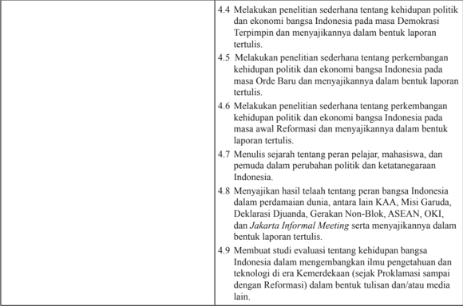

Tabel ini berisi instruksi penelitian yang harus dilakukan oleh mahasiswa dalam proyek akhir mereka. Topik utamanya adalah peran bangsa Indonesia dalam politik dan ekonomi, termasuk kehidupan politik dan ekonomi bangsa Indonesia pada masa Demokrasi Terpimpin, Orde Baru, Reformasi, serta peran dalam perubahan politik dan ketatanegaraan Indonesia. Mahasiswa diharapkan untuk menulis laporan tertulis tentang perkembangan kehidupan politik dan ekonomi bangsa Indonesia pada masa Demokrasi Terpimpin dan Orde Baru, serta menulis sejarah tentang peran pelajar, mahasiswa, dan pemuda dalam perubahan politik dan ketatanegaraan Indonesia. Selain itu, mahasiswa juga diharapkan untuk menyajikan hasil penelitian mereka dalam bentuk laporan tertulis, termasuk menunjukkan peran bangsa Indonesia dalam perdamaian dunia, misi-misi internasional seperti KAA, Misi Garuda, Deklarasi Djuanda, Gerakan Non-Blok, ASEAN, OKI, dan Jakarta Informal Meeting. Selain itu, mahasiswa juga diharapkan untuk membuat studi evaluasi tentang kehidupan bangsa Indonesia dalam mengembangkan ilmu pengetahuan dan teknologi, mulai dari Kemerdekaan sampai dengan Reformasi.

 

---
## 📄 Halaman 20

Empat Kompetensi Inti (KI) yang kemudian dijabarkan menjadi 18 Kompetensi Dasar (KD) itu merupakan bahan kajian yang akan ditransformasikan  dalam  kegiatan  pembelajaran  selama  satu  tahun  (dua semester)  yang  terurai  dalam  30  minggu.  Agar  kegiatan  pembelajaran  itu tidak terasa terlalu panjang maka 30 minggu itu dibagi menjadi dua bagian, 18 minggu di semester pertama dan 12 minggu di semester kedua.

### D. Strategi dan Model Umum Pembelajaran

### 1. Pengembangan indikator

Penguasaan Kompetensi Dasar dicapai melalui proses pembelajaran dan pengembangan pengalaman belajar atas dasar indikator yang telah dirumuskan dari masing-masing KD, terutama KD-KD penjabaran dari KI ketiga. KD-KD pada KI ketiga untuk  mata  pelajaran  Sejarah  Indonesia dapat  dijabarkan  menjadi beberapa indikator sebagai berikut.

 

---
## 📄 Halaman 21

---
**📊 Tabel**

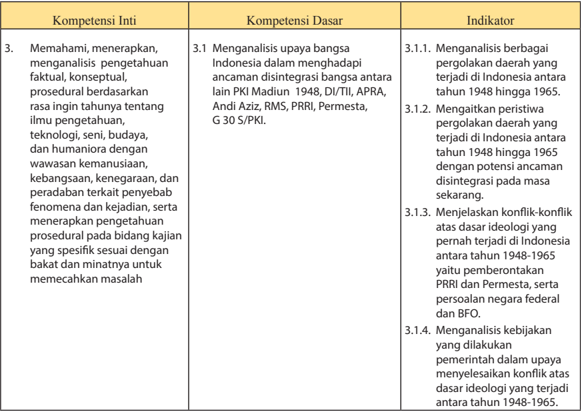

Tabel ini berisi informasi tentang kompetensi inti, dasar, dan indikator yang berkaitan dengan pemahaman, menerapkan, dan analisis pengetahuan tentang Indonesia dalam konteks pergerakan bangsa. Topik utama adalah analisis pergerakan bangsa di Indonesia antara tahun 1948 hingga 1965, termasuk PKI, Madiun, DI/TII, APRA, Andi Aziz, RMS, PRRJ, Permesta, G30S/PKI, dan konflik konflik ideologi yang terjadi pada periode tersebut. Kolom-kolomnya mencakup: Kompetensi Inti (memahami, menerapkan, dan analisis), Kompetensi Dasar (menganalisis upaya bangsa Indonesia dalam menghadapi ancaman disintegrasi), dan Indikator (menggali peristiwa pergerakan daerah, menjelaskan konflik konflik, dan menganalisis kebijakan). Data penting meliputi analisis peristiwa pergerakan daerah, konflik ideologi, dan pemerintahan yang dilakukan untuk memecahkan masalah.

 

---
## 📄 Halaman 22

14

---
**📊 Tabel**

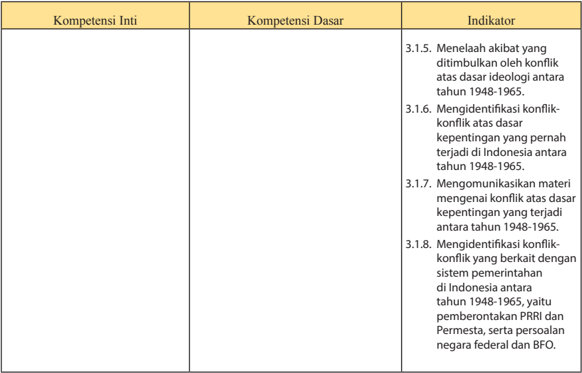

Tabel ini berisi informasi tentang kompetensi inti, kompetensi dasar, dan indikator yang berkaitan dengan konflik ideologi di Indonesia antara tahun 1948-1965. Topik utama tabel adalah analisis dan pemahaman konflik ideologi tersebut. Kolom-kolomnya meliputi Kompetensi Inti, Kompetensi Dasar, dan Indikator. Data penting yang terlihat adalah bahwa tabel mencakup empat kompetensi dasar yang berkaitan dengan identifikasi, komunikasi, dan pemahaman konflik ideologi yang terjadi pada masa tersebut. Indikator-indikator tersebut mencakup menelaah akibat konflik, mengidentifikasi konflik, mengkomunikasikan materi tentang konflik, dan mengidentifikasi konflik dengan sistem pemerintahan.

 

---
## 📄 Halaman 23

---
**📊 Tabel**

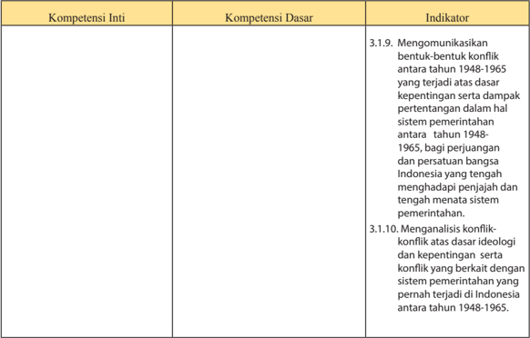

Tabel ini berisi informasi tentang kompetensi inti, kompetensi dasar, dan indikator yang berkaitan dengan konflik dan pemerintahan di Indonesia antara tahun 1948-1965. Topik utama tabel adalah analisis dan pemahaman tentang konflik dan pemerintahan pada masa tersebut. Kolom-kolomnya meliputi Kompetensi Inti, Kompetensi Dasar, dan Indikator. Data penting yang terlihat adalah bahwa indikator pertama mengkaji bentuk-bentuk konflik antara tahun 1948-1965 yang berdasarkan kepentingan dan dampak sistem pemerintahan, sementara indikator kedua fokus pada analisis konflik berdasarkan ideologi dan kepentingan sistem pemerintahan yang pernah terjadi di Indonesia pada periode tersebut.

 

---
## 📄 Halaman 24

16

---
**📊 Tabel**

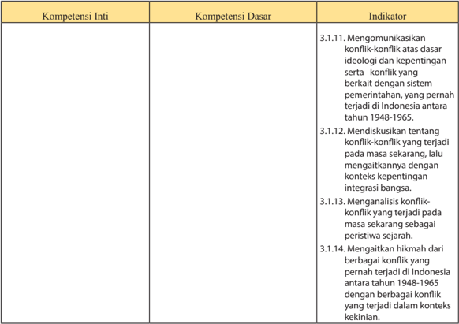

Tabel ini berisi informasi tentang kompetensi inti, kompetensi dasar, dan indikator yang berkaitan dengan konflik dan kepentingan di Indonesia antara tahun 1948-1965. Topik utama tabel adalah analisis dan pemahaman tentang konflik dan kepentingan di masa lalu. Kolom-kolomnya meliputi Kompetensi Inti, Kompetensi Dasar, dan Indikator. Data penting yang terlihat adalah bahwa tabel mencakup empat kompetensi dasar yang berkaitan dengan konflik dan kepentingan di Indonesia antara tahun 1948-1965, yaitu mengkomunikasikan konflik, mendiskusikan konflik sekarang, menganalisis konflik sekarang sebagai peristiwa sejarah, dan menghitung hikmah dari konflik yang pernah terjadi. Ini menunjukkan bahwa tabel ini bertujuan untuk membantu pembelajaran tentang konflik dan kepentingan di masa lalu di Indonesia.

 

---
## 📄 Halaman 25

---
**📊 Tabel**

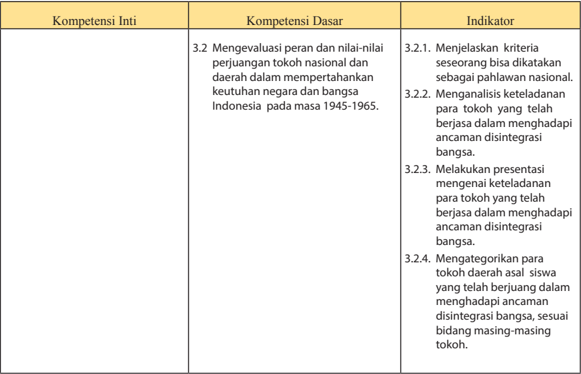

Tabel ini berisi informasi tentang kompetensi inti, kompetensi dasar, dan indikator untuk topik perjuangan tokoh nasional dan daerah dalam mempertahankan keutuhan negara dan bangsa Indonesia pada masa 1945-1965. Topik utama adalah evaluasi nilai-nilai perjuangan tokoh tersebut. Kolom "Kompetensi Inti" mencakup 3.2. Mengevaluasi peran dan nilai-nilai perjuangan tokoh nasional dan daerah dalam mempertahankan keutuhan negara dan bangsa Indonesia pada masa 1945-1965. Kolom "Kompetensi Dasar" berisi 3.2.1. Menjelaskan kriteria sesorang bisa dikatakan sebagai pahlawan nasional, 3.2.2. Mengenali keteladanan para tokoh yang telah berjasa dalam menghadapi ancaman disintegrasi bangsa, 3.2.3. Melakukan presentasi mengenai keteladanan para tokoh yang telah berjasa dalam menghadapi ancaman disintegrasi bangsa, dan 3.2.4. Mengategorikan para tokoh daerah asal siswa yang telah berjuang dalam menghadapi ancaman disintegrasi bangsa, sesuai bidang masing-masing tokoh. Indikator ini membantu siswa mengetahui bagaimana mengidentifikasi dan menghargai peran tokoh dalam mempertahankan keutuhan bangsa.

 

---
## 📄 Halaman 26

---
**📊 Tabel**

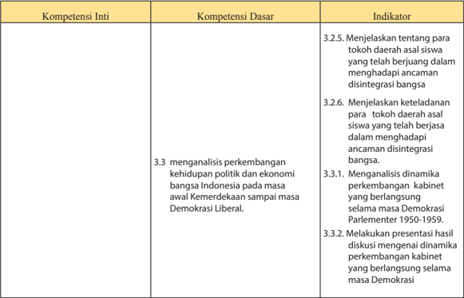

Tabel ini berisi informasi tentang kompetensi inti, kompetensi dasar, dan indikator untuk topik pembelajaran yang berkaitan dengan perkembangan politik dan ekonomi Indonesia pada masa Demokrasi Liberal. Topik utama adalah menganalisis perkembangan kehidupan politik dan ekonomi Indonesia pada masa Demokrasi Liberal. Kolom-kolomnya meliputi Kompetensi Inti, Kompetensi Dasar, dan Indikator. Data penting yang terlihat antara lain bahwa indikator 3.2.5 dan 3.2.6 mengajarkan menjelaskan tentang tokoh daerah asal siswa yang telah berjuang dalam menghadapi ancaman disintegrasi bangsa, sedangkan indikator 3.3.1 dan 3.3.2 mengajarkan menganalisis dinamika perkembangan kabinet yang berlangsung selama masa Demokrasi Parlementer 1950-1959 dan melakukan presentasi hasil diskusi tersebut.

 

---
## 📄 Halaman 27

---
**📊 Tabel**

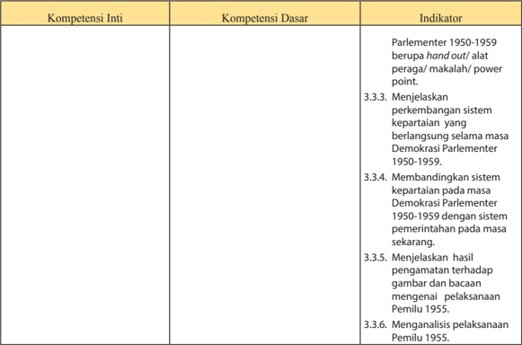

Tabel ini berisi informasi tentang kompetensi inti, kompetensi dasar, dan indikator untuk topik "Parlementer 1950-1959". Topik utama adalah perubahan sistem keparlamentan selama masa Demokrasi Parlementer 1950-1959. Kolom-kolomnya meliputi Kompetensi Inti, Kompetensi Dasar, dan Indikator. Data penting yang terlihat antara lain bahwa indikator 3.3.3. Menjelaskan perkembangan sistem keparlamentan yang berlangsung selama masa Demokrasi Parlementer 1950-1959, 3.3.4. Membandingkan sistem keparlamentan pada masa Demokrasi Parlementer 1950-1959 dengan sistem pemerintahan pada masa sekarang, dan 3.3.6. Menganalisis pelaksanaan pemilu 1955. Ini menunjukkan bahwa tabel ini fokus pada analisis dan perbandingan sistem keparlamentan sebelum dan setelah masa Demokrasi Parlementer 1950-1959.

 

---
## 📄 Halaman 28

---
**📊 Tabel**

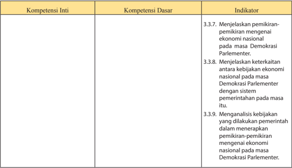

Tabel ini berisi informasi tentang kompetensi inti, kompetensi dasar, dan indikator yang berkaitan dengan pemikiran-pemikiran mengenai ekonomi nasional pada masa Demokrasi Parlementer. Topik utama tabel adalah analisis dan pemahaman tentang kebijakan ekonomi nasional dalam konteks demokrasi parlementer. Kolom-kolomnya meliputi Kompetensi Inti, Kompetensi Dasar, dan Indikator. Data penting yang terlihat adalah bahwa semua indikator tersebut berkaitan dengan pemahaman dan analisis tentang kebijakan ekonomi nasional dalam sistem pemerintahan demokrasi parlementer. Ini menunjukkan bahwa tabel ini fokus pada pembelajaran tentang bagaimana menganalisis dan menjelaskan pemikiran-pemikiran mengenai ekonomi nasional dalam konteks demokrasi parlementer.

 

---
## 📄 Halaman 29

---
**📊 Tabel**

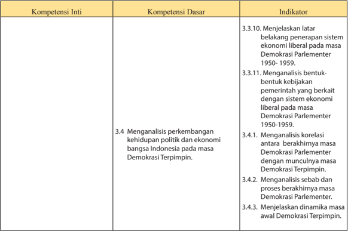

Tabel ini berisi informasi tentang kompetensi inti, kompetensi dasar, dan indikator yang berkaitan dengan demokrasi parlementer di Indonesia pada masa Demokrasi Parlementer (1950-1959). Topik utama tabel adalah analisis perkembangan kehidupan politik dan ekonomi bangsa Indonesia selama masa Demokrasi Parlementer. Kolom-kolomnya meliputi Kompetensi Inti, Kompetensi Dasar, dan Indikator. Data penting yang terlihat antara lain bahwa indikator 3.3.10 menjelaskan latar belakang penerapan sistem ekonomi liberal pada masa Demokrasi Parlementer, sedangkan indikator 3.4.1 mengenai korelasi antara berakhirnya masa Demokrasi Parlementer dengan munculnya masa Demokrasi Terpimpin. Ini menunjukkan hubungan antara dua periode demokrasi di Indonesia tersebut.

 

---
## 📄 Halaman 30

22

---
**📊 Tabel**

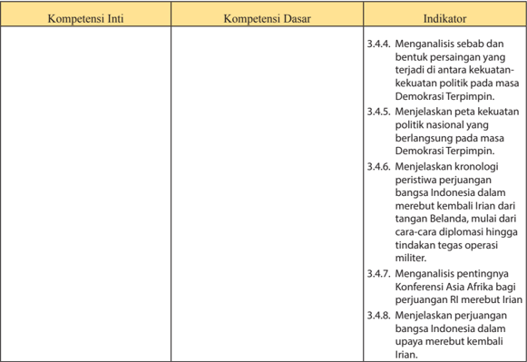

Tabel ini berisi informasi tentang kompetensi inti, kompetensi dasar, dan indikator yang berkaitan dengan perjuangan Indonesia melawan penjajahan Belanda. Topik utama tabel adalah analisis dan penjelasan tentang peristiwa perjuangan nasional Indonesia. Kolom-kolomnya mencakup: Kompetensi Inti, Kompetensi Dasar, dan Indikator. Data penting yang terlihat adalah bahwa tabel ini fokus pada analisis dan penjelasan peristiwa perjuangan Indonesia melawan penjajahan Belanda, termasuk kekuatan politik, diplomasi, operasi militer, dan konferensi internasional. Indikator-indikator tersebut membantu mengevaluasi pemahaman siswa tentang sejarah perjuangan Indonesia.

 

---
## 📄 Halaman 31

---
**📊 Tabel**

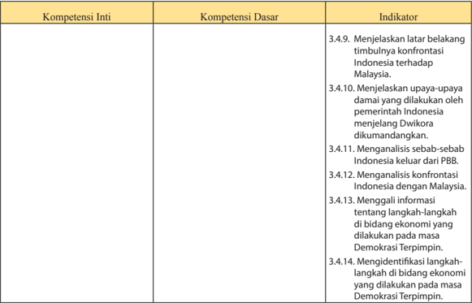

Tabel ini berisi informasi tentang kompetensi inti, kompetensi dasar, dan indikator yang berkaitan dengan konflik antara Indonesia dan Malaysia. Topik utama tabel adalah analisis dan pemahaman tentang sejarah dan konflik tersebut. Kolom-kolomnya meliputi Kompetensi Inti, Kompetensi Dasar, dan Indikator. Data penting yang terlihat adalah bahwa semua kompetensi dasar dan indikator berkaitan dengan latar belakang, upaya-upaya damai, analisis sebab-sebab, konfrontasi, dan identifikasi langkah-langkah dalam bidang ekonomi selama masa Demokrasi Terpimpin. Ini menunjukkan bahwa tabel ini fokus pada pemahaman historis dan analisis politik terkait konflik antara Indonesia dan Malaysia.

 

---
## 📄 Halaman 32

---
**📊 Tabel**

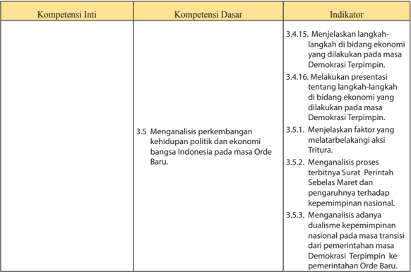

Tabel ini berisi informasi tentang kompetensi inti, kompetensi dasar, dan indikator yang berkaitan dengan analisis perkembangan kehidupan politik dan ekonomi Indonesia pada masa Orde Baru. Topik utama tabel adalah analisis perkembangan kehidupan politik dan ekonomi Indonesia pada masa Orde Baru. Kolom-kolom yang ada meliputi Kompetensi Inti, Kompetensi Dasar, dan Indikator. Data penting yang terlihat adalah bahwa tabel mencakup 35 indikator yang berkaitan dengan analisis perkembangan kehidupan politik dan ekonomi Indonesia pada masa Orde Baru, termasuk menjelaskan langkah-langkah ekonomi yang dilakukan pada masa Demokrasi Terpimpin, melakukan presentasi tentang langkah-langkah ekonomi yang dilakukan pada masa Demokrasi Terpimpin, menjelaskan faktor-faktor melatarbelakangi aksi Tritura, menganalisis proses terbitnya Surat Perintah Sebelas Maret dan pengaruhnya terhadap kepemimpinan nasional, dan menganalisis adanya dualisme kepemimpinan nasional pada masa transisi dari pemerintahan masa Demokrasi Terpimpin ke pemerintahan Orde Baru.

 

---
## 📄 Halaman 33

---
**📊 Tabel**

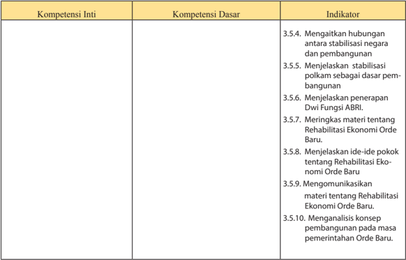

Tabel ini berisi informasi tentang kompetensi inti, kompetensi dasar, dan indikator yang berkaitan dengan pembangunan nasional di era Orde Baru. Topik utama tabel adalah pembangunan nasional dan stabilisasi negara. Kolom-kolomnya meliputi Kompetensi Inti, Kompetensi Dasar, dan Indikator. Data penting yang terlihat adalah bahwa semua indikator berkaitan dengan pembangunan nasional, stabilisasi negara, dan penerapan Dwi Fungsi ABRI. Indikator 3.5.4 menunjukkan hubungan antara stabilisasi negara dan pembangunan, sementara indikator 3.5.5 menjelaskan stabilisasi polikam sebagai dasar pembangunan. Indikator 3.5.6 membahas penerapan Dwi Fungsi ABRI, sedangkan indikator 3.5.7, 3.5.8, 3.5.9, dan 3.5.10 fokus pada rehabilitasi ekonomi Orde Baru, termasuk ide-ide pokok, komunikasi, analisis konsep, dan pemilihan konsep pembangunan pada masa pemerintahan Orde Baru.

 

---
## 📄 Halaman 34

---
**📊 Tabel**

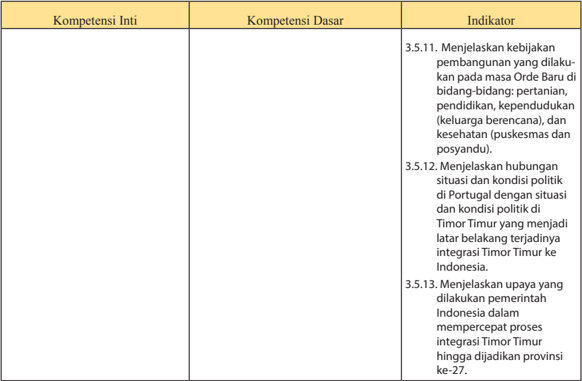

Tabel ini berisi informasi tentang kompetensi inti, kompetensi dasar, dan indikator yang berkaitan dengan pembangunan di masa Orde Baru di Indonesia dan Timor Timur. Topik utama tabel adalah tentang pemahaman tentang kebijakan pembangunan, hubungan politik antara Indonesia dan Timor Timur, serta upaya pemerintah Indonesia dalam mempercepat proses integrasi Timor Timur. Kolom-kolom yang ada adalah Kompetensi Inti, Kompetensi Dasar, dan Indikator. Data penting yang terlihat adalah bahwa tabel mencakup berbagai aspek pembangunan, termasuk pertanian, pendidikan, kesehatan, dan politik, serta upaya pemerintah untuk mempercepat proses integrasi Timor Timur.

 

---
## 📄 Halaman 35

---
**📊 Tabel**

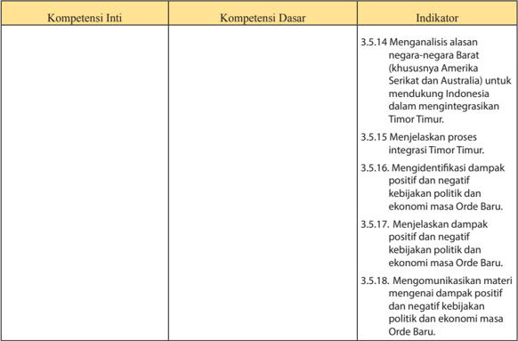

Tabel ini berisi informasi tentang kompetensi inti, kompetensi dasar, dan indikator yang berkaitan dengan integrasi Timor Timur. Topik utama tabel adalah analisis alasan negara-negara Barat untuk mendukung Indonesia dalam integrasi Timor Timur, proses integrasi Timor Timur, dampak positif dan negatif kebijakan politik dan ekonomi masa Orde Baru, serta kemampuan komunikasi materi tentang dampak tersebut. Kolom-kolomnya mencakup Kompetensi Inti, Kompetensi Dasar, dan Indikator. Data penting yang terlihat adalah bahwa semua indikator berkaitan dengan integrasi Timor Timur, dampak kebijakan politik dan ekonomi masa Orde Baru, dan kemampuan komunikasi materi tentang dampak tersebut.

 

---
## 📄 Halaman 36

---
**📊 Tabel**

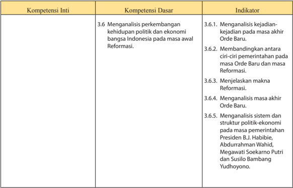

Tabel ini berisi informasi tentang kompetensi inti, dasar, dan indikator dalam konteks analisis perkembangan kehidupan politik dan ekonomi Indonesia pada masa awal Reformasi. Topik utama adalah analisis perkembangan kehidupan politik dan ekonomi Indonesia pada masa awal Reformasi, dengan kompetensi dasar yang mencakup analisis kejadian-kejadian pada masa akhir Orde Baru, perbandingan antara ciri-ciri pemerintahan pada masa Orde Baru dan Reformasi, menjelaskan makna Reformasi, menganalisis masa akhir Orde Baru, dan menganalisis sistem dan struktur politik-economi pada masa pemerintahan Presiden BJ Habibie, Abdurrahman Wahid, Megawati Soekarno Putri, dan Susilo Bambang Yudhoyono. Indikator-indikator tersebut membantu mengevaluasi pemahaman siswa tentang perkembangan kehidupan politik dan ekonomi Indonesia pada masa Reformasi.

 

---
## 📄 Halaman 37

---
**📊 Tabel**

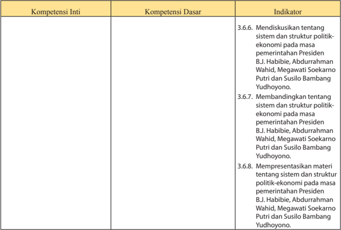

Tabel ini berisi informasi tentang kompetensi inti, kompetensi dasar, dan indikator yang berkaitan dengan sistem dan struktur politik-econominya pada masa pemerintahan Presiden BJ Habibie, Abdurrahman Wahid, Megawati Soekarno Putri, dan Susilo Bambang Yudhoyono. Topik utama tabel adalah pembelajaran tentang sistem dan struktur politik-econominya pada masa pemerintahan tersebut. Kolom-kolom yang ada meliputi Kompetensi Inti, Kompetensi Dasar, dan Indikator. Data penting yang terlihat adalah bahwa semua indikator memiliki hubungan langsung dengan pemahaman tentang sistem dan struktur politik-econominya pada masa pemerintahan tersebut. Ini menunjukkan bahwa pembelajaran ini fokus pada pemahaman historis tentang politik-econominya masa lalu.

 

---
## 📄 Halaman 38

---
**📊 Tabel**

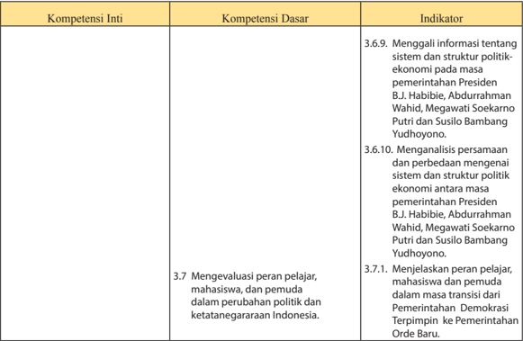

Tabel ini berisi informasi tentang kompetensi inti, kompetensi dasar, dan indikator yang berkaitan dengan perubahan politik dan ketatanegaraan Indonesia. Topik utama tabel adalah evaluasi peran pelajar, mahasiswa, dan pemuda dalam perubahan politik dan ketatanegaraan Indonesia. Kolom-kolomnya meliputi Kompetensi Inti, Kompetensi Dasar, dan Indikator. Data penting yang terlihat antara lain bahwa pelajar, mahasiswa, dan pemuda diharapkan menganalisis persamaan dan perbedaan sistem dan struktur politik antara masa pemerintahan Presiden BJ Habibie, Abdurrahman Wahid, Megawati Soekarno Putri, dan Susilo Bambang Yudhoyono. Selain itu, mereka juga diharapkan untuk menjelaskan peran mereka dalam transisi dari Pemerintahan Demokrasi Terpimpin ke Pemerintahan Orde Baru.

 

---
## 📄 Halaman 39

---
**📊 Tabel**

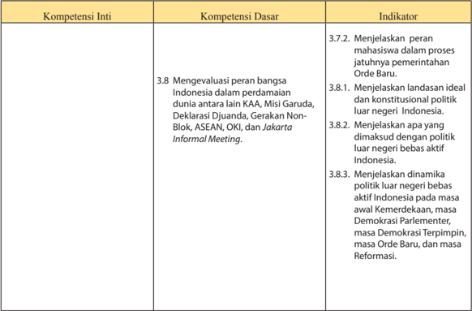

Tabel ini berisi informasi tentang kompetensi inti, kompetensi dasar, dan indikator untuk mengevaluasi peran bangsa Indonesia dalam perdamaian dunia. Topik utama adalah evaluasi peran Indonesia dalam perdamaian dunia melalui berbagai forum internasional seperti KAA, Misi Garuda, Deklarasi Djuanda, Gerakan Non-Blok, ASEAN, OKI, dan Jakarta Informal Meeting. Kolom-kolomnya mencakup: Kompetensi Inti, Kompetensi Dasar, dan Indikator. Data penting yang terlihat adalah bahwa kompetensi dasar 3.8 berkaitan dengan evaluasi peran Indonesia dalam perdamaian dunia, termasuk menjelaskan peran mahasiswa dalam proses jatuhnya pemerintahan Orde Baru, landasan ideal dan konstitusional politik luar negeri Indonesia, dan dinamika politik luar negeri bebas aktif Indonesia. Indikator tersebut membantu dalam memahami bagaimana Indonesia berperan dalam perdamaian dunia melalui berbagai forum internasional.

 

---
## 📄 Halaman 40

---
**📊 Tabel**

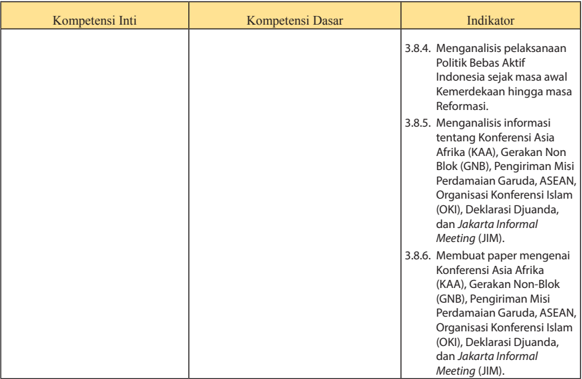

Tabel ini berisi informasi tentang kompetensi inti, kompetensi dasar, dan indikator yang berkaitan dengan politik bebas aktif di Indonesia. Topik utama tabel adalah analisis pelaksanaan politik bebas aktif di Indonesia sejak masa awal kemerdekaan hingga masa reformasi. Kolom-kolom yang ada meliputi Kompetensi Inti, Kompetensi Dasar, dan Indikator. Data penting yang terlihat adalah bahwa indikator 3.8.4 dan 3.8.5 mencakup analisis pelaksanaan politik bebas aktif dan informasi tentang Konferensi Asia Afrika (KAA), Gerakan Non-Blok (GNB), Pengiriman Misi Perdamaian Garuda, ASEAN, Organisasi Konferensi Islam (OKI), Deklarasi Djuanda, dan Jakarta Informal Meeting (JIM). Indikator 3.8.6 juga mencakup membuat paper mengenai KAA, GNB, Pengiriman Misi Perdamaian Garuda, ASEAN, OKI, Deklarasi Djuanda, dan JIM.

 

---
## 📄 Halaman 41

---
**📊 Tabel**

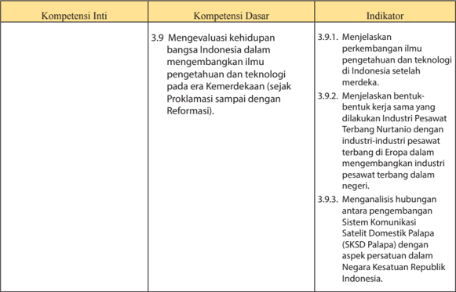

Tabel ini berisi informasi tentang kompetensi inti, dasar, dan indikator dalam konteks pembangunan industri pesawat terbang di Indonesia. Topik utama adalah pengembangan ilmu pengetahuan dan teknologi di era Kemerdekaan hingga Reformasi, dengan fokus pada industri pesawat terbang di Eropa dan hubungan antara pengembangan sistem komunikasi satelit domestik Palapa dengan aspek persatuan di Indonesia. Indikator 3.9.1 menjelaskan perkembangan ilmu pengetahuan dan teknologi setelah Indonesia setelah Proklamasi, sementara indikator 3.9.2 membahas bentuk-bentuk kerja sama dengan Industri Pesawat Terbang Nurtanio di Eropa. Indikator 3.9.3 mengeksplorasi hubungan antara pengembangan Sistem Komunikasi Satelit Domestik Palapa dengan aspek persatuan di Indonesia.

 

---
## 📄 Halaman 42

---
**📊 Tabel**

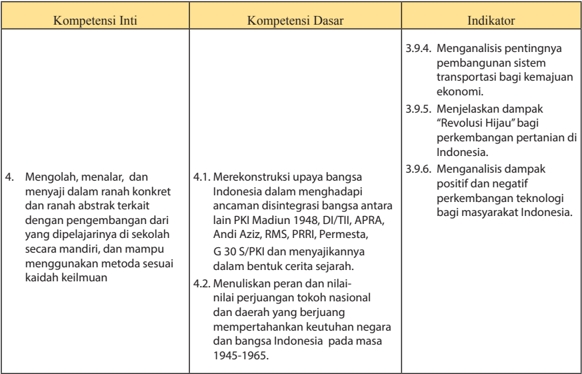

Tabel ini berisi informasi tentang kompetensi inti, kompetensi dasar, dan indikator untuk topik sejarah Indonesia. Topik utamanya berkisar pada pengembangan bangsa Indonesia melalui berbagai upaya, seperti konstruksi upaya bangsa Indonesia dalam menghadapi ancaman disintegrasi, penulisan peran tokoh nasional dan daerah yang berjuang mempertahankan keutuhan negara, dan dampak positif dan negatif teknologi bagi masyarakat Indonesia. Kolom-kolomnya mencakup kompetensi inti, kompetensi dasar, dan indikator. Data penting yang terlihat adalah bahwa topik utama adalah pengembangan bangsa Indonesia, dengan fokus pada upaya konstruksi, penulisan peran tokoh, dan dampak teknologi. Indikator-indikator tersebut mencakup analisis penting sistem transportasi, dampak Revolusi Hijau, dan dampak positif dan negatif teknologi.

 

---
## 📄 Halaman 43

---
**📊 Tabel**

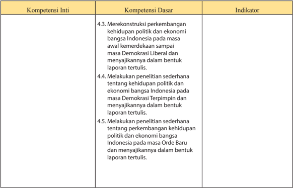

Tabel ini berisi informasi tentang kompetensi inti, kompetensi dasar, dan indikator untuk topik sejarah Indonesia. Topik utama adalah perubahan dalam kehidupan politik dan ekonomi bangsa Indonesia dari masa kemerdekaan hingga masa Demokrasi Liberal, Demokrasi Terpimpin, dan Orde Baru. Kolom "Kompetensi Inti" mencakup 4.3, 4.4, dan 4.5, yang masing-masing menunjukkan pengetahuan tentang perkembangan kehidupan politik dan ekonomi Indonesia pada masa kemerdekaan, Demokrasi Terpimpin, dan Orde Baru. Indikator di setiap baris memberikan contoh tugas atau pengetahuan yang harus dimiliki oleh siswa untuk memenuhi kompetensi tersebut.

 

---
## 📄 Halaman 44

---
**📊 Tabel**

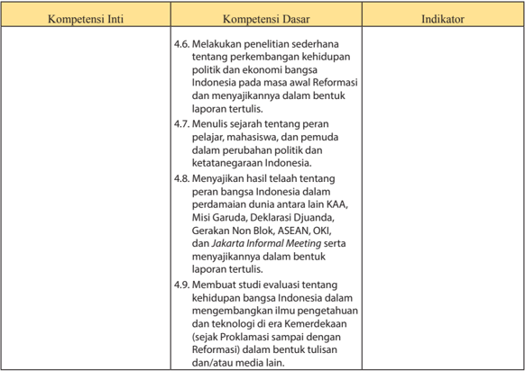

Tabel ini berisi informasi tentang kompetensi inti, dasar, dan indikator yang relevan dengan pembelajaran tentang perkembangan politik dan ekonomi Indonesia pada masa Reformasi. Topik utama adalah pengetahuan tentang perubahan politik dan ketatanegaraan Indonesia, termasuk peran pelajar, mahasiswa, dan pemuda dalam perubahan tersebut. Indikator-indikator ini mencakup penulisan laporan tertulis tentang perkembangan kehidupan politik dan ekonomi Indonesia, menulis sejarah tentang peran pelajar, mahasiswa, dan pemuda dalam perubahan tersebut, menyajikan hasil penelitian tentang peran bangsa Indonesia dalam perdamaian dunia, membuat studi evaluasi tentang kehidupan bangsa Indonesia dalam mengembangkan ilmu pengetahuan dan teknologi, dan menulis laporan tertulis tentang Jakarta Informal Meeting. Data penting yang terlihat adalah bahwa tabel ini mencakup berbagai aspek pengetahuan tentang perkembangan politik dan ekonomi Indonesia pada masa Reformasi, mulai dari penulisan laporan, sejarah, hingga studi evaluasi.

 

---
## 📄 Halaman 45

Di  samping  penjelasan  beberapa  indikator  tersebut yang  perlu diperhatikan  oleh  guru  sejarah  adalah  KD-KD  yang  terkait  dengan  KI pertama  dan  KI  kedua  harus  dijadikan  perspektif  dalam  pembelajaran Sejarah  Indonesia.  Atau  dapat  dikatakan  bahwa  KD-KD  itu  sebagai bahan  untuk  pengembangan  nilai  dan  pendidikan  karakter  bagi  siswa. Selanjutnya,  KD-KD  yang  merupakan  penjabaran  KI  keempat  terkait dengan pengembangan keterampilan dan unjuk kerja bagi siswa. Untuk mata  pelajaran Sejarah Indonesia dapat dikembangkan kegiatan-kegiatan mengobservasi,  mewawancara,  menulis  dan  mempresentasikan  karya sejarah, membuat media sejarah, membuat kliping, dan lain-lain.

### 2.  Pengalaman Belajar

Indikator-indikator yang telah dirumuskan di atas diharapkan dapat  dicapai  setelah  siswa  mengikuti  proses  pembelajaran  yang  telah dilakukan. Keberhasilan pencapaian indikator berarti tercapai pula KDKD yang telah ditetapkan dalam struktur kurikulum dari mata pelajaran Sejarah  Indonesia.  Oleh  karena  itu,  dalam  kaitan  pencapaian  indikator tersebut guru perlu juga mengingat pengalaman belajar yang secara umum diperoleh siswa sebagaimana dirumuskan dalam KI dan KD. Beberapa pengalaman belajar itu terkait dengan :

- Pengembangan  ranah  kognitif,  atau  pengembangan  pengetahuan dapat  dilakukan  dalam  bentuk  penguasaan  materi  dan  pemberian tugas  dengan  unjuk  kerja;  mengetahui,  memahami,  menganalisis,  dan mengevaluasi.
- Pengembangan ranah  afektif  atau  pengembangan  sikap  (sosial)  dapat dilakukan dengan pemberian tugas belajar dengan beberapa sikap dan unjuk kerja: menerima, menghargai, menghayati, menjalankan, dan mengamalkan.
- Pengembangan    ranah    psikomotorik    atau    pengembangan    keterampilan ( skill )  melalui  tugas  belajar  dengan  beberapa  aktivitas  mengamati, menanya, menalar, mencoba, mengolah, menyaji, dan mencipta.
Terkait dengan beberapa aspek pengalaman belajar itu maka dalam setiap  pembelajaran  Sejarah  Indonesia  di  SMA/SMK/MA/MAK  harus diusahakan  agar  siswa  mampu  mengembangkan  proses  kognitif  yang lebih  tinggi  dari  pemahaman  sampai  dengan  metakognitif  pendalaman pengetahuan  dari  sumber  belajar  yang  ada.  Pembelajaran  diharapkan mampu  mengembangkan  pengetahuan  mulai  dari  menerapkan  konsep, prinsip atau prosedur, menganalisis masalah, dan mengevaluasi sesuatu produk atau mengembangkan keterampilan, seperti: mencoba membuat

 

---
## 📄 Halaman 46

atau mengolah suatu informasi sejarah, menerapkan prosedur penulisan sejarah sampai  mengamalkan nilai-nilai yang diperoleh dari pembelajaran sejarah.

### 3.  Strategi Pembelajaran

Strategi  pembelajaran  merupakan  istilah  yang  melingkupi  seluruh proses pembelajaran. Strategi pembelajaran bermakna bagaimana proses seorang  guru  mengajar  dan  siswa  belajar  dalam  mencapai  Indikator Pembelajaran. Secara deinisi strategi  pembelajaran  merupakan  sebuah metode  untuk  menyampaikan  pelajaran  yang  dapat  membantu  siswa mencapai tujuan belajar. Strategi pembelajaran secara umum dibedakan menjadi  dua  yaitu  yang  berpusat  pada  guru  dan  berpusat  pada  siswa. Kurikulum  2013  mendorong  kita  untuk  menggunakan  strategi  yang berpusat pada siswa, untuk itu dikembangkan strategi pembelajaran yang mendorong siswa untuk aktif.

### a.  Siswa Aktif

Kurikulum 2013 menuntut siswa untuk aktif mencari pengetahuan bukan lagi siswa pasif, yang hanya menerima dari guru. Untuk itu perlu dikembangkan suatu proses pembelajaran yang aktif, inovatif dan kreatif. Kita telah mengenal berbagai model pembelajaran aktif pada  kurikulum  sebelumnya,  misalnya  CBSA  (Cara  Belajar  Siswa Aktif).  Namun  inovasi  pembelajaran  terus  dikembangkan  hingga muncul model-model pembelajaran lainnya, seperti Problem Based Learning,  Colaboratif  Learning .  Model-model  pembelajaran  itu mengarah  pada pembelajaran yang tidak lagi menjadikan guru sebagai sumber pengetahuan atau sumber belajar. Hal ini karena ada asumsi bahwa pembelajaran yang didominasi guru dapat menyebabkan siswa kurang aktif dan kurang kreatif dalam proses pembelajaran. Waktu sebelumnya  kita  mengenal  satu  model  pembelajaran  yang  cukup komprehensif, yaitu PAIKEM (Pembelajaran Aktif, Inovatif, Kreatif, Efektif  dan  Menyenangkan).    Model    pembelajaran    ini  menggambarkan keseluruhan proses belajar mengajar yang berlangsung menyenangkan dengan  melibatkan  siswa  untuk  berpartisipasi  secara  aktif  selama dalam  proses  pembelajaran.  Untuk  mewujudkan      pembelajaran yang  aktif  dan  menyenangkan  tentunya  diperlukan  ide-ide  kreatif dan inovatif dari guru dalam memilih metode dan merancang strategi pembelajaran. Proses pembelajaran yang dilakukan dengan aktif  dan menyenangkan  diharapkan  lebih  efektif  dalam  mencapai  Indikator Pembelajaran. Namun perlu diperhatikan pula bahwa pembelajaran

 

---
## 📄 Halaman 47

yang aktif dan menyenangkan tidak akan efektif apabila tujuan belajar tidak tercapai dengan baik.

Pada dasarnya inti konsep PAIKEM terletak pada kemampuan guru untuk  melakukan  pemilihan  strategi  dan  metode  pembelajaran  yang inovatif. Strategi pembelajaran yang dapat membuat siswa aktif adalah strategi  pembelajaran  yang  berorientasi  pada  siswa  ( Student  Center Learning/SCL ). Penerapan strategi pembelajaran PAIKEM mendudukkan guru sebagai fasilitator yaitu memfasilitasi siswa dalam belajar sehingga siswa memperoleh pengetahuan berdasarkan pengalaman sendiri, bukan dari guru.

Model  PAIKEM  banyak  menggunakan  strategi  pembelajaran  CTL ( Contextual Teaching and Learning ).  Karakteristik model pembelajaran CTL meliputi:

- Materi dipilih berdasarkan kebutuhan siswa.
- Siswa terlibat secara aktif.
- Materi pembelajaran dikaitkan dengan kehidupan nyata.
- Materi dikaitkan dengan pengetahuan yang telah dimiliki siswa.
- Cenderung mengintegrasikan beberapa bidang ilmu.
- Proses  belajar  berisi    kegiatan  untuk    menemukan,    menggali informasi, berdiskusi, berpikir kritis, mengerjakan proyek dan pemecahan  masalah (melalui kerja kelompok).
- Pembelajaran terjadi di berbagai tempat, sesuai dengan konteksnya.
- Hasil belajar diukur melalui penerapan penilaian autentik.
Model PAIKEM menuntut guru untuk kreatif menggunakan berbagai metode,  alat,  media  pembelajaran  dan  sumber  belajar.  Supaya  guru memiliki wawasan luas tentang metode  pembelajaran yang mendukung siswa aktif, berikut ini diperkenalkan contoh-contoh metode  pembelajaran yang  berorientasi  pada siswa.

### 1)  Metode Artikulasi

Langkah-langkah:

- Guru menyampaikan kompetensi yang ingin dicapai
- Guru menyajikan materi sebagaimana biasa
- Untuk mengetahui daya serap siswa, bentuklah kelompok berpasangan dua orang

 

---
## 📄 Halaman 48

- Menugaskan salah satu siswa dari pasangan itu menceritakan materi yang  baru  diterima  dari  guru  dan  pasangannya  mendengar  sambil membuat catatan-catatan kecil, kemudian berganti peran. Begitu juga kelompok lainnya.
- Menugaskan  siswa  secara  bergiliran/diacak  menyampaikan      hasil wawancaranya dengan teman pasangannya. Sampai sebagian  siswa sudah menyampaikan hasil wawancaranya.
- Guru mengulangi/menjelaskan kembali materi yang sekiranya belum dipahami siswa
- Kesimpulan/penutup.

### 2)  Metode Jigsaw

Langkah-langkah:

- Siswa dikelompokkan ke dalam = 4 anggota tim.
- Tiap orang dalam tim diberi bagian materi yang berbeda.
- Tiap orang dalam tim diberi bagian materi yang ditugaskan.
- Anggota  dari  tim  yang  berbeda  yang  telah  mempelajari  bagian/sub bab yang sama bertemu dalam kelompok baru (kelompok ahli) untuk mendiskusikan subbab mereka.
- Setelah  selesai  diskusi  sebagai  tim  ahli  tiap  anggota  kembali  ke kelompok asal dan bergantian mengajar teman satu tim mereka tentang subbab yang mereka kuasai dan tiap anggota lainnya mendengarkan dengan sungguh-sungguh.
- Tiap tim ahli mempresentasikan hasil diskusi.
- Guru memberi evaluasi.
- Penutup.

### 3)  Metode Picture and Picture

Langkah-langkah:

- Guru menyampaikan kompetensi yang ingin dicapai.
- Menyajikan materi sebagai pengantar.
- Guru  menunjukkan/memperlihatkan  gambar-gambar  kegiatan  berkaitan dengan materi.
- Guru menunjuk/memanggil siswa secara bergantian memasang/ mengurutkan gambar-gambar menjadi urutan yang logis.

 

---
## 📄 Halaman 49

- Guru menanyakan alasan/dasar pemikiran urutan gambar tersebut.
- Dari alasan/urutan gambar tersebut guru memulai menanamkan konsep/ materi sesuai dengan kompetensi yang ingin dicapai.
- Kesimpulan/rangkuman.

### 4)  Metode Student Facilitator and Explaining

Langkah-langkah:

- Guru menyampaikan kompetensi yang ingin dicapai.
- Guru mendemonstrasikan/menyajikan materi.
- Memberikan  kesempatan  siswa  untuk  menjelaskan  kepada  siswa lainnya misalnya melalui bagan/peta konsep.
- Guru menyimpulkan ide/pendapat dari siswa.
- Guru menerangkan semua materi yang disajikan saat itu.
- Penutup.

### 5)  Metode Example non Example

Langkah-langkah:

- Guru mempersiapkan gambar-gambar sesuai dengan Indikator Pem  belajaran.
- Guru menempelkan gambar di papan atau ditayangkan melalui OHP.
- Guru memberi petunjuk dan memberi kesempatan pada siswa untuk memperhatikan/menganalisis.
- Melalui diskusi kelompok 2-3 orang siswa, hasil diskusi dari analisis gambar tersebut dicatat pada kertas.
- Tiap kelompok diberi kesempatan membacakan hasil diskusinya.
- Mulai dari komentar/hasil diskusi siswa, guru mulai menjelaskan materi sesuai tujuan yang ingin dicapai.
- Kesimpulan.

### 6) Metode Think Pair and Share

Langkah-langkah:

- Guru menyampaikan inti materi dan kompetensi yang ingin dicapai.

 

---
## 📄 Halaman 50

- Siswa  diminta  untuk  berpikir  tentang  materi/permasalahan  yang disampaikan guru.
- Siswa  diminta  berpasangan  dengan  teman  sebelahnya  (kelompok  2 orang) dan mengutarakan hasil pemikiran masing-masing.
- Guru  memimpin  pleno  kecil  diskusi,  tiap  kelompok  mengemukakan hasil diskusinya.
- Berawal dari kegiatan tersebut, Guru mengarahkan pembicaraan pada pokok permasalahan dan menambah materi yang belum diungkapkan para siswa.
- Guru memberi kesimpulan.
- Penutup.

### 7) Two Stay Two Stray

Langkah-langlah:

- Siswa bekerja sama dalam kelompok yang berjumlah empat orang.
- Setelah selesai, dua orang dari masing-masing kelompok menjadi tamu ke kelompok yang lain
- Dua orang yang tinggal dalam kelompok bertugas membagikan hasil kerja dan informasi ke tamu mereka
- Tamu  mohon  diri  dan  kembali  ke  kelompok  mereka  sendiri  dan melaporkan temuan mereka dari kelompok lain
- Kelompok mencocokkan dan membahas hasil kerja mereka
Hal  yang  harus  diperhatikan  oleh  siswa  dan  guru  dalam  proses pembelajaran Sejarah Indonesia sebagai berikut.

- Setiap  awal  pembelajaran,  siswa  harus  sudah  membaca  teks  yang tersedia di dalam buku teks pelajaran Sejarah Indonesia.
- Siswa  harus  memperhatikan  beberapa  hal  yang  dipandang  penting seperti istilah, konsep atau kejadian penting, bahkan mungkin angka tahun yang memiliki makna atau  pengaruh yang sangat kuat dan luas dalam peristiwa sejarah yang berikutnya. Oleh  karena itu,  setiap siswa perlu memahami prinsip sebab akibat dalam peristiwa sejarah.
- Siswa  harus memperhatikan dan mencermati beberapa gambar, foto, peta atau ilustrasi lain yang terdapat pada buku teks.

 

---
## 📄 Halaman 51

Untuk mampu mengembangkan pembelajaran Sejarah Indonesia ini menjadi  lebih  menarik,  guru  harus  menambah  banyak  sumber  bacaan atau literatur lain yang relevan dengan  materi yang akan dibelajarkan. Sehingga wawasan guru terhadap materi yang akan dibelajarkan semakin  luas. Hal ini tentu akan membantu dalam proses pembelajaran. Selain  guru, proses belajar Kurikulum 2013 juga menuntut siswa untuk memperbanyak  sumber  belajar,  menambah  bacaan  buku  sejarah  lain yang  relevan. Kemudian dalam kegiatan pembelajaran Sejarah Indonesia siswa  perlu  banyak  melakukan  pengamatan  objek  sejarah  dan  banyak mempelajari peristiwa sejarah baik yang ada di lingkungannya ataupun di tempat lainnya.

### b. Pembelajaran Berbasis Nilai

Pembelajaran Sejarah Indonesia terkait dengan pengembangan nilainilai  kebangsaan  dan  nasionalisme,  di  samping  nilai-nilai  kejujuran, kearifan, menghargai waktu, ketertiban/kedisiplinan dan nilai-nilai yang lain. Oleh karena itu, dalam pembelajaran Sejarah Indonesia pendekatan pembelajaran  berbasis  nilai  penting  untuk  dikembangkan.  Bagaimana nilai-nilai kesejarahan atau nilai kebangsaan, nasionalisme, patriotisme, persatuan, kejujuran, kearifan itu dapat dihayati dan dapat diamalkan oleh siswa pada kehidupan sehari-hari. Pembelajaran dengan materi biograi atau perjuangan para tokoh penting untuk disajikan. Model  pembelajaran LVE  ( Living  Values  Education )  cocok  untuk  melakukan  pembelajaran sejarah.

### c.  Pendekatan  saintiik

Kurikulum  2013  menekankan  pada  dimensi  pedagogik  modern, dalam pembelajaran menggunakan pendekatan  ilmiah  sebagai katalisator utamanya. Pendekatan saintiik ( scientiic approach )  merupakan sebuah jalan menuju perkembangan dan pengembangan sikap, keterampilan, dan pengetahuan siswa dalam pendekatan atau proses kerja yang memenuhi kriteria ilmiah. Dalam konsep pendekatan saintiik yang disampaikan oleh Kementerian Pendidikan dan Kebudayaan ada 7 kriteria dalam pendekatan saintiik, yaitu:

- Materi    pembelajaran    berbasis    pada    fakta    atau    fenomena    yang dapat dijelaskan  dengan  logika  atau  penalaran  tertentu.
- Penjelasan  guru,  respons  siswa  dan  interaksi  edukatif  guru-siswa terbebas  dari  prasangka  yang  serta-merta,  memahami,  memecahkan masalah dan mengaplikasikan materi pembelajaran.

 

---
## 📄 Halaman 52

- Mendorong dan menginspirasi siswa berpikir secara kritis, analitis dan tepat dalam mengidentiikasi, memahami, memecahkan masalah dan mengaplikasikan materi pembelajaran.
- Mendorong dan menginspirasi siswa mampu berpikir hipotetis dalam melihat perbedaan, kesamaan, dan tautan satu sama lain dari materi pembelajaran.
- Mendorong dan menginspirasi siswa dalam memahami, menerapkan dan mengembangkan pola berpikir yang rasional dan objektif dalam merespons materi pembelajaran.
- Berbasis pada konsep, teori dan fakta empiris yang dapat dipertanggung jawabkan.
- Indikator pembelajaran dirumuskan secara sederhana dan jelas, tetapi menarik sistem penyajiannya.
Dalam  proses  pembelajaran  saintiik,  siswa  dituntut  secara  aktif membangun  pengetahuannya  sendiri  melalui aktivitas ilmiah yaitu mengamati  ( observing ),  menanya  ( questioning ),  menalar  ( associating ), mencoba ( experimenting ), dan membentuk jejaring ( networking ). Dalam proses pembelajaran saintiik, belajar itu  bukan  hanya di  ruang kelas, namun juga di lingkungan sekolah atau lingkungan masyarakat. Di sisi lain  guru  lebih  bertindak  sebagai scaffolding ketika  siswa  mengalami kesulitan,  guru  bukan  satu-satunya  sumber  ilmu.  Sikap  tidak  hanya diajarkan secara verbal, namun melalui contoh, keteladanan dan praksis.

Untuk lebih memahami lima pengalaman belajar melalui pendekatan saintiik, perlu memperhatikan  lima pengalaman belajar berikut ini.

### Mengamati

Dalam   pembelajaran   sejarah,   kegiatan   mengamati   dilakukan dengan  membaca  dan  menyimak  bahan  bacaan  atau  mendengar penjelasan  guru  atau  mengamati  foto/gambar/diagram/ilm  yang  ditunjukkan atau ditentukan guru.  Agar lebih efektif kegiatan mengamati ini,  tentunya  guru  sudah  menentukan  objek  dan  atau  masalah  dan aspek yang akan dikaji.

### Menanya

Setelah  proses  mengamati  selesai,  maka  aktivitas  berikutnya adalah  siswa  mengajukan  sejumlah  pertanyaan  berdasarkan  hasil pengamatannya.  Jadi,  aktivitas  menanya  bukan  aktivitas  yang  dilakukan  oleh  guru,  melainkan  oleh  siswa  berdasarkan  hasil  peng-

 

---
## 📄 Halaman 53

amatan  yang  telah  mereka  lakukan.  Dalam  pelaksanaannya,  guru memberikan    motivasi    atau    dorongan    agar    siswa  mengajukan pertanyaan-pertanyaan    lanjutan  dari  apa  yang  sudah  mereka  baca dan  simpulkan  dari  kegiatan  di  atas.  Siswa  dapat  dilatih  bertanya dari  pertanyaan  yang  faktual  sampai pertanyaan-pertanyaan yang bersifat hipotetis (bersifat kausalitas).

### Mengumpulkan Informasi

Setelah melewati proses menanya, aktivitas berikut dalam kegiatannya  adalah mengumpulkan data dan informasi dari berbagai sumber seperti buku, dokumen, artefak, fosil, termasuk melakukan wawancara kepada narasumber. Data dan informasi dapat diperoleh secara  langsung dari lapangan (data primer) maupun dari berbagai bahan  bacaan  (data  sekunder).  Hasil  pengumpulan  data  tersebut kemudian  menjadi  bahan  bagi  siswa  untuk  melakukan  penalaran. Misalnya mengumpulkan informasi atau data tentang pemberontakanpemberontakan daerah pada masa awal kemerdekaan.

### Mengasosiasi/Menalar

Setelah data terkumpul melalui proses mengumpulkan informasi, langkah berikutnya adalah mengolah informasi atau data yang telah dikumpulkan.  Pengolahan  dan  analisis  data    terkait    dengan    hasil pengamatan  dan  kegiatan  pengumpulan  informasi/data,  maupun pengolahan  dan  analisis  informasi/data  untuk  menambah  keluasan dan  kedalaman.  Pengolahan  atau  analisis  informasi  untuk  mencari solusi  dari  berbagai  sumber  yang  memiliki    pendapat  berbeda bahkan  sampai  pendapat  yang  bertentangan  sehingga  dapat  ditarik kesimpulan. Misalnya mengolah informasi atau menganalisis tentang pemberontakan PKI Madiun 1948.

### Mengomunikasikan

Setelah proses mengelola informasi selesai dilakukan, dilanjutkan dengan/melalui  penyampaian  hasil  dan  temuan  atau    kesimpulan berdasarkan  hasil  analisis,  baik  secara  lisan,  tertulis  atau  media lainnya.  Misalnya  hasil  diskusi  kelompok  dipresentasikan,  karya tulis dipajang di 'Majalah Dinding' atau dimuat di surat kabar atau majalah sekolah.

### d. Kemampuan Berpikir Sejarah

Di  samping  beberapa  pendekatan  tersebut,  dalam  pembelajaran Sejarah Indonesia perlu juga dikembangkan kemampuan berpikir sejarah ( historical thinking ). Karena untuk mampu memahami peristiwa

 

---
## 📄 Halaman 54

sejarah  harus  dengan  pendekatan  pemikiran  sejarah.  Hal  yang  terkait dengan  kemampuan  berpikir  sejarah  ini  adalah  kemampuan  berpikir kronologis, memperhatikan prinsip sebab akibat dan prinsip perubahan dan keberlanjutan.

### 1. Kronologis

Istilah  kronologis  sangat  familier  di  lingkungan  masyarakat. Kronologis, berasal dari kata kronologi, dengan akar katanya  dari bahasa Yunani, chronos yang  berarti  waktu  dan logos yang  berarti ilmu, jadi kronologi adalah ilmu tentang pengukuran kesatuan waktu. Di sisi lain kata kronologi juga memiliki makna urutan waktu dari sejumlah  kejadian  atau  peristiwa.  Sedangkan  kronologis  memiliki makna  menurut  urutan  dalam  penyusunan  sejumlah  kejadian  atau peristiwa. Kronologis juga bisa dimaknai sebagai rangkaian peristiwa yang  berada  dalam setting urutan  waktu.  Deinisi  inilah  yang  kita gunakan dalam proses berpikir sejarah.  Salah satu sifat dari peristiwa sejarah  itu  kronologis.  Karena  sejarah  tidak  lepas  dari  ruang  dan waktu.  Oleh  karena  itu,  dalam  mempelajari  sejarah,  setiap  siswa dilatih untuk memahami bahwa setiap peristiwa itu berada pada ruang dan waktu. Misalnya dalam  peristiwa sekitar Proklamasi kita susun: tanggal 15 Agustus 1945, tanggal 16 Agustus 1945, dan tanggal 17 Agustus 1945. Tanggal 15 Agustus 1945 diketahui Jepang menyerah, tanggal  16  Agustus  1945  peristiwa  Rengasdengklok,  tanggal  17 Agustus  1945,  terjadi  peristiwa  Proklamasi.  Dalam  konsep  waktu sejarah dikenal juga ada 'waktu lampau' yang bersambung dengan 'waktu sekarang' dan 'waktu sekarang' akan bersambung dengan 'waktu yang akan datang'. Dengan berpikir secara kronologis akan melatih hidup tertib dan bekerja secara sistematis.

### 2. Konsep sebab akibat

Dalam proses berpikir sejarah juga dikenal prinsip kausalitas atau prinsip sebab akibat dari sebuah peristiwa. Konsep sebab akibat ini merupakan hal  yang  sangat  penting  dalam  memberikan  penjelasan tentang  terjadinya  sebuah  peristiwa  sejarah.  Karena  dalam  setiap peristiwa  sejarah  ada  faktor  penyebab  dan  faktor  akibat  yang  akan dimunculkan  dari  sebuah  peristiwa. Akibat  dari  peristiwa  itu  akan menjadi sebab pada peristiwa yang berikutnya demikian seterusnya. Coba lihat diagram berikut ini.

Sebab          peristiwa          akibat          sebab          peristiwa           akibat

 

---
## 📄 Halaman 55

Sebab  dari  sebuah  peristiwa  sejarah  itu  bisa  langsung  dan    sangat dekat dengan peristiwa sejarah namun bisa juga jauh dari waktu peristiwanya. Sebagai contoh peristiwa  Proklamasi  Kemerdekaan  Indonesia 17 Agustus 1945, mengapa terjadi peristiwa Proklamasi Kemerdekaan. Ini sebuah perjalanan panjang perjuangan bangsa Indonesia menuju sebuah kemerdekaan. Atau peristiwa Rengasdengklok tentu penyebabnya ingin segera memerdekaan diri dari penjajahan yang panjang.

Pertanyaan  lainnya  misalnya  kenapa  mahasiswa  dan  masyarakat Indonesia di era 1990 melakukan demonstrasi menuntut reformasi? Atau mengapa  Kartosuwiryo  mendeklarasikan  kemerdekaan  Negara  Islam Indonesia? Atau   pertanyaan-pertanyaan lainnya terkait sebab.

### 3. Perubahan dan keberlanjutan

Perubahan  merupakan  konsep  yang  sangat  penting  dalam  sejarah. Namun tidak semua peristiwa dapat berakibat pada terjadinya perubahan. Hanya peristiwa yang mengakibatkan perubahan yang dikatakan sebagai peristiwa  sejarah  sehingga  hakikat  sejarah  adalah  sebuah  perubahan. Perubahan  merupakan  proses  bergeser  atau  beralih  dari  suatu  keadaan atau  realitas  yang  satu  ke  keadaan  atau  realitas  yang  lain,  dari  tempat yang satu ke tempat yang lain, dari waktu yang satu ke waktu yang lain. Misalnya perubahan dari keadaan bangsa yang terjajah menjadi bangsa yang merdeka setelah terjadi peristiwa Proklamasi 17  Agustus 1945. Tetapi sekalipun peristiwa tersebut telah berlalu ada aspek-aspek tertentu yang tersisa dan masih berlanjut. Sebagai contoh peristiwa Proklamasi. Status kita berubah  dari bangsa terjajah menjadi bangsa merdeka, tetapi dalam bidang hukum seperti UU Hukum Pidana kita masih menggunakan UU Hukum Pidana zaman Belanda. Dalam pembelajaran sejarah Indonesia siswa harus memahami  hakikat perubahan yang terjadi dalam peristiwa sejarah begitu juga yang terkait dengan keberlanjutan. Dengan memahami konsep  itu  siswa  akan  lebih  memahami  setiap  peristiwa  sejarah  yang dipelajarinya.  Konsep  ini  juga  memberikan  pengalaman  belajar  bahwa hidup ini  mengandung  perubahan, perubahan  itu  diusahakan   menuju yang  lebih  baik.  Tugas guru bagaimana mengantarkan pemahaman ini kepada siswa.

 

---
## 📄 Halaman 56

### e. Model Pembelajaran

Dalam  Kurikulum  2013  direkomendasikan  untuk  dikembangkan beberapa  model  pembelajaran,  yakni:  pembelajaran  berbasis  masalah, pembelajaran  berbasis  proyek,  pembelajaran discovery/inquiry ,  model values exploration (Eksplorasi Nilai).

### 1)   Pembelajaran berbasis masalah

Pembelajaran  berbasis  masalah  merupakan  sebuah  pendekatan dan juga model pembelajaran yang menyajikan masalah kontekstual sehingga merangsang siswa untuk belajar. Adapun langkahlangkahnya:

- Merumuskan masalah.
- Mendeskripsikan masalah.
- Merumuskan hipotesis.
- Mengumpulkan data dan analisis
- Pembelajaran berbasis proyek
Pembelajaran berbasis proyek merupakan metode belajar yang menggunakan  masalah,  isu-isu  aktual  atau  konsep  dan  peristiwa yang  kontroversi  dalam  melakukan  kegiatan  pembelajaran.  Dalam pembelajaran ini siswa melakukan investigasi, membuat keputusan dan  memberikan  kesempatan  siswa  untuk  bekerja  mandiri  dan mengembangkan kreativitasnya. Adapun langkah-langkahnya:

- Penentuan pertanyaan mendasar.
- Menyusun rencana proyek.
- Menyusun jadwal.
- Memonitoring hasil proyek.
- Menguji hasil.
- Evaluasi pengalaman.
- Pembelajaran discovery learning
Model discovery learning adalah teori belajar yang dideinisikan sebagai proses pembelajaran yang terjadi bila pelajar tidak disajikan dengan pelajaran dalam bentuk inalnya, tetapi mengorganisasi dan menyelesaikannya sendiri. Langkah-langkahnya:

diharapkan

Persiapan: sejak dari merumuskan tujuan, penentuan topik, mengembangkan dan seleksi bahan ajar.

data.

 

---
## 📄 Halaman 57

### Pelaksanaan:

- Pemberian rangsangan/motivasi dengan membuat materi/ problem  yang akan dipecahkan agak membingungkan/dilematis.
- Identiikasi dan merumuskan masalah
- Pengumpulan data
- Analisis data
- Pembuktian/veriikasi
- Kesimpulan/generalisasi
- Model Values Exploration (Eksplorasi Nilai).
Pengertian  model  eksplorasi  nilai  adalah  pembelajaran  yang berorentasi pada pengembangan nilai-nilai sejarah Indonesia. Model  pembelajaran  ini  berawal  dari  pemikiran "students  will demontrastrate  skills  as  they  explore  and  analyse  values "  bahwa siswa akan mendemonstrasikan berbagai keterampilan. Model pembelajaran  ini  berorentasi  pada  pemahaman  sejarah  dan  sangat mendukung  Kurikulum  2013.  Model  pembelajaran  ini  mengajak siswa untuk mengeksplorasikan masalah atau tema-tema yang terkait dengan sejarah Indonesia.

Di  dalam  menerapkan  berbagai  model  pembelajaran  tersebut, guru  perlu  menggunakan  pendekatan  scientiik  dengan  lima  langkah seperti telah diterangkan sebelumnya.

Buku  Siswa  Sejarah  Indonesia  Kelas  XII  terdiri  atas  enam bab.  Materi  pelajaran  ini  diberikan  dalam  waktu  satu  tahun  dan memerlukan waktu sekitar 30 minggu. Untuk mata pelajaran Sejarah Indonesia  diberikan  waktu  2  jam  per  minggu.  Terkait  dengan  itu, penggunaan  Buku  Siswa  mapel  Sejarah  Indonesia  dapat  dibuat skenario sebagai berikut.

---
**📊 Tabel**

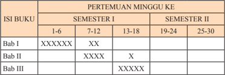

Tabel ini menunjukkan jadwal pertemuan mingguan untuk dua semester: I dan II. Topik utama adalah "Perkembangan Buku", yang dibagi menjadi tiga bab: Bab I, Bab II, dan Bab III. Semua bab memiliki jadwal pertemuan yang berbeda-beda. Untuk semester I, Bab I dimulai pada minggu ke-1 hingga 6, Bab II mulai pada minggu ke-7 hingga 12, dan Bab III dimulai pada minggu ke-13 hingga 18. Sedangkan untuk semester II, Bab I dimulai pada minggu ke-19 hingga 24, Bab II dimulai pada minggu ke-25, dan Bab III dimulai pada minggu ke-30. Pola penting yang terlihat adalah bahwa setiap bab memiliki jadwal pertemuan yang berbeda-beda, dengan Bab I dan Bab III lebih banyak pertemuan dibandingkan Bab II.

 

---
## 📄 Halaman 58

### E.   Penilaian Hasil Belajar

### 1.   Pemahaman Konsep Penilaian

Kita  sering  kali  dihadapkan  dengan  berbagai  konsep  dalam  proses penilaian hasil belajar, misalnya penilaian, evaluasi, tes, dan pengukuran. Istilah penilaian dan evaluasi berbeda secara konsepsional  namun memiliki hubungan yang erat. Di sisi lain ada pula yang menyamakan istilah  evaluasi  dan  penilaian  dengan  tes  dan  pengukuran.  Agar  tidak terjadi kesalahan persepsi, perlu dipahami arti dari istilah-istilah tersebut.

Tes pada hakikatnya merupakan suatu alat yang berisi serangkaian tugas yang harus dikerjakan atau soal-soal tertentu yang harus dijawab oleh siswa untuk mengukur  suatu aspek perilaku tertentu. Tes berfungsi untuk  mengukur  tingkat  kemampuan  siswa  dalam  menguasai  materi pelajaran  yang  telah  disampaikan.  (Ariin,  2009).

Pengukuran merupakan  suatu  proses  atau  kegiatan  untuk  menentukan kuantitas atas sesuatu aktivitas. Dalam proses pengukuran, guru menggunakan alat ukur baik berupa tes maupun nontes. (Ariin, 2009)

Penilaian merupakan  suatu  kegiatan  untuk  memberikan  berbagai informasi secara berkesinambungan dan menyeluruh tentang proses dan hasil yang telah dicapai siswa. (Ariin, 2009)

Evaluasi adalah suatu proses yang sistematis dan berkelanjutan untuk menentukan  kualitas dari  sesuatu  berdasarkan pertimbangan  dan  kriteria tertentu dalam rangka pembuatan keputusan. (Ariin, 2009)

Penilaian pembelajaran merupakan bagian dari evaluasi pembelajaran. Proses ini merupakan kompetensi yang harus dimiliki oleh seorang guru. Di sisi lain evaluasi merupakan salah satu komponen penting dan tahapan yang harus ditempuh oleh guru agar bisa mengetahui keefektifan belajar.

### 2. Prinsip Penilaian Hasil Belajar Sejarah

Guru dalam melakukan penilaian hasil belajar siswa harus dilakukan secara berkelanjutan mulai dari awal pembelajaran hingga siswa menyelesaikan pendidikan di satuan pendidikan tertentu. Apabila siswa belum  memperlihatkan  hasil belajar yang sesuai dengan  indikator

 

---
## 📄 Halaman 59

pembelajaran, maka guru wajib melakukan tindakan  perbaikan terhadap siswa, baik berupa remedial, memberikan nasihat atau memberikan tugas yang mendidik, atau bentuk lain yang  sesuai dengan kaidah pendidikan sehingga  indikator  pembelajaran  dapat  tercapai.  Di  sinilah  guru    ikut melibatkan  orang  tua  dalam proses pembelajaran.

Untuk  memperoleh  informasi  tentang  pengetahuan,  kemampuan berpikir, keterampilan, nilai, sikap, dan perilaku lain yang terkait dengan hasil  belajar sejarah siswa, guru harus menggunakan berbagai instrumen. Oleh karena itu, guru harus menjelaskan kriteria penilaian  yang digunakan untuk uji kompetensi atau tugas yang diberikan sehingga siswa tahu apa yang harus dikerjakan dan apresiasi yang diperolehnya jika  mengerjakan sesuai dengan kriteria yang ada.

### 3. Perilaku Hasil Belajar Sejarah

Perilaku hasil belajar siswa dapat dilihat dari aktivitas yang dilakukan baik berupa ucapan, tulisan, dan perbuatan.

### a. Bentuk Ucapan

Penilaian hasil belajar melalui ucapan dapat dilakukan setiap saat ketika siswa menggunakan kata-kata dan  kalimat yang  mencerminkan pengetahuan,  pemahaman,  nilai  yang  dimiliki  atau  sikap  tertentu. Melalui ucapan tersebut kita bisa mengetahui pengetahuan dan pemahaman fakta sejarah, pemahaman dan penggunaan konsep sejarah, serta sikap dan nilai-nilai yang diperoleh dari belajar suatu peristiwa sejarah yang diperoleh siswa. Hal ini bisa kita peroleh melalui aktivitas diskusi, presentasi, dan tanya jawab.

### b. Bentuk Tulisan

Pengetahuan  dan  pemahaman  tentang  fakta,  cara  berpikir,  keterampilan,  nilai-nilai,  dan  sikap  yang  diperoleh  dari  hasil  belajar sejarah dari siswa dapat kita  ketahui ketika peserta didik menjawab secara tertulis terhadap suatu pertanyaan. Bisa juga dari catatan yang dibuat siswa  setiap hari ketika mengikuti kegiatan belajar sejarah atau dari makalah yang dibuat siswa tentang peristiwa sejarah tertentu.

### c. Bentuk Perbuatan

Sikap  dan  keterampilan  hasil  belajar  sejarah  dari  siswa  dapat terlihat ketika siswa mengunjungi suatu objek sejarah,  memperlakukan suatu dokumen sejarah, benda sejarah yang ada di  lingkungan sekitar atau yang mungkin dimiliki keluarga, atau pada  waktu mengikuti suatu upacara yang terkait dengan suatu peristiwa sejarah.

 

---
## 📄 Halaman 60

### 4. Pendekatan Penilaian Hasil Belajar Sejarah

Penilaian hasil belajar sejarah perlu mengubah tradisi yang menjadikan  penilaian  sebagai  alat  untuk  menentukan  keberhasilan  dan ketidakberhasilan siswa ke prinsip penilaian kelas ( classroom assessment ) yang menjadikan tindakan penilaian untuk mengetahui kelemahan mereka dan menjadi dasar bagi guru untuk membantu siswa mengatasi kelemahan siswa dalam belajar sejarah.

Penilaian hasil belajar sejarah difokuskan terutama dalam penilaian kemampuan berpikir, keterampilan, dan sikap siswa tanpa mengabaikan pengetahuan faktual penting dalam sejarah (angka tahun, nama peristiwa, pelaku, tempat, dan jalannya cerita sejarah).

Pemanfaatan tes  tertulis  dalam  penilaian  hasil  belajar  sejarah  digunakan secara  terbatas  untuk  mengetahui  penguasaan  mengenai  pengetahuan sejarah (fakta, konsep, dan prosedur). Untuk kemampuan  berikir  dan keterampilan  sejarah  serta  nilai  dan  sikap  digunakan  instrumen  yang dikembangkan dari penilaian autentik dan instrumen lainnya.

---
**📊 Tabel**

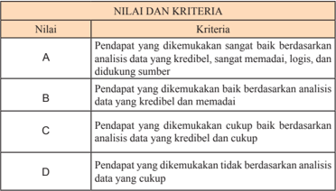

Tabel ini menunjukkan sistem penilaian pendapat berdasarkan analisis data yang kredibel dan memadai. Topik utamanya adalah penilaian kualitas pendapat berdasarkan analisis data. Kolom-kolomnya meliputi nilai (A, B, C, D) dan kriteria penilaian. Nilai A diberikan jika pendapat dikemukakan sangat baik berdasarkan analisis data yang kredibel, memadai, logis, dan didukung sumber. Nilai B diberikan jika pendapat dikemukakan baik berdasarkan analisis data yang kredibel dan memadai. Nilai C diberikan jika pendapat dikemukakan cukup baik berdasarkan analisis data yang kredibel dan cukup. Nilai D diberikan jika pendapat dikemukakan tidak berdasarkan analisis data yang cukup. Pola penting yang terlihat adalah bahwa semakin tinggi kualitas analisis data, semakin tinggi pula nilai penilaian pendapat.

Penilaian yang diberikan berdasarkan besaran angka 1-4, penggunaan angka 1 diberikan untuk nilai D dan merupakan penilaian terendah  angka terendah  dan  penggunaan  angka  4  untuk  nilai  A  dan  merupakan  nilai tertinggi.  Antara  D-C  diberikan  penilaian    C-,  antara  C  -  B  diberikan penilaian C+ dan B-, antara B - A digunakan B+ dan A-. Keseluruhan nilai yang digunakan adalah D, C-, C, C+, B-, B, B+, A- dan A.

 

---
## 📄 Halaman 61

### 5. Penilaian Autentik

### a. Pengertian

Menurut Mueller (2006), penilaian autentik merupakan penilaian langsung dan ukuran langsung (Rustaman).  Penilaian yang dilakukan pada saat proses pembelajaran berlangsung akan lebih jelas dan lebih autentik. Misalnya menilai kemampuan  berargumentasi,   berdiskusi, presentasi  atau  keterampilan  dalam  membuat  peta,  makalah  atau keterampilan  lainnya  yang  diperlukan.  Penilaian  autentik  sering disebut sebagai penilaian kinerja, dimana suatu penilaian dikatakan autentik  apabila  secara  langsung  mengamati  aktivitas  siswa  dan merupakan  penilaian kinerja  pada  situasi  yang  nyata. Penilaian autentik merupakan pengukuran yang bermakna signiikan atas hasil belajar siswa untuk ranah sikap, keterampilan, dan pengetahuan.

Penilaian autentik merupakan salah satu unsur dalam penilaian berbasis kelas. Penilaian berbasis kelas dapat diartikan sebagai suatu proses pengumpulan, pelaporan dan penggunaan data dan informasi tentang  hasil  belajar  siswa  untuk  menetapkan  tingkat  pencapaian dan penguasaan  siswa atas tujuan pendidikan yang telah ditetapkan. (Ariin,  2009).  Tujuan  pendidikan  di  sini  adalah  kompetensi  inti, kompetensi dasar, dan indikator pencapaian hasil belajar yang telah ditetapkan dalam kurikulum.

Penilaian autentik dalam Kurikulum 2013 sangat relevan dengan pendekatan saintiik dalam pembelajaran. Penilaian autentik mampu menggambarkan peningkatan hasil belajar siswa, baik dalam rangka observasi, menalar, mencoba, membangun jejaring, dan lain-lain.

### b. Ciri Penilaian Autentik

Pada penilaian autentik, kemampuan berpikir yang dinilai adalah level konstruksi, aplikasi, dan berfokus pada siswa. Ciri-ciri penilaian autentik adalah (Kunandar, 2013).

- Mengukur semua aspek pembelajaran mulai dari kinerja sampai hasil atau produk.
- Penilaian siswa harus mengukur aspek kinerja dan produk yang merupakan  cerminan  kompetensi  siswa  secara    nyata    dan objektif.
- Guru  melakukan  penilaian  dilakukan  pada  saat  dan  sesudah proses pembelajaran berlangsung.

 

---
## 📄 Halaman 62

- Guru melakukan  penilaian dengan  menggunakan  berbagai  cara dan berbagai sumber penilaian untuk menggali informasi yang menggambarkan kompetensi siswa.
- Tes hanya merupakan salah satu alat pengumpul data penilaian.
- Penilaian  yang  dilakukan  harus  secara  komprehensif  terhadap siswa sehingga kompetensi siswa dapat tercapai.
- Tugas-tugas yang diberikan kepada siswa merupakan  cerminan dari  kehidupan  siswa    yang    nyata    dan    dilakukan  secara terus-menerus sehingga siswa dapat menceritakan kembali pengalamannya tersebut.
- Menekankan pada kedalaman pengetahuan dan keahlian siswa.

### c. Karakteristik Penilaian Autentik

Karakeristik yang dimiliki oleh penilaian autentik adalah (Kunandar, 2013)

- Dapat digunakan untuk mengukur pencapaian kompetensi secara formatif atau sumatif.
- Mampu  mengukur  keterampilan  dan kinerja bukan hanya mengingat fakta.
- Dilakukan  secara  terus-menerus  dan  merupakan  satu  kesatuan yang  utuh,  baik  dalam  penilaian  suatu  proses  ataupun  hasil belajar.
- Dapat dipergunakan sebagai umpan balik terhadap pencapaian kompetensi siswa secara komprehensif.

### d. Jenis-jenis Penilaian Autentik

Agar penilaian autentik dapat berjalan dengan baik, guru harus memahami  secara  jelas  tujuan  penilaian  autentik  terutama  yang terkait  dengan  sikap,  keterampilan,  dan  pengetahuan  yang  akan dinilai, fokus penilaian serta tingkat pengetahuan  yang akan dinilai.

- Penilaian kinerja
- Penilaian proyek
- Penilaian portofolio
- Penilaian tertulis.

 

---
## 📄 Halaman 63

### e.  Guna/Manfaat

Penilaian autentik dapat digunakan untuk mengukur pengetahuan, kemampuan kognitif, dan afektif. Informasi tentang ketiganya dapat dilihat dari jawaban siswa terhadap pertanyaan/tugas yang  diberikan, dan  dirinci  dalam  rubrik.  Rincian  dalam  rubrik  dapat  berkenaan dengan penguasaan pengetahuan, kemampuan berpikir, keterampilan psikomotorik, atau kemampuan afektif.

### f.  Proses Pengembangan

Untuk mendapatkan informasi mengenai nilai, dan sikap, prosedur  pengembangan  penilaian performance meliputi  langkahlangkah berikut:

- Tentukan pengetahuan, kemampuan kognitif, nilai dan sikap yang ingin diketahui guru dari siswa yang belajar sejarah.
- Kembangkan indikator mengenai kemampuan dan nilai tersebut, kaji  dan  tentukan    apakah      indikator    tersebut    merupakan    indikator penting,  sudah cukup atau perlu ditambah atau dikurangi.
- Kaji informasi yang diperlukan untuk indikator tersebut dalam bentuk ungkapan kalimat tertulis.
- Tulis pertanyaan/tugas yang harus dikerjakan siswa seperti halnya guru mengembangkan pertanyaan untuk soal uraian ( essay ) tetapi cukup satu pertanyaan/tugas untuk satu instrumen performance .
- Kembangkan rubrik: tulis kriteria yang digunakan untuk menilai informasi yang ditulis dalam jawaban siswa dan tingkat keberhasilannya. Rubrik adalah skala skor penilaian yang digunakan  untuk  menilai  jawaban  siswa  terhadap  pertanyaan atau tugas yang dikerjakannya (Mueller, 2011).

 

---
## 📄 Halaman 64

### Contoh: nilai jujur (melalui pembelajaran) langkah:

---
**📊 Tabel**

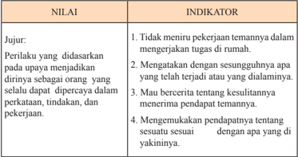

Tabel ini berisi informasi tentang nilai dan indikator yang berkaitan dengan perilaku yang dianggap sebagai dasar untuk menjadi orang yang dapat dipercaya dalam perkataan, tindakan, dan pekerjaan. Topik utama tabel ini adalah tentang nilai-nilai moral dan etika yang harus dimiliki oleh individu agar dapat dipercaya dalam berbagai aspek kehidupan. Kolom "NILAI" mencakup empat poin utama, yaitu: 1) Tidak merenung pekerjaan temannya dalam mengerjakan tugas rumah; 2) Mengatakan dengan sesungguhnya apa yang telah terjadi atau yang diamannya; 3) Mau bercerita tentang kesulitan-kesulitannya mereninya pendapat temannya; dan 4) Mengemukakan pendapatnya tentang sesuatu sesuai dengan apa yang dia yakininya. Sementara itu, kolom "INDIKATOR" menyajikan contoh-contoh perilaku yang sesuai dengan nilai-nilai tersebut. Dari tabel ini, dapat disimpulkan bahwa nilai-nilai yang diinginkan adalah integritas, kejujuran, dan kemampuan untuk berbagi pengalaman dan pendapat dengan orang lain.

### Rubrik pemberian skor :

- 4 = jika siswa melakukan 4 (dari empat) kegiatan tersebut.
- 3 = jika siswa melakukan 3 (dari empat) kegiatan tersebut
- 2 = jika siswa melakukan 2 (dari empat) kegiatan tersebut
- 1 = jika siswa melakukan salah satu (dari empat) kegiatan tersebut.
Kaji  indikator:  informasi  untuk  indikator  1,  2,  dan  4  dapat dikembangkan untuk satu tugas performance assessment . Indikator 3 dapat dikembangkan bersamaan dengan indikator 1 dalam satu alat penilaian  autentik  yang  tersendiri.  Mungkin  pula  guru  mengambil kesimpulan bahwa keempat indikator tersebut akan dikemas dalam satu tugas performance assessment.

Tentukan informasi yang diperlukan: untuk indikator 1 membandingkan  jawaban  seorang  siswa  dengan  siswa  lainnya. Indikator  2  cerita  yang  dialami  ketika  yang  bersangkutan  bermain dengan temannya  kemarin. Indikator 3 cerita tentang diskusi yang  dilakukan dengan  temannya.  Indikator 4  pendapat  yang dikemukakan  tentang  suatu  kejadian  yang  dialami  di  masyarakat atau bangsa. Tulis pertanyaan/tugas: berdasarkan langkah nomor 3 maka guru menentukan apakah perlu ada pertanyaan untuk informasi yang diperlukan dalam indikator, apakah pertanyaan tersebut untuk masing-masing  indikator  atau  dapat  dirumuskan  satu  pertanyaan untuk menghasilkan informasi bagi lebih dari satu indikator.

 

---
## 📄 Halaman 65

Kemudian,  guru  merumuskan  pertanyaan  yang  dapat  memberikan jawaban  yang  terkandung  informasi  sebagaimana  yang  diinginkan dari  setiap indikator. Dalam contoh di  atas, untuk  indikator  nomor 1 guru tidak perlu merumuskan pertanyaan karena informasi tentang membandingkan jawaban siswa satu dengan lainnya dapat diperoleh dari tiga pertanyaan lainnya. Untuk indikator nomor 2 dan 3 dapat digabungkan dalam satu pertanyaan tetapi lebih baik masing-masing satu pertanyaan, sedangkan untuk indikator nomor 4 diperlukan satu pertanyaan khusus.

### CONTOH:

### PETUNJUK:

Jawablah pertanyaan berikut ini secara mandiri

Identiikasi  dan  jelaskan  upaya  yang  dilakukan  pemerintah  Orde Baru dalam menjaga stabilitas nasional!

Jelaskan  keterkaitan  antara  Konsepsi  Presiden  dengan  Demokrasi Terpimpin!

Apa pendapat kalian tentang prestasi bangsa Indonesia dalam bidang politik di masa Demokrasi Parlementer?

### g. Kriteria Penilaian (Rubrik)

Rubrik  atau  kriteria  penilaian  adalah  alat  pemberi  skor  yang berisi  daftar  kriteria  untuk  sebuah  pekerjaan  atau  tugas.  Rubrik juga merupakan skala skor penilaian yang digunakan untuk menilai jawaban siswa terhadap pertanyaan atau tugas yang dikerjakannya (Mueller, 2011).

Tulis kriteria (rubrik): sesuai dengan apa yang telah dikemukakan di  atas,  tugas  penilaian  autentik  dapat  digunakan  untuk  menilai pengetahuan,  kemampuan  berpikir,  dan  nilai  serta  sikap  siswa. Dengan demikian, rubrik yang ditulis dapat mencakup pengetahuan, kemampuan berpikir  pada  jenis  dan  jenjang  yang  ingin  diketahui, serta  nilai  dan  sikap  yang  dinyatakan  siswa  dalam  jawabannya. Untuk kepentingan penilaian dari pendidikan karakter maka rubrik yang dikembangkan berkenaan dengan nilai jujur yang dinyatakan dalam indikator serta informasi yang diperlukan.

 

---
## 📄 Halaman 66

### h. Pengolahan Jawaban

Berdasarkan  jawaban  dari  siswa  pada  model perfomance assessment guru  dapat  mengolah  jawaban  tersebut  menjadi  proil perilaku siswa. Proil tersebut menggambarkan perilaku nilai yang ditunjukkan  siswa.  Banyaknya  kata  yang  berkenaan  dengan  suatu pertanyaan tidak harus diartikan bahwa perilaku nilai  tersebut sudah baik.  Demikian  sebaliknya  ketika  jumlah  kata-kata  yang  ditulis sangat sedikit tidaklah memberikan makna bahwa perilaku itu belum dimiliki siswa.

proil.

Satu instrumen performance hanya dapat dikatakan menunjukkan ada/tidak  adanya  perilaku  tersebut.  Jadi,  untuk  setiap  peristiwa penilaian guru merekam hasil jawaban siswa dengan suatu Berdasarkan beberapa hasil dari berbagai penilaian dalam satu bulan, guru  dapat mengembangkan keseluruhan proil perilaku hasil belajar karakter seperti: Belum Tampak (BT), Mulai Tampak (MT), Mulai Stabil (MS), Sudah Konsisten (SK).

Pada akhir semester guru dapat mengonversi proil tersebut untuk nilai rapor sebagai berikut.

---
**📊 Tabel**

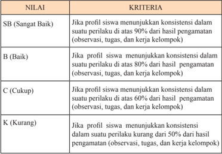

Tabel ini menunjukkan kriteria penilaian berdasarkan konsistensi perilaku siswa dalam suatu kegiatan belajar mengajar. Topik utamanya adalah penilaian konsistensi perilaku siswa dalam berbagai aspek pengamatan, tugas, dan kerja kelompok. Kolom-kolomnya meliputi: SB (Sangat Baik), B (Baik), C (Cukup), dan K (Kurang). Data penting yang terlihat adalah bahwa kriteria penilaian ini mencakup 4 kategori penilaian dengan batas kriteria yang berbeda-beda. Misalnya, untuk kategori SB (Sangat Baik) diperlukan konsistensi perilaku di atas 90%, sedangkan untuk kategori K (Kurang) hanya memerlukan konsistensi perilaku kurang dari 50%. Ini menunjukkan bahwa penilaian ini sangat detail dan mendalam dalam menilai konsistensi perilaku siswa dalam berbagai aspek pengamatan, tugas, dan kerja kelompok.

 

---
## 📄 Halaman 67

### 6. Panduan Observasi

### a. Pengertian

Panduan  observasi  adalah  alat/instrumen  yang  dikembangkan untuk  merekam  berbagai  perilaku  seperti  ucapan,  mimik,  dan tindakan yang dilakukan siswa baik pada waktu ketika  proses  belajarmengajar  di  kelas, kegiatan  di sekolah, ataupun kegiatan lain yang dilaksanakan berdasarkan program belajar suatu mata pelajaran.

Panduan  observasi  untuk  merekam  hasil  belajar  pendidikan karakter  bersifat deskriptif atau terbuka, tidak prekriptif atau tertutup sebagaimana dalam penilaian hasil belajar pengetahuan.

Observasi  yang  dimaksudkan  di sini berbeda dari catatan  anekdot ( anecdotal record ). Catatan anekdot  tidak terencana  dan  merekam suatu  peristiwa  hanya  apabila  peristiwa  itu  muncul.  Observasi untuk  pendidikan  karakter  dilakukan  secara  terencana  setiap  hari dan  merekam  peristiwa/perilaku  muncul  atau  tidak  muncul.  Suatu peristiwa/kejadian  yang  tidak  muncul  atau  tidak  dilakukan  siswa tetap dihitung sebagai suatu kejadian.

### b. Bentuk

Bentuk  isik  suatu  pedoman  observasi  terdiri  atas  perilaku teramati yang diobservasi, rekaman terhadap perilaku tersebut, dan informasi mengenai siswa yang melakukan perilaku yang terekam. Berbeda dari panduan observasi kelas yang merekam perilaku kelas sehingga  nama  tidak  penting  tetapi  frekuensi  munculnya  perilaku, dalam observasi pendidikan karakter nama siswa yang  melakukan perilaku terekam. Hal tersebut penting untuk  pembinaan selanjutnya kepada yang bersangkutan.

### c.  Guna/Manfaat

Instrumen pedoman observasi membantu guru untuk merekam perilaku yang ditunjukkan siswa dalam bentuk rekaman yang dapat dipelajari walaupun perilaku itu sudah berlalu. Dengan demikian, guru memiliki waktu yang cukup untuk mengkaji hasil rekaman observasi dan mengulang kajian tersebut setiap saat diperlukan. Dengan cara demikian, pemaknaan terhadap perilaku tersebut menjadi lebih baik.

 

---
## 📄 Halaman 68

### d. Proses Pengembangan

Perilaku yang ditunjukkan siswa yang terekam tidak dirancang sebagai  sesuatu  yang  preskriptif  tetapi  terekam  sebagai  sesuatu yang  deskriptif.  Hal  ini  disebabkan  guru  tidak  mungkin  memiliki pengetahuan mengenai apa yang akan dilakukan siswa atau perilaku untuk nilai apa yang dilakukan siswa.

Keterbukaan dalam item ini menyebabkan  guru memiliki kebebasan  dalam  pengembangan  format  instrumen.  Selain  aspek identitas  siswa,  tanggal/bulan  yang  menyatakan waktu perekaman, guru hanya perlu menyediakan kolom kosong untuk setiap siswa.

Dalam  format  yang  demikian  maka  proses  pengembangan pedoman  observasi  untuk  hasil  belajar  pendidikan  karakter  lebih sederhana. Dalam satu halaman guru dapat merekam perilaku lebih dari  satu  siswa  dan  lebih  dari  satu  perilaku  yang  berbeda  (ingat seperti yang dikatakan di bagian pengertian tidak ada perilaku tetap dianggap  sebagai  suatu  perilaku).  Berikut  adalah  contoh  panduan observasi berdasarkan apa yang sudah dikemukakan di atas.

Guru dapat mengembangkan bentuk lain berdasarkan apa yang telah dikemukakan.

Contoh:

Tanggal:

Hari:

---
**📊 Tabel**

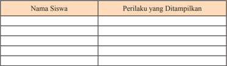

Tabel ini berisi informasi tentang perilaku siswa yang ditampilkan dalam sebuah kegiatan atau situasi tertentu. Topik utamanya adalah perilaku siswa dalam konteks pembelajaran atau kegiatan sosial. Tabel memiliki dua kolom utama: "Nama Siswa" dan "Perilaku yang Ditampilkan". Kolom "Nama Siswa" mungkin berisi nama-nama siswa yang telah melaksanakan perilaku tertentu, sementara kolom "Perilaku yang Ditampilkan" akan menunjukkan tindakan atau aksi yang dilakukan oleh setiap siswa tersebut. Data atau pola penting yang terlihat dalam tabel ini mungkin melibatkan variasi perilaku antara siswa-siswa, penilaian perilaku yang diberikan, atau tren perilaku tertentu yang muncul dalam beberapa kasus.

Catatan: berisikan situasi atau kondisi khusus (bukan yang terjadi seharihari) ketika suatu perilaku muncul.

Guru membuat  lembar panduan observasi sebanyak yang diperlukan  yaitu  jumlah  siswa  di  suatu  kelas  dibagi  4.  Jadi  suatu kelas terdiri atas 40 orang maka setiap hari untuk kelas tersebut guru membawa 10 halaman kertas panduan observasi.

 

---
## 📄 Halaman 69

### e. Pengolahan Jawaban Siswa

Pada dasarnya pengolahan hasil observasi yang terekam dalam pedoman observasi bersifat inferensial atau induktif. Artinya, guru melakukan  pemberian  pertimbangan  dari  apa  yang  telah  terekam ke  dalam  kelompok  nilai  yang  paling  sesuai.  Secara  teknis  guru menggunakan indikator suatu nilai untuk mengelompokkan perilaku  yang  terekam.  Suatu  perilaku  yang  terekam  dapat/boleh dikelompokkan  dalam  lebih  dari  satu  nilai  apabila  memang  suatu perilaku  mewakili  perbuatan lebih dari satu nilai. Misalnya, ketika seorang siswa meminjamkan pensil/bolpoin miliknya kepada  teman sebangku  atau  sekelas  yang  lupa  membawa  pensil/bolpoin  maka perilaku  itu  dapat  dikelompokkan  sebagai  peduli  sosial  dan  saling bantu. Ketika seorang siswa memberikan penjelasan kepada temannya tentang bahan pelajaran yang tadi dibicarakan di kelas, guru dapat mengelompokkan perilaku itu sebagai saling bantu, bersahabat, dan kerja sama.

Sebagaimana  halnya  dengan  hasil  pengolahan  jawaban  dalam instrumen performance , berdasarkan rekaman perilaku  siswa  yang teramati  guru  dapat  mengolah  jawaban  tersebut  menjadi  proil perilaku  siswa.  Proil  tersebut  menggambarkan  perilaku  nilai  yang ditunjukkan siswa. Banyaknya kata, tindakan, mimik terekam guru membuat  proil  awal  yang  terdiri  atas  Belum  Tampak  dan  Mulai Tampak untuk setiap hasil observasi.

Berdasarkan  hasil  observasi  untuk  jangka  waktu  tertentu,  satu minggu  untuk  guru  kelas  atau  satu  bulan  untuk  guru  mata  pelajaran  yang mengajar seminggu sekali suatu kelas, guru dapat mengembangkan keseluruhan  proil  perilaku  hasil  belajar  karakter  seperti:  Belum Tampak (BT), Mulai Tampak (MT), Mulai Berkembang (MB), Mulai Konsisten (MK), Sudah Konsisten (SK).

 

---
## 📄 Halaman 70

### 7. Pelaporan Hasil Penilaian

Pada  tahap  pelaporan  hasil  penilaian,  guru  melakukan  kegiatan sebagai berikut.

- Menghitung/menetapkan nilai mata pelajaran dari  berbagai  macam penilaian (hasil ulangan harian, tugas-tugas, ulangan tengah semester, dan ulangan akhir semester atau ulangan kenaikan kelas);
- Melaporkan  hasil  penilaian  mata  pelajaran  dari  setiap  siswa  pada setiap  akhir  semester  kepada  pimpinan  satuan  pendidikan  melalui wali kelas atau  wakil bidang akademik dalam bentuk nilai  prestasi belajar  (meliputi  aspek  pengetahuan,  praktik,  dan  sikap)  disertai deskripsi singkat sebagai cerminan kompetensi yang utuh.

### 8 . Format Buku Siswa

Dalam rangka membelajarkan siswa, guru harus juga memahami format  Buku  Siswa.  Buku  Siswa  mata  pelajaran  Sejarah  Indonesia disusun  dengan  format  sebagai  berikut.  Buku  siswa  mapel  Sejarah Indonesia untuk Kelas XII SMA/MA terdiri atas enam bab. Setiap bab terdapat  pengantar  dan  terdiri  atas  beberapa  subbab.  Setiap  subbab disusun dalam tiga aktivitas: (1) mengamati lingkungan, (2) memahami teks, dan (3) latih uji kompetensi. Setiap bab diakhiri dengan simpulan dan releksi.

 

---
## 📄 Halaman 71

### Bagian 2

### Petunjuk Khusus Pembelajaran PerBab

Buku  panduan  guru  ini  merupakan  pedoman  guru  untuk  mengelola pembelajaran terutama dalam memfasilitasi  siswa  untuk  memahami materi dan melaksanakan pesan-pesan sejarah yang ada pada Buku Siswa. Materi ajar  yang  ada  pada  Buku  Siswa  yang  terbagi  dalam  enam  bab  itu  akan dibelajarkan selama satu tahun ajaran. Sesuai  dengan  desain waktu dan materi setiap  bab  maka bab I, bab II, dan bab III, dengan jumlah 18 kali/minggu akan  diselesaikan dalam kurun  waktu setengah tahun  pertama  (semester 1). Kemudian  bab IV, V, dan V dengan  jumlah  pertemuan  12  kali/minggu akan diselesaikan pada setengah tahun kedua (semester 2).

Agar  pembelajaran  Sejarah  Indonesia  Kelas  XII  ini  lebih  efektif  dan terarah,  serta  lebih  bermakna,  maka  setiap  pembelajaran  didesain  ada:  (1) pengantar, (2) Indikator Pembelajaran, (3) materi dan proses pembelajaran, (4) penilaian. Sedangkan untuk (1) pengayaan, (2) remedial, dan (3) interaksi guru  dan  orang  tua,  guru  dapat  menyesuaikan  dengan  materi  dan  kondisi situasional jika Indikator Pembelajaran ternyata tidak sampai.

 

---
## 📄 Halaman 72

 

---
## 📄 Halaman 73

### BAB I

### Perjuangan Menghadapi Ancaman Disintegrasi

### Bangsa

Kompetensi Dasar

- KD 3.1 Menganalisis upaya bangsa Indonesia dalam menghadapi ancaman disintegrasi bangsa antara lain PKI Madiun, DI/TII, APRA, Andi Aziz, RMS, PRRI, Permesta, G 30 S/PKI.
- KD 3.2 Mengevaluasi  peran  dan  nilai-nilai  perjuangan  tokoh  nasional dan  daerah  dalam  mempertahankan  keutuhan  negara  dan  bangsa Indonesia pada masa 1945-1965.
- KD 4.1 Merekonstruksi upaya bangsa Indonesia dalam menghadapi ancaman  disintegrasi  bangsa  antara  lain:  PKI  Madiun,  DI/TII, APRA, Andi Aziz, RMS, PRRI, Permesta, dan G30S/PKI.
- KD 4.2 Menuliskan  peran  dan  nilai-nilai  perjuangan  tokoh  nasional  dan daerah yang berjuang mempertahankan keutuhan negara dan bangsa Indonesia pada  masa 1948-1965.

 

---
## 📄 Halaman 74

### Pembelajaran Pertama  (90 Menit):

### 'Perjuangan Menghadapi Ancaman Disintegrasi Bangsa'

### A.   Pengantar

Dalam pertemuan ini guru dapat  mengangkat isu aktual  berupa berbagai peristiwa  konlik  yang  terjadi  di  Indonesia  sebagai  apersepsi  dalam  kaitan dengan  tema  'Perjuangan  Menghadapi  Ancaman  Disintegrasi  Bangsa'. Misalnya  mengangkat  berita  mengenai  gerakan  separatis  di  Papua  atau  konlik agama yang terjadi di Sampang, Madura.

Guru  harus  juga  memotivasi  siswa  agar  bersyukur  atas  karunia  Tuhan tentang  negeri  Indonesia  yang  multikultural.  Selain  itu,  guru  harus  juga mendorong      peserta      didik      untuk      berpikir      kritis      dan      relektif      tenta ng kemungkinan  terjadinya  potensi  konlik  berikut  akibatnya,  dan  di  bidang  apa saja  konlik  tersebut  potensial  dapat  terjadi.

### B.   Indikator

Melalui kegiatan pembelajaran ini, siswa mampu:

- 3.1.1. Menganalisis berbagai pergolakan daerah yang terjadi di Indonesia antara tahun 1948 hingga 1965.
- 3.1.2. Mengaitkan peristiwa pergolakan daerah yang terjadi di Indonesia antara tahun 1948 hingga 1965 dengan potensi ancaman disintegrasi pada masa sekarang.

### C.   Materi Pembelajaran

Bentuk-bentuk pergolakan di dalam negeri (1948-1965)

- konlik dan pergolakan yang berkait dengan ideologi
- konlik dan pergolakan yang berkait dengan kepentingan
- konlik dan pergolakan yang berkait dengan sistem pemerintahan.

### D.   Metode dan Langkah-Langkah Pembelajaran

- Model: Student Facilitator and Explaining (Siswa  mempresentasikan ide/pendapat pada rekan siswa lainnya).
- Pendekatan: scientiic ,  dengan  langkah-langkah:  mengamati,  menanya, mengeksplorasi, mengasosiasikan, dan mengomunikasikan.

 

---
## 📄 Halaman 75

### KEGIATAN PEMBELAJARAN

### 1. Kegiatan Pendahuluan (15 Menit)

- Guru  mempersiapkan kelas agar lebih kondusif untuk proses belajar mengajar  (kerapian  dan  kebersihan  ruang  kelas,  presensi/absensi, menyiapkan media dan alat serta buku yang diperlukan).
- Guru menyampaikan topik tentang 'Perjuangan Menghadapi Ancaman Disintegrasi Bangsa'. Namun sebelum mengkaji lebih lanjut tentang topik itu, secara khusus guru mengadakan sesi perkenalan. Diusahakan masing-masing siswa bisa tampil untuk memperkenalkan diri (minimal sebut nama dan alamat), terakhir guru memperkenalkan diri.
- Guru memberikan motivasi dan mengajak bersyukur atas keberagaman yang terdapat di Indonesia.
- Guru menyampaikan kompetensi yang ingin dicapai.

### 2. Kegiatan Inti (60 Menit)

- Guru meminta siswa membaca bentuk-bentuk pergolakan dan konlik yang  pernah  terjadi  dalam  sejarah  Indonesia  selama  masa  tahun 1948-1965 dalam buku teks, halaman 7-8.
- Guru  menayangkan  beberapa  gambar  potongan  surat  kabar  yang memberitakan  terjadinya  konlik  di  Indonesia  pada  masa  kini.  Dalam Buku Siswa gambar ini terdapat pada halaman  6 (Gambar 1.1)
Gambar diolah dari berbagai sumber

 

---
## 📄 Halaman 76

- Siswa diminta untuk mengamati dan menganalisis gambar tersebut dan mengaitkannya dengan hasil bacaan mereka.
- Guru meminta siswa untuk menuliskan hasil pengamatannya.
- Memberikan  kesempatan  siswa  untuk  menjelaskan  kepada  siswa lainnya.
- Guru menerangkan semua materi yang disajikan saat itu dan mengaitkannya dengan bentuk-bentuk pergolakan dan konlik pernah terjadi dalam sejarah Indonesia selama masa tahun 1948-1965.

### 3. Kegiatan Penutup (15 Menit)

- Siswa dibantu oleh guru  menyimpulkan materi tentang 'Bentuk-Bentuk Ancaman Disintegrasi Bangsa'.
- Siswa  melakukan  releksi  tentang  pelaksanaan  pembelajaran  dan pelajaran  apa  yang  diperoleh  setelah  belajar  tentang  topik  'BentukBentuk Ancaman Disintegrasi Bangsa'.
- Guru sekali lagi menegaskan agar  para  siswa tetap  bersyukur kepada Tuhan  Yang  Maha  Esa  yang  telah  menjadikan  bangsa  Indonesia sebagai bangsa yang beragam, dan mengajak siswa untuk  memahami dan menjadikan bangsa Indonesia sebagai bangsa yang  satu dan tidak terpecah belah oleh pertikaian.
- Guru melakukan tanya jawab untuk mengukur ketercapaian Indikator Pembelajaran, misalnya dengan mengajukan pertanyaan lisan:
- 1). Apa saja bentuk pergolakan atau konlik yang pernah terjadi di Indonesia antara tahun 1948-1965?
- 2). Antara tahun 1948-1965, pemberontakan apa sajakah yang berkait dengan persoalan kepentingan (vested interest) ?
- 3). Sebutkan peristiwa-peristiwa konlik yang terjadi pada masa kini, dan  jelaskan  persamaan  antara  konlik-konlik  tersebut  dengan beberapa konlik atau pergolakan yang pernah terjadi antara tahun 1948-1965!

### Tugas

Membagi siswa ke dalam kelompok yang terdiri atas 2-3 orang. Siswa diminta untuk membuat peta konsep (mind mapping) mengenai bentukbentuk ancaman disintegrasi bangsa, yang terjadi dalam sejarah Indonesia pada tahun 1948-1965.

yang

 

---
## 📄 Halaman 77

### E.   Penilaian  Hasil Belajar

Penilaian dilakukan menggunakan penilaian autentik yang meliputi penilaian sikap, pengetahuan, dan keterampilan. Format penilaian sebagai berikut:

### 1. Penilaian  Pengetahuan

---
**📊 Tabel**

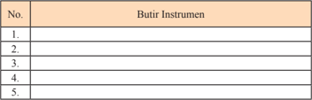

Tabel ini berisi informasi tentang instrumen yang digunakan dalam sebuah proses atau penelitian tertentu. Topik utamanya adalah "Butir Instrumen", yang menunjukkan bahwa tabel ini mungkin berfokus pada elemen-elemen atau komponen-komponen spesifik yang digunakan dalam pengumpulan data atau penilaian. Kolom-kolomnya mencakup nomor urut (No.) dan nama instrumen tersebut. Data atau pola penting yang terlihat adalah bahwa tabel ini memiliki lima baris, masing-masing menunjukkan satu instrumen dengan nama yang berbeda. Ini menunjukkan bahwa tabel ini mungkin berfungsi sebagai daftar atau inventaris instrumen yang digunakan dalam proses tertentu.

Nilai = Jumlah skor

### 2. Penilaian  Keterampilan

Penilaian  untuk  kegiatan  mengamati  gambar  berita  koran  mengenai konlik yang terjadi di Indonesia dan mengaitkannya dengan bentuk ancaman disintegrasi bangsa dalam sejarah Indonesia antara tahun 1948-1965.

bentuk-

---
**📊 Tabel**

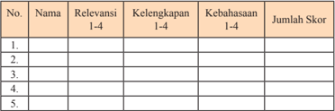

Tabel ini menunjukkan data tentang relevansi, kelengkapan, kebahasaan, dan jumlah skor dari lima individu. Topik utama tabel ini adalah evaluasi kinerja individu dalam hal relevansi, kelengkapan, kebahasaan, dan skor akhir. Kolom-kolomnya meliputi Nama, Relevansi (1-4), Kelengkapan (1-4), Kebahasaan (1-4), dan Jumlah Skor. Data penting yang terlihat adalah bahwa setiap individu memiliki nilai yang berbeda-beda dalam setiap kolom, menunjukkan variasi dalam kinerja mereka. Selain itu, tabel ini juga menunjukkan bahwa ada perbedaan signifikan antara nilai-nilai dalam setiap kolom, menunjukkan bahwa setiap aspek evaluasi memiliki dampak yang berbeda pada keseluruhan kinerja individu.

Nilai = Jumlah skor dibagi 3

Keterangan:

- Kegiatan  mengamati  dalam  hal  ini  dipahami  sebagai  cara  siswa mengumpulkan informasi faktual dengan memanfaatkan indra penglihat,  pembau,  pendengar,  pengecap  dan  peraba.  Maka  secara keseluruhan yang dinilai adalah HASIL pengamatan (berupa informasi) bukan CARA mengamati.

 

---
## 📄 Halaman 78

- Relevansi, kelengkapan, dan kebahasaan diperlakukan sebagai indikator penilaian kegiatan  mengamati.
- Relevansi  merujuk  pada  ketepatan  atau  keterhubungan  fakta  yang diamati dengan informasi yang dibutuhkan untuk mencapai tujuan Kompetensi Dasar/Indikator Pembelajaran  (TP).
- Kelengkapan  dalam  arti  semakin  banyak  komponen  fakta  yang terliput atau semakin sedikit sisa (residu) fakta yang tertinggal.
- Kebahasaan menunjukkan bagaimana siswa mendeskripsikan faktafakta yang dikumpulkan dalam bahasa tulis yang efektif (tata  kata atau tata kalimat yang benar dan mudah dipahami).
- Skor rentang antara 1 - 4
- 1 = Kurang
- 2 = Cukup
- 3 = Baik
- 4 = Amat Baik

### Pembelajaran Kedua (90 Menit)

### 'Konflik dan Pergolakan yang Berkait dengan Ideologi'

### A. Pengantar

Pertemuan minggu kedua akan mengkaji konlik dan pergolakan di Indonesia antara tahun 1948-1965, yang berkait dengan ideologi. Pembelajaran topik ini merupakan kajian yang sangat penting, terutama bila dikaitkan dengan pernah terjadinya konlik di masyarakat pada masa sekarang yang  berhubungan  dengan  masalah  keyakinan  yang  dianut.  Di  sini,  guru perlu  menanamkan  kesadaran  kepada  para  siswa  bahwa  konlik    semacam  itu bukan saja bertentangan dengan nilai dan prinsip persatuan bangsa, tetapi juga nilai kemanusiaan berupa jatuhnya korban dan kerugian yang tidak sedikit. Upaya dialog hendaknya perlu lebih dahulu dilakukan. Namun, sikap tegas pemerintah juga harus dimengerti dan dimaknai sebagai upaya penyelesaian masalah, bila permasalahan  yang  ada malah  berpotensi  merugikan, merusak atau dapat memecah belah keutuhan  bangsa  dan  negara. Bagaimanapun, Indonesia  telah  ditakdirkan  sebagai  bangsa  yang  memiliki  keberagaman. Kenyataan  tersebut  tak  bisa  diubah.  Maka  dalam  pembelajaran  ini,  guru

 

---
## 📄 Halaman 79

diharapkan dapat mengajak siswa untuk memahami dan berperan serta dalam menjaga  persatuan  dari  keberagaman  yang  ada,  demi  lestarinya  Indonesia sebagai sebuah bangsa.

### B. Indikator

Melalui kegiatan  pembelajaran ini, siswa mampu:

- 3.1.3.  Menjelaskan konlik-konlik atas dasar ideologi yang pernah  terjadi di Indonesia antara tahun 1948-1965.
- 3.1.4. Menganalisis  kebijakan  yang  dilakukan  pemerintah  dalam  upaya menyelesaikan  konlik  atas  dasar  ideologi  yang  terjadi  antara  tahun 1948-1965.
- 3.1.5.  Menelaah  akibat  yang  ditimbulkan  oleh  konlik  atas  dasar  ideologi antara tahun 1948-1965.

### C.   Materi Pembelajaran

- Pemberontakan PKI (Partai Komunis Indonesia) Madiun
- Pemberontakan DI/TII
- Gerakan 30 September 1965 (G 30 S/PKI)
Materi  yang  disampaikan  pada  minggu  kedua  ini  terdapat  pada  Buku Siswa  Bab  I  halaman  8-22.  Guru  juga  dapat  menggunakan  buku  dan bahan lain yang relevan.

### D.   Model dan Langkah-Langkah

- Model: Examples  non  Examples. Model  ini  merupakan  salah  satu contoh model pembelajaran. Guru dapat menyesuaikan dengan kondisi kelas dan lingkungan belajar yang ada.
- Pendekatan: scientiic , dengan langkah-langkah: mengamati, menanya, mengeksplorasi, mengasosiasi, dan mengomunikasikan.

### KEGIATAN PEMBELAJARAN

### 1. Kegiatan Pendahuluan (15 Menit)

- Guru  mempersiapkan kelas agar lebih kondusif untuk proses belajar mengajar  (kerapian  dan  kebersihan  ruang  kelas,  presensi/absensi, menyiapkan media dan alat serta buku yang diperlukan).

 

---
## 📄 Halaman 80

- Guru  menyampaikan  topik  tentang  'konlik  dan  pergolakan  yang berkait dengan ideologi' dan kompetensi yang akan dicapai.
- Guru  membagi  kelas  menjadi  kelompok-kelompok  siswa.    Masingmasing kelompok terdiri atas 3-4 orang.

### 2. Kegiatan Inti (60 Menit)

- Guru menayangkan atau menunjukkan beberapa gambar:

---
**🖼️ Gambar/Diagram**

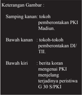

> **Deskripsi Visual:** Gambar ini adalah jenis ilustrasi yang menunjukkan tokoh-tokoh pemberontakan PKI dan DI/TII, serta berita koran tentang terjadinya peristiwa G 30/S/PKI. Gambar ini dibagi menjadi tiga bagian:

1. Samping kanan: Tokoh-tokoh pemberontakan PKI Madiun.
2. Bawah kanan: Tokoh-tokoh pemberontakan DI/TII.
3. Bawah kiri: Berita koran mengenai PKI menjelang terjadinya peristiwa G 30/S/PKI.

Elemen-elemen utama dalam gambar ini adalah tokoh-tokoh pemberontakan dan berita koran. Relasi antara elemen-elemen tersebut adalah bahwa tokoh-tokoh pemberontakan tersebut terlibat dalam peristiwa G 30/S/PKI yang disampaikan dalam berita koran.

Teks, angka, atau label penting yang terlihat dalam gambar ini adalah nama-nama tokoh pemberontakan dan tanggal terjadinya peristiwa G 30/S/PKI. Informasi kunci yang dapat diambil pembaca melalui gambar ini adalah bahwa terjadi pemberontakan besar-besaran di Indonesia pada tahun 1965, yang disebut sebagai G 30/S/PKI, dan tokoh-tokoh pemberontakannya termasuk PKI dan DI/TII.

---
**🖼️ Gambar/Diagram**

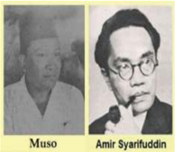

> **Deskripsi Visual:** Gambar ini adalah foto dua orang pria yang tampaknya merupakan tokoh penting dalam konteks tertentu. Pada bagian kiri, ada seorang pria dengan rambut pendek dan topi hitam, sedangkan pada bagian kanan ada seorang pria dengan rambut pendek dan kacamata. Keduanya tampaknya berpose formal, mungkin untuk foto dokumentasi.

Elemen-elemen utama dalam gambar ini adalah dua orang pria yang diperlihatkan secara langsung. Relasi antara mereka tampaknya tidak jelas, tetapi bisa dianggap sebagai dua tokoh yang penting dalam konteks yang sama. Teks, angka, atau label penting tidak terlihat dalam gambar ini.

Informasi kunci yang dapat diambil pembaca melalui gambar ini adalah bahwa ada dua tokoh penting yang mungkin memiliki peran atau hubungan tertentu dalam konteks yang ditunjukkan oleh gambar ini. Namun, tanpa informasi tambahan, sulit untuk menentukan detail lebih lanjut tentang konteks atau hubungan mereka.

---
**🖼️ Gambar/Diagram**

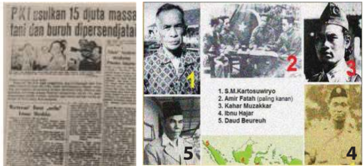

> **Deskripsi Visual:** Gambar ini adalah ilustrasi yang menunjukkan beberapa orang yang dipersempadankan oleh Pemerintah Indonesia (PPI). Ilustrasi ini terdiri dari lima foto yang masing-masing menampilkan wajah dan nama individu. Nama-nama tersebut adalah:

1. S.M.Kartosuwito
2. Kahan Muzakkar
3. Suhajal
4. David Boreuh

Ilustrasi ini juga mencantumkan informasi bahwa mereka adalah 15 juta massa tani dan buruh yang dipersempadankan oleh PPI. Informasi ini sangat penting karena menunjukkan bahwa PPI telah melakukan upaya untuk memperkuat hubungan dengan masyarakat petani dan pekerja.

Elemen-elemen utama dalam ilustrasi ini adalah foto-foto individu yang menunjukkan wajah dan nama mereka, serta teks yang memberikan informasi tentang jumlah dan jenis orang yang dipersempadankan oleh PPI. Label 1-5 pada ilustrasi menunjukkan urutan foto dari kiri ke kanan.

Informasi kunci yang dapat diambil pembaca melalui ilustrasi ini adalah bahwa PPI telah melakukan upaya besar untuk memperkuat hubungan dengan masyarakat petani dan pekerja, dan bahwa mereka telah mempersempadankan sejumlah besar orang, yaitu 15 juta massa tani dan buruh.

 

---
## 📄 Halaman 81

- Guru memberi petunjuk dan memberi kesempatan pada siswa untuk mengamati dan menganalisis gambar.
- Guru menugasi tiap-tiap kelompok secara acak untuk mendiskusikan salah satu gambar  tersebut. Materi diskusi disesuaikan dengan pertanyaan yang menyertai masing-masing gambar, sesuai Buku Siswa halaman 11, 15, dan 20. Hasil diskusi dan analisis gambar dicatat pada kertas.  Sebagai  salah satu acuan materi diskusi, siswa dapat membaca Buku Siswa halaman 11- 22.
- Tiap kelompok diberi kesempatan membacakan hasil diskusinya. Pada saat satu kelompok melakukan presentasi, kelompok yang lain dapat bertanya, demikian sampai masing-masing mendapat giliran.
- Dimulai dari komentar/hasil diskusi siswa, guru kemudian menjelaskan materi sesuai tujuan yang ingin dicapai.

### Kegiatan Penutup (15 Menit)

- Siswa  melakukan  releksi  tentang  pelaksanaan  pembelajaran  dan pelajaran  apa  yang  diperoleh  setelah  belajar  tentang  materi  'konlik dan pergolakan yang berkait dengan ideologi'.
- Guru melakukan tanya jawab untuk mengukur ketercapaian Indikator Pembelajaran, misalnya:
- 1).   Apa perbedaan alasan terjadinya pemberontakan DI/TII Jawa  Barat dengan DI/TII Aceh?
- 2).  Mengapa Angkatan Darat khawatir atas usulan PKI agar petani dan buruh dipersenjatai?
- 3). Jelaskan kebijakan yang dilakukan pemerintah dalam menghadapi pemberontakan PKI Madiun! Jelaskan pula akibat yang ditimbulkan oleh pemberontakan ini!

### Tugas:

Siswa  diberi  tugas  untuk  membuat  rangkuman  mengenai  'konlik  dan pergolakan yang berkait dengan ideologi'. Tugas disusun oleh kelompok yang terdiri atas 2-3 orang.

 

---
## 📄 Halaman 82

### E.   Penilaian  Hasil Belajar

Penilaian  dilakukan  menggunakan  penilaian  autentik  yang  meliputi penilaian  sikap,  pengetahuan,  dan  keterampilan.  Format  penilaian  sebagai berikut.

### 1. Penilaian  Keterampilan

Penilaian  untuk  kegiatan  mengamati  gambar  berita  koran  mengenai konlik yang terjadi di Indonesia dan mengaitkannya dengan bentuk ancaman disintegrasi bangsa dalam sejarah Indonesia antara tahun 1948-1965.

bentuk-

---
**📊 Tabel**

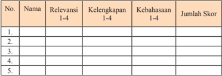

Tabel ini menunjukkan data tentang relevansi, kelemahan, keahlian, dan jumlah skor untuk lima individu. Topik utama tabel ini adalah evaluasi individu berdasarkan keterampilan dan kemampuan mereka. Kolom-kolomnya meliputi Nama, Relevansi (dari 1-4), Kelengkapan (dari 1-4), Kebahasaan (dari 1-4), dan Jumlah Skor. Data penting yang terlihat adalah bahwa setiap individu memiliki skor yang berbeda-beda, menunjukkan variasi dalam keterampilan dan kemampuan mereka. Selain itu, tabel ini juga menunjukkan bahwa beberapa individu memiliki kelemahan tertentu, seperti kelengkapan, yang perlu diperbaiki.

### Keterangan:

- Kegiatan  mengamati  dalam  hal  ini  dipahami  sebagai  cara  siswa mengumpulkan informasi faktual dengan memanfaatkan indra penglihat,  pembau,  pendengar,  pengecap,  dan  peraba.  Maka  secara keseluruhan yang dinilai adalah HASIL pengamatan (berupa informasi) bukan CARA mengamati.
- Relevansi, kelengkapan, dan kebahasaan diperlakukan sebagai indikator penilaian kegiatan mengamati.
- Relevansi merujuk pada ketepatan atau keterhubungan fakta yang diamati dengan informasi yang dibutuhkan untuk mencapai tujuan Kompetensi Dasar/Indikator Pembelajaran (TP).
- Kelengkapan  dalam  arti  semakin  banyak  komponen  fakta  yang terliput atau semakin sedikit sisa (residu) fakta yang tertinggal.
- Kebahasaan menunjukkan bagaimana siswa mendeskripsikan faktafakta yang dikumpulkan dalam bahasa tulis yang efektif (tata  kata atau tata kalimat yang benar dan mudah dipahami).

 

---
## 📄 Halaman 83

- Skor rentang antara 1 - 4
- 1 = Kurang
- 2 = Cukup
- 3 = Baik
- 4 = Amat Baik

### 2. Penilaian  Kegiatan Diskusi Kelompok

---
**📊 Tabel**

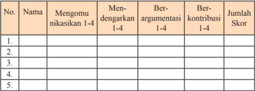

Tabel ini menunjukkan data tentang tingkat partisipasi dan kontribusi individu dalam berbagai aktivitas kritis seperti mengonfirmasi, mendengarkan, berargumentasi, dan berkontribusi dalam diskusi. Kolom-kolomnya mencakup nama individu, tingkat partisipasi mereka dalam setiap aktivitas, dan jumlah skor mereka yang diberikan berdasarkan tingkat partisipasi tersebut. Topik utama tabel ini adalah analisis partisipasi dan kontribusi dalam diskusi. Data penting yang terlihat adalah bahwa beberapa individu memiliki tingkat partisipasi yang lebih tinggi dalam berbagai aktivitas dibandingkan dengan yang lain, dan ada variasi dalam tingkat kontribusi mereka.

### Nilai = jumlah skor dibagi 4

### Keterangan:

- Keterampilan  mengomunikasikan  adalah  kemampuan  siswa    untuk mengungkapkan atau menyampaikan ide atau gagasan dengan bahasa lisan yang efektif.
- Keterampilan  mendengarkan  dipahami  sebagai  kemampuan  siswa untuk  tidak  menyela,  memotong, atau  menginterupsi pembicaraan seseorang ketika sedang mengungkapkan gagasannya.
- Kemampuan berargumentasi menunjukkan kemampuan siswa dalam mengemukakan argumentasi logis berdasarkan sumber/data ketika ada pihak yang bertanya atau mempertanyakan gagasannya.
- Kemampuan  berkontribusi  dimaksudkan  sebagai  kemampuan  siswa memberikan  gagasan-gagasan  yang  mendukung  atau  mengarah  ke penarikan  kesimpulan  termasuk  di  dalamnya  menghargai  perbedaan pendapat.
- Skor rentang antara 1 - 4
- 1 = Kurang
- 2 = Cukup
- 3 = Baik
- 4 = Amat Baik

 

---
## 📄 Halaman 84

### 3. Penilaian  Presentasi

---
**📊 Tabel**

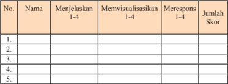

Tabel ini berisi informasi tentang penilaian kinerja siswa dalam beberapa aspek: menjelaskan, memvisualisasikan, dan merespons. Setiap baris menunjukkan data individu siswa, termasuk nama, skor mereka dalam setiap aspek, dan jumlah skor keseluruhan. Topik utama tabel adalah penilaian kinerja siswa dalam tiga aspek kunci. Kolom-kolomnya mencakup nama siswa, menjelaskan (1-4), memvisualisasikan (1-4), merespons (1-4), dan jumlah skor. Data penting yang terlihat adalah bahwa setiap siswa memiliki skor yang berbeda-beda dalam setiap aspek, dan total skor mereka juga berbeda-beda. Ini menunjukkan bahwa penilaian kinerja siswa tidak hanya melibatkan satu aspek, tetapi melibatkan semua tiga aspek tersebut.

### Keterangan:

- Keterampilan  menjelaskan  adalah  kemampuan  menyampaikan  hasil observasi dan diskusi secara meyakinkan.
- Keterampilan memvisualisasikan berkaitan dengan kemampuan  siswa untuk membuat atau mengemas informasi seunik mungkin, semenarik mungkin, atau sekreatif mungkin.
- Keterampilan  merespons  adalah  kemampuan  siswa  menyampaikan tanggapan atas pertanyaan, bantahan, sanggahan dari pihak lain secara empati.
- Skor rentang antara 1 - 4
- 1 = Kurang
- 2 = Cukup
- 3 = Baik
- 4 = Amat Baik

 

---
## 📄 Halaman 85

### Pembelajaran Ketiga (90 Menit)

### 'Konflik dan Pergolakan yang Berkait dengan Kepentingan'

### A.  Pengantar

Pertemuan minggu ketiga akan mengkaji konlik dan pergolakan Indonesia antara tahun 1948-1965, yang berkait dengan kepentingan (vested interest) . Pentingnya pembelajaran topik ini, terutama bila dikaitkan dengan adanya konlik di masyarakat pada masa sekarang yang berhubungan dengan  persoalan  kepentingan,  seperti  saat  pemilu  berlangsung  misalnya. Di  sini,  guru  perlu  menanamkan  kesadaran  kepada  para  siswa  bahwa  konlik semacam itu tentu saja bertentangan dengan nilai dan prinsip persatuan bangsa sebagaimana  tercantum  dalam  sila  ketiga  Pancasila.  Upaya  musyawarah hendaknya  perlu  lebih  dahulu  dilakukan.  Namun,  sikap  tegas  pemerintah juga  harus  dimengerti  dan  dimaknai  sebagai  upaya  penyelesaian  masalah, bila permasalahan yang ada malah berpotensi merugikan, merusak atau dapat memecah belah keutuhan bangsa dan negara. Bagaimanapun, alam demokrasi yang  berlangsung  di  Indonesia  kini  dapat  saja  mengarah  pada  terjadinya peristiwa  dengan  kecenderungan  yang  negatif  yang  dilakukan  oleh  orangorang  yang  tidak  bertanggung  jawab.  Maka  dalam  pembelajaran  ini,  guru diharapkan dapat mengajak siswa untuk memahami dan berperan serta dalam menjaga  persatuan  dari  potensi  konlik  yang  mungkin  terjadi,  demi  masa depan Indonesia yang lebih baik.

### B.   Indikator

Melalui kegiatan pembelajaran ini, siswa mampu:

- 3.1.6. Mengidentiikasi konlik-konlik atas dasar kepentingan yang pernah terjadi di Indonesia antara tahun 1948-1965.
- 3.1.7. Mengomunikasikan materi mengenai konlik atas dasar kepentingan yang terjadi antara tahun 1948-1965.

### C.    Materi Pembelajaran

- Pemberontakan Angkatan Perang Ratu Adil (APRA)
- Peristiwa Andi Aziz
- Pemberontakan Republik Maluku Selatan (RMS)
di

 

---
## 📄 Halaman 86

Materi  yang  disampaikan  pada  pembelajaran  ketiga  ini  terdapat  pada Buku Siswa Bab I halaman  22-25. Guru juga dapat menggunakan buku dan bahan lain yang relevan.

### D.   Model dan Langkah-Langkah

- Model: Cooperative Script
- Pendekatan: scientiic , dengan langkah-langkah: mengamati, menanya, mengeksplorasi, mengasosiasi, dan mengomunikasikan.

### KEGIATAN PEMBELAJARAN

### 1. Kegiatan Pendahuluan (15 Menit)

- Guru  mempersiapkan kelas agar lebih kondusif untuk proses belajar mengajar  (kerapian  dan  kebersihan  ruang  kelas,  presensi/absensi, menyiapkan media dan alat serta buku yang diperlukan).
- Guru  menyampaikan  topik  tentang  'konlik  dan  pergolakan  yang berkait dengan kepentingan' dan kompetensi yang akan dicapai.
- Guru membagi siswa untuk berpasangan.

### 2. Kegiatan Inti (60 Menit)

- Guru meminta siswa membaca 'konlik dan pergolakan yang berkait dengan  kepentingan'  yang  pernah  terjadi  dalam  sejarah  Indonesia selama masa tahun 1948-1965 dan merangkumnya. Dalam buku teks, materi terdapat di halaman 22-25.
- Guru  dan  siswa  menetapkan  siapa  yang  pertama  berperan  sebagai pembicara dan siapa yang berperan sebagai pendengar.
- Pembicara  membacakan  ringkasannya  selengkap  mungkin,  dengan memasukkan ide-ide pokok dalam ringkasannya.
- Pendengar:
- Menyimak/mengoreksi/menunjukkan  ide-ide  pokok  yang  kurang lengkap.
- Membantu mengingat/menghafal ide-ide pokok dengan menghubungkan materi sebelumnya atau dengan materi lainnya.

 

---
## 📄 Halaman 87

- Siswa lalu bertukar peran, semula sebagai pembicara ditukar menjadi pendengar dan sebaliknya, dan melakukan seperti yang dilaksanakan sebelumnya.
- Siswa  melakukan  releksi  tentang  pelaksanaan  pembelajaran  dan pelajaran apa yang diperoleh setelah belajar tentang materi 'konlik dan pergolakan yang berkait dengan kepentingan'.

### Kegiatan Penutup (15 Menit)

- Siswa membuat kesimpulan bersama-sama dengan guru.
- Guru  melakukan  evaluasi  untuk  mengukur  ketercapaian  Indikator Pembelajaran, misalnya:
- Jelaskan  persamaan  latar  belakang  terjadinya  pemberontakan APRA dan peristiwa Andi Aziz!
- Jelaskan  perbedaan  penyebab  terjadinya  peristiwa  Andi  Aziz dengan pemberontakan RMS!

### Tugas:

- Siswa  diberi  tugas  untuk  menuliskan  pendapatnya  tentang  dampak langsung dari terjadinya pemberontakan APRA seperti terlihat pada gambar 1.7 pada buku siswa.
- Siswa  diminta  untuk  menuliskan  pendapatnya  tentang  mengapa  di negara federal pasukan KNIL tidak mau diganti oleh pasukan APRIS (gambar 1.7. Pasukan KNIL)

 

---
## 📄 Halaman 88

### E.    Penilaian Hasil Belajar

Penilaian  dilakukan  menggunakan  penilaian  autentik  yang  meliputi penilaian  sikap,  pengetahuan,  dan  keterampilan.  Format  penilaian  sebagai berikut.

### 1.    Penilaian Keterampilan

Penilaian  untuk  kegiatan  mengamati  gambar  berita  (1)  korban pemberontakan  APRA  dan  (2)  pasukan  KNIL  yang  tengah  berbaris, lalu mengaitkannya dengan hasil bacaan serta membuat tulisan analisis ringkas.

---
**📊 Tabel**

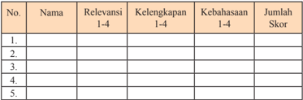

Tabel ini menunjukkan data tentang relevansi, kelengkapan, kebahasaan, dan jumlah skor dari lima subjek atau topik tertentu. Topik utama tabel adalah evaluasi atau penilaian subjek tersebut. Kolom-kolomnya meliputi Nama (menunjukkan judul atau nama subjek), Relevansi (menunjukkan tingkat relevansi subjek dengan tujuan atau tujuan pembelajaran), Kelengkapan (menunjukkan tingkat kelengkapan subjek dalam konteks pembelajaran), Kebahasaan (menunjukkan tingkat kebahasaan subjek dalam konteks pembelajaran), dan Jumlah Skor (menunjukkan total skor yang diberikan untuk subjek tersebut). Data penting yang terlihat adalah bahwa subjek yang memiliki nilai tertinggi dalam kategori relevansi adalah subjek pertama, sedangkan subjek yang memiliki nilai tertinggi dalam kategori kelengkapan adalah subjek kedua. Ini menunjukkan bahwa subjek pertama lebih relevan dan lebih lengkap daripada subjek lainnya dalam konteks pembelajaran.

Nilai = Jumlah skor dibagi 3

### Keterangan:

- Kegiatan  mengamati  dalam  hal  ini  dipahami  sebagai  cara  siswa mengumpulkan informasi faktual dengan memanfaatkan indra penglihat,  pembau,  pendengar,  pengecap,  dan  peraba.  Maka  secara keseluruhan yang dinilai adalah HASIL pengamatan (berupa informasi) bukan CARA mengamati.
- Relevansi, kelengkapan, dan kebahasaan diperlakukan sebagai indikator penilaian kegiatan  mengamati.
- Relevansi merujuk pada ketepatan atau keterhubungan fakta yang diamati dengan informasi yang dibutuhkan untuk mencapai tujuan Kompetensi Dasar/Indikator Pembelajaran.
- Kelengkapan  dalam  arti  semakin  banyak  komponen  fakta  yang terliput atau semakin sedikit sisa (residu) fakta yang tertinggal.
- Kebahasaan menunjukkan bagaimana siswa mendeskripsikan faktafakta yang dikumpulkan dalam bahasa tulis yang efektif (tata  kata atau tata kalimat yang benar dan mudah dipahami).

 

---
## 📄 Halaman 89

- Skor rentang antara 1 - 4
- 1 = Kurang
- 2 = Cukup
- 3 = Baik
- 4 = Amat Baik

### 2. Penilaian  Presentasi

---
**📊 Tabel**

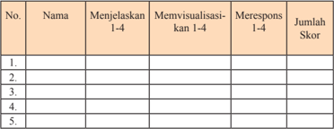

Tabel ini berisi informasi tentang penilaian kinerja individu dalam beberapa aspek, yaitu menjelaskan 1-4, memvisualisasikan 1-4, merespons 1-4, dan jumlah skor. Topik utama tabel ini adalah evaluasi kinerja individu dalam tiga aspek kunci tersebut. Kolom-kolomnya mencakup nama individu, menjelaskan 1-4, memvisualisasikan 1-4, merespons 1-4, dan jumlah skor. Data penting yang terlihat adalah bahwa setiap individu memiliki nilai skor yang berbeda-beda dalam setiap aspek, menunjukkan variasi dalam kinerja mereka.

### Keterangan:

- Keterampilan  menjelaskan  adalah  kemampuan  menyampaikan  hasil observasi dan diskusi secara meyakinkan.
- Keterampilan memvisualisasikan berkaitan dengan kemampuan siswa untuk membuat atau mengemas informasi seunik mungkin, semenarik mungkin,  atau sekreatif mungkin.
- Keterampilan  merespons  adalah  kemampuan  siswa  menyampaikan tanggapan atas pertanyaan, bantahan, dan sanggahan dari pihak lain secara empati.
- Skor rentang antara 1 - 4
- 1 = Kurang
- 2 = Cukup
- 3 = Baik
- 4 = Amat Baik

 

---
## 📄 Halaman 90

### Pembelajaran Keempat (90 Menit)

### 'Konflik dan Pergolakan yang Berkait dengan Sistem Pemerintahan'

### A.   Pengantar

Pertemuan  minggu  keempat  akan  mengkaji  konlik  dan  pergolakan  di Indonesia antara tahun 1948-1965, yang berkait dengan sistem pemerintahan. Pentingnya  pembelajaran  topik  ini,  terutama  bila  dikaitkan  dengan  adanya kenyataan kalau pada masa sekarang pun persoalan hubungan antara pusat dengan  daerah  terkadang  masih  menimbulkan  polemik.  Meskipun  tidak sampai  berujung  pada  terjadinya  konlik,  kondisi  ini  tentu  saja  dapat  berpotensi mengganggu  keharmonisan  dalam  masyarakat  Indonesia.  Maka  dengan mempelajari  sejarah  yang  berkait  dengan  persoalan  sistem  pemerintahan, siswa  diharapkan    dapat  memahami  potensi  ketidakharmonisan  semacam ini,  lalu  mampu menganalisis upaya-upaya kondusif dan positif yang dapat dilakukan. Jadi, di sini guru perlu menanamkan kesadaran kepada para siswa bahwa  potensi  disasosiatif  (mengarah  pada  perpecahan)  juga  dapat  saja terjadi karena persoalan perbedaan pandangan mengenai sistem pemerintahan yang berlaku. Penanaman pemahaman dan praktik musyawarah hendaknya perlu lebih dahulu dilakukan dalam upaya penyelesaian masalah ini. Maka dalam pembelajaran berikut, guru diharapkan dapat mengajak siswa  untuk memahami  dan  berperan  serta  dalam  menjaga  persatuan  masyarakat  dan bangsa dari potensi pertentangan negatif yang mungkin terjadi.

### B.   Indikator

Melalui kegiatan pembelajaran ini, siswa mampu:

- 3.1.8.  Mengidentiikasi  konlik-konlik  yang  berkait  dengan  sistem pemerintahan  di  Indonesia  antara  tahun  1948-1965,  yaitu pemberontakan  PRRI  dan  Permesta,  serta  persoalan  negara federal dan BFO.
- 3.1.9. Mengomunikasikan bentuk-bentuk konlik antara tahun 1948-1965  yang  terjadi  atas  dasar  kepentingan  serta  dampak pertentangan dalam hal sistem pemerintahan antara tahun 19481965,  bagi  perjuangan  dan  persatuan  bangsa  Indonesia  yang sedang menghadapi penjajah dan menata sistem pemerintahan.

 

---
## 📄 Halaman 91

### C.    Materi Pembelajaran

- Pemberontakan PRRI dan Permesta
- Persoalan Negara Federal dan BFO
Materi yang disampaikan pada pembelajaran keempat ini terdapat pada Buku Siswa Bab I halaman 25-28. Guru juga dapat menggunakan buku dan bahan lain yang relevan.

### D.   Model dan Langkah-Langkah Pembelajaran

- Model: Artikulasi
- Pendekatan: scientiic , dengan langkah-langkah: mengamati, menanya, mengeksplorasi, mengasosiasi, dan mengomunikasikan.

### KEGIATAN PEMBELAJARAN

### 1. Kegiatan Pendahuluan (15 Menit)

- Guru  mempersiapkan  kelas  agar lebih  kondusif untuk proses belajar mengajar  (kerapian  dan  kebersihan  ruang  kelas,  presensi/absensi, menyiapkan media dan alat serta buku yang diperlukan).
- Guru  menyampaikan  topik  tentang  'konlik  di  Indonesia  antara tahun  1948-1965,  yang  berkait  dengan  sistem  pemerintahan'  dan kompetensi yang akan dicapai.

### 2. Kegiatan Inti (60 Menit)

- Guru menyajikan materi tentang pemberontakan PRRI dan Permesta serta  persoalan  negara  federal  dan  BFO,  termasuk  dampak  yang terjadi    akibat  adanya  pertentangan  dalam hal sistem pemerintahan antara  tahun  1948-1965,  bagi  perjuangan  dan  persatuan  bangsa Indonesia  yang    tengah  menghadapi  penjajah  dan  tengah  menata sistem pemerintahan.
- Untuk meningkatkan daya serap siswa, guru membentuk  kelompok berpasangan dua orang.
- Guru menugaskan salah satu siswa dari pasangan itu menceritakan materi  yang  baru  diterima  dari  guru    dan  pasangannya  mendengar sambil  membuat  catatan-catatan  kecil,  kemudian  berganti  peran. Begitu juga kelompok lainnya.

 

---
## 📄 Halaman 92

- Menugaskan  siswa  secara  bergiliran  untuk  menyampaikan  hasil wawancara  dengan teman pasangannya kepada siswa lainnya.
- Guru mengulangi/menjelaskan kembali materi yang sekiranya belum dipahami siswa.
- Siswa  melakukan  releksi  tentang  pelaksanaan  pembelajaran  dan pelajaran apa yang diperoleh setelah belajar tentang materi 'konlik di  Indonesia  antara  tahun  1948-1965,  yang  berkait  dengan  sistem pemerintahan'.

### 3. Kegiatan Penutup (15 Menit)

- Siswa bersama guru membuat kesimpulan.
- Guru  melakukan  evaluasi  untuk  mengukur  ketercapaian  Indikator Pembelajaran, misalnya:
- 1). Jelaskan tentang dewan-dewan militer yang memberontak terhadap pemerintah  pusat  dalam  pemberontakan  PRRI  dan  Permesta! Jelaskan pula alasan mereka berontak!
- 2). Jelaskan perpecahan antara golongan federalis yang ingin bentuk negara federal dipertahankan dengan golongan unitaris yang ingin Indonesia  menjadi  negara  kesatuan!  Jelaskan  pula  apa  akibat perpecahan  tersebut  bagi  keberadaan  pasukan  KNIL  di  beberapa negara-negara bagian!

### Tugas:

Siswa diberi tugas untuk membuat tulisan/ paper tentang adanya keterlibatan Amerika Serikat dalam pemberontakan PRRI dan Permesta. Dalam Buku Siswa ilustrasi mengenai hal ini terdapat pada halaman 26. Informasi dapat dicari dari berbagai sumber, seperti internet, perpustakaan (buku sejarah, majalah, koran, dan lain-lain) atau  mewawancarai orangorang yang mengalami atau memahami peristiwa ini.

 

---
## 📄 Halaman 93

### Allen Lawrence Pope

Pemberontakan PRRI dan Permesta ternyata melibatkan AS  di  dalamnya.  Kepentingan AS dalam pemberontakan ini berkait dengan  kekhawatiran  negara  tersebut  bila Indonesia  akan  jatuh  ke  tangan  komunis yang  saat  itu  kian  menguat  posisinya  di pemerintahan pusat Jakarta.

Salah  satu  bukti  keterlibatan  AS  melalui operasi CIA-nya  adalah  ketika pesawat yang  dikemudikan  pilot  Allen  Lawrence Pope berhasil ditembak jatuh.

Coba kalian cari informasi mengenai kisah Allen  Pope  ini  dalam  kaitannya  dengan keterlibatan AS dalam pemberontakan PRRI dan Permesta.

### E.    Penilaian  Hasil Belajar

Penilaian  dilakukan  menggunakan  penilaian  autentik  yang  meliputi penilaian  sikap,  pengetahuan,  dan  keterampilan.  Format  penilaian  sebagai berikut:

### 1. Penilaian Keterampilan

Penilaian untuk kegiatan membuat tulisan/ paper , yang dikaitkan dengan hasil bacaan serta kemampuan membuat analisis ringkas.

Allen Pope dalam persidangan, 28 Desember 1959.

 

---
## 📄 Halaman 94

---
**📊 Tabel**

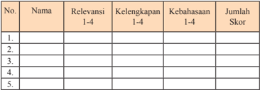

Tabel ini menunjukkan data tentang relevansi, kelengkapan, kebahasaan, dan jumlah skor untuk beberapa item atau topik. Topik utama tabel adalah evaluasi atau penilaian berdasarkan kriteria tertentu. Kolom-kolomnya meliputi Nama (mungkin untuk identifikasi item), Relevansi (dari 1 hingga 4), Kelengkapan (dari 1 hingga 4), Kebahasaan (dari 1 hingga 4), dan Jumlah Skor (yang mungkin merupakan hasil total dari nilai-nilai lainnya). Data atau pola penting yang terlihat adalah bahwa setiap item memiliki satu baris di tabel, dan semua kolom memiliki informasi yang sama untuk setiap item. Ini menunjukkan bahwa tabel ini digunakan untuk membandingkan atau mengevaluasi berbagai item atau topik dengan menggunakan parameter tertentu.

### Nilai = Jumlah skor dibagi 3

### Keterangan:

- Kegiatan mengamati  dalam  hal  ini dipahami sebagai cara siswa mengumpulkan informasi faktual dengan memanfaatkan indra penglihat,  pembau,  pendengar,  pengecap,  dan  peraba.  Makasecara keseluruhan yang dinilai adalah HASIL pengamatan (berupa informasi) dan CARA mengamati.
- Relevansi, kelengkapan, dan kebahasaan diperlakukan sebagai indikator penilaian kegiatan  mengamati.
- Relevansi merujuk pada ketepatan atau keterhubungan fakta yang diamati dengan informasi yang dibutuhkan untuk mencapai tujuan Kompetensi Dasar/Indikator Pembelajaran.
- Kelengkapan  dalam  arti  semakin  banyak  komponen  fakta  yang terliput atau semakin sedikit sisa (residu) fakta yang tertinggal.
- Kebahasaan menunjukkan bagaimana siswa mendeskripsikan faktafakta yang dikumpulkan dalam bahasa tulis yang efektif (tata  kata atau tata kalimat yang benar dan mudah dipahami).
- Skor rentang antara  1 - 4
- 1 = Kurang
- 2 = Cukup
- 3 = Baik
- 4 = Amat Baik

 

---
## 📄 Halaman 95

### 2. Penilaian  Presentasi

---
**📊 Tabel**

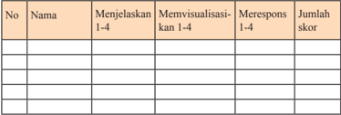

Tabel ini menunjukkan data tentang penilaian kinerja siswa dalam beberapa aspek: menjelaskan, memvisualisasikan, merespons, dan jumlah skor. Topik utama tabel adalah penilaian kinerja siswa dalam berbagai aspek pembelajaran. Kolom-kolomnya mencakup nama siswa, menjelaskan 1-4, memvisualisasikan 1-4, merespons 1-4, dan jumlah skor. Data penting yang terlihat adalah bahwa setiap siswa memiliki nilai yang berbeda-beda dalam setiap aspek penilaian, menunjukkan variasi dalam kinerja mereka. Sementara itu, jumlah skor untuk setiap siswa juga bervariasi, menunjukkan tingkat kesulitan atau kemampuan masing-masing siswa dalam setiap aspek penilaian.

### Keterangan:

- Keterampilan  menjelaskan  adalah  kemampuan  menyampaikan  hasil observasi dan diskusi secara meyakinkan.
- Keterampilan  memvisualisasikan  berkaitan  dengan  kemampuan siswa untuk membuat atau mengemas informasi seunik mungkin, semenarik mungkin, atau sekreatif mungkin.
- Keterampilan  merespons  adalah  kemampuan siswa  menyampai-kan tanggapan atas pertanyaan, bantahan, dan sanggahan dari  pihak  lain secara empati.
- Skor rentang antara 1 - 4
- 1 = Kurang
- 2 = Cukup
- 3 = Baik
- 4 = Amat Baik

### Pembelajaran Kelima (90 Menit)

### 'Dari Konflik Menuju Konsensus; Suatu Pembelajaran'

### A.   Pengantar

Pertemuan minggu kelima ini siswa akan mempelajari atau mengambil hikmah  dari  kejadian-kejadian  konlik  dan  konsensus  yang  terjadi  antara tahun1948-1965. Pentingnya pembelajaran topik ini, terutama bila dikaitkan dengan masih terdapatnya konlik di dalam masyarakat Indonesia pada masa

 

---
## 📄 Halaman 96

sekarang,  baik  konlik  atas  dasar  ideologi,  kepentingan,  atau  yang  terjadi dalam hubungannya dengan sistem pemerintahan. Bagaimanapun,  salah satu guna  sejarah  adalah  kegunaan  edukatif.  Maksudnya,  dengan  mempelajari sejarah  maka  orang  dapat  mempelajari  pengalaman yang pernah dilakukan masyarakat pada masa lampau, yang tentu saja dapat dikaitkan  dengan masa sekarang.  Keberhasilan    masa  lampau  akan  dapat  memberi    pengalaman pada  masa sekarang. Sebaliknya, kesalahan masyarakat masa  lampau  akan menjadi pelajaran berharga yang harus diwaspadai di masa kini.

Di  sini,  guru  perlu  menanamkan  kesadaran  kepada  para  siswa  bahwa konlik  bertentangan  dengan  nilai  dan  prinsip  persatuan  bangsa  sebagaimana tercantum dalam sila ketiga Pancasila. Upaya musyawarah hendaknya perlu lebih dahulu dilakukan. Bagaimanapun, alam demokrasi di era globalisasi yang berlangsung di Indonesia kini dapat saja mengarah  pada terjadinya peristiwa dengan kecenderungan yang negatif yang dilakukan oleh orang-orang yang tidak  bertanggung  jawab.  Maka  dalam  pembelajaran  ini,  guru  diharapkan dapat  mengajak  siswa  untuk  memahami  dan  bisa  mengambil  hikmah  serta mampu berperan dalam menjaga persatuan dari potensi konlik yang mungkin terjadi.

### B.   Indikator

Melalui kegiatan pembelajaran ini, siswa mampu:

- 3.1.10. Menganalisis konlik-konlik atas dasar ideologi dan kepentingan serta  konlik  yang  berkait    dengan  sistem  pemerintahan,  yang pernah terjadi di Indonesia antara tahun 1948-1965.
- 3.1.11.  Mengomunikasikan  konlik-konlik  atas  dasar  ideologi  dan kepentingan    serta  konlik    yang    berkait    dengan    sistem pemerintahan,  yang  pernah  terjadi  di Indonesia antara tahun 1948-1965.

### C.   Materi Pembelajaran

- 'Dari Konlik menuju Konsensus: Suatu Pembelajaran'
- Materi yang disampaikan pada minggu kelima ini terdapat pada Buku Siswa Bab II halaman  30-33.

### D. Model dan Langkah-Langkah Pembelajaran

- Model: Think Pair and Share
- Pendekatan: scientiic, dengan  langkah-langkah: mengamati, menanya, mengeksplorasi, mengasosiasi,  dan mengomunikasikan.

 

---
## 📄 Halaman 97

### KEGIATAN PEMBELAJARAN

### 1. Kegiatan Pendahuluan (15 Menit)

- Guru  mempersiapkan kelas agar lebih kondusif  untuk proses belajar mengajar  (kerapian  dan  kebersihan  ruang  kelas,  presensi/absensi, menyiapkan media dan alat serta buku yang diperlukan).
- Guru menyampaikan topik tentang 'Dari Konlik Menuju Konsensus: Suatu Pembelajaran' dan kompetensi yang akan dicapai.

### 2. Kegiatan Inti (60 Menit)

- Guru membagi siswa untuk berpasangan 2 orang
- Setiap pasangan diminta guru untuk mempelajari kembali garis besar Bab 1 'Perjuangan Menghadapi Ancaman Disintegrasi Bangsa'.
- Siswa  diminta  untuk  menganalisis  materi,  lalu  mengerjakan  tugas diskusi dan analisis. Dalam Buku Siswa, tugas ini terdapat di halaman 30.

---
**📊 Tabel**

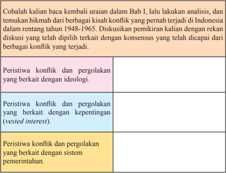

Tabel ini membahas peristiwa konflik dan pergolakan di Indonesia antara tahun 1948 hingga 1965, dengan fokus pada empat kategori utama: konflik ideologis, konflik dengan kepentingan (vested interest), konflik dengan sistem pemerintahan, dan konflik lainnya. Topik utama tabel ini adalah analisis peristiwa konflik dan pergolakan di Indonesia selama periode tersebut. Kolom-kolomnya mencakup berbagai aspek konflik, mulai dari konflik ideologis yang melibatkan pemikiran dan pandangan, hingga konflik dengan kepentingan tertentu dan sistem pemerintahan. Data penting yang terlihat adalah bahwa konflik ideologis merupakan salah satu aspek utama konflik yang dialami, sementara konflik dengan kepentingan dan sistem pemerintahan juga menjadi faktor penting dalam peristiwa konflik tersebut.

 

---
## 📄 Halaman 98

- Bersama  pasangannya, siswa diminta  mengutarakan  hasil  diskusi masing-masing.
- Guru  memimpin  pleno  kecil  diskusi,  tiap  kelompok  mengemukakan hasil diskusinya.
- Guru  mengarahkan  pembicaraan  pada  pokok  permasalahan  dan menambah materi yang belum diungkapkan para siswa.
- Guru membimbing siswa membuat kesimpulan.

### 3. Kegiatan Penutup (15 Menit)

Guru melakukan evaluasi untuk  mengukur  ketercapaian  Indikator  Pembelajaran, misalnya:

- Jelaskan persamaan antara (1) konlik-konlik yang terjadi atas dasar ideologi dengan (2) konlik kepentingan dan dengan (3) konlik yang berkait dengan sistem pemerintahan, yang pernah terjadi di Indonesia antara tahun 1948-1965. Kaitkan penjelasan kalian dengan keutuhan bangsa dan negara.
- Jelaskan hikmah yang bisa diambil dari adanya pemberontakan G 30 S/ PKI bagi kehidupan beragama bangsa Indonesia!

### Tugas:

Siswa diberi tugas untuk membuat peta Indonesia, dengan menunjukkan daerah-daerah  tempat  terjadinya  konlik  yang  membahayakan integrasi bangsa, antara tahun 1948-1965. Peta juga menunjukkan daerah dengan potensi  konlik  sejenis  pada  masa  sekarang.  Tunjukkan  di  peta  dengan warna  yang  berbeda!  Buat  pula  keterangan  singkat  mengenai  isi  peta tersebut!

 

---
## 📄 Halaman 99

### E.    Penilaian  Hasil Belajar

Penilaian  dilakukan  menggunakan  penilaian  autentik  yang  meliputi penilaian  sikap,  pengetahuan,  dan  keterampilan.  Format  penilaian  sebagai berikut:

### 1. Penilaian  Keterampilan

Penilaian untuk kegiatan membuat analisis kliping:

---
**📊 Tabel**

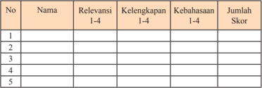

Tabel ini menunjukkan data tentang relevansi, kelengkapan, kebahasaan, dan jumlah skor untuk lima individu. Topik utama tabel adalah evaluasi kemampuan berkomunikasi dalam berbagai aspek. Kolom-kolomnya mencakup nama individu, relevansi (dari 1-4), kelengkapan (dari 1-4), kebahasaan (dari 1-4), dan jumlah skor. Data penting yang terlihat adalah bahwa setiap individu memiliki skor yang berbeda-beda, menunjukkan variasi dalam kemampuan mereka dalam berbagai aspek komunikasi.

### Keterangan:

- Kegiatan  mengamati  dalam  hal  ini  dipahami  sebagai  cara  siswa mengumpulkan informasi faktual dengan memanfaatkan indra penglihatan,  pembau,  pendengaran,  pengecap,  dan  peraba.  Maka secara  keseluruhan  yang  dinilai  adalah  HASIL  pengamatan  (berupa informasi) dan  CARA mengamati.
- Relevansi, kelengkapan, dan kebahasaan diperlakukan sebagai indikator penilaian kegiatan  mengamati.
- Relevansi merujuk  pada  ketepatan atau  keterhubungan fakta yang diamati dengan  informasi  yang  dibutuhkan  untuk  mencapai tujuan Kompetensi Dasar/Indikator Pembelajaran.
- Kelengkapan  dalam  arti  semakin  banyak  komponen  fakta  yang terliput atau semakin sedikit sisa (residu) fakta yang tertinggal.
- Kebahasaan menunjukkan bagaimana siswa mendeskripsikan faktafakta yang  dikumpulkan  dalam  bahasa  tulis  yang  efektif  (tata kata  atau tata  kalimat  yang  benar  dan mudah dipahami).

 

---
## 📄 Halaman 100

- Skor rentang antara  1 - 4
- 1 = Kurang
- 2 = Cukup
- 3 = Baik
- 4 = Amat Baik

### 2. Penilaian  Kegiatan Diskusi Kelompok

---
**📊 Tabel**

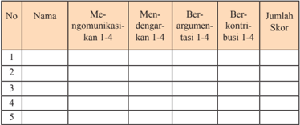

Tabel ini menunjukkan data tentang interaksi antara individu dalam berbagai situasi komunikasi. Topik utamanya adalah bagaimana orang-orang berinteraksi dengan satu sama lain dalam berbagai situasi, seperti berkomunikasi, mendengarkan, berargumentasi, dan berkontribusi. Kolom-kolomnya mencakup nama individu, tindakan mereka dalam berbagai situasi, dan jumlah skor mereka. Data penting yang terlihat adalah bahwa beberapa individu lebih suka berkomunikasi daripada mendengarkan, sedangkan beberapa lebih suka berargumentasi daripada berkontribusi. Ini menunjukkan bahwa perilaku komunikatif individu dapat bervariasi dan mempengaruhi hasil interaksi mereka.

### Nilai = jumlah skor dibagi 4

### Keterangan:

- Keterampilan   mengomunikasikan adalah kemampuan siswa untuk mengungkapkan atau  menyampaikan ide atau gagasan dengan bahasa lisan yang efektif.
- Keterampilan  mendengarkan  dipahami  sebagai  kemampuan  siswa untuk tidak  menyela,  memotong, atau  menginterupsi pembicaraan seseorang ketika sedang  mengungkapkan gagasannya.
- Kemampuan berargumentasi menunjukkan kemampuan siswa dalam mengemukakan argumentasi  logis  ketika  ada  pihak  yang  bertanya atau mempertanyakan gagasannya.
- Kemampuan berkontribusi dimaksudkan sebagai kemampuan siswa memberikan gagasan-gagasan yang  mendukung atau mengarah ke penarikan kesimpulan termasuk di dalamnya menghargai perbedaan pendapat.

 

---
## 📄 Halaman 101

- Skor rentang antara 1 - 4
- 1 = Kurang
- 2 = Cukup
- 3 = Baik
- 4 = Amat Baik.

### 3. Penilaian  Presentasi

---
**📊 Tabel**

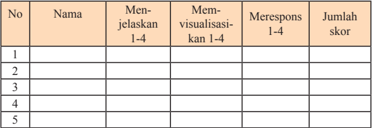

Tabel ini menunjukkan hasil evaluasi kinerja siswa dalam beberapa aspek penilaian, yaitu menjelaskan konsep 1-4, memvisualisasikan konsep 1-4, merespons konsep 1-4, dan jumlah skor keseluruhan. Topik utama tabel ini adalah penilaian kinerja siswa dalam mengaplikasikan konsep matematika. Kolom-kolom yang ada mencakup nama siswa, menjelaskan konsep 1-4, memvisualisasikan konsep 1-4, merespons konsep 1-4, dan jumlah skor keseluruhan. Data atau pola penting yang terlihat adalah bahwa setiap siswa memiliki satu baris di tabel, dan mereka diberi skor tertentu untuk setiap aspek penilaian. Sementara itu, jumlah skor keseluruhan untuk setiap siswa juga ditampilkan.

### Keterangan:

- Keterampilan  menjelaskan  adalah  kemampuan  menyampaikan  hasil observasi dan diskusi secara meyakinkan.
- Keterampilan memvisualisasikan berkaitan dengan kemampuan  siswa untuk membuat atau mengemas informasi seunik mungkin, semenarik mungkin,  atau sekreatif mungkin.
- Keterampilan  merespons  adalah  kemampuan  siswa  menyampaikan tanggapan atas pertanyaan, bantahan, sanggahan dari pihak  lain  secara empati.
- Skor rentang antara 1 - 4
- 1 = Kurang
- 2 = Cukup
- 3 = Baik
- 4 = Amat Baik

 

---
## 📄 Halaman 102

### Pembelajaran Keenam (90 Menit)

### 'Kesadaran Terhadap Pentingnya Integrasi Bangsa'

### A.   Pengantar

Pertemuan  minggu  keenam  ini  siswa  akan  belajar  tentang  pentingnya kesadaran terhadap integrasi bangsa. Di sini, siswa akan belajar dari kasus potensi disintegrasi yang terjadi pada masa sekarang, lalu menghubungkannya dengan berbagai hikmah yang bisa diambil dari konlik yang telah terjadi pada masa lalu. Dari peristiwa masa kini, akan ada pula hikmah lain yang bisa diambil untuk masa depan. Guru perlu menanamkan kesadaran kepada para siswa bahwa selagi hikmah dari masa lalu disadari untuk  bisa dijadikan pegangan, maka perjalanan bangsa Indonesia selayaknya terhindar dari konlik yang dapat memecah belah perikehidupan berbangsa dan bernegara.

### B.   Indikator

Melalui kegiatan  pembelajaran ini, siswa mampu:

- 3.1.12.  Mendiskusikan  tentang  konlik-konlik  yang  terjadi  pada  masa sekarang, lalu mengaitkannya dengan konteks kepentingan integrasi bangsa.
- 3.1.13.Menganalisis  konlik-konlik  yang  terjadi  pada  masa  sekarang sebagai peristiwa sejarah
- 3.1.14.  Mengaitkan hikmah dari berbagai konlik yang pernah terjadi di Indonesia antara tahun 1948-1965 dengan berbagai konlik yang terjadi dalam konteks kekinian.

### C.   Materi Pembelajaran

- 'Kesadaran Terhadap Pentingnya Integrasi Bangsa'
- Materi yang disampaikan  pada  pembelajaran keenam  ini terdapat pada Buku Siswa Bab II halaman  31-33.

### D.   Model dan Langkah-Langkah Pembelajaran

- Model: Two Stay Two Stray
- Pendekatan: scientiic ,  dengan langkah-langkah:  mengamati,   menanya, mengeksplorasi, mengasosiasi, dan mengomunikasikan.

 

---
## 📄 Halaman 103

### KEGIATAN PEMBELAJARAN

### 1. Kegiatan Pendahuluan (15 Menit)

- Guru  mempersiapkan kelas agar lebih kondusif untuk proses belajar mengajar  (kerapian  dan  kebersihan  ruang  kelas,  presensi/absensi, menyiapkan media dan alat serta buku yang diperlukan).
- Guru menyampaikan topik tentang 'Kesadaran Terhadap Pentingnya Integrasi Bangsa' dan kompetensi yang akan dicapai.

### 2. Kegiatan Inti (60 Menit)

- Guru  memandu  siswa  membuat  kelompok  diskusi  masing-masing 4 orang.
- Guru mengajak siswa membaca dan mendiskusikan wacana berjudul 'Enam  Daerah  Rawan  Konlik  Sosial  di  Indonesia'.  Di  Buku  Siswa, wacana ini terdapat di halaman 32-33.
- Siswa diminta untuk mengaitkan  isi wacana  dengan  persoalan disintegrasi  bangsa  dalam  sejarah,  yang  telah  dipelajari  dalam  bab sebelumnya. Siswa juga diminta untuk menggunakan catatan mengenai konlik yang telah dibuat di rumah sebagai sumber analisis dan diskusi.
Enam Daerah Rawan Konlik Sosial di Indonesia

Kementerian Sosial memetakan 184 daerah di Tanah Air rawan terjadi konlik  sosial  karena  kondisi  ekonomi  yang  tertinggal, enam di antaranya diprediksi paling rawan pada 2014 ini.

'Sebagian besar kondisi ekonominya tertinggal dibanding daerah lain. Namun, ada juga daerah maju tapi interaksi sosial antarkelompok  sangat  kaku,  sehingga  mudah  meletup  hanya karena masalah kecil,' kata Tenaga Ahli Menteri Sosial bidang Kehumasan  dan  Tatakelola    Pemerintahan    Sapto  Waluyo  di Jakarta.

Sapto  mengatakan,  tidak  semua  daerah  tertinggal  itu  rawan konlik. Ada enam daerah diprediksi sebagai wilayah paling rawan  konlik  sosial  pada  2014.

 

---
## 📄 Halaman 104

Daerah  tersebut  yaitu,  Papua,  Jawa  Barat,  Jakarta,  Sumatra Utara, Sulawesi Tengah, dan Jawa Tengah. 'Indikatornya terlihat sepanjang 2013 daerah tersebut bermunculan aneka konlik,' kata Sapto menambahkan. Sepanjang 2013 di  Papua terjadi

24  peristiwa  konlik  sosial,  Jawa  Barat  (24),  Jakarta  (18), Sumatera  Utara  (10),  Sulawesi  Tengah  (10)  dan  Jawa  Tengah (10).

'Di  tahun  politik  2014,  ketegangan  tentu  akan  meningkat. Karena itu, Kemensos melancarkan program keserasian sosial di 50 daerah  rawan  dan penguatan kearifan lokal di 30 daerah,' katanya.

Targetnya mencegah kemungkinan terjadinya konlik atau memperkecil dampak jika konlik tetap terjadi.

'Memang  harus  ditumbuhkan  tenaga  pelopor  perdamaian  di seluruh  pelosok  Indonesia,  terutama  dari  kawula  muda,'  kata dia.

Sumber: antaranews.com, Februari 2014

- Setelah selesai, dua orang dari masing-masing kelompok bertamu ke kelompok yang lain. Semua kelompok harus dikunjungi.
- Dua orang yang tinggal dalam kelompok bertugas menyampaikan hasil kerja dan informasi ke tamu mereka.
- Setelah semua kelompok dikunjungi, siswa yang bertamu kembali ke kelompok masing-masing dan melaporkan temuan yang didapat dari kelompok lain.
- Dipandu guru, siswa mendiskusikan dan membahas hasil kerja yang dilakukan bersama-sama antarkelompok.
- Setiap kelompok menulis kesimpulan yang didapat, lalu masing-masing mengumpulkan ke guru.

### 3. Kegiatan Penutup (15 Menit)

Guru melakukan evaluasi untuk mengukur ketercapaian Indikator Pembelajaran, misalnya:

 

---
## 📄 Halaman 105

- Jelaskan  persamaan  dan  perbedaan  yang  menjadi  penyebab  konlik pada masa kini dengan masa lalu khususnya antara tahun 1948-1965!
- Jelaskan  persamaan  dan  perbedaan  cara  penyelesaian  konlik  yang terjadi pada masa kini dengan masa lalu khususnya antara tahun 19481965!
- Jelaskan  persamaan  dan  perbedaan  akibat  yang  ditimbulkan  antara konlik  pada  masa  kini  dengan  masa  lalu  khususnya  antara  tahun  19481965!

### Tugas:

Siswa  membuat  kliping  tentang  3  gambar/berita  konlik  yang  terjadi  di Indonesia  dalam  beberapa  tahun  terakhir.  Kliping  berita/gambar,  lalu dianalisis untuk menemukan hikmah apa saja yang bisa diperoleh   dari gambar/berita dalam kliping, bagi masa depan bangsa yang bersatu.

### E.   Penilaian  Hasil Belajar

Penilaian  dilakukan  menggunakan  penilaian  autentik  yang  meliputi penilaian  sikap,  pengetahuan,  dan  keterampilan.  Format  penilaian  sebagai berikut:

### 1.    Penilaian  Keterampilan

Penilaian untuk kegiatan membuat analisis kliping:

---
**📊 Tabel**

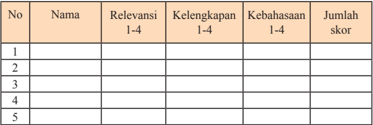

Tabel ini menunjukkan data tentang relevansi, kelengkapan, kebahasaan, dan jumlah skor untuk lima individu. Topik utama tabel ini adalah evaluasi kinerja atau penilaian individu berdasarkan empat faktor tersebut. Kolom-kolomnya mencakup nomor urut (No), nama individu, relevansi (Relevansi 1-4), kelengkapan (Kelengkapan 1-4), kebahasaan (Kebahasaan 1-4), dan jumlah skor. Data penting yang terlihat adalah bahwa setiap individu memiliki nilai yang berbeda-beda dalam empat faktor tersebut, menunjukkan variasi dalam kinerja mereka.

### Keterangan:

- Kegiatan  mengamati  dalam  hal  ini  dipahami  sebagai  cara  siswa mengumpulkan informasi faktual dengan memanfaatkan indra penglihat,  pembau,  pendengar,  pengecap,  dan  peraba.  Maka  secara keseluruhan yang dinilai adalah HASIL pengamatan (berupa informasi) dan CARA mengamati.

 

---
## 📄 Halaman 106

- Relevansi, kelengkapan, dan kebahasaan diperlakukan sebagai indikator penilaian kegiatan  mengamati.
- Relevansi  merujuk  pada  ketepatan  atau  keterhubungan  fakta  yang diamati dengan informasi yang dibutuhkan untuk mencapai tujuan Kompetensi Dasar/Indikator Pembelajaran  (TP).
- Kelengkapan  dalam  arti  semakin  banyak  komponen  fakta  yang terliput atau semakin sedikit sisa (residu) fakta yang tertinggal.
- Kebahasaan menunjukkan bagaimana siswa mendeskripsikan faktafakta yang dikumpulkan dalam bahasa tulis yang efektif (tata  kata atau tata kalimat yang benar dan mudah dipahami).
- Skor rentang antara  1 - 4
- 1 = Kurang
- 2 = Cukup
- 3 = Baik
- 4 = Amat Baik

### 2. Penilaian  Kegiatan Diskusi Kelompok

---
**📊 Tabel**

Tabel ini menunjukkan hasil evaluasi partisipan dalam sebuah kegiatan interaktif yang melibatkan komunikasi, mendengarkan, berargumentasi, dan berkontribusi. Topik utama tabel adalah partisipan dalam kegiatan tersebut. Kolom-kolomnya mencakup nomor partisipan (No.), nama partisipan (Nama), dan skor yang diberikan untuk setiap aspek kegiatan. Data penting yang terlihat adalah bahwa semua partisipan memiliki skor yang sama, yaitu 100%, menunjukkan bahwa mereka berhasil memenuhi semua aspek kegiatan tersebut. Ini menunjukkan bahwa kegiatan tersebut efektif dalam meningkatkan keterampilan komunikasi, mendengarkan, berargumentasi, dan berkontribusi.

### Nilai = jumlah skor dibagi 4

### Keterangan:

- Keterampilan  mengomunikasikan  adalah  kemampuan  siswa    untuk mengungkapkan atau menyampaikan ide atau gagasan dengan bahasa lisan yang efektif.

 

---
## 📄 Halaman 107

- Keterampilan  mendengarkan  dipahami  sebagai  kemampuan  siswa untuk  tidak  menyela,    memotong,  atau    menginterupsi  pembicaraan seseorang ketika sedang mengungkapkan gagasannya.
- Kemampuan berargumentasi menunjukkan kemampuan siswa dalam mengemukakan  argumentasi  logis  ketika  ada  pihak  yang    bertanya atau mempertanyakan gagasannya.
- Kemampuan  berkontribusi  dimaksudkan  sebagai  kemampuan  siswa memberikan  gagasan-gagasan  yang  mendukung  atau  mengarah  ke penarikan  kesimpulan  termasuk  di  dalamnya  menghargai  perbedaan pendapat.
- Skor rentang antara 1 - 4
- 1 = Kurang
- 2 = Cukup
- 3 = Baik
- 4 = Amat Baik.

### 3. Penilaian  Presentasi

---
**📊 Tabel**

Tabel ini menunjukkan hasil evaluasi keterampilan berpikir kritis dan visualisasi seseorang dalam menjelaskan konsep matematika dasar. Kolom-kolomnya mencakup nama individu, kemampuan menjelaskan konsep 1-4, kemampuan memvisualisasikan konsep 1-4, kemampuan merespons konsep 1-4, dan jumlah skor. Topik utama tabel adalah keterampilan berpikir kritis dan visualisasi matematika. Data penting yang terlihat adalah bahwa setiap individu memiliki skor yang berbeda-beda dalam setiap kategori, menunjukkan variasi dalam kemampuan mereka dalam berpikir kritis dan visualisasi.

Nilai = Jumlah skor dibagi 3

### Keterangan:

- Keterampilan  menjelaskan  adalah  kemampuan  menyampaikan  hasil observasi dan diskusi secara meyakinkan.
- Keterampilan memvisualisasikan berkaitan dengan kemampuan siswa untuk membuat atau mengemas informasi seunik mungkin, semenarik mungkin,  atau sekreatif mungkin.

 

---
## 📄 Halaman 108

- Keterampilan  merespons  adalah  kemampuan  siswa  menyampaikan tanggapan atas pertanyaan, bantahan, dan sanggahan dari pihak lain secara empati.
- Skor rentang antara 1 - 4
- 1 = Kurang
- 2 = Cukup
- 3 = Baik
- 4 = Amat Baik

### Pembelajaran Ketujuh  (90 Menit):

### 'Teladan Para Tokoh Persatuan'

### A.   Pengantar

Dalam pertemuan  ini  guru  dapat    mengangkat  keteladanan  para  tokoh yang telah berjuang dalam menghadapi ancaman disintegrasi bangsa. Mereka adalah orang-orang yang tak kenal lelah dan rela mengorbankan diri dan materi demi mewujudkan persatuan dan kesatuan bangsa. Mereka juga memimpin dan melakukan perjuangan bersenjata atau perjuangan politik atau perjuangan dalam  bidang  lainnya  untuk  mencapai/merebut/mempertahankan/mengisi kemerdekaan. Mereka berasal dari berbagai  kalangan, berbagai daerah, dari golongan militer, sipil, bangsawan atau rakyat biasa. Keteladanan semacam inilah  yang  para  siswa  harus  dapat  memaknainya.  Siswa  juga  harus  tahu bahwa para pahlawan yang dimaksud bukan saja nama-nama yang selama ini familiar mereka  dengar. Karenanya, guru perlu juga mengajak siswa untuk dapat  mengetahui siapa saja mereka itu, termasuk para pahlawan yang berasal dari daerah lingkungan sekitar tempat tinggal siswa.

### B.   Indikator

Melalui kegiatan pembelajaran ini, siswa mampu:

- 3.2.1.  Menjelaskan  kriteria  seseorang  bisa  dikatakan  sebagai  pahlawan nasional.
- 3.2.2.  Menganalisis  keteladanan  para  tokoh  yang  telah  berjasa  dalam menghadapi ancaman disintegrasi bangsa.

 

---
## 📄 Halaman 109

- 3.2.3. Melakukan presentasi mengenai keteladanan para tokoh yang telah berjasa dalam menghadapi ancaman disintegrasi bangsa.

### C.   Materi Pembelajaran

- Teladan pahlawan nasional dari daerah (Papua): Frans Kaisiepo,  Silas Papare, dan Marthen Indey.
- Teladan  kepahlawanan  yang  berasal  dari  kalangan  bangsawan/raja: Sultan Hamengkubuwono IX dan Sultan Syarif Kasim II.
- Keteladanan pahlawan di bidang seni dan sastra: Ismail Marzuki.
- Teladan kepahlawanan perempuan pejuang: Daeng Risaju.

### D.   Metode dan Langkah-Langkah Pembelajaran

- Model: Jigsaw (Model Tim Ahli)
- Pendekatan: scientiic ,  dengan  langkah-langkah:  mengamati,  menanya, mengeksplorasi, mengasosiasi, dan mengomunikasikan.

### KEGIATAN PEMBELAJARAN

### 1. Kegiatan Pendahuluan (15 Menit)

- Guru  mempersiapkan kelas agar lebih kondusif untuk proses belajar mengajar  (kerapian  dan  kebersihan  ruang  kelas,  presensi/absensi, menyiapkan media dan alat serta buku yang diperlukan).
- Guru menyampaikan topik tentang 'Teladan Para Tokoh Persatuan'.
- Guru memberikan motivasi dan mengajak bersyukur bahwa Indonesia adalah  bangsa  yang  merdeka  serta  menekankan  pentingnya  menghormati jasa para pahlawan yang telah  mengorbankan jiwa raga bagi tercapainya kemerdekaan itu.

### 2. Kegiatan Inti (60 Menit)

- Guru menyampaikan kompetensi yang ingin dicapai.
- Siswa dibagi ke dalam kelompok, masing-masing 7 orang.
- Tiap  orang  dalam  tim  diberi  materi  mengenai  tokoh  pahlawan  yang berbeda: Frans Kaisiepo, Silas Papare, Marthen Indey, Sultan Hamengkubuwono  IX, Sultan Syarif Kasim II, Ismail Marzuki, dan Opu Daeng Risaju.

 

---
## 📄 Halaman 110

- Tiap  orang  dalam  tim  mempelajari  dan  mencari  informasi  tentang keteladanan tokoh pahlawan yang didapatnya, termasuk kriteria yang menjadikan tokoh tersebut layak dijadikan pahlawan. Informasi bisa diperoleh dari buku paket, internet, dan buku-buku perpustakaan atau hand out yang telah disiapkan guru.
- Anggota dari tim yang berbeda yang telah mempelajari tokoh pahlawan yang  sama  bertemu  dalam  kelompok  baru  (kelompok  ahli)  untuk bertukar pikiran mengenai materi mereka.
- Setelah  selesai  diskusi  sebagai  tim  ahli  tiap  anggota  kembali  ke kelompok asal dan bergantian mengajar teman satu tim mereka tentang keteladanan  tokoh  pahlawan  yang  mereka  kuasai  dan  tiap  anggota lainnya mendengarkan dengan sungguh-sungguh.
- Tiap tim ahli mempresentasikan hasil diskusi.
- Guru memberi evaluasi.

### 3. Kegiatan Penutup (15 Menit)

- Siswa dibantu oleh guru menyimpulkan materi tentang 'Teladan Para Tokoh Persatuan'.
- Siswa  melakukan  releksi  tentang  pelaksanaan  pembelajaran  dan pelajaran  apa  yang  diperoleh  setelah  belajar  tentang  topik  'Teladan Para Tokoh Persatuan'.
- Guru  sekali  lagi  menegaskan  agar  para  siswa  dapat  memaknai keteladanan    para    tokoh    pahlawan    yang    telah    berkorban    demi persatuan Indonesia.
- Guru  melakukan  evaluasi  untuk  mengukur  ketercapaian  Indikator Pembelajaran, misalnya dengan mengajukan pertanyaan:
- 1). Jelaskan, kriteria yang menjadikan seseorang bisa dianugerahi gelar pahlawan nasional!
- 2.) Jelaskan  pengorbanan  yang  telah  dilakukan  oleh  Sultan  Syarif Kasim II dalam upaya mempertahankan keutuhan Republik Indonesia!
- 3).Bagaimana upaya yang dilakukan oleh Frans Kaisiepo, Silas Papare, dan Marthen  Indey dalam mengembalikan Irian (Papua) ke pangkuan Republik Indonesia?

 

---
## 📄 Halaman 111

- 4).  Bagaimana  upaya  yang  dilakukan  oleh  Ismail  Marzuki  dalam menghadapi ancaman disintegrasi  bangsa, melalui kapasitasnya sebagai seorang komponis?

### Tugas

Membagi  siswa  ke  dalam  kelompok  yang  terdiri  atas  4  orang  untuk mencari informasi  mengenai:

- Kriteria seseorang bisa dikatakan sebagai pahlawan nasional
- Pahlawan  atau  tokoh  yang  telah  berjuang  menghadapi  ancaman disintegrasi bangsa, di daerah mereka.
Tokoh-tokoh  tersebut  bisa  dibagi  ke  dalam  beberapa  kategori,  seperti seni,  sastra,  tentara,  tokoh  pemerintahan,  rakyat  biasa,  bangsawan,  dan lain-lain  agar    tidak  terjadi  penumpukan  kajian  pada  seorang  tokoh. Informasi  dapat  diperoleh  melalui  studi  kepustakaan  atau  wawancara. Hasil  pencarian  informasi  dibawa  pada  pertemuan  berikutnya,  untuk didiskusikan dan dipresentasikan dalam  bentuk alat peraga/ powerpoint / atau makalah.

### E. Penilaian  Hasil Belajar

Penilaian  dilakukan  menggunakan  penilaian  autentik  yang  meliputi penilaian  sikap,  pengetahuan,  dan  keterampilan.  Format  penilaian  sebagai berikut:

### 1. Penilaian  Keterampilan

Penilaian untuk kegiatan mempelajari dan mencari informasi tentang tokoh atau  pahlawan  yang  berjuang  dalam  menghadapi  ancaman  disintegrasi bangsa.

---
**📊 Tabel**

Tabel ini menunjukkan data tentang relevansi, kelengkapan, kebahasaan, dan jumlah skor untuk lima individu. Topik utama tabel adalah evaluasi kemampuan berkomunikasi dalam berbagai aspek. Kolom-kolomnya mencakup nama individu, relevansi (dari 1-4), kelengkapan (dari 1-4), kebahasaan (dari 1-4), dan jumlah skor. Data penting yang terlihat adalah bahwa setiap individu memiliki skor yang berbeda-beda dalam setiap aspek, menunjukkan variasi dalam kemampuan mereka dalam berkomunikasi.

Nilai = Jumlah skor dibagi 3

 

---
## 📄 Halaman 112

### Keterangan:

- Kegiatan mengamati dalam hal ini dipahami sebagai cara siswa  mengum  pulkan informasi faktual dengan memanfaatkan indra penglihat, pembau, pendengar, pengecap, dan peraba. Maka secara keseluruhan yang dinilai adalah HASIL pengamatan (berupa informasi) dan CARA mengamati.
- Relevansi, kelengkapan, dan kebahasaan diperlakukan sebagai indikator penilaian kegiatan  mengamati.
- Relevansi  merujuk  pada  ketepatan  atau  keterhubungan  fakta  yang diamati dengan informasi yang dibutuhkan untuk mencapai tujuan Kompetensi Dasar/Indikator Pembelajaran.
- Kelengkapan  dalam  arti  semakin  banyak  komponen  fakta  yang terliput atau semakin sedikit sisa (residu) fakta yang tertinggal.
- Kebahasaan menunjukkan bagaimana siswa mendeskripsikan faktafakta yang  dikumpulkan  dalam  bahasa  tulis  yang  efektif  (tata kata  atau tata  kalimat  yang  benar  dan mudah dipahami).
- Skor rentang antara 1 - 4
- 1 = Kurang
- 2 = Cukup
- 3 = Baik
- 4 = Amat Baik

### 2. Penilaian  Kegiatan Diskusi Kelompok

---
**📊 Tabel**

Tabel ini berisi informasi tentang partisipan dalam sebuah studi interaksi sosial, dimana mereka diberikan tugas-tugas tertentu untuk mengevaluasi bagaimana mereka berinteraksi satu sama lain. Topik utama tabel adalah evaluasi interaksi sosial, dengan kolom-kolom yang mencakup nama partisipan, tingkat komunikasi mereka (1-4), tingkat mendengarkan (1-4), tingkat berargumentasi (1-4), dan tingkat berkontribusi (1-4). Data penting yang terlihat adalah bahwa setiap partisipan memiliki skor yang berbeda-beda dalam setiap kategori, menunjukkan variasi dalam cara mereka berinteraksi.

Nilai = jumlah skor dibagi 4

 

---
## 📄 Halaman 113

### Keterangan:

- Keterampilan  mengomunikasikan  adalah  kemampuan  siswa  untuk mengungkapkan atau menyampaikan ide atau gagasan dengan bahasa lisan yang efektif.
- Keterampilan  mendengarkan  dipahami  sebagai  kemampuan  siswa untuk  tidak  menyela,    memotong,  atau    menginterupsi  pembicaraan seseorang ketika sedang mengungkapkan gagasannya.
- Kemampuan berargumentasi menunjukkan kemampuan siswa dalam mengemukakan  argumentasi  logis  ketika  ada  pihak  yang    bertanya atau mempertanyakan gagasannya.
- Kemampuan  berkontribusi  dimaksudkan  sebagai  kemampuan  siswa memberikan  gagasan-gagasan  yang    mendukung  atau  mengarah  ke penarikan  kesimpulan  termasuk  di  dalamnya  menghargai  perbedaan pendapat.
- Skor rentang antara 1 - 4
- 1 = Kurang
- 2 = Cukup
- 3 = Baik
- 4 = Amat Baik.

### 3. Penilaian Presentasi

---
**📊 Tabel**

Tabel ini menunjukkan hasil evaluasi keterampilan visualisasi data untuk lima orang peserta. Kolom-kolomnya mencakup nama peserta, penjelasan mereka tentang visualisasi data, visualisasi data mereka sendiri, dan respons mereka terhadap pertanyaan 1-4. Data penting yang terlihat adalah bahwa semua peserta memiliki pengetahuan dasar tentang visualisasi data, namun hanya beberapa yang mampu membuat visualisasi mereka sendiri dan menjawab pertanyaan dengan baik.

Nilai = Jumlah skor dibagi 3

 

---
## 📄 Halaman 114

### Keterangan:

- Keterampilan  menjelaskan  adalah  kemampuan  menyampaikan  hasil observasi dan diskusi secara meyakinkan.
- Keterampilan memvisualisasikan berkaitan dengan kemampuan  siswa untuk membuat atau mengemas informasi seunik mungkin, semenarik mungkin,  atau sekreatif mungkin.
- Keterampilan  merespons  adalah  kemampuan  siswa  menyampaikan tanggapan atas pertanyaan, bantahan, dan sanggahan dari pihak lain secara empati.
- Skor rentang antara 1 - 4
- 1 = Kurang
- 2 = Cukup
- 3 = Baik
- 4 = Amat Baik

### Pembelajaran Kedelapan  (90 Menit):

### 'Teladan Para Tokoh Persatuan'

### A.   Pengantar

Dalam pertemuan ini guru masih  mengangkat keteladanan para tokoh yang telah berjuang dalam menghadapi ancaman disintegrasi bangsa. Namun tokoh-tokoh yang diangkat dalam pembelajaran ini adalah tokoh-tokoh yang berasal dari daerah siswa sendiri. Mereka bisa berasal dari berbagai kalangan, dari  golongan  militer,  sipil,  bangsawan  atau  rakyat  biasa.  Keteladanan semacam inilah yang para siswa harus terus dapat memaknainya agar persatuan Indonesia tetap terjaga.

### B.   Indikator

Melalui kegiatan pembelajaran ini, siswa mampu:

- 3.2.4. Mengategorikan para tokoh daerah asal siswa yang telah  berjuang dalam  menghadapi  ancaman  disintegrasi  bangsa,  sesuai  bidang masing-masing tokoh.

 

---
## 📄 Halaman 115

- 3.2.5.  Menjelaskan  tentang  para  tokoh  daerah  asal  siswa  yang  telah berjuang dalam menghadapi ancaman disintegrasi bangsa.
- 3.2.6. Menjelaskan keteladanan para tokoh daerah asal siswa yang telah berjasa dalam menghadapi ancaman disintegrasi bangsa.

### C.   Materi Pembelajaran

- Teladan pahlawan nasional dari daerah atau tokoh daerah yang telah berjasa berjuang dalam menghadapi ancaman disintegrasi bangsa.

### D.   Metode dan Langkah-Langkah Pembelajaran

- Model: Presentasi
- Pendekatan: scientiic , dengan langkah-langkah: mengamati,  menanya, mengeksplorasi, mengasosiasi, dan mengomunikasikan.

### KEGIATAN PEMBELAJARAN

### 1. Kegiatan Pendahuluan (15 Menit)

- Guru mempersiapkan kelas agar  lebih kondusif untuk proses belajar mengajar  (kerapian  dan  kebersihan  ruang  kelas,  presensi/absensi, menyiapkan media dan alat serta buku yang diperlukan).
- Guru kembali menyampaikan topik tentang tokoh yang telah berjuang dalam  menghadapi  ancaman  disintegrasi  bangsa  yang  di  antaranya berasal dari daerah siswa sendiri.
- Guru  mengecek hasil tugas mencari informasi pahlawan daerah asal siswa yang telah diberikan pada pertemuan pembelajaran sebelumnya dalam bentuk alat peraga/ powerpoint / makalah.
- Guru kembali memberikan motivasi dan mengajak bersyukur bahwa Indonesia adalah bangsa yang merdeka serta menekankan pentingnya menghormati jasa para pahlawan yang telah mengorbankan  jiwa raga bagi tercapainya kemerdekaan itu.

 

---
## 📄 Halaman 116

### 2. Kegiatan Inti (60 Menit)

- Guru menyampaikan kompetensi yang ingin dicapai.
- Siswa dikelompokkan ke dalam kelompok-kelompok yang telah dibuat pada pertemuan sebelumnya.
- Setiap kelompok  secara  bergantian melakukan  presentasi, siswa kelompok lain mendengarkan.
- Peserta    didik    dari    kelompok    lain    memberikan    tanggapan    atau mengajukan pertanyaan.
- Setelah semua kelompok melakukan presentasi, guru memberi evaluasi.
- Bersama siswa, guru mengambil kesimpulan.

### 3. Kegiatan Penutup (15 Menit)

- Siswa  dibantu  oleh  guru  menyimpulkan  materi  tentang  'Teladan para  tokoh  daerah  yang  telah  berjuang  dalam  menghadapi  ancaman disintegrasi bangsa'.
- Siswa  melakukan  releksi  tentang  pelaksanaan  pembelajaran  dan pelajaran apa yang diperoleh setelah belajar tentang  topik 'Teladan para  tokoh  daerah  yang  telah  berjuang  dalam  menghadapi  ancaman disintegrasi bangsa'.
- Guru    sekali    lagi    menegaskan  para  siswa  agar    dapat    memaknai keteladanan para tokoh pahlawan yang telah  berkorban  demi  persatuan Indonesia.
- Guru melakukan evaluasi untuk mengukur ketercapaian Indikator Pembelajaran, misalnya dengan mengajukan pertanyaan:
- 1). Jelaskan persamaan dan perbedaan antara tokoh-tokoh daerah dari berbagai  kalangan  atau  bidang,  dalam  cara  perjuangan  mereka menghadapi ancaman disintegrasi bangsa!
- 2). Jelaskan makna kepahlawanan yang didapat dari tokoh-tokoh daerah yang telah berjuang dalam menghadapi ancaman disintegrasi bangsa tersebut!

### E.   Penilaian  Hasil Belajar

Penilaian  dilakukan  menggunakan  penilaian  autentik  yang  meliputi penilaian  sikap,  pengetahuan,  dan  keterampilan.  Format  penilaian  sebagai berikut:

 

---
## 📄 Halaman 117

### 1. Penilaian Presentasi

---
**📊 Tabel**

Tabel ini menunjukkan data tentang penilaian kinerja siswa dalam beberapa aspek, yaitu menjelaskan konsep 1-4, memvisualisasikan konsep 1-4, merespons konsep 1-4, dan jumlah skor keseluruhan. Topik utama tabel ini adalah penilaian kinerja siswa dalam mengaplikasikan konsep matematika. Kolom-kolom yang ada mencakup nama siswa, menjelaskan konsep 1-4, memvisualisasikan konsep 1-4, merespons konsep 1-4, dan jumlah skor keseluruhan. Data penting yang terlihat adalah bahwa setiap siswa memiliki satu baris di tabel, dan mereka diberi skor tertentu untuk setiap aspek penilaian. Selain itu, tabel ini juga menunjukkan bahwa setiap siswa memiliki skor yang berbeda-beda dalam setiap aspek penilaian, yang menunjukkan bahwa penilaian ini dilakukan secara individu dan tidak hanya melibatkan skor keseluruhan.

Nilai = Jumlah skor dibagi 3

### Keterangan:

- Keterampilan  menjelaskan  adalah  kemampuan  menyampaikan  hasil observasi dan diskusi secara meyakinkan.
- Keterampilan  memvisualisasikan berkaitan dengan kemampuan siswa untuk membuat atau mengemas informasi seunik mungkin, semenarik mungkin, atau sekreatif mungkin.
- Keterampilan  merespons  adalah  kemampuan  siswa  menyampaikan tanggapan atas pertanyaan, bantahan, dan sanggahan dari pihak lain secara empati.
- Skor rentang antara 1 - 4
- 1 = Kurang
- 2 = Cukup
- 3 = Baik
- 4 = Amat Baik.

 

---
## 📄 Halaman 118

### BAB II

### Sistem dan Struktur Politik dan Ekonomi Indonesia Masa Demokrasi Parlementer (1950-1959)

### Kompetensi Dasar

- KD 3.3 Menganalisis perkembangan kehidupan politik dan ekonomi  bangsa Indonesia pada masa awal Kemerdekaan sampai masa Demokrasi Liberal.
- KD 4.3 Merekonstruksi  perkembangan  kehidupan  politik  dan  ekonomi bangsa Indonesia   pada  masa  awal Kemerdekaan sampai masa Demokrasi Liberal.

### Pembelajaran Kesembilan (90 Menit):

### 'Perkembangan Politik: Sistem Pemerintahan'

### A.   Pengantar

Masa Demokrasi Parlementer merupakan masa yang sarat dengan dinamika dalam sistem pemerintahan. Dalam waktu tak sampai 10 tahun, terdapat 7 kabinet yang saling berganti. Di sini guru penting untuk menekankan pada siswa  bahwa  inilah  masa  di  mana  Indonesia  tengah  belajar  berdemokrasi. Apalagi  masa  ini    lahir  setelah  berakhirnya  perang  kemerdekaan  melawan kolonial Belanda, yang tentu saja menghabiskan banyak tenaga dan pikiran bangsa. Guru hendaknya mengajak siswa untuk mensyukuri bahwa dengan saratnya dinamika yang ada sekalipun, negara Indonesia tetap  tegak berdiri hingga sekarang.

 

---
## 📄 Halaman 119

### B.    Indikator

Melalui kegiatan pembelajaran ini, siswa mampu:

- 3.3.1.  Menganalisis dinamika perkembangan kabinet yang berlangsung selama masa Demokrasi Parlementer 1950-1959.
- 3.3.2. Melakukan presentasi hasil diskusi mengenai dinamika perkembangan kabinet yang berlangsung selama masa Demokrasi Parlementer 1950-1959 berupa handou t/alat peraga/makalah/ powerpoint.

### C.    Materi Pembelajaran

- Sistem pemerintahan pada masa Demokrasi Parlementer 1950-1959

### D.   Metode dan Langkah-Langkah Pembelajaran

- Model: Diskusi kelompok
- Pendekatan: scientiic ,  dengan langkah-langkah:  mengamati,  menanya, mengeksplorasi, mengasosiasi, dan mengomunikasikan.

### KEGIATAN PEMBELAJARAN

### 1. Kegiatan Pendahuluan (15 Menit)

- Guru  mempersiapkan kelas agar lebih kondusif untuk proses belajar mengajar  (kerapian  dan  kebersihan  ruang  kelas,  presensi/absensi, menyiapkan media dan alat serta buku yang diperlukan).
- Guru  kembali  menyampaikan  topik  tentang  Perkembangan  Politik Masa Demokrasi Liberal/Parlementer.
- Guru kembali memberikan  motivasi kepada siswa untuk tetap semangat belajar.
- Guru membagi kelas menjadi 5 kelompok siswa.

### 2. Kegiatan Inti (60 Menit)

- Guru  menegaskan  kembali  tentang  topik  pembelajaran  dan  menyampaikan kompetensi yang akan dicapai.
- Guru memberi penjelasan singkat mengenai masa Demokrasi Parlementer.

 

---
## 📄 Halaman 120

- Guru  mendorong  siswa  untuk  mengajukan  pertanyaan-pertanyaan yang terkait dengan penjelasan singkat yang diberikan.
- Setiap  kelompok  mendapatkan  tugas  melakukan  eksplorasi  melalui diskusi kelompok sehingga menemukan rumusan dari masing-masing tugas  yang diberikan:
- Kelompok 1 bertugas mendiskusikan tentang Kabinet Natsir.
- Kelompok 2 bertugas mendiskusikan tentang Kabinet Sukiman.
- Kelompok 3 bertugas mendiskusikan tentang Kabinet Wilopo.
- Kelompok 4 bertugas mendiskusikan tentang Kabinet Ali Sastroamidjoyo I.
- Kelompok 5 bertugas mendiskusikan  tentang Kabinet Burhanuddin Harahap.
- Kelompok 6 bertugas mendiskusikan tentang Kabinet Ali Sastroamidjoyo II.
- Kelompok 7 bertugas mendiskusikan tentang Kabinet Juanda.
- Dari eksplorasi yang dilakukan, masing-masing kelompok membuat hand out /alat peraga/makalah/ powerpoint.

### 3. Kegiatan Penutup (15 Menit)

- Siswa  dibantu  oleh  guru  menyimpulkan  materi  tentang  'Sistem Pemerintahan pada masa Demokrasi Parlementer 1950-1959, termasuk perbandingannya dengan sistem pemerintahan masa sekarang.
- Siswa  melakukan  releksi  tentang  pelaksanaan  pembelajaran  dan pelajaran  apa  yang  diperoleh  setelah  belajar  tentang  'Dinamika perkembangan  kabinet  yang  berlangsung  selama  masa  Demokrasi Parlementer 1950-1959'.
- Guru  melakukan  evaluasi  untuk  mengukur  ketercapaian  Indikator Pembelajaran, misalnya:
- 1).  Jelaskan kasus yang menjadi penyebab jatuhnya Kabinet Sukiman!
- 2).  Apa  yang  menjadi  penyebab  sering  bergantinya  Kabinet  pada masa Demokrasi Parlementer? Jelaskan!
- 3).  Jelaskan proses berakhirnya Kabinet Ali Sastroamidjoyo I  dan proses lahirnya Kabinet Ali Sastroamidjoyo II!

 

---
## 📄 Halaman 121

### Tugas:

- Siswa  diberi  tugas  untuk  membuat mind mapping mengenai  sistem pemerintahan pada masa Demokrasi Parlementer.

### E.    Penilaian  Hasil Belajar

Penilaian  dilakukan  menggunakan  penilaian  autentik  yang  meliputi penilaian  sikap,  pengetahuan,  dan  keterampilan.  Format  penilaian  sebagai berikut:

### 1. Penilaian  Pengetahuan

---
**📊 Tabel**

Tabel ini berisi informasi tentang butir instrumen yang digunakan dalam proses pembelajaran. Kolom pertama menunjukkan nomor urut dari instrumen tersebut, sementara kolom kedua menyajikan deskripsi atau penjelasan tentang fungsi dan tujuan setiap instrumen tersebut. Dari tabel ini, dapat dilihat bahwa instrumen memiliki peran penting dalam memfasilitasi proses belajar, baik itu untuk memberikan informasi, mendukung aktivitas belajar, atau sebagai alat evaluasi. Topik utama tabel ini adalah penggunaan instrumen dalam pendidikan, dengan fokus pada deskripsi dan fungsi setiap instrumen yang disediakan.

Nilai = Jumlah skor

### 2.   Penilaian  Keterampilan

Penilaian untuk kegiatan membuat mind mapping (peta konsep)

---
**📊 Tabel**

Tabel ini menunjukkan data tentang relevansi, kelengkapan, kebahasaan, dan jumlah skor untuk lima individu. Topik utama tabel adalah evaluasi kemampuan berkomunikasi dalam berbagai aspek. Kolom-kolomnya mencakup nama individu, relevansi (dari 1-4), kelengkapan (dari 1-4), kebahasaan (dari 1-4), dan jumlah skor. Data penting yang terlihat adalah bahwa setiap individu memiliki skor yang berbeda-beda dalam setiap aspek, menunjukkan variasi dalam kemampuan mereka dalam berkomunikasi.

Nilai = Jumlah skor dibagi 3

### Keterangan:

- Kegiatan  mengamati  dalam  hal  ini  dipahami  sebagai  cara  siswa mengumpulkan informasi faktual dengan memanfaatkan indra penglihat,  pembau,  pendengar,  pengecap,  dan  peraba.  Maka  secara keseluruhan yang dinilai adalah HASIL pengamatan (berupa informasi) bukan CARA mengamati.

 

---
## 📄 Halaman 122

- Relevansi, kelengkapan, dan kebahasaan diperlakukan sebagai indikator penilaian kegiatan  mengamati.
- Relevansi  merujuk  pada  ketepatan  atau  keterhubungan  fakta  yang diamati dengan  informasi  yang  dibutuhkan  untuk  mencapai tujuan Kompetensi Dasar/Indikator Pembelajaran  (TP).
- Kelengkapan  dalam  arti  semakin  banyak  komponen  fakta  yang terliput atau semakin sedikit sisa (residu) fakta yang tertinggal.
- Kebahasaan menunjukkan bagaimana siswa mendeskripsikan faktafakta  yang  dikumpulkan  dalam  bahasa  tulis  yang  efektif  (tata  kata atau tata kalimat yang benar dan mudah dipahami).
- Skor rentang antara 1 - 4
- 1 = Kurang
- 2 = Cukup
- 3 = Baik
- 4 = Amat Baik

### Pembelajaran Kesepuluh  (90 Menit):

### 'Perkembangan Politik: Sistem Kepartaian'

### A.   Pengantar

Masa  Demokrasi  Parlementer  merupakan  masa  yang  diwarnai  dengan berdirinya banyak partai, dengan dasar ideologi yang beragam. Di sini guru penting untuk menekankan pada siswa bahwa meskipun sistem multipartai demokrasi parlementer ini berakibat pada tingginya dinamika yang terjadi, namun  dalam  pembelajaran  demokrasi  yang  pertama  bagi  Republik  ini, semua  partai  telah  menunjukkan  semangat  yang  kuat  untuk  bersama-sama membangun demokrasi di  Indonesia. Maka dalam  konteks dunia kini dimana demokrasi  seakan  menjadi  suatu  keharusan,  Indonesia  nyatanya  pernah menjalani kehidupan berdemokrasi tersebut jauh pada masa sebelumnya. Para siswa seharusnya bangga dengan hal tersebut.

 

---
## 📄 Halaman 123

### B.   Indikator Pembelajaran

Melalui kegiatan pembelajaran ini, siswa mampu:

- 3.3.3.  Menjelaskan perkembangan sistem kepartaian yang berlangsung selama masa Demokrasi Parlementer 1950-1959.
- 3.3.4. Membandingkan sistem kepartaian pada masa Demokrasi Parlementer  1950-1959  dengan  sistem  pemerintahan  pada  masa sekarang.

### C.   Materi Pembelajaran

- Sistem kepartaian pada masa Demokrasi Parlementer 1950-1959

### D.   Metode dan Langkah-Langkah Pembelajaran

- Model: Picture and Picture
- Pendekatan: scientiic , dengan langkah-langkah: mengamati, menanya, mengeksplorasi, mengasosiasikan, dan mengomunikasikan.

### KEGIATAN PEMBELAJARAN

### 1. Kegiatan Pendahuluan (15 Menit)

- Guru mempersiapkan kelas agar lebih kondusif untuk proses belajar mengajar  (kerapian  dan  kebersihan  ruang  kelas,  presensi/absensi, menyiapkan media dan alat serta buku yang diperlukan).
- Guru  menyampaikan  topik  tentang  sistem  kepartaian  pada  masa Demokrasi Liberal dan menyampaikan kompetensi yang akan dicapai.
- Guru  memberikan  motivasi  kepada  siswa  untuk  tetap  semangat belajar.

### 2. Kegiatan Inti (60 Menit)

- Guru menyajikan materi sebagai pengantar.
- Guru menunjukkan/memperlihatkan gambar-gambar lambang partai pada  tahun  1950-an  dengan  gambar-gambar  lambang  partai  masa sekarang secara acak.
- Guru menunjuk/memanggil siswa secara bergantian untuk memilih mana lambang partai yang terdapat pada periode 1950-an dan nama lambang partai pada masa sekarang.

 

---
## 📄 Halaman 124

- Guru menanyakan alasan pemilihan gambar tersebut dan apa yang siswa ketahui tentang gambar yang dipilihnya.
- Dari alasan dan pilihan gambar tersebut guru memulai menanamkan konsep/materi sesuai dengan kompetensi yang ingin dicapai.
- Kesimpulan/rangkuman.

### 3. Kegiatan Penutup (15 Menit)

- Siswa dibantu oleh guru menyimpulkan  materi  tentang sistem kepartaian  pada  masa  Demokrasi  Parlementer  1950-1959,  termasuk perbandingannya dengan sistem kepartaian masa sekarang.
- Siswa  melakukan  releksi  tentang  pelaksanaan  pembelajaran  dan pelajaran apa yang diperoleh setelah belajar tentang sistem kepartaian pada masa Demokrasi Parlementer 1950-1959.
- Guru  melakukan  evaluasi  untuk  mengukur  ketercapaian  Indikator Pembelajaran, misalnya:
- 1).Partai-partai  apa  sajakah  yang  tokoh-tokohnya  pernah  menjadi perdana  menteri  pada  masa  Demokrasi  Parlementer  1950-1959? Bagaimana proses terpilihnya tokoh-tokoh tersebut menjadi perdana menteri?
- 2).Ideologi apa saja yang diusung oleh partai-partai yang berkiprah pada masa Demokrasi Parlementer 1950-1959? Klasiikasikan ideologi tersebut  dengan  partai-partai  yang  ada  pada  masa  Demokrasi Parlementer!
- 3).Jelaskan perbedaan antara sistem kepartaian pada masa Demokrasi Parlementer dengan sistem kepartaian pada masa sekarang!

### Tugas:

- Siswa diberi tugas untuk membuat rangkuman tentang salah  satu partai pada  masa  Demokrasi  Liberal  1950-1959  sebanyak  satu    halaman. Seluruh  karya  siswa  dalam  satu  kelas  ini,  setelah  dinilai  oleh  guru, selanjutnya dapat dijilid/dibundel atau ditempel di mading kelas.

### E.    Penilaian  Hasil Belajar

Penilaian  dilakukan  menggunakan  penilaian  autentik  yang  meliputi penilaian  sikap,  pengetahuan,  dan  keterampilan.  Format  penilaian  sebagai berikut:

 

---
## 📄 Halaman 125

### 1. Penilaian  Pengetahuan

---
**📊 Tabel**

Tabel ini berisi informasi tentang instrumen yang digunakan dalam sebuah proses atau penelitian. Kolom pertama menunjukkan nomor instrumen, sementara kolom kedua berisi deskripsi atau butir instrumen tersebut. Topik utama tabel ini adalah tentang instrumen yang digunakan dalam suatu proses atau penelitian. Data penting yang terlihat dalam tabel ini adalah bahwa setiap instrumen memiliki nomor dan deskripsi yang spesifik. Ini membantu dalam memahami dan mengidentifikasi instrumen mana yang digunakan dalam proses tertentu.

### Nilai = Jumlah skor

### 2.   Penilaian  Keterampilan

Penilaian  untuk  kegiatan  membuat  essai  tentang  partai  pada  masa Demokrasi Parlementer 1950-1959.

---
**📊 Tabel**

Tabel ini menunjukkan data tentang relevansi, kelengkapan, kebahasaan, dan jumlah skor untuk lima individu. Topik utama tabel ini adalah evaluasi kinerja individu dalam hal relevansi, kelengkapan, kebahasaan, dan total skor. Kolom-kolomnya meliputi nomor urut (No), nama individu, relevansi (dari 1-4), kelengkapan (dari 1-4), kebahasaan (dari 1-4), dan jumlah skor. Data penting yang terlihat adalah bahwa setiap individu memiliki nilai yang berbeda-beda dalam semua aspek tersebut, dengan beberapa individu memiliki skor yang lebih tinggi dibandingkan dengan yang lain. Ini menunjukkan bahwa evaluasi kinerja individu dalam hal relevansi, kelengkapan, dan kebahasaan dapat memberikan gambaran yang lebih lengkap tentang kemampuan mereka.

### Nilai = Jumlah skor dibagi 3

### Keterangan:

- Kegiatan  mengamati  dalam  hal  ini  dipahami  sebagai  cara  siswa mengumpulkan informasi faktual dengan memanfaatkan indra penglihat,  pembau,  pendengar,  pengecap,  dan  peraba.  Maka  secara keseluruhan yang dinilai adalah HASIL pengamatan (berupa informasi) dan CARA mengamati.
- Relevansi, kelengkapan, dan kebahasaan diperlakukan sebagai indikator penilaian kegiatan  mengamati.

 

---
## 📄 Halaman 126

- Relevansi  merujuk  pada  ketepatan  atau  keterhubungan  fakta  yang diamati dengan informasi  yang  dibutuhkan  untuk  mencapai tujuan Kompetensi Dasar/Indikator Pembelajaran  (TP).
- Kelengkapan  dalam  arti  semakin  banyak  komponen  fakta  yang terliput atau semakin sedikit sisa (residu) fakta yang tertinggal.
- Kebahasaan menunjukkan bagaimana siswa mendeskripsikan faktafakta yang  dikumpulkan dalam bahasa tulis yang efektif  (tata  kata atau tata kalimat yang benar dan mudah dipahami).
- Skor rentang antara 1 - 4
- 1 = Kurang
- 2 = Cukup
- 3 = Baik
- 4 = Amat Baik

### Pembelajaran Kesebelas (90 Menit):

### 'Perkembangan Politik: Pemilu 1955'

### A.   Pengantar

Dalam  pertemuan  ini  guru  memfasilitasi  siswa    untuk    memahami pelaksanaan pemilu yang pertama di Indonesia pada tahun 1955. Di sini siswa diajak untuk bisa memaknai bahwa dalam situasi negara yang  tengah menata dirinya, pemilihan umum nyatanya bisa dilangsungkan oleh bangsa Indonesia dengan cara yang demokratis. Guru juga dapat mengaitkan pelaksanaan pemilu pertama yang demokratis ini dengan pemilu yang dilaksanakan pada masa sekarang. Melalui pembandingan  antara dua masa tersebut, siswa diharapkan dapat menalar tentang persamaan dan perbedaan pemilu antara tahun 1955 dengan  tahun-tahun  terkini.  Di  samping  itu,  guru  juga  harus  memfasilitasi siswa  agar  bersyukur  atas  karunia  Tuhan  tentang  negeri  Indonesia  yang beragam,  termasuk  keberagaman  dalam  ideologi  politik.  Siswa  juga  harus diberi pemahaman untuk saling  menghargai pilihan politik setiap individu, sadar  berpikir  kritis  dan  relektif    terhadap  pelaksanaan  pemilu,  yang  dalam hal ini, melalui pembelajaran sejarah mengenai pemilu.

 

---
## 📄 Halaman 127

### B.   Indikator

Melalui kegiatan pembelajaran ini, siswa mampu:

- 3.3.5.  Menjelaskan  hasil  pengamatan  terhadap  gambar  dan    bacaan mengenai pelaksanaan pemilu 1955.
- 3.3.6.  Menganalisis pelaksanaan pemilu 1955.

### C.   Materi Pembelajaran

- Pemilu 1955 pada masa Demokrasi Parlementer

### D.   Metode dan Langkah-Langkah Pembelajaran

- Model: Student Facilitator and Explaining (Siswa mempresentasikan ide/pendapat pada rekan siswa lainnya)
- Pendekatan: scientiic ,  dengan  langkah-langkah: mengamati,  menanya, mengeksplorasi, mengasosiasi, dan mengomunikasikan.

### KEGIATAN PEMBELAJARAN

### 1. Kegiatan Pendahuluan (15 Menit)

- Guru  mempersiapkan kelas agar lebih kondusif untuk proses belajar mengajar  (kerapian  dan  kebersihan  ruang  kelas,  presensi/absensi, menyiapkan media dan alat serta buku yang diperlukan).
- Guru menyampaikan topik tentang 'Pemilu 1955  pada  masa  Demokrasi Parlementer'.
- Guru  memberikan  motivasi  dan  mengajak  siswa  bersyukur  bahwa kehidupan politik di Indonesia kini termasuk yang paling demokratis di dunia.

### 2. Kegiatan Inti (60 Menit)

- Guru menyampaikan kompetensi yang ingin dicapai.
- Guru  meminta siswa membaca Pemilu 1955 pada masa  Demokrasi Parlementer. Dalam Buku Siswa, materi terdapat di halaman 66-70.
- Guru menayangkan tabel dan gambar yang berkaitan dengan Pemilu 1955. Dalam Buku Siswa, gambar ini terdapat pada halaman 67, 68, dan 69.

 

---
## 📄 Halaman 128

---
**📊 Tabel**

Tabel ini menunjukkan informasi tentang jumlah kursi DPR (Dewan Perwakilan Rakyat) dan Dewan Konstituante yang dipegang oleh beberapa partai politik di Indonesia. Topik utama tabel adalah partai politik dan jumlah kursi yang mereka miliki. Kolom pertama berisi nama-nama partai politik, sedangkan kolom kedua berisi jumlah kursi yang mereka miliki di DPR dan Dewan Konstituante. Data penting yang terlihat adalah bahwa Masyumi memiliki jumlah kursi terbanyak di DPR dan Dewan Konstituante, yaitu 57 kursi di DPR dan 112 kursi di Dewan Konstituante. Sementara itu, PKI memiliki jumlah kursi terendah di DPR dan Dewan Konstituante, yaitu 39 kursi di DPR dan 80 kursi di Dewan Konstituante.

Sumber: 30 Tahun Indonesia Merdeka

(Setneg, 1975)

Gambar: Pemungutan

Suara dalam Sidang Dewan

Konstituante

- Siswa diminta untuk mengamati gambar tersebut dan mengaitkannya dengan hasil bacaan mereka.
- Guru meminta siswa untuk menuliskan hasil pengamatannya.
- Memberikan  kesempatan  siswa  untuk  menjelaskan  kepada  siswa lainnya.
- Guru menyimpulkan ide/pendapat dari siswa.
- Guru  menerangkan  semua  materi  yang  disajikan  saat  itu  dan  mengaitkannya dengan Pemilu 1955 pada masa Demokrasi Parlementer, termasuk membandingkannya dengan pelaksanaan Pemilu pada masa sekarang.

### 3. Kegiatan Penutup (15 Menit)

- Peserta  didik dibantu  oleh guru  menyimpulkan materi  tentang  'Pemilu 1955 pada masa Demokrasi Parlementer'.
- Siswa  melakukan  releksi  tentang  pelaksanaan  pembelajaran    dan pelajaran yang diperoleh setelah belajar tentang topik 'Pemilu 1955 pada masa Demokrasi Parlementer'.

 

---
## 📄 Halaman 129

- Guru  melakukan  evaluasi  untuk  mengukur  ketercapaian  Indikator Pembelajaran, misalnya dengan mengajukan pertanyaan:
- 1). Tuliskan tentang empat partai besar hasil pemilu 1955!
- 2). Jelaskan, mengapa pembahasan mengenai Dasar Negara di Dewan Konstituante mengalami banyak kesulitan!
- 3). Jelaskan makna pemilu 1955 bagi tegaknya demokrasi pertama di Indonesia!

### Tugas

Siswa  diminta  untuk  membuat  essai  mengenai  perbandingan  antara Pemilu tahun 1955 dengan pemilu yang dilaksanakan sekarang.

### E.   Penilaian  Hasil Belajar

Penilaian  dilakukan  menggunakan  penilaian  autentik  yang  meliputi penilaian  sikap,  pengetahuan,  dan  keterampilan.  Format  penilaian  sebagai berikut:

### 1.   Penilaian  Keterampilan

Penilaian  untuk  kegiatan  membuat  essai  mengenai  perbandingan antara Pemilu tahun 1955 dengan pemilu yang dilaksanakan sekarang.

---
**📊 Tabel**

Tabel ini menunjukkan data tentang relevansi, kelengkapan, kebahasaan, dan jumlah skor untuk lima individu. Topik utama tabel ini adalah evaluasi kinerja atau penilaian individu berdasarkan empat faktor tersebut. Kolom-kolomnya mencakup nomor urut (No), nama individu, relevansi (Relevansi 1-4), kelengkapan (Kelengkapan 1-4), kebahasaan (Kebahasaan 1-4), dan jumlah skor. Data penting yang terlihat adalah bahwa setiap individu memiliki nilai yang berbeda-beda dalam empat faktor tersebut, menunjukkan variasi dalam kinerja mereka.

Nilai = Jumlah skor dibagi 3

### Keterangan:

- Kegiatan  mengamati  dalam  hal  ini  dipahami  sebagai  cara  siswa mengumpulkan informasi faktual dengan memanfaatkan indra penglihat,  pembau,  pendengar,  pengecap,  dan  peraba.  Maka  secara keseluruhan yang dinilai adalah HASIL pengamatan (berupa informasi) bukan CARA mengamati.

 

---
## 📄 Halaman 130

- Relevansi, kelengkapan, dan kebahasaan diperlakukan sebagai indikator penilaian kegiatan  mengamati.
- Relevansi  merujuk  pada  ketepatan  atau  keterhubungan  fakta  yang diamati dengan informasi yang dibutuhkan untuk mencapai tujuan Kompetensi Dasar/Indikator Pembelajaran  (TP).
- Kelengkapan  dalam  arti  semakin  banyak  komponen  fakta  yang terliput atau semakin sedikit sisa (residu) fakta yang tertinggal.
- Kebahasaan menunjukkan bagaimana siswa mendeskripsikan faktafakta yang dikumpulkan dalam bahasa tulis  yang efektif  (tata  kata atau tata kalimat yang benar dan mudah dipahami).
- Skor rentang antara 1 - 4
- 1 = Kurang
- 2 = Cukup
- 3 = Baik
- 4 = Amat Baik

### 2. Penilaian  Presentasi

### Keterangan:

- Keterampilan  menjelaskan  adalah  kemampuan  menyampaikan  hasil observasi dan diskusi secara meyakinkan.
- Keterampilan  memvisualisasikan berkaitan dengan kemampuan  siswa untuk membuat atau mengemas informasi seunik mungkin, semenarik mungkin, atau sekreatif mungkin.

 

---
## 📄 Halaman 131

- Keterampilan  merespons  adalah  kemampuan  siswa  menyampaikan tanggapan atas pertanyaan, bantahan, dan sanggahan dari pihak lain secara empati.
- Skor rentang antara 1 - 4
- 1 = Kurang
- 2 = Cukup
- 3 = Baik
- 4 = Amat Baik.

### Pembelajaran Keduabelas (90 Menit)

### 'Perkembangan Ekonomi: Pemikiran Ekonomi Nasional'

### A.   Pengantar

Pertemuan  minggu  keduabelas  akan  mengkaji  perkembangan  ekonomi pada masa Demokrasi Liberal, yang berhubungan dengan pemikiran mengenai ekonomi nasional  pada masa itu. Di sini, guru perlu menanamkan pemahaman kepada  para  siswa  bahwa  upaya  untuk  membangun  ekonomi  negeri  untuk kesejahteraan  rakyat  merupakan  hal  pasti  yang  dilakukan  oleh  pemerintah. Yang menarik dari perkembangan ekonomi pada masa Demokrasi Parlementer adalah,  kebijakan  pemerintah  untuk  mengubah  struktur  ekonomi  kolonial menjadi  struktur  ekonomi  nasional.  Kalaupun  kebijakan  ini  akhirnya  tidak berjalan seperti yang direncanakan, siswa hendaknya diajak untuk mengambil hikmah yang  menjadi sebab 'kegagalan' tersebut. Kenyataannya kebijakan ekonomi yang ada tentu tak bisa dilepaskan pula dari kondisi sosial politik pada masa Demokrasi Liberal yang begitu dinamis.

### B.   Indikator

Melalui kegiatan  pembelajaran ini, siswa mampu:

- 3.3.7.  Menjelaskan  pemikiran-pemikiran  mengenai  ekonomi  nasional pada masa Demokrasi Parlementer.
- 3.3.8.  Menjelaskan keterkaitan antara kebijakan ekonomi nasional pada masa Demokrasi Parlementer  dengan  sistem  pemerintahan  pada masa itu.

 

---
## 📄 Halaman 132

- 3.3.9.  Menganalisis kebijakan yang dilakukan pemerintah dalam menerapkan pemikiran-pemikiran mengenai ekonomi nasional pada masa Demokrasi Parlementer.

### C.   Materi Pembelajaran

- Kebijakan Gunting Syafruddin
- Gerakan Benteng
- Program Ali Baba
- Gerakan Asaat
Materi yang disampaikan  pada  pembelajaran  keduabelas  ini terdapat pada  Buku Siswa Bab II halaman  70-73. Guru juga dapat menggunakan buku dan bahan lain yang relevan.

### D.   Model  dan Langkah-Langkah Pembelajaran

- Model: Examples non Examples
- Pendekatan: scientiic , dengan langkah-langkah: mengamati, menanya, mengeksplorasi, mengasosiasi,  dan mengomunikasikan.

### KEGIATAN PEMBELAJARAN

- Kegiatan Pendahuluan (15 Menit)
- Guru mempersiapkan kelas agar lebih kondusif  untuk  proses belajar
- mengajar  (kerapian  dan  kebersihan  ruang kelas,  presensi/absensi,  menyiapkan  media dan alat serta buku yang diperlukan). GERAKAN
- Guru menyampaikan topik tentang 'pemikiran dan kebijakan ekonomi nasional pada masa Demokrasi Parlementer' dan kompetensi yang akan dicapai.
- Guru  membagi  kelas  menjadi  kelompokkelompok  siswa.  Masing-masing  kelompok terdiri atas 3-4 orang.

 

---
## 📄 Halaman 133

### 2. Kegiatan Inti (60 Menit)

- Guru  menayangkan  atau  menunjukkan  gambar  mata  uang  yang digunting dan tulisan Gerakan Benteng, Program Ali Baba, Gerakan
Asaat:

- Siswa diminta untuk mengamati gambar-gambar dan tulisan tersebut, guru kemudian menyampaikan pada siswa bahwa gambar dan tulisan tersebut adalah tema diskusi.
- Guru  menugaskan  masing-masing  kelompok  untuk  mendiskusikan salah  satu  tema  dari  gambar  dan  tulisan  tersebut,  yang  ditetapkan secara acak. Hasil diskusi dan analisis dicatat pada kertas.
- Tiap kelompok diberi kesempatan membacakan hasil diskusinya. Pada saat satu kelompok melakukan presentasi, kelompok yang lain dapat bertanya,  demikian sampai masing-masing mendapat giliran.
- Dimulai dari komentar/hasil diskusi siswa, guru kemudian menjelaskan materi sesuai tujuan yang ingin dicapai.
- Kesimpulan.

### 3. Kegiatan Penutup (15 Menit)

- Siswa melakukan releksi tentang pelaksanaan pembelajaran dan  pelajaran  apa  yang  diperoleh  setelah  belajar  tentang  materi 'Perkembangan Ekonomi: Pemikiran Ekonomi Nasional'.
- Guru melakukan evaluasi untuk mengukur ketercapaian tujuan pembelajaran, misalnya:

 

---
## 📄 Halaman 134

- 1).  Jelaskan,  alasan  Menteri  Keuangan,  Syafrudin  Prawiranegara, mengambil kebijakan pemotongan uang!
- 2). Jelaskan persamaan dan perbedaan antara  program  ekonomi 'Gerakan Benteng' dengan 'Program Ali Baba'!
- 3). Apa yang dimaksud dengan 'Gerakan Asaat'? Jelaskan!

### Tugas:

Siswa diberi tugas untuk membuat gambar kartun yang menggambarkan tentang  program  Gunting  Syafruddin,  Gerakan  Benteng,  program  Ali Baba,  dan  Gerakan Asaat.  Satu  siswa  mengerjakan  satu  gambar,  yang dipilih secara acak merata.

### E.   Penilaian  Hasil Belajar

Penilaian  dilakukan  menggunakan  penilaian  autentik  yang  meliputi penilaian  sikap,  pengetahuan,  dan  keterampilan.  Format  penilaian  sebagai berikut:

### 1.   Penilaian  Keterampilan

Penilaian untuk kegiatan/tugas membuat gambar kartun yang menggambarkan  tentang  program  Gunting  Syafruddin,  Gerakan  Benteng, Program  Ali  Baba, dan Gerakan Asaat.

---
**📊 Tabel**

Tabel ini menunjukkan data tentang relevansi, kelengkapan, kebahasaan, dan jumlah skor untuk lima item atau topik tertentu. Kolom "No" memberikan nomor urut untuk setiap item. Kolom "Nama" menyajikan nama atau deskripsi dari setiap item. Kolom "Relevansi 1-4" menunjukkan tingkat relevansi dari satu hingga empat, yang mungkin berarti bahwa item tersebut sangat relevan (4), relevan (3), tidak relevan (2), atau tidak relevan sama sekali (1). Kolom "Kelengkapan 1-4" menunjukkan tingkat kelengkapan dari satu hingga empat, yang mungkin berarti bahwa item tersebut sangat lengkap (4), lengkap (3), tidak lengkap (2), atau tidak lengkap sama sekali (1). Kolom "Kebahasaan 1-4" menunjukkan tingkat kebahasaan dari satu hingga empat, yang mungkin berarti bahwa item tersebut sangat bahasa (4), bahasa (3), tidak bahasa (2), atau tidak bahasa sama sekali (1). Kolom "Jumlah skor 1-4" menunjukkan total skor dari satu hingga empat untuk setiap item, yang mungkin berarti bahwa item tersebut sangat relevan dan lengkap dengan kebahasaan yang baik (4), relevan dan lengkap dengan kebahasaan yang baik (3), relevan tetapi kurang lengkap dengan kebahasaan yang baik (2), atau relevan tetapi kurang lengkap dengan kebahasaan yang baik (1). Dari tabel ini, dapat dilihat bahwa item-item yang memiliki skor tertinggi adalah yang paling relevan, lengkap, dan bahasa dengan tingkat kebahasaan yang baik.

### Keterangan:

- Kegiatan  mengamati  dalam  hal  ini  dipahami  sebagai  cara  siswa mengumpulkan informasi faktual dengan memanfaatkan indra penglihat,  pembau,  pendengar,  pengecap,  dan  peraba.  Maka  secara keseluruhan yang dinilai adalah HASIL pengamatan (berupa informasi) bukan CARA mengamati.

 

---
## 📄 Halaman 135

- Relevansi, kelengkapan, dan kebahasaan diperlakukan sebagai indikator penilaian kegiatan mengamati.
- Relevansi  merujuk  pada  ketepatan  atau  keterhubungan  fakta  yang diamati dengan  informasi  yang  dibutuhkan  untuk  mencapai tujuan Kompetensi Dasar/Indikator Pembelajaran.
- Kelengkapan  dalam  arti  semakin  banyak  komponen  fakta  yang terliput atau semakin sedikit sisa (residu) fakta yang tertinggal.
- Kebahasaan menunjukkan bagaimana siswa mendeskripsikan faktafakta yang dikumpulkan dalam bahasa tulis yang efektif (tata  kata atau tata kalimat yang benar dan mudah dipahami).
- Skor rentang antara  1 - 4
- 1 = Kurang
- 2 = Cukup
- 3 = Baik
- 4 = Amat Baik

### 2. Penilaian  Kegiatan Diskusi Kelompok

---
**📊 Tabel**

Tabel ini menunjukkan data tentang partisipan dalam sebuah studi interaksi sosial, di mana mereka diberi tugas untuk berkomunikasi, mendengarkan, berargumentasi, dan berkontribusi dalam diskusi. Kolom-kolomnya mencakup nomor partisipan, nama mereka, dan skor mereka berdasarkan kinerja mereka dalam empat aspek: komunikasi, mendengarkan, berargumentasi, dan kontribusi. Data penting yang terlihat adalah bahwa setiap partisipan memiliki skor yang berbeda-beda, menunjukkan variasi dalam keterampilan mereka dalam berbagai aspek interaksi sosial.

### Nilai = jumlah skor dibagi 4

### Keterangan:

- Keterampilan  mengomunikasikan  adalah  kemampuan  siswa  untuk mengungkapkan atau menyampaikan ide atau gagasan dengan bahasa lisan yang efektif.

 

---
## 📄 Halaman 136

- Keterampilan  mendengarkan  dipahami  sebagai  kemampuan  siswa untuk  tidak  menyela,    memotong,  atau    menginterupsi  pembicaraan seseorang ketika sedang mengungkapkan gagasannya.
- Kemampuan berargumentasi menunjukkan kemampuan siswa dalam mengemukakan  argumentasi  logis  ketika  ada  pihak  yang    bertanya atau mempertanyakan gagasannya.
- Kemampuan  berkontribusi  dimaksudkan  sebagai  kemampuan  siswa memberikan  gagasan-gagasan  yang  mendukung  atau  mengarah  ke penarikan  kesimpulan  termasuk  di  dalamnya  menghargai  perbedaan pendapat.
- Skor rentang antara 1 - 4
- 1 = Kurang
- 2 = Cukup
- 3 = Baik
- 4 = Amat Baik.

### 3. Penilaian  Presentasi

---
**📊 Tabel**

Tabel ini menunjukkan hasil evaluasi keterampilan berpikir kritis dan visualisasi seseorang dalam menjelaskan konsep matematika menggunakan skala 1-4. Kolom-kolomnya mencakup nama individu, keterampilan menjelaskan konsep matematika dengan skala 1-4, keterampilan memvisualisasikan konsep matematika dengan skala 1-4, keterampilan merespons dengan skala 1-4, dan jumlah skor keseluruhan. Data penting yang terlihat adalah bahwa setiap individu memiliki skor yang berbeda-beda dalam setiap keterampilan, menunjukkan variasi dalam pengetahuan dan keterampilan mereka dalam berpikir kritis dan visualisasi matematika.

### Keterangan:

- Keterampilan  menjelaskan  adalah  kemampuan  menyampaikan  hasil observasi dan diskusi secara meyakinkan.
- Keterampilan  memvisualisasikan berkaitan dengan kemampuan  siswa untuk membuat atau mengemas informasi seunik mungkin, semenarik mungkin,  atau sekreatif mungkin.

 

---
## 📄 Halaman 137

- Keterampilan  merespons  adalah  kemampuan  siswa  menyampaikan tanggapan atas pertanyaan, bantahan, dan sanggahan dari pihak lain secara empati.
- Skor rentang antara 1 - 4
- 1 = Kurang
- 3 = Baik
- 2 = Cukup
- 4 = Amat Baik

### Pembelajaran Ketigabelas (90 Menit)

### 'Perkembangan Ekonomi: Sistem Ekonomi Liberal'

### A.   Pengantar

Pertemuan  minggu  ketigabelas  masih  akan  mengkaji  perkembangan ekonomi pada masa Demokrasi Parlementer. Perkembangan ekonomi yang dibahas, berfokus pada sistem ekonomi liberal yang berlaku pada masa itu di Indonesia. Di sini akan dibahas permasalahan yang dihadapi pemerintah Indonesia,  yang  mencakup  permasalahan  jangka  pendek  dan  permasalahan jangka  panjang. Adanya permasalahan-permasalahan semacam inilah yang membuat  pemerintah  akhirnya  mengeluarkan  program-program  ekonomi seperti Gerakan Benteng, Program Ali Baba, Gunting Syafruddin, Program Asaat.  Guru  bisa  mengajak  siswa  di  sini  untuk  mengambil  hikmah  berupa semangat pemikiran ekonomi masa itu  yang ingin mengubah struktur ekonomi kolonial menjadi struktur ekonomi pribumi.

### B.   Indikator

Melalui kegiatan  pembelajaran ini, siswa mampu:

- 3.3.10.  Menjelaskan latar belakang penerapan sistem ekonomi liberal pada masa Demokrasi Parlementer 1950-1959.
- 3.3.11.  Menganalisis  bentuk-bentuk  kebijakan  pemerintah  yang  berkait dengan sistem ekonomi liberal pada masa Demokrasi Parlementer 1950-1959.

### C.   Materi Pembelajaran

- Latar belakang penerapan sistem ekonomi liberal pada tahun 1950-an
- Rencana Sumitro

 

---
## 📄 Halaman 138

- Persetujuan Finansial Ekonomi (Finek)
- Biro Perancang Nasional
Materi yang disampaikan pada pertemuan ketigabelas ini terdapat pada Buku Siswa Bab II halaman 73-75. Guru juga dapat menggunakan buku dan bahan lain yang relevan.

### D.   Model  dan Langkah-Langkah Pembelajaran

- Model: Cooperative Script
- Pendekatan: scientiic , dengan langkah-langkah: mengamati, menanya, mengeksplorasi, mengasosiasi,  dan mengomunikasikan.

### KEGIATAN PEMBELAJARAN

### 1. Kegiatan Pendahuluan (15 Menit)

- Guru mempersiapkan kelas agar  lebih kondusif  untuk proses belajar mengajar  (kerapian  dan  kebersihan  ruang  kelas,  presensi/absensi, menyiapkan media dan alat serta buku yang diperlukan).
- Guru  menyampaikan topik  tentang 'penerapan sistem ekonomi liberal pada masa Demokrasi Parlementer 1950-1959' dan kompetensi yang akan dicapai.
- Guru membagi siswa untuk berpasangan.

### 2. Kegiatan Inti (60 Menit)

- Guru menyampaikan kompetensi yang ingin dicapai.
- Guru  meminta  siswa  membaca  'penerapan  sistem  ekonomi  liberal pada masa Demokrasi Parlementer 1950-1959' yang terdapat di Buku Siswa halaman  73-75.
- Guru  dan  siswa  menetapkan  siapa  yang  pertama  berperan  sebagai pembicara dan siapa yang berperan sebagai pendengar.
- Pembicara  membacakan  ringkasannya  selengkap  mungkin,  dengan memasukkan ide-ide pokok dalam ringkasannya.
- Sementara pendengar:
- Menyimak/mengoreksi/menunjukkan  ide-ide  pokok  yang  kurang lengkap.
- Membantu  mengingat/menghafal  ide-ide  pokok  dengan  menghubungkan materi sebelumnya atau dengan materi lainnya.

 

---
## 📄 Halaman 139

- Siswa lalu bertukar peran, semula sebagai pembicara ditukar menjadi pendengar dan sebaliknya, dan melakukan seperti yang dilaksanakan sebelumnya.
- Siswa membuat kesimpulan dengan dibimbing guru.
- Penutup.

### 3. Kegiatan Penutup (15 Menit)

- Siswa  melakukan  releksi  tentang  pelaksanaan  pembelajaran  dan pelajaran apa yang diperoleh setelah belajar tentang materi 'Penerapan Sistem  Ekonomi  Liberal  pada  masa  Demokrasi  Parlementer  19501959'.
- Guru melakukan evaluasi untuk mengukur ketercapaian tujuan pembelajaran, misalnya:
- 1).  Jelaskan latar belakang kondisi ekonomi Indonesia setelah terjadinya proses pengakuan kedaulatan oleh Belanda!
- 2).  Jelaskan yang dimaksud dengan 'Rencana Sumitro'!
- 3). Jelaskan, mengapa secara sepihak Indonesia membatalkan Persetujuan Finek hasil KMB!
- 4).  Jelaskan,  mengapa  Biro  Perancang  Nasional  yang  dibentuk  pada masa Kabinet Ali II, dalam perkembangannya kemudian mengalami kegagalan!

### E.   Penilaian  Hasil Belajar

Penilaian  dilakukan  menggunakan  penilaian  autentik  yang  meliputi penilaian  sikap,  pengetahuan,  dan  keterampilan.  Format  penilaian  sebagai berikut:

### 1. Penilaian  Keterampilan

Penilaian untuk membuat rangkuman dalam kegiatan inti pembelajaran:

---
**📊 Tabel**

Tabel ini menunjukkan data tentang relevansi, kelengkapan, kebahasaan, dan jumlah skor dari lima individu. Topik utama tabel adalah evaluasi kinerja individu dalam hal relevansi, kelengkapan, kebahasaan, dan total skor. Kolom-kolomnya mencakup nomor urut (No), nama individu, relevansi (dari 1-4), kelengkapan (dari 1-4), kebahasaan (dari 1-4), dan jumlah skor. Data penting yang terlihat adalah bahwa setiap individu memiliki satu baris di tabel, dengan informasi yang sama untuk semua kolom. Ini menunjukkan bahwa tabel ini digunakan untuk membandingkan kinerja individu dalam berbagai aspek.

Nilai = Jumlah skor dibagi 3

 

---
## 📄 Halaman 140

### Keterangan:

- Kegiatan  mengamati  dalam  hal  ini  dipahami  sebagai  cara  siswa mengumpulkan informasi faktual dengan memanfaatkan indra penglihat,  pembau,  pendengar,  pengecap,  dan  peraba.  Maka  secara keseluruhan yang dinilai adalah HASIL pengamatan (berupa informasi) bukan CARA mengamati.
- Relevansi, kelengkapan, dan kebahasaan diperlakukan sebagai indikator penilaian kegiatan mengamati.
- Relevansi  merujuk  pada  ketepatan  atau  keterhubungan  fakta  yang diamati dengan informasi yang dibutuhkan untuk mencapai tujuan Kompetensi Dasar/Indikator Pembelajaran.
- Kelengkapan  dalam  arti  semakin  banyak  komponen  fakta  yang terliput atau semakin sedikit sisa (residu) fakta yang tertinggal.
- Kebahasaan menunjukkan bagaimana siswa mendeskripsikan faktafakta yang dikumpulkan dalam bahasa  tulis  yang  efektif  (tata  kata atau tata  kalimat  yang  benar  dan mudah dipahami).
- Skor rentang antara  1 - 4
- 1 = Kurang
- 2 = Cukup
- 3 = Baik
- 4 = Amat Baik

### 2. Penilaian  Kegiatan Diskusi Kelompok

---
**📊 Tabel**

Tabel ini menunjukkan data tentang interaksi sosial antara individu dalam berbagai situasi komunikasi. Topik utamanya adalah bagaimana orang-orang berinteraksi dengan satu sama lain dalam berbagai situasi, seperti berkomunikasi, mendengarkan, berargumentasi, dan berkontribusi. Kolom-kolomnya mencakup nomor urut (No), nama individu, dan beberapa jenis interaksi yang dilakukan oleh individu tersebut. Data penting yang terlihat adalah bahwa setiap individu memiliki tingkat partisipasi yang berbeda dalam setiap jenis interaksi, dan jumlah skor yang diberikan menunjukkan tingkat kesenjangan dalam interaksi mereka. Ini menunjukkan bahwa interaksi sosial dapat sangat kompleks dan individu memiliki peran yang berbeda dalam setiap situasi.

Nilai = jumlah skor dibagi 4

Keterangan:

 

---
## 📄 Halaman 141

- Keterampilan  mengomunikasikan  adalah  kemampuan  siswa  untuk mengungkapkan atau menyampaikan ide atau gagasan dengan bahasa lisan yang efektif.
- Keterampilan  mendengarkan  dipahami  sebagai  kemampuan  siswa untuk    tidak    menyela,  memotong,  atau  menginterupsi  pembicaraan seseorang ketika sedang mengungkapkan gagasannya.
- Kemampuan berargumentasi menunjukkan kemampuan siswa dalam mengemukakan argumentasi logis ketika ada pihak yang bertanya atau mempertanyakan gagasannya.
- Kemampuan  berkontribusi  dimaksudkan  sebagai  kemampuan  siswa memberikan  gagasan-gagasan  yang  mendukung  atau  mengarah  ke penarikan  kesimpulan  termasuk  di  dalamnya  menghargai  perbedaan pendapat.
- Skor rentang antara 1 - 4
- 1 = Kurang
- 2 = Cukup
- 3 = Baik
- 4 = Amat Baik.

### 3. Penilaian  Presentasi

---
**📊 Tabel**

Tabel ini menunjukkan hasil evaluasi keterampilan visualisasi data dan penjelasan data oleh lima individu. Kolom "No" menunjukkan nomor individu, "Nama" menyatakan nama individu, "Menjelaskan 1-4" menunjukkan tingkat kemampuan menjelaskan data dengan angka 1 hingga 4, "Memvisualisasikan 1-4" menunjukkan tingkat kemampuan memvisualisasikan data dengan angka 1 hingga 4, "Merespons 1-4" menunjukkan tingkat kemampuan merespon pertanyaan dengan angka 1 hingga 4, dan "Jumlah skor" menunjukkan total skor dari semua keterampilan tersebut. Dari tabel ini, dapat dilihat bahwa individu dengan nomor 2 memiliki skor tertinggi dalam semua keterampilan, sedangkan individu dengan nomor 5 memiliki skor terendah.

Nilai = Jumlah skor dibagi 3

### Keterangan:

- Keterampilan  menjelaskan  adalah  kemampuan  menyampaikan  hasil observasi dan diskusi secara meyakinkan.
- Keterampilan memvisualisasikan berkaitan dengan kemampuan siswa untuk membuat atau mengemas informasi seunik mungkin, semenarik mungkin, atau sekreatif mungkin.

 

---
## 📄 Halaman 142

- Keterampilan  merespons  adalah  kemampuan  siswa    menyampaikan tanggapan atas pertanyaan, bantahan, dan sanggahan dari  pihak  lain secara empati.
- Skor rentang antara 1 - 4
- 1 = Kurang
- 2 = Cukup
- 3 = Baik
- 4 = Amat Baik

 

---
## 📄 Halaman 143

### BAB III

### Sistem dan Struktur Politik dan Ekonomi Indonesia Masa Demokrasi Terpimpin (1959-1965)

### Kompetensi Dasar

- KD 3.4 Menganalisis perkembangan kehidupan politik dan ekonomi bangsa Indonesia pada masa Demokrasi Terpimpin.
- KD 4.4 Melakukan  penelitian  sederhana  tentang  kehidupan  politik  dan ekonomi bangsa  Indonesia pada masa Demokrasi Terpimpin dan menyajikannya dalam bentuk laporan tertulis.

### Pembelajaran Keempatbelas (90 Menit)

### 'Dinamika Politik Masa Demokrasi Terpimpin'

### A.   Pengantar

Dinamika  politik  yang  akan  dibahas  dalam  pertemuan  keempatbelas ini lebih difokuskan pada awal mula bagaimana Demokrasi Terpimpin bisa berlangsung. Latar belakang terbentuknya Demokrasi Terpimpin bahkan bisa ditarik  agak  ke  belakang  berdasarkan  prinsip  keberlanjutan  sejarah,  yaitu pada periode akhir masa Demokrasi Parlementer. Di sini guru memfasilitasi pembelajaran siswa untuk dapat memahami  bahwa  dalam kehidupan bernegara, dinamika pastilah terjadi.  Tidak  ada  yang  salah,  selagi  dinamika tersebut mengarah ke depan, ke arah yang lebih atau semakin baik. Guru juga dapat  memberikan  pemahaman  kepada  siswa  bahwa  dalam  situasi  negara yang tidak menentu, hal ini dapat mendorong munculnya 'orang  kuat' dalam pemerintahan,  bahkan  bisa  pula  melahirkan  pemerintahan  yang  diktatorial. Ada hikmah yang terkandung dari pola sejarah semacam ini untuk manusia agar mau belajar dari sejarah.

 

---
## 📄 Halaman 144

### B.   Indikator  Pembelajaran

Melalui kegiatan pembelajaran ini, siswa mampu:

- 3.4.1.  Menganalisis korelasi antara berakhirnya masa Demokrasi Parlementer dengan munculnya masa Demokrasi Terpimpin.
- 3.4.2.  Menganalisis  sebab  dan  proses  berakhirnya  masa  Demokrasi Parlementer.
- 3.4.3.  Menjelaskan dinamika masa awal Demokrasi Terpimpin.

### C.   Materi Pembelajaran

Menuju Demokrasi Terpimpin

Materi yang disampaikan pada pembelajaran keempatbelas ini terdapat pada Buku Siswa Bab III halaman 81-88. Guru juga dapat menggunakan buku dan bahan lain yang relevan.

### D.   Model dan Langkah-Langkah Pembelajaran

- Model: Artikulasi
- Pendekatan: scientiic ,  dengan  langkah-langkah: mengamati,  menanya, mengeksplorasi, mengasosiasi,  dan mengomunikasikan.

### KEGIATAN PEMBELAJARAN

### 1. Kegiatan Pendahuluan (15 Menit)

- Guru  mempersiapkan kelas agar lebih kondusif untuk proses belajar mengajar  (kerapian  dan  kebersihan  ruang  kelas,  presensi/absensi, menyiapkan media dan alat serta buku yang diperlukan).
- Guru menyampaikan topik tentang 'Menuju Masa Demokrasi Terpimpin'  melalui  pertanyaan  awal  sesuai  dengan  gambar  yang terdapat pada Buku Siswa halaman 81.

### 2. Kegiatan Inti (60 Menit)

- Guru  menyajikan  materi  tentang  dinamika  masa  akhir  Demokrasi Parlementer dan awal lahirnya Demokrasi Terpimpin.
- Untuk  mengetahui  daya  serap  siswa,  siswa  dibentuk  kelompok berpasangan dua orang.

 

---
## 📄 Halaman 145

- Guru  menugaskan  salah  satu  siswa  dari  pasangan  itu  menceritakan materi yang baru diterima dari guru dan pasangannya mendengar sambil membuat catatan-catatan kecil, kemudian berganti peran. Begitu juga kelompok lainnya.
- Menugaskan  siswa  secara  bergiliran/diacak  menyampaikan  hasil wawancaranya  dengan  teman  pasangannya,  sampai  sebagian  siswa sudah menyampaikan hasil wawancaranya.
- Guru mengulangi/menjelaskan kembali materi yang sekiranya belum dipahami siswa.
- Bersama siswa, guru mengambil kesimpulan.

### 3. Kegiatan Penutup (15 Menit)

- Siswa  melakukan  releksi  tentang  pelaksanaan  pembelajaran  dan pelajaran apa yang diperoleh setelah belajar tentang materi 'Menuju Masa Demokrasi Terpimpin.
- Guru  melakukan  evaluasi  untuk  mengukur  ketercapaian  Indikator Pembelajaran, misalnya:
- 1). Jelaskan alasan Presiden Soekarno berkeinginan untuk  menyederhanakan  partai-partai  politik  yang  ada  dan  membentuk kabinet  yang  berintikan  4  partai  yang  menang  dalam  pemilihan umum 1955.
- 2). Jelaskan alasan yang membuat Soekarno membubarkan DPR pada tahun 1960!
- 3). Ceritakan, bagaimana  reaksi  para  tokoh  politik  setelah  DPR dibubarkan Soekarno pada tahun 1960!

### Tugas:

- Siswa diberi tugas untuk membaca tentang Dekrit Presiden 5 Juli 1959 dan tindak lanjut setelah Dekrit tersebut dibacakan Soekarno.  Dalam Buku Siswa hal ini dibahas pada halaman 85-88.
- Siswa diminta untuk menggambarkan bagan struktur lembaga-lembaga negara  (MPR,  DPR,  Presiden,  DPA,  BPK,  MA)  berdasarkan  UUD 1945 sebelum Amandemen  sekarang atau yang berlaku setelah Dekrit Presiden 5 Juli 1959 dibacakan.
- Berdasarkan bacaan siswa mengenai Dekrit Presiden 5 Juli 1959, siswa diminta  untuk  mengilustrasikan  gambar  struktur  lembaga-lembaga

 

---
## 📄 Halaman 146

negara berdasarkan peristiwa sejarah. Misal, MPR  yang seharusnya adalah  lembaga  tertinggi  negara  dan  mengangkat    presiden,    malah dibentuk oleh Presiden Soekarno dengan nama MPRS. DPR dibubarkan Presiden dan diganti DPR-GR yang anggotanya dipilih Presiden.

- Siswa  diminta  untuk  melakukan  analisis  perbandingan  antara  kedua bagan struktur tersebut, dan membuat komentar tertulis.

### E.   Penilaian  Hasil Belajar

### 1. Penilaian  Pengetahuan

---
**📊 Tabel**

Tabel ini berisi informasi tentang butir instrumen yang digunakan dalam proses pembelajaran. Kolom pertama menunjukkan nomor urut dari instrumen tersebut, sementara kolom kedua menyajikan deskripsi atau penjelasan tentang fungsi dan tujuan setiap instrumen tersebut. Dari tabel ini, dapat dilihat bahwa instrumen memiliki peran penting dalam memperkaya materi pembelajaran, baik itu melalui penggunaan gambar, teks, atau bahkan video. Ini menunjukkan bahwa pembelajaran tidak hanya berfokus pada pengetahuan teks saja, tetapi juga mempertimbangkan berbagai media visual untuk memudahkan pemahaman siswa.

Nilai = Jumlah skor

### 2.   Penilaian  Keterampilan

Penilaian  bagi  siswa  untuk  kegiatan  membuat  perbandingan  bagan struktur lembaga negara beserta komentar ringkasnya.

---
**📊 Tabel**

Tabel ini menunjukkan data tentang relevansi, kelengkapan, kebahasaan, dan jumlah skor untuk lima individu. Topik utama tabel adalah evaluasi kinerja individu dalam hal relevansi, kelengkapan, kebahasaan, dan jumlah skor. Kolom-kolomnya mencakup Nama, Relevansi (1-4), Kelengkapan (1-4), Kebahasaan (1-4), dan Jumlah Skor. Data penting yang terlihat adalah bahwa setiap individu memiliki nilai yang berbeda-beda dalam semua aspek tersebut, menunjukkan variasi dalam kinerja mereka.

Nilai = Jumlah skor dibagi 3

Keterangan:

 

---
## 📄 Halaman 147

- Kegiatan  mengamati  dalam    hal    ini  dipahami  sebagai  cara  siswa mengumpulkan informasi faktual dengan memanfaatkan indra penglihat,  pembau,  pendengar,  pengecap,  dan  peraba.  Maka  secara keseluruhan yang dinilai adalah HASIL pengamatan (berupa informasi) bukan CARA mengamati.
- Relevansi, kelengkapan, dan kebahasaan diperlakukan sebagai indikator penilaian kegiatan  mengamati.
- Relevansi  merujuk  pada  ketepatan  atau  keterhubungan  fakta  yang diamati dengan informasi yang dibutuhkan untuk mencapai tujuan Kompetensi Dasar/Indikator Pembelajaran  (TP).
- Kelengkapan  dalam  arti  semakin  banyak  komponen  fakta  yang terliput atau semakin sedikit sisa (residu) fakta yang tertinggal.
- Kebahasaan menunjukkan bagaimana siswa mendeskripsikan faktafakta yang dikumpulkan dalam bahasa tulis yang efektif (tata kata atau tata kalimat yang benar dan mudah dipahami).
- Skor rentang antara  1 - 4
- 1 = Kurang
- 2 = Cukup
- 3 = Baik
- 4 = Amat Baik

### 3. Penilaian  Presentasi

---
**📊 Tabel**

Tabel ini menunjukkan hasil evaluasi keterampilan visualisasi data untuk lima orang peserta. Kolom "Nama" menyajikan identitas individu, sedangkan kolom "Menjelaskan 1-4", "Memvisualisasikan 1-4", dan "Merespons 1-4" masing-masing mengevaluasi tingkat keterampilan mereka dalam menjelaskan, memvisualisasikan, dan merespon data dengan skor antara 1 hingga 4. Kolom "Jumlah skor" menghitung total skor dari semua keterampilan tersebut. Topik utama tabel ini adalah penilaian keterampilan visualisasi data peserta. Data penting yang terlihat adalah bahwa setiap peserta memiliki skor yang berbeda-beda dalam setiap keterampilan, menunjukkan variasi dalam keterampilan visualisasi data mereka.

Nilai = Jumlah skor dibagi 3

### Keterangan:

- Keterampilan  menjelaskan  adalah  kemampuan  menyampaikan  hasil observasi dan diskusi secara meyakinkan.

 

---
## 📄 Halaman 148

- Keterampilan  memvisualisasikan berkaitan dengan kemampuan siswa untuk membuat atau mengemas informasi seunik mungkin, semenarik mungkin,  atau sekreatif mungkin.
- Keterampilan  merespons  adalah  kemampuan  siswa    menyampaikan tanggapan  atas  pertanyaan, bantahan, dan sanggahan dari pihak lain secara empati.
- Skor rentang antara 1 - 4
- 1 = Kurang
- 2 = Cukup
- 3 = Baik
- 4 = Amat Baik

### Pembelajaran Kelimabelas (90 Menit)

### 'Peta Kekuatan Politik Nasional'

### A. Pengantar

Dalam  pertemuan  pembelajaran  kelimabelas  siswa  akan  mempelajari tentang  kekuatan-kekuatan  politik  dalam  pentas  nasional  di  era  Demokrasi Terpimpin, yang terdiri atas  Angkatan Darat (AD), PKI, dan Soekarno. Di antara kekuatan-kekuatan politik tersebut, hubungan antara AD dengan PKI adalah yang paling  panas.  Kelak  PKI  akan  memberontak,  dan AD  menumpasnya. Dalam  pembelajaran  ini,  guru  bisa  menjadi  fasilitator  bagi  siswa  untuk mengambil hikmah dari  peristiwa  sejarah  tersebut.  Di  antara  hikmah  yang bisa dipetik adalah ketika kekuatan-kekuatan politik memusat pada segelintir kelompok yang saling bertikai maka ketika konlik  terjadi yang akan menjadi korban tetaplah rakyat umumnya. Dalam konteks kekinian, siswa juga dapat diajak  untuk  berpikir  objektif  terhadap  kekuatan-kekuatan  politik  yang  ada pada  masa sekarang agar tidak terpancing untuk ikut dalam emosi kelompok atau emosi primordial.

### B.   Indikator

Melalui kegiatan  pembelajaran ini, siswa mampu:

- 3.4.4.  Menganalisis sebab dan bentuk persaingan yang terjadi di antara kekuatan-kekuatan politik pada masa Demokrasi Terpimpin.

 

---
## 📄 Halaman 149

- 3.4.5.  Menjelaskan peta kekuatan politik nasional yang berlangsung pada masa Demokrasi Terpimpin.

### C. Materi Pembelajaran

- Peta Kekuatan Politik Nasional
- Materi yang disampaikan  pada  minggu  kelimabelas  ini terdapat pada Buku Siswa Bab III halaman  89-91.

### D. Model  dan Langkah-Langkah Pembelajaran

- Model: Think Pair and Share
- Pendekatan: scientiic , dengan langkah-langkah: mengamati, menanya, mengeksplorasi, mengasosiasi,  dan mengomunikasikan.

### KEGIATAN PEMBELAJARAN

### 1. Kegiatan Pendahuluan (15 Menit)

- Guru mempersiapkan kelas agar lebih kondusif untuk proses belajar mengajar  (kerapian  dan  kebersihan  ruang  kelas,  presensi/absensi, menyiapkan media dan alat serta buku yang diperlukan).
- Guru menyampaikan topik tentang 'Peta Kekuatan Politik Nasional' dan kompetensi yang akan dicapai.

### 2. Kegiatan Inti (60 Menit)

- Guru membagi siswa untuk berpasangan 2 orang.
- Setiap  pasangan diminta guru untuk membaca subbab tentang 'Peta Kekuatan Politik Nasional'. Di Buku Siswa, materi ini terdapat pada halaman 89-91.
Cobalah kalian baca kembali uraian dalam subbab mengenai 'Peta Kekuatan Politik  Nasional',  lalu  jawablah  pertanyaan-pertanyaan  di  bawah  ini. Bandingkan hal ini dengan situasi politik masa sekarang. Tulis pemikiran kalian di kolom yang telah disediakan.

 

---
## 📄 Halaman 150

---
**🖼️ Gambar/Diagram**

> **Deskripsi Visual:** Gambar ini adalah diagram yang menunjukkan perbandingan antara kekuatan politik pada masa Demokrasi Terpimpin dan masa sekarang. Diagram ini dibagi menjadi dua bagian, masing-masing menunjukkan informasi tentang kekuatan politik pada masa Demokrasi Terpimpin dan masa sekarang.

Pertama, bagian atas menggambarkan kekuatan politik pada masa Demokrasi Terpimpin. Di sini, teks menyebutkan bahwa kekuatan politik utama pada masa tersebut adalah persaingan atau konflik, serta proses dan akibat yang ditimbulkan. Ini menunjukkan bahwa pada masa Demokrasi Terpimpin, kekuatan politik utama adalah konflik dan persaingan.

Kedua, bagian bawah menggambarkan kekuatan politik pada masa sekarang. Di sini, teks menyebutkan bahwa kekuatan politik utama pada masa tersebut adalah persaingan atau konflik, serta proses dan akibat yang ditimbulkan. Ini menunjukkan bahwa pada masa sekarang, kekuatan politik utama juga adalah konflik dan persaingan.

Dalam diagram ini, teks yang penting adalah "persaingan atau konflik" dan "proses dan akibat yang ditimbulkan". Ini menunjukkan bahwa kedua masa tersebut memiliki kekuatan politik yang sama, yaitu persaingan atau konflik, serta proses dan akibat yang ditimbulkan.

- Bersama pasangannya, siswa diminta mengutarakan hasil pemikiran masing-masing lalu mengambil kesimpulan sementara.
- Guru memimpin pleno kecil diskusi, tiap kelompok mengemukakan hasil diskusinya.
- Guru mengarahkan  pembicaraan  pada pokok  permasalahan dan menambah materi yang belum diungkapkan para siswa.
- Guru memberi kesimpulan.
- Penutup.

### 3. Kegiatan Penutup (15 Menit)

Guru melakukan evaluasi untuk mengukur ketercapaian tujuan pembelajaran, misalnya:

- Jelaskan  kekuatan  politik  apa  sajakah  yang  dominan  pada  masa Demokrasi Terpimpin, dan bagaimanakah peta antarkekuatan politik pada masa itu!
- Jelaskan bagaimana posisi politik Presiden Soekarno di antara kekuatan-kekuatan politik yang ada pada masa Demokrasi Terpimpin!
- Jelaskan  mengapa  suhu  politik  nasional  menjelang  30  September 1965 menjadi panas, dalam kaitan dengan adanya polarisasi kekuatankekuatan politik pada masa Demokrasi Terpimpin!

 

---
## 📄 Halaman 151

### E.   Penilaian  Hasil Belajar

### 1. Penilaian  Pengetahuan

---
**📊 Tabel**

Tabel ini berisi informasi tentang instrumen yang digunakan dalam sebuah proses atau penelitian. Kolom pertama menunjukkan nomor instrumen, sementara kolom kedua berisi deskripsi atau detail tentang instrumen tersebut. Topik utama tabel ini adalah instrumen yang digunakan dalam suatu proses atau penelitian, dengan fokus pada deskripsi dan detail dari setiap instrumen yang dimasukkan ke dalam tabel. Data atau pola penting yang terlihat adalah bahwa tabel ini mencakup minimal 5 instrumen, masing-masing dengan deskripsi singkat yang disediakan. Ini menunjukkan bahwa tabel ini dirancang untuk memfasilitasi pemahaman tentang berbagai instrumen yang digunakan dalam suatu proses atau penelitian.

### Nilai = Jumlah skor

### 2. Penilaian  Kegiatan Diskusi Kelompok

---
**📊 Tabel**

Tabel ini menunjukkan data tentang perilaku komunikasi dan interaksi antara individu dalam berbagai situasi. Topik utamanya adalah bagaimana seseorang berinteraksi dengan orang lain dalam berbagai kondisi. Kolom-kolomnya meliputi "No", "Nama", "Mengkomunikasikan 1-4", "Mendengarkan 1-4", "Berargumentasi 1-4", "Berkontribusi 1-4", dan "Jumlah Skor". Data yang penting yang terlihat adalah bahwa setiap individu memiliki skor yang berbeda-beda dalam setiap kategori, menunjukkan variasi dalam cara mereka berinteraksi.

### Nilai = jumlah skor dibagi 4

### Keterangan:

- Keterampilan  mengomunikasikan  adalah  kemampuan  siswa  untuk mengungkapkan atau menyampaikan ide atau gagasan dengan bahasa lisan yang efektif.
- Keterampilan  mendengarkan  dipahami  sebagai  kemampuan  siswa untuk    tidak    menyela,  memotong,  atau  menginterupsi  pembicaraan seseorang ketika sedang mengungkapkan gagasannya.
- Kemampuan berargumentasi menunjukkan kemampuan siswa dalam mengemukakan  argumentasi  logis  ketika  ada  pihak  yang    bertanya atau mempertanyakan gagasannya.

 

---
## 📄 Halaman 152

- Kemampuan  berkontribusi  dimaksudkan  sebagai  kemampuan  siswa memberikan  gagasan-gagasan  yang    mendukung  atau  mengarah  ke penarikan  kesimpulan  termasuk  di  dalamnya  menghargai  perbedaan pendapat.
- Skor rentang antara 1 - 4
- 1 = Kurang
- 2 = Cukup
- 3 = Baik
- 4 = Amat Baik.

### 3. Penilaian  Presentasi

---
**📊 Tabel**

Tabel ini menunjukkan data tentang penilaian keterampilan visualisasi dan menjelaskan informasi 1-4. Kolom-kolomnya meliputi No, Nama, Menjelaskan 1-4, Memvisualisasikan 1-4, Merespons 1-4, dan Jumlah Skor. Data dalam tabel tersebut mencakup lima orang peserta dengan informasi mereka tentang keterampilan visualisasi dan menjelaskan. Pola penting yang terlihat adalah bahwa setiap peserta memiliki skor yang berbeda-beda dalam setiap kategori, menunjukkan variasi dalam keterampilan mereka.

Nilai = Jumlah skor dibagi 3

### Keterangan:

- Keterampilan  menjelaskan  adalah  kemampuan  menyampaikan  hasil observasi dan diskusi secara meyakinkan.
- Keterampilan  memvisualisasikan berkaitan dengan kemampuan siswa untuk membuat atau mengemas informasi seunik mungkin, semenarik mungkin,  atau sekreatif mungkin.
- Keterampilan  merespons  adalah  kemampuan  siswa  menyampaikan tanggapan atas pertanyaan, bantahan, dan sanggahan dari  pihak  lain secara empati.
- Skor rentang antara 1 - 4
- 1 = Kurang
- 2 = Cukup
- 3 = Baik
- 4 = Amat Baik

 

---
## 📄 Halaman 153

### Pembelajaran Keenambelas (90 Menit) 'Pembebasan Irian Barat'

### A.  Pengantar

Pada pertemuan keenambelas ini siswa akan belajar tentang perjuangan bangsa Indonesia dalam mempertahankan kedaulatan atas salah satu wilayahnya,  yaitu  Papua  (Irian)  yang  hingga  awal  tahun  1960-an  masih dikuasai Belanda. Di sini guru memfasilitasi siswa untuk memahami  bahwa perjuangan    untuk  mengembalikan  Irian  ke  ibu  pertiwi    telah    dilakukan sejak setahun setelah KMB ditandatangani (1949). Awalnya pemerintah RI melakukannya  dengan  cara  'baik-baik'  melalui  diplomasi,  namun  karena tidak  digubris  Belanda,  pemerintah  RI  kemudian  melakukan  cara  yang tegas, yaitu operasi militer. Guru  dapat mengajak siswa untuk  mengambil nilai  mengenai  penting  dan  harusnya  bangsa  Indonesia  mempertahankan kedaulatan  wilayah,  juga  perjuangan  diplomasi  yang  berkait  dengan  caracara damai, serta ketegasan yang harus dipunyai suatu bangsa bila kedaulatan negerinya diganggu.

### B.   Indikator

Melalui kegiatan pembelajaran ini, siswa mampu:

- 3.4.6.  Menjelaskan  kronologi  peristiwa  perjuangan  bangsa  Indonesia dalam merebut kembali Irian dari tangan Belanda, mulai dari caracara diplomasi hingga tindakan tegas operasi militer.
- 3.4.7.  Menganalisis pentingnya Konferensi Asia Afrika bagi perjuangan RI merebut Irian.
- 3.4.8.  Menjelaskan perjuangan bangsa Indonesia dalam upaya merebut kembali Irian.

### C.   Materi Pembelajaran

- 'Pembebasan Irian Barat'
Materi  yang  disampaikan  pada  pembelajaran  keenambelas  ini  terdapat pada  Buku Siswa Bab III halaman 92 - 95.

 

---
## 📄 Halaman 154

### D. Model  dan Langkah-Langkah Pembelajaran

- Model: Two Stay Two Stray
- Pendekatan: scientiic , dengan langkah-langkah: mengamati, menanya, mengeksplorasi, mengasosiasi,  dan mengomunikasikan.

### KEGIATAN PEMBELAJARAN

### 1. Kegiatan Pendahuluan (15 Menit)

- Guru mempersiapkan kelas agar lebih kondusif untuk proses belajar mengajar  (kerapian  dan  kebersihan  ruang  kelas,  presensi/absensi, menyiapkan media dan alat serta buku yang diperlukan)
- Guru  menyampaikan  topik  tentang  'Pembebasan  Irian  Barat'  dan kompetensi yang akan dicapai.

### 2. Kegiatan Inti (60 Menit)

- Guru memandu siswa membuat kelompok diskusi masing-masing 4 orang.
- Guru  mengajak  siswa  mendiskusikan  salah  satu  tema  mengenai pembebasan Irian Barat, seperti:
- 1).  Upaya diplomasi Indonesia dalam pembebasan Irian Barat.
- 2).  Tekanan ekonomi Indonesia terhadap Belanda dalam upaya membebaskan Irian Barat.
- 3).  Operasi Militer pembebasan Irian Barat.
- 4).  Pengaruh Konferensi Asia Afrika bagi perjuangan RI merebut Irian.
- 5).  Peran PBB dalam upaya RI membebaskan Irian Barat.
- 6).  Tindak lanjut upaya pengembalian Irian Barat setelah Operasi Militer Guru dapat menambah sendiri materi diskusi.
- Setelah  selesai  berdiskusi,  dua  orang  dari  masing-masing  kelompok bertamu ke kelompok yang lain. Semua kelompok harus dikunjungi.
- Dua orang yang tinggal dalam kelompok bertugas menyampaikan hasil kerja dan informasi ke tamu mereka.

 

---
## 📄 Halaman 155

- Setelah semua kelompok dikunjungi, siswa yang bertamu kembali ke kelompok masing-masing dan melaporkan temuan yang didapat dari kelompok lain.
- Dipandu guru, siswa mendiskusikan dan membahas hasil kerja yang dilakukan bersama-sama antarkelompok.
- Setiap  kelompok  menulis  kesimpulan  yang  didapat,  lalu  masingmasing mengumpulkan ke guru.

### 3. Kegiatan Penutup (15 Menit)

Guru  melakukan  evaluasi  untuk  mengukur  ketercapaian  tujuan  pembelajaran, misalnya:

- 1).  Jelaskan upaya-upaya diplomasi yang dilakukan pemerintah RI untuk mengembalikan Irian Barat!
- 2).  Mengapa nasionalisasi perusahaan-perusahaan milik Belanda di Indonesia bisa terjadi?
- 3).  Jelaskan tentang Trikora!
- 4).  Jelaskan bagaimana peran PBB dalam perjuangan Indonesia merebut kembali Irian Barat!
- 5).  Jelaskan  apa  pengaruh  terpenting  dari  penyelenggaraan  Konferensi Asia Afrika bagi perjuangan Indonesia merebut kembali Irian!

### Tugas:

Guru  meminta  siswa  mencari  informasi  mengenai  tokoh-tokoh  yang memiliki kaitan dengan upaya pembebasan Irian Barat. Buat keterangan singkat tentang tokoh-tokoh tersebut berikut peranan mereka. Informasi dapat dilakukan melalui studi pustaka dan internet. Beberapa tokoh yang berasal dari Papua telah dibahas sebelumnya pada Bab I.

### E.   Penilaian  Hasil Belajar

Penilaian  dilakukan  menggunakan  penilaian  autentik  yang  meliputi penilaian  sikap,  pengetahuan,  dan  keterampilan.  Format  penilaian  sebagai berikut:

 

---
## 📄 Halaman 156

### 1. Penilaian  Keterampilan

Penilaian  untuk  kegiatan  membuat  laporan  tentang  tokoh-tokoh  yang memiliki peran dalam pembebasan Irian Barat.

---
**📊 Tabel**

Tabel ini menunjukkan data tentang relevansi, kelengkapan, kebahasaan, dan jumlah skor untuk lima individu. Topik utama tabel adalah evaluasi kinerja individu dalam hal relevansi, kelengkapan, kebahasaan, dan jumlah skor. Kolom-kolomnya mencakup nomor urut (No), nama individu, relevansi (1-4), kelengkapan (1-4), kebahasaan (1-4), dan jumlah skor (1-4). Data penting yang terlihat adalah bahwa setiap individu memiliki satu baris di tabel, dengan informasi yang sama untuk semua kolom. Ini menunjukkan bahwa tabel ini digunakan untuk membandingkan kinerja individu dalam berbagai aspek.

### Keterangan:

- Kegiatan  mengamati  dalam  hal  ini  dipahami  sebagai  cara  siswa mengumpulkan informasi faktual dengan memanfaatkan indra penglihat,  pembau,  pendengar,  pengecap  dan  peraba.  Maka  secara keseluruhan yang dinilai adalah HASIL pengamatan (berupa informasi) bukan CARA mengamati.
- Relevansi, kelengkapan, dan kebahasaan diperlakukan sebagai indikator penilaian kegiatan  mengamati.
- Relevansi  merujuk  pada  ketepatan  atau  keterhubungan  fakta  yang diamati dengan informasi yang dibutuhkan untuk mencapai tujuan Kompetensi Dasar/Indikator Pembelajaran  (TP).
- Kelengkapan  dalam  arti  semakin  banyak  komponen  fakta  yang terliput atau semakin sedikit sisa (residu) fakta yang tertinggal.
- Kebahasaan menunjukkan bagaimana siswa mendeskripsikan faktafakta yang dikumpulkan dalam bahasa tulis yang efektif  (tata  kata atau tata kalimat yang benar dan mudah dipahami).

 

---
## 📄 Halaman 157

- Skor rentang antara 1 - 4
- 1 = Kurang
- 2 = Cukup
- 3 = Baik
- 4 = Amat Baik

### 2. Penilaian Kegiatan Diskusi Kelompok

---
**📊 Tabel**

Tabel ini menunjukkan data tentang interaksi sosial antara individu dalam berbagai situasi komunikasi. Topik utamanya adalah bagaimana seseorang dapat berinteraksi dengan orang lain dalam berbagai tingkat komunikasi dan konflik. Kolom-kolomnya meliputi: No (Nomor), Nama (Nama individu), Mengkomunikasikan 1-4 (Sesuatu yang dikomunikasikan dalam 1-4 tingkat), Mendengarkan 1-4 (Sesuatu yang mendengar dalam 1-4 tingkat), Berargumentasi 1-4 (Sesuatu yang berargumentasi dalam 1-4 tingkat), Berkontribusi 1-4 (Sesuatu yang berkontribusi dalam 1-4 tingkat), dan Jumlah Skor (Total skor dari semua tingkat). Data penting yang terlihat adalah bahwa setiap individu memiliki skor yang berbeda-beda dalam berbagai tingkat interaksi, menunjukkan variasi dalam kemampuan mereka untuk berkomunikasi, mendengarkan, berargumentasi, dan berkontribusi dalam berbagai situasi.

### Nilai = jumlah skor dibagi 4

### Keterangan:

- Keterampilan  mengomunikasikan  adalah  kemampuan  siswa  untuk mengungkapkan atau menyampaikan ide atau gagasan dengan bahasa lisan yang efektif.
- Keterampilan  mendengarkan  dipahami  sebagai  kemampuan  siswa untuk  tidak  menyela,    memotong,  atau  menginterupsi  pembicaraan seseorang ketika sedang mengungkapkan gagasannya.
- Kemampuan berargumentasi menunjukkan kemampuan siswa dalam mengemukakan argumentasi logis ketika ada pihak yang bertanya  atau mempertanyakan gagasannya.
- Kemampuan  berkontribusi  dimaksudkan  sebagai  kemampuan  siswa memberikan  gagasan-gagasan  yang  mendukung  atau  mengarah  ke penarikan  kesimpulan  termasuk  di  dalamnya  menghargai  perbedaan pendapat.

 

---
## 📄 Halaman 158

- Skor rentang antara 1 - 4
- 1 = Kurang
- 2 = Cukup
- 3 = Baik
- 4 = Amat Baik.

### 3. Penilaian  Presentasi

---
**📊 Tabel**

Tabel ini menunjukkan hasil evaluasi keterampilan visualisasi data untuk lima orang peserta. Kolom "No" menunjukkan nomor urut peserta, "Nama" menyatakan nama peserta, "Menjelaskan 1-4" menunjukkan tingkat kemampuan menjelaskan data dalam rentang angka 1 hingga 4, "Memvisualisasikan 1-4" menunjukkan tingkat kemampuan memvisualisasikan data dalam rentang angka 1 hingga 4, "Merespons 1-4" menunjukkan tingkat kemampuan merespon data dalam rentang angka 1 hingga 4, dan "Jumlah skor" menunjukkan total skor dari semua keterampilan tersebut. Dari tabel ini, dapat dilihat bahwa setiap peserta memiliki skor yang berbeda-beda, menunjukkan variasi dalam keterampilan mereka dalam mengekspresikan dan menganalisis data.

### Keterangan:

- Keterampilan  menjelaskan  adalah  kemampuan  menyampaikan  hasil diskusi secara meyakinkan.
- Keterampilan memvisualisasikan berkaitan dengan kemampuan siswa untuk membuat atau mengemas informasi seunik mungkin, semenarik mungkin,  atau sekreatif mungkin.
- Keterampilan  merespons  adalah  kemampuan  siswa    menyampaikan tanggapan atas pertanyaan, bantahan, dan sanggahan dari pihak lain secara empati.
- Skor rentang antara 1 - 4
- 1 = Kurang
- 2 = Cukup
- 3 = Baik
- 4 = Amat Baik

 

---
## 📄 Halaman 159

### Pembelajaran Ketujuhbelas (90 Menit):

### 'Konfrontasi Terhadap Malaysia'

### A.   Pengantar

Pertemuan pembelajaran ketujuhbelas ini siswa akan belajar tentang nilai penting berupa semangat bangsa dalam menentang kembalinya kolonialisme, dalam  bentuk  apa  pun.  Siswa  akan  belajar  dari  kasus  konfrontasi  antara Indonesia dengan Malaysia, termasuk Singapura di dalamnya. Guru memfasilitasi belajar siswa untuk belajar mandiri terlebih dahulu dengan cara bertukar pikiran dan informasi melalui diskusi.

### B.    Indikator

Melalui kegiatan pembelajaran ini, siswa mampu:

- 3.4.9.  Menjelaskan latar belakang timbulnya konfrontasi Indonesia terhadap Malaysia.
- 3.4.10.  Menjelaskan upaya-upaya damai yang dilakukan oleh pemerintah Indonesia menjelang Dwikora dikumandangkan.
- 3.4.11.  Menganalisis sebab-sebab Indonesia keluar dari PBB.
- 3.4.12.  Menganalisis konfrontasi antara Indonesia dengan Malaysia.

### C.    Materi Pembelajaran

- Latar belakang timbulnya konfrontasi Indonesia terhadap Malaysia.
- Proses berlangsungnya konfrontasi Indonesia terhadap Malaysia.
- Sebab-sebab Indonesia keluar dari PBB.

### D.  Metode dan Langkah-Langkah Pembelajaran

- Model: Keliling Kelompok
- Pendekatan: scientiic , dengan langkah-langkah: mengamati, menanya, mengeksplorasi, mengasosiasi, dan mengomunikasikan.

 

---
## 📄 Halaman 160

### KEGIATAN PEMBELAJARAN

### 1. Kegiatan Pendahuluan (15 Menit)

- Guru mempersiapkan kelas agar lebih kondusif untuk proses belajar mengajar  (kerapian  dan  kebersihan  ruang  kelas,  presensi/absensi, menyiapkan media dan alat serta buku yang diperlukan).
- Guru menyampaikan topik tentang 'Konfrontasi Terhadap Malaysia'.
- Guru  memberikan  motivasi dan mengajak bersyukur bahwa Indonesia memiliki pendirian yang jelas dan tegas dalam menolak kembalinya kolonialisme dalam bentuk apa pun.

### 2. Kegiatan Inti (60 Menit)

- Guru menyampaikan kompetensi yang ingin dicapai.
- Siswa dibagi ke dalam kelompok, masing-masing 4 orang.
- Siswa diberi kesempatan untuk membaca lebih dahulu materi mengenai 'Konfrontasi Terhadap Malaysia'. Di dalam Buku Siswa, materi ini terdapat pada halaman 96-98.
- Setiap kelompok diberi tugas untuk menjawab pertanyaan:
- 1).  Jelaskan  latar  belakang  timbulnya  konfrontasi  Indonesia  terhadap Malaysia!
- 2).  Jelaskan  proses  berlangsungnya  konfrontasi  Indonesia  terhadap Malaysia!
- 3).  Jelaskan sebab-sebab Indonesia keluar dari PBB!
- Satu  siswa  dalam  masing-masing  kelompok  menilai  dengan  memberikan pandangan dan pemikirannya mengenai tugas kelompok yang sedang dikerjakan.
- Siswa berikutnya memberikan pula kontribusinya.
- Demikian seterusnya giliran bicara dilakukan. Bisa berlangsung searah putaran jarum jam atau dari kiri ke kanan.

 

---
## 📄 Halaman 161

- Semua hasil pandangan anggota kelompok disimpulkan dan ditulis.
- Tugas yang telah diselesaikan lalu didiskusikan bersama-sama dengan kelompok lain. `Masing-masing kelompok menyampaikan hasil pandangan dan pemikirannya.

### 3. Kegiatan Penutup (15 Menit)

- Siswa dibantu oleh guru menyimpulkan materi tentang  'Konfrontasi Indonesia terhadap Malaysia'.
- Siswa  melakukan  releksi  tentang  pelaksanaan  pembelajaran  dan pelajaran apa yang diperoleh setelah belajar tentang  topik 'Konfrontasi Indonesia terhadap Malaysia'.
- Guru melakukan evaluasi untuk mengukur ketercapaian tujuan pembelajaran, misalnya dengan mengajukan pertanyaan:
- 1).  Negara  mana  sajakah  yang  menentang  pembentukan  Federasi Malaysia? Jelaskan!
- 2).  Jelaskan apa itu Dwikora!
- 3).  Jelaskan sebab-sebab Indonesia keluar dari PBB!
- 4).  Jelaskan  latar  belakang  timbulnya  konfrontasi  Indonesia  terhadap Malaysia!
- 5).  Jelaskan upaya-upaya  damai  yang  dilakukan  oleh pemerintah Indonesia menjelang Dwikora dikumandangkan!

### Tugas

- Siswa dibagi ke dalam kelompok-kelompok yang terdiri atas 3-4 orang.
- Setiap kelompok diberi tugas untuk mencari informasi yang berkaitan dengan pertemuan berikutnya, yaitu tentang perekonomian pada masa Demokrasi  Terpimpin.  Masing-masing  kelompok  mendapatkan  satu topik pencarian informasi, seperti:

 

---
## 📄 Halaman 162

- 1).  Kebijakan sanering mata uang
- 2).  Pola Pembangunan Semesta Berencana
- 3).  Penurunan nilai uang dan pembekuan simpanan di Bank
- 4).  Konsep Juanda
- 5).  Panitia 13
- 6).  Dekon
- 7).  Proyek Mercusuar
- Informasi  tentang  topik-topik  tersebut  akan  didiskusikan  dan  dipresentasikan pada pertemuan kedelapan belas.

### E.   Penilaian  Hasil Belajar

Penilaian  dilakukan  menggunakan  penilaian  autentik  yang  meliputi penilaian  sikap,  pengetahuan,  dan  keterampilan.  Format  penilaian  sebagai berikut:

### 1. Penilaian Kegiatan Diskusi Kelompok

---
**📊 Tabel**

Tabel ini menunjukkan hasil evaluasi interaksi antara individu dalam berbagai situasi komunikasi. Topik utamanya adalah bagaimana individu dapat berkomunikasi efektif dengan orang lain, termasuk berkomunikasi, mendengarkan, berargumentasi, dan berkontribusi dalam diskusi. Kolom-kolomnya mencakup nomor individu (No.), nama individu, skor untuk berkomunikasi, mendengarkan, berargumentasi, dan berkontribusi. Data penting yang terlihat adalah bahwa individu yang memiliki skor tinggi dalam berkomunikasi dan berargumentasi juga memiliki skor yang lebih tinggi dalam mendengarkan dan berkontribusi. Ini menunjukkan bahwa individu yang baik dalam berkomunikasi juga harus mampu mendengarkan dan berkontribusi secara efektif.

Nilai = jumlah skor dibagi 4

 

---
## 📄 Halaman 163

### Keterangan:

- Keterampilan  mengomunikasikan  adalah  kemampuan  siswa    untuk mengungkapkan atau menyampaikan ide atau gagasan dengan bahasa lisan yang efektif.
- Keterampilan  mendengarkan  dipahami  sebagai  kemampuan  siswa untuk  tidak  menyela,  memotong,  atau  menginterupsi  pembicaraan seseorang ketika sedang mengungkapkan gagasannya.
- Kemampuan berargumentasi menunjukkan kemampuan siswa dalam mengemukakan argumentasi logis ketika ada pihak yang  bertanya atau mempertanyakan gagasannya.
- Kemampuan  berkontribusi  dimaksudkan  sebagai  kemampuan  siswa memberikan  gagasan-gagasan  yang  mendukung  atau  mengarah  ke penarikan  kesimpulan  termasuk  di  dalamnya  menghargai  perbedaan pendapat.
- Skor rentang antara 1- 4
- 1 = Kurang
- 2 = Cukup
- 3 = Baik
- 4 = Amat Baik

### 2. Penilaian  Presentasi

---
**📊 Tabel**

Tabel ini menunjukkan hasil evaluasi keterampilan visualisasi data untuk lima orang peserta. Kolom-kolomnya mencakup nama peserta, penjelasan mereka tentang visualisasi data, visualisasi data mereka sendiri, dan respons mereka terhadap pertanyaan 1-4. Data penting yang terlihat adalah bahwa semua peserta memiliki pengetahuan dasar tentang visualisasi data, namun hanya beberapa yang mampu membuat visualisasi mereka sendiri dan menjawab pertanyaan dengan baik.

Nilai = Jumlah skor dibagi 3

 

---
## 📄 Halaman 164

### Keterangan:

- Keterampilan  menjelaskan  adalah  kemampuan  menyampaikan  hasil observasi dan diskusi secara meyakinkan.
- Keterampilan  memvisualisasikan berkaitan dengan kemampuan siswa untuk membuat atau mengemas informasi seunik mungkin, semenarik mungkin, atau sekreatif mungkin.
- Keterampilan  merespons  adalah  kemampuan  siswa  menyampaikan tanggapan atas pertanyaan, bantahan, dan sanggahan dari pihak lain secara empati.
- Skor rentang antara 1 - 4
- 1 = Kurang
- 2 = Cukup
- 3 = Baik
- 4 = Amat Baik.

### Pembelajaran Kedelapanbelas (90 Menit):

### 'Perkembangan Ekonomi Masa Demokrasi Terpimpin'

### A.   Pengantar

Dalam  pertemuan  kedelapanbelas  ini  guru  masih  mengangkat  topik mengenai kondisi ekonomi dan keuangan yang ditinggalkan masa Demokrasi Liberal dan langkah-langkah di bidang ekonomi yang dilakukan pada  masa Demokrasi  Terpimpin.  Siswa  akan  mendapatkan  pembelajaran  mengenai bagaimana upaya pemerintah dalam mengelola bidang perekonomian. Dengan guru sebagai fasilitator, siswa harus memahami bahwa perekonomian negara tidak bisa terlepas dari kondisi-kondisi lain yang menyertainya, seperti politik misalnya.

### B.   Indikator

Melalui kegiatan  pembelajaran ini, siswa mampu:

- 3.4.13.  Menggali informasi tentang langkah-langkah di bidang ekonomi yang dilakukan pada masa Demokrasi Terpimpin.

 

---
## 📄 Halaman 165

- 3.4.14.  Mengidentiikasi langkah-langkah di bidang ekonomi yang dilakukan pada masa Demokrasi Terpimpin.
- 3.4.15.  Menjelaskan langkah-langkah di bidang ekonomi yang dilakukan pada masa Demokrasi Terpimpin.
- 3.4.16.  Melakukan presentasi tentang langkah-langkah di bidang ekonomi yang dilakukan pada masa Demokrasi Terpimpin.

### C.   Materi Pembelajaran

- 'Perkembangan Ekonomi Masa Demokrasi Terpimpin'

### D.  Metode dan Langkah-Langkah Pembelajaran

- Model: Presentasi
- Pendekatan: scientiic , dengan langkah-langkah: mengamati, menanya, mengeksplorasi, mengasosiasi, dan mengomunikasikan.

### KEGIATAN PEMBELAJARAN

### 1. Kegiatan Pendahuluan (15 Menit)

- Guru mempersiapkan kelas agar  lebih kondusif untuk proses belajar mengajar  (kerapian  dan  kebersihan  ruang  kelas,  presensi/absensi, menyiapkan media dan alat serta buku yang diperlukan).
- Guru kembali menyampaikan topik tentang tokoh yang telah berjuang dalam  menghadapi  ancaman  disintegrasi  bangsa  yang  di  antaranya berasal dari daerah siswa sendiri.
- Guru kembali memberikan motivasi kepada siswa agar belajar dengan sungguh-sungguh  untuk  suatu  ketika  dapat  berperan  serta  dalam membangun perekonomian Indonesia.

 

---
## 📄 Halaman 166

### 2. Kegiatan Inti (60 Menit)

- Guru menyampaikan kompetensi yang ingin dicapai.
- Siswa yang telah dikelompokkan  sebelumnya  dan diberi tugas mengumpulkan informasi mengenai topik-topik yang telah ditetapkan, diminta  untuk  berdiskusi  dan  membuat  rangkuman  singkat  tentang topik-topik tersebut.
- Masing-masing kelompok lalu melakukan presentasi secara bergantian, siswa  kelompok  lainnya  mendengarkan.  Materi  tugas  keseluruhan kelompok terdiri atas:
- 1).  Kebijakan sanering mata uang
- 2).  Pola Pembangunan Semesta Berencana
- 3).  Penurunan nilai uang dan pembekuan simpanan di Bank
- 4).  Konsep Juanda
- 5).  Panitia 13
- 6).  Dekon
- 7).  Proyek Mercusuar
- Siswa  dari  kelompok  lain  memberikan  tanggapan  atau  mengajukan pertanyaan.
- Setelah semua kelompok melakukan presentasi, guru memberi evaluasi.
- Bersama siswa, guru mengambil kesimpulan.
- Penutup.

### 3. Kegiatan Penutup (15 Menit)

- Siswa dibantu oleh guru menyimpulkan materi tentang  'Perkembangan Ekonomi Masa Demokrasi Terpimpin'.
- Siswa melakukan releksi tentang pelaksanaan pembelajaran dan pelajaran apa yang  diperoleh setelah belajar tentang topik 'Perkembangan Ekonomi Masa Demokrasi Terpimpin'.
- Guru melakukan evaluasi untuk mengukur ketercapaian tujuan

 

---
## 📄 Halaman 167

pembelajaran, misalnya dengan mengajukan pertanyaan:

- 1).  Jelaskan apa yang dimaksud dengan proyek mercusuar!
- 2).  Jelaskan, penyebab dilakukannya kebijakan sanering mata uang dan penurunan nilai uang dan pembekuan simpanan di Bank!
- 3).  Jelaskan tentang DEKON!
- 4).  Jelaskan mengenai konsep rehabilitasi ekonomi Juanda!

### E.    Penilaian  Hasil Belajar

### 1. Penilaian  Pengetahuan

---
**📊 Tabel**

Tabel ini berisi informasi tentang instrumen yang digunakan dalam sebuah proses atau penelitian. Kolom pertama menunjukkan nomor instrumen, sementara kolom kedua berisi deskripsi atau butir instrumen tersebut. Topik utama tabel ini adalah tentang instrumen yang digunakan dalam suatu proses atau penelitian. Data penting yang terlihat dalam tabel ini adalah bahwa ada total 5 instrumen yang disebutkan dalam tabel ini. Ini menunjukkan bahwa proses atau penelitian yang dilakukan mungkin melibatkan penggunaan beberapa instrumen untuk mendapatkan hasil yang akurat dan valid.

### Nilai = Jumlah skor

### 2. Penilaian  Presentasi

---
**📊 Tabel**

Tabel ini menunjukkan hasil evaluasi keterampilan visualisasi data untuk lima orang peserta. Kolom "No" menunjukkan nomor urut peserta, "Nama" menyatakan nama peserta, "Menjelaskan 1-4" menunjukkan tingkat penjelasan mereka tentang konsep dasar visualisasi data, "Memvisualisasikan 1-4" menunjukkan tingkat kemampuan mereka dalam membuat visualisasi data, "Merespons 1-4" menunjukkan tingkat respons mereka terhadap pertanyaan, dan "Jumlah skor" menunjukkan total skor mereka dari semua pertanyaan. Dari tabel ini, dapat dilihat bahwa peserta memiliki berbagai tingkat keterampilan dalam visualisasi data, dengan beberapa peserta memiliki pengetahuan yang lebih baik dibandingkan dengan yang lain.

### Keterangan:

- Keterampilan  menjelaskan  adalah  kemampuan  menyampaikan  hasil observasi dan diskusi secara meyakinkan.
- Keterampilan memvisualisasikan berkaitan dengan kemampuan  siswa untuk membuat atau mengemas informasi seunik mungkin, semenarik mungkin, atau sekreatif mungkin.

 

---
## 📄 Halaman 168

- Keterampilan  merespons  adalah  kemampuan  siswa  menyampaikan tanggapan atas pertanyaan, bantahan, dan sanggahan dari pihak lain secara empati.
- Skor rentang antara 1 - 4
- 1 = Kurang
- 2 = Cukup
- 3 = Baik
- 4 = Amat Baik.

 

---
## 📄 Halaman 169

### Bab IV

### Sistem dan Struktur PolitikEkonomi Indonesia Masa Orde Baru (1966-1998)

### Kompetensi Dasar

- KD 3.5 Menganalisis perkembangan kehidupan politik dan ekonomi  bangsa Indonesia pada masa Orde Baru.
- KD 4.5 Melakukan  penelitian  sederhana  tentang  kehidupan  politik  dan ekonomi bangsa Indonesia pada masa Orde Baru dan menyajikannya dalam bentuk laporan tertulis.

### Pembelajaran Kesembilanbelas (90 Menit):

'Masa Transisi dari Pemerintahan Demokrasi Terpimpin ke Pemerintahan Orde Baru 1966-1967'

### A.   Pengantar

Pada pembelajaran kesembilanbelas ini, guru memfasilitasi siswa untuk memahami masa awal terbentuknya pemerintahan Orde Baru pasca terjadinya pemberontakan G 30 S/PKI. Diawali dengan gelombang aksi massa (Tritura) yang membuat kondisi politik menjadi semakin tak stabil, maka Surat Perintah Sebelas  Maret  (Supersemar)  pun  diterbitkan  oleh  Soekarno.  Berdasarkan Supersemar ini, Soeharto tampil dalam kepemimpinan  politik dengan wewenang menjaga keamanan dan ketertiban. Muncul setelah itu dualisme dalam kepemimpinan nasional, antara Soekarno dan Soeharto. Di sini, siswa dapat  mendapatkan  pembelajaran  tentang  bagaimana    kondisi  tidak  stabil suatu  pemerintahan  dapat  berujung  pada  terjadinya  pergantian  kekuasaan. Proses pergantian tersebut bahkan terjadi dengan cepat. Presiden  Soekarno yang  memiliki  kharisma  dan  pengaruh  besar  dalam  politik  Indonesia  pada akhirnya harus meletakkan jabatannya sebagai kepala negara.

 

---
## 📄 Halaman 170

### B.   Indikator

Melalui kegiatan  pembelajaran ini, siswa mampu:

- 3.5.1.  Menjelaskan faktor yang melatarbelakangi aksi Tritura.
- 3.5.2.  Menganalisis  proses  terbitnya  Surat  Perintah  Sebelas  Maret  dan pengaruhnya terhadap kepemimpinan nasional.
- 3.5.3.  Menganalisis adanya dualisme kepemimpinan  nasional pada masa  transisi  dari  pemerintahan  masa  Demokrasi  Terpimpin  ke pemerintahan Orde Baru.

### C.    Materi Pembelajaran

- Aksi-Aksi Tritura
- Surat Perintah Sebelas Maret
- Dualisme Kepemimpinan Nasional

### D.   Metode dan Langkah-Langkah Pembelajaran

- Model: Picture and Picture
- Pendekatan: scientiic , dengan langkah-langkah: mengamati, menanya, mengeksplorasi, mengasosiasi, dan mengomunikasikan.

### KEGIATAN PEMBELAJARAN

### 1. Kegiatan Pendahuluan (15 Menit)

- Guru mempersiapkan kelas agar  lebih kondusif untuk proses belajar mengajar  (kerapian  dan  kebersihan  ruang  kelas,  presensi/absensi, menyiapkan media dan alat serta buku yang diperlukan).
- Guru  kembali  menyampaikan  topik  tentang  'Masa  Transisi  dari Pemerintahan Demokrasi Terpimpin ke Pemerintahan Orde Baru 19661967'.
- Guru kembali memberikan motivasi kepada siswa untuk tetap semangat belajar.

### 2. Kegiatan Inti (60 Menit)

- Guru menegaskan kembali tentang topik pembelajaran dan menyampaikan kompetensi yang akan dicapai.
- Guru menyajikan materi sebagai pengantar.

 

---
## 📄 Halaman 171

- Guru menunjukkan/memperlihatkan beberapa gambar yang berkaitan dengan  'Masa  Transisi  dari  Pemerintahan  Demokrasi  Terpimpin  ke Pemerintahan Orde Baru 1966-1967'. Dalam Buku Siswa, gambar ini terdapat pada halaman 108, 110, 114.
- Guru menunjuk siswa secara bergantian untuk  mengemukakan pendapat tentang gambar-gambar tersebut.
- Guru menanyakan alasan/dasar pendapat siswa.
- Dari  pendapat  siswa  atas  gambar  tersebut  guru  mulai  menanamkan konsep/materi sesuai dengan kompetensi yang ingin dicapai.
- Kesimpulan/rangkuman.

### 3. Kegiatan Penutup (15 Menit)

- Siswa dibantu oleh guru menyimpulkan materi tentang 'Masa Transisi dari Pemerintahan Demokrasi Terpimpin ke Pemerintahan Orde Baru 1966-1967'.
- Siswa melakukan  releksi  tentang  pelaksanaan  pembelajaran  dan pelajaran  apa  yang  diperoleh  setelah  belajar  tentang  'Masa Transisi dari Pemerintahan Demokrasi Terpimpin ke Pemerintahan Orde Baru 1966-1967'.
- Guru melakukan evaluasi untuk mengukur ketercapaian tujuan pembelajaran, misalnya:
- 1).  Jelaskan makna isi Tritura!
- 2).  Ceritakan proses peristiwa yang melatarbelakangi lahirnya Supersemar, terhitung sejak Rapat Kabinet pada tanggal 11 Maret 1966!
- 3).  Pada  bulan  Juni  hingga  awal  Juli  1966,  MPRS  memutuskan menjadikan  Supersemar  sebagai  Ketetapan  (Tap)  MPRS.  Buatlah analisis, secara hukum, apa konsekuensi yang terjadi dalam kepemimpinan nasional, antara kepemimpinan Soekarno dan kepemimpinan Soeharto!

### Tugas:

Buat  essai  tentang  peran  pelajar  dan  mahasiswa  dalam  aksi  Tritura, dengan  mengaitkan  kondisi  Indonesia  pada  masa  itu  dengan  tuntutan yang  terkandung  dalam Tritura! Tuliskan  pula  di  dalam  essai  tersebut,

 

---
## 📄 Halaman 172

perbandingan  (persamaan  dan  perbedaan)  antara  gerakan  mahasiswa angkatan  1966  dengan  angkatan  1998  dalam  aksi  mereka  menghadapi pemerintahan yang tengah berkuasa.

### E.    Penilaian  Hasil Belajar

### 1. Penilaian  Pengetahuan

---
**📊 Tabel**

Tabel ini berisi informasi tentang instrumen yang digunakan dalam sebuah proses atau penelitian. Kolom pertama menunjukkan nomor instrumen, sementara kolom kedua berisi deskripsi atau butir instrumen tersebut. Topik utama tabel ini adalah tentang instrumen yang digunakan dalam suatu proses atau penelitian, dengan informasi yang diberikan meliputi nomor instrumen dan deskripsi instrumen tersebut. Data atau pola penting yang terlihat adalah bahwa setiap instrumen memiliki nomor yang unik dan deskripsi yang spesifik, yang menunjukkan bahwa setiap instrumen memiliki fungsi dan tujuan yang berbeda dalam proses atau penelitian tersebut.

### Nilai = Jumlah skor

### 2. Penilaian  Keterampilan

Penilaian  untuk    kegiatan    membuat  esai  tentang  peran  pelajar  dan mahasiswa pada aksi Tritura.

---
**📊 Tabel**

Tabel ini menunjukkan data tentang relevansi, kelengkapan, kebahasaan, dan jumlah skor untuk lima individu. Topik utama tabel adalah evaluasi kinerja individu dalam hal relevansi, kelengkapan, kebahasaan, dan jumlah skor. Kolom-kolomnya mencakup nomor, nama, relevansi (1-4), kelengkapan (1-4), kebahasaan (1-4), dan jumlah skor (1-4). Data penting yang terlihat adalah bahwa setiap individu memiliki nilai yang berbeda-beda dalam semua aspek tersebut, menunjukkan variasi dalam kinerja mereka.

### Nilai = Jumlah skor dibagi 3

### Keterangan:

- Kegiatan  mengamati    dalam    hal  ini  dipahami  sebagai  cara  siswa mengumpulkan    informasi    faktual    dengan    memanfaatkan    indra penglihat,  pembau,    pendengar,  pengecap,  dan  peraba.  Maka  secara keseluruhan yang dinilai adalah HASIL pengamatan (berupa informasi) bukan CARA mengamati.
- Relevansi, kelengkapan, dan kebahasaan diperlakukan sebagai indikator penilaian kegiatan  mengamati.

 

---
## 📄 Halaman 173

- Relevansi merujuk  pada  ketepatan atau  keterhubungan fakta yang diamati  dengan    informasi    yang    dibutuhkan    untuk    mencapai tujuan Kompetensi Dasar/Indikator Pembelajaran.
- Kelengkapan dalam arti semakin banyak komponen fakta yang terliput atau semakin sedikit sisa (residu) fakta yang tertinggal.
- Kebahasaan menunjukkan bagaimana siswa mendeskripsikan faktafakta yang dikumpulkan dalam bahasa tulis yang efektif (tata  kata atau tata kalimat yang benar dan mudah dipahami).
- Skor rentang antara 1 - 4
- 1 = Kurang
- 2 = Cukup
- 3 = Baik
- 4 = Amat Baik

### Pembelajaran Keduapuluh  (90 Menit):

'Stabilisasi Politik dan Keamanan Pemerintahan Orde Baru'

### A.   Pengantar

Pada  pembelajaran  keduapuluh  ini,  guru  memfasilitasi  siswa  untuk memahami kebijakan-kebijakan  politik  yang  dijalankan  oleh  pemerintahan Orde  Baru.  Beberapa  kebijakan  politik  yang  dijalankan  Orde  Baru  pada masa awal pemerintahannya tidak terlepas dari tujuan untuk memperlancar kegiatan  pembangunan  nasional.  Salah  satu  prasyarat  pembangunan  bisa berjalan  dengan  baik  adalah  adanya  stabilitas  politik  dan  keamanan  yang mantap. Dalam subbab ini, para siswa akan mempelajari berbagai kebijakan politik    pemerintah  Orde  Baru  khususnya  yang  berkaitan  dengan  stabilitas politik dan keamanan, politik penyeragaman dan Dwi Fungsi ABRI.

Setelah mempelajari subbab ini, siswa diharapkan  bisa mengetahui dan memahami keterkaitan antara stabilitas polkam, pelaksanaan Dwi  Fungsi  ABRI dengan program pembangunan yang dijalankan oleh pemerintah Orde Baru pada awal pemerintahannya. Dengan adanya stabilitas politik dan keamanan yang kuat pemerintah bisa  menjalankan pelaksanaan pembangunan tanpa ada gangguan, sehingga hal ini bisa menarik para investor untuk  menanamkan modalnya di Indonesia. Para investor baik asing maupun dari dalam negeri sangat dibutuhkan untuk menggerakkan jalannya pembangunan.

 

---
## 📄 Halaman 174

### B.   Indikator Pembelajaran

Melalui kegiatan pembelajaran ini, siswa mampu:

- 3.5.4. Mengaitkan hubungan antara stabilisasi negara dan pembangunan.
- 3.5.5. Menjelaskan stabilisasi polkam sebagai dasar pembangunan.
- 3.5.6. Menjelaskan penerapan Dwi Fungsi ABRI.

### C.    Materi Pembelajaran

- Stabilisasi polkam sebagai dasar pembangunan
- Stabilisasi penyeragaman
- Penerapan Dwi Fungsi ABRI

### D.   Metode dan Langkah-Langkah Pembelajaran

- Model: Diskusi kelompok
- Pendekatan: scientiic , dengan langkah-langkah: mengamati, menanya, mengeksplorasi, mengasosiasi, dan mengomunikasikan.

### KEGIATAN PEMBELAJARAN

### 1. Kegiatan Pendahuluan (15 Menit)

- Guru mempersiapkan kelas agar  lebih kondusif untuk proses belajar mengajar  (kerapian  dan  kebersihan  ruang  kelas,  presensi/absensi, menyiapkan media dan alat serta buku yang diperlukan).
- Guru  kembali menyampaikan  topik  tentang 'Stabilisasi Politik Pemerintahan Orde Baru'.
- Guru kembali memberikan motivasi kepada siswa untuk tetap semangat belajar.
- Guru membagi kelas menjadi kelompok-kelompok siswa.

### 2. Kegiatan Inti (60 Menit)

- Guru menegaskan kembali tentang topik pembelajaran dan menyampaikan kompetensi yang akan dicapai.

 

---
## 📄 Halaman 175

- Guru memberi penjelasan singkat mengenai Stabilisasi Politik Pemerintahan Orde Baru.
- Guru mendorong siswa untuk mengajukan pertanyaan-pertanyaan yang terkait dengan penjelasan singkat yang diberikan.
- Setiap  kelompok  mendapatkan  tugas  melakukan  eksplorasi  melalui diskusi kelompok. Setiap kelompok mendiskusikan satu topik, seperti:
- 1).  Awal  terbentuknya  pemerintahan  Orde  Baru  pasca  keputusan Sidang Istimewa  MPRS  tahun  1967  yang  menetapkan  Soeharto sebagai  Pejabat Presiden.
- 2).  Penataan kembali  hubungan luar negeri Indonesia setelah  Soeharto diangkat sebagai pejabat presiden.
- 3).  Pemilu I
- 4).  Penyederhanaan partai-partai
- 5).  Trilogi Pembangunan
- 6).  Stabilisasi Penyeragaman (P4)
- 7).  Dwi Fungsi ABRI
- Hasil  diskusi  masing-masing  kelompok  dituangkan  dalam  bentuk makalah/ power point/hand out /atau alat peraga lainnya.

### 3. Kegiatan Penutup (15 Menit)

- Siswa  dibantu  oleh  guru  menyimpulkan  materi  tentang    'Stabilisasi Politik Pemerintahan Orde Baru'.
- Siswa  melakukan  releksi  tentang  pelaksanaan  pembelajaran    dan pelajaran  apa  yang  diperoleh  setelah  belajar    tentang  'Stabilisasi Politik Pemerintahan Orde Baru'.
- Guru  melakukan  evaluasi  untuk  mengukur  ketercapaian  Indikator Pembelajaran, misalnya:
- 1).  Buat  analisis  tentang  dampak  keputusan  Sidang  Istimewa  MPRS tahun  1967  yang  menetapkan  Soeharto  sebagai  Pejabat  Presiden, terhadap kepemimpinan nasional!
- 2). Jelaskan, apa yang dimaksud dengan penyederhanaan partai-partai!
- 3).  Apa  yang  dimaksud  dengan  Dwi  Fungsi  ABRI?  Jelaskan    pengaruhnya terhadap kehidupan politik Indonesia pada masa awal terbentuknya pemerintahan Orde Baru!

 

---
## 📄 Halaman 176

### Tugas:

- Siswa diberi tugas untuk membuat mind mapping mengenai 'Stabilisasi Politik Pemerintahan Orde Baru'

### E.    Penilaian  Hasil Belajar

### 1. Penilaian  Pengetahuan

---
**📊 Tabel**

Tabel ini berisi informasi tentang instrumen yang digunakan dalam sebuah proses atau penelitian. Kolom pertama menunjukkan nomor instrumen, sementara kolom kedua berisi deskripsi atau butir instrumen tersebut. Topik utama tabel ini adalah tentang instrumen yang digunakan dalam suatu proses atau penelitian, dengan informasi yang disajikan secara sistematis melalui kolom nomor instrumen dan butir instrumen. Data atau pola penting yang terlihat adalah bahwa setiap instrumen memiliki nomor yang unik dan deskripsi yang spesifik, yang menunjukkan bahwa setiap instrumen memiliki fungsi dan tujuan yang berbeda dalam proses atau penelitian tersebut.

Nilai = Jumlah skor

### 2. Penilaian  Keterampilan

Penilaian untuk kegiatan membuat mind mapping mengenai 'Stabilisasi Politik Pemerintahan Orde Baru'

---
**📊 Tabel**

Tabel ini menunjukkan data tentang relevansi, kelengkapan, kebahasaan, dan jumlah skor untuk lima individu. Topik utama tabel ini adalah evaluasi kinerja individu dalam hal relevansi, kelengkapan, kebahasaan, dan jumlah skor. Kolom-kolomnya meliputi nomor urut (No), nama individu, relevansi (1-4), kelengkapan (1-4), kebahasaan (1-4), dan jumlah skor. Data penting yang terlihat adalah bahwa setiap individu memiliki nilai yang berbeda-beda dalam semua aspek evaluasi tersebut, menunjukkan variasi dalam kinerja mereka.

Nilai = Jumlah skor dibagi 3

### Keterangan:

- Kegiatan  mengamati  dalam  hal  ini  dipahami  sebagai  cara  siswa mengumpulkan informasi faktual dengan memanfaatkan indra penglihat,  pembau,  pendengar,  pengecap  dan  peraba.  Maka  secara keseluruhan yang dinilai adalah HASIL pengamatan (berupa informasi) bukan CARA mengamati.

 

---
## 📄 Halaman 177

- Relevansi, kelengkapan, dan kebahasaan diperlakukan sebagai indikator penilaian kegiatan  mengamati.
- Relevansi  merujuk  pada  ketepatan  atau  keterhubungan  fakta  yang diamati dengan informasi yang dibutuhkan untuk mencapai tujuan Kompetensi Dasar/Indikator Pembelajaran  (TP).
- Kelengkapan  dalam  arti  semakin  banyak  komponen  fakta  yang terliput atau semakin sedikit sisa (residu) fakta yang tertinggal.
- Kebahasaan menunjukkan bagaimana siswa mendeskripsikan faktafakta yang dikumpulkan dalam bahasa tulis yang efektif (tata  kata atau tata kalimat yang benar dan mudah dipahami).
- Skor rentang antara 1 - 4
- 1 = Kurang
- 2 = Cukup
- 3 = Baik
- 4 = Amat Baik

### Pembelajaran Keduapuluh Satu  (90 Menit): 'Rehabilitasi Ekonomi Orde Baru'

### A.   Pengantar

Dalam pembelajaran keduapuluh satu ini, guru akan memfasilitasi siswa dalam mempelajari kebijakan  rehabilitasi  ekonomi  yang  dilaksanakan  oleh pemerintah  Orde  Baru.    Siswa  akan  mempelajari  berbagai  landasan  dan prioritas Orde Baru dalam pembangunan bidang ekonomi.

Selain itu, siswa juga akan mempelajari arah diplomasi Indonesia pada awal masa Orde Baru, yaitu diplomasi yang diarahkan untuk pembangunan ekonomi. Dari arah  diplomasi ekonomi yang dipelajari  siswa tersebut, maka siswa  dapat  memahami  kaitan  IGGI  dengan    pembangunan-pembangunan yang  dilakukan  pada  masa  Orde  Baru.  Demikian  pula  mengenai  programprogram  yang  dilaksanakan  oleh  pemerintah  Orde  Baru  bagi  rehabilitasi ekonomi yang mengalami kemunduran besar pada masa Orde Lama.

 

---
## 📄 Halaman 178

### B.   Indikator

Melalui kegiatan  pembelajaran ini, siswa mampu:

- 3.5.7.  Meringkas materi tentang  Rehabilitasi  Ekonomi  Orde  Baru, seperti: sebab-sebab dilakukannya rehabilitasi ekonomi, landasan dan  prioritas  pelaksanaan,  diplomasi  ekonomi  yang  dilakukan pemerintah Orde Baru, pendirian IGGI dengan rehabilitasi ekonomi Orde Baru, serta upaya-upaya yang diprogramkan di dalam negeri bagi rehabilitasi ekonomi.
- 3.5.8.  Menunjukkan ide-ide pokok tentang Rehabilitasi Ekonomi Orde Baru
- 3.5.9.  Mengomunikasikan  materi  tentang  Rehabilitasi  Ekonomi  Orde Baru.

### C.    Materi Pembelajaran

- Rehabilitasi Ekonomi Orde Baru

### D.   Metode dan Langkah-Langkah Pembelajaran

- Model : Cooperative Script
- Pendekatan: scientiic , dengan langkah-langkah: mengamati, menanya, mengeksplorasi, mengasosiasi,  dan mengomunikasikan.

### KEGIATAN PEMBELAJARAN

### 1. Kegiatan Pendahuluan (15 Menit)

- Guru mempersiapkan kelas agar  lebih kondusif  untuk  proses belajar mengajar  (kerapian  dan  kebersihan  ruang  kelas,  presensi/absensi, menyiapkan media dan alat serta buku yang diperlukan).
- Guru menyampaikan topik tentang 'Rehabilitasi Ekonomi Orde Baru' dan kompetensi yang akan dicapai.
- Guru membagi siswa untuk berpasangan.

### 2. Kegiatan Inti (60 Menit)

- Guru menyampaikan kompetensi yang ingin dicapai.
- Guru  meminta  siswa  membaca  materi  'Rehabilitasi  Ekonomi  Orde Baru' dan meringkasnya. Dalam Buku Siswa, materi ini terdapat di halaman 126- 128.

 

---
## 📄 Halaman 179

- Guru  dan  siswa  yang  berpasangan  menetapkan  siapa  yang  pertama berperan sebagai pembicara dan siapa yang berperan sebagai pendengar.
- Pembicara  membacakan  ringkasannya  selengkap  mungkin,  dengan memasukkan ide-ide pokok dalam ringkasannya.
- Sementara pendengar:
- Menyimak/mengoreksi/menunjukkan  ide-ide  pokok  yang  kurang lengkap.
- Membantu  mengingat/menghafal  ide-ide  pokok  dengan  menghubungkan materi sebelumnya atau dengan materi lainnya.
- Siswa lalu bertukar peran, semula sebagai pembicara ditukar menjadi pendengar dan sebaliknya, dan melakukan seperti yang dilaksanakan sebelumnya.
- Kesimpulan siswa bersama-sama dengan guru.
- Penutup.

### 3. Kegiatan Penutup ( 15 Menit )

- Siswa  melakukan  releksi  tentang  pelaksanaan  pembelajaran  dan pelajaran    apa  yang    diperoleh    setelah    belajar  tentang  materi 'Rehabilitasi Ekonomi Orde Baru'.
- Guru   melakukan    evaluasi   untuk   mengukur  ketercapaian  tujuan pembelajaran, misalnya:
- 1).  Jelaskan sebab-sebab dilakukannya rehabilitasi ekonomi Orde Baru!
- 2).  Jelaskan landasan dilakukannya rehabilitasi ekonomi dan prioritas pelaksanaan!
- 3).  Jelaskan diplomasi ekonomi yang dilakukan pemerintah Orde Baru dalam rangka rehabilitasi ekonomi!
- 4).  Kaitkan  berdirinya  IGGI  dengan  rehabilitasi  ekonomi  Orde  Baru. Jelaskan!
- 5).  Jelaskan upaya yang diprogramkan di dalam negeri bagi rehabilitasi ekonomi!

### Tugas:

Siswa diminta untuk membuat rangkuman mengenai 'Kebijakan Pembangunan  Orde Baru' yang akan digunakan pada pertemuan berikutnya. Di Buku Siswa, materi ini terdapat pada  halaman 128-136.

 

---
## 📄 Halaman 180

### E.    Penilaian  Hasil Belajar

### 1. Penilaian  Pengetahuan

---
**📊 Tabel**

Tabel ini berisi informasi tentang instrumen yang digunakan dalam sebuah proses atau penelitian. Kolom pertama menunjukkan nomor instrumen, sementara kolom kedua berisi deskripsi atau butir instrumen tersebut. Topik utama tabel ini adalah tentang instrumen yang digunakan dalam suatu proses atau penelitian, dengan informasi yang lebih detail di kolom kedua. Data penting yang terlihat adalah bahwa tabel ini memiliki 5 baris, masing-masing menunjukkan instrumen yang berbeda dengan deskripsi singkatnya. Ini menunjukkan bahwa tabel ini mungkin digunakan untuk membandingkan atau merujuk pada berbagai instrumen yang digunakan dalam proses tertentu.

Nilai = Jumlah skor

### 2. Penilaian  Keterampilan

Penilaian untuk kegiatan membuat rangkuman materi 'Kebijakan Pembangunan Orde Baru'.

---
**📊 Tabel**

Tabel ini menunjukkan data tentang relevansi, kelengkapan, kebahasaan, dan jumlah skor untuk lima individu. Topik utama tabel ini adalah evaluasi kinerja atau penilaian individu berdasarkan empat faktor tersebut. Kolom-kolomnya mencakup Nama, Relevansi (1-4), Kelengkapan (1-4), Kebahasaan (1-4), dan Jumlah Skor. Data penting yang terlihat adalah bahwa setiap individu memiliki nilai yang berbeda-beda dalam empat faktor tersebut, menunjukkan variasi dalam kinerja mereka.

Nilai = Jumlah skor dibagi 3

### Keterangan:

- Kegiatan  mengamati  dalam  hal  ini  dipahami  sebagai  cara  siswa mengumpulkan informasi faktual dengan memanfaatkan indra penglihat,  pembau,  pendengar,  pengecap,  dan  peraba.  Maka    secara keseluruhan yang dinilai adalah HASIL pengamatan (berupa informasi) bukan CARA mengamati.
- Relevansi, kelengkapan, dan kebahasaan diperlakukan sebagai indikator penilaian kegiatan  mengamati.
- Relevansi  merujuk  pada  ketepatan  atau  keterhubungan  fakta  yang diamati dengan  informasi  yang  dibutuhkan  untuk  mencapai tujuan Kompetensi Dasar/Indikator Pembelajaran.

 

---
## 📄 Halaman 181

- Kelengkapan  dalam  arti  semakin  banyak  komponen  fakta  yang terliput atau semakin sedikit sisa (residu) fakta yang tertinggal.
- Kebahasaan menunjukkan bagaimana siswa mendeskripsikan faktafakta yang dikumpulkan dalam bahasa tulis yang efektif (tata  kata atau tata kalimat yang benar dan mudah dipahami).

### c. Skor rentang antara 1 - 4

- 1 = Kurang
- 2 = Cukup
- 3 = Baik
- 4 = Amat Baik

### 3. Penilaian Kegiatan Diskusi Kelompok

### Nilai = jumlah skor dibagi 4

### Keterangan:

- Keterampilan  mengomunikasikan  adalah  kemampuan  siswa    untuk mengungkapkan atau  menyampaikan ide atau  gagasan dengan bahasa lisan yang efektif.
- Keterampilan  mendengarkan  dipahami  sebagai  kemampuan  siswa untuk    tidak    menyela,  memotong,  atau  menginterupsi  pembicaraan seseorang ketika sedang mengungkapkan gagasannya.
- Kemampuan berargumentasi menunjukkan kemampuan siswa dalam mengemukakan argumentasi logis ketika ada pihak yang  bertanya atau mempertanyakan gagasannya.

 

---
## 📄 Halaman 182

- Kemampuan berkontribusi  dimaksudkan sebagai kemampuan siswa memberikan  gagasan-gagasan  yang  mendukung  atau  mengarah  ke penarikan  kesimpulan  termasuk  di  dalamnya  menghargai  perbedaan pendapat.
- Skor rentang antara 1-4
- 1 = Kurang
- 2 = Cukup
- 3 = Baik
- 4 = Amat Baik.

### 4. Penilaian  Presentasi

---
**📊 Tabel**

Tabel ini menunjukkan data tentang penilaian keterampilan visualisasi dan komunikasi melalui gambar. Kolom-kolomnya mencakup nama individu, penjelasan 1-4, visualisasi 1-4, respons 1-4, dan jumlah skor. Topik utama tabel adalah evaluasi keterampilan visualisasi dan komunikasi melalui gambar. Data penting yang terlihat adalah bahwa setiap individu memiliki skor yang berbeda-beda, menunjukkan variasi dalam keterampilan mereka.

### Keterangan:

- Keterampilan  menjelaskan  adalah  kemampuan  menyampaikan  hasil observasi dan diskusi secara meyakinkan.
- Keterampilan  memvisualisasikan berkaitan dengan kemampuan  siswa untuk membuat atau mengemas informasi seunik mungkin, semenarik mungkin,  atau sekreatif mungkin.
- Keterampilan  merespons  adalah  kemampuan  siswa  menyampai-kan tanggapan atas pertanyaan, bantahan, dan sanggahan dari pihak lain secara empati.
- Skor rentang antara 1-4
- 1 = Kurang
- 2 = Cukup
- 3 = Baik
- 4 = Amat Baik

 

---
## 📄 Halaman 183

### Pembelajaran Keduapuluh Dua (90 Menit)

### 'Kebijakan Pembangunan Orde Baru'

### A.    Pengantar

Pada  bagian  ini  siswa  akan  mempelajari  konsep-konsep  pembangunan yang dilakukan pada masa pemerintahan Orde Baru.

Para  siswa  juga  akan  mempelajari  pembangunan-pembangunan  yang menjadi  skala  prioritas  pada  masa  pemerintahan  Orde  Baru.  Beberapa pembangunan yang menjadi skala prioritas Orde Baru di antaranya  adalah pembangunan bidang  pertanian, pendidikan, kependudukan, dan pembangunan bidang kesehatan.

dibentuk

Pada berbagai bidang pembangunan tersebut terdapat lembagalembaga, program dan pembangunan isik yang terkait yang pemerintah.  Beberapa  lembaga  yang  dimaksud  adalah  BUUD  dan  KUD dalam    bidang  pertanian  dan  BKKBN  dalam  bidang  kependudukan  serta posyandu  dalam  bidang  kesehatan.  Program  yang  dilakukan  dalam  bidang pertanian  meliputi  pancausaha  tani,  program  wajib  belajar  dalam  bidang pendidikan. Dalam bidang kependudukan dan kesehatan masyarakat dibuat program  keluarga  berencana.  Sementara  pembangunan  isik  yang  dilakukan Orde Baru dalam upaya meningkatkan bidang yang menjadi skala prioritas dalam  pembangunannya  adalah  pembangunan  waduk  dan  irigasi  dalam pembangunan pertanian, pembangunan SD Inpres dalam  bidang pendidikan, dan pembangunan puskesmas dalam bidang kesehatan.

### B.    Indikator

Melalui kegiatan  pembelajaran ini, siswa mampu:

- 3.5.10.  Menganalisis konsep pembangunan pada masa pemerintahan Orde Baru.
- 3.5.11.  Menjelaskan kebijakan pembangunan yang dilakukan pada masa Orde Baru di bidang-bidang: pertanian, pendidikan, kependudukan (keluarga berencana), dan kesehatan (puskesmas dan posyandu).
o

 

---
## 📄 Halaman 184

### C. Materi Pembelajaran

- Konsep pembangunan yang dilakukan pemerintah Orde Baru.
- Kebijakan  pembangunan  yang  dilakukan  pada  masa  Orde  Baru  di bidang-bidang: pertanian, pendidikan, kependudukan (keluarga berencana), dan kesehatan (puskesmas dan posyandu).
Materi yang disampaikan pada pembelajaran keduapuluh dua  ini terdapat pada Buku Siswa Bab IV halaman 128-136. Guru juga dapat menggunakan buku dan bahan lain yang relevan.

### D.    Model  dan Langkah-Langkah Pembelajaran

- Model: Jigsaw (Model Tim Ahli)
- Pendekatan: scientiic , dengan langkah-langkah: mengamati, menanya, mengeksplorasi, mengasosiasi, dan mengomunikasikan.

### KEGIATAN PEMBELAJARAN

### 1. Kegiatan Pendahuluan (15 Menit)

- Guru mempersiapkan kelas agar lebih kondusif untuk proses belajar mengajar  (kerapian  dan  kebersihan  ruang  kelas,  presensi/absensi, menyiapkan media dan alat serta buku yang diperlukan).
- Guru  menyampaikan  topik  tentang  'Kebijakan  Pembangunan  Orde Baru'.
- Guru  memberikan  motivasi  dan  mengajak  bersyukur  bahwa  pembangunan di Indonesia terus berlanjut hingga kini. Kalaupun terjadi beberapa hambatan dan situasi krisis, semua kondisi tersebut berhasil dilewati dengan baik.

### 2. Kegiatan Inti (60 Menit)

- Guru menyampaikan kompetensi yang ingin dicapai.
- Siswa dibagi ke dalam kelompok, masing-masing terdiri atas 5 orang.
- Tiap  orang  dalam  kelompok  diberi  satu  topik  mengenai  kebijakan pembangunan pada masa Orde Baru, yaitu: (1) konsep pembangunan yang  dilakukan  pemerintah  Orde  Baru,  (2)  kebijakan  pembangunan

 

---
## 📄 Halaman 185

yang dilakukan pada masa Orde Baru di bidang-bidang pertanian, (3) pendidikan, (4) kependudukan (keluarga berencana), dan (5) kesehatan (puskesmas dan posyandu).

- Berdasarkan  informasi  yang  telah  didapat  siswa  sebagaimana  telah ditugaskan  pada  akhir  pertemuan  pembelajaran  sebelumnya,  tiap anggota tim melakukan analisis tentang topik yang didapatnya.
- Anggota dari setiap kelompok yang mempelajari topik sama dengan anggota  kelompok  lain  kemudian  bertemu  dalam  kelompok  baru (kelompok ahli) untuk bertukar pikiran mengenai materi mereka.
- Setelah  selesai  diskusi  sebagai  tim  ahli  tiap  anggota  kembali  ke kelompok asal dan bergantian mengajar teman satu tim mereka tentang topik  yang  mereka  kuasai  dan  tiap  anggota  lainnya  mendengarkan dengan sungguh-sungguh.
- Tiap tim ahli lalu mempresentasikan hasil diskusi.
- Guru memberi evaluasi.

### 3. Kegiatan Penutup (15 Menit)

- Siswa  dibantu  oleh  guru  menyimpulkan  materi  tentang    'Kebijakan pembangunan yang dilakukan pemerintah Orde Baru'.
- Siswa  melakukan  releksi  tentang  pelaksanaan  pembelajaran  dan pelajaran  apa  yang  diperoleh  setelah  belajar  tentang  'Kebijakan pembangunan yang dilakukan pemerintah Orde Baru'.
- Guru melakukan evaluasi untuk mengukur ketercapaian tujuan pembelajaran, misalnya dengan mengajukan pertanyaan:
- 1).  Jelaskan hubungan antara GBHN, Repelita dan PJPT dalam konsep pembangunan di masa Orde Baru.
- 2).  Jelaskan  beberapa  institusi  (lembaga)  yang  dibangun  pada  masa pemerintahan  Orde  Baru,  yang  sifatnya  mendukung  kebijakan pembangunan di bidang pertanian.
- 3).  Jelaskan  tentang  pembangunan  pendidikan  (a)  SD  Inpres,  (b) program wajib belajar dan (3) kelompok belajar atau kejar.
- 4).  Mengapa  pengendalian  jumlah  penduduk  dianggap  penting  pada masa pemerintahan Orde Baru? Jelaskan!
- 5).  Jelaskan perbedaan antara fungsi puskesmas dengan posyandu!

 

---
## 📄 Halaman 186

### E.    Penilaian  Hasil Belajar

Penilaian  dilakukan  menggunakan  penilaian  autentik  yang  meliputi penilaian  sikap,  pengetahuan  dan  keterampilan.  Format  penilaian  sebagai berikut:

### 1. Penilaian  Keterampilan

Penilaian untuk  kegiatan/tugas membuat rangkuman materi pembelajaran.

---
**📊 Tabel**

Tabel ini menunjukkan data tentang relevansi, kelengkapan, kebahasaan, dan jumlah skor untuk lima individu. Topik utama tabel ini adalah evaluasi kinerja individu dalam hal relevansi, kelengkapan, kebahasaan, dan jumlah skor. Kolom-kolomnya meliputi nomor (No), nama, relevansi (1-4), kelengkapan (1-4), kebahasaan (1-4), dan jumlah skor. Data penting yang terlihat adalah bahwa setiap individu memiliki nilai yang berbeda-beda dalam semua aspek tersebut, menunjukkan variasi dalam kinerja mereka.

### Keterangan:

- Kegiatan  mengamati  dalam  hal  ini  dipahami  sebagai  cara  siswa mengumpulkan informasi faktual dengan memanfaatkan indra penglihat, pembau, pendengar, pengecap, dan peraba. Maka   secara keseluruhan yang dinilai adalah HASIL pengamatan (berupa informasi) bukan CARA mengamati.
- Relevansi, kelengkapan, dan kebahasaan diperlakukan sebagai indikator penilaian kegiatan  mengamati.
- Relevansi  merujuk  pada  ketepatan  atau  keterhubungan  fakta  yang diamati dengan informasi yang dibutuhkan untuk mencapai tujuan Kompetensi Dasar/Indikator Pembelajaran (TP).
- Kelengkapan  dalam  arti  semakin  banyak  komponen  fakta  yang terliput atau semakin sedikit sisa (residu) fakta yang tertinggal.
- Kebahasaan menunjukkan bagaimana siswa mendeskripsikan faktafakta yang dikumpulkan dalam bahasa tulis  yang efektif  (tata  kata atau tata kalimat yang benar dan mudah dipahami).

 

---
## 📄 Halaman 187

### c.  Skor rentang antara 1- 4

- 1 = Kurang
- 2 = Cukup
- 3 = Baik
- 4 = Amat Baik

### 2. Penilaian Kegiatan Diskusi Kelompok

### Nilai = jumlah skor dibagi 4

### Keterangan:

- Keterampilan  mengomunikasikan  adalah  kemampuan  siswa  untuk mengungkapkan atau menyampaikan ide atau gagasan dengan bahasa lisan yang efektif.
- Keterampilan  mendengarkan  dipahami  sebagai  kemampuan  siswa untuk  tidak  menyela,  memotong,  atau  menginterupsi  pembicaraan seseorang ketika sedang mengungkapkan gagasannya.
- Kemampuan berargumentasi menunjukkan kemampuan siswa dalam mengemukakan  argumentasi  logis  ketika  ada  pihak  yang    bertanya atau mempertanyakan gagasannya.
- Kemampuan  berkontribusi  dimaksudkan  sebagai  kemampuan  siswa memberikan  gagasan-gagasan  yang  mendukung  atau  mengarah  ke penarikan  kesimpulan  termasuk  di  dalamnya  menghargai  perbedaan pendapat.

 

---
## 📄 Halaman 188

### e. Skor rentang antara 1 - 4

- 1 = Kurang
- 2 = Cukup
- 3 = Baik
- 4 = Amat Baik.

### 3. Penilaian  Presentasi

---
**📊 Tabel**

Tabel ini menunjukkan data tentang penilaian keterampilan visualisasi dan menjelaskan informasi 1-4. Kolom-kolomnya meliputi Nama, Menjelaskan 1-4, Memvisualisasikan 1-4, Merespons 1-4, dan Jumlah Skor. Data dalam tabel tersebut mencakup lima orang peserta dengan berbagai skor di setiap kategori. Topik utama tabel ini adalah penilaian keterampilan visualisasi dan menjelaskan informasi 1-4. Pola penting yang terlihat adalah bahwa tidak semua peserta memiliki skor yang sama dalam setiap kategori, menunjukkan variasi dalam keterampilan mereka.

### Keterangan:

- Keterampilan  menjelaskan  adalah  kemampuan  menyampaikan  hasil observasi dan diskusi secara meyakinkan.
- Keterampilan  memvisualisasikan berkaitan dengan kemampuan  siswa untuk membuat atau mengemas informasi seunik mungkin, semenarik mungkin,  atau sekreatif mungkin.
- Keterampilan  merespons  adalah  kemampuan  siswa  menyampaikan tanggapan atas pertanyaan, bantahan, dan sanggahan dari pihak lain secara empati.
- Skor rentang antara 1 - 4
- 1 = Kurang
- 2 = Cukup
- 3 = Baik
- 4 = Amat Baik

 

---
## 📄 Halaman 189

### Pembelajaran Keduapuluh Tiga (90 Menit) 'Integrasi Timor Timur'

### A.   Pengantar

Dalam  subbab  ini,  siswa  akan  mempelajari  situasi  dan  kondisi  politik di Portugal dengan situasi dan kondisi politik di Timor Timur yang menjadi latar belakang terjadinya integrasi Timor Timur ke Indonesia. Latar belakang integrasi dapat dilihat juga dari konteks Perang Dingin yang terjadi pada saat itu.  Perang  dingin  adalah  terjadinya  perebutan  pengaruh  dari  dua  kekuatan dunia,  yaitu Amerika  Serikat  yang    mengusung  demokrasi  dan  Uni  Soviet yang mengusung komunisme. Beberapa negara di dunia berupaya dijadikan wilayah pengaruh kedua kekuatan tersebut.

Pada Subbab ini, siswa dapat menjelaskan upaya-upaya yang dilakukan pemerintah  Indonesia  dalam  mempercepat  proses  integrasi  Timor  Timur hingga  dijadikan    provinsi  ke-27.  Para  siswa  juga  akan  dapat  menjelaskan dan menganalisis mengenai perubahan sikap dukungan Amerika Serikat dan Australia terhadap integrasi Timor Timur. Di antaranya telah terjadi perubahan kekuatan  dunia,  komunisme  mengalami  keruntuhan  sehingga  tidak  lagi dianggap sebagai ancaman serius bagi Amerika Serikat. Dari pembelajaran ini, siswa juga dapat memahami proses lepasnya Timor Timur dari Indonesia.

### B.   Indikator

Melalui kegiatan  pembelajaran ini, siswa mampu:

- 3.5.12.  Menjelaskan  hubungan  situasi  dan  kondisi  politik  di  Portugal dengan situasi dan kondisi politik di Timor Timur yang menjadi latar belakang terjadinya integrasi Timor Timur ke Indonesia.
- 3.5.13.  Menjelaskan upaya yang dilakukan pemerintah Indonesia dalam mempercepat  proses  integrasi  Timor  Timur  hingga  dijadikan provinsi ke-27.
- 3.5.14.  Menganalisis  alasan  negara-negara  Barat  (khususnya  Amerika Serikat dan Australia) untuk mendukung Indonesia dalam mengintegrasikan Timor Timur.
- 3.5.16.  Menjelaskan proses integrasi Timor Timur.

 

---
## 📄 Halaman 190

### C.   Materi Pembelajaran

- Integrasi Timor Timur

### D. Model  dan Langkah-Langkah Pembelajaran

- Model: Student Facilitator and Explaining (Siswa mempresentasikan ide/pendapat pada rekan siswa lainnya)
- Pendekatan: scientiic , dengan langkah-langkah: mengamati, menanya, mengeksplorasi, mengasosiasi, dan mengomunikasikan.

### KEGIATAN PEMBELAJARAN

### 1. Kegiatan Pendahuluan (15 Menit)

- Guru mempersiapkan kelas agar lebih kondusif untuk proses belajar mengajar  (kerapian  dan  kebersihan  ruang  kelas,  presensi/absensi, menyiapkan media dan alat serta buku yang diperlukan).
- Guru menyampaikan topik tentang 'Integrasi Timor Timur'.
- Guru  memberikan motivasi dan mengajak siswa untuk selalu membela, serta menjaga persatuan dan kesatuan Indonesia.

### 2. Kegiatan Inti (60 Menit)

- Guru menyampaikan kompetensi yang ingin dicapai.
- Guru  meminta  siswa  membaca  materi  mengenai  'Integrasi  Timor Timur'. Di Buku Siswa, materi ini terdapat pada halaman 136-139.
- Guru  menayangkan  gambar  yang  mendokumentasikan  suasana  di Timor Timur di masa awal integrasi. Dalam Buku Siswa gambar ini terdapat pada halaman 137.
Sumber: 60 Tahun - Sketsa Perjalanan Bangsa (Kominfo, 2005)

 

---
## 📄 Halaman 191

- Siswa  diminta  untuk mengamati gambar  tersebut dan mengaitkannya dengan hasil bacaan mereka.
- Guru meminta siswa untuk menuliskan hasil pengamatannya.
- Memberikan  kesempatan  siswa  untuk  menjelaskan  kepada  siswa lainnya.
- Guru menyimpulkan ide/pendapat dari siswa.
- Guru menerangkan semua materi yang disajikan saat itu.

### 3. Kegiatan Penutup (15 Menit)

- Siswa  dibantu  oleh  guru  menyimpulkan  materi  tentang    'Integrasi Timor Timur'.
- Siswa  melakukan  releksi  tentang  pelaksanaan  pembelajaran  dan pelajaran apa yang diperoleh setelah belajar tentang topik 'Integrasi Timor Timur'.
- Guru melakukan evaluasi untuk mengukur ketercapaian tujuan pembelajaran, misalnya dengan mengajukan pertanyaan:
- 1).  Jelaskan, mengapa 'Revolusi Bunga' yang terjadi di Portugal pada tahun 1975 berdampak pada situasi politik di Timor Timur!
- 2).  Jelaskan hubungan antara 'Proklamasi Balibo' dengan upaya yang dilakukan pemerintah Indonesia dalam mempercepat proses integrasi Timor Timur!
- 3).  Jelaskan,  mengapa  Amerika  Serikat  dan  Australia  mendukung integrasi Timor Timur ke Indonesia pada tahun 1975!
- 4).  Ceritakan upaya pembangunan apa saja yang telah dilakukan oleh pemerintah Indonesia di Timor Timur selama integrasi berlangsung!

 

---
## 📄 Halaman 192

### Tugas:

Siswa  diminta  untuk  membuat  tulisan  analisis  tentang  Integrasi  Timor Timur berikut ini. Dalam Buku Siswa, hal tersebut terdapat di halaman 139.

Setelah  berakhirnya  'Perang  Dingin',  integrasi  Timor Timur  ke Indonesia kembali dipermasalahkan  oleh dunia internasional. Buat tulisan yang berisi analisis mengenai permasalahan  apa  saja  yang  terjadi  di  Timor  Timur  sehingga Indonesia menjadi sorotan di dunia internasional tersebut.

### E.   Penilaian  Hasil Belajar

### 1. Penilaian  Pengetahuan

---
**📊 Tabel**

Tabel ini berisi informasi tentang instrumen yang digunakan dalam sebuah proses atau studi tertentu. Kolom pertama menunjukkan nomor instrumen, sementara kolom kedua berisi deskripsi atau jenis instrumen tersebut. Dari tabel ini, dapat dilihat bahwa instrumen yang digunakan mulai dari nomor 1 hingga 5, masing-masing dengan deskripsi yang berbeda-beda. Ini menunjukkan bahwa setiap instrumen memiliki peran dan fungsi yang berbeda dalam proses atau studi tersebut.

Nilai = Jumlah skor

### 2. Penilaian  Keterampilan

Penilaian untuk membuat tulisan analisis tentang integrasi Timor Timur.

---
**📊 Tabel**

Tabel ini menunjukkan data tentang relevansi, kelengkapan, kebahasaan, dan jumlah skor untuk lima individu. Topik utama tabel adalah evaluasi kinerja individu dalam hal relevansi, kelengkapan, kebahasaan, dan jumlah skor. Kolom-kolomnya mencakup nomor, nama, relevansi (1-4), kelengkapan (1-4), kebahasaan (1-4), dan jumlah skor (1-4). Data penting yang terlihat adalah bahwa setiap individu memiliki nilai yang berbeda-beda dalam semua aspek tersebut, menunjukkan variasi dalam kinerja mereka.

Nilai = Jumlah skor dibagi 3

 

---
## 📄 Halaman 193

### Keterangan:

- Kegiatan  mengamati  dalam  hal  ini  dipahami  sebagai  cara  siswa mengumpulkan informasi faktual dengan memanfaatkan indra penglihat,  pembau,  pendengar,  pengecap,  dan  peraba.  Maka  secara keseluruhan yang dinilai adalah HASIL pengamatan (berupa informasi) bukan CARA mengamati.
- Relevansi, kelengkapan, dan kebahasaan diperlakukan sebagai indikator penilaian kegiatan  mengamati.
- Relevansi  merujuk  pada  ketepatan  atau  keterhubungan  fakta  yang diamati dengan  informasi  yang  dibutuhkan  untuk  mencapai tujuan Kompetensi Dasar/Indikator Pembelajaran  (TP).
- Kelengkapan  dalam  arti  semakin  banyak  komponen  fakta  yang terliput atau semakin sedikit sisa (residu) fakta yang tertinggal.
- Kebahasaan menunjukkan bagaimana siswa mendeskripsikan faktafakta yang dikumpulkan dalam bahasa tulis yang efektif (tata kata atau tata kalimat  yang  benar  dan mudah dipahami).
- Skor rentang antara 1- 4
- 1 = Kurang
- 2 = Cukup
- 3 = Baik
- 4 = Amat Baik

### Pembelajaran Keduapuluh Empat (90 Menit)

'Dampak Kebijakan Politik dan Ekonomi Masa Orde Baru'

### A.   Pengantar

Pembangunan  yang  dilakukan  oleh  Orde  Baru,  selain  berdampak  baik terhadap perkembangan di Indonesia juga dipandang berdampak tidak baik dari  beberapa  sisi.  Beberapa  sisi  yang  dipandang  baik  adalah  mengenai stabilitas keamanan dalam negeri, pertumbuhan tingkat kesejahteraan masyarakat,  pengendalian  jumlah  penduduk,  dan  tingkat  pendidikan  dan kesehatan masyarakat yang semakin baik.

 

---
## 📄 Halaman 194

Sementara beberapa sisi yang dipandang tidak baik dari segi ekonomi dan politik meliputi tingkat ketergantungan terhadap bantuan asing  yang semakin tinggi  dan  kesenjangan    kesejahteraan.  Pada  sisi  politik  terjadi  juga  peran yang semakin dominan dari militer dalam bidang pemerintahan dan terjadinya korupsi, kolusi dan nepotisme (KKN). KKN ini menyebabkan terhambatnya akses partisipasi masyarakat dalam pembangunan, hanya kelompok-kelompok tertentu  yang  dekat  dengan  pemerintah  yang  mendapat  akses  ke  dalam partisipasi pembangunan.

Dampak  negatif  lainnya  dari  pemerintahan  Orde  Baru  adalah  terjadinya beberapa pelanggaran Hak Azasi Manusia yang dilakukan oleh pemerintah serta  pengekangan  hak-hak  demokrasi  rakyat  Indonesia.  Hal  itu  dilakukan oleh pemerintah atas nama untuk menciptakan stabilitas keamanan.

### B.   Indikator Pembelajaran

Melalui kegiatan pembelajaran ini, siswa mampu:

- 3.5.16.  Mengidentiikasi dampak positif dan negatif kebijakan politik dan ekonomi masa Orde Baru.
- 3.5.17.  Menjelaskan  dampak  positif  dan  negatif  kebijakan  politik  dan ekonomi masa Orde Baru.
- 3.5.18.  Mengomunikasikan materi mengenai dampak positif dan negatif kebijakan politik dan ekonomi masa Orde Baru.

### C.   Materi Pembelajaran

- Dampak kebijakan politik dan ekonomi masa Orde baru
Materi  yang  disampaikan  pada  pembelajaran  kedua  puluh  empat  ini  terdapat pada  Buku Siswa halaman 139-141. Guru juga dapat menggunakan buku dan bahan lain yang relevan.

### D.   Model  dan Langkah-Langkah Pembelajaran

- Model: Artikulasi
- Pendekatan: scientiic , dengan langkah-langkah: mengamati, menanya, mengeksplorasi, mengasosiasi, dan mengomunikasikan.

 

---
## 📄 Halaman 195

### KEGIATAN PEMBELAJARAN

### 1. Kegiatan Pendahuluan (15 Menit)

- Guru mempersiapkan kelas agar lebih kondusif untuk proses belajar mengajar  (kerapian  dan  kebersihan  ruang  kelas,  presensi/absensi, menyiapkan media dan alat serta buku yang diperlukan).
- Guru  menyampaikan  topik  tentang  'Dampak  Kebijakan  Politik  dan Ekonomi Masa Orde Baru' dan kompetensi yang akan dicapai.

### 2. Kegiatan Inti (60 Menit)

- Guru menyajikan materi tentang dampak positif dan negatif kebijakan politik dan ekonomi masa Orde Baru.
- Untuk  mengetahui  daya  serap  siswa,  guru  membentuk  kelompok berpasangan dua orang.
- Guru  menugaskan  salah  satu  siswa  dari  pasangan  itu  menceritakan materi yang baru diterima dari guru dan pasangannya mendengar sambil membuat catatan-catatan kecil, kemudian berganti peran. Begitu juga kelompok lainnya.
- Menugaskan siswa secara bergiliran/diacak menyampaikan  hasil wawancaranya  dengan  teman  pasangannya,  sampai  sebagian  siswa sudah menyampaikan hasil wawancaranya.
- Guru mengulangi/menjelaskan kembali materi yang sekiranya belum dipahami siswa.
- Bersama siswa, guru mengambil kesimpulan.

### 3. Kegiatan Penutup (15 Menit)

- Siswa  melakukan  releksi  tentang  pelaksanaan  pembelajaran  dan pelajaran apa yang diperoleh setelah belajar tentang materi 'dampak positif dan negatif kebijakan politik dan ekonomi masa Orde Baru'.
- Guru melakukan evaluasi untuk mengukur ketercapaian tujuan pembelajaran, misalnya:
- 1).  Jelaskan tentang dampak positif di bidang ekonomi dari kebijakan politik dan ekonomi masa Orde Baru.
- 2).  Jelaskan tentang dampak negatif di bidang Hak Asasi Manusia dari kebijakan politik dan ekonomi masa Orde Baru.

 

---
## 📄 Halaman 196

### Tugas:

Siswa  diberi  tugas  penelitian  untuk  mencari  informasi  dari  berbagai sumber (tertulis dan lisan)  mengenai dampak positif di berbagai bidang dari  kebijakan  politik  ekonomi  pemerintahan  Orde  Baru  yang  hingga masa  sekarang  masih  dinikmati  oleh  masyarakat  Indonesia.  Selain  itu, siswa juga mencari informasi tentang berbagai kasus penyimpangan dari kebijakan  politik  ekonomi  pemerintahan  Orde  Baru  yang  hingga  kini belum juga ada penyelesaian. Informasi yang didapat dituangkan dalam bentuk makalah/ paper .

Format penulisan makalah/ paper :

BAB

I

Pendahuluan

BAB

II

Isi

BAB

III

Penutup

Kesimpulan

Saran

Daftar Rujukan

Makalah/ paper diketik  dengan  menggunakan huruf Arial 12, spasi 1,5, kertas A4, maksimal 10 lembar

Makalah/ paper dikumpulkan pada pertemuan di dua minggu berikutnya

### E.   Penilaian  Hasil Belajar

### 1. Penilaian  Pengetahuan

---
**📊 Tabel**

Tabel ini berisi informasi tentang instrumen yang digunakan dalam sebuah proses atau penelitian. Kolom pertama menunjukkan nomor instrumen, sementara kolom kedua berisi deskripsi atau butir instrumen tersebut. Topik utama tabel ini adalah tentang instrumen yang digunakan dalam suatu proses atau penelitian. Data penting yang terlihat dalam tabel ini adalah bahwa instrumen memiliki nomor yang disertai dengan deskripsi atau butirnya sendiri. Ini membantu dalam memahami apa yang dimaksud dengan instrumen tersebut dan bagaimana ia dapat digunakan dalam proses atau penelitian tertentu.

Nilai = Jumlah skor

 

---
## 📄 Halaman 197

### 2. Penilaian  Keterampilan

Penilaian    bagi    siswa    untuk    kegiatan    membuat    tulisan    mengenai dampak kebijakan politik ekonomi pemerintahan Orde Baru.

---
**📊 Tabel**

Tabel ini menunjukkan data tentang relevansi, kelengkapan, kebahasaan, dan jumlah skor untuk lima orang. Topik utama tabel ini adalah evaluasi kinerja individu dalam hal relevansi, kelengkapan, kebahasaan, dan jumlah skor. Kolom-kolomnya meliputi nomor urut (No), nama orang, relevansi (1-4), kelengkapan (1-4), kebahasaan (1-4), dan jumlah skor. Data penting yang terlihat adalah bahwa setiap orang memiliki nilai yang berbeda-beda dalam semua aspek tersebut, menunjukkan variasi dalam kinerja mereka.

### Keterangan:

- Kegiatan  mengamati  dalam  hal  ini  dipahami  sebagai  cara  siswa mengumpulkan  informasi faktual dengan memanfaatkan indra penglihat,  pembau,  pendengar,  pengecap,  dan  peraba.  Maka  secara keseluruhan yang dinilai adalah HASIL pengamatan (berupa informasi) bukan CARA mengamati.
- Relevansi, kelengkapan, dan kebahasaan diperlakukan sebagai indikator penilaian kegiatan  mengamati.
- Relevansi  merujuk  pada  ketepatan  atau  keterhubungan  fakta  yang diamati  dengan  informasi  yang  dibutuhkan  untuk  mencapai  tujuan Kompetensi Dasar/Indikator Pembelajaran.
- Kelengkapan  dalam  arti  semakin  banyak  komponen  fakta  yang terliput atau semakin sedikit sisa (residu) fakta yang tertinggal.
- Kebahasaan menunjukkan bagaimana siswa mendeskripsikan faktafakta yang  dikumpulkan dalam bahasa tulis yang efektif  (tata  kata atau tata kalimat yang benar dan mudah dipahami).
- Skor rentang antara  1 - 4
- 1 = Kurang
- 2 = Cukup
- 3 = Baik
- 4 = Amat Baik

 

---
## 📄 Halaman 198

### 3. Penilaian Kegiatan Diskusi Kelompok

---
**📊 Tabel**

Tabel ini menunjukkan data tentang partisipan dalam sebuah proses interaksi sosial, masing-masing dengan skor tertentu berdasarkan tingkat partisipasi mereka dalam berbagai aktivitas seperti komunikasi, mendengarkan, berargumentasi, dan berkontribusi. Topik utama tabel adalah partisipasi individu dalam proses interaksi sosial. Kolom-kolomnya mencakup nama individu, tingkat partisipasi mereka dalam komunikasi, mendengarkan, berargumentasi, dan berkontribusi, serta jumlah skor mereka. Data penting yang terlihat adalah bahwa setiap individu memiliki skor yang berbeda-beda, menunjukkan variasi dalam partisipasi mereka dalam proses tersebut.

### Nilai = jumlah skor dibagi 3

### Keterangan:

- Keterampilan  mengomunikasikan  adalah  kemampuan  siswa    untuk mengungkapkan atau menyampaikan ide atau gagasan dengan bahasa lisan yang efektif.
- Keterampilan  mendengarkan  dipahami  sebagai  kemampuan  siswa untuk  tidak  menyela,  memotong,  atau    menginterupsi  pembicaraan seseorang ketika sedang  mengungkapkan gagasannya.
- Kemampuan berargumentasi menunjukkan kemampuan siswa dalam mengemukakan argumentasi logis ketika ada pihak yang  bertanya atau mempertanyakan gagasannya.
- Kemampuan  berkontribusi  dimaksudkan  sebagai  kemampuan  siswa memberikan  gagasan-gagasan  yang  mendukung  atau  mengarah  ke penarikan  kesimpulan  termasuk  di  dalamnya  menghargai  perbedaan pendapat.
- Skor rentang antara 1 - 4
- 1 = Kurang
- 2 = Cukup
- 3 = Baik
- 4 = Amat Baik.

 

---
## 📄 Halaman 199

### 4. Penilaian  Presentasi

---
**📊 Tabel**

Tabel ini menunjukkan data tentang penilaian kinerja siswa dalam beberapa aspek, yaitu menjelaskan konsep 1-4, memvisualisasikan konsep 1-4, merespons konsep 1-4, dan jumlah skor keseluruhan. Topik utama tabel ini adalah penilaian kinerja siswa dalam mengaplikasikan konsep matematika. Kolom-kolom yang ada mencakup nama siswa, menjelaskan konsep 1-4, memvisualisasikan konsep 1-4, merespons konsep 1-4, dan jumlah skor keseluruhan. Data penting yang terlihat adalah bahwa setiap siswa memiliki satu baris di tabel, dan mereka diberi skor tertentu untuk setiap aspek penilaian. Selain itu, tabel ini juga menunjukkan bahwa setiap siswa memiliki skor yang berbeda-beda dalam setiap aspek penilaian, yang menunjukkan bahwa penilaian ini dilakukan secara individu dan tidak hanya melibatkan skor keseluruhan.

Nilai = Jumlah skor dibagi 3

### Keterangan:

- Keterampilan  menjelaskan  adalah  kemampuan  menyampaikan  hasil observasi dan diskusi secara meyakinkan.
- Keterampilan memvisualisasikan berkaitan dengan kemampuan  siswa untuk membuat atau mengemas informasi seunik mungkin, semenarik mungkin,  atau sekreatif mungkin.
- Keterampilan  merespons  adalah  kemampuan  siswa  menyampaikan tanggapan atas pertanyaan, bantahan, dan sanggahan dari  pihak lain secara empati.

### d. Skor rentang antara 1- 4

- 1 = Kurang
- 2 = Cukup
- 3 = Baik
- 4 = Amat Baik

 

---
## 📄 Halaman 200

### 5. Penilaian Makalah /Paper

---
**📊 Tabel**

Tabel ini menunjukkan struktur dan indikator yang harus dipenuhi dalam sebuah makalah. Topik utamanya adalah tentang persyaratan dan kualifikasi yang diperlukan untuk menulis makalah dengan baik. Kolom-kolomnya meliputi Pendahuluan, Isi, Penutup, dan Jumlahlah. Indikator di setiap kolom mencakup latar belakang, rumusan masalah, tujuan penulisan, ketepatan memilih gambar, orisinalitas makalah, kejelasan mendeskripsikan, struktur/logika penulisan disusun dengan jelas sesuai metode yang dipakai, bahasa yang digunakan sesuai EYD dan komunikatif, daftar pustaka yang dapat dipertanggungjawabkan (ilmiah), kesimpulan sesuai dengan rumusan masalah, saran relevan dengan kajian, dan berisi pesan yang sesuai. Data atau pola penting yang terlihat adalah bahwa setiap kolom memiliki beberapa indikator yang harus dipenuhi untuk menulis makalah dengan baik.

Kriteria Penilaian untuk masing-masing indikator:

Sangat sesuai/lengkap

=

4

Sesuai/lengkap =

3

Cukup sesuai/lengkap =

2

Kurang sesuai/lengkap

=

1

 

---
## 📄 Halaman 201

### BAB V

### Sistem dan Struktur PolitikEkonomi Indonesia Masa Reformasi

### (1998-sekarang)

### Kompetensi Dasar

- KD 3.6 Menganalisis perkembangan kehidupan politik dan ekonomi bangsa Indonesia pada masa awal Reformasi.
- KD 3.7 Mengevaluasi peran pelajar, mahasiswa, dan pemuda dalam perubahan politik dan ketatanegaraan Indonesia.
- KD 3.9 Mengevaluasi kehidupan bangsa Indonesia dalam mengembangkan ilmu  pengetahuan  dan  teknologi  pada  era  Kemerdekaan  (Sejak Proklamasi sampai dengan Reformasi).
- KD 4.6 Melakukan penelitian sederhana tentang perkembangan kehidupan politik dan ekonomi bangsa Indonesia pada masa awal Reformasi dan menyajikannya dalam bentuk laporan tertulis.
- KD 4.7 Menulis  sejarah  tentang  peran  pelajar,  mahasiswa,  dan  pemuda dalam perubahan politik dan ketatanegaraan Indonesia.
- KD  4.9  Membuat  studi  evaluasi  tentang  kehidupan  Bangsa  Indonesia dalam  mengembangkan  ilmu  pengetahuan  dan  teknologi  di  era Kemerdekaan (sejak Proklamasi sampai dengan Reformasi) dalam bentuk tulisan dan/atau media lain.

### Pembelajaran Keduapuluh Lima (90 Menit)

### 'Masa Akhir Orde Baru'

### A.   Pengantar

Pada bab ini akan dibahas mengenai faktor-faktor yang melatarbelakangi jatuhnya pemerintahan  Orde  Baru. Beberapa  faktor  tersebut  adalah  terjadinya krisis  ekonomi  di  Asia  Tenggara  yang  berdampak  terhadap  perekonomian

 

---
## 📄 Halaman 202

dalam  negeri,  seperti  nilai  tukar  mata  uang  rupiah  yang  merosot  terhadap dollar Amerika. Krisis tersebut menyebabkan kepanikan dalam masyarakat, sehingga banyak yang menarik tabungannya dari bank dan berlomba-lomba menukarkan  uang  rupiah  ke  dalam  bentuk  uang  dollar  Amerika.  Hal  ini menambah kemerosotan nilai tukar mata uang rupiah.

Dampak  ekonomi  kemudian  diperparah  dengan  peristiwa  penembakan aparat  keamanan  terhadap  mahasiswa Trisakti  yang  berada  dalam  kampus. Upaya  penembakan  yang  dimaksudkan  sebagai  upaya  meredam  gejolak demonstrasi  mahasiswa  yang  menuntut  pemerintah  bertanggung  jawab terhadap  gejolak  ekonomi  yang  terjadi.  Dampak  dari  penembakan  tersebut adalah  demonstrasi  yang  meluas  dengan  tuntutan  mundurnya  Soeharto sebagai  presiden.  Demonstrasi-demonstrasi  mahasiswa  kemudian  diikuti oleh peristiwa kerusuhan pada Mei 1998. Kerusuhan yang sampai sekarang belum jelas siapa dalangnya. Rangkaian  peristiwa tersebut merupakan latar belakang penyebab pengunduran diri Presiden Soeharto.

### B.   Indikator

Melalui kegiatan  pembelajaran ini, siswa mampu:

- 3.6.1.  Menganalisis kejadian-kejadian pada masa akhir Orde Baru.
- 3.6.2.  Membandingkan  antara  ciri-ciri  pemerintahan  pada  masa  Orde Baru dan Masa Reformasi.
- 3.6.3.  Menjelaskan makna Reformasi.
- 3.6.4.  Menganalisis masa akhir Orde Baru.
- 3.7.1.  Menjelaskan peran pelajar, mahasiswa, dan pemuda dalam masa transisi dari pemerintahan Demokrasi Terpimpin ke pemerintahan Orde Baru.
- 3.7.2.  Menjelaskan peran mahasiswa dalam proses jatuhnya pemerintahan Orde Baru.

### C.    Materi Pembelajaran

- Krisis moneter, politik, hukum, dan kepercayaan sebagai latar belakang jatuhnya pemerintahan Orde Baru.
- Tuntutan dan Agenda Reformasi.

### D.   Model  dan Langkah-Langkah Pembelajaran

- Model: Think Pair and Share

 

---
## 📄 Halaman 203

- Pendekatan: scientiic , dengan langkah-langkah: mengamati, menanya, mengeksplorasi, mengasosiasi,  dan mengomunikasikan.

### KEGIATAN PEMBELAJARAN

### 1. Kegiatan Pendahuluan (15 Menit)

- Guru mempersiapkan kelas agar lebih kondusif untuk proses belajar mengajar  (kerapian  dan  kebersihan  ruang  kelas,  presensi/absensi, menyiapkan media dan alat serta buku yang diperlukan).
- Guru  menyampaikan  topik  tentang  'Masa  Akhir  Orde  Baru'  dan kompetensi yang akan dicapai.

### 2. Kegiatan Inti (60 Menit)

- Guru membagi siswa untuk berpasangan 2 orang.
- Setiap pasangan diminta guru untuk membaca materi tentang 'Masa Akhir Orde Baru'. Dalam Buku Siswa, materi ini terdapat di halaman 147-152.
- Siswa diminta untuk menjawab dan menganalisis pertanyaanpertanyaan yang berkaitan dengan masa akhir Orde Baru. Di dalam Buku Siswa, pertanyaan-pertanyaan ini terdapat di halaman 147 dan 152.

---
**📊 Tabel**

Tabel ini berisi dua pertanyaan yang berkaitan dengan peran mahasiswa dalam proses jatuhnya pemerintahan Orde Baru selama 32 tahun. Pertanyaan pertama meminta penjelasan tentang bagaimana peran mahasiswa dalam proses jatuhnya pemerintahan Orde Baru, sementara pertanyaan kedua meminta untuk membuat perbandingan antara ciri-ciri pemerintahan pada masa Orde Baru dan masa Reformasi. Topik utama tabel ini adalah peran mahasiswa dalam proses jatuhnya pemerintahan Orde Baru dan perbandingan antara pemerintahan Orde Baru dan Reformasi. Kolom-kolom yang ada dalam tabel ini adalah pertanyaan pertama dan pertanyaan kedua. Data atau pola penting yang terlihat dalam tabel ini adalah bahwa pertanyaan pertama meminta penjelasan tentang bagaimana peran mahasiswa dalam proses jatuhnya pemerintahan Orde Baru, sedangkan pertanyaan kedua meminta untuk membuat perbandingan antara ciri-ciri pemerintahan pada masa Orde Baru dan Reformasi.

---
**📊 Tabel**

Tabel ini berisi dua pertanyaan yang bertujuan untuk memahami proses Reformasi di Indonesia. Pertanyaan pertama mengajak pembaca untuk menentukan agenda Reformasi yang telah berhasil dicapai dan bagaimana penerapannya di lapangan. Sementara itu, pertanyaan kedua meminta pembaca untuk diskusikan dengan pasangan kelompok tentang arti Reformasi, kata-kata yang sangat populer di era Reformasi, dan bagaimana Reformasi menjadi penanda akhir kekuasaan pemerintahan Orde Baru. Topik utama tabel ini adalah Reformasi di Indonesia, dengan kolom-kolom yang mencakup identifikasi agenda Reformasi yang berhasil, diskusi tentang arti Reformasi, dan pengaruh Reformasi terhadap Orde Baru. Data penting yang terlihat adalah bahwa Reformasi merupakan proses yang kompleks dan melibatkan banyak aspek, termasuk identifikasi agenda yang telah berhasil, diskusi tentang arti Reformasi, dan pengaruh Reformasi terhadap pemerintahan Orde Baru.

 

---
## 📄 Halaman 204

- Bersama pasangannya, siswa diminta mengutarakan hasil pemikiran masing-masing lalu mengambil kesimpulan sementara.
- Guru memimpin pleno kecil diskusi, tiap kelompok mengemukakan hasil diskusinya.
- Guru  mengarahkan  pembicaraan  pada pokok  permasalahan dan menambah materi yang belum diungkapkan para siswa.
- Guru memberi kesimpulan.

### 3. Kegiatan Penutup (15 Menit)

Guru  melakukan  evaluasi  untuk  mengukur  ketercapaian  tujuan  pembelajaran:

- Jelaskan bentuk krisis moneter yang melanda Indonesia, yang terjadi pada masa akhir pemerintahan Orde Baru!
- Jelaskan tentang wujud ketegangan-ketegangan sosial yang terjadi di masyarakat pada masa akhir pemerintahan Orde Baru!
- Jelaskan perbedaan antara masa pemerintahan Orde Baru dengan Orde Reformasi dalam hal kebebasan berpendapat!
- Jelaskan tentang makna Reformasi!
- Ceritakan tentang gerakan mahasiswa yang berperan dalam jatuhnya pemerintahan Orde Baru!

### Tugas:

Siswa  dibagi  menjadi  4  kelompok.  Masing-masing  kelompok  diminta untuk mempersiapkan informasi mengenai:

- Kelompok  1  :  'Perkembangan  politik  dan  ekonomi  pada  masa pemerintahan Presiden B.J. Habibie'
- Kelompok  2  :  'Perkembangan  politik  dan  ekonomi  pada  masa pemerintahan Presiden Abdurrahman Wahid'
- Kelompok  3  :  'Perkembangan  politik  dan  ekonomi  pada  masa pemerintahan Presiden Megawati Sukarno Putri'
- Kelompok  4  :  'Perkembangan  politik  dan  ekonomi  pada  masa pemerintahan Presiden Susilo Bambang Yudhoyono'

 

---
## 📄 Halaman 205

Semua materi terdapat di Buku Siswa halaman 152 - 182. Siswa dianjurkan menambah informasi dari berbagai sumber lain.

Informasi yang didapat akan didiskusikan dalam pembelajaran berikutnya (pertemuan keduapuluh enam) dan  akan  dipresentasikan  pada  pembelajaran di minggu berikutnya lagi (pertemuan keduapuluh tujuh).

### E.    Penilaian  Hasil Belajar

### 1. Penilaian Pengetahuan

---
**📊 Tabel**

Tabel ini berisi informasi tentang butir instrumen yang digunakan dalam proses pembelajaran. Kolom pertama menunjukkan nomor urut dari instrumen tersebut, sementara kolom kedua menyajikan deskripsi atau penjelasan tentang fungsi atau tujuan setiap instrumen tersebut. Dari tabel ini, dapat dilihat bahwa instrumen memiliki peran penting dalam memfasilitasi proses belajar, baik itu untuk memberikan informasi, mendukung aktivitas belajar, atau sebagai alat evaluasi. Topik utama tabel ini adalah penggunaan instrumen dalam pendidikan, dengan fokus pada definisi dan fungsi setiap instrumen yang disebutkan.

Nilai = Jumlah skor

### 2. Penilaian  Keterampilan

Penilaian bagi siswa untuk kegiatan membuat persiapan presentasi:

---
**📊 Tabel**

Tabel ini menunjukkan data tentang relevansi, kelengkapan, kebahasaan, dan jumlah skor untuk lima individu. Topik utama tabel adalah evaluasi kemampuan berkomunikasi dalam berbagai aspek. Kolom-kolomnya mencakup nama individu, relevansi (dari 1-4), kelengkapan (dari 1-4), kebahasaan (dari 1-4), dan jumlah skor. Data penting yang terlihat adalah bahwa setiap individu memiliki skor yang berbeda-beda dalam setiap aspek, menunjukkan variasi dalam kemampuan mereka dalam berkomunikasi.

Nilai = Jumlah skor dibagi 3

 

---
## 📄 Halaman 206

### Keterangan:

- Kegiatan  mengamati  dalam  hal  ini  dipahami  sebagai  cara  siswa mengumpulkan informasi faktual dengan memanfaatkan indra penglihat,  pembau,  pendengar,  pengecap,  dan  peraba.  Maka  secara keseluruhan yang dinilai adalah HASIL pengamatan (berupa informasi) bukan CARA mengamati.
- Relevansi, kelengkapan, dan kebahasaan diperlakukan sebagai indikator penilaian kegiatan  mengamati.
- Relevansi merujuk  pada  ketepatan atau  keterhubungan fakta yang diamati dengan  informasi  yang  dibutuhkan  untuk  mencapai tujuan  Kompetensi Dasar/Indikator Pembelajaran  (TP).
- Kelengkapan  dalam  arti  semakin  banyak  komponen  fakta  yang terliput atau semakin sedikit sisa (residu) fakta yang tertinggal.
- Kebahasaan menunjukkan bagaimana siswa mendeskripsikan faktafakta yang dikumpulkan dalam bahasa tulis yang efektif (tata kata atau tata kalimat yang benar  dan mudah dipahami).
- Skor rentang antara  1- 4
- 1 = Kurang
- 2 = Cukup
- 3 = Baik
- 4 = Amat Baik

### 3. Penilaian Kegiatan Diskusi Kelompok

---
**📊 Tabel**

Tabel ini menunjukkan data tentang tingkat partisipasi siswa dalam berbagai aktivitas komunikasi dan argumentasi di kelas. Topik utamanya adalah bagaimana siswa berinteraksi dengan rekan sekelas mereka dalam berkomunikasi, mendengarkan, berargumentasi, dan berkontribusi. Kolom-kolomnya meliputi nomor urut (No), nama siswa, tingkat partisipasi dalam berkomunikasi (Mengkomunikasikan 1-4), mendengarkan (Mendengarkan 1-4), berargumentasi (Berargumentasi 1-4), dan berkontribusi (Berkontribusi 1-4). Data penting yang terlihat adalah bahwa setiap siswa memiliki skor yang berbeda-beda dalam setiap aktivitas tersebut, menunjukkan variasi dalam partisipasi mereka.

Nilai = jumlah skor dibagi 4

 

---
## 📄 Halaman 207

### Keterangan:

- Keterampilan  mengomunikasikan  adalah  kemampuan  siswa  untuk mengungkapkan atau menyampaikan ide atau gagasan dengan bahasa lisan yang efektif.
- Keterampilan  mendengarkan  dipahami  sebagai  kemampuan  siswa untuk    tidak    menyela,  memotong,  atau  menginterupsi  pembicaraan seseorang ketika sedang mengungkapkan gagasannya.
- Kemampuan berargumentasi menunjukkan kemampuan siswa dalam mengemukakan  argumentasi  logis  ketika  ada  pihak  yang    bertanya atau mempertanyakan gagasannya.
- Kemampuan  berkontribusi  dimaksudkan  sebagai  kemampuan  siswa memberikan  gagasan-gagasan  yang  mendukung  atau  mengarah  ke penarikan  kesimpulan  termasuk  di  dalamnya  menghargai  perbedaan pendapat.
- Skor rentang antara 1- 4
- 1 = Kurang
- 2 = Cukup
- 3 = Baik
- 4 = Amat Baik.

### 4. Penilaian  Presentasi

---
**📊 Tabel**

Tabel ini menunjukkan hasil evaluasi keterampilan visualisasi data untuk lima orang peserta. Kolom-kolomnya mencakup nama peserta, penjelasan mereka tentang visualisasi data, visualisasi data mereka sendiri, dan respons mereka terhadap pertanyaan 1-4. Data penting yang terlihat adalah bahwa semua peserta memiliki pengetahuan dasar tentang visualisasi data, namun hanya beberapa yang mampu membuat visualisasi mereka sendiri dan menjawab pertanyaan dengan baik.

Nilai = Jumlah skor dibagi 3

 

---
## 📄 Halaman 208

### Keterangan:

- Keterampilan  menjelaskan  adalah  kemampuan  menyampaikan  hasil observasi dan diskusi secara meyakinkan.
- Keterampilan memvisualisasikan berkaitan dengan kemampuan  siswa untuk membuat atau mengemas informasi seunik mungkin, semenarik mungkin,  atau sekreatif mungkin.
- Keterampilan  merespons  adalah  kemampuan  siswa  menyampaikan tanggapan  atas  pertanyaan, bantahan, dan sanggahan dari  pihak  lain secara empati.
- Skor rentang antara 1- 4
- 1 = Kurang
- 2 = Cukup
- 3 = Baik
- 4 = Amat Baik

### Pembelajaran Keduapuluh Enam (90 Menit)

### 'Masa  Pemerintahan  Presiden  B.J.  Habibie,  Abdurrahman Wahid, Megawati  Sukarno  Putri, dan Susilo  Bambang Yudhoyono'

### A.  Pengantar

Bab  ini  akan  menjelaskan  tentang  sistem  dan  struktur  politik-ekonomi pada masa  pemerintahan Presiden B.J. Habibie dan pada masa pemerintahan Presiden  Abdurrahman  Wahid.  Kedua  presiden  tersebut adalah kepala pemerintahan  pada  masa  awal  Reformasi.  Pada  bab  ini  juga  siswa  akan menganalisis persamaan dan perbedaan mengenai sistem dan struktur politikekonomi  pada  masa  pemerintahan  Presiden  B.J.  Habibie    dengan    masa pemerintahan  Presiden Abdurrahman Wahid.

Setelah dapat menjelaskan dan menganalisis tentang sistem dan struktur politik-ekonomi pada masa pemerintahan Presiden B.J. Habibie dan pada masa pemerintahan  Presiden  Abdurrahman  Wahid  para  siswa  dapat  mengambil hikmah  dari  pembelajaran    mengenai  sistem  dan  struktur  politik-ekonomi pada masa pemerintahan kedua presiden tersebut.

 

---
## 📄 Halaman 209

### B.   Indikator

Melalui kegiatan  pembelajaran ini, siswa mampu:

- 3.6.5.  Menganalisis  sistem  dan  struktur  politik-ekonomi  pada  masa pemerintahan Presiden B.J. Habibie, Abdurrahman Wahid, Megawati Sukarno Putri dan Susilo Bambang Yudhoyono.
- 3.6.6.  Mendiskusikan tentang sistem dan struktur politik-ekonomi pada masa pemerintahan Presiden B.J. Habibie, Abdurrahman Wahid, Megawati Sukarno Putri dan Susilo Bambang Yudhoyono.
- 3.6.7.  Membandingkan tentang sistem dan struktur politik-ekonomi pada masa pemerintahan Presiden B.J. Habibie, Abdurrahman Wahid, Megawati Sukarno Putri dan Susilo Bambang Yudhoyono.

### C.    Materi Pembelajaran

- 'Masa Pemerintahan Presiden B.J. Habibie dan Presiden Abdurrahman Wahid, Megawati Sukarno Putri dan Susilo Bambang Yudhoyono'.
- Semua materi terdapat di Buku Siswa halaman 152 - 182.

### D.   Metode dan Langkah-Langkah Pembelajaran

- Model: Presentasi
- Pendekatan: scientiic , dengan langkah-langkah: mengamati, menanya, mengeksplorasi, mengasosiasikan, dan mengomunikasikan.

### KEGIATAN PEMBELAJARAN

### 1. Kegiatan Pendahuluan (15 Menit)

- Guru mempersiapkan kelas agar lebih kondusif untuk proses belajar mengajar  (kerapian  dan  kebersihan  ruang  kelas,  presensi/absensi, menyiapkan media dan alat serta buku yang diperlukan).
- Guru menyampaikan topik tentang 'Masa Pemerintahan Presiden B.J. Habibie, Abdurrahman Wahid, Megawati Sukarno Putri dan Susilo Bambang Yudhoyono'.
- Guru memberikan motivasi kepada siswa agar belajar dengan sungguhsungguh untuk suatu ketika dapat memberikan peran penting dalam membangun Indonesia.

 

---
## 📄 Halaman 210

### 2. Kegiatan Inti (60 Menit)

- Guru menyampaikan kompetensi yang ingin dicapai.
- Guru  mengingatkan  kembali  tentang  kelompok  yang  telah  dibagi pada pertemuan pembelajaran sebelumnya, yang ditugaskan mencari informasi mengenai:
- Kelompok  1  :  'Perkembangan  politik  dan  ekonomi  pada  masa pemerintahan Presiden B.J. Habibie'.
- Kelompok  2  :  'Perkembangan  politik  dan  ekonomi  pada  masa pemerintahan Presiden Abdurrahman Wahid'.
- Kelompok  3  :  'Perkembangan  politik  dan  ekonomi  pada  masa pemerintahan Presiden Megawati Sukarno Putri'.
- Kelompok  4  :  'Perkembangan  politik  dan  ekonomi  pada  masa pemerintahan Presiden Susilo Bambang Yudhoyono'.
- Siswa berdiskusi dalam kelompok sesuai dengan materi yang ditugaskan.
- Siswa  mempersiapkan  materi  presentasi  kelompok  sesuai  dengan materi yang didiskusikan.

### 3. Kegiatan Penutup (15 Menit)

- Guru memeriksa hasil diskusi dan persiapan presentasi dari masingmasing kelompok, yang akan dilakukan pada pertemuan pembelajaran berikutnya.
- Guru  memberikan  masukan  terhadap  hasil  diskusi  dan  persiapan presentasi masing-masing kelompok.
- Guru  mengingatkan siswa bahwa presentasi dari hasil diskusi siswa akan dilakukan pada pertemuan pembelajaran berikutnya.

 

---
## 📄 Halaman 211

### E.    Penilaian  Hasil Belajar

### 1. Penilaian  Pengetahuan

---
**📊 Tabel**

Tabel ini berisi informasi tentang instrumen yang digunakan dalam sebuah proses atau penelitian. Kolom pertama menunjukkan nomor instrumen, sementara kolom kedua berisi deskripsi atau butir instrumen tersebut. Topik utama tabel ini adalah tentang instrumen yang digunakan dalam suatu proses atau penelitian, dengan informasi yang diberikan meliputi nomor instrumen dan deskripsi instrumen tersebut. Data atau pola penting yang terlihat adalah bahwa setiap instrumen memiliki nomor yang unik dan deskripsi yang spesifik, yang menunjukkan bahwa setiap instrumen memiliki fungsi dan tujuan yang berbeda dalam proses atau penelitian tersebut.

Nilai = Jumlah skor

### 2. Penilaian  Presentasi

---
**📊 Tabel**

Tabel ini menunjukkan hasil evaluasi keterampilan visualisasi data untuk lima orang peserta. Kolom "No" menunjukkan nomor urut peserta, "Nama" menyatakan nama peserta, "Menjelaskan 1-4" menunjukkan tingkat keterampilan peserta dalam menjelaskan data dengan angka 1 hingga 4, "Memvisualisasikan 1-4" menunjukkan tingkat keterampilan peserta dalam memvisualisasikan data dengan angka 1 hingga 4, "Merespons 1-4" menunjukkan tingkat keterampilan peserta dalam merespon pertanyaan dengan angka 1 hingga 4, dan "Jumlah skor" menunjukkan total skor dari semua keterampilan tersebut. Dari tabel ini, dapat dilihat bahwa peserta yang memiliki skor tertinggi dalam menjelaskan data adalah peserta nomor 2, sedangkan peserta yang memiliki skor tertinggi dalam memvisualisasikan data adalah peserta nomor 3.

Nilai = Jumlah skor dibagi 3

### Keterangan:

- Keterampilan  menjelaskan  adalah  kemampuan  menyampaikan  hasil observasi dan diskusi secara meyakinkan.
- Keterampilan memvisualisasikan berkaitan dengan kemampuan  siswa untuk membuat atau mengemas informasi seunik mungkin, semenarik mungkin, atau sekreatif mungkin.
- Keterampilan  merespons  adalah  kemampuan  siswa  menyampaikan tanggapan atas pertanyaan, bantahan, dan sanggahan dari pihak lain secara empati.

 

---
## 📄 Halaman 212

- Skor rentang antara 1 - 4
- 1 = Kurang
- 2 = Cukup
- 3 = Baik
- 4 = Amat Baik.

### Pembelajaran Keduapuluh Tujuh (90 Menit)

### 'Masa  Pemerintahan  Presiden  B.J.  Habibie,  Abdurrahman Wahid, Megawati  Sukarno  Putri, dan Susilo  Bambang Yudhoyono'

### A.   Pengantar

Bab  ini  akan  menjelaskan  tentang  sistem  dan  struktur  politik-ekonomi pada masa pemerintahan Presiden Megawati Soekarno Putri dan pada masa pemerintahan Presiden Susilo Bambang Yudhoyono. Pada bab ini juga siswa akan menganalisis persamaan dan perbedaan mengenai sistem dan struktur politik-ekonomi pada masa pemerintahan Presiden Megawati Sukarno Putri dan pada masa pemerintahan Presiden Susilo Bambang Yudhoyono. Pada bab ini akan dijelaskan mengenai proses terpilihnya Presiden Megawati Soekarno Putri  sebagai  presiden  menggantikan  Abdurachman  Wahid  dan  proses terpilihnya Susilo Bambang Yudhoyono sebagai presiden dengan mekanisme pemilihan langsung. Dari mekanisme pemilihan tersebut dapat ditarik suatu pembelajaran  demokrasi  bagi  bangsa  Indonesia.  Perkembangan  demokrasi yang  signiikan,  khususnya  mengenai  pemilihan  presiden  secara  langsung, terjadi  para era Presiden Megawati dan Susilo Bambang Yudhoyono. Setelah dapat  menjelaskan  dan  menganalisis  mengenai  sistem  dan  struktur  politikekonomi  pada  masa  pemerintahan  Presiden  Megawati  Sukarno  Putri  dan pada  masa  pemerintahan  Presiden  Susilo  Bambang Yudhoyono  para  siswa dapat  mengambil  hikmah   dari  pembelajaran  mengenai  sistem dan struktur politik-ekonomi pada masa pemerintahan kedua presiden tersebut.

Suatu  hal  yang  patut  dijelaskan  kepada    siswa  adalah    mengenai pembentukan Komisi Pemberantasan Korupsi (KPK) pada masa  pemerintahan Megawati Soekarno Putri. Pembentukan KPK pada saat itu  sempat menuai kritik keras dari sebagian kalangan. Akan tetapi Presiden Megawati Sukarno

 

---
## 📄 Halaman 213

Putri tetap pada pendiriannya dan berhasil mewujudkan terbentuknya KPK. Pada masa pemerintahan Susilo Bambang Yudhoyono peran KPK semakin kuat. Dapat  dijelaskan kepada siswa bagaimana peran yang  dijalankan oleh KPK  dalam  upaya mewujudkan  Indonesia  yang  bersih  KKN,  sesuai cita-cita reformasi. Perlu juga dijelaskan  mengenai  konlik-konlik  yang terjadi pada masa pemerintahan Susilo Bambang Yudhoyono dan  bagaimana menyelesaikan konlik-konlik tersebut.

### B.    Indikator

Melalui kegiatan  pembelajaran ini, siswa mampu:

- 3.6.8.  mempresentasikan  materi  tentang  sistem  dan  struktur  politikekonomi pada masa pemerintahan Presiden Presiden B.J. Habibie, Abdurrahman Wahid, Megawati Sukarno Putri, dan Susilo Bambang Yudhoyono.
- 3.6.9.  Menggali informasi tentang sistem dan struktur politik-ekonomi pada  masa  pemerintahan  Presiden  B.J.  Habibie,  Abdurrahman Wahid, Megawati Sukarno Putri, dan Susilo Bambang Yudhoyono.
- 3.6.10.  Menganalisis  persamaan  dan  perbedaan  mengenai  sistem  dan struktur politik-ekonomi antara masa pemerintahan Presiden B.J. Habibie, Abdurrahman Wahid, Megawati Sukarno Putri, dan Susilo Bambang Yudhoyono.

### C.    Materi Pembelajaran

- 'Masa  Pemerintahan  Presiden  B.J.  Habibie,  Abdurrahman  Wahid, Megawati Soekarno Putri, dan Susilo Bambang Yudhoyono'

### D.   Metode dan Langkah-Langkah Pembelajaran

- Model: Presentasi
- Pendekatan: scientiic , dengan langkah-langkah: mengamati, menanya, mengeksplorasi, mengasosiasi, dan mengomunikasikan.

### KEGIATAN PEMBELAJARAN

### 1. Kegiatan Pendahuluan (15 Menit)

- Guru  mempersiapkan  kelas  agar  lebih  kondusif  untuk  proses  pembelajaran  (kerapian  dan  kebersihan  ruang  kelas,  presensi/absensi, menyiapkan media dan alat serta buku yang diperlukan).

 

---
## 📄 Halaman 214

- Guru menyampaikan topik tentang 'Masa Pemerintahan Presiden B.J. Habibie,  Abdurrahman  Wahid,  Megawati  Sukarno  Putri  dan  Susilo Bambang Yudhoyono'.
- Guru memberikan motivasi kepada siswa agar belajar dengan sungguhsungguh untuk suatu ketika dapat memberikan peran penting dalam membangun Indonesia.

### 2. Kegiatan Inti (60 Menit)

- Guru menyampaikan kompetensi yang ingin dicapai.
- Guru  memfasilitasi  kegiatan  presentasi  siswa  dalam  hal  pengaturan urutan kelompok yang akan melakukan presentasi dan kelompok mana yang bertindak sebagai moderator
- Saat  satu  kelompok  melakukan  presentasi,  siswa  yang  lain  mendengarkan.
- Siswa  dari  kelompok  diminta  untuk  memberikan  tanggapan  atau mengajukan pertanyaan.
- Kelompok  berikutnya  ganti  melakukan  presentasi,  sementara  siswa yang  lain  mendengarkan,  dan  seterusnya  hingga  semua  kelompok selesai melakukan presentasi.
- Setelah semua kelompok melakukan presentasi, guru memberi evaluasi.
- Bersama siswa, guru mengambil kesimpulan.

### 3. Kegiatan Penutup (15 Menit)

- Siswa  dibantu    oleh  guru    menyimpulkan  materi    tentang    'Masa Pemerintahan Presiden B.J. Habibie, Abdurrahman Wahid, Megawati Soekarno Putri dan Susilo Bambang Yudhoyono'.
- Siswa  melakukan    releksi  tentang    pelaksanaan  pembelajaran  dan pelajaran   apa   yang   diperoleh   setelah   belajar   tentang  topik 'Masa Pemerintahan Presiden B.J. Habibie, Abdurrahman Wahid, Megawati Soekarno Putri, dan Susilo Bambang Yudhoyono'.
- Guru melakukan evaluasi untuk mengukur ketercapaian tujuan pembelajaran, misalnya dengan mengajukan pertanyaan:

 

---
## 📄 Halaman 215

- Dalam  bidang  politik  dan  pemerintahan,  apa  yang  membedakan antara masa pemerintahan B.J. Habibie dengan masa pemerintahan sebelumnya (Orde Baru)?
- Deskripsikan, bagaimana sistem pemilihan presiden yang dilakukan setelah Pemilu 1999?
- Jelaskan  kebijakan  yang  diambil  Presiden  Abdurrahman  Wahid, berkait dengan agama Khonghucu di Indonesia!
- Jelaskan alasan kebijakan pemerintahan  Abdurrahman Wahid membubarkan Departemen Sosial dan Departemen Penerangan!
- Bandingkan sistem dan struktur politik-ekonomi pada masa pemerintahan Presiden B.J. Habibie dengan Presiden Abdurrahman Wahid. Tuliskan persamaan dan perbedaannya!
- Jelaskan,  mengapa  pembentukan  Komisi  Pemberantasan  Korupsi (KPK)  pada  masa  pemerintahan  Megawati  Sukarno  Putri  sempat menuai kritik?
- Jelaskan, keberhasilan apa saja yang dicapai pada masa pemerintahan Megawati Sukarno Putri di bidang ekonomi!
- Jelaskan, apa yang membedakan Presiden Susilo Bambang Yudhoyono dengan presiden-presiden Indonesia sebelumnya dalam hal terpilihnya mereka menjadi presiden!
- Jelaskan  tentang  konlik-konlik  yang  berhasil  diselesaikan  pada masa  pemerintahan  Susilo  Bambang Yudhoyono,  termasuk  upaya penyelesaiannya!

### Tugas:

- Guru  memberikan  tugas  di  rumah  kepada  siswa  untuk  menjawab pertanyaan-pertanyaan yang terdapat pada kotak pertanyaan di Buku Siswa:

 

---
## 📄 Halaman 216

---
**🖼️ Gambar/Diagram**

> **Deskripsi Visual:** Gambar tersebut adalah diagram yang menunjukkan berbagai topik pembelajaran yang harus dipelajari dalam buku pelajaran. Diagram ini terdiri dari lima baris, masing-masing baris mengandung pertanyaan atau tugas yang harus diselesaikan oleh siswa. Setiap baris memiliki nomor yang menunjukkan urutan topik pembelajaran, dan setiap baris juga memiliki teks yang menjelaskan topik apa yang harus dipelajari. Teks tersebut mencakup berbagai topik seperti halaman 152 tentang J.B. Habibie, halaman 158 tentang pelaksanaan pemilu pada Orde Baru, halaman 159 tentang kebijakan Habibie untuk Timor Timur, halaman 162 tentang sumber daya pemerintahan Habibie, dan halaman 168 tentang Presiden Abdurrahman Wahid sebagai pendiri negara. Diagram ini membantu siswa untuk memahami topik-topik apa yang harus dipelajari dan bagaimana topik-topik tersebut terkait satu sama lain.

---
**📊 Tabel**

Tabel ini berisi pertanyaan-pertanyaan yang berkaitan dengan sejarah Indonesia, terutama era Reformasi. Topik utamanya adalah peristiwa-peristiwa penting yang terjadi pada masa itu, seperti pembelaan B.J. Habibie atas tuduhan pembunuhan Soeharto, pelaksanaan pemilu di era Orde Baru, dan kebijakan pemerintahan Habibie terkait Timor Timur. Kolom-kolomnya mencakup halaman referensi, topik utama, dan tugas-tugas yang harus diselesaikan oleh siswa. Data penting yang terlihat antara lain bahwa Habibie dituduh membunuh Soeharto, pelaksanaan pemilu di Orde Baru lebih demokratis dibandingkan dengan 1999, dan ada pertanyaan tentang sumber daya pemerintahan Habibie bagi perkembangan demokrasi.

 

---
## 📄 Halaman 217

---
**📊 Tabel**

Tabel ini berisi dua pertanyaan yang berkaitan dengan kebebasan pers di Indonesia. Pertanyaan pertama menanyakan pandangan penulis tentang kebebasan pers di Indonesia dan bagaimana perannya dalam memfasilitasi kebebasan pers agar tetap memberikan nilai positif bagi kehidupan berbangsa dan bernegara. Pertanyaan kedua bertujuan untuk membahas sistem pemilihan pada Pemilu 2004 yang pernah diselenggarakan sebelumnya, serta diskusikan kelebihan dan kekurangan sistem tersebut. Topik utama tabel adalah kebebasan pers dan sistem pemilihan. Kolom pertama adalah nomor pertanyaan, sedangkan kolom kedua adalah jawaban atau penjelasan atas pertanyaan tersebut. Data penting yang terlihat adalah bahwa kebebasan pers dianggap layak diterapkan di Indonesia dan memiliki peran penting dalam memfasilitasi kebebasan pers. Selain itu, sistem pemilihan yang pernah diselenggarakan pada Pemilu 2004 juga dibahas, dengan fokus pada kelebihan dan kekurangannya.

### B. Guru memberikan tugas kelompok:

Masing-masing kelompok yang telah melakukan presentasi mengenai 'Masa  Pemerintahan  Presiden  B.J.  Habibie,  Abdurrahman  Wahid, Megawati Sukarno Putri, dan Susilo Bambang Yudhoyono' diminta untuk  menuliskan  hasil  diskusi  dan  presentasinya  dalam  bentuk makalah/ paper . Setiap kelompok dapat menambahkan materi dengan mengacu pada sumber-sumber lainnya (tertulis dan lisan).

Format penulisan paper :

BAB  I

Pendahuluan

BAB  II

Isi

BAB   III

Penutup

Kesimpulan

Saran

Daftar Rujukan

Makalah/ paper diketik  dengan  menggunakan  huruf Arial  12,  spasi 1,5, print-out kertas A4, maksimal 15 lembar.

Tugas individu dan tugas kelompok dikumpulkan pada pertemuan di minggu berikutnya.

 

---
## 📄 Halaman 218

### E.   Penilaian  Hasil Belajar

### 1. Penilaian  Pengetahuan

---
**📊 Tabel**

Tabel ini berisi informasi tentang instrumen yang digunakan dalam sebuah proses atau penelitian. Kolom pertama menunjukkan nomor instrumen, sementara kolom kedua berisi deskripsi atau butir instrumen tersebut. Topik utama tabel ini adalah tentang instrumen yang digunakan dalam suatu proses atau penelitian, dengan informasi yang lebih detail di kolom kedua. Data penting yang terlihat adalah bahwa tabel ini memiliki 5 baris, masing-masing menunjukkan instrumen yang berbeda dengan deskripsi singkatnya. Ini menunjukkan bahwa tabel ini mungkin digunakan untuk membandingkan atau merujuk pada berbagai instrumen yang digunakan dalam proses tertentu.

Nilai = Jumlah skor

### 2. Penilaian  Presentasi

---
**📊 Tabel**

Tabel ini menunjukkan data tentang penilaian keterampilan visualisasi dan menjelaskan informasi 1-4. Kolom-kolomnya meliputi Nama, Menjelaskan 1-4, Memvisualisasikan 1-4, Merespons 1-4, dan Jumlah Skor. Data dalam tabel tersebut menunjukkan bahwa setiap nama memiliki skor yang berbeda-beda untuk setiap keterampilan. Topik utama tabel ini adalah penilaian keterampilan visualisasi dan menjelaskan informasi 1-4. Pola penting yang terlihat adalah bahwa setiap nama memiliki skor yang berbeda-beda untuk setiap keterampilan, yang menunjukkan bahwa setiap individu memiliki keahlian dan kelemahan yang berbeda dalam hal ini.

### Keterangan:

- Keterampilan  menjelaskan  adalah  kemampuan  menyampaikan  hasil observasi dan diskusi secara meyakinkan.
- Keterampilan memvisualisasikan berkaitan dengan kemampuan   siswa untuk membuat atau mengemas informasi seunik mungkin, semenarik mungkin,  atau sekreatif mungkin.
- Keterampilan  merespons  adalah  kemampuan  siswa  me-nyampaikan tanggapan atas pertanyaan, bantahan, dan sanggahan dari pihak lain secara empati.

 

---
## 📄 Halaman 219

### d. Skor rentang antara 1 - 4

- 1 = Kurang
- 2 = Cukup
- 3 = Baik
- 4 = Amat Baik

### 3. Penilaian Makalah/ Paper

---
**📊 Tabel**

Tabel ini menunjukkan struktur makalah dan indikator untuk penilaian, dengan topik utama pendahuluan, isi, penutup, dan jumlah. Kolom "Struktur Makalah" mencakup pendahuluan, isi, penutup, dan jumlah. Indikator meliputi latar belakang, rumusan masalah, tujuan penulisan, ketepatan memilih gambar, orisinalitas makalah, kejelasan mendeskripsikan, struktur/logika penulisan disusun dengan jelas sesuai metode yang dipakai, bahasa yang digunakan sesuai EYD dan komunikatif, daftar pustaka yang dapat dipertanggungjawabkan (ilmiah), kesimpulan sesuai dengan rumusan masalah, saran relevan dengan kajian, dan berisi pesan yang sesuai. Nilai ditentukan berdasarkan pemenuhan indikator tersebut.

Kriteria Penilaian untuk masing-masing indikator:

Sangat sesuai/lengkap

=

4

Sesuai/lengkap =

3

Cukup/lengkap =

2

Kurang/lengkap =

1

 

---
## 📄 Halaman 220

### Pembelajaran Keduapuluh Delapan (90 Menit)

### 'Perkembangan Ilmu Pengetahuan dan Teknologi di Indonesia'

### A.   Pengantar

Bagian ini akan menjelaskan tentang Perkembangan Ilmu Pengetahuan dan Teknologi (iptek) di Indonesia. Pembahasan dimulai dari sejarah singkat perkembangan iptek yang kepedulian terhadap perkembangannya sebenarnya telah  berlangsung  sejak  zaman  kolonial.  Pada  masa  setelah  kemerdekaan, perkembangan iptek antara lain ditandai dengan pendirian berbagai lembaga  ilmu  pengetahuan  dan  teknologi,  antara  lain  industri  dirgantara nasional 'Nurtanio'. Dalam bidang teknologi komunikasi, Indonesia juga  mengembangkan  sistem  teknologi  komunikasi  berbasis  satelit  untuk menghubungkan komunikasi di seluruh wilayah Indonesia. Di bidang jalur transportasi, iptek dikembangkan untuk membangun jalan trans dan jalan tol sebagai sarana perhubungan dan pertumbuhan ekonomi. Melalui 'Revolusi Hijau', bidang pertanian juga dikembangkan dengan memanfaatkan kemajuan  iptek.  Meski  demikian,  perkembangan  iptek  yang  mendukung kemajuan di berbagai bidang juga bukan tanpa akibat yang negatif. Dampak dari perkembangan ilmu pengetahuan dan teknologi, baik yang positif atau negatif, juga dibahas dalam pembelajaran keduapuluh delapan ini.

### B.   Indikator

Melalui kegiatan  pembelajaran ini, siswa mampu:

- 3.9.1.  Menjelaskan  perkembangan  ilmu  pengetahuan  dan  teknologi  di Indonesia setelah merdeka.
- 3.9.2.  Menjelaskan  bentuk-bentuk  kerja  sama  yang  dilakukan  Industri Pesawat Terbang Nurtanio dengan industri-industri pesawat terbang di Eropa dalam mengembangkan industri pesawat terbang dalam negeri.
- 3.9.3.  Menganalisis hubungan antara pengembangan Sistem Komunikasi Satelit Domestik Palapa (SKSD Palapa) dengan aspek persatuan dalam Negara Kesatuan Republik Indonesia.

 

---
## 📄 Halaman 221

- 3.9.4.  Menganalisis  pentingnya  pembangunan  sistem  transportasi  bagi kemajuan ekonomi.
- 3.9.5.  Menjelaskan dampak 'Revolusi Hijau' bagi perkembangan pertanian di Indonesia.
- 3.9.6 Menganalisis dampak positif dan negatif perkembangan teknologi bagi masyarakat Indonesia.

### C.    Materi Pembelajaran

- Sejarah Singkat Ilmu Pengetahuan dan Teknologi di Indonesia
- Nurtanio: Industri Dirgantara Nasional
- Teknologi  Komunikasi dan Transportasi
- Revolusi Hijau
- Dampak Perkembangan Teknologi

### D.   Model  dan Langkah-Langkah Pembelajaran

- Model: Two Stay Two Stray
- Pendekatan: scientiic , dengan langkah-langkah: mengamati, menanya, mengeksplorasi, mengasosiasi,  dan mengomunikasikan.

### KEGIATAN PEMBELAJARAN

### 1. Kegiatan Pendahuluan (15 Menit)

- Guru mempersiapkan kelas agar  lebih kondusif  untuk  proses belajar mengajar   (kerapian   dan   kebersihan   ruang   kelas,  presensi/absensi, menyiapkan media dan alat serta buku yang diperlukan)
- Guru   menyampaikan topik tentang  'Perkembangan Ilmu Pengetahuan dan Teknologi di Indonesia'  dan kompetensi yang akan dicapai.

### 2. Kegiatan Inti (60 Menit)

- Guru  mengarahkan  siswa  untuk  memahami  Perkembangan  Ilmu Pengetahuan dan Teknologi di Indonesia.

 

---
## 📄 Halaman 222

- Guru memandu siswa membuat kelompok diskusi masing-masing 4 orang.
- Guru  mengajak  siswa  mendiskusikan  salah  satu  tema  mengenai Perkembangan Ilmu Pengetahuan dan Teknologi di Indonesia, seperti:
- Sejarah Singkat Ilmu Pengetahuan dan Teknologi di Indonesia
- Nurtanio: Industri Dirgantara Nasional
- Teknologi  Komunikasi dan Transportasi
- Revolusi Hijau
- Dampak Perkembangan Teknologi
Guru dapat menambah atau mengembangkan sendiri materi diskusi

Materi yang disampaikan pada pembelajaran keduapuluh delapan ini terdapat pada  Buku Siswa halaman 182-197.

- Setelah  selesai  berdiskusi,  dua  orang  dari  masing-masing  kelompok bertamu ke kelompok yang lain. Semua kelompok harus dikunjungi.
- Dua orang yang tinggal dalam kelompok bertugas menyampaikan hasil kerja dan informasi ke tamu mereka.
- Setelah semua kelompok dikunjungi, siswa yang bertamu kembali ke kelompok masing-masing dan melaporkan temuan yang didapat dari kelompok lain.
- Dipandu guru, siswa mendiskusikan dan membahas hasil kerja yang dilakukan bersama-sama antarkelompok.
- Setiap kelompok menulis kesimpulan yang didapat, lalu mengumpulkan hasilnya ke guru.

### 3. Kegiatan Penutup (15 Menit)

- Siswa dibantu oleh guru menyimpulkan materi tentang  'Perkembangan Ilmu Pengetahuan dan Teknologi di Indonesia'.
- Guru    melakukan  evaluasi  untuk    mengukur    ketercapaian    tujuan pembelajaran, misalnya:
- Jelaskan tentang dua periode perkembangan ilmu pengetahuan dan teknologi di Indonesia setelah merdeka!

 

---
## 📄 Halaman 223

- Jelaskan bentuk-bentuk kerja sama yang dilakukan Industri Pesawat Terbang Nurtanio dengan industri-industri pesawat terbang di Eropa dalam mengembangkan industri pesawat terbang dalam negeri!
- Jelaskan hubungan antara pengembangan Sistem Komunikasi Satelit Domestik  Palapa  (SKSD  Palapa)  dengan  aspek  persatuan  dalam Negara Kesatuan Republik Indonesia. Buat analisis singkat!
- Buat analisis singkat yang menjelaskan tentang pentingnya pembangunan sistem transportasi bagi kemajuan ekonomi!
- Jelaskan dampak positif dari dilaksanakannya 'Revolusi Hijau' bagi perkembangan pertanian di Indonesia!
- Buat analisis singkat mengenai dampak positif dan negatif perkembangan teknologi bagi masyarakat Indonesia!

### Tugas:

Guru  meminta  siswa  membuat mind  mapping (peta  konsep)  yang menjelaskan tentang perkembangan ilmu pengetahuan dan teknologi di Indonesia.

 

---
## 📄 Halaman 224

### E.    Penilaian  Hasil Belajar

### 1. Penilaian  Pengetahuan

---
**📊 Tabel**

Tabel ini berisi informasi tentang instrumen yang digunakan dalam sebuah proses atau penelitian. Kolom pertama menunjukkan nomor instrumen, sementara kolom kedua berisi deskripsi atau butir instrumen tersebut. Topik utama tabel ini adalah tentang instrumen yang digunakan dalam suatu proses atau penelitian, dengan informasi yang lebih detail di kolom kedua. Data penting yang terlihat adalah bahwa tabel ini memiliki 5 baris, masing-masing menunjukkan instrumen yang berbeda dengan deskripsi singkatnya. Ini menunjukkan bahwa tabel ini mungkin digunakan untuk membandingkan atau merujuk pada berbagai instrumen yang digunakan dalam proses tertentu.

Nilai = Jumlah skor

### 2. Penilaian  Keterampilan

Penilaian untuk kegiatan membuat mind mapping (peta konsep) tentang perkembangan IPTEK di Indonesia.

---
**📊 Tabel**

Tabel ini menunjukkan data tentang relevansi, kelengkapan, kebahasaan, dan jumlah skor untuk lima individu. Topik utama tabel adalah evaluasi kinerja individu dalam hal relevansi, kelengkapan, kebahasaan, dan jumlah skor. Kolom-kolomnya meliputi nomor urut (No), nama individu, relevansi (1-4), kelengkapan (1-4), kebahasaan (1-4), dan jumlah skor. Data penting yang terlihat adalah bahwa setiap individu memiliki nilai yang berbeda-beda dalam semua aspek evaluasi tersebut, menunjukkan variasi dalam kinerja mereka.

### Nilai = Jumlah skor dibagi 3

### Keterangan:

- Kegiatan  mengamati  dalam  hal  ini  dipahami  sebagai  cara  siswa mengumpulkan informasi faktual dengan memanfaatkan indra penglihat,  pembau,  pendengar,  pengecap,  dan  peraba.  Maka  secara keseluruhan yang dinilai adalah HASIL pengamatan (berupa informasi) bukan CARA mengamati.

 

---
## 📄 Halaman 225

- Relevansi, kelengkapan, dan kebahasaan diperlakukan sebagai indikator penilaian kegiatan mengamati.
- Relevansi  merujuk  pada  ketepatan  atau  keterhubungan  fakta  yang diamati dengan informasi yang dibutuhkan untuk mencapai tujuan Kompetensi Dasar/Indikator Pembelajaran  (TP).
- Kelengkapan  dalam  arti  semakin  banyak  komponen  fakta  yang terliput atau semakin sedikit sisa (residu) fakta yang tertinggal.
- Kebahasaan menunjukkan bagaimana siswa mendeskripsikan faktafakta yang dikumpulkan dalam bahasa tulis yang efektif (tata  kata atau tata kalimat yang benar dan mudah dipahami).
- Skor rentang antara  1 - 4
- 1 = Kurang
- 2 = Cukup
- 3 = Baik
- 4 = Amat Baik

### 3. Penilaian Kegiatan Diskusi Kelompok

---
**📊 Tabel**

Tabel ini menunjukkan data tentang perilaku komunikasi dan interaksi antara individu dalam berbagai situasi. Topik utamanya adalah bagaimana seseorang dapat berkomunikasi efektif, mendengarkan dengan baik, berargumentasi, dan berkontribusi dalam diskusi. Tabel ini terdiri dari kolom-nama individu, kemampuan mereka untuk berkomunikasi, mendengarkan, berargumentasi, dan berkontribusi, serta jumlah skor mereka. Data penting yang terlihat adalah bahwa setiap individu memiliki kekuatan dan kelemahan dalam berbagai aspek komunikasi, yang dapat mempengaruhi hasil diskusi mereka.

Nilai = jumlah skor dibagi 4

 

---
## 📄 Halaman 226

### Keterangan:

- Keterampilan  mengomunikasikan  adalah  kemampuan  siswa  untuk mengungkapkan atau menyampaikan ide atau gagasan dengan bahasa lisan yang efektif.
- Keterampilan  mendengarkan  dipahami  sebagai  kemampuan  siswa untuk  tidak  menyela,    memotong,  atau    menginterupsi  pembicaraan seseorang ketika sedang mengungkapkan gagasannya.
- Kemampuan berargumentasi menunjukkan kemampuan siswa dalam mengemukakan  argumentasi  logis  ketika  ada  pihak  yang    bertanya atau mempertanyakan gagasannya.
- Kemampuan berkontribusi dimaksudkan sebagai  kemampuan siswa memberikan  gagasan-gagasan  yang  mendukung  atau  mengarah  ke penarikan  kesimpulan  termasuk  di  dalamnya  menghargai  perbedaan pendapat.
- Skor rentang antara 1- 4
- 1 = Kurang
- 2 = Cukup
- 3 = Baik
- 4 = Amat Baik.

 

---
## 📄 Halaman 227

### Bab VI

### Indonesia Dalam Panggung Dunia

### Kompetensi Dasar

- KD 3.8 Mengevaluasi  peran  bangsa  Indonesia  dalam  perdamaian  dunia, antara lain KAA, Misi Garuda, Deklarasi Djuanda, Gerakan Non Blok, ASEAN, OKI, dan Jakarta Informal Meeting .
- KD 4.8 Menyajikan  hasil  telaah  tentang  peran  bangsa  Indonesia  dalam perdamaian  dunia,  antara  lain  KAA,  Misi  Garuda,  Deklarasi Djuanda, Gerakan Non Blok, ASEAN, OKI, dan Jakarta Informal Meeting serta menyajikannya dalam bentuk laporan tertulis.

### Pembelajaran Keduapuluh Sembilan  (90 Menit): 'Pelaksanaan Politik Bebas Aktif'

### A.   Pengantar

Bab  ini  akan  menjelaskan  landasan  politik  luar  negeri  Indonesia  yang bebas dan aktif, yaitu landasan ideal dan konstitusional. Dijelaskan pula di dalam bab ini mengenai pengertian politik bebas aktif dan pelaksanaannya dalam perjalanan sejarah Indonesia, mulai dari masa awal kemerdekaan, masa ketika Indonesia memberlakukan sistem Demokrasi Liberal, masa Demokrasi Terpimpin, masa Orde Baru, dan pada era Reformasi.

Pasca  proklamasi  kemerdekaan  17  Agustus  1945,  Indonesia  belum memiliki  rumusan  yang  jelas  mengenai  bentuk  politik  luar  negeri.  Pada masa itu pemerintah Indonesia memfokuskan pada bagaimana memperoleh pengakuan internasional atas kemerdekaan RI, mempertahankan kemerdekaan RI dari upaya Belanda untuk mengembalikan kekuasaannya dan melakukan berbagai upaya diplomasi untuk menyelesaikan sengketa Indonesia-Belanda.

 

---
## 📄 Halaman 228

Secara resmi politik luar negeri Indonesia memiliki bentuknya ketika Wakil Presiden Mohammad  Hatta memberikan keterangannya kepada BP- KNIP mengenai kedudukan politik Indonesia yang tidak memihak salah satu blok yang ada pada saat itu. Namun bukan berarti pula Indonesia membentuk blok yang  baru,  karena  Indonesia  lebih  mencita-citakan  terciptanya  perdamaian dunia yang abadi atau minimal meredakan Perang Dingin yang ada pada saat itu.

### B.   Indikator

Melalui kegiatan  pembelajaran ini, siswa mampu:

- 3.8.1.  Menjelaskan landasan ideal dan konstitusional politik luar negeri Indonesia.
- 3.8.2.  Menjelaskan apa yang dimaksud dengan politik luar negeri bebas aktif Indonesia.
- 3.8.3.  Menjelaskan  dinamika  politik  luar  negeri  bebas  aktif  Indonesia pada masa awal Kemerdekaan, masa Demokrasi Parlementer, masa Demokrasi Terpimpin, masa Orde Baru, dan masa Reformasi.
- 3.8.4.  Menganalisis  pelaksanaan  Politik  Bebas  Aktif  Indonesia  sejak masa awal Kemerdekaan hingga masa Reformasi.

### C.    Materi Pembelajaran

- Landasan ideal dan konstitusional politik luar negeri Indonesia
- Pengertian Politik Luar Negeri Bebas Aktif
- Lahirnya Politik Luar Negeri Bebas Aktif
- Politik Luar Negeri Indonesia Masa Demokrasi Parlementer
- Politik Luar Negeri Indonesia Masa Demokrasi Terpimpin
- Politik Luar Negeri Indonesia Masa Orde Baru
- Politik Luar Negeri Indonesia Masa Reformasi

### D.  Metode dan Langkah-Langkah Pembelajaran

- Model: Keliling Kelompok
- Pendekatan: scientiic , dengan langkah-langkah : mengamati, menanya, mengeksplorasi, mengasosiasikan, dan mengomunikasikan.

 

---
## 📄 Halaman 229

### KEGIATAN PEMBELAJARAN

### 1. Kegiatan Pendahuluan (15 Menit)

- Guru mempersiapkan kelas agar  lebih kondusif untuk proses belajar mengajar  (kerapian  dan  kebersihan  ruang  kelas,  presensi/absensi, menyiapkan media dan alat serta buku yang diperlukan).
- Guru menyampaikan topik tentang 'Pelaksanaan Politik Bebas Aktif Indonesia'.
- Guru memberikan motivasi dan mengajak bersyukur bahwa Indonesia memiliki pendirian yang jelas dan tegas dalam menerapkan kebijakan politik luar negerinya yang bebas dan aktif.

### 2. Kegiatan Inti (60 Menit)

- Guru menyampaikan kompetensi yang ingin dicapai.
- Siswa dibagi ke dalam kelompok, masing-masing 4 orang.
- Siswa diberi kesempatan untuk membaca lebih dahulu materi mengenai 'Pelaksanaan Politik Bebas Aktif'. Di dalam Buku Siswa, materi ini terdapat pada halaman 209-219.
- Setiap kelompok diberi tugas untuk menjawab pertanyaan:
- Jelaskan tentang landasan politik luar negeri Indonesia, dan apa yang dimaksud dengan politik luar negeri bebas aktif!
- Jelaskan dasar pemikiran lahirnya kebijakan politik luar negeri bebas aktif Indonesia!
- Jelaskan  kaitan  antara  pelaksanaan  politik  luar  negeri  bebas  aktif Indonesia dengan isi Pembukaan UUD 1945!
- 'Konsep politik luar negeri Indonesia yang bebas aktif merupakan gambaran  dan  usaha  Indonesia  untuk  membantu  terwujudnya perdamaian dunia'. Kaitkan pernyataan tersebut dengan kebijakan politik  luar  negeri  bebas  aktif  Indonesia  pada  masa  Demokrasi Parlementer. Lakukan analisis!
- Jelaskan  dinamika  arah  politik  luar  negeri  Indonesia  pada  masa Demokrasi Terpimpin!

 

---
## 📄 Halaman 230

- Jelaskan peran serta Indonesia dalam upaya mewujudkan perdamaian dunia, sebagai bentuk kebijakan politik luar negeri yang bebas aktif pada masa Orde Baru!
- Buatlah  perbandingan dalam hal penerapan kebijakan politik luar negeri  bebas  aktif  Indonesia  yang  dilakukan  pada  masa  Presiden B.J.Habibie,  Abdurrahman  Wahid,  Megawati  Sukarno  Putri,  dan Susilo Bambang Yudhoyono!
- Dalam konteks Perang Dingin pada masa kini sudah tidak ada lagi, masihkan diperlukan kebijakan politik luar negeri yang bebas aktif oleh Indonesia?  Mengapa? Buat analisis!
- Satu siswa dalam masing-masing kelompok memberikan pandangan dan pemikirannya mengenai tugas kelompok yang sedang dikerjakan.
- Siswa berikutnya memberikan pula kontribusinya.
- Demikian seterusnya giliran bicara dilakukan. Bisa berlangsung searah putaran jarum jam atau dari kiri ke kanan.
- Semua hasil pandangan anggota kelompok disimpulkan dan ditulis.
- Tugas yang telah diselesaikan lalu didiskusikan bersama-sama dengan kelompok lain. Masing-masing kelompok menyampaikan hasil pandangan dan pemikirannya.

### 3. Kegiatan Penutup (15 Menit)

- Siswa dibantu oleh guru menyimpulkan materi tentang  'Pelaksanaan Politik Bebas Aktif'.
- Siswa  melakukan  releksi  tentang  pelaksanaan  pembelajaran  dan pelajaran apa yang diperoleh setelah belajar tentang topik 'Pelaksanaan Politik Bebas Aktif'.
- Guru melakukan evaluasi untuk mengukur ketercapaian tujuan pembelajaran, misalnya dengan mengajukan pertanyaan:
- Jelaskan tentang pengertian dan landasan politik luar negeri Indonesia yang bebas aktif!
- Jelaskan  sasaran  utama  kebijakan  politik  luar  negeri  Indonesia setelah proklamasi kemerdekaan!
- Jelaskan, apa saja peran serta Indonesia dalam upaya mewujudkan perdamaian dunia pada masa Demokrasi Parlementer!

 

---
## 📄 Halaman 231

- Jelaskan, apa yang dimaksud dengan Politik Mercusuar pada masa Demokrasi Terpimpin!
- Jelaskan perubahan sikap politik luar negeri Indonesia yang dilakukan oleh  pemerintahan Orde Baru dibandingkan dengan pemerintahan Demokrasi Terpimpin sebelumnya!
- Jelaskan, bagaimana upaya yang dilakukan Presiden Abdurrahman Wahid untuk menjadikan citra Indonesia positif di mata internasional!

### Tugas:

- Siswa dibagi ke dalam 4 kelompok.
- Setiap kelompok diberi tugas untuk mencari informasi tentang topik yang berbeda. Topik tersebut adalah:
- Konferensi Asia Afrika (KAA)
- Gerakan Non Blok (GNB)
- Misi Pemeliharaan Perdamaian Garuda
- ASEAN
- Organisasi Konferensi Islam (OKI)
- Deklarasi Djuanda
- Jakarta Informal Meeting (JIM)
- Informasi  yang  diperoleh  akan  dijadikan  sumber  untuk  penulisan makalah/ paper kelompok pada pertemuan berikutnya (pembelajaran ketigapuluh).

### E.    Penilaian  Hasil Belajar

Penilaian  dilakukan  menggunakan  penilaian  autentik  yang  meliputi penilaian  sikap,  pengetahuan,  dan  keterampilan.  Format  penilaian  sebagai berikut:

 

---
## 📄 Halaman 232

### 1. Penilaian  Keterampilan

Penilaian untuk kegiatan membuat makalah/ paper :

---
**📊 Tabel**

Tabel ini menunjukkan data tentang relevansi, kelengkapan, kebahasaan, dan jumlah skor untuk lima individu. Topik utama tabel adalah evaluasi kinerja individu dalam hal relevansi, kelengkapan, kebahasaan, dan jumlah skor. Kolom-kolomnya meliputi nomor urut (No), nama individu, relevansi (1-4), kelengkapan (1-4), kebahasaan (1-4), dan jumlah skor. Data penting yang terlihat adalah bahwa setiap individu memiliki nilai yang berbeda-beda dalam semua aspek evaluasi tersebut, menunjukkan variasi dalam kinerja mereka.

Nilai = Jumlah skor dibagi 3

### Keterangan:

- Kegiatan  mengamati  dalam  hal  ini  dipahami  sebagai  cara  siswa mengumpulkan informasi faktual dengan memanfaatkan indra penglihat,  pembau,  pendengar,  pengecap,  dan  peraba.  Maka    secara keseluruhan yang dinilai adalah HASIL pengamatan (berupa informasi) bukan CARA mengamati.
- Relevansi, kelengkapan, dan kebahasaan diperlakukan sebagai indikator penilaian kegiatan  mengamati.
- Relevansi  merujuk  pada  ketepatan  atau  keterhubungan  fakta  yang diamati dengan  informasi  yang  dibutuhkan  untuk  mencapai tujuan Kompetensi Dasar/Indikator Pembelajaran  (TP).
- Kelengkapan  dalam  arti  semakin  banyak  komponen  fakta  yang terliput atau semakin sedikit sisa (residu) fakta yang tertinggal.
- Kebahasaan menunjukkan bagaimana siswa mendeskripsikan faktafakta yang dikumpulkan dalam bahasa tulis yang efektif (tata  kata atau tata kalimat yang benar dan mudah dipahami).
- Skor rentang antara 1 - 4
- 1 = Kurang
- 2 = Cukup
- 3 = Baik
- 4 = Amat Baik

 

---
## 📄 Halaman 233

### 2. Penilaian  Presentasi

---
**📊 Tabel**

Tabel ini menunjukkan data tentang penilaian kinerja siswa dalam beberapa aspek, yaitu menjelaskan konsep 1-4, memvisualisasikan konsep 1-4, merespons konsep 1-4, dan jumlah skor keseluruhan. Topik utama tabel ini adalah penilaian kinerja siswa dalam mengaplikasikan konsep matematika. Kolom-kolom yang ada mencakup nama siswa, menjelaskan konsep 1-4, memvisualisasikan konsep 1-4, merespons konsep 1-4, dan jumlah skor keseluruhan. Data penting yang terlihat adalah bahwa setiap siswa memiliki satu baris di tabel, dan mereka diberi skor tertentu untuk setiap aspek penilaian. Selain itu, tabel ini juga menunjukkan bahwa setiap siswa memiliki skor yang berbeda-beda dalam setiap aspek penilaian, yang menunjukkan bahwa penilaian ini dilakukan secara individu dan tidak hanya melibatkan skor keseluruhan.

Nilai = Jumlah skor dibagi 3

### Keterangan:

- Keterampilan  menjelaskan  adalah  kemampuan  menyampaikan  hasil observasi dan diskusi secara meyakinkan.
- Keterampilan memvisualisasikan berkaitan dengan kemampuan siswa untuk membuat atau mengemas informasi seunik mungkin, semenarik mungkin,  atau sekreatif mungkin.
- Keterampilan  merespons  adalah  kemampuan  siswa  menyampaikan tanggapan atas pertanyaan, bantahan, dan sanggahan dari pihak lain secara empati.
- Skor rentang antara 1- 4
- 1 = Kurang
- 2 = Cukup
- 3 = Baik
- 4 = Amat Baik

### Pembelajaran Ketigapuluh  (90 Menit):

### 'Peran  Indonesia  dalam  Upaya  Menciptakan  Perdamaian Dunia'

### A.   Pengantar

Dalam  rangka  mewujudkan  perdamaian  dunia  yang  abadi,  pemerintah Indonesia  mengambil  peran  penting  dalam  aktivitas  politik  internasional. Berbagai  peran  telah  dilakukan  oleh  pemerintah  Indonesia  dalam  upaya

 

---
## 📄 Halaman 234

menciptakan  perdamaian  dunia, misalnya  memelopori  penyelenggaraan Konferensi  Asia  Afrika  yang    dilaksanakan  pada  tahun  1955  di  Bandung dengan menghasilkan Dasasila Bandung. Indonesia juga turut menjadi pelopor pembentukan  Gerakan  Non-blok  yang  merepresentasikan  55%  penduduk dunia atau 2/3 anggota PBB. Mayoritas anggota gerakan ini adalah negara Asia Afrika dan Amerika Latin yang baru merdeka pasca-Perang Dunia II. Dalam upaya  mewujudkan  pemeliharaan  perdamaian  dan  keamanan  internasional Indonesia terlibat dalam pengiriman pasukan Misi Perdamaian Garuda. Selain itu,  Indonesia  juga  termasuk  negara  yang  memelopori  pendirian  ASEAN, sebuah  kerja  sama  regional  untuk  memperkuat  kedudukan  dan  kestabilan ekonomi di kawasan Asia Tenggara, terlibat aktif dalam Organisasi Konferensi Islam, hingga menjadi penengah dalam Jakarta Informal Meeting (JIM).

### B.   Indikator

Melalui kegiatan  pembelajaran ini, siswa mampu:

- 3.8.5.  Menganalisis  informasi  tentang  Konferensi Asia Afrika  (KAA), Gerakan Non Blok (GNB), Pengiriman Misi Perdamaian Garuda, ASEAN, Organisasi Konferensi Islam (OKI), Deklarasi Djuanda, Jakarta Informal Meeting (JIM)
- 3.8.6.  Membuat paper mengenai Konferensi Asia Afrika (KAA), Gerakan Non Blok (GNB), Pengiriman Misi Perdamaian Garuda, ASEAN, Organisasi Konferensi Islam (OKI), Deklarasi Djuanda, dan Jakarta Informal Meeting (JIM).

### C.   Materi Pembelajaran

- Konferensi Asia Afrika (KAA)
- Gerakan Non Blok (GNB)
- Misi Pemeliharaan Perdamaian Garuda
- ASEAN
- Organisasi Konferensi Islam (OKI)
- Deklarasi Djuanda
- Jakarta Informal Meeting (JIM)

### D.   Metode dan Langkah-Langkah Pembelajaran

- Model: Diskusi
- Pendekatan: scientiic , dengan langkah-langkah: mengamati, menanya, mengeksplorasi, mengasosiasikan, dan mengomunikasikan.

 

---
## 📄 Halaman 235

### KEGIATAN PEMBELAJARAN

### Kegiatan Pendahuluan (15 Menit)

- Guru mempersiapkan kelas agar  lebih kondusif untuk proses belajar mengajar  (kerapian  dan  kebersihan  ruang  kelas,  presensi/absensi, menyiapkan media dan alat serta buku yang diperlukan).
- Guru  kembali  menyampaikan  topik  tentang  peran  Indonesia  dalam upaya menciptakan perdamaian dunia.
- Guru kembali memberikan motivasi kepada siswa agar belajar dengan sungguh-sungguh  untuk  suatu  ketika  dapat  berperan  serta  dalam menjadikan  Indonesia  sebagai  bangsa  dan  negara  yang  semakin disegani di dunia.

### Kegiatan Inti (60 Menit)

- Guru menyampaikan kompetensi yang ingin dicapai.
- Guru  memberikan  informasi  kepada  siswa  tentang  teknik  membuat makalah/ paper , yang terdiri atas pendahuluan, permasalahan, pembahasan, dan kesimpulan.
- Siswa  menyusun  makalah/ paper sesuai  topik  yang  telah  ditetapkan, berdasarkan informasi yang telah mereka dapatkan.
- Kelompok Satu: Peranan Konferensi Asia Afrika (KAA)
- Kelompok Dua: Gerakan Non Blok (GNB)
- Kelompok Tiga: Pengiriman Misi Pemeliharaan Perdamaian Garuda.
- Kelompok Empat: ASEAN
- Kelompok Lima: Organisasi Konferensi Islam (OKI)
- Kelompok Enam: Deklarasi Djuanda
- Kelompok Tujuh: Jakarta Informal Meeting (JIM)
- Setelah semua kelompok menyelesaikan makalah /paper , guru memberikan penguatan terhadap materi yang dibahas.
- Bersama siswa, guru mengambil kesimpulan.
- Makalah/ paper dikumpulkan.

 

---
## 📄 Halaman 236

### Kegiatan Penutup (15 Menit)

- Siswa dibantu oleh guru menyimpulkan  materi tentang 'Peran Indonesia dalam Upaya Menciptakan Perdamaian Dunia'.
- Siswa  melakukan  releksi  tentang  pelaksanaan  pembelajaran  dan pelajaran  apa  yang  diperoleh  setelah  belajar  tentang  topik  'Peran Indonesia dalam Upaya Menciptakan Perdamaian Dunia'.
- Guru melakukan evaluasi untuk mengukur ketercapaian tujuan pembelajaran, misalnya dengan mengajukan pertanyaan:
- Jelaskan apa hubungan antara Pertemuan Colombo dengan KAA!
- Sebutkan, tokoh dan asal negara pelopor pembentukan GNB! Mengapa mereka berkeinginan membentuk GNB?
- Jelaskan,  apa  yang  dimaksud  dengan Indonesian  Peace  Security Centre (IPSC/Pusat Perdamaian dan Keamanan Indonesia)!
- Mengapa keterlibatan Indonesia dalam ASEAN tidak bisa dikatakan sebagai penyimpangan dari kebijakan politik bebas aktif? Jelaskan argumentasi Anda!
- Jelaskan latar belakang pembentukan Organisasi Konferensi Islam!
- Jelaskan  akibat  diterapkannya  kebijakan  Deklarasi  Juanda  bagi kesatuan wilayah Indonesia!
- Jelaskan secara singkat, proses penyelenggaraan Jakarta Informal Meeting , hingga terjadi kesepakatan damai antara pihak-pihak yang bertikai dalam pertemuan tersebut!

### E.    Penilaian  Hasil Belajar

### 1. Penilaian  Pengetahuan

---
**📊 Tabel**

Tabel ini berisi informasi tentang instrumen yang digunakan dalam sebuah proses atau penelitian. Kolom pertama menunjukkan nomor instrumen, sementara kolom kedua berisi deskripsi atau butir instrumen tersebut. Topik utama tabel ini adalah tentang instrumen yang digunakan dalam suatu proses atau penelitian, dengan informasi yang disajikan secara sistematis melalui kolom nomor instrumen dan butir instrumen. Data atau pola penting yang terlihat adalah bahwa setiap instrumen memiliki nomor yang unik dan deskripsi yang spesifik, yang menunjukkan bahwa setiap instrumen memiliki fungsi dan tujuan yang berbeda dalam proses atau penelitian tersebut.

Nilai = Jumlah skor

 

---
## 📄 Halaman 237

### 2. Penilaian  Keterampilan

Penilaian untuk kegiatan membuat mind mapping (peta konsep) tentang landasan  ideal,  konstitusional  dan  operasional  politik  luar  negeri Indonesia.

---
**📊 Tabel**

Tabel ini menunjukkan struktur dan indikator yang harus dipenuhi dalam sebuah makalah. Topik utamanya adalah tentang cara membuat makalah yang baik, termasuk latar belakang, masalah yang ingin diselesaikan, tujuan penulisan, isi makalah yang mencakup memilih gambar, menjelaskan metodologi, dan menulis dengan struktur yang jelas. Penutup harus memberikan kesimpulan yang relevan dengan masalah yang diteliti dan memberikan saran yang sesuai. Tabel ini membantu penulis untuk memastikan bahwa makalah mereka memiliki struktur yang baik dan informasi yang relevan.

Kriteria Penilaian untuk masing-masing indikator:

Sangat sesuai/lengkap  =

4

Sesuai/lengkap =

3

Cukup/lengkap =

2

Kurang/lengkap =

1

 

---
## 📄 Halaman 238

### Daftar Pustaka

- Abdulgani, Roeslan. 1971. 25 Tahun Indonesia-PBB .  Djakarta: PT Gunung Agung
- Abdullah,  Tauik.  ed.  2012. Malam  Bencana  1965  dalam  Belitan  Krisis Nasional .  Bagian  I:  Rekonstruksi  dalam  Perdebatan.  Jakarta,  Yayasan Obor.
- Adams, Cindy. 2000. Bung Karno Penyambung Lidah Rakyat Indonesia . Terj. Abdul Bar Salim. Jakarta: Ketut Masagung Corp.
- Akbar, Akhmad Zaini. 1990. Beberapa Aspek Pembangunan Orde Baru, Eseiesei dari Fisipol Bulaksumur . Solo: Ramadhani.
- Ariin, Z. 2009. Evaluasi Pembelajaran: Prinsip, Teknik, Prosedur . Bandung: Remaja Rosdakarya.
- Badan Koordinasi  Survei  dan  Pemetaan  Nasional. 2011. Atlas    Nasional Indonesia:  Sejarah,  Wilayah,  Penduduk  dan  Budaya (vol.III).  Jakarta: Bakosurtanal.
- Bunnell, Frederick P., 1966. 'Guided Democracy Foreign Policy: 1960-1965 President  Sukarno Moves from  Non-Alignment to Confrontation', dalam Indonesia , 2: 37-76.
- Caldwell,  Malcolm  dan  Ernst  Utrecht.  2011. Sejarah  Alternatif  Indonesia , Terj. Saut Pasaribu. Yogyakarta: Djaman Baroe.
- Center for Information Analysis. 2004. Gerakan 30 September : Antara Fakta dan Rekayasa, Berdasarkan Kesaksian Para Pelaku Sejarah . Yogyakarta: Media Pressindo.
- Crouch, Harold. 1999. Militer dan Politik di Indonesia , Terj. Th. Sumarthana, Jakarta: Pustaka Sinar Harapan.
- Departemen  Penerangan  Republik  Indonesia.  1975.  3 0  Tahun  Republik Indonesia . Jakarta: Departemen Penerangan Republik Indonesia.
- Dwipayana, G dan Nazaruddin Sjamsudin (ed). 2009. Diantara Para Sahabat. Pak Harto 70 Tahun . Jakarta: Chitra Kharisma Bunda.
- Emmerson, Donal K. 2001. Indonesia Beyond Soeharto: Negara, Ekonomi, Masyarakat,  Transisi ,  Terj:  Donald  K  Emmerson.  Jakarta:  Gramedia Pustaka Utama.
- Feith, H. dan Castles, L. 1970. Indonesian Political Thinking , 1945 - 1965. New York: Ithaca.

 

---
## 📄 Halaman 239

- Feith, Herbert, 'Pemikiran Politik Indonesia 1945- 1965 ; Suatu Pengantar', dalam Miriam Budiardjo, 1998. Partisipasi dan Partai Politik .  Jakarta. Yayasan Obor.
- Feith,   Herbert. 2007. The Decline of Constitutional  Democracy in Indonesia : Jakarta-Kuala Lumpur: Equinox Publishing.
- Feith, Herbert.1999. Pemilihan Umum 1955. Jakarta: Kepustakaan Populer Gramedia.
- Girsang, Laidin.1979. Indonesia sejak Orde Baru . Jakarta: Yayasan Lalita.
- Gonggong,  Anhar  dan  Musya  Asy'arie  (ed). 2005. Sketsa    Perjalanan Bangsa Berdemokrasi . Jakarta: Departemen Komunikasi dan Informatika.
- Harmoko. 1986. Komunikasi Sambung Rasa . Jakarta: Sinar Harapan.
- Hatta,  Mohammad,  1948.  'Mendayung  Antara  Dua  Karang:  Keterangan Pemerintah tentang Politik-nya kepada Badan Pekerja K.N.P, 2 September 1948',  dalam Sejarah  Asal  Mula  Rumusan  Haluan Politik Luar Negeri Bebas Aktif , hlm 12-65.
- Indria, Donna Sita dan Anita Dewi Ambar Sari dkk (ed). 2011. Pak Harto: The Untold Stories . Jakarta: Gramedia Pustaka Utama.
- Kementrian  Pendidikan  dan  Kebudayaan.  2003. Materi  Pelatihan  Guru Implementasi  Kurikulum  2013 SMA dan SMK/MAK   Sejarah Indonesia. Jakarta : BPSDM-PMK.
- Kementrian  Pendidikan  dan  Kebudayaan.  2003. Model  Penilaian  Hasil Belajar Siswa .  Jakarta:  Direktorat  Pembinaan SMA, Dirjen Pendidikan Menengah, Kemendikbud.
- Kunandar, Penilaian  Autentik  (Penilaian  Hasil  belajar  Siswa  Berdasarkan Kurikulum 2013) . Jakarta: Raja Graindo Persada.
- Lane,  Max. 2012. Malapetaka  di  Indonesia;  Sebuah  Esei  Renungan Tentang Pengalaman Sejarah  Gerakan  Kiri .  Terj.  Chandra  Utama. Yogyakarta. Djaman Baroe.
- Mahmud , Amir. 1985. Surat Perintah 11 Maret 1966 . ( Super Semar) Tonggak Sejarah Perjuangan Orde Baru .  Jakarta: LP3ES.
- Mas'od , Mohtar. 1989. Ekonomi dan Struktur Politik Orde Baru , 1966-1971. terj. M Rusli Karim. Jakarta: LP3ES.
- Noer, Deliar. 1991. Mohammad Hatta: Biograi Politik . Jakarta: LP3ES.
- Notosusanto, Nugroho dan Ismail Saleh. 1989. Tragedi Nasional: Percobaan Kup G 30 S/PKI di Indonesia . Jakarta: Intermasa.

 

---
## 📄 Halaman 240

- Nugroho,    Tjahyadi.  1984. Soeharto    Bapak    Pembangunan    Indonesia . Semarang: Yayasan Telapak Tangan.
- Panitia  Penulisan  Sejarah  Diplomasi    Republik    Indonesia.    2004. Sejarah Diplomasi  Republik  Indonesia  dari  Masa ke Masa: Periode 1945-1950 . Jakarta: Departemen Luar Negeri Republik Indonesia.
- Poesponegoro,  Marwati  Djoened  dan  Nugroho  Notosusanto  (ed).  1984. Sejarah Nasional Indonesia ,  Jilid VI, Jakarta: PN Balai Pustaka.
- Poesponegoro, Marwati Djoened dan Nugroho Notosusanto. 1993. Sejarah Nasional Indonesia VI. Jakarta: Balai Pustaka.
- Prawiro,    Radius.  2004. Pergulatan    Indonesia    Membangun    Ekonomi, Pragmatisme dalam Aksi  (edisi revisi) . Jakarta: Primamedia Pustaka.
- Ricklefs, MC. 2005. Sejarah Indonesia Modern 1200-2004 . Jakarta: Serambi Ilmu Semesta.
- Roeder, AG. 1976. Anak Desa: Biograi Presiden Soeharto . Jakarta: Gunung Agung.
- Salam Solichin. 1990. Sjahrir: Wajah Seorang Diplomat. Jakarta: Pusat Studi dan Penelitian Islam.
- Salam  Solichin.  1992.  Bung  Hatta:  Pejuang  dan  Pemikir  Bangsa.  Jakarta: Pusat Studi dan Penelitian Islam.
- Soeharto. 1989. Soeharto Pikiran Ucapan dan Tindakan Saya .  Autobiograi seperti  dipaparkan    G.  Dwipayana  dan  Ramadhan  KH,  Jakarta:  Citra Lamtoro Gung Persada.
- Sriyono,  A.  A.  2004.  Politik  Luar  Negeri  Indonesia  dalam  Zaman  yang Berubah.  Dalam  A.  A.  Sriyono, Hubungan  Internasional:  Percikan Pemikiran  Diplomat  Indonesia .  Jakarta: Gramedia  Pustaka Utama.
- Suryadinata, Leo. 1998. Politik Luar Negeri Indonesia di Bawah Soeharto . Jakarta: LP3ES.
- Wilopo. 1978. Zaman Pemerintahan Partai-Partai . Jakarta: Yayasan Idayu
- Wilson,  Donald.  W. 1989. Dari  Era  Pergolakan  Menuju  Era  Swasembada . Terj.Sulaeman Krisnandi. Jakarta: Yayasan Nusantara Persada.
- Wuryandari,  G.  2008. Politik  Luar  Negeri  Indonesia  di  Tengah  Pusaran Politik Domestik . Yogyakarta: Pustaka Pelajar.

 

---
## 📄 Halaman 241

### Glosarium

- BUUD/KUD pemerintah Orde Baru melibatkan para petani melalui koperasi untuk memperbaiki  produksi  pangan  nasional.    Untuk  itu  kemudian  pemerintah mengembangkan  ekonomi  pedesaan  dengan  menunjuk  Fakultas  Pertanian Universitas Gajah Mada dengan membentuk Badan Usaha Unit Desa (BUUD). Maka lahirlah Koperasi Unit Desa (KUD) sebagai bagian dari derap pembangunan nasional. Badan Usaha Unit Desa (BUUD)/KUD melakukan kegiatan pengadaan pangan untuk stock nasional yang diperluas dengan tugas menyalurkan sarana produksi pertanian (pupuk, benih dan obat-obatan).
- Difusi Partai tahun 1971 pemerintah mengajukan gagasan penyederhanaan Parpol dengan melakukan pengelompokan parpol.  Hasilnya, parpol Islam seperti NU, Parmusi, PSII, dan Perti tergabung dalam kelompok Persatuan Pembangunan. Partai-partai nasionalis seperti Partai Katolik, Parkindo, PNI, dan IPKI tergabung dalam kelompok Demokrasi Pembangunan. Selain kedua kelompok tersebut  ada pula  kelompok Golkar yang semula bernama Sekber Golkar. Pengelompokan tersebut secara formal berlaku pula di lingkungan DPR dan MPR.
- Memasuki  tahun  1973  parpol-parpol  melakukan  fusi  kelompok  Persatuan Pembangunan  sejak  5 Januari 1973  berganti  nama  menjadi  Partai Persatuan Pembangunan (PPP). Kelompok demokrasi pembangunan pada 10 Januari 1973 berganti nama menjadi Partai Demokrasi Indonesia (PDI).
- Dwi  Fungsi  ABRI  konsep  Dwifungsi  ABRI  adalah  'jiwa,  tekad  dan  semangat pengabdian ABRI, untuk bersama-sama dengan kekuatan perjuangan lainnya, memikul tugas dan tanggung jawab perjuangan bangsa Indonesia, baik di bidang hankam maupun di bidang kesejahteraan bangsa dalam rangka penciptaan tujuan nasional, berdasarkan Pancasila dan UUD 1945.' Berangkat dari pemahaman tersebut,  ABRI  memiliki  keyakinan  bahwa  tugas  mereka  tidak  hanya  dalam bidang  hankam  namun  juga  non-hankam.  Sebagai  kekuatan  hankam,  ABRI merupakan suatu unsur dalam lingkungan aparatur pemerintah yang bertugas di bidang kegiatan 'melindungi segenap bangsa Indonesia dan seluruh tumpah darah Indonesia.'
Sebagai kekuatan sosial, ABRI adalah suatu unsur dalam kehidupan politik di lingkungan  masyarakat  yang  bersama-sama  dengan  kekuatan  sosial  lainnya secara aktif melaksanakan kegiatan-kegiatan pembangunan nasional.

 

---
## 📄 Halaman 242

- Kelompencapir   kepanjangan  dari  kelompok  pendengar,  pembaca,  pemirsa.  Merupakan salah satu program  pertanian  Orde Baru yang khas karena menyuguhkan temu wicara langsung antara petani, nelayan, dan peternak dengan menteri atau bahkan dengan Presiden Soeharto. Kelompencapir merupakan program Orde Baru di bidang pertanian yang dijalankan oleh Departemen Penerangan. Kelompencapir diresmikan pada  18 Juni 1984, dengan keputusan Menteri Penerangan Republik Indonesia No.110/Kep/ Menpen/1984. Kelompencapir juga menyelenggarakan kompetisi cerdas cermat pertanian yang diikuti oleh para petani berprestasi dari berbagai daerah.
- Keluarga Berencana untuk mengendalikan jumlah penduduk Indonesia, pemerintah Orde  Baru  memulai  kampanye  'Keluarga  Berencana'    yang  menganjurkan setiap  pasangan  untuk  memiliki  secukupnya  2  anak.  Hal  ini  dilakukan  untuk menghindari ledakan pertumbuhan penduduk yang nantinya dapat mengakibatkan berbagai masalah, mulai dari kelaparan, penyakit sampai kerusakan lingkungan hidup.  Pengendalian  pertumbuhan  penduduk    juga    bertujuan    meningkatkan kualitas hidup rakyat Indonesia dan peningkatan kesejahteraannya. Keberhasilan pemerintah  Orde  Baru  untuk  melakukan  pengendalian  jumlah  penduduk  ini dicapai melalui program Keluarga  Berencana  Nasional  yang dilakukan  oleh Badan Koordinasi Keluarga Berencana Nasional (BKKBN).
- Nawaksara  judul pidato  Presiden Soekarno pada 22 Juni 1966, menyampaikan pidato 'Nawaksara' dalam persidangan MPRS. 'Nawa' berasal dari bahasa Sanskerta yang  berarti sembilan, dan 'Aksara' berarti huruf atau istilah. Pidato itu berisi sembilan pokok persoalan yang dianggap penting oleh Presiden Soekarno  selaku mandataris MPR. Isi pidato tersebut hanya sedikit menyinggung sebab-sebab meletusnya peristiwa berdarah yang terjadi pada 30 September 1965.
- Pelita  rencana    pembangunan  nasional  dibuat  untuk  jangka  panjang  dan  jangka menengah. Pembangunan jangka panjang meliputi waktu 25 tahun. Pembangunan jangka menengah dilakukan secara bertahap dan sambung-menyambung, yang setiap tahapnya berjangka waktu lima tahun. Setiap tahap pembangunan jangka menengah  ini  dinamai  Pembangunan  Lima  Tahun  (Pelita).  Kebijaksanaan pembangunan setiap pelita didasarkan atas Pola Pembangunan Jangka Panjang. Kecuali pada Pelita I, maka setiap pembangunan jangka penjang dan pelita selalu didasarkan kepada Garis-garis Besar Haluan Negara (GBHN).

 

---
## 📄 Halaman 243

- Tritura  (Tri  Tuntutan  Rakyat).  Tuntutan  yang  dipelopori  oleh  KAMI  dan  KAPPI, kesatuan-kesatuan aksi yang tergabung dalam Front Pancasila. Pada 12 Januari 1966  Front Pancasila mendatangi DPR-GR mengajukan tiga buah tuntutan yaitu
- : (1) Pembubaran PKI, (2) Pembersihan kabinet dari unsur-unsur G30S PKI, dan
- Penurunan harga/perbaikan ekonomi.
- Dokumen  Gilchrist  dokumen  atau  catatan  yang  dibuat  oleh  Gilchrist,  duta  besa Inggris pada tahun 1960an. Dokumen ini dijadikan alasan oleh PKI  menuduh AD akan melakukan kudeta terhadap Sukarno.
- Conefo ( conference of The New Emerging Forces )  konferensi negara-negara yang tergabung dalam Nefos.
- Dekrit  Presiden  5  Juli  1959  keputusan  atau  ketetapan  Presiden  Soekarno  terkait dengan kondisi politik yang tidak stabil akibat dewan konstituante tidak berhasil menyelesaikan tugasnya menyusun UUD baru. Dekrit ini berisi (1) Pembubaran Dewan Konstiuante; (2) kembali kepada UUD 1945 dan tidak berlaku lagi UUD Sementara;(2) pembentukan MPRS dan DPAS
- Demisioner keadaan tanpa kekuasaan, misal suatu kabinet yang telah mengembalikan mandatnya kepada kepala negara, tetapi masih melaksanakan tugas sehari-hari sambil menunggu dilantiknya kabinet baru.
- Demokrasi Parlementer demokrasi yang bercirikan banyak partai, dalam pelaksanaan pemerintahannya ditandai dengan berjalannya sistem kabinet parlementer.
- Devaluasi penurunan nilai mata uang yang dilakukan dengan sengaja terhadap mata uang asing atau terhadap emas dengan tujuan untuk memperbaiki perekonomian.
- Dwikora  (Dwi  Komando  Rakyat)  merupakan  komando  dari  Presiden  Soekarno untuk melakukan konfrontasi  kepada Malaysia yang diucapkan pada tanggal 3 Mei 1964. (1) perhebat ketahanan Revolusi Indonesia (2) bantu perjuangan revolusioner  rakyat  Manila,  Singapura,  Sabah  Serawak  dan  Brunei  untuk membubarkan negara boneka Malaysia.
- Game of The Emerging Forces (Ganefo)  merupakan salah satu proyek mercusuar Presiden Soekarno untuk menyelenggarakan pesta olah raga negara-negara  New Emerging Forces.
- Inlasi  kemerosotan  nilai  mata  uang  yang  karena  banyaknya  dan  cepatnya  uang beredar  sehingga  menyebabkan  naiknya    harga  barang-barang  secara  tidak terkendali.

 

---
## 📄 Halaman 244

- Konfrontasi cara menentang musuh atau kesulitan dengan berhadapan langsung  atau terang-terangan. Misalnya konfrontasi Indonesia dan Malaysia.
- Konsepsi Presiden 1957 konsepsi Presiden Soekarno yang bertujuan untuk mengatasi dan  menyelesaikan  krisis  kewibawaan  kabinet  yang  sering  dihadapi  dengan dibentuknya kabinet yang anggotanya terdiri atas 4 partai pemenang pemilu dan dibentuknya Dewan Nasional.
- Konstituante  dewan  Pembuat  Undang-Undang  Dasar  yang  dipilih  berdasarkan Pemilihan Umum 1955. Hal ini diatur dalam UUD Sementara 1950.
- Mutual  Security  Act (MSA)  dasar  adanya  penandatanganan  persetujuan  bantuan ekonomi, teknik dan persenjataan dari Amerika Serikat kepada Indonesia.  Kasus inilah yang menyebakan kabinet Sukiman bubar.
- NEFOS ( New  Emerging  Forces )  kelompok  negara-negara  berkembang  yang  anti imperialis  dan  kolonialis.
- Normalisasi :  Pembukaan kembali hubungan diplomasi Indonesia dengan negaranegara tetangga di kawasan regional dan internasional.
- Old Estables  Forces  (OLDEFOS ) kelompok  negara-negara  imperialis/  kolonialis kapitalis  dan  negara-negara  berkembang  yang  cenderung  pada  kelompok imperialis/ kolonialis.
- Oposisi  merupakan  kekuatan  pengontrol  terhadap  penguasa  yang  memiliki  sikap yang berbeda dengan penguasa.
- Panca  Usaha  Tani  merupakan  program  yang  dicanangkan  pemerintah  Orde  Baru untuk meningkatkan produksi pangan, terutama beras.
- Perang  Dingin  situasi  politik  dunia  yang  terjadi  karena  adanya  perseteruan  dua ideologi dari dua negara adi kuasa yaitu Amerika Serikat yang mewakili Blok Barat dan Uni Soviet yang mewakili Blok Timur.
- Politik Mercusuar merupakan kebijakan politik yang diterapkan Soekarno pada masa Demokrasi Terpimpin yang ingin menunjukkan kemegahan di tengah pergaulan antar bangsa.
- PRRI merupakan pemberontakan yang terjadi akibat adanya ketidakpuasan beberapa daerah di wilayah Indonesia terhadap pemerintahan pusat.
- Reformasi merupakan suatu gerakan yang menghendaki adanya perubahan kehidupan  bermasyarakat,  berbangsa,  dan  bernegara  ke  arah  yang  lebih  baik secara konstitusional.

 

---
## 📄 Halaman 245

- Reses masa  waktu istirahat antar sidang, biasanya dimiliki oleh lembaga legislatif dan konstituante
- Reshufle pergantian, biasanya dimaksudkan untuk pergantian kabiet.
- Sanering kebijakan pemotongan nilai mata uang oleh negara  untuk menstabilkan nilai mata uang.
- Separatisme gerakan pengacau keamanan yang bertujuan untuk memisahkan diri dari Negara Kesatuan Republik Indonesia.
- Trikora (Tiga Komando Rakyat) merupakan komando dari Presiden Sokearno untuk melakukan perlawanan secara militer kepada Belanda.
- Tritura (Tiga Tuntutan Rakyat) merupakan tuntutan yang diajukan mahasiswa dan masyarakat kepada rezim Soekarno untuk memulihkan keadaan nasional.
- UNAMET ( United Nations Mission in East Timor) Misi Perserikatan Bangsa-Bangsa untuk kasus Timor Timur.

 

---
## 📄 Halaman 246

### Indeks

G

---
**📊 Tabel**

Tabel ini berisi daftar nama-nama individu dan organisasi yang mungkin merupakan subjek atau pihak yang terlibat dalam suatu proyek, program, atau kegiatan tertentu. Kolom pertama menunjukkan nama-nama tersebut, sedangkan kolom kedua menyajikan informasi tentang jumlah partisipan atau anggota yang terkait dengan setiap nama. Data penting yang terlihat meliputi jumlah partisipan yang signifikan, seperti 118 untuk beberapa nama seperti KAMI, KAPI, dan KASI, yang menunjukkan bahwa mereka memiliki banyak anggota atau partisipan. Selain itu, tabel juga mencakup informasi tentang organisasi atau lembaga tertentu, seperti G30 S PKI, Gerakan Non-Blok (GNB), dan Konferensi Asia Afrika, yang menunjukkan bahwa ada beberapa organisasi besar yang terlibat dalam kegiatan tersebut. Topik utama tabel ini adalah identifikasi dan penjelasan tentang partisipan atau subjek yang terlibat dalam suatu proyek atau kegiatan tertentu.

 

---
## 📄 Halaman 247

---
**📊 Tabel**

Tabel ini berisi informasi tentang konflik dan isu-isu politik di Indonesia, mencakup berbagai aspek seperti konflik internal, konstituensi, koperasi, moneter, politik, dan hukum. Kolom pertama menunjukkan topik atau isu, sementara kolom kedua menyajikan data atau jumlah. Topik utama termasuk konflik internal, konstituensi, koperasi, moneter, politik, hukum, dan normalisasi. Data penting meliputi jumlah konflik internal sebanyak 216, konstituensi 98, koperasi 141, moneter 157, politik 170, hukum 203, dan normalisasi 72. Pola yang terlihat adalah bahwa konflik internal dan konstituensi merupakan isu yang paling banyak disebutkan, dengan jumlah lebih dari dua kali lipat dibandingkan dengan koperasi dan moneter.

 

---
## 📄 Halaman 248

Sri Sultan Hamengkubuwono IX 51

Subandrio

96, 120, 121

Sultan Syarif Kasim II

8, 44, 48, 51, 52, 56

Super Semar

243

Susilo Bambang Yudhoyono

157, 164, 189,

190, 191, 192, 193, 194, 195, 197,

198, 208, 219

Syafrudin Prawiranegara 11, 83

Syahrir

58, 62, 76, 210

T

Timor Timur

150, 186

TKR

50, 51

TMII

8, 116

Trikora

45, 48, 90, 91, 105, 113

Trilogi Pembangunan

132, 140, 153, 154

Tritura

5, 8, 113, 117, 118, 119, 120, 122,

125

U

UUD

8, 57, 59, 62, 64, 76, 79, 80, 81, 88, 92, 93, 94, 95, 96, 97, 98, 99, 100, 110, 116, 124, 126, 127, 128, 135, 140, 162, 169, 173, 177, 179, 180, 182, 202, 205, 211, 219, 238 8, 64, 76, 80, 81, 93, 94, 95, 96, 97, 98, 99, 100, 110, 116, 124, 126, 127, 128, 135, 140, 162, 169, 177, 179, 180, 182, 202, 205, 211, 219, 238

UUD 1945

Z

Zaken Kabinet

64, 72

ZOPFAN 235

 

---
## 📄 Halaman 249

### Profil Penulis

Nama Lengkap

: Prof. Dr. Susanto Zuhdi, M.Hum.

Telp Kantor/HP

: 0818947323

E-mail

: Susanto_zuhdi@yahoo.com

Alamat Kantor

:   Fakultas Ilmu Pengetahuan Budaya Universitas Indonesia (FIB-UI)

Bidang Keahlian

: Sejarah

### Riwayat pekerjaan/profesi dalam 10 tahun terakhir:

- 2009-2010 : Sekretaris Universitas Pertahanan Indonesia (Unhan)
- 2011-2013 : Staf Ahli Menteri Pertahanan R.I. Bidang Politik.
- 2013-2015 : Ketua Lembaga Pengembangan dan Penjaminan Mutu Universitas Pertahanan (Unhan)
- 2016--
: Ketua Dewan Guru Besar FIB-UI

### Riwayat Pendidikan Tinggi dan Tahun Belajar:

- S3: Program Pasca Sarjana UI Program Studi Ilmu Sejarah (1993--1999.
- S2: Sandwich Program Vrije Universiteit Amsterdam & Program Pasca Sarjana UI Program Studi Ilmu Sejarah (1988--1991)
- S1: Fakultas Sastra UI Jjurusan/Program Studi Ilmu Sejarah  (1972--1979)

### Judul Buku dan Tahun Terbit (10 Tahun Terakhir):

- Integrasi Bangsa Dalam Bingkai Keindonesiaan, (Jakarta, Wedatama Widya Sastra (2017).
- Bogor Zaman Jepang 1942-1945. Depok, Komunitas Bambu, 2017.
- Cilacap 1830-1942: Bangkit dan Jatuhnya Sebuah Pelabuhan di Jawa (Yogyakarta, Ombak, 2016)
- Perang Buton vs Komopeni Belanda 1972-1776: Mengenang Kepahlawanan La Karambau. (Depok, Komunitas Bambu, 2015).
- Nasionalisme, Laut, & Sejarah. (Depok, Komunitas Bambu, 2014).

### Judul Penelitian dan Tahun Terbit (5 Judul Terakhir):

- Budaya Bahari dan Integrasi (2017) Belum terbit.
- Pemekaran Wilayah & Politik Ruang: Wacana Filsafat, Sejarah, dan Budaya (2017) Belum Terbit
- Diaspora Orang Buton (2009) dalam proses terbit 2018.

 

---
## 📄 Halaman 250

Nama Lengkap

: Dr. Linda Sunarti

Telp Kantor/HP

: 021 7270038/7875316

E-mail

: linda.sunarti@ui.ac.id

Alamat Kantor

:   Departemen Sejarah, Fakultas Ilmu Pengetahuan Budaya Universitas Indonesia,  Gd.3, Lt.3, Kampus UI Depok 16424

Bidang Keahlian

:   Sejarah Diplomasi Indonesia  dan Asia Tenggara

### Riwayat pekerjaan/profesi dalam 10 tahun terakhir:

- Staf Pengajar Program Studi Ilmu Sejarah (1996- sekarang)
- Ketua Program Studi Ilmu Sejarah FIB-UI  (2013- sekarang)
- Ketua Perkumpulan Program studi Sejarah SeIndonesia (PPSI) (2015-sekarang)

### Riwayat Pendidikan Tinggi dan Tahun Belajar:

- S3 : Departemen Ilmu Sejarah, Fakultas Ilmu Pengetahuan Budaya Universitas Indonesia (2008-2013)
- 2.
S2 : Departemen Ilmu Sejarah, FIB-UI (1998-2001)

- 3.
S1 : Program Studi Ilmu Sejarah, Fakultas Sastra UI (1988-1994)

### Judul Buku dan Tahun Terbit (10 Tahun Terakhir):

- Dari Dewan Pertahanan Negara Sampai Dewan Ketahanan Nasional, Sekretariat Jenderal Dewan Pertahanan Nasional, Kemenhan RI, 2009
- Toponimi Jakarta, Direktorat Nilai Sejarah dan Nilai Tradisi Kementrian Kebu dayaan dan Pariwisata  (2010)
- Basuki Abdullah dan Karya Lukisannya : Tema Sejarah dan Sosial,  Museum Basu ki Abdullah, Direktorat Jenderal Kebudayaa, Kemendikbud RI  (2014)
- Persaudaraan Sepanjang Hayat?Mencari Jalan Penyelesaian Damai Konfrontasi Indonesia-Malaysia 1963-1966. Serat Alam Media. Jakarta  (2014)
- Presiden-Presiden Republik Indonesia 1945-2014. Kementrian Pendidikan dan Kebudayaan RI,  Jakarta  (2014)
Nama Lengkap

: Arif Pradono, S.S., M.I.Kom.

Telp Kantor/HP : -

E-mail

: arifpradono@yahoo.co.id

Alamat Kantor

:   Rangkapan Jaya Baru, Jl. Batas,

Pancoran Mas, Depok

Bidang Keahlian

: Sejarah

### Riwayat pekerjaan/profesi dalam 10 tahun terakhir:

- Dengan mengajar di sebuah Desa Tertinggal (19993-1996)
- Wakil Kepala Bidang Akademik dan Kepala Sekolah Dian Ilmu-Labschool Cinere (2002 - 2008)

 

---
## 📄 Halaman 251

- pengajar di Universitas Terbuka dan aktif dalam penulisan berbagai buku dan penelitian di AISIS.
- Turut membidani pendirian Sekolah Tinggi Bisnis 'Millennia' Jakarta (2015-2016)
- Dosen di Universitas Pembangunan Nasional 'Veteran' Jakarta (sekarang)

### Riwayat Pendidikan Tinggi dan Tahun Belajar:

- S2 : program fellowship di Paramadina Graduate School di bidang Komunikasi Politik (2011 - 2013),
2.

- S1: Jurusan Sejarah Universitas Indonesia (1988 - 1994)

### Judul Buku dan Tahun Terbit (10 Tahun Terakhir):

-

Nama Lengkap

: Dr. Abdurakhman

Telp Kantor/HP : -

E-mail

: abimaman@gmail.com

Alamat Kantor

:   Jalan Ketapang No. 39 Rt. 04 Rw. 09

Pondokcina Depok 16424 Jawa Barat

Bidang Keahlian

:   Sejarah Indonesia Kontemporer dan

Sejarah Pemikiran Islam di Indonesia

### Riwayat pekerjaan/profesi dalam 10 tahun terakhir:

- Dosen di Program Studi Ilmu Sejarah FIB UI sejak tahun (1993)
- Ketua Program Studi Ilmu Sejarah periode (2008-2012)
- Saat ini menjabat sebagai Ketua Departemen Ilmu Sejarah untuk periode (2015-2019)

### Riwayat Pendidikan Tinggi dan Tahun Belajar:

- S3: Program Doktoral Departemen Ilmu Sejarah  Fakultas Ilmu Pengetahuan Budaya Universitas Indonesia (2013)
- S2: Program Pascasarjana Ilmu Sejarah Fakultas Ilmu Pengetahuan Budaya Universitas Indonesia (2003)
- S1: Program Studi Ilmu Sejarah Fakultas Sastra Universitas Indonesia,  (1993)

### Judul Buku dan Tahun Terbit (10 Tahun Terakhir):

-

 

---
## 📄 Halaman 252

### Profil Penelaah

Nama Lengkap

: Baha` Uddin, S.S., M.Hum

Telp Kantor/HP

: 0274-513096/081226563523

E-mail

: bahauddin@ugm.ac.id

Alamat Kantor

: Fakultas Ilmu Budaya UGM, Jl. Sosio-Humaniora No. 1

Bulaksumur, Yogyakarta

Bidang Keahlian

: Sejarah Indonesia

- Riwayat pekerjaan/profesi dalam 10 tahun terakhir:
- Staf Pengajar, Jurusan Sejarah, FIB-UGM (1999- sekarang)
- Staf Peneliti, Pusat Studi Korea UGM (1998-sekarang)
- Staf Peneliti Pusat Manajemen Kesehatan Pelayanan Kesehatan FK-UGM (2000-2001)
- Staf Dewan Kebudayaan Prop. DIY (2005)
- Anggota Revisi Kurikulum IPS Sejarah SMA, BSNP,Depdiknas  (2005-2006)
- Anggota Unit Laboratorium Terpadu FIB UGM (2006-sekarang)
- Dosen Pembimbing Lapangan KKN PPM Pembrantasan Buta Aksara LPPM UGM di Jember, Jatim (2006)
- Dosen Pembimbing Lapangan KKN PPM Pembrantasan Buta Aksara LPPM UGM di Jember dan Banyuwangi, Jatim (2007)
- Dosen Pembimbing Lapangan KKN PPM Pembrantasan Buta Aksara, LPPM UGM di Wonosobo, Jawa Tengah (2008)
- Dosen Pembimbing Tutor Program Layanan Masyarakat Pembrantasan Buta Aksara, LPPM UGM di Wonosobo, Jawa Tengah (2008)
- Reviewer Buku Pelajaran IPS Sejarah SMU, BNSP Depdiknas (2007)
- Bendahara Jurusan Sejarah FIB UGM (2007 - 2012)
- Sekretaris Jurusan Sejarah FIB-UGM (2007-2015)
- Reviewer Buku Pelajaran IPS Sejarah SD & SMP, BNSP Depdiknas (2008)
- Tim Teknis Program Layanan Masyarakat  Pembrantasan Buta Aksara LPPM UGM (2008)
- Reviewer Buku Pelajaran Sejarah Kurikulum 2013 (2013-2015)

### Riwayat Pendidikan Tinggi dan Tahun Belajar:

- S2: Program Pascasarjana/Program Studi Humaniora/Universitas Gadjah Mada (2000 - 2005)
- S1: Fakultas Sastra/Jurusan Sejarah/Prodi Ilmu Sejarah/Universitas Gadjah Mada (1993 - 1998)

### Judul Buku Yang Telah Ditelaah dan Tahun Terbit (10 Tahun Terakhir):

- Penelaah Buku Mata Pelajaran Sejarah untuk Sekolah Menengah Umum dan Sederajat-Depdiknas (2007)
- Penelaah Buku Mata Pelajaran IPS Terpadu untuk Sekolah Dasar dan Sekolah Menengah Pertama-Depdiknas (2008)

 

---
## 📄 Halaman 253

- Penelaah Buku Pelajaran IPS Sejarah SD & SMP-Depdiknas (2008)
- Penelaah Buku Pelajaran IPS Sejarah SMA-Depdiknas (2011)
- Penelaah Buku Pengayaan IPS dan Sejarah Kurikulum 2013-Kemendikbud (2013)
- Penelaah Buku Palajaran Sejarah Kelas XI Kurikulum 2013-Kemendikbud (2013)
- Penelaah Buku Palajaran Sejarah Kelas XII Kurikulum 2013-Kemendikbud (2013)
- Penelaah Buku Non-Teks IPS dan Sejarah Kurikulum 2013-Kemendikbud (2014)
- Penelaah Buku Pelajaran Sejarah Indonesia Kelas X SMALB Kurikulum 2013-Ke mendikbud (2015)
- Penelaah Buku Pelajaran Sejarah Indonesia Kelas XI SMALB Kurikulum 2013-Ke mendikbud (2015)

### Judul Penelitian (10 Tahun Terakhir):

- Pemahaman Antarbudaya dan Budaya Kerja pada Karyawan PT LG Electronics Indonesia, Legok, Tangerang, Banten (2005)
- Dari Mantri Hingga Dokter Jawa: Studi Tentang Kebijakan Pemerintah Kolonial dalam Penanganan Penyakit Cacar dan Pengaruhnya terhadap Pelayanan Kesehatan Masyarakat Jawa pada Abad XIX sampai Awal Abad XX (2006)
- Studi Teknis Tamansari Pasca Gempa Bidang Sejarah (2007)
- Sejarah Perkembangan Universitas Muhammadiyah Yogyakarta (2008)
- Dinamika Pergerakan Perempuan di Indonesia (2009)
- Lebaran dan Kontestasi Gaya Hidup: Perubahan sensibilitas Masyarakat Gunung Kidul Tahun 1990-an (2009)
- Dari Gropyokan hingga Sayembara: Studi Kebijakan Pemerintah Lokal Kadipaten Pakualaman dalam Pengendalian Penyakit Pes Tahun 1916 - 1932 (2009)
- Sejarah dan Silsilah Kesultanan Kotawaringin (2009)
- Hari Jadi Rumah Sakit Dr. Moewardi Surakarta (2010)
- Kebijakan Propaganda Kesehatan pada Masa Kolonial di Jawa (2010)
- Pemberdayaan Masyarakat Berbasis Komunitas dalam Bidang Kesehatan dan Pembangunan Pedesaan di Banjarnegara 1972-1989 (2011)
- Antara Tradisi dan Mentalitas: Dinamika Kehidupan Komunitas Pengemis di Dusun Wanteyan, Grabag, Magelang (2011)
- Penyakit Sosial Masyarakat di Kadipaten Pakualaman pada masa Pakualam VIII (1906-1937) (2012)
- Warisan Sejarah, Preservasi dan Konflik Sosial Di Ujung Timur Jawa: Pemberdayaan Masyarakat Lokal Dan Penyelamatan Warisan Sejarah Dan Budaya Situs Kerajaan Macan Putih Di Kabupaten Banyuwangi (2012)
- Kretek Indonesia: Dari Nasionalisme Hingga Warisan Budaya (2013)
- Sejarah Nasionalisasi Aset-aset BUMN: Dari Perusahaan Kolonial Menjadi Perusahaan Nasional (2013)
- Westernisasi dan Paradoks Kebudayaan: Elit Istana Jawa Pada Masa Paku Alam V (1878-1900) (2013)
- Pemetaan Daerah Rawan Konflik Sosial di DIY (2013)
- Bangsawan Terbuang: Studi Tentang Transformasi Identitas Bangsawan Jawa di Ambon 1718-1980an (2014)
- Kajian Hari Jadi Daerah Istimewa Yogyakarta (2015)
- Ensiklopedi Budaya Kabupaten Kulonprogo (2015)

 

---
## 📄 Halaman 254

Nama Lengkap

: Prof. Dr. Hariyono, M.Pd

Telp Kantor/HP

: 0341-562778 / 0818380812

E-mail

: hariyonosejunm@yahoo.com

Alamat Kantor

: Jl. Semarang 5 Malang

Bidang Keahlian

: Sejarah Indonesia

### Riwayat pekerjaan/profesi dalam 10 tahun terakhir:

- Dosen Sejarah di Universitas Negeri Malang (1988 - sekarang)

### Riwayat Pendidikan Tinggi dan Tahun Belajar:

- S3: Fakultas Ilmu Budaya / Ilmu Sejarah / Universitas Indonesia  (1999 - 2004)
- S2: PPs / Pendidikan Sejarah / IKIP Jakarta (1990 - 1995)
- S1: Fakultas Ilmu Pengetahuan Sosial/Pendidikan Sejarah/IKIP Malang (1982 - 1986)

### Judul Buku Yang Telah Ditelaah dan Tahun Terbit (10 Tahun Terakhir):

- Nasionalisme Indonesia, Kewarganegaraan dan Pancasila. Malang. UM Press (2010)
- Kedaulatan Indonesia Dalam Perjalanan Sejarah Politik. Malang. UM Press (2011)
- Nasionalisme dan Generasi Muda Indonesia. Surabaya. Sekretariat Daerah Propinsi Jawa Timur (2012)
- Arsitektur Demokrasi Indonesia; Gagasan Awal Demokrasi Para Pendiri Bangsa. Malang. Setara Press (2013)
- Dinamika Revolusi Nasional. Malang. Aditya Media (2013)
- Ideologi Pancasila, Roh Progresif Nasionalisme Indonesia. Malang. Intrans Publishing (2014)

### Judul Penelitian (10 Tahun Terakhir):

- Pemikiran Demokrasi menurut Pendiri Bangsa
- Sistem Among : Pemikiran Ki Hajar Dewantara
- Kekuasaan Raffles di Indonesia

 

---
## 📄 Halaman 255

Nama Lengkap

: Dr. Mohammad Iskandar

Telp Kantor/HP

: 08129689391

E-mail

: abahsepuh@yahoo.com

Alamat Kantor

: Komplek UI, Jl. Margonda Raya, Depok, Jabar

Bidang Keahlian

: Sejarah

### Riwayat pekerjaan/profesi dalam 10 tahun terakhir:

- Dosen Ilmu Sejarah di Universitas Indonesia, Depok (2010 - 2016)

### Riwayat Pendidikan Tinggi dan Tahun Belajar:

- S3: Fakultas Ilmu Pengetahuan Budaya/Program Studi Sejarah - Universitas Indonesia
- S2: Fakultas Ilmu Pengetahuan Budaya/Program Studi Sejarah - Universitas Indonesia
- S1: Fakultas Ilmu Pengetahuan Budaya/Program Studi Sejarah - Universitas Indonesia

### Judul Buku Yang Telah Ditelaah dan Tahun Terbit (10 Tahun Terakhir):

- Buku Sejarah Indonesia untuk SMA/MA Kelas XI (Erlangga -2013)
- Buku Sejarag Indonesia untuk SMA/MA Kelas XII (Erlangga - 2014)
- Sejarah Para Pemikir Indonesia (Depbudpar - 2004)
- Sejarah Kebudayaan Indonesia: Sistem Ilmu Pengetahuan (Raja Grafindo Persada/ Rajawali Pers - 2009)

### Judul Penelitian (10 Tahun Terakhir):

- De Javascge Bank 1828 - 1953. (Bank Indonesia - 2014)
- Perjuangan bangsa mendirikan Bank Sentral (Bank Indonesia - 2015)

 

---
## 📄 Halaman 256

### Profil Editor

Nama Lengkap

: Imtam Rus Ernawati, S.S

Telp Kantor/HP

: 08886773802

E-mail

: imtam_ernawati@yahoo.co.id

Alamat Kantor

: PT Intan Pariwara Jalan Ki Hajar Dewantoro, Klaten

Bidang Keahlian

: Penulisan, Penyuntingan, dan Penerbitan

### Riwayat pekerjaan/profesi dalam 10 tahun terakhir:

- 2015 - 2017 : General Manager Product Planning and Controlling PT Intan Pariwara
- 2006 - 2015: Product Manager PT Cempaka Putih (Intan Pariwara Group)
- 2003 - 2006 : Product Leader Ilmu-ilmu Sosial
- 2002-2003 : Penulis/Editor Sejarah dan IPS

### Riwayat Pendidikan Tinggi dan Tahun Belajar:

- S1: Sejarah/Fakultas Ilmu Budaya/Universitas Gadjah Mada (1991-2001)

### Judul Buku Yang Telah Ditelaah dan Tahun Terbit (10 Tahun Terakhir):

- Sistem Informasi dan Administrasi Kependudukan, Penerbit Cempaka Putih, 2016
- Tertib Administrasi Kependudukan, Penerbit Cempaka Putih, 2016
- Permasalahan Penduduk Perkotaan, Penerbit Cempaka Putih, 2016
- Globalisasi dan Masalah Kependudukan, Penerbit Cempaka Putih, 2016
- Penduduk Indonesia dalam Berbagai Konstitusi, Penerbit Cempaka Putih, 2016
- Hak dan Kewajiban Penduduk Indonesia Menurut UUD 1945, Penerbit Cempaka Putih
- Buku Teks Sejarah SMA Kelas X-XII, Penerbit Cempaka Putih, 2011
- Buku Evaluasi Sejarah SMA, Kelas X-XII Penerbit Intan Pariwara, 2011
- BukuTeks IPS SD Kelas I-VI Penerbit Cempaka Putih, 2008
- Buku Teks IPS SMP Kelas VII-IX Penerbit Cempaka Putih, 2008
- Buku Evaluasi IPS SD Penerbit Cempaka Putih, 2012
- Buku Pengayaan IPS SD, Penerbit Cempaka Putih, 2009
- Buku Pengayaan IPS SMP, Penerbit Cempaka Putih, 2009
- Buku Pengayaan Sejarah SMP dan Sejarah SMA, Penerbit Cempaka Putih, 2009

### Judul Penelitian (10 Tahun Terakhir):

-

---

*📊 Statistik: 121 visual berhasil, 12 dilewati, 0 gagal | Durasi: 15m 13s*