# Salinan Sejarah Sm2 Kelas XI BS press

*Diekstrak: 17 May 2026, 20:55*

---

---
## 📄 Halaman 1

Kelas XI SMA/MA/SMK/MAK  Semester 2



Sejarah Indonesia

### Sejarah Indonesia

 

---
## 📄 Halaman 2

### Hak Cipta © 2017 pada Kementerian Pendidikan dan Kebudayaan Dilindungi Undang-Undang

Disklaimer:  Buku  ini  merupakan  buku  siswa  yang  dipersiapkan  Pemerintah dalam  rangka  implementasi  Kurikulum  2013.  Buku  siswa  ini  disusun  dan ditelaah oleh berbagai pihak di bawah koordinasi Kementerian Pendidikan dan Kebudayaan, dan dipergunakan dalam tahap awal penerapan Kurikulum 2013. Buku ini merupakan 'dokumen hidup' yang senantiasa diperbaiki, diperbaharui, dan dimutakhirkan sesuai dengan dinamika kebutuhan dan perubahan zaman. Masukan dari berbagai kalangan diharapkan dapat meningkatkan kualitas buku ini.

### Katalog Dalam Terbitan (KDT)

Indonesia. Kementerian Pendidikan dan Kebudayaan. Sejarah Indonesia / Kementerian Pendidikan dan Kebudayaan.-Edisi Revisi Jakarta: Kementerian Pendidikan dan Kebudayaan, 2017.

VIII, 232 hlm. : ilus. ; 25 cm.

Untuk SMA/MA/SMK/MAK Kelas XI Semester 2 ISBN 978-602-427-122-0 (jilid lengkap) ISBN 978-602-427-125-1 (jilid 2b)

- Indonesia -- Sejarah -- Studi dan Pengajaran
- Kementerian Pendidikan dan Kebudayaan
I. Judul

959.8

Penulis

:   Sardiman AM, dan Amurwani Dwi Lestariningsih.

Penelaah

:  Baha Uddin, Hariyono, Mumuh Muhsin Z, Mohammad Iskandar.

Pereview :

Abdul Rojak

Penyelia Penerbitan   :   Pusat Kurikulum dan Perbukuan, Balitbang, Kemendikbud.

Cetakan ke-1, 2014 ISBN 978-602-282-110-6 (jilid 2b)

Cetakan ke-2, 2017 (Edisi Revisi)

Disusun dengan huruf Frutiger, 11 pt

 

---
## 📄 Halaman 3

### KATA PENGANTAR

Dalam Kurikulum 2013 mata pelajaran Sejarah Indonesia adalah satu di  antara  mata  pelajaran  yang  wajib  dipelajari  oleh  semua  peserta  didik. Sebagai pelajaran wajib yang harus diikuti oleh semua peserta didik, buku ini  disusun  dengan  pendekatan  regresif  yang  lebih  populer.  Dalam  buku ini peserta didik diajak untuk melihat sejarah dalam kehidupan sehari-hari, melalui pengamatan terhadap kondisi sosial-budaya dan sejumlah tinggalantinggalan  sejarah  yang  dapat  diamati  oleh  peserta  didik  di  lingkungan sekitarnya.  Dari  pengamatan  inilah  peserta  didik  diajak  untuk  melihat fenomena yang ada di sekitarnya dengan menghubungkannya pada suatu peristiwa  masa  lalu.  Dengan  harapan  peserta  didik  dapat  berpikir  plurikausal, yang melihat penyebab suatu peristiwa itu karena banyak hal, tidak mono-kausal terhadap suatu peristiwa yang saat ini sedang terjadi.

Pembahasan  dalam  buku  ini  meliputi  masa  VOC  hingga  masa revolusi. Buku ini menyajikan contoh-contoh suatu peristiwa kekinian yang dapat dihubungkan dengan peristiwa masa lampau. Penyajian dalam buku ini merupakan usaha minimal yang harus dilakukan oleh peserta didik untuk mencapai  kompetensi  yang  diharapkan.  Peserta  didik  diajak  untuk  lebih berani mengeksplorasi sumber-sumber belajar lain yang dapat memperkaya wawasan dan pengetahuan yang tersedia di sekitarnya. Untuk itulah perlu peranan  guru  dalam  memotivasi  dan  meningkatkan  keterlibatan  peserta didik untuk berperan aktif dalam tugas belajar-mengajar.

Pada kesempatan ini kami juga ingin menyampaikan ucapan terima kasih pada penelaah buku Prof.Dr. Hariyono, Baha Uddin, M.Hum, Mumuh Muhsin Z, M.Hum, dan Dr. Mohammad Iskandar yang telah membantu memperkaya dan memberikan masukan-masukannya hingga buku ini sampai kepada para pembaca.  Tak  lupa  kami  juga  mengucapkan  terima  kasih  kepada  Menteri Pendidikan dan Kebudayaan, Prof. Dr. Muhadjir Effendy, Drs. M.AP yang telah memberikan fasilitas dan dukungan hingga terselesaikannya buku ini.

 

---
## 📄 Halaman 4

Akhirnya  kepada  para  pembaca  kami  terbuka  untuk  menerima masukan,  saran,  dan  kritik  yang  membangun  untuk  kesempurnaan  buku ini. Mudah-mudahan buku ini dapat memberikan kontribusi bagi kemajuan dunia pendidikan dan menumbuhkan kesadaran sejarah bagi generasi muda.

Jakarta,

Penulis

 

---
## 📄 Halaman 5

### DAFTAR ISI

 

---
## 📄 Halaman 7

### BAB 7

 

---
## 📄 Halaman 9

### BAB 5 Tirani Matahari Terbit

Kedatangan 'saudara tua' sebagaimana Jepang menyebut dirinya, mula-mula disambut dengan penuh harapan, tetapi kemudian mengecewakan rakyat. Meskipun demikian, pendudukan Jepang membuka sejarah baru bagi Indonesia Amrin Imran,'Perang Pasifik, dan Jatuhnya Rezim Kolonial Belanda' dalam Taufik Abdullah dan A.B. Lapian (ed), 2012

K amu tentu mengenal macam-macam merek kendaraan bermotor  yang ada  di  Indonesia.  Apa  yang  kamu  bayangkan  jika  mendengar  merek itu  disebut?  Dari  mana  mayoritas  asal  produk-produk  tersebut?  Ya,  tentu kamu tidak asing dengan negara asal produk-produk tersebut, yakni Jepang, atau  terkenal  dengan  nama  Negeri  Matahari  Terbit.  Produk-produk  itu cukup  menguasai  pasar  kendaraan  bermotor  di  berbagai  belahan  dunia, termasuk Indonesia. Bahkan penjualan produk sepeda motor merek tertentu mengalami peningkatan jumlah penjualan yang signifikan setiap tahunnya. Gambaran fakta ini menunjukkan secara ekonomis begitu besar pengaruh dan dominasi Jepang di Indonesia. Dominasi produk-produk Jepang di Indonesia sudah berlangsung cukup lama, terutama sejak Orde Baru. Bahkan pernah mendapat protes dari para mahasiswa tahun 1974, sehingga memunculkan peristiwa 'Malari'. Apa kamu tahu istilah 'Malari'? cari jawabnya!

 

---
## 📄 Halaman 10

Berbicara  mengenai  dominasi  ekonomi  Jepang  di  Indonesia,  sebenarnya secara historis kita sudah memiliki pengalaman pahit pada saat negeri kita diduduki  Jepang  tahun  1942  -  1945.  Secara  ekonomis  kekayaan  negeri kita  dikuras  untuk  kepentingan  Jepang  demi  memenangkan  Perang  Asia Timur Raya. Pengalaman sejarah semestinya dapat menjadi pelajaran dalam menyikapi perkembangan pengaruh ekonomi Jepang sekarang ini.

Kamu  bisa  menunjukkan  beberapa  peninggalan  penjajahan  Jepang  yang sampai  sekarang  masih  dapat  kita  saksikan?  Contoh  peninggalan  zaman penjajahan Jepang yang masih bisa disaksikan antara lain Gua Jepang.

Pernahkah kamu mendengar cerita atau bahkan mengunjungi dan melihat Gua  Jepang?  Ya,  Gua  Jepang  atau  sering  juga  disebut  dengan  Lubang Jepang,  di  beberapa  daerah  di  Indonesia  hampir  dapat  dijumpai  gua peninggalan masa pendudukan Jepang itu. Misalnya, di Bukittinggi, Sulawesi Utara, Papua, Bali, dan tempat-tempat lain. Di Bukittinggi, Gua Jepang saat ini digunakan sebagai tempat wisata sejarah.

---
**🖼️ Gambar/Diagram**

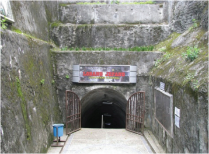

> **Deskripsi Visual:** Gambar ini adalah foto yang menunjukkan pintu masuk ke sebuah lorong atau tunnelling. Lorong tersebut tampak tua dan berlapis batu, dengan lantai yang terbuat dari batu yang telah ditekan dan diperbaiki. Di atas pintu masuk terdapat tanda "LORONG JEPANG" yang menunjukkan bahwa lorong ini mungkin memiliki sejarah atau asal-usul tertentu. Lorong ini tampak seperti bagian dari suatu kompleks bangunan atau infrastruktur yang lebih besar, karena terlihat ada beberapa bagian lain dari bangunan yang tampak seperti dinding atau tembok di sekitarnya. Lorong ini tampak sangat panjang dan mendalam, dengan pintu masuk yang terbuka membuka akses ke area yang lebih dalam.

 

---
## 📄 Halaman 11

Pada masa pendudukan Jepang, Gua Jepang digunakan sebagai benteng perlindungan tentara Jepang dari serangan musuh. Gua itu dibangun dengan mengerahkan tenaga kerja  murah,  yang  kemudian  dikenal  dengan  istilah kerja paksa, atau Romusa.

Meskipun masa pendudukan Jepang hanya berlangsung relatif singkat, tetapi memberi dampak yang penting dalam perjalanan sejarah bangsa Indonesia.

Propaganda  Jepang  mengenai  tata pemerintahan  baru, keberpihakan sebagai sesama bangsa Asia, dan janji akan kemerdekaan, memberi harapan bagi rakyat Indonesia. Kendati sempat dirusak oleh pemerintah Jepang yang represif, terutama dengan adanya program romusa, dorongan dan gerakan untuk mencapai kemerdekaan tetap digencarkan oleh kaum pergerakan baik secara terang-terangan maupun gerakan 'bawah tanah' (Taufik Abdullah dan A.B. Lapian, (ed) 2012).

Nah,  bagaimana  kisah  pendudukan  Jepang  selama  sekitar  3,5  tahun  di Indonesia? Pada uraian berikut akan dibahas mengenai kedatangan Jepang, perkembangan organisasi pergerakan, dan reaksi rakyat Indonesia terhadap kekejaman Jepang. Uraian tersebut akan dibahas melalui bab 'Tirani Matahari Terbit'. Istilah  'tirani'  digunakan  untuk  menggambarkan tindakan otoriter dan kekejaman Jepang, sedangkan istilah 'matahari terbit' digunakan untuk penamaan bagi tentara Jepang. Sebab, posisi negara Jepang jika dilihat dari Indonesia, terletak di arah timur atau sama dengan arah saat matahari terbit, sehingga Negara Jepang disebut Negara Matahari Terbit.

 

---
## 📄 Halaman 12

### PETA KONSEP

---
**🖼️ Gambar/Diagram**

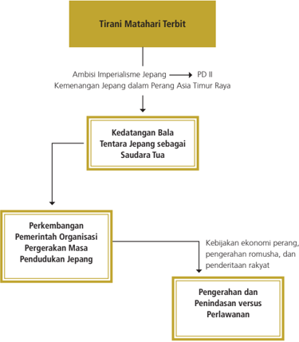

> **Deskripsi Visual:** Gambar ini adalah diagram yang menunjukkan hubungan antara berbagai aspek sejarah dan politik Jepang selama masa penjajahan. Diagram ini dimulai dengan "Tirani Matahari Terbit" yang menggambarkan ambisi imperialisme Jepang dan kemenangan mereka dalam Perang Asia Timur Raya. Kemudian, ada "Kedatangan Bala Tentara Jepang sebagai Saudara Tua," yang menunjukkan bagaimana Jepang memasuki dan menguasai wilayah tersebut. 

Dari sini, diagram melanjutkan dengan "Perkembangan Pemerintah Organisasi Gerakan Masa Pendudukan Jepang," yang menunjukkan bagaimana pemerintahan Jepang mencoba mengendalikan dan mengorganisir penduduk setempat. Ini dilakukan melalui kebijakan ekonomi perang, pengelolaan rumah tangga, dan penderitaan rakyat.

Terakhir, ada "Pengerahan dan Penindasan versus Perlawanan," yang menunjukkan konflik antara pemerintah Jepang dan perlawanan masyarakat setempat. Ini mencakup pengerahan pasukan untuk menghentikan perlawanan dan penindasan atas perlawanan tersebut.

Secara keseluruhan, gambar ini menunjukkan proses kompleks yang melibatkan pemerintahan Jepang, pemberontakan masyarakat, dan interaksi antara kedua pihak dalam konteks penjajahan.

 

---
## 📄 Halaman 13

### TUJUAN PEMBELAJARAN

Setelah mempelajari uraian ini, diharapkan kamu dapat:

- Menganalisis kedatangan Jepang ke Indonesia.
- Mengevaluasi perkembangan organisasi pergerakan di Indonesia.
- Menganalisis gerakan perlawanan rakyat terhadap kekejaman Jepang.
- Menghargai dan meneladani semangat juang para tokoh dalam  melawan Jepang.
- Menumbuhkan rasa syukur kepada  T uhan  YME atas kekuatan yang diberikan kepada rakyat Indonesia yang masih bertahan untuk melawan setiap pendudukan dan kekejaman bangsa asing.

### ARTI PENTING

Belajar sejarah Indonesia masa pendudukan Jepang ini sangat penting karena di samping mendapatkan pemahaman tentang berbagai perubahan seperti dalam tata pemerintahan dan kemiliteran, tetapi juga mendapatkan pelajaran tentang nilai-nilai keuletan dan kerja keras dari para pejuang, pengorbanan, dan keteguhan untuk mempertahankan kebenaran dan hak asasi manusia .

 

---
## 📄 Halaman 14

### A. Kedatangan Jepang ke Indonesia

### Mengamati Lingkungan

---
**🖼️ Gambar/Diagram**

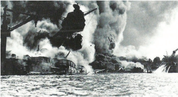

> **Deskripsi Visual:** Gambar ini adalah foto yang menunjukkan pertempuran laut antara kapal perang Jepang dan Amerika Serikat selama Perang Dunia II. Dalam foto tersebut, tampak dua kapal perang sedang berlayar di laut dengan asap dan api yang kelihatan dari salah satu kapal. Kapal perang Amerika Serikat tampak lebih besar dan lebih jelas dibandingkan dengan kapal perang Jepang. Asap dan api yang kelihatan menunjukkan bahwa pertempuran sedang berlangsung dengan intensitas tinggi. Ini menunjukkan bagaimana pertempuran laut bisa sangat mematikan dan memerlukan keahlian dan strategi yang baik untuk bertahan hidup.

---
**🖼️ Gambar/Diagram**

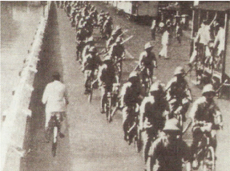

> **Deskripsi Visual:** Gambar ini adalah foto yang menunjukkan sebuah acara bersepeda massal di jalur sepeda. Dalam foto tersebut, banyak peserta bersepeda dengan posisi berjalan lurus di atas jalan. Beberapa peserta tampak sedang berjalan kaki di samping sepeda mereka. Di sepanjang jalur sepeda, terlihat beberapa papan informasi atau petunjuk arah. Di sebelah kanan, tampak beberapa orang yang tampaknya sedang mengawasi atau memantau acara tersebut. Di sebelah kiri, tampak beberapa orang yang tampaknya sedang berjalan kaki atau berjalan-jalan di sepanjang jalur sepeda. Gambar ini menunjukkan bahwa acara bersepeda massal tersebut dilakukan dengan baik dan teratur, dengan banyak peserta yang ikut serta dan tampak antusias.

 

---
## 📄 Halaman 15

- » Coba perhatikan baik-baik gambar 5.2 dan 5.3 di halaman sebelumnya.
- Coba ajukan beberapa pertanyaan, terkait dengan gambargambar tersebut di atas!
- Gambar tersebut terkait dengan peristiwa apa?
- Mengapa peristiwa itu terjadi?
- Apa dampak dari peristiwa itu?
- Mengapa keadaan itu terjadi?
Gambar  5.2  terkait  dengan  peristiwa  pengeboman  Pearl  Harbour  yang menunjukkan  kemenangan  Jepang  terhadap  Sekutu  pada  PD  II  dalam peristiwa  Perang  Pasifik.  Peristiwa  itu  telah  membuka  jalan  bagi  Jepang untuk memasuki negara di Asia, termasuk Indonesia. Sementara gambar 5.3 berkaitan dengan gambaran mengenai cara tentara Jepang memasuki kotakota penting di Indonesia.

Perlu dipahami bahwa 'rentetan kemenangan yang dicapai tentara Jepang sejak  melancarkan  Perang  Pasifik  membuka  pintu  bagi  mereka  untuk menduduki tanah Hindia Belanda'. Kedatangan 'saudara tua', sebagaimana Jepang  menyebut  dirinya,  mula-mula  disambut  dengan  penuh  harapan, tetapi kemudian mengecewakan rakyat. Walaupun demikian, pendudukan Jepang membuka sejarah baru bagi Indonesia'.

Nah, sejarah baru yang bagaimana? Sebelum memahami sejarah baru yang dimaksud kamu perlu memahami terlebih dulu mengenai bagaimana tentara Jepang  itu  datang  dan  kemudian  menguasai  Indonesia.  Ikutilah  uraian penjelasan tersebut melalui subbab 'Kedatangan Saudara Tua'.

 

---
## 📄 Halaman 16

### 1.  Masuknya Jepang ke Indonesia

Sejak  pengeboman  Pearl  Harbour  oleh  angkatan  Perang  Jepang  pada  8 Desember 1941, serangan terus dilancarkan terhadap angkatan laut Amerika Serikat di Pasifik. Serangan-serangan itu seolah-olah tak dapat dibendung oleh Amerika Serikat.  Pasukan Jepang berhasil menghancurkan basis-basis militer Amerika seperti di Filipina. Kemudian serangan Jepang juga diarahkan ke Indonesia. Serangan terhadap Indonesia bertujuan untuk mendapatkan cadangan logistik dan bahan industri perang, seperti minyak bumi, timah, dan aluminium. Sebab, persediaan minyak di Indonesia diperkirakan dapat mencukupi kebutuhan Jepang selama Perang Pasifik.

Perlu  dipahami  bahwa  pada  saat  Jepang  ini  memasuki  Indonesia  sudah membawa kultur dan ideologi fasisme. Jepang sudah menjadi negara fasis. Fasis-fasisme adalah paham atau ideologi. Fasisme dapat dimaknai sebagai sistem  (sistem  pemerintahan),  di  mana  semua  kekuasaan  berada  pada satu  tangan  seorang  yang  diktator  dan  otoriter.  Dalam  mengembangkan kehidupan berbangsa menjadi sangat nasionalistik (chauvinistik), elitis, dan rasialis.  Penataan  kehidupan  sosial  dan  ekonomi  sangat  ketat,  sentralistik dalam sebuah korporasi pemerintah yang otoriter di bawah pemimpin yang diktator. Fasisme ini mula pertama berkembang di Italia pada tahun 1922 dengan tokohnya Benito Mussolini. Kemudian pada tahun 1933 berkembang di Jerman, yang selanjutnya berkembang juga di Jepang.

Pada  Januari  1942,  Jepang  mendarat  dan  memasuki    Indonesia.  Tentara Jepang  ini  masuk  ke  Indonesia  melalui  Ambon  dan  menguasai  seluruh Maluku. Meskipun pasukan KNIL ( Koninklijk Nederlandsch Indisch Leger ) dan pasukan Australia berusaha menghalangi, tapi kekuatan Jepang tidak dapat dibendung.  Daerah  Tarakan  di  Kalimantan  Timur  kemudian  dikuasai  oleh Jepang bersamaan dengan Balikpapan (12 Januari 1942). Jepang kemudian menyerang  Sumatra  setelah  berhasil  memasuki  Pontianak.  Bersamaan dengan itu Jepang melakukan serangan ke Jawa (Februari 1942).

Pada  tanggal  1  Maret  1942,  kemenangan  tentara  Jepang  dalam  Perang Pasifik menunjukkan kemampuan Jepang dalam mengontrol wilayah yang sangat luas, yaitu dari Burma sampai Pulau Wake di Samudra Pasifik. Setelah daerah-daerah  di  luar  Jawa  dikuasai,  Jepang  memusatkan  perhatiannya untuk menguasai tanah Jawa sebagai pusat pemerintahan Hindia Belanda.

 

---
## 📄 Halaman 17

Untuk  menghadapi  gerak  invasi  tentara  Jepang,  blok  sekutu  yang  terdiri atas Belanda, Amerika Serikat, Australia, dan Inggris membentuk Komando Gabungan Tentara Serikat yang disebut ABDACOM ( American British Dutch Australian  Command ) yang  bermarkas  di  Lembang.  Letnan  Jenderal  Ter Poorten diangkat sebagai Panglima ABDACOM. Namun kekuatan ABDACOM tidak mampu menyelamatkan Hindia Belanda dari kekalahan. Sementara itu, Gubernur Jenderal Carda (Tjarda) pada Februari 1942 telah mengungsi ke Bandung.

Dalam pertempuran di Laut Jawa, Angkatan Laut Jepang berhasil menghancurkan  pasukan  gabungan  Belanda-Inggris  yang    dipimpin  oleh Laksamana Karel Doorman. Sisa-sisa pasukan dan kapal Belanda yang berhasil lolos terus melarikan diri menuju Australia. Sementara itu, Jenderal Imamura dan pasukannya mendarat di Jawa pada tanggal 1 Maret 1942. Pendaratan itu  dilaksanakan  di  tiga  tempat,  yakni  di  Banten  dipimpin  oleh  Jenderal Imamura sendiri. Kemudian pendaratan di Eretan Wetan-Indramayu dipimpin oleh Kolonel Tonishori, dan pendaratan di sekitar Bojonegoro dikoordinasi oleh  Mayjen  Tsuchihashi.  Tempat-tempat  tersebut  memang  tidak  diduga oleh Belanda jika ternyata digunakan pendaratan tentara Jepang. Sementara itu Jepang tidak menyerang Jakarta, karena pada saat itu Jakarta disiapkan oleh Belanda sebagai kota terbuka.

Untuk  menghadapi    pasukan  Jepang,  sebenarnya  Sekutu    sudah  mempersiapkan diri, yaitu antara lain berupa tentara gabungan ABDACOM, ditambah satu kompi Kadet dari Akademi Militer Kerajaan dan Korps Pendidikan Perwira Cadangan di Jawa Barat. Di Jawa Tengah, telah disiapkan empat batalion infanteri,  sedangkan  di  Jawa  Timur  terdiri  tiga  batalion  pasukan  bantuan Indonesia dan satu batalion marinir, serta ditambah dengan satuan-satuan dari Inggris dan Amerika. Meskipun demikian, tentara Jepang mendarat di Jawa dengan jumlah yang sangat besar, berhasil merebut tiap daerah hampir tanpa perlawanan.

Pasukan  Jepang  dengan  cepat  menyerbu  pusat-pusat  kekuatan  tentara Belanda di  Jawa.  Tanggal  5  Maret  1942  Batavia  jatuh  ke  tangan  Jepang. Tentara Jepang terus bergerak ke selatan dan menguasai kota Buitenzorg (Bogor). Dengan mudah kota-kota di Jawa yang lain juga jatuh ke tangan Jepang. Akhirnya pada tanggal 8 Maret 1942 Jenderal Ter Poorten atas nama komandan  pasukan  Belanda/Sekutu  menandatangani  penyerahan  tidak bersyarat kepada Jepang yang diwakili Jenderal Imamura. Penandatanganan ini  dilaksanakan  di  Kalijati,  Subang.  Penyerahan  Belanda  kepada  Jepang

 

---
## 📄 Halaman 18

kemudian dikenal dengan Kapitulasi  Kalijati. Dengan demikian, berakhirlah penjajahan  Belanda  di  Indonesia.  Kemudian  Indonesia  berada  di  bawah pendudukan  tentara  Jepang.  Gubernur  Jenderal  Tjarda  ditawan.  Namun, Belanda  segera  mendirikan  pemerintahan  pelarian  (exile  government) di Australia di bawah pimpinan H.J. Van Mook.

»

Coba  perhatikan  secara  cermat  kedatangan  Jepang  atau  yang dikenal dengan 'Saudara Tua' ke Indonesia yang begitu cepat dan merata di berbagai daerah di Indonesia. Tampaknya tentara Jepang itu sudah paham tentang Indonesia.  Coba lakukan pelacakan kirakira apa yang telah diperbuat  Jepang sebelum tentara Jepang itu datang ke Indonesia!

Menyimak dari gerakan tentara Jepang untuk menguasai Indonesia berlangsung  begitu  cepat  itu  memang  menarik.  Hal  ini  ada  kaitannya dengan perkembangan sebelumnya. Sejak Jepang atau Negeri Sakura atau Negeri  Matahari  Terbit  berkembang  menjadi  negara  industri  dan  tampil sebagai imperialis, Jepang mulai membutuhkan daerah-daerah baru. Salah satu daerah baru yang dimaksud adalah Indonesia. Keinginan Jepang untuk menguasai Indonesia karena Indonesia kaya akan sumber daya alam yang dapat dimanfaatkan untuk pengembangan industri Jepang.  Jepang dengan slogan Hakko Ichiu yang diperkenalkan oleh Kaisar  Jimmu  adalah  doktrin untuk menguasai dunia dan satu-satunya kekaisaran. Doktrin Hakko Ichiu ini  kemudian  dimodifikasi  sebagai  alat  propaganda  dan  alat  politik  untuk mencapai  tujuan  pemerintah  Jepang.  Slogan  ini  juga  diilhami  oleh  ajaran Shintoisme yang  menerima  dan  memadukan  semua  tradisi  termasuk kehidupan  spiritual  yang  masuk  ke  Jepang,  tanpa  menghilangkah  tradisi aslinya . Hakko  ichiu telah  menjadi  slogan  dan  ajaran  tentang  kesatuan keluarga umat manusia.  Ajaran ini diterjemahkan bahwa Jepang sebagai negara maju bertanggung jawab untuk membentuk kesatuan keluarga umat manusia dengan memajukan dan mempersatukan bangsa-bangsa di dunia, termasuk Indonesia. Ajaran Hakko ichiu diperkuat oleh keterangan antropolog yang menyatakan bahwa bangsa Jepang dan Indonesia serumpun. Untuk merealisasikan keinginannya itu, maka sebelum gerakan tentara Jepang itu datang ke Indonesia, Jepang sudah mengirim para spionase untuk datang ke Indonesia pada tahun-tahun sebelumnya.

 

---
## 📄 Halaman 19

### 2.  Sambutan Rakyat Indonesia

Kedatangan  Jepang  di  Indonesia  pada  awalnya  disambut  dengan  senang hati  oleh  rakyat  Indonesia.  Jepang  dielu-elukan  sebagai  'Saudara  Tua' yang  dipandang  dapat  membebaskan  bangsa  Indonesia  dari  kekuasaan Belanda. Sikap simpatik bangsa Indonesia terhadap Jepang antara lain juga dipengaruhi oleh kepercayaan ramalan Jayabaya.

Di mana-mana terdengar ucapan 'banzai-banza i ' (selamat datang-selamat datang). Sementara itu, pihak tentara Jepang terus melakukan propagandapropaganda untuk terus menggerakkan dukungan rakyat Indonesia. Setiap kali Radio Tokyo memperdengarkan Lagu Indonesia Raya, di samping Lagu Kimigayo.  Bendera  yang  berwarna  Merah  Putih  juga  boleh  dikibarkan berdampingan dengan Bendera Jepang Hinomaru. Melalui siaran radio, juga dipropagandakan  bahwa  barang-barang  buatan  Jepang  itu  menarik  dan murah harganya, sehingga mudah bagi rakyat Indonesia untuk membelinya.

Simpati dan dukungan rakyat Indonesia itu nampaknya juga karena perilaku Jepang  yang  sangat  membenci  Belanda.  Di  samping  itu,  diperkuat  pula dengan berkembangnya kepercayaan tentang Ramalan Jayabaya.

»

Tahukah  kamu  tentang  isi  Ramalan  Jayabaya?  Coba  cari  tahu jawabannya!

Tentara Jepang juga mempropagandakan bahwa kedatangannya ke Indonesia untuk membebaskan rakyat dari cengkeraman penjajahan bangsa Barat.  Jepang  juga  akan  membantu memajukan rakyat Indonesia. Melalui program Pan-Asia Jepang akan memajukan dan menyatukan seluruh rakyat Asia. Untuk lebih meyakinkan rakyat Indonesia, Jepang menegaskan kembali bahwa Jepang tidak lain adalah 'saudara tua', jadi Jepang dan Indonesia sama. Bahkan untuk meneguhkan progandanya tentang Pan-Asia, Jepang berusaha membentuk perkumpulan yang diberi nama 'Gerakan Tiga A'.

- » Coba  apa  isi  semboyan  Tiga  A  itu?  Apa  kira-kira  tujuan  Jepang membentuk perkumpulan itu? Siapa yang dijadikan ketua Gerakan
Tiga A itu?

 

---
## 📄 Halaman 20

### 3.  Pembentukan Pemerintahan Militer

Pada pertengahan tahun 1942 timbul pemikiran dari Markas Besar Tentara Jepang  agar  penduduk  di  daerah  pendudukan  dilibatkan  dalam  aktivitas pertahanan dan kemiliteran (termasuk semimiliter). Oleh karena itu, pemerintah Jepang di Indonesia kemudian membentuk pemerintahan militer. Di seluruh Kepulauan Indonesia bekas Hindia Belanda itu wilayahnya dibagi menjadi tiga wilayah pemerintahan militer.

- Pemerintahan militer Angkatan Darat, yaitu Tentara Kedua Puluh Lima (Tomi Shudan ) untuk Sumatra. Pusatnya di Bukittinggi.
- Pemerintahan  militer  Angkatan  Darat,  yaitu  Tentara  Keenam  Belas (Asamu Shudan) untuk Jawa dan Madura. Pusatnya di Jakarta. Kekuatan pemerintah militer ini kemudian ditambah dengan Angkatan Laut (Dai Ni Nankenkanta i ).
- Pemerintahan  militer  Angkatan  Laut,  yaitu  (Armada  Selatan  Kedua) untuk daerah Kalimantan, Sulawesi, dan Maluku. Pusatnya di Makassar.
Pembagian  administrasi  wilayah  pendudukan  semacam  itu  tentu  juga terkait  dengan  perbedaan  kepentingan  Jepang  terhadap  tiap-tiap  daerah di  Indonesia,  baik  dari  segi  militer  maupun  politik  ekonomi.  Pulau  Jawa yang merupakan pusat pemerintahan yang sangat penting waktu itu masih diberlakukan  pemerintahan  sementara.  Hal  ini  berdasarkan  Osamu  Seirei (Undang-Undang yang dikeluarkan oleh Panglima Tentara Ke-16). Di dalam undang-undang itu antara lain berisi ketentuan sebagai berikut.

- Jabatan Gubernur Jenderal pada masa Hindia Belanda dihapuskan dan segala kekuasaan yang dahulu dipegangnya diambil alih oleh panglima tentara Jepang di Jawa.
- Para  pejabat  pemerintah  sipil  beserta  pegawainya  di  masa  Hindia Belanda  tetap  diakui  kedudukannya,  asalkan  memiliki  kesetiaan terhadap tentara pendudukan Jepang.
- Badan-badan pemerintah dan undang-undang di masa Belanda tetap diakui secara sah untuk sementara waktu, asalkan tidak bertentangan dengan aturan pemerintahan militer Jepang.
Adapun  susunan  pemerintahan  militer  Jepang  tersebut  adalah  sebagai berikut.

- Gunshirekan (panglima  tentara)  yang  kemudian  disebut  dengan S eiko Shikikan (panglima tertinggi) sebagai pucuk pimpinan. Panglima tentara yang pertama dijabat oleh Jenderal Hitoshi Imamura .

 

---
## 📄 Halaman 21

- Gunseikan (kepala pemerintahan militer) yang dirangkap oleh kepala staf.  Kepala  staf  yang  pertama  adalah  Mayor  Jenderal  Seizaburo Okasaki . Kantor pusat pemerintahan militer ini disebut Gun  seikanbu. Di lingkungan Gun  seikanbu ini terdapat empat bu (semacam departemen) dan ditambah satu bu lagi, sehingga menjadi lima bu . Adapun kelima bu itu adalah sebagai berikut.
- Somobu (Departemen Dalam Negeri)
- Zaimubu (Departemen Keuangan)
- Sangyobu (Departemen  Perusahaan,  Industri,  dan  Kerajinan Tangan) atau urusan Perekonomian
- Kotsubu (Departemen Lalu Lintas)
- Shihobu (Departemen Kehakiman)
- Gunseibu (koordinator  pemerintahan  dengan  tugas  memulihkan ketertiban dan keamanan atau semacam gubernur) yang meliputi:
- Jawa Barat : pusatnya di Bandung.
- Jawa Tengah : pusatnya di Semarang.
- Jawa Timur : pusatnya di Surabaya.
Ditambah dua daerah istimewa (Kochi) yakni Yogyakarta dan  Surakarta.

Di  dalam  pemerintahan  itu,  Jepang  juga  membentuk  kesatuan  Kempetai (Polisi Militer). Di samping susunan pemerintahan tersebut, juga ditetapkan lagu  kebangsaan yang boleh diperdengarkan hanyalah Kimigayo. Padahal sebelum  tentara  Jepang  datang  di  Indonesia,  Lagu  Indonesia  Raya  sering diperdengarkan di radio Tokyo.

»

Apa  kira-kira  tujuan  Jepang  membentuk  Kempetai?  Siapa  yang dijadikan pimpinan Kempetai pada waktu itu?

Pada  awal  pendudukan  ini,  secara  kultural  Jepang  juga  mulai  melakukan perubahan-perubahan.  Misalnya,  untuk  petunjuk  waktu  harus  digunakan tarikh  Sumera (tarikh  Jepang),  menggantikan  tarikh  Masehi . Waktu  itu tarikh Masehi 1942 sama dengan tahun 2602 Sumera . Setiap tahun (mulai tahun 1942) rakyat Indonesia harus merayakan Hari Raya Tencosetsu (hari raya  lahirnya  Kaisar  Hirohito).  Dalam  bidang  politik,  Jepang  melakukan kebijakan dengan melarang penggunaan bahasa Belanda dan mewajibkan menggunakan bahasa Jepang.

 

---
## 📄 Halaman 22

### 4.  Pemerintahan Sipil

Untuk  mendukung  kelancaran  pemerintahan  pendudukan  Jepang  yang bersifat  militer,  Jepang  juga  mengembangkan  pemerintahan  sipil.  Pada bulan Agustus 1942, pemerintahan militer berusaha meningkatkan sistem pemerintahan,  antara  lain  dengan  mengeluarkan  UU  No.  27  tentang aturan pemerintahan daerah dan dimantapkan dengan UU No. 28 tentang pemerintahan shu serta tokubetsushi. Dengan UU tersebut, pemerintahan akan  dilengkapi  dengan  pemerintahan  sipil.  Menurut  UU  No.  28  ini, pemerintahan daerah yang tertinggi adalah shu (karesidenan). Seluruh Pulau Jawa  dan  Madura,  kecuali  Kochi  Yogyakarta  dan  Kochi  Surakarta,  dibagi menjadi daerah-daerah shu (karesidenan), shi (kotapraja), ken (kabupaten), gun (kawedanan), son (kecamatan), dan ku (desa/kelurahan). Seluruh Pulau Jawa dan Madura dibagi menjadi 17 shu .

- » Coba	 lakukan	 identifikasi	 di	 mana	 saja	 letak	 ke-17	 daerah	 shu tersebut!
Pemerintahan shu itu dipimpin oleh seorang shucokan. Shucokan memiliki kekuasaan seperti gubenur pada zaman Hindia Belanda meliputi kekuasaan legislatif dan eksekutif. Dalam menjalankan pemerintahan shucokan dibantu oleh  Cokan  Kanbo (Majelis  Permusyawaratan  Shu).  Setiap  Cokan  Kanbo ini memiliki tiga bu (bagian), yakni Naiseibu (bagian pemerintahan umum), Kaisaibu (bagian ekonomi), dan Keisatsubu (bagian kepolisian). Pemerintah pendudukan Jepang juga membentuk sebuah kota yang dianggap memiliki posisi sangat penting sehingga menjadi daerah semacam daerah swatantra (otonomi). Daerah ini disebut tokubetsushi (kota istimewa), yang posisi dan kewenangannya seperti shu yang berada langsung di bawah pengawasan gunseikan. Sebagai contoh adalah Kota Batavia, sebagai Batavia Tokubetsushi di bawah pimpinan Tokubetu shico .

Pemerintah Jepang juga membentuk tonarigumi, yang pada masa sekarang ini kita kenal dengan Rukun Tetangga (RT). Tanorigumi ini digunakan oleh pemerintah Jepang untuk mengawasi gerak-gerik rakyat agar dapat dipantau oleh pemerintah Jepang.

- » Coba  lakukan  diskusi  dengan  anggota  kelompok,  alasan  Jepang membentuk pemerintahan militer yang dilengkapi dengan pemerintahan  sipil.  Kemudian,  mengapa  daerah  itu  dibagi-bagi sampai tingkat desa?

 

---
## 📄 Halaman 23

### KESIMPULAN

- Setelah berhasil melakukan pengeboman  Pearl Harbour tahun 1941, gerakan Jepang menuju Asia, termasuk ke Indonesia tidak bisa terbendung.
- Jepang berhasil menguasai Kepulauan Indonesia dengan cepat dan merata.
- Masuk dan kedatangan tentara Jepang disambut baik oleh rakyat Indonesia karena dipandang sebagai kekuatan pembebas.
- Jepang kemudian membentuk pemerintahan militer yang diperkuat dengan pemerintahan sipil.

 

---
## 📄 Halaman 24

### LATIH UJI KOMPETENSI

- Jelaskan mengapa kedatangan Jepang ke Indonesia itu berjalan cepat dan merata ke berbagai wilayah Indonesia!
- Mengapa pada mulanya rakyat Indonesia menyambut baik kedatangan Jepang?
- Mengapa Jepang membentuk pemerintahan militer di tiga kawasan: Sumatra, Jawa-Madura, dan kawasan Indonesia Timur?
- Mengapa  pemerintah  pendudukan  Jepang  akhirnya  hanya  boleh memperdengarkan lagu kebangsaan Kimigayo, sedangkan lagu Indonesia Raya mulai dilarang?
- Pelajaran apa yang kamu  peroleh setelah mempelajari sejarah kedatangan dan awal pemerintahan Jepang di Indonesia?

### Tugas

Buatlah  peta  jalur  gerakan  masuknya  tentara  Jepang  dari  Asia  Tenggara kemudian memasuki Kepulauan Indonesia! Kamu dapat mempelajari bukubuku sejarah yang ada di perpustakaan sekolah.

16

Kelas XI SMA/MA/SMK/MAK

Semester 2

 

---
## 📄 Halaman 25

### B. Organisasi Pergerakan Masa Pendudukan Jepang

### Mengamati Lingkungan

»

### Coba amati baik-baik gambar di atas!

Gambar tersebut adalah gambar Empat Serangkai, yakni Sukarno, Ki Hajar Dewantoro, Moh. Hatta, dan K.H. Mas Mansyur. Mereka adalah tokoh dalam organisasi Putera. Apa yang dimaksud dengan organisasi Putera? Putera adalah salah satu organisasi yang dibentuk pada zaman pendudukan Jepang.

Banyak organisasi yang dibentuk pada zaman Jepang. Sama seperti organisasiorganisasi  pada  umumnya,  yaitu  organisasi  yang  bersifat  semimiliter  dan militer. Zaman Belanda tidak ada organisasi pergerakan yang bersifat semi militer.  Berikut  ini  akan  dipaparkan  tentang  perkembangan  organisasi pergerakan di zaman pendudukan Jepang.

 

---
## 📄 Halaman 26

### Memahami Teks

Ada satu perkembangan yang berbeda apabila kita memahami perkembangan organisasi pergerakan antara zaman kolonial Belanda dengan era pendudukan Jepang. Pada masa kolonial Belanda umumnya organisasi pergerakan yang muncul  dan  berkembang  diprakarsai  oleh  para  pejuang  rakyat  Indonesia, tetapi  pada  zaman  Jepang  banyak  organisasi  atau  perkumpulan  yang berdiri diprakarsai oleh Jepang, sementara para tokoh Indonesia mencoba memanfaatkan organisasi  itu  untuk  kepentingan  perjuangan.  Hal  ini  juga tampak berhubungan dengan perkembangan pandangan sikap para tokoh Indonesia dalam menghadapi pendudukan Jepang. Banyak di antara para tokoh Indonesia yang mencoba memanfaatkan masa pendudukan Jepang untuk melanjutkan perjuangan menuju kemerdekaan. Mereka mengambil sikap dan strategi bekerja sama dengan Jepang.

Sebagai contoh, pada masa pendudukan Jepang Sukarno bersedia bekerja sama dengan Jepang. Faktor penyebabnya adalah kemenangan Jepang atas Rusia pada tahun 1905. Sehingga Sukarno merupakan salah seorang tokoh pergerakan kebangsaan yang terkesan pada kehebatan Jepang, dan percaya bahwa  Jepang  akan  memenangkan  perang.  Sementara,  Moh.  Hatta  dan Syahrir  yang  dikenal  antifasisme,  semestinya  menentang  Jepang.  Namun, keduanya menyusun strategi yang saling melengkapi. Moh. Hatta mengambil sikap kooperatif dengan Jepang, sementara Syahrir akan menyusun 'gerakan bawah tanah' (gerakan rahasia).

Syahrir  bergerak  di  'bawah  tanah'  dan  mendapat  dukungan  dari  tokohtokoh lain, seperti Cipto Mangunkusumo dan mantan anggota PNI Baru, Amir Syarifudin. Amir Syarifudin dikenal sebagai sosok yang bersikap anti-Jepang. Bahkan Amir Syarifudin dimanfaatkan oleh Belanda untuk menyusun gerakan perlawanan  terhadap  Jepang.  Untuk  ini  Amir  Syarifudin  telah  menerima sejumlah uang dari seorang pejabat Belanda (Van der Plas), sebagai imbalan. Amir Syarifudin sebagai anggota PKI terikat dengan kebijakan Commintern yang  menjalankan  doktrin  Dimitrov  yakni  bekerja  sama  dengan  kapitalis untuk  menghambat  Fasisme  karena  itu  Amir  mau  bekerja  sama  dengan Belanda (Kapitalis).

 

---
## 📄 Halaman 27

Sedangkan  terhadap  umat  Islam,  Jepang  berusaha  sekuat  tenaga  untuk mendekatinya.  Sebab,  umat  Islam  dinilai  secara  mayoritas  anti  peradaban Barat,  sehingga  diharapkan  menjadi  kekuatan  besar  dan  mau  membantu Jepang  dalam  menghadapi  Sekutu.  Sukarno  dan  Moh.  Hatta  bergabung dalam mengambil sikap kooperatif dengan Jepang. Langkah tersebut diambil semata-mata demi tujuan yang lebih penting, yakni kemerdekaan. Bahkan kedua tokoh ini juga mengusulkan agar segera dibentuk organisasi politik, karena setelah Jepang berkuasa di Indonesia, semua organisasi politik yang pernah berkembang di zaman Hindia Belanda dibubarkan.

- » Organisasi-organisasi pada zaman pendudukan Jepang ada yang bersifat  kemasyarakatan  dan  ada  pula  organisasi  yang  bersifat militer atau semimiliter. Organisasi atau perkumpulan apa saja yang berkembang di zaman pendudukan Jepang itu?

### 1.  Organisasi yang Bersifat Sosial Kemasyarakatan

### a. Gerakan  Tiga A

Untuk  mendapatkan  dukungan  rakyat  Indonesia,  Jepang  membentuk sebuah perkumpulan yang dinamakan Gerakan Tiga A (3A). Perkumpulan ini dibentuk pada tanggal 29 Maret 1942. Sesuai dengan namanya, perkumpulan ini  memiliki  tiga  semboyan,  yaitu Nippon  Cahaya  Asia,  Nippon  Pelindung Asia , dan Nippon Pemimpin Asia . Sebagai pimpinan Gerakan Tiga A, bagian propaganda Jepang ( Sedenbu )  telah menunjuk bekas tokoh Parindra Jawa Barat yakni Mr. Syamsuddin sebagai ketua dengan dibantu beberapa tokoh lain seperti K. Sutan Pamuncak dan Moh. Saleh.

Jepang  berusaha  agar  perkumpulan  ini  menjadi  wadah  propaganda  yang efektif. Oleh karena itu, di berbagai daerah dibentuk komite-komite. Sejak bulan Mei 1942, perhimpunan itu mulai diperkenalkan kepada masyarakat melalui media massa. Di dalam Gerakan Tiga A juga dibentuk subseksi Islam yang  disebut  'Persiapan  Persatuan  Umat  Islam' . Subseksi  Islam  dipimpin oleh Abikusno Cokrosuyoso.

 

---
## 📄 Halaman 28

Ternyata  sekalipun  dengan  berbagai  upaya,  Gerakan  Tiga  A  ini  kurang mendapat  simpati  dari  rakyat.  Gerakan  Tiga  A  hanya  berumur  beberapa bulan saja. Jepang menilai perhimpunan itu tidak efektif. Bulan Desember 1942  Gerakan  Tiga  A  dinyatakan  gagal.  Mengapa  'Gerakan  Tiga  A'  ini dinyatakan gagal oleh Jepang, kira-kira apa alasannya?

### b. Pusat Tenaga Rakyat (Putera)

'Gerakan Tiga A' dinilai gagal oleh Jepang. Kemudian Jepang berusaha mengajak tokoh pergerakan nasional  untuk  meningkatkan  kerja sama. Jepang kemudian mendirikan organisasi  pemuda,  Pemuda  Asia Raya  di  bawah  pimpinan  Sukardjo Wiryopranoto.  Organisasi  itu  juga tidak  mendapat  sambutan  rakyat. Jepang kemudian membubarkan organisasi itu.

Pemimpin Indonesia seperti Sukarno , Hatta, K.H. Mas Mansyur, Ki Hajar Dewantara, Sutardjo Kartohadikusumo, Abikusno Cokrosuyoso, dan Prof. Dr. Supomo, ikut dalam komisi untuk menyelidiki adat istiadat Indonesia.

Dukungan rakyat terhadap Jepang  memang tidak  seperti  awal  kedatangannya. Hal ini terjadi karena sikap dan tindakan Jepang yang berubah. Seperti telah disinggung  di  depan,  Jepang  mulai  melarang  pengibaran  bendera  Merah Putih dan yang boleh dikibarkan hanya bendera Hinomaru serta mengganti Lagu  Indonesia  Raya  dengan  lagu  Kimigayo.  Jepang  mulai  membiasakan mengganti  kata-kata banzai (selamat  datang)  dengan bakero (bodoh). Masyarakat mulai tidak simpati terhadap Jepang.'Saudara tua' tidak seperti yang mereka janjikan.

Sementara perkembangan Perang Asia Timur Raya mulai memojokkan Jepang. Kekalahan Jepang di berbagai medan pertempuran telah menimbulkan rasa tidak percaya dari rakyat. Oleh karena itu, Jepang harus segera memulihkan keadaan. Jepang harus dapat bekerja sama dengan tokoh-tokoh nasionalis terkemuka,  antara  lain  Sukarno  dan  Moh.  Hatta.  Karena  Sukarno  masih ditahan di Padang oleh pemerintah Hindia Belanda, maka segera dibebaskan oleh Jepang. Pada tanggal 9 Juli 1942 Sukarno sudah berada di Jakarta dan bergabung dengan Moh. Hatta.

 

---
## 📄 Halaman 29

Jepang berusaha untuk menggerakkan seluruh rakyat melalui tokoh-tokoh nasionalis.  Jepang  ingin  membentuk  organisasi  massa  yang  dapat  bekerja untuk menggerakkan rakyat.  Bulan  Desember  1942  dibentuk  panitia  persiapan untuk membentuk sebuah organisasi massa. Kemudian Sukarno, Hatta, K.H. Mas Mansyur, dan Ki Hajar Dewantara dipercaya untuk membentuk gerakan baru. Gerakan itu bernama Pusat Tenaga Rakyat (Putera) dibentuk tanggal 16 April 1943. Mereka kemudian disebut sebagai empat serangkai. Sebagai ketua panitia adalah Sukarno. Tujuan Putera adalah untuk membangun dan menghidupkan kembali segala sesuatu yang telah dihancurkan oleh Belanda. Menurut  Jepang,  Putera bertugas untuk memusatkan  segala  potensi masyarakat Indonesia guna membantu Jepang dalam perang. Di samping tugas  di  bidang  propaganda,  Putera  juga  bertugas  memperbaiki  bidang sosial ekonomi.

Sumber: Sejarah Nasional Indonesia  VI, 1984.

Gambar 5.5 Pimpinan Putera: Empat Serangkai.

Menurut  struktur organisasinya, Putera memiliki pimpinan  pusat  dan pimpinan daerah. Pimpinan pusat dikenal sebagai Empat Serangkai. Kemudian  pimpinan  daerah  dibagi,  sesuai  dengan  tingkat  daerah,  yakni tingkat syu, ken , dan gun. Putera juga mempunyai beberapa penasihat yang berasal dari orang-orang Jepang. Mereka adalah S. Miyoshi, G. Taniguci, Iciro Yamasaki, dan Akiyama.

 

---
## 📄 Halaman 30

Pada awal berdirinya Putera, cepat mendapatkan sambutan dari organisasi massa  yang  ada.  Misalnya  dari  Persatuan  Guru  Indonesia;  Perkumpulan Pegawai  Pos  Menengah;  Pegawai  Pos  Telegraf  Telepon  dan  Radio;  serta Pengurus Besar Istri Indonesia di bawah pimpinan Maria Ulfah Santoso. Dari kalangan pemuda terdapat sambutan dari organisasi Barisan Banteng dan dari kelompok pelajar terdapat sambutan dari organisasi Badan Perantaraan Pelajar Indonesia serta Ikatan Sport Indonesia. Mereka semua  bergabung ke dalam Putera.

Putera pun berkembang dan bertambah kuat. Sekalipun di tingkat daerah tidak berkembang baik, namun Putera telah berhasil mempersiapkan rakyat secara mental bagi kemerdekaan Indonesia. Melalui rapat-rapat dan media massa,  pengaruh  Putera  semakin  meluas.  Perkembangan  Putera  akhirnya menimbulkan kekhawatiran di pihak Jepang. Oleh karena itu, Putera telah dimanfaatkan  oleh  pemimpin-pemimpin  nasionalis  untuk  mempersiapkan ke arah kemerdekaan, tidak digunakan sebagai usaha menggerakkan massa untuk  membantu  Jepang.  Ternyata  sikap  dan  tindakan  para  pemimpin nasionalis ini tercium juga oleh penguasa Jepang,  maka pada tahun 1944 Putera dinyatakan bubar oleh Jepang. Melalui badan propaganda Jepang ini Bahasa Indonesia mulai tersebar di kalangan masyarakat Indonesia sekaligus pula membuat nasionalisme Indonesia semakin kuat.

### c. Majelis Islam A'la Indonesia (MIAI) dan Majelis Syura Muslimin (Masyumi)

Berbeda dengan pemerintah Hindia Belanda yang cenderung anti terhadap umat Islam, Jepang lebih ingin bersahabat dengan umat Islam di Indonesia. Jepang sangat memerlukan kekuatan umat Islam untuk membantu melawan Sekutu. Oleh karena itu, sebuah organisasi Islam MIAI yang cukup berpengaruh  pada  masa  pemerintah  kolonial  Belanda,  mulai  dihidupkan kembali oleh pemerintah pendudukan Jepang. Pada tanggal 4 September 1942 MIAI diizinkan aktif kembali. Dengan demikian, MIAI diharapkan segera dapat digerakkan sehingga umat Islam di Indonesia dapat dimobilisasi untuk keperluan perang.

Dengan diaktifkannya kembali MIAI, maka MIAI menjadi organisasi pergerakan  yang  cukup  penting  di  zaman  pendudukan  Jepang.  MIAI menjadi  tempat  bersilaturakhim,  menjadi  wadah  tempat  berdialog,  dan bermusyawarah untuk membahas berbagai hal yang menyangkut kehidupan

 

---
## 📄 Halaman 31

umat, dan tentu saja bersinggungan dengan perjuangan. MIAI senantiasa menjadi organisasi pergerakan yang cukup diperhitungkan dalam perjuangan membangun kesatuan  dan  kesejahteraan  umat.  Semboyan  yang  terkenal adalah ' berpegang teguhlah kamu sekalian pada tali Allah dan janganlah berpecah belah '. Dengan demikian, pada masa pendudukan Jepang, MIAI berkembang baik. Kantor pusatnya semula di Surabaya kemudian pindah ke Jakarta.

Adapun tugas dan tujuan MIAI waktu itu adalah sebagai berikut.

- Menempatkan umat Islam pada kedudukan yang layak dalam masyarakat Indonesia.
- Mengharmoniskan Islam dengan tuntutan perkembangan zaman.
- Ikut membantu Jepang dalam Perang Asia Timur Raya.
Untuk merealisasikan  tujuan  dan  melaksanakan  tugas  itu,  MIAI  membuat program yang lebih menitikberatkan pada program-program yang bersifat sosio-religius. Secara khusus program-program itu akan diwujudkan melalui rencana sebagai berikut:

- pembangunan masjid Agung di Jakarta,
- mendirikan universitas, dan
- membentuk baitulmal .
Dari ketiga program ini yang mendapatkan lampu hijau dari Jepang hanya program yang ketiga.

### » Coba  perhatikan!  Mengapa  Jepang  tidak  memberi  'restu'  MIAI membangun masjid agung dan universitas? Coba cari jawabnya!

MIAI terus mengembangkan diri di tengah-tengah ketidakcocokan dengan  kebijakan  dasar  Jepang.  MIAI  menjadi  tempat  pertukaran  pikiran dan  pembangunan  kesadaran  umat  agar  tidak  terjebak  pada  perangkap kebijakan  Jepang  yang  semata-mata  untuk  memenangkan  perang  Asia Timur Raya. Pada bulan Mei 1943, MIAI berhasil membentuk Majelis Pemuda yang diketuai oleh Ir. Sofwan dan juga membentuk Majelis Keputrian yang dipimpin oleh Siti  Nurjanah.  Bahkan  dalam  mengembangkan aktivitasnya, MIAI juga menerbitkan majalah yang disebut 'Suara MIAI'.

Keberhasilan program baitulmal, semakin memperluas jangkauan perkembangan MIAI. Dana yang terkumpul dari program tersebut sematamata  untuk  mengembangkan  organisasi  dan  perjuangan  di  jalan  Allah, bukan untuk membantu Jepang.

 

---
## 📄 Halaman 32

Arah perkembangan MIAI ini mulai dipahami oleh Jepang sebagai organisasi yang  tidak memberi konstribusi terhadap Jepang. Hal tersebut tidak sesuai dengan harapan Jepang sehingga pada November 1943 MIAI dibubarkan. Sebagai penggantinya, Jepang membentuk Masyumi (Majelis Syura Muslimin Indonesia). Harapan dari pembentukan majelis ini adalah agar Jepang dapat mengumpulkan dana dan dapat menggerakkan umat Islam untuk menopang kegiatan perang Asia Timur Raya.

Ketua Masyumi  ini adalah Hasyim Asy'ari dan wakil ketuanya dijabat oleh Mas Mansur dan Wahid Hasyim. Orang yang diangkat menjadi penasihat dalam organisasi ini adalah Ki Bagus Hadikusumo dan Abdul Wahab. Masyumi sebagai induk organisasi Islam, anggotanya sebagian besar dari para ulama. Dengan kata lain, para ulama dilibatkan dalam kegiatan pergerakan politik.

Masyumi cepat berkembang, di setiap karesidenan ada cabang Masyumi. Oleh karena itu,  Masyumi berhasil meningkatkan hasil bumi dan pengumpulan dana. Dalam  perkembangannya,  tampil  tokoh-tokoh muda  di  dalam Masyumi  antara  lain  Moh.  Natsir,  Harsono  Cokroaminoto,  dan  Prawoto Mangunsasmito. Perkembangan ini telah membawa Masyumi semakin maju dan warna politiknya semakin jelas. Masyumi berkembang menjadi wadah untuk  bertukar  pikiran  antara  tokoh-tokoh  Islam  dan  sekaligus  menjadi tempat  penampungan  keluh  kesah  rakyat.  Masyumi  menjadi  organisasi massa yang pro rakyat, sehingga menentang keras adanya romusa. Masyumi menolak  perintah  Jepang  dalam  pembentukannya  sebagai  penggerak romusa. Dengan demikian Masyumi telah menjadi organisasi pejuang yang membela rakyat.

Sikap tegas dan berani di kalangan tokoh-tokoh Islam itu akhirnya dihargai Jepang. Sebagai contoh, pada  suatu pertemuan  di Bandung,  ketika pembesar  Jepang  memasuki  ruangan,  kemudian  diadakan  acara  seikerei (sikap menghormati Tenno Heika dengan membungkukkan badan sampai 90 derajat ke arah Tokyo) ternyata ada tokoh yang tidak mau melakukan seikerei,  yakni  Abdul  Karim  Amrullah  (ayah  Hamka) . Akibatnya,  muncul ketegangan dalam acara itu. Namun, setelah tokoh Islam itu menyatakan bahwa seikerei bertentangan  dengan  Islam,  sebab  sikapnya  seperti  orang Islam rukuk waktu sholat. Menurut orang Islam rukuk hanya semata-mata kepada Tuhan dan menghadap ke kiblat. Dari alasan itu, akhirnya orangorang Islam diberi kebebasan untuk tidak melakukan seikerei .

 

---
## 📄 Halaman 33

### d. Jawa Hokokai

Tahun 1944, situasi Perang Asia Timur Raya mulai berbalik, tentara Sekutu dapat mengalahkan tentara Jepang di berbagai tempat. Hal ini menyebabkan kedudukan Jepang di Indonesia semakin mengkhawatirkan. Oleh karena itu, Panglima Tentara ke-16, Jenderal Kumaikici Harada membentuk organisasi baru yang diberi nama Jawa Hokokai  (Himpunan Kebaktian Jawa) . Untuk menghadapi  situasi  perang  tersebut,  Jepang  membutuhkan  persatuan dan semangat segenap rakyat baik lahir maupun batin. Rakyat diharapkan memberikan  darma  baktinya  terhadap  pemerintah  demi  kemenangan perang. Kebaktian yang dimaksud memuat tiga hal:

- mengorbankan diri,
- mempertebal persaudaraan, dan
- melaksanakan suatu tindakan dengan bukti.
Susunan  dan  kepemimpinan  organisasi  Jawa  Hokokai  berbeda  dengan Putera. Jawa Hokokai benar-benar organisasi resmi pemerintah. Oleh karena itu,  pimpinan  pusat  Jawa  Hokokai  sampai  pimpinan  daerahnya  langsung dipegang  oleh  orang  Jepang.  Pimpinan  pusat  dipegang  oleh  Gunseikan , sedangkan penasihatnya adalah Ir. Sukarno dan Hasyim Asy'ari. Di tingkat daerah (syu / shu) dipimpin oleh Syucokan/Shucokan dan seterusnya sampai daerah ku (desa ) oleh Kuco (kepala desa/lurah) , bahkan sampai gumi di bawah pimpinan Gumico . Dengan demikian, Jawa Hokokai memiliki alat organisasi sampai ke desa-desa, dukuh, bahkan sampai tingkat rukun tetangga (Gumi atau  Tonarigumi ). Tonarigumi  dibentuk  untuk  mengorganisasikan  seluruh penduduk  dalam  kelompok-kelompok  yang  terdiri  atas  10-20  keluarga. Para kepala desa dan kepala dukuh serta ketua RT bertanggung jawab atas kelompok masing-masing.

Adapun program-program kegiatan Jawa Hokokai sebagai berikut:

- melaksanakan segala tindakan dengan nyata dan ikhlas demi pemerintah Jepang
- memimpin rakyat untuk mengembangkan tenaganya berdasarkan semangat persaudaraan, dan
- memperkokoh pembelaan tanah air
Jawa Hokokai adalah organisasi pusat yang anggota-anggotanya terdiri atas bermacam-macam  hokokai (himpunan  kebaktian)  sesuai  dengan  bidang profesinya. Misalnya Kyoiku Hokokai (kebaktian para pendidik guru-guru) dan Isi Hokokai (wadah kebaktian para dokter). Jawa Hokokai juga mempunyai anggota  istimewa,  seperti  Fujinkai  (organisasi  wanita),  dan  Keimin  Bunka

 

---
## 📄 Halaman 34

Shidosho (Pusat Kebudayaan) . Di dalam membantu memenangkan perang, Jawa Hokokai telah berusaha antara lain dengan pengerahan tenaga dan memobilisasi potensi sosial ekonomi, misalnya dengan penarikan hasil bumi sesuai dengan target yang di tentukan.

Organisasi  Jawa  Hokokai  ini  tidak  berkembang  di  luar  Jawa,  sehingga Golongan nasionalis di luar Jawa kurang mendapatkan wadah. Penguasa di luar Jawa seperti di Sumatra berpendapat bahwa di Sumatra terdapat banyak suku,  bahasa,  dan  adat  istiadat,  sehingga  sulit  dibentuk  organisasi  yang besar dan memusat, kalau ada hanya lokal di tingkat daerah saja. Dengan demikian, organisasi Jawa Hokokai ini juga dapat berkembang sesuai yang diinginkan Jepang.

### 2.  Organisasi Semimiliter

Sesuai dengan sifat pemerintahan militer, Jepang berusaha mengembangkan organisasi militer. Namun, untuk memperkuat pemerintahannya Jepang juga mengembangkan  organisasi-organisasi  semimiliter  dan  pengerahan  para pemuda yang kuat fisiknya.

### a. Pengerahan Tenaga Pemuda

Kelompok pemuda memegang peranan penting di Indonesia, apalagi melihat jumlahnya yang cukup besar. Menurut penilaian Jepang, para pemuda apalagi yang tinggal di daerah perdesaan, belum terpengaruh oleh alam pikiran Barat. Mereka  secara  fisik  cukup  kuat,  semangat,  dan  pemberani.  Oleh  karena itu,  perlu  dikerahkan  untuk  membantu  memperkuat  posisi  Jepang  dalam menghadapi  perang.  Berdasarkan  pertimbangan-pertimbangan  tersebut, maka  para  pemuda  dijadikan  sasaran  utama  bagi  propaganda  Jepang. Dengan'Gerakan  Tiga  A ' serta  semboyan  'Jepang,  Indonesia  sama  saja, Jepang  saudara  tua' , tampaknya  cukup  menarik  bagi  kalangan  pemuda. Pernyataan Jepang tentang persamaan, dinilai sebagai suatu perubahan baru dari keadaan di masa Belanda yang begitu diskriminatif.

 

---
## 📄 Halaman 35

Sebelum secara resmi Jepang membentuk organisasi-organisasi semimiliter, Jepang  telah  melatih  para  pemuda  untuk  menjadi  pemuda  yang  disiplin, memiliki semangat juang tinggi (seishin) dan berjiwa ksatria (bushido ) yang tinggi.  Sesuai  dengan  sifat  pemuda  yang  energik,  maka  yang  ditekankan kepada para pemuda adalah seishin (semangat) dan bushido (jiwa  satria) . Selain itu,  juga  dikembangkan  jiwa  disiplin  dan  menghilangkan  rasa rendah diri. Salah satu cara untuk menanamkan nilat-nilai tersebut kepada kaum  muda  adalah  dengan  pendidikan,  baik  pendidikan  umum  maupun pendidikan khusus. Pendidikan umum, seperti sekolah rakyat (sekolah dasar) dan  sekolah  menengah.  Sedangkan  pendidikan  khusus  adalah  latihanlatihan yang diadakan oleh Jepang. Latihan-latihan yang diadakan Jepang, antara lain BPAR (Barisan Pemuda Asia Raya). Wadah ini digunakan untuk menanamkan semangat Jepang. BPAR diadakan dari tingkat pusat di Jakarta. Kemudian  di  daerah-daerah  dibentuk  Komite  Penginsafan  Pemuda , yang anggota-anggotanya terdiri atas unsur kepanduan. Bentuk komite seperti ini sifatnya lokal dan disesuaikan dengan situasi daerah masing-masing.

Barisan Pemuda Asia Raya tingkat pusat diresmikan pada tanggal 11 Juni 1942  dengan  pimpinan  dr.  Slamet  Sudibyo  dan  S.A.  Saleh.  Sebenarnya, BPAR bagian dari Gerakan Tiga A. Program latihan di BPAR diadakan dalam jangka waktu tiga bulan dan jumlah peserta tidak dibatasi. Semua pemuda boleh masuk mengikuti latihan. Di dalam latihan-latihan tersebut ditekankan pentingnya  semangat  dan  keyakinan,  mengingat  mereka  akan  menjadi pimpinan para pemuda.

Selain  BPAR,  Jepang  juga  membentuk  wadah  latihan  yang  disebut San  A Seinen Kutensho di bawah Gerakan Tiga A , yang diprakarsai oleh H. Shimuzu dan Wakabayashi . Di dalam San A Seinen Kutensho latihan diadakan selama satu  setengah  bulan.  Latihan-latihannya  bersifat  khusus,  yakni  ditujukan kepada para pemuda yang sudah pernah aktif di dalam organisasi, misalnya kepanduan. Di samping latihan-latihan yang berkaitan dengan kedisiplinan dan  semangat,  pemuda  juga  diajari  mengenai  pengetahuan-pengetahuan praktis  seperti  memasak,  merawat  rumah,  serta  berkebun.  Selain  itu, pemuda juga diajari  bahasa  Jepang.  Pada  tahap  pertama  pelatihan,  telah dilatih sebanyak 250 orang.

Meskipun telah dibentuk San A Seinen Kutensho , perkumpulan kepanduan juga masih diadakan, misalnya 'Perkemahan Kepanduan Indonesia' (Perkindo) yang diadakan di Jakarta. Gerakan kepanduan merupakan wadah

 

---
## 📄 Halaman 36

yang cukup baik untuk membina kader yang penuh semangat dan disiplin. Perkumpulan  ini  pernah  dikunjungi  oleh  Gunseikan dan  tokoh  Empat Serangkai dari Putera.

### b. Organisasi Seinendan

Seinendan (Korps  Pemuda)  adalah  organisasi  para  pemuda  yang  berusia 14-22 tahun. Pada awalnya, anggota Seinendan 3.500 orang pemuda dari seluruh  Jawa.  Tujuan  dibentuknya  Seinendan  adalah  untuk  mendidik  dan melatih  para  pemuda  agar  dapat  menjaga  dan  mempertahankan  tanah airnya dengan kekuatan sendiri. Bagi Jepang, untuk mendapatkan tenaga cadangan guna memperkuat usaha mencapai kemenangan dalam perang Asia  Timur  Raya,  perlu  diadakannya  pengerahan  kekuatan  pemuda.  Oleh karena itu, Jepang melatih para pemuda atau para remaja melalui organisasi Seinendan. Dalam hal ini Seinendan difungsikan sebagai barisan cadangan yang mengamankan garis belakang.

Pengkoordinasian  kegiatan  Seinendan  ini  diserahkan  kepada  penguasa setempat.  Misalnya  di  daerah  tingkat syu,  ketuanya syucokan sendiri. Begitu juga di daerah ken, ketuanya kenco sendiri  dan  seterusnya.  Untuk memperbanyak jumlah Seinendan , Jepang juga menggerakkan Seinendan

 

---
## 📄 Halaman 37

bagian  putri  yang  disebut Josyi Seinendan . Sampai  pada  masa  akhir pendudukan  Jepang,  jumlah  Seinendan  itu  mencapai  sekitar  500.000 pemuda. Tokoh-tokoh Indonesia yang pernah menjadi anggota Seinendan antara lain, Sukarni dan Latief Hendraningrat.

### c. Keibodan

Organisasi Keibodan (Korps Kewaspadaan) merupakan organisasi semimiliter yang anggotanya para pemuda yang berusia antara 25-35 tahun. Ketentuan utama untuk dapat masuk Keibodan adalah mereka yang berbadan sehat dan berkelakuan baik. Apabila dilihat dari usianya, para anggota Keibodan sudah  lebih  matang  dan  siap  untuk  membantu  Jepang  dalam  keamanan dan  ketertiban.  Pembentukan  Keibodan  ini  memang  dimaksudkan  untuk membantu tugas polisi, misalnya menjaga lalu lintas dan pengamanan desa. Untuk  itu  anggota  Keibodan  juga  dilatih  kemiliteran.  Pembina  keibodan adalah Departemen Kepolisian (Keimubu) dan di daerah syu (shu) dibina oleh Bagian Kepolisian (Keisatsubu) . Di kalangan orang-orang Cina juga dibentuk Keibodan yang dinamakan Kakyo Keibotai.

 

---
## 📄 Halaman 38

Untuk  meningkatkan  kualitas  dan  keterampilan  keibodan  maka  Jepang mengadakan  program  latihan  khusus  untuk  para  kader.  Latihan  khusus tersebut diselenggarakan di sekolah Kepolisian di Sukabumi. Jangka waktu latihan tersebut selama satu bulan. Mereka dibina secara khusus dan diawasi secara langsung oleh para polisi Jepang. Mereka tidak boleh terpengaruh oleh kaum nasionalis.

Organisasi  Seinendan  dan  Keibodan  dibentuk  di  daerah-daerah  seluruh Indonesia, meskipun namanya berbeda-beda. Misalnya di Sumatra disebut Bogodan dan  di  Kalimantan  disebut  Borneo  Konan  Kokokudan . Jumlah anggota  Seinendan  diperkirakan  mencapai  dua  juta  orang  dan  keibodan mencapai sekitar satu juta anggota.

Selain  Seinendan  dan  Keibodan , pada bulan Agustus 1943 juga dibentuk Fujinkai (Perkumpulan Wanita). Anggotanya minimal harus berusia 15 tahun. Fujinkai bertugas di garis belakang untuk meningkatkan kesejahteraan dan kesehatan  masyarakat  melalui  kegiatan  pendidikan  dan  kursus-kursus. Ketika  situasi  perang  semakin  memanas,  Fujinkai  ini  juga  diberi  latihan militer sederhana, bahkan pada tahun 1944 dibentuk 'Pasukan Srikandi'. Organisasi sejenis juga dibentuk untuk usia murid SD yang disebut Seinentai (barisan murid sekolah dasar), kemudian dibentuk Gakukotai (barisan murid sekolah lanjutan).

### d. Barisan Pelopor

Pada  pertengahan  tahun  1944,  diadakan  rapat Chuo-Sangi-In  (Dewan Pertimbangan Pusat) . Salah satu keputusan rapat tersebut adalah merumuskan  cara  untuk  menumbuhkan  keinsyafan  dan  kesadaran  yang mendalam di kalangan rakyat untuk memenuhi kewajiban dan membangun persaudaraan untuk seluruh rakyat dalam rangka mempertahankan tanah airnya dari serangan musuh. Sebagai wujud konkret dari kesimpulan rapat itu maka pada tanggal 1 November 1944, Jepang membentuk organisasi baru yang dinamakan 'Barisan Pelopor'. Melalui organisasi ini diharapkan adanya kesadaran rakyat untuk berkembang, sehingga siap untuk membantu Jepang dalam mempertahankan Indonesia.Organisasi semimiliter 'Barisan Pelopor' ini tergolong unik karena pemimpinnya adalah seorang nasionalis, yakni Ir. Sukarno, yang dibantu oleh R.P. Suroso, Otto Iskandardinata, dan Buntaran Martoatmojo.

 

---
## 📄 Halaman 39

Organisasi 'Barisan Pelopor' berkembang di daerah perkotaan. Organisasi ini  mengadakan  pelatihan  militer  bagi  para  pemuda,  meskipun  hanya menggunakan peralatan yang sederhana, seperti senapan kayu dan bambu runcing.  Di  samping  itu,  mereka  juga  dilatih  bagaimana  menggerakkan massa,  memperkuat  pertahanan,  dan  hal-hal  lain  yang  berkaitan  dengan kesejahteraan  rakyat.  Keanggotaan  dari  Barisan  Pelopor  ini  mencakup seluruh pemuda, baik yang terpelajar maupun yang berpendidikan rendah, atau bahkan tidak mengenyam pendidikan sama sekali. Keanggotaan yang heterogen  ini  justru  diharapkan  menimbulkan  semangat  solidaritas  yang tinggi,  sehingga  timbul  ikatan  emosional  dan  semangat kebangsaan yang tinggi.

Barisan Pelopor ini berada di bawah naungan Jawa Hokokai. Anggotanya mencapai  60.000  orang.  Di  dalam  Barisan  Pelopor  ini,  dibentuk  Barisan Pelopor  Istimewa  yang  anggotanya  dipilih  dari  asrama-asrama  pemuda yang terkenal. Anggota Barisan Pelopor Istimewa berjumlah 100 orang, di antaranya ada Supeno, D.N. Aidit, Johar Nur, dan Asmara Hadi. Ketua Barisan Pelopor Istimewa adalah Sudiro. Barisan Pelopor Istimewa berada di bawah kepemimpinan para nasionalis. Oleh karena itu, organisasi Barisan Pelopor ini berkembang pesat. Dengan adanya organisasi ini, semangat nasionalisme dan rasa persaudaraan di lingkungan rakyat Indonesia menjadi berkobar.

### e. Hizbullah

Pada  tanggal  7  September  1944,  PM  Jepang,  Kaiso mengeluarkan  janji tentang  kemerdekaan  untuk  Indonesia.  Sementara  keadaan  di  medan perang,  Jepang  mengalami  berbagai  kekalahan.  Jepang  mulai  merasakan berbagai  kesulitan.  Keadaan  tersebut  memicu  Jepang  untuk  menambah kekuatan yang telah ada. Jepang merencanakan untuk membentuk pasukan cadangan khusus dan pemuda-pemuda Islam sebanyak 40.000 orang.

Rencana Jepang untuk membentuk pasukan khusus Islam tersebut, cepat tersebar  di  tengah  masyarakat.  Rencana  ini  segera  mendapat  sambutan positif  dari  tokoh-tokoh  Masyumi,  sekalipun  motivasinya  berbeda.  Begitu pula  para  pemuda  Islam  lainnya,  mereka  menyambut  dengan  penuh antusias. Bagi Jepang, pasukan khusus Islam itu digunakan untuk membantu memenangkan perang, tetapi bagi Masyumi pasukan itu digunakan untuk

 

---
## 📄 Halaman 40

persiapan  menuju  cita-cita  kemerdekaan  Indonesia.  Berkaitan  dengan  hal itu  maka  para  pemimpin  Masyumi  mengusulkan  kepada  Jepang  untuk membentuk pasukan sukarelawan yang khusus terdiri atas pemuda-pemuda Islam.  Oleh  karena  itu,  pada  tanggal  15  Desember  1944  berdiri  pasukan sukarelawan pemuda Islam yang dinamakan Hizbullah (Tentara Allah) yang dalam istilah Jepangnya disebut Kaikyo Seinen Teishinti.

Tugas pokok Hizbullah adalah sebagai berikut:

- Sebagai tentara cadangan dengan tugas:
- melatih diri jasmani maupun rohani dengan segiat-giat  nya,
- membantu tentara Dai Nippon ,
- menjaga bahaya udara dan mengintai mata-mata musuh, dan
- menggiatkan dan menguatkan usaha-usaha untuk kepen  tingan perang.
- Sebagai pemuda Islam, dengan tugas:
- menyiarkan agama Islam,
- memimpin umat Islam agar taat menjalankan agama, dan
- membela agama dan umat Islam Indonesia.
Untuk mengoordinasikan program dan kegiatan Hizbullah, maka dibentuk pengurus pusat Hizbullah. Ketua pengurus pusat Hizbullah adalah KH. Zainul Arifin, dan wakilnya adalah Moh. Roem. Anggota pengurusnya antara lain, Prawoto Mangunsasmito, Kiai Zarkasi, dan Anwar Cokroaminoto.

Setelah  itu,  dibuka  pendaftaran  untuk  anggota  Hizbullah.  Pada  tahap pertama pendaftaran melalui Syumubu (kantor Agama). Setiap keresidenan diminta mengirim 25 orang pemuda Islam, rata-rata mereka para pemuda berusia  17-25  tahun.  Berdasarkan  usaha  tersebut,  terkumpul  500  orang pemuda.  Para  anggota  Hizbullah  ini  kemudian  dilatih  secara  kemiliteran dan dipusatkan di Cibarusa, Bogor, Jawa Barat. Pada tanggal 28 Februari 1945, latihan secara resmi dibuka oleh pimpinan tentara Jepang. Pembukaan latihan ini dihadiri oleh pengurus Masyumi, seperti K.H. Hasyim Asyari, K.H. Wahid Hasyim, dan Moh. Natsir. Dalam pidato pembukaannya, pimpinan tentara Jepang menegaskan bahwa para pemuda Islam dilatih agar menjadi kader dan pemimpin barisan Hizbullah. Tujuannya adalah agar para pemuda dapat  mengatasi  kesukaran  perang  dengan  hati  tabah  dan  iman  yang teguh. Para pelatihnya berasal dari komandan-komandan Peta dan di bawah pengawasan perwira Jepang, Kapten Yanagawa Moichiro (pemeluk Islam, yang kemudian menikah dengan seorang putri dari Tasik).

 

---
## 📄 Halaman 41

Latihan dilakukan di Cibarusa selama tiga setengah bulan.  Program latihannya  di  samping  keterampilan  fisik  kemiliteran,  juga  dalam  bidang mental rohaniah. Keterampilan fisik kemiliteran dilatih oleh para komandan Peta, sedangkan bidang mental kerohanian dilatih oleh K.H. Mustafa Kamil (bidang kekebalan), K.H. Mawardi (bidang tauhid), K.H. Abdul Halim (bidang politik), dan Kiai Tohir Basuki (bidang sejarah). Sementara itu, sebagai ketua asrama adalah K.H. Zainul Arifin.

Latihan  di  Cibarusa  berhasil  membina  kader-kader  pejuang  yang  militan. Pelatihan itu  juga  menumbuhkan  semangat  nasionalisme  para  kader Hizbullah. Setelah selesai pelatihan, mereka kembali ke daerah masing-masing untuk membentuk cabang-cabang Hizbullah beserta program pelatihannya. Dengan demikian, berkembanglah kekuatan Hizbullah di berbagai daerah

Para anggota Hizbullah menyadari bahwa  tanah  Jawa  adalah pusat pemerintahan  tanah  air  Indonesia  maka  harus  dipertahankan.  Apabila Jawa  yang  merupakan  garis  terdepan  diserang  musuh,  Hizbullah  akan mempertahankan  dengan  penuh  semangat.  Semangat  ini  tentu  pada hakikatnya bukan karena untuk membantu Jepang, tetapi demi tanah air Indonesia.  Jika  Barisan  Pelopor  disebut  sebagai  organisasi  semimiliter  di bawah  naungan  Jawa  Hokokai,  maka  Hizbullah  merupakan  organisasi semimiliter berada di bawah naungan Masyumi.

»

Mengapa  Jepang  memilih  untuk  membentuk  pasukan  cadangan yang begitu besar dari umat Islam? Apa alasannya? Coba lakukan telaah tentang hal itu!

### 3. Organisasi Militer

### a. Heiho

Heiho (Pasukan Pembantu) adalah prajurit Indonesia yang langsung ditempatkan di dalam organisasi militer Jepang, baik Angkatan Darat maupun Angkatan Laut. Syarat-syarat untuk menjadi tentara Heiho antara lain:

- umur 18-25 tahun
- berbadan sehat
- berkelakuan baik, dan
- berpendidikan minimal sekolah dasar.

 

---
## 📄 Halaman 42

Tujuan pembentukan Heiho adalah membantu tentara Jepang. Kegiatannya antara lain, membangun kubu-kubu pertahanan, menjaga kamp tahanan, dan membantu perang tentara Jepang di medan perang. Sebagai contoh, banyak anggota Heiho yang ikut perang melawan tentara Amerika Serikat di Kalimantan, Irian, bahkan ada yang sampai ke Birma.

Organisasi  Heiho  lebih  terlatih  di  dalam  bidang  militer  dibanding  dengan organisasi-organisasi  lain.  Kesatuan  Heiho  merupakan bagian integral dari pasukan Jepang. Mereka sudah dibagi-bagi menurut kompi dan dimasukkan ke kesatuan Heiho menurut daerahnya, di Jawa menjadi bagian Tentara ke16 dan di Sumatera menjadi bagian Tentara ke-25. Selain itu, juga sudah terbagai menjadi Heiho bagian angkatan darat, angkatan laut, dan juga bagian Kempeitei (kepolisian). Dalam Heiho, telah ada pembagian tugas, misalnya bagian pemegang senjata antipesawat, tank, artileri, dan pengemudi.

Sejak berdiri sampai akhir pendudukan Jepang, diperkirakan jumlah anggota Heiho  mencapai  sekitar  42.000  orang  dan  sebagian  besar  sekitar  25.000 berasal dari Jawa. Namun,dari sekian banyak anggota Heiho tidak seorang pun yang berpangkat perwira, karena pangkat perwira hanya untuk orang Jepang.

---
**🖼️ Gambar/Diagram**

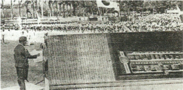

> **Deskripsi Visual:** Gambar ini adalah foto yang menunjukkan sebuah acara resmi di lapangan olahraga besar. Di tengah foto, terdapat seorang pria berdiri di depan podium, sedang memberikan sambutan atau pidato. Belakangnya tampak banyak orang yang berdiri dengan seragam, mungkin merupakan peserta atau tamu undangan acara tersebut. Di sebelah kanan podium, terdapat beberapa meja dengan peralatan rapat dan beberapa papan tulis. Di belakang mereka, terlihat beberapa bendera dan papan pengumuman. Gambar ini menunjukkan suasana resmi dan formal, mungkin acara pembukaan atau penutupan suatu acara olahraga atau konferensi.

 

---
## 📄 Halaman 43

### b. Peta

Sekalipun tidak dapat dilepaskan dari rasa ketakutan akan adanya serangan Sekutu, Jepang berusaha agar Indonesia dapat dipertahankan dari serangan Sekutu. Heiho sebagai pasukan yang terintegrasi dengan pasukan Jepang masih  dipandang  belum  memadai.  Jepang  masih  berusaha  agar  ada pasukan yang secara konkret mempertahankan Indonesia. Oleh karena itu, Jepang berencana membentuk pasukan untuk mempertahankan tanah air Indonesia yang disebut Pasukan Pembela Tanah Air (Peta). Jepang berupaya mempertahankan Indonesia dari serangan Sekutu secara sungguh-sungguh. Hal ini bisa saja didasari oleh rasa was-was yang makin meningkat karena situasi di medan perang yang bertambah sulit sehingga di samping Heiho, Jepang juga membentuk organisasi Peta .

Peta  adalah  organisasi  militer  yang  pemimpinnya  bangsa  Indonesia  yang mendapatkan latihan kemiliteran . Mula-mula yang ditugasi  untuk  melatih anggota Peta adalah seksi khusus dari bagian intelijen yang disebut Tokubetsu Han. Bahkan sebelum ada perintah pembentukan Peta, bagian Tokuhetsu Han sudah  melatih  para  pemuda  Indonesia  untuk  tugas  intelijen.  Latihan tugas intelijen dipimpin oleh Yanagawa.

Latihan Peta itu kemudian berkembang secara sistematis dan terprogram. Penyelenggaraannya berada di dalam Seinen Dojo (Panti  Latihan  Pemuda) yang terletak di Tangerang. Mula-mula anggota yang dilatih hanya 40 orang dari seluruh Jawa.

Pada akhir latihan angkatan ke-2 di Seinen Dojo, keluar perintah dari Panglima tentara Jepang Letnan Jenderal Kumaikici Harada untuk membentuk Tentara 'Pembela  Tanah  Air'(Peta).  Berkaitan  dengan  itu,  Gatot  Mangkuprojo diminta untuk mengajukan  rencana pembentukan  organisasi Tentara Pembela Tanah Air. Akhirnya, pada tanggal 3 Oktober 1943 secara resmi berdirilah  Peta.  Berdirinya  Peta  ini  berdasarkan  peraturan  dari  pemerintah Jepang yang disebut Osamu Seinendan , nomor 44. Berdirinya Peta ternyata mendapat sambutan hangat  di  kalangan  pemuda.  Banyak  di  antara  para pemuda  yang  tergabung  dalam  Seinendan  mendaftarkan  diri  menjadi anggota Peta. Anggota Peta yang bergabung berasal dari berbagai golongan di dalam masyarakat.

 

---
## 📄 Halaman 44

Peta  sudah  mengenal  adanya  jenjang    kepangkatan  dalam  organisasi, misalnya daidanco (komandan  batalion), cudanco (komandan  kompi), shodanco (komandan  peleton),  bundanco (komandan  regu),  dan  giyuhei (prajurit  sukarela).  Pada  umumnya,  para  perwira  yang  menjadi  komandan batalion atau daidanco dipilih dari kalangan tokoh-tokoh masyarakat atau orang-orang  yang  terkemuka,  misalnya  pegawai  pemerintah,  pemimpin agama, politikus, dan penegak hukum. Untuk cudanco dipilih dari mereka yang sudah bekerja, tetapi pangkatnya masih rendah, misalnya guru-guru sekolah. Shodanco dipilih  dari  kalangan  pelajar  sekolah  lanjutan.  Adapun budanco dan giyuhei dipilih dari para pemuda tingkat sekolah dasar.

Untuk mencapai tingkat perwira Peta, para anggota harus mengikuti pendidikan khusus. Pertama kali pendidikan itu dilaksanakan di Bogor dalam lembaga pelatihan yang diberi nama Korps Latihan Pemimpin Tentara Sukarela Pembela Tanah Air di Jawa (Jawa Boei Giyugun Kanbu Kyoikutai).  Setelah  menyelesaikan  pelatihan,  mereka  ditempatkan  di berbagai daidan (batalion) yang tersebar di Jawa, Madura, dan Bali.

Menurut struktur organisasi kemiliteran, Peta tidak secara resmi ditempatkan

 

---
## 📄 Halaman 45

pada struktur organisasi tentara Jepang. Hal ini memang berbeda dengan Heiho. Peta dimaksudkan sebagai pasukan gerilya yang membantu melawan apabila sewaktu-waktu terjadi serangan dari pihak musuh. Jelasnya, Peta  bertugas  membela  dan  mempertahankan  tanah  air  Indonesia  dari serangan Sekutu. Dalam kedudukannya di struktur organisasi militer Jepang, Peta  memiliki  kedudukan  yang  lebih  bebas  atau  fleksibel  dan  dalam  hal kepangkatan  ada  orang  Indonesia  yang  sampai  mencapai  perwira.  Oleh karena itu, banyak di antara berbagai lapisan masyarakat yang tertarik untuk menjadi  anggota  Peta.  Sampai  akhir  pendudukan  Jepang,  anggota  Peta ada sekitar 37.000 orang di Jawa dan sekitar 20.000 orang di Sumatra. Di Sumatra namanya lebih terkenal dengan Giyugun (prajurit-prajurit sukarela). Orang-orang Peta inilah yang akan banyak berperan di bidang ketentaraan di masa-masa berikutnya. Beberapa tokoh terkenal di dalam Peta, antara lain Supriyadi dan Sudirman.

Memahami uraian tentang pendudukan Jepang seperti diterangkan di depan, menunjukkan  bahwa  Jepang  sebenarnya  memerintah  dengan  otoriter, bersifat tirani. Semua organisasi yang dibentuk diarahkan untuk kepentingan perang. Oleh karena itu, program pendidikan bersifat militer.

 

---
## 📄 Halaman 46

### KESIMPULAN

- Organisasi pergerakan di zaman pendudukan Jepang berdiri karena prakarsa Jepang.
- Ada organisasi yang kooperatif,  tetapi ada gerakan bawah tanah.
- Organisasi yang bersifat sosial kemasyarakatan misalnya Gerakan  Tiga A, Putera, dan Jawa Hokokai.
- Organisasi bersifat militer dan semimiliter antara lain: Seinendan, Keibodan, Barisan Pelopor, Heiho, dan Peta.
- Sifat pemerintahan pendudukan Jepang di Indonesia cenderung otoriter dan bersifat tirani.
- Meskipun zaman pendudukan Jepang disebut sebagai zaman edan oleh orang-orang Jawa (lihat Ben Anderson, Java in a  Time at Revolution , bab I), namun mempunyai pengaruh yang cukup kuat bagi pertumbuhan nasionalisme Indonesia, khususnya dalam penyebarluasan bahasa Indonesia. Selain itu, peran pemuda makin meningkat serta keyakinan bahwa bangsa Indonesia pun bisa maju seperti Jepang jika mau belaja r.

 

---
## 📄 Halaman 47

### LATIH UJI KOMPETENSI

- Bagaimana  penilaianmu  tentang  organisasi  pergerakan  di  Indonesia pada  masa  pendudukan  Jepang?  Terdapat  dua  model  strategi,  ada yang bersifat kooperatif dengan Jepang, tetapi ada nonkooperatif atau gerakan bawah tanah. Jelaskan secara kritis!
- Dalam pelaksanaan pemerintahan, wilayah Indonesia dibagi-bagi dari tingkat karesidenan sampai desa. Mengapa dan apa alasan Jepang?
- Bagaimana penilaianmu berhasilkah  taktik  Jepang  untuk  menguasai Indonesia dengan berbagai propaganda, 'Jepang saudara tua', PanAsia dengan 'Gerakan Tiga A'?
- Mengapa  Jepang  begitu  semangat  untuk  membentuk  organisasiorganisasi militer dan semimiliter di Indonesia?
- Bagaimana sifat pendudukan Jepang di Indonesia?
- Bagaimana pandangan dan penilaianmu  tentang  sikap  tokoh-tokoh Indonesia  yang  mau  duduk  sebagai  pengurus  dan  anggota  dari berbagai organisasi pergerakan yang dibentuk Jepang? Apakah luntur semangat nasionalismenya? Jelaskan!
Sejarah Indonesia

39

 

---
## 📄 Halaman 48

### Tugas

Buatlah  karya  tulis  tentang  kisah  sejarah  dengan  Tema:  Jepang  'Saudara Tua'.

- Kamu dapat mencari koran, majalah, atau buku-buku yang mendukung untuk membuat karya tulis tersebut.
- Dapat juga kamu mencari seorang narasumber, yang mengalami hidup pada masa pendudukan Jepang di daerah sekitar tempat tinggalmu untuk diwawancarai.

### 3. Sebelum melakukan wawancara:

- Buatlah daftar pertanyaan-pertanyaan yang akan diajukan!
- Bawalah buku catatan atau alat perekam untuk merekam informasi saat berlangsungnya wawancara!
- Jangan lupa membawa kamera untuk melakukan pendokumentasian yang sekiranya kamu anggap penting!
- Setelah wawancara, buatlah transkrip hasil wawancaramu!
- Kemudian, buatlah laporan dalam bentuk esai sekitar 10 halaman!
Kelas XI SMA/MA/SMK/MAK

Semester 2

40

 

---
## 📄 Halaman 49

### C . Pengerahan dan Penindasan Versus Perlawanan

### Mengamati Lingkungan

---
**🖼️ Gambar/Diagram**

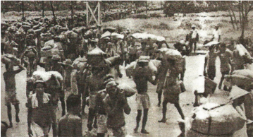

> **Deskripsi Visual:** Gambar ini adalah foto yang menunjukkan sekelompok orang sedang berjalan di jalur ganda. Orang-orang tersebut tampaknya sedang membawa beban atau barang, mungkin untuk tujuan pekerjaan atau transportasi. Di sekitar mereka, terlihat beberapa pohon dan bangunan, menunjukkan bahwa lokasi ini berada di luar kota atau di perbatasan. Teks, angka, atau label penting tidak terlihat pada gambar ini. Informasi kunci yang dapat diambil pembaca adalah bahwa gambar ini mungkin menunjukkan aktivitas sehari-hari atau pekerjaan di suatu tempat tertentu.

- » Coba amati baik-baik gambar atau ilustrasi di atas!
- Gambar apakah kira-kira?
- Mengapa peristiwa seperti pada gambar itu terjadi?
- Ya, gambar di atas menunjukkan sebuah fakta tentang romusa yang harus bekerja rodi di bawah kekejaman Jepang. Bagaimana penilaianmu tentang kenyataan itu bila kita lihat dari hakikat dan martabat sebagai manusia Indonesia?
Di balik senyum manis dan propaganda yang menjanjikan, ternyata Jepang bertindak  kejam. Jepang telah mengerahkan semua potensi dan kekuatan yang  ada  untuk  menopang  perang  yang  sedang  mereka  hadapi  untuk melawan Sekutu. Jepang juga menguras aset kekayaan yang dimiliki Indonesia untuk memenangkan perang dan melanjutkan industri di negerinya.

 

---
## 📄 Halaman 50

Nah,  uraian  berikut  akan  membahas  mengenai  kebijakan  dan  tindakan Jepang  dalam  mengerahkan  semua  kekuatan  yang  ada  di  Indonesia  dan juga kekejaman Jepang dalam berbagai bentuk kerja paksa, serta kebijakankebijakan lain yang menyakitkan rakyat Indonesia. Oleh karena itu, wajar jika kemudian muncul berbagai perlawanan.

### Memahami Teks

### 1.  Ekonomi Perang

Selama masa pendudukan Jepang di Indonesia, diterapkan konsep 'Ekonomi perang'.  Artinya,  semua  kekuatan  ekonomi  di  Indonesia  digali  untuk menopang kegiatan perang. Perlu dipahami bahwa sebelum memasuki PD II, Jepang sudah berkembang menjadi negara industri dan sekaligus menjadi kelompok  negara  imperialis  di  Asia.  Oleh  karena  itu,  Jepang  melakukan berbagai  upaya  untuk  memperluas  wilayahnya.  Sasaran  utamanya  antara lain Korea dan Indonesia. Dalam bidang ekonomi, Indonesia sangat menarik bagi Jepang. Sebab Indonesia merupakan kepulauan yang begitu kaya akan berbagai hasil  bumi,  pertanian,  tambang,  dan  lain-lainnya.  Kekayaan  Indonesia tersebut  sangat  cocok  untuk  kepentingan  industri  Jepang.  Indonesia  juga dirancang sebagai tempat penjualan produk-produk industrinya. Meletusnya PD II pada hakikatnya merupakan wujud konkret dari ambisi dan semangat imperialisme  masing-masing  negara  untuk  memperluas  daerah  kekuasaannya. Oleh karena itu, pada saat berkobarnya PD II, Indonesia benar-benar menjadi sasaran perluasan pengaruh kekuasaan Jepang. Bahkan, Indonesia kemudian menjadi salah satu benteng pertahanan Jepang untuk membendung gerak laju kekuatan tentara Serikat dan melawan kekuatan Belanda.

Setelah berhasil menguasai Indonesia, Jepang mengambil kebijakan dalam bidang  ekonomi  yang  sering  disebut self  help. Hasil  perekonomian  di Indonesia  dijadikan  modal  untuk  mencukupi  kebutuhan  pemerintahan Jepang  yang  sedang  berkuasa  di  Indonesia.  Kebijakan  Jepang  itu  juga sering  disebut  dengan  Ekonomi  Perang.  Untuk  lebih  jelasnya  perlu  dilihat bagaimana tindakan-tindakan Jepang dalam bidang ekonomi di Indonesia. Ekonomi  uang  yang  pernah  dikembangkan  masa  pemerintahan  Belanda tidak lagi populer.

 

---
## 📄 Halaman 51

Pada  waktu  Jepang  mendarat  di  Indonesia  pada  tahun  1942,  ternyata tentara Hindia Belanda telah membumihanguskan objek-objek vital yang ada di Indonesia. Hal ini dimaksudkan agar Jepang mengalami kesulitan dalam upaya  menguasai  Indonesia.  Akibat  dari  pembumihangusan  itu,  keadaan perekonomian di Indonesia menjadi lumpuh pada awal pendudukan Jepang. Sehubungan  dengan  keadaan  tersebut,  langkah  pertama  yang  diambil Jepang adalah melakukan pengawasan dan perbaikan prasarana ekonomi. Beberapa  prasarana  seperti  jembatan,  alat  transportasi,  telekomunikasi, dan  bangunan-bangunan  diperbaiki.  Kemudian  beberapa  peraturan  yang mendukung program pengawasan kegiatan ekonomi dikeluarkan termasuk ditetapkannya peraturan pengendalian kenaikan harga. Bagi mereka yang melanggar, akan dijatuhi hukuman berat.

### » Apa yang dimaksud dengan Ekonomi Perang itu? Coba jelaskan!

Sementara itu, bidang perkebunan di masa Jepang mengalami kemunduran. Hal  ini  berkaitan  dengan  kebijakan  Jepang  yang  memutuskan  hubungan dengan  Eropa  (yang  merupakan  pusat  perdagangan  dunia).  Karena  tidak perlu  memperdagangkan  hasil  perkebunan  yang  laku  di  pasaran  dunia, seperti  tebu  (gula),  tembakau,  teh,  dan  kopi,  maka  Jepang  tidak  lagi mengembangkan jenis tanaman tersebut. Bahkan tanah-tanah perkebunan diganti menjadi tanah pertanian sesuai dengan kebutuhan Jepang. Tanahtanah itu diganti dengan tanaman padi untuk menghasilkan bahan makanan dan  bahan-bahan  lain  yang  sangat  dibutuhkan,  misalnya  jarak.  Tanaman jarak waktu itu sangat dibutuhkan karena dapat digunakan sebagai minyak pelumas mesin-mesin, termasuk mesin pesawat terbang. Tanaman kina juga sangat dibutuhkan, yaitu untuk membuat obat antimalaria, sebab penyakit malaria  sangat  mengganggu  dan  melemahkan  kemampuan  tempur  para prajurit. Pabrik obat yang sudah ada di Bandung sejak zaman Belanda terus dihidupkan. Tanaman tebu di Jawa juga mulai dikurangi. Pabrik-pabrik gula sebagian  besar  mulai  ditutup.  Penderesan  getah  karet  di  Sumatera  mulai dihentikan. Tanaman-tanaman tembakau, teh, dan kopi di berbagai tempat dikurangi.  Oleh  karena  itu,  pada  masa  Jepang  ini,  hasil-hasil  perkebunan sangat menurun. Produksi karet juga turun menjadi seperlimanya produksi tahun 1941. Pada tahun 1943 produksi teh turun menjadi sepertiganya dari zaman Hindia Belanda.  Beberapa  pabrik  tekstil  juga  mulai  ditutup  karena pengadaan  kapas  dan  benang  begitu  sulit.  Dalam  bidang  transportasi, Jepang merasakan kekurangan kapal-kapal. Oleh karena itu, Jepang terpaksa mengadakan industri kapal angkut dari kayu. Jepang juga membuka pabrik mesin, paku, kawat, dan baja pelapis granat, tetapi semua usaha itu tidak berkembang lancar karena kekurangan suku cadang.

 

---
## 📄 Halaman 52

Kebutuhan pangan untuk menopang perang semakin meningkat, sehingga kegiatan penanaman untuk menghasilkan bahan pangan terus ditingkatkan. Dalam  hal  ini,  organisasi  Jawa  Hokokai  giat  melakukan  kampanye  untuk meningkatkan usaha pengadaan pangan terutama beras dan jagung. Tanah pertanian  baru,  bekas  perkebunan  dibuka  untuk  menambah  produksi beras.  Di  Sumatra  Timur,  daerah  bekas  perkebunan  yang  luasnya  ribuan hektar ditanami kembali sehingga menjadi daerah pertanian baru. Di tanah Karo juga dibuka lahan pertanian baru dengan menggunakan tenaga para tawanan. Di Kalimantan dan Sulawesi juga dibuka tanah pertanian baru untuk menambah hasil  beras.  Untuk  kepentingan  penambahan  lahan  pertanian ini, Jepang melakukan penebangan hutan secara liar dan besar-besaran. Di Pulau Jawa dilakukan penebangan hutan secara liar sekitar 500.000 hektar. Penebangan hutan secara liar dan berlebihan tersebut mengakibatkan hutan menjadi gundul, sehingga timbullah erosi dan banjir pada musim penghujan. Penebangan hutan secara liar tersebut juga berdampak pada berkurangnya sumber mata air. Dengan demikian, sekalipun tanah pertanian semakin luas, tetapi kebutuhan pangan tetap tidak tercukupi.

»

Bagaimana  pendapat  kamu  tentang  kebijakan  Jepang  tentang penebangan  hutan  secara  besar-besaran  untuk  membuka  lahan pertanian sebagau paya menambah bahan pangan!

Pemerintahan  Jepang  juga  membuat  berbagai  kebijakan  dalam  bidang pertanian.  Kebijakan  itu  diantaranya  yaitu  kebijakan  untuk  'wajib  serah padi'.  Kebijakan  ini  menjadikan  Jawa  sebagai  'Lingkungan  Kemakmuran Bersama Asia Timur Raya'. Kebijakan ini melibatkan seluruh Asia Tenggara serta Asia Timur.  Juga kebijakan dalam penanaman jenis-jenis tanaman baru, seperti kapas, yute-rosela, rami, dan jarak. Keadaan ini semakin menambah beban bagi pemerintah pendudukan Jepang di Indonesia. Untuk mengatasi keadaan  ini  kemudian  pemerintah  pendudukan  Jepang  mengeluarkan beberapa ketentuan yang sangat ketat yang terkait dengan produksi padi.

- Padi  berada  langsung  di  bawah  pengawasan  pemerintah  Jepang. Hanya  pemerintah  Jepang  yang  berhak  mengatur  untuk  produksi, pungutan  dan  penyaluran  padi  serta  menentukan  harganya.  Dalam kaitan ini Jepang telah membentuk badan yang diberi nama Shokuryo Konri Zimusyo (Kantor Pengelolaan Pangan).
- Penggiling  dan  pedagang padi tidak  boleh  beroperasi  sendiri,  harus diatur oleh Kantor Pengelolaan Pangan.

 

---
## 📄 Halaman 53

- Para petani harus menjual hasil produksi padinya kepada pemerintah sesuai dengan kuota yang telah ditentukan dengan harga yang telah ditetapkan pemerintah Jepang. Begitu juga padi harus diserahkan ke penggilingan padi yang sudah ditunjuk pemerintah Jepang. Dalam hal ini, berlaku ketentuan hasil keseluruhan produksi, petani berhak  40%, kemudian 30% disetor kepada pemerintah melalui penggilingan yang telah ditunjuk, dan 30% sisanya untuk persiapan bibit dengan disetor ke lumbung desa.
Selama  pendudukan  Tirani  Jepang  kehidupan  petani  semakin  merosot. Mereka  tidak  bisa  menikmati  hasil  jerih  payahnya  sebagai  petani.  Karena hasil  pertaniannya  harus  dijual  dengan  harga  yang  sudah  ditentukan Jepang  (boleh  dikatakan  diserahkan  kepada  penguasa  Jepang),  sehingga kehidupannya  menjadi  semakin  menderita.  Sebelum  panen  petani  harus melaporkan kepada kucho (kepala desa). Kucho inilah yang menjadi ujung tombak  pengumpulan  hasil  panen  dari  petani.  Hasil  panen  itu  ditimbang dengan ukuran 'kintalan' (atau kuintal yang sama dengan 100 kg), pada hal sebelumnya menggunakan  ukuran dacin ( satu dacin kira-kira 65 kg) (Her Suganda, Rengasdengklok , 2009)

---
**🖼️ Gambar/Diagram**

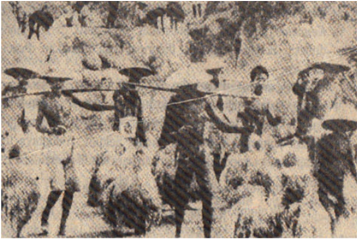

> **Deskripsi Visual:** Gambar ini adalah ilustrasi yang menunjukkan sekelompok orang sedang berjalan di sepanjang jalan. Orang-orang tersebut mengenakan pakaian tradisional dengan topi dan celana panjang, serta membawa barang-barang kecil. Di sebelah kiri, ada beberapa hewan ternak seperti sapi dan kerbau yang tampak sedang berjalan bersama-sama. Gambar ini menunjukkan suasana sehari-hari di desa atau pedesaan, dengan fokus pada aktivitas sehari-hari masyarakat lokal. Ilustrasi ini mungkin digunakan untuk menjelaskan tentang kehidupan sehari-hari di desa atau pedesaan, serta peran hewan ternak dalam kehidupan masyarakat tersebut.

 

---
## 📄 Halaman 54

Dalam rangka mengendalikan kebijakan di bidang ekonomi, maka semua objek  vital  dan  alat-alat  produksi  dikuasai  oleh  Jepang  dan  di  bawah pengawasan  yang  sangat  ketat.  Pemerintah  Jepang  juga  mengeluarkan peraturan untuk menjalankan perekonomian di bidang perkebunan. Perkebunan-perkebunan diawasi dan dipegang sepenuhnya oleh pemerintah Jepang.  Banyak  perkebunan  yang  dirusak  dan  diganti  dengan  tanaman yang sesuai untuk keperluan biaya perang. Rakyat dilarang menanam tebu dan membuat gula. Beberapa perusahaan swasta Jepang yang menangani pabrik gula adalah Meiji Seito Kaisya. Akibat kebijakan Jepang ini, tingkat kesejahteraan bangsa Indonesia terus merosot.

Dengan diterapkannya kebijakan ekonomi perang itu, ekonomi uang yang pernah  dikembangkan  masa  pemerintahan  Hindia  Belanda  tidak  begitu populer. Bahkan bank-bank yang pernah dikembangkan pemerintah Hindia Belanda dilikuidasi.  Semua aset bank disita. Selanjutnya, pada bulan April 1942, diumumkan suatu banking-moratorium tentang adanya penangguhan pembayaran kewajiban-kewajiban bank. Beberapa bulan kemudian, pimpinan tentara  Jepang  untuk  Pulau  Jawa,  yang  berada  di  Jakarta,  mengeluarkan ordonansi  berupa  perintah  likuidasi  untuk  seluruh  bank  Belanda,  Inggris, dan beberapa bank Cina. Ordonansi serupa juga dikeluarkan oleh komando militer  Jepang  di  Singapura  untuk  bank-bank  di  Sumatera,  sedangkan kewenangan  likuidasi  bank-bank  di  Kalimantan  dan Great  East diberikan kepada Navy Ministry di Tokyo.

Fungsi  dan  tugas  bank-bank  yang  dilikuidasi  tersebut,  kemudian  diambil alih oleh bank-bank Jepang, seperti Yokohama Specie Bank, Taiwan Bank, dan Mitsui  Bank , yang  pernah  ada  sebelumnya  dan  ditutup  oleh  Belanda ketika  mulai  pecah  perang.  Sebagai  bank  sirkulasi  di  Pulau  Jawa, Javache Bank dilikuidasi dibentuklah Nanpo Kaihatsu Ginko yang melanjutkan tugas tentara  pendudukan  Jepang  dalam  mengedarkan invansion  money yang dicetak di Jepang dalam tujuh denominasi, mulai dari satu hingga sepuluh gulden.Uang Belanda kemudian digantikan oleh uang Jepang.

- » Dengan  berbagai  ketentuan  pemerintah  Jepang  tersebut,  coba bandingkan dengan kegiatan monopoli yang dilakukan pada zaman Hindia Belanda! Adakah persamaannya? Coba lakukan telaah kritis tentang hal itu!

 

---
## 📄 Halaman 55

### 2.  Pengendalian di Bidang Pendidikan dan Kebudayaan

Pemerintah Jepang mulai membatasi kegiatan pendidikan. Jumlah sekolah juga  dikurangi  secara  drastis.  Jumlah  sekolah  dasar  menurun  dari  21.500 menjadi  13.500  buah.  Sekolah  lanjutan  menurun  dari  850  menjadi  20 buah.  Kegiatan  perguruan  tinggi  boleh  dikatakan  macet.  Jumlah  murid sekolah  dasar  menurun  30%  dan  jumlah  siswa  sekolah  lanjutan  merosot sampai 90%. Begitu juga tenaga pengajarnya mengalami penurunan secara signifikan. Muatan kurikulum yang diajarkan juga dibatasi. Mata pelajaran bahasa Indonesia dijadikan mata pelajaran utama, sekaligus sebagai bahasa pengantar.  Kemudian,  bahasa  Jepang  menjadi  mata  pelajaran  wajib  di sekolah.

Para pelajar harus menghormati budaya dan adat istiadat Jepang. Mereka juga harus melakukan kegiatan kerja bakti ( kinrohosyi ). Kegiatan kerja bakti itu meliputi, pengumpulan bahan-bahan untuk perang, penanaman bahan makanan, penanaman pohon jarak, perbaikan jalan, dan pembersihan asrama. Para pelajar juga harus mengikuti kegiatan latihan jasmani dan kemiliteran. Mereka harus benar-benar menjalankan semangat Jepang ( Nippon Seishin ). Para pelajar juga harus menyanyikan lagu Kimigayo, menghormati bendera Hinomaru dan melakukan gerak badan (taiso ) serta seikerei.

Akibat keputusan pemerintah Jepang tersebut, membuat angka buta huruf menjadi  meningkat.  Oleh  karena  itu,  pemuda  Indonesia  mengadakan program pemberantasan buta huruf yang dipelopori oleh Putera. Berdasarkan kenyataan tersebut, dapat dikatakan bahwa kondisi pendidikan di Indonesia pada  masa  pendudukan  Jepang  mengalami  kemunduran.  Kemunduran pendidikan  itu  juga  berkaitan  dengan  kebijakan  pemerintah  Jepang  yang lebih berorientasi pada kemiliteran untuk kepentingan pertahanan Indonesia dibandingkan  pendidikan.  Banyak  anak  usia  sekolah  yang  harus  masuk organisasi  semimiliter  sehingga  banyak  anak  yang  meninggalkan  bangku sekolah. Bagi Jepang, pelaksanaan pendidikan bagi rakyat Indonesia bukan untuk  membuat  pandai,  tetapi  dalam  rangka  untuk  pembentukan  kaderkader  yang  memelopori  program  Kemakmuran Bersama Asia Timur Raya. Oleh karena itu, sekolah selalu menjadi tempat indoktrinasi kejepangan .

- » Coba pikirkan baik-baik, mengapa Jepang melakukan pembatasan dan pengendalian pendidikan di Indonesia?

 

---
## 📄 Halaman 56

### 3.  Pengerahan Romusa

Berbagai  kebijakan  dan  tindakan  Jepang  seperti  disebutkan  di  atas  telah membuat  penderitaan  rakyat.  Rakyat  petani  tidak  dapat  berbuat  banyak kecuali  harus  tunduk  kepada  praktik-praktik  tirani  Jepang.  Penderitaan rakyat  ini  semakin  dirasakan  dengan  adanya  kebijakan  untuk  pengerahan tenaga romusa. Kamu tahu apa yang dimaksud dengan romusa? Coba cari jawabnya!

Perlu  diketahui  bahwa  untuk  menopang  Perang  Asia  Timur  Raya,  Jepang mengerahkan semua tenaga kerja dari Indonesia. Tenaga kerja inilah yang kemudian kita  kenal  dengan  romusa.  Mereka  dipekerjakan  di  lingkungan terbuka, misalnya di lingkungan pembangunan kubu-kubu pertahanan, jalan raya, lapangan udara. Pada awalnya, tenaga kerja dikerahkan di Pulau Jawa yang padat penduduknya, kemudian di kota-kota dibentuk barisan romusa sebagai  sarana  propaganda.  Desa-desa  diwajibkan  untuk  menyiapkan sejumlah tenaga romusa. Panitia pengerahan tersebut disebut Romukyokai , yang ada di setiap daerah.

Rakyat yang dijadikan romusa pada umumnya adalah rakyat yang bertenaga kasar.  Pada  awalnya,  rakyat  Indonesia  melakukan  tugas  romusa  secara sukarela,  sehingga  Jepang  tidak  mengalami  kesulitan  untuk  memperoleh tenaga.  Sebab,  rakyat  sangat  tertarik  dengan  propaganda  tentara  Jepang sehingga rakyat rela membantu untuk bekerja apa saja tanpa digaji. Oleh karena  itu,  di  beberapa kota pernah terdapat beberapa romusa yang sifatnya sementara dan sukarela. Romusa sukarela terdiri  atas  para pegawai yang bekerja (tidak digaji) selama satu minggu  di  suatu  tempat yang penting. Salah satu contoh  ada  rombongan dari Jakarta dipimpin oleh Sukarno. Para pekerja sukarela ini bekerja dalam

---
**🖼️ Gambar/Diagram**

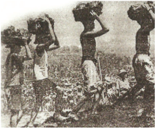

> **Deskripsi Visual:** Gambar ini adalah ilustrasi yang menunjukkan tiga orang pria berjalan dengan beban di kepala mereka. Beban tersebut tampaknya berisi benda-benda kecil, mungkin seperti batu atau kayu. Pria-pria tersebut tampaknya sedang berjalan di atas tanah dengan latar belakang yang tampak gelap, mungkin menunjukkan bahwa mereka sedang berjalan di malam hari atau di tempat yang gelap. Ilustrasi ini mungkin digunakan untuk menggambarkan kondisi kerja atau pekerjaan tradisional di masa lalu.

Gambar 5.12 Romusa sedang bekerja.

 

---
## 📄 Halaman 57

suasana yang disebut 'Pekan Perjuangan Mati-Matian' . Akan tetapi, lamakelamaan karena kebutuhan yang terus meningkat di seluruh kawasan Asia Tenggara,  pengerahan  tenaga  yang  bersifat  sukarela  ini  oleh  pemerintah Jepang diubah menjadi sebuah keharusan dan paksaan.

Rakyat  Indonesia  yang  menjadi  romusa  itu  diperlakukan  dengan  tidak senonoh, tanpa mengenal perikemanusiaan. Mereka dipaksa bekerja sejak pagi hari sampai petang, tanpa makan dan pelayanan yang cukup. Padahal mereka melakukan pekerjaan kasar yang sangat memerlukan banyak asupan makanan dan istirahat. Mereka hanya dapat beristirahat pada malam hari. Kesehatan mereka tidak terurus. Tidak jarang di antara mereka jatuh sakit bahkan mati kelaparan.

Untuk menutupi kekejamannya dan agar rakyat merasa tidak dirugikan, sejak tahun 1943, Jepang melancarkan kampanye dan propaganda untuk menarik rakyat agar mau berangkat bekerja sebagai romusa. Untuk mengambil hati rakyat, Jepang memberi julukan mereka yang menjadi romusa itu sebagai 'Pejuang Ekonomi' atau 'Pahlawan Pekerja'. Para romusa itu diibaratkan sebagai orang-orang yang sedang menunaikan tugas sucinya untuk memenangkan  perang  dalam  Perang  Asia  Timur  Raya.  Pada  periode  itu sudah sekitar 300.000 tenaga romusa dikirim ke luar Jawa. Bahkan sampai ke luar negeri seperti ke Birma, Muangthai, Vietnam, Serawak, dan Malaya. Sebagian besar dari mereka ada yang kembali ke daerah asal, ada yang tetap tinggal di tempat kerja, tetapi kebanyakan mereka mati di tempat kerja.

### Bagaimana dampak dari kebijakan dan tindakan Jepang tersebut?

Yang  jelas penderitaan rakyat tidak berkurang  tetapi justru  semakin bertambah. Kehidupan rakyat benar-benar menyedihkan. Bahan makanan sulit  didapatkan  karena  banyak  petani  yang  menjadi  pekerja  romusa. Gelandangan di  kota-kota  besar  makin  tumbuh  subur,  seperti  di  kota  Surabaya, Jakarta,  Bandung,  dan  Semarang.  Tidak  jarang  mereka  mati  kelaparan  di jalanan  atau  di  bawah  jembatan.  Penyakit  kudis  menjangkiti  masyarakat. Pasar gelap tumbuh di kota-kota besar. Akibatnya, barang-barang keperluan sulit  didapatkan  dan  semakin  sedikit  jumlahnya.  Masyarakat  hidup  dalam kesulitan.  Uang  yang  dikeluarkan  Jepang  tidak  ada  jaminannya,  bahkan mengalami inflasi yang parah. Bahan-bahan pakaian sulit didapatkan, bahkan masyarakat  menggunakan  karung  goni  sebagai  bahan  pakaian  mereka. Obat-obatan  juga  sangat  sulit  didapatkan.  Penderitaan  rakyat  Indonesia semakin tidak tertahankan.

 

---
## 📄 Halaman 58

- » Coba	lakukan	refleksi,	bagaimana	perasaan	dan	penilaianmu	terkait dengan praktik romusa itu!

### 4.  Perang Melawan Sang Tirani

Jepang yang mula-mula disambut dengan senang hati, kemudian berubah menjadi  kebencian.  Rakyat  bahkan  lebih  benci  pada  pemerintah  Jepang daripada pemerintah Kolonial Belanda. Jepang seringkali bertindak sewenangwenang. Rakyat tidak bersalah ditangkap, ditahan, dan disiksa. Kekejaman itu dilakukan oleh kempetai (polisi militer Jepang). Pada masa pendudukan Jepang  banyak  gadis  dan  perempuan  Indonesia  yang  ditipu  oleh  Jepang dengan  dalih  untuk  bekerja  sebagai  perawat  atau  disekolahkan,  ternyata hanya dipaksa untuk melayani para kempetai . Para gadis dan perempuan itu disekap dalam kamp-kamp yang tertutup sebagai wanita penghibur. Kampkamp itu dapat kita temukan di Solo, Semarang, Jakarta, dan Sumatera Barat. Kondisi itu menambah deretan penderitaan rakyat di bawah kendali penjajah Jepang. Oleh karena itu, wajar kalau kemudian timbul berbagai perlawanan terhadap pemerintah pendudukan Jepang di Indonesia.

### a. Aceh Angkat Senjata

Salah satu perlawanan terhadap Jepang di Aceh adalah perlawananan rakyat yang terjadi di Cot Plieng yang dipimpin oleh Abdul Jalil. Abdul Jalil adalah seorang  ulama  muda,  guru  mengaji  di  daerah  Cot  Plieng,  Provinsi  Aceh. Karena  melihat  kekejaman  dan  kesewenangan  pemerintah  pendudukan Jepang,  terutama  terhadap  romusa,  maka  rakyat  Cot  Plieng  melancarkan perlawanan. Abdul Jalil memimpin rakyat Cot Plieng untuk melawan tindak penindasan dan kekejaman yang dilakukan pendudukan Jepang.

Di Lhokseumawe, Abdul Jalil berhasil menggerakkan rakyat dan para santri di sekitar Cot Plieng. Gerakan Abdul Jalil ini di mata Jepang dianggap sebagai tindakan  yang  sangat  membahayakan.  Oleh  karena  itu,  Jepang  berusaha membujuk Abdul Jalil untuk berdamai. Namun, Abdul Jalil bergeming dengan ajakan damai itu. Karena Abdul Jalil menolak jalan damai, pada tanggal 10 November 1942, Jepang mengerahkan pasukannya untuk menyerang Cot Plieng.

 

---
## 📄 Halaman 59

Kemudian, pertempuran berlanjut hingga pada tanggal 24 November 1942, saat rakyat sedang menjalankan ibadah salat subuh. Karena diserang, maka rakyat pun dengan sekuat tenaga melawan. Rakyat dengan bersenjatakan pedang dan kelewang, bertahan bahkan dapat memukul mundur tentara Jepang. Serangan tentara Jepang diulang untuk yang kedua kalinya, tetapi dapat  digagalkan  oleh  rakyat.  Kekuatan  Jepang  semakin  ditingkatkan. Kemudian,  Jepang  melancarkan  serangan  untuk  yang  ketiga  kalinya  dan berhasil  menghancurkan  pertahanan  rakyat  Cot  Plieng,  setelah  Jepang membakar  masjid.  Banyak  rakyat  pengikut  Abdul  Jalil  yang  terbunuh. Dalam  keadaan  terdesak,  Abdul  Jalil  dan  beberapa  pengikutnya  berhasil meloloskan diri  ke  Buloh  Blang  Ara . Beberapa hari  kemudian,  saat  Abdul Jalil  dan  pengikutnya  sedang  menjalankan  salat,  mereka  ditembaki  oleh tentara Jepang sehingga Abdul Jalil gugur sebagai pahlawan bangsa. Dalam pertempuran  ini,  rakyat  yang  gugur  sebanyak  120  orang  dan  150  orang luka-luka, sedangkan Jepang kehilangan 90 orang prajuritnya.

Kebencian rakyat Aceh terhadap Jepang semakin meluas sehingga muncul perlawanan di Jangka Buyadi bawah pimpinan perwira Gyugun Abdul Hamid. Dalam  situasi  perang  yang  meluas  ke  berbagai  tempat,  Jepang  mencari cara  yang  efektif  untuk  menghentikan  perlawanan  Abdul  Hamid.  Jepang menangkap dan menyandera semua anggota keluarga Abdul Hamid. Dengan berat  hati  akhirnya  Abdul  Hamid  mengakhiri  perlawanannya.  Berikutnya perlawanan  rakyat  berkobar  di  Pandrah  Kabupaten  Bireuen.  Perlawanan disebabkan oleh masalah penyetoran padi dan pengerahan tenaga romusa. Kerja paksa yang diadakan Jepang terlalu memakan waktu panjang sehingga para petani hampir tidak memiliki kesempatan untuk menggarap sawah. Di samping  itu,  Jepang  menancapi  bambu  runcing  di  sawah-sawah  dengan maksud agar tidak  dapat  digunakan  Sekutu  untuk  mendaratkan  pasukan payungnya.  Tindakan  Jepang  itu  sangat  merugikan  rakyat.  Fakta  yang memberatkan lagi, Jepang juga memaksa rakyat untuk menyerahkan hasil panennya sebanyak 50 - 80%.

- » Kamu telah mempelajari bagaimana perjuangan rakyat Aceh dalam memerangi kekejaman Jepang. Pelajaran apa yang kamu peroleh sehingga kita dapat menjalani hidup yang lebih baik?

 

---
## 📄 Halaman 60

### b. Perlawanan di Singaparna

Singaparna  merupakan  salah  satu  daerah  di  wilayah  Jawa  Barat,  yang  rakyatnya dikenal sangat religius dan memiliki jiwa patriotik. Rakyat Singaparna sangat anti  terhadap  dominasi  asing.  Oleh  karena  itu,  rakyat  Singaparna  sangat benci  terhadap  pendudukan  Jepang,  apalagi  ketika  mengetahui  perilaku pemerintahan Jepang yang sangat kejam. Kebijakan-kebijakan Jepang yang diterapkan dalam kehidupan masyarakat, banyak yang tidak sesuai dengan ajaran Islam, ajaran yang banyak dianut oleh masyarakat Singaparna. Atas dasar pandangan dan ajaran Islam, rakyat Singaparna melakukan perlawanan terhadap pemerintahan Jepang. Perlawanan itu juga dilatarbelakangi oleh kehidupan rakyat yang semakin menderita.

Pengerahan tenaga romusa dengan paksa dan di bawah ancaman ternyata sangat  mengganggu  ketenteraman  rakyat.  Para  romusa  dari  Singaparna dikirim  ke  berbagai  daerah  di  luar  Jawa.  Mereka  umumnya  tidak  kembali karena menjadi korban keganasan alam maupun akibat tindakan Jepang yang tidak  mengenal  perikemanusiaan.  Mereka  banyak  yang  meninggal  tanpa diketahui di mana kuburnya. Selain itu, rakyat juga diwajibkaan menyerahkan padi dan beras dengan aturan yang sangat menjerat dan menindas rakyat, sehingga penderitaan terjadi di mana-mana. Kemudian secara khusus rakyat Singaparna di bawah Kiai Zainal Mustafa menentang keras untuk melakukan seikeirei .  Itulah  sebabnya rakyat Singaparna mengangkat senjata melawan Jepang .

Perlawanan meletus pada bulan Februari, 1944. Perlawanan dipimpin oleh Kiai Zainal Mustafa, seorang ajengan di Sukamanah, Singaparna. Ia adalah  pendiri  Pesantren  Sukamanah.  Pendiri pesantren Sukamanah  ini tidak mau  kerja sama  dengan  Jepang.  Ia  sangat  menentang kebijakan-kebijakan  Jepang  yang  tidak  sesuai dengan  ajaran  Islam.  Bahkan  Zainal  Mustafa secara  diam-diam telah membentuk 'Pasukan Tempur Sukamanah' yang dipimpin oleh ajengan Najminudin.

 

---
## 📄 Halaman 61

Kiai  Zainal  Mustafa  memulai  pertempuran  pada  salah  satu  hari  Jumat  di bulan  Februari  1944.  Sebelum  perang  itu  dimulai,  ada  beberapa  utusan dari  kepolisian  Tasikmalaya  dan  beberapa  orang  Indonesia  yang  ingin mengadakan  perundingan  dengan  Zainal  Mustafa.  Namun,  polisi  Jepang itu dilucuti senjatanya dan ditahan oleh pengikut Zainal Mustafa. Kemudian ada seorang polisi yang disuruh kembali ke Tasikmalaya untuk melaporkan yang baru saja terjadi dan menyampaikan ultimatum dari Kiai Zainal Mustafa kepada pihak Jepang agar besok segera memerdekakan Jawa dan jika tidak, maka akan terjadi pertempuran yang akan mengancam keselamatan orangorang Jepang.

Hari berikutnya datang kembali rombongan utusan Jepang ke Sukamanah untuk mengadakan kembali perundingan dengan Zainal Mustafa. Akan  tetapi,  utusan  Jepang  itu  bersikap  congkak  dan  sombong  untuk menunjukkan  bahwa  Jepang  memiliki  kedudukan  yang  lebih  tinggi  dan lebih kuat. Hal ini menyulut kemarahan pengikut Zainal Mustafa, sehingga utusan Jepang itu pun dilucuti senjatanya dan ditangkap bahkan ada yang dibunuh, sementara ada juga yang berhasil melarikan diri. Setelah kejadian ini,  Jepang  mengirimkan  pasukan  ke  Sukamanah,  yang  terdiri  dari  30 orang kempetai  dan 60 orang polisi negara istimewa (tokubetsu keisatsu) dari  Tasikmalaya dan Garut. Pertempuran terjadi lebih kurang satu jam di kampung  Sukamanah.  Pihak  rakyat  menyerang  dengan  mempergunakan pedang  dan  bambu  runcing  yang  diikuti  dengan  teriakan  takbir.  Zainal Mustafa  dengan  pengikutnya  bertempur  mati-matian  untuk  menghadapi gempuran dari pihak Jepang. Karena jumlah pasukan yang lebih besar dan peralatan senjata yang lebih lengkap, tentara Jepang berhasil mengalahkan pasukan Zainal Mustafa. Dalam pertempuran ini banyak berguguran para pejuang Indonesia. Kiai Zainal Mustafa ditangkap Jepang bersama gurunya Kiai Emar. Selanjutnya Kiai Zainal Mustafa bersama 27 orang pengikutnya diangkut ke Jakarta. Pada tanggal 25 Oktober 1944, mereka dihukum mati. Sementara Kiai Emar disiksa oleh polisi Jepang dan akhirnya meninggal.

### c. Perlawanan di Indramayu

Perlawanan terhadap kekejaman Jepang juga terjadi di daerah Indramayu. Latar belakang dan sebab-sebab perlawanan itu tidak jauh berbeda dengan apa  yang  terjadi  di  Singaparna.  Para  petani  dan  rakyat  Indramayu  pada umumnya  hidup  sangat  sengsara.  Jepang  telah  bertindak  semena-mena terhadap para petani Indramayu. Mereka harus menyerahkan sebagian besar

 

---
## 📄 Halaman 62

hasil  padinya  kepada Jepang. Tentu kebijakan ini sangat menyengsarakan rakyat. Begitu juga kebijakan untuk mengerahkan tenaga romusa juga terjadi di Indramayu, sehingga semakin membuat rakyat menderita.

Perlawanan rakyat Indramayu antara lain terjadi di Desa Kaplongan, Distrik Karangampel pada bulan April 1944. Kemudian pada bulan Juli, muncul pula perlawanan  rakyat  di  Desa  Cidempet,  Kecamatan  Lohbener.  Perlawanan tersebut  terjadi  karena  rakyat  merasa  tertindas  dengan  adanya  kebijakan penarikan  hasil  padi  yang  sangat  memberatkan.  Rakyat  yang  baru  saja memanen padinya harus langsung dibawa ke balai desa. Setelah itu, pemilik mengajukan  permohonan  kembali  untuk  mendapat  sebagian  padi  hasil panennya. Rakyat tidak dapat menerima cara-cara Jepang yang demikian. Rakyat protes dan melawan. Mereka bersemboyan 'lebih baik mati melawan Jepang daripada mati kelaparan'. Setelah kejadian tersebut, maka terjadilah perlawanan yang dilancarkan oleh rakyat. Namun, sekali lagi  rakyat  tidak mampu  melawan  kekuatan  Jepang  yang  didukung  dengan  tentara  dan peralatan yang lengkap. Rakyat telah menjadi korban dalam membela bumi tanah airnya.

- » Demikian  beberapa  perlawanan  yang  dilakukan  untuk  melawan tirani Jepang, baik di Singaparna maupun di Indramayu. Bagaimana penilaianmu  tentang  perjuangan  rakyat  Indonesia?  Bagaimana penilaianmu tentang semboyan: 'lebih baik mati melawan Jepang daripada mati kelaparan?'

### d. Rakyat Kalimantan Angkat Senjata

Perlawanan  rakyat  terhadap  kekejaman  Jepang  terjadi  di  banyak  tempat. Begitu juga di Kalimantan, terjadi peristiwa yang hampir sama dengan yang terjadi  di  Jawa  dan  Sumatera.  Rakyat  melawan  Jepang  karena  himpitan penindasan yang dirasakan sangat berat. Salah satu perlawanan di Kalimantan adalah perlawanan yang dipimpin oleh Pang Suma, seorang pemimpin Suku Dayak. Pemimpin Suku Dayak ini memiliki pengaruh yang luas di kalangan orang-orang atau suku-suku dari daerah Tayan, Meliau, dan sekitarnya.

Pang Suma dan pengikutnya melancarkan perlawanan terhadap Jepang dengan taktik perang gerilya. Walaupun mereka hanya berjumlah sedikit, tetapi dengan bantuan rakyat  yang  militan  dan  dengan  memanfaatkan  keuntungan  alam

 

---
## 📄 Halaman 63

berupa rimba belantara, sungai,  rawa,  dan  daerah yang sulit ditempuhperlawanan berkobar dengan sengitnya. Namun, harus  dipahami  bahwa  di kalangan  penduduk  juga berkeliaran para mata-mata Jepang  yang  berasal  dari orang-orang Indonesia sendiri. Lebih menyedihkan lagi,  para  mata-mata  itu juga tidak segan-segan menangkap rakyat, melakukan penganiayaan, dan  pembunuhan,  baik terhadap orang-orang  yang dicurigai atau bahkan terhadap saudaranya sendiri. Adanya matamata  inilah  yang sering membuat perlawanan para  pejuang  Indonesia  dapat  dikalahkan  oleh  penjajah.  Demikian  juga perlawanan  rakyat  yang  dipimpin  Pang  Suma  di  Kalimantan  ini  akhirnya mengalami kegagalan.

### e. Perlawanan Rakyat Irian Barat

Pada masa pendudukan Jepang, penderitaan juga dialami oleh rakyat di Irian Barat. Mereka mendapat pukulan dan penganiayaan yang sering di luar batas kemanusiaan.  Oleh  karena  itu,  wajar  jika  kemudian  mereka  melancarkan perlawanan terhadap Jepang.

Gerakan  perlawanan  yang  terkenal  di  Papua  adalah  'Gerakan  Koreri' yang  berpusat  di  Biak  dengan  pemimpinnya  bernama  L.  Rumkorem.  Biak merupakan pusat pergolakan untuk melawan pendudukan Jepang. Rakyat Irian memiliki semangat juang pantang menyerah, sekalipun Jepang sangat kuat,  sedangkan  rakyat  hanya  menggunakan  senjata  seadanya  untuk

 

---
## 📄 Halaman 64

melawan. Rakyat Irian terus memberikan perlawanan di berbagai tempat. Mereka  juga  tidak  memiliki  rasa  takut.  Padahal  kalau  ada  rakyat  yang tertangkap, Jepang tidak segan-segan memberi hukuman pancung di depan umum. Namun, rakyat Irian  tidak  gentar  menghadapi  semua  itu.  Mereka melakukan  taktik  perang  gerilya.  Tampaknya,  Jepang  cukup  kewalahan menghadapi  keberanian  dan  taktik  gerilya  orang-orang  Irian.  Akhirnya, Jepang  tidak  mampu  bertahan  menghadapi  para  pejuang  Irian  tersebut. Jepang akhirnya meninggalkan Biak. Oleh karena itu, dapat dikatakan Pulau Biak ini merupakan daerah bebas dan merdeka yang pertama di Indonesia.

Ternyata perlawanan di tanah Irian ini juga meluas ke berbagai daerah, dari Biak kemudian ke Yapen Selatan. Salah seorang pemimpin perlawanan di daerah ini adalah Silas Papare. Perlawanan di daerah ini berlangsung sangat lama bahkan sampai kemudian tentara Jepang dikalahkan Sekutu. Setelah berjuang  bergerilya  dalam  waktu  yang  sangat  lama,  rakyat  Yape  Selatan mendapatkan bantuan senjata dari Sekutu, bantuan senjata itu membantu rakyat Yape Selatan untuk mengalahkan Jepang. Hal tersebut menunjukkan bagaimana keuletan rakyat Irian dalam menghadapi kekejaman pendudukan Jepang.

### f. Peta di Blitar Angkat Senjata

Pada  masa  pendudukan  Jepang  penderitaan  rakyat  sangat  berat.  Tidak ada  sedikit  pun  dari  pemerintah  pendudukan  Jepang  yang  memikirkan kehidupan rakyat yang diperintahnya.Yang ada pada benak Jepang adalah memenangkan perang dan upaya mempertahankan Indonesia dari serangan Sekutu.  Namun,  justru  rakyat  yang  dikorbankan.  Rakyat  menjadi  semakin menderita.  Penderitaan  demi  penderitaan    ini  mulai  terlintas  di  benak Supriyadi  seorang  Shodanco Peta.  Tumbuhlah  semangat  dan  kesadaran nasional, sehingga timbul rencana untuk melakukan perlawanan terhadap Jepang.

Sebagai komandan Peta, Supriyadi cukup memahami bagaimana penderitaan rakyat  akibat  penindasan  yang  dilakukan  Jepang.  Masalah  pengumpulan hasil padi, pengerahan romusa, semua dilakukan secara paksa dengan tanpa memperhatikan  nilai-nilai  kemanusiaan,  sungguh  kekejaman  yang  luar biasa.  Hal  semacam  ini  juga  dirasakan  Supriyadi  dan  kawan-kawannya  di lingkungan Peta. Mereka kerap menyaksikan sikap congkak dan sombong dari para syidokan yang melatih mereka.

 

---
## 📄 Halaman 65

Para  pelatih  Jepang  sering  merendahkan  para  prajurit  bumiputra.  Hal  ini menambah rasa sakit hati sekaligus rasa benci pasukan Supriyadi terhadap pemerintahan Jepang di Indonesia. Penderitaan rakyat itulah yang menimbulkan  rencana  para  anggota  Peta  di  Blitar  untuk  melancarkan perlawanan terhadap pendudukan Jepang. Rencana perlawanan itu tampaknya  sudah  bulat  tinggal  menunggu  waktu  yang  tepat.  Dalam perlawanan  Peta  tersebut, direncanakan  akan  melibatkan  rakyat  dan beberapa kesatuan lain.

Apa pun yang terjadi, Supriyadi dengan teman-temannya sudah bertekad bulat  untuk  melancarkan  serangan  terhadap  pihak  Jepang.  Pada  tanggal 29  Februari  1945  dini  hari,  Supriyadi  dengan  teman-temannya  mulai bergerak. Mereka melepaskan tembakan mortir, senapan mesin, dan granat dari daidan,  lalu  keluar  dengan  bersenjata  lengkap.  Setelah  pihak  Jepang mengetahui adanya gerakan penyerbuan itu, mereka segera mendatangkan pasukan yang semuanya orang Jepang. Pasukan Jepang juga dipersenjatai dengan beberapa tank dan pesawat udara. Mereka segera menghalau para anggota Peta yang mencoba melakukan perlawanan. Tentara Jepang mulai menguasai keadaan dan seluruh kota Blitar mulai dapat dikuasai. Pimpinan tentara Jepang kemudian menyerukan kepada segenap anggota Peta yang melakukan serangan, agar segera kembali ke induk kesatuan masing-masing.

---
**🖼️ Gambar/Diagram**

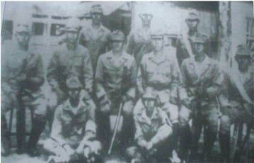

> **Deskripsi Visual:** Gambar ini adalah foto yang menunjukkan kelompok orang yang tampaknya berada di luar ruangan, mungkin di tempat militer atau khusus karena penampilan mereka yang formal. Kelompok ini terdiri dari beberapa orang yang duduk dan berdiri, dengan posisi yang berbeda-beda. Beberapa orang tampak sedang berbicara atau menghadap ke arah yang sama, sementara yang lain tampak lebih tenang atau berpose untuk foto. Penampilan mereka yang formal dan seragam menunjukkan bahwa mereka mungkin merupakan anggota tim atau unit tertentu. Tidak ada teks, angka, atau label yang jelas dalam gambar ini, sehingga informasi spesifik tentang konteks atau detail lainnya tidak dapat dilihat. Gambar ini mungkin digunakan sebagai representasi dari kelompok tersebut dalam konteks pelajaran atau cerita yang lebih luas.

 

---
## 📄 Halaman 66

Beberapa kesatuan mulai memenuhi perintah pimpinan tentara Jepang itu. Akan tetapi mereka yang kembali ke induk pasukannya memenuhi panggilan justru  ditangkapi,  ditahan,  dan  disiksa  oleh  polisi  Jepang.  Selanjutnya diserukan  kepada  anak  buah  Supriyadi  agar  menyerah  dan  kembali  ke induk pasukannya. Kurang lebih setengah dari batalion Supriyadi memenuhi panggilan tersebut. Namun, pasukan yang lain tidak ingin kembali dan tetap setia melakukan perlawanan Peta yang dipimpin oleh Supriyadi. Mereka yang tetap  melakukan  perlawanan  itu  antara  lain  peleton  pimpinan Shodanco, Supriyadi, dan Muradi. Mereka membuat pertahanan di lereng Gunung Kawi dan Distrik Pare.

Untuk menghadapi perlawanan Peta di bawah pimpinan Supriyadi, Jepang mengerahkan semua pasukannya dan mulai memblokir serta mengepung pertahanan pasukan Peta tersebut. Namun,  pasukan  Supriyadi tetap bertahan. Mengingat semangat, tekad, dan keuletan pasukan Supriyadi dan Muradi tersebut, maka Jepang mulai menggunakan tipu muslihat. Komandan pasukan Jepang Kolonel Katagiri berpura-pura menyerah kepada pasukan Muradi. Kolonel Katagiri kemudian bertukar pikiran dengan anggota pasukan Peta dengan lemah lembut, penuh kesantunan, sehingga hati para pemuda yang telah memuncak panas itu bisa membalik menjadi dingin kembali.

Kolonel  Katagiri  berhasil  mengadakan  persetujuan  dengan  mereka.  Para pemuda  Peta  yang  melancarkan  serangan  bersedia  kembali  ke daidan beserta senjata-senjatanya. Katagiri menjanjikan, bahwa segala sesuatu akan dianggap soal interen daidan, dan akan diurus oleh Daidanco Surakhmad. Mereka akan diterima kembali dan tidak akan dibawa ke depan pengadilan militer. Dengan hasil kesepakatan itu, maka pada suatu hari kira-kira pukul delapan  malam  Shodanco  Muradi  tiba  bersama  pasukannya  kembali  ke daidan.  Di  sini  sudah  berderet  barisan  para  perwira  di  bawah  pimpinan Daidanco Surahmad.  Sejenak  kemudian Shodanco Muradi  maju,  lapor kepada  Daidanco Surakhmad,  bahwa  pasukannya  telah  kembali.  Mereka juga  menyatakan  menyesal  atas  perbuatan  melawan  Jepang  dan  berjanji untuk setia kepada kesatuannya. Mereka tidak menyadari bahwa telah masuk perangkap,  karena  dari  tempat-tempat  yang  gelap  pasukan  Jepang  telah mengepung  mereka.  Mereka  kemudian  dilucuti  senjatanya  dan  ditawan, diangkut ke Markas Kempetai Blitar. Ternyata Muradi yang sudah menyerah tetap diadili dan  dijatuhi hukuman mati.

 

---
## 📄 Halaman 67

Kekuatan Peta ini di bawah Supriyadi ini semakin lemah. Tidak terlalu lama akhirnya perlawanan Peta di Blitar di bawah pimpinan Supriyadi ini dapat dipadamkan.  Tokoh-tokoh  dan  anggota  Peta  yang  ditangkap  kemudian diadili di depan Mahkamah Militer Jepang di Jakarta.

Setelah  melalui  beberapa  kali  persidangan,  mereka  kemudian  dijatuhi hukuman  sesuai  dengan  peranan  masing-masing  dalam  perlawanan  itu. Ada yang mendapat pidana mati, ada yang seumur hidup, dan sebagainya. Mereka  yang  dipidana  mati  antara  lain,  dr.  Ismail,  Muradi  yang  sudah disebutkan di atas, Suparyono, Halir Mangkudijoyo, Sunanto, dan Sudarno. Sementara itu, Supriyadi tidak jelas beritanya dan tidak disebut-sebut dalam pengadilan tersebut.

- » Kamu  sudah  mempelajari  bagaimana  perlawanan  Peta  di  Blitar pimpinan Supriyadi. Bagaimana penilaianmu tentang sosok Supriyadi,  adakah  nilai-nilai  yang  perlu  kita  teladani?  Bagaimana penilaianmu tentang taktik Jepang untuk menghadapi perlawanan Peta di bawah pimpinan Supriyadi?
- » Perlawanan terhadap kekejaman Jepan tentu juga terjadi di berbagai daerah, termasuk sangat mungkin terjadi di lingkungan kamu. Coba kamu mencari informasi  kira-kira  peristiwa  apa  dan  dimana  yang terkait dengan penentangan terhadap kedatangan dan Jepang?

### KESIMPULAN

- Jepang telah melakukan kebijakan-kebijakan yang merugikan rakyat Indonesia. Salah satunya kebijakan Ekonomi Perang, produk ekonomi yang semua diperuntukkan pemenangan Perang Asia  Timur Raya.
- Pengendalian pendidikan dan kebudayaan yang berdampak pada kemunduran bidang ekonomi, rakyat menjadi bodoh dan banyak buta huruf. Bidang seni dan budaya juga diawasi.
- Untuk membantu pertahanan Jepang, pemerintah  Tirani Jepang telah membentuk organisasi militer dan semimiliter yang direkrut dari para muda Indonesia.
- Karena tindak kekejaman dan kesewenang-wenangan Jepang telah menimbulkan perlawanan di berbagai daerah.

 

---
## 📄 Halaman 68

### LATIH UJI KOMPETENSI

- Mengapa Jepang menerapkan kebijakan 'Ekonomi Perang'?
- Apakah kamu tahu yang dimaksud dengan seikeirei ? Jelaskan!
- Bagaimana  penilaianmu  tentang  pengerahan  tenaga  romusa  oleh pemerintah pendudukan Jepang?
- Bandingkan  tentang  kebijakan  di  bidang  pendidikan  antara  zaman Pemerintahan  Kolonial  Belanda  dengan  pemerintah  pendudukan Jepang di Indonesia!
- Jelaskan  tentang  dampak  dari  kebijakan  Jepang  yang  sewenangwenang! Pelajaran apa yang kamu peroleh dari belajar tentang dampak kebijakan itu dalam kehidupan sosial kemasyarakatan?

### Tugas

- Coba amati berbagai situs atau pengaruh budaya  yang terkait dengan kebijakan dan kekejaman Jepang di Indonesia yang ada di lingkungan kamu. Kemudian buatlah laporan telaah mu tentang hal itu?
- Coba buatlah karya tulis dengan judul: 'Romusa'.

 

---
## 📄 Halaman 69

### D. Drama Akhir Sang Tirani

### Memahami Lingkungan

Apakah yang terlintas dalam pikiranmu, ketika kamu menanyakan alamat seseorang? Tentu kamu akan menanyakan di jalan apa, di Rukun Tetangga (RT)  dan  Rukun  Warga  (RW)  berapakah  orang  tersebut  tinggal.  Dengan mengetahui  lokasi  RT  dan  RW  akan  mempermudah  untuk  menemukan alamat  yang  sedang  dicarinya.  Selain  memudahkan  pencarian  alamat, apakah sebenarnya fungsi RT dan RW saat ini? Tentu keberadaan RT dan RW  sekarang  ini  juga  untuk  mengordinasikan  berbagai  kegiatan  sosial kemasyarakatan  dan  pembangunan  di  lokasi  tersebut.  RT  dan  RW  juga menjadi kepanjangan tangan dari Kelurahan atau Desa dan pemerintahan di atasnya, sehingga melalui RT informasi pemerintahan di tingkat kecamatan. Kabupaten, provinsi bahkan pemerintahan pusat dapat sampai ke penduduk di wilayah RT dan RW setempat.

Tetapi  bagaimana  keberadaan  RT pada masa pendudukan Tirani Jepang? Istilah RT dan fungsinya ini memang  diefektifkan  pada  masa pendudukan  Jepang  di  Indonesia, Namun tujuan keberadaan RT masa  pendudukan  Jepang  untuk mematai-matai pribumi dalam kerja romusa  atau dalam  upaya menyerahkan  hasil  pertanian  dan barang  lain  dari  rakyat  ke  pada Jepang.

Dengan demikian RT dan RW mempunyai  peranan  yang  cukup penting  pada  masa  pendudukan Jepang.  Saat  itu  Jepang  membuat suatu kebijakan mengerahkan massa untuk bekerja lebih giat. Kerja  itu  kemudian  menjurus  ke

 

---
## 📄 Halaman 70

arah kerja paksa, atau yang kita kenal dengan romusa. Untuk melaksanakan tugas pengerahan massa dengan baik, maka dibentuklah tonarigumi (RT), merupakan  organisasi  sosial  yang  efektif  untuk  mengawasi  pengerahan tenaga kerja rakyat. Karena tenaga sepenuhnya disediakan untuk kepentingan Jepang, rakyat sendiri menjadi tidak terurus, ditambah lagi harus melakukan kerja paksa, maka kehidupan rakyat semakin menderita. Coba amati gambar di halaman sebelumnya!

### Memahami Teks

### 1.  Akibat Pendudukan Jepang di Indonesia

Pendudukan  Jepang  di  Indonesia  membawa  dampak  pada  kehidupan masyarakat  Indonesia,  baik  di  bidang  politik,  ekonomi,  sosial-budaya, pendidikan maupun di bidang birokrasi dan militer.

### a. Bidang Politik

Dalam  bidang  politik,  Jepang  melakukan  kebijakan  dengan  melarang penggunaan bahasa Belanda dan mewajibkan penggunaan bahasa Jepang.  Struktur  pemerintahan  dibuat  sesuai  dengan  keinginan  Jepang, misalnya desa dengan Ku, kecamatan dengan So, kawedanan dengan Gun, kotapraja dengan Syi, kabupaten dengan Ken, dan karesidenan dengan Syu. Setiap  upacara  bendera  dilakukan  penghormatan  kearah  Tokyo  dengan membungkukkan  badan  90  derajat  yang  ditujukan  pada  Kaisar  Jepang Tenno Heika.

Seperti telah diterangkan di atas bahwa Jepang juga membentuk pemerintahan militer dengan angkatan darat dan angkatan laut. Angkatan darat  yang  meliputi  Jawa-Madura  berpusat  di  Batavia.  Sementara  itu  di  Sumatra berpusat di Bukittinggi, angkatan lautnya membawahi Kalimantan, Sulawesi, Nusa  Tenggara,  Maluku,  dan  Irian,  sebagai  pusatnya  di  Ujungpandang. Pemerintahan  itu  berada  dibawah  pimpinan  Panglima  Tertinggi  Jepang untuk Asia Tenggara yang berkedudukan di Dalat (Vietnam).

Jepang juga membentuk organisasi-organisasi dengan maksud sebagai alat propaganda, seperti Gerakan Tiga A dan Putera, tetapi gerakan tersebut gagal dan dimanfaatkan oleh kaum pergerakan sebagai wadah untuk pergerakan

 

---
## 📄 Halaman 71

nasional. Tujuan utama pemerintah Jepang adalah menghapuskan pengaruh Barat dan menggalang masyarakat agar memihak Jepang. Pemerintah Jepang juga menjanjikan kemerdekaan bagi bangsa Indonesia yang diucapkan oleh Perdana Menteri Tojo dalam kunjungannya ke Indonesia pada September 1943.  Kebijakan  politik  Jepang  yang  sangat  keras  itu  membangkitkan semangat  perjuangan  rakyat  Indonesia  terutama  kaum  nasionalis  untuk segera mewujudkan cita-cita mereka, yaitu Indonesia merdeka.

### b. Keadaan Sosial-Budaya dan Ekonomi

Guna membiayai Perang Pasifik, Jepang mengerahkan semua tenaga kerja dari Indonesia.  Mereka  dikerahkan  untuk  membuat  benteng-benteng pertahanan.  Mula-mula  tenaga  kerja  dikerahkan  dari  Pulau  Jawa  yang padat  penduduknya.  Kemudian  di  kota-kota  dibentuk  barisan  romusa sebagai  sarana  propaganda.  Propaganda  yang  kuat  itu  menarik  pemudapemuda untuk bergabung dengan sukarela. Pengerahan tenaga kerja yang mulanya sukarela lama-lama menjadi paksaan. Desa-desa diwajibkan untuk menyiapkan sejumlah tenaga romusa. Panitia pengerahan disebut dengan Romukyokai, yang ada disetiap daerah.

Para pekerja romusa itu diperlakukan dengan kasar dan kejam. Mereka tidak dijamin  kehidupannya,  kesehatan  dan  makan  tidak  diperhatikan.  Banyak pekerja  romusa  yang  jatuh  sakit  dan  meninggal.  Untuk  mengembalikan citranya, Jepang mengadakan propaganda dengan menyebut pekerja romusa sebagai 'pahlawan pekerja' atau 'prajurit ekonomi'. Mereka digambarkan sebagai sosok yang suci dalam menjalankan tugasnya. Para pekerja romusa itu juga dikirim ke Birma, Muangthai, Vietnam, Serawak, dan Malaya.

Saat  itu  kondisi  masyarakat  menyedihkan.  Bahan  makanan  sulit  didapat akibat banyak petani yang menjadi pekerja romusa. Gelandangan di kotakota  besar  seperti  Surabaya,  Jakarta,  Bandung,  dan  Semarang  jumlahnya semakin  meningkat.  Tidak  jarang  mereka  mati  kelaparan  di  jalanan  atau di  bawah  jembatan.  Penyakit  kudis  menjangkiti  masyarakat.  Pasar  gelap tumbuh  di  kota-kota  besar.  Barang-barang  keperluan  sulit  didapatkan dan  semakin  sedikit  jumlahnya.  Uang  yang  dikeluarkan  Jepang  tidak  ada jaminannya,  bahkan  mengalami  inflasi  yang  parah.  Bahan-bahan  pakaian sulit  didapatkan,  bahkan  masyarakat  menggunakan  karung  goni  sebagai bahan pakaian mereka. Obat-obatan juga sangat sulit didapatkan.

 

---
## 📄 Halaman 72

Semua objek vital dan alat-alat produksi dikuasai dan diawasi sangat ketat oleh Pemerintah Jepang mengeluarkan  peraturan untuk menjalankan perekonomian. Perkebunan-perkebunan diawasi dan dipegang sepenuhnya oleh  pemerintah  Jepang.  Banyak  perkebunan  yang  dirusak  dan  diganti tanamannya untuk keperluan biaya perang. Rakyat dilarang menanam tebu dan membuat gula. Beberapa perusahaan swasta Jepang yang menangani pabrik gula adalah Meiji Seito Kaisya.

Masyarakat juga diwajibkan untuk melakukan pekerjaan yang dinilai berguna bagi masyarakat luas, seperti memperbaiki jalan, saluran air, atau menanam pohon jarak. Mereka melakukannya secara bergantian. Untuk menjalankan tugas tersebut dengan baik, maka dibentuklah tonarigumi (rukun tetangga) untuk memobilisasi massa dengan efektif.

Sementara  itu,  proses  komunikasi  antarkomponen  bangsa  di  Indonesia mengalami  kesulitan  baik  komunikasi  antarpulau  maupun  komunikasi dengan  dunia  luar,  karena  semua  saluran  komunikasi  dikendalikan  oleh Jepang. Semua nama-nama kota yang menggunakan bahasa Belanda diganti dengan Bahasa Indonesia, seperti Batavia menjadi Jakarta dan Buitenzorg menjadi Bogor. Sementara itu, untuk mengawasi karya para seniman agar tidak menyimpang dari tujuan Jepang, maka didirikanlah pusat kebudayaan pada tanggal 1 April 1943 di Jakarta, yang bernama Keimun Bunka Shidosho.

Jepang yang mula-mula disambut dengan senang hati, kemudian berubah menjadi  kebencian.  Rakyat  bahkan  lebih  benci  pada  pemerintah  Jepang daripada pemerintah Kolonial Belanda. Jepang seringkali bertindak sewenangwenang. Seringkali rakyat yang tidak bersalah ditangkap, ditahan, dan disiksa. Kekejaman itu dilakukan oleh kempetai (polisi  militer  Jepang).  Pada  masa pendudukan  Jepang  banyak  gadis  dan  perempuan  Indonesia  yang  ditipu oleh Jepang dengan dalih untuk bekerja sebagai perawat atau disekolahkan, tetapi dipaksa menemani para kempetai. Para gadis dan perempuan tersebut disekap dalam kamp-kamp yang tertutup sebagai wanita penghibur. Kampkamp tersebut dapat ditemukan di Solo, Semarang, Jakarta, dan Sumatera Barat.

 

---
## 📄 Halaman 73

### c. Pendidikan

Pada masa pendudukan Jepang, keadaan pendidikan di Indonesia semakin memburuk.  Pendidikan  tingkat  dasar  hanya  satu,  yaitu  pendidikan  enam tahun. Hal itu sebagai politik Jepang untuk memudahkan pengawasan. Para pelajar wajib mempelajari bahasa Jepang. Mereka juga harus mempelajari adat  istiadat  Jepang  dan  lagu  kebangsaan  Jepang,  Kimigayo,  serta  gerak badan sebelum pelajaran dimulai. Bahasa Indonesia mulai digunakan sebagai bahasa pengantar di semua sekolah dan dianggap sebagai mata pelajaran wajib.

Sementara  itu,  perguruan  tinggi  di  tutup  pada  tahun  1943.  Beberapa perguruan tinggi yang dibuka lagi adalah Perguruan Tinggi Kedokteran (Ika Daigaku) di Jakarta dan Perguruan Tinggi Teknik (Kogyo Daigaku) di Bandung. Jepang juga membuka Akademi Pamong Praja (Konkoku Gakuin) di Jakarta, serta  Perguruan  Tinggi  Hewan  di  Bogor.  Pada  saat  itu,  perkembangan perguruan tinggi benar-benar mengalami kemunduran.

Satu hal keuntungan pada masa Jepang adalah penggunaan bahasa Indonesia sebagai bahasa pengantar. Melalui sekolah-sekolah itulah Jepang melakukan indoktrinasasi.  Menurut  Jepang,  pendidikan  kader-kader  dibentuk  untuk memelopori dan melaksanakan konsepsi kemakmuran Asia Raya. Namun, bagi bangsa Indonesia tugas berat itu merupakan persiapan bagi pemudapemuda terpelajar untuk mencapai kemerdekaan.

Para pelajar juga dianjurkan untuk masuk militer. Mereka diajarkan Heiho atau  sebagai  pembantu  prajurit.  Pemuda-pemuda  juga  dianjurkan  masuk barisan  Seinendan  dan  Keibodan  (pembantu  polisi).  Mereka  dilatih  baris berbaris dan perang meskipun hanya bersenjatakan kayu. Dalam Seinendan mereka dijadikan barisan pelopor atau suisintai . Barisan pelopor itu mendapat pelatihan yang berat. Latihan militer itu kelak sangat berguna bagi bangsa kita.

### d. Birokrasi dan Militer

Dalam bidang birokrasi, dengan dikeluarkannya UU no. 27 tentang Aturan Pemerintah  Daerah  dan  UU  No.  28  tentang  Aturan  Pemerintah  Syu dan Tokubetshu Syi , maka berakhirlah pemerintahan sementara. Kedua aturan itu merupakan pelaksanaan struktur pemerintahan dengan datangnya tenaga

 

---
## 📄 Halaman 74

sipil  dari  Jepang  di  Jawa.  Mereka  ditempatkan  di  Jawa  untuk  melakukan tujuan  reorganisasi  pemerintahan  Jepang,  yang  menjadikan  Jawa  sebagai pusat perbekalan perang di wilayah selatan.

Sesuai dengan undang-undang itu, seluruh kota di Jawa dan Madura, kecuali Solo dan Yogyakarta, dibagi atas syu, syi, ken, gun, son, dan ku . Pembentukan provinsi  yang  dilakukan  Belanda  diganti  dan  disesuaikan  dengan  struktur Jepang,  daerah  pemerintahan  yang  tertinggi,  yaitu  Syu . Meskipun  luas wilayah Syu sebesar keresidenan, namun fungsinya berbeda. Apabila residen merupakan pembantu gubernur, maka Syu adalah pemerintah otonomi di bawah shucokan yang berkedudukan sama dengan gubernur. Pada masa pendudukan Jepang juga dibentuk Chou Sangi- in yang fungsinya tidak jauh berbeda dengan Volksraad. Dalam Volksraad masih dapat dilakukan kritik pemerintah dengan bebas. Sementara Chou Sangi In tidak dapat melakukan hal itu.

Perbedaan antara masa penjajahan sebelumnya dengan masa pendudukan Jepang  yaitu  rakyat  Indonesia  mendapatkan  manfaat  pengalaman  dan bidang ketentaraan, bidang pertahanan, dan keamanan. Mereka mendapat kesempatan  untuk  berlatih  militer.  Mulai  dari  dasar-dasar  militer,  baris berbaris, latihan menggunakan senjata, hingga organisasi militer, dan latihan perang. Melalui propagandanya, Jepang berhasil membujuk penduduk untuk menghadapi Sekutu. Oleh karena itulah, mereka melatih penduduk dengan latihan-latihan militer. Bekas pasukan Peta itulah yang menjadi kekuatan inti Badan  Keamanan  Rakyat  (BKR),  yang  menjadi  Tentara  Keamanan  Rakyat (TKR) dan sekarang dikenal dengan Tentara Nasional Indonesia (TNI).

### 2.  Janji Kemerdekaan

Pada tahun 1944, Jepang terdesak, Angkatan Laut Amerika Serikat berhasil merebut  kedudukan  penting  Kepulauan  Mariana,  sehingga  jalan  menuju Jepang semakin terbuka. Jenderal Hideki Tojo pun kemudian digantikan oleh Jenderal Kuniaki Kaiso sebagai perdana menteri. Angkatan udara Sekutu yang di Morotai pun mulai mengadakan pengeboman atas kedudukan Jepang di Indonesia. Rakyat mulai kehilangan kepercayaannya terhadap Jepang dalam melawan Sekutu.

 

---
## 📄 Halaman 75

---
**🖼️ Gambar/Diagram**

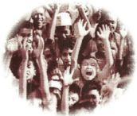

> **Deskripsi Visual:** Gambar ini adalah ilustrasi yang menunjukkan kelompok orang yang berdiri dengan tangan mereka di atas kepala mereka. Ilustrasi ini tampaknya menggambarkan suasana hati yang positif atau bahkan mungkin sebuah upacara atau ritual. 

1. Apa yang ditampilkan secara keseluruhan: Gambar ini menampilkan kelompok orang yang berdiri dengan tangan mereka di atas kepala mereka.

2. Elemen-elemen utama dan relasinya: Elemen utama dalam gambar ini adalah kelompok orang yang berdiri. Mereka semua memiliki tangan mereka di atas kepala mereka, yang tampaknya merupakan bagian dari sebuah upacara atau ritual. Relasi antara elemen-elemen ini adalah bahwa semua orang dalam kelompok tersebut sedang melakukan hal yang sama, yaitu menunjukkan tangan mereka di atas kepala mereka.

3. Teks, angka, atau label penting yang terlihat: Dalam gambar ini, tidak ada teks, angka, atau label yang jelas yang dapat dilihat. Namun, jika ada, mereka mungkin merujuk pada informasi tambahan tentang upacara atau ritual tersebut.

4. Informasi kunci yang dapat diambil pembaca: Informasi kunci yang dapat diambil dari gambar ini adalah bahwa ada kelompok orang yang sedang melakukan sesuatu yang menunjukkan kebahagiaan atau partisipasi dalam suatu upacara atau ritual.

Sementara  itu,  Jenderal  Kuniaki  Kaiso memberikan janji kemerdekaan (September 1944). Sejak itulah Jepang memberikan izin kepada rakyat Indonesia untuk mengibarkan bendera  Merah  Putih  di  samping bendera  Jepang  Hinomaru.  Lagu Indonesia  Raya  boleh  dinyanyikan setelah lagu Kimigayo.  Sejak itu pula  Jepang  mulai  mengerahkan tenaga rakyat Indonesia untuk pertahanan. Mereka disiapkan untuk  menghadapi  musuh.  Pada saat itu suasana kemerdekaan terasa semakin dekat.

Selanjutnya, Letnan Jenderal Kumakici Harada mengumumkan dibentuknya Badan Penyelidik Usaha-Usaha Persiapan Kemerdekaan Indonesia (BPUPKI) pada 1 Maret 1945. Badan itu dibentuk untuk menyelidiki dan mengumpulkan bahan-bahan penting tentang ekonomi, politik, dan tatanan pemerintahan sebagai persiapan kemerdekaan Indonesia. Badan itu diketuai oleh dr. K.R.T. Radjiman Wedyodiningrat, R.P Suroso sebagai wakil ketua merangkap kepala Tata Usaha dan seorang Jepang sebagai wakilnya Tata Usaha, yaitu Masuda Toyohiko dan Mr. R. M. Abdul Gafar Pringgodigdo. Semua anggotanya terdiri dari  60  orang  dari  tokoh-tokoh  Indonesia,  ditambah  tujuh  orang  Jepang yang tidak punya suara.

Sidang BPUPKI dilakukan dua tahap, tahap pertama berlangsung pada 28 Mei 1945 sampai 1 Juni 1945. Sidang pertama tersebut dilakukan di Gedung Chou Shangi In di Jakarta yang sekarang dikenal sebagai Gedung Pancasila. Pada masa penjajahan Belanda gedung ini digunakan sebagai gedung Volksraad. Meskipun  badan  itu  dibentuk  oleh  pemerintah  militer  Jepang,  jalannya persidangan baik wakil ketua maupun anggota istimewa dari kebangsaan Jepang  tidak  pernah  terlibat  dalam  pembicaraan  persiapan  kemerdekaan. Semua hal yang berkaitan dengan masalah-masalah kemerdekaan Indonesia merupakan urusan pemimpin dan anggota dari Indonesia.

Pada  pidato  sidang  BPUPKI,  Radjiman  menyampaikan  pokok  persoalan mengenai  Dasar  Negara  Indonesia  yang  akan  dibentuk.  Pada  sidang tahap kedua yang berlangsung dari tanggal 10-11 Juni 1945, dibahas dan

 

---
## 📄 Halaman 76

dirumuskan  tentang  Undang-Undang  Dasar.  Dalam  kata  pembukaannya Rajiman Wedyodiningrat meminta pandangan kepada para anggota mengenai dasar negara Indonesia. Orang-orang yang membahas mengenai dasar negara adalah Muhammad Yamin, Supomo, dan Sukarno

Dalam sidang pertama, Sukarno mendapat kesempatan berbicara dua kali, yaitu tanggal 31 Mei dan 1 Juni 1945. Namun pada saat itu, seperti apa yang disampaikan oleh Radjiman, selama dua hari berlangsung rapat, belum ada yang menyampaikan pidato tentang dasar negara. Menanggapi hal itu, pada tanggal 1 Juni pukul 11.00 WIB, Sukarno menyampaikan pidato pentingnya dasar  negara  dan  landasan  filosofi  dari  suatu  negara  merdeka.  Pada  saat itu, Gedung Chuo Shangi In mendapat penjagaan ketat dari tentara Jepang. Sidang saat itu dinyatakan tertutup, hanya beberapa wartawan dan orang tertentu  yang  diizinkan  masuk.  Dalam  pidatonya,  Sukarno  mengusulkan dasar-dasar  negara.  Pada  mulanya  Sukarno  mengusulkan  Panca  Dharma. Nama Panca Dharma dianggap tidak tepat, karena Dharma berarti kewajiban, sedangkan  yang  dimaksudkan  adalah  dasar.  Sukarno  kemudian  meminta saran  pada  seorang  teman,  yang  mengerti  bahasa,  sehingga  dinamakan dengan Pancasila.  Pancasila, sila artinya azas atau dasar, dan di atas kelima dasar itu didirikan Negara Indonesia, supaya kekal dan abadi.

Pidato Sukarno itu mendapat sambutan sangat meriah, tepukan tangan para peserta,  suatu  sambutan  yang  belum  pernah  terjadi  selama  persidangan BPUPKI.  Para  wartawan  mencatat  sambutan  yang  diucapkan  Sukarno itu  dengan  cermat.  Cindy  Adam,  penulis  buku  autobiografi  Sukarno, menceritakan bahwa ketika ia diasingkan di Ende, Flores (saat ini menjadi Provinsi  Nusa  Tenggara  Timur)  pada  tahun  1934-1937,  Sukarno  sering merenung tentang dasar negara Indonesia Merdeka, di bawah pohon sukun.

Pada  kesempatan  tersebut  Ir.  Sukarno  juga  menjadi  pembicara  kedua. Ia  mengemukakan  tentang  lima  dasar  negara.  Lima  dasar  itu  adalah  (1) Kebangsaan  Indonesia,  (2)  Internasionalisme  atau  Peri  Kemanusiaan,  (3) Mufakat atau Demokrasi, (4) Kesejahteraan Sosial, (5) Ketuhanan Yang Maha Esa. Pidato itu kemudian dikenal dengan Pancasila.

Sementara itu Muh.Yamin dalam pidatonya juga mengemukakan Azas dan Dasar  Negara  Kebangsaan  Republik  Indonesia.  Menurut  Yamin  ada  lima azas, yaitu ( 1) Peri Kebangsaan, (2) Peri Kemanusian, (3) Peri Ketuhanan, (4) Peri Kerakyatan, dan (5) Kesejahteraan rakyat.

 

---
## 📄 Halaman 77

Selanjutnya, sebelum sidang pertama berakhir BPUPKI membentuk panitia kecil  yang  terdiri  dari  sembilan  orang.  Pembentukan  panitia  sembilan  itu bertujuan  untuk  merumuskan  tujuan  dan  maksud  didirikannya  Negara Indonesia. Panitia kecil itu terdiri atas, Ir. Sukarno,  Muh. Yamin, Mr. Ahmad Subardjo, Mr. A.A Maramis, Abdul Kahar Muzakkar, Wahid Hasyim, H. Agus Salim, dan Abikusno Cokrosuyoso. Panitia kecil itu menghasilkan rumusan yang menggambarkan maksud dan tujuan Indonesia Merdeka. Kemudian disusunlah  rumusan  bersama  dasar  negara  Indonesia  Merdeka  yang  kita kenal dengan Piagam Jakarta. Di dalam teks Piagam Jakarta itu juga dimuat lima  asas  yang  diharapkan  akan  menjadi  dasar  dan  landasan  filosofi  bagi Indonesia Merdeka.

### PIAGAM JAKARTA

- Ketuhanan dengan kewajiban menjalankan syari'at Islam bagi pemeluk-pemeluknya.
- (menurut) dasar kemanusian yang adil dan beradab.
- Persatuan Indonesia.
- (dan) kerakyatan yang dipimpin oleh hikmah dalam permusyawaratan/ perwakilan
- (serta dengan mewujudkan suatu ) keadilan sosial bagi seluruh rakyat Indonesia.

### 3.  Panitia Persiapan Kemerdekaan Indonesia (PPKI)

BPUPKI  kemudian  dibubarkan  setelah  tugas-tugasnya  selesai.  Selanjutnya dibentuklah Panitia Persiapan Kemerdekaan Indonesia (PPKI) pada 7 Agustus 1945. Badan itu beranggotakan 21 orang, yang terdiri dari 12 orang wakil dari  Jawa,  tiga  orang  wakil  dari  Sumatra,  dan  dua  orang  dari  Sulawesi dan masing-masing satu orang dari Kalimantan, Sunda Kecil, Maluku, dan golongan  penduduk  Cina,  ditambah  enam  orang  tanpa  izin  dari  pihak Jepang. Panitia inilah yang kemudian mengesahkan Piagam Jakarta sebagai pendahuluan dalam pembukaan Undang-Undang Dasar 1945, 18 Agustus 1945.

 

---
## 📄 Halaman 78

### KESIMPULAN

- Kedatangan Jepang yang dianggap sebagai Saudara  T ua pada mulanya disambut  dengan  penuh  harapan.  Namun,  perlakuan  yang  kejam terhadap  rakyat  Indonesia  menimbulkan  kebencian  rakyat  Indonesia pada Jepang.
- Dampak pendudukan Jepang di Indonesia menjadikan rakyat semakin sengsara,  serta  kehidupan  yang  semakin  sulit.   Semua  gerak  dikontrol oleh pemerintah Jepang. Selama itu pula, Jepang menerapkan kebijakan ekonomi berdasarkan azas ekonomi perang, yaitu menerapkan berbagai peraturan,  pembatasan,  dan  penguasaan  produksi  oleh  negara  untuk kemenangan perang.
- Mobilisasi massa menimbulkan kesengsaraan dan penderitaan, bahkan korban  jiwa,  yaitu  romusa  yang  kemudian  oleh  pemerintah  Jepang disebut sebagai prajurit pekerja.
- Pada masa pendudukan Jepang, pembentukan organisasi massa dilakukan atas mobilisasi pemerintah militer Jepang. Meskipun demikian pergerakan terus dilakukan oleh kaum nasionalis baik secara terang-terangan maupun di bawah tanah.
- Program militer pertama Jepang adalah Heiho, yaitu perekrutan serdadu pembantu  lapangan, yang melibatkan  pemuda-pemuda  Indonesia dalam  kegiatan  militer.  Keikutsertaan  dalam  pendidikan  militer  itu yang kemudian menjadi bekal pemuda-pemuda Indonesia dalam perang revolusi kemerdekaan.
- Dasar negara dibentuk melalui Badan Penyelidik Usaha-Usaha Kemerdekaan Indonesia dan disahkan oleh Panitia Persiapan Kemerdekaan Indonesia.

 

---
## 📄 Halaman 79

### LATIH UJI KOMPETENSI

- Coba  kamu  uraikan  dengan  singkat,  mengapa  pergerakan  nasional pada tahun 1930-an menjadi lebih moderat! Buatlah dalam lembar kertas folio dan diskusikanlah dengan temanmu!
- Buatlah inventarisasi tentang pergerakan nasional pada masa pendudukan Jepang, kemudian bandingkan dengan masa penjajahan Belanda!
- Bagaimanakah peran BPUPKI dan PPKI dalam mempersiapkan kemerdekaan? Coba diskusikan dengan teman-temanmu, kemudian buatlah  laporan  singkat  tentang  pembentukan  dasar  negara  dan perumusan Pancasila sebagai dasar negara dalam lima lembar kertas folio!
- Bagaimana  menurut  pendapatmu  kondisi  Indonesia  selama  dalam pendudukan Jepang?
- Apakah Indonesia diuntungkan atau dirugikan dengan adanya pendudukan Jepang?
Sejarah Indonesia

71

 

---
## 📄 Halaman 80

### LATIH ULANGAN AKHIR BAB

### Jawablah beberapa pertanyaan dan tugas berikut!

- Mengapa Jepang tampak begitu mudah  memasuki Kepulauan Indonesia secara merata?
- Mengapa dibentuk pemerintahan militer di Sumatra, Jawa, dan juga Indonesia bagian timur?
- Apa  maksud  program  'Pan  Asia'  dan  apa  hubungannya  dengan ajaran Hakko ichiu ?
- Mengapa dibentuk Putera dan apa tujuannya?
- Mengapa dibentuk Barisan Pelopor, apa tujuannya?
- Jelaskan yang dimaksud dengan Ekonomi Perang?
- Pada  zaman  Jepang,  keadaan  pendidikan  dan  aktivitas  di  bidang perkebunan mengalami kemerosotan. Mengapa hal itu bisa terjadi? Coba lakukan telaah kritis!
- Jelaskan dampak  dari berbagai kebijakan Jepang itu terhadap kehidupan masyarakat!
- Jelaskan  tentang  perlawanan  Rakyat  Papua  terhadap  kekejaman Jepang!
- Nilai-nilai apa yang dapat kamu peroleh setelah belajar tentang sejarah pendudukan di Jepang di Indonesia?
Praktik tirani tidak sesuai dengan harkat dan martabat manusia

72

Kelas XI SMA/MA/SMK/MAK

Semester 2

 

---
## 📄 Halaman 81

### BAB 6 Indonesia Merdeka

Kami yang kini terbaring antara Kerawang-Bekasi tidak bisa berteriak 'Merdeka' dan angkat senjata lagi Tapi siapakah yang tidak lagi mendengar deru kami, Terbayang kami maju dan berdegap hati?

..............

Kami mati muda.   Yang tinggal tulang diliputi debu. Kenang, kenanglah kami. Kami sudah coba apa yang kami bisa Tapi kerja belum selesai, belum apa-apa

..........

(Charil Anwar dalam Sajak Kerawang-Bekasi)

S etiap  tanggal  17  Agustus  kita  selalu  memperingati  Hari  Kemerdekaan Bangsa  Indonesia.  Berbagai  rangkaian  kegiatan  dilaksanakan  setiap tahun di sekitar bulan Agustus, dalam rangka  menyemarakkan  hari kemerdekaan Indonesia.  Kegiatan  apa  saja  yang  sering  kamu  ikuti  dalam rangkaian  peringatan  hari  kemerdekaan  tersebut?  Mengapa  kita  harus memperingati hari kemerdekaan? Mengapa bangsa Indonesia harus merdeka?  Siapa  yang  membuat  bangsa  Indonesia  merdeka?Bagaimana makna  hari  kemerdekaan  bagi  bangsa  Indonesia?  Apa  yang  harus  kita lakukan di masa kemerdekaan ini? Pertanyaan-pertanyaan tersebut pantas kita ajukan untuk menemukan jawaban yang lebih jelas. Sejarah mencatat bahwa kemerdekaan adalah keinginan seluruh bangsa di dunia. Kemerdekaan menjadi modal dasar pembangunan di berbagai bangsa, termasuk Indonesia. Dengan kemerdekaan, bangsa Indonesia bebas menentukan nasib sendiri. Hidup  merdeka  tentu  akan  membuat  kita  lebih  leluasa  menentukan  arah dan jalan pembangunan bangsa Indonesia. Kemerdekaan juga memberikan keberpihakan  pembangunan  kepada  bangsa  sendiri.  Kamu  tentu  masih

 

---
## 📄 Halaman 82

ingat bahwa penjajah hanya mementingkan kesejahteraan mereka sendiri. Penjajahan  di  manapun  akan  selalu  menguras  sumber  daya  negeri  yang terjajah  dan  menambah  kejayaan  negeri  penjajah.  Karena  itu,  kewajiban kita  mensyukuri  kemerdekaan  dengan  mengisinya  melalui  pembangunan nasional.  Kemerdekaan  juga  bukan  merupakan  hadiah  penjajah.Bangsa Indonesia berjuang melalui berbagai cara dan berbagai pengorbanan untuk mencapai  kemerdekaan.  Ribuan  pejuang  gugur  sebagai  kusuma  bangsa, tidak terhitung kerugian harta benda untuk meraih kemerdekaan Indonesia. Masihkah ada ancaman terhadap kemerdekaan Indonesia sekarang? Tentu saja ada, karena itu mari kita telaah lebih lanjut hakikat kemerdekaan bangsa Indonesia dan bagaimana seharusnya kita menjaganya!

---
**🖼️ Gambar/Diagram**

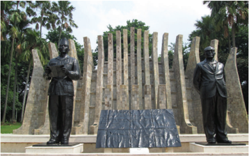

> **Deskripsi Visual:** Gambar ini adalah foto yang menampilkan sebuah makam atau taman peringatan yang terdiri dari dua patung manusia berdiri di depan batu bata yang tinggi. Patung-patung tersebut tampak seperti menghadap ke arah yang sama, mungkin menunjukkan hubungan atau persahabatan antara kedua individu tersebut. Di antara dua patung tersebut ada sebuah papan tulis yang menunjukkan nama-nama yang tidak jelas dalam teks yang ditulis. Pohon-pohon hijau tampak di sekitar area makam, memberikan suasana yang tenang dan damai. Gambar ini menunjukkan bahwa tempat ini mungkin merupakan tempat peringatan atau pemakaman untuk orang-orang tertentu.

 

---
## 📄 Halaman 83

### PETA KONSEP

---
**🖼️ Gambar/Diagram**

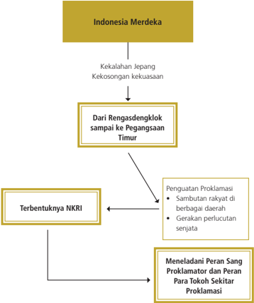

> **Deskripsi Visual:** Gambar ini adalah diagram yang menunjukkan sejarah perjalanan Indonesia Merdeka dari awal hingga terbentuknya NKRI. Diagram ini terdiri dari empat bagian utama:

1. **Indonesia Merdeka** - Ini adalah titik awal di mana perjuangan untuk kemerdekaan dimulai.

2. **Dari Rengasdengklok sampai ke Pegangsaan Timur** - Ini menunjukkan perjalanan perjuangan dari awal hingga mencapai kemenangan di Pegangsaan Timur.

3. **Terbentuknya NKRI** - Ini merupakan titik akhir di mana Indonesia resmi menjadi negara merdeka.

4. **Menelaadani Peran Sang Proklamator dan Para Tokoh Sekitar Proklamasi** - Ini menunjukkan bagaimana peran penting sang proklamator dan tokoh-tokoh lainnya dalam proses proklamasi.

Elemen-elemen utama dalam diagram ini adalah:
- **Indonesia Merdeka** sebagai titik awal.
- **Rengasdengklok sampai ke Pegangsaan Timur** sebagai perjalanan menuju kemenangan.
- **Terbentuknya NKRI** sebagai titik akhir.
- **Menelaadani Peran Sang Proklamator dan Para Tokoh Sekitar Proklamasi** sebagai penekanan pada peran penting tokoh-tokoh tersebut.

Teks, angka, atau label penting yang terlihat dalam diagram ini adalah:
- "Indonesia Merdeka" sebagai judul pertama.
- "Dari Rengasdengklok sampai ke Pegangsaan Timur" sebagai judul kedua.
- "Terbentuknya NKRI" sebagai judul ketiga.
- "Menelaadani Peran Sang Proklamator dan Para Tokoh Sekitar Proklamasi" sebagai judul keempat.

Informasi kunci yang dapat diambil pembaca melalui diagram ini adalah bahwa perjuangan untuk kemerdekaan Indonesia dimulai dari awal dan berlangsung melalui berbagai fase, mencapai kemenangan di Pegangsaan Timur, dan akhirnya terbentuknya NKRI dengan memperhatikan peran penting sang

 

---
## 📄 Halaman 84

### TUJUAN PEMBELAJARAN

Setelah mempelajari uraian ini, diharapkan kamu dapat:

- Menganalisis peristiwa Proklamasi dan maknanya bagi kehidupan bangsa.
- Merekontruksi pemerintahan dan NKRI.
- Meneladani perjuangan para tokoh proklamasi.
- Mensyukuri nikmat  T uhan  YME yang telah memberi karunia kemerdekaan kepada bangsa Indonesia.

### ARTI PENTING

Melacak sejarah proses kemerdekaan bangsa Indonesia sangat penting untuk memberikan kesadaran betapa berat perjuangan meraih dan mempertahankan kemerdekaan. Mempelajari materi ini juga akan selalu mengingatkan kepada kita betapa besar jasa dan pengorbanan para pahlawan dalam merebut dan mempertahankan kemerdekaan. Kita juga hendaknya semakin sadar bahwa kemerdekaan Indonesia adalah karunia  T uhan  Yang Maha Esa, selayaknya selalu kita syukuri dengan terus menjaga dan membangun menjadi bangsa yang lebih jaya.

 

---
## 📄 Halaman 85

### A. Dari Rengasdengklok sampai ke Pegangsaan Timur

### Memahami Lingkungan

 

---
## 📄 Halaman 86

---
**🖼️ Gambar/Diagram**

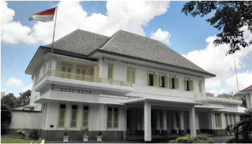

> **Deskripsi Visual:** Gambar ini menunjukkan sebuah bangunan bersejarah dengan arsitektur tradisional Jawa. Bangunan ini memiliki atap berlapis kayu dan dinding putih dengan jendela dan pintu berwarna kuning. Di samping bangunan terdapat sebuah bendera merah putih yang menunjukkan bahwa bangunan ini mungkin merupakan tempat penting atau institusi negara. Elemen-elemen lainnya termasuk taman kecil di depan bangunan dan pohon-pohon yang menghiasi area sekitar. Gambar ini mungkin digunakan untuk membahas tentang arsitektur tradisional Indonesia, sejarah bangunan, atau pentingnya simbolisme bendera di Indonesia.

Sumber: Museum Perumusan Naskah Proklamasi.

Gambar 6.5 Tempat perumusan Teks Proklamasi.

- » Coba  amati  gambar  terkait  kemerdekaan  bangsa  Indonesia  di samping dan di atas!
Ini  adalah  pertanyaan-pertanyaan  yang  terkait  dengan  gambargambar tersebut.

- Apa  pengaruh  pengeboman  Hiroshima  dan  Nagasaki  oleh Sekutu dalam rangkaian PD II?
- Bagaimana situasi Indonesia setelah peristiwa pengeboman itu?
- Mengapa terjadi peristiwa Rengasdengklok?
- Bagaimana proses penyusunan naskah teks proklamasi?
- Mengapa harus ada proklamasi?
Teks proklamasi kemerdekaan telah dibacakan oleh Sukarno dalam upacara pernyataan  kemerdekaan  bangsa  Indonesia  tanggal  17  Agustus  1945. Proklamasi  ini  dilaksanakan    di  Jalan  Pegangsaan  Timur  No.  56  Jakarta. Pernyataan  kemerdekaan  tersebut  disambut  bahagia  dan  suka  cita  oleh masyarakat  Indonesia  di  berbagai  daerah.    Bagaimana  proses  proklamasi kemerdekaan Indonesia? Mari kita lacak melalui uraian di bawah ini!

 

---
## 📄 Halaman 87

### 1. Jepang Bertekuk Lutut

Coba sekali lagi kamu amati gambar bom atom di halaman sebelumnya! Di manakah bom atom tersebut meletus? Siapa yang melakukan pengeboman? Bagaimana  korban  akibat  letusan  bom  atom  tersebut?  Bom  atom  yang diledakkan di dua kota di Jepang yakni Hirosima dan Nagasaki menyebabkan ratusan  ribu  penduduk  Jepang  meninggal  dunia  dan  ratusan  ribu  lainnya mengalami kecacatan. Kerugian material tidak terhitung jumlahnya.Bahkan sampai sekarang dampak terjadinya bom atom masih dirasakan masyarakat Jepang. Kerusakan dan dampak korban yang sangat mengerikan tersebut mendorong  masyarakat  dunia  sepakat  untuk  tidak  menggunakan  senjata tersebut  dalam  berbagai  peperangan.  Dua  bom  atom  tersebut  telah meluluhlantakkan kota Hiroshima dan Nagasaki.

Coba kamu bayangkan bagaimana seandainya ada 1000 bom atom yang diledakkan? Sangat mungkin masyarakat akan menyebut sebagai peristiwa 'kiamat' karena  makhluk di dunia bisa jadi sebagian besar menjadi korban. Tetapi harus kita yakini bahwa kiamat yang sesungguhnya berada di tangan Tuhan  Yang  Maha  Kuasa.  Siapa  yang  menjatuhkan  kedua  bom  atom tersebut? Amerika Serikat yang menjatuhkan kedua bom atom pada dua kota di Jepang pada tanggal 6 dan 9 Agustus 1945. Mengapa Amerika Serikat menjatuhkan bom atom di Jepang? Perang Dunia II yang berkecamuk sejak tahun 1939 telah menyebabkan kedua kelompok yakni Sekutu dan negaranegara fasis saling menyerang dengan menggunakan senjata pemusnah dan kerusakan massal. Korban dan kerugian kedua belah pihak tidak terhitung jumlahnya. Jutaan manusia meninggal dunia akibat Perang Dunia II tersebut. Sebagian besar dari mereka adalah masyarakat sipil yang bukan merupakan tentara perang.

Keinginan  Amerika  Serikat  untuk  segera  menyelesaikan  perang  dilakukan dengan mengirimkan pesawat pembawa bom atom ke Jepang. Pada tanggal 6 Agustus 1945, bom atom pertama diledakkan di kota Hirosihma, sementara pada  tanggal  9  Agustus  1945  bom  atom  dijatuhkan  di  kota  Nagasaki. Digambarkan oleh masyarakat yang selamat di kedua kota tersebut, bahwa ledakan bom atom seperti gunung api yang jatuh ke bumi. Tiba-tiba langit

 

---
## 📄 Halaman 88

terang  seperti  ada  kilat,  disusul  berbagai  benda  berhamburan  terbang. Bersamaan  itu  berbagai  makhluk  hidup  meregang  nyawa,  kehilangan anggota badan, bahkan hancur berkeping-keping. Dua kota Jepang luluh lantak.

- » Bagaimana dampak bom atom bagi Jepang?
Coba lakukan analisis, apakah Amerika Serikat harus meledakkan Bom atom untuk mengalahkan Jepang! Menurut pendapat kamu, siapa yang paling menderita akibat bom atom di Jepang? Apakah masih ada senjata pemusnah massal selain bom atom? Setujukah kamu, jika senjata tersebut digunakan untuk perang?

Kehancuran Kota Hiroshima dan Nagasaki telah menjatuhkan semangat dan martabat bangsa Jepang. Mereka tidak dapat menutup mata, bahwa Sekutu lebih unggul dalam persenjataan. Apabila perang dilanjutkan, Jepang akan lebih hancur. Akhirnya, Kaisar Jepang memutuskan untuk menyerah tanpa syarat    kepada  Sekutu.  Penyerahan  Jepang  kepada  Sekutu  pada  tanggal 15 Agustus 1945 inilah yang menandai berakhirnya Perang Dunia (PD) II. Sebenarnya tanda-tanda kekalahan Jepang dalam PD II sudah terlihat sejak tahun  1943  dengan  berhasil  direbutnya  beberapa  wilayah  oleh  Sekutu. Pengeboman  Hiroshima  dan  Nagasaki  merupakan  faktor  pemicu  Jepang harus menyerah.

Bagaimana kondisi bangsa Indonesia pada saat Jepang kalah dari Sekutu? Dalam  posisi  semakin  terjepit  dalam  perang  melawan  Sekutu,  Jepang terpaksa memberi janji kemerdekaan kepada bangsa Indonesia. Komando Tentara Jepang wilayah Selatan, pada bulan Juli 1945 menyepakati dan akan memberikan kemerdekaan Indonesia tanggal 7 September 1945.

Pada tanggal 7 Agustus 1945, Jenderal Terauchi menyetujui pembentukan Dokuritsu Junbi Inkai atau Panitia Persiapan Kemerdekaan Indonesia (PPKI) yang  tugasnya  melanjutkan  pekerjaan  BPUPKI.  Lembaga  PPKI  ini  diketuai oleh Ir. Sukarno dengan wakil Drs. Moh. Hatta.

- » Apa sebenarnya tugas dan pekerjaan BPUPKI yang diketuai oleh Ir. Sukarno dan Drs. Moh. Hatta itu?

 

---
## 📄 Halaman 89

Panitia persiapan atau PPKI itu beranggotakan 21 orang dan semuanya orang Indonesia yang berasal dari berbagai daerah.

---
**📊 Tabel**

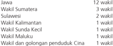

Tabel ini menunjukkan daftar wilayah administratif Indonesia dengan jumlah wakil untuk setiap wilayah tersebut. Topik utama tabel adalah daftar wilayah administratif Indonesia beserta jumlah wakil yang diangkat untuk setiap wilayah. Kolom pertama berisi nama-nama wilayah, sedangkan kolom kedua berisi jumlah wakil yang diangkat untuk setiap wilayah. Data penting yang terlihat adalah bahwa Jawa memiliki jumlah wakil terbanyak yaitu 12 wakil, kemudian Sumatera memiliki 3 wakil, Sulawesi memiliki 2 wakil, Kalimantan memiliki 1 wakil, Sunda Kecil memiliki 1 wakil, Maluku memiliki 1 wakil, dan wilayah-wilayah lainnya memiliki jumlah wakil yang lebih sedikit. Ini menunjukkan bahwa wilayah-wilayah di Indonesia memiliki perbedaan dalam jumlah wakil yang diangkat, dengan Jawa memiliki jumlah wakil terbesar.

Jenderal Terauchi pada tanggal 9 Agustus 1945 memanggil Sukarno, Moh. Hatta,  dan  Rajiman  Wedyodiningrat  untuk  pergi  ke  Dalat,  Saigon.  Saigon adalah  salah  satu  pusat  tentara  Jepang.  Pada  tanggal  12  Agustus  1945, Jenderal  Terauchi  mengucapkan  selamat  kepada  Sukarno  dan  Moh.Hatta sebagai ketua dan wakil ketua PPKI. Kemudian Terauchi menegaskan bahwa Jepang akan menyerahkan kemerdekaan kepada bangsa Indonesia. Sukarno, Moh. Hatta, dan Rajiman Wedyodiningrat pulang kembali ke Jakarta pada tanggal 14 Agustus.

Pada masa-masa inilah terjadi peristiwa yang dramatis di wilayah Indonesia. Walaupun alat komunikasi pada masa tersebut dikuasai Jepang, namun para tokoh  perjuangan  berhasil  mengakses  berbagai  informasi  dunia  dengan berbagai cara. Radio sebagai alat yang paling berperan pada masa tersebut telah  disegel  oleh  Jepang.  Siaran  radio  sudah  lama  menjadi  kekuasaan Jepang, untuk menerima siaran radio luar negeri pun masyarakat Indonesia tidak  diizinkan.  Hal  ini  disebabkan  oleh  ketakutan  Jepang  apabila  bangsa Indonesia  mengetahui  perkembangan  perang  yang  menunjukkan  Jepang semakin terjepit. Namun, para tokoh pergerakan tidak kurang akal. Mereka berhasil  menyembunyikan  beberapa  radio  gelap  yang  dapat  digunakan untuk mendengarkan berbagai siaran radio luar negeri seperti BBC London.

- » Kamu  telah  mengkaji  bagaimana  tindakan  Jepang  di  saat  akhir perlawanannya terhadap Sekutu. Coba kamu buat peta perjalanan Sukarno,  Hatta,  dan  Rajiman  Wedyodiningrat  untuk  memenuhi panggilan Jendral Terauchi ke Dalat, Saigon!

 

---
## 📄 Halaman 90

### 2. Peristiwa Rengasdengklok

Hari-hari  menjelang  tanggal  15  Agustus  1945  merupakan  hari  yang menegangkan  bagi  bangsa  Jepang  dan  bangsa  Indonesia.  Bagi  bangsa Jepang, tanggal tersebut merupakan  titik akhir nyali mereka dalam melanjutkan  PD  II.  Menyerah  kepada  Sekutu  adalah  pilihan  yang  sangat pahit tetapi harus dilakukan. Bagi bangsa Indonesia, tanggal tersebut justru menjadi  kesempatan  baik  untuk  mempercepat  proklamasi  kemerdekaan. Inilah  yang  menjadi  pemikiran  utama  para  pemuda  atau  sering  disebut Golongan Muda kaum pergerakan Indonesia. Para pemuda berpikir, bahwa menyerahnya  Jepang  kepada  Sekutu,  berarti  di  Indonesia  sedang  kosong kekuasaan. Proklamasi dipercepat adalah pilihan yang tepat, sekaligus tanpa campur tangan Jepang.

Para  pejuang  terutama  kaum  muda  yang  melancarkan  gerakan  'bawah tanah'  segera  mengetahui  berita  penyerahan  Jepang  itu.  Para  pemuda mendesak para tokoh senior untuk segera memproklamasikan kemerdekaan Indonesia. Sutan Syahrir yang merupakan tokoh pemuda yang aktif dalam 'gerakan bawah tanah' telah mengetahui berita penyerahan Jepang kepada Sekutu dari siaran radio. Oleh karena itu, ia segera menemui Moh. Hatta di  kediamannya.  Syahrir  mendesak  agar  Sukarno  dan  Moh.Hatta  segera memerdekakan Indonesia. Kira-kira pukul 14.00 Syahrir berhasil menemui Bung Hatta yang baru saja datang dari Dalat, Saigon. Syahrir menyampaikan informasi tentang menyerahnya Jepang kepada Sekutu. Oleh karena itu, agar Sukarno dan Moh.Hatta mau menyatakan kemerdekaan. Namun Hatta tidak bersedia dan akan membicarakan dengan Bung Karno. Oleh karena itu, Bung Hatta dan Syahrir pergi ke kediaman Bung Karno. Syahrir menyampaikan hal yang sama saat bertemu Moh. Hatta, agar Bung Karno dan Bung Hatta mau memerdekaan Indonesia karena Jepang telah menyerah. Tetapi Bung Karno belum  bersedia  sambil  mencari  kebenaran  berita  tentang  menyerahnya Jepang pada Sekutu.

Mengapa Sukarno dan Hatta menolak segera memproklamasikan kemerdekaan Indonesia? Sebagai tokoh-tokoh yang demokratis, tahu hak dan kewajiban selaku pemimpin, kedua tokoh itu berpendapat bahwa untuk memproklamasikan  Kemerdekaan  Indonesia,  perlu  dibicarakan  dengan PPKI  agar  tidak  menyimpang  dari  ketentuan.  Akan  tetapi,  para  pemuda berpendapat bahwa proklamasi Kemerdekaan Indonesia harus dilaksanakan oleh kekuatan bangsa sendiri, bukan oleh PPKI. Menurut para pemuda, PPKI

 

---
## 📄 Halaman 91

itu buatan Jepang. Pemuda berharap kemerdekaan yang dilakukan adalah kemerdekaan  yang  dilakukan  oleh  bangsa  sendiri,  bukan  karena  jasanya Jepang.

Hari Rabu tanggal 15 Agustus 1945 sekitar pukul 21.30 WIB, para pemuda yang dipimpin Wikana, dan Darwis datang di rumah Sukarno di Pegangsaan Timur  No.  56  Jakarta.  Wikana  dan  Darwis  memaksa  Sukarno  untuk memproklamasikan Kemerdekaan Indonesia. Para pemuda mendesak agar proklamasi malam ini dapat dilaksanakan paling lambat tanggal 16 Agustus 1945.  Sambil  menimang-nimang  senjata  Wikana  berucap  dan  bernada ancaman.

Wikana  :'Bung … Apabila Bung Karno tidak mengumumkan  kemerdekaan malam ini juga, besok akan terjadi pertumpahan darah'

Sukarno  bangkit  dari  duduk  dan  nampak  marah  kemudian  berjalan  menuju Wikana nyawa saya malam ini juga, jangan menunggu sampai besok berdiri. Sukarno membuka krah baju sambil berucap:

Sukarno:   Ini gorok leher saya, seretlah saya ke pojok itu, sudahilah 'Saya tidak bisa  melepas  tanggung  jawab  saya  sebagai  ketua  PPKI,  karena  itu  akan  saya tanyakan kepada wakil-wakil PPKI besok'.

Wikana terperanjat setelah melihat  sikap dan bentakan Bung Karno. Suasana rumah Bung Karno semakin tegang. Hal ini juga disaksikan antara lain oleh Moh. Hatta, dr. Buntaran, Ahmad Subarjo, dan lwa Kusumasumantri.

Para  pemuda  gagal  memaksa  Sukarno  dan  golongan  tua  untuk  segera memproklamasikan  kemerdekaan.  Para  pemuda  kemudian  meninggalkan rumah kediaman Bung Karno. Bung Karno kemudian meminta Bung Hatta untuk mengundang para anggota PPKI pada pagi tanggal 16 Agustus 1945 untuk  rapat  membahas  keadaan  terakhir  Indonesia  dan  persiapan  untuk kemerdekaan Indonesia.

 

---
## 📄 Halaman 92

Para pemuda malam itu sekitar pukul 24.00 tanggal 15 Agustus mengadakan pertemuan di Jl Cikini 71 Jakarta. Para pemuda yang hadir, antara lain Sukarni, Wikana, Yusuf Kunto, Chaerul Saleh, dan Shodanco Singgih. Mereka sepakat untuk  membawa Sukarno dan Moh. Hatta ke luar  kota.  Tujuannya,  agar kedua tokoh ini jauh dari pengaruh Jepang dan bersedia memproklamasikan kemerdekaan  Indonesia.Para  pemuda  juga  sepakat  menunjuk Shodanco Singgih untuk memimpin pelaksanaan rencana tersebut.

Untuk melaksanakan tugas, Singgih mendapat pinjaman beberapa perlengkapan  dari  markas  Peta  di  Jaga  Monyet.  Waktu  itu  yang  piket  di markas Peta adalah Latif Hendraningrat.Singgih disertai pengemudi, Sampun dan penembak mahir Sutrisno bersama Sukarni, Wikana, dan dr. Muwardi menuju ke rumah Moh.Hatta. Singgih secara singkat minta kesediaan Moh. Hatta untuk ikut ke luar kota. Moh. Hatta menuruti kehendak para pemuda itu. Rombongan kemudian menuju ke rumah Sukarno. Tiba di rumah Sukarno, keluarga  Sukarno  baru  saja  makan  sahur.  Setelah  permisi,  Singgih  masuk rumah dan  meminta agar Sukarno ikut pergi ke luar kota saat itu juga. Sukarno setuju, asal Fatmawati, Guntur (waktu itu berusia sekitar delapan bulan) dan Moh.Hatta ikut serta. Pemuda pun mengiyakan permintaan Sukarno. Tanggal 16 Agustus sekitar pukul 04.00 pagi rombongan Sukarno, Moh.Hatta, dan para pemuda menuju ke arah timur. Pemuda tetap merahasiakan kemana tujuan rombongan Sukarno ini mau dibawa pergi, Ternyata rombongan ini akan dibawa ke Rengasdengklok.

---
**🖼️ Gambar/Diagram**

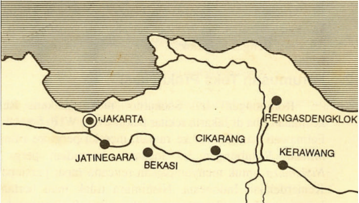

> **Deskripsi Visual:** Gambar ini adalah diagram yang menunjukkan peta wilayah Jakarta dan sekitarnya. Peta ini menggambarkan lokasi beberapa kota dan desa penting di sekitar Jakarta, termasuk Jakarta, Cikarang, Jatinegara, Bekasi, Rengas Dengklok, dan Kerawang. Elemen utama yang terlihat adalah titik-titik yang menunjukkan lokasi kota-kota tersebut, dengan garis-garis yang menghubungkan mereka untuk menunjukkan jalur atau jalan raya. Teks, angka, atau label penting yang terlihat meliputi nama-nama kota dan desa serta garis-garis yang menunjukkan jalur atau jalan raya. Informasi kunci yang dapat diambil pembaca adalah bahwa peta ini menunjukkan hubungan geografis antara berbagai kota dan desa di sekitar Jakarta, serta jalur-jalur transportasi yang tersedia.

 

---
## 📄 Halaman 93

Dipilihnya daerah Kawedanan Rengasdengklok, karena daerah itu terpencil yaitu  15  km  dari  Kedunggede,  Karawang.  Selain  itu,  juga  ada  hubungan baik antara Daidan Peta Purwakarta dan Daidan Jakarta, sehingga dari segi keamanan terjamin. Pagi hari rombongan Sukarno sampai di Rengasdengklok. Mereka diterima oleh Shodanco Subeno dan Affan. Mereka ditempatkan di rumah keluarga Tionghoa,  Djiau Kie Siong yang simpati pada perjuangan bangsa Indonesia.

Sehari di Rengasdengklok, para pemuda ternyata gagal memaksa Sukarno untuk  menyatakan  kemerdekaan  Indonesia  lepas  dari  campur  tangan Jepang. Namun, ada gelagat yang ditangkap oleh Singgih bahwa Sukarno bersedia memproklamasikan kemerdekaan Indonesia kalau sudah kembali ke Jakarta.  Melihat  tanda-tanda bahwa Sukarno bersedia memproklamasikan kemerdekaan  Indonesia,  maka  sekitar  pukul  10.00  bendera  Merah  Putih dikibarkan di halaman Kawedanan Rengasdengklok.

Jakarta  berada  dalam  keadaan  tegang  karena  tanggal  16  Agustus  1945 seharusnya diadakan pertemuan PPKI, tetapi Sukarno dan Moh. Hatta tidak ada di tempat. Ahmad Subarjo segera mencari kedua tokoh tersebut. Akhirnya setelah  terjadi  kesepakatan  dengan  Wikana,  Ahmad  Subarjo  ditunjukkan dan diantarkan ke Rengasdengklok oleh Yusuf Kunto.

 

---
## 📄 Halaman 94

Subeno

: 'Apa proklamasi dapat dilakukan sebelum tengah malam nanti'

Subardjo

:  'Tidak mungkin. Sekarang sudah sekitar jam delapan (malam). Kami masih harus  kembali ke Jakarta, lalu mengundang para anggota badan Persiapan Kemerdekaan untuk rapat kilat. Itu minta banyak waktu. Kami khawatir harus bekerja semalam suntuk untuk  menyelesaikannya'

Subeno

:  'Bagaimana kalau jam enam besok pagi'

Subardjo

:  'Saya akan berusaha sekuat tenaga agar dapat selesai jam enam pagi', tetapi  sekitar tengah hari besok pasti sudah beres' :   'Kalau tidak bagaimana?'

Subeno

Subardjo

:  ' Mayor, kalau semua gagal. Besok siang tanggal 17 Agustus jam 12.00 belum terjadi Proklamasi, jaminannya saya, sayalah yang bertanggung jawab, tembak matilah saya'

Ahmad Subarjo tiba di Rengasdengklok pukul 17.30 WIB untuk menjemput Sukarno dan rombongan. Namun kecurigaan para pemuda terhadap Ahmad Subardjo pun masih terjadi. Apakah, kalau Sukarno dan Hatta kembali ke Jakarta,  proklamasi  kemerdekaan  akan  bisa  terlaksana.  Terjadilah  dialog antara  Subeno  selaku  komandan  Peta  Rengasdengklok  dengan  Ahmad Subardjo.

Dengan  jaminan  itu,  maka Shodanco Subeno  mewakili  para  pemuda mengizinkan  Subardjo  untuk  bertemu  dan  membawa  pulang  bersama  Ir. Sukarno, Drs. Moh.Hatta, dan rombongan kembali ke Jakarta. Petang itu juga Sukarno dan rombongan kembali ke Jakarta. Dengan demikian berakhirlah peristiwa Rengasdengklok.

» Siapakah Ahmad Subarjo? Dapatkah kamu mencari riwayat Ahmad Subarjo? Mengapa dia berani menjadi taruhan kepada para pemuda bila  proklamasi  tidak  terjadi  tanggal  17  Agustus  1945? Apa  yang terjadi  seandainya  proklamasi  tidak  jadi  dilaksanakan?  Nilai  apa yang pantas kita contoh dari Ahmad Subarjo?

 

---
## 📄 Halaman 95

### 3. Perumusan Teks Proklamasi

Bagaimana setelah para pemuda melepas para tokoh golongan tua tersebut? Rombongan  Sukarno  setelah  mengantar  pulang  Fatmawati  dan  Guntur, menuju ke rumah Laksamana Maeda di Jl. Imam Bonjol no. 1. Setelah tiba di Jl. Imam Bonjol No. 1, lalu Sukarno dan Moh.Hatta diantarkan Laksamana Maeda  menemui Gunseikan Mayor  Jenderal  Hoichi  Yamamoto  (Kepala Pemerintahan Militer Jepang). Akan tetapi, Gunseikan menolak menerima Sukarno-Hatta pada tengah malam. Dengan ditemani oleh Maeda, Shigetada Nishijima  dan  Tomegoro  Yoshizumi  serta  Miyoshi  sebagai  penterjemah, mereka pergi menemui Somubuco Mayor Jenderal Otoshi Nishimura (Direktur/ Kepala Departemen Umum Pemerintahan Militer Jepang), dengan maksud untuk  menjajaki  sikapnya  terhadap  pelaksanaan  Proklamasi  Kemerdekaan Indonesia.  Sukarno  menyampaikan  bahwa  akan  mengadakan  rapat  PPKI untuk membahas persiapan pelaksanaan proklamasi kemerdekaan.

Pada pertemuan antara Sukarno-Hatta dengan Nishimura ini tidak dicapai kata sepakat. Di satu pihak Sukarno- Hatta bertekad untuk melangsungkan rapat  PPKI  yang  pada  pagi  hari  tanggal  16  Agustus  1945  itu  tidak  jadi diadakan karena mereka dibawa ke Rengasdengklok. Mereka menekankan kepada  Nishimura  bahwa  Jenderal  Besar  Terauchi  telah  menyerahkan pelaksanaan Proklamasi Kemerdekaan Indonesia kepada PPKI. Di lain pihak Nishimura  menegaskan  garis  kebijakan  Panglima  Tentara  ke-XVI  di  Jawa, bahwa  dengan  menyerahnya  Jepang  kepada  Sekutu  berlaku  ketentuan bahwa tentara Jepang tidak diperbolehkan lagi mengubah status quo .

Berdasarkan  garis  kebijaksanaan  itu,  Nishimura  melarang  Sukarno-Hatta untuk  mengadakan  rapat  PPKI  dalam  rangka  pelaksanaan  Proklamasi Kemerdekaan. Sampailah Sukarno-Hatta pada kesimpulan bahwa tidak ada gunanya lagi untuk membicarakan soal kemerdekaan Indonesia dengan pihak Jepang.  Mereka  hanya  berharap  pihak  Jepang  supaya  tidak  menghalanghalangi pelaksanaan Proklamasi oleh rakyat Indonesia sendiri.

Rombongan Sukarno segera kembali ke rumah Laksamana Maeda di Jalan Imam Bonjol No. 1. Para tokoh-tokoh nasionalis berkumpul di rumah Maeda untuk merumuskan teks proklamasi. Di rumah Maeda, hadir para anggota PPKI,  para  pemimpin  pemuda,  para  pemimpin  pergerakan,  dan  beberapa anggota Chuo Sangi In yang ada di Jakarta. Mereka berjumlah 40 - 50 orang.

 

---
## 📄 Halaman 96

Rumah Laksamana Maeda itu dianggap  aman  dari  kemungkinan gangguan yang sewenangwenang dari anggota-anggota Rikugun (Angkatan  Darat  Jepang / Kampeitai) yang hendak menggagalkan usaha bangsa Indonesia untuk mengumumkan Proklamasi Kemerdekaannya. Oleh karena Laksamana Maeda adalah  Kepala  Perwakilan Kaigun, maka  rumahnya  merupakan extra territorial , yang harus dihormati oleh Rikugun. Selain itu, Laksamana Maeda  sendiri  memiliki  hubungan yang akrab dengan para pemimpin bangsa Indonesia, dan Maeda juga simpatik terhadap gerakan kemerdekaan Indonesia, maka rumah beliau direlakan menjadi tempat  pertemuan  para  pemimpin bangsa  Indonesia  untuk  berunding dan merumuskan naskah/teks Proklamasi Kemerdekaan Indonesia.

» Siapakah  Laksamana  Maeda?  Dapatkah  kamu  mencari  riwayat hidupnya? Mengapa Maeda memberikan kesempatan para pejuang menyusun proklamasi di rumahnya? Bagaimana akhir hidup Maeda? Nilai apa yang pantas kita tiru dari Laksamana Maeda?

Setelah  pertemuan  dengan  Nishimura  itu  dianggap  cukup,  Sukarno  dan Hatta  kembali  ke  rumah  Maeda.  Setelah  berbicara  sebentar  dengan Sukarno,  Moh.Hatta  dan  Ahmad  Subarjo,  Laksamana  Maeda  minta  diri untuk beristirahat dan mempersilakan para pemimpin Indonesia berunding sampai puas di rumahnya. Di ruang makan Maeda, dirumuskanlah naskah Proklamasi Kemerdekaan Indonesia. Ketika peristiwa itu berlangsung Maeda tidak hadir, tetapi Miyoshi sebagai orang kepercayaan Nishimura bersama Sukarni,  Sudiro,  dan  B.M.  Diah  menyaksikan  Sukarno,  Hatta,  dan  Ahmad Subarjo membahas perumusan naskah Proklamasi Kemerdekaan Indonesia.

 

---
## 📄 Halaman 97

---
**🖼️ Gambar/Diagram**

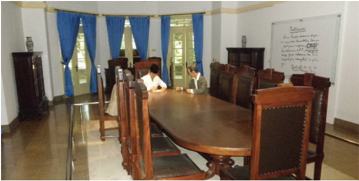

> **Deskripsi Visual:** Gambar ini menunjukkan ruang rapat dengan meja bulat yang besar di tengah ruangan, di sekelilingnya terdapat kursi berdesain klasik. Di belakang meja, terdapat sebuah papan tulis putih dengan tulisan "Meeting Room" dan beberapa instruksi lainnya. Ruangan ini tampak tenang dan disegarkan oleh jendela yang memiliki tirai biru. Di sisi kiri, terdapat lemari kayu yang tampak kokoh. Gambar ini menunjukkan struktur dan detail ruang rapat yang profesional dan disiplin.

Sumber: Museum Perumusan Naskah Proklamasi. Gambar 6.9 Ruangan tempat perumusan teks proklamasi.

Sukarno  pertama  kali  menuliskan  kata  pernyataan  'Proklamasi'.  Sukarno kemudian bertanya kepada Moh. Hatta dan Ahmad Subarjo.' Bagaimana bunyi rancangan pada draf pembukaan UUD?' Kedua orang yang ditanya pun  tidak  ingat  persis.  Ahmad  Subarjo  kemudian  menyampaikan  kalimat 'Kami bangsa Indonesia dengan ini menyatakan kemerdekaan Indonesia'. Moh. Hatta menambahkan kalimat: 'Hal-hal yang mengenai pemindahan kekuasaan dan lain-lain diselenggarakan dengan cara saksama dan dalam tempoh yang sesingkat-singkatnya'.  Sukarno  menuliskan,  'Jakarta,  17-8'05 Wakil-wakil bangsa Indonesia', sebagai penutup. Mereka semua sepakat tentang draf itu.

Pukul  04.00  WIB  dini  hari,  Sukarno  minta  persetujuan  dan  minta  tanda tangan kepada semua yang hadir sebagai wakil-wakil bangsa Indonesia.Para pemuda menolak dengan alasan sebagian yang hadir banyak yang menjadi kolaborator  Jepang.  Sukarni  mengusulkan  agar  teks  proklamasi  cukup ditandatangani dua orang tokoh, yakni Sukarno dan Moh. Hatta, atas nama bangsa Indonesia. Usul Sukarni diterima. Dengan beberapa perubahan yang telah disetujui, maka konsep itu kemudian diserahkan kepada Sayuti Melik untuk diketik.

 

---
## 📄 Halaman 98

Berikut naskah Proklamasi Kemerdekaan Indonesia, baik yang diketik oleh Sayuti  Melik.  Coba  kamu  perhatikan  Naskah  Proklamasi  Kemerdekaan Indonesia  yang  sudah  diketik  Sayuti  Melik  dengan  naskah  yang  dikonsep dengan tulis tangan.

 

---
## 📄 Halaman 99

Keterangan:  naskah  diatas  sudah  mengalami  perubahan  sesuai  dengan persetujuan dalam rapat.

### Naskah Proklamasi:

Beberapa perubahan yang dimaksud, yaitu kata tempoh diganti dengan kata tempo. Penulisan tanggal, bulan, dan tahun yang semula Jakarta, 17-8-'05 diubah menjadi Jakarta, hari 17 bulan 8 tahun '05. (Tahun 05 adalah singkatan dari tahun Jepang Sumera, yakni tahun 2605 yang bertepatan dengan tahun 1945 Masehi). Kata-kata  Wakil-wakil bangsa Indonesia diganti dengan kata-kata Atas nama bangsa Indonesia. Teks proklamasi diketik kemudian ditandatangani oleh Sukarno dan Moh. Hatta. Naskah inilah yang kemudian diketik Sayuti Melik itu disebut teks proklamasi yang otentik

Teks Proklamasi yang hanya beberapa kalimat itu memiliki makna yang luar biasa  dalam  konteks  jalinan  kerja  masa  atau  persatuan  yang  kokoh.  Kata 'Proklamasi' andil Bung Karno. Kalimat  'Kami bangsa Indonesia dengan menyatakan  kemerdekaan  Indonesia'  dinyatakan  oleh  Ahmad  Subarjo. Kalimat 'Hal-hal yang mengenai pemindahan kekuasaan dll. Diselenggarakan dengan cara saksama dan dalam tempo yang sesingkat-singkat' andil Bung Hatta. Kalimat 'Atas nama Bangsa Indonesia, Sukarno-Hatta' usulan Sukarni.

Demikian pertemuan dini hari itu menghasilkan naskah Proklamasi.  Agar seluruh rakyat Indonesia mengetahuinya, naskah itu harus disebarluaskan. Timbullah persoalan tentang bagaimana caranya naskah tersebut disebarluaskan  ke  seluruh  Indonesia.  Sukarni  mengusulkan  agar  naskah tersebut dibacakan  di Lapangan  Ikada,  yang  telah  dipersiapkan  bagi berkumpulnya  masyarakat  Jakarta  untuk  mendengar  pembacaan  naskah Proklamasi. Tetapi Sukarno tidak setuju, karena tempat itu adalah tempat umum  yang  dapat  memancing  bentrokan  antara  rakyat  dengan  militer Jepang. Beliau sendiri mengusulkan agar Proklamasi dilakukan di rumahnya di  Jalan  Pegangsaan  Timur  No.56.  Usul  tersebut  disetujui  dan  naskah Proklamasi  Kemerdekaan  Indonesia  akan  dibacakannya  bersama  Hatta  di tempat itu pada hari Jumat tanggal 17 Agustus 1945 pukul 10.00.WIB di tengah-tengah bulan Ramadhan (bulan Puasa).

 

---
## 📄 Halaman 100

### 4. Proklamasi Berkumandang

Pada pukul 5 pagi tanggal 17 Agustus 1945, para pemimpin dan pemuda keluar dari rumah Laksamana Maeda dengan diliputi kebanggaan. Mereka telah sepakat untuk memproklamasikan kemerdekaan di rumah Sukarno di Jl.  Pegangsaan  Timur  No.  56  pada  pukul  10  pagi.  Sebelum  pulang,  Moh. Hatta berpesan kepada B.M. Diah untuk memperbanyak teks Proklamasi dan menyiarkannya ke seluruh dunia.

Sementara  itu,  para  pemuda  tidak  langsung  pulang,  mereka  melakukan kegiatan-kegiatan  untuk  penyelenggaraan  pembacaan  naskah  Proklamasi. Masing-masing kelompok pemuda mengirim kurir untuk memberitahukan kepada masyarakat bahwa saat Proklamasi telah tiba. Semua alat komunikasi digunakan  untuk  penyambutan  Proklamasi.  Pamflet,  pengeras  suara,  dan mobil-mobil dikerahkan ke segenap penjuru kota.

Tanpa diduga, pada hari itu barisan pemuda berbondong-bondong menuju Lapangan Ikada. Para pemuda datang ke tempat itu, karena informasi yang disampaikan dari mulut ke mulut bahwa Proklamasi akan diselenggarakan di Lapangan Ikada. Rupanya Jepang telah mencium kegiatan para pemuda malam  itu,  sehingga  mereka  berusaha  untuk  menghalang-halanginya. Lapangan Ikada telah dijaga oleh Pasukan Jepang yang bersenjata lengkap. Karena  itu,    Proklamasi  tidak  diselenggarakan  di  Lapangan  Ikada,  tetapi dilaksanakan di Pegangsaan Timur No. 56.

Pada pagi hari itu juga, rumah Sukarno dipadati oleh sejumlah massa. Untuk menjaga keamanan upacara pembacaan Proklamasi, dr. Muwardi meminta Latief Hendraningrat beserta beberapa anak buahnya untuk berjaga-jaga di sekitar rumah Sukarno.

Sementara  itu,  Walikota  Jakarta,  Suwiryo  memerintahkan  kepada  Wilopo untuk mempersiapkan peralatan yang diperlukan seperti mikrofon. Sedangkan  Sudiro  memerintahkan  kepada  S.  Suhud  untuk  menyiapkan bendera  dan  sekaligus  mencari  tiang  bendera.  S.  Suhud  mendapatkan bendera  Merah  Putih  dari  Ibu  Fatmawati.  Bendera  dijahit  Ibu  Fatmawati sendiri  dan  ukurannya  sangat  besar  (tidak  standar).  Bendera  Merah  Putih yang dijahit Fatmawati dikenal dengan bendera pusaka. Sejak tahun 1969 tidak lagi dikibarkan dan diganti dengan bendera duplikat. Sementara tiang bendera menggunakan sebatang bambu (semacam bekas jemuran pakaian).

 

---
## 📄 Halaman 101

Sejak  pagi  hari,  sudah  banyak  orang  berdatangan  di  rumah  Sukarno  di Jl.  Pegangsaan  Timur  No.  56.  Tokoh-tokoh  yang  sudah  hadir,  antara  lain Mr. A. A. Maramis, dr. Buntaran Martoatmojo, Mr. Latuharhary, Abikusno Cokrosuyoso,  Otto  Iskandardinata,  Ki  Hajar  Dewantoro,  Sam  Ratulangie, Sartono,  Sayuti  Melik,  Pandu  Kartawiguna,  M.  Tabrani,  dr.  Muwardi, Ny. SK. Trimurti, dan AG. Pringgodigdo.

Acara  yang  direncanakan  pada  upacara  bersejarah  itu  adalah; pertama pembacaan  teks  proklamasi; kedua ,  pengibaran  bendera  Merah  Putih; dan ketiga ,  sambutan walikota Suwiryo dan dr. Muwardi dari keamanan. Hari Jumat Legi, tepat pukul 10.00 WIB, Sukarno dan Moh. Hatta keluar ke serambi depan, diikuti oleh Ibu Fatmawati. Sukarno dan Moh.  Hatta maju beberapa langkah. Sukarno mendekati mikrofon untuk membacakan teks proklamasi.

Gambar 6.12 Sukarno didampingi Mohammad Hatta membacakan Teks Proklamasi.

 

---
## 📄 Halaman 102

Acara berikutnya adalah pengibaran bendera Merah Putih yang dilakukan oleh Latief Hendraningrat dan S. Suhud. Bersamaan dengan naiknya bendera Merah Putih, para hadirin secara spontan menyanyikan lagu Indonesia Raya tanpa ada yang memimpin.

Gambar 6.13 Pengibaran bendera merah putih oleh Latief Hendraningrat dan S. Suhud.

Setelah itu, Suwiryo memberikan sambutan dan kemudian disusul sambutan dr.  Muwardi.  Sekitar  pukul  11.00  WIB,  upacara  telah  selesai.  Kemudian dr.  Muwardi menunjuk beberapa anggota Barisan Pelopor untuk menjaga keselamatan Sukarno dan Moh. Hatta.

 

---
## 📄 Halaman 103

### Sebuah Renungan

Sayuti Melik sempat membuang naskah asli yang merupakan konsep awal.Namun  insting  wartawan  seorang  BM  Diah,  tergerak.Diah memungutnya lalu mengamankan dalam sakunya. Berkat kejelian BM Diah,  hingga kini kita masih bisa menyaksikan naskah bersejarah ini.  Naskah  dalam  bentuk  ketikan  ini  kemudian  ditandatangani Sukarno-Hatta di atas sebuah piano.

Karena begitu tergesa-gesanya para tokoh ini tidak sempat menyiapkan bendera negara. Konon pada malam itu juga, mereka membuat bendera dari kain sprei putih dan kain merah milik dari seorang  penjual  soto  yang  kebetulan  mangkal  di  sekitar  rumah Sukarno.Kain itu dijahit oleh Ibu Fatmawati sehingga jadi bendera. Begitu juga tiang bendera yang pertama ini terbuat dari bambu.

Situasi begitu kritis, ketika menjelang pembacaan, Sukarno dikabarkan menderita sakit malaria. Hingga pukul 08.00  WIB pagi, Presiden Pertama Republik Indonesia masih belum bisa bangun.

 

---
## 📄 Halaman 104

»

Coba kamu perankan proses Proklamasi Kemerdekaan Indonesia 17  Agustus  1945  sejak  dari  Rengasdengklok  sampai  dengan pembacaan proklamasi! Susunlah skenario cerita dengan sub tema berikut ini.

- Perundingan para pemuda untuk mendesak Sukarno memproklamasikan kemerdekaan.
- Peristiwa Rengasdengklok.
- Penyusunan teks proklamasi.
- Pembacaan teks proklamasi.

### 5. Dukungan dari Berbagai Lapisan

Berita Proklamasi Kemerdekaan Indonesia cepat bergema ke berbagai daerah. Rakyat  di  Jakarta  maupun  di  kota-kota  lain  menyambut  dengan  antusias. Karena  alat  komunikasi  yang  terbatas,  informasi  ke  daerah-daerah  tidak secepat di Jakarta. Saat tersiarnya berita tentang Proklamasi Kemerdekaan, banyak rakyat Indonesia yang tinggal jauh dari Jakarta tidak mempercayainya.

Pada  tanggal  22  Agustus,  Jepang  akhirnya  secara  resmi  mengumumkan penyerahannya kepada Sekutu. Baru pada bulan September 1945, Proklamasi diketahui  di  wilayah-wilayah  yang  terpencil.  Keempat  penguasa  kerajaan yang ada di Jawa Tengah menyatakan dukungan mereka kepada Republik, yaitu Yogyakarta, Surakarta, Pakualaman, dan Mangkunegaran.

Euforia revolusi segera mulai melanda negeri ini, khususnya kaum muda yang merespon kegairahan dan tantangan kemerdekaan. Para komandan pasukan Jepang di daerah-daerah sering kali meninggalkan wilayah perkotaan dan menarik mundur pasukan ke daerah pinggiran guna menghindari konfrontasi. Banyak yang bijaksana memperbolehkan pemuda-pemuda Indonesia memperoleh senjata. Antara tanggal 3-11 September, para pemuda di Jakarta mengambil alih kekuasaan atas stasiun-stasiun kereta api, sistem listrik, dan stasiun pemancar radio tanpa mendapat perlawanan dari pihak Jepang. Pada akhir bulan September, instalasi-instalasi penting di Yogyakarta, Surakarta, Malang, dan Bandung juga sudah berada di tangan para pemuda Indonesia. Selain itu, juga terlihat adanya semangat revolusi di dalam kesusasteraan dan kesenian. Surat-surat kabar dan majalah Republik bermunculan di berbagai

 

---
## 📄 Halaman 105

daerah, terutama di Jakarta, Yogyakarta, dan Surakarta. Aktivitas kelompok sastrawan yang bernama 'Angkatan 45', mengalami masa puncaknya pada zaman revolusi. Lukisan-lukisan modern juga mulai berkembang pesat di era revolusi.

Banyak pemuda bergabung dengan badan-badan perjuangan. Di Sumatera, mereka  benar-benar  memonopoli  kekuasaan  revolusioner.  Karena  jumlah pemimpin nasionalis  yang  sudah  mapan  di  sana  hanya  segelintir,  mereka ragu terhadap apa yang akan dilakukan. Para mantan prajurit Peta dan Heiho membentuk kelompok-kelompok yang paling disiplin. Laskar Masyumi dan Barisan Hizbullah, menerima banyak pejuang baru dan ikut bergabung dalam kelompok-kelompok bersenjata Islam lainnya yang umumnya disebut Barisan Sabilillah, yang kebanyakan dipimpin oleh para Kiai.

Proklamasi kemerdekaan akan disebarluaskan melalui radio, tetapi Jepang menentang upaya penyiaran tersebut, dan malah memerintahkan agar para penyiar  meralat  berita  proklamasi  sebagai  sesuatu  kekeliruan.  Tampaknya para penyiar tetap tidak mau memenuhi seruan pihak Jepang. Oleh karena itu, pada tanggal 20 Agustus 1945 pemancarnya disegel dan para pegawainya dilarang  masuk.  Mereka  kemudian  membuat  pemancar  baru  di  Menteng 31. Di samping melalui siaran radio, para wartawan juga menyebarluaskan berita proklamasi melalui media cetak, seperti surat kabar, selebaran, dan penerbitan-penerbitan yang lain.

Kantor Berita Antara tempat proklamasi disiarkan.

 

---
## 📄 Halaman 106

Pada tanggal 3 September 1945, para pemuda mengambil alih kereta api termasuk bengkel di Manggarai. Tanggal 5 September 1945, Gedung Radio Jakarta dapat dikuasai.Tanggal 11 September 1945, seluruh Jawatan Radio berhasil  dikuasai  oleh  Republik.  Oleh  karena  itu,  tanggal  11  September dijadikan hari lahir Radio Republik Indonesia (RRI).

Para pemuda memprakarsai diadakannya rapat raksasa di Lapangan Ikada (sekarang Monas). Rapat yang digagas oleh para pemuda dan mahasiswa yang tergabung dalam 'Kesatuan van Aksi', untuk melakukan rapat raksasa di  lapangan  Ikada,  yang  semula  digagas  tanggal  17  September  1945, mundur menjadi 19 September 1945. Presiden Sukarno sudah dihubungi dan bersedia akan menyampaikan pidato di dalam rapat raksasa pada tanggal 19  September  1945.  Sejak  pagi,  rakyat  Jakarta  sudah  mulai  berdatangan dan  memenuhi  Lapangan  Ikada.  Rapat  itu  untuk  memperingati  sebulan kemerdekaan Indonesia.

Bermula  dari  ketidakpuasan  rakyat  terhadap  sikap  Jepang  yang  belum juga  mengakui  Negara  Republik  Indonesia  dan  bahkan  Jepang  malah mempertahankan status quo -nya dengan mengatasnamakan Sekutu. Kondisi itu  mendorong  rakyat  Indonesia  yang  baru  saja  merdeka,  untuk  segera membentuk pemerintah yang baru dan mengambil langkah-langkah nyata. Ketidakpuasan  rakyat  semakin  bertambah  ketika  mengetahui  pendaratan pasukan Sekutu dibawah pimpinan Mayor Geenhalgh, di Kemayoran pada 8 September 1945. Rakyat dari berbagai penjuru dengan tertib berdatangan ke  Lapangan  Ikada  dengan  membawa  poster  dan  bendera  merah-putih. Mereka menuntut kebulatan tekad untuk mengisi kemerdekaan Indonesia. Mereka juga bertekad untuk menunjukkan pada dunia internasional bahwa kemerdekaan Indonesia bukan atas bantuan Jepang, tetapi merupakan tekad seluruh rakyat Indonesia.

Melihat tekad rakyat yang menggelora dan tidak dapat dihalangi meskipun oleh  tentara  Jepang  sekalipun,  pemerintah  terdorong  untuk  mengadakan sidang  kabinet.  Setelah  itu,  diputuskan  Presiden  Sukarno  dan  Moh.Hatta dan para menteri untuk datang ke Lapangan Ikada. Pada kesempatan itu Sukarno menyampaikan pidatonya yang disambut dengan gegap gempita oleh rakyat. Rapat itu berlangsung tertib dan damai

 

---
## 📄 Halaman 107

Sukarno  sedang  memberikan  pesan  singkat  pada  rapat  raksasa  di  Lapangan

Pada tanggal 19 Agustus 1945 itu juga Sri Sultan Hamengkubuwono IX dan Sri  Paku Alam VIII telah mengirim kawat ucapan selamat kepada Presiden Sukarno  dan  Wakil  Presiden  Moh.  Hatta  atas  berdirinya  Negara  Republik Indonesia dan atas  terpilihnya dua tokoh tersebut sebagai Presiden dan Wakil Presiden.  Ucapan  selamat  itu  tersirat  bahwa  Sultan  Hamengkubuwono  IX dan Paku Alam VIII mengakui kemerdekaan RI dan siap membantu mereka. Kemudian, pagi itu sekitar pukul 10.00 tanggal 19 Agustus 1945 Sri Sultan Hamengkubuwono IX mengundang kelompok-kelompok pemuda di bangsal kepatihan.

Kemudian untuk mempertegas sikapnya, Sri  Sultan  Hamengkubuwono  IX dan Sri Paku Alam VII pada tanggal 5 September 1945 mengeluarkan amanat antara lain sebagai berikut.

- Negeri Ngayogyakarta Hadiningrat bersifat kerajaan dan merupakan daerah istimewa dari Negara Indonesia.
- Sri  Sultan  sebagai  kepala  daerah  dan  memegang  kekuasaan  atas Negeri Ngayogyakarta Hadiningrat.
- Hubungan antara Negeri Ngayogyakarta Hadiningrat dengan Pemerintah Pusat Negara RI bersifat langsung. Sultan selaku Kepala Daerah Istimewa bertanggung jawab kepada Presiden.

 

---
## 📄 Halaman 108

Gambar 6.17 Sri Sultan Hamengkubuwono IX beserta para pengiringnya di bangsal kepatihan.

Amanat Sri Paku Alam VIII sama dengan amanat Sri Sultan Hamengkubuwono IX. Hanya saja kata'Sri Sultan Hamengkubuwono IX' diganti dengan 'Sri Paku Alam VIII' dan 'Negeri Ngayogyakarta Hadiningrat' diganti dengan 'Negeri Paku Alaman'.

Sementara di Surabaya, memasuki bulan September 1945, terjadi gerakan perebutan  senjata  di  gudang  Don  Bosco.  Rakyat  Surabaya  juga  merebut Markas Pertahanan Jepang di Jawa Timur, serta pangkalan Angkatan Laut di Ujung sekaligus merebut pabrik-pabrik yang tersebar di sana.

Orang-orang  Inggris  dan  Belanda  yang  sebagian  telah  datang,  langsung berhubungan dengan Jepang. Mereka menginap di Hotel Yamato atau Hotel Oranye pada zaman Belanda. Pada tanggal 19 September 1945, seorang bernama Ploegman dibantu kawan-kawannya mengibarkan bendera Merah Putih  Biru  di  atas  Hotel  Yamato.  Residen  Sudirman  segera  memperingatkan  agar Ploegman dan kawan-kawannya menurunkan bendera tersebut. Peringatan itu  tidak  mendapat  tanggapan.  Hal  ini  telah  mendorong  kemarahan  para

 

---
## 📄 Halaman 109

Gambar  6.18 Bendera Merah Putih Biru di  atas  Hotel  Yamato  sedang  diturunkan pemuda Surabaya.

»

Indonesia  telah  merdeka  pada  tanggal  17  Agustus  1945.  Apa makna  kemerdekaan  itu  bagi  kehidupan  politik,  ekonomi,  sosial, dan kebudayaan bangsa. Sudah barang tentu secara politik bangsa Indonesia  memiliki  kedaulatan,  bebas  untuk  menentukan  nasib sendiri.  Secara  ekonomi  kita  tidak  tergantung  dan  ditindas  oleh bangsa lain. Bangsa Indonesia dapat meracang pembangunan demi kesejahteraan. Dari dimensi sosial, sebagai rakyat yang merdeka tidak lagi merupakan kelompok kelas 2 atau kelas 3, tetapi sederajat dengan  masyarakat  dan  bangsa  lain.  Dengan  kemerdekaan  kita juga dapat mengembangkan kebudayaan bangsa sesuai dengan nilai-nilai dan martabat bangsa Indonesia.Semua ini menjadi mudah untuk menata kehidupan berbangsa dan bernegara yang lebih baik.

pemuda  Surabaya.  Para  pemuda Surabaya kemudian menyerbu Hotel  Yamato.  Beberapa  pemuda berhasil  memanjat  atap  hotel  dan menurunkan bendera Merah Putih Biru, kemudian merobek  bagian warna birunya. Setelah itu, bendera tersebut dikibarkan kembali sebagai bendera Merah Putih. Dengan berkibamya  bendera  Merah  Putih maka dengan penuh semangat dan  tetap  menjaga  kewaspadaan, para pemuda  itu  satu per satu meninggalkan Hotel Yamato.

 

---
## 📄 Halaman 110

### KESIMPULAN

- Proklamasi 17  Agustus 1945  merupakan  perjuangan  bersama  rakyat Indonesia. Banyak tokoh berperan dalam proses perjuangan tersebut. Bahkan bukan hanya bangsa Indonesia, tetapi sebagian bangsa lain juga bersimpati untuk perjuangan bangsa Indonesia.
- Peranan  para  tokoh  dalam  proklamasi  kemerdekaan  berbeda-beda.  Mereka berperan sesuai dengan kemampuan dan kesempatan yang harus dilakukan.
- Rakyat  Indonesia  di  berbagai  daerah  mendukung  proklamasi  kemerdekaan Indonesia  yang  dibuktikan  dengan  reaksi  mereka  yang  sangat  heroik. Keberanian dan kerelaan berkorban ditunjukkan rakyat di berbagai daerah dalam rangka mengambil alih kuasaan Jepang.

 

---
## 📄 Halaman 111

### LATIH UJI KOMPETENSI

- Jelaskan mengapa para pemuda melakukan penculikan atau pengamanan terhadap Sukarno dan Moh. Hatta!
- Ceritakan secara singkat bagaimana kronologi peristiwa Rengasdengklok, sampai akhirnya terjadi penyusunan teks proklamasi?
- Ketika dipaksa para pemuda untuk menuju Rengasdengklok, Sukarno dan  Moh.  Hatta  tidak  menolaknya.  Padahal  beliau  sebagai  tokoh utama PPKI memiliki kekuatan dan kewibawaan. Mengapa hal itu bisa terjadi, apa makna yang ada di balik itu semua?
- Jelaskan secara singkat bagaimana latar belakang, proses, dan dampak terjadinya insiden di Hotel Yamato!

### Tugas

Buatlah ringkasan tentang dukungan rakyat Indonesia di berbagai daerah terkait  dengan  Proklamasi  Kemerdekaan  Indonesia,  17  Agustus  1945. Lengkapi  dengan  deskripsi  tentang  situs  atau  peninggalan  yang  terkait dengan  peristiwa  sekitar  proklamasi  dan  dukungan  rakyat  yang  ada  di lingkunganmu. Apabila di lingkungan tempat tinggalmu tidak terdapat situs atau peninggalan tersebut, carilah informasi di buku, majalah, atau media lainnya.

Sejarah Indonesia

103

 

---
## 📄 Halaman 112

### B. Terbentuknya Pemerintahan dan NKRI

### Mengamati Lingkungan

---
**🖼️ Gambar/Diagram**

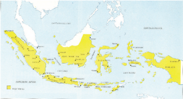

> **Deskripsi Visual:** Gambar ini adalah diagram yang menunjukkan peta geografis Indonesia. Peta ini melukiskan wilayah Indonesia dengan berbagai provinsi dan pulau-pulau yang terletak di sepanjang garis pantai. Di bagian atas, terdapat penanda "Indonesia" yang menunjukkan lokasi geografis Indonesia di Asia Tenggara. Di bagian bawah, terdapat penanda "Benua Asia" yang menunjukkan bahwa Indonesia merupakan bagian dari Benua Asia. Selain itu, terdapat penanda "Samudera Hindia" yang menunjukkan bahwa Indonesia berbatasan dengan Samudera Hindia di selatan. Gambar ini juga menunjukkan beberapa kota penting di Indonesia seperti Jakarta, Surabaya, dan Bandung. Informasi kunci yang dapat diambil pembaca adalah bahwa Indonesia terdiri dari banyak pulau dan memiliki batas geografis yang luas.

Sumber: Atlas Sejarah Indonesia dan Dunia, 1994. Gambar 6. 19 Peta Negara Republik Indonesia.

- » Coba amati baik-baik Peta Negara Kesatuan Republik Indonesia di atas!
- Di manakah pusat pemerintahan Republik Indonesia saat ini?
- Bagaimana  struktur  pemerintahan  Republik  Indonesia  saat ini?
- Apakah Dasar Negara Republik Indonesia?
- Apakah jumlah provinsi di Indonesia selalu tetap?
- Bagaimana Negara Indonesia pertama kali terbentuk?
Proklamasi  17  Agustus  1945  dilaksanakan  dalam  situasi  kacau,  dapat dikatakan  bahwa  proklamasi  tersebut  dilakukan  dengan  tergesa-gesa, tanpa  melalui  pembicaraan  panjang.  Walaupun  kamu  sudah  tahu  bahwa sebelumnya telah dibentuk BPUPKI dan PPKI yang secara resmi merancang kemerdekaan Indonesia.

 

---
## 📄 Halaman 113

Pada  saat  proklamasi  dibacakan,  negara  Indonesia  belum  sepenuhnya terbentuk. Mengapa demikian? Karena syarat kelengkapan negara pada saat itu belum semua terpenuhi. Apa saja syarat berdirinya negara? Selain memiliki wilayah, negara harus memiliki struktur pemerintahan, diakui negara lain, dan memiliki kelengkapan lain seperti undang-undang atau peraturan hukum. Di antara persyaratan tersebut, syarat utama yang belum terpenuhi adalah struktur  pemerintahan  dan  pengakuan  dari  negara  lain.  Ingat,  proklamasi kemerdekaan Indonesia tidak mengundang secara resmi berbagai duta besar negara lain,  karena  memang sebelum proklamasi pemerintahan yang ada adalah pemerintahan Jepang!

Karena itu,  tugas  pertama  bangsa  Indonesia  adalah  membentuk  pemerintahan dan  mencari  pengakuan  negara-negara  lain.  Bagaimana  prosesnya?  Mari kita lacak melalui kegiatan di bawah ini!

### Memahami teks

### 1. Pengesahan UUD  1945 dan Pemilihan Presiden, Wakil Presiden

Setelah Indonesia diproklamasikan, secara resmi terbentuklah suatu negara  baru  yang  bernama  Indonesia.  Sudah  barang  tentu  kelengkapankelengkapan  sebagai  negara  merdeka  harus  segera  dipenuhi.  Salah  satu hal  terpenting  yang  harus  dipenuhi  adalah  Undang-Undang  Dasar  (UUD). Pada tanggal 18 Agustus 1945, PPKI melakukan sidang untuk membahas, mengambil  keputusan kemudian mengesahkan UUD. Rapat yang pertama ini  diadakan  di  Pejambon  (sekarang  dikenal  sebagai  Gedung  Pancasila). Rencana  pukul 11.30, sidang pleno dibuka di bawah pimpinan Sukarno. Kemudian  dilaksanakan  acara  pemandangan  umum,  yang  dilanjutkan dengan pembahasan bab demi bab dan pasal demi pasal.

Namun sebelum secara resmi rapat itu dilaksanakan berkembang isu yang sangat krusial yang terkait dengan bunyi sila pertama dalam Pancasila yang merupakan  bagian  tak  terpisahkan  dari  Pembukaan  UUD:  'Ketuhanan dengan  kewajiban  menjalankan  syari'at  Islam  bagi  pemeluk-pemeluknya. Rakyat  Indonesia  Timur  yang  umumnya  beragama  Kristen  Protestan  dan Katholik  merasa  keberatan  dengan  rumusan  itu.  Informasi  penting  ini disampaikan oleh seorang opsir Angkatan Laut Jepang (setelah mendapat persetujuan Nisyijima,  pembantu  Laksamana  Maeda).  Dengan  diantar

 

---
## 📄 Halaman 114

Nisyijima opsir Jepang itu bertemu Moh.Hatta tanggal 17 Agustus 1945 sore hari.  Tentu  informasi  ini  menjadi  perhatian  serius  bagi  Hatta.  Semalaman Hatta  terbayang  bagaimana  Republik  Indonesia  tanpa  Indonesia  bagian Timur, bagaimana perjuangan yang sudah bertahun-tahun dilakukan bersama baik dari kelompok Islam, Kristen, Katholik dan agama yang lain. Bung  Hatta  dalam  hatinya  menegaskan  Indonesia  harus  tetap  bersatu. Bagaimana harus memecahkan persoalan tersebut dan bagaimana sidang PPKI itu berlangsung, mari kita simak uraian berikut.

Tanggal 18 Agustus 1945, pagi-pagi sebelum sidang PPKI di mulai, Bung Hatta  menemui  tokoh-tokoh  Islam  yang  cukup  berpengaruh  seperti  Ki Bagus  Hadikusumo,  Wahid  Hasyim,  Mr.  Kasman  Singodimedjo,  Teuku Hasan. Dikumpulkanlah mereka dan diajak rapat pendahuluan. Bung Hatta menyampaikan informasi yang telah diberikan seorang opsir  Jepang.  Terjadilah diskusi serius dan dengan konsep 'filsafat garam' (terasa tetapi tidak harus tampak),  Bung  Hatta  dengan  kedudukannya  yang  cukup  berpengaruh berhasil meyakinkan para tokoh Islam itu. Mereka sepakat dari pada  harus terjadi perpecahan maka rela menghilangkan kata-kata 'dengan kewajiban menjalankan  syari'at  Islam  bagi  pemeluk-pemeluknya'  yang  menyertai Ketuhanan  dalam  Pembukaan  UUD,  sehingga  tinggal  'Ketuhanan'.  Ada pemikiran untuk menambahkan kata-kata di belakang Ketuhanan dengan 'berdasarkan  kemanusiaan'  sehingga  menjadi  'Ketuhanan  berdasarkan kemanusiaan'.  Ki  Bagus  Hadikusumo  kemudian  mengusulkan  dengan rumusan 'Ketuhanan Yang Maha Esa'. Semua sepakat, dan waktu sidang PPKI pun segera dimulai.

Di  dalam  acara  pertama  yakni  pemandangan  umum,  Bung  Hatta  juga menyampaikan hasil lobi atau pertemuannya dengan beberapa tokoh Islam yang  hasilnya  mengganti  kata-kata  yang  berbunyi  'Ketuhanan  dengan kewajiban  menjalankan  syari'at  Islam  bagi  pemeluk-pemeluknya',  dalam draf  Pembukaan  UUD  diganti  dengan  'Ketuhanan  Yang  Maha  Esa'. Rumusan  itu  telah  dikonsultasikan  dan  didiskusikan  antara  Hatta  dengan para  pemuka  Islam.  Hatta  menegaskan  bahwa  kesepakatan  itu  diambil karena  suatu  pernyataan  pokok  mengenai  seluruh  bangsa  tidaklah  tepat hanya  menyangkut  identitas  sebagian  dari  rakyat  Indonesia  sekalipun merupakan  bagian  yang  mayoritas.  Kesepakatan  pergantian  rumusan  ini dapat melegakan semua pihak, sekalipun sebagian dari pihak Islam ada yang merasa kecewa, tetapi tidak ada masalah. Rapat pemandangan umum dapat berlangsung dengan lancar.

 

---
## 📄 Halaman 115

Setelah diadakan revisi isi draf Pembukaan UUD yang tertera di dalam Piagam Jakarta itu, lahirlah rumusan Teks Pancasila yang kemudian disahkan pada sidang PPKI tanggal 18 Agustus 1945 tersebut.

### PANCASILA

- 1 . Ketuhanan  Yang Maha Esa.
- Kemanusian yang adil dan beradab.
- Persatuan Indonesia.
- Kerakyatan yang dipimpin oleh hikmah kebijaksanaan dalam permusyawaratan/perwakilan.
- Keadilan sosial bagi seluruh rakyat Indonesia.
Sidang  dilanjutkan  dengan  membahas  bab  perbab,  pasal  demi  pasal. Pembahasan ini  juga  cukup  produktif  dan  berjalan  lancar.  Waktu  itu  jam sudah  menunjukkan  pukul  13.50  wib.  Sidang  dihentikan  istirahat  sampai pukul  15.00  wib  untuk  memberi  kesempatan  salat  bagi  umat  Islam  dan memberi kesempatan makan siang bagi yang tidak berpuasa.

 

---
## 📄 Halaman 116

Pukul 15.00 sidang dimulai kembali. Agenda utamanya pemilihan presiden dan  wakil  presiden.  Sebagai  dasar  hukum  pemilihan  presiden  dan  wakil presiden tersebut, harus disahkan dulu yakni pasal 3 dari Aturan Peralihan. Ini menandai untuk pertama kalinya presiden dan wakil presiden dipilih oleh PPKI.

Kertas suara dibagikan, tetapi atas usul Otto Iskandardinata, maka secara aklamasi terpilih Ir. Sukarno sebagai Presiden RI dan Drs. Moh.Hatta sebagai Wakil  Presiden  Rl.  Sesudah  itu,  pasal-pasal  yang  tersisa  yang  berkaitan dengan Aturan Peralihan dan Aturan Tambahan disetujui. Setelah menjadi presiden, Sukarno kemudian menunjuk sembilan orang anggota PPKI sebagai Panitia Kecil dipimpin oleh Otto Iskandardinata.Tim ini bertugas merumuskan pembagian wilayah negara Indonesia.

### 2. Pembentukan Departemen dan Pemerintahan Daerah

Sidang  PPKI  dilanjutkan  kembali  pada  tanggal  19  Agustus  1945.  Acara yang pertama adalah membahas hasil kerja Panitia Kecil yang dipimpin oleh Otto  Iskandardinata.  Sebelum  acara  dimulai,  Presiden  Sukarno  ternyata telah  menunjuk  Ahmad  Subarjo,  Sutarjo  Kartohadikusumo  dan  Kasman Singodimejo sebagai Panitia Kecil  yang  ditugasi  merumuskan  bentuk departemen bagi pemerintahan RI, tetapi bukan personalianya (pejabatnya).

Otto Iskandardinata menyampaikan hasil kerja Panitia Kecil yang dipimpinnya. Hasil  keputusannya  tentang  pembagian  wilayah  NKRI  menjadi  delapan provinsi, yaitu sebagai berikut.

- Jawa Tengah
- Jawa Timur
- Borneo (Kalimantan)
- Sulawesi
- Maluku
- Sunda Kecil
- Sumatera
- Jawa Barat

 

---
## 📄 Halaman 117

Di  samping  delapan  wilayah  tersebut,  masih  ditambah  Daerah  Istimewa Yogyakarta  dan  Surakarta.  Setelah  itu,  sidang  dilanjutkan  mendengarkan laporan Ahmad Subardjo, mengenai pembagian departemen atau kementerian. Adapun hasil yang disepakati, NKRI terbagi atas 12 departemen sebagai berikut.

- Kementerian Dalam Negeri
- Kementerian Luar Negeri
- Kementerian Kehakiman
- Kementerian Keuangan
- Kementerian Kemakmuran
- Kementerian Kesehatan
- Kementerian Pengajaran
- Kementerian Sosial
- Kementerian Pertahanan
- Kementerian Penerangan
- Kementerian Perhubungan
- Kementerian Pekerjaan Umum
Selain itu juga ada Kementerian Negara.

### 3. Pembentukan Badan-Badan Negara

Pada malam hari tanggal 19 Agustus 1945, di Jln. Gambir Selatan (sekarang Merdeka  Selatan)  No.  10,  Presiden  Sukarno,  Wakil  Presiden  Hatta,  Mr. Sartono, Suwirjo, Otto Iskandardinata, Sukardjo Wirjopranoto, dr. Buntaran, Mr.  A.G.  Pringgodigdo,  Sutardjo  Kartohadikusumo,  dan  dr.  Tajuluddin, berkumpul untuk membahas siapa saja yang akan diangkat sebagai anggota Komite Nasional Indonesia Pusat (KNIP). Selanjutnya disepakati bahwa rapat KNIP direncanakan tanggal 29 Agustus 1945.

PPKI  kembali  mengadakan sidang pada tanggal 22 Agustus 1945. Dalam sidang  ini,  diputuskan  mengenai  pembentukan  Komite  Nasional  Seluruh Indonesia  dengan  pusatnya  di  Jakarta.  Komite  Nasional  dibentuk  sebagai penjelmaan tujuan dan cita-cita bangsa Indonesia untuk menyelenggarakan kemerdekaan Indonesia yang berdasar kedaulatan rakyat.

 

---
## 📄 Halaman 118

KNIP (Komite Nasional Indonesia Pusat) diresmikan dan anggota-anggotanya dilantik  pada  tanggal  29  Agustus  1945.  Pelantikan  ini  dilangsungkan  di gedung Kesenian Pasar Baru, Jakarta. Sebagai ketua KNIP adalah Mr. Kasman Singodimejo,  dengan  beberapa  wakilnya,  yakni  Sutarjo  Kartohadikusumo, Mr. Latuharhary, dan Adam Malik.

---
**🖼️ Gambar/Diagram**

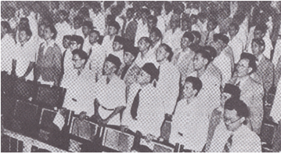

> **Deskripsi Visual:** Gambar ini adalah foto yang menunjukkan sebuah acara resmi dengan banyak orang yang berdiri dan berdiri di atas panggung. Orang-orang tersebut tampaknya sedang mengikuti upacara atau acara penting. Di tengah-tengah panggung, ada beberapa orang yang tampak lebih besar dan mungkin merupakan tokoh penting dalam acara tersebut. Di sepanjang panggung, terdapat beberapa meja dengan laptop dan perangkat lainnya, yang mungkin digunakan untuk menyampaikan informasi atau melakukan tindakan teknis selama acara.

Elemen-elemen utama dalam gambar ini meliputi:

1. Orang-orang yang berdiri di atas panggung.
2. Meja dengan laptop dan perangkat lainnya di tengah panggung.
3. Lingkungan acara yang formal dan resmi.

Teks, angka, atau label penting yang terlihat dalam gambar ini tidak ada, karena gambar hanya berupa foto tanpa teks atau label tambahan.

Informasi kunci yang dapat diambil pembaca dari gambar ini adalah bahwa acara tersebut tampaknya formal dan resmi, mungkin terkait dengan kegiatan penting atau upacara tertentu. Orang-orang yang berdiri di atas panggung tampaknya berada dalam posisi penting, mungkin sebagai pemimpin atau tokoh penting dalam acara tersebut.

---
**🖼️ Gambar/Diagram**

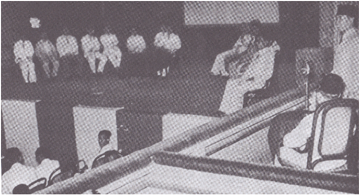

> **Deskripsi Visual:** Gambar ini adalah ilustrasi yang menunjukkan sebuah pertemuan formal di ruang rapat. Dalam gambar tersebut, beberapa orang sedang berdiri di atas podium, sementara yang lain duduk di kursi di sepanjang dinding. Orang-orang tampak serius dan terlibat dalam diskusi. Di tengah ruangan, ada beberapa papan tulis yang menunjukkan teks dan diagram, menunjukkan bahwa mereka sedang membahas topik tertentu. Ada juga beberapa penanda seperti "Pendapat" dan "Argumentasi", yang menunjukkan bahwa mereka sedang berbicara tentang pendapat atau argumen. Gambar ini menunjukkan bahwa pertemuan ini adalah sesi diskusi atau debat formal, dengan elemen-elemen seperti podium, kursi, papan tulis, dan penanda yang membantu dalam menggambarkan suasana dan konteks pertemuan tersebut.

Gambar 6.2 2 Presiden Sukarno sedang memberi amanat pada pelantikan anggota KNIP.

 

---
## 📄 Halaman 119

Pada tanggal 16 Oktober 1945, diselenggarakan sidang KNIP yang bertempat di Gedung Balai Muslimin Indonesia, Jakarta. Sidang ini dipimpin oleh Kasman Singodimejo. Dalam sidang ini juga diusulkan kepada Presiden agar KNIP diberi hak legislatif selama DPR dan MPR belum terbentuk. Hal ini dirasa penting, karena  dalam  rangka  menegakkan  kewibawaan  kehidupan  kenegaraan. Syahrir  dan  Amir  Syarifudin  mengusulkan  adanya  BPKNIP  (Badan  Pekerja KNIP) untuk menghadapi suasana genting. BPKNIP akan mengerjakan tugastugas operasional dari KNIP. Berdasarkan usul-usul dalam sidang tersebut, maka Wakil Presiden selaku wakil pemerintah, mengeluarkan maklumat yang lazim disebut Maklumat Wakil Presiden No. X. Bunyi maklumat itu sebagai berikut:

### MAKLUMAT WAKIL PRESIDEN NO. X KOMITE NASIONAL PUSAT, PEMBERIAN KEKUASAAN LEGISLATIF KEPADA KOMITE NASIONAL PUSAT PRESIDEN REPUBLIK INDONESIA

SESUDAH MENDENGAR pembicaraan  oleh  Komite  Nasional  Pusat  tentang usul supaya Majelis Permusyawaratan Rakyat dan Dewan Perwakilan Rakyat dibentuk, kekuasaannya yang hingga sekarang dijalankan oleh Presiden dengan bantuan sebuah Komite Nasional menurut Pasal IV Aturan  Peralihan  dan  Undang-Undang  Dasar  hendaknya  dikerjakan oleh Komite Nasional Pusat dan supaya pekerjaan Komite Nasional Pusat itu sehari-harinya berhubung dengan gentingnya keadaan dijalankan oleh sebuah badan bernama Dewan Pekerja yang bertanggung jawab kepada Komite Nasional Pusat;

MENIMBANG bahwa  di  dalam  keadaan  yang  genting  ini  perlu  ada badan yang ikut bertanggung jawab tentang nasib bangsa Indonesia, di sebelah pemerintah.

MENIMBANG selanjutnya bahwa usul tadi berdasarkan paham kedaulatan rakyat.

### MEMUTUSKAN:

Bahwa Komite Nasional Pusat, sebelum terbentuk Majelis Permusyawaratan  Rakyat  dan  Dewan  Perwakilan  Rakyat  diserahi kekuasaaan  legislatif dan ikut menetapkan Garis-Garis Besar daripada

 

---
## 📄 Halaman 120

Haluan  Negara,  serta  menyetujui  bahwa  pekerjaan  Komite  Nasional Pusat sehari-hari  berhubung dengan gentingnya keadaan dijalankan oleh  sebuah  Badan  Pekerja  yang  dipilih  di  antara  mereka  dan  yang bertanggung jawab kepada Komite Nasional Pusat.

Jakarta, 16 Oktober 1945

WAKIL PRESIDEN REPUBLIK INDONESIA

MOHAMMAD HATTA

Dengan  adanya  maklumat  tersebut,  untuk  sementara  Indonesia  sudah memiliki badan negara yang memiliki kekuasaan legislatif. KNIP yang semula sebagai  Pembantu  Presiden  dan  merupakan  wadah  pemusatan  kehendak rakyat serta pengobar semangat perebutan kekuasaan dari Jepang, setelah dikeluarkan maklumat No. X itu KNIP diharapkan berperan sebagai MPR dan DPR, meskipun hanya bersifat sementara. Untuk menjalankan kegiatannya, telah dibentuk BPKNIP, yang diketuai oleh Sutan Syahrir.

### 4 . Pembentukan Kabinet

Presiden segera membentuk kabinet yang dipimpin oleh Presiden Sukarno sendiri. Dalam kabinet ini para menteri bertanggung jawab kepada Presiden atau Kabinet Presidensial.

Kabinet RI  yang  pertama  dibentuk  oleh  Presiden  Sukarno  pada  tanggal  2 September 1945 terdiri atas para menteri sebagai berikut.

- Menteri Dalam Negeri
:  R.A.A. Wiranata Kusumah

- Menteri Luar Negeri
:  Mr. Ahmad Subarjo

- Menteri Keuangan
:  Mr. A.A. Maramis

- Menteri Kehakiman
:  Prof. Mr. Supomo

- Menteri Kemakmuran
:  Ir. Surakhmad Cokroadisuryo

- Menteri Keamanan Rakyat      :  Supriyadi
- Menteri Kesehatan
:  Dr. Buntaran Martoatmojo

 

---
## 📄 Halaman 121

- Menteri Pengajaran
:  Ki Hajar Dewantara

- Menteri Penerangan
:  Mr. Amir Syarifuddin

- Menteri Sosial
:  Mr. Iwa Kusumasumantri

- Menteri Pekerjaan Umum        : Abikusno Cokrosuyoso
- Menteri Perhubungan
:  Abikusno Cokrosuyoso

- Menteri Negara
:  Wahid Hasyim

- Menteri Negara
:  Dr. M. Amir

- Menteri Negara
:  Mr. R.M. Sartono

- Menteri Negara
:  R. Otto Iskandardinata

---
**🖼️ Gambar/Diagram**

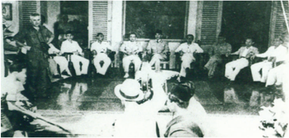

> **Deskripsi Visual:** Gambar ini adalah foto yang menunjukkan sebuah pertemuan formal antara beberapa orang. Dalam foto tersebut, ada seorang pria yang berdiri di depan, tampaknya sebagai pembicara atau pengacara, sedangkan beberapa orang lainnya duduk di sebelahnya. Mereka tampaknya sedang mendengarkan atau menghadiri sesi diskusi. Latar belakang tampak seperti ruangan publik dengan kursi dan meja, serta beberapa papan tulis atau papan tulis. Pemandangan ini menunjukkan suasana yang serius dan formal, mungkin dalam konteks pendidikan atau seminar.

### 5. Pembentukan Berbagai Partai Politik

Sidang  PPKI  pada  tanggal  22  Agustus  1945  juga  memutuskan  adanya pembentukan partai politik  nasional  yang  kemudian  terbentuk  PNI  (Partai Nasional  Indonesia).  Partai  ini  diharapkan  sebagai  wadah  persatuan  pembinaan politik bagi rakyat Indonesia. BPKNIP mengusulkan perlu dibentuknya partaipartai  politik,  yang  kemudian  ditindaklanjuti  oleh  Wakil  Presiden  dengan maklumat pada tanggal 3 November 1945. Setelah dikeluarkan maklumat itu, berdirilah partai-partai politik di NKRI.

 

---
## 📄 Halaman 122

Beberapa partai politik yang kemudian terbentuk misalnya

- Masyumi  (Majelis Syuro Muslimin Indonesia), berdiri tanggal  7 November 1945, dipimpin oleh dr. Sukiman Wiryosanjoyo.
- PKI (Partai Komunis Indonesia) berdiri 7 November  1945 dipimpin oleh Mr. Moh. Yusuf. Oleh tokoh-tokoh komunis, sebenarnya pada tanggal 2 Oktober 1945 PKI telah didirikan.
- PBI (Partai Buruh Indonesia), berdiri tanggal 8 November 1945 dipimpin oleh Nyono.
- Partai Rakyat Jelata, berdiri tanggal 8 Nopember 1945 dipimpin oleh Sutan Dewanis.
- Parkindo (Partai Kristen Indonesia), berdiri tanggal 10 November 1945 dipimpin oleh Dr Prabowinoto.
- PSI  (Partai  Sosialis  Indonesia),  berdiri  tanggal  10  November  1945 dipimpin Amir Syarifuddin.
- PRS (Partai Rakyat Sosialis), berdiri tanggal 10 November 1945 dipimpin oleh Sutan Syahrir.
- PKRI (Partai Katholik Republik Indonesia), berdiri tanggal 8 Desember 1945 dipimpin oleh I.J. Kasimo.
- Persatuan  Rakyat  Marhaen  Indonesia,  berdiri  tanggal  17  Desember 1945 dipimpin oleh JB Assa.
- PNI (Partai Nasional Indonesia), berdiri tanggal 29 Januari 1946. PNI merupakan penggabungan dari Partai Rakyat Indonesia (PRI), Gerakan Republik Indonesia, dan Serikat Rakyat Indonesia, yang masing-masing sudah berdiri dalam bulan November dan Desember 1945.

### 6. Lahirnya Tentara Nasional Indonesia

Sebagai  negara  yang  wilayahnya  luas,  tentara  mutlak  diperlukan  sebagai benteng pertahanan. Sebutan TNI (Tentara Nasional Indonesia), lebih populer dengan sebutan ABRI (Angkatan Bersenjata Republik Indonesia). Bagaimana sejarah lahirnya Tentara Nasional Indonesia? Terbentuknya TNI berpangkal dari maklumat pembentukan TKR (Tentara Keamanan Rakyat). Kesatuan TKR kemudian berkembang menjadi TNI.

 

---
## 📄 Halaman 123

### a. Badan Keamanan Rakyat

Beberapa  minggu  setelah proklamasi kemerdekaan,  Presiden  Sukarno masih bersikap hati-hati. Hal ini berkaitan dengan sikap Jepang yang tidak senang  kalau  terjadi  perubahan  status  quo  (dari  negara  jajahan  menjadi negara merdeka), apalagi sampai memiliki tentara. Sejak Jepang menyerah kepada Sekutu, Jepang harus menjaga Indonesia agar jangan sampai terjadi perubahan  sampai  Sekutu  tiba  di  Indonesia.  Oleh  karena  takut  kepada pemerintah  Sekutu,  maka  Jepang  bersikap  keras  kepada  Indonesia.  Sikap keras dan ketidaksenangan Jepang terhadap Indonesia, misalnya melucuti persenjataan  dan  sekaligus  membubarkan  Peta  pada  tanggal  18  Agustus 1945. Jepang khawatir Peta akan menjelma menjadi tentara Indonesia. Oleh karena itu, Presiden Sukarno bersikap lebih hati-hati, agar Republik Indonesia tetap dapat berlangsung.

Sikap Sukarno yang demikian itu tidak disenangi oleh para pemuda yang lebih  bersifat  revolusioner.  Oleh  karena  itu,  para  pemuda  memelopori pembentukan badan-badan perjuangan.

Sampai  akhir  bulan  Agustus  1945,  sikap  hati-hati  Sukarno  masih  tetap dipertahankan. Hal ini  terbukti  pada  waktu  diadakan  sidang  PPKI  tanggal 22 Agustus 1945. Untuk menghadapi situasi dalam sidang itu diputuskan, untuk pembentukan BKR (Badan Keamanan Rakyat). BKR merupakan bagian dari BPKKP (Badan Penolong Keluarga Korban Perang). Tujuan dibentuknya BKR untuk memelihara keselamatan masyarakat dan keamanan di berbagai wilayah.  Oleh  karena  itu,  BKR  juga  dibentuk  di  berbagai  daerah,  namun harus diingat bahwa BKR bukan tentara. Jadi, sampai akhir bulan Agustus 1945, Indonesia belum memiliki tentara.

Setelah bangsa Indonesia memproklamasikan kemerdekaannya pada 17  Agustus  1945,  pada  saat  itu  Indonesia  belum  mempunyai  tentara kebangsaan.  Sementara  itu,  tentara  PETA  tidak  dapat  langsung  dijadikan sebagai  tentara  Indonesia  karena  saat  itu  Indonesia  masih  dalam status quo hingga  kedatangan  sekutu  di  Indonesia.  Kemudian  pada  18  Agustus 1945,  Panitia  Persiapan  Kemerdekaan  Indonesia  (PPKI)  yang  diketuai  oleh Oto Iskandar Dinata  merencanakan untuk membentuk susunan pembagian sebagian wilayah, kepolisian negara, tentara kebangsaan dan perekonomian. Dalam pada itu PPKI mengusulkan, bahwa rencana bela negara dari BPUPKI yang mengandung politik perang tidak dapat diterima dan Tentara  PETA di

 

---
## 📄 Halaman 124

Jawa dan Bali serta Giyugun di Sumatera harus dibubarkan karena bentukan Jepang.  Untuk  itulah  Presiden  Sukarno  memanggil  kalangan  militer  yang cakap  untuk  membentuk  tentara  kebangsaan  yang  kokoh.  Otto  Iskandar kemudian dibantu oleh dua tentara Peta, Kasman Singodimejo dan Abdul Kadir,  untuk  membentuk  tentara  kebangsaan.  Abdul  Kadir  kemudian ditunjuk untuk menjadi ketua panitia khusus itu.

Pada tanggal 19 Agustus di luar parlemen itu, para pemuda yang dipimpin oleh Adam Malik mengadakan rapat di Prapatan 10. Hadir pula Kasman, Ki Hajar Dewantoro dan Sutan Sjahrir. Pada saat itu Presiden dan Wakil Presiden dipaksa  untuk  hadir,  karena  para  pemuda  ingin  mengajukan  tuntutan, yaitu  lahirnya  Tentara  Republik  Indonesia  yang  berasal  dari  bekas  tentara PETA.  Setelah melalui proses panjang, pada tanggal 22 Agustus 1945, PPKI mengadakan  rapat  paripurna  yang  menghasilkan  tiga  hal  yaitu,  tentang Komite Nasional, Partai Nasional, dan Badan Keamanan Rakyat (BKR).

Pembentukan BKR ini  menimbulkan pro dan kontra di kalangan pemuda, para  pemuda  yang  tidak  puas  terhadap  kebijakan  pemerintah  dalam pembentukan  BKR  itu,  kemudian  membentuk  badan-badan  perjuangan. Badan-badan  perjuangan    atau  juga  dikenal  dengan  laskar,  yaitu  suatu organisasi perjuangan, yang tidak memiliki senjata, kurang disiplin, dan tidak memiliki pemimpin yang berpengalaman.

### Komite van Aksi dan lahirnya badan-badan perjuangan

Demikian pula pemuda Sukarni dan Adam Malik membentuk Komite van Aksi  yang  dimaksudkan  sebagai  gerakan  yang  bertugas  dalam  pelucutan senjata  terhadap  serdadu  Jepang  dan  merebut  kantor-kantor  yang  masih diduduki  Jepang.  Munculnya  Komite  van  Aksi  kemudian  disusul  dengan lahirnya berbagai badan perjuangan lainnya di bawah Komite van Aksi seperti API (Angkatan Pemuda Indonesia), BARA (Barisan Rakyat Indonesia) dan BBI (Barisan Buruh Indonesia).

Di berbagai daerah kemudian juga berkembang badan-badan perjuangan. Di  Surabaya  muncul  BBI  pada  tanggal  21  Agustus  1945.  Kemudian  pada tanggal 25 Agustus 1945, dibentuk Angkatan Muda oleh Sumarsono dan Ruslan  Wijayasastra.  Kedua  tokoh  ini  kemudian  membentuk  PRI  (Pemuda Republik Indonesia) bersama Bung Tomo pada tanggal 23 September.

 

---
## 📄 Halaman 125

Demikian  halnya  yang  terjadi  di  Yogyakarta,  Surakarta,  dan  Semarang, di  sana  juga  muncul  berbagai  badan  perjuangan.  Misalnya,  Angkatan Muda dan Pemuda di Semarang, Angkatan Muda di Surakarta, Angkatan Muda Pegawai Kesultanan atau dikenal Pekik (Pemuda Kita Kesultanan) di Yogyakarta. Di  Bandung berdiri  Persatuan  Pemuda  Pelajar  Indonesia  yang kemudian lebih dikenal dengan PRI (Pemuda Republik Indonesia).

Selain itu, juga muncul Barisan Banteng, Pesindo (Pemuda Sosialis Indonesia). BPRI (Barisan Pemberontakan Rakyat Indonesia), dan juga muncul HizbullahSabilillah. Bahkan orang-orang luar Jawa yang berada di Jawa membentuk badan perjuangan seperti KRIS (Kebaktian Rakyat Indonesia Sulawesi) dan PIM  (Pemuda  Indonesia  Maluku).  Kemudian,  muncul  pula  badan-badan perjuangan  yang  lebih  bersifat  khusus,  misalnya  TP  (Tentara  Pelajar),  TGP (Tentara  Genie  Pelajar),  dan  TRIP  (Tentara  Republik  Indonesia  Pelajar). Selanjutnya  berkembang  pula  kelaskaran.  Badan-badan  perjuangan  juga berkembang di luar Jawa, antara lain sebagai berikut.

- di  Aceh  terdapat  API  (Angkatan  Pemuda  Indonesia)  yang  dipimpin oleh Syamaun Gaharu dan BPI (Barisan Pemuda Indonesia) kemudian menjadi PRI (Pemuda Republik Indonesia) yang dipimpin oleh A. Hasyim
- di Sumatera Utara terdapat Pemuda Republik Andalas;
- di  Sumatera  Barat  terdapat  Pemuda  Andalas  dan  Pemuda  Republik Indonesia Andalas Barat;
- di Lampung terdapat API (Angkatan Pemuda Indonesia) yang dipimpin oleh Pangeran Emir Mohammad Noor;
- di Bengkulu terdapat PRI (Pemuda Republik Indonesia) dipimpin oleh Nawawi Manaf;
- di  Kalimantan  Barat  terdapat  PPRI  (Pemuda  Penyongsong  Republik Indonesia). Tokoh-tokohnya, antara lain Musani Rani dan Jayadi Saman;
- di Kalimantan Selatan terdapat PRI (Persatuan Rakyat Indonesia) yang dipimpin oleh Rusbandi;
- di  Bali  terdapat  AMI  (Angkatan  Muda  Indonesia)  dan  PRI  (Pemuda Republik Indonesia); dan
- di Sulawesi Selatan terdapat PPNI (Pusat Pemuda Nasional Indonesia) yang dipimpin oleh Manai Sophian, AMRI (Angkatan Muda Republik Indonesia), Pemuda Merah Putih, dan Penunjang Republik Indonesia.
Dengan munculnya badan-badan perjuangan tersebut, maka dapat dikatakan  bahwa  di  seluruh  tanah  air  telah  siap  menggelorakan  revolusi untuk membersihkan kekuatan Jepang dari Indonesia.

 

---
## 📄 Halaman 126

### b. Tentara Keamanan Rakyat

Sampai  akhir  bulan  September  1945,  ternyata  Indonesia  belum  memiliki kesatuan dan organisasi ketentaraan secara resmi dan profesional. Presiden Sukarno dan Wakil Presiden Moh.Hatta belum membentuk kesatuan tentara. Hal ini tampaknya sangat terpengaruh oleh sikap serta strategi politik yang cenderung  pada  usaha  diplomasi.  BKR  hanya  diprogram  untuk  menjaga keselamatan  dan  keamanan  masyarakat  di  daerah  masing-masing.  BKR kemudian menghimpun bekas-bekas anggota Peta, Heiho, Seinendan, dan lain-lain. BKR bukan merupakan kekuatan bersenjata yang bersifat nasional. Para pemuda belum puas dengan keberadaan BKR. Oleh karena itu, badanbadan perjuangan terus mengadakan perlawanan terhadap kekuatan Jepang.

Angkatan  Perang  Inggris  yang  tergabung  dalam  SEAC  ( South  East  Asian Command ) mendarat di Jakarta pada tanggal 16 September 1945. Pasukan ini  dipimpin  Laksamana  Muda  Lord  Louis  Mountbatten  yang  mendesak pihak  Jepang  untuk  mempertahankan status  quo di  Indonesia.  Indonesia masih dipandang sebagai daerah jajahan seperti pada masa-masa sebelum 17 Agustus 1945. Dengan demikian, maka Jepang semakin keras dan berani untuk tetap mempertahankan diri dan melawan gerakan para pemuda yang sedang melakukan usaha perlucutan senjata dan perebutan kekuasaan.

Pada  tanggal  29  September  1945,  mendarat  lagi  tentara  Inggris  yang dipimpin  oleh  Letnan  Jenderal  Sir  Philip  Christison,  panglima  dari  AFNEI ( Allied Forces Netherlands East Indies ).  Kedatangan tentara AFNEI ternyata diboncengi oleh tentara Belanda yang disebut NICA ( Netherlands India Civil Administration ).  Hal  ini  menimbulkan  kemarahan  bagi  bangsa  Indonesia. Akhirnya, timbul berbagai insiden dan perlawanan terhadap kekuatan asing, terutama terhadap Belanda.

Dengan demikian ancaman dari kekuatan asing semakin besar. Para pemimpin negara menyadari bahwa sulit mempertahankan negara dan kemerdekaan tanpa suatu tentara atau angkatan perang. Sehubungan dengan itu, maka pemerintah memanggil bekas mayor KNIL, Urip Sumoharjo dan ditugasi untuk membentuk tentara kebangsaan. Urip Sumoharjo sejak zaman Belanda sudah memiliki pengalaman di bidang kemiliteran. la termasuk lulusan pertama dari Sekolah Perwira di Meester Cornelis yang didirikan Belanda.

 

---
## 📄 Halaman 127

Kemudian, dikeluarkanlah  Maklumat  Pemerintah  pada  tanggal  5  Oktober 1945  tentang  pembentukan  TKR  (Tentara  Keamanan  Rakyat).  Adapun maklumat itu berbunyi sebagai berikut.

Untuk memperkuat perasaan keamanan umum, maka diadakan suatu Tentara Keamanan Rakyat.

Jakarta, 5 Oktober 1945 Presiden Republik Indonesia

Soekarno

Urip  Sumoharjo  diangkat  sebagai  Kepala  Staf  TKR.  Sehari  kemudian pemerintah  mengeluarkan  maklumat  yang  isinya  mengangkat  Supriyadi (bekas  komandan  Peta)  sebagai  Menteri  Keamanan  Rakyat.  Selanjutnya, pada tanggal 9 Oktober 1945, KNIP mengeluarkan perintah mobilisasi bagi bekas-bekas tentara, Peta, KNIL (koninklijk Nederlands Indisch Leger), Heiho dan laskar-laskar yang ada untuk bergabung menjadi satu ke dalam TKR. Sementara itu, kesatuan aksi atau badan-badan perjuangan para pemuda yang bersifat setengah militer atau setengah organisasi politik (laskar-laskar) masih  tetap  diizinkan  beroperasi  apabila  tidak  ingin  bergabung  ke  dalam TKR.

Personalia pimpinan TKR ternyata belum mantap. Hal ini terutama disebabkan oleh tidak munculnya tokoh Supriyadi. Supriyadi hilang secara misterius sejak berakhirnya pemberontakan Peta di Blitar pada Februari 1945. Oleh karena itu,  pada  tanggal  20  Oktober  1945  diumumkan  kembali  pengangkatan pejabat-pejabat pimpinan di lingkungan TKR.

Susunan pimpinan TKR yang baru sebagai berikut. Menteri Keamanan Rakyat ad interim: Muhamad Suryoadikusumo

- Pimpinan Tertinggi TKR: Supriyadi
- Kepala Staf Umum TKR: Urip Sumoharjo

 

---
## 📄 Halaman 128

Ternyata, Supriyadi tidak kunjung datang. Oleh karena  itu,  secara  operasional  kepemimpinan yang aktif dalam TKR adalah Urip Sumoharjo. Ia  memilih  Markas  Besar  TKR  di  Yogyakarta dan  membagi  TKR  dalam  16  divisi.  Seluruh Jawa dan Madura dibagi dalam 10 divisi  dan Sumatera dibagi menjadi 6 divisi.

Mengingat  Supriyadi tidak pernah  muncul, maka atas prakarsa Markas Tertinggi TKR, pada tanggal 12 November 1945, diadakan pemilihan pemimpin tertinggi TKR yang baru. Dalam, rapat pemilihan  itu  dihadiri  oleh  para  Komandan Divisi, Sri Sultan Hamengkubuwana IX, dan Sri Mangkunegoro  X.  Rapat  dipimpin  oleh  Urip Sumoharjo.  Dalam  rapat  itu  disepakati  untuk mengangkat Kolonel Sudirman, Panglima Divisi V Banyumas sebagai Panglima Besar TKR dan sebagai  Kepala  Staf,  disepakati  mengangkat Urip  Sumoharjo.  Namun  pengangkatan  dan pelantikan Kolonel Sudirman baru dilaksanakan pada tanggal 18 Desember1945, setelah pertempuran Ambarawa selesai. Setelah pertempuran  itu selesai,  pangkat  Sudirman menjadi Jenderal dan Urip Sumoharjo menjadi Letnan Jenderal.

### c.  Dari TKR, TRI, ke TNI

Sejarah ketentaraan Indonesia terus mengalami perubahan pada masa awal kemerdekaan.  TKR  dengan  sebutan  keamanan  rakyat,  dinilai  hanya  merupakan kesatuan  yang  menjaga  keamanan  rakyat  yang  belum  menunjukkan sebagai suatu kesatuan angkatan bersenjata yang mampu melawan musuh dengan perang bersenjata. Jenderal Sudirman ingin meninjau susunan dan tata kerja TKR. Kemudian atas prakarsa Markas Tertinggi TKR, pemerintah mengeluarkan Penetapan Pemerintah No.2/SD 1946 tanggal 1 Januari 1946. Isi dari Penetapan Pemerintah itu adalah mengubah nama Tentara Keamanan Rakyat menjadi Tentara Keselamatan Rakyat. Kementerian Keamanan Rakyat

 

---
## 📄 Halaman 129

diubah menjadi Kementerian Pertahanan. Belum genap satu bulan, sebutan Tentara Keselamatan Rakyat diganti dengan TRI (Tentara Republik Indonesia). Hal ini berdasarkan pada Maklumat Pemerintah tertanggal 26 Januari 1946. Di  dalam  maklumat  itu  ditegaskan  bahwa  TRI  merupakan  tentara  rakyat, tentara kebangsaan, atau tentara nasional. Namun dalam maklumat itu tidak menyinggung tentang kedudukan badan-badan perjuangan atau kelaskaran di luar TKR.

Di  dalam  Lingkungan  Markas  Tertinggi,  TRI  kemudian  disempurnakan dengan dibentuknya TRI Angkatan Laut yang kemudian dikenal dengan ALRI (Angkalan Laut Republik Indonesia) dan TRI Angkatan Udara yang dikenal dengan AURI (Angkalan Udara Republik Indonesia).

Tanggal 17 Mei diadakan beberapa perubahan di dalam organisasi. Beberapa perubahan itu antara lain sebagai berikut.

- Di lingkungan Markas Besar:
- Panglima Besar: Jenderal Sudirman, dan
- Kepala Staf Umum : Letnan Jenderal Urip Sumoharjo
- Pengurangan jumlah divisi:
- Jawa - Madura yang semula 10 divisi dijadikan 7 divisi ditambah 3 brigade di Jawa Barat, dan
- Sumatera semula 6 divisi menjadi 3 divisi.
- Dalam Kementerian Pertahanan:
- dibentuk Direktorat Jenderal bagian militer, yang dipimpin oleh Mayor Jenderal Sudibyo, dan
- dibentuk biro khusus yang menangani badan-badan perjuangan dan kelaskaran.
Situasi  negara  semakin  genting.  Aksi-aksi  pihak  tentara  Belanda  semakin mengancam  kehidupan  dan  kelangsungan  Republik  Indonesia.  Untuk menghadapi  situasi  yang  semakin  membahayakan  ini,  maka  diperlukan kekuatan  tentara  yang  kompak  dan  bersatu  padu.  Sementara  dalam kenyataannya, Indonesia masih menghadapi masalah-masalah yang berkaitan dengan kekuatan bersenjata kita. Di samping tentara resmi TRI, ALRI, dan AURI, masih ada laskar-laskar. Pada umumnya kesatuan kelaskaran lebih  condong  kepada  induk  partainya  yang  seideologi  dan  belum  tentu searah dengan perjuangan para tentara yang tergabung dalam TRI. Jelas ini akan memperlemah perjuangan bangsa dalam menghadapi aksi-aksi kaum Belanda.

 

---
## 📄 Halaman 130

Sehubungan dengan kenyataan itu maka pada tanggal 5 Mei 1947, Presiden mengeluarkan dekrit yang berisi tentang pembentukan panitia yang disebut Panitia Pembentukan Organisasi Tentara Nasional. Panitia itu dipimpin sendiri oleh Presiden Sukarno.

Setelah  panitia  itu  bekerja,  akhirnya  keluar  Penetapan  Presiden  tentang pembentukan organisasi TNI (Tentara Nasional Indonesia). Mulai tanggal 3 Juni 1947, secara resmi telah diakui berdirinya TNI sebagai penyempurnaan dari TRI. Segenap anggota angkatan perang yang tergabung dalam TRI dan anggota  kelaskaran  dimasukkan  ke  dalam  TNI.  Dalam  organisasi  ini  telah dimiliki  TNI  Angkatan  Darat  (TNI  AD),  TNI  Angkatan  Laut  (TNI  AL),  dan TNI  Angkatan  Udara  (TNI  AU).  Semua  itu  terkenal  dengan  sebutan  ABRI (Angkatan  Bersenjata  Republik  Indonesia).  Saat  ini  Angkatan  Bersenjata Republik Indonesia kembali bernama Tentara Nasional Indonesia.

### KESIMPULAN

- Indonesia sebagai bangsa yang merdeka, baru dimulai tanggal 17 Agustus 1945.  Sebagai penyangga demokrasi suatu negara  dan  pembinaan kehidupan berpolitik, diperlukan adanya partai-partai politik. Karena itu pemerintah melalui   Wakil Presiden telah mengeluarkan maklumat tanggal 3 November 1945. Berdirilah kemudian beberapa partai politik.
- Sementara  untuk  menjaga  keamanan  negara  masyarakat  membentuk kesatuan  aksi  dan  badan-badan  perjuangan,  terutama  waktu  itu  untuk melucuti tentara Jepang.
- Keadaan  negara  ternyata  semakin  terancam  setelah  datangnya  tentara Sekutu dan diboncengi tentara NICA. Oleh karena itu, keberadaan tentara sangat  diperlukan.  Maka  keluarlah  maklumat  pemerintah  tanggal  5 Oktober  1945  yang  menandai  berdirinya  T entara  Keamanan  Rakyat (TKR). TKR ini terus  dikembangkan  dan  terus  disempurnakan,  menjadi Tentara Republik Indonesia (TRI) dan akhirnya menjadi  T entara Nasional Indonesia (TNI).

 

---
## 📄 Halaman 131

### LATIH  UJI KOMPETENSI

- Setelah proklamasi kemerdekaan, langkah pertama bangsa Indonesia adalah melengkapi struktur pemerintahan. Jelaskan langkahlangkah yang dilakukan bangsa Indonesia dalam melengkapi struktur pemerintahan tersebut!
- Pada  masa  awal  kemerdekaan,  sistem  kabinet  apa  yang  berlaku  di Indonesia? Jelaskan alasan kamu!
- Pada  masa  awal  kemerdekaan  Indonesia  belum  memiliki  anggota legislatif  yang  dipilih  oleh  rakyat.  Siapa  yang  melakukan  kegiatan legislatif pada masa awal kemerdekaan? Jelaskan peranannya!

### Tugas

Coba lakukan identifikasi kesatuan aksi dan badan-badan perjuangan yang pernah berkembang di lingkungan mu. Tuliskan dalam bentuk laporan!

Sejarah Indonesia

123

 

---
## 📄 Halaman 132

### C.  Proklamator dan Peran Para Tokoh Sekitar Proklamasi

Gambar  6.27 Peristiwa  pengibaran  bendera  merah  putih  pada  saat  upacara  proklamasi

 

---
## 📄 Halaman 133

### Mengamati Lingkungan

Melakukan refleksi nilai-nilai kepahlawanan dari para tokoh dalam memperjuangkan kedaulatan kemerdekaan Indonesia, merupakan sesuatu yang sangat penting. Banyak pelajaran yang dapat kita peroleh.

- » Coba  amati  baik-baik  gambar  pengibaran  bendera  merah  putih pada saat Proklamasi Kemerdekaan Indonesia 17 Agustus 1945 di halaman sebelumnya dan serangkaian peristiwa Proklamasi pada bahasan sebelumnya!
- Berdasarkan  gambar  tersebut  coba  rumuskan  beberapa pertanyaan terkait dengan gambar tersebut.
- 2 Siapa yang mengibarkan bendera tersebut?
- Siapa  yang  membacakan  teks  proklamasi  kemerdekaan tersebut?
- Siapa yang mengetik naskah proklamasi?
- Siapa yang menyusun teks proklamasi?
- Siapa yang menjahit bendera merah putih tersebut?
- Siapa yang menyiapkan tiang bendera untuk upacara bendera dan pembacaan teks proklamasi?
- Siapa yang terlibat dalam penyebarluasan berita proklamasi?
- Bagamana ancaman dan hambatan mereka dalam melaksanakan kegiatan itu?
- Mengapa mereka melakukan kegiatan-kegiatan di atas?
Pertanyaan-pertanyaan di atas pantas kita ajukan dan kita cari jawabannya. Kita  sadar  bahwa  proklamasi  kemerdekaan  bukan  perjuangan  orang  per orang, tetapi perjuangan seluruh bangsa Indonesia. Kita perlu memahami perjuangan mereka, karena mereka berjuang untuk bangsa Indonesia, yang berarti  untuk  kehidupan kita  sekarang dan generasi penerus bangsa Indonesia. Dengan memahami bagaimana mereka berjuang, akan memberikan inspirasi kepada kita untuk menghargai mereka dan mendorong kita berjuang lebih giat untuk mempertahankan dan mengisi kemerdekaan.

 

---
## 📄 Halaman 134

Untuk  menghitung  satu  demi  satu  para  pahlawan  sekitar  proklamasi kemerdekaan  tidaklah  mungkin.  Oleh  karena  itu, kita  akan  melacak sebagian  tokoh  yang  terlibat  dalam  perjuangan  proklamasi  kemerdekaan bangsa Indonesia. Siapa saja para tokoh yang berjuang dalam proklamasi kemerdekaan  Indonesia?  Bagaimana  peran  mereka  dalam  perjuangan proklamasi kemerdekaan? Nilai apa yang pantas kita amalkan dari semangat perjuangan para tokoh tersebut? Mari kita telusuri melalui kajian di bawah ini!

### Memahami Teks

Banyak  tokoh  penting  yang  berperan  di  berbagai  peristiwa  di  sekitar Proklamasi. Beberapa tokoh penting itu, antara lain sebagai berikut.

### 1. Peran Sang Proklamator

### a.  Ir. Sukarno

Sukarno  atau  Bung  Karno,  lahir  di  Surabaya tanggal 6 Juni 1901. Sudah  aktif dalam berbagai pergerakan sejak menjadi mahasiswa di  Bandung.  Tahun  1927,  bersama  kawankawannya mendirikan PNI. Oleh karena perjuangannya, ia seringkali keluar-masuk penjara.  Kemudian  pada  zaman  Jepang,  ia pernah  menjadi  ketua  Putera, Chuo  Sangi In  dan  PPKI , serta  pernah  menjadi  anggota BPUPKI.

Begitu tiba di tanah air, dari perjalanannya ke Saigon,  Sukarno  menyampaikan  pidato  singkat.

Isi  pidato itu antara lain, pernyataan bahwa Indonesia sudah merdeka sebelum jagung  berbunga.  Hal  ini  semakin  membakar  semangat  rakyat  Indonesia. Bersama  Moh.  Hatta,  Sukarno  menjadi  tokoh  sentral  yang  terus  didesak oleh para pemuda agar segera memproklamasikan kemerdekaan Indonesia, sampai akhirnya ia harus diungsikan ke Rengasdengklok. Sepulangnya dari

 

---
## 📄 Halaman 135

Rengasdengklok ia bersama Moh. Hatta dan Ahmad Subarjo merumuskan teks proklamasi, dan menuliskannya pada secarik kertas. Sukarno bersama Moh.  Hatta  diberi  kepercayaan  untuk  menandatangani  teks  proklamasi tersebut.

Tanggal 17 Agustus 1945, peranan Sukarno semakin penting. Secara tidak langsung ia terpilih menjadi tokoh nomor satu di Indonesia. Sukarno dengan didampingi  Moh.  Hatta,  diberi  kepercayaan  membacakan  teks  proklamasi sebagai  pernyataan  Kemerdekaan  Indonesia.  Oleh  karena  itu,  Sukarno dikenal sebagai pahlawan proklamator. Sukarno wafat pada tanggal 21 Juni 1970 dan dimakamkan di Blitar.

### b.  Drs. Moh. Hatta

Tokoh lain yang sangat penting dalam berbagai peristiwa  sekitar  proklamasi  adalah  Drs.  Moh. Hatta.  la  dilahirkan  di  Bukittinggi  tanggal  12 Agustus  1902.  Sejak  menjadi  mahasiswa  di luar  negeri,  ia  sudah  aktif  dalam  perjuangan kemerdekaan Indonesia. Ia menjadi salah seorang  pemimpin  dan  ketua  Perhimpunan Indonesia  di  negeri  Belanda.  Setelah  di  tanah air, ia aktif di PNI bersama Bung Karno. Setelah PNI dibubarkan, Hatta aktif di PNI Baru.

Pada masa pendudukan Jepang, ia menjadi salah seorang  pemimpin  PUTERA,  menjadi  anggota BPUPKI  dan  wakil  ketua  PPKI.  Saat  menjabat sebagai  wakil  PPKI,  Moh.  Hatta  dan  Sukarno  menjadi  dwi  tunggal  yang sulit  dipisahkan.  Bersama  Bung  Karno,  ia  juga  pergi  menghadap  Terauchi di Saigon. Setelah pulang, Moh.Hatta menjadi salah satu tokoh sentral yang terus  didesak  para  pemuda  agar  bersama  Sukarno  bersedia  menyatakan proklamasi Indonesia secepatnya.

Moh. Hatta melibatkan diri secara langsung dan ikut andil dalam perumusan teks proklamasi. la juga ikut menandatangani teks proklamasi. Pada peristiwa detik-detik  proklamasi,  Moh.  Hatta  tampil  sebagai  tokoh  nomor  dua  dan mendampingi Bung Karno dalam pembacaan teks Proklamasi Kemerdekaan

 

---
## 📄 Halaman 136

Indonesia. Oleh karena itu, ia juga dikenal sebagai pahlawan proklamator. la wafat pada tanggal 14 Maret 1980, dimakamkan di pemakaman umum Tanah Kusir Jakarta.

### 2. Peran para Tokoh Sekitar Proklamasi

### a.  Ahmad Subarjo

'Saya menjamin bahwa tanggal 17 Agustus 1945 akan  terjadi  proklamasi  kemerdekaan  Republik Indonesia.  Kalau  Saudara-saudara  ragu,  nyawa sayalah  yang  menjadi  taruhannya'.  Ucapan  itu bukan main-main bagi Ahmad Subarjo. Ucapan tersebut  berhasil  meyakinkan  Golongan  Muda, bahwa para senior akan melaksanakan proklamasi sesuai  dengan  desakan  para  pemuda.  Menjadi taruhan  untuk  peristiwa  yang  sangat  penting menunjukkan bahwa Subarjo tidak menghitung jiwa dan raganya demi kemerdekaan Indonesia. Kerelaan tokoh untuk mengorbankan diri demi bangsa  dan  negara  adalah  salah  satu  teladan yang perlu selalu kita lakukan.

Ahmad Subarjo lahir di Karawang, Jawa Barat pada tanggal 23 Maret 1896. la tutup usia pada bulan Desember 1978. Pada masa pergerakan nasional ia aktif di PI dan PNI. Kemudian pada masa pendudukan Jepang sebagai Kaigun, bekerja  pada  Kantor  Kepala  Biro  Riset  Angkatan  Laut  Jepang  pimpinan Laksamana  Maeda.  la  juga  sebagai  anggota  BPUPKI  dan  PPKI.  Ahmad Subarjo tidak hadir pada saat Bung Karno membacakan teks proklamasi di Pegangsaan Timur No. 56 Jakarta Pusat.

Tokoh  Ahmad  Subarjo  boleh  dikatakan  sebagai  tokoh  yang  mengakhiri peristiwa Rengasdengklok. Sebab dengan jaminan nyawa Ahmad Subarjo, akhirnya  Ir.  Sukarno,  Moh.Hatta,  dan  rombongan  diperbolehkan  kembali ke Jakarta. Sesampainya di Jakarta dini hari, di rumah Maeda dilaksanakan perumusan teks proklamasi, Ahmad Subarjo secara langsung berperan aktif dan memberikan andil pemikiran tentang rumusan teks proklamasi.

 

---
## 📄 Halaman 137

### b.  Sukarni Kartodiwiryo

Coba kamu perhatikan gambar Sukarni berikut  ini!  Tokoh  inilah  yang  sering  menjadi perdebatan  para  pembaca  sejarah  Indonesia sekitar  proklamasi  kemerdekaan. Banyak yang mengira tokoh ini perempuan, karena Sukarni lebih banyak digunakan untuk nama perempuan di Jawa Tengah.

Sukarni Kartodiwiryo adalah seorang  pemuda gagah  berani.  Ia  merupakan  salah  seorang pimpinan gerakan pemuda di masa proklamasi. Tokoh ini dilahirkan di Blitar pada tanggal 14 Juli 1916 dan meninggal pada tanggal 4 Mei 1971. Sejak  muda,  ia  sudah  aktif  dalam  pergerakan politik. Semasa pendudukan Jepang, ia bekerja pada  kantor  berita  Domei.  Kemudian  Ia  aktif  di  dalam  gerakan  pemuda. Bahlan  ia  menjadi    pemimpin  gerakan  pemuda  yang  berpusat  di  Asrama Pemuda Angkatan Baru di Menteng Raya 31 Jakarta.

Sukarni  merupakan  pelopor  penculikan  Sukarno  dan  Moh.  Hatta  ke Rengasdengklok.  Ia  juga  tokoh  yang  mengusulkan  agar  teks  proklamasi ditandatangani oleh Sukarno dan Moh. Hatta atas nama bangsa Indonesia. la juga memimpin pertemuan untuk membahas strategi penyebarluasan teks proklamasi dan berita tentang proklamasi.

### c.  Sayuti Melik

Tokoh yang lahir pada tanggal 25 November 1908 di Yogyakarta ini, berperan dalam pencatatan hasil diskusi susunan teks proklamasi. Ia yang  mengetik  teks proklamasi  yang  dibacakan  Sukarno-Hatta. Sejak muda, Sayuti Melik sudah aktif dalam gerakan politik dan jurnalistik. Tahun 1942 menjadi pemimpin redaksi surat kabar Sinar Baru Semarang.

 

---
## 📄 Halaman 138

Nama  tokoh  ini  semakin  mencuat  pada  sekitar  Proklamasi  Kemerdekaan Indonesia. la telah menyaksikan penyusunan teks proklamasi di ruang makan rumah Maeda. Bahkan akhirnya ia dipercaya untuk mengetik teks proklamasi yang ditulis tangan oleh Sukarno.

### d.  Burhanuddin Mohammad Diah

### e.  Latif Hendraningrat

Burhanuddin  Mohammad  Diah  (B.M.  Diah)  lahir di Kotaraja pada tanggal 7 April 1917. la berbakat di  bidang  jurnalistik.  Sejak  tahun  1937  sudah menjadi redaktur berbagai surat kabar. Pada awal  pendudukan  Jepang,  ia  bekerja  pada  radio militer. Pada tahun 1942-1945, ia bekerja sebagai wartawan pada harian Asia Raya .

Pada sekitar peristiwa proklamasi, B.M. Diah sudah  menjadi  wartawan  yang  terkenal.  Pada malam  sewaktu  akan  diadakan  perumusan  teks proklamasi,  B.M.  Diah  banyak  melakukan  kontak dengan  pemuda,  yaitu  untuk  datang  ke  rumah Maeda. la salah seorang pemuda yang ikut menyaksikan  perumusan  teks  proklamasi.  Ia  juga sangat berperan dalam upaya penyebarluasan berita Proklamasi Kemerdekaan Indonesia.

Latif Hendraningrat adalah salah seorang komandan Peta. Pada saat pelaksanaan proklamasi, ia merupakan salah satu tokoh yang cukup sibuk. la menjemput beberapa tokoh penting untuk hadir di  Pegangsaan  Timur  No.  56.  Misalnya  ia  harus mencari dan menjemput Moh. Hatta.

Pada saat pelaksanaan proklamasi, setelah menyiapkan  barisan,  ia  mempersilakan  Sukarno membacakan teks proklamasi. Kemudian, Latief  Hendraningrat  dengan  dibantu  S.  Suhud mengibarkan  Sang  Saka  Merah  Putih,  dan  yang membantu membawakan bendera Merah Putih adalah SK. Trimurti.

 

---
## 📄 Halaman 139

### f.  S. Suhud

S.  Suhud  adalah  pemuda  yang  ditugasi  mencari  tiang  bendera  dan mengusahakan  bendera  Merah  Putih  yang  akan  dikibarkan.  Oleh  karena gugup dan tegang, tiang yang digunakan adalah sebatang bambu, padahal tidak terlalu jauh dari rumah Sukarno ada tiang bendera dari besi. S. Suhud bersama  Latif  Hendraningrat  adalah  pengibar  bendera  Merah  Putih  di halaman rumah Sukarno pada saat Proklamasi 17 Agustus 1945.

### g.  Suwiryo

Suwiryo adalah walikota Jakarta Raya waktu itu dan secara tidak langsung menjadi ketua penyelenggara upacara Proklamasi Kemerdekaan. Oleh karena itu, ia sangat sibuk mempersiapkan segala sesuatu yang diperlukan dalam upacara tersebut, termasuk pengadaan mikrofon dan pengeras suara.

### h.  dr. Muwardi

Tokoh muda Muwardi, bertugas dalam bidang pengamanan jalannya upacara Proklamasi Kemerdekaan Indonesia. Ia telah menugaskan anggota Barisan Pelopor dan Peta untuk menjaga keamanan di sekitar kediaman Bung Karno. Setelah upacara Proklamasi Kemerdekaan Indonesia, ia juga membagi tugas kepada para anggota Barisan Pelopor dan Peta untuk menjaga keamanan Bung Karno dan Moh. Hatta.

### i.  Sutan Syahrir

Tokoh  ini  pada  zaman  pendudukan Jepang  memilih  aktif  dalam  gerakan bawah tanah bersama beberapa pemuda yang lain. Sutan Syahrir lahir di Padang Panjang, Sumatera Barat, pada tanggal 5 maret 1909.  Setelah lulus di HIS  (SD  sekarang  ),  ia  melanjutkan  ke MULO  (SMP)  di  Medan.  Kemudian  ia melanjutkan  studi  di  AMS  atau  SMA sekarang,  di  bagian  A.  di  Bandung. Setelah  itu,  ia  aktif  dalam  berbagai organisasi.  Bahkan  ia  ikut  mendirikan Jong  Indonesia.  Di  masa  penjajahan

Gambar 5.30 Sutan Syahrir

 

---
## 📄 Halaman 140

Belanda, ia sudah militan dalam pergerakan politik. Ia juga pernah ditangkap pada tahun 1934.Ia dipenjarakan di Cipinang, kemudian bersama Drs. Moh. Hatta  dibuang  ke  Digul,  kemudian  dipindah  ke  Banda  Neira,  Selanjutnya dipindah lagi ke Sukabumi, Jawa Barat.

Pada masa akhir pendudukan Jepang dan menjelang proklamasi termasuk pemuda yang aktif untuk ikut mendesak Bung Hatta dan Bung Karno agar segera  memerdekakan  Indonesia,  karena  ia  dapat  mendengarkan  radio bahwa  Jepang  telah  menyerah.  Setelah  merdeka,  pada  awal  perjuangan mempertahankan kemerdekaan Syahrir diangkat sebagai Perdana Menteri RI.

### j.  Frans Sumarto Mendur

Tokoh Frans Sumarto Mendur adalah tokoh wartawan yang ikut membantu pelaksanaan  Proklamasi  Kemerdekaan  Indonesia.  Ia  telah  mengabadikan berbagai  peristiwa  penting  di  sekitar  proklamasi.  la  bergabung  dengan kawan-kawan dari Indonesia Press Photo Senice atau Ipphos.

### k.  Syahruddin

Syahruddin adalah seorang wartawan Domei. la dengan berani memasuki halaman gedung siaran RRI. Oleh karena gedung siaran dijaga oleh Jepang, maka terpaksa melalui belakang, yaitu dengan memanjat tembok belakang gedung  dari  JI.  Tanah  Abang.  Naskah  proklamasi  kemudian  berhasil diserahkan kepada kepala bagian siaran.

### l.   Wuz dan Yusuf Ronodipuro

Tokoh F. Wuz dan Yusuf Ronodipuro berperan penting dalam penyebarluasan berita proklamasi. Kedua tokoh ini merupakan penyiar-penyiar yang cukup berani dan tidak jarang mendapat ancaman dari pihak Kempetai.

### m.  Lambertus Nicodemus Palar

Lambertus  Nicodemus  Palar  atau  lebih  dikenal  dengan  L.N.Palar  adalah seorang diplomat ulung dalam  perjuangan kemerdekaan  Indonesia, khususnya  melalui  diplomasi.    Ia  lahir  di  Tomohon,  Sulawesi  Utara  pada tanggal 5 Juni 1900. Pendidikan yang ditempuhnya adalah sekolah MULO

 

---
## 📄 Halaman 141

di Tondano, kemudian melanjutkan sekolah di Yogyakrta di AMS dan ITB, namun Palar tidak menyelesaikan kuliahnya di ITB. Ia kemudian meneruskan sekolah di Amsterdam sambil bekerja.

Pada tahun 1947, L.N. Palar diminta oleh Presiden Sukarno untuk menjadi juru bicara RI di PBB. Pada akhir tahun 1947 dibantu oleh Sudarpo, Soedjatmoko, dan Sumitro, Palar membuka kantor perwakilan RI di New York. Sebelum pengakuan kedaulatan RI 1949, status Palar saat itu adalah sebagai peninjau. Kemudian pada tahun 1950 setelah Indonesia mendapat kedaulatan penuh dan Indonesia menjadi anggota PBB ke-60, Palar resmi sebagai perwakilan RI dengan status keanggotaan penuh.

### n.  Sumitro Djojohadikusumo

Begawan  ekonomi  Indonesia  yang    idealis  ini  selalu  konsisten  terhadap sikapnya yang dianggap benar. Sumitro lahir di Kebumen, Jawa Tengah 29 Mei 1917. Ayahnya Margono adalah pendiri Bank BNI. Setelah menamatkan sekolahnya di Hogere Burger School (HBS), ia langsung berangkat ke Belanda. Ia  juga  pernah  belajar  di  Barcelona  dan  Rotterdam  untuk  mempelajari ekonomi. Dalam tempo tiga bulan ia telah berhasil meraih gelar Bachelor of Arts (BA). Ia juga pernah sekolah ekonomi di Universitas Sorbonne, Paris. Di Paris Sumitro mulai masuk ke kelompok sosialis. Ia kemudian belajar tentang konsisten pada prinsip hidup, pengabdian, perlawanan,  dan keadilan sosial. Sumitro  kemudian  ke  Belanda  untuk  mendapatkan  gelar  Master  of  Arts (MA). Bersama-sama dengan L.N. Palar, Sumitro memperjuangkan RI melalui jalur diplomasi.

- » Banyak tokoh berperan dalam proses persiapan dan pelaksanaan proklamasi  17  Agustus  1945.  Coba  kamu  pilih  salah  satu  tokoh tersebut, kemudian carilah buku biografi tokoh itu, kemudian buatlah rangkuman perjuangan tokoh tersebut sekitar 2-3 halaman! Nilai atau karakter apa yang menurutmu perlu kita tiru dari tokoh tersebut?

 

---
## 📄 Halaman 142

### KESIMPULAN

- Proklamasi 17 Agustus 1945, besar bersama bangsa Indonesia.
- Proklamasi 17 Agustus 1945 juga merupakan kehendak dari  T uhan  Yang Esa.
- Proklamasi  17 Agustus  1945  melibatkan  peranan  banyak  orang.  Bahkan  bukan  hanya bangsa Indonesia, tetapi sebagian bangsa lain juga bersimpati untuk perjuangan bangsa Indonesia.
- Para  tokoh  memiliki  peranan  berbeda-beda  dalam  Proklamasi  Kemerdekaan  Indonesia. Mereka berperan sesuai dengan kemampuan dan kesempatan yang harus dilakukan.
- Para  tokoh  pejuang  itu  senantiasa  rela  berkorban  dan  tanpa  pamrih  untuk  berjuang mencapai kemerdekaan sehingga bangsa Indonesia bebas dari penjajahan.
- Mereka bersatu saling bahu membahu bersama rakyat rela berkorban tanpa pamrih untuk mempertahankan tanah air Indonesia.

 

---
## 📄 Halaman 143

### LATIH UJI KOMPETENSI

- Mengapa pada saat  Jepang  menyerah  kepada  Sekutu,  di  Indonesia disebut sebagai mengalami vacuum of power?
- Jelaskan bahwa pada saat proklamasi kemerdekaan, negara Republik Indonesia belum memiliki semua kelengkapan negara! Tindakan apa saja yang dilakukan bangsa Indonesia untuk melengkapi kelengkapan negara tersebut?
- Salah  satu  kegiatan  yang  dilakukan  pasca  proklamasi  kemerdekaan adalah pembentukan KNIP. Apa yang melatarbelakangi pembentukan KNIP dan bagaimana fungsi badan tersebut bagi negara Indonesia?
- Pada saat proklamasi kemerdekaan, di Jalan Pegangsaan Timur tidak terjadi penyerangan Jepang terhadap para peserta upacara proklamasi, padahal pada saat tersebut tentara Jepang di Indonesia masih lengkap. Mengapa hal tersebut dapat terjadi!
- Menurut  pendapatmu,  apakah  kamu  sepakat  dengan  perjuangan golongan muda yang menuntut percepatan proses proklamasi kepada Sukarno-Hatta? Lebih menguntungkan mana bangsa Indonesia memproklamirkan  sendiri  sesuai  keinginan  golongan  muda  atau menunggu sidang PPKI? Jelaskan alasanmu!

### Tugas

Buatlah penulisan tentang peran seorang tokoh dari lingkungan kamu yang ikut berperan dan berjuang di sekitar Proklamasi.

Sejarah Indonesia

135

 

---
## 📄 Halaman 144

### LATIH ULANGAN AKHIR BAB

- Bagaimana penilaian kamu tentang adanya Janji Kaiso, tentang kemerdekaan Indonesia?
- Mengapa terjadi perbedaan antara para pemuda dengan Sukarno-Hatta dan mengapa terjadi peristiwa Rengasdengklok?
- Bagaimana kira-kira perubahan yang terjadi dalam kehidupan sosial, ekonomi, politik, dan budaya setelah terjadi kemerdekaan?
- Jelaskan pentingnya NKRI bagi kehidupan berbangsa dan bernegara di Indonesia!
- Lakukan identifikasi departemen dan nama-nama menterinya, serta pembagian provinsinya!
- Mengapa pada awal kemerdekaan kondisi perekonomian bangsa Indonesia dikatakan sangat memprihatinkan?
- Apa peran dan posisi KNIP dalam struktur ketatanegaraan Indonesia pada awal kemerdekaan?
- Jelaskan, mengapa perlu partai politik dalam kehidupan berbangsa dan bernegara di Indonesia!
- Rumuskan nilai-nilai kejuangan yang berkaitan dengan peristiwa Proklamasi Kemerdekaan Indonesia, 17 Agustus 1945!

### Tugas

Buatlah biografi singkat tentang tokoh Sukarno atau  Moh. Hatta.

136

Kelas XI SMA/MA/SMK/MAK

Semester 2

 

---
## 📄 Halaman 145

### BAB 7 Revolusi Menegakkan Panji-Panji NKRI

......Sejarah Perundingan yang sudah-sudah menunjukkan yaitu kedaulatan Belanda berdasarkan sejarah.

bahwa pokok kesulitan terletak pada permasalahan kedaulatan, Tetapi pada tanggal 17 Agustus 1945, hari Proklamasi, sudah tercetus revolusi di Indonesia. Setelah itu, perjuangan bangsa Indonesia mengalir dalam satu saluran tertentu, karena waktu itu bangsa Indonesia sudah menyatakan diri sebagai bangsa yang merdeka dan berdaulat. Setelah hari ini jugalah bangsa Indonesia bertindak ke luar atas nama negaranya yang diwujudkan dalam RI Kutipan Pidato Hatta dalam Konferensi Meja Bundar

S udah cukup lama bangsa Indonesia menikmati kemerdekaan. Sebagai negara  yang  besar,  dengan  wilayah  yang  luas,  dan  penduduk  yang banyak, kedaulatan dan keutuhan negara menjadi sebuah tantangan. Para pemimpin dan rakyat selalu berjuang untuk membangun Indonesia menjadi lebih baik. Sebagai negara yang luas dan besar jumlah penduduknya, apakah kamu melihat ancaman terhadap negara kita? Apakah masih ada ancaman asing terhadap kedaulatan bangsa Indonesia? Apakah masih ada gerakan yang  ingin  memisahkan  Negara  Kesatuan  Republik  Indonesia?  Apakah masih ada yang meragukan Pancasila dan UUD 1945 sebagai dasar negara dan  landasan  hukum  Negara  Republik  Indonesia?  Pertanyaan-pertanyaan tersebut. Pantas kita renungkan, karena ancaman dan tantangan akan selalu

 

---
## 📄 Halaman 146

ada baik dari dalam maupun dari luar. Ancaman terhadap kelangsungan NKRI terjadi sejak Negara Indonesia terbentuk pasca proklamasi kemerdekaan 17 Agustus 1945. Bagaimana bentuk ancaman-ancaman terhadap kelangsungan Negara  Republik  Indonesia?  Bagaimana  para  pahlawan  dan  tokoh  kita menghadapinya? Kajian  lebih  dalam  masalah  ini  harus  kita  lakukan,  agar sebagai  generasi  penerus  kita  dapat  memecahkan  masalah-masalah  yang berkaitan dengan ancaman terhadap kelangsungan Negara Indonesia.

Sumber: Dokumen Kemdikbud, 2014.

Gambar 7.1 Panglima Besar Jenderal Sudirman memimpin perang gerilya dengan ditandu.

 

---
## 📄 Halaman 147

### PETA KONSEP

---
**🖼️ Gambar/Diagram**

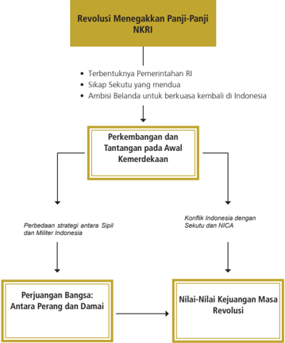

> **Deskripsi Visual:** Gambar ini adalah diagram yang menunjukkan struktur dan konteks perjuangan bangsa Indonesia pada masa Revolusi Menegakkan Panji-Panji NKRI. Diagram ini terdiri dari empat bagian utama:

1. **Terbentuknya Pemerintahan RI**: Ini merupakan awal dari perjuangan bangsa Indonesia untuk mencapai kemerdekaan.

2. **Sikap Sekutu yang Mendua**: Ini menggambarkan situasi di mana beberapa negara sekutu berusaha mempengaruhi pemerintahan Indonesia.

3. **Ambisi Belanda untuk Bercoba Kembali di Indonesia**: Ini menunjukkan upaya Belanda untuk kembali mendominasi Indonesia setelah penjajahan.

4. **Perkembangan dan Tantangan pada Awal Kemerdekaan**: Ini menjadi titik fokus utama di mana perbedaan strategi antara sipil dan militer Indonesia serta konflik dengan Sekutu dan NICA (Negara-negara Indo-China) menjadi tantangan.

5. **Perjuangan Bangsa: Antara Perang dan Damai**: Ini menunjukkan dua cara perjuangan bangsa, yaitu melalui perang dan damai.

6. **Nilai-nilai Kejuangan Masa Revolusi**: Ini menunjukkan nilai-nilai yang diperjuangkan selama revolusi.

Elemen-elemen utama ini saling terkait dan membentuk skema perjalanan perjuangan bangsa Indonesia dari awal hingga akhir. Teks, angka, atau label penting yang terlihat dalam diagram ini adalah "Revolusi Menegakkan Panji-Panji NKRI", "Perkembangan dan Tantangan pada Awal Kemerdekaan", "Perjuangan Bangsa: Antara Perang dan Damai", dan "Nilai-nilai Kejuangan Masa Revolusi". Informasi kunci yang dapat diambil pembaca adalah bahwa perjuangan bangsa Indonesia melibatkan banyak tantangan dan konflik, termasuk perbedaan strategi antar kelompok dan konflik dengan sekutu dan negara-negara lain.

 

---
## 📄 Halaman 148

### TUJUAN PEMBELAJARAN

Setelah mempelajari kajian ini, diharapkan kamu dapat:

- Menganalisis perkembangan dan tantangan awal kemerdekaan Indonesia.
- Mengevaluasi perjuangan bangsa Indonesia dalam menegakkan kemerdekaan melalui perang dan diplomasi.
- Merekontruksi sejarah perjuangan bangsa Indonesia dalam menegakkan kemerdekaan.
- Mengamalkan nilai-nilai perjuangan para tokoh masa Revolusi.

### ARTI PENTING

Melacak sejarah proses kemerdekaan bangsa Indonesia sangat penting untuk memberikan kesadaran betapa berat perjuangan meraih dan mempertahankan kemerdekaan. Mempelajari materi ini juga akan selalu mengingatkan kita kepada ancaman yang mengusik kemerdekaan Indonesia. Karena itu kita akan selalu berhati-hati dalam menjaga keutuhan Negara Republik Indonesia. Kita semua tentu mencintai perdamaian, tetapi kecintaan kita pada kemerdekaan lebih besar.

 

---
## 📄 Halaman 149

### A. Tantangan Awal Kemerdekaan

### Mengamati Lingkungan

Gambar 7.2 Monumen Tugu Pahlawan Surabaya.

- » Coba amati baik-baik monumen Tugu Pahlawan Surabaya di atas!
- Mengapa dibangun Tugu Pahlawan tersebut?
- Apa  hubungan  tugu  tersebut  dengan  perjuangan  bangsa Indonesia?
- Bagaimana makna perjuangan para pahlawan tersebut bagi bangsa Indonesia?

 

---
## 📄 Halaman 150

Proklamasi  kemerdekaan  17  Agustus  1945  bukan  titik  akhir  perjuangan bangsa Indonesia untuk melepaskan diri dari belenggu penjajahan. Belanda yang telah ratusan tahun merasakan kekayaan Indonesia enggan mengakui kemerdekaan Indonesia. Sekutu yang telah memenangkan Perang Dunia II merasa memiliki hak atas nasib bangsa Indonesia. Belanda mencoba masuk kembali ke Indonesia dan menancapkan kolonialisme dan imperialismenya. Sementara kondisi sosial ekonomi Indonesia masih sangat memprihatinkan, perangkat-perangkat kenegaraan juga baru dibentuk, Indonesia ibarat bayi baru lahir masih lemah, tetapi merdeka adalah harga mati. Berbagai upaya bangsa asing untuk menguasai kembali bangsa Indonesia ditentang dengan berbagai  cara.  Pertempuran  heroik  dengan  korban  ribuan  jiwa  terjadi  di berbagai daerah di Indonesia. Tidak terhitung dengan jelas berapa jumlah korban jiwa dari pertempuran mempertahankan bangsa Indonesia tersebut, bahkan banyak pahlawan tidak dikenal yang berguguran. Nah, bagaimana kondisi awal Indonesia merdeka dan bagaimana proses perjuangan bangsa Indonesia berikutnya? Mari kita telusuri melalui kajian di bawah ini!

### Memahami Teks

### 1.  Kondisi Awal Indonesia Merdeka

Secara  politis  keadaan  Indonesia  pada  awal  kemerdekaan  belum  begitu mapan. Ketegangan, kekacauan, dan berbagai insiden masih terus terjadi. Hal  ini  tidak  lain  karena  masih  ada  kekuatan  asing  yang  tidak  rela  kalau Indonesia merdeka. Sebagai contoh rakyat Indonesia masih harus bentrok dengan  sisa-sisa  kekuatan  Jepang.  Jepang  beralasan  bahwa  ia  diminta oleh  Sekutu  agar  tetap  menjaga  Indonesia  dalam  keadaan status  quo . Di samping menghadapi kekuatan Jepang, bangsa Indonesia harus berhadapan dengan  tentara  Inggris  atas  nama  Sekutu,  dan  juga  Belanda  atau  NICA (Netherlands  Indies  Civil  Administration )  yang  berhasil  datang  kembali  ke Indonesia  dengan  membonceng  Sekutu.  Pemerintahan  memang  telah terbentuk,  beberapa  alat  kelengkapan  negara  juga  sudah  tersedia,  tetapi karena baru awal kemerdekaan tentu masih banyak kekurangan. PPKI yang keanggotaannya sudah disempurnakan berhasil mengadakan sidang untuk mengesahkan  UUD  dan  memilih  Presiden-Wakil  Presiden.  Bahkan,  untuk menjaga keamanan negara juga telah dibentuk TNI.

 

---
## 📄 Halaman 151

Kondisi  perekonomian  negara  masih  sangat  memprihatinkan  sehingga terjadi inflasi yang cukup berat. Hal ini dipicu karena peredaran mata uang rupiah Jepang yang tak terkendali, sementara nilai tukarnya sangat rendah. Permerintah RI sendiri tidak bisa melarang beredarnya mata uang tersebut, mengingat Indonesia sendiri belum memiliki mata uang sendiri. Sementara kas pemerintah kosong, waktu itu berlaku tiga jenis mata uang, yaitu De Javasche  Bank ,  uang  pemerintah  Hindia  Belanda,  dan  mata  uang  rupiah Jepang.  Bahkan,  setelah  NICA  datang  ke  Indonesia  juga  memberlakukan mata uang NICA. Kondisi perekonomian ini semakin parah karena adanya blokade  yang  dilakukan  NICA.  Belanda  juga  terus  memberi  tekanan  dan teror  terhadap  pemerintah  Indonesia.  Inilah  yang  menyebabkan  Jakarta semakin kacau sehingga pada tanggal 4 Januari 1946 Ibu Kota RI pindah ke Yogyakarta. Kemudian untuk mengatasi keadaan keuangan, pada 1 Oktober 1946 Indonesia mengeluarkan uang RI yang disebut ORI (Oeang Republik Indonesia).  Sementara  itu  uang  NICA  dinyatakan  sebagai  alat  tukar  yang tidak sah.

Struktur kehidupan masyarakat mulai mengalami perubahan, tidak ada lagi diskriminasi. Semua memiliki hak dan kewajiban yang sama. Sementara dalam hal pendidikan, pemerintah mulai menyelenggarakan pendidikan yang diselaraskan dengan alam kemerdekaan. Menteri Pendidikan  dan  Pengajaran  juga sudah diangkat. Kamu tahu siapa Menteri Pendidikan dan Pengajaran yang pertama di Indonesia?

1995. Gambar 7.3 Mata uang provinsi Sumatera.

- » Nah,  bagaimana  uraian  secara  detail  mengenai  keadaan  sosial, ekonomi,  dan  politik  Indonesia  pada  awal  kemerdekaan  dapat dibaca buku-buku sejarah Indonesia yang ada.

 

---
## 📄 Halaman 152

### 2.  Kedatangan Sekutu dan Belanda

Tentu  kamu  masih  ingat  bagaimana  Jepang  menyerah  kepada  Sekutu. Penyerahan Jepang kepada Sekutu tanpa syarat tanggal 14 Agustus 1945 membuat  analogi  bahwa  Sekutu  memiliki  hak  atas  kekuasaan  Jepang  di berbagai  wilayah,  terutama  wilayah  yang  sebelumnya  merupakan  jajahan negara-negara yang masuk dalam Sekutu. Belanda adalah salah satu negara yang  berada  di  kelompok  Sekutu.  Apakah  kamu  masih  ingat  bagaimana Belanda saat kalah dan menyerahkan kekuasaan kepada Jepang? Apakah Belanda  kembali  ke  tanah  airnya?  Setelah  Belanda  kalah  dengan  Jepang, mereka melarikan diri ke Australia.

Bagaimana kondisi Indonesia setelah Jepang menyerah tanpa syarat kepada Sekutu? Bagi Sekutu dan Belanda, Indonesia dalam masa vacum of power atau kekosongan pemerintahan. Karena itu, logika Belanda adalah kembali berkuasa atas Indonesia seperti sebelum Indonesia direbut Jepang. Dengan kata lain, Belanda ingin menjajah kembali Indonesia. Bagi Sekutu, setelah selesai PD II, maka negara-negara bekas jajahan Jepang merupakan tanggung jawab Sekutu. Sekutu memiliki tanggung jawab perlucutan senjata tentara Jepang, memulangkan tentara Jepang, dan melakukan normalisasi kondisi  bekas  jajahan  Jepang?  Bayangan  Belanda  tentang  Indonesia  jauh dari kenyataan. Faktanya, rakyat Indonesia telah memproklamasikan kemerdekaan  pada  tanggal  17  Agustus  1945.  Kondisi  ini  tentu  bertolak belakang dengan bayangan Belanda dan Sekutu. Karena itu, dapat diprediksi kejadian  berikutnya,  yakni  akan  terjadi  pertentangan  atau  konflik  antara Indonesia dengan Sekutu ataupun Belanda.

Bagaimana  dampak  kedatangan  Sekutu  ke  Indonesia?  Sekutu  masuk ke  Indonesia  diboncengi  NICA.  Mereka  masuk  melalui  beberapa  pintu wilayah  Indonesia  terutama  daerah  yang  merupakan  pusat  pemerintahan pendudukan Jepang seperti Jakarta, Semarang, dan Surabaya. Setelah PD II, terjadi perundingan Belanda dengan Inggris di London yang menghasilkan Civil  Affairs  Agreement. Isinya  tentang  pengaturan  penyerahan  kembali Indonesia  dari  pihak  Inggris  kepada  Belanda,  khusus  yang  menyangkut daerah Sumatra sebagai daerah yang berada di bawah pengawasan SEAC (South East Asia Command) . Di dalam perundingan itu dijelaskan langkahlangkah yang ditempuh sebagai berikut.

 

---
## 📄 Halaman 153

- Fase pertama, tentara Sekutu akan mengadakan operasi militer untuk memulihkan keamanan dan ketertiban.
- Fase  kedua,  setelah  keadaan  normal  pejabat-pejabat  NICA  akan mengambil  alih  tanggung  jawab  koloni  itu  dari  pihak  Inggris  yang mewakili Sekutu.
Setelah diketahui Jepang menyerah pada tanggal 15 Agustus 1945, maka Belanda mendesak Inggris agar segera mensahkan hasil perundingan tersebut. Pada tanggal 24 Agustus 1945 hasil perundingan tersebut disahkan.

Berdasarkan  Persetujuan  Potsdam,  isi Civil  Affairs  Agreement diperluas. Inggris bertanggung jawab untuk seluruh Indonesia termasuk daerah yang berada di bawah pengawasan SWPAC (South West Pasific Areas Command).

Untuk melaksanakan isi Perjanjian Potsdam, maka pihak SWPAC di bawah Lord Louis Mountbatten di Singapura segera mengatur pendaratan tentara Sekutu  di  Indonesia.  Kemudian  pada  tanggal  16  September  1945,  wakil Mountbatten, yakni Laksamana Muda WR Patterson dengan menumpang Kapal Cumberland, mendarat di Pelabuhan Tanjung Perak, Surabaya. Dalam rombongan Patterson ikut serta Van Der Plass seorang Belanda yang mewakili H.J. Van Mook (Pemimpin NICA).

Pada saat perundingan antara Belanda dan Inggris di London,

Parlemen Inggris telah memutuskan kepada Pemerintah Inggris untuk tidak menggunakan pasukannya untuk membantu pihak lain selain untuk melaksanakan tugas Sekutu.

»

Setelah  informasi  dan  persiapan  dipandang cukup,  maka  Louis  Mountbatten  membentuk pasukan komando khusus yang disebut AFNEI (Allied Forces Netherlands East Indiers) di bawah pimpinan Letnan Jenderal Sir Philip Christison. Mereka  tergabung  di  dalam  pasukan  tentara Inggris yang berkebangsaan India, yang sering disebut sebagai tentara Gurkha. Tugas tentara AFNEI sebagai berikut.

 

---
## 📄 Halaman 154

- menerima penyerahan kekuasaan tentara Jepang tanpa syarat.
- membebaskan para tawanan perang dan interniran Sekutu;
- melucuti dan mengumpulkan orang-orang Jepang untuk dipulangkan ke negerinya;
- menegakkan  dan  mempertahankan  keadaan  damai,  menciptakan ketertiban,  dan  keamanan,  untuk  kemudian  diserahkan  kepada pemerintahan sipil; dan
- mengumpulkan keterangan tentang penjahat perang untuk kemudian diadili sesuai hukum yang berlaku.
Pasukan  Sekutu  yang  tergabung  dalam  AFNEI  mendarat  di  Jakarta  pada tanggal 29 September 1945. Kekuatan pasukan AFNEI dibagi menjadi tiga divisi, yaitu sebagai berikut.

- Divisi  India  23  di  bawah  pimpinan  Jenderal  D.C  Hawthorn.  Daerah tugasnya di Jawa bagian barat dan berpusat di Jakarta.
- Divisi India 5 di bawah komando Jenderal E.C Mansergh bertugas di Jawa bagian timur dan berpusat di Surabaya.
- Divisi India 26 di bawah komando Jenderal H.M Chambers, bertugas di Sumatra, pusatnya ada di Medan.
Kedatangan  tentara  Sekutu  diboncengi  NICA  yang  akan  menegakkan kembali kekuatannya di Indonesia. Hal ini menimbulkan kecurigaan terhadap Sekutu dan bersikap anti Belanda.

Sementara  Christison  sebagai  pemimpin  AFNEI  menyadari  bahwa  untuk menjalankan tugasnya tidak mungkin tanpa bantuan pemerintah RI. Oleh karena itu, Christison bersedia berunding dengan pemerintah RI. Selanjutnya, Christison pada tanggal 1 Oktober 1945 mengeluarkan pernyataan pengakuan  secara de  facto tentang  negara  Indonesia.  Namun,  dalam kenyataannya pernyataan tersebut banyak dilanggarnya. Sebagai bukti akan kita lihat dalam kajian di berikut ini.

 

---
## 📄 Halaman 155

---
**🖼️ Gambar/Diagram**

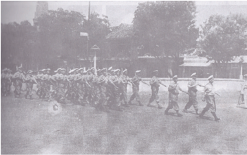

> **Deskripsi Visual:** Gambar ini adalah foto yang menunjukkan sebuah upacara militer atau parade. Gambar ini menampilkan sekelompok prajurit yang berbaris dengan rapi dan seragam, tampaknya sedang mengikuti upacara. Mereka semua memegang senjata api dan berdiri dengan posisi yang rapi. Di depan mereka, ada beberapa prajurit yang tampaknya adalah komandan atau personel penting, karena mereka sedang menggerakkan tangan mereka ke arah atas. Di sebelah kanan, terlihat beberapa prajurit yang tampaknya sedang membawa bendera atau lambang negara. Latar belakangnya tampak seperti lapangan atau area yang digunakan untuk upacara besar. 

Elemen-elemen utama dalam gambar ini adalah prajurit, senjata api, dan bendera. Prajurit berada di tengah-tengah gambar, sementara senjata api dan bendera terletak di sebelah mereka. Relasi antara elemen-elemen ini adalah bahwa prajurit adalah subjek utama, senjata api dan bendera adalah objek yang mereka bawa atau ikuti, dan latar belakang adalah tempat di mana upacara dilakukan.

Teks, angka, atau label penting yang terlihat dalam gambar ini tidak ada. Namun, informasi kunci yang dapat diambil pembaca adalah bahwa gambar ini menunjukkan upacara militer atau parade, dengan prajurit yang berbaris rapi dan menggunakan senjata api serta bendera.

Gambar 7.5 Kedatangan tentara Sekutu di Indonesia.

### 3.  Merdeka atau Mati

Kedatangan Sekutu di Indonesia menimbulkan berbagai reaksi dari  masyarakat Indonesia. Apalagi dengan memboncengnya Belanda yang ingin menguasai kembali  Indonesia.  Hal  ini  mengakibatkan  berbagai  upaya  penentangan dan  perlawanan  dari  masyarakat.  Bagaimana  peristiwa  kekerasan  akibat kedatangan Sekutu di Indonesia terjadi? Mari kita simak kajian di bawah ini.

### a.  Perjuangan rakyat Semarang dalam melawan tentara Jepang

Berita  proklamasi  terus  menyebar  ke  penjuru  tanah  air.  Pemindahan kekuasaan  dari  pendudukan  Jepang  ke  Indonesia  juga  terus  dilakukan. Pada  tanggal  19  Agustus  1945,  sekitar  pukul  13.00  WIB  berkumandang lewat  radio  tentang  sebuah  pernyataan  dan  perintah  agar  pemindahan kekuasaan dari tangan Jepang ke pihak Indonesia terus dilakukan. Hal ini semakin membakar semangat para pemuda Semarang dan sekitarnya untuk melakukan perebutan kekuasaan.

 

---
## 📄 Halaman 156

Bahkan Wongsonegoro selaku pimpinan pemerintahan di Semarang mengeluarkan pernyataan atau perintah sebagai berikut.

Berdasarkan atas pengumuman-pengumuman Panitia Persiapan Kemerdekaan Indonesia dan Komite Nasional di Jakarta, maka dengan ini kami atas nama rakyat Indonesia mengumumkan sementara aturan-aturan pernerintahan untuk menjaga keamanan umum di daerah Semarang.

- Mulai hari ini tanggal 19 Agustus 1945 jam 13.00 Permerintah RI untuk daerah Semarang mulai berlaku.
- Terhadap segala perbuatan yang menentang pemerintah RI akan diambil tindakan yang keras.
- Senjata api, kecuali yang di tangan mereka yang berhak memakainya harus diserahkan kepada polisi.
- Hanya bendera Indonesia Merah Putih boleh berkibar.
- Terhadap segala perbuatan yang mengganggu ketenteraman dan kesejahteraan umum diambil tindakan keras.
- Selanjutnya semua penduduk hendaknya melakukan pekerjaannya sehari-hari sebagaimana biasa.
Semarang, 19 Agustus 1945 Kepala Pemerintahan RI Daerah Semarang Wongsonegoro

Suasana  di  Semarang  semakin  panas.  Jepang  tidak  menghiraukan  seruan pemerintahan di Semarang. Pada tanggal 7 Oktober 1945, ribuan pemuda Semarang  mengerumuni  tangsi  tentara  Jepang,  Kedobutai  di  Jatingaleh. Sementara  pimpinan  mereka  sedang  berunding  di  dalam  tangsi  untuk membahas mengenai penyerahan senjata. Perundingan itu berjalan tersendatsendat, tetapi akhirnya disepakati penyerahan senjata secara bertahap.

Ketegangan  antara  kedua  belah  pihak  terus  berlanjut.  Pada  tanggal  14 Oktober 1945, sekitar 400 orang tawanan Jepang dari pabrik gula Cepiring diangkut oleh para pemuda ke penjara Bulu, Semarang. Dalam perjalanan, sebagian dari para tawanan berhasil melarikan diri dan minta perlindungan kepada  batalion  Kedobutai.  Oleh  karena  itu,  tanpa  menunggu  perintah, para pemuda segera menyerang dan melakukan perebutan senjata terhadap Jepang.  Terjadilah  pertempuran  sengit  antara  rakyat  Indonesia  melawan pasukan Jepang. Pertempuran ini dikenal dengan Pertempuran Lima Hari di Semarang.

 

---
## 📄 Halaman 157

Pada  tanggal  14  Oktober  1945,  pada  petang  harinya,  petugas  kepolisian Indonesia  yang  menjaga  persediaan  air  minum  di  Wungkal  diserang  oleh pasukan Jepang. Mereka dilucuti dan disiksa di tangsi Kedobutai Jatingaleh. Kemudian, di jalan Peterongan terdengar kabar bahwa air ledeng di Candi telah diracuni oleh Jepang. Oleh karena rakyat menjadi gelisah, dr. Kariadi, kepala laboratorium dinas Purusara Semarang ingin mengecek persediaan air tersebut namun ia dibunuh oleh tentara Jepang. Hal ini telah menambah sengitnya pertempuran antara para pemuda melawan tentara Jepang.

Para pemuda berhasil menangkap Mayor Jenderal Nakamura di kediamannya, di Magelang. Tokoh Jepang ini ditahan oleh para pemuda. Hal ini semakin meningkatkan  kemarahan  Jepang.  Pada  hari  kedua  dan  ketiga  Jepang berusaha dapat menguasai daerah Semarang kembali.

Dalam pertempuran itu Jepang membagi pasukannya menjadi tiga kekuatan sebagai berikut.

- Poros Barat, sasarannya penduduk markas Kempetai di  Karangasem yang telah dikuasai para pemuda. Selain itu, juga untuk menghambat gerakan bantuan pasukan dari Pekalongan dan Kendal.
- Poros Tengah, dengan sasaran menguasai markas AMRI di Hotel Du Pavillon.
- Poros Timur, dengan sasaran menduduki Sekolah Teknik dan mencegah datangnya bantuan BKR dari Demak, Pati, dan Rembang. Sementara itu, dari pihak Indonesia telah datang bantuan dari berbagai penjuru, baik dari arah Barat (Kendal dan Weleri), juga dari Timur, seperti dari Demak, Kudus, Pati, Purwodadi, bahkan dari Selatan seperti dari Solo, Magelang, dan Yogyakarta.
Tanggal 17 Oktober 1945, tercapai suatu perundingan mengenai gencatan senjata  yang  diadakan  di  Candi  Baru.  Pihak  Indonesia  juga  menyetujui perundingan tersebut. Sekalipun telah disepakati adanya gencatan senjata, ternyata Jepang masih melanjutkan pertempuran. Pada tanggal 18 Oktober 1945  (hari  kelima),  Jepang  berhasil  mematahkan  berbagai  serangan  para pemuda. Pada hari itu, telah datang beberapa utusan pemerintah pusat dari Jakarta untuk merundingkan soal keamanan dan perdamaian di Semarang. Beberapa  tokoh  yang  hadir  dari  Jakarta  waktu  itu,  antara  lain  Kasman Singodimejo  dan  Sartono.  Pihak  Jepang  yang  hadir,  antara  lain  Jenderal Nakamura. Kemudian, dilanjutkan perundingan untuk mengatur gencatan senjata.  Nakamura  mengancam  akan  mengebom  kota  Semarang,  apabila

 

---
## 📄 Halaman 158

para  pemuda  tidak  mau  menyerahkan  senjata  paling  lambat  tanggal  19 Oktober  1945  pukul  10.00.  Wongsonegoro  terpaksa  menyetujui  dengan membubuhkan tanda tangan pada perjanjian itu.

Pada  tanggal  19  Oktober  1945  pagi  hari,  belum  ada  tanda-tanda  semua senjata  akan  diserahkan  kembali  kepada  Jepang.  Sementara  Jepang  telah bersiap-siap  untuk  membumihanguskan  kota  Semarang.  Tiba-tiba  pukul 07.45 terpetik berita bahwa tentara Sekutu mendarat di Pelabuhan Semarang dengan menumpang kapal HMS Glenry. Mereka terdiri atas pasukan Inggris, termasuk tentara Gurkha. Mereka bertugas untuk melucuti tentara Jepang.

Dengan kedatangan tentara Sekutu, berarti telah mempercepat berakhirnya pertempuran  antara  pejuang  Semarang  dengan  tentara  Jepang.  Untuk mengenang pertempuran Lima Hari di Semarang ini, maka dibangun sebuah monumen yang terkenal dengan sebutan Tugu Muda.

### b.  Pengambilalihan Kekuasaan Jepang di Yogyakarta

Di Yogyakarta, perebutan kekuasaan secara serentak dimulai pada tanggal 26 September 1945. Sejak pukul 10 pagi, semua pegawai instansi pemerintah dan  perusahaan-perusahaan  yang  dikuasai  oleh  Jepang  mengadakan  aksi pemogokan.  Mereka  memaksa  orang-orang  Jepang  agar  menyerahkan semua kantor mereka kepada orang Indonesia. Pada tanggal 27 September 1945, KNI Daerah Yogyakarta mengumumkan bahwa kekuasaan di daerah itu telah berada di tangan Pemerintahan RI.

Kepala Daerah Yogyakarta yang dijabat oleh Jepang (Cokan) harus meninggalkan  kantornya  di  jalan  Malioboro.  Tanggal  5  Oktober  1945, gedung  Cokan  Kantai  berhasil  direbut  dan  kemudian  dijadikan  sebagai kantor Komite Nasional Indonesia Daerah. Gedung Cokan Kantai kemudian dikenal dengan Gedung Nasional atau Gedung Agung.

Satu hari setelah perebutan gedung Cokan Kantai, para pejuang Yogyakarta ingin  melakukan  perebutan  senjata  dan  markas  Osha  Butai di  Kotabaru. Rakyat dan para pemuda terus mengepung markas Osha Butai di Kotabaru. Rakyat  dan  para  pemuda  terdiri  dari  berbagai  kesatuan,  antara  lain  TKR, Polisi Istimewa, dan BPU (Barisan Penjagaan Umum) sudah bertekad untuk menyerbu markas Jepang di Kotabaru.

 

---
## 📄 Halaman 159

Sekitar  pukul  03.00 WIB tanggal 7 Oktober 1945, terjadilah pertempuran antara rakyat, pemuda, dan kesatuan dengan tentara Jepang di Yogyakarta. Butaico Pingit segera menghubungi TKR dan menyatakan menyerah, dengan jaminan anak buahnya tidak disiksa. Hal ini diterima baik oleh TKR. Kemudian, TKR  meminta  agar Butaico  Pingit  dapat  mempengaruhi Butaico  Kotabaru untuk  menyerah.  Ternyata  Butaico  menolak  untuk  menyerah.  Akibatnya serangan para pejuang Indonesia semakin ditingkatkan.

Akhirnya  pada  tanggal  7  Oktober  1945  sekitar  pukul  10.00,  markas Jepang di Kotabaru secara resmi diserahkan ke tangan Yogyakarta. Dalam pertempuran itu, pihak Indonesia yang gugur 21 orang dan 32 orang lukaluka. Sedangkan dari pihak Jepang, 9 orang tewas dan 15 orang luka-luka. Setelah  markas  Kotabaru  jatuh,  usaha  perebutan  kekuasaan  meluas.  R.P. Sudarsono  kemudian  memimpin  perlucutan  senjata  Kaigun  di  Maguwo. Dengan berakhirnya pertempuran Kotabaru dan dikuasainya Maguwo, maka Yogyakarta berada di bawah kekuasaan RI.

### c.   Arek-arek Surabaya untuk Indonesia

Perhatikan gambar tokoh pahlawan berikut ini! Apakah kamu  mengenal  tokoh  tersebut? Beliau bernama Bung Tomo, terkenal karena perjuangannya dalam pertempuran Surabaya pada tahun 1945. Pertempuran rakyat Surabaya dengan  Sekutu terjadi  pada  tahun  1945  tersebut, menyebabkan  ribuan  rakyat  yang gugur. Karena itulah bangsa Indonesia menetapkan tanggal 10 November sebagai Hari Pahlawan.

 

---
## 📄 Halaman 160

Semangat tempur arek-arek Surabaya dalam melawan pasukan Sekutu, tidak dapat dilepaskan dari kemenangannya melawan kekuatan Jepang di Surabaya dan sekitarnya. Arek-arek Surabaya berhasil menyerbu dan menguasai markas Kempetai yang terletak di depan Kantor Gubernur Surabaya. Semua senjata Kempetai Jepang dilucuti. Pertempuran meluas ke Markas Angkatan Laut Jepang di Embong  Wungu. Markas Jepang ini juga berhasil dikuasai para pejuang. Gudang peluru di Kedung Cowek juga berhasil direbut oleh arek-arek Surabaya. Pertempuran perebutan kekuasaan terhadap Jepang ini berakhir setelah komandan Angkatan Darat Jepang Jenderal Iwabe menyerah dan menyusul komandan Angkatan Laut Laksamana Shibata. Semua kapal perang dan senjata serta pangkalannya diserahkan kepada pejuang Indonesia.

Pada tanggal 25 Oktober 1945, Brigade 49 di bawah pimpinan Brigadir Jenderal  A.W.S.  Mallaby  mendarat  di Surabaya.  Brigade  ini  adalah  bagian dari Divisi India ke-23, di bawah pimpinan Jenderal D.C. Hawthorn. Mereka mendapat tugas dari panglima Allied forces for Netherlands East Indies ( AFNEI) untuk melucuti serdadu Jepang dan menyelamatkan para interniran Sekutu. Kedatangan mereka diterima  oleh  pemimpin  pemerintah Jawa  Timur,  Gubernur  Suryo.  Setelah diadakan pertemuan antara wakil-wakil pemerintah  RI  dengan  Mallaby,  maka dihasilkan kesepakatan sebagai berikut.

- Inggris  berjanji  bahwa  di  antara  tentara  mereka  tidak  terdapat Angkatan Perang Belanda.
- Disetujui  kerja  sama  antara  kedua  belah  pihak  untuk  menjamin keamanan dan ketentraman.
- Akan segera dibentuk 'Kontak Biro' agar kerja sama dapat terlaksana sebaik-baiknya.
- Inggris hanya akan melucuti senjata Jepang saja.

 

---
## 📄 Halaman 161

Namun, pada perkembangan selanjutnya, ternyata pihak Inggris mengingkari janjinya.  Pada  malam  hari  tanggal  26  Oktober  1945,  peleton  dari  Field Security Section di bawah pimpinan Kapten Shaw, melakukan penyergapan ke penjara Kalisosok. Mereka akan membebaskan Kolonel Huiyer-seorang Kolonel Angkatan Laut Belanda-beserta kawan-kawannya. Tindakan Inggris dilanjutkan  pada  keesokan  harinya  dengan  menduduki  Pangkalan  Udara Tanjung Perak, Kantor Pos Besar, Gedung Internatio, dan objek-objek vital lainnya.

Pada tanggal 27 Oktober 1945, terjadi kontak senjata yang pertama antara pemuda  Indonesia  dengan  pasukan  Inggris.  Kontak  senjata  itu  meluas sehingga terjadi pertempuran pada tanggal 28, 29, dan 30 Oktober 1945. Dalam  pertempuran  itu,  pasukan  Sekutu  dapat  dipukul  mundur,  bahkan hampir  dapat  dihancurkan  oleh  pasukan  Indonesia.  Beberapa  objek  vital yang telah dikuasai oleh pihak Inggris berhasil direbut kembali oleh rakyat.

Melihat  kenyataan  seperti  itu,  komandan  pasukan  Sekutu  menghubungi Presiden  Sukarno  untuk  mendamaikan  perselisihan  antara  para  pejuang Indonesia  dengan  pasukan  Sekutu  (Inggris)  di  Surabaya.  Pada  tanggal  30 Oktober 1945, Bung Karno, Bung Hatta, dan Amir Syarifuddin datang ke Surabaya untuk mendamaikan perselisihan itu. Perdamaian berhasil dicapai dan  ditandatangani  oleh  kedua  belah  pihak.  Salah  satu  kesepakatannya adalah untuk menjaga keamanan di Surabaya dan sekitarnya. Karena dirasa perlu  terus  dilakukan  komunikasi  antara  kedua  pihak,  maka  dibentuklah Kontak  Biro  yang  anggotanya  tokoh-tokoh  dari  Indonesia  seperti  Residen Sudirman, Dul Arnawa dan Sungkana, sedangkan dari pihak Inggris antara lain Mallaby dan Shaw. Namun, setelah Sukarno, Hatta, dan Amir Syarifuddin beserta Hawthorn kembali ke Jakarta, ternyata masih terjadi pertempuran di beberapa tempat.

Pada  tanggal  30  Oktober  1945,  dengan  berkendaraan  beberapa  mobil, para anggota Kontak Biro berusaha menuju gedung Internatio yang masih terjadi  kontak  senjata.  Pada  saat  itu,  gedung  ini  diduduki  oleh  tentara Inggris.  Arek-arek  Surabaya  mengepung  gedung  itu  dan  menuntut  agar gedung itu  dikosongkan.  Kedatangan  Kontak  Biro  yang  di  dalamnya  ada Mallaby  itu,  membuat  arek-arek  Surabaya  menuntut  agar  Mallaby  dan tentara Inggris menyerah. Kebetulan hari itu sudah mulai gelap. Ketika itu rombongan Mallaby sedang berada di tempat perhentian trem listrik yang terletak beberapa belas meter sebelah utara Jembatan meledak, waktu itu

 

---
## 📄 Halaman 162

kira-kira  pukul  20.30.  Ternyata  mobil  yang  ditumpangi  Mallaby  meledak dan  ditemukan  Mallaby  tewas.  Tewasnya  Brigjen  Mallaby  ini  memancing kemarahan pasukan Inggris. Pada tanggal 9 November 1945, Mayjen E.C. Mansergh, sebagai pengganti Mallaby mengeluarkan ultimatum agar pihak Indonesia  di  Surabaya  meletakkan  senjata  selambat-lambatnya  jam  06.00 tanggal 10 November 1945. 
Inggris mengeluarkan ultimatum yang berisi

ancaman bahwa pihak Inggris akan menggempur kota Surabaya dari Darat, Laut, dan Udara, apabila orang-orang Indonesia tidak mau menaati ultimatum itu. Inggris juga mengeluarkan instruksi yang isinya '……… semua pemimpin bangsa Indonesia dari semua pihak di kota Surabaya harus datang selambatlambatnya tanggal 10 November 1945 pukul 06.00 pada tempat yang telah ditentukan dan membawa bendera merah putih dengan diletakkan di atas tanah pada jarak 100 m dari tempat berdiri, lalu mengangkat tangan tanda menyerah .'

Akhirnya pertempuran berkobar di Surabaya. Inggris mengerahkan semua kekuatan  yang  dimilikinya.  Pada  tanggal  10  November  1945,  terjadi pertempuran sengit di Surabaya. Salah satu tokoh pemuda, yaitu Sutomo

 

---
## 📄 Halaman 163

(Bung Tomo) telah mendirikan Radio Pemberontakan untuk mengobarkan semangat  juang  arek-arek  Surabaya.  Pada  saat  terjadi  pertempuran  di Surabaya,  Bung  Tomo  berhasil  memimpin  dan  mengendalikan  kekuatan rakyat  melalui  pidato-pidatonya.  Di  dalam  pidatonya  melalui  radio  yang begitu  berapi-api  dan  selalu  dimulai  dan  diakhiri  dengan  teriakan  takbir, 'Allahu  Akbar ' .  Tokoh  lain,  misalnya  Ktut  Tantri,  yakni  wanita  Amerika yang juga aktif dalam mengumandangkan pidato-pidato revolusinya dalam bahasa Inggris melalui Radio Pemberontakan Bung Tomo.

Sungkono sebagai Komandan Pertahanan Kota, pada tanggal 9 November 1945 pukul 17.00 mengundang semua unsur kekuatan rakyat, yang terdiri dari Komandan TKR, PRI, BPRI, Tentara Pelajar, Polisi Istimewa, BBI, PTKR, dan TKR Laut untuk berkumpul di Markas Pregolan 4.

Kota  Surabaya  dibagi  dalam  3  sektor  pertahanan,  yaitu  Sektor  Barat, Tengah  dan  Timur.  Sektor  Barat  dipimpin  oleh  Kunkiyat,  Sektor  Tengah antara lain dipimpin oleh Marhadi, sedangkan Sektor Timur dipimpin oleh Kadim  Prawirodiarjo.  Sementara  itu  Sukarno  membakar  semangat  juang rakyat lewat radio. Sesudah batas waktu ultimatum habis, keadaan semakin ekplosif. Kontak senjata pertama terjadi di Perak, yang berlangsung sampai jam 18.00. Inggris berhasil menguasai garis pertahanan pertama. Gerakan pasukan Inggris disertai dengan pengeboman yang ditujukan pada sasaran yang  diperkirakan  menjadi  tempat  pemusatan  pemuda.  Surabaya  yang telah  digempur  oleh  Inggris  berhasil  dipertahankan  oleh  para  pemuda hampir 3 minggu lamanya. Sektor demi sektor dipertahankan secara gigih, walaupun  pihak  Inggris  menggunakan  senjata-senjata  modern  dan  berat. Pertempuran yang terakhir terjadi di Gunungsari pada 28 November 1945, namun  perlawanan  secara  sporadis  masih  dilakukan.  Markas  pertahanan Surabaya dipindahkan ke desa yang terkenal dengan sebutan Markas Kali. Kejadian ini merupakan sebuah lambang keberanian dan kebulatan tekad dalam  mempertahankan kemerdekaan dan membela Tanah Air Indonesia dari segala bentuk penjajahan.

Pertempuran di Surabaya telah menunjukkan begitu heroiknya para pejuang kita untuk melawan kekuatan asing. Untuk mengenang, peristiwa itu, maka tanggal 10 November diperingati sebagai Hari Pahlawan.

 

---
## 📄 Halaman 164

### d.  Pertempuran Palagan Ambarawa

Pertempuran  Ambarawa  terjadi  pada  tanggal  29  November  dan  berakhir pada  15  Desember  1945  antara  pasukan  TKR  dan  pemuda  Indonesia melawan pasukan Inggris. Latar belakang dari peristiwa ini dimulai dengan insiden  yang  terjadi  di  Magelang  sesudah  mendaratnya  Brigade  Artileri dari  Divisi  India  ke-23  di  Semarang  pada  tanggal  20  Oktober  1945.  Oleh pihak  RI  mereka  diperkenankan  untuk  mengurus  tawanan  perang  yang berada di penjara Ambarawa dan Magelang. Ternyata mereka diboncengi oleh tentara Nederland Indische Civil Administration (NICA) yang kemudian mempersenjatai bekas tawanan itu. Pada tanggal 26 Oktober 1945 pecah insiden Magelang yang berkembang menjadi pertempuran antara TKR dan tentara  Sekutu.  Insiden  itu  berhenti  setelah  kedatangan  Presiden  Sukarno dan Brigadir Jenderal Bethell di Magelang pada tanggal 2 November 1945. Mereka  mengadakan  perundingan  gencatan  senjata  dan  tercapai  kata sepakat yang dituangkan ke dalam 12 pasal, diantaranya sebagai berikut.

- Pihak  Sekutu  tetap  menempatkan  pasukannya  di  Magelang  untuk melakukan  kewajibannya  melindungi  dan  mengurus  evakuasi  Allied Prisoners  War  and  Interneers  (APWI-tawanan  perang  dan  interniran Sekutu);
- Jalan  raya  Magelang-Ambarawa  terbuka  bagi  lalu  lintas  IndonesiaSekutu; dan
- Sekutu tidak akan mengakui aktivitas NICA dalam badan-badan yang berada di bawahnya.
Ternyata  pihak  Sekutu  ingkar  janji.  Pada  tanggal  20  November  1945  di Ambarawa  pecah  pertempuran  antara  pasukan  TKR  di  bawah  pimpinan Mayor Sumarto melawan tentara Sekutu. Pada tanggal 21 November 1945 pasukan Sekutu yang berada di Magelang ditarik ke Ambarawa di bawah lindungan pesawat tempur. Namun, tanggal 22 November 1945 pertempuran berkobar  di  dalam  kota  dan  pasukan  Sekutu  melakukan  pengeboman terhadap  kampung-kampung  yang  berada  di  sekitar  Ambarawa.  Pasukan TKR bersama pemuda dari Boyolali, Salatiga, Kartosuro bertahan di kuburan Belanda,  sehingga  membentuk  garis  medan  sepanjang  rel  kereta  api  dan membelah  kota  Ambarawa.  Sementara  itu,  dari  arah  Magelang  pasukan TKR dan Divisi V/Purwokerto di bawah pimpinan Imam Adrongi melakukan serangan fajar pada tanggal 21 November 1945 dengan tujuan memukul mundur pasukan Sekutu yang berkedudukan di Desa Pingit. Pasukan Imam Adrongi berhasil menduduki Desa Pingit dan merebut desa-desa sekitarnya.

 

---
## 📄 Halaman 165

---
**🖼️ Gambar/Diagram**

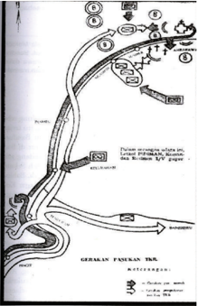

> **Deskripsi Visual:** Gambar ini adalah diagram yang menunjukkan jalur perjalanan (gerakan) pasukan TNI AD (Tentara Nasional Indonesia Angkatan Darat). Diagram ini terdiri dari beberapa elemen utama:

1. **Jalur Perjalanan**: Gambar menggambarkan dua jalur utama yang berbeda arah, masing-masing dengan tanda "A" dan "B". Jalur A melintasi area yang diberi nama "Kereta Api" dan berakhir di lokasi "Pembangunan".

2. **Elemen-elemen Utama**:
   - **Jalur A**: Mulai dari lokasi awal, melalui area "Kereta Api", kemudian menuju lokasi "Pembangunan".
   - **Jalur B**: Mulai dari lokasi awal, melalui area "Kereta Api", kemudian menuju lokasi "Pembangunan".

3. **Teks, Angka, atau Label Penting**:
   - Ada teks "Gerakan Pasukan TNI" yang menjelaskan konteks gambar.
   - Ada angka yang menunjukkan posisi posisi di dalam gambar.

4. **Informasi Kunci**:
   - Gambar ini memberikan gambaran tentang struktur dan jalur perjalanan pasukan TNI AD.
   - Informasi ini penting untuk memahami arah dan jalur yang harus diikuti oleh pasukan dalam situasi tertentu.

Dengan demikian, gambar ini membantu pembaca memahami struktur dan jalur perjalanan pasukan TNI AD, serta memberikan gambaran tentang bagaimana mereka harus bergerak dalam suatu situasi tertentu.

Sementara itu, Batalion Imam Adrongi meneruskan gerakan pengejarannya. Kemudian disusul 3 batalion yang berasal dari Yogyakarta, yaitu batalion 10 Divisi III di bawah pimpinan Mayor Suharto, batalion 8 di bawah pimpinan Mayor Sarjono, dan Batalion Sugeng.  Musuh  akhirnya terkepung. Walaupun demikian,  pasukan  musuh mencoba mematahkan pengepungan dengan mengadakan gerakan melambung dan mengancam kedudukan pasukan Indonesia dari belakang dengan tanktanknya. Untuk mencegah jatuhnya  korban,  pasukan mundur ke Bedono. Dengan  bantuan  resimen kedua  yang  dipimpin  M. Sarbini, batalion Polisi

Istimewa  yang  dipimpin  Onie  Sastroatmojo  dan  batalion  dari  Yogyakarta, gerakan musuh berhasil ditahan di Desa Jambu.

Di Desa Jambu para komandan mengadakan rapat koordinasi yang dipimpin oleh  Kolonel  Holland  Iskandar.  Rapat  itu  menghadirkan  pembentukan komando  yang  disebut  Markas  Pimpinan  Pertempuran  dan  bertempat  di Magelang. Sejak saat Ambarawa dibagi atas 4 sektor, yaitu sektor Utara, sektor Selatan, sektor Barat dan sektor Timur. Kekuatan pasukan bertempur secara bergantian. Pada tanggal 26 November 1945 pimpinan pasukan TKR dari Purwokerto yaitu Letkol Isdiman gugur. Setelah mengetahui Isdiman gugur maka pimpinan pasukan TKR Purwokerto Kolonel Sudirman turun langsung memimpin pasukan. Kehadiran Sudirman ini semakin menambah semangat tempur TKR dan para pejuang yang sedang bertempur di Ambarawa. Kolonel

 

---
## 📄 Halaman 166

Sudirman  menyodorkan  taktik  perang Supit Urang .  Taktik  ini  segera  diterapkan.  Musuh mulai terjepit dan situasi pertempuran semakin menguntungkan  pasukan  TKR.  Sejak  saat  itu, pimpinan  pasukan  TKR  Purwokerto  dipimpin oleh  Kolonel  Sudirman.  Situasi  pertempuran menguntungkan  pasukan  TKR.  Pada  tanggal 5  Desember  1945,  musuh  terusir  dari  Desa Banyubiru,  yang  merupakan  garis  pertahanan yang terdepan.

Pada  tanggal  12  Desember  1945  dini  hari, pasukan TKR bergerak menuju sasaran masingmasing.  Dalam  waktu  setengah  jam  pasukan TKR berhasil mengepung musuh di dalam kota. Pertahanan  musuh  yang  terkuat  diperkirakan berada di Benteng Willem yang terletak di tengah-tengah kota Ambarawa. Kota

Ambarawa dikepung selama empat hari empat malam. Musuh yang merasa kedudukannya  terjepit  berusaha  keras  untuk  melakukan  pertempuran. Pada  tanggal  15  Desember  1945  musuh  meninggalkan  Kota  Ambarawa dan mundur ke Semarang. Pertempuran di Ambarawa  ini mempunyai arti penting karena letaknya yang sangat strategis. Apabila musuh menguasai Ambarawa, mereka dapat mengancam 3 kota utama di Jawa Tengah, yaitu Surakarta, Magelang dan Yogyakarta.

Dalam  pertempuran  itu,  pasukan  TKR  mengalami  kemenangan  yang gemilang.  Menyambut  kemenangan  itu  Sudirman  yang  masih  berpakaian perang langsung mengambil air wudu dan segera melakukan sujud syukur seraya berdoa:

Ya Allah ya T uhan, Maha Besar dan Maha Kuasa Engkau. Engkaulah sumber kekuatan dan kemenangan. Ampunilah hamba-Mu yang lemah dan dhaif ini dan berikan kami kekuatan' .

Kemenangan  pertempuran  Ambarawa  ini  cepat  menyebar  ke  pos-pos pertahanan  TKR,  bahkan  sampai  ke  dapur-dapur  umum.  Hal  ini  semakin menambah semangat juang pada pejuang di medan tempur.

 

---
## 📄 Halaman 167

Dengan kemenangan ini nama Sudirman semakin populer sebagai komandan dan pimpinan TKR. Kemenangan ini juga menunjukkan bahwa Republik Indonesia masih memiliki pasukan yang kuat yaitu  pasukan TKR dan rakyat  yang  menolak  kembalinya  penjajah  di  bumi  pertiwi  Indonesia. Untuk mengenang pertempuran Ambarawa, tanggal 15 Desember dijadikan Hari Infanteri. Di Ambarawa juga dibangun Monumen Palagan, Ambarawa.

»

Coba lakukan telaah kritis apa makna kemenangan dalam pertempuran Ambarawa bagi TNI dan perjuangan bangsa Indonesia . Untuk mendalami bagaimana Pertempuran Palagan Ambarawa dan tokoh Sudirman, Kamu dapat membaca buku karya Sardiman, Guru Bangsa: Sebuah Biografi Jenderal Sudirman .

### e.  Pertempuran Medan Area

Pada tanggal 9 November 1945, pasukan Sekutu di bawah pimpinan Brigadir Jenderal T.E.D. Kelly mendarat di Sumatra Utara. Pendaratan pasukan Sekutu itu diboncengi oleh pasukan NICA yang telah dipersiapkan untuk mengambil alih pemerintahan. Pemerintahan RI Sumatra Utara memperkenankan mereka menempati beberapa hotel di Medan, seperti Hotel de Boer, Grand Hotel, Hotel  Astoria  dan  lainnya,  karena  menghormati  tugas  mereka.  Sebagian dari mereka ditempatkan di Binjai, Tanjung Morawa dan beberapa tempat lainnya dengan memasang tenda-tenda lapangan.

Sehari  setelah  mendarat,  tim  dari  RAPWI  telah  mendatangi  kamp-kamp tawanan  di  Pulu  Berayan,  Saentis,  Rantau  Prapat,  Pematang  Siantar  dan Berastagi  untuk  membantu  membebaskan  para  tawanan  dan  dikirim ke  Medan  atas  persetujuan  Gubernur  M.  Hasan.  Ternyata  kelompok  itu langsung  dibentuk  menjadi  Medan  Batalion  KNIL.  Dengan  kekuatan  itu, maka  tampaklah  perubahan  sikap  dari  bekas  tawanan  tersebut.  Mereka bersikap congkak karena merasa sebagai pemenang atas perang. Sikap ini memancing timbulnya pelbagai insiden yang dilakukan secara spontan oleh para pemuda. Insiden pertama terjadi di Jalan Bali, Medan pada tanggal 13 Oktober 1945. Insiden ini berawal dari ulah seorang penghuni hotel yang merampas dan menginjak-injak lencana Merah Putih yang dipakai oleh salah seorang  yang  ditemuinya.  Akibatnya  hotel  tersebut  diserang  dan  dirusak oleh para pemuda.

 

---
## 📄 Halaman 168

Insiden  ini  menjalar  ke  berbagai  kota  seperti Pematang Siantar dan Brastagi. Sementara itu, pada tanggal  10  Oktober  1945  dibentuk  TKR Sumatra  Timur  dengan  pimpinannya  Ahmad Tahir. Selanjutnya diadakan pemanggilan terhadap bekas Giyugun dan Heiho ke Sumatra Timur.  Panggilan  ini  mendapat  sambutan  luar biasa dari mereka. Di samping TKR, di Sumatra Timur terbentuk juga badan-badan perjuangan yang sejak 15 Oktober 1945 menjadi Pemuda Republik Indonesia Sumatra Timur dan kemudian berganti nama menjadi Pesindo.

Sebagaimana  di  kota-kota  lain  di  Indonesia, Inggris  memulai  aksinya  untuk  memperlemah

kekuatan  Republik  dengan  cara  memberikan  ultimatum  kepada  bangsa Indonesia  agar  menyerahkan  senjatanya  kepada  Sekutu.  Hal  ini  dilakukan pula  oleh  Kelly  terhadap  pemuda  Medan  pada  tanggal  18  Oktober1945. Sejak  saat  itu  tentara  NICA  merasa  memperoleh  dukungan  dari  pihak Inggris. Demikian pula pasukan Sekutu mulai melakukan aksi-aksi terornya, sehingga timbul rasa permusuhan di kalangan pemuda. Patroli-patroli Inggris tidak  pernah  merasa  aman,  karena  pemerintah  Republik  Indonesia  tidak memberikan  jaminan  keamanan.  Meningkatnya  korban  di  pihak  Inggris menyebabkan mereka memperkuat kedudukannya dan menentukan sendiri secara sepihak batas kekuasaannya.

Pada  tanggal  1  Desember  1945,  pihak  Sekutu  memasang  papan-papan yang bertuliskan Fixed Boundaries Medan Area di berbagai sudut pinggiran kota  Medan.  Tindakan  pihak  Inggris  itu  merupakan  tantangan  bagi  para pemuda. Pihak Inggris bersama NICA melakukan aksi pembersihan terhadap unsur-unsur Republik yang berada di kota Medan. Para pemuda membalas aksi-aksi  tersebut,  setiap  usaha  pengusiran  dibalas  dengan  pengepungan, bahkan  seringkali  terjadi  tembak  menembak.  Pada  tanggal  10  Desember 1945,  pasukan  Inggris  dan  NICA  berusaha  menghancurkan  konsentrasi TKR  di  Trepes.  Selanjutnya  TKR  menculik  seorang  perwira  Inggris  dan menghancurkan beberapa truk. Dengan peristiwa ini Jenderal Kelly kembali mengancam para pemuda agar menyerahkan senjata mereka. Barang siapa yang nyata-nyata melanggar akan ditembak mati. Daerah yang ditentukan adalah kota Medan dan Belawan. Perlawanan terus memuncak, pada bulan April  1946  tentara  Inggis  mulai  berusaha  mendesak  pemeintah  RI  ke  luar

 

---
## 📄 Halaman 169

kota Medan. Gubernur, Markas Divisi TKR, Walikota RI pindah ke Pematang Siantar. Dengan demikian Inggris berhasil menguasai kota Medan.

Pada tanggal 10 Agustus 1946 di Tebingtinggi diadakan suatu pertemuan antara  komandan-komandan  pasukan  yang  berjuang  di  Medan  Area. Pertemuan memutuskan dibentuknya satu komando yang bernama 'Komando Resimen Laskar Rakyat Medan Area' yang dibagi atas 4 sektor dan bermarkas di Sudi Mengerti (Trepes). Di bawah komando inilah mereka meneruskan perjuangan di Medan Area.

### f.  Bandung Lautan Api

Di Bandung pertempuran diawali oleh usaha para pemuda untuk merebut pangkalan udara Andir dan pabrik senjata bekas Artillerie Constructie Winke l (ACW-sekarang Pindad) dan berlangsung terus sampai kedatangan pasukan Sekutu di Bandung pada 17 Oktober 1945. Seperti halnya di kota-kota lain, di Bandung pun pasukan Sekutu dan NICA melakukan teror terhadap rakyat, sehingga  terjadi  pertempuran-pertempuran.  Menjelang  bulan  November 1945, pasukan NICA semakin merajalela di Bandung. NICA memanfaatkan kedatangan pasukan Sekutu untuk mengembalikan kekuasaan kolonialnya di Indonesia. Namun, semangat juang rakyat dan para pemuda yang tergabung dalam TKR, laskar-laskar  dan  badan-badan perjuangan semakin berkobar. Pertempuran demi pertempuran terjadi.

Pada bulan Oktober di Bandung telah terbentuk Majelis Dewan Perjuangan yang dipimpin panglima TKR, Aruji Kartawinata. Dewan perjuangan ini terdiri atas wakil-wakil TKR dan berbagai kelaskaran. Pada tanggal 21 November 1945  Sekutu  mengeluarkan  ultimatum  agar  para  pejuang  menyerahkan senjata  dan  mengosongkan  Bandung  Utara.  Ternyata  ultimatum  itu  tidak diindahkan  oleh  pihak  pejuang.  Insiden  terjadi,  para  pemuda  melakukan penyerobotan terhadap kendaraan-kendaraan Belanda yang berlindung di bawah Sekutu. Penculikan juga sering terjadi.

Peristiwa  yang  memperburuk  keadaan  terjadi  pada  tanggal  25  November 1945. Selain menghadapi serangan musuh, rakyat menghadapi banjir besar meluapnya Sungai Cikapundung. Ratusan korban terbawa hanyut dan ribuan penduduk  kehilangan  tempat  tinggal.  Keadaan  ini  dimanfaatkan  musuh untuk menyerang rakyat yang tengah menghadapi musibah.

 

---
## 📄 Halaman 170

Dalam suasana yang demikian itu,  Majelis  Dewan  Perjuangan  tidak  sabar menunggu reaksi dari pemerintah. Majelis yang terdiri dari berbagai kesatuan ini memutuskan untuk melancarkan perlawanan. Pada malam hari tanggal 24 - 25 November 1945 rakyat Bandung melancarkan serangan terhadap posisi-posisi Sekutu dan NICA.

Tanggal  23  Maret  1946,  pihak  Sekutu  kembali  mengeluarkan  ultimatum. Isi ultimatum itu adalah agar TRI mengosongkan seluruh kota Bandung dan mundur ke luar kota dengan jarak 11 km. Untuk menghindari penderitaan rakyat dan kehancuran kota Bandung, maka Pemerintah RI menyetujui untuk melaksanakan pengosongan kota Bandung.

Kolonel Abdul Haris Nasution sebagai Komandan  Divisi III Siliwangi menginstruksikan  rakyat  untuk  mengungsi  pada  tanggal  24  Maret  1946. Malam harinya bangunan-bangunan penting mulai dibakar dan ditinggalkan mengungsi  ke  Bandung  Selatan  oleh  sekitar  200.000  warganya.  Kota Bandung yang terbakar ini juga disaksikan oleh istri Otto Iskandardinata yang masih menunggu kabar kepastian hilangnya sang suami. Warga mengungsi dengan  membawa  barang  seadanya,  sebagian  mengatur  perjalanan  ke pengungsian, sebagian menyelamatkan dokumen-dokumen kota, sebagian membakar gedung-gedung penting, bahkan meledakkan bangunanbangunan  besar,  hingga  instalasi  militer  pun  dihancurkan,  salah  satunya gudang mesiu yang diledakkan oleh Mohammad Toha yang gugur bersama ledakan.  Tengah  malam  kota  Bandung  yang  terbakar  telah  ditinggalkan. Menyisakan kenangan perjuangan Bandung Lautan Api.

Peristiwa tersebut dikenang hingga kini. Mars Halo Halo Bandung diciptakan. Kemudian monumen pun didirikan di lapangan Tegalega. Sineas pun tak luput menjadikan peristiwa tersebut dalam film 'Toha Pahlawan Bandung Selatan', sebuah film karya Usmar Ismail, juga film 'Bandung Lautan Api' karya Alam Rengga Surawijaya. Tak ketinggalan penulis puisi W.S. Rendra juga mengabadikan dalam Sajak Seorang Tua tentang Bandung Lautan Api.

### g.  Berita Proklamasi di Sulawesi

Berita  proklamasi  yang  dikumandangkan  oleh  Sukarno  dan  Moh.  Hatta, sampai  pula  di  Sulawesi.  Sam  Ratulangi,  yang  saat  itu  menjabat  sebagai Gubernur  Sulawesi,  yang  berkedudukan  di  Makasar  mendapat  tugas  dari

 

---
## 📄 Halaman 171

PPKI  untuk  menyusun  Komite  Nasional  Indonesia.  Sementara  itu,  para pemuda  Sulawesi  memperbanyak  teks  proklamsi  untuk  disebarluaskan keseluruh pelosok penjuru. Atas inisiatif Manai Shopian dan kawan-kawan, dibuat plakat proklamasi di rumah A. Burhanuddin dan di kantor pewarta Celebes , yang kemudian diganti nama dengan Soeara Indonesia .

Saat  itu  tentara  Sekutu  dengan  cepat  dapat  menguasai  Indonesia  bagian Timur, termasuk Sulawesi. Upaya Sam Ratulangi untuk menyampaikan berita proklamasi  ke  penjuru  Sulawesi  mendapat  halangan  dari  tentara  Sekutu. Para pemuda mulai mengorganisasi diri dan merencanakan untuk merebut gedung-gedung vital.  Pada  tanggal  28  Oktober  1945,  kelompok  pemuda yang  terdiri  dari  bekas Kaigun,  Heiho dan  pelajar  SMP,  bergerak  menuju sasarannya dan mendudukinya. Akibat peristiwa itu pasukan Australia yang telah  ada,  bergerak  dan  melucuti  para  pemuda.  Sejak  itu  pusat  gerakan pemuda dipindahkan dari Ujungpandang ke Polombangkeng. Bahkan Sam Ratulangi kemudian ditangkap oleh NICA dan diasingkan ke Serui, Papua.

Berita proklamasi di Sulawesi Tenggara diterima di Kolaka, Kendari. Mulamula  berita  diterima  oleh  kalangan Kaigun dan Heiho yang  dibawa  oleh tentara Jepang. Saat itu yang bertugas memimpin Heiho adalah Idie Heiso dan Sudamitsu Heiso. Sementara berita proklamasi baru diketahui oleh rakyat Muna, saat Jepang menyerahkan pemerintahan Muna kepada Ode Ipa yang kemudian meninggalkan Muna menuju Kendari. Di Buton berita proklamasi diterima rakyat dari para pelayar yang tiba dari Jakarta dan Bangka serta dari orang-orang Jepang yang datang ke Makassar. Mula-mula berita itu diterima di Kepulauan Tukang Besi (Wakatobi). Di Sulawesi Tengah, berita proklamasi diterima pada tanggal 17 Agustus pada pukul 15.00 waktu setempat. Berita itu diterima Abdul Latief dari tentara Jepang yang dikawal dari dua tentara Heiho  dari  Sulawesi  Selatan,  yaitu  Saleh  Topetu  dan  Djafar.  Perwira  itu mengatakan 'Bangsa Indonesia sudah merdeka'.

Di Manado, berita proklamasi pertama kali diterima di markas besar tentara Jepang  yang  berkedudukan  di  Minahasa.  Di  Markas  itu  terdapat  alat-alat sarana komunikasi yang mempekerjakan tenaga Indonesia diantaranya adalah A.S.  Rombot.  Saat  itu,  Rombot  sedang  mendapat  tugas  untuk  menerima berita Domei dari  Tokyo.  Pada  saat  itulah  berita  tentang  proklamasi  yang disebarkan  di  seluruh  penjuru  dunia  itu  diketahuinya,  tepatnya  pada  18 Agustus  1945.  Berita  itu  diterimanya  bersamaan  dengan  berita  kapitulasi Jepang  dan  perintah  genjatan  senjata.  Segera  setelah  bertugas  Rombot mengontak W.F. Sumati yang saat itu sebagai daidancho boo ei Teisintai di

 

---
## 📄 Halaman 172

Tondano. Kedua tokoh itu kemudian menyampaikan berita proklamasi itu ke tokoh-tokoh nasionalis. Berita itu kemudian disebarkan ke Sangir Talaud, Bolaang Mongondow, dan Gorontalo.

Setelah berita proklamasi kemerdekaan tersebar keseluruh penjuru Sulawesi, sejak itu pula bendera merah putih mulai berkibar menjadi lambang Indonesia merdeka. Cita-cita yang sudah lama diinginkan oleh rakyat pun terwujud. Di  Sulawesi  Tenggara  misalnya,  bendera  merah  putih  dikibarkan  pada  17 September 1945 dengan dipimpin oleh D. Andi Kasim. Di Lasusua bendera merah putih dikibarkan pada 5 Oktober 1945 yang dihadiri oleh kepala distrik Patampanua dan beberapa pimpinan pemuda RI dari Luwu.

Sementara itu, pada 14 Februari 1946, B.W. Lapian sebagai pemimpin sipil pada saat itu memimpin pasukan pemuda bersama Letkol. Ch. Taulu dan Serda  S.D.  Wuisan  merobek  bagian  biru  pada  bendera  Belanda  di  tangsi militer Belanda, di Teling, Menado. Peristiwa heroik itu menandai berkibarnya bendera merah putih.

### h.  Operasi Lintas Laut Banyuwangi - Bali

Operasi  lintas  Laut  Banyuwangi-Bali  merupakan  operasi  gabungan  dan pertempuran  laut  pertama  sejak  berdirinya  negara  Republik  Indonesia. peristiwa  itu  dimulai  dengan  kedatangan  Belanda  dengan  membonceng Sekutu, mendarat di Bali dengan jumlah pasukan yang cukup besar, tanggal 3  Maret  1946.  Hal  ini  dimaksudkan  Bali  sebagai  batu  loncatan  untuk menyerbu Jawa Timur yang dinilai sebagai lumbung pangan untuk kemudian mengepung pusat kekuasaan RI. Bali juga dapat dijadikan penghubung ke arah Australia.

Dengan perkembangan di atas,  maka  telah  mengalihkan  konfrontasi  dari Indonesia  melawan Jepang berganti menjadi Indonesia melawan Belanda. Berkaitan  dengan  hal  tersebut,  maka  para  pemimpin  perjuangan  yang sudah sampai di Jawa berusaha mencari bantuan dan membentuk kesatuankesatuan  tempur.  Mereka  antara  lain  telah  membentuk  Pasukan  Markadi atau Pasukan Merdeka sebagai pasukan induk. Pasukan itu kemudian lebih dikenal  dengan  nama  Pasukan  M.  Kapten  Markadi  sebelumnya  bertugas mendampingi Kolonel Prabowo, Kolonel Munadi dan Letkol I Gusti Ngurah Rai ke markas besar TRI di Yogyakarta untuk meminta bantuan, karena makin lemahnya kekuatan TRI Sunda Kecil di Bali.

 

---
## 📄 Halaman 173

Kondisi itu mendorong Letjen. Urip Sumoharjo di Markas Besar TRI Yogyakarta untuk memutuskan memperkuat TRI Sunda Kecil dengan bantuan senjata dan amunisi kepada I Gusti Ngurah Rai. Untuk itulah Pasukan M berperan penopang Pasukan Sunda Kecil di bawah Pimpinan Ngurah Rai. Pasukan ini juga dilengkapi pasukan sandi yang disebut CIS ( Combat Intelligent Section ) yang terdiri dari para pelajar. Disiapkanlah tiga pasukan untuk memblokade pasukan  Belanda.  Pasukan  angkatan  laut  dipimpin  oleh  Kapten  Makardi dan Waroka. Angkatan Darat di bawah pimpinan Letkol I Gusti Ngurah Rai. Operasi  itu  direncanakan  melalui  tiga  titik  pendaratan.  Pasukan  Waroka mendarat di Pantai Gerokgak dan Celuk Bawang. Pasukan Markadi mendarat di antara Cupel dan Candi Kusuma, Jembrana dan Pasukan I Gusti Gurah Rai  mendarat  di  Pantai  Yeh  Kuning.  Operasi  rahasia  itu  ditujukan  untuk mendapatkan informasi intelijen yang akurat.

Pasukan diberangkatkan dari Muncar Banyuwangi dengan sasaran daerah Kuning dan terus ke Munduk Malang. Penyeberangan dilaksanakan malam hari.  Rombongan  ini  dalam  penyeberangannya  di  tengah  laut  dipergoki oleh patroli Belanda dan langsung menembaki ke arah rombongan pasukan Ngurah  Rai.  Akibatnya  Cokorde  Rai  Gambir  dan  Cokorde  Dharma  Putra gugur.  Sebagian  berhasil  mendarat  di  Yeh  Kuning  dan  sebagian  lagi  di bawah Ngurah Rai kembali ke Muncar. Keesokan harinya tanggal 4 April 1946, rombongan Ngurah Rai berhasil mendarat di Pulukan untuk seterusnya menuju Munduk Malang.

Gelombang ketiga, Pasukan M sebagai induk pasukan berangkat pada tanggal 4  April  1946  malam  hari.  Mereka  berangkat  dari  pelabuhan  Banyuwangi dengan berkekuatan empat peleton. Sasarannya akan mendarat di daerah Candikusuma.  Saat  fajar  menyingsing,  rombongan  Pasukan  M  dipergoki oleh dua motorboat Belanda yang sedang berpatroli. Terjadilah pertempuran antara Pasukan M melawan patroli Belanda. Dengan taktik menempel pada motorboat Belanda, Pasukan M sulit untuk ditembaki Belanda. Sebaliknya, Pasukan  M  dapat  melemparkan  granat-granat  tangan  ke  dek  motorboat. Akhirnya, satu motorboat Belanda terbakar dan tenggelam serta yang satunya melarikan  diri.  Setelah  berhasil  menghancurkan  patroli  Belanda,  Pasukan memerintahkan untuk putar haluan kembali ke Banyuwangi, sebab arus laut yang kuat dan kapal Markadi sendiri berlobang-lobang. Dalam perang ini, pihak Pasukan M gugur dua orang, yakni Sumeh Darsono dan Sidik.

 

---
## 📄 Halaman 174

Keesokan  harinya,  Pasukan  M  kembali  berlayar  menuju  Bali  dan  mereka berhasil  melakukan  pendaratan  di  Klatakan,  Melaya,  dan  Candikusuma. Sesampainya  di  Bali  dilakukan  koordinasi  dan  dibentuk  MGGSK  (Markas Gabungan  Gerakan  Sunda  Kecil).  Kemudian  pada  bulan  Juli  1946,  juga terjadi pendaratan pasukan tempur yang dipimpin oleh Kapten Saestuhadi. Setelah itu terjadilah pertempuran di berbagai daerah.

Mula pertama pasukan MGGSK dihadang oleh pasukan Belanda di Klatakan. Terjadilah pertempuran sengit. Pasukan MGGSK terdesak dan pemimpin yang gugur, antara lain Kapten Saestuhadi, Kapten Suryadi, dan Letnan Nurhadi.

Selanjutnya,  Pasukan  M  melakukan  penyerangan  ke  berbagai  daerah, antara lain, di Gilimanuk Cekik, Penginuman, Candikusuma, Cupek, Negara, Sarikuning, Pulukan, Gunungsari, Klatakan, Munduk Malang, Tabanan, dan Celukan Bawang.

Untuk mengenang perjuangan pasukan kita yang gugur dalam operasi lintas laut, maka di daerah Cekik, Gilimanuk didirikan monumen yang dinamakan Monumen Operasi Lintas Laut Banyuwangi-Bali.

### KESIMPULAN

- Usaha mempertahankan kemerdekaan terjadi di berbagai daerah di Indonesia.  Umumnya mereka berhadapan dengan kolonialisme baru yang dipastikan dapat menyengsarakan rakyat Indonesia.
- Rakyat di berbagai daerah tidak memiliki ketakutan sedikitpun untuk melawan kezaliman kolonialisme. Mereka berani bertempur dengan korban yang sangat besar.

 

---
## 📄 Halaman 175

### LATIH UJI KOMPETENSI

- Tidak  lama  setelah  proklamasi  kemerdekaan,  Sekutu  datang  ke Indonesia. Mengapa Sekutu datang ke Indonesia? Jelaskan alasanmu!
- Berbagai  pertempuran  terjadi  di  berbagai  daerah  dalam  menentang Sekutu yang datang ke Indonesia. Mengapa rakyat Indonesia melakukan perlawanan terhadap Sekutu?
- Di  antara  berbagai  perjuangan  rakyat  Indonesia  di  berbagai  daerah dalam  rangka  melawan  Sekutu  dan  Belanda  pada  bacaan  di  atas, pertempuran mana yang menurutmu paling menarik? Jelaskan latar belakang dan proses terjadinya pertempuran tersebut!

### Tugas

- Bentuklah kelompok yang terdiri dari tiga orang. Kemudian buatlah tema 'berita sekitar proklamasi di daerah tempat tinggalku'. Setelah kamu  mendapatkan  teman  dalam  satu  kelompok  ikutilah  langkahlangkah pembuatan tugas sebagai berikut:
- Kumpulkan buku, majalah,  dan koran yang ada kaitan dengan berita tentang Proklamasi 17 Agustus 1945.
- Setelah  data-data  kepustakaan  terkumpul,  diskusikan  dengan guru  kamu,  kira-kira  siapa  nara  sumber  yang  pantas  untuk mendapatkan keterangan tentang berita sekitar proklamasi yang ada di tempat tinggal kamu.
- Kemudian buatlah daftar pertanyaan yang terkait dengan kisah sekitar  proklamasi  di  daerah  tempat  tinggal  kamu,  misalnya kapan berita proklamasi itu diterima oleh penduduk di kotamu. Bagaimana berita itu dapat sampai di kota tempat tinggalmu.
Sejarah Indonesia

167

 

---
## 📄 Halaman 176

- Nah, setelah tersusun daftar pertanyaannya. Cobalah membuat janji  dengan  nara  sumber  yang  direkomendasikan  oleh  guru, atau  tokoh  masyarakat  setempat.  Jangan  lupa  membawa  alat yang  dapat  untuk  mencatat  atau  merekam    semua  kegiatan wawancara kamu.
- Setelah  selesai  melakukan  wawancara  kamu  dapat  menyalin hasil wawancara itu ke dalam tulisan.
- Setelah tahapan no. 1 kamu buatlah sebuah laporan deskriptif naratif dari  hasil  kerja  kamu  itu.  Jangan  lupa  untuk  memberi  'judul'  pada laporan itu. Judul tidak harus sama dengan tema.
168

Kelas XI SMA/MA/SMK/MAK

Semester 2

 

---
## 📄 Halaman 177

### B.  Antara Perang dan Diplomasi

### Mengamati Lingkungan

Gambar 7.12 Tempat perundingan Linggarjati.

- » Coba amati gambar tempat perundingan Linggarjati di atas!
- Di manakah lokasi perundingan tersebut?
- Bagaimana peranan Linggarjati dalam sejarah revolusi kemerdekaan Indonesia?
Linggarjati adalah satu  simbol  perjuangan  diplomasi  Indonesia  dalam menyelesaikan  masalah  kedaulatan  dengan  Belanda.  Seperti  telah  kamu kaji  pada  bagian  sebelumnya,  bahwa  Belanda  benar-benar  belum  mau meninggalkan  Indonesia.  Konflik  Indonesia-Belanda  tidak  dapat  dihindari. Kontak senjata dan perundingan dilakukan oleh kedua negara. Bagaimana perjuangan  bangsa  Indonesia  dalam  konflik  perang  dan  damai  untuk mencapai kedaulatan?

 

---
## 📄 Halaman 178

Bangsa Indonesia juga sadar bahwa kekuatan senjata bukan satu-satunya jalan untuk mencapai kemerdekaan. Jalur diplomasi atau perundingan adalah jalan lain yang perlu ditempuh bangsa Indonesia. Hal ini juga menunjukkan bahwa bangsa Indonesia adalah bangsa yang cinta damai, tetapi lebih mencintai kemerdekaan. Mengapa demikian? Sebab langkah diplomasi kadang tidak selamanya menguntungkan bangsa Indonesia, demikian sebaliknya. Maka dalam  kajian  di  bawah  ini  kamu  akan  menelaah  bagaimana  bangsa  kita berusaha menjalankan politik damai untuk mempertahankan kemerdekaan, tetapi juga tidak mengesampingkan dengan kekuatan senjata. Jalan damai apa saja yang ditempuh bangsa Indonesia? Bagaimana dampak jalan yang ditempuh tersebut? Mari kita telaah bersama.

### 1.  Rangkaian Perjanjian Linggarjati

Perjanjian Linggarjati merupakan langkah-langkah yang diambil oleh pemerintah Republik Indonesia untuk memperoleh pengakuan kedaulatan dari pemerintah Belanda dengan jalan diplomatik. Perjanjian itu melibatkan pihak Indonesia dan Belanda, serta Inggris sebagai penengah. Tokoh-tokoh dalam perundingan itu adalah Letnan Jenderal Sir Philip Christison dari Inggris, seorang diplomat senior serta mantan duta besar Inggris di Uni Soviet, yang kemudian diangkat  sebagai  duta  istimewa  Inggris  untuk  Indonesia.  Wakil dari Belanda adalah Dr. H.J. Van Mook. Indonesia diwakili Perdana Menteri Republik Indonesia Sutan Sjahrir.

Sebelum perundingan Linggarjati, sudah dilakukan beberapa kali perundingan baik di Jakarta maupun di Belanda. Namun, usaha-usaha untuk mencapai kesepakatan belum memenuhi harapan baik bagi pihak Indonesia maupun bagi pihak Belanda. Usaha itu mengalami kegagalan karena masing-masing pihak mempunyai pendapat yang berbeda.

Van Mook adalah orang Belanda yang lahir di Indonesia, yaitu di Semarang. Ia  juga  seorang  penganjur  persekutuan  sejak  tahun  1930-an.  Ia  termasuk kelompok  pendorong  gerakan  orang  Belanda  di  tanah  jajahan  Hindia Belanda. Mereka bertujuan untuk menjadikan Hindia Belanda sebagai tanah air  mereka dalam bentuk persemakmuran. Atas pandangan itu suatu saat nanti Indonesia menjadi bagiannya sesuai dengan makna politik dan sosialnya sendiri.  Atas  dasar  pemikirannya  itu  Van  Mook  berkeinginan  keras  untuk

 

---
## 📄 Halaman 179

kembali  ke  Indonesia.  Sebagai  seorang  Letnan  Gubernur  Jenderal  Hindia Belanda.    Van  Mook  lebih  siap  menghadapi  perubahan  situasi  daripada pemerintahan yang ada di Negeri Belanda. Namun, ia mendapatkan situasi yang  jauh  dari  perkiraannya.  Proklamasi  kemerdekaan  Indonesia  dengan segala  konsekuensinya  itu  tidak  mungkin  untuk  ditarik  kembali.  Belanda hanya dapat menolak dan tidak mengakui negeri jajahannya sebagai negara yang berdaulat.

Pada awal kehadirannya di Jakarta, Van Mook mendapat tekanan baik dari Sekutu  maupun  ancaman  perlawanan  dari  pihak  revolusioner  Indonesia. Oleh  karena  itu,  pada  awal  kehadirannya  Van  Mook  bersedia  untuk melakukan perundingan, meskipun pemerintah Belanda melarangnya untuk bertemu  dengan  Sukarno.  Pada  14  Oktober  1945,  Van  Mook  bersedia bertemu  dengan  Sukarno  dan  'kelompok-kelompok  Indonesia'.  Ia  tidak mau  menyebut  sebagai  Republik  Indonesia,  karena  pemerintah  Belanda belum  mengakui  pemerintahan  Republik  Indonesia.  Dalam  pokok  pikiran Van  Mook  menyatakan,  bahwa  NICA  bersedia  membangun  hubungan ketatanegaraan yang baru dan status Indonesia menjadi 'negara dominion' dalam persekutuan 'persemakmuran Uni-Belanda'.

Demikianlah  karena  tidak  ada  titik  temu  antara  Indonesia  dan  Belanda, Cristison  tetap  berusaha  mempertemukan  mereka.  Pemerintah  Belanda diwakili oleh Van Mook dan wakilnya, Charles O. Van der Plas. Indonesia diwakili oleh Sukarno dan Moh. Hatta yang didampingi oleh H. Agus Salim dan Ahmad Subarjo. Dalam pertemuan itu tidak ada hasil yang memuaskan bagi pihak Indonesia. Pihak Belanda masih menginginkan kebijakan politiknya yang lama.

Pada minggu-minggu terakhir Oktober 1945, berbagai insiden dan konfrontasi  dengan  semakin  banyaknya  tentara  NICA  yang  datang  ke Indonesia. Konfrontasi itu menyebabkan pihak Sekutu ingin segera mengakhiri tugasnya di Indonesia, terlebih ketika aksi-aksi kekerasan terjadi di  kota  besar  di  Indonesia,  terutama  pertempuran  sengit  di  Surabaya. Pihak  Sekutu  ingin  segera  meninggalkan  Indonesia,  tetapi  tidak  mungkin melepaskan  tanggungjawab  internasionalnya.  Untuk  itulah  satu-satunya jalan untuk menyelesaikan itu dengan melakukan perundingan.

 

---
## 📄 Halaman 180

### a.  Perundingan Awal di Jakarta

Pada tanggal I Oktober 1945, telah diadakan perundingan antara Christison (Inggris) dengan pihak Republik Indonesia. Dalam perundingan ini Christison mengakui secara de facto terhadap Republik Indonesia. Hal ini  pula  yang memperlancar gerak masuk Sekutu ke wilayah Indonesia. Kemudian, pihak pemerintah  RI  pada  tanggal  1  November  1945  mengeluarkan  maklumat politik.  Isinya  bahwa  pemerintah  RI  menginginkan  pengakuan  terhadap negara dan pemerintah RI, baik oleh Inggris maupun Belanda sebagaimana yang dibuat sebelum PD II. Pemerintah RI juga berjanji akan mengembalikan semua milik asing atau memberi ganti rugi atas milik yang telah dikuasai oleh pemerintah RI.

Inggris yang ingin melepaskan diri dari kesulitan pelaksanaan tugas-tugasnya di Indonesia, mendorong agar segera diadakan perundingan antara Indonesia dan Belanda. Oleh karena itu, Inggris mengirim Sir Archibald Clark Kerr. Di bawah pengawasan dan perantaraan Clark Kerr, pada tanggaI 10 Februari 1946 diadakan perundingan Indonesia dengan Belanda di Jakarta. Dalam perundingan ini Van Mook selaku wakil dari Belanda mengajukan usul-usul antara lain sebagai berikut:

- Indonesia akan dijadikan negara persemakmuran berbentuk federasi, memiliki  pemerintahan  sendiri  tetapi  di  dalarn  lingkungan  Kerajaan Nederland (Belanda);
- masalah dalam negeri di urus oleh Indonesia, sedangkan urusan luar negeri ditangani oleh pernerintah Belanda;
- sebelum  dibentuk  persemakmuran,  akan  dibentuk  pemerintahan peralihan selama sepuluh tahun; dan
- Indonesia akan dimasukkan sebagai anggota PBB.
Pihak Indonesia belum menanggapi dan mengajukan usul-usul balasannya. Kebetulan situasi Kabinet Syahrir mengalami krisis, Persatuan Perjuangan (PP) pimpinan Tan Malaka melakukan oposisi. PP mendesak pada pemerintahan bahwa perundingan hanya dapat dilaksanakan atas dasar pengakuan seratus persen terhadap RI.

Ternyata  mayoritas  suara  anggota  KNIP  menentang  kebijaksanaan  yang telah ditempuh oleh Syahrir. Oleh karena itu, Kabinet Syahrir jatuh. Presiden Sukarno kemudian menunjuknya kembali sebagai Perdana Menteri. Kabinet Syahrir II terbentuk pada tanggal 13 Maret 1946. Kabinet Syahrir II mengajukan usul balasan dari usul-usul Van Mook. Usul-usul Kabinet Syahrir II antara lain sebagai berikut:

 

---
## 📄 Halaman 181

- RI  harus  diakui  sebagai  negara  yang  berdaulat  penuh  atas  wilayah Hindia Belanda.
- Federasi Indonesia Belanda akan dilaksanakan dalam masa tertentu. Mengenai urusan luar negeri dan pertahanan diserahkan kepada suatu badan  federasi  yang  anggotanya  terdiri  atas  orang-orang  Indonesia dan Belanda.
- Tentara Belanda segera ditarik kembali dari republik.
- Pemerintah  Belanda  harus  membantu  pemerintah  Indonesia  untuk menjadi anggota PBB.
- Selama perundingan sedang terjadi, semua aksi militer harus dihentikan.
Usulan  Syahrir  tersebut  ternyata  ditolak  oleh  Van  Mook.  Sebagai  jalan keluarnya Van Mook  mengajukan  usul tentang pengakuan  Republik Indonesia sebagai wakil Jawa untuk mengadakan kerja sama dalam upaya pembentukan  negara  federal  yang  bebas  dalam  lingkungan  Kerajaan Belanda. Pada tanggal 27 Maret 1946, Sutan Syahrir memberikan jawaban disertai konsep persetujuan yang isi pokoknya antara lain sebagai berikut:

- supaya  pemerintah  Belanda  mengakui  kedaulatan de  facto RI  atas Jawa dan Sumatra;
- supaya RI dan Belanda bekerja sama membentuk RIS; dan
- RIS bersama-sama dengan Nederland, Suriname, dan Curacao, menjadi peserta dalam ikatan kenegaraan Belanda.
Usulan tersebut ternyata sudah saling mendekati kompromi. Oleh karena itu, usaha perundingan perlu ditingkatkan.

### b.  Perundingan Hooge Veluwe

Perundingan  dilanjutkan  di  negeri  Belanda,  di  kota  Hooge  Veluwe  bulan April  1946.  Pokok  pembicaraan  dalam  perundingan  itu  adalah  memutus pembicaraan yang dilakukan di Jakarta oleh Van Mook dan Syahrir. Sebagai penengah  dalam  perundingan,  Inggris  mengirim  Sir  Archibald  Clark  Kerr. Pada kesempatan itu Syahrir mengirim tiga orang delegasi dari Jakarta, yaitu Mr. W. Suwandi, dr. Sudarsono, dan A.K. Pringgodigdo. Mereka berangkat bersama Kerr pada 4 April 1946. Dari Belanda hadir lima orang yaitu Van Mook, J.H. van Royen. J.H. Logeman, Willem Drees, dan Dr. Schermerhorn. Perundingan tersebut untuk menyelesaikan perundingan yang tidak tuntas saat di Jakarta.

 

---
## 📄 Halaman 182

Perundingan mengalami deadlock sejak hari pertama, karena masing-masing pihak sudah mempunyai harapan yang berbeda. Delegasi Indonesia berharap ada langkah nyata dalam upaya pengakuan kedaulatan dan kemerdekaan Indonesia.  Sementara  pihak  Belanda  menganggap  pertemuan  di  Hooge Veluwe itu hanya untuk sekedar pendahuluan saja.

Pada akhir pertemuan dihasilkan, draf Jakarta yang sudah disiapkan. Sebagian dapat diterima dan sebagian lagi tidak dapat diterima. Usulan yang diterima antara lain adalah pengakuan kekuasaan RI atas Jawa, sementara Sumatra tidak diakui. Dari draf Jakarta, tidak ada satu pun yang disetuju secara resmi, sehingga tidak dilakukan penandatanganan. Alasan utama Belanda adalah Belanda tidak siap melakukan pengakuan atas kemerdekaan Indonesia. Oleh karena  itu,  pemerintah  Indonesia  menolak  bentuk  perundingan  di  Hooge Veluwe sebagai perjanjian internasional dua negara. Bagi Indonesia, menerima delegasi Republik Indonesia sebagai mitra sejajar berarti menganggap negeri bekas  jajahannya  sebagai  mitra  sejajar  yang  mempunyai  kedudukan  yang sama di dunia internasional. Sementara itu, Belanda masih belum mengakui Indonesia sebagai negara yang berdaulat.

Di sisi lain, kondisi Belanda yang saat itu sedang mempersiapkan pemilihan umum pertama pascaperang tidak siap untuk mengambil keputusan yang mengikat  masalah  Indonesia,  karena  masalah  Indonesia  tergantung  pada peta politik yang ada di Belanda. Satu di antara partai politik yang menentang keras  kebijakan  perundingan  adalah  Partai  Katolik,  seperti  halnya  dengan kelompok PP di Indonesia. Pada awal dimulainya perundingan Hooge Valuwe, Romme pimpinan fraksi Partai Katholik di parlemen Belanda menulis di tajuk Harian Volkskrant dengan nada keras antinegosiasi yang berjudul De week der Schande (Minggu Yang Penuh Aib).

Kegagalan  perundingan  Hooge  Veluwe  bagi  kedua  negara  membawanya untuk  kembali  mengadakan  perundingan.  Bagi  Indonesia  perundingan Hooge Veluwe memperkuat posisi Indonesia di depan Belanda. Perundingan itu juga menjadikan masalah Indonesia menjadi perhatian dunia internasional. Perundingan itu pula yang mengantarkan pada diplomasi internasional dalam Perjanjian Linggarjati pada kemudian hari.

 

---
## 📄 Halaman 183

### c.  Pelaksanaan Perundingan Linggarjati

Kegagalan dalam perundingan Hooge Veluwe, pada April 1946, menjadikan pemerintah  Indonesia  untuk  beralih  pada  tindakan  militer.  Pemerintah Indonesia  berpendapat  perlu  melakukan  serangan  umum  di  kedudukan Inggris  dan  Belanda  yang  berada  di  Jawa  dan  Sumatra.  Namun  genjatan senjata yang dilakukan dengan cara-cara lama dan gerilya tidak membawa perubahan yang berarti.  Resiko  yang  dihadapi  pemerintah  semakin  tinggi dengan banyaknya korban yang berjatuhan. Untuk mencegah bertambahnya korban  pada  bulan  Agustus  hingga  September  1946  direncanakan  untuk menyusun konsep perang secara defensif. Bagi Sukarno, Hatta, dan Syahrir perlawanan dengan strategi perang defensif itu lebih beresiko dibandingkan dengan cara-cara  lama,  karena  akan  memakan  korban  lebih  banyak  lagi. Menurut  mereka  pengakuan  kedaulatan  Republik  Indonesia  lebih  baik dilakukan dengan jalan diplomasi.

Pada awal November 1946, perundingan diadakan di Indonesia, bertempat di Linggarjati. Pelaksanaan sidang-sidangnya berlangsung pada tanggal 11 - 15 November 1946. Delegasi Indonesia dipimpin oleh Sutan Syahrir, anggotanya Mr. Moh. Roem, Mr. Susanto Tirtoprojo, dan A.K. Gani. Sementara pihak Belanda dipimpin oleh Prof. Schermerhorn dengan beberapa anggota, yakni Van Mook, F de Boor, dan van Pool. Sebagai penengah dan pemimpin sidang adalah Lord Killearn, juga ada saksi-saksi yakni Amir Syarifudin, dr. Leimena, dr. Sudarsono, dan Ali Budiarjo. Presiden Sukarno dan Wakil Presiden Moh. Hatta juga hadir di dalam perundingan Linggarjati itu.

Dalam perundingan itu dihasilkan kesepakatan yang terdiri atas 17 pasal. Isi pokok Perundingan Linggarjati antara lain sebagai berikut:

- Pemerintah Belanda mengakui kekuasaan secara de facto pemerintahan RI atas wilayah Jawa, Madura, dan Sumatra. Daerahdaerah yang diduduki Sekutu atau Belanda secara berangsur-angsur akan dikembalikan kepada RI;
- Akan dibentuk Negara Indonesia Serikat (NIS) yang meliputi seluruh wilayah Hindia Belanda (Indonesia) sebagai negara berdaulat;
- Pemerintah Belanda dan RI akan membentuk Uni Indonesia-Belanda yang dipimpin oleh raja Belanda;
- Pembentukan NIS dan Uni Indonesia- Belanda diusahakan sudah selesai sebelum 1 Januari 1949;

 

---
## 📄 Halaman 184

- Pemerintah RI mengakui dan akan memulihkan serta melindungi hak milik asing;
- Pemerintah RI dan Belanda sepakat untuk mengadakan pengurangan jumlah tentara; dan
- Bila  terjadi  perselisihan  dalam  melaksanakan  perundingan  ini,  akan menyerahkan masalahnya kepada Komisi Arbitrase.
Naskah persetujuan kemudian diparaf oleh kedua delegasi di Istana Rijswijk Jakarta (sekarang Istana Merdeka). Isi perundingan itu harus disyahkan dahulu oleh parlemen masing-masing (Indonesia oleh KNIP). Untuk meratifikasi dan mensyahkan isi Perundingan Linggarjati, kedua parlemen masih enggan dan belum puas. Pada bulan Desember 1946, Presiden mengeluarkan Peraturan No.  6  tentang  penambahan  anggota  KNIP.  Hal  ini  dimaksudkan  untuk memperbesar  suara  yang  pro  Perjanjian  Linggarjati  dalam  KNIP.  Tanggal 28  Februari  1947  Presiden  melantik  232  anggota  baru  KNIP.  Akhirnya  isi Perundingan Linggarjati disahkan oleh KNIP pada tanggal 25 Maret 1947, yang lebih dikenal sebagai tanggal Persetujuan Linggarjati.

---
**🖼️ Gambar/Diagram**

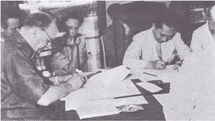

> **Deskripsi Visual:** Gambar ini adalah foto yang menunjukkan beberapa orang sedang berada di sebuah ruangan yang tampaknya merupakan tempat kerja atau rapat. Di depan mereka ada meja dengan berbagai dokumen dan alat tulis. Salah satu orang sedang menulis di atas sebuah lembar kertas, sementara orang lain tampaknya sedang berbicara atau mendengarkan. Dari sudut pandang ini, tampak bahwa mereka sedang mengadakan pertemuan atau rapat. Elemen-elemen utama dalam gambar ini meliputi orang-orang yang terlibat, meja dengan dokumen dan alat tulis, serta lingkungan yang tampaknya formal. Teks, angka, atau label penting tidak terlihat dalam gambar ini. Informasi kunci yang dapat diambil dari gambar ini adalah bahwa ada pertemuan atau rapat sedang berlangsung, dan para peserta terlibat dalam diskusi atau penulisan.

Gambar 7.13 Schermerhom dan Syahrir sedang memaraf naskah Persetujuan Linggarjati.

Setelah Persetujuan Linggarjati disahkan, beberapa negara telah memberikan pengakuan terhadap kekuasaan RI. Misalnya dari Inggris, Amerika Serikat, Mesir,  Afganistan,  Birma  (Myanmar),  Saudi  Arabia,  India,  dan  Pakistan. Perjanjian  Linggarjati  itu  mengandung  prinsip-prinsip  pokok  yang  harus

 

---
## 📄 Halaman 185

disetujui oleh kedua belah pihak melalui serangkaian perundingan lanjutan. Ketentuan dalam pasal (2) misalnya, menentukan bahwa RI dan Belanda akan bekerja sama untuk membentuk Negara Indonesia Serikat sebagai pengganti Hindia  Belanda.  Namun,  perundingan  lanjutan  terhambat  karena  masingmasing pihak menuduh tentaranya melanggar ketentuan genjatan senjata. Dokumen perjanjian itu pun akhirnya tidak membantu untuk memecahkan masalah bagi kedua belah bangsa. Bahkan memperburuk keadaan.

Belanda kemudian mengadakan genjatan senjata operasi militer di Jawa dan Sumatra pada 21 Juli 1947. Belanda menyebut tindakan itu sebagai ' actie politionel '  (tindakan  kepolisian).  Istilah  itu  berarti  'pengamanan  dalam negeri' atau yang dimaksud di sini adalah Indonesia. Artinya, Belanda tidak mengakui  kedaulatan  Republik  Indonesia,  seperti  yang  sudah  dinyatakan dalam dokumen Linggarjati. Belanda memberi sandi pada serangan umum itu  dengan 'Operasi Produk' yaitu operasi yang ditujukan untuk wilayahwilayah yang dianggap penting secara ekonomi bagi Belanda.

Kondisi  itu  mendorong  Perserikatan  Bangsa-Bangsa  (PBB)  untuk  mengeluarkan resolusi. Ada dua resolusi yang disampaikan oleh PBB. Pertama, menghimbau agar RI dan Belanda segera menghentikan perang dan membentuk Negara Indonesia  Serikat,  seperti  yang  diamanatkan  dalam  perjanjian  Linggarjati. Kedua, adalah usulan Amerika agar kedua belah pihak membentuk sebuah tim  untuk  membantu  menyelesaikan  masalah  itu.  Usulan  itu  kemudian dikenal dengan istilah 'Komisi Tiga Negara'.

Komisi  Tiga  Negara  (KTN)  itu  terdiri  atas  Australia,  yang  diwakili  oleh Richard C Kirby yang dipilih oleh RI. Belanda memilih Belgia yang diwakili oleh Paul van Zeeland. Amerika diwakili oleh Frank P. Graham yang dipilih oleh  Belgia  dan  Autralia.  Hasil  dari  KTN  itu  adalah  perundingan  diadakan kembali  oleh  Indonesia  dan  Belanda.  Pihak  Belanda  mengusulkan  agar diadakan  perundingan  di  tempat  yang  netral.  Atas  jasa  Amerika  Serikat, maka  digunakannya  kapal  yang  mengangkut  tentaranya,  dengan  nama USS Renville didatangkan ke Teluk Jakarta dari Jepang. Tentang perjanjian Renville ini akan dibahas lebih lanjut di bagian berikutnya.

 

---
## 📄 Halaman 186

### d.  Konferensi Malino

Dalam situasi politik yang tidak menentu di Indonesia, Belanda melakukan tekanan politik dan militer di Indonesia. Tekanan politik dilakukan dengan menyelenggarakan  Konferensi Malino. Penyelenggaraan konferensi ini bertujuan  untuk  membentuk  negara-negara  federal  di  daerah  yang  baru diserahterimakan  oleh  Inggris  dan  Australia  kepada  Belanda.  Di  samping itu, di Pangkal Pinang, Bangka diselenggarakan konferensi untuk golongan minoritas. Konferensi Malino diselenggarakan pada 15-26 juli 1946, sedangkan  Konferensi  Pangkal  Pinang  pada  1  Oktober  1946.  Diharapkan daerah-daerah  ini  akan  mendukung  Belanda  dalam  pembentukan  negara federasi. Di samping itu, Belanda juga terus mengirim pasukannya memasuki Indonesia. Dengan demikian, kadar permusuhan antara kedua belah pihak semakin meningkat. Namun usaha-usaha diplomasi terus dilakukan. Sebagai contoh  tanggal  14  Oktober  1946  tercapai  persetujuan  gencatan  senjata. Usaha-usaha perundingan pun terus diupayakan.

Setelah perjanjian Linggarjati, Van Mook mengambil inisiatif untuk mendirikan  pemerintahan  federal  sementara  sebagai  pengganti  Hindia Belanda.  Tindakan  Van  Mook  itu  menimbulkan  kegelisahan  di  kalangan negara-negara  bagian  yang  tidak  terwakili  dalam  susunan  pemerintahan. Pada kenyataannya pemerintah federal yang didirikan Van Mook itu tidak beda dengan pemerintah Hindia Belanda. Untuk itulah negara-negara federal mengadakan rapat di Bandung pada Mei - Juli 1948. Konferensi Bandung itu dihadiri oleh empat negara federal yang sudah terbentuk yaitu Negara Indonesia  Timur,  Negara  Sumatra  Timur,  Negara  Pasundan,  dan  Negara Madura. Juga dihadiri oleh daerah-daerah otonom seperti, Bangka, Banjar, Dayak Besar, Kalimantan Barat, Kalimantan Timur, Kalimantan Tengah, Riau, dan Jawa Tengah. Sebagai ketua adalah Mr. T. Bahriun dari Negara Sumatra Timur.

Rapat itu diberi nama Bijeenkomst voor Federal Overleg (BFO), yaitu suatu pertemuan untuk Musyawarah Federal. Pengambil inisiatif BFO itu adalah Ida Agung Gde Agung, seorang perdana menteri Negara Indonesia Timur. juga R.T. Adil Puradiredja, seorang perdana menteri Negara Pasundan. BFO itu dimaksudkan untuk mencari solusi dari situasi politik yang genting akibat dari  perkembangan  politik  antara  Belanda  dan  RI  yang  juga  berpengaruh pada  perkembangan  negara-negara  bagian.  Pertemuan  Bandung  juga

 

---
## 📄 Halaman 187

dirancang  untuk  menjadikan  pemerintahan  peralihan  yang  lebih  baik daripada pemerintahan Federal Sementara buatan Van Mook. (kamu dapat membaca lebih lanjut tentang peran BFO dalam perjuangan diplomasi pada buku Taufik Abdullah dan A.B.Lapian (ed) atau buku-buku yang lain).

### 2.  Agresi Militer  I

Di tengah-tengah  upaya  mencari kesepakatan dalam  pelaksanaan isi Persetujuan Linggarjati, ternyata Belanda terus melakukan tindakan yang  justru  bertentangan  dengan  isi  Persetujuan  Linggarjati.  Di  samping mensponsori  pembentukan  pemerintahan  boneka,  Belanda  juga  terus memasukkan  kekuatan  tentaranya.  Belanda  pada  tanggal  27  Mei  1947 mengirim nota ultimatum yang isinya antara lain sebagai berikut.

- Pembentukan Pemerintahan Federal Sementara (Pemerintahan Darurat) secara bersama.
- Pembentukan Dewan Urusan Luar Negeri.
- Dewan  Urusan  Luar  Negeri,  bertanggung  jawab  atas  pelaksanaan ekspor, impor, dan devisa; dan
- Pembentukan Pasukan Keamanan dan Ketertiban Bersama ( gendarmerie ), Pembentukan Pasukan Gabungan ini termasuk juga di wilayah RI.
Pada prinsipnya Syahrir (yang kabinetnya jatuh Juni 1947) dapat menerima beberapa usulan, tetapi menolak mengenai pembentukan Pasukan Keamanan Bersama di wilayah RI. Tanggal 3 Juli dibentuk kabinet baru di bawah Amir Syarifuddin  yang  juga  tetap  menolak  pembentukan  Pasukan Keamanan Bersama di wilayah RI.

Pada tanggal 21 Juli 1947 tengah malam, pihak Belanda melancarkan 'aksi polisional' mereka yang pertama. Pasukan-pasukan bergerak dari Jakarta dan Bandung untuk menduduki Jawa Barat, dan dari Surabaya untuk menduduki Madura  dan  Ujung  Timur.  Gerakan-gerakan  pasukan  yang  lebih  kecil mengamankan  wilayah  Semarang.  Dengan  demikian,  Belanda  menguasai semua pelabuhan di Jawa. Di Sumatra, perkebunan-perkebunan di sekitar Medan, instalasi-instalasi  minyak  dan  batu  bara  di  sekitar  Palembang  dan Padang  diamankan.  Pasukan-pasukan  Republik  bergerak  mundur  dalam kebingungan dan menghancurkan apa saja yang dapat mereka hancurkan.

 

---
## 📄 Halaman 188

Di beberapa daerah terjadi aksi-aksi pembalasan.Orang-orang Cina di Jawa Barat dan kaum bangsawan yang dipenjarakan di Sumatra Timur dibunuh. Beberapa orang Belanda, termasuk Van Mook ingin melanjutkan merebut Yogyakarta dan membentuk suatu pemerintahan Republik yang lebih lunak, tetapi  pihak  Amerika  dan  Inggris  yang  tidak  menyukai  'aksi  polisional' tersebut  menggiring  Belanda  untuk  segera  menghentikan  peperangan terhadap Republlik Indonesia.

Gerak tentara Belanda di Jawa dan daerah yang dikuasai pada agresi militer Belanda.

Ibu kota RI dapat dikurung Belanda. Hubungan ke luar bagi Indonesia juga mengalami kesulitan, karena pelabuhan-pelabuhan telah dikuasai Belanda. Secara  ekonomis,  Belanda  juga  berhasil  menciptakan  kesulitan  bagi  RI. Daerah-daerah penghasil beras jatuh ke tangan Belanda. Hubungan ke luar juga  terhambat  karena  blokade  Belanda.  Tetapi  Belanda  belum  berhasil menghancurkan mental dan kekuatan Tentara Indonesia yang didukung oleh kekuatan rakyat.

Pada  tanggal  30  Juli  1947,  pemerintah  India  dan  Australia  mengajukan permintaan resmi agar masalah Indonesia-Belanda dimasukan dalam agenda Dewan Keamanan PBB. Pemintaan itu diterima baik dan dimasukkan dalam agenda  sidang  Dewan  Keamanan  PBB.  Tanggal  1  Agustus  1947,  Dewan

 

---
## 📄 Halaman 189

Keamanan  PBB  memerintahkan  penghentian  permusuhan  kedua  belah pihak  dan  mulai  berlaku  sejak  tanggal  4  Agustus  1947.  Sementara  itu untuk  mengawasi  pelaksanaan  gencatan  senjata,  Dewan  Keamanan  PBB membentuk Komisi Konsuler dengan anggota-anggotanya yang terdiri atas para  Konsul  Jenderal  yang  berada  di  wilayah  Indonesia.  Komisi  Konsuler diketuai  oleh  Konsul  Jenderal  Amerika  Serikat  Dr.  Walter  Foote  dengan beranggotakan Konsul Jenderal Cina, Belgia, Perancis, Inggris dan Australia.

Komisi Konsuler itu diperkuat dengan personil militer Amerika Serikat dan Perancis  sebagai  peninjau  militer.  Dalam  laporannya  kepada  Dewan  Keamanan PBB, Komisi Konsuler menyatakan bahwa tanggal 30 Juli sampai 4 Agustus 1947  pasukan  masih  mengadakan  gerakan  militer.  Pemerintah  Indonesia menolak  garis  demarkasi  yang  dituntut  oleh  pihak  Belanda  berdasarkan kemajuan-kemajuan  pasukannya  setelah  pemerintah  melakukan  gencatan senjata.  Namun  penghentian  tembak-menembak  tidak  dimusyawarahkan dan  belum  ditemukan  tindakan  yang  tepat  untuk  menyelesaikannya  agar jumlah korban bisa dikurangi.

Pada  tanggal  3  Agustus  1947  Belanda  menerima  resolusi  DK  (Dewan Keamanan) PBB dan memerintahkan kepada Van Mook untuk menghentikan tembak-menembak.  Pelaksanaannya  dimulai  pada  malam  hari  tanggal  4 Agustus1947. Tanggal 14 Agustus 1947, dibuka sidang DK PBB. Dari Indonesia hadir, antara lain Sutan Syahrir. Dalam pidatonya, Syahrir menegaskan bahwa untuk mengakhiri berbagai pelanggaran dan menghentikan pertempuran, perlu dibentuk Komisi Pengawas.

Pada  tanggal  25  Agustus  1947,  DK  PBB  menerima  usul  Amerika  Serikat tentang pembentukan suatu Commitee of Good Offices (Komisi Jasa-jasa Baik) atau yang lebih dikenal dengan Komisi Tiga Negara (KTN). Belanda menunjuk Belgia sebagai anggota, sedangkan Indonesia memilih Australia. Kemudian Belanda dan Indonesia memilih negara pihak ketiga, yakni Amerika. Komisi resmi terbentuk tanggal 18 September 1947. Australia dipimpin oleh Richard Kirby, Belgia dipimpin oleh Paul Van Zeelland dan Amerika Serikat dipimpin oleh Dr. Frank Graham.

Ternyata Belanda masih terus berulah, sebelum Komisi Tiga Negara datang di  Indonesia.  Belanda  terus  mendesak  wilayah  dan  melakukan  perluasan wilayah kedudukannya. Kemudian tanggal 29 Agustus 1947, secara sepihak Van  Mook  memproklamasikan  garis  demarkasi  Van  Mook,  menjadi  garis batas antara daerah pendudukan Belanda dan wilayah RI pada saat gencatan senjata dilaksanakan. Garis-garis itu pada umumnya menghubungkan titik

 

---
## 📄 Halaman 190

terdepan posisi Belanda. Menurut garis Van Mook, wilayah RI lebih sedikit dari  sepertiga  wilayah  Jawa,  yakni  wilayah  Jawa  Tengah  bagian  timur, dikurangi pelabuhan-pelabuhan dan perairan laut.

### 3.  Peran Komisi Tiga Negara

Masalah Indonesia-Belanda telah dibawa dalam sidang-sidang PBB. Hal ini menunjukkan  bahwa  masalah  Indonesia  telah  menjadi  perhatian  bangsabangsa  dunia.  Kekuatan  Indonesia  di  forum  internasional  pun  semakin kuat  dengan  kecakapan  para  diplomator  Indonesia  yang  meyakinkan negara-negara lain bahwa kedaulatan Indonesia sudah sepantasnya dimiliki bangsa Indonesia.  Tentu  saja  bahwa  kepercayaan  bukan  disebabkan  oleh para  diplomator  saja.  Perjuangan  rakyat  Indonesia  adalah  bukti  bahwa kemerdekaan merupakan kehendak seluruh rakyat Indonesia. PBB sebagai organisasi  internasional  berperan  aktif  menyelesaikan  konflik  antara  RI dengan Belanda. Berikut ini beberapa peran PBB dalam penyelesaian konflik Indonesia Belanda.

Atas usul Amerika Serikat DK PBB membentuk Komisi Tiga Negara (KTN) yang beranggotakan Amerika Serikat, Australia, dan Belgia. KTN berperan aktif dalam penyelenggaraan Perjanjian  Renville  Serangan  Belanda  pada  Agresi Militer II dilancarkan di depan mata KTN sebagai wakil DK PBB di Indonesia. KTN membuat laporan yang disampaikan kepada DK PBB, bahwa Belanda banyak melakukan pelanggaran. Hal ini telah menempatkan Indonesia lebih banyak didukung negara-negara lain.

### 4.  Perjanjian Renville

Komisi Tiga Negara tiba di Indonesia pada tanggal 27 Oktober 1947 dan segera  melakukan  kontak  dengan  Indonesia  maupun  Belanda.  Indonesia dan Belanda tidak mau mengadakan pertemuan di wilayah yang dikuasai oleh salah satu pihak. Oleh karena itu, Amerika Serikat menawarkan untuk mengadakan  pertemuan  di  geladak  Kapal  Renville  milik  Amerika  Serikat. Indonesia dan Belanda kemudian menerima tawaran Amerika Serikat.

Perundingan Renville secara resmi dimulai pada tanggal 8 Desember 1947 di kapal Renville yang sudah berlabuh di pelabuhan Tanjung Priok. Delegasi Indonesia  dipimpin  oleh  Amir  Syarifuddin,  sedangkan  delegasi  Belanda

 

---
## 📄 Halaman 191

dipimpin oleh R. Abdulkadir Wijoyoatmojo, orang Indonesia yang memihak Belanda.

Dengan berbagai pertimbangan, akhirnya Indonesia menyetujui isi Perundingan Renville yang terdiri atas tiga hal sebagai berikut:

- Persetujuan tentang gencatan senjata yang antara lain diterimanya garis demarkasi Van Mook (10 pasal).
- Dasar-dasar politik Renville, yang berisi tentang kesediaan kedua pihak untuk menyelesaikan pertikaiannya dengan cara damai (12 pasal).
- Enam  pasal  tambahan  dari  KTN  yang  berisi,  antara  lain  tentang kedaulatan  Indonesia  yang  berada  di  tangan  Belanda  selama  masa peralihan sampai penyerahan kedaulatan (6 pasal).
Sebagai  konsekuensi  ditandatanganinya  Perjanjian  Renville,  wilayah  RI  semakin sempit  dikarenakan  diterimanya  garis  demarkasi  Van  Mook.  Berdasarkan garis demarkasi Van Mook itu wilayah Republik Indonesia tinggal meliputi Yogyakarta dan sebagian Jawa Timur. Dampak lainnya adalah Anggota TNI yang masih berada di daerah-daerah kantong yang dikuasai Belanda, harus ditarik masuk ke wilayah RI di sekitar Yogyakarta. Sebagai contoh pasukan yang berasal dari kesatuan Divisi Siliwangi yang berjumlah sekitar 35 000 orang  harus  ditarik  dan  dipindahkan  ke  wilayah  RI.  Kemudian  sejumlah sekitar 6000 pasukan dari Jawa Timur ditarik masuk ke wilayah RI. Peristiwa inilah yang dikenal dengan peristiwa 'hijrah'. Peristiwa 'hijrah' ini dimulai tanggal 1 Februari 1948.

---
**🖼️ Gambar/Diagram**

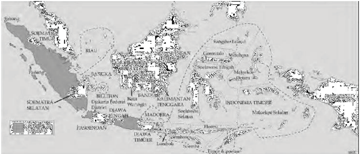

> **Deskripsi Visual:** Gambar ini adalah diagram yang menunjukkan wilayah geografis Indonesia dan sekitarnya. Diagram ini memperlihatkan berbagai provinsi dan pulau-pulau di Indonesia, termasuk Sumatera, Jawa, Kalimantan, Sulawesi, dan banyak pulau-pulau kecil lainnya. Selain itu, juga ada beberapa wilayah administratif seperti DKI Jakarta, Nusa Tenggara Timur, dan Maluku Utara. Wilayah-wilayah ini diberi nama dan dikelompokkan menjadi bagian-bagian yang lebih kecil untuk menunjukkan hubungan antar wilayah. Label-label seperti "Indonesia", "Malaysia", "Bali", dan "Sumatera" memberikan informasi tentang lokasi dan wilayah yang ditampilkan. Diagram ini sangat berguna untuk membantu pembaca memahami struktur geografis Indonesia dan bagaimana wilayah-wilayah tersebut terhubung satu sama lain.

 

---
## 📄 Halaman 192

Pada  mulanya para pejuang TNI pejuangan yang berada di pos atau kantongkantong perjuangan itu tidak mau ditarik mundur ke wilayah RI atas dasar garis  Van  Mook  itu.  Mereka  berpandangan  bahwa  mereka  tidak  kalah perang, tidak perlu dievakuasi. Mereka tidak mau ditarik mundur di belakang garis Van Mook. Sudah tentu ini menjadi problem tersendiri karena sudah menjadi keputusan dalam Perundingan Renville. Tampillah Sudirman dengan kepiawian  dan  kebapakannya  mendekati  mereka  para  anggota  TNI  itu dengan menegaskan bahwa kita TNI dan para pejuang Indonesia tidak kalah perang,  para  prajurit  tidak  dievakuasi,  tetapi  melakukan  hijrah  ke  tempat yang kondusif untuk melakukan konsolidasi untuk mencapai kemenangan yang  lebih  besar.  Kemudian  Sudirman  mengeluarkan  amanatnya  sebagai berikut.

'Anak-anakku  anggota  Angkatan  Perang,  tiap-tiap  perjuangan  mempunyai  pasang surutnya, tetapi dengan iman kita yang tetap teguh dan jiwa yang tetap besar, kita masih sanggup untuk mengatasi percobaan ini dan percobaan-percobaan lainnya yang mungkin akan menyusul lagi. ' (Soekanto, SA., 1981).

Dengan pendekatan dan amanat dari panglima Besar Sudirman ini, dengan penuh semangat para TNI melakukan hijrah untuk memasuki wilayah RI yang diakui dalam Perjanjian Renville.

»

Coba diskusikan dengan anggota kelompokmu. Mengapa peristiwa penarikan pasukan TNI dari Jawa Barat dan Jawa Timur ke wilayah RI  itu  dinamakan  hijrah?  Siapa  sebenarnya  yang  menamakan peristiwa itu sebagai hijrah?

Isi  Perjanjian  Renville  mendapat  tentangan  sehingga  muncul  mosi  tidak percaya terhadap Kabinet Amir Syarifuddin dan pada tanggal 23 Januari 1948, Amir menyerahkan kembali mandatnya kepada Presiden. Dengan demikian perjanjian  Renville  menimbulkan  permasalahan  baru,  yaitu  pembentukan pemerintahan  peralihan  yang  tidak  sesuai  dengan  yang  terdapat  dalam perjanjian Linggarjati.

 

---
## 📄 Halaman 193

### 5. Agresi Militer II dan Penangkapan Pimpinan Negar a

Sebelum  macetnya  perundingan  Renville  sudah  ada  tanda-tanda  bahwa Belanda akan melanggar persetujuan Renville. Oleh karena itu, pemerintah RI  dan  TNI  sudah  memperhitungkan bahwa sewaktu-waktu Belanda akan melakukan  aksi  militernya  untuk  menghancurkan  RI  dengan  kekuatan senjata. Untuk menghadapi kekuatan Belanda, maka dibentuk Markas Besar Komando Djawa (MBKD) yang dipimpin oleh A.H. Nasution dan Hidayat.

Seperti  yang  telah  diduga  sebelumnya,  pada  tanggal  19  Desember  1948 Belanda  melancarkan  agresinya  yang  kedua.  Sebelum  pasukan  Belanda bergerak lebih jauh, Van Langen (Wakil Jenderal Spoor) berbisik kepada Van Beek (komandan lapangan agresi II): ' overste tangkap Sukarno, Hatta, dan Sudirman, mereka bertiga masih ada di istana' , demikian perintah pimpinan Belanda  terhadap  Van  Beek  untuk  menangkap  dan  membunuh  ketiga pimpinan nasional kita.

Agresi  militer  II  itu  telah  menimbulkan  bencana  militer  dan  politik,  baik bagi  Belanda  maupun Indonesia. Walaupun Belanda tampak memperoleh kemenangan dengan mudah, tetapi  sebenarnya  membayar  cukup  mahal. Serangan Belanda ini telah menuai kritik dari berbagai negara.

---
**🖼️ Gambar/Diagram**

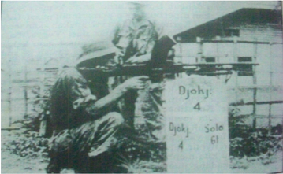

> **Deskripsi Visual:** Gambar ini adalah foto yang menunjukkan dua orang yang sedang berdiri di dekat sebuah bangunan. Bangunan tersebut tampak seperti bangunan sederhana dengan atap datar dan dinding berwarna putih. Di sebelah kiri, ada seorang pria yang sedang berdiri dengan posisi tubuh yang tegak, sedangkan di sebelah kanan, ada seorang wanita yang juga berdiri dengan posisi yang sama. Kedua orang tersebut tampak sedang berbicara atau berkomunikasi dengan satu sama lain.

Elemen-elemen utama dalam gambar ini adalah dua orang, bangunan, dan lingkungan sekitarnya. Posisi kedua orang di dekat bangunan menunjukkan bahwa mereka mungkin sedang berada di luar bangunan tersebut. Teks pada gambar tidak tampak jelas, tetapi ada angka "4" yang mungkin merujuk pada nomor atau informasi tertentu tentang bangunan tersebut.

Informasi kunci yang dapat diambil dari gambar ini adalah bahwa ada dua orang yang sedang berdiri di dekat bangunan, dan posisinya di dekat bangunan menunjukkan bahwa mereka mungkin sedang berada di luar bangunan tersebut. Namun, detail lebih lanjut tentang konteks dan tujuan dari foto ini tidak dapat dilihat dari gambar tersebut.

Gambar 7.16 Tentara Belanda pada saat Agresi Militer II.

 

---
## 📄 Halaman 194

Dengan taktik perang kilat, Belanda melancarkan serangan di semua front RI. Serangan diawali dengan penerjunan pasukan-pasukan payung di Pangkalan Udara Maguwo dan dengan cepat berhasil menduduki ibu kota Yogyakarta. Presiden Sukarno dan Wakil Presiden Hatta memutuskan untuk tetap tinggal di  ibukota,  meskipun  mereka  tahu  akan  ditawan  musuh.  Alasannya,  agar mereka dengan mudah ditemui oleh TNI, sehingga kegiatan diplomasi dapat berjalan terus. Di samping itu, Belanda tidak mungkin melancarkan serangan secara  terus-menerus,  karena  Presiden  dan  Wakil  Presiden  sudah  ada  di tangan musuh.

---
**🖼️ Gambar/Diagram**

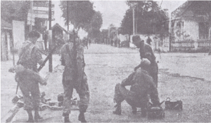

> **Deskripsi Visual:** Gambar ini adalah foto yang menunjukkan beberapa orang tenteram berdiri di tengah jalan raya. Mereka tampak sedang memeriksa atau memperbaiki sesuatu yang terletak di tanah dekat mereka. Di sebelah kiri, ada dua orang yang sedang berbicara dengan satu sama lain, sementara yang lainnya tampak lebih tenang. Latar belakangnya adalah sebuah jalan raya dengan beberapa bangunan dan pohon di sisi jalan. Teks, angka, atau label penting tidak terlihat pada gambar ini. Informasi kunci yang dapat diambil pembaca adalah bahwa ada aktivitas teknis atau perbaikan sedang berlangsung di jalan raya tersebut.

Sebagai  akibat  dari  keputusan  untuk  tetap  tinggal  di  ibu  kota,  Presiden Sukarno  dan  Wakil  Presiden  Hatta  beserta  sejumlah  Menteri,  Kepala  Staf Angkatan Udara Komodor Suryadarma dan lainnya juga ikut ditawan tentara Belanda. Namun, kelangsungan pemerintahan RI dapat dilanjutkan dengan baik,  karena  sebelum  pihak  Belanda  sampai  di  Istana,  Presiden  Sukarno telah berhasil mengirimkan radiogram yang berisi mandat kepada Menteri Kemakmuran Syafruddin Prawiranegara yang sedang melakukan kunjungan ke  Sumatra  untuk  membentuk  Pemerintahan  Darurat  Republik  Indonesia (PDRI). Perintah sejenis juga diberikan kepada Mr. A.A. Maramis yang sedang di  India.  Apabila  Syafruddin  Prawiranegara  ternyata  gagal  melaksanakan kewajiban  pemerintah  pusat,  maka  Maramis  diberi  wewenang  untuk membentuk pemerintah pelarian (Exile Goverment) di luar negeri.

 

---
## 📄 Halaman 195

Sementara  itu,  Panglima  Besar  Jenderal  Sudirman  yang  sedang  sakit harus  dirawat  oleh  dr.  Suwondo  selaku  dokter  pribadinya  di  rumah  di kampung  Bintaran.  Setelah  mendengar  Belanda  melancarkan  serangan, Jenderal  Sudirman  seperti  timbul  semangat  baru.  Ia  mengingat  janjinya saat  menguncapkan  sumpah  saat  dilantik  sebagai  panglima  TNI  akan memperjuangkan kedaulatan dan keutuhan NKRI sampai titik darah yang penghabisan. Maka ia bangkit dari tempat tidur dengan berucap: 'komando kembali  saya  ambil  alih'.  Semua  pasukan  siap  sesuai  strategi  yang  telah direncanakan. Sudirman segera menuju istana Presiden di Gedung Agung. Rencananya  untuk  mengajak  Presiden  dan  pimpinan  yang  lain  untuk meninggalkan kota untuk bergerilya. Tetapi Presiden Sukarno tidak bersedia dan akan tetap di istana, sehingga akhirnya ditangkap Belanda.

Ketika mengetahui Presiden, Wakil Presiden, dan beberapa pemimpin lainnya ditangkap  Belanda,  maka  Jenderal  Sudirman  dengan  para  pengawalnya pergi  ke  luar  kota  untuk  mengadakan  perang  gerilya.  Para  ajudan  yang menyertai Jenderal Sudirman, antara lain Suparjo Rustam dan Cokropranolo, dr. Suwondo. Sedangkan pasukan di bawah pimpinan Letkol Soeharto terus berusaha menghambat gerak maju pasukan Belanda. Sebelum berangkat ke luar kota Sudirman sempat memerintahkan Kapten Suparjo Rustam  untuk menyampaikan sebuah perintah kilat dari panglima melalui RRI Yogyakarta yang ditujukan kepada semua anggota Angkatan Perang Republik Indonesia (APRI),  yang  konsepnya  sudah  ditulis  tangan  sendiri  oleh  Panglima  Besar Sudirman. Isi perintah kilat itu sebagai berikut:

.

### Perintah Kilat  No.1/PB/D/48

- Kita telah diserang
- Pada tanggal 19 Desember Angkatan Perang Belanda menyerang kota  Yogyakarta dan lapangan terbang Maguwo.
- Pemerintah Belanda telah membatalkan Persetujuan Gencatan Senjata
- Semua angkatan Perang menjalankan rencana yang telah ditetapkan untuk menghadapi serangan Belanda.
Dikeluarkan di tempat T anggal 19 Desember 1948, Jam 08.00

Panglima Besar Angkatan Perang Republik Indonesia Letnan Jenderal Sudirman

 

---
## 📄 Halaman 196

Aksi militer Belanda yang kedua ini ternyata menarik perhatian PBB, karena Belanda secara terang-terangan tidak mengikuti lagi Persetujuan Renville di depan Komisi Tiga Negara yang ditugaskan oleh PBB. Pada tanggal 24 Januari 1949,  Dewan  Keamanan  PBB  membuat  resolusi,  agar  Republik  Indonesia dan Belanda segera menghentikan permusuhan dan membebaskan Presiden RI  dan  para  pemimpin  politik  yang  ditawan  Belanda.  Kegagalan  Belanda di  medan  pertempuran  serta  tekanan  dari  AS  yang  mengancam  akan memutuskan  bantuan  ekonomi  dan  keuangan,  memaksa  Belanda  untuk kembali ke meja perundingan.

### 6.  Peran PDRI : Penjaga Eksistensi RI

Pada saat terjadi agresi militer Belanda II, Presiden Sukarno telah membuat mandat  kepada  Syafruddin  Prawiranegara yang ketika itu berada di Bukittinggi  untuk  membentuk  pemerintah  darurat.  Sukarno  mengirimkan mandat serupa kepada Mr. Maramis dan Dr. Sudarsono yang sedang berada di  New  Delhi,  India  apabila  pembentukan  PDRI  di  Sumatra  mengalami kegagalan. Namun, Syafruddin berhasil mendeklarasi berdirinya Pemerintah Darurat Republik Indonesia ini dilakukan di Kabupaten Lima Puluh Kota pada tanggal 19 Desember 1948.

Susunan pemerintahannya antara lain sebagai berikut:

- Mr.  Syafruddin  Prawiranegara  sebagai  ketua  merangkap  Perdana Menteri, Menteri Pertahanan dan Menteri Penerangan;
- Mr. T.M. Hassan sebagai wakil ketua merangkap Menteri Dalam Negeri, Menteri Pendidikan, dan Menteri Agama;
- Ir. S.M. Rasyid sebagai Menteri Keamanan merangkap Menteri Sosial, Pembangunan dan Pemuda;
- Mr. Lukman Hakim sebagai Menteri Keuangan merangkap Menteri Kehakiman;
- Ir. Sitompul sebagai Menteri Pekerjaan Umum merangkap Menteri Kesehatan;
- Maryono Danubroto sebagai Sekretaris PDRI;
- Jenderal Sudirman sebagai Panglima Besar;
- Kolonel A.H. Nasution sebagai Panglima Tentara Teritorial Jawa; dan
- Kolonel Hidayat sebagai Panglima Tentara Teritorial Sumatra.

 

---
## 📄 Halaman 197

PDRI yang dipimpin oleh Syafruddin Prawiranegara ternyata berhasil memainkan peranan yang penting dalam mempertahankan dan menegakkan pemerintah RI. Peranan PDRI itu antara lain sebagai berikut.

PDRI dapat berfungsi sebagai mandataris kekuasaan pemerintah  RI  dan  berperan  sebagai  pemerintah pusat.  PDRI  juga  berperan  sebagai  kunci  dalam mengatur  arus  informasi,  sehingga  mata  rantai komunikasi  tidak  terputus  dari  daerah  yang  satu ke  daerah  yang  lain.  Radiogram  mengenai  masih berdirinya PDRI dikirimkan kepada Ketua Konferensi Asia,  Pandit  Jawaharlal  Nehru  oleh  Radio  Rimba Raya  yang  berada  di  Aceh  Tengah  pada  tanggal

23 Januari 1948. PDRI juga berhasil menjalin hubungan dan berbagi tugas dengan  perwakilan  RI  di  India.  Dari  India  informasi-informasi  tentang keberadaan dan perjuangan bangsa dan negara RI dapat disebarluaskan ke berbagai penjuru dunia. Terbukalah mata dunia mengenai keadaan RI yang sesungguhnya.

Konflik  antara  Indonesia  dengan  Belanda  masih  terus  berlanjut.  Namun semakin terbukanya mata dunia terkait dengan konflik itu, menempatkan posisi  Indonesia  semakin  menguntungkan.  Untuk  mempercepat  penyelesaikan konflik ini maka oleh DK PBB dibentuklah UNCI ( United Nations Commission for  Indonesia )  atau  Komisi  PBB  untuk  Indonesia  sebagai  pengganti  KTN. UNCI ini memiliki kekuasaan yang lebih besar dibanding KTN. UNCI berhak mengambil keputusan yang mengikat atas dasar suara mayoritas.

UNCI memiliki tugas dan kekuasaan sebagai berikut:

- memberi rekomendasi kepada DK PBB dan pihak-pihak yang bersengketa (Indonesia dan Belanda);
- membantu  mereka  yang  bersengketa  untuk  mengambil  keputusan dan melaksanakan resolusi DK PBB;
- mengajukan saran kepada DK PBB mengenai cara-cara yang dianggap terbaik untuk mengalihkan kekuasaan di Indonesia berlangsung secara aman dan tenteram;
- membantu memulihkan kekuasaan pemerintah RI dengan segera;
- mengajukan  rekomendasi  kepada  DK  PBB  mengenai  bantuan  yang dapat  diberikan  untuk  membantu  keadaan  ekonomi  penduduk  di daerah-daerah yang diserahkan kembali kepada RI;

 

---
## 📄 Halaman 198

- memberikan  saran  tentang  pemakaian  tentara  Belanda  di  daerahdaerah yang dianggap perlu demi ketenteraman rakyat; dan
- mengawasi  pemilihan  umum,  bila  di  wilayah  Indonesia  diadakan pemilihan.
Ketika Presidan, Wakil presiden dan pembesar-pembesar Republik ditawan Belanda di Bangka, delegasi BFO ( Bijzonder Federaal Overleg ) mengunjungi mereka  dan  mengadakan  perundingan,  UNCI  mengumumkan  bahwa delegasi-delegasi  Republik,  Belanda  dan  BFO  telah  mencapai  persetujuan pendapat  mengenai  akan  diselenggarakannya  KMB.  UNCI  juga  berhasil menjadi  mediator  dalam  KMB.  Bahkan  peranan  itu  juga  tampak  sampai penyerahan dan pemulihan kekuasaan Pemerintah RI di Indonesia.

### 7.  Tetap Memimpin Gerilya

Kalau para pemimpin pemerintahan seperti Presiden Sukarno, Wakil Presiden Moh.  Hatta  dan  beberapa  menteri  ditangkap  Belanda,  Panglima  Besar Sudirman  yang  dalam  kondisi  sakit    hanya  dengan  satu  paru-paru  justru tetap teguh untuk memimpin perang gerilya. Ia dan rombongan melakukan perjalanan  dan  pergerakan  dari  Yogyakarta  menuju  Gunungkidul  dengan melewati beberapa kecamatan, menuju Pracimantoro, Wonogiri, Ponorogo, Trenggalek  dan  Kediri.  Dalam  gerakan  gerilya  dengan  satu  paru-paru  itu Sudirman kadang harus ditandu atau dipapah oleh pengawal masuk hutan, naik gunung, turun jurang harus memimpin pasukan, memberikan motivasi dan komando kepada TNI dan para pejuang untuk terus mempertahankan tegaknya  panji-panji  NKRI.  Dari  Kediri  lalu  memutar  kembali  melewati Trenggalek, terus melakukan perjalanan sampai akhirnya di Sobo. Di tempat ini  telah dijadikan markas gerilya sampai saat Presiden dan Wakil Presiden dengan beberapa menteri kembali ke Yogyakarta.

Sungguh heroik perjalanan Sudirman. Ia telah menempuh perjalanan kurang lebih 1000 km. Waktu gerilya mencapai enam bulan dengan penuh derita, lapar dan dahaga. Sudirman tidak lagi memikirkan harta, jiwa dan raganya semua dikorbankan demi tegaknya kedaulatan bangsa dan negara. Sekalipun dalam  keadaan  sakit,  Sudirman  terus  memberi  semangat  anak  buahnya untuk berjuang melawan kelicikan Belanda.

 

---
## 📄 Halaman 199

---
**🖼️ Gambar/Diagram**

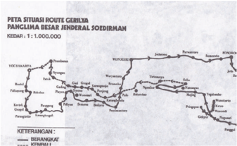

> **Deskripsi Visual:** Gambar ini adalah diagram yang menunjukkan peta situasi route gerilya Panglima Besar Jenderal Soedirman. Diagram ini menggunakan skala 1:1.000.000 dan menunjukkan berbagai lokasi strategis di wilayah tersebut. Elemen utama yang ditampilkan meliputi jalur-jalur jalan, lokasi-lokasi penting, dan nama-nama desa atau kota. Teks pada gambar memberikan informasi tentang lokasi dan arah jalur-jalur tersebut. Angka-angka dan label penting mencakup nomor lokasi, nama-nama desa atau kota, dan informasi tentang posisi dan arah jalur-jalur. Gambar ini membantu pembaca memahami struktur dan arsitektur jalur-jalur gerilya yang digunakan oleh Panglima Besar Jenderal Soedirman untuk menguasai wilayah tersebut.

Gambar 7.19 Rute gerilya Pangsar Sudirman

### 8.  Serangan Umum 1 Maret 1949

Pada  saat  para  pemimpin  ditangkap,  Panglima  TNI  Jenderal  Sudirman memimpin perang gerilya. Beliau dan pasukannya segera meninggalkan kota dan mengatur siasat. Bagaimana peranan TNI setelah agresi militer Belanda II? Apakah mereka masih melakukan perlawanan terhadap Belanda?

Pihak Belanda ternyata tidak mau segera menerima resolusi DK PBB, tanggal 28  Januari  1949.  Belanda  masih  mengakui  bahwa  RI  sebenarnya  tinggal nama. RI sudah tidak ada, yang ada hanyalah para pengacau. Sementara itu, Sri  Sultan Hamengkubuwana IX lewat radio menangkap berita luar negeri tentang  rencana  DK  PBB  yang  akan  mengadakan  sidang  lagi  pada  bulan Maret 1949, untuk membahas perkembangan di Indonesia.

Sri  Sultan  berkirim  surat  kepada  Jenderal  Sudirman  tentang  perlunya tindakan  penyerangan  terhadap  Belanda.  Sudirman  minta  agar  Sri  Sultan membahasnya  dengan  komandan  TNI  setempat,  yakni  Letkol  Soeharto. Segera penyerangan terhadap Belanda di Yogyakarta dijadwalkan tanggal 1 Maret 1949 dini hari.

 

---
## 📄 Halaman 200

Pada  tanggal  1  Maret  1949  dini  hari  sekitar  pukul  06.00  sewaktu  sirine berbunyi sebagai tanda berakhirnya jam malam, serangan umum dilancarkan dari segala penjuru. Letkol  Soeharto  langsung  memegang  komando menyerang ke pusat kota. Serangan umum ini ternyata sukses. Selama enam jam (dari jam 06.00 - jam 12.00 siang) Yogyakarta dapat diduduki oleh TNI. Setelah Belanda mendatangkan bala bantuan dari Gombong dan Magelang, dapat memukul mundur para pejuang kita.

Keberhasilan  serangan  umum  itu,  kemudian  disebarluaskan  melalui  RRI gerilya  yang  ada  di  Gunung  Kidul.  Berita  ini  dapat  ditangkap  oleh  RRI  di Sumatra, yaitu Radio Rimba Raya di Aceh kemudian diteruskan ke luar negeri.

Walaupun hanya sekitar enam jam pasukan Indonesia berhasil menduduki kota Yogyakarta, namun serangan ini sangat berarti bagi bangsa Indonesia. Terutama ke dunia internasional untuk membuktikan bahwa RI masih ada, tidak  seperti  yang  diberikan  oleh  Belanda.  Selain  mengobarkan  semangat rakyat  kembali  juga  menunjukkan  kepada  dunia  bahwa  negara  Indonesia masih mempunyai kekuatan. Pada waktu itu di Yogyakarta ada beberapa wartawan  asing  yang  peranannya  sangat  besar  dalam  menginformasikan keadaan Indonesia kepada dunia.

 

---
## 📄 Halaman 201

### 9.  Persetujuan Roem-Royen

Serangan Umum 1 Maret 1949 yang dilancarkan oleh para pejuang Indonesia, telah membuka mata dunia bahwa propaganda Belanda itu tidak benar. RI dan TNI masih tetap ada. Namun Belanda tetap membandel dan tidak mau melaksanakan resolusi DK PBB 28 Januari. Perundingan pun menjadi macet.

Melihat kenyataan itu, Amerika Serikat bersikap tegas dan terus mendesak agar  Belanda  mau  melaksanakan  resolusi  tanggal  28  Januari.  Amerika Serikat berhasil mendesak Belanda, untuk mengadakan perundingan dengan Indonesia.

Ketika  terlihat  titik  terang  bahwa  RI  dan  Belanda  bersedia  maju  ke  meja perundingan, maka atas inisiatif Komisi PBB untuk Indonesia pada tanggal 14 April 1949 diselenggarakan perundingan di Jakarta di bawah pimpinan Merle Cochran, anggota Komisi dari AS. Delegasi Indonesia dipimpin oleh Moh.  Roem  dan  delegasi  Belanda  dipimpin  oleh  H.J.  Van  Royen.  Dalam perundingan itu, RI tetap berpendirian bahwa pengembalian pemerintahan RI  ke  Yogyakarta  merupakan  kunci  pembuka  perundingan-perundingan selanjutnya.  Sebaliknya  pihak  Belanda  menuntut  agar  lebih  dulu  dicapai persetujuan tentang perintah penghentian perang gerilya oleh pihak RI.

Merle  Cochran,  wakil  dari  AS  di  UNCI  mendesak  agar  Indonesia  mau melanjutkan perundingan. Waktu itu Amerika Serikat menekan Indonesia, kalau Indonesia menolak, Amerika tidak akan memberikan bantuan dalam bentuk apa pun. Perundingan segera dilanjutkan pada tanggal 1 Mei 1949. Kemudian pada tanggal 7 Mei 1949 tercapai Persetujuan Roem-Royen. Isi Persetujuan Roem-Royen antara lain sebagai berikut:

- Pihak  Indonesia  bersedia  mengeluarkan  perintah  kepada  pengikut RI yang bersenjata untuk menghentikan perang gerilya. RI juga akan Ikut  serta  dalam  Konferensi  Meja  Bundar (KMB) di Den Haag, guna mempercepat penyerahan kedaulatan kepada Negara Indonesia Serikat (NIS), tanpa syarat.
- Pihak Belanda menyetujui kembalinya RI ke Yogyakarta dan menjamin penghentian gerakan-gerakan militer dan  membebaskan  semua tahanan  politik.  Belanda  juga  berjanji  tidak  akan  mendirikan  dan mengakui negara-negara yang ada di wilayah kekuasaan RI sebelum Desember 1948, serta menyetujui RI sebagai bagian dari NIS.

 

---
## 📄 Halaman 202

Pemerintahan  Darurat  Republik  Indonesia  di  Sumatra  memerintahkan  Sri Sultan Hamengkubowono IX untuk mengambil alih pemerintahan Yogyakarta dari pihak Belanda. Pihak tentara dengan penuh kecurigaan menyambut hasil persetujuan itu, namun Panglima Jenderal Sudirman memperingatkan seluruh komando kesatuan agar tidak memikirkan masalah-masalah perundingan.

Setelah  pemerintah  RI  kembali  ke  Yogyakarta,  pada  tanggal  13  Juli  1949 diselenggarakan  sidang  Kabinet  RI  yang  pertama.  Pada  kesempatan  itu, Syafruddin Prawiranegara mengembalikan mandatnya kepada Wakil Presiden Moh. Hatta. Dalam sidang kabinet juga diputuskan untuk mengangkat Sri Sultan Hamengkobuwono IX menjadi Menteri Pertahanan merangkap Ketua Koordinator Keamanan.

### 10.  Yogya Kembali

Bagaimana setelah disetujuinya Perjanjian Roem Royen? Bagaimana proses kembalinya RI dan nasib pasukan gerilya yang dipimpin Jenderal Sudirman? Sebagai pelaksanaan dari kesepakatan itu, maka pada tanggal 29 Juni 1949, pasukan Belanda ditarik mundur ke luar Yogyakarta. Setelah itu TNI masuk ke Yogyakarta. Peristiwa keluarnya tentara Belanda dan masuknya TNI ke Yogyakarta dikenal dengan Peristiwa Yogya Kembali. Presiden Sukarno dan Wakil Presiden Moh. Hatta ke Yogyakarta pada tanggal 6 Juli 1949.

Sejak awal 1949, ada tiga kelompok pimpinan RI yang ditunggu untuk kembali ke Yogyakarta. Kelompok pertama adalah Kelompok Bangka. Kedua adalah kelompok PDRI dibawah pimpinan Mr. Syafruddin Prawiranegara. Kelompok ketiga adalah angkatan perang di bawah pimpinan Panglima Besar Jenderal Sudirman.  Sultan  Hamangkubuwono  IX  bertindak  sebagai  wakil  Republik Indonesia, karena Keraton Yogyakarta bebas dari intervensi Belanda, maka mempermudah  untuk  mengatasi  masalah-masalah  yang  terkait  dengan kembalinya Yogya ke Republik Indonesia. Kelompok Bangka yang terdiri atas Sukarno, Hatta, dan rombongan kembali ke Yogyakarta pada tanggal 6 Juli 1949, kecuali Mr. Roem yang harus menyelesaikan urusannya sebagai ketua delegasi di UNCI, masih tetap tinggal di Jakarta.

Rombongan PDRI mendarat di Maguwo pada 10 Juli 1949. Mereka disambut oleh Sultan Hamangkubuwono IX, Moh. Hatta, Mr.Roem, Ki Hajar Dewantara, Mr. Tadjuddin serta pembesar RI lainnya.

 

---
## 📄 Halaman 203

---
**🖼️ Gambar/Diagram**

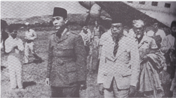

> **Deskripsi Visual:** Gambar ini adalah foto yang menunjukkan tiga orang pria yang sedang berdiri di lapangan. Mereka tampaknya sedang menghadapi sesuatu yang tidak bisa dilihat dalam gambar tersebut. Pria di tengah memiliki rambut pendek dan memakai baju berwarna putih dengan lengan panjang. Pria di sebelah kiri memiliki rambut panjang dan memakai baju berwarna hitam dengan lengan pendek. Pria di sebelah kanan juga memiliki rambut panjang dan memakai baju berwarna putih dengan lengan panjang. Semua orang tampak tertarik pada sesuatu yang ada di depan mereka. Di sekitar mereka, beberapa orang lain tampak sedang berjalan atau berdiri. Di belakang mereka, terlihat sebuah pesawat yang tampaknya baru saja mendarat atau akan terbang. Gambar ini menunjukkan suasana yang serius dan formal, mungkin karena acara penting atau peristiwa yang sedang berlangsung.

Presiden, Wakil Presiden dan rombongan tiba di Yogyakarta

Pada tanggal itu pula rombongan Panglima Besar Jenderal Sudirman ditunggu kedatangannya di Yogyakarta. Sebelumnya berangkat menuju Yogyakarta, Sudirman  berpamitan  dengan  masyarakat  Sobo  dan  keluarga  Pak  Karso yang rumahnya digunakan Sudirman. Ia berpamitan dengan bahasa Jawa, kurang lebih demikian: '… gandheng kulo badhe wangsul dateng Ngayojo malih, namung weling kulo dateng Pak Karso (lan keluargo ing mriki), mugo sampun ngantos nggadhahi alangan satunggal punopo (berkenaan    kami akan kembali ke Yogya, hanya pesan kami semoga Pak Karso (dan keluarga di sini) tidak mendapatkan halangan sesuatu apa' (Sardiman, 2008). Sudirman kemudian berangkat dan selanjutnya memasuki Desa Wonosari.

Sesampainya di kota Yogyakarta, Rombongan Jenderal Sudirman dijemput oleh  Sultan  Hamengkubuwono  IX  bersama  pasukan  di  bawah  pimpinan Letkol  Soeharto  sebagai  Panglima  Perang  Yogyakarta,  dengan  disertai dua  orang  wartawan,  yaitu  Rosihan  Anwar  dari Pedoman dan  Frans Sumardjo dari Ipphos. Saat menerima rombongan penjemput itu Panglima Besar Jenderal Sudirman berada di rumah lurah Wonosari. Saat itu beliau sedang mengenakan pakaian gerilya dengan ikat kepala hitam. Pada esok harinya rombongan Pangeran Besar Jenderal Sudirman dibawa kembali ke Yogyakarta.  Saat  itu  beliau  sedang  menderita  sakit  dengan  ditandu  dan

 

---
## 📄 Halaman 204

diiringi  oleh  utusan  dan  pasukan  beliau  dibawa  kembali  ke  Yogyakarta. Dalam kondisi letih dan sakit beliau mengikuti upacara penyambutan resmi dengan mengenakan baju khasnya yaitu pakaian gerilya.

---
**🖼️ Gambar/Diagram**

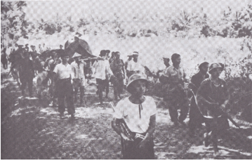

> **Deskripsi Visual:** Gambar ini adalah foto yang menunjukkan sebuah acara atau peristiwa yang terjadi di luar ruangan. Dalam foto tersebut, banyak orang yang sedang berdiri atau berjalan di sepanjang jalan. Beberapa orang tampak sedang berbicara atau bergerak, sementara yang lain tampak lebih tenang atau diam. Latar belakang tampak seperti tanah atau lapangan dengan beberapa pohon atau tanaman kecil. Di bagian depan, ada dua orang yang tampak lebih besar dibandingkan orang lain, mungkin karena mereka sedang berbicara atau memegang sesuatu. Teks, angka, atau label penting tidak terlihat pada gambar ini. Informasi kunci yang dapat diambil pembaca adalah bahwa ini adalah foto dari sebuah acara atau peristiwa yang terjadi di luar ruangan, dengan banyak orang yang terlibat.

Jenderal Sudirman dengan ditandu memasuki kota Yogyakarta setelah melakukan

Upacara  penyambutan  resmi  para  pemimpin  RI  di  Ibukota  dilaksanakan dengan penuh khidmat pada 10 Juli. Sebagai pimpinan inspektur upacara adalah Syafruddin Prawiranegara, didampingi oleh Panglima Besar Jenderal Sudirman dan para pimpinan RI yang baru saja kembali dari pengasingan Belanda. Pada 15 Juli 1949, untuk pertama kalinya diadakan sidang kabinet pertama yang dipimpin oleh Moh. Hatta. Pada kesempatan itu Syafruddin Prawiranegara menyampaikan kepada Presiden Sukarno tentang tindakantindakan  yang  dilakukan  oleh  PDRI  selama  delapan  bulan  di  Sumatra Barat.  Pada  kesempatan  itu  pula  Syafruddin  Prawiranegara  secara  resmi menyerahkan  kembali  mandatnya  kepada  Presiden  RI  Sukarno.  Dengan demikian maka berakhirlah PDRI yang selama delapan bulan memperjuangkan dan mempertahankan eksistensi RI.

 

---
## 📄 Halaman 205

### 11.  Konferensi Inter Indonesia

Belanda tidak berhasil membentuk negara-negara bagian dari suatu negara federal. BFO. Namun di antara para pemimpin BFO banyak yang sadar dan melakukan pendekatan untuk bersatu kembali dalam upaya pembentukan Republik Indonesia Serikat (RIS). Hal ini terutama didorong oleh sukses yang diperoleh  para  pejuang  dan  TNI  kita  dalam  perang  gerilya.  Mereka  sadar hanya akan dijadikan alat dan boneka bagi kekuasaan Belanda. Oleh karena itu perlu dibentuk semacam front untuk menghadapi Belanda.

Sementara  itu,  Kabinet  Hatta  meneruskan  perjuangan  diplomasi,  yaitu menyelesaikan  masalah  intern  terlebih  dahulu.  Beberapa  kali  diadakan Konferensi  Inter-Indonesia  untuk  menghadapi  usaha  Van  Mook  dengan Negara  bonekanya.  Ternyata  hasil  Konferensi  Inter-Indonesia  itu  berhasil dengan baik. Walaupun untuk sementara pihak RI menyetujui terbentuknya Negara RIS, tetapi bukan berarti pemerintah RIS tunduk kepada pemerintah Belanda.

Pada bulan Juli dan Agustus 1949 diadakan konferensi Inter-Indonesia. Dalam konferensi itu diperlihatkan bahwa politik devide et impera Belanda untuk memisahkan daerah-daerah di luar wilayah RI mengalami kegagalan. Hasil Konferensi Inter-Indonesia yang diselenggarakan di Yogyakarta antara lain:

- Negara  Indonesia  Serikat  disetujui  dengan  nama  Republik  Indonesia Serikat (RIS) berdasarkan demokrasi dan federalisme;
- RIS akan dikepalai oleh seorang presiden dibantu oleh menteri-menteri yang bertanggung jawab kepada presiden;
- RIS akan menerima penyerahan kedaulatan, baik dari RI maupun Belanda;
- Angkatan Perang RIS adalah Angkatan Perang Nasional, dan Presiden RIS adalah Panglima Tertinggi Angkatan Perang; dan
- Pembentukan  Angkatan  Perang  RIS  adalah  semata-mata  soal  bangsa Indonesia sendiri.
Dalam  konferensi  selanjutnya  juga  diputuskan  untuk  membentuk  Panitia Persiapan  Nasional  yang  anggotanya  terdiri  atas  wakil-wakil  RI  dan  BFO. Tugasnya  menyelenggarakan  persiapan  dan  menciptakan  suasana  tertib sebelum  dan  sesudah  KMB.  BFO  juga  mendukung  tuntutan  RI  tentang penyerahan kedaulatan tanpa syarat, tanpa ikatan politik maupun ekonomi. Pihak RI juga menyepakati bahwa Konstitusi RIS akan dirancang pada saat KMB di Den Haag.

 

---
## 📄 Halaman 206

### 12.  Konferensi Meja Bundar

Perjanjian  Roem  Royen  belum  menyelesaikan  masalah  Indonesia  Belanda. Salah  satu  agenda  yang  disepakati  Indonesia-Belanda  adalah  penyelenggaraan Konferensi Meja Bundar di Den Haag. Bagaimana pelaksanaan KMB tersebut? Bagaimana  kelanjutan  perjuangan  bangsa  Indonesia  dalam  mewujudkan Negara Kesatuan Republik Indonesia setelah selesai KMB? Mari kita lacak peristiwa-peristiwa proses pengakuan kedaulatan RI dari Belanda!

Indonesia telah menetapkan delegasi yang mewakili KMB yakni Moh. Hatta, Moh. Roem, Mr. Supomo, Dr. J. Leimena, Mr. Ali Sastroamijoyo, Dr. Sukiman, Ir.  Juanda,  Dr.  Sumitro  Joyohadikusumo,  Mr.  Suyono  Hadinoto,  Mr.  AK. Pringgodigdo, TB. Simatupang, dan Mr. Sumardi. Sedangkan BFO diwakili oleh Sultan Hamid II dari Pontianak.

KMB dibuka pada tanggal 23 Agustus 1949 di Den Haag. Delegasi Belanda dipimpin oleh Mr. Van Maarseveen dan dari UNCI sebagai mediator adalah Chritchley. Tujuan diadakan KMB adalah untuk:

- menyelesaikan persengketaan antara Indonesia dan Belanda; dan
- mencapai kesepakatan antara para peserta tentang tata cara penyerahan yang penuh dan tanpa syarat kepada Negara Indonesia Serikat, sesuai dengan ketentuan Persetuiuan Renville.

 

---
## 📄 Halaman 207

Beberapa  masalah  yang  sulit  dipecahkan  dalam  KMB  terutama  sebagai berikut.

- Soal Uni Indonesia-Belanda, pihak Indonesia menghendaki agar sifatnya hanya  kerja  sama  yang  bebas  tanpa  adanya  organisasi    permanen. Sedangkan Belanda menghendaki kerja yang lebih luas dengan organisasi permanen (mengikat).
- Soal utang, pihak Indonesia hanya mengakui utang-utang Hindia Belanda sampai  menyerahnya  Belanda  kepada  Jepang.  Sementara  Belanda menghendaki  agar  Indonesia  mengambil  alih  semua  utang  Hindia Belanda sampai penyerahan kedaulatan, termasuk biaya perang kolonial melawan TNI.
Gambar 7.24 Hatta berpidato dalam Konferensi Meja Bundar.

Setelah  melalui  pembahasan  dan  perdebatan,  tanggal  2  November  1949 KMB dapat diakhiri. Hasil-hasil  keputusan  dalam  KNIB  antara  lain  sebagai berikut:

- Belanda mengakui keberadaan negara RIS (Republik Indonesia Serikat) sebagai negara yang merdeka dan berdaulat. RIS terdiri dari RI dan 15 negara bagian/daerah yang pernah dibentuk Belanda.
- Masalah  Irian Barat akan diselesaikan setahun kemudian,  setelah pengakuan kedaulatan.
- Corak pemerintahan RIS akan diatur dengan konstitusi yang dibuat oleh para delegasi RI dan BFO selama KMB berlangsung.

 

---
## 📄 Halaman 208

- Akan  dibentuk  Uni  Indonesia  Belanda  yang  bersifat  lebih  longgar  , berdasarkan kerja sama secara sukarela dan sederajat. Uni Indonesia Belanda ini disepakati oleh Ratu Belanda.
- RIS harus membayar utang-utang Hindia Belanda sampai waktu pengakuan kedaulatan.
- RIS akan mengembalikan hak milik Belanda dan memberikan izin baru untuk perusahaan-perusahaan Belanda.
Ada  sebagian  keputusan  yang  merugikan  Indonesia,  yakni  beban  utang Hindia Belanda yang harus ditanggung RIS sebesar 4,3 miliar gulden. Juga penundaan  soal  penyelesaian  Irian  Barat  yang  merupakan  masalah  yang menjadi pekerjaan panjang bangsa Indonesia. Tetapi yang jelas bahwa hasil KMB telah memberikan kesempatan yang lebih luas bagi Indonesia untuk membangun negeri sendiri.

Setelah KMB selesai dan menghasilkan berbagai keputusan dengan segala cara pelaksanaannya, kemudian Moh. Hatta dan rombongan pada tanggal 7  November  1949  meninggalkan  negeri  Belanda.  Rombongan  kemudian singgah ke Kairo dan Rangoon. Tanggal 14 November 1949 Moh. Hatta tiba di Maguwo, Yogyakarta disambut oleh Presiden.

### 13.  Pembentukan Republik Indonesia Serikat

Isi  KMB  diterima  oleh  KNIP  melalui  sidangnya  pada  tanggal  6  Desember 1949. Tanggal 14 Desember 1949 diadakan pertemuan di Jalan Pegangsaan Timur No. 56 Jakarta. Pertemuan ini dihadiri oleh wakil-wakil Pemerintah RI, pemerintah negara-negara bagian, dan daerah untuk membahas Konstitusi RIS.  Pertemuan  ini  menyetujui  naskah  Undang-Undang  Dasar  yang  akan menjadi Konstitusi RIS.

Negara RIS berbentuk federasi meliputi seluruh Indonesia dan RI menjadi salah satu bagiannya. Bagi RI keputusan ini sangat merugikan, tetapi merupakan strategi agar Belanda segera mengakui kedaulatan Indonesia sekalipun dalam bentuk federasi RIS. Dalam konstitusi itu juga dijelaskan bahwa Presiden dan para menteri yang dipimpin oleh seorang Perdana Menteri, secara bersamasama  merupakan  pemerintah.  Lembaga  perwakilannya  terdiri  atas  dua

 

---
## 📄 Halaman 209

kamar, yakni Senat dan DPR. Senat merupakan perwakilan negara/daerah bagian yang masing-masing diwakili dua orang. Kemudian, DPR beranggota 150 orang yang merupakan wakil-wakil seluruh rakyat Indonesia.

Pada tanggal 16 Desember1949, Ir. Sukarno terpilih sebagai Presiden RIS. Secara resmi Ir. Sukarno dilantik sebagai Presiden RIS tanggal 17 Agustus 1949,  bertempat  di  Bangsal  Siti  Hinggil  Keraton  Yogyakarta  oleh  Ketua Mahkamah Agung, Mr. Kusumah Atmaja, dan Drs. Moh. Hatta diangkat sebagai Perdana Menteri. Tanggal 20 Desember 1949 Kabinet Moh. Hatta dilantik. Dengan demikian terbentuk Pemerintahan RIS.

Dengan diangkatnya Sukarno sebagai Presiden RIS, maka presiden RI menjadi kosong. Untuk itu, ketua KNIP, Mr. Assaat ditunjuk sebagai pejabat Presiden RI.  Tanggal  27  Desember  1949  Mr.  Assaat  dilantik  sebagai  pemangku jabatan  Presiden  RI  sekaligus  dilakukan  acara  serah  terima  jabatan  dari Sukarno  kepada  Mr.  Assaat.  Langkah  ini  diambil  untuk  mempertahankan kelangsungan negara RI. Apabila sewaktu-waktu RIS bubar, maka RI akan tetap bertahan, karena memiliki kepala negara.

---
**🖼️ Gambar/Diagram**

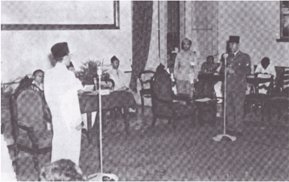

> **Deskripsi Visual:** Gambar ini adalah foto yang menunjukkan sebuah pertemuan formal antara beberapa orang yang tampaknya berada di dalam ruangan yang elegan. Di tengah-tengah foto, ada dua orang yang sedang berbicara kepada para tamu lainnya. Orang yang berdiri di depan tampaknya sedang memberikan pidato atau menyampaikan sesuatu kepada para tamu yang duduk di sekitarnya. Para tamu tampaknya menghadiri acara resmi atau seminar tertentu.

Elemen-elemen utama dalam foto ini meliputi:
1. Orang-orang yang sedang berbicara dan mendengarkan.
2. Ruangan yang tampaknya elegan dengan kursi dan meja.
3. Orang yang berdiri di depan tampaknya sebagai pembicara atau pemimpin acara.

Teks, angka, atau label penting yang terlihat dalam foto ini tidak ada, karena hanya foto saja tanpa teks atau label tambahan.

Informasi kunci yang dapat diambil pembaca dari foto ini adalah bahwa acara tersebut tampaknya formal dan penting, dengan beberapa orang yang berperan penting dalam acara tersebut.

Gambar 7.25 Upacara serah terima jabatan Presiden RI dari Ir. Sukarno kepada Mr. Assaat.

 

---
## 📄 Halaman 210

### 14.  Pengakuan Kedaulatan

Pada tanggal 27 Desember 1949, terjadilah penyerahan kedaulatan Belanda kepada  Indonesia  yang  dilakukan  di  Belanda  dan  di  Indonesia.  Di  Negeri Belanda,  delegasi  Indonesia  dipimpin  oleh  Moh.  Hatta  sedangkan  pihak Belanda  hadir  Ratu  Juliana,  Perdana  Menteri  Willem  Drees,  dan  Menteri Seberang Lautan Sasseu bersama-sama menandatangani akte penyerahan kedaulatan di Ruang Tahta Amsterdam. Di Indonesia dilakukan oleh Sri Sultan Hamengkubuwono IX dan Wakil Tinggi Mahkota Belanda A.H.S. Lovink.

Dengan berakhirnya KMB itu, berakhir pula perselisihan Indonesia Belanda. Indonesia kemudian mendapat pengakuan dari negara-negara lain. Pengakuan pertama datang dari negara-negara yang tergabung dalam Liga Arab, yaitu Mesir, Suriah, Lebanon, Saudi Arabia, Afganistan, India, dan lainlain.  Untuk  perkataan  'penyerahan  kedaulatan'  itu  oleh  pihak  Indonesia diartikan sebagai 'pengakuan kedaulatan', walaupun pihak Belanda tidak menyetujui  dengan  perkataan  tersebut.  Namun,  dalam  kenyataan  oleh masyarakat internasional diakuinya keberadaan Negara Kesatuan Republik Indonesia.

 

---
## 📄 Halaman 211

Walaupun Belanda sendiri tidak mengakui Proklamasi Kemerdekaan Indonesia pada tanggal 17 Agustus 1945 dan hanya mengakui tanggal 27 Desember 1949, namun keberadaan Negara Kesatuan Republik Indonesia itu  tetap  terhitung  sejak  Proklamasi  Kemerdekaan  oleh  bangsa  Indonesia. Pada  saat  itu  bangsa  Indonesia  tidak  menghadapi  Belanda,  melainkan menghadapi Jepang, karena sebelumnya Belanda sudah kalah dan menyerah pada Jepang. Oleh karena itu, Proklamasi Kemerdekaan Indonesia mutlak atas usaha bangsa Indonesia sendiri.

### 15.  Kembali ke Negara Kesatuan

Setelah  RIS  menerima  pengakuan  kedaulatan,  segera  muncul  rasa  tidak puas di kalangan rakyat terutama negara-negara bagian di luar RI. Sejumlah 15 negara bagian/daerah yang merupakan ciptaan Belanda, terasa berbau kolonial,  sehingga  belum  merdeka  sepenuhnya.  Negara-negara  bagian ciptaan Belanda adalah sebagai berikut.

- Negara  Indonesia  Timur  (NIT)  merupakan  negara  bagian  pertama ciptaan Belanda yang terbentuk pada tahun 1946.
- Negara  Sumatra  Timur,  terbentuk  pada  25  Desember  1947  dan diresmikan pada tanggal 16 Februari 1948. Negara Sumatra Selatan, terbentuk atas persetujuan Van Mook pada tanggal 30 Agustus 1948. Daerahnya  meliputi  Palembang  dan  sekitarnya.  Presidennya  adalah Abdul Malik.
- Negara Pasundan (Jawa Barat).
- Negara  Jawa  Timur,  terbentuk  pada  tanggal  26  November  1948 melalui surat keputusan Gubernur Jenderal Belanda.
- Negara Madura, terbentuk melalui suatu plebesit dan disahkan oleh Van Mook pada tanggal 21 Januari 1948.
Di  samping  enam  negara  bagian  tersebut,  Belanda  masih  menciptakan daerah-daerah yang berstatus daerah otonom. Daerah-daerah otonom yang dimaksud adalah Kalimantan Barat, Kalimantan Timur, Dayak Besar (daerah Kalimantan Tengah), Daerah Banjar (Kalimantan Selatan), Kalimantan Tenggara, Jawa Tengah, Bangka, Belitung, dan Riau Kepulauan.

Setelah  pengakuan  kedaulatan  tuntutan  bergabung  dengan  negara  RI semakin  luas.  Tuntutan  semacam  ini  memang  dibenarkan  oleh  konstitusi RIS pada pasal 43 dan 44. Penggabungan antara negara/daerah yang satu

 

---
## 📄 Halaman 212

dengan daerah yang lain dimungkinkan karena dikehendaki rakyatnva. Oleh karena itu, pada tanggal 8 Maret 1950 Pemerintah RIS dengan persetujuan DPR dan Senat RIS mengeluarkan Undang-Undang Darurat No. 11 Tahun 1950  tentang,  Tata  Cara  Perubahan  Susunan  Kenegaraan  RIS.  Setelah dikeluarkannya  Undang-Undang  Darurat  No.  11  itu,  maka  negara-negara bagian atau daerah otonom seperti Jawa Timur, Jawa Tengah, dan Madura bergabung  dengan  RI  di  Yogyakarta.  Karena  semakin  banyaknya  negaranegara  bagian/daerah  yang  bergabung  dengan  RI  maka  sejak  tanggal  22 April 1950, negara RIS hanya tinggal tiga yakni RI sendiri, Negara Sumatra Timur, dan Negara Indonesia Timur.

Perdana Menteri RIS, Moh. Hatta mengadakan pertemuan dengan Sukawati (NIT) dan Mansur (Sumatra Timur). Mereka sepakat untuk membentuk Negara Kesatuan Republik Indonesia (NKRI). Sesuai dengan usul dari DPR Sumatra Timur, proses pembentukan NKRI tidak melalui penggabungan dengan RI tetapi  penggabungan  dengan  RIS.  Setelah  itu  diadakan  konferensi  yang dihadiri oleh wakil-wakil RIS, termasuk dari Sumatra Timur dan NIT. Melalui konferensi itu akhirnya pada tanggal 19 Mei 1950 tercapai persetujuan yang dituangkan dalam Piagam Persetujuan. Isi pentingnya adalah :

- Kesediaan bersama untuk membentuk negara kesatuan sebagai penjelmaan dari negara RI yang berdasarkan pada Proklamasi 17 Agustus 1945; dan
- Penyempurnaan  Konstitusi  RIS,  dengan  memasukkan  bagian-bagian penting dari UUD RI tahun 1945. Untuk ini diserahkan kepada panitia bersama untuk menyusun Rencana UUD Negara Kesatuan.
Panitia bersama juga ditugaskan untuk melaksanakan isi Piagam Persetujuan 19  Mei  1950.  Pada  tanggal  12  Agustus  1950,  pihak  KNIP  RI  menyetujui Rancangan  UUD  itu  menjadi  UUD  Sementara.  Kemudian,  tanggal  14 Agustus 1950, DPR dan Senat RIS mengesahkan Rancangan UUD Sementara KNIP, menjadi UUD yang terkenal dengan sebutan Undang-Undang Dasar Sementara (UUDS) tahun 1950.

Pada tanggal 15 Agustus 1950 diadakan rapat gabungan parlemen (DPR) dan Senat RIS.  Dalam  rapat  gabungan  ini  Presiden  Sukarno  membacakan Piagam Persetujuan terbentuknya negara kesatuan Republik Indonesia. Pada hari  itu,  Presiden  Sukarno  terus  ke  Yogyakarta  untuk  menerima  kembali jabatan  Presiden  Negara  Kesatuan  dari  pejabat  Presiden  RI,  Mr.  Asaat. Dengan demikian, berakhirlah riwayat hidup negara RIS, dan secara resmi tanggal 17 Agustus 1950 terbentuklah kembali Negara Kesatuan RI. Sukarno kembali sebagai Presiden dan Moh. Hatta sebagai Wakil Presiden RI.

 

---
## 📄 Halaman 213

»

Kamu telah mempelajari bagaimana perjuangan bangsa Indonesia memperjuangkan kedaulatan. Berbagai cara dilakukan, baik damai maupun  konfrontasi  senjata  dilayani  demi  mencapai  kedaulatan penuh. Menurut pendapatmu, bagaimana keuntungan dan kerugian bangsa Indonesia melakukan perjuangan diplomasi dan bersenjata dalam memperjuangkan kemerdekaan?

### KESIMPULAN

- Belanda tidak rela begitu saja melepaskan Indonesia sebagai negara merdeka.
- Berbagai upaya dilakukan Belanda untuk kembali menguasai Indonesia.
- Untuk memecahkan masalah hubungan Indonesia Belanda, bangsa Indonesia menggunakan dua cara yakni diplomasi dan konfrontasi.
- Kesabaran dan kegigihan bangsa Indonesia akhirnya memperoleh hasil dengan diakuinya kemerdekaan Indonesia oleh Belanda.

 

---
## 📄 Halaman 214

### LATIH UJI KOMPETENSI

- Terjadinya  Perundingan  Renville  menimbulkan  perbedaan  pendapat para  tokoh  bangsa  Indonesia.  Jelaskan  alasan  para  tokoh  yang menentang hasil perundingan Renville!
- Menurut  pendapatmu,  bagaimana  peranan  bangsa  asing  yang  ikut serta memecahkan masalah Indonesia Belanda?
- Pada tanggal 1 Juli 1947 Belanda melakukan Agresi Militer I. Jelaskan latar belakang dan dampak terjadinya Agresi Militer Belanda I!
- Panglima  Besar  Jendral  Sudirman  beserta  tentaranya  melakukan perang gerilya sebagai bentuk perlawanan terhadap Belanda. Apakah kamu sepakat dengan tindakan yang dilakukan Sudirman? Jelaskan alasanmu!
- Perjuangan bangsa Indonesia mencapai kedaulatan penuh mengajarkan kepada  kehidupan  sekarang  bagaimana  pentingnya  kemerdekaan penuh.  Menurut  pendapat  kamu,  apakah  saat  ini  Indonesia  sudah merdeka 100
? Apakah ada sendi-sendi kehidupan bangsa Indonesia yang belum merdeka? Apabila ada, coba kamu tuliskan contoh dan analisislah penyebabnya!
206

Kelas XI SMA/MA/SMK/MAK

Semester 2

 

---
## 📄 Halaman 215

### C.  Nilai-nilai Kejuangan Masa Revolusi

### Mengamati Lingkungan

### Coba amati gambar di atas!

- Berdasarkan gambar tersebut, coba buatlah beberapa pertanyaan!
- Kamu mungkin sudah tahu gambar di atas. Gambar itu adalah Jenderal Sudirman yang sedang ditandu saat memimpin perang gerilya
- Siapakan Sudirman itu?
- Bagaimana peranannya dalam sejarah revolusi kemerdekaan Indonesia?
- Nilai-nilai apa yang dapat kita kembangkan dalam kehidupan sekarang ?
»

 

---
## 📄 Halaman 216

Jenderal Sudirman adalah salah satu tokoh revolusi kemerdekaan Indonesia. Sosok tentara, pemimpin, guru, dan bapak bangsa yang berjasa besar dalam perjuangan  kemerdekaan  Indonesia.  Sosok  yang  dilahirkan  untuk  revolusi kemerdekaan.  Sosok  yang  selalu  taat  kepada  pemimpin  bangsa.  Sosok religius dan tidak pernah takut dan gentar sedikitpun akan kekuatan asing.

- » Untuk memahami karakter Sudirman lebih jauh, coba kamu cari buku tentang biografi Sudirman. Ceritakan kembali kisah Sudirman yang kamu anggap paling berkesan. Tuliskan keteladanan yang pantas ditiru dari kisah tersebut untuk kehidupan pada masa sekarang!

### Mengamati Teks

Peristiwa-peristiwa sejarah yang terjadi dalam perang kemerdekaan, banyak mengandung nilai-nilai  positif  sebagai  nilai-nilai  perjuangan  yang  penting untuk kamu ketahui. Beberapa nilai perjuangan yang dimaksud antara lain sebagai berikut.

### 1.  Persatuan dan Kesatuan

Persatuan dan kesatuan adalah nilai yang sangat penting di dalam setiap bentuk  perjuangan.  Semua  organisasi  atau  kekuatan  yang  ada,  sekalipun dengan paham/ideologi atau organisasi yang berbeda, namun tetap bersatu dalam  menghadapi  kaum  penjajah  untuk  mencapai  kemerdekaan.  Pada masa perlucutan senjata terhadap Jepang, perang melawan Sekutu maupun Belanda,  semua  anggota  TNI,  berbagai  anggota  kelaskaran  dan  rakyat bersatu padu.

Persatuan dan kesatuan senantiasa menjadi jiwa dan kekuatan perjuangan. Hal  yang  cukup  menonjol  misaInya  pada  waktu  Belanda  menciptakan negara-negara  bagian  dan  daerah  otonom  dalam  negara  federal.  Hal tersebut  jelas  memperlihatkan  bahwa  Belanda  berusaha  memecah  belah bangsa Indonesia. Oleh karena itu, timbul berbagai kesulitan di lingkungan rakyat Indonesia baik secara politis maupun ekonomis. Hal ini disadari benar oleh rakyat Indonesia, sehingga banyak yang menuntut untuk kembali ke negara kesatuan. Akhirnya tercapai pada tanggal 17 Desember 1950. Negara kesatuan dan nilai persatuan cocok dengan jiwa bangsa Indonesia.

 

---
## 📄 Halaman 217

### 2.  Rela Berkorban dan Tanpa Pamrih

Nilai kejuangan bangsa yang sangat menonjol di masa perang kemerdekaan adalah  rela  berkorban.  Para  pemimpin,  rakyat,  dan  para  pejuang  pada umumnya benar-benar rela berkorban tanpa pamrih. Sebagai contoh Jenderal Sudirman yang dalam keadaan sakit, hanya dengan satu paru-paru tetap memimpin perang gerilya. Ia telah menempuh perjalanan kurang lebih 1000 km dalam waktu sekitar enam bulan dengan penuh derita, lapar dan dahaga, tetapi semangatnya tak pernah padam. Ia tidak hanya mempertaruhkan jiwa dan raganya tetapi juga mengorbankan harta benda untuk tegaknya cita-cita Proklamasi, Negara Indonesia yang bersatu, sejahtera, aman dan tenteram. Begitu juga tokoh-tokoh pejuang yang lain.

Mereka telah mempertaruhkan jiwa dan raganya, mengorbankan waktu dan harta bendanya, demi perjuangan kemerdekaan. Kita tidak dapat menghitung berapa para pejuang kita yang gugur di medan juang, berapa orang yang harus menanggung cacat dan menderita, akibat perjuangannya. Juga berapa jumlah harta benda yang dikorbankan demi tegaknya kemerdekaan, semua tidak dapat kita perhitungkan.

### 3.  Cinta pada Tanah Air

Rasa cinta pada tanah air merupakan faktor pendorong yang sangat kuat bagi para pejuang kita untuk berjuang di medan laga. Timbullah semangat patriotisme di kalangan para pejuang kita untuk melawan penjajah. Sebagai perwujudan  dari  rasa  cinta  tanah  air,  cinta  pada  tumpah  darahnya  maka munculah berbagai perlawanan di daerah untuk melawan kekuatan kaum penjajah. Di Sumatra, di Jawa, Bali, Sulawesi dan tempat-tempat lain, muncul pergolakan dan perlawanan menentang kekuatan asing, demi kemerdekaan tanah airnya.

### 4.  Saling Pengertian dan Harga Menghargai

Di dalam perjuangan mencapai dan mempertahankan  kemerdekaan, diperlukan  saling  pengertian  dan  sikap  saling  menghargai  di  antara  para pejuang.  Sebagai  contoh  perbedaan  pandangan  antara  pemuda  (Syahrir

 

---
## 📄 Halaman 218

dkk.) dengan Bung Karno-Bung Hatta dari golongan tua, tetapi karena saling pengertian dan saling menghargai, maka kesepakatan dapat tercapai. Teks proklamasi  dapat  diselesaikan  dan  kemerdekaan  dapat  diproklamasikan, adalah  bukti  nyata  sebuah  kekompakan  dan  saling  pengertian  di  antara para tokoh nasional.

Berangkat dari sikap saling pengertian dan saling menghargai juga dapat memupuk rasa persatuan dan menghindarkan perpecahan. Timbullah rasa kebersamaan.  Sebagai  contoh,  tokoh-tokoh  Islam  yang  pernah  menjadi Panitia Sembilan dan PPKI,  memahami  dan  menghargai  kelompokkelompok lain, sehingga tidak keberatan untuk menghilangkan kata-kata dalam Piagam Jakarta, 'Ketuhanan dengan menjalankan syariat Islam bagi para pemeluknya' dan diganti dengan 'Ketuhanan Yang Maha Esa'.

Kelompok sipil lebih menekankan cara diplomasi atau perundingan damai, sedangkan  kaum  militer  menekankan  strategi  perjuangan  bersenjata. Ternyata  berkat  saling  menghargai,  baik  perjuangan  diplomasi  maupun perjuangan bersenjata dapat saling mendukung.  Begitu juga ketika terjadi  Agresi Belanda II, para pemimpin sipil ingin bertahan di pusat ibu kota  (sehingga  akhirnya  ditawan  Belanda)  sedangkan  kaum  militer  ingin ke luar kota untuk melancarkan gerilya. Kaum militer tidak memaksakan kehendaknya agar kaum sipil ikut ke luar kota untuk bergerilya, dan begitu sebaliknya. Semua ini ada hikmahnya, bahwa perjuangan diplomasi maupun perjuangan bersenjata saling mengisi dan sama-sama pentingnya.

Nilai-nilai  perjuangan  seperti  persatuan  dan  kesatuan,  rela  berkorban dan  tanpa  pamrih,  cinta  tanah  air,  saling  pengertian  atau  tenggang rasa  dan  harga  menghargai,  merupakan  nilai-nilai  yang  penting  untuk dikembangkan  dalam  kehidupan  sehari-hari.  Nilai-nilai  itu  tidak  hanya penting  di  masa  perjuangan  menentang  penjajahan,  tetapi  juga  dalam kegiatan pembangunan sekarang. Apabila kita memahami dan kemudian mengamalkan nilai-nilai tersebut, menunjukkan adanya kesadaran sejarah yang  tinggi.  Setiap  orang  yang  memiliki  kesadaran  sejarah  semacam itu  tentunya  tidak  akan  korupsi,  tidak  akan  memperkaya  diri  dengan mengorbankan orang lain, tidak akan sewenang-wenang dan tidak akan menyebarkan isu-isu perpecahan yang hanya untuk kepentingan golongan sendiri. Dengan ini, maka pembangunan demi kemaslahatan umum akan dapat tercapai.

 

---
## 📄 Halaman 219

Sungguh kemerdekaan ini telah ditegakkan dengan seluruh pengorbanan, baik jiwa, raga, dan harta, penuh dengan tetesan darah dan derai air mata, beratus-ratus ribu jiwa melayang sebagai tumbal demi tegaknya panji-panji NKRI. Mengapa tega dinodai dengan berbagai tindak amoral, korupsi, penyalahgunaan wewenang, teror dan merusak persatuan dan kesatuan bangsa. 'Sungguh rendah kesadaran sejarah bangsaku'.

### KESIMPULAN

- Setelah proklamasi kemerdekaan bangsa Indonesia masih harus menghadapi perjuangan mempertahankan kemerdekaan dan mencapai kedaulatan penuh.
- Bangsa Indonesia tidak patah semangat untuk mempertahankan kemerdekaan. Perjuangan dilakukan dengan cara damai maupun bersenjata.
- Perjuangan bangsa Indonesia memperoleh kedaulatan berhasil dengan diperolehnya pengakuan kedaulatan oleh Belanda pada akhir tahun 1949.
- Banyak tokoh terlibat dalam proses perjuangan memperoleh kedaulatan negara Indonesia. Dengan cara yang berbeda-beda, para tokoh menunjukkan suri tauladan yang patut ditiru generasi sekarang dan yang akan datang.
- Kemerdekaan bukan berarti perjuangan telah selesai. Perjuangan tidak lebih ringan, tetapi justru semakin berat.   Walaupun musuh yang dihadapi berbeda dengan masa penjajahan, tetapi membutuhkan tenaga dan biaya yang sangat besar. Pada awal kemerdekaan, bangsa Indonesia masih harus berhadapan dengan situasi politik dan ekonomi yang sangat kacau balau. Sistem pemerintahan belum mantap, dan kondisi keuangan negara sangat minim.

 

---
## 📄 Halaman 220

### LATIH UJI KOMPETENSI

- Sebutkan tiga tokoh yang sangat berkesan dalam pikiranmu, kemudian tuliskan peranan tokoh tersebut dalam perjuangan revolusi kemerdekaan. Nilai-nilai apa yang pantas ditiru dari tokoh tersebut? Jelaskan alasanmu!
- Nilai-nilai kejuangan para tokoh revolusi kemerdekaan masih relevan diterapkan pada kehidupan sekarang dan yang akan datang? Pilihlah tiga  nilai  yang  dapat  diamalkan pada kehidupan siswa dan pemuda pada masa sekarang!
- Buatlah suatu rencana kegiatan berkelompok yang mungkin kamu  lakukan  untuk  mengamalkan  nilai-nilai  perjuangan  revolusi kemerdekaan!
212

Kelas XI SMA/MA/SMK/MAK

Semester 2

 

---
## 📄 Halaman 221

### LATIH ULANGAN AKHIR BAB

- Bagaimana kondisi politik Indonesia pada awal kemerdekaan?
- Mengapa terjadi pertempuran 10 November 1945, dan bagaimana peristiwa itu berlangsung?
- Jelaskan apa yang kamu ketahui tentang Bandung Lautan Api!
- Keputusan Perundingan Renville merupakan bencana nasional dalam kehidupan  berbangsa  dan  bernegara.  Coba  telaah  secara  kritis  dan mendalam!
- Lakukan telaah kritis mengapa Belanda sangat mendukung dilaksanakan Perjanjian Linggarjati!
- Apa makna Serangan Umum 1 Maret 1949 dalam konteks kehidupan berbangsa dan bernegara Indonesia?
- Mengapa RIS berlangsung tidak terlalu lama?
- Pelajaran apa yang dapat kamu peroleh dengan belajar bab tentang Revolusi Menegakkan Panji-panji NKRI?
Sejarah Indonesia

213

 

---
## 📄 Halaman 222

### LATIH UJI SEMESTER

### A. Pilih salah satu jawaban yang paling tepat

- Tentara Jepang datang ke Indonesia begitu cepat dan tidak banyak mengadapi kendala, sebab ….
- kekuatan tentara Jepang sudah sangat terlatih
- Belanda di Indonesia memang sudah tidak berdaya dalam PD II
- Jepang sudah mengirim spionase-spionase ke Indonesia sebelum tentara masuk ke Indonesia
- Jepang  memiliki  keahlian  berpropaganda  dengan  semboyan Jepang sebagai saudara tua
- Jalur-jalur  kekuatan  pemerintah  Belanda  yang  sudah  lemah sudah diketahui Jepang
- Dampak  pendudukan  Jepang  di  Indonesia  dalam  bidang  ekonomi, antara lain …
- Pertanian semakin maju dan perkebunan menjadi mundur
- Perkebunan dan pertanian menjadi mundur
- Pertanian mundur dan perkebunan maju
- Tanaman kopi dimusnahkan dan diganti dengan tanaman jarak.
- Industri bidang persenjataan semakin maju
- Beberapa tokoh yang memiliki peran signifikan dalam perumusan Teks Proklamasi, antara lain….
- Sukarno, Moh. Hatta, B.M. Diah, Sukarni.
- Sukarni, B.M. Diah, Sudiro, Ahmad Subarjo
- Sayuti Melik, Ahmad Subarjo, Sudiro, Sukarno
- Sukarno, Ahmad Subarjo, Moh. Hatta, Sukarni
- Sukarni, Moh. Hatta, Ahmad Subarjo, Sayuti Melik
- Makna penolakan Nishimura memberi izin Sukarno untuk rapat PPKI, ditunjukkan oleh pernyataan...
- Sukarno masih memperhitungkan kekuatan tentara Jepang
- Kemerdekaan Indonesia sangat tergantung dari kemauan dan kemampuan bangsa Indonesia
Kelas XI SMA/MA/SMK/MAK

Semester 2

214

 

---
## 📄 Halaman 223

- Indonesia memang perlu dibicarakan dengan anggota PPKI
- Kemerdekaan Indonesia yang tidak diizinkan Jepang/PPKI berarti tidak legal
- Kemerdekaan Indonesia harus didukung oleh semua kekuatan, baik para tokoh senior, para pemuda maupun yang selama ini bekerja sama dengan Jepang
- Makna  perang  gerilya  yang  dipimpin    Sudirman  di  masa  revolusi adalah….
- sebagai penyeimbang politik Belanda yang licik
- untuk menunjukkan bahwa TNI masih eksis
- bentuk protes dari kebijakan pimpinan pemerintahan yang mau begitu mudah ditangkap Belanda
- sebagai  daya  penekan  para  perunding  di  meja  perundingan untuk segera memutuskan menuju kedaulatan penuh Indonesia
- menunjukkan  kepada  dunia  luar  dan  PBB  bahwa  apa  yang dilakukan Belanda di Indonesia tidak sesuai dengan realitas dan kehendak seluruh rakyat Indonesia

### B. Jawablah beberapa pertanyaan dan tugas berikut!

- Jelaskan  bagaimana  strategi  Jepang  sehingga  begitu  cepat  dapat masuk  ke  Indonesia  dan  dengan  cepat  dapat  mengusir  sisa-sisa kekuatan Belanda?
- Dengan memahami uraian tentang pendudukan Jepang di Indonesia lewat bab 'Tirani Matahari Terbit', coba simpulkan sifat-sifat penjajahan Jepang di Indonesia!
- Sumpah Pemuda memiliki makna yang sangat penting dalam sejarah perjuangan bangsa Indonesia dalam upaya mendapatkan kemerdekaan.
- Mengapa pihak keamanan Jepang melalui  Jenderal  Nishimura  tidak mengizinkan Sukarno untuk mengadakan rapat PPKI, dan makna di balik penolakan apa bagi bangsa Indonesia, jelaskan secara kritis!
- Jelaskan  bagaimana  keadaan  Indonesia  pada  awal  kemerdekaan,
Sejarah Indonesia

215

 

---
## 📄 Halaman 224

mengapa menghadapi masalah ekonomi dan politik?

- Jelaskan yang kamu ketahui tentang Peristiwa Medan Area!
- Apa yang saudara ketahui tentang peristiwa hijrah tahun 1948. Apa makna  peristiwa itu bagi perjuangan para pejuang bangsa!
- Pada  waktu  Belanda  melakukan  Agresi  Militer  pertama  banyak mendapat kritik dan protes, karena Belanda telah ingkar janji seperti telah disepakati dalam Perjanjian Linggarjati. Tetapi mengapa Belanda masih  juga  melakukan  Agresi  Militer  kedua?  Bagaimana  pendapat anda?
- Bagaimana pandangan kamu tentang tokoh Sudirman yang memilih meninggalkan istana untuk kemudian memimpin perang gerilya, tetapi Sukarno tidak mau keluar kota untuk memimpin perjuangan dengan TNI dan ditangkap oleh Belanda? Coba jelaskan secara kritis!
- Nilai-nilai kejuangan para tokoh revolusi kemerdekaan masih relevan diterapkan pada kehidupan sekarang dan yang akan datang. Pilihlah tiga  nilai  yang  dapat  diamalkan pada kehidupan siswa dan pemuda pada masa sekarang!

### Tugas

Tuliskan biografi singkat  tokoh yang paling berkesan di masa kemerdekaan dan  perjuangan  mempertahankan  kemerdekaan  dan  nilai-nilai  apa  yang dapat kita teladani!

216

Kelas XI SMA/MA/SMK/MAK

Semester 2

 

---
## 📄 Halaman 225

### GLOSARIUM

- ABDACOM: (American  British  Dutch  Australian  Command), tentara  gabungan dari  Amerika,  Inggris,  Belanda  dan  Australia  pada  Perang  Dunia  II  untuk menghadapi Jepang yang bermarkas di Lembang.
- AFNEI: ( Allied Forces Netherlands East Indiers ) di bawah pimpinan Letnan Jenderal Sir  Philip  Christison  yang  tugasnya  antara  lain:  menerima  penyerahan kekuasaan Jepang dan melucutinya untuk dikembalikan ke negeri Jepang.
- Aneksasi: pengambilan dengan paksa tanah (wilayah) negara lain untuk disatukan dengan tanah (negara) sendiri; penyerobotan; pencaplokan
Asamu Shudan : pemerintahan Tentara Keenambelas dari Angkatan Darat Jepang yang berkuasa di Jawa-Madura.

Bangsa Moor : Sebutan untuk kaum Muslim

Bushido : Jiwa ksatria yang diajarkan oleh Jepang

Chuo Sangi-in : Dewan Pertimbangan Pusat pada masa Jepang

Cultuurstelsel : Sistem Tanam Paksa yang digagas oleh Van den Bosch de Heeren XVII (Dewan Tujuh Belas) : Dewan pimpinan VOC yang beranggotakan 17 orang wakil dari enam kamar dagang di Belanda

devide et impera: Politik adu domba

East India Company (EIC) : Kongsi dagang Inggris berkantor pusat di India

Dai Ni Nankenkantai : Pemerinatahan Angkatan Laut Jepang di Jawa-Madura

Dokuritsu Junbi Inka i : Panitia Persiapan Kemerdekaan Indonesia (PPKI)

Dokuritsu  Junbi  Cosakai: Badan  Penyelidik  Usaha  Kemerdekaan  Indonesia (BPUPKI)

Ekonomi Perang: Kebijakan Jepang yang menegaskan bahwa  semua usaha ekonomi yang utama untuk membantu peperangan

Ekspansif: Bersifat meluas

Eksploitasi: Pemanfaatan untuk keuntungan sendiri

Exile government : Pemerintahan pelarian

Fasisme : Gerakan radikal ideologis nasionalis yang cenderung otoriter

Feodalisme: Sistem sosial  politik  yang  memberikan  kekuasaan  besar  kepada bangsawan.

Fujinkai : Organisasi  atau  perkumpulan  wanita  yang  juga  diberi  latihan  militer sederhana (semi militer)

 

---
## 📄 Halaman 226

Gerakan  bawah  tanah: Organisasi  para  tokoh  pribumi  yang  tidak  formal,  bersifat rahasia di masa Jepang dan bersifat non-kooperatif

Giyugun : Prajurit sukarela di Sumatera glory :  Memburu kejayaan, superioritas, dan kekuasaan. Dalam kaitan ini mereka saling bersaing dan ingin berkuasa di dunia baru yang ditemukannya.

gold : Memburu kekayaan dan keuntungan dengan mencari dan  mengumpulkan emas,  perak  dan  bahan  tambang  serta  bahan-bahan  lain  yang  sangat berharga. Waktu itu yang dituju terutama Guinea dan rempah-rempah dari Timur gospel : Menjalankan tugas suci untuk menyebarkan agama. Pada mulanya orangorang  Eropa  ingin  mencari  dan  bertemu  Prester  John  yang  mereka  yakini sebagai Raja Kristen yang berkuasa di Timur

Gun : Kawedanan

Gunseibu : koordinator  pemerintahan  dengan  tugas  memulihkan  ketertiban  dan keamanan atau semacam gubernur pada masa Jepang

Gunseikan : Kepala pemerintahan militer

Gunshirekan : (panglima tentara) yang kemudian disebut dengan Seiko Shikikan (panglima tertinggi)

Grote Postweg : Jalan raya pos antara Anyer-Panarukan sejauh 1.000 km.

gugur gunung: Bekerja  bersama-sama untuk mencapai suatu hasil yang didambakan (bersama)

Hakko ichiu : Yang bermakna 'Delapan Penjuru Dunia di Bawah Satu Atap' yang dijadikan  slogan  tentara  Jepang  untuk  mempersatukan  berbagai  negara di  bawah  Jepang,  membentuk kesatuan  keluarga  umat  manusia  dengan memajukan  dan  mempersatukan  bangsa-bangsa  di  dunia,  termasuk Indonesia

Heiho : Organisasi  militer  yang  dibentuk  Jepang,  bertugas  pembantu  militer, ditempatkan di medan perang menyatu dengan tentara Jepang.

Hinomaru : Bendera kebangsaan Jepang

Imperialisme: Sistem politik yang bertujuan menjajah negara lain untuk mendapatkan kekuasaan dan keuntungan yang lebih besar.

Interaksi: Saling berhubungan.

Intervensi: Campur tangan dalam perselisihan antara dua pihak.

Jawa Hokai : Himpunan Kebaktian (Rakyat) Jawa yang dibentuk Jepang.

Kapitulasi: Penyerahan  kekuasaan  sebagai  akibat  kekalahan  dalam  peperangan kepada pihak pemenang.

Kapitulasi Tuntang: Perjanjian pengalihan kekuasaan di Hindia dari Belanda kepada Inggris di Tuntang pada 18 September 1811

 

---
## 📄 Halaman 227

Keibodan : Organisasi pemuda semi militer, sebagai korps kewaspadaan usia 25-35 tahun

Kempete i: Polisi militer Jepang

Ken : Kabupaten

Kimigayo : Lagu Kebangsaan Jepang

KNIL ( Koninklijk Nederlandsch Indisch Leger ) atau Tentara Kerajaan Hindia Belanda yang anggotanya ada juga orang pribumi di Hindia Belanda dan juga orang Indo

Kochi : Daerah khusus, semacam daerah istimewa karena kedudukannya nyang masih diakui sebagai kerajaan

Kolonialisme: Paham tentang penguasaan oleh suatu negara atas daerah atau bangsa lain dengan maksud untuk memperluas negara itu

Komisaris Jenderal: Badan pemerintah baru  yang dibentuk oleh Pangeran Willem VI  setelah  Inggris  mengembalikan  kekuasaan  kepada  Belanda.  Terdiri  atas tiga orang, yakni: Cornelis Theodorus Elout (ketua), Arnold Ardiaan Buyskes (anggota), dan Alexander Gerard Philip Baron Van der Capellen (anggota)

Komoditas: Barang dagangan utama

Kongsi: Persekutuan dagang

Konvensi  London: Perjanjian  yang  mengharuskan  Inggris  mengembalikan  tanah jajahan di Hindia kepada Belanda tahun 1814

Kotsubu: Departemen Lalu Lintas zaman Jepang

Ku : Kelurahan/desa

Landrente : Pajak tanah

Legiun Mangkunegara: Legiun Mangkunegaran adalah organisasi militer ala Eropa tepatnya Militer Perancis yang merupakan institusi modern di Asia pada awal abad ke-19

Liberalisme: Aliran ketatanegaraan dan ekonomi yang menghendaki demokrasi dan kebebasan pribadi liberte, egalite dan fraternite : Kebebasan, persamaan, dan persaudaraan; prinsipprinsip  baru  yang  menggulingkan  tradisi,  hierarki  monarki,  aristokrat,  dan kekuasaan Gereja Katolik

Mobilisasi: Pergerakan tenaga manusia untuk dijadikan tentara

Moderat: Menghindari perilaku yang bersifat ekstrem

'Mutiara  dari Timur': Untuk  mengibaratkan  daerah  timur  (Indonesia)  yang  kaya rempah-rempah dan tambang

Nederlansche Handel Matschappij (NHM): Perusahaan Perdagangan Belanda

 

---
## 📄 Halaman 228

- NICA  ( Netherlands  Indies  Civil  Administration): Tentara Belanda  yang  datang kembali ke Indonesia dengan membonceng tentara Sekutu
Onderkoopman: Pedagang Muda

Ordonansi: Peraturan pemerintah

Osamu Seirei : Undang-Undang yang dikeluarkan oleh Panglima Tentara Ke-16.

Padrao : Patok batu sebagai tanda bahwa daerah yang ditemukan itu milik Portugis

Pasar Monopoli: Hak tunggal untuk berusaha

Pasukan kavaleri:

Pasukan berkuda

- Pelayaran Hongi: Pelayaran  hongi  adalah  pelayaran  yang  diadakan  oleh  VOC dengan menggunakan senjata lengkap untuk mengawasi jalannya monopoli perdagangan.
- Peta  (Pembela Tanah Air) :  Organisasi  militer  dari  kaum  pribumi,  tugas  utamanya menjaga pertahanan di Indonesia
- Pendekatan saintifi k: Pembelajaran atas dasar langkah-langkah: mengamati, menanya, mengeksplorasi atau mengumpulkan informasi/data, mengasosiasi atau menganalisis dan sintesis, kemudian mengomunikasikan
- Prefektur: wilayah yang memiliki otoritas
- Propaganda: Penjelasan yang dikembangkan dengan tujuan meyakinkan seseorang agar menganut aliran, sikap, atau arah tindakan tertentu
- Raad  van  Indie (Dewan  Hindia ):  Dewan  yang  bertugas  memberi  nasihat  dan mengawasi kepemimpinan gubernur jenderal
- Radikal: Kemajuan dalam berpikir dan bertindak untuk menuntut perubahan
- Rasionalisme: Paham  yang  mengatakan  bahwa  sumber  dari  segala  kebenaran adalah pikiran manusia
- Republik Bataaf: Pemerintahan  baru  Belanda  sebagai  bagian  dari  Perancis  yang dipimpin oleh Louis Napoleon saudara dari Napoleon Bonaparte
- Revolusi  Perancis: Suatu  periode  sosial  radikal  dan  pergolakan  politik  di  Perancis yang memiliki dampak abadi terhadap sejarah Perancis, dan lebih luas lagi, terhadap Eropa secara keseluruhan
- Romusa: Pekerja paksa pada zaman Jepang
- Sambatan : Arti  membantu  untuk  mengurangi  beban  keluhan  karena  pekerjaan yang banyak
- Sangyobu: Departemen Perusahaan, Industri dan Kerajinan Tangan) atau urusan Perekonomian
- 'Saudara tua': Sebutan orang Jepang yang mengaku (mempropagandakan) sebagai saudara  lebih  tua  dari  orang-orang  Indonesia,  agar  orang-orang  Indonesia dapat menerima kedatangan Jepang itu dengan baik

 

---
## 📄 Halaman 229

Staatsblad : Lembaran Negara

Seikerei : Tradisi penghormatan kepada dewa Matahari dengan cara membungkukkan badan (seperti gerakan rukuk bagi orang Islam) ke arah matahari terbit setiap pagi (tradisi ini sangat ditentang oleh orang Islam, karena menyembah pada matahari)

Seinendan : Organisasi pemuda semi militer pada usia 14-22 tahun

Shi (Syi) : Kota praja

Shu (Syu) : Daerah karesidenan

Shihobu : Departemen Kehakiman zaman Jepang

Shintoisme :

Keyakinan atau agama kuno di Jepang

Sinkronis: Konsep berpikir sejarah yang memandang peristiwa yang terjadi dalam kurun waktu terbatas tetapi memanjang dan meluas dalam konteks ruang dan aspek

Somobu :

Departemen Dalam Negeri masa Jepang

Son : Kecamatan

Sumera : Tarikh Jepang

Staten Generaal: Parlemen Belanda

Tirani: Bentuk tindakan atau kekuasaan yang sewenang-wenang

Tomi Shudan : Tentara Kedua puluh Lima dari Angkatan Darat Jepang  yang memerintah di Sumatera

Tonarigumi : Setingkat rukun tetangga (RT)

Traktat  London: Perjanjian  antara  Inggris  dan  Belanda  yang  isinya  antara  lain bahwa  Belanda  setelah  mendapatkan  kembali  tanah  jajahannya  di Kepulauan  Nusantara,  tidak  dibenarkan  mengganggu  kedaulatan  Aceh tahun 1824.

Traktat  Sumatera: Perjanjian  yang  memberikan  Belanda  kebebasan  untuk meluaskan daerahnya sampai ke Aceh tahun 1871.

Vadem : Satuan ukur. satu vadem sama dengan 182 cm.

Vereenigde  Oost  Indische  Compagnie (VOC) :  Kongsi  dagang  Belanda berkantor pusat di Batavia

Volksraad : Dewan Perwakilan Rakyat pada masa penjajahan Belanda.

Zaimubu : Departemen Keuangan pada masa Jepang

 

---
## 📄 Halaman 230

### DAFTAR PUSTAKA

- Abdullah, Taufik dkk. 1978. Manusia dalam Kemelut Sejarah. Jakarta: LP3ES.
- --------, dan A.B. Lapian. 2012. Indonesia Dalam Arus Sejarah jilid 5 (Masa Pergerakan Kebangsaan). Jakarta: Ichtiar Baru van Hoeve.
- --------,  dan  A.B.  Lapian.  2012. Indonesia  Dalam  Arus  Sejarah  jilid  6  (Perang  dan Revolusi) . Jakarta: Ichtiar Baru van Hoeve.
- Adam, Ahmat. 2003. Sejarah Awal Pers dan Kebangkitan Kesadaran Keindonesiaan . Jakarta: Hasta Mitra.
- Adam, Cindy. 1984. Bung Karno Penyambung Lidah Rakyat Indonesia . (alih bahasa: Abdul Bar Salim ). Jakarta: Gunung Agung.
- Alfarizi,  Salman.  2009. Mohammad  Hatta:  Biografi  Singkat (1902  -  1980) , Yogyakarta: Garasi.
- Anderson,  Benedict  R.O'G.  1972. Java  in  a  Time  of  Revolution:  Occupation  and Resistance 1944-1946. Ithaca: Cornell University Press.
- Anshari, Endang Saifuddin. 1997. Piagam Jakarta, 22 Juni 1945: Sebuah Konsensus Nasional  tentang  Dasar  Negara  Republik  Indonesia  (1945-1949). Jakarta: Gema Insani Press.
- Badan Musyawarah Musea. 1984. Sejarah Perjuangan: Yogya Benteng Proklamasi , Jakarta: Badan Musyawarah Musea.
- Benda, Harry J., 1983. The Crescent and The Rising Sun: Indonesian Islam Under The Japanese Occupation 1942 - 1945, Holland/USA: Faris Publications.
- Boomgaard, Peter dan Janneke van Dijk. 2001. Het Indie Boek. Zwolle: Waanders Drukkers
- Departemen Kebudayaan dan Pariwisata. 2007. Wisata Sejarah . Jakarta: Departemen Kebudayaan dan Pariwisata.
- Direktorat Permuseuman. 1992/1993. Sejarah Museum Perumusan Naskah Proklamasi. Jakarta:  Direktorat  Permuseuman,  Direktorat  Jenderal  KebudayaanDepartemen Pendidikan dan Kebudayaan.
- Elson, R. E. 2009. The Idea of Indonesia: Sejarah Pemikiran dan Gagasan. Jakarta: Serambi Ilmu Semesta.
- Ensiklopedi Indonesia . 1987. Jakarta: Ichtiar Baru - van Hoeve
Hering, Bob. 2003. Mohammad Hoesni Thamrin. Jakarta: Hasta Mitra.

Herkusumo, Arniati Prasedyawati. 1982. Chuo Sangi In, Jakarta: Rosda Jayaputra.

 

---
## 📄 Halaman 231

- Ingleson, John, 1983. Jalan Pengasingan . (alih bahasa: Zamakhsyari Dhofier), Jakarta: LP3ES.
- Isnaeni,  Hendri  F.  (2015). Seputar  Proklamasi  Kemerdekaan: Kesaksian, Penyiaran dan Keterlibatan Jepang. Jakarta: Kompas.
- Kahin, George Mc.Turnan. 2013. Nasionalisme & Revolusi Indonesia, (alih  bahasa Tim Komunitas Bambu), Depok: Komunitas Bambu.
- Kartasasmita,  Ginandjar.  A.  Prabowo.  Bambang  Kesowo  et.al.  1995. 30  Tahun Indonesia Merdeka 1945-1960 . Jakarta: Sekretariat Negara.
- Kompas. 16 Agustus 1975.
- Lembaga Soekarno-Hatta. 1986. Sejarah Lahirnya Undang-Undang Dasar 1945 dan Pancasila, Jakarta: Idayu Press.
- Margana, Sri dan Widya Fitrianingsih (ed.). 2010. Sejarah Indonesia: Perspektif Lokal dan Global, Yogyakarta: Ombak.
- Miert,  Hans  van.  2003. Dengan  Semangat  Berkobar:  Nasionalisme  dan  Gerakan Pemuda di Indonesia 1918-1930. Jakarta: Hasta Mitra.
- Museum Sejarah Jakarta. 2012. Petunjuk Museum Sejarah Jakarta. Jakarta: Museum Sejarah Jakarta.
- Nasution, A.H. 1977. Sekitar Perang Kemerdekaan Indonesia I ., Bandung: Angkasa.
- Noer, Deliar. 1985. Gerakan Modern Islam di Indonesia 1900 - 1942, Jakarta: LP3ES.
- Nordholt, Henk  Schulte (ed).  1997. Outward  Appearances:  Trend,  Identitas, Kepentingan. Yogyakarta: LKIS.
- Notosusanto,  Nugroho.  1979. Tentara  Peta  pada  Jaman  Pendudukan  Jepang  di Indonesia, Jakarta: Departemen Pertahanan dan Keamanan.
- Panitia  Penyusun  Sejarah  Brigade  Ronggolawe.  1985. Pengabdian Selama Perang Kemerdekaan Bersama Brigade Ronggolawe. Aries Lima.
- Poesponegoro, Marwati Djoened dan Nugroho Notosusanto, 1984, Sejarah Nasional Indonesia VI , Jakarta: Balai Pustaka.
- --------,, 1984, Sejarah Nasional Indonesia VI, Jakarta: Balai Pustaka.
- Pour, Julius, 2010, Doorstoot Naar Djokja: Pertikaian Pemimpin Sipil-Militer , Jakarta: Kompas.
- PT. Mutiara Sumber Widya. 2004. Album Pahlawan Bangsa. Jakarta: Mutiara Sumber Widya.
- Reid,  Anthony,  J.S.,  1974, The  Indonesian  National  Revolution  1945  -  1950 , Hawthorn-Victoria: Longman Australia Pty Limited.
- Ricklefs,  M.C.,  (2008), Sejarah  Indonesia  Modern  1200  -  2008, (alih  bahasa  Tim Penerjemah Serambi), Jakarta: Serambi Ilmu Semesta.
- Sardiman A.M. 2008, Guru Bangsa: Sebuah Biografi Jenderal Sudirman , Yogyakarta: Ombak.

 

---
## 📄 Halaman 232

- --------,. dan Kusriyantinah, (1996), Sejarah Nasional dan Sejarah Umum , Surabaya: Kendang Sari.
- --------, 2014. ' Pangsar Soedirman Sokoguru Revolusi ' , Kedaulatan Rakyat,
- 19 Desember 2014.
- Sudarmanto, Y.B. 1992. Jejak-Jejak Pahlawan: Dari Sultan Agung hingga Hamengku Buwono IX. Jakarta: Grasindo.
- Suganda,  Her.  2009. Rengasdengklok : Revolusi  dan  Peristiwa  16  Agustus  1945. Jakarta: Kompas.
- Suhartono, 1994, Sejarah Pergerakan Nasional dari Budi Utomo sampai Proklamasi 1908 - 1945), Yogyakarta : Pustaka Pelajar.
- Suwondo, Purbo S. 1996. PETA: Tentara Sukarela Pembela Tanah Air di Jawa dan Sumatera 1942-1945. Jakarta: Sinar Harapan.
- Swantoro,  P.  2002. Dari  Buku  ke  Buku:  Sambung  Menyambung  Menjadi  Satu. Jakarta: KPG.
- Tashadi,  dkk.,  1986/1987, Sejarah  Revolusi  Kemerdekaan  1945  -  1949, Jakarta; Dep.Dik.Bud.
- Tobing  KML.,  1986, Perjuangan  Politik  Bangsa  Indonesia:  Linggarjati, Jakarta: Gunung Agung.
- --------, Perjuangan Politik Bangsa Indonesia: K.M.B., Jakarta: Haji Masagung.
- Wild, Colin dan Peter Carey. 1986. Gelora Api Revolusi. Jakarta: Gramedia.
- Zuhdi,  Susanto  (ed.),  2003: Tempat  Pengasingan  dan  Makam  Pejuang  Bangsa, Jakarta: Proyek Pelestarian dan Pengembangan Sejarah, Asdep Urusan Sejarah Nasional,  Deputi  Bidang  Sejarah  dan  Purbakala,  Kementerian  Kebudayaan dan Pariwisata.
Pemanfaatan internet untuk ilustrasi/gambar https://www.google.co.id./search=rumah +Djiau Kie Siong

https://www.google.co.id/search=batas +wilayah, 5-1-2016

https://www.google.co.id/search=jenderal +sudirman, 4-1-2016

 

---
## 📄 Halaman 233

### Profil Penulis

Nama Lengkap

: Amurwani Dwi Lestariningsih, S.Sos., M.Hum

Telp Kantor/HP

: 08121098998

E-mail

: amurwani1@yahoo.com

Alamat Kantor

: Kompleks Kemdikbud, Gedung E

lantai 9,  JL.  Jenderal Sudirman, Senayan, Jakarta

Bidang Keahlian

: Sejarah Lisan

### Riwayat pekerjaan/profesi dalam 10 tahun terakhir:

- Kepala Sub. Direktorat Pemahaman Sejarah (2007-2012)
- Kepala Sub. Direktorat Sejarah (2012-2015)
- Kepala Sub. Direktorat Nasional (2015- sekarang)

### Riwayat Pendidikan Tinggi dan Tahun Belajar:

- S2: Fakultas Ilmu Pengetahuan Budaya, Jurusan Sejarah, Universitas Indonesia (2004-2006)
- S1: Fakultas Ilmu Sosial dan Ilmu Politik, Jurusan Sosiologi, Universitas Sebelas Maret  (1988 - 1994)

### Judul Buku dan Tahun Terbit (10 Tahun Terakhir):

- Pancasila : Nilai Budaya, Ideologi Bangsa, dan Harapan Kita, (Penerbit Kemenbudpar-2010)
- Panglima Soedirman Pejuang Tanpa Pamrih (Tim), (Penerbit Kemenbudpar-2010)
- Gerwani : Kisah Tahanan Politik Wanita di Kamp Plantungan, (Penerbit Kompas-2011)
- Malam Bencana 1965 Dalam Belitan Krisis Nasional Buku I, (Penerbit Yayasan Obor-2013)
- MPR hingga Reformasi, (Penerbit MPR-2012)
- Indonesia Across Orders: Arus Bawah Sejarah Bangsa (1930-1960), (Penerbit Yayasan Obor-2012)
- Buku Pelajaran Sejarah Kelas X; Kurikulum 2013, (Penerbit Kemdikbud-2012)
- Buku Pegangan Guru Sejarah Kelas X, Kurikulum 2013, (Penerbit Kemdikbud-2012)
- Buku Pelajaran Sejarah Kelas XI; Kurikulum 2013, (Penerbit Kemdikbud-2013)
- Buku Pegangan Guru Sejarah Kelas XI, Kurikulum 2013, (Penerbit Kemdikbud-2013)

 

---
## 📄 Halaman 234

### Profil Penulis

Nama Lengkap

: Sardiman AM. M.Pd.

Telp Kantor/HP

: 0274 548202/0811255660

E-mail

: sardiman@uny.ac.id

Alamat Kantor

: Jl. Colombo No.1,  Yogyakarta

Bidang Keahlian

: Sejarah Pemikiran

### Riwayat pekerjaan/profesi dalam 10 tahun terakhir:

- Dosen Pendidikan Sejarah, FIS-UNY, (1980-sekarang)

### Riwayat Pendidikan Tinggi dan Tahun Belajar:

- S3: Ilmu Pendidikan Kons. IPS, Pascasarjana UNY, (2013- sedang menyusun disertasi)
- S2: Pendidikan Sejarah UNS (1986-1990)
- S1: Pendidikan Sejarah FKIS-IKIP Yogyakarta ( 1970-1976).

### Judul Buku dan Tahun Terbit (10 Tahun Terakhir):

- Memahami Sejarah, Yogyakarta: Bigraaf, (2004)
- Guru Bangsa: Sebuah Biografi Jenderal Sudirman, Yogyakarta: Ombak (2008)
- Interaksi dan Motivasi Belajar Mengajar, Jakarta: Raja Grafindo Persada, (2014: cetakan ke-22)
- Demokratisasi dan Defeodalisasi Masa Umar bin Abdul Aziz, Yogyakarta: UnyPress, (2015)
- IPS Terpadu; Buku teks Pelajaran IPS, Surakarta: Tiga Serangkai (2007)

### Judul Buku dan Tahun Terbit (10 Tahun Terakhir):

- Sejarah dan Profil Bangsa Yahudi dalam Al-Qur'an: Kajian terhadap Surat Al Baqarah,  (2008)
- Dinamika Kebijakan Pendidikan pada Masa Orde Baru (Kebijakan Menteri Daoed Joesoef dan Nugroho Notosusanto), (2012)
- Konsep Pendidikan Ki Hadjar Dewantara: Kajian terhadap Taman Indria dan Konsep Paguron Tamansiswa, (2013)

 

---
## 📄 Halaman 235

### Profil Penelaah

Nama Lengkap

: Baha` Uddin, S.S., M.Hum

Telp Kantor/HP

: 0274-513096/081226563523

E-mail

: bahauddin@ugm.ac.id

Alamat Kantor

: Fakultas Ilmu Budaya UGM, Jl. Sosio-Humaniora No. 1

Bulaksumur, Yogyakarta

Bidang Keahlian

: Sejarah Indonesia

### Riwayat pekerjaan/profesi dalam 10 tahun terakhir:

- Staf Pengajar, Jurusan Sejarah, FIB-UGM (1999- sekarang)
- Staf Peneliti, Pusat Studi Korea UGM (1998-sekarang)
- Staf Peneliti Pusat Manajemen Kesehatan Pelayanan Kesehatan FK-UGM (2000-2001)
- Staf Dewan Kebudayaan Prop. DIY (2005)
- Anggota Revisi Kurikulum IPS Sejarah SMA, BSNP,Depdiknas  (2005-2006)
- Anggota Unit Laboratorium Terpadu FIB UGM (2006-sekarang)
- Dosen Pembimbing Lapangan KKN PPM Pembrantasan Buta Aksara LPPM UGM di Jember, Jatim (2006)
- Dosen Pembimbing Lapangan KKN PPM Pembrantasan Buta Aksara LPPM UGM di Jember dan Banyuwangi, Jatim (2007)
- Dosen Pembimbing Lapangan KKN PPM Pembrantasan Buta Aksara, LPPM UGM di Wonosobo, Jawa Tengah (2008)
- Dosen Pembimbing Tutor Program Layanan Masyarakat Pembrantasan Buta Aksara, LPPM UGM di Wonosobo, Jawa Tengah (2008)
- Reviewer Buku Pelajaran IPS Sejarah SMU, BNSP Depdiknas (2007)
- Bendahara Jurusan Sejarah FIB UGM (2007 - 2012)
- Sekretaris Jurusan Sejarah FIB-UGM (2007-2015)
- Reviewer Buku Pelajaran IPS Sejarah SD & SMP, BNSP Depdiknas (2008)
- Tim Teknis Program Layanan Masyarakat  Pembrantasan Buta Aksara LPPM UGM (2008)
- Reviewer Buku Pelajaran Sejarah Kurikulum 2013 (2013-2015)

### Riwayat Pendidikan Tinggi dan Tahun Belajar:

- S2: Program Pascasarjana/Program Studi Humaniora/Universitas Gadjah Mada (2000 - 2005)
- S1: Fakultas Sastra/Jurusan Sejarah/Prodi Ilmu Sejarah/Universitas Gadjah Mada (1993 - 1998)

### Judul Buku Yang Telah Ditelaah dan Tahun Terbit (10 Tahun Terakhir):

- Penelaah Buku Mata Pelajaran Sejarah untuk Sekolah Menengah Umum dan Sederajat-Depdiknas (2007)
- Penelaah Buku Mata Pelajaran IPS Terpadu untuk Sekolah Dasar dan Sekolah Menengah Pertama-Depdiknas (2008)

 

---
## 📄 Halaman 236

- Penelaah Buku Pelajaran IPS Sejarah SD & SMP-Depdiknas (2008)
- Penelaah Buku Pelajaran IPS Sejarah SMA-Depdiknas (2011)
- Penelaah Buku Pengayaan IPS dan Sejarah Kurikulum 2013-Kemendikbud (2013)
- Penelaah Buku Palajaran Sejarah Kelas XI Kurikulum 2013-Kemendikbud (2013)
- Penelaah Buku Palajaran Sejarah Kelas XII Kurikulum 2013-Kemendikbud (2013)
- Penelaah Buku Non-Teks IPS dan Sejarah Kurikulum 2013-Kemendikbud (2014)
- Penelaah Buku Pelajaran Sejarah Indonesia Kelas X SMALB Kurikulum 2013-Ke mendikbud (2015)
- Penelaah Buku Pelajaran Sejarah Indonesia Kelas XI SMALB Kurikulum 2013-Ke mendikbud (2015)

### Judul Penelitian (10 Tahun Terakhir):

- Pemahaman Antarbudaya dan Budaya Kerja pada Karyawan PT LG Electronics Indonesia, Legok, Tangerang, Banten (2005)
- Dari Mantri Hingga Dokter Jawa: Studi Tentang Kebijakan Pemerintah Kolonial dalam Penanganan Penyakit Cacar dan Pengaruhnya terhadap Pelayanan Kesehatan Masyarakat Jawa pada Abad XIX sampai Awal Abad XX (2006)
- Studi Teknis Tamansari Pasca Gempa Bidang Sejarah (2007)
- Sejarah Perkembangan Universitas Muhammadiyah Yogyakarta (2008)
- Dinamika Pergerakan Perempuan di Indonesia (2009)
- Lebaran dan Kontestasi Gaya Hidup: Perubahan sensibilitas Masyarakat Gunung Kidul Tahun 1990-an (2009)
- Dari Gropyokan hingga Sayembara: Studi Kebijakan Pemerintah Lokal Kadipaten Pakualaman dalam Pengendalian Penyakit Pes Tahun 1916 - 1932 (2009)
- Sejarah dan Silsilah Kesultanan Kotawaringin (2009)
- Hari Jadi Rumah Sakit Dr. Moewardi Surakarta (2010)
- Kebijakan Propaganda Kesehatan pada Masa Kolonial di Jawa (2010)
- Pemberdayaan Masyarakat Berbasis Komunitas dalam Bidang Kesehatan dan Pembangunan Pedesaan di Banjarnegara 1972-1989 (2011)
- Antara Tradisi dan Mentalitas: Dinamika Kehidupan Komunitas Pengemis di Dusun Wanteyan, Grabag, Magelang (2011)
- Penyakit Sosial Masyarakat di Kadipaten Pakualaman pada masa Pakualam VIII (1906-1937) (2012)
- Warisan Sejarah, Preservasi dan Konflik Sosial Di Ujung Timur Jawa: Pemberdayaan Masyarakat Lokal Dan Penyelamatan Warisan Sejarah Dan Budaya Situs Kerajaan Macan Putih Di Kabupaten Banyuwangi (2012)
- Kretek Indonesia: Dari Nasionalisme Hingga Warisan Budaya (2013)
- Sejarah Nasionalisasi Aset-aset BUMN: Dari Perusahaan Kolonial Menjadi Perusahaan Nasional (2013)
- Westernisasi dan Paradoks Kebudayaan: Elit Istana Jawa Pada Masa Paku Alam V (1878-1900) (2013)
- Pemetaan Daerah Rawan Konflik Sosial di DIY (2013)
- Bangsawan Terbuang: Studi Tentang Transformasi Identitas Bangsawan Jawa di Ambon 1718-1980an (2014)
- Kajian Hari Jadi Daerah Istimewa Yogyakarta (2015)
- Ensiklopedi Budaya Kabupaten Kulonprogo (2015)

 

---
## 📄 Halaman 237

### Profil Penelaah

Nama Lengkap

: Prof. Dr. Hariyono, M.Pd

Telp Kantor/HP

: 0341-562778 / 0818380812

E-mail

: hariyonosejunm@yahoo.com

Alamat Kantor

: Jl. Semarang 5 Malang

Bidang Keahlian

: Sejarah Indonesia

### Riwayat pekerjaan/profesi dalam 10 tahun terakhir:

- Dosen Sejarah di Universitas Negeri Malang (1988 - sekarang)

### Riwayat Pendidikan Tinggi dan Tahun Belajar:

- S3: Fakultas Ilmu Budaya / Ilmu Sejarah / Universitas Indonesia  (1999 - 2004)
- S2: PPs / Pendidikan Sejarah / IKIP Jakarta (1990 - 1995)
- S1: Fakultas Ilmu Pengetahuan Sosial/Pendidikan Sejarah/IKIP Malang (1982 - 1986)

### Judul Buku Yang Telah Ditelaah dan Tahun Terbit (10 Tahun Terakhir):

- Nasionalisme Indonesia, Kewarganegaraan dan Pancasila. Malang. UM Press (2010)
- Kedaulatan Indonesia Dalam Perjalanan Sejarah Politik. Malang. UM Press (2011)
- Nasionalisme dan Generasi Muda Indonesia. Surabaya. Sekretariat Daerah Propinsi Jawa Timur (2012)
- Arsitektur Demokrasi Indonesia; Gagasan Awal Demokrasi Para Pendiri Bangsa.  Malang. Setara Press (2013)
- Dinamika Revolusi Nasional. Malang. Aditya Media (2013)
- Ideologi Pancasila, Roh Progresif Nasionalisme Indonesia. Malang. Intrans Publishing (2014)

### Judul Penelitian (10 Tahun Terakhir):

- Pemikiran Demokrasi menurut Pendiri Bangsa
- Sistem Among : Pemikiran Ki Hajar Dewantara
- Kekuasaan Raffles di Indonesia

 

---
## 📄 Halaman 238

### Profil Penelaah

Nama Lengkap

: Dr. Mumuh Muhsin Z., M.Hum.

Telp Kantor/HP

: 022-7796482/08112322511

E-mail

: mumuh.muhsin@unpad.ac.id

Alamat Kantor

: Jl. Raya Bandung-Sumedang km. 21 Jatinangor,

Sumedang

Bidang Keahlian

: Ilmu Sejarah

### Riwayat pekerjaan/profesi dalam 10 tahun terakhir:

- Wakil Dekan I Fakultas Ilmu Budaya (2016-2021)
- Ketua MSI Cabang Jawa Barat sejak (2010-sekarang)
- Sekretaris Prodi S2 Kajian Budaya FIB Unpad (2011-2013).

### Riwayat Pendidikan Tinggi dan Tahun Belajar:

- S3: Fakultas Sastra/Jurusan Ilmu Sejarah/Program Studi Ilmu Sejarah/ Universitas Padjadjaran  (2010)
- S2: Fakultas Pascasarjana/Jurusan Ilmu Humaniora/Program Studi Sejarah/ Universitas Gadjah Mada  (1993)
- S1: Fakultas Sastra/Jurusan Sejarah Universitas Padjadjaran   (1986)

### Judul Penelitian (10 Tahun Terakhir):

- Priangan Abad ke-19; Kondisi Geografi, Ekonomi, dan Sosial (2008)
- Jatigede dalam Tinjauan Sejarah dan Budaya (2008)
- Kondisi Sosial-Ekonomi Cianjur Abad ke-19. (2009)
- Identifikasi Masalah Kebudayaan Sunda Masa Lalu, Masa Kini, dan Masa Yang Akan Datang (2011)
- Bunga Rampai; Mozaik Budaya dan Sejarah dari Kampung Naga hingga Partai Rakyat Pasundan (editor) (2012)
- Bunga Rampai; Pelangi Tradisi dan Sejarah dari Kampung Adat Kuta hingga Peran Ulama Banten (editor) (2012)
- Bunga Rampai; Pelestarian Budaya dan Sejarah Lokal (editor) (2012)
- Inventarisasi dan Dokumentasi Sistem Mata Pencaharian yang Ada dan Berkembang di Jawa Barat (2012)
- Kearifan Budaya Masyarakat Nelayan Jawa Barat dalam Menghadapi Perubahan Ekosistem (2013)

 

---
## 📄 Halaman 239

### Profil Penelaah

Nama Lengkap

: Dr. Mohammad Iskandar

Telp Kantor/HP

: 08129689391

E-mail

: abahsepuh@yahoo.com

Alamat Kantor

: Komplek UI, Jl. Margonda Raya, Depok, Jabar

Bidang Keahlian

: Sejarah

### Riwayat pekerjaan/profesi dalam 10 tahun terakhir:

- Dosen Ilmu Sejarah di Universitas Indonesia, Depok (2010 - 2016)

### Riwayat Pendidikan Tinggi dan Tahun Belajar:

- S3: Fakultas Ilmu Pengetahuan Budaya/Program Studi Sejarah - Universitas Indonesia
- S2: Fakultas Ilmu Pengetahuan Budaya/Program Studi Sejarah - Universitas Indonesia
- S1: Fakultas Ilmu Pengetahuan Budaya/Program Studi Sejarah - Universitas Indonesia

### Judul Buku Yang Telah Ditelaah dan Tahun Terbit (10 Tahun Terakhir):

- Buku Sejarah Indonesia untuk SMA/MA Kelas XI (Erlangga -2013)
- Buku Sejarag Indonesia untuk SMA/MA Kelas XII (Erlangga - 2014)
- Sejarah Para Pemikir Indonesia (Depbudpar - 2004)
- Sejarah Kebudayaan Indonesia: Sistem Ilmu Pengetahuan (Raja Grafindo Persada/Rajawali Pers - 2009)

### Judul Penelitian (10 Tahun Terakhir):

- De Javasche Bank 1828 - 1953. (Bank Indonesia - 2014)
- Perjuangan bangsa mendirikan Bank Sentral (Bank Indonesia - 2015)

 

---
## 📄 Halaman 240

### Profil Editor

Nama Lengkap

: Drs. Heni Waluyo Siswanto, M.Pd.

Telp Kantor/HP

: 021-3804248 / 081310813308

E-mail

: hewalsi@yahoo.com

Akun Facebook

: hewalsisutaryo

Alamat Kantor

: Pusat Kurikulum dan Perbukuan.

Jalan Gunung Sahari No.4 Jakarta Pusat

Bidang Keahlian

: Sejarah

### Riwayat pekerjaan/profesi dalam 10 tahun terakhir:

- 1994 - 2016: Staf bidang Kurikulum di Pusat Kurikulum dan Perbukuan, Balitbang, Kemdikbud.

### Riwayat Pendidikan Tinggi dan Tahun Belajar:

- S2 Program Studi Teknologi Pendidikan, Universitas Negeri Jakarta. Tahun masuk 1999. Tahun Lulus 2004.
- S1 Jurusan Sejarah Fakultas Sastra, Universitas Gadjah Mada. Tahun masuk 1985. Tahun Lulus 1990.

### Judul Buku Yang Telah Ditelaah dan Tahun Terbit (10 Tahun Terakhir):

- Buku Sejarah Indonesia Kelas X, Tahun 2014.
- Buku Sejarah Indonesia Kelas XI, Tahun 2015.

### Judul Penelitian (10 Tahun Terakhir):

- Penelitian tentang Penerapan Pendidikan Karakter di LPTK belum terbit.
- Penelitian tetang Implementasi Penilaian Hasil Belajar Siswa belum terbit.
Sekali Anda mencoba narkoba. Tak akan pernah lepas diri Anda darinya

---

*📊 Statistik: 31 visual berhasil, 53 dilewati, 0 gagal | Durasi: 9m 26s*