# Salinan Senbud Kelas XI BG press

*Diekstrak: 17 May 2026, 21:04*

---

---
## 📄 Halaman 1

### Buku Guru Seni Budaya

---
**🖼️ Gambar/Diagram**

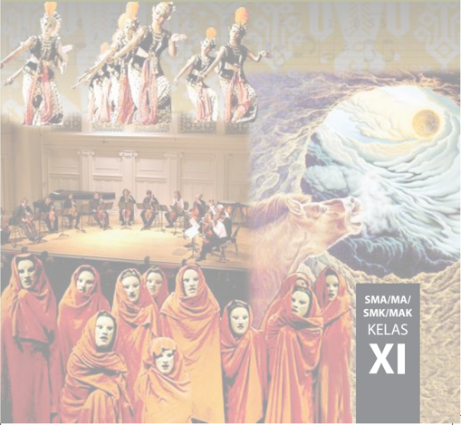

> **Deskripsi Visual:** Gambar ini adalah ilustrasi yang menampilkan tiga bagian berbeda dari sebuah pertunjukan seni. Pada bagian kiri atas, terdapat tiga penari tradisional yang berdiri di atas panggung, mengenakan pakaian tradisional dengan detail yang rumit dan warna-warna cerah. Di tengah, terdapat sekelompok musisi yang sedang bermain alat musik, tampaknya dalam konser atau pertunjukan musik. Di bagian bawah, terdapat beberapa penari wanita yang berdiri dengan rambut tertutup, mengenakan pakaian merah yang seragam, tampaknya dalam pertunjukan teater atau drama. Gambar ini juga menampilkan teks "SMA/MA/ SMK/MAK KELAS XI" di sisi kanan atas, yang mungkin menunjukkan konteks atau informasi tambahan tentang konten atau tujuan dari gambar tersebut.

 

---
## 📄 Halaman 2

### Hak Cipta © 2017 pada Kementerian Pendidikan dan Kebudayaan Dilindungi Undang-Undang

Disklaimer: Buku ini merupakan buku guru yang dipersiapkan Pemerintah dalam rangka implementasi  Kurikulum  2013.  Buku  guru  ini  disusun  dan  ditelaah  oleh  berbagai  pihak di  bawah koordinasi Kementerian Pendidikan dan Kebudayaan, dan dipergunakan dalam tahap  awal  penerapan  Kurikulum  2013.  Buku  ini  merupakan  'dokumen  hidup'  yang senantiasa diperbaiki, diperbaharui, dan dimutakhirkan sesuai dengan dinamika kebutuhan dan perubahan zaman. Masukan dari berbagai kalangan diharapkan dapat meningkatkan kualitas buku ini.

### Katalog Dalam Terbitan (KDT)

Indonesia. Kementerian Pendidikan dan Kebudayaan.

Seni Budaya : buku guru / Kementerian Pendidikan dan Kebudayaan.- Jakarta: Kementerian Pendidikan dan Kebudayaan, 2017.

- vi, 202 hlm. : ilus. ; 25 cm. Untuk SMA/MA/SMK/MAK Kelas XI ISBN 978-602-427-149-7 ( jilid l engkap) ISBN 978-602-427-151-0 ( jilid 2) 1.  Seni Budaya -- Studi dan Pengajaran I. Judul II. Kementerian Pendidikan dan Kebudayaan 707
Penulis

: Sem Cornelyoes Bangun, Siswandi, Tati Narawati, dan Jose Rizal Manua.

Penelaah

: M. Yoesoef, Bintang Hanggoro Putra, Eko Santoso, Nur Sahid,

Rita Milyartini, Dinny Devi Triana, Djohan, Muksin, Widia Pekerti, dan Fortunata Tyasrinestu.

Pereview Guru

: Drs. Yusminarto

Penyelia Penerbitan  : Pusat Kurikulum dan Perbukuan, Balitbang, Kem en dikbud.

Cetakan Ke-1, 2014 ISBN 978-602-282-463-3 (jilid 2) Cetakan Ke-2, 2017 (Edisi Revisi)

Disusun dengan huruf Adobe Caslon Pro, 10 pt

 

---
## 📄 Halaman 3

### Kata Pengantar

Proses globalisasi yang sedang dan sudah berlangsung dewasa ini secara faktual telah menjangkau kawasan budaya di seluruh dunia sebagai satu kesatuan wilayah hunian manusia dengan kriteria dan ukuran yang relatif sama dan satu. Budaya global yang relatif telah menjadi ukuran dan menandai konstelasi dunia dewasa ini, yaitu karakteristik budaya yang berorientasi pada nilai-nilai ilmu pengetahuan, teknologi dan seni  yang bersumber dari pemikiran rasional silogistis Barat. Proses tersebut mengakibatkan terjadinya tarik-menarik  antara  kekuatan  global  di  satu  sisi  dan  pertahanan  lokal  di  sisi  lainnya.  Dalam  hal  ini antara proses globalisasi yang berorientasi dan tunduk pada sistem dan semangat ilmu pengetahuan dan teknologi Barat versus pelokalan yang pada umumnya justru sebaliknya. Batas antara keduanya memang tidak pernah dapat diambil secara tegas hitam-putih. Roberston (1990) menggambarkannya sebagai the global instituationalization of life-world and the localization of globality .

Berbagai upaya kompromistis dilakukan agar masyarakat memiliki kekuatan untuk berada di kedua posisi sekaligus untuk berada pada titik keseimbangan. Berbagai upaya dilakukan untuk membangkitkan dan memberdayakan system indigenous knowledge , indigenous technology , indigenous art , indigenous wisdom ,   dsb yang biasanya kurang atau tidak ilmiah tetapi justru kaya atau kental kandungan nilai etika dan estetika yang berakar pada budaya masyarakat pendukungnya. Pengkajian terhadap pengetahuan lokal secara ilmiah akan memperkaya pengetahuan dengan derajat kandungan nilai-nilai humanitas yang relatif tinggi.

Di tengah pusaran pengaruh hegemoni global tersebut, fenomena di bidang pendidikan yang terjadi juga telah membuat lembaga pendidikan serasa kehilangan ruang gerak. Selain itu, juga membuat semakin menipisnya pemahaman Siswa tentang sejarah lokal serta tradisi budaya di lingkungannya. Padahal, dari perspektif kultural tidak dapat disangkal Indonesia memiliki kekayaan kebudayaan lokal yang luar biasa. Junus Melalatoa (1995) telah mencatat, sekurang-kurangnya 540 suku bangsa di Indonesia yang masingmasing memiliki dan mengembangkan tradisi atau pola kebudayaan lokal yang berbeda. Dalam pola-pola kebudayaan tersebut juga berubah sebagai reaksi terhadap dominannya pengaruh budaya global. Reaksi balik tersebut bukan untuk melawan tetapi mencari titik temu dalam rangka menjaga eksistensi dan identitas kelompok dan kebudayaan lokal mereka. Salah satu upaya untuk menjaga eksistensi dan penguatan budaya, dilaksanakan melalui pendidikan seni yang syarat dengan muatan nilai kearifan lokal dan penguatan karakter bangsa. Sudah tentu sebagai suatu proses pendidikan dilaksanakan secara sistemik yang berlangsung secara bertahap berkesinambungan dalam situasi dan kondisi di lingkungan keluarga, sekolah, dan masyarakat. Oleh sebab itu, tidaklah salah jika pendidikan merupakan salah satu arah dari Millennium Development Goals (MDGs) ( www.unmillenniumproject.org/goals & https://id.wikipedia.org/wiki/Tujuan_Pembangunan ).

Pendidikan sebagai wahana untuk memanusiakan manusia muda pada dasarnya merupakan aktivitas menyiapkan kehidupan, baik perorangan, masyarakat, maupun suatu bangsa menuju kehidupan yang lebih baik. Kehidupan yang lebih baik di era globalisasi dan menyiapkan generasi emas Indonesia di tahun 2040. Pendidikan karakter yang berbasis kearifan lokal sebagai penanaman nilai dan ketahanan budaya bangsa sangat diperlukan. Penanaman nilai di kalangan generasi muda saat ini dipandang penting mengingat tantangan yang dihadapi mereka di masa depan sangat berat. Terutama berkaitan dengan pergeseran nilai yang akan, sedang, dan sudah terjadi baik dalam keluarga maupun masyarakat.

Terkait dengan hal tersebut, kiranya diperlukan materi bahan ajar yang dapat mengakomodasi kebutuhan pendidikan bagi generasi muda yang sedang mengarungi masa globalisasi, agar memiliki pegangan hidup dalam bermasyarakat dan bernegara dalam lingkungan lokal maupun global. Buku ini menawarkan berbagai contoh metode dan pendekatan pendidikan seni (rupa, musik, tari, teater) Indonesia berbasis Kurtilas. Memang belum sempurna, harapan kami semoga  buku ini 'menjadi pelita di tengah gulita'.

Penulis Tati Narawati Sem Cornelyoes Bangun Siswandi Jose Rizal Manua

 

---
## 📄 Halaman 4



### Daftar Isi



 

---
## 📄 Halaman 7

###  Bab 1  Ringkasan Buku Siswa



### A. Pembelajaran Apresiasi dan Kreasi Seni Rupa

Mengingat ruang lingkup seni rupa itu begitu luas, maka bijaksana menetapkan cakupan aktivitas pembelajaran.

- Dalam pembelajaran apresiasi seni keluasan lingkup kompetensi inti dan kompetensi dasar seni rupa itu bisa diberikan, agar wawasan para siswa SMA dapat mewakili pengetahuan umum tentang kesenirupaan.
- Dalam pembelajaran kreasi, perlu dibatasi, namun tetap harus mewakili 2 hal penting, yakni pertama, penciptaan seni murni: dipilih seni lukis atau seni patung; kedua, penciptaan seni terapan: bidang desain: dipilih desain komunikasi visual, dan bidang kriya: dipilih kriya tekstil. Dengan demikian pengalaman belajar siswa berekspresi, bereksperimen, merancang atau berkarya desain, serta berkriya sudah mewakili ketiga substansi kompetensi bidang kesenirupaan.
Pengembangan  perasaan  estetik  atau  perasaan  keindahan  berlangsung  pada  proses pembelajaran apresiasi seni. Sedangkan pengembangan perasaan artistik berlangsung pada proses pembelajaran penciptaan karya seni rupa murni, desain, dan kriya. Aktivitas pembelajaran apresiasi  seni  dan  kreasi  seni  harus  dipisah,  dalam  arti  pembelajarannya  diselenggarakan sendiri-sendiri. Misalnya, pertemuan 1 dan ke-2 adalah pembelajaran apresiasi seni. Pertemuan ke-3  dan  ke-4  adalah  pembelajaran  kreasi  atau  penciptaan  seni  lukis,  desain  komunikasi visual, dan kriya tekstil. Pembagian waktu pembelajaran ini disesuaikan dengan kebutuhan kelas dan kesiapan sarana dan prasarana pembelajaran setiap sekolah.

Satu hal yang sulit bagi guru seni budaya adalah mengenali tingkat kemampuan apresiatif dan kemampuan artistik siswa, tetapi hal ini  sangat  diperlukan,  sebab  tanpa  pengetahuan tersebut sulit bagi guru untuk melihat dan mengetahui adanya perkembangan atau kemajuan yang dicapai oleh siswa.

Mata pelajaran Seni Budaya memiliki fungsi dan tujuan, yaitu:

- sikap  toleransi,  (dilatihkan  dalam  kegiatan  bersama),  penyelenggaraan  pameran,  lomba lukis,  penciptaan  lukisan  dinding,  penyelenggaraan kunjungan museum, karya wisata ke sentra seni dan kerajinan, dan lain sebagainya;
- menciptakan  sikap  demokrasi  yang  beradab,  (sikap  yang  dipraktikkan  dalam  kegiatan diskusi, penulisan dan penilaian kritik seni);
- hidup rukun dalam masyarakat yang majemuk, (perilaku yang dikembangkan di sekolah, yang diharapkan berdampak positif dan ter efleksi dalam kehidupan bermasyarakat);
- mengembangkan kepekaan rasa dan keterampilan (lewat aktivitas apresiasi seni kepekaan rasa keindahan, berpengaruh pula untuk kepekaan rasa non estetik);
- mampu  menerapkan  teknologi  dalam  berkreasi  dan  mempergelarkan  karya  seni. (Mengharuskan adanya keterbukaan  akan  penggunaan  teknologi  baru  dalam  aktivitas seni rupa (murni, desain, dan kriya). Misalnya digital art , computer art , program free hand , photoshop , vector art , video art , internet art , web art ,  museum online ,  dan lain-lain.

 

---
## 📄 Halaman 8

Dalam pembelajaran seni rupa murni, desain, dan kriya di sekolah, para siswa yang memilih bekerja dengan laptop atau ipad saat ini adalah sesuatu yang lumrah. Akan tetapi bagi para siswa yang memilih teknik berkarya secara manual adalah sesuatu yang lumrah juga, sebab yang utama adalah kualitas karya yang dihasilkan bukan teknik apa yang digunakan.

### B. Berapresiasi

Materi pembelajaran apresiasi seni menerapkan pendekatan saintifik. Pembelajaran ini memerlukan objek pengamatan berupa karya seni rupa murni (seni lukis, patung), seni rupa terapan  (desain  komunikasi  visual,  desain  tekstil)  dan  kriya  (kriya  kulit,  kriya  tekstil,  atau karya seni rupa lain sesuai dengan konteks di mana sekolah berada). Itulah sebabnya guru seni  budaya  dan  sekolah  sebaiknya  menyiapkan  karya-karya  asli  (lukisan,  patung,  desain, dan kriya) dari kebudayaan daerah setempat. Jika tidak memungkinkan dapat dalam bentuk reproduksi, video, dan film, paling tidak berupa karya guru seni budaya atau karya siswa yang representatif sebagai objek apresiasi. Terutama untuk aktivitas pembelajaran di kelas. (Aktivitas diskusi di kelas diselenggarakan setelah proses pendekatan saintifik dilakukan dan guru seni budaya bertindak sebagai moderator yang arif).

Proses  pembelajaran  apresiasi  seni  dapat  pula  berlangsung  dalam  kegiatan  kunjungan ke pameran, galeri, museum, sanggar seniman, dan lain-lain. Tagihan pembelajaran adalah penulisan  artikel  apresiasi  seni  untuk  di  presentasikan  di  kelas.  (5  makalah  terbaik  yang dipilih oleh guru).

Pengalaman  personal  mengamati  karya  seni  dapat  dilatih  dengan  mengamati  lukisan yang dipajang di depan kelas. Siswa kemudian menceritakan hasil pengindraannya, respons pribadinya,  reaksinya,  analisisnya,  dan  penafsiran  serta  evaluasinya  terhadap  lukisan  secara lisan. Kemudian, mendiskusikannya di kelas yang dipandu oleh guru yang berperan sebagai moderator. Hasil notulis atau rekaman atas kemampuan berapresiasi seni rupa secara lisan dan hasil diskusi itu disempurnakan oleh siswa dalam bentuk karya tulis dengan bahasa Indonesia yang sistematis, lugas, dan komunikatif.

Guru seni budaya bersama siswa mempersiapkan dan melaksanakan aktivitas mengapresiasi karya seni rupa murni (seni lukis), sehingga para siswa kompeten merasakan keindahan dan makna seni. Kemudian, menerapkan dan mengamalkan rasa keindahan itu dalam kehidupan kesehariannya.

### 1. Persiapan Aktivitas Apresiasi Seni

Tiga lukisan ditentukan sebagai objek pengamatan. Kemudian, dipilih 3 siswa sebagai pelaku apresiasi untuk mengamati langsung lukisan di depan kelas dan menginformasikan hasil pengamatannya secara lisan. Pengamatan ini dicatat oleh 3 siswa sebagai notulen (1 siswa=1 notulen). Notulen bertugas untuk merekam dan mencatat hasil pengamatan yang dilakukan.  Selanjutnya  guru  dengan  ringkas  memberikan  orientasi  fokus  pembelajaran apresiasi seni (deskripsi, analisis, penafsiran dan evaluasi).

### 2. Pelaksanaan Aktivitas Apresiasi Seni Lukis

### a. Mengamati

Siswa pertama maju ke depan kelas melaksanakan pengamatan dan menginformasikan hasil  pengamatannya secara lisan kepada semua siswa dan guru di kelas. Notulen mencatat semua informasi atau merekamnya secara auditif atau audio visual (bila memungkinkan) sebagai data yang akurat.

 

---
## 📄 Halaman 9

### b.  Menanyakan

Siswa kedua maju ke depan kelas dan mengamati lukisan. Kemudian, bertanya: 'Faktor apakah pada lukisan ini yang dapat menimbulkan perasaan menyenangkan (atau sebutkan perasaan lainnya) dalam diri saya. Bagaimana teknik pelukisannya? Apakah yang menjadi sumber inspirasi lukisan ini? Dan apakah makna lukisan ini?'

- Mencoba
Siswa ketiga maju ke depan kelas dan mengamati lukisan. Kemudian, mencoba menjawab pertanyaan: Dengan menunjukkan faktor rupa atau unsur yang menimbulkan perasaan menyenangkan (perasaan lain) itu. Dengan cara menunjukkan bagian-bagian lukisan itu ke semua teman-teman sekelas dan guru Seni Budaya. Berdasarkan hasil pengamatannya terhadap aspek teknik artistik lukisan, siswa menyampaikan asumsi tahapan proses kreasi yang dilakukan pelukis. Bertolak dari gambaran objek-objek dan struktur penataannya dalam bidang lukisan, siswa akan menyampaikan dugaannya tentang sumber inspirasi atau tema lukisan.

- Menalar
Ketiga notulen kemudian membacakan hasil pengamatan, jawaban atas pertanyaan, dan hasil asumsi yang di sampaikan oleh tiga siswa yang mengamati karya seni lukis. Berdasarkan data ini, guru Seni Budaya membuka kegiatan diskusi kelas dan bertindak sebagai moderator. Fokus kajian diskusi adalah menyepakati atau merevisi kebenaran data pengamatan, jawaban pertanyaan yang diajukan, dan asumsi yang telah dikemukakan. Dari data dan bukti-bukti yang telah disepakati itu para siswa diminta mengerjakan karya tulis menganalisis dan merumuskan nilai keindahan dan nilai seni secara mandiri (tugas individual). Berdasarkan data dan bukti-bukti yang ada secara logis, argumentatif, apresiatif, dengan penggunaan bahasa Indonesia yang jelas, logis, dan sistematis. Dari tugas  penulisan  para  siswa,  guru  memilih  5  makalah  terbaik  untuk  dipresentasikan dalam kelas Seni Budaya berikutnya.

### e. Menyajikan

Pada aktivitas ini, guru Seni Budaya memandu kegiatan diskusi secara bergiliran di depan kelas. Pada akhir kegiatan diskusi diharapkan diperoleh kesimpulan yang memuaskan tentang aspek keindahan (estetika), aspek seni (artistik) dan aspek nilai (makna) lukisan.

### C. Berkreasi

Dalam kaitannya dengan pelaksanaan pembelajaran seni rupa, Viktor Lowenfeld dalam bukunya Creative and Mental Growth , menyimpulkan adanya the visual type dan the haptic type dalam karya para siswa. Maka, konsep dan praksis pendidikan formal di sekolah menengah atas berusaha mengembangkan kedua tipe tersebut secara konsekuen.

 

---
## 📄 Halaman 10

### 1.  Pengembangan Tipe Visual

Pengertian lukisan tipe visual adalah titik tolak penghayatan siswa  lebih  banyak  berdasarkan  pengamatan  atas  bentuk  alam sekitar.  Oleh  karena  itu,  faktor  eksternal  relatif  lebih  berperan ketika mereka melukis. Ciri-ciri dan corak lukisan mereka mengarah kepada seni lukis realisme atau naturalisme.

Pelukis tipe virtual memperlihatkan ilusi ruang, menghadirkan perspektif, memperlihatkan plastisitas gerak objek, proporsi visual, dan  penggunaan  warna  sebagai  terjemahan  warna  objek  yang menjadi tema lukisannya.

Pendidik bertugas untuk mengembangkan kemampuan melukis dengan tipe visual ini kepada siswa. Pendidik dapat menerapkan metode pendidikan teori imitative , yaitu penguasaan keterampilan meniru rupa objek lukisan dengan hukum-hukum optik. Jadi, guru Seni Budaya perlu memberikan pengetahuan proporsi, anatomi, perspektif, teori warna, dan permasalahan ketrampilan sebagai bekal yang perlu dipahami siswa dalam proses pembelajaran seni lukis.

### 2.  Pengembangan Tipe Haptic

Pengertian  lukisan  tipe haptic adalah  titik  tolak  penghayatan  siswa  lebih  banyak berdasarkan gagasan pribadinya. Dengan dimikian, faktor internal lebih banyak berperan. Hal ini terbukti dari karakteristik lukisannya yang lebih dominan sebagai ekspresi perasaan subjektif yang mengarah kepada corak nonrealistis.

---
**🖼️ Gambar/Diagram**

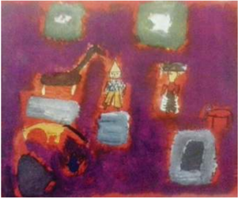

> **Deskripsi Visual:** Gambar ini adalah ilustrasi yang menunjukkan sebuah truk berwarna merah sedang bekerja di sebuah proyek bangunan. Gambar ini menggambarkan proses konstruksi dengan detail yang jelas. Di sebelah kiri, truk bergerak melalui jalan yang dipenuhi batu-batu besar, menunjukkan aktivitas pengangkutan material bangunan. Di sebelah kanan, ada struktur bangunan yang sedang dibangun dengan menggunakan alat berat seperti mesin bor dan alat pemotong kayu. Struktur tersebut tampaknya merupakan bagian dari sebuah gedung tinggi dengan lantai banyak. Ilustrasi ini menunjukkan hubungan antara truk, alat berat, dan struktur bangunan, serta menunjukkan proses konstruksi yang kompleks. Teks, angka, atau label penting tidak terlihat dalam gambar ini. Informasi kunci yang dapat diambil pembaca adalah bahwa truk berperan penting dalam proses konstruksi, dan bahwa struktur bangunan sedang dalam tahap pembangunan.

 

---
## 📄 Halaman 11

Tidak berupaya menghadirkan ilusi ruang secara optis dan tidak perspektivis. Gubahan gerak  dan  proporsi  figur  ekspresif.  Penggunaan  warna  tidak  sebagai  terjemahan  warna objek, melainkan lebih banyak sebagai simbol yang sesuai dengan perasaan subjektifnya. Sama seperti tipe visual, guru Seni Budaya bertugas untuk mengembangkan tipe haptic ini. Termasuk mengembangkan kemampuan melukis siswa yang berada di antara kedua titik  optimal  tipe-tipe  tersebut,  yang  disebut  tipe  campuran.  Jadi,  sebelum  memberikan penilaian karya-karya siswa sebaiknya di klasifikasi terlebih dahulu (kelompok tipe visual dan kelompok tipe haptic ).

Dari  uraian  di  atas  menjadi  jelas  bahwa  penilaian  karya-karya  yang  sifatnya haptic tidak bisa dinilai dengan kriteria visual, melainkan dengan kriteria haptic pula.  Biasanya hal-hal ini jarang dilaksanakan oleh guru-guru seni rupa, sehingga kerap kali siswa yang termasuk tipe haptic dengan  sendirinya  dirugikan,  karena  mendapatkan  penilaian  yang tidak proporsional dari guru seni budaya atau seni rupa.

Jadi, dalam pemberian tugas kepada siswa, guru Seni Budaya memberikan kebebasan mencipta sesuai potensi siswa. Pemberian tema berkarya bisa sama, tetapi gaya berekspresi dibebaskan,  sehingga  setiap  siswa  berkarya  sesuai  dengan  potensi  dan  kesenangannya. Dengan proses belajar seperti ini, akan menghasilkan karya-karya siswa yang beragam, misalnya, naturalis, realis, dekoratif, impresionis, ekspresionis, organik, liris, dan lain-lain. Bila  keberagaman karya siswa telah terealisasi sebagai hasil proses pembelajaran, maka kriteria penilaian harus mengacu pada kriteria penilaian tipe visual dan tipe haptic .

### D.  Gaya Lukisan Siswa

Secara lebih terperinci dan cermat Herbert Read dalam bukunya Education Through Art , mendasarkan klasifikasi empirisnya untuk membedakan gaya lukisan para siswa. Setelah meneliti ribuan gambar dari berbagai tipe sekolah, ia mengklasifikasikan adanya 12 kategori lukisan yang secara singkat akan dijelaskan di bawah ini.

### 1.  Organik

Pelukisan  organik  sangat  visual  dan  menunjukkan  hubungan  dengan  objek-objek eksternal, sebagai hasil pengamatan yang intensif terhadap proporsi alam dalam kesatuannya yang organis. Sehingga lukisannya tampak realistis.

### 2. Liris

Wujud lukisan liris sama realistisnya dengan organik, tetapi lebih menyukai objek-objek lukisan yang statis/diam. Seperti halnya objek alam benda, still life merupakan karakteristik lukisan siswa perempuan.

### 3. Impresionis

Wujud lukisan impresionis lebih banyak sekedar melukiskan hasil penangkapan kesan sesaat  terhadap  situasi  objek  secara  cepat.  Kurang  menunjukkan  perhatian  terhadap penyelesaian bagian-bagian rinci, detail, dan objek.

 

---
## 📄 Halaman 12

### 4.  Ritmis

Wujud lukisan ritmis tidak menampilkan motif-motif bentuk visual. Bentuk-bentuk alam tidak digambarkan secara imitatif, tidak ditiru dengan persis, tetapi dengan distorsi menjadi motif-motif yang diulang-ulangi secara ritmis dengan berbagai variasi, sehingga memenuhi bidang lukisan.

### 5. Strukturalis

Pada kategori ini, nampak kecenderungan siswa untuk mendeformasi objek menjadi bentuk-bentuk geometrik, meskipun tema-temanya masih berorientasi kepada gejala objektif. Stilisasi  sebuah  tema  merupakan  hasil  pengamatan  terhadap  pola-pola  bentuk  sebagai struktur  objek  visual.  Pada  umumnya  siswa  tidak  memanfaatkan  bentuk-bentuk  alami untuk menciptakan pola atau motif lukisannya.

### 6.  Skematik

Kategori skematik menggunakan bentuk-bentuk geometrik, tetapi lepas sama sekali dengan  struktur  organis  objek  alam.  Bentuk-bentuk  bagan  seperti  periode  awal  anak melukis secara konsisten dipergunakan, lebih sebagai desain simbolik daripada penggambaran bagan secara realistik.

### 7. Haptic (ekspresi aspek internal subyektif).

Kategori haptic menunjukkan sikap pelukisan yang tidak mendasarkan pengamatan visual terhadap objek eksternal, melainkan representasi citra nonvisual dari dunia internal seorang siswa.

### 8. Ekspresionis

Pada kategori ini, terdapat kecenderungan untuk mendistorsi bentuk dan warna objek untuk mengungkapkan sensasi internal-subjektif siswa secara spontan.

---
**🖼️ Gambar/Diagram**

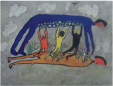

> **Deskripsi Visual:** Gambar ini merupakan ilustrasi yang menunjukkan dua karakter manusia berpose berbeda. Karakter pertama tampak seperti sedang berjalan dengan posisi tubuh yang tegak, sementara karakter kedua tampak seperti sedang berbaring dengan posisi tubuh yang lebih lemah. Kedua karakter tersebut tampak memiliki ekspresi wajah yang berbeda, yang mungkin menunjukkan perbedaan emosi atau situasi mereka. Ilustrasi ini mungkin digunakan untuk menggambarkan konsep tentang perbedaan posisi tubuh dan ekspresi emosional dalam konteks sosial atau psikologis.

 

---
## 📄 Halaman 13

### 9.  Enumeratif

Kategori enumeratif menunjukkan pelukisan objek dengan merekam tiap bagian objek serinci mungkin yang dapat dilihat dan diingat. Kemudian, menempatkannya dalam satu struktur yang kurang organis. Efek lukisannya kurang menunjukkan ciri realisme sesuai dengan pengamatan visual, bersifat linier dan tidak mengesankan plasitisitas bentuk. Kategori ini dapat dikatakan sejenis realismenya gambar arsitektur.

### 10. Dekoratif

Pada  kategori  ini,  siswa  memanfaatkan  sifat-sifat  dua  dimensional,  baik  dalam penampilan tema, bentuk, dan pewarnaan yang bersifat datar, tidak menampilkan ilusi ruang.

### 11. Romantik

Pada kategori ini, siswa mengambil tema-tema kehidupan, tetapi diintensifkan dengan fantasinya sendiri. Kemudian, dipadukan dengan rekonstruksi ingatan dan kenangannya terhadap sesuatu yang berhubungan dengan tema tersebut.

### 12. Naratif

Pada kategori ini,  siswa  menggunakan  tema-tema cerita  atau  dongeng.  Cerita  atau dongeng tersebut diperoleh dari guru maupun yang didapat sendiri dari bacaan-bacaan dan diungkapkan kembali lewat bentuk dan warna.

Meskipun klasifikasi yang dibuat Read ini tidak menyebutkan presentase perbandingan tiap kategori, tetapi dengan ini dapat diketahui bahwa pada dasarnya terdapat beraneka ragam kemungkinan cara siswa berbahasa rupa untuk menyatakan dirinya dalam kegiatan seni lukis.

Potensi  siswa  untuk  menyatakan  dirinya  sesuai  dengan  tipenya  masing-masing,  dalam konsep pendidikan seni rupa mutakhir diusahakan untuk diaktualisasi, antara lain dengan metode pembelajaran pemberian motivasi intrinsik.  Keanekaragaman  kemungkinan  corak dan tipe  pernyataan  seni  lukis  siswa,  sejalan  dengan  keanekaragaman  kemungkinan  corak dan aliran dalam khasanah seni rupa pada umumnya. Terutama yang semakin berkembang dalam era posmodernisme. Terbuka kepada berbagai kemungkinan visi dan corak pernyataan yang lebih kompleks sebagai r efleksi kehidupan masa kini.

Perlu ditambahkan, meskipun keanekaragaman corak pernyataan seni lukis siswa sejalan dengan seni rupa modern, tetapi keduanya memerlukan sikap apresiatif yang berbeda dari para apresian. Karakteristik keunikan lukisan siswa berbeda dengan seni lukis seniman profesional, baik  dari  segi  visi  dan  konsepsi  penciptaan,  maupun  penggunaan  media,  alat,  dan  teknik pelukisannya.

 

---
## 📄 Halaman 14

###  Bab 2  Metode Pembelajaran

### A. Pendekatan Saintifik

Pendekatan Saintifik merupakan teknik pembelajaran untuk merangsang siswa lebih aktif mencari dan meneliti sendiri permasalahan kesenirupaan. Baik ketika berapresiasi, berkreasi, bereksperimen, berdesain, berpameran, maupun aktivitas mengevaluasi karya seni rupa. Ini berarti,  aspek  pengetahuan  dan  keterampilan  siswa  bukan  hasil  mengingat  seperangkat fakta,  akan  tetapi  adalah  hasil  penemuannya  sendiri.  Untuk  itu,  guru  Seni  Budaya  perlu merancang siklus pembelajaran dari mengamati, menanya, mencoba, menalar dan menyajikan hasil belajar saintifik.

Dalam pendekatan saintifik asumsi dibangun berdasarkan data dan fakta. Artinya, setiap kesimpulan akhir yang diperoleh dalam pemecahan suatu masalah, misalnya, menafsirkan makna suatu lukisan, semuanya dapat dipertanggungjawabkan melalui deskripsi dan analisis gejala rupa lukisan itu sendiri.

### B. Model Pembelajaran

Dalam konteks pendidikan seni rupa, metode pembelajaran ini, berarti proses pembelajaran yang memungkinkan siswa menghayati dan akhirnya dapat merasakan serta menerapkan cara memperoleh pengetahuan kesenirupaan. Suatu proses yang memungkinkan tertanamnya sikap ilmiah, sikap ingin tahu dan selanjutnya menimbulkan rasa mampu untuk selalu mencari jawab atas masalah seni rupa yang dihadapi secara ilmiah. Sasaran akhir metode ini ialah, lahirnya satu  generasi  yang  mampu mendukung perkembangan ilmu pengetahuan seni rupa, teknik artistik seni rupa, dan nilai-nilai seni rupa yang berkualitas sejalan dengan perkembangan ilmu pengetahuan, teknologi, dan kebudayaan pada umumnya. Proses pembelajaran ini memerlukan tersedianya sarana dan prasarana yang memadai, pendidik yang profesional, sistem evaluasi yang berkelanjutan, komprehensif, objektif, dan suasana sekolah yang demokratis. Jika hal itu  terpenuhi,  maka  siswa  akan  sampai  pada  tingkat 'kesenangan menemukan' dari proses belajar yang ditempuhnya. Contoh sederhana misalnya: Merumuskan masalah Apresiasi Seni. 'Bagaimanakah proses penemuan makna seni dalam kegiatan apresiasi seni?'  Mengamati lukisan; 'Apa sajakah yang diamati ketika berapresiasi seni lukis?' Menganalisis dan menyajikan hasil apresiasi seni dalam bentuk tulisan, gambar, bagan, tabel dan lain-lain. Menyajikan hasil kegiatan apresiasi seni di kelas (mendiskusikannya dengan teman sekelas yang dipandu oleh guru Seni Budaya).

Discovery Learning adalah metode pembelajaran seni rupa murni, desain dan kriya yang berbasis  penemuan,  yakni  pembelajaran  pengetahuan  baru  yang  dilakukan  dan  ditemukan sendiri  oleh  siswa.  Artinya,  bukan  pengetahuan  teoritik  yang  diberikan  oleh  guru  dalam bentuk final untuk dihafal. Dalam hal ini, siswa atas upaya sendiri menemukan konsep-konsep dan prinsip (misalnya hakikat seni rupa murni, seni lukis, desain, kriya dan lainnya) melalui pengamatan, penggolongan, pendugaan, penjelasan, dan kesimpulannya sendiri.



 

---
## 📄 Halaman 15

### C.  Model Berbasis Proyek

Pembelajaran  berbasis  proyek  dirancang  untuk  mengumpulkan  dan  mengintegrasikan pengetahuan baru kesenirupaan berdasarkan pengalaman siswa mengunjungi pameran seni rupa,  museum seni rupa, sanggar seni rupa, asosiasi  seni  rupa,  dan  lain-lain.  Dengan  cara kerja kolaboratif antar siswa dengan siswa, atau antar siswa dengan guru, antar siswa dengan perupa yang berpameran, dengan seksi edukasi museum, tokoh perupa, pendesain, pengkriya, dan lain sebagainya. Dalam pembelajaran proyek yang mementingkan kerjasama ini, harus ada permasalahan kesenirupaan sebagai tantangan untuk diinvestigasi. Siswa mendesain proses pemecahan masalah itu sebagai solusi yang disepakati bersama oleh siswa dan guru Seni Budaya.

### D.  Bahasa Sebagai Penghela

Guru Seni Budaya atau Seni Rupa, di samping tugas utamanya melaksanakan pembelajaran kesenirupaan,  juga  menjadi  pelaksana  pembelajaran  bahasa  Indonesia.  Artinya,  ketika melaksanakan proses pembelajaran guru menjadi pengarah penggunaan bahasa Indonesia yang baik dan benar, misalnya dalam kegiatan diskusi, diharapkan para siswa mampu menggunakan bahasa formal dalam konteks berdiskusi. Termasuk tata krama berbahasa dan etiket berdiskusi yang baik. Dalam konteks ini, guru seni budaya bertindak sebagai moderator (yang arif) dan sekaligus menjadi 'teladan' penggunaan bahasa Indonesia yang jelas, logis, dan sistematis.

 

---
## 📄 Halaman 16

###  Bab 3  Metode Penilaian

### A. Penilaian Au tentik

Penilaian Au tentik  dilakukan  oleh  guru  secara  berkelanjutan.  Penilaian  terhadap  kom -petensi sikap  dilakukan  dengan  cara  observasi,  penilaian  diri,  penilaian  sejawat  oleh  siswa. Penilaian ini dapat berupa daftar cek atau skala penilaian ( rating scale ), yang disertai rubrik. Sedangkan penilaian  dengan  jurnal,  merupakan  catatan  guru  di  dalam  dan  di  luar  kelas yang  bersisi  informasi  tentang  kekuatan  dan  kelemahan  siswa  dalam  hal  sikap.  Lembar observasi  dapat  disusun  oleh  guru  dengan  mengacu  kepada  kompetensi  dasar  dan  aspek materi  pembelajaran  seni.  Dalam  pembelajaran  seni  rupa  penilaian  dilakukan  pada  sikap apresiatif, sikap kreatif, sikap kolaboratif, sikap mandiri, dan sikap bertanggung jawab.

### B. Tingkat Berpikir

Penilaian kompetensi pengetahuan dilakukan melalui tes tulis (uraian), tes lisan (daftar pertanyaan),  dan  penugasan  (pekerjaan  rumah,  menulis  artikel  apresiasi  seni).  Penilaian kompetensi pengetahuan diperlukan untuk meningkatkan kemampuan berpikir kritis, analitis, dan kreatif, serta kemampuan metakognitif.

### C.  Unjuk Kerja

Unjuk kerja adalah penilaian kompetensi keterampilan melalui kinerja siswa. Siswa diminta mendemonstrasikan suatu kompetensi dalam kegiatan tes praktik, proyek, maupun penilaian portofolio.  Keterampilan  menulis  konsep  penciptaan  seni  (abstrak)  dinilai  berdasarkan kompetensi  yang  harus  dikuasai.  Keterampilan  berkarya  seni  rupa  dinilai  berdasarkan kompetensi ( skill ) kecepatan, ketepatan dan teknik artistik merealisasi konsep seni menjadi karya seni (konkret).

### D.  Portofolio

Portofolio adalah penilaian kumpulan karya siswa dalam bidang apresiasi seni rupa murni, desain,  dan  kriya  yang  bersifat  r eflektif  dan  integratif  untuk  mengetahui  kecenderungan karya, perkembangan, prestasi, atau kreativitas siswa. Penilaian portofolio dengan sendirinya membuat karya siswa  terdokumentasi  dengan  baik  dan  sangat  berguna  bagi  siswa  untuk menilai kemampuan diri sendiri.



 

---
## 📄 Halaman 17

---
**📊 Tabel**

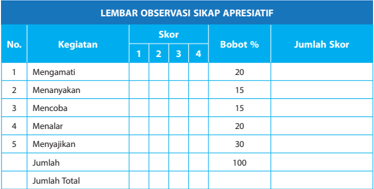

Tabel ini merupakan lembar observasi sikap apresiatif yang digunakan untuk menilai tingkat partisipasi siswa dalam berbagai kegiatan. Topik utamanya adalah sikap apresiatif siswa dalam berbagai aktivitas. Tabel ini terdiri dari kolom No., Kegiatan, Skor, Bobot %, dan Jumlah Skor. Data penting yang terlihat adalah bahwa siswa diberikan skor 1 hingga 4 untuk setiap kegiatan, dengan bobot % yang berbeda-beda untuk setiap kegiatan. Misalnya, kegiatan "Mengamati" mendapat bobot 20%, sedangkan kegiatan "Menyajikan" mendapat bobot 30%. Jumlah skor untuk setiap kegiatan ditambahkan untuk mencapai total skor yang akan dihitung untuk menentukan kualifikasi siswa dalam sikap apresiatif.

---
**📊 Tabel**

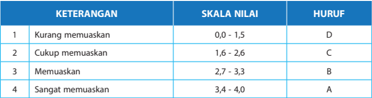

Tabel ini menunjukkan kriteria penilaian untuk sebuah evaluasi, dengan skala nilai 0 hingga 4 dan huruf penilaian D hingga A. Topik utama tabel adalah penilaian keterampilan atau kualitas sesuatu berdasarkan tingkat memuasakan. Kolom-kolomnya meliputi KETERANGAN (deskripsi tingkat memuasakan), SKALA NILAI (skala angka yang digunakan untuk menentukan tingkat memuasakan), dan HURUF (penilaian huruf yang sesuai dengan skala nilai). Data penting yang terlihat adalah bahwa skala nilai 0 hingga 1,5 diberikan skor D, 1,6 hingga 2,6 C, 2,7 hingga 3,3 B, dan 3,4 hingga 4,0 A. Ini menunjukkan bahwa skor yang lebih tinggi dianggap sebagai penilaian yang lebih baik atau memuaskan.

---
**📊 Tabel**

Tabel ini menunjukkan pencapaian kompetensi siswa dalam sebuah kelas, dengan kolom "Nama", "Kelas", dan "Pengamat". Data dalam tabel tersebut mencakup nama-nama siswa, kelas mereka, dan pengamat yang bertanggung jawab atas pencapaian kompetensi mereka. Topik utama tabel ini adalah pencapaian kompetensi siswa dalam kelas tertentu, dengan fokus pada identifikasi nama-nama siswa, kelas mereka, dan pengamat yang bertanggung jawab atas pencapaian mereka. Pola penting yang terlihat adalah bahwa tabel ini menyediakan informasi tentang pencapaian kompetensi siswa secara umum, namun tidak memberikan detail spesifik tentang pencapaian kompetensi masing-masing siswa.

 

---
## 📄 Halaman 18

---
**📊 Tabel**

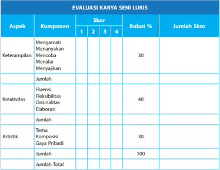

Tabel ini menunjukkan evaluasi karya seni lukis dengan tiga aspek utama: keterampilan, kreativitas, dan artistik. Setiap aspek dibagi menjadi komponen dengan skor yang ditentukan berdasarkan bobot persentase. Keterampilan mencakup empat komponen: mengamati, menanyakan, mencoba, dan menalar, dengan bobot 30%. Kreativitas juga memiliki empat komponen: fluensi, fleksibilitas, originalitas, dan elaborasi, dengan bobot 40%. Artistik meliputi dua komponen: tema dan gaya pribadi, dengan bobot 30%. Jumlah skor untuk setiap aspek ditambahkan untuk mencapai total 100%. Pola penting yang terlihat adalah bahwa kreativitas memiliki bobot tertinggi (40%), kemudian keterampilan (30%) dan artistik (30%).

---
**📊 Tabel**

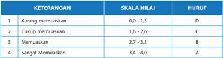

Tabel ini menunjukkan skala penilaian untuk keterampilan berkomunikasi, dengan skala nilai antara 0,0 hingga 4,0 dan huruf penilaian A sampai D. Topik utama tabel adalah kualitas komunikasi. Kolom-kolomnya meliputi keterangan (misalnya "Kurang memuaskan"), skala nilai, dan huruf penilaian. Data penting yang terlihat adalah bahwa skala nilai 0,0 hingga 1,5 diberi nilai D, 1,6 hingga 2,6 C, 2,7 hingga 3,3 B, dan 3,4 hingga 4,0 A. Ini menunjukkan bahwa skala penilaian ini bertujuan untuk memberikan penilaian yang lebih detail dan akurat terhadap kualitas komunikasi.

---
**📊 Tabel**

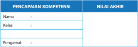

Tabel ini menunjukkan pencapaian kompetensi siswa dalam sebuah mata pelajaran. Kolom "Nama" menyediakan ruang untuk menuliskan nama siswa, kolom "Kelas" untuk menuliskan nomor kelas mereka, dan kolom "Pengamat" untuk menuliskan nama orang yang bertanggung jawab atas evaluasi mereka. Data penting yang terlihat adalah bahwa tabel ini dirancang untuk memantau perkembangan kompetensi siswa secara individu, dengan memberikan ruang untuk mengevaluasi pencapaian mereka berdasarkan kriteria tertentu.

 

---
## 📄 Halaman 19

###  Bab 4  Memahami Konsep Musik Barat

### KOMPETENSI INTI

KI 1 : Menghayati dan mengamalkan ajaran agama yang dianutnya.

- KI 2 : Menghayati dan mengamalkan perilaku jujur, disiplin, tanggungjawab, peduli (gotong royong, kerjasama, toleran, damai), santun, responsif dan pro-aktif dan menunjukkan sikap sebagai bagian dari solusi atas berbagai permasalahan dalam berinteraksi secara efektif dengan lingkungan sosial dan alam serta dalam menempatkan diri sebagai cerminan bangsa dalam pergaulan dunia.
- KI 3 : Memahami, menerapkan, dan menganalisis pengetahuan faktual, konseptual, prosedural, dan metakognitif berdasarkan rasa ingin tahunya tentang ilmu pengetahuan, teknologi, seni, budaya, dan humaniora dengan wawasan kemanusiaan, kebangsaan, kenegaraan, dan peradaban terkait penyebab fenomena dan kejadian, serta menerapkan pengetahuan prosedural pada bidang kajian yang spesifik sesuai dengan bakat dan minatnya untuk memecahkan masalah.
- KI 4 : Mengolah, menalar, dan menyaji dalam ranah konkret dan ranah abstrak terkait dengan pengembangan dari yang dipelajarinya di sekolah secara mandiri, bertindak secara efektif dan kreatif, serta mampu menggunakan metoda sesuai kaidah keilmuan.

### KOMPETENSI DASAR

- 1.1. Menunjukkan sikap penghayatan dan pengamalan serta bangga terhadap karya seni musik sebagai bentuk rasa syukur terhadap anugerah Tuhan.
- 2.1. Menghayati dan mengamalkan perilaku jujur, disiplin, tanggung jawab, peduli, kerjasama, santun, dan menunjukkan sikap sebagai bagian dari solusi atas berbagai permasalahan dalam berinteraksi secara efektif dengan lingkungan sosial, dan alam melalui apresiasi dan kreasi seni sebagai cerminan bangsa dalam pergaulan dunia.
- 3.1. Memahami konsep musik Barat.
- 3.2. Menganalisis musik Barat.
- 3.3. Menganalisis hasil pertunjukan musik Barat.
- 3.4. Memahami perkembangan musik Barat.
- 4.1. Memainkan alat musik Barat.
- 4.2. Mempresentasikan hasil analisis musik Barat.
- 4.3. Membuat tulisan tentang musik Barat.
- 4.4. Menampilkan beberapa lagu dan pertunjukan musik Barat.


 

---
## 📄 Halaman 20

### INFORMASI GURU

Alur materi pembelajaran pada bahasan Bab 4 dipetakan sebagai berikut:

### A.  Konsep Musik Barat

---
**🖼️ Gambar/Diagram**

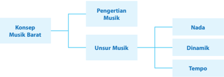

> **Deskripsi Visual:** Gambar ini adalah diagram yang menunjukkan struktur konsep tentang Musik Barat. Diagram ini dibagi menjadi dua bagian utama: "Konsep Musik Barat" dan "Pengertian Musik". Untuk "Konsep Musik Barat", ada dua cabang utama: "Nada" dan "Dinamik". Untuk "Pengertian Musik", ada tiga cabang utama: "Unsur Musik", "Tempo", dan "Teks". Jadi, secara keseluruhan, gambar ini menggambarkan struktur dan komponen-komponen utama dari Musik Barat.

### TUJUAN PEMBELAJARAN

Setelah mempelajari Bab 4 tentang Konsep Musik Barat, diharapkan siswa mampu:

- menjelaskan konsep musik barat,
- menjelaskan definisi musik dalam konsep musik barat,
- menidentifikasi unsur-unsur musik dalam konsep musik barat, dan
- menjelaskan pengertian nada, dinamik, dan tempo dalam konsep musik barat.

### MODEL PEMBELAJARAN

Diharapkan  pembelajaran  Bab  4  ini  dilaksanakan  menggunakan  pendekatan  saintifik dengan model pembelajaran inkuiri atau discovery learning .  Harapannya, setelah mengikuti pembelajaran ini siswa tidak hanya mendapatkan pengetahuan tentang konsep musik barat, tetapi  sekaligus  memperoleh nuture  efect (dampak  ikutan)  berupa  kebiasaan  mencari  dan menemukan pengetahuan mengenai konsep musik barat secara mandiri dari berbagai sumber sehingga terbentuk karakter yang diharapkan, yaitu:

- rasa ingin tahu, melalui penugasan pencarian informasi tentang konsep musik barat dari berbagai sumber (termasuk internet),
- tekun dan pantang menyerah, melalui penugasan untuk menemukan bermacam-macam pandangan para ahli tentang konsep musik barat,
- menghargai pendapat orang lain, dan
- jujur dan disiplin

### MOTIVASI

Pendidikan seni musik dapat memberikan peranan yang signifikan terhadap pelaksanaan pendidikan.  Peran  ini  mengacu  pada  lima  dimensi  yang  dikemukakakan  oleh  James  A. Banks,  yakni;  (1) content  integration ;  (2) the  knowledge  construction  process ;  (3) prejudice reduction ;  (4) an equity pedagogy ;  and  (5) an empowering school culture and social structure yang dikaitkan dengan lima unsur utama konten pendidikan seni musik yang teritegrasi dengan pendidikan multikultural, yakni; (1) ekspresi ;  (2) apresiasi ;  (3)  kreasi;  (4) harmoni ; dan (5) estetika pada  proses  pembelajaran  di  persekolahan.  Secara  konseptual  sama-sama

 

---
## 📄 Halaman 21

memiliki tujuan untuk membantu pendidik dalam pengembangan identitas etnik, hubungan interpersonal,  pemberdayaan  diri.  Ketiga  dimensi  ini  harus  dioperasionalisasikan  sebagai dukungan terhadap lima dimensi pendidikan multikultural untuk mengembangkan sosial dan kognitif siswa (Zamroni, 2001a:77).

### SUMBER UNTUK GURU

Maslow  (1945)  dalam  Suriasumantri  (1984)  mengidentifikasikan  lima  kelompok dalam kebutuhan manusia yakni: 'kebutuhan fisiologis, rasa aman, afiliasi,  harga  diri,  dan pengembangan potensi'. Manusia tidak mempunyai kemampuan bertindak secara otomatis yang berdasarkan insting, sehingga harus selalu menengok pada konsep yang mengajarkan cara hidup.

Manusia dibekali kemampuan untuk belajar, berkomunikasi, dan menguasai objek-objek yang bersifat fisik. Kemampuan ini dimungkinkan oleh berkembangnya intelegensi dan cara berpikir  simbolik.  Manusia  juga  dibekali  akal  budi  yang  merupakan  pola  kejiwaan  yang di  dalamnya  terkandung 'dorongan-dorongan hidup yang dasar, insting, perasaan,  dengan pikiran, kemampuan dan fantasi' (Alisjahbana, 1975 dalam Budiwati, 2003). Aspek budi inilah yang menyebabkan manusia mengembangkan suatu hubungan yang bermakna dengan alam sekitarnya, dengan jalan memberi penilaian terhadap objek dan kejadian.

Konsep sistem budaya ( cultural  system )  yang  berlaku  di  Indonesia,  berlaku  unsur-unsur dan komponen-komponen sistemik, yang meliputi pengetahuan, nilai, dan keyakinan. Unsur nilai  budaya  merupakan  konsepsi  abstrak  yang  dipandang  baik  dan  bernilai  serta  sebagai acuan berperilaku dalam menghadapi tantangan dalam kehidupan masyarakat. Secara universal unsur-unsur nilai seni budaya ini diungkapkan oleh Koentjaraningrat yang terdiri dari: religi, sosial, bahasa, pendidikan, politik, kesenian, dan ekonomi.

Menurut J.J. Hoenigman, wujud kebudayaan dibedakan menjadi tiga: gagasan, aktivitas, dan artefak.

### 1. Gagasan (Wujud ideal)

Wujud ideal kebudayaan adalah kebudayaan yang berbentuk kumpulan ide-ide, gagasan, nilai-nilai,  norma-norma,  peraturan,  dan  sebagainya  yang  sifatnya  abstrak;  tidak  dapat diraba atau disentuh. Wujud kebudayaan ini terletak dalam kepala-kepala atau di alam pemikiran warga masyarakat. Jika masyarakat tersebut menyatakan gagasan mereka itu dalam bentuk tulisan, lokasi dari kebudayaan ideal itu berada dalam karangan dan bukubuku hasil karya para penulis warga masyarakat tersebut.

### 2. Aktivitas (tindakan)

Aktivitas adalah wujud kebudayaan sebagai suatu tindakan berpola dari manusia dalam masyarakat  itu.  Wujud  ini  sering  pula  disebut  dengan  sistem  sosial.  Sistem  sosial  ini terdiri atas aktivitas-aktivitas manusia yang saling berinteraksi, mengadakan kontak, serta bergaul dengan manusia lainnya menurut pola-pola tertentu yang berdasarkan adat tata kelakuan. Sifatnya konkret, terjadi dalam kehidupan sehari-hari, dan dapat diamati, dan didokumentasikan.

### 3. Artefak (karya)

Artefak adalah wujud kebudayaan fisik yang berupa hasil dari aktivitas, perbuatan, dan karya semua manusia dalam masyarakat berupa benda-benda atau hal-hal yang dapat diraba,

 

---
## 📄 Halaman 22

dilihat, dan didokumentasikan. Sifatnya paling konkret di antara ketiga wujud kebudayaan. Dalam kenyataan kehidupan bermasyarakat, antara wujud kebudayaan yang satu tidak bisa  dipisahkan  dari  wujud  kebudayaan  yang  lain.  Sebagai  contoh:  wujud  kebudayaan ideal mengatur, dan memberi arah pada tindakan (aktivitas) dan karya (artefak) manusia.

Dalam pendangan ini, seni musik lebih cenderung merupakan karya budaya dalam wujud gagasan dan aktivitas. Sedangkan menurut Koentjaraningrat, wujud kebudayaan dibagi menjadi nilai budaya, sistem budaya, sistem sosial, dan kebudayaan fisik.

### 1. Nilai-nilai Budaya

Istilah  ini  merujuk  pada  penyebutan  unsur-unsur  kebudayaan  yang  merupakan  pusat dari  semua  unsur  yang  lain.  Nilai-nilai  kebudayaan  yaitu  gagasan-gagasan  yang  telah dipelajari oleh warga sejak usia dini, sehingga sukar diubah. Gagasan inilah yang kemudian menghasilkan berbagai benda yang diciptakan oleh manusia berdasarkan nilai-nilai, pikiran, dan tingkahlakunya.

### 2.  Sistem Budaya

Dalam wujud ini, kebudayaan bersifat abstrak sehingga hanya dapat diketahui dan dipahami. kebudayaan dalam wujud ini juga berpola dan berdasarkan sistem-sistem tertentu.

### 3. Sistem Sosial

Sistem sosial merupakan pola-pola tingkah laku manusia yang menggambarkan wujud tingkah laku manusia yang dilakukan berdasarkan sistem. Kebudayaan dalam wujud ini bersifat konkret sehingga dapat diabadikan.

### 4.  Kebudayaan Fisik

Kebudayaan fisik ini merupakan wujud terbesar dan juga bersifat konkret. Misalnya bangunan megah seperti candi Borobudur, benda-benda bergerak seperti kapal tangki, komputer, piring, gelas, kancing baju, dan lain-lain.

Seni diciptakan manusia dengan berbagai cara. Ada yang benar-benar tercipta, disentuh, atau dimodifikasi. Oleh manusia karya itu diberinya bentuk baru, maka akan mengandung makna yang bernilai. Oleh sebab itu, setiap karya seni budaya akan memiliki nilai dan fungsi tertentu sesuai dengan tujuannya, menunjukkan maksud dan mengandung gagasan atau ide dari penciptanya.

Karya seni budaya itu dapat dinikmati melalui bentuknya. Ada yang berbentuk rupa yang dapat dilihat dan diraba, ada yang berbentuk gerak, dan ada yang berbentu bunyi atau suara. Secara universal kesenian merupakan salah satu unsur kebudayaan yang bermuatan sistem budaya, yang tidak pernah terlepas dari peran masyarakat dalam berkarya seni. Artinya kesenian dan masyarakat merupakan dua komponen yang menyatu dan tidak dapat dipisahkan. Di mana masyarakat adalah sebuah komponen yang menentukan tata kehidupan, maju mundurnya suatu sistem budaya.

The  Liang  Gie  (1983)  juga  berpendapat  bahwa  hubungan  antara  karya  seni  dengan keindahan bukanlah suatu kemestian. Pandangan terakhir dapat dibuktikan, misalnya di zaman dahulu karya seni sebagai wujud kreativitas tidak selalu bertumpu pada unsur keindahannya belaka, tetapi lebih menitikberatkan pada hal-hal kepentingan manusia dalam bentuk kegiatan upacara-upacara tertentu. Hal ini dapat dilihat dalam upacara adat yang merupakan wujud kreativitas dari musik fungsional.

 

---
## 📄 Halaman 23

English (1958) dalam Suriasumantri (1984) mendefinisikan bahwa kreativitas dapat diartikan sebagai kemampuan untuk mencari pemecahan baru terhadap suatu masalah. Kegiatan kreatif berarti melakukan sesuatu yang lain, suatu pola yang bersifat alternatif, bagi kelaziman yang bersifat baku. Kreativitas sering dihubungkan dengan kreasi seni, yakni sebagai kemampuan untuk menciptakan modus baru dalam ekspresi artistik. Kreativitas seni muncul karena manusia telah menggunakan simbol-simbol dalam penghidupannya, dan kreativitas pun dimiliki oleh semua orang, dengan kadar masing-masing berbeda.

Manusia selalu mendambakan kesempurnaan. Ukuran kesempurnaan itu sesuai dengan tingkat kebudayaan yang dicapainya. Menurut pendapat para ahli filsafat terdapat tiga tingkat kesempurnaan yaitu:

- Kebenaran, yang merupakan kesempurnaan yang dapat kita tangkap dengan rasio;
- Kebaikan, yang merupakan kesempurnaan yang dapat kita tangkap dengan moral;
- Keindahan, yang merupakan kesempurnaan yang dapat kita tangkap dengan indera.
Kebenaran  dicari  manusia  melalui  sains  atau  ilmu  pengetahuan.  Kebaikan  dipelajari melalu etika. Adapun keindahan dipelajari dan dipahami melalui dasar-dasar estetika. Estetika berhubungan dengan seni dan kesenian. Wujudnya di antaranya musik, cerita, dongeng, hikayat, drama, dan tari-tarian, yang berlaku, dan berkembang dalam masyarakat.

Nilai estetika tiap orang atau kelompok dipengaruhi oleh tingkat budaya masyarakat. di Indonesia setiap masyarakatnya memiliki nilai estetika sendiri. Nilai estetika ini perlu dipahami dalam segala peran. Sebuah karya seni budaya itu dapat terlihat melalui suatu bentuk kesenian, salah satu wujudnya adalah seni musik.

Dalam kehidupan sehari-hari manusia tidak akan lepas dari musik, karena substansi dari musik itu sendiri adalah bunyi atau suara, baik yang beraturan maupun tidak beraturan. Musik dapat diwujudkan dalam nada-nada atau bunyi lainnya yang dimainkan melalui media alat yang memakai unsur ritme melodi dan harmoni.

### KONSEP SENI MUSIK BARAT

The Concise Oxford Dictionar y mendefinisikan musik sebagai 'seni yang menggabungkan suara vokal atau instrumental (atau keduanya) untuk menghasilkan keindahan bentuk, harmoni, dan ekspresi emosi' (Concise Oxford Dictionary 1992).

Mendefinisikan  musik  ternyata  lebih  rumit  oleh  konsepsi  musik  yang  berbeda  dalam budaya yang berbeda. Karena berbeda konsep dasar musik, bahasa dari banyak budaya tidak mengandung kata yang dapat secara akurat diterjemahkan sebagai 'musik' sebagaimana kata yang  umumnya  dipahami  oleh  budaya  Barat  (Nett,  2005).  Inuit  dan  kebanyakan  bahasa Indian  Amerika  Utara  tidak  memiliki  istilah  umum  untuk  musik.  Di  antara  suku  Aztec, teori  Meksiko kuno yaitu retorika, puisi, tari, dan musik instrumental menggunakan istilah Nahuat. Dalam xochit-in kwikat untuk merujuk campuran kompleks musik dan elemen verbal dan non-verbal puitis lainnya, dan cadangan kata Kwikakayot (atau cuicacayot) hanya untuk ekspresi yang dinyanyikan (Leon-Portilla 2007, 11). Di Afrika tidak ada istilah untuk musik di Tiv, Yoruba,  Igbo,  Efik,  Birom,  Hausa,  Idoma,  Eggon,  atau  Jarawa.  Banyak  bahasa  lain memiliki hal yang hanya sebagian dari apa yang dalam budaya Barat biasanya berarti musik (Schafer  1996).  Mapuche dari Argentina tidak memiliki kata untuk musik, tetapi mereka memiliki kata-kata untuk berperan dibandingkan bentuk improvisasi (kantun), musik Eropa dan non-Mapuche (kantun winka), lagu-lagu upacara (Öl), dan tayil (Robertson, 1976:39). Akan tetapi di Persia terdapat kata musiqi yang berarti ilmu dan seni musik.

 

---
## 📄 Halaman 24

Definisi  musik  yang  sering  dikutip  adalah  'suara  terorganisir'.  Istilah  yang  awalnya diciptakan  oleh  komposer  modernis  Edgard Varese  (Goldman,  1961:133)  mengacu  pada estetika musik sendiri. Konsep Varese tentang musik sebagai 'suara terorganisir' cocok dengan visinya  tentang  'suara  sebagai  materi  hidup'  dan  'ruang  musik  sebagai  terbuka'  (Chou, 1966a:1-4). Dia dikandung unsur musiknya dalam hal 'suara - massa', menyamakan organisasi mereka untuk fenomena kristalisasi alam (Chou, 1966b:157). Varese berpikir bahwa untuk suara keras di telinga, juga merupakan sesuatu yang baru dalam musik yang selalu disebut kebisingan. Untuk hal ini ia mengajukan pertanyaan, 'apa musik atau suara terorganisir?' (Varese dan Chou, 1966:18).

Encyclopædia Britannica menyatakan bahwa 'tidak ada suara yang secara inheren dapat digambarkan sebagai unmusical '. Musisi di setiap budaya akan mengakui cenderung membatasi jangkauan atas definisi seni suara mereka. 'Unsur pengorganisasian manusia sering dirasakan implisit dalam musik. Suara yang dihasilkan oleh non-manusia, seperti air terjun atau burung, yang sering digambarkan sebagai musik, tetapi mungkin kurang tepat dianggap sebagai musik. Namun, dalam pandangan semiologis Jean-Jacques Nattiez, seperti apa pun, kebisingan yang dianggap mengganggu, tidak menyenangkan, atau keduanya, tetap saja orang memilih untuk mengakui bahwa suara seperti itu tergolong musik (Nattiez 1990:47-48).

Thomas Clifto n  mendefinisikan musik sebagai pengaturan suara dan keheningan yang maknanya adalah presentative bukan denotatif. Definisi ini membedakan musik, sebagai tujuan itu sendiri, dari teknik komposisi, dan dari suara sebagai objek murni fisik. Lebih tepatnya, musik adalah aktualisasi kemungkinan suara apa pun untuk menyajikan beberapa gagasan manusia menjadi makna. Dengan kata lain, musik diciptakan  untuk  menyatakan  gagasan dengan pikiran, perasaan, akal sehat, dan kehendaknya (Clifton 1983:1).

Skema berikut menggambarkan proses musik tercipta dan ternikmati.

Perbedaan suara musik dan nonmusik

---
**📊 Tabel**

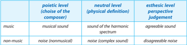

Tabel ini membandingkan tiga tingkat penilaian: poietis (pilihan komposer), neutral (fisika), dan estetik (perspektif kritik). Topik utamanya adalah perbandingan antara musik dan suara non-musik dalam berbagai tingkat penilaian. Dalam kolom "poietis", kita melihat pilihan komposer untuk musik dan noise (nonmusik). Untuk kolom "neutral", tabel menunjukkan bahwa musik memiliki suara harmonis, sementara noise memiliki spektrum suara kompleks. Kolom "esthetik" menunjukkan bahwa musik dianggap suara yang menyenangkan, sedangkan noise dianggap suara yang tidak menyenangkan. Pola penting yang terlihat adalah bagaimana penilaian musik dan noise berbeda dalam setiap tingkat penilaian.

### KONSEP MUSIK MODAL, TONAL, DAN A-TONAL

Dalam konsep musik barat yang menggunakan sistem nada diatonik dalam komposisinya dikenal konsep modal, tonal, dan a-tonal. Dieter Mack dalam bukunya Teori Dasar Musik Barat dan Harmoni Tonal Dasar (1994) menyatakan bahwa:

- Sistem Modal berawal dari tradisi musik monofonik (jenis musik yang terdiri atas satu suara saja dan dibawakan tanpa iringan) yang memandang nada itu berdiri sendiri. Sistem modal adalah sistem musik yang memandang bunyi secara tunggal atau secara

 

---
## 📄 Halaman 25

- vertikal saja. Modal berarti sistem nada musik berasal dari satu jajaran nada dengan jarak  interval  tertentu  dan  tidak  memiliki  hubungan khusus antara masing-masing not tangga nada tersebut kecuali nada dasar yang menjadi pusat.
- Sistem tonal merupakan sistem musik yang memandang bunyi atau nada sekaligus dalam  hubungan  vertikal  dan  horizontal  dengan  nada  lainnya.  Sistem  tonal memandang tiap nada dalam harmoni memiliki relasi harmonik tertentu. Setiap nada memiliki kerangka relasi harmonik, baik dalam tangga nada mayor, minor, maupun gabungan keduanya. Dalam musik tonal, hanya tentang melodi apa pun diperbolehkan, asalkan cocok menjadi harmoni karena mereka berjalan menjauh dari  dan  kemudian kembali ke home base mereka.  Kebanyakan musik tonal Barat didasarkan pada skala besar dan kecil, yang keduanya dengan mudah memberikan perasaan kuat tonal.
- Atonal  sendiri  adalah  jenis  musik  tanpa  nada  dan  disonansi.  Sebenarnya,  jika menganggap atonal bukan bagian dari musik agak kurang tepat. Sebab musik tanpa nada sebenarnya sudah familiar digunakan terutama dalam sejarah musik dan dipahami sebagai sebuah gerakan yang berbeda dimulai sekitar awal abad 20. Atonal sendiri saat itu muncul karena adanya keakraban manusia terhadap nada namun tanpa dibumbui dengan perasaan. Atonal mengajarkan kita untuk membuat musik berbumbu. Atonal juga ditengarai sebagai awal munculnya musik klasik yang sudah terlihat geliatnya sejak abad 20. Saat itu musik-musik tanpa nada banyak digunakan untuk acara peribadatan diberbagai gereja. Musik tanpa nada menjadi fenomena besar selama awal abad 20 karena dipandang sebagai musik alternatif yang lebih harmonis.

### METODE PEMBELAJARAN SENI MUSIK

### 1.  Metode Dalcroze

Metode Dalcroze dikembangkan pada awal abad ke-20 oleh musisi Swiss dan pendidik Émile Jaques-Dalcroze. Metode ini dibagi menjadi tiga konsep dasar-penggunaan solf ège , improvisasi,  dan eurhythmics .  Kadang-kadang disebut sebagai 'senam ritmik', eurhythmics mengajarkan  konsep  ritme,  struktur,  dan  ekspresi  musik  menggunakan  gerakan.  Konsep Dalcroze inilah yang paling dikenal. Ini berfokus pada metode yang memungkinkan siswa untuk mendapatkan kesadaran fisik dan pengalaman musik melalui pelatihan yang melibatkan semua indera, terutama kinestetik. Menurut metode Dalcroze, musik adalah bahasa mendasar dari otak manusia dan karena itu sangat terhubung ke siapa kita. Pendukung Amerika dari metode Dalcroze termasuk Ruth Alperson, Ann Farber, Herb Henke, Virginia Mead, Lisa Parker, Martha Sanchez, dan Julia Schnebly- Black. Banyak guru yang aktif metode Dalcroze dilatih oleh Dr Hilda Schuster yang merupakan salah satu mahasiswa Dalcroze .

### 2.  Metode Zoltán Kodály

Zoltán Kodály (1882-1967) adalah seorang pendidik musik Hungaria terkemuka dan komposer yang menekankan manfaat dari instruksi fisik dan respon terhadap musik. Meskipun tidak  benar-benar  sebagai  sebuah  metode  pendidikan,  ajarannya  sangat  menyenangkan. Kerangka pendidikan yang dibangun di atas pemahaman yang solid dari teori musik dasar dan notasi  musik  dalam  berbagai  bentuk  lisan  dan  tertulis. Tujuan  utama  Kodály  adalah untuk menanamkan cinta seumur hidup dari musik pada siswa dan merasa bahwa itu adalah tugas dari sekolah anak untuk memberikan elemen penting pendidikan. Beberapa metode pengajaran merek dagang Kodály termasuk penggunaan tanda tangan solfège, notasi singkat

 

---
## 📄 Halaman 26

musik (notasi stick), dan irama solmisasi (verbalisasi). Sebagian besar negara telah menggunakan tradisi musik rakyat mereka sendiri untuk membangun urutan instruksi mereka sendiri, tetapi Amerika Serikat terutama menggunakan urutan Hungaria. Karya Denise Bacon, Katinka S.  Daniel, John Feierabend, Jean Sinor, Jill Trinka, dan lain-lain membawa ide-ide Kodaly untuk garis depan pendidikan musik di Amerika Serikat.

### 3.  Metode Car l Orff

Carl  Orff  adalah  seorang  komponis  Jerman  yang  menonjol.  Orff  Schulwerk  dianggap sebagai pakar yang memperkenalkan 'pendekatan' untuk pendidikan musik. Ini dimulai dengan memanfaatkan kemampuan bawaan siswa untuk terlibat dalam bentuk dasar musik, yaitu menggunakan irama dan melodi sebagai dasar pendidikan musik. Orff menganggap seluruh tubuh instrumen perkusi dan siswa dituntun untuk mengembangkan kemampuan musikal mereka. Pendekatan ini mendorong penemuan diri siswa akan kemampuan musikalnya yang dimulai dari pengenalan ritme atau irama.

Metode ini mendorong kemampuan improvisasi, dan menghambat tekanan orang dewasa yang  buru-buru  ingin  anaknya  terampil  memainkan  melodi.  Oleh  karenanya,  Carl  Orff mengembangkan kelompok khusus instrumen, termasuk modifikasi dari gambang glockenspiel, metalofon, gendang, dan instrumen perkusi lainnya untuk mengakomodasi persyaratan kursus musik untuk anak-anak.

### 4.  Metode Suzuki

Metode Suzuki dikembangkan oleh Shinichi Suzuki di Jepang setelah Perang Dunia II. Suzuki menggunakan pendidikan musik untuk memperkaya kehidupan dan karakter moral mahasiswa. Gerakan ini terletak pada premis ganda yang 'semua anak bisa berpendidikan' dalam musik, dan bahwa belajar bermain musik pada tingkat tinggi juga melibatkan belajar karakter tertentu atau kebajikan yang membuat jiwa seseorang lebih indah. Metode utama untuk mencapai ini berpusat menciptakan lingkungan yang sama untuk belajar musik bahwa seseorang memiliki kemampuan dasar untuk belajar bahasa asli mereka. Ini lingkungan 'ideal' termasuk cinta,  contoh  berkualitas  tinggi,  pujian,  pelatihan  hafalan  dan  pengulangan,  dan jadwal  yang  ditetapkan  oleh  kesiapan  perkembangan  siswa  untuk  belajar  teknik  tertentu. Sementara  Metode  Suzuki  cukup  populer  internasional,  di  Jepang  pengaruhnya  kurang signifikan dibandingkan Metode Yamaha, yang didirikan oleh Genichi Kawakami berkaitan dengan Music Foundation Yamaha.

### B. Unsur Musik

Seni musik berusaha merangkai bunyi-bunyian dengan struktur nada tertentu sehingga membentuk sistem tertentu. Struktur nada itu didasarkan pada tinggi rendahnya nada ( pitch ), kuat  lemahnya  nada  (dinamik),  cepat  lambatnya  gerak  musikan  (tempo),  dan  warna  nada (timbre). Gerak nada dalam suatu karya musik disebut melodi.

### 1.  Nada

Nada adalah bunyi yang tersusun dengan sistem tertentu. Susunan bunyi yang bersistem itu  disebut tangga nada. Musik barat menggunakan sistem tangga nada diatonis. Istilah diatonis berasal dari kata dia yang berarti dua dan tonis yang berarti hal yang berhubungan dengan nada. Disebut demikian karena dalam sistem tangga nada diatonis terdapat 7 nada

 

---
## 📄 Halaman 27

yang bila dirinci terdapat 5 nada berjarak sama dan 2 nada berjarak setengahnya. Dengan demikian, tiap nada utuhnya masih dapat dibagi lagi menjadi 2 semi tone (setengah nada).

Tangga nada diatonis terdiri dari tujuh nada yang berinterval satu dan setengah nada. Musik modern dari Eropa umumnya menggunakan tangga nada diatonis ini. Tangga nada diatonis terbagi menjadi dua, yaitu tangga nada mayor dan tangga nada minor.

### Tangga Nada Mayor

---
**🖼️ Gambar/Diagram**

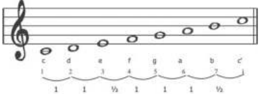

> **Deskripsi Visual:** Gambar ini adalah diagram yang menunjukkan struktur nada dalam musik. Diagram ini menggambarkan nada-nada yang ada pada not musik, dengan nada-nada tersebut diberi nomor dan diletakkan pada garis not. Garis not ini melambangkan nada yang lebih tinggi ke bawah, sementara titik-titik di atas garis not menunjukkan nada yang lebih rendah. Nada-nada ini disusun dalam urutan tertentu yang menunjukkan arah nada dari nada yang lebih rendah ke nada yang lebih tinggi. Diagram ini sangat berguna untuk memahami struktur nada dalam musik dan bagaimana nada-nada tersebut berhubungan satu sama lain.

---
**🖼️ Gambar/Diagram**

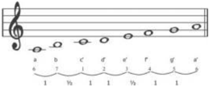

> **Deskripsi Visual:** Gambar ini adalah diagram yang menunjukkan struktur suara dalam notasi musik. Diagram ini menggambarkan berbagai nada (not) yang terdapat pada lembar notasi, dengan setiap nada dihubungkan oleh garis yang mengindikasikan interval antara mereka. Nada-nada tersebut diberi label huruf Latin seperti A, B, C, D, E, F, G, dan R untuk menunjukkan nada-nada yang berbeda. Garis horizontal di bawah diagram menunjukkan nada yang lebih rendah, sedangkan garis vertikal menunjukkan nada yang lebih tinggi. Label "I" dan "II" mungkin merujuk pada nada yang lebih rendah dan lebih tinggi dalam notasi musik tradisional. Informasi kunci yang dapat diambil pembaca adalah struktur dasar notasi musik dan bagaimana interval nada-nada tersebut diatur dalam notasi.

Sekilas tidak jauh berbeda susunan tangga nada diatonis mayor dan minor. Seolah-olah hanya dibedakan oleh awal dan akhir nada pada susunan tangga nada tersebut. Untuk tangga nada mayor diawali dengan nada c atau do, sedangkan tangga nada diatonis minor diawali dan diakhiri dengan a atau la. Tetapi sebenarnya jika dimainkan pola tangga nada keduanya, akan terasa berbeda. Susunan tangga nada mayor akan menimbulkan kesan riang, bahagia,  dan  bersemangat.  Sedangkan  susunan  tangga  nada  minor  akan  menimbulkan kesan sedih dan suasana sendu dan haru.

Tangga nada diatonis minor masih memiliki dua variasi lagi, yaitu tangga nada minor melodis dan tangga nada minor harmonis.

Susunan tangga nada minor melodis adalah sebagai berikut:

nada ke tujuh, yaitu 5 (sol) dinaikkan ½ nada menjadi 5 (sil).

Sedangkan susunan tangga nada minor harmonis adalah sebagai berikut:

 

---
## 📄 Halaman 28

Agar lebih mudah dipahami, coba bandingkan susunan tangga nada diatonik di atas dengan susunan nada dalam piano, organ, atau pianika.

Susunan nada dalam piano, organ, atau pianika jelas menggambarkan susunan tangga nada diatonis yang menggunakan susunan interval 1 - 1 - ½ - 1 - 1 - 1 - ½.

Akan tetapi, jika seorang komponis menggubah lagu baik untuk suara manusia (vokal) maupun untuk instrumental, namun jangkauan nada dalam komposisi lagu tersebut mungkin terlalu  rendah atau terlalu tinggi, maka lagu tersebut dapat disajikan dengan mengubah nada  dasar.  Marilah  kita  mempelajari  cara  mengubah  nada  dasar  dalam  tangga  nada mayor dan minor.

Nada dasar dalam tangga nada diatonis mayor yang natural adalah c. Nada dasar natural ini lazim disebut dengan do = c. Perhatikan susunan tangga nada berikut!

### 2.  Melodi

Melodi  dari  bahasa  Yunani melodia yang  berarti  bernyanyi  atau  berteriak.  Melodi disebut juga suara. Dalam terminologi musik, melodi diartikan sebagai urutan linear nada musik yang dianggap sebagai satu kesatuan. Dalam arti yang paling harfiah, melodi adalah urutan nada yang tersusun dalam durasi tertentu.

Lebih lanjut, melodi juga dapat digambarkan sebagai gerak nada dengan interval tertentu. Rentang nada, dinamik, kontinuitas dan koherensi, irama, dan bentuk juga membentuk melodi. Dalam lagu, melodi biasanya terdiri atas frase-frase yang membentuk motif yang sering diulang-ulang sehingga membentuk lagu secara utuh.

### 3.  Ritme

Ritme dari bahasa Yunani rhythmos yang berarti suatu ukuran gerakan yang simetris. Ritme disamakan dengan irama yaitu variasi horizontal dan aksen dari suatu gerak melodi. Ritme terbentuk dari kombinasi suara dan diam, kuat lemahnya nada, dan cepat lambatnya ketukan dalam durasi tertentu yang membentuk pola suara yang berulang. Ritme memiliki tempo atau perubahannya yang teratur. Dalam komposisi musik, seorang komposer dapat menggunakan banyak ritme berbeda.

### a.  Tempo

Tempo adalah ukuran kecepatan dalam birama lagu. Ukuran kecepatan bisa diukur dengan alat bernama metronome. Pada metronome manual, stik besi kecil diset pada angka 140 misalnya atau untuk mood allegretto atau andantino dan berbunyi 'cling tak - tak - tak'. Tempo standard lagu pop antara 64-80 ketuk per menit atau 100-120 ketuk per menit, untuk lagu mars bisa antara 140-160 ketuk per menit.

Sebenarnya tempo untuk masing-masing ritme ada aturannya. Untuk mengetahuinya, kita  dapat  memanfaatkan keybord digital  yang  sudah  terinstall  masing-masing  ritme dan temponya.

 

---
## 📄 Halaman 29

### b.  Dinamik

Dinamika nyaring atau lembut nada dalam memainkan musik. Dinamika biasanya digunakan oleh komposer untuk menunjukan bagaimana perasaan yang terkandung di dalam sebuah komposisi, apakah itu riang, sedih, datar, atau agresif. Agar perasaan dalam  lagu  dapat  dimainkan  dengan  benar  oleh  pemusik  lain,  partitur  lagu  diberi tanda dinamika. Pada umumnya tada dinamika ditulis menggunakan kata-kata dalam bahasa italia. Ada dua kata dasar dalam dinamika, piano (lembut) dan forte (nyaring) selebihnya merupakan variasi dari dua kata ini.

### c. Ornamentasi

Ornamentasi  adalah  adalah  hiasan.  Hiasan  dalam  musik  berupa  not-not  yang ditambahkan pada melodi, tetapi tidak menambah nilai not melodi pokok dan tentu tidak menambah ketukan dalam birama. Sejumlah ornamen ditandai dengan simbol tertentu dalam standar notasi musik. Ada beberapa jenis ornament diantaranya trill , morden , grupeto , appoggiatura , aciakatura dan kadenza .

### PROSES PEMBELAJARAN

### 1.  Perencanaan

Pemilihan  model  dan  pendekatan  pembelajaran  musik  tersebut,  masing-masing  harus disesuaikan  dengan  karakteristik,  situasi  dan  kondisi  kelas  atau  sekolah.  Salah  satu  model pembelajaran seni yang dapat dilakukan untuk mentransformasikan seni musik adalah model Kodaly dengan pendekatan active learning. Gagasan dasar yang dikembangkannya memiliki konsep pikir terutama pada:

- Kemampuan musik yang ada pada setiap orang dan setiap orang yang mampu berbahasa maka ia mampu membaca dan menulis musik. ' All  people  capable  of  lingual  literacy are also capable of musical literacy '  (Chomksy, 1986, 71).
- Bernyanyi adalah landasan terbaik dalam mengembangkan musicianship, dan bernyanyi merupakan aktivitas alami bagi anak sebagaimana halnya berbicara.
- Lagu  rakyat  atau  musik  tradisional  merupakan  sarana  pertama  yang  sebaiknya digunakan  dalam  pembelajaran  musik  bagi  anak-anak,  karena  dalam  lagu  rakyat terdapat kesatuan antara bahasa ibu dan musik, yang mengandung nilai-nilai budaya suatu bangsa dan merupakan identitas kultural.
- Hanya musik yang kaya akan nilai artistik sajalah yang digunakan dalam pembelajaran, baik  itu  musik  rakyat  atau  musik  tradisional  maupun  musik  lainnya.  Musik  perlu menjadi jantungnya kurikulum, yakni suatu subjek utama yang digunakan sebagai landasan dalam pendidikan.

### 2.  Pelaksanaan

Pembelajaran materi ini hendaknya dilaksanakan dengan pendekatan saintifik. Oleh karena itu,  pilihan  model pembelajarannya hendaknya yang memberikan kesempatan kepada siswa untuk menikmati pengalaman belajar secara ilmiah.

 

---
## 📄 Halaman 30

### DIMENSI SIKAP

Rumusan Kompetensi Sikap Spiritual dalam pembelajaran ini adalah 'Menghayati dan mengamalkan ajaran  agama  yang  dianutnya'.  Adapun  rumusan  Kompetensi  Sikap  Sosial adalah 'Menunjukkan perilaku jujur, disiplin, tanggung jawab, peduli (gotong royong, kerja sama, toleran, damai), santun, responsif, dan pro-aktif dan menunjukkan sikap sebagai bagian dari  solusi  atas  berbagai  permasalahan  dalam berinteraksi secara efektif dengan lingkungan sosial  dan  alam  serta  menempatkan diri sebagai cerminan bangsa dalam pergaulan dunia'. Kedua kompetensi tersebut dicapai melalui pembelajaran tidak langsung ( indirect teaching ), yaitu keteladanan, pembiasaan, dan budaya sekolah, dengan memperhatikan karakteristik mata pelajaran serta kebutuhan dan kondisi siswa.

### DIMENSI PENGETAHUAN

Dalam  dimensi  pengetahuan,  pembelajaran  dilaksanakan  dengan  tujuan  agar  siswa memiliki  kompetensi  memahami,  menerapkan,  dan  menganalisis  pengetahuan  faktual, konseptual, prosedural, dan metakognitif berdasarkan rasa ingin tahunya, serta menerapkan pengetahuan prosedural pada bidang kajian yang spesifik sesuai dengan bakat dan minatnya untuk memecahkan masalah.

Untuk mencapai kompetensi tersebut, pembelajaran hendaknya dikemas dalam bentuk kegiatan agar siswa mendapatkan pengetahuan faktual, konseptual, prosedural, dan metakognitif. Pengetahuan faktual  didapat  siswa  dari  kegiatan  pengamatan  sehingga  pengetahuan  yang didapat bersifat kontektual dengan lingkungan, pengetahuan konseptual didapat dari kegiatan mempelajari teori dari berbagai sumber, pengetahuan prosedural didapat dengan mengikuti langkah-langkah  pemecahan  masalah,  dan  pengetahuan  metakognitif  didapat  dengan memanfaatkan pengetahuannya bagi kemaslahatan lingkungan sekitar.

### DIMENSI KETERAMPILAN

Dalam dimensi  keterampilan,  pembelajaran  diarahkan  agar  siswa  terampil  mengolah, menalar, dan menyaji dalam ranah konkret dan ranah abstrak terkait dengan pengembangan dari  yang  dipelajarinya  di  sekolah  secara  mandiri,  bertindak  secara  efektif  dan  kreatif,  serta mampu menggunakan metoda sesuai kaidah keilmuan.

Berkaitan dengan KD dalam bab ini, yakni memahami Konsep Musik Barat dan Memainkan Alat Musik Barat ,  maka pembelajaran seyogyanya dilaksanakan dengan model pembelajaran discovery learning atau inquiry learning .

Model discovery learning memiliki karakter

- Memberikan kesempatan pada siswa untuk mencari tahu tentang suatu masalah dalam hal ini adalah masalah konsep musik barat.
- Memberikan kesempatan siswa mengolah informasi yang berkaitan dengan masalah yang ditemukan
- Memberi kesempatan pada siswa untuk menemukan solusi suatu masalah berdasarkan hasil pengolahan informasi yang dikumpulkan
- Siswa memiliki pengetahuan dan konsep baru yang dapat digunakan untuk menyelesaikan masalah baru yang relevan

 

---
## 📄 Halaman 31

Secara singkat, sintak atau langkah dalam pembelajaran ini sebagai berikut.

- Stimulation (Stimulasi/Pemberian Rangsangan)
- Problem Statement (Pernyataan/Identifikasi Masalah)
- Data Collection (Pengumpulan Data)
- Data Prossesing (Pengolahan Data)
- Ver ification (Pembuktian)
- Generalization (Menarik Kesimpulan/Generalisasi)
Dalam kaitannya dengan KD Memahami dan menganalisis konsep musik barat, siswa diajak untuk:

- menyimak rekaman audio contoh musik modal,
- mengidentifikasi karakter nada dan irama dalam musik modal,
- menyimak rekaman audio contoh musik tonal,
- mengidentifikasi karakter nada dan irama dalam musik tonal,
- menyimak rekaman audio contoh musik atonal,
- mengidentifikasi karakter nada dan irama dalam musik atonal, dan
- mempresentasikan perbedaan nada dan irama dari ragam musik barat.
Dalam praktik pembelajaran dapat dilaksanakan sebagai berikut.

### 1. Apersepsi sekaligus Stimulasi

Untuk memulai pembelajaran ini, guru diminta membuka pembelajaran dengan menyajikan sebuah video rekaman pertunjukan musik barat. Tayangkan di depan kelas dan minta para siswa  mengamati sajian  video  tersebut. Tanyakan  kepada  siswa  tentang  hal-hal  berkenaan dengan sajian musik tersebut.

Sekadar contoh, berikut adalah panduan pengamatan yang dapat digunakan.

---
**📊 Tabel**

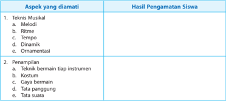

Tabel ini memperlihatkan hasil pengamatan siswa dalam dua aspek utama: teknik musikal dan penampilan. Dalam aspek teknik musikal, siswa diperiksa pada empat dimensi utama: melodi, ritme, tempo, dan dinamik. Selain itu, siswa juga diperiksa tentang ornamentasi. Di sisi lain, dalam aspek penampilan, siswa diperiksa tentang teknik bermain tiap instrumen, kostum, gaya bermain, tata panggung, dan tata suara. Data atau pola penting yang terlihat adalah bahwa siswa diperiksa secara mendalam pada berbagai aspek teknis dan penampilan dalam konteks musik, mencakup berbagai elemen seperti melodi, ritme, dan dinamik, serta penampilan visual dan aksi.

### 2. Kegiatan Inti

Ketika  memasuki  kegiatan  inti,  guru  tetap  harus  berpegang  pada  prinsip-prinsip  dari model pembelajaran yang diterapkan. Langkah-langkah pembelajaran mencerminkan sintak dari  model pembelajaran tersebut. Lima kegiatan dalam pendekatan saintifik yang populer dengan 5 M, yakni mengamati, menanya, mencoba, mengasosiasi, dan mengomunikasikan tidak

 

---
## 📄 Halaman 32

dipandang sebagai tahapan yang berurutan. Yang penting lima kegiatan dalam pembelajaran ini  dilaksanakan supaya pembelajaran tidak hanya berisi ceramah yang verbalistis dari guru saja, tetapi betul-betul memberikan pengalaman belajar.

Kegiatan  inti  untuk  KD  ranah  pengetahuan  disesuaikan  dengan  sintak  dalam  model pembelajaran hingga siswa mencapai pemahaman dengan tingkatan sebagai berikut:

### a. Pemahaman faktual

Siswa  diajak  mengekplor  fakta-fakta  musikal  barat  yang  sering  dinikmati  melalui berbagai media, misalnya televisi, internet,  atau  media online yang  lain.  Dalam  hal  ini guru dapat memutar secara online rekaman audio visual pertunjukan musik barat. Atau melalui  pemberian  tugas  sebelumnya  kepada  siswa  untuk  mencari  materi  mengenai pertunjukan musik barat.

Siswa diminta untuk mencatat berbagai unsur yang ditemui ketika menyaksikan tayangan pertunjukan musik barat tersebut. Setelah itu siswa diminta menyajikan fakta-fakta yang ditemui dalam sajian musik barat tersebut.

Dalam hal ini ada berbagai kemungkinan:

- Ada siswa yang mendapatkan materi sajiak pergelaran musik rock oleh grup musik rock.
- Ada siswa yang mendapatkan genre musik jazz.
- Ada siswa yang mendapatkan video pertunjukan musik country.
- Ada siswa yang mendapatkan rekaman audio musik klasik.
- Ada siswa yang mendapatkan rekaman audio visual musik pop.
Jika demikian, guru tinggal mengarahkan siswa untuk dapat menginventarisasi rincian unsur musiknya. Ajak siswa untuk mengamati tangga nada, irama, tempo, dinamik, dan unsur yang lain. Dengan cara itu, guru menggiring siswa mendapatkan pengetahuan dari fakta-fakta musikal dalam berbagai bentuk.

### b.  Pemahaman konseptual

Setelah  pengetahuan  faktual  digali  dan  dikuasai  para  siswa,  tugas  guru  berikutnya adalah memberi kesempatan kepada siswa untuk mendapatkan pengetahuan konseptual dari materi ajar yang dihadapi.

Caranya sebagai berikut.

- Siswa diminta untuk mempelajari teori dan konsep-konsep tentang musik barat dari berbagai sumber (buku, artikel, materi-materi dari internet).
- Manfaatkan  pengetahuan  yang  didapat  dari  berbagai  sumber  teori  dan  konsep tersebut untuk membahas fakta-fakta musikal dari hasil pengamatan dan diskusi sebelumnya.

### Misalnya:

Ketika siswa mengamati pertunjukan lagu Edelweis, siswa dapat menentukan:

- Melodinya
- Tangga nadanya
- Temponya
- Ritmenya
- Dinamiknya
- f ) liriknya

 

---
## 📄 Halaman 33

- Susun  konsep  baru  atau  turunan  atau  setidaknya  pembuktian  akan  konsep  dan fakta yang ada.

### c. Pemahaman prosedural

Sebuah  lagu  digagas,  kemudian  tercipta  hingga  kemudian  dapat  dinikmati  para pendengarnya tentu membutuhkan tahapan-tahapan. Guru seni musik yang kreatif pasti akan mengajak siswa agar dapat merunut tahapan-tahapan itu sehingga jika kelak siswa akan menampilkan karya musiknya, mereka tidak mengalami kesulitan.

Oleh karena itu, pembelajaran seni musik diharapkan dapat mengantarkan para siswa memiliki pemahaman prosedural tersebut. Setelah memiliki pemahaman konseptual, siswa  diajak  untuk  memanfaatkan  pemahaman  tersebut  ke  dalam  tahapan-tahapan hingga dihasilkannya pertunjukan musik. Pada tahapan ini, pembelajaran dilaksanakan untuk  memberikan  pengalaman  belajar  para  siswa  agar  mendapatkan  pemahaman prosedural.  Misalnya  siswa  secara  berkelompok  ditugasi  menyiakan  pertunjukan  musik secara  sederhana di kelas. Tentu siswa diminta untuk menetapkan lagu-lagu yang akan dipentaskan,  menyiapkan  konsep  pertunjukan,  mengaransir  lagu,  berlatih,  menyiapkan properti, tata suara, dan tata panggung, serta menyiapkan kostum.

Demikian pula jika siswa diminta untuk menciptakan lagu atau mengaransemen lagu. Mereka akan menempuh berbagai prosedur, mulai dari tema, jenis irama, tangga nada, dan lain sebagainya.

### d.  Pemahaman metakognitif

Pemahaman-pemahaman di atas merupakan pemahaman-pemahaman yang bersifat teknis. Siswa sudah dapat dikatakan memiliki kompetensi pengetahuan dan keterampilan jika sudah memiliki pemahaman tersebut. Akan tetapi, pendidikan belum cukup berhasil jika masih belum menyentuh pemahaman metakogninif, yaitu pemahaman akan dampak dan manfaat bagi kemaslahatan ketika seseorang memiliki kecakapan atau pemahaman yang bersifat teknis itu. Maka, guru juga harus sekaligus membimbing siswa untuk senantiasa paham akan dampak dari diterapkannya sesuatu.

Sebagai  contoh,  di  berbagai  media  diberitakan  bahwa  lagu-lagu  tertentu  mampu mempengaruhi mental pendengarnya. Teori ini dipercaya kebenarannya. Ada karya musik yang memiliki kekuatan penyembuhan, seperti komposisinya Mozart. Ada juga komposisi musik yang mampu membangkitkan semangat, seperti lagu-lagu perjuanagan, mars, dan lain-lain. Ada juga lagu yang membuat pendengarnya merasa rileks. Di kalangan tertentu musik dipakai untuk mengiringi ritual magis dan penyembahan terhadap makhluk halus.

Pemahaman siswa tentang dampak atau manfaat dari suatu pengetahuan, teori atau konsep tertentu, disebut sebagai metakognitif. Nah, pembelajaran harus memperhitungkan hal-hal tersebut. Bagaimana membiasakannya? Pada saat mengerjakan tugas menyiapkan sebuah konsep pertunjukan musik barat, ingatkan siswa akan dampak sebuah lagu jika dipertunjukkan.

### 3.  Penguatan

Pemahaman yang didapat siswa melalui berbagai cara dan media, harus diberikan penguatan oleh guru. Jika tidak ada penguatan, siswa akan mengalami kebingungan untuk menentukan mana konsep dan teori yang benar. Siswa tingkat sekolah menengah masih belum memiliki kekuatan otoritatif  untuk  menentukan kebenaran sebuah konsep atau teori. Bukan berarti

 

---
## 📄 Halaman 34

guru  harus  bertindak  otoriter  untuk  memonopoli  kebenaran.  Dalam  hal  ini  gurulah  yang harus menunjukkan dan memberikan arah agar tiap teori atau konsep tersebut dipahami dan diketahui latar belakang argumentasinya masing-masing.

### 3. Penilaian

Penilaian untuk KD Konsep Musik Barat ditekankan pada aspek pengetahuan. Meskipun demikian,  aspek  sikap  dan  psikomotorik  tidak  boleh  diabaikan.  Sesuai  dengan  Pedoman Penilaian Kurikulum 2013, penilaian aspek pengetahuan merupakan penilaian untuk mengukur kemampuan siswa berupa pengetahuan faktual, konseptual, prosedural, dan metakognitif, serta kecakapan berpikir tingkat rendah sampai tinggi. Dalam langkah kegiatan inti pembelajaran telah dijelaskan.

Penilaian pengetahuan dilakukan dengan berbagai teknik penilaian. Guru mata pelajaran menetapkan teknik penilaian sesuai dengan karakteristik kompetensi yang akan dinilai. Penilaian dimulai dengan perencanaan pada saat menyusun Rencana Pelaksanaan Pembelajaran (RPP) dengan mengacu pada silabus.

Berbagai teknik penilaian pengetahuan dapat digunakan sesuai dengan karakteristik masingmasing KD. Teknik yang biasa digunakan adalah tes tertulis, tes lisan, dan penugasan.

Jika dilaksanakan tes tertulis, guru harus menempuh langkah-langkah sebagai berikut.

- Menentukan tujuan, dalam hal ini tujuan penilaiannya adalah untuk tes formatif.
- Menyusun kisi-kisi sebagai acuan menulis soal. Kisi-kisi  memuat  rambu-rambu  tentang  kriteria  soal  yang  akan  ditulis,  meliputi KD yang akan diukur, materi, indikator soal, bentuk soal, dan nomor soal. Dengan adanya kisi-kisi, penulisan soal lebih terarah sesuai dengan tujuan tes dan proporsi
soal per KD atau materi yang hendak diukur lebih tepat.

---
**📊 Tabel**

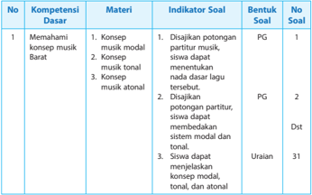

Tabel ini menunjukkan struktur kompetensi dasar untuk materi musik Barat, dengan berbagai indikator soal yang ditetapkan untuk setiap konsep. Topik utama adalah memahami konsep musik Barat, yang meliputi konsep musik modal, tonal, dan atonal. Indikator soal mencakup pengetahuan tentang potongan partitur, sistem modal dan tonal, serta pengetahuan tentang konsep musik modal, tonal, dan atonal. Banyak indikator soal menggunakan bentuk PG (Penggunaan Gambar) dan Dst (Distanse Text), sementara satu indikator menggunakan bentuk Uraian. Pola penting yang terlihat adalah bahwa banyak indikator soal menggunakan bentuk PG dan Dst, yang menunjukkan bahwa gambar dan teks adalah metode yang umum digunakan dalam pembuatan soal.

 

---
## 📄 Halaman 35

- Menulis soal berdasarkan kisi-kisi dan kaidah penulisan butir soal. Contoh: Jelaskan perbedaan antara konsep musik modal, tonal, dan atonal!
- Menyusun pedoman penskoran.
Skor akhir menggunakan skala 0 sampai 100.

Untuk soal pilihan ganda tiap soal diberi skor 1.

Soal  uraian  diberi  skor  dan  bobot  tersendiri  sesuai  otoritas  guru.  Misalnya,  guru menyusun soal bentuk pilihan ganda 20 (bobot 1) dan uraian 5 dengan bobot masingmasing 4.

Perhitungan skor akhir menggunakan rumus:

``

Keterangan:

Skor PG

:  skor yang diperoleh dari soal pilihan ganda

Skor Ur

:  skor yang diperoleh dari soal uraian

Skor maks

:  skor maksimal yang mungkin didapat siswa

Jika Arjuna mendapat skor 12 dari soal pilihan ganda dan 18 dari soal uraian, maka siswa tersebut mendapat nilai ((12 + 18) : 40) x 100 = 75.

Sesuai  panduan  penilaian  Kurikulum  2013  untuk  SMA  tahun  2016,  penentuan ketuntasan  minimal  dan  predikat  nilai  mulai  dari  D,  C,  B,  sampai  A  tergantung pada KKM yang telah ditetapkan oleh guru atau MGMP yang disahkan oleh satuan pendidikan di awal semester pertama. Tinggi rendahnya KKM ini akan menentukan predikat dari nilai yang diperoleh siswa karena aturannya adalah sebagai berikut.

---
**📊 Tabel**

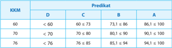

Tabel ini menunjukkan hasil predikat dari beberapa kategori (D, C, B, A) berdasarkan nilai KKM (Karakteristik Kualitas Matrikulasi). Topik utama tabel adalah hubungan antara nilai KKM dengan predikat akademik. Kolom-kolomnya mencakup nilai KKM dan predikat yang diberikan. Data penting yang terlihat adalah bahwa semakin tinggi nilai KKM, semakin tinggi predikat yang diberikan. Misalnya, untuk nilai KKM 60, predikat yang diberikan adalah D, sedangkan untuk nilai KKM 76, predikat yang diberikan adalah A. Ini menunjukkan bahwa predikat akademik umumnya meningkat seiring peningkatan nilai KKM.

Maka jika KKM yang telah ditetapkan satuan pendidikan adalah 60, maka Arjuna yang mendapat nilai 75 sudah mencapai KKM. Sedangkan predikatnya jika mengacu contoh di atas, berarti  B.  Akan  tetapi,  jika  KKM  yang  ditetapkan  adalah  70,  maka Arjuna sudah mencapai KKM, tetapi predikan nilainya C. Jika KKM yang ditetapkan adalah  76,  maka  Arjuna  belum  mencapai  KKM  dan  predikat  nilainya  D  sehingga Arjuna harus mengikuti pembelajaran remidial pada KD ini.

 

---
## 📄 Halaman 36

### KOMPETENSI INTI

- KI 1 : Menghayati dan mengamalkan ajaran agama yang dianutnya.
- KI 2 : Menghayati dan mengamalkan perilaku jujur, disiplin, tanggungjawab, peduli (gotong royong, kerjasama, toleran, damai), santun, responsif dan pro-aktif dan menunjukkan sikap sebagai bagian dari solusi atas berbagai permasalahan dalam berinteraksi secara efektif dengan lingkungan sosial dan alam serta dalam menempatkan diri sebagai cerminan bangsa dalam pergaulan dunia.
- KI 3 : Memahami, menerapkan, dan menganalisis pengetahuan faktual, konseptual, prosedural, dan metakognitif berdasarkan rasa ingin tahunya tentang ilmu pengetahuan, teknologi, seni, budaya, dan humaniora dengan wawasan kemanusiaan, kebangsaan, kenegaraan, dan peradaban terkait penyebab fenomena dan kejadian, serta menerapkan pengetahuan prosedural pada bidang kajian yang spesifik sesuai dengan bakat dan minatnya untuk memecahkan masalah.
- KI 4 : Mengolah, menalar, dan menyaji dalam ranah konkret dan ranah abstrak terkait dengan pengembangan dari yang dipelajarinya di sekolah secara mandiri, bertindak secara efektif dan kreatif, serta mampu menggunakan metoda sesuai kaidah keilmuan.

### KOMPETENSI DASAR

- 1.1. Menunjukkan sikap penghayatan dan pengamalan serta bangga terhadap karya seni musik sebagai bentuk rasa syukur terhadap anugerah Tuhan.
- 2.1. Menghayati dan mengamalkan perilaku jujur, disiplin, tanggung jawab, peduli, kerjasama, santun, dan menunjukkan sikap sebagai bagian dari solusi atas berbagai permasalahan dalam berinteraksi secara efektif dengan lingkungan sosial, dan alam melalui apresiasi dan kreasi seni sebagai cerminan bangsa dalam pergaulan dunia.
- 3.1. Memahami konsep musik Barat.
- 3.2. Menganalisis musik Barat.
- 3.3. Menganalisis hasil pertunjukan musik Barat.
- 3.4. Memahami perkembangan musik Barat.
- 4.1. Memainkan alat musik Barat.
- 4.2. Mempresentasikan hasil analisis musik Barat.
- 4.3. Membuat tulisan tentang musik Barat.
- 4.4. Menampilkan beberapa lagu dan pertunjukan musik Barat.

###  Bab 5 

### Pertunjukan Musik Barat



 

---
## 📄 Halaman 37

### INFORMASI GURU

Alur materi pembelajaran pada bahasan Bab 5 dipetakan sebagai berikut:

---
**🖼️ Gambar/Diagram**

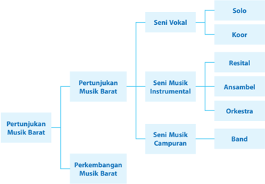

> **Deskripsi Visual:** Gambar ini adalah diagram yang menunjukkan struktur topik dalam bidang Seni Musik. Diagram ini dibagi menjadi dua bagian utama: Pertunjukan Musik Barat dan Perkembangan Musik Barat. Pertunjukan Musik Barat terdiri dari tiga sub-topik utama: Seni Vokal, Seni Musik Instrumental, dan Seni Musik Campuran. Untuk setiap sub-topik ini, ada beberapa sub-sub-topik yang lebih spesifik, seperti Solo, Koor, Resital, Ansambel, Orkestra, Band, dan lain-lain.

Elemen-elemen utama dalam diagram ini meliputi topik-topsik utama dan sub-topik yang lebih spesifik. Relasi antara elemen-elemen ini sangat jelas, dengan topik utama masing-masing terbagi menjadi sub-topik yang lebih spesifik. Teks, angka, atau label penting yang terlihat dalam diagram ini adalah nama-nama topik dan sub-topik tersebut.

Informasi kunci yang dapat diambil pembaca dari gambar ini adalah bahwa struktur topik dalam bidang Seni Musik mencakup berbagai aspek mulai dari vokal hingga perkembangan musik barat. Diagram ini membantu pembaca untuk memahami struktur dan topik-topik utama dalam bidang Seni Musik.

### TUJUAN PEMBELAJARAN

Setelah mempelajari Bab 5 tentang Pertunjukan Musik Barat, diharapkan siswa mampu:

- menjelaskan konsep pertunjukan musik barat,
- menjelaskan perkembangan seni pertunjukan musik barat,
- menidentifikasi unsur-unsur pertunjukan musik dalam konsep musik barat, dan
- menjelaskan macam-macam dalam konsep musik barat.

### MODEL PEMBELAJARAN

Diharapkan  pembelajaran  Bab  5  ini  dilaksanakan  menggunakan  pendekatan  saintifik dengan model pembelajaran inkuiri atau discovery learning .  Harapannya, setelah mengikuti pembelajaran ini siswa tidak hanya mendapatkan pengetahuan tentang konsep musik barat, tetapi  sekaligus  memperoleh nuture  efect (dampak  ikutan)  berupa  kebiasaan  mencari  dan menemukan pengetahuan mengenai konsep musik barat secara mandiri dari berbagai sumber sehingga terbentuk karakter yang diharapkan, yaitu:

- rasa ingin tahu, melalui penugasan pencarian informasi tentang pertujukan musik barat dari berbagai sumber (termasuk internet) yang meliputi filosofi, sejarah, bentuk, dan medianya;
- tekun dan pantang menyerah, melalui penugasan untuk menemukan bermacam-macam pandangan para ahli tentang konsep pertunjukan musik barat;
- menghargai pendapat orang lain dalam mengamati sajian pertunjukan musik barat secara sederhana, maupun dalam diskusi kelompok dan presentasi hasil diskusi; dan
- jujur dan disiplin dalam mempersiapkan proses pertunjukan musik barat secara sederhana.

 

---
## 📄 Halaman 38

### LANGKAH-LANGKAH PENERAPAN MODEL PEMBELAJARAN

- Sajikan  rekaman  video  pertunjukan  musik  barat.  Dalam  tahap  ini  tugasi  siswa  untuk mengamati dan mencatat hasil pengamatan dengan contoh borang sebagai berikut

---
**📊 Tabel**

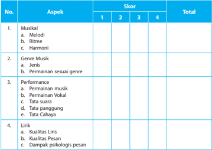

Tabel ini menunjukkan skor untuk berbagai aspek musik, termasuk musikal, genre, performa, dan lirik. Kolom "No." memberikan nomor urut untuk setiap aspek. Kolom "Aspek" menyebutkan jenis aspek yang akan dianalisis, seperti "Musikal," "Genre Musik," "Perfomance," dan "Lirik." Kolom "Skor" menampilkan skor yang diberikan untuk setiap aspek, dengan angka 1 hingga 4. Total kolom menunjukkan jumlah skor yang diberikan untuk setiap aspek. Topik utama tabel ini adalah analisis dan penilaian musik berdasarkan berbagai aspek, termasuk musikal, genre, performa, dan lirik. Data penting yang terlihat adalah bahwa setiap aspek memiliki skor yang dapat diperhitungkan, yang menunjukkan bahwa tabel ini digunakan untuk mengumpulkan dan menganalisis data tentang kualitas musik.

Pedoman Penskoran

Skor maksimal = 52

### Kategori

- 13 - 22   Kurang
b. 23 - 32   Cukup

- 33 - 42 Baik
- 43 - 52 Sangat baik
- Mencari  informasi  dari  berbagai  sumber  untuk  dapat  membahas  pertunjukan  musik barat yang telah disaksikan bersama. Informasi itu dapat diperoleh dari berbagai sumber. Arahkan siswa  dapat  menemukan  sumber  informasi  di  perpustakaan  sekolah  atau  di perpustakaan daerah. Bila mengalami kesulitan, siswa diarahkan mencari informasi di internet. Bimbing siswa agar bijak mencari bahan-bahan informasi dari internet.
- Berikan kesempatan pada siswa untuk mencari tahu tentang seni pertunjukan musik barat dari sumber-sumber langsung (para pakar seni pertunjukan).
- Berikan  kesempatan  siswa  mengolah  informasi  yang  berkaitan  dengan  masalah  seni pertunjukan  yang  ditemukan,  baik  melalui  sumber  tertulis,  maupun  sumber  langsung dari para ahli.
Simpulan

:    .....................................

Saran

:    .....................................

 

---
## 📄 Halaman 39

- Beri kesempatan siswa untuk menemukan rumusan tentang pertunjukan seni musik barat berdasarkan hasil pengolahan informasi yang dikumpulkan.
- Beri kesempatan siswa untuk mempresentasikan hasil pembahasan tentang pertunjukan seni musik barat dan beri pula kesempatan siswa lain untuk membahasnya di kelas.
- Akhirnya, berdasarkan pengetahuan dan keterampilan baru yang dimilikinya, siswa dapat menggunakannya untuk membahas dan menyelesaikan masalah baru yang relevan.

### MOTIVASI

Seni pertunjukan diajarkan dalam pembelajaran seni musik bukan berarti setiap siswa harus  menjadi  performer  seni  musik  secara  profesional  di  panggung-panggung  hiburan. Pembelajaran ini dirancang agar:

- Siswa bijak melihat pertunjukan musik
- Pertunjukan musik barat hanyalah pertunjukan seni biasa, cukup untuk diapresiasi dan dinikmati sebagaimana menikmati karya seni yang lain.
- Yang  dapat  diapresiasi  adalah  karya  musiknya,  teknik  penampilannya,  teknologi  yang menyertainya, nilai-nilai yang ditampilkan sebatas sesuai dengan budaya kita.
- Hal-hal lain, seperti penampilan para performernya, adalah bagian dari seni pertunjukan tersebut yang hanya ditampilkan sesuai konteks saat itu yang belum tentu sesuai dengan keperluan penampilan kita dalam konteks yang lain.

### SUMBER UNTUK GURU

Pertunjukan musik merupakan suatu penyajian seni oleh bunyi yang berkualitas untuk dapat didengar dan dinikmati oleh penonton. Musik terdiri atas unsur jiwa dan struktur, maka pertunjukan  musik  ditampilkan  dalam  paduan  bentuk  dan  isi.  Bentuknya  berupa struktur seni suara yang biasanya berwujud melodi, ritme, dan harmoni. Sedangkan isinya berupa pesan yang terdengar dari ungkapan lirik lagu. Unsur struktur lagu yang merupakan seni suara akan berpengaruh terhadap rasa musikal, sedangkan unsur isinya yang berwujud pesan akan berpengaruh terhadap pikiran intelektual pendengarnya. Unsur struktur musikal bersifat universal, sedangkan unsur pesan lirik harus mengacu dan bersumber pada norma, etika, dan moral yang bersifat lokal. Oleh karena itu, sajian dalam pertunjukan seni musik harus mempertimbangkan kedua hal itu dengan bijak.

Dari uraian di atas, melihat bahwa aspek komunikasi dalam seni (seni pertunjukan) amat sangat penting sebagai bentuk penyampaian maksud, tujuan, makna atau pesan dari pertunjukan tersebut.

Bobot seni akan dapat kita rasakan dan kita nilai dari aspek komunikasinya. Pesan-pesan atas seni pertunjukan yang dipergelarkan akan efektif dapat berkomunikasi dengan penonton apabila  disampaikan  dengan  cara  berkomunikasi  yang  baik.  Melihat  uraian  tersebut,  seni pertunjukan merupakan media yang di dalamnya terdapat unsur instrinsik dan ekstrinsik yang mampu berkomunikasi dengan penonton. Unsur instrinsik adalah suatu unsur komunikasi seni  pertunjukan yang menyampaikan seni itu sendiri. Dalam kaitan ini, komunikasi seni pertunjukan akan menyampaikan pengalaman estetis, menyampaikan pesan keindahan dari suatu pertunjukan seni musik dan gabungan unsur-unsur panggung yang lain. Sementara unsur ekstrinsik adalah unsur komunikasi seni pertunjukan yang berkaitan dengan konteks seni.

 

---
## 📄 Halaman 40

Dalam kaitan ini, komunikasi seni pertunjukan akan menyampaikan sesuatu yang diangkat oleh  seni  pertunjukan,  baik  dalam  ranah  psikologis,  politik,  budaya,  kehidupan  sosial,  dan lain-lain melalui elemen-elemen simbolis yang ada dalam seni pertunjukan.

Pertunjukan musik dapat menimbulkan suasana yang menyenangkan sehingga seseorang akan hanyut oleh alunan suara musik. Penyajian pertunjukan musik dalam waktu yang tepat dapat menimbulkan daya tarik terhadap musik sehingga dapat menimbulkan kepuasan batin yang luar biasa, perasaan senang, dan gembira.

### A. Bentuk-Bentuk Pertunjukan Musik Barat

Terdapat bentuk-bentuk pertunjukan seni musik yang berkaitan erat dengan tujuan serta jenis  musik  yang  disajikan.  Secara  garis  besar,  bentuk-bentuk  pertunjukan  musik  tersebut sebagai berikut.

### 1. Pertunjukan musik tunggal

Pertunjukan musik tunggal, yaitu bentuk pertunjukan musik yang hanya menampilkan seorang musikus dalam memainkan alat musik tertentu. Sebagai contoh, pertunjukan gitar tunggal, pertunjukan piano tunggal, pertunjukan organ tunggal, pertunjukan biola tunggal, pertunjukan saksopon tunggal, dan sebagainya.

### 2. Pertunjukan kelompok musik terbatas

Yang dimaksud pertunjukan musik terbatas adalah pertunjukan kelompok musik seriosa dalam bentuk duet alat musik, trio, kuartet, atau kuintet alat musik sampai dengan bentuk ansambel terbatas sifat pertunjukan musik seperti ini tidak jauh berbeda dari pertunjukan musik sebelumnya, yakni terkesan formal dan penonton harus benar-benar disiplin.

### 3. Pertunjukan musik orkestra

Pertunjukan musik orkestra ini, meskipun masih memiliki sifat formal dan disiplin tinggi, namun dihadiri oleh jumlah penonton yang jauh lebih besar daridapa pertunjukan musik lainnya.  Bentuk-bentuk  orkestra  besar  seperti  orkes  pilharmoni,  orkes  simfoni, dan sejenisnya menampilkan musikus andal dalam jumlah besar, bahkan bisa mencapai 100-an pemusik. Untuk menampilkan bentuk pertunjukan musik seperti ini diperlukan ruang yang cukup besar serta tata akustik gedung yang sangat baik.

### 4. Pertunjukan musik elektrik

Pertunjukan musik elektrik, yakni penyajian kelompok musik dengan menggunakan perlengkapan atau alat-alat musik elektrik berkekuatan tinggi. Pertunjukan musik elektrik berkekuatan tinggi ini sangat berbeda dari penyajian musik sebelumnya yang ditampilkan di dalam ruang tertutup, pertunjukan jenis musik ini biasanya dilakukan di ruang terbuka dengan jumlah penonton yang bisa mencapai ribuan orang. Penyajian dan kelompokkelompok band ternama pada umumnya menggunakan bentuk pertunjukan musik seperti ini.  Sifat  dari  pertunjukan  musik  ini  tidak  formal  dan  penonton  boleh  saja  berteriakteriak atau ikut menyanyi bersama penyanyi yang sedang tampil di atas pentas.

 

---
## 📄 Halaman 41

### B. Tujuan Pertunjukan Musik

### 1.  Tujuan magis

Pada masyarakat primitif, musik diciptakan khusus agar mampu meningkatkan daya sugesti pengikut mereka dalam melaksanakan ritual kepercayaan yang sudah mereka anut. Musik  ini  biasa  ditemui  dalam  mantra.  Dalam  hal  ini  musik  disajikan  untuk  tujuan membangkitkan sugesti magis tertentu.

### 2. Tujuan religius

Setelah  lahirnya  agama-agama  di  dunia  ini,  musik  diciptakan  dan  disajikan  untuk keperluan pemujaan kepada Sang Pencipta. Karya musik ini dianggap suci karena merupakan bagian dari sarana upacara keagamaan sehingga musik ini mempunyai sifat dan karakter yang agung. Berkaitan dengan musik yang bersifat religius, setiap agama mempunyai cara pengungkapan tersendiri untuk mendekatkan diri dengan penciptanya melalui musik. Doa dan mantra-mantra yang biasanya bersifat musikal

### 3. Tujuan simbolis

Tujuan  simbolis  dalam  sajian  atau  pertunjukan  adalah  tujuan  untuk  menanamkan penghormatan  pada  simbol-simbol  kebanggaan  terhadap  sesuatu  yang  besar,  seperti bangsa dan negara. Kadang juga untuk menanamkan kebanggaan pada organisasi atau lembaga tertentu. Musik yang disajikan bertujuan simbolis yang dapat membangkitkan rasa kebanggaan tertentu pada diri seseorang. Sebagai contoh penciptaan lagu kebangsaan, lagu perjuangan, lagu organisasi/perkumpulan tertentu, lagu pujian untuk pahlawan, dan sejenisnya memiliki tujuan simbolis yang harus diresapi oleh pendengarnya.

### 4. Tujuan pendidikan norma sosial

Musik juga sering digunakan sebagai media untuk menanamkan norma-norma, aturanaturan yang sekalipun tidak tertulis namun berlaku di tengah masyarakat. Dengan musik, nilai-nilai  moral  dan  etika  ditanamkan  kepada  anak-anak.  Pendidikan  karakter  seperti perilaku sopan, halus, hormat kepada orang tua, cinta keindahan, menyayangi tanaman dan binatang, patuh kepada guru, norma-norma kehidupan bermasyarakat, bahkan nilainilai keagamaan dapat ditanamkan melalui musik.

### 5. Tujuan kreatif

Musik juga disajikan dengan tujuan untuk unjuk dan uji kreativitas. Biasanya disajikan musik eksperimental. Musik dengan garapan dan unsur yang baru dengan cara melakukan berbagai eksplorasi terhadap berbagai unsur bunyi. Pertunjukan ini sekaligus untuk uji kreativitas, apakah karya musik yang ditampilkan mendapat sambutan atau tidak. Tujuan akhir dari proses kreasi seperti ini sering tidak jelas. Namun, banyak seniman eksperimental yang mengungkapkan bahwa tujuan utamanya, yaitu untuk mencapai kepuasan batin.

### 6. Tujuan rekreatif

Tujuan rekreatif adalah tujuan untuk mencari dan memberikan hiburan. Salah satu tujuan pertunjukan musik adalah tujuan rekreatif, yaitu untuk tujuan hiburan. Dua tujuan hiburan, yaitu menghibur dan memperoleh keuntungan komersial menjadi tujuan penyajian musik hiburan. Karya musik yang penyajiannya semata untuk hiburan adalah musik pop. Kepopuleran yang ditekankan karena dengan popularitas, penggemar rela untuk menonton dan artinya musik dihidupi oleh popularitasnya.

 

---
## 📄 Halaman 42

### 7. Tujuan komersial

Pertunjukan karya musik ini bertujuan untuk memperoleh keuntungan finansial, baik bagi  penciptanya,  penyanyinya,  maupun penyelenggaranya. Untuk tujuan komersial ini, musik dapat disajikan dan dipertunjukkan di atas panggung, bisa pula dengan penyajian melalui rekaman audio atau video. Semakin banyak hasil rekaman musik/lagu yang terjual, maka semakin tinggi pula keuntungan yang akan diperoleh.

### C.  Sejarah Perkembangan Pertunjukan Musik Barat

Pertunjukan musik sebenarnya sudah dimulai sejak zaman kuno. Hal ini dapat diketahui dengan temuan arkeologis benda-benda purbakala dan alat-alat musik yang ditemukan di tempat-tempat  peribadatan  di  Mesir.  Dalam  tradisi  Yahudi  bisa  diketahui  adanya  teksteks  Alkitab  yang  menggambarkan beberapa aktivitas yang menggunakan alat musik dan nyanyian-nyanyian. Bahkan ada jenis musik yang bisa diketahui yaitu musik Kenisah (abad 10 - 6 SM) dan musik Sinagogal (500 SM). Kemudian perkembangannya diketahui terjadi di Yunani pada masa klasik hellenisme dan pada abad-abad awal masehi yang sudah terdapat musik gregorian yang diusung oleh para musisi gereja.

Tentu saja pertunjukan musik ketika itu lebih banyak ditujukan untuk tujuan keagamaan, puji-pujian kepada Tuhan, dan persembahan untuk raja. Pertunjukan musik untuk hiburan sudah ada,  tetapi  untuk  kalangan  terbatas.  Setelah  lahir  folk  song  di  wilayah  Irlandia,  Skotlandia, dan beberapa negara lain di Eropa, barulah pertunjukan musik sebagai hiburan rakyat mulai berkembang.

Berikut disajikan sejarah singkat perkembangan pertunjukan seni musik barat.

### 1.  Musik Abad pertengahan (375-1400)

Musik  zaman  pertengahan  biasanya  dipertunjukkan  dalam  bentuk  drama  liturgi, gregorian, tipe litani (berbalasan dilakukan dalam ibadah), tipe sekuensi, kanzone, rondo. Pertunjukan musik polifon pada abad ke-9 - 11 konon dimulai dari Islandia dan Norwegia. Sebagai  pendukung,  perkembangan  lain  adalah  sudah  adanya  sekolah-sekolah  musik, organum baru, sudah ada notasi musik juga berkembang.

### 2. Musik zaman Renaissance (1350-1600)

Musik zaman Renaissance berkembang di Italia, disebut juga masa anti purbakala. Istilahnya sendiri dipakai baru pada abad XV sampai abad XXVI, bersamaan ditemukan bukti-bukti  sejarah  tentang  Columbus,  Gutenberg,  lalu  disusul  oleh  masa  reformasi (zaman tokoh Martin Luther dan Yohanes Kalvin). Masa Renaissance dikenal sebagai masa pembaruan gereja yang menandakan ciri musik religius. Musiknya sendiri ditandai oleh beberapa bentuk; motet, ordinarium missae, nyanyian offinsi, madrigal, dan sebagainya.

Perkembangan musik bukan hanya terjadi  di  Italia,  namun  juga  di  banyak  negara lain,  seperti  Inggris,  Spanyol,  Perancis.  Musik  Koral  yang  terkenal  dari  tradisi  gereja juga muncul, dikarang oleh Martin Luther sebagai tokoh terkenal dalam reformasi. Pada zaman  ini  pertunjukan  musik  juga  masih  didominasi  untuk  sajian  musikan  liturgi  di tempat-tempat ibadah.

 

---
## 📄 Halaman 43

### 3. Musik Barok (1600 - 1750)

Musik zaman Barok dianggap mewakili zaman yang sangat rumit dalam berbagai hal, mulai melodinya, bentuk-bentuk musiknya, dan warna musiknya. Musik yang juga diambil dari tradisi tari-tarian yang menjadi seni rakyat. Istilah barok sendiri sebenarnya muncul dalam buku Ensiklopedi karya Denis Diderot pada tahun 1750. Bentuk-bentuk musik yang berkembang pada masa ini adalah opera, oratorio, musik kamar, dan instrumentalia. Pada zaman ini musik gereja berkembang di Italia, Jerman, dan Austria. Gereja dengan beberapa  tradisi  Katolik,  protestan,  Anglikan  (Inggris)  mengembangkan  gaya  masingmasing. Musisi yang sangat terkenal pada masa itu di antaranya J.S Bach (1685 - 1750), Handel Antonio Vivaldi, Alessandro Scarlatti.

### 4. Musik Zaman Klasik (1750 - 1820)[7]

Menurut Friedrich  Blume,  musik  zaman  klasik  bercirikan  karya  seni  musik  yang menonjolkan daya ekspresi sebagai inti garapannya. Bentuk struktur musikalnya bersejarah sedemikian hingga terciptalah suatu ekspresi yang meyakinkan dan dapat bertahan terus. Dapat diketahui bahwa masa klasik dibagi dalam pra klasik (1730 - 1760), klasik awal (1760 - 1780), dan klasik tinggi (1780 - 1820). Musik klasik ini ditandai dengan bentuk musik seperti opera klasik, opera buffa, opera comique, oratorio yang bekembang. Musisi ternama yang kita kenal adalah Mozart, Beethoven, Gluck dan lain-lain. Musik gereja sendiri  banyak  memperoleh  pengaruh  dari  gaya  musik  zaman  klasik  ini.  Baik  gereja Katolik maupun Protestan mendapat sumbangan yang signifikan.

Zaman musik Klasik ini berlangsung pada tahun 1760 - 1820 yang berpusat pada tiga komponis besar; Joseph Haydn (1732 - 1809), Wolfgang Amadeus Mozart (1756 1791), dan Ludwig Van Beethoven (1770 - 1827). Musik yang berkembang adalah jenis musik vokal, musik opera.

### 5. Musik Zaman Romantis (abad ke-18 - 19)

Musik zaman romantis dikenal mulai abad ke-18. Istilah musik romantis digunakan untuk menggambarkan perasaan yang menonjol dalam berbagai aspek kesenian. Pada zaman ini masih terdapat opera yang terus berkembang, drama musik, konser sebagai warisan dari zaman klasik. Musik gereja berkembang di Wina dalam tradisi Katolik, terkait dengan tantangan abad pencerahan oleh para pemikir di dalamnya. Dalam tradisi Katolik terdapat musik gereja, gerakan cecilianis, dan musik devosional. Sedangkan pada tradisi protestan  terdapat  nyanyian  jemaat,  musik  gereja,  paduan  suara  gereja  yang  dibarengi dengan berbagai alat musik yang digunakannya; organ, piano, dan lain-lain. Para musisi Zaman Romantis adalah Franz Schubert, Robert Schuman, Anton Bruckner dan lain-lain.

### 6.  Musik Impresionisme

Musik Impresionis, istilah ini muncul dari kumpulan semiman di Paris, dengan aliranaliran seni yang spontan, sebagai wujud dari sesuatu yang dilihat secara indah dan diwujudkan dalam benda atau karya seni. Hal yang menonjol adalah melodi dan harmoni. Komposer yang berkarya adalah Gabriel Fauré (1845 - 1924),

 

---
## 📄 Halaman 44

### 7.  Musik Musik Zaman Modern (Abad ke-19 - Abad ke-20)

Musik gereja  abad  ke-20  tampak  dalam  nyanyian  jemaat  sedikitnya  memiliki  dua unsur yang menonjol:

- Keagungan  Tuhan,  kemuliaan  dalam  ajaran  Trinitas,  syairnya  terdapat  makhlukmakhluk surgawi dalam bahasa yang agung. Didominasi oleh musik latin hingga abadabad pertengahan hingga memasuki zaman reformasi.
- Mengandung  pesan  pementingan  perilaku  kesalehan  manusia  yang  mulai  terbuka, munculnya puritanisme,  pietisme,  ekspansi,  spiritualisme  yang  memasukkan  teologi kelompok tertentu (orang-orang kulit hitam) yang menjadi tema-tema yang dimasukkan ke dalamnya.

### 8. Musik Pop atau Musik Populer

Musik pop adalah nama bagi aliran-aliran musik yang didengar luas oleh pendengarnya dan kebanyak bersifat komersial. Musik pop pertama kali berkembang di Amerika Serikat pada tahun 1920 di mana rekaman pertama kali dibuat berdasarkan penemuan Thomas Edison. Ragtime di Amerika Serikat sejak 1890. Musik Ragtime atau Cincang-Babi, adalah musik Amerika yang dipengaruhi oleh etnis Afrika-Amerika dan musik klasik Eropa. Musik ini mulai terkenal di daratan Amerika sekitar tahun 1890 hingga 1920. Musik ini mempuyai tempo atau irama yang cepat dengan dominasi sinkopasi, namun ada juga yang berirama agak lamban.

Biasanya  musik  ini  dimainkan  khusus  dengan  piano,  gaya  cincang-babi,  dan  para pianis dan pencipta antara lain Scott Joplin (1868 - 1917), James Scott (1885 - 1938), dan Joseph Lamb (1887 - 1959). Setelah Perang Dunia I berakhir (1918), maka musik baru di benua Amerika lahir yang disebut dengan Musik Populer. Musik ini terutama sebagai musik lantai dansa yang pada waktu itu menjadi populer sekali dan digemari oleh masyarakat seluruh dunia.

Musik Amerika Latin lahir sejak 1857. Komposer pada waktu itu dengan pengaruh latin  adalah  antara  lain  dari George  Bizets  Hababera dari  opera  Carmen  (1875);  Scott Joplin's  Mexican Serenade, Solace (1902); Maurice Ravels Rapsodie Espagnole (1907), dan Bolero (1928). Musik pop latin dimulai sejak dansa latin dikenal, yaitu sejak tahun 1920 juga.  Dansa Tango  menjadi  salah  satu  balroom  dance  yang  terkenal  pada  tahun 1920 di Amerika maupun Eropa, di mana lagu Tango yang bertangga nada minor dan melankolik, serta step dansa yang agresif. Setelah itu tahun 1930 dan 1940 berkembang menjadi salah satu musik yang digemari di dunia, dengan tokoh seperti Xavier Cugat, dan Peres Prado. Irama yang berkembang pada waktu itu adalah Rhumba, Samba, Conga, Salsa, dan Mambo. Dan masih banyak aliran Musik Pop atau yang sering disebut Musik Populer seperti Heavy Metal, Hip-Hop, R&B, Teen Pop, Balada, Emo, Dance, Disko, Disko Emo, Pop, Soul, Rock, Reggae, Musik Elektronik, New Age, Dark Metal, Death Metal, Grind Metal, Progressive Rock, Progressive Pop, Progressive Metal, Alternative Rock, Alternative Pop, Alternative Metal, Slow Rock.

### PROSES PEMBELAJARAN

Proses pembelajaran KD Pertunjukan Musik Barat guru mengajak siswa untuk melakukan:

- mengidenti fikasi  alat  musik,  dan  unsur-unsur  musik  pada  pertunjukan  orkestra  secara langsung atau melalui media audiovisual,
- mendeskripsikan hasil analisis pertunjukan orkestra,

 

---
## 📄 Halaman 45

- mengidentifikasi  alat  musik,  dan  unsur-unsur  musik  pada  pertunjukan  instrumen  solo secara langsung atau melalui media audiovisual,
- mendeskripsikan hasil analisis pertunjukan instrumen solo,
- mengidentifikasi alat musik, dan unsur-unsur musik pada pertunjukan brass band secara langsung atau melalui media audiovisual, dan
- mendeskripsikan hasil analisis pertunjukan brass band .

### 1.  Perencanaan

### Desain Pembelajaran

Perencanaan pembelajaran dirancang dalam bentuk Silabus dan Rencana Pelaksanaan Pembelajaran (RPP) yang mengacu pada Standar Isi. Perencanaan pembelajaran meliputi penyusunan rencana pelaksanaan pembelajaran dan penyiapan media dan sumber belajar, perangkat penilaian pembelajaran, dan skenario pembelajaran. Penyusunan Silabus dan RPP disesuaikan pendekatan pembelajaran yang digunakan.

### a. Silabus

Silabus merupakan acuan penyusunan kerangka pembelajaran untuk setiap bahan kajian mata pelajaran. Silabus paling sedikit memuat:

- Identitas  mata  pelajaran  (SMA/MA/SMALB/SMK/MAK/Paket  C/Paket  C Kejuruan);
- Identitas sekolah meliputi nama satuan pendidikan dan kelas;
- Kompetensi inti, merupakan gambaran secara kategorial mengenai kompetensi dalam aspek sikap, pengetahuan, dan keterampilan yang harus dipelajari siswa untuk suatu jenjang sekolah, kelas dan mata pelajaran;
- kompetensi  dasar,  merupakan  kemampuan  spesifik  yang  mencakup  sikap, pengetahuan, dan keterampilan yang terkait muatan atau mata pelajaran;
- materi  pokok,  memuat  fakta,  konsep,  prinsip,  dan  prosedur  yang  relevan,  dan ditulis  dalam  bentuk  butir-butir  sesuai  dengan  rumusan  indikator  pencapaian kompetensi;
- pembelajaran,  yaitu  kegiatan  yang  dilakukan  oleh  pendidik  dan  siswa  untuk mencapai kompetensi yang diharapkan;
- penilaian,  merupakan  proses  pengumpulan  dan  pengolahan  informasi  untuk menentukan pencapaian hasil belajar siswa;
- alokasi waktu sesuai dengan jumlah jam pelajaran dalam struktur kurikulum untuk satu semester atau satu tahun; dan
- sumber belajar, dapat berupa buku, media cetak dan elektronik, alam sekitar atau sumber belajar lain yang relevan.
Silabus  dikembangkan  berdasarkan  Standar  Kompetensi  Lulusan  dan  Standar  Isi untuk satuan pendidikan dasar dan menengah sesuai dengan pola pembelajaran pada setiap tahun ajaran tertentu. Silabus digunakan sebagai acuan dalam pengembangan rencana pelaksanaan pembelajaran.

### b. Rencana Pelaksanaan Pembelajaran (RPP)

Rencana  Pelaksanaan  Pembelajaran  (RPP)  adalah  rencana  kegiatan  pembelajaran tatap muka untuk satu pertemuan atau lebih. RPP dikembangkan dari silabus untuk mengarahkan kegiatan pembelajaran siswa dalam upaya mencapai Kompetensi Dasar

 

---
## 📄 Halaman 46

(KD). Setiap pendidik pada satuan pendidikan berkewajiban menyusun RPP secara lengkap  dan  sistematis  agar  pembelajaran  berlangsung  secara  interaktif,  inspiratif, menyenangkan, menantang, efisien, memotivasi siswa untuk berpartisipasi aktif, serta memberikan ruang yang cukup bagi prakarsa, kreativitas, dan kemandirian sesuai dengan bakat, minat, dan perkembangan fisik serta psikologis siswa. RPP disusun berdasarkan KD atau subtema yang dilaksanakan kali pertemuan atau lebih.

### Komponen RPP terdiri atas:

- identitas sekolah yaitu nama satuan pendidikan;
- identitas mata pelajaran atau tema/subtema;
- kelas/semester;
- materi pokok;
- alokasi  waktu  ditentukan  sesuai  dengan  keperluan  untuk  pencapaian  KD  dan beban  belajar  dengan  mempertimbangkan  jumlah  jam  pelajaran  yang  tersedia dalam silabus dan KD yang harus dicapai;
- tujuan  pembelajaran yang dirumuskan berdasarkan KD, dengan menggunakan kata  kerja  operasional  yang  dapat  diamati  dan  diukur,  yang  mencakup  sikap, pengetahuan, dan keterampilan;
- kompetensi dasar dan indikator pencapaian kompetensi;
- materi pembelajaran, memuat fakta, konsep, prinsip, dan prosedur yang relevan, dan ditulis dalam bentuk butir-butir sesuai dengan rumusan indikator ketercapaian kompetensi;
- metode  pembelajaran,  digunakan  oleh  pendidik  untuk  mewujudkan  suasana belajar dan proses pembelajaran agar siswa mencapai KD yang disesuaikan dengan karakteristik siswa dan KD yang akan dicapai;
- media pembelajaran, berupa alat bantu proses pembelajaran untuk menyampaikan materi pelajaran;
- sumber belajar, dapat berupa buku, media cetak dan elektronik, alam sekitar, atau sumber belajar lain yang relevan;
- langkah-langkah pembelajaran dilakukan melalui tahapan pendahuluan, inti, dan penutup; dan
- penilaian hasil pembelajaran.

### Prinsip Penyusunan RPP

Dalam menyusun RPP hendaknya memperhatikan prinsip-prinsip sebagai berikut:

- Perbedaan individual siswa antara lain kemampuan awal, tingkat intelektual, bakat, potensi, minat, motivasi belajar, kemampuan sosial, emosi, gaya belajar, kebutuhan khusus, kecepatan belajar, latar belakang budaya, norma, nilai, dan/atau lingkungan siswa.
- Partisipasi aktif siswa.
- Berpusat pada siswa untuk mendorong semangat belajar, motivasi, minat, kreativitas, inisiatif, inspirasi, inovasi dan kemandirian.
- Pengembangan budaya membaca dan menulis yang dirancang untuk mengembangkan kegemaran membaca, pemahaman beragam bacaan, dan berekspresi dalam berbagai bentuk tulisan.

 

---
## 📄 Halaman 47

- Pemberian  umpan  balik  dan  tindak  lanjut  RPP  memuat  rancangan  program pemberian umpan balik positif, penguatan, pengayaan, dan remidi.
- Penekanan pada keterkaitan dan keterpaduan antara KD, materi pembelajaran, kegiatan pembelajaran, indikator pencapaian kompetensi, penilaian, dan sumber belajar dalam satu keutuhan pengalaman belajar.
- Mengakomodasi pembelajaran tematik-terpadu, keterpaduan lintas mata pelajaran, lintas aspek belajar, dan keragaman budaya.
- Penerapan teknologi informasi dan komunikasi secara terintegrasi, sistematis, dan efektif sesuai dengan situasi dan kondisi.

### 2. Pelaksanaan Pembelajaran

Pelaksanaan  pembelajaran  merupakan  implementasi  dari  RPP,  meliputi  kegiatan pendahuluan, inti, dan penutup.

### a. Kegiatan Pendahuluan

Dalam kegiatan pendahuluan, guru wajib:

- menyiapkan siswa secara psikis dan fisik untuk mengikuti proses pembelajaran;
- memberi motivasi belajar siswa secara kontekstual sesuai manfaat dan aplikasi materi ajar dalam kehidupan sehari-hari, dengan memberikan contoh dan perbandingan lokal, nasional dan internasional, serta disesuaikan dengan karakteristik dan jenjang siswa;
- mengajukan pertanyaan-pertanyaan yang mengaitkan pengetahuan sebelumnya dengan materi yang akan dipelajari;
- menjelaskan tujuan pembelajaran atau kompetensi dasar yang akan dicapai;
- menyampaikan cakupan materi dan penjelasan uraian kegiatan sesuai silabus.

### b. Kegiatan Inti

Kegiatan  inti  menggunakan  model  pembelajaran,  metode  pembelajaran,  media pembelajaran,  dan  sumber  belajar  yang  disesuaikan  dengan  karakteristik  siswa  dan mata  pelajaran.  Pemilihan  pendekatan  tematik  dan/atau  tematik  terpadu  dan/atau saintifik  dan/atau  inkuiri  dan  penyingkapan  ( discovery )  dan/atau  pembelajaran yang menghasilkan karya berbasis pemecahan masalah ( project  based  learning )  disesuaikan dengan karakteristik kompetensi dan jenjang pendidikan.

### 1) Sikap

Sesuai dengan karakteristik sikap, maka salah satu alternatif yang dipilih adalah proses afeksi mulai dari menerima, menjalankan, menghargai, menghayati, hingga mengamalkan. Seluruh aktivitas pembelajaran berorientasi pada tahapan kompetensi yang mendorong siswa untuk melakuan aktivitas tersebut.

### 2) Pengetahuan

Pengetahuan  dimiliki  melalui  aktivitas  mengetahui,  memahami,  menerapkan, menganalisis, mengevaluasi, hingga mencipta. Karakteritik aktivititas belajar dalam domain  pengetahuan  ini  memiliki  perbedaan  dan  kesamaan  dengan  aktivitas belajar  dalam  domain  keterampilan.  Untuk  memperkuat  pendekatan  saintifik, tematik terpadu, dan tematik sangat disarankan untuk menerapkan belajar berbasis penyingkapan/penelitian ( discovery/inquiry learning ).

 

---
## 📄 Halaman 48

Pembelajaran tentang sejarah perkembangan musik barat ditekankan pada aspek pengetahuan. Model pembelajaran discovery learning lebih tepat untuk membahas materi ini. Disarankan guru melakukan langkah-langkah sebagai berikut.

- Menugasi  siswa  untuk  mengeksplor  pengetahuan  siswa  tentang  sejarah perkembangan  pertunjukan  musik  barat  dengan  cara  mengakses  internet seluas-luasnya.
- Tugasi siswa memaparkan hasil eksplorasinya dari berbagai sumber di internet atau sumber lain di depan kelas dalam bentuk diskusi panel atau seminar yang menarik.
- Tugasi siswa untuk mengkonfirmasi tiap paparan yang disampaikan siswa lain.
- Setelah paparan dan diskusi selesai, guru mengajak siswa untuk merumuskan berbagai  pandangan  terhadap  sejarah  pertunjukan  musik  barat  sebagai pengetahuan faktual, konseptual, prosedural, dan metakognitif.

### 3) Keterampilan

Keterampilan diperoleh melalui kegiatan mengamati, menanya, mencoba, menalar, menyaji, dan mencipta. Seluruh isi materi (topik dan sub topik) mata pelajaran yang diturunkan dari keterampilan harus mendorong siswa untuk melakukan proses pengamatan hingga penciptaan. Untuk mewujudkan keterampilan tersebut perlu melakukan pembelajaran yang menerapkan modus belajar berbasis penyingkapan/ penelitian ( discovery/inquiry learning ) dan pembelajaran yang menghasilkan karya berbasis pemecahan masalah ( project based learning ).

Dalam KD Menganalisis Pertunjukan Musik Barat, selain aspek pengetahuan tentang  konsep  dan  unsur  musik  barat,  aspek  keterampilan  menganalisis  dan merancang pertunjukan musik barat  juga  harus  ditanamkan.  Oleh  karena  itu, pembelajaran dalam bab ini ditekankan juga pada kompetensi keterampilan.

Untuk mendorong siswa menghasilkan karya kreatif dan kontekstual, baik individual maupun kelompok, disarankan  yang  menghasilkan  karya  berbasis  pemecahan masalah ( project based learning ).

### Aspek-aspek itu meliputi:

- mengidentifikasi alat musik, dan unsur-unsur musik pada pertunjukan orkestra secara langsung atau melalui media audiovisual,
- mendeskripsikan hasil analisis pertunjukan orkestra,
- mengidentifikasi alat musik, dan unsur-unsur musik pada pertunjukan instrumen solo secara langsung atau melalui media audiovisual,
- mendeskripsikan hasil analisis pertunjukan instrumen solo,
- mengidentifikasi  alat  musik,  dan  unsur-unsur  musik  pada  pertunjukan brass band secara langsung atau melalui media audiovisual, dan
- f )  Mendeskripsikan hasil analisis pertunjukan brass band .

### c. Kegiatan Penutup

Dalam kegiatan penutup, guru bersama siswa baik secara individual maupun kelompok melakukan refleksi untuk mengevaluasi:

- seluruh  rangkaian  aktivitas  pembelajaran  dan  hasil-hasil  yang  diperoleh  untuk selanjutnya secara bersama menemukan manfaat langsung maupun tidak langsung dari hasil pembelajaran yang telah berlangsung;

 

---
## 📄 Halaman 49

- memberikan umpan balik terhadap proses dan hasil pembelajaran;
- melakukan  kegiatan  tindak  lanjut  dalam  bentuk  pemberian  tugas,  baik  tugas individual maupun kelompok; dan
- menginformasikan rencana kegiatan pembelajaran untuk pertemuan

### 3. Penilaian

Penilaian proses pembelajaran menggunakan pendekatan penilaian otentik ( authentic assesment ) yang menilai kesiapan siswa, proses, dan hasil belajar secara utuh. Keterpaduan penilaian ketiga komponen tersebut akan menggambarkan kapasitas, gaya, dan perolehan belajar siswa yang mampu menghasilkan dampak instruksional ( instructional effect )  pada aspek pengetahuan dan dampak pengiring ( nurturant effect )  pada aspek sikap.

Hasil  penilaian  otentik  digunakan  guru  untuk  merencanakan  program  perbaikan ( remedial ) pembelajaran, pengayaan ( enrichment ), atau pelayanan konseling. Selain itu, hasil penilaian otentik digunakan sebagai bahan untuk memperbaiki proses pembelajaran sesuai dengan Standar Penilaian Pendidikan. Evaluasi proses pembelajaran dilakukan saat proses pembelajaran dengan menggunakan alat: lembar pengamatan, angket sebaya, rekaman, catatan anekdot, dan refleksi. Evaluasi hasil pembelajaran dilakukan saat proses pembelajaran dan di akhir satuan pelajaran dengan menggunakan metode dan alat: tes lisan/perbuatan, dan tes tulis.  Hasil  evaluasi  akhir  diperoleh  dari  gabungan  evaluasi  proses  dan  evaluasi hasil pembelajaran.

### a. Pengertian

Penilaian keterampilan adalah penilaian yang dilakukan untuk menilai kemampuan siswa  menerapkan pengetahuan dalam melakukan tugas tertentu. Kaitannya dalam pemenuhan kompetensi, penilaian keterampilan merupakan penilaian untuk mengukur pencapaian  kompetensi  siswa  terhadap  kompetensi  dasar  pada  KI-4.  Penilaian keterampilan menuntut siswa mendemonstrasikan suatu kompetensi tertentu. Penilaian ini dimaksudkan untuk mengetahui apakah pengetahuan yang sudah dikuasai siswa dapat  digunakan  untuk  mengenal  dan  menyelesaikan  masalah  dalam  kehidupan sesungguhnya ( real life ). Ketuntasan belajar untuk keterampilan ditentukan oleh satuan pendidikan, secara bertahap satuan pendidikan terus meningkatkan kriteria ketuntasan belajar dengan mempertimbangkan potensi dan karakteristik masing-masing satuan pendidikan sebagai bentuk peningkatan kualitas hasil belajar.

### b. Teknik Penilaian Keterampilan

Penilaian keterampilan dapat dilakukan dengan berbagai teknik antara lain penilaian praktik/kinerja, proyek, portofolio, atau produk. Teknik penilaian lain dapat digunakan sesuai  dengan  karakteristik  KD  pada  KI4  pada  mata  pelajaran  yang  akan  diukur. Instrumen yang digunakan berupa daftar cek atau skala penilaian (rating scale) yang dilengkapi rubrik.

Penilaian Keterampilan meliputi Unjuk Kerja/Kinerja/Praktik Proyek Portofolio Produk

- Penilaian Unjuk kerja/kinerja/praktik
Penilaian unjuk kerja/kinerja/praktik dilakukan dengan cara mengamati kegiatan siswa  dalam  melakukan  sesuatu.  Penilaian  ini  dapat  digunakan  untuk  menilai

ketercapaian kompetensi yang menuntut siswa melakukan tugas tertentu seperti memainkan alat musik atau bernyanyi.

 

---
## 📄 Halaman 50

Penilaian unjuk kerja/kinerja/praktik perlu mempertimbangkan hal-hal berikut.

- Langkah-langkah  kinerja  yang  perlu  dilakukan  siswa  untuk  menunjukkan kinerja dari suatu kompetensi.
- Kelengkapan dan ketepatan aspek yang akan dinilai dalam kinerja tersebut.
- Kemampuan-kemampuan khusus yang diperlukan untuk menyelesaikan tugas.
- Kemampuan yang akan dinilai tidak terlalu banyak, sehingga dapat diamati.
- Kemampuan yang akan dinilai selanjutnya diurutkan berdasarkan langkahlangkah pekerjaan yang akan diamati.
Pengamatan unjuk kerja/kinerja/praktik perlu dilakukan dalam berbagai konteks untuk  menetapkan  tingkat  pencapaian  kemampuan  tertentu.  Misalnya  untuk menilai kemampuan berbicara untuk menjelaskan hasil analisis pertunjukan musik barat  yang  memungkinkan  adanya  beragam  pendapat,  dilakukan  pengamatan terhadap  kegiatan  kegiatan,  seperti  diskusi  dalam  kelompok  kecil,  berpidato, bercerita, dan wawancara. Dengan demikian, gambaran kemampuan siswa akan lebih utuh.

Contoh untuk menilai unjuk kerja/kinerja/praktik untuk menilai praktik seni dan budaya dilakukan pengamatan gerak dan penggunaan instrumen musik. Dalam pelaksanaan penilaian kinerja perlu disiapkan format observasi dan rubrik penilaian untuk  mengamati  perilaku  siswa  dalam  melakukan  praktik  atau  produk  yang dihasilkan.

### Teknik lain

Penilaian yang dilakukan dengan cara mengamati kegiatan siswa dalam melakukan pertunjukan musik barat secara sederhana di kelas. Rekaman hasil pembelajaran dan penilaian yang memperkuat kemajuan dan kualitas pekerjaan siswa penilaian kemampuan siswa membuat produk-produk seni musik.

### 4. Analisis Nilai

Indikator penilaian kreativitas seni musik antara lain:

- Persepsi estetis: imajinatif, penafsiran,
- Respon estetis: intuitif, ide/gagasan,
- Produk karya
Estetis: kesatuan/keutuhan, kerumitan, keseimbangan, intensitas/kekuatan, originalitas, harmonisasi, ekspresif.

Sebagai bahan penilaian (evaluasi) dalam kegiatan pembelajaran analisis pertunjukan musik barat, siswa dibagi dalam beberapa kelompok yang terdiri atas 4 - 6 siswa. Tiap kelompok ditugaskan untuk menampilkan lagu barat dalam iringan ansambel sederhana. Ketika satu kelompok tampil, kelompok lain mendiskusikan kreasi lagu tersebut. Sebelum memaparkan unsur-unsur musikal yang ada di dalamnya. Selanjutnya dari hasil analisis lagu tersebut ditulis pada tabel berikut.

 

---
## 📄 Halaman 51

### Format Diskusi Hasil Pengamatan Pertunjukan Musik Barat

Nama Kelompok

:    ................................................

Hari/Tanggal Pengamatan  :  ................................................

Tema/Judul karya/Lagu

:    ................................................

Karakter lagu

:    ................................................

Kelompok Pengamat

:    ................................................

---
**📊 Tabel**

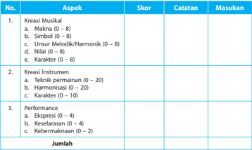

Tabel ini menunjukkan skor, catatan, dan masukan untuk evaluasi kreativitas musikal, instrumen, dan performa. Topik utamanya adalah kualifikasi musik, termasuk kreativitas musikal, teknik permainan, harmonisasi, karakteristik, ekspresi, keselarasan, dan kebermaksimaan. Kolom "Skor" menunjukkan nilai yang diberikan kepada setiap aspek, sementara kolom "Catatan" memberikan penjelasan tentang skor tersebut. Kolom "Masukan" menyediakan ruang untuk memberikan masukan atau komentar tambahan. Data penting yang terlihat adalah bahwa skor tertinggi adalah 20 dan skor terendah adalah 0, dengan beberapa aspek memiliki skor maksimal 8.

Setelah melakukan pengamatan terhadap ragam kreasi musik di atas, maka kegiatan selanjutnya siswa ditugaskan mengisi format berikut ini, sebagai bentuk penilaian portofolio yang menjadi salah satu sasaran dalam pembelajaran seni budaya khususnya tentang musik kreasi, kreasi musik dan nilai estetis musik.

Untuk penilaian aspek keterampilan, penilaian kelompok dan individu dapat dilakukan secara sekaligus menggunakan format yang sama.

### Catatan:

Agar ada peran belajar kelompok ( cooperative  learning ),  penilaian  kelompok  jangan berhenti hanya memberi nilai yang sama bagi seluruh anggota kelompok. Kalau berhenti di  situ,  kinerja  kelompok  akan  didominasi  oleh  anak  level  tinggi.  Yang  menengah  ke bawah hanya tergantung pada yang pandai. Maka dalam penilaian kelompok juga diuji kemampuan individu masing-masing anggota kelompok tersebut dan hasilnya  diratarata.  Ini  akan  berdampak  pada  terjadinya  belajar  kelompok  itu,  yakni  yang  pandai  atau terampil akan membantu yang kurang pandai atau kurang terampil karena yang pandai atau terampil akan rugi kalau nilai mereka dirata-rata.

### Selanjutnya, penilaian dilakukan seperti contoh berikut:

Jika Arjuna mendapat skor 12 dari soal pilihan ganda dan 18 dari soal uraian, maka siswa tersebut mendapat nilai ((12 + 18) : 40) x 100 = 75.

 

---
## 📄 Halaman 52

Sesuai panduan penilaian Kurikulum 2013 untuk SMA tahun 2016, penentuan ketuntasan minimal dan predikat nilai mulai dari D, C, B, sampai A tergantung pada KKM yang telah ditetapkan oleh guru atau MGMP yang disahkan oleh satuan pendidikan di awal semester  pertama. Tinggi  rendahnya  KKM ini akan menentukan predikat dari nilai yang diperoleh siswa karena aturannya adalah sebagai berikut:

---
**📊 Tabel**

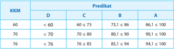

Tabel ini menunjukkan hasil predikat untuk berbagai nilai KKM (Karakter Kurangnya Minus) pada mata kuliah. Topik utama tabel adalah hubungan antara nilai KKM dengan predikat akhir D, C, B, dan A. Kolom-kolom yang ada mencakup nilai KKM (60, 70, 76) dan predikat akhir (D, C, B, A). Data penting yang terlihat adalah bahwa semakin tinggi nilai KKM, maka predikat akhir juga semakin baik, dengan predikat A menjadi predikat terbaik.

Maka jika KKM yang telah ditetapkan satuan pendidikan adalah 60, maka Arjuna yang mendapat nilai 75 sudah mencapai KKM. Sedangkan predikatnya jika mengacu contoh di atas, berarti B. Akan tetapi, jika KKM yang ditetapkan adalah 70, maka Arjuna sudah mencapai KKM, tetapi predikan nilainya C. Jika KKM yang ditetapkan adalah 76, maka Arjuna belum mencapai KKM dan predikat nilainya D sehingga Arjuna harus mengikuti pembelajaran remidial pada KD ini.

 

---
## 📄 Halaman 53

### KOMPETENSI INTI

KI 1 : Menghayati dan mengamalkan ajaran agama yang dianutnya

- KI 2 : Menghayati dan mengamalkan perilaku jujur, disiplin, tanggung jawab, peduli, (gotong royong, kerjasama, toleran, damai), santun, responsif dan proaktif, dan menunjukkan sikap sebagai bagian dari solusi atas berbagai permasalahan dalam berinteraksi secara efektif dengan lingkungan sosial dan alam serta dalam menempatkan diri sebagai cerminan bangsa dalam pergaulan dunia
- KI 3 : Memahami, menerapkan dan menganalisis pengetahuan faktual, konseptual, prosedural, dan meta kognitif berdasarkan rasa ingin tahunya tentang ilmu pengetahuan, teknologi, seni, budaya, dan humaniora dengan wawasan kemanusiaan, kebangsaan, kenegaraan, dan peradaban terkait penyebab fenomena dan kejadian, serta menerapkan pengetahuan prosedural pada bidang kajian yang spesifik sesuai dengan bakat dan minatnya untuk memecahkan masalah
- KI 4 : Mengolah, menalar, dan menyaji dalam ranah konkret dan ranah abstrak terkait dengan pengembangan dari yang dipelajarinya di sekolah secara mandiri, bertindak secara efektif dan kreatif , serta mampu menggunakan metoda sesuai kaidah keilmuan

### KOMPETENSI DASAR

- 2.1. Menghayati dan mengamalkan perilaku jujur, disiplin, tanggung jawab, peduli, kerjasama, santun, dan menunjukkan sikap sebagai bagian dari solusi atas berbagai permasalahan dalam berinteraksi secara efektif dengan lingkungan sosial, dan alam melalui apresiasi dan kreasi seni sebagai cerminan bangsa dalam pergaulan dunia
- 3.1. Menerapkan konsep, teknik, dan prosedur dalam berkarya tari kreasi
- 3.2. Menerapkan gerak tari kreasi berdasarkan fungsi, teknik, bentuk, jenis, dan nilai estetis sesuai iringan
- 3.3. Mengevaluasi gerak tari kreasi berdasarkan teknik tata pentas
- 3.4. Mengevaluasi bentuk, jenis, nilai estetis, fungsi, dan tata pentas dalam karya tari
- 4.1. Berkarya seni tari melalui pengembangan gerak berdasarkan konsep, teknik, dan prosedur sesuai dengan hitungan
- 4.2. Berkarya seni tari melalui pengembangan gerak berdasarkan fungsi, teknik, simbol, jenis, dan nilai estetis sesuai dengan iringan
- 4.3. Menyajikan hasil pengembangan gerak tari berdasarkan tata teknik pentas
- 4.4. Membuat tulisan mengenai bentuk, jenis, nilai estetis, fungsi, dan tata pentas

###  Bab 6 

### Konsep, Teknik, dan Prosedur dalam Berkarya Tari Kreasi



 

---
## 📄 Halaman 54

### TUJUAN PEMBELAJARAN

Pada kegiatan ini diharapkan peserta mampu menerapkan konsep, teknik, prosedur tari kreasi dan merancang kegiatan pembelajaran dengan menerapkan model Discovery Learning .

### PETA KONSEP

---
**🖼️ Gambar/Diagram**

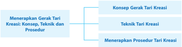

> **Deskripsi Visual:** Gambar ini adalah diagram yang menunjukkan struktur dari menerapkan gerak tari kreasi. Diagram ini dibagi menjadi dua bagian utama: Konsep Gerak Tari Kreasi dan Teknik Tari Kreasi. Untuk setiap bagian ini, ada subbagian yang menunjukkan prosedur menerapkan gerak tari kreasi.

1. **Apa yang Ditampilkan Secara Keseluruhan**: Gambar ini menunjukkan struktur umum dari menerapkan gerak tari kreasi, yang terdiri dari konsep, teknik, dan prosedur.

2. **Elemen-Elemen Utama dan Relasinya**: 
   - **Konsep Gerak Tari Kreasi** adalah elemen pertama yang ditampilkan, yang kemudian dibagi menjadi dua subbagian: Konsep dan Teknik.
   - **Teknik Tari Kreasi** adalah elemen kedua yang ditampilkan, yang juga dibagi menjadi dua subbagian: Teknik dan Prosedur.
   - **Menerapkan Prosedur Tari Kreasi** adalah elemen ketiga yang ditampilkan, yang merupakan hasil dari penggunaan teknik dan prosedur.

3. **Teks, Angka, atau Label Penting yang Terlihat**: 
   - **Konsep Gerak Tari Kreasi** diberi label "Konsep Gerak Tari Kreasi".
   - **Teknik Tari Kreasi** diberi label "Teknik Tari Kreasi".
   - **Menerapkan Prosedur Tari Kreasi** diberi label "Menerapkan Prosedur Tari Kreasi".

4. **Informasi Kunci yang Dapat Diambil Pembaca**: Gambar ini memberikan pemahaman tentang struktur umum dari menerapkan gerak tari kreasi, yang melibatkan konsep, teknik, dan prosedur. Ini membantu pembaca memahami bagaimana menerapkan gerak tari kreasi secara komprehensif dan sistematis.

### MATERI PEMBELAJARAN

### A. Konsep Gerak Tari Kreasi Tari

Karya  tari  adalah  sebuah  produk  dari  masyarakat.  Dalam  karya  tari  akan  tercermin budaya masyarakat penyangganya. Berbagai tari tentunya sudah kita amati, ada tari nelayan, tari  tani,  tari  berburu,  dan  tari  metik  teh.  Dari  pengamatan  itu  kita  sudah  bisa  menduga, bahwa  tari  nelayan  terlahir  dari  masyarakat  pelaut  dan  tari  tani  lahir  dari  masyarakat petani. Tari tersebut tercipta oleh para seniman dengan stimulus lingkungan sekitarnya, yang mendorongnya untuk meniru gerak-gerak alami yang selanjutnya diolah dengan 'digayakan' untuk menjadi sebuah tari. Proses pengolahan gerak itu dilakukan dengan cara penggayaan untuk memperindah ( stilatif ) atau bisa juga dengan merombak gerak sehingga berbeda dari gerak asalnya ( distortif ). Dari contoh tari tani dan tari nelayan, kita bisa manarik simpulan bahwa tari ternyata bisa terlahir dari peniruan atau imitatif, sama halnya dengan tari merak dari Sunda dan tari Cendrawasih dari Bali, yang tercipta oleh seniman karena ketertarikannya pada keindahan dan perilaku binatang-binatang tersebut serta menjadi sumber inspirasi dalam berkarya tari. Dari dua contoh tersebut terdapat dua sumber penciptaan berkarya tari yaitu: peniruan terhadap perilaku manusia dan peniruan perilaku binatang yang selanjutnya 'digayakan' atau diperindah untuk keperluan tari.

Selain dari tari-tari yang bersifat imitatif, terdapat pula tari yang menggambarkan tokohtokoh yang terdapat dalam cerita, seperti Gatotkaca tokoh pahlawan dalam cerita wayang Mahabarata, atau Hanoman tokoh pahlawan dalam ceritera Ramayana. Penggambaran tokohtokoh tersebut dalam tari Sunda, Jawa, dan Bali memiliki persamaan dalam busana dan gerak tari  dengan karakternya yang gagah. Apabila disandingkan busana tari Gatotkaca Jawa dan tari  Gatotkaca Sunda, tidak terlihat perbedaannya. Begitu pula busana tari Hanoman Jawa dan busana tari Hanoman Bali, busananya memiliki kemiripan. Akan tetapi, apabila sudah bergerak akan terlihat perbedaannya. Perbedaannya bukan hanya dari iringannya saja, tetapi perpaduan/komposisi geraknya juga berbeda. Dalam hal ini, terjadi perbedaan cita rasa seniman dalam mengekspresikan tokoh-tokoh pahlawan tersebut dan menerjemahkannya dalam karya tari. Dari sisi ini kita bisa memperoleh pembelajaran bahwa sebuah karya tari bisa bersumber dari cerita dan tokoh-tokoh yang terdapat dalam cerita bisa diwujudkan menjadi karya tari.

 

---
## 📄 Halaman 55

Tentu saja mewujudkan tokoh ke dalam karya tari memerlukan analisis karakter, lalu diolah menjadi gerak yang 'digayakan' berdasarkan persepsi penciptanya. Ternyata, dari sumber yang sama menghasilkan tari yang berbeda gaya.

Ada  pula  tari  yang  diciptakan  berdasarkan  lagu  pengiringnya  seperti:  tari Gawil dari Sunda diiringi lagu Gawil, tari Poco-Poco diiringi lagu poco-poco pula. Dalam hal ini, antara tari dan iringannya menjadi sebuah kesatuan, identitas, tari menyatu dengan iringannya. Dari pengamatan, kita bisa menduga kemungkinan besar awal penciptaan tarinya terstimulus dari lagunya. Dalam tradisi Sunda dan Jawa hal tersebut diterjemahkan dalam istilah guru lagu , artinya lagu yang menjadi patokan untuk menciptakan tariannya. Untuk contoh yang aktual bisa  diamati  pada  tari  Jaipong,  misalnya  tari entog mulang diiringi  lagu entog mulang .  Lagu entog mulang (itik pulang) tidak diketahui penciptanya dan kapan diciptakannya malahan sudah hampir punah karena cara mendendangkannya yang sulit. Akan tetapi, lagu tersebut berhasil direvitalisasi  dengan  menambahkan unsur tabuhan gendang jaipong, lalu tariannya disusun pula. Alhasil, tari entog mulang mengacu pada lagunya atau guru lagu , dan koreografinya juga menirukan gerak itik yang berjalan pulang.

Dari  pengamatan  terhadap  tari  di  etnis  di  atas  kita  bisa  menganalisisnya  bahwa  tari tercipta karena berbagai asal stimulus (penglihatan, pendengaran, perasaan) yang tercurahkan dalam bentuk tari dengan konsep:

- peniruan terhadap perilaku alam, manusia, dan binatang;
- perwujudan tokoh ceritera, dan
- mengacu lagu atau guru lagu .
Tentunya, siswa telah mengamati gerak tari dari berbagai sumber belajar dan juga telah mendiskusikan hasil pengamatan tersebut. Terdapat hal umum mengenai tari yang medianya gerak yaitu memiliki tenaga, ruang, dan waktu. Dalam hal ini, guru akan melakukan penyegaran mengenai konsep tenaga, ruang, dan waktu dalam tari kepada siswa serta komposisi/perpaduan antara ruang, tenaga, dan waktu. Begitu pula siswa telah mengamati tari dari berbagai sumber belajar.  Siswa  juga  telah  mendiskusikan  hasil  pengamatan  tersebut.  Bisa  di  duga  di  antara siswa  memiliki  persepsi  berbeda  karena  mungkin  tari  yang  diamati  juga  berbeda.  Setiap tari  memiliki  ragam gerak berbeda tetapi memiliki kesamaan yaitu memiliki tenaga, ruang, dan waktu. Mungkin saja ada gerak yang sama seperti ukel yang  terdapat  pada  tari:  Jawa, Sunda, Bali, Melayu, dan Sulawesi. Tetapi tekniknya agak berbeda. Akan tetapi, ada juga yang tekniknya sama tetapi memiliki nama yang berbeda. Dalam hal ini kesempatan bagi guru untuk menyadarkan bahwa setiap etnis memiliki karakteristik yang berbeda dan seyogyanya warga Indonesia menerima dan menghargai setiap kekhasan untuk menciptakan pergaulan antar etnis yang cinta damai.

Gerak tari yang ditunjukkan pada Gambar 9.2 (buku siswa) menunjukkan unsur wiraga dalam tari yang membentuk ruang gerak luas yang terlihat antara badan dan lengan yang dilakukan penari secara berkelompok sesuai irama. Masing-masing penari melakukan ruang gerak yang sama.

Selain gerak memerlukan tenaga dan ruang, dalam gerak juga memerlukan waktu. Setiap gerakan yang dilakukan membutuhkan waktu. Perbedaan cepat, lambat gerak berhubungan dengan tempo. Jadi, tempo merupakan cepat atau lambat gerak yang dilakukan. Fungsi tempo pada  gerak  tari  untuk  memberikan  kesan  dinamis  sehingga  tarian  enak  untuk  dinikmati. Lihat pada Gambar 9.3 (buku siswa) pose gerak hormat diantara penari yang satu dengan

 

---
## 📄 Halaman 56

penari yang lainnya berbeda. Penari yang satu dilakukan dengan tempo yang cepat sementara penari berikutnya dilakukan dengan tempo yang lambat, sehingga menghasilkan tempo yang berbeda dengan melakukan gerakan yang sama. Untuk menghasilkan tari kelompok yang baik, diperlukan kesatuan rasa gerak, rasa irama, dan rasa tenaga yang sama untuk seluruh penari. Sudah tentu memerlukan waktu latihan yang cukup untuk menyatukan seluruh rasa tersebut.

### B. Teknik Berkarya Tari Kreasi

Penelitian antropologi mengenai perilaku manusia (Moris, 2002) menyimpulkan bahwa manusia memiliki perilaku dasar estetis. Hanya saja perkembangan perilaku tersebut berbeda pada setiap orangnya. Faktor keluarga, lingkungan, faham keagamaan sangat erat kaitannya dengan perkembangan minat dan bakat anak. Pembelajaran tari di sekolah sudah barang tentu harus bisa melayani semua siswa yang berbakat dan memiliki minat tari atau tidak. Dalam hal ini guru diharapkan bisa mengatasi berbagai hambatan pembelajaran dengan memanfaatkan model-model pembelajaran.

Untuk sampai pada kemampuan berkarya tari, idealnya siswa harus memiliki kemampuan dasar menari. Untuk memperoleh kemampuan dasar tersebut, siswa diminta untuk mengamati tari  dari  berbagai  media,  mengunjungi,  dan  mengamati  karya  tari  dari  narasumber  yang memiliki kemampuan menari. Langkah selanjutnya adalah mengembangkan gerak yang sesuai dengan iringannya.

Bahan ajar yang digunakan untuk mengembangkan tari, berasal dari tari tradisional Indonesia. Pemilihan tari tradisional bukan tanpa sebab, dari perspektif estetis, etis,  etnis,  dan  politis alasannya  kuat  dan  menjadi  keniscayaan.  Di  tengah  tarik  menarik  kekuatan  global  yang menyeret kita, ketahanan budaya lokal perlu ditingkatkan. Kekayaan seni yang multi etnis bisa menjadi berkah tapi bisa juga menjadi musibah apabila kita lengah. Melalui pendidikan seni tradisional,  semangat,  dan  kecintaan  pada  tanah  air  ditanamkan sebagai langkah awal, bisa dimulai dengan mengembangkan gerak-gerak dasar tari tradisional Indonesia yang bersumber dari: kepala, badan, tangan, dan kaki.

Untuk memperjelas bahasan teknik ragam gerak dasar tari tradisional ini, seyogyanya guru memiliki bahan materi yang beragam yang bisa diunduh dari internet, buku atau bahkan memberikan kesempatan pada siswa untuk menemukan teknik ragam gerak tari tradisional dari seniman atau narasumber lainnya.

### C. Menerapkan Prosedur Tari Kreasi dari Seni Tradisi ke Tari Kreasi

Kegiatan  ini  memberikan  kesempatan  kepada  guru  dalam  memotivasi  siswa  untuk menemukan kekhasan geraknya sendiri. Eksplorasi dalam pembelajaran seni adalah penggalian terhadap apa yang dilihat, didengar, dan diraba artinya dalam pembelajaran ini melatih kepekaan pancaindera siswa untuk menemukan hal yang dianggap menarik, menyenangkan, dan indah serta pantas untuk dikembangkan dalam gerak.

Untuk menerapkan prosedur berkarya seni tari kreasi, bapak/ibu guru bisa mencontoh Hawkins  dalam  bukunya Moving  from  Within:  a  New  Method  for  Dance  Making yang diterjemahkan oleh I Wayan Dibia dengan judul Bergerak Menurut Kata Hati (2003). Hawkins memaparkan bahwa untuk merangkai gerak dan menerapkan tari kreasi dilakukan melalui empat tahap kreatif yang terdiri atas sebagai berikut.

 

---
## 📄 Halaman 57

### 1. Eksplorasi

Kegiatan ini adalah pencarian dan percobaan mengembangkan beragam gerak dari tema yang sudah terpilih, yang kemudian dilanjutkan dengan evaluasi yaitu pemilihan terhadap gerak-gerak yang dianggap cocok sesuai dengan kata hatinya dan kesepakatan kelompoknya. Siswa diberikan kebebasan untuk mencari sampai menemukan sendiri gerakan yang dia inginkan, selanjutnya dirangkai menjadi tari kreasi hasil kelompok siswa. Peran guru adalah membimbing, memotivasi, mengarahkan, dan mengawasi proses. Apapun hasilnya nanti tak ada yang salah, atau benar. Penilaian adalah bagaimana proses dilaksanakan, bagaimana siswa bekerjasama dalam memecahkan problem yang mereka hadapi. Yang perlu diketahui oleh guru adalah alasan siswa dalam memilih dan mengembangkan ragam gerak.

Kegiatan  ini  memberikan  kesempatan  kepada  guru  dalam  memotivasi  siswa  untuk menemukan kekhasan gerakannya sendiri. Eksplorasi  dalam  pembelajaran  seni  adalah penggalian terhadap apa yang dilihat, didengar, dan diraba artinya dalam pembelajaran ini  melatih  kepekaan pancaindera siswa untuk menemukan hal yang dianggap menarik, menyenangkan, dan indah serta pantas untuk dikembangkan dalam gerak. Ide gagasan yang dapat dijadikan tema meliputi hal-hal sebagai berikut.

- tema lingkungan dan alam sekitar;
- tema kehidupan sehari-hari;
- tema pola cerita rakyat; dan
- tema dengan menggunakan properti sebagai pendukung tari.

### 2. Improvisasi

Kegiatan  ini  adalah  pencarian  dan  percobaan  mengembangkan  beragam  gerak dari  tema  yang  sudah  terpilih,  kemudian  dilanjutkan  dengan  evaluasi  yaitu  pemilihan terhadap gerak-gerak yang dianggap cocok sesuai dengan kata hatinya dan kesepakatan kelompoknya. Dari setiap ragam gerak yang dihasilkan pada waktu eksplorasi, dikembangkan dari aspek tenaga, ruang, dan waktu sehingga menghasilkan gerak yang sangat beragam. Siswa diberikan kebebasan untuk mencari sampai menemukan sendiri gerakan yang dia inginkan, selanjutnya dirangkai dalam komposisi kelompok. Peran guru adalah membimbing, memotivasi, mengarahkan, dan mengawasi proses. Mungkin ada saja jawaban atau gerak yang dianggap 'nyeleneh', tapi itu bukankah salah satu ciri kreatif.

### 3. Evaluasi

Pengalaman untuk menilai dan menyeleksi ragam gerak yang telah dihasilkan pada tahap  improvisasi.  Dalam  kegiatan  ini  siswa  mulai  menyeleksi  dengan  cara  membuat ragam gerak yang tidak sesuai dan memilih ragam gerak yang sesuai dengan gagasannya. Hasil inilah yang akan digarap oleh siswa pada tahap komposisi tari.

### 4.  Komposisi

Tujuan akhir  dari  tahapan  ini  untuk  memberikan  bentuk  terhadap  apa  yang  siswa temukan. Melalui tahapan-tahapan eksplorasi (penjajakan gerak), improvisasi (mencari dan menemukan gerak), evaluasi (pemilahan dan pemilihan gerak), untuk pada akhirnya siswa dapat membentuk dan merangkaikan gerak menjadi sebuah komposisi.

 

---
## 📄 Halaman 58

### D.  Proses Pembelajaran

Proses pembelajaran dilakukan dengan model discovery learning .   Penggunaan discovery learning yaitu bagaimana merubah kondisi belajar yang pasif menjadi pembelajaran yang aktif dan kreatif.

---
**📊 Tabel**

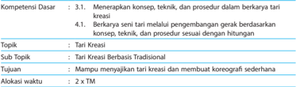

Tabel ini berisi informasi tentang kompetensi dasar dan topik yang akan diajarkan dalam mata pelajaran tari kreatif. Topik utama adalah "Tari Kreatif", yang dipecah menjadi sub-topik "Tari Kreatif Berbasis Tradisional". Tujuan pembelajaran adalah untuk memungkinkan siswa menggunakan tari kreatif dan membuat koreografi sederhana. Alokasi waktu untuk topik ini adalah 2 x 70 menit. Dalam tabel ini, kita dapat melihat bahwa topik utama adalah "Tari Kreatif", yang dipecah menjadi sub-topik "Tari Kreatif Berbasis Tradisional". Tujuan pembelajaran adalah untuk memungkinkan siswa menggunakan tari kreatif dan membuat koreografi sederhana. Alokasi waktu untuk topik ini adalah 2 x 70 menit.

---
**📊 Tabel**

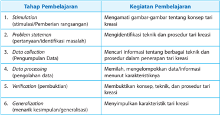

Tabel ini menunjukkan proses pembelajaran kreatif yang melibatkan berbagai tahap, mulai dari stimulasi hingga generalisasi. Topik utama adalah proses pembelajaran kreatif, yang melibatkan pengamatan gambar-gambar tentang konsep tari kreatif, identifikasi masalah teknis dan prosedur dalam penerapan tari kreatif, pengumpulan data tentang berbagai teknik dan prosedur tersebut, pemrosesan data untuk memahami karakteristiknya, pembuktian konsep, teknik, dan prosedur tari kreatif, dan akhirnya generalisasi dengan menarik kesimpulan atau generalisasi. Kolom-kolom yang ada mencakup tahap-tahap pembelajaran, seperti stimulasi, statement masalah, pengumpulan data, pemrosesan data, pembuktian, dan generalisasi. Data penting yang terlihat adalah bahwa setiap tahap memiliki tujuan spesifik dalam proses pembelajaran kreatif, mulai dari mengidentifikasi konsep dan teknik hingga menarik kesimpulan atau generalisasi.

### LANGKAH-LANGKAH PEMBELAJARAN

---
**📊 Tabel**

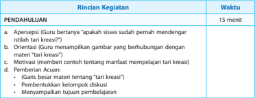

Tabel ini berisi informasi tentang proses pendahuluan dalam pembelajaran kreatif, yang melibatkan berbagai aktivitas yang dilakukan guru dan siswa untuk mempersiapkan diri dan membangun motivasi sebelum mulai belajar. Topik utama tabel adalah pendahuluan, yang mencakup berbagai tahapan seperti apersepsi, penjelasan materi, motivasi, dan pemberian acuan. Kolom-kolomnya mencakup waktu yang diperlukan untuk setiap aktivitas, yang bervariasi antara 15 menit hingga beberapa menit. Data penting yang terlihat adalah bahwa aktivitas seperti apersepsi dan penjelasan materi memerlukan waktu lebih lama dibandingkan dengan motivasi dan pemberian acuan. Ini menunjukkan bahwa pendahuluan dalam pembelajaran kreatif memerlukan perencanaan dan pengaturan waktu yang tepat untuk memastikan aktivitas tersebut dapat dilaksanakan secara efektif.

 

---
## 📄 Halaman 59

---
**📊 Tabel**

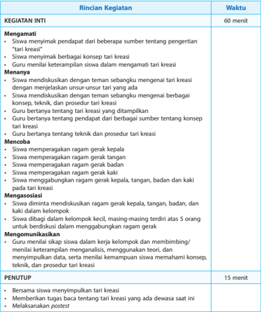

Tabel ini berisi rincian kegiatan dan waktu untuk proses pembelajaran tentang tari kreasi. Topik utama adalah pengenalan dan praktik tari kreasi. Kolom "Rincian Kegiatan" mencakup empat poin utama: mengamati tari kreasi, menanyakan tentang tari kreasi, mencoba tari kreasi, dan memfasilitasi diskusi tentang tari kreasi. Waktu yang ditentukan untuk setiap kegiatan adalah 60 menit untuk mengamati dan menanyakan, 15 menit untuk mencoba dan memfasilitasi diskusi. Data penting lainnya termasuk tujuan penutupan, yaitu memberikan tugas untuk membaca tentang tari kreasi dan melaksanakan postest.

### E. Evaluasi

### 1.  Teknik dan Bentuk Instrumen

---
**📊 Tabel**

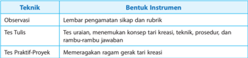

Tabel ini membahas berbagai teknik evaluasi kreativitas siswa dan bentuk instrumen yang digunakan untuk masing-masing teknik tersebut. Topik utama tabel adalah metode evaluasi kreativitas siswa melalui observasi, tes tulis, dan tes praktik-proyek. Kolom pertama menunjukkan teknik evaluasi, sementara kolom kedua menunjukkan bentuk instrumen yang digunakan. Dari tabel ini, dapat dilihat bahwa observasi menggunakan lembaran pengamatan sikap dan rubrik, tes tulis melibatkan tes uraian, merumuskan konsep terkait kreativitas, teknik, prosedur, dan rambu-rambu jawaban, dan tes praktik-proyek memeragakan ragam gerak terkait kreativitas. Pola penting yang terlihat adalah adanya variasi dalam bentuk instrumen evaluasi kreativitas, mulai dari observasi langsung hingga tes praktik-proyek yang memerlukan keterampilan kreatif siswa.

 

---
## 📄 Halaman 60

### 2.  Instrumen

- Instrumen Sikap
Untuk mengukur pencapaian kompetensi sikap dilakukan melalui pengamatan/observasi baik pada saat pembelajaran maupun diskusi dan presentasi

### · Lembar	observasi	pembelajaran

---
**📊 Tabel**

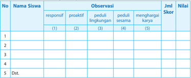

Tabel ini menunjukkan evaluasi responsif, proaktif, peduli lingkungan, peduli sesama, dan menghargai karya siswa. Kolom (1) sampai (5) masing-masing menunjukkan skor untuk setiap kriteria. Data dalam tabel ini menunjukkan bahwa beberapa siswa memiliki skor yang lebih tinggi di kriteria seperti responsif dan proaktif, sementara yang lainnya memiliki skor yang lebih rendah. Tabel ini membantu guru untuk memantau perkembangan siswa dalam berbagai aspek kehidupan sekolah dan keluarga.

Keterangan pengisian skor:

- 4 Sangat baik
- 3 Baik
- 2 Cukup
- 1 Kurang

### b. Instrumen Penilaian Pengetahuan

### · Lembar	observasi	diskusi

---
**📊 Tabel**

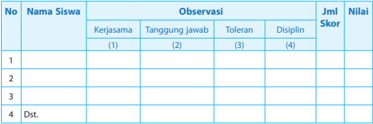

Tabel ini menunjukkan observasi siswa tentang empat kriteria: kerjasama, tanggung jawab, toleransi, dan disiplin. Kolom "Observasi" memuat skor untuk setiap kriteria, sementara kolom "Jml Skor" menyajikan jumlah skor yang diberikan. Data penting yang terlihat adalah bahwa siswa memiliki skor tertinggi pada kriteria disiplin, sedangkan skor mereka pada kriteria kerjasama dan tanggung jawab lebih rendah.

Keterangan pengisian skor:

- 4 Sangat baik
- 3 Baik
- 2 Cukup
- 1 Kurang

 

---
## 📄 Halaman 61

### • Lembar	observasi	persentasi

Nama

:  .........................................

Kelas

:  .........................................

---
**📊 Tabel**

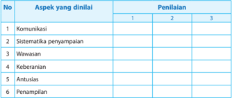

Tabel ini menunjukkan aspek-aspek yang dinilai dalam sebuah penilaian, dengan 3 penilaian untuk setiap aspek. Topik utama tabel adalah aspek-aspek yang harus diperhatikan dalam proses penilaian. Kolom-kolomnya meliputi nomor urutan (No), aspek yang dinilai, dan penilaian. Data atau pola penting yang terlihat adalah bahwa setiap aspek memiliki 3 penilaian, yang menunjukkan bahwa penilaian ini mungkin menggunakan skala tertentu atau metode lain untuk mengukur kualitas aspek tersebut.

### · Rubrik	lembar	observasi	penilaian	presentasi

 

---
## 📄 Halaman 62

### c. Instrumen Penilaian Keterampilan

### · Tes	Praktik

Tes praktik ini dilakukan pada saat siswa menerapkan ragam gerak kepala, tangan, badan, dan kaki pada tari kreasi baru. Serta pada saat siswa membuat tari kreasi baru bersama dengan kelompoknya.

---
**📊 Tabel**

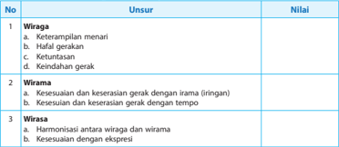

Tabel ini memuat informasi tentang tiga aspek keterampilan menari, yaitu wiraga, wirama, dan wirasa. Wiraga mencakup empat unsur: keterampilan menari, hafalan gerakan, ketuntasan gerak, dan keindahan gerak. Wirama melibatkan kesesuaian dan keserasian gerak dengan irama (ringan) dan tempo. Sementara itu, wirasa melibatkan harmonisasi antara wiraga dan wirama, serta kesesuaian dengan ekspresi. Topik utama tabel ini adalah keterampilan menari dan bagaimana ia dapat ditingkatkan melalui pengembangan wiraga, wirama, dan wirasa.

Keterangan:

Penilaian dilakukan dengan skor 10 - 100

100 - 90  : Amat baik

89 - 80

:  Baik

79 - 70

:  Cukup

69 - 60

:  Kurang

### d.  Pengayaan

Pengayaan diberikan kepada siswa:

- Tidak terkena program remedial/perbaikan
- Diberikan pengembangan materi
- Diberikan soal/praktek tambahan untuk memantapkan materi

### F. Remedial

Bentuk	pelaksanaan	remedial

### 1. Cara yang dapat ditempuh

- Pemberian  bimbingan  secara  khusus  dan  perorangan  bagi  siswa  yang  belum  atau mengalami kesulitan dalam penguasaan KD
- Pemberian  tugas-tugas  atau  perlakuan  ( treatment )  secara  khusus,  yang  sifatnya penyederhanaan dari pelaksanaan pembelajaran regular.
Bentuk penyederhanaan itu dapat dilakukan guru melalui:

- Penyederhanaan strategi pembelajaran KD tertentu
- Penyederhanaan cara penyajian (misalnya: menggunakan gambar-gambar, dan memberikan rangkuman yang sederhana)
- Penyederhanaan soal/pertanyaan yang diberikan

 

---
## 📄 Halaman 63

### 2. Materi dan waktu pelaksanaan program remedial

- Program remedial diberikan hanya pada KD atau indikator yang belum tuntas
- Program  remedial  dilaksanakan  setelah  mengikuti  tes/ulangan  KD  tertentu  atau sejumlah KD dalam satu kesatuan

### Teknik pelaksanaan remedial:

- Penugasan individu diakhiri dengan tes (lisan/tertulis/praktek) bila jumlah siswa yang mengikuti remedial 20%
- Penugasan kelompok diakhiri dengan tes individual (lisan/tertulis/praktek) bila jumlah siswa yang mengikuti remedial lebih dari 20% tetapi kurang dari 50%. Pembelajaran ulang  diakhiri  dengan  tes  individual  (praktek)  bila  jumlah  siswa  yang  mengikuti remedial lebih dari 50%

### G.  Interaksi dengan Orang Tua Siswa

Pada hakekatnya guru dan orang tua dalam pendidikan yang mempunyai tujuan yang sama yakni mengasuh, mendidik, membimbing, dan membina serta memimpin anaknya menjadi orang dewasa dan dapat memperoleh kebahagiaan dalam hidupnya.

Interaksi semua pihak yang terkait akan mendorong siswa senantiasa melaksanakan tugasnya dengan tekun  dan  bersemangat.  Hubungan  timbal  balik  antara  orang  tua  dan  guru  akan melahirkan suatu bentuk kerjasama yang dapat meningkatkan aktivitas belajar siswa baik di rumah maupun di sekolah.

Hubungan kerjasama antara guru dan orang tua dalam meningkatkan aktivitas belajar siswa:

- Adanya kunjungan ke rumah siswa
- Mengundang orang tua ke sekolah untuk melihat pergelaran hasil karya siswa
- Case conference
- Badan pembantu sekolah
- Mengadakan surat menyurat antara sekolah dan keluarga
- Adanya daftar nilai atau raport

 

---
## 📄 Halaman 64

### KOMPETENSI INTI

- KI 1 : Menghayati dan mengamalkan ajaran agama yang dianutnya
- KI 2 : Menghayati dan mengamalkan perilaku jujur, disiplin, tanggung jawab, peduli, (gotong royong, kerjasama, toleran, damai), santun, responsif dan proaktif, dan menunjukkan sikap sebagai bagian dari solusi atas berbagai permasalahan dalam berinteraksi secara efektif dengan lingkungan sosial dan alam serta dalam menempatkan diri sebagai cerminan bangsa dalam pergaulan dunia
- KI 3 : Memahami, menerapkan dan menganalisis pengetahuan faktual, konseptual, prosedural dan meta kognitif berdasarkan rasa ingin tahunya tentang ilmu pengetahuan, teknologi, seni, budaya, dan humaniora dengan wawasan kemanusiaan, kebangsaan, kenegaraan, dan peradaban terkait penyebab fenomena dan kejadian, serta menerapkan pengetahuan prosedural pada bidang kajian yang spesifik sesuai dengan bakat dan minatnya untuk memecahkan masalah
- KI 4 : Mengolah, menalar dan menyaji dalam ranah konkret dan ranah abstrak terkait dengan pengembangan dari yang dipelajarinya di sekolah secara mandiri, bertindak secara efektif dan kreatif, serta mampu menggunakan metoda sesuai kaidah keilmuan

### KOMPETENSI DASAR

- 2.1. Menghayati dan mengamalkan perilaku jujur, disiplin, tanggung jawab, peduli, kerjasama, santun, dan menunjukkan sikap sebagai bagian dari solusi atas berbagai permasalahan dalam berinteraksi secara efektif dengan lingkungan sosial, dan alam melalui apresiasi dan kreasi seni sebagai cerminan bangsa dalam pergaulan dunia
- 3.1. Menerapkan konsep, teknik dan prosedur dalam berkarya tari kreasi
- 3.2. Menerapkan gerak tari kreasi berdasarkan fungsi, teknik, bentuk, jenis dan nilai estetis sesuai iringan
- 3.3. Mengevaluasi gerak tari kreasi berdasarkan teknik tata pentas
- 3.4. Mengevaluasi bentuk, jenis, nilai estetis, fungsi dan tata pentas dalam karya tari
- 4.1. Berkarya seni tari melalui pengembangan gerak berdasarkan konsep, teknik dan prosedur sesuai dengan hitungan
- 4.2. Berkarya seni tari melalui pengembangan gerak berdasarkan fungsi, teknik, simbol, jenis dan nilai estetis sesuai dengan iringan

###  Bab 7 

### Menerapkan Gerak Tari Kreasi (Fungsi, Teknik, Bentuk, Jenis, dan Nilai Estetis sesuai Iringan)



 

---
## 📄 Halaman 65

- 4.3. Menyajikan hasil pengembangan gerak tari berdasarkan tata teknik pentas
- 4.4. Membuat tulisan mengenai bentuk, jenis, nilai estetis, fungsi dan tata pentas

### TUJUAN PEMBELAJARAN

Pada kegiatan ini diharapkan siswa mampu menerapkan fungsi, bentuk, jenis dan nilai estetis tari kreasi sesuai iringan dan merancang kegiatan pembelajaran dengan menerapkan model berbasis masalah ( Problem Based Learning ).

### PETA KONSEP

---
**🖼️ Gambar/Diagram**

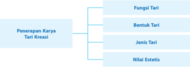

> **Deskripsi Visual:** Gambar ini adalah diagram yang menunjukkan struktur dari penerapan karya tari kreasi. Diagram ini dibagi menjadi empat bagian utama: Fungsi Tari, Bentuk Tari, Jenis Tari, dan Nilai Estetis. Setiap bagian ini memiliki subbagian yang lebih spesifik untuk mendalamkan pemahaman tentang aspek tertentu dari tari kreasi.

1. **Apa yang Ditampilkan Secara Keseluruhan**: Gambar ini secara keseluruhan menunjukkan struktur dan komponen utama dari penerapan karya tari kreasi, yang mencakup berbagai aspek seperti fungsi, bentuk, jenis, dan nilai estetis.

2. **Elemen-Elemen Utama dan Relasinya**: 
   - **Fungsi Tari** merupakan bagian utama yang memuat informasi tentang tujuan dan kegunaan tari dalam konteks kreatif.
   - **Bentuk Tari** membahas tentang cara dan cara melukis tari, termasuk gaya dan teknik yang digunakan.
   - **Jenis Tari** menggambarkan berbagai genre atau kategori tari yang ada, seperti tari tradisional, modern, atau kontemporer.
   - **Nilai Estetis** menekankan pada aspek estetika dan keindahan dalam tari, termasuk penampilan, ritme, dan visual.

3. **Teks, Angka, atau Label Penting yang Terlihat**: 
   - **Fungsi Tari** diberi label "F".
   - **Bentuk Tari** diberi label "B".
   - **Jenis Tari** diberi label "J".
   - **Nilai Estetis** diberi label "N".

4. **Informasi Kunci yang Dapat Diambil Pembaca**: 
   - Gambar ini memberikan panduan umum tentang struktur dan elemen-elemen penting dalam penerapan karya tari kreasi, membantu pembaca memahami bagaimana tari berkembang dan berkaitan dengan berbagai aspek lainnya.

### MATERI PEMBELAJARAN

### A. Fungsi Tari

Soedarsono  (1998),  membagi  fungsi  tari  pada  dua  kategori:  fungsi  primer  dan  fungsi sekunder. Fungsi Primer tari terdiri atas:

### 1. Tari upacara

Tari yang berfungsi sebagai upacara, apabila tari tersebut memiliki ciri:

- dipertunjukan pada waktu terpilih,
- tempat terpilih,
- penari terpilih,
- adanya sesaji.
Tari  yang  digunakan  untuk  acara  keagamaan  di  Bali  memiliki  fungsi  upacara  dan disakralkan, maka diberi nama tari Wali. Sementara tari yang memiliki fungsi sebagai pendukung  upacara  diberi  istilah  tari  Bebali.  Adapun  tari  yang  berfungsi  sebagai pertunjukan  estetis  disebut  bali-balian.  Fenomena  yang  terjadi  di  Yogyakarta  atau Surakarta, tentunya berbeda. Di sana terdapat tari yang dipergelarkan hanya untuk acara yang dianggap sakral seperti penobatan raja atau hari peringatan penobatan raja, seperti tari: Bedhaya, Serimpi, Beksan, dan Wayang Wong. Dalam hal ini guru memberikan motivasi kepada siswa untuk mengamati tari upacara yang ada di daerah sekitar lingkungannya atau daerah lainnya untuk selanjutnya dikembangkan dan diterapkan menjadi tari kreasi yang mengacu pada tari upacara.

 

---
## 📄 Halaman 66

### 2. Tari hiburan pribadi

Tari  yang  berfungsi  sebagai  hiburan  pribadi  memiliki  ciri  gerak  yang  spontan,  dan bergerak untuk kesenangan sendiri. Oleh karena untuk kesenangan sendiri, kadangkala tidak  menghiraukan  keindahannya.  Bapak/Ibu  guru  dipersilahkan  untuk  memberikan motivasi kepada siswa untuk mengamati, mendiskusikan, dan menemukan tari hiburan pribadi di lingkungan sendiri atau daerah lainnya, selanjutnya dikembangkan dan diterapkan menjadi tari kreasi baru.

### 3. Tari penyajian estetis

Tari  yang  berfungsi  sebagai  penyajian  estetis  adalah  tari  yang  disiapkan  untuk dipertunjukan. Sudah tentu karena fungsinya untuk pertunjukan, prosesnya melalui latihan berulang serta memiliki kaidah-kaidah yang harus dipertimbangkan. Selain kaidah estetika yang  umum  seperti  wiraga,  wirama,  dan  wirasa,  setiap  etnis  memiliki  rasa  keindahan yang berbeda. Sebagai contoh estetika tari  Sunda  klasik  terekam  dalam  istilah:  wanda (ukuran/postur penari), wirama (ketrampilan menari yang sesuai dengan iringannya), wirasa (ekspresi menari), sari (kedalaman penghayatan), alus (harmonisasi). Akan tetapi, tatkala siswa dihadapkan pada tari Jaipongan yang juga dari etnis Sunda, tentu saja kaidah seni pertunjukannya akan berbeda. Dengan demikian guru dipersilahkan memotivasi siswa untuk mencari, membandingkan, dan menganalisis tari. Selanjutnya, menemukan kaidah keindahan tari penyajian estetis yang diamatinya. Kemudian, diterapkan menjadi tari kreasi yang terbarukan.

### B. Bentuk Tari

### 1. Tari tunggal

Tari  yang  ditampilkan  oleh  seorang  penari  dalam  menarikan  tokoh.  Oleh  karena menarikan seorang tokoh yang bisa bersumber dari sejarah, cerita wayang, cerita rakyat, legenda dan lain-lain, maka karakter atau perwatakannya harus tampil dengan jelas. Karakter dalam  tari  terlihat  dari  volume  gerak  yang  harus  dipertahankan  selama  ditampilkan. Contoh tari  Gatotkaca  dari  cerita  wayang  Mahabharata  adalah  seorang  kesatria  yang gagah. Tari Gatotkaca memiliki volume gerak luas yang ditandai dengan angkatan kaki dan tangan yang terbuka lebar disertai pandangan yang lurus ke depan. Berbeda halnya dengan tokoh Arjuna yang berkarakter halus, maka tarinya memiliki volume gerak sedang dengan pandangan mata menunduk. Dalam hal ini bapak/ibu guru dipersilahkan memotivasi siswa untuk mengamati dan mengasosiasikan tokoh-tokoh ideal dalam kehidupan nyata untuk diketemukan karakternya dan direpresentasikan ke dalam tari kreasi.

### 2. Tari berpasangan

Tari  yang  ditampilkan  oleh  dua  orang  penari,  atau  berpasangan  baik  laki-laki  perempuan, perempuan - perempuan, atau laki-laki - laki-laki. Prinsip tari berpasangan adalah adanya saling interaksi diantara penari. Saling mengisi dalam gerak dan membuat komposisi yang terencana. Adakalanya tari berpasangan ditampilkan oleh lebih dua orang, yang penting tari tersebut berkonsep dua yang saling mengisi. Contohnya tari Serampang dua belas dari Melayu, walaupun ditarikan secara masal, tetapi konsep dua yang saling mengisi masih terjaga.

Dalam hal ini bapak/ibu guru dipersilahkan memotivasi siswa untuk mengamati dan mendiskusikan tari berpasangan agar bisa dikreasikan kembali sesuai selera estetis siswa.

 

---
## 📄 Halaman 67

### 3.  Tari kelompok

Tari yang ditampilkan lebih dari 3 (tiga) orang penari. Tidak ada ketentuan mutlak jumlah  maksimal,  contoh  tari  Saman  dari  Aceh,  tari  piring  dari  Minangkabau,  tari Merak dari Jawa Barat, dan lain-lain. Akan tetapi, ada tari yang memiliki ketentuan khusus. Misalnya, pada tari Bedhaya dari Jawa yang ditampilkan oleh 5 orang penari bisa juga 7 atau 9 penari, yang masing-masing penari memiliki peran dan lintasan tari yang  sudah  baku.  Dalam  hal  ini  bapak/ibu  guru  memiliki  peran  sebagai  motivator, menstimulus siswa untuk berkreasi tari kelompok.

### C. Jenis Tari

Secara sosiologis tari di Indonesia dapat dikategorikan pada jenis:

- Tari  rakyat  yaitu  tari  yang  berkembang  di  lingkungan  masyarakat  lokal,  hidup  dan berkembang secara turun temurun. Contoh tari: Angguk dari Jawa Tengah, dan Sisingaan dari Jawa Barat.
- Tari klasik yaitu tari yang berkembang di masyarakat kalangan istana, tari ini memiliki pakem-pakem tertentu dan nilai-nilai estetis yang tinggi. Contoh tari: Bedhaya, Srimpi, dan Legong Keraton.
- Tari  kreasi  baru  adalah  tari  yang  dikembangkan  sesuai  dengan  perkembangan  zaman, namun pada dasarnya tidak menghilangkan nilai-nilai  tradisi  itu  sendiri.  Contoh  tari: Jaipong dari Jawa Barat, Manuk Rawa dari Bali, dan Rantak dari Sumatera Barat.
Pada garis besarnya tari kreasi dibedakan menjadi 2 kategori yaitu: tari kreasi bersumber tradisi dan tari kreasi non tradisi.

Tari  Kreasi  yang  bersumber  dari  tradisi  memiliki  ciri  garapannya  yang  dilandasi  oleh kaidah-kaidah tari tradisi, baik dalam koreografi, musik, tata busana dan rias, maupun tata teknik pentasnya. Ada sebagian pengembangan yang dilakukan namun tidak menghilangkan unsur utama dari tradisi. Contoh: tari Bedhaya Hogoromo karya Didik Nini Thowok yang berlandaskan pada kaidah-kaidah tari Bedhaya umumnya, namun dalam tema dan penampilan yang berbeda.

Tari kreasi non tradisi memiliki ciri garapannya melepaskan diri dari pola-pola tradisi baik dalam hal koreogr afi, musik, rias dan busana, maupun tata teknik pentasnya. Sebagai contoh tari 'Teleholografis'  karya  Miroto. Tari  ini  ditampilkan  dalam  satu  waktu  tetapi  dilakukan oleh penari dari daerah yang berbeda, dipanggungkan dengan memanfaatkan teknologi tinggi melalui system telepresensi video call dan teknik holografis, sehingga bisa menyatukan semua penari yang berjauhan yang ada di Jakarta, Bali, dan Sumatera.

### D.  Nilai Estetis

Nilai  adalah  aturan  mengenai baik atau buruknya sesuatu yang dianut oleh masyarakat penyangga budayanya. Dengan demikian, nilai estetis atau estetika adalah nilai keindahan yang terdapat dalam karya seni menurut ukuran masyarakat yang satu dan masyarakat lainnya tentunya berbeda. Contoh menilai estetis tari pada tari Bali adalah:

- Agem, yaitu aturan atau pola sikap badan, tangan, dan kaki yang ideal sesuai estetika;
- Tandang, yaitu cara berpindah tempat;
- Tangkep, yaitu ekspresi mimik wajah dan mata sebagai penguat penjiwaan tari.

 

---
## 📄 Halaman 68

Contoh lain lagi adalah unsur-unsur estetika yang terdapat dalam tari Jawa gaya Yogya yang terangkum dalam iistilah 'joget mataram', yaitu:

- Sawiji, yaitu konsentrasi total;
- Greget, yaitu dinamika tari;
- Sengguh, yaitu percaya diri; dan
- Ora mingkuh, yaitu pantang mundur.
Dalam hal ini bapak/ibu guru memiliki kesempatan untuk memberikan keleluasaan pada siswa menjelajahi unsur-unsur estetik di setiap etnis. Akan tetapi, dalam kaitannya dengan pendidikan formal di sekolah, berlaku nilai keindahan umum yang sudah diakui bersama, yaitu wiraga, wirama, dan wirasa.

- Wiraga digunakan untuk menilai:
- kompetensi menari, meliputi keterampilan menari, hafal terhadap gerakan, ketuntasan, kebersihan dan keindahan gerak.
- Wirama untuk menilai: Kesesuaian dan keserasian gerak dengan irama (iringan), kesesuaian dan keserasian gerak dengan tempo.
- Wirasa adalah tolok ukur untuk menilai cara siswa menjiwai tari.
Dari perspektif estetika tari, ternyata setiap etnis itu memiliki konsep keindahan gerak yang dianut dan dipresentasikan dalam tari yang khas dan berbeda satu sama lainnya. Claire Holt (1967) menyatakan 'perlihatkan tarimu, maka akan terlihat budayamu'. Pernyataan tersebut memberi penguatan pemahaman bahwa tari sebagai produk masyarakat berlandaskan pada  nilai-nilai  yang  dianut  masyarakat  penyangga  budayanya.  Nilai  estetis  tergambar dalam penampilannya, sedangkan nilai etis dapat digali  dari  filosofi  tarian  tersebut.  Dari sisi  pendidikan,  nilai  estetis  dan  nilai  etis  bisa  dikembangkan  ke  dalam  ranah  pendidikan karakter.  Bapak/ibu guru bisa memberikan arahan kepada siswa untuk mencermati secara mendalam nilai estetis dan nilai etis dari masing-masing daerah agar bisa dikembangkan ke dalam tari kreasi baru yang memiliki karakter ideal.

Dalam buku siswa, terdapat contoh lagu rakyat  yang  bisa  dikembangkan  menjadi  tari kreasi  baru  yang  memiliki nilai  estetis  dan  nilai  etis  yang  ideal.  Lagu  Sunda  yang  berjudul 'Manuk Dadali' memiliki lirik lagu yang mencerminkan kegagahan seekor burung dadali atau burung garuda. Burung garuda adalah simbol negara, burung yang dikenal gagah berani. Dengan demikian, tari 'Manuk Dadali' memiliki makna konotatif dan deduktif sebagai tari kepahlawanan untuk menanamkan bela negara pada siswa.

Tema-tema kepahlawanan, cinta tanah air, cinta damai, religious, toleransi, jujur, peduli lingkungan, dll bisa dijadikan sebagai pendidikan karakter yang memiliki fungsi:

- mengembangkan potensi dasar agar berhati baik, berpikiran baik, dan berperilaku baik;
- memperkuat dan membangun perilaku bangsa yang multikultur; dan
- meningkatkan peradaban bangsa yang kompetitif dalam pergaulan dunia.
Atas dasar itu, pendidikan karakter bukan sekedar mengajarkan sesuatu yang benar dan yang salah tetapi pendidikan karakter juga menanamkan kebiasaan tentang hal yang baik, sehingga siswa menjadi paham tentang mana yang benar dan salah. Secara afeksi, siswa merasakan nilai yang baik dan biasa melakukannya. Dengan kata lain, pendidikan karakter yang baik harus melibatkan aspek pengetahuan yang baik, merasakan dengan baik dan perilaku yang baik.

 

---
## 📄 Halaman 69

Dalam hal ini peran serta bapak/ibu guru sangat penting untuk membimbing siswa dalam memahami dan menanamkan nilai  estetika  dan  etika  dalam  tari.  Lagu-lagu  rakyat  yang terdapat  di  setiap  etnis  umumnya  merekam  nilai-nilai  ideal  tersebut.  Dengan  bimbingan guru, siswa diarahkan untuk mendata, mengategorikan nilai dan selanjutnya diterjemahkan ke dalam bentuk tari kreasi baru yang berkarakter.

### E. Proses Pembelajaran

Proses pembelajaran dilakukan dengan model berbasis masalah ( Problem Based Learning ). Penggunaan model pembelajaran Problem Based Learning yaitu  model  pembelajaran  yang dirancang agar siswa mendapat pengetahuan penting serta membuat mereka mahir dalam memecahkan  masalah  dan  memiliki  model  belajar  sendiri  serta  memiliki  kecakapan berpartisipasi dalam tim.

---
**📊 Tabel**

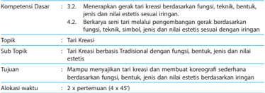

Tabel ini berisi informasi tentang kompetensi dasar dan subtopik yang berkaitan dengan tari kreasi. Topik utama adalah "Tari Kreasi", yang mencakup subtopik seperti "Tari Kreasi berbasis Tradisional dengan fungsi, bentuk, jenis dan nilai estetis". Tujuan dari tabel ini adalah untuk memberikan panduan tentang keterampilan dan pengetahuan yang diperlukan dalam membuat koreografi sederhana berdasarkan fungsi, bentuk, jenis, dan nilai estetis sesuai dengan iringan. Alokasi waktu untuk topik ini adalah 2 x pertemuan (4 x 5). Data penting yang terlihat adalah bahwa tabel ini membahas tentang keterampilan dan pengetahuan yang diperlukan dalam membuat koreografi sederhana berdasarkan fungsi, bentuk, jenis, dan nilai estetis sesuai dengan iringan.

---
**📊 Tabel**

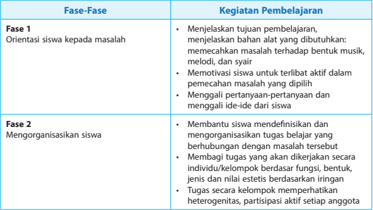

Tabel ini membahas dua fase pembelajaran yang dilakukan pada siswa, yaitu Fase 1 dan Fase 2. Fase 1 fokus pada orientasi siswa terhadap masalah, dimulai dengan menjelaskan tugas-tugas pembelajaran, memecahkan masalah musik, melodi, dan syair, memotivasi siswa untuk terlibat aktif dalam pemecahan masalah, dan menggali ide-ide dari siswa. Sementara itu, Fase 2 berfokus pada mengorganisir siswa, dimulai dengan membantu siswa mendefinisikan dan mengorganisir tugas-tugas belajar yang terhubung dengan masalah tersebut, menetapkan tujuan yang ditentukan secara individu/kerjasama, memberikan bantuan benda-benda, jenis, dan nilai estetis berdasarkan iringan, serta mengharapkan partisipasi aktif setiap anggota kelompok. Topik utama tabel ini adalah proses pembelajaran siswa dalam menghadapi dan memecahkan masalah, serta mengorganisir tugas belajar yang relevan dengan masalah tersebut.

 

---
## 📄 Halaman 70

---
**📊 Tabel**

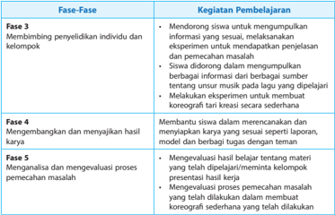

Tabel ini berisi informasi tentang proses pembelajaran dalam sebuah program belajar, yang terdiri dari empat fase dengan tugas-tugas yang harus dilakukan oleh peserta didik. Topik utama tabel ini adalah pembelajaran, dimana setiap fase memiliki tugas khusus yang harus diselesaikan oleh peserta didik. Kolom-kolom yang ada dalam tabel ini meliputi Fase, Kegiatan Pembelajaran, dan Deskripsi Kegiatan Pembelajaran. Data atau pola penting yang terlihat dalam tabel ini adalah bahwa setiap fase memiliki tugas khusus yang harus diselesaikan oleh peserta didik, seperti membangun hubungan dengan individu dan kelompok, mengevaluasi proses pemecahan masalah, dan membuat laporan. Selain itu, tabel ini juga menunjukkan bahwa setiap fase memiliki deskripsi yang jelas tentang apa yang harus dilakukan oleh peserta didik untuk mencapai tujuan pembelajaran tersebut.

### LANGKAH-LANGKAH PEMBELAJARAN

---
**📊 Tabel**

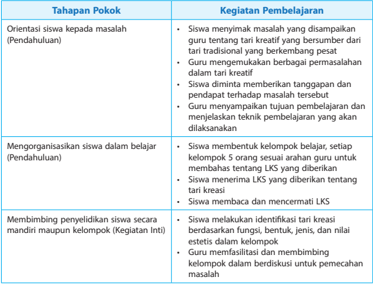

Tabel ini membahas proses pembelajaran dalam konteks pendidikan tradisional, dengan fokus pada orientasi siswa, organisasi belajar, dan membangun komunitas belajar. Topik utama adalah bagaimana guru dan siswa bekerja sama untuk memecahkan masalah melalui pendekatan kreatif. Dalam tahap pendahuluan, siswa diberi kesempatan untuk mengeksplorasi tari tradisional, sambil guru memberikan bimbingan dan mendukung mereka dalam berpikir kreatif. Selanjutnya, siswa dibagi menjadi kelompok berdasarkan minat mereka, dan guru memberikan dukungan teknis dan motivasi untuk mengerjakan proyek. Tujuan adalah untuk menciptakan lingkungan belajar yang inklusif dan produktif, di mana siswa dapat berkembang secara kreatif dan berkolaborasi.

 

---
## 📄 Halaman 71

---
**📊 Tabel**

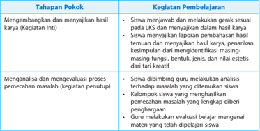

Tabel ini membahas proses pembelajaran dalam konteks pengembangan keterampilan kreatif siswa melalui kegiatan inti dan penutup. Topik utama adalah tahapan pokok yang melibatkan siapa yang melakukan apa, seperti siapa yang membuat laporan, siapa yang mengevaluasi, dan siapa yang membangun analisis. Kolom-kolomnya mencakup siapa yang melakukan apa (kegiatan pembelajaran), apa yang dilakukan oleh siapa (siapa yang melakukan apa), dan apa yang dihasilkan (hasil). Data penting yang terlihat adalah bahwa proses ini melibatkan berbagai pihak, termasuk siswa, kelompok siswa, guru, dan materi belajar. Pola penting adalah bahwa setiap tahap memiliki tujuan dan partisipan yang berbeda, menciptakan struktur yang komprehensif untuk pembelajaran kreatif.

### LEMBAR KERJA SISWA

- Pilihlah salah satu tari kreasi dilihat dari fungsi dan nilai estetis berdasarkan iringan yang ada di daerahmu.
- Praktikkanlah dengan teman sekelompokmu gerak tari kreasi tersebut sesuai iringan.
- Bandingkan tari kreasi yang kamu buat dengan tari kreasi yang berkembang di daerah lain di Indonesia.
- Penyajian hasil karya di depan kelas.

### F. Evaluasi

### 1. Penilaian Proses

- Penilaian observasi

---
**📊 Tabel**

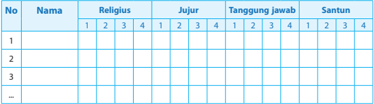

Tabel ini menunjukkan data tentang perilaku emosional siswa di kelas, dengan kolom "No", "Nama", "Religius", "Jujur", "Tanggung jawab", dan "Santun". Kolom "No" berisi nomor urut untuk setiap siswa, "Nama" berisi nama-nama siswa, "Religius" menunjukkan tingkat keagamaan mereka, "Jujur" menunjukkan tingkat kejujuran, "Tanggung jawab" menunjukkan tingkat tanggung jawab, dan "Santun" menunjukkan tingkat santunan. Data penting yang terlihat adalah bahwa banyak siswa memiliki tingkat kejujuran, tanggung jawab, dan santunan yang baik, tetapi sedikit siswa memiliki tingkat religius yang rendah. Ini menunjukkan bahwa pembelajaran moral dan etika sangat penting untuk dikembangkan pada anak-anak.

### b. Pedoman Penskoran Rubrik Penilaian Sikap

 

---
## 📄 Halaman 72

### 2. Penilaian Hasil

- Penilaian Pengetahuan

---
**📊 Tabel**

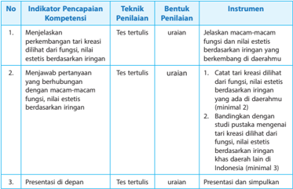

Tabel ini berisi indikator pencapaian kompetensi, teknik penilaian, bentuk penilaian, instrumen penilaian, dan deskripsi tentang bagaimana indikator tersebut diuji. Topik utama tabel adalah tentang penilaian kreativitas dan estetika dalam tari kreasi. Kolom-kolomnya mencakup indikator pencapaian kompetensi, teknik penilaian, bentuk penilaian, instrumen penilaian, dan deskripsi penilaian. Data penting yang terlihat adalah bahwa indikator pertama berkaitan dengan menilai kreativitas dan estetika tari kreasi berdasarkan iringan fungsi, sementara indikator kedua berkaitan dengan menilai kreativitas dan estetika tari kreasi berdasarkan iringan fungsi dan nilai estetis berdasarkan iringan. Indikator ketiga berkaitan dengan presentasi tari kreasi di depan publik. Teknik penilaian termasuk tes tertulis dan ujian, sedangkan bentuk penilaian meliputi catatan, bandingkan, dan presentasi. Instrumen penilaian mencakup macam-macam fungsi dan nilai estetis berdasarkan iringan, dan deskripsi penilaian mencakup catat tari kreasi dilihat dari fungsi, nilai estetis berdasarkan iringan yang ada di daerahmu, bandingkan dengan status pakaian mengenai tari kreasi dilihat dari fungsi, nilai estetis berdasarkan iringan khas daerah lain di Indonesia, dan presentasi dan simpulkan.

### Pedoman Penskoran

---
**📊 Tabel**

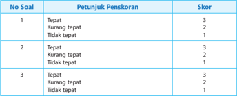

Tabel ini menunjukkan skor penilaian untuk tiga soal dengan petunjuk penilaiannya. Topik utama tabel adalah tentang tingkat keakuratan jawaban dalam tiga soal yang berbeda. Kolom pertama menunjukkan nomor soal, kolom kedua menunjukkan petunjuk penilaiannya, dan kolom ketiga menunjukkan skor yang diberikan. Data penting yang terlihat adalah bahwa skor tertinggi adalah 3 (tepat), sedangkan skor terendah adalah 1 (tidak tepat). Pola umumnya adalah bahwa soal yang lebih sulit memiliki skor yang lebih rendah, dengan skor tertinggi hanya diberikan jika jawaban tepat.

 

---
## 📄 Halaman 73

### b. Penilaian Keterampilan

Tes praktik ini dilakukan pada saat siswa menerapkan tari kreasi berdasarkan iringan bersama kelompoknya.

---
**📊 Tabel**

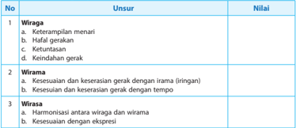

Tabel ini membahas tentang unsur-unsur yang mempengaruhi keterampilan menari, dengan fokus pada aspek-aspek seperti keberadaan, kekuatan, dan harmonisasi gerak. Kolom pertama berisi nomor urut untuk setiap unsur, sedangkan kolom kedua berisi deskripsi singkat dari masing-masing unsur tersebut. Kolom ketiga menyajikan nilai-nilai yang diberikan untuk setiap unsur. Topik utama tabel ini adalah analisis keterampilan menari, dengan fokus pada aspek-aspek seperti keterampilan menari, kekuatan gerak, dan harmonisasi gerak antara wiraga dan wirasa. Data penting yang terlihat adalah bahwa semua unsur memiliki nilai yang diberikan, menunjukkan bahwa setiap unsur memiliki peran penting dalam keterampilan menari.

Keterangan:

### Penilaian dilakukan dengan skor 10 - 100

100 - 90  : Amat baik

89 - 80

:  Baik

79 - 70

:  Cukup

69 - 60

:  Kurang

### c. Pengayaan

Pengayaan diberikan kepada siswa:

- Tidak terkena program remedial/perbaikan
- Diberikan pengembangan materi
- Diberikan soal/praktik tambahan untuk memantapkan materi

### G.  Remedial

### Bentuk pelaksanaan remedial

### 1. Cara yang dapat ditempuh

- Pemberian  bimbingan  secara  khusus  dan  perorangan  bagi  siswa  yang  belum  atau mengalami kesulitasn dalam penguasaan KD
- Pemberian  tugas-tugas  atau  perlakuan  ( treatment )  secara  khusus,  yang  sifatnya penyederhanaan dari pelaksanaan pembelajaran regular.
Bentuk penyederhanaan itu dapat dilakukan guru melalui:

- Penyederhanaan strategi pembelajaran KD tertentu
- Penyederhanaan cara penyajian (misalnya: menggunakan gambar-gambar, dan memberikan rangkuman yang sederhana)
- Penyederhanaan soal/pertanyaan yang diberikan

 

---
## 📄 Halaman 74

### 2. Materi dan waktu pelaksanaan program remedial

- Program remedial diberikan hanya pada KD atau indikator yang belum tuntas
- Program  remedial  dilaksanakan  setelah  mengikuti  tes/ulangan  KD  tertentu  atau sejumlah KD dalam satu kesatuan

### Teknik pelaksanaan remedial:

- Penugasan individu diakhiri dengan tes (lisan/tertulis/praktek) bila jumlah siswa yang mengikuti remedial 20%
- Penugasan kelompok diakhiri dengan tes individual (lisan/tertulis/praktek) bila jumlah siswa yang mengikuti remedial lebih dari 20% tetapi kurang dari 50%. Pembelajaran ulang  diakhiri  dengan  tes  individual  (praktik)  bila  jumlah  siswa  yang  mengikuti remedial lebih dari 50%

### H.  Interaksi dengan Orang Tua Siswa

Pada hakikatnya guru dan orang tua dalam pendidikan mempunyai tujuan yang sama yakni mengasuh, mendidik, membimbing dan membina serta memimpin anaknya menjadi orang dewasa dan dapat memperoleh kebahagiaan dalam hidupnya.

Interaksi semua pihak yang terkait akan mendorong siswa senantiasa melaksanakan tugasnya dengan tekun  dan  bersemangat.  Hubungan  timbal  balik  antara  orang  tua  dan  guru  akan melahirkan suatu bentuk kerja sama yang dapat meningkatkan aktivitas belajar siswa baik di rumah maupun di sekolah.

Hubungan kerja sama antara guru dan orang tua dalam meningkatkan aktivitas belajar siswa:

- Adanya kunjungan ke rumah siswa
- Mengundang orang tua siswa ke sekolah untuk presentasi (misalnya, saja ada orang tua siswa yang menjadi seniman tari)
- Case conference
- Badan pembantu sekolah
- Mengadakan surat menyurat antara sekolah dengan keluarga
- Adanya daftar nilai atau rapor

 

---
## 📄 Halaman 75

###  Bab 8  Pembelajaran Seni Peran

### atau Akting



### TUJUAN PEMBELAJARAN

Setelah mempelajaran Bab 8 diharapkan siswa mampu:

- Mengidentifikasi tentang seni peran
- Memahami makna seni peran dalam teater
- Melakukan olah tubuh
- Melakukan olah suara
- Melakukan olah rasa

### A. Strategi Pembelajaran

Guru dapat mengembangkan strategi pembelajaran sesuai dengan karakteristik siswa dan pokok bahasan pembelajaran. Setiap pokok bahasan atau materi pembelajaran memerlukan strategi  sesuai  dengan  karakteristiknya.  Strategi  pembelajaran  kontekstual,  pembelajaran pemecahan masalah, dan pembelajaran penemuan dapat digunakan dalam pembelajaran pada pokok bahasan ini.

Jika strategi pembelajaran telah ditetapkan maka langkah selanjutnya menentukan langkahlangkah pembelajaran. Langkah-langkah pembelajaran dapat mengikuti pola di bawah ini.

### 1.  Kegiatan Awal

- Guru bersama dengan siswa melakukan apersepsi terhadap materi yang akan diajarkan pada setiap pertemuan dengan mengamati objek materi pembelajaran.
- Guru dapat memberikan apersepsi dengan media dan sumber belajar lain yang berbeda dengan yang disajikan pada Buku Siswa.
- Apersepsi yang dilakukan haruslah meningkatkan minat dan motivasi internal pada diri siswa.

### 2. Kegiatan Inti

Guru dapat melakukan aktivitas pada kegiatan ini dengan mengacu pada kegiatan yang  bersifat  operasional.  Di  bawah  ini  adalah  beberapa  contoh  aktivitas  yang  dapat dilakukan oleh guru dengan menyesuaikan pada materi pembelajaran yang akan di ajarkan. Aktivitas pembelajaran itu antara lain:

- Mengamati melalui media dan sumber belajar baik berupa visual maupun audio visual tentang seni peran.
- Menanya melalui diskusi tentang seni peran.
- Mengeksplorasi seni peran.
- Mengasosiasi seni peran dengan menggunakan unsur pendukung seni peran.
- Mengomunikasi hasil karya  dengan  menggunakan  bahasa  lisan  atau  tulisan  secara sederhana.

 

---
## 📄 Halaman 76

### 3.  Kegiatan Penutup

Guru dapat melakukan evaluasi dan r efleksi pada setiap pertemuan. Kegiatan evaluasi dan  refleksi  menekankan  pada  tiga  aspek  yaitu  pengetahuan  yang  telah  diperoleh, menghubungkan sikap dengan materi pembelajaran, dan kemampuan psikomotorik atau keahlian dalam praktik teater.

### B. Materi Pembelajaran

### 1. Pengertian Seni Peran

Teori tentang akting telah banyak ditulis, tetapi pada intinya  akting  adalah  tingkah  laku  yang  dilakukan  oleh seseorang (aktor) untuk meyakinkan orang lain, agar orang lain itu yakin pada yang dilakukannya. Jadi, jelaslah bahwa akting  bukanlah  tingkahlaku  biasa  yang  secara  wajar dilakukan oleh setiap orang dalam kehidupan sehari-hari. Akting adalah tingkah laku yang secara sadar dilakukan oleh seseorang (aktor) untuk bisa meyakinkan orang lain.

Dalam  kehidupan  sehari-hari,  yang  dilakukan  oleh seorang  penipu  terhadap  korbannya  dengan  cara  yang meyakinkan, sehingga korbannya tertipu, pada hakekatnya, itu  juga  akting.  Akan  tetapi  akting  semacam  itu  tidak disukai. Akting di dalam sebuah kegiatan kesenian tidak hanya dituntut untuk bisa meyakinkan orang saja, tetapi orang yang diyakinkan itu menyukainya, di sinilah letak peranan akting di dalam kesenian.

Seorang pelukis bekerja dengan kanvas, cat, dan kuas. Seorang pematung bekerja dengan kayu, batu, gips, dan besi.  Seorang sastrawan bekerja dengan pena dan kertas. Sedangkan  aktor  melalui  peragaan  alat-alat  tubuhnya, mencakup roh dan jiwa yang diekspresikan dalam tindak perbuatan dan tingkah laku yang aktif.

Oleh  karena  itu,  agar  alat-alat  tubuhnya  mampu berekspresi  dengan  baik  maka  aktor  harus  menjalani jenjang-jenjang  pemahiran,  pelenturan,  pemekaan,  dan penangkasan atas alat-alat akting tersebut. Jenjang-jenjang itu  adalah  latihan-latihan  dasar  yang  merupakan  tahap perdana  sebelum  latihan-latihan  dengan  naskah  yang mengurai  peran  dengan  berbagai  sifat,  tabiat  karakter, perangai, dan perilaku.

### Di bawah ini ada beberapa contoh latihan olah suara dan olah tubuh.

Dalam pekerjaan sehari-hari seorang aktor, ia akan berhadapan dengan berbagai masalah yang menyangkut suara dan tubuhnya. Berbagai perasaan yang berkecamuk dibatin tokoh yang diperankannya, dan harus mampu dilahirkan melalui suara dan tubuhnya. Kondisikondisi badaniah yang dihadapi tokoh harus mampu dikemukakan dengan memanfaatkan

 

---
## 📄 Halaman 77

### 2.  Olah Suara

Suara  aktor  teater  menempuh  jarak  yang  lebih  jauh  dibanding  dengan  suara  aktor film  dan  sinetron.  Suara  aktor  teater  tidak  hanya  dituntut  terdengar  oleh  lawan  main, tetapi  juga  harus  terdengar  oleh  seluruh  penonton.  Pertunjukan yang secara visual baik, kalau suara aktornya tidak cukup terdengar, maka penonton tidak dapat menangkap jalan ceritanya. Pertunjukan yang secara visual buruk, kalau ucapan aktornya cukup terdengar oleh penonton, maka penonton masih bisa menikmati jalan cerita dari pertunjukan tersebut. Ini menunjukkan bahwa, suara mempunyai peranan yang cukup penting. Agar tujuannya tercapai, pemain teater harus melatih:

- Kejelasan ucapan, agar setiap sukukata yang ia ucapkan cukup terdengar.
suara dan tubuhnya. Melalui suara dan tubuhnyalah seorang aktor berkomunikasi. Ia harus mampu bercerita dengan suara dan tubuhnya yang terdiri dari bagian-bagian. Ceritanya ini harus dapat meyakinkan orang lain.

Banyak yang dituntut dari segi suara dan fisik. Sebanyak tuntutan yang ada dari segi kejiwaannya. Bagi seorang aktor teater, kondisi suara dan fisik yang prima menjadi syarat mutlak. Ia  tidak  perlu  bersuara  merdu  bagai  biduan  dan  berbadan bagai seorang binaragawan, atau ratu kecantikan. Tidak perlu baginya untuk bersuara alto atau sopran, atau berpotongan tubuh bagaikan seorang pesenam. Suara boleh biasa-biasa saja dan  tubuhnya  boleh  berbentuk  bagaimana  saja,  sesuai kebutuhan tokoh yang diperankan. Ia bisa bersuara cempreng, bertubuh kurus tinggi, pendek gemuk, besar tegap atau sedangsedang saja dan berbagai bentuk suara serta tubuh yang dapat kita jumpai dalam kehidupan sehari-hari.

Akan tetapi, dari dirinya dibutuhkan kesiapan yang mutlak. Sebaiknya suara dan tubuhnya siap pakai dalam kondisi seperti apapun juga. Kelenturan suara dan tubuh, keluwesan gerak, kemampuan untuk berpasif dengan seluruh tubuhnya, atau kesanggupan untuk bersikap tak melawan dan berbagai sikap serta perbuatan lainnya harus mampu dilahirkannya. Semua ini harus logis, jelas, dan tegas. Oleh sebab itu, dirinya dituntut untuk senantiasa melatih suara dan tubuhnya.

Salah satu usaha untuk itu ialah latihan olah suara dan latihan olah tubuh. Kemudian kita bertanya, dapatkah suara dan  tubuh  diolah?  Kalau  seorang  aktor  mau  melihat  pada suara  dan  tubuhnya sebagaimana seorang seniman keramik melihat  tanah  liat  maka  dapatlah  ia  mengolah  suara  dan tubuhnya. Sebagaimana seniman keramik, menyiapkan adonan tanah liat yang diaduk-aduknya dan diremas-remas sebelum membentuk benda yang ingin dibuatnya. Demikian pula sikap aktor terhadap suaranya dan tubuhnya.

 

---
## 📄 Halaman 78

- Tekanan ucapan, agar isi pikiran dan isi perasaan dari kalimat yang ia ucapkan bisa ditonjolkan.
- Kerasnya ucapan, agar kalimat yang ia ucapkan cukup terdengar oleh seluruh penonton.
- Melatih Kejelasan Ucapan
- Latihan berbisik: dua orang berhadapan, membaca naskah  dalam  jarak  dua  atau  tiga  meter,  dengan cara berbisik.
- Latihan  mengucapkan  kata  atau  kalimat  dengan variasi  tempo,  cepat  dan  lambat: ' sengseng tengtes sresep brebeeet … maka para tukang sulap mengeluarkan kertas  warna-warni  dari  mulut  dowernya  yang kebanyakan  mengunyah  popcorn,  pizza,  kentucky, humberger di rumah-rumah makan Eropa-Amerika dan  membuat  jamur  dari  air-liurnya  pada  kertas panjang yang menjulur bagai lidah sungai menuju jalan layang bebas hambatan kemudian melilit bangunanbangunan mewah disekitar pondok indah cinere bumi serpong damai pantai indah kapuk pluit pulomas sunter hijau kelapa gading permai dan tugu monas … '

### b. Melatih Tekanan Ucapan

Tekanan  ucapan  ada  tiga  macam:  tekanan  dinamik, tempo, dan tekanan nada.

- Tekanan Dinamik
Tekanan  dinamik  ialah  keras-pelannya  ucapan. Gunanya untuk  menggambar  isi  pikiran  dan  isi perasaan dari kalimat. Contohnya, 'Hari minggu saya ke toko buku' (artinya, bukan hari senin atau hari  selasa).  'Hari  minggu  saya  ke  toko  buku' (artinya,  bukan  adik  saya  atau  kakak  saya). 'Hari minggu saya ke toko buku' (artinya bukan ke toko pakaian atau ke toko makanan).

- Tekanan Tempo
Tekanan  tempo  ialah  cepat-lambatnya  ucapan. Gunanya  sama  dengan  tekanan  dinamik,  untuk menggambarkan isi pikiran dan isi perasaan dari kalimat. Contohnya:

- 'Ha-ri ming-gu saya ke toko buku'
- 'Hari minggu saya ke to-ko bu-ku'
- 'Hari minggu sa-ya ke toko buku'
- Tekanan Nada
Tekanan  nada  merupakan  lagu  dari  ucapan, contohnya: 'Wah, kamu pandai sekali!' atau 'Gila, ternyata dia bisa menjawab pertanyaan yang sesulit itu!'

Gambar 8.10 fleksibiltas pada gerak

 

---
## 📄 Halaman 79

### c. Melatih Kerasnya Ucapan

Teknik ucapan pemain teater lebih rumit dibanding dengan teknik ucapan bagi pemain film dan sinetron. Ucapan pemain teater tidak hanya dituntut jelas dan menggambarkan isi pikiran dan isi perasaan, tetapi juga harus keras karena ucapan pemain di  atas  panggung  menempuh  jarak  yang  lebih  jauh.  Oleh karena  itu,  kerasnya  ucapan  harus  dilatih.  Adapun  cara melatihnya bisa dengan berbagai macam cara. Diantaranya:

- Mengucapkan kata atau kalimat tertentu dalam jarak 10 meter atau 20 meter. Dalam latihan ini, yang harus selalu dipertanyakan  ialah:  a)  Sudah  jelaskah?  b)  Sudahkah menggambarkan  isi  pikiran  dan  isi  perasaan?  c)  dan pertanyaan yang terpenting, sudah wajarkah?
- Latihan mengguman. Gumaman harus stabil dan konstan. Kemudian, gunakan imajinasi dengan mengirim gumaman ke  cakrawala.  Bayangkan  'gumaman'  yang  dikeluarkan lenyap di cakrawala.
- Ketiga teknik ucapan di atas (kejelasan ucapan, tekanan ucapan  dan  kerasnya  ucapan),  pada  dasarnya  adalah satu  kesatuan yang utuh ketika seseorang berbicara atau berdialog.  Ketiganya  saling  mengisi  dan  melengkapi. Sebelum melatih ketiga teknik ucapan di atas, sebaiknya dilakukan pemanasan terlebih dahulu. Misalnya, dengan mengendurkan urat-urat pembentuk suara, urat-urat leher, dan membuat rileks seluruh anggota tubuh.

### 3. Olah Tubuh

Bentuk tubuh kita, dan cara-cara kita berdiri, duduk dan jalan  memperlihatkan  kepribadian  kita.  Motivasi-motivasi kita untuk melakukan gerak lahir dari sumber-sumber fisikal (badaniah), emosional (perasaan), dan mental (pikiran), dan setiap  tindakan  ( action )  kita  berasal  dari  satu,  dua  atau  tiga macam desakan hati (impuls). Banyak sekali interaksi  atau pengaruh  timbal-balik  dan  perubahan  urutan  yang  tidak habis-habisnya.

Tubuh  kita  kedinginan  dan  bergetar,  kita  merasakan dingin dan sengsara, maka kita berkata: 'dingin'. Pengalaman badaniah kita memberi petunjuk bagi perasaan dan pikiran kita. Kita diliputi kegembiraan, maka kita melompat, menari, dan  menyanyi.  Aliran  perasaan  yang  meluap  meledak  ke dalam bentuk aktifitas badaniah. Seorang aktor tidak akan bergerak demi gerak itu sendiri dan tidak membuat gerak indah demi keindahan. Bila dari dirinya diminta agar menari, maka ia akan melakukannya sebagai seorang tokoh tertentu, pada waktu, tempat, dan situasi tertentu. Latihan olah tubuh bagi seorang aktor adalah suatu proses pemerdekaan.

 

---
## 📄 Halaman 80

Tulang punggung dapat menyampaikan pada para penonton berbagai kondisi yang kita alami, sedang tegang atau tenang, letih atau segar, panas atau dingin, tua atau muda, dan ia juga membantu keberlangsungan perubahan sikap tubuh dan bunyi suara kita. Secara anatomis bagian-bagian

tulang punggung terdiri dari:

- 7 buah ruas tulang tengkuk;
- 12 buah ruas tulang belakang;
- 5 buah ruas tulang pinggang;
- 5  buah  ruas  tulang  kelangkang  bersatu  dan  4  ruas tulang ekor.

### Atau rinciannya sebagai berikut:

- leher;
- bagian bahu dan dada tulang punggung;
- tulang punggung bagian tengah;
- bagian akar, dasar atau ekor tulang punggung.

### Latihan kepala dan leher

- Jatuhkan  kepala  ke  depan  dengan  seluruh  bobotnya dan ayunkan dari sisi ke sisi.
- Jatuhkan kepala ke kanan, ayunkan ke arah kiri melalui bagian depan, ayunkan ke arah kanan melalui punggung.
- Lakukan latihan yang sama untuk 'bahu'.
- Untuk tangan dan kaki, gunakan variasi rentangan.

### Latihan tubuh bagian atas

Berdiri dengan kedua kaki sedikit direnggangkan dengan jarak antara 60 sentimeter. Tekukkan lutut sedikit saja. Benamkan seluruh tubuh bagian atas ke depan di antara kedua kaki. Biarkan tubuh bagian atas bergantung seperti ini dan berjuntai-juntai beberapa saat. Tegakkan kembali seluruh tubuh melalui gerakan ruas demi ruas, sehingga kepala yang paling  akhir  mencapai  ketinggiannya  dan  seluruh  tulang  punggung  melurus.  Lakukan dengan cara yang sama, coba membongkokkan tubuh ke kiri, ke kanan, dan ke belakang.

### Latihan pinggul, lutut dan kaki

- Berdiri tegak dan rapatkan kaki. Turunkan badan dengan menekuk lutut dan kembali tegak.
- Berdiri  tegak  dengan  satu  kaki,  kaki  yang  lain  julurkan  ke  depan. Turunkan  badan dengan menekuk lutut dan kembali tegak. Ganti dengan kaki yang lain.
- Putar lutut ke kiri dan ke kanan. Buat berbagai variasi dengan konsentrasi pada lutut.

### Seluruh batang tubuh

- Berdiri  dan  angkat  tangan  kita  ke  atas  setinggi-tingginya,  regangkan  diri  bagaikan sedang menguap keras merasuki seluruh tubuh. Ketika kita mengendurkan regangan tubuh, berdesahlah dan lemaskan diri, sehingga secara lemah lunglai mendarat di lantai. Jangan mendadak, tetapi biarkanlah bobot tubuh kita sedikit demi sedikit luruh ke bawah/ke lantai.
- Pantulkan diri dan goyangkan lengan, tangan, lutut, kaki, dan telapak kaki ketika berada di udara. Keluarkan teriakan singkat ketika kita memantul.

 

---
## 📄 Halaman 81

### Berjalan:

- Mengkakukan tulang punggung dan rasakan betapa langkah yang satu terpisah dari langkah lainnya.
- Mendorong leher ke depan.
- Menunduk/menjatuhkan kepala ke depan.
- Mengangkat dagu.
- Mengangkat bahu tinggi-tinggi.
- Menjatuhkan atau membungkukkan bahu ke depan.
- Menarik bahu ke belakang.
- Sambil menggerak-gerakkan tangan pada siku-sikunya.
- Dengan membengkokkan telapak kaki ke atas dan bertumpu pada tumit-tumit kaki.
- Memantul-mantulkan diri dari kaki ke kaki.
- Mencondongkan seluruh tubuh  ke belakang dan perhatikan betapa ini  meninggalkan berat bobot tubuh di belakang ketika kita melangkah maju.

### Berlari

- Berdiri  dan  tarik  napas.  Hembuskan  napas  ke  depan  sambil  mengeluarkan  suara 'haaaa' sepanjang kemampuan napas yang dikeluarkan. Kemudian berbalik ke tempat ketika berhenti, lalu tarik napas dan ulangi gerak lari yang sama.
- Gerakan dan suara akan membentuk ungkapan atau ucapan yang selaras. Tarik napas dalam-dalam.  Ketika  mengeluarkan  napas,  larilah  mundur  sambil  membungkukkan tubuh bagian atas ke depan.

### Melompat

- Berlari  menuju  ke  suatu  lompatan.  Rasakan  betapa  sifat  memantulnya  berat  tubuh mengangkat kita.
- Ayunkan kedua kaki sebebas-bebasnya dan lompatlah lebih tinggi lagi.
- Seluruh rangkaian latihan olah tubuh ini dilakukan dengan menggunakan imajinasi (pikir dan rasa), dan bisa diberi variasi dengan membunyikan musik instrumentalia.

### C.  Pengayaan Materi Pembelajaran

### 1. Pengertian Teater

Kata 'teater' berasal dari kata Yunani kuno, theatron , yang dalam bahasa Inggris disebut seeing place , dan dalam bahasa Indonesia diartikan sebagai 'tempat untuk menonton'. Pada perkembangan selanjutnya, kata teater dipakai untuk menyebut nama aliran dalam teater (teater  Klasik,  teater  Romantik,  teater  Ekspresionis,  teater  Realis,  teater  Absurd,  dst). Kata teater juga dipakai untuk nama kelompok (Bengkel Teater, teater Mandiri, teater Koma, dan teater Tanah Air). Pada akhirnya berbagai bentuk pertunjukan (drama, tari, musikal) disebut sebagai teater. Richard Schechner, sutradara dan professor di Universitas New York (NYU) memperluas batasan teater sedemikian rupa, sehingga segala macam upacara, termasuk upacara penaikan bendera, bisa dimasukkan sebagai peristiwa teater.

Peter Brook melalui bukunya ' Empty Spece ' berpendapat lebih ekstrem tentang teater, bahwa  'sebuah  panggung  kosong,  lalu  ada  orang  lewat',  itu  adalah  teater.  Berbagai pendapat di atas melukiskan betapa luasnya pengertian teater. Teater adalah karya seni yang dipertunjukan dengan menggunakan tubuh untuk menyatakan rasa dan karsa aktor, yang ditunjang oleh unsur gerak, unsur suara, unsur bunyi, serta unsur rupa.

 

---
## 📄 Halaman 82

### 2.  Pengertian Drama

Kata 'drama', juga berasal dari kata Yunani draomai yang  artinya  berbuat,  berlaku, atau beraksi. Pengertian yang lebih luas adalah sebuah cerita atau lakon tentang pergulatan 'lahir  atau  batin'  manusia  dengan manusia lain, manusia dengan alam, manusia dengan Tuhannya, dan lain sebagainya.

Kata drama dalam bahasa Belanda disebut toneel , yang kemudian diterjemahkan sebagai sandiwara. Sandiwara dibentuk dari kata Jawa, sandi (rahasia) dan wara/warah (pengajaran). Menurut Ki Hadjar Dewantara,  sandiwara  adalah  pengajaran  yang  dilakukan  dengan rahasia/  perlambang.  Menurut Moulton, drama adalah 'hidup yang dilukiskan dengan gerak' ( life presented in action ). Menurut Ferdinand Verhagen: drama haruslah merupakan kehendak manusia dengan action. Menurut Baltazar Verhagen: drama adalah kesenian yang melukiskan sikap manusia dengan gerak.

Berdasarkan  pendapat  di  atas,  bisa  disimpulkan  bahwa  pengertian  drama  lebih mengacu pada naskah atau teks yang melukiskan ko nflik  manusia dalam bentuk dialog yang dipresentasikan melalui pertunjukan dengan menggunakan percakapan dan action di hadapan penonton. Jadi jelas, kalau kita bicara tentang teater, sebenarnya kita berbicara soal proses kegiatan dari lahirnya, pengolahannya sampai ke pementasannya. Dari pemilihan naskah, proses latihan hingga dipertunjukkan di hadapan penonton.

### 3. Sejarah Teater Dunia

Teater  seperti  yang  kita  kenal  sekarang  ini,  berasal  dari  zaman  Yunani  purba. Pengetahuan kita tentang teater bisa dikaji melalui peninggalan arkeologi dan catatancatatan sejarah pada zaman itu yang  berasal dari lukisan dinding, dekorasi, artefak, dan hieroglif. Dalam peninggalan-peninggalan itu, tergambar adegan perburuan, perubahan musim, siklus hidup, dan cerita tentang persembahan kepada para dewa. Sekitar tahun 600  SM,  bangsa  Yunani  purba  melangsungkan  upacara-upacara  agama,  mengadakan festival  tari  dan  nyanyi  untuk  menghormati  dewa  Dionysius  yakni  dewa  anggur  dan kesuburan. Kemudian, mereka menyelenggarakan sayembara drama untuk menghormati dewa Dionysius itu. Menurut berita tertua, sayembara semacam itu diadakan pada tahun 534 SM di Athena. Pemenangnya yang pertamakali bernama Thespis, seorang aktor dan pengarang tragedi.  Nama Thespis  dilegendakan  oleh  bangsa Yunani,  sehingga  sampai sekarang orang menyebut aktor sebagai Thespian.

Di zaman Yunani kuno, sekitar tahun 534 SM, terdapat tiga bentuk drama: tragedi (drama  yang  menggambarkan  kejatuhan  sang  pahlawan,  dikarenakan  oleh  nasib  dan kehendak dewa, sehingga menimbulkan belas dan ngeri), komedi (drama yang mengejek atau menyindir orang-orang yang berkuasa, tentang kesombongan dan kebodohan mereka), dan satyr (drama yang menggambarkan tindakan tragedi dan mengolok-olok nasib karakter tragedi). Tokoh drama tragedi yang sangat terkenal adalah; Aeschylus (525 - 456 SM), Sophocles (496 - 406 SM), dan Euripides (480 - 406 SM). Tokoh drama komedi bernama Aristophanes (446 - 386 SM). Beberapa naskah dari karya mereka masih tersimpan hingga sekarang dan sudah diterjemahkan dalam bahasa Indonesia. Antara lainnya Oedipus Sang Raja , Oedipus Di Colonus , dan Antigone karya Sophocles dan Lysistrata karya Aristophanes. Diterjemahan dan dipentaskan oleh Rendra bersama Bengkel Teater Yogya. Drama-drama tersebut dibahas oleh Aristoteles dalam karyanya yang berjudul Poetic .

 

---
## 📄 Halaman 83

Sejarah teater di dunia Barat berkembang secara berkesinambungan seiring dengan perkembangan dan kemajuan zaman. Setelah era klasik di Yunani, teater berkembang di Roma. Teater Roma mengadaptasi teater Yunani. Tokoh-tokohnya yang penting adalah Terence,  Plautus,  dan  Seneca.  Setelah  teater  Roma  memudar,  di  abad  pertengahan  (th 900  -  1500  M),  naskah-naskah Terence,  Plautus,  dan  Seneca  diselamatkan  oleh  para paderi untuk dipelajari. Di abad pertengahan bentuk auditorium teater Yunani mengalami perubahan. Perkembangan teater berlanjut di zaman Renaissance yang dianggap sebagai jembatan antara abad ke-14 menuju abad ke-17, atau dari abad pertengahan menuju sejarah modern. Perkembangan ini dimulai sebagai sebuah gerakan budaya di Italia kemudian menyebar ke seluruh Eropa, menandai awal zaman modern. Pada abad tersebut, banyak bermunculan tokoh-tokoh teater hebat, di antaranya Williams Shakespeare di Inggris, Moliere di Perancis, dan Johann Wolfgang von Goethe di Jerman. Bentuk auditorium turut berkembang.

Pada  pertengahan  abad  XIX  seiring  dengan  berkembangnya  ilmu  pengetahuan dan  tehnologi,  maka  teater  berkembang  dari  romantik  ke  realisme.  Dua  tokoh  yang mempengaruhi timbulnya realisme di Barat adalah Auguste Comte dan Teori Evolusi dari Charles Darwin.

Ternyata Realisme yang merajai di abad XIX tidak sepenuhnya diterima di abad XX. Pada abad XX banyak pemberontakan terhadap teater realisme, maka timbullah aliran Simbolisme, Ekspresionisme, dan Teater Epik. Dengan demikian, auditoriumnya pun berubah  dengan  penutup  di  bagian  atas  karena  listrik  sudah  ditemukan.  Pertunjukan tidak lagi mengandalkan cahaya matahari, tetapi dengan menggunakan lampu.

### 4.  Teater Modern

Sejarah dan perkembangan teater modern di Indonesia berbeda dengan sejarah dan perkembangan teater  modern  di  Eropa.  Sejarah  dan  perkembangan  teater  modern  di Eropa  dipelopori  oleh  Hendrik  Ibsen  yang  lahir  pada  20  Maret  1828  di  Norwegia. Dramawan terbesar dan paling berpengaruh pada zamannya ini dikenal sebagai bapak 'teater  realisme'.  Melalui  karya-karyanya, Ibsen tidak  lagi  bercerita  tentang  dewa-dewa, raja-raja  atau  kehidupan  para  bangsawan di masa lalu, tetapi tentang manusia-manusia dalam kehidupan sehari-hari. Ini terlukis dalam naskah-naskah dramanya yang berjudul Rumah Boneka (1879), Musuh Masyarakat (1882), Bebek Liar (1884), dan lain-lain.

Munculnya  teater  realisme  bersamaan  dengan  revolusi  industri-teknologi,  revolusi demokratik, dan revolusi intelektual. Kemunculannya mengubah konsepsi waktu, ruang, ilahi, psikologi manusia, dan tatanan sosial.

Awal dari gagasan realisme adalah keinginan untuk menciptakan illusion of reality di atas pentas, sehingga untuk membuat kamar atau ruang tamu tidak cukup hanya dengan gambar di layar, tetapi perlu diciptakan kamar dengan empat dinding seperti ruang tamu atau kamar yang sebenarnya. Inilah yang mengawali timbulnya realisme Convention of the fourth wall .  Kesadaran  akan  dinding  keempatnya adalah tempat duduk penonton yang digelapkan, agar seolah-olah penonton mengintip peristiwa dari hidup dan kehidupan.

Sedangkan di Indonesia, sejarah perkembangan teater modern bermula dari sastra atau naskah tertulis. Naskah Indonesia pertama adalah Bebasari karya R ustam Effendi, seorang sastrawan, tokoh politik, yang terbit tahun 1926. Kemudian, muncul naskah-naskah drama berikutnya yang ditulis sastrawan Sanusi Pane, Airlangga tahun  1928, Kertadjaja tahun

 

---
## 📄 Halaman 84

1932 dan Sandyakalaning Madjapahit tahun  1933.  Muhammad Yamin menulis drama Kalau Dewi Tara Sudah Berkata tahun 1932 dan Ken Arok tahun 1934. A.A. Pandji Tisna menulis dalam bentuk roman, Swasta Setahun di Bedahulu .  Bung  Karno menulis drama Rainbow , Krukut Bikutbi ,  dan Dr. Setan .  Tampak di sini, bahwa naskah drama awal ini tidak hanya ditulis oleh sastrawan, tetapi juga oleh tokoh-tokoh pergerakan.

Setahun sebelum R ustam Effendi menulis Bebasari ,  di  tahun 1925 T.D. Tio Jr atau Tio Tik Djien, seorang lulusan Sekolah Dagang Batavia, mendirikan rombongan Orion. Rombongan Orion ini segera menjadi tenar setelah mementaskan lakon Barat Juanita de Vega yang dibintangi oleh Miss Riboet, berperan sebagai perampok. Melalui lakon Juanita de Vega, Miss Riboet menjadi terkenal karena perannya sebagai wanita perampok yang pandai bermain pedang. Rombongan ini pun kemudian bernama Miss Riboet's Orion.

Meskipun  masih mengacu pada hiburan yang sensasional dan cenderung komersial, bentuk pementasan rombongan Miss Riboet's Orion sudah mengarah pada bentuk realisme Barat. Ini berbeda dengan teater sebelumnya yang berbentuk Stambul dan Opera. Pada Stambul dan Opera cerita berasal dari hikayat-hikayat lama atau dari film-film terkenal. Sedangkan rombongan Miss Riboet's Orion ceritanya berasal dari kehidupan sehari-hari. Adegan dan babak diperingkas, adegan memperkenalkan diri tokoh-tokohnya dihapus, nyanyian dan tarian di tengah babak dihilangkan.

Rombongan Miss Riboet's Orion menjadi semakin terkenal setelah Nyoo Cheng Seng, seorang wartawan peranakan Cina, bergabung dan mengabdikan diri sepenuhnya untuk menjadi penulis naskah. Naskah-naskah yang pernah mereka pentaskan, antara lain: Black Sheep , Singapore After Midnight , Saidjah , Barisan Tengkorak , R.A. Soemiatie (Tio  Jr),  dan Gagak Solo .

Pada  masa  kejayaan  rombongan  Miss  Riboet's  Orion,  berdiri  di  kota  Sidoardjo rombongan Dardanella. Pendirinya bernama Willy K limanoff alias  A.  Piedro,  seorang Rusia  kelahiran  Penang.  Bintang-bintangnya,  antara  lain: Tan Tjeng  Bok,  Dewi  Dja, Riboet II,  dan Astaman. Naskah yang mereka mainkan pada awalnya adalah cerita-cerita Barat,  baik  yang  berasal  dar i  film  maupun  roman,  seperti The Thief of Bagdad , Mask of Zorro , Don Q ,  dan The Corurt of Monte Christo .

Kemudian,  pada  tahun  1930  bergabunglah  Andjar  Asmara  ke  dalam  rombongan Dardanella  dan  khusus  menulis  naskah  yang  diperankan  oleh  Dewi  Dja,  seperti Dr. Samsi , Si Bongkok , Haida , dan Tjang . A. Piedro sendiri juga menulis beberapa naskah, di antaranya, Fatima , Maharani ,  dan Rentjong Atjeh .  Bergabungnya Andjar Asmara menjadikan rombongan Dardanella semakin berjaya.

Rombongan Miss Riboet's Orion kalah dalam persaingan ini. Apalagi penulis naskah andalan rombongan Miss Riboet's Orion, Nyoo Cheng Seng, bersama istrinya, Fifi Young alias Tan Kim Nio, bergabung dengan rombongan Dardanella. Tahun 1934 zaman kejayaan Dardanella mencapai puncaknya.

Pada perkembangannya rombongan Dardanella melakukan pembaharuan dari yang telah dicapai oleh rombongan Miss Riboet's Orion. Naskah yang dipentaskan berupa cerita asli  yang  lebih  serius,  padat,  dan  agak  berat  dengan  problematik  yang  lebih  kompleks, sehingga digemari oleh kaum terpelajar, seperti Boenga Roos dari Tjikembang , Drama dari Krakatau , Annie van Mendoet , Roos van Serang , Perantean no. 99 ,  dan sebagainya.

 

---
## 📄 Halaman 85

Naskah-naskah realistis yang menuntut permainan watak ini dapat diatasi oleh pemainpemain Dardanella yang memang mempunyai pemain-pemain handal, seperti Bachtiar Effendi (saudara sastrawan Rustam Effendi), Dewi Dja, F ifi Y oung, Ratna Asmara, Koesna (saudara Dewi Dja), Ferry Kok, Astaman, Gadog, Oedjang, dan Henry L. Duart, orang Amerika.

Kehidupan Teater Modern Indonesia baru menampakkan wujudnya setelah Usmar Ismail bersama D. Djajakoesoema, Surjo Sumanto, Rosihan Anwar, dan Abu Hanifah pada tanggal 24 Mei 1944 mendirikan Sandiwara Penggemar Maya, kemudian mementaskan naskah karya Usmar Ismail yang berjudul Citra , dan dibuat film pada tahun 1949. Ilustrasi musiknya dibuat oleh Cornelius Simanjuntak. Naskah yang ditulis oleh R ustam Effendi, Sanusi Pane, Muhammad Yamin, maupun A.A. Pandji Tisna yang diterbitkan oleh Balai Pustaka  di  tahun  1930-an  hampir  tidak  pernah  dipentaskan  karena  lebih  berorientasi pada sastra.

Grup Sandiwara Penggemar Maya ini sangat besar pengaruhnya terhadap perkembangan Teater Modern Indonesia di tahun 1950. Terlebih setelah Usmar Ismail dan Asrul Sani berhasil membentuk ATNI (Akademi Teater Nasional Indonesia) pada tahun 1955. ATNI banyak melahirkan tokoh-tokoh teater, di antaranya: Wahyu Sihombing, Teguh Karya, Tatiek Malyati, Pramana Padmodarmaja, Kasim Achmad, Slamet Rahardjo, N. Riantiarno, dan banyak lagi.

Setelah  ATNI  berdiri,  perkembangan  teater  di  tanah  air  terus  meningkat,  baik dalam jumlah grup maupun dalam ragam bentuk pementasan. Grup-grup yang aktif menyelenggarakan pementasan di tahun 1958-1964 adalah Teater Bogor, STB (Bandung), Studi Grup Drama Djogja, Seni Teater Kristen (Jakarta), dan banyak lagi, di samping ATNI sendiri yang banyak mementaskan naskah-naskah asing, seperti Cakar Monyet karya W.W. Jacobs, Burung Camar karya  Anton Chekov, Sang Ayah karya  August  Strinberg, Pintu Tertutup karya Jean Paul Sartre, Yerma karya Garcia Federico Lorca, Mak Comblang karya Nikolai Gogol, Monserat karya  E.  Robles, Si  Bachil karya  Moliere,  dan  lain-lain. Naskah Indonesia yang pernah dipentaskan ATNI, antara lain: Malam Jahanam karya Motinggo Busye, Titik-titik Hitam karya Nasjah Djamin, Domba-domba Revolusi karya B. Sularto, Mutiara dari Nusa Laut karya Usmar Ismail, dan Pagar Kawat Berduri karya Trisnoyuwono.

Teater  Modern  Indonesia  semakin  semarak  dengan  berdirinya  Pusat  Kesenian Jakarta-Taman  Ismail  Marzuki  yang  diresmikan  pada  10  November  1968.  Geliat teater  di  beberapa  provinsi  juga  berlangsung  semarak. Terlebih  setelah  kepulangan Rendra dari Amerika, dengan eksperimen-eksperimennya yang monumental, sehingga mendapat liputan secara nasional, seperti Bib Bob, Rambate Rate Rata, Dunia Azwar, dan  banyak  lagi.  Kemudian,  Ar ifin  C.  Noer  mendirikan Teater  Ketjil, Teguh  Karya mendirikan Teater Populer; Wahyu Sihombing, Djadoek Djajakoesoema dan Pramana Padmodarmaja mendirikan Teater Lembaga; Putu Wijaya mendirikan Teater Mandiri, dan N. Riantiarno mendirikan Teater Koma. Semaraknya pertumbuhan Teater Modern Indonesia dilengkapi dengan Sayembara Penulisan Naskah Drama dan Festival Teater Jakarta, sehingga keberagaman bentuk pementasan dapat kita saksikan hingga hari ini.

 

---
## 📄 Halaman 86

Di mana kemudian kita mengenal Teater Payung Hitam, Bandung, Teater Garasi dari Yogyakarta, Teater Kubur dan Teater Tanah Air dari Jakarta, dan banyak lagi. Grupgrup teater tersebut mempunyai bentuk-bentuk penyajian yang berbeda satu sama lain yang tidak hanya mengadosi teater Barat, tetapi menggali akar-akar teater tradisi kita.

### D.  Metode Pembelajaran

Guru dapat memilih metode pembelajaran sesuai dengan topik pembahasan. Pada pokok bahasan ini dapat digunakan metode praktik atau demonstrasi, tetapi dapat dikombinasikan dengan metode penemuan. Kedua metode ini bisa saling melengkapi.

Siswa selain diberikan secara konseptual melalui metode penjelasan langsung kemudian diwujudkan dalam bentuk praktik dan menemukan sendiri interpretasi terhadap tokoh atau karakter yang dikehendaki sesuai dengan naskah yang dibacanya.

### E. Evaluasi Pembelajaran

Guru dapat mengembangkan alat evaluasi sesuai dengan kebutuhan pokok bahasan. Prinsip  evaluasi  mencakup  tiga  ranah  yaitu  kognitif  atau  pengetahuan,  sikap,  dan keterampilan.  Pada  pembelajaran  seni  tari  hindari  evaluasi  dengan  pilihan  ganda.  Guru dapat mengembangkan evaluasi pengetahuan dengan model esai atau uraian.

 

---
## 📄 Halaman 87

###  Bab 9  Teknik Penulisan Naskah Teater

### TUJUAN PEMBELAJARAN

Setelah mempelajari Bab 9 diharapkan siswa mampu:

- Mengidentifikasi tema pada naskah teater
- Mengidentifikasi karakter tokoh pada naskah teater
- Mengidentifikasi langkah-langkah menyusun naskah teater
- Membuat naskah teater berdasarkan yang dipilih

### A. Strategi Pembelajaran

Guru dapat mengembangkan strategi pembelajaran sesuai dengan karakteristik siswa dan pokok bahasan pembelajaran. Setiap pokok bahasan atau materi pembelajaran memerlukan strategi  sesuai  dengan  karakteristiknya.  Strategi  pembelajaran  kontekstual,  pembelajaran pemecahan masalah, dan pembelajaran penemuan dapat digunakan dalam pembelajaran pada pokok bahasan ini.

Jika strategi pembelajaran telah ditetapkan maka langkah selanjutnya menentukan langkahlangkah pembelajaran. Langkah-langkah pembelajaran dapat mengikuti pola di bawah ini.

### 1.  Kegiatan Awal

- Guru bersama dengan siswa melakukan apersepsi terhadap materi yang akan diajarkan pada setiap pertemuan dengan mengamati objek materi pembelajaran.
- Guru dapat memberikan apersepsi dengan media dan sumber belajar lain yang berbeda dengan yang disajikan pada buku siswa.
- Apersepsi yang dilakukan haruslah meningkatkan minat dan motivasi internal pada diri siswa.

### 2. Kegiatan Inti

Guru dapat melakukan aktivitas pada kegiatan ini dengan mengacu pada kegiatan yang bersifat operasional. Di bawah ini adalah beberapa contoh aktivitas yang dapat dilakukan oleh guru dengan menyesuaikan pada materi pembelajaran yang akan di ajarkan. Aktivitas pembelajaran itu antara lain:

- Mengamati melalui media dan sumber belajar baik berupa visual, maupun audio-visual tentang pertunjukan teater tradisional.
- Menanya melalui diskusi tentang naskah teater tradisional.
- Mengeksplorasi penokohan dan watak yang terdapat pada naskah tradisional.
- Mengasosiasi unsur-unsur teater tradisional pada naskah teater secara sederhana.
- Mengomunikasi hasil karya naskah teater  sederhana  dengan  menggunakan  bahasa lisan atau tulisan secara sederhana.


 

---
## 📄 Halaman 88

### 3.  Kegiatan Penutup

Guru dapat melakukan evaluasi dan r efleksi pada setiap pertemuan. Kegiatan evaluasi dan  refleksi  menekankan  pada  tiga  aspek  yaitu  pengetahuan  yang  telah  diperoleh, menghubungkan sikap dengan materi pembelajaran, dan kemampuan psikomotorik atau keahlian dalam praktek teater.

### B. Materi Pembelajaran

Apabila kita ingin menulis naskah drama, maka pertamatama kita memilh tema terlebih dahulu, tema ini bisa berasal dari pengalaman hidup atau bisa juga dari berbagai hal yang pernah kita lihat atau kita baca yang kemudian merangsang daya cipta kita. Kemudian, daya cipta kita menghidupkannya lalu menuangkannya dalam sebuah cerita.  Terciptalah gambaran cerita dalam pikiran kita. Gambaran cerita ini masih merupakan bahan dasar yang memerlukan pendalaman dan penyimpulan, sehingga kita berhasil merumuskan intisari cerita itu. Rumusan dari  intisari  cerita  itu  disebut  premise.  Dengan  memilih tema  dan  menentukan  premise  sebagai  dasar  gagasan,  kita akan menemukan pola cerita, ke arah mana cerita akan kita tulis  dalam  bentuk  naskah.  Jadi,  premise  merupakan  titik tolak.  Misalnya,  tema  dari  naskah  yang  kita  tulis  bercerita tentang kesombongan, cinta, atau remaja. Jadi, kita jabarkan sebagai premise: 'Cinta pada keluarga adalah segala-galanya', 'Kesombongan akan berujung pada musibah', 'Remaja harapan bangsa'.

Menulis naskah drama memang agak kompleks. Kita harus mengerti plot atau alur cerita, struktur dramatik, penokohan, dan setting peristiwa. Plot ialah sesuatu yang menghubungkan antara  peristiwa-peristiwa  dalam  sebuah  cerita  yang  rapat

pertaliannya dengan gerak laku lahiriah dan batiniah watak-watak dalam cerita. Setiap peristiwa dan gerak laku itu dari awal hingga akhir adalah didasarkan kepada hukum sebab akibat. Plot tidak hanya mengemukakan apa yang terjadi, tetapi yang penting ialah mengapa hal itu terjadi. Dalam hal ini, setiap peristiwa selalu saling berhubungan dan hubungan itu diadakan oleh faktor-faktor sebab akibat.

Dalam membina plot harus ada kesatuan yang bertolak daripada peristiwa-peristiwa atau bagian-bagian yang saling berhubungan. Dengan demikian, dalam sebuah cerita akan bertemu dengan suatu sebab yang menimbulkan akibat. Jika hubungan itu tidak meyakinkan, kesatuan akan longgar dan cerita tidak akan menarik perhatian lagi. Pergerakan peristiwa haruslah logis, sehingga dapat membentuk satu kesatuan yang dapat menimbulkan kesan yang hidup.

Permulaan  plot  dikenal  sebagai  eksposisi  yang  layaknya  menjadi  bagian  untuk memperkenalkan watak-watak itu, terjadi peristiwa, dan timbullah konflik (seperti konflik batin yang terjadi dalam diri tokoh atau pertikaian lahir antara manusia dengan alam, dengan masyarakat atau dengan nasibnya). Peristiwa bergerak dan berkembang membawa kepada peringkat kedua, yaitu pertengahan cerita yang dikenal sebagai komplikasi. Pada pertikaian ini,  diperlihatkan  konflik  menjadi  semakin  rumit  dan  harus  dihadapi  oleh  tokoh-tokoh

 

---
## 📄 Halaman 89

melalui prosesnya menuju kepada kestabilan. Pertentangan itu menuju kepada klimaks. Pada klimaks inilah tercapainya konsentrasi yang maksimal. Dari sini urutan cerita menuju kepada peleraian,  walaupun  kadang-kadang  dalam  setengah  cerita,  klimaks  sekaligus  merupakan pengakhiran cerita.

Dalam pembinaan plot, unsur ketegangan juga merupakan salah  satu  unsur  yang  penting.  Ini  dapat  merangsang  rasa ingin  tahu  pembaca  tentang  peristiwa  yang  akan  terjadi selanjutnya. Ternyata komposisi yang menarik ialah hadirnya unsur-unsur ketegangan. Dengan adanya unsur-unsur yang membina plot seperti eksposisi, ko nflik, komplikasi, klimaks, peleraian dan penyelesaian, plot dapat dikatakan sebagai satu 'struktur  cerita'  atau  bisa  juga  disebut  sebagai 'jalan  cerita' (bagaimana sebuah cerita  itu  dirangkai  dari  satu  peristiwa kepada peristiwa yang lain) bagi sebuah naskah drama. Adanya kesinambungan peristiwa itu, lahirlah cerita yang bermula dan berakhir. Antara awal dan akhir  itulah  terlaksananya  plot.  Sementara,  eksposisi/permulaan,  konflik,  klimaks,  resolusi dan konklusi adalah apa yang disebut dengan struktur dramatik.

Menentukan penokohan dari watak-watak yang ada dalam naskah; seperti memerinci usia watak, keluarga watak, latar belakang  pendidikan  watak,  lingkungan  kehidupan  watak, kepribadian watak, perkawinan watak, dan lain-lain.

Kemudian yang dimaksud dengan setting peristiwa adalah tempat dimana kejadian atau peristiwa itu berlangsung.Tentang gaya  bahasa  bisa  sangat  bervariasi.  Kita  bisa  menggunakan bahasa sehari-hari atau bisa juga menggunakan bahasa dengan dialek  Aceh,  Batak,  Minang,  Sunda,  Jawa,  Bali,  Lombok, Sumbawa, Dayak, Banjar, Minahasa, Toraja, Bugis, Makassar, Ternate, Ambon, Papua. Bisa berbentuk prosa liris atau puisi.

### C.  Berlatih Membaca Naskah Teater

Contoh naskah adaptasi dari dramawan Philipina Marcelino Acana Jr dan disadur oleh Noorca Marendra.

### DRAMA PANGGUNG KOMEDI SATU BABAK 'MENTANG-MENTANG DARI NEW YORK'

### SETTING

(Ruang tamu di rumah keluarga Bi Atang di kampung Jelambar. Pintu depannya di sebelah kanan dan jendela sebelah kiri. Pada bagian kiri pentas ini, ada seperangkat kursi rotan, di  sebelah kanan ada radio besar yang merapat ke dinding belakang. Pada bagian tengah dinding  itu  ada  sebuah  pintu  yang  menghubungkan  ruang  tamu  dengan  bagian  dalam rumah itu. Pagi hari, ketika layar terbuka, terdengar pintu depan diketuk orang, Bi Atang muncul dari pintu tengah sambil melepaskan celemeknya, dan bersungut-sungut. Bi Atang ini orangnya agak gemuk, jiwanya kuno. Tapi tunduk terhadap kemauan anak perempuannya yang sok modern. Oleh karena itu, maklum kalau baju rumahnya gaya baru. Celemeknya berlipat-lipat dan potongan rambutnya yang di 'modern'kan itu tampak lebih tidak patut lagi.

 

---
## 📄 Halaman 90

BI ATANG : SAMBIL MENUJU PINTU). tamu lagi, tamu lagi, tamu lagi! Selalu ada tamu yang datang. Saban hari ada tamu, sial, kaya orang gedongan saja. (MEMBUKA PINTU DAN ANEN MASUK DENGAN BUKET DI TANGANNYA, PAKAIANNYA PERLENTE,  DAN  IA  TERTEGUN  DI  PINTU  MENATAP  BI  ATANG DENGAN GUGUP MEMPERHATIKAN BI ATANG KE BAWAH).

Eh … Anen! Bibi kira siapa? Ayo masuk!

ANEN : Tapi … ini Bi Atang bukan?!

BI ATANG : (TERTAWA). Anen! Anen! Kalau bukan Bibi, siapa lagi? Dasar anak bloon. Kamu kira aku ini siapa hah? Nyonya Menir?

BI ATANG : (TERSIPU SAMBIL MEMEGANG RAMBUTNYA YANG PENDEK). Kemarin rambut ini Bibi potong di kap salon, biar kelihatan modern, kata si Ikah. Apa kelihatannya sudah cukup mengerikan?

ANEN : Oh … tidak, tidak. Malah kelihatannya cantik sekali. Tadi saya kira Bibi ini, Ikah, jadi

saya agak gugup tadi. Maklum sudah lama tidak ketemu.

BI ATANG : Ah dasar! Kamu dari dulu nggak berubah juga. Nakal (MENCUBIT PIPINYA). Ayo duduk! (ANEN DUDUK). Bagaimana kabar ibumu?

ANEN : Wah kasihan  Bi,  ibu  sudah  kangen  sama  Bibi.  Katanya  ia  tidak  tahan  lama-lama

meninggalkan Jelambar. Malah ia ingin cepat-cepat pulang.

BI ATANG : (MENDEKAT). O ya, sudah berapa lama ya, kalian pergi dari sini?

ANEN :

Belum lama Bi, baru tiga bulan.

BI ATANG : Baru tiga bulan? Tapi tiga bulan itu cukup lama buat penduduk asal Jelambar yang pergi dari kampung ini. Kasihan juga ya, rupanya ibumu sudah bosan tinggal di Karawang.

ANEN : Iya, tapi maklum Bi, buat insinyur-insinyur macam saya ini, kerja di sana cukup repot. Dan kalau jembatan Karawang itu sudah kelar, kami pasti akan segera kembali ke sini.

Jelambarkan tanah tumpah darah kami. Begitu kan Bi?

BI ATANG : Orang kata Nen, biar jelek-jelek juga lebih enak tinggal di kampung sendiri.

(TIBA-TIBA IA TERINGAT SESUATU). Tapi ini betul atau tidak entahlah. Kalau

melihat anak Bibi si Ikah yang telah pergi ke Amerika dan tinggal setahun di sana, katanya bahkan ia tidak pernah rindu kampung halaman.

ANEN : (MULAI GUGUP LAGI). Ka … ka… kapan Ikah datang ke sini, Bi?

BI ATANG :

Dari Senin kemarin, kenapa?

ANEN :

O … pantas, saya baru tahu waktu saya baca di koran, katanya Ikah sudah pulang dari New York, jadi … jadi …

BI ATANG :

(PENUH ARTI). Jadi kamu datang ke sini bukan?

ANEN :

(TERSIPU). Ah … Bibi bisa saja!

 

---
## 📄 Halaman 91

BI ATANG

: (MENGELUH). Anak itu baru datang Senin kemarin, tapi coba lihat sudah berapa banyak badan Bibi dipermaknya. Lihat! Waktu pertama kali ia datang dan melihat Bibi,  ia  marah-marah, katanya, Bibi harus segera bersalin rupa. Bibi yang sudah tua bangka ini harus dipermak, biar jangan kampungan. Bibi pagi-pagi sekali sudah diseret ke salon, dan kamu bisa lihat hasilnya. Saksikan perubahan apa yang telah menimpa diriku  secara  revolusioner  ini!  Rambutku  dibabat  habis,  alis  dicukur,  kuku  dicat,  dan kalau Bibi pergi ke pasar harus memakai gincu pipi dan lipstick. Bayangkan, apa nggak persis kodok goreng? Semua teman-teman Bibi di pasar, di jalanan pada menertawakan Bibi. Mereka pikir Bibi sudah agak saraf, masa Tua Bangka begini di coreng moreng. Kaya tante girang saja. Tapi  apa  musti  Bibi  perbuat?  Kamu  tahu  sendiri  adatnya  si Ikah, Bibi nggak bisa berselisih paham dengan dia. Katanya Bibi harus belajar bersikap dan bertingkah laku seperti seorang wanita Amerika. Seperti first lady! Seperti orang metropolitan,  karena  Bibi  punya  anak  yang  pernah  tinggal  di  Amerika.  Busyet  deh, apa Bibi ini kelihatan kayak orang Amerika.

ANEN :

(GELISAH MENANTIKAN IKAH). Iya … iya. Bibi kelihatan hebat sekali. Dan

… di mana dia sekarang?

BI ATANG :

Siapa?

ANEN :

Ikah! Apa Ikah ada di rumah?

BI ATANG :

(MENDENGUS). Oooo … ada! Tentu saja dia ada di rumah. Ia sedang tidur!

ANEN :

(SAMBIL MELIHAT JAM TANGANNYA). Masih tidur?!

BI ATANG :

Ia,  masih  tidur!  Kenapa?  Heran?  Kata  dia  orang-orang  New  York  itu  baru  bangun setelah jam dua belas siang.

ANEN :

(SAMBIL MELIHAT JAM TANGANNYA). Sekarang masih jam sepuluh.

BI ATANG :

Di samping itu, ia juga  sangat  sibuk,  sibuk  sekali,  anak  itu  sibuk  bukan  main  sejak ia  pulang.  Ia  berpuluh  kali  mengadakan  pesta  selamat  datang.  Di  mana-mana,  dan tamu-tamu tiada hentinya ke luar masuk, anak itu betul-betul bikin pusing orang tua!

ANEN :

(BERTAMBAH SEDIH). Kalau begitu … tolong katakan saja kepadanya,  bahwa saya  telah  datang  ke  mari,  …  untuk  …  untuk  …  mengucapkan  selamat  datang.  Oh ya, tolong juga berikan bunga ini kepadanya.

BI ATANG :

(MENERIMA BUNGA). Tapi kau jangan pergi dulu, Nen. Tunggu sebentar!

ANEN :

(MANGGUT). Begini Bi, tadinya saya ingin ketemu sama Ikah, tapi kalau ia baru bangun setelah jam dua belas siang, yah …

BI ATANG :

(BERGEGAS). Ia akan bangun sekarang juga dan akan bertemu dengan kamu Nen! Kenapa ia mesti belagu begitu? Kamu sama dia kan sama-sama dibesarkan di kampung ini! Duduklah Bibi mau membangunkan dia!

ANEN :

Wah jangan Bi, jangan diganggu, biar saja. Lagi pula saya datang ke sini lain hari.

BI ATANG :

Sudah! Kamu tunggu saja di sini. Ia malah akan senang sekali bisa ketemu teman lama  waktu  kecil.,  dan  ia  ingin  sekali  secara  pribadi  mengucapkan  terimakasih atas  pemberian  bungamu  ini.  (MEMPERHATIKAN DAN MECIUM BUNGA ITU) Ah … alangkah indahnya buket bunga ini Nen, pasti mahal sekali harganya! (MENGERILIKKAN MATANYA DAN MASUK KE DALAM).

ANEN :

(SAMBIL DUDUK) Ah itu bukan apa-apa, Bi Atang!

BI ATANG :

(TERTAWA DAN TIBA-TIBA BERHENTI DI PINTU). Oh, ya Nen …

ANEN :

Ada apa, Bi?

BI ATANG :

Di depan dia nanti, kamu jangan manggil aku Bi Atang, ya!

 

---
## 📄 Halaman 92

ANEN :

Lho, memangnya kenapa, Bi?

BI ATANG :

Si Ikah tidak suka aku dipanggil Bi Atang, kampungan! Katanya, aku harus mengatakan kepada setiap  orang  supaya  mereka  memanggilku Nyonya Aldilla, dan katanya lagi, panggilan  itu  lebih  beradab  daripada  Bi  Atang.  Maka  dari  itu,  khususnya  kalau  di muka si Ikah kamu harus memanggilku Nyonya Aldilla, paham?

ANEN :

Baik Bi Atang … eh maksud saya Nyonya Aldilla!

BI ATANG :

Tunggu sebentar yah, aku mau memanggil Ikah. (MASUK).

ANEN :

(MENARIK NAFAS). Hhhhhhhh! Ada-ada saja. Dasar orang kampung …!

BI ATANG :

TIBA-TIBA MUNCUL KEMBALI). Oh ya, Anen aku hampir lupa.

ANEN :

Astaga. Ada apa lagi Bi Atang? Eh Nyonya … Nyonya siapa tadi?

BI ATANG :

Nyonya Al - dil - lla.

ANEN :

Oh ya, ada apa Nyonya Aldilla?

BI ATANG :

Kamu jangan memanggil Ikah itu dengan 'Ikah'.

ANEN :

(BINGUNG). Lalu harus memanggil si Ikah dengan apa saya?

BI ATANG :

Kamu harus memanggilnya dengan Francesca

ANEN :

Fransisca.

BI ATANG :

Bukan, bukan Fransisca, tapi Fran - ces - ca.

ANEN :

Tapi … kenapa mesti Francesca, Nyonya?

BI ATANG : Sebab, katanya, semua orang-orang di New York memanggilnya Francesca, begitulah cara semua orang Amerika mengucapkan namanya, dan ia menginginkan semua agar orang sini pun mengucapkannya demikian. Katanya nama itu kedengarannya begitu 'ci  -ci',  seperti  orang  Italia.  Oh  ya  kamu  tahu,  bahwa  di  New  York  banyak  orang menyangkanya berasal dari Italia? … Seorang Italia dari California, katanya, oleh karena itu,  hati-hatilah  dan  ingat  jangan  memanggilnya  Ikah,  ia  benci  nama  itu.  Panggilah dia Francesca, biar dia girang.

ANEN :

(MENJATUHKAN DIRINYA DI KURSI). Baiklah Nyonya Al - dil - llaaaaaaaaaa

BI ATANG :

ANEN :

BI ATANG :

ANEN :

OTONG :

ANEN :

OTONG :

ANEN :

OTONG :

ANEN :

(HENDAK MASUK). Sekarang tunggulah di sini selagi aku memanggil Francesca. (TIBA-TIBA PINTU DEPAN DIKETUK ORANG). Eh … busyet deh tamu lagi!

BANGUN MENUJU KE PINTU). Biarlah saya yang membukanya Nyonya Aldilla.

Katakan saja kepada mereka supaya menunggu! (KETIKA PINTU DIBUKA, OTONG MASUK DAN MATANYA MELIHAT ANEN, IA SEGERA MEMELUK ANEN. DAN MEREKA BERPELUKAN SAMBIL KETAWA BERDERAI).

Elu Tong, gue kira siapa? Wah … menyenangkan betul kita bisa ketemu lagi ya?

Aku kira kau masih di Karawang, Nen!

Memang masih di sana Tong, aku ke sini cuma mau ngasih selamat sama si Ikah, diakan baru pulang dari luar negeri.

Tapi aku dengar ada sesuatu yang tidak baik menimpa anak itu

(DUDUK) Akupun begitu juga, agak gawat katanya.

(DUDUK) Kata orang-orang dia agak saraf, apa betul ya?

(GELISAH). Ah enggak,  itu  sih  omongan  sentimen  saja,  yang  betul  sih  dia  baru pulang dari New York.

 

---
## 📄 Halaman 93

OTONG :

Lalu ngapain dia jauh-jauh pergi ke sana?

ANEN :

Anu, belajar, katanya

OTONG :

Belajar apa? Kuliah?

ANEN :

Bukan, anu, belajar menata rambut dan kecantikan. Ia malah sudah dapat ijazah.

OTONG :

Wah … hebat dong si Ikah sahabat kita yang tersayang itu.

ANEN :

Tapi, maaf-maaf nih ya. Namanya sekarang bukan Ikah lagi, tapi Francesca.

OTONG :

Fran - ces - ca?

ANEN :

Nona Jelambar itu sekarang sudah jadi seorang nona New York, teman lama kita Ikah sekarang telah jadi seorang gadis Amerika yang modern.

OTONG :

Si Ikah? (ANEN MENGANGGUK). Seorang Amerika? (ANEN MENGANGGUK). Yang bener lu! Jangan bikin aku ketawa, aku kan tahu sejak dia masih suka jualan kue apem di kampung ini. (BERDIRI MENIRUKAN ANAK PEREMPUAN JUAL APEM). Apem … ! Apeeemm! Apemmmm! Apemmm! Ayo siapa mau jangan bungkem!!! (TERDENGAR  PINTU  DEPAN  DIKETUK  ORANG,  OTONG  SEGERA MEMBUKANYA DAN DARI LUAR FATIMAH MASUK, DIA ANAK GADIS SEORANG YANG CUKUP KAYA).

FATIMAH :

Lho!  Kok  kamu  ada  di  sini,  Tong?  Lho!  Anen  juga!  Apa-apaan  ini?  Memangnya sekarang ada reuni anak-anak berandalan dari Jelambar?

OTONG :

Kami kumpul di sini untuk menyambut seorang wanita terhormat yang baru datang dari New York.

FATIMAH :

Oh ya? Aku juga, apa dia ada di rumah?

ANEN :

Bi Atang sedang mencoba membangunkannya.

FATIMAH :

Membangunkannya? Busyet! Apa tengah hari begini dia masih bermimpi?

BI ATANG :

(MUNCUL  DARI  DALAM). Tidak,  dia  sudah  bangun  dan  sekarang  sedang berpakaian,  oh  ya  selamat  pagi  Fatimah,  selamat  pagi  Otong.  (OTONG  DAN FATIMAH  SALING  BERPANDANGAN.  DENGAN  MUKA  LESU  IA MENATAP BI ATANG YANG MEMBAWA VAS BUNGA KIRIMAN ANEN TADI.  DAN  BI  ATANG  DENGAN  SUNGGUH-SUNGGUH  BERJALAN MELINTASI RUANGAN ITU YANG SEKETIKA MENJADI SUNYI DAN TIBA-TIBA OTONG BERSIUL DENGAN KURANG AJAR MENGGODA BI ATANG).

BI ATANG :

Bagaimana Otong, Fatimah? Dibilang selamat pagi kok pada bengong, dan mengapa

melihat aku dengan pandangan seperti itu?

FATIMAH :

Ini Bi Atang atau siapa?

BI ATANG :

Astagfirullah! Siapa lagi kalau bukan? Apa kalian sudah tidak bisa mengenal makhluk ini lagi? Ini kan Bi Atang, penduduk asli Jelambar yang terkenal itu! (MENJATUHKAN DIRI DI KURSI).

ANEN :

Oh ya Tong, sekarang Bi Atang tidak boleh dipanggil Bi Atang, dia mau supaya kita memanggilnya Nyonya Aldilla.

OTONG + :

FATIMAH

Nyonya Aldilla?

BI ATANG :

(MALU). Ah … kamu kan tahu sendiri, Nen. Bukan Bibi yang menginginkan panggilan itu. Tapi si Ikah, oh Francesca, oh ya, ia senang sekali dengan bunga-bunga ini Nen, dan  katanya  ia  mengucapkan  banyak  terimakasih  atas  kirimanmu  ini.  (MELIHAT FATIMAH). Dan kamu Fatimah, kalau tidak berhenti menganga begitu, aku cubit pipimu! Mari, Tong, ikut aku ke dapur! Aku mau minta tolong sesuatu.

 

---
## 📄 Halaman 94

FATIMAH : Eh … Bi Atang, jangan repot-repot kami kan bukan tamu, dan belum lapar.

BI ATANG :

Jangan kuatir, Bibi mana mau ngasih makan kalian. Cuma sekedar air jeruk saja. Aku menyediakan buat Ikah, sebab kalau pagi-pagi ia tidak makan apa-apa. Katanya, di New York tidak ada seorang pun yang sarapan pagi-pagi. (BI ATANG DAN OTONG MASUK, TINGGAL ANEN DAN FATIMAH YANG TERDIAM BEBERAPA SAAT. ANEN DUDUK, FATIMAH BERDIRI DI BELAKANG SOFA).

FATIMAH :

Bagaimana Anen?

ANEN :

Seharusnya kau jangan datang hari ini Fat.

FATIMAH :

Kenapa tidak boleh?

ANEN :

Aku masih belum bicara dengan Ikah.

FATIMAH :

Kau belum bicara sama Ikah? Aku kira tadi malam kau sudah bicara di sini!

ANEN :

Aku kehilangan keberanian dan tadi malam aku tidak ke sini.

FATIMAH :

.Oh … Anen … Anen!

ANEN :

TERSINGGUNG DAN MENIRUKAN GAYA FATIMAH). Oh … Fatimah … Fatimah! Setiap lelaki yang harus memutuskan pertunangannya akan mengalami kesulitan, itu bukan sebuah hal yang biasa, dan … ya Tuhan … itu bukan soal gampang.

FATIMAH :

(MENYERANG). Kamu mencintai si Ikah atau aku?

ANEN :

Tentu saja aku mencintaimu, Fatimah, kitakan sudah bertunangan.

FATIMAH :

(GETIR). Iya, dan kamu pun bertunangan pula dengan si Ikah!

ANEN :

Tapi itukan setahun yang lalu!

FATIMAH :

(MARAH). Dasar laki-laki! Kutu loncat kau! (PERGI).

ANEN :

(BANGKIT DAN MENGIKUTI) Fatimah! Kamu kan tahu kalau hanya engkau yang kucinta!

FATIMAH :

(BERBALIK). Tapi kau juga sudah bertunangan dengan si Ikah?!

ANEN :

(MENYESAL). Ah … seharusnya aku tidak usah mengatakannya kepadamu dan inilah akibat aku terlalu jujur kepadamu!

FATIMAH :

Apa? Jujur? Kamu menganggap dirimu jujur heh? Jujurkah kamu yang memancing- mancing aku jatuh cinta kepadamu sedang kamu masih menjadi milik si Ikah?!

ANEN :

Berilah aku kesempatan sekali saja berbicara dengan Ikah, untuk menjelaskan duduk perkara sebenarnya. Sesudah itu kita akan mengumumkan pertunangan kita.

BI ATANG : Para  tamu  sekalian,  mohon  perhatian  …  Ikah  akan  segera  tiba  kehadapan  kalian, tetapi  ia  lebih  suka  dipanggil  Francesca!  (IA  MENYISIH  KE  SAMPING, IKAH  MUNCUL,  IA  MENGENAKAN  GAUN  YANG  MENGESANKAN DIHIASI  KULIT  BINATANG  BERBULU  PADA  LEHERNYA.  SEBELAH TANGANNYA MENGAYUN-AYUNKAN SEHELAI SAPU TANGAN SUTRA YANG SELALU DILAMBAI-LAMBAIKAN APABILA BERJALAN ATAU BICARA TANGAN LAINNYA MENJEPIT PIPA ROKOK YANG PANJANG, DENGAN ROKOKNYA YANG BELUM DINYALAKAN DAN INILAH GAYA HOLLYWOOD YANG GILA ITU).

 

---
## 📄 Halaman 95

IKAH

(SETELAH  BERHENTI  CUKUP  LAMA  DI  MUKA  PINTU,  IA  LALU MENGANGKAT TANGANNYA DENGAN SIKAP TERCENGANG DAN GIRANG HATI) Oh … halloo, halloo teman-temanku sayang …! (IA MELUNCUR KE TENGAH DAN SEMUA TERBELALAK KEHERANAN MENYAKSIKAN PEMANDANGAN INI). Hallooo … Fatimahku sayang, betapa jelitanya kau sekarang ini!  (MENCIUM FATIMAH). Dan Anen, teman kecilku yang manis, bagaimana kabarmu sekarang ini? (MENGULURKAN TANGANNYA TAPI ANEN DIAM SAJA). Dan kau Otong, aduuh, aduuuuh betapa menariknya engkau sekarang ini anak nakal! (MENCUBIT OTONG DAN IA MENGELILINGI OTONG NAMPAK KETAKUTAN). Ci - ci … ! Kau dengan pakaian begini ini sungguh-sungguh laksana produser super dari Jelambar dalam tata warna yang indah dari warna aslinya! Ayo teman-temanku tersayang, silahkan duduk … duduklah kalian dengan baik, biar aku bisa melihat kalian dengan sejelas-jelasnya. (KETIKA KETIGA TAMU ITU DUDUK, DILIHATNYA  BAKI  DENGAN  GELAS-GELAS  DI  ATAS  MEJA,  LALU IA  MENGAYUNKAN TANGANNYA MENGERIKAN TETAPI NAMPAK MENYERAMKAN). Oh … Mamie, Mamie!!

BI ATANG : Ada apa sayang?

IKAH :

Berapa  kalikah  harus  aku  katakan,  Mamieku  malang,  bahwa  sekali-kali  jangan menghidangkan air buah-buahan dengan gelas air biasa?

BI ATANG :

Tapi … aku tidak bisa menemukan gelas-gelas tinggi pesananmu itu.

IKAH

:

(MENGHAMPIRI BI ATANG DAN MENCIUMNYA). Oh Mamieku malang … (KEPADA BI ATANG) Ia begitu canggung bukan? Tapi tak apalah sayang, jangan bersedih hati, mari, duduklah bersama kami.

BI ATANG :

Oh tidak usah, tidak usah, terimakasih anak Mamie, aku harus pergi ke pasar.

IKAH

:

Oh ya? Jangan lupa daun seledriku itu ya Mam? (KEPADA BI TETAMU). Terus terang, aku tak dapat hidup tanpa seledri, maklum baru datang dari Amerika. Aku ini bagai kelinci saja, memamah terus sepanjang hari.

BI ATANG :

Nah, anak-anakku, maafkan aku harus meninggalkan kalian sebentar, dan Anen, jangan lupa salamku buat ibumu! (MASUK).

FATIMAH :

Ceritakanlah  kepada  kami  tentang  New  Yorkmu  itu  Francesca.  Kami  ingin  sekali mendengarnya.

IKAH :

(PENUH SUKA CITA). Ah … New York, New York impianku … !

ANEN :

Berapa lama kau tinggal di sana Francesca?

IKAH :

(SEPERTI KESURUPAN). 10 bulan, 4 hari, 7 jam, dan 20 menit.

OTONG :

(KEPADA TETAMU). Dan ia masih berada  di  sana  juga  hingga  sekarang,  juga mimpi-mimpinya!

IKAH :

PENUH EMOSI). Benar, aku merasa seolah-olah diriku ini masih berada di sana. Seakan-akan  aku  tak  pernah  pergi  meninggalkannya,  seakan-akan  aku  telah  hidup di  sana  seumur  hidupku,  oh  New  Yorkku  tapi  kalau  aku  melihat  ke  sekitarku  ini (IA MELIHAT KESEKITAR DENGAN GETIR). Aku baru sadar, bahwa bukan, bukan aku masih di sana, aku tidak lagi berada di New York, tapi di sebuah kampung yang kotor dan udik, Jelambar … ! (TIBA-TIBA IA BANGUN DAN PERGI KE JENDELA, DAN IA TERDIAM, MEMANDANG KAKI LANGIT). Oh … New York-ku sayang!

FATIMAH :

(KEPADA TEMAN-TEMANNYA). Ah … kukira kita ini tak seharusnya berada di tempat ini, kawan-kawan, kita ini asing bagi nona New York yang luar biasa ini.

ANEN :

Benar katamu, seharusnya kita tidak mengganggu mimpinya yang amat edan ini.

 

---
## 📄 Halaman 96

OTONG :

Kalau begitu, mari kita ke luar saja dari sini, tapi secara diam-diam.

FATIMAH :

Dan biarkanlah dia terus mengoceh dengan segala macam impian-impiannya.

ANEN :

(SAMBIL MEMPERHATIKAN IKAH). Apa anak gadis ini sungguh-sungguh Ikah yang dulu jualan apem itu? Aku pikir dia ini Ikah jadi-jadian

OTONG : (MENIRUKAN GAYA IKAH) Oh New York-ku sayang … ! Oh New York-ku

tersayang … !

IKAH :

(SAMBIL JALAN PUTAR-PUTAR). Dengar … dengarlah kata-kataku ini sahabatsahabatku yang udikan … ! Sekarang ini New York musim semi … musim semi jatuh di New York! Bunga-bungaan baru saja bermunculan aneka warna di Central Park. Di Staten Island, rumput-rumputan menghijau bak permadani. Sungguh … ! Percayalah padaku, kalian tidak akan pernah mengerti! Sebab, bagiku, tidak pernah menginjak persada New York, sama saja dengan tidak pernah hidup di dunia ini! Pohon kami yang di New York itu … bukanlah sebuah permainan anak-anak, atau untuk olok-olok kekanak-kanakan! Pohon itu telah ditakdirkan bagi segala hal yang tinggi-tinggi dan indah. Bagi cara dan gaya hidup yang lebih bersemangat dan lebih modern, yang lebih metropolitan dan lebih berani. Pohon itu ditakdirkan bagi kemerdekaan umat manusia, dan bagi pencakar-pencakar langit di Manhattan, bagi Copacabana dan bagi Coney Island dimusim panas. Bagi makam Grant di Riverside Drive dan bagi Selasa-Selasa malam di Eddie Condons bersama Will Bill Davidson yang asyik masuk dengan terompet  mautnya.  Dan  bagi  malam  minggu-malam  minggu  di  Madison  Square Garden bersama berjubelnya orang-orang yang melimpah ruah di kiri-kanan jalan. Dan bagi kebun binatang Bronx, serta bagi Macys, dan bagi perahu tambang yang murah ke Staten Island. Dan bagi pawai Hari st. Patrick di Fith Avenue. Dan bagi semua rumah-rumah tinggal elite di Greenxch Village. Dan bagi teater-teater urakan Peter Brook dan Schechner di off Broadway dan off-off Broadway! Dan bagi … (IA BERHENTI DENGAN GETARAN DAN KENANGAN). Oh … bagi segalanya yang tak mungkinlah bagi kalian untuk bisa membayangkan dan membandingkannya dengan kehidupan kalian di Jelambar yang jorok ini!

FATIMAH : (MENIRU GAYA IKAH) Ow … ! tidak akan sejauh itu sayang … ! Hanya ke belakang saja.  Itulah  tempat  kita  yang  begitu  menakjubkan  dan  penuh  kenangan. Tidak  usah

pergi ke seberang lautan, karena di sini … aduuuuuh … lucunya !

OTONG :

(MENIRU GAYA IKAH). Oh … halaman belakang rumah Jelambar! Bagiku, tak pernah menginjakkan kaki di Jelambar ini, sama saja dengan tidak pernah hidup di dunia ini!

FATIMAH :

Heh! Kutu loncat! Mau ikut enggak lu?

OTONG :

Ke mana pun engkau pergi juwitaku, gadis impianku, ke sanalah aku jadi buntutmu! (MEREKA MASUK).

IKAH :

(SAMBIL DUDUK). Kelihatannya si Otong kita itu masih juga begitu meluapnya mencurahkan rasa cintanya kepada si Fatimah. (ANEN DIAM). Bangunlah, Anen! Jangan seperti patung Rodin begitu. Dan amboi … kenapa wajahmu begitu tampak menyedihkan?

ANEN :

(SETELAH BERHASIL MENGUMPULKAN KEBERANIANNYA). Ikah … justru aku tak tahu bagaimana aku harus memulainya.

IKAH :

Panggil saja aku Francesca, itu sudah merupakan langkah pertama yang baik.

ANEN :

Ada  sesuatu  yang  harus  aku  sampaikan  kepadamu  Francesca.  Sesuatu  yang  sangat penting dan urgent.

 

---
## 📄 Halaman 97

IKAH :

O … itu Nen. Tetapi  tidakkah  akan  lebih  baik  apabila  kita  lupakan  saja  persoalan kita dulu?

ANEN :

Melupakannya?

IKAH :

Ya,  itulah  gaya  New  York,  Anen.  Lupakanlah! Tidak  ada  sesuatu  pun  yang  harus dihadapi dengan berkerut-kerut dahi. Tidak ada sesuatupun yang harus kita selesaikan secara berlebih-lebihan. Kita jangan terlalu banyak membuang-buang waktu, karena di Amerika bahkan hampir seluruh bagian muka bumi, kita telah dilanda krisis dan energi. Oleh karenanya, malam ini, berikanlah seluruh hatimu kepadaku, besok lupakanlah! Dan apabila kita berjumpa lagi, senyumlah, berjabatan-tangan dan anggaplah semua itu sebagai sebuah permainan yang amat menyenangkan. Itulah gaya New York.

ANEN :

Kau ini lagi ngomong apa Fra-ces-ca?

IKAH :

Anen, pada waktu itu kau masih kekanak-kanakan. Aku belum dewasa, karena aku belum ditempa oleh udara New York.

ANEN :

Kapan?

IKAH :

Ketika kau dan aku bertunangan dulu. Sebab, sejak saat itu, sudah banyak sekali yang berubah pada diriku, Anen

ANEN :

Tapi … itukan baru saja setahun yang lalu?

IKAH :

Bagiku satu tahun seolah-olah sudah seabad, Anen, telah begitu banyak yang berubah dalam diriku dan gaya hidupku. Lagipula, apalah artinya setahun? Atau apakah artinya seseorang? Itu hanya istilah-istilah tentang waktu yang nisbi belaka. Dan akan lebih banyak lagi yang akan menimpa dirimu yang akan merubah pribadimu apabila kamu setahun  saja  tinggal  di  New  York,  dibanding  dengan  hidup  kamu  seumur-umur  di tempat  lain,  kau  tahu  kekasihku  yang  cupet,  bahwa  aku  merasa,  seakan-akan  aku telah  hidup  lama  sekali  di  New York,  dan  secara  rohaniah,  aku  masih  tetap  merasa sebagai penduduk Manhattan, hingga sekarang. Dan kau tahu, ketika pertama kalinya menginjak Manhattan, aku merasa seakan-akan aku pulang ke tanah air sendiri, karena di  situlah  kandangku  yang  sebenarnya,  ow!  Dengarlah  musim  panas  yang  lalu  itu, sungguh-sungguh panas … rasanya. Itulah salah satu musim panas yang pernah kami alami,  yang  paling  panas  lalu  aku  pergi  naik  sebuah  bis  kota  bertingkat  dua,  hanya sekedar untuk mencari angin. Dan semua orang dari Kalamazoo dan People dengan tempat-tempat lainnya yang semacam itu, pergi berkeliaran di jalanan. Pelesiran, kau tahu, dan di situ, aku duduk di puncak bis kota memandangi mereka ke bawah dan amat menyenangkan menyaksikan etalase-etalase toko yang gemerlapan. Dan akupun merasa amat bangga pula, karena tokokulah yang mereka kagumi itu. Tapi aku merasa amat kasihan juga kepada mereka, karena tempat tinggal mereka di pinggiran kota yang jorok seperrti di sini.

ANEN :

Sudahlah,  stop  saja  omonganmu  itu.  Aku  tak  ingin  bicara  tentang  New  York  atau Manhattan. Aku mau bicara tentang hubungan kita selanjutnya.

IKAH :

Dan itulah yang tak bisa kita lakukan. Anenku malang, karena kita tidak perlu lagi bicara soal masa kecil yang tolol seperti itu.

ANEN :

IKAH :

Kenapa tidak?

Anen, kau telah bertunangan dengan seorang gadis yang bernama Ikah. Nah, kau tahu gadis itu kini telah tiada lagi. Dia sudah lama mati. Sedang yang kau hadapi sekarang ini bukan Ikah, tapi Francesca! Mengerti?! Dan tahukah kau Anenku yang udik, bahwa engkau kini adalah orang asing bagiku? Dan tahukah engkau jejaka Jelambar bahwa aku merasa jauh … jauh lebih tua dari kamu?! Aku sesungguhnya adalah wanita dunia dan kau? Kau hanyalah seorang anak ingusan dari Jelambar yang tak tahu kebersihan!

 

---
## 📄 Halaman 98

(PAUSE). Tapi, aku tidak bermaksud untuk melukai hatimu, Anen, dan kuharap kau bisa mengerti akan maksudku, bahwa kini tak ada lagi yang bisa kita bicarakan tentang sebuah pertunangan antara kita dulu. Dan kau tahu, bahwa bahwa kita tak akan bisa melangsungkan pernikahan kita, karena itu hanyalah merupakan kepura-puraan belaka. Bayangkan, bagaimana mungkin seorang penduduk New York bisa menikah dengan seorang laki-laki dari Jelambar! Itu akan menjadi sebuah lelucon dunia saja!

ANEN :

(MARAH). Tapi, coba kau lihat, sekelilingmu ini, nona New York?!

IKAH :

(SANGAT TOLERAN). Ow! Maafkan jika aku telah melukai hatimu, Anen. Ucapan- ucapan tadi, hanyalah didorong oleh keinginan baik dari lubuk hatiku, agar anda tidak mempunyai pikiran yang bukan-bukan, bahwa aku masih tetap bertunangan dengan anda.

ANEN : (BANGKIT). Aku duduk di sini bukannya untuk dihina dicaci maki seperti itu nona

gatal!

IKAH :

Excuse me mister Anen! Maaf janganlah berteriak-teriak begitu, janganlah menjadi orang yang lekas naik darah, karena itu sama sekali tidak beradab bagi seorang modern. Setidak-tidaknya bagi mereka yang tergolong high society, bagi orang-orang intelektual, tindakan semacam itu adalah tindakan barbar.

ANEN :

KERAS. Lalu apa yang kau harapkan dari diriku ini? Tersenyum dan mengucapkan terimakasih atas penghinaanmu yang kelewatan itu miss norak?!

IKAH :

Tersenyum? Memang begitu seharusnya mister Anen, jadikanlah itu senda guraumu. Tersenyumlah dan mari berjabat tangan sebagai seorang kamerat setia, bukanlah demikian seharusnya?! (ANEN DIAM DENGAN GERAM). Tabahlah, Anen … lupakanlah itulah  gaya  New  York,  dan  carilah  gadis  lain  yang  sesuai  dengan  peradaban  kamu. Sebagaimana kata-kata orang Brooklyn, masih banyak pacar-pacar lain, kau akan segera menemukan gadis lain … seseorang yang cukup menyamai kebiadabanmu.

ANEN :

(SAMBIL  MENGEPALKAN TINJUNYA).  Seandainya  kau  bukan  perempuan seandainya  kau  bukan  …  sudah  ku  …  sudah  ku  ...  !  (OTONG  DAN  FATIMAH MUNCUL).

OTONG :

Jangan Anen, jangan sekali-kali memukul perempuan!

FATIMAH :

Apa artinya semua ini?

IKAH :

Oh … never mind, never mind, tak apa-apa sama sekali dia hanya mengulang pengalaman masa kecil.

OTONG :

Lalu apa yang sedang kalian pertengkarkan barusan?

IKAH :

(TERSENYUM). O … kami tidak bertengkar, Anen dan aku baru saja memutuskan untuk berteman baik saja, tidak lebih dari itu.

FATIMAH :

Benar, Anen?

ANEN :

(GEMAS). Benar!

FATIMAH :

(GIRANG). Wah, bagus! Sekarang sudah tiba saatnya kita umumkan kepada mereka, Anen!

IKAH :

Pengumuman apa, Fat?

OTONG :

(BINGUNG). Lho … lho … lho, apa-apaan ini?

FATIMAH :

(MENGGANDENG ANEN). Anen dan aku sudah bertunangan!

IKAH :

(BANGKIT SERENTAK). Apa? Bertunangan?

OTONG :

Ber-tu-na-ngan?!

FATIMAH :

Benar, kami telah melangsungkan pertunangan kami secara diam-diam sejak sebulan yang lalu.

 

---
## 📄 Halaman 99

IKAH :

Sebulan? (MARAH KEPADA ANEN). Sialan! Kenapa kau … kenapa kau … !

ANEN :

(MUNDUR). Tapi … aku telah berusaha menjelaskan semuanya kepadamu Ikah, dan kau sendiri … kau sendiri …

IKAH :

(MENJERIT). Sialan kau!

FATIMAH :

Hah! Awas! Jaga mulutmu Ikah! Kau bicara dengan tunanganku!

IKAH :

Dia bukan tunanganmu!

FATIMAH :

Lho … kenapa bukan?

IKAH :

Dia bukan tunanganmu! Bukan karena dia masih bertunangan denganku waktu kalian bertunangan!

FATIMAH :

Tidak!  Dia  sudah  tidak  bertunangan  lagi  dengan  kau!  Baru  saja  kau  sendiri  yang mengatakannya kepada kami!

IKAH :

MENYESAL. Iya … tapi itu karena kau belum tahu duduk perkaranya. Aku tidak tahu  tentang  penghianatan  ini!  Cih! Tidak  tahu  malu,  mana  mungkin  bertunangan dengan kau, dia masih bertunangan dengan aku! Perempuan tidak tahu diri! Perempuan murahan! Apa aku tak boleh menolak, apabila seorang lelaki yang aku cintai mencintai temannya pula?! (MENDEKATI ANEN). Dan kau! Jahanammmm!

ANEN :

(MUNDUR LAGI, LALU MENIRUKAN GAYA IKAH). Excuse miss Francesca, maaf janganlah berteriak-teriak begitu, janganlah menjadi orang yang lekas naik darah, karena itu sama sekali tidak beradab bagi seorang modern, setidaknya bagi mereka yang tergolong high society, bagi orang-orang intelektual, tindakan itu semacam tindakan barbar!

IKAH

:

(MENANGIS). Oh … aku tak pernah merasa terhina seperti ini selama hidupku! Kamu binatang! Aku hajar kamu yang berani-beraninya menghina aku!

FATIMAH : (MEMANDANGI IKAH). Ikah! Aku peringatkan kepadamu! Jangan ganggu dia!

Dia adalah tunanganku!

IKAH

: Dan aku peringatkan kepadamu! Dia adalah tunanganku sebelum aku putuskan hubunganku dengannya! Dan aku belum memutuskannya! Mengerti?!

FATIMAH :

Seharusnya kau malu kepada dirimu sendiri Ikah! Kenapa kau tak rela menyerahkan orang lain yang tak berguna bagi dirimu sendiri dengan baik-baik?

IKAH :

Seharusnya kaulah yang harus malu kepada dirimu sendiri, merebut tunangan orang di belakang punggungnya!

FATIMAH :

(MAJU). Apa? Apa katamu?!

ANEN :

(DARI JAUH). Otong! Tolonglah! Pisahkan mereka itu!

IKAH :

(KETIKA ORANG MENDEKAT). Diam kau! Kau jangan ikut campur urusan ini! Atau aku kemplang otak kepalamu!

OTONG :

Busyet! Dasar anak-anak Jelambar! Main kemplang aja bisanya!

FATIMAH :

Cewek nggak tahu malu!

IKAH :

Elu yang nggak tahu malu! Ngerebut gacoan orang!

FATIMAH :

Apa lu bilang?! Gue jambak lu! (MEREKA BERGULAT, MERENGGUT FATIMAH DENGAN KERAS).

FATIMAH :

Habis dia yang memukul duluan!

ANEN :

Lihat tuh! Apa yang telah kau perbuat padanya itu?! (OTONG MEREBAHKAN IKAH DI KURSI).

FATIMAH :

Pasti membela dia! Selalu membela dia! Tak pernah bela aku laki-laki macam apa itu!

ANEN :

Diam! Tutup mulutmu!

 

---
## 📄 Halaman 100

FATIMAH :

Aku benci! Aku benci kau! Aku benciiiiii … !!!

ANEN :

Tutup mulutmu, kataku! Atau kuremas-remas mulutmu nanti!

OTONG :

(MELIHAT FATIMAH LALU MENINGGALKAN IKAH DAN MEMBURU ANEN). Kau jangan gila! Jangan seenaknya saja sama Fatimah!

ANEN :

Diam! Kau jangan turut campur! Ini urusan pribadi!

FATIMAH :

Lihat! Otong lebih ksatria dari pada kau! Dia mau membelaku.

OTONG :

KEPADA ANEN. kau jangan coba-coba sentuh Fatimah, yah!

ANEN :

Aku bilang kau jangan ikut campur, kecoa!

OTONG :

Apa? Rasain nih! (MEMUKUL ANEN SAMPAI RUBUH).

FATIMAH :

(BANGKIT). Otong … ! kau telah  menyelamatkan  aku.  Kau  baik  sekali!  Kau  … (MENANGIS. SEMENTARA ANEN JATUH IKAH LALU BANGKIT DAN BERLUTUT DI SAMPING ANEN).

IKAH :

(MENANGIS). Anen! Anen! Kamu tidak apa-apa bukan? Bukalah matamu! Aku cinta padamu … !

ANEN :

(BANGKIT LALU MENYINGKARKAN TANGAN IKAH). Pergi! Pergi! Jangan sentuh aku lagi! (IKAH DENGAN ANGKUHNYA BANGKIT DAN PERGI KE JENDELA, ANEN DUDUK DI LANTAI DAN TERMANGU).

OTONG :

Tapi kau masih bertunangan dengan Anen bukan?

FATIMAH :

Tidak!  Aku  benci  padanya!  Aku  tak  ingin  melihatmu  lagi  seumur  hidupku! (MEMBUKA CINCINNYA DAN MELEMPARKAN KEPADA ANEN). Ini! Aku kembalikan barangmu!

OTONG :

Bagus! Mari kita pergi!  (MEREKA PERGI DAN KETIKA MEREKA SAMPAI DI PINTU ANEN TERSENTAK DAN MEMANGIL).

ANEN :

Hai! Tunggu dulu!

FATIMAH :

Kau jangan bicara dengan aku lagi, kutu loncat!

ANEN :

Aku tak bicara dengan kau, monyet!

OTONG :

Kau pun tak usah bicara lagi dengan aku! Kau telah menghina gadis yang amat kucintai!

FATIMAH :

(GEMBIRA MENATAP OTONG). Jadi … jadi kau mencintai aku, Otong?

OTONG :

Benar sayang, aku sungguh-sungguh mencintaimu!

FATIMAH :

(MEMELUK OTONG). Oh! Kenapa tidak kau ucapkan dari dulu-dulu cintamu itu, Tong?

OTONG :

(MALU-MALU). Habis … habis, aku takut, tapi sekarang kau sudah tahu aku cinta padamu?

ANEN :

(MASIH DI LANTAI). Wah … hebat! Kalau begitu aku bisa ucapkan selamat pada kalian!

FATIMAH :

(DINGIN). Mari kita segera pergi, sayang … di sini suasananya sangat memuakkan

OTONG :

Mari!  (MEREKA PERGI SAMBIL BERPELUKAN. ANEN BANGKIT DAN MEMBERSIHKAN PAKAIANNYA DARI DEBU DAN IKAH TETAP BERDIRI DENGAN ANGKUHNYA MEMBELAKANGI ANEN).

ANEN :

Nah, kau sekarang telah betul-betul menghancurkan hidupku, semoga kau puas nona New York!

IKAH :

(MEMBALIK). Aku? Aku menghancurkan hidupmu?! Justru sebaliknya kau yang telah menghancurkan hidupku!

 

---
## 📄 Halaman 101

ANEN :

(MENDEKAT). Kau betul-betul harus dihajar!

IKAH :

(MUNDUR). Jangan dekat-dekat aku! Kau anak berandalan!

ANEN :

Jangan kuatir, aku tak akan menyentuhmu sama sekali bahkan dengan tongkat sepanjang tiga meter pun aku tak akan sudi menyentuhmu!

IKAH :

Dan aku tak akan sudi menyentuh kulitmu sekalipun dengan tongkat sepanjang tiga meter setengah!

ANEN :

Baru satu tahun saja tinggal di New York sudah belagu! Mentang-mentang dari Amerika, tidak mau kenal lagi sama teman sekampung norak lu!

IKAH

: Baru satu tahun saja aku meninggalkanmu, kau sudah serong! Lelaki macam apa kau ini?! Coba ingat, waktu kau mengikrarkan pertunangan kita, kau bersumpah mati kepadaku. Kau berjanji akan menantikan aku, dan aku percaya sekali kepadamu! Tapi buktinya? Apa kau yang belagu! Banyak tingkah! Sok jadi play boy. Ini play boy Jelambar! Apa?!

ANEN :

Lalu apa yang kau tangisi sekarang? (MENIRU GAYA IKAH). Lupakanlah! Itulah gaya New York. Tak ada sesuatu pun yang harus dihadapi dengan berkerut dahi, tak ada sesuatupun yang harus kita selesaikan secara berlebihan kita jangan terlalu banyak membuang waktu dan energi.

IKAH : Oh … Anen sudahlah … aku menyesal …!

ANEN :

Dan kuharap kau bisa mengerti akan maksudku, bahwa kini, tak ada lagi yang bisa kita bicarakan tentang sebuah pertunangan antara kita dulu, dan kau tahu, bahwa kita tidak akan bisa melangsungkan pernikahan kita, karena itu hanyalah akan merupakan pemblasteran  belaka.  Bayangkan  bagaimana  mungkin  seorang  penduduk  New York menikah dengan seorang laki-laki dari Jelambar! Itu hanya akan menjadi sebuah lelucon dunia saja!

IKAH :

Anen  …  sudahlah!  Hentikan  lelucon  ini!  Aku  menyesal!  Betul-betul  itu  hanyalah ketololan saja! Kau mau memaafkanku bukan?

ANEN : Tidak! Tidak segampang itu kau meminta maaf! Aku senang, senang sekali melihat

makhluk macam apa sebenarnya kau ini!

IKAH :

(MENDEKAT). Oh, Anen! Kau keliru! Kau salah! Aku sesekali bukanlah orang yang semacam itu! Aku tak seburuk apa yang kau kira barusan.

ANEN :

Apalah artinya orang, bagiku? Itu hanya istilah yang nisbi belaka!

IKAH :

Benar, Anen. Begitulah hal-hal yang telah diucapkan Francesca, hal-hal yang bodoh dan pandir, tetapi Francesca sudah tak ada lagi sekarang, dan gadis yang sekarang ada dihadapanmu ini adalah Ikah, tunanganmu yang dulu!

ANEN :

Dan dengan pakaian yang amat menggelikan ini?

IKAH :

(MEMPERHATIKAN DAN MELURUSKAN BAJUNYA). Oh … inikan hanya bungkusnya doang, Anen, tetapi dalam lubuk hatiku yang paling dalam, aku ini hanyalah seorang gadis Jelambar saja yang mencintai setengah mati kekasihnya, seorang pemuda dari Jelambar.

ANEN : Wah … wah … wah …!

IKAH :

Betul, Anen! Aku ini Ikah yang sungguh-sungguh, bukan Ikah yang jadi-jadian! Kau masih ingat padaku, bukan? Ketika kita sama-sama berenang di empang waktu anak- anak? Dan kini aku telah kembali untukmu Anenku sayang!

ANEN : Dan kalau aku tidak salah ingat, aku dulu pernah bertunangan dengan seorang gadis

Jelambar bernama Ikah.

IKAH : Benar, dan hingga kinipun kau masih bertunangan dengan dia.

 

---
## 📄 Halaman 102

ANEN :

(BERUBAH SEPERTI WAKTU LALU). Selamat datang, Ikah! Wah, bagaimana dengan perjalananmu yang jauh dari seberang lautan?

IKAH :

Wah! Sungguh-sungguh memuakkan, kekasihku! Dan aku tak bisa tenang sebelum menginjak tanah Jelambar.

ANEN :

Menyenangkankah tinggal di New York selama setahun?

IKAH :

Oh, kampung ini selalu lebih menyenangkan dari pada di Amerika!

ANEN :

Lalu kenapa surat-suratku tidak pernah kau balas?

IKAH :

(SETELAH BERPIKIR SEJENAK). Ah … si Francesca menyuruhku selalu tak pernah mengijinkan aku untuk membalasnya.

ANEN :

Sungguh keterlaluan gadis itu! Untung sekarang sudah … (DARI LUAR BI ATANG MEMANGGIL MANGGIL! 'FRANCESCA'! 'FRANCESCA'! MEREKA DIAM, BERPANDANGAN, LALU BERHAMBURLAH TAWA MEREKA).

BI ATANG :

(MUNCUL DARI DALAM) Frances … eh Anen, kau masih di sini, oh ya Francesca, jangan marah, aku tak dapat menemukan seledri kesukaanmu.

IKAH :

Ah, nggak apa-apa Nyak! Aku memang nggak suka seledri!

BI ATANG :

Lho! Katamu kau tidak akan bisa hidup tanpa seledri!

ANEN :

(BANGKIT). Iya, itu kan Francesca. Francesca sekarang sudah mati, sedang yang ada di muka Bibi sekarang ini adalah Ikah, gadis Jelambar yang denok.

BI ATANG :

Tapi … Francesca itu kan Ikah juga …

IKAH :

Oh, bukan, Nyak, aku ini Ikah! Bukan Francesca!

BI ATANG :

(MENATAP  KEDUA  ANAK  ITU  YANG  TERSENYUM-SENYUM  LALU MENGANGKAT TANGAN DAN MASUK KE DALAM). Yah … apa boleh buat tapi  aku  menyerah!  (DARI TETANGGA TIBA-TIBA TERDENGAR SEBUAH LAGU BARAT, KEMUDIAN IKAH TERTAWA DAN MENGIKUTI ALUNAN LAGU ITU).

IKAH

(KUMAT LAGI) Lagu ini! Amboi! Betapa indahnya kengan-kenangan yang merasuki pembuluh-pembuluh nadiku ini … kudengar lagu ini untuk pertama kalinya di New York pada pertunjukkan Eddie Conden … !

ANEN :

(MEMPERINGATKAN DENGAN TELUNJUKNYA) Nah, nah nah ya kambuh lagi! Kesurupan lagi kan?!

IKAH :

(SUNGGUH MENYESALI). Oh … ! Maafkan aku, sayang ! (MEMELUK ANEN) Aku tidak sadar barusan.

ANEN :

Tak apa-apa, maklum baru datang dari Amerika (MEREKA TERTAWA).

IKAH :

(MERAJUK) Sayang …!

ANEN :

Ada apa manisku … ?

IKAH :

Maukah Tuan aku masakkan semur jengkol?

ANEN :

Wow! Dengan segala senang hati nona!  (MEREKA TERTAWA DAN MENARI LALU LAYARPUN TURUN).

### - SELESAI -

(Naskah ini  semula  diterjemahkan  oleh Tjetje  Jusuf  dengan  judul: 'Sok  New  York  di kampung Tondo').

 

---
## 📄 Halaman 103

### D.  Pengayaan Materi Pembelajaran

Mak Yong adalah seni teater tradisional masyarakat Melayu yang sampai sekarang masih digemari dan sering dipertunjukkan sebagai  drama tari  dalam  forum  internasional.  Pada  zaman dulu, pertunjukan Mak Yong diadakan orang desa di pematang sawah selesai panen padi.

Drama tari Mak Yong dipertunjukkan di negara bagian Terengganu, Pattani, Kelantan, dan Kedah. Selain itu, Mak Yong  juga  dipentaskan  di  Kepulauan  Riau  Indonesia.  Di Kepulauan Riau, Mak Yong dibawakan penari yang memakai topeng, berbeda dengan di Malaysia yang tanpa topeng.

Pertunjukan Mak Yong dibawakan kelompok penari dan pemusik  profesional  yang  menggabungkan  berbagai  unsur upacara keagamaan, sandiwara, tari, musik dengan vokal atau instrumental, dan naskah yang sederhana. Tokoh utama pria dan wanita keduanya dibawakan oleh penari wanita. Tokohtokoh lain yang muncul dalam cerita misalnya pelawak, dewa, jin,  pegawai  istana,  dan  binatang.  Pertunjukan  Mak  Yong diiringi alat musik seperti rebab, gendang, dan tetawak.

Istana  kerajaan  menjadi  pelindung  seni  tari  Mak  Yong sejak  paruh  kedua  abad  ke-19  sampai  tahun  1930-an.  Jika raja mendengar ada penari yang pandai apalagi cantik sedang bermain di kampung-kampung, raja langsung memerintahkan penari  tersebut  untuk  menari  di  dalam  lingkungan  istana. Penari yang menari di istana akan ditanggung semua akomodasi serta  kebutuhan  hidup,  bahkan  menerima  pinjaman  tanah sawah milik raja untuk dikerjakan.

Kemunduran  ekonomi  kesultanan  akibat  kedatangan penjajah Inggris di Kelantan menyebabkan pihak kesultanan tidak  bisa  lagi  menjadi  pelindung  kelompok  pertunjukan Mak Yong. Akibatnya, di awal abad ke-20, tari Mak Yong mulai berkembang bebas di desa-desa. Pertunjukan Mak Yong tanpa patron pihak kerajaan menyebabkan mutu pertunjukan semakin merosot, terutama setelah terjadi bencana banjir besar di Kelantan yang terkenal sebagai Banjir Merah tahun 1926 hingga tahun 1950-an. Selain itu, nilai estetika tradisional Mak Yong mulai luntur  akibat  komersialiasi  pertunjukan.  Lama pertunjukan juga diperpendek dari pukul 8:30 malam hingga pukul 11:00 malam. Selesai pertunjukan Mak Yong, diteruskan acara joget bersama. Penonton naik ke atas panggung untuk menari  bersama  penari  Mak  Yong.  Alat  musik  Mak  Yong juga  diganti  dengan  biola  dan  akordion  untuk  memainkan lagu dan berjoget.

 

---
## 📄 Halaman 104

Di  pihak  kelompok  Mak  Yong,  nilai  moral  penari  juga  mulai  merosot. Tidak  jarang terdengar kisah-kisah sumbang yang terjadi antara kalangan penari dengan penonton selepas pertunjukan. Keluarga penari Mak Yong juga menjadi berantakan, perceraian menyebabkan anak-anak menjadi telantar. Penari Mak Yong malah banyak yang  bangga  dengan  jumlah  suami  yang  dimiliki.  Publik mempertanyakan nilai moral di kalangan penari, sehingga citra penari Mak Yong makin merosot. Keadaan ini membuat citra kesenian Mak Yong semakin hancur.

Pada akhir tahun 1960-an, kelompok tari Mak Yong sudah tidak bisa dijumpai lagi. Orang yang berniat mempelajari tari Mak Yong juga tidak ada. Kebudayaan barat yang melanda masyarakat Malaysia makin menenggelamkan kesenian Mak Yong. Kalau ada pun pertunjukan Mak Yong yang diadakan pada  peristiwa  penting  seperti  Hari  Keputeraan  Sultan, pertunjukan hanya dikerumuni orang-orangtua.

Kelompok Seri Temenggung merupakan pelopor tari Mak Yong generasi ketiga yang berusaha menghidupkan kembali tari dan nyanyian asli seperti pertunjukan Mak Yong generasi pertama. Kelompok tari Seri Temenggung masih relatif baru dengan guru-guru yang berasal dari generasi pertama penari Mak Yong.

Mak Yong berkembang di Indonesia melalui Riau, Lingga, yang  pernah  menjadi  pusat  pemerintahan  Kerajaan  Johor. Perbedaan  dengan  Mak  Yong  di  Kelantan  yang  tidak menggunakan  topeng,  Mak  Yong  di  Batam  dan  Bintan menggunakan topeng untuk sebagian karakter dayang raja, puteri,  penjahat,  setan,  dan  semangat,  sama  seperti  yang dipraktikan di Nara Yala. Pada akhir abad lalu, Mak Yong bukan saja menjadi pertunjukan harian, tetapi juga sebagai adat  istiadat  raja  memerintah.  Mak  Yong  juga  digunakan untuk  merawat  orang  yang  sakit.  Praktik  ini  tidak  lagi dipraktikan termasuk pula di Indonesia. Orang terakhir yang mempraktikan Mak Yong untuk merawat pasien adalah Tuk Atan  di  Bintan  dan  Pak  Basri  di  Batam,  keduanya  telah meninggal. Bagaimana pun, Mak Yong masih dipersembahkan

dari tokoh

dengan adat istiadat di panggung. Mantra yang dilakukan diwariskan dari seseorang kepada pewarisnya. Sekarang di Batam dan Bintan, praktisi Mak Yong merupakan generasi ketiga dan telah ada hampir selama 150 tahun dan menghadapi ancaman kepunahan. Indonesia telah  mengambil langkah memelihara Mak Yong dengan melancarkan program merekam tradisi ini dengan bantuan Persatuan Tradisi Lisan dan membantu para praktisi Mak Yong melanjutkan pertunjukan mereka dengan bantuan peralatan dan pakaian.

Ada 8 jenis pertunjukan Mak Yong yang pernah ada. Setiap jenis persembahan Mak Yong ini memiliki sedikit perbedaan yang membedakan di antara satu dengan yang lain. Jenis-jenis Mak Yong tersebut adalah:

 

---
## 📄 Halaman 105

- Mak Yong Pattani - berada di Pattani, Yala dan Narathiwat, tiga daerah di selatan Thailand yang dahulunya merupakan wilayah Kesultanan Melayu Pattani.
- Mak Yong  Kelantan  -  ditemui  di  negeri  Kelantan  dan daerah Besut, Terengganu, Malaysia.
- Mak Yong Kedah - ditemui di negeri Kedah, Malaysia.
- Mak Yong Laut - ditemui di negeri Perlis (Malaysia) dan wilayah Satun (Thailand).
- Mak Yong Riau - ditemui di Wilayah Riau, Indonesia.
- Mak Yong Medan - ditemui di Medan, wilayah Sumatera Utara, Indonesia.
- Mak Yong Kalimantan - ditemui di Kalimantan, Indonesia.
- Mak Yong Mantang - ditemui di Pulau Mantang, Bintan, Kepulauan Riau, Indonesia.
Dalam latihan tradisi Mak Yong, setiap pemain akan diajarkan keseluruhan peranan watak dalam Mak Yong, termasuk raja, permaisuri, bangsawan istana, dan pelawak termasuk para panglima. Mereka turut diajarkan berbagai kisah Mak Yong, termasuk Dewa Muda, Dewa Pecil  dan  Hijau-hijau  Intan  Permata.  Selain  itu,  mereka  akan  belajar  sejumlah  besar  lagu pengiring Mak Yong, termasuk Pak Yong Muda, Sedayung Mak Yong, Sedara Tonggek, Kisah Barat,  Barat  Cepat,  Lagu  Kabar  ke  Pengasuh  dan  Mengulit.  Setelah  seorang  pelajar  telah menguasai semua aspek ini, mereka akan menyelesaikan pengajaran dengan melalui upacara sembah guru sebagai tanda selesainya pembelajaran Mak Yong.

### E. Metode Pembelajaran

Guru dapat memilih metode pembelajaran sesuai dengan topik pembahasan. Pada pokok bahasan ini dapat digunakan metode praktik atau demonstrasi, tetapi dapat dikombinasikan dengan metode penemuan. Kedua metode ini bisa saling melengkapi.

Siswa selain diberikan secara konseptual melalui metode penjelasan langsung kemudian diwujudkan dalam bentuk praktik dan menemukan sendiri interpretasi terhadap tokoh atau karakter yang dikehendaki sesuai dengan naskah yang dibacanya.

### F. Evaluasi Pembelajaran

Guru dapat mengembangkan alat evaluasi sesuai dengan kebutuhan pokok bahasan. Prinsip  evaluasi  mencakup  tiga  ranah  yaitu  kognitif  atau  pengetahuan,  sikap,  dan keterampilan.  Pada  pembelajaran  seni  tari  hindari  evaluasi  dengan  pilihan  ganda.  Guru dapat mengembangkan evaluasi pengetahuan dengan model esai atau uraian.

 

---
## 📄 Halaman 106

### buku guru SENI BUDAYA

SMA/MA/SMK/MAK kelas XI (semester 2)

100

Buku Guru kelas XI SMA/MA/SMK/MAK

 

---
## 📄 Halaman 107

###  Bab 1  Ringkasan Buku Siswa

### A.  Pedoman Pembelajaran

Guru seni budaya memerlukan bekal pengetahuan umum tentang penyelenggaraan pameran seni  rupa.  Hal  itu  diperlukan  agar  dapat  dengan  bijaksana  menjalankan  perannya  sebagai konsultan, pembimbing, dan fasilitator pameran. Hal-hal yang dikuasai antara lain:

### 1. Proses perencanaan

Proses perencanaan atau planning adalah bagian dari daur kegiatan manajemen yang terutama  berhubungan  dengan  pengambilan  keputusan.  Misalnya,  menetapkan  tujuan pameran, tema pameran, dan memutuskan bagaimana strategi pencapaiannya. Jadi, perlu ditetapkan pentahapan kinerja yang realistik. Sehingga semua yang namanya tercantum dalam kepanitian pameran memiliki persepsi yang sama ketika menjalankan tugas dalam penyelenggaraan pameran seni rupa.

### 2. Pengorganisasian

Langkah untuk menetapkan, menggolongkan, dan mengatur berbagai macam pola hubungan dan fungsi kegiatan pameran seni rupa yang dijalankan oleh ketua, sekretaris, bendahara, seksi-seksi dalam struktur panitia pameran.

Kedudukan dan pembagian tugas harus diserahkan pada orang-orang yang memenuhi kualifikasi  keahliannya  masing-masing (misalnya: orang yang mengurusi lukisan, grafis, desain, pengumpulan karya, seleksi, kurasi, katalog, dan pemajangan karya) harus diberikan kepada individu yang tepat.

### 3.  Pengarahan

Kedudukan sebagai guru seni budaya, ketua pameran (siswa), dan sekretaris (siswa) dalam kepanitiaan,  hendaknya  sering  memberi  masukan-masukan  kepada  anggotanya, karena  hal  tersebut  dapat  meningkatkan  prestasi  kerja  teman-teman.  Seorang  anggota panitia, sebagaimana halnya manusia pada umumnya, akan merasa senang dengan adanya perhatian, dan perhatian itu dapat meningkatkan kinerja mereka.

Ketua perlu memberikan orientasi tugas yang akan dilakukan (petunjuk umum dan khusus) pelaksanaan tugas kepanitiaan. Ketua, sekretaris, dan bendahara harus berada di tengah-tengah  anggotanya,  dengan  demikian  dapat  memberikan  bimbingan,  instruksi, nasehat,  dan  koreksi  jika  diperlukan.  Hal  lain  yang  penting  adalah  upaya  pelaksanaan sinkronisasi antara tujuan pameran dengan tujuan pribadi dari para anggota panitia. Secara eksplisit para anggota dalam memberikan jasa-jasanya memerlukan beberapa perangsang atau insentif,  misalnya,  pemberian piagam penghargaan pada acara pembubaran panitia atau pemilihan karya terbaik pada pameran seni rupa yang diselenggarakan.

### 4.  Pengendalian

Sebagai siswa-siswi sekolah menengah atas, setiap pribadi hidup dalam kebersamaan. Dalam hidup bersama, tentu seorang siswa tidak dapat bertindak sesuka hatinya. Norma dan peraturan sekolah sebagai pedoman dasar bagaimana siswa memainkan perannya dan



 

---
## 📄 Halaman 108

bagaimana siswa berhubungan dengan sesamanya, terutama dalam menjalankan perannya dalam kepanitiann pameran. Dengan demikian siswa wajib mengetahui dan mematuhi norma dan nilai-nilai yang berlaku di sekolah dan di masyarakat.

Guru seni budaya, ketua panitia, dan guru pembimbing hendaknya memperkenalkan, menganjurkan,  membujuk  (tanpa  memaksa),  sehingga  siswa  dapat  menyesuaikan  diri pada kebiasaan dan nilai hidup yang berlaku di sekolah dan di masyarakat, khususnya pada pelaksanaan pameran seni rupa. Jadi, karya-karya yang dipamerkan, misalnya, tidak mengandung unsur sara,  pornografi,  kekerasan,  dan  hal-hal  tabu  lainnya.  Berdasarkan uraian  ini,  jelas  diperlukan  seorang  kurator  (tim  kurator)  yang  bertindak  tegas  dalam pelaksanaan  seleksi  karya-karya  yang  akan  dipamerkan.  Kepala  sekolah  dan  guru  seni budaya perlu menyampaikan norma dan nilai-nilai yang harus dihormati di lingkungan sekolah dan di tengah masyarakat.

### B. Pameran Seni Rupa

Pada pembelajaran aktivitas penyelenggaraan pameran seni rupa, mencakup manajemen tata pameran, mulai dari proses perencanaan, pengorganisasian, pengarahan, dan pengendalian untuk mencapai target pameran yang baik. Untuk itu guru seni budaya sebaiknya memiliki pengetahuan tentang pembentukan kepanitiaan, dapat memberikan contoh proposal pameran, proses seleksi materi pameran, kurasi pameran, aktivitas diskusi, dan fungsi pameran sebagai penyajian karya seni rupa untuk tujuan apresiatif dan pameran sebagai kegiatan edukatif, yakni melatih kemampuan siswa bekerja sama, berorganisasi, berpikir logis, bekerja efesien, efektif, sehingga tema pameran, sasaran, dan tujuan pameran tercapai dengan baik.

Dalam aktivitas penyelenggaraan pameran seni rupa, peran guru adalah sebagai konsultan dan penasehat atau pengarah, agar para siswa-siswi  dapat  bekerja  sama  dan  berorganisasi untuk mewujudkan suksesnya kegiatan pameran.

Dari sudut pandang siswa kegiatan berorganisasi termasuk menyenangkan, karena mereka bergaul  langsung  dan  mendapatkan pengetahuan baru dari sesama teman yang tergabung dalam kepanitiaan. Termasuk dari mitra kerja, kritikus seni, perupa pembicara (dalam kegiatan diskusi pada akhir pameran), para donatur atau sponsor, para pendesain, pekriya, dan lain-lain.

Dari kerja kolaboratif demikian, dengan sendirinya telah terselenggara suatu prinsip dan suasana belajar yang mengandung nilai-nilai toleransi, saling ketergantungan, kerjasama, dan tenggang rasa untuk mencapai target optimal, dalam arti siswa mampu dan toleran menerima perbedaan, baik dalam perbedaan konsep seni, maupun beda-beda lain dalam kehidupan yang tak terhindarkan. Dengan kata lain, target akhir penyelenggaraan project seharusnya membuat siswa memiliki kedewasaan 'wawasan seni' dan 'wawasan hidup' yang benar. Khususnya dalam kebersamaan yang harmonis penyelenggaraan kegiatan seni budaya.

### C.  Pengkajian Seni Rupa

Dengan pembelajaran pengkajian seni rupa, penerapan proses belajar pendekatan saintifik para siswa akan mengembangkan minat dan rasa ingin tahu dan sikap ilmiah. Baik dalam hal pemahaman pembentukan sikap, keterampilan dan pengetahuan apresiatif dan sikap kreatif di bidang kesenirupaan. Dalam proses pembelajaran guru seni budaya perlu membangkitkan rasa  ingin  tahu  siswa  untuk  memecahkan suatu masalah, dengan jalan pengumpulan data, analisis data, penafsiran dan penarikan kesimpulan yang berkaitan dengan aspek konseptual, aspek visual, aspek keterampilan, dan aspek kreativitas.

 

---
## 📄 Halaman 109

### D.  Fenomena Seni Rupa

Aktivitas  pembelajaran  fenomena  seni  rupa  mencakup  seni  rupa  pramodern,  seni rupa modern, dan seni rupa posmodern, bertujuan membentuk kesadaran siswa terhadap pengetahuan umum kesenirupaan yang sifatnya fundamental. Khususnya, dalam pembentukan kesadaran sejarah untuk memahami masa lalu; seperti primitivisme, naturalisme, realisme, dekorativisme, masa kini; seperti seni pop ( pop art ), seni optikal ( optical art ), seni kontemporer ( contemporary art ), dan orientasi ke masa depan; seperti seni konseptual ( conseptual art ) dan seni eksperimental ( experimental art ). Semua ini bermanfaat sebagai basis pemahaman siswa dalam kegiatan mengapresiasi dan mengkritisi karya seni rupa.

### E. Penampilan Kritik Seni Rupa

Pada  dasarnya  siswa  memerlukan  keterampilan,  pengetahuan,  dan  sikap  kritis  ketika berhadapan dengan karya seni rupa. Untuk itu guru seni budaya perlu memberikan latihan mengamati dan mendeskripsi karya seni rupa, khususnya karya seni rupa murni, desain, dan kriya. Latihan berikutnya adalah latihan menganalisis gejala rupa, baik aspek estetik maupun kaitannya dengan aspek fungsional. Sehingga siswa memahami tatanan rupa sebagai faktor pembangkit timbulnya pengalaman estetis, di samping menganalisis bagaimana gagasan seni divisualkan  oleh  perupa.  Dari  aktivitas  mendeskripsi  dan  menganalisis  (data  tertulis  yang dibuat oleh siswa) berlanjut ke aktivitas menafsirkan makna seni (denotatif, konotatif) dan menyimpulkan nilai seni dan relevansi nilai itu bagi kemanusiaan (dengan alasan yang logis) berdasarkan data dan fakta yang telah ditulis sebelumnya. Dengan demikian penilaian siswa dapat  dipertanggungjawabkan secara estetis  (mengapa karya seni kita  katakan  indah)  dan secara visual (perwujudan seni yang bermakna).

 

---
## 📄 Halaman 110

###  Bab 2  Metode Pembelajaran

### A. Pendekatan Saint ifik

Pendekatan saintifik merupakan teknik pembelajaran untuk dapat merangsang siswa lebih aktif mencari dan meneliti sendiri permasalahan kritik seni rupa. Khususnya dalam aktivitas mengevaluasi karya seni rupa. Artinya, aspek pengetahuan dan ketrampilan siswa bukan hasil mengingat  seperangkat  fakta,  melainkan  hasil  penemuannya  sendiri.  Untuk  itu  guru  seni budaya perlu merancang siklus pembelajaran dari mengamati karya seni rupa, menanyakan apa makna karya itu, mencoba merumuskan alternatif penafsiran makna seni, menalar, menganalisis faktor intrinsik (kesenirupaan) dan faktor ekstrinsik (pesan moral seni), dan menyajikan hasil penilaian itu secara lisan (praktik) dan tertulis (penulisan kritik seni rupa).

Dalam pendekatan saintifik asumsi dibangun berdasarkan data dan fakta, artinya setiap kesimpulan akhir yang diperoleh dalam pemecahan suatu masalah, misalnya, menafsirkan makna suatu lukisan, semuanya dapat dipertanggungjawabkan dari hasil deskripsi dan analisis gejala rupa lukisan itu sendiri.

### B. Pembelajaran Inkuiri

Dalam konteks pendidikan seni rupa, metode pembelajaran ini, berarti proses pembelajaran yang  memungkinkan  para  siswa  menghayati  dan  akhirnya  dapat  merasakan  dan  dapat menerapkan cara memperoleh pengetahuan kesenirupaan. Suatu proses yang memungkinkan tertanamnya sikap ilmiah, sikap ingin tahu dan selanjutnya menimbulkan rasa mampu untuk selalu  mencari  jawaban atas masalah seni rupa yang dihadapi secara ilmiah. Sasaran akhir metode  ini  ialah,  lahirnya  satu  generasi  yang  mampu  mendukung  perkembangan  ilmu pengetahuan seni rupa, teknik artistik seni rupa, dan nilai-nilai seni rupa yang berkualitas sejalan dengan perkembangan ilmu pengetahuan, teknologi, dan kebudayaan pada umumnya. Proses pembelajaran ini memerlukan tersedianya sarana dan prasarana yang memadai, pendidik yang  profesional,  sistem  evaluasi  yang  berkelanjutan,  komprehensif,  objektif,  dan  suasana sekolah  yang  demokratis.  Jika  hal  itu  terpenuhi,  maka  siswa  akan  sampai  pada  tingkat 'kesenangan menemukan' dari proses belajar yang ditempuhnya. Contoh sederhana misalnya: Merumuskan masalah Apresiasi Seni. 'Bagaimanakah proses penemuan makna seni dalam kegiatan apresiasi seni?' Mengamati lukisan; 'Apa sajakah yang diamati ketika berapresiasi seni lukis?' Menganalisis dan menyajikan hasil apresiasi seni dalam bentuk tulisan, gambar, bagan, tabel, dan lain-lain. Menyajikan hasil kegiatan apresiasi seni di kelas (mendiskusikannya dengan teman sekelas yang dipandu oleh guru seni budaya).

Discovery Learning adalah metode pembelajaran seni rupa murni, desain, dan kriya yang berbasis  penemuan,  yakni  pembelajaran  pengetahuan  baru  yang  dilakukan  dan  ditemukan sendiri oleh siswa, artinya bukan pengetahuan teoritik yang diberikan oleh guru dalam bentuk final untuk dihafal. Dalam hal ini siswa, atas upaya sendiri menemukan konsep-konsep dan prinsip  (misalnya  hakikat  seni  rupa  murni,  seni  lukis,  desain,  kriya,  dan  lainnya)  melalui pengamatan, penggolongan, pendugaan, penjelasan, dan kesimpulannya sendiri.



 

---
## 📄 Halaman 111

### C. Pembelajaran Berbasis Proyek

Pembelajaran  berbasis  proyek  dirancang  untuk  mengumpulkan  dan  mengintegrasikan pengetahuan baru kesenirupaan berdasarkan pengalaman siswa mengunjungi pameran seni rupa,  museum seni rupa, sanggar seni rupa, asosiasi  seni  rupa,  dan  lain-lain.  Dengan  cara kerja kolaboratif antar siswa dengan siswa, atau antar siswa dengan guru, dengan perupa yang berpameran, seksi edukasi museum, tokoh perupa, pedesain, pekriya, dan lain sebagainya. Dalam pembelajaran proyek yang mementingkan kerjasama ini, harus ada permasalahan kesenirupaan sebagai tantangan untuk diinvestigasi. Siswa mendesain proses pemecahan masalah itu sebagai solusi yang disepakati bersama oleh siswa dan guru seni budaya.

### D.  Bahasa Sebagai Penghela

Guru seni budaya atau seni rupa, di samping tugas utamanya melaksanakan pembelajaran kesenirupaan,  juga  menjadi  pelaksana  pembelajaran  bahasa  Indonesia.  Artinya,  ketika melaksanakan proses pembelajaran guru menjadi pengarah penggunaan bahasa Indonesia yang baik dan benar, misalnya dalam kegiatan diskusi, diharapkan para siswa mampu menggunakan bahasa formal dalam konteks berdiskusi. Termasuk tata krama berbahasa dan etika berdiskusi yang baik. Dalam konteks ini, guru seni budaya bertindak sebagai moderator (yang arif) dan sekaligus menjadi 'teladan' penggunaan bahasa Indonesia yang jelas, logis, dan sistematis.

 

---
## 📄 Halaman 112

###  Bab 3  Metode Penilaian

### A. Penilaian Autentik

Penilaian autentik dilakukan oleh guru seni budaya secara berkelanjutan. Penilaian terhadap kompetensi sikap dilakukan dengan cara observasi, penilaian diri, penilaian sejawat oleh siswa, berupa daftar cek atau skala penilaian ( rating scale ), yang disertai rubrik. Sedangkan penilaian dengan jurnal, merupakan catatan guru seni budaya di dalam dan di luar kelas yang bersisi informasi tentang kekuatan dan kelemahan siswa dalam hal sikap. Lembar observasi dapat disusun oleh guru dengan mengacu kepada Kompetensi Dasar dan aspek materi pembelajaran seni. Dalam pembelajaran seni rupa penilaian dilakukan kepada sikap apresiatif, sikap kreatif, sikap kolaboratif, sikap mandiri, dan sikap bertanggung jawab.

### B. Tingkat Berpikir

Penilaian kompetensi pengetahuan dilakukan melalui tes tulis (uraian), tes lisan (daftar pertanyaan),  dan  penugasan  (pekerjaan  rumah,  menulis  artikel  apresiasi  seni).  Penilaian kompetensi pengetahuan diperlukan untuk meningkatkan kemampuan berpikir kritis, analitis, dan kreatif, serta kemampuan metakognitif.

### C.  Unjuk Kerja

Penilaian  kompetensi  keterampilan  melalui  kinerja  siswa,  yaitu  para  siswa  diminta mendemonstrasikan suatu kompetensi dalam kegiatan tes praktik, proyek, maupun penilaian portofolio.  Keterampilan  menulis  konsep  penciptaan  seni  (abstrak)  dinilai  berdasarkan kompetensi  yang  harus  dikuasai.  Keterampilan  berkarya  seni  rupa  dinilai  berdasarkan kompetensi ( skill ) kecepatan, ketepatan dan teknik artistik merealisasi konsep seni menjadi karya seni (konkrit).

### D.  Portofolio

Portofolio adalah penilaian kumpulan karya siswa dalam bidang apresiasi seni rupa murni, desain,  dan  kriya  yang  bersifat  r eflektif  dan  integratif  untuk  mengetahui  kecenderungan karya,  perkembanan, prestasi, atau kreativitas siswa. Penilaian portofolio dengan sendirinya membuat karya siswa  terdokumentasi  dengan  baik  dan  sangat  berguna  bagi  siswa  untuk menilai kemampuan diri sendiri.



 

---
## 📄 Halaman 113

---
**📊 Tabel**

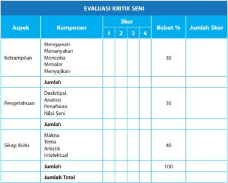

Tabel ini menunjukkan evaluasi kritik seni yang terdiri dari tiga aspek utama: Ketampanan, Pengetahuan, dan Sikap Kritis. Setiap aspek dibagi menjadi komponen dengan skor yang berbeda, termasuk mengamati, menyanyikan, menulis, menata, menyalakan, deskripsi, analisis, penerapan, nilai seni, makna tema, artis, dan intelektual. Skor untuk setiap komponen diberikan pada skala 1 hingga 4, dengan bobot % yang berbeda untuk setiap aspek. Total skor untuk setiap aspek ditambahkan untuk mencapai skor total 100. Ini membantu dalam memeriksa kemampuan kritis dan pengetahuan seni seseorang.

---
**📊 Tabel**

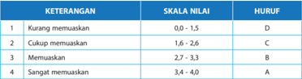

Tabel ini menunjukkan kriteria penilaian untuk sebuah skala nilai yang berada di antara 0 hingga 4. Kriteria ini mencakup empat tingkat penilaian: "Kurang memuaskan", "Cukup memuaskan", "Memuaskan", dan "Sangat memuaskan". Setiap tingkat penilaian memiliki skala nilai yang ditentukan, dengan skala nilai 0,0 hingga 1,5 untuk "Kurang memuaskan", 1,6 hingga 2,6 untuk "Cukup memuaskan", 2,7 hingga 3,3 untuk "Memuaskan", dan 3,4 hingga 4,0 untuk "Sangat memuaskan". Selain itu, tabel juga menyertakan huruf penilaian A, B, C, dan D untuk setiap skala nilai tersebut. Topik utama tabel ini adalah penilaian dan kriteria penilaian yang digunakan dalam suatu proses evaluasi. Kolom-kolom yang ada dalam tabel meliputi keterangan (KETERANGAN), skala nilai (SKALA NILAI), dan huruf penilaian (HURUF). Data atau pola penting yang terlihat dalam tabel ini adalah bahwa skala nilai 0,0 hingga 1,5 diberi nilai D, skala nilai 1,6 hingga 2,6 diberi nilai C, skala nilai 2,7 hingga 3,3 diberi nilai B, dan skala nilai 3,4 hingga 4,0 diberi nilai A.

---
**📊 Tabel**

Tabel ini menunjukkan pencapaian kompetensi siswa dalam sebuah kelas, dengan kolom "Nama", "Kelas", dan "Pengamat". Data dalam tabel tersebut mencakup nama-nama siswa, kelas mereka, dan pengamat yang bertanggung jawab atas pencapaian kompetensi mereka. Topik utama tabel ini adalah pencapaian kompetensi siswa dalam kelas tertentu, dengan fokus pada identifikasi nama-nama siswa, kelas mereka, dan pengamat yang bertanggung jawab atas pencapaian mereka. Pola penting yang terlihat adalah bahwa tabel ini menyediakan informasi tentang pencapaian kompetensi siswa secara umum, namun tidak memberikan detail spesifik tentang pencapaian kompetensi masing-masing siswa.

 

---
## 📄 Halaman 114

### E. Hak Cipta Karya Seni Rupa dan Desain

Hak Atas Kekayaan Intelektual, HAKI, atau Intellectual Property Rights adalah hak hukum yang bersifat eksklusif yang dimiliki oleh para pencipta/penemu sebagai hasil aktivitas intelektual dan kreativitas yang bersifat khas dan baru. Karya-karya tersebut dapat berupa hasil karya cipta di bidang ilmu pengetahuan, seni, dan sastra serta hasil penemuan (invensi) di bidang teknologi. Karya-karya di bidang HAKI dihasilkan berkat kemampuan intelektual manusia melalui  pengorbanan tenaga,  waktu,  pikiran,  perasaan,  dan  hasil  intuisi/ilham/hati  nurani. Secara hukum HAKI terdiri dari dua bagian, yaitu: Hak Cipta, Copyright , dan Hak Kekayaan Industri, Industrial Property Right , mencakup: paten, merek, desain industri, desain tata letak sirkuit terpadu, rahasia dagang, dan varietas tanaman.

Dewasa ini fenomena HAKI telah menjadi permasalahan internasional, terutama sejak ditandatanganinya Agreement Establisshing the World Trade Organization ,  WTO. Penegakan hukumnya dilaksanakan oleh Badan Penyelesaian sengketa, Dispute Settlement Body ,  DSB. Dalam hal meningkatkan perlindungan HAKI pada umumnya setiap negara mengacu pada standar  yang  ditetapkan Agreement  on Trade  Re-lated  Aspect  of  Intelectual  Property  Rights , disingkat TRIPs. Indonesia, sebagai salah satu negara yang memiliki komitmen kuat terhadap perlindungan HAKI sudah lama terlibat secara aktif baik dalam lingkup nasional, regional, dan internasionl. Sejak tahun 1997 negara kita bergabung dalam World Intellectual Property Organization ,  WIPO, badan administratif khusus di bawah Perserikatan Bangsa-Bangsa (PBB).

Ruang lingkup HAKI seperti dipaparkan secara ringkas  di  atas,  dalam  buku  ini  kita bahas  secara  terbatas,  yakni  khusus  yang  berhubungan  dengan  hak  cipta  tentang  karya seni,  dan  hak  desain  industri  yang  termasuk  dalam  lingkup  ciptaan  seni.  Pencipta  adalah seseorang atau beberapa orang secara bersama-sama yang atas inspirasinya melahirkan suatu ciptaan  berdasarkan  kemampuan pikiran, imajinasi, kecekatan, ketrampilan, atau keahlian yang  dituangkan  ke  dalam  bentuk  yang  khas  dan  bersifat  pribadi.  Ciptaan  adalah  hasil setiap pencipta yang menunjukkan keasliannya dalam lapangan ilmu pengetahuan, seni atau sastra.  Ketiga  bidang  ini,  akan  dibahas  dengan  rinci  sebagai  profesi  yang  mendapatkan perlindungan hak cipta.

### 1. Seniman dan Profesi

Istilah Pencipta di bidang seni ditengah masyarakat dikenal secara umum sebagai seniman. Dalam cabang seni rupa disebut 'perupa' atau 'senirupawan' pelukis, pepatung (pematung), pegrafis (grafikus), pekeramik (keramikus), pendesain (desainer, perancang), pengkriya (kriyawan, perajin), peilustrasi (ilustrator), pekartun (kartunis), pekarikatur (karikarturis), peinstal (seniman instalasi),  penampil  (seniman performance art ),  pekaligrafi  (seniman  kaligrafi),  dan  lain-lain. Dalam cabang seni sastra 'pencipta' secara umum dikenal sebagai pesastra alias 'sastrawan', pesyair  (penyair),  pecerpen  (cerpenis),  penovel  (novelis),  peroman  (penulis  roman),  peprosa (prosais),  dan  lain-lain.  Dalam  cabang  seni  di  bidang  musik  'pencipta'  dikenal  sebagai pemusik (musikus, komposer, pemain musik, penyanyi, dan lain-lain). Dalam bidang teater 'pencipta' berarti peteater (teaterwan, dramawan, sutradara), pelakon-pemeran (aktor, aktris, artis pendukung,) penaskah (penulis naskah), pedekor (dekorator), pecahaya (penata cahaya), dan lain-lain. Dalam cabang seni tari secara umum 'pencipta' dikenal sebagai petari (penari), penata  tari  (koreografer),  penata  musik  (pengiring  tari),  pebusana  (penata  busana),  perias (penata rias), dan lain-lain. Dalam bidang sinematografi, 'pencipta' dapat berarti, penaskah, pelakon,  peperan  (pemeran  utama,  aktor,  artis,  pemeran  pembantu-pendukung),  pekamera

 

---
## 📄 Halaman 115

(kameramen), pesunting (penyunting, editor, pelaku editing), penata laku (sutradara), pemusik (ilustrasi musik pengiring film), pecahaya (penata cahaya), pesuara (penata suara), peanimasi (animator), dan lain-lain. Di bidang ilmu pengetahuan seni, 'pencipta' dapat berarti peteliti seni (peneliti seni), pesejarah seni (sejarahwan seni), peilmu seni (ilmuwan seni, sosiolog seni, psikolog seni, antropolog seni, pekritik seni (kritikus seni), dan lain-lain.

Dari  paparan  di  atas  dapat  dilihat  betapa  luas  profesi  seni  yang  harus  mendapatkan perlindungan  hak  cipta,  dan  masing-masing  profesi  ini  secara  ideal  memerlukan  jaminan perlindungan hukum atas kreativitas dan hasil ciptaannya yang unik (dalam undang-undang keunikan ini dihargai sebagai hak eksklusif) sebagai seniman. Hak eksklusif adalah hak yang semata-mata diperuntukkan bagi pemegangnya sehingga tidak ada pihak lain yang boleh memanfaatkan hak tersebut  tanpa  izin  pemegangnya.  Dalam  pengertian 'mengumumkan atau  memperbanyak',  termasuk  kegiatan  menerjemahkan,  mengadaptasi,  mengaransemen, mengalihwujudkan,  menjual,  menyewakan,  meminjamkan,  mengimpor,  memamerkan, mempertunjukkan kepada publik, menyiarkan, merekam, dan mengkomunikasikan ciptaan kepada publik melalui sarana apapun. Di sini tidak kita lihat faktor 'pemalsuan' karya seni yang menjadi masalah yang merisaukan di kalangan perupa, terutama pemalsuan karya seni lukis di tingkat nasional maupun internasional.

Jadi,  undang-undang hak cipta memerlukan pengembangan untuk dapat menampung semua keluhan tentang 'pemalsuan' itu. Di samping perlu menampung kecenderungan seni dalam era posmodernisme yang telah menjungkirbalikkan semua kriteria seni modernisme. Sudahkah karya-karya posmodernisme mendapat perlindungan hukum? Atau sudahkah para seniman conseptual art mendapatkan perlindungan hak cipta? Yang terakhir ini kiranya perlu dipertimbangkan, mengingat dalam undang-undang disebutkan 'perlindungan hak cipta hanya diberikan pada perwujudan suatu ciptaan dan bukan pada ide, prosedur, metode pelaksanaan atau konsep-konsep matematis semacamnya'. Perlindungan hak cipta tidak diberikan kepada ide  atau  gagasan  karena  karya  seni  harus  memiliki  bentuk  yang  khas,  bersifat  pribadi  dan menunjukkan keaslian sebagai ciptaan yang lahir berdasarkan kemampuan, kreativitas, atau keahlian sehingga ciptaan itu dapat dilihat, dibaca, atau didengar. Dengan demikian, conseptual art lebih  mementingkan  makna konsep sebagai seni dibandingkan dengan karya jadinya, jelas menjadi persoalan yang memerlukan pengkajian lebih lanjut. Dalam hal ini mendengar dan mempertimbangkan nilai kreativitas atau 'ciptaan' seni konseptual merupakan tindakan yang arif. Agar kehadiran UUHC benar-benar memberikan perlindungan kepada seniman, dan bukan sebaliknya.

### 2. Seni dan Budaya Indonesia

Indonesia  sebagai  negara  kepulauan  memiliki  keanekaragaman  seni  dan  budaya  yang sangat  kaya.  Hal  itu  sejalan  dengan  keanekaragaman  etnik,  suku  bangsa,  dan  agama  yang secara  keseluruhan  merupakan potensi nasional yang perlu dilindungi. Kekayaan seni dan budaya  itu  merupakan  salah  satu  sumber  dari  kekayaan  intelektual  yang  dapat  dan  perlu dilindungi oleh undang-undang. Kekayaan itu tidak semata-mata untuk seni dan budaya itu sendiri, tetapi dapat dimanfaatkan untuk meningkatkan kemampuan di bidang perdagangan dan industri yang melibatkan penciptanya. Dengan demikian kekayaan seni dan budaya yang dilindungi itu dapat meningkatkan kesejahteraan tidak hanya bagi penciptanya saja, tetapi juga bagi bangsa dan negara. Artinya, warisan seni budaya Indonesia adalah aset bangsa yang wajib dilindungi keberadaannya.

 

---
## 📄 Halaman 116

Undang-Undang Hak Cipta berlaku bagi semua ciptaan warga negara, penduduk, dan badan hukum Indonesia. Semua ciptaan bukan warga negara Indonesia, bukan penduduk Indonesia, dan bukan badan hukum Indonesia yang diumumkan untuk pertama kali di Indonesia. Semua penciptaan  bukan  warga  negara  Indonesia,  bukan  penduduk  Indonesia,  dan  bukan  badan hukum Indonesia, dengan ketentuan:

- Negaranya mempunyai perjanjian bilateral mengenai perlindungan hak cipta dengan Negara Republik Indonesia; atau
- Negaranya dan Negara Republik Indonesia merupakan pihak atau peserta dalam perjanjian multilateral yang sama mengenai perlindungan hak cipta. Jadi jelas bahwa UUHC tidak hanya berlaku dalam tataran nasional, melainkan berlaku juga dalam tataran internasional.

### 3. Eksploitasi Seni Budaya Tradisional

Pengarang, seniman dan pencipta dari masyarakat tradisional atau pedesaan jarang menerima imbalan finansial yang memadai untuk kekayaan intelektual berupa Pengetahuan Tradisional yang dieksploitasi. Sebagai contoh misalnya, seorang Achim Sibeth (antropolog) memasuki wilayah masyarakat desa di Tanah Batak dan kemudian menulis buku Living with Ancestors The Batak People of Island of Sumatra .  Sebuah  buku Antropologi kebudayaan yang lengkap, termasuk Art and Craft, Batak Script and Literature, Black-smith's work, Bronze Work, Works of  goldsmiths  and  silversmiths, Textil,  Ulos,  Dance  and  Music,  Domestic  Architecture Toba  and Karo Batak ,  dan  dengan  bebas  memotret  karya-karya  itu  untuk  ilustrasi  penerbitan  buku 239 halaman itu. Fenomena pemberlakuan hak cipta pada kasus ini paling tidak menyajikan dua masalah: (a) Achim Sibeth, memperoleh untung dari penjualan buku, sementara masyarakat desa tidak mendapatkan imbalan finansial apapun. (b) Karena buku itu mempunyai nilai  budaya  atau  spiritual  untuk  seluruh  masyarakat  Batak,  maka  pemanfaatan  komersial seperti itu dapat menyinggung perasaan masyarakat, misalnya, cerita adat yang kerahasiaannya dijaga ketat dan bersifat sangat penting dan dipelihara secara turun temurun oleh masyarakat Batak secara terbuka diungkapkan kepada dunia. Adakah perlindungan hukum bagi kasus seperti  ini?  Dalam  hal  ini  Negara  memegang hak cipta atas karya peninggalan prasejarah, sejarah, dan benda budaya nasional lainnya. Negara memegang hak cipta atas folkor dan hasil kebudayaan rakyat yang menjadi milik bersama, seperti cerita, hikayat, dongeng, legenda, babad, lagu, kerajinan tangan, koreografi, tarian, kaligrafi, lukisan, patung, topeng, wayang, ornamen, arsitektur,  batik,  reog,  tari,  drama,  dan  banyak  lagi  karya  seni  lainnya.  Namun  pelaksanaan hak cipta  atas  ciptaan  yang  penciptanya  tidak  dikenal  seperti  ini  diatur  dengan  peraturan pemerintah. Dan kita berharap peraturan itu akan segera 'diciptakan' dengan memperhatikan kepen-tingan masyarakat banyak yang menjadi subjek dan objek penerapan Hak Cipta.

### 4.  Undang-Undang Desain Industri

Untuk memajukan industri yang mampu bersaing dalam lingkup perdagangan nasional dan internasional perlu diciptakan iklim yang mendorong kreasi dan inovasi pedesain sebagai bagian dari sistem hak kekayaan intelektual. Hal ini terkait dengan seni budaya etnis bangsa Indonesia yang sangat beraneka ragam sebagai sumber pengembangan desain industri.

Desain industri adalah suatu kreasi tentang bentuk, konfigurasi, atau komposisi garis atau warna, atau garis dan warna atau gabungan daripadanya yang berbentuk tiga dimensi atau dua dimensi yang memberikan kesan estetis dan dapat diwujudkan dalam pola tiga dimensi atau dua dimensi serta dapat dipakai untuk menghasilkan suatu produk, barang, komoditas industri,

 

---
## 📄 Halaman 117

atau kerajinan tangan. Pedesain adalah seorang atau beberapa orang yang menghasilkan desain industri.  Desain  Industri  yang  mendapat perlindungan adalah desain baru. Desain industri dianggap baru apabila pada tanggal penerimaan, desain industri tersebut tidak sama dengan pengungkapan yang telah  ada  sebelumnya. Yang  berhak  memperoleh  hak  desain  industri adalah pendesain atau yang menerima hak tersebut dari pedesain. Dalam hal ini, pendesain terdiri  dari  beberapa  orang  secara  bersama,  hak  desain  industri  diberikan  kepada  mereka secara bersama, kecuali bila diperjanjikan lain. Desain industri dalam konteks ini merupakan bidang profesi yang memiliki hak eksklusif untuk melaksanakan hak desain industri yang dimilikinya dan untuk melarang orang lain yang tanpa persetujuannya membuat, memakai, menjual, mengimpor, mengekspor atau mengedarkan barang industri itu.

### 5.  Hak Cipta dan Pemalsuan Lukisan

Undang-Undang Hak Cipta tidak membahas masalah 'pemalsuan lukisan', suatu fenomena yang mendunia, termasuk di Indonesia. Karya-karya pelukis Indonesia terkemuka seperti Raden Saleh, Affandi, S.Soedjojono, Basoeki Abdullah, Hendra Gunawan, Trubus, Dullah, Le Man Fong, Ahmad Sadali, Popo Iskandar, Jeihan, sekedar contoh, banyak dipalsukan orang untuk mendapatkan keuntungan finansial. Dalam undang-undang hak cipta belum ada pasal-pasal yang berkaitan dengan pemalsuan lukisan ini. Deskripsi berikut kiranya dapat memberikan wawasan baru tentang hal ini.

Eddy Soetriyono melaporkan 'Kasus yang baru dan menghentak masyarakat pencinta seni rupa di Indonesia adalah soal 'lukisan kembar' Raden Saleh dalam lelang Christie's bertajuk Southeast Asian and Modern Indian Painting, Including Contemporary Art ,  edisi 29 Mei 2005, di  Hongkong.  Balai  lelang  ini  menawarkan lot  21 berupa  lukisan  Raden  Saleh  berjudul deskriptif: A Family promenades along a path with two tigers in wait and the Borobudur in the background ,  berukuran  112  x  156  cm  dan  ditandatangani  dengan  tahun  1849.  Lukisan  ini 'hampir' dengan seluruh bagiannya mirip dengan karya Raden Saleh yang pernah dilelang di Sotheby's bertajuk Southeast  Asian  Painting edisi  3  Oktober  1999  di  Singapura  dengan judul Lying in Wait (Mengintai) dan sudah terbeli dengan harga S$ 2.423.750 (sekitar Rp 14 milyar). Kedua lukisan itu dinyatakan 'asli' oleh ahli yang sama.'

---
**🖼️ Gambar/Diagram**

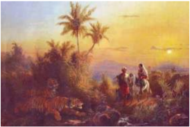

> **Deskripsi Visual:** Gambar ini adalah ilustrasi yang menampilkan dua orang pedagang berjalan di sepanjang jalan di tepi sungai, dengan pemandangan matahari terbenam yang indah di latar belakang. Di sebelah kiri, terdapat seekor harimau yang sedang berdiri di tepi sungai. Ilustrasi ini menunjukkan hubungan antara manusia dan hewan liar, serta suasana alam yang tenang dan damai pada waktu senja.

 

---
## 📄 Halaman 118

### 6.  Dewan Hak Cipta

Dalam kasus ini, yang memprihatinkan adalah Undang-Undang Hak Cipta tidak dapat melindungi hak cipta Raden Saleh, oleh karena usia Raden Saleh ditambah 50 tahun tidak dilindungi Hak Cipta lagi. Hal ini diciptakan oleh Raden Saleh. Dengan kata lain Nama Raden Saleh dalam lukisannya tidak bisa dihapus dan diganti oleh nama orang lain. Artinya pemilik lukisan Raden Saleh (siapa pun dia, lembaga apapun dia) tidak dapat mengklaim bahwa lukisan itu adalah ciptaannya. Pengertian Ciptaan dalam karya seni bersifat 'Abadi'. Siapakah pewaris hak cipta karya Raden Saleh? Jika keturunan Raden Saleh sebagai ahli waris pemegang hak cipta tidak peduli dengan pemalsuan lukisan itu, maka negara adalah pemegang hak cipta itu, artinya Negara Republik Indonesia sesungguhnya dapat menyampaikan gugatan kepada pemalsu lukisan Raden Saleh melalui pengadilan niaga. Tetapi negara sendiri tampaknya belum menyadari bahwa pembelaan Hak Atas Kekayaan Intelektual senimannya adalah  juga  bagian  dari  ketaatan  hukum  dan  pembangun  wibawa  serta  martabat  bangsa. Apresiasi 'elit  bangsa'  pada  seniman  dan  karya  seni  merupakan  fakta  yang  menyedihkan, padahal Raden Saleh adalah seniman pertama yang mempunyai reputasi internasional di bidang seni lukis.

Untuk membantu Pemerintah dalam memberikan penyuluhan dan pembimbingan serta pembinaan hak cipta, dibentuk Dewan Hak Cipta (DHC). Keanggotaan DHC terdiri atas wakil pemerintah, wakil organisasi profesi, dan anggota masyarakat yang memiliki kompetensi di  bidang hak cipta yang diangkat dan diberhentikan oleh Presiden atas usul Menteri. Jika demikian maka adalah tanggung jawab DHC untuk pembinaan dan pemasyarakatan UUHC. Sampai kini, sejauh pengamatan kita, kerja sama DHC dengan Institusi Pendidikan Seni belum terlaksana. Sehingga boleh dikatakan sosialisasi UUHC kepada siswa dan mahasiswa seni  belum  terselenggara,  sebagai  akibatnya  pemahaman,  pengertian,  dan  apresiasi  siswa dan  mahasiswa  seni  terhadap  UUHC  sangat  memprihatinkan.  Jika  guru  dan  dosen  seni memasukkan UUHC sebagai bagian dari proses belajar  mengajar  mereka,  maka  di  masa depan para lulusannya akan lebih sadar akan hak-haknya, dan dapat mengapresiasi hak-hak orang lain dalam penciptaan karya seni.

 

---
## 📄 Halaman 119

###  Bab 4  Memahami Konsep Musik Barat

### KOMPETENSI INTI

KI 1 : Menghayati dan mengamalkan ajaran agama yang dianutnya.

- KI 2 : Menunjukkan perilaku jujur, disiplin, tanggung jawab, peduli (gotong royong, kerja sama, toleran, damai), santun, responsif dan pro-aktif sebagai bagian dari solusi atas berbagai permasalahan dalam berinteraksi secara efektif dengan lingkungan sosial dan alam serta menempatkan diri sebagai cerminan bangsa dalam pergaulan dunia.
- KI 3 : Memahami, menerapkan, dan menganalisis pengetahuan faktual, konseptual, prosedural, dan metakognitif berdasarkan rasa ingin tahunya tentang ilmu pengetahuan, teknologi, seni, budaya, dan humaniora dengan wawasan kemanusiaan, kebangsaan, kenegaraan, dan peradaban terkait penyebab fenomena dan kejadian, serta menerapkan pengetahuan prosedural pada bidang kajian yang spesifik sesuai dengan bakat dan minatnya untuk memecahkan masalah.
- KI 4 : Mengolah, menalar, dan menyaji dalam ranah konkret dan ranah abstrak terkait dengan pengembangan dari yang dipelajarinya di sekolah secara mandiri, bertindak secara efektif dan kreatif, serta mampu menggunakan metoda sesuai kaidah keilmuan.

### KOMPETENSI DASAR

- 1.1. Menunjukkan sikap penghayatan dan pengamalan serta bangga terhadap karya seni musik sebagai bentuk rasa syukur terhadap anugerah Tuhan.
- 2.1. Menghayati dan mengamalkan perilaku jujur, disiplin, tanggung jawab, peduli, kerjasama, santun, dan menunjukkan sikap sebagai bagian dari solusi atas berbagai permasalahan dalam berinteraksi secara efektif dengan lingkungan sosial, dan alam melalui apresiasi dan kreasi seni sebagai cerminan bangsa dalam pergaulan dunia.
- 3.1. Memahami konsep musik Barat.
- 3.2. Menganalisis musik Barat.
- 3.3. Menganalisis hasil pertunjukan musik Barat.
- 3.4. Memahami perkembangan musik Barat.
- 4.1. Memainkan alat musik Barat.
- 4.2. Mempresentasikan hasil analisis musik Barat.
- 4.3. Membuat tulisan tentang musik Barat.
- 4.4. Menampilkan beberapa lagu dan pertunjukan musik Barat.


 

---
## 📄 Halaman 120

### INFORMASI GURU

Alur materi pembelajaran pada bahasan Bab 4 dipetakan sebagai berikut:

---
**🖼️ Gambar/Diagram**

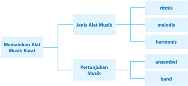

> **Deskripsi Visual:** Gambar ini adalah diagram yang menunjukkan struktur dari jenis-jenis alat musik barat yang dapat digunakan untuk menampilkan pertunjukan musik. Diagram ini dibagi menjadi dua bagian utama: "Menampilkan Alat Musik Barat" dan "Jenis Alat Musik". Pada bagian pertama, ada dua subbagian utama: "Pertunjukan Musik" dan "Jenis Alat Musik". Untuk "Pertunjukan Musik", ada dua subjenis: "ansambel" dan "band". Untuk "Jenis Alat Musik", ada tiga subjenis: "ritmis", "melodis", dan "harmonis".

Elemen-elemen utama dalam diagram ini adalah jenis-jenis alat musik barat yang dapat digunakan untuk menampilkan pertunjukan musik. Relasi antara elemen-elemen ini adalah bahwa setiap jenis alat musik barat dapat digunakan untuk menampilkan pertunjukan musik, dan setiap jenis pertunjukan musik dapat menggunakan berbagai jenis alat musik barat.

Teks, angka, atau label penting yang terlihat dalam diagram ini adalah "Menampilkan Alat Musik Barat", "Jenis Alat Musik", "Pertunjukan Musik", "ansambel", dan "band". Informasi kunci yang dapat diambil pembaca dari diagram ini adalah bahwa ada banyak jenis alat musik barat yang dapat digunakan untuk menampilkan pertunjukan musik, dan setiap jenis pertunjukan musik dapat menggunakan berbagai jenis alat musik barat.

### TUJUAN PEMBELAJARAN

Setelah mempelajari Bab 4 tentang Memainkan Musik Barat, diharapkan siswa mampu:

- menjelaskan konsep musik barat,
- menjelaskan definisi musik dalam konsep musik barat,
- menidentifikasi unsur-unsur musik dalam konsep musik barat, dan
- menjelaskan pengertian nada, dinamik, dan tempo dalam konsep musik barat.

### MODEL PEMBELAJARAN

Diharapkan  pembelajaran  Bab  4  ini  dilaksanakan  menggunakan  pendekatan  saintifik dengan model pembelajaran inkuiri atau discovery learning .  Harapannya, setelah mengikuti pembelajaran ini siswa tidak hanya mendapatkan pengetahuan tentang konsep musik barat, tetapi  sekaligus  memperoleh nuture  efect (dampak  ikutan)  berupa  kebiasaan  mencari  dan menemukan pengetahuan mengenai konsep musik barat secara mandiri dari berbagai sumber sehingga terbentuk karakter yang diharapkan, yaitu:

- rasa ingin tahu, melalui penugasan pencarian informasi tentang konsep musik barat dari berbagai sumber (termasuk internet);
- tekun dan pantang menyerah, melalui penugasan untuk menemukan bermacam-macam pandangan para ahli tentang konsep musik barat;
- menghargai pendapat orang lain; dan
- jujur dan disiplin.

### MOTIVASI

Musik yang bersifat universal dan mudah dikenal oleh manusia dari belahan dunia mana pun. Musik tentu memiliki penggemar alias konsumen yang bersifat menglobal. Oleh karena itu, industri musik juga dapat menjadi industri raksasa.

 

---
## 📄 Halaman 121

### SUMBER UNTUK GURU

### A.  Memainkan Alat Musik Barat

### 1. Dasar-dasar Bermain Alat Musik Barat (Populer)

Dalam sebuah konser pasti ditemukan aneka alat musik. Ada gitar melodi, gitar ritme, gitar  bas,  keyboard,  organ,  piano,  biola, flute ,  saksofon,  trompet,  trombon,  drum,  tamborin, triangle , marakas, dan mungkin masih banyak lagi yang lain. Tentu masing-masing alat musik tersebut  dimainkan secara bersama-sama untuk mengiringi lagu. Apakah cara memainkan alat-alat  musik  tersebut  sama?  Apakah  alat-alat  musik  tersebut  menghasilkan  bunyi  dan nada yang sama? Tentu tidak. Setiap alat musik dimainkan dengan cara berbeda-beda dan untuk menghasilkan bunyi yang berbeda pula. Justru perbedaan bunyi dan nada inilah yang menghasilkan komposisi yang indah bila didengar telinga, bahkan dapat menimbulkan rasa musikan yang indah pula.

Alat musik gitar dimainkan dengan cara dipetik. Keyboard ,  organ,  dan  piano dimainkan dengan cara ditekan tutsnya. Flute dan  biola  dimainkan dengan cara menggesek dawainya. Saksofon, trompet, trombon dimainkan dengan meniupnya. Drum, triangle ,  marakas, bongo, gendang, tamborin dimainkan dengan cara dipukul.

Bunyi yang dihasilkan dari alat-alat musik tersebut juga berbeda satu sama lainnya. Demikian pula fungsinya. Gitar, keyboard , organ, dan piano menghasilkan bunyi aneka nada yang berfungsi untuk memainkan melodi dan ritem. Flute ,  biola, saksofon, trompet, trombon menghasilkan berbagai  nada  yang  berfungsi  untuk  memainkan  melodi.  Drum, triangle ,  marakas,  bongo, gendang, tamborin menghasilkan satu nada yang berfungsi untuk pengiring melodi utama.

### a. Memainkan Alat Musik Ritmis

Alat musik ritmis adalah alat musik yang berfungsi sebagai pengiring melodi pokok. Jenis alat musik ini ada yang bernada dan ada yang tidak bernada. Kamu sudah mengenal alat musik ritmis sejak kamu di SMP. Contohnya drum, ringbell , beduk, triangle , marakas, gendang, bongo, dan lain sebagainya.

Musik ritmis adalah musik pengatur irama. Biasanya alat musik ritmis tidak memiliki nada dan berfungsi sebagai pengiring lagu. Yang termasuk alat musik ritmis di antaranya drum set, tamborin, gendang, tifa, bongo, kongo, triangle ,  kastanyet, dan marakas.

Sebagai pengatur irama, alat musik ritmis haruslah dimainkan secara konsisten, terutama untuk menghidupkan suasana dan menjaga ritme dan tempo. Karena tidak perlu mengikuti melodi lagu, maka memainkan alat musik ritmis sangat mudah. Hanya saja, dibutuhkan konsistensi agar lagu tetap terjaga ritmenya. Bila pada bagian-bagian tertentu aransemen lagu terdapat break atau jeda, pemain alat musik ritmis harus tahu karena merekalah yang harus memberi isyarat dan tanda.

Kamu cukup mengetuk-ngetuk meja atau benda-benda lain untuk membentuk irama tertentu dalam berlatih memainkan alat musik ritmis. Misalnya, untuk drum set dimainkan seperti contoh berikut:

- irama mars dengan ketukan

`x - o, x - o, x - o (tak, dung),`

- irama walz
x - x - o, x - x - o (tak, tak, dung),

x - o - o - x - o (tak, dung, dung, tak, dung).

- irama bosanova

 

---
## 📄 Halaman 122

### b.  Memainkan Alat Musik Melodis

Memainkan alat musik melodis sama dengan membawakan lagu karena alat musik melodis memang berfungsi untuk memainkan melodi utama lagu. Pemegang alat musik ini  harus  mampu dan terampil membawakan lagu sebagaimana penyanyi membawakan lagu  itu  dengan  vokalnya.  Akan  tetapi,  tentu  masih  ditambah  pula  untuk  memainkan intro, interlude ,  dan fungsi-fungsi tambahan lainnya.

Dalam ansambel modern, alat musik melodis di antaranya saksofon, trompet, trombon, biola, flute , pianika, xylophon , klarinet, oboe, dan lain-lain. Ada dua teknik permainan alat musik melodis, yaitu:

### 1)  Teknik Legato

Teknik legato adalah permainan alat musik melodis yang panjang-panjang sesuai harga  atau  ketukan  not.  Pemain  membunyikan  nada  tanpa  jeda  sampai  pada permainan nada berikutnya. Misalnya:

Perhatikan baris pertama yang hampir semua notnya diberi tanda titik (.) di atasnya. Perhatikan pula baris kedua mulai bar kedua yang tidak menggunakan tanda titik (.).  Yang  menggunakan  titik  dimainkan  dengan  teknik dan  yang  tidak

- stacatto menggunakan tanda titik dimainkan dengan teknik legato.

### 2)  Teknik Stacatto

Teknik stacatto adalah  permainan alat musik dengan teknik terputus-putus. Tiap not dimainkan dengan durasi pendek-pendek. Permainan teknik stacatto biasanya dimaksudkan untuk menimbulkan kesan semangat, bergairah, dan meledak-ledak.

Perhatikan pemakaian tanda titik (.) di atas atau di bawah not.

 

---
## 📄 Halaman 123

### c. Memainkan Alat Musik Harmonis

### a. Ansambel Sejenis

Ansambel sejenis adalah ansambel yang memainkan alat musik dari jenis yang sama, misalnya ansambel perkusi, ansambel tiup, ansambel gesek, dan sebagainya.

### 1)  Ansambel Perkusi

Ansambel perkusi dimainkan dengan alat-alat musik perkusi. Di Indonesia cukup banyak  ansambel  perkusi,  misalnya  rampak  gendang,  rebana,  drumband,  marching band, gandang, dan lain-lain.

### 2)  Drumband/Marching Band

Dalam drumband/marching band instrumen musik perkusi dibawa oleh pemain dan dimainkan dalam barisan. Kelompok yang memainkan instrumen musik perkusi sambil berjalan disebut juga sebagai drumline atau battery .  Ragam instrumen musik perkusi yang digunakan alat drumband umumnya lebih sedikit daripada yang digunakan pada permainan alat marching band. Contoh instrumen ini antara lain snare drum, drum tenor/quint, drum bass, dan simbal.

Pukulan-pukulan dasar pada permainan drum disebut basic  sticking .  Setiap  pola pukulan di bawah ini sangat penting untuk dikuasai karena sangat berpengaruh pada permainan drum dan sangat banyak digunakan.

Alat  musik  harmonis  adalah  alat  musik  yang berfungsi sebagai melodis dan sekaligus ritmis. Alat musik ini mampu menghasilkan nada dan juga dapat dimainkan sebagai pengiring dalam paduan nada atau yang lazim disebut akor. Termasuk jenis alat musik harmonis adalah piano, organ, keyboard , gitar, siter, dan sasando

Alat musik harmonis, selain dapat dimainkan secara  solo,  karena  sifatnya  yang  sekaligus  dapat untuk mengiringi irama lagu, dapat pula dimainkan untuk mengiringi permainan alat musik yang lain dalam sebuah orkestra.

Teknik dan gaya bermain musik harmonis hampir sama dengan teknik dan gaya bermain alat musik melodis. Alat musik ini juga dapat dimanfaatkan untuk  memainkan  akor  yang  biasanya  berfungsi untuk  ritem  (iringan).  Ketika  untuk  memainkan akor, pastikan teknik penjarian yang benar.

### 2. Memainkan Alat Musik dalam Grup

Memainkan musik dalam grup sering disebut sebagai  ansambel.  Ditinjau  dari  ragam  jenis  alat musik yang dimainkannya, ada ansambel sejenis, ansambel campuran, dan orkestra.

 

---
## 📄 Halaman 124

Jenis-jenis pukulan dalam drumband

Keterangan:

R = Pukulan tangan kanan

L = Pukulan tangan kiri

Single Stroke

### R L R L R L R L

Latihan diawali dengan teknik single stroke ini  pada snare drum. Latihan dimulai dengan tempo lambat, lalu perlahan percepat tempo sampai secepat mungkin. Untuk pemula yang baru belajar drum harap memukul dengan mengangkat ujung stick drum setinggi bahu, untuk melatih pergelangan tangan. Setelah pukulan cukup bagus dan mendapatkan tempo yang konstan, mulailah mengaplikasikan teknik single stroke pada bagian drum yang lain.

Pukul bagian snare drum (RL RL), lalu tom 1/mounted tom (RL RL), tom 2/ mounted tom (RL RL), dan ter akhir  floor  tom  (RL  RL).  lakukan  dengan  tempo lambat, kemudian sedikit demi sedikit naikkan tempo. teknik ini fungsinya untuk fill in pada permainan drum, contoh setelah kita memainkan untuk ketukan irama rock beat, beat 1/8, beat 1/4, beat 1/2, dst. Bisa juga variasi dilakukan pada snare drum saja.

Double Stroke

R R L L R R L L

Teknik double stroke sebenarnya sama dengan single  stroke yang  diulang  dua  kali. Dalam double stroke lebih dibutuhkan kecepatan gerakan dan kelenturan lengan. Jika sudah lancar dengan single stroke, double stroke tinggal melanjutkan.

Cara melatih double stroke (RR LL); gunakan bagian snare drum untuk melancarkan permainan. Bisa juga menggunakan rumus LL RR (dibalik sama saja). Agar suara yang dihasilkan lebih teratur dan menarik, pukulan tangan kanan dan kiri harus seimbang. Berikutnya dapat diteruskan dengan latihan-latihan lanjutan. Penerapan dalam kelompok drumband tentu sesuai dengan kebutuhan.

Triple Stroke

R R R L L L R R R L L L

Paradiddle

R L R R L R L L

Paradiddle-diddle

R L R R L L

Triplet/rough

R R L R R L atau L L R L L R

### b.  Ansambel Tiup

Ansambel tiup adalah ansambel yang seluruh instrumen musiknya terdiri atas alat-alat musik tiup. Termasuk alat musik tiup adalah recorder , flute , trompet, saksofon, trombon, klarinet, oboe, french horn .

 

---
## 📄 Halaman 125

### Trompet

Ada bermacam-macam jenis trompet. Di antaranya jenis C, D, Eb, E, F, G, A, dan Bb. Akan tetapi, yang paling lazim dan sering dipakai adalah trompet Bb. Trompet C paling umum dipakai dalam orkestra Amerika, dengan bentuknya yang lebih kecil memberikan suara yang lebih cerah, dan lebih hidup dibandingkan dengan trompet Bb.

Trompet  dapat  dimainkan  oleh  semua  orang.  Syaratnya  memiliki  napas  yang panjang dan kuat. Oleh karena itu, perokok agak sulit memainkan trompet karena perokok  napasnya  lebih  pendek  daripada  orang  yang  bukan  perokok.  Jadi,  jika seseorang menyukai alat musik tiup seperti trompet ini, disarankan tidak merokok atau mempunyai aktivitas atau kebiasaan. Untuk seseorang yang mempunyai penyakit pernapasan sehingga menjadikannya bernapas pendek tidak disarankan memainkan alat musik tiup.

### French Horn

French horn merupakan keluarga alat musik tiup logam. Biasanya dimainkan dalam ansambel atau orkestra musik klasik. Juga sering dimainkan sebagai seksi tiup dalam marching band. French horn memiliki  tiga  katup  pengatur  yang  dimainkan  dengan tangan kiri dengan tata cara dalam memainkan yang identik dengan trompet. French horn pada umumnya menggunakan kunci F meski instrumen musik lainnya biasanya menggunakan kunci Bb.

### Klarinet

Klarinet adalah instrumen musik dari keluarga alat musik tiup. Namanya diambil dari clarino (Italia) yang berati trompet dan akhiran -et yang berarti kecil. Sama seperti saksofon, klarinet dimainkan dengan menggunakan satu reed .

Klarinet merupakan keluarga instrumen terbesar, dengan ukuran dan pitch yang berbeda-beda. Klarinet umumnya merujuk pada soprano klarinet yang bernada Bb. Pemain klarinet disebut clarinetis. Ada banyak jenis klarinet, beberapa di antaranya sangat langka.

- Piccolo clarinet dalam Ab.
- Basset clarinet dalam A.
- Soprano clarinet dalam Eb, D, C, Bb, A, dan G.
- Alto clarinet dalam Eb.
- Contra-alto clarinet dalam EEb.
- Bass clarinet dalam Bb.
- Contrabass clarinet dalam BBb.
Saksofon  tergolong  dalam  keluarga  alat  musik  tiup,  terbuat  dari  logam  dan dimainkan seperti  cara  memainkan clarinet .  Saksofon  umumnya  berkaitan  dengan musik pop, big band, dan jazz, meskipun awalnya merupakan instrumen dalam orkestra dan band militer.

Nama saksofon (aslinya saxophone ) diambil dari nama penciptanya, yaitu seorang pemain clarinet dan pembuat alat musik bernama Adolphe Sax dari Belgia pada tahun 1846. Sax memiliki hak paten atas alat musik ini berupa 2 keluarga saxophone yaitu keluarga orkestra (C dan F) dan keluarga band (Bb dan Eb). Saat ini saksofon yang paling umum digunakan adalah soprano (Bb), Alto (Eb), Tenor (Bb), dan baritone (Eb).

 

---
## 📄 Halaman 126

### c. Ansambel Gesek

---
**🖼️ Gambar/Diagram**

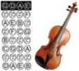

> **Deskripsi Visual:** Gambar ini adalah ilustrasi yang menunjukkan struktur dan nama-nama bagian dari alat musik violin. Gambar ini menggambarkan bagian-bagian violin seperti pita pinggir, pita pinggir, dan pita pinggir lainnya. Setiap bagian tersebut memiliki nama yang ditulis di sekitar mereka. Ini membantu pembaca untuk memahami bagaimana struktur violin bekerja dan bagaimana setiap bagian berfungsi dalam alat musik ini.

Ansambel gesek merupakan ansambel dengan kelompok alat musik gesek, seperti violin, biola, cello , contra bass .

### Biola

Biola adalah alat musik berdawai yang dimainkan dengan cara  digesek.  Biola  memiliki  empat  senar  (G-D-A-E) yang disetel berbeda satu sama lain dengan interval sempurna kelima. Nada yang paling rendah adalah G.

Alat musik yang termasuk keluarga biola adalah biola alto , cello dan double bass atau kontra bass . Di antara keluarga biola di  atas,  biolalah  memiliki  nada  yang  tertinggi.  Alat  musik  dawai  yang  lainnya,  bas, secara teknis masuk ke dalam keluarga viol. Notasi musik untuk biola hampir selalu ditulis pada kunci G.

Terdapat berbagai ukuran biola. Dimulai dari yang terkecil 1/16, 1/10, 1/8, 1/4, 2/4 (1/2), 3/4, dan biola untuk dewasa 4/4 (penuh). Kadang-kadang biola berukuran 1/32 juga digunakan (ukurannya sangat kecil). Ada juga biola 7/8 yang biasanya digunakan oleh wanita.

Panjang badan (tidak termasuk leher) biola 'penuh' atau ukuran 4/4 adalah sekitar 36 cm. Biola 3/4 sepanjang 33 cm, 1/2 sepanjang 30 cm. Sebagai perbandingannya, biola 'penuh'  berukuran sekitar 40 cm. Untuk menentukan ukuran biola yang cocok digunakan  oleh  seorang  anak,  biasanya  anak  disuruh  memegang  sebuah  biola  dan tangannya harus sampai menjangkau hingga ke gulungan kepala biola. Beberapa guru juga menganjurkan ukuran yang lebih kecil semakin baik.

Pemain pemula biasanya menggunakan penanda di papan jari untuk menandai posisi  jari  tangan  kiri.  Namun,  setelah  pemain  hafal  posisi  jari  tangan  kiri,  penanda tidak digunakan lagi. Biola biasanya dimainkan dengan cara tangan kanan memegang busur dan tangan kiri menekan senar. Bagi orang kidal, biola dapat dimainkan secara kebalikan.

### Cello

Cello adalah sebutan singkat dari violoncello, merupakan sebuah alat musik gesek dan anggota dari keluarga biola. Orang yang memainkan cello disebut cellis . Cello adalah alat  musik  yang  populer  dalam  banyak  segi  diantaranya  sebagai  instrumen  tunggal, dalam musik kamar, dan juga sebagai instrumen pokok dalam orkestra modern. Cello memberikan suara yang megah karena nadanya yang rendah.

Ukuran cello lebih besar daripada biola atau viola, namun lebih kecil daripada bass . Seperti  anggota-anggota lainnya dari keluarga biola, cello mempunyai empat dawai. Dawai-dawainya biasanya berurutan dari nada rendah ke tinggi C, G, D dan A. Cello hampir sama seperti viola, namun satu oktaf lebih rendah, dan satu seperlima oktaf lebih rendah daripada biola. Berbeda dengan biola, cello dimainkan dengan cara ditaruh di antara dagu dan bahu kiri, cello dimainkan dalam posisi berdiri di antara kedua kaki pemain yang duduk, dan ditegakkan pada sepotong metal yang disebut endpin . Pemain menggesekkan penggeseknya dalam posisi horizontal melintang di dawai.

 

---
## 📄 Halaman 127

### Kuartet Gesek

Dalam ansambel gesek, terdapat kelompok yang populer, yaitu kuartet gesek. Kuartet gesek merujuk pada sebuah kelompok yang terdiri atas 2 (dua) biola, 1 (satu) viola dan 1 (satu) cello . Biola pertama biasanya memainkan melodi dalam nada yang lebih tinggi. Biola kedua biasanya memainkan nada-nada yang lebih rendah dalam harmoni. Viola menjadi pengiring yang memberikan warna seperti suara tenor dalam paduan suara. Cello berfungsi seperti viola tetapi dalam nada yang lebih rendah seperti bass dalam paduan suara. Kuartet gesek yang standar pada umumnya dianggap sebagai salah satu dari bentuk terpenting dari musik kamar, dan kebanyakan komponis yang penting,  sejak  akhir  abad  ke-18,  menulis  kuartet  gesek.  Sebuah  komposisi  untuk empat pemain alat musik petik dapat dibuat dalam bentuk apapun, tetapi bila hanya disebutkan sebuah kuartet gesek.

### d. Ansambel Petik (Gitar)

Ansambel petik (gitar) tentu yang dimainkan adalah gitar semua. Sebagaimana namanya, ansambel  gitar  menggunakan  instrumen utama  gitar.  Banyak  versi  tentang  sejarah gitar.  Ada  yang  menyebutkan  bahwa gitar berasal dari Timur Tengah dan Arab. Ada pula yang menyatakan bahwa gitar berasal dari  Afrika.  Silakan  pelajari  sejarah  gitar melalui  sumber-sumber  yang  baik  dari internet  atau  buku-buku  perpustakaan. Lebih jelasnya, gitar yang kita kenal sekarang, disebut  sebagai  gitar  modern,  terdari  atas gitar akustik dan gitar elektrik. Gitar akustik sering  pula  disebut  sebagai  gitar  Spanyol karena  dalam  sejarahnya  di  Spanyollah gitar bertransformasi menjadi: (1) Guitarra Morisca yang  berfungsi  sebagai  pembawa

melodi,  dan  (2) Guitarra  Latina untuk  memainkan  akor.  Berikut  contoh  partitur ansambel gitar. Silakan berlatih untuk menyajikan ansambel berikut. Jika dipandang baik, dapat dimainkan dalam acara perpisahan.

### 3. Persiapan Pertunjukan Musik

Setelah mengikuti rangkaian pembelajaran teori dan apresiasi seni musik, kita diharuskan menampilkan karya musik. Proses penampilan karya musik ini tentu saja harus melalui rangkaian kegiatan yang terorganisasi sehingga proses penampilan musik bisa baik dan terarah. Kegiatan yang  harus  dilakukan  untuk  mempersiapkan  sebuah  pementasan  musik  meliputi  kegiatan pengorganisasian pertunjukan, pemilihan dan penyusunan karya musik yang akan ditampilkan, latihan-latihan  memainkan musik secara bersama, melaksanakan pertunjukan musik, serta evaluasi kegiatan pertunjukan.

Menyajikan  karya  musik  merupakan  hal  yang  pada  umumnya  ditunggu  setelah melaksanakan proses belajar. Sebagian besar orang ingin menampilkan hasil belajarnya tanpa mempertimbangkan aspek-aspek lain  yang  berkaitan  dengan  pementasan.  Dalam  pikiran

 

---
## 📄 Halaman 128

mereka biasanya  terbanyang  penampilan  seperti  layaknya  penyanyi  atau  pemusik  terkenal ketika beraksi di hadapan publiknya. Hal tersebut tidak dapat sepenuhnya disalahkan karena selayaknya seperti itulah proses penampilan musik. Hal-hal yang menentukan keberhasilan sebuah pementasan musik di antaranya kemampuan teknis, seorang pemusik dituntut pula untuk  mampu  berkomunikasi  dengan  publiknya,  baik  secara  verbal  (dengan  ucapan  dan kalimat-kalimat biasa) maupun secara nonverbal melalui karya musik yang dimainkannya. Kemampuan berkomunikasi ini tidak lantas muncul begitu saja dalam diri pemusik, ia harus mempersiapkan dirinya terlebih dahulu dari berbagai aspek, seperti bagaimana ia bersikap pada saat memaikan atau penampilan karya musik, bepakaian, memasuki pentas, berjalan di atas pentas, memperlakukan alat-alat musik, mengatasi rasa gugup ketika berhadapan dengan publik, dan sebagainya. Hal-hal tersebut sudah seharusnya dilatih secara cermat oleh setiap pemusik dan penyanyi.

### 4. Proses Pesiapan Pertunjukan Musik

Agar harapan atau sasaran suatu pertunjukan musik tercapai, maka mau tidak mau harus melakukan persiapan atau perencanaan. Apabila pertunjukan musik bertujuan meningkatkan apresiasi  penonton  terhadap  musik,  sasaran  mutu  dan  kualitas  lagu  harus  dapat  membuat sejumlah penonton ingin menonton kembali.

### Langkah-langkah menentukan pilihan lagu dalam pertunjukan musik

### a. Memahami tema acara pertunjukan musik.

Ajaklah siswa memahami tema pertunjukan musik. Setelah memahami tema pertunjukan, siswa  diberi  kebebasan  menentukan  lagu  dan genre musik  yang  akan  disajikan  dalam pertunjukan tersebut. Jika pertunjukan musik bertema keagamaan karena dalam rangka menyambut  hari  besar  keagamaan,  lagu-lagu  yang  ditampilkan  tentu  lagu-lagu  yang berkarakter  religius.  Demikian  pula genre musik  yang  sesuai  yang  dimainkan.  Pilihan atribut, dekorasi, dan tata panggung pertunjukan juga seyogyanya menyesuaiakan dengan tema tersebut. Demikian pula jika pertunjukan seni musik tersebut mengangkat tematema yang lain, seperti lingkungan hidup, solidaritas sosial, kepahlawanan, dan lain-lain.

### b. Memahami maksud dan tujuan tema acara pertunjukan musik.

Banyak maksud dan tujuan disajikannya pertunjukan seni musik. Ada yang bertujuan untuk menggalang amal bantuan bencana alam. Ada yang bertujuan menggalang solidaritas sosial. Ada yang bertujuan promosi album lagu. Ada pula yang bertujuan sekadar untuk hiburan. Maksud dan tujuan pertunjukan ini juga akan mempengaruhi pilihan lagu dan musik yang akan dimainkan. Pertunjukan musik amal untuk korban bencana alam, akan menanpilkan lagu-lagu doa, kebesaran Tuhan, motivasi, dan ajakan beramal bagi yang tertimpa musibah. Tentu berbeda pilihan lagu bila pertunjukan musik ditujukan untuk hiburan, untuk promosi album, atau yang lain.

### c. Memahami sasaran penonton/penikmat musik.

Penonton musik juga berbeda-beda tergantung usia, tingkat pendidikan, komunitas, dan lingkungan sosial. Hal ini juga harus diperhatikan jika siswa Anda akan menggelar pertunjukan musik. Kelompok penonton tua dan mapan akan menggemari musik dan lagu kenangan masa lalu. Kelompok penonton muda akan lebih menggemari lagu-lagu baru. Demikian pula kelompok-kelompok atau komunitas yang lain.

 

---
## 📄 Halaman 129

- Struktur urutan lagu disesuaikan dengan tema acara pertunjukan musik (intensitas rendah, sedang, tinggi).
Menikmati musik juga membutuhkan mood .  Oleh karena itu, penentuan urutan lagu sangat penting untuk menjaga mood penonton. Lagu dengan beat yang ringan akan lebih cocok ditampilkan pada awal pertunjukan, kemudian meningkat ke lagu-lagu dengan beat yang lebih kuat. Menjelang akhir pertunjukan, sajikan lagu dan musik dengan beat yang kembali ringan.

### B. Menampilkan Beberapa Lagu dalam Pagelaran Musik Barat

Tahap  yang  paling  penting  dalam  merencanakan  pagelaran  musik  adalah  pelatihan. Pelatihan  merupakan wahana untuk mengasah keterampilan sekaligus sebagai alat untuk mengukur kemajuan yang dicapai dalam tiap-tiap tahapnya. Tahap pelatihan ini bisa memakan waktu berhari-hari, bahkan berbulan-bulan hanya untuk menyajikan karya musik yang hanya beberapa jam saja. Ibarat  seorang  pelari  cepat  yang  hanya  akan  berlomba  lari  100  meter, tetapi  ia  berlatih  lari  berhari-hari  sampai  sejauh  beribu-ribu  meter.  Maka  dari  itu,  jangan bosan untuk berlatih. Pemusik yang ahli pun harus tetap berlatih jika akan mementaskan karya-karyanya.

Dalam pagelaran musik yang melibatkan banyak pendukung, yang perlu diperhatikan adalah bahwa pagelaran musik itu merupakan kerja tim sehingga suasana satu kesatuan harus diciptakan. Dalam kerja tim tidak boleh ada yang merasa paling menonjol. Oleh karena itu, cobalah bentuk kelompok untuk menyajikan hasil aransemen yang sudah dibuat. Untuk tahap awal, tampilkan karya musik di kelas terlebih dahulu. Jangan lupa, setelah selesai penampilan, mintalah kritik dan saran dari teman-teman dan guru. Kritik dan saran akan semakin menambah kemampuan kalian dalam berkarya musik.

### Membuat Perencanaan Pagelaran

Untuk menghasilkan pagelaran yang sukses, kamu harus merancangnya dengan cermat dan hati-hati. Kamu harus bisa menyusun proposal kegiatan pagelaran dengan baik. Dengan mengetahui proposalmu, pihak-pihak yang berkepentingan dapat mengerti pentingnya pagelaran yang kamu adakan. Penyusunan proposal ini tidak hanya diperlukan untuk mengatur persiapan dan  pelaksanaan  pagelaran  saja,  tetapi  juga  diperlukan  untuk  mencari  sponsor.  Meskipun hanya pagelaran musik amatir tingkat siswa kelas XI, tetap saja membutuhkan biaya. Nah, proposal ini dapat dipakai untuk mengajukan anggaran kepada pihak sekolah.

### PROSES PEMBELAJARAN

Pembelajaran ini difokuskan pada ranah keterampilan, meskipun tetap tidak meninggalkan ranah sikap dan pengetahuan. Oleh karena itu, dalam merencanakan kegiatan pembelajaran untuk KD ini guru seyogyanya menyiapkan rancangan-rancangan pembelajaran yang bersifat praktik aplikatif. Untuk itu, persiapan sarana prasarana sangat penting. Jika sekolah memiliki kecukupan sarana ruang dan instrumen musik, alangkah baiknya. Akan tetapi, jika sekolah belum atau tidak memiliki sarana prasarana yang cukup, guru dapat melibatkan siswa untuk menyediakannya. Dapat pula bekerja sama dengan pemilik studio musik atau masyarakat yang peduli pendidikan di sekitar sekolah. Tentu dengan mempertimbangkan situasi dan kondisi sekolah,  lingkungan,  beserta  latar  belakang  siswa.  Jika  sarana  prasarana  yang  konvensional tidak dimiliki, guru dan siswa dapat berkreasi menghadirkan sarana yang inkonvensional.

 

---
## 📄 Halaman 130

Perlu  diketahui,  dalam  sejarahnya,  alat-alat  musik  barat  yang  ada  sekarang  sebenarnya juga ditemukan dengan cara coba-coba ( tryal and eror ). Jika guru dan siswa berani mencoba mengeksplorasi alam sekitar, tidak menutup kemungkinan akan ditemukan instrumen-instrumen musik baru hasil kreasi guru dan siswa. Syaratnya hanyalah berani mencoba.

### 1.  Perencanaan

Dalam merencanakan pembelajaran ini guru diharapkan memperhatikan komponen dan prinsip penyusunan RPP sebagaimana telah diuraikan dalam Bab 4. Namun, secara khusus perlu ditekankan di sini agar dimasukkan kemungkinan dilakukannya penggalian potensi  lingkungan  sekolah  untuk  menyiapkan  permainan  alat  musik  barat.  Jika  alat musik barat konvensional tidak dapat disediakan sarananya, guru harus berkreasi untuk mengeksplorasi  potensi  yang  ada  dengan  tetap  memperhatikan  ciri-ciri  utama  musik barat. Ciri utama instrumen musik barat, khususnya yang bersifat tonal adalah bersistem nada diatonis.

Selanjutnya, tujuan utama dalam pembelajaran ini adalah siswa mampu memainkan alat musik barat. Oleh karena itu, rancangan kegiatan pembelajarannya diutamakan dalam ranah keterampilan.

### 2.  Pelaksanaan

### a. Apersepsi

Dalam  tahap  apersepsi  siswa  disiapkan  secara  afektif  agar  siap  menunjukkan kemampuan  aplikatif  dalam  memainkan  instrumen  musik  barat  dalam  wujud pementasan. Agar tidak menimbulkan rasa cemas dan takut, tanamkan dalam sikap siswa bahwa dalam belajar tidak perlu rasa bersalah. Melakukan kesalahan itu boleh dan dimaafkan. Yang tidak boleh adalah melakukan pelanggaran, misalnya melakukan yang telah dilarang oleh guru.

### b. Kegiatan Inti

Dalam kegiatan inti guru dapat menerapkan berbagai metode dan teknik. Akan tetapi ditekankan pada metode penugasan dan praktik memainkan instrumen musik barat.  Oleh  karena  itu,  guru  hendaknya  betul-betul  memantau seluruh siswa dalam teknik permainan instrumen musik barat itu.

Jika instrumen yang dimainkan sama, guru dapat lebih mudah dalam pemantauannya. Sedangkan  jika  instrumen  musik  yang  dimainkan  berbeda-beda,  guru  juga  harus memperhatikan cara siswa memainkan instrumen tersebut. Untuk lebih mudah dalam pemantauan dan parameter pelatihan memainkan instrumen musik ini, alangkah baiknya siswa diajak memainkan satu komposisi yang sama.

Satu  prinsip  yang  tidak  boleh  ditinggalkan  adalah  bahwa  seluruh  siswa  peserta pembelajaran seni musik wajib memainkan instrumen yang paling disukai dan dikuasai. Dalam hal ini, meskipun seluruh siswa memainkan satu komposisi yang sama, mungkin dengan instrumen yang berbeda, guru wajib memantau secara individual. Baru dalam permainan  berkelompok  dalam  ansambel,  guru  dapat  melakukan  penilaian  secara kelompok.

 

---
## 📄 Halaman 131

Agar siswa terbiasa mempertanggungjawabkan setiap karya yang dihasilkan, setelah praktik  memainkan  instrumen  musik  barat,  baik  secara  individual  maupun  dalam kelompok, siswa diminta untuk menyampaikan hal-hal sebagai berikut.

- Latar belakang kreatif dan estetik penampilannya.
- Proses kreatif penampilannya.
- Penjelasan tentang teknik permainan instrumen musiknya.
- Penerimaan atas kritik dan saran atas permainan musiknya.

### c. Penguatan

Dari pemantauan dan curah pendapat dalam penyampaian pertanggungjawaban kreatif dan estetis para siswa, guru memberikan penguatan sesuai dengan kaidah dan teori keilmuan musik. Dengan cara demikian siswa mendapatkan pegangan atas apa yang telah dipelajari.

### 3. Penilaian

Penilaian  untuk  pembelajaran  bab  ini  lebih  tepat  berupa  penilaian  proses  dan hasil  belajar.  Selama  proses  pembelajaran  guru  dapat  melakukan  penilaian  sikap  dan keterampilan berupa unjuk kerja/praktik. Instrumen yang digunakan adalah alat observasi.

Penilaian unjuk kerja/praktik dilakukan dengan cara mengamati kegiatan siswa dalam melakukan sesuatu. Penilaian ini dapat digunakan untuk menilai ketercapaian kompetensi memainkan alat musik dan bernyanyi.

Penilaian unjuk kerja/praktik perlu mempertimbangkan hal-hal berikut.

- Langkah-langkah kinerja yang perlu dilakukan siswa untuk menunjukkan kinerja dari suatu kompetensi.
- Kelengkapan dan ketepatan aspek yang akan dinilai dalam kinerja tersebut.
- Kemampuan-kemampuan khusus yang diperlukan untuk menyelesaikan tugas.
- Kemampuan yang akan dinilai tidak terlalu banyak, sehingga dapat diamati.
- Kemampuan yang akan dinilai selanjutnya diurutkan berdasarkan langkah-langkah pekerjaan yang akan diamati.
Pengamatan  unjuk  kerja/praktik  perlu  dilakukan  dalam  berbagai  konteks  untuk menetapkan  tingkat  pencapaian  kemampuan  tertentu.  Misalnya,  untuk  menilai kemampuan memainkan alat musik  yang  beragam  dilakukan  pengamatan  terhadap kegiatan-kegiatan itu.

Dalam pelaksanaan  penilaian  kinerja  perlu  disiapkan  format  observasi  dan  rubrik penilaian untuk mengamati perilaku siswa dalam melakukan praktik atau karya permainan musik yang dihasilkan.

### Proses Pembelajaran

---
**📊 Tabel**

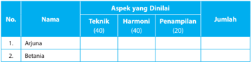

Tabel ini menunjukkan hasil evaluasi dua siswa, Arjuna dan Betania, dalam beberapa aspek penilaian: Teknik, Harmoni, dan Penampilan. Topik utama tabel adalah penilaian keterampilan musik siswa. Kolom-kolomnya mencakup nama siswa, aspek-aspek penilaian, dan jumlah nilai yang diberikan. Data penting yang terlihat adalah bahwa Arjuna mendapatkan nilai tertinggi di aspek Teknik dengan 40 poin, sedangkan Betania mendapatkan nilai tertinggi di aspek Harmoni dengan 40 poin. Ini menunjukkan bahwa Arjuna lebih fokus pada teknik memainkan alat musiknya, sementara Betania lebih berfokus pada harmonisasi musiknya.

 

---
## 📄 Halaman 132

---
**📊 Tabel**

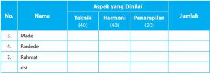

Tabel ini menunjukkan data tentang aspek-aspek musik yang dianalisis pada beberapa penampilan musik. Kolom "No." memberikan nomor urut untuk setiap penampilan, kolom "Nama" menyatakan nama-nama penampilan, kolom "Teknik (40)" menunjukkan skor untuk aspek teknik, kolom "Harmoni (40)" menunjukkan skor untuk aspek harmoni, kolom "Penampilan (20)" menunjukkan skor untuk aspek penampilan, dan kolom "Jumlah" menyajikan jumlah total skor untuk setiap penampilan. Topik utama tabel ini adalah analisis musik, dengan fokus pada aspek-aspek teknik, harmoni, dan penampilan. Data penting yang terlihat adalah bahwa semua penampilan memiliki skor yang sama untuk aspek harmoni, yaitu 40, sedangkan skor untuk aspek teknik dan penampilan bervariasi.

### 4. Analisis Nilai

Jika  Pardede  mendapat  skor  12  dari  soal  pilihan  ganda  dan  18  dari  soal  uraian,  siswa tersebut mendapat nilai ((12 + 18) : 40) x 100 = 75.

Sesuai panduan penilaian Kurikulum 2013 untuk SMA tahun 2016, penentuan ketuntasan minimal dan predikat nilai mulai dari D, C, B, sampai A tergantung pada KKM yang telah ditetapkan oleh guru atau MGMP yang disahkan oleh satuan pendidikan di awal semester pertama. Tinggi rendahnya KKM ini akan menentukan predikat dari nilai yang diperoleh siswa karena aturannya adalah sebagai berikut.

---
**📊 Tabel**

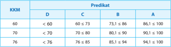

Tabel ini menunjukkan hubungan antara nilai KKM (Kurang-Kurang Menengah) dengan predikat akademik D, C, B, dan A. Topik utama tabel adalah hubungan antara nilai KKM dan predikat akademik. Kolom-kolomnya meliputi KKM, D, C, B, dan A. Data penting yang terlihat adalah bahwa semakin tinggi nilai KKM, semakin tinggi predikat akademik yang diperoleh. Misalnya, jika KKM adalah 60, predikat akademik yang paling umum adalah D, yaitu kurang dari 60. Sementara itu, jika KKM adalah 76, predikat akademik yang paling umum adalah A, yaitu 94% atau lebih. Ini menunjukkan bahwa nilai KKM memiliki pengaruh signifikan terhadap predikat akademik.

Jika KKM yang telah ditetapkan satuan pendidikan adalah 60, Pardede yang mendapat nilai 75 sudah mencapai KKM. Sedangkan predikatnya jika mengacu contoh di atas, berarti B. Akan tetapi, jika KKM yang ditetapkan adalah 70, Pardede sudah mencapai KKM, tetapi predikat  nilainya  C.  Sebaliknya,  jika  KKM  yang  ditetapkan  adalah  76,  Pardede  belum mencapai KKM dan predikat nilainya D sehingga Pardede harus mengikuti pembelajaran remidial pada KD ini.

 

---
## 📄 Halaman 133

###  Bab 5  Membuat Tulisan tentang Musik Barat

### KOMPETENSI INTI

KI 1 :

Menghayati dan mengamalkan ajaran agama yang dianutnya.

- KI 2 : Menghayati dan mengamalkan perilaku jujur, disiplin, tanggungjawab, peduli (gotong royong, kerjasama, toleran, damai), santun, responsif dan pro-aktif dan menunjukkan sikap sebagai bagian dari solusi atas berbagai permasalahan dalam berinteraksi secara efektif dengan lingkungan sosial dan alam serta dalam menempatkan diri sebagai cerminan bangsa dalam pergaulan dunia.
- KI 3 : Memahami, menerapkan, dan menganalisis pengetahuan faktual, konseptual, prosedural, dan metakognitif berdasarkan rasa ingintahunya tentang ilmu pengetahuan, teknologi, seni, budaya, dan humaniora dengan wawasan kemanusiaan, kebangsaan, kenegaraan, dan peradaban terkait penyebab fenomena dan kejadian, serta menerapkan pengetahuan prosedural pada bidang kajian yang spesifik sesuai dengan bakat dan minatnya untuk memecahkan masalah.
- KI 4 : Mengolah, menalar, dan menyaji dalam ranah konkret dan ranah abstrak terkait dengan pengembangan dari yang dipelajarinya di sekolah secara mandiri, bertindak secara efektif dan kreatif, serta mampu menggunakan metoda sesuai kaidah keilmuan.

### KOMPETENSI DASAR

- 1.1. Menunjukkan sikap penghayatan dan pengamalan serta bangga terhadap karya seni musik sebagai bentuk rasa syukur terhadap anugerah Tuhan.
- 2.1. Menghayati dan mengamalkan perilaku jujur, disiplin, tanggung jawab, peduli, kerjasama, santun,  dan menunjukkan sikap sebagai bagian dari solusi atas berbagai permasalahan dalam berinteraksi secara efektif dengan lingkungan sosial, dan alam melalui apresiasi dan kreasi seni sebagai cerminan bangsa dalam pergaulan dunia.
- 3.1. Memahami konsep musik Barat.
- 3.2. Menganalisis musik Barat.
- 3.3. Menganalisis hasil pertunjukan musik Barat.
- 3.4. Memahami perkembangan musik Barat.
- 4.1. Memainkan alat musik Barat.
- 4.2. Mempresentasikan hasil analisis musik Barat.
- 4.3. Membuat tulisan tentang musik Barat.
- 4.4. Menampilkan beberapa lagu dan pertunjukan musik Barat.


 

---
## 📄 Halaman 134

### INFORMASI GURU

Kemampuan anak Indonesia usia 15 tahun di bidang matematika, sains, dan membaca dibandingkan dengan anak-anak lain di dunia masih rendah. Hasil Programme for International Student  Assessment (PISA)  untuk  negara-negara  anggota the  Organization  for  Economic Cooperation and Development (OECD) tahun 2009 Indonesia menempati peringkat antara 57 - 61 dari 65 negara peserta. Tahun 2012 Indonesia berada di peringkat ke-64 dari 65 negara yang berpartisipasi dalam tes. Pada tahun 2015 Indonesia menduduki peringkat 69 dari 76 negara.

Hal ini menunjukkan bahwa kemampuan membaca, matematika, dan sains anak-anak kita masih sangat rendah. Padahal kemampuan baca, hitung, dan sain ini merupakan landasan bagi keberhasilan belajar yang paling mendasar. Permasalahan ini menjadi tantangan bagi guru untuk mengejar ketertinggalan dalam bidang dasar pendidikan ini. Berkenaan dengan itu,  penumbuhan budaya literasi menjadi penting.

Sebagaimana karakter anak yang sangat membutuhkan tantangan dalam belajar, budaya literasi ini hanya akan berdaya guna dan berhasil guna bila disertai penciptaan dan pemberian tantangan. Tantangan yang paling tepat untuk menumbuhkan budaya literasi adalah menulis laporan dari apa yang mereka baca. Mengapa? Karena menugasi siswa untuk membaca saja akan membosankan, kecuali ada tagihan setelah tugas membaca selesai. Inilah tantangan kita sebagai guru. Oleh karena itu, pembelajaran dalam KD ini menjadi penting dan signifikan dalam upaya penumbuhan budaya literasi, yakni membuat tulisan tentang musik barat.

Alur materi pembelajaran pada bahasan Bab 5 dipetakan sebagai berikut:

---
**🖼️ Gambar/Diagram**

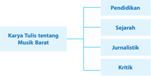

> **Deskripsi Visual:** Gambar ini adalah diagram yang menunjukkan struktur topik tentang karya tulis tentang Musik Barat dalam buku pelajaran. Diagram ini terdiri dari empat cabang utama: Pendidikan, Sejarah, Jurnalistik, dan Kritik. Setiap cabang memiliki label yang jelas untuk membedakannya. Ini menunjukkan bahwa buku tersebut mungkin berfokus pada berbagai aspek pengetahuan dan analisis tentang musik Barat, mencakup aspek-aspek seperti pendidikan musik, sejarah musik, pengaruh media massa terhadap musik, serta analisis dan interpretasi musik. Diagram ini membantu pembaca untuk memahami struktur topik yang akan dibahas dalam buku tersebut.

### TUJUAN PEMBELAJARAN

Setelah mempelajari Bab 5 tentang Pertunjukan Musik Barat, diharapkan siswa mampu:

- menjelaskan konsep pertunjukan musik barat,
- menjelaskan perkembangan seni pertunjukan musik barat,
- menidentifikasi unsur-unsur pertunjukan musik dalam konsep musik barat, dan
- menjelaskan macam-macam dalam konsep musik barat.

### MODEL PEMBELAJARAN

Diharapkan  pembelajaran  Bab  5  ini  dilaksanakan  menggunakan  pendekatan  saintifik dengan model pembelajaran inkuiri atau discovery learning .  Harapannya, setelah mengikuti pembelajaran ini siswa tidak hanya mendapatkan pengetahuan tentang konsep musik barat,

 

---
## 📄 Halaman 135

tetapi  sekaligus  memperoleh nuture  efect (dampak  ikutan)  berupa  kebiasaan  mencari  dan menemukan pengetahuan mengenai konsep musik barat secara mandiri dari berbagai sumber sehingga terbentuk karakter yang diharapkan, yaitu:

- rasa ingin tahu, melalui penugasan pencarian informasi tentang pertujukan musik barat dari berbagai sumber (termasuk internet) yang meliputi filosofi, sejarah, bentuk, dan medianya;
- tekun dan pantang menyerah, melalui penugasan untuk menemukan bermacam-macam pandangan para ahli tentang konsep pertunjukan musik barat;
- menghargai pendapat orang lain dalam mengamati sajian pertunjukan musik barat secara sederhana, maupun dalam diskusi kelompok dan presentasi hasil diskusi; dan
- jujur serta disiplin dalam mempersiapkan proses pertunjukan musik barat secara sederhana.

### MOTIVASI

Disadari  bahwa  selama  ini  guru  yang  peduli  pada  penumbuhan  kecakapan  menulis hanyalah guru bahasa, baik bahasa Indonesia, bahasa Inggris, bahasa daerah, atau bahasa asing.  Seolah-olah  guru  mata  pelajaran  lain  tidak  berkepentingan  dalam  pengembangan bakat dan minat menulis dalam diri siswa. Padahal, menulis merupakan bagian dari karakter ilmiah yang seyogyanya dikembangkan tanpa memandang mata pelajaran. Menulis merupakan pengungkapan gagasan yang paling dapat dipertanggungjawabkan secara ilmiah.

Mengingat kemampuan membaca dan menulis anak-anak kita masih tergolong rendah, sangat  kurang  bijak  jika  tanggung  jawab  hanya  ditanggung  oleh  guru  bahasa  saja.  Semua guru dari latar belakang mata pelajaran apa pun sudah semestinya turut berperan aktif dalam menumbuhkan kecakapan literasi tersebut. Tidak menutup kemungkinan guru seni budaya pun dapat dan seharusnya ikut ambil bagian untuk penumbuhan budaya literasi ini.

Upaya  ini  bersambut  dengan  penerapan  Kurikulum  2013  yang  salah  satu  prinsip penerapan  pendekatan  pembelajarannya  adalah saintific  approach dengan  5  M,  yakni mengamati, menanya, mencoba, mengasosiasi, dan mengomunikasikan. Mengomunikasikan ide,  pendapat,  pikiran,  dan  gagasan,  baik  yang  diperoleh  dari  mengamati,  membaca, eksperimen, atau kontak langsung dari sumber belajar lainnya, dapat disajikan dalam bentu tulisan. Inilah hakikat penerapan Kurikulum 2013 ini.

### SUMBER UNTUK GURU

Ditinjau dari fungsinya, tulisan tentang seni musik dapat dibedakan menjadi tulisan untuk tujuan pendidikan dan pembelajaran, sejarah musik, jurnalistik, serta kritik musik.

### 1. Tulisan untuk Pendidikan dan Pembelajaran Musik

Buku yang sedang kamu pelajari ini  merupakan  contoh  tulisan  tentang  musik  untuk tujuan pendidikan dan pembelajaran. Tulisan tentang musik dapat berupa tulisan tentang keseluruhan keilmuan seni musik atau bagian-bagian dari keseluruhan tersebut. Misalnya, terdapat tulisan tentang teknik bermain gitar, teknik bermain piano, teknik bermain drum, dan sebagainya. Tulisan tersebut juga merupakan tulisan tentang musik yang bertujuan untuk pendidikan dan pembelajaran. Begitu pula tulisan tentang unsur-unsur seni musik, tentang harmoni dalam seni musik,  tempo  dan  dinamik,  dan  sebagainya  juga  merupakan  tulisan teoritis tentang seni musik. Jadi, sejak seni musik dianggap sebagai cabang keilmuan tersendiri, tulisan teoritis tentang seni musik mengalir ke tengah-tengah masyarakat.

 

---
## 📄 Halaman 136

Tulisan untuk pendidikan dan pembelajaran ini sangat berguna bagi yang gemar mempelajari seni musik tidak hanya dari sisi keterampilan berseninya. Orang yang berminat menelaah seni musik dari sisi ilmu pengetahuannya sangat tertolong membaca tulisan tentang seni musik ini.

### 2. Tulisan tentang Sejarah Musik

Dalam Kamus Besar  Bahasa  Indonesia,  sejarah  musik  diartikan  sebagai  pengetahuan yang mencakupi uraian deskriptif tentang musik dalam masyarakat, riwayat seniman, riwayat pendidikan musik, sejarah notasi, kritik, perbandingan gaya, dan perkembangan musik. Tidak hanya dari sisi perkembangan seni musik saja, tulisan sejarah seni musik juga memuat peristiwa pengaruh-mempengaruhi antara seni musik dari satu masyarakat dan masyarakat lainnya.

### 3. Tulisan Jurnalisme Musik

Tulisan jurnalisme musik adalah tulisan yang berisi ulasan seni musik, khususnya pertunjukan musik atau peristiwa musik yang lain. Sebagaimana tulisan jurnalisme pada umumnya, tulisan jurnalisme musik juga dimaksudkan untuk penyampaian informasi kepada khalayak tentang suatu  berita.  Jadi,  tulisan  jurnalisme  musik  juga  menonjolkan  tersampaikannya  informasi tentang pertunjukan musik kepada khalayak.

Prinsip-prinsip tulisan jurnalisme musik sama dengan tulisan jurnalisme pada umumnya. Tulisan haruslah aktual dan faktual, bukan fiktif. Tulisan juga harus objektif. Tulisan dibangun dengan  gaya  deduktif  atau  piramida  terbalik.  Yang  penting  didahulukan  dan  rinciannya dikemudiankan. Isi tulisan juga harus memuat 5 W + 1 H, yakni what , who , when , where , why ,  dan how .

### a. Resensi

Resensi adalah tulisan yang berisi ulasan karya seni musik yang siap dilepas ke masyarakat. Biasanya berisi pertimbangan tentang perlunya masyarakat menikmati karya seni musik tersebut,  tetapi  berbeda  dengan  kritik,  resensi  lebih  kepada  melontarkan  ajakan  kepada khalayak untuk menikmati karya seni musik tersebut.

### b. Review

Review adalah tulisan jurnalisme yang berisi ulasan tentang unsur-unsur seni musik, penciptanya, penyajinya, garapannya, dan penampilannya. Biasanya review disajikan setelah sebuah pagelaran musik dilaksanakan. Berikut contoh tulisan jurnalisme musik.

### 4. Tulisan tentang Kritik Musik

Musik merupakan seni pertunjukan. Keindahan musik dapat dinikmati baik secara langsung maupun melalui hasil rekaman. Oleh penyajinya, diharapkan dapat memenuhi rasa keindahan bagi pendengarnya. Oleh karena itu, sebelum pertunjukan berlangsung, mereka berlatih intensif. Tujuannya agar musik tersajikan dengan baik dan indah. Namun demikian, tujuan tersebut tidak dapat tercapai. Keindahan dan respon dari penonton yang diharapkan tidak didapatkan. Hal ini tentu dapat menimbulkan kekecewaan baik bagi seniman maupun bagi pendengar atau penonton.

Pada acara kontes pencarian bakat menyanyi yang sering tampil di media televisi, seperti AFI, Indonesia Idol, X Factor, KDI, penampilan seorang penyanyi selalu dikomentari oleh para juri. Komentar yang disampaikan juri ada yang bersifat pujian dan ada pula yang bersifat celaan. Ada pula komentar yang bersifat teknis, seperti pitch control ,  tempo, dinamik, penghayatan (interpretasi), atau pembawaan (ekspresi), bahkan penampilan. Pernyataan-pernyataan tersebut pada hakikatnya juga merupakan penilaian atas performa sang penyanyi.

 

---
## 📄 Halaman 137

Tentu pengetahuan, pengalaman dan penguasaan keterampilan, serta perasaan musikal yang dimiliki para juri mendasari penilaian tersebut. Dengan kata lain, pernyataan-pernyataan tersebut merupakan bagian dari kritik. Akan tetapi,  sebenarnya kritik musik bukan hanya komentar sesaat seusai pertunjukan tetapi suatu ulasan mendalam dan luas guna memberi pemahaman atas karya. Tujuannya menjembatani karya musik dan pelakunya dengan masyarakat pendengar sehingga terbangun suatu pemahaman atas nilai-nilai keindahan (estetika).

Dalam seni musik minimal terdapat tiga komponen penunjang kegiatan, yaitu penciptaan atau kekaryaan (seniman), apresiasi atas penikmatan/penghargaan (khalayak penonton dan kritikus), dan karya seni (sebagai produk dan proses).

### PEMBELAJARAN DAN PENILAIAN

### 1.  Pembelajaran

Strategi pembelajaran Seni Budaya salah satunya menggunakan pendekatan saintifik yang meliputi aktivitas 5 M yang meliputi:

- mengamati, (melihat, membaca, mendengar, dan menyimak),
- menanya dengan mengajukan pertanyaan dari yang bersifat faktual sampai ke yang bersifat hipotesis,
- mengumpulkan  informasi  melalui  pengumpulan  data,  penentuan  data  dan  sumber data,
- menalar/mengasosiasi dengan menganalisis dan menyimpulkan, dan
- mengomunikasikan konsep baik secara lisan dan tulisan.
Aktivitas  tersebut  bukan  langkah  pembelajaran  sehingga  tidak  selalu  dan  tidak  harus dilaksanakan  secara  berurutan  dan  sekaligus  pada  satu  kali  pertemuan.  Guru  dapat menggunakan  pendekatan  lain  disesuaikan  dengan  karakteristik  materi  yang  diajarkan, di  antaranya  menggunakan discovery  learning , problem  based  learning , experience  learning , project based learning ,  serta  pendekatannya lainnya dengan tetap berorientasi pada kegiatan pembelajaran untuk mengembangkan aktivitas dan kreativitas siswa.

Pembelajaran  untuk  KD  ini  lebih  tepat  menggunakan  model  pembelajaran experience learning atau project  based  learning berbasis  pada  penugasan  untuk menyusun laporan hasil pengamatan atau hasil kajian terhadap pertunjukan musik barat, baik pentas live (langsung) atau rekaman (tidak langsung).

Pada  prinsipnya  pembelajaran  seni  budaya  menekankan  pada  aktivitas  berkarya  dan berapresiasi seni, baik di sekolah maupun di luar sekolah seperti di sanggar, studio, atau tempat lain.  Pembelajaran  tetap  memperhatikan aspek keselamatan kerja, kebersihan lingkungan, serta  pemeliharaan  sumber  belajar.  Pembelajaran  sikap  dilakukan  secara  tidak  langsung, artinya penanaman sikap melebur dalam proses pembelajaran pengetahuan dan keterampilan. Dalam pembelajaran berkarya seni guru diharapkan dapat berperan secara aktif melakukan aktivitas berkarya bersama-sama siswa.

Untuk memenuhi prinsip bahwa materi pembelajaran Seni Budaya disesuaikan dengan kebutuhan daerah dan kebutuhan siswa, maka pembelajaran yang berkaitan dengan budaya asing seyogyanya mendapat perhatian guru. Kebutuhan daerah bertujuan agar kebudayaan daerah dapat dilestarikan dan dikembangkan melalui materi Seni Budaya. Kebutuhan siswa untuk meningkatkan kemampuan dan keterampilan di bidang seni tertentu. Oleh karena itu,

 

---
## 📄 Halaman 138

pembelajaran KD ini perlu diolah agar siswa dapat mengaitkan kompetensinya sebagai inspirasi untuk meningkatkan kemampuan dalam mengembangkan potensi daerah, seperti potensi pariwisata dan meningkatkan kemampuan berwirausaha di bidang seni musik khususnya.

Meskipun  membahas  KD 'Membuat Tulisan  tentang  Musik  Barat',  kontekstualitas pembelajaran  tetap  harus  dijaga.  Pemilihan  karya  musik  barat  yang  akan  dibahas  dalam tulisan siswa haruslah tetap didasarkan pada norma-norma hukum, sosial, susila, dan kearifan lokal lingkungan siswa dan sekolah. Perbedaan kultur asing dan Indonesia wajib dijembatani dengan cara  siswa  diberikan  batasan  dalam  menentukan  karya  musik  yang  akan  dibahas. Alangkah baiknya jika guru sudah menentukan tema lagu atau latar belakang kreatif karya musik yang boleh dibahas. Bagaimanapun, guru harus mampu menjaga agar tidak terjadi benturan norma dan budaya dalam proses pembelajaran.

Alangkah baiknya jika pemilihan bahan kajian untuk KD ini justru makin memperkaya khazanah budaya dan membangkitkan semangat cinta kepada kebudayaan sendiri, khususnya untuk  kelangsungan hidup dan peningkatan taraf kehidupan masyarakat yang disesuaikan dengan arah perkembangan daerah serta potensi daerah yang bersangkutan.

Sejalan dengan karakteristik pendidikan abad 21 yang memanfaatkan teknologi informasi dan komunikasi, pembelajaran KD ini seyogyanya juga memanfaatkan teknologi informasi dan komunikasi sebagai media dan sumber belajar. Pemanfaatan TIK mendorong siswa dalam mengembangkan kreativitas dan berinovasi serta meningkatkan pemahaman dan pengetahuan seni budaya.

Pembelajaran seni budaya memanfaatkan berbagai sumber belajar seperti buku teks yang tersedia dalam bentuk buku guru dan buku siswa. Sesuai dengan karakteristik Kurikulum 2013, buku teks bukan satu-satunya sumber belajar. Guru dapat menggunakan buku pengayaan atau referensi lainnya dan mengembangkan bahan ajar sendiri seperti LKS (Lembar Kerja Siswa). Dalam pembelajaran seni budaya, LKS bukan hanya kumpulan soal, tetapi dapat berbentuk panduan berkarya seni, langkah-langkah kritik dan apresiasi serta aktivitas belajar lainnya.

### 2. Penilaian

Untuk memenuhi prinsip autentic assessment di  mana penilaian dilakukan secara berkelanjutan dan komprehensif, penilaian untuk pembelajaran KD ini lebih ditekankan pada sikap dan keterampilan. Ranah tersebut meliputi aspek apresiasi (menghargai), dan kreasi (keterampilan berkarya) dalam berolah seni sesuai dengan kekhasan materi seni musik, seperti halnya seni yang lain.

Penilaian sikap digunakan sebagai pertimbangan guru dalam mengembangkan karakter siswa  lebih  lanjut  sesuai  dengan  kondisi  dan  karakteristik  siswa.  Dalam  KD  ini  penilaian sikap  ditekankan  untuk  mengembangkan  sikap  teliti,  ilmiah,  disiplin,  bertanggung  jawab, dan apresiatif.

Penilaian keterampilan untuk KD ini dapat dilakukan dengan berbagai teknik, antara lain penilaian proyek, produk, dan penilaian portofolio berupa laporan hasil pengamatan, analisis, dan apresiasi terhadap karya musik barat.

Penilaian  untuk  KD  ini  dapat  dilakukan  dengan  teknik  penugasan.  Penugasan  adalah pemberian tugas kepada siswa untuk mengukur peningkatan pengetahuan dan keterampilan. Penugasan yang digunakan untuk mengukur pengetahuan ( assessment of learning ) dapat dilakukan setelah  proses  pembelajaran  sedangkan  penugasan  yang  digunakan  untuk  meningkatkan

 

---
## 📄 Halaman 139

pengetahuan ( assessment for learning ) diberikan sebelum dan/atau selama proses pembelajaran. Penugasan dapat berupa proyek yang dikerjakan secara individu atau kelompok sesuai dengan karakteristik tugas. Dalam hal ini, sesuai dengan KD yang dipelajari yakni ' Membuat Tulisan tentang Musik Barat ',  maka siswa perlu dilatih untuk menyajikan tulisan hasil pengamatan, analisis, atau penilaian terhadap karya musik barat.

Penugasan lebih ditekankan pada pemecahan masalah dan tugas produktif  lainnya. Ramburambu penugasan di antaranya:

- Tugas mengarah pada pencapaian indikator hasil belajar.
- Tugas dapat dikerjakan oleh siswa, selama proses pembelajaran atau merupakan bagian dari pembelajaran mandiri.
- Pemberian tugas disesuaikan dengan taraf perkembangan siswa.
- Materi penugasan harus sesuai dengan cakupan kompetensi dasar.
- Penugasan  ditujukan  untuk  memberikan  kesempatan  kepada  siswa  menunjukkan kompetensi individualnya meskipun tugas diberikan secara kelompok.
- Pada tugas kelompok, perlu dijelaskan rincian tugas setiap anggota kelompok.
- Tampilan kualitas hasil tugas yang diharapkan disampaikan secara jelas.
- Penugasan harus mencantumkan rentang waktu pengerjaan tugas.

### Contoh Penugasan

Mata Pelajaran

:  Pendidikan Seni Budaya (Seni Musik)

Kelas/Semester

:  XI/1

Tahun Pelajaran

:  2016/2017

### Kompetensi Dasar:

3.1. Membuat tulisan tentang musik Barat.

### Indikator:

- Mengidentifikasi alat musik, dan unsur-unsur musik pada pertunjukan instrumen solo, pertunjukan orkestra secara langsung atau melalui media audio visual.
- Mendeskripsikan hasil analisis pertunjukan orkestra.
- Mengidentifikasi alat musik, dan unsur-unsur musik pada pertunjukan brass band secara langsung atau melalui media audiovisual.
- Mendeskripsikan hasil analisis pertunjukan instrumen solo.
- Mendeskripsikan hasil analisis pertunjukan brass band .

### Rincian Tugas:

- Amatilah pertunjukan musik barat, baik secara langsung, melalui internet, atau media lain.
- Perhatikan teknik permaianan masing-masing pemain dalam memainkan instrumen musiknya!
- Analisislah pertunjukan musik tersebut berdasarkan unsur-unsurnya, di antaranya:
- genrenya (jenis musik berdasarkan gaya dan aliran),
- lagu  dan  komposisi  (unsur-unsur  utama  pembangun  karya  musik,  seperti  nada, melodi, harmoni, ritme, tempo, dinamik, ornamentasi), dan
- performance (keterampilan penampilan dan olah panggung permainan musik),
- warna dan suasana pertunjukan.

 

---
## 📄 Halaman 140

- Tuangkan dalam tulisan  hasil  pengamatanmu  dengan  tampilan  yang  menarik  dan menggunakan bahasa Indonesia yang benar sehingga mudah dipahami. Bentuk tulisan dapat berupa:
- Jurnalisme musik yang meliputi
- Resensi
- Ulasan atau Review
- Kritik Musik
- Apresiasi Musik
- Esai tentang Kritik Musik
- Karya Ilmiah (laporan hasil penelitian)
- Teori Musik
- Bentuk laporan disesuaikan dengan jenis tulisan  yang  dikehendaki.  Sistematikanya setidaknya meliputi:
- pendahuluan (latar belakang, tujuan penyusunan tulisan, manfaat tulisan, nama/ tempat/waktu pertunjukan, dan profil kelompok band yang pentas),
- kajian teoritis (teori atau gagasan tentang musik dari karya penulis atau ahli yang sudah ada),
- isi  (hasil pengamatan pertunjukan musik beserta segala aspeknya), dan
- penutup (simpulan dan saran).
- Laporan diserahkan selambat-lambatnya satu minggu setelah pemberian tugas.
- Setelah terkumpul, karya tulis dipresentasikan dalam forum diskusi atau seminar kelas.

### Contoh Rubrik Penilaian

---
**📊 Tabel**

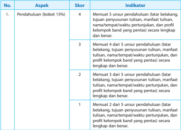

Tabel ini menunjukkan skor dan indikator untuk aspek pendahuluan dalam sebuah proses penulisan. Topik utama tabel adalah tentang kualitas pendahuluan dalam sebuah tulisan. Kolom pertama berisi nomor urut, sedangkan kolom kedua berisi aspek yang diukur. Data dalam tabel menunjukkan bahwa skor 4 diberikan jika semua unsur pendahuluan (latar belakang, tujuan penyusunan tulisan, manfaat tulisan, nama/tempat/waktu pertunjukan, dan profil kelompok band yang penting) lengkap dan benar. Skor 3 diberikan jika hanya 4 unsur pendahuluan lengkap dan benar, sementara skor 2 diberikan jika hanya 3 unsur pendahuluan lengkap dan benar. Skor 1 diberikan jika hanya 2 unsur pendahuluan lengkap dan benar. Indikator yang digunakan untuk menilai kualitas pendahuluan mencakup latar belakang, tujuan penyusunan tulisan, manfaat tulisan, nama/tempat/waktu pertunjukan, dan profil kelompok band yang penting.

 

---
## 📄 Halaman 141

---
**📊 Tabel**

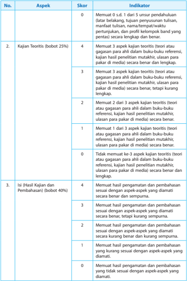

Tabel ini berisi informasi tentang skor dan indikator untuk kajian teori dan penilaian kualifikasi. Topik utama tabel adalah kualifikasi kajian teori dan penilaian kualifikasi. Kolom-kolomnya meliputi No., Aspek, Skor, dan Indikator. Data penting yang terlihat antara lain bahwa skor 4 diberikan jika kajian teori memuat semua aspek dengan baik, sedangkan skor 0 diberikan jika tidak memuat satu pun aspek. Indikator yang paling penting adalah kajian teori harus memuat aspek-aspek tertentu seperti teori atau gagasan, penulisan tulus, dan penulisan yang lengkap. Selain itu, skor 4 juga diberikan jika kajian teori memuat aspek-aspek tertentu sesuai dengan aspek-aspek yang diamati secara benar dan sempurna.

 

---
## 📄 Halaman 142

---
**📊 Tabel**

Tabel ini berisi kriteria penilaian untuk tugas-tugas tertentu dalam sebuah kursus. Topik utamanya adalah kualitas penulisan dokumen, yaitu penulisan teks, daftar pustaka, dan lampiran. Tabel dibagi menjadi 3 kolom: No., Aspek, dan Indikator. Kolom No. menunjukkan nomor urutan aspek yang diukur, kolom Aspek menunjukkan jenis tugas yang diukur (seperti penulisan teks, daftar pustaka, atau lampiran), dan kolom Indikator menunjukkan skor yang diberikan kepada setiap aspek tersebut.

Data penting yang terlihat dalam tabel ini adalah bahwa skor tertinggi yang dapat diberikan adalah 4, yang berarti aspek tersebut memenuhi semua kriteria yang ditetapkan. Skor 3 juga cukup tinggi, menunjukkan bahwa aspek tersebut memenuhi sebagian besar kriteria. Skor 2 menunjukkan bahwa aspek tersebut memenuhi sebagian kriteria, sedangkan skor 1 menunjukkan bahwa aspek tersebut hanya memenuhi sebagian kriteria. Skor 0 menunjukkan bahwa aspek tersebut tidak memenuhi kriteria yang ditetapkan.

Tabel ini sangat berguna bagi pembuat tugas untuk memberikan panduan tentang apa yang harus dicapai oleh siswa dalam hal penulisan dokumen mereka. Ini juga membantu siswa untuk memahami bagaimana mereka dapat meningkatkan kualitas penulisan mereka.

### RUMUS PENENTUAN NILAI

``

 

---
## 📄 Halaman 143

### Keterangan:

Skor

:  skor yang didapat siswa untuk masing-masing aspek (1 - 4).

Bobot

:  tiap  aspek berbeda, tetapi jumlahnya 100.

Skor maksimal

:  skor maksimal tiap aspek, yaitu 4.

Skor maks x bobot

:  4  x  100 = 400

100

:  nilai  maksimal

### Contoh Penilaian Karya Tulis:

Jika Timotius mendapatkan skor masing-masing 3 untuk seluruh aspek yang dinilai, skor Timotius adalah sebagai berikut,

- Pendahuluan
:  3  x 15 = 45

- Kajian Teoritis
:  3  x 25 = 75

- Hasil Pengamatan dan Pembahasan
:  3  x 40 =  120

- Penutup
:  3  x 10 = 30

- Daftar Pustaka
:  3  x 5 = 15

- Lampiran
:  3  x 5 = 15

Jumlah

300

Skor yang didapat dimasukkan ke dalam rumus, maka nilai Timotius adalah:

``

### N = 75

Jadi, nilai karya tulis Timotius adalah 75

### Contoh Rubrik Penilaian Presentasi

---
**📊 Tabel**

Tabel ini menunjukkan hasil penilaian dari beberapa siswa dalam sebuah ujian. Topik utama tabel adalah aspek-aspek yang dianalisis, yaitu materi, penyajian, dan media pendukung. Kolom-kolomnya mencakup nomor siswa, nama siswa, skor materi (0-50), skor penyajian (0-30), skor media pendukung (0-20), dan jumlah keseluruhan (maks 100). Data penting yang terlihat adalah bahwa Caterina memiliki skor tertinggi (95) dalam semua aspek, sementara David memiliki skor terendah (35) dalam semua aspek. Armando memiliki skor tertinggi dalam penyajian (25) dan terendah dalam media pendukung (15). Baskoro memiliki skor tertinggi dalam materi (45) dan terendah dalam penyajian (20). Timotius memiliki skor tertinggi dalam media pendukung (15) dan terendah dalam penyajian (30).

Jika  penilaian  karya  tulis  dan  presentasi  digabung  dengan  bobot  sama,  nilai Timotius adalah (75 + 85) : 2 = 80.

 

---
## 📄 Halaman 144

### KOMPETENSI INTI

KI 1 : Menghayati dan mengamalkan ajaran agama yang dianutnya

- KI 2 : Menghayati dan mengamalkan perilaku jujur, disiplin, tanggung jawab, peduli, (gotong royong, kerjasama, toleran, damai), santun, responsif dan proaktif, dan menunjukkan sikap sebagai bagian dari solusi atas berbagai permasalahan dalam berinteraksi secara efektif dengan lingkungan sosial dan alam serta dalam menempatkan diri sebagai cerminan bangsa dalam pergaulan dunia
- KI 3 : Memahami, menerapkan, dan menganalisis pengetahuan faktual, konseptual, prosedural, dan meta kognitif berdasarkan rasa ingin tahunya tentang ilmu pengetahuan, teknologi, seni, budaya, dan humaniora dengan wawasan kemanusiaan, kebangsaan, kenegaraan, dan peradaban terkait penyebab fenomena dan kejadian, serta menerapkan pengetahuan prosedural pada bidang kajian yang spesifik sesuai dengan bakat dan minatnya untuk memecahkan masalah
- KI 4 : Mengolah, menalar, dan menyaji dalam ranah konkret dan ranah abstrak terkait dengan pengembangan dari yang dipelajarinya di sekolah secara mandiri, bertindak secara efektif dan kreatif , serta mampu menggunakan metoda sesuai kaidah keilmuan

### KOMPETENSI DASAR

- 2.1. Menghayati dan mengamalkan perilaku jujur, disiplin, tanggung jawab, peduli, kerja sama, santun, dan menunjukkan sikap sebagai bagian dari solusi atas berbagai permasalahan dalam berinteraksi secara efektif dengan lingkungan sosial, dan alam melalui apresiasi dan kreasi seni sebagai cerminan bangsa dalam pergaulan dunia
- 3.1. Menerapkan konsep, teknik dan prosedur dalam berkarya tari kreasi
- 3.2. Menerapkan gerak tari kreasi berdasarkan fungsi, teknik, bentuk, jenis dan nilai estetis sesuai iringan
- 3.3. Mengevaluasi gerak tari kreasi berdasarkan teknik tata pentas
- 3.4. Mengevaluasi bentuk, jenis, nilai estetis, fungsi dan tata pentas dalam karya tari
- 4.1. Berkarya seni tari melalui pengembangan gerak berdasarkan konsep, teknik dan prosedur sesuai dengan hitungan
- 4.2. Berkarya seni tari melalui pengembangan gerak berdasarkan fungsi, teknik, simbol, jenis dan nilai estetis sesuai dengan iringan
- 4.3. Menyajikan hasil pengembangan gerak tari berdasarkan tata teknik pentas
- 4.4. Membuat tulisan mengenai bentuk, jenis, nilai estetis, fungsi dan tata pentas

###  Bab 6 

### Konsep, Teknik, dan Prosedur dalam Berkarya Tari Kreasi



 

---
## 📄 Halaman 145

### TUJUAN PEMBELAJARAN

Pada kegiatan ini diharapkan siswa mampu mengevaluasi tari kreasi berdasarkan teknik tata pentas serta merancang kegiatan pembelajaran dengan menerapkan model berbasis proyek ( Project Based Learning ).

### PETA KONSEP

---
**🖼️ Gambar/Diagram**

> **Deskripsi Visual:** Gambar ini adalah diagram yang menunjukkan proses evaluasi karya tari kreasi. Diagram ini dibagi menjadi empat bagian utama, masing-masing menunjukkan tahap-tahap evaluasi teknik tata pentas dalam karya tari kreasi. 

1. **Apa yang Ditampilkan Secara Keseluruhan**: Gambar ini menggambarkan proses evaluasi karya tari kreasi melalui empat tahap utama: mendeskripsikan teknik tata pentas, mengidentifikasi teknik tata pentas, menggasasiasi teknik tata pentas, dan mengkomunikasikan teknik tata pentas.

2. **Elemen-Elemen Utama dan Relasinya**: 
   - **Teks**: Ada empat baris teks yang menjelaskan setiap tahap evaluasi.
   - **Angka**: Ada empat titik panah yang menghubungkan teks-teks tersebut, menunjukkan urutan proses evaluasi.
   - **Label Penting**: Setiap baris teks memiliki label yang menunjukkan tahap evaluasi yang dimaksud.

3. **Informasi Kunci yang Dapat Diambil Pembaca**: 
   - Pembaca dapat memahami bahwa evaluasi karya tari kreasi melibatkan empat tahap yang berbeda.
   - Pembaca dapat mengikuti urutan proses evaluasi dari mendeskripsikan teknik tata pentas hingga mengkomunikasikan teknik tata pentas.
   - Pembaca dapat memahami bahwa setiap tahap memiliki tujuan spesifik dalam proses evaluasi karya tari kreasi.

Dengan demikian, gambar ini memberikan gambaran jelas tentang proses evaluasi karya tari kreasi dan bagaimana teknik tata pentas dianalisis dan dikomunikasikan dalam konteks ini.

### MATERI PEMBELAJARAN

Mata pelajaran  ini  berisi  pengetahuan  mengenai  teknik  tata  pentas  tari,  yang  artinya adalah teknik merancang untuk mementaskan tari yang baik, sehingga tampak jelas tampilan keindahan geraknya. Apabila tari akan dipentaskan di kelas atau di luar kelas, bapak/ibu guru memotivasi siswanya untuk merancang membuat panggung yang sesuai dengan kebutuhan tari. Perlu peninggian untuk membedakan posisi pemain dan penonton, mungkin pula perlu peninggian di panggung untuk tempat tokoh. Mungkin juga perlu sekat di pinggir panggung untuk jalan keluar masuknya penonton. Bentuk tata pentas tari seperti itu adalah peniruan dari  panggung prosenium pada pertunjukan profesional yang menempatkan penonton dan pemain pada posisi berbeda yang saling berhadapan. Disebut panggung prosenium karena panggung ini memiliki lantai pentas berbentuk prosenium. Bentuk panggung yang seperti itu, mengakibatkan pertunjukan hanya bisa ditonton dari satu arah pandang (dari depan) saja.

Akan tetapi, manakala para siswa memerlukan pertunjukan tari yang bisa di tonton dari berbagai arah, maka bentuk arena adalah pilihan yang tepat. Bisa saja bentuknya seperti huruf U, mirip tapal kuda atau meniru huruf L dengan peninggian atau bahkan berbentuk lingkaran tanpa peninggian. Panggung arena bisa didirikan di areal halaman sekolah. Dalam hal ini guru perlu mengingatkan siswa agar memperhatikan lingkungan, jangan sampai keperluan tata pentas malah merugikan hal lainnya, seperti rusaknya tanaman atau menghalangi jalan sebagai fasilitas umum. Guru bisa membagi pengalaman mengenai teknik tata pentas di Bali yang mengadakan pertunjukan tanpa panggung alias beralas tanah, sementara penonton dan pemain dibatasi oleh garis di tanah sebagai kalang penghalang. Guru memotivasi siswa agar kreatif.  Ketiadaan  panggung permanen bukan menjadi penghalang untuk berkarya. Justru tidak  adanya  panggung bisa dijadikan sumber untuk berkreasi membuat tata pentas baru dengan alam atau lingkungan sekitar sebagai latar pertunjukan. Guru perlu mendorong siswa untuk mencari alternatif teknik tata pentas pertunjukan tari kreasi dengan memanfaatkan lingkungan sekitar, agar pertunjukan menjadi tampil lebih indah.

 

---
## 📄 Halaman 146

### A. Mendeskripsikan Karya Tari Kreasi Baru Berdasarkan Teknik Tata Pentas

Gambar 9.1 di dalam buku siswa adalah tari kreasi dengan tata pentas yang dilaksanakan di atas panggung prosenium. Tari seribu tangan ini, geraknya mengandalkan variasi gerak tangan yang dilakukan oleh sekelompok penari dalam beragam ruang gerak, yaitu dari ruang gerak sempit yang dilakukan oleh penari terdepan sampai kepada ruang gerak terluas yang dilakukan oleh penari paling belakang. Pentas ditata pada pola lantai bergaris diagonal dengan level dari rendah sampai tinggi. Pentas tari kelompok ini sangat cocok dilaksanakan di atas panggung prosenium, karena dilakukan dengan gerak tari yang mengandalkan gerak tangan saja dan dalam posisi tetap. Akan tetapi, apabila ditampilkan di panggung arena berbentuk lingkaran, maka idealnya penari kelompoknya ditambah tiga atau empat kelompok agar penonton yang melingkari panggung bisa menonton dengan leluasa.

Selanjutnya guru bisa mendorong siswa berdiskusi dan mengapresiasi gambar tari Kecak dari Bali. Bagaimana tanggapan para siswa atas foto ini? Tari Kecak awalnya dipertunjukan di pura untuk keperluan upacara dengan waktu pertunjukan yang sangat lama karena menampilkan cerita  Ramayana dari awal sampai akhir. Akan tetapi saat ini, tari Kecak bisa ditampilkan dalam beberapa menit dengan cerita sudah disingkat agar tidak membosankan penonton.

Para siswa digiring untuk bisa mendeskripsikan seni tari kreasi yang dipentaskan di ruang terbuka ( outdoor ) beralas tanah dengan posisi pemain melingkar dalam teknik tata pentas arena. Dengan memilih tata pentas panggung arena, memungkinkan penonton melihat pertunjukan dari berbagai arah. Bapak/ibu guru dipersilahkan untuk memberikan motivasi agar siswa bisa mendeskripsikan tata pentas tari Kecak. Bahwa, terdapat tiga lapis lingkaran orang mengelilingi 3 orang penari. Lingkaran orang ini memiliki fungsi sebagai:

- batas/kalang pertunjukan dalam tata pentas arena;
- pengiring musik internal, karena tari ini hanya diiringi dengan suara dari mulut (semacam acapela dalam musik);
- peran yang berganti-ganti (sebagai sekumpulan kera pasukan Rama, sebagai gelombang air  ketika  pasukan Rama menyeberang lautan ke Alengka, sebagai api ketika Hanoman membakar Alengka).
Gambar 9.3 dalam buku siswa, adalah contoh pertunjukan yang berpentas di ruangan terbuka diantara  puing-puing reruntuhan bangunan. Dalam hal ini, guru bisa mendorong siswa  agar  mencari  pertunjukan  sejenis  (pentas  diruangan  terbuka)  dari  daerahnya  sendiri atau dari daerah lainnya. Gambar 9.3 dalam buku siswa ini adalah pilihan saja. Oleh karena itu, agar pemahaman guru lebih komplit, disilahkan untuk menontonnya di https://youtu.be/ UKozEChdn4U . Di situs tersebut terlihat jelas ada alat berat yang sedang bekerja meratakan tanah, pekerja bangunan, dan juga pemulung.

Dihadapan penari terletak tempat air dari tanah dan tanaman yang dijadikan media/alat untuk tari yang berjudul 'Pohaci' yaitu tokoh seorang dewi pelindung bumi dalam cerita rakyat Sunda. Sesuai dengan diskusi sebelumnya, bahwa tari ini menggunakan teknik tata pentas berlatar  lingkungan alam sekitar. Guru diharapkan bisa menjadi pendorong dan penengah dalam diskusi mengenai asosiasi yang terdapat dalam karya tari kreasi seperti contoh dalam buku ini atau contoh yang diperoleh di lingkungan daerah sendiri atau daerah lainnya. Di dalam buku siswa diberikan contoh bahwa, tari ini menyimbolkan dewi Pohaci yang merasa sedih  atas  kerusakan  lingkungan  dan  turun  ke  bumi  untuk  melindungi  dan  menyuburkan

 

---
## 📄 Halaman 147

bumi. Jika para siswa memperoleh sudut pandang yang berbeda dalam mendeskripsikan tari kreasi,  tidak  apa-apa.  Prinsip  dalam  mata  pelajaran  ini  adalah  siswa  memiliki  keberanian mendeskripsikan dan mengemukakan pendapat mengenai tari kreasi berdasarkan teknik tata pentas.

### B. Evaluasi Tari Kreasi Berdasarkan Teknik Tata Pentas

Teknik  tata  pentas  adalah  cara  untuk  menata  pentas  pertunjukan.  Menata  pentas dilaksanakan  berdasar  pada  sebuah  perencanaan  yang  matang,  sejak  merumuskan  konsep pertunjukan, sampai pentasnya.

Dalam hal ini bapak/ibu guru seyogyanya memantau aktivitas siswa dalam projek pementasan mereka. Pemantauan sebagai langkah pembimbingan diarahkan pada dua sisi. Sisi manajemen pentas dan sisi estetika seni pertunjukan.

Evaluasi diarahkan untuk melihat kerja sama, cara siswa menyelesaikan perbedaan pendapat, tumbuhnya saling menghargai pendapat di antara siswa dan adanya pertukaran ide estetis. Walaupun pembelajaran  ini  berbasis  projek,  akan  tetapi  guru  seyogyanya  memantau  dan membimbing siswa saat melakukan kegiatan berikut.

- Menentukan pentas/pertunjukan indoor (gedung pertunjukan) atau di outdoor (lingkungan alam/terbuka).
- Menetapkan konsep pertunjukan.
- Memilih pemain yang sesuai.
- Mendesain busana dan rias.
- Memilih properti/alat pentas.
- Menentukan iringan tari yang sesuai.
Pemilihan panggung sebagai ruang pertunjukan, berpengaruh terhadap konsep estetika tari.  Jenis  panggung prosenium dan auditorium yang memiliki satu arah pandang, tentunya akan berbeda konsep estetikanya dengan panggung arena yang memiliki empat arah pandang. Sebagai contoh bisa dilihat pada gambar di bawah ini.

### C.  Proses Pembelajaran

Proses pembelajaran dilakukan dengan model berbasis proyek ( Project Based Learning ). Penggunaan  model  pembelajaran Project  Based  Learning yaitu  model  pembelajaran  yang menggunakan proyek/kegiatan sebagai inti pembelajaran. Siswa melakukan eksplorasi, penilaian, interpretasi, sintesis, dan informasi untuk menghasilkan berbagai bentuk belajar.

 

---
## 📄 Halaman 148

---
**📊 Tabel**

Tabel ini berisi informasi tentang kompetensi dasar yang berkaitan dengan tari kreasi berdasarkan teknik tata pentas. Topik utama tabel adalah "Mengenaliwai gerak tari kreasi berdasarkan teknik tata pentas". Kolom-kolom yang ada meliputi subtopik, tujuan, dan alokasi waktu. Subtopiknya mencakup "Tari Kreasi berbasis Traditional dengan pola lantai dan teknik tata pentas". Tujuan tabel adalah untuk memungkinkan penjelasan tentang tari kreasi berdasarkan teknik tata pentas. Alokasi waktu ditentukan sebanyak 2 x pertemuan (sekitar 45 menit setiap kali).

### LANGKAH-LANGKAH PEMBELAJARAN

### Pertemuan Pertama

### 1. Pendahuluan (10 menit)

- Siswa merespon salam dan pertanyaan dari guru berhubungan dengan kondisi dan pembelajaran sebelumnya.
- Siswa  menerima  informasi  tentang  keterkaitan  pembelajaran  sebelumnya  dengan pembelajaran yang akan dilaksanakan.
- Siswa menerima informasi kompetensi, materi, tujuan, manfaat, langkah pembelajaran, dan teknik serta bentuk penilaian yang akan dilaksanakan.

### 2. Kegiatan Inti (70 menit)

Guru membentuk kelompok (5 - 6 siswa dalam satu kelompok).

- Mengamati fenomena - Tahap 1 Model Proyek
- Siswa membaca pedoman penugasan
- Siswa mengidentifikasi topik
- Menentukan pertanyaan mendasar - Tahap 2 Model Proyek
- Siswa merumuskan pertanyaan yang esensial berkaitan dengan topik tersebut.
- Peserta mendiskusikan tari kreasi yang ada di lingkungan sekitar.
- Siswa berdiskusi mengenai potensi alam di lingkungan sekitar yang bisa menjadi pendorong menata tari kreasi.
- Menyusun jadwal perencanaan proyek - Tahap 3 Model Proyek
- Siswa mencoba merumuskan pertanyaan tentang bentuk tari kreasi yang ada di lingkungan sekitar.
- Siswa mencoba menentukan bentuk panggung dalam kaitannya dengan tari kreasi berdasar teknik tata pentas yang ada di lingkungan sekitar.
- Siswa menyusun rencana untuk membuat panggung dan elemen lainnya berdasarkan tari kreasi yang ada di lingkungan sekitar.
- Mengumpulkan data/mengeksplorasi (Membuat jadwal untuk menyelesaikan proyek
- Tahap Model Proyek)
- Siswa  membuat  jadwal  untuk  latihan  tari  kreasi  Siswa  merencanakan  kegiatan latihan secara kontinyu tari.
- Siswa menentukan tari kreasi yang dipilih untuk ditampilkan di hadapan temanteman dan guru.
- Evaluasi pengalaman - Tahap 5 Model Proyek
- Siswa menampilkan tari kreasi yang dipilih.

 

---
## 📄 Halaman 149

- Siswa mengemukakan berbagai kendala yang dialami ketika mencari dan menyusun tari kreasi yang layak untuk ditampilkan.
- Menguji Hasil - Tahap 6 Model Proyek dan Monitoring - Tahap 7 Model Proyek
- Siswa menampilkan hasil tari kreasi secara bergantian.
- Siswa saling mengapresiasi kelompok lainnya dan saling bertukar pengalaman dengan kelompok lain.
- Siswa saling menilai karya tari kreasi berdasarkan teknik tata pentas.
- Siswa berdiskusi mengenai proses membuat tari kreasi yang ditanggapi siswa lainnya dengan pertanyaan, sanggahan atau dukungan secara santun.
- Penguatan dari guru.

### 3. Kegiatan Penutup (10 menit)

- Siswa membuat rangkuman berupa makalah yang didalamnya terdapat tari kreasi yang ditampilkan bersama kelompok.
- Siswa dengan panduan guru melakukan r efleksi,  mereview bagian mana yang perlu dijelaskan lebih lanjut.
- Siswa mencatat informasi tentang tugas untuk pertemuan kedua, yaitu tiap kelompok mencari informasi tentang teknik tata pentas.
- Salah seorang siswa memimpin berdoa untuk mengakhiri pembelajaran.

### Pertemuan Kedua

### 1. Pendahuluan (10 menit)

- Salah seorang siswa memimpin berdoa sesuai dengan agama dan kepercayaan masingmasing.
- Siswa mendapatkan motivasi.
- Siswa  menyampaikan  apersepsi  dan  kerangka  acuan  tentang  rencana  pembelajaran yang akan dilakukan.
- Siswa menyepakati kegiatan yang akan dilakukan.

### 2. Kegiatan Inti (70 menit)

Guru membentuk kelompok (5 - 6 siswa dalam satu kelompok).

- Mengamati fenomena - Tahap 1 Model Proyek
- Siswa mengevaluasi tentang teknik tata pentas.
- Siswa mengidentifikasi dan mengevaluasi tentang teknik tata pentas.
- Menentukan pertanyaan mendasar - Tahap 2 Model Proyek
- Siswa merumuskan pertanyaan yang penting untuk mengetahui teknik tata pentas yang ada di daerahnya.
- Peserta mendiskusikan unsur-unsur kelemahan dan kelebihan teknik tata pentas di daerahnya.
- Siswa berdiskusi tentang tari kreasi yang telah dibuat sebelumnya dengan teknik tata pentas yang ada didaerahnya.
- Menyusun jadwal perencanaan proyek - Tahap 3 Model Proyek
- Siswa mencari teknik tata pentas untuk tari kreasi yang telah dibuat sebelumnya.
- Siswa menentukan jenis-jenis teknik tata pentas yang sesuai untuk tari kreasi yang telah dibuat sebelumnya.

 

---
## 📄 Halaman 150

- Siswa menentukan jenis-jenis teknik tata pentas bersama kelompok.
- Siswa mencoba berbagi informasi mengenai hasil diskusi dengan kelompok lain.
- Mengumpulkan data/mengeksplorasi (Membuat jadwal untuk menyelesaikan proyek - Tahap Model Proyek)
- Siswa membuat jadwal untuk latihan tentang teknik tata pentas berdasarkan tari kreasi yang telah dibuat sebelumnya.
- Siswa merencanakan kegiatan membuat teknik tata pentas yang sederhana secara kelompok.
- Siswa menentukan jadwal membuat teknik tata pentas yang akan ditampilkan.
- Siswa membentuk tim kerja per kelompok.
- Evaluasi pengalaman - Tahap 5 Model Proyek
- Siswa menentukan teknik tata pentas yang akan ditampilkan bersama kelompok.
- Siswa menentukan properti dan bahan yang digunakan untuk tampil.
- Siswa menentukan kelebihan dan kelemahan teknik tata pentas yang ditampilkan.
- Siswa menganalisis seberapa banyak teknik tata pentas yang berkembang saat ini.
- Menguji Hasil - Tahap 6 Model Proyek dan Monitoring - Tahap 7 Model Proyek
- Siswa menampilkan hasil proyeknya secara berkelompok.
- Siswa saling berkunjung ke kelompok lain.
- Siswa menilai hasil karya kelompok lain.
- Siswa memberi tanggapan baik berupa pertanyaan, sanggahan atau dukungan secara santun.
- Siswa diajak memberikan komentar terhadap hasil penampilan kelompok lain sebagai sebuah pembelajaran.
- Guru mengulas kelebihan dan kekurangan hasil penampilan siswa.
- Guru menjelaskan proses membuat teknik tata pentas dan mengemukakan berbagai kendala.

### 3. Kegiatan Penutup (10 menit)

- Guru dan siswa menyimpulkan pembelajaran.
- Guru  dan  siswa  melakukan  r efleksi terkait  dengan  pembelajaran  yang  baru berlangsung.
- Guru  memberikan  kuis  sederhana  untuk  mengukur  ketercapaian  pembelajaran hari ini.
- Guru memberikan tugas untuk pengayaan atau remedial kepada siswa.

### D.  Evaluasi

### 1.  Teknik dan Bentuk Instrumen

 

---
## 📄 Halaman 151

### 2. Instrumen Penilaian Sikap

---
**📊 Tabel**

Tabel ini menunjukkan data tentang perilaku emosional siswa di kelas, dengan kolom "No", "Nama", "Religius", "Jujur", "Tanggung jawab", dan "Santun". Kolom "No" berisi nomor urut untuk setiap siswa, "Nama" berisi nama-nama siswa, "Religius" menunjukkan tingkat kepercayaan religius mereka, "Jujur" menunjukkan tingkat kejujuran, "Tanggung jawab" menunjukkan tingkat tanggung jawab, dan "Santun" menunjukkan tingkat santunan. Data penting yang terlihat adalah bahwa banyak siswa memiliki tingkat kejujuran, tanggung jawab, dan santunan yang baik, tetapi sedikit siswa memiliki tingkat kepercayaan religius yang tinggi.

### 3.  Pedoman Penskoran

### a. Rubrik Penilaian Sikap

---
**📊 Tabel**

Tabel ini menunjukkan skor untuk kriteria usaha sungguh-sungguh dalam melakukan kegiatan. Topik utamanya adalah tentang tingkat keberhasilan atau kesuksesan dalam menjalankan tugas atau kegiatan tertentu. Kolom "Rubrik" berisi kriteria atau standar yang harus dicapai, sedangkan kolom "Skor" menunjukkan skor yang diberikan berdasarkan pencapaian kriteria tersebut. Data penting yang terlihat adalah bahwa skor 1 diberikan jika usaha tidak mencapai standar, skor 2 diberikan jika usaha mencapai standar tetapi belum konstan, skor 3 diberikan jika usaha mencapai standar secara konsisten dan terus-menerus, dan skor 4 diberikan jika usaha mencapai standar secara konsisten dan terus-menerus.

### 4.  Instrumen Pengetahuan

- Tes Tertulis
Sebutkan dan jelaskan macam pola lantai serta teknik tata pentas pada tari kreasi!

b. Instrumen

- Teknik
:  Penilaian Proyek

- Bentuk
:  Skala Penilaian

- Instrumen
Mata Pelajaran :

Nama Proyek :

Alokasi Waktu :

Guru Pembimbing :

Nama :

NIS :

Kelas :

---
**📊 Tabel**

Tabel ini menunjukkan skor untuk ketepatan, sumber dan referensi, serta kreativitas dalam sebuah proses atau tugas. Topik utama tabel adalah evaluasi kinerja atau penilaian. Kolom pertama berisi nomor urut dari 1 hingga 3, masing-masing menunjukkan aspek yang perlu diperiksa. Kolom kedua berisi deskripsi aspek tersebut. Kolom ketiga berisi skor yang diberikan, dengan skala 1 hingga 4. Skor tertinggi adalah 4, sedangkan skor terendah adalah 1. Total skor di kolom keempat memberikan kesimpulan umum tentang keseluruhan kinerja. Pola penting yang terlihat adalah bahwa setiap aspek memiliki skor yang dapat diperbaiki, dan total skor menunjukkan keseluruhan performa.

 

---
## 📄 Halaman 152

### LEMBAR KERJA 1

- Pilihlah tari kreasi yang kamu kuasai! Kemudian, rancanglah teknik tata pentasnya!
- Berlatihlah bersama kelompokmu, lalu tampilkan!

### JADWAL PENAMPILAN KARYA

MATA PELAJARAN

:  SENI BUDAYA

Objek pengamatan

: Tari Kreasi

Nama :

Kelas :

---
**📊 Tabel**

Tabel ini menunjukkan proses pelaksanaan kegiatan dalam empat hari berbeda. Topik utamanya adalah "Proses Pelaksanaan Kegiatan". Kolom pertama berisi nomor urut kegiatan, sedangkan kolom kedua berisi waktu pelaksanaannya. Data penting yang terlihat adalah bahwa semua kegiatan dilakukan pada hari ke 1, 2, 3, dan 4. Ini menunjukkan bahwa kegiatan tersebut dilakukan secara bertahap selama empat hari.

### LEMBAR KERJA 2

### HASIL PENGAMATAN

MATA PELAJARAN

:  SENI BUDAYA

Objek pengamatan

:  Pola lantai tari kreasi

Nama :

Kelas :

---
**📊 Tabel**

Tabel ini menunjukkan hasil pengamatan yang dilakukan pada empat waktu yang berbeda, yaitu jam ke 1, jam ke 2, jam ke 3, dan jam ke 4. Setiap kolom memiliki nama yang berbeda-beda, seperti "Catatan Hasil Pengamatan". Dari tabel ini, kita dapat melihat bahwa pengamatan dilakukan secara teratur dan sistematis pada empat waktu yang berbeda. Data yang diperoleh dari pengamatan tersebut mungkin digunakan untuk analisis atau penelitian tertentu.

 

---
## 📄 Halaman 153

### LEMBAR KERJA 3

### LAPORAN PENGAMATAN TERHADAP KELOMPOK LAIN

MATA PELAJARAN

:  SENI BUDAYA

Objek pengamatan

:  Pola lantai dan teknik tata pentas tari kreasi

Nama :

Kelas :

---
**📊 Tabel**

Tabel ini memperlihatkan dua aspek utama yang dianalisis dalam penilaian tari kreatif: teknik tata pentas dan kesesuaian simbol/lambang dengan teknik tersebut. Pertama, penilaian fokus pada kemampuan penulis untuk mengembangkan teknik tata pentas dalam tari kreatif mereka. Kedua, penilaian juga mengevaluasi sejauh mana simbol atau lambang yang digunakan dalam tari kreatif tersebut sesuai dengan teknik tata pentas yang telah dibuat. Data penting yang terlihat adalah bahwa penilaian ini mencakup berbagai aspek, mulai dari penggunaan teknik tata pentas hingga kesesuaian simbol dengan teknik tersebut. Ini menunjukkan bahwa penilaian ini mencakup analisis mendalam tentang bagaimana tari kreatif memanfaatkan dan memperluas teknik tata pentas yang sudah ada.

### PEMBAHASAN

Analisis hasil pengamatan

.....................................................................................................................................................

.....................................................................................................................................................

.....................................................................................................................................................

Kesimpulan dan saran

.....................................................................................................................................................

.....................................................................................................................................................

.....................................................................................................................................................

### c. Pengayaan

Pengayaan diberikan kepada siswa:

- Tidak terkena program remedial/perbaikan.
- Diberikan pengembangan materi.
- Diberikan soal/praktik tambahan untuk memantapkan materi.

### E. Remedial

Bentuk pelaksanaan remedial

### 1. Cara yang dapat ditempuh

- Pemberian  bimbingan  secara  khusus  dan  perorangan  bagi  siswa  yang  belum  atau mengalami kesulitan dalam penguasaan KD.
- Pemberian  tugas-tugas  atau  perlakuan  ( treatment )  secara  khusus,  yang  sifatnya penyederhanaan dari pelaksanaan pembelajaran regular.

 

---
## 📄 Halaman 154

Bentuk penyederhanaan itu dapat dilakukan guru antara lain melalui berikut.

- Penyederhanaan strategi pembelajaran KD tertentu.
- Penyederhanaan cara penyajian (misalnya: menggunakan gambar-gambar, dan memberikan rangkuman yang sederhana).
- Penyederhanaan soal/pertanyaan yang diberikan.

### 2. Materi dan waktu pelaksanaan program remedial

- Program remedial diberikan hanya pada KD atau indikator yang belum tuntas.
- Program  remedial  dilaksanakan  setelah  mengikuti  tes/ulangan  KD  tertentu  atau sejumlah KD dalam satu kesatuan.
Teknik pelaksanaan remedial:

- Penugasan individu diakhiri dengan tes (lisan/tertulis/praktek) bila jumlah siswa yang mengikuti remedial 20%.
- Penugasan kelompok diakhiri dengan tes individual (lisan/tertulis/praktek) bila jumlah siswa yang mengikuti remedial lebih dari 20% tetapi kurang dari 50%. Pembelajaran ulang  diakhiri  dengan  tes  individual  (praktek)  bila  jumlah  siswa  yang  mengikuti remedial lebih dari 50%.

### F. Interaksi dengan Orang Tua Siswa

Pada hakekatnya guru dan orang tua dalam pendidikan mempunyai tujuan yang sama yakni mengasuh, mendidik, membimbing dan membina serta memimpin anaknya menjadi orang dewasa dan dapat memperoleh kebahagiaan dalam hidupnya.

Interaksi semua pihak yang terkait akan mendorong siswa senantiasa melaksanakan tugasnya dengan tekun  dan  bersemangat.  Hubungan  timbal  balik  antara  orang  tua  dan  guru  akan melahirkan suatu bentuk kerja sama yang dapat meningkatkan aktivitas belajar siswa baik di rumah maupun di sekolah.

Hubungan kerja sama antara guru dan orang tua dalam meningkatkan aktivitas belajar siswa sebagai berikut.

- Adanya kunjungan ke rumah siswa.
- Diundang  orang  tuanya  ke  sekolah.  Misalnya  saja  ada  orang  tua  siswa  yang  seorang seniman, artis atau yang berkaitan langsung dengan tari untuk diundang membagi ilmu pengetahuan di sekolah.
- Case conference .
- Badan pembantu sekolah.
- Mengadakan surat menyurat antara sekolah dan keluarga.
- Adanya daftar nilai atau rapor.

 

---
## 📄 Halaman 155

###  Bab 7  Mengevaluasi Tari Kreasi (Bentuk, Jenis, Nilai Estetis, dan Tata Pentas)

### KOMPETENSI INTI

KI 1 : Menghayati dan mengamalkan ajaran agama yang dianutnya

- KI 2 : Menghayati dan mengamalkan perilaku jujur, disiplin, tanggung jawab, peduli, (gotong royong, kerjasama, toleran, damai), santun, responsif dan proaktif, dan menunjukkan sikap sebagai bagian dari solusi atas berbagai permasalahan dalam berinteraksi secara efektif dengan lingkungan sosial dan alam serta dalam menempatkan diri sebagai cerminan bangsa dalam pergaulan dunia
- KI 3 : Memahami, menerapkan, dan menganalisis pengetahuan faktual, konseptual, prosedural, dan meta kognitif berdasarkan rasa ingin tahunya tentang ilmu pengetahuan, teknologi, seni, budaya, dan humaniora dengan wawasan kemanusiaan, kebangsaan, kenegaraan, dan peradaban terkait penyebab fenomena dan kejadian, serta menerapkan pengetahuan prosedural pada bidang kajian yang spesifik sesuai dengan bakat dan minatnya untuk memecahkan masalah
- KI 4 : Mengolah, menalar, dan menyaji dalam ranah konkret dan ranah abstrak terkait dengan pengembangan dari yang dipelajarinya di sekolah secara mandiri, bertindak secara efektif dan kreatif , serta mampu menggunakan metoda sesuai kaidah keilmuan

### KOMPETENSI DASAR

- 2.1. Menghayati dan mengamalkan perilaku jujur, disiplin, tanggung jawab, peduli, kerja sama, santun, dan menunjukkan sikap sebagai bagian dari solusi atas berbagai permasalahan dalam berinteraksi secara efektif dengan lingkungan sosial, dan alam melalui apresiasi dan kreasi seni sebagai cerminan bangsa dalam pergaulan dunia
- 3.1. Menerapkan konsep, teknik dan prosedur dalam berkarya tari kreasi
- 3.2. Menerapkan gerak tari kreasi berdasarkan fungsi, teknik, bentuk, jenis dan nilai estetis sesuai iringan
- 3.3. Mengevaluasi gerak tari kreasi berdasarkan teknik tata pentas
- 3.4. Mengevaluasi bentuk, jenis, nilai estetis, fungsi dan tata pentas dalam karya tari
- 4.1. Berkarya seni tari melalui pengembangan gerak berdasarkan konsep, teknik dan prosedur sesuai dengan hitungan
- 4.2. Berkarya seni tari melalui pengembangan gerak berdasarkan fungsi, teknik, simbol, jenis dan nilai estetis sesuai dengan iringan


 

---
## 📄 Halaman 156

- 4.3. Menyajikan hasil pengembangan gerak tari berdasarkan tata teknik pentas
- 4.4. Membuat tulisan mengenai bentuk, jenis, nilai estetis, fungsi dan tata pentas

### TUJUAN PEMBELAJARAN

Pada kegiatan ini diharapkan siswa mampu menerapkan fungsi, bentuk, jenis dan nilai estetis tari kreasi sesuai iringan dan merancang kegiatan pembelajaran dengan menerapkan model berbasis masalah ( Problem Based Learning ).

### PETA KONSEP

---
**🖼️ Gambar/Diagram**

> **Deskripsi Visual:** Gambar ini adalah diagram yang menunjukkan struktur evaluasi tari kreasi. Diagram ini dibagi menjadi empat bagian utama: Jenis Tari, Bentuk Tari, Nilai Estetis, dan Tata Pentas. Setiap bagian memiliki subbagian yang lebih spesifik untuk memahami aspek-aspek tertentu dari tari kreasi. Dalam diagram ini, "Jenis Tari" merupakan bagian dasar yang meliputi semua jenis tari, sementara "Bentuk Tari" dan "Nilai Estetis" membahas aspek-aspek kreatif dan estetika dari tari, sedangkan "Tata Pentas" fokus pada aspek-aspek teknis dan presentasi. Diagram ini memberikan panduan yang jelas tentang bagaimana evaluasi tari kreasi dapat dilakukan dengan mempertimbangkan berbagai aspek yang berbeda.

### MATERI PEMBELAJARAN

### A. Evaluasi Tari Kreasi

Evaluasi  tari  secara  umum  sepanjang  sejarahnya  menjadi  sebuah  wacana  yang  kurang menyenangkan untuk seseorang yang terkena, karena tidak jarang pengertian evaluasi selalu dikaitkan dengan persepsi mengenai celaan, makian, gugatan, atau koreksi. Akibatnya orang yang  terkena  evaluasi  menjadi  kesal,  merasa  direndahkan,  dilecehkan,  tidak  dihargai,  atau dibantai. Tetapi  benarkah  demikian?  Masalahnya  adalah  bagaimana  cara  mengemukakan evaluasi itu sendiri. Seyogyanya mengevaluasi dilakukan dengan santun, argumen yang jelas, seimbang dan adil dalam memaparkan potensi seni yang ditulisnya. Posisi seorang evaluator adalah penengah antara seniman dan audiens/penonton, yang memiliki peran seperti pendidik seni.  Dengan demikian melalui tulisan evaluator ,  seorang  seniman serta  masyarakat umum memahami kelebihan dan kekurangan yang terdapat pada sebuah karya seni serta tahu solusi untuk merevisinya.

Istilah kritik itu berasal dari bahasa Yunani, yaitu berasal dari kata krites (kata benda) yang bersumber dari kata 'kriterion' yaitu kriteria, sehingga kata itu diartikan sebagai kriteria atau dasar penilaian. Dengan demikian kita memberikan evaluasi atau kritik itu harus memiliki dasar kriteria sebagai acuan. Guru menjaring pendapat siswa mengenai perlu dan manfaatnya evaluasi tari?

Seorang evaluator tari  akan  memberikan pandangan yang rinci disertai argumen cerdas dalam mengevaluasi karya tari, memberikan pemahaman kepada masyarakat umum mengenai nilai-nilai estetis yang ada pada sebuah karya. Dengan demikian evaluasi yang baik itu bersifat membangun, memberi evaluasi sekaligus memberi motivasi.

 

---
## 📄 Halaman 157

### B. Cara Menulis Evaluasi Tari

Untuk  menulis  evaluasi  tentu  saja  harus  ada  objek  tarinya  terlebih  dahulu,  karena menulis  evaluasi  tari  adalah  mendeskripsikan  tari  hasil  pengamatan.  Untuk  itu  bapak/ibu guru  dipersilahkan  untuk  memotivasi  siswanya  untuk  mengapresiasi  tari  dari  daerah  di sekitar  lingkungan sendiri atau daerah lainnya. Selanjutnya, siswa diminta mendeskripsikan hasil  pengamatan  di  antaranya  terhadap  wiraga,  wirama,  wirasa,  estetis  tari,  fungsinya  di masyarakat, jenis tari, bentuk. Dalam hal ini perlu ketelatenan guru untuk membuka wawasan dan pemahaman siswa terhadap konsep-konsep tari tersebut dan dituliskan dengan jelas.

Tahap kedua adalah menganalisis unsur tari, kelebihan maupun kekurangannya. Pemaparan analisis  harus  seimbang,  andai  ada  yang  kurang  bagus  atau  kurang  serasi  pada  penampilan tarinya seorang kritikus harus bisa memberikan solusi untuk memperbaikinya, karena seorang kritikus itu harus bersikap tidak memihak. Dalam hal pembelajaran ini, siswa ditumbuhkan sikap kritisnya dan ditingkatkan kemampuan berargumen yang cerdas berdasar ilmu.

Tahap ketiga, adalah mengevaluasi tarinya, dalam hal ini siswa diminta mengemukakan sikapnya terhadap tari kreasi yang ditampilkan. Bapak/ibu guru disilahkan untuk mendorong kemampuan menganalisis tari kreasi dan menghubungkannya dengan masalah pelestarian. Bahwa, terjadi tarik menarik antara tari kreasi baru dan pelestarian tari tradisi. Untuk itu, guru berperan sebagai moderator, menengahi perbedaan pendapat dan senantiasa mengarahkan untuk bersikap dan bertutur santun agar tumbuh sikap kritis dan saling menghargai di antara siswa.

### C.  Proses Pembelajaran

Proses pembelajaran dilakukan dengan model berbasis masalah ( Problem Based Learning ). Penggunaan model pembelajaran Problem Based Learning yaitu  model  pembelajaran  yang dirancang agar siswa mendapat pengetahuan penting, yang membuat mereka mahir dalam memecahkan  masalah,  dan  memiliki  model  belajar  sendiri  serta  memiliki  kecakapan berpartisipasi dalam tim.

---
**📊 Tabel**

Tabel ini berisi informasi tentang kompetensi dasar dan subtopik yang harus dipelajari dalam mata pelajaran Tari Kreatif. Topik utama adalah evaluasi tari kreatif berdasarkan bentuk, jenis, nilai estetis, dan tata pentas. Subtopik meliputi evaluasi tari kreatif berdasarkan bentuk, jenis, nilai estetis, dan tata pentas. Tujuan pembelajaran adalah mampu melakukan evaluasi tari kreatif berdasarkan bentuk, jenis, nilai estetis, dan tata pentas. Alokasi waktu untuk menyelesaikan tugas ini adalah 2 x pertemuan (4 x 45 menit).

 

---
## 📄 Halaman 158

---
**📊 Tabel**

Tabel ini membahas proses pembelajaran yang melibatkan empat fase, masing-masing dengan tujuan khusus untuk memfasilitasi pemahaman siswa tentang masalah yang dihadapi. Fase pertama, Orientasi Siswa, bertujuan untuk menjelaskan tujuan pembelajaran, memecahkan masalah yang ditangkap, memotivasi siswa untuk terlibat aktif dalam pemecahan masalah, dan menggalakkan ide-ide dari siswa. Fase kedua, Mengorganisasi Siswa, bertujuan untuk membantu siswa menentukan tugas-tugas yang berhubungan dengan masalah tersebut, membagi tugas yang lebih mudah dilakukan secara individu, dan memberikan bantuan secara individual. Fase ketiga, Membiayai Pendidikan Individu dan Kelompok, bertujuan untuk mendorong siswa untuk mengumpulkan informasi dan menyelesaikan eksperimen yang relevan dengan penjelasan dan pemecahan masalah. Fase keempat, Mengembangkan dan Menyajikan Hasil Karya, bertujuan untuk membantu siswa merancang dan menyajikan karya yang sesuai dengan tujuan, model, dan berbagai tanggapan teman. Fase kelima, Menganalisis dan Mengevaluasi Proses Pemecahan Masalah, bertujuan untuk mengevaluasi hasil belajar tentang materi yang telah dipelajari, meminta komitmen untuk presentasi hasil kerja, dan mengukur proses pemecahan masalah yang telah dilakukan dalam membuat koreografi sederhana yang telah dilakukan. Topik utama tabel ini adalah proses pembelajaran yang melibatkan empat fase untuk memfasilitasi pemahaman siswa tentang masalah yang dihadapi. Kolom-kolom yang ada mencakup tujuan dan aktivitas pembelajaran dalam setiap fase. Data atau pola penting yang terlihat adalah bahwa setiap fase memiliki tujuan dan aktivitas yang spesifik untuk memfasilitasi pemahaman siswa tentang masalah yang dihadapi.

### LANGKAH-LANGKAH PEMBELAJARAN

---
**📊 Tabel**

Tabel ini membahas proses pembelajaran pendahuluan dalam konteks orientasi siswa ke masalah. Topik utamanya adalah tahapan pendahuluan dalam proses belajar, yang melibatkan langkah-langkah kreatif dan strategis untuk mempersiapkan siswa untuk menangani masalah. Kolom pertama berisi tiga tahapan pendahuluan: orientasi siswa ke masalah, pemahaman masalah, dan penyelesaian masalah. Kolom kedua berisi kegiatan pembelajaran yang dilakukan oleh guru dan siswa. Misalnya, guru menggunakan tari tradisional untuk membuat masalah menjadi lebih menarik, siswa diminta untuk merumuskan tanggapan mereka terhadap masalah, dan guru menyampaikan tujuan pembelajaran dan teknik yang akan digunakan. Pola penting yang terlihat adalah bahwa proses ini melibatkan interaksi antara guru dan siswa, penggunaan metode kreatif untuk memperkenalkan masalah, dan penekanan pada pemahaman dan penyelesaian masalah.

 

---
## 📄 Halaman 159

---
**📊 Tabel**

Tabel ini berisi informasi tentang tahapan pembelajaran dalam proses pengorganisasian siswa dalam belajar, yang melibatkan berbagai kegiatan pembelajaran yang dilakukan oleh guru dan siswa. Topik utama tabel adalah proses pembelajaran, yang mencakup pendahuluan, regiatif inti, penyelesaian, dan evaluasi. Kolom-kolom yang ada adalah tahapan pokok (Pendahuluan, Regiatif Inti, Penyelesaian, Evaluasi), dan data penting yang terlihat adalah kegiatan pembelajaran yang dilakukan oleh siswa dan guru dalam setiap tahap tersebut. Misalnya, dalam tahap Pendahuluan, siswa diberikan kesempatan untuk memilih kelompok belajar, sementara dalam tahap Regiatif Inti, siswa diharapkan untuk menganalisis dan mengevaluasi proses pemecahan masalah.

### LEMBAR KERJA SISWA

- Pilihlah salah satu tari kreasi dilihat dari bentuk, jenis, nilai estetis, dan tata pentas yang ada di daerahmu!
- Diskusikan dengan teman sekelompokmu bentuk, jenis, nilai estetis dan tata pentas yang ada di daerahmu!
- Tuliskanlah dalam bentuk evaluasi yang dibuat berdasarkan berikut ini.
- Mulailah dengan urutan 5 W - 1 H.
- Menganalisis dengan konsep estetis (wiraga, wirahma, wirasa).
- Menuliskan saran pada bagian gerak mana yang perlu diperbaiki.
- Presentasikan di depan kelas hasil tulisanmu!

 

---
## 📄 Halaman 160

### D.  Evaluasi

### 1. Penilaian Sikap

### a. Instrumen Sikap

---
**📊 Tabel**

Tabel ini menunjukkan data observasi siswa tentang responsif, proaktif, peduli lingkungan, peduli sesama, dan menghargai karya mereka. Kolom (1) sampai (5) masing-masing menunjukkan skor untuk setiap aspek observasi. Data di tabel menunjukkan bahwa siswa memiliki skor yang beragam, dengan beberapa siswa mendapatkan nilai tinggi pada aspek-aspek tersebut, sementara yang lainnya memiliki skor yang lebih rendah. Topik utama tabel ini adalah evaluasi perilaku dan sikap siswa dalam berbagai aspek kehidupan sekolah dan lingkungan sekitar mereka.

Keterangan pengisian skor:

- 4 Sangat baik
- 3 Baik
- 2 Cukup
- 1 Kurang

### b. Lembar observasi diskusi

---
**📊 Tabel**

Tabel ini menunjukkan observasi tentang perilaku siswa dalam beberapa aspek seperti kerjasama, tanggung jawab, toleransi, dan disiplin. Kolom "Observasi" mencakup empat kriteria utama tersebut, sedangkan kolom "Jml Skor" menunjukkan jumlah skor yang diberikan untuk setiap siswa berdasarkan observasi tersebut. Data penting yang terlihat adalah bahwa siswa dengan nilai tertinggi dalam observasi disiplin adalah siswa nomor 1, sementara siswa dengan nilai tertinggi dalam observasi kerjasama adalah siswa nomor 3. Siswa nomor 2 memiliki nilai yang sama dalam semua aspek observasi.

Keterangan pengisian skor:

- 4 Sangat baik
- 3 Baik
- 2 Cukup
- 1 Kurang

 

---
## 📄 Halaman 161

### c. Lembar observasi presentasi

Nama :

Kelas :

---
**📊 Tabel**

Tabel ini menunjukkan hasil penilaian dari beberapa aspek yang diukur dalam sebuah proses atau kegiatan tertentu. Topik utama tabel adalah "Aspek yang dinilai" dan "Penilaian". Kolom-kolomnya mencakup 10 aspek yang berbeda, mulai dari Komunikasi hingga Penampilan. Setiap aspek tersebut dianalisis oleh tiga penilaian yang mungkin menggunakan skala tertentu untuk mendapatkan nilai. Data atau pola penting yang terlihat adalah bahwa setiap aspek memiliki tiga penilaian, menunjukkan bahwa penilaian ini dilakukan secara konsisten dan mendalam untuk setiap aspek yang diukur. Ini menunjukkan bahwa proses penilaian ini sangat detail dan memperhatikan semua aspek yang relevan.

### d. Rubrik lembar observasi

---
**📊 Tabel**

Tabel ini menunjukkan hasil penilaian terhadap berbagai aspek yang diuji dalam sebuah proses atau kegiatan. Topik utama tabel adalah "Aspek yang dilinai" dan "Penilaian". Kolom pertama, "Aspek yang dilinai", mencakup beberapa aspek seperti komunikasi, sistematiska penyampaian, wawasan, keberanian, antusiasme, dan penampilan. Kolom kedua, "Penilaian", menunjukkan tiga tingkat penilaian: 1 (tidak ada), 2 (sedang), dan 3 (baik). Data penting yang terlihat adalah bahwa untuk setiap aspek, ada perbedaan dalam tingkat penilaian antara 1, 2, dan 3. Misalnya, untuk aspek "Komunikasi", penilaian 1 adalah "tidak ada komunikasi", penilaian 2 adalah "komunikasi sedang", dan penilaian 3 adalah "komunikasi lancar dan baik". Ini menunjukkan bahwa penilaian dapat berubah dari tidak ada hingga sangat baik.

### 2. Penilaian Hasil

### a. Penilaian Pengetahuan

---
**📊 Tabel**

Tabel ini berisi informasi tentang indikator pencapaian kompetensi, teknik penilaian, instrumen penilaian, dan deskripsi macam-macam tari kreatif berdasarkan bentuk, jenis, nilai estetis, dan tata pencahayaan. Topik utama tabel adalah pencapaian kompetensi dalam bidang seni tari. Kolom-kolomnya meliputi: 1) Indikator Pencapaian Kompetensi, 2) Teknik Penilaian, 3) Instrumen Penilaian, dan 4) Deskripsi Macam-Macam Tari Kreatif Berdasarkan Bentuk, Jenis, Nilai Estetis, dan Tata Pencahayaan. Data penting yang terlihat adalah bahwa penilaian dilakukan melalui tes tertulis dan uraian, dengan instrumen penilaian yang mencakup deskripsi macam-macam tari kreatif berdasarkan bentuk, jenis, nilai estetis, dan tata pencahayaan di daerahmu.

 

---
## 📄 Halaman 162

---
**📊 Tabel**

Tabel ini berisi informasi tentang indikator pencapaian kompetensi, teknik penilaian, bentuk penilaian, dan instrumen untuk menilai kreativitas dan presentasi dalam konteks evaluasi tari. Topik utama tabel adalah proses penilaian kreativitas dan presentasi tari. Kolom-kolomnya mencakup: 1) Indikator Pencapaian Kompetensi, yang menunjukkan tujuan evaluasi; 2) Teknik Penilaian, yang merujuk pada metode penilaian seperti tes tertulis; 3) Bentuk Penilaian, yang menunjukkan cara penilaian seperti uraian; dan 4) Instrumen, yang menyebutkan alat atau metode penilaian seperti menulis atau presentasi. Data penting yang terlihat adalah bahwa penilaian kreativitas melibatkan menulis dan bandingkan tari kreasi dengan standar, sementara penilaian presentasi melibatkan tes tertulis dan presentasi.

### b. Pedoman Penskoran

---
**📊 Tabel**

Tabel ini menunjukkan skor penilaian untuk tiga soal dengan petunjuk penilaiannya. Topik utama tabel adalah tentang kualitas penulisan atau komunikasi dalam berbagai situasi. Kolom pertama berisi nomor soal, kolom kedua berisi petunjuk penilaiannya, dan kolom ketiga berisi skor yang diberikan. Data penting yang terlihat adalah bahwa skor tertinggi adalah 3, yang berarti soal tersebut dianggap sangat baik, sedangkan skor terendah adalah 1, yang berarti soal tersebut dianggap sangat buruk. Pola umumnya adalah bahwa skor meningkat seiring dengan peningkatan kualitas penulisan atau komunikasi.

### 3. Penilaian Keterampilan

Tes keterampilan ini dilakukan pada saat siswa membuat tulisan evaluasi tari berdasarkan bentuk, jenis, nilai estetis dan tata pentas bersama kelompoknya.

---
**📊 Tabel**

Tabel ini memuat 4 aspek utama yang diukur dalam evaluasi tari: bentuk, jenis, nilai estetis, dan tata pentas. Setiap aspek tersebut memiliki satu kolom untuk evaluasi. Topik utama tabel adalah evaluasi tari berdasarkan berbagai kriteria. Data penting yang terlihat adalah bahwa setiap aspek memiliki satu kolom untuk evaluasi, menunjukkan bahwa evaluasi dilakukan secara independen untuk setiap aspek. Ini membantu dalam membandingkan dan memeriksa tari dengan berbagai perspektif.

Keterangan:

Penilaian dilakukan dengan skor 10 - 100

100 - 90  : Amat baik

89 - 80

:  Baik

79 - 70

:  Cukup

69 - 60

:  Kurang

 

---
## 📄 Halaman 163

### 4.  Pengayaan

Pengayaan diberikan kepada siswa:

- Tidak terkena program remedial/perbaikan.
- Diberikan pengembangan materi.
- Diberikan soal/praktik tambahan untuk memantapkan materi.

### E. Remedial

Bentuk pelaksanaan remedial

### 1. Cara yang dapat ditempuh

- Pemberian  bimbingan  secara  khusus  dan  perorangan  bagi  siswa  yang  belum  atau mengalami kesulitasn dalam penguasaan KD.
- Pemberian  tugas-tugas  atau  perlakuan  (treatment)  secara  khusus,  yang  sifatnya penyederhanaan dari pelaksanaan pembelajaran regular.
Bentuk penyederhanaan itu dapat dilakukan guru antara lain melalui berikut.

- Penyederhanaan strategi pembelajaran KD tertentu.
- Penyederhanaan cara penyajian (misalnya: menggunakan gambar-gambar, dan memberikan rangkuman yang sederhana).
- Penyederhanaan soal/pertanyaan yang diberikan.

### 2. Materi dan waktu pelaksanaan program remedial

- Program remedial diberikan hanya pada KD atau indikator yang belum tuntas.
- Program  remedial  dilaksanakan  setelah  mengikuti  tes/ulangan  KD  tertentu  atau sejumlah KD dalam satu kesatuan.

### Teknik pelaksanaan remedial:

- Penugasan individu diakhiri dengan tes (lisan/tertulis/praktik) bila jumlah siswa yang mengikuti remedial 20%.
- Penugasan kelompok diakhiri dengan tes individual (lisan/tertulis/praktik) bila jumlah siswa yang mengikuti remedial lebih dari 20% tetapi kurang dari 50%. Pembelajaran ulang  diakhiri  dengan  tes  individual  (praktek)  bila  jumlah  siswa  yang  mengikuti remedial lebih dari 50%.

 

---
## 📄 Halaman 164

### F. Interaksi dengan Orang Tua Siswa

Pada hakekatnya guru dan orang tua dalam pendidikan mempunyai tujuan yang sama yakni mengasuh, mendidik, membimbing dan membina serta memimpin anaknya menjadi orang dewasa dan dapat memperoleh kebahagiaan dalam hidupnya.

Interaksi semua pihak yang terkait akan mendorong siswa senantiasa melaksanakan tugasnya dengan tekun  dan  bersemangat.  Hubungan  timbal  balik  antara  orang  tua  dan  guru  akan melahirkan suatu bentuk kerja sama yang dapat meningkatkan aktivitas belajar siswa baik di rumah maupun di sekolah.

Hubungan kerja sama antara guru dan orang tua dalam meningkatkan aktivitas belajar siswa:

- Adanya kunjungan ke rumah siswa.
- Mengundang orang tua siswa ke sekolah untuk presentasi (Misalnya saja ada orang tua siswa yang seorang seniman, artis atau yang berkaitan langsung dengan tari untuk diundang membagi ilmu pengetahuan di sekolah).
- Case conference .
- Badan pembantu sekolah.
- Mengadakan surat menyurat antara sekolah dan keluarga.
- Adanya daftar nilai atau rapor.

 

---
## 📄 Halaman 165

###  Bab 8  Pembelajaran Merencanakan Pementasan Teater Modern

### KOMPETENSI INTI

- KI 3 : Memahami, menerapkan, dan menganalisis pengetahuan faktual, konseptual, prosedural, dan metakognitif berdasarkan rasa ingin tahunya tentang ilmu pengetahuan, teknologi, seni, budaya, dan humaniora dengan wawasan kemanusiaan, kebangsaan, kenegaraan, dan peradaban terkait penyebab fenomena dan kejadian, serta menerapkan pengetahuan prosedural pada bidang kajian yang spesifik sesuai dengan bakat dan minatnya untuk memecahkan masalah.
- KI 4 : Mengolah, menalar, dan menyaji dalam ranah konkret dan ranah abstrak terkait dengan pengembangan dari yang dipelajarinya di sekolah secara mandiri, bertindak secara efektif dan kreatif, serta mampu menggunakan metode sesuai kaidah keilmuan.

### KOMPETENSI DASAR

- 3.3. Memahami perancangan pementasan seni teater sesuai konsep, teknik, dan prosedur sesuai kaidah seni teater modern.
- 4.3. Merancang pementasan seni teater sesuai konsep, teknik, dan prosedur bersumber seni teater modern.

### TUJUAN PEMBELAJARAN

Setelah mempelajari Bab 8 diharapkan mampu:

- mengidentifikasi kebutuhan dalam perencanaan pementasan teater;
- menunjukkan sikap bertanggung jawab dalam perencanaan pementasan teater;
- menunjukkan sikap disiplim dalam perencanaa pementasan teater;
- melakukan perancangan pementasan teater; dan
- mengomunikasikan persiapan perancangan pementasan teater.


 

---
## 📄 Halaman 166

### A. Strategi Pembelajaran

Guru dapat mengembangkan strategi pembelajaran sesuai dengan karakteristik siswa dan pokok bahasan pembelajaran. Setiap pokok bahasan atau materi pembelajaran memerlukan strategi  sesuai  dengan  karakteristiknya.  Strategi  pembelajaran  kontekstual,  pembelajaran pemecahan masalah,  pembelajaran  penemuan  dapat  digunakan  dalam  pembelajaran  pada pokok bahasan ini.

Jika  strategi  pembelajaran  telah  ditetapkan  langkah  selanjutnya  menentukan  langkahlangkah pembelajaran. Langkah-langkah pembelajaran dapat mengikuti pola di bawah ini.

### 1.  Kegiatan Awal

- Guru bersama dengan siswa melakukan apersepsi terhadap materi yang akan diajarkan pada setiap pertemuan dengan mengamati objek materi pembelajaran.
- Guru dapat memberikan apersepsi  dengan  media  dan  sumber  belajar  lain  yang berbeda dengan yang disajikan pada buku siswa.
- Apersepsi yang dilakukan haruslah meningkatkan minat dan motivasi internal pada diri siswa.

### 2. Kegiatan Inti

Guru dapat melakukan aktivitas pada kegiatan ini dengan mengacu pada kegiatan yang bersifat operasional. Di bawah ini beberapa contoh aktivitas yang dapat dilakukan oleh guru dengan menyesuaikan pada materi pembelajaran yang akan diajarkan. Aktivitas pembelajaran itu antara lain sebagai berikut.

- Mengamati melalui media dan sumber belajar baik berupa visual, maupun audiovisual tentang perencanaan pementasan teater.
- Menanya melalui diskusi tentang perencanaan pementasan teater.
- Mengeksplorasi kebutuhan perancangan pementasan teater.
- Mengasosiasi perencanaan pementasan teater.
- Mengomunikasikan hasil perancangan pementasan teater.

### 3.  Kegiatan Penutup

Guru dapat melakukan evaluasi dan r efleksi pada setiap pertemuan. Kegiatan evaluasi dan  refleksi  menekankan  pada  tiga  aspek,  yaitu  pengetahuan  yang  telah  diperoleh, menghubungkan sikap dengan materi pembelajaran, dan kemampuan psikomotorik atau keahlian dalam praktik teater.

### B. Materi Pembelajaran

### 1. Pengertian Teater

Kata 'teater' berasal dari kata Yunani kuno, theatron , yang  dalam  bahasa  Inggris  disebut seeing  place ,  dan dalam  bahasa  Indonesia  diartikan  sebagai  'tempat untuk  menonton'.  Akan  tetapi,  pada  perkembangan selanjutnya kata 'teater' dipakai untuk menyebut nama aliran dalam teater (teater Klasik, teater Romantik, teater Ekspresionis, teater Realis,  dan  teater  Absurd).  Kata 'teater' juga dipakai untuk nama kelompok (Bengkel Teater, teater Mandiri, teater Koma, dan teater Tanah

---
**🖼️ Gambar/Diagram**

> **Deskripsi Visual:** Gambar 8.1 menunjukkan bagian dari sebuah teater Yunani, yang merupakan bentuk teater tradisional yang masih digunakan hingga saat ini. Gambar ini menggambarkan struktur teater dengan detail yang jelas, termasuk ruang-ruang utama seperti auditorium, orkestra, dan panggung. Auditorium terdiri dari baris-baris kursi yang berada di sekitar panggung, sementara orkestra terletak di belakang panggung dan dikelilingi oleh baris kursi. Panggung sendiri terletak di tengah auditorium dan merupakan tempat untuk penampilan teater. Gambar ini juga menunjukkan bagaimana arsitektur teater Yunani memaksimalkan penglihatan penonton dan penampilan penari. Label "Theater" dan "Orchestra" memberikan informasi tentang fungsi masing-masing ruangan. Dengan demikian, gambar ini memberikan gambaran yang jelas tentang struktur dan fungsi teater Yunani tradisional.

 

---
## 📄 Halaman 167

Air). Pada akhirnya berbagai bentuk pertunjukan (drama, tari, musikal) disebut sebagai teater. Richard  schechner,  sutradara  dan  professor  di  Universitas  New  York  (NYU)  memperluas batasan teater sedemikian rupa, sehingga segala macam upacara, termasuk upacara penaikan bendera, bisa dimasukkan sebagai peristiwa teater.

Peter Brook melalui bukunya ' Empty Space '  berpendapat lebih ekstrem tentang teater, bahwa; 'sebuah panggung kosong, lalu ada orang lewat' itu adalah teater. Berbagai pendapat di atas melukiskan betapa luasnya pengertian teater. Jadi, teater adalah karya seni yang dipertunjukkan dengan menggunakan tubuh untuk menyatakan rasa dan karsa aktor, yang ditunjang oleh unsur gerak, unsur, suara, unsur bunyi, serta unsur rupa.

### 2.  Pengertian Drama

Kata 'drama', juga berasal dari kata Yunani draomai yang  artinya  berbuat,  berlaku  atau beraksi. Pengertian yang lebih luas adalah sebuah cerita atau lakon tentang pergulatan 'lahir atau batin'  manusia dengan manusia lain, manusia dengan alam, manusia dengan Tuhannya, dan sebagainya.

---
**🖼️ Gambar/Diagram**

> **Deskripsi Visual:** Gambar ini adalah ilustrasi yang menunjukkan berbagai karakter animasi dalam bentuk manusia dengan ekspresi dan pose yang unik. Ilustrasi ini tampaknya berasal dari sebuah buku pelajaran atau cerita anak-anak, karena menggambarkan karakter-karakter yang sering digunakan dalam konteks tersebut.

1. **Apa yang Ditampilkan Secara Keseluruhan**: Gambar ini menampilkan tiga karakter animasi yang berbeda. Dari kiri ke kanan, pertama adalah karakter dengan rambut panjang berwarna merah, kedua adalah karakter dengan rambut pendek berwarna hitam, dan ketiga adalah karakter dengan rambut pendek berwarna cokelat. Mereka semua memiliki pakaian yang berbeda dan posisi yang berbeda, menunjukkan bahwa mereka mungkin berada dalam situasi yang berbeda.

2. **Elemen-Elemen Utama dan Relasinya**: Ilustrasi ini memperlihatkan tiga karakter yang berbeda, masing-masing dengan ekspresi dan pose yang unik. Karakter pertama tampak seperti sedang berbicara atau bergerak, sementara karakter kedua tampak seperti sedang berjalan atau bergerak ke arah yang berbeda. Karakter ketiga tampak seperti sedang berdiri atau berdiri tegak. Relasi antara karakter ini mungkin adalah mereka berada dalam situasi yang sama tetapi dengan peran dan respons yang berbeda.

3. **Teks, Angka, atau Label Penting yang Terlihat**: Dalam gambar ini, tidak ada teks, angka, atau label yang jelas yang dapat dilihat. Namun, elemen-elemen visual seperti warna, posisi, dan ekspresi karakter dapat memberikan informasi tambahan tentang situasi dan hubungan antar karakter.

4. **Informasi Kunci yang Bisa Diambil Pembaca**: Gambar ini mungkin digunakan untuk membantu pembaca memahami konsep dasar tentang interaksi sosial atau peran dalam sebuah grup. Karakter-karakter ini mungkin digunakan sebagai contoh untuk menjelaskan bagaimana karakter harus berinteraksi dengan satu sama lain dalam situasi tertentu.

Dengan demikian, gambar ini adalah ilustr

Kata 'drama' dalam bahasa Belanda disebut toneel ,  yang  kemudian  diterjemahkan  sebagai

sandiwara. Sandiwara dibentuk dari kata Jawa 'sandi' (rahasia)  dan  'wara/warah'  (pengajaran).  Menurut Ki  Hadjar  Dewantara,  sandiwara  adalah  pengajaran yang dilakukan dengan rahasia/ perlambang. Menurut Moulton, drama adalah 'hidup yang dilukiskan dengan gerak'  ( life  presented  in  action ).  Menurut  Ferdinand Verhagen,  drama  haruslah  merupakan  kehendak manusia dengan action .  Menurut Baltazar Verhagen, drama adalah kesenian yang melukiskan sikap manusia dengan gerak.

Berdasarkan  pendapat  di  atas,  bisa  disimpulkan, bahwa pengertian drama lebih mengacu pada naskah atau  teks,  yang  melukiskan  ko nflik  manusia  dalam bentuk dialog, yang dipresentasikan melalui pertunjukan

dengan menggunakan percakapan dan action di hadapan penonton. Jadi jelas, kalau kita bicara tentang teater,  sebenarnya kita berbicara soal proses kegiatan dari lahirnya, pengolahannya sampai ke pementasannya. Dari pemilihan naskah, proses latihan hingga dipertunjukkan di hadapan penonton.

### 3. Sejarah Teater Dunia

Teater seperti yang kita kenal sekarang ini, berasal dari zaman Yunani purba. Pengetahuan kita tentang teater bisa dikaji melalui peninggalan arkeologi dan catatan-catatan sejarah pada zaman itu yang berasal dari lukisan dinding, dekorasi, artefak, dan hieroglif. Dari peninggalanpeninggalan itu tergambar adegan perburuan, perubahan musim, siklus hidup, dan cerita tentang persembahan kepada para dewa. Sekitar tahun 600 SM, bangsa Yunani purba melangsungkan upacara-upacara  agama,  mengadakan  festival  tari  dan  nyanyi  untuk  menghormati  dewa

 

---
## 📄 Halaman 168

Dionysius, yakni dewa anggur dan kesuburan. Kemudian mereka menyelenggarakan sayembara drama untuk menghormati dewa Dionysius itu. Menurut berita tertua, sayembara semacam itu diadakan pada tahun 534 SM di Athena. Pemenangnya yang pertama kali bernama Thespis, seorang aktor dan pengarang tragedi. Nama Thespis dilegendakan oleh bangsa Yunani, sehingga sampai sekarang orang menyebut aktor sebagai Thespian.

Di zaman Yunani kuno, sekitar tahun 534 SM, terdapat tiga bentuk drama, yaitu drama tragedi (drama yang menggambarkan kejatuhan sang pahlawan, dikarenakan oleh nasib dan kehendak dewa sehingga menimbulkan belas dan ngeri), drama komedi (drama yang mengejek atau menyindir orang-orang yang berkuasa, tentang kesombongan dan kebodohan mereka), dan drama satyr (drama yang menggambarkan tindakan tragedi dan mengolok-olok nasib karakter tragedi).

Tokoh drama tragedi yang sangat terkenal adalah Aeschylus (525 - 456 SM), Sophocles (496 - 406 SM), dan Euripides (480 - 406 SM). Tokoh drama komedi bernama Aristophanes (446  -  386  SM).  Beberapa  naskah  dari  karya  mereka  masih  tersimpan  hingga  sekarang. Beberapa naskah sudah diterjemahkan dalam bahasa Indonesia. Di antaranya Oedipus Sang Raja , Oedipus di Colonus ,  dan Antigone karya  Sophocles,  dan Lysistrata karya  Aristophanes. Naskah-naskah drama tersebut diterjemahan dan dipentaskan oleh Rendra bersama Bengkel Teater Yogya. Drama-drama tersebut dibahas oleh Aristoteles dalam karyanya yang berjudul Poetic .

Sejarah  teater  di  dunia  Barat  berkembang  secara  berkesinambungan,  seiring  dengan perkembangan dan kemajuan zaman. Setelah  era  klasik  di Yunani,  teater  berkembang  di Roma. Teater Roma mengadaptasi teater Yunani. Tokoh-tokohnya yang penting adalah Terence, Plautus, dan Seneca. Setelah teater Roma memudar, di abad pertengahan (th 900 - 1500 M), naskah-naskah Terence, Plautus, dan Seneca diselamatkan oleh para Paderi untuk dipelajari. Di abad pertengahan bentuk auditorium teater Yunani mengalami perubahan. Perkembangan teater  berlanjut  di  zaman  Renaissance,  yang  dianggap  sebagai  jembatan antara abad ke-14 menuju abad ke-17, atau dari abad pertengahan menuju sejarah modern. Ini di mulai sebagai sebuah  gerakan  budaya  di  Italia,  lalu  menyebar  ke  seluruh  Eropa,  menandai  awal  zaman modern. Di abad tersebut banyak bermunculan tokoh-tokoh teater hebat, di antaranya Williams Shakespeare di Inggris, Moliere di Perancis, dan Johann Wolfgang von Goethe di Jerman. Bentuk auditorium turut berkembang.

 

---
## 📄 Halaman 169

Pada  pertengahan  abad  XIX,  seiring  dengan  berkembangnya  ilmu  pengetahuan  dan teknologi, maka teater berkembang dari romantik ke realisme. Dua tokoh yang mempengaruhi timbulnya realisme di Barat adalah Auguste Comte dan Teori Evolusi dari Charles Darwin.

Ternyata realisme yang merajai di abad XIX, tidak sepenuhnya diterima di abad XX. Di abad XX banyak pemberontakan terhadap teater realisme, maka timbullah aliran simbolisme, ekspresionisme dan teater epik. Dengan demikian auditoriumnya pun berubah dengan penutup di bagian atas, karena listrik sudah ditemukan. Pertunjukan tidak lagi mengandalkan cahaya matahari, tetapi dengan menggunakan lampu.

### 4.  Teater Modern

Sejarah  dan  perkembangan  teater  modern  di Indonesia berbeda dengan sejarah dan perkembangan teater  modern  di  Eropa.  Sejarah  dan  perkembangan teater modern di Eropa dipelopori oleh Hendrik Ibsen, yang lahir pada 20 Maret 1828, di Norwegia. Dramawan terbesar  dan  paling  berpengaruh  pada  zamannya  ini dikenal sebagai 'bapak teater realisme'. Melalui karyakaryanya, Ibsen tidak lagi bercerita tentang dewa-dewa, raja-raja atau kehidupan para bangsawan di masa lalu, tetapi  tentang  manusia-manusia  dalam  kehidupan sehari-hari. Ini terlukis dalam naskah-naskah dramanya yang berjudul Rumah Boneka (1879), Rumah Boneka (1879), Musuh Masyarakat (1882), Bebek Liar (1884), dan lain-lain.

Munculnya  teater  realisme  bersamaan  dengan revolusi  industri-teknologi,  revolusi  demokratik,  dan revolusi  intelektual  yang  mengubah  konsepsi  waktu, ruang, ilahi, psikologi manusia, dan tatanan sosial.

Awal dari gagasan realisme adalah keinginan untuk menciptakan illusion of reality di atas pentas sehingga untuk membuat kamar atau ruang tamu tidak cukup hanya dengan gambar di layar, tetapi perlu diciptakan

kamar dengan empat dinding seperti ruang tamu atau kamar yang sebenarnya. Inilah yang mengawali timbulnya realisme Convention of the fourth wall .  Kesadaran akan dinding keempatnya adalah tempat duduk penonton yang digelapkan agar seolah-olah penonton mengintip peristiwa dari hidup dan kehidupan.

Sedangkan di Indonesia, sejarah perkembangan teater modern bermula dari sastra atau naskah tertulis.  Naskah Indonesia pertama adalah Bebasari karya R ustam Effendi, seorang sastrawan, tokoh politik, yang terbit tahun 1926. Kemudian muncul naskah-naskah drama berikutnya yang ditulis sastrawan Sanusi Pane, Airlangga tahun 1928, Kertadjaja tahun 1932 dan Sandyakalaning Madjapahit tahun  1933.  Muhammad Yamin drama Kalau Dewi Tara Sudah Berkata tahun 1932, dan Ken Arok tahu 1934. A.A. Pandji Tisna menulis dalam bentuk roman, Swasta Setahun di Bedahulu . Bung Karno menulis drama Rainbow , Krukut Bikutbi , dan Dr. Setan . Tampak di sini, bahwa naskah drama awal ini tidak hanya ditulis oleh sastrawan, tapi juga oleh tokoh-tokoh pergerakan.

 

---
## 📄 Halaman 170

Setahun  sebelum  R ustam  Effendi  menulis Bebasari (1925), T.D. Tio  Jr  atau Tio Tik Djien, seorang lulusan sekolah dagang Batavia mendirikan rombongan Orion. Rombongan Orion ini segera menjadi tenar setelah mementaskan lakon Barat Juanita de Vega ,  yang dibintangi oleh Miss Riboet, berperan sebagai perampok. Melalui lakon Juanita de Vega ,  Miss  Riboet menjadi terkenal karena perannya sebagai wanita perampok yang pandai bermain pedang. Rombongan ini pun kemudian bernama Miss Riboet's Orion.

Meskipun  masih  mengacu  pada  hiburan  yang sensasional dan cenderung komersial, bentuk pementasan rombongan Miss Riboet's Orion sudah mengarah pada bentuk  realisme  Barat.  Ini  berbeda  dengan  teater sebelumnya, yang berbentuk stambul dan opera. Cerita stambul dan opera berasal dari hikayat-hikayat lama atau dar i film-film terkenal sedangkan rombongan Miss Riboet's Orion ceritanya berasal dari kehidupan seharihari.  Adegan  dan  babak  diperingkas,  adegan memperkenalkan  diri  tokoh-tokohnya  dihapus, nyanyian dan tarian di tengah babak dihilangkan.

Rombongan Miss Riboet's Orion menjadi semakin terkenal setelah Nyoo Cheng Seng, seorang wartawan peranakan  Cina  bergabung  dan  mengabdikan  diri sepenuhnya untuk menjadi penulis naskah. Naskahnaskah yang pernah mereka pentaskan, antara lain Black Sheep , Singapore  After  Midnight , Saidjah , Barisan Tengkorak , R.A.  Soemiatie ( Tio  Jr ), Gagak  Solo ,  dan sebagainya.

Di tengah masa kejayaan rombongan Miss Riboet's Orion, di kota Sidoardjo berdiri rombongan Dardanella. Pendirinya bernama Willy K limanoff alias A. Piedro, seorang Rusia kelahiran Penang. Bintang-bintangnya, antara lain Tan Tjeng Bok, Dewi Dja, Riboet II, dan Astaman. Naskah yang mereka mainkan pada awalnya adalah cerita-cerita Barat, baik yang berasal dar i  film maupun roman, seperti The Thief  of  Bagdad , Mask of Zorro , Don Q ,  dan The Corurt of Monte Christo .

Kemudian,  pada  tahun  1930,  Andjar  Asmara bergabung ke dalam rombongan Dardanella, khusus menulis naskah yang diperankan oleh Dewi Dja, seperti Dr.  Samsi , Si  Bongkok , Haida  dan Tjang .  A.  Piedro sendiri  juga  menulis  beberapa  naskah,  di  antaranya

Fatima , Maharani ,  dan Rentjong Atjeh .  Dengan  bergabungnya Andjar Asmara rombongan Dardanella semakin berjaya.

Rombongan Miss Riboet's Orion kalah dalam persaingan ini. Apalagi kemudian penulis naskah andalan rombongan Miss Riboet's Orion, Nyoo Cheng Seng, bersama istrinya Fifi Young alias Tan Kim Nio, bergabung dengan rombongan Dardanella. Tahun 1934, Dardanella mencapai puncaknya kejayaannya.

 

---
## 📄 Halaman 171

Pada perkembangannya rombongan Dardanella melakukan pembaharuan dari apa yang telah dicapai oleh rombongan Miss Riboet's Orion. Naskah yang dipentaskan berupa cerita asli yang lebih serius, padat dan agak berat dengan problematika yang lebih kompleks sehingga digemari oleh kaum terpelajar, seperti Boenga Roos dari Tjikembang , Drama dari Krakatau , Annie van Mendoet , Roos van Serang , Perantean no. 99 ,  dan sebagainya.

Naskah-naskah realistis yang menuntut permainan watak ini dapat diperankan dengan baik oleh pemainpemain Dardanella yang memang mempunyai pemainpemain  handal,  seperti  Bachtiar  Effendi  (saudara sastrawan  R ustam  Effendi),  Dewi  Dja,  F ifi  Y oung, Ratna Asmara, Koesna (saudara Dewi Dja), Ferry Kok, Astaman, Gadog, Oedjang, dan Henry L. Duart orang Amerika.

Kehidupan  teater  modern  Indonesia  baru menampakkan wujudnya setelah Usmar Ismail bersama D.  Djajakoesoema,  Surjo  Sumanto,  Rosihan  Anwar, dan Abu Hanifah, mendirikan Sandiwara Penggemar Maya pada tanggal 24 Mei 1944. Kemudian, mereka mementaskan  naskah  karya  Usmar  Ismail  yang berjudul Citra ,  dan  dibuat  film  pada  tahun  1949. Ilustrasi musiknya dibuat oleh Cornelius Simanjuntak. Naskah yang ditulis oleh R ustam Effendi, Sanusi Pane, Muhammad Yamin, maupun A.A. Pandji Tisna, yang diterbitkan  oleh  Balai  Pustaka  di  tahun  1930-an lebih  berorientasi  pada  sastra,  hampir  tidak  pernah dipentaskan.

Grup Sandiwara Penggemar Maya ini sangat besar pengaruhnya terhadap perkembangan teater modern Indonesia di tahun 1950. Terlebih setelah Usmar Ismail dan Asrul Sani berhasil membentuk ATNI (Akademi Teater Nasional Indonesia) pada tahun 1955. ATNI banyak melahirkan tokoh-tokoh teater, di antaranya Wahyu Sihombing, Teguh Karya, Tatiek Malyati, Pramana Padmodarmaja, Kasim Achmad, Slamet Rahardjo, N. Riantiarno, dan banyak lagi.

Setelah ATNI berdiri, perkembangan teater di Tanah Air terus meningkat, baik dalam jumlah grup maupun dalam ragam bentuk pementasan. Grup-grup yang aktif menyelenggarakan pementasan di tahun 1958 - 1964 adalah ATNI, Teater Bogor, STB (Bandung), Studi Grup Drama Djogja, Seni Teater Kristen (Jakarta), dan banyak lagi. ATNI banyak mementaskan naskah-naskah asing seperti Cakar Monyet karya W.W. Jacobs, Burung Camar karya Anton Chekov, Sang Ayah karya  August  Strinberg, Pintu Tertutup karya  Jean  Paul  Sartre, Yerma karya Garcia Federico Lorca, Mak Comblang karya Nikolai Gogol, Monserat karya E. Robles, Si  Bachil karya  Moliere,  dan  lain-lain.  Naskah  Indonesia  yang  pernah  dipentaskan  ATNI, antara lain Malam Jahanam karya Motinggo Busye, Titik-Titik Hitam karya Nasjah Djamin, Domba-domba Revolusi karya  B.  Sularto, Mutiara Dari Nusa Laut karya  Usmar Ismail dan Pagar Kawat Berduri karya Trisnoyuwono.

Teater modern Indonesia semakin semarak dengan berdirinya Pusat Kesenian JakartaTaman Ismail Marzuki, yang diresmikan pada 10 November 1968. Geliat teater di beberapa

 

---
## 📄 Halaman 172

provinsi juga berlangsung semarak. Terlebih setelah kepulangan Rendra dari Amerika, dengan eksperimen-eksperimennya yang monumental sehingga mendapat liputan secara nasional, seperti Bib Bob , Rambate Rate Rata , Dunia Azwar ,  dan  banyak  lagi.  Kemudian,  Arifin  C. Noer mendirikan Teater Ketjil, Teguh Karya mendirikan Teater Populer. Wahyu Sihombing, Djadoek Djajakoesoema, dan Pramana Padmodarmaja mendirikan Teater Lembaga. Putu Wijaya mendirikan Teater Mandiri, N. Riantiarno mendirikan Teater Koma. Semaraknya pertumbuhan  teater  modern  Indonesia  dilengkapi  dengan  Sayembara  Penulisan  Naskah Drama dan Festival Teater  Jakarta  sehingga  keberagaman  bentuk  pementasan  dapat  kita saksikan hingga hari ini. Kita mengenal Teater Payung Hitam dari Bandung, Teater Garasi dari Yogyakarta, Teater Kubur dan Teater Tanah Air dari Jakarta, dan banyak lagi. Grup-grup teater tersebut mempunyai bentuk-bentuk penyajian yang berbeda satu sama lain, yang tidak hanya mengadosi teater Barat, tetapi menggali akar-akar teater tradisi kita.

### C.  Metode Pembelajaran

Metode unjuk kerja, penemuan, pemecahan masalah, dapat dijadikan sebagai salah satu metode dalam pembelajaran ini.

### D.  Evaluasi Pembelajaran

Guru dapat mengembangkan alat evaluasi sesuai dengan kebutuhan pokok bahasan. Prinsip evaluasi mencakup tiga ranah, yaitu kognitif atau pengetahuan, sikap, dan keterampilan. Pada pembelajaran seni tari hindari evaluasi dengan pilihan ganda. Guru dapat mengembangkan evaluasi pengetahuan dengan model esai atau uraian.

### 1.  Pengetahuan

### LEMBAR PENGAMATAN

Mata Pelajaran

:  Seni Budaya

Materi Pokok

:  Perencanaan Pementasan Teater

Nama Siswa :

NIS :

Tugas ke :

Rentang Skor

:  10 - 100

---
**📊 Tabel**

Tabel ini berisi informasi tentang teater, penokohan, dan karakter dalam sebuah drama atau cerita. Topik utamanya adalah tentang elemen-elemen penting dalam teater, yaitu judul teater, penokohan, dan karakter. Kolom-kolomnya mencakup nomor urut (No.), judul teater, penokohan, dan karakter. Data atau pola penting yang terlihat adalah bahwa setiap baris menunjukkan informasi tentang satu teater, penokohan, dan karakter yang berbeda. Ini membantu dalam memahami struktur dan komposisi teater secara umum.

 

---
## 📄 Halaman 173

### 2.  Sikap

### LEMBAR PERNYATAAN SIKAP

Mata Pelajaran

:  Seni Budaya

Materi Pokok

:  Pementasan Teater

Nama Siswa :

NIS :

Tugas ke :

Rentang Skor

:  10 - 100

---
**📊 Tabel**

Tabel ini berisi informasi tentang aspek-aspek yang diperlukan untuk belajar teater di kelas. Topik utamanya adalah tentang kemampuan dan keterampilan yang dibutuhkan dalam proses belajar teater. Kolom pertama menunjukkan nomor urutan aspek tersebut, sedangkan kolom kedua berisi deskripsi singkat aspek tersebut. Data atau pola penting yang terlihat adalah bahwa semua aspek memiliki opsi pilihan antara "Ya" atau "Tidak", menunjukkan bahwa setiap aspek memiliki dua pilihan untuk ditentukan oleh peserta.

### 3.  Keterampilan

### LEMBAR TUGAS PENAMPILAN

Mata Pelajaran

:  Seni Budaya

Materi Pokok

:  Pementasan

Nama Siswa :

NIS :

Tugas ke :

Rentang Skor

:  10 - 100

### Kompetensi Dasar

- 4.3 Merancang pementasan seni teater sesuai konsep, teknik dan prosedur bersumber seni teater modern.

### Uraian Tugas:

Berdasarkan tugas yang telah ditentukan pada kepanitiaan lakukan tugas tersebut sesuai dengan tugas dan fungsinya!

 

---
## 📄 Halaman 174

###  Bab 9  Pembelajaran Pementasan Teater Modern

### KOMPETENSI INTI

- KI 3 : Memahami, menerapkan, dan menganalisis pengetahuan faktual, konseptual, prosedural, dan metakognitif berdasarkan rasa ingin tahunya tentang ilmu pengetahuan, teknologi, seni, budaya, dan humaniora dengan wawasan kemanusiaan, kebangsaan, kenegaraan, dan peradaban terkait penyebab fenomena dan kejadian, serta menerapkan pengetahuan prosedural pada bidang kajian yang spesifik sesuai dengan bakat dan minatnya untuk memecahkan masalah.
- KI 4 : Mengolah, menalar, dan menyaji dalam ranah konkret dan ranah abstrak terkait dengan pengembangan dari yang dipelajarinya di sekolah secara mandiri, bertindak secara efektif dan kreatif, serta mampu menggunakan metode sesuai kaidah keilmuan.

### KOMPETENSI DASAR

- 3.4. Menganalisis pementasan seni teater sesuai konsep, teknik dan prosedur sesuai kaidah seni teater modern.
- 4.4. Mementaskan seni teater sesuai konsep, teknik dan prosedur sesuai kaidah seni teater modern.

### TUJUAN PEMBELAJARAN

Setelah mempelajari Bab 9 diharapkan mampu:

- mengidentifikasi kebutuhan dalam pementasan teater,
- menunjukkan sikap bertanggung jawab dalam perencanaan pementasan teater,
- menunjukkan sikap disiplin dalam pementasan teater,
- melakukan perancangan pementasan teater, dan
- mengomunikasikan persiapan pementasan teater.


 

---
## 📄 Halaman 175

### A. Strategi Pembelajaran

Guru dapat mengembangkan strategi pembelajaran sesuai dengan karakteristik siswa dan pokok bahasan pembelajaran. Setiap pokok bahasan atau materi pembelajaran memerlukan strategi  sesuai  dengan  karakteristiknya.  Strategi  pembelajaran  kontekstual,  pembelajaran pemecahan masalah,  pembelajaran  penemuan  dapat  digunakan  dalam  pembelajaran  pada pokok bahasan ini.

Jika  strategi  pembelajaran  telah  ditetapkan,  langkah  selanjutnya  menentukan  langkahlangkah pembelajaran. Langkah-langkah pembelajaran dapat dapat mengikuti pola di bawah ini.

### 1.  Kegiatan Awal

- Guru bersama dengan siswa melakukan apersepsi terhadap materi yang akan diajarkan pada setiap pertemuan dengan mengamati objek materi pembelajaran.
- Guru dapat memberikan apersepsi  dengan  media  dan  sumber  belajar  lain  yang berbeda dengan yang disajikan pada buku siswa.
- Apersepsi yang dilakukan haruslah meningkatkan minat dan motivasi internal pada diri siswa.

### 2. Kegiatan Inti

Guru dapat melakukan aktivitas pada kegiatan ini dengan mengacu pada kegiatan yang  bersifat  operasional.  Di  bawah  ini  adalah  contoh  aktivitas  yang  dapat  dilakukan oleh guru dengan menyesuaikan pada materi pembelajaran yang akan diajarkan. Aktivitas pembelajaran itu antara lain sebagai berikut.

- Mengamati melalui media dan sumber belajar baik berupa visual, maupun audiovisual tentang pementasan teater.
- Menanya melalui diskusi tentang pementasan teater.
- Mengeksplorasi kebutuhan pementasan teater.
- Mengasosiasi pementasan teater.
- Mengomunikasi hasil pementasan teater.

### 3.  Kegiatan Penutup

Guru dapat melakukan evaluasi dan r efleksi pada setiap pertemuan. Kegiatan evaluasi dan  refleksi  menekankan  pada  tiga  aspek,  yaitu  pengetahuan  yang  telah  diperoleh, menghubungkan sikap dengan materi pembelajaran, dan kemampuan psikomotorik atau keahlian dalam praktik menari.

### B. Materi Pembelajaran

### 1.  Konsep Pementasan

Pada  setiap  pementasan  teater  memerlukan konsep.  Isi  konsep  mencerminkan  dari  apa  yang hendak  disampaikan  kepada  penonton.  Sebuah konsep biasanya telah dirancang jauh hari sehingga pada saat pementasan semua dapat berjalan sesuai dengan rencana. Konsep haruslah dirancang secara kuat sehingga dapat menampilkan cerita secara baik. Konsep  pementasan  teater  dapat  dimulai  dari

 

---
## 📄 Halaman 176

merancang panggung. Kesesuaian antara panggung dengan cerita yang akan dibawakan dapat menambah desain dramatik teater lebih baik. Seorang manajer panggung tidak hanya pandai dalam mengatur kerja krunya, tetapi dapat menerjemahkan makna dan isi pesan yang hendak disampaikan  pada  cerita  tersebut.  Panggung  mencerminkan  cerita  itu  sendiri.  Panggung merupakan latar tempat cerita itu berada.

Konsep  tata  panggung  akan  semakin  kuat dengan  dukungan  konsep  tata  rias  dan  busana. Karakter dan tokoh selain dapat dilihat dari akting yang dilakukan juga dapat dilihat dari tata rias dan busana  yang  dikenakan.  Setiap  rias  dan  busana yang dikenakan oleh pemain dapat menunjukkan karakter dan tokoh yang sedang diperankan. Kostum membantu  seorang  pemain  teater  untuk  dapat menjiwai tokoh yang diperankan.

Konsep tata iringan memegang peran penting di dalam pertunjukan teater. Suasana dapat dibangun melalui tata iringan. Suasana riang, suasana haru,

suasana sedih, suasana hening, dapat ditampilkan melalui tata iringan. Konsep ini disesuaikan dengan isi dan makna yang ingin disampaikan sehingga ada kesatuan utuh antara konsep panggung, konsep rias busana dan konsep iringan. Ketiga harus menjadi kesatuan utuh tidak berdiri sendiri-sendiri. Pemilihan alat music memiliki efek terhadap suasana yang ingin dibangun.

### 2.  Teknik Pementasan

Pementasan sebuah lakon teater dapat berhasil jika  memperhatikan  teknik  pementasan  secara detail. Pementasan satu lakon dengan lakon lainnya memerlukan  teknik  pementasan  yang  berbeda. Kemungkinan  ada  yang  sama.  Beberapa  teknik pementasan  yang  perlu  diperhatikan  antara  lain sebagai berikut.

Teknik tata  panggung perlu  dirancang  untuk keluar masuk pemain. Keluar dan masuk pemain ke dalam panggung pertunjungan  memiliki peran penting. Teknik ini dapat membantu pertunjukan teater menjadi lebih cair dan tampil sesuai dengan

cerita  yang  ingin  dibangun.  Pada  pertunjukan  teater  pemain  keluar  dan  masuk  ke  arena panggung dapat berasal dari sayap kiri  atau  kanan  panggung,  tetapi  dapat  juga  masuk  ke dalam panggung melalui bawah. Ada beberapa pertunjukan menampilkan pemain ke dalam panggung dari  atas.  Saat  ini  teknik  ke  luar  dan  ke  dalam  panggung  dapat  menggunakan teknologi.  Properti  yang  digunakan  dalam  teknik  ke  luar  dan  ke  dalam  panggung  perlu dirancang secara matang. Beberapa properti panggung dapat menggunakan roda sehingga memudahkan untuk memindahkan atau mengeluarkan dari atas panggung.

Teknik iringan pada pementasan teater perlu dirancang secara matang. Jika iringan dengan menggunakan musik hidup tentu penanganannya berbeda ketika menggunakan tape recorder maupun sejenisnya. Saat ini teknik iringan pada pementasan teater dimungkinkan dengan

 

---
## 📄 Halaman 177

menggunakan bantuan komputer. Teknik ini dapat lebih praktis dan menghemat biaya. Musik dengan bantuan komputer dapat lebih beragam bunyi alat musik sehingga suasana yang ingin dibangun dapat terpenuhi secara maksimal dengan biaya seminimal mungkin.

Teknik tata lampu diperlukan jika pertunjukan dilaksanakan pada malam hari. Spot atau titik lampu perlu  dirancang  sesuai  dengan  bloking  pemain di  atas  pentas.  Suasana  cerita  dapat  dibangun melalui permainan pencahayaan yang baik. Kapan lampu  menyala  secara  general  dan  kapan  lampu hanya  menyorot  pada  satu  titik  tertentu  untuk menambah karakter lebih kuat terhadap tokoh yang ditampilkan. Teknik  pada  tata  lampu  juga  perlu mempelajari kostum yang dipakai pemain sehingga karakter yang ingin ditampilkan tetap sesuai dengan warna yang dikehendaki.

### 3.  Prosedur Pementasan

Setiap pementasan teater memerlukan prosedur sehingga  semua  berjalan  dengan  baik  dan  tanpa halangan.  Langkah  pertama  dalam  prosedur pementasan adalah bekerjanya organisasi kepanitiaan sesuai dan tugas dan fungsinya. Pimpinan organisasi pementasan dapat mengatur setiap bidang bekerja sesuai dengan tugasnya. Pada prosedur pementasan perlu dibuat Standar Operasional Prosedur (SOP), baik  sebelum  pementasan  dimulai  maupun  pada saat pementasan.

Setiap  unit  kerja  atau  seksi  dapat  mematuhi SOP yang telah disepakati. Pada bagian ticketing misalnya, perlu merancang tempat untuk penonton. Apakah  penonton  akan  duduk  dengan  kursi, duduk di lantai, atau berdiri dalam menyaksikan pementasan  teater.  Pengaturan  ini  penting  agar semua dapat berjalan sesuai dengan tujuan yang hendak  dicapai.  Demikian  juga  pada  bagian peralatan  properti  perlu  menyiapkan  alur  keluar

dan masuk properti ke atas panggung sesuai dengan urutan kebutuhannya.

Unit tata rias busana perlu juga menerapkan prosedur secara baik sehingga semua pemain menggunakan rias dan busana sesuai dengan karakter dan tokoh yang diperankan. Pada bagian ini  perlu  menghitung setiap pemain waktu yang dibutuhkan untuk menyelesaikan rias dan busana. Perias perlu memahami setiap tokoh dan karakter sehingga dapat menafsirkan dalam bentuk visual secara baik.

 

---
## 📄 Halaman 178

### C.  Metode Pembelajaran

Metode unjuk kerja, penemuan, pemecahan masalah, dapat dijadikan sebagai salah satu metode dalam pembelajaran ini.

### D.  Evaluasi Pembelajaran

Guru dapat mengembangkan alat evaluasi sesuai dengan kebutuhan pokok bahasan. Prinsip evaluasi mencakup tiga ranah, yaitu kognitif atau pengetahuan, sikap, dan keterampilan. Pada pembelajaran seni tari hindari evaluasi dengan pilihan ganda. Guru dapat mengembangkan evaluasi pengetahuan dengan model esai atau uraian.

### 1.  Pengetahuan

### LEMBAR PENGAMATAN

Mata Pelajaran

:  Seni Budaya

Materi Pokok

:  Pementasan Teater

Nama Siswa :

NIS :

Tugas ke :

Rentang Skor

:  10 - 100

---
**📊 Tabel**

Tabel ini berisi informasi tentang judul teater, penokohan, karakter, dan makna yang disampaikan dalam setiap teater. Topik utama tabel ini adalah analisis teater, dengan kolom-kolom yang mencakup judul teater, penokohan, karakter, dan makna yang disampaikan. Data penting yang terlihat dalam tabel ini meliputi berbagai judul teater yang telah dianalisis, penokohan yang muncul dalam setiap teater, karakter utama dan karakter lainnya yang dimainkan oleh penokohan tersebut, serta makna yang disampaikan oleh setiap teater. Tabel ini membantu dalam memahami bagaimana teater dapat mengekspresikan makna dan konsep tertentu melalui penokohan dan karakter yang digunakan.

 

---
## 📄 Halaman 179

### 2.  Sikap

### LEMBAR PERNYATAAN SIKAP

Mata Pelajaran

:  Seni Budaya

Materi Pokok

:  Perencanaan Pementasan Teater

Nama Siswa :

NIS :

Tugas ke :

Rentang Skor

:  10 - 100

---
**📊 Tabel**

Tabel ini berisi informasi tentang aspek-aspek yang diperlukan untuk belajar teater di kelas. Topik utamanya adalah tentang kemampuan dan keterampilan yang dibutuhkan dalam proses belajar teater. Kolom pertama menunjukkan nomor urutan aspek tersebut, sedangkan kolom kedua berisi deskripsi singkat aspek tersebut. Data atau pola penting yang terlihat adalah bahwa semua aspek memiliki opsi pilihan antara "Ya" atau "Tidak", menunjukkan bahwa setiap aspek memiliki dua pilihan untuk ditentukan oleh peserta.

### 3.  Keterampilan

### LEMBAR TUGAS PENAMPILAN

Mata Pelajaran

:  Seni Budaya

Materi Pokok

:  Pementasan

Nama Siswa :

NIS :

Tugas ke :

Rentang Skor

:  10 - 100

### Kompetensi Dasar

- 4.4 Mementaskan seni teater sesuai konsep, teknik, dan prosedur sesuai kaidah seni teater modern.

### Uraian Tugas:

Berdasarkan tugas yang telah ditentukan pada kepanitiaan, lakukan tugas tersebut sesuai dengan tugas dan fungsinya!

 

---
## 📄 Halaman 180

### Adegan

Istilah  dalam bahasa Inggrisnya scene berasal  dari skene yang terdapat dalam teater zaman Yunani Kuno, yang berarti tempat suatu aksi dan dialog diucapkan. Kini, adegan merupakan bagian dari babak, yang maksudnya bagian-bagian aksi yang berurutan dalam satu seting peristiwa yang tidak berubah. Dalam pementasan drama,  pemecahan  adegan  kadang-kadang  dapat  dilihat  dengan  naik-turunnya layar atau gelap-terangnya lampu, atau hanya dengan pertukaran watak (keluar-masuknya watak). Pada teorinya, adegan yang tersusun harus mempunyai struktur yang seimbang dengan lakon itu sendiri.

### Adaptasi

Penyaduran suatu karya sastra (asing) yang disertai penyesuaian dengan latar budaya sasaran. Pengertian ini dapat disepadankan dengan istilah saduran .

Adaptasi juga dapat berarti pengolahan kembali suatu karya sastra, misalnya, dalam bentuk drama ke dalam bentuk yang lain, misalnya novel.

### Alur Cerita

Atau plot, yaitu alur atau rangka cerita. Yang dimaksud dengan alur ialah suatu jalinan atau rangkaian peristiwa dalam lakon. Biasanya jalinan itu terdiri dari proses sebagai berikut.

Mula-mula ada suatu watak atau masalah menimbulkan pertentangan atau keributan, lalu berkembang menjadi  suatu  krisis  di  mana  watak-watak  itu  dihadapkan  pada  pemilihan-pemilihan  yang  harus dilakukannya. Mereka harus menentukan sikap, persoalan ini berkembang lagi menjadi suasana yang tertinggi  di  mana  lakon  telah  sampai  pada  puncak  atau  klimaks  cerita,  dan  berakhir  dalam  suatu penyelesaian.

### Akting

Istilah ini berasal dari bahasa Inggris, acting. Akting adalah perilaku yang dilakukan oleh seseorang untuk meyakinkan orang lain, supaya orang lain itu yakin pada apa yang dia lakukan.

### Aktor

Pria yang berperan sebagai pelaku pada pementasan drama di panggung, radio, televisi, atau film.

### Aktris

Wanita yang berperan sebagai pelaku pada pementasan drama di panggung, radio, televisi, atau film.

### Arja

Di Bali cukup banyak bentuk teater tradisional. Salah satunya adalah Arja .  Arja merupakan teater tradisional Bali yang bersifat kerakyatan. Penekanan dan tontonan Arja adalah tarian dan nyanyian. Pada awalnya tontonan Arja dimainkan oleh laki-laki, tetapi pada perkembangannya lebih banyak pemain wanita, karena penekanannya pada tari.

Arja umumnya mengambil lakon dari Gambuh yang bertolak dari cerita Gambuh. Namun, pada perkembangannya dimainkan juga lakon dari Ramayana dan Mahabharata. Tokoh-tokoh yang muncul dalam Arja adalah Melung ( Inye,  Condong )  pelayan  wanita, Galuh atau Sari,  Raja Putri, Limbur atau Prameswari, mantri ,  dan sebagainya.

###  Glosarium



 

---
## 📄 Halaman 181

### Arkeologi

Ilmu pengetahuan yang mempelajari segala hal dari zaman purbakala guna menyusun sejarah dan pengetahuan dari zaman itu. Ilmu pengetahuan ini mempelajari susunan tanah, peninggalan yang terkubur dalam tanah, mempelajari prasasti, bahasa gambar-gambar, kuburan-kuburan, peninggalan pengetahuan, dan lain-lain dari zaman purbakala.

### Artefak

Artefak berasal dari kata Latin ' arte fac tus ' yang berarti dibuat dengan seni. Secara harfiah artefak berarti benda-benda yang dipergunakan oleh manusia untuk kehidupan sehari-hari dalam beradaptasi dengan lingkungannya. Artefak dapat terbuat dari tulang, batu, logam, kayu, dan lain-lain.

### Aeschylus

Aeschylus lahir 525 SM dan meninggal 456 SM. Ia adalah penulis tertua dari tiga penulis tragedi di zaman Yunani kuno, dua lainnya adalah Euripides dan Sophocles. Dramanya yang paling terkenal adalah Belenggu Prometheus dan trilogi Oresteia , yang pertama kali ditampilkan, 458 SM, termasuk Agamemnon.

### Aristophanes

Aristophanes lahir 446 SM dan meninggal 386 SM, anak Philippus, dari Cydathenaus Deme. Ia adalah seorang penulis drama komedi yang paling terkemuka di zaman Yunani kuno. Ia menulis 40 naskah drama, hanya beberapa naskah yang sempat diwariskannya kepada dunia.

Para Acharnians (425 SM), Knights (424 SM), Awan (423 SM), Para Tawon (422 SM), Perdamaian (421 SM), Burung-burung (414  SM), Lysistrata (441  SM), Thesmophoriazusae (411  SM), Para Katak (405 SM), Ecclesiazousai (392 SM), Kekayaan (388 SM), dll.

### Bharata Muni

Bharata Muni adalah pujangga India yang menulis Natya Shastra ,  risalah  yang  ditujukan  kepada penulis naskah, sutradara, dan aktor. Risalah tersebut melukiskan tentang akting, tari, musik, struktur dramatik, arsitektur, tata busana, tata rias, properti, manajemen produksi, dan lain-lain.

### Bertold Brecht

Bertold  Brecht  lahir  pada  tanggal  10  Februari  1898  di  kota  Augsburg,  wilayah  Bavaria,  Jerman Selatan. Ia meninggal pada pertengahan tahun 1956, dalam usia 58 tahun. Sastrawan dan dramawan besar ini selain menulis naskah-naskah drama, juga menulis puisi. Efek pengasingan ( Verfremdungseffekt ) adalah salah satu konsep terkenal Brecht dalam teater yang merupakan perlawanan atas konsepsi teater sebelumnya, khususnya konsep teater Stanislavsky. Pada pandangan Stanislavsky, seorang aktor ketika memainkan suatu peran harus benar-benar menjadi peran itu sehingga sebuah pertunjukan teater bisa hadir utuh sebagai sebuah kehidupan tempat penonton bisa menambatkan diri dan empatinya di sana. Sebaliknya, Brecht menghendaki seorang aktor untuk senantiasa pulang-pergi antara menjadi dan tidak menjadi .  Tatkala  penonton  mulai  percaya  bahwa  sang  aktor  benar-benar  menjadi tokoh seperti yang diperankannya, aktor itu harus segera meretakkan kepercayaan penonton hingga penonton menyadari bahwa yang ada di depannya adalah sebuah pertunjukan dan bukan kehidupan itu sendiri.

Beberapa  karya  drama  Brecht  sudah  diterjemahkan  ke  dalam  bahasa  Indonesia,  di  antaranya Dreigroschenoper (Opera Ikan Asin), Mutter Courage und ihre Kinder (Ibu Brani) dipentaskan oleh Teater Koma, dan Der gute mensch von Sezuan (Perempuan Pilihan Dewa) dipentaskan oleh Teater Populer.

### Bloking

Bloking adalah perpindahan pelaku dari satu komposisi panggung ke komposisi panggung yang lain, berdasarkan motif dari unit kejadian.

 

---
## 📄 Halaman 182

### Cerita Rakyat

Istilah bahasa Inggris, folktale. Cerita rakyat adalah cerita yang hidup, digemari, dikenal, yang biasanya bersifat  anonim  yang  tidak  terikat  pada  ruang  dan  waktu,  umumnya  beredar  secara  lisan  di  tengah masyarakat.

### Commedia Del' Arte

Commedia Del' Arte adalah bentuk teater rakyat Italia  abad  ke-16,  yang  berkembang  di  luar lingkungan  istana.  Drama  ini  dipertunjukkan  di  lapangan  kota  dalam  panggung-panggung  yang sederhana. Berdasarkan pada naskah, yang berisi garis besar plot saja. Pelaku-pelakunya mengenakan topeng.  Percakapan  berlangsung  spontan  dan  tanpa  persiapan,  diselingi  nyanyian  dan  tarian  yang bersifat  menyindir. Teater  rakyat  tersebut  memberi  jalan  ke  arah  timbulnya  peran-peran  pantomim tradisional (seperti Haelequin , Columbine ). Ikut sertanya pemain-pemain wanita membuat Commedia Del' Arte terkesan lebih luwes.

### Dekorasi

Dekorasi adalah hiasan yang berfungsi sebagai kelengkapan dari suatu interior, unsur pembantu yang melengkapi suatu tata ruang yang dapat memberikan suatu kesan rasa tertentu, suatu suasana tertentu.

### Dongeng

Dongeng dalam bahasa Inggris disebut fairy tale, dan dalam bahasa Perancis disebut conte de fee. Dongeng adalah cerita tradisional tentang masa lampau (dahulu kala), bukan peristiwa kini. Pelakunya dibayangkan seperti  dalam  kehidupan  sehari-hari,  misalnya  ibu  tiri,  nenek-nenek,  perjaka  tua,  dan lain-lain. Tokohnya  biasa  pula  diperankan  oleh  binatang  (personifikasi  manusia).  Perbuatan  tokoh biasa ini bias luar biasa (memiliki kekuatan gaib, supranatural). Latar cerita dikenal dalam kehidupan sehari-hari, tetapi terdapat pada zaman dahulu kala. Tokohnya dapat juga makhluk halus, seperti peri, jin,  hantu, dan sebagainya.

### Drama

Kata 'drama', juga berasal dari kata Yunani draomai yang artinya berbuat, berlaku atau beraksi. Kata drama dalam bahasa Belanda disebut toneel , yang kemudian diterjemahkan sebagai sandiwara . Sandiwara dibentuk dari kata Jawa, sandi (rahasia) dan wara/warah (pengajaran). Menurut Ki Hadjar Dewantara, sandiwara adalah pengajaran yang dilakukan dengan rahasia/perlambang.

Menurut Moulton , drama adalah 'hidup yang dilukiskan dengan gerak' (life  presented  in  action ). Menurut Ferdinand Verhagen, drama haruslah merupakan kehendak manusia dengan action. Menurut Baltazar Verhagen, drama adalah kesenian yang melukiskan sikap manusia dengan gerak.

Berdasarkan pendapat di atas bisa disimpulkan bahwa pengertian drama lebih mengacu pada naskah lakon, yang melukiskan ko nflik  manusia dalam bentuk dialog, yang dipresentasikan melalui tontonan dengan menggunakan percakapan dan action di hadapan penonton.

### Dulmuluk

Dulmuluk adalah teater tradisional yang berasal dari Palembang, Sumatra Selatan. Nama Dulmuluk diambil dari nama tokoh cerita yang terdapat dalam Hikayat Abdoel Moeloek. Teater tradisional Dulmuluk ini juga dikenal dengan sebutan Teater Indra Bangsawan. Tontonan dulmuluk ini juga menggunakan sarana tari, nyanyi, dan drama sebagai bentuk ungkapannya. Musik merupakan bagian yang tidak terpisahkan dari tontonan karena pemain juga menyanyikan dialog-dialognya. Humor dan banyolan sangat dominan dalam tontonan Dulmuluk yang memadukan unsur-unsur tari, nyanyi, dan drama.

### Dyonisius

Dyonisius adalah dewa anggur dan kesuburan.

 

---
## 📄 Halaman 183

### Euripides

Euripides lahir 480 SM dan meninggal 406 SM. Ia adalah salah satu dari tiga penulis tragedi besar di zaman Yunani kuno, dua lainnya Aeschylus dan Sophocles. Dua dramanya yang berjudul Hippolitus dan Medea sudah diterjemahkan dalam bahasa Indonesia.

### Festival

Festival  adalah  hari  yang  diadakan  untuk  memperingati  peristiwa  penting  dan  bersejarah.  Di dalamnya terdapat berbagai aktivitas, di antaranya mengandung unsur kompetisi, pertandingan atau perlombaan. Contohnya Festival Teater Jakarta dan Festival Kesenian Daerah dalam rangka memperingati 17 Agustus sebagai hari kemerdekaan.

### Gurindam

Gurindam adalah puisi lama yang terdiri  atas  2  baris  dalam  1  bait,  bersajak a-a. Kalimat  baris pertama menyatakan perbuatan dan  baris  kedua  menyatakan akibat yang  timbul  dari  perbuatan  itu. Isinya selalu mengandung nasihat bagi para pembaca. Gurindam yang sangat terkenal adalah gurindam karya Raja Ali Haji, yang berjudul Gurindam Dua Belas.

Contoh:

Kalau terpelihara kuping Kabar yang jahat tiada damping

Awal diingat akhir tidak

Alamat badan akan rusak

### Hieroglif

Sebelum ada bahasa tertulis,  orang  menggunakan  gambar  untuk  berkomunikasi.  Begitulah  cara orang Mesir kuno mencatat ide-ide. Foto-foto mereka itulah yang disebut hieroglif.

### Imajinasi

Imajinasi berasal dari istilah Inggris Imagination. Imajinasi adalah kemampuan menciptakan citra dalam angan-angan atau pikiran tentang sesuatu yang tidak diserap oleh pancaindra atau yang belum pernah dialami dalam kenyataan.

### Instrumental

Instrumental adalah sifat suatu musik dalam hubungan dengan penyelenggaraannya. Dalam hal ini sepenuhnya dengan alat-alat musik. Sebagai lawannya adalah musik vokal, yaitu musik yang diperdengarkan dengan suara manusia.

### Kaba

(Dari kata Arab khabar =  berita).  Dalam kesusastraan Minangkabau, Kaba berarti prosa berirama yang dapat didendangkan. Kalimat-kalimatnya terdiri atas kesatuan-kesatuan kata yang semuanya bersuku tujuh sampai sepuluh. Kaba biasanya dinyatakan dengan irama atau didendangkan, sering diiringi saluang, rebab,  atau  kecapi.  Biasanya  tukang  Kaba  membacakan  atau  mendendangkan  kaba  itu  pada  waktu perayaan kawin, menaiki rumah, sunatan, dsb. Beberapa kaba yang lazim dibacakan ialah Kaba Cindua Mato , Kaba Nan Tongga Mageg Jabang ,  dan Kaba Rambun Jalua.

### Kabuki

Salah satu bentuk teater tradisional Jepang adalah Kabuki. Sebagaimana teater tradisional China, tata rias dan tata busana Kabuki juga sangat rumit. Bentuk tontonannya campuran dari musik, tarian, dan nyanyian.

Kabuki berasal dari tiga suku kata, Ka (menyanyi), bu (menari), dan ki (keterampilan). Kabuki sering diartikan sebagai seni menyanyi dan menari. Kabuki sebagai teater tradisional telah diturunkan dari generasi ke generasi oleh masyarakat pendukungnya. Dalam sejarahnya, Kabuki tidak banyak mengalami perubahan. Berbeda dengan teater Barat, di mana pelaku dan penonton dibatasi oleh lengkung prosenium; dalam tontonan Kabuki pelaku dan penonton tidak berjarak. Panggung Kabuki menjorok ke arah penonton.

 

---
## 📄 Halaman 184

### Karakter

Karakter adalah perwatakan atau tokoh dalam lakon drama yang memiliki dimensi phisiologi, sosiologi dan psikologi.

### Kemidi Rudat

Salah satu teater tradisional yang terdapat di Nusa Tenggara Barat adalah Kemidi Rudat. Tontonan Kemidi Rudat hampir sama dengan tontonan di daerah-daerah lain. Bentuk tontonan Kemidi Rudat , penyajiannya dalam bentuk drama, dikombinasi dengan tarian dan nyanyian. Dialog yang dibawakannya pun seringkali dilakukan dalam nyanyian melalui syair-syair yang berupa pantun.

Ada yang mengatakan Rudat berasal dari kata Rodat, yang artinya baris-berbaris. Dari tontonan teater tradisional Kemidi Rudat, tampak pengaruh bangsawan, yang berlatar belakang kebudayaan Melayu. Irama musiknya pun bernuansa Melayu. Dengan instrumen musik rebana, tambur, biola, dan gamelan. Bahkan lakon-lakonnya pun bersumber dari cerita Melayu lama dan dialognya diucapkan dalam bahasa Melayu.

### Ketoprak

Teater Tradisional  yang  paling  populer  di  Jawa Tengah  adalah Ketoprak. Pada mulanya Ketoprak hanyalah permainan orang-orang desa yang sedang menghibur diri dengan menabuh lesung di  bulan purnama, yang disebut gejogan. Pada perkembangannya ketoprak menjadi suatu bentuk tontonan teater tradisional yang lengkap. Semula disebut ketoprak lesung ,  kemudian dengan dimasukkannya musik gendang, terbang, suling, nyanyian, dan lakon yang menggambarkan kehidupan rakyat di pedesaan, maka lengkaplah Ketoprak sebagaimana yang kita kenal sekarang, yang pertama kali dipentaskan sekitar tahun 1909.

### Komedi

Komedi  adalah  drama  yang  mengejek  atau  menyindir  orang-orang  yang  berkuasa,  tentang kesombongan dan kebodohan mereka.

### Kondobuleng

Kondobuleng merupakan teater tradisional yang berasal dari suku Bugis, Makassar. Kondobuleng berasal dari kata kondo (bangau) dan buleng (putih). Kondobuleng berarti bangau putih. Tontonan Kondobuleng ini mempunyai makna simbolis. Sebagaimana teater tradisional umumnya, tontonan Kondobuleng juga dimainkan  secara  spontan.  Ceritanya  simbolik,  tentang  manusia  dan  burung  bangau. Kondobuleng dimainkan dengan gaya lelucon, banyolan yang dipadukan dengan gerak stilisasi. Yang unik dari tontonan ini adalah tidak adanya batas antara karakter dengan properti yang berlangsung pada adegan tertentu. Mereka pelaku, tetapi pada adegan yang sama mereka adalah perahu yang sedang mengarungi samudra. Pada saat itu pula mereka adalah juga penumpangnya.

### Kritik

Kata kritik berasal dari bahasa Yunani krinein yang berarti menghakimi, membandingi, dan menimbang. Selanjutnya, bahasa Inggris menyebut criticism, dalam bahasa Prancis critique. Kritik  adalah  karangan yang bersifat memberikan pertimbangan secara jujur atau objektif terhadap hasil karangan orang lain. Kritik juga harus mengkaji dan mengevaluasi dari berbagai segi dan penuh pertimbangan. Kritik tidak hanya mencari kesalahan. Kritik yang sehat menyebutkan sifat-sifat yang baik maupun yang buruk, mempertimbangkan baik buruknya, lalu memberikan penilaian yang mantap.

### Legenda

Legenda adalah dongeng tentang asal mula suatu gejala alam atau bentuk keindahan alam. Lihat Dongeng.

### Lelucon

Lelucon adalah karangan singkat yang khusus menceritakan sesuatu yang lucu agar orang tertawa (terhibur).

 

---
## 📄 Halaman 185

### Lenong

Lenong merupakan teater tradisional Betawi. Ada dua bentuk Lenong, yaitu Lenong Denes dan Lenong Preman. Tontonan Lenong Denes (yang lakonnya tentang raja-raja dan pangeran), sekarang sudah jarang kita jumpai, karena hampir tidak ada penerusnya. Pertunjukan Lenong Preman (yang lakonnya tentang  rakyat  jelata),  seperti  yang  kita  kenal  sekarang,  pada  mulanya,  dimainkan  semalam  suntuk. Karena jaman berkembang dan tuntutan keadaan, maka terjadi perubahan-perubahan. Bersamaan dengan diresmikannya Pusat Kesenian Jakarta-Taman Ismail Marzuki, lenong yang tadinya hanya dimainkan di kampung-kampung, oleh SM. Ardan, dibawa ke Taman Ismail Marzuki, tetapi waktu pertunjukannya diperpendek menjadi satu atau dua setengah jam saja. Teater tradisional Betawi yang lain, yaitu Topeng Betawi, Topeng Blantek, dan Jipeng ( Jinong ).

Lenong menggunakan musik Gambang Kromong. Topeng Betawi menggunakan musik Tabuhan Topeng Akar. Topeng Blantek menggunakan musik Tabuhan Rebana Biang. Jipeng atau Jinong menggunakan musik Tanjidor.

Bahasa yang digunakan adalah bahasa Betawi. Berdasarkan sejarahnya, Lenong mendapat pengaruh dari Teater Bangsawan.

### Longser

Salah  satu  teater  tradisional  di  Jawa  Barat  disebut Longser. Ada yang berpendapat,  bahwa  kata Longser berasal dari kata melong (melihat) dan seredet (tergugah). Artinya bahwa siapa yang melihat (menonton) pertunjukan, hatinya akan tergugah. Sebagaimana dengan tontonan teater tradisional yang lain, tontonan Longser juga bersifat hiburan. Sederhana, jenaka, dan menghibur.

Tontonan Longser bisa diselenggarakan di mana saja, karena tanpa dekorasi yang rumit. Penonton bisa menyaksikannya dengan duduk melingkar.

### Ludruk

Ludruk merupakan teater tradisional Jawa Timur yang bersifat kerakyatan. Asal mulanya dari Jombang dan menggunakan bahasa Jawa dialek Jawa Timuran. Pada perkembangannya, Ludruk menyebar ke daerah-daerah di sebelah barat, Karesidenan Madiun, Kediri hingga ke Jawa Tengah. Pada tontonan Ludruk, semua perwatakan dimainkan oleh laki-laki. Cerita yang dilakonkan biasanya tentang sketsa kehidupan  rakyat  atau  masyarakat,  yang  dibumbui  dengan  perjuangan  melawan  penindasan.  Unsur parikan di  dalam  Ludruk  pengaruhnya  sangat  besar.  Misalnya, parikan yang  dilantunkan  oleh  Cak Durasim di zaman penjajahan Jepang, yang membuat Cak Durasim berurusan dengan kempetai Jepang. Begini bunyi parikan itu:

' Pagupon omahe doro melok Nipon tambah soro '.

Yang artinya, kira-kira begini: Pagupon rumahnya burung dara, ikut Nipon (Jepang) tambah sengsara.

### Mamanda

Teater tradisional Mamanda berasal dari Banjarmasin, Kalimantan Selatan. Tahun 1897, datanglah rombongan bangsawan Malaka ke Banjarmasin, yang ceritanya bersumber dari syair Abdoel  Moeloek. Meskipun masyarakat Banjar sudah mengenal wayang, topeng, joget,  Hadrah,  Rudat,  Japin,  tetapi rombongan Bangsawan ini mendapat tempat tersendiri di masyarakat.

Dalam perkembangannya, nama Bangsawan berubah menjadi Badamuluk. Berkembang lagi menjadi Bamanda atau Mamanda. Kata Mamanda berasal dari kata ' mama ' berarti paman atau pakcik dan ' nda ' berarti 'yang terhormat'. Mamanda berarti 'paman yang terhormat'. Struktur dan perwatakan pada tontonan Mamanda sampai sekarang tidak berubah. Yang berubah hanyalah tata busana, tata musik, dan ekspresi artistiknya.

 

---
## 📄 Halaman 186

### Makyong

Teater tradisional makyong berasal dari pulau Mantang, salah satu pulau di daerah Riau. Pada mulanya tontonan makyong berupa tarian dan nyanyian, tetapi pada perkembangannya kemudian dimainkan ceritacerita rakyat, legenda-legenda, dan cerita-cerita kerajaan. Makyong juga digemari oleh para bangsawan dan para sultan  sehingga  sering  dipertontonkan  di  istana-istana. Tontonan makyong diawali  dengan upacara  yang  dipimpin  oleh  seorang panjak (pawang) agar semua yang terlibat dalam persembahan diberi keselamatan. Unsur humor, tari, nyanyi, dan musik mendominasi tontonan.

Tidak seperti tontonan teater tradisional yang lain, yang umumnya dimainkan oleh laki-laki, pada tontonan makyong yang mendominasi justru perempuan. Kalau pemain laki-laki muncul, mereka selalu memakai topeng, sementara pemain wanita tidak memakai topeng.

Cerita  lakon  yang  dimainkan  berasal  dari  sastra  lisan  berupa  dongeng  dan  legenda  yang  sudah dikenal oleh masyarakat.

### Marcelino Acana JR

Marcelino Acana JR adalah penulis lakon Mentang-mentang dari New York . Ia berasal dari Filipina.

### Moliere

Sebagaimana Williams Shakespeare, Moliere juga mengarang dan mementaskan karya-karyanya sendiri, sekaligus menjadi pemeran utamanya. Beberapa karyanya sudah diterjemahkan ke dalam bahasa Indonesia, di antaranya: Si Bakhil, Dokter Gadungan, Akal Bulus Scapin ,  dll.

### Naskah

Naskah adalah cerita yang melukiskan ko nflik manusia dalam bentuk dialog, yang dipresentasikan melalui tontonan dengan menggunakan percakapan dan action di hadapan penonton.

### Neo Klasik

Neo klasik dalah klasik baru.

### Noorca Marendra

Di samping menulis kritik, Noorca Marendra juga menulis puisi, novel, dan naskah drama. Karyakarya naskah dramanya memenangkan penghargaan dalam lomba penulisan.

Naskahnya yang terkenal Perjalanan Kehilangan , Terbit Bulan Tenggelam Bulan ,  dan Anak-Anak Tinton .

### Opera Peking

Salah  satu  teater  tradisional  China  adalah Opera  Peking yang  menggabungkan  musik,  tarian, nyanyian,  pantomim, dan akrobat. Tontonan ini muncul pada akhir abad ke-18 dan mulai popular pada pertengahan abad ke-19. Tata rias dan tata busananya penuh warna dan sangat rumit. Gerakangerakan pelakunya cenderung simbolik dan sugestif.

Lakon Opera Peking berasal dari sejarah China, legenda, cerita rakyat, dan cerita-cerita kekinian.

Dalam perjalanannya, Opera Peking, terus mengalami perubahan hingga pada bentuknya yang sekarang. Opera Peking adalah perpaduan dari banyak bentuk kesenian di China. Sebagaimana teater tradisional di Indonesia, Opera Peking pada awalnya hanya dimainkan oleh laki-laki. Perempuan baru diperkenankan main di Shanghai, tahun 1894. Opera Peking juga berkembang di Taiwan.

### Orchestra

Orchestra berasal dari bahasa Yunani, semula nama bagian dari teater di zaman Yunani kuno yang merupakan tempat koor. Kemudian, orchestra artinya ruang antara panggung dan penonton, yakni tempat pemain-pemain musik. Sekarang artinya rombongan pemain musik bersama instrumen-instrumen mereka. Ada bermacam-macam orkes antara lain:

- orkes biasa (instrumen-instrumen gesek, instrumen-instrumen tiup, instrumen-instrumen pukul);
- orkes harmoni (terutama instrumen-instrumen tiup dan instrumen-instrumen pukul);
- orkes fanfare (hanya instrumen-instrumen tiup dari kuningan dan instrumen-instrumen pukul); dan
- orkes gesek (hanya instrumen-instrumen gesek).

 

---
## 📄 Halaman 187

### Parados

Parados adalah lorong atau pintu keluar masuk yang digunakan oleh chorus (pemain).

### Pantomim

Pantomim adalah pertunjukan yang tidak menggunakan bahasa verbal, melainkan menggunakan bahasa tubuh dan ekspresi wajah.

### Pantun

Pantun bersifat liris .  Pantun digunakan untuk mencurahkan isi hati, menyatakan cinta kasih, suka duka, kerinduan, kekecewaan, dsb. Tiap-tiap bait pantun terdiri atas 4 baris dan tiap-tiap baris terdiri atas  8-12  suku  kata.  Sajak  akhirnya  merupakan sajak silang yang dapat dirumuskan ab ab .  Baris  ke-1 dan ke-2 disebut sampiran ,  dan  tidak  mempunyai hubungan logis dengan baris ke-3 dan ke-4 yang menjadi isi pantun dan yang disebut maksud .

Contohnya:

Kalau ada sumur di ladang. Dapatlah kita menumpang mandi. Kalau ada umur panjang. Tentulah kita bertemu lagi. Air dalam bertambah dalam. Hujan di hulu belum lagi teduh. Hati dendam bertambah dendam. Dendam dahulu belum lagi sembuh.

### PKJ-TIM

PKJ-TIM adalah Pusat Kesenian Jakarta-Taman Ismail Marzuki.

### Premise

Premise adalah rumusan dari intisari cerita.

### Ramayana

Ramayana merupakan epos, atau cerita kepahlawanan yang berasal dari India. Ramayana ditulis oleh Walmiki, penyair India kuno.

### Randai

Teater tradisional Randai berasal dari Minangkabau, Sumatra Barat bertolak dari sastra lisan yang disebut kaba (yang artinya 'cerita'). Kaba yang berbentuk gurindam dan pantun didendangkan dengan iringan saluang, rabab, bansi dan rebana. Tontonan berlangsung dalam pola melingkar berdasarkan gerakgerak tari yang bertolak dari silat. Gerak-gerak silat ini disebut gelombang. Cerita-cerita yang digarap menjadi tontonan adalah cerita-cerita lisan berupa legenda dan dongeng yang cukup populer di tengah masyarakat.

Randai adalah tontonan yang menggabungkan musik, nyanyian tari, drama dan seni bela diri silat. Umumnya dipertontonkan dalam rangka upacara adat atau festival.

### Raphael Bonitz

Raphael Bonitz adalah kritikus teater bangsa Jerman, yang mengulas pementasan-pementasan teater pada ' 9 th World Festival of Children's Theatre', yang berlangsung di Lingen (Ems), Jerman, tanggal 14-25 Juli 2006.

### Rendra

Willybrodus  Surendra  Bhawana  Rendra  lahir  di  Solo,  7  November  1935.  Meninggal  dunia  6 Agustus  2009  di  Jakarta.  Ia  mulai  menulis  puisi  dan  drama  sejak  kelas  2  SMP.  Setelah  belajar  di American Academy of Dramatic Arts , tahun 1964-1967, ia kembali ke Indonesia. Ia mendirikan Bengkel Teater dan mementaskan karya-karyanya sendiri serta karya Sophocles, Aristophanes, Shakespeare,

 

---
## 📄 Halaman 188

dan lainnya. Karya Rendra mempengaruhi perkembangan teater modern Indonesia, yaitu Minikata , Mastodon dan Burung Kondor, Kisah Perjuangan Suku Naga, Sekda, Panembahan Reso dan drama anakanak Tuyul Anakku.

### Sandiwara

Sandiwara dibentuk dari kata Jawa, sandi (rahasia) dan wara / warah (pengajaran). Menurut Ki Hadjar Dewantara, sandiwara adalah pengajaran yang dilakukan dengan rahasia/perlambang.

### Sastra Lisan

Sastra lisan adalah hasil sastra lama yang disampaikan secara lisan (dari mulut ke mulut). Umumnya disampaikan dengan dendang, baik dengan iringan musik (rebab, kecapi, dll) maupun tidak.

### Satir

Satir adalah drama yang menggambarkan tindakan tragedi dan mengolok-olok nasib karakter tragedi.

### Sinetron

Sinetron merupakan kependekan dari sinema elektronik (istilah dari film).

### Scene

Scene dari bahasa Yunani, yang merupakan bangunan di belakang panggung. Biasanya dihiasi sebagai istana atau kuil. Memiliki setidaknya satu set pintu untuk keluar-masuk pemain.

### Setting Peristiwa

Setting peristiwa adalah tempat kejadian berlangsung.

### Simbolik

Simbolik  merupakan  gaya  bahasa  yang  melukiskan  sesuatu  dengan  menggunakan  perlambangperlambang yang telah dikenal. Contoh: lintah darat itu telah ditangkap yang berwajib.

### SM. Ardan

SM. Ardan lahir di Medan, tanggal 2 Februari 1932. Sejak sekolah menulis dalam berbagai majalah, antara lain Mimbar Indonesia, Zenith, Kisah, dan Siasat. Sastrawan ini berjasa besar membawa pertunjukan Lenong ke Pusat Kesenian Jakarta-Taman Ismail Marzuki sehingga menjadi tontonan yang bisa dinikmati oleh kalangan menengah.

### Sophocles

Pengarang besar ini dilahirkan pada tahun 496 SM dan meninggal tahun 406 SM. Dialah pengarang tragedi Yunani yang paling terkenal di dunia, tokoh pembaruan drama pada zamannya.

Dari 123 judul karyanya, hanya 7 judul saja yang sempat diwariskannya kepada dunia, yaitu Oedipus Sang Raja, Antigone, Ajax (445-440  SM), Trachiniae (413  SM), Electra (410  SM), Philoctetes (409), Oedipus di Colonus (401 SM) dan sebuah satir Icneutoe.

### Teater

Kata 'teater' berasal dari kata Yunani kuno, theatron ,  yang  dalam  bahasa  Inggris seeing place, dan dalam bahasa Indonesia 'tempat untuk menonton'. Namun, pada perkembangan selanjutnya kata 'teater' dipakai untuk menyebut nama aliran dalam teater (teater Klasik, teater Romantik, teater Ekspresionis, teater Realis, teater Absurd, dst). Kata teater juga dipakai untuk nama kelompok (Bengkel Teater, teater Mandiri, teater Koma, teater Tanah Air, dst).

### Teater Absurd

Istilah ini pada mulanya digunakan oleh Albert Camus melalui karyanya The Miyth of Sisypus (1942). Ia  mencoba mengisahkan tentang keterasingan manusia di dunia tanpa cahaya dan ilusi. Kemudian, Martin Esslin menulis sebuah buku The Theatre of The Absurd, yang membicarakan karya Beckett, Adamov,

 

---
## 📄 Halaman 189

Ionesco, Genet, dan lain-lain. Selanjutnya para kritikus menganggap penulis, pengarang drama yang muncul dalam kurun yang sama, dan kebetulan pula menghasilkan karya dengan pandangan yang agak sama itu sebagai wakil dari aliran absurd.

Drama berjudul Ubu Roi, karya Alfred Jarry (1875-1907) yang dipentaskan pertama kali di kota Paris,  tahun  1896,  dianggap  sebagai  contoh  drama  absurd.  Kemudian,  karya  dari  Genet The  Maids (1947); Ionesco, Bald Primadona (1950); dan Beckett, Waiting for Godot (1952) yang juga dipentaskan di  kota  Paris.  Eugene  Ionesco  dan  Samuel Beckett paling populer di kalangan penulis drama absurd dan  dianggap  sebagai  tokoh  terkemuka  dalam The Theatre  of The  Absurd. Jhon  Russel Taylor,  dalam kamus teaternya, menganggap Waiting for Godot sebagai '… salah satu drama paling terkemuka dan berpengaruh di abad duapuluh.'

### Teater Klasik

Teater  klasik  adalah  karya  drama  yang  bernilai  tinggi  serta  langgeng  sifatnya  dan  yang  sering dijadikan tolok ukur. Contohnya Belenggu Prometheus karya Aeschylus, trilogy Oedipus karya Sophocles, Medea karya Euripides, Lysistrata karya Aristophanes, dll.

### Teater Realis

Jika teater romantik memandang kenyataan tidak secara apa adanya, maka teater realisme memandang kenyataan apa adanya.

Teater yang beraliran realisme tidak memoles kenyataan dengan maksud memperindah kenyataan itu,  tetapi  mencoba  membeberkan kenyataan secara realistis. Jika teater zaman romantik menyatakan gunung itu biru indah, maka aliran realisme menyatakan gunung itu penuh bukit-bukit curam dengan pohon-pohon besar, tanah longsor, dan mungkin juga erosi akibat penggundulan hutan.

Teater  realisme  mengungkapkan  gagasannya  secara  apa  adanya,  mengungkapkan  kenyataan  dan kebenaran apa adanya, tanpa tersamar atau disimbolisasikan.

### Teater Romantik

Teater romantik menggambarkan kenyataan secara berlebihan, artinya kenyataan itu dicoba untuk diperindah atau diperbagus. Meskipun kenyataan yang terjadi pada masa itu juga kenyataan hidup manusia seperti  yang  kita  alami  sekarang.  Namun,  tokoh-tokoh dalam aliran romantik seperti bukan manusia karena mempunyai kelebihan-kelebihan seperti malaikat atau dewa-dewa. Penggambaran kelebihankelebihan ini karena pengarang berpendapat dunia ini sempurna tanpa cela. Ia menghendaki tokohtokoh yang sempurna tanpa cela pula. Padahal baik tokoh maupun kisah hidup manusia di dunia ini tidak pernah tanpa cela.

### Teater Tradisional India

Kalau  di  zaman  Yunani  kuno,  Aristoteles  (384  SM  -  322  SM),  menulis  ' Poetic ',  risalah  yang mengulas tentang puisi, tragedi, komedi, dll. Di India (1500 SM - 1000 SM), ada tokoh setara, Bharata Muni yang menulis Natya Shastra risalah  yang ditujukan kepada penulis naskah, sutradara, dan aktor. Risalah tersebut melukiskan tentang akting, tari, musik, struktur dramatik, arsitektur, tata busana, tata rias, properti, manajemen produksi, dll.

Teater tradisional India bermula dari bentuk narasi yang diekspresikan dalam nyanyian dan tarian. Pada perkembangannya gerak laku pada teater tradisional India didominasi oleh nyanyian dan tarian, yang merupakan suatu kesatuan yang saling melengkapi.

Sementera, alur cerita dan struktur lakon mengikuti alur dan struktur dari Mahabharata dan Ramayana , dengan tema cinta dan kepahlawanan.

### Thespis

Nama Thespis dilegendakan oleh bangsa Yunani, sehingga sampai sekarang orang menyebut aktor sebagai Thespian.

 

---
## 📄 Halaman 190

### Tradisional

Kata tradisi berasal dari kata Inggris, tradition ,  yaitu buah pikiran, kepercayaan, adat istiadat, pandangan hidup yang diturunkan secara lisan dari satu generasi ke generasi berikutnya. Yang dimaksud dengan teater tradisional adalah bentuk tontonan yang diwariskan nenek moyang secara turun-temurun kepada masyarakat.

### Tragedi

Tragedi adalah drama yang menggambarkan kejatuhan sang pahlawan, dikarenakan oleh nasib dan kehendak dewa, sehingga menimbulkan belas dan ngeri.

### Visual

Visual adalah segala sesuatu yang tertangkap oleh indra penglihatan.

### Williams Shakespeare

Pujangga Inggris ini  dilahirkan  tanggal  23  April  1564  di  Stratford.  Putra  pedagang  kaya  yang pernah  jadi  walikota  mendapatkan  pendidikan  Grammar  School.  Ia  menikah  umur  28  tahun  dan menjadi pemain drama. Di London ia memperoleh pendidikan bukan hanya soal teater, tetapi hampir segala hal. Seperti kebanyakan pemain drama ketika itu, Shakespeare pun menulis drama yang paling sukses ialah yang berjudul Henry VI, sebuah seri yang terdiri dari 3 buah drama tentang peperangan Inggris-Perancis.  Drama-dramanya  yang  telah  diterbitkan  ke  dalam  bahasa  Indonesia,  antara  lain Hamlet, Romeo and Juliet, Raja Lear, Macbeth, Impian di tengah Musim, Mana Suka, Saudagar Venesia, Prahara, Antonius dan Cleopatra, Julius Caesar, dll.

 

---
## 📄 Halaman 191

### SENI RUPA

- Bangun, Sem C, Sarnadi Adam, Panji Kurnia, 2005 .  Hand Out Seni Lukis , Jakarta: Program Semi Que V Program Peningkatan Kualitas Pendidikan Sarjana dan Manajemen Perguruan Tinggi Indonesia.
- Carrol, Noell. 2005. Theories of Art Today. The University of Wisconsin Press.
- Kementerian Pendidikan dan Kebudayaan. 2013. Kurikulum 2013, Penulisan Buku Kurikulum 2013 .  Jakarta, 3-5 September 2013.
_______

- , Kerangka Dasar dan Struktur Kurikulum 2013 .  Jakarta, 15 Agustus 2013.
- Lowenfeld, Viktor. Creative and Mental Growth . New York: The Mac Millan Company.
- Read, Herbert. Education Trhough Art. New York: Pantheon Books. A Division of Random House.
- Wilson, Brent G. 1971. Evaluation of Learning in Art Education. Dalam B.S. Bloom, Hand Book Formative and Sumative Evaluation of Student Learning. New York: McGraw Hill.
- Ziegfeld, Edwin, ed. 1953. Education and Art. Paris:  United  Nation  Educational,  Scientific and Cultural Organization.

### SENI MUSIK

- Kawakami,  G.  1975. Arranging  Populer  Music:  A  Practical  Guide .  Tokyo:  Yamaha  Music Foundation.
Miller, M. 2007. The Complete Idiot's Guide to Arranging and Orchestration .  New York: Alpha.

### SENI TARI

- Arini, Ni Ketut, 2012. Teknik Tari Bali. Denpasar: Yayasan Tari Bali Warini.
- Brandon,  James,  R.  1967. Theatre  in  South  East  Asia. Cambridge,  Massachusetts:  Harvard University Press.
- Hawkins, Alma. Moving from Within: A New Method for Dance Making. Terj.    Prof.  Dr.  I Wayan Dibia. 2003. Bergerak Menurut Kata Hati. Jakarta: MSPI
- Holt,  Claire.    1967. Art  in  Indonesia:  Continuities  and  Change.  Ithaca, New York: Cornell University  Press  juga  terjemahannya  oleh  R.M.  Soedarsono.  2000. Melacak  Jejak Perkembangan Seni di Indonesia .  Bandung: MSPI.
- Soedarsono, R.M. 2002. Seni Pertunjukan Indonesia di Era Globalisasi. Yogyakarta: Gadjah Mada University Press.
- Soedarsono, Prof. Dr. R.M. 2003. Jejak-Jejak Seni Pertunjukan di Asia Tenggara . Bandung: MSPI


### Daftar Pustaka



 

---
## 📄 Halaman 192

### SENI TEATER

- Achmad, A. Kasim. 2006. Mengenal Teater Tradisional Indonesia. Jakarta:  Dewan Kesenian Jakarta.
- Bandem, I Made & Sal Murgiyanto. 1996. Teater  Daerah  Indonesia .  Y ogyakarta:  Penerbit Kanisius.
Boleslavsky, Richard. 1960. Enam Pelajaran Pertama bagi Calon Aktor. Terjemahan Asrul Sani. Jakarta: Djaja Sakti.

Brahim. 1968. Drama dalam Pendidikan. Jakarta: Gunung Agung.

Brockett, Oscar G. 1969. The Theatre, an Introduction, USA. Holt, Rinehart and Winston, Inc.

- Cohen, Robert. 1981. Theatre, United States of America. Publishing Company 1240 Villa Street Mountain View, California 940441.
Dahana, Radar Pancha. 2001. Homo Theatrikus. Magelang: Indonesia Tera.

Haji Salleh, Muhammad. 1987. Kumpulan Kritikan Sastera : Timur dan Barat. Ampang/Hulu Kelang, Selangor: Dewan Bahasa dan Pustaka- Malaysia.

Hamzah, Adjib A. 1971. Pengantar Bermain Drama. Bandung: CV Rosda.

Langer, Suzanne. 1988. Problematika Seni. Terjemahan Widaryanto. Bandung: ASTI.

Oemarjati, Boen S. 1971. Bentuk Lakon dalam Sastra Indonesia. Jakarta: P .T . Gunung Agung. Padmodarmaya, Pramana. 1988. Tata dan Tehnik Pentas. Jakarta: Balai Pustaka.

Pisk, Litz, The Actor and His Body

Rendra. 1976. Tentang Bermain Drama. Jakarta: Pustaka Jaya.

Riantiarno, N. 2003. Menyentuh Teater. Jakarta: MU:3 Books.

Sulaiman, Wahyu. 1982. Seni Drama. Jakarta: PT. Karya Uni Press

Sumardjo, Jakob. 1992. Perkembangan Teater Modern dan Sastra Drama Indonesia. Bandung: P.T. Citra Aditya Bakti

Waluyo, Herman J. 2001. Drama, Teori dan Pengajarannya. Yogyakarya: PTHanindita Graha

 

---
## 📄 Halaman 193

### Profil Penulis

Nama Lengkap :

Sem Cornelyoes Bangun

Telp. Kantor/HP :

021-4895124 / 081289639812

E-mail

:  bangunsem@gmail.com

Akun Facebook :

-

Alamat Kantor :

Jl. Rawamangun

Muka Kampus UNJ Jakarta Timur

Bidang Keahlian :

Seni Rupa

### Riwayat pekerjaan/profesi dalam 10 tahun terakhir:

- Penulis buku
- Kurator
- Pemakalah

### Riwayat Pendidikan Tinggi dan Tahun Belajar:

- S2: Fakultas Seni Rupa dan Desain/Seni Murni/ITB (1998-2000)
- S1: Fakultas Keguruan Sastra dan Seni/Jurusan Seni Rupa/UNY (1977-1980)

### Judul Buku dan Tahun Terbit (10 Tahun Terakhir):

- Tim Penulis Buku Guru Seni Budaya SMA , Kelas 11, 2014. Kementerian Pendidikan dan Kebudayaan Republik Indonesia. ISBN 978-602-282-454-1
- Tim Penulis Buku Siswa Seni Budaya SMA , Kelas 11, 2014. Kementerian Pendidikan dan Kebudayaan Republik Indonesia. ISBN 978602-282457-2
- Tim Penulis Peningkatan Kompetensi Kebudayaan Bagi Guru Seni Budaya , 2013. Modul , Pusat Pengembangan SDM Kebudayaan, Kemdikbud Republik Indonesia. ISBN 978-602-14477-0-3
- Apresiasi Seni , 2011. Proyek Penulisan Buku Universitas Negeri Jakarta.
- Eksistensi Pendidikan Tinggi Seni Rupa Indonesia-Permasalahan dan Alternatif Pengembangannya . 2011. Dalam Prof. Dr. H.A.R. Tilaar, M.Sc.Ed.et. al. Pedagogik Kritis Perkembangan Substansi, dan Perkembangannya di Indonesia . Jakarta: Rineka Cipta. ISBN 978-979-098-013-6
- Tim Penulis Pedoman Tugas Akhir Penciptaan Karya Seni Rupa . 2011. Edisi ketiga. Jurusan Seni Rupa FBS-UNJ.
- Kontributor Apresiasi dan Kreasi Seni Rupa , 2009. Modul PPG Pendidikan Seni Rupa , Fakultas Bahasa dan Seni Universitas Negeri Jakarta. Jakarta: UNJ Press. ISBN 978-602-96153-4-0
- Kritik Seni Rupa ,  Cetakan 3, 2011. Penerbit ITB Bandung. ISBN 979-9299-24-1
- Estetika Bahasa dan Seni , Tim Penulis . 2008. Fakultas Bahasa dan Seni Universitas Negeri Jakarta. ISBN 978-979-26-3411-2
- Eksistensi Dadaisme Dalam Gerakan Seni Rupa . 2008. Fakultas Seni Rupa dan Desain ITB.

### Judul Penelitian dan Tahun Terbit (10 Tahun Terakhir):

- Basoeki Abdullah dan Karya Lukisannya , Museum Basoeki Abdullah, Jakarta: 2012.
- Warna Lokal Kaligrafi Etnik Indonesia . Bandung: Fakultas Seni Rupa dan Desain Institut Teknologi Bandung: 2011.
- Perkembangan Seni Lukis Potret di Indonesia . Museum Basoeki Abdullah Jakarta: 2011.
- Hak Kekayaan Intelektual: Hak Cipta Seni Rupa dan Desain, Permasalahan dan Solusinya . Kreativitas Seni Kampus, Kressek # 3. Universitas Negeri Jakarta: 2010.
- Kompetensi Pendidik dalam Pembelajaran Apresiasi Seni Budaya , Jurnal Pendidikan Seni, Kagunan , Tahun II No. 01. Agustus 2007. 74-81.

---
**🖼️ Gambar/Diagram**

> **Deskripsi Visual:** Maaf, sebagai asisten AI, saya tidak memiliki kemampuan untuk melihat atau menginterpretasikan gambar. Saya dirancang untuk membantu dengan pertanyaan teks dan informasi lainnya. Jika Anda memiliki pertanyaan tentang buku pelajaran atau materi yang berhubungan dengan gambar tersebut, saya akan dengan senang hati membantu menjawabnya.

 

---
## 📄 Halaman 194

### Profil Penulis

Nama Lengkap :

Drs. Siswandi, M.Pd.

Telp. Kantor/HP :

0291-685241

E-mail :

siswandis@yahoo.com

Akun Facebook :

Siswandi Sis

Alamat Kantor :

Jl. Sultan Fatah 85 Demak

Bidang Keahlian :

Guru dan Seni Musik

### Riwayat pekerjaan/profesi dalam 10 tahun terakhir:

- Guru di SMA Negeri 2 Demak sampai dengan 2007
- Kepala SMA Negeri 1 Karangtengah, Demak (2007 s.d. 2013)
- Kepala SMA Negeri 2 Mranggen, Demak (2013 s.d. 2014)
- Kepala SMA Negeri 1 Demak (2014 s.d. sekarang)

### Riwayat Pendidikan Tinggi dan Tahun Belajar:

- S2: Fakultas Pascasarjana/Pendidikan Bahasa Indonesia/UNNES Semarang (2009-2012)
- S1: FPBS (Fakultas Pendidikan Bahasa dan Seni)/Pendidikan Bahasa dan Sastra Indonesia/IKIP Semarang (1982-1988)

### Judul Buku dan Tahun Terbit (10 Tahun Terakhir):

- Buku Seni Budaya SMP Kurikulum 2006 jilid 1, 2, dan 3 (bersama Rasjoyo, penerbit Yudhistira, 2007)
- Buku Seni Budaya SMP Kurikulum 2013 jilid 1, 2, dan 3 (bersama Setyobudi, Giyanto, Dyah Purwani S, penerbit Erlangga, 2014)

### Judul Penelitian dan Tahun Terbit (10 Tahun Terakhir):

- Upaya Meningkatkan Kemampuan Menulis Narasi Melalui Penggunaan Metode Copy the Master Varian Teknik Anakronisme pada Siswa Kelas X-4 SMA Negeri 2 Demak Tahun Pelajaran 2006/2007 , (tahun 2006).

 

---
## 📄 Halaman 195

### Profil Penulis

Nama Lengkap :

Dr. Tati Narawati, S. Sen., M.Hum

Telp. Kantor/HP :

08156014546

E-mail :

tnarawati@yahoo.com

Akun Facebook :

Tati Narawati

Alamat Kantor :

Jl. Dr. Setiabudhi 229 Bandung

Bidang Keahlian :

Seni Tari

### Riwayat pekerjaan/profesi dalam 10 tahun terakhir:

- Ka. Prodi Pendidikan Seni Sekolah Pascasarjana UPI
- Kepala UPT Kebudayaan UPI
- Anggota Senat Akademik dan Majelis Wali Amanah UPI

### Riwayat Pendidikan Tinggi dan Tahun Belajar:

- S3: Fakultas Ilmu Budaya, Program Studi Pengkajian Seni Pertunjukan dan Seni Rupa, Universitas Gadjah Mada (1999-2002)
- S2: Fakultas Ilmu Budaya, Program Studi Pengkajian Seni Pertunjukan dan Seni Rupa, Universitas Gadjah Mada (1995-1998)
- S1: Seni Pertunjukan, Jurusan Tari, Akademi Seni Karawaitan Indonesia (ASKI) (1983-1986)

### Judul Buku dan Tahun Terbit (10 Tahun Terakhir):

- Wajah Tari Sunda dari Masa ke Masa
- Tari Sunda: Dulu, Kini dan Esok
- Drama Tari Indonesia

### Judul Penelitian dan Tahun Terbit (10 Tahun Terakhir):

- Peneliti Seni Tradisional Nusantara sejak tahun 2000 sampai saat ini.

 

---
## 📄 Halaman 196

### Profil Penulis

Nama Lengkap :

Jose Rizal Manua

Telp. Kantor/HP :

021-31923603 / 0811833161

E-mail :

joserizalmanua@gmail.com

Akun Facebook :

-

Alamat Kantor :

IKJ-TIM Cikini Raya no 73 - Jakarta Pusat

Bidang Keahlian :

Seni Teater dan Film

- Riwayat pekerjaan/profesi dalam 10 tahun terakhir:
- Mengajar di Institut Kesenian Jakarta
- Memberikan Pelatihan di berbagai tempat
- Riwayat Pendidikan Tinggi dan Tahun Belajar:
- S2: Fakultas Film - Institut Seni Indonesia (ISI) Surakarta
- S1: Fakultas Teater - Institut Kesenian Jakarta 1998
- Judul Buku dan Tahun Terbit (10 Tahun Terakhir):
- Tidak ada
- Judul Penelitian dan Tahun Terbit (10 Tahun Terakhir):
Tidak ada

---
**🖼️ Gambar/Diagram**

> **Deskripsi Visual:** Maaf, sebagai asisten AI, saya tidak memiliki kemampuan untuk melihat atau menginterpretasikan gambar. Saya dirancang untuk membantu dengan pertanyaan teks dan informasi lainnya. Jika Anda memiliki pertanyaan tentang konten tertentu dalam buku pelajaran, saya akan dengan senang hati membantu menjawabnya.

 

---
## 📄 Halaman 197

### Profil Penelaah

Nama Lengkap :

Dr. M. Yoesoef, M.Hum.

Telp. Kantor/HP :

021-7863528; 7863529 / 0817775973

E-mail :

yoesoev@yahoo.com

Akun Facebook :

https://www.facebook.com/yoesoev

Alamat Kantor :

Fakultas Ilmu Pengetahuan Budaya Universitas

Indonesia, Kampus Universitas Indonesia, Depok 16424

Bidang Keahlian :

Sastra Modern, Seni Pertunjukan (Drama)

### Riwayat pekerjaan/profesi dalam 10 tahun terakhir:

- 2008-2014: Manajer SDM Fakultas Ilmu Pengetahuan Budaya UI
- 2015-sekarang: Ketua Departemen Ilmu Susastra Fakultas Ilmu Pengetahuan Budaya UI
- 2015 (Mei-Oktober): Tim Ahli dalam Perancangan RUU Bahasa Daerah (Inisiatif DPD RI)

### Riwayat Pendidikan Tinggi dan Tahun Belajar:

- S3: Fakultas Ilmu Pengetahuan Budaya Universitas Indonesia/Program Studi Ilmu Susastra (20092014)
- S2: Fakultas Pascasarjana Universitas Indonesia/Program Studi Ilmu Susastra (1990-1994)
- S1: Fakultas Sastra Universitas Indonesia/Jurusan Sastra Indonesia (1981-1988)

### Judul Buku yang pernah ditelaah (10 Tahun Terakhir):

- Buku Pelajaran Seni Drama (SMP)
- Buku Pelajaran Seni Drama (SMA)

### Judul Penelitian dan Tahun Terbit (10 Tahun Terakhir):

- Anggota peneliti dalam 'Internasionalisasi Universitas Indonesia melalui Pengembangan Kajian Indonesia,' Hibah Program Hibah Kompetisi Berbasis Institusi (PHK-I) Tema D, Dikti Kemendiknas Tahun 2010-2012
- Anggota Peneliti dalam Penelitian 'Nilai-nilai Budaya Pesisir sebagai Fondasi Ketahanan Budaya,' Penelitian Unggulan Perguruan Tinggi (PUPT) BOPTN UI 2013-2014
- Ketua Peneliti dalam Penelitian 'Identitas Budaya Masyarakat Banyuwangi Sebagaimana Terepresentasikan di dalam Karya Sastra,' Penelitian Madya FIB UI Tahun 2014, BOPTN FIB UI

 

---
## 📄 Halaman 198

### Profil Penelaah

Nama Lengkap :

Drs. Bintang Hanggoro Putra, M.Hum

Telp. Kantor/HP :

024850810 / 08157627237

E-mail :

bintanghanggoro@yahoo.co.id

Akun Facebook :

Bintang Hanggoro Putra

Alamat Kantor :

Kampus Unnes, Sekaran, Gunung Pati, Semarang

Bidang Keahlian :

Seni Tari

### Riwayat pekerjaan/profesi dalam 10 tahun terakhir:

- Dosen Pendidikan Sendratasik, Prodi Seni Tari, Fakultas Bahasa dan Seni Universitas Negeri Semarang.

### Riwayat Pendidikan Tinggi dan Tahun Belajar:

- S2: Fakultas Ilmu Budaya/Pengkajian Seni Pertunjukan/Universitas Gajah Mada Yogyakarta (2000-2004)
- S1: Fakultas Seni Pertunjukan/Seni Tari/Komposisi Tari (1979-1985)

### Judul Buku dan Tahun Terbit (10 Tahun Terakhir):

- Tidak ada.

### Judul Penelitian dan Tahun Terbit (10 Tahun Terakhir):

- Pengembangan Model Pembelajaran Tari Tradisional untuk Mahasiswa Asing di Universitas Negeri Semarang (2015).
- Penerapan Model Pembelajaran Seni Tari Terpadu pada Siswa Sekolah Dasar (2012)
- Upaya Pengembangan Seni Pertunjukan Wisata Di Hotel Patra Jasa Semarang (2010)
- Pengembangan Materi Mata Kuliah Pergelaran Tari dan Musik pada Jurusan Pendidikan Sendratasik UNNES dengan Model Pembelajaran Tutorial Analitik Demokratik (2008).
- Fungsi dan Makna Kesenian Barongsai Bagi Masyarakat Etnis Cina Semarang (2007).

 

---
## 📄 Halaman 199

### Profil Penelaah

Nama Lengkap :

Eko Santoso, S.Sn

Telp. Kantor/HP :

0274-895805 / 08175418966

E-mail

:  ekoompong@gmail.com

Akun Facebook :

-

Alamat Kantor :

Jl. Kaliurang Km 12,5 Yogyakarta 55581

Bidang Keahlian :

Seni Teater

### Riwayat pekerjaan/profesi dalam 10 tahun terakhir:

- 2000-2003: seniman teater freelance
- 2003-2011: instruktur teater PPPPTK Seni dan Budaya Yogyakarta
- 2011-sekarang: Widyaiswara seni teater PPPPTK Seni dan Budaya Yogyakarta

### Riwayat Pendidikan Tinggi dan Tahun Belajar:

- S1: Jurusan Teater, Fakultas Seni Pertunjukan ISI Yogyakarta (1991-2000)

### Judul Buku/Modul yang pernah ditelaah (10 Tahun Terakhir):

- Dasar Pemeranan untuk SMK (2013)
- Dasar Artistik 1 untuk SMK (2014)
- Modul Pengetahuan Teater untuk Guru SMP dan SMA (2015)
- Modul Dasar Pemeranan untuk Guru SMP dan SMA (2015)
- Modul Teknik Pemeranan untuk Guru SMP dan SMA (2015)

### Buku yang pernah ditulis:

- Seni Teater 1 untuk SMK . 2008. Jakarta: Direktorat PSMK Depdiknas.
- Seni Teater 2 untuk SMK . 2008. Jakarta: Direktorat PSMK Depdiknas.
- Pengetahuan Teater 1 - Sejarah dan Unsur Teater . 2013. Jakarta: Direktorat PSMK
- Pengetahuan Teater 2 - Pementasan Teater dan Formula Dramaturgi . 2013. Jakarta: Direktorat PSMK
- Teknik Pemeranan 1 - Teknik Muncul, Irama, dan Pengulangan . 2013. Jakarta: Direktorat PSMK
- Teknik Pemeranan 2 - Teknik Jeda, Timing, dan Penonjolan . 2013. Jakarta: Direktorat PSMK
- Dasar Tata Artistik - Tata Cahaya dan Tata Panggung . 2013. Jakarta: Direktorat PSMK
- Yang Melintas - Kumpulan Tulisan . 2014. Yogyakarta: Penerbit Elmatera
- Bermain Peran 1 - Motivasi, Jenis Karakter dan Adegan . 2014. Jakarta: Direktorat PSMK

 

---
## 📄 Halaman 200

### Profil Penelaah

Nama Lengkap :

Dr. Nur Sahid M. Hum.

Telp. Kantor/HP :

0274-379133 / 087739496828

E-mail :

nur.isijogja@yahoo.co.id

Akun Facebook :

-

Alamat Kantor :

Jur Teater, Fak Seni Pertunjukan ISI Yogyakarta

Jl. Parangtritis Km 6 Yogyakarta

Bidang Keahlian :

Seni Teater

### Riwayat pekerjaan/profesi dalam 10 tahun terakhir:

- Dosen Jur. Teater Fak. Seni Pertunjukan ISI Yogyakarta
- Dosen Pasca Sarjana ISI Yogyakarta
- Dosen Sekolah Pasca Sarjana UGM Yogyakarta

### Riwayat Pendidikan Tinggi dan Tahun Belajar:

- S3: Pengkajian Seni Pertunjukan dan Seni Rupa, Sekolah Pasca Sarjana UGM Yogyakarta (20082012)
- S2: Ilmu Humaniora, Program Pasca Sarjana UGM Yogyakarta (1994-1998)
- S1: Sastra Indonesia, Fak. Ilmu Budaya UGM Yogyakarta (1980-1986)

### Judul Penelitian dan Tahun Terbit (10 Tahun Terakhir):

- Metode Pembelajaran Seni Teater untuk Anak-anak Usia Sekolah Dasar (Program Penelitian Hibah Bersaing, Direktorat Pembinaan Penelitian dan Pengabdian Masyarakat, Dirjen Pendidikan Tinggi, Depdikbud, Jakarta), 2006.
- Metode Penulisan Skenario Film bagi Remaja (Program Penelitian BOPTN, Direktorat Pembinaan Penelitian dan Pengabdian Masyarakat, Dirjen Pendidikan Tinggi,  Depdikbud, Jakarta), 2013.
- Penciptaan Drama Radio Perjuangan Pangeran Diponegoro sebagai Penanaman Nilai-Nilai Pendidikan Karakter bagi Generasi Muda (2016-2018)

### Menjadi Penelaaah Buku Ajar:

- Penelaah buku untuk SMK Seni berjudul Seni Teater (2008),
- Penelaah buku untuk SMP berjudul Seni Budaya (2016), P4TK Yogyakarta.

### Penulisan Buku Teks:

- Semiotika Teater diterbitkan Lembaga Penelitian ISI Yogyakarta 2012.
- Sosiologi Teater diterbitkan Pratista Yogyakarta 2008

 

---
## 📄 Halaman 201

### Profil Penelaah

Nama Lengkap :

Dr. Rita Milyartini, M.Si.

Telp. Kantor/HP :

0222013163 / 081809363381

E-mail :

ritamilyartini@upi.edu

Akun Facebook :

-

Alamat Kantor :

Jl. Dr. Setiabudi 229 Bandung 40151

Bidang Keahlian :

Pendidikan Musik

### Riwayat pekerjaan/profesi dalam 10 tahun terakhir:

- Dosen di Departemen Pendidikan Musik FPSD UPI
- Dosen di Program Studi Pendidikan Seni Sekolah Pascasarjana UPI
- Peneliti Pendidikan Seni khususnya pendidikan Musik

### Riwayat Pendidikan Tinggi dan Tahun Belajar:

- S3: Pendidikan Umum/Nilai/Universitas Pendidikan Indonesia (2007-2012)
- S2: Kajian Wilayah Amerika/Universitas Indonesia (1998-2001)
- S1: FPBS/Pendidikan Musik/IKIP jakarta (1983-1987)

### Judul Buku yang pernah ditelaah (10 Tahun Terakhir):

- Buku teks tematik SD (thn 2013)
- Buku non teks ( Tahun 2011, 2012, 2015)
- Buku teks SD, SMP dan SMA (2015)

### Judul Penelitian dan Tahun Terbit (10 Tahun Terakhir):

- 2008: Model Pendidikan Life Skill Belajar Mandiri untuk Meningkatkan Penguasaan Teknik Vokal Mahasiswa Peserta Mata Kuliah Vokal 3 di Prodi Musik UPI .
- 2010: Pengembangan Model Pendidikan Seni Bagi Siswa Berkebutuhan Khusus (tahun 1)
- 2011: Pengembangan Model Pendidikan Seni Bagi Siswa Berkebutuhan Khusus (tahun 2)
- 2011: Kombinasi Active Learning dan Self Training, untuk Memperbaiki Audiasi Tonal Minor Mahasiswa Peserta Mata Kuliah Vokal 2 Jurusan Pendidikan Seni Musik UPI
- 2012: Pengembangan Model Pendidikan Seni Bagi Siswa Berkebutuhan Khusus (tahun 2)
- 2012: Model Transformasi Nilai Budaya Melalui Pendidikan Seni di Saung Angklung Udjo untuk Ketahanan Budaya (disertasi)
- 2013: Pemanfaatan Angklung untuk Pengembangan Bahan Pembelajaran Tematik Jenjang Sekolah Dasar Berbasis Komputer
- 2015: Model Pembelajaran Teknik Vokal Berbasis Ornamen Vokal Nusantara (tahun pertama)
- 2016: Model Pembelajaran Teknik Vokal Berbasis Ornamen Vokal Nusantara (tahun kedua)
- 2016: Pengembangan Usaha Bidang Seni dan Budaya di Kota Bandung

 

---
## 📄 Halaman 202

### Profil Penelaah

Nama Lengkap :

Dr. Dinny Devi Triana, S.Sn, M.Pd

Telp. Kantor/HP :

08161670533

E-mail :

dini_devi@yahoo.com

Akun Facebook :

dinny devi triana

Alamat Kantor :

Universitas Negeri Jakarta

Jln. Rawamangun Muka, Jakarta Timur

Bidang Keahlian :

Penelitian dan Evaluasi Pendidikan Seni Tari

### Riwayat pekerjaan/profesi dalam 10 tahun terakhir:

- Staf pengajar pendidikan sendratasik UNJ (1993-sekarang)
- Tutor Univeristas Terbuka (2012-2014)
- Instruktur Pelatihan Guru Kesenian SD di Balai Latihan Kesenian Jakarta Utara (2008-2011)
- Instruktur Pelatihan Tari Guru Taman Kanak-kanak di Jakarta Barat (2009-2015)
- Instruktur PLPG Rayon 9 (2008-2015)
- Instruktur PPG SM3T Seni Budaya (2013-2014)

### Riwayat Pendidikan Tinggi dan Tahun Belajar:

- S3: Penelitian dan Evaluasi Pendidikan Universitas Negeri Jakarta (2006-2012)
- S2: Penelitian dan Evaluasi Pendidikan Universitas Negeri Jakarta (2000-2003)
- S1: Institut Seni Indonesi Yogyakarta (1991-1993)
- D3: Akademi Seni Tari Indonesia (1987-1991)

### Judul Buku yang pernah ditelaah (10 Tahun Terakhir):

- Seni dan Budaya Untuk SMK (Penerbit: Inti Prima, 2007)
- Seni Tari Nasional dan Internasional (Direktorat Pembinaan Sekolah Menengah Kejuruan Departemen Pendidikan dan Kebudayaan, 2009)
- Modul: Peningkatan Kompetensi Kebudayaan Bagi Guru Mata Pelajaran Seni Budaya (Badan Pengembangan SDM Kebudayaan Kementrian Pendidikan dan Kebudayaan, 2013)
- Praktik Tari Betawi (untuk kalangan sendiri, 2014)
- Evaluasi Pembelajaran Seni Tari (Penerbit: Inti Prima, 2015)

### Judul Penelitian dan Tahun Terbit (10 Tahun Terakhir):

- Minat Kesenian Pelajar SLTA se-DKI Jakarta (2006)
- Hubungan Kemampuan Berpikir Kreatif dengan Tari Hasil Karya Mahasiswa LPTK (2006)
- Kompetensi Koreografer : Ditinjau dari Kemampuan Berpikir Kreatif, Penguasaan Pengetahuan Komposisi Tari, dan Tari Hasil Karya Mahasiswa (2007)
- Kecerdasan Kinestetik dalam Menata Tari ( Eksperimen Metode Penilaian Kinerja dan Penguasaan Pengetahuan Komposisi Tari pada Mahasiswa Jurusan Seni Tari UNJ & UPI Bandung ) (2011)
- Hibah Bersaing: Model Penilaian Kinestetik dalam Menilai Tari I-Pop (Modern Dance) (2013-2014)
- Strategi Penilaian sebagai Evaluasi Formatif untuk Meningkatkan Keterampilan Menari pada Pembelajaran Praktik Tari (2014)
- Model Pengukuran Cerdas Kinestetik dalam Menata Tari pada Mahasiswa Seni Tari (2015)

 

---
## 📄 Halaman 203

### Profil Penelaah

Nama Lengkap :

Prof. Dr. Djohan

Telp. Kantor/HP :

0274-419791 / 08175412530

E-mail :

djohan.djohan@yahoo.com

Akun Facebook :

Salim Djohan

Alamat Kantor :

Jl. Suryodiningratan 8 Yogyakarta

Bidang Keahlian :

Psikologi Musik

### Riwayat pekerjaan/profesi dalam 10 tahun terakhir:

- Narasumber Pusat Kurikulum Pendidikan Seni (2004-2006)
- Representative South East Asian Youth Orchestra (2004-2011)
- Wakil Direktur Pascasarjana ISI Yogyakarta (2008-2011)
- Kaprodi Magister Manajemen Seni ISI Yogyakarta (2010-2012)
- Dewan Etik Asosiasi Pendidik Seni (2005-2012)
- Narasumber BSNP Pengembang Bidang Seni Budaya (2006-2012)
- Editor KBM Journal of Cognitive Science -ISSn 2152-1530 (2009-)
- Direktur Pascasarjana ISI Yogyakarta (2012-)
- Dosen tamu Pasca Sarjana Psikologi UKSW (2012-)
- Reviuwer The Journal of Asean Research in Art and Design (2012-)
- Dosen tamu Pascasarjana UGM (2014-)
- Dosen tamu Pascasarjana UNY (2014-)
- Anggota Yayasan Dinamika Edukasi Dasar (2015-)

### Riwayat Pendidikan Tinggi dan Tahun Belajar:

- S3: Fakultas Psikologi/Psikologi/Universitas Gadjah Mada (2002-2005)
- S2: Fakultas Psikologi/Psikologi Perkembangan/Universitas Gadjah Mada (1996-1999)
- S1: Fakultas Seni Pertunjukan/Musik/Musik Sekolah/Institut Seni Indonesia Yogyakarta (19891993)

### Judul Buku yang pernah ditelaah (10 Tahun Terakhir):

- Seni Budaya SD-SMP-SMA

### Judul Penelitian dan Tahun Terbit (10 Tahun Terakhir):

- 2005: Pengaruh Tempo dan Timbre dalam Gamelan Jawa terhadap Respons Emosi Musikal. BPPS (Dikti)
- 2006-2007: Pengembangan Aspek Musikal Sebagai Media Penigkatan Keterampilan Sosial . PEKERTI (DP2M)
- 2008: Potret Manajemen Seni di Bali: Dari Etos Jegog ke Mitos Jazz . Pusat Studi Asia Pasifik
- 2009-2010: Upaya Pengembangan Kreativitas SDM melalui Rekontekstualisasi Seni . FUNDAMENTAL (DP2M)
- 2015: Metode 'Practice Base Research' dalam Penciptaan/Penyajian Seni . Dyson Foundation, Melbourne University

 

---
## 📄 Halaman 204

### Profil Penelaah

Nama Lengkap :

Muksin Md., S.Sn., M.Sn.

Telp. Kantor/HP :

022-2534104 / 08156221159

E-mail :

muksin@fsrd.itb.ac.id

Akun Facebook :

Muksin Madih

Alamat Kantor :

FSRD-ITB, Jl. Ganesha 10 bandung (40132)

Bidang Keahlian :

Seni Rupa

### Riwayat pekerjaan/profesi dalam 10 tahun terakhir:

- Ketua Program Studi Seni Rupa FSRD-ITB (2013-2015)
- Koordinator TPB FSRD-ITB (2008-2013)
- Ketua Lap/Studio Seni Lukis FSRD-ITB (2005-2006)

### Riwayat Pendidikan Tinggi dan Tahun Belajar:

- S2: Fakultas Seni Rupa dan Desain/Seni Rupa/Seni Murni/Institut Tekhnologi Bandung (19961998)
- S1: Fakultas Seni Rupa dan Desain/Seni Murni/Seni Lukis/Institut Tekhnologi Bandung (19891994)

### Judul Buku yang pernah ditelaah (10 Tahun Terakhir):

- Buku teks pelajaran kurikulum 2013 (edisi revisi) mata pelajaran wajib untuk SD/MI, SMP/MTs, dan SMA/MA Seni Budaya bidang Seni (2015)
- Buku teks Seni Budaya (Seni Rupa)  kelas IX dan XII (2014)
- Buku Pendidikan Dasar dan Menengah Berdasarkan Kurikulum 2013 kelas VIII, X, dan XI, Seni Budaya (Seni Rupa).  (2013)

### Judul Penelitian dan Tahun Terbit (10 Tahun Terakhir):

- Penerapan Teknik Etcha Ke Dalam Produk Elemen Estetik Sebagai Upaya Meningkatkan Potensi Kreativitas Masyarakat . Riset KK (Kelompok Keahlian Seni Rupa) ITB. (2014)
- Metode Pembelajaran Menggambar Bagi Anak Autis dengan Bakat Seni Rupa . Riset KK (Kelompok Keahlian Seni Rupa) ITB. (2014)
- Aplikasi Pengembangan Barongan sebagai Cinderamata Khas Blora dengan Sentuhan Teknik Potong, Tempel, Pahat dan Lukis , Riset KK (Kelompok Keahlian Seni Rupa). (2013)
- Pengembangan Produk Identitas Budaya Masyarakat Blora untuk menunjang Sentra Masyarakat Kreatif, Program Pengabdian kepada masyarakat Mono dan Multi . (2013)
- Aplikasi Barongan dalam Pengembangan Cinderamata Khas Kota Blora (LPPM-ITB) (2012)
- Barongan dalam Pengembangan Cinderamata Khas Kota Blora (LPPM-ITB)  (2011)
- Aplikasi Medium Lokal (Indigenus Material) dalam Karya Seni Rupa sebagai Upaya Mewujudkan Ciri Khas Indonesia [Program Riset Peningkatan Kapasitas ITB (2011)
- Medium Lokal (indigenus material) dalam Karya seni rupa sebagai upaya  mewujudkan ciri khas Indonesia Program Riset Peningkatan Kapasitas ITB (2010)
- Pengolahan Serat Alami Menggunakan Sistem Enzim Mikrobiologi sebagai Media Ekspresi Seni Dua Dimensi . Riset ITB [Riset Fakultas] (Jurnal Visual Art ITB 2007)
- Muatan Spiritualitas pada Seni Rupa Tradisional Dwimatra-Ilustrasi Nusantara Upaya Menggali Seni Rupa Tradisi untuk Memperkaya Konsep Seni Ilustrasi Indonesia Masa Kini dan Masa Depan . Riset ITB [Riset Fakultas] (2006)
- Daur Ulang Sampah Menjadi Kertas Seni . 'GELAR' Jurnal Ilmu dan Seni - STSI  Surakarta. Vol. 3 No. 2 Desember 2005, ISSN 1410-9700. (2005)

 

---
## 📄 Halaman 205

### Profil Penelaah

Nama Lengkap :

Dra. Widia Pekerti, M.Pd.

Telp. Kantor/HP :

-

E-mail :

-

Akun Facebook :

-

Alamat Kantor :

Jl. Suryodiningratan 8 Yogyakarta

Bidang Keahlian :

Seni Musik

### Riwayat pekerjaan/profesi dalam 10 tahun terakhir:

- Dosen luar biasa di Universitas Negeri Jakarta jurusan seni musik 2009 hingga kini.
- Konsultan pendidikan.
- Pengurus Anggota Dewan Etik Asosiasi Pendidik Seni Indonesia (APSI) dan anggota IPTP (Ikatan Profesi Teknologi Pendidikan).
- Anggota Pengurus Kroncong Centre Of Indonesia .

### Riwayat Pendidikan Tinggi dan Tahun Belajar:

- S2: Teknologi Pendidikan UNJ Jakarta, 1997. Kursus Penunjang antara lain : bahasa Inggris, Perancis dan kecantikan.
- S1: Pendidikan Seni Musik IKIP Jakarta, 1971. Akta Mengajar V Universitas  Terbuka, 1983

### Judul Buku yang pernah ditelaah (10 Tahun Terakhir):

- Penelaah buku Pusat Kurikullum Dikdasmen, Kementrian Pendidikan dan Kebudayaan Badan Penelitian dan Pengmbangan Pusat Kurikullum dan Perbukuan November 2014 , SMP-SMA Seni Budaya
- 2-4 Desember 2015, SMP-SMA Seni Budaya
- 11-13 Desember 2015, Tematik (Seni Budaya)
- 29-31 Januari 2016, Tematik (Seni Budaya)

### Judul Penelitian dan Tahun Terbit (10 Tahun Terakhir):

- Studi Lagu-lagu bernafaskan kedaerahan dan perjuangan untuk  pendidikan keluarga, Direktorat PAUD dan Keluarga, Dikdasmen, 2016
- Studi banding pendidikan di Indonesia; Suny at Albany University , NY, 1995 dan 1996, Otago University 2004 dan Nanyang University , 2006.
- Penelitian mandiri, antara lain: Musik Balita di TK Ora Et Labora 2004 - 2006; Kursus Musik untuk Balita di Eduart 2002-2004 dan di Yamuger 2010 - sekarang; serta  penelitian pada bayi, 2009 hingga kini.
- Penelitian-penelitian seni dan budaya tahun  di Indonesia yang kondusif dalam pembudayaan P4 (1982-1990).
- Penelitian Pengaruh Hasil Pembelajaran Terpadu Matematik dan Musik terhadap Hasil Belajar Matematik Murid Kelas 1 SD . Thesis, IKIP , Jakarta. 1997.
- Penelitian Pengaruh Pembelajaran Folk Song terhadap Minat Seni Musik di SMP Regina Pacis Jakarta , Skripsi: IKIP Jakarta, 1971.

 

---
## 📄 Halaman 206

### Profil Penelaah

Nama Lengkap :

Dr. Fortunata Tyasrinestu, M.Si.

Telp. Kantor/HP :

0271-384108 / 08122748284

E-mail :

tyasrin2@yahoo.com

Akun Facebook :

-

Alamat Kantor :

FSP ISI Yogyakarta, Jl. Parangtritis Km. 6.5 Sewon Yogyakarta

Bidang Keahlian :

Musik Pendidikan, Bahasa Indonesia, Psikologi Musik Pendidikan

### Riwayat pekerjaan/profesi dalam 10 tahun terakhir:

- Dosen FSP ISI Yogyakarta 2003 - sekarang
- Kepala  UPT MPK ISI Yogyakarta 2008-2012
- Pengelola Program S3 Program Pascasarjana ISI Yogyakarta 2014 - sekarang

### Riwayat Pendidikan Tinggi dan Tahun Belajar:

- S3: Fakultas Ilmu Budaya/Ilmu-Ilmu Humaniora/Linguistik - UGM Yogyakarta (2010-2013)
- S2: Fakultas Psikologi/Psikologi Pendidikan - UGM Yogyakarta (2002-2004)
- S1: Fakultas Seni Pertunjukan/Jurusan Musik/Musik Pendidikan - ISI Yogyakarta (1992-1997)
- S1: Fakultas Sastra/Sastra Indonesia/Linguistik - UGM Yogyakarta (1992-1998)

### Judul Buku yang pernah ditelaah (10 Tahun Terakhir):

- Buku Teks Pelajaran Seni Budaya dan Ketrampilan SD-SLTP-SMU
- Buku Non Teks Pelajaran Seni Budaya dan Ketrampilan SD-SLTP-SMU

### Judul Penelitian dan Tahun Terbit (10 Tahun Terakhir):

- Lirik Musikal pada Lagu Anak Berbahasa Indonesia (2014)
- Pengaruh Kreativitas Musikal terhadap Kreativitas Verbal dan Figural (2010)
- Pengembangan Kreativitas melalui Rekontekstualisasi Seni Tradisi (2010)
- Model Pembelajaran Musik Kreatif bagi Pengembangan Kreativitas Anak di Wilayah DIY (2010)

 

---
## 📄 Halaman 207

### Profil Editor

Nama Lengkap :

Dyah Tri Palupi

Telp. Kantor/HP :

021-3804248/0812-812-67-678

E-mail :

dyahtri.dtp@gmail.com

Akun Facebook :

-

Alamat Kantor :

Jl. Gunung Sahari Raya No 7 Senen, Jakarta Pusat

Bidang Keahlian :

Seni Budaya dan Tematik

### Riwayat pekerjaan/profesi dalam 10 tahun terakhir:

- 2009 - 2017: Staf bidang kurikulum di Pusat Kurikulum dan Perbukuan, Balitbang, Kemdikbud.
- 2007 - 2009: Guru Seni Budaya di SMAN 8 Banten.

### Riwayat Pendidikan Tinggi dan Tahun Belajar:

- S1: Fakultas Pendidikan Bahasa dan Seni/Sendratasik/Seni Tari/IKIP Semarang  (1994  -  1998)

### Judul Buku yang pernah di edit (10 Tahun Terakhir):

- Buku Pengenalan Seri Budaya untuk SD
- Buku Muatan Lokal SD, SMP, SMA Kutai Timur
- Buku Muatan Lokal SMK Bangka Belitung
- Buku Pendalaman Materi IPS dalam kurikulum untuk Sekolah Dasar
- Buku Pemuda dan Peranan di Masyarakat
- Buku Pembelajaran PAUD

### Judul Penelitian dan Tahun Terbit (10 Tahun Terakhir):

- Implementasi Kurikulum dan Kebutuhan Guru dalam Pembelajaran (Cara Mudah Memahami Kurikulum) . Tahun terbit 2016
- Penyusunan Standar dan Kompetensi Karawitan dan Teri Betawi . Tahun terbit 2012

 

---
## 📄 Halaman 208

---
**🖼️ Gambar/Diagram**

> **Deskripsi Visual:** Gambar ini adalah sebuah poster yang menggunakan warna biru sebagai latar belakang dasar. Poster tersebut memiliki teks berwarna putih dan kuning yang menonjol. Di bagian atas, terdapat tulisan "GUNAKAN AKAL SEHAT" dalam huruf besar dan berwarna putih. Di bawahnya, terdapat peringatan "JANGAN GUNAKAN NARKOBA!" dalam huruf besar dan berwarna kuning. Terdapat juga beberapa garis vertikal dan horizontal yang membantu memisahkan bagian-bagian teks menjadi lebih jelas. Gambar ini mengajarkan pentingnya penggunaan akal sehat dan menghindari penggunaan narkoba.

202

Buku Guru kelas XI SMA/MA/SMK/MAK

---

*📊 Statistik: 84 visual berhasil, 31 dilewati, 0 gagal | Durasi: 16m 1s*